Linux in China - Tested Hardware & Statistics
---------------------------------------------

A project to collect tested hardware configurations for Linux in China.

Anyone can contribute to this report by the [hw-probe](https://github.com/linuxhw/hw-probe) tool:

    sudo -E hw-probe -all -upload

Please contribute! Especially if your hardware is rare.

This is a report for all computer types. See also reports for [desktops](/Location/China/Desktop/README.md) and [notebooks](/Location/China/Notebook/README.md).

Contents
--------

* [ Test Cases ](#test-cases)

* [ System ](#system)
  - [ OS                       ](#os)
  - [ OS Family                ](#os-family)
  - [ Kernel                   ](#kernel)
  - [ Kernel Family            ](#kernel-family)
  - [ Kernel Major Ver.        ](#kernel-major-ver)
  - [ Arch                     ](#arch)
  - [ DE                       ](#de)
  - [ Display Server           ](#display-server)
  - [ Display Manager          ](#display-manager)
  - [ OS Lang                  ](#os-lang)
  - [ Boot Mode                ](#boot-mode)
  - [ Filesystem               ](#filesystem)
  - [ Part. scheme             ](#part-scheme)
  - [ Dual Boot with Linux/BSD ](#dual-boot-with-linuxbsd)
  - [ Dual Boot (Win)          ](#dual-boot-win)

* [ Board ](#board)
  - [ Vendor                   ](#vendor)
  - [ Model                    ](#model)
  - [ Model Family             ](#model-family)
  - [ MFG Year                 ](#mfg-year)
  - [ Form Factor              ](#form-factor)
  - [ Secure Boot              ](#secure-boot)
  - [ Coreboot                 ](#coreboot)
  - [ RAM Size                 ](#ram-size)
  - [ RAM Used                 ](#ram-used)
  - [ Total Drives             ](#total-drives)
  - [ Has CD-ROM               ](#has-cd-rom)
  - [ Has Ethernet             ](#has-ethernet)
  - [ Has WiFi                 ](#has-wifi)
  - [ Has Bluetooth            ](#has-bluetooth)

* [ Location ](#location)
  - [ Country                  ](#country)
  - [ City                     ](#city)

* [ Drives ](#drives)
  - [ Drive Vendor             ](#drive-vendor)
  - [ Drive Model              ](#drive-model)
  - [ HDD Vendor               ](#hdd-vendor)
  - [ SSD Vendor               ](#ssd-vendor)
  - [ Drive Kind               ](#drive-kind)
  - [ Drive Connector          ](#drive-connector)
  - [ Drive Size               ](#drive-size)
  - [ Space Total              ](#space-total)
  - [ Space Used               ](#space-used)
  - [ Malfunc. Drives          ](#malfunc-drives)
  - [ Malfunc. Drive Vendor    ](#malfunc-drive-vendor)
  - [ Malfunc. HDD Vendor      ](#malfunc-hdd-vendor)
  - [ Malfunc. Drive Kind      ](#malfunc-drive-kind)
  - [ Failed Drives            ](#failed-drives)
  - [ Failed Drive Vendor      ](#failed-drive-vendor)
  - [ Drive Status             ](#drive-status)

* [ Storage controller ](#storage-controller)
  - [ Storage Vendor           ](#storage-vendor)
  - [ Storage Model            ](#storage-model)
  - [ Storage Kind             ](#storage-kind)

* [ Processor ](#processor)
  - [ CPU Vendor               ](#cpu-vendor)
  - [ CPU Model                ](#cpu-model)
  - [ CPU Model Family         ](#cpu-model-family)
  - [ CPU Cores                ](#cpu-cores)
  - [ CPU Sockets              ](#cpu-sockets)
  - [ CPU Threads              ](#cpu-threads)
  - [ CPU Op-Modes             ](#cpu-op-modes)
  - [ CPU Microcode            ](#cpu-microcode)
  - [ CPU Microarch            ](#cpu-microarch)

* [ Graphics ](#graphics)
  - [ GPU Vendor               ](#gpu-vendor)
  - [ GPU Model                ](#gpu-model)
  - [ GPU Combo                ](#gpu-combo)
  - [ GPU Driver               ](#gpu-driver)
  - [ GPU Memory               ](#gpu-memory)

* [ Monitor ](#monitor)
  - [ Monitor Vendor           ](#monitor-vendor)
  - [ Monitor Model            ](#monitor-model)
  - [ Monitor Resolution       ](#monitor-resolution)
  - [ Monitor Diagonal         ](#monitor-diagonal)
  - [ Monitor Width            ](#monitor-width)
  - [ Aspect Ratio             ](#aspect-ratio)
  - [ Monitor Area             ](#monitor-area)
  - [ Pixel Density            ](#pixel-density)
  - [ Multiple Monitors        ](#multiple-monitors)

* [ Network ](#network)
  - [ Net Controller Vendor    ](#net-controller-vendor)
  - [ Net Controller Model     ](#net-controller-model)
  - [ Wireless Vendor          ](#wireless-vendor)
  - [ Wireless Model           ](#wireless-model)
  - [ Ethernet Vendor          ](#ethernet-vendor)
  - [ Ethernet Model           ](#ethernet-model)
  - [ Net Controller Kind      ](#net-controller-kind)
  - [ Used Controller          ](#used-controller)
  - [ NICs                     ](#nics)
  - [ IPv6                     ](#ipv6)

* [ Bluetooth ](#bluetooth)
  - [ Bluetooth Vendor         ](#bluetooth-vendor)
  - [ Bluetooth Model          ](#bluetooth-model)

* [ Sound ](#sound)
  - [ Sound Vendor             ](#sound-vendor)
  - [ Sound Model              ](#sound-model)

* [ Memory ](#memory)
  - [ Memory Vendor            ](#memory-vendor)
  - [ Memory Model             ](#memory-model)
  - [ Memory Kind              ](#memory-kind)
  - [ Memory Form Factor       ](#memory-form-factor)
  - [ Memory Size              ](#memory-size)
  - [ Memory Speed             ](#memory-speed)

* [ Printers & scanners ](#printers--scanners)
  - [ Printer Vendor           ](#printer-vendor)
  - [ Printer Model            ](#printer-model)
  - [ Scanner Vendor           ](#scanner-vendor)
  - [ Scanner Model            ](#scanner-model)

* [ Camera ](#camera)
  - [ Camera Vendor            ](#camera-vendor)
  - [ Camera Model             ](#camera-model)

* [ Security ](#security)
  - [ Fingerprint Vendor       ](#fingerprint-vendor)
  - [ Fingerprint Model        ](#fingerprint-model)
  - [ Chipcard Vendor          ](#chipcard-vendor)
  - [ Chipcard Model           ](#chipcard-model)

* [ Unsupported ](#unsupported)
  - [ Unsupported Devices      ](#unsupported-devices)
  - [ Unsupported Device Types ](#unsupported-device-types)

Test Cases
----------

Total: 1597

| Vendor        | Model                       | Form-Factor | Probe                                                      | Date         |
|---------------|-----------------------------|-------------|------------------------------------------------------------|--------------|
| Lenovo        | ThinkPad Edge E545 20B2S... | Notebook    | [c83f51d7d9](https://linux-hardware.org/?probe=c83f51d7d9) | Dec 31, 2022 |
| Phytium       | D2000                       | Server      | [497220c5dd](https://linux-hardware.org/?probe=497220c5dd) | Dec 30, 2022 |
| Lenovo        | ThinkPad T440p 20AWS3980... | Notebook    | [43783d2dda](https://linux-hardware.org/?probe=43783d2dda) | Dec 29, 2022 |
| Intel         | JSL MRD                     | Desktop     | [f567ba0a06](https://linux-hardware.org/?probe=f567ba0a06) | Dec 24, 2022 |
| MSI           | H510M BOMBER                | Desktop     | [bb7a4c8457](https://linux-hardware.org/?probe=bb7a4c8457) | Dec 23, 2022 |
| Phytium       | D2000                       | Server      | [cafd5716ad](https://linux-hardware.org/?probe=cafd5716ad) | Dec 22, 2022 |
| Supermicro    | X10SRL-FB                   | Server      | [5fd1a2d6e1](https://linux-hardware.org/?probe=5fd1a2d6e1) | Dec 21, 2022 |
| Timi          | TM1612                      | Notebook    | [3e7f998f8d](https://linux-hardware.org/?probe=3e7f998f8d) | Dec 21, 2022 |
| Gigabyte      | F2A88XM-D3H                 | Desktop     | [37de981132](https://linux-hardware.org/?probe=37de981132) | Dec 21, 2022 |
| Lenovo        | ThinkPad T460s 20F9A02PC... | Notebook    | [da548ee1cb](https://linux-hardware.org/?probe=da548ee1cb) | Dec 21, 2022 |
| Gigabyte      | F2A88XM-D3H                 | Desktop     | [b270e219ba](https://linux-hardware.org/?probe=b270e219ba) | Dec 20, 2022 |
| Timi          | TM1612                      | Notebook    | [0400dd08c6](https://linux-hardware.org/?probe=0400dd08c6) | Dec 20, 2022 |
| Lenovo        | ThinkBook 14 G4+ ARA 21D... | Notebook    | [c4170b9ea3](https://linux-hardware.org/?probe=c4170b9ea3) | Dec 20, 2022 |
| Gigabyte      | F2A88XM-D3H                 | Desktop     | [525bdfe9c0](https://linux-hardware.org/?probe=525bdfe9c0) | Dec 20, 2022 |
| Timi          | TM1612                      | Notebook    | [12efe96e3b](https://linux-hardware.org/?probe=12efe96e3b) | Dec 20, 2022 |
| Timi          | TM1612                      | Notebook    | [428430456f](https://linux-hardware.org/?probe=428430456f) | Dec 20, 2022 |
| ASUSTek       | X555LD                      | Notebook    | [d1d5c6a19e](https://linux-hardware.org/?probe=d1d5c6a19e) | Dec 19, 2022 |
| Unknown       | Unknown                     | Other       | [4a4114c957](https://linux-hardware.org/?probe=4a4114c957) | Dec 18, 2022 |
| Unknown       | Unknown                     | Other       | [78a211835b](https://linux-hardware.org/?probe=78a211835b) | Dec 18, 2022 |
| Dell          | 0J1C3P A00                  | Desktop     | [1bd9b328b2](https://linux-hardware.org/?probe=1bd9b328b2) | Dec 17, 2022 |
| MECHREVO      | Code01 Ver2.0               | Notebook    | [e4ba0262b4](https://linux-hardware.org/?probe=e4ba0262b4) | Dec 16, 2022 |
| MECHREVO      | Code01 Ver2.0               | Notebook    | [1a9c49eb4f](https://linux-hardware.org/?probe=1a9c49eb4f) | Dec 16, 2022 |
| ASUSTek       | TUF Gaming X570-PLUS        | Desktop     | [d872d58e4c](https://linux-hardware.org/?probe=d872d58e4c) | Dec 15, 2022 |
| Phytium       | FT-2000/4 V0001             | Server      | [11e15101d3](https://linux-hardware.org/?probe=11e15101d3) | Dec 14, 2022 |
| Dell          | 06WXJT A01                  | Server      | [452bad8c1f](https://linux-hardware.org/?probe=452bad8c1f) | Dec 13, 2022 |
| ASUSTek       | Z10PH-D16 Series            | Desktop     | [18911cf243](https://linux-hardware.org/?probe=18911cf243) | Dec 13, 2022 |
| HP            | OMEN by Gaming Laptop 16... | Notebook    | [559c3f32f8](https://linux-hardware.org/?probe=559c3f32f8) | Dec 12, 2022 |
| HP            | OMEN by Gaming Laptop 16... | Notebook    | [eb0d410f64](https://linux-hardware.org/?probe=eb0d410f64) | Dec 12, 2022 |
| Dell          | 0NK5PH A00                  | Desktop     | [08b0ff8839](https://linux-hardware.org/?probe=08b0ff8839) | Dec 12, 2022 |
| Gigabyte      | X299 UD4 Pro-CF             | Desktop     | [89da872b13](https://linux-hardware.org/?probe=89da872b13) | Dec 12, 2022 |
| HUAWEI        | NBLB-WAX9N                  | Notebook    | [7541ce9ac6](https://linux-hardware.org/?probe=7541ce9ac6) | Dec 11, 2022 |
| HUAWEI        | BOHB-WAX9                   | Notebook    | [ebdb63b56f](https://linux-hardware.org/?probe=ebdb63b56f) | Dec 10, 2022 |
| Lenovo        | XiaoXinPro 16ACH 2021 82... | Notebook    | [247beb66fb](https://linux-hardware.org/?probe=247beb66fb) | Dec 10, 2022 |
| Lenovo        | XiaoXinPro 16ACH 2021 82... | Notebook    | [2534d396c6](https://linux-hardware.org/?probe=2534d396c6) | Dec 10, 2022 |
| HUAWEI        | BOHB-WAX9                   | Notebook    | [573736f441](https://linux-hardware.org/?probe=573736f441) | Dec 10, 2022 |
| Huanan        | X99-T8D V1.0                | Desktop     | [e4bd42a26b](https://linux-hardware.org/?probe=e4bd42a26b) | Dec 09, 2022 |
| Dell          | 06WXJT A01                  | Server      | [e2eb41854d](https://linux-hardware.org/?probe=e2eb41854d) | Dec 09, 2022 |
| Dell          | 06WXJT A01                  | Server      | [2f52fdbb5b](https://linux-hardware.org/?probe=2f52fdbb5b) | Dec 08, 2022 |
| Dell          | 06WXJT A01                  | Server      | [219cc5461b](https://linux-hardware.org/?probe=219cc5461b) | Dec 08, 2022 |
| Jumper        | EZpad                       | Tablet      | [68b8181601](https://linux-hardware.org/?probe=68b8181601) | Dec 07, 2022 |
| Lenovo        | ThinkPad Z61t 9441MY4       | Notebook    | [9ddc30d9b9](https://linux-hardware.org/?probe=9ddc30d9b9) | Dec 07, 2022 |
| HUAWEI        | HUAWEIPGU-WBY0              | Soc         | [b4f452d2d8](https://linux-hardware.org/?probe=b4f452d2d8) | Dec 06, 2022 |
| Acer          | Swift SF314-512             | Notebook    | [b2aac5194c](https://linux-hardware.org/?probe=b2aac5194c) | Dec 06, 2022 |
| Shanghai Z... | ZEB20 TBD                   | Mini pc     | [eb86e5af95](https://linux-hardware.org/?probe=eb86e5af95) | Dec 05, 2022 |
| Unknown       | Unknown                     | Notebook    | [8032977c84](https://linux-hardware.org/?probe=8032977c84) | Dec 05, 2022 |
| Lenovo        | ThinkPad neo 14 21DN0009... | Notebook    | [80c8d84387](https://linux-hardware.org/?probe=80c8d84387) | Dec 05, 2022 |
| HP            | ZHAN 66 Pro 14 inch G5 N... | Notebook    | [b2b5c92aeb](https://linux-hardware.org/?probe=b2b5c92aeb) | Dec 04, 2022 |
| HUAWEI        | NBLB-WAX9N                  | Notebook    | [9fec7bdfdc](https://linux-hardware.org/?probe=9fec7bdfdc) | Dec 04, 2022 |
| MECHREVO      | X3 Series GK7CP6R           | Notebook    | [7990b26bbf](https://linux-hardware.org/?probe=7990b26bbf) | Dec 04, 2022 |
| ASUSTek       | VivoBook_ASUSLaptop M340... | Notebook    | [f93dd5ad2d](https://linux-hardware.org/?probe=f93dd5ad2d) | Dec 03, 2022 |
| Shanghai Z... | ZXE CRB                     | Notebook    | [85e1d9b8bc](https://linux-hardware.org/?probe=85e1d9b8bc) | Dec 03, 2022 |
| Shanghai Z... | ZXE CRB                     | Notebook    | [2cef9980e6](https://linux-hardware.org/?probe=2cef9980e6) | Dec 03, 2022 |
| Valve         | Jupiter                     | Notebook    | [1fdf6ffce7](https://linux-hardware.org/?probe=1fdf6ffce7) | Dec 01, 2022 |
| THUNDEROBO... | 911MT                       | Notebook    | [40111c09eb](https://linux-hardware.org/?probe=40111c09eb) | Dec 01, 2022 |
| Gigabyte      | F2A88XM-D3H                 | Desktop     | [b0bf36f700](https://linux-hardware.org/?probe=b0bf36f700) | Dec 01, 2022 |
| Gigabyte      | F2A88XM-D3H                 | Desktop     | [f5a5a30379](https://linux-hardware.org/?probe=f5a5a30379) | Dec 01, 2022 |
| ONDA          | M3 miniPC VER               | Desktop     | [35f4c45eb5](https://linux-hardware.org/?probe=35f4c45eb5) | Dec 01, 2022 |
| Dell          | Vostro 3480                 | Notebook    | [bf353a87c5](https://linux-hardware.org/?probe=bf353a87c5) | Dec 01, 2022 |
| Pegatron      | BYT-X1                      | Desktop     | [edadb85201](https://linux-hardware.org/?probe=edadb85201) | Nov 30, 2022 |
| Pegatron      | BYT-X1                      | Desktop     | [b248df8671](https://linux-hardware.org/?probe=b248df8671) | Nov 30, 2022 |
| Intel         | H81U                        | Notebook    | [87a1cceaae](https://linux-hardware.org/?probe=87a1cceaae) | Nov 29, 2022 |
| ASRock        | B450M Pro4-F                | Desktop     | [8d0514a0df](https://linux-hardware.org/?probe=8d0514a0df) | Nov 28, 2022 |
| ASUSTek       | PN41                        | Mini pc     | [4f937eabac](https://linux-hardware.org/?probe=4f937eabac) | Nov 28, 2022 |
| Valve         | Jupiter                     | Notebook    | [f0d9943604](https://linux-hardware.org/?probe=f0d9943604) | Nov 28, 2022 |
| SmbiosType... | SmbiosType1_SystemProduc... | Notebook    | [fc54a7e10e](https://linux-hardware.org/?probe=fc54a7e10e) | Nov 27, 2022 |
| MSI           | B450M PRO-VDH PLUS          | Desktop     | [f168cc5b93](https://linux-hardware.org/?probe=f168cc5b93) | Nov 27, 2022 |
| Lenovo        | ThinkPad Z61t 9441MY4       | Notebook    | [e24f9d12e5](https://linux-hardware.org/?probe=e24f9d12e5) | Nov 25, 2022 |
| Dell          | Inspiron 5488               | Notebook    | [32b350c3f6](https://linux-hardware.org/?probe=32b350c3f6) | Nov 25, 2022 |
| Gigabyte      | X299 UD4 Pro-CF             | Desktop     | [4ef7a46399](https://linux-hardware.org/?probe=4ef7a46399) | Nov 25, 2022 |
| Shanghai Z... | ZXE CRB                     | Notebook    | [8a27b5d8b3](https://linux-hardware.org/?probe=8a27b5d8b3) | Nov 24, 2022 |
| Razer         | Blade 15 Advanced Model ... | Notebook    | [60732590be](https://linux-hardware.org/?probe=60732590be) | Nov 24, 2022 |
| ASUSTek       | TUF X299 MARK 2             | Desktop     | [d742abf044](https://linux-hardware.org/?probe=d742abf044) | Nov 23, 2022 |
| Sony          | SVD1321L2EW                 | Notebook    | [2fcc5aa10a](https://linux-hardware.org/?probe=2fcc5aa10a) | Nov 23, 2022 |
| ASUSTek       | TUF X299 MARK 2             | Desktop     | [cac488b207](https://linux-hardware.org/?probe=cac488b207) | Nov 21, 2022 |
| Dell          | 06WXJT A01                  | Server      | [d6726fca7e](https://linux-hardware.org/?probe=d6726fca7e) | Nov 21, 2022 |
| Dell          | 06WXJT A01                  | Server      | [d4fee9fdf4](https://linux-hardware.org/?probe=d4fee9fdf4) | Nov 21, 2022 |
| Lenovo        | ThinkPad 10 20C1CTO1WW      | Tablet      | [f5e2cc92e2](https://linux-hardware.org/?probe=f5e2cc92e2) | Nov 19, 2022 |
| Shanghai Z... | ZEB20 TBD                   | Mini pc     | [fcce3d8a66](https://linux-hardware.org/?probe=fcce3d8a66) | Nov 18, 2022 |
| Intel         | NUC11ATBC4 M53051-302       | Mini pc     | [b03e6d95e5](https://linux-hardware.org/?probe=b03e6d95e5) | Nov 18, 2022 |
| GuoGuang      | IC2M1028N-3                 | Desktop     | [32351ceb62](https://linux-hardware.org/?probe=32351ceb62) | Nov 16, 2022 |
| HP            | 212B                        | Desktop     | [e1c7e7693e](https://linux-hardware.org/?probe=e1c7e7693e) | Nov 16, 2022 |
| ASUSTek       | P8Z68-V LX                  | Desktop     | [a3c41dcc96](https://linux-hardware.org/?probe=a3c41dcc96) | Nov 16, 2022 |
| Lenovo        | G470 20078                  | Notebook    | [55f47f2c19](https://linux-hardware.org/?probe=55f47f2c19) | Nov 16, 2022 |
| Lenovo        | ThinkBook 14 G4+ IAP 21C... | Notebook    | [1104a26017](https://linux-hardware.org/?probe=1104a26017) | Nov 16, 2022 |
| Gigabyte      | F2A88XM-D3H                 | Desktop     | [340f38c8e2](https://linux-hardware.org/?probe=340f38c8e2) | Nov 15, 2022 |
| Lenovo        | 3716 SDK0K17763 WIN 1801... | Desktop     | [93c2091f01](https://linux-hardware.org/?probe=93c2091f01) | Nov 15, 2022 |
| ASUSTek       | ROG Zephyrus M16 GU603ZM... | Notebook    | [346303c711](https://linux-hardware.org/?probe=346303c711) | Nov 14, 2022 |
| Lenovo        | ThinkPad S2 3rd Gen 20L1... | Notebook    | [2e29461f3b](https://linux-hardware.org/?probe=2e29461f3b) | Nov 13, 2022 |
| Lenovo        | XiaoXinPro 14ACH 2021 82... | Notebook    | [d74b37eebb](https://linux-hardware.org/?probe=d74b37eebb) | Nov 13, 2022 |
| Lenovo        | ThinkPad T14 Gen 1 20S0A... | Notebook    | [016d7c275d](https://linux-hardware.org/?probe=016d7c275d) | Nov 13, 2022 |
| Timi          | Redmi G 2022                | Notebook    | [86f8128511](https://linux-hardware.org/?probe=86f8128511) | Nov 12, 2022 |
| AZW           | SER V01                     | Mini pc     | [5123518533](https://linux-hardware.org/?probe=5123518533) | Nov 12, 2022 |
| Apple         | Mac-35C5E08120C7EEAF Mac... | Mini pc     | [3d18010536](https://linux-hardware.org/?probe=3d18010536) | Nov 12, 2022 |
| GreatWall     | TN140A2                     | Notebook    | [4bc596cd45](https://linux-hardware.org/?probe=4bc596cd45) | Nov 10, 2022 |
| Acer          | Nitro AN515-58              | Notebook    | [9f4cb2a547](https://linux-hardware.org/?probe=9f4cb2a547) | Nov 09, 2022 |
| Dell          | 0ND1Y4 A02                  | Desktop     | [726074bce6](https://linux-hardware.org/?probe=726074bce6) | Nov 09, 2022 |
| Dell          | 0ND1Y4 A02                  | Desktop     | [3ac38eb9be](https://linux-hardware.org/?probe=3ac38eb9be) | Nov 09, 2022 |
| Unknown       | Unknown                     | Other       | [ccda18b6b6](https://linux-hardware.org/?probe=ccda18b6b6) | Nov 08, 2022 |
| Intel         | NUC8i7HVB J68196-503        | Mini pc     | [71a3658f21](https://linux-hardware.org/?probe=71a3658f21) | Nov 08, 2022 |
| Unknown       | Unknown                     | Desktop     | [ff3d968ae9](https://linux-hardware.org/?probe=ff3d968ae9) | Nov 08, 2022 |
| Gigabyte      | F2A88XM-D3H                 | Desktop     | [0fa75a005b](https://linux-hardware.org/?probe=0fa75a005b) | Nov 08, 2022 |
| ASUSTek       | Maximus VII HERO            | Desktop     | [010836bb97](https://linux-hardware.org/?probe=010836bb97) | Nov 07, 2022 |
| IBM           | M97IP SIT                   | Desktop     | [78703d62ae](https://linux-hardware.org/?probe=78703d62ae) | Nov 07, 2022 |
| ONDA          | M3 miniPC VER               | Desktop     | [d485a7def3](https://linux-hardware.org/?probe=d485a7def3) | Nov 07, 2022 |
| IBM           | M97IP SIT                   | Desktop     | [0301b99674](https://linux-hardware.org/?probe=0301b99674) | Nov 07, 2022 |
| MSI           | 880GMS-E41                  | Desktop     | [2f53fa13ed](https://linux-hardware.org/?probe=2f53fa13ed) | Nov 06, 2022 |
| Lenovo        | Legion R9000P2021H 82JQ     | Notebook    | [e5abd4f928](https://linux-hardware.org/?probe=e5abd4f928) | Nov 06, 2022 |
| Acer          | Aspire V3-572G              | Notebook    | [77f939bab4](https://linux-hardware.org/?probe=77f939bab4) | Nov 05, 2022 |
| Clevo         | Modified by dsanke          | Notebook    | [b0c6c10d48](https://linux-hardware.org/?probe=b0c6c10d48) | Nov 05, 2022 |
| COLORFUL      | X15 XS 22                   | Notebook    | [38bc70c9b2](https://linux-hardware.org/?probe=38bc70c9b2) | Nov 04, 2022 |
| COLORFUL      | X15 XS 22                   | Notebook    | [342a90f101](https://linux-hardware.org/?probe=342a90f101) | Nov 04, 2022 |
| Unknown       | Unknown                     | Desktop     | [aa1a843244](https://linux-hardware.org/?probe=aa1a843244) | Nov 04, 2022 |
| Unknown       | Unknown                     | Desktop     | [0a55753066](https://linux-hardware.org/?probe=0a55753066) | Nov 04, 2022 |
| Unknown       | Unknown                     | Desktop     | [0e60d35498](https://linux-hardware.org/?probe=0e60d35498) | Nov 04, 2022 |
| Intel         | ChiefRiver                  | Desktop     | [1e1f44f251](https://linux-hardware.org/?probe=1e1f44f251) | Nov 04, 2022 |
| Dell          | 0ND1Y4 A02                  | Desktop     | [9017e31507](https://linux-hardware.org/?probe=9017e31507) | Nov 04, 2022 |
| Intel         | ChiefRiver                  | Desktop     | [64e4630da2](https://linux-hardware.org/?probe=64e4630da2) | Nov 04, 2022 |
| Lenovo        | Legion Y9000X IAH7 82TF     | Notebook    | [73ba8f75b7](https://linux-hardware.org/?probe=73ba8f75b7) | Nov 04, 2022 |
| Phytium       | D2000                       | Server      | [481bd29f0e](https://linux-hardware.org/?probe=481bd29f0e) | Nov 04, 2022 |
| Phytium       | D2000                       | Server      | [3e26835339](https://linux-hardware.org/?probe=3e26835339) | Nov 04, 2022 |
| Dell          | 0N0992 A01                  | Desktop     | [6f4decf3b2](https://linux-hardware.org/?probe=6f4decf3b2) | Nov 04, 2022 |
| Unknown       | Unknown                     | Desktop     | [4457bb7b7e](https://linux-hardware.org/?probe=4457bb7b7e) | Nov 03, 2022 |
| Lenovo        | ThinkPad S2 3rd Gen 20L1... | Notebook    | [dda5d2dd10](https://linux-hardware.org/?probe=dda5d2dd10) | Nov 03, 2022 |
| Lenovo        | ThinkPad S2 3rd Gen 20L1... | Notebook    | [c0f68304d1](https://linux-hardware.org/?probe=c0f68304d1) | Nov 03, 2022 |
| GPD           | P3 MAX                      | Notebook    | [8b198da775](https://linux-hardware.org/?probe=8b198da775) | Nov 02, 2022 |
| GPD           | P3 MAX                      | Notebook    | [aea8f8bb50](https://linux-hardware.org/?probe=aea8f8bb50) | Nov 02, 2022 |
| Lenovo        | IdeaPad 710S-13IKB 80VQ     | Notebook    | [dbacfbd3b0](https://linux-hardware.org/?probe=dbacfbd3b0) | Nov 02, 2022 |
| Shanghai Z... | ZXE CRB                     | Notebook    | [a0029fb797](https://linux-hardware.org/?probe=a0029fb797) | Nov 02, 2022 |
| Unknown       | Unknown                     | Desktop     | [bc4f9a5a35](https://linux-hardware.org/?probe=bc4f9a5a35) | Nov 02, 2022 |
| Notebook      | P65xHP                      | Notebook    | [68d40fd2c7](https://linux-hardware.org/?probe=68d40fd2c7) | Nov 02, 2022 |
| Lenovo        | ThinkPad S2 3rd Gen 20L1... | Notebook    | [48c0ef6251](https://linux-hardware.org/?probe=48c0ef6251) | Nov 02, 2022 |
| Acer          | Swift SF314-512             | Notebook    | [4c80b212c6](https://linux-hardware.org/?probe=4c80b212c6) | Nov 01, 2022 |
| Acer          | Swift SF314-512             | Notebook    | [4e92800709](https://linux-hardware.org/?probe=4e92800709) | Nov 01, 2022 |
| HP            | 829E                        | Mini pc     | [f568895fbb](https://linux-hardware.org/?probe=f568895fbb) | Nov 01, 2022 |
| Lenovo        | ThinkPad S2 3rd Gen 20L1... | Notebook    | [1cc623c804](https://linux-hardware.org/?probe=1cc623c804) | Nov 01, 2022 |
| Unknown       | Unknown                     | Desktop     | [f87c0b1010](https://linux-hardware.org/?probe=f87c0b1010) | Nov 01, 2022 |
| OEM           | H310MD4                     | Desktop     | [947bf0d86f](https://linux-hardware.org/?probe=947bf0d86f) | Nov 01, 2022 |
| Unknown       | Unknown                     | Desktop     | [0e92fb8c99](https://linux-hardware.org/?probe=0e92fb8c99) | Oct 31, 2022 |
| Unknown       | Unknown                     | Desktop     | [673c23713c](https://linux-hardware.org/?probe=673c23713c) | Oct 30, 2022 |
| Huanan        | H510-D4 V4.0                | Desktop     | [89b298973c](https://linux-hardware.org/?probe=89b298973c) | Oct 30, 2022 |
| Unknown       | Unknown                     | Desktop     | [a517f2e2dd](https://linux-hardware.org/?probe=a517f2e2dd) | Oct 30, 2022 |
| Unknown       | Unknown                     | Desktop     | [03f3800569](https://linux-hardware.org/?probe=03f3800569) | Oct 29, 2022 |
| Lenovo        | ThinkBook 16 G4+ ARA 21D... | Notebook    | [0dde1fbb38](https://linux-hardware.org/?probe=0dde1fbb38) | Oct 28, 2022 |
| Lenovo        | ThinkBook 16 G4+ ARA 21D... | Notebook    | [8cf64e81cd](https://linux-hardware.org/?probe=8cf64e81cd) | Oct 28, 2022 |
| Lenovo        | ThinkBook 14p Gen 2 20YN    | Notebook    | [806e4d754d](https://linux-hardware.org/?probe=806e4d754d) | Oct 28, 2022 |
| Lenovo        | ThinkBook 14p Gen 2 20YN    | Notebook    | [d6ccf0a2d8](https://linux-hardware.org/?probe=d6ccf0a2d8) | Oct 28, 2022 |
| THTF          | CR F860-T1                  | Notebook    | [9f0a52783f](https://linux-hardware.org/?probe=9f0a52783f) | Oct 27, 2022 |
| THTF          | CR F860-T1                  | Notebook    | [0e20f4f61a](https://linux-hardware.org/?probe=0e20f4f61a) | Oct 27, 2022 |
| Unknown       | Unknown                     | Desktop     | [79b9335389](https://linux-hardware.org/?probe=79b9335389) | Oct 26, 2022 |
| Unknown       | Unknown                     | Desktop     | [07a0af33a1](https://linux-hardware.org/?probe=07a0af33a1) | Oct 26, 2022 |
| Unknown       | Unknown                     | Desktop     | [3ba090d9a2](https://linux-hardware.org/?probe=3ba090d9a2) | Oct 26, 2022 |
| Phytium       | FT-2000/4 V0001             | Server      | [0e38f0e485](https://linux-hardware.org/?probe=0e38f0e485) | Oct 26, 2022 |
| Phytium       | D2000                       | Server      | [f3f6092888](https://linux-hardware.org/?probe=f3f6092888) | Oct 26, 2022 |
| Biostar       | H61MLV2                     | Desktop     | [5b6f2b76da](https://linux-hardware.org/?probe=5b6f2b76da) | Oct 25, 2022 |
| Dell          | 0MWYPT A02                  | Desktop     | [cf186994cc](https://linux-hardware.org/?probe=cf186994cc) | Oct 25, 2022 |
| Phytium       | FT-2000/4 V0001             | Server      | [3dbec91bce](https://linux-hardware.org/?probe=3dbec91bce) | Oct 25, 2022 |
| Raspberry ... | Raspberry Pi                | Soc         | [50e747dd27](https://linux-hardware.org/?probe=50e747dd27) | Oct 23, 2022 |
| MSI           | Z97S SLI Krait Edition      | Desktop     | [e31e22263a](https://linux-hardware.org/?probe=e31e22263a) | Oct 23, 2022 |
| NORCO         | BPC-7951                    | Desktop     | [7612662684](https://linux-hardware.org/?probe=7612662684) | Oct 19, 2022 |
| Lenovo        | ThinkBook 14 G3 ACL 21A2    | Notebook    | [a66d2944a8](https://linux-hardware.org/?probe=a66d2944a8) | Oct 18, 2022 |
| Valve         | Jupiter                     | Notebook    | [0a198cb541](https://linux-hardware.org/?probe=0a198cb541) | Oct 18, 2022 |
| Phytium       | D2000                       | Server      | [9459c517ee](https://linux-hardware.org/?probe=9459c517ee) | Oct 18, 2022 |
| Lenovo        | ThinkPad T14 Gen 2a 20XK... | Notebook    | [f5eec71426](https://linux-hardware.org/?probe=f5eec71426) | Oct 18, 2022 |
| Phytium       | D2000                       | Server      | [e43b580add](https://linux-hardware.org/?probe=e43b580add) | Oct 18, 2022 |
| ASUSTek       | TUF Gaming B550M-PLUS       | Desktop     | [7afa527ad7](https://linux-hardware.org/?probe=7afa527ad7) | Oct 17, 2022 |
| ASUSTek       | TUF Gaming B550M-PLUS       | Desktop     | [547c973486](https://linux-hardware.org/?probe=547c973486) | Oct 17, 2022 |
| Shanghai Z... | ZXE CRB                     | Notebook    | [8ce5134a88](https://linux-hardware.org/?probe=8ce5134a88) | Oct 17, 2022 |
| MECHREVO      | Code01 Ver2.0               | Notebook    | [5fbae9cfcf](https://linux-hardware.org/?probe=5fbae9cfcf) | Oct 17, 2022 |
| Lenovo        | ThinkPad T14s Gen 1 20UH... | Notebook    | [d49a7e728d](https://linux-hardware.org/?probe=d49a7e728d) | Oct 17, 2022 |
| Dell          | Vostro 3400                 | Notebook    | [156e3942e5](https://linux-hardware.org/?probe=156e3942e5) | Oct 16, 2022 |
| Intel         | NUC7i5BNB J31144-303        | Mini pc     | [452cd6dfd3](https://linux-hardware.org/?probe=452cd6dfd3) | Oct 14, 2022 |
| Dell          | Vostro 3400                 | Notebook    | [f9c2c298c4](https://linux-hardware.org/?probe=f9c2c298c4) | Oct 14, 2022 |
| ASUSTek       | TUF Gaming B560M-PLUS       | Desktop     | [ca42d57a93](https://linux-hardware.org/?probe=ca42d57a93) | Oct 14, 2022 |
| Dell          | XPS 15 9570                 | Notebook    | [07b0072cfb](https://linux-hardware.org/?probe=07b0072cfb) | Oct 14, 2022 |
| Unknown       | Unknown                     | Notebook    | [2fa12ac832](https://linux-hardware.org/?probe=2fa12ac832) | Oct 13, 2022 |
| AMD           | A88                         | Desktop     | [1ee2502537](https://linux-hardware.org/?probe=1ee2502537) | Oct 12, 2022 |
| HP            | EliteBook 865 16 inch G9... | Notebook    | [b4a34edd03](https://linux-hardware.org/?probe=b4a34edd03) | Oct 11, 2022 |
| HUAWEI        | NBLB-WAX9N                  | Notebook    | [04cb107be2](https://linux-hardware.org/?probe=04cb107be2) | Oct 11, 2022 |
| ASUSTek       | ROG Flow X13 GV301RE_GV3... | Convertible | [c88027a227](https://linux-hardware.org/?probe=c88027a227) | Oct 11, 2022 |
| HUAWEI        | KLVC-WXX9                   | Notebook    | [bf283ab356](https://linux-hardware.org/?probe=bf283ab356) | Oct 11, 2022 |
| Intel Clie... | LAPBC710                    | Notebook    | [42b7bc6ee4](https://linux-hardware.org/?probe=42b7bc6ee4) | Oct 10, 2022 |
| AOKZOE        | A1 AR07                     | Tablet      | [f2b2df8e8c](https://linux-hardware.org/?probe=f2b2df8e8c) | Oct 08, 2022 |
| AOKZOE        | A1 AR07                     | Tablet      | [b161e7fe73](https://linux-hardware.org/?probe=b161e7fe73) | Oct 08, 2022 |
| ASUSTek       | V-P8H67E                    | Desktop     | [b4f0f561d2](https://linux-hardware.org/?probe=b4f0f561d2) | Oct 08, 2022 |
| Intel Clie... | LAPBC710                    | Notebook    | [bacb30816f](https://linux-hardware.org/?probe=bacb30816f) | Oct 07, 2022 |
| ASUSTek       | ProArt Studiobook H7600Z... | Notebook    | [5db7aac5d3](https://linux-hardware.org/?probe=5db7aac5d3) | Oct 07, 2022 |
| Timi          | RedmiBook Pro 15S           | Notebook    | [108ff1fbdd](https://linux-hardware.org/?probe=108ff1fbdd) | Oct 07, 2022 |
| HUAWEI        | L410 KLVU-WDU0              | Notebook    | [00edb23106](https://linux-hardware.org/?probe=00edb23106) | Oct 07, 2022 |
| HP            | ZHAN 99 Mobile Workstati... | Notebook    | [8a49ad19f4](https://linux-hardware.org/?probe=8a49ad19f4) | Oct 06, 2022 |
| AOKZOE        | A1 AR07                     | Tablet      | [150cd334ca](https://linux-hardware.org/?probe=150cd334ca) | Oct 05, 2022 |
| AOKZOE        | A1 AR07                     | Tablet      | [7ac647f707](https://linux-hardware.org/?probe=7ac647f707) | Oct 05, 2022 |
| HP            | ZHAN 99 Mobile Workstati... | Notebook    | [27d780177e](https://linux-hardware.org/?probe=27d780177e) | Oct 05, 2022 |
| Acer          | S50-54                      | Notebook    | [7680195105](https://linux-hardware.org/?probe=7680195105) | Oct 04, 2022 |
| GPD           | G1621-02                    | Notebook    | [1f88eb2bec](https://linux-hardware.org/?probe=1f88eb2bec) | Oct 03, 2022 |
| OEM           | Unknown                     | Desktop     | [306d50f7e3](https://linux-hardware.org/?probe=306d50f7e3) | Oct 03, 2022 |
| Acer          | S50-54                      | Notebook    | [a7ff4f9792](https://linux-hardware.org/?probe=a7ff4f9792) | Oct 02, 2022 |
| Phytium       | FT2000/4                    | Server      | [5f7f5d61af](https://linux-hardware.org/?probe=5f7f5d61af) | Oct 02, 2022 |
| Unknown       | Xiaobao Nas I               | Soc         | [d74d764466](https://linux-hardware.org/?probe=d74d764466) | Oct 01, 2022 |
| Phytium       | FT2000/4                    | Server      | [c8aa4d1457](https://linux-hardware.org/?probe=c8aa4d1457) | Sep 30, 2022 |
| Timi          | Xiaomi Book Pro 16 2022     | Notebook    | [703687bcd7](https://linux-hardware.org/?probe=703687bcd7) | Sep 30, 2022 |
| OEM           | Unknown                     | Desktop     | [68b7e03b06](https://linux-hardware.org/?probe=68b7e03b06) | Sep 29, 2022 |
| Phytium       | FT2000/4                    | Server      | [ff17710900](https://linux-hardware.org/?probe=ff17710900) | Sep 29, 2022 |
| Lenovo        | Legion R70002021 82JW       | Notebook    | [b12e5d06a3](https://linux-hardware.org/?probe=b12e5d06a3) | Sep 28, 2022 |
| Timi          | TM1612                      | Notebook    | [ad37b74e1e](https://linux-hardware.org/?probe=ad37b74e1e) | Sep 27, 2022 |
| Lenovo        | ThinkPad L14 Gen 2 20X2A... | Notebook    | [ce132fc63e](https://linux-hardware.org/?probe=ce132fc63e) | Sep 27, 2022 |
| Gigabyte      | F2A88XM-D3H                 | Desktop     | [f750ea8b83](https://linux-hardware.org/?probe=f750ea8b83) | Sep 26, 2022 |
| AZW           | SER V01                     | Mini pc     | [b6337c3dc4](https://linux-hardware.org/?probe=b6337c3dc4) | Sep 26, 2022 |
| Timi          | TM1612                      | Notebook    | [a7c23ad10b](https://linux-hardware.org/?probe=a7c23ad10b) | Sep 26, 2022 |
| HP            | ZHAN 99 Mobile Workstati... | Notebook    | [5cff3798b0](https://linux-hardware.org/?probe=5cff3798b0) | Sep 25, 2022 |
| Lenovo        | ThinkPad P73 20QRS0G700     | Notebook    | [b32a413aa9](https://linux-hardware.org/?probe=b32a413aa9) | Sep 25, 2022 |
| MSI           | Z97S SLI Krait Edition      | Desktop     | [f35b53ca7c](https://linux-hardware.org/?probe=f35b53ca7c) | Sep 25, 2022 |
| MECHREVO      | Code01 Ver2.0               | Notebook    | [18246c5a9e](https://linux-hardware.org/?probe=18246c5a9e) | Sep 25, 2022 |
| NEC Comput... | PC-VK25LCZDM                | Notebook    | [97ab1f723e](https://linux-hardware.org/?probe=97ab1f723e) | Sep 23, 2022 |
| Raspberry ... | Raspberry Pi 4 Model B R... | Soc         | [aa0a31a88d](https://linux-hardware.org/?probe=aa0a31a88d) | Sep 23, 2022 |
| Mbenben       | Mai II                      | Notebook    | [2cfb10385b](https://linux-hardware.org/?probe=2cfb10385b) | Sep 22, 2022 |
| Lenovo        | XiaoXinPro-13ARE 2020 82... | Notebook    | [c1edc96aa7](https://linux-hardware.org/?probe=c1edc96aa7) | Sep 21, 2022 |
| Inspur        | CE520F                      | Soc         | [b8ea59e9f8](https://linux-hardware.org/?probe=b8ea59e9f8) | Sep 21, 2022 |
| Timi          | TM1612                      | Notebook    | [3d9866e9ff](https://linux-hardware.org/?probe=3d9866e9ff) | Sep 20, 2022 |
| ASRock        | E3V5 Performance Gaming/... | Desktop     | [3653dbd804](https://linux-hardware.org/?probe=3653dbd804) | Sep 20, 2022 |
| Lenovo        | Legion R70002021 82JW       | Notebook    | [b84e8d2682](https://linux-hardware.org/?probe=b84e8d2682) | Sep 20, 2022 |
| Lenovo        | Legion R70002021 82JW       | Notebook    | [4779dfc2b0](https://linux-hardware.org/?probe=4779dfc2b0) | Sep 20, 2022 |
| GreatWall     | Unknown                     | Notebook    | [12ee24a7c7](https://linux-hardware.org/?probe=12ee24a7c7) | Sep 20, 2022 |
| GreatWall     | TN140A2                     | Notebook    | [2c4ddb8e4b](https://linux-hardware.org/?probe=2c4ddb8e4b) | Sep 20, 2022 |
| Lenovo        | ThinkPad SL400 2743AQC      | Notebook    | [beb74c65cc](https://linux-hardware.org/?probe=beb74c65cc) | Sep 19, 2022 |
| AZW           | GK55                        | Desktop     | [9a9019eee6](https://linux-hardware.org/?probe=9a9019eee6) | Sep 19, 2022 |
| Lenovo        | ThinkPad E480 20KNA040CD    | Notebook    | [8cd233ffbb](https://linux-hardware.org/?probe=8cd233ffbb) | Sep 19, 2022 |
| Unknown       | Unknown                     | Notebook    | [fab82ec455](https://linux-hardware.org/?probe=fab82ec455) | Sep 18, 2022 |
| Lenovo        | Legion Y9000X IAH7 82TF     | Notebook    | [3b63a75571](https://linux-hardware.org/?probe=3b63a75571) | Sep 16, 2022 |
| Gigabyte      | F2A88XM-D3H                 | Desktop     | [4dce87f7fa](https://linux-hardware.org/?probe=4dce87f7fa) | Sep 16, 2022 |
| Dell          | XPS 13 9360                 | Notebook    | [750bf03293](https://linux-hardware.org/?probe=750bf03293) | Sep 14, 2022 |
| Timi          | TM1604                      | Notebook    | [80f52c9545](https://linux-hardware.org/?probe=80f52c9545) | Sep 14, 2022 |
| Lenovo        | 1036 NO DPK                 | Desktop     | [1b7cb7f0d2](https://linux-hardware.org/?probe=1b7cb7f0d2) | Sep 14, 2022 |
| Lenovo        | 1036 NO DPK                 | Desktop     | [0ac056f016](https://linux-hardware.org/?probe=0ac056f016) | Sep 14, 2022 |
| ONDA          | M3 miniPC VER               | Desktop     | [81ebde1d65](https://linux-hardware.org/?probe=81ebde1d65) | Sep 13, 2022 |
| Timi          | Mi Laptop Air 12.5          | Notebook    | [d666daaeb2](https://linux-hardware.org/?probe=d666daaeb2) | Sep 13, 2022 |
| Samsung       | 800G5M/800G5W               | Notebook    | [ad3cd5381f](https://linux-hardware.org/?probe=ad3cd5381f) | Sep 13, 2022 |
| Unknown       | Unknown                     | Other       | [abccb6d05a](https://linux-hardware.org/?probe=abccb6d05a) | Sep 12, 2022 |
| Unknown       | Unknown                     | Other       | [1e94b50834](https://linux-hardware.org/?probe=1e94b50834) | Sep 12, 2022 |
| Shanghai Z... | ZXE CRB                     | Notebook    | [9f244f4236](https://linux-hardware.org/?probe=9f244f4236) | Sep 12, 2022 |
| MECHREVO      | Code01 Ver2.0               | Notebook    | [c55fd8d477](https://linux-hardware.org/?probe=c55fd8d477) | Sep 11, 2022 |
| Colorful T... | H510M-D M.2 V20 V20         | Desktop     | [9b25859acf](https://linux-hardware.org/?probe=9b25859acf) | Sep 11, 2022 |
| HP            | EliteBook 830 G6            | Notebook    | [697d152bcc](https://linux-hardware.org/?probe=697d152bcc) | Sep 11, 2022 |
| MSI           | B450M MORTAR                | Desktop     | [2e0d41f272](https://linux-hardware.org/?probe=2e0d41f272) | Sep 10, 2022 |
| MSI           | B450M MORTAR                | Desktop     | [06ee689632](https://linux-hardware.org/?probe=06ee689632) | Sep 10, 2022 |
| Unknown       | Unknown                     | Desktop     | [a0c1db14a0](https://linux-hardware.org/?probe=a0c1db14a0) | Sep 09, 2022 |
| ONDA          | M3 miniPC VER               | Desktop     | [40f73e6e82](https://linux-hardware.org/?probe=40f73e6e82) | Sep 07, 2022 |
| Dell          | 0NV0M7 A02                  | Desktop     | [23024b776e](https://linux-hardware.org/?probe=23024b776e) | Sep 06, 2022 |
| Dell          | Precision 3571              | Notebook    | [d9939fbfd4](https://linux-hardware.org/?probe=d9939fbfd4) | Sep 05, 2022 |
| Timi          | TM1709                      | Notebook    | [2fb5436031](https://linux-hardware.org/?probe=2fb5436031) | Sep 04, 2022 |
| win elemen... | MoreFine S500+              | Notebook    | [d02a951b89](https://linux-hardware.org/?probe=d02a951b89) | Sep 04, 2022 |
| Lenovo        | ThinkPad E450 20DCA087CD    | Notebook    | [26928f83da](https://linux-hardware.org/?probe=26928f83da) | Sep 04, 2022 |
| ASUSTek       | BM6630_BM6330_BP6230        | Desktop     | [d510db88c4](https://linux-hardware.org/?probe=d510db88c4) | Sep 02, 2022 |
| MECHREVO      | Code01 Ver2.0               | Notebook    | [6456a1b04f](https://linux-hardware.org/?probe=6456a1b04f) | Sep 02, 2022 |
| Lenovo        | SHARKBAY NO DPK             | Desktop     | [f872d36cd5](https://linux-hardware.org/?probe=f872d36cd5) | Sep 01, 2022 |
| win elemen... | MoreFine S500+              | Notebook    | [5a51c31ac9](https://linux-hardware.org/?probe=5a51c31ac9) | Aug 29, 2022 |
| Unknown       | Unknown                     | Desktop     | [ef43339df1](https://linux-hardware.org/?probe=ef43339df1) | Aug 28, 2022 |
| BBEN          | G16                         | Notebook    | [6b0b170e1c](https://linux-hardware.org/?probe=6b0b170e1c) | Aug 28, 2022 |
| BBEN          | G16                         | Notebook    | [66fc9bd46b](https://linux-hardware.org/?probe=66fc9bd46b) | Aug 28, 2022 |
| Lenovo        | ThinkPad T440s 20ARS2KU0... | Notebook    | [6500c142f5](https://linux-hardware.org/?probe=6500c142f5) | Aug 27, 2022 |
| Dell          | Precision 7720              | Notebook    | [7fafc0e50b](https://linux-hardware.org/?probe=7fafc0e50b) | Aug 26, 2022 |
| Apple         | MacBookPro16,2              | Notebook    | [3c6266b13d](https://linux-hardware.org/?probe=3c6266b13d) | Aug 23, 2022 |
| retsamarre... | Unknown                     | Desktop     | [5bc4dd4776](https://linux-hardware.org/?probe=5bc4dd4776) | Aug 23, 2022 |
| retsamarre... | Unknown                     | Desktop     | [8f8e0f49df](https://linux-hardware.org/?probe=8f8e0f49df) | Aug 23, 2022 |
| Acer          | Nitro AN515-45              | Notebook    | [c0372aaa91](https://linux-hardware.org/?probe=c0372aaa91) | Aug 22, 2022 |
| Acer          | Nitro AN515-45              | Notebook    | [be6beefb03](https://linux-hardware.org/?probe=be6beefb03) | Aug 22, 2022 |
| Lenovo        | 36FB SDK0L77769 WIN 3423... | All in one  | [c65b675fc8](https://linux-hardware.org/?probe=c65b675fc8) | Aug 22, 2022 |
| MSI           | MAG B660M MORTAR WIFI DD... | Desktop     | [8898d24c48](https://linux-hardware.org/?probe=8898d24c48) | Aug 22, 2022 |
| BBEN          | G16                         | Notebook    | [f9768aedb9](https://linux-hardware.org/?probe=f9768aedb9) | Aug 21, 2022 |
| BBEN          | G16                         | Notebook    | [d491f08ce0](https://linux-hardware.org/?probe=d491f08ce0) | Aug 21, 2022 |
| Biostar       | B550M-SILVER                | Desktop     | [d3a371bce6](https://linux-hardware.org/?probe=d3a371bce6) | Aug 20, 2022 |
| Lenovo        | 3102 SDK0L77767 WIN 3423... | Desktop     | [5d884c320f](https://linux-hardware.org/?probe=5d884c320f) | Aug 16, 2022 |
| Microsoft     | Surface Go                  | Tablet      | [058273fa11](https://linux-hardware.org/?probe=058273fa11) | Aug 14, 2022 |
| HP            | EliteBook 845 14 inch G9... | Notebook    | [ee6f495403](https://linux-hardware.org/?probe=ee6f495403) | Aug 13, 2022 |
| HP            | EliteBook 845 14 inch G9... | Notebook    | [289850f128](https://linux-hardware.org/?probe=289850f128) | Aug 13, 2022 |
| MSI           | MAG B550M MORTAR            | Desktop     | [baf348cae9](https://linux-hardware.org/?probe=baf348cae9) | Aug 12, 2022 |
| HP            | 8183                        | Desktop     | [19f5199de8](https://linux-hardware.org/?probe=19f5199de8) | Aug 12, 2022 |
| Lenovo        | ThinkBook 16p Gen 2 20YM    | Notebook    | [b1498c810e](https://linux-hardware.org/?probe=b1498c810e) | Aug 12, 2022 |
| HP            | 8183                        | Desktop     | [c441ead9f8](https://linux-hardware.org/?probe=c441ead9f8) | Aug 11, 2022 |
| Timi          | TM1709                      | Notebook    | [26b592f734](https://linux-hardware.org/?probe=26b592f734) | Aug 11, 2022 |
| Unknown       | Unknown                     | Other       | [23e67d3f72](https://linux-hardware.org/?probe=23e67d3f72) | Aug 10, 2022 |
| Shanghai Z... | ZXE CRB                     | Notebook    | [9ac3c0b157](https://linux-hardware.org/?probe=9ac3c0b157) | Aug 09, 2022 |
| Intel         | N5095-AIO T1 E1.0G          | All in one  | [1d8eaa7564](https://linux-hardware.org/?probe=1d8eaa7564) | Aug 08, 2022 |
| Lenovo        | Legion R70002021 82JW       | Notebook    | [949598482f](https://linux-hardware.org/?probe=949598482f) | Aug 07, 2022 |
| ASRock        | H81M-HDS                    | Desktop     | [1d636956f2](https://linux-hardware.org/?probe=1d636956f2) | Aug 07, 2022 |
| Lenovo        | ThinkBook 16p Gen 2 20YM    | Notebook    | [054c0beb4f](https://linux-hardware.org/?probe=054c0beb4f) | Aug 07, 2022 |
| Unknown       | Unknown                     | Desktop     | [7d2ea1146a](https://linux-hardware.org/?probe=7d2ea1146a) | Aug 07, 2022 |
| Unknown       | Unknown                     | Desktop     | [dbafe167dc](https://linux-hardware.org/?probe=dbafe167dc) | Aug 06, 2022 |
| Gigabyte      | B450M GAMING                | Desktop     | [c1d23f2838](https://linux-hardware.org/?probe=c1d23f2838) | Aug 06, 2022 |
| Unknown       | Unknown                     | Other       | [8330cc179c](https://linux-hardware.org/?probe=8330cc179c) | Aug 04, 2022 |
| Lenovo        | Legion R70002021 82JW       | Notebook    | [7a3c7a2886](https://linux-hardware.org/?probe=7a3c7a2886) | Aug 04, 2022 |
| Lenovo        | ThinkBook 16 G4+ ARA 21D... | Notebook    | [28eaeed6dd](https://linux-hardware.org/?probe=28eaeed6dd) | Aug 04, 2022 |
| Lenovo        | ThinkPad E470c 20H3A000C... | Notebook    | [047888752c](https://linux-hardware.org/?probe=047888752c) | Aug 04, 2022 |
| Lenovo        | 102F NO DPK                 | Desktop     | [1a040c2717](https://linux-hardware.org/?probe=1a040c2717) | Aug 04, 2022 |
| Intel         | X99                         | Desktop     | [33e0d23783](https://linux-hardware.org/?probe=33e0d23783) | Aug 04, 2022 |
| Unknown       | Xiaobao Nas I               | Soc         | [052379f89e](https://linux-hardware.org/?probe=052379f89e) | Aug 04, 2022 |
| Google        | Dratini                     | Notebook    | [e61c92a95b](https://linux-hardware.org/?probe=e61c92a95b) | Aug 04, 2022 |
| Unknown       | Xiaobao Nas I               | Soc         | [68434806c3](https://linux-hardware.org/?probe=68434806c3) | Aug 03, 2022 |
| Notebook      | NH5xAx                      | Notebook    | [7716e60398](https://linux-hardware.org/?probe=7716e60398) | Aug 03, 2022 |
| Lenovo        | ThinkPad Edge E431 62771... | Notebook    | [563bd9cecd](https://linux-hardware.org/?probe=563bd9cecd) | Aug 02, 2022 |
| Microsoft     | Surface Laptop 3            | Tablet      | [dd8b9dc221](https://linux-hardware.org/?probe=dd8b9dc221) | Aug 02, 2022 |
| Lenovo        | 3133 SDK0J40675 WIN 3305... | Desktop     | [4434d4d78a](https://linux-hardware.org/?probe=4434d4d78a) | Jul 29, 2022 |
| ASUSTek       | F2A55-M LK2 PLUS            | Desktop     | [a0a4abeb19](https://linux-hardware.org/?probe=a0a4abeb19) | Jul 28, 2022 |
| ASUSTek       | ROG G703GI_G7BI             | Notebook    | [88a326be83](https://linux-hardware.org/?probe=88a326be83) | Jul 28, 2022 |
| Lenovo        | Legion R9000P2021H 82JQ     | Notebook    | [2ed7d049e7](https://linux-hardware.org/?probe=2ed7d049e7) | Jul 27, 2022 |
| Lenovo        | Legion R9000P2021H 82JQ     | Notebook    | [4f2ba69c49](https://linux-hardware.org/?probe=4f2ba69c49) | Jul 27, 2022 |
| Supermicro    | X10SRL-FB                   | Server      | [a8dc9cfc07](https://linux-hardware.org/?probe=a8dc9cfc07) | Jul 27, 2022 |
| Intel         | D54250WYK H13922-303        | Desktop     | [5ff32931fa](https://linux-hardware.org/?probe=5ff32931fa) | Jul 27, 2022 |
| Phytium       | D2000                       | Server      | [7e0be651b1](https://linux-hardware.org/?probe=7e0be651b1) | Jul 27, 2022 |
| Timi          | Mi Laptop Air 12.5          | Notebook    | [52764ae22f](https://linux-hardware.org/?probe=52764ae22f) | Jul 26, 2022 |
| Intel         | N5095-AIO T1 E1.0G          | All in one  | [ce9121a53b](https://linux-hardware.org/?probe=ce9121a53b) | Jul 25, 2022 |
| Intel Clie... | LAPKC71F                    | Notebook    | [baf09f6525](https://linux-hardware.org/?probe=baf09f6525) | Jul 24, 2022 |
| HUAWEI        | CREM-WXX9                   | Notebook    | [5e4ca4abd6](https://linux-hardware.org/?probe=5e4ca4abd6) | Jul 23, 2022 |
| Gigabyte      | Z690I A ULTRA PLUS D4       | Desktop     | [453b2cce27](https://linux-hardware.org/?probe=453b2cce27) | Jul 22, 2022 |
| Timi          | Redmi Book Pro 15 2022      | Notebook    | [3428364c49](https://linux-hardware.org/?probe=3428364c49) | Jul 22, 2022 |
| Dell          | Latitude E7440              | Notebook    | [d5ca3d7f7e](https://linux-hardware.org/?probe=d5ca3d7f7e) | Jul 22, 2022 |
| X79-1356      | Unknown                     | Desktop     | [2db70d0471](https://linux-hardware.org/?probe=2db70d0471) | Jul 22, 2022 |
| Microsoft     | Surface Laptop 3            | Tablet      | [7a5b89e10c](https://linux-hardware.org/?probe=7a5b89e10c) | Jul 22, 2022 |
| Supermicro    | X11DPi-N                    | Server      | [38ae00936b](https://linux-hardware.org/?probe=38ae00936b) | Jul 22, 2022 |
| HP            | OMEN by Gaming Laptop 16... | Notebook    | [1a0ea0050f](https://linux-hardware.org/?probe=1a0ea0050f) | Jul 22, 2022 |
| Lenovo        | NOK                         | Desktop     | [a47a727578](https://linux-hardware.org/?probe=a47a727578) | Jul 22, 2022 |
| METAPHYUNI    | MetamechBook                | Notebook    | [169a9a0636](https://linux-hardware.org/?probe=169a9a0636) | Jul 21, 2022 |
| Lenovo        | Legion Y7000P 2019 81Q5     | Notebook    | [d101f95ac2](https://linux-hardware.org/?probe=d101f95ac2) | Jul 20, 2022 |
| HP            | ZHAN 99 Mobile Workstati... | Notebook    | [cafc6119f3](https://linux-hardware.org/?probe=cafc6119f3) | Jul 18, 2022 |
| Intel Clie... | LAPKC71F                    | Notebook    | [f2bfdb1f13](https://linux-hardware.org/?probe=f2bfdb1f13) | Jul 17, 2022 |
| HUAWEI        | NBLK-WAX9X                  | Notebook    | [321c1a6e7a](https://linux-hardware.org/?probe=321c1a6e7a) | Jul 17, 2022 |
| MSI           | MAG B550M MORTAR WIFI       | Desktop     | [6ff44b9490](https://linux-hardware.org/?probe=6ff44b9490) | Jul 15, 2022 |
| Dell          | Vostro 5620                 | Notebook    | [92c267f273](https://linux-hardware.org/?probe=92c267f273) | Jul 15, 2022 |
| Dell          | Vostro 5620                 | Notebook    | [845432a1d3](https://linux-hardware.org/?probe=845432a1d3) | Jul 15, 2022 |
| Lenovo        | V470 HuronRiver Platform    | Notebook    | [021fb24a0a](https://linux-hardware.org/?probe=021fb24a0a) | Jul 14, 2022 |
| Lenovo        | V470 HuronRiver Platform    | Notebook    | [f3b112e72a](https://linux-hardware.org/?probe=f3b112e72a) | Jul 14, 2022 |
| ASUSTek       | ROG G703GI_G7BI             | Notebook    | [4d636c74d3](https://linux-hardware.org/?probe=4d636c74d3) | Jul 14, 2022 |
| HP            | 829E                        | Mini pc     | [27c2c68afb](https://linux-hardware.org/?probe=27c2c68afb) | Jul 13, 2022 |
| Intel Clie... | LAPKC71F                    | Notebook    | [3ae3afeece](https://linux-hardware.org/?probe=3ae3afeece) | Jul 13, 2022 |
| MSI           | Z370-OC PRO                 | Desktop     | [2c9d1d78df](https://linux-hardware.org/?probe=2c9d1d78df) | Jul 12, 2022 |
| Colorful T... | H310M-T PRO V21             | Desktop     | [b922e2142b](https://linux-hardware.org/?probe=b922e2142b) | Jul 11, 2022 |
| Fujitsu       | FMVNP7HER                   | Notebook    | [e87161bce7](https://linux-hardware.org/?probe=e87161bce7) | Jul 10, 2022 |
| Lenovo        | ThinkPad P15v Gen 3 21D8... | Notebook    | [179ad71f6a](https://linux-hardware.org/?probe=179ad71f6a) | Jul 10, 2022 |
| Lenovo        | ThinkPad P15v Gen 3 21D8... | Notebook    | [7cfc308ed6](https://linux-hardware.org/?probe=7cfc308ed6) | Jul 10, 2022 |
| Lenovo        | G510 20238                  | Notebook    | [f67a64f833](https://linux-hardware.org/?probe=f67a64f833) | Jul 10, 2022 |
| Lenovo        | G510 20238                  | Notebook    | [5bdfb575ae](https://linux-hardware.org/?probe=5bdfb575ae) | Jul 07, 2022 |
| Apple         | MacBookPro12,1              | Notebook    | [62fb099dfd](https://linux-hardware.org/?probe=62fb099dfd) | Jul 07, 2022 |
| Intel         | NUC11PABi7 K90104-305       | Mini pc     | [15b290d046](https://linux-hardware.org/?probe=15b290d046) | Jul 07, 2022 |
| Intel         | NUC11PABi7 K90104-305       | Mini pc     | [dc3ab840d6](https://linux-hardware.org/?probe=dc3ab840d6) | Jul 07, 2022 |
| Unknown       | Unknown                     | Desktop     | [7b1c72c3e7](https://linux-hardware.org/?probe=7b1c72c3e7) | Jul 06, 2022 |
| Lenovo        | ThinkBook 14 G4 IAP 21DH    | Notebook    | [ad60f0abf2](https://linux-hardware.org/?probe=ad60f0abf2) | Jul 04, 2022 |
| Dell          | Vostro 3549                 | Notebook    | [d23ff685fc](https://linux-hardware.org/?probe=d23ff685fc) | Jul 03, 2022 |
| HP            | EliteBook 2560p             | Notebook    | [c1e5d91a40](https://linux-hardware.org/?probe=c1e5d91a40) | Jul 02, 2022 |
| Supermicro    | X10SRL-FB                   | Server      | [253c441703](https://linux-hardware.org/?probe=253c441703) | Jul 02, 2022 |
| Gigabyte      | Z87P-D3                     | Desktop     | [2ae62ac227](https://linux-hardware.org/?probe=2ae62ac227) | Jun 30, 2022 |
| MSI           | Z68A-GD80                   | Desktop     | [2e2ca703b0](https://linux-hardware.org/?probe=2e2ca703b0) | Jun 30, 2022 |
| Lenovo        | ThinkPad P1 20MDCTO1WW      | Notebook    | [4b2106c800](https://linux-hardware.org/?probe=4b2106c800) | Jun 29, 2022 |
| Gigabyte      | EP45-UD3                    | Desktop     | [bb62363ad2](https://linux-hardware.org/?probe=bb62363ad2) | Jun 29, 2022 |
| Intel Clie... | LAPKC71F                    | Notebook    | [1a50f7c080](https://linux-hardware.org/?probe=1a50f7c080) | Jun 27, 2022 |
| MSI           | B360M MORTAR                | Desktop     | [607f489961](https://linux-hardware.org/?probe=607f489961) | Jun 25, 2022 |
| Dell          | Precision 3541              | Notebook    | [816c91b81b](https://linux-hardware.org/?probe=816c91b81b) | Jun 25, 2022 |
| Unknown       | Unknown                     | Desktop     | [b3def4c8ad](https://linux-hardware.org/?probe=b3def4c8ad) | Jun 25, 2022 |
| Lenovo        | XiaoXinPro-13ARE 2020 82... | Notebook    | [eaf51fc79f](https://linux-hardware.org/?probe=eaf51fc79f) | Jun 24, 2022 |
| MSI           | MAG B550M MORTAR            | Desktop     | [209001317a](https://linux-hardware.org/?probe=209001317a) | Jun 23, 2022 |
| IPASON        | SMN86A                      | Notebook    | [834382148b](https://linux-hardware.org/?probe=834382148b) | Jun 21, 2022 |
| Lenovo        | ThinkPad W541 20EFCTO1WW    | Notebook    | [8b520f803c](https://linux-hardware.org/?probe=8b520f803c) | Jun 21, 2022 |
| ASUSTek       | Zenbook UM5302TA_UM5302T... | Notebook    | [385b65c320](https://linux-hardware.org/?probe=385b65c320) | Jun 19, 2022 |
| Lenovo        | ZHAOYANG K4e-ITL 82F8       | Notebook    | [fb120ddb6d](https://linux-hardware.org/?probe=fb120ddb6d) | Jun 19, 2022 |
| HUAWEI        | KPR-WX9                     | Notebook    | [4c08060155](https://linux-hardware.org/?probe=4c08060155) | Jun 18, 2022 |
| ASUSTek       | S550CM                      | Notebook    | [43ddcf21fb](https://linux-hardware.org/?probe=43ddcf21fb) | Jun 17, 2022 |
| Lenovo        | XiaoXinPro-13ARE 2020 82... | Notebook    | [8d56f09226](https://linux-hardware.org/?probe=8d56f09226) | Jun 17, 2022 |
| HP            | EliteBook 2170p             | Notebook    | [6c7391f201](https://linux-hardware.org/?probe=6c7391f201) | Jun 17, 2022 |
| Clevo         | P7xxTM(1)                   | Notebook    | [48afb16c13](https://linux-hardware.org/?probe=48afb16c13) | Jun 16, 2022 |
| Timi          | TM1701                      | Notebook    | [e57d1ac956](https://linux-hardware.org/?probe=e57d1ac956) | Jun 14, 2022 |
| Lenovo        | ThinkPad T14s Gen 1 20T1... | Notebook    | [d77ce7a3f7](https://linux-hardware.org/?probe=d77ce7a3f7) | Jun 13, 2022 |
| Timi          | A7S                         | Notebook    | [a43809f0a8](https://linux-hardware.org/?probe=a43809f0a8) | Jun 12, 2022 |
| Lenovo        | MIIX710-12IKB 80W1          | Tablet      | [50d3528425](https://linux-hardware.org/?probe=50d3528425) | Jun 12, 2022 |
| Lenovo        | MIIX710-12IKB 80W1          | Tablet      | [6e29236ae6](https://linux-hardware.org/?probe=6e29236ae6) | Jun 11, 2022 |
| Acer          | Aspire T5000                | Notebook    | [38e164657d](https://linux-hardware.org/?probe=38e164657d) | Jun 11, 2022 |
| MAINBRD       | OPS62A-SHA                  | Desktop     | [7c16967701](https://linux-hardware.org/?probe=7c16967701) | Jun 10, 2022 |
| Raspberry ... | Raspberry Pi Compute Mod... | Soc         | [6e70632a8c](https://linux-hardware.org/?probe=6e70632a8c) | Jun 10, 2022 |
| HP            | OMEN by Laptop              | Notebook    | [7b531e1607](https://linux-hardware.org/?probe=7b531e1607) | Jun 09, 2022 |
| Dell          | XPS 13 9365                 | Convertible | [197f417cea](https://linux-hardware.org/?probe=197f417cea) | Jun 09, 2022 |
| Dell          | XPS 13 9365                 | Convertible | [f237211ddb](https://linux-hardware.org/?probe=f237211ddb) | Jun 09, 2022 |
| Unknown       | Unknown                     | Other       | [d1d5741aff](https://linux-hardware.org/?probe=d1d5741aff) | Jun 09, 2022 |
| Lenovo        | ThinkBook 14p Gen 2 20YN    | Notebook    | [6d46a6107c](https://linux-hardware.org/?probe=6d46a6107c) | Jun 06, 2022 |
| Unknown       | Unknown                     | Desktop     | [2a25ea86fc](https://linux-hardware.org/?probe=2a25ea86fc) | Jun 05, 2022 |
| Acer          | Nitro AN515-57              | Notebook    | [ecef8fb98e](https://linux-hardware.org/?probe=ecef8fb98e) | Jun 04, 2022 |
| Lenovo        | ThinkBook 15p Gen 2 21B1    | Notebook    | [5f55de3d8e](https://linux-hardware.org/?probe=5f55de3d8e) | Jun 04, 2022 |
| Lenovo        | ThinkBook 15p Gen 2 21B1    | Notebook    | [db08be8e6c](https://linux-hardware.org/?probe=db08be8e6c) | Jun 04, 2022 |
| Lenovo        | ThinkPad T14s Gen 1 20UH... | Notebook    | [818930c012](https://linux-hardware.org/?probe=818930c012) | Jun 04, 2022 |
| Unknown       | Unknown                     | Desktop     | [4c36218f66](https://linux-hardware.org/?probe=4c36218f66) | Jun 04, 2022 |
| ASUSTek       | TUF X470-PLUS GAMING        | Desktop     | [a9c714d138](https://linux-hardware.org/?probe=a9c714d138) | Jun 03, 2022 |
| MAINBRD       | OPS62A-SHA                  | Desktop     | [33201d3794](https://linux-hardware.org/?probe=33201d3794) | Jun 02, 2022 |
| Unknown       | Unknown                     | Desktop     | [bcb55ce8ce](https://linux-hardware.org/?probe=bcb55ce8ce) | Jun 01, 2022 |
| Lenovo        | ThinkPad S2 3rd Gen 20L1... | Notebook    | [ee8d9751b0](https://linux-hardware.org/?probe=ee8d9751b0) | Jun 01, 2022 |
| HP            | ProBook 455 15.6 inch G9... | Notebook    | [d4698d909e](https://linux-hardware.org/?probe=d4698d909e) | May 31, 2022 |
| Raspberry ... | Raspberry Pi 4 Model B R... | Soc         | [e2855e4c95](https://linux-hardware.org/?probe=e2855e4c95) | May 31, 2022 |
| Acer          | Aspire T5000                | Notebook    | [7bdeb5fb3b](https://linux-hardware.org/?probe=7bdeb5fb3b) | May 31, 2022 |
| Lenovo        | Yoga Duet IML 2020 82E9     | Tablet      | [63eab4a6b5](https://linux-hardware.org/?probe=63eab4a6b5) | May 30, 2022 |
| Unknown       | Unknown                     | Desktop     | [24a7b3121f](https://linux-hardware.org/?probe=24a7b3121f) | May 29, 2022 |
| Lenovo        | ThinkPad T14 Gen 2i 20W0... | Notebook    | [5e77f9d2f9](https://linux-hardware.org/?probe=5e77f9d2f9) | May 29, 2022 |
| Gigabyte      | X570 GAMING X               | Desktop     | [3ddc17645b](https://linux-hardware.org/?probe=3ddc17645b) | May 29, 2022 |
| Unknown       | Unknown                     | Desktop     | [1da299e36e](https://linux-hardware.org/?probe=1da299e36e) | May 29, 2022 |
| ASUSTek       | PRIME Z690-P WIFI           | Desktop     | [91306ce19f](https://linux-hardware.org/?probe=91306ce19f) | May 29, 2022 |
| ASUSTek       | ROG Zephyrus G14 GA401QM... | Notebook    | [114a036605](https://linux-hardware.org/?probe=114a036605) | May 28, 2022 |
| Intel         | NUC6i7KYB H90766-405        | Mini pc     | [fc581d0fb4](https://linux-hardware.org/?probe=fc581d0fb4) | May 26, 2022 |
| Intel         | NUC11ATBC4 M53051-202       | Mini pc     | [fe6eb17434](https://linux-hardware.org/?probe=fe6eb17434) | May 25, 2022 |
| Apple         | MacBookPro15,2              | Notebook    | [c0fe1740e0](https://linux-hardware.org/?probe=c0fe1740e0) | May 25, 2022 |
| Intel         | D54250WYK H13922-303        | Desktop     | [59eda31291](https://linux-hardware.org/?probe=59eda31291) | May 24, 2022 |
| Dell          | Latitude 5300               | Notebook    | [b2e8f91f15](https://linux-hardware.org/?probe=b2e8f91f15) | May 24, 2022 |
| Lenovo        | ThinkBook 16p Gen 2 20YM    | Notebook    | [f2c3a907b7](https://linux-hardware.org/?probe=f2c3a907b7) | May 24, 2022 |
| MSI           | H97M-P35                    | Desktop     | [2b5866b09d](https://linux-hardware.org/?probe=2b5866b09d) | May 23, 2022 |
| Intel         | HURONRIVER                  | Desktop     | [1ebb900517](https://linux-hardware.org/?probe=1ebb900517) | May 22, 2022 |
| Dell          | Latitude 3490               | Notebook    | [36a2ce11ef](https://linux-hardware.org/?probe=36a2ce11ef) | May 22, 2022 |
| Google        | Atlas                       | Notebook    | [d9406ed20d](https://linux-hardware.org/?probe=d9406ed20d) | May 21, 2022 |
| MSI           | B450M-A PRO MAX             | Desktop     | [fce678a9e8](https://linux-hardware.org/?probe=fce678a9e8) | May 21, 2022 |
| Lenovo        | NOK                         | Desktop     | [567c167a97](https://linux-hardware.org/?probe=567c167a97) | May 20, 2022 |
| Apple         | MacBookPro16,1              | Notebook    | [a60048a58a](https://linux-hardware.org/?probe=a60048a58a) | May 19, 2022 |
| Lenovo        | IdeaPad U430p 20269         | Notebook    | [bcf848458f](https://linux-hardware.org/?probe=bcf848458f) | May 18, 2022 |
| Apple         | MacBookPro16,1              | Notebook    | [e5c6c46d14](https://linux-hardware.org/?probe=e5c6c46d14) | May 18, 2022 |
| MECHREVO      | X10Ti-S Series GM7MPHS      | Notebook    | [3af043f369](https://linux-hardware.org/?probe=3af043f369) | May 17, 2022 |
| MAXSUN        | MS-M3A78EL                  | Desktop     | [98d8c5a6ee](https://linux-hardware.org/?probe=98d8c5a6ee) | May 14, 2022 |
| Lenovo        | Legion Y7000P 2019 81Q5     | Notebook    | [2b7a0725f0](https://linux-hardware.org/?probe=2b7a0725f0) | May 14, 2022 |
| Lenovo        | ThinkPad S2 5th Gen 20R7... | Notebook    | [a4ba7cbcfa](https://linux-hardware.org/?probe=a4ba7cbcfa) | May 13, 2022 |
| Google        | Atlas                       | Notebook    | [ae85df2f65](https://linux-hardware.org/?probe=ae85df2f65) | May 12, 2022 |
| ASUSTek       | TUF Gaming B460-PLUS        | Desktop     | [a83103153b](https://linux-hardware.org/?probe=a83103153b) | May 12, 2022 |
| Lenovo        | ZHAOYANG K4e-ITL 82F8       | Notebook    | [b0db2e2b60](https://linux-hardware.org/?probe=b0db2e2b60) | May 11, 2022 |
| Lenovo        | ZHAOYANG K4e-ITL 82F8       | Notebook    | [f62715aee5](https://linux-hardware.org/?probe=f62715aee5) | May 11, 2022 |
| TSINGHUA T... | B460M-HDV                   | Desktop     | [3c126b8a1d](https://linux-hardware.org/?probe=3c126b8a1d) | May 10, 2022 |
| Clevo         | P7xxTM(1)                   | Notebook    | [fdebb20557](https://linux-hardware.org/?probe=fdebb20557) | May 10, 2022 |
| Lenovo        | NO DPK                      | Desktop     | [24340ea9a8](https://linux-hardware.org/?probe=24340ea9a8) | May 06, 2022 |
| Schenker      | XMG_APEX15_XAP15E20         | Notebook    | [428f653301](https://linux-hardware.org/?probe=428f653301) | May 05, 2022 |
| Timi          | Redmi G                     | Notebook    | [a2738a4d6e](https://linux-hardware.org/?probe=a2738a4d6e) | May 05, 2022 |
| Dell          | Latitude 7420               | Notebook    | [7fd2239abb](https://linux-hardware.org/?probe=7fd2239abb) | May 05, 2022 |
| Google        | Atlas                       | Notebook    | [dce87f3691](https://linux-hardware.org/?probe=dce87f3691) | May 05, 2022 |
| Lenovo        | NO DPK                      | Desktop     | [dc8d8b070e](https://linux-hardware.org/?probe=dc8d8b070e) | May 05, 2022 |
| Lenovo        | ZHAOYANG K4e-ITL 82F8       | Notebook    | [6103e540b9](https://linux-hardware.org/?probe=6103e540b9) | May 04, 2022 |
| Dell          | Latitude 5300               | Notebook    | [fa0246b764](https://linux-hardware.org/?probe=fa0246b764) | May 04, 2022 |
| Dell          | Precision 3541              | Notebook    | [feaee0b7ff](https://linux-hardware.org/?probe=feaee0b7ff) | May 04, 2022 |
| Lenovo        | ThinkPad W541 20EFCTO1WW    | Notebook    | [b812cd9eb1](https://linux-hardware.org/?probe=b812cd9eb1) | May 04, 2022 |
| Lenovo        | IdeaPad Y470 20090          | Notebook    | [690c12e995](https://linux-hardware.org/?probe=690c12e995) | May 03, 2022 |
| HP            | G42                         | Notebook    | [6ee2b19fc7](https://linux-hardware.org/?probe=6ee2b19fc7) | May 01, 2022 |
| HP            | G42                         | Notebook    | [731ba8d968](https://linux-hardware.org/?probe=731ba8d968) | May 01, 2022 |
| HP            | G42                         | Notebook    | [e23740df6e](https://linux-hardware.org/?probe=e23740df6e) | Apr 30, 2022 |
| HP            | G42                         | Notebook    | [f6ca4559f5](https://linux-hardware.org/?probe=f6ca4559f5) | Apr 30, 2022 |
| Dell          | Inspiron 7400               | Notebook    | [0c0af6919d](https://linux-hardware.org/?probe=0c0af6919d) | Apr 29, 2022 |
| Raspberry ... | Raspberry Pi 4 Model B R... | Soc         | [ff9b46fd29](https://linux-hardware.org/?probe=ff9b46fd29) | Apr 29, 2022 |
| OEM           | V1.0                        | Desktop     | [167ee50568](https://linux-hardware.org/?probe=167ee50568) | Apr 29, 2022 |
| Dell          | Inspiron 7400               | Notebook    | [8e5289a5e7](https://linux-hardware.org/?probe=8e5289a5e7) | Apr 28, 2022 |
| HUAWEI        | NBM-WXX9                    | Notebook    | [4f15ab06cc](https://linux-hardware.org/?probe=4f15ab06cc) | Apr 28, 2022 |
| Lenovo        | AILZx                       | Notebook    | [efa15d667f](https://linux-hardware.org/?probe=efa15d667f) | Apr 26, 2022 |
| Timi          | RedmiBook Pro 15S           | Notebook    | [07ccc93cd4](https://linux-hardware.org/?probe=07ccc93cd4) | Apr 25, 2022 |
| Raspberry ... | Raspberry Pi 4 Model B R... | Soc         | [f0671e360b](https://linux-hardware.org/?probe=f0671e360b) | Apr 25, 2022 |
| ASRock        | Z170 Gaming K4              | Desktop     | [96b772b4e6](https://linux-hardware.org/?probe=96b772b4e6) | Apr 24, 2022 |
| Timi          | TM1612                      | Notebook    | [9e6b6f4737](https://linux-hardware.org/?probe=9e6b6f4737) | Apr 24, 2022 |
| GreatWall     | TN140A2                     | Notebook    | [69043361cf](https://linux-hardware.org/?probe=69043361cf) | Apr 24, 2022 |
| Dell          | Latitude 5290               | Notebook    | [e373cb6fa1](https://linux-hardware.org/?probe=e373cb6fa1) | Apr 23, 2022 |
| Lenovo        | Legion Y7000 81FW           | Notebook    | [c56c469d4f](https://linux-hardware.org/?probe=c56c469d4f) | Apr 21, 2022 |
| Acer          | Swift SF314-512             | Notebook    | [d7e77fd856](https://linux-hardware.org/?probe=d7e77fd856) | Apr 21, 2022 |
| ASUSTek       | ASUS TUF Gaming F15 FX50... | Notebook    | [5f78518f42](https://linux-hardware.org/?probe=5f78518f42) | Apr 21, 2022 |
| ASRock        | Z170 Gaming K4              | Desktop     | [81e06a1dcb](https://linux-hardware.org/?probe=81e06a1dcb) | Apr 18, 2022 |
| Gigabyte      | H61M-D2P-B3                 | Desktop     | [c4561b1073](https://linux-hardware.org/?probe=c4561b1073) | Apr 18, 2022 |
| Lenovo        | ThinkBook 14 G3 ACL 21A2    | Notebook    | [3faf048414](https://linux-hardware.org/?probe=3faf048414) | Apr 18, 2022 |
| Shanghai Z... | ZXE CRB                     | Notebook    | [fe284f4173](https://linux-hardware.org/?probe=fe284f4173) | Apr 17, 2022 |
| J&W           | J1900T                      | Desktop     | [7c87f17ed7](https://linux-hardware.org/?probe=7c87f17ed7) | Apr 17, 2022 |
| Apple         | MacBookPro12,1              | Notebook    | [3c5f232016](https://linux-hardware.org/?probe=3c5f232016) | Apr 17, 2022 |
| ASRock        | H110M-DVS R2.0              | Desktop     | [aa88339957](https://linux-hardware.org/?probe=aa88339957) | Apr 16, 2022 |
| Timi          | RedmiBook Pro 15S           | Notebook    | [e29970db9c](https://linux-hardware.org/?probe=e29970db9c) | Apr 16, 2022 |
| Lenovo        | Legion Y7000P 2019 81Q5     | Notebook    | [7e346154a5](https://linux-hardware.org/?probe=7e346154a5) | Apr 16, 2022 |
| Timi          | A34                         | Notebook    | [ff24fc7e19](https://linux-hardware.org/?probe=ff24fc7e19) | Apr 15, 2022 |
| Lenovo        | XiaoXin Chao7000-14IKBR ... | Notebook    | [2394088db1](https://linux-hardware.org/?probe=2394088db1) | Apr 14, 2022 |
| Unknown       | Xiaobao Nas I               | Soc         | [0acc620cac](https://linux-hardware.org/?probe=0acc620cac) | Apr 13, 2022 |
| Lenovo        | MAHOBAY 31900005 STD        | Desktop     | [d82d73ba0a](https://linux-hardware.org/?probe=d82d73ba0a) | Apr 12, 2022 |
| Gigabyte      | H61M-D2P-B3                 | Desktop     | [a8e2ef2c76](https://linux-hardware.org/?probe=a8e2ef2c76) | Apr 12, 2022 |
| HONOR         | NBD-WXX9                    | Notebook    | [090560f0c5](https://linux-hardware.org/?probe=090560f0c5) | Apr 12, 2022 |
| Intel         | SHARKBAY                    | Desktop     | [f676b9a255](https://linux-hardware.org/?probe=f676b9a255) | Apr 11, 2022 |
| Lenovo        | ThinkBook 15-IIL 20SM       | Notebook    | [a86b688768](https://linux-hardware.org/?probe=a86b688768) | Apr 11, 2022 |
| Lenovo        | XiaoXin Air 13IML 81WV      | Notebook    | [c5ae7c810d](https://linux-hardware.org/?probe=c5ae7c810d) | Apr 09, 2022 |
| Lenovo        | Legion Y7000P 2019 81Q5     | Notebook    | [e8e6eefea7](https://linux-hardware.org/?probe=e8e6eefea7) | Apr 09, 2022 |
| HP            | OMEN by Laptop 17-ck1xxx    | Notebook    | [10654de5c8](https://linux-hardware.org/?probe=10654de5c8) | Apr 08, 2022 |
| HP            | Tablet 11-be0xxx            | Tablet      | [e3bcbaf593](https://linux-hardware.org/?probe=e3bcbaf593) | Apr 08, 2022 |
| HP            | OMEN by Laptop 17-ck1xxx    | Notebook    | [60cd34cb85](https://linux-hardware.org/?probe=60cd34cb85) | Apr 07, 2022 |
| Gigabyte      | H61M-D2P-B3                 | Desktop     | [686ef53bc5](https://linux-hardware.org/?probe=686ef53bc5) | Apr 07, 2022 |
| Lenovo        | ThinkPad S2 5th Gen 20R7... | Notebook    | [4e1cbba139](https://linux-hardware.org/?probe=4e1cbba139) | Apr 07, 2022 |
| Gigabyte      | H61M-D2P-B3                 | Desktop     | [aad4b24a04](https://linux-hardware.org/?probe=aad4b24a04) | Apr 06, 2022 |
| Timi          | TM1701                      | Notebook    | [e2930f3884](https://linux-hardware.org/?probe=e2930f3884) | Apr 06, 2022 |
| IPASON        | MaxBook P1                  | Notebook    | [d66d062f54](https://linux-hardware.org/?probe=d66d062f54) | Apr 05, 2022 |
| ASUSTek       | X99-DELUXE II               | Desktop     | [82939dc69f](https://linux-hardware.org/?probe=82939dc69f) | Apr 05, 2022 |
| Lenovo        | ThinkPad L470 20J5A240CD    | Notebook    | [2c7d1c1f02](https://linux-hardware.org/?probe=2c7d1c1f02) | Apr 04, 2022 |
| Timi          | RedmiBook Pro 15S           | Notebook    | [9c1fd6c304](https://linux-hardware.org/?probe=9c1fd6c304) | Apr 04, 2022 |
| Razer         | Blade 14 - RZ09-0370        | Notebook    | [f1f8a33de1](https://linux-hardware.org/?probe=f1f8a33de1) | Apr 03, 2022 |
| Unknown       | Unknown                     | Desktop     | [aac8a6f7e4](https://linux-hardware.org/?probe=aac8a6f7e4) | Apr 03, 2022 |
| Lenovo        | 32E9 SDK0T76479 WIN 3423... | Desktop     | [d8dbd14b3e](https://linux-hardware.org/?probe=d8dbd14b3e) | Apr 02, 2022 |
| Gigabyte      | P65                         | Notebook    | [28a10c32cf](https://linux-hardware.org/?probe=28a10c32cf) | Apr 02, 2022 |
| Lenovo        | QiTianM7150                 | Desktop     | [a6a37565b7](https://linux-hardware.org/?probe=a6a37565b7) | Apr 02, 2022 |
| MECHREVO      | X10 Pro Series GM7TG8S      | Notebook    | [eceb9b69ed](https://linux-hardware.org/?probe=eceb9b69ed) | Apr 01, 2022 |
| HP            | ProBook 440 G8 Notebook ... | Notebook    | [802940c8ef](https://linux-hardware.org/?probe=802940c8ef) | Mar 30, 2022 |
| HP            | ProBook 440 G8 Notebook ... | Notebook    | [51f7153768](https://linux-hardware.org/?probe=51f7153768) | Mar 30, 2022 |
| Gigabyte      | AERO 15WV8                  | Notebook    | [8fdae867c0](https://linux-hardware.org/?probe=8fdae867c0) | Mar 30, 2022 |
| Unknown       | X133                        | Notebook    | [996dfaa50f](https://linux-hardware.org/?probe=996dfaa50f) | Mar 28, 2022 |
| Phytium       | FT-2000/4 V0001             | Server      | [b9bbb89cca](https://linux-hardware.org/?probe=b9bbb89cca) | Mar 28, 2022 |
| Phytium       | FT-2000/4 V0001             | Server      | [6385010257](https://linux-hardware.org/?probe=6385010257) | Mar 28, 2022 |
| Lenovo        | ThinkPad R400 2784A48       | Notebook    | [f760bbcc2f](https://linux-hardware.org/?probe=f760bbcc2f) | Mar 27, 2022 |
| Lenovo        | ThinkPad R400 2784A48       | Notebook    | [b7093f8912](https://linux-hardware.org/?probe=b7093f8912) | Mar 27, 2022 |
| Acer          | Swift SF314-510G            | Notebook    | [a105ea5158](https://linux-hardware.org/?probe=a105ea5158) | Mar 27, 2022 |
| Inspur        | NF5270M3                    | Desktop     | [053fcd58fc](https://linux-hardware.org/?probe=053fcd58fc) | Mar 26, 2022 |
| ASUSTek       | B360M-D3H                   | Desktop     | [bf6e46cd01](https://linux-hardware.org/?probe=bf6e46cd01) | Mar 26, 2022 |
| Lenovo        | ThinkPad A485 20MU0007CD    | Notebook    | [1e231d6b08](https://linux-hardware.org/?probe=1e231d6b08) | Mar 26, 2022 |
| Timi          | A7S                         | Notebook    | [c39211692e](https://linux-hardware.org/?probe=c39211692e) | Mar 25, 2022 |
| Timi          | Mi Laptop Pro 15            | Notebook    | [33f98f8274](https://linux-hardware.org/?probe=33f98f8274) | Mar 23, 2022 |
| ASUSTek       | TUF B450M-PLUS GAMING       | Desktop     | [847b9e1fbb](https://linux-hardware.org/?probe=847b9e1fbb) | Mar 23, 2022 |
| Dell          | 0D61XP A02                  | Server      | [87f57e757f](https://linux-hardware.org/?probe=87f57e757f) | Mar 23, 2022 |
| Lenovo        | ThinkPad L15 Gen 1 20U4A... | Notebook    | [a257719dcf](https://linux-hardware.org/?probe=a257719dcf) | Mar 23, 2022 |
| Dell          | 0NT78X A08                  | Server      | [99cdcd7a9d](https://linux-hardware.org/?probe=99cdcd7a9d) | Mar 23, 2022 |
| HUAWEI        | FRD-WX9                     | Notebook    | [e027a60ac6](https://linux-hardware.org/?probe=e027a60ac6) | Mar 23, 2022 |
| IBM           | Unknown                     | Notebook    | [2bcbb8a946](https://linux-hardware.org/?probe=2bcbb8a946) | Mar 21, 2022 |
| Lenovo        | ThinkPad P53 20QQA004CD     | Notebook    | [c99fae499f](https://linux-hardware.org/?probe=c99fae499f) | Mar 20, 2022 |
| Lenovo        | ThinkPad X13 Gen 2i 20WK... | Notebook    | [ee813d0051](https://linux-hardware.org/?probe=ee813d0051) | Mar 19, 2022 |
| Lenovo        | ThinkPad X13 Gen 2i 20WK... | Notebook    | [6adea9d280](https://linux-hardware.org/?probe=6adea9d280) | Mar 19, 2022 |
| Timi          | RedmiBook Pro 15S           | Notebook    | [c06992ac2b](https://linux-hardware.org/?probe=c06992ac2b) | Mar 18, 2022 |
| Notebook      | NH5xAx                      | Notebook    | [cddad9e5c8](https://linux-hardware.org/?probe=cddad9e5c8) | Mar 17, 2022 |
| HP            | OMEN by Laptop 16-b1xxx     | Notebook    | [7e92a522e9](https://linux-hardware.org/?probe=7e92a522e9) | Mar 16, 2022 |
| MSI           | B450M MORTAR                | Desktop     | [4c4039754c](https://linux-hardware.org/?probe=4c4039754c) | Mar 13, 2022 |
| Dell          | Vostro 3401                 | Notebook    | [225095b10b](https://linux-hardware.org/?probe=225095b10b) | Mar 12, 2022 |
| IPASON        | MaxBook P1                  | Notebook    | [70a5dc4f94](https://linux-hardware.org/?probe=70a5dc4f94) | Mar 12, 2022 |
| IPASON        | MaxBook P1                  | Notebook    | [8fdeae3b33](https://linux-hardware.org/?probe=8fdeae3b33) | Mar 12, 2022 |
| HP            | OMEN by Laptop 15-dh0xxx    | Notebook    | [9c61029e1f](https://linux-hardware.org/?probe=9c61029e1f) | Mar 11, 2022 |
| Lenovo        | G580 20150                  | Notebook    | [1f84b1e42d](https://linux-hardware.org/?probe=1f84b1e42d) | Mar 11, 2022 |
| Lenovo        | 3187 SDK0L77769 WIN 3423... | Desktop     | [545b878c51](https://linux-hardware.org/?probe=545b878c51) | Mar 10, 2022 |
| HANWEI        | FT-208-COME-B               | Soc         | [2b4cd63d88](https://linux-hardware.org/?probe=2b4cd63d88) | Mar 10, 2022 |
| Samsung       | 500R5L/501R5L/500R5P/550... | Notebook    | [8d792e6db0](https://linux-hardware.org/?probe=8d792e6db0) | Mar 09, 2022 |
| ASUSTek       | PRIME H510M-K               | Desktop     | [3edcfcdf53](https://linux-hardware.org/?probe=3edcfcdf53) | Mar 08, 2022 |
| Timi          | RedmiBook Air 13            | Notebook    | [cb1fd6a511](https://linux-hardware.org/?probe=cb1fd6a511) | Mar 08, 2022 |
| Toshiba       | Satellite C850-C008         | Notebook    | [d18b844729](https://linux-hardware.org/?probe=d18b844729) | Mar 07, 2022 |
| Lenovo        | Legion Y7000P 2019 81Q5     | Notebook    | [e1da80ec6f](https://linux-hardware.org/?probe=e1da80ec6f) | Mar 05, 2022 |
| ASUSTek       | TUF Gaming Z590-PLUS WIF... | Desktop     | [5c95114871](https://linux-hardware.org/?probe=5c95114871) | Mar 02, 2022 |
| ASUSTek       | ROG Flow X13 GV301QH_GV3... | Notebook    | [c697a91a8e](https://linux-hardware.org/?probe=c697a91a8e) | Mar 02, 2022 |
| ASUSTek       | TUF Gaming Z590-PLUS WIF... | Desktop     | [6931b9fe82](https://linux-hardware.org/?probe=6931b9fe82) | Mar 02, 2022 |
| ASUSTek       | TUF Gaming Z590-PLUS WIF... | Desktop     | [842379fc35](https://linux-hardware.org/?probe=842379fc35) | Mar 01, 2022 |
| Lenovo        | MAHOBAY                     | Desktop     | [cd7e96054b](https://linux-hardware.org/?probe=cd7e96054b) | Mar 01, 2022 |
| Dell          | Latitude 7285               | Notebook    | [8d3fe46d72](https://linux-hardware.org/?probe=8d3fe46d72) | Mar 01, 2022 |
| Lenovo        | ThinkBook 15p Gen 2 21B1    | Notebook    | [f2fb3da876](https://linux-hardware.org/?probe=f2fb3da876) | Mar 01, 2022 |
| Raspberry ... | Raspberry Pi                | Soc         | [2511c4e555](https://linux-hardware.org/?probe=2511c4e555) | Feb 28, 2022 |
| Gigabyte      | EP43T-UD3L                  | Desktop     | [e1ba37c64a](https://linux-hardware.org/?probe=e1ba37c64a) | Feb 27, 2022 |
| Gigabyte      | EP43T-UD3L                  | Desktop     | [5d56069677](https://linux-hardware.org/?probe=5d56069677) | Feb 27, 2022 |
| Lenovo        | NOK                         | Desktop     | [05c2b02bd3](https://linux-hardware.org/?probe=05c2b02bd3) | Feb 26, 2022 |
| HANWEI        | FT-208-COME-B               | Soc         | [93aca5cd19](https://linux-hardware.org/?probe=93aca5cd19) | Feb 25, 2022 |
| Shanghai Z... | ZXE CRB                     | Notebook    | [7fe4a3390b](https://linux-hardware.org/?probe=7fe4a3390b) | Feb 25, 2022 |
| Timi          | Mi Laptop Air 12.5          | Notebook    | [7aa852e941](https://linux-hardware.org/?probe=7aa852e941) | Feb 25, 2022 |
| Timi          | TM1709                      | Notebook    | [16e699bea8](https://linux-hardware.org/?probe=16e699bea8) | Feb 25, 2022 |
| Timi          | Mi Laptop Air 12.5          | Notebook    | [67297aad2c](https://linux-hardware.org/?probe=67297aad2c) | Feb 25, 2022 |
| LG Electro... | 16Z90P-G.AA56C              | Notebook    | [f4b91cfb92](https://linux-hardware.org/?probe=f4b91cfb92) | Feb 22, 2022 |
| Dell          | XPS 13 9365                 | Convertible | [cde7566ecb](https://linux-hardware.org/?probe=cde7566ecb) | Feb 22, 2022 |
| MSI           | B350 TOMAHAWK               | Desktop     | [a07d445338](https://linux-hardware.org/?probe=a07d445338) | Feb 21, 2022 |
| Dell          | XPS 13 9365                 | Convertible | [5dea4207b1](https://linux-hardware.org/?probe=5dea4207b1) | Feb 20, 2022 |
| Lenovo        | Legion R9000P2021H 82JQ     | Notebook    | [5c3eba73d5](https://linux-hardware.org/?probe=5c3eba73d5) | Feb 20, 2022 |
| Lenovo        | XiaoXinPro 16ACH 2021 82... | Notebook    | [215889b22b](https://linux-hardware.org/?probe=215889b22b) | Feb 19, 2022 |
| Lenovo        | Legion R9000P2021H 82JQ     | Notebook    | [b91f497b74](https://linux-hardware.org/?probe=b91f497b74) | Feb 19, 2022 |
| Lenovo        | NOK                         | Desktop     | [3936474618](https://linux-hardware.org/?probe=3936474618) | Feb 18, 2022 |
| Lenovo        | NOK                         | Desktop     | [1236b9a36b](https://linux-hardware.org/?probe=1236b9a36b) | Feb 17, 2022 |
| MSI           | A88XM-E45                   | Desktop     | [b58bd64798](https://linux-hardware.org/?probe=b58bd64798) | Feb 17, 2022 |
| Lenovo        | XiaoXinPro 14IHU 2021 82... | Notebook    | [d994752dc6](https://linux-hardware.org/?probe=d994752dc6) | Feb 15, 2022 |
| MSI           | WT72 2OM                    | Notebook    | [e266645b4a](https://linux-hardware.org/?probe=e266645b4a) | Feb 14, 2022 |
| Dell          | System Inspiron N4110       | Notebook    | [695b7bb3dd](https://linux-hardware.org/?probe=695b7bb3dd) | Feb 14, 2022 |
| Lenovo        | ThinkPad L13 Yoga Gen 2 ... | Convertible | [2fe2235d74](https://linux-hardware.org/?probe=2fe2235d74) | Feb 13, 2022 |
| Unknown       | Unknown                     | Notebook    | [fa14786b94](https://linux-hardware.org/?probe=fa14786b94) | Feb 13, 2022 |
| Acer          | Swift SF314-510G            | Notebook    | [6c4dbc81d8](https://linux-hardware.org/?probe=6c4dbc81d8) | Feb 12, 2022 |
| Dell          | Inspiron 7472               | Notebook    | [62bdd11635](https://linux-hardware.org/?probe=62bdd11635) | Feb 11, 2022 |
| Dell          | G7 7500                     | Notebook    | [61f4625e4c](https://linux-hardware.org/?probe=61f4625e4c) | Feb 11, 2022 |
| ASUSTek       | PN40                        | Mini pc     | [27bb88805d](https://linux-hardware.org/?probe=27bb88805d) | Feb 10, 2022 |
| ASUSTek       | PN40                        | Mini pc     | [6f558be780](https://linux-hardware.org/?probe=6f558be780) | Feb 10, 2022 |
| Lenovo        | ThinkPad T61p 64608VU       | Notebook    | [73fddf3dcc](https://linux-hardware.org/?probe=73fddf3dcc) | Feb 10, 2022 |
| Lenovo        | ThinkPad X230 2324A14       | Notebook    | [502457cef5](https://linux-hardware.org/?probe=502457cef5) | Feb 09, 2022 |
| Lenovo        | Yoga 14cACN 2021 82N7       | Convertible | [b9019fac00](https://linux-hardware.org/?probe=b9019fac00) | Feb 09, 2022 |
| Lenovo        | Yoga 14cACN 2021 82N7       | Convertible | [beb9e79811](https://linux-hardware.org/?probe=beb9e79811) | Feb 09, 2022 |
| Lenovo        | ThinkPad X61 76733NJ        | Notebook    | [42dec79e1d](https://linux-hardware.org/?probe=42dec79e1d) | Feb 08, 2022 |
| MSI           | GS66 Stealth 10UH           | Notebook    | [a154ac8369](https://linux-hardware.org/?probe=a154ac8369) | Feb 08, 2022 |
| Phytium       | FT-2000/4 V0001             | Server      | [0e264c593f](https://linux-hardware.org/?probe=0e264c593f) | Feb 07, 2022 |
| Lenovo        | Unknown                     | Notebook    | [8f315e1abe](https://linux-hardware.org/?probe=8f315e1abe) | Feb 07, 2022 |
| HUAWEI        | KLV-WX9                     | Notebook    | [80eec7db33](https://linux-hardware.org/?probe=80eec7db33) | Feb 07, 2022 |
| Lenovo        | Unknown                     | Notebook    | [bf281646d9](https://linux-hardware.org/?probe=bf281646d9) | Feb 07, 2022 |
| Dell          | Inspiron 3476               | Notebook    | [468adecdcc](https://linux-hardware.org/?probe=468adecdcc) | Feb 05, 2022 |
| Lenovo        | ThinkPad E450 20DCA07JCD    | Notebook    | [ce693a499b](https://linux-hardware.org/?probe=ce693a499b) | Feb 05, 2022 |
| Timi          | TM1612                      | Notebook    | [fe85c2d733](https://linux-hardware.org/?probe=fe85c2d733) | Feb 05, 2022 |
| Synology      | DS216+                      | Notebook    | [f4d851d128](https://linux-hardware.org/?probe=f4d851d128) | Feb 04, 2022 |
| ECS           | BSWI-DA                     | Desktop     | [2b3dda83e5](https://linux-hardware.org/?probe=2b3dda83e5) | Feb 04, 2022 |
| Lenovo        | Yoga Duet IML 2020 82E9     | Tablet      | [927ed071b3](https://linux-hardware.org/?probe=927ed071b3) | Jan 30, 2022 |
| HANWEI        | FT-208-COME-B               | Soc         | [b79cd8c2b0](https://linux-hardware.org/?probe=b79cd8c2b0) | Jan 30, 2022 |
| HUAWEI        | NBLBZ-WAX9N                 | Notebook    | [5802ec7cbc](https://linux-hardware.org/?probe=5802ec7cbc) | Jan 30, 2022 |
| HUAWEI        | NBLBZ-WAX9N                 | Notebook    | [d2d9c64d63](https://linux-hardware.org/?probe=d2d9c64d63) | Jan 30, 2022 |
| HP            | ProLiant DL580 G7           | Server      | [fe6b8cb2e4](https://linux-hardware.org/?probe=fe6b8cb2e4) | Jan 29, 2022 |
| Lenovo        | SHARKBAY NO DPK             | Desktop     | [0bef76b548](https://linux-hardware.org/?probe=0bef76b548) | Jan 28, 2022 |
| HANWEI        | FT-208-COME-B               | Soc         | [e578c5f173](https://linux-hardware.org/?probe=e578c5f173) | Jan 28, 2022 |
| Phytium       | FT-2000/4 V0001             | Server      | [fb7e1fcf47](https://linux-hardware.org/?probe=fb7e1fcf47) | Jan 28, 2022 |
| ASUSTek       | PRIME Z370-A                | Desktop     | [53b2c696ff](https://linux-hardware.org/?probe=53b2c696ff) | Jan 26, 2022 |
| ASUSTek       | PRIME Z370-A                | Desktop     | [7b2482036e](https://linux-hardware.org/?probe=7b2482036e) | Jan 26, 2022 |
| Lenovo        | Legion Y7000 2020H 81Y7     | Notebook    | [2ab4cacc1e](https://linux-hardware.org/?probe=2ab4cacc1e) | Jan 26, 2022 |
| Lenovo        | Legion Y7000 2020H 81Y7     | Notebook    | [787aec5f1c](https://linux-hardware.org/?probe=787aec5f1c) | Jan 26, 2022 |
| Unknown       | 0XWDCF A01                  | Server      | [f5f07bffc2](https://linux-hardware.org/?probe=f5f07bffc2) | Jan 24, 2022 |
| Lenovo        | Yoga 14cACN 2021 82N7       | Convertible | [a3aa535c25](https://linux-hardware.org/?probe=a3aa535c25) | Jan 24, 2022 |
| Lenovo        | ThinkPad L13 Yoga Gen 2 ... | Convertible | [8d72f7a752](https://linux-hardware.org/?probe=8d72f7a752) | Jan 23, 2022 |
| HANWEI        | FT-208-COME-B               | Soc         | [d22caa9915](https://linux-hardware.org/?probe=d22caa9915) | Jan 23, 2022 |
| HUAWEI        | KLVL-WXX9                   | Notebook    | [fb18e68215](https://linux-hardware.org/?probe=fb18e68215) | Jan 22, 2022 |
| Intel         | G41 V1.0                    | Desktop     | [e1f1c99851](https://linux-hardware.org/?probe=e1f1c99851) | Jan 22, 2022 |
| Phytium       | FT-2000/4 V0001             | Server      | [794a06d193](https://linux-hardware.org/?probe=794a06d193) | Jan 22, 2022 |
| HP            | ProLiant DL580 G7           | Server      | [8c817d64a7](https://linux-hardware.org/?probe=8c817d64a7) | Jan 21, 2022 |
| Timi          | A7S                         | Notebook    | [9c419e0bab](https://linux-hardware.org/?probe=9c419e0bab) | Jan 20, 2022 |
| Acer          | Aspire V5-471G              | Notebook    | [7c07d2e27d](https://linux-hardware.org/?probe=7c07d2e27d) | Jan 19, 2022 |
| Timi          | Mi Laptop Pro 15            | Notebook    | [65ce2eb070](https://linux-hardware.org/?probe=65ce2eb070) | Jan 19, 2022 |
| Lenovo        | Yoga 14cACN 2021 82N7       | Convertible | [90b4523b21](https://linux-hardware.org/?probe=90b4523b21) | Jan 19, 2022 |
| Phytium       | FT-2000/4 V0001             | Server      | [152a75acd0](https://linux-hardware.org/?probe=152a75acd0) | Jan 19, 2022 |
| Lenovo        | ThinkBook 14s Yoga ITL 2... | Convertible | [75c70d6dee](https://linux-hardware.org/?probe=75c70d6dee) | Jan 19, 2022 |
| Lenovo        | Legion R9000P2021H 82JQ     | Notebook    | [51d6b35ddf](https://linux-hardware.org/?probe=51d6b35ddf) | Jan 17, 2022 |
| MSI           | H310M-S03                   | Desktop     | [8c009a1259](https://linux-hardware.org/?probe=8c009a1259) | Jan 17, 2022 |
| ASUSTek       | PRO B460M-C                 | Desktop     | [31b2f44066](https://linux-hardware.org/?probe=31b2f44066) | Jan 17, 2022 |
| Lenovo        | ThinkPad T470 20HDA022CD    | Notebook    | [3b3eeaa6b7](https://linux-hardware.org/?probe=3b3eeaa6b7) | Jan 14, 2022 |
| Synology      | DS216+                      | Notebook    | [8650ca59f1](https://linux-hardware.org/?probe=8650ca59f1) | Jan 10, 2022 |
| Dell          | Latitude E6400              | Notebook    | [ba6b82b98b](https://linux-hardware.org/?probe=ba6b82b98b) | Jan 01, 2022 |
| Lenovo        | ThinkPad T14 Gen 2a 20XK... | Notebook    | [45d678095f](https://linux-hardware.org/?probe=45d678095f) | Jan 01, 2022 |
| HP            | Spectre x360 Convertible... | Convertible | [b3a76ceb99](https://linux-hardware.org/?probe=b3a76ceb99) | Dec 31, 2021 |
| HP            | Spectre x360 Convertible... | Convertible | [8d56c47c8d](https://linux-hardware.org/?probe=8d56c47c8d) | Dec 31, 2021 |
| HP            | ENVY Laptop 13-ad1xx        | Notebook    | [666b0b18f5](https://linux-hardware.org/?probe=666b0b18f5) | Dec 30, 2021 |
| Dell          | 0MWYPT A02                  | Desktop     | [08d5ba6a97](https://linux-hardware.org/?probe=08d5ba6a97) | Dec 30, 2021 |
| ASRock        | Z170 Gaming K4              | Desktop     | [590ae02fdb](https://linux-hardware.org/?probe=590ae02fdb) | Dec 29, 2021 |
| Lenovo        | V310-14ISK 80SX             | Notebook    | [ad94c90825](https://linux-hardware.org/?probe=ad94c90825) | Dec 29, 2021 |
| Samsung       | 500R5L/501R5L/500R5P/550... | Notebook    | [1f24ba261b](https://linux-hardware.org/?probe=1f24ba261b) | Dec 27, 2021 |
| Google        | Akemi                       | Notebook    | [295fd594af](https://linux-hardware.org/?probe=295fd594af) | Dec 27, 2021 |
| HP            | EliteBook 8470w             | Notebook    | [87c1cb1da7](https://linux-hardware.org/?probe=87c1cb1da7) | Dec 23, 2021 |
| Microsoft     | Surface Go 3                | Tablet      | [70703de094](https://linux-hardware.org/?probe=70703de094) | Dec 22, 2021 |
| TSINGHUA T... | B460M-HDV                   | Desktop     | [8447bd4156](https://linux-hardware.org/?probe=8447bd4156) | Dec 22, 2021 |
| Lenovo        | Legion Y7000 81FW           | Notebook    | [a7cc31a69f](https://linux-hardware.org/?probe=a7cc31a69f) | Dec 22, 2021 |
| Lenovo        | XiaoXin-15ARE 2020 81YR     | Notebook    | [fabd656de1](https://linux-hardware.org/?probe=fabd656de1) | Dec 21, 2021 |
| ASUSTek       | ROG STRIX B550-I GAMING     | Desktop     | [50d0f206e1](https://linux-hardware.org/?probe=50d0f206e1) | Dec 21, 2021 |
| AMI           | Aptio CRB                   | Mini pc     | [c2474eed31](https://linux-hardware.org/?probe=c2474eed31) | Dec 21, 2021 |
| Microsoft     | Surface Go 3                | Tablet      | [1081ed2c15](https://linux-hardware.org/?probe=1081ed2c15) | Dec 20, 2021 |
| ASUSTek       | M5A97 EVO R2.0              | Desktop     | [1564f2f5ea](https://linux-hardware.org/?probe=1564f2f5ea) | Dec 18, 2021 |
| Lenovo        | Unknown                     | Desktop     | [64951d70ab](https://linux-hardware.org/?probe=64951d70ab) | Dec 16, 2021 |
| TSINGHUA T... | B460M-HDV                   | Desktop     | [1146dc777c](https://linux-hardware.org/?probe=1146dc777c) | Dec 15, 2021 |
| Acer          | Aspire 4752                 | Notebook    | [e3c15cfedb](https://linux-hardware.org/?probe=e3c15cfedb) | Dec 14, 2021 |
| Acer          | Aspire 4752                 | Notebook    | [5559a99303](https://linux-hardware.org/?probe=5559a99303) | Dec 14, 2021 |
| ASUSTek       | ROG Flow X13 GV301QH_GV3... | Notebook    | [c029d9c42b](https://linux-hardware.org/?probe=c029d9c42b) | Dec 14, 2021 |
| ASUSTek       | B85M-F                      | Desktop     | [04b3b165f6](https://linux-hardware.org/?probe=04b3b165f6) | Dec 14, 2021 |
| Lenovo        | [9532AC1] STC               | Server      | [78113d1370](https://linux-hardware.org/?probe=78113d1370) | Dec 13, 2021 |
| Dell          | XPS 12 9250                 | Tablet      | [ce9a3f2c74](https://linux-hardware.org/?probe=ce9a3f2c74) | Dec 13, 2021 |
| ASRock        | Z170 Gaming K4              | Desktop     | [4f8e294d95](https://linux-hardware.org/?probe=4f8e294d95) | Dec 13, 2021 |
| HP            | ProBook 440 G6              | Notebook    | [bf19b30902](https://linux-hardware.org/?probe=bf19b30902) | Dec 13, 2021 |
| Lenovo        | 3141 NOK                    | Desktop     | [cc90d7c889](https://linux-hardware.org/?probe=cc90d7c889) | Dec 13, 2021 |
| Dell          | XPS 12 9250                 | Tablet      | [877a0414c3](https://linux-hardware.org/?probe=877a0414c3) | Dec 12, 2021 |
| Dell          | XPS 12 9250                 | Tablet      | [c4efae322a](https://linux-hardware.org/?probe=c4efae322a) | Dec 12, 2021 |
| Lenovo        | ThinkPad Edge E430 3254A... | Notebook    | [bd4021ec3d](https://linux-hardware.org/?probe=bd4021ec3d) | Dec 11, 2021 |
| Insyde        | CherryTrail                 | Notebook    | [1525831810](https://linux-hardware.org/?probe=1525831810) | Dec 11, 2021 |
| Lenovo        | Legion Y9000X 2020 81YY     | Notebook    | [acd0b9c831](https://linux-hardware.org/?probe=acd0b9c831) | Dec 11, 2021 |
| HASEE Comp... | E400                        | Notebook    | [32bee165ba](https://linux-hardware.org/?probe=32bee165ba) | Dec 11, 2021 |
| HP            | ProBook 440 G6              | Notebook    | [8c952bfc3d](https://linux-hardware.org/?probe=8c952bfc3d) | Dec 11, 2021 |
| Lenovo        | Unknown                     | Convertible | [fac9e252e4](https://linux-hardware.org/?probe=fac9e252e4) | Dec 11, 2021 |
| MSI           | B450I GAMING PLUS AC        | Desktop     | [fe97757850](https://linux-hardware.org/?probe=fe97757850) | Dec 10, 2021 |
| Fujitsu       | FMVNQ8P9                    | Notebook    | [fe3a7ec790](https://linux-hardware.org/?probe=fe3a7ec790) | Dec 10, 2021 |
| Fujitsu       | FMVNQ8P9                    | Notebook    | [c6f3827cb1](https://linux-hardware.org/?probe=c6f3827cb1) | Dec 09, 2021 |
| Fujitsu       | FMVNQ8P9                    | Notebook    | [04ca55ea2b](https://linux-hardware.org/?probe=04ca55ea2b) | Dec 09, 2021 |
| ASUSTek       | PRO B460M-C                 | Desktop     | [ff8706d7ac](https://linux-hardware.org/?probe=ff8706d7ac) | Dec 07, 2021 |
| OEM           | TOP77D Ver1.0               | Desktop     | [5747ccfcd4](https://linux-hardware.org/?probe=5747ccfcd4) | Dec 07, 2021 |
| ASRock        | B360M-ITX/ac                | Desktop     | [2490a94114](https://linux-hardware.org/?probe=2490a94114) | Dec 07, 2021 |
| Schenker      | XMG_APEX15_XAP15E20         | Notebook    | [801df46937](https://linux-hardware.org/?probe=801df46937) | Dec 07, 2021 |
| Supermicro    | X10DRL-i                    | Server      | [e7819a0518](https://linux-hardware.org/?probe=e7819a0518) | Dec 06, 2021 |
| Nvidia        | Tegra                       | Soc         | [b62c884aec](https://linux-hardware.org/?probe=b62c884aec) | Dec 05, 2021 |
| AOC           | A815HB                      | Desktop     | [b1aec8b16c](https://linux-hardware.org/?probe=b1aec8b16c) | Dec 04, 2021 |
| Lenovo        | B41-80 80LG                 | Notebook    | [96e84134f0](https://linux-hardware.org/?probe=96e84134f0) | Dec 03, 2021 |
| Lenovo        | ThinkPad X1 Carbon Gen 8... | Notebook    | [63dade9d7b](https://linux-hardware.org/?probe=63dade9d7b) | Dec 01, 2021 |
| OEM           | TOP77D Ver1.0               | Desktop     | [6b91b58b81](https://linux-hardware.org/?probe=6b91b58b81) | Nov 30, 2021 |
| Lenovo        | Yoga 14sARH 2021 82LB       | Notebook    | [8e84498214](https://linux-hardware.org/?probe=8e84498214) | Nov 30, 2021 |
| MSI           | B550M PRO-VDH WIFI          | Desktop     | [69a76fd0b6](https://linux-hardware.org/?probe=69a76fd0b6) | Nov 29, 2021 |
| HUAWEI        | BC11SPCC V100R001C10        | Server      | [eb5771b190](https://linux-hardware.org/?probe=eb5771b190) | Nov 29, 2021 |
| Lenovo        | Unknown                     | Notebook    | [5b1b00738d](https://linux-hardware.org/?probe=5b1b00738d) | Nov 28, 2021 |
| Timi          | A7S                         | Notebook    | [625bafd45f](https://linux-hardware.org/?probe=625bafd45f) | Nov 27, 2021 |
| Lenovo        | ThinkBook 15p Gen 2 21B1    | Notebook    | [109d14527f](https://linux-hardware.org/?probe=109d14527f) | Nov 27, 2021 |
| ASUSTek       | PRO B460M-C                 | Desktop     | [b316c12d03](https://linux-hardware.org/?probe=b316c12d03) | Nov 27, 2021 |
| Lenovo        | Yoga 14sARH 2021 82LB       | Notebook    | [27a4935e65](https://linux-hardware.org/?probe=27a4935e65) | Nov 26, 2021 |
| Jemper        | EZPAD WS_reserve            | Notebook    | [de173db361](https://linux-hardware.org/?probe=de173db361) | Nov 25, 2021 |
| Gigabyte      | H61M-DS2                    | Desktop     | [c487bf6a9c](https://linux-hardware.org/?probe=c487bf6a9c) | Nov 24, 2021 |
| ASUSTek       | TUF Gaming B550M-PLUS       | Desktop     | [fa956800a1](https://linux-hardware.org/?probe=fa956800a1) | Nov 24, 2021 |
| ASUSTek       | TUF Gaming B550M-PLUS       | Desktop     | [3d27077285](https://linux-hardware.org/?probe=3d27077285) | Nov 24, 2021 |
| ASUSTek       | B85M-G PLUS                 | Desktop     | [e198df930c](https://linux-hardware.org/?probe=e198df930c) | Nov 23, 2021 |
| ASUSTek       | B85M-G PLUS                 | Desktop     | [023ab776cd](https://linux-hardware.org/?probe=023ab776cd) | Nov 23, 2021 |
| Google        | Panther                     | Desktop     | [5e5d9936ec](https://linux-hardware.org/?probe=5e5d9936ec) | Nov 23, 2021 |
| ASRock        | Z170 Gaming K4              | Desktop     | [6a0bda5a7d](https://linux-hardware.org/?probe=6a0bda5a7d) | Nov 22, 2021 |
| Dell          | 0R790T A00                  | Desktop     | [af9a5a76c3](https://linux-hardware.org/?probe=af9a5a76c3) | Nov 22, 2021 |
| Gigabyte      | B85M-D3V-A                  | Desktop     | [12bcc06e6e](https://linux-hardware.org/?probe=12bcc06e6e) | Nov 21, 2021 |
| Lenovo        | 3734 SDK0L77769 WIN 3423... | All in one  | [53462f848a](https://linux-hardware.org/?probe=53462f848a) | Nov 20, 2021 |
| Lenovo        | Legion R9000P2021H 82JQ     | Notebook    | [7734a8d28c](https://linux-hardware.org/?probe=7734a8d28c) | Nov 18, 2021 |
| Lenovo        | Yoga 14sACH 2021 82MS       | Notebook    | [69c06885de](https://linux-hardware.org/?probe=69c06885de) | Nov 18, 2021 |
| Lenovo        | ThinkPad T14 Gen 2i 20W0... | Notebook    | [6da7601574](https://linux-hardware.org/?probe=6da7601574) | Nov 18, 2021 |
| ASRock        | TRX40 Creator               | Desktop     | [bdd3471fa2](https://linux-hardware.org/?probe=bdd3471fa2) | Nov 17, 2021 |
| Intel         | NUC5i5RYB H40999-504        | Mini pc     | [4d73c8557a](https://linux-hardware.org/?probe=4d73c8557a) | Nov 17, 2021 |
| Lenovo        | ThinkPad T430 2347G61       | Notebook    | [12ee1cee2b](https://linux-hardware.org/?probe=12ee1cee2b) | Nov 16, 2021 |
| AOC           | A815HB                      | Desktop     | [e56b509a5a](https://linux-hardware.org/?probe=e56b509a5a) | Nov 16, 2021 |
| Lenovo        | ThinkPad T14 Gen 2i 20W0... | Notebook    | [8c23aaf339](https://linux-hardware.org/?probe=8c23aaf339) | Nov 15, 2021 |
| ASUSTek       | PRIME Z370-A                | Desktop     | [01b7731b34](https://linux-hardware.org/?probe=01b7731b34) | Nov 14, 2021 |
| MSI           | Delta 15 A5EFK              | Notebook    | [bc348014b5](https://linux-hardware.org/?probe=bc348014b5) | Nov 13, 2021 |
| Lenovo        | Legion R7000P2021H 82JU     | Notebook    | [19ffbfb846](https://linux-hardware.org/?probe=19ffbfb846) | Nov 13, 2021 |
| Dell          | Inspiron 7447               | Notebook    | [4ca16063da](https://linux-hardware.org/?probe=4ca16063da) | Nov 12, 2021 |
| Lenovo        | 3734 SDK0L77769 WIN 3423... | All in one  | [51d1a5ac24](https://linux-hardware.org/?probe=51d1a5ac24) | Nov 12, 2021 |
| Lenovo        | ThinkPad T14 Gen 2i 20W0... | Notebook    | [00e34bc46e](https://linux-hardware.org/?probe=00e34bc46e) | Nov 11, 2021 |
| Shanghai Z... | EA170_ TBD                  | Desktop     | [edc1846e0f](https://linux-hardware.org/?probe=edc1846e0f) | Nov 10, 2021 |
| Shanghai Z... | EA170_ TBD                  | Desktop     | [9f839630ac](https://linux-hardware.org/?probe=9f839630ac) | Nov 10, 2021 |
| Jumper        | EZbook                      | Notebook    | [f1391c1f4b](https://linux-hardware.org/?probe=f1391c1f4b) | Nov 10, 2021 |
| Dell          | Inspiron 7472               | Notebook    | [2508fadf63](https://linux-hardware.org/?probe=2508fadf63) | Nov 10, 2021 |
| ASUSTek       | TUF Z370-PLUS GAMING        | Desktop     | [74d845aae1](https://linux-hardware.org/?probe=74d845aae1) | Nov 07, 2021 |
| Dell          | XPS 15 9570                 | Notebook    | [67670eea60](https://linux-hardware.org/?probe=67670eea60) | Nov 07, 2021 |
| Dell          | G15 5515                    | Notebook    | [1e5e0ab274](https://linux-hardware.org/?probe=1e5e0ab274) | Nov 06, 2021 |
| Google        | Akemi                       | Notebook    | [7408ab9056](https://linux-hardware.org/?probe=7408ab9056) | Nov 06, 2021 |
| Google        | Akemi                       | Notebook    | [dc4808bd56](https://linux-hardware.org/?probe=dc4808bd56) | Nov 06, 2021 |
| HP            | ZHAN 66 Pro A 14 G3         | Notebook    | [17339fe912](https://linux-hardware.org/?probe=17339fe912) | Nov 03, 2021 |
| Notebook      | NH5xAx                      | Notebook    | [7aa37239c1](https://linux-hardware.org/?probe=7aa37239c1) | Nov 03, 2021 |
| Dell          | XPS 13 9343                 | Notebook    | [0d89b6423c](https://linux-hardware.org/?probe=0d89b6423c) | Oct 31, 2021 |
| Intel         | NUC5PPYB H76558-109         | Mini pc     | [127b977658](https://linux-hardware.org/?probe=127b977658) | Oct 31, 2021 |
| Timi          | A34R                        | Notebook    | [f5385d6b10](https://linux-hardware.org/?probe=f5385d6b10) | Oct 31, 2021 |
| Acer          | Aspire 4752                 | Notebook    | [8a74691ba9](https://linux-hardware.org/?probe=8a74691ba9) | Oct 30, 2021 |
| ASUSTek       | ROG STRIX Z490-E GAMING     | Desktop     | [cafc4421b2](https://linux-hardware.org/?probe=cafc4421b2) | Oct 29, 2021 |
| Dell          | G3 3500                     | Notebook    | [a2d09beb8d](https://linux-hardware.org/?probe=a2d09beb8d) | Oct 25, 2021 |
| Toshiba       | dynabook Satellite T772/... | Notebook    | [070723f36c](https://linux-hardware.org/?probe=070723f36c) | Oct 24, 2021 |
| Lenovo        | 3107 SDK0L77769 WIN 3423... | Desktop     | [6a7a621271](https://linux-hardware.org/?probe=6a7a621271) | Oct 22, 2021 |
| HP            | ZHAN 66 Pro A 14 G3         | Notebook    | [2815629b34](https://linux-hardware.org/?probe=2815629b34) | Oct 21, 2021 |
| HUAWEI        | HLYL-WXX9                   | Notebook    | [9f2d69e4c4](https://linux-hardware.org/?probe=9f2d69e4c4) | Oct 20, 2021 |
| Dell          | 0H21J3 A07                  | Server      | [c7b39e92ca](https://linux-hardware.org/?probe=c7b39e92ca) | Oct 19, 2021 |
| Dell          | 0H21J3 A07                  | Server      | [9b3a90c143](https://linux-hardware.org/?probe=9b3a90c143) | Oct 19, 2021 |
| Unknown       | Unknown                     | Desktop     | [2fb1797d3d](https://linux-hardware.org/?probe=2fb1797d3d) | Oct 19, 2021 |
| Dell          | G3 3500                     | Notebook    | [ec734562a6](https://linux-hardware.org/?probe=ec734562a6) | Oct 19, 2021 |
| Timi          | A34                         | Notebook    | [e2fbec93e6](https://linux-hardware.org/?probe=e2fbec93e6) | Oct 17, 2021 |
| Lenovo        | ThinkPad X13 Gen 1 20T2A... | Notebook    | [0c261084db](https://linux-hardware.org/?probe=0c261084db) | Oct 16, 2021 |
| HP            | ZHAN 66 Pro A 14 G3         | Notebook    | [00196d9727](https://linux-hardware.org/?probe=00196d9727) | Oct 15, 2021 |
| Lenovo        | ThinkPad X1 Carbon Gen 9... | Notebook    | [4aa5287a00](https://linux-hardware.org/?probe=4aa5287a00) | Oct 15, 2021 |
| ASRock        | B85M Pro4                   | Desktop     | [bf91ce9da1](https://linux-hardware.org/?probe=bf91ce9da1) | Oct 14, 2021 |
| Lenovo        | ThinkPad S3 Yoga 14 20DM... | Notebook    | [050314f62a](https://linux-hardware.org/?probe=050314f62a) | Oct 13, 2021 |
| Lenovo        | ThinkBook 14p Gen 2 20YN    | Notebook    | [d2b877508b](https://linux-hardware.org/?probe=d2b877508b) | Oct 13, 2021 |
| HP            | ZHAN 66 Pro A 14 G3         | Notebook    | [d3fdfb0745](https://linux-hardware.org/?probe=d3fdfb0745) | Oct 13, 2021 |
| Dell          | 0C96W1 A02                  | Desktop     | [edb83b3d2f](https://linux-hardware.org/?probe=edb83b3d2f) | Oct 12, 2021 |
| ASUSTek       | ROG Maximus XII HERO        | Desktop     | [3eb7a24e5a](https://linux-hardware.org/?probe=3eb7a24e5a) | Oct 12, 2021 |
| ASUSTek       | ROG Maximus XII HERO        | Desktop     | [38bb1cfdc4](https://linux-hardware.org/?probe=38bb1cfdc4) | Oct 12, 2021 |
| Gigabyte      | B550M AORUS ELITE           | Desktop     | [5e8e9aea62](https://linux-hardware.org/?probe=5e8e9aea62) | Oct 12, 2021 |
| Acer          | Swift SF314-42              | Notebook    | [bce3e39f4c](https://linux-hardware.org/?probe=bce3e39f4c) | Oct 10, 2021 |
| Acer          | Swift SF314-42              | Notebook    | [1c4fbe0fa4](https://linux-hardware.org/?probe=1c4fbe0fa4) | Oct 10, 2021 |
| HP            | 520                         | Notebook    | [4aea2d24b1](https://linux-hardware.org/?probe=4aea2d24b1) | Oct 10, 2021 |
| HP            | ZHAN 66 Pro G1              | Notebook    | [a1a1c41c6a](https://linux-hardware.org/?probe=a1a1c41c6a) | Oct 09, 2021 |
| Notebook      | NH5xAx                      | Notebook    | [d63fd746be](https://linux-hardware.org/?probe=d63fd746be) | Oct 09, 2021 |
| HP            | ZHAN 66 Pro G1              | Notebook    | [fcc291e2f1](https://linux-hardware.org/?probe=fcc291e2f1) | Oct 08, 2021 |
| Intel         | NUC11PHBi7 M26151-402       | Mini pc     | [bc9337f46e](https://linux-hardware.org/?probe=bc9337f46e) | Oct 07, 2021 |
| Lenovo        | ThinkPad T14 Gen 2i 20W0... | Notebook    | [cbb2ea622b](https://linux-hardware.org/?probe=cbb2ea622b) | Oct 07, 2021 |
| Raspberry ... | Raspberry Pi                | Soc         | [abd011c6b2](https://linux-hardware.org/?probe=abd011c6b2) | Oct 06, 2021 |
| ASUSTek       | A55BM-E                     | Desktop     | [970153a68c](https://linux-hardware.org/?probe=970153a68c) | Oct 03, 2021 |
| HP            | ZHAN 66 Pro 15 G3           | Notebook    | [0f58e969f6](https://linux-hardware.org/?probe=0f58e969f6) | Oct 03, 2021 |
| Timi          | Mi Laptop Pro 15            | Notebook    | [e2057e68dd](https://linux-hardware.org/?probe=e2057e68dd) | Oct 03, 2021 |
| Timi          | TM1613                      | Notebook    | [f6bb688e77](https://linux-hardware.org/?probe=f6bb688e77) | Sep 29, 2021 |
| Lenovo        | Legion Y7000 2020 82AV      | Notebook    | [64d71e1177](https://linux-hardware.org/?probe=64d71e1177) | Sep 29, 2021 |
| Lenovo        | MAHOBAY                     | Desktop     | [f1420c5af0](https://linux-hardware.org/?probe=f1420c5af0) | Sep 29, 2021 |
| Timi          | Mi Laptop Pro 15            | Notebook    | [de13c8f3fa](https://linux-hardware.org/?probe=de13c8f3fa) | Sep 29, 2021 |
| Lenovo        | ThinkBook 14 G2 ITL 20VD    | Notebook    | [1b471b415d](https://linux-hardware.org/?probe=1b471b415d) | Sep 29, 2021 |
| Lenovo        | G510 20238                  | Notebook    | [5f5ae3035b](https://linux-hardware.org/?probe=5f5ae3035b) | Sep 29, 2021 |
| ASRock        | TRX40 Creator               | Desktop     | [c7b8fcc312](https://linux-hardware.org/?probe=c7b8fcc312) | Sep 29, 2021 |
| Unknown       | Unknown                     | Desktop     | [4c18e17d7d](https://linux-hardware.org/?probe=4c18e17d7d) | Sep 29, 2021 |
| Soyo          | SY-Thin Mini H110           | Mini pc     | [ca900f89d0](https://linux-hardware.org/?probe=ca900f89d0) | Sep 28, 2021 |
| MSI           | B450M MORTAR MAX            | Desktop     | [8adcff21a2](https://linux-hardware.org/?probe=8adcff21a2) | Sep 27, 2021 |
| Lenovo        | XiaoXinAir 14ALC 2021 82... | Notebook    | [df352fba0f](https://linux-hardware.org/?probe=df352fba0f) | Sep 27, 2021 |
| Acer          | Nitro AN515-52              | Notebook    | [bb17541aae](https://linux-hardware.org/?probe=bb17541aae) | Sep 26, 2021 |
| Terrans Fo... | AMD                         | Notebook    | [db4b9e36ab](https://linux-hardware.org/?probe=db4b9e36ab) | Sep 26, 2021 |
| Gigabyte      | B450M DS3H-CF               | Desktop     | [10ce8f4e5e](https://linux-hardware.org/?probe=10ce8f4e5e) | Sep 25, 2021 |
| Gigabyte      | B450M DS3H-CF               | Desktop     | [b62637ba85](https://linux-hardware.org/?probe=b62637ba85) | Sep 25, 2021 |
| ASRockRack    | EPC621D8A                   | Server      | [2244eb7809](https://linux-hardware.org/?probe=2244eb7809) | Sep 24, 2021 |
| Lenovo        | ThinkPad T14s Gen 1 20UH... | Notebook    | [01362b36bf](https://linux-hardware.org/?probe=01362b36bf) | Sep 24, 2021 |
| Lenovo        | ThinkPad X200 74574AC       | Notebook    | [be9156bd20](https://linux-hardware.org/?probe=be9156bd20) | Sep 24, 2021 |
| Lenovo        | XiaoXin-15IWL 2019 81QS     | Notebook    | [f726b13948](https://linux-hardware.org/?probe=f726b13948) | Sep 22, 2021 |
| Lenovo        | ThinkPad E555 20DHA01MCD    | Notebook    | [0a99b9ac87](https://linux-hardware.org/?probe=0a99b9ac87) | Sep 22, 2021 |
| Lenovo        | ThinkPad E555 20DHA01MCD    | Notebook    | [ea86578390](https://linux-hardware.org/?probe=ea86578390) | Sep 22, 2021 |
| ASUSTek       | H87-PRO                     | Desktop     | [508bab38ae](https://linux-hardware.org/?probe=508bab38ae) | Sep 20, 2021 |
| Lenovo        | ThinkPad P1 Gen 2 20QTA0... | Notebook    | [9a59e3a4f1](https://linux-hardware.org/?probe=9a59e3a4f1) | Sep 20, 2021 |
| ASUSTek       | H87-PRO                     | Desktop     | [8b09747789](https://linux-hardware.org/?probe=8b09747789) | Sep 20, 2021 |
| Lenovo        | ThinkPad P53 20QQA004CD     | Notebook    | [50b6533131](https://linux-hardware.org/?probe=50b6533131) | Sep 20, 2021 |
| Sapphire      | Pure Platinum 970A-PLUS     | Desktop     | [d64d86eced](https://linux-hardware.org/?probe=d64d86eced) | Sep 19, 2021 |
| TSINGHUA T... | B460M-HDV                   | Desktop     | [bc175433f9](https://linux-hardware.org/?probe=bc175433f9) | Sep 18, 2021 |
| TSINGHUA T... | B460M-HDV                   | Desktop     | [80017bc79b](https://linux-hardware.org/?probe=80017bc79b) | Sep 18, 2021 |
| ASUSTek       | B360M-BASALT                | Desktop     | [f1783ce369](https://linux-hardware.org/?probe=f1783ce369) | Sep 18, 2021 |
| Lenovo        | ThinkPad X200 74574AC       | Notebook    | [18cbc8a35f](https://linux-hardware.org/?probe=18cbc8a35f) | Sep 18, 2021 |
| Lenovo        | ThinkPad X200 74574AC       | Notebook    | [5debd35710](https://linux-hardware.org/?probe=5debd35710) | Sep 18, 2021 |
| GXNOVA Com... | GX2                         | Notebook    | [ab148b2b4e](https://linux-hardware.org/?probe=ab148b2b4e) | Sep 14, 2021 |
| Lenovo        | NOK                         | Desktop     | [61a15d9531](https://linux-hardware.org/?probe=61a15d9531) | Sep 14, 2021 |
| Notebook      | P65xHP                      | Notebook    | [12a7ec2b86](https://linux-hardware.org/?probe=12a7ec2b86) | Sep 14, 2021 |
| Intel         | AST2600EVB                  | Server      | [aead99f55d](https://linux-hardware.org/?probe=aead99f55d) | Sep 14, 2021 |
| Lenovo        | ThinkPad E14 Gen 2 20TAA... | Notebook    | [ebcb7d7982](https://linux-hardware.org/?probe=ebcb7d7982) | Sep 14, 2021 |
| Gigabyte      | X570 AORUS PRO WIFI         | Desktop     | [a48ec730b7](https://linux-hardware.org/?probe=a48ec730b7) | Sep 13, 2021 |
| ASUSTek       | TUF B450M-PLUS GAMING       | Desktop     | [db46242eec](https://linux-hardware.org/?probe=db46242eec) | Sep 13, 2021 |
| HP            | 431                         | Notebook    | [c2510d05b4](https://linux-hardware.org/?probe=c2510d05b4) | Sep 12, 2021 |
| HP            | 431                         | Notebook    | [d19b47e4d8](https://linux-hardware.org/?probe=d19b47e4d8) | Sep 12, 2021 |
| Sony          | SVT11215CGW                 | Notebook    | [0e12747ab1](https://linux-hardware.org/?probe=0e12747ab1) | Sep 12, 2021 |
| Intel         | NUC11PHBi7 M26151-402       | Mini pc     | [35ee76ca1b](https://linux-hardware.org/?probe=35ee76ca1b) | Sep 08, 2021 |
| Intel         | EAGLESTREAM E63448-400      | Server      | [7c59811abb](https://linux-hardware.org/?probe=7c59811abb) | Sep 08, 2021 |
| HP            | EliteBook 840 G5            | Notebook    | [35ee0ea8e4](https://linux-hardware.org/?probe=35ee0ea8e4) | Sep 06, 2021 |
| Lenovo        | ThinkPad X1 Carbon 5th 2... | Notebook    | [2a4adea555](https://linux-hardware.org/?probe=2a4adea555) | Sep 05, 2021 |
| Lenovo        | ThinkPad T14s Gen 1 20UH... | Notebook    | [025d2a8ddb](https://linux-hardware.org/?probe=025d2a8ddb) | Sep 05, 2021 |
| Lenovo        | ThinkPad T14s Gen 1 20UH... | Notebook    | [9bbf3f2d82](https://linux-hardware.org/?probe=9bbf3f2d82) | Sep 05, 2021 |
| HP            | ZHAN 66 Pro 14 G4 Notebo... | Notebook    | [3758bf5026](https://linux-hardware.org/?probe=3758bf5026) | Sep 01, 2021 |
| Timi          | TM1613                      | Notebook    | [f25eeca060](https://linux-hardware.org/?probe=f25eeca060) | Sep 01, 2021 |
| Dell          | Latitude E6530              | Notebook    | [5996acf813](https://linux-hardware.org/?probe=5996acf813) | Aug 31, 2021 |
| GPD           | G1618-03                    | Notebook    | [d680dd4360](https://linux-hardware.org/?probe=d680dd4360) | Aug 31, 2021 |
| HP            | Pavilion Aero Laptop 13-... | Notebook    | [48c720456a](https://linux-hardware.org/?probe=48c720456a) | Aug 30, 2021 |
| HUAWEI        | KPL-W0X                     | Notebook    | [27b23ba02b](https://linux-hardware.org/?probe=27b23ba02b) | Aug 29, 2021 |
| HP            | EliteBook 840 G3            | Notebook    | [8625d6f2f1](https://linux-hardware.org/?probe=8625d6f2f1) | Aug 28, 2021 |
| ASUSTek       | ASUS TUF Gaming A15 FA50... | Notebook    | [b9a6b71efc](https://linux-hardware.org/?probe=b9a6b71efc) | Aug 28, 2021 |
| ASUSTek       | Z170-A                      | Desktop     | [2d0a7ed28d](https://linux-hardware.org/?probe=2d0a7ed28d) | Aug 28, 2021 |
| ASUSTek       | Z170-A                      | Desktop     | [fc294326ce](https://linux-hardware.org/?probe=fc294326ce) | Aug 28, 2021 |
| Lenovo        | ThinkPad X220 429044C       | Notebook    | [20057996af](https://linux-hardware.org/?probe=20057996af) | Aug 27, 2021 |
| Dell          | 0R790T A00                  | Desktop     | [03b37f86b2](https://linux-hardware.org/?probe=03b37f86b2) | Aug 27, 2021 |
| Dell          | XPS 13 9305                 | Notebook    | [08b5160307](https://linux-hardware.org/?probe=08b5160307) | Aug 27, 2021 |
| Lenovo        | K4450 20229                 | Notebook    | [70e7af9fae](https://linux-hardware.org/?probe=70e7af9fae) | Aug 26, 2021 |
| Lenovo        | ThinkBook 14 G2 ITL 20VD    | Notebook    | [4563619600](https://linux-hardware.org/?probe=4563619600) | Aug 25, 2021 |
| Lenovo        | SHARKBAY NOK                | Desktop     | [33cc1aba5f](https://linux-hardware.org/?probe=33cc1aba5f) | Aug 25, 2021 |
| Lenovo        | K4450 20229                 | Notebook    | [e1c019df72](https://linux-hardware.org/?probe=e1c019df72) | Aug 24, 2021 |
| Unknown       | Unknown                     | Desktop     | [e0e805180d](https://linux-hardware.org/?probe=e0e805180d) | Aug 22, 2021 |
| Lenovo        | ThinkPad E455 20DEA027CD    | Notebook    | [8edb3642cb](https://linux-hardware.org/?probe=8edb3642cb) | Aug 22, 2021 |
| Timi          | TM1612                      | Notebook    | [485caf5846](https://linux-hardware.org/?probe=485caf5846) | Aug 20, 2021 |
| ASUSTek       | ROG STRIX B450-I GAMING     | Desktop     | [ce37ed52aa](https://linux-hardware.org/?probe=ce37ed52aa) | Aug 19, 2021 |
| ASUSTek       | ROG STRIX B450-I GAMING     | Desktop     | [18f0785e64](https://linux-hardware.org/?probe=18f0785e64) | Aug 19, 2021 |
| Lenovo        | IdeaPad 500-15ACZ 80K4      | Notebook    | [321cf3c58f](https://linux-hardware.org/?probe=321cf3c58f) | Aug 18, 2021 |
| ASUSTek       | ROG STRIX B450-I GAMING     | Desktop     | [753b5b706d](https://linux-hardware.org/?probe=753b5b706d) | Aug 18, 2021 |
| Acer          | Nitro AN515-57              | Notebook    | [3c18d3a700](https://linux-hardware.org/?probe=3c18d3a700) | Aug 17, 2021 |
| Alienware     | m17                         | Notebook    | [5fdd4a64a3](https://linux-hardware.org/?probe=5fdd4a64a3) | Aug 17, 2021 |
| Lenovo        | Legion R9000K2021H 82N6     | Notebook    | [048b8332cc](https://linux-hardware.org/?probe=048b8332cc) | Aug 13, 2021 |
| Lenovo        | ThinkPad L430 2466EY7       | Notebook    | [b93128f327](https://linux-hardware.org/?probe=b93128f327) | Aug 12, 2021 |
| HP            | ENVY Laptop 13-ad1xx        | Notebook    | [4d023d9be2](https://linux-hardware.org/?probe=4d023d9be2) | Aug 11, 2021 |
| HP            | ENVY Laptop 13-ad1xx        | Notebook    | [927a3673b9](https://linux-hardware.org/?probe=927a3673b9) | Aug 11, 2021 |
| ASUSTek       | ASUS TUF Gaming A15 FA50... | Notebook    | [5e1cc5b229](https://linux-hardware.org/?probe=5e1cc5b229) | Aug 11, 2021 |
| Intel         | NUC8i7HVB J68196-502        | Mini pc     | [aaef52aca2](https://linux-hardware.org/?probe=aaef52aca2) | Aug 10, 2021 |
| MSI           | GP66 Leopard 11UG           | Notebook    | [98a65d0b3b](https://linux-hardware.org/?probe=98a65d0b3b) | Aug 10, 2021 |
| Yanling       | YL-KBRL2 Series Ver:1.01    | Desktop     | [ad2f5f75d8](https://linux-hardware.org/?probe=ad2f5f75d8) | Aug 10, 2021 |
| TSINGHUA T... | B460-N2                     | Desktop     | [59d9384348](https://linux-hardware.org/?probe=59d9384348) | Aug 09, 2021 |
| ASUSTek       | Z97-PRO                     | Desktop     | [a0e65d5ee7](https://linux-hardware.org/?probe=a0e65d5ee7) | Aug 08, 2021 |
| ASUSTek       | FX503VD                     | Notebook    | [7c2b153867](https://linux-hardware.org/?probe=7c2b153867) | Aug 08, 2021 |
| Fujitsu       | LIFEBOOK V1020              | Notebook    | [8eff816347](https://linux-hardware.org/?probe=8eff816347) | Aug 08, 2021 |
| Dell          | Latitude 5290 2-in-1        | Notebook    | [293b45eded](https://linux-hardware.org/?probe=293b45eded) | Aug 07, 2021 |
| GPD           | G1618-03                    | Notebook    | [25a0b540aa](https://linux-hardware.org/?probe=25a0b540aa) | Aug 07, 2021 |
| Dell          | Inspiron 11-3168            | Notebook    | [67552d79ac](https://linux-hardware.org/?probe=67552d79ac) | Aug 05, 2021 |
| Microsoft     | Surface Pro 6               | Tablet      | [30526e56ab](https://linux-hardware.org/?probe=30526e56ab) | Aug 05, 2021 |
| Lenovo        | ZHAOYANG K3-ITL 82E3        | Notebook    | [ee2be4cea9](https://linux-hardware.org/?probe=ee2be4cea9) | Aug 03, 2021 |
| MSI           | MAG B550M MORTAR WIFI       | Desktop     | [07e9ee8610](https://linux-hardware.org/?probe=07e9ee8610) | Aug 02, 2021 |
| Chuwi         | UBook                       | Tablet      | [1da6b43703](https://linux-hardware.org/?probe=1da6b43703) | Aug 02, 2021 |
| Lenovo        | MIIX 2 8 20326              | Tablet      | [205a7c853a](https://linux-hardware.org/?probe=205a7c853a) | Jul 31, 2021 |
| Gigabyte      | MZ71-CE1-00 01000100        | Server      | [c6e1e678f5](https://linux-hardware.org/?probe=c6e1e678f5) | Jul 30, 2021 |
| Gigabyte      | MZ71-CE1-00 01000100        | Server      | [8d9705bd2a](https://linux-hardware.org/?probe=8d9705bd2a) | Jul 30, 2021 |
| Apple         | MacBookPro16,1              | Notebook    | [124425a1ed](https://linux-hardware.org/?probe=124425a1ed) | Jul 28, 2021 |
| MSI           | GT62VR 7RE                  | Notebook    | [5f02658195](https://linux-hardware.org/?probe=5f02658195) | Jul 27, 2021 |
| Dell          | Latitude 7390 2-in-1        | Notebook    | [e411a84d3c](https://linux-hardware.org/?probe=e411a84d3c) | Jul 26, 2021 |
| Lenovo        | Legion Y7000 2019 81NS      | Notebook    | [1722982c29](https://linux-hardware.org/?probe=1722982c29) | Jul 26, 2021 |
| Dell          | 0R790T A00                  | Desktop     | [474dfcb3e3](https://linux-hardware.org/?probe=474dfcb3e3) | Jul 26, 2021 |
| Apple         | MacBookPro11,1              | Notebook    | [e4d71ee9a8](https://linux-hardware.org/?probe=e4d71ee9a8) | Jul 24, 2021 |
| Intel         | Corbett Park CRB Revisio... | Notebook    | [17f1a1e73e](https://linux-hardware.org/?probe=17f1a1e73e) | Jul 21, 2021 |
| Lenovo        | Legion R70002020 82B6       | Notebook    | [d620ec97eb](https://linux-hardware.org/?probe=d620ec97eb) | Jul 21, 2021 |
| Lenovo        | G50-70m 20423               | Notebook    | [0b1a40c724](https://linux-hardware.org/?probe=0b1a40c724) | Jul 21, 2021 |
| Lenovo        | ThinkPad X230 23257Y1       | Notebook    | [f282cf1244](https://linux-hardware.org/?probe=f282cf1244) | Jul 18, 2021 |
| Microsoft     | Surface Go                  | Tablet      | [06221fa5e9](https://linux-hardware.org/?probe=06221fa5e9) | Jul 16, 2021 |
| Microsoft     | Surface Go                  | Tablet      | [9f2fb87684](https://linux-hardware.org/?probe=9f2fb87684) | Jul 16, 2021 |
| Toshiba       | NB300                       | Notebook    | [03b62f85cb](https://linux-hardware.org/?probe=03b62f85cb) | Jul 15, 2021 |
| Lenovo        | XiaoXinPro 14ITL 2021 82... | Notebook    | [dd73dac900](https://linux-hardware.org/?probe=dd73dac900) | Jul 15, 2021 |
| Lenovo        | 3188 SDK0L77769 WIN 3423... | Desktop     | [d84332d50b](https://linux-hardware.org/?probe=d84332d50b) | Jul 14, 2021 |
| Lenovo        | XiaoXinAir-14ARE 2020 81... | Notebook    | [d563d62b5f](https://linux-hardware.org/?probe=d563d62b5f) | Jul 14, 2021 |
| Lenovo        | 3188 SDK0L77769 WIN 3423... | Desktop     | [f68b508049](https://linux-hardware.org/?probe=f68b508049) | Jul 14, 2021 |
| Intel         | NUC10i7FNB K61360-302       | Mini pc     | [82c1959e49](https://linux-hardware.org/?probe=82c1959e49) | Jul 13, 2021 |
| Dell          | XPS 13 9305                 | Notebook    | [60c8b3011a](https://linux-hardware.org/?probe=60c8b3011a) | Jul 12, 2021 |
| AMD           | BL2 V2.3                    | Desktop     | [1053adf355](https://linux-hardware.org/?probe=1053adf355) | Jul 12, 2021 |
| HASEE Comp... | Computer                    | Notebook    | [641cab4c92](https://linux-hardware.org/?probe=641cab4c92) | Jul 11, 2021 |
| Clevo         | P7xxTM(1)                   | Notebook    | [98eeef735f](https://linux-hardware.org/?probe=98eeef735f) | Jul 07, 2021 |
| Lenovo        | ThinkBook 14 G2 ITL 20VD    | Notebook    | [9d18d07e36](https://linux-hardware.org/?probe=9d18d07e36) | Jul 06, 2021 |
| HUAWEI        | HLYL-WXX9                   | Notebook    | [26b5b9e3d3](https://linux-hardware.org/?probe=26b5b9e3d3) | Jul 06, 2021 |
| ASUSTek       | VivoBook S14 X411UF         | Notebook    | [f5a3e8f307](https://linux-hardware.org/?probe=f5a3e8f307) | Jul 06, 2021 |
| Acer          | Swift SF314-42              | Notebook    | [d90c6cbf04](https://linux-hardware.org/?probe=d90c6cbf04) | Jul 04, 2021 |
| Quanta        | Winterfell                  | Server      | [e0ef143493](https://linux-hardware.org/?probe=e0ef143493) | Jul 03, 2021 |
| MSI           | Z590-A PRO                  | Desktop     | [50d75ad77d](https://linux-hardware.org/?probe=50d75ad77d) | Jul 03, 2021 |
| Dell          | 0GX297                      | Desktop     | [f4debf994a](https://linux-hardware.org/?probe=f4debf994a) | Jun 30, 2021 |
| Lenovo        | ZHAOYANG CF4620Z-A123 59... | Notebook    | [6f716961de](https://linux-hardware.org/?probe=6f716961de) | Jun 29, 2021 |
| Lenovo        | XiaoXin-15ARE 2020 81YR     | Notebook    | [279dea011e](https://linux-hardware.org/?probe=279dea011e) | Jun 28, 2021 |
| HP            | 18E7                        | Desktop     | [5f0e216922](https://linux-hardware.org/?probe=5f0e216922) | Jun 28, 2021 |
| Terrans Fo... | X511                        | Notebook    | [7c131d9b3c](https://linux-hardware.org/?probe=7c131d9b3c) | Jun 27, 2021 |
| HUAWEI        | HN-WX9X                     | Notebook    | [c9180096a8](https://linux-hardware.org/?probe=c9180096a8) | Jun 26, 2021 |
| Toshiba       | Satellite C600              | Notebook    | [2be9935e22](https://linux-hardware.org/?probe=2be9935e22) | Jun 25, 2021 |
| Lenovo        | Yoga DuetITL 2021 82MA      | Tablet      | [48335e0b08](https://linux-hardware.org/?probe=48335e0b08) | Jun 24, 2021 |
| TSINGHUA T... | B460-N2 V1.1                | Desktop     | [70d8ede642](https://linux-hardware.org/?probe=70d8ede642) | Jun 23, 2021 |
| Dell          | G7 7500                     | Notebook    | [fc4a38d0b1](https://linux-hardware.org/?probe=fc4a38d0b1) | Jun 23, 2021 |
| Gigabyte      | GA-970A-D3                  | Desktop     | [61460e5cfc](https://linux-hardware.org/?probe=61460e5cfc) | Jun 23, 2021 |
| Gigabyte      | GA-970A-D3                  | Desktop     | [c916e64b0d](https://linux-hardware.org/?probe=c916e64b0d) | Jun 23, 2021 |
| TSINGHUA T... | B460-N2 V1.1                | Desktop     | [8431bcbed8](https://linux-hardware.org/?probe=8431bcbed8) | Jun 22, 2021 |
| Apple         | MacBookAir5,2               | Notebook    | [6c83856ca5](https://linux-hardware.org/?probe=6c83856ca5) | Jun 22, 2021 |
| Toshiba       | Satellite C850-C008         | Notebook    | [91fc03f063](https://linux-hardware.org/?probe=91fc03f063) | Jun 21, 2021 |
| Timi          | TM1612                      | Notebook    | [c4fb55cbfd](https://linux-hardware.org/?probe=c4fb55cbfd) | Jun 21, 2021 |
| Lenovo        | ThinkPad X1 Carbon 5th 2... | Notebook    | [f1200f8ad1](https://linux-hardware.org/?probe=f1200f8ad1) | Jun 20, 2021 |
| Timi          | TM1612                      | Notebook    | [dcb999a722](https://linux-hardware.org/?probe=dcb999a722) | Jun 20, 2021 |
| ASUSTek       | P5QL PRO                    | Desktop     | [c76462e732](https://linux-hardware.org/?probe=c76462e732) | Jun 20, 2021 |
| MSI           | MAG B550M MORTAR WIFI       | Desktop     | [c0ecdee03e](https://linux-hardware.org/?probe=c0ecdee03e) | Jun 20, 2021 |
| Lenovo        | Legion Y7000 2019 PG0 81... | Notebook    | [4373344c26](https://linux-hardware.org/?probe=4373344c26) | Jun 20, 2021 |
| HUAWEI        | KLVL-WXX9                   | Notebook    | [43ef80b625](https://linux-hardware.org/?probe=43ef80b625) | Jun 19, 2021 |
| Lenovo        | ThinkBook 15-IIL 20SM       | Notebook    | [439593d28e](https://linux-hardware.org/?probe=439593d28e) | Jun 19, 2021 |
| Lenovo        | Legion Y7000 2019 PG0 81... | Notebook    | [45b203fa1d](https://linux-hardware.org/?probe=45b203fa1d) | Jun 19, 2021 |
| ASUSTek       | P5QL PRO                    | Desktop     | [8b9f25c98b](https://linux-hardware.org/?probe=8b9f25c98b) | Jun 19, 2021 |
| MSI           | GS66 Stealth 10SFS          | Notebook    | [7535868db2](https://linux-hardware.org/?probe=7535868db2) | Jun 18, 2021 |
| Dell          | Inspiron 3576               | Notebook    | [c9a19ce57f](https://linux-hardware.org/?probe=c9a19ce57f) | Jun 18, 2021 |
| Lenovo        | ThinkPad X1 Yoga 4th 20S... | Convertible | [c8249a8836](https://linux-hardware.org/?probe=c8249a8836) | Jun 17, 2021 |
| MSI           | GS66 Stealth 10SFS          | Notebook    | [c095a4437c](https://linux-hardware.org/?probe=c095a4437c) | Jun 17, 2021 |
| Hampoo        | Cherry Trail CR V300        | Notebook    | [344ff5676f](https://linux-hardware.org/?probe=344ff5676f) | Jun 16, 2021 |
| Loongson      | LS3A3000-7A1000-1w-V1.2-... | Desktop     | [014bdabb68](https://linux-hardware.org/?probe=014bdabb68) | Jun 16, 2021 |
| Lenovo        | Legion Y9000K 2019 SE 81... | Notebook    | [374ace3f30](https://linux-hardware.org/?probe=374ace3f30) | Jun 15, 2021 |
| Lenovo        | Yoga 14sARH 2021 82LB       | Notebook    | [54128eb7cf](https://linux-hardware.org/?probe=54128eb7cf) | Jun 13, 2021 |
| HP            | Pavilion 15                 | Notebook    | [9e0e3015c3](https://linux-hardware.org/?probe=9e0e3015c3) | Jun 13, 2021 |
| Lenovo        | Yoga 14sARH 2021 82LB       | Notebook    | [c178189191](https://linux-hardware.org/?probe=c178189191) | Jun 12, 2021 |
| Lenovo        | IdeaPad D330-10IGM 81H3     | Tablet      | [82334ce2ee](https://linux-hardware.org/?probe=82334ce2ee) | Jun 12, 2021 |
| Lenovo        | H310                        | Desktop     | [309031a039](https://linux-hardware.org/?probe=309031a039) | Jun 12, 2021 |
| Lenovo        | ThinkPad T14s Gen 1 20UH... | Notebook    | [8834a1f44c](https://linux-hardware.org/?probe=8834a1f44c) | Jun 11, 2021 |
| Acer          | Swift SF314-42              | Notebook    | [41d143b254](https://linux-hardware.org/?probe=41d143b254) | Jun 09, 2021 |
| Dell          | XPS 13 9370                 | Notebook    | [c8937f439d](https://linux-hardware.org/?probe=c8937f439d) | Jun 09, 2021 |
| HUAWEI        | HLY-WX9XX                   | Notebook    | [72f511586b](https://linux-hardware.org/?probe=72f511586b) | Jun 09, 2021 |
| HASEE Comp... | CW67S                       | Notebook    | [3012373a54](https://linux-hardware.org/?probe=3012373a54) | Jun 08, 2021 |
| Advantech     | DMS-BC30 A101-2             | Desktop     | [e9ee5e90e8](https://linux-hardware.org/?probe=e9ee5e90e8) | Jun 08, 2021 |
| Advantech     | DMS-BC30 A101-2             | Desktop     | [2fd059f38d](https://linux-hardware.org/?probe=2fd059f38d) | Jun 08, 2021 |
| Microsoft     | Surface Pro 6               | Tablet      | [2ddd57f551](https://linux-hardware.org/?probe=2ddd57f551) | Jun 06, 2021 |
| Lenovo        | H310                        | Desktop     | [f36653c4fb](https://linux-hardware.org/?probe=f36653c4fb) | Jun 06, 2021 |
| Lenovo        | XiaoXin-15ARE 2020 81YR     | Notebook    | [efb0b681f0](https://linux-hardware.org/?probe=efb0b681f0) | Jun 05, 2021 |
| Timi          | TM1612                      | Notebook    | [40318f2d95](https://linux-hardware.org/?probe=40318f2d95) | Jun 05, 2021 |
| Lenovo        | ThinkPad T14s Gen 1 20UH... | Notebook    | [173f1c74f4](https://linux-hardware.org/?probe=173f1c74f4) | Jun 04, 2021 |
| Unknown       | Kunpeng Desktop Board D9... | Desktop     | [2a8b1a08bc](https://linux-hardware.org/?probe=2a8b1a08bc) | Jun 04, 2021 |
| Unknown       | Kunpeng Desktop Board D9... | Desktop     | [ead2c4250e](https://linux-hardware.org/?probe=ead2c4250e) | Jun 04, 2021 |
| Huanghe       | PRO H410M-C                 | Desktop     | [37534d085b](https://linux-hardware.org/?probe=37534d085b) | Jun 04, 2021 |
| Lenovo        | ThinkPad X230 23257Y1       | Notebook    | [d507dfaef3](https://linux-hardware.org/?probe=d507dfaef3) | Jun 02, 2021 |
| HP            | ProBook 430 G3              | Notebook    | [7a11677611](https://linux-hardware.org/?probe=7a11677611) | Jun 01, 2021 |
| AMI           | Aptio CRB                   | Mini pc     | [eed35a825a](https://linux-hardware.org/?probe=eed35a825a) | May 31, 2021 |
| Lenovo        | ZHAOYANG K29 20186          | Notebook    | [f02d15e805](https://linux-hardware.org/?probe=f02d15e805) | May 31, 2021 |
| HP            | ProBook 450 G8 Notebook ... | Notebook    | [b6047b1557](https://linux-hardware.org/?probe=b6047b1557) | May 31, 2021 |
| Huanghe       | PRO H410M-C                 | Desktop     | [1c92e63940](https://linux-hardware.org/?probe=1c92e63940) | May 31, 2021 |
| Supermicro    | X8DTH                       | Server      | [d9ed4f04a3](https://linux-hardware.org/?probe=d9ed4f04a3) | May 30, 2021 |
| Huanan        | X79 VAA1                    | Desktop     | [150afcb2d1](https://linux-hardware.org/?probe=150afcb2d1) | May 30, 2021 |
| Toshiba       | Satellite U800W             | Notebook    | [ac79b35dfd](https://linux-hardware.org/?probe=ac79b35dfd) | May 30, 2021 |
| Lenovo        | ThinkPad X1 Yoga 4th 20S... | Convertible | [32ca60dcea](https://linux-hardware.org/?probe=32ca60dcea) | May 30, 2021 |
| HUAWEI        | KPR-WX9                     | Notebook    | [9c73a8d7d6](https://linux-hardware.org/?probe=9c73a8d7d6) | May 29, 2021 |
| HUAWEI        | BOHK-WAX9X                  | Notebook    | [83d261308f](https://linux-hardware.org/?probe=83d261308f) | May 26, 2021 |
| LORD ELECT... | LORD G4x 775 ICH7 8712 A... | Desktop     | [a22fbcde28](https://linux-hardware.org/?probe=a22fbcde28) | May 26, 2021 |
| MSI           | B550M PRO-VDH WIFI          | Desktop     | [59f94e4db6](https://linux-hardware.org/?probe=59f94e4db6) | May 25, 2021 |
| Centerm       | C92                         | Desktop     | [fe4761d2b2](https://linux-hardware.org/?probe=fe4761d2b2) | May 25, 2021 |
| Acer          | Aspire TC-606               | Desktop     | [db910234a6](https://linux-hardware.org/?probe=db910234a6) | May 25, 2021 |
| Soyo          | SY-I5GC2-L                  | Desktop     | [02a90f300e](https://linux-hardware.org/?probe=02a90f300e) | May 24, 2021 |
| Soyo          | SY-I5GC2-L                  | Desktop     | [91bdc4a9a0](https://linux-hardware.org/?probe=91bdc4a9a0) | May 24, 2021 |
| Dell          | Latitude E6440              | Notebook    | [c4842eda94](https://linux-hardware.org/?probe=c4842eda94) | May 24, 2021 |
| Acer          | Swift SF314-42              | Notebook    | [5dca660f7e](https://linux-hardware.org/?probe=5dca660f7e) | May 22, 2021 |
| MSI           | Z590-A PRO                  | Desktop     | [b74e96d4be](https://linux-hardware.org/?probe=b74e96d4be) | May 22, 2021 |
| Lenovo        | Legion R9000P2021H 82JQ     | Notebook    | [c9e7ae41ba](https://linux-hardware.org/?probe=c9e7ae41ba) | May 21, 2021 |
| Lenovo        | ThinkPad X220 4290BB8       | Notebook    | [e147d7b57e](https://linux-hardware.org/?probe=e147d7b57e) | May 21, 2021 |
| HUAWEI        | BOHK-WAX9X                  | Notebook    | [72904aba23](https://linux-hardware.org/?probe=72904aba23) | May 20, 2021 |
| HUAWEI        | MACH-WX9                    | Notebook    | [6331748487](https://linux-hardware.org/?probe=6331748487) | May 20, 2021 |
| ASUSTek       | UX302LA                     | Notebook    | [c04c98c26f](https://linux-hardware.org/?probe=c04c98c26f) | May 19, 2021 |
| Dell          | 0HN7XN A01                  | Desktop     | [fa2352afac](https://linux-hardware.org/?probe=fa2352afac) | May 19, 2021 |
| HP            | Laptop 14s-fr0xxx           | Notebook    | [ee4105df76](https://linux-hardware.org/?probe=ee4105df76) | May 18, 2021 |
| MSI           | GS60 6QE                    | Notebook    | [93c6fd8911](https://linux-hardware.org/?probe=93c6fd8911) | May 18, 2021 |
| MSI           | GS60 6QE                    | Notebook    | [41fe777475](https://linux-hardware.org/?probe=41fe777475) | May 18, 2021 |
| Dell          | Vostro 13 5310              | Notebook    | [ed812af95a](https://linux-hardware.org/?probe=ed812af95a) | May 17, 2021 |
| Gigabyte      | B365M D2V                   | Desktop     | [887f18105e](https://linux-hardware.org/?probe=887f18105e) | May 17, 2021 |
| Gigabyte      | B365M D2V                   | Desktop     | [644431aa47](https://linux-hardware.org/?probe=644431aa47) | May 17, 2021 |
| Gigabyte      | Z170X-UD3-CF                | Desktop     | [41fbd83170](https://linux-hardware.org/?probe=41fbd83170) | May 17, 2021 |
| Lenovo        | 3176 SDK0L77767 WIN 3423... | Desktop     | [d418b8e0e9](https://linux-hardware.org/?probe=d418b8e0e9) | May 17, 2021 |
| Lenovo        | 3176 SDK0L77767 WIN 3423... | Desktop     | [b04d956c6e](https://linux-hardware.org/?probe=b04d956c6e) | May 17, 2021 |
| MSI           | Z590-A PRO                  | Desktop     | [b2cc4333b0](https://linux-hardware.org/?probe=b2cc4333b0) | May 16, 2021 |
| Dell          | Inspiron 7370               | Notebook    | [ee3ff1a75d](https://linux-hardware.org/?probe=ee3ff1a75d) | May 15, 2021 |
| Gigabyte      | B460M AORUS PRO             | Desktop     | [ef3422dd2d](https://linux-hardware.org/?probe=ef3422dd2d) | May 14, 2021 |
| HUAWEI        | HLY-WX9XX                   | Notebook    | [96c74bb052](https://linux-hardware.org/?probe=96c74bb052) | May 14, 2021 |
| Jumper        | EZbook                      | Notebook    | [8a28589e34](https://linux-hardware.org/?probe=8a28589e34) | May 13, 2021 |
| Lenovo        | ThinkPad P14s Gen 1 20S4... | Notebook    | [049f443199](https://linux-hardware.org/?probe=049f443199) | May 11, 2021 |
| Jumper        | EZbook                      | Notebook    | [9c48c2d8c5](https://linux-hardware.org/?probe=9c48c2d8c5) | May 07, 2021 |
| HP            | EliteBook 745 G5            | Notebook    | [21422647b7](https://linux-hardware.org/?probe=21422647b7) | May 06, 2021 |
| Jumper        | EZbook                      | Notebook    | [741a5fbc51](https://linux-hardware.org/?probe=741a5fbc51) | May 06, 2021 |
| HP            | ENVY x360 Convertible 13... | Convertible | [9e86c8ede5](https://linux-hardware.org/?probe=9e86c8ede5) | May 05, 2021 |
| Lenovo        | Yoga C940-14IIL 81Q9        | Convertible | [f813c25e0d](https://linux-hardware.org/?probe=f813c25e0d) | May 05, 2021 |
| HP            | EliteBook 830 G5            | Notebook    | [b3ffc8d1cb](https://linux-hardware.org/?probe=b3ffc8d1cb) | May 04, 2021 |
| ASUSTek       | TUF Gaming B550M-PLUS       | Desktop     | [321f62efb9](https://linux-hardware.org/?probe=321f62efb9) | May 04, 2021 |
| Lenovo        | ThinkPad E480 20KN000UCD    | Notebook    | [f665cfa22e](https://linux-hardware.org/?probe=f665cfa22e) | May 04, 2021 |
| Lenovo        | ThinkPad E14 20RA002JCD     | Notebook    | [ca3b61c51a](https://linux-hardware.org/?probe=ca3b61c51a) | May 04, 2021 |
| ASUSTek       | X455LJ                      | Notebook    | [e769a18f8a](https://linux-hardware.org/?probe=e769a18f8a) | May 04, 2021 |
| MSI           | B450M MORTAR                | Desktop     | [586195f9e8](https://linux-hardware.org/?probe=586195f9e8) | May 03, 2021 |
| MSI           | B450M MORTAR                | Desktop     | [0f71a5127c](https://linux-hardware.org/?probe=0f71a5127c) | May 01, 2021 |
| HP            | EliteBook 840 G7 Noteboo... | Notebook    | [ebe2901cc8](https://linux-hardware.org/?probe=ebe2901cc8) | Apr 30, 2021 |
| HP            | ZHAN 99 G2 Mobile Workst... | Notebook    | [8647f6f8fb](https://linux-hardware.org/?probe=8647f6f8fb) | Apr 29, 2021 |
| Dell          | XPS 15 9560                 | Notebook    | [6ee00932dc](https://linux-hardware.org/?probe=6ee00932dc) | Apr 29, 2021 |
| HASEE Comp... | QTC6                        | Notebook    | [7f1f85fd8c](https://linux-hardware.org/?probe=7f1f85fd8c) | Apr 28, 2021 |
| Dell          | Inspiron 3482               | Notebook    | [a8ab0451de](https://linux-hardware.org/?probe=a8ab0451de) | Apr 27, 2021 |
| Lenovo        | ZHAOYANG K43c-80 81HX       | Notebook    | [de6628af88](https://linux-hardware.org/?probe=de6628af88) | Apr 27, 2021 |
| Lenovo        | No DPK                      | Desktop     | [15a0f7dbe3](https://linux-hardware.org/?probe=15a0f7dbe3) | Apr 27, 2021 |
| ELSKY         | M219F-6C                    | Desktop     | [85ce077799](https://linux-hardware.org/?probe=85ce077799) | Apr 22, 2021 |
| HP            | ZHAN 66 Pro 14 G4 Notebo... | Notebook    | [5f7bac315c](https://linux-hardware.org/?probe=5f7bac315c) | Apr 19, 2021 |
| Acer          | Swift SF313-52              | Notebook    | [0f4028c401](https://linux-hardware.org/?probe=0f4028c401) | Apr 19, 2021 |
| Samsung       | 535U4C                      | Notebook    | [1bdb581e3d](https://linux-hardware.org/?probe=1bdb581e3d) | Apr 17, 2021 |
| Dell          | XPS 15 9570                 | Notebook    | [ee1c82a186](https://linux-hardware.org/?probe=ee1c82a186) | Apr 15, 2021 |
| Samsung       | 535U4C                      | Notebook    | [1f61906add](https://linux-hardware.org/?probe=1f61906add) | Apr 15, 2021 |
| HASEE Comp... | Unknown                     | Notebook    | [5abcc341b3](https://linux-hardware.org/?probe=5abcc341b3) | Apr 14, 2021 |
| HASEE Comp... | Unknown                     | Notebook    | [76f3519f3f](https://linux-hardware.org/?probe=76f3519f3f) | Apr 14, 2021 |
| Lenovo        | ThinkPad T410s 2912B99      | Notebook    | [cce75356c4](https://linux-hardware.org/?probe=cce75356c4) | Apr 11, 2021 |
| Unknown       | Unknown                     | Phone       | [1fb0779a5b](https://linux-hardware.org/?probe=1fb0779a5b) | Apr 10, 2021 |
| HP            | EliteBook 8770w             | Notebook    | [4b01a44998](https://linux-hardware.org/?probe=4b01a44998) | Apr 10, 2021 |
| HP            | OMEN by Laptop 15-dc1xxx    | Notebook    | [7c883d58c6](https://linux-hardware.org/?probe=7c883d58c6) | Apr 10, 2021 |
| Lenovo        | V10 ThinkPad X63            | Notebook    | [60ee0c7112](https://linux-hardware.org/?probe=60ee0c7112) | Apr 08, 2021 |
| Lenovo        | V10 ThinkPad X63            | Notebook    | [dfa1081980](https://linux-hardware.org/?probe=dfa1081980) | Apr 08, 2021 |
| Lenovo        | ThinkPad X1 Carbon 3rd 2... | Notebook    | [e03bf9d1a9](https://linux-hardware.org/?probe=e03bf9d1a9) | Apr 07, 2021 |
| MECHREVO      | S3 Pro                      | Notebook    | [a8656190d7](https://linux-hardware.org/?probe=a8656190d7) | Apr 04, 2021 |
| Dell          | System XPS L702X            | Notebook    | [e15be45763](https://linux-hardware.org/?probe=e15be45763) | Apr 04, 2021 |
| Dell          | 0H21J3 A09                  | Server      | [51fb8fee00](https://linux-hardware.org/?probe=51fb8fee00) | Apr 04, 2021 |
| ASUSTek       | ROG STRIX B450-I GAMING     | Desktop     | [c557439d9f](https://linux-hardware.org/?probe=c557439d9f) | Apr 03, 2021 |

...

See full list of test cases in the file [Test_Cases.md](</Location/China/All/Test_Cases.md>).

System
------

OS
--

Installed operating systems

| Name                         | Computers | Percent |
|------------------------------|-----------|---------|
| Ubuntu 20.04                 | 163       | 13.96%  |
| Ubuntu 18.04                 | 128       | 10.96%  |
| Debian 11                    | 51        | 4.37%   |
| Ubuntu 22.04                 | 50        | 4.28%   |
| Arch                         | 50        | 4.28%   |
| Arch Rolling                 | 40        | 3.42%   |
| Debian 10                    | 23        | 1.97%   |
| Ubuntu 19.04                 | 21        | 1.8%    |
| OpenMandriva 4.3             | 21        | 1.8%    |
| OpenMandriva 4.2             | 20        | 1.71%   |
| Manjaro                      | 20        | 1.71%   |
| Gentoo 2.8                   | 19        | 1.63%   |
| UOS 20                       | 18        | 1.54%   |
| openSUSE Tumbleweed-XXXXXXXX | 18        | 1.54%   |
| KDE neon 20.04               | 17        | 1.46%   |
| Ubuntu 21.10                 | 16        | 1.37%   |
| Gentoo 2.7                   | 16        | 1.37%   |
| Ubuntu 21.04                 | 14        | 1.2%    |
| Ubuntu 19.10                 | 14        | 1.2%    |
| Ubuntu 16.04                 | 14        | 1.2%    |
| Fedora 33                    | 13        | 1.11%   |
| Linux Mint 20.1              | 12        | 1.03%   |
| Ubuntu 22.10                 | 11        | 0.94%   |
| CentOS 7                     | 11        | 0.94%   |
| Linux Mint 20.3              | 10        | 0.86%   |
| Kylin V10                    | 9         | 0.77%   |
| Gentoo 2.6                   | 9         | 0.77%   |
| Fedora 35                    | 9         | 0.77%   |
| CentOS 8                     | 9         | 0.77%   |
| Ubuntu 20.10                 | 8         | 0.68%   |
| OpenMandriva 4.50            | 8         | 0.68%   |
| Linux Mint 20.2              | 8         | 0.68%   |
| Fedora 36                    | 8         | 0.68%   |
| Fedora 34                    | 8         | 0.68%   |
| Fedora 32                    | 8         | 0.68%   |
| Debian Testing               | 8         | 0.68%   |
| Atz 11.5                     | 8         | 0.68%   |
| ROSA R10                     | 7         | 0.6%    |
| Linux Mint 20                | 7         | 0.6%    |
| Atz 11.3                     | 6         | 0.51%   |

OS Family
---------

OS without a version

| Name         | Computers | Percent |
|--------------|-----------|---------|
| Ubuntu       | 432       | 38.1%   |
| Debian       | 99        | 8.73%   |
| Arch         | 88        | 7.76%   |
| Manjaro      | 63        | 5.56%   |
| Fedora       | 53        | 4.67%   |
| OpenMandriva | 51        | 4.5%    |
| Gentoo       | 43        | 3.79%   |
| Linux Mint   | 42        | 3.7%    |
| Deepin       | 32        | 2.82%   |
| openSUSE     | 21        | 1.85%   |
| CentOS       | 21        | 1.85%   |
| KDE neon     | 19        | 1.68%   |
| Atz          | 16        | 1.41%   |
| Pop!_OS      | 13        | 1.15%   |
| Kubuntu      | 13        | 1.15%   |
| Ubuntu Unity | 11        | 0.97%   |
| ROSA         | 11        | 0.97%   |
| Kylin        | 11        | 0.97%   |
| Kali         | 9         | 0.79%   |
| Xubuntu      | 8         | 0.71%   |
| Elementary   | 8         | 0.71%   |
| Clear Linux  | 8         | 0.71%   |
| ArcoLinux    | 7         | 0.62%   |
| SteamOS      | 6         | 0.53%   |
| BlackPanther | 4         | 0.35%   |
| Android      | 4         | 0.35%   |
| Zorin        | 3         | 0.26%   |
| Ubuntu MATE  | 3         | 0.26%   |
| Guix         | 3         | 0.26%   |
| Ubuntu Kylin | 2         | 0.18%   |
| Trisquel     | 2         | 0.18%   |
| RHEL         | 2         | 0.18%   |
| RedFlag      | 2         | 0.18%   |
| NFS Desktop  | 2         | 0.18%   |
| MX           | 2         | 0.18%   |
| LMDE         | 2         | 0.18%   |
| Endless      | 2         | 0.18%   |
| Solus        | 1         | 0.09%   |
| Rocky Linux  | 1         | 0.09%   |
| RED          | 1         | 0.09%   |

Kernel
------

Version of the Linux kernel

| Version                  | Computers | Percent |
|--------------------------|-----------|---------|
| 5.16.7-desktop-1omv4003  | 20        | 1.6%    |
| 5.10.14-desktop-1omv4002 | 19        | 1.52%   |
| 5.4.0-42-generic         | 15        | 1.2%    |
| 5.13.0-30-generic        | 10        | 0.8%    |
| 5.10.0-8-amd64           | 10        | 0.8%    |
| 5.15.0-46-generic        | 9         | 0.72%   |
| 5.0.0-23-generic         | 9         | 0.72%   |
| 5.11.0-43-generic        | 8         | 0.64%   |
| 4.18.0-25-generic        | 8         | 0.64%   |
| 5.4.0-58-generic         | 7         | 0.56%   |
| 5.19.0-26-generic        | 7         | 0.56%   |
| 5.19.0-23-generic        | 7         | 0.56%   |
| 5.15.0-56-generic        | 7         | 0.56%   |
| 5.15.0-52-generic        | 7         | 0.56%   |
| 5.11.0-27-generic        | 7         | 0.56%   |
| 5.0.0-13-generic         | 7         | 0.56%   |
| 4.18.0-16-generic        | 7         | 0.56%   |
| 5.8.0-50-generic         | 6         | 0.48%   |
| 5.4.0-74-generic         | 6         | 0.48%   |
| 5.4.0-73-generic         | 6         | 0.48%   |
| 5.4.0-48-generic         | 6         | 0.48%   |
| 5.4.0-33-generic         | 6         | 0.48%   |
| 5.4.0-29-generic         | 6         | 0.48%   |
| 5.3.0-46-generic         | 6         | 0.48%   |
| 5.15.0-53-generic        | 6         | 0.48%   |
| 5.15.0-41-generic        | 6         | 0.48%   |
| 5.15.0-25-generic        | 6         | 0.48%   |
| 5.12.4-desktop-1omv4050  | 6         | 0.48%   |
| 5.11.0-34-generic        | 6         | 0.48%   |
| 5.8.0-63-generic         | 5         | 0.4%    |
| 5.8.0-43-generic         | 5         | 0.4%    |
| 5.4.0-77-generic         | 5         | 0.4%    |
| 5.4.0-54-generic         | 5         | 0.4%    |
| 5.4.0-52-generic         | 5         | 0.4%    |
| 5.3.0-28-generic         | 5         | 0.4%    |
| 5.15.0-2-amd64           | 5         | 0.4%    |
| 5.13.0-35-generic        | 5         | 0.4%    |
| 5.13.0-22-generic        | 5         | 0.4%    |
| 5.11.0-41-generic        | 5         | 0.4%    |
| 5.11.0-40-generic        | 5         | 0.4%    |

Kernel Family
-------------

Linux kernel without a distro release

| Version  | Computers | Percent |
|----------|-----------|---------|
| 5.4.0    | 140       | 11.67%  |
| 5.15.0   | 69        | 5.75%   |
| 5.10.0   | 64        | 5.33%   |
| 5.11.0   | 60        | 5%      |
| 4.15.0   | 59        | 4.92%   |
| 5.13.0   | 57        | 4.75%   |
| 5.8.0    | 45        | 3.75%   |
| 4.18.0   | 45        | 3.75%   |
| 5.0.0    | 43        | 3.58%   |
| 5.3.0    | 35        | 2.92%   |
| 4.19.0   | 24        | 2%      |
| 5.16.7   | 21        | 1.75%   |
| 5.10.14  | 19        | 1.58%   |
| 5.19.0   | 15        | 1.25%   |
| 3.10.0   | 10        | 0.83%   |
| 5.16.0   | 8         | 0.67%   |
| 5.6.14   | 7         | 0.58%   |
| 5.4.18   | 7         | 0.58%   |
| 5.18.0   | 7         | 0.58%   |
| 5.14.0   | 7         | 0.58%   |
| 5.18.12  | 6         | 0.5%    |
| 5.12.4   | 6         | 0.5%    |
| 4.1.42   | 6         | 0.5%    |
| 6.0.0    | 5         | 0.42%   |
| 5.6.0    | 5         | 0.42%   |
| 5.17.5   | 5         | 0.42%   |
| 5.17.0   | 5         | 0.42%   |
| 5.10.41  | 5         | 0.42%   |
| 5.10.36  | 5         | 0.42%   |
| 4.9.60   | 5         | 0.42%   |
| 4.19.147 | 5         | 0.42%   |
| 6.0.8    | 4         | 0.33%   |
| 6.0.6    | 4         | 0.33%   |
| 5.9.16   | 4         | 0.33%   |
| 5.9.11   | 4         | 0.33%   |
| 5.7.7    | 4         | 0.33%   |
| 5.4.2    | 4         | 0.33%   |
| 5.19.5   | 4         | 0.33%   |
| 5.17.1   | 4         | 0.33%   |
| 5.14.6   | 4         | 0.33%   |

Kernel Major Ver.
-----------------

Linux kernel major version

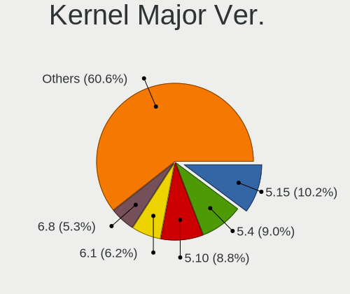

| Version | Computers | Percent |
|---------|-----------|---------|
| 5.4     | 174       | 14.68%  |
| 5.10    | 134       | 11.31%  |
| 5.15    | 121       | 10.21%  |
| 5.11    | 77        | 6.5%    |
| 5.13    | 68        | 5.74%   |
| 5.8     | 61        | 5.15%   |
| 4.15    | 59        | 4.98%   |
| 5.0     | 47        | 3.97%   |
| 4.18    | 47        | 3.97%   |
| 5.3     | 42        | 3.54%   |
| 5.16    | 42        | 3.54%   |
| 5.18    | 36        | 3.04%   |
| 4.19    | 36        | 3.04%   |
| 5.19    | 26        | 2.19%   |
| 5.17    | 25        | 2.11%   |
| 6.0     | 24        | 2.03%   |
| 5.14    | 24        | 2.03%   |
| 5.12    | 23        | 1.94%   |
| 5.9     | 20        | 1.69%   |
| 5.6     | 19        | 1.6%    |
| 5.7     | 12        | 1.01%   |
| 4.9     | 12        | 1.01%   |
| 3.10    | 12        | 1.01%   |
| 5.5     | 8         | 0.68%   |
| 4.1     | 8         | 0.68%   |
| 5.1     | 5         | 0.42%   |
| 4.14    | 4         | 0.34%   |
| 4.4     | 3         | 0.25%   |
| 4.13    | 3         | 0.25%   |
| 5.2     | 2         | 0.17%   |
| 4.20    | 2         | 0.17%   |
| 3.4     | 2         | 0.17%   |
| 4.6     | 1         | 0.08%   |
| 4.17    | 1         | 0.08%   |
| 4.12    | 1         | 0.08%   |
| 4.10    | 1         | 0.08%   |
| 2.6.16  | 1         | 0.08%   |
| 2.6     | 1         | 0.08%   |
| Unknown | 1         | 0.08%   |

Arch
----

OS architecture (x86_64, i586, etc.)

| Name    | Computers | Percent |
|---------|-----------|---------|
| x86_64  | 1043      | 94.22%  |
| aarch64 | 32        | 2.89%   |
| riscv64 | 8         | 0.72%   |
| i686    | 8         | 0.72%   |
| ppc64   | 6         | 0.54%   |
| armv7l  | 3         | 0.27%   |
| sh4a    | 1         | 0.09%   |
| ppc64le | 1         | 0.09%   |
| ppc     | 1         | 0.09%   |
| mips64  | 1         | 0.09%   |
| i586    | 1         | 0.09%   |
| armv8l  | 1         | 0.09%   |
| Unknown | 1         | 0.09%   |

DE
--

Desktop Environment

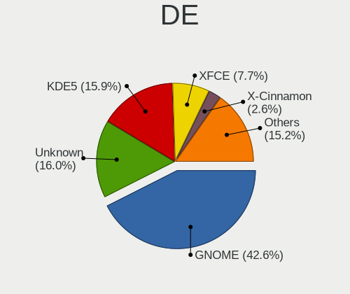

| Name            | Computers | Percent |
|-----------------|-----------|---------|
| GNOME           | 470       | 41.26%  |
| Unknown         | 214       | 18.79%  |
| KDE5            | 178       | 15.63%  |
| XFCE            | 76        | 6.67%   |
| KDE             | 35        | 3.07%   |
| X-Cinnamon      | 34        | 2.99%   |
| Deepin          | 30        | 2.63%   |
| MATE            | 16        | 1.4%    |
| i3              | 15        | 1.32%   |
| UKUI            | 11        | 0.97%   |
| Unity           | 10        | 0.88%   |
| Pantheon        | 8         | 0.7%    |
| LXDE            | 7         | 0.61%   |
| Cinnamon        | 7         | 0.61%   |
| KDE4            | 5         | 0.44%   |
| GNOME Flashback | 4         | 0.35%   |
| GNOME Classic   | 4         | 0.35%   |
| Budgie          | 4         | 0.35%   |
| sway            | 2         | 0.18%   |
| GNUstep         | 2         | 0.18%   |
| xmonad          | 1         | 0.09%   |
| qtile           | 1         | 0.09%   |
| Openbox         | 1         | 0.09%   |
| LXQt            | 1         | 0.09%   |
| Hyprland        | 1         | 0.09%   |
| bspwm           | 1         | 0.09%   |
| awesome         | 1         | 0.09%   |

Display Server
--------------

X11 or Wayland

| Name    | Computers | Percent |
|---------|-----------|---------|
| X11     | 801       | 70.7%   |
| Wayland | 155       | 13.68%  |
| Unknown | 108       | 9.53%   |
| Tty     | 69        | 6.09%   |

Display Manager
---------------

SDDM, LightDM, etc.

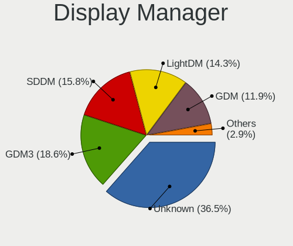

| Name    | Computers | Percent |
|---------|-----------|---------|
| Unknown | 512       | 45.31%  |
| GDM     | 165       | 14.6%   |
| SDDM    | 157       | 13.89%  |
| LightDM | 123       | 10.88%  |
| GDM3    | 121       | 10.71%  |
| TDM     | 43        | 3.81%   |
| KDM     | 4         | 0.35%   |
| XDM     | 2         | 0.18%   |
| LXDM    | 2         | 0.18%   |
| SLiM    | 1         | 0.09%   |

OS Lang
-------

Language

| Lang        | Computers | Percent |
|-------------|-----------|---------|
| zh_CN       | 485       | 43.03%  |
| en_US       | 393       | 34.87%  |
| Unknown     | 171       | 15.17%  |
| C           | 28        | 2.48%   |
| en_HK       | 13        | 1.15%   |
| en_GB       | 10        | 0.89%   |
| C.UTF8      | 5         | 0.44%   |
| mn_CN       | 4         | 0.35%   |
| en_AU       | 3         | 0.27%   |
| ja_JP       | 2         | 0.18%   |
| fr_FR       | 2         | 0.18%   |
| de_DE       | 2         | 0.18%   |
| th_TH       | 1         | 0.09%   |
| ru_RU       | 1         | 0.09%   |
| POSIX       | 1         | 0.09%   |
| en_ZA       | 1         | 0.09%   |
| en_US.UTF8  | 1         | 0.09%   |
| en_US.utf-8 | 1         | 0.09%   |
| en_US,UTF-8 | 1         | 0.09%   |
| en_SG       | 1         | 0.09%   |
| .en_US      | 1         | 0.09%   |

Boot Mode
---------

EFI or BIOS

| Mode | Computers | Percent |
|------|-----------|---------|
| EFI  | 724       | 64.59%  |
| BIOS | 397       | 35.41%  |

Filesystem
----------

Type of filesystem

| Type       | Computers | Percent |
|------------|-----------|---------|
| Ext4       | 882       | 78.61%  |
| Btrfs      | 96        | 8.56%   |
| Xfs        | 46        | 4.1%    |
| Overlay    | 46        | 4.1%    |
| Unknown    | 32        | 2.85%   |
| Zfs        | 10        | 0.89%   |
| F2fs       | 4         | 0.36%   |
| Rootfs     | 2         | 0.18%   |
| XXXXXXX    | 1         | 0.09%   |
| Tmpfs      | 1         | 0.09%   |
| Reiserfs   | 1         | 0.09%   |
| Fuse.sshfs | 1         | 0.09%   |

Part. scheme
------------

Scheme of partitioning

| Type    | Computers | Percent |
|---------|-----------|---------|
| GPT     | 556       | 49.73%  |
| Unknown | 467       | 41.77%  |
| MBR     | 95        | 8.5%    |

Dual Boot with Linux/BSD
------------------------

Hosting more than one Linux/BSD

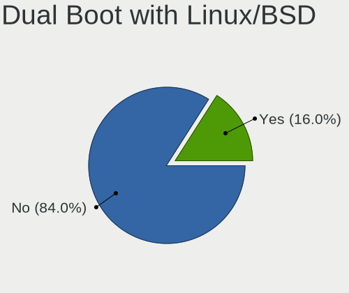

| Dual boot | Computers | Percent |
|-----------|-----------|---------|
| No        | 961       | 85.12%  |
| Yes       | 168       | 14.88%  |

Dual Boot (Win)
---------------

Hosting Linux and Windows

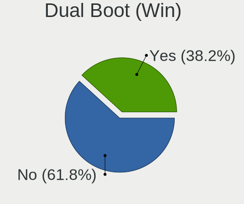

| Dual boot | Computers | Percent |
|-----------|-----------|---------|
| No        | 670       | 60.14%  |
| Yes       | 444       | 39.86%  |

Board
-----

Vendor
------

Motherboard manufacturer

| Name                           | Computers | Percent |
|--------------------------------|-----------|---------|
| Lenovo                         | 286       | 25.86%  |
| Dell                           | 120       | 10.85%  |
| ASUSTek Computer               | 107       | 9.67%   |
| Hewlett-Packard                | 84        | 7.59%   |
| HUAWEI                         | 50        | 4.52%   |
| Gigabyte Technology            | 46        | 4.16%   |
| MSI                            | 45        | 4.07%   |
| Unknown                        | 35        | 3.16%   |
| Timi                           | 33        | 2.98%   |
| Intel                          | 33        | 2.98%   |
| Acer                           | 29        | 2.62%   |
| ASRock                         | 13        | 1.18%   |
| HASEE Computer                 | 12        | 1.08%   |
| Apple                          | 11        | 0.99%   |
| Phytium                        | 10        | 0.9%    |
| MECHREVO                       | 9         | 0.81%   |
| Raspberry Pi Foundation        | 8         | 0.72%   |
| Sony                           | 7         | 0.63%   |
| Microsoft                      | 7         | 0.63%   |
| Toshiba                        | 6         | 0.54%   |
| Supermicro                     | 6         | 0.54%   |
| GPD                            | 6         | 0.54%   |
| Google                         | 6         | 0.54%   |
| AMI                            | 6         | 0.54%   |
| TSINGHUA TONGFANG COMPUTER     | 5         | 0.45%   |
| Huanan                         | 5         | 0.45%   |
| Shanghai Zhaoxin Semiconductor | 4         | 0.36%   |
| Samsung Electronics            | 4         | 0.36%   |
| OEM                            | 4         | 0.36%   |
| Notebook                       | 4         | 0.36%   |
| Intel Client Systems           | 4         | 0.36%   |
| GreatWall                      | 4         | 0.36%   |
| Fujitsu                        | 4         | 0.36%   |
| Colorful Technology            | 4         | 0.36%   |
| Valve                          | 3         | 0.27%   |
| Jumper                         | 3         | 0.27%   |
| Biostar                        | 3         | 0.27%   |
| AZW                            | 3         | 0.27%   |
| win element                    | 2         | 0.18%   |
| Terrans Force                  | 2         | 0.18%   |

Model
-----

Motherboard model

| Name                              | Computers | Percent |
|-----------------------------------|-----------|---------|
| Unknown                           | 49        | 4.43%   |
| ASUS All Series                   | 11        | 0.99%   |
| HUAWEI HLY-WX9XX                  | 8         | 0.72%   |
| Lenovo Legion R9000P2021H 82JQ    | 7         | 0.63%   |
| MSI MS-7B89                       | 6         | 0.54%   |
| TSINGHUA TONGFANG COMPUTER E500   | 5         | 0.45%   |
| Timi TM1701                       | 5         | 0.45%   |
| Phytium FT-2000/4                 | 5         | 0.45%   |
| Lenovo Legion R7000 2020 82B6     | 5         | 0.45%   |
| Timi RedmiBook Pro 15S            | 4         | 0.36%   |
| MSI MS-7C94                       | 4         | 0.36%   |
| Lenovo ThinkBook 15p Gen 2 21B1   | 4         | 0.36%   |
| HUAWEI NBLK-WAX9X                 | 4         | 0.36%   |
| HUAWEI BOHK-WAX9X                 | 4         | 0.36%   |
| Dell XPS 15 9570                  | 4         | 0.36%   |
| ASUS TUF Gaming B550M-PLUS        | 4         | 0.36%   |
| AMI Aptio CRB                     | 4         | 0.36%   |
| Valve Jupiter                     | 3         | 0.27%   |
| Timi TM1709                       | 3         | 0.27%   |
| Timi RedmiBook 14 II              | 3         | 0.27%   |
| Supermicro Super Server           | 3         | 0.27%   |
| Shanghai Zhaoxin ZXE CRB          | 3         | 0.27%   |
| RPi Raspberry Pi                  | 3         | 0.27%   |
| Phytium D2000                     | 3         | 0.27%   |
| Microsoft Surface Go              | 3         | 0.27%   |
| Lenovo ZHAOYANG K4e-ITL 82F8      | 3         | 0.27%   |
| Lenovo Yoga 14cACN 2021 82N7      | 3         | 0.27%   |
| Lenovo XiaoXinPro-13IML 2019 81XB | 3         | 0.27%   |
| Lenovo XiaoXinPro-13ARE 2020 82DM | 3         | 0.27%   |
| Lenovo XiaoXinAir-14ARE 2020 81YN | 3         | 0.27%   |
| Lenovo XiaoXin-15ARE 2020 81YR    | 3         | 0.27%   |
| Lenovo ThinkBook 14p Gen 2 20YN   | 3         | 0.27%   |
| Lenovo ThinkBook 14 G2 ITL 20VD   | 3         | 0.27%   |
| Lenovo Legion Y7000 81FW          | 3         | 0.27%   |
| Intel Client Systems LAPKC71F     | 3         | 0.27%   |
| HUAWEI KPRC-WX0                   | 3         | 0.27%   |
| HUAWEI KPR-WX9                    | 3         | 0.27%   |
| HUAWEI KPL-W0X                    | 3         | 0.27%   |
| HP ENVY Laptop 13-ad1xx           | 3         | 0.27%   |
| GreatWall TN140A2                 | 3         | 0.27%   |

Model Family
------------

Motherboard model prefix

| Name                            | Computers | Percent |
|---------------------------------|-----------|---------|
| Lenovo ThinkPad                 | 101       | 9.13%   |
| Unknown                         | 49        | 4.43%   |
| Lenovo Legion                   | 31        | 2.8%    |
| Dell Inspiron                   | 31        | 2.8%    |
| Lenovo ThinkBook                | 20        | 1.81%   |
| Dell Latitude                   | 19        | 1.72%   |
| Dell Precision                  | 16        | 1.45%   |
| ASUS TUF                        | 16        | 1.45%   |
| HP ZHAN                         | 15        | 1.36%   |
| HP EliteBook                    | 15        | 1.36%   |
| Dell OptiPlex                   | 15        | 1.36%   |
| ASUS PRIME                      | 15        | 1.36%   |
| Dell XPS                        | 14        | 1.27%   |
| Acer Aspire                     | 14        | 1.27%   |
| Lenovo ZHAOYANG                 | 12        | 1.08%   |
| Lenovo IdeaPad                  | 12        | 1.08%   |
| Lenovo Yoga                     | 11        | 0.99%   |
| Lenovo ThinkCentre              | 11        | 0.99%   |
| HP OMEN                         | 11        | 0.99%   |
| ASUS ROG                        | 11        | 0.99%   |
| ASUS All                        | 11        | 0.99%   |
| Dell PowerEdge                  | 10        | 0.9%    |
| Acer Swift                      | 9         | 0.81%   |
| Timi RedmiBook                  | 8         | 0.72%   |
| RPi Raspberry                   | 8         | 0.72%   |
| Lenovo ThinkStation             | 8         | 0.72%   |
| HUAWEI HLY-WX9XX                | 8         | 0.72%   |
| Microsoft Surface               | 7         | 0.63%   |
| HP ProBook                      | 7         | 0.63%   |
| HP ENVY                         | 7         | 0.63%   |
| Dell Vostro                     | 7         | 0.63%   |
| MSI MS-7B89                     | 6         | 0.54%   |
| TSINGHUA TONGFANG COMPUTER E500 | 5         | 0.45%   |
| Timi TM1701                     | 5         | 0.45%   |
| Phytium FT-2000                 | 5         | 0.45%   |
| Lenovo XiaoXinPro               | 5         | 0.45%   |
| Lenovo XiaoXin                  | 5         | 0.45%   |
| Acer Nitro                      | 5         | 0.45%   |
| Toshiba Satellite               | 4         | 0.36%   |
| MSI MS-7C94                     | 4         | 0.36%   |

MFG Year
--------

Motherboard manufacture year

| Year    | Computers | Percent |
|---------|-----------|---------|
| 2020    | 155       | 14.01%  |
| 2021    | 142       | 12.84%  |
| 2019    | 139       | 12.57%  |
| 2018    | 131       | 11.84%  |
| 2017    | 84        | 7.59%   |
| 2015    | 67        | 6.06%   |
| 2022    | 57        | 5.15%   |
| 2012    | 54        | 4.88%   |
| 2013    | 52        | 4.7%    |
| 2016    | 51        | 4.61%   |
| 2014    | 50        | 4.52%   |
| 2011    | 39        | 3.53%   |
| Unknown | 35        | 3.16%   |
| 2009    | 15        | 1.36%   |
| 2010    | 14        | 1.27%   |
| 2008    | 12        | 1.08%   |
| 2007    | 7         | 0.63%   |
| 2006    | 2         | 0.18%   |

Form Factor
-----------

Physical design of the computer

| Name           | Computers | Percent |
|----------------|-----------|---------|
| Notebook       | 642       | 58.05%  |
| Desktop        | 330       | 29.84%  |
| Server         | 42        | 3.8%    |
| Mini pc        | 30        | 2.71%   |
| Tablet         | 21        | 1.9%    |
| Convertible    | 17        | 1.54%   |
| System on chip | 13        | 1.18%   |
| All in one     | 5         | 0.45%   |
| Other          | 3         | 0.27%   |
| Phone          | 3         | 0.27%   |

Secure Boot
-----------

Enabled or disabled

| State    | Computers | Percent |
|----------|-----------|---------|
| Disabled | 1020      | 91.64%  |
| Enabled  | 93        | 8.36%   |

Coreboot
--------

Have coreboot on board

| Used | Computers | Percent |
|------|-----------|---------|
| No   | 1100      | 99.46%  |
| Yes  | 6         | 0.54%   |

RAM Size
--------

Total RAM memory

| Size in GB      | Computers | Percent |
|-----------------|-----------|---------|
| 16.01-24.0      | 270       | 24.17%  |
| 8.01-16.0       | 245       | 21.93%  |
| 4.01-8.0        | 241       | 21.58%  |
| 32.01-64.0      | 117       | 10.47%  |
| 3.01-4.0        | 113       | 10.12%  |
| 64.01-256.0     | 50        | 4.48%   |
| 24.01-32.0      | 28        | 2.51%   |
| 1.01-2.0        | 21        | 1.88%   |
| Unknown         | 12        | 1.07%   |
| 0.51-1.0        | 10        | 0.9%    |
| More than 256.0 | 6         | 0.54%   |
| 0.01-0.5        | 2         | 0.18%   |
| 2.01-3.0        | 1         | 0.09%   |
| 0               | 1         | 0.09%   |

RAM Used
--------

Used RAM memory

| Used GB     | Computers | Percent |
|-------------|-----------|---------|
| 1.01-2.0    | 333       | 27.77%  |
| 2.01-3.0    | 299       | 24.94%  |
| 4.01-8.0    | 200       | 16.68%  |
| 3.01-4.0    | 170       | 14.18%  |
| 0.51-1.0    | 73        | 6.09%   |
| 8.01-16.0   | 53        | 4.42%   |
| 0.01-0.5    | 30        | 2.5%    |
| Unknown     | 18        | 1.5%    |
| 16.01-24.0  | 13        | 1.08%   |
| 32.01-64.0  | 5         | 0.42%   |
| 24.01-32.0  | 3         | 0.25%   |
| 64.01-256.0 | 2         | 0.17%   |

Total Drives
------------

Number of drives on board

| Drives  | Computers | Percent |
|---------|-----------|---------|
| 1       | 618       | 55.08%  |
| 2       | 347       | 30.93%  |
| 3       | 86        | 7.66%   |
| 4       | 32        | 2.85%   |
| 5       | 14        | 1.25%   |
| 0       | 10        | 0.89%   |
| 6       | 4         | 0.36%   |
| 10      | 3         | 0.27%   |
| 9       | 3         | 0.27%   |
| 46      | 1         | 0.09%   |
| 36      | 1         | 0.09%   |
| 32      | 1         | 0.09%   |
| 11      | 1         | 0.09%   |
| Unknown | 1         | 0.09%   |

Has CD-ROM
----------

Has CD-ROM on board

| Presented | Computers | Percent |
|-----------|-----------|---------|
| No        | 957       | 86.22%  |
| Yes       | 153       | 13.78%  |

Has Ethernet
------------

Has Ethernet on board

| Presented | Computers | Percent |
|-----------|-----------|---------|
| Yes       | 873       | 78.51%  |
| No        | 239       | 21.49%  |

Has WiFi
--------

Has WiFi module

| Presented | Computers | Percent |
|-----------|-----------|---------|
| Yes       | 859       | 77.39%  |
| No        | 251       | 22.61%  |

Has Bluetooth
-------------

Has Bluetooth module

| Presented | Computers | Percent |
|-----------|-----------|---------|
| Yes       | 721       | 64.55%  |
| No        | 396       | 35.45%  |

Location
--------

Country
-------

Geographic location (country)

| Country | Computers | Percent |
|---------|-----------|---------|
| China   | 1106      | 100%    |

City
----

Geographic location (city)

| City             | Computers | Percent |
|------------------|-----------|---------|
| Beijing          | 213       | 18.22%  |
| Shenzhen         | 96        | 8.21%   |
| Shanghai         | 91        | 7.78%   |
| Guangzhou        | 82        | 7.01%   |
| Hangzhou         | 41        | 3.51%   |
| Chengdu          | 41        | 3.51%   |
| Wuhan            | 31        | 2.65%   |
| Nanjing          | 25        | 2.14%   |
| Xi'an            | 20        | 1.71%   |
| Xuhui            | 18        | 1.54%   |
| Tianjin          | 17        | 1.45%   |
| Chongqing        | 16        | 1.37%   |
| Zhengzhou        | 15        | 1.28%   |
| Haidian          | 13        | 1.11%   |
| Dongguan         | 13        | 1.11%   |
| Suzhou           | 12        | 1.03%   |
| Qingdao          | 12        | 1.03%   |
| Huangpu          | 12        | 1.03%   |
| Hefei            | 12        | 1.03%   |
| Changsha         | 11        | 0.94%   |
| Nanning          | 10        | 0.86%   |
| Kunming          | 10        | 0.86%   |
| Jinan            | 10        | 0.86%   |
| Foshan           | 10        | 0.86%   |
| Dalian           | 10        | 0.86%   |
| Shenyang         | 9         | 0.77%   |
| Nanhao           | 9         | 0.77%   |
| Putuo            | 8         | 0.68%   |
| Jinrongjie       | 8         | 0.68%   |
| Fuzhou           | 8         | 0.68%   |
| Xiamen           | 7         | 0.6%    |
| Hohhot           | 7         | 0.6%    |
| Guiyang          | 7         | 0.6%    |
| Xicheng District | 6         | 0.51%   |
| Pudong           | 6         | 0.51%   |
| Hongkou          | 6         | 0.51%   |
| Changchun        | 6         | 0.51%   |
| Xining           | 5         | 0.43%   |
| Jiangmen         | 5         | 0.43%   |
| Zhenjiang        | 4         | 0.34%   |

Drives
------

Drive Vendor
------------

Hard drive vendors

| Vendor                      | Computers | Drives | Percent |
|-----------------------------|-----------|--------|---------|
| Samsung Electronics         | 290       | 372    | 17.35%  |
| WDC                         | 219       | 284    | 13.11%  |
| Seagate                     | 204       | 350    | 12.21%  |
| Toshiba                     | 107       | 150    | 6.4%    |
| SanDisk                     | 81        | 93     | 4.85%   |
| Unknown                     | 76        | 104    | 4.55%   |
| Intel                       | 55        | 79     | 3.29%   |
| SK hynix                    | 54        | 65     | 3.23%   |
| Kingston                    | 48        | 57     | 2.87%   |
| HGST                        | 36        | 61     | 2.15%   |
| Micron Technology           | 32        | 34     | 1.92%   |
| Plextor                     | 26        | 30     | 1.56%   |
| Silicon Motion              | 25        | 32     | 1.5%    |
| Hitachi                     | 19        | 29     | 1.14%   |
| Crucial                     | 19        | 23     | 1.14%   |
| Lenovo                      | 18        | 26     | 1.08%   |
| LITEON                      | 17        | 21     | 1.02%   |
| Unknown                     | 15        | 18     | 0.9%    |
| A-DATA Technology           | 14        | 18     | 0.84%   |
| Phison                      | 13        | 17     | 0.78%   |
| FORESEE                     | 12        | 15     | 0.72%   |
| Hewlett-Packard             | 11        | 13     | 0.66%   |
| KIOXIA                      | 10        | 13     | 0.6%    |
| JMicron Technology          | 10        | 8      | 0.6%    |
| GALAX                       | 10        | 10     | 0.6%    |
| Colorful                    | 10        | 12     | 0.6%    |
| Netac                       | 9         | 10     | 0.54%   |
| Hikvision                   | 9         | 10     | 0.54%   |
| China                       | 9         | 17     | 0.54%   |
| Teclast                     | 8         | 8      | 0.48%   |
| GLOWAY                      | 8         | 10     | 0.48%   |
| Apple                       | 8         | 8      | 0.48%   |
| ZHITAI                      | 7         | 7      | 0.42%   |
| KIOXIA-EXCERIA              | 7         | 10     | 0.42%   |
| Yangtze Memory Technologies | 6         | 6      | 0.36%   |
| Transcend                   | 6         | 7      | 0.36%   |
| Lite-On                     | 6         | 8      | 0.36%   |
| Fujitsu                     | 6         | 6      | 0.36%   |
| Pear 2TB                    | 5         | 5      | 0.3%    |
| KINGBANK                    | 5         | 8      | 0.3%    |

Drive Model
-----------

Hard drive models

| Model                                               | Computers | Percent |
|-----------------------------------------------------|-----------|---------|
| Samsung NVMe SSD Drive 512GB                        | 23        | 1.27%   |
| WDC WD10EZEX-08WN4A0 1TB                            | 18        | 0.99%   |
| Seagate ST1000LM035-1RK172 1TB                      | 17        | 0.94%   |
| SanDisk NVMe SSD Drive 512GB                        | 16        | 0.88%   |
| HGST HTS721010A9E630 1TB                            | 15        | 0.83%   |
| Unknown                                             | 15        | 0.83%   |
| Samsung MZVLB512HBJQ-000L2 512GB                    | 14        | 0.77%   |
| Seagate ST1000LM048-2E7172 1TB                      | 12        | 0.66%   |
| Seagate ST1000DM010-2EP102 1TB                      | 12        | 0.66%   |
| Seagate ST1000DM003-1SB102 1TB                      | 12        | 0.66%   |
| Samsung SSD 860 EVO 500GB                           | 12        | 0.66%   |
| Samsung SM963 2.5" NVMe PCIe SSD 256GB              | 12        | 0.66%   |
| Samsung NVMe SSD Drive 1024GB                       | 12        | 0.66%   |
| SanDisk NVMe SSD Drive 1TB                          | 11        | 0.61%   |
| WDC WDS100T2B0C-00PXH0 1TB                          | 10        | 0.55%   |
| SK hynix NVMe SSD Drive 512GB                       | 10        | 0.55%   |
| Seagate ST500LT012-1DG142 500GB                     | 10        | 0.55%   |
| Seagate ST500DM002-1BD142 500GB                     | 9         | 0.5%    |
| Unknown MMC Card  64GB                              | 8         | 0.44%   |
| Toshiba NVMe SSD Drive 128GB                        | 8         | 0.44%   |
| Seagate ST2000LM007-1R8174 2TB                      | 8         | 0.44%   |
| Samsung MZVLB512HBJQ-000L7 512GB                    | 8         | 0.44%   |
| Samsung MZVLB512HAJQ-00000 512GB                    | 8         | 0.44%   |
| Plextor PX-128M6S 128GB SSD                         | 8         | 0.44%   |
| Toshiba MQ01ABD100 1TB                              | 7         | 0.39%   |
| Seagate ST500LM021-1KJ152 500GB                     | 7         | 0.39%   |
| Samsung SSD 980 1TB                                 | 7         | 0.39%   |
| Samsung NVMe SSD Drive 1TB                          | 7         | 0.39%   |
| Samsung NVMe SSD Drive 128GB                        | 7         | 0.39%   |
| Samsung NVMe SSD Controller SM981/PM981/PM983 500GB | 7         | 0.39%   |
| Samsung NVMe SSD Controller PM9A1/PM9A3/980PRO 2TB  | 7         | 0.39%   |
| WDC WD10EZEX-08M2NA0 1TB                            | 6         | 0.33%   |
| WDC PC SN730 SDBPNTY-512G-1101 512GB                | 6         | 0.33%   |
| Unknown MMC Card  32GB                              | 6         | 0.33%   |
| Unknown MMC Card  128GB                             | 6         | 0.33%   |
| Toshiba DT01ACA200 2TB                              | 6         | 0.33%   |
| SK hynix SKHynix_HFS512GDE9X084N 512GB              | 6         | 0.33%   |
| Seagate ST3500418AS 500GB                           | 6         | 0.33%   |
| Seagate ST1000LM024 HN-M101MBB 1TB                  | 6         | 0.33%   |
| Samsung SSD 860 EVO 250GB                           | 6         | 0.33%   |

HDD Vendor
----------

Hard disk drive vendors

| Vendor              | Computers | Drives | Percent |
|---------------------|-----------|--------|---------|
| Seagate             | 202       | 347    | 41.65%  |
| WDC                 | 153       | 195    | 31.55%  |
| Toshiba             | 46        | 77     | 9.48%   |
| HGST                | 36        | 61     | 7.42%   |
| Hitachi             | 19        | 29     | 3.92%   |
| Samsung Electronics | 9         | 10     | 1.86%   |
| Fujitsu             | 6         | 6      | 1.24%   |
| Pear 2TB            | 5         | 5      | 1.03%   |
| ASMT                | 2         | 2      | 0.41%   |
| ACASIS              | 2         | 2      | 0.41%   |
| LIO-ORG             | 1         | 9      | 0.21%   |
| IBM H0              | 1         | 1      | 0.21%   |
| HGST HTS            | 1         | 1      | 0.21%   |
| Hewlett-Packard     | 1         | 1      | 0.21%   |
| Unknown             | 1         | 2      | 0.21%   |

SSD Vendor
----------

Solid state drive vendors

| Vendor              | Computers | Drives | Percent |
|---------------------|-----------|--------|---------|
| Samsung Electronics | 95        | 126    | 20.21%  |
| Kingston            | 32        | 39     | 6.81%   |
| SanDisk             | 27        | 30     | 5.74%   |
| Toshiba             | 26        | 30     | 5.53%   |
| Plextor             | 23        | 26     | 4.89%   |
| Intel               | 21        | 28     | 4.47%   |
| LITEON              | 16        | 20     | 3.4%    |
| WDC                 | 15        | 17     | 3.19%   |
| Crucial             | 14        | 18     | 2.98%   |
| Lenovo              | 12        | 15     | 2.55%   |
| A-DATA Technology   | 12        | 16     | 2.55%   |
| Micron Technology   | 11        | 12     | 2.34%   |
| GALAX               | 10        | 10     | 2.13%   |
| China               | 9         | 17     | 1.91%   |
| Teclast             | 8         | 8      | 1.7%    |
| Netac               | 8         | 9      | 1.7%    |
| FORESEE             | 7         | 8      | 1.49%   |
| SK hynix            | 6         | 6      | 1.28%   |
| JMicron Technology  | 6         | 6      | 1.28%   |
| GLOWAY              | 6         | 8      | 1.28%   |
| Unknown             | 6         | 8      | 1.28%   |
| Unknown             | 5         | 6      | 1.06%   |
| Transcend           | 5         | 6      | 1.06%   |
| Colorful            | 5         | 5      | 1.06%   |
| Apple               | 4         | 4      | 0.85%   |
| ZHITAI              | 3         | 3      | 0.64%   |
| LITEONIT            | 3         | 3      | 0.64%   |
| Lexar               | 3         | 3      | 0.64%   |
| Kingchuxing         | 3         | 3      | 0.64%   |
| Hewlett-Packard     | 3         | 5      | 0.64%   |
| Vaseky              | 2         | 2      | 0.43%   |
| UNIC2               | 2         | 2      | 0.43%   |
| TO Exter            | 2         | 2      | 0.43%   |
| tigo                | 2         | 2      | 0.43%   |
| Q200                | 2         | 5      | 0.43%   |
| Phison              | 2         | 3      | 0.43%   |
| Pear                | 2         | 4      | 0.43%   |
| OCZ                 | 2         | 2      | 0.43%   |
| KIOXIA-EXCERIA      | 2         | 2      | 0.43%   |
| KingShare           | 2         | 2      | 0.43%   |

Drive Kind
----------

HDD or SSD

| Kind    | Computers | Drives | Percent |
|---------|-----------|--------|---------|
| NVMe    | 550       | 748    | 36.69%  |
| HDD     | 418       | 748    | 27.89%  |
| SSD     | 408       | 599    | 27.22%  |
| MMC     | 69        | 91     | 4.6%    |
| Unknown | 54        | 65     | 3.6%    |

Drive Connector
---------------

SATA, SAS, NVMe, etc.

| Type | Computers | Drives | Percent |
|------|-----------|--------|---------|
| SATA | 658       | 1312   | 48.49%  |
| NVMe | 549       | 740    | 40.46%  |
| SAS  | 81        | 108    | 5.97%   |
| MMC  | 69        | 91     | 5.08%   |

Drive Size
----------

Size of hard drive

| Size in TB | Computers | Drives | Percent |
|------------|-----------|--------|---------|
| 0.01-0.5   | 449       | 713    | 53.14%  |
| 0.51-1.0   | 263       | 325    | 31.12%  |
| 1.01-2.0   | 68        | 96     | 8.05%   |
| 3.01-4.0   | 20        | 31     | 2.37%   |
| 4.01-10.0  | 19        | 135    | 2.25%   |
| 2.01-3.0   | 16        | 30     | 1.89%   |
| 10.01-20.0 | 10        | 17     | 1.18%   |

Space Total
-----------

Amount of disk space available on the file system

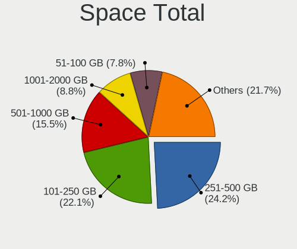

| Size in GB     | Computers | Percent |
|----------------|-----------|---------|
| 251-500        | 279       | 24.24%  |
| 101-250        | 277       | 24.07%  |
| 501-1000       | 169       | 14.68%  |
| 51-100         | 100       | 8.69%   |
| 1001-2000      | 93        | 8.08%   |
| 1-20           | 64        | 5.56%   |
| More than 3000 | 57        | 4.95%   |
| 21-50          | 49        | 4.26%   |
| 2001-3000      | 33        | 2.87%   |
| Unknown        | 30        | 2.61%   |

Space Used
----------

Amount of used disk space

| Used GB        | Computers | Percent |
|----------------|-----------|---------|
| 1-20           | 463       | 39.2%   |
| 21-50          | 184       | 15.58%  |
| 101-250        | 156       | 13.21%  |
| 51-100         | 130       | 11.01%  |
| 251-500        | 99        | 8.38%   |
| 501-1000       | 55        | 4.66%   |
| 1001-2000      | 33        | 2.79%   |
| Unknown        | 30        | 2.54%   |
| More than 3000 | 18        | 1.52%   |
| 2001-3000      | 13        | 1.1%    |

Malfunc. Drives
---------------

Drive models with a malfunction

| Model                                        | Computers | Drives | Percent |
|----------------------------------------------|-----------|--------|---------|
| Toshiba MQ04ABF100 1TB                       | 2         | 2      | 3.28%   |
| Seagate ST500LT012-1DG142 500GB              | 2         | 2      | 3.28%   |
| Seagate ST1000LM048-2E7172 1TB               | 2         | 2      | 3.28%   |
| Seagate ST1000LM024 HN-M101MBB 1TB           | 2         | 2      | 3.28%   |
| Crucial CT240M500SSD1 240GB                  | 2         | 2      | 3.28%   |
| WDC WDS240G2G0B-00EPW0 240GB SSD             | 1         | 1      | 1.64%   |
| WDC WD5003ABYZ-011FA0 500GB                  | 1         | 1      | 1.64%   |
| WDC WD5000AAKX-08ERMA0 500GB                 | 1         | 1      | 1.64%   |
| WDC WD5000AAKX-00PWEA0 500GB                 | 1         | 1      | 1.64%   |
| WDC WD5000AAKX-00ERMA0 500GB                 | 1         | 1      | 1.64%   |
| WDC WD5000AAKX-0 500GB                       | 1         | 1      | 1.64%   |
| WDC WD20EARX-00PASB0 2TB                     | 1         | 1      | 1.64%   |
| WDC WD10SPZX-60Z10T0 1TB                     | 1         | 1      | 1.64%   |
| WDC WD10JPVX-22JC3T0 1TB                     | 1         | 1      | 1.64%   |
| WDC WD10EZEX-00BN5A0 1TB                     | 1         | 1      | 1.64%   |
| Toshiba MQ01ABF050 500GB                     | 1         | 1      | 1.64%   |
| Toshiba MK3259GSXP 320GB                     | 1         | 1      | 1.64%   |
| Toshiba MK2555GSX 250GB                      | 1         | 1      | 1.64%   |
| Toshiba DT01ACA300 3TB                       | 1         | 1      | 1.64%   |
| Toshiba DT01ACA100 1TB                       | 1         | 1      | 1.64%   |
| Seagate ST980811AS 80GB                      | 1         | 1      | 1.64%   |
| Seagate ST750LM028-1KK162 752GB              | 1         | 1      | 1.64%   |
| Seagate ST750LM022 HN-M750MBB 752GB          | 1         | 1      | 1.64%   |
| Seagate ST500LT012-9WS142 500GB              | 1         | 2      | 1.64%   |
| Seagate ST500LM021-1KJ152 500GB              | 1         | 1      | 1.64%   |
| Seagate ST500DM009-2DM14C 500GB              | 1         | 1      | 1.64%   |
| Seagate ST500DM002-1BD142 500GB              | 1         | 1      | 1.64%   |
| Seagate ST5000AS0011-1L5178 5TB              | 1         | 1      | 1.64%   |
| Seagate ST31000524AS 1TB                     | 1         | 1      | 1.64%   |
| SanDisk SSD U100 128GB                       | 1         | 1      | 1.64%   |
| SanDisk SD9SN8W-256G-1006 256GB SSD          | 1         | 1      | 1.64%   |
| Samsung Electronics SSD 970 EVO 500GB        | 1         | 1      | 1.64%   |
| Samsung Electronics SSD 870 EVO 2TB          | 1         | 8      | 1.64%   |
| Samsung Electronics MZVLW512HMJP-00000 512GB | 1         | 1      | 1.64%   |
| Plextor PX-256M6S 256GB SSD                  | 1         | 1      | 1.64%   |
| Plextor PX-128M6S 128GB SSD                  | 1         | 1      | 1.64%   |
| Netac SSD 120GB                              | 1         | 1      | 1.64%   |
| Lenovo SSD SL700 120G                        | 1         | 1      | 1.64%   |
| Intel SSDSC2KW256G8 256GB                    | 1         | 1      | 1.64%   |
| Intel SSDSC2KW240H6 240GB                    | 1         | 1      | 1.64%   |

Malfunc. Drive Vendor
---------------------

Vendors of faulty drives

| Vendor              | Computers | Drives | Percent |
|---------------------|-----------|--------|---------|
| Seagate             | 14        | 16     | 23.33%  |
| WDC                 | 10        | 10     | 16.67%  |
| Toshiba             | 7         | 7      | 11.67%  |
| Intel               | 4         | 4      | 6.67%   |
| Hitachi             | 4         | 4      | 6.67%   |
| Samsung Electronics | 3         | 10     | 5%      |
| Crucial             | 3         | 3      | 5%      |
| SanDisk             | 2         | 2      | 3.33%   |
| Plextor             | 2         | 2      | 3.33%   |
| HGST                | 2         | 2      | 3.33%   |
| GLOWAY              | 2         | 4      | 3.33%   |
| Fujitsu             | 2         | 2      | 3.33%   |
| A-DATA Technology   | 2         | 3      | 3.33%   |
| Netac               | 1         | 1      | 1.67%   |
| Lenovo              | 1         | 1      | 1.67%   |
| Colorful            | 1         | 1      | 1.67%   |

Malfunc. HDD Vendor
-------------------

Vendors of faulty HDD drives

| Vendor  | Computers | Drives | Percent |
|---------|-----------|--------|---------|
| Seagate | 14        | 16     | 36.84%  |
| WDC     | 9         | 9      | 23.68%  |
| Toshiba | 7         | 7      | 18.42%  |
| Hitachi | 4         | 4      | 10.53%  |
| HGST    | 2         | 2      | 5.26%   |
| Fujitsu | 2         | 2      | 5.26%   |

Malfunc. Drive Kind
-------------------

Kinds of faulty drives

| Kind | Computers | Drives | Percent |
|------|-----------|--------|---------|
| HDD  | 37        | 40     | 64.91%  |
| SSD  | 17        | 29     | 29.82%  |
| NVMe | 3         | 3      | 5.26%   |

Failed Drives
-------------

Failed drive models

| Model                             | Computers | Drives | Percent |
|-----------------------------------|-----------|--------|---------|
| Seagate ST31500341AS 1TB          | 1         | 1      | 16.67%  |
| Samsung Electronics HS06THB 64GB  | 1         | 1      | 16.67%  |
| Samsung Electronics HM160HI 160GB | 1         | 1      | 16.67%  |
| Phison ESO128GTLC9-E8C-2 128GB    | 1         | 1      | 16.67%  |
| HGST HUH728080ALN600 8TB          | 1         | 1      | 16.67%  |
| Hewlett-Packard SSD S700 500GB    | 1         | 2      | 16.67%  |

Failed Drive Vendor
-------------------

Failed drive vendors

| Vendor              | Computers | Drives | Percent |
|---------------------|-----------|--------|---------|
| Samsung Electronics | 2         | 2      | 33.33%  |
| Seagate             | 1         | 1      | 16.67%  |
| Phison              | 1         | 1      | 16.67%  |
| HGST                | 1         | 1      | 16.67%  |
| Hewlett-Packard     | 1         | 2      | 16.67%  |

Drive Status
------------

Number of failed and malfunc. drives

| Status   | Computers | Drives | Percent |
|----------|-----------|--------|---------|
| Detected | 585       | 1097   | 49.33%  |
| Works    | 541       | 1075   | 45.62%  |
| Malfunc  | 54        | 72     | 4.55%   |
| Failed   | 6         | 7      | 0.51%   |

Storage controller
------------------

Storage Vendor
--------------

Storage controller vendors

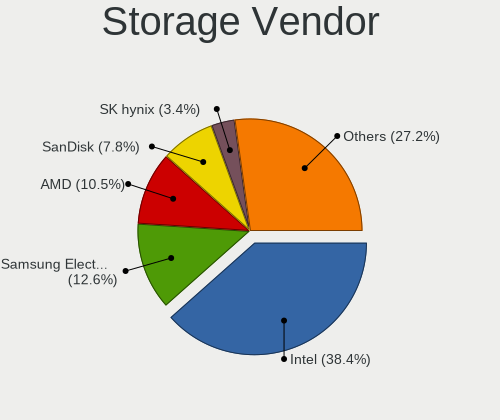

| Vendor                           | Computers | Percent |
|----------------------------------|-----------|---------|
| Intel                            | 655       | 44.47%  |
| Samsung Electronics              | 198       | 13.44%  |
| AMD                              | 164       | 11.13%  |
| SanDisk                          | 108       | 7.33%   |
| SK hynix                         | 48        | 3.26%   |
| Silicon Motion                   | 40        | 2.72%   |
| Toshiba America Info Systems     | 38        | 2.58%   |
| Phison Electronics               | 22        | 1.49%   |
| Micron Technology                | 21        | 1.43%   |
| Marvell Technology Group         | 19        | 1.29%   |
| Kingston Technology Company      | 18        | 1.22%   |
| KIOXIA                           | 17        | 1.15%   |
| ASMedia Technology               | 13        | 0.88%   |
| Yangtze Memory Technologies      | 9         | 0.61%   |
| LSI Logic / Symbios Logic        | 9         | 0.61%   |
| Broadcom / LSI                   | 9         | 0.61%   |
| Lite-On Technology               | 7         | 0.48%   |
| Shenzhen Longsys Electronics     | 6         | 0.41%   |
| Zhaoxin                          | 5         | 0.34%   |
| Solid State Storage Technology   | 5         | 0.34%   |
| Micron/Crucial Technology        | 5         | 0.34%   |
| MAXIO Technology (Hangzhou)      | 5         | 0.34%   |
| JMicron Technology               | 5         | 0.34%   |
| Biwin Storage Technology         | 5         | 0.34%   |
| ADATA Technology                 | 5         | 0.34%   |
| Union Memory (Shenzhen)          | 4         | 0.27%   |
| IBM                              | 4         | 0.27%   |
| Huawei Technologies              | 4         | 0.27%   |
| Apple                            | 4         | 0.27%   |
| Silicon Integrated Systems [SiS] | 3         | 0.2%    |
| Silicon Image                    | 2         | 0.14%   |
| Phytium Technology               | 2         | 0.14%   |
| Mylex                            | 2         | 0.14%   |
| Hefei DATANG Storage Technology  | 2         | 0.14%   |
| Beijing Starblaze Technology     | 2         | 0.14%   |
| Shenzhen Shichuangyi Electronics | 1         | 0.07%   |
| Seagate Technology               | 1         | 0.07%   |
| Realtek Semiconductor            | 1         | 0.07%   |
| Nvidia                           | 1         | 0.07%   |
| Loongson Technology              | 1         | 0.07%   |

Storage Model
-------------

Storage controller models

| Model                                                                          | Computers | Percent |
|--------------------------------------------------------------------------------|-----------|---------|
| AMD FCH SATA Controller [AHCI mode]                                            | 128       | 7.88%   |
| Samsung NVMe SSD Controller SM981/PM981/PM983                                  | 112       | 6.89%   |
| Intel Sunrise Point-LP SATA Controller [AHCI mode]                             | 66        | 4.06%   |
| Intel 8 Series/C220 Series Chipset Family 6-port SATA Controller 1 [AHCI mode] | 49        | 3.02%   |
| Intel 7 Series Chipset Family 6-port SATA Controller [AHCI mode]               | 37        | 2.28%   |
| Intel 200 Series PCH SATA controller [AHCI mode]                               | 34        | 2.09%   |
| Samsung NVMe SSD Controller SM961/PM961/SM963                                  | 33        | 2.03%   |
| SanDisk WD Black SN750 / PC SN730 NVMe SSD                                     | 29        | 1.78%   |
| AMD 400 Series Chipset SATA Controller                                         | 28        | 1.72%   |
| Silicon Motion SM2263EN/SM2263XT SSD Controller                                | 27        | 1.66%   |
| Intel 8 Series SATA Controller 1 [AHCI mode]                                   | 27        | 1.66%   |
| SK hynix Gold P31/PC711 NVMe Solid State Drive                                 | 26        | 1.6%    |
| SanDisk WD Blue SN550 NVMe SSD                                                 | 26        | 1.6%    |
| Intel Volume Management Device NVMe RAID Controller                            | 26        | 1.6%    |
| Intel Cannon Lake Mobile PCH SATA AHCI Controller                              | 25        | 1.54%   |
| Samsung NVMe SSD Controller PM9A1/PM9A3/980PRO                                 | 24        | 1.48%   |
| Samsung NVMe SSD Controller 980                                                | 24        | 1.48%   |
| Intel HM170/QM170 Chipset SATA Controller [AHCI Mode]                          | 23        | 1.42%   |
| Intel 6 Series/C200 Series Chipset Family 6 port Mobile SATA AHCI Controller   | 23        | 1.42%   |
| Intel Q170/Q150/B150/H170/H110/Z170/CM236 Chipset SATA Controller [AHCI Mode]  | 22        | 1.35%   |
| Micron Non-Volatile memory controller                                          | 21        | 1.29%   |
| Intel Cannon Lake PCH SATA AHCI Controller                                     | 20        | 1.23%   |
| Intel 82801 Mobile SATA Controller [RAID mode]                                 | 20        | 1.23%   |
| Intel 400 Series Chipset Family SATA AHCI Controller                           | 20        | 1.23%   |
| SanDisk WD Black 2018/SN750 / PC SN720 NVMe SSD                                | 19        | 1.17%   |
| SanDisk Non-Volatile memory controller                                         | 19        | 1.17%   |
| Intel Comet Lake SATA AHCI Controller                                          | 19        | 1.17%   |
| Intel Wildcat Point-LP SATA Controller [AHCI Mode]                             | 17        | 1.05%   |
| Toshiba America Info Systems XG6 NVMe SSD Controller                           | 15        | 0.92%   |
| Intel 500 Series Chipset Family SATA AHCI Controller                           | 15        | 0.92%   |
| AMD 500 Series Chipset SATA Controller                                         | 15        | 0.92%   |
| Silicon Motion SM2262/SM2262EN SSD Controller                                  | 13        | 0.8%    |
| Intel SSD Pro 7600p/760p/E 6100p Series                                        | 13        | 0.8%    |
| Toshiba America Info Systems BG3 NVMe SSD Controller                           | 12        | 0.74%   |
| Intel NM10/ICH7 Family SATA Controller [IDE mode]                              | 12        | 0.74%   |
| SK hynix Non-Volatile memory controller                                        | 11        | 0.68%   |
| Intel SATA Controller [RAID mode]                                              | 11        | 0.68%   |
| Intel Cannon Point-LP SATA Controller [AHCI Mode]                              | 11        | 0.68%   |
| Intel 7 Series/C210 Series Chipset Family 6-port SATA Controller [AHCI mode]   | 11        | 0.68%   |
| Intel 6 Series/C200 Series Chipset Family 6 port Desktop SATA AHCI Controller  | 11        | 0.68%   |

Storage Kind
------------

Kind of storage controller (IDE, SATA, NVMe, SAS, ...)

| Kind | Computers | Percent |
|------|-----------|---------|
| SATA | 740       | 50.41%  |
| NVMe | 553       | 37.67%  |
| RAID | 90        | 6.13%   |
| IDE  | 73        | 4.97%   |
| SAS  | 9         | 0.61%   |
| SCSI | 3         | 0.2%    |

Processor
---------

CPU Vendor
----------

Processor vendors

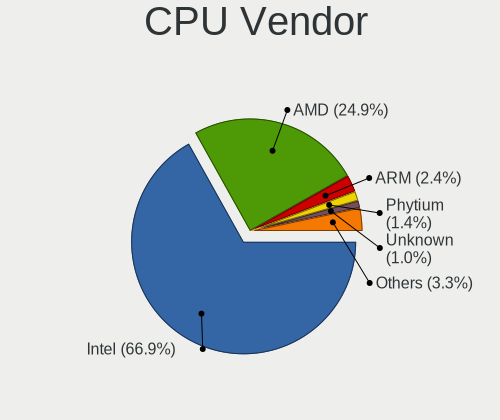

| Vendor            | Computers | Percent |
|-------------------|-----------|---------|
| Intel             | 801       | 72.42%  |
| AMD               | 246       | 22.24%  |
| Phytium           | 17        | 1.54%   |
| ARM               | 12        | 1.08%   |
| Unknown           | 8         | 0.72%   |
| CentaurHauls      | 5         | 0.45%   |
| CHRP IBM,8233-E8B | 4         | 0.36%   |
| sifive,bullet0    | 3         | 0.27%   |
| sifive,u74-mc     | 2         | 0.18%   |
| QUALCOMM          | 2         | 0.18%   |
| CHRP IBM,9131-52A | 2         | 0.18%   |
| thead,c906        | 1         | 0.09%   |
| PowerNV FP5466G2  | 1         | 0.09%   |
| HISILICON         | 1         | 0.09%   |
| FSP-1             | 1         | 0.09%   |

CPU Model
---------

Processor models

| Model                                         | Computers | Percent |
|-----------------------------------------------|-----------|---------|
| AMD Ryzen 7 5800H with Radeon Graphics        | 30        | 2.71%   |
| Intel Core i5-8250U CPU @ 1.60GHz             | 20        | 1.81%   |
| Intel 11th Gen Core i7-1165G7 @ 2.80GHz       | 19        | 1.72%   |
| Intel 11th Gen Core i5-1135G7 @ 2.40GHz       | 18        | 1.63%   |
| Intel Core i7-9750H CPU @ 2.60GHz             | 17        | 1.54%   |
| AMD Ryzen 5 3500U with Radeon Vega Mobile Gfx | 16        | 1.45%   |
| Intel Core i5-7200U CPU @ 2.50GHz             | 15        | 1.36%   |
| Intel Core i5-10210U CPU @ 1.60GHz            | 15        | 1.36%   |
| Intel Core i7-8550U CPU @ 1.80GHz             | 14        | 1.26%   |
| Intel Core i7-10510U CPU @ 1.80GHz            | 12        | 1.08%   |
| Intel Core i5-8265U CPU @ 1.60GHz             | 11        | 0.99%   |
| Intel Core i5-6200U CPU @ 2.30GHz             | 11        | 0.99%   |
| AMD Ryzen 7 4800H with Radeon Graphics        | 11        | 0.99%   |
| Intel Core i7-7700HQ CPU @ 2.80GHz            | 10        | 0.9%    |
| Intel Core i5-4590 CPU @ 3.30GHz              | 10        | 0.9%    |
| Intel 12th Gen Core i7-12700H                 | 10        | 0.9%    |
| Intel Core i7-8750H CPU @ 2.20GHz             | 9         | 0.81%   |
| Intel 11th Gen Core i7-11800H @ 2.30GHz       | 9         | 0.81%   |
| ARM Processor                                 | 9         | 0.81%   |
| Intel Core i7-8700 CPU @ 3.20GHz              | 8         | 0.72%   |
| Intel Core i7-7700 CPU @ 3.60GHz              | 8         | 0.72%   |
| Intel Core i7-6700HQ CPU @ 2.60GHz            | 8         | 0.72%   |
| AMD Ryzen 7 6800H with Radeon Graphics        | 8         | 0.72%   |
|                                               | 8         | 0.72%   |
| Phytium D2000/8 E8C                           | 7         | 0.63%   |
| Intel Core i7-8565U CPU @ 1.80GHz             | 7         | 0.63%   |
| Intel Core i7-4790 CPU @ 3.60GHz              | 7         | 0.63%   |
| Intel Core i7-10710U CPU @ 1.10GHz            | 7         | 0.63%   |
| Intel Core i5-8400 CPU @ 2.80GHz              | 7         | 0.63%   |
| Intel Core i5-5200U CPU @ 2.20GHz             | 7         | 0.63%   |
| AMD Ryzen 5 4600U with Radeon Graphics        | 7         | 0.63%   |
| AMD Ryzen 5 3550H with Radeon Vega Mobile Gfx | 7         | 0.63%   |
| Phytium FT-2000/4                             | 6         | 0.54%   |
| Intel Core i7-7500U CPU @ 2.70GHz             | 6         | 0.54%   |
| Intel Core i7-4600U CPU @ 2.10GHz             | 6         | 0.54%   |
| Intel Core i5-8300H CPU @ 2.30GHz             | 6         | 0.54%   |
| Intel Core i5-3320M CPU @ 2.60GHz             | 6         | 0.54%   |
| Intel Celeron CPU J1900 @ 1.99GHz             | 6         | 0.54%   |
| Intel 12th Gen Core i5-1240P                  | 6         | 0.54%   |
| AMD Ryzen 5 4600H with Radeon Graphics        | 6         | 0.54%   |

CPU Model Family
----------------

Processor model prefix

| Model                   | Computers | Percent |
|-------------------------|-----------|---------|
| Intel Core i5           | 234       | 21.16%  |
| Intel Core i7           | 227       | 20.52%  |
| Other                   | 147       | 13.29%  |
| AMD Ryzen 5             | 80        | 7.23%   |
| AMD Ryzen 7             | 79        | 7.14%   |
| Intel Xeon              | 55        | 4.97%   |
| Intel Core i3           | 54        | 4.88%   |
| Intel Celeron           | 38        | 3.44%   |
| Intel Pentium           | 21        | 1.9%    |
| Intel Atom              | 18        | 1.63%   |
| Intel Core 2 Duo        | 16        | 1.45%   |
| AMD Ryzen 7 PRO         | 14        | 1.27%   |
| AMD Ryzen 9             | 11        | 0.99%   |
| Intel Core i9           | 9         | 0.81%   |
| AMD FX                  | 7         | 0.63%   |
| AMD A8                  | 7         | 0.63%   |
| AMD Athlon II X2        | 6         | 0.54%   |
| AMD A6                  | 6         | 0.54%   |
| AMD A10                 | 6         | 0.54%   |
| Intel Xeon Silver       | 5         | 0.45%   |
| Intel Pentium Silver    | 5         | 0.45%   |
| Intel Genuine           | 5         | 0.45%   |
| Intel Core m3           | 5         | 0.45%   |
| AMD Ryzen 5 PRO         | 5         | 0.45%   |
| Intel Pentium Dual      | 4         | 0.36%   |
| AMD Athlon              | 4         | 0.36%   |
| Intel Xeon Gold         | 3         | 0.27%   |
| Intel Pentium Dual-Core | 3         | 0.27%   |
| Intel Core 2            | 3         | 0.27%   |
| Intel Core M            | 2         | 0.18%   |
| Intel Core 2 Quad       | 2         | 0.18%   |
| ARM BCM                 | 2         | 0.18%   |
| AMD Ryzen 3             | 2         | 0.18%   |
| AMD EPYC                | 2         | 0.18%   |
| AMD Athlon X4           | 2         | 0.18%   |
| QUALCOMM AArch64        | 1         | 0.09%   |
| Intel Xeon Platinum     | 1         | 0.09%   |
| Intel Xeon Bronze       | 1         | 0.09%   |
| Intel Pentium M         | 1         | 0.09%   |
| Intel Core m5           | 1         | 0.09%   |

CPU Cores
---------

Number of processor cores

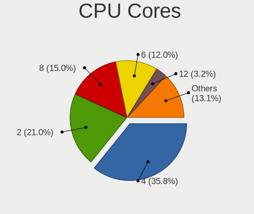

| Number  | Computers | Percent |
|---------|-----------|---------|
| 4       | 430       | 38.81%  |
| 2       | 285       | 25.72%  |
| 8       | 145       | 13.09%  |
| 6       | 140       | 12.64%  |
| 12      | 23        | 2.08%   |
| 1       | 16        | 1.44%   |
| 16      | 13        | 1.17%   |
| 14      | 12        | 1.08%   |
| Unknown | 11        | 0.99%   |
| 10      | 9         | 0.81%   |
| 24      | 8         | 0.72%   |
| 32      | 4         | 0.36%   |
| 96      | 2         | 0.18%   |
| 40      | 2         | 0.18%   |
| 28      | 2         | 0.18%   |
| 20      | 2         | 0.18%   |
| 64      | 1         | 0.09%   |
| 36      | 1         | 0.09%   |
| 26      | 1         | 0.09%   |
| 3       | 1         | 0.09%   |

CPU Sockets
-----------

Number of sockets

| Number  | Computers | Percent |
|---------|-----------|---------|
| 1       | 1056      | 95.39%  |
| 2       | 36        | 3.25%   |
| Unknown | 11        | 0.99%   |
| 3       | 2         | 0.18%   |
| 6       | 1         | 0.09%   |
| 4       | 1         | 0.09%   |

CPU Threads
-----------

Threads per core (Hyper-Threading)

| Number  | Computers | Percent |
|---------|-----------|---------|
| 2       | 828       | 74.73%  |
| 1       | 264       | 23.83%  |
| Unknown | 11        | 0.99%   |
| 4       | 5         | 0.45%   |

CPU Op-Modes
------------

CPU Operation Modes (32-bit, 64-bit)

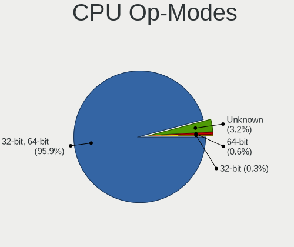

| Op mode        | Computers | Percent |
|----------------|-----------|---------|
| 32-bit, 64-bit | 1067      | 96.3%   |
| Unknown        | 34        | 3.07%   |
| 32-bit         | 4         | 0.36%   |
| 64-bit         | 3         | 0.27%   |

CPU Microcode
-------------

Microcode number

| Number     | Computers | Percent |
|------------|-----------|---------|
| Unknown    | 264       | 23.34%  |
| 0x906ea    | 53        | 4.69%   |
| 0x306c3    | 49        | 4.33%   |
| 0x306a9    | 46        | 4.07%   |
| 0x0a50000c | 37        | 3.27%   |
| 0x806ec    | 35        | 3.09%   |
| 0x806ea    | 35        | 3.09%   |
| 0x206a7    | 35        | 3.09%   |
| 0x806e9    | 32        | 2.83%   |
| 0x906e9    | 30        | 2.65%   |
| 0x806c1    | 30        | 2.65%   |
| 0x506e3    | 30        | 2.65%   |
| 0x08600106 | 25        | 2.21%   |
| 0x40651    | 23        | 2.03%   |
| 0x306d4    | 19        | 1.68%   |
| 0x906a3    | 17        | 1.5%    |
| 0x406e3    | 17        | 1.5%    |
| 0x08108102 | 15        | 1.33%   |
| 0x1067a    | 13        | 1.15%   |
| 0xa0652    | 12        | 1.06%   |
| 0x08600104 | 12        | 1.06%   |
| 0x806d1    | 11        | 0.97%   |
| 0x08108109 | 11        | 0.97%   |
| 0xa0655    | 9         | 0.8%    |
| 0x50654    | 9         | 0.8%    |
| 0x30678    | 9         | 0.8%    |
| 0x706e5    | 8         | 0.71%   |
| 0x08701013 | 8         | 0.71%   |
| 0xa0660    | 7         | 0.62%   |
| 0x706a1    | 7         | 0.62%   |
| 0x306f2    | 7         | 0.62%   |
| 0x306e4    | 7         | 0.62%   |
| 0x0a404102 | 7         | 0.62%   |
| 0x906c0    | 6         | 0.53%   |
| 0x90672    | 6         | 0.53%   |
| 0x08600103 | 6         | 0.53%   |
| 0x0810100b | 6         | 0.53%   |
| 0x806eb    | 5         | 0.44%   |
| 0x6fd      | 5         | 0.44%   |
| 0x50657    | 5         | 0.44%   |

CPU Microarch
-------------

Microarchitecture

| Name             | Computers | Percent |
|------------------|-----------|---------|
| KabyLake         | 244       | 22.02%  |
| Haswell          | 103       | 9.3%    |
| Unknown          | 95        | 8.57%   |
| Skylake          | 71        | 6.41%   |
| Zen 2            | 69        | 6.23%   |
| IvyBridge        | 64        | 5.78%   |
| Zen 3            | 58        | 5.23%   |
| CometLake        | 44        | 3.97%   |
| TigerLake        | 43        | 3.88%   |
| SandyBridge      | 43        | 3.88%   |
| Zen+             | 35        | 3.16%   |
| Silvermont       | 28        | 2.53%   |
| Broadwell        | 27        | 2.44%   |
| Penryn           | 22        | 1.99%   |
| IceLake          | 21        | 1.9%    |
| Zen              | 20        | 1.81%   |
| Alderlake Hybrid | 20        | 1.81%   |
| Piledriver       | 11        | 0.99%   |
| Goldmont plus    | 11        | 0.99%   |
| Westmere         | 10        | 0.9%    |
| Core             | 10        | 0.9%    |
| K10              | 9         | 0.81%   |
| Steamroller      | 7         | 0.63%   |
| Tremont          | 6         | 0.54%   |
| Goldmont         | 6         | 0.54%   |
| Bonnell          | 6         | 0.54%   |
| Nehalem          | 4         | 0.36%   |
| Excavator        | 4         | 0.36%   |
| Puma             | 3         | 0.27%   |
| Sapphire Rapids  | 2         | 0.18%   |
| P6               | 2         | 0.18%   |
| K10 Llano        | 2         | 0.18%   |
| Jaguar           | 2         | 0.18%   |
| Bulldozer        | 2         | 0.18%   |
| Bobcat           | 2         | 0.18%   |
| NetBurst         | 1         | 0.09%   |
| K8 Hammer        | 1         | 0.09%   |

Graphics
--------

GPU Vendor
----------

Vendors of graphics cards

| Vendor                           | Computers | Percent |
|----------------------------------|-----------|---------|
| Intel                            | 642       | 46.56%  |
| Nvidia                           | 374       | 27.12%  |
| AMD                              | 318       | 23.06%  |
| Matrox Electronics Systems       | 18        | 1.31%   |
| ASPEED Technology                | 13        | 0.94%   |
| Zhaoxin                          | 5         | 0.36%   |
| Phytium Technology               | 3         | 0.22%   |
| Silicon Integrated Systems [SiS] | 2         | 0.15%   |
| Moore Threads Technology         | 1         | 0.07%   |
| Loongson Technology              | 1         | 0.07%   |
| Huawei Technologies              | 1         | 0.07%   |
| Cirrus Logic                     | 1         | 0.07%   |

GPU Model
---------

Graphics card models

| Model                                                                                    | Computers | Percent |
|------------------------------------------------------------------------------------------|-----------|---------|
| AMD Renoir                                                                               | 45        | 3.2%    |
| AMD Cezanne [Radeon Vega Series / Radeon Vega Mobile Series]                             | 44        | 3.13%   |
| Intel TigerLake-LP GT2 [Iris Xe Graphics]                                                | 43        | 3.06%   |
| Intel UHD Graphics 620                                                                   | 42        | 2.99%   |
| Intel 3rd Gen Core processor Graphics Controller                                         | 36        | 2.56%   |
| Intel 2nd Generation Core Processor Family Integrated Graphics Controller                | 34        | 2.42%   |
| Intel CoffeeLake-H GT2 [UHD Graphics 630]                                                | 30        | 2.13%   |
| Intel Haswell-ULT Integrated Graphics Controller                                         | 28        | 1.99%   |
| Intel CometLake-U GT2 [UHD Graphics]                                                     | 28        | 1.99%   |
| AMD Picasso/Raven 2 [Radeon Vega Series / Radeon Vega Mobile Series]                     | 28        | 1.99%   |
| Intel HD Graphics 630                                                                    | 26        | 1.85%   |
| Intel HD Graphics 620                                                                    | 24        | 1.71%   |
| Intel HD Graphics 530                                                                    | 24        | 1.71%   |
| Intel Xeon E3-1200 v3/4th Gen Core Processor Integrated Graphics Controller              | 23        | 1.63%   |
| Nvidia GA106M [GeForce RTX 3060 Mobile / Max-Q]                                          | 21        | 1.49%   |
| Intel CoffeeLake-S GT2 [UHD Graphics 630]                                                | 20        | 1.42%   |
| Intel WhiskeyLake-U GT2 [UHD Graphics 620]                                               | 19        | 1.35%   |
| Intel Alder Lake-P Integrated Graphics Controller                                        | 19        | 1.35%   |
| Nvidia GP108M [GeForce MX150]                                                            | 17        | 1.21%   |
| Intel 4th Gen Core Processor Integrated Graphics Controller                              | 17        | 1.21%   |
| Nvidia GP108M [GeForce MX250]                                                            | 16        | 1.14%   |
| Intel Skylake GT2 [HD Graphics 520]                                                      | 16        | 1.14%   |
| Intel Atom Processor Z36xxx/Z37xxx Series Graphics & Display                             | 16        | 1.14%   |
| Intel HD Graphics 5500                                                                   | 15        | 1.07%   |
| AMD Raven Ridge [Radeon Vega Series / Radeon Vega Mobile Series]                         | 15        | 1.07%   |
| AMD Rembrandt [Radeon 680M]                                                              | 14        | 1%      |
| ASPEED Technology ASPEED Graphics Family                                                 | 13        | 0.92%   |
| Intel CometLake-S GT2 [UHD Graphics 630]                                                 | 12        | 0.85%   |
| Intel Atom/Celeron/Pentium Processor x5-E8000/J3xxx/N3xxx Integrated Graphics Controller | 12        | 0.85%   |
| Intel CometLake-H GT2 [UHD Graphics]                                                     | 11        | 0.78%   |
| AMD Oland [Radeon HD 8570 / R5 430 OEM / R7 240/340 / Radeon 520 OEM]                    | 11        | 0.78%   |
| Nvidia TU117M [GeForce MX450]                                                            | 10        | 0.71%   |
| Nvidia TU117M                                                                            | 10        | 0.71%   |
| Nvidia TU106M [GeForce RTX 2060 Mobile]                                                  | 10        | 0.71%   |
| Intel TigerLake-H GT1 [UHD Graphics]                                                     | 10        | 0.71%   |
| AMD Lexa PRO [Radeon 540/540X/550/550X / RX 540X/550/550X]                               | 10        | 0.71%   |
| Nvidia GP107M [GeForce GTX 1050 Ti Mobile]                                               | 9         | 0.64%   |
| Nvidia GP106 [GeForce GTX 1060 6GB]                                                      | 9         | 0.64%   |
| Intel GeminiLake [UHD Graphics 600]                                                      | 9         | 0.64%   |
| Nvidia GP107M [GeForce GTX 1050 Mobile]                                                  | 8         | 0.57%   |

GPU Combo
---------

Combinations of graphics cards

| Name                         | Computers | Percent |
|------------------------------|-----------|---------|
| 1 x Intel                    | 386       | 34.71%  |
| 1 x AMD                      | 228       | 20.5%   |
| Intel + Nvidia               | 198       | 17.81%  |
| 1 x Nvidia                   | 138       | 12.41%  |
| Intel + AMD                  | 42        | 3.78%   |
| AMD + Nvidia                 | 29        | 2.61%   |
| Other                        | 23        | 2.07%   |
| 1 x Matrox                   | 16        | 1.44%   |
| 2 x AMD                      | 14        | 1.26%   |
| 1 x ASPEED                   | 7         | 0.63%   |
| 1 x Zhaoxin                  | 5         | 0.45%   |
| 2 x Nvidia                   | 4         | 0.36%   |
| 2 x Intel                    | 3         | 0.27%   |
| 1 x Phytium Technology       | 3         | 0.27%   |
| Nvidia + ASPEED              | 3         | 0.27%   |
| AMD + ASPEED                 | 3         | 0.27%   |
| 1 x SiS                      | 2         | 0.18%   |
| AMD + Matrox                 | 2         | 0.18%   |
| Nvidia + Huawei Technologies | 1         | 0.09%   |
| 1 x Moore Threads Technology | 1         | 0.09%   |
| 1 x Loongson Technology      | 1         | 0.09%   |
| 1 x Intel + 3 x Nvidia       | 1         | 0.09%   |
| Intel + 2 x Nvidia           | 1         | 0.09%   |
| 1 x Cirrus Logic             | 1         | 0.09%   |

GPU Driver
----------

Free vs proprietary

| Driver      | Computers | Percent |
|-------------|-----------|---------|
| Free        | 819       | 73.19%  |
| Proprietary | 196       | 17.52%  |
| Unknown     | 104       | 9.29%   |

GPU Memory
----------

Total video memory

| Size in GB | Computers | Percent |
|------------|-----------|---------|
| Unknown    | 628       | 55.72%  |
| 1.01-2.0   | 155       | 13.75%  |
| 0.01-0.5   | 91        | 8.07%   |
| 0.51-1.0   | 87        | 7.72%   |
| 3.01-4.0   | 69        | 6.12%   |
| 5.01-6.0   | 38        | 3.37%   |
| 7.01-8.0   | 36        | 3.19%   |
| 8.01-16.0  | 10        | 0.89%   |
| 2.01-3.0   | 6         | 0.53%   |
| 16.01-24.0 | 3         | 0.27%   |
| 4.01-5.0   | 2         | 0.18%   |
| 24.01-32.0 | 2         | 0.18%   |

Monitor
-------

Monitor Vendor
--------------

Monitor vendors

| Vendor                  | Computers | Percent |
|-------------------------|-----------|---------|
| BOE                     | 136       | 12.27%  |
| AU Optronics            | 114       | 10.29%  |
| LG Display              | 99        | 8.94%   |
| Chimei Innolux          | 99        | 8.94%   |
| Dell                    | 92        | 8.3%    |
| Samsung Electronics     | 59        | 5.32%   |
| AOC                     | 59        | 5.32%   |
| Lenovo                  | 58        | 5.23%   |
| Sharp                   | 41        | 3.7%    |
| Philips                 | 31        | 2.8%    |
| CSO                     | 27        | 2.44%   |
| Goldstar                | 25        | 2.26%   |
| Hewlett-Packard         | 21        | 1.9%    |
| ViewSonic               | 15        | 1.35%   |
| BenQ                    | 13        | 1.17%   |
| Acer                    | 12        | 1.08%   |
| PANDA                   | 11        | 0.99%   |
| InfoVision              | 11        | 0.99%   |
| Apple                   | 10        | 0.9%    |
| Xiaomi                  | 9         | 0.81%   |
| HKC                     | 8         | 0.72%   |
| RTK                     | 7         | 0.63%   |
| TMX                     | 6         | 0.54%   |
| IPS                     | 6         | 0.54%   |
| SGT                     | 5         | 0.45%   |
| Unknown                 | 4         | 0.36%   |
| Sony                    | 4         | 0.36%   |
| SKY                     | 4         | 0.36%   |
| Panasonic               | 4         | 0.36%   |
| Mi                      | 4         | 0.36%   |
| CHD                     | 4         | 0.36%   |
| LGD                     | 3         | 0.27%   |
| LG Electronics          | 3         | 0.27%   |
| Lenovo Group Limited    | 3         | 0.27%   |
| KOIOS                   | 3         | 0.27%   |
| JDI                     | 3         | 0.27%   |
| HannStar                | 3         | 0.27%   |
| CHR                     | 3         | 0.27%   |
| Chi Mei Optoelectronics | 3         | 0.27%   |
| BOE Technology Group    | 3         | 0.27%   |

Monitor Model
-------------

Monitor models

| Model                                                                | Computers | Percent |
|----------------------------------------------------------------------|-----------|---------|
| Chimei Innolux LCD Monitor CMN14D4 1920x1080 309x173mm 13.9-inch     | 12        | 1.06%   |
| Xiaomi Mi TV XMD004A 1920x1080 708x398mm 32.0-inch                   | 8         | 0.7%    |
| Dell P2422H DELA1C5 1920x1080 527x296mm 23.8-inch                    | 7         | 0.62%   |
| Chimei Innolux LCD Monitor CMN14A7 1920x1080 308x173mm 13.9-inch     | 7         | 0.62%   |
| BOE LCD Monitor BOE0877 1920x1080 309x173mm 13.9-inch                | 7         | 0.62%   |
| AU Optronics LCD Monitor AUO403D 1920x1080 309x173mm 13.9-inch       | 7         | 0.62%   |
| Sharp LCD Monitor SHP1447 1920x1080 294x165mm 13.3-inch              | 6         | 0.53%   |
| Chimei Innolux LCD Monitor CMN1604 1920x1080 355x199mm 16.0-inch     | 6         | 0.53%   |
| BOE LCD Monitor BOE07DB 1920x1080 309x174mm 14.0-inch                | 6         | 0.53%   |
| BOE LCD Monitor BOE0747 1920x1080 344x194mm 15.5-inch                | 6         | 0.53%   |
| AOC 24B1W AOC2401 1920x1080 521x293mm 23.5-inch                      | 6         | 0.53%   |
| TMX TL156MDMP01-0 TMX1560 3200x2000 336x210mm 15.6-inch              | 5         | 0.44%   |
| Chimei Innolux LCD Monitor CMN14D5 1920x1080 309x173mm 13.9-inch     | 5         | 0.44%   |
| AU Optronics LCD Monitor AUO2E3C 1366x768 309x173mm 13.9-inch        | 5         | 0.44%   |
| AU Optronics LCD Monitor AUO106C 1366x768 276x155mm 12.5-inch        | 5         | 0.44%   |
| AOC Q2790 AOC2790 2560x1440 597x336mm 27.0-inch                      | 5         | 0.44%   |
| Sharp LCD Monitor SHP149A 1920x1080 344x194mm 15.5-inch              | 4         | 0.35%   |
| Sharp LCD Monitor SHP1453 1920x1080 346x194mm 15.6-inch              | 4         | 0.35%   |
| Panasonic LCD Monitor MEI96A2 2880x1620 344x193mm 15.5-inch          | 4         | 0.35%   |
| LG Display LCD Monitor LGD02D8 1366x768 277x156mm 12.5-inch          | 4         | 0.35%   |
| Lenovo LT2252p Wide LEN0A0C 1680x1050 474x296mm 22.0-inch            | 4         | 0.35%   |
| InfoVision LCD Monitor IVO061F 1920x1080 344x194mm 15.5-inch         | 4         | 0.35%   |
| Goldstar HDR 4K GSM7706 3840x2160 600x340mm 27.2-inch                | 4         | 0.35%   |
| CSO LCD Monitor CSO1402 2880x1800 302x188mm 14.0-inch                | 4         | 0.35%   |
| Chimei Innolux LCD Monitor CMN15E8 1920x1080 344x193mm 15.5-inch     | 4         | 0.35%   |
| CHD CHHWJT CHD0030 1920x1080 934x532mm 42.3-inch                     | 4         | 0.35%   |
| BOE LCD Monitor BOE0872 1920x1080 344x194mm 15.5-inch                | 4         | 0.35%   |
| AU Optronics LCD Monitor AUO683D 1920x1080 309x174mm 14.0-inch       | 4         | 0.35%   |
| AU Optronics LCD Monitor AUO45ED 1920x1080 340x190mm 15.3-inch       | 4         | 0.35%   |
| AU Optronics LCD Monitor AUO133D 1920x1080 309x173mm 13.9-inch       | 4         | 0.35%   |
| AOC 2491W AOC2491 1920x1080 521x293mm 23.5-inch                      | 4         | 0.35%   |
| Sharp LQ100P1JX51 SHP14A6 1800x1200 211x141mm 10.0-inch              | 3         | 0.26%   |
| Samsung Electronics LCD Monitor SEC414C 1366x768 309x174mm 14.0-inch | 3         | 0.26%   |
| Samsung Electronics C24F390 SAM0D2C 1920x1080 521x293mm 23.5-inch    | 3         | 0.26%   |
| Philips PHL 243V7 PHLC155 1920x1080 527x296mm 23.8-inch              | 3         | 0.26%   |
| PANDA LCD Monitor NCP004D 1920x1080 344x194mm 15.5-inch              | 3         | 0.26%   |
| Mi Monitor XMI23C3 1920x1080 527x293mm 23.7-inch                     | 3         | 0.26%   |
| LG Display LCD Monitor LGD0618 1920x1080 344x194mm 15.5-inch         | 3         | 0.26%   |
| LG Display LCD Monitor LGD05FA 1920x1080 309x174mm 14.0-inch         | 3         | 0.26%   |
| LG Display LCD Monitor LGD05F1 1920x1080 309x174mm 14.0-inch         | 3         | 0.26%   |

Monitor Resolution
------------------

Monitor screen resolution

| Resolution         | Computers | Percent |
|--------------------|-----------|---------|
| 1920x1080 (FHD)    | 548       | 51.46%  |
| 1366x768 (WXGA)    | 112       | 10.52%  |
| 3840x2160 (4K)     | 98        | 9.2%    |
| 2560x1440 (QHD)    | 67        | 6.29%   |
| 2560x1600          | 37        | 3.47%   |
| 1440x900 (WXGA+)   | 27        | 2.54%   |
| 1600x900 (HD+)     | 20        | 1.88%   |
| 1920x1200 (WUXGA)  | 19        | 1.78%   |
| 1680x1050 (WSXGA+) | 15        | 1.41%   |
| 1280x1024 (SXGA)   | 13        | 1.22%   |
| 2880x1800          | 10        | 0.94%   |
| 2160x1440          | 10        | 0.94%   |
| Unknown            | 10        | 0.94%   |
| 3440x1440          | 8         | 0.75%   |
| 1280x800 (WXGA)    | 8         | 0.75%   |
| 3200x2000          | 5         | 0.47%   |
| 2240x1400          | 5         | 0.47%   |
| 800x1280           | 3         | 0.28%   |
| 3840x2400          | 3         | 0.28%   |
| 3000x2000          | 3         | 0.28%   |
| 2560x1080          | 3         | 0.28%   |
| 1800x1200          | 3         | 0.28%   |
| 3360x1080          | 2         | 0.19%   |
| 3286x1080          | 2         | 0.19%   |
| 3072x1920          | 2         | 0.19%   |
| 2736x1824          | 2         | 0.19%   |
| 2288x1287          | 2         | 0.19%   |
| 2256x1504          | 2         | 0.19%   |
| 2200x1650          | 2         | 0.19%   |
| 2160x1350          | 2         | 0.19%   |
| 1920x1280          | 2         | 0.19%   |
| 1400x1050          | 2         | 0.19%   |
| 1024x768 (XGA)     | 2         | 0.19%   |
| 1024x600           | 2         | 0.19%   |
| 5206x1080          | 1         | 0.09%   |
| 4480x1440          | 1         | 0.09%   |
| 4382x1080          | 1         | 0.09%   |
| 3840x1080          | 1         | 0.09%   |
| 3600x1080          | 1         | 0.09%   |
| 3520x1080          | 1         | 0.09%   |

Monitor Diagonal
----------------

Diagonal size in inches

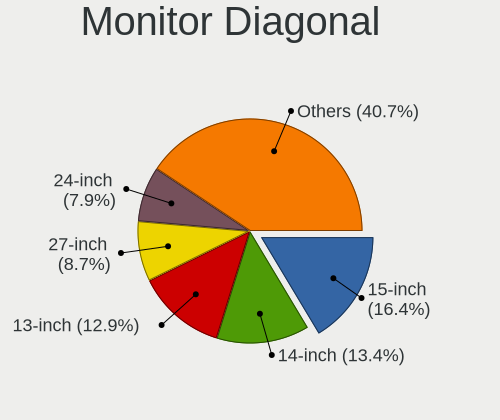

| Inches  | Computers | Percent |
|---------|-----------|---------|
| 15      | 206       | 18.66%  |
| 13      | 166       | 15.04%  |
| 14      | 141       | 12.77%  |
| 23      | 93        | 8.42%   |
| 27      | 78        | 7.07%   |
| 24      | 77        | 6.97%   |
| 21      | 46        | 4.17%   |
| Unknown | 44        | 3.99%   |
| 16      | 37        | 3.35%   |
| 17      | 35        | 3.17%   |
| 12      | 32        | 2.9%    |
| 19      | 20        | 1.81%   |
| 18      | 16        | 1.45%   |
| 22      | 14        | 1.27%   |
| 31      | 13        | 1.18%   |
| 65      | 10        | 0.91%   |
| 20      | 9         | 0.82%   |
| 40      | 8         | 0.72%   |
| 34      | 8         | 0.72%   |
| 25      | 8         | 0.72%   |
| 11      | 7         | 0.63%   |
| 10      | 7         | 0.63%   |
| 63      | 4         | 0.36%   |
| 32      | 4         | 0.36%   |
| 26      | 3         | 0.27%   |
| 142     | 2         | 0.18%   |
| 84      | 2         | 0.18%   |
| 57      | 2         | 0.18%   |
| 43      | 2         | 0.18%   |
| 36      | 2         | 0.18%   |
| 66      | 1         | 0.09%   |
| 54      | 1         | 0.09%   |
| 46      | 1         | 0.09%   |
| 42      | 1         | 0.09%   |
| 37      | 1         | 0.09%   |
| 29      | 1         | 0.09%   |
| 28      | 1         | 0.09%   |
| 7       | 1         | 0.09%   |

Monitor Width
-------------

Physical width

| Width in mm    | Computers | Percent |
|----------------|-----------|---------|
| 301-350        | 450       | 41.21%  |
| 501-600        | 238       | 21.79%  |
| 201-300        | 137       | 12.55%  |
| 401-500        | 98        | 8.97%   |
| 351-400        | 48        | 4.4%    |
| Unknown        | 44        | 4.03%   |
| 601-700        | 28        | 2.56%   |
| 1001-1500      | 16        | 1.47%   |
| 701-800        | 15        | 1.37%   |
| 801-900        | 10        | 0.92%   |
| 901-1000       | 3         | 0.27%   |
| More than 2000 | 2         | 0.18%   |
| 1501-2000      | 2         | 0.18%   |
| 1-100          | 1         | 0.09%   |

Aspect Ratio
------------

Proportional relationship between the width and the height

| Ratio   | Computers | Percent |
|---------|-----------|---------|
| 16/9    | 754       | 75.32%  |
| 16/10   | 142       | 14.19%  |
| Unknown | 40        | 4%      |
| 3/2     | 27        | 2.7%    |
| 5/4     | 14        | 1.4%    |
| 21/9    | 10        | 1%      |
| 4/3     | 6         | 0.6%    |
| 1.00    | 2         | 0.2%    |
| 0.62    | 2         | 0.2%    |
| 0.56    | 2         | 0.2%    |
| 0.67    | 1         | 0.1%    |
| 0.45    | 1         | 0.1%    |

Monitor Area
------------

Area in inch

| Area in inch | Computers | Percent |
|----------------|-----------|---------|
| 81-90          | 232       | 21.05%  |
| 101-110        | 212       | 19.24%  |
| 201-250        | 182       | 16.52%  |
| 301-350        | 83        | 7.53%   |
| 71-80          | 79        | 7.17%   |
| 151-200        | 66        | 5.99%   |
| Unknown        | 44        | 3.99%   |
| 251-300        | 28        | 2.54%   |
| 111-120        | 27        | 2.45%   |
| 61-70          | 26        | 2.36%   |
| 121-130        | 26        | 2.36%   |
| 351-500        | 25        | 2.27%   |
| More than 1000 | 22        | 2%      |
| 141-150        | 15        | 1.36%   |
| 501-1000       | 15        | 1.36%   |
| 51-60          | 8         | 0.73%   |
| 41-50          | 6         | 0.54%   |
| 91-100         | 5         | 0.45%   |
| 1-40           | 1         | 0.09%   |

Pixel Density
-------------

Pixels per inch

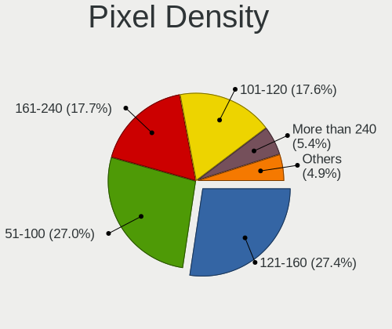

| Density       | Computers | Percent |
|---------------|-----------|---------|
| 121-160       | 356       | 32.72%  |
| 51-100        | 283       | 26.01%  |
| 101-120       | 183       | 16.82%  |
| 161-240       | 159       | 14.61%  |
| More than 240 | 44        | 4.04%   |
| Unknown       | 44        | 4.04%   |
| 1-50          | 19        | 1.75%   |

Multiple Monitors
-----------------

Total monitors connected

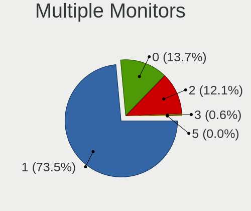

| Total | Computers | Percent |
|-------|-----------|---------|
| 1     | 847       | 75.09%  |
| 2     | 151       | 13.39%  |
| 0     | 121       | 10.73%  |
| 3     | 9         | 0.8%    |

Network
-------

Net Controller Vendor
---------------------

Controller vendors

| Vendor                           | Computers | Percent |
|----------------------------------|-----------|---------|
| Intel                            | 609       | 37.83%  |
| Realtek Semiconductor            | 606       | 37.64%  |
| Qualcomm Atheros                 | 132       | 8.2%    |
| Broadcom                         | 47        | 2.92%   |
| MediaTek                         | 38        | 2.36%   |
| Broadcom Limited                 | 23        | 1.43%   |
| Ralink Technology                | 21        | 1.3%    |
| ASIX Electronics                 | 18        | 1.12%   |
| Huawei Technologies              | 17        | 1.06%   |
| Xiaomi                           | 12        | 0.75%   |
| Marvell Technology Group         | 8         | 0.5%    |
| Microsoft                        | 7         | 0.43%   |
| Qualcomm                         | 6         | 0.37%   |
| Ralink                           | 5         | 0.31%   |
| IBM                              | 5         | 0.31%   |
| TP-Link                          | 4         | 0.25%   |
| ZTE WCDMA Technologies MSM       | 3         | 0.19%   |
| Tenda                            | 3         | 0.19%   |
| Samsung Electronics              | 3         | 0.19%   |
| Quectel Wireless Solutions       | 3         | 0.19%   |
| Qualcomm Atheros Communications  | 3         | 0.19%   |
| Dell                             | 3         | 0.19%   |
| Silicon Integrated Systems [SiS] | 2         | 0.12%   |
| Sierra Wireless                  | 2         | 0.12%   |
| OPPO Electronics                 | 2         | 0.12%   |
| NetGear                          | 2         | 0.12%   |
| D-Link                           | 2         | 0.12%   |
| Aquantia                         | 2         | 0.12%   |
| Wilocity                         | 1         | 0.06%   |
| vivo                             | 1         | 0.06%   |
| ST-Ericsson                      | 1         | 0.06%   |
| Shenzhen Goodix Technology       | 1         | 0.06%   |
| Sagem                            | 1         | 0.06%   |
| OnePlus Technology (Shenzhen)    | 1         | 0.06%   |
| Oculus VR                        | 1         | 0.06%   |
| Nvidia                           | 1         | 0.06%   |
| NetXen Incorporated              | 1         | 0.06%   |
| Microchip Technology             | 1         | 0.06%   |
| Mellanox Technologies            | 1         | 0.06%   |
| Meizu                            | 1         | 0.06%   |

Net Controller Model
--------------------

Controller models

| Model                                                             | Computers | Percent |
|-------------------------------------------------------------------|-----------|---------|
| Realtek RTL8111/8168/8411 PCI Express Gigabit Ethernet Controller | 396       | 21.21%  |
| Intel Wi-Fi 6 AX200                                               | 81        | 4.34%   |
| Intel Wireless 8265 / 8275                                        | 50        | 2.68%   |
| Realtek RTL810xE PCI Express Fast Ethernet controller             | 49        | 2.62%   |
| Realtek RTL8822CE 802.11ac PCIe Wireless Network Adapter          | 47        | 2.52%   |
| Realtek RTL8153 Gigabit Ethernet Adapter                          | 36        | 1.93%   |
| Intel Comet Lake PCH-LP CNVi WiFi                                 | 33        | 1.77%   |
| Intel Wi-Fi 6 AX201                                               | 30        | 1.61%   |
| Realtek RTL8125 2.5GbE Controller                                 | 27        | 1.45%   |
| Qualcomm Atheros QCA9377 802.11ac Wireless Network Adapter        | 27        | 1.45%   |
| Qualcomm Atheros QCA6174 802.11ac Wireless Network Adapter        | 27        | 1.45%   |
| Intel Wireless 7265                                               | 26        | 1.39%   |
| Intel 82579LM Gigabit Network Connection (Lewisville)             | 26        | 1.39%   |
| Intel Wireless 7260                                               | 22        | 1.18%   |
| Intel Cannon Lake PCH CNVi WiFi                                   | 21        | 1.12%   |
| Intel Wireless 3165                                               | 20        | 1.07%   |
| Intel Wi-Fi 6 AX210/AX211/AX411 160MHz                            | 20        | 1.07%   |
| Intel Wireless 8260                                               | 19        | 1.02%   |
| Intel Alder Lake-P PCH CNVi WiFi                                  | 19        | 1.02%   |
| Intel I211 Gigabit Network Connection                             | 18        | 0.96%   |
| Intel Ethernet Connection (2) I219-V                              | 17        | 0.91%   |
| Realtek RTL8821CE 802.11ac PCIe Wireless Network Adapter          | 16        | 0.86%   |
| Intel Cannon Point-LP CNVi [Wireless-AC]                          | 16        | 0.86%   |
| Realtek 802.11ac NIC                                              | 15        | 0.8%    |
| MediaTek MT7921 802.11ax PCI Express Wireless Network Adapter     | 15        | 0.8%    |
| Intel Comet Lake PCH CNVi WiFi                                    | 15        | 0.8%    |
| Realtek RTL8852AE 802.11ax PCIe Wireless Network Adapter          | 14        | 0.75%   |
| Ralink MT7601U Wireless Adapter                                   | 14        | 0.75%   |
| Intel Ethernet Connection I217-LM                                 | 14        | 0.75%   |
| Intel Ethernet Connection (2) I219-LM                             | 14        | 0.75%   |
| Intel Dual Band Wireless-AC 3165 Plus Bluetooth                   | 13        | 0.7%    |
| Qualcomm Atheros AR9485 Wireless Network Adapter                  | 12        | 0.64%   |
| Intel Tiger Lake PCH CNVi WiFi                                    | 12        | 0.64%   |
| Intel Ethernet Connection (4) I219-V                              | 12        | 0.64%   |
| ASIX AX88179 Gigabit Ethernet                                     | 12        | 0.64%   |
| Realtek RTL8188EUS 802.11n Wireless Network Adapter               | 11        | 0.59%   |
| Intel Ethernet Controller I225-V                                  | 11        | 0.59%   |
| Intel Ethernet Connection (10) I219-V                             | 11        | 0.59%   |
| Intel Centrino Advanced-N 6205 [Taylor Peak]                      | 11        | 0.59%   |
| Intel Wireless-AC 9260                                            | 10        | 0.54%   |

Wireless Vendor
---------------

Wireless vendors

| Vendor                          | Computers | Percent |
|---------------------------------|-----------|---------|
| Intel                           | 487       | 54.47%  |
| Realtek Semiconductor           | 157       | 17.56%  |
| Qualcomm Atheros                | 104       | 11.63%  |
| MediaTek                        | 38        | 4.25%   |
| Broadcom                        | 28        | 3.13%   |
| Ralink Technology               | 21        | 2.35%   |
| Broadcom Limited                | 17        | 1.9%    |
| Ralink                          | 5         | 0.56%   |
| TP-Link                         | 4         | 0.45%   |
| Xiaomi                          | 3         | 0.34%   |
| Tenda                           | 3         | 0.34%   |
| Quectel Wireless Solutions      | 3         | 0.34%   |
| Qualcomm Atheros Communications | 3         | 0.34%   |
| Qualcomm                        | 3         | 0.34%   |
| Microsoft                       | 3         | 0.34%   |
| Sierra Wireless                 | 2         | 0.22%   |
| NetGear                         | 2         | 0.22%   |
| Marvell Technology Group        | 2         | 0.22%   |
| Dell                            | 2         | 0.22%   |
| D-Link                          | 2         | 0.22%   |
| Wilocity                        | 1         | 0.11%   |
| Sagem                           | 1         | 0.11%   |
| Hewlett-Packard                 | 1         | 0.11%   |
| Fibocom                         | 1         | 0.11%   |
| D-Link System                   | 1         | 0.11%   |

Wireless Model
--------------

Wireless models

| Model                                                          | Computers | Percent |
|----------------------------------------------------------------|-----------|---------|
| Intel Wi-Fi 6 AX200                                            | 81        | 8.99%   |
| Intel Wireless 8265 / 8275                                     | 50        | 5.55%   |
| Realtek RTL8822CE 802.11ac PCIe Wireless Network Adapter       | 47        | 5.22%   |
| Intel Comet Lake PCH-LP CNVi WiFi                              | 33        | 3.66%   |
| Intel Wi-Fi 6 AX201                                            | 30        | 3.33%   |
| Qualcomm Atheros QCA9377 802.11ac Wireless Network Adapter     | 27        | 3%      |
| Qualcomm Atheros QCA6174 802.11ac Wireless Network Adapter     | 27        | 3%      |
| Intel Wireless 7265                                            | 26        | 2.89%   |
| Intel Wireless 7260                                            | 22        | 2.44%   |
| Intel Cannon Lake PCH CNVi WiFi                                | 21        | 2.33%   |
| Intel Wireless 3165                                            | 20        | 2.22%   |
| Intel Wi-Fi 6 AX210/AX211/AX411 160MHz                         | 20        | 2.22%   |
| Intel Wireless 8260                                            | 19        | 2.11%   |
| Intel Alder Lake-P PCH CNVi WiFi                               | 19        | 2.11%   |
| Realtek RTL8821CE 802.11ac PCIe Wireless Network Adapter       | 16        | 1.78%   |
| Intel Cannon Point-LP CNVi [Wireless-AC]                       | 16        | 1.78%   |
| Realtek 802.11ac NIC                                           | 15        | 1.66%   |
| MediaTek MT7921 802.11ax PCI Express Wireless Network Adapter  | 15        | 1.66%   |
| Intel Comet Lake PCH CNVi WiFi                                 | 15        | 1.66%   |
| Realtek RTL8852AE 802.11ax PCIe Wireless Network Adapter       | 14        | 1.55%   |
| Ralink MT7601U Wireless Adapter                                | 14        | 1.55%   |
| Intel Dual Band Wireless-AC 3165 Plus Bluetooth                | 13        | 1.44%   |
| Qualcomm Atheros AR9485 Wireless Network Adapter               | 12        | 1.33%   |
| Intel Tiger Lake PCH CNVi WiFi                                 | 12        | 1.33%   |
| Realtek RTL8188EUS 802.11n Wireless Network Adapter            | 11        | 1.22%   |
| Intel Centrino Advanced-N 6205 [Taylor Peak]                   | 11        | 1.22%   |
| Intel Wireless-AC 9260                                         | 10        | 1.11%   |
| Intel Wireless 3160                                            | 10        | 1.11%   |
| Realtek RTL8723BE PCIe Wireless Network Adapter                | 9         | 1%      |
| Realtek RTL8822BE 802.11a/b/g/n/ac WiFi adapter                | 8         | 0.89%   |
| Qualcomm Atheros QCA9565 / AR9565 Wireless Network Adapter     | 8         | 0.89%   |
| Qualcomm Atheros AR9285 Wireless Network Adapter (PCI-Express) | 8         | 0.89%   |
| MediaTek MT7921K (RZ608) Wi-Fi 6E 80MHz                        | 8         | 0.89%   |
| MediaTek MT7612U 802.11a/b/g/n/ac Wireless Adapter             | 8         | 0.89%   |
| Realtek RTL8188GU 802.11n WLAN Adapter (After Modeswitch)      | 7         | 0.78%   |
| Qualcomm Atheros AR9462 Wireless Network Adapter               | 7         | 0.78%   |
| Intel Ice Lake-LP PCH CNVi WiFi                                | 7         | 0.78%   |
| Broadcom Limited BCM4360 802.11ac Wireless Network Adapter     | 7         | 0.78%   |
| Realtek RTL8188CE 802.11b/g/n WiFi Adapter                     | 6         | 0.67%   |
| Realtek RTL8188CUS 802.11n WLAN Adapter                        | 5         | 0.55%   |

Ethernet Vendor
---------------

Ethernet vendors

| Vendor                           | Computers | Percent |
|----------------------------------|-----------|---------|
| Realtek Semiconductor            | 516       | 56.46%  |
| Intel                            | 258       | 28.23%  |
| Qualcomm Atheros                 | 36        | 3.94%   |
| Broadcom                         | 20        | 2.19%   |
| ASIX Electronics                 | 18        | 1.97%   |
| Huawei Technologies              | 14        | 1.53%   |
| Xiaomi                           | 9         | 0.98%   |
| Marvell Technology Group         | 6         | 0.66%   |
| Broadcom Limited                 | 6         | 0.66%   |
| IBM                              | 5         | 0.55%   |
| Samsung Electronics              | 3         | 0.33%   |
| Microsoft                        | 3         | 0.33%   |
| Silicon Integrated Systems [SiS] | 2         | 0.22%   |
| Qualcomm                         | 2         | 0.22%   |
| OPPO Electronics                 | 2         | 0.22%   |
| Aquantia                         | 2         | 0.22%   |
| ZTE WCDMA Technologies MSM       | 1         | 0.11%   |
| OnePlus Technology (Shenzhen)    | 1         | 0.11%   |
| Nvidia                           | 1         | 0.11%   |
| NetXen Incorporated              | 1         | 0.11%   |
| Microchip Technology             | 1         | 0.11%   |
| Mellanox Technologies            | 1         | 0.11%   |
| Loongson Technology              | 1         | 0.11%   |
| ICS Advent                       | 1         | 0.11%   |
| Google                           | 1         | 0.11%   |
| DisplayLink                      | 1         | 0.11%   |
| Attansic Technology              | 1         | 0.11%   |
| Apple                            | 1         | 0.11%   |

Ethernet Model
--------------

Ethernet models

| Model                                                             | Computers | Percent |
|-------------------------------------------------------------------|-----------|---------|
| Realtek RTL8111/8168/8411 PCI Express Gigabit Ethernet Controller | 396       | 41.64%  |
| Realtek RTL810xE PCI Express Fast Ethernet controller             | 49        | 5.15%   |
| Realtek RTL8153 Gigabit Ethernet Adapter                          | 36        | 3.79%   |
| Realtek RTL8125 2.5GbE Controller                                 | 27        | 2.84%   |
| Intel 82579LM Gigabit Network Connection (Lewisville)             | 26        | 2.73%   |
| Intel I211 Gigabit Network Connection                             | 18        | 1.89%   |
| Intel Ethernet Connection (2) I219-V                              | 17        | 1.79%   |
| Intel Ethernet Connection I217-LM                                 | 14        | 1.47%   |
| Intel Ethernet Connection (2) I219-LM                             | 14        | 1.47%   |
| Intel Ethernet Connection (4) I219-V                              | 12        | 1.26%   |
| ASIX AX88179 Gigabit Ethernet                                     | 12        | 1.26%   |
| Intel Ethernet Controller I225-V                                  | 11        | 1.16%   |
| Intel Ethernet Connection (10) I219-V                             | 11        | 1.16%   |
| Intel I210 Gigabit Network Connection                             | 10        | 1.05%   |
| Intel Ethernet Connection (7) I219-V                              | 10        | 1.05%   |
| Intel I350 Gigabit Network Connection                             | 9         | 0.95%   |
| Huawei STK-L21                                                    | 9         | 0.95%   |
| Realtek RTL8152 Fast Ethernet Adapter                             | 7         | 0.74%   |
| Qualcomm Atheros Killer E2400 Gigabit Ethernet Controller         | 7         | 0.74%   |
| Intel Ethernet Connection (7) I219-LM                             | 7         | 0.74%   |
| Intel Ethernet Connection (13) I219-V                             | 7         | 0.74%   |
| Intel Ethernet Connection (12) I219-V                             | 7         | 0.74%   |
| Qualcomm Atheros QCA8171 Gigabit Ethernet                         | 6         | 0.63%   |
| Intel Ethernet Connection I218-LM                                 | 6         | 0.63%   |
| Intel Ethernet Connection (4) I219-LM                             | 6         | 0.63%   |
| Intel Ethernet Connection (3) I218-LM                             | 6         | 0.63%   |
| Intel Ethernet Connection (2) I218-V                              | 6         | 0.63%   |
| Broadcom NetXtreme BCM5720 Gigabit Ethernet PCIe                  | 6         | 0.63%   |
| Xiaomi Mi/Redmi series (RNDIS + ADB)                              | 5         | 0.53%   |
| Realtek RTL-8100/8101L/8139 PCI Fast Ethernet Adapter             | 5         | 0.53%   |
| Qualcomm Atheros AR8161 Gigabit Ethernet                          | 5         | 0.53%   |
| Intel Ethernet Connection X722 for 1GbE                           | 5         | 0.53%   |
| Intel Ethernet Connection (3) I219-LM                             | 5         | 0.53%   |
| Intel 82599ES 10-Gigabit SFI/SFP+ Network Connection              | 5         | 0.53%   |
| Intel 82567LM Gigabit Network Connection                          | 5         | 0.53%   |
| ASIX AX88772B                                                     | 5         | 0.53%   |
| Xiaomi Mi/Redmi series (RNDIS)                                    | 4         | 0.42%   |
| Realtek Killer E2600 Gigabit Ethernet Controller                  | 4         | 0.42%   |
| Qualcomm Atheros Killer E2500 Gigabit Ethernet Controller         | 4         | 0.42%   |
| Intel Ethernet Connection (6) I219-V                              | 4         | 0.42%   |

Net Controller Kind
-------------------

Ethernet, WiFi or modem

| Kind     | Computers | Percent |
|----------|-----------|---------|
| Ethernet | 868       | 49.83%  |
| WiFi     | 859       | 49.31%  |
| Unknown  | 9         | 0.52%   |
| Modem    | 6         | 0.34%   |

Used Controller
---------------

Currently used network controller

| Kind     | Computers | Percent |
|----------|-----------|---------|
| WiFi     | 644       | 58.49%  |
| Ethernet | 456       | 41.42%  |
| Unknown  | 1         | 0.09%   |

NICs
----

Total network controllers on board

| Total | Computers | Percent |
|-------|-----------|---------|
| 2     | 548       | 49.46%  |
| 1     | 452       | 40.79%  |
| 0     | 53        | 4.78%   |
| 3     | 33        | 2.98%   |
| 4     | 14        | 1.26%   |
| 6     | 5         | 0.45%   |
| 8     | 1         | 0.09%   |
| 7     | 1         | 0.09%   |
| 5     | 1         | 0.09%   |

IPv6
----

IPv6 vs IPv4

| Used | Computers | Percent |
|------|-----------|---------|
| No   | 965       | 85.7%   |
| Yes  | 161       | 14.3%   |

Bluetooth
---------

Bluetooth Vendor
----------------

Controller vendors

| Vendor                          | Computers | Percent |
|---------------------------------|-----------|---------|
| Intel                           | 428       | 58.95%  |
| Realtek Semiconductor           | 61        | 8.4%    |
| Qualcomm Atheros Communications | 54        | 7.44%   |
| Cambridge Silicon Radio         | 40        | 5.51%   |
| Realtek                         | 25        | 3.44%   |
| Foxconn / Hon Hai               | 23        | 3.17%   |
| Broadcom                        | 22        | 3.03%   |
| IMC Networks                    | 17        | 2.34%   |
| Lite-On Technology              | 9         | 1.24%   |
| Apple                           | 9         | 1.24%   |
| MediaTek                        | 7         | 0.96%   |
| Opticis                         | 5         | 0.69%   |
| ASUSTek Computer                | 5         | 0.69%   |
| Foxconn International           | 4         | 0.55%   |
| Dell                            | 4         | 0.55%   |
| Ralink                          | 3         | 0.41%   |
| Toshiba                         | 2         | 0.28%   |
| Taiyo Yuden                     | 2         | 0.28%   |
| Marvell Semiconductor           | 2         | 0.28%   |
| Hewlett-Packard                 | 2         | 0.28%   |
| Alps Electric                   | 2         | 0.28%   |

Bluetooth Model
---------------

Controller models

| Model                                               | Computers | Percent |
|-----------------------------------------------------|-----------|---------|
| Intel Bluetooth wireless interface                  | 149       | 20.52%  |
| Intel AX201 Bluetooth                               | 82        | 11.29%  |
| Intel AX200 Bluetooth                               | 77        | 10.61%  |
| Intel Bluetooth 9460/9560 Jefferson Peak (JfP)      | 62        | 8.54%   |
| Realtek Bluetooth Radio                             | 47        | 6.47%   |
| Cambridge Silicon Radio Bluetooth Dongle (HCI mode) | 40        | 5.51%   |
| Qualcomm Atheros  Bluetooth Device                  | 37        | 5.1%    |
| Realtek Bluetooth Radio                             | 25        | 3.44%   |
| Intel AX210 Bluetooth                               | 18        | 2.48%   |
| Intel Bluetooth Device                              | 15        | 2.07%   |
| Foxconn / Hon Hai Wireless_Device                   | 11        | 1.52%   |
| Qualcomm Atheros QCA61x4 Bluetooth 4.0              | 9         | 1.24%   |
| Intel Wireless-AC 9260 Bluetooth Adapter            | 9         | 1.24%   |
| Realtek  Bluetooth 4.2 Adapter                      | 8         | 1.1%    |
| IMC Networks Bluetooth Radio                        | 8         | 1.1%    |
| MediaTek Wireless_Device                            | 7         | 0.96%   |
| Intel Centrino Bluetooth Wireless Transceiver       | 7         | 0.96%   |
| Realtek RTL8723B Bluetooth                          | 6         | 0.83%   |
| Qualcomm Atheros AR3012 Bluetooth 4.0               | 6         | 0.83%   |
| Foxconn / Hon Hai Bluetooth Device                  | 6         | 0.83%   |
| Opticis Bluetooth Radio                             | 5         | 0.69%   |
| Intel Centrino Advanced-N 6230 Bluetooth adapter    | 5         | 0.69%   |
| IMC Networks Wireless_Device                        | 5         | 0.69%   |
| Broadcom BCM2045B (BDC-2.1)                         | 5         | 0.69%   |
| Apple Bluetooth Host Controller                     | 5         | 0.69%   |
| Lite-On Bluetooth Device                            | 4         | 0.55%   |
| Intel Wireless-AC 3168 Bluetooth                    | 4         | 0.55%   |
| IMC Networks Bluetooth Device                       | 4         | 0.55%   |
| Foxconn International BCM43142A0 Bluetooth module   | 4         | 0.55%   |
| Broadcom BCM2045B (BDC-2.1) [Bluetooth Controller]  | 4         | 0.55%   |
| Ralink RT3290 Bluetooth                             | 3         | 0.41%   |
| Foxconn / Hon Hai BCM20702A0                        | 3         | 0.41%   |
| Broadcom BCM20702 Bluetooth 4.0 [ThinkPad]          | 3         | 0.41%   |
| Apple Bluetooth USB Host Controller                 | 3         | 0.41%   |
| Taiyo Yuden Bluetooth Device                        | 2         | 0.28%   |
| Marvell Bluetooth and Wireless LAN Composite        | 2         | 0.28%   |
| Lite-On Bluetooth 4.0 [Broadcom BCM20702A0]         | 2         | 0.28%   |
| HP Broadcom 2070 Bluetooth Combo                    | 2         | 0.28%   |
| Dell DW375 Bluetooth Module                         | 2         | 0.28%   |
| Broadcom Bluetooth 3.0 Dongle                       | 2         | 0.28%   |

Sound
-----

Sound Vendor
------------

Sound card vendors

| Vendor                                       | Computers | Percent |
|----------------------------------------------|-----------|---------|
| Intel                                        | 752       | 54.89%  |
| AMD                                          | 313       | 22.85%  |
| Nvidia                                       | 227       | 16.57%  |
| C-Media Electronics                          | 9         | 0.66%   |
| Zoran Co. Personal Media Division (Nogatech) | 6         | 0.44%   |
| Realtek Semiconductor                        | 6         | 0.44%   |
| Creative Labs                                | 6         | 0.44%   |
| Zhaoxin                                      | 5         | 0.36%   |
| XMOS                                         | 4         | 0.29%   |
| Generalplus Technology                       | 4         | 0.29%   |
| Apple                                        | 4         | 0.29%   |
| Silicon Integrated Systems [SiS]             | 3         | 0.22%   |
| Phytium Technology                           | 3         | 0.22%   |
| Huawei Technologies                          | 3         | 0.22%   |
| Texas Instruments                            | 2         | 0.15%   |
| Dell                                         | 2         | 0.15%   |
| Unknown                                      | 1         | 0.07%   |
| TerraTec Electronic                          | 1         | 0.07%   |
| Specialix                                    | 1         | 0.07%   |
| Sony                                         | 1         | 0.07%   |
| Polycom                                      | 1         | 0.07%   |
| NXP Semiconductors                           | 1         | 0.07%   |
| Moore Threads Technology                     | 1         | 0.07%   |
| Loongson Technology                          | 1         | 0.07%   |
| Kingston Technology                          | 1         | 0.07%   |
| JMTek                                        | 1         | 0.07%   |
| Giga-Byte Technology                         | 1         | 0.07%   |
| Fry's Electronics                            | 1         | 0.07%   |
| ESI                                          | 1         | 0.07%   |
| DSEA A/S                                     | 1         | 0.07%   |
| Creative Technology                          | 1         | 0.07%   |
| Cambridge Silicon Radio                      | 1         | 0.07%   |
| BY EDIFIER                                   | 1         | 0.07%   |
| AudioQuest                                   | 1         | 0.07%   |
| Atmel                                        | 1         | 0.07%   |
| Actions Semiconductor                        | 1         | 0.07%   |
| ACTIONS                                      | 1         | 0.07%   |

Sound Model
-----------

Sound card models

| Model                                                                      | Computers | Percent |
|----------------------------------------------------------------------------|-----------|---------|
| AMD Family 17h/19h HD Audio Controller                                     | 160       | 9.66%   |
| Intel Sunrise Point-LP HD Audio                                            | 101       | 6.1%    |
| AMD Renoir Radeon High Definition Audio Controller                         | 78        | 4.71%   |
| Intel Cannon Lake PCH cAVS                                                 | 57        | 3.44%   |
| Intel 8 Series/C220 Series Chipset High Definition Audio Controller        | 57        | 3.44%   |
| Intel 7 Series/C216 Chipset Family High Definition Audio Controller        | 50        | 3.02%   |
| Intel 6 Series/C200 Series Chipset Family High Definition Audio Controller | 44        | 2.66%   |
| AMD Raven/Raven2/Fenghuang HDMI/DP Audio Controller                        | 43        | 2.6%    |
| Intel Tiger Lake-LP Smart Sound Technology Audio Controller                | 42        | 2.54%   |
| Intel Xeon E3-1200 v3/4th Gen Core Processor HD Audio Controller           | 39        | 2.36%   |
| Intel 200 Series PCH HD Audio                                              | 37        | 2.23%   |
| Intel 100 Series/C230 Series Chipset Family HD Audio Controller            | 37        | 2.23%   |
| Intel Comet Lake PCH-LP cAVS                                               | 36        | 2.17%   |
| Intel Haswell-ULT HD Audio Controller                                      | 29        | 1.75%   |
| Intel 8 Series HD Audio Controller                                         | 29        | 1.75%   |
| AMD Starship/Matisse HD Audio Controller                                   | 24        | 1.45%   |
| Intel Broadwell-U Audio Controller                                         | 23        | 1.39%   |
| Nvidia GP106 High Definition Audio Controller                              | 22        | 1.33%   |
| Intel Wildcat Point-LP High Definition Audio Controller                    | 22        | 1.33%   |
| Intel Cannon Point-LP High Definition Audio Controller                     | 22        | 1.33%   |
| AMD FCH Azalia Controller                                                  | 22        | 1.33%   |
| AMD Baffin HDMI/DP Audio [Radeon RX 550 640SP / RX 560/560X]               | 22        | 1.33%   |
| Nvidia GA106 High Definition Audio Controller                              | 21        | 1.27%   |
| Intel Alder Lake PCH-P High Definition Audio Controller                    | 21        | 1.27%   |
| Nvidia TU106 High Definition Audio Controller                              | 20        | 1.21%   |
| Nvidia GP104 High Definition Audio Controller                              | 19        | 1.15%   |
| Nvidia TU107 GeForce GTX 1650 High Definition Audio Controller             | 18        | 1.09%   |
| Intel Comet Lake PCH cAVS                                                  | 18        | 1.09%   |
| AMD Oland/Hainan/Cape Verde/Pitcairn HDMI Audio [Radeon HD 7000 Series]    | 18        | 1.09%   |
| Intel CM238 HD Audio Controller                                            | 17        | 1.03%   |
| AMD Rembrandt Radeon High Definition Audio Controller                      | 17        | 1.03%   |
| Nvidia GP107GL High Definition Audio Controller                            | 16        | 0.97%   |
| AMD SBx00 Azalia (Intel HDA)                                               | 16        | 0.97%   |
| Intel Tiger Lake-H HD Audio Controller                                     | 15        | 0.91%   |
| Intel NM10/ICH7 Family High Definition Audio Controller                    | 15        | 0.91%   |
| Intel Comet Lake PCH-V cAVS                                                | 15        | 0.91%   |
| Nvidia TU116 High Definition Audio Controller                              | 13        | 0.79%   |
| Nvidia GK208 HDMI/DP Audio Controller                                      | 12        | 0.72%   |
| Intel Celeron/Pentium Silver Processor High Definition Audio               | 11        | 0.66%   |
| AMD Family 17h (Models 00h-0fh) HD Audio Controller                        | 11        | 0.66%   |

Memory
------

Memory Vendor
-------------

Memory module vendors

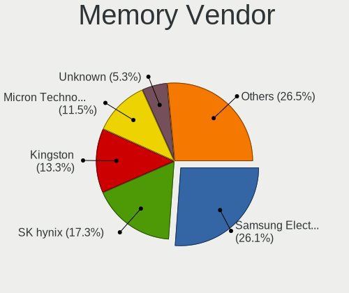

| Vendor              | Computers | Percent |
|---------------------|-----------|---------|
| Samsung Electronics | 220       | 29.14%  |
| SK hynix            | 137       | 18.15%  |
| Kingston            | 121       | 16.03%  |
| Micron Technology   | 81        | 10.73%  |
| Unknown             | 44        | 5.83%   |
| A-DATA Technology   | 26        | 3.44%   |
| Crucial             | 22        | 2.91%   |
| Ramaxel Technology  | 20        | 2.65%   |
| Unknown             | 11        | 1.46%   |
| Corsair             | 8         | 1.06%   |
| Elpida              | 6         | 0.79%   |
| Unknown (ABCD)      | 5         | 0.66%   |
| Transcend           | 5         | 0.66%   |
| Team                | 5         | 0.66%   |
| G.Skill             | 4         | 0.53%   |
| Kingmax             | 3         | 0.4%    |
| Apacer              | 3         | 0.4%    |
| Unknown (08C8)      | 2         | 0.26%   |
| Shenzhen WODPOSIT   | 2         | 0.26%   |
| Ramsta              | 2         | 0.26%   |
| Lenovo              | 2         | 0.26%   |
| KLEVV               | 2         | 0.26%   |
| GLOWAY              | 2         | 0.26%   |
| Unknown (08B5)      | 1         | 0.13%   |
| UNILC               | 1         | 0.13%   |
| UniIC               | 1         | 0.13%   |
| tigo                | 1         | 0.13%   |
| Thermaltake         | 1         | 0.13%   |
| Shenzhen Longsys    | 1         | 0.13%   |
| SHARETRONIC         | 1         | 0.13%   |
| Sesame              | 1         | 0.13%   |
| Nanya Technology    | 1         | 0.13%   |
| MTASE               | 1         | 0.13%   |
| Mircon              | 1         | 0.13%   |
| MAXSUN              | 1         | 0.13%   |
| Lexar Co Limited    | 1         | 0.13%   |
| KINGBANK            | 1         | 0.13%   |
| Kimtigo             | 1         | 0.13%   |
| Juhor               | 1         | 0.13%   |
| JEDEC ID: 0000h     | 1         | 0.13%   |

Memory Model
------------

Memory module models

| Model                                                            | Computers | Percent |
|------------------------------------------------------------------|-----------|---------|
| Samsung RAM M471A1G44AB0-CWE 8GB Row Of Chips DDR4 3200MT/s      | 14        | 1.71%   |
| Unknown                                                          | 11        | 1.35%   |
| Samsung RAM M471B5173EB0-YK0 4GB SODIMM DDR3 1600MT/s            | 9         | 1.1%    |
| SK hynix RAM HMAA1GS6CMR6N-VK 8GB Row Of Chips DDR4 2667MT/s     | 8         | 0.98%   |
| Samsung RAM M471A1G44AB0-CTD 8GB SODIMM DDR4 2667MT/s            | 7         | 0.86%   |
| SK hynix RAM HMA81GS6DJR8N-XN 8GB SODIMM DDR4 3200MT/s           | 6         | 0.73%   |
| Samsung RAM M471A5244CB0-CTD 4GB SODIMM DDR4 3266MT/s            | 6         | 0.73%   |
| Samsung RAM M471A1K43EB1-CWE 8GB SODIMM DDR4 3200MT/s            | 6         | 0.73%   |
| Micron RAM 4ATF1G64HZ-3G2E1 8GB SODIMM DDR4 3200MT/s             | 6         | 0.73%   |
| Micron RAM 4ATF1G64HZ-3G2E1 8GB Row Of Chips DDR4 3200MT/s       | 6         | 0.73%   |
| Kingston RAM KHX3200C16D4/16GX 16GB DIMM DDR4 3600MT/s           | 6         | 0.73%   |
| SK hynix RAM HMAB2GS6AMR6N-XN 16GB SODIMM DDR4 3200MT/s          | 5         | 0.61%   |
| SK hynix RAM HMA851S6CJR6N-VK 4GB SODIMM DDR4 2667MT/s           | 5         | 0.61%   |
| SK hynix RAM HMA41GS6AFR8N-TF 8GB SODIMM DDR4 2667MT/s           | 5         | 0.61%   |
| Samsung RAM M471A5244CB0-CTD 4GB Row Of Chips DDR4 2667MT/s      | 5         | 0.61%   |
| Samsung RAM M471A1K43CB1-CRC 8GB SODIMM DDR4 2667MT/s            | 5         | 0.61%   |
| Samsung RAM M471A1K43BB1-CRC 8192MB SODIMM DDR4 2667MT/s         | 5         | 0.61%   |
| Samsung RAM M471A1G44AB0-CWE 8GB SODIMM DDR4 3200MT/s            | 5         | 0.61%   |
| Kingston RAM LV32D4S2S8HD-8 8GB SODIMM DDR4 3200MT/s             | 5         | 0.61%   |
| Unknown (ABCD) RAM 123456789012345678 2GB SODIMM LPDDR4 2400MT/s | 4         | 0.49%   |
| SK hynix RAM HMT451S6BFR8A-PB 4GB SODIMM DDR3 1600MT/s           | 4         | 0.49%   |
| SK hynix RAM HMT351S6CFR8C-PB 4GB SODIMM DDR3 1600MT/s           | 4         | 0.49%   |
| SK hynix RAM HMAA1GS6CJR6N-XN 8GB Row Of Chips DDR4 3200MT/s     | 4         | 0.49%   |
| SK hynix RAM HMA851S6CJR6N-VK 4GB Row Of Chips DDR4 2667MT/s     | 4         | 0.49%   |
| SK hynix RAM HMA81GS6AFR8N-UH 8GB SODIMM DDR4 2667MT/s           | 4         | 0.49%   |
| Samsung RAM M471B1G73EB0-YK0 8GB SODIMM DDR3 1600MT/s            | 4         | 0.49%   |
| Samsung RAM M471A4G43MB1-CTD 32GB SODIMM DDR4 2667MT/s           | 4         | 0.49%   |
| Samsung RAM M471A1K43CB1-CTD 8GB SODIMM DDR4 2667MT/s            | 4         | 0.49%   |
| Samsung RAM M471A1G44AB0-CTD 8GB Row Of Chips DDR4 2667MT/s      | 4         | 0.49%   |
| Samsung RAM 6478545886 16GB DIMM DDR4 2668MT/s                   | 4         | 0.49%   |
| Ramaxel RAM RMSA3260ME78HAF-2666 8GB SODIMM DDR4 2667MT/s        | 4         | 0.49%   |
| Micron RAM 8KTF51264HZ-1G6E1 4GB SODIMM DDR3 1600MT/s            | 4         | 0.49%   |
| Micron RAM 8ATF1G64HZ-2G6E1 8GB SODIMM DDR4 2667MT/s             | 4         | 0.49%   |
| Micron RAM 53E1G32D2NP-046 2GB Row Of Chips LPDDR4 4267MT/s      | 4         | 0.49%   |
| Kingston RAM KHX2666C16/8G 8GB DIMM DDR4 3466MT/s                | 4         | 0.49%   |
| Kingston RAM 99U5469-045.A00LF 4GB SODIMM DDR3 1600MT/s          | 4         | 0.49%   |
| Kingston RAM 6478545886 16GB DIMM DDR4 2400MT/s                  | 4         | 0.49%   |
| Unknown RAM Module 2GB SODIMM DDR2 667MT/s                       | 3         | 0.37%   |
| SK hynix RAM HMT41GS6BFR8A-PB 8GB SODIMM DDR3 1600MT/s           | 3         | 0.37%   |
| SK hynix RAM HMT41GS6AFR8A-PB 8GB SODIMM DDR3 1600MT/s           | 3         | 0.37%   |

Memory Kind
-----------

Memory module kinds

| Kind    | Computers | Percent |
|---------|-----------|---------|
| DDR4    | 374       | 55.65%  |
| DDR3    | 169       | 25.15%  |
| LPDDR4  | 35        | 5.21%   |
| LPDDR3  | 35        | 5.21%   |
| Unknown | 16        | 2.38%   |
| DDR5    | 15        | 2.23%   |
| SDRAM   | 10        | 1.49%   |
| DDR2    | 10        | 1.49%   |
| LPDDR5  | 7         | 1.04%   |
| DDR     | 1         | 0.15%   |

Memory Form Factor
------------------

Physical design of the memory module

| Name         | Computers | Percent |
|--------------|-----------|---------|
| SODIMM       | 360       | 53.18%  |
| DIMM         | 192       | 28.36%  |
| Row Of Chips | 119       | 17.58%  |
| Chip         | 5         | 0.74%   |
| Unknown      | 1         | 0.15%   |

Memory Size
-----------

Memory module size

| Size  | Computers | Percent |
|-------|-----------|---------|
| 8192  | 317       | 44.46%  |
| 4096  | 169       | 23.7%   |
| 16384 | 136       | 19.07%  |
| 2048  | 42        | 5.89%   |
| 32768 | 36        | 5.05%   |
| 1024  | 8         | 1.12%   |
| 65536 | 3         | 0.42%   |
| 6144  | 1         | 0.14%   |
| 512   | 1         | 0.14%   |

Memory Speed
------------

Memory module speed

| Speed   | Computers | Percent |
|---------|-----------|---------|
| 2667    | 137       | 19.08%  |
| 3200    | 134       | 18.66%  |
| 1600    | 119       | 16.57%  |
| 2400    | 51        | 7.1%    |
| 2133    | 46        | 6.41%   |
| 1333    | 30        | 4.18%   |
| 4267    | 20        | 2.79%   |
| 4800    | 19        | 2.65%   |
| 1867    | 19        | 2.65%   |
| 2666    | 18        | 2.51%   |
| 3600    | 14        | 1.95%   |
| 800     | 10        | 1.39%   |
| 6400    | 8         | 1.11%   |
| 1334    | 7         | 0.97%   |
| 3266    | 6         | 0.84%   |
| 2668    | 6         | 0.84%   |
| 1066    | 6         | 0.84%   |
| Unknown | 6         | 0.84%   |
| 4266    | 5         | 0.7%    |
| 3733    | 5         | 0.7%    |
| 3000    | 5         | 0.7%    |
| 667     | 5         | 0.7%    |
| 3466    | 4         | 0.56%   |
| 3400    | 4         | 0.56%   |
| 2933    | 4         | 0.56%   |
| 1866    | 4         | 0.56%   |
| 1067    | 4         | 0.56%   |
| 8400    | 3         | 0.42%   |
| 4199    | 3         | 0.42%   |
| 2800    | 2         | 0.28%   |
| 1800    | 2         | 0.28%   |
| 266     | 2         | 0.28%   |
| 65535   | 1         | 0.14%   |
| 4133    | 1         | 0.14%   |
| 3800    | 1         | 0.14%   |
| 3500    | 1         | 0.14%   |
| 2200    | 1         | 0.14%   |
| 2187    | 1         | 0.14%   |
| 2048    | 1         | 0.14%   |
| 533     | 1         | 0.14%   |

Printers & scanners
-------------------

Printer Vendor
--------------

Printer device vendors

| Vendor                             | Computers | Percent |
|------------------------------------|-----------|---------|
| Hewlett-Packard                    | 3         | 42.86%  |
| Canon                              | 2         | 28.57%  |
| Brother Industries                 | 1         | 14.29%  |
| BeiJing LanXum Computer Technology | 1         | 14.29%  |

Printer Model
-------------

Printer device models

| Model                                                   | Computers | Percent |
|---------------------------------------------------------|-----------|---------|
| HP LaserJet 1020                                        | 2         | 28.57%  |
| HP Officejet 4500 G510g-m                               | 1         | 14.29%  |
| Canon PIXMA MP280                                       | 1         | 14.29%  |
| Canon iP1100 series                                     | 1         | 14.29%  |
| Brother HL-5440D series                                 | 1         | 14.29%  |
| BeiJing LanXum Technology Black and White Laser Printer | 1         | 14.29%  |

Scanner Vendor
--------------

Scanner device vendors

| Vendor | Computers | Percent |
|--------|-----------|---------|
| Canon  | 1         | 100%    |

Scanner Model
-------------

Scanner device models

| Model                   | Computers | Percent |
|-------------------------|-----------|---------|
| Canon CanoScan LiDE 120 | 1         | 100%    |

Camera
------

Camera Vendor
-------------

Camera device vendors

| Vendor                                 | Computers | Percent |
|----------------------------------------|-----------|---------|
| Chicony Electronics                    | 121       | 19.97%  |
| IMC Networks                           | 100       | 16.5%   |
| Acer                                   | 63        | 10.4%   |
| Microdia                               | 44        | 7.26%   |
| Realtek Semiconductor                  | 43        | 7.1%    |
| Sunplus Innovation Technology          | 36        | 5.94%   |
| Quanta                                 | 31        | 5.12%   |
| Cheng Uei Precision Industry (Foxlink) | 27        | 4.46%   |
| Syntek                                 | 21        | 3.47%   |
| Suyin                                  | 15        | 2.48%   |
| Lite-On Technology                     | 14        | 2.31%   |
| Luxvisions Innotech Limited            | 12        | 1.98%   |
| Apple                                  | 10        | 1.65%   |
| Logitech                               | 9         | 1.49%   |
| Alcor Micro                            | 9         | 1.49%   |
| Silicon Motion                         | 7         | 1.16%   |
| Z-Star Microelectronics                | 4         | 0.66%   |
| Ricoh                                  | 4         | 0.66%   |
| Lenovo                                 | 4         | 0.66%   |
| USB Camera                             | 3         | 0.5%    |
| Importek                               | 3         | 0.5%    |
| SN0002                                 | 2         | 0.33%   |
| Nebraska Furniture Mart                | 2         | 0.33%   |
| Google                                 | 2         | 0.33%   |
| GEMBIRD                                | 2         | 0.33%   |
| Y Media                                | 1         | 0.17%   |
| Unknown (0000034083)                   | 1         | 0.17%   |
| Unknown                                | 1         | 0.17%   |
| U0AS01A-0                              | 1         | 0.17%   |
| SunplusIT                              | 1         | 0.17%   |
| Sonix Technology                       | 1         | 0.17%   |
| Primax Electronics                     | 1         | 0.17%   |
| Mitsumi                                | 1         | 0.17%   |
| Microsoft                              | 1         | 0.17%   |
| MacroSilicon                           | 1         | 0.17%   |
| Goodong Industry                       | 1         | 0.17%   |
| Genesys Logic                          | 1         | 0.17%   |
| DLTCT0A9IH1FFL                         | 1         | 0.17%   |
| Cypress Semiconductor                  | 1         | 0.17%   |
| Cubeternet                             | 1         | 0.17%   |

Camera Model
------------

Camera device models

| Model                                                                      | Computers | Percent |
|----------------------------------------------------------------------------|-----------|---------|
| Chicony Integrated Camera                                                  | 52        | 8.48%   |
| IMC Networks Integrated Camera                                             | 39        | 6.36%   |
| Acer Integrated Camera                                                     | 29        | 4.73%   |
| Microdia Integrated_Webcam_HD                                              | 28        | 4.57%   |
| IMC Networks ov9734_azurewave_camera                                       | 23        | 3.75%   |
| Chicony HD Webcam                                                          | 15        | 2.45%   |
| Syntek Integrated Camera                                                   | 14        | 2.28%   |
| Realtek Integrated_Webcam_HD                                               | 12        | 1.96%   |
| Cheng Uei Precision Industry (Foxlink) XiaoMi USB 2.0 Webcam               | 12        | 1.96%   |
| Sunplus Integrated_Webcam_HD                                               | 11        | 1.79%   |
| IMC Networks USB2.0 HD UVC WebCam                                          | 11        | 1.79%   |
| IMC Networks HD Camera                                                     | 8         | 1.31%   |
| Apple iPhone5/5C/5S/6                                                      | 8         | 1.31%   |
| Sunplus XiaoMi USB 2.0 Webcam                                              | 7         | 1.14%   |
| Quanta hm1091_techfront                                                    | 7         | 1.14%   |
| Chicony XiaoMi USB 2.0 Webcam                                              | 7         | 1.14%   |
| Sunplus HD WebCam                                                          | 6         | 0.98%   |
| Realtek Integrated Webcam                                                  | 6         | 0.98%   |
| Quanta HP HD Camera                                                        | 6         | 0.98%   |
| Quanta HD User Facing                                                      | 6         | 0.98%   |
| Luxvisions Innotech Limited Integrated Camera                              | 6         | 0.98%   |
| Lite-On Integrated Camera                                                  | 6         | 0.98%   |
| Acer SunplusIT Integrated Camera                                           | 6         | 0.98%   |
| Acer BisonCam, NB Pro                                                      | 6         | 0.98%   |
| Silicon Motion 300k Pixel Camera                                           | 5         | 0.82%   |
| Realtek USB Camera                                                         | 5         | 0.82%   |
| Realtek HP Wide Vision HD Camera                                           | 5         | 0.82%   |
| Alcor Micro USB 2.0 Camera                                                 | 5         | 0.82%   |
| Acer Lenovo EasyCamera                                                     | 5         | 0.82%   |
| Syntek Lenovo EasyCamera                                                   | 4         | 0.65%   |
| Lite-On HP HD Camera                                                       | 4         | 0.65%   |
| IMC Networks Lenovo EasyCamera                                             | 4         | 0.65%   |
| Chicony USB 2.0 Camera                                                     | 4         | 0.65%   |
| Chicony Lenovo Integrated Camera (0.3MP)                                   | 4         | 0.65%   |
| Chicony Integrated Camera (1280x720@30)                                    | 4         | 0.65%   |
| Chicony HP Wide Vision HD Camera                                           | 4         | 0.65%   |
| Chicony HP HD Camera                                                       | 4         | 0.65%   |
| Cheng Uei Precision Industry (Foxlink) HP Wide Vision HD Integrated Webcam | 4         | 0.65%   |
| Acer BisonCam,NB Pro                                                       | 4         | 0.65%   |
| USB Camera USB Camera                                                      | 3         | 0.49%   |

Security
--------

Fingerprint Vendor
------------------

Fingerprint sensor vendors

| Vendor                     | Computers | Percent |
|----------------------------|-----------|---------|
| Shenzhen Goodix Technology | 58        | 33.92%  |
| Synaptics                  | 45        | 26.32%  |
| Validity Sensors           | 41        | 23.98%  |
| Elan Microelectronics      | 12        | 7.02%   |
| Upek                       | 8         | 4.68%   |
| AuthenTec                  | 3         | 1.75%   |
| STMicroelectronics         | 2         | 1.17%   |
| LighTuning Technology      | 2         | 1.17%   |

Fingerprint Model
-----------------

Fingerprint sensor models

| Model                                                                      | Computers | Percent |
|----------------------------------------------------------------------------|-----------|---------|
| Shenzhen Goodix  FingerPrint Device                                        | 31        | 18.13%  |
| Shenzhen Goodix Fingerprint Reader                                         | 25        | 14.62%  |
| Synaptics Prometheus MIS Touch Fingerprint Reader                          | 22        | 12.87%  |
| Elan ELAN:Fingerprint                                                      | 11        | 6.43%   |
| Validity Sensors VFS5011 Fingerprint Reader                                | 9         | 5.26%   |
| Unknown                                                                    | 9         | 5.26%   |
| Validity Sensors VFS 5011 fingerprint sensor                               | 8         | 4.68%   |
| Upek Biometric Touchchip/Touchstrip Fingerprint Sensor                     | 7         | 4.09%   |
| Validity Sensors Synaptics WBDI                                            | 6         | 3.51%   |
| Validity Sensors Synaptics VFS7552 Touch Fingerprint Sensor with PurePrint | 5         | 2.92%   |
| Synaptics WBDI Device                                                      | 4         | 2.34%   |
| Synaptics Metallica MIS Touch Fingerprint Reader                           | 4         | 2.34%   |
| Validity Sensors VFS7500 Touch Fingerprint Sensor                          | 3         | 1.75%   |
| Validity Sensors VFS491                                                    | 3         | 1.75%   |
| Synaptics  VFS7552 Touch Fingerprint Sensor with PurePrint                 | 3         | 1.75%   |
| Synaptics  FS7604 Touch Fingerprint Sensor with PurePrint                  | 3         | 1.75%   |
| Validity Sensors VFS495 Fingerprint Reader                                 | 2         | 1.17%   |
| Validity Sensors VFS471 Fingerprint Reader                                 | 2         | 1.17%   |
| STMicroelectronics Fingerprint Reader                                      | 2         | 1.17%   |
| Shenzhen Goodix FingerPrint                                                | 2         | 1.17%   |
| Validity Sensors VFS7552 Touch Fingerprint Sensor                          | 1         | 0.58%   |
| Validity Sensors VFS Fingerprint sensor                                    | 1         | 0.58%   |
| Validity Sensors Fingerprint scanner                                       | 1         | 0.58%   |
| Upek TCS5B Fingerprint sensor                                              | 1         | 0.58%   |
| LighTuning ES603 Swipe Fingerprint Sensor                                  | 1         | 0.58%   |
| LighTuning EgisTec Touch Fingerprint Sensor                                | 1         | 0.58%   |
| Elan ELAN:ARM-M4                                                           | 1         | 0.58%   |
| AuthenTec Fingerprint Sensor                                               | 1         | 0.58%   |
| AuthenTec AES2810                                                          | 1         | 0.58%   |
| AuthenTec AES2550 Fingerprint Sensor                                       | 1         | 0.58%   |

Chipcard Vendor
---------------

Chipcard module vendors

| Vendor      | Computers | Percent |
|-------------|-----------|---------|
| Broadcom    | 12        | 70.59%  |
| Clay Logic  | 2         | 11.76%  |
| Alcor Micro | 2         | 11.76%  |
| Upek        | 1         | 5.88%   |

Chipcard Model
--------------

Chipcard module models

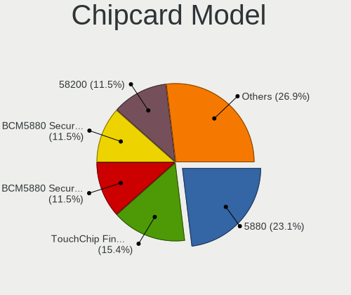

| Model                                                                        | Computers | Percent |
|------------------------------------------------------------------------------|-----------|---------|
| Broadcom 5880                                                                | 5         | 29.41%  |
| Broadcom BCM5880 Secure Applications Processor with fingerprint swipe sensor | 3         | 17.65%  |
| Clay Logic CanoKey Pigeon                                                    | 2         | 11.76%  |
| Broadcom BCM5880 Secure Applications Processor                               | 2         | 11.76%  |
| Broadcom 58200                                                               | 2         | 11.76%  |
| Alcor Micro AU9540 Smartcard Reader                                          | 2         | 11.76%  |
| Upek TouchChip Fingerprint Coprocessor (WBF advanced mode)                   | 1         | 5.88%   |

Unsupported
-----------

Unsupported Devices
-------------------

Total unsupported devices on board

| Total | Computers | Percent |
|-------|-----------|---------|
| 0     | 672       | 59.26%  |
| 1     | 352       | 31.04%  |
| 2     | 70        | 6.17%   |
| 3     | 16        | 1.41%   |
| 4     | 14        | 1.23%   |
| 5     | 6         | 0.53%   |
| 8     | 2         | 0.18%   |
| 7     | 1         | 0.09%   |
| 6     | 1         | 0.09%   |

Unsupported Device Types
------------------------

Types of unsupported devices

| Type                     | Computers | Percent |
|--------------------------|-----------|---------|
| Fingerprint reader       | 168       | 27.81%  |
| Graphics card            | 151       | 25%     |
| Net/wireless             | 64        | 10.6%   |
| Communication controller | 48        | 7.95%   |
| Multimedia controller    | 35        | 5.79%   |
| Unassigned class         | 30        | 4.97%   |
| Sound                    | 28        | 4.64%   |
| Bluetooth                | 21        | 3.48%   |
| Chipcard                 | 15        | 2.48%   |
| Camera                   | 15        | 2.48%   |
| Net/ethernet             | 8         | 1.32%   |
| Network                  | 6         | 0.99%   |
| Storage/raid             | 4         | 0.66%   |
| Card reader              | 4         | 0.66%   |
| Storage                  | 3         | 0.5%    |
| Storage/nvme             | 1         | 0.17%   |
| Storage/ata              | 1         | 0.17%   |
| Modem                    | 1         | 0.17%   |
| Dvb card                 | 1         | 0.17%   |

