Linux in China - Tested Hardware & Statistics
---------------------------------------------

A project to collect tested hardware configurations for Linux in China.

Anyone can contribute to this report by the [hw-probe](https://github.com/linuxhw/hw-probe) tool:

    sudo -E hw-probe -all -upload

Please contribute! Especially if your hardware is rare.

This is a report for all computer types. See also reports for [desktops](/Location/China/Desktop/README.md) and [notebooks](/Location/China/Notebook/README.md).

Contents
--------

* [ Test Cases ](#test-cases)

* [ System ](#system)
  - [ OS                       ](#os)
  - [ OS Family                ](#os-family)
  - [ Kernel                   ](#kernel)
  - [ Kernel Family            ](#kernel-family)
  - [ Kernel Major Ver.        ](#kernel-major-ver)
  - [ Arch                     ](#arch)
  - [ DE                       ](#de)
  - [ Display Server           ](#display-server)
  - [ Display Manager          ](#display-manager)
  - [ OS Lang                  ](#os-lang)
  - [ Boot Mode                ](#boot-mode)
  - [ Filesystem               ](#filesystem)
  - [ Part. scheme             ](#part-scheme)
  - [ Dual Boot with Linux/BSD ](#dual-boot-with-linuxbsd)
  - [ Dual Boot (Win)          ](#dual-boot-win)

* [ Board ](#board)
  - [ Vendor                   ](#vendor)
  - [ Model                    ](#model)
  - [ Model Family             ](#model-family)
  - [ MFG Year                 ](#mfg-year)
  - [ Form Factor              ](#form-factor)
  - [ Secure Boot              ](#secure-boot)
  - [ Coreboot                 ](#coreboot)
  - [ RAM Size                 ](#ram-size)
  - [ RAM Used                 ](#ram-used)
  - [ Total Drives             ](#total-drives)
  - [ Has CD-ROM               ](#has-cd-rom)
  - [ Has Ethernet             ](#has-ethernet)
  - [ Has WiFi                 ](#has-wifi)
  - [ Has Bluetooth            ](#has-bluetooth)

* [ Location ](#location)
  - [ Country                  ](#country)
  - [ City                     ](#city)

* [ Drives ](#drives)
  - [ Drive Vendor             ](#drive-vendor)
  - [ Drive Model              ](#drive-model)
  - [ HDD Vendor               ](#hdd-vendor)
  - [ SSD Vendor               ](#ssd-vendor)
  - [ Drive Kind               ](#drive-kind)
  - [ Drive Connector          ](#drive-connector)
  - [ Drive Size               ](#drive-size)
  - [ Space Total              ](#space-total)
  - [ Space Used               ](#space-used)
  - [ Malfunc. Drives          ](#malfunc-drives)
  - [ Malfunc. Drive Vendor    ](#malfunc-drive-vendor)
  - [ Malfunc. HDD Vendor      ](#malfunc-hdd-vendor)
  - [ Malfunc. Drive Kind      ](#malfunc-drive-kind)
  - [ Failed Drives            ](#failed-drives)
  - [ Failed Drive Vendor      ](#failed-drive-vendor)
  - [ Drive Status             ](#drive-status)

* [ Storage controller ](#storage-controller)
  - [ Storage Vendor           ](#storage-vendor)
  - [ Storage Model            ](#storage-model)
  - [ Storage Kind             ](#storage-kind)

* [ Processor ](#processor)
  - [ CPU Vendor               ](#cpu-vendor)
  - [ CPU Model                ](#cpu-model)
  - [ CPU Model Family         ](#cpu-model-family)
  - [ CPU Cores                ](#cpu-cores)
  - [ CPU Sockets              ](#cpu-sockets)
  - [ CPU Threads              ](#cpu-threads)
  - [ CPU Op-Modes             ](#cpu-op-modes)
  - [ CPU Microcode            ](#cpu-microcode)
  - [ CPU Microarch            ](#cpu-microarch)

* [ Graphics ](#graphics)
  - [ GPU Vendor               ](#gpu-vendor)
  - [ GPU Model                ](#gpu-model)
  - [ GPU Combo                ](#gpu-combo)
  - [ GPU Driver               ](#gpu-driver)
  - [ GPU Memory               ](#gpu-memory)

* [ Monitor ](#monitor)
  - [ Monitor Vendor           ](#monitor-vendor)
  - [ Monitor Model            ](#monitor-model)
  - [ Monitor Resolution       ](#monitor-resolution)
  - [ Monitor Diagonal         ](#monitor-diagonal)
  - [ Monitor Width            ](#monitor-width)
  - [ Aspect Ratio             ](#aspect-ratio)
  - [ Monitor Area             ](#monitor-area)
  - [ Pixel Density            ](#pixel-density)
  - [ Multiple Monitors        ](#multiple-monitors)

* [ Network ](#network)
  - [ Net Controller Vendor    ](#net-controller-vendor)
  - [ Net Controller Model     ](#net-controller-model)
  - [ Wireless Vendor          ](#wireless-vendor)
  - [ Wireless Model           ](#wireless-model)
  - [ Ethernet Vendor          ](#ethernet-vendor)
  - [ Ethernet Model           ](#ethernet-model)
  - [ Net Controller Kind      ](#net-controller-kind)
  - [ Used Controller          ](#used-controller)
  - [ NICs                     ](#nics)
  - [ IPv6                     ](#ipv6)

* [ Bluetooth ](#bluetooth)
  - [ Bluetooth Vendor         ](#bluetooth-vendor)
  - [ Bluetooth Model          ](#bluetooth-model)

* [ Sound ](#sound)
  - [ Sound Vendor             ](#sound-vendor)
  - [ Sound Model              ](#sound-model)

* [ Memory ](#memory)
  - [ Memory Vendor            ](#memory-vendor)
  - [ Memory Model             ](#memory-model)
  - [ Memory Kind              ](#memory-kind)
  - [ Memory Form Factor       ](#memory-form-factor)
  - [ Memory Size              ](#memory-size)
  - [ Memory Speed             ](#memory-speed)

* [ Printers & scanners ](#printers--scanners)
  - [ Printer Vendor           ](#printer-vendor)
  - [ Printer Model            ](#printer-model)
  - [ Scanner Vendor           ](#scanner-vendor)
  - [ Scanner Model            ](#scanner-model)

* [ Camera ](#camera)
  - [ Camera Vendor            ](#camera-vendor)
  - [ Camera Model             ](#camera-model)

* [ Security ](#security)
  - [ Fingerprint Vendor       ](#fingerprint-vendor)
  - [ Fingerprint Model        ](#fingerprint-model)
  - [ Chipcard Vendor          ](#chipcard-vendor)
  - [ Chipcard Model           ](#chipcard-model)

* [ Unsupported ](#unsupported)
  - [ Unsupported Devices      ](#unsupported-devices)
  - [ Unsupported Device Types ](#unsupported-device-types)

Test Cases
----------

Total: 1895

| Vendor        | Model                       | Form-Factor | Probe                                                      | Date         |
|---------------|-----------------------------|-------------|------------------------------------------------------------|--------------|
| MECHREVO      | Jiaolong16K Series GM6BG... | Notebook    | [a165849009](https://linux-hardware.org/?probe=a165849009) | Jun 09, 2023 |
| MECHREVO      | Jiaolong16K Series GM6BG... | Notebook    | [05c07442a3](https://linux-hardware.org/?probe=05c07442a3) | Jun 09, 2023 |
| WOOKING       | X16                         | Notebook    | [aa543651fc](https://linux-hardware.org/?probe=aa543651fc) | Jun 08, 2023 |
| Win elemen... | M600                        | Desktop     | [360ab80d9b](https://linux-hardware.org/?probe=360ab80d9b) | Jun 06, 2023 |
| Gigabyte      | F2A88XM-D3H                 | Desktop     | [6640281a3b](https://linux-hardware.org/?probe=6640281a3b) | Jun 06, 2023 |
| Gigabyte      | B560M AORUS ELITE           | Desktop     | [f06cb8954c](https://linux-hardware.org/?probe=f06cb8954c) | Jun 06, 2023 |
| ASUSTek       | ROG Ally RC71L_RC71L        | Tablet      | [a71d7442d7](https://linux-hardware.org/?probe=a71d7442d7) | Jun 05, 2023 |
| HONOR         | HYM-WXX                     | Notebook    | [964cd10c8e](https://linux-hardware.org/?probe=964cd10c8e) | Jun 05, 2023 |
| HP            | 8768 A                      | Desktop     | [17d0560a85](https://linux-hardware.org/?probe=17d0560a85) | Jun 05, 2023 |
| HP            | OMEN by Laptop 16-b0xxx     | Notebook    | [f8f07099c7](https://linux-hardware.org/?probe=f8f07099c7) | Jun 05, 2023 |
| Lenovo        | Legion R70002021 82JW       | Notebook    | [f4e7c7034f](https://linux-hardware.org/?probe=f4e7c7034f) | Jun 05, 2023 |
| ASUSTek       | TUF Gaming B550M-E WIFI     | Desktop     | [54e2e07ac6](https://linux-hardware.org/?probe=54e2e07ac6) | Jun 05, 2023 |
| ASUSTek       | PRIME Z790-P WIFI           | Desktop     | [4ba1a29c23](https://linux-hardware.org/?probe=4ba1a29c23) | Jun 05, 2023 |
| Unknown       | Unknown                     | Tablet      | [33c4d481d9](https://linux-hardware.org/?probe=33c4d481d9) | Jun 05, 2023 |
| Unknown       | Unknown                     | Soc         | [9cb76f0184](https://linux-hardware.org/?probe=9cb76f0184) | Jun 04, 2023 |
| Unknown       | Unknown                     | Soc         | [7e2052896c](https://linux-hardware.org/?probe=7e2052896c) | Jun 04, 2023 |
| Shanghai Z... | ZEB20 TBD                   | Mini pc     | [b6411e69f3](https://linux-hardware.org/?probe=b6411e69f3) | Jun 04, 2023 |
| Gigabyte      | F2A88XM-D3H                 | Desktop     | [f88c53fd11](https://linux-hardware.org/?probe=f88c53fd11) | Jun 04, 2023 |
| Toshiba       | WT8-A                       | Notebook    | [01e8918ef6](https://linux-hardware.org/?probe=01e8918ef6) | Jun 04, 2023 |
| Toshiba       | WT8-A                       | Notebook    | [4dc30f1c10](https://linux-hardware.org/?probe=4dc30f1c10) | Jun 04, 2023 |
| GPD           | G1619-04                    | Notebook    | [fcc919c1c2](https://linux-hardware.org/?probe=fcc919c1c2) | Jun 03, 2023 |
| Gigabyte      | F2A88XM-D3H                 | Desktop     | [c142ea01cd](https://linux-hardware.org/?probe=c142ea01cd) | Jun 03, 2023 |
| ASUSTek       | ROG CROSSHAIR VIII DARK ... | Desktop     | [0523005c68](https://linux-hardware.org/?probe=0523005c68) | Jun 03, 2023 |
| GPD           | G1618-04                    | All in one  | [63ca853c36](https://linux-hardware.org/?probe=63ca853c36) | Jun 03, 2023 |
| HP            | OMEN Laptop 15-en0xxx       | Notebook    | [ab7c62da47](https://linux-hardware.org/?probe=ab7c62da47) | Jun 02, 2023 |
| Dell          | Inspiron 5468               | Notebook    | [b16aeda09e](https://linux-hardware.org/?probe=b16aeda09e) | Jun 02, 2023 |
| IPASON        | P3                          | Notebook    | [bd9e0660a4](https://linux-hardware.org/?probe=bd9e0660a4) | Jun 02, 2023 |
| ChangWang     | CW56-58                     | Desktop     | [e00e626ea6](https://linux-hardware.org/?probe=e00e626ea6) | Jun 01, 2023 |
| Unknown       | Unknown                     | Tablet      | [40aebbf364](https://linux-hardware.org/?probe=40aebbf364) | Jun 01, 2023 |
| Lenovo        | Yoga 14sITL 2021 82G2       | Notebook    | [d21f59bea5](https://linux-hardware.org/?probe=d21f59bea5) | May 31, 2023 |
| Lenovo        | ZhaoYangN4620Z 20A0Z037K... | Notebook    | [7e07cca977](https://linux-hardware.org/?probe=7e07cca977) | May 31, 2023 |
| Lenovo        | ThinkBook 16p Gen 4 21J8    | Notebook    | [202bf4f657](https://linux-hardware.org/?probe=202bf4f657) | May 29, 2023 |
| Lenovo        | ThinkBook 16p Gen 4 21J8    | Notebook    | [bb60c42e07](https://linux-hardware.org/?probe=bb60c42e07) | May 29, 2023 |
| Unknown       | Unknown                     | Soc         | [0f85a652ad](https://linux-hardware.org/?probe=0f85a652ad) | May 28, 2023 |
| Shanghai Z... | ZEB20 TBD                   | Mini pc     | [1375d36b0f](https://linux-hardware.org/?probe=1375d36b0f) | May 28, 2023 |
| ONDA          | M3 miniPC VER               | Desktop     | [1a6a6ab3e6](https://linux-hardware.org/?probe=1a6a6ab3e6) | May 27, 2023 |
| Dell          | 0WCJNT A06                  | Server      | [b3215bf901](https://linux-hardware.org/?probe=b3215bf901) | May 27, 2023 |
| Unknown       | Xiaobao Nas I               | Soc         | [bc71966f2f](https://linux-hardware.org/?probe=bc71966f2f) | May 26, 2023 |
| Shanghai Z... | ZEB20 TBD                   | Mini pc     | [84953a504d](https://linux-hardware.org/?probe=84953a504d) | May 26, 2023 |
| HP            | OMEN Laptop 15-ek0xxx       | Notebook    | [f4de9c8a5f](https://linux-hardware.org/?probe=f4de9c8a5f) | May 26, 2023 |
| Lenovo        | ThinkPad X200 74574AC       | Notebook    | [e770387a34](https://linux-hardware.org/?probe=e770387a34) | May 25, 2023 |
| Acer          | Swift SF314-71              | Notebook    | [00979b3baa](https://linux-hardware.org/?probe=00979b3baa) | May 24, 2023 |
| Acer          | Swift SF314-71              | Notebook    | [84d9f5a2cc](https://linux-hardware.org/?probe=84d9f5a2cc) | May 24, 2023 |
| ONDA          | M3 miniPC VER               | Desktop     | [c4c78fe843](https://linux-hardware.org/?probe=c4c78fe843) | May 24, 2023 |
| Unknown       | Unknown                     | Tablet      | [8a83b799d5](https://linux-hardware.org/?probe=8a83b799d5) | May 24, 2023 |
| HUAWEI        | KLVD-WXX9                   | Notebook    | [4c3c861f80](https://linux-hardware.org/?probe=4c3c861f80) | May 23, 2023 |
| Unknown       | Unknown                     | Soc         | [39ae5b4339](https://linux-hardware.org/?probe=39ae5b4339) | May 23, 2023 |
| HP            | ProBook 450 G8 Notebook ... | Notebook    | [a2986e9b7a](https://linux-hardware.org/?probe=a2986e9b7a) | May 23, 2023 |
| Lenovo        | Legion Y7000P IAH7 82RC     | Notebook    | [c4040a0905](https://linux-hardware.org/?probe=c4040a0905) | May 23, 2023 |
| Timi          | RedmiBook 14-APCS           | Notebook    | [04d3c59d2c](https://linux-hardware.org/?probe=04d3c59d2c) | May 22, 2023 |
| Dell          | 0J1C3P A00                  | Desktop     | [5f3d8a94e6](https://linux-hardware.org/?probe=5f3d8a94e6) | May 22, 2023 |
| Unknown       | Unknown                     | Soc         | [48690c2413](https://linux-hardware.org/?probe=48690c2413) | May 21, 2023 |
| Unknown       | Unknown                     | Soc         | [84bd3a247e](https://linux-hardware.org/?probe=84bd3a247e) | May 21, 2023 |
| AZW           | SER V01                     | Mini pc     | [e0c2283aa1](https://linux-hardware.org/?probe=e0c2283aa1) | May 20, 2023 |
| Lenovo        | ThinkPad T480 20L5000UUS    | Notebook    | [cf1d4ac757](https://linux-hardware.org/?probe=cf1d4ac757) | May 18, 2023 |
| HP            | EliteBook 845 G7 Noteboo... | Notebook    | [4d1cd4ec12](https://linux-hardware.org/?probe=4d1cd4ec12) | May 17, 2023 |
| Toshiba       | Satellite C805D             | Notebook    | [21ee852978](https://linux-hardware.org/?probe=21ee852978) | May 16, 2023 |
| Dell          | 0FDY5C A00                  | Desktop     | [3d9b02954b](https://linux-hardware.org/?probe=3d9b02954b) | May 16, 2023 |
| MSI           | MAG B560M MORTAR            | Desktop     | [2323128fd2](https://linux-hardware.org/?probe=2323128fd2) | May 16, 2023 |
| Unknown       | Unknown                     | Soc         | [8fa49f6af8](https://linux-hardware.org/?probe=8fa49f6af8) | May 14, 2023 |
| ASUSTek       | K55DR                       | Notebook    | [e4f7010e78](https://linux-hardware.org/?probe=e4f7010e78) | May 13, 2023 |
| ASUSTek       | K55DR                       | Notebook    | [0d4d8571bf](https://linux-hardware.org/?probe=0d4d8571bf) | May 13, 2023 |
| Phytium       | FT-2000/4 V0001             | Server      | [ef9af7edf3](https://linux-hardware.org/?probe=ef9af7edf3) | May 09, 2023 |
| Koloe         | X58                         | Desktop     | [7c1acc3b84](https://linux-hardware.org/?probe=7c1acc3b84) | May 08, 2023 |
| Lenovo        | ThinkPad X1 Nano Gen 1 2... | Notebook    | [d615a9b90f](https://linux-hardware.org/?probe=d615a9b90f) | May 08, 2023 |
| Quanta        | TWH                         | Notebook    | [724b4d7343](https://linux-hardware.org/?probe=724b4d7343) | May 06, 2023 |
| Lenovo        | IdeaPad Y480 20131          | Notebook    | [d625664bee](https://linux-hardware.org/?probe=d625664bee) | May 06, 2023 |
| Gigabyte      | F2A88XM-D3H                 | Desktop     | [850ea7c843](https://linux-hardware.org/?probe=850ea7c843) | May 06, 2023 |
| MSI           | Z97S SLI Krait Edition      | Desktop     | [eb289c3d5f](https://linux-hardware.org/?probe=eb289c3d5f) | May 06, 2023 |
| Unknown       | Unknown                     | Soc         | [043c078caf](https://linux-hardware.org/?probe=043c078caf) | May 05, 2023 |
| Shanghai Z... | ZXE CRB                     | Notebook    | [d63ef842c1](https://linux-hardware.org/?probe=d63ef842c1) | May 05, 2023 |
| ASUSTek       | ASUS TUF Gaming F15 FX50... | Notebook    | [5f4447aa45](https://linux-hardware.org/?probe=5f4447aa45) | May 05, 2023 |
| Lenovo        | ThinkPad T480 20L5000UUS    | Notebook    | [1dacd7233b](https://linux-hardware.org/?probe=1dacd7233b) | May 05, 2023 |
| Raspberry ... | Raspberry Pi 3 Model A P... | Soc         | [d0c2c987fc](https://linux-hardware.org/?probe=d0c2c987fc) | May 03, 2023 |
| Microsoft     | Surface with Windows RT     | Tablet      | [7d6459d367](https://linux-hardware.org/?probe=7d6459d367) | May 03, 2023 |
| ASUSTek       | ASUS TUF Gaming A15 FA50... | Notebook    | [ab21408c4c](https://linux-hardware.org/?probe=ab21408c4c) | May 03, 2023 |
| HP            | 83C3 A01                    | Mini pc     | [bb29a94285](https://linux-hardware.org/?probe=bb29a94285) | May 03, 2023 |
| GreatWall     | DF                          | Soc         | [5a3cb266db](https://linux-hardware.org/?probe=5a3cb266db) | May 03, 2023 |
| Huanan        | B75                         | Desktop     | [597233d5d2](https://linux-hardware.org/?probe=597233d5d2) | May 02, 2023 |
| HP            | EliteBook 845 14 inch G9... | Notebook    | [528ba302c0](https://linux-hardware.org/?probe=528ba302c0) | May 02, 2023 |
| Quanta        | TWH                         | Notebook    | [e760482286](https://linux-hardware.org/?probe=e760482286) | May 02, 2023 |
| Google        | Homestar (rev4+)            | Soc         | [9184b7f306](https://linux-hardware.org/?probe=9184b7f306) | May 02, 2023 |
| MECHREVO      | WUJIE16 Pro                 | Notebook    | [c19e8370e5](https://linux-hardware.org/?probe=c19e8370e5) | May 02, 2023 |
| Huanan        | B75                         | Desktop     | [1f988e5101](https://linux-hardware.org/?probe=1f988e5101) | May 02, 2023 |
| MAXSUN        | MS-A86FX FS M.3             | Desktop     | [3ce20d3b05](https://linux-hardware.org/?probe=3ce20d3b05) | May 01, 2023 |
| Gigabyte      | F2A88XM-D3H                 | Desktop     | [b37927b9d4](https://linux-hardware.org/?probe=b37927b9d4) | May 01, 2023 |
| Timi          | TM1612                      | Notebook    | [3c06f7495e](https://linux-hardware.org/?probe=3c06f7495e) | May 01, 2023 |
| Gigabyte      | F2A88XM-D3H                 | Desktop     | [a188684584](https://linux-hardware.org/?probe=a188684584) | Apr 30, 2023 |
| Colorful T... | CVN B550M GAMING FROZEN ... | Desktop     | [233ea7cdd8](https://linux-hardware.org/?probe=233ea7cdd8) | Apr 30, 2023 |
| Colorful T... | CVN B550M GAMING FROZEN ... | Desktop     | [177fe2fc00](https://linux-hardware.org/?probe=177fe2fc00) | Apr 30, 2023 |
| HEDYCOMPUT... | IH81MF-Q3                   | Desktop     | [3444236ed4](https://linux-hardware.org/?probe=3444236ed4) | Apr 30, 2023 |
| Gigabyte      | H77-DS3H                    | Desktop     | [6750e5f83d](https://linux-hardware.org/?probe=6750e5f83d) | Apr 30, 2023 |
| Dell          | Vostro 5468                 | Notebook    | [93eb16d30d](https://linux-hardware.org/?probe=93eb16d30d) | Apr 30, 2023 |
| Colorful T... | CVN Z590 GAMING PRO V20     | Desktop     | [209ec5e477](https://linux-hardware.org/?probe=209ec5e477) | Apr 28, 2023 |
| Lenovo        | Legion Y7000 81FW           | Notebook    | [b1e6130b77](https://linux-hardware.org/?probe=b1e6130b77) | Apr 28, 2023 |
| Unknown       | iKoolCore R1 iKoolCore R... | Desktop     | [429d6f994a](https://linux-hardware.org/?probe=429d6f994a) | Apr 28, 2023 |
| Lenovo        | SHARKBAY NO DPK             | Desktop     | [9a22f330c4](https://linux-hardware.org/?probe=9a22f330c4) | Apr 28, 2023 |
| ASUSTek       | ROG Flow X13 GV301QH_GV3... | Notebook    | [4fb9a937f3](https://linux-hardware.org/?probe=4fb9a937f3) | Apr 27, 2023 |
| Gigabyte      | F2A88XM-D3H                 | Desktop     | [97a3b73c44](https://linux-hardware.org/?probe=97a3b73c44) | Apr 27, 2023 |
| Timi          | TM1612                      | Notebook    | [f3127f0186](https://linux-hardware.org/?probe=f3127f0186) | Apr 27, 2023 |
| Phytium       | FT-2000/4 V0001             | Server      | [d59b9ff270](https://linux-hardware.org/?probe=d59b9ff270) | Apr 26, 2023 |
| Unknown       | Unknown                     | Desktop     | [c5824f9cae](https://linux-hardware.org/?probe=c5824f9cae) | Apr 25, 2023 |
| Shanghai Z... | ZXE CRB                     | Notebook    | [298d51ae78](https://linux-hardware.org/?probe=298d51ae78) | Apr 24, 2023 |
| Lenovo        | ThinkBook 14 G4 IAP 21DH    | Notebook    | [aa23589794](https://linux-hardware.org/?probe=aa23589794) | Apr 23, 2023 |
| Lenovo        | 1036 NO DPK                 | Desktop     | [f5b9a50e56](https://linux-hardware.org/?probe=f5b9a50e56) | Apr 23, 2023 |
| Lenovo        | 1036 NO DPK                 | Desktop     | [edcf4e959d](https://linux-hardware.org/?probe=edcf4e959d) | Apr 23, 2023 |
| Lenovo        | 1036 NO DPK                 | Desktop     | [d1ca2bb309](https://linux-hardware.org/?probe=d1ca2bb309) | Apr 23, 2023 |
| ASRock        | Z170 Gaming K4              | Desktop     | [8209f53171](https://linux-hardware.org/?probe=8209f53171) | Apr 22, 2023 |
| HP            | Pavilion x360 Convertibl... | Convertible | [c5b0278699](https://linux-hardware.org/?probe=c5b0278699) | Apr 22, 2023 |
| Unknown       | BXTH265BC                   | Notebook    | [37293a672b](https://linux-hardware.org/?probe=37293a672b) | Apr 21, 2023 |
| Timi          | A34R                        | Notebook    | [310e4d7b63](https://linux-hardware.org/?probe=310e4d7b63) | Apr 20, 2023 |
| Dell          | 0FDY5C A00                  | Desktop     | [ddf678b11a](https://linux-hardware.org/?probe=ddf678b11a) | Apr 20, 2023 |
| MECHREVO      | Code10-7CC6U                | Notebook    | [0964cd2b26](https://linux-hardware.org/?probe=0964cd2b26) | Apr 20, 2023 |
| MECHREVO      | Code10-7CC6U                | Notebook    | [5ddc83a95c](https://linux-hardware.org/?probe=5ddc83a95c) | Apr 20, 2023 |
| HP            | Pavilion x360 Convertibl... | Convertible | [905e23cca7](https://linux-hardware.org/?probe=905e23cca7) | Apr 20, 2023 |
| UGREEN        | DX4600                      | Desktop     | [cbe70de89c](https://linux-hardware.org/?probe=cbe70de89c) | Apr 19, 2023 |
| HONOR         | HYM-WXX                     | Notebook    | [49d7cdd068](https://linux-hardware.org/?probe=49d7cdd068) | Apr 18, 2023 |
| Timi          | TM1612                      | Notebook    | [7be723d412](https://linux-hardware.org/?probe=7be723d412) | Apr 16, 2023 |
| Unknown       | Unknown                     | Soc         | [018daf402b](https://linux-hardware.org/?probe=018daf402b) | Apr 15, 2023 |
| Unknown       | Unknown                     | Desktop     | [d45af08c99](https://linux-hardware.org/?probe=d45af08c99) | Apr 14, 2023 |
| Unknown       | Unknown                     | Desktop     | [6925c48705](https://linux-hardware.org/?probe=6925c48705) | Apr 14, 2023 |
| Unknown       | Unknown                     | Desktop     | [158dacc1ce](https://linux-hardware.org/?probe=158dacc1ce) | Apr 13, 2023 |
| Unknown       | Unknown                     | Desktop     | [52aeca6f98](https://linux-hardware.org/?probe=52aeca6f98) | Apr 13, 2023 |
| HP            | ZHAN 99 Mobile Workstati... | Notebook    | [3dcc7ab043](https://linux-hardware.org/?probe=3dcc7ab043) | Apr 12, 2023 |
| HP            | OMEN by Laptop 15-dc0xxx    | Notebook    | [6bec4cb4a8](https://linux-hardware.org/?probe=6bec4cb4a8) | Apr 12, 2023 |
| Apple         | Mac-35C5E08120C7EEAF Mac... | Mini pc     | [6182cca953](https://linux-hardware.org/?probe=6182cca953) | Apr 12, 2023 |
| Lenovo        | ThinkPad P15v Gen 3 21D8... | Notebook    | [8d4288ca33](https://linux-hardware.org/?probe=8d4288ca33) | Apr 09, 2023 |
| ASRock        | B150 Combo                  | Desktop     | [c4acc08020](https://linux-hardware.org/?probe=c4acc08020) | Apr 09, 2023 |
| ASUSTek       | ROG Zephyrus G14 GA401QM... | Notebook    | [3358152092](https://linux-hardware.org/?probe=3358152092) | Apr 06, 2023 |
| ASUSTek       | A68HM-E                     | Desktop     | [0c9ae9bcd7](https://linux-hardware.org/?probe=0c9ae9bcd7) | Apr 06, 2023 |
| Timi          | RedmiBook Pro 15            | Notebook    | [4eb4d46bfc](https://linux-hardware.org/?probe=4eb4d46bfc) | Apr 05, 2023 |
| HP            | 1790                        | Desktop     | [55e3d423e0](https://linux-hardware.org/?probe=55e3d423e0) | Apr 05, 2023 |
| Dell          | 0PVVD2 A01                  | Server      | [465c40dd0f](https://linux-hardware.org/?probe=465c40dd0f) | Apr 04, 2023 |
| Dell          | 0RN4PJ A01                  | Server      | [93dbb217b4](https://linux-hardware.org/?probe=93dbb217b4) | Apr 04, 2023 |
| Unknown       | Unknown                     | Desktop     | [cdd67e12ca](https://linux-hardware.org/?probe=cdd67e12ca) | Apr 03, 2023 |
| HP            | OMEN by Gaming Laptop 16... | Notebook    | [a85a9274d5](https://linux-hardware.org/?probe=a85a9274d5) | Apr 03, 2023 |
| HASEE Comp... | CV15S                       | Notebook    | [6c31986832](https://linux-hardware.org/?probe=6c31986832) | Apr 03, 2023 |
| HASEE Comp... | CV15S                       | Notebook    | [47c3d8f7b6](https://linux-hardware.org/?probe=47c3d8f7b6) | Apr 03, 2023 |
| Lenovo        | SHARKBAY NOK                | Desktop     | [091d2eda88](https://linux-hardware.org/?probe=091d2eda88) | Apr 01, 2023 |
| Intel         | H81U                        | Notebook    | [43d7179dc3](https://linux-hardware.org/?probe=43d7179dc3) | Mar 30, 2023 |
| ASUSTek       | ASUS TUF Gaming F17 FX70... | Notebook    | [da1e07f122](https://linux-hardware.org/?probe=da1e07f122) | Mar 30, 2023 |
| Gigabyte      | B650I AORUS ULTRA           | Desktop     | [a33a768662](https://linux-hardware.org/?probe=a33a768662) | Mar 29, 2023 |
| Lenovo        | XiaoXinPro-13ARE 2020 82... | Notebook    | [eb153b5f5d](https://linux-hardware.org/?probe=eb153b5f5d) | Mar 29, 2023 |
| Dell          | 0R5KF8 A03                  | Desktop     | [decf0f5193](https://linux-hardware.org/?probe=decf0f5193) | Mar 28, 2023 |
| Pine Micro... | Pine64 PinePhone (1.2)      | Phone       | [caf2461355](https://linux-hardware.org/?probe=caf2461355) | Mar 28, 2023 |
| Unknown       | FT2000plus Generic Borad... | Desktop     | [43ec5396f3](https://linux-hardware.org/?probe=43ec5396f3) | Mar 28, 2023 |
| Unknown       | FT2000plus Generic Borad... | Desktop     | [c305aa7562](https://linux-hardware.org/?probe=c305aa7562) | Mar 28, 2023 |
| ASRock        | A320M-HDV                   | Desktop     | [9685e81600](https://linux-hardware.org/?probe=9685e81600) | Mar 27, 2023 |
| ASUSTek       | Z97-K R2.0                  | Desktop     | [b1e1f4d711](https://linux-hardware.org/?probe=b1e1f4d711) | Mar 27, 2023 |
| HUAWEI        | KLVDZ-WXX9                  | Notebook    | [369363c3a9](https://linux-hardware.org/?probe=369363c3a9) | Mar 26, 2023 |
| Shanghai Z... | ZXE CRB                     | Notebook    | [aafbb2815f](https://linux-hardware.org/?probe=aafbb2815f) | Mar 25, 2023 |
| HP            | EliteBook 6930p             | Notebook    | [da0d90d69f](https://linux-hardware.org/?probe=da0d90d69f) | Mar 25, 2023 |
| Lenovo        | Legion R9000P ARH7H 82RG    | Notebook    | [300fe5d1b2](https://linux-hardware.org/?probe=300fe5d1b2) | Mar 24, 2023 |
| Lenovo        | Legion R9000P ARH7H 82RG    | Notebook    | [8291e7598a](https://linux-hardware.org/?probe=8291e7598a) | Mar 24, 2023 |
| Shanghai Z... | ZXE CRB                     | Notebook    | [7f98044a04](https://linux-hardware.org/?probe=7f98044a04) | Mar 24, 2023 |
| ASUSTek       | ROG STRIX X570-E GAMING     | Desktop     | [4731c6e59f](https://linux-hardware.org/?probe=4731c6e59f) | Mar 23, 2023 |
| ASUSTek       | ROG STRIX X570-E GAMING     | Desktop     | [127173d60b](https://linux-hardware.org/?probe=127173d60b) | Mar 23, 2023 |
| Timi          | TM1613                      | Notebook    | [3016a40df3](https://linux-hardware.org/?probe=3016a40df3) | Mar 23, 2023 |
| Timi          | TM1613                      | Notebook    | [ddbc83a8d3](https://linux-hardware.org/?probe=ddbc83a8d3) | Mar 23, 2023 |
| Lenovo        | ThinkPad X230s 20AHS0070... | Notebook    | [9d86eaf558](https://linux-hardware.org/?probe=9d86eaf558) | Mar 21, 2023 |
| Dell          | 0NDYHG A00                  | Desktop     | [f007ab3692](https://linux-hardware.org/?probe=f007ab3692) | Mar 20, 2023 |
| Intel         | NUC12SNKi72 M45201-500      | Mini pc     | [67985889b2](https://linux-hardware.org/?probe=67985889b2) | Mar 17, 2023 |
| Timi          | Xiaomi Book Pro 16 2022     | Notebook    | [f980742ab8](https://linux-hardware.org/?probe=f980742ab8) | Mar 16, 2023 |
| Lenovo        | 1036 NO DPK                 | Desktop     | [3b6514e9c4](https://linux-hardware.org/?probe=3b6514e9c4) | Mar 16, 2023 |
| Unknown       | Unknown                     | Desktop     | [0eb13c3117](https://linux-hardware.org/?probe=0eb13c3117) | Mar 15, 2023 |
| Unknown       | Unknown                     | Desktop     | [6e24f7a3c1](https://linux-hardware.org/?probe=6e24f7a3c1) | Mar 15, 2023 |
| sunxi         | LeMaker Banana Pi           | Soc         | [d27d307085](https://linux-hardware.org/?probe=d27d307085) | Mar 14, 2023 |
| ASUSTek       | TUF Gaming FX504GD_FX80G... | Notebook    | [eac2f2ae40](https://linux-hardware.org/?probe=eac2f2ae40) | Mar 14, 2023 |
| Lenovo        | ThinkPad X1 Carbon Gen 1... | Notebook    | [d9d4f5649a](https://linux-hardware.org/?probe=d9d4f5649a) | Mar 14, 2023 |
| ASUSTek       | TUF Gaming FX504GD_FX80G... | Notebook    | [70de894994](https://linux-hardware.org/?probe=70de894994) | Mar 13, 2023 |
| GPD           | G1621-02                    | Notebook    | [21394d0975](https://linux-hardware.org/?probe=21394d0975) | Mar 12, 2023 |
| Lenovo        | XiaoXin-15ARE 2020 81YR     | Notebook    | [bcbf6544cd](https://linux-hardware.org/?probe=bcbf6544cd) | Mar 11, 2023 |
| Timi          | Xiaomi Book Pro 16 2022     | Notebook    | [4ffe64e472](https://linux-hardware.org/?probe=4ffe64e472) | Mar 11, 2023 |
| Shanghai Z... | ZXE CRB                     | Notebook    | [49130084c4](https://linux-hardware.org/?probe=49130084c4) | Mar 11, 2023 |
| Shanghai Z... | ZXE CRB                     | Notebook    | [a6091bc2e2](https://linux-hardware.org/?probe=a6091bc2e2) | Mar 11, 2023 |
| Lenovo        | 313A SDK0L77767 WIN 3423... | Desktop     | [869582f7a7](https://linux-hardware.org/?probe=869582f7a7) | Mar 10, 2023 |
| ASUSTek       | TUF Gaming B460M-PLUS       | Desktop     | [a5a874dac0](https://linux-hardware.org/?probe=a5a874dac0) | Mar 10, 2023 |
| AZW           | GTR V02                     | Desktop     | [06b17c5206](https://linux-hardware.org/?probe=06b17c5206) | Mar 09, 2023 |
| Lenovo        | ThinkPad X13 Gen 3 21CMA... | Notebook    | [f15426402c](https://linux-hardware.org/?probe=f15426402c) | Mar 09, 2023 |
| Lenovo        | Legion Y9000P IAH7H 82RF    | Notebook    | [30d91acf27](https://linux-hardware.org/?probe=30d91acf27) | Mar 07, 2023 |
| GPD           | P2 MAX                      | Notebook    | [d73c7b9146](https://linux-hardware.org/?probe=d73c7b9146) | Mar 07, 2023 |
| Lenovo        | 313A SDK0L77767 WIN 3423... | Desktop     | [828ae3c8fd](https://linux-hardware.org/?probe=828ae3c8fd) | Mar 07, 2023 |
| Gigabyte      | Z690 UD DDR4 V2             | Desktop     | [fa84567d3f](https://linux-hardware.org/?probe=fa84567d3f) | Mar 06, 2023 |
| Gigabyte      | Z690 UD DDR4 V2             | Desktop     | [b58f671799](https://linux-hardware.org/?probe=b58f671799) | Mar 06, 2023 |
| Lenovo        | Unknown                     | Notebook    | [2ae9263125](https://linux-hardware.org/?probe=2ae9263125) | Mar 06, 2023 |
| Shanghai Z... | ZXE CRB                     | Notebook    | [bb68a61939](https://linux-hardware.org/?probe=bb68a61939) | Mar 05, 2023 |
| Lenovo        | ThinkPad 11e 20D9S00C00     | Notebook    | [dbae54f9d4](https://linux-hardware.org/?probe=dbae54f9d4) | Mar 04, 2023 |
| Unknown       | Unknown                     | Desktop     | [89822406cc](https://linux-hardware.org/?probe=89822406cc) | Feb 28, 2023 |
| SmbiosType... | SmbiosType1_SystemProduc... | Notebook    | [ccac327e17](https://linux-hardware.org/?probe=ccac327e17) | Feb 27, 2023 |
| Intel         | NUC11PABi5 K90634-302       | Mini pc     | [dd2f99b3ca](https://linux-hardware.org/?probe=dd2f99b3ca) | Feb 27, 2023 |
| Intel         | NUC11PABi5 K90634-302       | Mini pc     | [3c4718f66e](https://linux-hardware.org/?probe=3c4718f66e) | Feb 26, 2023 |
| Supermicro    | X11SDV-8C-TP8F              | Server      | [ffa58f1702](https://linux-hardware.org/?probe=ffa58f1702) | Feb 26, 2023 |
| ASUSTek       | H87-PLUS                    | Desktop     | [f56bb767fd](https://linux-hardware.org/?probe=f56bb767fd) | Feb 26, 2023 |
| ASUSTek       | H87-PLUS                    | Desktop     | [98e70b4028](https://linux-hardware.org/?probe=98e70b4028) | Feb 26, 2023 |
| Unknown       | Unknown                     | Desktop     | [65a35ffeea](https://linux-hardware.org/?probe=65a35ffeea) | Feb 24, 2023 |
| Unknown       | Unknown                     | Desktop     | [3d8e9cb31b](https://linux-hardware.org/?probe=3d8e9cb31b) | Feb 24, 2023 |
| Lenovo        | Yoga Pro 14s IAH7 82TK      | Notebook    | [ade006d016](https://linux-hardware.org/?probe=ade006d016) | Feb 24, 2023 |
| Lenovo        | KaiTian N70z G1d            | Notebook    | [cbc8e4e008](https://linux-hardware.org/?probe=cbc8e4e008) | Feb 24, 2023 |
| Dell          | 0CNWVK A02                  | Desktop     | [1fd825c3df](https://linux-hardware.org/?probe=1fd825c3df) | Feb 24, 2023 |
| Lenovo        | ThinkBook 14 G4+ IAP 21C... | Notebook    | [028814b990](https://linux-hardware.org/?probe=028814b990) | Feb 24, 2023 |
| Dell          | 0V7K5Y A00                  | Desktop     | [831a493e15](https://linux-hardware.org/?probe=831a493e15) | Feb 24, 2023 |
| Lenovo        | ThinkPad X1 Carbon Gen 1... | Notebook    | [cc10e54ab9](https://linux-hardware.org/?probe=cc10e54ab9) | Feb 20, 2023 |
| ASUSTek       | X99-M WS                    | Desktop     | [69eb540783](https://linux-hardware.org/?probe=69eb540783) | Feb 20, 2023 |
| Lenovo        | ThinkBook 14 G4+ IAP 21C... | Notebook    | [c4ec00ef99](https://linux-hardware.org/?probe=c4ec00ef99) | Feb 17, 2023 |
| Acer          | Aspire 5540                 | Notebook    | [ce25cbe4f9](https://linux-hardware.org/?probe=ce25cbe4f9) | Feb 17, 2023 |
| Gigabyte      | X299 AORUS Gaming 7         | Desktop     | [cd5fcc7d4c](https://linux-hardware.org/?probe=cd5fcc7d4c) | Feb 17, 2023 |
| Gigabyte      | X299 AORUS Gaming 7         | Desktop     | [8ef4a011f7](https://linux-hardware.org/?probe=8ef4a011f7) | Feb 17, 2023 |
| ASUSTek       | ROG STRIX X299-E GAMING     | Desktop     | [5160909d57](https://linux-hardware.org/?probe=5160909d57) | Feb 17, 2023 |
| Gigabyte      | X299 UD4 Pro-CF             | Desktop     | [2c3699dc3c](https://linux-hardware.org/?probe=2c3699dc3c) | Feb 17, 2023 |
| ASUSTek       | ROG STRIX X299-E GAMING     | Desktop     | [21ef26978d](https://linux-hardware.org/?probe=21ef26978d) | Feb 17, 2023 |
| ASUSTek       | ROG STRIX X299-E GAMING     | Desktop     | [ba50ff27b1](https://linux-hardware.org/?probe=ba50ff27b1) | Feb 17, 2023 |
| Gigabyte      | X299 AORUS Gaming 7         | Desktop     | [ad9381188b](https://linux-hardware.org/?probe=ad9381188b) | Feb 17, 2023 |
| Gigabyte      | X299 UD4 Pro-CF             | Desktop     | [96e79838f4](https://linux-hardware.org/?probe=96e79838f4) | Feb 17, 2023 |
| Dell          | 06WXJT A01                  | Server      | [0737c1856c](https://linux-hardware.org/?probe=0737c1856c) | Feb 17, 2023 |
| Inspur        | NF5280M6 YZMB-01642-103     | Server      | [87802011ec](https://linux-hardware.org/?probe=87802011ec) | Feb 17, 2023 |
| ASUSTek       | TUF X299 MARK 2             | Desktop     | [ddafe146cc](https://linux-hardware.org/?probe=ddafe146cc) | Feb 17, 2023 |
| Gigabyte      | X299 AORUS Gaming 7         | Desktop     | [386273f2fc](https://linux-hardware.org/?probe=386273f2fc) | Feb 17, 2023 |
| Gigabyte      | X299 AORUS Gaming 7         | Desktop     | [1a9e50653b](https://linux-hardware.org/?probe=1a9e50653b) | Feb 17, 2023 |
| ASUSTek       | ROG STRIX X299-E GAMING     | Desktop     | [d97f8e5a87](https://linux-hardware.org/?probe=d97f8e5a87) | Feb 17, 2023 |
| Gigabyte      | X299 UD4 Pro-CF             | Desktop     | [a8816819e2](https://linux-hardware.org/?probe=a8816819e2) | Feb 17, 2023 |
| ASUSTek       | ROG STRIX X299-E GAMING     | Desktop     | [38223114be](https://linux-hardware.org/?probe=38223114be) | Feb 17, 2023 |
| ASUSTek       | ROG STRIX X299-E GAMING     | Desktop     | [afe7d688f2](https://linux-hardware.org/?probe=afe7d688f2) | Feb 17, 2023 |
| Gigabyte      | X299 UD4 Pro-CF             | Desktop     | [cbc7919c26](https://linux-hardware.org/?probe=cbc7919c26) | Feb 17, 2023 |
| Gigabyte      | X299 AORUS Gaming 7         | Desktop     | [4a97ea8e7a](https://linux-hardware.org/?probe=4a97ea8e7a) | Feb 17, 2023 |
| Dell          | 06WXJT A01                  | Server      | [431e2ccfa8](https://linux-hardware.org/?probe=431e2ccfa8) | Feb 17, 2023 |
| Inspur        | NF5280M6 YZMB-01642-103     | Server      | [0b2730526f](https://linux-hardware.org/?probe=0b2730526f) | Feb 17, 2023 |
| ASUSTek       | TUF X299 MARK 2             | Desktop     | [976a71dfac](https://linux-hardware.org/?probe=976a71dfac) | Feb 17, 2023 |
| MSI           | A520M-A PRO                 | Desktop     | [fd678baa9f](https://linux-hardware.org/?probe=fd678baa9f) | Feb 16, 2023 |
| Lenovo        | ThinkPad E460 20ETA00CCD    | Notebook    | [cb29661ee9](https://linux-hardware.org/?probe=cb29661ee9) | Feb 16, 2023 |
| Lenovo        | ThinkPad E460 20ETA00CCD    | Notebook    | [158769574f](https://linux-hardware.org/?probe=158769574f) | Feb 16, 2023 |
| HP            | 1000                        | Notebook    | [57de0f3103](https://linux-hardware.org/?probe=57de0f3103) | Feb 15, 2023 |
| Unknown       | Unknown                     | Desktop     | [fe12f077df](https://linux-hardware.org/?probe=fe12f077df) | Feb 15, 2023 |
| Timi          | RedmiBook Pro 15S           | Notebook    | [991db4f096](https://linux-hardware.org/?probe=991db4f096) | Feb 14, 2023 |
| Gigabyte      | X299 AORUS Gaming 7         | Desktop     | [63a1a75985](https://linux-hardware.org/?probe=63a1a75985) | Feb 14, 2023 |
| Gigabyte      | X299 AORUS Gaming 7         | Desktop     | [b1d0b59ec2](https://linux-hardware.org/?probe=b1d0b59ec2) | Feb 14, 2023 |
| ASUSTek       | ROG STRIX X299-E GAMING     | Desktop     | [7c15b6acdf](https://linux-hardware.org/?probe=7c15b6acdf) | Feb 14, 2023 |
| ASUSTek       | ROG STRIX X299-E GAMING     | Desktop     | [9e6adb8535](https://linux-hardware.org/?probe=9e6adb8535) | Feb 14, 2023 |
| Gigabyte      | X299 AORUS Gaming 7         | Desktop     | [df0ce521b3](https://linux-hardware.org/?probe=df0ce521b3) | Feb 14, 2023 |
| ASUSTek       | ROG STRIX X299-E GAMING     | Desktop     | [f427323448](https://linux-hardware.org/?probe=f427323448) | Feb 14, 2023 |
| Gigabyte      | X299 UD4 Pro-CF             | Desktop     | [c62c075365](https://linux-hardware.org/?probe=c62c075365) | Feb 14, 2023 |
| Gigabyte      | X299 UD4 Pro-CF             | Desktop     | [2bde59c923](https://linux-hardware.org/?probe=2bde59c923) | Feb 14, 2023 |
| Inspur        | NF5280M6 YZMB-01642-103     | Server      | [7f890dfbbf](https://linux-hardware.org/?probe=7f890dfbbf) | Feb 14, 2023 |
| Dell          | 06WXJT A01                  | Server      | [39cdba86e5](https://linux-hardware.org/?probe=39cdba86e5) | Feb 14, 2023 |
| ASUSTek       | TUF X299 MARK 2             | Desktop     | [745ac39390](https://linux-hardware.org/?probe=745ac39390) | Feb 14, 2023 |
| Timi          | RedmiBook Pro 15S           | Notebook    | [6a952f7024](https://linux-hardware.org/?probe=6a952f7024) | Feb 13, 2023 |
| Dell          | 0Y7WYT A00                  | Desktop     | [e289b5bb8d](https://linux-hardware.org/?probe=e289b5bb8d) | Feb 13, 2023 |
| Unknown       | Unknown                     | Desktop     | [c49317ce12](https://linux-hardware.org/?probe=c49317ce12) | Feb 13, 2023 |
| Lenovo        | ThinkPad X220 4290CTO       | Notebook    | [1e9debee03](https://linux-hardware.org/?probe=1e9debee03) | Feb 13, 2023 |
| Unknown       | Unknown                     | Desktop     | [b1d1f36f51](https://linux-hardware.org/?probe=b1d1f36f51) | Feb 13, 2023 |
| Timi          | RedmiBook Pro 15S           | Notebook    | [e8ba753fae](https://linux-hardware.org/?probe=e8ba753fae) | Feb 13, 2023 |
| Rockchip      | Orange Pi 5                 | Soc         | [59a015c31d](https://linux-hardware.org/?probe=59a015c31d) | Feb 11, 2023 |
| Lenovo        | ZHAOYANG K4e-ITL 82Q1       | Notebook    | [4ab5181634](https://linux-hardware.org/?probe=4ab5181634) | Feb 11, 2023 |
| Lenovo        | XiaoXinPro 14ACH 2021 82... | Notebook    | [29326a6340](https://linux-hardware.org/?probe=29326a6340) | Feb 11, 2023 |
| Unknown       | Unknown                     | Notebook    | [770938dc90](https://linux-hardware.org/?probe=770938dc90) | Feb 10, 2023 |
| ASUSTek       | ROG STRIX Z690-G GAMING ... | Desktop     | [1423d5ac1b](https://linux-hardware.org/?probe=1423d5ac1b) | Feb 10, 2023 |
| ASUSTek       | ROG STRIX Z690-G GAMING ... | Desktop     | [bb589c5e58](https://linux-hardware.org/?probe=bb589c5e58) | Feb 10, 2023 |
| Unknown       | Unknown                     | Soc         | [2ba7af4017](https://linux-hardware.org/?probe=2ba7af4017) | Feb 09, 2023 |
| Loongson      | LS3A5000-7A1000-1w-EVB-V... | Desktop     | [cbf5d56cfc](https://linux-hardware.org/?probe=cbf5d56cfc) | Feb 09, 2023 |
| Lenovo        | ThinkBook 14 G4+ IAP 21C... | Notebook    | [a127a79277](https://linux-hardware.org/?probe=a127a79277) | Feb 07, 2023 |
| Inspur        | Shuyu                       | Server      | [37c2630b8f](https://linux-hardware.org/?probe=37c2630b8f) | Feb 07, 2023 |
| Lenovo        | 3328 SDK0T76479 WIN 3423... | Desktop     | [8667299d04](https://linux-hardware.org/?probe=8667299d04) | Feb 04, 2023 |
| Lenovo        | 3328 SDK0T76479 WIN 3423... | Desktop     | [7862a9afc7](https://linux-hardware.org/?probe=7862a9afc7) | Feb 04, 2023 |
| Lenovo        | ZHAOYANG K4e-ITL 82F8       | Notebook    | [af8a076192](https://linux-hardware.org/?probe=af8a076192) | Feb 03, 2023 |
| Alienware     | x17 R2                      | Notebook    | [474a70c148](https://linux-hardware.org/?probe=474a70c148) | Feb 03, 2023 |
| Valve         | Jupiter                     | Notebook    | [13077754a1](https://linux-hardware.org/?probe=13077754a1) | Feb 02, 2023 |
| Timi          | A34R                        | Notebook    | [18ab422614](https://linux-hardware.org/?probe=18ab422614) | Jan 31, 2023 |
| Lenovo        | ZHAOYANG K4e-ITL 82F8       | Notebook    | [dd9e1146ff](https://linux-hardware.org/?probe=dd9e1146ff) | Jan 31, 2023 |
| Lenovo        | 3148 NOK                    | Desktop     | [72815c2ab8](https://linux-hardware.org/?probe=72815c2ab8) | Jan 30, 2023 |
| MSI           | GE60 0NC/GE60 0ND           | Notebook    | [a7ef98ea02](https://linux-hardware.org/?probe=a7ef98ea02) | Jan 30, 2023 |
| Apple         | MacBookPro16,1              | Notebook    | [06f297243d](https://linux-hardware.org/?probe=06f297243d) | Jan 28, 2023 |
| OEM           | KX-01 V1.0                  | Desktop     | [75d9dc396c](https://linux-hardware.org/?probe=75d9dc396c) | Jan 28, 2023 |
| MECHREVO      | Code10-7CC6U                | Notebook    | [86e769b2a3](https://linux-hardware.org/?probe=86e769b2a3) | Jan 27, 2023 |
| Lenovo        | ThinkPad E495 20NEA00ACD    | Notebook    | [70dad952b2](https://linux-hardware.org/?probe=70dad952b2) | Jan 26, 2023 |
| ASUSTek       | TUF Gaming B550M-PLUS       | Desktop     | [510b879339](https://linux-hardware.org/?probe=510b879339) | Jan 26, 2023 |
| Valve         | Jupiter                     | Notebook    | [68dcd57886](https://linux-hardware.org/?probe=68dcd57886) | Jan 19, 2023 |
| Valve         | Jupiter                     | Notebook    | [e9ac3c25b8](https://linux-hardware.org/?probe=e9ac3c25b8) | Jan 19, 2023 |
| Lenovo        | Legion R70002021 82JW       | Notebook    | [5e5628739f](https://linux-hardware.org/?probe=5e5628739f) | Jan 16, 2023 |
| Apple         | MacBookPro15,1              | Notebook    | [8382d0f8eb](https://linux-hardware.org/?probe=8382d0f8eb) | Jan 16, 2023 |
| Apple         | MacBookPro15,1              | Notebook    | [314c5ba951](https://linux-hardware.org/?probe=314c5ba951) | Jan 16, 2023 |
| ASUSTek       | A88XM-PLUS                  | Desktop     | [68fcb008b1](https://linux-hardware.org/?probe=68fcb008b1) | Jan 15, 2023 |
| Valve         | Jupiter                     | Notebook    | [53b2d510d6](https://linux-hardware.org/?probe=53b2d510d6) | Jan 14, 2023 |
| Acer          | Aspire 4750                 | Notebook    | [c05f45c326](https://linux-hardware.org/?probe=c05f45c326) | Jan 14, 2023 |
| Lenovo        | ThinkBook 14 G4+ ARA 21D... | Notebook    | [9bfcd0f555](https://linux-hardware.org/?probe=9bfcd0f555) | Jan 14, 2023 |
| ASUSTek       | PRIME Z790-P                | Desktop     | [a4fb531cc9](https://linux-hardware.org/?probe=a4fb531cc9) | Jan 13, 2023 |
| Gigabyte      | F2A88XM-D3H                 | Desktop     | [eab87def73](https://linux-hardware.org/?probe=eab87def73) | Jan 12, 2023 |
| ASUSTek       | A88XM-PLUS                  | Desktop     | [a595895c7e](https://linux-hardware.org/?probe=a595895c7e) | Jan 11, 2023 |
| ASUSTek       | PRIME H310I-PLUS R2.0       | Desktop     | [56544d809f](https://linux-hardware.org/?probe=56544d809f) | Jan 11, 2023 |
| ASUSTek       | TUF Gaming FX505GM_FX86F... | Notebook    | [5ab0bf0018](https://linux-hardware.org/?probe=5ab0bf0018) | Jan 10, 2023 |
| Inspur        | NF5280M6 YZMB-01642-101     | Server      | [22275687f9](https://linux-hardware.org/?probe=22275687f9) | Jan 10, 2023 |
| AZW           | EQ59                        | Desktop     | [3eb85d9ee5](https://linux-hardware.org/?probe=3eb85d9ee5) | Jan 10, 2023 |
| HP            | ENVY x360 Convertible 13... | Convertible | [02c6515f49](https://linux-hardware.org/?probe=02c6515f49) | Jan 09, 2023 |
| Lenovo        | ThinkPad E15 Gen 4 21E60... | Notebook    | [cef6a9db45](https://linux-hardware.org/?probe=cef6a9db45) | Jan 05, 2023 |
| Lenovo        | ThinkPad E15 Gen 4 21E60... | Notebook    | [8defa5d641](https://linux-hardware.org/?probe=8defa5d641) | Jan 05, 2023 |
| Lenovo        | Legion Y7000P 2019 81Q5     | Notebook    | [b54f312c7d](https://linux-hardware.org/?probe=b54f312c7d) | Jan 05, 2023 |
| Unknown       | Unknown                     | Soc         | [6a3439a8e1](https://linux-hardware.org/?probe=6a3439a8e1) | Jan 04, 2023 |
| Lenovo        | ThinkPad T430u 33519LC      | Notebook    | [87af3fa7f0](https://linux-hardware.org/?probe=87af3fa7f0) | Jan 02, 2023 |
| Lenovo        | ThinkPad T480s 20L7A00HH... | Notebook    | [801c1bad94](https://linux-hardware.org/?probe=801c1bad94) | Jan 02, 2023 |
| Lenovo        | ThinkPad L440 20ASEB3       | Notebook    | [a22f1e75b3](https://linux-hardware.org/?probe=a22f1e75b3) | Jan 01, 2023 |
| Lenovo        | ThinkPad Edge E545 20B2S... | Notebook    | [c83f51d7d9](https://linux-hardware.org/?probe=c83f51d7d9) | Dec 31, 2022 |
| Phytium       | D2000                       | Server      | [497220c5dd](https://linux-hardware.org/?probe=497220c5dd) | Dec 30, 2022 |
| Lenovo        | ThinkPad T440p 20AWS3980... | Notebook    | [43783d2dda](https://linux-hardware.org/?probe=43783d2dda) | Dec 29, 2022 |
| Intel         | JSL MRD                     | Desktop     | [f567ba0a06](https://linux-hardware.org/?probe=f567ba0a06) | Dec 24, 2022 |
| MSI           | H510M BOMBER                | Desktop     | [bb7a4c8457](https://linux-hardware.org/?probe=bb7a4c8457) | Dec 23, 2022 |
| Phytium       | D2000                       | Server      | [cafd5716ad](https://linux-hardware.org/?probe=cafd5716ad) | Dec 22, 2022 |
| Supermicro    | X10SRL-FB                   | Server      | [5fd1a2d6e1](https://linux-hardware.org/?probe=5fd1a2d6e1) | Dec 21, 2022 |
| Timi          | TM1612                      | Notebook    | [3e7f998f8d](https://linux-hardware.org/?probe=3e7f998f8d) | Dec 21, 2022 |
| Gigabyte      | F2A88XM-D3H                 | Desktop     | [37de981132](https://linux-hardware.org/?probe=37de981132) | Dec 21, 2022 |
| Lenovo        | ThinkPad T460s 20F9A02PC... | Notebook    | [da548ee1cb](https://linux-hardware.org/?probe=da548ee1cb) | Dec 21, 2022 |
| Gigabyte      | F2A88XM-D3H                 | Desktop     | [b270e219ba](https://linux-hardware.org/?probe=b270e219ba) | Dec 20, 2022 |
| Timi          | TM1612                      | Notebook    | [0400dd08c6](https://linux-hardware.org/?probe=0400dd08c6) | Dec 20, 2022 |
| Lenovo        | ThinkBook 14 G4+ ARA 21D... | Notebook    | [c4170b9ea3](https://linux-hardware.org/?probe=c4170b9ea3) | Dec 20, 2022 |
| Gigabyte      | F2A88XM-D3H                 | Desktop     | [525bdfe9c0](https://linux-hardware.org/?probe=525bdfe9c0) | Dec 20, 2022 |
| Timi          | TM1612                      | Notebook    | [12efe96e3b](https://linux-hardware.org/?probe=12efe96e3b) | Dec 20, 2022 |
| Timi          | TM1612                      | Notebook    | [428430456f](https://linux-hardware.org/?probe=428430456f) | Dec 20, 2022 |
| ASUSTek       | X555LD                      | Notebook    | [d1d5c6a19e](https://linux-hardware.org/?probe=d1d5c6a19e) | Dec 19, 2022 |
| Unknown       | Unknown                     | Soc         | [4a4114c957](https://linux-hardware.org/?probe=4a4114c957) | Dec 18, 2022 |
| Unknown       | Unknown                     | Soc         | [78a211835b](https://linux-hardware.org/?probe=78a211835b) | Dec 18, 2022 |
| Dell          | 0J1C3P A00                  | Desktop     | [1bd9b328b2](https://linux-hardware.org/?probe=1bd9b328b2) | Dec 17, 2022 |
| MECHREVO      | Code01 Ver2.0               | Notebook    | [e4ba0262b4](https://linux-hardware.org/?probe=e4ba0262b4) | Dec 16, 2022 |
| MECHREVO      | Code01 Ver2.0               | Notebook    | [1a9c49eb4f](https://linux-hardware.org/?probe=1a9c49eb4f) | Dec 16, 2022 |
| ASUSTek       | TUF Gaming X570-PLUS        | Desktop     | [d872d58e4c](https://linux-hardware.org/?probe=d872d58e4c) | Dec 15, 2022 |
| Phytium       | FT-2000/4 V0001             | Server      | [11e15101d3](https://linux-hardware.org/?probe=11e15101d3) | Dec 14, 2022 |
| Dell          | 06WXJT A01                  | Server      | [452bad8c1f](https://linux-hardware.org/?probe=452bad8c1f) | Dec 13, 2022 |
| ASUSTek       | Z10PH-D16 Series            | Desktop     | [18911cf243](https://linux-hardware.org/?probe=18911cf243) | Dec 13, 2022 |
| HP            | OMEN by Gaming Laptop 16... | Notebook    | [559c3f32f8](https://linux-hardware.org/?probe=559c3f32f8) | Dec 12, 2022 |
| HP            | OMEN by Gaming Laptop 16... | Notebook    | [eb0d410f64](https://linux-hardware.org/?probe=eb0d410f64) | Dec 12, 2022 |
| Dell          | 0NK5PH A00                  | Desktop     | [08b0ff8839](https://linux-hardware.org/?probe=08b0ff8839) | Dec 12, 2022 |
| Gigabyte      | X299 UD4 Pro-CF             | Desktop     | [89da872b13](https://linux-hardware.org/?probe=89da872b13) | Dec 12, 2022 |
| HUAWEI        | NBLB-WAX9N                  | Notebook    | [7541ce9ac6](https://linux-hardware.org/?probe=7541ce9ac6) | Dec 11, 2022 |
| HUAWEI        | BOHB-WAX9                   | Notebook    | [ebdb63b56f](https://linux-hardware.org/?probe=ebdb63b56f) | Dec 10, 2022 |
| Lenovo        | XiaoXinPro 16ACH 2021 82... | Notebook    | [247beb66fb](https://linux-hardware.org/?probe=247beb66fb) | Dec 10, 2022 |
| Lenovo        | XiaoXinPro 16ACH 2021 82... | Notebook    | [2534d396c6](https://linux-hardware.org/?probe=2534d396c6) | Dec 10, 2022 |
| HUAWEI        | BOHB-WAX9                   | Notebook    | [573736f441](https://linux-hardware.org/?probe=573736f441) | Dec 10, 2022 |
| Huanan        | X99-T8D V1.0                | Desktop     | [e4bd42a26b](https://linux-hardware.org/?probe=e4bd42a26b) | Dec 09, 2022 |
| Dell          | 06WXJT A01                  | Server      | [e2eb41854d](https://linux-hardware.org/?probe=e2eb41854d) | Dec 09, 2022 |
| Dell          | 06WXJT A01                  | Server      | [2f52fdbb5b](https://linux-hardware.org/?probe=2f52fdbb5b) | Dec 08, 2022 |
| Dell          | 06WXJT A01                  | Server      | [219cc5461b](https://linux-hardware.org/?probe=219cc5461b) | Dec 08, 2022 |
| Jumper        | EZpad                       | Tablet      | [68b8181601](https://linux-hardware.org/?probe=68b8181601) | Dec 07, 2022 |
| Lenovo        | ThinkPad Z61t 9441MY4       | Notebook    | [9ddc30d9b9](https://linux-hardware.org/?probe=9ddc30d9b9) | Dec 07, 2022 |
| HUAWEI        | HUAWEIPGU-WBY0              | Soc         | [b4f452d2d8](https://linux-hardware.org/?probe=b4f452d2d8) | Dec 06, 2022 |
| Acer          | Swift SF314-512             | Notebook    | [b2aac5194c](https://linux-hardware.org/?probe=b2aac5194c) | Dec 06, 2022 |
| Shanghai Z... | ZEB20 TBD                   | Mini pc     | [eb86e5af95](https://linux-hardware.org/?probe=eb86e5af95) | Dec 05, 2022 |
| Unknown       | Unknown                     | Notebook    | [8032977c84](https://linux-hardware.org/?probe=8032977c84) | Dec 05, 2022 |
| Lenovo        | ThinkPad neo 14 21DN0009... | Notebook    | [80c8d84387](https://linux-hardware.org/?probe=80c8d84387) | Dec 05, 2022 |
| HP            | ZHAN 66 Pro 14 inch G5 N... | Notebook    | [b2b5c92aeb](https://linux-hardware.org/?probe=b2b5c92aeb) | Dec 04, 2022 |
| HUAWEI        | NBLB-WAX9N                  | Notebook    | [9fec7bdfdc](https://linux-hardware.org/?probe=9fec7bdfdc) | Dec 04, 2022 |
| MECHREVO      | X3 Series GK7CP6R           | Notebook    | [7990b26bbf](https://linux-hardware.org/?probe=7990b26bbf) | Dec 04, 2022 |
| ASUSTek       | VivoBook_ASUSLaptop M340... | Notebook    | [f93dd5ad2d](https://linux-hardware.org/?probe=f93dd5ad2d) | Dec 03, 2022 |
| Shanghai Z... | ZXE CRB                     | Notebook    | [85e1d9b8bc](https://linux-hardware.org/?probe=85e1d9b8bc) | Dec 03, 2022 |
| Shanghai Z... | ZXE CRB                     | Notebook    | [2cef9980e6](https://linux-hardware.org/?probe=2cef9980e6) | Dec 03, 2022 |
| Valve         | Jupiter                     | Notebook    | [1fdf6ffce7](https://linux-hardware.org/?probe=1fdf6ffce7) | Dec 01, 2022 |
| THUNDEROBO... | 911MT                       | Notebook    | [40111c09eb](https://linux-hardware.org/?probe=40111c09eb) | Dec 01, 2022 |
| Gigabyte      | F2A88XM-D3H                 | Desktop     | [b0bf36f700](https://linux-hardware.org/?probe=b0bf36f700) | Dec 01, 2022 |
| Gigabyte      | F2A88XM-D3H                 | Desktop     | [f5a5a30379](https://linux-hardware.org/?probe=f5a5a30379) | Dec 01, 2022 |
| ONDA          | M3 miniPC VER               | Desktop     | [35f4c45eb5](https://linux-hardware.org/?probe=35f4c45eb5) | Dec 01, 2022 |
| Dell          | Vostro 3480                 | Notebook    | [bf353a87c5](https://linux-hardware.org/?probe=bf353a87c5) | Dec 01, 2022 |
| Pegatron      | BYT-X1                      | Desktop     | [edadb85201](https://linux-hardware.org/?probe=edadb85201) | Nov 30, 2022 |
| Pegatron      | BYT-X1                      | Desktop     | [b248df8671](https://linux-hardware.org/?probe=b248df8671) | Nov 30, 2022 |
| Intel         | H81U                        | Notebook    | [87a1cceaae](https://linux-hardware.org/?probe=87a1cceaae) | Nov 29, 2022 |
| ASRock        | B450M Pro4-F                | Desktop     | [8d0514a0df](https://linux-hardware.org/?probe=8d0514a0df) | Nov 28, 2022 |
| ASUSTek       | PN41                        | Mini pc     | [4f937eabac](https://linux-hardware.org/?probe=4f937eabac) | Nov 28, 2022 |
| Valve         | Jupiter                     | Notebook    | [f0d9943604](https://linux-hardware.org/?probe=f0d9943604) | Nov 28, 2022 |
| SmbiosType... | SmbiosType1_SystemProduc... | Notebook    | [fc54a7e10e](https://linux-hardware.org/?probe=fc54a7e10e) | Nov 27, 2022 |
| MSI           | B450M PRO-VDH PLUS          | Desktop     | [f168cc5b93](https://linux-hardware.org/?probe=f168cc5b93) | Nov 27, 2022 |
| Lenovo        | ThinkPad Z61t 9441MY4       | Notebook    | [e24f9d12e5](https://linux-hardware.org/?probe=e24f9d12e5) | Nov 25, 2022 |
| Dell          | Inspiron 5488               | Notebook    | [32b350c3f6](https://linux-hardware.org/?probe=32b350c3f6) | Nov 25, 2022 |
| Gigabyte      | X299 UD4 Pro-CF             | Desktop     | [4ef7a46399](https://linux-hardware.org/?probe=4ef7a46399) | Nov 25, 2022 |
| Shanghai Z... | ZXE CRB                     | Notebook    | [8a27b5d8b3](https://linux-hardware.org/?probe=8a27b5d8b3) | Nov 24, 2022 |
| Razer         | Blade 15 Advanced Model ... | Notebook    | [60732590be](https://linux-hardware.org/?probe=60732590be) | Nov 24, 2022 |
| ASUSTek       | TUF X299 MARK 2             | Desktop     | [d742abf044](https://linux-hardware.org/?probe=d742abf044) | Nov 23, 2022 |
| Sony          | SVD1321L2EW                 | Notebook    | [2fcc5aa10a](https://linux-hardware.org/?probe=2fcc5aa10a) | Nov 23, 2022 |
| ASUSTek       | TUF X299 MARK 2             | Desktop     | [cac488b207](https://linux-hardware.org/?probe=cac488b207) | Nov 21, 2022 |
| Dell          | 06WXJT A01                  | Server      | [d6726fca7e](https://linux-hardware.org/?probe=d6726fca7e) | Nov 21, 2022 |
| Dell          | 06WXJT A01                  | Server      | [d4fee9fdf4](https://linux-hardware.org/?probe=d4fee9fdf4) | Nov 21, 2022 |
| Lenovo        | ThinkPad 10 20C1CTO1WW      | Tablet      | [f5e2cc92e2](https://linux-hardware.org/?probe=f5e2cc92e2) | Nov 19, 2022 |
| Shanghai Z... | ZEB20 TBD                   | Mini pc     | [fcce3d8a66](https://linux-hardware.org/?probe=fcce3d8a66) | Nov 18, 2022 |
| Intel         | NUC11ATBC4 M53051-302       | Mini pc     | [b03e6d95e5](https://linux-hardware.org/?probe=b03e6d95e5) | Nov 18, 2022 |
| GuoGuang      | IC2M1028N-3                 | Desktop     | [32351ceb62](https://linux-hardware.org/?probe=32351ceb62) | Nov 16, 2022 |
| HP            | 212B                        | Desktop     | [e1c7e7693e](https://linux-hardware.org/?probe=e1c7e7693e) | Nov 16, 2022 |
| ASUSTek       | P8Z68-V LX                  | Desktop     | [a3c41dcc96](https://linux-hardware.org/?probe=a3c41dcc96) | Nov 16, 2022 |
| Lenovo        | G470 20078                  | Notebook    | [55f47f2c19](https://linux-hardware.org/?probe=55f47f2c19) | Nov 16, 2022 |
| Lenovo        | ThinkBook 14 G4+ IAP 21C... | Notebook    | [1104a26017](https://linux-hardware.org/?probe=1104a26017) | Nov 16, 2022 |
| Gigabyte      | F2A88XM-D3H                 | Desktop     | [340f38c8e2](https://linux-hardware.org/?probe=340f38c8e2) | Nov 15, 2022 |
| Lenovo        | 3716 SDK0K17763 WIN 1801... | Desktop     | [93c2091f01](https://linux-hardware.org/?probe=93c2091f01) | Nov 15, 2022 |
| ASUSTek       | ROG Zephyrus M16 GU603ZM... | Notebook    | [346303c711](https://linux-hardware.org/?probe=346303c711) | Nov 14, 2022 |
| Lenovo        | ThinkPad S2 3rd Gen 20L1... | Notebook    | [2e29461f3b](https://linux-hardware.org/?probe=2e29461f3b) | Nov 13, 2022 |
| Lenovo        | XiaoXinPro 14ACH 2021 82... | Notebook    | [d74b37eebb](https://linux-hardware.org/?probe=d74b37eebb) | Nov 13, 2022 |
| Lenovo        | ThinkPad T14 Gen 1 20S0A... | Notebook    | [016d7c275d](https://linux-hardware.org/?probe=016d7c275d) | Nov 13, 2022 |
| Timi          | Redmi G 2022                | Notebook    | [86f8128511](https://linux-hardware.org/?probe=86f8128511) | Nov 12, 2022 |
| AZW           | SER V01                     | Mini pc     | [5123518533](https://linux-hardware.org/?probe=5123518533) | Nov 12, 2022 |
| Apple         | Mac-35C5E08120C7EEAF Mac... | Mini pc     | [3d18010536](https://linux-hardware.org/?probe=3d18010536) | Nov 12, 2022 |
| GreatWall     | TN140A2                     | Notebook    | [4bc596cd45](https://linux-hardware.org/?probe=4bc596cd45) | Nov 10, 2022 |
| Acer          | Nitro AN515-58              | Notebook    | [9f4cb2a547](https://linux-hardware.org/?probe=9f4cb2a547) | Nov 09, 2022 |
| Dell          | 0CNWVK A02                  | Desktop     | [726074bce6](https://linux-hardware.org/?probe=726074bce6) | Nov 09, 2022 |
| Dell          | 0CNWVK A02                  | Desktop     | [3ac38eb9be](https://linux-hardware.org/?probe=3ac38eb9be) | Nov 09, 2022 |
| Unknown       | Unknown                     | Soc         | [ccda18b6b6](https://linux-hardware.org/?probe=ccda18b6b6) | Nov 08, 2022 |
| Intel         | NUC8i7HVB J68196-503        | Mini pc     | [71a3658f21](https://linux-hardware.org/?probe=71a3658f21) | Nov 08, 2022 |
| Unknown       | Unknown                     | Desktop     | [ff3d968ae9](https://linux-hardware.org/?probe=ff3d968ae9) | Nov 08, 2022 |
| Gigabyte      | F2A88XM-D3H                 | Desktop     | [0fa75a005b](https://linux-hardware.org/?probe=0fa75a005b) | Nov 08, 2022 |
| ASUSTek       | Maximus VII HERO            | Desktop     | [010836bb97](https://linux-hardware.org/?probe=010836bb97) | Nov 07, 2022 |
| IBM           | M97IP SIT                   | Desktop     | [78703d62ae](https://linux-hardware.org/?probe=78703d62ae) | Nov 07, 2022 |
| ONDA          | M3 miniPC VER               | Desktop     | [d485a7def3](https://linux-hardware.org/?probe=d485a7def3) | Nov 07, 2022 |
| IBM           | M97IP SIT                   | Desktop     | [0301b99674](https://linux-hardware.org/?probe=0301b99674) | Nov 07, 2022 |
| MSI           | 880GMS-E41                  | Desktop     | [2f53fa13ed](https://linux-hardware.org/?probe=2f53fa13ed) | Nov 06, 2022 |
| Lenovo        | Legion R9000P2021H 82JQ     | Notebook    | [e5abd4f928](https://linux-hardware.org/?probe=e5abd4f928) | Nov 06, 2022 |
| Acer          | Aspire V3-572G              | Notebook    | [77f939bab4](https://linux-hardware.org/?probe=77f939bab4) | Nov 05, 2022 |
| Clevo         | Modified by dsanke          | Notebook    | [b0c6c10d48](https://linux-hardware.org/?probe=b0c6c10d48) | Nov 05, 2022 |
| COLORFUL      | X15 XS 22                   | Notebook    | [38bc70c9b2](https://linux-hardware.org/?probe=38bc70c9b2) | Nov 04, 2022 |
| COLORFUL      | X15 XS 22                   | Notebook    | [342a90f101](https://linux-hardware.org/?probe=342a90f101) | Nov 04, 2022 |
| Unknown       | Unknown                     | Desktop     | [aa1a843244](https://linux-hardware.org/?probe=aa1a843244) | Nov 04, 2022 |
| Unknown       | Unknown                     | Desktop     | [0a55753066](https://linux-hardware.org/?probe=0a55753066) | Nov 04, 2022 |
| Unknown       | Unknown                     | Desktop     | [0e60d35498](https://linux-hardware.org/?probe=0e60d35498) | Nov 04, 2022 |
| Intel         | ChiefRiver                  | Desktop     | [1e1f44f251](https://linux-hardware.org/?probe=1e1f44f251) | Nov 04, 2022 |
| Dell          | 0CNWVK A02                  | Desktop     | [9017e31507](https://linux-hardware.org/?probe=9017e31507) | Nov 04, 2022 |
| Intel         | ChiefRiver                  | Desktop     | [64e4630da2](https://linux-hardware.org/?probe=64e4630da2) | Nov 04, 2022 |
| Lenovo        | Legion Y9000X IAH7 82TF     | Notebook    | [73ba8f75b7](https://linux-hardware.org/?probe=73ba8f75b7) | Nov 04, 2022 |
| Phytium       | D2000                       | Server      | [481bd29f0e](https://linux-hardware.org/?probe=481bd29f0e) | Nov 04, 2022 |
| Phytium       | D2000                       | Server      | [3e26835339](https://linux-hardware.org/?probe=3e26835339) | Nov 04, 2022 |
| Dell          | 0N0992 A01                  | Desktop     | [6f4decf3b2](https://linux-hardware.org/?probe=6f4decf3b2) | Nov 04, 2022 |
| Unknown       | Unknown                     | Desktop     | [4457bb7b7e](https://linux-hardware.org/?probe=4457bb7b7e) | Nov 03, 2022 |
| Lenovo        | ThinkPad S2 3rd Gen 20L1... | Notebook    | [dda5d2dd10](https://linux-hardware.org/?probe=dda5d2dd10) | Nov 03, 2022 |
| Lenovo        | ThinkPad S2 3rd Gen 20L1... | Notebook    | [c0f68304d1](https://linux-hardware.org/?probe=c0f68304d1) | Nov 03, 2022 |
| GPD           | P3 MAX                      | Notebook    | [8b198da775](https://linux-hardware.org/?probe=8b198da775) | Nov 02, 2022 |
| GPD           | P3 MAX                      | Notebook    | [aea8f8bb50](https://linux-hardware.org/?probe=aea8f8bb50) | Nov 02, 2022 |
| Lenovo        | IdeaPad 710S-13IKB 80VQ     | Notebook    | [dbacfbd3b0](https://linux-hardware.org/?probe=dbacfbd3b0) | Nov 02, 2022 |
| Shanghai Z... | ZXE CRB                     | Notebook    | [a0029fb797](https://linux-hardware.org/?probe=a0029fb797) | Nov 02, 2022 |
| Unknown       | Unknown                     | Desktop     | [bc4f9a5a35](https://linux-hardware.org/?probe=bc4f9a5a35) | Nov 02, 2022 |
| Notebook      | P65xHP                      | Notebook    | [68d40fd2c7](https://linux-hardware.org/?probe=68d40fd2c7) | Nov 02, 2022 |
| Lenovo        | ThinkPad S2 3rd Gen 20L1... | Notebook    | [48c0ef6251](https://linux-hardware.org/?probe=48c0ef6251) | Nov 02, 2022 |
| Acer          | Swift SF314-512             | Notebook    | [4c80b212c6](https://linux-hardware.org/?probe=4c80b212c6) | Nov 01, 2022 |
| Acer          | Swift SF314-512             | Notebook    | [4e92800709](https://linux-hardware.org/?probe=4e92800709) | Nov 01, 2022 |
| HP            | 829E                        | Mini pc     | [f568895fbb](https://linux-hardware.org/?probe=f568895fbb) | Nov 01, 2022 |
| Lenovo        | ThinkPad S2 3rd Gen 20L1... | Notebook    | [1cc623c804](https://linux-hardware.org/?probe=1cc623c804) | Nov 01, 2022 |
| Unknown       | Unknown                     | Desktop     | [f87c0b1010](https://linux-hardware.org/?probe=f87c0b1010) | Nov 01, 2022 |
| OEM           | H310MD4                     | Desktop     | [947bf0d86f](https://linux-hardware.org/?probe=947bf0d86f) | Nov 01, 2022 |
| Unknown       | Unknown                     | Desktop     | [0e92fb8c99](https://linux-hardware.org/?probe=0e92fb8c99) | Oct 31, 2022 |
| Unknown       | Unknown                     | Desktop     | [673c23713c](https://linux-hardware.org/?probe=673c23713c) | Oct 30, 2022 |
| Huanan        | H510-D4 V4.0                | Desktop     | [89b298973c](https://linux-hardware.org/?probe=89b298973c) | Oct 30, 2022 |
| Unknown       | Unknown                     | Desktop     | [a517f2e2dd](https://linux-hardware.org/?probe=a517f2e2dd) | Oct 30, 2022 |
| Unknown       | Unknown                     | Desktop     | [03f3800569](https://linux-hardware.org/?probe=03f3800569) | Oct 29, 2022 |
| Lenovo        | ThinkBook 16 G4+ ARA 21D... | Notebook    | [0dde1fbb38](https://linux-hardware.org/?probe=0dde1fbb38) | Oct 28, 2022 |
| Lenovo        | ThinkBook 16 G4+ ARA 21D... | Notebook    | [8cf64e81cd](https://linux-hardware.org/?probe=8cf64e81cd) | Oct 28, 2022 |
| Lenovo        | ThinkBook 14p Gen 2 20YN    | Notebook    | [806e4d754d](https://linux-hardware.org/?probe=806e4d754d) | Oct 28, 2022 |
| Lenovo        | ThinkBook 14p Gen 2 20YN    | Notebook    | [d6ccf0a2d8](https://linux-hardware.org/?probe=d6ccf0a2d8) | Oct 28, 2022 |
| THTF          | CR F860-T1                  | Notebook    | [9f0a52783f](https://linux-hardware.org/?probe=9f0a52783f) | Oct 27, 2022 |
| THTF          | CR F860-T1                  | Notebook    | [0e20f4f61a](https://linux-hardware.org/?probe=0e20f4f61a) | Oct 27, 2022 |
| Unknown       | Unknown                     | Desktop     | [79b9335389](https://linux-hardware.org/?probe=79b9335389) | Oct 26, 2022 |
| Unknown       | Unknown                     | Desktop     | [07a0af33a1](https://linux-hardware.org/?probe=07a0af33a1) | Oct 26, 2022 |
| Unknown       | Unknown                     | Desktop     | [3ba090d9a2](https://linux-hardware.org/?probe=3ba090d9a2) | Oct 26, 2022 |
| Phytium       | FT-2000/4 V0001             | Server      | [0e38f0e485](https://linux-hardware.org/?probe=0e38f0e485) | Oct 26, 2022 |
| Phytium       | D2000                       | Server      | [f3f6092888](https://linux-hardware.org/?probe=f3f6092888) | Oct 26, 2022 |
| Biostar       | H61MLV2                     | Desktop     | [5b6f2b76da](https://linux-hardware.org/?probe=5b6f2b76da) | Oct 25, 2022 |
| Dell          | 0MWYPT A02                  | Desktop     | [cf186994cc](https://linux-hardware.org/?probe=cf186994cc) | Oct 25, 2022 |
| Phytium       | FT-2000/4 V0001             | Server      | [3dbec91bce](https://linux-hardware.org/?probe=3dbec91bce) | Oct 25, 2022 |
| Raspberry ... | Raspberry Pi                | Soc         | [50e747dd27](https://linux-hardware.org/?probe=50e747dd27) | Oct 23, 2022 |
| MSI           | Z97S SLI Krait Edition      | Desktop     | [e31e22263a](https://linux-hardware.org/?probe=e31e22263a) | Oct 23, 2022 |
| NORCO         | BPC-7951                    | Desktop     | [7612662684](https://linux-hardware.org/?probe=7612662684) | Oct 19, 2022 |
| Lenovo        | ThinkBook 14 G3 ACL 21A2    | Notebook    | [a66d2944a8](https://linux-hardware.org/?probe=a66d2944a8) | Oct 18, 2022 |
| Valve         | Jupiter                     | Notebook    | [0a198cb541](https://linux-hardware.org/?probe=0a198cb541) | Oct 18, 2022 |
| Phytium       | D2000                       | Server      | [9459c517ee](https://linux-hardware.org/?probe=9459c517ee) | Oct 18, 2022 |
| Lenovo        | ThinkPad T14 Gen 2a 20XK... | Notebook    | [f5eec71426](https://linux-hardware.org/?probe=f5eec71426) | Oct 18, 2022 |
| Phytium       | D2000                       | Server      | [e43b580add](https://linux-hardware.org/?probe=e43b580add) | Oct 18, 2022 |
| ASUSTek       | TUF Gaming B550M-PLUS       | Desktop     | [7afa527ad7](https://linux-hardware.org/?probe=7afa527ad7) | Oct 17, 2022 |
| ASUSTek       | TUF Gaming B550M-PLUS       | Desktop     | [547c973486](https://linux-hardware.org/?probe=547c973486) | Oct 17, 2022 |
| Shanghai Z... | ZXE CRB                     | Notebook    | [8ce5134a88](https://linux-hardware.org/?probe=8ce5134a88) | Oct 17, 2022 |
| MECHREVO      | Code01 Ver2.0               | Notebook    | [5fbae9cfcf](https://linux-hardware.org/?probe=5fbae9cfcf) | Oct 17, 2022 |
| Lenovo        | ThinkPad T14s Gen 1 20UH... | Notebook    | [d49a7e728d](https://linux-hardware.org/?probe=d49a7e728d) | Oct 17, 2022 |
| Dell          | Vostro 3400                 | Notebook    | [156e3942e5](https://linux-hardware.org/?probe=156e3942e5) | Oct 16, 2022 |
| Intel         | NUC7i5BNB J31144-303        | Mini pc     | [452cd6dfd3](https://linux-hardware.org/?probe=452cd6dfd3) | Oct 14, 2022 |
| Dell          | Vostro 3400                 | Notebook    | [f9c2c298c4](https://linux-hardware.org/?probe=f9c2c298c4) | Oct 14, 2022 |
| ASUSTek       | TUF Gaming B560M-PLUS       | Desktop     | [ca42d57a93](https://linux-hardware.org/?probe=ca42d57a93) | Oct 14, 2022 |
| Dell          | XPS 15 9570                 | Notebook    | [07b0072cfb](https://linux-hardware.org/?probe=07b0072cfb) | Oct 14, 2022 |
| Unknown       | Unknown                     | Notebook    | [2fa12ac832](https://linux-hardware.org/?probe=2fa12ac832) | Oct 13, 2022 |
| AMD           | A88                         | Desktop     | [1ee2502537](https://linux-hardware.org/?probe=1ee2502537) | Oct 12, 2022 |
| HP            | EliteBook 865 16 inch G9... | Notebook    | [b4a34edd03](https://linux-hardware.org/?probe=b4a34edd03) | Oct 11, 2022 |
| HUAWEI        | NBLB-WAX9N                  | Notebook    | [04cb107be2](https://linux-hardware.org/?probe=04cb107be2) | Oct 11, 2022 |
| ASUSTek       | ROG Flow X13 GV301RE_GV3... | Convertible | [c88027a227](https://linux-hardware.org/?probe=c88027a227) | Oct 11, 2022 |
| HUAWEI        | KLVC-WXX9                   | Notebook    | [bf283ab356](https://linux-hardware.org/?probe=bf283ab356) | Oct 11, 2022 |
| Intel Clie... | LAPBC710                    | Notebook    | [42b7bc6ee4](https://linux-hardware.org/?probe=42b7bc6ee4) | Oct 10, 2022 |
| AOKZOE        | A1 AR07                     | Tablet      | [f2b2df8e8c](https://linux-hardware.org/?probe=f2b2df8e8c) | Oct 08, 2022 |
| AOKZOE        | A1 AR07                     | Tablet      | [b161e7fe73](https://linux-hardware.org/?probe=b161e7fe73) | Oct 08, 2022 |
| ASUSTek       | V-P8H67E                    | Desktop     | [b4f0f561d2](https://linux-hardware.org/?probe=b4f0f561d2) | Oct 08, 2022 |
| Intel Clie... | LAPBC710                    | Notebook    | [bacb30816f](https://linux-hardware.org/?probe=bacb30816f) | Oct 07, 2022 |
| ASUSTek       | ProArt Studiobook H7600Z... | Notebook    | [5db7aac5d3](https://linux-hardware.org/?probe=5db7aac5d3) | Oct 07, 2022 |
| Timi          | RedmiBook Pro 15S           | Notebook    | [108ff1fbdd](https://linux-hardware.org/?probe=108ff1fbdd) | Oct 07, 2022 |
| HUAWEI        | L410 KLVU-WDU0              | Notebook    | [00edb23106](https://linux-hardware.org/?probe=00edb23106) | Oct 07, 2022 |
| HP            | ZHAN 99 Mobile Workstati... | Notebook    | [8a49ad19f4](https://linux-hardware.org/?probe=8a49ad19f4) | Oct 06, 2022 |
| AOKZOE        | A1 AR07                     | Tablet      | [150cd334ca](https://linux-hardware.org/?probe=150cd334ca) | Oct 05, 2022 |
| AOKZOE        | A1 AR07                     | Tablet      | [7ac647f707](https://linux-hardware.org/?probe=7ac647f707) | Oct 05, 2022 |
| HP            | ZHAN 99 Mobile Workstati... | Notebook    | [27d780177e](https://linux-hardware.org/?probe=27d780177e) | Oct 05, 2022 |
| Acer          | S50-54                      | Notebook    | [7680195105](https://linux-hardware.org/?probe=7680195105) | Oct 04, 2022 |
| GPD           | G1621-02                    | Notebook    | [1f88eb2bec](https://linux-hardware.org/?probe=1f88eb2bec) | Oct 03, 2022 |
| OEM           | Unknown                     | Desktop     | [306d50f7e3](https://linux-hardware.org/?probe=306d50f7e3) | Oct 03, 2022 |
| Acer          | S50-54                      | Notebook    | [a7ff4f9792](https://linux-hardware.org/?probe=a7ff4f9792) | Oct 02, 2022 |
| Phytium       | FT2000/4                    | Server      | [5f7f5d61af](https://linux-hardware.org/?probe=5f7f5d61af) | Oct 02, 2022 |
| Unknown       | Xiaobao Nas I               | Soc         | [d74d764466](https://linux-hardware.org/?probe=d74d764466) | Oct 01, 2022 |
| Phytium       | FT2000/4                    | Server      | [c8aa4d1457](https://linux-hardware.org/?probe=c8aa4d1457) | Sep 30, 2022 |
| Timi          | Xiaomi Book Pro 16 2022     | Notebook    | [703687bcd7](https://linux-hardware.org/?probe=703687bcd7) | Sep 30, 2022 |
| OEM           | Unknown                     | Desktop     | [68b7e03b06](https://linux-hardware.org/?probe=68b7e03b06) | Sep 29, 2022 |
| Phytium       | FT2000/4                    | Server      | [ff17710900](https://linux-hardware.org/?probe=ff17710900) | Sep 29, 2022 |
| Lenovo        | Legion R70002021 82JW       | Notebook    | [b12e5d06a3](https://linux-hardware.org/?probe=b12e5d06a3) | Sep 28, 2022 |
| Timi          | TM1612                      | Notebook    | [ad37b74e1e](https://linux-hardware.org/?probe=ad37b74e1e) | Sep 27, 2022 |
| Lenovo        | ThinkPad L14 Gen 2 20X2A... | Notebook    | [ce132fc63e](https://linux-hardware.org/?probe=ce132fc63e) | Sep 27, 2022 |
| Gigabyte      | F2A88XM-D3H                 | Desktop     | [f750ea8b83](https://linux-hardware.org/?probe=f750ea8b83) | Sep 26, 2022 |
| AZW           | SER V01                     | Mini pc     | [b6337c3dc4](https://linux-hardware.org/?probe=b6337c3dc4) | Sep 26, 2022 |
| Timi          | TM1612                      | Notebook    | [a7c23ad10b](https://linux-hardware.org/?probe=a7c23ad10b) | Sep 26, 2022 |
| HP            | ZHAN 99 Mobile Workstati... | Notebook    | [5cff3798b0](https://linux-hardware.org/?probe=5cff3798b0) | Sep 25, 2022 |
| Lenovo        | ThinkPad P73 20QRS0G700     | Notebook    | [b32a413aa9](https://linux-hardware.org/?probe=b32a413aa9) | Sep 25, 2022 |
| MSI           | Z97S SLI Krait Edition      | Desktop     | [f35b53ca7c](https://linux-hardware.org/?probe=f35b53ca7c) | Sep 25, 2022 |
| MECHREVO      | Code01 Ver2.0               | Notebook    | [18246c5a9e](https://linux-hardware.org/?probe=18246c5a9e) | Sep 25, 2022 |
| NEC Comput... | PC-VK25LCZDM                | Notebook    | [97ab1f723e](https://linux-hardware.org/?probe=97ab1f723e) | Sep 23, 2022 |
| Raspberry ... | Raspberry Pi 4 Model B R... | Soc         | [aa0a31a88d](https://linux-hardware.org/?probe=aa0a31a88d) | Sep 23, 2022 |
| Mbenben       | Mai II                      | Notebook    | [2cfb10385b](https://linux-hardware.org/?probe=2cfb10385b) | Sep 22, 2022 |
| Lenovo        | XiaoXinPro-13ARE 2020 82... | Notebook    | [c1edc96aa7](https://linux-hardware.org/?probe=c1edc96aa7) | Sep 21, 2022 |
| Inspur        | CE520F                      | Soc         | [b8ea59e9f8](https://linux-hardware.org/?probe=b8ea59e9f8) | Sep 21, 2022 |
| Timi          | TM1612                      | Notebook    | [3d9866e9ff](https://linux-hardware.org/?probe=3d9866e9ff) | Sep 20, 2022 |
| ASRock        | E3V5 Performance Gaming/... | Desktop     | [3653dbd804](https://linux-hardware.org/?probe=3653dbd804) | Sep 20, 2022 |
| Lenovo        | Legion R70002021 82JW       | Notebook    | [b84e8d2682](https://linux-hardware.org/?probe=b84e8d2682) | Sep 20, 2022 |
| Lenovo        | Legion R70002021 82JW       | Notebook    | [4779dfc2b0](https://linux-hardware.org/?probe=4779dfc2b0) | Sep 20, 2022 |
| GreatWall     | Unknown                     | Notebook    | [12ee24a7c7](https://linux-hardware.org/?probe=12ee24a7c7) | Sep 20, 2022 |
| GreatWall     | TN140A2                     | Notebook    | [2c4ddb8e4b](https://linux-hardware.org/?probe=2c4ddb8e4b) | Sep 20, 2022 |
| Lenovo        | ThinkPad SL400 2743AQC      | Notebook    | [beb74c65cc](https://linux-hardware.org/?probe=beb74c65cc) | Sep 19, 2022 |
| AZW           | GK55                        | Desktop     | [9a9019eee6](https://linux-hardware.org/?probe=9a9019eee6) | Sep 19, 2022 |
| Lenovo        | ThinkPad E480 20KNA040CD    | Notebook    | [8cd233ffbb](https://linux-hardware.org/?probe=8cd233ffbb) | Sep 19, 2022 |
| Unknown       | Unknown                     | Notebook    | [fab82ec455](https://linux-hardware.org/?probe=fab82ec455) | Sep 18, 2022 |
| Lenovo        | Legion Y9000X IAH7 82TF     | Notebook    | [3b63a75571](https://linux-hardware.org/?probe=3b63a75571) | Sep 16, 2022 |
| Gigabyte      | F2A88XM-D3H                 | Desktop     | [4dce87f7fa](https://linux-hardware.org/?probe=4dce87f7fa) | Sep 16, 2022 |
| Dell          | XPS 13 9360                 | Notebook    | [750bf03293](https://linux-hardware.org/?probe=750bf03293) | Sep 14, 2022 |
| Timi          | TM1604                      | Notebook    | [80f52c9545](https://linux-hardware.org/?probe=80f52c9545) | Sep 14, 2022 |
| Lenovo        | 1036 NO DPK                 | Desktop     | [1b7cb7f0d2](https://linux-hardware.org/?probe=1b7cb7f0d2) | Sep 14, 2022 |
| Lenovo        | 1036 NO DPK                 | Desktop     | [0ac056f016](https://linux-hardware.org/?probe=0ac056f016) | Sep 14, 2022 |
| ONDA          | M3 miniPC VER               | Desktop     | [81ebde1d65](https://linux-hardware.org/?probe=81ebde1d65) | Sep 13, 2022 |
| Timi          | Mi Laptop Air 12.5          | Notebook    | [d666daaeb2](https://linux-hardware.org/?probe=d666daaeb2) | Sep 13, 2022 |
| Samsung       | 800G5M/800G5W               | Notebook    | [ad3cd5381f](https://linux-hardware.org/?probe=ad3cd5381f) | Sep 13, 2022 |
| Unknown       | Unknown                     | Soc         | [abccb6d05a](https://linux-hardware.org/?probe=abccb6d05a) | Sep 12, 2022 |
| Unknown       | Unknown                     | Soc         | [1e94b50834](https://linux-hardware.org/?probe=1e94b50834) | Sep 12, 2022 |
| Shanghai Z... | ZXE CRB                     | Notebook    | [9f244f4236](https://linux-hardware.org/?probe=9f244f4236) | Sep 12, 2022 |
| MECHREVO      | Code01 Ver2.0               | Notebook    | [c55fd8d477](https://linux-hardware.org/?probe=c55fd8d477) | Sep 11, 2022 |
| Colorful T... | H510M-D M.2 V20 V20         | Desktop     | [9b25859acf](https://linux-hardware.org/?probe=9b25859acf) | Sep 11, 2022 |
| HP            | EliteBook 830 G6            | Notebook    | [697d152bcc](https://linux-hardware.org/?probe=697d152bcc) | Sep 11, 2022 |
| MSI           | B450M MORTAR                | Desktop     | [2e0d41f272](https://linux-hardware.org/?probe=2e0d41f272) | Sep 10, 2022 |
| MSI           | B450M MORTAR                | Desktop     | [06ee689632](https://linux-hardware.org/?probe=06ee689632) | Sep 10, 2022 |
| Unknown       | Unknown                     | Desktop     | [a0c1db14a0](https://linux-hardware.org/?probe=a0c1db14a0) | Sep 09, 2022 |
| ONDA          | M3 miniPC VER               | Desktop     | [40f73e6e82](https://linux-hardware.org/?probe=40f73e6e82) | Sep 07, 2022 |
| Dell          | 0NV0M7 A02                  | Desktop     | [23024b776e](https://linux-hardware.org/?probe=23024b776e) | Sep 06, 2022 |
| Dell          | Precision 3571              | Notebook    | [d9939fbfd4](https://linux-hardware.org/?probe=d9939fbfd4) | Sep 05, 2022 |
| Timi          | TM1709                      | Notebook    | [2fb5436031](https://linux-hardware.org/?probe=2fb5436031) | Sep 04, 2022 |
| win elemen... | MoreFine S500+              | Notebook    | [d02a951b89](https://linux-hardware.org/?probe=d02a951b89) | Sep 04, 2022 |
| Lenovo        | ThinkPad E450 20DCA087CD    | Notebook    | [26928f83da](https://linux-hardware.org/?probe=26928f83da) | Sep 04, 2022 |
| ASUSTek       | BM6630_BM6330_BP6230        | Desktop     | [d510db88c4](https://linux-hardware.org/?probe=d510db88c4) | Sep 02, 2022 |
| MECHREVO      | Code01 Ver2.0               | Notebook    | [6456a1b04f](https://linux-hardware.org/?probe=6456a1b04f) | Sep 02, 2022 |
| Lenovo        | SHARKBAY NO DPK             | Desktop     | [f872d36cd5](https://linux-hardware.org/?probe=f872d36cd5) | Sep 01, 2022 |
| win elemen... | MoreFine S500+              | Notebook    | [5a51c31ac9](https://linux-hardware.org/?probe=5a51c31ac9) | Aug 29, 2022 |
| Unknown       | Unknown                     | Desktop     | [ef43339df1](https://linux-hardware.org/?probe=ef43339df1) | Aug 28, 2022 |
| BBEN          | G16                         | Notebook    | [6b0b170e1c](https://linux-hardware.org/?probe=6b0b170e1c) | Aug 28, 2022 |
| BBEN          | G16                         | Notebook    | [66fc9bd46b](https://linux-hardware.org/?probe=66fc9bd46b) | Aug 28, 2022 |
| Lenovo        | ThinkPad T440s 20ARS2KU0... | Notebook    | [6500c142f5](https://linux-hardware.org/?probe=6500c142f5) | Aug 27, 2022 |
| Dell          | Precision 7720              | Notebook    | [7fafc0e50b](https://linux-hardware.org/?probe=7fafc0e50b) | Aug 26, 2022 |
| Apple         | MacBookPro16,2              | Notebook    | [3c6266b13d](https://linux-hardware.org/?probe=3c6266b13d) | Aug 23, 2022 |
| retsamarre... | Unknown                     | Desktop     | [5bc4dd4776](https://linux-hardware.org/?probe=5bc4dd4776) | Aug 23, 2022 |
| retsamarre... | Unknown                     | Desktop     | [8f8e0f49df](https://linux-hardware.org/?probe=8f8e0f49df) | Aug 23, 2022 |
| Acer          | Nitro AN515-45              | Notebook    | [c0372aaa91](https://linux-hardware.org/?probe=c0372aaa91) | Aug 22, 2022 |
| Acer          | Nitro AN515-45              | Notebook    | [be6beefb03](https://linux-hardware.org/?probe=be6beefb03) | Aug 22, 2022 |
| Lenovo        | 36FB SDK0L77769 WIN 3423... | All in one  | [c65b675fc8](https://linux-hardware.org/?probe=c65b675fc8) | Aug 22, 2022 |
| MSI           | MAG B660M MORTAR WIFI DD... | Desktop     | [8898d24c48](https://linux-hardware.org/?probe=8898d24c48) | Aug 22, 2022 |
| BBEN          | G16                         | Notebook    | [f9768aedb9](https://linux-hardware.org/?probe=f9768aedb9) | Aug 21, 2022 |
| BBEN          | G16                         | Notebook    | [d491f08ce0](https://linux-hardware.org/?probe=d491f08ce0) | Aug 21, 2022 |
| Biostar       | B550M-SILVER                | Desktop     | [d3a371bce6](https://linux-hardware.org/?probe=d3a371bce6) | Aug 20, 2022 |
| Lenovo        | 3102 SDK0L77767 WIN 3423... | Desktop     | [5d884c320f](https://linux-hardware.org/?probe=5d884c320f) | Aug 16, 2022 |
| Microsoft     | Surface Go                  | Tablet      | [058273fa11](https://linux-hardware.org/?probe=058273fa11) | Aug 14, 2022 |
| HP            | EliteBook 845 14 inch G9... | Notebook    | [ee6f495403](https://linux-hardware.org/?probe=ee6f495403) | Aug 13, 2022 |
| HP            | EliteBook 845 14 inch G9... | Notebook    | [289850f128](https://linux-hardware.org/?probe=289850f128) | Aug 13, 2022 |
| MSI           | MAG B550M MORTAR            | Desktop     | [baf348cae9](https://linux-hardware.org/?probe=baf348cae9) | Aug 12, 2022 |
| HP            | 8183                        | Desktop     | [19f5199de8](https://linux-hardware.org/?probe=19f5199de8) | Aug 12, 2022 |
| Lenovo        | ThinkBook 16p Gen 2 20YM    | Notebook    | [b1498c810e](https://linux-hardware.org/?probe=b1498c810e) | Aug 12, 2022 |
| HP            | 8183                        | Desktop     | [c441ead9f8](https://linux-hardware.org/?probe=c441ead9f8) | Aug 11, 2022 |
| Timi          | TM1709                      | Notebook    | [26b592f734](https://linux-hardware.org/?probe=26b592f734) | Aug 11, 2022 |
| Unknown       | Unknown                     | Soc         | [23e67d3f72](https://linux-hardware.org/?probe=23e67d3f72) | Aug 10, 2022 |
| Shanghai Z... | ZXE CRB                     | Notebook    | [9ac3c0b157](https://linux-hardware.org/?probe=9ac3c0b157) | Aug 09, 2022 |
| Intel         | N5095-AIO T1 E1.0G          | All in one  | [1d8eaa7564](https://linux-hardware.org/?probe=1d8eaa7564) | Aug 08, 2022 |
| Lenovo        | Legion R70002021 82JW       | Notebook    | [949598482f](https://linux-hardware.org/?probe=949598482f) | Aug 07, 2022 |
| ASRock        | H81M-HDS                    | Desktop     | [1d636956f2](https://linux-hardware.org/?probe=1d636956f2) | Aug 07, 2022 |
| Lenovo        | ThinkBook 16p Gen 2 20YM    | Notebook    | [054c0beb4f](https://linux-hardware.org/?probe=054c0beb4f) | Aug 07, 2022 |
| Unknown       | Unknown                     | Desktop     | [7d2ea1146a](https://linux-hardware.org/?probe=7d2ea1146a) | Aug 07, 2022 |
| Unknown       | Unknown                     | Desktop     | [dbafe167dc](https://linux-hardware.org/?probe=dbafe167dc) | Aug 06, 2022 |
| Gigabyte      | B450M GAMING                | Desktop     | [c1d23f2838](https://linux-hardware.org/?probe=c1d23f2838) | Aug 06, 2022 |
| Unknown       | Unknown                     | Soc         | [8330cc179c](https://linux-hardware.org/?probe=8330cc179c) | Aug 04, 2022 |
| Lenovo        | Legion R70002021 82JW       | Notebook    | [7a3c7a2886](https://linux-hardware.org/?probe=7a3c7a2886) | Aug 04, 2022 |
| Lenovo        | ThinkBook 16 G4+ ARA 21D... | Notebook    | [28eaeed6dd](https://linux-hardware.org/?probe=28eaeed6dd) | Aug 04, 2022 |
| Lenovo        | ThinkPad E470c 20H3A000C... | Notebook    | [047888752c](https://linux-hardware.org/?probe=047888752c) | Aug 04, 2022 |
| Lenovo        | 102F NO DPK                 | Desktop     | [1a040c2717](https://linux-hardware.org/?probe=1a040c2717) | Aug 04, 2022 |
| Intel         | X99                         | Desktop     | [33e0d23783](https://linux-hardware.org/?probe=33e0d23783) | Aug 04, 2022 |
| Unknown       | Xiaobao Nas I               | Soc         | [052379f89e](https://linux-hardware.org/?probe=052379f89e) | Aug 04, 2022 |
| Google        | Dratini                     | Notebook    | [e61c92a95b](https://linux-hardware.org/?probe=e61c92a95b) | Aug 04, 2022 |
| Unknown       | Xiaobao Nas I               | Soc         | [68434806c3](https://linux-hardware.org/?probe=68434806c3) | Aug 03, 2022 |
| Notebook      | NH5xAx                      | Notebook    | [7716e60398](https://linux-hardware.org/?probe=7716e60398) | Aug 03, 2022 |
| Lenovo        | ThinkPad Edge E431 62771... | Notebook    | [563bd9cecd](https://linux-hardware.org/?probe=563bd9cecd) | Aug 02, 2022 |
| Microsoft     | Surface Laptop 3            | Tablet      | [dd8b9dc221](https://linux-hardware.org/?probe=dd8b9dc221) | Aug 02, 2022 |
| Lenovo        | 3133 SDK0J40675 WIN 3305... | Desktop     | [4434d4d78a](https://linux-hardware.org/?probe=4434d4d78a) | Jul 29, 2022 |
| ASUSTek       | F2A55-M LK2 PLUS            | Desktop     | [a0a4abeb19](https://linux-hardware.org/?probe=a0a4abeb19) | Jul 28, 2022 |
| ASUSTek       | ROG G703GI_G7BI             | Notebook    | [88a326be83](https://linux-hardware.org/?probe=88a326be83) | Jul 28, 2022 |
| Lenovo        | Legion R9000P2021H 82JQ     | Notebook    | [2ed7d049e7](https://linux-hardware.org/?probe=2ed7d049e7) | Jul 27, 2022 |
| Lenovo        | Legion R9000P2021H 82JQ     | Notebook    | [4f2ba69c49](https://linux-hardware.org/?probe=4f2ba69c49) | Jul 27, 2022 |
| Supermicro    | X10SRL-FB                   | Server      | [a8dc9cfc07](https://linux-hardware.org/?probe=a8dc9cfc07) | Jul 27, 2022 |
| Intel         | D54250WYK H13922-303        | Desktop     | [5ff32931fa](https://linux-hardware.org/?probe=5ff32931fa) | Jul 27, 2022 |
| Phytium       | D2000                       | Server      | [7e0be651b1](https://linux-hardware.org/?probe=7e0be651b1) | Jul 27, 2022 |
| Timi          | Mi Laptop Air 12.5          | Notebook    | [52764ae22f](https://linux-hardware.org/?probe=52764ae22f) | Jul 26, 2022 |
| Intel         | N5095-AIO T1 E1.0G          | All in one  | [ce9121a53b](https://linux-hardware.org/?probe=ce9121a53b) | Jul 25, 2022 |
| Intel Clie... | LAPKC71F                    | Notebook    | [baf09f6525](https://linux-hardware.org/?probe=baf09f6525) | Jul 24, 2022 |
| HUAWEI        | CREM-WXX9                   | Notebook    | [5e4ca4abd6](https://linux-hardware.org/?probe=5e4ca4abd6) | Jul 23, 2022 |
| Gigabyte      | Z690I A ULTRA PLUS D4       | Desktop     | [453b2cce27](https://linux-hardware.org/?probe=453b2cce27) | Jul 22, 2022 |
| Timi          | Redmi Book Pro 15 2022      | Notebook    | [3428364c49](https://linux-hardware.org/?probe=3428364c49) | Jul 22, 2022 |
| Dell          | Latitude E7440              | Notebook    | [d5ca3d7f7e](https://linux-hardware.org/?probe=d5ca3d7f7e) | Jul 22, 2022 |
| X79-1356      | Unknown                     | Desktop     | [2db70d0471](https://linux-hardware.org/?probe=2db70d0471) | Jul 22, 2022 |
| Microsoft     | Surface Laptop 3            | Tablet      | [7a5b89e10c](https://linux-hardware.org/?probe=7a5b89e10c) | Jul 22, 2022 |
| Supermicro    | X11DPi-N                    | Server      | [38ae00936b](https://linux-hardware.org/?probe=38ae00936b) | Jul 22, 2022 |
| HP            | OMEN by Gaming Laptop 16... | Notebook    | [1a0ea0050f](https://linux-hardware.org/?probe=1a0ea0050f) | Jul 22, 2022 |
| Lenovo        | NOK                         | Desktop     | [a47a727578](https://linux-hardware.org/?probe=a47a727578) | Jul 22, 2022 |
| METAPHYUNI    | MetamechBook                | Notebook    | [169a9a0636](https://linux-hardware.org/?probe=169a9a0636) | Jul 21, 2022 |
| Lenovo        | Legion Y7000P 2019 81Q5     | Notebook    | [d101f95ac2](https://linux-hardware.org/?probe=d101f95ac2) | Jul 20, 2022 |
| HP            | ZHAN 99 Mobile Workstati... | Notebook    | [cafc6119f3](https://linux-hardware.org/?probe=cafc6119f3) | Jul 18, 2022 |
| Intel Clie... | LAPKC71F                    | Notebook    | [f2bfdb1f13](https://linux-hardware.org/?probe=f2bfdb1f13) | Jul 17, 2022 |
| HUAWEI        | NBLK-WAX9X                  | Notebook    | [321c1a6e7a](https://linux-hardware.org/?probe=321c1a6e7a) | Jul 17, 2022 |
| MSI           | MAG B550M MORTAR WIFI       | Desktop     | [6ff44b9490](https://linux-hardware.org/?probe=6ff44b9490) | Jul 15, 2022 |
| Dell          | Vostro 5620                 | Notebook    | [92c267f273](https://linux-hardware.org/?probe=92c267f273) | Jul 15, 2022 |
| Dell          | Vostro 5620                 | Notebook    | [845432a1d3](https://linux-hardware.org/?probe=845432a1d3) | Jul 15, 2022 |
| Lenovo        | V470 HuronRiver Platform    | Notebook    | [021fb24a0a](https://linux-hardware.org/?probe=021fb24a0a) | Jul 14, 2022 |
| Lenovo        | V470 HuronRiver Platform    | Notebook    | [f3b112e72a](https://linux-hardware.org/?probe=f3b112e72a) | Jul 14, 2022 |
| ASUSTek       | ROG G703GI_G7BI             | Notebook    | [4d636c74d3](https://linux-hardware.org/?probe=4d636c74d3) | Jul 14, 2022 |
| HP            | 829E                        | Mini pc     | [27c2c68afb](https://linux-hardware.org/?probe=27c2c68afb) | Jul 13, 2022 |
| Intel Clie... | LAPKC71F                    | Notebook    | [3ae3afeece](https://linux-hardware.org/?probe=3ae3afeece) | Jul 13, 2022 |
| MSI           | Z370-OC PRO                 | Desktop     | [2c9d1d78df](https://linux-hardware.org/?probe=2c9d1d78df) | Jul 12, 2022 |
| Colorful T... | H310M-T PRO V21             | Desktop     | [b922e2142b](https://linux-hardware.org/?probe=b922e2142b) | Jul 11, 2022 |
| Fujitsu       | FMVNP7HER                   | Notebook    | [e87161bce7](https://linux-hardware.org/?probe=e87161bce7) | Jul 10, 2022 |
| Lenovo        | ThinkPad P15v Gen 3 21D8... | Notebook    | [179ad71f6a](https://linux-hardware.org/?probe=179ad71f6a) | Jul 10, 2022 |
| Lenovo        | ThinkPad P15v Gen 3 21D8... | Notebook    | [7cfc308ed6](https://linux-hardware.org/?probe=7cfc308ed6) | Jul 10, 2022 |
| Lenovo        | G510 20238                  | Notebook    | [f67a64f833](https://linux-hardware.org/?probe=f67a64f833) | Jul 10, 2022 |
| Lenovo        | G510 20238                  | Notebook    | [5bdfb575ae](https://linux-hardware.org/?probe=5bdfb575ae) | Jul 07, 2022 |
| Apple         | MacBookPro12,1              | Notebook    | [62fb099dfd](https://linux-hardware.org/?probe=62fb099dfd) | Jul 07, 2022 |
| Intel         | NUC11PABi7 K90104-305       | Mini pc     | [15b290d046](https://linux-hardware.org/?probe=15b290d046) | Jul 07, 2022 |
| Intel         | NUC11PABi7 K90104-305       | Mini pc     | [dc3ab840d6](https://linux-hardware.org/?probe=dc3ab840d6) | Jul 07, 2022 |
| Unknown       | Unknown                     | Desktop     | [7b1c72c3e7](https://linux-hardware.org/?probe=7b1c72c3e7) | Jul 06, 2022 |
| Lenovo        | ThinkBook 14 G4 IAP 21DH    | Notebook    | [ad60f0abf2](https://linux-hardware.org/?probe=ad60f0abf2) | Jul 04, 2022 |
| Dell          | Vostro 3549                 | Notebook    | [d23ff685fc](https://linux-hardware.org/?probe=d23ff685fc) | Jul 03, 2022 |
| HP            | EliteBook 2560p             | Notebook    | [c1e5d91a40](https://linux-hardware.org/?probe=c1e5d91a40) | Jul 02, 2022 |
| Supermicro    | X10SRL-FB                   | Server      | [253c441703](https://linux-hardware.org/?probe=253c441703) | Jul 02, 2022 |
| Gigabyte      | Z87P-D3                     | Desktop     | [2ae62ac227](https://linux-hardware.org/?probe=2ae62ac227) | Jun 30, 2022 |
| MSI           | Z68A-GD80                   | Desktop     | [2e2ca703b0](https://linux-hardware.org/?probe=2e2ca703b0) | Jun 30, 2022 |
| Lenovo        | ThinkPad P1 20MDCTO1WW      | Notebook    | [4b2106c800](https://linux-hardware.org/?probe=4b2106c800) | Jun 29, 2022 |
| Gigabyte      | EP45-UD3                    | Desktop     | [bb62363ad2](https://linux-hardware.org/?probe=bb62363ad2) | Jun 29, 2022 |
| Intel Clie... | LAPKC71F                    | Notebook    | [1a50f7c080](https://linux-hardware.org/?probe=1a50f7c080) | Jun 27, 2022 |
| MSI           | B360M MORTAR                | Desktop     | [607f489961](https://linux-hardware.org/?probe=607f489961) | Jun 25, 2022 |
| Dell          | Precision 3541              | Notebook    | [816c91b81b](https://linux-hardware.org/?probe=816c91b81b) | Jun 25, 2022 |
| Unknown       | Unknown                     | Desktop     | [b3def4c8ad](https://linux-hardware.org/?probe=b3def4c8ad) | Jun 25, 2022 |
| Lenovo        | XiaoXinPro-13ARE 2020 82... | Notebook    | [eaf51fc79f](https://linux-hardware.org/?probe=eaf51fc79f) | Jun 24, 2022 |
| MSI           | MAG B550M MORTAR            | Desktop     | [209001317a](https://linux-hardware.org/?probe=209001317a) | Jun 23, 2022 |
| IPASON        | SMN86A                      | Notebook    | [834382148b](https://linux-hardware.org/?probe=834382148b) | Jun 21, 2022 |
| Lenovo        | ThinkPad W541 20EFCTO1WW    | Notebook    | [8b520f803c](https://linux-hardware.org/?probe=8b520f803c) | Jun 21, 2022 |
| ASUSTek       | Zenbook UM5302TA_UM5302T... | Notebook    | [385b65c320](https://linux-hardware.org/?probe=385b65c320) | Jun 19, 2022 |
| Lenovo        | ZHAOYANG K4e-ITL 82F8       | Notebook    | [fb120ddb6d](https://linux-hardware.org/?probe=fb120ddb6d) | Jun 19, 2022 |
| HUAWEI        | KPR-WX9                     | Notebook    | [4c08060155](https://linux-hardware.org/?probe=4c08060155) | Jun 18, 2022 |
| ASUSTek       | S550CM                      | Notebook    | [43ddcf21fb](https://linux-hardware.org/?probe=43ddcf21fb) | Jun 17, 2022 |
| Lenovo        | XiaoXinPro-13ARE 2020 82... | Notebook    | [8d56f09226](https://linux-hardware.org/?probe=8d56f09226) | Jun 17, 2022 |
| HP            | EliteBook 2170p             | Notebook    | [6c7391f201](https://linux-hardware.org/?probe=6c7391f201) | Jun 17, 2022 |
| Clevo         | P7xxTM(1)                   | Notebook    | [48afb16c13](https://linux-hardware.org/?probe=48afb16c13) | Jun 16, 2022 |
| Timi          | TM1701                      | Notebook    | [e57d1ac956](https://linux-hardware.org/?probe=e57d1ac956) | Jun 14, 2022 |
| Lenovo        | ThinkPad T14s Gen 1 20T1... | Notebook    | [d77ce7a3f7](https://linux-hardware.org/?probe=d77ce7a3f7) | Jun 13, 2022 |
| Timi          | A7S                         | Notebook    | [a43809f0a8](https://linux-hardware.org/?probe=a43809f0a8) | Jun 12, 2022 |
| Lenovo        | MIIX710-12IKB 80W1          | Tablet      | [50d3528425](https://linux-hardware.org/?probe=50d3528425) | Jun 12, 2022 |
| Lenovo        | MIIX710-12IKB 80W1          | Tablet      | [6e29236ae6](https://linux-hardware.org/?probe=6e29236ae6) | Jun 11, 2022 |
| Acer          | Aspire T5000                | Notebook    | [38e164657d](https://linux-hardware.org/?probe=38e164657d) | Jun 11, 2022 |
| MAINBRD       | OPS62A-SHA                  | Desktop     | [7c16967701](https://linux-hardware.org/?probe=7c16967701) | Jun 10, 2022 |
| Raspberry ... | Raspberry Pi Compute Mod... | Soc         | [6e70632a8c](https://linux-hardware.org/?probe=6e70632a8c) | Jun 10, 2022 |
| HP            | OMEN by Laptop              | Notebook    | [7b531e1607](https://linux-hardware.org/?probe=7b531e1607) | Jun 09, 2022 |
| Dell          | XPS 13 9365                 | Convertible | [197f417cea](https://linux-hardware.org/?probe=197f417cea) | Jun 09, 2022 |
| Dell          | XPS 13 9365                 | Convertible | [f237211ddb](https://linux-hardware.org/?probe=f237211ddb) | Jun 09, 2022 |
| Unknown       | Unknown                     | Soc         | [d1d5741aff](https://linux-hardware.org/?probe=d1d5741aff) | Jun 09, 2022 |
| Lenovo        | ThinkBook 14p Gen 2 20YN    | Notebook    | [6d46a6107c](https://linux-hardware.org/?probe=6d46a6107c) | Jun 06, 2022 |
| Unknown       | Unknown                     | Desktop     | [2a25ea86fc](https://linux-hardware.org/?probe=2a25ea86fc) | Jun 05, 2022 |
| Acer          | Nitro AN515-57              | Notebook    | [ecef8fb98e](https://linux-hardware.org/?probe=ecef8fb98e) | Jun 04, 2022 |
| Lenovo        | ThinkBook 15p Gen 2 21B1    | Notebook    | [5f55de3d8e](https://linux-hardware.org/?probe=5f55de3d8e) | Jun 04, 2022 |
| Lenovo        | ThinkBook 15p Gen 2 21B1    | Notebook    | [db08be8e6c](https://linux-hardware.org/?probe=db08be8e6c) | Jun 04, 2022 |
| Lenovo        | ThinkPad T14s Gen 1 20UH... | Notebook    | [818930c012](https://linux-hardware.org/?probe=818930c012) | Jun 04, 2022 |
| Unknown       | Unknown                     | Desktop     | [4c36218f66](https://linux-hardware.org/?probe=4c36218f66) | Jun 04, 2022 |
| ASUSTek       | TUF X470-PLUS GAMING        | Desktop     | [a9c714d138](https://linux-hardware.org/?probe=a9c714d138) | Jun 03, 2022 |
| MAINBRD       | OPS62A-SHA                  | Desktop     | [33201d3794](https://linux-hardware.org/?probe=33201d3794) | Jun 02, 2022 |
| Unknown       | Unknown                     | Desktop     | [bcb55ce8ce](https://linux-hardware.org/?probe=bcb55ce8ce) | Jun 01, 2022 |
| Lenovo        | ThinkPad S2 3rd Gen 20L1... | Notebook    | [ee8d9751b0](https://linux-hardware.org/?probe=ee8d9751b0) | Jun 01, 2022 |
| HP            | ProBook 455 15.6 inch G9... | Notebook    | [d4698d909e](https://linux-hardware.org/?probe=d4698d909e) | May 31, 2022 |
| Raspberry ... | Raspberry Pi 4 Model B R... | Soc         | [e2855e4c95](https://linux-hardware.org/?probe=e2855e4c95) | May 31, 2022 |
| Acer          | Aspire T5000                | Notebook    | [7bdeb5fb3b](https://linux-hardware.org/?probe=7bdeb5fb3b) | May 31, 2022 |
| Lenovo        | Yoga Duet IML 2020 82E9     | Tablet      | [63eab4a6b5](https://linux-hardware.org/?probe=63eab4a6b5) | May 30, 2022 |
| Unknown       | Unknown                     | Desktop     | [24a7b3121f](https://linux-hardware.org/?probe=24a7b3121f) | May 29, 2022 |
| Lenovo        | ThinkPad T14 Gen 2i 20W0... | Notebook    | [5e77f9d2f9](https://linux-hardware.org/?probe=5e77f9d2f9) | May 29, 2022 |
| Gigabyte      | X570 GAMING X               | Desktop     | [3ddc17645b](https://linux-hardware.org/?probe=3ddc17645b) | May 29, 2022 |
| Unknown       | Unknown                     | Desktop     | [1da299e36e](https://linux-hardware.org/?probe=1da299e36e) | May 29, 2022 |
| ASUSTek       | PRIME Z690-P WIFI           | Desktop     | [91306ce19f](https://linux-hardware.org/?probe=91306ce19f) | May 29, 2022 |
| ASUSTek       | ROG Zephyrus G14 GA401QM... | Notebook    | [114a036605](https://linux-hardware.org/?probe=114a036605) | May 28, 2022 |
| Intel         | NUC6i7KYB H90766-405        | Mini pc     | [fc581d0fb4](https://linux-hardware.org/?probe=fc581d0fb4) | May 26, 2022 |
| Intel         | NUC11ATBC4 M53051-202       | Mini pc     | [fe6eb17434](https://linux-hardware.org/?probe=fe6eb17434) | May 25, 2022 |
| Apple         | MacBookPro15,2              | Notebook    | [c0fe1740e0](https://linux-hardware.org/?probe=c0fe1740e0) | May 25, 2022 |
| Intel         | D54250WYK H13922-303        | Desktop     | [59eda31291](https://linux-hardware.org/?probe=59eda31291) | May 24, 2022 |
| Dell          | Latitude 5300               | Notebook    | [b2e8f91f15](https://linux-hardware.org/?probe=b2e8f91f15) | May 24, 2022 |
| Lenovo        | ThinkBook 16p Gen 2 20YM    | Notebook    | [f2c3a907b7](https://linux-hardware.org/?probe=f2c3a907b7) | May 24, 2022 |
| MSI           | H97M-P35                    | Desktop     | [2b5866b09d](https://linux-hardware.org/?probe=2b5866b09d) | May 23, 2022 |
| Intel         | HURONRIVER                  | Desktop     | [1ebb900517](https://linux-hardware.org/?probe=1ebb900517) | May 22, 2022 |
| Dell          | Latitude 3490               | Notebook    | [36a2ce11ef](https://linux-hardware.org/?probe=36a2ce11ef) | May 22, 2022 |
| Google        | Atlas                       | Notebook    | [d9406ed20d](https://linux-hardware.org/?probe=d9406ed20d) | May 21, 2022 |
| MSI           | B450M-A PRO MAX             | Desktop     | [fce678a9e8](https://linux-hardware.org/?probe=fce678a9e8) | May 21, 2022 |
| Lenovo        | NOK                         | Desktop     | [567c167a97](https://linux-hardware.org/?probe=567c167a97) | May 20, 2022 |
| Apple         | MacBookPro16,1              | Notebook    | [a60048a58a](https://linux-hardware.org/?probe=a60048a58a) | May 19, 2022 |
| Lenovo        | IdeaPad U430p 20269         | Notebook    | [bcf848458f](https://linux-hardware.org/?probe=bcf848458f) | May 18, 2022 |
| Apple         | MacBookPro16,1              | Notebook    | [e5c6c46d14](https://linux-hardware.org/?probe=e5c6c46d14) | May 18, 2022 |
| MECHREVO      | X10Ti-S Series GM7MPHS      | Notebook    | [3af043f369](https://linux-hardware.org/?probe=3af043f369) | May 17, 2022 |
| MAXSUN        | MS-M3A78EL                  | Desktop     | [98d8c5a6ee](https://linux-hardware.org/?probe=98d8c5a6ee) | May 14, 2022 |
| Lenovo        | Legion Y7000P 2019 81Q5     | Notebook    | [2b7a0725f0](https://linux-hardware.org/?probe=2b7a0725f0) | May 14, 2022 |
| Lenovo        | ThinkPad S2 5th Gen 20R7... | Notebook    | [a4ba7cbcfa](https://linux-hardware.org/?probe=a4ba7cbcfa) | May 13, 2022 |
| Google        | Atlas                       | Notebook    | [ae85df2f65](https://linux-hardware.org/?probe=ae85df2f65) | May 12, 2022 |
| ASUSTek       | TUF Gaming B460-PLUS        | Desktop     | [a83103153b](https://linux-hardware.org/?probe=a83103153b) | May 12, 2022 |
| Lenovo        | ZHAOYANG K4e-ITL 82F8       | Notebook    | [b0db2e2b60](https://linux-hardware.org/?probe=b0db2e2b60) | May 11, 2022 |
| Lenovo        | ZHAOYANG K4e-ITL 82F8       | Notebook    | [f62715aee5](https://linux-hardware.org/?probe=f62715aee5) | May 11, 2022 |
| TSINGHUA T... | B460M-HDV                   | Desktop     | [3c126b8a1d](https://linux-hardware.org/?probe=3c126b8a1d) | May 10, 2022 |
| Clevo         | P7xxTM(1)                   | Notebook    | [fdebb20557](https://linux-hardware.org/?probe=fdebb20557) | May 10, 2022 |
| Lenovo        | NO DPK                      | Desktop     | [24340ea9a8](https://linux-hardware.org/?probe=24340ea9a8) | May 06, 2022 |
| Schenker      | XMG_APEX15_XAP15E20         | Notebook    | [428f653301](https://linux-hardware.org/?probe=428f653301) | May 05, 2022 |
| Timi          | Redmi G                     | Notebook    | [a2738a4d6e](https://linux-hardware.org/?probe=a2738a4d6e) | May 05, 2022 |
| Dell          | Latitude 7420               | Notebook    | [7fd2239abb](https://linux-hardware.org/?probe=7fd2239abb) | May 05, 2022 |
| Google        | Atlas                       | Notebook    | [dce87f3691](https://linux-hardware.org/?probe=dce87f3691) | May 05, 2022 |
| Lenovo        | NO DPK                      | Desktop     | [dc8d8b070e](https://linux-hardware.org/?probe=dc8d8b070e) | May 05, 2022 |
| Lenovo        | ZHAOYANG K4e-ITL 82F8       | Notebook    | [6103e540b9](https://linux-hardware.org/?probe=6103e540b9) | May 04, 2022 |
| Dell          | Latitude 5300               | Notebook    | [fa0246b764](https://linux-hardware.org/?probe=fa0246b764) | May 04, 2022 |
| Dell          | Precision 3541              | Notebook    | [feaee0b7ff](https://linux-hardware.org/?probe=feaee0b7ff) | May 04, 2022 |
| Lenovo        | ThinkPad W541 20EFCTO1WW    | Notebook    | [b812cd9eb1](https://linux-hardware.org/?probe=b812cd9eb1) | May 04, 2022 |
| Lenovo        | IdeaPad Y470 20090          | Notebook    | [690c12e995](https://linux-hardware.org/?probe=690c12e995) | May 03, 2022 |
| HP            | G42                         | Notebook    | [6ee2b19fc7](https://linux-hardware.org/?probe=6ee2b19fc7) | May 01, 2022 |
| HP            | G42                         | Notebook    | [731ba8d968](https://linux-hardware.org/?probe=731ba8d968) | May 01, 2022 |
| HP            | G42                         | Notebook    | [e23740df6e](https://linux-hardware.org/?probe=e23740df6e) | Apr 30, 2022 |
| HP            | G42                         | Notebook    | [f6ca4559f5](https://linux-hardware.org/?probe=f6ca4559f5) | Apr 30, 2022 |
| Dell          | Inspiron 7400               | Notebook    | [0c0af6919d](https://linux-hardware.org/?probe=0c0af6919d) | Apr 29, 2022 |
| Raspberry ... | Raspberry Pi 4 Model B R... | Soc         | [ff9b46fd29](https://linux-hardware.org/?probe=ff9b46fd29) | Apr 29, 2022 |
| OEM           | V1.0                        | Desktop     | [167ee50568](https://linux-hardware.org/?probe=167ee50568) | Apr 29, 2022 |
| Dell          | Inspiron 7400               | Notebook    | [8e5289a5e7](https://linux-hardware.org/?probe=8e5289a5e7) | Apr 28, 2022 |
| HUAWEI        | NBM-WXX9                    | Notebook    | [4f15ab06cc](https://linux-hardware.org/?probe=4f15ab06cc) | Apr 28, 2022 |
| Lenovo        | AILZx                       | Notebook    | [efa15d667f](https://linux-hardware.org/?probe=efa15d667f) | Apr 26, 2022 |
| Timi          | RedmiBook Pro 15S           | Notebook    | [07ccc93cd4](https://linux-hardware.org/?probe=07ccc93cd4) | Apr 25, 2022 |
| Raspberry ... | Raspberry Pi 4 Model B R... | Soc         | [f0671e360b](https://linux-hardware.org/?probe=f0671e360b) | Apr 25, 2022 |
| ASRock        | Z170 Gaming K4              | Desktop     | [96b772b4e6](https://linux-hardware.org/?probe=96b772b4e6) | Apr 24, 2022 |
| Timi          | TM1612                      | Notebook    | [9e6b6f4737](https://linux-hardware.org/?probe=9e6b6f4737) | Apr 24, 2022 |
| GreatWall     | TN140A2                     | Notebook    | [69043361cf](https://linux-hardware.org/?probe=69043361cf) | Apr 24, 2022 |
| Dell          | Latitude 5290               | Notebook    | [e373cb6fa1](https://linux-hardware.org/?probe=e373cb6fa1) | Apr 23, 2022 |
| Lenovo        | Legion Y7000 81FW           | Notebook    | [c56c469d4f](https://linux-hardware.org/?probe=c56c469d4f) | Apr 21, 2022 |
| Acer          | Swift SF314-512             | Notebook    | [d7e77fd856](https://linux-hardware.org/?probe=d7e77fd856) | Apr 21, 2022 |
| ASUSTek       | ASUS TUF Gaming F15 FX50... | Notebook    | [5f78518f42](https://linux-hardware.org/?probe=5f78518f42) | Apr 21, 2022 |
| ASRock        | Z170 Gaming K4              | Desktop     | [81e06a1dcb](https://linux-hardware.org/?probe=81e06a1dcb) | Apr 18, 2022 |
| Gigabyte      | H61M-D2P-B3                 | Desktop     | [c4561b1073](https://linux-hardware.org/?probe=c4561b1073) | Apr 18, 2022 |
| Lenovo        | ThinkBook 14 G3 ACL 21A2    | Notebook    | [3faf048414](https://linux-hardware.org/?probe=3faf048414) | Apr 18, 2022 |
| Shanghai Z... | ZXE CRB                     | Notebook    | [fe284f4173](https://linux-hardware.org/?probe=fe284f4173) | Apr 17, 2022 |
| J&W           | J1900T                      | Desktop     | [7c87f17ed7](https://linux-hardware.org/?probe=7c87f17ed7) | Apr 17, 2022 |
| Apple         | MacBookPro12,1              | Notebook    | [3c5f232016](https://linux-hardware.org/?probe=3c5f232016) | Apr 17, 2022 |
| ASRock        | H110M-DVS R2.0              | Desktop     | [aa88339957](https://linux-hardware.org/?probe=aa88339957) | Apr 16, 2022 |
| Timi          | RedmiBook Pro 15S           | Notebook    | [e29970db9c](https://linux-hardware.org/?probe=e29970db9c) | Apr 16, 2022 |
| Lenovo        | Legion Y7000P 2019 81Q5     | Notebook    | [7e346154a5](https://linux-hardware.org/?probe=7e346154a5) | Apr 16, 2022 |
| Timi          | A34                         | Notebook    | [ff24fc7e19](https://linux-hardware.org/?probe=ff24fc7e19) | Apr 15, 2022 |
| Lenovo        | XiaoXin Chao7000-14IKBR ... | Notebook    | [2394088db1](https://linux-hardware.org/?probe=2394088db1) | Apr 14, 2022 |
| Unknown       | Xiaobao Nas I               | Soc         | [0acc620cac](https://linux-hardware.org/?probe=0acc620cac) | Apr 13, 2022 |
| Lenovo        | MAHOBAY 31900005 STD        | Desktop     | [d82d73ba0a](https://linux-hardware.org/?probe=d82d73ba0a) | Apr 12, 2022 |
| Gigabyte      | H61M-D2P-B3                 | Desktop     | [a8e2ef2c76](https://linux-hardware.org/?probe=a8e2ef2c76) | Apr 12, 2022 |
| HONOR         | NBD-WXX9                    | Notebook    | [090560f0c5](https://linux-hardware.org/?probe=090560f0c5) | Apr 12, 2022 |
| Intel         | SHARKBAY                    | Desktop     | [f676b9a255](https://linux-hardware.org/?probe=f676b9a255) | Apr 11, 2022 |
| Lenovo        | ThinkBook 15-IIL 20SM       | Notebook    | [a86b688768](https://linux-hardware.org/?probe=a86b688768) | Apr 11, 2022 |
| Lenovo        | XiaoXin Air 13IML 81WV      | Notebook    | [c5ae7c810d](https://linux-hardware.org/?probe=c5ae7c810d) | Apr 09, 2022 |
| Lenovo        | Legion Y7000P 2019 81Q5     | Notebook    | [e8e6eefea7](https://linux-hardware.org/?probe=e8e6eefea7) | Apr 09, 2022 |
| HP            | OMEN by Laptop 17-ck1xxx    | Notebook    | [10654de5c8](https://linux-hardware.org/?probe=10654de5c8) | Apr 08, 2022 |
| HP            | Tablet 11-be0xxx            | Tablet      | [e3bcbaf593](https://linux-hardware.org/?probe=e3bcbaf593) | Apr 08, 2022 |
| HP            | OMEN by Laptop 17-ck1xxx    | Notebook    | [60cd34cb85](https://linux-hardware.org/?probe=60cd34cb85) | Apr 07, 2022 |
| Gigabyte      | H61M-D2P-B3                 | Desktop     | [686ef53bc5](https://linux-hardware.org/?probe=686ef53bc5) | Apr 07, 2022 |
| Lenovo        | ThinkPad S2 5th Gen 20R7... | Notebook    | [4e1cbba139](https://linux-hardware.org/?probe=4e1cbba139) | Apr 07, 2022 |
| Gigabyte      | H61M-D2P-B3                 | Desktop     | [aad4b24a04](https://linux-hardware.org/?probe=aad4b24a04) | Apr 06, 2022 |
| Timi          | TM1701                      | Notebook    | [e2930f3884](https://linux-hardware.org/?probe=e2930f3884) | Apr 06, 2022 |
| IPASON        | MaxBook P1                  | Notebook    | [d66d062f54](https://linux-hardware.org/?probe=d66d062f54) | Apr 05, 2022 |
| ASUSTek       | X99-DELUXE II               | Desktop     | [82939dc69f](https://linux-hardware.org/?probe=82939dc69f) | Apr 05, 2022 |
| Lenovo        | ThinkPad L470 20J5A240CD    | Notebook    | [2c7d1c1f02](https://linux-hardware.org/?probe=2c7d1c1f02) | Apr 04, 2022 |
| Timi          | RedmiBook Pro 15S           | Notebook    | [9c1fd6c304](https://linux-hardware.org/?probe=9c1fd6c304) | Apr 04, 2022 |
| Razer         | Blade 14 - RZ09-0370        | Notebook    | [f1f8a33de1](https://linux-hardware.org/?probe=f1f8a33de1) | Apr 03, 2022 |
| Unknown       | Unknown                     | Desktop     | [aac8a6f7e4](https://linux-hardware.org/?probe=aac8a6f7e4) | Apr 03, 2022 |
| Lenovo        | 32E9 SDK0T76479 WIN 3423... | Desktop     | [d8dbd14b3e](https://linux-hardware.org/?probe=d8dbd14b3e) | Apr 02, 2022 |
| Gigabyte      | P65                         | Notebook    | [28a10c32cf](https://linux-hardware.org/?probe=28a10c32cf) | Apr 02, 2022 |
| Lenovo        | QiTianM7150                 | Desktop     | [a6a37565b7](https://linux-hardware.org/?probe=a6a37565b7) | Apr 02, 2022 |
| MECHREVO      | X10 Pro Series GM7TG8S      | Notebook    | [eceb9b69ed](https://linux-hardware.org/?probe=eceb9b69ed) | Apr 01, 2022 |
| HP            | ProBook 440 G8 Notebook ... | Notebook    | [802940c8ef](https://linux-hardware.org/?probe=802940c8ef) | Mar 30, 2022 |
| HP            | ProBook 440 G8 Notebook ... | Notebook    | [51f7153768](https://linux-hardware.org/?probe=51f7153768) | Mar 30, 2022 |
| Gigabyte      | AERO 15WV8                  | Notebook    | [8fdae867c0](https://linux-hardware.org/?probe=8fdae867c0) | Mar 30, 2022 |
| Unknown       | X133                        | Notebook    | [996dfaa50f](https://linux-hardware.org/?probe=996dfaa50f) | Mar 28, 2022 |
| Phytium       | FT-2000/4 V0001             | Server      | [b9bbb89cca](https://linux-hardware.org/?probe=b9bbb89cca) | Mar 28, 2022 |
| Phytium       | FT-2000/4 V0001             | Server      | [6385010257](https://linux-hardware.org/?probe=6385010257) | Mar 28, 2022 |
| Lenovo        | ThinkPad R400 2784A48       | Notebook    | [f760bbcc2f](https://linux-hardware.org/?probe=f760bbcc2f) | Mar 27, 2022 |
| Lenovo        | ThinkPad R400 2784A48       | Notebook    | [b7093f8912](https://linux-hardware.org/?probe=b7093f8912) | Mar 27, 2022 |
| Acer          | Swift SF314-510G            | Notebook    | [a105ea5158](https://linux-hardware.org/?probe=a105ea5158) | Mar 27, 2022 |
| Inspur        | NF5270M3                    | Desktop     | [053fcd58fc](https://linux-hardware.org/?probe=053fcd58fc) | Mar 26, 2022 |
| ASUSTek       | B360M-D3H                   | Desktop     | [bf6e46cd01](https://linux-hardware.org/?probe=bf6e46cd01) | Mar 26, 2022 |
| Lenovo        | ThinkPad A485 20MU0007CD    | Notebook    | [1e231d6b08](https://linux-hardware.org/?probe=1e231d6b08) | Mar 26, 2022 |
| Timi          | A7S                         | Notebook    | [c39211692e](https://linux-hardware.org/?probe=c39211692e) | Mar 25, 2022 |
| Timi          | Mi Laptop Pro 15            | Notebook    | [33f98f8274](https://linux-hardware.org/?probe=33f98f8274) | Mar 23, 2022 |
| ASUSTek       | TUF B450M-PLUS GAMING       | Desktop     | [847b9e1fbb](https://linux-hardware.org/?probe=847b9e1fbb) | Mar 23, 2022 |
| Dell          | 0D61XP A02                  | Server      | [87f57e757f](https://linux-hardware.org/?probe=87f57e757f) | Mar 23, 2022 |
| Lenovo        | ThinkPad L15 Gen 1 20U4A... | Notebook    | [a257719dcf](https://linux-hardware.org/?probe=a257719dcf) | Mar 23, 2022 |
| Dell          | 0NT78X A08                  | Server      | [99cdcd7a9d](https://linux-hardware.org/?probe=99cdcd7a9d) | Mar 23, 2022 |
| HUAWEI        | FRD-WX9                     | Notebook    | [e027a60ac6](https://linux-hardware.org/?probe=e027a60ac6) | Mar 23, 2022 |
| IBM           | Unknown                     | Notebook    | [2bcbb8a946](https://linux-hardware.org/?probe=2bcbb8a946) | Mar 21, 2022 |
| Lenovo        | ThinkPad P53 20QQA004CD     | Notebook    | [c99fae499f](https://linux-hardware.org/?probe=c99fae499f) | Mar 20, 2022 |
| Lenovo        | ThinkPad X13 Gen 2i 20WK... | Notebook    | [ee813d0051](https://linux-hardware.org/?probe=ee813d0051) | Mar 19, 2022 |
| Lenovo        | ThinkPad X13 Gen 2i 20WK... | Notebook    | [6adea9d280](https://linux-hardware.org/?probe=6adea9d280) | Mar 19, 2022 |
| Timi          | RedmiBook Pro 15S           | Notebook    | [c06992ac2b](https://linux-hardware.org/?probe=c06992ac2b) | Mar 18, 2022 |
| Notebook      | NH5xAx                      | Notebook    | [cddad9e5c8](https://linux-hardware.org/?probe=cddad9e5c8) | Mar 17, 2022 |
| HP            | OMEN by Laptop 16-b1xxx     | Notebook    | [7e92a522e9](https://linux-hardware.org/?probe=7e92a522e9) | Mar 16, 2022 |
| MSI           | B450M MORTAR                | Desktop     | [4c4039754c](https://linux-hardware.org/?probe=4c4039754c) | Mar 13, 2022 |
| Dell          | Vostro 3401                 | Notebook    | [225095b10b](https://linux-hardware.org/?probe=225095b10b) | Mar 12, 2022 |
| IPASON        | MaxBook P1                  | Notebook    | [70a5dc4f94](https://linux-hardware.org/?probe=70a5dc4f94) | Mar 12, 2022 |
| IPASON        | MaxBook P1                  | Notebook    | [8fdeae3b33](https://linux-hardware.org/?probe=8fdeae3b33) | Mar 12, 2022 |
| HP            | OMEN by Laptop 15-dh0xxx    | Notebook    | [9c61029e1f](https://linux-hardware.org/?probe=9c61029e1f) | Mar 11, 2022 |
| Lenovo        | G580 20150                  | Notebook    | [1f84b1e42d](https://linux-hardware.org/?probe=1f84b1e42d) | Mar 11, 2022 |
| Lenovo        | 3187 SDK0L77769 WIN 3423... | Desktop     | [545b878c51](https://linux-hardware.org/?probe=545b878c51) | Mar 10, 2022 |
| HANWEI        | FT-208-COME-B               | Soc         | [2b4cd63d88](https://linux-hardware.org/?probe=2b4cd63d88) | Mar 10, 2022 |
| Samsung       | 500R5L/501R5L/500R5P/550... | Notebook    | [8d792e6db0](https://linux-hardware.org/?probe=8d792e6db0) | Mar 09, 2022 |
| ASUSTek       | PRIME H510M-K               | Desktop     | [3edcfcdf53](https://linux-hardware.org/?probe=3edcfcdf53) | Mar 08, 2022 |
| Timi          | RedmiBook Air 13            | Notebook    | [cb1fd6a511](https://linux-hardware.org/?probe=cb1fd6a511) | Mar 08, 2022 |
| Toshiba       | Satellite C850-C008         | Notebook    | [d18b844729](https://linux-hardware.org/?probe=d18b844729) | Mar 07, 2022 |
| Lenovo        | Legion Y7000P 2019 81Q5     | Notebook    | [e1da80ec6f](https://linux-hardware.org/?probe=e1da80ec6f) | Mar 05, 2022 |
| ASUSTek       | TUF Gaming Z590-PLUS WIF... | Desktop     | [5c95114871](https://linux-hardware.org/?probe=5c95114871) | Mar 02, 2022 |
| ASUSTek       | ROG Flow X13 GV301QH_GV3... | Notebook    | [c697a91a8e](https://linux-hardware.org/?probe=c697a91a8e) | Mar 02, 2022 |
| ASUSTek       | TUF Gaming Z590-PLUS WIF... | Desktop     | [6931b9fe82](https://linux-hardware.org/?probe=6931b9fe82) | Mar 02, 2022 |
| ASUSTek       | TUF Gaming Z590-PLUS WIF... | Desktop     | [842379fc35](https://linux-hardware.org/?probe=842379fc35) | Mar 01, 2022 |
| Lenovo        | MAHOBAY                     | Desktop     | [cd7e96054b](https://linux-hardware.org/?probe=cd7e96054b) | Mar 01, 2022 |
| Dell          | Latitude 7285               | Notebook    | [8d3fe46d72](https://linux-hardware.org/?probe=8d3fe46d72) | Mar 01, 2022 |
| Lenovo        | ThinkBook 15p Gen 2 21B1    | Notebook    | [f2fb3da876](https://linux-hardware.org/?probe=f2fb3da876) | Mar 01, 2022 |
| Raspberry ... | Raspberry Pi                | Soc         | [2511c4e555](https://linux-hardware.org/?probe=2511c4e555) | Feb 28, 2022 |
| Gigabyte      | EP43T-UD3L                  | Desktop     | [e1ba37c64a](https://linux-hardware.org/?probe=e1ba37c64a) | Feb 27, 2022 |
| Gigabyte      | EP43T-UD3L                  | Desktop     | [5d56069677](https://linux-hardware.org/?probe=5d56069677) | Feb 27, 2022 |
| Lenovo        | NOK                         | Desktop     | [05c2b02bd3](https://linux-hardware.org/?probe=05c2b02bd3) | Feb 26, 2022 |
| HANWEI        | FT-208-COME-B               | Soc         | [93aca5cd19](https://linux-hardware.org/?probe=93aca5cd19) | Feb 25, 2022 |
| Shanghai Z... | ZXE CRB                     | Notebook    | [7fe4a3390b](https://linux-hardware.org/?probe=7fe4a3390b) | Feb 25, 2022 |
| Timi          | Mi Laptop Air 12.5          | Notebook    | [7aa852e941](https://linux-hardware.org/?probe=7aa852e941) | Feb 25, 2022 |
| Timi          | TM1709                      | Notebook    | [16e699bea8](https://linux-hardware.org/?probe=16e699bea8) | Feb 25, 2022 |
| Timi          | Mi Laptop Air 12.5          | Notebook    | [67297aad2c](https://linux-hardware.org/?probe=67297aad2c) | Feb 25, 2022 |
| LG Electro... | 16Z90P-G.AA56C              | Notebook    | [f4b91cfb92](https://linux-hardware.org/?probe=f4b91cfb92) | Feb 22, 2022 |
| Dell          | XPS 13 9365                 | Convertible | [cde7566ecb](https://linux-hardware.org/?probe=cde7566ecb) | Feb 22, 2022 |
| MSI           | B350 TOMAHAWK               | Desktop     | [a07d445338](https://linux-hardware.org/?probe=a07d445338) | Feb 21, 2022 |
| Dell          | XPS 13 9365                 | Convertible | [5dea4207b1](https://linux-hardware.org/?probe=5dea4207b1) | Feb 20, 2022 |
| Lenovo        | Legion R9000P2021H 82JQ     | Notebook    | [5c3eba73d5](https://linux-hardware.org/?probe=5c3eba73d5) | Feb 20, 2022 |
| Lenovo        | XiaoXinPro 16ACH 2021 82... | Notebook    | [215889b22b](https://linux-hardware.org/?probe=215889b22b) | Feb 19, 2022 |
| Lenovo        | Legion R9000P2021H 82JQ     | Notebook    | [b91f497b74](https://linux-hardware.org/?probe=b91f497b74) | Feb 19, 2022 |
| Lenovo        | NOK                         | Desktop     | [3936474618](https://linux-hardware.org/?probe=3936474618) | Feb 18, 2022 |
| Lenovo        | NOK                         | Desktop     | [1236b9a36b](https://linux-hardware.org/?probe=1236b9a36b) | Feb 17, 2022 |
| MSI           | A88XM-E45                   | Desktop     | [b58bd64798](https://linux-hardware.org/?probe=b58bd64798) | Feb 17, 2022 |
| Lenovo        | XiaoXinPro 14IHU 2021 82... | Notebook    | [d994752dc6](https://linux-hardware.org/?probe=d994752dc6) | Feb 15, 2022 |
| MSI           | WT72 2OM                    | Notebook    | [e266645b4a](https://linux-hardware.org/?probe=e266645b4a) | Feb 14, 2022 |
| Dell          | System Inspiron N4110       | Notebook    | [695b7bb3dd](https://linux-hardware.org/?probe=695b7bb3dd) | Feb 14, 2022 |
| Lenovo        | ThinkPad L13 Yoga Gen 2 ... | Convertible | [2fe2235d74](https://linux-hardware.org/?probe=2fe2235d74) | Feb 13, 2022 |
| Unknown       | Unknown                     | Notebook    | [fa14786b94](https://linux-hardware.org/?probe=fa14786b94) | Feb 13, 2022 |
| Acer          | Swift SF314-510G            | Notebook    | [6c4dbc81d8](https://linux-hardware.org/?probe=6c4dbc81d8) | Feb 12, 2022 |
| Dell          | Inspiron 7472               | Notebook    | [62bdd11635](https://linux-hardware.org/?probe=62bdd11635) | Feb 11, 2022 |
| Dell          | G7 7500                     | Notebook    | [61f4625e4c](https://linux-hardware.org/?probe=61f4625e4c) | Feb 11, 2022 |
| ASUSTek       | PN40                        | Mini pc     | [27bb88805d](https://linux-hardware.org/?probe=27bb88805d) | Feb 10, 2022 |
| ASUSTek       | PN40                        | Mini pc     | [6f558be780](https://linux-hardware.org/?probe=6f558be780) | Feb 10, 2022 |
| Lenovo        | ThinkPad T61p 64608VU       | Notebook    | [73fddf3dcc](https://linux-hardware.org/?probe=73fddf3dcc) | Feb 10, 2022 |
| Lenovo        | ThinkPad X230 2324A14       | Notebook    | [502457cef5](https://linux-hardware.org/?probe=502457cef5) | Feb 09, 2022 |
| Lenovo        | Yoga 14cACN 2021 82N7       | Convertible | [b9019fac00](https://linux-hardware.org/?probe=b9019fac00) | Feb 09, 2022 |
| Lenovo        | Yoga 14cACN 2021 82N7       | Convertible | [beb9e79811](https://linux-hardware.org/?probe=beb9e79811) | Feb 09, 2022 |
| Lenovo        | ThinkPad X61 76733NJ        | Notebook    | [42dec79e1d](https://linux-hardware.org/?probe=42dec79e1d) | Feb 08, 2022 |
| MSI           | GS66 Stealth 10UH           | Notebook    | [a154ac8369](https://linux-hardware.org/?probe=a154ac8369) | Feb 08, 2022 |
| Phytium       | FT-2000/4 V0001             | Server      | [0e264c593f](https://linux-hardware.org/?probe=0e264c593f) | Feb 07, 2022 |
| Lenovo        | Unknown                     | Notebook    | [8f315e1abe](https://linux-hardware.org/?probe=8f315e1abe) | Feb 07, 2022 |
| HUAWEI        | KLV-WX9                     | Notebook    | [80eec7db33](https://linux-hardware.org/?probe=80eec7db33) | Feb 07, 2022 |
| Lenovo        | Unknown                     | Notebook    | [bf281646d9](https://linux-hardware.org/?probe=bf281646d9) | Feb 07, 2022 |
| Dell          | Inspiron 3476               | Notebook    | [468adecdcc](https://linux-hardware.org/?probe=468adecdcc) | Feb 05, 2022 |
| Lenovo        | ThinkPad E450 20DCA07JCD    | Notebook    | [ce693a499b](https://linux-hardware.org/?probe=ce693a499b) | Feb 05, 2022 |
| Timi          | TM1612                      | Notebook    | [fe85c2d733](https://linux-hardware.org/?probe=fe85c2d733) | Feb 05, 2022 |
| Synology      | DS216+                      | Notebook    | [f4d851d128](https://linux-hardware.org/?probe=f4d851d128) | Feb 04, 2022 |
| ECS           | BSWI-DA                     | Desktop     | [2b3dda83e5](https://linux-hardware.org/?probe=2b3dda83e5) | Feb 04, 2022 |
| Lenovo        | Yoga Duet IML 2020 82E9     | Tablet      | [927ed071b3](https://linux-hardware.org/?probe=927ed071b3) | Jan 30, 2022 |
| HANWEI        | FT-208-COME-B               | Soc         | [b79cd8c2b0](https://linux-hardware.org/?probe=b79cd8c2b0) | Jan 30, 2022 |
| HUAWEI        | NBLBZ-WAX9N                 | Notebook    | [5802ec7cbc](https://linux-hardware.org/?probe=5802ec7cbc) | Jan 30, 2022 |
| HUAWEI        | NBLBZ-WAX9N                 | Notebook    | [d2d9c64d63](https://linux-hardware.org/?probe=d2d9c64d63) | Jan 30, 2022 |
| HP            | ProLiant DL580 G7           | Server      | [fe6b8cb2e4](https://linux-hardware.org/?probe=fe6b8cb2e4) | Jan 29, 2022 |
| Lenovo        | SHARKBAY NO DPK             | Desktop     | [0bef76b548](https://linux-hardware.org/?probe=0bef76b548) | Jan 28, 2022 |
| HANWEI        | FT-208-COME-B               | Soc         | [e578c5f173](https://linux-hardware.org/?probe=e578c5f173) | Jan 28, 2022 |
| Phytium       | FT-2000/4 V0001             | Server      | [fb7e1fcf47](https://linux-hardware.org/?probe=fb7e1fcf47) | Jan 28, 2022 |
| ASUSTek       | PRIME Z370-A                | Desktop     | [53b2c696ff](https://linux-hardware.org/?probe=53b2c696ff) | Jan 26, 2022 |
| ASUSTek       | PRIME Z370-A                | Desktop     | [7b2482036e](https://linux-hardware.org/?probe=7b2482036e) | Jan 26, 2022 |
| Lenovo        | Legion Y7000 2020H 81Y7     | Notebook    | [2ab4cacc1e](https://linux-hardware.org/?probe=2ab4cacc1e) | Jan 26, 2022 |
| Lenovo        | Legion Y7000 2020H 81Y7     | Notebook    | [787aec5f1c](https://linux-hardware.org/?probe=787aec5f1c) | Jan 26, 2022 |
| Unknown       | 0XWDCF A01                  | Server      | [f5f07bffc2](https://linux-hardware.org/?probe=f5f07bffc2) | Jan 24, 2022 |
| Lenovo        | Yoga 14cACN 2021 82N7       | Convertible | [a3aa535c25](https://linux-hardware.org/?probe=a3aa535c25) | Jan 24, 2022 |
| Lenovo        | ThinkPad L13 Yoga Gen 2 ... | Convertible | [8d72f7a752](https://linux-hardware.org/?probe=8d72f7a752) | Jan 23, 2022 |
| HANWEI        | FT-208-COME-B               | Soc         | [d22caa9915](https://linux-hardware.org/?probe=d22caa9915) | Jan 23, 2022 |
| HUAWEI        | KLVL-WXX9                   | Notebook    | [fb18e68215](https://linux-hardware.org/?probe=fb18e68215) | Jan 22, 2022 |
| Intel         | G41 V1.0                    | Desktop     | [e1f1c99851](https://linux-hardware.org/?probe=e1f1c99851) | Jan 22, 2022 |
| Phytium       | FT-2000/4 V0001             | Server      | [794a06d193](https://linux-hardware.org/?probe=794a06d193) | Jan 22, 2022 |
| HP            | ProLiant DL580 G7           | Server      | [8c817d64a7](https://linux-hardware.org/?probe=8c817d64a7) | Jan 21, 2022 |
| Timi          | A7S                         | Notebook    | [9c419e0bab](https://linux-hardware.org/?probe=9c419e0bab) | Jan 20, 2022 |
| Acer          | Aspire V5-471G              | Notebook    | [7c07d2e27d](https://linux-hardware.org/?probe=7c07d2e27d) | Jan 19, 2022 |
| Timi          | Mi Laptop Pro 15            | Notebook    | [65ce2eb070](https://linux-hardware.org/?probe=65ce2eb070) | Jan 19, 2022 |
| Lenovo        | Yoga 14cACN 2021 82N7       | Convertible | [90b4523b21](https://linux-hardware.org/?probe=90b4523b21) | Jan 19, 2022 |
| Phytium       | FT-2000/4 V0001             | Server      | [152a75acd0](https://linux-hardware.org/?probe=152a75acd0) | Jan 19, 2022 |
| Lenovo        | ThinkBook 14s Yoga ITL 2... | Convertible | [75c70d6dee](https://linux-hardware.org/?probe=75c70d6dee) | Jan 19, 2022 |
| Lenovo        | Legion R9000P2021H 82JQ     | Notebook    | [51d6b35ddf](https://linux-hardware.org/?probe=51d6b35ddf) | Jan 17, 2022 |
| MSI           | H310M-S03                   | Desktop     | [8c009a1259](https://linux-hardware.org/?probe=8c009a1259) | Jan 17, 2022 |
| ASUSTek       | PRO B460M-C                 | Desktop     | [31b2f44066](https://linux-hardware.org/?probe=31b2f44066) | Jan 17, 2022 |
| Lenovo        | ThinkPad T470 20HDA022CD    | Notebook    | [3b3eeaa6b7](https://linux-hardware.org/?probe=3b3eeaa6b7) | Jan 14, 2022 |
| Synology      | DS216+                      | Notebook    | [8650ca59f1](https://linux-hardware.org/?probe=8650ca59f1) | Jan 10, 2022 |
| Dell          | Latitude E6400              | Notebook    | [ba6b82b98b](https://linux-hardware.org/?probe=ba6b82b98b) | Jan 01, 2022 |
| Lenovo        | ThinkPad T14 Gen 2a 20XK... | Notebook    | [45d678095f](https://linux-hardware.org/?probe=45d678095f) | Jan 01, 2022 |
| HP            | Spectre x360 Convertible... | Convertible | [b3a76ceb99](https://linux-hardware.org/?probe=b3a76ceb99) | Dec 31, 2021 |
| HP            | Spectre x360 Convertible... | Convertible | [8d56c47c8d](https://linux-hardware.org/?probe=8d56c47c8d) | Dec 31, 2021 |
| HP            | ENVY Laptop 13-ad1xx        | Notebook    | [666b0b18f5](https://linux-hardware.org/?probe=666b0b18f5) | Dec 30, 2021 |
| Dell          | 0MWYPT A02                  | Desktop     | [08d5ba6a97](https://linux-hardware.org/?probe=08d5ba6a97) | Dec 30, 2021 |
| ASRock        | Z170 Gaming K4              | Desktop     | [590ae02fdb](https://linux-hardware.org/?probe=590ae02fdb) | Dec 29, 2021 |
| Lenovo        | V310-14ISK 80SX             | Notebook    | [ad94c90825](https://linux-hardware.org/?probe=ad94c90825) | Dec 29, 2021 |
| Samsung       | 500R5L/501R5L/500R5P/550... | Notebook    | [1f24ba261b](https://linux-hardware.org/?probe=1f24ba261b) | Dec 27, 2021 |
| Google        | Akemi                       | Notebook    | [295fd594af](https://linux-hardware.org/?probe=295fd594af) | Dec 27, 2021 |
| HP            | EliteBook 8470w             | Notebook    | [87c1cb1da7](https://linux-hardware.org/?probe=87c1cb1da7) | Dec 23, 2021 |
| Microsoft     | Surface Go 3                | Tablet      | [70703de094](https://linux-hardware.org/?probe=70703de094) | Dec 22, 2021 |
| TSINGHUA T... | B460M-HDV                   | Desktop     | [8447bd4156](https://linux-hardware.org/?probe=8447bd4156) | Dec 22, 2021 |
| Lenovo        | Legion Y7000 81FW           | Notebook    | [a7cc31a69f](https://linux-hardware.org/?probe=a7cc31a69f) | Dec 22, 2021 |
| Lenovo        | XiaoXin-15ARE 2020 81YR     | Notebook    | [fabd656de1](https://linux-hardware.org/?probe=fabd656de1) | Dec 21, 2021 |
| ASUSTek       | ROG STRIX B550-I GAMING     | Desktop     | [50d0f206e1](https://linux-hardware.org/?probe=50d0f206e1) | Dec 21, 2021 |
| AMI           | Aptio CRB                   | Mini pc     | [c2474eed31](https://linux-hardware.org/?probe=c2474eed31) | Dec 21, 2021 |
| Microsoft     | Surface Go 3                | Tablet      | [1081ed2c15](https://linux-hardware.org/?probe=1081ed2c15) | Dec 20, 2021 |
| ASUSTek       | M5A97 EVO R2.0              | Desktop     | [1564f2f5ea](https://linux-hardware.org/?probe=1564f2f5ea) | Dec 18, 2021 |
| Lenovo        | Unknown                     | Desktop     | [64951d70ab](https://linux-hardware.org/?probe=64951d70ab) | Dec 16, 2021 |
| TSINGHUA T... | B460M-HDV                   | Desktop     | [1146dc777c](https://linux-hardware.org/?probe=1146dc777c) | Dec 15, 2021 |
| Acer          | Aspire 4752                 | Notebook    | [e3c15cfedb](https://linux-hardware.org/?probe=e3c15cfedb) | Dec 14, 2021 |
| Acer          | Aspire 4752                 | Notebook    | [5559a99303](https://linux-hardware.org/?probe=5559a99303) | Dec 14, 2021 |
| ASUSTek       | ROG Flow X13 GV301QH_GV3... | Notebook    | [c029d9c42b](https://linux-hardware.org/?probe=c029d9c42b) | Dec 14, 2021 |
| ASUSTek       | B85M-F                      | Desktop     | [04b3b165f6](https://linux-hardware.org/?probe=04b3b165f6) | Dec 14, 2021 |
| Lenovo        | [9532AC1] STC               | Server      | [78113d1370](https://linux-hardware.org/?probe=78113d1370) | Dec 13, 2021 |
| Dell          | XPS 12 9250                 | Tablet      | [ce9a3f2c74](https://linux-hardware.org/?probe=ce9a3f2c74) | Dec 13, 2021 |
| ASRock        | Z170 Gaming K4              | Desktop     | [4f8e294d95](https://linux-hardware.org/?probe=4f8e294d95) | Dec 13, 2021 |
| HP            | ProBook 440 G6              | Notebook    | [bf19b30902](https://linux-hardware.org/?probe=bf19b30902) | Dec 13, 2021 |
| Lenovo        | 3141 NOK                    | Desktop     | [cc90d7c889](https://linux-hardware.org/?probe=cc90d7c889) | Dec 13, 2021 |
| Dell          | XPS 12 9250                 | Tablet      | [877a0414c3](https://linux-hardware.org/?probe=877a0414c3) | Dec 12, 2021 |
| Dell          | XPS 12 9250                 | Tablet      | [c4efae322a](https://linux-hardware.org/?probe=c4efae322a) | Dec 12, 2021 |
| Lenovo        | ThinkPad Edge E430 3254A... | Notebook    | [bd4021ec3d](https://linux-hardware.org/?probe=bd4021ec3d) | Dec 11, 2021 |
| Insyde        | CherryTrail                 | Notebook    | [1525831810](https://linux-hardware.org/?probe=1525831810) | Dec 11, 2021 |
| Lenovo        | Legion Y9000X 2020 81YY     | Notebook    | [acd0b9c831](https://linux-hardware.org/?probe=acd0b9c831) | Dec 11, 2021 |
| HASEE Comp... | E400                        | Notebook    | [32bee165ba](https://linux-hardware.org/?probe=32bee165ba) | Dec 11, 2021 |
| HP            | ProBook 440 G6              | Notebook    | [8c952bfc3d](https://linux-hardware.org/?probe=8c952bfc3d) | Dec 11, 2021 |
| Lenovo        | Unknown                     | Convertible | [fac9e252e4](https://linux-hardware.org/?probe=fac9e252e4) | Dec 11, 2021 |
| MSI           | B450I GAMING PLUS AC        | Desktop     | [fe97757850](https://linux-hardware.org/?probe=fe97757850) | Dec 10, 2021 |
| Fujitsu       | FMVNQ8P9                    | Notebook    | [fe3a7ec790](https://linux-hardware.org/?probe=fe3a7ec790) | Dec 10, 2021 |
| Fujitsu       | FMVNQ8P9                    | Notebook    | [c6f3827cb1](https://linux-hardware.org/?probe=c6f3827cb1) | Dec 09, 2021 |
| Fujitsu       | FMVNQ8P9                    | Notebook    | [04ca55ea2b](https://linux-hardware.org/?probe=04ca55ea2b) | Dec 09, 2021 |
| ASUSTek       | PRO B460M-C                 | Desktop     | [ff8706d7ac](https://linux-hardware.org/?probe=ff8706d7ac) | Dec 07, 2021 |
| OEM           | TOP77D Ver1.0               | Desktop     | [5747ccfcd4](https://linux-hardware.org/?probe=5747ccfcd4) | Dec 07, 2021 |
| ASRock        | B360M-ITX/ac                | Desktop     | [2490a94114](https://linux-hardware.org/?probe=2490a94114) | Dec 07, 2021 |
| Schenker      | XMG_APEX15_XAP15E20         | Notebook    | [801df46937](https://linux-hardware.org/?probe=801df46937) | Dec 07, 2021 |
| Supermicro    | X10DRL-i                    | Server      | [e7819a0518](https://linux-hardware.org/?probe=e7819a0518) | Dec 06, 2021 |
| Nvidia        | Tegra                       | Soc         | [b62c884aec](https://linux-hardware.org/?probe=b62c884aec) | Dec 05, 2021 |
| AOC           | A815HB                      | Desktop     | [b1aec8b16c](https://linux-hardware.org/?probe=b1aec8b16c) | Dec 04, 2021 |
| Lenovo        | B41-80 80LG                 | Notebook    | [96e84134f0](https://linux-hardware.org/?probe=96e84134f0) | Dec 03, 2021 |
| Lenovo        | ThinkPad X1 Carbon Gen 8... | Notebook    | [63dade9d7b](https://linux-hardware.org/?probe=63dade9d7b) | Dec 01, 2021 |
| OEM           | TOP77D Ver1.0               | Desktop     | [6b91b58b81](https://linux-hardware.org/?probe=6b91b58b81) | Nov 30, 2021 |
| Lenovo        | Yoga 14sARH 2021 82LB       | Notebook    | [8e84498214](https://linux-hardware.org/?probe=8e84498214) | Nov 30, 2021 |
| MSI           | B550M PRO-VDH WIFI          | Desktop     | [69a76fd0b6](https://linux-hardware.org/?probe=69a76fd0b6) | Nov 29, 2021 |
| HUAWEI        | BC11SPCC V100R001C10        | Server      | [eb5771b190](https://linux-hardware.org/?probe=eb5771b190) | Nov 29, 2021 |
| Lenovo        | Unknown                     | Notebook    | [5b1b00738d](https://linux-hardware.org/?probe=5b1b00738d) | Nov 28, 2021 |
| Timi          | A7S                         | Notebook    | [625bafd45f](https://linux-hardware.org/?probe=625bafd45f) | Nov 27, 2021 |
| Lenovo        | ThinkBook 15p Gen 2 21B1    | Notebook    | [109d14527f](https://linux-hardware.org/?probe=109d14527f) | Nov 27, 2021 |
| ASUSTek       | PRO B460M-C                 | Desktop     | [b316c12d03](https://linux-hardware.org/?probe=b316c12d03) | Nov 27, 2021 |
| Lenovo        | Yoga 14sARH 2021 82LB       | Notebook    | [27a4935e65](https://linux-hardware.org/?probe=27a4935e65) | Nov 26, 2021 |
| Jemper        | EZPAD WS_reserve            | Notebook    | [de173db361](https://linux-hardware.org/?probe=de173db361) | Nov 25, 2021 |
| Gigabyte      | H61M-DS2                    | Desktop     | [c487bf6a9c](https://linux-hardware.org/?probe=c487bf6a9c) | Nov 24, 2021 |
| ASUSTek       | TUF Gaming B550M-PLUS       | Desktop     | [fa956800a1](https://linux-hardware.org/?probe=fa956800a1) | Nov 24, 2021 |
| ASUSTek       | TUF Gaming B550M-PLUS       | Desktop     | [3d27077285](https://linux-hardware.org/?probe=3d27077285) | Nov 24, 2021 |
| ASUSTek       | B85M-G PLUS                 | Desktop     | [e198df930c](https://linux-hardware.org/?probe=e198df930c) | Nov 23, 2021 |
| ASUSTek       | B85M-G PLUS                 | Desktop     | [023ab776cd](https://linux-hardware.org/?probe=023ab776cd) | Nov 23, 2021 |
| Google        | Panther                     | Desktop     | [5e5d9936ec](https://linux-hardware.org/?probe=5e5d9936ec) | Nov 23, 2021 |
| ASRock        | Z170 Gaming K4              | Desktop     | [6a0bda5a7d](https://linux-hardware.org/?probe=6a0bda5a7d) | Nov 22, 2021 |
| Dell          | 0R790T A00                  | Desktop     | [af9a5a76c3](https://linux-hardware.org/?probe=af9a5a76c3) | Nov 22, 2021 |
| Gigabyte      | B85M-D3V-A                  | Desktop     | [12bcc06e6e](https://linux-hardware.org/?probe=12bcc06e6e) | Nov 21, 2021 |
| Lenovo        | 3734 SDK0L77769 WIN 3423... | All in one  | [53462f848a](https://linux-hardware.org/?probe=53462f848a) | Nov 20, 2021 |
| Lenovo        | Legion R9000P2021H 82JQ     | Notebook    | [7734a8d28c](https://linux-hardware.org/?probe=7734a8d28c) | Nov 18, 2021 |
| Lenovo        | Yoga 14sACH 2021 82MS       | Notebook    | [69c06885de](https://linux-hardware.org/?probe=69c06885de) | Nov 18, 2021 |
| Lenovo        | ThinkPad T14 Gen 2i 20W0... | Notebook    | [6da7601574](https://linux-hardware.org/?probe=6da7601574) | Nov 18, 2021 |
| ASRock        | TRX40 Creator               | Desktop     | [bdd3471fa2](https://linux-hardware.org/?probe=bdd3471fa2) | Nov 17, 2021 |
| Intel         | NUC5i5RYB H40999-504        | Mini pc     | [4d73c8557a](https://linux-hardware.org/?probe=4d73c8557a) | Nov 17, 2021 |
| Lenovo        | ThinkPad T430 2347G61       | Notebook    | [12ee1cee2b](https://linux-hardware.org/?probe=12ee1cee2b) | Nov 16, 2021 |
| AOC           | A815HB                      | Desktop     | [e56b509a5a](https://linux-hardware.org/?probe=e56b509a5a) | Nov 16, 2021 |
| Lenovo        | ThinkPad T14 Gen 2i 20W0... | Notebook    | [8c23aaf339](https://linux-hardware.org/?probe=8c23aaf339) | Nov 15, 2021 |
| ASUSTek       | PRIME Z370-A                | Desktop     | [01b7731b34](https://linux-hardware.org/?probe=01b7731b34) | Nov 14, 2021 |
| MSI           | Delta 15 A5EFK              | Notebook    | [bc348014b5](https://linux-hardware.org/?probe=bc348014b5) | Nov 13, 2021 |
| Lenovo        | Legion R7000P2021H 82JU     | Notebook    | [19ffbfb846](https://linux-hardware.org/?probe=19ffbfb846) | Nov 13, 2021 |
| Dell          | Inspiron 7447               | Notebook    | [4ca16063da](https://linux-hardware.org/?probe=4ca16063da) | Nov 12, 2021 |
| Lenovo        | 3734 SDK0L77769 WIN 3423... | All in one  | [51d1a5ac24](https://linux-hardware.org/?probe=51d1a5ac24) | Nov 12, 2021 |
| Lenovo        | ThinkPad T14 Gen 2i 20W0... | Notebook    | [00e34bc46e](https://linux-hardware.org/?probe=00e34bc46e) | Nov 11, 2021 |
| Shanghai Z... | EA170_ TBD                  | Desktop     | [edc1846e0f](https://linux-hardware.org/?probe=edc1846e0f) | Nov 10, 2021 |
| Shanghai Z... | EA170_ TBD                  | Desktop     | [9f839630ac](https://linux-hardware.org/?probe=9f839630ac) | Nov 10, 2021 |
| Jumper        | EZbook                      | Notebook    | [f1391c1f4b](https://linux-hardware.org/?probe=f1391c1f4b) | Nov 10, 2021 |
| Dell          | Inspiron 7472               | Notebook    | [2508fadf63](https://linux-hardware.org/?probe=2508fadf63) | Nov 10, 2021 |
| ASUSTek       | TUF Z370-PLUS GAMING        | Desktop     | [74d845aae1](https://linux-hardware.org/?probe=74d845aae1) | Nov 07, 2021 |
| Dell          | XPS 15 9570                 | Notebook    | [67670eea60](https://linux-hardware.org/?probe=67670eea60) | Nov 07, 2021 |

...

See full list of test cases in the file [Test_Cases.md](</Location/China/All/Test_Cases.md>).

System
------

OS
--

Installed operating systems

| Name                         | Computers | Percent |
|------------------------------|-----------|---------|
| Ubuntu 20.04                 | 172       | 12.6%   |
| Ubuntu 18.04                 | 136       | 9.96%   |
| Debian 11                    | 72        | 5.27%   |
| Ubuntu 22.04                 | 67        | 4.91%   |
| Arch Rolling                 | 53        | 3.88%   |
| Arch                         | 50        | 3.66%   |
| Debian 10                    | 25        | 1.83%   |
| OpenMandriva 4.3             | 23        | 1.68%   |
| Manjaro                      | 22        | 1.61%   |
| Ubuntu 19.04                 | 21        | 1.54%   |
| openSUSE Tumbleweed-XXXXXXXX | 21        | 1.54%   |
| UOS 20                       | 20        | 1.47%   |
| OpenMandriva 4.2             | 20        | 1.47%   |
| Ubuntu 16.04                 | 19        | 1.39%   |
| Gentoo 2.8                   | 19        | 1.39%   |
| KDE neon 20.04               | 17        | 1.25%   |
| Ubuntu 21.10                 | 16        | 1.17%   |
| Kylin V10                    | 16        | 1.17%   |
| Gentoo 2.7                   | 16        | 1.17%   |
| Ubuntu 21.04                 | 14        | 1.03%   |
| Ubuntu 19.10                 | 14        | 1.03%   |
| Ubuntu 22.10                 | 13        | 0.95%   |
| Fedora 33                    | 13        | 0.95%   |
| Linux Mint 20.1              | 12        | 0.88%   |
| CentOS 8                     | 11        | 0.81%   |
| CentOS 7                     | 11        | 0.81%   |
| Ubuntu 23.04                 | 10        | 0.73%   |
| Linux Mint 20.3              | 10        | 0.73%   |
| OpenMandriva 4.50            | 9         | 0.66%   |
| OpenMandriva 23.03           | 9         | 0.66%   |
| Gentoo 2.6                   | 9         | 0.66%   |
| Fedora 35                    | 9         | 0.66%   |
| ArcoLinux Rolling            | 9         | 0.66%   |
| Ubuntu 20.10                 | 8         | 0.59%   |
| Linux Mint 20.2              | 8         | 0.59%   |
| Fedora 36                    | 8         | 0.59%   |
| Fedora 34                    | 8         | 0.59%   |
| Fedora 32                    | 8         | 0.59%   |
| Debian Testing               | 8         | 0.59%   |
| Atz 11.5                     | 8         | 0.59%   |

OS Family
---------

OS without a version

| Name         | Computers | Percent |
|--------------|-----------|---------|
| Ubuntu       | 479       | 36.4%   |
| Debian       | 131       | 9.95%   |
| Arch         | 101       | 7.67%   |
| Manjaro      | 70        | 5.32%   |
| OpenMandriva | 63        | 4.79%   |
| Fedora       | 61        | 4.64%   |
| Linux Mint   | 46        | 3.5%    |
| Gentoo       | 45        | 3.42%   |
| Deepin       | 35        | 2.66%   |
| openSUSE     | 25        | 1.9%    |
| CentOS       | 24        | 1.82%   |
| KDE neon     | 19        | 1.44%   |
| Kylin        | 18        | 1.37%   |
| Atz          | 18        | 1.37%   |
| Kubuntu      | 16        | 1.22%   |
| Pop!_OS      | 13        | 0.99%   |
| Ubuntu Unity | 12        | 0.91%   |
| SteamOS      | 12        | 0.91%   |
| ROSA         | 12        | 0.91%   |
| Xubuntu      | 11        | 0.84%   |
| Kali         | 10        | 0.76%   |
| Elementary   | 10        | 0.76%   |
| ArcoLinux    | 10        | 0.76%   |
| Clear Linux  | 8         | 0.61%   |
| Zorin        | 5         | 0.38%   |
| BlackPanther | 4         | 0.3%    |
| Android      | 4         | 0.3%    |
| Ubuntu MATE  | 3         | 0.23%   |
| Trisquel     | 3         | 0.23%   |
| NFS Desktop  | 3         | 0.23%   |
| LMDE         | 3         | 0.23%   |
| Guix         | 3         | 0.23%   |
| Alpine       | 3         | 0.23%   |
| Ubuntu Kylin | 2         | 0.15%   |
| RHEL         | 2         | 0.15%   |
| RedFlag      | 2         | 0.15%   |
| Raspbian     | 2         | 0.15%   |
| OpenEuler    | 2         | 0.15%   |
| MX           | 2         | 0.15%   |
| Lubuntu      | 2         | 0.15%   |

Kernel
------

Version of the Linux kernel

| Version                  | Computers | Percent |
|--------------------------|-----------|---------|
| 5.16.7-desktop-1omv4003  | 21        | 1.44%   |
| 5.10.14-desktop-1omv4002 | 19        | 1.3%    |
| 5.4.0-42-generic         | 15        | 1.03%   |
| 5.13.0-30-generic        | 10        | 0.69%   |
| 5.10.0-8-amd64           | 10        | 0.69%   |
| 5.0.0-23-generic         | 10        | 0.69%   |
| 6.2.6-desktop-1omv2390   | 9         | 0.62%   |
| 5.15.0-56-generic        | 9         | 0.62%   |
| 5.15.0-46-generic        | 9         | 0.62%   |
| 6.2.0-20-generic         | 8         | 0.55%   |
| 5.11.0-43-generic        | 8         | 0.55%   |
| 4.18.0-25-generic        | 8         | 0.55%   |
| 5.4.0-58-generic         | 7         | 0.48%   |
| 5.19.0-26-generic        | 7         | 0.48%   |
| 5.19.0-23-generic        | 7         | 0.48%   |
| 5.15.0-52-generic        | 7         | 0.48%   |
| 5.12.4-desktop-1omv4050  | 7         | 0.48%   |
| 5.11.0-27-generic        | 7         | 0.48%   |
| 5.10.0-21-amd64          | 7         | 0.48%   |
| 5.0.0-13-generic         | 7         | 0.48%   |
| 4.18.0-16-generic        | 7         | 0.48%   |
| 5.8.0-50-generic         | 6         | 0.41%   |
| 5.4.0-74-generic         | 6         | 0.41%   |
| 5.4.0-73-generic         | 6         | 0.41%   |
| 5.4.0-48-generic         | 6         | 0.41%   |
| 5.4.0-33-generic         | 6         | 0.41%   |
| 5.4.0-29-generic         | 6         | 0.41%   |
| 5.3.0-46-generic         | 6         | 0.41%   |
| 5.19.0-41-generic        | 6         | 0.41%   |
| 5.15.0-58-generic        | 6         | 0.41%   |
| 5.15.0-53-generic        | 6         | 0.41%   |
| 5.15.0-41-generic        | 6         | 0.41%   |
| 5.15.0-25-generic        | 6         | 0.41%   |
| 5.11.0-34-generic        | 6         | 0.41%   |
| 4.15.0-142-generic       | 6         | 0.41%   |
| 5.8.0-63-generic         | 5         | 0.34%   |
| 5.8.0-43-generic         | 5         | 0.34%   |
| 5.4.18-35-generic        | 5         | 0.34%   |
| 5.4.0-77-generic         | 5         | 0.34%   |
| 5.4.0-54-generic         | 5         | 0.34%   |

Kernel Family
-------------

Linux kernel without a distro release

| Version  | Computers | Percent |
|----------|-----------|---------|
| 5.4.0    | 147       | 10.51%  |
| 5.15.0   | 96        | 6.86%   |
| 5.10.0   | 86        | 6.15%   |
| 4.15.0   | 65        | 4.65%   |
| 5.13.0   | 60        | 4.29%   |
| 5.11.0   | 60        | 4.29%   |
| 5.8.0    | 45        | 3.22%   |
| 4.18.0   | 45        | 3.22%   |
| 5.0.0    | 44        | 3.15%   |
| 5.3.0    | 35        | 2.5%    |
| 5.19.0   | 34        | 2.43%   |
| 4.19.0   | 27        | 1.93%   |
| 5.16.7   | 22        | 1.57%   |
| 5.10.14  | 19        | 1.36%   |
| 5.14.0   | 10        | 0.71%   |
| 3.10.0   | 10        | 0.71%   |
| 6.2.6    | 9         | 0.64%   |
| 6.2.0    | 9         | 0.64%   |
| 5.4.18   | 8         | 0.57%   |
| 5.18.0   | 8         | 0.57%   |
| 5.16.0   | 8         | 0.57%   |
| 5.6.14   | 7         | 0.5%    |
| 5.17.0   | 7         | 0.5%    |
| 5.12.4   | 7         | 0.5%    |
| 4.1.42   | 7         | 0.5%    |
| 6.3.5    | 6         | 0.43%   |
| 6.0.0    | 6         | 0.43%   |
| 5.18.12  | 6         | 0.43%   |
| 6.1.0    | 5         | 0.36%   |
| 5.6.0    | 5         | 0.36%   |
| 5.17.5   | 5         | 0.36%   |
| 5.10.41  | 5         | 0.36%   |
| 5.10.36  | 5         | 0.36%   |
| 4.9.60   | 5         | 0.36%   |
| 4.19.147 | 5         | 0.36%   |
| 6.2.9    | 4         | 0.29%   |
| 6.1.11   | 4         | 0.29%   |
| 6.0.8    | 4         | 0.29%   |
| 6.0.6    | 4         | 0.29%   |
| 5.9.16   | 4         | 0.29%   |

Kernel Major Ver.
-----------------

Linux kernel major version

| Version | Computers | Percent |
|---------|-----------|---------|
| 5.4     | 183       | 13.24%  |
| 5.10    | 160       | 11.58%  |
| 5.15    | 157       | 11.36%  |
| 5.11    | 77        | 5.57%   |
| 5.13    | 71        | 5.14%   |
| 4.15    | 65        | 4.7%    |
| 5.8     | 61        | 4.41%   |
| 5.0     | 48        | 3.47%   |
| 4.18    | 47        | 3.4%    |
| 5.19    | 45        | 3.26%   |
| 5.16    | 45        | 3.26%   |
| 5.3     | 42        | 3.04%   |
| 4.19    | 42        | 3.04%   |
| 5.18    | 37        | 2.68%   |
| 6.2     | 32        | 2.32%   |
| 6.1     | 30        | 2.17%   |
| 5.14    | 28        | 2.03%   |
| 5.17    | 27        | 1.95%   |
| 6.0     | 26        | 1.88%   |
| 5.12    | 24        | 1.74%   |
| 5.9     | 20        | 1.45%   |
| 5.6     | 19        | 1.37%   |
| 4.9     | 14        | 1.01%   |
| 5.7     | 12        | 0.87%   |
| 3.10    | 12        | 0.87%   |
| 6.3     | 11        | 0.8%    |
| 4.1     | 9         | 0.65%   |
| 5.5     | 8         | 0.58%   |
| 5.1     | 5         | 0.36%   |
| 4.4     | 4         | 0.29%   |
| 4.14    | 4         | 0.29%   |
| 4.13    | 3         | 0.22%   |
| 5.2     | 2         | 0.14%   |
| 4.20    | 2         | 0.14%   |
| 3.4     | 2         | 0.14%   |
| 2.6     | 2         | 0.14%   |
| 4.6     | 1         | 0.07%   |
| 4.17    | 1         | 0.07%   |
| 4.12    | 1         | 0.07%   |
| 4.10    | 1         | 0.07%   |

Arch
----

OS architecture (x86_64, i586, etc.)

| Name        | Computers | Percent |
|-------------|-----------|---------|
| x86_64      | 1200      | 93.31%  |
| aarch64     | 41        | 3.19%   |
| riscv64     | 11        | 0.86%   |
| i686        | 11        | 0.86%   |
| ppc64       | 7         | 0.54%   |
| armv7l      | 6         | 0.47%   |
| ppc64le     | 2         | 0.16%   |
| sparc64     | 1         | 0.08%   |
| sh4a        | 1         | 0.08%   |
| ppc         | 1         | 0.08%   |
| mips64      | 1         | 0.08%   |
| loongarch64 | 1         | 0.08%   |
| i586        | 1         | 0.08%   |
| armv8l      | 1         | 0.08%   |
| Unknown     | 1         | 0.08%   |

DE
--

Desktop Environment

| Name            | Computers | Percent |
|-----------------|-----------|---------|
| GNOME           | 537       | 40.56%  |
| Unknown         | 242       | 18.28%  |
| KDE5            | 224       | 16.92%  |
| XFCE            | 96        | 7.25%   |
| X-Cinnamon      | 39        | 2.95%   |
| KDE             | 35        | 2.64%   |
| Deepin          | 34        | 2.57%   |
| MATE            | 17        | 1.28%   |
| i3              | 15        | 1.13%   |
| UKUI            | 12        | 0.91%   |
| Unity           | 11        | 0.83%   |
| Pantheon        | 10        | 0.76%   |
| Cinnamon        | 8         | 0.6%    |
| LXDE            | 7         | 0.53%   |
| LXQt            | 5         | 0.38%   |
| KDE4            | 5         | 0.38%   |
| GNOME Flashback | 4         | 0.3%    |
| GNOME Classic   | 4         | 0.3%    |
| Budgie          | 4         | 0.3%    |
| sway            | 3         | 0.23%   |
| Openbox         | 3         | 0.23%   |
| GNUstep         | 2         | 0.15%   |
| xmonad          | 1         | 0.08%   |
| Wayfire         | 1         | 0.08%   |
| qtile           | 1         | 0.08%   |
| Hyprland        | 1         | 0.08%   |
| default         | 1         | 0.08%   |
| bspwm           | 1         | 0.08%   |
| awesome         | 1         | 0.08%   |

Display Server
--------------

X11 or Wayland

| Name    | Computers | Percent |
|---------|-----------|---------|
| X11     | 909       | 68.81%  |
| Wayland | 197       | 14.91%  |
| Unknown | 125       | 9.46%   |
| Tty     | 90        | 6.81%   |

Display Manager
---------------

SDDM, LightDM, etc.

| Name    | Computers | Percent |
|---------|-----------|---------|
| Unknown | 568       | 43.33%  |
| SDDM    | 188       | 14.34%  |
| GDM     | 179       | 13.65%  |
| LightDM | 161       | 12.28%  |
| GDM3    | 161       | 12.28%  |
| TDM     | 43        | 3.28%   |
| KDM     | 4         | 0.31%   |
| LXDM    | 3         | 0.23%   |
| XDM     | 2         | 0.15%   |
| SLiM    | 2         | 0.15%   |

OS Lang
-------

Language

| Lang        | Computers | Percent |
|-------------|-----------|---------|
| zh_CN       | 573       | 43.77%  |
| en_US       | 456       | 34.84%  |
| Unknown     | 184       | 14.06%  |
| C           | 40        | 3.06%   |
| en_HK       | 14        | 1.07%   |
| en_GB       | 12        | 0.92%   |
| C.UTF8      | 5         | 0.38%   |
| mn_CN       | 4         | 0.31%   |
| ru_RU       | 3         | 0.23%   |
| en_AU       | 3         | 0.23%   |
| ja_JP       | 2         | 0.15%   |
| fr_FR       | 2         | 0.15%   |
| de_DE       | 2         | 0.15%   |
| zh_TW       | 1         | 0.08%   |
| th_TH       | 1         | 0.08%   |
| POSIX       | 1         | 0.08%   |
| en_ZA       | 1         | 0.08%   |
| en_US.UTF8  | 1         | 0.08%   |
| en_US.utf-8 | 1         | 0.08%   |
| en_US,UTF-8 | 1         | 0.08%   |
| en_SG       | 1         | 0.08%   |
| .en_US      | 1         | 0.08%   |

Boot Mode
---------

EFI or BIOS

| Mode | Computers | Percent |
|------|-----------|---------|
| EFI  | 841       | 64.69%  |
| BIOS | 459       | 35.31%  |

Filesystem
----------

Type of filesystem

| Type       | Computers | Percent |
|------------|-----------|---------|
| Ext4       | 1000      | 76.69%  |
| Btrfs      | 129       | 9.89%   |
| Overlay    | 56        | 4.29%   |
| Xfs        | 52        | 3.99%   |
| Unknown    | 32        | 2.45%   |
| Tmpfs      | 13        | 1%      |
| Zfs        | 12        | 0.92%   |
| F2fs       | 4         | 0.31%   |
| Rootfs     | 3         | 0.23%   |
| XXXXXXX    | 1         | 0.08%   |
| Reiserfs   | 1         | 0.08%   |
| Fuse.sshfs | 1         | 0.08%   |

Part. scheme
------------

Scheme of partitioning

| Type    | Computers | Percent |
|---------|-----------|---------|
| GPT     | 687       | 52.85%  |
| Unknown | 499       | 38.38%  |
| MBR     | 114       | 8.77%   |

Dual Boot with Linux/BSD
------------------------

Hosting more than one Linux/BSD

| Dual boot | Computers | Percent |
|-----------|-----------|---------|
| No        | 1100      | 83.84%  |
| Yes       | 212       | 16.16%  |

Dual Boot (Win)
---------------

Hosting Linux and Windows

| Dual boot | Computers | Percent |
|-----------|-----------|---------|
| No        | 792       | 61.25%  |
| Yes       | 501       | 38.75%  |

Board
-----

Vendor
------

Motherboard manufacturer

| Name                           | Computers | Percent |
|--------------------------------|-----------|---------|
| Lenovo                         | 327       | 25.45%  |
| Dell                           | 131       | 10.19%  |
| ASUSTek Computer               | 130       | 10.12%  |
| Hewlett-Packard                | 98        | 7.63%   |
| Gigabyte Technology            | 54        | 4.2%    |
| HUAWEI                         | 52        | 4.05%   |
| Unknown                        | 50        | 3.89%   |
| MSI                            | 48        | 3.74%   |
| Timi                           | 38        | 2.96%   |
| Intel                          | 36        | 2.8%    |
| Acer                           | 32        | 2.49%   |
| ASRock                         | 15        | 1.17%   |
| Apple                          | 14        | 1.09%   |
| MECHREVO                       | 13        | 1.01%   |
| HASEE Computer                 | 13        | 1.01%   |
| Phytium                        | 10        | 0.78%   |
| Toshiba                        | 9         | 0.7%    |
| Raspberry Pi Foundation        | 9         | 0.7%    |
| GPD                            | 9         | 0.7%    |
| Microsoft                      | 8         | 0.62%   |
| Supermicro                     | 7         | 0.54%   |
| Sony                           | 7         | 0.54%   |
| Google                         | 7         | 0.54%   |
| Valve                          | 6         | 0.47%   |
| Huanan                         | 6         | 0.47%   |
| Colorful Technology            | 6         | 0.47%   |
| AZW                            | 6         | 0.47%   |
| AMI                            | 6         | 0.47%   |
| TSINGHUA TONGFANG COMPUTER     | 5         | 0.39%   |
| Shanghai Zhaoxin Semiconductor | 5         | 0.39%   |
| OEM                            | 5         | 0.39%   |
| Inspur                         | 5         | 0.39%   |
| GreatWall                      | 5         | 0.39%   |
| Samsung Electronics            | 4         | 0.31%   |
| Notebook                       | 4         | 0.31%   |
| Intel Client Systems           | 4         | 0.31%   |
| Fujitsu                        | 4         | 0.31%   |
| win element                    | 3         | 0.23%   |
| Jumper                         | 3         | 0.23%   |
| IPASON                         | 3         | 0.23%   |

Model
-----

Motherboard model

| Name                                | Computers | Percent |
|-------------------------------------|-----------|---------|
| Unknown                             | 65        | 5.06%   |
| ASUS All Series                     | 14        | 1.09%   |
| HUAWEI HLY-WX9XX                    | 8         | 0.62%   |
| Lenovo Legion R9000P2021H 82JQ      | 7         | 0.54%   |
| Valve Jupiter                       | 6         | 0.47%   |
| MSI MS-7B89                         | 6         | 0.47%   |
| TSINGHUA TONGFANG COMPUTER E500     | 5         | 0.39%   |
| Timi TM1701                         | 5         | 0.39%   |
| Timi RedmiBook Pro 15S              | 5         | 0.39%   |
| Phytium FT-2000/4                   | 5         | 0.39%   |
| Lenovo Legion R7000 2020 82B6       | 5         | 0.39%   |
| ASUS TUF Gaming B550M-PLUS          | 5         | 0.39%   |
| Shanghai Zhaoxin ZXE CRB            | 4         | 0.31%   |
| MSI MS-7C94                         | 4         | 0.31%   |
| Lenovo XiaoXinPro-13ARE 2020 82DM   | 4         | 0.31%   |
| Lenovo XiaoXin-15ARE 2020 81YR      | 4         | 0.31%   |
| Lenovo ThinkStation P520 30BFSG3Y00 | 4         | 0.31%   |
| Lenovo ThinkBook 15p Gen 2 21B1     | 4         | 0.31%   |
| Lenovo Legion Y7000 81FW            | 4         | 0.31%   |
| HUAWEI NBLK-WAX9X                   | 4         | 0.31%   |
| HUAWEI BOHK-WAX9X                   | 4         | 0.31%   |
| Dell XPS 15 9570                    | 4         | 0.31%   |
| AMI Aptio CRB                       | 4         | 0.31%   |
| Timi TM1709                         | 3         | 0.23%   |
| Timi TM1613                         | 3         | 0.23%   |
| Timi RedmiBook 14 II                | 3         | 0.23%   |
| Supermicro Super Server             | 3         | 0.23%   |
| RPi Raspberry Pi                    | 3         | 0.23%   |
| Phytium D2000                       | 3         | 0.23%   |
| Microsoft Surface Go                | 3         | 0.23%   |
| Lenovo ZHAOYANG K4e-ITL 82F8        | 3         | 0.23%   |
| Lenovo Yoga 14cACN 2021 82N7        | 3         | 0.23%   |
| Lenovo XiaoXinPro-13IML 2019 81XB   | 3         | 0.23%   |
| Lenovo XiaoXinAir-14ARE 2020 81YN   | 3         | 0.23%   |
| Lenovo ThinkBook 14p Gen 2 20YN     | 3         | 0.23%   |
| Lenovo ThinkBook 14 G2 ITL 20VD     | 3         | 0.23%   |
| Intel H81U                          | 3         | 0.23%   |
| Intel Client Systems LAPKC71F       | 3         | 0.23%   |
| HUAWEI KPRC-WX0                     | 3         | 0.23%   |
| HUAWEI KPR-WX9                      | 3         | 0.23%   |

Model Family
------------

Motherboard model prefix

| Name                            | Computers | Percent |
|---------------------------------|-----------|---------|
| Lenovo ThinkPad                 | 117       | 9.11%   |
| Unknown                         | 65        | 5.06%   |
| Lenovo Legion                   | 35        | 2.72%   |
| Dell Inspiron                   | 32        | 2.49%   |
| Lenovo ThinkBook                | 24        | 1.87%   |
| ASUS TUF                        | 21        | 1.63%   |
| Dell Precision                  | 19        | 1.48%   |
| Dell Latitude                   | 19        | 1.48%   |
| ASUS ROG                        | 19        | 1.48%   |
| HP EliteBook                    | 18        | 1.4%    |
| Dell OptiPlex                   | 18        | 1.4%    |
| ASUS PRIME                      | 17        | 1.32%   |
| HP OMEN                         | 16        | 1.25%   |
| Acer Aspire                     | 16        | 1.25%   |
| HP ZHAN                         | 15        | 1.17%   |
| Dell XPS                        | 14        | 1.09%   |
| ASUS All                        | 14        | 1.09%   |
| Lenovo ZHAOYANG                 | 13        | 1.01%   |
| Lenovo Yoga                     | 13        | 1.01%   |
| Lenovo IdeaPad                  | 13        | 1.01%   |
| Lenovo ThinkCentre              | 12        | 0.93%   |
| Dell PowerEdge                  | 12        | 0.93%   |
| Timi RedmiBook                  | 11        | 0.86%   |
| Lenovo ThinkStation             | 11        | 0.86%   |
| Acer Swift                      | 10        | 0.78%   |
| RPi Raspberry                   | 9         | 0.7%    |
| Dell Vostro                     | 9         | 0.7%    |
| Microsoft Surface               | 8         | 0.62%   |
| HUAWEI HLY-WX9XX                | 8         | 0.62%   |
| HP ProBook                      | 8         | 0.62%   |
| HP ENVY                         | 8         | 0.62%   |
| Valve Jupiter                   | 6         | 0.47%   |
| MSI MS-7B89                     | 6         | 0.47%   |
| Lenovo XiaoXinPro               | 6         | 0.47%   |
| TSINGHUA TONGFANG COMPUTER E500 | 5         | 0.39%   |
| Toshiba Satellite               | 5         | 0.39%   |
| Timi TM1701                     | 5         | 0.39%   |
| Phytium FT-2000                 | 5         | 0.39%   |
| Lenovo XiaoXin                  | 5         | 0.39%   |
| HP Pavilion                     | 5         | 0.39%   |

MFG Year
--------

Motherboard manufacture year

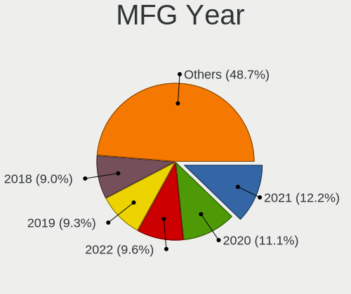

| Year    | Computers | Percent |
|---------|-----------|---------|
| 2021    | 174       | 13.54%  |
| 2020    | 169       | 13.15%  |
| 2019    | 146       | 11.36%  |
| 2018    | 141       | 10.97%  |
| 2022    | 99        | 7.7%    |
| 2017    | 93        | 7.24%   |
| 2015    | 73        | 5.68%   |
| 2012    | 65        | 5.06%   |
| 2014    | 57        | 4.44%   |
| 2013    | 57        | 4.44%   |
| 2016    | 56        | 4.36%   |
| Unknown | 50        | 3.89%   |
| 2011    | 43        | 3.35%   |
| 2008    | 16        | 1.25%   |
| 2010    | 14        | 1.09%   |
| 2009    | 13        | 1.01%   |
| 2023    | 9         | 0.7%    |
| 2007    | 7         | 0.54%   |
| 2006    | 3         | 0.23%   |

Form Factor
-----------

Physical design of the computer

| Name           | Computers | Percent |
|----------------|-----------|---------|
| Notebook       | 729       | 56.73%  |
| Desktop        | 393       | 30.58%  |
| Server         | 49        | 3.81%   |
| Mini pc        | 35        | 2.72%   |
| System on chip | 26        | 2.02%   |
| Tablet         | 24        | 1.87%   |
| Convertible    | 19        | 1.48%   |
| All in one     | 6         | 0.47%   |
| Phone          | 4         | 0.31%   |

Secure Boot
-----------

Enabled or disabled

| State    | Computers | Percent |
|----------|-----------|---------|
| Disabled | 1194      | 92.34%  |
| Enabled  | 99        | 7.66%   |

Coreboot
--------

Have coreboot on board

| Used | Computers | Percent |
|------|-----------|---------|
| No   | 1279      | 99.53%  |
| Yes  | 6         | 0.47%   |

RAM Size
--------

Total RAM memory

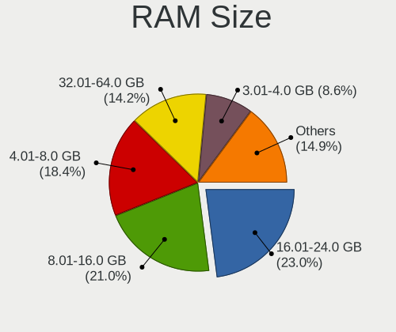

| Size in GB      | Computers | Percent |
|-----------------|-----------|---------|
| 16.01-24.0      | 302       | 23.2%   |
| 8.01-16.0       | 286       | 21.97%  |
| 4.01-8.0        | 264       | 20.28%  |
| 32.01-64.0      | 155       | 11.9%   |
| 3.01-4.0        | 123       | 9.45%   |
| 64.01-256.0     | 67        | 5.15%   |
| 24.01-32.0      | 37        | 2.84%   |
| 1.01-2.0        | 26        | 2%      |
| Unknown         | 15        | 1.15%   |
| 0.51-1.0        | 12        | 0.92%   |
| More than 256.0 | 9         | 0.69%   |
| 0.01-0.5        | 3         | 0.23%   |
| 2.01-3.0        | 2         | 0.15%   |
| 0               | 1         | 0.08%   |

RAM Used
--------

Used RAM memory

| Used GB     | Computers | Percent |
|-------------|-----------|---------|
| 1.01-2.0    | 373       | 26.83%  |
| 2.01-3.0    | 346       | 24.89%  |
| 4.01-8.0    | 239       | 17.19%  |
| 3.01-4.0    | 197       | 14.17%  |
| 0.51-1.0    | 80        | 5.76%   |
| 8.01-16.0   | 64        | 4.6%    |
| 0.01-0.5    | 39        | 2.81%   |
| Unknown     | 21        | 1.51%   |
| 16.01-24.0  | 15        | 1.08%   |
| 24.01-32.0  | 6         | 0.43%   |
| 32.01-64.0  | 5         | 0.36%   |
| 64.01-256.0 | 5         | 0.36%   |

Total Drives
------------

Number of drives on board

| Drives  | Computers | Percent |
|---------|-----------|---------|
| 1       | 715       | 54.71%  |
| 2       | 406       | 31.06%  |
| 3       | 103       | 7.88%   |
| 4       | 36        | 2.75%   |
| 5       | 16        | 1.22%   |
| 0       | 11        | 0.84%   |
| 6       | 5         | 0.38%   |
| 10      | 4         | 0.31%   |
| 9       | 3         | 0.23%   |
| 8       | 2         | 0.15%   |
| 46      | 1         | 0.08%   |
| 36      | 1         | 0.08%   |
| 32      | 1         | 0.08%   |
| 21      | 1         | 0.08%   |
| 11      | 1         | 0.08%   |
| Unknown | 1         | 0.08%   |

Has CD-ROM
----------

Has CD-ROM on board

| Presented | Computers | Percent |
|-----------|-----------|---------|
| No        | 1119      | 86.81%  |
| Yes       | 170       | 13.19%  |

Has Ethernet
------------

Has Ethernet on board

| Presented | Computers | Percent |
|-----------|-----------|---------|
| Yes       | 1011      | 78.25%  |
| No        | 281       | 21.75%  |

Has WiFi
--------

Has WiFi module

| Presented | Computers | Percent |
|-----------|-----------|---------|
| Yes       | 995       | 77.07%  |
| No        | 296       | 22.93%  |

Has Bluetooth
-------------

Has Bluetooth module

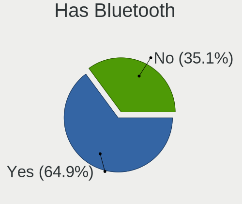

| Presented | Computers | Percent |
|-----------|-----------|---------|
| Yes       | 835       | 64.38%  |
| No        | 462       | 35.62%  |

Location
--------

Country
-------

Geographic location (country)

| Country | Computers | Percent |
|---------|-----------|---------|
| China   | 1285      | 100%    |

City
----

Geographic location (city)

| City             | Computers | Percent |
|------------------|-----------|---------|
| Beijing          | 239       | 17.53%  |
| Shenzhen         | 110       | 8.07%   |
| Shanghai         | 110       | 8.07%   |
| Guangzhou        | 92        | 6.75%   |
| Hangzhou         | 56        | 4.11%   |
| Chengdu          | 43        | 3.15%   |
| Wuhan            | 36        | 2.64%   |
| Nanjing          | 29        | 2.13%   |
| Xi'an            | 24        | 1.76%   |
| Tianjin          | 19        | 1.39%   |
| Zhengzhou        | 18        | 1.32%   |
| Xuhui            | 18        | 1.32%   |
| Chongqing        | 18        | 1.32%   |
| Jinrongjie       | 17        | 1.25%   |
| Haidian          | 15        | 1.1%    |
| Foshan           | 15        | 1.1%    |
| Suzhou           | 14        | 1.03%   |
| Qingdao          | 14        | 1.03%   |
| Kunming          | 14        | 1.03%   |
| Dongguan         | 13        | 0.95%   |
| Jinan            | 12        | 0.88%   |
| Huangpu          | 12        | 0.88%   |
| Hefei            | 12        | 0.88%   |
| Shenyang         | 11        | 0.81%   |
| Changsha         | 11        | 0.81%   |
| Xiamen           | 10        | 0.73%   |
| Nanning          | 10        | 0.73%   |
| Dalian           | 10        | 0.73%   |
| Nanhao           | 9         | 0.66%   |
| Fuzhou           | 9         | 0.66%   |
| Bieligutai       | 8         | 0.59%   |
| Putuo            | 7         | 0.51%   |
| Hohhot           | 7         | 0.51%   |
| Guiyang          | 7         | 0.51%   |
| Xicheng District | 6         | 0.44%   |
| Shijiazhuang     | 6         | 0.44%   |
| Pudong           | 6         | 0.44%   |
| Ningbo           | 6         | 0.44%   |
| Jianshui         | 6         | 0.44%   |
| Hongkou          | 6         | 0.44%   |

Drives
------

Drive Vendor
------------

Hard drive vendors

| Vendor                      | Computers | Drives | Percent |
|-----------------------------|-----------|--------|---------|
| Samsung Electronics         | 333       | 437    | 17.13%  |
| WDC                         | 246       | 318    | 12.65%  |
| Seagate                     | 227       | 420    | 11.68%  |
| Toshiba                     | 111       | 164    | 5.71%   |
| SanDisk                     | 101       | 117    | 5.2%    |
| Unknown                     | 95        | 127    | 4.89%   |
| Intel                       | 63        | 96     | 3.24%   |
| SK hynix                    | 61        | 74     | 3.14%   |
| Kingston                    | 61        | 75     | 3.14%   |
| HGST                        | 42        | 73     | 2.16%   |
| Micron Technology           | 39        | 41     | 2.01%   |
| Silicon Motion              | 29        | 37     | 1.49%   |
| Plextor                     | 28        | 32     | 1.44%   |
| Hitachi                     | 23        | 34     | 1.18%   |
| Lenovo                      | 21        | 30     | 1.08%   |
| Crucial                     | 20        | 24     | 1.03%   |
| LITEON                      | 19        | 23     | 0.98%   |
| KIOXIA                      | 18        | 22     | 0.93%   |
| Unknown                     | 17        | 20     | 0.87%   |
| A-DATA Technology           | 15        | 20     | 0.77%   |
| Phison                      | 14        | 18     | 0.72%   |
| Hewlett-Packard             | 14        | 17     | 0.72%   |
| FORESEE                     | 14        | 17     | 0.72%   |
| China                       | 13        | 23     | 0.67%   |
| Yangtze Memory Technologies | 12        | 13     | 0.62%   |
| JMicron Technology          | 11        | 9      | 0.57%   |
| Colorful                    | 11        | 13     | 0.57%   |
| ZHITAI                      | 10        | 11     | 0.51%   |
| Teclast                     | 10        | 10     | 0.51%   |
| GALAX                       | 10        | 10     | 0.51%   |
| Apple                       | 10        | 10     | 0.51%   |
| Netac                       | 9         | 10     | 0.46%   |
| Hikvision                   | 9         | 12     | 0.46%   |
| GLOWAY                      | 8         | 11     | 0.41%   |
| KIOXIA-EXCERIA              | 7         | 10     | 0.36%   |
| Fujitsu                     | 7         | 7      | 0.36%   |
| Faspeed                     | 7         | 7      | 0.36%   |
| Transcend                   | 6         | 7      | 0.31%   |
| MAXIO Technology (Hangzhou) | 6         | 7      | 0.31%   |
| Lite-On                     | 6         | 8      | 0.31%   |

Drive Model
-----------

Hard drive models

| Model                                               | Computers | Percent |
|-----------------------------------------------------|-----------|---------|
| Samsung NVMe SSD Drive 512GB                        | 23        | 1.09%   |
| WDC WD10EZEX-08WN4A0 1TB                            | 22        | 1.04%   |
| SanDisk NVMe SSD Drive 512GB                        | 20        | 0.94%   |
| Samsung NVMe SSD Controller PM9A1/PM9A3/980PRO 1TB  | 18        | 0.85%   |
| Seagate ST1000LM035-1RK172 1TB                      | 17        | 0.8%    |
| Samsung SSD 860 EVO 500GB                           | 17        | 0.8%    |
| Unknown                                             | 17        | 0.8%    |
| Seagate ST1000DM010-2EP102 1TB                      | 16        | 0.76%   |
| HGST HTS721010A9E630 1TB                            | 16        | 0.76%   |
| Seagate ST1000DM003-1SB102 1TB                      | 14        | 0.66%   |
| Samsung MZVLB512HBJQ-000L2 512GB                    | 14        | 0.66%   |
| Seagate ST1000LM048-2E7172 1TB                      | 13        | 0.61%   |
| SanDisk NVMe SSD Drive 1TB                          | 12        | 0.57%   |
| Samsung NVMe SSD Drive 256GB                        | 12        | 0.57%   |
| Samsung NVMe SSD Drive 1024GB                       | 12        | 0.57%   |
| Samsung NVMe SSD Controller SM981/PM981/PM983 256GB | 12        | 0.57%   |
| WDC WDS100T2B0C-00PXH0 1TB                          | 10        | 0.47%   |
| SK hynix NVMe SSD Drive 512GB                       | 10        | 0.47%   |
| Seagate ST500LT012-1DG142 500GB                     | 10        | 0.47%   |
| Seagate ST500DM002-1BD142 500GB                     | 10        | 0.47%   |
| Unknown MMC Card  64GB                              | 9         | 0.43%   |
| Seagate ST500LM021-1KJ152 500GB                     | 9         | 0.43%   |
| Samsung SSD 980 1TB                                 | 9         | 0.43%   |
| Samsung MZVLB512HAJQ-00000 512GB                    | 9         | 0.43%   |
| WDC WD10EZEX-08M2NA0 1TB                            | 8         | 0.38%   |
| Toshiba NVMe SSD Drive 128GB                        | 8         | 0.38%   |
| Toshiba MQ01ABD100 1TB                              | 8         | 0.38%   |
| Seagate ST6000NM0115-1YZ110 6TB                     | 8         | 0.38%   |
| Seagate ST2000LM007-1R8174 2TB                      | 8         | 0.38%   |
| Samsung MZVLB512HBJQ-000L7 512GB                    | 8         | 0.38%   |
| Plextor PX-128M6S 128GB SSD                         | 8         | 0.38%   |
| Kingston SA400S37480G 480GB SSD                     | 8         | 0.38%   |
| HGST HTS725050A7E630 500GB                          | 8         | 0.38%   |
| Unknown MMC Card  128GB                             | 7         | 0.33%   |
| Toshiba DT01ACA200 2TB                              | 7         | 0.33%   |
| SK hynix SKHynix_HFS512GDE9X084N 512GB              | 7         | 0.33%   |
| Seagate ST3500418AS 500GB                           | 7         | 0.33%   |
| Samsung NVMe SSD Drive 1TB                          | 7         | 0.33%   |
| Samsung NVMe SSD Drive 128GB                        | 7         | 0.33%   |
| JMicron Generic 320GB                               | 7         | 0.33%   |

HDD Vendor
----------

Hard disk drive vendors

| Vendor              | Computers | Drives | Percent |
|---------------------|-----------|--------|---------|
| Seagate             | 225       | 417    | 40.61%  |
| WDC                 | 176       | 225    | 31.77%  |
| Toshiba             | 49        | 90     | 8.84%   |
| HGST                | 42        | 73     | 7.58%   |
| Hitachi             | 23        | 34     | 4.15%   |
| Samsung Electronics | 9         | 10     | 1.62%   |
| Fujitsu             | 7         | 7      | 1.26%   |
| Pear 2TB            | 5         | 5      | 0.9%    |
| External            | 5         | 8      | 0.9%    |
| ACASIS              | 2         | 2      | 0.36%   |
| SSK                 | 1         | 1      | 0.18%   |
| LIO-ORG             | 1         | 9      | 0.18%   |
| IBM H0              | 1         | 1      | 0.18%   |
| HGST HTS            | 1         | 1      | 0.18%   |
| Hewlett-Packard     | 1         | 1      | 0.18%   |
| GOKE                | 1         | 1      | 0.18%   |
| FORESEE             | 1         | 1      | 0.18%   |
| ExcelStor           | 1         | 1      | 0.18%   |
| DELLBOSS            | 1         | 1      | 0.18%   |
| ASMT                | 1         | 1      | 0.18%   |
| Unknown             | 1         | 2      | 0.18%   |

SSD Vendor
----------

Solid state drive vendors

| Vendor              | Computers | Drives | Percent |
|---------------------|-----------|--------|---------|
| Samsung Electronics | 108       | 150    | 20.19%  |
| Kingston            | 38        | 48     | 7.1%    |
| SanDisk             | 32        | 35     | 5.98%   |
| Toshiba             | 26        | 30     | 4.86%   |
| Plextor             | 25        | 28     | 4.67%   |
| Intel               | 24        | 35     | 4.49%   |
| LITEON              | 18        | 22     | 3.36%   |
| WDC                 | 16        | 18     | 2.99%   |
| Lenovo              | 15        | 19     | 2.8%    |
| Crucial             | 14        | 18     | 2.62%   |
| China               | 13        | 23     | 2.43%   |
| Micron Technology   | 12        | 13     | 2.24%   |
| A-DATA Technology   | 12        | 16     | 2.24%   |
| Teclast             | 10        | 10     | 1.87%   |
| GALAX               | 10        | 10     | 1.87%   |
| Netac               | 8         | 9      | 1.5%    |
| JMicron Technology  | 7         | 7      | 1.31%   |
| FORESEE             | 7         | 8      | 1.31%   |
| Unknown             | 7         | 9      | 1.31%   |
| SK hynix            | 6         | 6      | 1.12%   |
| GLOWAY              | 6         | 9      | 1.12%   |
| ZHITAI              | 5         | 5      | 0.93%   |
| Unknown             | 5         | 6      | 0.93%   |
| Transcend           | 5         | 6      | 0.93%   |
| Colorful            | 5         | 5      | 0.93%   |
| LITEONIT            | 4         | 4      | 0.75%   |
| Kingchuxing         | 4         | 4      | 0.75%   |
| Hewlett-Packard     | 4         | 7      | 0.75%   |
| Apple               | 4         | 4      | 0.75%   |
| Q200                | 3         | 6      | 0.56%   |
| Lexar               | 3         | 3      | 0.56%   |
| Faspeed             | 3         | 3      | 0.56%   |
| Vaseky              | 2         | 2      | 0.37%   |
| UNIC2               | 2         | 2      | 0.37%   |
| TO Exter            | 2         | 2      | 0.37%   |
| tigo                | 2         | 2      | 0.37%   |
| StoreJet            | 2         | 2      | 0.37%   |
| Phison              | 2         | 3      | 0.37%   |
| Pear                | 2         | 8      | 0.37%   |
| OCZ                 | 2         | 2      | 0.37%   |

Drive Kind
----------

HDD or SSD

| Kind    | Computers | Drives | Percent |
|---------|-----------|--------|---------|
| NVMe    | 663       | 899    | 37.91%  |
| HDD     | 478       | 891    | 27.33%  |
| SSD     | 467       | 692    | 26.7%   |
| MMC     | 87        | 113    | 4.97%   |
| Unknown | 54        | 65     | 3.09%   |

Drive Connector
---------------

SATA, SAS, NVMe, etc.

| Type | Computers | Drives | Percent |
|------|-----------|--------|---------|
| SATA | 743       | 1521   | 46.94%  |
| NVMe | 661       | 895    | 41.76%  |
| SAS  | 92        | 131    | 5.81%   |
| MMC  | 87        | 113    | 5.5%    |

Drive Size
----------

Size of hard drive

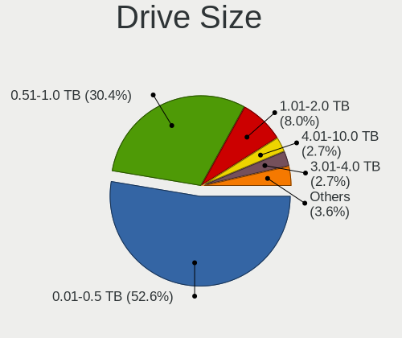

| Size in TB | Computers | Drives | Percent |
|------------|-----------|--------|---------|
| 0.01-0.5   | 509       | 816    | 52.37%  |
| 0.51-1.0   | 304       | 376    | 31.28%  |
| 1.01-2.0   | 77        | 120    | 7.92%   |
| 4.01-10.0  | 28        | 177    | 2.88%   |
| 3.01-4.0   | 21        | 33     | 2.16%   |
| 2.01-3.0   | 18        | 33     | 1.85%   |
| 10.01-20.0 | 15        | 28     | 1.54%   |

Space Total
-----------

Amount of disk space available on the file system

| Size in GB     | Computers | Percent |
|----------------|-----------|---------|
| 251-500        | 329       | 24.59%  |
| 101-250        | 315       | 23.54%  |
| 501-1000       | 191       | 14.28%  |
| 51-100         | 112       | 8.37%   |
| 1001-2000      | 106       | 7.92%   |
| 1-20           | 79        | 5.9%    |
| More than 3000 | 69        | 5.16%   |
| 21-50          | 58        | 4.33%   |
| Unknown        | 43        | 3.21%   |
| 2001-3000      | 36        | 2.69%   |

Space Used
----------

Amount of used disk space

| Used GB        | Computers | Percent |
|----------------|-----------|---------|
| 1-20           | 527       | 38.44%  |
| 21-50          | 223       | 16.27%  |
| 101-250        | 183       | 13.35%  |
| 51-100         | 148       | 10.8%   |
| 251-500        | 108       | 7.88%   |
| 501-1000       | 61        | 4.45%   |
| Unknown        | 43        | 3.14%   |
| 1001-2000      | 41        | 2.99%   |
| More than 3000 | 22        | 1.6%    |
| 2001-3000      | 15        | 1.09%   |

Malfunc. Drives
---------------

Drive models with a malfunction

| Model                                 | Computers | Drives | Percent |
|---------------------------------------|-----------|--------|---------|
| Toshiba MQ04ABF100 1TB                | 2         | 2      | 2.67%   |
| Seagate ST500LT012-1DG142 500GB       | 2         | 2      | 2.67%   |
| Seagate ST500LM021-1KJ152 500GB       | 2         | 2      | 2.67%   |
| Seagate ST31000524AS 1TB              | 2         | 2      | 2.67%   |
| Seagate ST1000LM048-2E7172 1TB        | 2         | 2      | 2.67%   |
| Seagate ST1000LM024 HN-M101MBB 1TB    | 2         | 2      | 2.67%   |
| HGST HTS721010A9E630 1TB              | 2         | 2      | 2.67%   |
| Crucial CT240M500SSD1 240GB           | 2         | 2      | 2.67%   |
| WDC WDS240G2G0B-00EPW0 240GB SSD      | 1         | 1      | 1.33%   |
| WDC WD5003ABYZ-011FA0 500GB           | 1         | 1      | 1.33%   |
| WDC WD5000AAKX-60U6AA0 500GB          | 1         | 1      | 1.33%   |
| WDC WD5000AAKX-08ERMA0 500GB          | 1         | 1      | 1.33%   |
| WDC WD5000AAKX-00PWEA0 500GB          | 1         | 1      | 1.33%   |
| WDC WD5000AAKX-00ERMA0 500GB          | 1         | 1      | 1.33%   |
| WDC WD5000AAKX-0 500GB                | 1         | 1      | 1.33%   |
| WDC WD20EARX-00PASB0 2TB              | 1         | 1      | 1.33%   |
| WDC WD10SPZX-60Z10T0 1TB              | 1         | 1      | 1.33%   |
| WDC WD10JPVX-22JC3T0 1TB              | 1         | 1      | 1.33%   |
| WDC WD10EZEX-00BN5A0 1TB              | 1         | 1      | 1.33%   |
| WDC WD100EZAZ-11TDBA0 10TB            | 1         | 2      | 1.33%   |
| WDC WD10 JPVX-75JC3T0 1TB             | 1         | 1      | 1.33%   |
| Toshiba MQ01ABF050 500GB              | 1         | 1      | 1.33%   |
| Toshiba MK3259GSXP 320GB              | 1         | 1      | 1.33%   |
| Toshiba MK2555GSX 250GB               | 1         | 1      | 1.33%   |
| Toshiba DT01ACA300 3TB                | 1         | 1      | 1.33%   |
| Toshiba DT01ACA100 1TB                | 1         | 1      | 1.33%   |
| Seagate ST980811AS 80GB               | 1         | 1      | 1.33%   |
| Seagate ST750LM028-1KK162 752GB       | 1         | 1      | 1.33%   |
| Seagate ST750LM022 HN-M750MBB 752GB   | 1         | 1      | 1.33%   |
| Seagate ST500LT012-9WS142 500GB       | 1         | 2      | 1.33%   |
| Seagate ST500DM009-2DM14C 500GB       | 1         | 1      | 1.33%   |
| Seagate ST500DM002-1BD142 500GB       | 1         | 1      | 1.33%   |
| Seagate ST5000AS0011-1L5178 5TB       | 1         | 1      | 1.33%   |
| Seagate ST4000VX007-2DT166 4TB        | 1         | 1      | 1.33%   |
| Seagate ST3500413AS 500GB             | 1         | 1      | 1.33%   |
| Seagate ST1000DM010-2EP102 1TB        | 1         | 2      | 1.33%   |
| SanDisk SSD U100 128GB                | 1         | 1      | 1.33%   |
| SanDisk SD9SN8W-256G-1006 256GB SSD   | 1         | 1      | 1.33%   |
| Samsung Electronics SSD 970 EVO 500GB | 1         | 1      | 1.33%   |
| Samsung Electronics SSD 870 EVO 500GB | 1         | 1      | 1.33%   |

Malfunc. Drive Vendor
---------------------

Vendors of faulty drives

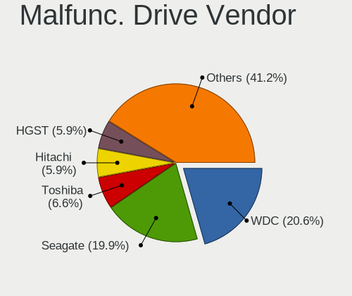

| Vendor              | Computers | Drives | Percent |
|---------------------|-----------|--------|---------|
| Seagate             | 18        | 22     | 24.66%  |
| WDC                 | 13        | 14     | 17.81%  |
| Toshiba             | 7         | 7      | 9.59%   |
| Hitachi             | 5         | 6      | 6.85%   |
| Samsung Electronics | 4         | 15     | 5.48%   |
| Intel               | 4         | 4      | 5.48%   |
| HGST                | 3         | 3      | 4.11%   |
| Fujitsu             | 3         | 3      | 4.11%   |
| Crucial             | 3         | 3      | 4.11%   |
| SanDisk             | 2         | 2      | 2.74%   |
| Plextor             | 2         | 2      | 2.74%   |
| GLOWAY              | 2         | 5      | 2.74%   |
| A-DATA Technology   | 2         | 3      | 2.74%   |
| Netac               | 1         | 1      | 1.37%   |
| Lenovo              | 1         | 1      | 1.37%   |
| Hewlett-Packard     | 1         | 1      | 1.37%   |
| ExcelStor           | 1         | 1      | 1.37%   |
| Colorful            | 1         | 1      | 1.37%   |

Malfunc. HDD Vendor
-------------------

Vendors of faulty HDD drives

| Vendor    | Computers | Drives | Percent |
|-----------|-----------|--------|---------|
| Seagate   | 18        | 22     | 36.73%  |
| WDC       | 12        | 13     | 24.49%  |
| Toshiba   | 7         | 7      | 14.29%  |
| Hitachi   | 5         | 6      | 10.2%   |
| HGST      | 3         | 3      | 6.12%   |
| Fujitsu   | 3         | 3      | 6.12%   |
| ExcelStor | 1         | 1      | 2.04%   |

Malfunc. Drive Kind
-------------------

Kinds of faulty drives

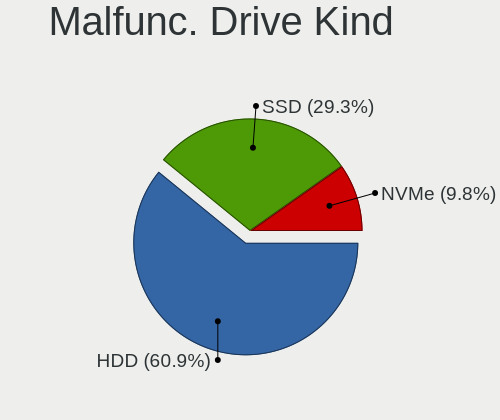

| Kind | Computers | Drives | Percent |
|------|-----------|--------|---------|
| HDD  | 48        | 55     | 68.57%  |
| SSD  | 18        | 35     | 25.71%  |
| NVMe | 4         | 4      | 5.71%   |

Failed Drives
-------------

Failed drive models

| Model                             | Computers | Drives | Percent |
|-----------------------------------|-----------|--------|---------|
| Seagate ST500DM002-1BD142 500GB   | 1         | 1      | 12.5%   |
| Seagate ST31500341AS 1TB          | 1         | 1      | 12.5%   |
| Samsung Electronics HS06THB 64GB  | 1         | 1      | 12.5%   |
| Samsung Electronics HM160HI 160GB | 1         | 1      | 12.5%   |
| Phison ESO128GTLC9-E8C-2 128GB    | 1         | 1      | 12.5%   |
| HGST HUH728080ALN600 8TB          | 1         | 1      | 12.5%   |
| HGST HTS725050A7E630 500GB        | 1         | 2      | 12.5%   |
| Hewlett-Packard SSD S700 500GB    | 1         | 2      | 12.5%   |

Failed Drive Vendor
-------------------

Failed drive vendors

| Vendor              | Computers | Drives | Percent |
|---------------------|-----------|--------|---------|
| Seagate             | 2         | 2      | 25%     |
| Samsung Electronics | 2         | 2      | 25%     |
| HGST                | 2         | 3      | 25%     |
| Phison              | 1         | 1      | 12.5%   |
| Hewlett-Packard     | 1         | 2      | 12.5%   |

Drive Status
------------

Number of failed and malfunc. drives

| Status   | Computers | Drives | Percent |
|----------|-----------|--------|---------|
| Detected | 670       | 1256   | 48.17%  |
| Works    | 646       | 1300   | 46.44%  |
| Malfunc  | 67        | 94     | 4.82%   |
| Failed   | 8         | 10     | 0.58%   |

Storage controller
------------------

Storage Vendor
--------------

Storage controller vendors

| Vendor                           | Computers | Percent |
|----------------------------------|-----------|---------|
| Intel                            | 741       | 43.08%  |
| Samsung Electronics              | 229       | 13.31%  |
| AMD                              | 186       | 10.81%  |
| SanDisk                          | 126       | 7.33%   |
| SK hynix                         | 55        | 3.2%    |
| Silicon Motion                   | 47        | 2.73%   |
| Toshiba America Info Systems     | 39        | 2.27%   |
| Micron Technology                | 27        | 1.57%   |
| Kingston Technology Company      | 27        | 1.57%   |
| Phison Electronics               | 25        | 1.45%   |
| KIOXIA                           | 25        | 1.45%   |
| Marvell Technology Group         | 24        | 1.4%    |
| Yangtze Memory Technologies      | 17        | 0.99%   |
| Broadcom / LSI                   | 15        | 0.87%   |
| ASMedia Technology               | 15        | 0.87%   |
| MAXIO Technology (Hangzhou)      | 10        | 0.58%   |
| LSI Logic / Symbios Logic        | 9         | 0.52%   |
| Biwin Storage Technology         | 9         | 0.52%   |
| Shenzhen Longsys Electronics     | 8         | 0.47%   |
| Zhaoxin                          | 7         | 0.41%   |
| Lite-On Technology               | 7         | 0.41%   |
| Micron/Crucial Technology        | 6         | 0.35%   |
| Apple                            | 6         | 0.35%   |
| ADATA Technology                 | 6         | 0.35%   |
| Union Memory (Shenzhen)          | 5         | 0.29%   |
| Solid State Storage Technology   | 5         | 0.29%   |
| JMicron Technology               | 5         | 0.29%   |
| IBM                              | 5         | 0.29%   |
| Huawei Technologies              | 4         | 0.23%   |
| Silicon Integrated Systems [SiS] | 3         | 0.17%   |
| Silicon Image                    | 2         | 0.12%   |
| Realtek Semiconductor            | 2         | 0.12%   |
| Phytium Technology               | 2         | 0.12%   |
| O2 Micro                         | 2         | 0.12%   |
| Mylex                            | 2         | 0.12%   |
| Loongson Technology              | 2         | 0.12%   |
| INNOGRIT                         | 2         | 0.12%   |
| Hefei DATANG Storage Technology  | 2         | 0.12%   |
| Beijing Starblaze Technology     | 2         | 0.12%   |
| ULi Electronics                  | 1         | 0.06%   |

Storage Model
-------------

Storage controller models

| Model                                                                          | Computers | Percent |
|--------------------------------------------------------------------------------|-----------|---------|
| AMD FCH SATA Controller [AHCI mode]                                            | 146       | 7.66%   |
| Samsung NVMe SSD Controller SM981/PM981/PM983                                  | 120       | 6.3%    |
| Intel Sunrise Point-LP SATA Controller [AHCI mode]                             | 70        | 3.67%   |
| Intel 8 Series/C220 Series Chipset Family 6-port SATA Controller 1 [AHCI mode] | 52        | 2.73%   |
| Intel 200 Series PCH SATA controller [AHCI mode]                               | 45        | 2.36%   |
| Samsung NVMe SSD Controller PM9A1/PM9A3/980PRO                                 | 41        | 2.15%   |
| Intel 7 Series Chipset Family 6-port SATA Controller [AHCI mode]               | 40        | 2.1%    |
| Samsung NVMe SSD Controller SM961/PM961/SM963                                  | 34        | 1.78%   |
| Silicon Motion SM2263EN/SM2263XT SSD Controller                                | 33        | 1.73%   |
| Intel Volume Management Device NVMe RAID Controller                            | 33        | 1.73%   |
| SanDisk WD Black SN750 / PC SN730 NVMe SSD                                     | 31        | 1.63%   |
| SK hynix Gold P31/PC711 NVMe Solid State Drive                                 | 30        | 1.57%   |
| Samsung NVMe SSD Controller 980                                                | 29        | 1.52%   |
| Intel 8 Series SATA Controller 1 [AHCI mode]                                   | 29        | 1.52%   |
| AMD 400 Series Chipset SATA Controller                                         | 29        | 1.52%   |
| Intel Cannon Lake Mobile PCH SATA AHCI Controller                              | 28        | 1.47%   |
| SanDisk WD Blue SN550 NVMe SSD                                                 | 27        | 1.42%   |
| Micron NVMe Storage Controller                                                 | 26        | 1.36%   |
| Intel 6 Series/C200 Series Chipset Family 6 port Mobile SATA AHCI Controller   | 26        | 1.36%   |
| Intel Q170/Q150/B150/H170/H110/Z170/CM236 Chipset SATA Controller [AHCI Mode]  | 24        | 1.26%   |
| Intel HM170/QM170 Chipset SATA Controller [AHCI Mode]                          | 23        | 1.21%   |
| Intel 82801 Mobile SATA Controller [RAID mode]                                 | 23        | 1.21%   |
| Intel Cannon Lake PCH SATA AHCI Controller                                     | 22        | 1.15%   |
| Intel 400 Series Chipset Family SATA AHCI Controller                           | 22        | 1.15%   |
| SanDisk WD Black 2018/SN750 / PC SN720 NVMe SSD                                | 21        | 1.1%    |
| Intel 500 Series Chipset Family SATA AHCI Controller                           | 21        | 1.1%    |
| Intel Comet Lake SATA AHCI Controller                                          | 20        | 1.05%   |
| AMD 500 Series Chipset SATA Controller                                         | 19        | 1%      |
| Intel Wildcat Point-LP SATA Controller [AHCI Mode]                             | 17        | 0.89%   |
| Toshiba America Info Systems XG6 NVMe SSD Controller                           | 16        | 0.84%   |
| Sandisk Non-Volatile memory controller                                         | 16        | 0.84%   |
| Silicon Motion SM2262/SM2262EN SSD Controller                                  | 14        | 0.73%   |
| SK hynix Non-Volatile memory controller                                        | 13        | 0.68%   |
| Intel SSD Pro 7600p/760p/E 6100p Series                                        | 13        | 0.68%   |
| Intel SSD 660P Series                                                          | 13        | 0.68%   |
| Intel 7 Series/C210 Series Chipset Family 6-port SATA Controller [AHCI mode]   | 13        | 0.68%   |
| ASMedia ASM1062 Serial ATA Controller                                          | 13        | 0.68%   |
| Yangtze Memory Non-Volatile memory controller                                  | 12        | 0.63%   |
| Toshiba America Info Systems BG3 NVMe SSD Controller                           | 12        | 0.63%   |
| KIOXIA NVMe SSD Controller BG4                                                 | 12        | 0.63%   |

Storage Kind
------------

Kind of storage controller (IDE, SATA, NVMe, SAS, ...)

| Kind | Computers | Percent |
|------|-----------|---------|
| SATA | 838       | 49.01%  |
| NVMe | 665       | 38.89%  |
| RAID | 106       | 6.2%    |
| IDE  | 84        | 4.91%   |
| SAS  | 12        | 0.7%    |
| SCSI | 5         | 0.29%   |

Processor
---------

CPU Vendor
----------

Processor vendors

| Vendor            | Computers | Percent |
|-------------------|-----------|---------|
| Intel             | 913       | 71.05%  |
| AMD               | 290       | 22.57%  |
| ARM               | 20        | 1.56%   |
| Phytium           | 19        | 1.48%   |
| Unknown           | 12        | 0.93%   |
| CentaurHauls      | 9         | 0.7%    |
| CHRP IBM,8233-E8B | 5         | 0.39%   |
| sifive,u74-mc     | 4         | 0.31%   |
| sifive,bullet0    | 3         | 0.23%   |
| Qualcomm          | 3         | 0.23%   |
| CHRP IBM,9131-52A | 2         | 0.16%   |
| thead,c906        | 1         | 0.08%   |
| PowerNV FP5466G2  | 1         | 0.08%   |
| PowerNV C829UAG3  | 1         | 0.08%   |
| HISILICON         | 1         | 0.08%   |
| FSP-1             | 1         | 0.08%   |

CPU Model
---------

Processor models

| Model                                          | Computers | Percent |
|------------------------------------------------|-----------|---------|
| AMD Ryzen 7 5800H with Radeon Graphics         | 33        | 2.56%   |
| Intel 11th Gen Core i5-1135G7 @ 2.40GHz        | 23        | 1.79%   |
| Intel Core i5-8250U CPU @ 1.60GHz              | 20        | 1.55%   |
| Intel Core i7-9750H CPU @ 2.60GHz              | 19        | 1.48%   |
| Intel 11th Gen Core i7-1165G7 @ 2.80GHz        | 19        | 1.48%   |
| AMD Ryzen 5 3500U with Radeon Vega Mobile Gfx  | 17        | 1.32%   |
| Intel Core i5-7200U CPU @ 2.50GHz              | 16        | 1.24%   |
| Intel Core i7-8550U CPU @ 1.80GHz              | 15        | 1.17%   |
| Intel Core i5-10210U CPU @ 1.60GHz             | 15        | 1.17%   |
| Intel 12th Gen Core i7-12700H                  | 15        | 1.17%   |
| ARM Processor                                  | 14        | 1.09%   |
| Intel Core i5-6200U CPU @ 2.30GHz              | 13        | 1.01%   |
| Intel Core i7-10510U CPU @ 1.80GHz             | 12        | 0.93%   |
|                                                | 12        | 0.93%   |
| Intel Core i5-8265U CPU @ 1.60GHz              | 11        | 0.85%   |
| Intel 11th Gen Core i7-11800H @ 2.30GHz        | 11        | 0.85%   |
| AMD Ryzen 7 6800H with Radeon Graphics         | 11        | 0.85%   |
| AMD Ryzen 7 4800H with Radeon Graphics         | 11        | 0.85%   |
| Intel Core i7-8750H CPU @ 2.20GHz              | 10        | 0.78%   |
| Intel Core i7-7700HQ CPU @ 2.80GHz             | 10        | 0.78%   |
| Intel Core i5-4590 CPU @ 3.30GHz               | 10        | 0.78%   |
| Intel Core i5-8300H CPU @ 2.30GHz              | 9         | 0.7%    |
| Intel 12th Gen Core i5-1240P                   | 9         | 0.7%    |
| Intel Core i7-8700 CPU @ 3.20GHz               | 8         | 0.62%   |
| Intel Core i7-7800X CPU @ 3.50GHz              | 8         | 0.62%   |
| Intel Core i7-7700 CPU @ 3.60GHz               | 8         | 0.62%   |
| Intel Core i7-6700HQ CPU @ 2.60GHz             | 8         | 0.62%   |
| Phytium FT-2000/4                              | 7         | 0.54%   |
| Phytium D2000/8 E8C                            | 7         | 0.54%   |
| Intel Core i7-8565U CPU @ 1.80GHz              | 7         | 0.54%   |
| Intel Core i7-7500U CPU @ 2.70GHz              | 7         | 0.54%   |
| Intel Core i7-4790 CPU @ 3.60GHz               | 7         | 0.54%   |
| Intel Core i7-10710U CPU @ 1.10GHz             | 7         | 0.54%   |
| Intel Core i5-8400 CPU @ 2.80GHz               | 7         | 0.54%   |
| Intel Core i5-5200U CPU @ 2.20GHz              | 7         | 0.54%   |
| Intel Celeron N5105 @ 2.00GHz                  | 7         | 0.54%   |
| CentaurHauls ZHAOXIN KaiXian KX-6640MA@2.2+GHz | 7         | 0.54%   |
| AMD Ryzen 5 4600U with Radeon Graphics         | 7         | 0.54%   |
| AMD Ryzen 5 4600H with Radeon Graphics         | 7         | 0.54%   |
| AMD Ryzen 5 3550H with Radeon Vega Mobile Gfx  | 7         | 0.54%   |

CPU Model Family
----------------

Processor model prefix

| Model                   | Computers | Percent |
|-------------------------|-----------|---------|
| Intel Core i5           | 251       | 19.52%  |
| Intel Core i7           | 250       | 19.44%  |
| Other                   | 209       | 16.25%  |
| AMD Ryzen 7             | 96        | 7.47%   |
| AMD Ryzen 5             | 89        | 6.92%   |
| Intel Xeon              | 63        | 4.9%    |
| Intel Core i3           | 59        | 4.59%   |
| Intel Celeron           | 48        | 3.73%   |
| Intel Pentium           | 23        | 1.79%   |
| Intel Atom              | 20        | 1.56%   |
| Intel Core 2 Duo        | 18        | 1.4%    |
| AMD Ryzen 9             | 16        | 1.24%   |
| AMD Ryzen 7 PRO         | 16        | 1.24%   |
| Intel Core i9           | 9         | 0.7%    |
| AMD A8                  | 9         | 0.7%    |
| AMD FX                  | 7         | 0.54%   |
| Intel Xeon Silver       | 6         | 0.47%   |
| Intel Pentium Silver    | 6         | 0.47%   |
| Intel Genuine           | 6         | 0.47%   |
| Intel Core m3           | 6         | 0.47%   |
| AMD Ryzen 5 PRO         | 6         | 0.47%   |
| AMD Athlon II X2        | 6         | 0.47%   |
| AMD A6                  | 6         | 0.47%   |
| AMD A10                 | 6         | 0.47%   |
| Intel Xeon Gold         | 5         | 0.39%   |
| Intel Pentium Dual      | 4         | 0.31%   |
| AMD Athlon X4           | 4         | 0.31%   |
| AMD Athlon              | 4         | 0.31%   |
| Intel Pentium Dual-Core | 3         | 0.23%   |
| Intel Core 2            | 3         | 0.23%   |
| AMD Ryzen 3             | 3         | 0.23%   |
| Intel Xeon Platinum     | 2         | 0.16%   |
| Intel Core M            | 2         | 0.16%   |
| Intel Core 2 Quad       | 2         | 0.16%   |
| ARM BCM                 | 2         | 0.16%   |
| ARM Allwinner           | 2         | 0.16%   |
| AMD EPYC                | 2         | 0.16%   |
| AMD E2                  | 2         | 0.16%   |
| QUALCOMM AArch64        | 1         | 0.08%   |
| Intel Xeon Bronze       | 1         | 0.08%   |

CPU Cores
---------

Number of processor cores

| Number  | Computers | Percent |
|---------|-----------|---------|
| 4       | 488       | 37.89%  |
| 2       | 316       | 24.53%  |
| 8       | 176       | 13.66%  |
| 6       | 165       | 12.81%  |
| 12      | 32        | 2.48%   |
| 14      | 19        | 1.48%   |
| 16      | 18        | 1.4%    |
| 1       | 17        | 1.32%   |
| Unknown | 15        | 1.16%   |
| 10      | 11        | 0.85%   |
| 24      | 9         | 0.7%    |
| 32      | 4         | 0.31%   |
| 64      | 3         | 0.23%   |
| 96      | 2         | 0.16%   |
| 48      | 2         | 0.16%   |
| 40      | 2         | 0.16%   |
| 36      | 2         | 0.16%   |
| 28      | 2         | 0.16%   |
| 20      | 2         | 0.16%   |
| 26      | 1         | 0.08%   |
| 22      | 1         | 0.08%   |
| 3       | 1         | 0.08%   |

CPU Sockets
-----------

Number of sockets

| Number  | Computers | Percent |
|---------|-----------|---------|
| 1       | 1221      | 94.95%  |
| 2       | 45        | 3.5%    |
| Unknown | 15        | 1.17%   |
| 3       | 2         | 0.16%   |
| 16      | 1         | 0.08%   |
| 6       | 1         | 0.08%   |
| 4       | 1         | 0.08%   |

CPU Threads
-----------

Threads per core (Hyper-Threading)

| Number  | Computers | Percent |
|---------|-----------|---------|
| 2       | 950       | 73.76%  |
| 1       | 316       | 24.53%  |
| Unknown | 15        | 1.16%   |
| 4       | 6         | 0.47%   |
| 8       | 1         | 0.08%   |

CPU Op-Modes
------------

CPU Operation Modes (32-bit, 64-bit)

| Op mode        | Computers | Percent |
|----------------|-----------|---------|
| 32-bit, 64-bit | 1235      | 95.96%  |
| Unknown        | 44        | 3.42%   |
| 32-bit         | 5         | 0.39%   |
| 64-bit         | 3         | 0.23%   |

CPU Microcode
-------------

Microcode number

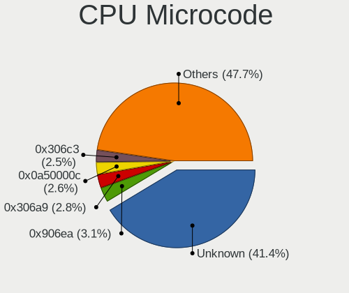

| Number     | Computers | Percent |
|------------|-----------|---------|
| Unknown    | 345       | 26.34%  |
| 0x906ea    | 60        | 4.58%   |
| 0x306a9    | 52        | 3.97%   |
| 0x306c3    | 49        | 3.74%   |
| 0x0a50000c | 42        | 3.21%   |
| 0x806ea    | 36        | 2.75%   |
| 0x206a7    | 36        | 2.75%   |
| 0x806ec    | 35        | 2.67%   |
| 0x806e9    | 33        | 2.52%   |
| 0x806c1    | 32        | 2.44%   |
| 0x506e3    | 32        | 2.44%   |
| 0x906e9    | 30        | 2.29%   |
| 0x08600106 | 30        | 2.29%   |
| 0x40651    | 24        | 1.83%   |
| 0x906a3    | 23        | 1.76%   |
| 0x306d4    | 19        | 1.45%   |
| 0x406e3    | 18        | 1.37%   |
| 0x08108102 | 16        | 1.22%   |
| 0x1067a    | 15        | 1.15%   |
| 0x50654    | 14        | 1.07%   |
| 0x08108109 | 13        | 0.99%   |
| 0xa0652    | 12        | 0.92%   |
| 0x806d1    | 12        | 0.92%   |
| 0x0a404102 | 12        | 0.92%   |
| 0x08600104 | 12        | 0.92%   |
| 0xa0655    | 11        | 0.84%   |
| 0x30678    | 10        | 0.76%   |
| 0x50657    | 9         | 0.69%   |
| 0x08701013 | 9         | 0.69%   |
| 0x906c0    | 8         | 0.61%   |
| 0x90672    | 8         | 0.61%   |
| 0x706e5    | 8         | 0.61%   |
| 0x706a1    | 8         | 0.61%   |
| 0x306f2    | 8         | 0.61%   |
| 0xa0660    | 7         | 0.53%   |
| 0x306e4    | 7         | 0.53%   |
| 0x06003106 | 7         | 0.53%   |
| 0x08600103 | 6         | 0.46%   |
| 0x0810100b | 6         | 0.46%   |
| 0xa0671    | 5         | 0.38%   |

CPU Microarch
-------------

Microarchitecture

| Name             | Computers | Percent |
|------------------|-----------|---------|
| KabyLake         | 259       | 20.11%  |
| Unknown          | 150       | 11.65%  |
| Haswell          | 111       | 8.62%   |
| Skylake          | 88        | 6.83%   |
| Zen 2            | 76        | 5.9%    |
| IvyBridge        | 73        | 5.67%   |
| Zen 3            | 70        | 5.43%   |
| TigerLake        | 53        | 4.11%   |
| CometLake        | 50        | 3.88%   |
| SandyBridge      | 46        | 3.57%   |
| Zen+             | 38        | 2.95%   |
| Silvermont       | 31        | 2.41%   |
| Broadwell        | 29        | 2.25%   |
| Alderlake Hybrid | 29        | 2.25%   |
| IceLake          | 28        | 2.17%   |
| Penryn           | 24        | 1.86%   |
| Zen              | 21        | 1.63%   |
| Goldmont plus    | 13        | 1.01%   |
| Piledriver       | 12        | 0.93%   |
| Westmere         | 11        | 0.85%   |
| Steamroller      | 10        | 0.78%   |
| Core             | 10        | 0.78%   |
| K10              | 9         | 0.7%    |
| Tremont          | 8         | 0.62%   |
| Goldmont         | 6         | 0.47%   |
| Bonnell          | 6         | 0.47%   |
| Nehalem          | 4         | 0.31%   |
| Excavator        | 4         | 0.31%   |
| Puma             | 3         | 0.23%   |
| P6               | 3         | 0.23%   |
| Bobcat           | 3         | 0.23%   |
| Sapphire Rapids  | 2         | 0.16%   |
| K10 Llano        | 2         | 0.16%   |
| Jaguar           | 2         | 0.16%   |
| Bulldozer        | 2         | 0.16%   |
| NetBurst         | 1         | 0.08%   |
| K8 Hammer        | 1         | 0.08%   |

Graphics
--------

GPU Vendor
----------

Vendors of graphics cards

| Vendor                           | Computers | Percent |
|----------------------------------|-----------|---------|
| Intel                            | 719       | 45.33%  |
| Nvidia                           | 437       | 27.55%  |
| AMD                              | 369       | 23.27%  |
| Matrox Electronics Systems       | 20        | 1.26%   |
| ASPEED Technology                | 19        | 1.2%    |
| Zhaoxin                          | 9         | 0.57%   |
| Phytium Technology               | 3         | 0.19%   |
| Silicon Integrated Systems [SiS] | 2         | 0.13%   |
| Loongson Technology              | 2         | 0.13%   |
| Silicon Motion                   | 1         | 0.06%   |
| Nanjing Ruixinview Technology    | 1         | 0.06%   |
| Moore Threads Technology         | 1         | 0.06%   |
| Huawei Technologies              | 1         | 0.06%   |
| Cirrus Logic                     | 1         | 0.06%   |
| 3DLabs                           | 1         | 0.06%   |

GPU Model
---------

Graphics card models

| Model                                                                                    | Computers | Percent |
|------------------------------------------------------------------------------------------|-----------|---------|
| Intel TigerLake-LP GT2 [Iris Xe Graphics]                                                | 52        | 3.21%   |
| AMD Cezanne [Radeon Vega Series / Radeon Vega Mobile Series]                             | 52        | 3.21%   |
| AMD Renoir                                                                               | 50        | 3.09%   |
| Intel UHD Graphics 620                                                                   | 44        | 2.72%   |
| Intel 3rd Gen Core processor Graphics Controller                                         | 41        | 2.53%   |
| Intel 2nd Generation Core Processor Family Integrated Graphics Controller                | 37        | 2.29%   |
| Intel CoffeeLake-H GT2 [UHD Graphics 630]                                                | 34        | 2.1%    |
| Intel Alder Lake-P Integrated Graphics Controller                                        | 31        | 1.91%   |
| AMD Picasso/Raven 2 [Radeon Vega Series / Radeon Vega Mobile Series]                     | 31        | 1.91%   |
| Intel Haswell-ULT Integrated Graphics Controller                                         | 30        | 1.85%   |
| Intel CometLake-U GT2 [UHD Graphics]                                                     | 28        | 1.73%   |
| Intel HD Graphics 630                                                                    | 27        | 1.67%   |
| Intel HD Graphics 620                                                                    | 26        | 1.61%   |
| Intel HD Graphics 530                                                                    | 26        | 1.61%   |
| Nvidia GA106M [GeForce RTX 3060 Mobile / Max-Q]                                          | 24        | 1.48%   |
| Intel Xeon E3-1200 v3/4th Gen Core Processor Integrated Graphics Controller              | 24        | 1.48%   |
| AMD Rembrandt [Radeon 680M]                                                              | 24        | 1.48%   |
| Intel CoffeeLake-S GT2 [UHD Graphics 630]                                                | 22        | 1.36%   |
| Intel WhiskeyLake-U GT2 [UHD Graphics 620]                                               | 19        | 1.17%   |
| Intel Atom Processor Z36xxx/Z37xxx Series Graphics & Display                             | 19        | 1.17%   |
| ASPEED Technology ASPEED Graphics Family                                                 | 19        | 1.17%   |
| Intel Skylake GT2 [HD Graphics 520]                                                      | 18        | 1.11%   |
| Intel 4th Gen Core Processor Integrated Graphics Controller                              | 18        | 1.11%   |
| Nvidia GP108M [GeForce MX150]                                                            | 17        | 1.05%   |
| Nvidia GP108M [GeForce MX250]                                                            | 16        | 0.99%   |
| AMD Raven Ridge [Radeon Vega Series / Radeon Vega Mobile Series]                         | 16        | 0.99%   |
| Intel HD Graphics 5500                                                                   | 15        | 0.93%   |
| Nvidia TU117M [GeForce MX450]                                                            | 13        | 0.8%    |
| Intel TigerLake-H GT1 [UHD Graphics]                                                     | 13        | 0.8%    |
| Intel JasperLake [UHD Graphics]                                                          | 13        | 0.8%    |
| Intel CometLake-S GT2 [UHD Graphics 630]                                                 | 13        | 0.8%    |
| Nvidia TU106M [GeForce RTX 2060 Mobile]                                                  | 12        | 0.74%   |
| Intel CometLake-H GT2 [UHD Graphics]                                                     | 12        | 0.74%   |
| Intel Atom/Celeron/Pentium Processor x5-E8000/J3xxx/N3xxx Integrated Graphics Controller | 12        | 0.74%   |
| AMD Oland [Radeon HD 8570 / R5 430 OEM / R7 240/340 / Radeon 520 OEM]                    | 12        | 0.74%   |
| Intel GeminiLake [UHD Graphics 600]                                                      | 11        | 0.68%   |
| AMD Lexa PRO [Radeon 540/540X/550/550X / RX 540X/550/550X]                               | 11        | 0.68%   |
| Nvidia TU117M                                                                            | 10        | 0.62%   |
| Nvidia GP107M [GeForce GTX 1050 Mobile]                                                  | 10        | 0.62%   |
| Nvidia GK208B [GeForce GT 730]                                                           | 10        | 0.62%   |

GPU Combo
---------

Combinations of graphics cards

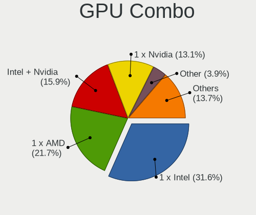

| Name                              | Computers | Percent |
|-----------------------------------|-----------|---------|
| 1 x Intel                         | 435       | 33.59%  |
| 1 x AMD                           | 265       | 20.46%  |
| Intel + Nvidia                    | 221       | 17.07%  |
| 1 x Nvidia                        | 170       | 13.13%  |
| Intel + AMD                       | 44        | 3.4%    |
| AMD + Nvidia                      | 36        | 2.78%   |
| Other                             | 35        | 2.7%    |
| 1 x Matrox                        | 18        | 1.39%   |
| 2 x AMD                           | 15        | 1.16%   |
| 1 x ASPEED                        | 13        | 1%      |
| 1 x Zhaoxin                       | 9         | 0.69%   |
| 2 x Nvidia                        | 5         | 0.39%   |
| 2 x Intel                         | 4         | 0.31%   |
| AMD + Matrox                      | 4         | 0.31%   |
| 1 x Phytium Technology            | 3         | 0.23%   |
| Nvidia + ASPEED                   | 3         | 0.23%   |
| AMD + ASPEED                      | 3         | 0.23%   |
| 1 x SiS                           | 2         | 0.15%   |
| 1 x Silicon Motion                | 1         | 0.08%   |
| Nvidia + Huawei Technologies      | 1         | 0.08%   |
| 1 x Nanjing Ruixinview Technology | 1         | 0.08%   |
| 1 x Moore Threads Technology      | 1         | 0.08%   |
| 1 x Loongson Technology           | 1         | 0.08%   |
| 1 x Intel + 3 x Nvidia            | 1         | 0.08%   |
| Intel + 2 x Nvidia                | 1         | 0.08%   |
| 1 x Cirrus Logic                  | 1         | 0.08%   |
| AMD + Loongson Technology         | 1         | 0.08%   |
| AMD + 3DLabs                      | 1         | 0.08%   |

GPU Driver
----------

Free vs proprietary

| Driver      | Computers | Percent |
|-------------|-----------|---------|
| Free        | 939       | 72.23%  |
| Proprietary | 224       | 17.23%  |
| Unknown     | 137       | 10.54%  |

GPU Memory
----------

Total video memory

| Size in GB | Computers | Percent |
|------------|-----------|---------|
| Unknown    | 741       | 56.56%  |
| 1.01-2.0   | 168       | 12.82%  |
| 0.01-0.5   | 105       | 8.02%   |
| 0.51-1.0   | 99        | 7.56%   |
| 3.01-4.0   | 83        | 6.34%   |
| 5.01-6.0   | 43        | 3.28%   |
| 7.01-8.0   | 39        | 2.98%   |
| 8.01-16.0  | 12        | 0.92%   |
| 2.01-3.0   | 8         | 0.61%   |
| 4.01-5.0   | 6         | 0.46%   |
| 16.01-24.0 | 4         | 0.31%   |
| 24.01-32.0 | 2         | 0.15%   |

Monitor
-------

Monitor Vendor
--------------

Monitor vendors

| Vendor                  | Computers | Percent |
|-------------------------|-----------|---------|
| BOE                     | 150       | 12%     |
| AU Optronics            | 126       | 10.08%  |
| LG Display              | 109       | 8.72%   |
| Chimei Innolux          | 107       | 8.56%   |
| Dell                    | 102       | 8.16%   |
| AOC                     | 70        | 5.6%    |
| Lenovo                  | 66        | 5.28%   |
| Samsung Electronics     | 64        | 5.12%   |
| Sharp                   | 42        | 3.36%   |
| CSO                     | 40        | 3.2%    |
| Philips                 | 39        | 3.12%   |
| Goldstar                | 24        | 1.92%   |
| Hewlett-Packard         | 21        | 1.68%   |
| ViewSonic               | 20        | 1.6%    |
| BenQ                    | 14        | 1.12%   |
| PANDA                   | 13        | 1.04%   |
| InfoVision              | 13        | 1.04%   |
| Acer                    | 12        | 0.96%   |
| Apple                   | 11        | 0.88%   |
| Xiaomi                  | 10        | 0.8%    |
| TMX                     | 10        | 0.8%    |
| RTK                     | 9         | 0.72%   |
| HKC                     | 9         | 0.72%   |
| Mi                      | 7         | 0.56%   |
| IPS                     | 7         | 0.56%   |
| SGT                     | 6         | 0.48%   |
| Unknown                 | 6         | 0.48%   |
| Sony                    | 5         | 0.4%    |
| Valve                   | 4         | 0.32%   |
| Unknown                 | 4         | 0.32%   |
| SKY                     | 4         | 0.32%   |
| Panasonic               | 4         | 0.32%   |
| JDI                     | 4         | 0.32%   |
| Chi Mei Optoelectronics | 4         | 0.32%   |
| CHD                     | 4         | 0.32%   |
| Ancor Communications    | 4         | 0.32%   |
| LGD                     | 3         | 0.24%   |
| LG Electronics          | 3         | 0.24%   |
| Lenovo Group Limited    | 3         | 0.24%   |
| KOIOS                   | 3         | 0.24%   |

Monitor Model
-------------

Monitor models

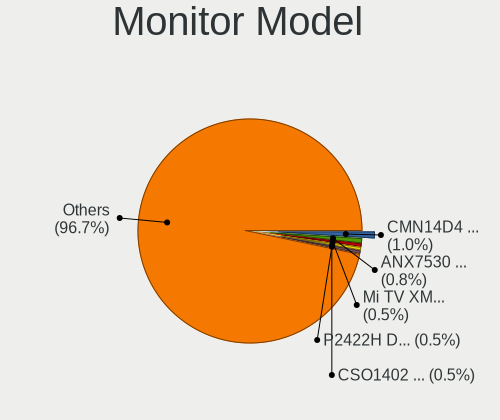

| Model                                                            | Computers | Percent |
|------------------------------------------------------------------|-----------|---------|
| Chimei Innolux LCD Monitor CMN14D4 1920x1080 309x173mm 13.9-inch | 13        | 1.01%   |
| Xiaomi Mi TV XMD004A 1920x1080 708x398mm 32.0-inch               | 8         | 0.62%   |
| Chimei Innolux LCD Monitor CMN14A7 1920x1080 308x173mm 13.9-inch | 8         | 0.62%   |
| TMX TL156MDMP11-0 TMX1560 3200x2000 336x210mm 15.6-inch          | 7         | 0.55%   |
| Dell P2422H DELA1C5 1920x1080 530x300mm 24.0-inch                | 7         | 0.55%   |
| BOE LCD Monitor BOE0877 1920x1080 309x173mm 13.9-inch            | 7         | 0.55%   |
| AU Optronics LCD Monitor AUO403D 1920x1080 309x173mm 13.9-inch   | 7         | 0.55%   |
| AOC 24B1W1 AOC2401 1920x1080 527x296mm 23.8-inch                 | 7         | 0.55%   |
| Sharp LCD Monitor SHP1447 1920x1080 294x165mm 13.3-inch          | 6         | 0.47%   |
| CSO LCD Monitor CSO1402 2880x1800 302x188mm 14.0-inch            | 6         | 0.47%   |
| Chimei Innolux LCD Monitor CMN1604 1920x1080 355x199mm 16.0-inch | 6         | 0.47%   |
| BOE LCD Monitor BOE07DB 1920x1080 309x174mm 14.0-inch            | 6         | 0.47%   |
| BOE LCD Monitor BOE0747 1920x1080 344x194mm 15.5-inch            | 6         | 0.47%   |
| AU Optronics LCD Monitor AUO2E3C 1366x768 309x173mm 13.9-inch    | 6         | 0.47%   |
| AOC Q2790 AOC2790 2560x1440 597x336mm 27.0-inch                  | 6         | 0.47%   |
| Unknown                                                          | 6         | 0.47%   |
| LG Display LCD Monitor LGD02D8 1366x768 277x156mm 12.5-inch      | 5         | 0.39%   |
| Goldstar HDR 4K GSM7706 3840x2160 600x340mm 27.2-inch            | 5         | 0.39%   |
| Chimei Innolux LCD Monitor CMN15E8 1920x1080 344x193mm 15.5-inch | 5         | 0.39%   |
| Chimei Innolux LCD Monitor CMN14D5 1920x1080 309x173mm 13.9-inch | 5         | 0.39%   |
| AU Optronics LCD Monitor AUO683D 1920x1080 309x174mm 14.0-inch   | 5         | 0.39%   |
| AU Optronics LCD Monitor AUO106C 1366x768 276x155mm 12.5-inch    | 5         | 0.39%   |
| Valve ANX7530 U VLV3001 800x1280 100x150mm 7.1-inch              | 4         | 0.31%   |
| Sharp LCD Monitor SHP149A 1920x1080 344x194mm 15.5-inch          | 4         | 0.31%   |
| Sharp LCD Monitor SHP1453 1920x1080 346x194mm 15.6-inch          | 4         | 0.31%   |
| Philips PHL 243V7 PHLC155 1920x1080 527x296mm 23.8-inch          | 4         | 0.31%   |
| PANDA LCD Monitor NCP004D 1920x1080 344x194mm 15.5-inch          | 4         | 0.31%   |
| Panasonic VVX14T092N00 MEI96A2 2256x1504 285x190mm 13.5-inch     | 4         | 0.31%   |
| LG Display LCD Monitor LGD40BA 1920x1080 344x194mm 15.5-inch     | 4         | 0.31%   |
| LG Display LCD Monitor LGD0521 1920x1080 309x174mm 14.0-inch     | 4         | 0.31%   |
| LG Display LCD Monitor LGD02F8 1366x768 309x174mm 14.0-inch      | 4         | 0.31%   |
| Lenovo L2250p Wide LEN0A0C 1680x1050 474x296mm 22.0-inch         | 4         | 0.31%   |
| IPS E2701 IPS2700 1920x1080 597x336mm 27.0-inch                  | 4         | 0.31%   |
| InfoVision LCD Monitor IVO061F 1920x1080 344x194mm 15.5-inch     | 4         | 0.31%   |
| CSO LCD Monitor CSO076D 2560x1600 286x179mm 13.3-inch            | 4         | 0.31%   |
| CHD CHUD CHD0030 3840x2160 1394x784mm 63.0-inch                  | 4         | 0.31%   |
| BOE LCD Monitor BOE098E 1920x1080 344x194mm 15.5-inch            | 4         | 0.31%   |
| BOE LCD Monitor BOE0893 2160x1440 296x197mm 14.0-inch            | 4         | 0.31%   |
| BOE LCD Monitor BOE0872 1920x1080 344x194mm 15.5-inch            | 4         | 0.31%   |
| AU Optronics LCD Monitor AUO45ED 1920x1080 344x193mm 15.5-inch   | 4         | 0.31%   |

Monitor Resolution
------------------

Monitor screen resolution

| Resolution         | Computers | Percent |
|--------------------|-----------|---------|
| 1920x1080 (FHD)    | 614       | 50.87%  |
| 1366x768 (WXGA)    | 123       | 10.19%  |
| 3840x2160 (4K)     | 105       | 8.7%    |
| 2560x1440 (QHD)    | 79        | 6.55%   |
| 2560x1600          | 48        | 3.98%   |
| 1440x900 (WXGA+)   | 28        | 2.32%   |
| 1920x1200 (WUXGA)  | 22        | 1.82%   |
| 1600x900 (HD+)     | 20        | 1.66%   |
| 1680x1050 (WSXGA+) | 16        | 1.33%   |
| 1280x1024 (SXGA)   | 16        | 1.33%   |
| 2880x1800          | 15        | 1.24%   |
| 2160x1440          | 12        | 0.99%   |
| Unknown            | 12        | 0.99%   |
| 3440x1440          | 10        | 0.83%   |
| 1280x800 (WXGA)    | 10        | 0.83%   |
| 3200x2000          | 8         | 0.66%   |
| 800x1280           | 6         | 0.5%    |
| 2240x1400          | 6         | 0.5%    |
| 3840x2400          | 4         | 0.33%   |
| 3072x1920          | 4         | 0.33%   |
| 3000x2000          | 3         | 0.25%   |
| 2560x1080          | 3         | 0.25%   |
| 2160x1350          | 3         | 0.25%   |
| 1800x1200          | 3         | 0.25%   |
| 3360x1080          | 2         | 0.17%   |
| 3286x1080          | 2         | 0.17%   |
| 2880x1920          | 2         | 0.17%   |
| 2736x1824          | 2         | 0.17%   |
| 2288x1287          | 2         | 0.17%   |
| 2256x1504          | 2         | 0.17%   |
| 2200x1650          | 2         | 0.17%   |
| 1920x1280          | 2         | 0.17%   |
| 1400x1050          | 2         | 0.17%   |
| 1024x768 (XGA)     | 2         | 0.17%   |
| 1024x600           | 2         | 0.17%   |
| 6400x2160          | 1         | 0.08%   |
| 5206x1080          | 1         | 0.08%   |
| 4480x1440          | 1         | 0.08%   |
| 4382x1080          | 1         | 0.08%   |
| 3840x1080          | 1         | 0.08%   |

Monitor Diagonal
----------------

Diagonal size in inches

| Inches  | Computers | Percent |
|---------|-----------|---------|
| 15      | 228       | 18.25%  |
| 13      | 180       | 14.41%  |
| 14      | 162       | 12.97%  |
| 23      | 109       | 8.73%   |
| 24      | 90        | 7.21%   |
| 27      | 83        | 6.65%   |
| 21      | 55        | 4.4%    |
| Unknown | 50        | 4%      |
| 16      | 47        | 3.76%   |
| 17      | 38        | 3.04%   |
| 12      | 38        | 3.04%   |
| 19      | 22        | 1.76%   |
| 22      | 16        | 1.28%   |
| 18      | 15        | 1.2%    |
| 31      | 13        | 1.04%   |
| 65      | 10        | 0.8%    |
| 40      | 10        | 0.8%    |
| 34      | 10        | 0.8%    |
| 25      | 10        | 0.8%    |
| 20      | 10        | 0.8%    |
| 11      | 7         | 0.56%   |
| 10      | 7         | 0.56%   |
| 32      | 5         | 0.4%    |
| 7       | 5         | 0.4%    |
| 63      | 4         | 0.32%   |
| 26      | 3         | 0.24%   |
| 142     | 2         | 0.16%   |
| 84      | 2         | 0.16%   |
| 57      | 2         | 0.16%   |
| 54      | 2         | 0.16%   |
| 43      | 2         | 0.16%   |
| 36      | 2         | 0.16%   |
| 28      | 2         | 0.16%   |
| 3       | 2         | 0.16%   |
| 72      | 1         | 0.08%   |
| 66      | 1         | 0.08%   |
| 46      | 1         | 0.08%   |
| 42      | 1         | 0.08%   |
| 37      | 1         | 0.08%   |
| 35      | 1         | 0.08%   |

Monitor Width
-------------

Physical width

| Width in mm    | Computers | Percent |
|----------------|-----------|---------|
| 301-350        | 508       | 41.17%  |
| 501-600        | 272       | 22.04%  |
| 201-300        | 151       | 12.24%  |
| 401-500        | 110       | 8.91%   |
| 351-400        | 53        | 4.29%   |
| Unknown        | 50        | 4.05%   |
| 601-700        | 27        | 2.19%   |
| 701-800        | 18        | 1.46%   |
| 1001-1500      | 17        | 1.38%   |
| 801-900        | 13        | 1.05%   |
| 1-100          | 6         | 0.49%   |
| 1501-2000      | 3         | 0.24%   |
| 901-1000       | 3         | 0.24%   |
| More than 2000 | 2         | 0.16%   |
| 101-200        | 1         | 0.08%   |

Aspect Ratio
------------

Proportional relationship between the width and the height

| Ratio   | Computers | Percent |
|---------|-----------|---------|
| 16/9    | 838       | 73.83%  |
| 16/10   | 171       | 15.07%  |
| Unknown | 47        | 4.14%   |
| 3/2     | 30        | 2.64%   |
| 5/4     | 16        | 1.41%   |
| 21/9    | 12        | 1.06%   |
| 4/3     | 10        | 0.88%   |
| 0.67    | 4         | 0.35%   |
| 6/5     | 2         | 0.18%   |
| 1.00    | 2         | 0.18%   |
| 0.56    | 2         | 0.18%   |
| 0.45    | 1         | 0.09%   |

Monitor Area
------------

Area in inch

| Area in inch | Computers | Percent |
|----------------|-----------|---------|
| 81-90          | 260       | 20.88%  |
| 101-110        | 234       | 18.8%   |
| 201-250        | 214       | 17.19%  |
| 71-80          | 87        | 6.99%   |
| 301-350        | 87        | 6.99%   |
| 151-200        | 75        | 6.02%   |
| Unknown        | 50        | 4.02%   |
| 111-120        | 37        | 2.97%   |
| 251-300        | 31        | 2.49%   |
| 61-70          | 30        | 2.41%   |
| 351-500        | 30        | 2.41%   |
| 121-130        | 27        | 2.17%   |
| More than 1000 | 24        | 1.93%   |
| 501-1000       | 17        | 1.37%   |
| 141-150        | 15        | 1.2%    |
| 51-60          | 8         | 0.64%   |
| 1-40           | 7         | 0.56%   |
| 41-50          | 6         | 0.48%   |
| 91-100         | 6         | 0.48%   |

Pixel Density
-------------

Pixels per inch

| Density       | Computers | Percent |
|---------------|-----------|---------|
| 121-160       | 385       | 31.38%  |
| 51-100        | 320       | 26.08%  |
| 101-120       | 208       | 16.95%  |
| 161-240       | 186       | 15.16%  |
| More than 240 | 58        | 4.73%   |
| Unknown       | 50        | 4.07%   |
| 1-50          | 20        | 1.63%   |

Multiple Monitors
-----------------

Total monitors connected

| Total | Computers | Percent |
|-------|-----------|---------|
| 1     | 970       | 74.05%  |
| 2     | 171       | 13.05%  |
| 0     | 159       | 12.14%  |
| 3     | 10        | 0.76%   |

Network
-------

Net Controller Vendor
---------------------

Controller vendors

| Vendor                           | Computers | Percent |
|----------------------------------|-----------|---------|
| Intel                            | 713       | 38.15%  |
| Realtek Semiconductor            | 704       | 37.67%  |
| Qualcomm Atheros                 | 144       | 7.7%    |
| Broadcom                         | 58        | 3.1%    |
| MediaTek                         | 48        | 2.57%   |
| Ralink Technology                | 24        | 1.28%   |
| Broadcom Limited                 | 24        | 1.28%   |
| ASIX Electronics                 | 21        | 1.12%   |
| Huawei Technologies              | 18        | 0.96%   |
| Xiaomi                           | 13        | 0.7%    |
| Qualcomm                         | 10        | 0.54%   |
| Marvell Technology Group         | 8         | 0.43%   |
| Microsoft                        | 7         | 0.37%   |
| IBM                              | 6         | 0.32%   |
| Ralink                           | 5         | 0.27%   |
| Quectel Wireless Solutions       | 5         | 0.27%   |
| TP-Link                          | 4         | 0.21%   |
| Qualcomm Atheros Communications  | 4         | 0.21%   |
| Dell                             | 4         | 0.21%   |
| ZTE WCDMA Technologies MSM       | 3         | 0.16%   |
| Samsung Electronics              | 3         | 0.16%   |
| Realtek                          | 3         | 0.16%   |
| OPPO Electronics                 | 3         | 0.16%   |
| NetGear                          | 3         | 0.16%   |
| Aquantia                         | 3         | 0.16%   |
| Silicon Integrated Systems [SiS] | 2         | 0.11%   |
| Sierra Wireless                  | 2         | 0.11%   |
| Mellanox Technologies            | 2         | 0.11%   |
| Loongson Technology              | 2         | 0.11%   |
| DisplayLink                      | 2         | 0.11%   |
| D-Link                           | 2         | 0.11%   |
| Wilocity                         | 1         | 0.05%   |
| ST-Ericsson                      | 1         | 0.05%   |
| Shenzhen Goodix Technology       | 1         | 0.05%   |
| Sagem                            | 1         | 0.05%   |
| OnePlus Technology (Shenzhen)    | 1         | 0.05%   |
| Oculus VR                        | 1         | 0.05%   |
| Nvidia                           | 1         | 0.05%   |
| NetXen Incorporated              | 1         | 0.05%   |
| Microchip Technology             | 1         | 0.05%   |

Net Controller Model
--------------------

Controller models

| Model                                                             | Computers | Percent |
|-------------------------------------------------------------------|-----------|---------|
| Realtek RTL8111/8168/8411 PCI Express Gigabit Ethernet Controller | 442       | 20.35%  |
| Intel Wi-Fi 6 AX200                                               | 89        | 4.1%    |
| Realtek RTL8822CE 802.11ac PCIe Wireless Network Adapter          | 54        | 2.49%   |
| Realtek RTL810xE PCI Express Fast Ethernet controller             | 52        | 2.39%   |
| Intel Wireless 8265 / 8275                                        | 52        | 2.39%   |
| Realtek RTL8153 Gigabit Ethernet Adapter                          | 45        | 2.07%   |
| Intel Wi-Fi 6 AX201                                               | 37        | 1.7%    |
| Realtek RTL8125 2.5GbE Controller                                 | 36        | 1.66%   |
| Intel Comet Lake PCH-LP CNVi WiFi                                 | 33        | 1.52%   |
| Qualcomm Atheros QCA6174 802.11ac Wireless Network Adapter        | 31        | 1.43%   |
| Intel Alder Lake-P PCH CNVi WiFi                                  | 31        | 1.43%   |
| Intel Wireless 7265                                               | 29        | 1.34%   |
| Qualcomm Atheros QCA9377 802.11ac Wireless Network Adapter        | 28        | 1.29%   |
| Intel 82579LM Gigabit Network Connection (Lewisville)             | 28        | 1.29%   |
| Intel Wi-Fi 6 AX210/AX211/AX411 160MHz                            | 27        | 1.24%   |
| Intel Ethernet Connection (2) I219-V                              | 25        | 1.15%   |
| Intel Wireless 7260                                               | 24        | 1.1%    |
| Intel Cannon Lake PCH CNVi WiFi                                   | 24        | 1.1%    |
| Intel Wireless 8260                                               | 22        | 1.01%   |
| Intel Wireless 3165                                               | 21        | 0.97%   |
| Realtek RTL8821CE 802.11ac PCIe Wireless Network Adapter          | 20        | 0.92%   |
| Intel I211 Gigabit Network Connection                             | 20        | 0.92%   |
| Realtek RTL8188EUS 802.11n Wireless Network Adapter               | 19        | 0.87%   |
| Intel Ethernet Controller I225-V                                  | 19        | 0.87%   |
| MediaTek MT7921 802.11ax PCI Express Wireless Network Adapter     | 18        | 0.83%   |
| Intel Ethernet Connection (2) I219-LM                             | 18        | 0.83%   |
| Ralink MT7601U Wireless Adapter                                   | 17        | 0.78%   |
| Intel Comet Lake PCH CNVi WiFi                                    | 17        | 0.78%   |
| Intel Cannon Point-LP CNVi [Wireless-AC]                          | 16        | 0.74%   |
| Realtek RTL8852AE 802.11ax PCIe Wireless Network Adapter          | 15        | 0.69%   |
| Realtek 802.11ac NIC                                              | 15        | 0.69%   |
| Intel Tiger Lake PCH CNVi WiFi                                    | 15        | 0.69%   |
| Intel Ethernet Connection I217-LM                                 | 15        | 0.69%   |
| Intel Dual Band Wireless-AC 3165 Plus Bluetooth                   | 15        | 0.69%   |
| ASIX AX88179 Gigabit Ethernet                                     | 15        | 0.69%   |
| Qualcomm Atheros AR9485 Wireless Network Adapter                  | 14        | 0.64%   |
| Intel I350 Gigabit Network Connection                             | 14        | 0.64%   |
| Realtek RTL8822BE 802.11a/b/g/n/ac WiFi adapter                   | 13        | 0.6%    |
| Intel Ethernet Connection (4) I219-V                              | 13        | 0.6%    |
| Intel I210 Gigabit Network Connection                             | 12        | 0.55%   |

Wireless Vendor
---------------

Wireless vendors

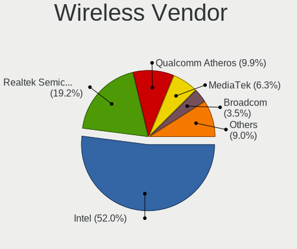

| Vendor                          | Computers | Percent |
|---------------------------------|-----------|---------|
| Intel                           | 553       | 53.22%  |
| Realtek Semiconductor           | 202       | 19.44%  |
| Qualcomm Atheros                | 112       | 10.78%  |
| MediaTek                        | 48        | 4.62%   |
| Broadcom                        | 33        | 3.18%   |
| Ralink Technology               | 24        | 2.31%   |
| Broadcom Limited                | 18        | 1.73%   |
| Qualcomm                        | 6         | 0.58%   |
| Ralink                          | 5         | 0.48%   |
| Quectel Wireless Solutions      | 5         | 0.48%   |
| TP-Link                         | 4         | 0.38%   |
| Qualcomm Atheros Communications | 4         | 0.38%   |
| Xiaomi                          | 3         | 0.29%   |
| Realtek                         | 3         | 0.29%   |
| NetGear                         | 3         | 0.29%   |
| Microsoft                       | 3         | 0.29%   |
| Sierra Wireless                 | 2         | 0.19%   |
| Marvell Technology Group        | 2         | 0.19%   |
| Dell                            | 2         | 0.19%   |
| D-Link                          | 2         | 0.19%   |
| Wilocity                        | 1         | 0.1%    |
| Sagem                           | 1         | 0.1%    |
| Hewlett-Packard                 | 1         | 0.1%    |
| Fibocom                         | 1         | 0.1%    |
| D-Link System                   | 1         | 0.1%    |

Wireless Model
--------------

Wireless models

| Model                                                          | Computers | Percent |
|----------------------------------------------------------------|-----------|---------|
| Intel Wi-Fi 6 AX200                                            | 89        | 8.48%   |
| Realtek RTL8822CE 802.11ac PCIe Wireless Network Adapter       | 54        | 5.15%   |
| Intel Wireless 8265 / 8275                                     | 52        | 4.96%   |
| Intel Wi-Fi 6 AX201                                            | 37        | 3.53%   |
| Intel Comet Lake PCH-LP CNVi WiFi                              | 33        | 3.15%   |
| Qualcomm Atheros QCA6174 802.11ac Wireless Network Adapter     | 31        | 2.96%   |
| Intel Alder Lake-P PCH CNVi WiFi                               | 31        | 2.96%   |
| Intel Wireless 7265                                            | 29        | 2.76%   |
| Qualcomm Atheros QCA9377 802.11ac Wireless Network Adapter     | 28        | 2.67%   |
| Intel Wi-Fi 6 AX210/AX211/AX411 160MHz                         | 27        | 2.57%   |
| Intel Wireless 7260                                            | 24        | 2.29%   |
| Intel Cannon Lake PCH CNVi WiFi                                | 24        | 2.29%   |
| Intel Wireless 8260                                            | 22        | 2.1%    |
| Intel Wireless 3165                                            | 21        | 2%      |
| Realtek RTL8821CE 802.11ac PCIe Wireless Network Adapter       | 20        | 1.91%   |
| Realtek RTL8188EUS 802.11n Wireless Network Adapter            | 19        | 1.81%   |
| MediaTek MT7921 802.11ax PCI Express Wireless Network Adapter  | 18        | 1.72%   |
| Ralink MT7601U Wireless Adapter                                | 17        | 1.62%   |
| Intel Comet Lake PCH CNVi WiFi                                 | 17        | 1.62%   |
| Intel Cannon Point-LP CNVi [Wireless-AC]                       | 16        | 1.53%   |
| Realtek RTL8852AE 802.11ax PCIe Wireless Network Adapter       | 15        | 1.43%   |
| Realtek 802.11ac NIC                                           | 15        | 1.43%   |
| Intel Tiger Lake PCH CNVi WiFi                                 | 15        | 1.43%   |
| Intel Dual Band Wireless-AC 3165 Plus Bluetooth                | 15        | 1.43%   |
| Qualcomm Atheros AR9485 Wireless Network Adapter               | 14        | 1.33%   |
| Realtek RTL8822BE 802.11a/b/g/n/ac WiFi adapter                | 13        | 1.24%   |
| MediaTek MT7921K (RZ608) Wi-Fi 6E 80MHz                        | 11        | 1.05%   |
| Intel Wireless-AC 9260                                         | 11        | 1.05%   |
| Intel Centrino Advanced-N 6205 [Taylor Peak]                   | 11        | 1.05%   |
| Intel Wireless 3160                                            | 10        | 0.95%   |
| Realtek RTL88x2bu [AC1200 Techkey]                             | 9         | 0.86%   |
| Realtek RTL8723BE PCIe Wireless Network Adapter                | 9         | 0.86%   |
| Realtek RTL8188GU 802.11n WLAN Adapter (After Modeswitch)      | 9         | 0.86%   |
| MediaTek MT7612U 802.11a/b/g/n/ac Wireless Adapter             | 9         | 0.86%   |
| Realtek RTL8852BE PCIe 802.11ax Wireless Network Controller    | 8         | 0.76%   |
| Realtek RTL8188CE 802.11b/g/n WiFi Adapter                     | 8         | 0.76%   |
| Qualcomm Atheros QCA9565 / AR9565 Wireless Network Adapter     | 8         | 0.76%   |
| Qualcomm Atheros AR9285 Wireless Network Adapter (PCI-Express) | 8         | 0.76%   |
| Broadcom Limited BCM4360 802.11ac Wireless Network Adapter     | 8         | 0.76%   |
| Qualcomm Atheros AR9462 Wireless Network Adapter               | 7         | 0.67%   |

Ethernet Vendor
---------------

Ethernet vendors

| Vendor                           | Computers | Percent |
|----------------------------------|-----------|---------|
| Realtek Semiconductor            | 585       | 54.88%  |
| Intel                            | 313       | 29.36%  |
| Qualcomm Atheros                 | 44        | 4.13%   |
| Broadcom                         | 26        | 2.44%   |
| ASIX Electronics                 | 21        | 1.97%   |
| Huawei Technologies              | 15        | 1.41%   |
| Xiaomi                           | 10        | 0.94%   |
| Marvell Technology Group         | 6         | 0.56%   |
| IBM                              | 6         | 0.56%   |
| Broadcom Limited                 | 6         | 0.56%   |
| Samsung Electronics              | 3         | 0.28%   |
| Qualcomm                         | 3         | 0.28%   |
| OPPO Electronics                 | 3         | 0.28%   |
| Microsoft                        | 3         | 0.28%   |
| Aquantia                         | 3         | 0.28%   |
| Silicon Integrated Systems [SiS] | 2         | 0.19%   |
| Mellanox Technologies            | 2         | 0.19%   |
| Loongson Technology              | 2         | 0.19%   |
| DisplayLink                      | 2         | 0.19%   |
| Dell                             | 2         | 0.19%   |
| ZTE WCDMA Technologies MSM       | 1         | 0.09%   |
| OnePlus Technology (Shenzhen)    | 1         | 0.09%   |
| Nvidia                           | 1         | 0.09%   |
| NetXen Incorporated              | 1         | 0.09%   |
| Microchip Technology             | 1         | 0.09%   |
| ICS Advent                       | 1         | 0.09%   |
| Google                           | 1         | 0.09%   |
| Attansic Technology              | 1         | 0.09%   |
| Apple                            | 1         | 0.09%   |

Ethernet Model
--------------

Ethernet models

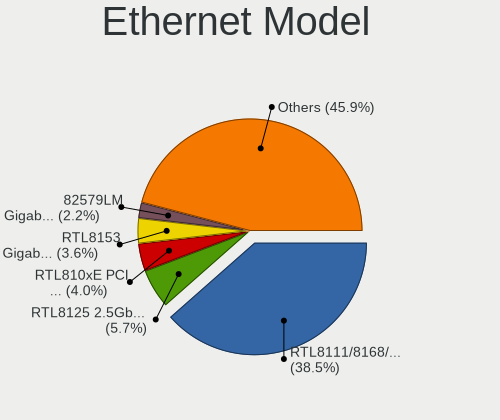

| Model                                                             | Computers | Percent |
|-------------------------------------------------------------------|-----------|---------|
| Realtek RTL8111/8168/8411 PCI Express Gigabit Ethernet Controller | 442       | 39.89%  |
| Realtek RTL810xE PCI Express Fast Ethernet controller             | 52        | 4.69%   |
| Realtek RTL8153 Gigabit Ethernet Adapter                          | 45        | 4.06%   |
| Realtek RTL8125 2.5GbE Controller                                 | 36        | 3.25%   |
| Intel 82579LM Gigabit Network Connection (Lewisville)             | 28        | 2.53%   |
| Intel Ethernet Connection (2) I219-V                              | 25        | 2.26%   |
| Intel I211 Gigabit Network Connection                             | 20        | 1.81%   |
| Intel Ethernet Controller I225-V                                  | 19        | 1.71%   |
| Intel Ethernet Connection (2) I219-LM                             | 18        | 1.62%   |
| Intel Ethernet Connection I217-LM                                 | 15        | 1.35%   |
| ASIX AX88179 Gigabit Ethernet                                     | 15        | 1.35%   |
| Intel I350 Gigabit Network Connection                             | 14        | 1.26%   |
| Intel Ethernet Connection (4) I219-V                              | 13        | 1.17%   |
| Intel I210 Gigabit Network Connection                             | 12        | 1.08%   |
| Intel Ethernet Connection (10) I219-V                             | 11        | 0.99%   |
| Intel Ethernet Connection (7) I219-V                              | 10        | 0.9%    |
| Huawei ANE-LX1                                                    | 10        | 0.9%    |
| Realtek RTL8152 Fast Ethernet Adapter                             | 8         | 0.72%   |
| Intel Ethernet Connection (12) I219-V                             | 8         | 0.72%   |
| Broadcom NetXtreme BCM5720 Gigabit Ethernet PCIe                  | 8         | 0.72%   |
| Qualcomm Atheros Killer E2500 Gigabit Ethernet Controller         | 7         | 0.63%   |
| Qualcomm Atheros Killer E2400 Gigabit Ethernet Controller         | 7         | 0.63%   |
| Intel Ethernet Connection (7) I219-LM                             | 7         | 0.63%   |
| Intel Ethernet Connection (4) I219-LM                             | 7         | 0.63%   |
| Intel Ethernet Connection (16) I219-V                             | 7         | 0.63%   |
| Intel Ethernet Connection (13) I219-V                             | 7         | 0.63%   |
| Intel 82567LM Gigabit Network Connection                          | 7         | 0.63%   |
| Xiaomi Mi/Redmi series (RNDIS + ADB)                              | 6         | 0.54%   |
| Qualcomm Atheros QCA8171 Gigabit Ethernet                         | 6         | 0.54%   |
| Qualcomm Atheros AR8161 Gigabit Ethernet                          | 6         | 0.54%   |
| Intel Ethernet Connection I218-LM                                 | 6         | 0.54%   |
| Intel Ethernet Connection (3) I219-LM                             | 6         | 0.54%   |
| Intel Ethernet Connection (3) I218-LM                             | 6         | 0.54%   |
| Intel Ethernet Connection (2) I218-V                              | 6         | 0.54%   |
| Realtek RTL-8100/8101L/8139 PCI Fast Ethernet Adapter             | 5         | 0.45%   |
| Intel Ethernet Connection X722 for 1GbE                           | 5         | 0.45%   |
| Intel 82599ES 10-Gigabit SFI/SFP+ Network Connection              | 5         | 0.45%   |
| Intel 82574L Gigabit Network Connection                           | 5         | 0.45%   |
| IBM IBM                                                           | 5         | 0.45%   |
| ASIX AX88772B                                                     | 5         | 0.45%   |

Net Controller Kind
-------------------

Ethernet, WiFi or modem

| Kind     | Computers | Percent |
|----------|-----------|---------|
| Ethernet | 1005      | 49.9%   |
| WiFi     | 994       | 49.35%  |
| Unknown  | 8         | 0.4%    |
| Modem    | 7         | 0.35%   |

Used Controller
---------------

Currently used network controller

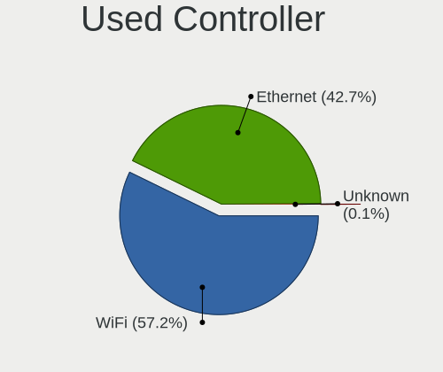

| Kind     | Computers | Percent |
|----------|-----------|---------|
| WiFi     | 739       | 58.23%  |
| Ethernet | 529       | 41.69%  |
| Unknown  | 1         | 0.08%   |

NICs
----

Total network controllers on board

| Total | Computers | Percent |
|-------|-----------|---------|
| 2     | 624       | 48.41%  |
| 1     | 525       | 40.73%  |
| 0     | 65        | 5.04%   |
| 3     | 43        | 3.34%   |
| 4     | 20        | 1.55%   |
| 6     | 7         | 0.54%   |
| 8     | 2         | 0.16%   |
| 42    | 1         | 0.08%   |
| 7     | 1         | 0.08%   |
| 5     | 1         | 0.08%   |

IPv6
----

IPv6 vs IPv4

| Used | Computers | Percent |
|------|-----------|---------|
| No   | 1105      | 84.42%  |
| Yes  | 204       | 15.58%  |

Bluetooth
---------

Bluetooth Vendor
----------------

Controller vendors

| Vendor                          | Computers | Percent |
|---------------------------------|-----------|---------|
| Intel                           | 488       | 58.03%  |
| Realtek Semiconductor           | 77        | 9.16%   |
| Qualcomm Atheros Communications | 59        | 7.02%   |
| Cambridge Silicon Radio         | 47        | 5.59%   |
| Foxconn / Hon Hai               | 29        | 3.45%   |
| Realtek                         | 25        | 2.97%   |
| Broadcom                        | 25        | 2.97%   |
| IMC Networks                    | 23        | 2.73%   |
| MediaTek                        | 11        | 1.31%   |
| Lite-On Technology              | 10        | 1.19%   |
| Apple                           | 10        | 1.19%   |
| ASUSTek Computer                | 9         | 1.07%   |
| Opticis                         | 5         | 0.59%   |
| Foxconn International           | 4         | 0.48%   |
| Dell                            | 4         | 0.48%   |
| Ralink                          | 3         | 0.36%   |
| Hewlett-Packard                 | 3         | 0.36%   |
| Toshiba                         | 2         | 0.24%   |
| Taiyo Yuden                     | 2         | 0.24%   |
| Marvell Semiconductor           | 2         | 0.24%   |
| Alps Electric                   | 2         | 0.24%   |
| USI                             | 1         | 0.12%   |

Bluetooth Model
---------------

Controller models

| Model                                                 | Computers | Percent |
|-------------------------------------------------------|-----------|---------|
| Intel Bluetooth wireless interface                    | 160       | 19.02%  |
| Intel AX201 Bluetooth                                 | 101       | 12.01%  |
| Intel AX200 Bluetooth                                 | 85        | 10.11%  |
| Intel Bluetooth 9460/9560 Jefferson Peak (JfP)        | 66        | 7.85%   |
| Realtek Bluetooth Radio                               | 56        | 6.66%   |
| Cambridge Silicon Radio Bluetooth Dongle (HCI mode)   | 47        | 5.59%   |
| Qualcomm Atheros  Bluetooth Device                    | 39        | 4.64%   |
| Intel Bluetooth Device                                | 30        | 3.57%   |
| Realtek Bluetooth Radio                               | 25        | 2.97%   |
| Intel AX210 Bluetooth                                 | 25        | 2.97%   |
| Qualcomm Atheros QCA61x4 Bluetooth 4.0                | 12        | 1.43%   |
| IMC Networks Bluetooth Radio                          | 12        | 1.43%   |
| MediaTek Wireless_Device                              | 11        | 1.31%   |
| Intel Wireless-AC 9260 Bluetooth Adapter              | 10        | 1.19%   |
| Foxconn / Hon Hai MediaTek Bluetooth Adapter          | 10        | 1.19%   |
| Realtek  Bluetooth 4.2 Adapter                        | 9         | 1.07%   |
| Foxconn / Hon Hai Bluetooth Device                    | 8         | 0.95%   |
| Intel Centrino Bluetooth Wireless Transceiver         | 7         | 0.83%   |
| IMC Networks Wireless_Device                          | 7         | 0.83%   |
| Apple Bluetooth Host Controller                       | 7         | 0.83%   |
| Realtek RTL8723B Bluetooth                            | 6         | 0.71%   |
| Qualcomm Atheros AR3012 Bluetooth 4.0                 | 6         | 0.71%   |
| Broadcom BCM2045B (BDC-2.1)                           | 6         | 0.71%   |
| Opticis Bluetooth Radio                               | 5         | 0.59%   |
| Lite-On Bluetooth Device                              | 5         | 0.59%   |
| Broadcom BCM2045B (BDC-2.1) [Bluetooth Controller]    | 5         | 0.59%   |
| Realtek RTL8822BE Bluetooth 4.2 Adapter               | 4         | 0.48%   |
| Intel Wireless-AC 3168 Bluetooth                      | 4         | 0.48%   |
| IMC Networks Bluetooth Device                         | 4         | 0.48%   |
| Foxconn International BCM43142A0 Bluetooth module     | 4         | 0.48%   |
| Foxconn / Hon Hai Wireless_Device                     | 4         | 0.48%   |
| ASUS Bluetooth Radio                                  | 4         | 0.48%   |
| Ralink RT3290 Bluetooth                               | 3         | 0.36%   |
| Broadcom BCM20702 Bluetooth 4.0 [ThinkPad]            | 3         | 0.36%   |
| ASUS Broadcom BCM20702 Single-Chip Bluetooth 4.0 + LE | 3         | 0.36%   |
| Taiyo Yuden Bluetooth Device                          | 2         | 0.24%   |
| Marvell Bluetooth and Wireless LAN Composite          | 2         | 0.24%   |
| Lite-On Bluetooth 4.0 [Broadcom BCM20702A0]           | 2         | 0.24%   |
| HP Broadcom 2070 Bluetooth Combo                      | 2         | 0.24%   |
| Foxconn / Hon Hai Broadcom BCM20702A1 Bluetooth       | 2         | 0.24%   |

Sound
-----

Sound Vendor
------------

Sound card vendors

| Vendor                                       | Computers | Percent |
|----------------------------------------------|-----------|---------|
| Intel                                        | 852       | 53.45%  |
| AMD                                          | 363       | 22.77%  |
| Nvidia                                       | 278       | 17.44%  |
| C-Media Electronics                          | 11        | 0.69%   |
| Zhaoxin                                      | 9         | 0.56%   |
| Zoran Co. Personal Media Division (Nogatech) | 7         | 0.44%   |
| Realtek Semiconductor                        | 6         | 0.38%   |
| Creative Labs                                | 6         | 0.38%   |
| Apple                                        | 6         | 0.38%   |
| Generalplus Technology                       | 5         | 0.31%   |
| XMOS                                         | 4         | 0.25%   |
| Silicon Integrated Systems [SiS]             | 3         | 0.19%   |
| Phytium Technology                           | 3         | 0.19%   |
| Huawei Technologies                          | 3         | 0.19%   |
| Texas Instruments                            | 2         | 0.13%   |
| Loongson Technology                          | 2         | 0.13%   |
| Giga-Byte Technology                         | 2         | 0.13%   |
| Dell                                         | 2         | 0.13%   |
| BY EDIFIER                                   | 2         | 0.13%   |
| BR23                                         | 2         | 0.13%   |
| VIA Technologies                             | 1         | 0.06%   |
| USB-Speaker                                  | 1         | 0.06%   |
| ULi Electronics                              | 1         | 0.06%   |
| TerraTec Electronic                          | 1         | 0.06%   |
| Specialix                                    | 1         | 0.06%   |
| Sony                                         | 1         | 0.06%   |
| Samsung Electronics                          | 1         | 0.06%   |
| Polycom                                      | 1         | 0.06%   |
| NXP Semiconductors                           | 1         | 0.06%   |
| Moore Threads Technology                     | 1         | 0.06%   |
| KTMicro                                      | 1         | 0.06%   |
| Kingston Technology                          | 1         | 0.06%   |
| JMTek                                        | 1         | 0.06%   |
| Fry's Electronics                            | 1         | 0.06%   |
| ESI                                          | 1         | 0.06%   |
| DSEA A/S                                     | 1         | 0.06%   |
| DCMT Technology                              | 1         | 0.06%   |
| Creative Technology                          | 1         | 0.06%   |
| Conexant Systems                             | 1         | 0.06%   |
| Cambridge Silicon Radio                      | 1         | 0.06%   |

Sound Model
-----------

Sound card models

| Model                                                                      | Computers | Percent |
|----------------------------------------------------------------------------|-----------|---------|
| AMD Family 17h/19h HD Audio Controller                                     | 192       | 9.98%   |
| Intel Sunrise Point-LP HD Audio                                            | 108       | 5.61%   |
| AMD Renoir Radeon High Definition Audio Controller                         | 91        | 4.73%   |
| Intel Cannon Lake PCH cAVS                                                 | 63        | 3.27%   |
| Intel 8 Series/C220 Series Chipset High Definition Audio Controller        | 61        | 3.17%   |
| Intel 7 Series/C216 Chipset Family High Definition Audio Controller        | 57        | 2.96%   |
| Intel Tiger Lake-LP Smart Sound Technology Audio Controller                | 52        | 2.7%    |
| Intel 6 Series/C200 Series Chipset Family High Definition Audio Controller | 48        | 2.49%   |
| Intel 200 Series PCH HD Audio                                              | 48        | 2.49%   |
| AMD Raven/Raven2/Fenghuang HDMI/DP Audio Controller                        | 47        | 2.44%   |
| Intel Xeon E3-1200 v3/4th Gen Core Processor HD Audio Controller           | 41        | 2.13%   |
| Intel 100 Series/C230 Series Chipset Family HD Audio Controller            | 39        | 2.03%   |
| Intel Comet Lake PCH-LP cAVS                                               | 36        | 1.87%   |
| Intel Alder Lake PCH-P High Definition Audio Controller                    | 34        | 1.77%   |
| Intel Haswell-ULT HD Audio Controller                                      | 31        | 1.61%   |
| Intel 8 Series HD Audio Controller                                         | 31        | 1.61%   |
| AMD Rembrandt Radeon High Definition Audio Controller                      | 31        | 1.61%   |
| Nvidia GP106 High Definition Audio Controller                              | 28        | 1.46%   |
| AMD Starship/Matisse HD Audio Controller                                   | 28        | 1.46%   |
| AMD FCH Azalia Controller                                                  | 27        | 1.4%    |
| Nvidia GA106 High Definition Audio Controller                              | 26        | 1.35%   |
| AMD Baffin HDMI/DP Audio [Radeon RX 550 640SP / RX 560/560X]               | 25        | 1.3%    |
| Nvidia TU106 High Definition Audio Controller                              | 24        | 1.25%   |
| Nvidia GK208 HDMI/DP Audio Controller                                      | 23        | 1.2%    |
| Intel Broadwell-U Audio Controller                                         | 23        | 1.2%    |
| Intel Wildcat Point-LP High Definition Audio Controller                    | 22        | 1.14%   |
| Intel Cannon Point-LP High Definition Audio Controller                     | 22        | 1.14%   |
| Nvidia TU107 GeForce GTX 1650 High Definition Audio Controller             | 21        | 1.09%   |
| Intel Tiger Lake-H HD Audio Controller                                     | 21        | 1.09%   |
| Intel Comet Lake PCH cAVS                                                  | 21        | 1.09%   |
| Nvidia GP107GL High Definition Audio Controller                            | 20        | 1.04%   |
| Nvidia GP104 High Definition Audio Controller                              | 19        | 0.99%   |
| AMD Oland/Hainan/Cape Verde/Pitcairn HDMI Audio [Radeon HD 7000 Series]    | 19        | 0.99%   |
| Intel Comet Lake PCH-V cAVS                                                | 17        | 0.88%   |
| Intel CM238 HD Audio Controller                                            | 17        | 0.88%   |
| Intel NM10/ICH7 Family High Definition Audio Controller                    | 16        | 0.83%   |
| AMD SBx00 Azalia (Intel HDA)                                               | 16        | 0.83%   |
| Nvidia TU116 High Definition Audio Controller                              | 14        | 0.73%   |
| Nvidia Audio device                                                        | 14        | 0.73%   |
| Intel Celeron/Pentium Silver Processor High Definition Audio               | 13        | 0.68%   |

Memory
------

Memory Vendor
-------------

Memory module vendors

| Vendor                             | Computers | Percent |
|------------------------------------|-----------|---------|
| Samsung Electronics                | 253       | 28.62%  |
| SK hynix                           | 156       | 17.65%  |
| Kingston                           | 134       | 15.16%  |
| Micron Technology                  | 102       | 11.54%  |
| Unknown                            | 52        | 5.88%   |
| Crucial                            | 32        | 3.62%   |
| A-DATA Technology                  | 27        | 3.05%   |
| Ramaxel Technology                 | 21        | 2.38%   |
| Corsair                            | 13        | 1.47%   |
| Unknown                            | 10        | 1.13%   |
| Elpida                             | 7         | 0.79%   |
| Team                               | 6         | 0.68%   |
| Unknown (ABCD)                     | 5         | 0.57%   |
| Transcend                          | 5         | 0.57%   |
| G.Skill                            | 5         | 0.57%   |
| Nanya Technology                   | 4         | 0.45%   |
| KINGBANK                           | 4         | 0.45%   |
| Shenzhen WODPOSIT                  | 3         | 0.34%   |
| Lenovo                             | 3         | 0.34%   |
| Kingmax                            | 3         | 0.34%   |
| Juhor                              | 3         | 0.34%   |
| Apacer                             | 3         | 0.34%   |
| Unknown (08C8)                     | 2         | 0.23%   |
| UniIC                              | 2         | 0.23%   |
| Ramsta                             | 2         | 0.23%   |
| KLEVV                              | 2         | 0.23%   |
| GLOWAY                             | 2         | 0.23%   |
| Unknown (08B5)                     | 1         | 0.11%   |
| UNILC                              | 1         | 0.11%   |
| tigo                               | 1         | 0.11%   |
| Thermaltake                        | 1         | 0.11%   |
| SK_Hynix                           | 1         | 0.11%   |
| Shenzhen Longsys                   | 1         | 0.11%   |
| SHARETRONIC                        | 1         | 0.11%   |
| Sesame                             | 1         | 0.11%   |
| MTASE                              | 1         | 0.11%   |
| Mircon                             | 1         | 0.11%   |
| MAXSUN                             | 1         | 0.11%   |
| Lexar Co Limited                   | 1         | 0.11%   |
| Kimtigo Semiconductor (HK) Limited | 1         | 0.11%   |

Memory Model
------------

Memory module models

| Model                                                            | Computers | Percent |
|------------------------------------------------------------------|-----------|---------|
| Samsung RAM M471A1G44AB0-CWE 8GB Row Of Chips DDR4 3200MT/s      | 17        | 1.77%   |
| Unknown                                                          | 10        | 1.04%   |
| Samsung RAM M471B5173EB0-YK0 4GB SODIMM DDR3 1600MT/s            | 9         | 0.94%   |
| Micron RAM 4ATF1G64HZ-3G2E1 8GB Row Of Chips DDR4 3200MT/s       | 9         | 0.94%   |
| SK hynix RAM HMAA1GS6CMR6N-VK 8GB Row Of Chips DDR4 2667MT/s     | 8         | 0.84%   |
| Samsung RAM M471A1K43EB1-CWE 8GB SODIMM DDR4 3200MT/s            | 8         | 0.84%   |
| Samsung RAM M471A1G44AB0-CTD 8GB SODIMM DDR4 2667MT/s            | 8         | 0.84%   |
| SK hynix RAM HMA851S6CJR6N-VK 4GB SODIMM DDR4 2667MT/s           | 6         | 0.63%   |
| SK hynix RAM HMA81GS6DJR8N-XN 8GB SODIMM DDR4 3200MT/s           | 6         | 0.63%   |
| Samsung RAM M471A5244CB0-CTD 4GB SODIMM DDR4 3266MT/s            | 6         | 0.63%   |
| Samsung RAM M471A1K43CB1-CRC 8GB SODIMM DDR4 2667MT/s            | 6         | 0.63%   |
| Samsung RAM M471A1G44AB0-CWE 8GB SODIMM DDR4 3200MT/s            | 6         | 0.63%   |
| Micron RAM 4ATF1G64HZ-3G2E1 8GB SODIMM DDR4 3200MT/s             | 6         | 0.63%   |
| Kingston RAM KHX3200C16D4/16GX 16GB DIMM DDR4 3600MT/s           | 6         | 0.63%   |
| Unknown RAM Module 16GB DIMM DDR4 2133MT/s                       | 5         | 0.52%   |
| SK hynix RAM HMT351S6CFR8C-PB 4GB SODIMM DDR3 1600MT/s           | 5         | 0.52%   |
| SK hynix RAM HMAB2GS6AMR6N-XN 16GB SODIMM DDR4 3200MT/s          | 5         | 0.52%   |
| SK hynix RAM HMA81GS6AFR8N-UH 8GB SODIMM DDR4 2667MT/s           | 5         | 0.52%   |
| SK hynix RAM HMA41GS6AFR8N-TF 8GB SODIMM DDR4 2667MT/s           | 5         | 0.52%   |
| Samsung RAM M471A5244CB0-CTD 4GB Row Of Chips DDR4 2667MT/s      | 5         | 0.52%   |
| Samsung RAM M471A1K43DB1-CTD 8GB SODIMM DDR4 2667MT/s            | 5         | 0.52%   |
| Samsung RAM M471A1K43BB1-CRC 8GB SODIMM DDR4 2667MT/s            | 5         | 0.52%   |
| Micron RAM 8ATF1G64HZ-2G6E1 8GB SODIMM DDR4 2667MT/s             | 5         | 0.52%   |
| Micron RAM 53E1G32D2NP-046 2GB Row Of Chips LPDDR4 4267MT/s      | 5         | 0.52%   |
| Kingston RAM LV32D4S2S8HD-8 8GB SODIMM DDR4 3200MT/s             | 5         | 0.52%   |
| Kingston RAM KHX2666C16/8G 8GB DIMM DDR4 3466MT/s                | 5         | 0.52%   |
| Unknown (ABCD) RAM 123456789012345678 2GB SODIMM LPDDR4 2400MT/s | 4         | 0.42%   |
| SK hynix RAM HMT451S6BFR8A-PB 4GB SODIMM DDR3 1600MT/s           | 4         | 0.42%   |
| SK hynix RAM HMAA1GS6CJR6N-XN 8GB Row Of Chips DDR4 3200MT/s     | 4         | 0.42%   |
| SK hynix RAM HMA851S6CJR6N-VK 4GB Row Of Chips DDR4 2667MT/s     | 4         | 0.42%   |
| Samsung RAM M471B1G73QH0-YK0 8GB SODIMM DDR3 1867MT/s            | 4         | 0.42%   |
| Samsung RAM M471B1G73EB0-YK0 8GB SODIMM DDR3 1600MT/s            | 4         | 0.42%   |
| Samsung RAM M471A4G43MB1-CTD 32GB SODIMM DDR4 2667MT/s           | 4         | 0.42%   |
| Samsung RAM M471A1K43DB1-CWE 8GB SODIMM DDR4 3200MT/s            | 4         | 0.42%   |
| Samsung RAM M471A1K43CB1-CTD 8GB SODIMM DDR4 2667MT/s            | 4         | 0.42%   |
| Samsung RAM M471A1K43BB0-CPB 8GB SODIMM DDR4 2133MT/s            | 4         | 0.42%   |
| Samsung RAM M471A1G44AB0-CTD 8GB Row Of Chips DDR4 2667MT/s      | 4         | 0.42%   |
| Samsung RAM 6478545886 16GB DIMM DDR4 2668MT/s                   | 4         | 0.42%   |
| Ramaxel RAM RMSA3260ME78HAF-2666 8GB SODIMM DDR4 2667MT/s        | 4         | 0.42%   |
| Micron RAM 8KTF51264HZ-1G6E1 4GB SODIMM DDR3 1600MT/s            | 4         | 0.42%   |

Memory Kind
-----------

Memory module kinds

| Kind    | Computers | Percent |
|---------|-----------|---------|
| DDR4    | 445       | 56.19%  |
| DDR3    | 186       | 23.48%  |
| LPDDR4  | 41        | 5.18%   |
| LPDDR3  | 35        | 4.42%   |
| DDR5    | 29        | 3.66%   |
| Unknown | 17        | 2.15%   |
| LPDDR5  | 16        | 2.02%   |
| SDRAM   | 11        | 1.39%   |
| DDR2    | 11        | 1.39%   |
| DDR     | 1         | 0.13%   |

Memory Form Factor
------------------

Physical design of the memory module

| Name         | Computers | Percent |
|--------------|-----------|---------|
| SODIMM       | 417       | 52.39%  |
| DIMM         | 235       | 29.52%  |
| Row Of Chips | 137       | 17.21%  |
| Chip         | 5         | 0.63%   |
| RIMM         | 1         | 0.13%   |
| Unknown      | 1         | 0.13%   |

Memory Size
-----------

Memory module size

| Size  | Computers | Percent |
|-------|-----------|---------|
| 8192  | 369       | 43.67%  |
| 4096  | 186       | 22.01%  |
| 16384 | 179       | 21.18%  |
| 2048  | 48        | 5.68%   |
| 32768 | 46        | 5.44%   |
| 1024  | 11        | 1.3%    |
| 65536 | 4         | 0.47%   |
| 512   | 2         | 0.24%   |

Memory Speed
------------

Memory module speed

| Speed   | Computers | Percent |
|---------|-----------|---------|
| 3200    | 170       | 20.05%  |
| 2667    | 150       | 17.69%  |
| 1600    | 131       | 15.45%  |
| 2400    | 57        | 6.72%   |
| 2133    | 56        | 6.6%    |
| 4800    | 30        | 3.54%   |
| 1333    | 28        | 3.3%    |
| 2666    | 25        | 2.95%   |
| 4267    | 22        | 2.59%   |
| 1867    | 19        | 2.24%   |
| 3600    | 17        | 2%      |
| 6400    | 16        | 1.89%   |
| 800     | 10        | 1.18%   |
| 1334    | 9         | 1.06%   |
| 1066    | 9         | 1.06%   |
| Unknown | 8         | 0.94%   |
| 3733    | 7         | 0.83%   |
| 3266    | 7         | 0.83%   |
| 4266    | 6         | 0.71%   |
| 2933    | 6         | 0.71%   |
| 2668    | 6         | 0.71%   |
| 1866    | 6         | 0.71%   |
| 3466    | 5         | 0.59%   |
| 3000    | 5         | 0.59%   |
| 1067    | 5         | 0.59%   |
| 667     | 5         | 0.59%   |
| 1800    | 4         | 0.47%   |
| 8400    | 3         | 0.35%   |
| 4199    | 3         | 0.35%   |
| 3400    | 2         | 0.24%   |
| 2800    | 2         | 0.24%   |
| 2048    | 2         | 0.24%   |
| 266     | 2         | 0.24%   |
| 65535   | 1         | 0.12%   |
| 7500    | 1         | 0.12%   |
| 5600    | 1         | 0.12%   |
| 5200    | 1         | 0.12%   |
| 4133    | 1         | 0.12%   |
| 3933    | 1         | 0.12%   |
| 3800    | 1         | 0.12%   |

Printers & scanners
-------------------

Printer Vendor
--------------

Printer device vendors

| Vendor                             | Computers | Percent |
|------------------------------------|-----------|---------|
| Hewlett-Packard                    | 4         | 50%     |
| Canon                              | 2         | 25%     |
| Brother Industries                 | 1         | 12.5%   |
| BeiJing LanXum Computer Technology | 1         | 12.5%   |

Printer Model
-------------

Printer device models

| Model                                                   | Computers | Percent |
|---------------------------------------------------------|-----------|---------|
| HP LaserJet 1020                                        | 2         | 25%     |
| HP Officejet 4500 G510g-m                               | 1         | 12.5%   |
| HP DeskJet 2130 series                                  | 1         | 12.5%   |
| Canon PIXMA MP280                                       | 1         | 12.5%   |
| Canon iP1100 series                                     | 1         | 12.5%   |
| Brother HL-5440D series                                 | 1         | 12.5%   |
| BeiJing LanXum Technology Black and White Laser Printer | 1         | 12.5%   |

Scanner Vendor
--------------

Scanner device vendors

| Vendor | Computers | Percent |
|--------|-----------|---------|
| Canon  | 1         | 100%    |

Scanner Model
-------------

Scanner device models

| Model                   | Computers | Percent |
|-------------------------|-----------|---------|
| Canon CanoScan LiDE 120 | 1         | 100%    |

Camera
------

Camera Vendor
-------------

Camera device vendors

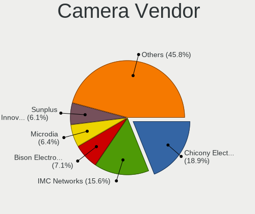

| Vendor                                 | Computers | Percent |
|----------------------------------------|-----------|---------|
| Chicony Electronics                    | 136       | 19.83%  |
| IMC Networks                           | 111       | 16.18%  |
| Realtek Semiconductor                  | 49        | 7.14%   |
| Microdia                               | 48        | 7%      |
| Sunplus Innovation Technology          | 41        | 5.98%   |
| Quanta                                 | 37        | 5.39%   |
| Acer                                   | 37        | 5.39%   |
| Bison Electronics                      | 34        | 4.96%   |
| Cheng Uei Precision Industry (Foxlink) | 29        | 4.23%   |
| Syntek                                 | 21        | 3.06%   |
| Luxvisions Innotech Limited            | 19        | 2.77%   |
| Lite-On Technology                     | 16        | 2.33%   |
| Suyin                                  | 15        | 2.19%   |
| Apple                                  | 11        | 1.6%    |
| Alcor Micro                            | 11        | 1.6%    |
| Logitech                               | 9         | 1.31%   |
| Silicon Motion                         | 7         | 1.02%   |
| Lenovo                                 | 5         | 0.73%   |
| Z-Star Microelectronics                | 4         | 0.58%   |
| Ricoh                                  | 4         | 0.58%   |
| SunplusIT                              | 3         | 0.44%   |
| SN0002                                 | 3         | 0.44%   |
| Importek                               | 3         | 0.44%   |
| icSpring                               | 3         | 0.44%   |
| GEMBIRD                                | 3         | 0.44%   |
| Sonix Technology                       | 2         | 0.29%   |
| Nebraska Furniture Mart                | 2         | 0.29%   |
| Google                                 | 2         | 0.29%   |
| Genesys Logic                          | 2         | 0.29%   |
| Y Media                                | 1         | 0.15%   |
| Unknown (0000034083)                   | 1         | 0.15%   |
| Unknown                                | 1         | 0.15%   |
| Tripath Technology                     | 1         | 0.15%   |
| Primax Electronics                     | 1         | 0.15%   |
| Mitsumi                                | 1         | 0.15%   |
| Microsoft                              | 1         | 0.15%   |
| MacroSilicon                           | 1         | 0.15%   |
| kingcome                               | 1         | 0.15%   |
| JSXRGB0230-D046                        | 1         | 0.15%   |
| HRY                                    | 1         | 0.15%   |

Camera Model
------------

Camera device models

| Model                                                        | Computers | Percent |
|--------------------------------------------------------------|-----------|---------|
| Chicony Integrated Camera                                    | 62        | 8.96%   |
| IMC Networks Integrated Camera                               | 43        | 6.21%   |
| Microdia Integrated_Webcam_HD                                | 28        | 4.05%   |
| IMC Networks ov9734_azurewave_camera                         | 23        | 3.32%   |
| Bison Integrated Camera                                      | 17        | 2.46%   |
| Syntek Integrated Camera                                     | 14        | 2.02%   |
| Realtek Integrated_Webcam_HD                                 | 13        | 1.88%   |
| IMC Networks USB2.0 HD UVC WebCam                            | 13        | 1.88%   |
| Cheng Uei Precision Industry (Foxlink) XiaoMi USB 2.0 Webcam | 13        | 1.88%   |
| Sunplus Integrated_Webcam_HD                                 | 11        | 1.59%   |
| Chicony HD Webcam                                            | 11        | 1.59%   |
| Acer Integrated Camera                                       | 11        | 1.59%   |
| Sunplus XiaoMi USB 2.0 Webcam                                | 10        | 1.45%   |
| IMC Networks HD Camera                                       | 9         | 1.3%    |
| Apple iPhone 5/5C/5S/6/SE/7/8/X                              | 9         | 1.3%    |
| Quanta HP HD Camera                                          | 8         | 1.16%   |
| Bison SunplusIT Integrated Camera                            | 8         | 1.16%   |
| Realtek Integrated Webcam                                    | 7         | 1.01%   |
| Quanta hm1091_techfront                                      | 7         | 1.01%   |
| Luxvisions Innotech Limited Integrated Camera                | 7         | 1.01%   |
| Lite-On Integrated Camera                                    | 7         | 1.01%   |
| Chicony XiaoMi USB 2.0 Webcam                                | 7         | 1.01%   |
| Sunplus HD WebCam                                            | 6         | 0.87%   |
| Realtek USB Camera                                           | 6         | 0.87%   |
| Quanta HD User Facing                                        | 6         | 0.87%   |
| Silicon Motion 300k Pixel Camera                             | 5         | 0.72%   |
| Realtek HP Wide Vision HD Camera                             | 5         | 0.72%   |
| Quanta HP Wide Vision HD Camera                              | 5         | 0.72%   |
| Luxvisions Innotech Limited HP Wide Vision HD Camera         | 5         | 0.72%   |
| IMC Networks XHC Camera                                      | 5         | 0.72%   |
| IMC Networks Lenovo EasyCamera                               | 5         | 0.72%   |
| Chicony Lenovo Integrated Camera (0.3MP)                     | 5         | 0.72%   |
| Chicony Integrated Camera (1280x720@30)                      | 5         | 0.72%   |
| Alcor Micro USB 2.0 Camera                                   | 5         | 0.72%   |
| Syntek Lenovo EasyCamera                                     | 4         | 0.58%   |
| Microdia Webcam Vitade AF                                    | 4         | 0.58%   |
| Lite-On HP Wide Vision HD Camera                             | 4         | 0.58%   |
| Lite-On HP HD Camera                                         | 4         | 0.58%   |
| Chicony USB 2.0 Camera                                       | 4         | 0.58%   |
| Chicony Integrated IR Camera                                 | 4         | 0.58%   |

Security
--------

Fingerprint Vendor
------------------

Fingerprint sensor vendors

| Vendor                     | Computers | Percent |
|----------------------------|-----------|---------|
| Shenzhen Goodix Technology | 62        | 32.29%  |
| Synaptics                  | 54        | 28.13%  |
| Validity Sensors           | 43        | 22.4%   |
| Elan Microelectronics      | 12        | 6.25%   |
| Upek                       | 10        | 5.21%   |
| AuthenTec                  | 4         | 2.08%   |
| LighTuning Technology      | 3         | 1.56%   |
| STMicroelectronics         | 2         | 1.04%   |
| Focal-systems.Corp         | 2         | 1.04%   |

Fingerprint Model
-----------------

Fingerprint sensor models

| Model                                                                      | Computers | Percent |
|----------------------------------------------------------------------------|-----------|---------|
| Shenzhen Goodix  Fingerprint Device                                        | 35        | 18.23%  |
| Shenzhen Goodix Fingerprint Reader                                         | 25        | 13.02%  |
| Synaptics Prometheus MIS Touch Fingerprint Reader                          | 24        | 12.5%   |
| Validity Sensors VFS5011 Fingerprint Reader                                | 11        | 5.73%   |
| Elan ELAN:Fingerprint                                                      | 11        | 5.73%   |
| Upek Biometric Touchchip/Touchstrip Fingerprint Sensor                     | 9         | 4.69%   |
| Validity Sensors VFS 5011 fingerprint sensor                               | 8         | 4.17%   |
| Validity Sensors Synaptics WBDI                                            | 6         | 3.13%   |
| Synaptics Metallica MIS Touch Fingerprint Reader                           | 6         | 3.13%   |
| Validity Sensors Synaptics VFS7552 Touch Fingerprint Sensor with PurePrint | 5         | 2.6%    |
| Synaptics WBDI Device                                                      | 4         | 2.08%   |
| Synaptics  FS7604 Touch Fingerprint Sensor with PurePrint                  | 4         | 2.08%   |
| Validity Sensors VFS7500 Touch Fingerprint Sensor                          | 3         | 1.56%   |
| Validity Sensors VFS491                                                    | 3         | 1.56%   |
| Synaptics WBDI                                                             | 3         | 1.56%   |
| Synaptics UWP WBDI                                                         | 3         | 1.56%   |
| Synaptics  VFS7552 Touch Fingerprint Sensor with PurePrint                 | 3         | 1.56%   |
| Synaptics FS7604 Touch Fingerprint Sensor with PurePrint                   | 3         | 1.56%   |
| Validity Sensors VFS495 Fingerprint Reader                                 | 2         | 1.04%   |
| Validity Sensors VFS471 Fingerprint Reader                                 | 2         | 1.04%   |
| Synaptics UWP WBDI Device                                                  | 2         | 1.04%   |
| STMicroelectronics Fingerprint Reader                                      | 2         | 1.04%   |
| Shenzhen Goodix FingerPrint                                                | 2         | 1.04%   |
| Focal-systems.Corp FT9201Fingerprint.                                      | 2         | 1.04%   |
| AuthenTec AES2810                                                          | 2         | 1.04%   |
| Unknown                                                                    | 2         | 1.04%   |
| Validity Sensors VFS7552 Touch Fingerprint Sensor                          | 1         | 0.52%   |
| Validity Sensors VFS Fingerprint sensor                                    | 1         | 0.52%   |
| Validity Sensors Fingerprint scanner                                       | 1         | 0.52%   |
| Upek TCS5B Fingerprint sensor                                              | 1         | 0.52%   |
| LighTuning Fingerprint Sensor                                              | 1         | 0.52%   |
| LighTuning ES603 Swipe Fingerprint Sensor                                  | 1         | 0.52%   |
| LighTuning EgisTec Touch Fingerprint Sensor                                | 1         | 0.52%   |
| Elan ELAN:ARM-M4                                                           | 1         | 0.52%   |
| AuthenTec Fingerprint Sensor                                               | 1         | 0.52%   |
| AuthenTec AES2550 Fingerprint Sensor                                       | 1         | 0.52%   |

Chipcard Vendor
---------------

Chipcard module vendors

| Vendor      | Computers | Percent |
|-------------|-----------|---------|
| Broadcom    | 12        | 63.16%  |
| Upek        | 2         | 10.53%  |
| Clay Logic  | 2         | 10.53%  |
| Alcor Micro | 2         | 10.53%  |
| Yubico.com  | 1         | 5.26%   |

Chipcard Model
--------------

Chipcard module models

| Model                                                                        | Computers | Percent |
|------------------------------------------------------------------------------|-----------|---------|
| Broadcom 5880                                                                | 5         | 26.32%  |
| Broadcom BCM5880 Secure Applications Processor with fingerprint swipe sensor | 3         | 15.79%  |
| Upek TouchChip Fingerprint Coprocessor (WBF advanced mode)                   | 2         | 10.53%  |
| Clay Logic CanoKey Pigeon                                                    | 2         | 10.53%  |
| Broadcom BCM5880 Secure Applications Processor                               | 2         | 10.53%  |
| Broadcom 58200                                                               | 2         | 10.53%  |
| Alcor Micro AU9540 Smartcard Reader                                          | 2         | 10.53%  |
| Yubico.com Yubikey 4/5 U2F+CCID                                              | 1         | 5.26%   |

Unsupported
-----------

Unsupported Devices
-------------------

Total unsupported devices on board

| Total | Computers | Percent |
|-------|-----------|---------|
| 0     | 779       | 59.06%  |
| 1     | 398       | 30.17%  |
| 2     | 91        | 6.9%    |
| 4     | 21        | 1.59%   |
| 3     | 20        | 1.52%   |
| 5     | 5         | 0.38%   |
| 8     | 2         | 0.15%   |
| 6     | 2         | 0.15%   |
| 7     | 1         | 0.08%   |

Unsupported Device Types
------------------------

Types of unsupported devices

| Type                     | Computers | Percent |
|--------------------------|-----------|---------|
| Fingerprint reader       | 189       | 26.21%  |
| Graphics card            | 182       | 25.24%  |
| Net/wireless             | 80        | 11.1%   |
| Communication controller | 60        | 8.32%   |
| Sound                    | 39        | 5.41%   |
| Multimedia controller    | 39        | 5.41%   |
| Unassigned class         | 38        | 5.27%   |
| Bluetooth                | 25        | 3.47%   |
| Camera                   | 20        | 2.77%   |
| Chipcard                 | 16        | 2.22%   |
| Net/ethernet             | 10        | 1.39%   |
| Network                  | 6         | 0.83%   |
| Storage/raid             | 5         | 0.69%   |
| Card reader              | 4         | 0.55%   |
| Storage                  | 3         | 0.42%   |
| Storage/ata              | 2         | 0.28%   |
| Storage/nvme             | 1         | 0.14%   |
| Modem                    | 1         | 0.14%   |
| Dvb card                 | 1         | 0.14%   |

