Linux in Colombia - Tested Hardware & Statistics
------------------------------------------------

A project to collect tested hardware configurations for Linux in Colombia.

Anyone can contribute to this report by the [hw-probe](https://github.com/linuxhw/hw-probe) tool:

    sudo -E hw-probe -all -upload

Please contribute! Especially if your hardware is rare.

This is a report for all computer types. See also reports for [desktops](/Location/Colombia/Desktop/README.md) and [notebooks](/Location/Colombia/Notebook/README.md).

Contents
--------

* [ Test Cases ](#test-cases)

* [ System ](#system)
  - [ OS                       ](#os)
  - [ OS Family                ](#os-family)
  - [ Kernel                   ](#kernel)
  - [ Kernel Family            ](#kernel-family)
  - [ Kernel Major Ver.        ](#kernel-major-ver)
  - [ Arch                     ](#arch)
  - [ DE                       ](#de)
  - [ Display Server           ](#display-server)
  - [ Display Manager          ](#display-manager)
  - [ OS Lang                  ](#os-lang)
  - [ Boot Mode                ](#boot-mode)
  - [ Filesystem               ](#filesystem)
  - [ Part. scheme             ](#part-scheme)
  - [ Dual Boot with Linux/BSD ](#dual-boot-with-linuxbsd)
  - [ Dual Boot (Win)          ](#dual-boot-win)

* [ Board ](#board)
  - [ Vendor                   ](#vendor)
  - [ Model                    ](#model)
  - [ Model Family             ](#model-family)
  - [ MFG Year                 ](#mfg-year)
  - [ Form Factor              ](#form-factor)
  - [ Secure Boot              ](#secure-boot)
  - [ Coreboot                 ](#coreboot)
  - [ RAM Size                 ](#ram-size)
  - [ RAM Used                 ](#ram-used)
  - [ Total Drives             ](#total-drives)
  - [ Has CD-ROM               ](#has-cd-rom)
  - [ Has Ethernet             ](#has-ethernet)
  - [ Has WiFi                 ](#has-wifi)
  - [ Has Bluetooth            ](#has-bluetooth)

* [ Location ](#location)
  - [ Country                  ](#country)
  - [ City                     ](#city)

* [ Drives ](#drives)
  - [ Drive Vendor             ](#drive-vendor)
  - [ Drive Model              ](#drive-model)
  - [ HDD Vendor               ](#hdd-vendor)
  - [ SSD Vendor               ](#ssd-vendor)
  - [ Drive Kind               ](#drive-kind)
  - [ Drive Connector          ](#drive-connector)
  - [ Drive Size               ](#drive-size)
  - [ Space Total              ](#space-total)
  - [ Space Used               ](#space-used)
  - [ Malfunc. Drives          ](#malfunc-drives)
  - [ Malfunc. Drive Vendor    ](#malfunc-drive-vendor)
  - [ Malfunc. HDD Vendor      ](#malfunc-hdd-vendor)
  - [ Malfunc. Drive Kind      ](#malfunc-drive-kind)
  - [ Failed Drives            ](#failed-drives)
  - [ Failed Drive Vendor      ](#failed-drive-vendor)
  - [ Drive Status             ](#drive-status)

* [ Storage controller ](#storage-controller)
  - [ Storage Vendor           ](#storage-vendor)
  - [ Storage Model            ](#storage-model)
  - [ Storage Kind             ](#storage-kind)

* [ Processor ](#processor)
  - [ CPU Vendor               ](#cpu-vendor)
  - [ CPU Model                ](#cpu-model)
  - [ CPU Model Family         ](#cpu-model-family)
  - [ CPU Cores                ](#cpu-cores)
  - [ CPU Sockets              ](#cpu-sockets)
  - [ CPU Threads              ](#cpu-threads)
  - [ CPU Op-Modes             ](#cpu-op-modes)
  - [ CPU Microcode            ](#cpu-microcode)
  - [ CPU Microarch            ](#cpu-microarch)

* [ Graphics ](#graphics)
  - [ GPU Vendor               ](#gpu-vendor)
  - [ GPU Model                ](#gpu-model)
  - [ GPU Combo                ](#gpu-combo)
  - [ GPU Driver               ](#gpu-driver)
  - [ GPU Memory               ](#gpu-memory)

* [ Monitor ](#monitor)
  - [ Monitor Vendor           ](#monitor-vendor)
  - [ Monitor Model            ](#monitor-model)
  - [ Monitor Resolution       ](#monitor-resolution)
  - [ Monitor Diagonal         ](#monitor-diagonal)
  - [ Monitor Width            ](#monitor-width)
  - [ Aspect Ratio             ](#aspect-ratio)
  - [ Monitor Area             ](#monitor-area)
  - [ Pixel Density            ](#pixel-density)
  - [ Multiple Monitors        ](#multiple-monitors)

* [ Network ](#network)
  - [ Net Controller Vendor    ](#net-controller-vendor)
  - [ Net Controller Model     ](#net-controller-model)
  - [ Wireless Vendor          ](#wireless-vendor)
  - [ Wireless Model           ](#wireless-model)
  - [ Ethernet Vendor          ](#ethernet-vendor)
  - [ Ethernet Model           ](#ethernet-model)
  - [ Net Controller Kind      ](#net-controller-kind)
  - [ Used Controller          ](#used-controller)
  - [ NICs                     ](#nics)
  - [ IPv6                     ](#ipv6)

* [ Bluetooth ](#bluetooth)
  - [ Bluetooth Vendor         ](#bluetooth-vendor)
  - [ Bluetooth Model          ](#bluetooth-model)

* [ Sound ](#sound)
  - [ Sound Vendor             ](#sound-vendor)
  - [ Sound Model              ](#sound-model)

* [ Memory ](#memory)
  - [ Memory Vendor            ](#memory-vendor)
  - [ Memory Model             ](#memory-model)
  - [ Memory Kind              ](#memory-kind)
  - [ Memory Form Factor       ](#memory-form-factor)
  - [ Memory Size              ](#memory-size)
  - [ Memory Speed             ](#memory-speed)

* [ Printers & scanners ](#printers--scanners)
  - [ Printer Vendor           ](#printer-vendor)
  - [ Printer Model            ](#printer-model)
  - [ Scanner Vendor           ](#scanner-vendor)
  - [ Scanner Model            ](#scanner-model)

* [ Camera ](#camera)
  - [ Camera Vendor            ](#camera-vendor)
  - [ Camera Model             ](#camera-model)

* [ Security ](#security)
  - [ Fingerprint Vendor       ](#fingerprint-vendor)
  - [ Fingerprint Model        ](#fingerprint-model)
  - [ Chipcard Vendor          ](#chipcard-vendor)
  - [ Chipcard Model           ](#chipcard-model)

* [ Unsupported ](#unsupported)
  - [ Unsupported Devices      ](#unsupported-devices)
  - [ Unsupported Device Types ](#unsupported-device-types)

Test Cases
----------

Total: 2506

| Vendor        | Model                       | Form-Factor | Probe                                                      | Date         |
|---------------|-----------------------------|-------------|------------------------------------------------------------|--------------|
| MSI           | H110M PRO-VH PLUS           | Desktop     | [b447d296fe](https://linux-hardware.org/?probe=b447d296fe) | Jan 03, 2026 |
| ASUSTek       | PRIME A320M-K               | Desktop     | [acf3987772](https://linux-hardware.org/?probe=acf3987772) | Jan 02, 2026 |
| HP            | Presario CQ43               | Notebook    | [6a1a248c06](https://linux-hardware.org/?probe=6a1a248c06) | Dec 31, 2025 |
| Apple         | MacBook3,1                  | Notebook    | [3e9b7ef512](https://linux-hardware.org/?probe=3e9b7ef512) | Dec 31, 2025 |
| ASUSTek       | VivoBook_ASUSLaptop M350... | Notebook    | [7e501724d2](https://linux-hardware.org/?probe=7e501724d2) | Dec 30, 2025 |
| Dell          | 0DR845                      | Desktop     | [7c7f5eccce](https://linux-hardware.org/?probe=7c7f5eccce) | Dec 29, 2025 |
| Dell          | 0DR845                      | Desktop     | [c511e33362](https://linux-hardware.org/?probe=c511e33362) | Dec 29, 2025 |
| Pegatron      | 2A73h                       | Desktop     | [0a7d617dd0](https://linux-hardware.org/?probe=0a7d617dd0) | Dec 28, 2025 |
| ASUSTek       | VivoBook_ASUSLaptop X509... | Notebook    | [5d6e2dd646](https://linux-hardware.org/?probe=5d6e2dd646) | Dec 28, 2025 |
| ASUSTek       | VivoBook_ASUSLaptop X509... | Notebook    | [b12240ff07](https://linux-hardware.org/?probe=b12240ff07) | Dec 28, 2025 |
| Lenovo        | 375A No DPK                 | All in one  | [1017684d2e](https://linux-hardware.org/?probe=1017684d2e) | Dec 27, 2025 |
| MSI           | H110M PRO-VH PLUS           | Desktop     | [cc774b7847](https://linux-hardware.org/?probe=cc774b7847) | Dec 27, 2025 |
| Lenovo        | V330-14ARR 81B1             | Notebook    | [d6890ba306](https://linux-hardware.org/?probe=d6890ba306) | Dec 27, 2025 |
| ASUSTek       | GL553VD                     | Notebook    | [0889a8f71a](https://linux-hardware.org/?probe=0889a8f71a) | Dec 27, 2025 |
| Acer          | Aspire AV15-52              | Notebook    | [f6ef69770c](https://linux-hardware.org/?probe=f6ef69770c) | Dec 26, 2025 |
| MSI           | H110M PRO-VH PLUS           | Desktop     | [ac774dbb04](https://linux-hardware.org/?probe=ac774dbb04) | Dec 26, 2025 |
| Toshiba       | Satellite L305D             | Notebook    | [46484c414f](https://linux-hardware.org/?probe=46484c414f) | Dec 24, 2025 |
| MSI           | MAG B550 TOMAHAWK MAX WI... | Desktop     | [cdd68e63de](https://linux-hardware.org/?probe=cdd68e63de) | Dec 24, 2025 |
| Gigabyte      | H81M-H                      | Desktop     | [d411be4ea6](https://linux-hardware.org/?probe=d411be4ea6) | Dec 24, 2025 |
| HP            | 245 14 inch G9 Notebook ... | Notebook    | [e60a9cd704](https://linux-hardware.org/?probe=e60a9cd704) | Dec 22, 2025 |
| ASUSTek       | VivoBook 15_ASUS Laptop ... | Notebook    | [ca99068502](https://linux-hardware.org/?probe=ca99068502) | Dec 22, 2025 |
| ASRock        | Z77 Extreme4                | Desktop     | [4fe4e5afb6](https://linux-hardware.org/?probe=4fe4e5afb6) | Dec 20, 2025 |
| Apple         | MacBookAir4,1               | Notebook    | [046de1d3cf](https://linux-hardware.org/?probe=046de1d3cf) | Dec 20, 2025 |
| Gigabyte      | B560M DS3H                  | Desktop     | [300d8c438c](https://linux-hardware.org/?probe=300d8c438c) | Dec 19, 2025 |
| ASUSTek       | Vivobook Go E1504FA_E150... | Notebook    | [1ef93a0bc1](https://linux-hardware.org/?probe=1ef93a0bc1) | Dec 17, 2025 |
| Gigabyte      | H81M-H                      | Desktop     | [b7c896084d](https://linux-hardware.org/?probe=b7c896084d) | Dec 16, 2025 |
| Dell          | 03KWTV A00                  | Desktop     | [105f14d366](https://linux-hardware.org/?probe=105f14d366) | Dec 15, 2025 |
| HP            | Victus by Gaming Laptop ... | Notebook    | [ee82119419](https://linux-hardware.org/?probe=ee82119419) | Dec 15, 2025 |
| ASUSTek       | PRIME A320M-K               | Desktop     | [d93dbe02b2](https://linux-hardware.org/?probe=d93dbe02b2) | Dec 15, 2025 |
| ASUSTek       | PRIME A320M-K               | Desktop     | [b74b213001](https://linux-hardware.org/?probe=b74b213001) | Dec 15, 2025 |
| HP            | 339A                        | Desktop     | [010ba89d98](https://linux-hardware.org/?probe=010ba89d98) | Dec 14, 2025 |
| Toshiba       | Satellite S845              | Notebook    | [498701ca2f](https://linux-hardware.org/?probe=498701ca2f) | Dec 12, 2025 |
| ASUSTek       | ROG STRIX X870-A GAMING ... | Notebook    | [7bb17cc982](https://linux-hardware.org/?probe=7bb17cc982) | Dec 12, 2025 |
| Apple         | MacBook3,1                  | Notebook    | [83a0f9f476](https://linux-hardware.org/?probe=83a0f9f476) | Dec 10, 2025 |
| ASUSTek       | Vivobook Go E1504FA_E150... | Notebook    | [ee94d47e48](https://linux-hardware.org/?probe=ee94d47e48) | Dec 09, 2025 |
| MSI           | H510M-A PRO                 | Desktop     | [bb697ee959](https://linux-hardware.org/?probe=bb697ee959) | Dec 08, 2025 |
| ASUSTek       | VivoBook_ASUSLaptop X150... | Notebook    | [d31620d188](https://linux-hardware.org/?probe=d31620d188) | Dec 08, 2025 |
| ASUSTek       | VivoBook_ASUSLaptop X509... | Notebook    | [ef27d8bb87](https://linux-hardware.org/?probe=ef27d8bb87) | Dec 08, 2025 |
| MSI           | H510M-A PRO                 | Desktop     | [ce604a8664](https://linux-hardware.org/?probe=ce604a8664) | Dec 07, 2025 |
| ASUSTek       | TUF Gaming B550-PLUS WIF... | Desktop     | [c315ba293c](https://linux-hardware.org/?probe=c315ba293c) | Dec 06, 2025 |
| HP            | Laptop 15-db0xxx            | Notebook    | [6c4ef6b5ef](https://linux-hardware.org/?probe=6c4ef6b5ef) | Dec 05, 2025 |
| ASUSTek       | VivoBook_ASUSLaptop M350... | Notebook    | [4515daae47](https://linux-hardware.org/?probe=4515daae47) | Dec 03, 2025 |
| Dell          | Latitude 7214               | Notebook    | [159e3f41bc](https://linux-hardware.org/?probe=159e3f41bc) | Dec 02, 2025 |
| Gigabyte      | H81M-H                      | Desktop     | [caa4b11216](https://linux-hardware.org/?probe=caa4b11216) | Dec 02, 2025 |
| HP            | 0A54h                       | Desktop     | [ec97a70a69](https://linux-hardware.org/?probe=ec97a70a69) | Dec 01, 2025 |
| HP            | 0A54h                       | Desktop     | [fcec4122fd](https://linux-hardware.org/?probe=fcec4122fd) | Dec 01, 2025 |
| Lenovo        | Legion Go 8APU1 83E1        | Tablet      | [064088b658](https://linux-hardware.org/?probe=064088b658) | Nov 30, 2025 |
| Lenovo        | B50-45 20388                | Notebook    | [3530a351c9](https://linux-hardware.org/?probe=3530a351c9) | Nov 29, 2025 |
| Dell          | Inspiron N4050              | Notebook    | [7bca8d942f](https://linux-hardware.org/?probe=7bca8d942f) | Nov 29, 2025 |
| Lenovo        | ThinkBook 14 G6 IRL 21KG    | Notebook    | [fd6ae7db7c](https://linux-hardware.org/?probe=fd6ae7db7c) | Nov 28, 2025 |
| Lenovo        | ThinkPad L390 20NSS3RW00    | Notebook    | [598e7f5371](https://linux-hardware.org/?probe=598e7f5371) | Nov 28, 2025 |
| Gigabyte      | H81M-H                      | Desktop     | [8223e2878e](https://linux-hardware.org/?probe=8223e2878e) | Nov 28, 2025 |
| ASUSTek       | Vivobook Go E1504GAB_E15... | Notebook    | [a5c5949666](https://linux-hardware.org/?probe=a5c5949666) | Nov 28, 2025 |
| Apple         | MacBook3,1                  | Notebook    | [a3c1dc8347](https://linux-hardware.org/?probe=a3c1dc8347) | Nov 27, 2025 |
| ASUSTek       | VivoBook_ASUSLaptop X515... | Notebook    | [d248a6a8d9](https://linux-hardware.org/?probe=d248a6a8d9) | Nov 26, 2025 |
| ASUSTek       | VivoBook_ASUSLaptop X150... | Notebook    | [5bf640a1a4](https://linux-hardware.org/?probe=5bf640a1a4) | Nov 26, 2025 |
| ASRock        | G41M-VS3                    | Desktop     | [428c9c16e5](https://linux-hardware.org/?probe=428c9c16e5) | Nov 26, 2025 |
| Gigabyte      | A520M DS3H                  | Desktop     | [a1fbb51783](https://linux-hardware.org/?probe=a1fbb51783) | Nov 26, 2025 |
| Gigabyte      | H81M-H                      | Desktop     | [3212a2cb08](https://linux-hardware.org/?probe=3212a2cb08) | Nov 26, 2025 |
| ASUSTek       | Vivobook Go E1504GAB_E15... | Notebook    | [c2b36b519a](https://linux-hardware.org/?probe=c2b36b519a) | Nov 25, 2025 |
| Biostar       | N68S3+                      | Desktop     | [c4c7d41ba4](https://linux-hardware.org/?probe=c4c7d41ba4) | Nov 24, 2025 |
| ASUSTek       | ASUS TUF Gaming A16 FA60... | Notebook    | [e694ff36fe](https://linux-hardware.org/?probe=e694ff36fe) | Nov 24, 2025 |
| HP            | 245 14 inch G9 Notebook ... | Notebook    | [997c0f5235](https://linux-hardware.org/?probe=997c0f5235) | Nov 24, 2025 |
| ASUSTek       | ASUS TUF Gaming A16 FA60... | Notebook    | [e4c8b1fd49](https://linux-hardware.org/?probe=e4c8b1fd49) | Nov 24, 2025 |
| HP            | 1495                        | Desktop     | [e22b0bd58c](https://linux-hardware.org/?probe=e22b0bd58c) | Nov 23, 2025 |
| HP            | 245 G5 Notebook PC          | Notebook    | [96cc7fb3d6](https://linux-hardware.org/?probe=96cc7fb3d6) | Nov 23, 2025 |
| Lenovo        | ThinkBook 14 G6 IRL 21KG    | Notebook    | [ad7136f0b4](https://linux-hardware.org/?probe=ad7136f0b4) | Nov 21, 2025 |
| ASUSTek       | VivoBook_ASUSLaptop X150... | Notebook    | [69310f1d8a](https://linux-hardware.org/?probe=69310f1d8a) | Nov 19, 2025 |
| Apple         | MacBook3,1                  | Notebook    | [28631b8a74](https://linux-hardware.org/?probe=28631b8a74) | Nov 16, 2025 |
| Dell          | 07WP95 A01                  | Desktop     | [fdfff8171c](https://linux-hardware.org/?probe=fdfff8171c) | Nov 16, 2025 |
| ASUSTek       | V220IB                      | Desktop     | [b0d3700a2b](https://linux-hardware.org/?probe=b0d3700a2b) | Nov 13, 2025 |
| HP            | Pavilion Gaming Laptop 1... | Notebook    | [718071d7fc](https://linux-hardware.org/?probe=718071d7fc) | Nov 13, 2025 |
| Intel         | H61                         | Desktop     | [e2fe6f64a6](https://linux-hardware.org/?probe=e2fe6f64a6) | Nov 13, 2025 |
| Lenovo        | G40-30 80FY                 | Notebook    | [d473f70cf2](https://linux-hardware.org/?probe=d473f70cf2) | Nov 12, 2025 |
| ASUSTek       | TUF Gaming B550M-PLUS       | Desktop     | [189da6f5df](https://linux-hardware.org/?probe=189da6f5df) | Nov 12, 2025 |
| HP            | ProBook 430 G2              | Notebook    | [b4b075dd13](https://linux-hardware.org/?probe=b4b075dd13) | Nov 12, 2025 |
| MSI           | Vector 16 HX AI A2XWHG      | Notebook    | [7e1aab9020](https://linux-hardware.org/?probe=7e1aab9020) | Nov 10, 2025 |
| Dell          | Inspiron 3443               | Notebook    | [6ec2cd0bc8](https://linux-hardware.org/?probe=6ec2cd0bc8) | Nov 10, 2025 |
| Apple         | MacBookPro9,2               | Notebook    | [d349a966e2](https://linux-hardware.org/?probe=d349a966e2) | Nov 10, 2025 |
| Dell          | Vostro 3400                 | Notebook    | [5803878a17](https://linux-hardware.org/?probe=5803878a17) | Nov 09, 2025 |
| Apple         | MacBookPro9,2               | Notebook    | [1c38e1ff9e](https://linux-hardware.org/?probe=1c38e1ff9e) | Nov 09, 2025 |
| Gigabyte      | AX370-Gaming 5              | Desktop     | [cbd0739717](https://linux-hardware.org/?probe=cbd0739717) | Nov 09, 2025 |
| Sony          | VPCEG35FL                   | Notebook    | [2db047fb95](https://linux-hardware.org/?probe=2db047fb95) | Nov 09, 2025 |
| Sony          | VPCEG35FL                   | Notebook    | [2cabc9192e](https://linux-hardware.org/?probe=2cabc9192e) | Nov 09, 2025 |
| Toshiba       | Satellite L745              | Notebook    | [32498a2dda](https://linux-hardware.org/?probe=32498a2dda) | Nov 08, 2025 |
| HP            | 339A                        | Desktop     | [760ec69ad1](https://linux-hardware.org/?probe=760ec69ad1) | Nov 08, 2025 |
| HP            | Laptop 15-ef2xxx            | Notebook    | [770d1ab3d2](https://linux-hardware.org/?probe=770d1ab3d2) | Nov 08, 2025 |
| ASUSTek       | Vivobook Go E1504FA_E150... | Notebook    | [2f6c91a788](https://linux-hardware.org/?probe=2f6c91a788) | Nov 07, 2025 |
| Google        | Robo                        | Notebook    | [8a0de98c51](https://linux-hardware.org/?probe=8a0de98c51) | Nov 02, 2025 |
| HP            | ZBook Firefly 14 inch G8... | Notebook    | [00bcf82b52](https://linux-hardware.org/?probe=00bcf82b52) | Oct 29, 2025 |
| HP            | EliteBook 840 14 inch G9... | Notebook    | [d4ca16403e](https://linux-hardware.org/?probe=d4ca16403e) | Oct 29, 2025 |
| AZW           | SER V1.0                    | Desktop     | [7f7f994bbb](https://linux-hardware.org/?probe=7f7f994bbb) | Oct 28, 2025 |
| MSI           | H310M PRO-VH                | Notebook    | [00783df1d8](https://linux-hardware.org/?probe=00783df1d8) | Oct 27, 2025 |
| HP            | 2B42 100                    | All in one  | [e2922ed0b2](https://linux-hardware.org/?probe=e2922ed0b2) | Oct 27, 2025 |
| PCSMART       | PCSGOB270-B Med ZF 3407     | Desktop     | [35ff3fe872](https://linux-hardware.org/?probe=35ff3fe872) | Oct 26, 2025 |
| ASUSTek       | VivoBook_ASUSLaptop M350... | Notebook    | [98decae56c](https://linux-hardware.org/?probe=98decae56c) | Oct 25, 2025 |
| Lenovo        | IdeaPad L340-15IRH Gamin... | Notebook    | [d13e47706b](https://linux-hardware.org/?probe=d13e47706b) | Oct 24, 2025 |
| Lenovo        | IdeaPad S340-14API 81NB     | Notebook    | [919ea2b9ac](https://linux-hardware.org/?probe=919ea2b9ac) | Oct 24, 2025 |
| Lenovo        | IdeaPad S340-14API 81NB     | Notebook    | [b442c3f734](https://linux-hardware.org/?probe=b442c3f734) | Oct 23, 2025 |
| MSI           | PRO Z690-A WIFI DDR4        | Desktop     | [ddc6c35d34](https://linux-hardware.org/?probe=ddc6c35d34) | Oct 22, 2025 |
| Gigabyte      | A320M-S2H-CF                | Desktop     | [751218fb6b](https://linux-hardware.org/?probe=751218fb6b) | Oct 22, 2025 |
| Dell          | Inspiron 16 5625            | Notebook    | [e7e906e0c9](https://linux-hardware.org/?probe=e7e906e0c9) | Oct 21, 2025 |
| Biostar       | H61MGC                      | Desktop     | [43f06edd34](https://linux-hardware.org/?probe=43f06edd34) | Oct 21, 2025 |
| Lenovo        | ThinkPad X220 4293B43       | Notebook    | [bb3191f5be](https://linux-hardware.org/?probe=bb3191f5be) | Oct 20, 2025 |
| HP            | EliteBook 8440p             | Notebook    | [8b543dfd47](https://linux-hardware.org/?probe=8b543dfd47) | Oct 16, 2025 |
| Unknown       | Unknown                     | Notebook    | [5b3f7651c5](https://linux-hardware.org/?probe=5b3f7651c5) | Oct 14, 2025 |
| eMachines     | EL1352                      | Desktop     | [86584658c9](https://linux-hardware.org/?probe=86584658c9) | Oct 14, 2025 |
| HP            | Pavilion Notebook           | Notebook    | [46a65b5e3d](https://linux-hardware.org/?probe=46a65b5e3d) | Oct 13, 2025 |
| Huanan        | X79 V1.0                    | Desktop     | [c86fb54116](https://linux-hardware.org/?probe=c86fb54116) | Oct 13, 2025 |
| Lenovo        | ThinkPad X390 20Q1S01C00    | Notebook    | [a1558178e4](https://linux-hardware.org/?probe=a1558178e4) | Oct 12, 2025 |
| eMachines     | E725                        | Notebook    | [2342c484d5](https://linux-hardware.org/?probe=2342c484d5) | Oct 12, 2025 |
| HP            | 245 14 inch G9 Notebook ... | Notebook    | [6bb5902730](https://linux-hardware.org/?probe=6bb5902730) | Oct 12, 2025 |
| Lenovo        | G400s 20244                 | Notebook    | [9d7082a771](https://linux-hardware.org/?probe=9d7082a771) | Oct 11, 2025 |
| ASUSTek       | X405UA                      | Notebook    | [bc3c04d774](https://linux-hardware.org/?probe=bc3c04d774) | Oct 11, 2025 |
| HP            | 1497                        | Desktop     | [c08a1bd7eb](https://linux-hardware.org/?probe=c08a1bd7eb) | Oct 10, 2025 |
| ASUSTek       | PRIME Z390-A                | Desktop     | [2963ea4ce0](https://linux-hardware.org/?probe=2963ea4ce0) | Oct 10, 2025 |
| ASUSTek       | X505BP                      | Notebook    | [af88bbf47c](https://linux-hardware.org/?probe=af88bbf47c) | Oct 09, 2025 |
| Dell          | Inspiron 16 5625            | Notebook    | [39c443f257](https://linux-hardware.org/?probe=39c443f257) | Oct 08, 2025 |
| Dell          | Vostro 3300                 | Notebook    | [0b1c887973](https://linux-hardware.org/?probe=0b1c887973) | Oct 07, 2025 |
| Pegatron      | 2A73h                       | Desktop     | [f0b1569dfb](https://linux-hardware.org/?probe=f0b1569dfb) | Oct 05, 2025 |
| ASUSTek       | VivoBook_ASUSLaptop M350... | Notebook    | [f5532f1a54](https://linux-hardware.org/?probe=f5532f1a54) | Oct 04, 2025 |
| HP            | ENVY dv6                    | Notebook    | [36d1fa6f86](https://linux-hardware.org/?probe=36d1fa6f86) | Oct 03, 2025 |
| HP            | 245 14 inch G9 Notebook ... | Notebook    | [581b1476f0](https://linux-hardware.org/?probe=581b1476f0) | Sep 30, 2025 |
| Lenovo        | ThinkPad L14 Gen 3 21C2S... | Notebook    | [0e9942c706](https://linux-hardware.org/?probe=0e9942c706) | Sep 29, 2025 |
| Sony          | SVF14416SGB                 | Notebook    | [31deb09cad](https://linux-hardware.org/?probe=31deb09cad) | Sep 29, 2025 |
| Sony          | SVF14416SGB                 | Notebook    | [72a979a7db](https://linux-hardware.org/?probe=72a979a7db) | Sep 29, 2025 |
| MSI           | GE76 Dragon Tiamat 11UG     | Notebook    | [522ce0accc](https://linux-hardware.org/?probe=522ce0accc) | Sep 28, 2025 |
| Apple         | MacBookPro7,1               | Notebook    | [ea7748b076](https://linux-hardware.org/?probe=ea7748b076) | Sep 26, 2025 |
| ASUSTek       | M4A785TD-V EVO              | Desktop     | [4d5e029644](https://linux-hardware.org/?probe=4d5e029644) | Sep 25, 2025 |
| ASUSTek       | VivoBook_ASUSLaptop M140... | Notebook    | [f0253dfd4d](https://linux-hardware.org/?probe=f0253dfd4d) | Sep 25, 2025 |
| ASUSTek       | VivoBook_ASUSLaptop X160... | Notebook    | [4bfd918590](https://linux-hardware.org/?probe=4bfd918590) | Sep 24, 2025 |
| ASUSTek       | Vivobook Go E1504FA_E150... | Notebook    | [ccc73ce7eb](https://linux-hardware.org/?probe=ccc73ce7eb) | Sep 22, 2025 |
| ASUSTek       | ASUS Zenbook 14 UM3406HA... | Notebook    | [5080c670fe](https://linux-hardware.org/?probe=5080c670fe) | Sep 21, 2025 |
| Apple         | Mac-27ADBB7B4CEE8E61 iMa... | All in one  | [88bdbf6419](https://linux-hardware.org/?probe=88bdbf6419) | Sep 21, 2025 |
| Apple         | Mac-27ADBB7B4CEE8E61 iMa... | All in one  | [b25e3cfb3a](https://linux-hardware.org/?probe=b25e3cfb3a) | Sep 21, 2025 |
| Dell          | Latitude E6430              | Notebook    | [5bcfed2af0](https://linux-hardware.org/?probe=5bcfed2af0) | Sep 19, 2025 |
| PCsmart       | PCSGOB14p-C                 | Notebook    | [78ba652af4](https://linux-hardware.org/?probe=78ba652af4) | Sep 18, 2025 |
| Dell          | Precision 3551              | Notebook    | [9469f79afa](https://linux-hardware.org/?probe=9469f79afa) | Sep 16, 2025 |
| Dell          | Latitude E6410              | Notebook    | [4c1daad5ff](https://linux-hardware.org/?probe=4c1daad5ff) | Sep 15, 2025 |
| Dell          | 0PC5F7 A00                  | Desktop     | [66ca504a44](https://linux-hardware.org/?probe=66ca504a44) | Sep 13, 2025 |
| ASUSTek       | VivoBook_ASUSLaptop X160... | Notebook    | [d682b67de4](https://linux-hardware.org/?probe=d682b67de4) | Sep 13, 2025 |
| HUAWEI        | BOHK-WAX9X                  | Notebook    | [9742452876](https://linux-hardware.org/?probe=9742452876) | Sep 13, 2025 |
| ASUSTek       | VivoBook_ASUSLaptop X160... | Notebook    | [860b58a85f](https://linux-hardware.org/?probe=860b58a85f) | Sep 12, 2025 |
| ASUSTek       | CROSSBLADE RANGER           | Desktop     | [5fce52b1a1](https://linux-hardware.org/?probe=5fce52b1a1) | Sep 09, 2025 |
| ASUSTek       | VivoBook_ASUSLaptop X150... | Notebook    | [d9df55281b](https://linux-hardware.org/?probe=d9df55281b) | Sep 08, 2025 |
| HUAWEI        | BOHK-WAX9X                  | Notebook    | [020fd055fb](https://linux-hardware.org/?probe=020fd055fb) | Sep 07, 2025 |
| Dell          | Inspiron 5420               | Notebook    | [4b2f75d04e](https://linux-hardware.org/?probe=4b2f75d04e) | Sep 03, 2025 |
| eMachines     | eMD732                      | Notebook    | [5a1e274e23](https://linux-hardware.org/?probe=5a1e274e23) | Sep 02, 2025 |
| ASUSTek       | VivoBook_ASUS Laptop X50... | Notebook    | [db667ee312](https://linux-hardware.org/?probe=db667ee312) | Sep 02, 2025 |
| ASUSTek       | Vivobook Go E1504GAB_E15... | Notebook    | [3a87ca156e](https://linux-hardware.org/?probe=3a87ca156e) | Sep 01, 2025 |
| Gigabyte      | B550M DS3H AC               | Desktop     | [f05aa39279](https://linux-hardware.org/?probe=f05aa39279) | Aug 31, 2025 |
| Lenovo        | V14-ARE 82DQ                | Notebook    | [56b76aaee9](https://linux-hardware.org/?probe=56b76aaee9) | Aug 31, 2025 |
| Gateway       | M-7315U                     | Notebook    | [e45abd1449](https://linux-hardware.org/?probe=e45abd1449) | Aug 30, 2025 |
| Gigabyte      | B450M DS3H V2               | Desktop     | [99f7c9f3e8](https://linux-hardware.org/?probe=99f7c9f3e8) | Aug 26, 2025 |
| Acer          | Nitro AN515-52              | Notebook    | [e04115833b](https://linux-hardware.org/?probe=e04115833b) | Aug 24, 2025 |
| ASUSTek       | PRIME B350M-A               | Desktop     | [92aeb02732](https://linux-hardware.org/?probe=92aeb02732) | Aug 23, 2025 |
| HP            | ZBook Power G7 Mobile Wo... | Notebook    | [470db7b953](https://linux-hardware.org/?probe=470db7b953) | Aug 23, 2025 |
| HP            | Stream 7 Tablet             | Tablet      | [7813e7c67a](https://linux-hardware.org/?probe=7813e7c67a) | Aug 23, 2025 |
| Acer          | Aspire A314-22G             | Notebook    | [2ac768ff96](https://linux-hardware.org/?probe=2ac768ff96) | Aug 21, 2025 |
| Valve         | Jupiter                     | Notebook    | [0779f4467f](https://linux-hardware.org/?probe=0779f4467f) | Aug 21, 2025 |
| HP            | ZBook 14u G5                | Notebook    | [1acd9b913c](https://linux-hardware.org/?probe=1acd9b913c) | Aug 21, 2025 |
| Dell          | 0NW73C A00                  | Desktop     | [36817e573d](https://linux-hardware.org/?probe=36817e573d) | Aug 19, 2025 |
| Dell          | Latitude E6430              | Notebook    | [3f52eadac2](https://linux-hardware.org/?probe=3f52eadac2) | Aug 19, 2025 |
| Gigabyte      | B360M GAMING HD             | Desktop     | [4f1dbd36c1](https://linux-hardware.org/?probe=4f1dbd36c1) | Aug 19, 2025 |
| MSI           | PRO B650M-P                 | Desktop     | [ddde4e388b](https://linux-hardware.org/?probe=ddde4e388b) | Aug 18, 2025 |
| HP            | Stream 7 Tablet             | Tablet      | [daf57cebc2](https://linux-hardware.org/?probe=daf57cebc2) | Aug 18, 2025 |
| ASRock        | AMD BC-250                  | Desktop     | [046ecbd107](https://linux-hardware.org/?probe=046ecbd107) | Aug 18, 2025 |
| ASRock        | AMD BC-250                  | Desktop     | [3f75a94034](https://linux-hardware.org/?probe=3f75a94034) | Aug 18, 2025 |
| ASRock        | H510M-HDV/M.2 SE            | Desktop     | [f369e92b43](https://linux-hardware.org/?probe=f369e92b43) | Aug 17, 2025 |
| Valve         | Jupiter                     | Notebook    | [b0bcd1e648](https://linux-hardware.org/?probe=b0bcd1e648) | Aug 17, 2025 |
| HUAWEI        | BOHK-WAX9X                  | Notebook    | [f0f6ec48a5](https://linux-hardware.org/?probe=f0f6ec48a5) | Aug 15, 2025 |
| Dell          | Latitude 5310               | Notebook    | [b4051b911b](https://linux-hardware.org/?probe=b4051b911b) | Aug 14, 2025 |
| HP            | ProBook 6470b               | Notebook    | [9b1d53c9b6](https://linux-hardware.org/?probe=9b1d53c9b6) | Aug 14, 2025 |
| Lenovo        | IdeaPad 3 14IAU7 82RJ       | Notebook    | [4733475395](https://linux-hardware.org/?probe=4733475395) | Aug 10, 2025 |
| Lenovo        | IdeaPad S400u 20213         | Notebook    | [e1fc04dc23](https://linux-hardware.org/?probe=e1fc04dc23) | Aug 07, 2025 |
| HP            | ProBook 440 G8 Notebook ... | Notebook    | [e13dc3915f](https://linux-hardware.org/?probe=e13dc3915f) | Aug 06, 2025 |
| Lenovo        | IdeaPad 3 15IAU7 82RK       | Notebook    | [bc9f634f50](https://linux-hardware.org/?probe=bc9f634f50) | Aug 05, 2025 |
| Dell          | Inspiron 1010               | Notebook    | [21501d49aa](https://linux-hardware.org/?probe=21501d49aa) | Aug 05, 2025 |
| ASUSTek       | TUF Gaming FX504GE_FX80G... | Notebook    | [0b023054b7](https://linux-hardware.org/?probe=0b023054b7) | Aug 04, 2025 |
| Lenovo        | ThinkPad T490 20N3S8DN00    | Notebook    | [befb4367c5](https://linux-hardware.org/?probe=befb4367c5) | Aug 04, 2025 |
| Lenovo        | ThinkPad T470 W10DG 20JN... | Notebook    | [925169c2b4](https://linux-hardware.org/?probe=925169c2b4) | Aug 04, 2025 |
| HP            | 8A9A                        | All in one  | [90c09afe4d](https://linux-hardware.org/?probe=90c09afe4d) | Aug 04, 2025 |
| HUAWEI        | BOHK-WAX9X                  | Notebook    | [906ebfc772](https://linux-hardware.org/?probe=906ebfc772) | Aug 04, 2025 |
| Lenovo        | ThinkBook 14 G6 ABP 21KJ    | Notebook    | [68e1c79b45](https://linux-hardware.org/?probe=68e1c79b45) | Aug 03, 2025 |
| ASUSTek       | VivoBook_ASUSLaptop X150... | Notebook    | [6bf6f0cfb9](https://linux-hardware.org/?probe=6bf6f0cfb9) | Aug 02, 2025 |
| ASUSTek       | VivoBook_ASUSLaptop X150... | Notebook    | [1184a88633](https://linux-hardware.org/?probe=1184a88633) | Jul 29, 2025 |
| Dell          | Latitude E7250              | Notebook    | [eafa36d8b0](https://linux-hardware.org/?probe=eafa36d8b0) | Jul 27, 2025 |
| ASUSTek       | ROG STRIX X470-F GAMING     | Desktop     | [aa5f3fdf8b](https://linux-hardware.org/?probe=aa5f3fdf8b) | Jul 24, 2025 |
| Huanan        | X99-F8 V5.0 JX-30MV         | Desktop     | [ff1f29001d](https://linux-hardware.org/?probe=ff1f29001d) | Jul 22, 2025 |
| Positivo      | C4128A-14                   | Notebook    | [89a92e35bc](https://linux-hardware.org/?probe=89a92e35bc) | Jul 21, 2025 |
| Lenovo        | ThinkPad X9-14 Gen 1 21Q... | Notebook    | [96d1c94a61](https://linux-hardware.org/?probe=96d1c94a61) | Jul 21, 2025 |
| Huanan        | X99-F8 V5.0 JX-30MV         | Desktop     | [334afcb7e7](https://linux-hardware.org/?probe=334afcb7e7) | Jul 21, 2025 |
| ONE-NETBOO... | ONEXPLAYER F1               | Tablet      | [327410edf1](https://linux-hardware.org/?probe=327410edf1) | Jul 21, 2025 |
| Positivo      | C4128A-14                   | Notebook    | [a2fa497457](https://linux-hardware.org/?probe=a2fa497457) | Jul 21, 2025 |
| Lenovo        | ThinkPad P14s Gen 4 21HG... | Notebook    | [3a8793996c](https://linux-hardware.org/?probe=3a8793996c) | Jul 20, 2025 |
| Dell          | Vostro 3400                 | Notebook    | [95a9fac6c2](https://linux-hardware.org/?probe=95a9fac6c2) | Jul 20, 2025 |
| Dell          | Vostro 3400                 | Notebook    | [ae18943a6a](https://linux-hardware.org/?probe=ae18943a6a) | Jul 20, 2025 |
| ONE-NETBOO... | ONEXPLAYER F1               | Tablet      | [99e3dcda10](https://linux-hardware.org/?probe=99e3dcda10) | Jul 20, 2025 |
| Lenovo        | IdeaPad 3 14IAU7 82RJ       | Notebook    | [6b3d308a89](https://linux-hardware.org/?probe=6b3d308a89) | Jul 18, 2025 |
| ASRock        | B85M                        | Desktop     | [3048ed0899](https://linux-hardware.org/?probe=3048ed0899) | Jul 17, 2025 |
| Lenovo        | 313E SDK0J40697 WIN 3305... | All in one  | [c3ed39e2cf](https://linux-hardware.org/?probe=c3ed39e2cf) | Jul 16, 2025 |
| Lenovo        | IdeaPad 3 14ALC6 82KT       | Notebook    | [db43457938](https://linux-hardware.org/?probe=db43457938) | Jul 14, 2025 |
| ONE-NETBOO... | ONEXPLAYER F1               | Tablet      | [af5d6f68ae](https://linux-hardware.org/?probe=af5d6f68ae) | Jul 14, 2025 |
| Gigabyte      | A520M DS3H                  | Desktop     | [e7c5fefe35](https://linux-hardware.org/?probe=e7c5fefe35) | Jul 13, 2025 |
| Gigabyte      | Z77M-D3H-MVP                | Desktop     | [8d017a2885](https://linux-hardware.org/?probe=8d017a2885) | Jul 12, 2025 |
| HP            | Compaq 6730s                | Notebook    | [37aa85d0a0](https://linux-hardware.org/?probe=37aa85d0a0) | Jul 12, 2025 |
| HP            | Compaq 6730s                | Notebook    | [a01ccbfb32](https://linux-hardware.org/?probe=a01ccbfb32) | Jul 12, 2025 |
| Toshiba       | Satellite C55-C             | Notebook    | [08e014add9](https://linux-hardware.org/?probe=08e014add9) | Jul 12, 2025 |
| Dell          | 073Y7Y A00                  | Desktop     | [cc5df038f4](https://linux-hardware.org/?probe=cc5df038f4) | Jul 11, 2025 |
| ASUSTek       | M4N98TD EVO                 | Desktop     | [f30e7afdab](https://linux-hardware.org/?probe=f30e7afdab) | Jul 10, 2025 |
| Lenovo        | ThinkCentre M91p 4518CC7    | Desktop     | [cb7a4b89ca](https://linux-hardware.org/?probe=cb7a4b89ca) | Jul 08, 2025 |
| ASUSTek       | PRIME B550M-A AC            | Desktop     | [902f769e87](https://linux-hardware.org/?probe=902f769e87) | Jul 08, 2025 |
| HP            | 240 14 inch G9 Notebook ... | Notebook    | [8efc31dbdc](https://linux-hardware.org/?probe=8efc31dbdc) | Jul 08, 2025 |
| Gigabyte      | X150M-PLUS WS-CF            | Desktop     | [ce33bc5660](https://linux-hardware.org/?probe=ce33bc5660) | Jul 07, 2025 |
| Shenzhen M... | DRFXL                       | Desktop     | [29c3690b8a](https://linux-hardware.org/?probe=29c3690b8a) | Jul 06, 2025 |
| HUAWEI        | BOHK-WAX9X                  | Notebook    | [1fa0566005](https://linux-hardware.org/?probe=1fa0566005) | Jul 05, 2025 |
| Apple         | MacBookPro14,1              | Notebook    | [99264c0955](https://linux-hardware.org/?probe=99264c0955) | Jul 04, 2025 |
| Apple         | Mac-00BE6ED71E35EB86 iMa... | All in one  | [3c93387018](https://linux-hardware.org/?probe=3c93387018) | Jul 04, 2025 |
| Apple         | MacBookPro14,1              | Notebook    | [46d0b7501a](https://linux-hardware.org/?probe=46d0b7501a) | Jul 04, 2025 |
| Lenovo        | IdeaPad Slim 3 15IRH10 8... | Notebook    | [f24cad4bd9](https://linux-hardware.org/?probe=f24cad4bd9) | Jul 03, 2025 |
| Toshiba       | Satellite C55D-B            | Notebook    | [a676187cb2](https://linux-hardware.org/?probe=a676187cb2) | Jul 03, 2025 |
| ASUSTek       | VivoBook_ASUSLaptop X513... | Notebook    | [317c0de589](https://linux-hardware.org/?probe=317c0de589) | Jul 02, 2025 |
| Samsung       | 300E4C/300E5C/300E7C        | Notebook    | [2a0d11cacd](https://linux-hardware.org/?probe=2a0d11cacd) | Jul 01, 2025 |
| HP            | 8433 11                     | Desktop     | [9dcdd4244a](https://linux-hardware.org/?probe=9dcdd4244a) | Jul 01, 2025 |
| MSI           | H81M-E33                    | Desktop     | [797c4773ed](https://linux-hardware.org/?probe=797c4773ed) | Jul 01, 2025 |
| Samsung       | 300E4C/300E5C/300E7C        | Notebook    | [4d940cf07e](https://linux-hardware.org/?probe=4d940cf07e) | Jul 01, 2025 |
| Shenzhen M... | DRFXL                       | Desktop     | [157708d0c7](https://linux-hardware.org/?probe=157708d0c7) | Jun 29, 2025 |
| Dell          | Inspiron 3493               | Notebook    | [c2c6b92638](https://linux-hardware.org/?probe=c2c6b92638) | Jun 27, 2025 |
| HP            | 240 14 inch G9 Notebook ... | Notebook    | [457f3fbb32](https://linux-hardware.org/?probe=457f3fbb32) | Jun 27, 2025 |
| HP            | Pavilion Sleekbook 14       | Notebook    | [9b1688a7e2](https://linux-hardware.org/?probe=9b1688a7e2) | Jun 26, 2025 |
| ASRock        | X870E Nova WiFi             | Desktop     | [e585e9591f](https://linux-hardware.org/?probe=e585e9591f) | Jun 25, 2025 |
| ASUSTek       | PRIME B550-PLUS             | Desktop     | [338a486dcb](https://linux-hardware.org/?probe=338a486dcb) | Jun 25, 2025 |
| ASRock        | X870E Nova WiFi             | Desktop     | [661dccc48c](https://linux-hardware.org/?probe=661dccc48c) | Jun 24, 2025 |
| Gigabyte      | EX58-UD3R                   | Desktop     | [11cd8d00eb](https://linux-hardware.org/?probe=11cd8d00eb) | Jun 22, 2025 |
| HP            | ProBook 440 G1              | Notebook    | [679d6bee34](https://linux-hardware.org/?probe=679d6bee34) | Jun 21, 2025 |
| Dell          | Inspiron 15 3520            | Notebook    | [d930e7904b](https://linux-hardware.org/?probe=d930e7904b) | Jun 19, 2025 |
| Dell          | Inspiron 15 3520            | Notebook    | [641d9c9c10](https://linux-hardware.org/?probe=641d9c9c10) | Jun 19, 2025 |
| HP            | 14                          | Notebook    | [652477232e](https://linux-hardware.org/?probe=652477232e) | Jun 17, 2025 |
| ASUSTek       | ROG STRIX X470-F GAMING     | Desktop     | [df6c665d65](https://linux-hardware.org/?probe=df6c665d65) | Jun 16, 2025 |
| Acer          | Nitro AN515-58              | Notebook    | [78578d4ff1](https://linux-hardware.org/?probe=78578d4ff1) | Jun 16, 2025 |
| Dell          | 0KYJ8C A00                  | Desktop     | [1536ff4100](https://linux-hardware.org/?probe=1536ff4100) | Jun 16, 2025 |
| Dell          | 0Y0MYH A01                  | Desktop     | [3b37d1be73](https://linux-hardware.org/?probe=3b37d1be73) | Jun 15, 2025 |
| MSI           | H81M-E33                    | Desktop     | [5d922ad2df](https://linux-hardware.org/?probe=5d922ad2df) | Jun 15, 2025 |
| HUAWEI        | BOHK-WAX9X                  | Notebook    | [d3af1fc036](https://linux-hardware.org/?probe=d3af1fc036) | Jun 14, 2025 |
| HUAWEI        | BOHK-WAX9X                  | Notebook    | [a6c52c4ea4](https://linux-hardware.org/?probe=a6c52c4ea4) | Jun 14, 2025 |
| HUAWEI        | BOHK-WAX9X                  | Notebook    | [fc7894571e](https://linux-hardware.org/?probe=fc7894571e) | Jun 14, 2025 |
| Dell          | 06CV2N A01                  | Desktop     | [74044494f5](https://linux-hardware.org/?probe=74044494f5) | Jun 14, 2025 |
| Intel         | DH67BL AAG10189-211         | Desktop     | [9f2490aa6b](https://linux-hardware.org/?probe=9f2490aa6b) | Jun 13, 2025 |
| Supermicro    | PDSML+                      | Other       | [e33021061a](https://linux-hardware.org/?probe=e33021061a) | Jun 13, 2025 |
| MSI           | PRO B650M-P                 | Desktop     | [1d6758662a](https://linux-hardware.org/?probe=1d6758662a) | Jun 13, 2025 |
| HP            | 82A6                        | All in one  | [81f0873dd8](https://linux-hardware.org/?probe=81f0873dd8) | Jun 11, 2025 |
| ASUSTek       | VivoBook_ASUSLaptop X160... | Notebook    | [b71529141d](https://linux-hardware.org/?probe=b71529141d) | Jun 11, 2025 |
| MSI           | MS-7253                     | Desktop     | [f1f9ff0932](https://linux-hardware.org/?probe=f1f9ff0932) | Jun 11, 2025 |
| MSI           | B360M MORTAR                | Desktop     | [9f69f2a1e8](https://linux-hardware.org/?probe=9f69f2a1e8) | Jun 10, 2025 |
| Apple         | MacBookAir8,2               | Notebook    | [57708da486](https://linux-hardware.org/?probe=57708da486) | Jun 09, 2025 |
| ASUSTek       | VivoBook_ASUSLaptop X513... | Notebook    | [5d1be34cc1](https://linux-hardware.org/?probe=5d1be34cc1) | Jun 09, 2025 |
| ASUSTek       | VivoBook_ASUSLaptop X513... | Notebook    | [048f72b3cc](https://linux-hardware.org/?probe=048f72b3cc) | Jun 09, 2025 |
| ASRock        | B365M Pro4                  | Desktop     | [9b9818508b](https://linux-hardware.org/?probe=9b9818508b) | Jun 08, 2025 |
| Dell          | 0T568R A00                  | Desktop     | [0d54fb75e1](https://linux-hardware.org/?probe=0d54fb75e1) | Jun 07, 2025 |
| Lenovo        | IdeaPad Gaming 3 15IMH05... | Notebook    | [0165c83995](https://linux-hardware.org/?probe=0165c83995) | Jun 07, 2025 |
| Lenovo        | IdeaPad Gaming 3 15IMH05... | Notebook    | [88bee3f978](https://linux-hardware.org/?probe=88bee3f978) | Jun 07, 2025 |
| HP            | 85A2                        | All in one  | [04e13833f9](https://linux-hardware.org/?probe=04e13833f9) | Jun 05, 2025 |
| ASUSTek       | ROG CROSSHAIR X870E HERO    | Desktop     | [1207015f69](https://linux-hardware.org/?probe=1207015f69) | Jun 05, 2025 |
| ASUSTek       | ROG CROSSHAIR X870E HERO    | Desktop     | [bdcbf7cece](https://linux-hardware.org/?probe=bdcbf7cece) | Jun 05, 2025 |
| ASUSTek       | VivoBook_ASUSLaptop X160... | Notebook    | [0ab99fbe0b](https://linux-hardware.org/?probe=0ab99fbe0b) | Jun 05, 2025 |
| ASUSTek       | X455LD                      | Notebook    | [d8fd5fad72](https://linux-hardware.org/?probe=d8fd5fad72) | Jun 05, 2025 |
| ASUSTek       | Vivobook Go E1504FA_E150... | Notebook    | [70226e9893](https://linux-hardware.org/?probe=70226e9893) | Jun 04, 2025 |
| Gigabyte      | B450M DS3H-CF               | Desktop     | [6e148b36b5](https://linux-hardware.org/?probe=6e148b36b5) | Jun 03, 2025 |
| ASUSTek       | X441NA                      | Notebook    | [70b514e937](https://linux-hardware.org/?probe=70b514e937) | Jun 03, 2025 |
| Lenovo        | MIIX 310-10ICR 80SG         | Tablet      | [1f73771d4d](https://linux-hardware.org/?probe=1f73771d4d) | Jun 02, 2025 |
| ASUSTek       | VivoBook_ASUSLaptop X421... | Notebook    | [11a30aeac3](https://linux-hardware.org/?probe=11a30aeac3) | Jun 02, 2025 |
| ASUSTek       | ASUS TUF Gaming A15 FA50... | Notebook    | [4da5537486](https://linux-hardware.org/?probe=4da5537486) | Jun 02, 2025 |
| Unknown       | Unknown                     | Desktop     | [0381498da1](https://linux-hardware.org/?probe=0381498da1) | Jun 01, 2025 |
| Lenovo        | Yoga 310-11IAP 80U2         | Convertible | [bbfedc4a2c](https://linux-hardware.org/?probe=bbfedc4a2c) | May 31, 2025 |
| MSI           | 0A90                        | Desktop     | [b8a28ebfde](https://linux-hardware.org/?probe=b8a28ebfde) | May 31, 2025 |
| HP            | Laptop 15-gw0xxx            | Notebook    | [3c0c1c0d7a](https://linux-hardware.org/?probe=3c0c1c0d7a) | May 29, 2025 |
| Acer          | Nitro AN515-54              | Notebook    | [f788e286da](https://linux-hardware.org/?probe=f788e286da) | May 27, 2025 |
| ASUSTek       | VivoBook_ASUSLaptop X160... | Notebook    | [e768bbf54f](https://linux-hardware.org/?probe=e768bbf54f) | May 27, 2025 |
| ASUSTek       | ASUS TUF Gaming A15 FA50... | Notebook    | [647d267063](https://linux-hardware.org/?probe=647d267063) | May 26, 2025 |
| ASUSTek       | VivoBook_ASUSLaptop X160... | Notebook    | [afa66ccb8b](https://linux-hardware.org/?probe=afa66ccb8b) | May 25, 2025 |
| ASUSTek       | VivoBook_ASUSLaptop X160... | Notebook    | [fd90a9db34](https://linux-hardware.org/?probe=fd90a9db34) | May 25, 2025 |
| ASUSTek       | VivoBook_ASUSLaptop M140... | Notebook    | [abb9ad24da](https://linux-hardware.org/?probe=abb9ad24da) | May 24, 2025 |
| ASUSTek       | ROG CROSSHAIR X870E HERO    | Desktop     | [987e8f065a](https://linux-hardware.org/?probe=987e8f065a) | May 24, 2025 |
| HP            | Pavilion Gaming Laptop 1... | Notebook    | [bdcfb3965f](https://linux-hardware.org/?probe=bdcfb3965f) | May 23, 2025 |
| Acer          | Aspire 4752                 | Notebook    | [2684c05f01](https://linux-hardware.org/?probe=2684c05f01) | May 23, 2025 |
| Lenovo        | IdeaPad 3 14ITL6 82H7       | Notebook    | [3189f37be3](https://linux-hardware.org/?probe=3189f37be3) | May 23, 2025 |
| ASUSTek       | X541UJ                      | Notebook    | [82085b1765](https://linux-hardware.org/?probe=82085b1765) | May 22, 2025 |
| ASUSTek       | Vivobook Go E1504FA_E150... | Notebook    | [7a5b635969](https://linux-hardware.org/?probe=7a5b635969) | May 22, 2025 |
| HP            | Pavilion Gaming Laptop 1... | Notebook    | [9803dc64ee](https://linux-hardware.org/?probe=9803dc64ee) | May 22, 2025 |
| Lenovo        | HASWELLREFRESHDT 3190005... | Desktop     | [87e02f6630](https://linux-hardware.org/?probe=87e02f6630) | May 20, 2025 |
| Lenovo        | G450 2949                   | Notebook    | [bee7fd07b7](https://linux-hardware.org/?probe=bee7fd07b7) | May 17, 2025 |
| HP            | 240 G4 Notebook PC          | Notebook    | [7e0c727b27](https://linux-hardware.org/?probe=7e0c727b27) | May 16, 2025 |
| ASUSTek       | VivoBook_ASUSLaptop X160... | Notebook    | [e6af25a340](https://linux-hardware.org/?probe=e6af25a340) | May 16, 2025 |
| Lenovo        | Y520-15IKBN 80WK            | Notebook    | [1298947a42](https://linux-hardware.org/?probe=1298947a42) | May 16, 2025 |
| HP            | 240 G4 Notebook PC          | Notebook    | [8b2fecec4b](https://linux-hardware.org/?probe=8b2fecec4b) | May 16, 2025 |
| Gigabyte      | B550 AORUS ELITE AX V2      | Desktop     | [5eba1efc4e](https://linux-hardware.org/?probe=5eba1efc4e) | May 15, 2025 |
| Positivo      | W940TU                      | Notebook    | [5915d89c45](https://linux-hardware.org/?probe=5915d89c45) | May 13, 2025 |
| ASRock        | B450 Pro4                   | Desktop     | [820105374a](https://linux-hardware.org/?probe=820105374a) | May 12, 2025 |
| ASRock        | B450 Pro4                   | Desktop     | [3d746459bc](https://linux-hardware.org/?probe=3d746459bc) | May 11, 2025 |
| Gigabyte      | H61M-HD2                    | Desktop     | [4e71fa1c89](https://linux-hardware.org/?probe=4e71fa1c89) | May 06, 2025 |
| HP            | 245 G6 Notebook PC          | Notebook    | [f02c5cb959](https://linux-hardware.org/?probe=f02c5cb959) | May 05, 2025 |
| Apple         | MacBookPro9,2               | Notebook    | [43142d40aa](https://linux-hardware.org/?probe=43142d40aa) | May 05, 2025 |
| HP            | 245 G6 Notebook PC          | Notebook    | [761597c740](https://linux-hardware.org/?probe=761597c740) | May 05, 2025 |
| ASUSTek       | X441UAK                     | Notebook    | [fde39cc6d5](https://linux-hardware.org/?probe=fde39cc6d5) | May 05, 2025 |
| Lenovo        | IdeaCentre B320             | Desktop     | [8bf5382842](https://linux-hardware.org/?probe=8bf5382842) | May 04, 2025 |
| Apple         | MacBookPro9,2               | Notebook    | [b91623ab68](https://linux-hardware.org/?probe=b91623ab68) | May 04, 2025 |
| Intel         | DH61CR AAG14064-209         | Desktop     | [b34281d7bd](https://linux-hardware.org/?probe=b34281d7bd) | May 04, 2025 |
| Apple         | Mac-77F17D7DA9285301 iMa... | All in one  | [1f3b79a148](https://linux-hardware.org/?probe=1f3b79a148) | May 02, 2025 |
| Dell          | 02YYK5 A01                  | Desktop     | [dc4fc2a034](https://linux-hardware.org/?probe=dc4fc2a034) | May 02, 2025 |
| HP            | Laptop 15-fc0xxx            | Notebook    | [01dd72eca8](https://linux-hardware.org/?probe=01dd72eca8) | May 01, 2025 |
| Dell          | 08K0X7 A00                  | Desktop     | [869eb3f4e0](https://linux-hardware.org/?probe=869eb3f4e0) | Apr 30, 2025 |
| Dell          | 0P301D A00                  | Desktop     | [db26ee79c3](https://linux-hardware.org/?probe=db26ee79c3) | Apr 29, 2025 |
| MSI           | H81M-E33                    | Desktop     | [f7bd57c602](https://linux-hardware.org/?probe=f7bd57c602) | Apr 29, 2025 |
| HP            | Laptop 15-fc0xxx            | Notebook    | [f9d3a1755c](https://linux-hardware.org/?probe=f9d3a1755c) | Apr 29, 2025 |
| Lenovo        | B50-45 20388                | Notebook    | [8792f3eab9](https://linux-hardware.org/?probe=8792f3eab9) | Apr 29, 2025 |
| Gigabyte      | H55M-USB3                   | Desktop     | [4e62ff3ea2](https://linux-hardware.org/?probe=4e62ff3ea2) | Apr 28, 2025 |
| HP            | 245 G2                      | Notebook    | [1414845134](https://linux-hardware.org/?probe=1414845134) | Apr 28, 2025 |
| Dell          | G15 5530                    | Notebook    | [c26667851e](https://linux-hardware.org/?probe=c26667851e) | Apr 27, 2025 |
| Lenovo        | G40-30 80FY                 | Notebook    | [3e5b9f056a](https://linux-hardware.org/?probe=3e5b9f056a) | Apr 27, 2025 |
| ASUSTek       | VivoBook_ASUSLaptop X421... | Notebook    | [22eb421620](https://linux-hardware.org/?probe=22eb421620) | Apr 26, 2025 |
| ASUSTek       | X553MA                      | Notebook    | [60977d91a9](https://linux-hardware.org/?probe=60977d91a9) | Apr 24, 2025 |
| Dell          | Inspiron 1010               | Notebook    | [fb3ef91159](https://linux-hardware.org/?probe=fb3ef91159) | Apr 23, 2025 |
| Lenovo        | ThinkPad X260 20F5S1N400    | Notebook    | [c9a1a596b2](https://linux-hardware.org/?probe=c9a1a596b2) | Apr 22, 2025 |
| Dell          | Inspiron 1010               | Notebook    | [92dd37e3cf](https://linux-hardware.org/?probe=92dd37e3cf) | Apr 22, 2025 |
| ASUSTek       | Vivobook Go E1504FA_E150... | Notebook    | [ffe6a7e1d6](https://linux-hardware.org/?probe=ffe6a7e1d6) | Apr 22, 2025 |
| Dell          | Inspiron N4050              | Notebook    | [50ef56e888](https://linux-hardware.org/?probe=50ef56e888) | Apr 20, 2025 |
| Dell          | Vostro 3400                 | Notebook    | [458a342789](https://linux-hardware.org/?probe=458a342789) | Apr 20, 2025 |
| Lenovo        | ThinkPad T470 W10DG 20JN... | Notebook    | [e3694a1b98](https://linux-hardware.org/?probe=e3694a1b98) | Apr 19, 2025 |
| ASUSTek       | TUF Gaming X570-PLUS        | Desktop     | [1d4bb06810](https://linux-hardware.org/?probe=1d4bb06810) | Apr 19, 2025 |
| ASRock        | G31M-VS2                    | Desktop     | [6973e4e819](https://linux-hardware.org/?probe=6973e4e819) | Apr 18, 2025 |
| Acer          | Aspire A514-53              | Notebook    | [520e7f3879](https://linux-hardware.org/?probe=520e7f3879) | Apr 16, 2025 |
| ASUSTek       | ASUS Zenbook 14 UX3405MA... | Notebook    | [54c717ef5d](https://linux-hardware.org/?probe=54c717ef5d) | Apr 16, 2025 |
| SYWZ          | S210HA Series               | Desktop     | [4cf2388547](https://linux-hardware.org/?probe=4cf2388547) | Apr 15, 2025 |
| ASUSTek       | TUF Gaming X570-PLUS        | Desktop     | [1581cc4895](https://linux-hardware.org/?probe=1581cc4895) | Apr 15, 2025 |
| Gigabyte      | B760M DS3H DDR4             | Desktop     | [7a43d31993](https://linux-hardware.org/?probe=7a43d31993) | Apr 15, 2025 |
| ASUSTek       | Vivobook Go E1504FA_E150... | Notebook    | [bd06c5a77b](https://linux-hardware.org/?probe=bd06c5a77b) | Apr 15, 2025 |
| ASRock        | H510M-HDV/M.2 SE            | Desktop     | [569be7448b](https://linux-hardware.org/?probe=569be7448b) | Apr 13, 2025 |
| Acer          | Aspire A315-51              | Notebook    | [8cc91dae6f](https://linux-hardware.org/?probe=8cc91dae6f) | Apr 10, 2025 |
| HP            | 245 G8                      | Notebook    | [278488264c](https://linux-hardware.org/?probe=278488264c) | Apr 10, 2025 |
| ASUSTek       | ASUS Zenbook S 14 UX5406... | Notebook    | [d3893a4b79](https://linux-hardware.org/?probe=d3893a4b79) | Apr 10, 2025 |
| Lenovo        | ThinkPad E14 Gen 5 21JL0... | Notebook    | [78c190c7df](https://linux-hardware.org/?probe=78c190c7df) | Apr 10, 2025 |
| Pegatron      | 2AE2                        | Desktop     | [f628a00d92](https://linux-hardware.org/?probe=f628a00d92) | Apr 09, 2025 |
| ASUSTek       | ASUS Zenbook S 14 UX5406... | Notebook    | [7d3fd03a77](https://linux-hardware.org/?probe=7d3fd03a77) | Apr 09, 2025 |
| Pegatron      | 2AE2                        | Desktop     | [580a936d37](https://linux-hardware.org/?probe=580a936d37) | Apr 09, 2025 |
| ASUSTek       | VivoBook_ASUSLaptop X160... | Notebook    | [c5d02d5bcf](https://linux-hardware.org/?probe=c5d02d5bcf) | Apr 09, 2025 |
| Dell          | Inspiron 5555               | Notebook    | [92b28d7596](https://linux-hardware.org/?probe=92b28d7596) | Apr 08, 2025 |
| Gigabyte      | B760M DS3H DDR4             | Desktop     | [ea6d5d27c6](https://linux-hardware.org/?probe=ea6d5d27c6) | Apr 08, 2025 |
| HP            | ProBook 450 G1              | Notebook    | [7e708e1820](https://linux-hardware.org/?probe=7e708e1820) | Apr 07, 2025 |
| ECS           | H81H3-M4                    | Desktop     | [3220533812](https://linux-hardware.org/?probe=3220533812) | Apr 07, 2025 |
| HP            | Laptop 15-ef2xxx            | Notebook    | [d2eaa08424](https://linux-hardware.org/?probe=d2eaa08424) | Apr 06, 2025 |
| HP            | EliteBook 745 G2            | Notebook    | [1d0cb95e2b](https://linux-hardware.org/?probe=1d0cb95e2b) | Apr 06, 2025 |
| Toshiba       | Satellite P55t-A            | Notebook    | [627cb9e248](https://linux-hardware.org/?probe=627cb9e248) | Apr 05, 2025 |
| Apple         | MacBookPro11,4              | Notebook    | [87dac664ba](https://linux-hardware.org/?probe=87dac664ba) | Apr 05, 2025 |
| Apple         | MacBookPro11,4              | Notebook    | [adc5525eed](https://linux-hardware.org/?probe=adc5525eed) | Apr 05, 2025 |
| Dell          | 00V62H A01                  | Desktop     | [39cb920951](https://linux-hardware.org/?probe=39cb920951) | Apr 05, 2025 |
| ASUSTek       | UX410UAK                    | Notebook    | [645f19a833](https://linux-hardware.org/?probe=645f19a833) | Apr 04, 2025 |
| ECS           | H81H3-M4                    | Desktop     | [64d5de9c24](https://linux-hardware.org/?probe=64d5de9c24) | Apr 04, 2025 |
| ASRock        | N68-S UCC                   | Desktop     | [6052723444](https://linux-hardware.org/?probe=6052723444) | Apr 03, 2025 |
| Acer          | Aspire A314-22G             | Notebook    | [19db56c8f2](https://linux-hardware.org/?probe=19db56c8f2) | Apr 03, 2025 |
| HP            | Pavilion dv6                | Notebook    | [0ab675db81](https://linux-hardware.org/?probe=0ab675db81) | Apr 03, 2025 |
| ASUSTek       | PRIME X570-PRO              | Desktop     | [737469c6af](https://linux-hardware.org/?probe=737469c6af) | Mar 30, 2025 |
| Lenovo        | G400s 20244                 | Notebook    | [666913f05e](https://linux-hardware.org/?probe=666913f05e) | Mar 29, 2025 |
| HP            | ProBook 450 G1              | Notebook    | [3a4e7e6db6](https://linux-hardware.org/?probe=3a4e7e6db6) | Mar 29, 2025 |
| ASUSTek       | X555YI                      | Notebook    | [526cdf169e](https://linux-hardware.org/?probe=526cdf169e) | Mar 28, 2025 |
| HP            | Laptop 14-bw0xx             | Notebook    | [7399adee37](https://linux-hardware.org/?probe=7399adee37) | Mar 28, 2025 |
| HP            | Laptop 14-bw0xx             | Notebook    | [bd718af738](https://linux-hardware.org/?probe=bd718af738) | Mar 28, 2025 |
| ASUSTek       | CROSSBLADE RANGER           | Desktop     | [acc389852b](https://linux-hardware.org/?probe=acc389852b) | Mar 26, 2025 |
| ASUSTek       | VivoBook_ASUSLaptop X150... | Notebook    | [f795fe4cf7](https://linux-hardware.org/?probe=f795fe4cf7) | Mar 25, 2025 |
| HP            | Pavilion g4                 | Notebook    | [21cd73e205](https://linux-hardware.org/?probe=21cd73e205) | Mar 21, 2025 |
| HP            | Pavilion g4                 | Notebook    | [069cde93fe](https://linux-hardware.org/?probe=069cde93fe) | Mar 21, 2025 |
| ASUSTek       | VivoBook_ASUSLaptop X160... | Notebook    | [8e329ba7f5](https://linux-hardware.org/?probe=8e329ba7f5) | Mar 21, 2025 |
| HP            | 84DE                        | All in one  | [faf8b0218e](https://linux-hardware.org/?probe=faf8b0218e) | Mar 21, 2025 |
| ASRock        | A620I Lightning WiFi        | Desktop     | [3731b45096](https://linux-hardware.org/?probe=3731b45096) | Mar 19, 2025 |
| Acer          | Predator PHN16-72           | Notebook    | [c42a87d348](https://linux-hardware.org/?probe=c42a87d348) | Mar 19, 2025 |
| Toshiba       | Satellite A215              | Notebook    | [3b623d2fba](https://linux-hardware.org/?probe=3b623d2fba) | Mar 18, 2025 |
| Lenovo        | IdeaPad 3 14ABA7 82RM       | Notebook    | [6be105e217](https://linux-hardware.org/?probe=6be105e217) | Mar 15, 2025 |
| Apple         | Mac-27ADBB7B4CEE8E61 iMa... | All in one  | [5b39420471](https://linux-hardware.org/?probe=5b39420471) | Mar 15, 2025 |
| Dell          | Inspiron 5570               | Notebook    | [d954fb0cba](https://linux-hardware.org/?probe=d954fb0cba) | Mar 14, 2025 |
| Gigabyte      | GA-78LMT-S2P                | Desktop     | [3777fa2fa5](https://linux-hardware.org/?probe=3777fa2fa5) | Mar 14, 2025 |
| Dell          | Inspiron 5570               | Notebook    | [5476004bab](https://linux-hardware.org/?probe=5476004bab) | Mar 14, 2025 |
| MSI           | Boston                      | Desktop     | [c20d8da526](https://linux-hardware.org/?probe=c20d8da526) | Mar 13, 2025 |
| ASUSTek       | VivoBook_ASUSLaptop X160... | Notebook    | [671ddef04c](https://linux-hardware.org/?probe=671ddef04c) | Mar 12, 2025 |
| HP            | 2B5A 011                    | Desktop     | [36d1f81375](https://linux-hardware.org/?probe=36d1f81375) | Mar 12, 2025 |
| Lenovo        | IdeaPad U300s 20111         | Notebook    | [d4cba2258b](https://linux-hardware.org/?probe=d4cba2258b) | Mar 11, 2025 |
| HP            | 255 15.6 inch G10           | Notebook    | [dbf5089e3a](https://linux-hardware.org/?probe=dbf5089e3a) | Mar 10, 2025 |
| Dell          | Inspiron 15 3515            | Notebook    | [c7c15925ff](https://linux-hardware.org/?probe=c7c15925ff) | Mar 10, 2025 |
| ASUSTek       | ROG STRIX B550-F GAMING     | Desktop     | [342406a87e](https://linux-hardware.org/?probe=342406a87e) | Mar 08, 2025 |
| ASUSTek       | X442URR                     | Notebook    | [889273c9a3](https://linux-hardware.org/?probe=889273c9a3) | Mar 08, 2025 |
| ASUSTek       | X442URR                     | Notebook    | [f8f270680a](https://linux-hardware.org/?probe=f8f270680a) | Mar 08, 2025 |
| Lenovo        | IdeaPad 3 14ABA7 82RM       | Notebook    | [219adc8de5](https://linux-hardware.org/?probe=219adc8de5) | Mar 08, 2025 |
| MSI           | A520M-A PRO                 | Desktop     | [f7102c8ec5](https://linux-hardware.org/?probe=f7102c8ec5) | Mar 05, 2025 |
| ASUSTek       | X405UA                      | Notebook    | [c5d1fe15d1](https://linux-hardware.org/?probe=c5d1fe15d1) | Mar 02, 2025 |
| HP            | EliteBook 840 G5            | Notebook    | [e468087e77](https://linux-hardware.org/?probe=e468087e77) | Mar 02, 2025 |
| Dell          | Latitude 7390               | Notebook    | [a34c3e8490](https://linux-hardware.org/?probe=a34c3e8490) | Feb 27, 2025 |
| Lenovo        | Yoga 2 11 20332             | Notebook    | [d82cd07a85](https://linux-hardware.org/?probe=d82cd07a85) | Feb 25, 2025 |
| Lenovo        | MIIX 310-10ICR 80SG         | Tablet      | [e57320ae96](https://linux-hardware.org/?probe=e57320ae96) | Feb 24, 2025 |
| Acer          | Aspire AL14-51M             | Notebook    | [f5cef83761](https://linux-hardware.org/?probe=f5cef83761) | Feb 23, 2025 |
| ASUSTek       | VivoBook_ASUSLaptop X160... | Notebook    | [484cabf457](https://linux-hardware.org/?probe=484cabf457) | Feb 20, 2025 |
| Acer          | Nitro AN515-58              | Notebook    | [fd75a7646d](https://linux-hardware.org/?probe=fd75a7646d) | Feb 19, 2025 |
| Lenovo        | IdeaPad S340-14API 81NB     | Notebook    | [65a840292e](https://linux-hardware.org/?probe=65a840292e) | Feb 18, 2025 |
| Lenovo        | ThinkPad X230 23258RS       | Notebook    | [a3a0e512f8](https://linux-hardware.org/?probe=a3a0e512f8) | Feb 17, 2025 |
| ASUSTek       | N46VJ                       | Notebook    | [a4358c51c4](https://linux-hardware.org/?probe=a4358c51c4) | Feb 16, 2025 |
| HP            | ProBook 6475b               | Notebook    | [04d2e9e6a6](https://linux-hardware.org/?probe=04d2e9e6a6) | Feb 15, 2025 |
| Lenovo        | IdeaPad Slim 5 14IMH9 83... | Notebook    | [3dcd65e2df](https://linux-hardware.org/?probe=3dcd65e2df) | Feb 15, 2025 |
| Lenovo        | Yoga 2 11 20332             | Notebook    | [54acf7c1d2](https://linux-hardware.org/?probe=54acf7c1d2) | Feb 14, 2025 |
| ASUSTek       | Vivobook Go E1504FA_E150... | Notebook    | [525b50d759](https://linux-hardware.org/?probe=525b50d759) | Feb 14, 2025 |
| ASUSTek       | G74Sx                       | Notebook    | [579a9a2be0](https://linux-hardware.org/?probe=579a9a2be0) | Feb 12, 2025 |
| ASUSTek       | G74Sx                       | Notebook    | [16ce518930](https://linux-hardware.org/?probe=16ce518930) | Feb 12, 2025 |
| ASUSTek       | VivoBook_ASUSLaptop X160... | Notebook    | [8ebbab6b6b](https://linux-hardware.org/?probe=8ebbab6b6b) | Feb 11, 2025 |
| HP            | ZBook 14u G5                | Notebook    | [992f4c88ba](https://linux-hardware.org/?probe=992f4c88ba) | Feb 11, 2025 |
| Acer          | Nitro ANV16-41              | Notebook    | [1529b3ea29](https://linux-hardware.org/?probe=1529b3ea29) | Feb 10, 2025 |
| ASUSTek       | X200CA                      | Notebook    | [81f720f03e](https://linux-hardware.org/?probe=81f720f03e) | Feb 09, 2025 |
| PCSY09        | PCSMART                     | Notebook    | [ddd0b733db](https://linux-hardware.org/?probe=ddd0b733db) | Feb 09, 2025 |
| Acer          | Aspire A515-54              | Notebook    | [91b2b31937](https://linux-hardware.org/?probe=91b2b31937) | Feb 09, 2025 |
| Acer          | Aspire A515-54              | Notebook    | [7328ab95ab](https://linux-hardware.org/?probe=7328ab95ab) | Feb 09, 2025 |
| ASUSTek       | VivoBook_ASUSLaptop M350... | Notebook    | [819740f478](https://linux-hardware.org/?probe=819740f478) | Feb 08, 2025 |
| Gigabyte      | GA-970A-UD3                 | Desktop     | [b48f493b68](https://linux-hardware.org/?probe=b48f493b68) | Feb 07, 2025 |
| Dell          | Precision M6500             | Notebook    | [4bec54a4c2](https://linux-hardware.org/?probe=4bec54a4c2) | Feb 06, 2025 |
| Microsoft     | Surface Laptop 5            | Tablet      | [f217d45617](https://linux-hardware.org/?probe=f217d45617) | Feb 02, 2025 |
| HP            | Pavilion Gaming Laptop 1... | Notebook    | [49748efe9e](https://linux-hardware.org/?probe=49748efe9e) | Feb 02, 2025 |
| HP            | Laptop 15-fc0xxx            | Notebook    | [2d7d8533a1](https://linux-hardware.org/?probe=2d7d8533a1) | Feb 01, 2025 |
| Dell          | Latitude E5420              | Notebook    | [4253701afc](https://linux-hardware.org/?probe=4253701afc) | Feb 01, 2025 |
| HP            | EliteBook 840 G5            | Notebook    | [e31a812e5c](https://linux-hardware.org/?probe=e31a812e5c) | Feb 01, 2025 |
| MSI           | Thin A15 AI B8VF            | Notebook    | [c85e1a757f](https://linux-hardware.org/?probe=c85e1a757f) | Jan 30, 2025 |
| Lenovo        | 1064 NOK                    | Desktop     | [30a93294d8](https://linux-hardware.org/?probe=30a93294d8) | Jan 29, 2025 |
| ECS           | H61H2-MV                    | Desktop     | [5a8c6cd8dd](https://linux-hardware.org/?probe=5a8c6cd8dd) | Jan 28, 2025 |
| ASUSTek       | VivoBook_ASUSLaptop X160... | Notebook    | [5dd1c0faae](https://linux-hardware.org/?probe=5dd1c0faae) | Jan 28, 2025 |
| ASRock        | B450 Steel Legend           | Desktop     | [5a31c98fb5](https://linux-hardware.org/?probe=5a31c98fb5) | Jan 26, 2025 |
| ASUSTek       | VivoBook_ASUSLaptop X160... | Notebook    | [ce9aa75b94](https://linux-hardware.org/?probe=ce9aa75b94) | Jan 25, 2025 |
| Lenovo        | IdeaPad 3 15IIL05 81WE      | Notebook    | [ee8049788b](https://linux-hardware.org/?probe=ee8049788b) | Jan 25, 2025 |
| Dell          | Inspiron 5421               | Notebook    | [587c44489d](https://linux-hardware.org/?probe=587c44489d) | Jan 25, 2025 |
| Acer          | Aspire AL14-51M             | Notebook    | [169fd19b10](https://linux-hardware.org/?probe=169fd19b10) | Jan 24, 2025 |
| HP            | 3398                        | Desktop     | [9a67b69481](https://linux-hardware.org/?probe=9a67b69481) | Jan 24, 2025 |
| ASUSTek       | VivoBook_ASUSLaptop X415... | Notebook    | [98d80ead1e](https://linux-hardware.org/?probe=98d80ead1e) | Jan 24, 2025 |
| Dell          | 08K0X7 A00                  | Desktop     | [af89f1049a](https://linux-hardware.org/?probe=af89f1049a) | Jan 23, 2025 |
| Lenovo        | ThinkPad X230 2320HMU       | Notebook    | [7189ec405c](https://linux-hardware.org/?probe=7189ec405c) | Jan 23, 2025 |
| Shenzhen M... | DRFXL                       | Desktop     | [b6b11fecb4](https://linux-hardware.org/?probe=b6b11fecb4) | Jan 21, 2025 |
| HP            | ENVY dv6                    | Notebook    | [ef4f8c90c2](https://linux-hardware.org/?probe=ef4f8c90c2) | Jan 21, 2025 |
| Lenovo        | ThinkPad T470 W10DG 20JN... | Notebook    | [b13d631bd9](https://linux-hardware.org/?probe=b13d631bd9) | Jan 21, 2025 |
| MSI           | B560M PRO-E                 | Desktop     | [c5e5d8ade3](https://linux-hardware.org/?probe=c5e5d8ade3) | Jan 20, 2025 |
| Lenovo        | IdeaPad 330-14IGM 81D0      | Notebook    | [c6d1dec6db](https://linux-hardware.org/?probe=c6d1dec6db) | Jan 20, 2025 |
| AZW           | SER V1.0                    | Mini pc     | [fa56b0ac41](https://linux-hardware.org/?probe=fa56b0ac41) | Jan 18, 2025 |
| COIN COMPU... | LUM580                      | Notebook    | [1b07994b6f](https://linux-hardware.org/?probe=1b07994b6f) | Jan 18, 2025 |
| Lenovo        | SHARKBAY 31900059 STD       | All in one  | [26cdca783a](https://linux-hardware.org/?probe=26cdca783a) | Jan 15, 2025 |
| Acer          | Aspire AL14-51M             | Notebook    | [b5475bc92e](https://linux-hardware.org/?probe=b5475bc92e) | Jan 15, 2025 |
| Lenovo        | Yoga 7 16ARP8 83BS          | Convertible | [6b9f84de78](https://linux-hardware.org/?probe=6b9f84de78) | Jan 12, 2025 |
| ASUSTek       | VivoBook_ASUSLaptop X160... | Notebook    | [8f55946948](https://linux-hardware.org/?probe=8f55946948) | Jan 12, 2025 |
| Lenovo        | IdeaPad 510S-14ISK 80TK     | Notebook    | [4d7c946e79](https://linux-hardware.org/?probe=4d7c946e79) | Jan 11, 2025 |
| Lenovo        | ThinkPad T470 20HES1Y000    | Notebook    | [57d2a5510f](https://linux-hardware.org/?probe=57d2a5510f) | Jan 11, 2025 |
| HP            | 245 14 inch G9              | Notebook    | [1677d15f5b](https://linux-hardware.org/?probe=1677d15f5b) | Jan 11, 2025 |
| Lenovo        | LOQ 15APH8 82XT             | Notebook    | [aeae3cdf2a](https://linux-hardware.org/?probe=aeae3cdf2a) | Jan 11, 2025 |
| Acer          | Aspire AL14-51M             | Notebook    | [9a3874d78b](https://linux-hardware.org/?probe=9a3874d78b) | Jan 10, 2025 |
| ASUSTek       | VivoBook_ASUSLaptop X160... | Notebook    | [e3914918bf](https://linux-hardware.org/?probe=e3914918bf) | Jan 10, 2025 |
| Apple         | Mac-BE088AF8C5EB4FA2 iMa... | All in one  | [d5c1906a91](https://linux-hardware.org/?probe=d5c1906a91) | Jan 10, 2025 |
| ASUSTek       | B150M-C                     | Desktop     | [6a8e9db888](https://linux-hardware.org/?probe=6a8e9db888) | Jan 09, 2025 |
| ASUSTek       | VivoBook_ASUSLaptop X150... | Notebook    | [c62eac3658](https://linux-hardware.org/?probe=c62eac3658) | Jan 08, 2025 |
| HP            | Laptop 14-bs0xx             | Notebook    | [51e9659c85](https://linux-hardware.org/?probe=51e9659c85) | Jan 07, 2025 |
| Lenovo        | G40-30 80FY                 | Notebook    | [398cb6b840](https://linux-hardware.org/?probe=398cb6b840) | Jan 06, 2025 |
| HUAWEI        | BOHK-WAX9X                  | Notebook    | [3b12d86f3d](https://linux-hardware.org/?probe=3b12d86f3d) | Dec 31, 2024 |
| Dell          | Vostro 3420                 | Notebook    | [d5a414f6d5](https://linux-hardware.org/?probe=d5a414f6d5) | Dec 30, 2024 |
| HP            | 1497                        | Desktop     | [256c3def88](https://linux-hardware.org/?probe=256c3def88) | Dec 29, 2024 |
| Compumax C... | ONIX-CEL-0001               | Notebook    | [5c7c3a9849](https://linux-hardware.org/?probe=5c7c3a9849) | Dec 19, 2024 |
| Compumax C... | ONIX-CEL-0001               | Notebook    | [9365cddb5a](https://linux-hardware.org/?probe=9365cddb5a) | Dec 19, 2024 |
| Unknown       | Unknown                     | Notebook    | [a1f0651a5b](https://linux-hardware.org/?probe=a1f0651a5b) | Dec 18, 2024 |
| Unknown       | Unknown                     | Notebook    | [f149e767ce](https://linux-hardware.org/?probe=f149e767ce) | Dec 18, 2024 |
| Lenovo        | G580 2189                   | Notebook    | [661f3fb17a](https://linux-hardware.org/?probe=661f3fb17a) | Dec 15, 2024 |
| Lenovo        | IdeaPad 3 14ITL05 81X7      | Notebook    | [8dda7ef237](https://linux-hardware.org/?probe=8dda7ef237) | Dec 12, 2024 |
| JGINYUE       | X99 TITANIUM D3             | Desktop     | [bb9134a8a6](https://linux-hardware.org/?probe=bb9134a8a6) | Dec 11, 2024 |
| ASUSTek       | VivoBook_ASUSLaptop X150... | Notebook    | [02a4e78e26](https://linux-hardware.org/?probe=02a4e78e26) | Dec 11, 2024 |
| ASUSTek       | PRIME B460M-A               | Desktop     | [275b70a9b3](https://linux-hardware.org/?probe=275b70a9b3) | Dec 09, 2024 |
| ASUSTek       | X441NA                      | Notebook    | [a093d05841](https://linux-hardware.org/?probe=a093d05841) | Dec 08, 2024 |
| ASUSTek       | ROG STRIX B550-F GAMING ... | Desktop     | [22bfeaf18d](https://linux-hardware.org/?probe=22bfeaf18d) | Dec 08, 2024 |
| ASUSTek       | Vivobook Go E1504FA_E150... | Notebook    | [424cad5338](https://linux-hardware.org/?probe=424cad5338) | Dec 07, 2024 |
| ASUSTek       | PRIME B460M-A               | Desktop     | [422c8408b1](https://linux-hardware.org/?probe=422c8408b1) | Dec 07, 2024 |
| HP            | 3398                        | Desktop     | [3be901c90e](https://linux-hardware.org/?probe=3be901c90e) | Dec 06, 2024 |
| HP            | ProBook 440 14 inch G10 ... | Notebook    | [d0e114834e](https://linux-hardware.org/?probe=d0e114834e) | Dec 04, 2024 |
| ASUSTek       | VivoBook 14_ASUS Laptop ... | Notebook    | [0b71bb31ea](https://linux-hardware.org/?probe=0b71bb31ea) | Dec 03, 2024 |
| Dell          | 0HD5W2 A01                  | Desktop     | [f02fe6c8da](https://linux-hardware.org/?probe=f02fe6c8da) | Dec 03, 2024 |
| Dell          | 0HD5W2 A01                  | Desktop     | [f9aa503983](https://linux-hardware.org/?probe=f9aa503983) | Dec 03, 2024 |
| Gigabyte      | B450M DS3H-CF               | Desktop     | [cb0e4decea](https://linux-hardware.org/?probe=cb0e4decea) | Dec 02, 2024 |
| ASUSTek       | VivoBook_ASUSLaptop M350... | Notebook    | [acc5619ba9](https://linux-hardware.org/?probe=acc5619ba9) | Nov 28, 2024 |
| HP            | 8374 1100                   | All in one  | [9fe1f0456a](https://linux-hardware.org/?probe=9fe1f0456a) | Nov 27, 2024 |
| HUAWEI        | KLVL-WXXW                   | Notebook    | [acfddbe112](https://linux-hardware.org/?probe=acfddbe112) | Nov 27, 2024 |
| Acer          | Nitro AN515-53              | Notebook    | [b0da0c19f6](https://linux-hardware.org/?probe=b0da0c19f6) | Nov 23, 2024 |
| Gigabyte      | H97M-DS3P                   | Desktop     | [0d1e9eec2d](https://linux-hardware.org/?probe=0d1e9eec2d) | Nov 20, 2024 |
| Lenovo        | Yoga 7 16IAH7 82UF          | Convertible | [64c284bbb0](https://linux-hardware.org/?probe=64c284bbb0) | Nov 18, 2024 |
| MSI           | A520M-A PRO                 | Desktop     | [70aebceb5e](https://linux-hardware.org/?probe=70aebceb5e) | Nov 18, 2024 |
| Dell          | Latitude 7490               | Notebook    | [7199d706be](https://linux-hardware.org/?probe=7199d706be) | Nov 17, 2024 |
| Dell          | Latitude 7490               | Notebook    | [41be043794](https://linux-hardware.org/?probe=41be043794) | Nov 17, 2024 |
| Gigabyte      | B450M DS3H-CF               | Desktop     | [1e4f8fa6f5](https://linux-hardware.org/?probe=1e4f8fa6f5) | Nov 16, 2024 |
| Lenovo        | 0B98401 PRO                 | Desktop     | [2f5cd15407](https://linux-hardware.org/?probe=2f5cd15407) | Nov 14, 2024 |
| ASUSTek       | Vivobook Go E1504FA_E150... | Notebook    | [3439677f78](https://linux-hardware.org/?probe=3439677f78) | Nov 14, 2024 |
| ASUSTek       | TUF Gaming X570-PLUS        | Desktop     | [60639f7365](https://linux-hardware.org/?probe=60639f7365) | Nov 14, 2024 |
| ASUSTek       | Vivobook Go E1504FA_E150... | Notebook    | [d3d7f3e562](https://linux-hardware.org/?probe=d3d7f3e562) | Nov 12, 2024 |
| Toshiba       | PORTEGE Z930                | Notebook    | [722e3a5231](https://linux-hardware.org/?probe=722e3a5231) | Nov 12, 2024 |
| ASUSTek       | Vivobook Go E1504FA_E150... | Notebook    | [5d1b0d2964](https://linux-hardware.org/?probe=5d1b0d2964) | Nov 12, 2024 |
| HP            | Pavilion g4                 | Notebook    | [2f7cb31cab](https://linux-hardware.org/?probe=2f7cb31cab) | Nov 06, 2024 |
| Acer          | Aspire AL14-51M             | Notebook    | [8ff6a7a1cd](https://linux-hardware.org/?probe=8ff6a7a1cd) | Nov 05, 2024 |
| Acer          | Aspire AL14-51M             | Notebook    | [50b858616d](https://linux-hardware.org/?probe=50b858616d) | Nov 05, 2024 |
| h             | Unknown                     | Notebook    | [890d21f9de](https://linux-hardware.org/?probe=890d21f9de) | Nov 04, 2024 |
| Apple         | MacBookPro9,2               | Notebook    | [4cf37031b7](https://linux-hardware.org/?probe=4cf37031b7) | Nov 03, 2024 |
| ASUSTek       | ASUS TUF Gaming F15 FX50... | Notebook    | [22176b1e5e](https://linux-hardware.org/?probe=22176b1e5e) | Oct 31, 2024 |
| Lenovo        | 36E0 SDK0J40688 WIN 3424... | All in one  | [f781facd17](https://linux-hardware.org/?probe=f781facd17) | Oct 31, 2024 |
| Toshiba       | Satellite L845              | Notebook    | [7e634d4ee6](https://linux-hardware.org/?probe=7e634d4ee6) | Oct 27, 2024 |
| Compumax C... | ONIX-CEL-0001               | Notebook    | [4ab4fd20bc](https://linux-hardware.org/?probe=4ab4fd20bc) | Oct 26, 2024 |
| Compumax C... | ONIX-CEL-0001               | Notebook    | [7b016cc848](https://linux-hardware.org/?probe=7b016cc848) | Oct 26, 2024 |
| MSI           | MPG B550I GAMING EDGE MA... | Desktop     | [62bd667a99](https://linux-hardware.org/?probe=62bd667a99) | Oct 26, 2024 |
| HP            | 2B2F MVB,A                  | All in one  | [006b770f80](https://linux-hardware.org/?probe=006b770f80) | Oct 26, 2024 |
| Acer          | Aspire A514-53              | Notebook    | [f2045607ab](https://linux-hardware.org/?probe=f2045607ab) | Oct 24, 2024 |
| Acer          | Nitro AN515-58              | Notebook    | [a898b84b4e](https://linux-hardware.org/?probe=a898b84b4e) | Oct 24, 2024 |
| Acer          | Aspire A315-58              | Notebook    | [9dc1b13a4c](https://linux-hardware.org/?probe=9dc1b13a4c) | Oct 22, 2024 |
| HP            | Pavilion g4                 | Notebook    | [2aef3c978b](https://linux-hardware.org/?probe=2aef3c978b) | Oct 21, 2024 |
| HP            | Pavilion g4                 | Notebook    | [c677956f41](https://linux-hardware.org/?probe=c677956f41) | Oct 21, 2024 |
| Gigabyte      | A320M-S2H-CF                | Desktop     | [26bd161f46](https://linux-hardware.org/?probe=26bd161f46) | Oct 21, 2024 |
| Quanta        | 2AC7 011                    | Desktop     | [36d655acf6](https://linux-hardware.org/?probe=36d655acf6) | Oct 16, 2024 |
| HUAWEI        | KPL-W0X                     | Notebook    | [bf9c1c8578](https://linux-hardware.org/?probe=bf9c1c8578) | Oct 14, 2024 |
| Dell          | Latitude E6430              | Notebook    | [bdebcd33a6](https://linux-hardware.org/?probe=bdebcd33a6) | Oct 12, 2024 |
| Intel         | H81                         | Desktop     | [6a28d6befb](https://linux-hardware.org/?probe=6a28d6befb) | Oct 10, 2024 |
| ASUSTek       | VivoBook_ASUSLaptop X415... | Notebook    | [30e368c030](https://linux-hardware.org/?probe=30e368c030) | Oct 08, 2024 |
| ASUSTek       | VivoBook_ASUSLaptop X415... | Notebook    | [a6c3210fa6](https://linux-hardware.org/?probe=a6c3210fa6) | Oct 08, 2024 |
| Lenovo        | Yoga 6 13ALC6 82ND          | Convertible | [dd98315fff](https://linux-hardware.org/?probe=dd98315fff) | Oct 07, 2024 |
| Intel         | NUC5i7RYB H73774-102        | Mini pc     | [5af38c50d6](https://linux-hardware.org/?probe=5af38c50d6) | Oct 07, 2024 |
| MSI           | B150A GAMING PRO            | Desktop     | [4d5f7679d0](https://linux-hardware.org/?probe=4d5f7679d0) | Oct 06, 2024 |
| Gigabyte      | X670E AORUS MASTER          | Desktop     | [37e187d1c9](https://linux-hardware.org/?probe=37e187d1c9) | Oct 06, 2024 |
| HP            | ENVY 17 Leap Motion SE N... | Notebook    | [a8c1a124a9](https://linux-hardware.org/?probe=a8c1a124a9) | Oct 06, 2024 |
| Acer          | Aspire 4738                 | Notebook    | [d7bd115a64](https://linux-hardware.org/?probe=d7bd115a64) | Oct 05, 2024 |
| HP            | 430                         | Notebook    | [361d07ebd0](https://linux-hardware.org/?probe=361d07ebd0) | Oct 04, 2024 |
| Compumax C... | AMD Ryzen 5000U             | Desktop     | [9f694c0c87](https://linux-hardware.org/?probe=9f694c0c87) | Oct 02, 2024 |
| Dell          | 0PM2CW A00                  | Server      | [1e51138d9b](https://linux-hardware.org/?probe=1e51138d9b) | Oct 02, 2024 |
| ECS           | H61H2-MV                    | Desktop     | [29d29072da](https://linux-hardware.org/?probe=29d29072da) | Oct 01, 2024 |
| ASUSTek       | ASUS Vivobook S 14 M5406... | Notebook    | [2c916dede8](https://linux-hardware.org/?probe=2c916dede8) | Sep 30, 2024 |
| HP            | ProBook 440 G8 Notebook ... | Notebook    | [ba8072bee4](https://linux-hardware.org/?probe=ba8072bee4) | Sep 29, 2024 |
| MSI           | A520M-A PRO                 | Desktop     | [d6ed4a9deb](https://linux-hardware.org/?probe=d6ed4a9deb) | Sep 29, 2024 |
| MSI           | H81M-E33                    | Desktop     | [358f1f3405](https://linux-hardware.org/?probe=358f1f3405) | Sep 28, 2024 |
| ASUSTek       | B150 PRO GAMING D3          | Desktop     | [9342e97a46](https://linux-hardware.org/?probe=9342e97a46) | Sep 28, 2024 |
| Dell          | Latitude 7490               | Notebook    | [bb2ef7aeaa](https://linux-hardware.org/?probe=bb2ef7aeaa) | Sep 28, 2024 |
| Lenovo        | 30D9 SDK0J40697 WIN 3305... | Desktop     | [2b248e2664](https://linux-hardware.org/?probe=2b248e2664) | Sep 28, 2024 |
| Acer          | Aspire A314-22              | Notebook    | [83988eaa09](https://linux-hardware.org/?probe=83988eaa09) | Sep 27, 2024 |
| Dell          | Latitude E5420              | Notebook    | [86ca4e5044](https://linux-hardware.org/?probe=86ca4e5044) | Sep 22, 2024 |
| Acer          | Nitro AN515-54              | Notebook    | [7fb7c1c4aa](https://linux-hardware.org/?probe=7fb7c1c4aa) | Sep 21, 2024 |
| Acer          | Nitro AN515-54              | Notebook    | [a365378bd0](https://linux-hardware.org/?probe=a365378bd0) | Sep 20, 2024 |
| Lenovo        | IdeaPad 1 14ADA05 82GW      | Notebook    | [3cc7205695](https://linux-hardware.org/?probe=3cc7205695) | Sep 20, 2024 |
| ASUSTek       | M4A79T Deluxe               | Desktop     | [cef2225be4](https://linux-hardware.org/?probe=cef2225be4) | Sep 19, 2024 |
| MSI           | PRO H510M-B                 | Desktop     | [020620e4c2](https://linux-hardware.org/?probe=020620e4c2) | Sep 18, 2024 |
| MSI           | PRO H510M-B                 | Desktop     | [892b66d32f](https://linux-hardware.org/?probe=892b66d32f) | Sep 18, 2024 |
| MSI           | H81M-E33                    | Desktop     | [c91a805424](https://linux-hardware.org/?probe=c91a805424) | Sep 18, 2024 |
| HP            | 245 G7                      | Notebook    | [479ad2d2d8](https://linux-hardware.org/?probe=479ad2d2d8) | Sep 14, 2024 |
| ASUSTek       | P8H61-M LX3                 | Desktop     | [fef809274c](https://linux-hardware.org/?probe=fef809274c) | Sep 12, 2024 |
| Apple         | Mac-A369DDC4E67F1C45 iMa... | All in one  | [4a71430939](https://linux-hardware.org/?probe=4a71430939) | Sep 12, 2024 |
| Intel         | H61                         | Desktop     | [26ad2a6fdf](https://linux-hardware.org/?probe=26ad2a6fdf) | Sep 10, 2024 |
| HP            | Notebook                    | Notebook    | [7392bbfc0f](https://linux-hardware.org/?probe=7392bbfc0f) | Sep 09, 2024 |
| Acer          | Predator PT315-53           | Notebook    | [2d1010c782](https://linux-hardware.org/?probe=2d1010c782) | Sep 07, 2024 |
| Foxconn       | G31MV/G31MV-K FAB           | Desktop     | [cdd64926ef](https://linux-hardware.org/?probe=cdd64926ef) | Sep 06, 2024 |
| HP            | ProBook 650 G4              | Notebook    | [e8edfbf65e](https://linux-hardware.org/?probe=e8edfbf65e) | Sep 05, 2024 |
| ASUSTek       | ROG STRIX B550-F GAMING     | Desktop     | [8fe595fe5f](https://linux-hardware.org/?probe=8fe595fe5f) | Sep 05, 2024 |
| ASUSTek       | VivoBook_ASUSLaptop X150... | Notebook    | [60a1900f85](https://linux-hardware.org/?probe=60a1900f85) | Sep 03, 2024 |
| MSI           | B550M PRO-VDH WIFI          | Desktop     | [c679b1e522](https://linux-hardware.org/?probe=c679b1e522) | Sep 03, 2024 |
| Gigabyte      | B250M-DS3H-CF               | Desktop     | [21851ce5cc](https://linux-hardware.org/?probe=21851ce5cc) | Sep 02, 2024 |
| Toshiba       | Satellite C845              | Notebook    | [9424888f5f](https://linux-hardware.org/?probe=9424888f5f) | Sep 02, 2024 |
| Toshiba       | Satellite C845              | Notebook    | [47b262adf3](https://linux-hardware.org/?probe=47b262adf3) | Sep 02, 2024 |
| Acer          | Aspire A114-32              | Notebook    | [e037cd30aa](https://linux-hardware.org/?probe=e037cd30aa) | Sep 02, 2024 |
| Acer          | Spin SP513-52N              | Convertible | [4116f7820f](https://linux-hardware.org/?probe=4116f7820f) | Sep 01, 2024 |
| Acer          | Aspire A315-41G             | Notebook    | [71e96b0436](https://linux-hardware.org/?probe=71e96b0436) | Aug 31, 2024 |
| Dell          | Latitude 5310               | Notebook    | [db35ad3649](https://linux-hardware.org/?probe=db35ad3649) | Aug 31, 2024 |
| Dell          | Latitude 5310               | Notebook    | [a8bb75b996](https://linux-hardware.org/?probe=a8bb75b996) | Aug 31, 2024 |
| ECS           | MB45II7                     | Notebook    | [6f49af5e02](https://linux-hardware.org/?probe=6f49af5e02) | Aug 30, 2024 |
| Dell          | Latitude E5420              | Notebook    | [1aa4784afb](https://linux-hardware.org/?probe=1aa4784afb) | Aug 29, 2024 |
| Google        | Delbin                      | Notebook    | [867ab5e440](https://linux-hardware.org/?probe=867ab5e440) | Aug 29, 2024 |
| ECS           | H81H3-M4                    | Desktop     | [a1a53ea4b7](https://linux-hardware.org/?probe=a1a53ea4b7) | Aug 29, 2024 |
| ECS           | H81H3-M4                    | Desktop     | [07bf45f673](https://linux-hardware.org/?probe=07bf45f673) | Aug 29, 2024 |
| HP            | EliteBook 725 G2            | Notebook    | [d6ab70ffb7](https://linux-hardware.org/?probe=d6ab70ffb7) | Aug 26, 2024 |
| Acer          | Aspire A515-51              | Notebook    | [9e95831bce](https://linux-hardware.org/?probe=9e95831bce) | Aug 25, 2024 |
| Gigabyte      | X670E AORUS MASTER          | Desktop     | [6bfb0ed86d](https://linux-hardware.org/?probe=6bfb0ed86d) | Aug 24, 2024 |
| MSI           | MS-7253                     | Desktop     | [024d2de5c9](https://linux-hardware.org/?probe=024d2de5c9) | Aug 24, 2024 |
| Intel         | DH61BF AAG81311-101         | Desktop     | [a099b50209](https://linux-hardware.org/?probe=a099b50209) | Aug 23, 2024 |
| Intel         | DH61BF AAG81311-101         | Desktop     | [b235f2f382](https://linux-hardware.org/?probe=b235f2f382) | Aug 23, 2024 |
| HP            | 2129                        | Desktop     | [1eb65765a8](https://linux-hardware.org/?probe=1eb65765a8) | Aug 22, 2024 |
| MSI           | WE75 9TK                    | Notebook    | [4d05773644](https://linux-hardware.org/?probe=4d05773644) | Aug 22, 2024 |
| Lenovo        | SHARKBAY 31900059 STD       | All in one  | [eba82837d7](https://linux-hardware.org/?probe=eba82837d7) | Aug 22, 2024 |
| HP            | 2129                        | Desktop     | [23ae96f746](https://linux-hardware.org/?probe=23ae96f746) | Aug 20, 2024 |
| ASRock        | H61M-VG3                    | Desktop     | [bd7e312add](https://linux-hardware.org/?probe=bd7e312add) | Aug 18, 2024 |
| MSI           | PRO Z690-A WIFI DDR4        | Desktop     | [accba7b6c9](https://linux-hardware.org/?probe=accba7b6c9) | Aug 18, 2024 |
| MSI           | PRO Z690-A WIFI DDR4        | Desktop     | [dbda8656d2](https://linux-hardware.org/?probe=dbda8656d2) | Aug 18, 2024 |
| ASRock        | B450M-HDV R4.0              | Desktop     | [befe3e1358](https://linux-hardware.org/?probe=befe3e1358) | Aug 15, 2024 |
| Dell          | Vostro 3405                 | Notebook    | [e0edcf5178](https://linux-hardware.org/?probe=e0edcf5178) | Aug 15, 2024 |
| Acer          | Aspire A515-52              | Notebook    | [d4a0f1dabc](https://linux-hardware.org/?probe=d4a0f1dabc) | Aug 15, 2024 |
| Lenovo        | ThinkPad L14 Gen 3 21C2S... | Notebook    | [f80bb9feb6](https://linux-hardware.org/?probe=f80bb9feb6) | Aug 15, 2024 |
| HP            | Laptop 14-ck2xxx            | Notebook    | [d1700c44a6](https://linux-hardware.org/?probe=d1700c44a6) | Aug 14, 2024 |
| ASUSTek       | Vivobook Go E1504FA_E150... | Notebook    | [5fa457df46](https://linux-hardware.org/?probe=5fa457df46) | Aug 12, 2024 |
| Acer          | Aspire E5-475               | Notebook    | [08272656f2](https://linux-hardware.org/?probe=08272656f2) | Aug 11, 2024 |
| HP            | ENVY dv6                    | Notebook    | [04c052dd7a](https://linux-hardware.org/?probe=04c052dd7a) | Aug 10, 2024 |
| MSI           | Z77A-G41                    | Desktop     | [85eb1d0f02](https://linux-hardware.org/?probe=85eb1d0f02) | Aug 09, 2024 |
| HP            | ENVY dv6                    | Notebook    | [9fbd9c2b30](https://linux-hardware.org/?probe=9fbd9c2b30) | Aug 08, 2024 |
| ECS           | H81H3-M4                    | Desktop     | [64dcbcc2da](https://linux-hardware.org/?probe=64dcbcc2da) | Aug 06, 2024 |
| HP            | Pavilion Gaming Laptop 1... | Notebook    | [d5c408cf5e](https://linux-hardware.org/?probe=d5c408cf5e) | Aug 02, 2024 |
| ASUSTek       | VivoBook_ASUSLaptop X509... | Notebook    | [13c021557a](https://linux-hardware.org/?probe=13c021557a) | Aug 01, 2024 |
| ASUSTek       | VivoBook_ASUSLaptop X415... | Notebook    | [5c1d1b5170](https://linux-hardware.org/?probe=5c1d1b5170) | Jul 29, 2024 |
| HP            | Notebook                    | Notebook    | [566987604c](https://linux-hardware.org/?probe=566987604c) | Jul 29, 2024 |
| Notebook      | N150CU                      | Notebook    | [c208631141](https://linux-hardware.org/?probe=c208631141) | Jul 28, 2024 |
| Lenovo        | IdeaPad 1 15AMN7 82VG       | Notebook    | [e5c379682b](https://linux-hardware.org/?probe=e5c379682b) | Jul 27, 2024 |
| Acer          | Nitro AN515-58              | Notebook    | [62fef05b9b](https://linux-hardware.org/?probe=62fef05b9b) | Jul 25, 2024 |
| MSI           | MS-7253                     | Desktop     | [89164c8b71](https://linux-hardware.org/?probe=89164c8b71) | Jul 25, 2024 |
| Lenovo        | ThinkPad T470s W10DG 20J... | Notebook    | [56534da03e](https://linux-hardware.org/?probe=56534da03e) | Jul 23, 2024 |
| Google        | Delbin                      | Notebook    | [38c32f57b2](https://linux-hardware.org/?probe=38c32f57b2) | Jul 21, 2024 |
| ASUSTek       | TUF X470-PLUS GAMING        | Desktop     | [027ce3ae0f](https://linux-hardware.org/?probe=027ce3ae0f) | Jul 21, 2024 |
| ASUSTek       | Vivobook Go E1504FA_E150... | Notebook    | [765d412d98](https://linux-hardware.org/?probe=765d412d98) | Jul 20, 2024 |
| ASUSTek       | ASUS TUF Gaming F15 FX50... | Notebook    | [08b321e009](https://linux-hardware.org/?probe=08b321e009) | Jul 20, 2024 |
| Dell          | 08NPPY A01                  | Desktop     | [03c5024ab6](https://linux-hardware.org/?probe=03c5024ab6) | Jul 19, 2024 |
| Gigabyte      | X670E AORUS MASTER          | Desktop     | [67f8fcdd69](https://linux-hardware.org/?probe=67f8fcdd69) | Jul 19, 2024 |
| Acer          | Nitro AN515-58              | Notebook    | [84c93954c0](https://linux-hardware.org/?probe=84c93954c0) | Jul 18, 2024 |
| Gigabyte      | X570 AORUS ELITE            | Desktop     | [ea7ab46b40](https://linux-hardware.org/?probe=ea7ab46b40) | Jul 17, 2024 |
| Lenovo        | Legion Y540-15IRH-PG0 81... | Notebook    | [3cdace374a](https://linux-hardware.org/?probe=3cdace374a) | Jul 16, 2024 |
| ASUSTek       | Vivobook Go E1504FA_E150... | Notebook    | [e8b1fe9ed6](https://linux-hardware.org/?probe=e8b1fe9ed6) | Jul 16, 2024 |
| Acer          | Aspire E5-432               | Notebook    | [9d95bfc4d2](https://linux-hardware.org/?probe=9d95bfc4d2) | Jul 15, 2024 |
| Apple         | MacBookPro11,2              | Notebook    | [2b4f4b4a12](https://linux-hardware.org/?probe=2b4f4b4a12) | Jul 14, 2024 |
| Framework     | Laptop (12th Gen Intel C... | Notebook    | [d2c62dfa17](https://linux-hardware.org/?probe=d2c62dfa17) | Jul 11, 2024 |
| ASRock        | A320M-HDV R4.0              | Desktop     | [ab1d6d4f02](https://linux-hardware.org/?probe=ab1d6d4f02) | Jul 11, 2024 |
| HP            | 245 G7 Notebook PC          | Notebook    | [9ac235fa31](https://linux-hardware.org/?probe=9ac235fa31) | Jul 08, 2024 |
| ASUSTek       | VivoBook_ASUSLaptop X512... | Notebook    | [1f993157aa](https://linux-hardware.org/?probe=1f993157aa) | Jul 07, 2024 |
| HP            | 8A24 0100                   | All in one  | [8dfe1e306a](https://linux-hardware.org/?probe=8dfe1e306a) | Jul 07, 2024 |
| Lenovo        | ThinkPad X1 Nano Gen 3 2... | Notebook    | [b4ed6bb1af](https://linux-hardware.org/?probe=b4ed6bb1af) | Jul 06, 2024 |
| Dell          | Vostro 3400                 | Notebook    | [c54b7538dc](https://linux-hardware.org/?probe=c54b7538dc) | Jul 01, 2024 |
| MSI           | GE72 2QE                    | Notebook    | [cf24c50272](https://linux-hardware.org/?probe=cf24c50272) | Jun 29, 2024 |
| ASUSTek       | VivoBook_ASUSLaptop X421... | Notebook    | [17c5c8cb74](https://linux-hardware.org/?probe=17c5c8cb74) | Jun 28, 2024 |
| HUAWEI        | NBLB-WAX9N                  | Notebook    | [b20676b126](https://linux-hardware.org/?probe=b20676b126) | Jun 28, 2024 |
| HUAWEI        | NBLB-WAX9N                  | Notebook    | [b7a2770091](https://linux-hardware.org/?probe=b7a2770091) | Jun 28, 2024 |
| MSI           | A520M-A PRO                 | Notebook    | [3df6b0c991](https://linux-hardware.org/?probe=3df6b0c991) | Jun 25, 2024 |
| Dell          | 0KYJ8C A00                  | Desktop     | [0cda74adb5](https://linux-hardware.org/?probe=0cda74adb5) | Jun 25, 2024 |
| Dell          | Latitude E5420              | Notebook    | [3aaef67b1e](https://linux-hardware.org/?probe=3aaef67b1e) | Jun 24, 2024 |
| Samsung       | 530U3C/530U4C               | Notebook    | [70f5730b96](https://linux-hardware.org/?probe=70f5730b96) | Jun 24, 2024 |
| ASUSTek       | PRIME X670-P                | Desktop     | [157fc29a20](https://linux-hardware.org/?probe=157fc29a20) | Jun 21, 2024 |
| ASUSTek       | VivoBook_ASUSLaptop M140... | Notebook    | [ba2fcdc6b1](https://linux-hardware.org/?probe=ba2fcdc6b1) | Jun 20, 2024 |
| Lenovo        | ThinkPad X1 Carbon 6th 2... | Notebook    | [d1321209ae](https://linux-hardware.org/?probe=d1321209ae) | Jun 20, 2024 |
| Dell          | Latitude 7480               | Notebook    | [2db9b2a9d4](https://linux-hardware.org/?probe=2db9b2a9d4) | Jun 19, 2024 |
| ASUSTek       | ROG STRIX B550-F GAMING     | Desktop     | [53d5c7cd29](https://linux-hardware.org/?probe=53d5c7cd29) | Jun 19, 2024 |
| ASUSTek       | VivoBook_ASUSLaptop X509... | Notebook    | [53ef7abbb9](https://linux-hardware.org/?probe=53ef7abbb9) | Jun 18, 2024 |
| PCsmart       | PCSGOB14p-C                 | Notebook    | [0385eed94e](https://linux-hardware.org/?probe=0385eed94e) | Jun 16, 2024 |
| ASUSTek       | VivoBook_ASUSLaptop X509... | Notebook    | [dc995bcdc4](https://linux-hardware.org/?probe=dc995bcdc4) | Jun 15, 2024 |
| Lenovo        | ThinkPad X1 Carbon 6th 2... | Notebook    | [cf4e34380f](https://linux-hardware.org/?probe=cf4e34380f) | Jun 14, 2024 |
| Lenovo        | Unknown                     | Notebook    | [5262e15d02](https://linux-hardware.org/?probe=5262e15d02) | Jun 13, 2024 |
| ASUSTek       | Vivobook Go E1504FA_E150... | Notebook    | [bde1d0fcea](https://linux-hardware.org/?probe=bde1d0fcea) | Jun 13, 2024 |
| Acer          | Aspire A515-57              | Notebook    | [95a4c08be3](https://linux-hardware.org/?probe=95a4c08be3) | Jun 12, 2024 |
| Acer          | Aspire A515-57              | Notebook    | [dab5f00a78](https://linux-hardware.org/?probe=dab5f00a78) | Jun 12, 2024 |
| ASUSTek       | Vivobook Go E1504FA_E150... | Notebook    | [6619966a0a](https://linux-hardware.org/?probe=6619966a0a) | Jun 12, 2024 |
| HP            | 2B0C                        | All in one  | [ce31398bf7](https://linux-hardware.org/?probe=ce31398bf7) | Jun 12, 2024 |
| Lenovo        | IdeaPadFlex 5 14ARE05 81... | Convertible | [d424fc5802](https://linux-hardware.org/?probe=d424fc5802) | Jun 11, 2024 |
| Lenovo        | IdeaPad Flex-14IML 81XG     | Convertible | [b3b27df403](https://linux-hardware.org/?probe=b3b27df403) | Jun 11, 2024 |
| HP            | 430                         | Notebook    | [a96448dc30](https://linux-hardware.org/?probe=a96448dc30) | Jun 10, 2024 |
| ECS           | MB45II7                     | Notebook    | [e905ca5cd3](https://linux-hardware.org/?probe=e905ca5cd3) | Jun 10, 2024 |
| Dell          | Vostro 3405                 | Notebook    | [5f158b3516](https://linux-hardware.org/?probe=5f158b3516) | Jun 09, 2024 |
| Lenovo        | G480 20156                  | Notebook    | [a204cf4d1e](https://linux-hardware.org/?probe=a204cf4d1e) | Jun 09, 2024 |
| ASUSTek       | Vivobook Go E1504FA_E150... | Notebook    | [00347da833](https://linux-hardware.org/?probe=00347da833) | Jun 09, 2024 |
| ASUSTek       | PRIME Z690-P D4             | Desktop     | [02e64270cf](https://linux-hardware.org/?probe=02e64270cf) | Jun 09, 2024 |
| MACHINIST     | E5-MR9A PRO V1.2            | Desktop     | [decba51c01](https://linux-hardware.org/?probe=decba51c01) | Jun 08, 2024 |
| Gigabyte      | X670E AORUS PRO X           | Desktop     | [fd6dc7b85b](https://linux-hardware.org/?probe=fd6dc7b85b) | Jun 06, 2024 |
| Gigabyte      | A520M DS3H                  | Desktop     | [e555435a07](https://linux-hardware.org/?probe=e555435a07) | Jun 05, 2024 |
| Intel         | DG41RQ AAE54511-203         | Desktop     | [5cd9b65fe2](https://linux-hardware.org/?probe=5cd9b65fe2) | Jun 05, 2024 |
| Dell          | Latitude E6440              | Notebook    | [74814a37e4](https://linux-hardware.org/?probe=74814a37e4) | Jun 05, 2024 |
| Lenovo        | IdeaPad 5 14ALC05 82LM      | Notebook    | [c2c43351e9](https://linux-hardware.org/?probe=c2c43351e9) | Jun 05, 2024 |
| Lenovo        | IdeaPad 5 14ALC05 82LM      | Notebook    | [d7c0e11e24](https://linux-hardware.org/?probe=d7c0e11e24) | Jun 05, 2024 |
| ASUSTek       | X555LB                      | Notebook    | [9c9451d483](https://linux-hardware.org/?probe=9c9451d483) | Jun 04, 2024 |
| ASUSTek       | X555LB                      | Notebook    | [5212c48bcc](https://linux-hardware.org/?probe=5212c48bcc) | Jun 04, 2024 |
| Lenovo        | ThinkPad X1 Carbon Gen 1... | Notebook    | [944b18a334](https://linux-hardware.org/?probe=944b18a334) | Jun 03, 2024 |
| Dell          | 0D883F A06                  | Desktop     | [b05d49d4c6](https://linux-hardware.org/?probe=b05d49d4c6) | Jun 03, 2024 |
| ASUSTek       | VivoBook 15_ASUS Laptop ... | Notebook    | [13999beb87](https://linux-hardware.org/?probe=13999beb87) | Jun 03, 2024 |
| ASUSTek       | ASUS TUF Gaming F15 FX50... | Notebook    | [5631280fa6](https://linux-hardware.org/?probe=5631280fa6) | Jun 03, 2024 |
| Lenovo        | 375A WIN SDK0T76466 3424... | All in one  | [29c9441e48](https://linux-hardware.org/?probe=29c9441e48) | May 31, 2024 |
| Apple         | MacBookAir5,2               | Notebook    | [11cbeead14](https://linux-hardware.org/?probe=11cbeead14) | May 31, 2024 |
| Gigabyte      | X570 AORUS ELITE WIFI       | Desktop     | [8e3332a712](https://linux-hardware.org/?probe=8e3332a712) | May 31, 2024 |
| ASUSTek       | ROG Zephyrus M16 GU603ZE... | Notebook    | [ea87d9525c](https://linux-hardware.org/?probe=ea87d9525c) | May 31, 2024 |
| Acer          | Aspire A515-57              | Notebook    | [d81c54a77c](https://linux-hardware.org/?probe=d81c54a77c) | May 30, 2024 |
| HP            | Laptop 14-cf2xxx            | Notebook    | [30a3957cfe](https://linux-hardware.org/?probe=30a3957cfe) | May 29, 2024 |
| Intel         | D945GCPE AAD97209-201       | Desktop     | [4b5c79152f](https://linux-hardware.org/?probe=4b5c79152f) | May 29, 2024 |
| HP            | ProBook 4440s               | Notebook    | [e3a0679bb2](https://linux-hardware.org/?probe=e3a0679bb2) | May 28, 2024 |
| Dell          | 08NPPY A01                  | Desktop     | [30ae7d8cc1](https://linux-hardware.org/?probe=30ae7d8cc1) | May 27, 2024 |
| HP            | ProBook 4440s               | Notebook    | [b0946f2c86](https://linux-hardware.org/?probe=b0946f2c86) | May 27, 2024 |
| HP            | Laptop 14-cf2xxx            | Notebook    | [c573a16710](https://linux-hardware.org/?probe=c573a16710) | May 27, 2024 |
| Lenovo        | 375A WIN SDK0T76466 3424... | All in one  | [801ae34199](https://linux-hardware.org/?probe=801ae34199) | May 24, 2024 |
| HP            | Laptop 14-cf2xxx            | Notebook    | [0a28f50162](https://linux-hardware.org/?probe=0a28f50162) | May 24, 2024 |
| HP            | Laptop 14-ck2xxx            | Notebook    | [b7924793c6](https://linux-hardware.org/?probe=b7924793c6) | May 24, 2024 |
| Acer          | AOD270                      | Notebook    | [7b3930b5cd](https://linux-hardware.org/?probe=7b3930b5cd) | May 24, 2024 |
| ASUSTek       | H61M-K                      | Desktop     | [ed0fb6e87d](https://linux-hardware.org/?probe=ed0fb6e87d) | May 24, 2024 |
| HP            | ProBook 450 G8 Notebook ... | Notebook    | [62a04b2b5d](https://linux-hardware.org/?probe=62a04b2b5d) | May 22, 2024 |
| HP            | Laptop 14-cf2xxx            | Notebook    | [babb1dcba6](https://linux-hardware.org/?probe=babb1dcba6) | May 22, 2024 |
| Lenovo        | Yoga 6 13ALC6 82ND          | Convertible | [0f5a351e75](https://linux-hardware.org/?probe=0f5a351e75) | May 22, 2024 |
| Compumax C... | ONIX-CEL-0001               | Notebook    | [36eb3289fa](https://linux-hardware.org/?probe=36eb3289fa) | May 17, 2024 |
| Compumax C... | ONIX-CEL-0001               | Notebook    | [a667660a0c](https://linux-hardware.org/?probe=a667660a0c) | May 17, 2024 |
| Compumax C... | ONIX-CEL-0001               | Notebook    | [146a53575b](https://linux-hardware.org/?probe=146a53575b) | May 17, 2024 |
| HP            | Laptop 14-cf2xxx            | Notebook    | [762e11217b](https://linux-hardware.org/?probe=762e11217b) | May 16, 2024 |
| HP            | Laptop 14-cf2xxx            | Notebook    | [3d297e3790](https://linux-hardware.org/?probe=3d297e3790) | May 16, 2024 |
| HP            | Laptop 14-cf2xxx            | Notebook    | [d69896c6f9](https://linux-hardware.org/?probe=d69896c6f9) | May 16, 2024 |
| Dell          | 0D883F A06                  | Desktop     | [d979b83929](https://linux-hardware.org/?probe=d979b83929) | May 16, 2024 |
| ASRock        | Z590 Steel Legend WiFi 6... | Desktop     | [9afb28537a](https://linux-hardware.org/?probe=9afb28537a) | May 16, 2024 |
| ASUSTek       | M3402WFA                    | All in one  | [0ffcb537c4](https://linux-hardware.org/?probe=0ffcb537c4) | May 15, 2024 |
| Lenovo        | V330-14ARR 81B1             | Notebook    | [3e68a71909](https://linux-hardware.org/?probe=3e68a71909) | May 15, 2024 |
| Lenovo        | V330-14ARR 81B1             | Notebook    | [1274f38873](https://linux-hardware.org/?probe=1274f38873) | May 15, 2024 |
| Toshiba       | QOSMIO X875                 | Notebook    | [0d5cc8e6ec](https://linux-hardware.org/?probe=0d5cc8e6ec) | May 14, 2024 |
| Notebook      | N150CU                      | Notebook    | [f57c924d44](https://linux-hardware.org/?probe=f57c924d44) | May 14, 2024 |
| Dell          | Vostro 3400                 | Notebook    | [345ddaf7ed](https://linux-hardware.org/?probe=345ddaf7ed) | May 13, 2024 |
| ASUSTek       | TUF Gaming A620M-PLUS WI... | Desktop     | [0fdd6d8d04](https://linux-hardware.org/?probe=0fdd6d8d04) | May 12, 2024 |
| Biostar       | G41D3B                      | Desktop     | [3f88596c99](https://linux-hardware.org/?probe=3f88596c99) | May 12, 2024 |
| ASUSTek       | ZenBook UX431FAC_UX431FA    | Notebook    | [411cc3a5eb](https://linux-hardware.org/?probe=411cc3a5eb) | May 12, 2024 |
| Lenovo        | ThinkPad E14 Gen 2 20TBS... | Notebook    | [4720614db4](https://linux-hardware.org/?probe=4720614db4) | May 09, 2024 |
| Acer          | Nitro AN515-58              | Notebook    | [64289cb32c](https://linux-hardware.org/?probe=64289cb32c) | May 08, 2024 |
| PCSMART       | 7.0                         | Desktop     | [66d6082bf4](https://linux-hardware.org/?probe=66d6082bf4) | May 07, 2024 |
| Gigabyte      | H410M H V3                  | Desktop     | [486c191884](https://linux-hardware.org/?probe=486c191884) | May 07, 2024 |
| Notebook      | N150CU                      | Notebook    | [348d0cab2d](https://linux-hardware.org/?probe=348d0cab2d) | May 07, 2024 |
| HP            | G60                         | Notebook    | [c9e5d3832d](https://linux-hardware.org/?probe=c9e5d3832d) | May 07, 2024 |
| PCSMART       | 7.0                         | Desktop     | [18ea3d8d19](https://linux-hardware.org/?probe=18ea3d8d19) | May 05, 2024 |
| Dell          | Vostro 3400                 | Notebook    | [93da978d38](https://linux-hardware.org/?probe=93da978d38) | May 04, 2024 |
| Lenovo        | IdeaPadFlex 5 14ARE05 81... | Convertible | [ba1456ce87](https://linux-hardware.org/?probe=ba1456ce87) | May 03, 2024 |
| ASUSTek       | Vivobook Go E1504FA_E150... | Notebook    | [94b445552d](https://linux-hardware.org/?probe=94b445552d) | May 03, 2024 |
| ASUSTek       | Vivobook Go E1504FA_E150... | Notebook    | [2cf97ed4d6](https://linux-hardware.org/?probe=2cf97ed4d6) | May 03, 2024 |
| ASRock        | Wolfdale1333-D667           | Desktop     | [15e7baeeb3](https://linux-hardware.org/?probe=15e7baeeb3) | May 03, 2024 |
| ASRock        | Wolfdale1333-D667           | Desktop     | [9cfa5ae2c5](https://linux-hardware.org/?probe=9cfa5ae2c5) | May 03, 2024 |
| ASUSTek       | ROG STRIX B450-F GAMING     | Desktop     | [c8e2add151](https://linux-hardware.org/?probe=c8e2add151) | May 03, 2024 |
| ASUSTek       | X540YA                      | Notebook    | [e163aa8e32](https://linux-hardware.org/?probe=e163aa8e32) | May 03, 2024 |
| Intel         | X79G V2.x                   | Desktop     | [00807bfaa6](https://linux-hardware.org/?probe=00807bfaa6) | May 02, 2024 |
| Dell          | Vostro 3400                 | Notebook    | [cd1ed35419](https://linux-hardware.org/?probe=cd1ed35419) | May 02, 2024 |
| Biostar       | G41D3B                      | Desktop     | [748e0749c5](https://linux-hardware.org/?probe=748e0749c5) | Apr 30, 2024 |
| ASRock        | N68-S                       | Desktop     | [a099ad6775](https://linux-hardware.org/?probe=a099ad6775) | Apr 30, 2024 |
| MSI           | Sword 15 A12VE              | Notebook    | [90ad4b4438](https://linux-hardware.org/?probe=90ad4b4438) | Apr 30, 2024 |
| Lenovo        | ThinkPad E14 Gen 5 21JL0... | Notebook    | [5f82ffafd9](https://linux-hardware.org/?probe=5f82ffafd9) | Apr 28, 2024 |
| Lenovo        | Yoga 7 16IAP7 82QG          | Convertible | [be4fcee6fb](https://linux-hardware.org/?probe=be4fcee6fb) | Apr 28, 2024 |
| MSI           | Sword 15 A12VE              | Notebook    | [54953e1bae](https://linux-hardware.org/?probe=54953e1bae) | Apr 27, 2024 |
| ASUSTek       | ZenBook UX431FAC_UX431FA    | Notebook    | [7c4a5dba54](https://linux-hardware.org/?probe=7c4a5dba54) | Apr 27, 2024 |
| Dell          | Inspiron 15 3520            | Notebook    | [e8f25e02cb](https://linux-hardware.org/?probe=e8f25e02cb) | Apr 27, 2024 |
| HP            | Pavilion 15                 | Notebook    | [ef9f89946b](https://linux-hardware.org/?probe=ef9f89946b) | Apr 26, 2024 |
| ASUSTek       | ROG Strix G513RC_G513RC     | Notebook    | [24559368fd](https://linux-hardware.org/?probe=24559368fd) | Apr 25, 2024 |
| ASUSTek       | ZenBook UX431FAC_UX431FA    | Notebook    | [cc693892db](https://linux-hardware.org/?probe=cc693892db) | Apr 24, 2024 |
| Gigabyte      | X670E AORUS PRO X           | Desktop     | [ac94661695](https://linux-hardware.org/?probe=ac94661695) | Apr 24, 2024 |
| HP            | Laptop 15-ef2xxx            | Notebook    | [276ff854fe](https://linux-hardware.org/?probe=276ff854fe) | Apr 20, 2024 |
| ASUSTek       | ASUS P1412CEA_P1412CEA      | Notebook    | [1cc39c7bdc](https://linux-hardware.org/?probe=1cc39c7bdc) | Apr 18, 2024 |
| Lenovo        | ThinkPad X1 Carbon 6th 2... | Notebook    | [d173c3e7d7](https://linux-hardware.org/?probe=d173c3e7d7) | Apr 18, 2024 |
| ASUSTek       | M5A97 EVO R2.0              | Desktop     | [07cede8279](https://linux-hardware.org/?probe=07cede8279) | Apr 17, 2024 |
| HP            | 245 G6                      | Notebook    | [17b7e55361](https://linux-hardware.org/?probe=17b7e55361) | Apr 17, 2024 |
| HP            | 245 G6                      | Notebook    | [7c3534813c](https://linux-hardware.org/?probe=7c3534813c) | Apr 17, 2024 |
| Acer          | Nitro AN515-58              | Notebook    | [983c22ff1b](https://linux-hardware.org/?probe=983c22ff1b) | Apr 17, 2024 |
| Acer          | Nitro AN515-58              | Notebook    | [88862b5c78](https://linux-hardware.org/?probe=88862b5c78) | Apr 16, 2024 |
| HP            | Laptop 15-fc0xxx            | Notebook    | [3e03fa9446](https://linux-hardware.org/?probe=3e03fa9446) | Apr 14, 2024 |
| HP            | G42                         | Notebook    | [3fc8c107a9](https://linux-hardware.org/?probe=3fc8c107a9) | Apr 14, 2024 |
| HP            | Laptop 15-ef2xxx            | Notebook    | [3d32f9eea8](https://linux-hardware.org/?probe=3d32f9eea8) | Apr 13, 2024 |
| ASUSTek       | VivoBook_ASUSLaptop X150... | Notebook    | [fe388e2f15](https://linux-hardware.org/?probe=fe388e2f15) | Apr 11, 2024 |
| ASUSTek       | ROG STRIX B550-F GAMING     | Desktop     | [be0f54854d](https://linux-hardware.org/?probe=be0f54854d) | Apr 10, 2024 |
| HP            | Victus by Gaming Laptop ... | Notebook    | [75b15c6330](https://linux-hardware.org/?probe=75b15c6330) | Apr 09, 2024 |
| Acer          | Aspire E5-475               | Notebook    | [31e70b6cc1](https://linux-hardware.org/?probe=31e70b6cc1) | Apr 08, 2024 |
| MSI           | NF725M-P43                  | Desktop     | [9fc3ac2e10](https://linux-hardware.org/?probe=9fc3ac2e10) | Apr 07, 2024 |
| MSI           | A320M PRO-VH PLUS           | Desktop     | [943c2e486a](https://linux-hardware.org/?probe=943c2e486a) | Apr 05, 2024 |
| ASUSTek       | PRIME B550M-A AC            | Desktop     | [61f8f4ee36](https://linux-hardware.org/?probe=61f8f4ee36) | Apr 03, 2024 |
| Acer          | Nitro AN515-43              | Notebook    | [76e26b9d8d](https://linux-hardware.org/?probe=76e26b9d8d) | Apr 02, 2024 |
| Lenovo        | ThinkPad T490 20N2CTO1WW    | Notebook    | [d3bb728f76](https://linux-hardware.org/?probe=d3bb728f76) | Apr 02, 2024 |
| Acer          | Nitro AN515-58              | Notebook    | [56d6828ee1](https://linux-hardware.org/?probe=56d6828ee1) | Apr 02, 2024 |
| Acer          | Nitro AN515-58              | Notebook    | [88b5d2f855](https://linux-hardware.org/?probe=88b5d2f855) | Apr 01, 2024 |
| HP            | Compaq CQ45                 | Notebook    | [f407a35faa](https://linux-hardware.org/?probe=f407a35faa) | Mar 31, 2024 |
| ASUSTek       | X542UR                      | Notebook    | [4710a67397](https://linux-hardware.org/?probe=4710a67397) | Mar 30, 2024 |
| ASUSTek       | VivoBook_ASUSLaptop X150... | Notebook    | [2086c8754a](https://linux-hardware.org/?probe=2086c8754a) | Mar 25, 2024 |
| ASUSTek       | VivoBook_ASUSLaptop X150... | Notebook    | [97a323caf9](https://linux-hardware.org/?probe=97a323caf9) | Mar 25, 2024 |
| ASUSTek       | VivoBook_ASUSLaptop M350... | Notebook    | [b2c4278c2c](https://linux-hardware.org/?probe=b2c4278c2c) | Mar 24, 2024 |
| Lenovo        | IdeaPad S540-13IML 81XA     | Notebook    | [8a64818a8c](https://linux-hardware.org/?probe=8a64818a8c) | Mar 22, 2024 |
| Lenovo        | IdeaPad S540-13IML 81XA     | Notebook    | [6815c42449](https://linux-hardware.org/?probe=6815c42449) | Mar 22, 2024 |
| MSI           | 760GM-P21                   | Desktop     | [9ea00e6ebb](https://linux-hardware.org/?probe=9ea00e6ebb) | Mar 22, 2024 |
| Lenovo        | SHARKBAY 31900059 STD       | All in one  | [db9bb64be9](https://linux-hardware.org/?probe=db9bb64be9) | Mar 20, 2024 |
| Samsung       | 530U3C/530U4C/532U3C        | Notebook    | [3a1d89395a](https://linux-hardware.org/?probe=3a1d89395a) | Mar 20, 2024 |
| Samsung       | 530U3C/530U4C/532U3C        | Notebook    | [90f80551da](https://linux-hardware.org/?probe=90f80551da) | Mar 20, 2024 |
| HP            | Pavilion x360 Convertibl... | Convertible | [dddc8e40c7](https://linux-hardware.org/?probe=dddc8e40c7) | Mar 20, 2024 |
| HP            | Pavilion x360 Convertibl... | Convertible | [dfc5f12487](https://linux-hardware.org/?probe=dfc5f12487) | Mar 19, 2024 |
| Acer          | Predator G3-710             | Desktop     | [81423396ff](https://linux-hardware.org/?probe=81423396ff) | Mar 16, 2024 |
| Acer          | Predator G3-710             | Desktop     | [4a28c9273f](https://linux-hardware.org/?probe=4a28c9273f) | Mar 16, 2024 |
| ASUSTek       | ROG Strix G513RC_G513RC     | Notebook    | [6c43f0d8df](https://linux-hardware.org/?probe=6c43f0d8df) | Mar 14, 2024 |
| MSI           | Katana 15 B13VGK            | Notebook    | [b442691d34](https://linux-hardware.org/?probe=b442691d34) | Mar 12, 2024 |
| ASUSTek       | PRIME B450M-A II            | Desktop     | [903192b99a](https://linux-hardware.org/?probe=903192b99a) | Mar 09, 2024 |
| ASUSTek       | M5A97 EVO R2.0              | Desktop     | [27e68f4135](https://linux-hardware.org/?probe=27e68f4135) | Mar 07, 2024 |
| ASUSTek       | VivoBook_ASUSLaptop X150... | Notebook    | [b82f1b6779](https://linux-hardware.org/?probe=b82f1b6779) | Mar 07, 2024 |
| MACHINIST     | X99-RS9 V1.11               | Notebook    | [52886e70b7](https://linux-hardware.org/?probe=52886e70b7) | Mar 07, 2024 |
| Lenovo        | ThinkPad X201 3680DQ1       | Notebook    | [34753ba966](https://linux-hardware.org/?probe=34753ba966) | Mar 07, 2024 |
| HP            | Compaq CQ45                 | Notebook    | [8b9fbadb38](https://linux-hardware.org/?probe=8b9fbadb38) | Mar 07, 2024 |
| ASUSTek       | PRIME A520M-A II            | Desktop     | [6e87e2444b](https://linux-hardware.org/?probe=6e87e2444b) | Mar 05, 2024 |
| Dell          | Inspiron 5521               | Notebook    | [88afd1df62](https://linux-hardware.org/?probe=88afd1df62) | Mar 04, 2024 |
| Lenovo        | IdeaPad 3-15ALC6 82KU       | Notebook    | [b8fd99274c](https://linux-hardware.org/?probe=b8fd99274c) | Mar 03, 2024 |
| Lenovo        | IdeaPad 3-15ALC6 82KU       | Notebook    | [ed871e7a4c](https://linux-hardware.org/?probe=ed871e7a4c) | Mar 03, 2024 |
| ASUSTek       | VivoBook_ASUSLaptop M350... | Notebook    | [438db8c531](https://linux-hardware.org/?probe=438db8c531) | Mar 02, 2024 |
| HP            | Laptop 14-dq1xxx            | Notebook    | [72de749595](https://linux-hardware.org/?probe=72de749595) | Mar 02, 2024 |
| HP            | 1495                        | Desktop     | [ee01c60448](https://linux-hardware.org/?probe=ee01c60448) | Feb 29, 2024 |
| Lenovo        | Larne CRB 31900059 WIN 2... | All in one  | [bf9708459b](https://linux-hardware.org/?probe=bf9708459b) | Feb 29, 2024 |
| Dell          | XPS 15 9510                 | Notebook    | [398ee4b3fd](https://linux-hardware.org/?probe=398ee4b3fd) | Feb 25, 2024 |
| ASUSTek       | Vivobook Go E1504FA_E150... | Notebook    | [8bc3b77cc1](https://linux-hardware.org/?probe=8bc3b77cc1) | Feb 24, 2024 |
| HP            | Pavilion Gaming Laptop 1... | Notebook    | [6780bc7e37](https://linux-hardware.org/?probe=6780bc7e37) | Feb 22, 2024 |
| ASUSTek       | Vivobook Go E1504FA_E150... | Notebook    | [d1df1f4690](https://linux-hardware.org/?probe=d1df1f4690) | Feb 21, 2024 |
| Toshiba       | Satellite P55t-B            | Notebook    | [a5bb579413](https://linux-hardware.org/?probe=a5bb579413) | Feb 21, 2024 |
| ASUSTek       | Vivobook Go E1504FA_E150... | Notebook    | [6898b49b84](https://linux-hardware.org/?probe=6898b49b84) | Feb 21, 2024 |
| Lenovo        | IdeaPad S145-14API 81UV     | Notebook    | [da65aaff1d](https://linux-hardware.org/?probe=da65aaff1d) | Feb 20, 2024 |
| Acer          | Aspire A315-56              | Notebook    | [31fb70770e](https://linux-hardware.org/?probe=31fb70770e) | Feb 16, 2024 |
| ASUSTek       | VivoBook_ASUSLaptop X421... | Notebook    | [8dcedb7dea](https://linux-hardware.org/?probe=8dcedb7dea) | Feb 16, 2024 |
| Intel         | X79G V2.x                   | Desktop     | [077f5b4397](https://linux-hardware.org/?probe=077f5b4397) | Feb 15, 2024 |
| ASUSTek       | ASUS TUF Gaming F15 FX50... | Notebook    | [ba049eb9f2](https://linux-hardware.org/?probe=ba049eb9f2) | Feb 14, 2024 |
| Lenovo        | ThinkStation D30 4223AU4    | Desktop     | [bd10aa2839](https://linux-hardware.org/?probe=bd10aa2839) | Feb 13, 2024 |
| HP            | 245 G7                      | Notebook    | [6a17d5afe5](https://linux-hardware.org/?probe=6a17d5afe5) | Feb 13, 2024 |
| ASUSTek       | VivoBook_ASUSLaptop X150... | Notebook    | [0cb65112ff](https://linux-hardware.org/?probe=0cb65112ff) | Feb 13, 2024 |
| ASUSTek       | VivoBook_ASUSLaptop X150... | Notebook    | [8f47ad3e3b](https://linux-hardware.org/?probe=8f47ad3e3b) | Feb 12, 2024 |
| HP            | 240 G7 Notebook PC          | Notebook    | [de6bdd8e6b](https://linux-hardware.org/?probe=de6bdd8e6b) | Feb 12, 2024 |
| HP            | 420                         | Notebook    | [810770c1ad](https://linux-hardware.org/?probe=810770c1ad) | Feb 11, 2024 |
| HP            | Pavilion dm1                | Notebook    | [2a8da8e595](https://linux-hardware.org/?probe=2a8da8e595) | Feb 11, 2024 |
| HP            | Laptop 15-ef2xxx            | Notebook    | [f4a064bb65](https://linux-hardware.org/?probe=f4a064bb65) | Feb 10, 2024 |
| Dell          | Inspiron 5521               | Notebook    | [ec2bc4253e](https://linux-hardware.org/?probe=ec2bc4253e) | Feb 10, 2024 |
| ASUSTek       | VivoBook_ASUSLaptop X509... | Notebook    | [6b61926dd2](https://linux-hardware.org/?probe=6b61926dd2) | Feb 09, 2024 |
| ASUSTek       | PRIME A320M-A               | Desktop     | [f85fa50f25](https://linux-hardware.org/?probe=f85fa50f25) | Feb 08, 2024 |
| ASUSTek       | Vivobook Go E1504FA_E150... | Notebook    | [139cdcc6d9](https://linux-hardware.org/?probe=139cdcc6d9) | Feb 08, 2024 |
| Lenovo        | IdeaPad 530S-14IKB 81EU     | Notebook    | [3e2e86741b](https://linux-hardware.org/?probe=3e2e86741b) | Feb 08, 2024 |
| Biostar       | A58ML                       | Desktop     | [207acb5012](https://linux-hardware.org/?probe=207acb5012) | Feb 07, 2024 |
| HP            | Laptop 15-gw0xxx            | Notebook    | [1421d1168c](https://linux-hardware.org/?probe=1421d1168c) | Feb 05, 2024 |
| ASRock        | X670E Pro RS                | Desktop     | [b5f16b7125](https://linux-hardware.org/?probe=b5f16b7125) | Feb 03, 2024 |
| ASRock        | X670E Pro RS                | Desktop     | [fd02477c14](https://linux-hardware.org/?probe=fd02477c14) | Feb 02, 2024 |
| MSI           | Bravo 17 A4DDR              | Notebook    | [bbf603e6e6](https://linux-hardware.org/?probe=bbf603e6e6) | Jan 30, 2024 |
| Acer          | Aspire E1-470               | Notebook    | [732a523ea8](https://linux-hardware.org/?probe=732a523ea8) | Jan 28, 2024 |
| Notebook      | N150CU                      | Notebook    | [fc98de3ad4](https://linux-hardware.org/?probe=fc98de3ad4) | Jan 28, 2024 |
| Dell          | Inspiron 5570               | Notebook    | [0fce3dbe59](https://linux-hardware.org/?probe=0fce3dbe59) | Jan 27, 2024 |
| HP            | ProBook 440 G7              | Notebook    | [47b3929229](https://linux-hardware.org/?probe=47b3929229) | Jan 25, 2024 |
| Lenovo        | IdeaPad 3-15ALC6 82KU       | Notebook    | [c91921bbe1](https://linux-hardware.org/?probe=c91921bbe1) | Jan 24, 2024 |
| Dell          | Inspiron 5570               | Notebook    | [7c453fba6f](https://linux-hardware.org/?probe=7c453fba6f) | Jan 23, 2024 |
| ASUSTek       | ROG STRIX B550-F GAMING     | Desktop     | [6dbdc40268](https://linux-hardware.org/?probe=6dbdc40268) | Jan 22, 2024 |
| Lenovo        | ThinkCentre A62 9486E4S     | Desktop     | [426fe50b95](https://linux-hardware.org/?probe=426fe50b95) | Jan 21, 2024 |
| Lenovo        | ThinkCentre A62 9486E4S     | Desktop     | [9712c9e135](https://linux-hardware.org/?probe=9712c9e135) | Jan 21, 2024 |
| ASUSTek       | PRIME H610M-E D4            | Desktop     | [409e7e4e42](https://linux-hardware.org/?probe=409e7e4e42) | Jan 17, 2024 |
| Apple         | MacBookPro9,2               | Notebook    | [a8557f8a49](https://linux-hardware.org/?probe=a8557f8a49) | Jan 17, 2024 |
| Acer          | TravelMate P214-53          | Notebook    | [dbe5ed82b8](https://linux-hardware.org/?probe=dbe5ed82b8) | Jan 16, 2024 |
| Lenovo        | IdeaPad 320-15ISK 80XH      | Notebook    | [24da300af6](https://linux-hardware.org/?probe=24da300af6) | Jan 16, 2024 |
| HP            | ProBook 445 G7              | Notebook    | [a9499322c3](https://linux-hardware.org/?probe=a9499322c3) | Jan 15, 2024 |
| Lenovo        | ThinkPad T430 2347AF3       | Notebook    | [c52851e59b](https://linux-hardware.org/?probe=c52851e59b) | Jan 15, 2024 |
| COIN COMPU... | LUM580                      | Notebook    | [e9f6bacb29](https://linux-hardware.org/?probe=e9f6bacb29) | Jan 15, 2024 |
| HP            | 18E5                        | Desktop     | [4fb3a76631](https://linux-hardware.org/?probe=4fb3a76631) | Jan 15, 2024 |
| ASUSTek       | ROG STRIX B350-F GAMING     | Desktop     | [23c4e3e208](https://linux-hardware.org/?probe=23c4e3e208) | Jan 13, 2024 |
| ASUSTek       | ROG STRIX B350-F GAMING     | Desktop     | [b98091e5e6](https://linux-hardware.org/?probe=b98091e5e6) | Jan 13, 2024 |
| Intel         | X79G V2.x                   | Desktop     | [cf61b1759b](https://linux-hardware.org/?probe=cf61b1759b) | Jan 12, 2024 |
| MSI           | GF615M-P33                  | Desktop     | [7d32db9104](https://linux-hardware.org/?probe=7d32db9104) | Jan 12, 2024 |
| ASRock        | X670E Pro RS                | Desktop     | [2f899514f8](https://linux-hardware.org/?probe=2f899514f8) | Jan 12, 2024 |
| Dell          | XPS 13 9370                 | Notebook    | [74e153aeed](https://linux-hardware.org/?probe=74e153aeed) | Jan 11, 2024 |
| ASUSTek       | VivoBook_ASUSLaptop E410... | Notebook    | [be9bd3885e](https://linux-hardware.org/?probe=be9bd3885e) | Jan 11, 2024 |
| Lenovo        | IdeaPad 3 15ALC6 82KU       | Notebook    | [54e682c32b](https://linux-hardware.org/?probe=54e682c32b) | Jan 10, 2024 |
| Lenovo        | IdeaPad Slim 3 15AMN8 82... | Notebook    | [9a12d1146d](https://linux-hardware.org/?probe=9a12d1146d) | Jan 09, 2024 |
| HP            | Laptop 15-db0xxx            | Notebook    | [5de015033e](https://linux-hardware.org/?probe=5de015033e) | Jan 08, 2024 |
| HP            | Laptop 15-db0xxx            | Notebook    | [f9da9135c7](https://linux-hardware.org/?probe=f9da9135c7) | Jan 08, 2024 |
| MSI           | A320M PRO-VH PLUS           | Desktop     | [3ff7f414fe](https://linux-hardware.org/?probe=3ff7f414fe) | Jan 07, 2024 |
| MSI           | H81M-E33                    | Desktop     | [cced2d2e95](https://linux-hardware.org/?probe=cced2d2e95) | Jan 07, 2024 |
| Lenovo        | IdeaPad 3 14IAU7 82RJ       | Notebook    | [9b3ba608ee](https://linux-hardware.org/?probe=9b3ba608ee) | Jan 06, 2024 |
| HP            | Presario CQ45               | Notebook    | [8a0a9f1dc0](https://linux-hardware.org/?probe=8a0a9f1dc0) | Jan 04, 2024 |
| HP            | Victus by Laptop 16-d0xx... | Notebook    | [442c8e3a83](https://linux-hardware.org/?probe=442c8e3a83) | Jan 03, 2024 |
| ASUSTek       | ROG STRIX B350-F GAMING     | Desktop     | [f10936a9f7](https://linux-hardware.org/?probe=f10936a9f7) | Jan 02, 2024 |
| MSI           | PRO Z790-A WIFI             | Desktop     | [40362f198b](https://linux-hardware.org/?probe=40362f198b) | Dec 31, 2023 |
| HP            | 8374 1100                   | All in one  | [29b989dbb6](https://linux-hardware.org/?probe=29b989dbb6) | Dec 30, 2023 |
| ASUSTek       | VivoBook_ASUSLaptop X513... | Notebook    | [61c1444cfc](https://linux-hardware.org/?probe=61c1444cfc) | Dec 29, 2023 |
| ASUSTek       | VivoBook 14_ASUS Laptop ... | Notebook    | [4ba914628d](https://linux-hardware.org/?probe=4ba914628d) | Dec 29, 2023 |
| ASUSTek       | PRIME B450-PLUS             | Desktop     | [863f0b5c06](https://linux-hardware.org/?probe=863f0b5c06) | Dec 29, 2023 |
| COIN COMPU... | LUM580                      | Notebook    | [6a8246b500](https://linux-hardware.org/?probe=6a8246b500) | Dec 28, 2023 |
| ASUSTek       | VivoBook 14_ASUS Laptop ... | Notebook    | [8250429628](https://linux-hardware.org/?probe=8250429628) | Dec 28, 2023 |
| Lenovo        | ThinkPad T510 43492RU       | Notebook    | [87b76140e0](https://linux-hardware.org/?probe=87b76140e0) | Dec 28, 2023 |
| Gigabyte      | H61M-S1                     | Desktop     | [6b98d84cb0](https://linux-hardware.org/?probe=6b98d84cb0) | Dec 28, 2023 |
| HP            | 339A                        | Desktop     | [49cb574539](https://linux-hardware.org/?probe=49cb574539) | Dec 27, 2023 |
| MSI           | MPG B550 GAMING CARBON W... | Desktop     | [3c0ecabaa3](https://linux-hardware.org/?probe=3c0ecabaa3) | Dec 27, 2023 |
| Lenovo        | ThinkPad T510 43492RU       | Notebook    | [d3f51b650d](https://linux-hardware.org/?probe=d3f51b650d) | Dec 27, 2023 |
| MSI           | A320M PRO-VH PLUS           | Desktop     | [53fae0e708](https://linux-hardware.org/?probe=53fae0e708) | Dec 25, 2023 |
| MSI           | A320M PRO-VH PLUS           | Desktop     | [0a5b67d3f4](https://linux-hardware.org/?probe=0a5b67d3f4) | Dec 24, 2023 |
| Toshiba       | Satellite Pro L450          | Notebook    | [8da0c619f3](https://linux-hardware.org/?probe=8da0c619f3) | Dec 24, 2023 |
| MSI           | PRO Z790-A WIFI             | Desktop     | [8becdfe1a4](https://linux-hardware.org/?probe=8becdfe1a4) | Dec 23, 2023 |
| MSI           | PRO Z790-A WIFI             | Desktop     | [ff13629db9](https://linux-hardware.org/?probe=ff13629db9) | Dec 23, 2023 |
| Apple         | MacBookPro9,2               | Notebook    | [41256541b5](https://linux-hardware.org/?probe=41256541b5) | Dec 21, 2023 |
| Dell          | Latitude E7270              | Notebook    | [4574a46c78](https://linux-hardware.org/?probe=4574a46c78) | Dec 21, 2023 |
| HP            | EliteBook 840 G6            | Notebook    | [5266cee35b](https://linux-hardware.org/?probe=5266cee35b) | Dec 21, 2023 |
| Dell          | Latitude E5450              | Notebook    | [6d4e378f53](https://linux-hardware.org/?probe=6d4e378f53) | Dec 20, 2023 |
| HUAWEI        | BOHB-WAX9                   | Notebook    | [7b4cd22d8d](https://linux-hardware.org/?probe=7b4cd22d8d) | Dec 20, 2023 |
| Dell          | Latitude E5450              | Notebook    | [627a81b211](https://linux-hardware.org/?probe=627a81b211) | Dec 19, 2023 |
| ASUSTek       | VivoBook 15_ASUS Laptop ... | Notebook    | [2d2f0f8de2](https://linux-hardware.org/?probe=2d2f0f8de2) | Dec 19, 2023 |
| ASUSTek       | VivoBook 15_ASUS Laptop ... | Notebook    | [4e18aeb53f](https://linux-hardware.org/?probe=4e18aeb53f) | Dec 18, 2023 |
| ASUSTek       | PRIME B460M-A               | Desktop     | [1c7f9648af](https://linux-hardware.org/?probe=1c7f9648af) | Dec 14, 2023 |
| Acer          | Spin SP513-52N              | Convertible | [7e8dd058b9](https://linux-hardware.org/?probe=7e8dd058b9) | Dec 14, 2023 |
| MSI           | A88XM GAMING                | Desktop     | [1f17749a2e](https://linux-hardware.org/?probe=1f17749a2e) | Dec 12, 2023 |
| Lenovo        | IdeaPad 3 15ALC6 82KU       | Notebook    | [756283ec58](https://linux-hardware.org/?probe=756283ec58) | Dec 12, 2023 |
| Lenovo        | IdeaPad 3 15ALC6 82KU       | Notebook    | [c258c213e6](https://linux-hardware.org/?probe=c258c213e6) | Dec 12, 2023 |
| Gigabyte      | Z77-DS3H                    | Desktop     | [03c91234ae](https://linux-hardware.org/?probe=03c91234ae) | Dec 11, 2023 |
| HP            | ProBook 450 G3              | Notebook    | [06651b08d9](https://linux-hardware.org/?probe=06651b08d9) | Dec 11, 2023 |
| ASUSTek       | Zenbook UX3402ZA_UX3402Z... | Notebook    | [ccd16e5c8d](https://linux-hardware.org/?probe=ccd16e5c8d) | Dec 11, 2023 |
| ASUSTek       | TUF Gaming B550M-PLUS       | Desktop     | [c71a153915](https://linux-hardware.org/?probe=c71a153915) | Dec 11, 2023 |
| AZW           | SER V1.0                    | Mini pc     | [ba6f3ac46c](https://linux-hardware.org/?probe=ba6f3ac46c) | Dec 10, 2023 |
| Sony          | SVE11115ELW                 | Notebook    | [68fa8c6081](https://linux-hardware.org/?probe=68fa8c6081) | Dec 10, 2023 |
| Sony          | SVE11115ELW                 | Notebook    | [567787c7d3](https://linux-hardware.org/?probe=567787c7d3) | Dec 10, 2023 |
| ASUSTek       | PRIME B450-PLUS             | Desktop     | [31943290a3](https://linux-hardware.org/?probe=31943290a3) | Dec 09, 2023 |
| AZW           | SER V1.0                    | Mini pc     | [c5a3d157b2](https://linux-hardware.org/?probe=c5a3d157b2) | Dec 09, 2023 |
| ASUSTek       | PRIME A320M-K               | Desktop     | [74512675b8](https://linux-hardware.org/?probe=74512675b8) | Dec 09, 2023 |
| ASUSTek       | PRIME A320M-K               | Desktop     | [0c4e850e29](https://linux-hardware.org/?probe=0c4e850e29) | Dec 08, 2023 |
| HP            | G42                         | Notebook    | [f23e6ffe56](https://linux-hardware.org/?probe=f23e6ffe56) | Dec 08, 2023 |
| ASUSTek       | VivoBook_ASUSLaptop X415... | Notebook    | [cf8f25ba97](https://linux-hardware.org/?probe=cf8f25ba97) | Dec 07, 2023 |
| ASUSTek       | VivoBook_ASUSLaptop X415... | Notebook    | [673016ba0f](https://linux-hardware.org/?probe=673016ba0f) | Dec 07, 2023 |
| Notebook      | P15SM-A/SM1-A               | Notebook    | [f7c8033eef](https://linux-hardware.org/?probe=f7c8033eef) | Dec 06, 2023 |
| Lenovo        | IdeaPad 3 15ALC6 82KU       | Notebook    | [fc51759095](https://linux-hardware.org/?probe=fc51759095) | Dec 06, 2023 |
| Lenovo        | IdeaPad 3 15ALC6 82KU       | Notebook    | [1cfd81f715](https://linux-hardware.org/?probe=1cfd81f715) | Dec 05, 2023 |
| Lenovo        | G40-30 80FY                 | Notebook    | [219f784b96](https://linux-hardware.org/?probe=219f784b96) | Dec 04, 2023 |
| Acer          | Aspire E1-470               | Notebook    | [507314cc1f](https://linux-hardware.org/?probe=507314cc1f) | Dec 04, 2023 |
| ASUSTek       | TUF Gaming FX505DY_FX505... | Notebook    | [218e5c18f3](https://linux-hardware.org/?probe=218e5c18f3) | Dec 04, 2023 |
| Sony          | SVP13215PLS                 | Notebook    | [6c360dc427](https://linux-hardware.org/?probe=6c360dc427) | Dec 02, 2023 |
| Lenovo        | IdeaPad Gaming 3 15IHU6 ... | Notebook    | [7b5d061328](https://linux-hardware.org/?probe=7b5d061328) | Dec 02, 2023 |
| Lenovo        | IdeaPad Gaming 3 15IHU6 ... | Notebook    | [1729d2c4c1](https://linux-hardware.org/?probe=1729d2c4c1) | Dec 02, 2023 |
| ASUSTek       | PRIME Z790-A WIFI           | Desktop     | [46a43fa59d](https://linux-hardware.org/?probe=46a43fa59d) | Dec 02, 2023 |
| Intel         | DG41RQ AAE54511-205         | Desktop     | [8646f4d21b](https://linux-hardware.org/?probe=8646f4d21b) | Dec 01, 2023 |
| Acer          | Aspire A314-22              | Notebook    | [d91455d676](https://linux-hardware.org/?probe=d91455d676) | Nov 30, 2023 |
| Acer          | Nitro AN515-55              | Notebook    | [6865be0fd7](https://linux-hardware.org/?probe=6865be0fd7) | Nov 29, 2023 |
| Dell          | 0478VN A00                  | Desktop     | [9673d66df0](https://linux-hardware.org/?probe=9673d66df0) | Nov 28, 2023 |
| Gigabyte      | B660M DS3H DDR4             | Desktop     | [ee5fe89209](https://linux-hardware.org/?probe=ee5fe89209) | Nov 28, 2023 |
| ASUSTek       | VivoBook 14_ASUS Laptop ... | Notebook    | [5aee774fa3](https://linux-hardware.org/?probe=5aee774fa3) | Nov 27, 2023 |
| HP            | OMEN by Laptop 15-dc1xxx    | Notebook    | [8378baf644](https://linux-hardware.org/?probe=8378baf644) | Nov 26, 2023 |
| ASUSTek       | PRIME B450M-A II            | Desktop     | [e05084a6aa](https://linux-hardware.org/?probe=e05084a6aa) | Nov 26, 2023 |
| Dell          | 0F373D A00                  | Desktop     | [653b4e617f](https://linux-hardware.org/?probe=653b4e617f) | Nov 25, 2023 |
| Dell          | 0F373D A00                  | Desktop     | [92392e304b](https://linux-hardware.org/?probe=92392e304b) | Nov 24, 2023 |
| ASUSTek       | Vivobook Go E1504GAB_E15... | Notebook    | [d733fc5f50](https://linux-hardware.org/?probe=d733fc5f50) | Nov 24, 2023 |
| ASUSTek       | Vivobook Go E1504GAB_E15... | Notebook    | [17fd894479](https://linux-hardware.org/?probe=17fd894479) | Nov 24, 2023 |
| Dell          | Latitude 3410               | Notebook    | [db53da231e](https://linux-hardware.org/?probe=db53da231e) | Nov 22, 2023 |
| HP            | 1495                        | Desktop     | [c03adda1fa](https://linux-hardware.org/?probe=c03adda1fa) | Nov 20, 2023 |
| HP            | ProBook 440 G7              | Notebook    | [b3b8fff6bb](https://linux-hardware.org/?probe=b3b8fff6bb) | Nov 19, 2023 |
| Acer          | Aspire 4750                 | Notebook    | [1e7be1c070](https://linux-hardware.org/?probe=1e7be1c070) | Nov 18, 2023 |
| Lenovo        | IdeaPad 5 14ALC05 82LM      | Notebook    | [2af4aec091](https://linux-hardware.org/?probe=2af4aec091) | Nov 17, 2023 |
| Dell          | Inspiron 5421               | Notebook    | [e8f49a554a](https://linux-hardware.org/?probe=e8f49a554a) | Nov 16, 2023 |
| Dell          | Inspiron 5421               | Notebook    | [5e6d967f4d](https://linux-hardware.org/?probe=5e6d967f4d) | Nov 16, 2023 |
| Toshiba       | NB205                       | Notebook    | [a3f0bef4d4](https://linux-hardware.org/?probe=a3f0bef4d4) | Nov 15, 2023 |
| Lenovo        | IdeaPad S340-15IIL 81VW     | Notebook    | [6806c7c828](https://linux-hardware.org/?probe=6806c7c828) | Nov 15, 2023 |
| HP            | 8105                        | Desktop     | [d77d0abf96](https://linux-hardware.org/?probe=d77d0abf96) | Nov 15, 2023 |
| Lenovo        | G40-70 20369                | Notebook    | [c103e79147](https://linux-hardware.org/?probe=c103e79147) | Nov 14, 2023 |
| Toshiba       | Satellite A665D             | Notebook    | [eed03ef68f](https://linux-hardware.org/?probe=eed03ef68f) | Nov 13, 2023 |
| ASUSTek       | VivoBook_ASUSLaptop X150... | Notebook    | [4a32a91914](https://linux-hardware.org/?probe=4a32a91914) | Nov 11, 2023 |
| ASUSTek       | VivoBook_ASUSLaptop X150... | Notebook    | [5fdbcfb950](https://linux-hardware.org/?probe=5fdbcfb950) | Nov 11, 2023 |
| ASUSTek       | VivoBook_ASUSLaptop X415... | Notebook    | [6185a29334](https://linux-hardware.org/?probe=6185a29334) | Nov 09, 2023 |
| HP            | Laptop 15-ef2xxx            | Notebook    | [b0d207b140](https://linux-hardware.org/?probe=b0d207b140) | Nov 07, 2023 |
| Lenovo        | IdeaPad S400u 20213         | Notebook    | [5ddd610c2d](https://linux-hardware.org/?probe=5ddd610c2d) | Nov 06, 2023 |
| Lenovo        | IdeaPad 320-15ABR 80XS      | Notebook    | [b3e37dd334](https://linux-hardware.org/?probe=b3e37dd334) | Nov 06, 2023 |
| Lenovo        | IdeaPad 320-15ABR 80XS      | Notebook    | [f5a032555f](https://linux-hardware.org/?probe=f5a032555f) | Nov 06, 2023 |
| Lenovo        | ThinkPad Edge E431 62771... | Notebook    | [8d789a3937](https://linux-hardware.org/?probe=8d789a3937) | Nov 06, 2023 |
| HP            | 198E                        | Desktop     | [f1d1b6839f](https://linux-hardware.org/?probe=f1d1b6839f) | Nov 05, 2023 |
| Gigabyte      | B550 AORUS PRO AC           | Desktop     | [4236902f3d](https://linux-hardware.org/?probe=4236902f3d) | Nov 03, 2023 |
| Dell          | 0200DY A02                  | Desktop     | [f07206a75c](https://linux-hardware.org/?probe=f07206a75c) | Nov 02, 2023 |
| Dell          | Latitude 3410               | Notebook    | [4ffdc962bf](https://linux-hardware.org/?probe=4ffdc962bf) | Nov 01, 2023 |
| Notebook      | N150CU                      | Notebook    | [a345496524](https://linux-hardware.org/?probe=a345496524) | Nov 01, 2023 |
| ASUSTek       | M5A97 EVO R2.0              | Desktop     | [385c30cad6](https://linux-hardware.org/?probe=385c30cad6) | Oct 31, 2023 |
| ASUSTek       | M5A97 EVO R2.0              | Desktop     | [e3db582993](https://linux-hardware.org/?probe=e3db582993) | Oct 31, 2023 |
| HUAWEI        | WRTD-WXX9                   | Notebook    | [ec6be29d3e](https://linux-hardware.org/?probe=ec6be29d3e) | Oct 29, 2023 |
| Notebook      | N150CU                      | Notebook    | [12347d42c1](https://linux-hardware.org/?probe=12347d42c1) | Oct 28, 2023 |
| Dell          | 08NPPY A01                  | Desktop     | [62bc2b3e7a](https://linux-hardware.org/?probe=62bc2b3e7a) | Oct 28, 2023 |
| Lenovo        | 0B98409 STD                 | Desktop     | [b89f42b23f](https://linux-hardware.org/?probe=b89f42b23f) | Oct 24, 2023 |
| Dell          | Inspiron 14-3467            | Notebook    | [ea07cbb7c4](https://linux-hardware.org/?probe=ea07cbb7c4) | Oct 24, 2023 |
| MSI           | A320M PRO-VH PLUS           | Desktop     | [92dbf8615b](https://linux-hardware.org/?probe=92dbf8615b) | Oct 24, 2023 |
| ASUSTek       | ROG Strix G513QY_G513QY     | Notebook    | [de15a66a8b](https://linux-hardware.org/?probe=de15a66a8b) | Oct 22, 2023 |
| Lenovo        | IdeaPad 320-15ABR 80XS      | Notebook    | [037cfc67ae](https://linux-hardware.org/?probe=037cfc67ae) | Oct 22, 2023 |
| ASUSTek       | N552VW                      | Notebook    | [dd755eb3a0](https://linux-hardware.org/?probe=dd755eb3a0) | Oct 22, 2023 |
| ASUSTek       | N552VW                      | Notebook    | [c511cce283](https://linux-hardware.org/?probe=c511cce283) | Oct 22, 2023 |
| Intel         | X79G V2.x                   | Desktop     | [49d37b87cf](https://linux-hardware.org/?probe=49d37b87cf) | Oct 21, 2023 |
| MSI           | Alpha 17 B5EEK              | Notebook    | [125e76df80](https://linux-hardware.org/?probe=125e76df80) | Oct 20, 2023 |
| MSI           | Alpha 17 B5EEK              | Notebook    | [3a5c553fcb](https://linux-hardware.org/?probe=3a5c553fcb) | Oct 20, 2023 |
| Apple         | MacBookPro9,2               | Notebook    | [01c73b9338](https://linux-hardware.org/?probe=01c73b9338) | Oct 18, 2023 |
| ASUSTek       | PRIME B450M-A II            | Desktop     | [b552badf93](https://linux-hardware.org/?probe=b552badf93) | Oct 17, 2023 |
| Lenovo        | IdeaPad 320-15ABR 80XS      | Notebook    | [8b92e44d64](https://linux-hardware.org/?probe=8b92e44d64) | Oct 17, 2023 |
| Intel         | DG41RQ AAE54511-203         | Desktop     | [64738e1724](https://linux-hardware.org/?probe=64738e1724) | Oct 15, 2023 |
| ASUSTek       | H81M-A                      | Desktop     | [0702e52c02](https://linux-hardware.org/?probe=0702e52c02) | Oct 14, 2023 |
| ASUSTek       | PRIME B450M-A II            | Desktop     | [4ba8548e96](https://linux-hardware.org/?probe=4ba8548e96) | Oct 14, 2023 |
| Apple         | MacBookPro9,2               | Notebook    | [4b5b669131](https://linux-hardware.org/?probe=4b5b669131) | Oct 12, 2023 |
| Lenovo        | IdeaPad 5 14ALC05 82LM      | Notebook    | [cc8062e568](https://linux-hardware.org/?probe=cc8062e568) | Oct 12, 2023 |
| Lenovo        | ThinkCentre M90 5485AK7     | Desktop     | [02e02dbca5](https://linux-hardware.org/?probe=02e02dbca5) | Oct 11, 2023 |
| Lenovo        | G40-45 80E1                 | Notebook    | [d773c4faf0](https://linux-hardware.org/?probe=d773c4faf0) | Oct 09, 2023 |
| MACHINIST     | E5-MR9A PRO V1.2            | Desktop     | [668d09e797](https://linux-hardware.org/?probe=668d09e797) | Oct 07, 2023 |
| Lenovo        | G400 20235                  | Notebook    | [4f9d192833](https://linux-hardware.org/?probe=4f9d192833) | Oct 06, 2023 |
| MSI           | MPG X570 GAMING PLUS        | Desktop     | [6ff82127e5](https://linux-hardware.org/?probe=6ff82127e5) | Oct 05, 2023 |
| Lenovo        | Legion 5 15ACH6A 82NW       | Notebook    | [f10db8b926](https://linux-hardware.org/?probe=f10db8b926) | Oct 04, 2023 |
| HP            | Laptop 14-cf2xxx            | Notebook    | [4c6c3c41b3](https://linux-hardware.org/?probe=4c6c3c41b3) | Oct 03, 2023 |
| ASUSTek       | Vivobook Go E1504FA_E150... | Notebook    | [380e23e27d](https://linux-hardware.org/?probe=380e23e27d) | Oct 03, 2023 |
| Intel         | DG41RQ AAE54511-202         | Desktop     | [5d2ec27525](https://linux-hardware.org/?probe=5d2ec27525) | Oct 03, 2023 |
| Lenovo        | ThinkPad E495 20NES07V00    | Notebook    | [935dc10f6b](https://linux-hardware.org/?probe=935dc10f6b) | Sep 30, 2023 |
| Lenovo        | IdeaPad 5 14ALC05 82LM      | Notebook    | [c1a605af33](https://linux-hardware.org/?probe=c1a605af33) | Sep 29, 2023 |
| HUAWEI        | BOHK-WAX9X                  | Notebook    | [6275e5c1d4](https://linux-hardware.org/?probe=6275e5c1d4) | Sep 29, 2023 |
| ASUSTek       | X441NA                      | Notebook    | [e44f45e8d6](https://linux-hardware.org/?probe=e44f45e8d6) | Sep 28, 2023 |
| Acer          | Predator G3-571             | Notebook    | [f301a514ad](https://linux-hardware.org/?probe=f301a514ad) | Sep 27, 2023 |
| Acer          | Predator G3-571             | Notebook    | [06b0300670](https://linux-hardware.org/?probe=06b0300670) | Sep 27, 2023 |
| Lenovo        | ThinkPad T430 2347H6U       | Notebook    | [7fc871cd5e](https://linux-hardware.org/?probe=7fc871cd5e) | Sep 26, 2023 |
| Lenovo        | IdeaPad 5 14ALC05 82LM      | Notebook    | [73d2dae51c](https://linux-hardware.org/?probe=73d2dae51c) | Sep 26, 2023 |
| ASUSTek       | X550DP                      | Notebook    | [a743f84823](https://linux-hardware.org/?probe=a743f84823) | Sep 24, 2023 |
| Lenovo        | IdeaPad 5 14ALC05 82LM      | Notebook    | [0531db8cb8](https://linux-hardware.org/?probe=0531db8cb8) | Sep 24, 2023 |
| Lenovo        | IdeaPad 5 14ALC05 82LM      | Notebook    | [01b1c1acdb](https://linux-hardware.org/?probe=01b1c1acdb) | Sep 24, 2023 |
| ASUSTek       | X555LJ                      | Notebook    | [2edb781d68](https://linux-hardware.org/?probe=2edb781d68) | Sep 22, 2023 |
| HUAWEI        | NBLB-WAX9N                  | Notebook    | [a9cfc8946d](https://linux-hardware.org/?probe=a9cfc8946d) | Sep 21, 2023 |
| Dell          | Vostro 1310                 | Notebook    | [bc0c23c23c](https://linux-hardware.org/?probe=bc0c23c23c) | Sep 21, 2023 |
| Intel         | NUC13SBBi9 M58736-303       | Mini pc     | [a2a7eacfe6](https://linux-hardware.org/?probe=a2a7eacfe6) | Sep 18, 2023 |
| Lenovo        | G400 20235                  | Notebook    | [bd7a7a6f22](https://linux-hardware.org/?probe=bd7a7a6f22) | Sep 17, 2023 |
| Lenovo        | G400 20235                  | Notebook    | [c8ecd1e0c9](https://linux-hardware.org/?probe=c8ecd1e0c9) | Sep 17, 2023 |
| Apple         | MacBookPro5,5               | Notebook    | [bd4081fcfc](https://linux-hardware.org/?probe=bd4081fcfc) | Sep 17, 2023 |
| Dell          | System XPS L502X            | Notebook    | [d3154f94d7](https://linux-hardware.org/?probe=d3154f94d7) | Sep 17, 2023 |
| HUAWEI        | NBLB-WAX9N                  | Notebook    | [8934a85f1f](https://linux-hardware.org/?probe=8934a85f1f) | Sep 16, 2023 |
| ASUSTek       | NAGAMI2                     | Desktop     | [c0e4ce344f](https://linux-hardware.org/?probe=c0e4ce344f) | Sep 14, 2023 |
| HP            | Pavilion Laptop 15-eh0xx... | Notebook    | [7050f11f50](https://linux-hardware.org/?probe=7050f11f50) | Sep 13, 2023 |
| ASUSTek       | ZenBook UX325EA_UX325EA     | Notebook    | [0317b3bcf6](https://linux-hardware.org/?probe=0317b3bcf6) | Sep 13, 2023 |
| ASUSTek       | ZenBook UX325EA_UX325EA     | Notebook    | [37f8406bab](https://linux-hardware.org/?probe=37f8406bab) | Sep 13, 2023 |
| Lenovo        | E41-55 82FJ                 | Notebook    | [20b3dd0858](https://linux-hardware.org/?probe=20b3dd0858) | Sep 13, 2023 |
| HP            | Pavilion Laptop 15-eh0xx... | Notebook    | [0893eb24cb](https://linux-hardware.org/?probe=0893eb24cb) | Sep 13, 2023 |
| HP            | 240 14 inch G9 Notebook ... | Notebook    | [23652eaf70](https://linux-hardware.org/?probe=23652eaf70) | Sep 12, 2023 |
| ASUSTek       | VivoBook_ASUSLaptop X340... | Notebook    | [d4178bc91c](https://linux-hardware.org/?probe=d4178bc91c) | Sep 11, 2023 |
| Lenovo        | Yoga 6 13ALC6 82ND          | Convertible | [4c5091412b](https://linux-hardware.org/?probe=4c5091412b) | Sep 11, 2023 |
| HP            | 2B0C MVB,A                  | All in one  | [95d9e2cb1f](https://linux-hardware.org/?probe=95d9e2cb1f) | Sep 11, 2023 |
| Toshiba       | Satellite M645              | Notebook    | [40c02e9bc9](https://linux-hardware.org/?probe=40c02e9bc9) | Sep 10, 2023 |

...

See full list of test cases in the file [Test_Cases.md](</Location/Colombia/All/Test_Cases.md>).

System
------

OS
--

Installed operating systems

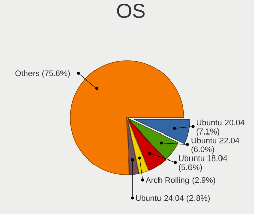

| Name                | Computers | Percent |
|---------------------|-----------|---------|
| Ubuntu 20.04        | 133       | 7.12%   |
| Ubuntu 22.04        | 112       | 6%      |
| Ubuntu 18.04        | 105       | 5.62%   |
| Arch Rolling        | 54        | 2.89%   |
| Ubuntu 24.04        | 52        | 2.79%   |
| Zorin 17            | 44        | 2.36%   |
| Debian 12           | 40        | 2.14%   |
| OpenMandriva 4.3    | 37        | 1.98%   |
| Fedora 38           | 37        | 1.98%   |
| Fedora 40           | 28        | 1.5%    |
| Debian 11           | 23        | 1.23%   |
| Zorin 16            | 22        | 1.18%   |
| Pop!_OS 22.04       | 22        | 1.18%   |
| OpenMandriva 25.90  | 22        | 1.18%   |
| OpenMandriva 23.08  | 22        | 1.18%   |
| Linux Mint 22.1     | 22        | 1.18%   |
| Linux Mint 20.3     | 21        | 1.12%   |
| Fedora 42           | 21        | 1.12%   |
| Manjaro             | 20        | 1.07%   |
| Fedora 41           | 20        | 1.07%   |
| Fedora 39           | 19        | 1.02%   |
| OpenMandriva 4.2    | 18        | 0.96%   |
| KDE neon 20.04      | 18        | 0.96%   |
| ArcoLinux Rolling   | 18        | 0.96%   |
| Zorin 15            | 16        | 0.86%   |
| Linux Mint 21.2     | 16        | 0.86%   |
| Ubuntu 19.04        | 15        | 0.8%    |
| OpenMandriva 23.01  | 15        | 0.8%    |
| Linux Mint 21.1     | 15        | 0.8%    |
| KDE neon 22.04      | 15        | 0.8%    |
| OpenMandriva 24.12  | 14        | 0.75%   |
| OpenMandriva 23.03  | 14        | 0.75%   |
| Linux Mint 21.3     | 14        | 0.75%   |
| Linux Mint 20.2     | 14        | 0.75%   |
| Debian 13           | 14        | 0.75%   |
| Linux Mint 19.3     | 13        | 0.7%    |
| EndeavourOS Rolling | 13        | 0.7%    |
| Bazzite 42          | 13        | 0.7%    |
| Arch                | 13        | 0.7%    |
| Fedora 36           | 12        | 0.64%   |

OS Family
---------

OS without a version

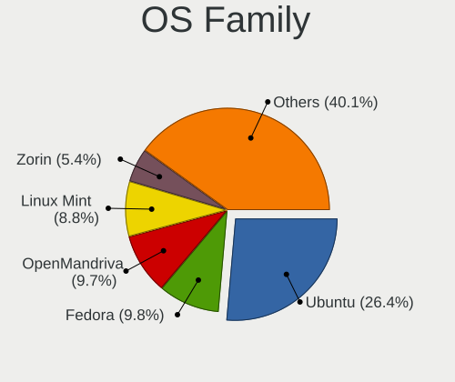

| Name          | Computers | Percent |
|---------------|-----------|---------|
| Ubuntu        | 467       | 26.38%  |
| Fedora        | 173       | 9.77%   |
| OpenMandriva  | 171       | 9.66%   |
| Linux Mint    | 155       | 8.76%   |
| Zorin         | 95        | 5.37%   |
| Debian        | 92        | 5.2%    |
| Endless       | 79        | 4.46%   |
| Arch          | 67        | 3.79%   |
| Manjaro       | 52        | 2.94%   |
| Pop!_OS       | 42        | 2.37%   |
| Kubuntu       | 39        | 2.2%    |
| KDE neon      | 38        | 2.15%   |
| ROSA          | 29        | 1.64%   |
| Xubuntu       | 23        | 1.3%    |
| Bazzite       | 20        | 1.13%   |
| ArcoLinux     | 20        | 1.13%   |
| Elementary    | 19        | 1.07%   |
| Kali          | 16        | 0.9%    |
| Nobara        | 14        | 0.79%   |
| Lubuntu       | 14        | 0.79%   |
| Ubuntu Unity  | 13        | 0.73%   |
| openSUSE      | 13        | 0.73%   |
| EndeavourOS   | 13        | 0.73%   |
| MX            | 7         | 0.4%    |
| Garuda Linux  | 7         | 0.4%    |
| Ubuntu Budgie | 6         | 0.34%   |
| Parrot        | 6         | 0.34%   |
| Deepin        | 6         | 0.34%   |
| CachyOS       | 6         | 0.34%   |
| Linux Lite    | 5         | 0.28%   |
| Xero          | 4         | 0.23%   |
| Vanilla       | 3         | 0.17%   |
| Ubuntu MATE   | 3         | 0.17%   |
| Reborn OS     | 3         | 0.17%   |
| NixOS         | 3         | 0.17%   |
| Mageia        | 3         | 0.17%   |
| LMDE          | 3         | 0.17%   |
| Clear Linux   | 3         | 0.17%   |
| UbuntuDDE     | 2         | 0.11%   |
| SteamOS       | 2         | 0.11%   |

Kernel
------

Version of the Linux kernel

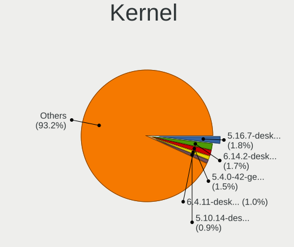

| Version                  | Computers | Percent |
|--------------------------|-----------|---------|
| 5.16.7-desktop-1omv4003  | 36        | 1.81%   |
| 6.14.2-desktop-3omv2590  | 33        | 1.66%   |
| 5.4.0-42-generic         | 29        | 1.46%   |
| 6.4.11-desktop-1omv2390  | 20        | 1.01%   |
| 5.10.14-desktop-1omv4002 | 18        | 0.9%    |
| 6.5.0-35-generic         | 17        | 0.85%   |
| 5.8.0-14-generic         | 16        | 0.8%    |
| 6.1.1-desktop-1omv2290   | 15        | 0.75%   |
| 6.2.6-desktop-1omv2390   | 14        | 0.7%    |
| 5.4.0-58-generic         | 14        | 0.7%    |
| 5.4.0-19-generic         | 12        | 0.6%    |
| 6.11.0-26-generic        | 11        | 0.55%   |
| 6.8.0-57-generic         | 10        | 0.5%    |
| 6.12.1-desktop-1omv2490  | 10        | 0.5%    |
| 6.8.0-52-generic         | 9         | 0.45%   |
| 6.8.0-40-generic         | 9         | 0.45%   |
| 6.14.0-27-generic        | 9         | 0.45%   |
| 5.4.0-48-generic         | 9         | 0.45%   |
| 5.3.0-46-generic         | 9         | 0.45%   |
| 5.15.0-56-generic        | 9         | 0.45%   |
| 5.15.0-47-generic        | 9         | 0.45%   |
| 4.18.0-15-generic        | 9         | 0.45%   |
| 6.8.0-45-generic         | 8         | 0.4%    |
| 6.5.0-10-generic         | 8         | 0.4%    |
| 5.15.0-91-generic        | 8         | 0.4%    |
| 5.15.0-48-generic        | 8         | 0.4%    |
| 4.18.0-25-generic        | 8         | 0.4%    |
| 6.9.3-76060903-generic   | 7         | 0.35%   |
| 6.8.0-60-generic         | 7         | 0.35%   |
| 6.8.0-51-generic         | 7         | 0.35%   |
| 6.8.0-41-generic         | 7         | 0.35%   |
| 6.2.0-26-generic         | 7         | 0.35%   |
| 6.12.57+deb13-amd64      | 7         | 0.35%   |
| 5.8.0-43-generic         | 7         | 0.35%   |
| 5.4.0-37-generic         | 7         | 0.35%   |
| 5.4.0-31-generic         | 7         | 0.35%   |
| 5.3.0-28-generic         | 7         | 0.35%   |
| 5.15.0-88-generic        | 7         | 0.35%   |
| 5.15.0-60-generic        | 7         | 0.35%   |
| 5.15.0-46-generic        | 7         | 0.35%   |

Kernel Family
-------------

Linux kernel without a distro release

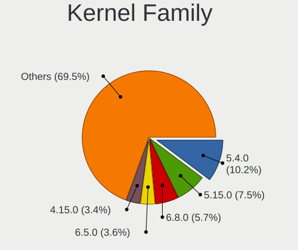

| Version | Computers | Percent |
|---------|-----------|---------|
| 5.4.0   | 197       | 10.25%  |
| 5.15.0  | 145       | 7.54%   |
| 6.8.0   | 110       | 5.72%   |
| 6.5.0   | 69        | 3.59%   |
| 4.15.0  | 66        | 3.43%   |
| 5.8.0   | 53        | 2.76%   |
| 6.14.0  | 51        | 2.65%   |
| 5.3.0   | 51        | 2.65%   |
| 5.0.0   | 48        | 2.5%    |
| 5.11.0  | 43        | 2.24%   |
| 6.1.0   | 42        | 2.19%   |
| 4.18.0  | 41        | 2.13%   |
| 6.2.0   | 40        | 2.08%   |
| 5.13.0  | 39        | 2.03%   |
| 6.14.2  | 36        | 1.87%   |
| 5.16.7  | 36        | 1.87%   |
| 5.19.0  | 32        | 1.66%   |
| 6.11.0  | 29        | 1.51%   |
| 5.10.0  | 26        | 1.35%   |
| 6.4.11  | 20        | 1.04%   |
| 5.10.14 | 18        | 0.94%   |
| 6.1.1   | 16        | 0.83%   |
| 6.2.6   | 14        | 0.73%   |
| 6.12.1  | 13        | 0.68%   |
| 6.12.9  | 10        | 0.52%   |
| 6.6.2   | 9         | 0.47%   |
| 6.9.3   | 8         | 0.42%   |
| 6.12.57 | 8         | 0.42%   |
| 4.19.0  | 8         | 0.42%   |
| 6.8.11  | 7         | 0.36%   |
| 6.6.9   | 7         | 0.36%   |
| 6.16.4  | 7         | 0.36%   |
| 6.14.4  | 7         | 0.36%   |
| 6.8.7   | 6         | 0.31%   |
| 6.12.48 | 6         | 0.31%   |
| 6.12.10 | 6         | 0.31%   |
| 6.9.12  | 5         | 0.26%   |
| 6.7.4   | 5         | 0.26%   |
| 6.5.7   | 5         | 0.26%   |
| 6.5.6   | 5         | 0.26%   |

Kernel Major Ver.
-----------------

Linux kernel major version

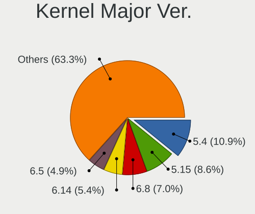

| Version | Computers | Percent |
|---------|-----------|---------|
| 5.4     | 206       | 10.87%  |
| 5.15    | 163       | 8.6%    |
| 6.8     | 132       | 6.97%   |
| 6.14    | 102       | 5.38%   |
| 6.5     | 92        | 4.85%   |
| 6.1     | 87        | 4.59%   |
| 6.12    | 73        | 3.85%   |
| 6.2     | 67        | 3.54%   |
| 5.10    | 67        | 3.54%   |
| 4.15    | 66        | 3.48%   |
| 5.8     | 64        | 3.38%   |
| 5.3     | 56        | 2.96%   |
| 5.13    | 51        | 2.69%   |
| 6.4     | 49        | 2.59%   |
| 6.11    | 49        | 2.59%   |
| 5.11    | 49        | 2.59%   |
| 5.0     | 49        | 2.59%   |
| 4.18    | 44        | 2.32%   |
| 5.16    | 43        | 2.27%   |
| 6.6     | 42        | 2.22%   |
| 5.19    | 37        | 1.95%   |
| 6.9     | 27        | 1.42%   |
| 6.10    | 25        | 1.32%   |
| 6.15    | 24        | 1.27%   |
| 6.17    | 22        | 1.16%   |
| 6.3     | 17        | 0.9%    |
| 4.9     | 17        | 0.9%    |
| 5.14    | 16        | 0.84%   |
| 6.16    | 15        | 0.79%   |
| 6.0     | 15        | 0.79%   |
| 5.6     | 15        | 0.79%   |
| 6.7     | 14        | 0.74%   |
| 5.17    | 14        | 0.74%   |
| 5.18    | 11        | 0.58%   |
| 5.9     | 10        | 0.53%   |
| 6.13    | 9         | 0.47%   |
| 5.12    | 9         | 0.47%   |
| 4.19    | 9         | 0.47%   |
| 5.7     | 8         | 0.42%   |
| 4.4     | 5         | 0.26%   |

Arch
----

OS architecture (x86_64, i586, etc.)

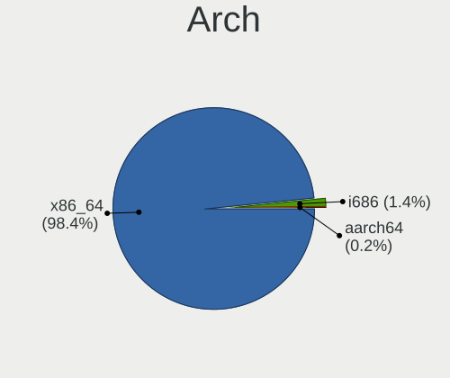

| Name    | Computers | Percent |
|---------|-----------|---------|
| x86_64  | 1667      | 98.41%  |
| i686    | 24        | 1.42%   |
| aarch64 | 3         | 0.18%   |

DE
--

Desktop Environment

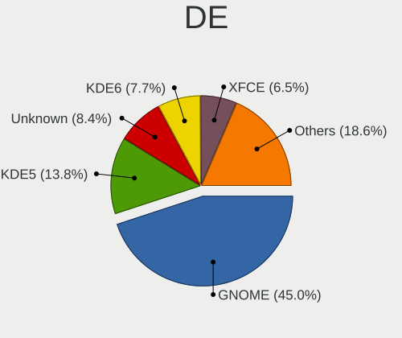

| Name             | Computers | Percent |
|------------------|-----------|---------|
| GNOME            | 797       | 44.95%  |
| KDE5             | 245       | 13.82%  |
| Unknown          | 149       | 8.4%    |
| KDE6             | 137       | 7.73%   |
| XFCE             | 116       | 6.54%   |
| X-Cinnamon       | 114       | 6.43%   |
| KDE              | 33        | 1.86%   |
| MATE             | 28        | 1.58%   |
| LXQt             | 22        | 1.24%   |
| Pantheon         | 19        | 1.07%   |
| Unity            | 13        | 0.73%   |
| KDE4             | 13        | 0.73%   |
| Cinnamon         | 13        | 0.73%   |
| i3               | 11        | 0.62%   |
| Budgie           | 11        | 0.62%   |
| Deepin           | 9         | 0.51%   |
| LXDE             | 7         | 0.39%   |
| Hyprland         | 6         | 0.34%   |
| Endless:GNOME    | 6         | 0.34%   |
| GNOME Classic    | 3         | 0.17%   |
| bspwm            | 3         | 0.17%   |
| sway             | 2         | 0.11%   |
| Openbox          | 2         | 0.11%   |
| lightdm-xsession | 2         | 0.11%   |
| COSMIC           | 2         | 0.11%   |
| awesome          | 2         | 0.11%   |
| ubuntu=GNOME     | 1         | 0.06%   |
| qtile            | 1         | 0.06%   |
| ICEWM            | 1         | 0.06%   |
| GNOME Flashback  | 1         | 0.06%   |
| Enlightenment    | 1         | 0.06%   |
| dwm              | 1         | 0.06%   |
| DDE              | 1         | 0.06%   |
| BunsenLabs       | 1         | 0.06%   |

Display Server
--------------

X11 or Wayland

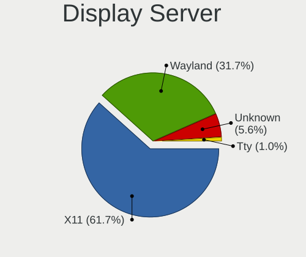

| Name    | Computers | Percent |
|---------|-----------|---------|
| X11     | 1084      | 61.66%  |
| Wayland | 558       | 31.74%  |
| Unknown | 98        | 5.57%   |
| Tty     | 18        | 1.02%   |

Display Manager
---------------

SDDM, LightDM, etc.

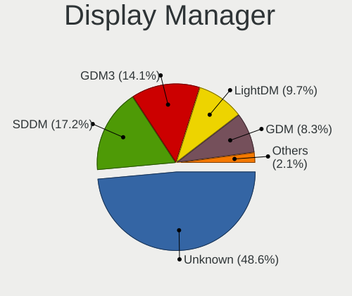

| Name           | Computers | Percent |
|----------------|-----------|---------|
| Unknown        | 854       | 48.55%  |
| SDDM           | 303       | 17.23%  |
| GDM3           | 248       | 14.1%   |
| LightDM        | 171       | 9.72%   |
| GDM            | 146       | 8.3%    |
| TDM            | 20        | 1.14%   |
| KDM            | 12        | 0.68%   |
| LXDM           | 2         | 0.11%   |
| SLiM           | 1         | 0.06%   |
| GREETD         | 1         | 0.06%   |
| COSMIC-GREETER | 1         | 0.06%   |

OS Lang
-------

Language

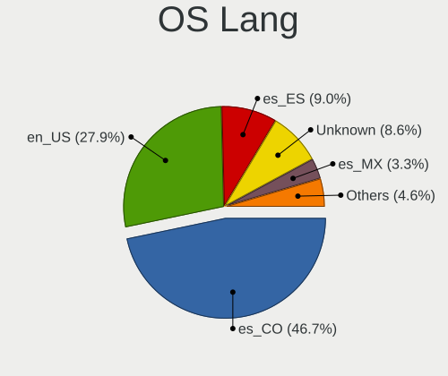

| Lang       | Computers | Percent |
|------------|-----------|---------|
| es_CO      | 819       | 46.72%  |
| en_US      | 489       | 27.9%   |
| es_ES      | 157       | 8.96%   |
| Unknown    | 150       | 8.56%   |
| es_MX      | 58        | 3.31%   |
| C          | 28        | 1.6%    |
| es_AR      | 7         | 0.4%    |
| en_GB      | 6         | 0.34%   |
| es_VE      | 5         | 0.29%   |
| es_PE      | 5         | 0.29%   |
| pt_BR      | 4         | 0.23%   |
| en_CA      | 3         | 0.17%   |
| it_IT      | 2         | 0.11%   |
| fr_FR      | 2         | 0.11%   |
| es_EC      | 2         | 0.11%   |
| es_DO      | 2         | 0.11%   |
| en_AU      | 2         | 0.11%   |
| ru_RU      | 1         | 0.06%   |
| pt_PT      | 1         | 0.06%   |
| pl_PL      | 1         | 0.06%   |
| es_US      | 1         | 0.06%   |
| es_ES.UTF8 | 1         | 0.06%   |
| es_CO.UTF8 | 1         | 0.06%   |
| es_CL      | 1         | 0.06%   |
| es_BO      | 1         | 0.06%   |
| en         | 1         | 0.06%   |
| de_DE      | 1         | 0.06%   |
| cs_CZ      | 1         | 0.06%   |
| C.UTF8     | 1         | 0.06%   |

Boot Mode
---------

EFI or BIOS

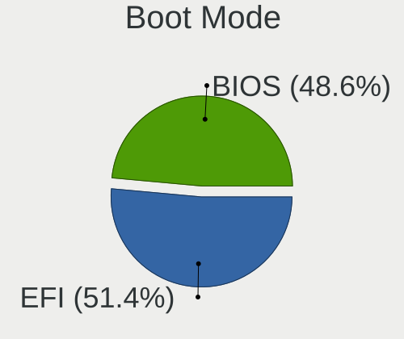

| Mode | Computers | Percent |
|------|-----------|---------|
| EFI  | 890       | 51.45%  |
| BIOS | 840       | 48.55%  |

Filesystem
----------

Type of filesystem

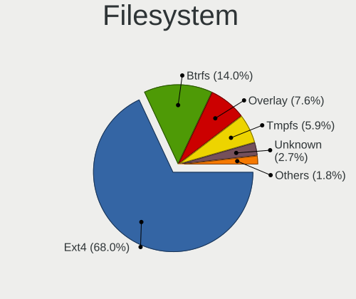

| Type    | Computers | Percent |
|---------|-----------|---------|
| Ext4    | 1192      | 68.04%  |
| Btrfs   | 245       | 13.98%  |
| Overlay | 133       | 7.59%   |
| Tmpfs   | 104       | 5.94%   |
| Unknown | 47        | 2.68%   |
| Xfs     | 22        | 1.26%   |
| Zfs     | 5         | 0.29%   |
| Ext2    | 2         | 0.11%   |
| F2fs    | 1         | 0.06%   |
| Ext3    | 1         | 0.06%   |

Part. scheme
------------

Scheme of partitioning

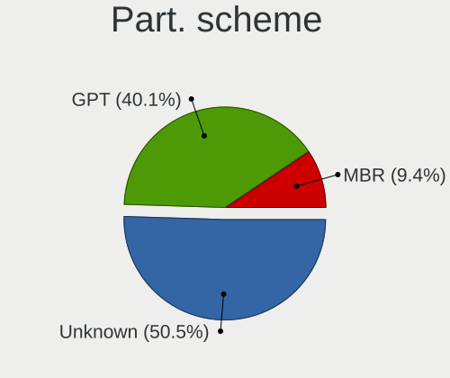

| Type    | Computers | Percent |
|---------|-----------|---------|
| Unknown | 875       | 50.49%  |
| GPT     | 695       | 40.1%   |
| MBR     | 163       | 9.41%   |

Dual Boot with Linux/BSD
------------------------

Hosting more than one Linux/BSD

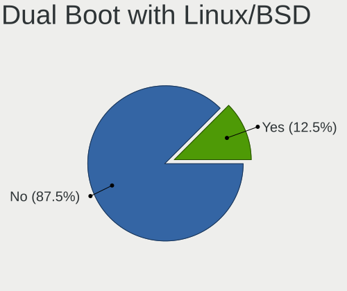

| Dual boot | Computers | Percent |
|-----------|-----------|---------|
| No        | 1517      | 87.49%  |
| Yes       | 217       | 12.51%  |

Dual Boot (Win)
---------------

Hosting Linux and Windows

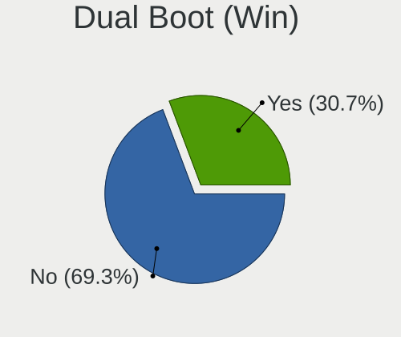

| Dual boot | Computers | Percent |
|-----------|-----------|---------|
| No        | 1197      | 69.27%  |
| Yes       | 531       | 30.73%  |

Board
-----

Vendor
------

Motherboard manufacturer

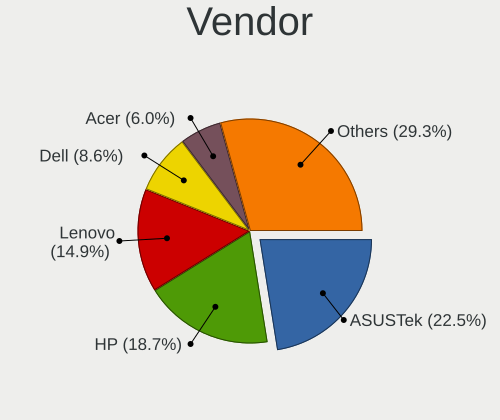

| Name                                 | Computers | Percent |
|--------------------------------------|-----------|---------|
| ASUSTek Computer                     | 381       | 22.49%  |
| Hewlett-Packard                      | 316       | 18.65%  |
| Lenovo                               | 253       | 14.94%  |
| Dell                                 | 146       | 8.62%   |
| Acer                                 | 102       | 6.02%   |
| Gigabyte Technology                  | 86        | 5.08%   |
| MSI                                  | 76        | 4.49%   |
| ASRock                               | 48        | 2.83%   |
| Apple                                | 45        | 2.66%   |
| Toshiba                              | 41        | 2.42%   |
| Intel                                | 29        | 1.71%   |
| HUAWEI                               | 17        | 1%      |
| Sony                                 | 15        | 0.89%   |
| Samsung Electronics                  | 15        | 0.89%   |
| Unknown                              | 12        | 0.71%   |
| Biostar                              | 10        | 0.59%   |
| PCsmart                              | 9         | 0.53%   |
| ECS                                  | 9         | 0.53%   |
| Compumax Computer                    | 9         | 0.53%   |
| Pegatron                             | 6         | 0.35%   |
| Notebook                             | 5         | 0.3%    |
| Foxconn                              | 5         | 0.3%    |
| Google                               | 4         | 0.24%   |
| Supermicro                           | 3         | 0.18%   |
| Gateway                              | 3         | 0.18%   |
| eMachines                            | 3         | 0.18%   |
| AZW                                  | 3         | 0.18%   |
| Raspberry Pi Foundation              | 2         | 0.12%   |
| Positivo                             | 2         | 0.12%   |
| Microsoft                            | 2         | 0.12%   |
| MACHINIST                            | 2         | 0.12%   |
| Huanan                               | 2         | 0.12%   |
| Framework                            | 2         | 0.12%   |
| COIN COMPUTERS                       | 2         | 0.12%   |
| VIT                                  | 1         | 0.06%   |
| Valve                                | 1         | 0.06%   |
| TYAN Computer                        | 1         | 0.06%   |
| Timi                                 | 1         | 0.06%   |
| SYWZ                                 | 1         | 0.06%   |
| Shenzhen Meigao Electronic Equipment | 1         | 0.06%   |

Model
-----

Motherboard model

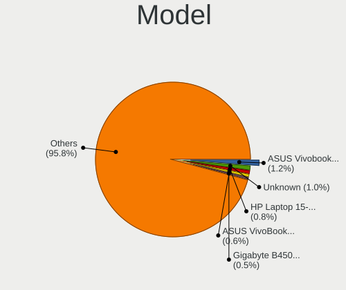

| Name                                     | Computers | Percent |
|------------------------------------------|-----------|---------|
| ASUS Vivobook Go E1504FA_E1504FA         | 21        | 1.24%   |
| Unknown                                  | 17        | 1%      |
| HP Laptop 15-db0xxx                      | 13        | 0.77%   |
| ASUS VivoBook_ASUSLaptop X1504ZA_X1504ZA | 11        | 0.65%   |
| Gigabyte B450M DS3H                      | 9         | 0.53%   |
| HP Notebook                              | 8         | 0.47%   |
| HP Laptop 15-ef2xxx                      | 8         | 0.47%   |
| Compumax ONIX-CEL-0001                   | 8         | 0.47%   |
| MSI MS-7817                              | 7         | 0.41%   |
| HP Pavilion Gaming Laptop 15-cx0xxx      | 7         | 0.41%   |
| Gigabyte H81M-H                          | 7         | 0.41%   |
| Dell Vostro 3400                         | 7         | 0.41%   |
| ASUS VivoBook_ASUSLaptop X1605VA_X1605VA | 7         | 0.41%   |
| ASUS VivoBook_ASUSLaptop M3504YA_M3504YA | 7         | 0.41%   |
| Lenovo IdeaPad S340-14API 81NB           | 6         | 0.35%   |
| Lenovo IdeaPad 320-15ABR 80XS            | 6         | 0.35%   |
| HP Laptop 14-cf2xxx                      | 6         | 0.35%   |
| HP Laptop 14-bs0xx                       | 6         | 0.35%   |
| ASUS VivoBook_ASUS Laptop X505ZA_X505ZA  | 6         | 0.35%   |
| ASUS PRIME A320M-K                       | 6         | 0.35%   |
| Samsung 300E4C/300E5C/300E7C             | 5         | 0.3%    |
| Lenovo G40-30 80FY                       | 5         | 0.3%    |
| HP Laptop 14-cm1xxx                      | 5         | 0.3%    |
| HP 245 G6                                | 5         | 0.3%    |
| HP 14                                    | 5         | 0.3%    |
| ASUS VivoBook_ASUSLaptop X512FB_X512FB   | 5         | 0.3%    |
| ASUS VivoBook_ASUSLaptop X415JA_X415JA   | 5         | 0.3%    |
| ASUS All Series                          | 5         | 0.3%    |
| Apple MacBookPro9,2                      | 5         | 0.3%    |
| Acer Nitro AN515-58                      | 5         | 0.3%    |
| Acer Aspire 4750                         | 5         | 0.3%    |
| PCsmart PCSGOB14p-C                      | 4         | 0.24%   |
| MSI MS-7309                              | 4         | 0.24%   |
| Lenovo MIIX 310-10ICR 80SG               | 4         | 0.24%   |
| Lenovo IdeaPad 110-14IBR 80T6            | 4         | 0.24%   |
| Lenovo G40-45 80E1                       | 4         | 0.24%   |
| Intel H61                                | 4         | 0.24%   |
| HUAWEI NBLB-WAX9N                        | 4         | 0.24%   |
| HP ProBook 450 G1                        | 4         | 0.24%   |
| HP ProBook 440 G7                        | 4         | 0.24%   |

Model Family
------------

Motherboard model prefix

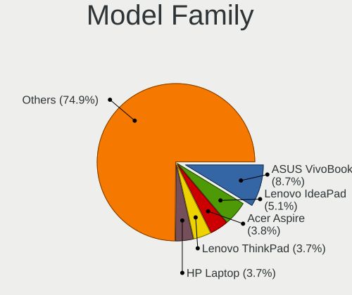

| Name                   | Computers | Percent |
|------------------------|-----------|---------|
| ASUS VivoBook          | 148       | 8.74%   |
| Lenovo IdeaPad         | 87        | 5.14%   |
| Acer Aspire            | 65        | 3.84%   |
| Lenovo ThinkPad        | 63        | 3.72%   |
| HP Laptop              | 63        | 3.72%   |
| HP Pavilion            | 52        | 3.07%   |
| Dell Inspiron          | 43        | 2.54%   |
| ASUS PRIME             | 38        | 2.24%   |
| Toshiba Satellite      | 34        | 2.01%   |
| HP ProBook             | 33        | 1.95%   |
| Dell Latitude          | 31        | 1.83%   |
| HP Compaq              | 30        | 1.77%   |
| Dell Vostro            | 22        | 1.3%    |
| ASUS TUF               | 22        | 1.3%    |
| HP 245                 | 21        | 1.24%   |
| Dell OptiPlex          | 20        | 1.18%   |
| Acer Nitro             | 20        | 1.18%   |
| ASUS ROG               | 19        | 1.12%   |
| Unknown                | 17        | 1%      |
| ASUS ASUS              | 15        | 0.89%   |
| Lenovo ThinkCentre     | 12        | 0.71%   |
| HP EliteBook           | 12        | 0.71%   |
| Gigabyte B450M         | 11        | 0.65%   |
| ASUS ZenBook           | 11        | 0.65%   |
| Lenovo Yoga            | 10        | 0.59%   |
| HP 240                 | 10        | 0.59%   |
| Dell XPS               | 9         | 0.53%   |
| HP Notebook            | 8         | 0.47%   |
| HP ENVY                | 8         | 0.47%   |
| Dell Precision         | 8         | 0.47%   |
| Compumax ONIX-CEL-0001 | 8         | 0.47%   |
| MSI MS-7817            | 7         | 0.41%   |
| Lenovo IdeaCentre      | 7         | 0.41%   |
| HP ProDesk             | 7         | 0.41%   |
| HP All-in-One          | 7         | 0.41%   |
| Gigabyte H81M-H        | 7         | 0.41%   |
| Lenovo ThinkBook       | 6         | 0.35%   |
| Samsung 300E4C         | 5         | 0.3%    |
| Lenovo Legion          | 5         | 0.3%    |
| Lenovo G40-30          | 5         | 0.3%    |

MFG Year
--------

Motherboard manufacture year

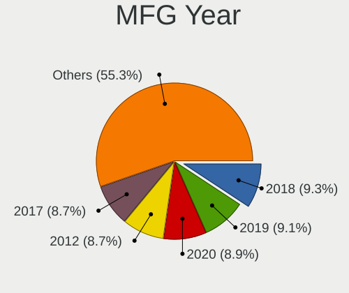

| Year    | Computers | Percent |
|---------|-----------|---------|
| 2018    | 157       | 9.27%   |
| 2019    | 154       | 9.09%   |
| 2020    | 151       | 8.91%   |
| 2012    | 148       | 8.74%   |
| 2017    | 147       | 8.68%   |
| 2021    | 113       | 6.67%   |
| 2013    | 101       | 5.96%   |
| 2010    | 95        | 5.61%   |
| 2014    | 87        | 5.14%   |
| 2011    | 87        | 5.14%   |
| 2015    | 81        | 4.78%   |
| 2022    | 76        | 4.49%   |
| 2009    | 61        | 3.6%    |
| 2016    | 59        | 3.48%   |
| 2023    | 53        | 3.13%   |
| 2008    | 47        | 2.77%   |
| 2007    | 28        | 1.65%   |
| 2024    | 21        | 1.24%   |
| 2006    | 15        | 0.89%   |
| 2025    | 7         | 0.41%   |
| Unknown | 3         | 0.18%   |
| 2005    | 2         | 0.12%   |
| 2003    | 1         | 0.06%   |

Form Factor
-----------

Physical design of the computer

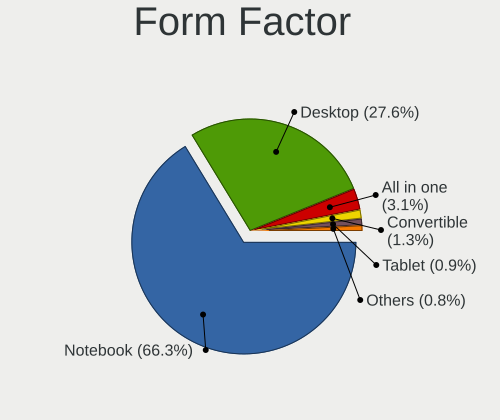

| Name           | Computers | Percent |
|----------------|-----------|---------|
| Notebook       | 1123      | 66.29%  |
| Desktop        | 467       | 27.57%  |
| All in one     | 52        | 3.07%   |
| Convertible    | 22        | 1.3%    |
| Tablet         | 16        | 0.94%   |
| Mini pc        | 6         | 0.35%   |
| Server         | 4         | 0.24%   |
| System on chip | 3         | 0.18%   |
| Other          | 1         | 0.06%   |

Secure Boot
-----------

Enabled or disabled

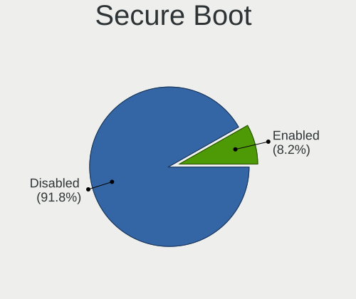

| State    | Computers | Percent |
|----------|-----------|---------|
| Disabled | 1565      | 91.79%  |
| Enabled  | 140       | 8.21%   |

Coreboot
--------

Have coreboot on board

| Used | Computers | Percent |
|------|-----------|---------|
| No   | 1690      | 99.76%  |
| Yes  | 4         | 0.24%   |

RAM Size
--------

Total RAM memory

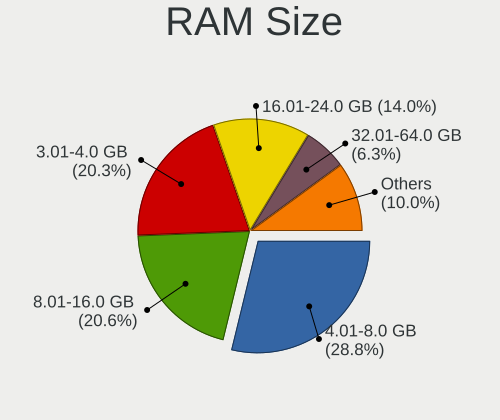

| Size in GB  | Computers | Percent |
|-------------|-----------|---------|
| 4.01-8.0    | 496       | 28.8%   |
| 8.01-16.0   | 354       | 20.56%  |
| 3.01-4.0    | 350       | 20.33%  |
| 16.01-24.0  | 241       | 14%     |
| 32.01-64.0  | 108       | 6.27%   |
| 1.01-2.0    | 63        | 3.66%   |
| 24.01-32.0  | 44        | 2.56%   |
| 2.01-3.0    | 32        | 1.86%   |
| 64.01-256.0 | 24        | 1.39%   |
| 0.51-1.0    | 10        | 0.58%   |

RAM Used
--------

Used RAM memory

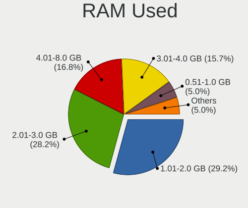

| Used GB    | Computers | Percent |
|------------|-----------|---------|
| 1.01-2.0   | 548       | 29.24%  |
| 2.01-3.0   | 529       | 28.23%  |
| 4.01-8.0   | 315       | 16.81%  |
| 3.01-4.0   | 295       | 15.74%  |
| 0.51-1.0   | 93        | 4.96%   |
| 8.01-16.0  | 79        | 4.22%   |
| 0.01-0.5   | 7         | 0.37%   |
| 16.01-24.0 | 6         | 0.32%   |
| 24.01-32.0 | 2         | 0.11%   |

Total Drives
------------

Number of drives on board

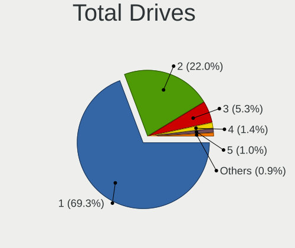

| Drives | Computers | Percent |
|--------|-----------|---------|
| 1      | 1202      | 69.28%  |
| 2      | 382       | 22.02%  |
| 3      | 92        | 5.3%    |
| 4      | 25        | 1.44%   |
| 5      | 18        | 1.04%   |
| 6      | 8         | 0.46%   |
| 8      | 3         | 0.17%   |
| 7      | 2         | 0.12%   |
| 11     | 1         | 0.06%   |
| 9      | 1         | 0.06%   |
| 0      | 1         | 0.06%   |

Has CD-ROM
----------

Has CD-ROM on board

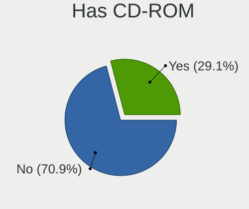

| Presented | Computers | Percent |
|-----------|-----------|---------|
| No        | 1210      | 70.93%  |
| Yes       | 496       | 29.07%  |

Has Ethernet
------------

Has Ethernet on board

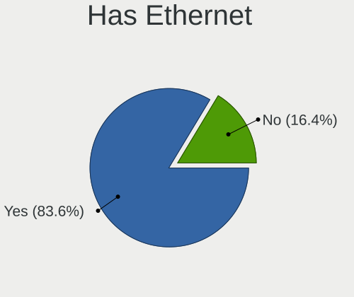

| Presented | Computers | Percent |
|-----------|-----------|---------|
| Yes       | 1420      | 83.63%  |
| No        | 278       | 16.37%  |

Has WiFi
--------

Has WiFi module

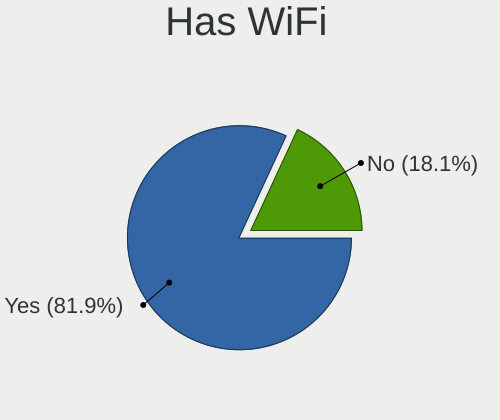

| Presented | Computers | Percent |
|-----------|-----------|---------|
| Yes       | 1394      | 81.9%   |
| No        | 308       | 18.1%   |

Has Bluetooth
-------------

Has Bluetooth module

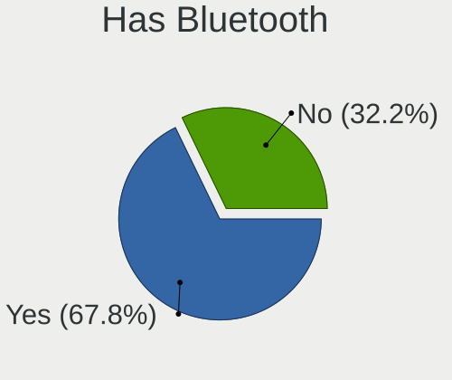

| Presented | Computers | Percent |
|-----------|-----------|---------|
| Yes       | 1154      | 67.8%   |
| No        | 548       | 32.2%   |

Location
--------

Country
-------

Geographic location (country)

| Country  | Computers | Percent |
|----------|-----------|---------|
| Colombia | 1694      | 100%    |

City
----

Geographic location (city)

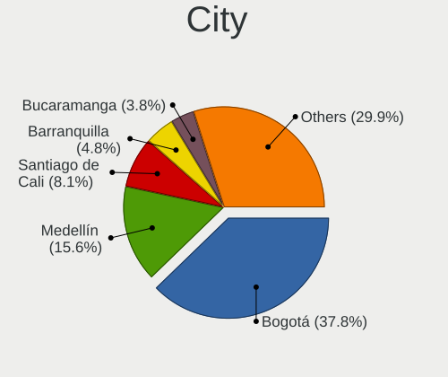

| City             | Computers | Percent |
|------------------|-----------|---------|
| Bogotá          | 669       | 37.78%  |
| Medellín        | 276       | 15.58%  |
| Santiago de Cali | 144       | 8.13%   |
| Barranquilla     | 85        | 4.8%    |
| Bucaramanga      | 67        | 3.78%   |
| Pereira          | 45        | 2.54%   |
| Cartagena        | 29        | 1.64%   |
| Manizales        | 22        | 1.24%   |
| Tunja            | 21        | 1.19%   |
| Ibague           | 21        | 1.19%   |
| Chia             | 19        | 1.07%   |
| Villavicencio    | 18        | 1.02%   |
| Armenia          | 18        | 1.02%   |
| Santa Marta      | 17        | 0.96%   |
| Pasto            | 17        | 0.96%   |
| Montería        | 17        | 0.96%   |
| Cúcuta          | 17        | 0.96%   |
| Popayán         | 16        | 0.9%    |
| Valledupar       | 15        | 0.85%   |
| Neiva            | 14        | 0.79%   |
| Envigado         | 11        | 0.62%   |
| Bello            | 11        | 0.62%   |
| Fusagasuga       | 8         | 0.45%   |
| Palmira          | 7         | 0.4%    |
| Madrid           | 7         | 0.4%    |
| Duitama          | 7         | 0.4%    |
| Rionegro         | 6         | 0.34%   |
| Montenegro       | 6         | 0.34%   |
| Zipaquirá       | 5         | 0.28%   |
| Sincelejo        | 5         | 0.28%   |
| Buenaventura     | 5         | 0.28%   |
| Barrancabermeja  | 5         | 0.28%   |
| Yopal            | 4         | 0.23%   |
| Tuluá           | 4         | 0.23%   |
| Floridablanca    | 4         | 0.23%   |
| Sogamoso         | 3         | 0.17%   |
| Soacha           | 3         | 0.17%   |
| Puerto Boyacá   | 3         | 0.17%   |
| Pitalito         | 3         | 0.17%   |
| Piedecuesta      | 3         | 0.17%   |

Drives
------

Drive Vendor
------------

Hard drive vendors

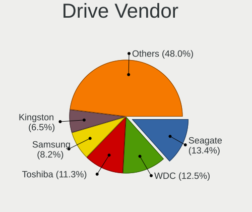

| Vendor                      | Computers | Drives | Percent |
|-----------------------------|-----------|--------|---------|
| Seagate                     | 315       | 426    | 13.38%  |
| WDC                         | 295       | 385    | 12.53%  |
| Toshiba                     | 267       | 338    | 11.34%  |
| Samsung Electronics         | 193       | 266    | 8.2%    |
| Kingston                    | 154       | 227    | 6.54%   |
| SanDisk                     | 129       | 171    | 5.48%   |
| Hitachi                     | 102       | 125    | 4.33%   |
| Crucial                     | 91        | 115    | 3.86%   |
| A-DATA Technology           | 91        | 107    | 3.86%   |
| Intel                       | 64        | 73     | 2.72%   |
| Unknown                     | 62        | 73     | 2.63%   |
| HGST                        | 61        | 73     | 2.59%   |
| Micron Technology           | 59        | 61     | 2.51%   |
| SK hynix                    | 51        | 60     | 2.17%   |
| Apple                       | 25        | 36     | 1.06%   |
| Maxtor                      | 23        | 25     | 0.98%   |
| Realtek Semiconductor       | 22        | 24     | 0.93%   |
| China                       | 22        | 23     | 0.93%   |
| Patriot                     | 19        | 21     | 0.81%   |
| Kingston Technology Company | 18        | 23     | 0.76%   |
| Micron/Crucial Technology   | 17        | 23     | 0.72%   |
| Silicon Motion              | 16        | 21     | 0.68%   |
| KIOXIA                      | 16        | 17     | 0.68%   |
| ADATA Technology            | 16        | 18     | 0.68%   |
| PNY                         | 15        | 19     | 0.64%   |
| Lexar                       | 14        | 14     | 0.59%   |
| Phison                      | 11        | 17     | 0.47%   |
| JMicron Technology          | 11        | 11     | 0.47%   |
| Gigabyte Technology         | 11        | 12     | 0.47%   |
| Team                        | 10        | 13     | 0.42%   |
| Phison Electronics          | 9         | 9      | 0.38%   |
| MAXIO Technology (Hangzhou) | 9         | 13     | 0.38%   |
| SPCC                        | 8         | 13     | 0.34%   |
| Hewlett-Packard             | 8         | 10     | 0.34%   |
| KingSpec                    | 7         | 7      | 0.3%    |
| Fujitsu                     | 7         | 7      | 0.3%    |
| Unknown                     | 7         | 8      | 0.3%    |
| Union Memory                | 6         | 6      | 0.25%   |
| XrayDisk                    | 5         | 5      | 0.21%   |
| XPG                         | 5         | 6      | 0.21%   |

Drive Model
-----------

Hard drive models

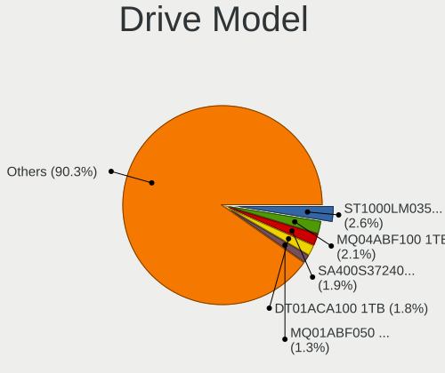

| Model                                                 | Computers | Percent |
|-------------------------------------------------------|-----------|---------|
| Seagate ST1000LM035-1RK172 1TB                        | 63        | 2.56%   |
| Toshiba MQ04ABF100 1TB                                | 52        | 2.11%   |
| Kingston SA400S37240G 240GB SSD                       | 48        | 1.95%   |
| Toshiba DT01ACA100 1TB                                | 44        | 1.79%   |
| Toshiba MQ01ABF050 500GB                              | 33        | 1.34%   |
| Toshiba MQ01ABD100 1TB                                | 29        | 1.18%   |
| Crucial CT240BX500SSD1 240GB                          | 27        | 1.1%    |
| Seagate ST1000LM024 HN-M101MBB 1TB                    | 26        | 1.06%   |
| Intel SSDPEKNU512GZ 512GB                             | 25        | 1.01%   |
| Seagate ST500LT012-1DG142 500GB                       | 23        | 0.93%   |
| Kingston SA400S37480G 480GB SSD                       | 18        | 0.73%   |
| Toshiba DT01ACA050 500GB                              | 17        | 0.69%   |
| Samsung NVMe SSD Controller SM981/PM981/PM983 1TB     | 17        | 0.69%   |
| Crucial CT1000BX500SSD1 1TB                           | 17        | 0.69%   |
| Kingston SA400S37120G 120GB SSD                       | 16        | 0.65%   |
| Sandisk WD Blue SN550 NVMe SSD 1024GB                 | 15        | 0.61%   |
| WDC WD10SPZX-60Z10T0 1TB                              | 14        | 0.57%   |
| Toshiba HDWD110 1TB                                   | 14        | 0.57%   |
| HGST HTS541010A9E680 1TB                              | 14        | 0.57%   |
| A-DATA SU650 120GB SSD                                | 14        | 0.57%   |
| Unknown MMC Card  64GB                                | 13        | 0.53%   |
| Toshiba DT01ACA200 2TB                                | 13        | 0.53%   |
| SanDisk NVMe SSD Drive 512GB                          | 13        | 0.53%   |
| Silicon Motion SM2263EN/SM2263XT SSD Controller 512GB | 12        | 0.49%   |
| HGST HTS545050A7E680 500GB                            | 12        | 0.49%   |
| WDC WD10EZEX-08WN4A0 1TB                              | 11        | 0.45%   |
| Unknown SD/MMC/MS PRO 2GB                             | 11        | 0.45%   |
| Seagate ST2000LM007-1R8174 2TB                        | 11        | 0.45%   |
| Seagate ST1000DM010-2EP102 1TB                        | 11        | 0.45%   |
| SanDisk NVMe SSD Drive 1TB                            | 11        | 0.45%   |
| Micron/Crucial P2 NVMe PCIe SSD 2TB                   | 11        | 0.45%   |
| Crucial CT480BX500SSD1 480GB                          | 11        | 0.45%   |
| Seagate ST500LT012-9WS142 500GB                       | 10        | 0.41%   |
| Kingston Company SNV2S1000G 1TB                       | 10        | 0.41%   |
| Kingston SV300S37A120G 120GB SSD                      | 10        | 0.41%   |
| A-DATA SU630 240GB SSD                                | 10        | 0.41%   |
| WDC WD10SPZX-24Z10 1TB                                | 9         | 0.37%   |
| Unknown MMC Card  32GB                                | 9         | 0.37%   |
| Seagate ST1000DM003-1SB102 1TB                        | 9         | 0.37%   |
| Samsung NVMe SSD Controller PM9A1/PM9A3/980PRO 1TB    | 9         | 0.37%   |

HDD Vendor
----------

Hard disk drive vendors

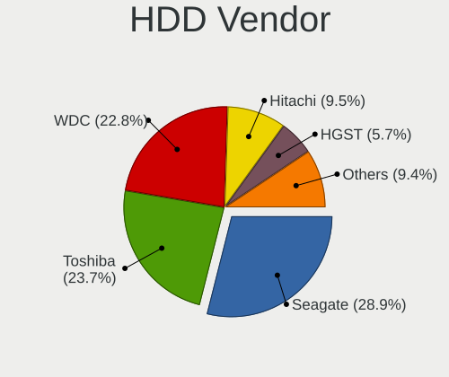

| Vendor              | Computers | Drives | Percent |
|---------------------|-----------|--------|---------|
| Seagate             | 312       | 420    | 28.94%  |
| Toshiba             | 256       | 324    | 23.75%  |
| WDC                 | 246       | 318    | 22.82%  |
| Hitachi             | 102       | 125    | 9.46%   |
| HGST                | 61        | 73     | 5.66%   |
| Samsung Electronics | 29        | 36     | 2.69%   |
| Maxtor              | 23        | 25     | 2.13%   |
| Unknown             | 12        | 14     | 1.11%   |
| Apple               | 9         | 13     | 0.83%   |
| JMicron Technology  | 7         | 7      | 0.65%   |
| Fujitsu             | 7         | 7      | 0.65%   |
| SAGE                | 2         | 1      | 0.19%   |
| Hewlett-Packard     | 2         | 3      | 0.19%   |
| XrayDisk            | 1         | 1      | 0.09%   |
| USB3.0              | 1         | 1      | 0.09%   |
| SATAFIRM            | 1         | 1      | 0.09%   |
| Phison              | 1         | 2      | 0.09%   |
| Min Yi U            | 1         | 1      | 0.09%   |
| Inateck             | 1         | 1      | 0.09%   |
| IBM/Hitachi         | 1         | 1      | 0.09%   |
| HGST HTS            | 1         | 1      | 0.09%   |
| ExcelStor           | 1         | 1      | 0.09%   |
| ASMT                | 1         | 1      | 0.09%   |

SSD Vendor
----------

Solid state drive vendors

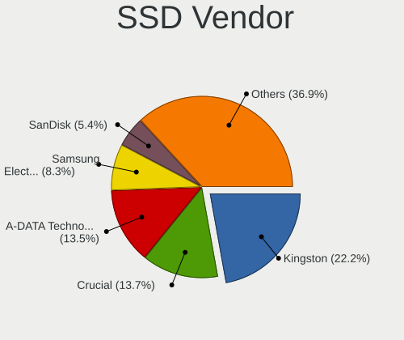

| Vendor              | Computers | Drives | Percent |
|---------------------|-----------|--------|---------|
| Kingston            | 131       | 190    | 22.17%  |
| Crucial             | 81        | 104    | 13.71%  |
| A-DATA Technology   | 80        | 96     | 13.54%  |
| Samsung Electronics | 49        | 60     | 8.29%   |
| SanDisk             | 32        | 37     | 5.41%   |
| WDC                 | 26        | 38     | 4.4%    |
| China               | 21        | 22     | 3.55%   |
| Patriot             | 17        | 18     | 2.88%   |
| Lexar               | 14        | 14     | 2.37%   |
| PNY                 | 13        | 16     | 2.2%    |
| Gigabyte Technology | 10        | 11     | 1.69%   |
| Apple               | 10        | 10     | 1.69%   |
| Toshiba             | 9         | 11     | 1.52%   |
| Team                | 9         | 12     | 1.52%   |
| Micron Technology   | 8         | 8      | 1.35%   |
| SPCC                | 7         | 12     | 1.18%   |
| KingSpec            | 7         | 7      | 1.18%   |
| Intel               | 7         | 8      | 1.18%   |
| SK hynix            | 6         | 11     | 1.02%   |
| LITEON              | 5         | 7      | 0.85%   |
| Unknown             | 4         | 4      | 0.68%   |
| Transcend           | 3         | 4      | 0.51%   |
| Netac               | 3         | 3      | 0.51%   |
| LITEONIT            | 3         | 3      | 0.51%   |
| KingDian            | 3         | 3      | 0.51%   |
| Hewlett-Packard     | 3         | 3      | 0.51%   |
| DTECHCO             | 3         | 5      | 0.51%   |
| Corsair             | 3         | 6      | 0.51%   |
| XrayDisk            | 2         | 2      | 0.34%   |
| Unknown             | 2         | 2      | 0.34%   |
| Seagate             | 2         | 3      | 0.34%   |
| Hised               | 2         | 3      | 0.34%   |
| Zheino              | 1         | 1      | 0.17%   |
| XSTAR               | 1         | 1      | 0.17%   |
| WALRAM              | 1         | 1      | 0.17%   |
| ValueTech           | 1         | 1      | 0.17%   |
| Timetec             | 1         | 1      | 0.17%   |
| SABRENT             | 1         | 1      | 0.17%   |
| OCZ                 | 1         | 1      | 0.17%   |
| KingFast            | 1         | 1      | 0.17%   |

Drive Kind
----------

HDD or SSD

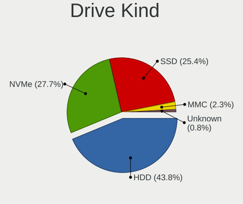

| Kind    | Computers | Drives | Percent |
|---------|-----------|--------|---------|
| HDD     | 916       | 1377   | 43.76%  |
| NVMe    | 579       | 790    | 27.66%  |
| SSD     | 532       | 750    | 25.42%  |
| MMC     | 49        | 57     | 2.34%   |
| Unknown | 17        | 21     | 0.81%   |

Drive Connector
---------------

SATA, SAS, NVMe, etc.

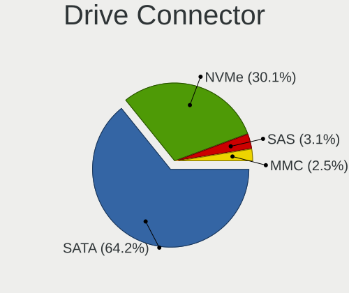

| Type | Computers | Drives | Percent |
|------|-----------|--------|---------|
| SATA | 1234      | 2079   | 64.2%   |
| NVMe | 579       | 788    | 30.12%  |
| SAS  | 60        | 71     | 3.12%   |
| MMC  | 49        | 57     | 2.55%   |

Drive Size
----------

Size of hard drive

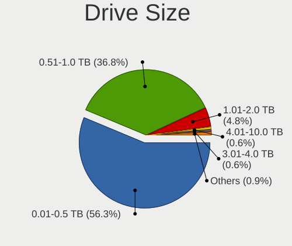

| Size in TB | Computers | Drives | Percent |
|------------|-----------|--------|---------|
| 0.01-0.5   | 831       | 1203   | 56.26%  |
| 0.51-1.0   | 544       | 759    | 36.83%  |
| 1.01-2.0   | 71        | 105    | 4.81%   |
| 3.01-4.0   | 9         | 18     | 0.61%   |
| 2.01-3.0   | 9         | 14     | 0.61%   |
| 4.01-10.0  | 9         | 20     | 0.61%   |
| 10.01-20.0 | 2         | 4      | 0.14%   |
| 20.01-50.0 | 1         | 2      | 0.07%   |
| 0          | 1         | 2      | 0.07%   |

Space Total
-----------

Amount of disk space available on the file system

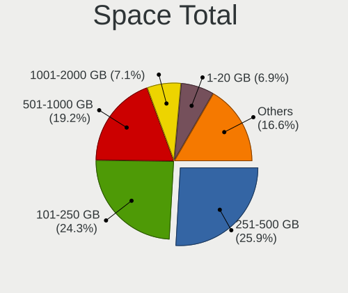

| Size in GB     | Computers | Percent |
|----------------|-----------|---------|
| 251-500        | 469       | 25.91%  |
| 101-250        | 440       | 24.31%  |
| 501-1000       | 347       | 19.17%  |
| 1001-2000      | 128       | 7.07%   |
| 1-20           | 125       | 6.91%   |
| 51-100         | 113       | 6.24%   |
| 21-50          | 63        | 3.48%   |
| More than 3000 | 50        | 2.76%   |
| Unknown        | 40        | 2.21%   |
| 2001-3000      | 35        | 1.93%   |

Space Used
----------

Amount of used disk space

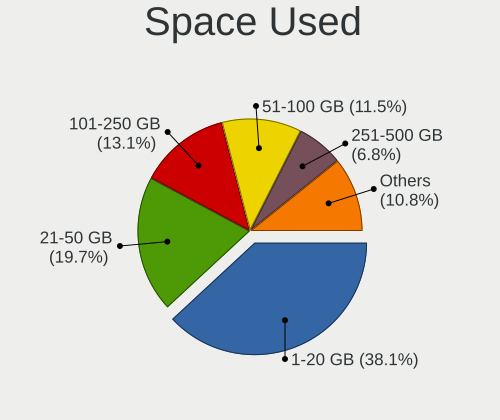

| Used GB        | Computers | Percent |
|----------------|-----------|---------|
| 1-20           | 711       | 38.1%   |
| 21-50          | 368       | 19.72%  |
| 101-250        | 245       | 13.13%  |
| 51-100         | 215       | 11.52%  |
| 251-500        | 126       | 6.75%   |
| 501-1000       | 95        | 5.09%   |
| 1001-2000      | 40        | 2.14%   |
| Unknown        | 40        | 2.14%   |
| More than 3000 | 13        | 0.7%    |
| 2001-3000      | 8         | 0.43%   |
| 0              | 5         | 0.27%   |

Malfunc. Drives
---------------

Drive models with a malfunction

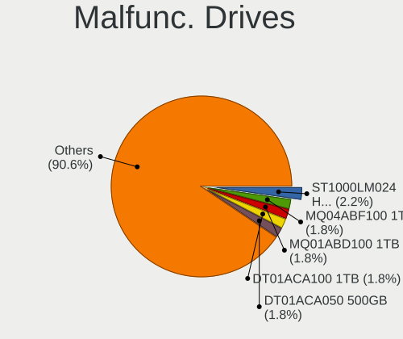

| Model                                                     | Computers | Drives | Percent |
|-----------------------------------------------------------|-----------|--------|---------|
| Seagate ST1000LM024 HN-M101MBB 1TB                        | 5         | 5      | 2.24%   |
| Toshiba MQ04ABF100 1TB                                    | 4         | 6      | 1.79%   |
| Toshiba MQ01ABD100 1TB                                    | 4         | 5      | 1.79%   |
| Toshiba DT01ACA100 1TB                                    | 4         | 5      | 1.79%   |
| Toshiba DT01ACA050 500GB                                  | 4         | 4      | 1.79%   |
| Seagate ST500DM002-1BD142 500GB                           | 4         | 4      | 1.79%   |
| A-DATA Technology SU630 480GB SSD                         | 4         | 5      | 1.79%   |
| Seagate ST9500325AS 500GB                                 | 3         | 3      | 1.35%   |
| Seagate ST500LT012-9WS142 500GB                           | 3         | 3      | 1.35%   |
| Seagate ST500LT012-1DG142 500GB                           | 3         | 3      | 1.35%   |
| Seagate ST1000DM003-1ER162 1TB                            | 3         | 3      | 1.35%   |
| Hitachi HDS721050CLA362 500GB                             | 3         | 3      | 1.35%   |
| A-DATA Technology SU630 240GB SSD                         | 3         | 3      | 1.35%   |
| WDC WD5000BPVT-22HXZT3 500GB                              | 2         | 2      | 0.9%    |
| WDC WD3200AAJS-56M0A0 320GB                               | 2         | 2      | 0.9%    |
| WDC WD10EZEX-08WN4A0 1TB                                  | 2         | 3      | 0.9%    |
| WDC WD10EZEX-08M2NA0 1TB                                  | 2         | 3      | 0.9%    |
| Toshiba MQ01ABF050 500GB                                  | 2         | 2      | 0.9%    |
| Seagate ST9500420AS 500GB                                 | 2         | 3      | 0.9%    |
| Seagate ST9320423AS 320GB                                 | 2         | 2      | 0.9%    |
| Seagate ST750LM022 HN-M750MBB 752GB                       | 2         | 2      | 0.9%    |
| Seagate ST3320613AS 320GB                                 | 2         | 4      | 0.9%    |
| Seagate ST1000LM035-1RK172 1TB                            | 2         | 2      | 0.9%    |
| Seagate ST1000DM003-1SB102 1TB                            | 2         | 2      | 0.9%    |
| Samsung Electronics HD322HJ 320GB                         | 2         | 2      | 0.9%    |
| Realtek Semiconductor RTS5763DL NVMe SSD Controller 512GB | 2         | 2      | 0.9%    |
| Hitachi HTS545050A7E380 500GB                             | 2         | 2      | 0.9%    |
| Hitachi HTS545016B9A300 160GB                             | 2         | 2      | 0.9%    |
| Hitachi HDS728080PLAT20 82GB                              | 2         | 2      | 0.9%    |
| Hitachi HDS721616PLA380 160GB                             | 2         | 2      | 0.9%    |
| Hitachi HDP725032GLA360 320GB                             | 2         | 2      | 0.9%    |
| HGST HTS545050A7E680 500GB                                | 2         | 2      | 0.9%    |
| HGST HTS545050A7E380 500GB                                | 2         | 2      | 0.9%    |
| HGST HTS541010A9E680 1TB                                  | 2         | 2      | 0.9%    |
| XrayDisk SSD 256GB                                        | 1         | 1      | 0.45%   |
| WDC WDS100T2G0A-00JH30 1TB SSD                            | 1         | 2      | 0.45%   |
| WDC WD800JD-75MSA3 80GB                                   | 1         | 1      | 0.45%   |
| WDC WD800JD-60LSA0 80GB                                   | 1         | 1      | 0.45%   |
| WDC WD800BD-22MRA1 80GB                                   | 1         | 1      | 0.45%   |
| WDC WD6400AAKS-65Z7B0 640GB                               | 1         | 1      | 0.45%   |

Malfunc. Drive Vendor
---------------------

Vendors of faulty drives

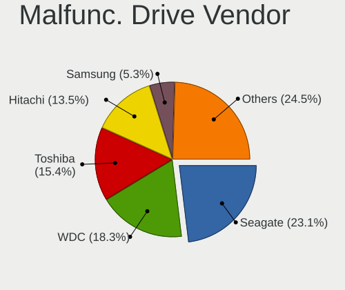

| Vendor                         | Computers | Drives | Percent |
|--------------------------------|-----------|--------|---------|
| Seagate                        | 48        | 61     | 23.08%  |
| WDC                            | 38        | 49     | 18.27%  |
| Toshiba                        | 32        | 37     | 15.38%  |
| Hitachi                        | 28        | 35     | 13.46%  |
| Samsung Electronics            | 11        | 11     | 5.29%   |
| HGST                           | 10        | 10     | 4.81%   |
| Maxtor                         | 8         | 9      | 3.85%   |
| A-DATA Technology              | 8         | 9      | 3.85%   |
| Crucial                        | 3         | 3      | 1.44%   |
| SK hynix                       | 2         | 3      | 0.96%   |
| Realtek Semiconductor          | 2         | 2      | 0.96%   |
| Intel                          | 2         | 3      | 0.96%   |
| XrayDisk                       | 1         | 1      | 0.48%   |
| Team                           | 1         | 1      | 0.48%   |
| Solid State Storage Technology | 1         | 1      | 0.48%   |
| SanDisk                        | 1         | 1      | 0.48%   |
| Patriot                        | 1         | 1      | 0.48%   |
| Min Yi U                       | 1         | 1      | 0.48%   |
| Micron Technology              | 1         | 1      | 0.48%   |
| LITEON                         | 1         | 1      | 0.48%   |
| Kingston                       | 1         | 1      | 0.48%   |
| JMicron Technology             | 1         | 1      | 0.48%   |
| Inateck                        | 1         | 1      | 0.48%   |
| HUADISK                        | 1         | 1      | 0.48%   |
| Fujitsu                        | 1         | 1      | 0.48%   |
| DTECHCO                        | 1         | 1      | 0.48%   |
| BAITITON                       | 1         | 1      | 0.48%   |
| Apple                          | 1         | 1      | 0.48%   |

Malfunc. HDD Vendor
-------------------

Vendors of faulty HDD drives

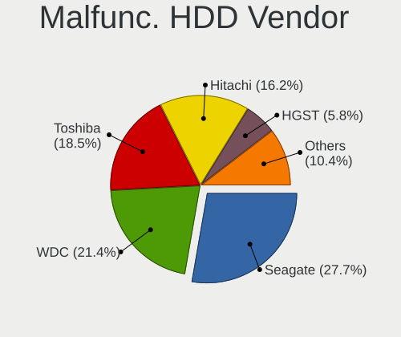

| Vendor              | Computers | Drives | Percent |
|---------------------|-----------|--------|---------|
| Seagate             | 48        | 61     | 27.75%  |
| WDC                 | 37        | 47     | 21.39%  |
| Toshiba             | 32        | 37     | 18.5%   |
| Hitachi             | 28        | 35     | 16.18%  |
| HGST                | 10        | 10     | 5.78%   |
| Maxtor              | 8         | 9      | 4.62%   |
| Samsung Electronics | 6         | 6      | 3.47%   |
| Min Yi U            | 1         | 1      | 0.58%   |
| Inateck             | 1         | 1      | 0.58%   |
| Fujitsu             | 1         | 1      | 0.58%   |
| Apple               | 1         | 1      | 0.58%   |

Malfunc. Drive Kind
-------------------

Kinds of faulty drives

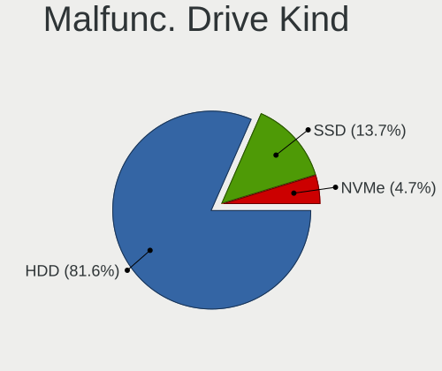

| Kind | Computers | Drives | Percent |
|------|-----------|--------|---------|
| HDD  | 155       | 209    | 81.58%  |
| SSD  | 26        | 30     | 13.68%  |
| NVMe | 9         | 9      | 4.74%   |

Failed Drives
-------------

Failed drive models

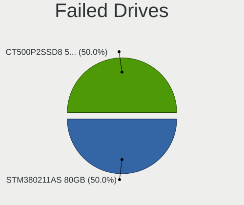

| Model                     | Computers | Drives | Percent |
|---------------------------|-----------|--------|---------|
| Maxtor STM380211AS 80GB   | 1         | 1      | 50%     |
| Crucial CT500P2SSD8 500GB | 1         | 1      | 50%     |

Failed Drive Vendor
-------------------

Failed drive vendors

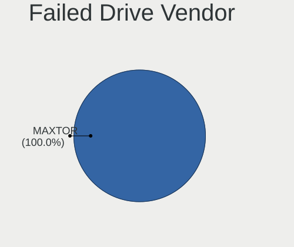

| Vendor  | Computers | Drives | Percent |
|---------|-----------|--------|---------|
| Maxtor  | 1         | 1      | 50%     |
| Crucial | 1         | 1      | 50%     |

Drive Status
------------

Number of failed and malfunc. drives

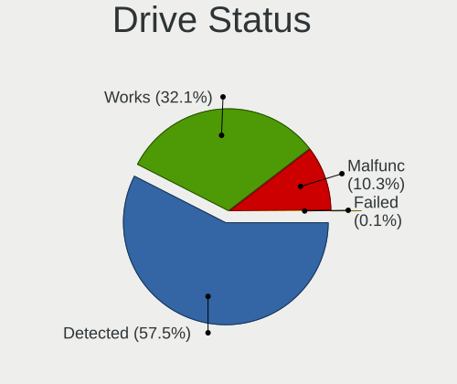

| Status   | Computers | Drives | Percent |
|----------|-----------|--------|---------|
| Detected | 1050      | 1856   | 57.5%   |
| Works    | 586       | 889    | 32.09%  |
| Malfunc  | 188       | 248    | 10.3%   |
| Failed   | 2         | 2      | 0.11%   |

Storage controller
------------------

Storage Vendor
--------------

Storage controller vendors

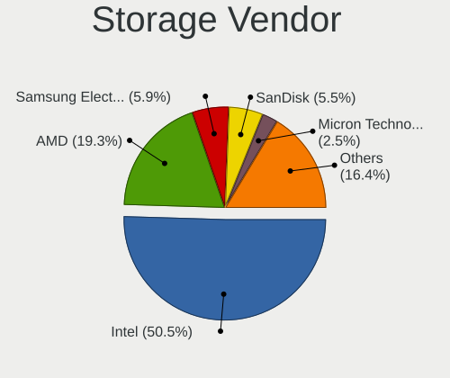

| Vendor                               | Computers | Percent |
|--------------------------------------|-----------|---------|
| Intel                                | 1066      | 50.47%  |
| AMD                                  | 407       | 19.27%  |
| Samsung Electronics                  | 124       | 5.87%   |
| SanDisk                              | 116       | 5.49%   |
| Micron Technology                    | 53        | 2.51%   |
| SK hynix                             | 44        | 2.08%   |
| Kingston Technology Company          | 43        | 2.04%   |
| Nvidia                               | 35        | 1.66%   |
| Realtek Semiconductor                | 31        | 1.47%   |
| Phison Electronics                   | 24        | 1.14%   |
| Micron/Crucial Technology            | 23        | 1.09%   |
| ADATA Technology                     | 23        | 1.09%   |
| Silicon Motion                       | 20        | 0.95%   |
| KIOXIA                               | 16        | 0.76%   |
| ASMedia Technology                   | 13        | 0.62%   |
| MAXIO Technology (Hangzhou)          | 12        | 0.57%   |
| Union Memory (Shenzhen)              | 10        | 0.47%   |
| VIA Technologies                     | 8         | 0.38%   |
| JMicron Technology                   | 7         | 0.33%   |
| Apple                                | 5         | 0.24%   |
| Marvell Technology Group             | 4         | 0.19%   |
| Toshiba America Info Systems         | 3         | 0.14%   |
| Solidigm                             | 3         | 0.14%   |
| Solid State Storage Technology       | 3         | 0.14%   |
| Shenzhen Longsys Electronics         | 3         | 0.14%   |
| Seagate Technology                   | 3         | 0.14%   |
| Biwin Storage Technology             | 3         | 0.14%   |
| LSI Logic / Symbios Logic            | 2         | 0.09%   |
| INNOGRIT                             | 2         | 0.09%   |
| Shenzhen Shichuangyi Electronics     | 1         | 0.05%   |
| Ramaxel Technology(Shenzhen) Limited | 1         | 0.05%   |
| Lenovo                               | 1         | 0.05%   |
| Hosin Global Electronics             | 1         | 0.05%   |
| Hewlett-Packard                      | 1         | 0.05%   |
| Broadcom / LSI                       | 1         | 0.05%   |

Storage Model
-------------

Storage controller models

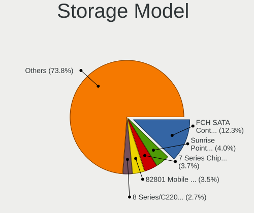

| Model                                                                                   | Computers | Percent |
|-----------------------------------------------------------------------------------------|-----------|---------|
| AMD FCH SATA Controller [AHCI mode]                                                     | 296       | 12.27%  |
| Intel Sunrise Point-LP SATA Controller [AHCI mode]                                      | 97        | 4.02%   |
| Intel 7 Series Chipset Family 6-port SATA Controller [AHCI mode]                        | 89        | 3.69%   |
| Intel 82801 Mobile SATA Controller [RAID mode]                                          | 84        | 3.48%   |
| Intel 8 Series/C220 Series Chipset Family 6-port SATA Controller 1 [AHCI mode]          | 66        | 2.74%   |
| Intel Volume Management Device NVMe RAID Controller                                     | 60        | 2.49%   |
| Intel 6 Series/C200 Series Chipset Family 6 port Mobile SATA AHCI Controller            | 49        | 2.03%   |
| Intel NM10/ICH7 Family SATA Controller [IDE mode]                                       | 43        | 1.78%   |
| Intel 6 Series/C200 Series Chipset Family 6 port Desktop SATA AHCI Controller           | 38        | 1.57%   |
| AMD 500 Series Chipset SATA Controller                                                  | 37        | 1.53%   |
| Intel 82801G (ICH7 Family) IDE Controller                                               | 36        | 1.49%   |
| Samsung NVMe SSD Controller SM981/PM981/PM983                                           | 33        | 1.37%   |
| Intel SSD 670p Series [Keystone Harbor]                                                 | 32        | 1.33%   |
| AMD 400 Series Chipset SATA Controller                                                  | 32        | 1.33%   |
| Intel 8 Series SATA Controller 1 [AHCI mode]                                            | 31        | 1.28%   |
| Samsung NVMe SSD Controller 980 (DRAM-less)                                             | 30        | 1.24%   |
| SanDisk Ultra 3D / WD PC SN530, IX SN530, Blue SN550 NVMe SSD (DRAM-less)               | 29        | 1.2%    |
| Intel Celeron/Pentium Silver Processor SATA Controller                                  | 29        | 1.2%    |
| AMD SB7x0/SB8x0/SB9x0 SATA Controller [AHCI mode]                                       | 26        | 1.08%   |
| Intel Wildcat Point-LP SATA Controller [AHCI Mode]                                      | 24        | 0.99%   |
| Intel Alder Lake-P SATA AHCI Controller                                                 | 24        | 0.99%   |
| Intel 5 Series/3400 Series Chipset 4 port SATA AHCI Controller                          | 24        | 0.99%   |
| Samsung NVMe SSD Controller PM9B1 (DRAM-less)                                           | 23        | 0.95%   |
| Intel Comet Lake SATA AHCI Controller                                                   | 23        | 0.95%   |
| Intel 5 Series/3400 Series Chipset 6 port SATA AHCI Controller                          | 23        | 0.95%   |
| AMD SB7x0/SB8x0/SB9x0 IDE Controller                                                    | 23        | 0.95%   |
| Intel 82801IBM/IEM (ICH9M/ICH9M-E) 4 port SATA Controller [AHCI mode]                   | 22        | 0.91%   |
| Intel 6 Series/C200 Series Chipset Family Desktop SATA Controller (IDE mode, ports 4-5) | 22        | 0.91%   |
| Intel 6 Series/C200 Series Chipset Family Desktop SATA Controller (IDE mode, ports 0-3) | 22        | 0.91%   |
| SK hynix Gold P31/BC711/PC711 NVMe Solid State Drive                                    | 21        | 0.87%   |
| Intel Tiger Lake-LP SATA Controller                                                     | 21        | 0.87%   |
| Intel Q170/Q150/B150/H170/H110/Z170/CM236 Chipset SATA Controller [AHCI Mode]           | 21        | 0.87%   |
| Intel Cannon Lake Mobile PCH SATA AHCI Controller                                       | 21        | 0.87%   |
| Intel Atom Processor E3800 Series SATA AHCI Controller                                  | 20        | 0.83%   |
| Micron 2400 NVMe SSD (DRAM-less)                                                        | 18        | 0.75%   |
| Intel Atom/Celeron/Pentium Processor x5-E8000/J3xxx/N3xxx Series SATA Controller        | 18        | 0.75%   |
| Silicon Motion SM2263EN/SM2263XT (DRAM-less) NVMe SSD Controllers                       | 17        | 0.7%    |
| SanDisk WD SN560/SN740/SN770/SN5000 NVMe SSD                                            | 17        | 0.7%    |
| Intel SATA Controller [RAID mode]                                                       | 17        | 0.7%    |
| Intel 400 Series Chipset Family SATA AHCI Controller                                    | 17        | 0.7%    |

Storage Kind
------------

Kind of storage controller (IDE, SATA, NVMe, SAS, ...)

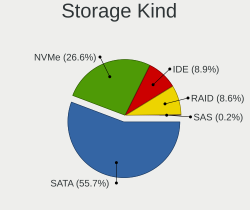

| Kind | Computers | Percent |
|------|-----------|---------|
| SATA | 1212      | 55.75%  |
| NVMe | 578       | 26.59%  |
| IDE  | 193       | 8.88%   |
| RAID | 186       | 8.56%   |
| SAS  | 5         | 0.23%   |

Processor
---------

CPU Vendor
----------

Processor vendors

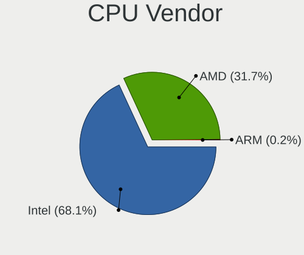

| Vendor | Computers | Percent |
|--------|-----------|---------|
| Intel  | 1154      | 68.12%  |
| AMD    | 537       | 31.7%   |
| ARM    | 3         | 0.18%   |

CPU Model
---------

Processor models

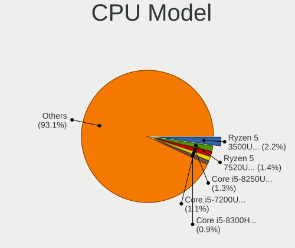

| Model                                           | Computers | Percent |
|-------------------------------------------------|-----------|---------|
| AMD Ryzen 5 3500U with Radeon Vega Mobile Gfx   | 38        | 2.24%   |
| AMD Ryzen 5 7520U with Radeon Graphics          | 24        | 1.41%   |
| Intel Core i5-8250U CPU @ 1.60GHz               | 22        | 1.29%   |
| Intel Core i5-7200U CPU @ 2.50GHz               | 18        | 1.06%   |
| Intel Core i5-8300H CPU @ 2.30GHz               | 16        | 0.94%   |
| Intel Core i5-8265U CPU @ 1.60GHz               | 15        | 0.88%   |
| AMD Ryzen 5 5500U with Radeon Graphics          | 15        | 0.88%   |
| Intel Core i7-8550U CPU @ 1.80GHz               | 14        | 0.82%   |
| Intel Celeron N4020 CPU @ 1.10GHz               | 14        | 0.82%   |
| Intel 12th Gen Core i5-1235U                    | 14        | 0.82%   |
| Intel Core i5-3210M CPU @ 2.50GHz               | 13        | 0.77%   |
| Intel Core i5-2400 CPU @ 3.10GHz                | 13        | 0.77%   |
| Intel Core i3-1005G1 CPU @ 1.20GHz              | 13        | 0.77%   |
| Intel Celeron CPU N3060 @ 1.60GHz               | 13        | 0.77%   |
| Intel 11th Gen Core i7-1165G7 @ 2.80GHz         | 13        | 0.77%   |
| Intel 11th Gen Core i5-1135G7 @ 2.40GHz         | 13        | 0.77%   |
| AMD A12-9720P RADEON R7, 12 COMPUTE CORES 4C+8G | 13        | 0.77%   |
| Intel Core i7-8565U CPU @ 1.80GHz               | 12        | 0.71%   |
| Intel Core i5-6200U CPU @ 2.30GHz               | 12        | 0.71%   |
| Intel Core i5-10210U CPU @ 1.60GHz              | 12        | 0.71%   |
| Intel Celeron N4000 CPU @ 1.10GHz               | 12        | 0.71%   |
| AMD Ryzen 7 5700U with Radeon Graphics          | 12        | 0.71%   |
| AMD Ryzen 5 3600 6-Core Processor               | 12        | 0.71%   |
| AMD Ryzen 5 2500U with Radeon Vega Mobile Gfx   | 12        | 0.71%   |
| AMD A9-9425 RADEON R5, 5 COMPUTE CORES 2C+3G    | 12        | 0.71%   |
| Intel Core i3-10110U CPU @ 2.10GHz              | 11        | 0.65%   |
| Intel 12th Gen Core i3-1215U                    | 11        | 0.65%   |
| Intel Core i7-3770 CPU @ 3.40GHz                | 10        | 0.59%   |
| Intel Core i5-10400 CPU @ 2.90GHz               | 10        | 0.59%   |
| AMD Ryzen 5 5600G with Radeon Graphics          | 10        | 0.59%   |
| AMD Ryzen 3 3250U with Radeon Graphics          | 10        | 0.59%   |
| Intel Core i7-10510U CPU @ 1.80GHz              | 9         | 0.53%   |
| Intel Core i3-6006U CPU @ 2.00GHz               | 9         | 0.53%   |
| Intel Atom x5-Z8350 CPU @ 1.44GHz               | 9         | 0.53%   |
| AMD Ryzen 5 3400G with Radeon Vega Graphics     | 9         | 0.53%   |
| AMD A9-9420 RADEON R5, 5 COMPUTE CORES 2C+3G    | 9         | 0.53%   |
| AMD A8-7410 APU with AMD Radeon R5 Graphics     | 9         | 0.53%   |
| Intel Core i7-3630QM CPU @ 2.40GHz              | 8         | 0.47%   |
| Intel Core i5-9300H CPU @ 2.40GHz               | 8         | 0.47%   |
| Intel Core i5-4210U CPU @ 1.70GHz               | 8         | 0.47%   |

CPU Model Family
----------------

Processor model prefix

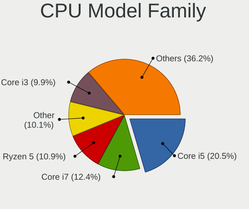

| Model                   | Computers | Percent |
|-------------------------|-----------|---------|
| Intel Core i5           | 348       | 20.48%  |
| Intel Core i7           | 211       | 12.42%  |
| AMD Ryzen 5             | 185       | 10.89%  |
| Other                   | 171       | 10.06%  |
| Intel Core i3           | 169       | 9.95%   |
| Intel Celeron           | 100       | 5.89%   |
| AMD Ryzen 7             | 69        | 4.06%   |
| AMD Ryzen 3             | 44        | 2.59%   |
| Intel Core 2 Duo        | 41        | 2.41%   |
| Intel Atom              | 30        | 1.77%   |
| Intel Pentium           | 27        | 1.59%   |
| Intel Xeon              | 23        | 1.35%   |
| Intel Pentium Dual-Core | 20        | 1.18%   |
| AMD A8                  | 20        | 1.18%   |
| AMD A10                 | 20        | 1.18%   |
| Intel Pentium Dual      | 18        | 1.06%   |
| AMD Ryzen 9             | 17        | 1%      |
| AMD FX                  | 17        | 1%      |
| AMD E1                  | 14        | 0.82%   |
| AMD A12                 | 14        | 0.82%   |
| AMD Athlon              | 11        | 0.65%   |
| AMD A4                  | 9         | 0.53%   |
| AMD Athlon II X2        | 8         | 0.47%   |
| AMD A6                  | 8         | 0.47%   |
| AMD Ryzen 7 PRO         | 7         | 0.41%   |
| AMD E2                  | 7         | 0.41%   |
| Intel Core 2            | 6         | 0.35%   |
| Intel Core              | 6         | 0.35%   |
| AMD E                   | 6         | 0.35%   |
| AMD Athlon 64 X2        | 6         | 0.35%   |
| Intel Core 2 Quad       | 5         | 0.29%   |
| AMD Turion 64 X2 Mobile | 5         | 0.29%   |
| AMD Sempron             | 5         | 0.29%   |
| AMD Phenom II X6        | 5         | 0.29%   |
| AMD Phenom II X4        | 5         | 0.29%   |
| Intel Genuine           | 3         | 0.18%   |
| Intel Core i9           | 3         | 0.18%   |
| AMD Ryzen Threadripper  | 3         | 0.18%   |
| AMD Phenom              | 3         | 0.18%   |
| Intel Pentium Gold      | 2         | 0.12%   |

CPU Cores
---------

Number of processor cores

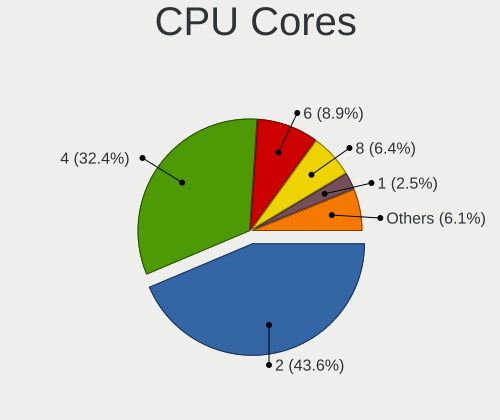

| Number  | Computers | Percent |
|---------|-----------|---------|
| 2       | 742       | 43.65%  |
| 4       | 551       | 32.41%  |
| 6       | 152       | 8.94%   |
| 8       | 109       | 6.41%   |
| 1       | 42        | 2.47%   |
| 10      | 33        | 1.94%   |
| 12      | 26        | 1.53%   |
| 14      | 17        | 1%      |
| 16      | 13        | 0.76%   |
| 3       | 9         | 0.53%   |
| 24      | 3         | 0.18%   |
| 20      | 2         | 0.12%   |
| Unknown | 1         | 0.06%   |

CPU Sockets
-----------

Number of sockets

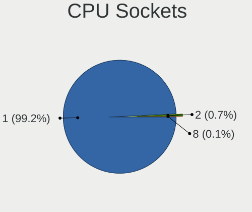

| Number | Computers | Percent |
|--------|-----------|---------|
| 1      | 1682      | 99.23%  |
| 2      | 12        | 0.71%   |
| 8      | 1         | 0.06%   |

CPU Threads
-----------

Threads per core (Hyper-Threading)

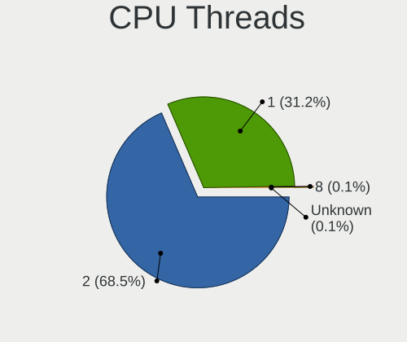

| Number  | Computers | Percent |
|---------|-----------|---------|
| 2       | 1165      | 68.53%  |
| 1       | 530       | 31.18%  |
| 8       | 2         | 0.12%   |
| 4       | 2         | 0.12%   |
| Unknown | 1         | 0.06%   |

CPU Op-Modes
------------

CPU Operation Modes (32-bit, 64-bit)

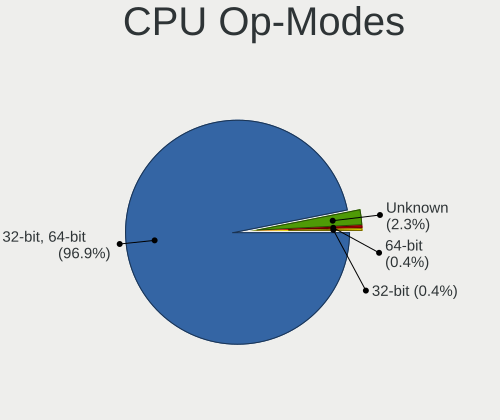

| Op mode        | Computers | Percent |
|----------------|-----------|---------|
| 32-bit, 64-bit | 1647      | 96.88%  |
| Unknown        | 39        | 2.29%   |
| 64-bit         | 7         | 0.41%   |
| 32-bit         | 7         | 0.41%   |

CPU Microcode
-------------

Microcode number

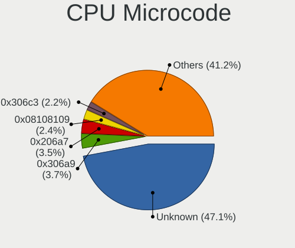

| Number     | Computers | Percent |
|------------|-----------|---------|
| Unknown    | 825       | 47.06%  |
| 0x306a9    | 64        | 3.65%   |
| 0x206a7    | 61        | 3.48%   |
| 0x08108109 | 42        | 2.4%    |
| 0x306c3    | 38        | 2.17%   |
| 0x806ec    | 34        | 1.94%   |
| 0x806ea    | 34        | 1.94%   |
| 0x406e3    | 28        | 1.6%    |
| 0x1067a    | 26        | 1.48%   |
| 0x06006705 | 24        | 1.37%   |
| 0x40651    | 22        | 1.25%   |
| 0x6fd      | 21        | 1.2%    |
| 0x306d4    | 21        | 1.2%    |
| 0x906ea    | 20        | 1.14%   |
| 0x20655    | 20        | 1.14%   |
| 0x406c4    | 19        | 1.08%   |
| 0x806e9    | 18        | 1.03%   |
| 0x806c1    | 18        | 1.03%   |
| 0x08608103 | 17        | 0.97%   |
| 0x0a50000c | 15        | 0.86%   |
| 0x706e5    | 14        | 0.8%    |
| 0x08108102 | 14        | 0.8%    |
| 0x506e3    | 13        | 0.74%   |
| 0x706a1    | 11        | 0.63%   |
| 0x08701021 | 11        | 0.63%   |
| 0x05000119 | 11        | 0.63%   |
| 0x010000c8 | 11        | 0.63%   |
| 0x10676    | 10        | 0.57%   |
| 0x06000852 | 10        | 0.57%   |
| 0x906e9    | 9         | 0.51%   |
| 0x06006118 | 9         | 0.51%   |
| 0x806eb    | 8         | 0.46%   |
| 0x30678    | 8         | 0.46%   |
| 0x20652    | 8         | 0.46%   |
| 0x08600106 | 8         | 0.46%   |
| 0x07030105 | 8         | 0.46%   |
| 0x0600611a | 8         | 0.46%   |
| 0x06001119 | 8         | 0.46%   |
| 0xa0652    | 7         | 0.4%    |
| 0x706a8    | 7         | 0.4%    |

CPU Microarch
-------------

Microarchitecture

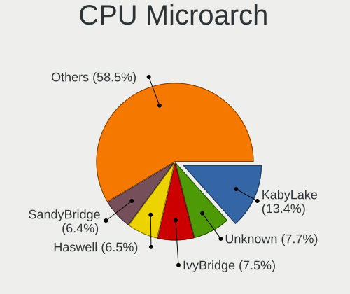

| Name              | Computers | Percent |
|-------------------|-----------|---------|
| KabyLake          | 227       | 13.38%  |
| Unknown           | 130       | 7.67%   |
| IvyBridge         | 128       | 7.55%   |
| Haswell           | 110       | 6.49%   |
| SandyBridge       | 108       | 6.37%   |
| Zen+              | 105       | 6.19%   |
| Skylake           | 64        | 3.77%   |
| Zen 3             | 63        | 3.71%   |
| Alderlake Hybrid  | 60        | 3.54%   |
| Excavator         | 57        | 3.36%   |
| Silvermont        | 56        | 3.3%    |
| Penryn            | 54        | 3.18%   |
| Zen 2             | 53        | 3.13%   |
| Westmere          | 49        | 2.89%   |
| Core              | 48        | 2.83%   |
| TigerLake         | 42        | 2.48%   |
| CometLake         | 37        | 2.18%   |
| Zen               | 34        | 2%      |
| K10               | 31        | 1.83%   |
| Goldmont plus     | 30        | 1.77%   |
| Broadwell         | 30        | 1.77%   |
| IceLake           | 29        | 1.71%   |
| Piledriver        | 27        | 1.59%   |
| Puma              | 23        | 1.36%   |
| K8 Hammer         | 19        | 1.12%   |
| Bonnell           | 15        | 0.88%   |
| Bobcat            | 14        | 0.83%   |
| Nehalem           | 10        | 0.59%   |
| Jaguar            | 8         | 0.47%   |
| Steamroller       | 7         | 0.41%   |
| NetBurst          | 7         | 0.41%   |
| Goldmont          | 7         | 0.41%   |
| Bulldozer         | 4         | 0.24%   |
| K10 Llano         | 3         | 0.18%   |
| Meteorlake Hybrid | 2         | 0.12%   |
| K8 & K10 hybrid   | 2         | 0.12%   |
| P6                | 1         | 0.06%   |
| Lunarlake Hybrid  | 1         | 0.06%   |
| Gracemont         | 1         | 0.06%   |

Graphics
--------

GPU Vendor
----------

Vendors of graphics cards

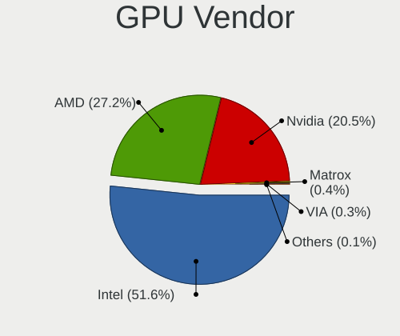

| Vendor                                       | Computers | Percent |
|----------------------------------------------|-----------|---------|
| Intel                                        | 1008      | 51.64%  |
| AMD                                          | 530       | 27.15%  |
| Nvidia                                       | 401       | 20.54%  |
| Matrox Electronics Systems                   | 7         | 0.36%   |
| VIA Technologies                             | 5         | 0.26%   |
| XGI Technology (eXtreme Graphics Innovation) | 1         | 0.05%   |

GPU Model
---------

Graphics card models

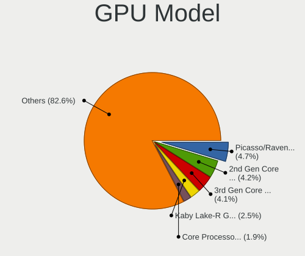

| Model                                                                                    | Computers | Percent |
|------------------------------------------------------------------------------------------|-----------|---------|
| AMD Picasso/Raven 2 [Radeon Vega Series / Radeon Vega Mobile Series]                     | 95        | 4.69%   |
| Intel 2nd Generation Core Processor Family Integrated Graphics Controller                | 86        | 4.24%   |
| Intel 3rd Gen Core processor Graphics Controller                                         | 83        | 4.09%   |
| Intel Kaby Lake-R GT2 [UHD Graphics 620]                                                 | 50        | 2.47%   |
| Intel Core Processor Integrated Graphics Controller                                      | 39        | 1.92%   |
| Intel Skylake-U GT2 [HD Graphics 520]                                                    | 37        | 1.83%   |
| Intel TigerLake-LP GT2 [Iris Xe Graphics]                                                | 36        | 1.78%   |
| AMD Stoney [Radeon R2/R3/R4/R5 Graphics]                                                 | 36        | 1.78%   |
| Intel CometLake-U GT2 [UHD Graphics]                                                     | 34        | 1.68%   |
| Intel Haswell-ULT Integrated Graphics Controller                                         | 33        | 1.63%   |
| AMD Lucienne                                                                             | 32        | 1.58%   |
| Intel Kaby Lake-U GT2 [HD Graphics 620]                                                  | 31        | 1.53%   |
| Intel Atom/Celeron/Pentium Processor x5-E8000/J3xxx/N3xxx Integrated Graphics Controller | 30        | 1.48%   |
| Intel WhiskeyLake-U GT2 [UHD Graphics 620]                                               | 29        | 1.43%   |
| Intel GeminiLake [UHD Graphics 600]                                                      | 29        | 1.43%   |
| Intel CoffeeLake-H GT2 [UHD Graphics 630]                                                | 29        | 1.43%   |
| AMD Mendocino [Radeon 610M]                                                              | 29        | 1.43%   |
| AMD Cezanne [Radeon Vega Series / Radeon Vega Mobile Series]                             | 27        | 1.33%   |
| Intel Atom Processor Z36xxx/Z37xxx Series Graphics & Display                             | 26        | 1.28%   |
| AMD Renoir [Radeon Vega Series / Radeon Vega Mobile Series]                              | 25        | 1.23%   |
| Intel 4th Gen Core Processor Integrated Graphics Controller                              | 24        | 1.18%   |
| Intel Broadwell-U GT2 [HD Graphics 5500]                                                 | 22        | 1.09%   |
| AMD Raven Ridge [Radeon Vega Series / Radeon Vega Mobile Series]                         | 22        | 1.09%   |
| Intel Xeon E3-1200 v3/4th Gen Core Processor Integrated Graphics Controller              | 21        | 1.04%   |
| Intel Iris Plus Graphics G1 (Ice Lake)                                                   | 21        | 1.04%   |
| AMD Wani [Radeon R5/R6/R7 Graphics]                                                      | 21        | 1.04%   |
| Nvidia GP107M [GeForce GTX 1050 Mobile]                                                  | 20        | 0.99%   |
| Intel Mobile 4 Series Chipset Integrated Graphics Controller                             | 20        | 0.99%   |
| Intel Xeon E3-1200 v2/3rd Gen Core processor Graphics Controller                         | 19        | 0.94%   |
| Nvidia TU117M [GeForce GTX 1650 Mobile / Max-Q]                                          | 18        | 0.89%   |
| AMD Mullins [Radeon R4/R5 Graphics]                                                      | 17        | 0.84%   |
| Intel CometLake-H GT2 [UHD Graphics]                                                     | 16        | 0.79%   |
| Intel Alder Lake-UP3 GT2 [Iris Xe Graphics]                                              | 16        | 0.79%   |
| Intel 4 Series Chipset Integrated Graphics Controller                                    | 16        | 0.79%   |
| AMD Cedar [Radeon HD 5000/6000/7350/8350 Series]                                         | 15        | 0.74%   |
| Nvidia GT218 [GeForce 210]                                                               | 14        | 0.69%   |
| Intel Mobile GM965/GL960 Integrated Graphics Controller (secondary)                      | 13        | 0.64%   |
| Intel Mobile GM965/GL960 Integrated Graphics Controller (primary)                        | 13        | 0.64%   |
| Intel Alder Lake-P GT2 [Iris Xe Graphics]                                                | 13        | 0.64%   |
| AMD Topaz XT [Radeon R7 M260/M265 / M340/M360 / M440/M445 / 530/535 / 620/625 Mobile]    | 13        | 0.64%   |

GPU Combo
---------

Combinations of graphics cards

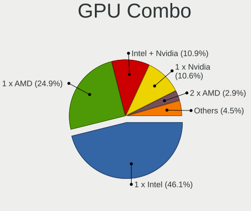

| Name            | Computers | Percent |
|-----------------|-----------|---------|
| 1 x Intel       | 789       | 46.14%  |
| 1 x AMD         | 426       | 24.91%  |
| Intel + Nvidia  | 186       | 10.88%  |
| 1 x Nvidia      | 182       | 10.64%  |
| 2 x AMD         | 50        | 2.92%   |
| AMD + Nvidia    | 31        | 1.81%   |
| Intel + AMD     | 24        | 1.4%    |
| 2 x Intel       | 6         | 0.35%   |
| 1 x Matrox      | 6         | 0.35%   |
| 1 x VIA         | 5         | 0.29%   |
| Other           | 3         | 0.18%   |
| 1 x XGI         | 1         | 0.06%   |
| Nvidia + Matrox | 1         | 0.06%   |

GPU Driver
----------

Free vs proprietary

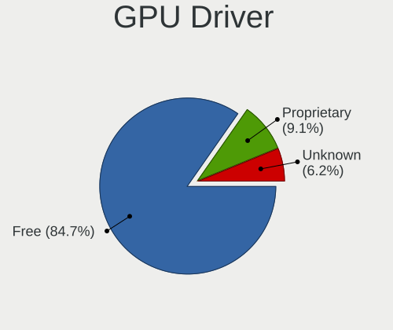

| Driver      | Computers | Percent |
|-------------|-----------|---------|
| Free        | 1456      | 84.7%   |
| Proprietary | 157       | 9.13%   |
| Unknown     | 106       | 6.17%   |

GPU Memory
----------

Total video memory

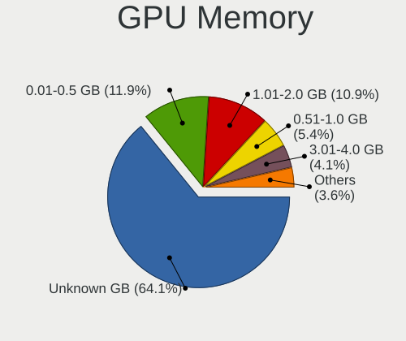

| Size in GB | Computers | Percent |
|------------|-----------|---------|
| Unknown    | 1113      | 64.15%  |
| 0.01-0.5   | 206       | 11.87%  |
| 1.01-2.0   | 189       | 10.89%  |
| 0.51-1.0   | 94        | 5.42%   |
| 3.01-4.0   | 71        | 4.09%   |
| 7.01-8.0   | 27        | 1.56%   |
| 5.01-6.0   | 13        | 0.75%   |
| 8.01-16.0  | 12        | 0.69%   |
| 2.01-3.0   | 9         | 0.52%   |
| 16.01-24.0 | 1         | 0.06%   |

Monitor
-------

Monitor Vendor
--------------

Monitor vendors

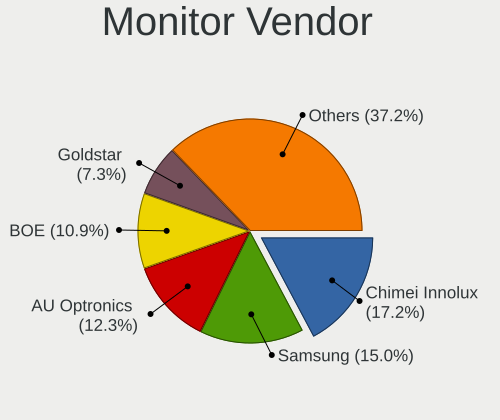

| Vendor                  | Computers | Percent |
|-------------------------|-----------|---------|
| Chimei Innolux          | 315       | 17.23%  |
| Samsung Electronics     | 275       | 15.04%  |
| AU Optronics            | 225       | 12.31%  |
| BOE                     | 199       | 10.89%  |
| Goldstar                | 134       | 7.33%   |
| LG Display              | 121       | 6.62%   |
| Hewlett-Packard         | 93        | 5.09%   |
| Dell                    | 52        | 2.84%   |
| Apple                   | 44        | 2.41%   |
| PANDA                   | 33        | 1.81%   |
| Lenovo                  | 33        | 1.81%   |
| Acer                    | 31        | 1.7%    |
| AOC                     | 23        | 1.26%   |
| Chi Mei Optoelectronics | 19        | 1.04%   |
| ViewSonic               | 14        | 0.77%   |
| Sharp                   | 13        | 0.71%   |
| ASUSTek Computer        | 13        | 0.71%   |
| HKC                     | 12        | 0.66%   |
| MSI                     | 10        | 0.55%   |
| InfoVision              | 10        | 0.55%   |
| BenQ                    | 9         | 0.49%   |
| Sceptre Tech            | 8         | 0.44%   |
| SAC                     | 8         | 0.44%   |
| LG Electronics          | 8         | 0.44%   |
| Sony                    | 7         | 0.38%   |
| RTK                     | 7         | 0.38%   |
| LG Philips              | 7         | 0.38%   |
| Unknown                 | 6         | 0.33%   |
| SANYO                   | 6         | 0.33%   |
| InnoLux Display         | 5         | 0.27%   |
| HannStar                | 5         | 0.27%   |
| CS_                     | 5         | 0.27%   |
| Ancor Communications    | 5         | 0.27%   |
| NCS                     | 4         | 0.22%   |
| CSO                     | 4         | 0.22%   |
| SKG                     | 3         | 0.16%   |
| Panasonic               | 3         | 0.16%   |
| KTC                     | 2         | 0.11%   |
| KDB                     | 2         | 0.11%   |
| Envision                | 2         | 0.11%   |

Monitor Model
-------------

Monitor models

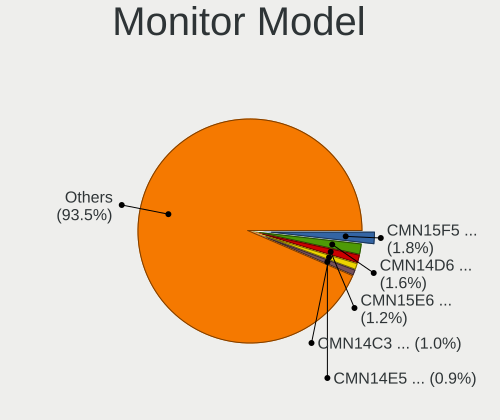

| Model                                                                 | Computers | Percent |
|-----------------------------------------------------------------------|-----------|---------|
| Chimei Innolux LCD Monitor CMN15F5 1920x1080 344x193mm 15.5-inch      | 33        | 1.78%   |
| Chimei Innolux LCD Monitor CMN14D6 1366x768 309x173mm 13.9-inch       | 30        | 1.62%   |
| Chimei Innolux LCD Monitor CMN15E6 1366x768 344x193mm 15.5-inch       | 23        | 1.24%   |
| Chimei Innolux LCD Monitor CMN14C3 1366x768 309x173mm 13.9-inch       | 18        | 0.97%   |
| Chimei Innolux LCD Monitor CMN14E5 1920x1080 309x173mm 13.9-inch      | 16        | 0.86%   |
| Chimei Innolux LCD Monitor CMN14C4 1366x768 309x173mm 13.9-inch       | 15        | 0.81%   |
| Goldstar FULL HD GSM5B55 1920x1080 480x270mm 21.7-inch                | 14        | 0.76%   |
| AU Optronics LCD Monitor AUO723C 1366x768 309x173mm 13.9-inch         | 14        | 0.76%   |
| Samsung Electronics S22F350 SAM0D1A 1920x1080 477x268mm 21.5-inch     | 12        | 0.65%   |
| Chimei Innolux LCD Monitor CMN15DB 1366x768 344x193mm 15.5-inch       | 12        | 0.65%   |
| Chimei Innolux LCD Monitor CMN15E7 1920x1080 344x193mm 15.5-inch      | 11        | 0.59%   |
| Samsung Electronics C24F390 SAM0D2C 1920x1080 521x293mm 23.5-inch     | 10        | 0.54%   |
| BOE LCD Monitor BOE0696 1366x768 309x173mm 13.9-inch                  | 10        | 0.54%   |
| AU Optronics LCD Monitor AUO2D3C 1366x768 309x173mm 13.9-inch         | 10        | 0.54%   |
| AU Optronics LCD Monitor AUO21ED 1920x1080 344x193mm 15.5-inch        | 10        | 0.54%   |
| Samsung Electronics S24F350 SAM0D20 1920x1080 521x293mm 23.5-inch     | 9         | 0.49%   |
| Samsung Electronics LCD Monitor SDC4161 1920x1080 344x194mm 15.5-inch | 9         | 0.49%   |
| BOE LCD Monitor BOE06A4 1366x768 344x194mm 15.5-inch                  | 9         | 0.49%   |
| Samsung Electronics LF22T35 SAM707B 1920x1080 477x268mm 21.5-inch     | 8         | 0.43%   |
| Samsung Electronics LCD Monitor SAM0C39 1920x1080 885x498mm 40.0-inch | 8         | 0.43%   |
| Goldstar W2043 GSM4E9D 1600x900 443x249mm 20.0-inch                   | 8         | 0.43%   |
| AU Optronics LCD Monitor AUO2E3C 1366x768 309x173mm 13.9-inch         | 8         | 0.43%   |
| AU Optronics LCD Monitor AUO183C 1366x768 309x173mm 13.9-inch         | 8         | 0.43%   |
| Samsung Electronics LF24T35 SAM707D 1920x1080 528x297mm 23.9-inch     | 7         | 0.38%   |
| Goldstar W2243 GSM56FE 1920x1080 477x269mm 21.6-inch                  | 7         | 0.38%   |
| Chimei Innolux LCD Monitor CMN15DC 1366x768 344x193mm 15.5-inch       | 7         | 0.38%   |
| Chimei Innolux LCD Monitor CMN1521 1920x1080 344x193mm 15.5-inch      | 7         | 0.38%   |
| Chimei Innolux LCD Monitor CMN14D4 1920x1080 309x173mm 13.9-inch      | 7         | 0.38%   |
| Chimei Innolux LCD Monitor CMN1470 1366x768 309x174mm 14.0-inch       | 7         | 0.38%   |
| AU Optronics LCD Monitor AUO323C 1366x768 309x173mm 13.9-inch         | 7         | 0.38%   |
| Samsung Electronics SyncMaster SAM036F 1440x900 428x255mm 19.6-inch   | 6         | 0.32%   |
| Samsung Electronics S20D300 SAM0BDB 1366x768 432x240mm 19.5-inch      | 6         | 0.32%   |
| PANDA LCD Monitor NCP004D 1920x1080 344x194mm 15.5-inch               | 6         | 0.32%   |
| PANDA LCD Monitor NCP0046 1920x1080 344x194mm 15.5-inch               | 6         | 0.32%   |
| PANDA LCD Monitor NCP0035 1920x1080 344x194mm 15.5-inch               | 6         | 0.32%   |
| LG Display LCD Monitor LGD02F8 1366x768 309x174mm 14.0-inch           | 6         | 0.32%   |
| LG Display LCD Monitor LGD02E9 1366x768 309x174mm 14.0-inch           | 6         | 0.32%   |
| Goldstar 20M35 GSM4EED 1600x900 433x236mm 19.4-inch                   | 6         | 0.32%   |
| Chimei Innolux LCD Monitor CMN1618 1920x1200 344x215mm 16.0-inch      | 6         | 0.32%   |
| Chimei Innolux LCD Monitor CMN1490 1366x768 309x174mm 14.0-inch       | 6         | 0.32%   |

Monitor Resolution
------------------

Monitor screen resolution

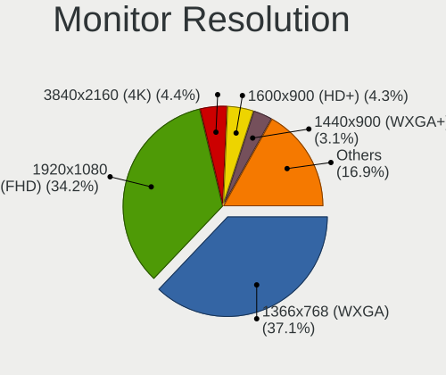

| Resolution         | Computers | Percent |
|--------------------|-----------|---------|
| 1366x768 (WXGA)    | 650       | 37.1%   |
| 1920x1080 (FHD)    | 599       | 34.19%  |
| 3840x2160 (4K)     | 77        | 4.39%   |
| 1600x900 (HD+)     | 75        | 4.28%   |
| 1440x900 (WXGA+)   | 55        | 3.14%   |
| 1920x1200 (WUXGA)  | 53        | 3.03%   |
| 1280x1024 (SXGA)   | 35        | 2%      |
| 1280x800 (WXGA)    | 34        | 1.94%   |
| 2560x1440 (QHD)    | 32        | 1.83%   |
| 2560x1080          | 21        | 1.2%    |
| 1360x768           | 18        | 1.03%   |
| 1680x1050 (WSXGA+) | 13        | 0.74%   |
| 2880x1800          | 12        | 0.68%   |
| 2560x1600          | 12        | 0.68%   |
| 1024x600           | 10        | 0.57%   |
| 1024x768 (XGA)     | 7         | 0.4%    |
| Unknown            | 7         | 0.4%    |
| 2160x1440          | 6         | 0.34%   |
| 3440x1440          | 5         | 0.29%   |
| 3840x1080          | 4         | 0.23%   |
| 3456x2160          | 3         | 0.17%   |
| 1280x960           | 3         | 0.17%   |
| 1280x720 (HD)      | 3         | 0.17%   |
| 2256x1504          | 2         | 0.11%   |
| 800x1280           | 1         | 0.06%   |
| 6400x2160          | 1         | 0.06%   |
| 3840x2400          | 1         | 0.06%   |
| 3840x1600          | 1         | 0.06%   |
| 3840x1100          | 1         | 0.06%   |
| 3200x1080          | 1         | 0.06%   |
| 2880x1920          | 1         | 0.06%   |
| 2496x1664          | 1         | 0.06%   |
| 2288x1287          | 1         | 0.06%   |
| 2160x1350          | 1         | 0.06%   |
| 1920x540           | 1         | 0.06%   |
| 1680x945           | 1         | 0.06%   |
| 1600x2560          | 1         | 0.06%   |
| 1536x2048          | 1         | 0.06%   |
| 1152x864           | 1         | 0.06%   |
| 1080x1920          | 1         | 0.06%   |

Monitor Diagonal
----------------

Diagonal size in inches

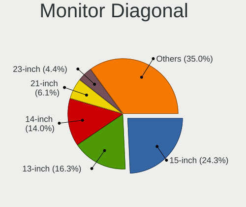

| Inches  | Computers | Percent |
|---------|-----------|---------|
| 15      | 445       | 24.28%  |
| 13      | 298       | 16.26%  |
| 14      | 256       | 13.97%  |
| 21      | 112       | 6.11%   |
| 23      | 80        | 4.36%   |
| 18      | 76        | 4.15%   |
| 19      | 73        | 3.98%   |
| 24      | 63        | 3.44%   |
| 27      | 58        | 3.16%   |
| 17      | 56        | 3.06%   |
| 31      | 51        | 2.78%   |
| 20      | 37        | 2.02%   |
| Unknown | 33        | 1.8%    |
| 12      | 26        | 1.42%   |
| 16      | 22        | 1.2%    |
| 11      | 22        | 1.2%    |
| 34      | 16        | 0.87%   |
| 10      | 13        | 0.71%   |
| 54      | 12        | 0.65%   |
| 84      | 11        | 0.6%    |
| 22      | 11        | 0.6%    |
| 72      | 10        | 0.55%   |
| 28      | 7         | 0.38%   |
| 63      | 5         | 0.27%   |
| 32      | 5         | 0.27%   |
| 29      | 5         | 0.27%   |
| 26      | 5         | 0.27%   |
| 40      | 4         | 0.22%   |
| 8       | 4         | 0.22%   |
| 48      | 3         | 0.16%   |
| 52      | 2         | 0.11%   |
| 46      | 2         | 0.11%   |
| 86      | 1         | 0.05%   |
| 65      | 1         | 0.05%   |
| 61      | 1         | 0.05%   |
| 60      | 1         | 0.05%   |
| 58      | 1         | 0.05%   |
| 44      | 1         | 0.05%   |
| 43      | 1         | 0.05%   |
| 37      | 1         | 0.05%   |

Monitor Width
-------------

Physical width

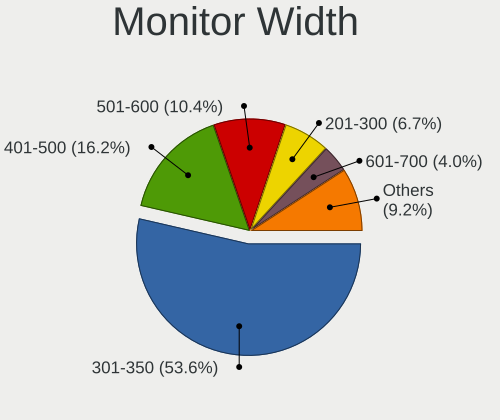

| Width in mm | Computers | Percent |
|-------------|-----------|---------|
| 301-350     | 969       | 53.6%   |
| 401-500     | 292       | 16.15%  |
| 501-600     | 188       | 10.4%   |
| 201-300     | 121       | 6.69%   |
| 601-700     | 72        | 3.98%   |
| 351-400     | 49        | 2.71%   |
| Unknown     | 33        | 1.83%   |
| 1001-1500   | 29        | 1.6%    |
| 701-800     | 21        | 1.16%   |
| 1501-2000   | 21        | 1.16%   |
| 801-900     | 5         | 0.28%   |
| 101-200     | 5         | 0.28%   |
| 901-1000    | 2         | 0.11%   |
| 1-100       | 1         | 0.06%   |

Aspect Ratio
------------

Proportional relationship between the width and the height

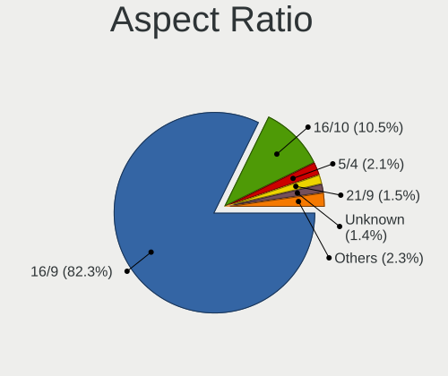

| Ratio   | Computers | Percent |
|---------|-----------|---------|
| 16/9    | 1351      | 82.28%  |
| 16/10   | 172       | 10.48%  |
| 5/4     | 34        | 2.07%   |
| 21/9    | 25        | 1.52%   |
| Unknown | 23        | 1.4%    |
| 4/3     | 15        | 0.91%   |
| 3/2     | 11        | 0.67%   |
| 32/9    | 3         | 0.18%   |
| 0.56    | 2         | 0.12%   |
| 6/5     | 1         | 0.06%   |
| 3.40    | 1         | 0.06%   |
| 0.75    | 1         | 0.06%   |
| 0.67    | 1         | 0.06%   |
| 0.63    | 1         | 0.06%   |
| 0.58    | 1         | 0.06%   |

Monitor Area
------------

Area in inch²

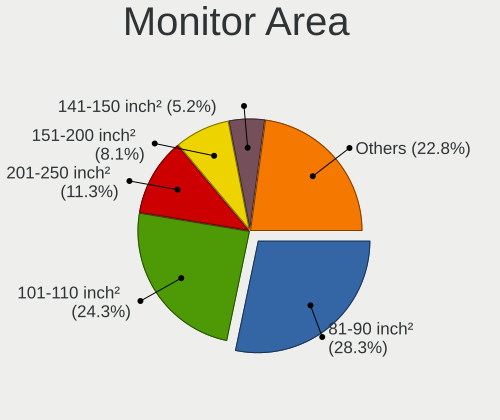

| Area in inch² | Computers | Percent |
|----------------|-----------|---------|
| 81-90          | 516       | 28.27%  |
| 101-110        | 444       | 24.33%  |
| 201-250        | 206       | 11.29%  |
| 151-200        | 147       | 8.05%   |
| 141-150        | 95        | 5.21%   |
| 351-500        | 75        | 4.11%   |
| 301-350        | 68        | 3.73%   |
| More than 1000 | 46        | 2.52%   |
| 71-80          | 40        | 2.19%   |
| Unknown        | 33        | 1.81%   |
| 251-300        | 27        | 1.48%   |
| 121-130        | 24        | 1.32%   |
| 51-60          | 23        | 1.26%   |
| 61-70          | 21        | 1.15%   |
| 111-120        | 21        | 1.15%   |
| 41-50          | 14        | 0.77%   |
| 501-1000       | 11        | 0.6%    |
| 131-140        | 8         | 0.44%   |
| 1-40           | 5         | 0.27%   |
| 91-100         | 1         | 0.05%   |

Pixel Density
-------------

Pixels per inch

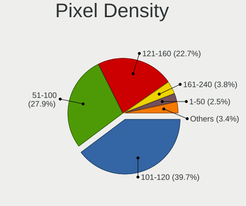

| Density       | Computers | Percent |
|---------------|-----------|---------|
| 101-120       | 711       | 39.74%  |
| 51-100        | 499       | 27.89%  |
| 121-160       | 406       | 22.69%  |
| 161-240       | 68        | 3.8%    |
| 1-50          | 44        | 2.46%   |
| Unknown       | 33        | 1.84%   |
| More than 240 | 28        | 1.57%   |

Multiple Monitors
-----------------

Total monitors connected

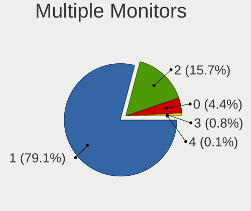

| Total | Computers | Percent |
|-------|-----------|---------|
| 1     | 1377      | 79.09%  |
| 2     | 273       | 15.68%  |
| 0     | 76        | 4.37%   |
| 3     | 14        | 0.8%    |
| 4     | 1         | 0.06%   |

Network
-------

Net Controller Vendor
---------------------

Controller vendors

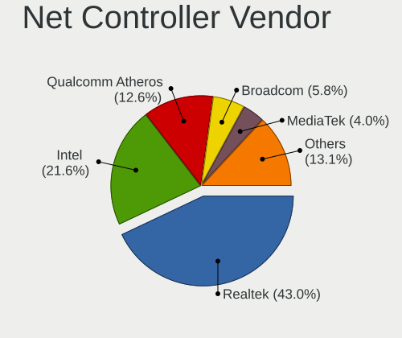

| Vendor                            | Computers | Percent |
|-----------------------------------|-----------|---------|
| Realtek Semiconductor             | 1098      | 42.97%  |
| Intel                             | 551       | 21.57%  |
| Qualcomm Atheros                  | 322       | 12.6%   |
| Broadcom                          | 148       | 5.79%   |
| MediaTek                          | 102       | 3.99%   |
| Ralink Technology                 | 41        | 1.6%    |
| Broadcom Limited                  | 41        | 1.6%    |
| TP-Link                           | 40        | 1.57%   |
| Nvidia                            | 28        | 1.1%    |
| Ralink                            | 25        | 0.98%   |
| Xiaomi                            | 21        | 0.82%   |
| Marvell Technology Group          | 18        | 0.7%    |
| Samsung Electronics               | 17        | 0.67%   |
| ASIX Electronics                  | 13        | 0.51%   |
| Qualcomm Atheros Communications   | 11        | 0.43%   |
| ICS Advent                        | 8         | 0.31%   |
| VIA Technologies                  | 6         | 0.23%   |
| Motorola PCS                      | 5         | 0.2%    |
| Mercucys                          | 5         | 0.2%    |
| Huawei Technologies               | 5         | 0.2%    |
| Shenzhen Goodix Technology        | 4         | 0.16%   |
| Qualcomm                          | 4         | 0.16%   |
| D-Link System                     | 4         | 0.16%   |
| T & A Mobile Phones               | 3         | 0.12%   |
| Microsoft                         | 3         | 0.12%   |
| DisplayLink                       | 3         | 0.12%   |
| Dell                              | 3         | 0.12%   |
| Sundance Technology Inc / IC Plus | 2         | 0.08%   |
| OPPO Electronics                  | 2         | 0.08%   |
| JMicron Technology                | 2         | 0.08%   |
| Google                            | 2         | 0.08%   |
| Aquantia                          | 2         | 0.08%   |
| ZyDAS                             | 1         | 0.04%   |
| Wistron NeWeb                     | 1         | 0.04%   |
| Texas Instruments                 | 1         | 0.04%   |
| STMicroelectronics                | 1         | 0.04%   |
| Sierra Wireless                   | 1         | 0.04%   |
| Quanta                            | 1         | 0.04%   |
| QinHeng Electronics               | 1         | 0.04%   |
| Prolific Technology               | 1         | 0.04%   |

Net Controller Model
--------------------

Controller models

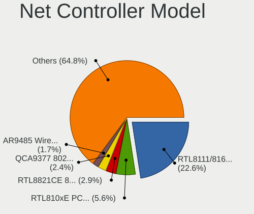

| Model                                                                  | Computers | Percent |
|------------------------------------------------------------------------|-----------|---------|
| Realtek RTL8111/8168/8211/8411 PCI Express Gigabit Ethernet Controller | 678       | 22.55%  |
| Realtek RTL810xE PCI Express Fast Ethernet controller                  | 168       | 5.59%   |
| Realtek RTL8821CE 802.11ac PCIe Wireless Network Adapter               | 87        | 2.89%   |
| Qualcomm Atheros QCA9377 802.11ac Wireless Network Adapter             | 73        | 2.43%   |
| Qualcomm Atheros AR9485 Wireless Network Adapter                       | 51        | 1.7%    |
| MediaTek MT7902 802.11ax PCIe Wireless Network Adapter [Filogic 310]   | 50        | 1.66%   |
| Realtek RTL8723DE Wireless Network Adapter                             | 49        | 1.63%   |
| Intel Wireless 8265 / 8275                                             | 48        | 1.6%    |
| Qualcomm Atheros QCA9565 / AR9565 Wireless Network Adapter             | 44        | 1.46%   |
| Realtek RTL8822CE 802.11ac PCIe Wireless Network Adapter               | 42        | 1.4%    |
| Realtek RTL8153 Gigabit Ethernet Adapter                               | 40        | 1.33%   |
| Qualcomm Atheros AR9285 Wireless Network Adapter (PCI-Express)         | 37        | 1.23%   |
| Realtek RTL8125 2.5GbE Controller                                      | 36        | 1.2%    |
| Realtek RTL8723BE PCIe Wireless Network Adapter                        | 35        | 1.16%   |
| Intel Wi-Fi 6 AX200                                                    | 35        | 1.16%   |
| Intel 82579LM Gigabit Network Connection (Lewisville)                  | 34        | 1.13%   |
| Realtek 802.11ac NIC                                                   | 32        | 1.06%   |
| Intel Wi-Fi 6 AX201                                                    | 30        | 1%      |
| Intel Alder Lake-P PCH CNVi WiFi                                       | 30        | 1%      |
| Broadcom BCM4313 802.11bgn Wireless Network Adapter                    | 28        | 0.93%   |
| MediaTek MT7921 802.11ax PCIe Wireless Network Adapter [Filogic 330]   | 26        | 0.86%   |
| Intel Comet Lake PCH-LP CNVi WiFi                                      | 25        | 0.83%   |
| Intel Cannon Lake PCH CNVi WiFi                                        | 25        | 0.83%   |
| Realtek RTL8152 Fast Ethernet Adapter                                  | 22        | 0.73%   |
| Intel Cannon Point-LP CNVi [Wireless-AC]                               | 22        | 0.73%   |
| Realtek RTL8822BE 802.11a/b/g/n/ac WiFi adapter                        | 21        | 0.7%    |
| Ralink MT7601U Wireless Adapter                                        | 21        | 0.7%    |
| Intel Wireless 7260                                                    | 21        | 0.7%    |
| Realtek RTL8188EUS 802.11n Wireless Network Adapter                    | 20        | 0.67%   |
| Qualcomm Atheros AR8152 v2.0 Fast Ethernet                             | 20        | 0.67%   |
| Intel Centrino Wireless-N 2230                                         | 20        | 0.67%   |
| Broadcom BCM43142 802.11b/g/n                                          | 20        | 0.67%   |
| Xiaomi Mi/Redmi series (RNDIS)                                         | 18        | 0.6%    |
| Intel Wireless 8260                                                    | 17        | 0.57%   |
| Intel Wireless 7265                                                    | 17        | 0.57%   |
| Realtek RTL8821AE 802.11ac PCIe Wireless Network Adapter               | 16        | 0.53%   |
| Ralink RT2870/RT3070 Wireless Adapter                                  | 16        | 0.53%   |
| Realtek RTL8188EE Wireless Network Adapter                             | 15        | 0.5%    |
| Intel I211 Gigabit Network Connection                                  | 15        | 0.5%    |
| Qualcomm Atheros QCA6174 802.11ac Wireless Network Adapter             | 14        | 0.47%   |

Wireless Vendor
---------------

Wireless vendors

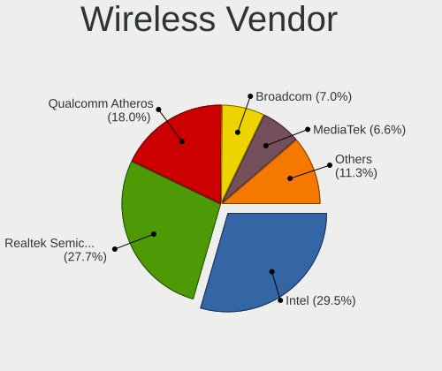

| Vendor                          | Computers | Percent |
|---------------------------------|-----------|---------|
| Intel                           | 436       | 29.48%  |
| Realtek Semiconductor           | 409       | 27.65%  |
| Qualcomm Atheros                | 266       | 17.99%  |
| Broadcom                        | 104       | 7.03%   |
| MediaTek                        | 97        | 6.56%   |
| Ralink Technology               | 41        | 2.77%   |
| TP-Link                         | 39        | 2.64%   |
| Broadcom Limited                | 27        | 1.83%   |
| Ralink                          | 25        | 1.69%   |
| Qualcomm Atheros Communications | 11        | 0.74%   |
| Mercucys                        | 5         | 0.34%   |
| Microsoft                       | 3         | 0.2%    |
| D-Link System                   | 3         | 0.2%    |
| Marvell Technology Group        | 2         | 0.14%   |
| Dell                            | 2         | 0.14%   |
| ZyDAS                           | 1         | 0.07%   |
| Wistron NeWeb                   | 1         | 0.07%   |
| Texas Instruments               | 1         | 0.07%   |
| Sierra Wireless                 | 1         | 0.07%   |
| Qualcomm                        | 1         | 0.07%   |
| LG Electronics                  | 1         | 0.07%   |
| Encore Electronics              | 1         | 0.07%   |
| D-Link                          | 1         | 0.07%   |
| 3Com                            | 1         | 0.07%   |

Wireless Model
--------------

Wireless models

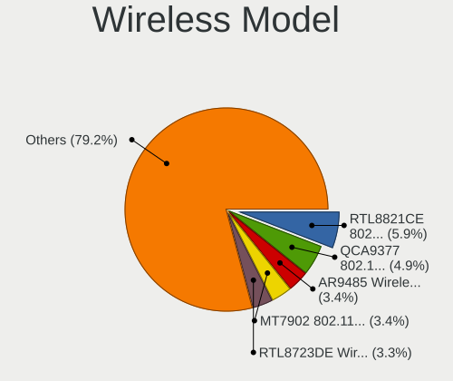

| Model                                                                   | Computers | Percent |
|-------------------------------------------------------------------------|-----------|---------|
| Realtek RTL8821CE 802.11ac PCIe Wireless Network Adapter                | 87        | 5.85%   |
| Qualcomm Atheros QCA9377 802.11ac Wireless Network Adapter              | 73        | 4.91%   |
| Qualcomm Atheros AR9485 Wireless Network Adapter                        | 51        | 3.43%   |
| MediaTek MT7902 802.11ax PCIe Wireless Network Adapter [Filogic 310]    | 50        | 3.36%   |
| Realtek RTL8723DE Wireless Network Adapter                              | 49        | 3.3%    |
| Intel Wireless 8265 / 8275                                              | 48        | 3.23%   |
| Qualcomm Atheros QCA9565 / AR9565 Wireless Network Adapter              | 44        | 2.96%   |
| Realtek RTL8822CE 802.11ac PCIe Wireless Network Adapter                | 42        | 2.82%   |
| Qualcomm Atheros AR9285 Wireless Network Adapter (PCI-Express)          | 37        | 2.49%   |
| Realtek RTL8723BE PCIe Wireless Network Adapter                         | 35        | 2.35%   |
| Intel Wi-Fi 6 AX200                                                     | 35        | 2.35%   |
| Realtek 802.11ac NIC                                                    | 32        | 2.15%   |
| Intel Wi-Fi 6 AX201                                                     | 30        | 2.02%   |
| Broadcom BCM4313 802.11bgn Wireless Network Adapter                     | 28        | 1.88%   |
| MediaTek MT7921 802.11ax PCIe Wireless Network Adapter [Filogic 330]    | 26        | 1.75%   |
| Intel Comet Lake PCH-LP CNVi WiFi                                       | 25        | 1.68%   |
| Intel Cannon Lake PCH CNVi WiFi                                         | 25        | 1.68%   |
| Intel Cannon Point-LP CNVi [Wireless-AC]                                | 22        | 1.48%   |
| Realtek RTL8822BE 802.11a/b/g/n/ac WiFi adapter                         | 21        | 1.41%   |
| Ralink MT7601U Wireless Adapter                                         | 21        | 1.41%   |
| Intel Wireless 7260                                                     | 21        | 1.41%   |
| Realtek RTL8188EUS 802.11n Wireless Network Adapter                     | 20        | 1.34%   |
| Intel Centrino Wireless-N 2230                                          | 20        | 1.34%   |
| Broadcom BCM43142 802.11b/g/n                                           | 20        | 1.34%   |
| Intel Wireless 8260                                                     | 17        | 1.14%   |
| Intel Wireless 7265                                                     | 17        | 1.14%   |
| Realtek RTL8821AE 802.11ac PCIe Wireless Network Adapter                | 16        | 1.08%   |
| Ralink RT2870/RT3070 Wireless Adapter                                   | 16        | 1.08%   |
| Intel Alder Lake-P PCH CNVi WiFi                                        | 16        | 1.08%   |
| Realtek RTL8188EE Wireless Network Adapter                              | 15        | 1.01%   |
| Qualcomm Atheros QCA6174 802.11ac Wireless Network Adapter              | 14        | 0.94%   |
| Realtek RTL8852BE PCIe 802.11ax Wireless Network Controller             | 13        | 0.87%   |
| Intel Comet Lake PCH CNVi WiFi                                          | 13        | 0.87%   |
| Intel Ice Lake-LP PCH CNVi WiFi                                         | 12        | 0.81%   |
| Intel Dual Band Wireless-AC 3165 Plus Bluetooth                         | 12        | 0.81%   |
| TP-Link AC600 wireless Realtek RTL8811AU [Archer T2U Nano]              | 11        | 0.74%   |
| Realtek RTL8188CE 802.11b/g/n WiFi Adapter                              | 11        | 0.74%   |
| Ralink RT3290 Wireless 802.11n 1T/1R PCIe                               | 11        | 0.74%   |
| Qualcomm Atheros AR9287 Wireless Network Adapter (PCI-Express)          | 11        | 0.74%   |
| Qualcomm Atheros AR242x / AR542x Wireless Network Adapter (PCI-Express) | 11        | 0.74%   |

Ethernet Vendor
---------------

Ethernet vendors

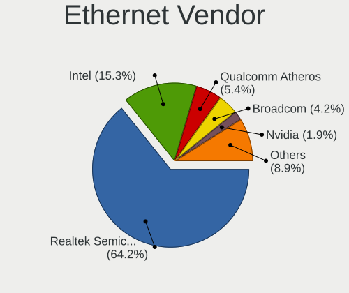

| Vendor                            | Computers | Percent |
|-----------------------------------|-----------|---------|
| Realtek Semiconductor             | 956       | 64.25%  |
| Intel                             | 228       | 15.32%  |
| Qualcomm Atheros                  | 80        | 5.38%   |
| Broadcom                          | 63        | 4.23%   |
| Nvidia                            | 28        | 1.88%   |
| Xiaomi                            | 21        | 1.41%   |
| Samsung Electronics               | 17        | 1.14%   |
| Marvell Technology Group          | 16        | 1.08%   |
| Broadcom Limited                  | 14        | 0.94%   |
| ASIX Electronics                  | 13        | 0.87%   |
| ICS Advent                        | 8         | 0.54%   |
| VIA Technologies                  | 6         | 0.4%    |
| Motorola PCS                      | 5         | 0.34%   |
| Huawei Technologies               | 5         | 0.34%   |
| T & A Mobile Phones               | 3         | 0.2%    |
| Qualcomm                          | 3         | 0.2%    |
| MediaTek                          | 3         | 0.2%    |
| DisplayLink                       | 3         | 0.2%    |
| Sundance Technology Inc / IC Plus | 2         | 0.13%   |
| OPPO Electronics                  | 2         | 0.13%   |
| JMicron Technology                | 2         | 0.13%   |
| Aquantia                          | 2         | 0.13%   |
| TP-Link                           | 1         | 0.07%   |
| Quanta                            | 1         | 0.07%   |
| Prolific Technology               | 1         | 0.07%   |
| Netchip Technology                | 1         | 0.07%   |
| Mellanox Technologies             | 1         | 0.07%   |
| Lenovo                            | 1         | 0.07%   |
| Google                            | 1         | 0.07%   |
| D-Link System                     | 1         | 0.07%   |

Ethernet Model
--------------

Ethernet models

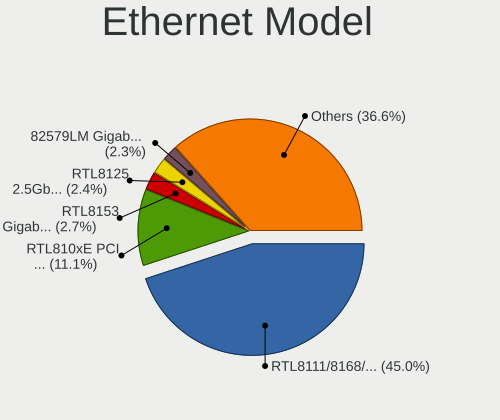

| Model                                                                  | Computers | Percent |
|------------------------------------------------------------------------|-----------|---------|
| Realtek RTL8111/8168/8211/8411 PCI Express Gigabit Ethernet Controller | 678       | 44.96%  |
| Realtek RTL810xE PCI Express Fast Ethernet controller                  | 168       | 11.14%  |
| Realtek RTL8153 Gigabit Ethernet Adapter                               | 40        | 2.65%   |
| Realtek RTL8125 2.5GbE Controller                                      | 36        | 2.39%   |
| Intel 82579LM Gigabit Network Connection (Lewisville)                  | 34        | 2.25%   |
| Realtek RTL8152 Fast Ethernet Adapter                                  | 22        | 1.46%   |
| Qualcomm Atheros AR8152 v2.0 Fast Ethernet                             | 20        | 1.33%   |
| Xiaomi Mi/Redmi series (RNDIS)                                         | 18        | 1.19%   |
| Intel I211 Gigabit Network Connection                                  | 15        | 0.99%   |
| Intel Alder Lake-P PCH CNVi WiFi                                       | 14        | 0.93%   |
| Qualcomm Atheros AR8151 v2.0 Gigabit Ethernet                          | 13        | 0.86%   |
| Nvidia MCP61 Ethernet                                                  | 13        | 0.86%   |
| Intel Ethernet Controller I225-V                                       | 13        | 0.86%   |
| Samsung Galaxy series, misc. (tethering mode)                          | 12        | 0.8%    |
| Intel Ethernet Connection I219-LM                                      | 12        | 0.8%    |
| Broadcom NetXtreme BCM57766 Gigabit Ethernet PCIe                      | 12        | 0.8%    |
| Intel 82579V Gigabit Network Connection                                | 11        | 0.73%   |
| Realtek Killer E2600 GbE Controller                                    | 10        | 0.66%   |
| ASIX AX88179 Gigabit Ethernet                                          | 10        | 0.66%   |
| Intel Ethernet Connection I217-LM                                      | 9         | 0.6%    |
| Broadcom NetLink BCM57780 Gigabit Ethernet PCIe                        | 9         | 0.6%    |
| Realtek RTL-8100/8101L/8139 PCI Fast Ethernet Adapter                  | 8         | 0.53%   |
| Qualcomm Atheros AR8162 Fast Ethernet                                  | 8         | 0.53%   |
| Intel 82577LM Gigabit Network Connection                               | 8         | 0.53%   |
| Broadcom NetLink BCM57785 Gigabit Ethernet PCIe                        | 8         | 0.53%   |
| Intel Ethernet Connection (4) I219-LM                                  | 7         | 0.46%   |
| Broadcom NetLink BCM5906M Fast Ethernet PCI Express                    | 7         | 0.46%   |
| Qualcomm Atheros Killer E220x Gigabit Ethernet Controller              | 6         | 0.4%    |
| Qualcomm Atheros AR8132 Fast Ethernet                                  | 6         | 0.4%    |
| Nvidia MCP79 Ethernet                                                  | 6         | 0.4%    |
| Marvell Group 88E8040 PCI-E Fast Ethernet Controller                   | 6         | 0.4%    |
| Intel Ethernet Connection I219-V                                       | 6         | 0.4%    |
| Intel Ethernet Connection (4) I219-V                                   | 6         | 0.4%    |
| Broadcom NetXtreme BCM57765 Gigabit Ethernet PCIe                      | 6         | 0.4%    |
| VIA VT6102/VT6103 [Rhine-II]                                           | 5         | 0.33%   |
| Samsung GT-I9070 (network tethering, USB debugging enabled)            | 5         | 0.33%   |
| Qualcomm Atheros QCA8171 Gigabit Ethernet                              | 5         | 0.33%   |
| Qualcomm Atheros AR8152 v1.1 Fast Ethernet                             | 5         | 0.33%   |
| Intel Ethernet Connection (6) I219-V                                   | 5         | 0.33%   |
| Intel Ethernet Connection (3) I218-LM                                  | 5         | 0.33%   |

Net Controller Kind
-------------------

Ethernet, WiFi or modem

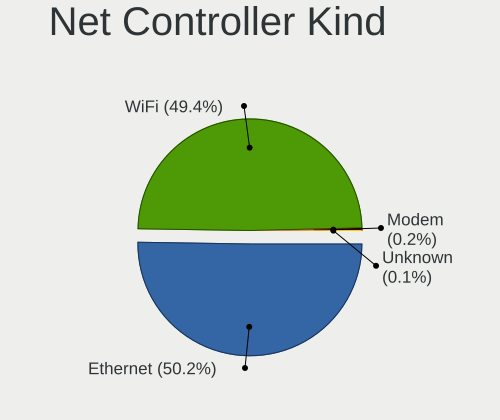

| Kind     | Computers | Percent |
|----------|-----------|---------|
| Ethernet | 1416      | 50.25%  |
| WiFi     | 1391      | 49.36%  |
| Modem    | 7         | 0.25%   |
| Unknown  | 4         | 0.14%   |

Used Controller
---------------

Currently used network controller

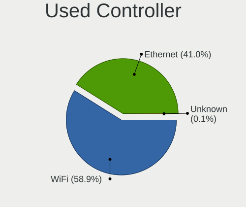

| Kind     | Computers | Percent |
|----------|-----------|---------|
| WiFi     | 1055      | 58.91%  |
| Ethernet | 735       | 41.04%  |
| Unknown  | 1         | 0.06%   |

NICs
----

Total network controllers on board

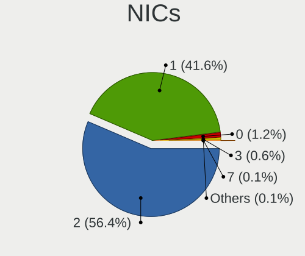

| Total | Computers | Percent |
|-------|-----------|---------|
| 2     | 959       | 56.44%  |
| 1     | 706       | 41.55%  |
| 0     | 21        | 1.24%   |
| 3     | 10        | 0.59%   |
| 7     | 1         | 0.06%   |
| 6     | 1         | 0.06%   |
| 4     | 1         | 0.06%   |

IPv6
----

IPv6 vs IPv4

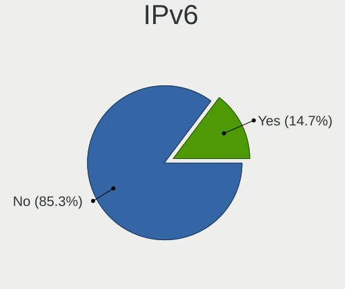

| Used | Computers | Percent |
|------|-----------|---------|
| No   | 1470      | 85.27%  |
| Yes  | 254       | 14.73%  |

Bluetooth
---------

Bluetooth Vendor
----------------

Controller vendors

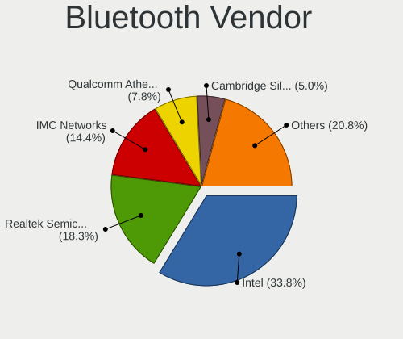

| Vendor                          | Computers | Percent |
|---------------------------------|-----------|---------|
| Intel                           | 395       | 33.76%  |
| Realtek Semiconductor           | 214       | 18.29%  |
| IMC Networks                    | 168       | 14.36%  |
| Qualcomm Atheros Communications | 91        | 7.78%   |
| Cambridge Silicon Radio         | 59        | 5.04%   |
| Lite-On Technology              | 51        | 4.36%   |
| Broadcom                        | 40        | 3.42%   |
| Apple                           | 39        | 3.33%   |
| Foxconn / Hon Hai               | 33        | 2.82%   |
| MediaTek                        | 12        | 1.03%   |
| Toshiba                         | 11        | 0.94%   |
| Ralink                          | 11        | 0.94%   |
| Realtek                         | 10        | 0.85%   |
| Hewlett-Packard                 | 10        | 0.85%   |
| Dell                            | 9         | 0.77%   |
| Foxconn International           | 5         | 0.43%   |
| ASUSTek Computer                | 4         | 0.34%   |
| Alps Electric                   | 3         | 0.26%   |
| TP-Link                         | 1         | 0.09%   |
| Primax Electronics              | 1         | 0.09%   |
| Marvell Semiconductor           | 1         | 0.09%   |
| Actions                         | 1         | 0.09%   |
| Unknown                         | 1         | 0.09%   |

Bluetooth Model
---------------

Controller models

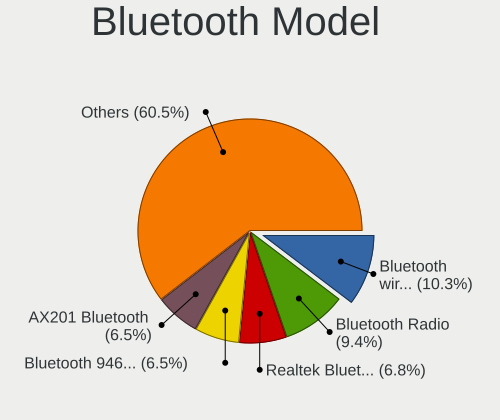

| Model                                               | Computers | Percent |
|-----------------------------------------------------|-----------|---------|
| Intel Bluetooth wireless interface                  | 121       | 10.33%  |
| Realtek Bluetooth Radio                             | 110       | 9.39%   |
| Realtek  Bluetooth 4.2 Adapter                      | 80        | 6.83%   |
| Intel Bluetooth 9460/9560 Jefferson Peak (JfP)      | 76        | 6.49%   |
| Intel AX201 Bluetooth                               | 76        | 6.49%   |
| IMC Networks Wireless_Device                        | 74        | 6.32%   |
| Cambridge Silicon Radio Bluetooth Dongle (HCI mode) | 59        | 5.04%   |
| IMC Networks Bluetooth Radio                        | 56        | 4.78%   |
| Qualcomm Atheros  Bluetooth Device                  | 40        | 3.42%   |
| Intel AX200 Bluetooth                               | 35        | 2.99%   |
| IMC Networks Bluetooth Device                       | 30        | 2.56%   |
| Intel Bluetooth Device                              | 28        | 2.39%   |
| Intel Centrino Bluetooth Wireless Transceiver       | 24        | 2.05%   |
| Qualcomm Atheros AR3012 Bluetooth 4.0               | 19        | 1.62%   |
| Lite-On Qualcomm Atheros QCA9377 Bluetooth          | 18        | 1.54%   |
| Apple Bluetooth Host Controller                     | 16        | 1.37%   |
| Qualcomm Atheros AR3011 Bluetooth                   | 14        | 1.2%    |
| Apple Bluetooth USB Host Controller                 | 14        | 1.2%    |
| Qualcomm Atheros QCA61x4 Bluetooth 4.0              | 12        | 1.02%   |
| MediaTek Wireless_Device                            | 12        | 1.02%   |
| Realtek RTL8723B Bluetooth                          | 11        | 0.94%   |
| Ralink RT3290 Bluetooth                             | 11        | 0.94%   |
| Lite-On Bluetooth Device                            | 11        | 0.94%   |
| Intel Wireless-AC 3168 Bluetooth                    | 11        | 0.94%   |
| Realtek Bluetooth Radio                             | 10        | 0.85%   |
| Foxconn / Hon Hai Wireless_Device                   | 10        | 0.85%   |
| Intel AX210 Bluetooth                               | 9         | 0.77%   |
| Lite-On Broadcom BCM43142A0 Bluetooth Device        | 8         | 0.68%   |
| Intel Wireless-AC 9260 Bluetooth Adapter            | 7         | 0.6%    |
| Intel Centrino Advanced-N 6230 Bluetooth adapter    | 7         | 0.6%    |
| Foxconn / Hon Hai Bluetooth Device                  | 7         | 0.6%    |
| Realtek RTL8821A Bluetooth                          | 6         | 0.51%   |
| Lite-On Atheros AR3012 Bluetooth                    | 6         | 0.51%   |
| IMC Networks Atheros AR3012 Bluetooth 4.0 Adapter   | 6         | 0.51%   |
| Broadcom BCM20702 Bluetooth 4.0 [ThinkPad]          | 6         | 0.51%   |
| Broadcom BCM2045B (BDC-2.1)                         | 6         | 0.51%   |
| Apple Built-in Bluetooth 2.0+EDR HCI                | 6         | 0.51%   |
| Realtek RTL8822BE Bluetooth 4.2 Adapter             | 5         | 0.43%   |
| HP Bluetooth 2.0 Interface [Broadcom BCM2045]       | 5         | 0.43%   |
| Foxconn International BCM43142A0 Bluetooth module   | 5         | 0.43%   |

Sound
-----

Sound Vendor
------------

Sound card vendors

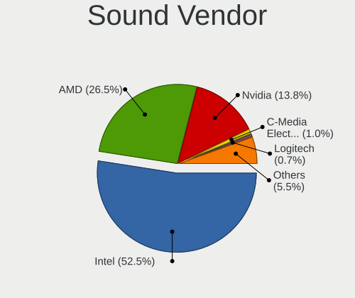

| Vendor                               | Computers | Percent |
|--------------------------------------|-----------|---------|
| Intel                                | 1118      | 52.46%  |
| AMD                                  | 565       | 26.51%  |
| Nvidia                               | 294       | 13.8%   |
| C-Media Electronics                  | 22        | 1.03%   |
| Logitech                             | 14        | 0.66%   |
| Generalplus Technology               | 13        | 0.61%   |
| VIA Technologies                     | 8         | 0.38%   |
| Plantronics                          | 8         | 0.38%   |
| Texas Instruments                    | 7         | 0.33%   |
| Realtek Semiconductor                | 6         | 0.28%   |
| JMTek                                | 6         | 0.28%   |
| Corsair                              | 5         | 0.23%   |
| Hewlett-Packard                      | 4         | 0.19%   |
| Creative Labs                        | 4         | 0.19%   |
| SteelSeries ApS                      | 3         | 0.14%   |
| Sony                                 | 3         | 0.14%   |
| M-Audio                              | 3         | 0.14%   |
| KTMICRO                              | 3         | 0.14%   |
| Kingston Technology                  | 3         | 0.14%   |
| Blue Microphones                     | 3         | 0.14%   |
| ASUSTek Computer                     | 3         | 0.14%   |
| Apple                                | 3         | 0.14%   |
| Thesycon Systemsoftware & Consulting | 2         | 0.09%   |
| GN Netcom                            | 2         | 0.09%   |
| Weltrend Semiconductor               | 1         | 0.05%   |
| Walmart                              | 1         | 0.05%   |
| Turtle Beach                         | 1         | 0.05%   |
| Trust                                | 1         | 0.05%   |
| SAVITECH                             | 1         | 0.05%   |
| RG-57_pro                            | 1         | 0.05%   |
| Razer USA                            | 1         | 0.05%   |
| Microsoft                            | 1         | 0.05%   |
| Micro Star International             | 1         | 0.05%   |
| Medeli Electronics                   | 1         | 0.05%   |
| liyuany                              | 1         | 0.05%   |
| Jieli Technology                     | 1         | 0.05%   |
| JBL                                  | 1         | 0.05%   |
| HiBy                                 | 1         | 0.05%   |
| Harman International                 | 1         | 0.05%   |
| Giga-Byte Technology                 | 1         | 0.05%   |

Sound Model
-----------

Sound card models

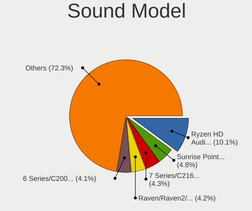

| Model                                                                                             | Computers | Percent |
|---------------------------------------------------------------------------------------------------|-----------|---------|
| AMD Ryzen HD Audio Controller                                                                     | 273       | 10.13%  |
| Intel Sunrise Point-LP HD Audio                                                                   | 130       | 4.83%   |
| Intel 7 Series/C216 Chipset Family High Definition Audio Controller                               | 117       | 4.34%   |
| AMD Raven/Raven2/Fenghuang HDMI/DP Audio Controller                                               | 114       | 4.23%   |
| Intel 6 Series/C200 Series Chipset Family High Definition Audio Controller                        | 111       | 4.12%   |
| AMD Renoir/Cezanne HDMI/DP Audio Controller                                                       | 96        | 3.56%   |
| Intel 8 Series/C220 Series Chipset High Definition Audio Controller                               | 72        | 2.67%   |
| AMD FCH Azalia Controller                                                                         | 63        | 2.34%   |
| AMD Family 15h (Models 60h-6fh) Audio Controller                                                  | 56        | 2.08%   |
| Intel 5 Series/3400 Series Chipset High Definition Audio                                          | 55        | 2.04%   |
| Intel NM10/ICH7 Family High Definition Audio Controller                                           | 53        | 1.97%   |
| Intel Alder Lake PCH-P High Definition Audio Controller                                           | 53        | 1.97%   |
| AMD Kabini HDMI/DP Audio                                                                          | 51        | 1.89%   |
| AMD Radeon High Definition Audio Controller                                                       | 50        | 1.86%   |
| Intel Xeon E3-1200 v3/4th Gen Core Processor HD Audio Controller                                  | 49        | 1.82%   |
| Intel Cannon Lake PCH cAVS                                                                        | 45        | 1.67%   |
| AMD SBx00 Azalia (Intel HDA)                                                                      | 45        | 1.67%   |
| AMD Starship/Matisse HD Audio Controller                                                          | 43        | 1.6%    |
| Intel Tiger Lake-LP Smart Sound Technology Audio Controller                                       | 42        | 1.56%   |
| AMD High Definition Audio Controller                                                              | 36        | 1.34%   |
| Intel Comet Lake PCH-LP cAVS                                                                      | 35        | 1.3%    |
| Intel Haswell-ULT HD Audio Controller                                                             | 33        | 1.22%   |
| Intel Cannon Point-LP High Definition Audio Controller                                            | 32        | 1.19%   |
| Intel 8 Series HD Audio Controller                                                                | 32        | 1.19%   |
| Intel 100 Series/C230 Series Chipset Family HD Audio Controller                                   | 32        | 1.19%   |
| Nvidia GP107GL High Definition Audio Controller                                                   | 31        | 1.15%   |
| Intel Celeron/Pentium Silver Processor High Definition Audio                                      | 30        | 1.11%   |
| Intel Wildcat Point-LP High Definition Audio Controller                                           | 28        | 1.04%   |
| Intel Broadwell-U Audio Controller                                                                | 28        | 1.04%   |
| Nvidia High Definition Audio Controller                                                           | 27        | 1%      |
| Intel 82801I (ICH9 Family) HD Audio Controller                                                    | 27        | 1%      |
| Nvidia TU107 GeForce GTX 1650 High Definition Audio Controller                                    | 26        | 0.97%   |
| Intel Ice Lake-LP Smart Sound Technology Audio Controller                                         | 25        | 0.93%   |
| Nvidia GK208 HDMI/DP Audio Controller                                                             | 23        | 0.85%   |
| Intel Atom Processor Z36xxx/Z37xxx Series High Definition Audio Controller                        | 22        | 0.82%   |
| Intel 82801H (ICH8 Family) HD Audio Controller                                                    | 22        | 0.82%   |
| Intel Raptor Lake-P/U/H cAVS                                                                      | 20        | 0.74%   |
| Intel Comet Lake PCH cAVS                                                                         | 20        | 0.74%   |
| Intel Atom/Celeron/Pentium Processor x5-E8000/J3xxx/N3xxx Series High Definition Audio Controller | 20        | 0.74%   |
| AMD Family 17h (Models 00h-0fh) HD Audio Controller                                               | 17        | 0.63%   |

Memory
------

Memory Vendor
-------------

Memory module vendors

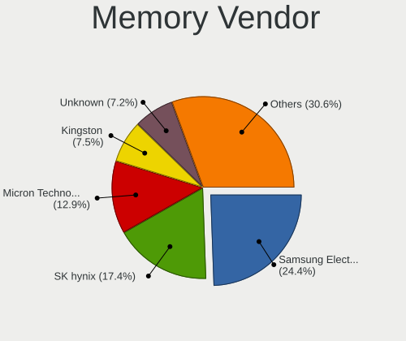

| Vendor                       | Computers | Percent |
|------------------------------|-----------|---------|
| Samsung Electronics          | 259       | 24.43%  |
| SK hynix                     | 184       | 17.36%  |
| Micron Technology            | 137       | 12.92%  |
| Kingston                     | 80        | 7.55%   |
| Unknown                      | 76        | 7.17%   |
| A-DATA Technology            | 71        | 6.7%    |
| Crucial                      | 39        | 3.68%   |
| Corsair                      | 35        | 3.3%    |
| Ramaxel Technology           | 25        | 2.36%   |
| Nanya Technology             | 16        | 1.51%   |
| Team                         | 13        | 1.23%   |
| Unknown                      | 12        | 1.13%   |
| G.Skill                      | 11        | 1.04%   |
| Elpida                       | 11        | 1.04%   |
| Super Talent                 | 7         | 0.66%   |
| PNY                          | 7         | 0.66%   |
| Patriot                      | 7         | 0.66%   |
| Avant                        | 7         | 0.66%   |
| Unknown (ABCD)               | 6         | 0.57%   |
| Hewlett-Packard              | 5         | 0.47%   |
| Apacer                       | 5         | 0.47%   |
| GeIL                         | 4         | 0.38%   |
| Hikvision                    | 3         | 0.28%   |
| Goldkey                      | 3         | 0.28%   |
| Unknown (0x0C26)             | 2         | 0.19%   |
| Silicon Power                | 2         | 0.19%   |
| Qimonda                      | 2         | 0.19%   |
| PUSKILL                      | 2         | 0.19%   |
| Lexar Co Limited             | 2         | 0.19%   |
| Kreton                       | 2         | 0.19%   |
| Kllisre                      | 2         | 0.19%   |
| Unknown (AD8A)               | 1         | 0.09%   |
| Unknown (0x7F7FB5FFFFFFFFFF) | 1         | 0.09%   |
| Unknown (0B85)               | 1         | 0.09%   |
| Unknown (08AE)               | 1         | 0.09%   |
| Unknown (000080B30080)       | 1         | 0.09%   |
| Unigen                       | 1         | 0.09%   |
| Transcend                    | 1         | 0.09%   |
| Toshiba                      | 1         | 0.09%   |
| tigo                         | 1         | 0.09%   |

Memory Model
------------

Memory module models

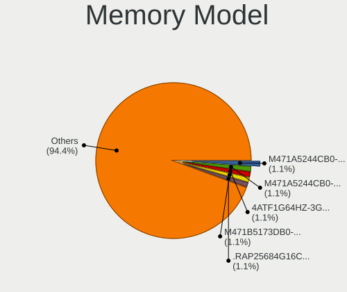

| Model                                                            | Computers | Percent |
|------------------------------------------------------------------|-----------|---------|
| Samsung RAM M471A5244CB0-CTD 4GB SODIMM DDR4 3266MT/s            | 13        | 1.15%   |
| Samsung RAM M471A5244CB0-CRC 4GB SODIMM DDR4 2667MT/s            | 13        | 1.15%   |
| Micron RAM 4ATF1G64HZ-3G2F1 8GB SODIMM DDR4 3200MT/s             | 13        | 1.15%   |
| Samsung RAM M471B5173DB0-YK0 4GB SODIMM DDR3 1600MT/s            | 12        | 1.06%   |
| Unknown                                                          | 12        | 1.06%   |
| SK hynix RAM HMT451S6BFR8A-PB 4GB SODIMM DDR3 1600MT/s           | 11        | 0.97%   |
| Samsung RAM M471A5244CB0-CWE 4GB SODIMM DDR4 3200MT/s            | 11        | 0.97%   |
| Samsung RAM M471A1K43EB1-CWE 8GB SODIMM DDR4 3200MT/s            | 11        | 0.97%   |
| SK hynix RAM HMA851S6DJR6N-XN 4GB SODIMM DDR4 3200MT/s           | 10        | 0.88%   |
| Samsung RAM M471A1K43CB1-CTD 8GB SODIMM DDR4 3200MT/s            | 9         | 0.8%    |
| Samsung RAM M471A1G44BB0-CWE 8GB SODIMM DDR4 3200MT/s            | 9         | 0.8%    |
| SK hynix RAM HMA851S6AFR6N-UH 4GB SODIMM DDR4 2667MT/s           | 8         | 0.71%   |
| Samsung RAM M471B5173QH0-YK0 4GB SODIMM DDR3 1600MT/s            | 8         | 0.71%   |
| Micron RAM 4ATF51264HZ-2G6E1 4GB SODIMM DDR4 2667MT/s            | 8         | 0.71%   |
| Super Talent RAM SUPERTALENT02 4GB DIMM DDR3 1600MT/s            | 7         | 0.62%   |
| SK hynix RAM HMAA1GS6CJR6N-XN 8GB SODIMM DDR4 3200MT/s           | 7         | 0.62%   |
| SK hynix RAM HMA81GS6AFR8N-UH 8GB SODIMM DDR4 2667MT/s           | 7         | 0.62%   |
| Samsung RAM M471B5273CH0-CH9 4GB SODIMM DDR3 1334MT/s            | 7         | 0.62%   |
| Unknown RAM Module 2GB DIMM SDRAM                                | 6         | 0.53%   |
| Unknown (ABCD) RAM 123456789012345678 2GB SODIMM LPDDR4 2400MT/s | 6         | 0.53%   |
| SK hynix RAM HMT351S6CFR8C-PB 4GB SODIMM DDR3 1600MT/s           | 6         | 0.53%   |
| SK hynix RAM H9JCNNNFA5MLYR-N6E 8GB SODIMM LPDDR5 6400MT/s       | 6         | 0.53%   |
| Samsung RAM M471B5273DH0-CH9 4GB SODIMM DDR3 1600MT/s            | 6         | 0.53%   |
| Samsung RAM M471B5173EB0-YK0 4GB SODIMM DDR3 1600MT/s            | 6         | 0.53%   |
| Samsung RAM M471A1K43DB1-CTD 8GB SODIMM DDR4 2667MT/s            | 6         | 0.53%   |
| Samsung RAM M471A1G44AB0-CWE 8GiB SODIMM DDR4 3200MT/s           | 6         | 0.53%   |
| Micron RAM 8ATF1G64HZ-3G2R1 8GB SODIMM DDR4 3200MT/s             | 6         | 0.53%   |
| Unknown RAM Module 2048MB DIMM SDRAM                             | 5         | 0.44%   |
| SK hynix RAM HMA851S6CJR6N-VK 4GB SODIMM DDR4 2667MT/s           | 5         | 0.44%   |
| SK hynix RAM HMA851S6CJR6N-VK 4GB Row Of Chips DDR4 2667MT/s     | 5         | 0.44%   |
| Samsung RAM M471B1G73DB0-YK0 8GB SODIMM DDR3 1600MT/s            | 5         | 0.44%   |
| Samsung RAM M471A1K43CB1-CRC 8GB SODIMM DDR4 8400MT/s            | 5         | 0.44%   |
| Samsung RAM K4A8G165WC-BCTD 4GB SODIMM DDR4 2667MT/s             | 5         | 0.44%   |
| Micron RAM 4ATF51264HZ-3G2J1 4GB SODIMM DDR4 3200MT/s            | 5         | 0.44%   |
| Micron RAM 4ATF1G64HZ-3G2E1 8GB SODIMM DDR4 3200MT/s             | 5         | 0.44%   |
| A-DATA RAM Module 8GB SODIMM DDR4 3200MT/s                       | 5         | 0.44%   |
| A-DATA RAM DDR4 3200 16GB DIMM DDR4 3600MT/s                     | 5         | 0.44%   |
| SK hynix RAM HMT425S6AFR6A-PB 2GB SODIMM DDR3 3200MT/s           | 4         | 0.35%   |
| SK hynix RAM HMA851S6CJR6N-XN 4GB SODIMM DDR4 3200MT/s           | 4         | 0.35%   |
| SK hynix RAM HMA82GS6AFR8N-UH 16GB SODIMM DDR4 2667MT/s          | 4         | 0.35%   |

Memory Kind
-----------

Memory module kinds

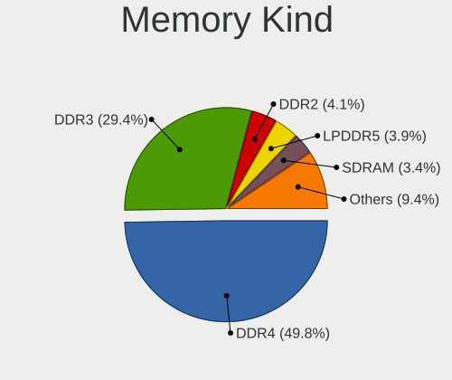

| Kind    | Computers | Percent |
|---------|-----------|---------|
| DDR4    | 422       | 49.76%  |
| DDR3    | 249       | 29.36%  |
| DDR2    | 35        | 4.13%   |
| LPDDR5  | 33        | 3.89%   |
| SDRAM   | 29        | 3.42%   |
| LPDDR4  | 26        | 3.07%   |
| DDR5    | 22        | 2.59%   |
| Unknown | 13        | 1.53%   |
| LPDDR3  | 11        | 1.3%    |
| DDR     | 5         | 0.59%   |
| DRAM    | 3         | 0.35%   |

Memory Form Factor
------------------

Physical design of the memory module

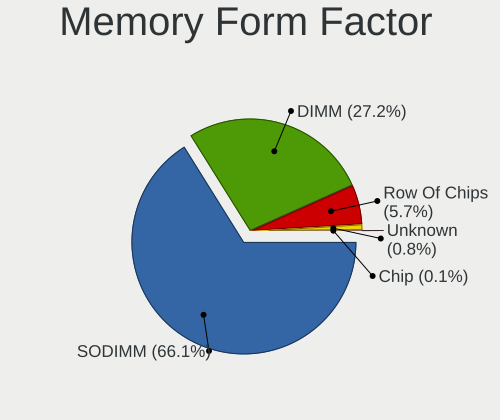

| Name         | Computers | Percent |
|--------------|-----------|---------|
| SODIMM       | 554       | 66.11%  |
| DIMM         | 228       | 27.21%  |
| Row Of Chips | 48        | 5.73%   |
| Unknown      | 7         | 0.84%   |
| Chip         | 1         | 0.12%   |

Memory Size
-----------

Memory module size

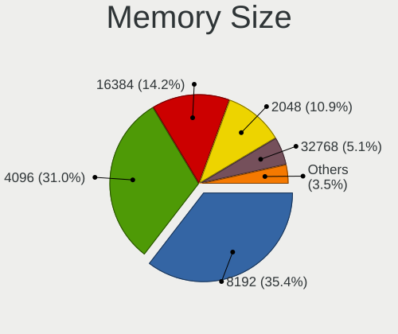

| Size  | Computers | Percent |
|-------|-----------|---------|
| 8192  | 348       | 35.44%  |
| 4096  | 304       | 30.96%  |
| 16384 | 139       | 14.15%  |
| 2048  | 107       | 10.9%   |
| 32768 | 50        | 5.09%   |
| 1024  | 29        | 2.95%   |
| 512   | 2         | 0.2%    |
| 49152 | 1         | 0.1%    |
| 24576 | 1         | 0.1%    |
| 128   | 1         | 0.1%    |

Memory Speed
------------

Memory module speed

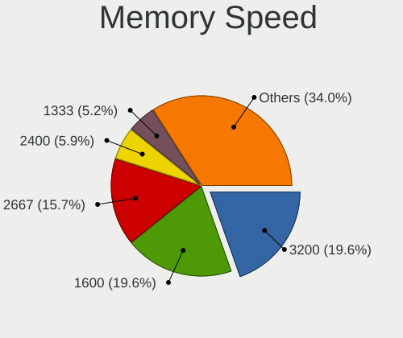

| Speed   | Computers | Percent |
|---------|-----------|---------|
| 3200    | 186       | 19.6%   |
| 1600    | 186       | 19.6%   |
| 2667    | 149       | 15.7%   |
| 2400    | 56        | 5.9%    |
| 1333    | 49        | 5.16%   |
| 2133    | 32        | 3.37%   |
| 3600    | 28        | 2.95%   |
| 1334    | 27        | 2.85%   |
| Unknown | 26        | 2.74%   |
| 6400    | 22        | 2.32%   |
| 3266    | 13        | 1.37%   |
| 800     | 13        | 1.37%   |
| 667     | 13        | 1.37%   |
| 4800    | 11        | 1.16%   |
| 3733    | 10        | 1.05%   |
| 5600    | 8         | 0.84%   |
| 5500    | 7         | 0.74%   |
| 3000    | 7         | 0.74%   |
| 2666    | 7         | 0.74%   |
| 1867    | 7         | 0.74%   |
| 1067    | 7         | 0.74%   |
| 8400    | 6         | 0.63%   |
| 4199    | 6         | 0.63%   |
| 3800    | 6         | 0.63%   |
| 1866    | 6         | 0.63%   |
| 1066    | 6         | 0.63%   |
| 533     | 6         | 0.63%   |
| 4267    | 5         | 0.53%   |
| 6000    | 3         | 0.32%   |
| 3066    | 3         | 0.32%   |
| 1800    | 3         | 0.32%   |
| 8533    | 2         | 0.21%   |
| 7500    | 2         | 0.21%   |
| 3866    | 2         | 0.21%   |
| 3400    | 2         | 0.21%   |
| 1776    | 2         | 0.21%   |
| 975     | 2         | 0.21%   |
| 400     | 2         | 0.21%   |
| 333     | 2         | 0.21%   |
| 49926   | 1         | 0.11%   |

Printers & scanners
-------------------

Printer Vendor
--------------

Printer device vendors

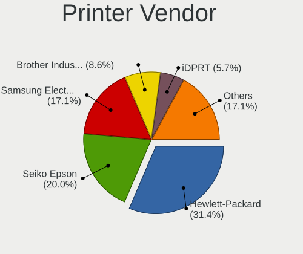

| Vendor              | Computers | Percent |
|---------------------|-----------|---------|
| Hewlett-Packard     | 11        | 31.43%  |
| Seiko Epson         | 7         | 20%     |
| Samsung Electronics | 6         | 17.14%  |
| Brother Industries  | 3         | 8.57%   |
| Ricoh               | 2         | 5.71%   |
| iDPRT               | 2         | 5.71%   |
| Canon               | 2         | 5.71%   |
| Prolific Technology | 1         | 2.86%   |
| Philips (or NXP)    | 1         | 2.86%   |

Printer Model
-------------

Printer device models

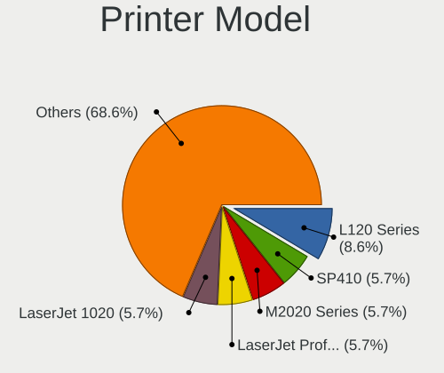

| Model                                                  | Computers | Percent |
|--------------------------------------------------------|-----------|---------|
| Seiko Epson L120 Series                                | 3         | 8.57%   |
| Samsung M2020 Series                                   | 2         | 5.71%   |
| iDPRT SP410                                            | 2         | 5.71%   |
| HP LaserJet Professional P 1102w                       | 2         | 5.71%   |
| HP LaserJet 1020                                       | 2         | 5.71%   |
| Seiko Epson ME Office 600F/Stylus Office BX300F/TX300F | 1         | 2.86%   |
| Seiko Epson L3110 Series                               | 1         | 2.86%   |
| Seiko Epson L210 Series                                | 1         | 2.86%   |
| Seiko Epson EPSON L220 Series                          | 1         | 2.86%   |
| Samsung SCX-3400 Series                                | 1         | 2.86%   |
| Samsung ML-2240 Series                                 | 1         | 2.86%   |
| Samsung ML-2010P Mono Laser Printer                    | 1         | 2.86%   |
| Samsung Composite Device                               | 1         | 2.86%   |
| Ricoh Printing Support                                 | 1         | 2.86%   |
| Ricoh Aficio SP 3510DN                                 | 1         | 2.86%   |
| Prolific PL2305 Parallel Port                          | 1         | 2.86%   |
| Philips (or NXP) USB Printer                           | 1         | 2.86%   |
| HP Smart Tank 530 series                               | 1         | 2.86%   |
| HP Smart Tank 510 series                               | 1         | 2.86%   |
| HP LaserJet CP 1025                                    | 1         | 2.86%   |
| HP HP Laser 107w                                       | 1         | 2.86%   |
| HP DeskJet 5810 series                                 | 1         | 2.86%   |
| HP Deskjet 2540 series                                 | 1         | 2.86%   |
| HP Deskjet 1510                                        | 1         | 2.86%   |
| Canon G3000 series                                     | 1         | 2.86%   |
| Canon G2060 series                                     | 1         | 2.86%   |
| Brother QL-800 Label Printer                           | 1         | 2.86%   |
| Brother MFC-J1205W                                     | 1         | 2.86%   |
| Brother DCP-T710W                                      | 1         | 2.86%   |

Scanner Vendor
--------------

Scanner device vendors

Zero info for selected period =(

Scanner Model
-------------

Scanner device models

Zero info for selected period =(

Camera
------

Camera Vendor
-------------

Camera device vendors

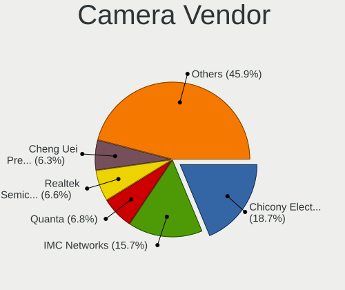

| Vendor                                 | Computers | Percent |
|----------------------------------------|-----------|---------|
| Chicony Electronics                    | 234       | 18.72%  |
| IMC Networks                           | 196       | 15.68%  |
| Quanta                                 | 85        | 6.8%    |
| Realtek Semiconductor                  | 82        | 6.56%   |
| Cheng Uei Precision Industry (Foxlink) | 79        | 6.32%   |
| Bison Electronics                      | 79        | 6.32%   |
| Microdia                               | 76        | 6.08%   |
| Sunplus Innovation Technology          | 45        | 3.6%    |
| Syntek                                 | 34        | 2.72%   |
| Logitech                               | 33        | 2.64%   |
| Apple                                  | 33        | 2.64%   |
| Lite-On Technology                     | 31        | 2.48%   |
| Shinetech                              | 22        | 1.76%   |
| Luxvisions Innotech Limited            | 21        | 1.68%   |
| Silicon Motion                         | 20        | 1.6%    |
| Sonix Technology                       | 19        | 1.52%   |
| Suyin                                  | 18        | 1.44%   |
| KYE Systems (Mouse Systems)            | 13        | 1.04%   |
| Ricoh                                  | 10        | 0.8%    |
| Y Media                                | 9         | 0.72%   |
| Alcor Micro                            | 8         | 0.64%   |
| Samsung Electronics                    | 7         | 0.56%   |
| Cubeternet                             | 7         | 0.56%   |
| Acer                                   | 7         | 0.56%   |
| Microsoft                              | 6         | 0.48%   |
| Generalplus Technology                 | 6         | 0.48%   |
| ALi                                    | 6         | 0.48%   |
| OmniVision Technologies                | 5         | 0.4%    |
| Z-Star Microelectronics                | 4         | 0.32%   |
| Lenovo                                 | 4         | 0.32%   |
| Importek                               | 4         | 0.32%   |
| Huawei Technologies                    | 4         | 0.32%   |
| Sunplus Technology                     | 3         | 0.24%   |
| GEMBIRD                                | 3         | 0.24%   |
| BillionPixels                          | 3         | 0.24%   |
| Arkmicro Technologies                  | 3         | 0.24%   |
| WaveRider Communications               | 2         | 0.16%   |
| SunplusIT                              | 2         | 0.16%   |
| Shine-optics                           | 2         | 0.16%   |
| Primax Electronics                     | 2         | 0.16%   |

Camera Model
------------

Camera device models

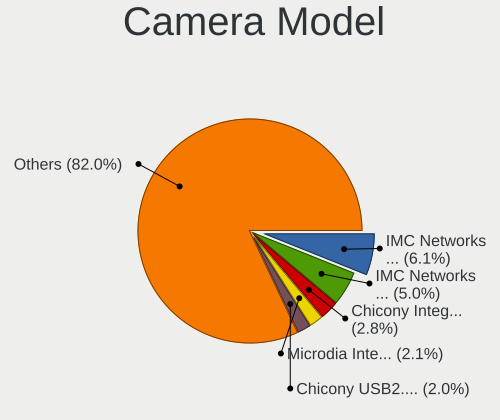

| Model                                                          | Computers | Percent |
|----------------------------------------------------------------|-----------|---------|
| IMC Networks USB2.0 HD UVC WebCam                              | 76        | 6.07%   |
| IMC Networks USB2.0 VGA UVC WebCam                             | 63        | 5.03%   |
| Chicony Integrated Camera                                      | 35        | 2.8%    |
| Microdia Integrated_Webcam_HD                                  | 26        | 2.08%   |
| Chicony USB2.0 VGA UVC WebCam                                  | 25        | 2%      |
| Bison Integrated Camera                                        | 25        | 2%      |
| Syntek Integrated Camera                                       | 21        | 1.68%   |
| IMC Networks Integrated Camera                                 | 21        | 1.68%   |
| Chicony HP TrueVision HD Camera                                | 18        | 1.44%   |
| ShineTech USB2.0 HD UVC WebCam                                 | 17        | 1.36%   |
| Cheng Uei Precision Industry (Foxlink) HP TrueVision HD Camera | 17        | 1.36%   |
| Quanta HD Webcam                                               | 15        | 1.2%    |
| Sunplus Integrated_Webcam_HD                                   | 14        | 1.12%   |
| Realtek Integrated_Webcam_HD                                   | 14        | 1.12%   |
| Apple FaceTime HD Camera (Built-in)                            | 14        | 1.12%   |
| Sonix USB2.0 HD UVC WebCam                                     | 13        | 1.04%   |
| Luxvisions Innotech Limited HP TrueVision HD Camera            | 13        | 1.04%   |
| Chicony HP Webcam                                              | 11        | 0.88%   |
| Cheng Uei Precision Industry (Foxlink) HP Webcam               | 11        | 0.88%   |
| Bison HD Webcam                                                | 11        | 0.88%   |
| Quanta HD User Facing                                          | 10        | 0.8%    |
| Chicony Lenovo EasyCamera                                      | 10        | 0.8%    |
| Y Media USB Camera                                             | 9         | 0.72%   |
| Realtek USB Camera                                             | 9         | 0.72%   |
| Chicony HD WebCam                                              | 9         | 0.72%   |
| Realtek Lenovo EasyCamera                                      | 8         | 0.64%   |
| Quanta USB2.0 HD UVC WebCam                                    | 8         | 0.64%   |
| Quanta HP Webcam                                               | 8         | 0.64%   |
| Quanta HP TrueVision HD Camera                                 | 8         | 0.64%   |
| Logitech HD Pro Webcam C920                                    | 8         | 0.64%   |
| Lite-On HP Webcam                                              | 8         | 0.64%   |
| Chicony HP TrueVision HD                                       | 8         | 0.64%   |
| Chicony HP High Definition 1MP Webcam                          | 8         | 0.64%   |
| Chicony HP HD Camera                                           | 8         | 0.64%   |
| Cheng Uei Precision Industry (Foxlink) HP Truevision HD        | 8         | 0.64%   |
| Bison EasyCamera                                               | 8         | 0.64%   |
| Samsung Galaxy series, misc. (MTP mode)                        | 7         | 0.56%   |
| Microdia Lenovo EasyCamera                                     | 7         | 0.56%   |
| Chicony TOSHIBA Web Camera - HD                                | 7         | 0.56%   |
| Chicony HP Wide Vision HD Camera                               | 7         | 0.56%   |

Security
--------

Fingerprint Vendor
------------------

Fingerprint sensor vendors

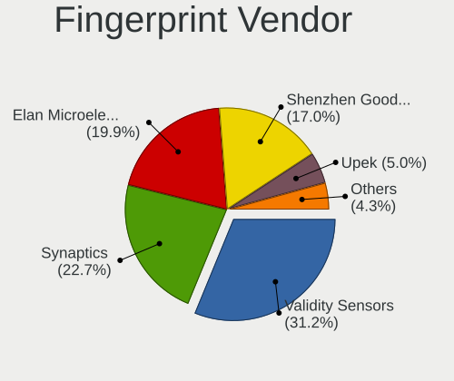

| Vendor                     | Computers | Percent |
|----------------------------|-----------|---------|
| Validity Sensors           | 44        | 31.21%  |
| Synaptics                  | 32        | 22.7%   |
| Elan Microelectronics      | 28        | 19.86%  |
| Shenzhen Goodix Technology | 24        | 17.02%  |
| Upek                       | 7         | 4.96%   |
| LighTuning Technology      | 3         | 2.13%   |
| AuthenTec                  | 2         | 1.42%   |
| STMicroelectronics         | 1         | 0.71%   |

Fingerprint Model
-----------------

Fingerprint sensor models

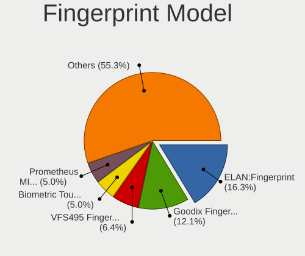

| Model                                                                      | Computers | Percent |
|----------------------------------------------------------------------------|-----------|---------|
| Elan ELAN:Fingerprint                                                      | 23        | 16.31%  |
| Shenzhen Goodix  Fingerprint Device                                        | 17        | 12.06%  |
| Validity Sensors VFS495 Fingerprint Reader                                 | 9         | 6.38%   |
| Upek Biometric Touchchip/Touchstrip Fingerprint Sensor                     | 7         | 4.96%   |
| Synaptics Prometheus MIS Touch Fingerprint Reader                          | 7         | 4.96%   |
| Shenzhen Goodix Fingerprint Reader                                         | 7         | 4.96%   |
| Validity Sensors VFS5011 Fingerprint Reader                                | 5         | 3.55%   |
| Validity Sensors VFS 5011 fingerprint sensor                               | 5         | 3.55%   |
| Elan ELAN:ARM-M4                                                           | 5         | 3.55%   |
| Validity Sensors Synaptics WBDI                                            | 4         | 2.84%   |
| Validity Sensors Fingerprint scanner                                       | 4         | 2.84%   |
| Synaptics WBDI Fingerprint Reader USB 086                                  | 4         | 2.84%   |
| Synaptics FS7604 Touch Fingerprint Sensor with PurePrint                   | 4         | 2.84%   |
| Validity Sensors VFS491                                                    | 3         | 2.13%   |
| Validity Sensors VFS451 Fingerprint Reader                                 | 3         | 2.13%   |
| Validity Sensors Synaptics VFS7552 Touch Fingerprint Sensor with PurePrint | 3         | 2.13%   |
| Validity Sensors Swipe Fingerprint Sensor                                  | 3         | 2.13%   |
| Synaptics  WBDI                                                            | 3         | 2.13%   |
| Synaptics WBDI                                                             | 2         | 1.42%   |
| Synaptics UWP WBDI                                                         | 2         | 1.42%   |
| Synaptics Prometheus Fingerprint Reader                                    | 2         | 1.42%   |
| Synaptics Metallica MIS Touch Fingerprint Reader                           | 2         | 1.42%   |
| Synaptics Fingerprint reader [HP G6]                                       | 2         | 1.42%   |
| LighTuning EgisTec Touch Fingerprint Sensor                                | 2         | 1.42%   |
| Validity Sensors VFS7500 Touch Fingerprint Sensor                          | 1         | 0.71%   |
| Validity Sensors VFS471 Fingerprint Reader                                 | 1         | 0.71%   |
| Validity Sensors VFS300 Fingerprint Reader                                 | 1         | 0.71%   |
| Validity Sensors VFS101 Fingerprint Reader                                 | 1         | 0.71%   |
| Validity Sensors VFS Fingerprint sensor                                    | 1         | 0.71%   |
| Synaptics WBDI Fingerprint Reader USB 102                                  | 1         | 0.71%   |
| Synaptics WBDI Device                                                      | 1         | 0.71%   |
| Synaptics UWP WBDI Device                                                  | 1         | 0.71%   |
| STMicroelectronics Fingerprint Reader                                      | 1         | 0.71%   |
| LighTuning ES603 Swipe Fingerprint Sensor                                  | 1         | 0.71%   |
| AuthenTec AES2810                                                          | 1         | 0.71%   |
| AuthenTec AES1600                                                          | 1         | 0.71%   |
| Unknown                                                                    | 1         | 0.71%   |

Chipcard Vendor
---------------

Chipcard module vendors

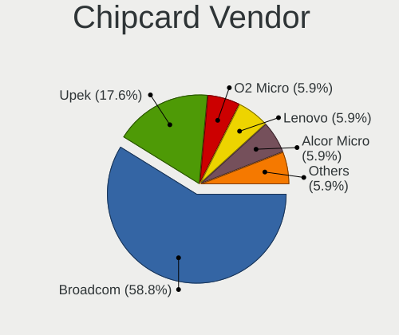

| Vendor                | Computers | Percent |
|-----------------------|-----------|---------|
| Broadcom              | 20        | 58.82%  |
| Upek                  | 6         | 17.65%  |
| O2 Micro              | 2         | 5.88%   |
| Lenovo                | 2         | 5.88%   |
| Alcor Micro           | 2         | 5.88%   |
| SCM Microsystems      | 1         | 2.94%   |
| Gemalto (was Gemplus) | 1         | 2.94%   |

Chipcard Model
--------------

Chipcard module models

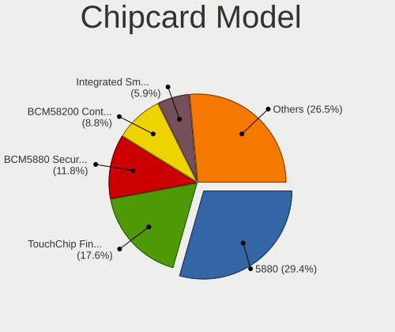

| Model                                                                        | Computers | Percent |
|------------------------------------------------------------------------------|-----------|---------|
| Broadcom 5880                                                                | 10        | 29.41%  |
| Upek TouchChip Fingerprint Coprocessor (WBF advanced mode)                   | 6         | 17.65%  |
| Broadcom BCM5880 Secure Applications Processor                               | 4         | 11.76%  |
| Broadcom BCM58200 ControlVault 3 (FingerPrint sensor + Contacted SmartCard)  | 3         | 8.82%   |
| Lenovo Integrated Smart Card Reader                                          | 2         | 5.88%   |
| Broadcom BCM5880 Secure Applications Processor with fingerprint swipe sensor | 2         | 5.88%   |
| Alcor Micro AU9540 Smartcard Reader                                          | 2         | 5.88%   |
| SCM Microsystems SCR3340 - ExpressCard54 Smart Card Reader                   | 1         | 2.94%   |
| O2 Micro Oz776 SmartCard Reader                                              | 1         | 2.94%   |
| O2 Micro OZ776 CCID Smartcard Reader                                         | 1         | 2.94%   |
| Gemalto (was Gemplus) Compact Smart Card Reader Writer                       | 1         | 2.94%   |
| Broadcom BCM5880 Secure Applications Processor with fingerprint touch sensor | 1         | 2.94%   |

Unsupported
-----------

Unsupported Devices
-------------------

Total unsupported devices on board

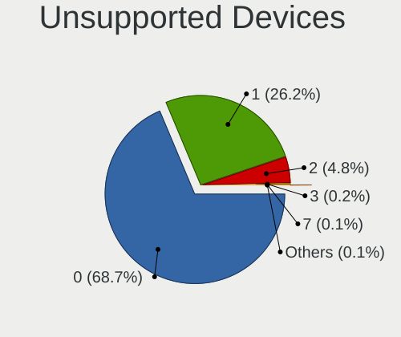

| Total | Computers | Percent |
|-------|-----------|---------|
| 0     | 1194      | 68.66%  |
| 1     | 455       | 26.16%  |
| 2     | 83        | 4.77%   |
| 3     | 4         | 0.23%   |
| 7     | 1         | 0.06%   |
| 6     | 1         | 0.06%   |
| 4     | 1         | 0.06%   |

Unsupported Device Types
------------------------

Types of unsupported devices

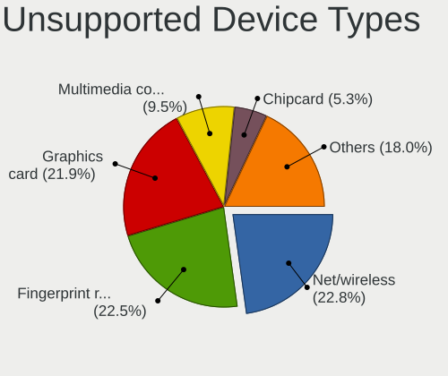

| Type                     | Computers | Percent |
|--------------------------|-----------|---------|
| Net/wireless             | 142       | 22.83%  |
| Fingerprint reader       | 140       | 22.51%  |
| Graphics card            | 136       | 21.86%  |
| Multimedia controller    | 59        | 9.49%   |
| Chipcard                 | 33        | 5.31%   |
| Camera                   | 27        | 4.34%   |
| Bluetooth                | 23        | 3.7%    |
| Communication controller | 22        | 3.54%   |
| Sound                    | 10        | 1.61%   |
| Storage                  | 8         | 1.29%   |
| Card reader              | 6         | 0.96%   |
| Network                  | 4         | 0.64%   |
| Net/ethernet             | 4         | 0.64%   |
| Unassigned class         | 3         | 0.48%   |
| Storage/raid             | 3         | 0.48%   |
| Flash memory             | 1         | 0.16%   |
| Firewire controller      | 1         | 0.16%   |

