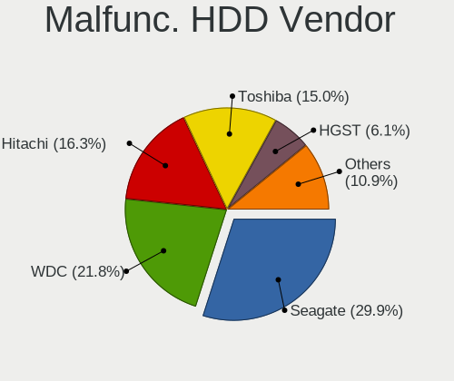
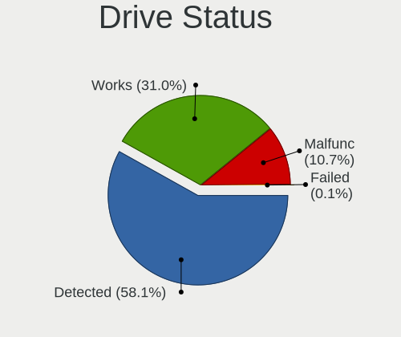
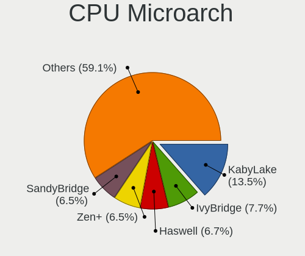
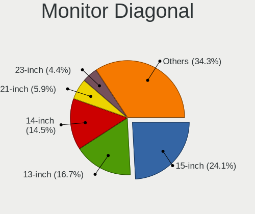
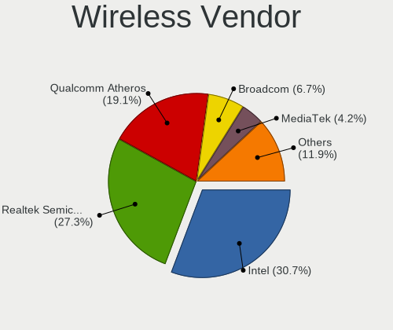
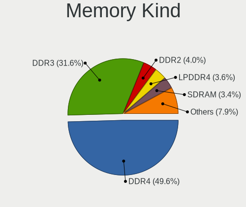
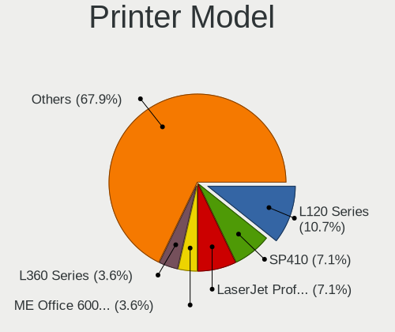
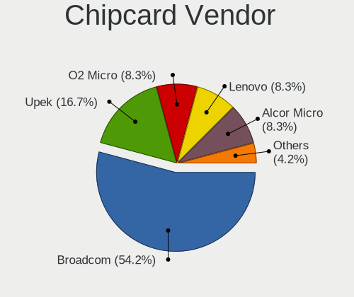

Linux in Colombia - Tested Hardware & Statistics
------------------------------------------------

A project to collect tested hardware configurations for Linux in Colombia.

Anyone can contribute to this report by the [hw-probe](https://github.com/linuxhw/hw-probe) tool:

    sudo -E hw-probe -all -upload

Please contribute! Especially if your hardware is rare.

This is a report for all computer types. See also reports for [desktops](/Location/Colombia/Desktop/README.md) and [notebooks](/Location/Colombia/Notebook/README.md).

Contents
--------

* [ Test Cases ](#test-cases)

* [ System ](#system)
  - [ OS                       ](#os)
  - [ OS Family                ](#os-family)
  - [ Kernel                   ](#kernel)
  - [ Kernel Family            ](#kernel-family)
  - [ Kernel Major Ver.        ](#kernel-major-ver)
  - [ Arch                     ](#arch)
  - [ DE                       ](#de)
  - [ Display Server           ](#display-server)
  - [ Display Manager          ](#display-manager)
  - [ OS Lang                  ](#os-lang)
  - [ Boot Mode                ](#boot-mode)
  - [ Filesystem               ](#filesystem)
  - [ Part. scheme             ](#part-scheme)
  - [ Dual Boot with Linux/BSD ](#dual-boot-with-linuxbsd)
  - [ Dual Boot (Win)          ](#dual-boot-win)

* [ Board ](#board)
  - [ Vendor                   ](#vendor)
  - [ Model                    ](#model)
  - [ Model Family             ](#model-family)
  - [ MFG Year                 ](#mfg-year)
  - [ Form Factor              ](#form-factor)
  - [ Secure Boot              ](#secure-boot)
  - [ Coreboot                 ](#coreboot)
  - [ RAM Size                 ](#ram-size)
  - [ RAM Used                 ](#ram-used)
  - [ Total Drives             ](#total-drives)
  - [ Has CD-ROM               ](#has-cd-rom)
  - [ Has Ethernet             ](#has-ethernet)
  - [ Has WiFi                 ](#has-wifi)
  - [ Has Bluetooth            ](#has-bluetooth)

* [ Location ](#location)
  - [ Country                  ](#country)
  - [ City                     ](#city)

* [ Drives ](#drives)
  - [ Drive Vendor             ](#drive-vendor)
  - [ Drive Model              ](#drive-model)
  - [ HDD Vendor               ](#hdd-vendor)
  - [ SSD Vendor               ](#ssd-vendor)
  - [ Drive Kind               ](#drive-kind)
  - [ Drive Connector          ](#drive-connector)
  - [ Drive Size               ](#drive-size)
  - [ Space Total              ](#space-total)
  - [ Space Used               ](#space-used)
  - [ Malfunc. Drives          ](#malfunc-drives)
  - [ Malfunc. Drive Vendor    ](#malfunc-drive-vendor)
  - [ Malfunc. HDD Vendor      ](#malfunc-hdd-vendor)
  - [ Malfunc. Drive Kind      ](#malfunc-drive-kind)
  - [ Failed Drives            ](#failed-drives)
  - [ Failed Drive Vendor      ](#failed-drive-vendor)
  - [ Drive Status             ](#drive-status)

* [ Storage controller ](#storage-controller)
  - [ Storage Vendor           ](#storage-vendor)
  - [ Storage Model            ](#storage-model)
  - [ Storage Kind             ](#storage-kind)

* [ Processor ](#processor)
  - [ CPU Vendor               ](#cpu-vendor)
  - [ CPU Model                ](#cpu-model)
  - [ CPU Model Family         ](#cpu-model-family)
  - [ CPU Cores                ](#cpu-cores)
  - [ CPU Sockets              ](#cpu-sockets)
  - [ CPU Threads              ](#cpu-threads)
  - [ CPU Op-Modes             ](#cpu-op-modes)
  - [ CPU Microcode            ](#cpu-microcode)
  - [ CPU Microarch            ](#cpu-microarch)

* [ Graphics ](#graphics)
  - [ GPU Vendor               ](#gpu-vendor)
  - [ GPU Model                ](#gpu-model)
  - [ GPU Combo                ](#gpu-combo)
  - [ GPU Driver               ](#gpu-driver)
  - [ GPU Memory               ](#gpu-memory)

* [ Monitor ](#monitor)
  - [ Monitor Vendor           ](#monitor-vendor)
  - [ Monitor Model            ](#monitor-model)
  - [ Monitor Resolution       ](#monitor-resolution)
  - [ Monitor Diagonal         ](#monitor-diagonal)
  - [ Monitor Width            ](#monitor-width)
  - [ Aspect Ratio             ](#aspect-ratio)
  - [ Monitor Area             ](#monitor-area)
  - [ Pixel Density            ](#pixel-density)
  - [ Multiple Monitors        ](#multiple-monitors)

* [ Network ](#network)
  - [ Net Controller Vendor    ](#net-controller-vendor)
  - [ Net Controller Model     ](#net-controller-model)
  - [ Wireless Vendor          ](#wireless-vendor)
  - [ Wireless Model           ](#wireless-model)
  - [ Ethernet Vendor          ](#ethernet-vendor)
  - [ Ethernet Model           ](#ethernet-model)
  - [ Net Controller Kind      ](#net-controller-kind)
  - [ Used Controller          ](#used-controller)
  - [ NICs                     ](#nics)
  - [ IPv6                     ](#ipv6)

* [ Bluetooth ](#bluetooth)
  - [ Bluetooth Vendor         ](#bluetooth-vendor)
  - [ Bluetooth Model          ](#bluetooth-model)

* [ Sound ](#sound)
  - [ Sound Vendor             ](#sound-vendor)
  - [ Sound Model              ](#sound-model)

* [ Memory ](#memory)
  - [ Memory Vendor            ](#memory-vendor)
  - [ Memory Model             ](#memory-model)
  - [ Memory Kind              ](#memory-kind)
  - [ Memory Form Factor       ](#memory-form-factor)
  - [ Memory Size              ](#memory-size)
  - [ Memory Speed             ](#memory-speed)

* [ Printers & scanners ](#printers--scanners)
  - [ Printer Vendor           ](#printer-vendor)
  - [ Printer Model            ](#printer-model)
  - [ Scanner Vendor           ](#scanner-vendor)
  - [ Scanner Model            ](#scanner-model)

* [ Camera ](#camera)
  - [ Camera Vendor            ](#camera-vendor)
  - [ Camera Model             ](#camera-model)

* [ Security ](#security)
  - [ Fingerprint Vendor       ](#fingerprint-vendor)
  - [ Fingerprint Model        ](#fingerprint-model)
  - [ Chipcard Vendor          ](#chipcard-vendor)
  - [ Chipcard Model           ](#chipcard-model)

* [ Unsupported ](#unsupported)
  - [ Unsupported Devices      ](#unsupported-devices)
  - [ Unsupported Device Types ](#unsupported-device-types)

Test Cases
----------

Total: 1344

| Vendor        | Model                       | Form-Factor | Probe                                                      | Date         |
|---------------|-----------------------------|-------------|------------------------------------------------------------|--------------|
| ASUSTek       | VivoBook_ASUSLaptop X340... | Notebook    | [e8ce8c11c0](https://linux-hardware.org/?probe=e8ce8c11c0) | May 01, 2023 |
| MSI           | MPG X570 GAMING PLUS        | Desktop     | [2dffd7bed6](https://linux-hardware.org/?probe=2dffd7bed6) | Apr 30, 2023 |
| ASUSTek       | VivoBook_ASUSLaptop X415... | Notebook    | [dca12f3f6a](https://linux-hardware.org/?probe=dca12f3f6a) | Apr 29, 2023 |
| Microsoft     | Surface Pro                 | Tablet      | [740c70097e](https://linux-hardware.org/?probe=740c70097e) | Apr 29, 2023 |
| Lenovo        | Yoga 6 13ALC6 82ND          | Convertible | [a931ac9451](https://linux-hardware.org/?probe=a931ac9451) | Apr 28, 2023 |
| Toshiba       | Satellite C45-A             | Notebook    | [7720195dfe](https://linux-hardware.org/?probe=7720195dfe) | Apr 24, 2023 |
| Lenovo        | ThinkBook 14-IML 20RV       | Notebook    | [32546113c8](https://linux-hardware.org/?probe=32546113c8) | Apr 24, 2023 |
| HP            | EliteBook 840 G8 Noteboo... | Notebook    | [18fc5f09ed](https://linux-hardware.org/?probe=18fc5f09ed) | Apr 23, 2023 |
| Acer          | Nitro AN515-52              | Notebook    | [e3dc4788e7](https://linux-hardware.org/?probe=e3dc4788e7) | Apr 22, 2023 |
| HP            | ProBook 440 G7              | Notebook    | [50408f04cb](https://linux-hardware.org/?probe=50408f04cb) | Apr 22, 2023 |
| Pegatron      | 2A73h                       | Desktop     | [f4578519ad](https://linux-hardware.org/?probe=f4578519ad) | Apr 21, 2023 |
| ASUSTek       | VivoBook_ASUSLaptop X415... | Notebook    | [901b3d11dc](https://linux-hardware.org/?probe=901b3d11dc) | Apr 20, 2023 |
| HP            | G42                         | Notebook    | [dd87e935d0](https://linux-hardware.org/?probe=dd87e935d0) | Apr 20, 2023 |
| Lenovo        | G40-30 80FY                 | Notebook    | [923b3fd46b](https://linux-hardware.org/?probe=923b3fd46b) | Apr 19, 2023 |
| MSI           | MPG X570 GAMING PLUS        | Desktop     | [c4d3eabb55](https://linux-hardware.org/?probe=c4d3eabb55) | Apr 17, 2023 |
| Lenovo        | ThinkBook 14-IML 20RV       | Notebook    | [d532f6fdbd](https://linux-hardware.org/?probe=d532f6fdbd) | Apr 16, 2023 |
| Apple         | Mac-BE088AF8C5EB4FA2 iMa... | All in one  | [12bb3d9268](https://linux-hardware.org/?probe=12bb3d9268) | Apr 16, 2023 |
| ASUSTek       | PRIME X570-P                | Desktop     | [337102cd4c](https://linux-hardware.org/?probe=337102cd4c) | Apr 15, 2023 |
| Lenovo        | MIIX 310-10ICR 80SG         | Tablet      | [a817b0fcaf](https://linux-hardware.org/?probe=a817b0fcaf) | Apr 14, 2023 |
| Gigabyte      | H61M-HD2                    | Desktop     | [ea4bae8ef7](https://linux-hardware.org/?probe=ea4bae8ef7) | Apr 13, 2023 |
| Lenovo        | Yoga 6 13ALC6 82ND          | Convertible | [29d92f085a](https://linux-hardware.org/?probe=29d92f085a) | Apr 12, 2023 |
| ASUSTek       | VivoBook 14_ASUS Laptop ... | Notebook    | [7852e88a19](https://linux-hardware.org/?probe=7852e88a19) | Apr 11, 2023 |
| Lenovo        | Yoga 6 13ALC6 82ND          | Convertible | [6e4aea5587](https://linux-hardware.org/?probe=6e4aea5587) | Apr 10, 2023 |
| Apple         | MacBookPro14,2              | Notebook    | [1bc09aed8a](https://linux-hardware.org/?probe=1bc09aed8a) | Apr 10, 2023 |
| HUAWEI        | WRTD-WXX9                   | Notebook    | [d478080e54](https://linux-hardware.org/?probe=d478080e54) | Apr 09, 2023 |
| HP            | Laptop 14-dk1xxx            | Notebook    | [5d39494c01](https://linux-hardware.org/?probe=5d39494c01) | Apr 09, 2023 |
| ASUSTek       | VivoBook_ASUSLaptop M350... | Notebook    | [1a6e63f6b2](https://linux-hardware.org/?probe=1a6e63f6b2) | Apr 08, 2023 |
| HUAWEI        | KLVL-WXX9                   | Notebook    | [441d7f391e](https://linux-hardware.org/?probe=441d7f391e) | Apr 08, 2023 |
| ASUSTek       | M4N98TD EVO                 | Desktop     | [a2423b5193](https://linux-hardware.org/?probe=a2423b5193) | Apr 07, 2023 |
| ASUSTek       | M4N98TD EVO                 | Desktop     | [8a2a2cf1ce](https://linux-hardware.org/?probe=8a2a2cf1ce) | Apr 07, 2023 |
| Notebook      | NP5x_NP6x_NP7xRNJ_RNH       | Notebook    | [29f00590fb](https://linux-hardware.org/?probe=29f00590fb) | Apr 05, 2023 |
| Compumax C... | ONIX-CEL-0001               | Notebook    | [b3e9bc2fb0](https://linux-hardware.org/?probe=b3e9bc2fb0) | Apr 04, 2023 |
| Apple         | MacBookAir5,2               | Notebook    | [cb94d3ff68](https://linux-hardware.org/?probe=cb94d3ff68) | Apr 04, 2023 |
| Lenovo        | ThinkPad E14 Gen 3 20Y70... | Notebook    | [9f33f20fc4](https://linux-hardware.org/?probe=9f33f20fc4) | Apr 04, 2023 |
| PCSMART S.... | PNTGOB11CPE                 | Notebook    | [874d355cc4](https://linux-hardware.org/?probe=874d355cc4) | Apr 02, 2023 |
| Toshiba       | Satellite L45-B             | Notebook    | [6d4878cdbf](https://linux-hardware.org/?probe=6d4878cdbf) | Apr 01, 2023 |
| ASUSTek       | VivoBook 15_ASUS Laptop ... | Notebook    | [03da618edb](https://linux-hardware.org/?probe=03da618edb) | Mar 31, 2023 |
| Lenovo        | IdeaPad 330S-15ARR 81FB     | Notebook    | [1dc323a9e9](https://linux-hardware.org/?probe=1dc323a9e9) | Mar 30, 2023 |
| Apple         | Mac-35C5E08120C7EEAF Mac... | Mini pc     | [18f4d18529](https://linux-hardware.org/?probe=18f4d18529) | Mar 30, 2023 |
| Gigabyte      | H310M H x.x                 | Desktop     | [a927671ce2](https://linux-hardware.org/?probe=a927671ce2) | Mar 29, 2023 |
| Lenovo        | ThinkServer TS130           | Desktop     | [2a36fc5043](https://linux-hardware.org/?probe=2a36fc5043) | Mar 28, 2023 |
| ASUSTek       | TUF Gaming B550-PLUS WIF... | Desktop     | [5c811e496f](https://linux-hardware.org/?probe=5c811e496f) | Mar 24, 2023 |
| Lenovo        | IdeaPad 110-14IBR 80T6      | Notebook    | [117d507724](https://linux-hardware.org/?probe=117d507724) | Mar 24, 2023 |
| ASUSTek       | M4N98TD EVO                 | Desktop     | [9cb4b84924](https://linux-hardware.org/?probe=9cb4b84924) | Mar 24, 2023 |
| ASRock        | X670E Pro RS                | Desktop     | [8437e47a82](https://linux-hardware.org/?probe=8437e47a82) | Mar 24, 2023 |
| Lenovo        | IdeaPad Yoga 13 20175       | Notebook    | [56d564423e](https://linux-hardware.org/?probe=56d564423e) | Mar 24, 2023 |
| HUAWEI        | NBLB-WAX9N                  | Notebook    | [e14a63a1e4](https://linux-hardware.org/?probe=e14a63a1e4) | Mar 24, 2023 |
| Gigabyte      | B550 AORUS PRO AC           | Desktop     | [592d9de1cb](https://linux-hardware.org/?probe=592d9de1cb) | Mar 23, 2023 |
| HP            | 18E9                        | Desktop     | [2cc6071591](https://linux-hardware.org/?probe=2cc6071591) | Mar 20, 2023 |
| Lenovo        | MAHOBAY NOK                 | Desktop     | [04ba5a6790](https://linux-hardware.org/?probe=04ba5a6790) | Mar 18, 2023 |
| Lenovo        | MAHOBAY NOK                 | Desktop     | [fcbb054633](https://linux-hardware.org/?probe=fcbb054633) | Mar 18, 2023 |
| HP            | 1850                        | Desktop     | [c805a3a08f](https://linux-hardware.org/?probe=c805a3a08f) | Mar 17, 2023 |
| Apple         | MacBookPro12,1              | Notebook    | [c6f835ae33](https://linux-hardware.org/?probe=c6f835ae33) | Mar 16, 2023 |
| Gigabyte      | B550 AORUS PRO              | Desktop     | [b72b91fd00](https://linux-hardware.org/?probe=b72b91fd00) | Mar 16, 2023 |
| MSI           | H81M-P33                    | Desktop     | [cb3d11f591](https://linux-hardware.org/?probe=cb3d11f591) | Mar 15, 2023 |
| HP            | 1850                        | Desktop     | [c5439b2fea](https://linux-hardware.org/?probe=c5439b2fea) | Mar 15, 2023 |
| ASRock        | G31M-S                      | Desktop     | [7672cc15a2](https://linux-hardware.org/?probe=7672cc15a2) | Mar 13, 2023 |
| Toshiba       | Satellite L735              | Notebook    | [0c5b1ebe0a](https://linux-hardware.org/?probe=0c5b1ebe0a) | Mar 11, 2023 |
| Toshiba       | Satellite L735              | Notebook    | [5371ec61c1](https://linux-hardware.org/?probe=5371ec61c1) | Mar 11, 2023 |
| Biostar       | H61MHV                      | Desktop     | [9f184e6e93](https://linux-hardware.org/?probe=9f184e6e93) | Mar 11, 2023 |
| Apple         | MacBookPro11,3              | Notebook    | [bccc889328](https://linux-hardware.org/?probe=bccc889328) | Mar 10, 2023 |
| Lenovo        | ThinkPad X201 36806V4       | Notebook    | [1921dc6d6b](https://linux-hardware.org/?probe=1921dc6d6b) | Mar 09, 2023 |
| Intel         | DH61BF AAG81311-101         | Desktop     | [b960fb0ebf](https://linux-hardware.org/?probe=b960fb0ebf) | Mar 08, 2023 |
| Gigabyte      | H81M-H                      | Desktop     | [6f915814dd](https://linux-hardware.org/?probe=6f915814dd) | Mar 08, 2023 |
| Gigabyte      | H81M-H                      | Desktop     | [5fdd1701df](https://linux-hardware.org/?probe=5fdd1701df) | Mar 08, 2023 |
| Acer          | Aspire X1400                | Desktop     | [195337bbc6](https://linux-hardware.org/?probe=195337bbc6) | Mar 07, 2023 |
| ASUSTek       | VivoBook_ASUSLaptop E410... | Notebook    | [4cb7f38354](https://linux-hardware.org/?probe=4cb7f38354) | Mar 05, 2023 |
| HP            | G42                         | Notebook    | [7dee433139](https://linux-hardware.org/?probe=7dee433139) | Mar 05, 2023 |
| LG Electro... | 22V240 FAB3                 | All in one  | [163c52fd3c](https://linux-hardware.org/?probe=163c52fd3c) | Mar 04, 2023 |
| Gigabyte      | B460M AORUS PRO             | Desktop     | [829848b662](https://linux-hardware.org/?probe=829848b662) | Mar 04, 2023 |
| HP            | 806A                        | Desktop     | [66c29ddd8a](https://linux-hardware.org/?probe=66c29ddd8a) | Mar 03, 2023 |
| Apple         | Mac-F2238BAE iMac11,3       | All in one  | [81889ddc9c](https://linux-hardware.org/?probe=81889ddc9c) | Mar 02, 2023 |
| Apple         | Mac-F2238BAE iMac11,3       | All in one  | [b4be9a72dd](https://linux-hardware.org/?probe=b4be9a72dd) | Feb 28, 2023 |
| Apple         | Mac-F2238BAE iMac11,3       | All in one  | [66e63a311d](https://linux-hardware.org/?probe=66e63a311d) | Feb 28, 2023 |
| Apple         | MacBookPro5,5               | Notebook    | [e20478d60e](https://linux-hardware.org/?probe=e20478d60e) | Feb 28, 2023 |
| ASUSTek       | VivoBook_ASUSLaptop E410... | Notebook    | [39f48414bc](https://linux-hardware.org/?probe=39f48414bc) | Feb 23, 2023 |
| HP            | 2ADE                        | Desktop     | [b4309c2b06](https://linux-hardware.org/?probe=b4309c2b06) | Feb 23, 2023 |
| ASUSTek       | VivoBook_ASUSLaptop X509... | Notebook    | [cc447f6c07](https://linux-hardware.org/?probe=cc447f6c07) | Feb 19, 2023 |
| ASRock        | X670E Pro RS                | Desktop     | [906d11e2a3](https://linux-hardware.org/?probe=906d11e2a3) | Feb 19, 2023 |
| ASUSTek       | VivoBook_ASUSLaptop X513... | Notebook    | [66c33604c4](https://linux-hardware.org/?probe=66c33604c4) | Feb 17, 2023 |
| Lenovo        | ThinkPad E14 Gen 4 21E30... | Notebook    | [4e0e31fd72](https://linux-hardware.org/?probe=4e0e31fd72) | Feb 17, 2023 |
| Lenovo        | IdeaPad Z585 20152          | Notebook    | [e03f8ffaf1](https://linux-hardware.org/?probe=e03f8ffaf1) | Feb 17, 2023 |
| HP            | 18E9                        | Desktop     | [e3461fcb74](https://linux-hardware.org/?probe=e3461fcb74) | Feb 16, 2023 |
| Lenovo        | IdeaPad Z585 20152          | Notebook    | [bc95a7befb](https://linux-hardware.org/?probe=bc95a7befb) | Feb 15, 2023 |
| Lenovo        | ThinkPad E14 Gen 2 20TBS... | Notebook    | [28db1ad82e](https://linux-hardware.org/?probe=28db1ad82e) | Feb 14, 2023 |
| HP            | 1497                        | Desktop     | [b27560d384](https://linux-hardware.org/?probe=b27560d384) | Feb 14, 2023 |
| Dell          | Latitude 3410               | Notebook    | [7ccc73c7bf](https://linux-hardware.org/?probe=7ccc73c7bf) | Feb 13, 2023 |
| Dell          | Latitude 3410               | Notebook    | [374ddffec8](https://linux-hardware.org/?probe=374ddffec8) | Feb 13, 2023 |
| Dell          | Inspiron 1420               | Notebook    | [77c6839e06](https://linux-hardware.org/?probe=77c6839e06) | Feb 13, 2023 |
| ASUSTek       | VivoBook_ASUSLaptop X512... | Notebook    | [3c8717baf4](https://linux-hardware.org/?probe=3c8717baf4) | Feb 12, 2023 |
| Gigabyte      | Z87X-D3H-CF                 | Desktop     | [e4496f3ff8](https://linux-hardware.org/?probe=e4496f3ff8) | Feb 11, 2023 |
| ASUSTek       | X455YA                      | Notebook    | [ba987663d8](https://linux-hardware.org/?probe=ba987663d8) | Feb 09, 2023 |
| ASUSTek       | TUF Gaming B450M-PLUS II    | Desktop     | [5fe8eef781](https://linux-hardware.org/?probe=5fe8eef781) | Feb 09, 2023 |
| HP            | 450                         | Notebook    | [26d3505372](https://linux-hardware.org/?probe=26d3505372) | Feb 06, 2023 |
| Lenovo        | Yoga C740-14IML 81TC        | Convertible | [298310a082](https://linux-hardware.org/?probe=298310a082) | Feb 06, 2023 |
| HP            | Pavilion 10 TS              | Notebook    | [522345a482](https://linux-hardware.org/?probe=522345a482) | Feb 05, 2023 |
| PCsmart       | PCSGOB14p-C                 | Notebook    | [9cf7aff807](https://linux-hardware.org/?probe=9cf7aff807) | Feb 05, 2023 |
| Unknown       | X79A                        | Desktop     | [eedea973ca](https://linux-hardware.org/?probe=eedea973ca) | Feb 05, 2023 |
| Lenovo        | SHARKBAY SDK0E50510 WIN     | Desktop     | [edbd391f2d](https://linux-hardware.org/?probe=edbd391f2d) | Feb 05, 2023 |
| Lenovo        | IdeaPad 3 15IML05 81WB      | Notebook    | [42d855f568](https://linux-hardware.org/?probe=42d855f568) | Feb 04, 2023 |
| HP            | 240 G8 Notebook PC          | Notebook    | [00a3607d18](https://linux-hardware.org/?probe=00a3607d18) | Jan 30, 2023 |
| HP            | Pavilion dv6                | Notebook    | [ce950f0a28](https://linux-hardware.org/?probe=ce950f0a28) | Jan 28, 2023 |
| Gigabyte      | B450M DS3H-CF               | Desktop     | [e2d354b9c5](https://linux-hardware.org/?probe=e2d354b9c5) | Jan 25, 2023 |
| Acer          | Aspire V5-431               | Notebook    | [abf4a51513](https://linux-hardware.org/?probe=abf4a51513) | Jan 24, 2023 |
| Acer          | Aspire V5-431               | Notebook    | [3da8ac521c](https://linux-hardware.org/?probe=3da8ac521c) | Jan 23, 2023 |
| ASUSTek       | VivoBook_ASUSLaptop X513... | Notebook    | [364a07a435](https://linux-hardware.org/?probe=364a07a435) | Jan 23, 2023 |
| ASUSTek       | VivoBook_ASUSLaptop X415... | Notebook    | [546a896e7f](https://linux-hardware.org/?probe=546a896e7f) | Jan 22, 2023 |
| MSI           | MPG X570 GAMING PLUS        | Desktop     | [0c65146f4c](https://linux-hardware.org/?probe=0c65146f4c) | Jan 21, 2023 |
| Intel         | DH61BF AAG81311-101         | Desktop     | [d6ea5bde87](https://linux-hardware.org/?probe=d6ea5bde87) | Jan 21, 2023 |
| Lenovo        | IdeaPad Z400 20201          | Notebook    | [9e49dc44eb](https://linux-hardware.org/?probe=9e49dc44eb) | Jan 21, 2023 |
| Dell          | Inspiron 3442               | Notebook    | [bb63f70764](https://linux-hardware.org/?probe=bb63f70764) | Jan 21, 2023 |
| Dell          | Inspiron 3442               | Notebook    | [5973a7db86](https://linux-hardware.org/?probe=5973a7db86) | Jan 21, 2023 |
| HP            | 1000                        | Notebook    | [62ee01ee38](https://linux-hardware.org/?probe=62ee01ee38) | Jan 20, 2023 |
| MSI           | MPG X570 GAMING PLUS        | Desktop     | [d0a387f425](https://linux-hardware.org/?probe=d0a387f425) | Jan 18, 2023 |
| Toshiba       | QOSMIO X505                 | Notebook    | [8b6dfa9517](https://linux-hardware.org/?probe=8b6dfa9517) | Jan 18, 2023 |
| Acer          | Nitro AN515-54              | Notebook    | [4a997fa99d](https://linux-hardware.org/?probe=4a997fa99d) | Jan 17, 2023 |
| ASRock        | G965M-S                     | Desktop     | [c1a6d7685b](https://linux-hardware.org/?probe=c1a6d7685b) | Jan 17, 2023 |
| Lenovo        | G450 2949                   | Notebook    | [f9141ba069](https://linux-hardware.org/?probe=f9141ba069) | Jan 17, 2023 |
| Lenovo        | G450 2949                   | Notebook    | [923765c4aa](https://linux-hardware.org/?probe=923765c4aa) | Jan 17, 2023 |
| Dell          | Vostro 3405                 | Notebook    | [b769a91b4f](https://linux-hardware.org/?probe=b769a91b4f) | Jan 17, 2023 |
| ASUSTek       | TUF Gaming B450M-PLUS II    | Desktop     | [d569a3f698](https://linux-hardware.org/?probe=d569a3f698) | Jan 15, 2023 |
| ASUSTek       | ZenBook UX434FAC_UX434FA    | Notebook    | [0ece2f508b](https://linux-hardware.org/?probe=0ece2f508b) | Jan 14, 2023 |
| HP            | Stream Laptop 14-ax0XX      | Notebook    | [b6c21b8d35](https://linux-hardware.org/?probe=b6c21b8d35) | Jan 14, 2023 |
| Dell          | Inspiron 11 - 3147          | Notebook    | [7193100d05](https://linux-hardware.org/?probe=7193100d05) | Jan 14, 2023 |
| Samsung       | 300E4Z/300E5Z/300E7Z        | Notebook    | [923d70951e](https://linux-hardware.org/?probe=923d70951e) | Jan 14, 2023 |
| HP            | Pavilion Gaming Laptop 1... | Notebook    | [e275cc7891](https://linux-hardware.org/?probe=e275cc7891) | Jan 13, 2023 |
| HP            | Laptop 15-gw0xxx            | Notebook    | [d534567752](https://linux-hardware.org/?probe=d534567752) | Jan 12, 2023 |
| Lenovo        | ThinkPad T430 2349MPS       | Notebook    | [c04ba99a13](https://linux-hardware.org/?probe=c04ba99a13) | Jan 11, 2023 |
| ASUSTek       | VivoBook_ASUSLaptop X415... | Notebook    | [3b767cfcef](https://linux-hardware.org/?probe=3b767cfcef) | Jan 10, 2023 |
| ASUSTek       | VivoBook_ASUSLaptop X415... | Notebook    | [ac7ae437c8](https://linux-hardware.org/?probe=ac7ae437c8) | Jan 10, 2023 |
| Gigabyte      | A320M-S2H-CF                | Desktop     | [d26bcd74b2](https://linux-hardware.org/?probe=d26bcd74b2) | Jan 10, 2023 |
| Gigabyte      | A320M-S2H-CF                | Desktop     | [faf7e2eae9](https://linux-hardware.org/?probe=faf7e2eae9) | Jan 10, 2023 |
| Lenovo        | IdeaPad 330S-15ARR 81FB     | Notebook    | [7e32892067](https://linux-hardware.org/?probe=7e32892067) | Jan 09, 2023 |
| Dell          | System XPS L502X            | Notebook    | [7d053f0ab1](https://linux-hardware.org/?probe=7d053f0ab1) | Jan 09, 2023 |
| HP            | Pavilion dv2000 (RX554LA... | Notebook    | [2f9ff5256a](https://linux-hardware.org/?probe=2f9ff5256a) | Jan 08, 2023 |
| HP            | Pavilion dv2000 (RX554LA... | Notebook    | [b952438f2c](https://linux-hardware.org/?probe=b952438f2c) | Jan 08, 2023 |
| Dell          | Inspiron N4010              | Notebook    | [5f1d6f0533](https://linux-hardware.org/?probe=5f1d6f0533) | Jan 07, 2023 |
| Apple         | Mac-63001698E7A34814 iMa... | All in one  | [892098deef](https://linux-hardware.org/?probe=892098deef) | Jan 07, 2023 |
| ASUSTek       | VivoBook_ASUSLaptop X509... | Notebook    | [dc2a0809aa](https://linux-hardware.org/?probe=dc2a0809aa) | Jan 07, 2023 |
| Gigabyte      | A520M DS3H                  | Desktop     | [e7107ee8b4](https://linux-hardware.org/?probe=e7107ee8b4) | Jan 06, 2023 |
| Gigabyte      | A520M DS3H                  | Desktop     | [e351ff5e1d](https://linux-hardware.org/?probe=e351ff5e1d) | Jan 05, 2023 |
| Intel         | DH61BF AAG81311-101         | Desktop     | [db8d3007ee](https://linux-hardware.org/?probe=db8d3007ee) | Jan 03, 2023 |
| Acer          | Aspire 4750                 | Notebook    | [f871c26332](https://linux-hardware.org/?probe=f871c26332) | Jan 01, 2023 |
| Acer          | Nitro AN515-55              | Notebook    | [79f628b951](https://linux-hardware.org/?probe=79f628b951) | Dec 29, 2022 |
| HP            | ProBook 430 G1              | Notebook    | [217bb0ea0f](https://linux-hardware.org/?probe=217bb0ea0f) | Dec 29, 2022 |
| MSI           | 880GM-E41                   | Desktop     | [2880803d71](https://linux-hardware.org/?probe=2880803d71) | Dec 23, 2022 |
| Gigabyte      | B450M DS3H-CF               | Desktop     | [fe4ef75450](https://linux-hardware.org/?probe=fe4ef75450) | Dec 21, 2022 |
| Lenovo        | ThinkCentre A62 9486E4S     | Desktop     | [cb7cb7b7d7](https://linux-hardware.org/?probe=cb7cb7b7d7) | Dec 21, 2022 |
| Lenovo        | ThinkCentre A62 9486E4S     | Desktop     | [fcd0306cd3](https://linux-hardware.org/?probe=fcd0306cd3) | Dec 19, 2022 |
| ASUSTek       | VivoBook_ASUSLaptop X340... | Notebook    | [b30bf77d27](https://linux-hardware.org/?probe=b30bf77d27) | Dec 19, 2022 |
| HP            | 2000                        | Notebook    | [bcbeb17a60](https://linux-hardware.org/?probe=bcbeb17a60) | Dec 15, 2022 |
| HP            | Laptop 14-fq1xxx            | Notebook    | [2da9ae7906](https://linux-hardware.org/?probe=2da9ae7906) | Dec 14, 2022 |
| HP            | Laptop 14-fq1xxx            | Notebook    | [ed92313ebc](https://linux-hardware.org/?probe=ed92313ebc) | Dec 13, 2022 |
| Notebook      | NL40_50ZU                   | Notebook    | [8e0e4867f8](https://linux-hardware.org/?probe=8e0e4867f8) | Dec 13, 2022 |
| ASUSTek       | M3N78-VM                    | Desktop     | [fa99389a1a](https://linux-hardware.org/?probe=fa99389a1a) | Dec 10, 2022 |
| Lenovo        | IdeaPad 110-14IBR 80T6      | Notebook    | [660fe07867](https://linux-hardware.org/?probe=660fe07867) | Dec 07, 2022 |
| HP            | Laptop 14-cm1xxx            | Notebook    | [6fbbd3608f](https://linux-hardware.org/?probe=6fbbd3608f) | Dec 06, 2022 |
| HP            | Laptop 14-fq1xxx            | Notebook    | [4f93d8895e](https://linux-hardware.org/?probe=4f93d8895e) | Dec 06, 2022 |
| HP            | 245 G7                      | Notebook    | [57ed16df1f](https://linux-hardware.org/?probe=57ed16df1f) | Dec 05, 2022 |
| HP            | ProBook 6450b               | Notebook    | [f602f6c0bc](https://linux-hardware.org/?probe=f602f6c0bc) | Dec 05, 2022 |
| HP            | ProBook 6450b               | Notebook    | [de39c86a4c](https://linux-hardware.org/?probe=de39c86a4c) | Dec 05, 2022 |
| HUAWEI        | WRTD-WXX9                   | Notebook    | [9b0de50c65](https://linux-hardware.org/?probe=9b0de50c65) | Dec 04, 2022 |
| HP            | 18E9                        | Desktop     | [9086d1a1e5](https://linux-hardware.org/?probe=9086d1a1e5) | Dec 01, 2022 |
| ASUSTek       | P5K WS                      | Desktop     | [f3608476bf](https://linux-hardware.org/?probe=f3608476bf) | Dec 01, 2022 |
| ASUSTek       | ROG STRIX B550-F GAMING     | Desktop     | [80b8b349f8](https://linux-hardware.org/?probe=80b8b349f8) | Nov 30, 2022 |
| Dell          | 0TP406                      | Desktop     | [3eceea61d2](https://linux-hardware.org/?probe=3eceea61d2) | Nov 30, 2022 |
| Dell          | 0TP406                      | Desktop     | [d22689331c](https://linux-hardware.org/?probe=d22689331c) | Nov 30, 2022 |
| HP            | 339A                        | Desktop     | [ea5cacd50e](https://linux-hardware.org/?probe=ea5cacd50e) | Nov 29, 2022 |
| Dell          | 0HJ054                      | Desktop     | [0e3d082d5a](https://linux-hardware.org/?probe=0e3d082d5a) | Nov 22, 2022 |
| Lenovo        | IdeaPad U400 09932JU        | Notebook    | [cb5d9871d0](https://linux-hardware.org/?probe=cb5d9871d0) | Nov 22, 2022 |
| ASUSTek       | X442UA                      | Notebook    | [781e1c13ac](https://linux-hardware.org/?probe=781e1c13ac) | Nov 17, 2022 |
| ASUSTek       | VivoBook_ASUSLaptop X509... | Notebook    | [b3473a1862](https://linux-hardware.org/?probe=b3473a1862) | Nov 13, 2022 |
| Lenovo        | ThinkCentre M70e 0830AC4    | Desktop     | [8eb9b40274](https://linux-hardware.org/?probe=8eb9b40274) | Nov 10, 2022 |
| Acer          | Aspire E5-571               | Notebook    | [4577f6db37](https://linux-hardware.org/?probe=4577f6db37) | Nov 10, 2022 |
| MSI           | GF615M-P33                  | Desktop     | [1a298da454](https://linux-hardware.org/?probe=1a298da454) | Nov 09, 2022 |
| Intel         | D33217GKE G76540-207        | Desktop     | [f90e6e931c](https://linux-hardware.org/?probe=f90e6e931c) | Nov 07, 2022 |
| Intel         | D33217GKE G76540-207        | Desktop     | [a154fd19a0](https://linux-hardware.org/?probe=a154fd19a0) | Nov 07, 2022 |
| ASUSTek       | T100TA                      | Notebook    | [962ca3ceb5](https://linux-hardware.org/?probe=962ca3ceb5) | Nov 06, 2022 |
| Lenovo        | Yoga Slim 7 14ITL05 82A3    | Notebook    | [2d78dbce09](https://linux-hardware.org/?probe=2d78dbce09) | Nov 03, 2022 |
| Lenovo        | 3102 SDK0J40697 WIN 3305... | Desktop     | [a5d58af861](https://linux-hardware.org/?probe=a5d58af861) | Oct 31, 2022 |
| ASUSTek       | V241DA                      | All in one  | [8a9451cb9c](https://linux-hardware.org/?probe=8a9451cb9c) | Oct 31, 2022 |
| HP            | G72                         | Notebook    | [08a732911d](https://linux-hardware.org/?probe=08a732911d) | Oct 31, 2022 |
| Lenovo        | Yoga Slim 7 14ITL05 82A3    | Notebook    | [150c8ac0ac](https://linux-hardware.org/?probe=150c8ac0ac) | Oct 30, 2022 |
| ASUSTek       | SABERTOOTH 990FX R2.0       | Desktop     | [b132f4c4e9](https://linux-hardware.org/?probe=b132f4c4e9) | Oct 30, 2022 |
| ASUSTek       | SABERTOOTH 990FX R2.0       | Desktop     | [7e1df59daa](https://linux-hardware.org/?probe=7e1df59daa) | Oct 30, 2022 |
| Biostar       | H61MH                       | Desktop     | [f505de310c](https://linux-hardware.org/?probe=f505de310c) | Oct 27, 2022 |
| ASUSTek       | VivoBook 15_ASUS Laptop ... | Notebook    | [7daabab955](https://linux-hardware.org/?probe=7daabab955) | Oct 27, 2022 |
| ASUSTek       | T100TA                      | Notebook    | [947259d1f6](https://linux-hardware.org/?probe=947259d1f6) | Oct 26, 2022 |
| HP            | ProBook 430 G3              | Notebook    | [1ca42d6148](https://linux-hardware.org/?probe=1ca42d6148) | Oct 21, 2022 |
| ASUSTek       | TUF Gaming FX505DY_FX505... | Notebook    | [aca44a3eab](https://linux-hardware.org/?probe=aca44a3eab) | Oct 20, 2022 |
| HP            | 245 G7                      | Notebook    | [9ec088c343](https://linux-hardware.org/?probe=9ec088c343) | Oct 19, 2022 |
| HP            | Pavilion Gaming Laptop 1... | Notebook    | [ff6d42a3ef](https://linux-hardware.org/?probe=ff6d42a3ef) | Oct 17, 2022 |
| HP            | Laptop 15-ef2xxx            | Notebook    | [d8372069b0](https://linux-hardware.org/?probe=d8372069b0) | Oct 16, 2022 |
| Dell          | Inspiron N4010              | Notebook    | [742bc1f2eb](https://linux-hardware.org/?probe=742bc1f2eb) | Oct 16, 2022 |
| ASUSTek       | VivoBook_ASUSLaptop X415... | Notebook    | [a318dbfcc9](https://linux-hardware.org/?probe=a318dbfcc9) | Oct 15, 2022 |
| HP            | Pavilion dv6000 (RG266UA... | Notebook    | [1601ca9a83](https://linux-hardware.org/?probe=1601ca9a83) | Oct 14, 2022 |
| Lenovo        | Yoga Slim 7 14ITL05 82A3    | Notebook    | [f785339c71](https://linux-hardware.org/?probe=f785339c71) | Oct 14, 2022 |
| ASUSTek       | VivoBook_ASUSLaptop X415... | Notebook    | [4ca8fc6d34](https://linux-hardware.org/?probe=4ca8fc6d34) | Oct 11, 2022 |
| HP            | Pavilion g4                 | Notebook    | [19fe60b14c](https://linux-hardware.org/?probe=19fe60b14c) | Oct 07, 2022 |
| ASUSTek       | ROG STRIX B450-F GAMING     | Desktop     | [6edc8b1444](https://linux-hardware.org/?probe=6edc8b1444) | Oct 06, 2022 |
| Lanix         | Neuron V                    | Notebook    | [6bd3c14cc9](https://linux-hardware.org/?probe=6bd3c14cc9) | Oct 03, 2022 |
| Lenovo        | IdeaPad 5 14ALC05 82LM      | Notebook    | [45557ec6e6](https://linux-hardware.org/?probe=45557ec6e6) | Oct 03, 2022 |
| HP            | 245 G7 Notebook PC          | Notebook    | [7b92fcd976](https://linux-hardware.org/?probe=7b92fcd976) | Oct 02, 2022 |
| HP            | 245 G7 Notebook PC          | Notebook    | [de8eb62c07](https://linux-hardware.org/?probe=de8eb62c07) | Oct 02, 2022 |
| HP            | EliteBook 840 G3            | Notebook    | [ddf1904011](https://linux-hardware.org/?probe=ddf1904011) | Oct 01, 2022 |
| HP            | Pavilion 10 TS              | Notebook    | [28003748e6](https://linux-hardware.org/?probe=28003748e6) | Sep 27, 2022 |
| Gigabyte      | G41MT-S2                    | Desktop     | [c0b1c8ad8f](https://linux-hardware.org/?probe=c0b1c8ad8f) | Sep 27, 2022 |
| ASUSTek       | VivoBook 14_ASUS Laptop ... | Notebook    | [56e06deea2](https://linux-hardware.org/?probe=56e06deea2) | Sep 26, 2022 |
| HP            | Pavilion 10 TS              | Notebook    | [1186e5b5d8](https://linux-hardware.org/?probe=1186e5b5d8) | Sep 23, 2022 |
| Dell          | XPS 15 9550                 | Notebook    | [acf36b1555](https://linux-hardware.org/?probe=acf36b1555) | Sep 20, 2022 |
| Acer          | Aspire V3-471               | Notebook    | [b04cc2ea05](https://linux-hardware.org/?probe=b04cc2ea05) | Sep 20, 2022 |
| ASUSTek       | X455LAB                     | Notebook    | [4a71131e80](https://linux-hardware.org/?probe=4a71131e80) | Sep 19, 2022 |
| ASUSTek       | X455LAB                     | Notebook    | [f7c5412964](https://linux-hardware.org/?probe=f7c5412964) | Sep 19, 2022 |
| ASUSTek       | X441NA                      | Notebook    | [282f984233](https://linux-hardware.org/?probe=282f984233) | Sep 19, 2022 |
| HP            | 18E7                        | Desktop     | [710a40851e](https://linux-hardware.org/?probe=710a40851e) | Sep 18, 2022 |
| Dell          | Latitude E5420              | Notebook    | [7416dc3fb1](https://linux-hardware.org/?probe=7416dc3fb1) | Sep 18, 2022 |
| ASRock        | A520M-HDV                   | Desktop     | [9e4267bcc6](https://linux-hardware.org/?probe=9e4267bcc6) | Sep 15, 2022 |
| ASRock        | A520M-HDV                   | Desktop     | [bd9b94b7f8](https://linux-hardware.org/?probe=bd9b94b7f8) | Sep 15, 2022 |
| HP            | Pavilion Gaming Laptop 1... | Notebook    | [a26e1ad502](https://linux-hardware.org/?probe=a26e1ad502) | Sep 15, 2022 |
| HP            | 240 G7 Notebook PC          | Notebook    | [09f7be676c](https://linux-hardware.org/?probe=09f7be676c) | Sep 15, 2022 |
| ASUSTek       | X405UA                      | Notebook    | [3b098addea](https://linux-hardware.org/?probe=3b098addea) | Sep 14, 2022 |
| MSI           | PS63 Modern 8RD             | Notebook    | [8fa2ea42ed](https://linux-hardware.org/?probe=8fa2ea42ed) | Sep 14, 2022 |
| HP            | 1494                        | Desktop     | [0faa06cff4](https://linux-hardware.org/?probe=0faa06cff4) | Sep 12, 2022 |
| HP            | Notebook                    | Notebook    | [2984aef090](https://linux-hardware.org/?probe=2984aef090) | Sep 11, 2022 |
| Dell          | Precision 3510              | Notebook    | [4337a8e018](https://linux-hardware.org/?probe=4337a8e018) | Sep 11, 2022 |
| Acer          | Aspire V3-472P              | Notebook    | [632117c524](https://linux-hardware.org/?probe=632117c524) | Sep 10, 2022 |
| Toshiba       | Satellite L635              | Notebook    | [6d0bbfb576](https://linux-hardware.org/?probe=6d0bbfb576) | Sep 07, 2022 |
| Lenovo        | IdeaPad 3 14ADA05 81W0      | Notebook    | [cc43cdda9a](https://linux-hardware.org/?probe=cc43cdda9a) | Sep 04, 2022 |
| ASUSTek       | X455LJ                      | Notebook    | [b635e1c2ba](https://linux-hardware.org/?probe=b635e1c2ba) | Sep 01, 2022 |
| ECS           | H61H2-M2                    | Desktop     | [9735a8ef90](https://linux-hardware.org/?probe=9735a8ef90) | Sep 01, 2022 |
| HP            | Laptop 14-fq1xxx            | Notebook    | [8ea91d6b4b](https://linux-hardware.org/?probe=8ea91d6b4b) | Aug 30, 2022 |
| Pegatron      | 2AB6                        | Desktop     | [93af020634](https://linux-hardware.org/?probe=93af020634) | Aug 27, 2022 |
| Compumax C... | ONIX-CEL-0001               | Notebook    | [272ca2c7b7](https://linux-hardware.org/?probe=272ca2c7b7) | Aug 27, 2022 |
| Gigabyte      | GA-78LMT-USB3               | Desktop     | [04474401fc](https://linux-hardware.org/?probe=04474401fc) | Aug 26, 2022 |
| ASUSTek       | X455LD                      | Notebook    | [5351e31366](https://linux-hardware.org/?probe=5351e31366) | Aug 26, 2022 |
| ECS           | H61H2-M2                    | Desktop     | [72ebc08e0c](https://linux-hardware.org/?probe=72ebc08e0c) | Aug 26, 2022 |
| HP            | ENVY 15                     | Notebook    | [db06c354d4](https://linux-hardware.org/?probe=db06c354d4) | Aug 26, 2022 |
| ASUSTek       | TUF B365-PLUS GAMING        | Desktop     | [83e59cf9a5](https://linux-hardware.org/?probe=83e59cf9a5) | Aug 25, 2022 |
| ASUSTek       | PRIME A320M-K               | Desktop     | [928ce75df1](https://linux-hardware.org/?probe=928ce75df1) | Aug 24, 2022 |
| Lenovo        | IdeaPad Gaming 3 15ARH05... | Notebook    | [5028378988](https://linux-hardware.org/?probe=5028378988) | Aug 23, 2022 |
| ASUSTek       | VivoBook_ASUSLaptop X513... | Notebook    | [d64f8a64fa](https://linux-hardware.org/?probe=d64f8a64fa) | Aug 23, 2022 |
| ASUSTek       | VivoBook_ASUSLaptop X513... | Notebook    | [bb928725a6](https://linux-hardware.org/?probe=bb928725a6) | Aug 23, 2022 |
| ECS           | H61H2-M2                    | Desktop     | [97ec1c67e8](https://linux-hardware.org/?probe=97ec1c67e8) | Aug 21, 2022 |
| Dell          | XPS 15 9550                 | Notebook    | [8ab7fcb6ff](https://linux-hardware.org/?probe=8ab7fcb6ff) | Aug 21, 2022 |
| HP            | 240 G7 Notebook PC          | Notebook    | [24849a5c23](https://linux-hardware.org/?probe=24849a5c23) | Aug 15, 2022 |
| ASUSTek       | X550DP                      | Notebook    | [ce42b65252](https://linux-hardware.org/?probe=ce42b65252) | Aug 13, 2022 |
| ASUSTek       | TUF Gaming FX505DT_FX505... | Notebook    | [298cf4b527](https://linux-hardware.org/?probe=298cf4b527) | Aug 13, 2022 |
| HP            | 240 G7 Notebook PC          | Notebook    | [9321e2df1a](https://linux-hardware.org/?probe=9321e2df1a) | Aug 13, 2022 |
| Lenovo        | Yoga Slim 7 14ITL05 82A3    | Notebook    | [e71b330285](https://linux-hardware.org/?probe=e71b330285) | Aug 13, 2022 |
| BESSTAR Te... | TH50                        | Desktop     | [03159c112c](https://linux-hardware.org/?probe=03159c112c) | Aug 12, 2022 |
| ASUSTek       | X455LJ                      | Notebook    | [f90572b8e2](https://linux-hardware.org/?probe=f90572b8e2) | Aug 11, 2022 |
| ASRock        | B550M Pro4                  | Desktop     | [7fa92e1cb6](https://linux-hardware.org/?probe=7fa92e1cb6) | Aug 09, 2022 |
| Gigabyte      | X470 AORUS GAMING 7 WIFI... | Desktop     | [08b891334e](https://linux-hardware.org/?probe=08b891334e) | Aug 08, 2022 |
| HUAWEI        | BOHB-WAX9                   | Notebook    | [fcc8ebfb00](https://linux-hardware.org/?probe=fcc8ebfb00) | Aug 04, 2022 |
| HUAWEI        | BOHB-WAX9                   | Notebook    | [6d65ac3351](https://linux-hardware.org/?probe=6d65ac3351) | Aug 02, 2022 |
| HP            | ProLiant ML310e Gen8        | Desktop     | [7a12318176](https://linux-hardware.org/?probe=7a12318176) | Aug 02, 2022 |
| ASUSTek       | VivoBook_ASUS Laptop X51... | Notebook    | [bdc243bf9f](https://linux-hardware.org/?probe=bdc243bf9f) | Jul 31, 2022 |
| ASUSTek       | VivoBook_ASUS Laptop X51... | Notebook    | [41a0eba80f](https://linux-hardware.org/?probe=41a0eba80f) | Jul 31, 2022 |
| Sony          | VPCEG33FL                   | Notebook    | [6d371d6c32](https://linux-hardware.org/?probe=6d371d6c32) | Jul 31, 2022 |
| HP            | 245 G6                      | Notebook    | [ae4b0ce17e](https://linux-hardware.org/?probe=ae4b0ce17e) | Jul 28, 2022 |
| Sony          | VPCEG33FL                   | Notebook    | [886dfc7777](https://linux-hardware.org/?probe=886dfc7777) | Jul 27, 2022 |
| HUAWEI        | HVY-WXX9                    | Notebook    | [c2fc2235eb](https://linux-hardware.org/?probe=c2fc2235eb) | Jul 27, 2022 |
| HUAWEI        | HVY-WXX9                    | Notebook    | [f18835e5a1](https://linux-hardware.org/?probe=f18835e5a1) | Jul 27, 2022 |
| Lenovo        | G410 20237                  | Notebook    | [c23a040e55](https://linux-hardware.org/?probe=c23a040e55) | Jul 25, 2022 |
| Sony          | VPCEG33FL                   | Notebook    | [8767e87e9e](https://linux-hardware.org/?probe=8767e87e9e) | Jul 24, 2022 |
| ASUSTek       | X455LJ                      | Notebook    | [49af56cbe0](https://linux-hardware.org/?probe=49af56cbe0) | Jul 24, 2022 |
| HP            | Victus by Laptop 16-d0xx... | Notebook    | [acdc35979c](https://linux-hardware.org/?probe=acdc35979c) | Jul 23, 2022 |
| ASUSTek       | N53SV                       | Notebook    | [635f096b70](https://linux-hardware.org/?probe=635f096b70) | Jul 21, 2022 |
| ASUSTek       | VivoBook_ASUSLaptop X512... | Notebook    | [9863a7ed67](https://linux-hardware.org/?probe=9863a7ed67) | Jul 20, 2022 |
| Unknown       | Unknown                     | Notebook    | [12ef7e83a2](https://linux-hardware.org/?probe=12ef7e83a2) | Jul 20, 2022 |
| Sony          | VPCEH37FJ                   | Notebook    | [1cc39f5c15](https://linux-hardware.org/?probe=1cc39f5c15) | Jul 19, 2022 |
| ASUSTek       | TUF Gaming Z690-PLUS WIF... | Desktop     | [68d8843883](https://linux-hardware.org/?probe=68d8843883) | Jul 17, 2022 |
| ASUSTek       | TUF Gaming Z690-PLUS WIF... | Desktop     | [057b18a904](https://linux-hardware.org/?probe=057b18a904) | Jul 16, 2022 |
| ASUSTek       | V241DA                      | All in one  | [51c040abed](https://linux-hardware.org/?probe=51c040abed) | Jul 13, 2022 |
| MSI           | B450 TOMAHAWK MAX           | Desktop     | [97b45f9af7](https://linux-hardware.org/?probe=97b45f9af7) | Jul 12, 2022 |
| Toshiba       | Satellite M645              | Notebook    | [0149367a4e](https://linux-hardware.org/?probe=0149367a4e) | Jul 12, 2022 |
| ASUSTek       | N53SV                       | Notebook    | [2af75f4744](https://linux-hardware.org/?probe=2af75f4744) | Jul 12, 2022 |
| HP            | Pavilion Laptop 15-cd0xx    | Notebook    | [ebbc4ebc1d](https://linux-hardware.org/?probe=ebbc4ebc1d) | Jul 11, 2022 |
| HP            | Pavilion Laptop 15-cd0xx    | Notebook    | [d200cc6f06](https://linux-hardware.org/?probe=d200cc6f06) | Jul 11, 2022 |
| HP            | Laptop 15-dy1xxx            | Notebook    | [36b1a0480d](https://linux-hardware.org/?probe=36b1a0480d) | Jul 10, 2022 |
| Lenovo        | IdeaPad S340-14IIL 81VV     | Notebook    | [c7c8a9031c](https://linux-hardware.org/?probe=c7c8a9031c) | Jul 05, 2022 |
| Dell          | Latitude E7450              | Notebook    | [34913911ca](https://linux-hardware.org/?probe=34913911ca) | Jul 05, 2022 |
| Dell          | Latitude E7450              | Notebook    | [60e633e563](https://linux-hardware.org/?probe=60e633e563) | Jul 04, 2022 |
| Dell          | 054KM3 A01                  | Desktop     | [149f746382](https://linux-hardware.org/?probe=149f746382) | Jul 02, 2022 |
| Sony          | VPCEH37FJ                   | Notebook    | [509fe56362](https://linux-hardware.org/?probe=509fe56362) | Jul 01, 2022 |
| HP            | Pavilion g4                 | Notebook    | [3626d9afe4](https://linux-hardware.org/?probe=3626d9afe4) | Jul 01, 2022 |
| HP            | ProBook 445 G8 Notebook ... | Notebook    | [35ca7c4868](https://linux-hardware.org/?probe=35ca7c4868) | Jun 30, 2022 |
| Lenovo        | Z40-75 80DW                 | Notebook    | [1fc3b34132](https://linux-hardware.org/?probe=1fc3b34132) | Jun 27, 2022 |
| ASRock        | A320M-HDV                   | Desktop     | [ec991b1524](https://linux-hardware.org/?probe=ec991b1524) | Jun 27, 2022 |
| MSI           | H81M-E33                    | Desktop     | [d79b11186c](https://linux-hardware.org/?probe=d79b11186c) | Jun 26, 2022 |
| ASRock        | Z77 Extreme4                | Desktop     | [8caff7e62e](https://linux-hardware.org/?probe=8caff7e62e) | Jun 25, 2022 |
| Dell          | 0J2J3Y A00                  | Desktop     | [50f015312c](https://linux-hardware.org/?probe=50f015312c) | Jun 23, 2022 |
| HP            | ProBook 440 G7              | Notebook    | [3bbbcaea72](https://linux-hardware.org/?probe=3bbbcaea72) | Jun 20, 2022 |
| HUAWEI        | WRTD-WXX9                   | Notebook    | [15d402e40c](https://linux-hardware.org/?probe=15d402e40c) | Jun 18, 2022 |
| HUAWEI        | KLVL-WXX9                   | Notebook    | [a71adbf68f](https://linux-hardware.org/?probe=a71adbf68f) | Jun 18, 2022 |
| MSI           | H81M-E33                    | Desktop     | [0d2ace0dde](https://linux-hardware.org/?probe=0d2ace0dde) | Jun 16, 2022 |
| MSI           | H81M-E33                    | Desktop     | [52dbd6f482](https://linux-hardware.org/?probe=52dbd6f482) | Jun 16, 2022 |
| Lenovo        | IdeaPad 110-14IBR 80T6      | Notebook    | [27d9d9e55e](https://linux-hardware.org/?probe=27d9d9e55e) | Jun 16, 2022 |
| Acer          | AO722                       | Notebook    | [29c2adc56d](https://linux-hardware.org/?probe=29c2adc56d) | Jun 13, 2022 |
| Gigabyte      | H61M-HD2                    | Desktop     | [d6e6a17072](https://linux-hardware.org/?probe=d6e6a17072) | Jun 13, 2022 |
| HP            | Laptop 14-cm1xxx            | Notebook    | [269af04437](https://linux-hardware.org/?probe=269af04437) | Jun 13, 2022 |
| Dell          | Vostro 3560                 | Notebook    | [170031499c](https://linux-hardware.org/?probe=170031499c) | Jun 12, 2022 |
| Lenovo        | IdeaPad S340-14IIL 81VV     | Notebook    | [5e7659e141](https://linux-hardware.org/?probe=5e7659e141) | Jun 11, 2022 |
| MSI           | G31TM-P21                   | Desktop     | [824dc8a1c9](https://linux-hardware.org/?probe=824dc8a1c9) | Jun 11, 2022 |
| HP            | Laptop 14-cm1xxx            | Notebook    | [77e3d238c1](https://linux-hardware.org/?probe=77e3d238c1) | Jun 10, 2022 |
| Dell          | Vostro 3560                 | Notebook    | [0664b57ae1](https://linux-hardware.org/?probe=0664b57ae1) | Jun 09, 2022 |
| HP            | ProBook 440 G2              | Notebook    | [47ef7a04b9](https://linux-hardware.org/?probe=47ef7a04b9) | Jun 06, 2022 |
| HP            | Laptop 15-db0xxx            | Notebook    | [e5998cb70e](https://linux-hardware.org/?probe=e5998cb70e) | Jun 05, 2022 |
| Sony          | VGN-CS240T                  | Notebook    | [b25cbd1a6b](https://linux-hardware.org/?probe=b25cbd1a6b) | Jun 03, 2022 |
| Lenovo        | IdeaPad Yoga 13 20175       | Notebook    | [b7e4b7a2ec](https://linux-hardware.org/?probe=b7e4b7a2ec) | Jun 03, 2022 |
| Acer          | AOD260                      | Notebook    | [f5c031faa5](https://linux-hardware.org/?probe=f5c031faa5) | Jun 02, 2022 |
| HP            | 8054                        | Desktop     | [7d7b7577db](https://linux-hardware.org/?probe=7d7b7577db) | Jun 01, 2022 |
| ASUSTek       | ROG Strix G713IH_G713IH     | Notebook    | [883f055fb1](https://linux-hardware.org/?probe=883f055fb1) | May 30, 2022 |
| ASUSTek       | ROG Strix G713IH_G713IH     | Notebook    | [e475b560cf](https://linux-hardware.org/?probe=e475b560cf) | May 30, 2022 |
| MSI           | GE60 2PE                    | Notebook    | [1e15d749ee](https://linux-hardware.org/?probe=1e15d749ee) | May 30, 2022 |
| Lenovo        | ThinkPad Edge E430 32543... | Notebook    | [dc9d61a80b](https://linux-hardware.org/?probe=dc9d61a80b) | May 30, 2022 |
| ASUSTek       | VivoBook_ASUSLaptop X509... | Notebook    | [33de40a2e1](https://linux-hardware.org/?probe=33de40a2e1) | May 29, 2022 |
| MSI           | GE60 2PE                    | Notebook    | [84d5af4ebe](https://linux-hardware.org/?probe=84d5af4ebe) | May 29, 2022 |
| MSI           | GE60 2PE                    | Notebook    | [c8d325a744](https://linux-hardware.org/?probe=c8d325a744) | May 29, 2022 |
| Lenovo        | Yoga Slim 7 14ITL05 82A3    | Notebook    | [159819d677](https://linux-hardware.org/?probe=159819d677) | May 26, 2022 |
| Dell          | Latitude E5410              | Notebook    | [fcb77d9c00](https://linux-hardware.org/?probe=fcb77d9c00) | May 26, 2022 |
| Acer          | Aspire E5-411               | Notebook    | [7c3a3077ff](https://linux-hardware.org/?probe=7c3a3077ff) | May 24, 2022 |
| HP            | Laptop 15-da2xxx            | Notebook    | [7dd1f5b528](https://linux-hardware.org/?probe=7dd1f5b528) | May 23, 2022 |
| HP            | ProBook 450 G1              | Notebook    | [0097404cab](https://linux-hardware.org/?probe=0097404cab) | May 23, 2022 |
| ASUSTek       | ROG Zephyrus G14 GA401IV    | Notebook    | [50a0ed5e81](https://linux-hardware.org/?probe=50a0ed5e81) | May 22, 2022 |
| HP            | Laptop 14-dk1xxx            | Notebook    | [f05080d3fd](https://linux-hardware.org/?probe=f05080d3fd) | May 22, 2022 |
| ASUSTek       | ROG STRIX B550-F GAMING     | Desktop     | [2bd8d64c3b](https://linux-hardware.org/?probe=2bd8d64c3b) | May 22, 2022 |
| Toshiba       | Satellite C55-C             | Notebook    | [46f7672c43](https://linux-hardware.org/?probe=46f7672c43) | May 22, 2022 |
| Toshiba       | Satellite C55-C             | Notebook    | [6f6a96c1cb](https://linux-hardware.org/?probe=6f6a96c1cb) | May 22, 2022 |
| Timi          | A35S                        | Notebook    | [8278281113](https://linux-hardware.org/?probe=8278281113) | May 20, 2022 |
| Acer          | Aspire A314-22              | Notebook    | [b476e4fd95](https://linux-hardware.org/?probe=b476e4fd95) | May 20, 2022 |
| Gigabyte      | 990FXA-UD3                  | Desktop     | [4bc8f93383](https://linux-hardware.org/?probe=4bc8f93383) | May 17, 2022 |
| Dell          | Inspiron 3459               | Notebook    | [b36df0b4df](https://linux-hardware.org/?probe=b36df0b4df) | May 17, 2022 |
| Gigabyte      | 990FXA-UD3                  | Desktop     | [89b16a89c5](https://linux-hardware.org/?probe=89b16a89c5) | May 16, 2022 |
| Raspberry ... | Raspberry Pi                | Soc         | [915b4b3bf1](https://linux-hardware.org/?probe=915b4b3bf1) | May 16, 2022 |
| MSI           | Katana GF76 12UE            | Notebook    | [460e78b93a](https://linux-hardware.org/?probe=460e78b93a) | May 15, 2022 |
| ASUSTek       | VivoBook_ASUSLaptop X415... | Notebook    | [f7d3a9220c](https://linux-hardware.org/?probe=f7d3a9220c) | May 13, 2022 |
| Lenovo        | V14-IGL 82C2                | Notebook    | [0d1e1d71ee](https://linux-hardware.org/?probe=0d1e1d71ee) | May 08, 2022 |
| Lenovo        | V14-IGL 82C2                | Notebook    | [3ad9fd00c2](https://linux-hardware.org/?probe=3ad9fd00c2) | May 08, 2022 |
| HP            | Compaq 6530b (WA484LA#AB... | Notebook    | [13cda8fea2](https://linux-hardware.org/?probe=13cda8fea2) | May 08, 2022 |
| ASUSTek       | H81M-K                      | Desktop     | [753c7be679](https://linux-hardware.org/?probe=753c7be679) | May 05, 2022 |
| ASUSTek       | K53Z                        | Notebook    | [0d68cb4fdd](https://linux-hardware.org/?probe=0d68cb4fdd) | May 04, 2022 |
| Toshiba       | Satellite L735              | Notebook    | [cb523c0933](https://linux-hardware.org/?probe=cb523c0933) | May 02, 2022 |
| Lenovo        | G450 2949                   | Notebook    | [8a97581747](https://linux-hardware.org/?probe=8a97581747) | May 02, 2022 |
| MSI           | MPG X570 GAMING PLUS        | Desktop     | [af01f27647](https://linux-hardware.org/?probe=af01f27647) | Apr 30, 2022 |
| Dell          | Vostro 1510                 | Notebook    | [3b071a4b76](https://linux-hardware.org/?probe=3b071a4b76) | Apr 29, 2022 |
| Dell          | Vostro 1510                 | Notebook    | [483727ec47](https://linux-hardware.org/?probe=483727ec47) | Apr 29, 2022 |
| Pegatron      | 2A73h                       | Desktop     | [a756a0148d](https://linux-hardware.org/?probe=a756a0148d) | Apr 27, 2022 |
| ASUSTek       | ASUS EXPERTBOOK P2451FA_... | Notebook    | [8a8d7b120a](https://linux-hardware.org/?probe=8a8d7b120a) | Apr 24, 2022 |
| Acer          | Aspire A515-51              | Notebook    | [9f8f3a2eb5](https://linux-hardware.org/?probe=9f8f3a2eb5) | Apr 23, 2022 |
| Acer          | Aspire A515-51              | Notebook    | [738850499d](https://linux-hardware.org/?probe=738850499d) | Apr 23, 2022 |
| Acer          | Aspire A515-51              | Notebook    | [fd8cacef33](https://linux-hardware.org/?probe=fd8cacef33) | Apr 23, 2022 |
| Lenovo        | 3102 SDK0J40697 WIN 3305... | Desktop     | [7b24feb14a](https://linux-hardware.org/?probe=7b24feb14a) | Apr 21, 2022 |
| Lenovo        | Z40-70 20366                | Notebook    | [c77a5735b7](https://linux-hardware.org/?probe=c77a5735b7) | Apr 20, 2022 |
| ASUSTek       | PRIME Z390-A                | Desktop     | [81d7ace164](https://linux-hardware.org/?probe=81d7ace164) | Apr 18, 2022 |
| MSI           | Creator 15 A10SFS           | Notebook    | [42b2140343](https://linux-hardware.org/?probe=42b2140343) | Apr 15, 2022 |
| Lenovo        | IdeaPad 3 14ALC6 82KT       | Notebook    | [1877553731](https://linux-hardware.org/?probe=1877553731) | Apr 15, 2022 |
| HP            | ProBook 4430s               | Notebook    | [79e30d321b](https://linux-hardware.org/?probe=79e30d321b) | Apr 15, 2022 |
| ASUSTek       | ROG Strix G533ZM_G533ZM     | Notebook    | [4a159b7cd8](https://linux-hardware.org/?probe=4a159b7cd8) | Apr 14, 2022 |
| Acer          | Aspire 4740                 | Notebook    | [d401412daa](https://linux-hardware.org/?probe=d401412daa) | Apr 13, 2022 |
| Dell          | 0C1GJ7 A00                  | All in one  | [8dd3b0dfb9](https://linux-hardware.org/?probe=8dd3b0dfb9) | Apr 13, 2022 |
| Lenovo        | Yoga 6 13ALC6 82ND          | Convertible | [7349c76e13](https://linux-hardware.org/?probe=7349c76e13) | Apr 11, 2022 |
| ASUSTek       | VivoBook_ASUSLaptop E410... | Notebook    | [ab7173f335](https://linux-hardware.org/?probe=ab7173f335) | Apr 10, 2022 |
| Lenovo        | ThinkPad X220 4291AN3       | Notebook    | [848b7902d8](https://linux-hardware.org/?probe=848b7902d8) | Apr 10, 2022 |
| ASUSTek       | X541SA                      | Notebook    | [1d7a301fe2](https://linux-hardware.org/?probe=1d7a301fe2) | Apr 08, 2022 |
| Toshiba       | Satellite L735              | Notebook    | [b7873249a4](https://linux-hardware.org/?probe=b7873249a4) | Apr 07, 2022 |
| Lenovo        | Yoga 6 13ALC6 82ND          | Convertible | [f68ed48f1b](https://linux-hardware.org/?probe=f68ed48f1b) | Apr 06, 2022 |
| Toshiba       | Satellite P755              | Notebook    | [b3601d9299](https://linux-hardware.org/?probe=b3601d9299) | Apr 05, 2022 |
| Lenovo        | ThinkBook 13s G2 ITL 20V... | Notebook    | [38036fe92b](https://linux-hardware.org/?probe=38036fe92b) | Apr 05, 2022 |
| Gigabyte      | B550 AORUS ELITE            | Desktop     | [65a5442605](https://linux-hardware.org/?probe=65a5442605) | Apr 04, 2022 |
| HP            | ProLiant ML150 Gen9         | Desktop     | [50114897cc](https://linux-hardware.org/?probe=50114897cc) | Apr 01, 2022 |
| HP            | ProBook 430 G3              | Notebook    | [8623b2ac51](https://linux-hardware.org/?probe=8623b2ac51) | Mar 30, 2022 |
| ASUSTek       | TUF Gaming X570-PLUS        | Desktop     | [066fb2b2b9](https://linux-hardware.org/?probe=066fb2b2b9) | Mar 30, 2022 |
| Lenovo        | ThinkPad T14s Gen 2a 20X... | Notebook    | [0e93a8600c](https://linux-hardware.org/?probe=0e93a8600c) | Mar 27, 2022 |
| Lenovo        | Yoga 6 13ALC6 82ND          | Convertible | [a7fbdd0858](https://linux-hardware.org/?probe=a7fbdd0858) | Mar 26, 2022 |
| Dell          | Vostro 1500                 | Notebook    | [dc0e34cb10](https://linux-hardware.org/?probe=dc0e34cb10) | Mar 26, 2022 |
| Lenovo        | Yoga 6 13ALC6 82ND          | Convertible | [18bc4eb505](https://linux-hardware.org/?probe=18bc4eb505) | Mar 25, 2022 |
| Lenovo        | Legion 7 16ACHg6 82N6       | Notebook    | [5b371c14a6](https://linux-hardware.org/?probe=5b371c14a6) | Mar 25, 2022 |
| Acer          | Aspire 3690                 | Notebook    | [76139c48e8](https://linux-hardware.org/?probe=76139c48e8) | Mar 25, 2022 |
| ASRock        | G41M-VS3                    | Desktop     | [34ccbe7db2](https://linux-hardware.org/?probe=34ccbe7db2) | Mar 25, 2022 |
| Acer          | Aspire 4738                 | Notebook    | [c809b67c9e](https://linux-hardware.org/?probe=c809b67c9e) | Mar 23, 2022 |
| HP            | Pavilion 10 TS              | Notebook    | [e149d7ed93](https://linux-hardware.org/?probe=e149d7ed93) | Mar 23, 2022 |
| Dell          | Latitude E5420              | Notebook    | [b15d85a6e9](https://linux-hardware.org/?probe=b15d85a6e9) | Mar 22, 2022 |
| Toshiba       | Satellite P755              | Notebook    | [f8d12d8ab9](https://linux-hardware.org/?probe=f8d12d8ab9) | Mar 22, 2022 |
| Lenovo        | Yoga 6 13ALC6 82ND          | Convertible | [6d6865b081](https://linux-hardware.org/?probe=6d6865b081) | Mar 22, 2022 |
| Lenovo        | MIIX 310-10ICR 80SG         | Tablet      | [7810210cf5](https://linux-hardware.org/?probe=7810210cf5) | Mar 22, 2022 |
| ASUSTek       | ROG CROSSHAIR VIII HERO     | Desktop     | [13cdf54c81](https://linux-hardware.org/?probe=13cdf54c81) | Mar 21, 2022 |
| HP            | 550                         | Notebook    | [91f443bb06](https://linux-hardware.org/?probe=91f443bb06) | Mar 18, 2022 |
| HP            | 550                         | Notebook    | [8acaec9ff1](https://linux-hardware.org/?probe=8acaec9ff1) | Mar 18, 2022 |
| Lenovo        | ThinkPad X1 Carbon Gen 9... | Notebook    | [8c94df31c1](https://linux-hardware.org/?probe=8c94df31c1) | Mar 16, 2022 |
| Lenovo        | N22 80S6                    | Notebook    | [279ca719c8](https://linux-hardware.org/?probe=279ca719c8) | Mar 16, 2022 |
| HP            | Laptop 15-da0xxx            | Notebook    | [51409532cc](https://linux-hardware.org/?probe=51409532cc) | Mar 15, 2022 |
| ASUSTek       | VivoBook_ASUSLaptop X421... | Notebook    | [1b91ffaa87](https://linux-hardware.org/?probe=1b91ffaa87) | Mar 15, 2022 |
| ASUSTek       | VivoBook_ASUSLaptop X513... | Notebook    | [21dfbc138d](https://linux-hardware.org/?probe=21dfbc138d) | Mar 13, 2022 |
| ASUSTek       | PRIME H410M-E               | Desktop     | [1f267ffe6e](https://linux-hardware.org/?probe=1f267ffe6e) | Mar 11, 2022 |
| Lenovo        | ThinkPad T430 2347AF3       | Notebook    | [8fa4355200](https://linux-hardware.org/?probe=8fa4355200) | Mar 08, 2022 |
| MSI           | Alpha 17 B5EEK              | Notebook    | [3298d34369](https://linux-hardware.org/?probe=3298d34369) | Mar 07, 2022 |
| Lenovo        | ThinkPad X201 3680DQ1       | Notebook    | [b1a7b4593a](https://linux-hardware.org/?probe=b1a7b4593a) | Mar 07, 2022 |
| MSI           | Alpha 17 B5EEK              | Notebook    | [1e54d4f165](https://linux-hardware.org/?probe=1e54d4f165) | Mar 06, 2022 |
| Lenovo        | ThinkPad X201 3680DQ1       | Notebook    | [f10cf42ebf](https://linux-hardware.org/?probe=f10cf42ebf) | Mar 06, 2022 |
| ASUSTek       | CROSSHAIR V FORMULA-Z       | Desktop     | [d068227c07](https://linux-hardware.org/?probe=d068227c07) | Mar 06, 2022 |
| Apple         | MacBookAir3,1               | Notebook    | [b887ed3aa2](https://linux-hardware.org/?probe=b887ed3aa2) | Mar 06, 2022 |
| Apple         | MacBookAir3,1               | Notebook    | [07cade8a02](https://linux-hardware.org/?probe=07cade8a02) | Mar 06, 2022 |
| MSI           | MPG X570 GAMING PLUS        | Desktop     | [ac671d5e38](https://linux-hardware.org/?probe=ac671d5e38) | Mar 05, 2022 |
| HP            | 245 G3                      | Notebook    | [879094e00f](https://linux-hardware.org/?probe=879094e00f) | Mar 02, 2022 |
| ASUSTek       | K43E                        | Notebook    | [484fd9a41a](https://linux-hardware.org/?probe=484fd9a41a) | Feb 27, 2022 |
| Supermicro    | X7DA8                       | Desktop     | [fcf69abc8f](https://linux-hardware.org/?probe=fcf69abc8f) | Feb 25, 2022 |
| Gigabyte      | H410M H V3                  | Desktop     | [4c58660705](https://linux-hardware.org/?probe=4c58660705) | Feb 22, 2022 |
| Dell          | Latitude 5179               | Notebook    | [b28766add3](https://linux-hardware.org/?probe=b28766add3) | Feb 18, 2022 |
| Lenovo        | ThinkPad X240 20AMA4V500    | Notebook    | [e6a94741de](https://linux-hardware.org/?probe=e6a94741de) | Feb 17, 2022 |
| Apple         | Mac-00BE6ED71E35EB86 iMa... | All in one  | [2505367a60](https://linux-hardware.org/?probe=2505367a60) | Feb 16, 2022 |
| Acer          | Swift SF314-56              | Notebook    | [a6c7102b14](https://linux-hardware.org/?probe=a6c7102b14) | Feb 14, 2022 |
| ASUSTek       | VivoBook 14_ASUS Laptop ... | Notebook    | [e783775e08](https://linux-hardware.org/?probe=e783775e08) | Feb 14, 2022 |
| ASUSTek       | PRIME H310-PLUS             | Desktop     | [217c73c9a6](https://linux-hardware.org/?probe=217c73c9a6) | Feb 11, 2022 |
| ASUSTek       | VivoBook_ASUSLaptop X513... | Notebook    | [8bcb36b8c7](https://linux-hardware.org/?probe=8bcb36b8c7) | Feb 09, 2022 |
| ASUSTek       | UX305FA                     | Notebook    | [ce2c94c97c](https://linux-hardware.org/?probe=ce2c94c97c) | Feb 07, 2022 |
| Sony          | VGN-FW170J                  | Notebook    | [edead40b0d](https://linux-hardware.org/?probe=edead40b0d) | Feb 07, 2022 |
| Framework     | Laptop                      | Notebook    | [55d5b56564](https://linux-hardware.org/?probe=55d5b56564) | Feb 07, 2022 |
| ASRock        | Z77 Extreme4                | Desktop     | [95b7145bd2](https://linux-hardware.org/?probe=95b7145bd2) | Feb 06, 2022 |
| HP            | ProBook 440 G5              | Notebook    | [5f6a923aa2](https://linux-hardware.org/?probe=5f6a923aa2) | Feb 05, 2022 |
| HP            | ProBook 440 G5              | Notebook    | [6ff30e8299](https://linux-hardware.org/?probe=6ff30e8299) | Feb 05, 2022 |
| HP            | 240 G7                      | Notebook    | [48bc3b139b](https://linux-hardware.org/?probe=48bc3b139b) | Feb 03, 2022 |
| HP            | 1587h                       | Desktop     | [92625959b4](https://linux-hardware.org/?probe=92625959b4) | Feb 02, 2022 |
| ASUSTek       | H61M-K                      | Desktop     | [c7a35398d0](https://linux-hardware.org/?probe=c7a35398d0) | Feb 02, 2022 |
| ASUSTek       | PRIME H410M-E               | Desktop     | [876f78e96c](https://linux-hardware.org/?probe=876f78e96c) | Feb 01, 2022 |
| Intel         | DH61HO AAG62445-102         | Desktop     | [e0cbedce41](https://linux-hardware.org/?probe=e0cbedce41) | Jan 30, 2022 |
| Foxconn       | H61MXL/H61MXL-K             | Desktop     | [9b0853e1e9](https://linux-hardware.org/?probe=9b0853e1e9) | Jan 29, 2022 |
| Lenovo        | ThinkPad X240 20AMA2AN00    | Notebook    | [3d321c7afd](https://linux-hardware.org/?probe=3d321c7afd) | Jan 28, 2022 |
| Lenovo        | ThinkPad X240 20AMA2AN00    | Notebook    | [dd9909e9f4](https://linux-hardware.org/?probe=dd9909e9f4) | Jan 28, 2022 |
| Apple         | Mac-F42C88C8 Proto1         | Desktop     | [f967c472e5](https://linux-hardware.org/?probe=f967c472e5) | Jan 27, 2022 |
| Apple         | Mac-F42C88C8 Proto1         | Desktop     | [e92de9ab2e](https://linux-hardware.org/?probe=e92de9ab2e) | Jan 27, 2022 |
| Gigabyte      | H410M H                     | Desktop     | [1ca8a84549](https://linux-hardware.org/?probe=1ca8a84549) | Jan 25, 2022 |
| HP            | ENVY x360 Convertible 13... | Convertible | [e9752ad35d](https://linux-hardware.org/?probe=e9752ad35d) | Jan 24, 2022 |
| MSI           | GF75 Thin 10SER             | Notebook    | [2e94cc2b4c](https://linux-hardware.org/?probe=2e94cc2b4c) | Jan 22, 2022 |
| MSI           | GE72 2QE                    | Notebook    | [cbd609290e](https://linux-hardware.org/?probe=cbd609290e) | Jan 21, 2022 |
| MSI           | GE72 2QE                    | Notebook    | [72843af2fc](https://linux-hardware.org/?probe=72843af2fc) | Jan 14, 2022 |
| ASUSTek       | Maximus IX CODE             | Desktop     | [32c7db26bd](https://linux-hardware.org/?probe=32c7db26bd) | Jan 08, 2022 |
| Acer          | Aspire V5-121               | Notebook    | [fb3b510c66](https://linux-hardware.org/?probe=fb3b510c66) | Jan 06, 2022 |
| Acer          | Aspire V5-121               | Notebook    | [be57155d1f](https://linux-hardware.org/?probe=be57155d1f) | Jan 06, 2022 |
| HP            | ProBook 450 G1              | Notebook    | [3a0d2d3754](https://linux-hardware.org/?probe=3a0d2d3754) | Jan 05, 2022 |
| HP            | ProBook 450 G1              | Notebook    | [4516e6113b](https://linux-hardware.org/?probe=4516e6113b) | Jan 05, 2022 |
| MSI           | PS63 Modern 8RD             | Notebook    | [1cd435c54f](https://linux-hardware.org/?probe=1cd435c54f) | Jan 04, 2022 |
| ASRock        | H110M-HDV R3.0              | Desktop     | [90fe76c900](https://linux-hardware.org/?probe=90fe76c900) | Jan 03, 2022 |
| Dell          | XPS 13 7390                 | Notebook    | [36a412db42](https://linux-hardware.org/?probe=36a412db42) | Dec 29, 2021 |
| Acer          | Nitro AN515-44              | Notebook    | [8fba60c1a8](https://linux-hardware.org/?probe=8fba60c1a8) | Dec 28, 2021 |
| MSI           | H81M-E33                    | Desktop     | [a7e25b05e2](https://linux-hardware.org/?probe=a7e25b05e2) | Dec 27, 2021 |
| Lenovo        | Legion 5 17ARH05H 82GN      | Notebook    | [9e022a2288](https://linux-hardware.org/?probe=9e022a2288) | Dec 26, 2021 |
| Lenovo        | Legion 5 17ARH05H 82GN      | Notebook    | [8ff8fb5efd](https://linux-hardware.org/?probe=8ff8fb5efd) | Dec 26, 2021 |
| ASUSTek       | ROG STRIX B460-I GAMING     | Desktop     | [258369e6dc](https://linux-hardware.org/?probe=258369e6dc) | Dec 24, 2021 |
| ASUSTek       | ZenBook UX325JA_UX325JA     | Notebook    | [c9cffe7310](https://linux-hardware.org/?probe=c9cffe7310) | Dec 24, 2021 |
| HP            | Laptop 15-da0xxx            | Notebook    | [2b3ad3643a](https://linux-hardware.org/?probe=2b3ad3643a) | Dec 14, 2021 |
| MSI           | B150A GAMING PRO            | Desktop     | [475ea42f9a](https://linux-hardware.org/?probe=475ea42f9a) | Dec 11, 2021 |
| HP            | 3047h                       | Desktop     | [b389ca7104](https://linux-hardware.org/?probe=b389ca7104) | Dec 08, 2021 |
| HUAWEI        | BOHB-WAX9                   | Notebook    | [b3f7681477](https://linux-hardware.org/?probe=b3f7681477) | Dec 06, 2021 |
| HP            | ProBook 6450b               | Notebook    | [df1987d444](https://linux-hardware.org/?probe=df1987d444) | Dec 04, 2021 |
| HP            | 14                          | Notebook    | [d7cb66a845](https://linux-hardware.org/?probe=d7cb66a845) | Nov 28, 2021 |
| Dell          | Vostro 3400                 | Notebook    | [d8946eaf3c](https://linux-hardware.org/?probe=d8946eaf3c) | Nov 28, 2021 |
| Lenovo        | G40-45 80E1                 | Notebook    | [b3cdb202fc](https://linux-hardware.org/?probe=b3cdb202fc) | Nov 28, 2021 |
| ASUSTek       | X455LJ                      | Notebook    | [018d5bcbac](https://linux-hardware.org/?probe=018d5bcbac) | Nov 27, 2021 |
| MSI           | 760GM-P23                   | Desktop     | [cbe2fcd79d](https://linux-hardware.org/?probe=cbe2fcd79d) | Nov 26, 2021 |
| MSI           | MPG Z490 GAMING EDGE WIF... | Desktop     | [92d9d82670](https://linux-hardware.org/?probe=92d9d82670) | Nov 25, 2021 |
| MSI           | MPG Z490 GAMING EDGE WIF... | Desktop     | [e3a6c887f6](https://linux-hardware.org/?probe=e3a6c887f6) | Nov 25, 2021 |
| HP            | Compaq CQ45                 | Notebook    | [7d66f3183b](https://linux-hardware.org/?probe=7d66f3183b) | Nov 24, 2021 |
| ASRock        | G41M-VS3                    | Desktop     | [35277b1155](https://linux-hardware.org/?probe=35277b1155) | Nov 22, 2021 |
| HP            | ProBook 440 G1              | Notebook    | [6159b4aa5a](https://linux-hardware.org/?probe=6159b4aa5a) | Nov 20, 2021 |
| HP            | ProBook 440 G1              | Notebook    | [42d0889355](https://linux-hardware.org/?probe=42d0889355) | Nov 20, 2021 |
| ASUSTek       | X441NA                      | Notebook    | [da21de67fb](https://linux-hardware.org/?probe=da21de67fb) | Nov 18, 2021 |
| HP            | Pavilion dv9700             | Notebook    | [2d4636d0ee](https://linux-hardware.org/?probe=2d4636d0ee) | Nov 17, 2021 |
| HP            | Pavilion dv9700             | Notebook    | [e5da3884b4](https://linux-hardware.org/?probe=e5da3884b4) | Nov 17, 2021 |
| ASUSTek       | X550ZE                      | Notebook    | [b98c646c47](https://linux-hardware.org/?probe=b98c646c47) | Nov 16, 2021 |
| Lenovo        | IdeaPad S145-14IIL 81W6     | Notebook    | [18152a84af](https://linux-hardware.org/?probe=18152a84af) | Nov 13, 2021 |
| ASUSTek       | PRIME X570-P                | Desktop     | [abd0cfab6b](https://linux-hardware.org/?probe=abd0cfab6b) | Nov 12, 2021 |
| ASUSTek       | PRIME X570-P                | Desktop     | [27aa14962f](https://linux-hardware.org/?probe=27aa14962f) | Nov 12, 2021 |
| Apple         | Mac-A369DDC4E67F1C45 iMa... | All in one  | [6514199d0c](https://linux-hardware.org/?probe=6514199d0c) | Nov 09, 2021 |
| ASUSTek       | PRIME B550M-K               | Desktop     | [de9d0e2b40](https://linux-hardware.org/?probe=de9d0e2b40) | Nov 08, 2021 |
| Lenovo        | ThinkPad T495 20NKS0QN0V    | Notebook    | [ceab02dda1](https://linux-hardware.org/?probe=ceab02dda1) | Nov 07, 2021 |
| Dell          | Latitude 7490               | Notebook    | [43eeb8d632](https://linux-hardware.org/?probe=43eeb8d632) | Nov 06, 2021 |
| Dell          | Latitude 7490               | Notebook    | [209cc4c51e](https://linux-hardware.org/?probe=209cc4c51e) | Nov 06, 2021 |
| ASRock        | G41M-VS3                    | Desktop     | [bf54c2ee53](https://linux-hardware.org/?probe=bf54c2ee53) | Nov 04, 2021 |
| HP            | Pavilion dv4                | Notebook    | [7e9733638c](https://linux-hardware.org/?probe=7e9733638c) | Nov 04, 2021 |
| ASRock        | G41M-VS3                    | Desktop     | [2ee1cbdc82](https://linux-hardware.org/?probe=2ee1cbdc82) | Nov 03, 2021 |
| Gigabyte      | P67A-UD3-B3                 | Desktop     | [c196661531](https://linux-hardware.org/?probe=c196661531) | Nov 01, 2021 |
| ASUSTek       | X550ZE                      | Notebook    | [dcd63f8987](https://linux-hardware.org/?probe=dcd63f8987) | Oct 31, 2021 |
| Dell          | Inspiron 5515               | Notebook    | [809fe8da11](https://linux-hardware.org/?probe=809fe8da11) | Oct 30, 2021 |
| MSI           | 2A9Ch                       | Desktop     | [2f752a1a3e](https://linux-hardware.org/?probe=2f752a1a3e) | Oct 28, 2021 |
| Acer          | Nitro AN515-52              | Notebook    | [7f70de1771](https://linux-hardware.org/?probe=7f70de1771) | Oct 26, 2021 |
| Acer          | Nitro AN515-52              | Notebook    | [6777af6e6a](https://linux-hardware.org/?probe=6777af6e6a) | Oct 26, 2021 |
| Gigabyte      | H81M-H                      | Desktop     | [eb596b1774](https://linux-hardware.org/?probe=eb596b1774) | Oct 25, 2021 |
| ASUSTek       | PRIME H310-PLUS             | Desktop     | [cdd35d634d](https://linux-hardware.org/?probe=cdd35d634d) | Oct 24, 2021 |
| ASUSTek       | PRIME B550M-K               | Desktop     | [d9c192ea8c](https://linux-hardware.org/?probe=d9c192ea8c) | Oct 23, 2021 |
| HP            | 2B0C MVB,A                  | All in one  | [46a74b74fc](https://linux-hardware.org/?probe=46a74b74fc) | Oct 22, 2021 |
| ASRock        | G41M-VS3                    | Desktop     | [267bee9221](https://linux-hardware.org/?probe=267bee9221) | Oct 21, 2021 |
| Lenovo        | G40-45 80E1                 | Notebook    | [61b1e7901a](https://linux-hardware.org/?probe=61b1e7901a) | Oct 17, 2021 |
| Acer          | Aspire E1-522               | Notebook    | [dc7a02c862](https://linux-hardware.org/?probe=dc7a02c862) | Oct 15, 2021 |
| HP            | 0B4Ch D                     | Desktop     | [d0b6443f5b](https://linux-hardware.org/?probe=d0b6443f5b) | Oct 12, 2021 |
| HP            | 240 G3                      | Notebook    | [a083502110](https://linux-hardware.org/?probe=a083502110) | Oct 11, 2021 |
| HP            | 240 G3                      | Notebook    | [1772f88ed6](https://linux-hardware.org/?probe=1772f88ed6) | Oct 11, 2021 |
| Toshiba       | Satellite C45-A             | Notebook    | [ee28fa6dfb](https://linux-hardware.org/?probe=ee28fa6dfb) | Oct 11, 2021 |
| Gigabyte      | B450M DS3H-CF               | Desktop     | [05c0fc8d29](https://linux-hardware.org/?probe=05c0fc8d29) | Oct 10, 2021 |
| ASUSTek       | VivoBook_ASUSLaptop X421... | Notebook    | [b2a9183e6d](https://linux-hardware.org/?probe=b2a9183e6d) | Oct 09, 2021 |
| HUAWEI        | NBLK-WAX9X                  | Notebook    | [330659159b](https://linux-hardware.org/?probe=330659159b) | Oct 07, 2021 |
| HUAWEI        | NBLK-WAX9X                  | Notebook    | [14d286f67e](https://linux-hardware.org/?probe=14d286f67e) | Oct 07, 2021 |
| ASUSTek       | PRIME B550M-K               | Desktop     | [d034cd0b4a](https://linux-hardware.org/?probe=d034cd0b4a) | Oct 07, 2021 |
| Foxconn       | H61MXE                      | Desktop     | [f684b8da61](https://linux-hardware.org/?probe=f684b8da61) | Oct 06, 2021 |
| ASRock        | G41M-VS3                    | Desktop     | [9c4f3417d4](https://linux-hardware.org/?probe=9c4f3417d4) | Oct 04, 2021 |
| ASRock        | G41M-VS3                    | Desktop     | [3e695d6744](https://linux-hardware.org/?probe=3e695d6744) | Oct 04, 2021 |
| HP            | 2B0C MVB,A                  | All in one  | [b411cfd959](https://linux-hardware.org/?probe=b411cfd959) | Oct 04, 2021 |
| Pegatron      | 2AE2                        | Desktop     | [0309cddc66](https://linux-hardware.org/?probe=0309cddc66) | Oct 02, 2021 |
| Acer          | Aspire E3-111               | Notebook    | [45a0e8618a](https://linux-hardware.org/?probe=45a0e8618a) | Sep 28, 2021 |
| Acer          | Aspire E3-111               | Notebook    | [f0100402ec](https://linux-hardware.org/?probe=f0100402ec) | Sep 28, 2021 |
| ASUSTek       | VivoBook_ASUSLaptop X512... | Notebook    | [a451fc441b](https://linux-hardware.org/?probe=a451fc441b) | Sep 27, 2021 |
| ASUSTek       | VivoBook_ASUSLaptop X512... | Notebook    | [643c70dec0](https://linux-hardware.org/?probe=643c70dec0) | Sep 27, 2021 |
| ASUSTek       | Z97-A                       | Desktop     | [6476a95a04](https://linux-hardware.org/?probe=6476a95a04) | Sep 27, 2021 |
| Biostar       | G41D3C                      | Desktop     | [16eb676e0c](https://linux-hardware.org/?probe=16eb676e0c) | Sep 25, 2021 |
| ASUSTek       | K53SD                       | Notebook    | [0f6a772a44](https://linux-hardware.org/?probe=0f6a772a44) | Sep 25, 2021 |
| ASUSTek       | PRIME B550M-K               | Desktop     | [b30800b2f9](https://linux-hardware.org/?probe=b30800b2f9) | Sep 24, 2021 |
| Gigabyte      | H81M-H                      | Desktop     | [f214b7efbe](https://linux-hardware.org/?probe=f214b7efbe) | Sep 22, 2021 |
| Dell          | XPS 15 9550                 | Notebook    | [6e9f3c8012](https://linux-hardware.org/?probe=6e9f3c8012) | Sep 22, 2021 |
| ECS           | G31T-M7                     | Desktop     | [60bf966d06](https://linux-hardware.org/?probe=60bf966d06) | Sep 18, 2021 |
| ASRock        | G41M-VS3                    | Desktop     | [7922da571d](https://linux-hardware.org/?probe=7922da571d) | Sep 16, 2021 |
| ASRock        | G41M-VS3                    | Desktop     | [e7afe651d3](https://linux-hardware.org/?probe=e7afe651d3) | Sep 16, 2021 |
| HP            | ProBook 450 G1              | Notebook    | [e6fbfad3de](https://linux-hardware.org/?probe=e6fbfad3de) | Sep 16, 2021 |
| Gateway       | NV47H                       | Notebook    | [8cef362c2e](https://linux-hardware.org/?probe=8cef362c2e) | Sep 15, 2021 |
| Gateway       | NV47H                       | Notebook    | [0ad04889c5](https://linux-hardware.org/?probe=0ad04889c5) | Sep 15, 2021 |
| Dell          | Latitude E7270              | Notebook    | [479b6d4aa9](https://linux-hardware.org/?probe=479b6d4aa9) | Sep 14, 2021 |
| HP            | 18E9                        | Desktop     | [7a7dd34d6d](https://linux-hardware.org/?probe=7a7dd34d6d) | Sep 13, 2021 |
| Lenovo        | Yoga 510-14ISK 80S7         | Convertible | [d4a19b90eb](https://linux-hardware.org/?probe=d4a19b90eb) | Sep 13, 2021 |
| Lenovo        | IdeaPad 320-15ABR 80XS      | Notebook    | [2300be2f19](https://linux-hardware.org/?probe=2300be2f19) | Sep 13, 2021 |
| HP            | 2000                        | Notebook    | [7d8cd719a2](https://linux-hardware.org/?probe=7d8cd719a2) | Sep 09, 2021 |
| MSI           | B350M GAMING PRO            | Desktop     | [052bfbd512](https://linux-hardware.org/?probe=052bfbd512) | Sep 09, 2021 |
| MSI           | B350M GAMING PRO            | Desktop     | [a3b7774236](https://linux-hardware.org/?probe=a3b7774236) | Sep 09, 2021 |
| Dell          | Inspiron 1110               | Notebook    | [890d9d9d24](https://linux-hardware.org/?probe=890d9d9d24) | Sep 08, 2021 |
| Dell          | Inspiron 1110               | Notebook    | [e299761316](https://linux-hardware.org/?probe=e299761316) | Sep 08, 2021 |
| Intel         | D945GCLF2D AAE59323-101     | Desktop     | [d6808fecbf](https://linux-hardware.org/?probe=d6808fecbf) | Sep 07, 2021 |
| ASUSTek       | PRIME B450M-A II            | Desktop     | [cb9f02b3de](https://linux-hardware.org/?probe=cb9f02b3de) | Sep 07, 2021 |
| ASUSTek       | PRIME B450M-A II            | Desktop     | [f80365b98a](https://linux-hardware.org/?probe=f80365b98a) | Sep 07, 2021 |
| ASUSTek       | X555QA                      | Notebook    | [043083e9e8](https://linux-hardware.org/?probe=043083e9e8) | Sep 04, 2021 |
| ASUSTek       | X555QG                      | Notebook    | [badf1b0736](https://linux-hardware.org/?probe=badf1b0736) | Aug 30, 2021 |
| Unknown       | Unknown                     | Notebook    | [33a8107059](https://linux-hardware.org/?probe=33a8107059) | Aug 28, 2021 |
| Unknown       | Unknown                     | Notebook    | [fe2ba9da7c](https://linux-hardware.org/?probe=fe2ba9da7c) | Aug 28, 2021 |
| HP            | EliteBook 840 G6            | Notebook    | [08c766b957](https://linux-hardware.org/?probe=08c766b957) | Aug 26, 2021 |
| ASUSTek       | VivoBook_ASUSLaptop X415... | Notebook    | [7e6a9f0430](https://linux-hardware.org/?probe=7e6a9f0430) | Aug 25, 2021 |
| Gigabyte      | G31M-S2C                    | Desktop     | [15d48710db](https://linux-hardware.org/?probe=15d48710db) | Aug 24, 2021 |
| Apple         | Mac-031B6874CF7F642A iMa... | All in one  | [8aa8372f3c](https://linux-hardware.org/?probe=8aa8372f3c) | Aug 23, 2021 |
| HP            | 14                          | Notebook    | [6d84790759](https://linux-hardware.org/?probe=6d84790759) | Aug 23, 2021 |
| Pegatron      | 2AEE                        | Desktop     | [a3e6da7d21](https://linux-hardware.org/?probe=a3e6da7d21) | Aug 22, 2021 |
| Pegatron      | 2AEE                        | Desktop     | [0b0cf520ba](https://linux-hardware.org/?probe=0b0cf520ba) | Aug 22, 2021 |
| Gigabyte      | G31M-S2C                    | Desktop     | [a8d5b4ff89](https://linux-hardware.org/?probe=a8d5b4ff89) | Aug 22, 2021 |
| HP            | 18E9                        | Desktop     | [9ee974d2df](https://linux-hardware.org/?probe=9ee974d2df) | Aug 21, 2021 |
| HP            | 18E9                        | Desktop     | [838f27241e](https://linux-hardware.org/?probe=838f27241e) | Aug 21, 2021 |
| Fujitsu Si... | AMILO PRO V3515             | Notebook    | [e7f145f52b](https://linux-hardware.org/?probe=e7f145f52b) | Aug 21, 2021 |
| Apple         | MacBook4,1                  | Notebook    | [ad6e3e064f](https://linux-hardware.org/?probe=ad6e3e064f) | Aug 21, 2021 |
| Apple         | MacBook4,1                  | Notebook    | [9a5653e44d](https://linux-hardware.org/?probe=9a5653e44d) | Aug 21, 2021 |
| HP            | 304Ah                       | Desktop     | [4760a65d2f](https://linux-hardware.org/?probe=4760a65d2f) | Aug 20, 2021 |
| HP            | 84F0 0100                   | All in one  | [0acfc1ab65](https://linux-hardware.org/?probe=0acfc1ab65) | Aug 20, 2021 |
| HP            | 84F0 0100                   | All in one  | [27898f0b8e](https://linux-hardware.org/?probe=27898f0b8e) | Aug 20, 2021 |
| HP            | 304Ah                       | Desktop     | [67e7cc53c1](https://linux-hardware.org/?probe=67e7cc53c1) | Aug 18, 2021 |
| HP            | 8430 1000                   | All in one  | [38088141ff](https://linux-hardware.org/?probe=38088141ff) | Aug 17, 2021 |
| Timi          | A35S                        | Notebook    | [1f0e95ee1d](https://linux-hardware.org/?probe=1f0e95ee1d) | Aug 17, 2021 |
| Apple         | Mac-031B6874CF7F642A iMa... | All in one  | [3bf42ebeb8](https://linux-hardware.org/?probe=3bf42ebeb8) | Aug 17, 2021 |
| ASUSTek       | X441SA                      | Notebook    | [f23d4d50be](https://linux-hardware.org/?probe=f23d4d50be) | Aug 16, 2021 |
| ASUSTek       | K53SD                       | Notebook    | [865c697e6a](https://linux-hardware.org/?probe=865c697e6a) | Aug 13, 2021 |
| Dell          | Precision 3551              | Notebook    | [da8459ac73](https://linux-hardware.org/?probe=da8459ac73) | Aug 10, 2021 |
| Dell          | Precision 3551              | Notebook    | [aeeeb63990](https://linux-hardware.org/?probe=aeeeb63990) | Aug 10, 2021 |
| Dell          | 0CXTWJ A00                  | All in one  | [55b0b947be](https://linux-hardware.org/?probe=55b0b947be) | Aug 09, 2021 |
| Intel         | DB75EN AAG39650-303         | Desktop     | [321af82bbf](https://linux-hardware.org/?probe=321af82bbf) | Aug 09, 2021 |
| Dell          | Latitude D630               | Notebook    | [ceb9ca591f](https://linux-hardware.org/?probe=ceb9ca591f) | Aug 05, 2021 |
| Dell          | XPS 13 9310                 | Notebook    | [20eabf2484](https://linux-hardware.org/?probe=20eabf2484) | Aug 02, 2021 |
| MSI           | MS-16GF                     | Notebook    | [ba0b532d35](https://linux-hardware.org/?probe=ba0b532d35) | Aug 01, 2021 |
| ASUSTek       | K46CM                       | Notebook    | [a627b4644e](https://linux-hardware.org/?probe=a627b4644e) | Jul 30, 2021 |
| ASUSTek       | K46CM                       | Notebook    | [ac14ce7f86](https://linux-hardware.org/?probe=ac14ce7f86) | Jul 30, 2021 |
| Lenovo        | ThinkPad X220 4293B43       | Notebook    | [7accb85da9](https://linux-hardware.org/?probe=7accb85da9) | Jul 30, 2021 |
| Lenovo        | ThinkPad X13 Gen 1 20UGS... | Notebook    | [efc844205b](https://linux-hardware.org/?probe=efc844205b) | Jul 27, 2021 |
| ASUSTek       | ZenBook UX425IA_UM425IA     | Notebook    | [2ce8f90f70](https://linux-hardware.org/?probe=2ce8f90f70) | Jul 26, 2021 |
| Acer          | Aspire A515-41G             | Notebook    | [a34056020d](https://linux-hardware.org/?probe=a34056020d) | Jul 25, 2021 |
| Lenovo        | G40-45 80E1                 | Notebook    | [fef67a0fc3](https://linux-hardware.org/?probe=fef67a0fc3) | Jul 24, 2021 |
| Lenovo        | ThinkPad X13 Gen 1 20UGS... | Notebook    | [4a458edcf6](https://linux-hardware.org/?probe=4a458edcf6) | Jul 24, 2021 |
| Gigabyte      | B550M DS3H                  | Desktop     | [418d6ee68f](https://linux-hardware.org/?probe=418d6ee68f) | Jul 23, 2021 |
| HP            | Presario CQ42               | Notebook    | [fa65f13c3b](https://linux-hardware.org/?probe=fa65f13c3b) | Jul 23, 2021 |
| Dell          | Inspiron 3493               | Notebook    | [df4bedc1fd](https://linux-hardware.org/?probe=df4bedc1fd) | Jul 21, 2021 |
| Intel         | DH55HC AAE70933-505         | Desktop     | [e8b5870e50](https://linux-hardware.org/?probe=e8b5870e50) | Jul 19, 2021 |
| HP            | Laptop 15-db0xxx            | Notebook    | [9182648939](https://linux-hardware.org/?probe=9182648939) | Jul 19, 2021 |
| Acer          | TravelMate P2410-G2-M       | Notebook    | [7088129430](https://linux-hardware.org/?probe=7088129430) | Jul 16, 2021 |
| ASUSTek       | VivoBook_ASUSLaptop X415... | Notebook    | [36b0d241cd](https://linux-hardware.org/?probe=36b0d241cd) | Jul 16, 2021 |
| ASUSTek       | VivoBook_ASUSLaptop X415... | Notebook    | [3c938f74fd](https://linux-hardware.org/?probe=3c938f74fd) | Jul 16, 2021 |
| MSI           | MS-7309                     | Desktop     | [8b431e8b6f](https://linux-hardware.org/?probe=8b431e8b6f) | Jul 10, 2021 |
| ASUSTek       | VivoBook_ASUSLaptop X421... | Notebook    | [3508d853ae](https://linux-hardware.org/?probe=3508d853ae) | Jul 09, 2021 |
| Dell          | 0CXTWJ A00                  | All in one  | [c8d344a37f](https://linux-hardware.org/?probe=c8d344a37f) | Jul 07, 2021 |
| ASUSTek       | K401UQ                      | Notebook    | [9f9a853e03](https://linux-hardware.org/?probe=9f9a853e03) | Jul 05, 2021 |
| Lenovo        | ThinkPad T460s 20FAA0860... | Notebook    | [850c33e5c3](https://linux-hardware.org/?probe=850c33e5c3) | Jul 04, 2021 |
| ASUSTek       | G73Jw                       | Notebook    | [b1d6609434](https://linux-hardware.org/?probe=b1d6609434) | Jul 03, 2021 |
| Lenovo        | ThinkPad W510 4391BY8       | Notebook    | [12d0ff5c27](https://linux-hardware.org/?probe=12d0ff5c27) | Jul 03, 2021 |
| ASUSTek       | VivoBook_ASUSLaptop X415... | Notebook    | [bc19b4b3bf](https://linux-hardware.org/?probe=bc19b4b3bf) | Jul 03, 2021 |
| ASUSTek       | VivoBook_ASUSLaptop X415... | Notebook    | [c1442501a0](https://linux-hardware.org/?probe=c1442501a0) | Jul 03, 2021 |
| ASRock        | Wolfdale1333-D667           | Desktop     | [7b71d5854c](https://linux-hardware.org/?probe=7b71d5854c) | Jul 01, 2021 |
| ASUSTek       | PRIME Z590-P                | Desktop     | [5530b28aa3](https://linux-hardware.org/?probe=5530b28aa3) | Jun 30, 2021 |
| ASUSTek       | PRIME Z590-P                | Desktop     | [582e4795cf](https://linux-hardware.org/?probe=582e4795cf) | Jun 30, 2021 |
| Dell          | Latitude E6430              | Notebook    | [ce6bc6552c](https://linux-hardware.org/?probe=ce6bc6552c) | Jun 29, 2021 |
| Dell          | Latitude 7414               | Notebook    | [5557aada9a](https://linux-hardware.org/?probe=5557aada9a) | Jun 28, 2021 |
| ASUSTek       | X441UA                      | Notebook    | [3574e8459f](https://linux-hardware.org/?probe=3574e8459f) | Jun 25, 2021 |
| HP            | Pavilion 10 TS              | Notebook    | [1759d8d1f8](https://linux-hardware.org/?probe=1759d8d1f8) | Jun 24, 2021 |
| ASUSTek       | VivoBook_ASUSLaptop X412... | Notebook    | [b845fbd6b0](https://linux-hardware.org/?probe=b845fbd6b0) | Jun 20, 2021 |
| ASUSTek       | T101HA                      | Tablet      | [ae0e0904db](https://linux-hardware.org/?probe=ae0e0904db) | Jun 20, 2021 |
| ASUSTek       | T101HA                      | Tablet      | [5482959345](https://linux-hardware.org/?probe=5482959345) | Jun 18, 2021 |
| Lenovo        | IdeaPad 320-15ABR 80XS      | Notebook    | [3eb01e93e5](https://linux-hardware.org/?probe=3eb01e93e5) | Jun 16, 2021 |
| Acer          | A315-41G                    | Notebook    | [c3b9603724](https://linux-hardware.org/?probe=c3b9603724) | Jun 15, 2021 |
| ASUSTek       | ZenBook UX425IA_UM425IA     | Notebook    | [bd7d3a3b09](https://linux-hardware.org/?probe=bd7d3a3b09) | Jun 11, 2021 |
| Acer          | Aspire E5-471               | Notebook    | [f15409e7cc](https://linux-hardware.org/?probe=f15409e7cc) | Jun 10, 2021 |
| Dell          | Vostro 3400                 | Notebook    | [2e841a4dc4](https://linux-hardware.org/?probe=2e841a4dc4) | Jun 09, 2021 |
| HP            | ProBook 440 G3              | Notebook    | [a5547e4146](https://linux-hardware.org/?probe=a5547e4146) | Jun 08, 2021 |
| Lenovo        | Y520-15IKBN 80WK            | Notebook    | [d15f22008c](https://linux-hardware.org/?probe=d15f22008c) | Jun 08, 2021 |
| Lenovo        | Y520-15IKBN 80WK            | Notebook    | [82dff2688d](https://linux-hardware.org/?probe=82dff2688d) | Jun 07, 2021 |
| Intel         | H61                         | Desktop     | [50b0503c3c](https://linux-hardware.org/?probe=50b0503c3c) | Jun 07, 2021 |
| HP            | Pavilion 10 TS              | Notebook    | [ad461cbf3e](https://linux-hardware.org/?probe=ad461cbf3e) | Jun 07, 2021 |
| HP            | 245 G6                      | Notebook    | [a3594ab925](https://linux-hardware.org/?probe=a3594ab925) | Jun 03, 2021 |
| Lenovo        | IdeaPad 320-15ABR 80XS      | Notebook    | [c72d3fa57d](https://linux-hardware.org/?probe=c72d3fa57d) | Jun 02, 2021 |
| ONDA          | V919 AIR CH                 | Tablet      | [3317ba664d](https://linux-hardware.org/?probe=3317ba664d) | May 28, 2021 |
| Acer          | Aspire 4750                 | Notebook    | [499479904d](https://linux-hardware.org/?probe=499479904d) | May 27, 2021 |
| Gigabyte      | B550I AORUS PRO AX          | Desktop     | [2a6868991a](https://linux-hardware.org/?probe=2a6868991a) | May 27, 2021 |
| ASUSTek       | UX430UAR                    | Notebook    | [9f332f4fec](https://linux-hardware.org/?probe=9f332f4fec) | May 25, 2021 |
| Lenovo        | IdeaPad 320-15ABR 80XS      | Notebook    | [55abc8169d](https://linux-hardware.org/?probe=55abc8169d) | May 24, 2021 |
| Lenovo        | ThinkBook 13s G2 ITL 20V... | Notebook    | [f367112b19](https://linux-hardware.org/?probe=f367112b19) | May 22, 2021 |
| HP            | Notebook                    | Notebook    | [1ce5457d13](https://linux-hardware.org/?probe=1ce5457d13) | May 21, 2021 |
| HP            | Notebook                    | Notebook    | [42756549fb](https://linux-hardware.org/?probe=42756549fb) | May 21, 2021 |
| ASUSTek       | PRIME Z590M-PLUS            | Desktop     | [33c1ecc56e](https://linux-hardware.org/?probe=33c1ecc56e) | May 19, 2021 |
| Toshiba       | Satellite C850-B797         | Notebook    | [834d15c08c](https://linux-hardware.org/?probe=834d15c08c) | May 16, 2021 |
| Toshiba       | Satellite C850-B797         | Notebook    | [0ece4b9e9e](https://linux-hardware.org/?probe=0ece4b9e9e) | May 16, 2021 |
| HP            | Pavilion Gaming Laptop 1... | Notebook    | [00a8ed533c](https://linux-hardware.org/?probe=00a8ed533c) | May 15, 2021 |
| HP            | Pavilion Gaming Laptop 1... | Notebook    | [14b8295348](https://linux-hardware.org/?probe=14b8295348) | May 15, 2021 |
| Apple         | MacBookAir7,2               | Notebook    | [df405076a1](https://linux-hardware.org/?probe=df405076a1) | May 14, 2021 |
| Gigabyte      | Z68X-UD7-B3                 | Desktop     | [22eae98fb5](https://linux-hardware.org/?probe=22eae98fb5) | May 13, 2021 |
| Toshiba       | Satellite C850-B797         | Notebook    | [1355c6e459](https://linux-hardware.org/?probe=1355c6e459) | May 13, 2021 |
| ECS           | H81H3-M4                    | Desktop     | [6889e28bfd](https://linux-hardware.org/?probe=6889e28bfd) | May 09, 2021 |
| ECS           | H81H3-M4                    | Desktop     | [0ef93e6291](https://linux-hardware.org/?probe=0ef93e6291) | May 09, 2021 |
| Lenovo        | ThinkPad T420 42363Y5       | Notebook    | [5a93fb1b0b](https://linux-hardware.org/?probe=5a93fb1b0b) | May 07, 2021 |
| Dell          | Inspiron 3480               | Notebook    | [5ad427cffb](https://linux-hardware.org/?probe=5ad427cffb) | May 04, 2021 |
| ASRock        | G965M-S                     | Desktop     | [dd116582af](https://linux-hardware.org/?probe=dd116582af) | May 03, 2021 |
| Dell          | XPS 15 9550                 | Notebook    | [30b952e127](https://linux-hardware.org/?probe=30b952e127) | May 02, 2021 |
| Dell          | 00NH4P A09                  | Server      | [bed13d11ad](https://linux-hardware.org/?probe=bed13d11ad) | May 02, 2021 |
| Dell          | 00NH4P A09                  | Server      | [d03d113d9f](https://linux-hardware.org/?probe=d03d113d9f) | May 02, 2021 |
| Intel         | H61                         | Desktop     | [cca60711c8](https://linux-hardware.org/?probe=cca60711c8) | May 01, 2021 |
| ASUSTek       | M4A77T/USB3                 | Desktop     | [ae115d5ca8](https://linux-hardware.org/?probe=ae115d5ca8) | Apr 29, 2021 |
| ASUSTek       | M4A77T/USB3                 | Desktop     | [34733fe16f](https://linux-hardware.org/?probe=34733fe16f) | Apr 29, 2021 |
| ASUSTek       | TUF B450M-PLUS GAMING       | Desktop     | [037a465656](https://linux-hardware.org/?probe=037a465656) | Apr 28, 2021 |
| MSI           | 970A-G46                    | Desktop     | [f1035827e0](https://linux-hardware.org/?probe=f1035827e0) | Apr 26, 2021 |
| Unknown       | 4CoreDX90-VSTA              | Desktop     | [6410827a2f](https://linux-hardware.org/?probe=6410827a2f) | Apr 25, 2021 |
| Unknown       | 4CoreDX90-VSTA              | Desktop     | [a8c42b2d94](https://linux-hardware.org/?probe=a8c42b2d94) | Apr 25, 2021 |
| MSI           | 970A-G46                    | Desktop     | [9aa4264419](https://linux-hardware.org/?probe=9aa4264419) | Apr 22, 2021 |
| MSI           | K9A2 Platinum               | Desktop     | [fc4fd8ba0e](https://linux-hardware.org/?probe=fc4fd8ba0e) | Apr 19, 2021 |
| Gigabyte      | X399 AORUS PRO-CF           | Desktop     | [7585c05b18](https://linux-hardware.org/?probe=7585c05b18) | Apr 19, 2021 |
| MSI           | K9A2 Platinum               | Desktop     | [ef223aa1d5](https://linux-hardware.org/?probe=ef223aa1d5) | Apr 16, 2021 |
| Notebook      | N150CU                      | Notebook    | [e62762a731](https://linux-hardware.org/?probe=e62762a731) | Apr 14, 2021 |
| Gigabyte      | B550 AORUS PRO AC           | Desktop     | [48ab0d2acd](https://linux-hardware.org/?probe=48ab0d2acd) | Apr 14, 2021 |
| Lenovo        | ThinkPad X260 20F5A0HB00    | Notebook    | [9163ce31dc](https://linux-hardware.org/?probe=9163ce31dc) | Apr 14, 2021 |
| Lenovo        | G40-45 80E1                 | Notebook    | [1263e938c8](https://linux-hardware.org/?probe=1263e938c8) | Apr 13, 2021 |
| Lenovo        | G40-45 80E1                 | Notebook    | [5fada7c64a](https://linux-hardware.org/?probe=5fada7c64a) | Apr 13, 2021 |
| ASRock        | N68-VS3 UCC                 | Desktop     | [72861aa353](https://linux-hardware.org/?probe=72861aa353) | Apr 09, 2021 |
| Lenovo        | IdeaPad Slim 1-14AST-05 ... | Notebook    | [cdf6743f68](https://linux-hardware.org/?probe=cdf6743f68) | Apr 08, 2021 |
| Lenovo        | V330-14IKB 81B0             | Notebook    | [729cbf17a4](https://linux-hardware.org/?probe=729cbf17a4) | Apr 07, 2021 |
| Raspberry ... | Raspberry Pi 4 Model B R... | Soc         | [95df5a7ac5](https://linux-hardware.org/?probe=95df5a7ac5) | Apr 06, 2021 |
| HP            | x2 210 G2                   | Tablet      | [1c188b150f](https://linux-hardware.org/?probe=1c188b150f) | Apr 06, 2021 |
| Lenovo        | ThinkPad X230 2325BG3       | Notebook    | [90f6078b02](https://linux-hardware.org/?probe=90f6078b02) | Apr 04, 2021 |
| ASUSTek       | X555DG                      | Notebook    | [334a8d4184](https://linux-hardware.org/?probe=334a8d4184) | Apr 04, 2021 |
| Gigabyte      | X399 AORUS PRO-CF           | Desktop     | [cc61b2b6a7](https://linux-hardware.org/?probe=cc61b2b6a7) | Apr 04, 2021 |
| HP            | Pavilion Gaming Laptop 1... | Notebook    | [2af0a44c72](https://linux-hardware.org/?probe=2af0a44c72) | Apr 04, 2021 |
| Gigabyte      | X399 AORUS PRO-CF           | Desktop     | [c079cb8fac](https://linux-hardware.org/?probe=c079cb8fac) | Apr 01, 2021 |
| Gigabyte      | B550M AORUS PRO-P           | Desktop     | [26427e6d23](https://linux-hardware.org/?probe=26427e6d23) | Mar 29, 2021 |
| ASUSTek       | VivoBook_ASUSLaptop X509... | Notebook    | [2c67d604ff](https://linux-hardware.org/?probe=2c67d604ff) | Mar 28, 2021 |
| Dell          | 0G3HR7 A00                  | Desktop     | [f2760185e3](https://linux-hardware.org/?probe=f2760185e3) | Mar 26, 2021 |
| Samsung       | 300E4C/300E5C/300E7C        | Notebook    | [01ab712b94](https://linux-hardware.org/?probe=01ab712b94) | Mar 22, 2021 |
| ASUSTek       | N53SM                       | Notebook    | [87e7b3b248](https://linux-hardware.org/?probe=87e7b3b248) | Mar 22, 2021 |
| Toshiba       | Satellite U505              | Notebook    | [1d422767e1](https://linux-hardware.org/?probe=1d422767e1) | Mar 20, 2021 |
| Toshiba       | Satellite U505              | Notebook    | [ccb5c756ee](https://linux-hardware.org/?probe=ccb5c756ee) | Mar 20, 2021 |
| Intel         | DH55HC AAE70933-505         | Desktop     | [2ebfc03ce7](https://linux-hardware.org/?probe=2ebfc03ce7) | Mar 20, 2021 |
| Acer          | AOD255                      | Notebook    | [2e5b228a04](https://linux-hardware.org/?probe=2e5b228a04) | Mar 17, 2021 |
| ASUSTek       | VivoBook_ASUSLaptop X509... | Notebook    | [843d061b78](https://linux-hardware.org/?probe=843d061b78) | Mar 15, 2021 |
| HP            | Laptop 14-cm1xxx            | Notebook    | [87cabd058e](https://linux-hardware.org/?probe=87cabd058e) | Mar 13, 2021 |
| HP            | 245 G7 Notebook PC          | Notebook    | [8cb18a4f6c](https://linux-hardware.org/?probe=8cb18a4f6c) | Mar 11, 2021 |
| HP            | 245 G7 Notebook PC          | Notebook    | [a6e9e8ea5e](https://linux-hardware.org/?probe=a6e9e8ea5e) | Mar 11, 2021 |
| Dell          | 0G3HR7 A00                  | Desktop     | [29c1565b42](https://linux-hardware.org/?probe=29c1565b42) | Mar 10, 2021 |
| Acer          | AOD255                      | Notebook    | [f3a5b4b0e4](https://linux-hardware.org/?probe=f3a5b4b0e4) | Mar 06, 2021 |
| Gigabyte      | H61M-S1                     | Desktop     | [98d2580d9e](https://linux-hardware.org/?probe=98d2580d9e) | Mar 06, 2021 |
| Gigabyte      | H61M-S1                     | Desktop     | [91cd908a95](https://linux-hardware.org/?probe=91cd908a95) | Mar 05, 2021 |
| HP            | 2B09                        | Desktop     | [44e3728303](https://linux-hardware.org/?probe=44e3728303) | Mar 05, 2021 |
| Lenovo        | ThinkPad T14s Gen 1 20UH... | Notebook    | [d9708c63f5](https://linux-hardware.org/?probe=d9708c63f5) | Mar 04, 2021 |
| Dell          | Precision 3551              | Notebook    | [d75a598209](https://linux-hardware.org/?probe=d75a598209) | Mar 03, 2021 |
| Lenovo        | ThinkPad T14 Gen 1 20S1S... | Notebook    | [bc879be58b](https://linux-hardware.org/?probe=bc879be58b) | Mar 03, 2021 |
| Lenovo        | ThinkPad T14 Gen 1 20S1S... | Notebook    | [27b7f94851](https://linux-hardware.org/?probe=27b7f94851) | Mar 03, 2021 |
| ASUSTek       | VivoBook_ASUSLaptop X510... | Notebook    | [935f9c5571](https://linux-hardware.org/?probe=935f9c5571) | Mar 03, 2021 |
| ASRock        | Wolfdale1333-D667           | Desktop     | [4cb354b544](https://linux-hardware.org/?probe=4cb354b544) | Mar 02, 2021 |
| HP            | Pavilion x360 Convertibl... | Convertible | [a758fdf9af](https://linux-hardware.org/?probe=a758fdf9af) | Mar 01, 2021 |
| HP            | Pavilion x360 Convertibl... | Convertible | [a8bd4eacfc](https://linux-hardware.org/?probe=a8bd4eacfc) | Feb 28, 2021 |
| HP            | Pavilion 10 TS              | Notebook    | [5998c38555](https://linux-hardware.org/?probe=5998c38555) | Feb 26, 2021 |
| Intel         | DP67DE AAG10217-205         | Desktop     | [4b376912e1](https://linux-hardware.org/?probe=4b376912e1) | Feb 23, 2021 |
| Intel         | DP67DE AAG10217-205         | Desktop     | [497e0558af](https://linux-hardware.org/?probe=497e0558af) | Feb 23, 2021 |
| ASRock        | Wolfdale1333-D667           | Desktop     | [ed29a42a57](https://linux-hardware.org/?probe=ed29a42a57) | Feb 23, 2021 |
| Dell          | Latitude E6220              | Notebook    | [1c0ab9fab1](https://linux-hardware.org/?probe=1c0ab9fab1) | Feb 23, 2021 |
| Dell          | Latitude E6220              | Notebook    | [19e1a4a1d6](https://linux-hardware.org/?probe=19e1a4a1d6) | Feb 23, 2021 |
| Dell          | Inspiron 3493               | Notebook    | [684245175e](https://linux-hardware.org/?probe=684245175e) | Feb 20, 2021 |
| Acer          | TravelMate P449-G2-M        | Notebook    | [7581904d41](https://linux-hardware.org/?probe=7581904d41) | Feb 20, 2021 |
| Apple         | MacBookPro15,1              | Notebook    | [a148b9034a](https://linux-hardware.org/?probe=a148b9034a) | Feb 19, 2021 |
| HP            | ProBook 440 G7              | Notebook    | [f6830c6ac2](https://linux-hardware.org/?probe=f6830c6ac2) | Feb 18, 2021 |
| Lenovo        | IdeaPad 520S-14IKB 80X2     | Notebook    | [ecddf05f3e](https://linux-hardware.org/?probe=ecddf05f3e) | Feb 16, 2021 |
| BAKED         | P7xxDM2(-G)                 | Notebook    | [824169b9f7](https://linux-hardware.org/?probe=824169b9f7) | Feb 16, 2021 |
| MSI           | A320M-A PRO MAX             | Desktop     | [fb6179a8ee](https://linux-hardware.org/?probe=fb6179a8ee) | Feb 16, 2021 |
| HP            | ProBook 440 G2              | Notebook    | [8be5048c51](https://linux-hardware.org/?probe=8be5048c51) | Feb 15, 2021 |
| Lenovo        | IdeaPad 520S-14IKB 80X2     | Notebook    | [8da12e7518](https://linux-hardware.org/?probe=8da12e7518) | Feb 14, 2021 |
| Nvidia        | Tegra                       | Soc         | [b49723230a](https://linux-hardware.org/?probe=b49723230a) | Feb 13, 2021 |
| Inspur        | M11JB R2.0/R1.1             | Notebook    | [5e5731f2b0](https://linux-hardware.org/?probe=5e5731f2b0) | Feb 13, 2021 |
| Gigabyte      | B450M DS3H-CF               | Desktop     | [5f9a9ff276](https://linux-hardware.org/?probe=5f9a9ff276) | Feb 13, 2021 |
| Inspur        | M11JB R2.0/R1.1             | Notebook    | [90847dec81](https://linux-hardware.org/?probe=90847dec81) | Feb 12, 2021 |
| Gigabyte      | B450M DS3H-CF               | Desktop     | [d8069f1e01](https://linux-hardware.org/?probe=d8069f1e01) | Feb 12, 2021 |
| HP            | Pavilion x360 Convertibl... | Convertible | [6e97c86bc3](https://linux-hardware.org/?probe=6e97c86bc3) | Feb 10, 2021 |
| HP            | Notebook                    | Notebook    | [5224b13971](https://linux-hardware.org/?probe=5224b13971) | Feb 08, 2021 |
| Nvidia        | Tegra                       | Soc         | [93004b8e8f](https://linux-hardware.org/?probe=93004b8e8f) | Feb 07, 2021 |
| Nvidia        | Tegra                       | Soc         | [ed22dcb6c2](https://linux-hardware.org/?probe=ed22dcb6c2) | Feb 07, 2021 |
| Dell          | Inspiron 7586               | Notebook    | [7e6463f517](https://linux-hardware.org/?probe=7e6463f517) | Feb 05, 2021 |
| ASUSTek       | X505BA                      | Notebook    | [8059f98337](https://linux-hardware.org/?probe=8059f98337) | Feb 03, 2021 |
| Dell          | 0HN7XN A01                  | Desktop     | [909121ec95](https://linux-hardware.org/?probe=909121ec95) | Feb 03, 2021 |
| ASRock        | G41M-VS3                    | Desktop     | [b7460ea1e6](https://linux-hardware.org/?probe=b7460ea1e6) | Feb 02, 2021 |
| HP            | Presario CQ43               | Notebook    | [13eb02bc61](https://linux-hardware.org/?probe=13eb02bc61) | Feb 02, 2021 |
| HP            | Presario CQ43               | Notebook    | [a6d1b8df1e](https://linux-hardware.org/?probe=a6d1b8df1e) | Feb 02, 2021 |
| Notebook      | N150CU                      | Notebook    | [7753afd04f](https://linux-hardware.org/?probe=7753afd04f) | Jan 29, 2021 |
| Lenovo        | ThinkPad L430 2466EC5       | Notebook    | [8f5111df1d](https://linux-hardware.org/?probe=8f5111df1d) | Jan 28, 2021 |
| ECS           | H81H3-M4                    | Desktop     | [b452e9e060](https://linux-hardware.org/?probe=b452e9e060) | Jan 27, 2021 |
| Acer          | Aspire E5-575G              | Notebook    | [eac34165b9](https://linux-hardware.org/?probe=eac34165b9) | Jan 27, 2021 |
| HP            | Laptop 15-db0xxx            | Notebook    | [ab91702ac3](https://linux-hardware.org/?probe=ab91702ac3) | Jan 26, 2021 |
| GreatWall     | K41                         | Notebook    | [ddf99d904e](https://linux-hardware.org/?probe=ddf99d904e) | Jan 25, 2021 |
| ASUSTek       | PRIME H310M-E               | Desktop     | [cb63800c0d](https://linux-hardware.org/?probe=cb63800c0d) | Jan 24, 2021 |
| ASUSTek       | PRIME H310M-E               | Desktop     | [eb46844f3e](https://linux-hardware.org/?probe=eb46844f3e) | Jan 24, 2021 |
| ASUSTek       | X555LN                      | Notebook    | [e649cc1304](https://linux-hardware.org/?probe=e649cc1304) | Jan 24, 2021 |
| ASUSTek       | X441UVK                     | Notebook    | [c73eaa8a8f](https://linux-hardware.org/?probe=c73eaa8a8f) | Jan 21, 2021 |
| ASUSTek       | VivoBook_ASUSLaptop X509... | Notebook    | [0ca25f14fb](https://linux-hardware.org/?probe=0ca25f14fb) | Jan 21, 2021 |
| ASUSTek       | VivoBook_ASUSLaptop X509... | Notebook    | [419800f72d](https://linux-hardware.org/?probe=419800f72d) | Jan 21, 2021 |
| ASUSTek       | VivoBook_ASUSLaptop X509... | Notebook    | [844d185dae](https://linux-hardware.org/?probe=844d185dae) | Jan 21, 2021 |
| Dell          | XPS 15 9550                 | Notebook    | [91a85ad436](https://linux-hardware.org/?probe=91a85ad436) | Jan 20, 2021 |
| Supermicro    | X9DRD-iF                    | Server      | [afe42b7e58](https://linux-hardware.org/?probe=afe42b7e58) | Jan 19, 2021 |
| Lenovo        | IdeaPad S340-14IWL 81N7     | Notebook    | [62de1cd91f](https://linux-hardware.org/?probe=62de1cd91f) | Jan 16, 2021 |
| ASUSTek       | M5A97 EVO R2.0              | Desktop     | [8dcbe2b63e](https://linux-hardware.org/?probe=8dcbe2b63e) | Jan 15, 2021 |
| ASUSTek       | M5A97 EVO R2.0              | Desktop     | [c969271698](https://linux-hardware.org/?probe=c969271698) | Jan 15, 2021 |
| ASUSTek       | ROG STRIX B550-F GAMING     | Desktop     | [9bd74368f0](https://linux-hardware.org/?probe=9bd74368f0) | Jan 15, 2021 |
| ASUSTek       | ZenBook UX431DA_UM431DA     | Notebook    | [edcaecc674](https://linux-hardware.org/?probe=edcaecc674) | Jan 14, 2021 |
| ASUSTek       | K46CM                       | Notebook    | [e5d77ec648](https://linux-hardware.org/?probe=e5d77ec648) | Jan 14, 2021 |
| Dell          | Precision 3551              | Notebook    | [c6524a92a4](https://linux-hardware.org/?probe=c6524a92a4) | Jan 13, 2021 |
| Intel         | H61                         | Desktop     | [d8489ff473](https://linux-hardware.org/?probe=d8489ff473) | Jan 11, 2021 |
| ASUSTek       | M5A97 EVO R2.0              | Desktop     | [81ab4a6cc7](https://linux-hardware.org/?probe=81ab4a6cc7) | Jan 11, 2021 |
| ASUSTek       | VivoBook_ASUSLaptop X509... | Notebook    | [6d637febe2](https://linux-hardware.org/?probe=6d637febe2) | Jan 10, 2021 |
| ASUSTek       | X455LJ                      | Notebook    | [05b3190864](https://linux-hardware.org/?probe=05b3190864) | Jan 08, 2021 |
| Lenovo        | Y720-15IKB 80VR             | Notebook    | [0d58fd33df](https://linux-hardware.org/?probe=0d58fd33df) | Jan 07, 2021 |
| Lenovo        | Y720-15IKB 80VR             | Notebook    | [d1947d8c18](https://linux-hardware.org/?probe=d1947d8c18) | Jan 07, 2021 |
| Dell          | System XPS L502X            | Notebook    | [6548d3214b](https://linux-hardware.org/?probe=6548d3214b) | Jan 06, 2021 |
| MSI           | B450M BAZOOKA V2            | Desktop     | [d68301770d](https://linux-hardware.org/?probe=d68301770d) | Jan 05, 2021 |
| Lenovo        | IdeaPad L340-15IRH Gamin... | Notebook    | [4e9f49422a](https://linux-hardware.org/?probe=4e9f49422a) | Jan 04, 2021 |
| BAKED         | P7xxDM2(-G)                 | Notebook    | [c4206ecc26](https://linux-hardware.org/?probe=c4206ecc26) | Jan 04, 2021 |
| Lenovo        | B41-35 80LD                 | Notebook    | [f995163ff4](https://linux-hardware.org/?probe=f995163ff4) | Jan 04, 2021 |
| Lenovo        | B41-35 80LD                 | Notebook    | [2758658d90](https://linux-hardware.org/?probe=2758658d90) | Jan 04, 2021 |
| Biostar       | H61MHV                      | Desktop     | [60f41299a7](https://linux-hardware.org/?probe=60f41299a7) | Jan 04, 2021 |
| ASUSTek       | X555QG                      | Notebook    | [801defb54c](https://linux-hardware.org/?probe=801defb54c) | Jan 02, 2021 |
| Lenovo        | IdeaPad S340-14API 81NB     | Notebook    | [6b7c6db0c5](https://linux-hardware.org/?probe=6b7c6db0c5) | Dec 30, 2020 |
| Lenovo        | IdeaPad S340-14API 81NB     | Notebook    | [10b0b04256](https://linux-hardware.org/?probe=10b0b04256) | Dec 30, 2020 |
| Notebook      | NB50TJ1_TK1                 | Notebook    | [10d64eecc5](https://linux-hardware.org/?probe=10d64eecc5) | Dec 30, 2020 |
| Gigabyte      | 970A-UD3                    | Desktop     | [4de6e16ced](https://linux-hardware.org/?probe=4de6e16ced) | Dec 30, 2020 |
| Dell          | 0G3HR7 A00                  | Desktop     | [1c8f1911c4](https://linux-hardware.org/?probe=1c8f1911c4) | Dec 29, 2020 |
| HP            | Laptop 14-cm1xxx            | Notebook    | [e850bec31a](https://linux-hardware.org/?probe=e850bec31a) | Dec 29, 2020 |
| PCSMART       | Unknown                     | Desktop     | [5c91c760a5](https://linux-hardware.org/?probe=5c91c760a5) | Dec 28, 2020 |
| Acer          | Aspire E5-575G              | Notebook    | [3c4ea54770](https://linux-hardware.org/?probe=3c4ea54770) | Dec 26, 2020 |
| Lenovo        | IdeaPad 700-15ISK 80RU      | Notebook    | [d61f2aa238](https://linux-hardware.org/?probe=d61f2aa238) | Dec 26, 2020 |
| Lenovo        | IdeaPad 700-15ISK 80RU      | Notebook    | [bca2708dcd](https://linux-hardware.org/?probe=bca2708dcd) | Dec 25, 2020 |
| ASUSTek       | X450CP                      | Notebook    | [1d2d82e5ee](https://linux-hardware.org/?probe=1d2d82e5ee) | Dec 22, 2020 |
| Apple         | MacBookPro11,1              | Notebook    | [e395d72cbb](https://linux-hardware.org/?probe=e395d72cbb) | Dec 21, 2020 |
| HP            | Pavilion dv4                | Notebook    | [0f86ea7cab](https://linux-hardware.org/?probe=0f86ea7cab) | Dec 20, 2020 |
| HP            | ProBook 440 G3              | Notebook    | [ad30a7ae38](https://linux-hardware.org/?probe=ad30a7ae38) | Dec 20, 2020 |
| Notebook      | NB50TJ1_TK1                 | Notebook    | [c23ae5c475](https://linux-hardware.org/?probe=c23ae5c475) | Dec 19, 2020 |
| Lenovo        | IdeaPad Y550P 3241          | Notebook    | [2475252354](https://linux-hardware.org/?probe=2475252354) | Dec 19, 2020 |
| Lenovo        | IdeaPad Y550P 3241          | Notebook    | [a08f4cf4e5](https://linux-hardware.org/?probe=a08f4cf4e5) | Dec 19, 2020 |
| ASUSTek       | X555QG                      | Notebook    | [263df4fa91](https://linux-hardware.org/?probe=263df4fa91) | Dec 19, 2020 |
| ASUSTek       | M5A97 EVO R2.0              | Desktop     | [69e3d131e9](https://linux-hardware.org/?probe=69e3d131e9) | Dec 16, 2020 |
| HP            | Laptop 15-da0xxx            | Notebook    | [73fa61c233](https://linux-hardware.org/?probe=73fa61c233) | Dec 15, 2020 |
| Lenovo        | IdeaPad Y410P 20216         | Notebook    | [dd0d449586](https://linux-hardware.org/?probe=dd0d449586) | Dec 14, 2020 |
| Notebook      | NB50TJ1_TK1                 | Notebook    | [246d659f60](https://linux-hardware.org/?probe=246d659f60) | Dec 11, 2020 |
| HP            | Laptop 15-da0xxx            | Notebook    | [fb4783aeba](https://linux-hardware.org/?probe=fb4783aeba) | Dec 10, 2020 |
| ASRock        | G41M-VS3                    | Desktop     | [7633d83de8](https://linux-hardware.org/?probe=7633d83de8) | Dec 08, 2020 |
| Lenovo        | Yoga 700-11ISK 80QE         | Notebook    | [1a353b9226](https://linux-hardware.org/?probe=1a353b9226) | Dec 08, 2020 |
| ECS           | G31T-M7                     | Desktop     | [da86a0de6d](https://linux-hardware.org/?probe=da86a0de6d) | Dec 06, 2020 |
| ASUSTek       | ZenBook UX431DA_UM431DA     | Notebook    | [3962cbfb58](https://linux-hardware.org/?probe=3962cbfb58) | Dec 05, 2020 |
| ASUSTek       | ZenBook UX431DA_UM431DA     | Notebook    | [3d5a1c07e6](https://linux-hardware.org/?probe=3d5a1c07e6) | Dec 05, 2020 |
| Lenovo        | IdeaPad S145-14API 81UV     | Notebook    | [02fb63a36f](https://linux-hardware.org/?probe=02fb63a36f) | Dec 04, 2020 |
| ASUSTek       | X555QG                      | Notebook    | [841208193d](https://linux-hardware.org/?probe=841208193d) | Dec 03, 2020 |
| ASUSTek       | K46CM                       | Notebook    | [490bae951e](https://linux-hardware.org/?probe=490bae951e) | Dec 01, 2020 |
| Lenovo        | G470 20078                  | Notebook    | [b0564c0e50](https://linux-hardware.org/?probe=b0564c0e50) | Dec 01, 2020 |
| ASUSTek       | X555QG                      | Notebook    | [e90cdb39ef](https://linux-hardware.org/?probe=e90cdb39ef) | Nov 30, 2020 |
| Lenovo        | IdeaPad U510 20191          | Notebook    | [895b641220](https://linux-hardware.org/?probe=895b641220) | Nov 30, 2020 |
| MSI           | PS63 Modern 8RC             | Notebook    | [0a4b399149](https://linux-hardware.org/?probe=0a4b399149) | Nov 26, 2020 |
| Notebook      | NB50TJ1_TK1                 | Notebook    | [0c9f7ea289](https://linux-hardware.org/?probe=0c9f7ea289) | Nov 26, 2020 |
| Notebook      | NB50TJ1_TK1                 | Notebook    | [a5f5b59788](https://linux-hardware.org/?probe=a5f5b59788) | Nov 26, 2020 |
| HP            | Laptop 15-db0xxx            | Notebook    | [503b8f9701](https://linux-hardware.org/?probe=503b8f9701) | Nov 25, 2020 |
| ASUSTek       | X441NA                      | Notebook    | [61a5d6947b](https://linux-hardware.org/?probe=61a5d6947b) | Nov 25, 2020 |
| Unknown       | Unknown                     | Notebook    | [73dc6959d6](https://linux-hardware.org/?probe=73dc6959d6) | Nov 23, 2020 |
| Unknown       | Unknown                     | Notebook    | [b0c0ef90cd](https://linux-hardware.org/?probe=b0c0ef90cd) | Nov 23, 2020 |
| ECS           | H81H3-M4                    | Desktop     | [324e08922c](https://linux-hardware.org/?probe=324e08922c) | Nov 23, 2020 |
| ASRock        | B450M Pro4                  | Desktop     | [63124c698a](https://linux-hardware.org/?probe=63124c698a) | Nov 22, 2020 |
| ASUSTek       | ZenBook UX431DA_UM431DA     | Notebook    | [a997f8c186](https://linux-hardware.org/?probe=a997f8c186) | Nov 22, 2020 |
| Samsung       | 300V3A/300V4A/300V5A/200... | Notebook    | [e24dba10a2](https://linux-hardware.org/?probe=e24dba10a2) | Nov 22, 2020 |
| ASUSTek       | X441NA                      | Notebook    | [e301cabf95](https://linux-hardware.org/?probe=e301cabf95) | Nov 21, 2020 |
| Foxconn       | 2ABF                        | Desktop     | [fa95d7cd22](https://linux-hardware.org/?probe=fa95d7cd22) | Nov 21, 2020 |
| Lenovo        | IdeaPad 110-14IBR 80T6      | Notebook    | [5021095fd1](https://linux-hardware.org/?probe=5021095fd1) | Nov 19, 2020 |
| Lenovo        | IdeaPad 110-14IBR 80T6      | Notebook    | [e5e8cfd574](https://linux-hardware.org/?probe=e5e8cfd574) | Nov 19, 2020 |
| ASRock        | AB350M-HDV                  | Desktop     | [4a503972bc](https://linux-hardware.org/?probe=4a503972bc) | Nov 18, 2020 |
| Lenovo        | IdeaPad 110-14IBR 80T6      | Notebook    | [026fdce11f](https://linux-hardware.org/?probe=026fdce11f) | Nov 13, 2020 |
| Lenovo        | IdeaPad 110-14IBR 80T6      | Notebook    | [b3752255e5](https://linux-hardware.org/?probe=b3752255e5) | Nov 13, 2020 |
| ASUSTek       | ROG STRIX B350-F GAMING     | Desktop     | [a802e86d43](https://linux-hardware.org/?probe=a802e86d43) | Nov 07, 2020 |
| ASUSTek       | M5A78L-M/USB3               | Desktop     | [a39151865e](https://linux-hardware.org/?probe=a39151865e) | Nov 06, 2020 |
| HP            | ProBook 6450b               | Notebook    | [74c2b345b8](https://linux-hardware.org/?probe=74c2b345b8) | Nov 05, 2020 |
| Lenovo        | Y520-15IKBN 80WK            | Notebook    | [5efbf0cf43](https://linux-hardware.org/?probe=5efbf0cf43) | Nov 05, 2020 |
| Lenovo        | Y520-15IKBN 80WK            | Notebook    | [3f9b54f16c](https://linux-hardware.org/?probe=3f9b54f16c) | Nov 05, 2020 |
| ASRock        | 960GM-VGS3 FX               | Desktop     | [5c51163253](https://linux-hardware.org/?probe=5c51163253) | Nov 05, 2020 |
| Lenovo        | G450 2949                   | Notebook    | [f9bb66b7a2](https://linux-hardware.org/?probe=f9bb66b7a2) | Nov 03, 2020 |
| ASRock        | A320M-HDV                   | Desktop     | [c4f1aaa3bb](https://linux-hardware.org/?probe=c4f1aaa3bb) | Nov 02, 2020 |
| ASRock        | A320M-HDV                   | Desktop     | [a283f0ab00](https://linux-hardware.org/?probe=a283f0ab00) | Nov 01, 2020 |
| ASUSTek       | X411UQ                      | Notebook    | [f3e110826b](https://linux-hardware.org/?probe=f3e110826b) | Nov 01, 2020 |
| ASUSTek       | X411UQ                      | Notebook    | [9786cce501](https://linux-hardware.org/?probe=9786cce501) | Nov 01, 2020 |
| Lenovo        | Z50-70 20354                | Notebook    | [b252d0ad02](https://linux-hardware.org/?probe=b252d0ad02) | Oct 31, 2020 |
| Foxconn       | 2ABF                        | Desktop     | [98e0846229](https://linux-hardware.org/?probe=98e0846229) | Oct 28, 2020 |
| Dell          | XPS 15 9550                 | Notebook    | [f08f791eaf](https://linux-hardware.org/?probe=f08f791eaf) | Oct 28, 2020 |
| Dell          | XPS 15 9550                 | Notebook    | [dcd8f2aa99](https://linux-hardware.org/?probe=dcd8f2aa99) | Oct 27, 2020 |
| ASUSTek       | ZenBook UX431DA_UM431DA     | Notebook    | [cafb41376f](https://linux-hardware.org/?probe=cafb41376f) | Oct 26, 2020 |
| HP            | Laptop 15-db0xxx            | Notebook    | [fa89c085cf](https://linux-hardware.org/?probe=fa89c085cf) | Oct 25, 2020 |
| ASRock        | G31M-GS                     | Desktop     | [ed0373efb3](https://linux-hardware.org/?probe=ed0373efb3) | Oct 22, 2020 |
| Acer          | Aspire 4730Z                | Notebook    | [7157a6069b](https://linux-hardware.org/?probe=7157a6069b) | Oct 21, 2020 |
| Acer          | Aspire 4730Z                | Notebook    | [fb18c13ac7](https://linux-hardware.org/?probe=fb18c13ac7) | Oct 21, 2020 |
| MSI           | H81M-E33                    | Desktop     | [dc82b20825](https://linux-hardware.org/?probe=dc82b20825) | Oct 20, 2020 |
| MSI           | H81M-E33                    | Desktop     | [21a8676b32](https://linux-hardware.org/?probe=21a8676b32) | Oct 20, 2020 |
| ASRock        | B450M-HDV R4.0              | Desktop     | [d1e0bb32d7](https://linux-hardware.org/?probe=d1e0bb32d7) | Oct 19, 2020 |
| Lenovo        | IdeaPad S340-14API 81NB     | Notebook    | [89c3fe76c0](https://linux-hardware.org/?probe=89c3fe76c0) | Oct 18, 2020 |
| Lenovo        | IdeaPad S340-14API 81NB     | Notebook    | [0a4d06561e](https://linux-hardware.org/?probe=0a4d06561e) | Oct 18, 2020 |
| ASUSTek       | VivoBook_ASUSLaptop X409... | Notebook    | [8fb2a0621d](https://linux-hardware.org/?probe=8fb2a0621d) | Oct 12, 2020 |
| Lenovo        | G40-45 80E1                 | Notebook    | [eefc7c92b2](https://linux-hardware.org/?probe=eefc7c92b2) | Oct 11, 2020 |
| Dell          | Latitude E7270              | Notebook    | [cff6ba0c00](https://linux-hardware.org/?probe=cff6ba0c00) | Oct 11, 2020 |
| Samsung       | 300E4Z/300E5Z/300E7Z        | Notebook    | [e04a055ab8](https://linux-hardware.org/?probe=e04a055ab8) | Oct 11, 2020 |
| ASUSTek       | VivoBook_ASUSLaptop X409... | Notebook    | [c376c39381](https://linux-hardware.org/?probe=c376c39381) | Oct 07, 2020 |
| ASUSTek       | VivoBook_ASUSLaptop X409... | Notebook    | [4e2c32a972](https://linux-hardware.org/?probe=4e2c32a972) | Oct 07, 2020 |
| Dell          | Inspiron 3480               | Notebook    | [243905bcf2](https://linux-hardware.org/?probe=243905bcf2) | Oct 06, 2020 |
| Dell          | 0CXTWJ A00                  | All in one  | [d90e79c0b2](https://linux-hardware.org/?probe=d90e79c0b2) | Oct 05, 2020 |
| Lenovo        | ThinkCentre A58 7515A18     | Desktop     | [6d228ca955](https://linux-hardware.org/?probe=6d228ca955) | Oct 05, 2020 |
| HP            | Laptop 15-db0xxx            | Notebook    | [eaeba54519](https://linux-hardware.org/?probe=eaeba54519) | Oct 05, 2020 |
| MPS Mayori... | COIN ST800EDU               | Notebook    | [11e4ae4bfe](https://linux-hardware.org/?probe=11e4ae4bfe) | Oct 03, 2020 |
| MPS Mayori... | COIN ST800EDU               | Notebook    | [38a7d9f974](https://linux-hardware.org/?probe=38a7d9f974) | Oct 03, 2020 |
| Gigabyte      | B450M DS3H-CF               | Desktop     | [309b4ecbe6](https://linux-hardware.org/?probe=309b4ecbe6) | Oct 02, 2020 |
| Gigabyte      | G31M-ES2C                   | Desktop     | [41c9698c88](https://linux-hardware.org/?probe=41c9698c88) | Oct 01, 2020 |
| HP            | Laptop 15-db0xxx            | Notebook    | [eb0e17a039](https://linux-hardware.org/?probe=eb0e17a039) | Oct 01, 2020 |
| HP            | Laptop 15-db0xxx            | Notebook    | [e0afc29d83](https://linux-hardware.org/?probe=e0afc29d83) | Oct 01, 2020 |
| ASUSTek       | VivoBook_ASUSLaptop X409... | Notebook    | [4ff7a5528c](https://linux-hardware.org/?probe=4ff7a5528c) | Sep 29, 2020 |
| HP            | EliteBook 8440p             | Notebook    | [21ecdf1804](https://linux-hardware.org/?probe=21ecdf1804) | Sep 28, 2020 |
| HP            | Pavilion 10 TS              | Notebook    | [393e09d070](https://linux-hardware.org/?probe=393e09d070) | Sep 28, 2020 |
| ASUSTek       | VivoBook_ASUSLaptop X409... | Notebook    | [7ec7b7dbb0](https://linux-hardware.org/?probe=7ec7b7dbb0) | Sep 27, 2020 |
| Intel         | 945GCT-M                    | Desktop     | [c0ad55286f](https://linux-hardware.org/?probe=c0ad55286f) | Sep 26, 2020 |
| Dell          | Inspiron 3493               | Notebook    | [be76b68bff](https://linux-hardware.org/?probe=be76b68bff) | Sep 25, 2020 |
| HP            | Notebook                    | Notebook    | [97099ba5b3](https://linux-hardware.org/?probe=97099ba5b3) | Sep 23, 2020 |
| Dell          | 0MM599                      | Desktop     | [bf8a1f8434](https://linux-hardware.org/?probe=bf8a1f8434) | Sep 22, 2020 |
| Lenovo        | IdeaPad S145-14IGM 81MW     | Notebook    | [4b3f7c31cc](https://linux-hardware.org/?probe=4b3f7c31cc) | Sep 21, 2020 |
| Lenovo        | IdeaPad S145-14IGM 81MW     | Notebook    | [bf2a498d90](https://linux-hardware.org/?probe=bf2a498d90) | Sep 21, 2020 |
| ASUSTek       | X441UVK                     | Notebook    | [4be17c95ab](https://linux-hardware.org/?probe=4be17c95ab) | Sep 18, 2020 |
| ASUSTek       | M4A89GTD-PRO/USB3           | Desktop     | [b178b5269a](https://linux-hardware.org/?probe=b178b5269a) | Sep 18, 2020 |
| Dell          | Latitude E7270              | Notebook    | [76c31048e9](https://linux-hardware.org/?probe=76c31048e9) | Sep 14, 2020 |
| Toshiba       | Satellite U505              | Notebook    | [20507a8670](https://linux-hardware.org/?probe=20507a8670) | Sep 14, 2020 |
| TYAN Compu... | S4885 Thunder K8SQ S4885    | Server      | [64251b3f2a](https://linux-hardware.org/?probe=64251b3f2a) | Sep 12, 2020 |
| Dell          | Studio 1558                 | Notebook    | [bfa6ee72ad](https://linux-hardware.org/?probe=bfa6ee72ad) | Sep 11, 2020 |
| Dell          | Studio 1558                 | Notebook    | [09283ede94](https://linux-hardware.org/?probe=09283ede94) | Sep 11, 2020 |
| Acer          | TravelMate 5744             | Notebook    | [cd7e3646ff](https://linux-hardware.org/?probe=cd7e3646ff) | Sep 09, 2020 |
| HP            | EliteBook 840 G5            | Notebook    | [0a16cda83f](https://linux-hardware.org/?probe=0a16cda83f) | Sep 08, 2020 |
| Dell          | Inspiron N5040              | Notebook    | [7d81a97615](https://linux-hardware.org/?probe=7d81a97615) | Sep 07, 2020 |
| ASUSTek       | M4A87TD EVO                 | Desktop     | [4b2b8ed64f](https://linux-hardware.org/?probe=4b2b8ed64f) | Sep 06, 2020 |
| Dell          | Inspiron 5570               | Notebook    | [c184b08cc3](https://linux-hardware.org/?probe=c184b08cc3) | Sep 06, 2020 |
| ASRock        | X570 Steel Legend           | Desktop     | [fcc32617ab](https://linux-hardware.org/?probe=fcc32617ab) | Sep 06, 2020 |
| Acer          | Aspire E5-575G              | Notebook    | [71698fa8ea](https://linux-hardware.org/?probe=71698fa8ea) | Sep 05, 2020 |
| HP            | ENVY x360 Convertible 15... | Convertible | [51936947d5](https://linux-hardware.org/?probe=51936947d5) | Sep 05, 2020 |
| Acer          | Aspire 7741                 | Notebook    | [e5914ee358](https://linux-hardware.org/?probe=e5914ee358) | Sep 05, 2020 |
| Gigabyte      | AM1M-S2H                    | Desktop     | [8f57e5d722](https://linux-hardware.org/?probe=8f57e5d722) | Sep 05, 2020 |
| PCSMART       | 6.0                         | Desktop     | [e95fadbdfe](https://linux-hardware.org/?probe=e95fadbdfe) | Sep 05, 2020 |
| ASRock        | H110M-HDV R3.0              | Desktop     | [b641263269](https://linux-hardware.org/?probe=b641263269) | Sep 04, 2020 |
| Dell          | Inspiron 3493               | Notebook    | [11adb16243](https://linux-hardware.org/?probe=11adb16243) | Sep 03, 2020 |
| ASUSTek       | M4A87TD/USB3                | Desktop     | [3c21577bc4](https://linux-hardware.org/?probe=3c21577bc4) | Sep 03, 2020 |
| ASUSTek       | PRIME A320M-K               | Desktop     | [131299dd43](https://linux-hardware.org/?probe=131299dd43) | Sep 02, 2020 |
| ASUSTek       | X442UA                      | Notebook    | [cad592ae29](https://linux-hardware.org/?probe=cad592ae29) | Aug 31, 2020 |
| ASUSTek       | X442UA                      | Notebook    | [7697815bb5](https://linux-hardware.org/?probe=7697815bb5) | Aug 31, 2020 |
| HP            | EliteBook 840 G5            | Notebook    | [c020f92165](https://linux-hardware.org/?probe=c020f92165) | Aug 30, 2020 |
| HP            | ProBook 440 G3              | Notebook    | [1e65e31e23](https://linux-hardware.org/?probe=1e65e31e23) | Aug 30, 2020 |
| Samsung       | R430/R480/R440              | Notebook    | [c37003dbfc](https://linux-hardware.org/?probe=c37003dbfc) | Aug 30, 2020 |
| ASUSTek       | PRIME A320M-K               | Desktop     | [c7c173a4d6](https://linux-hardware.org/?probe=c7c173a4d6) | Aug 28, 2020 |
| Lenovo        | IdeaPad Z480                | Notebook    | [c1fe24f51b](https://linux-hardware.org/?probe=c1fe24f51b) | Aug 28, 2020 |
| ASUSTek       | PRIME H310M-E               | Desktop     | [07445986db](https://linux-hardware.org/?probe=07445986db) | Aug 24, 2020 |
| Lenovo        | IdeaPad 330-15ARR 81D2      | Notebook    | [eb0990afbe](https://linux-hardware.org/?probe=eb0990afbe) | Aug 23, 2020 |
| Lenovo        | IdeaPad Z480                | Notebook    | [f43e5244bc](https://linux-hardware.org/?probe=f43e5244bc) | Aug 23, 2020 |
| ASUSTek       | VivoBook_ASUSLaptop X509... | Notebook    | [7b4fcb3693](https://linux-hardware.org/?probe=7b4fcb3693) | Aug 21, 2020 |
| Dell          | 0D6H9T A01                  | Desktop     | [9c13b5e775](https://linux-hardware.org/?probe=9c13b5e775) | Aug 20, 2020 |
| Dell          | 0D6H9T A01                  | Desktop     | [40b95dab91](https://linux-hardware.org/?probe=40b95dab91) | Aug 20, 2020 |
| ECS           | H81H3-M4                    | Desktop     | [2a6af22359](https://linux-hardware.org/?probe=2a6af22359) | Aug 18, 2020 |
| Lenovo        | IdeaPad S540-14IWL 81ND     | Notebook    | [27987ebfb1](https://linux-hardware.org/?probe=27987ebfb1) | Aug 17, 2020 |
| Foxconn       | 2ABF                        | Desktop     | [24c499fe18](https://linux-hardware.org/?probe=24c499fe18) | Aug 17, 2020 |
| Foxconn       | 2ABF                        | Desktop     | [1fbfbf3d96](https://linux-hardware.org/?probe=1fbfbf3d96) | Aug 17, 2020 |
| ECS           | H81H3-M4                    | Desktop     | [6edc3d456f](https://linux-hardware.org/?probe=6edc3d456f) | Aug 16, 2020 |
| ASUSTek       | VivoBook_ASUSLaptop X512... | Notebook    | [2151fb7ccb](https://linux-hardware.org/?probe=2151fb7ccb) | Aug 15, 2020 |
| MSI           | A68HM-E33                   | Desktop     | [819dd19a0e](https://linux-hardware.org/?probe=819dd19a0e) | Aug 14, 2020 |
| ASUSTek       | H110-PLUS                   | Desktop     | [28a6907d78](https://linux-hardware.org/?probe=28a6907d78) | Aug 14, 2020 |
| ASUSTek       | PRIME H310M-E               | Desktop     | [a10db0a0f1](https://linux-hardware.org/?probe=a10db0a0f1) | Aug 13, 2020 |
| Acer          | AOD255                      | Notebook    | [627daa28b5](https://linux-hardware.org/?probe=627daa28b5) | Aug 11, 2020 |
| HP            | ENVY x360 Convertible 15... | Convertible | [2a6b9c2763](https://linux-hardware.org/?probe=2a6b9c2763) | Aug 11, 2020 |
| ASUSTek       | M4A87TD/USB3                | Desktop     | [76ee87fa06](https://linux-hardware.org/?probe=76ee87fa06) | Aug 07, 2020 |
| HP            | Laptop 14-cm1xxx            | Notebook    | [95f6d41901](https://linux-hardware.org/?probe=95f6d41901) | Aug 07, 2020 |
| ASUSTek       | VivoBook_ASUSLaptop X430... | Notebook    | [c958c50dad](https://linux-hardware.org/?probe=c958c50dad) | Aug 07, 2020 |
| HP            | ENVY 15                     | Notebook    | [d2fab519a5](https://linux-hardware.org/?probe=d2fab519a5) | Aug 04, 2020 |
| Gigabyte      | X399 AORUS Gaming 7         | Desktop     | [c27cdabb7b](https://linux-hardware.org/?probe=c27cdabb7b) | Aug 02, 2020 |
| Toshiba       | Satellite L645              | Notebook    | [2f81e753a6](https://linux-hardware.org/?probe=2f81e753a6) | Jul 31, 2020 |
| HP            | 245 G6                      | Notebook    | [eb51696edd](https://linux-hardware.org/?probe=eb51696edd) | Jul 29, 2020 |
| ASUSTek       | VivoBook_ASUSLaptop X510... | Notebook    | [1b4b43f382](https://linux-hardware.org/?probe=1b4b43f382) | Jul 29, 2020 |
| HP            | G42                         | Notebook    | [80828bd820](https://linux-hardware.org/?probe=80828bd820) | Jul 29, 2020 |
| HP            | Laptop 15-db0xxx            | Notebook    | [0928c9c524](https://linux-hardware.org/?probe=0928c9c524) | Jul 27, 2020 |
| HP            | Compaq CQ45                 | Notebook    | [26022f582b](https://linux-hardware.org/?probe=26022f582b) | Jul 26, 2020 |
| HP            | Compaq CQ45                 | Notebook    | [74cad2f13e](https://linux-hardware.org/?probe=74cad2f13e) | Jul 26, 2020 |
| HP            | Laptop 15-db0xxx            | Notebook    | [75928e5332](https://linux-hardware.org/?probe=75928e5332) | Jul 25, 2020 |
| Lenovo        | IdeaPad 330-15ARR 81D2      | Notebook    | [b4f52ba1be](https://linux-hardware.org/?probe=b4f52ba1be) | Jul 25, 2020 |
| Lenovo        | IdeaPad Z480                | Notebook    | [17ecc94bc0](https://linux-hardware.org/?probe=17ecc94bc0) | Jul 24, 2020 |
| Toshiba       | Satellite M505              | Notebook    | [518faca568](https://linux-hardware.org/?probe=518faca568) | Jul 21, 2020 |
| Toshiba       | Satellite S75-A             | Notebook    | [a2fc5378af](https://linux-hardware.org/?probe=a2fc5378af) | Jul 21, 2020 |
| Toshiba       | Satellite M505              | Notebook    | [64f79b1c45](https://linux-hardware.org/?probe=64f79b1c45) | Jul 21, 2020 |
| Dell          | Latitude E7270              | Notebook    | [3240f0ae94](https://linux-hardware.org/?probe=3240f0ae94) | Jul 20, 2020 |
| ASUSTek       | VivoBook_ASUSLaptop X509... | Notebook    | [1839ba41d3](https://linux-hardware.org/?probe=1839ba41d3) | Jul 19, 2020 |
| ASUSTek       | VivoBook_ASUSLaptop X509... | Notebook    | [f179e69271](https://linux-hardware.org/?probe=f179e69271) | Jul 19, 2020 |
| ASUSTek       | TUF Gaming FX505DT_FX505... | Notebook    | [543185b30a](https://linux-hardware.org/?probe=543185b30a) | Jul 18, 2020 |
| ASUSTek       | VivoBook_ASUSLaptop X509... | Notebook    | [e66cd74e47](https://linux-hardware.org/?probe=e66cd74e47) | Jul 18, 2020 |
| Foxconn       | G41MXE/G41MXE-K             | Desktop     | [67b506f12f](https://linux-hardware.org/?probe=67b506f12f) | Jul 16, 2020 |
| Foxconn       | G41MXE/G41MXE-K             | Desktop     | [65d309fa0f](https://linux-hardware.org/?probe=65d309fa0f) | Jul 16, 2020 |
| ASUSTek       | X456UA                      | Notebook    | [0bc503ae0b](https://linux-hardware.org/?probe=0bc503ae0b) | Jul 16, 2020 |
| HP            | Laptop 15-db0xxx            | Notebook    | [8a858d88d0](https://linux-hardware.org/?probe=8a858d88d0) | Jul 15, 2020 |
| HP            | Laptop 15-db0xxx            | Notebook    | [260563b336](https://linux-hardware.org/?probe=260563b336) | Jul 15, 2020 |
| Gigabyte      | X570 UD                     | Desktop     | [dffcf158e7](https://linux-hardware.org/?probe=dffcf158e7) | Jul 12, 2020 |
| HP            | Pavilion Gaming Laptop 1... | Notebook    | [38242e89d2](https://linux-hardware.org/?probe=38242e89d2) | Jul 12, 2020 |
| HP            | Pavilion Gaming Laptop 1... | Notebook    | [c4e21ddab2](https://linux-hardware.org/?probe=c4e21ddab2) | Jul 12, 2020 |
| ASUSTek       | X456UA                      | Notebook    | [6b61996456](https://linux-hardware.org/?probe=6b61996456) | Jul 12, 2020 |
| ASUSTek       | VivoBook_ASUS Laptop X50... | Notebook    | [858cd73913](https://linux-hardware.org/?probe=858cd73913) | Jul 11, 2020 |
| ASUSTek       | VivoBook 14_ASUS Laptop ... | Notebook    | [fc5d45e94a](https://linux-hardware.org/?probe=fc5d45e94a) | Jul 10, 2020 |
| ASUSTek       | M5A78L-M/USB3               | Desktop     | [f24093f04f](https://linux-hardware.org/?probe=f24093f04f) | Jul 09, 2020 |
| HP            | ProLiant ML310e Gen8 v2     | Desktop     | [b97d60900c](https://linux-hardware.org/?probe=b97d60900c) | Jul 07, 2020 |
| ASUSTek       | M5A78L-M/USB3               | Desktop     | [a57a22212c](https://linux-hardware.org/?probe=a57a22212c) | Jul 06, 2020 |
| ECS           | G31T-M7                     | Desktop     | [95cb3298ec](https://linux-hardware.org/?probe=95cb3298ec) | Jul 05, 2020 |
| ECS           | G31T-M7                     | Desktop     | [56b5cd6eac](https://linux-hardware.org/?probe=56b5cd6eac) | Jul 05, 2020 |
| Pegatron      | 2A73h                       | Desktop     | [58e16275bc](https://linux-hardware.org/?probe=58e16275bc) | Jul 04, 2020 |
| HP            | Compaq 6730s                | Notebook    | [e128a9542c](https://linux-hardware.org/?probe=e128a9542c) | Jul 04, 2020 |
| Sony          | VAIO                        | All in one  | [f52b60725c](https://linux-hardware.org/?probe=f52b60725c) | Jul 03, 2020 |
| ASUSTek       | VivoBook_ASUSLaptop X512... | Notebook    | [dd5e302721](https://linux-hardware.org/?probe=dd5e302721) | Jul 03, 2020 |
| ECS           | H81H3-M4                    | Desktop     | [ed75f47aa0](https://linux-hardware.org/?probe=ed75f47aa0) | Jun 30, 2020 |
| ASUSTek       | K46CM                       | Notebook    | [5260584205](https://linux-hardware.org/?probe=5260584205) | Jun 30, 2020 |
| HP            | Pavilion Laptop 15-cw0xx... | Notebook    | [0999108dfb](https://linux-hardware.org/?probe=0999108dfb) | Jun 29, 2020 |
| Hardkernel    | ODROID-H2                   | Desktop     | [3cda40d161](https://linux-hardware.org/?probe=3cda40d161) | Jun 28, 2020 |
| HP            | Pavilion Gaming Laptop 1... | Notebook    | [aba4b6462f](https://linux-hardware.org/?probe=aba4b6462f) | Jun 27, 2020 |
| ASUSTek       | VivoBook_ASUSLaptop X409... | Notebook    | [a54dfa2b8b](https://linux-hardware.org/?probe=a54dfa2b8b) | Jun 27, 2020 |
| ASRock        | N68C-S UCC                  | Desktop     | [19c8257ed1](https://linux-hardware.org/?probe=19c8257ed1) | Jun 26, 2020 |
| ASRock        | N68C-S UCC                  | Desktop     | [a56bd9dd64](https://linux-hardware.org/?probe=a56bd9dd64) | Jun 26, 2020 |
| Dell          | XPS 15 9550                 | Notebook    | [fae71e18b2](https://linux-hardware.org/?probe=fae71e18b2) | Jun 25, 2020 |
| Apple         | MacBookPro5,5               | Notebook    | [7e4c8ea12c](https://linux-hardware.org/?probe=7e4c8ea12c) | Jun 25, 2020 |
| Apple         | MacBookPro5,5               | Notebook    | [5e921d68ff](https://linux-hardware.org/?probe=5e921d68ff) | Jun 25, 2020 |
| ECS           | H81H3-M4                    | Desktop     | [9dfcf2f0cb](https://linux-hardware.org/?probe=9dfcf2f0cb) | Jun 23, 2020 |
| Gigabyte      | GA-78LMT-USB3               | Desktop     | [f90ccba28d](https://linux-hardware.org/?probe=f90ccba28d) | Jun 23, 2020 |
| Samsung       | 300E4C/300E5C/300E7C        | Notebook    | [7e8026e797](https://linux-hardware.org/?probe=7e8026e797) | Jun 22, 2020 |
| Toshiba       | PORTEGE Z30-B               | Notebook    | [29f9ac42d8](https://linux-hardware.org/?probe=29f9ac42d8) | Jun 21, 2020 |
| Gigabyte      | GA-78LMT-USB3               | Desktop     | [c8a9bbbaa0](https://linux-hardware.org/?probe=c8a9bbbaa0) | Jun 20, 2020 |
| HP            | Spectre x360 Convertible... | Convertible | [9a14812888](https://linux-hardware.org/?probe=9a14812888) | Jun 20, 2020 |
| HP            | Pavilion x360 Convertibl... | Convertible | [3b75e28c9d](https://linux-hardware.org/?probe=3b75e28c9d) | Jun 20, 2020 |
| Unknown       | Unknown                     | Notebook    | [73cda410f2](https://linux-hardware.org/?probe=73cda410f2) | Jun 19, 2020 |
| ASUSTek       | VivoBook_ASUSLaptop X512... | Notebook    | [a7d7f2f4f3](https://linux-hardware.org/?probe=a7d7f2f4f3) | Jun 18, 2020 |
| ASUSTek       | VivoBook_ASUSLaptop X512... | Notebook    | [d194146ff8](https://linux-hardware.org/?probe=d194146ff8) | Jun 18, 2020 |
| ASUSTek       | VivoBook_ASUSLaptop X512... | Notebook    | [5b4fdab686](https://linux-hardware.org/?probe=5b4fdab686) | Jun 18, 2020 |
| Biostar       | N68S3+                      | Desktop     | [3d289fd6d2](https://linux-hardware.org/?probe=3d289fd6d2) | Jun 15, 2020 |
| HP            | 8245 001                    | All in one  | [b348bc9186](https://linux-hardware.org/?probe=b348bc9186) | Jun 13, 2020 |
| HP            | 8245 001                    | All in one  | [3d2e0b5d1e](https://linux-hardware.org/?probe=3d2e0b5d1e) | Jun 13, 2020 |
| Dell          | Inspiron N4010              | Notebook    | [a1ae232e58](https://linux-hardware.org/?probe=a1ae232e58) | Jun 13, 2020 |
| Acer          | Aspire 5532                 | Notebook    | [ce8deb0caa](https://linux-hardware.org/?probe=ce8deb0caa) | Jun 12, 2020 |
| Acer          | Aspire 5532                 | Notebook    | [cc0f65e016](https://linux-hardware.org/?probe=cc0f65e016) | Jun 12, 2020 |
| Dell          | 054KM3 A00                  | Desktop     | [3e9f988a30](https://linux-hardware.org/?probe=3e9f988a30) | Jun 11, 2020 |
| Apple         | Mac-F2268CC8                | All in one  | [2212090ff2](https://linux-hardware.org/?probe=2212090ff2) | Jun 10, 2020 |
| Gateway       | M-6319                      | Notebook    | [5b3e8b9ef1](https://linux-hardware.org/?probe=5b3e8b9ef1) | Jun 10, 2020 |
| ASUSTek       | VivoBook_ASUSLaptop X580... | Notebook    | [52c8b6876e](https://linux-hardware.org/?probe=52c8b6876e) | Jun 08, 2020 |
| ASUSTek       | T100TA                      | Notebook    | [aad1de590c](https://linux-hardware.org/?probe=aad1de590c) | Jun 07, 2020 |
| Acer          | Aspire E1-421               | Notebook    | [81073e838e](https://linux-hardware.org/?probe=81073e838e) | Jun 05, 2020 |
| ASUSTek       | X455LJ                      | Notebook    | [e7901f9d16](https://linux-hardware.org/?probe=e7901f9d16) | Jun 05, 2020 |
| Sony          | VGN-NR310FH                 | Notebook    | [c774d0a51a](https://linux-hardware.org/?probe=c774d0a51a) | Jun 05, 2020 |
| ASUSTek       | X555LJ                      | Notebook    | [9585e46a59](https://linux-hardware.org/?probe=9585e46a59) | Jun 04, 2020 |
| Lenovo        | ThinkPad T430u 86143HU      | Notebook    | [5a3bf0a8f5](https://linux-hardware.org/?probe=5a3bf0a8f5) | Jun 03, 2020 |
| ASUSTek       | X555LJ                      | Notebook    | [d45d40decd](https://linux-hardware.org/?probe=d45d40decd) | Jun 03, 2020 |
| ASUSTek       | K46CM                       | Notebook    | [994e39c619](https://linux-hardware.org/?probe=994e39c619) | Jun 02, 2020 |
| Apple         | MacBook5,1                  | Notebook    | [841614c2d1](https://linux-hardware.org/?probe=841614c2d1) | Jun 01, 2020 |
| Apple         | MacBook5,1                  | Notebook    | [8126e4dea3](https://linux-hardware.org/?probe=8126e4dea3) | Jun 01, 2020 |
| ASRock        | G41M-VS3                    | Desktop     | [8143bab4c5](https://linux-hardware.org/?probe=8143bab4c5) | May 30, 2020 |
| Acer          | Aspire E1-421               | Notebook    | [618908f152](https://linux-hardware.org/?probe=618908f152) | May 27, 2020 |
| ASUSTek       | X411UQ                      | Notebook    | [a3e9e016a6](https://linux-hardware.org/?probe=a3e9e016a6) | May 27, 2020 |
| Lenovo        | ThinkPad A475 20KMS0NG00    | Notebook    | [4572fa1657](https://linux-hardware.org/?probe=4572fa1657) | May 27, 2020 |
| Dell          | Inspiron 5521               | Notebook    | [169492fdd8](https://linux-hardware.org/?probe=169492fdd8) | May 26, 2020 |
| ASUSTek       | TUF Gaming FX505DY_FX505... | Notebook    | [871784f430](https://linux-hardware.org/?probe=871784f430) | May 26, 2020 |
| HP            | 430                         | Notebook    | [54ba3df0c8](https://linux-hardware.org/?probe=54ba3df0c8) | May 24, 2020 |
| ASUSTek       | VivoBook_ASUSLaptop X509... | Notebook    | [c4c76cecbd](https://linux-hardware.org/?probe=c4c76cecbd) | May 23, 2020 |
| Lenovo        | 36DC SDK0J40679 WIN 3273... | All in one  | [a4afd5181f](https://linux-hardware.org/?probe=a4afd5181f) | May 23, 2020 |

...

See full list of test cases in the file [Test_Cases.md](</Location/Colombia/All/Test_Cases.md>).

System
------

OS
--

Installed operating systems

| Name               | Computers | Percent |
|--------------------|-----------|---------|
| Ubuntu 20.04       | 119       | 12.22%  |
| Ubuntu 18.04       | 101       | 10.37%  |
| Ubuntu 22.04       | 48        | 4.93%   |
| OpenMandriva 4.3   | 36        | 3.7%    |
| Debian 11          | 20        | 2.05%   |
| Linux Mint 20.3    | 18        | 1.85%   |
| KDE neon 20.04     | 18        | 1.85%   |
| OpenMandriva 4.2   | 17        | 1.75%   |
| Arch Rolling       | 17        | 1.75%   |
| Zorin 15           | 16        | 1.64%   |
| Zorin 16           | 15        | 1.54%   |
| Ubuntu 19.04       | 15        | 1.54%   |
| OpenMandriva 23.01 | 14        | 1.44%   |
| Linux Mint 20.2    | 13        | 1.33%   |
| Linux Mint 19.3    | 13        | 1.33%   |
| Arch               | 13        | 1.33%   |
| Manjaro            | 12        | 1.23%   |
| Fedora 36          | 11        | 1.13%   |
| Ubuntu 19.10       | 10        | 1.03%   |
| Linux Mint 20.1    | 10        | 1.03%   |
| Fedora 37          | 10        | 1.03%   |
| Fedora 35          | 10        | 1.03%   |
| Fedora 34          | 10        | 1.03%   |
| ArcoLinux Rolling  | 10        | 1.03%   |
| ROSA R10           | 9         | 0.92%   |
| Pop!_OS 22.04      | 9         | 0.92%   |
| Kubuntu 20.04      | 9         | 0.92%   |
| Debian 10          | 9         | 0.92%   |
| Xubuntu 20.04      | 8         | 0.82%   |
| Ubuntu 20.10       | 8         | 0.82%   |
| Fedora 33          | 8         | 0.82%   |
| Ubuntu 16.04       | 7         | 0.72%   |
| Pop!_OS 20.04      | 7         | 0.72%   |
| Linux Mint 20      | 7         | 0.72%   |
| Fedora 32          | 7         | 0.72%   |
| Ubuntu Unity 16.04 | 6         | 0.62%   |
| Ubuntu 21.04       | 6         | 0.62%   |
| OpenMandriva 23.03 | 6         | 0.62%   |
| KDE neon 22.04     | 6         | 0.62%   |
| Xubuntu 18.04      | 5         | 0.51%   |

OS Family
---------

OS without a version

| Name          | Computers | Percent |
|---------------|-----------|---------|
| Ubuntu        | 315       | 34.2%   |
| Linux Mint    | 75        | 8.14%   |
| OpenMandriva  | 73        | 7.93%   |
| Endless       | 72        | 7.82%   |
| Fedora        | 57        | 6.19%   |
| Zorin         | 34        | 3.69%   |
| Debian        | 32        | 3.47%   |
| Arch          | 30        | 3.26%   |
| Manjaro       | 29        | 3.15%   |
| Pop!_OS       | 26        | 2.82%   |
| KDE neon      | 26        | 2.82%   |
| ROSA          | 24        | 2.61%   |
| Xubuntu       | 18        | 1.95%   |
| Kubuntu       | 15        | 1.63%   |
| ArcoLinux     | 12        | 1.3%    |
| Ubuntu Unity  | 9         | 0.98%   |
| Elementary    | 9         | 0.98%   |
| Lubuntu       | 8         | 0.87%   |
| Kali          | 8         | 0.87%   |
| Nobara        | 6         | 0.65%   |
| openSUSE      | 5         | 0.54%   |
| Ubuntu Budgie | 4         | 0.43%   |
| MX            | 4         | 0.43%   |
| Deepin        | 3         | 0.33%   |
| Clear Linux   | 3         | 0.33%   |
| Xero          | 2         | 0.22%   |
| Garuda Linux  | 2         | 0.22%   |
| EndeavourOS   | 2         | 0.22%   |
| CentOS        | 2         | 0.22%   |
| BlackPanther  | 2         | 0.22%   |
| UbuntuDDE     | 1         | 0.11%   |
| Ubuntu MATE   | 1         | 0.11%   |
| Rocky Linux   | 1         | 0.11%   |
| RHEL          | 1         | 0.11%   |
| Reborn OS     | 1         | 0.11%   |
| Parrot        | 1         | 0.11%   |
| NixOS         | 1         | 0.11%   |
| Mageia        | 1         | 0.11%   |
| LMDE          | 1         | 0.11%   |
| LinuxFX       | 1         | 0.11%   |

Kernel
------

Version of the Linux kernel

| Version                  | Computers | Percent |
|--------------------------|-----------|---------|
| 5.16.7-desktop-1omv4003  | 35        | 3.38%   |
| 5.4.0-42-generic         | 28        | 2.71%   |
| 5.10.14-desktop-1omv4002 | 17        | 1.64%   |
| 5.8.0-14-generic         | 16        | 1.55%   |
| 6.1.1-desktop-1omv2290   | 14        | 1.35%   |
| 5.4.0-58-generic         | 14        | 1.35%   |
| 5.4.0-19-generic         | 12        | 1.16%   |
| 5.4.0-48-generic         | 9         | 0.87%   |
| 5.3.0-46-generic         | 9         | 0.87%   |
| 4.18.0-15-generic        | 9         | 0.87%   |
| 5.15.0-48-generic        | 8         | 0.77%   |
| 4.18.0-25-generic        | 8         | 0.77%   |
| 5.8.0-43-generic         | 7         | 0.68%   |
| 5.4.0-37-generic         | 7         | 0.68%   |
| 5.4.0-31-generic         | 7         | 0.68%   |
| 5.3.0-28-generic         | 7         | 0.68%   |
| 5.15.0-56-generic        | 7         | 0.68%   |
| 5.15.0-47-generic        | 7         | 0.68%   |
| 5.15.0-46-generic        | 7         | 0.68%   |
| 5.11.0-35-generic        | 7         | 0.68%   |
| 5.0.0-37-generic         | 7         | 0.68%   |
| 6.2.6-desktop-1omv2390   | 6         | 0.58%   |
| 5.19.0-35-generic        | 6         | 0.58%   |
| 5.15.0-60-generic        | 6         | 0.58%   |
| 5.13.0-40-generic        | 6         | 0.58%   |
| 5.13.0-30-generic        | 6         | 0.58%   |
| 5.11.0-34-generic        | 6         | 0.58%   |
| 5.11.0-27-generic        | 6         | 0.58%   |
| 5.0.0-32-generic         | 6         | 0.58%   |
| 5.0.0-25-generic         | 6         | 0.58%   |
| 5.0.0-15-generic         | 6         | 0.58%   |
| 5.4.0-72-generic         | 5         | 0.48%   |
| 5.4.0-70-generic         | 5         | 0.48%   |
| 5.4.0-65-generic         | 5         | 0.48%   |
| 5.4.0-54-generic         | 5         | 0.48%   |
| 5.4.0-47-generic         | 5         | 0.48%   |
| 5.4.0-107-generic        | 5         | 0.48%   |
| 5.3.0-40-generic         | 5         | 0.48%   |
| 5.15.0-69-generic        | 5         | 0.48%   |
| 5.15.0-58-generic        | 5         | 0.48%   |

Kernel Family
-------------

Linux kernel without a distro release

| Version | Computers | Percent |
|---------|-----------|---------|
| 5.4.0   | 188       | 18.88%  |
| 5.15.0  | 77        | 7.73%   |
| 4.15.0  | 62        | 6.22%   |
| 5.8.0   | 53        | 5.32%   |
| 5.3.0   | 51        | 5.12%   |
| 5.0.0   | 48        | 4.82%   |
| 5.11.0  | 43        | 4.32%   |
| 4.18.0  | 40        | 4.02%   |
| 5.13.0  | 39        | 3.92%   |
| 5.16.7  | 35        | 3.51%   |
| 5.10.0  | 21        | 2.11%   |
| 5.19.0  | 20        | 2.01%   |
| 5.10.14 | 17        | 1.71%   |
| 6.1.1   | 15        | 1.51%   |
| 4.19.0  | 8         | 0.8%    |
| 6.2.6   | 6         | 0.6%    |
| 5.10.74 | 5         | 0.5%    |
| 4.9.60  | 5         | 0.5%    |
| 4.4.0   | 5         | 0.5%    |
| 6.0.10  | 4         | 0.4%    |
| 5.8.5   | 4         | 0.4%    |
| 5.8.18  | 4         | 0.4%    |
| 5.14.0  | 4         | 0.4%    |
| 5.13.19 | 4         | 0.4%    |
| 4.13.0  | 4         | 0.4%    |
| 6.2.11  | 3         | 0.3%    |
| 6.2.0   | 3         | 0.3%    |
| 6.1.5   | 3         | 0.3%    |
| 5.9.16  | 3         | 0.3%    |
| 5.6.0   | 3         | 0.3%    |
| 5.18.10 | 3         | 0.3%    |
| 5.17.5  | 3         | 0.3%    |
| 5.17.15 | 3         | 0.3%    |
| 5.15.12 | 3         | 0.3%    |
| 5.12.4  | 3         | 0.3%    |
| 5.1.0   | 3         | 0.3%    |
| 4.9.20  | 3         | 0.3%    |
| 4.9.0   | 3         | 0.3%    |
| 6.1.9   | 2         | 0.2%    |
| 6.1.18  | 2         | 0.2%    |

Kernel Major Ver.
-----------------

Linux kernel major version

| Version | Computers | Percent |
|---------|-----------|---------|
| 5.4     | 196       | 19.94%  |
| 5.15    | 93        | 9.46%   |
| 5.8     | 64        | 6.51%   |
| 4.15    | 62        | 6.31%   |
| 5.10    | 61        | 6.21%   |
| 5.3     | 56        | 5.7%    |
| 5.13    | 51        | 5.19%   |
| 5.11    | 49        | 4.98%   |
| 5.0     | 49        | 4.98%   |
| 4.18    | 43        | 4.37%   |
| 5.16    | 42        | 4.27%   |
| 6.1     | 32        | 3.26%   |
| 5.19    | 25        | 2.54%   |
| 4.9     | 17        | 1.73%   |
| 6.2     | 15        | 1.53%   |
| 5.6     | 15        | 1.53%   |
| 6.0     | 13        | 1.32%   |
| 5.17    | 13        | 1.32%   |
| 5.14    | 13        | 1.32%   |
| 5.18    | 11        | 1.12%   |
| 5.9     | 10        | 1.02%   |
| 5.12    | 9         | 0.92%   |
| 4.19    | 9         | 0.92%   |
| 5.7     | 8         | 0.81%   |
| 4.4     | 5         | 0.51%   |
| 5.5     | 4         | 0.41%   |
| 4.13    | 4         | 0.41%   |
| 5.1     | 3         | 0.31%   |
| 4.12    | 3         | 0.31%   |
| 5.2     | 2         | 0.2%    |
| 4.10    | 2         | 0.2%    |
| 4.1     | 2         | 0.2%    |
| 4.20    | 1         | 0.1%    |
| 4.14    | 1         | 0.1%    |

Arch
----

OS architecture (x86_64, i586, etc.)

| Name    | Computers | Percent |
|---------|-----------|---------|
| x86_64  | 873       | 97.43%  |
| i686    | 20        | 2.23%   |
| aarch64 | 3         | 0.33%   |

DE
--

Desktop Environment

| Name         | Computers | Percent |
|--------------|-----------|---------|
| GNOME        | 426       | 46.2%   |
| KDE5         | 141       | 15.29%  |
| Unknown      | 134       | 14.53%  |
| XFCE         | 62        | 6.72%   |
| X-Cinnamon   | 49        | 5.31%   |
| KDE          | 28        | 3.04%   |
| MATE         | 12        | 1.3%    |
| KDE4         | 12        | 1.3%    |
| Cinnamon     | 10        | 1.08%   |
| Unity        | 9         | 0.98%   |
| Pantheon     | 9         | 0.98%   |
| LXQt         | 6         | 0.65%   |
| Budgie       | 6         | 0.65%   |
| Deepin       | 5         | 0.54%   |
| LXDE         | 4         | 0.43%   |
| i3           | 3         | 0.33%   |
| bspwm        | 2         | 0.22%   |
| awesome      | 2         | 0.22%   |
| ubuntu=GNOME | 1         | 0.11%   |
| ICEWM        | 1         | 0.11%   |

Display Server
--------------

X11 or Wayland

| Name    | Computers | Percent |
|---------|-----------|---------|
| X11     | 703       | 76.5%   |
| Wayland | 119       | 12.95%  |
| Unknown | 87        | 9.47%   |
| Tty     | 10        | 1.09%   |

Display Manager
---------------

SDDM, LightDM, etc.

| Name    | Computers | Percent |
|---------|-----------|---------|
| Unknown | 526       | 57.11%  |
| SDDM    | 119       | 12.92%  |
| GDM     | 89        | 9.66%   |
| GDM3    | 78        | 8.47%   |
| LightDM | 74        | 8.03%   |
| TDM     | 21        | 2.28%   |
| KDM     | 12        | 1.3%    |
| SLiM    | 1         | 0.11%   |
| LXDM    | 1         | 0.11%   |

OS Lang
-------

Language

| Lang    | Computers | Percent |
|---------|-----------|---------|
| es_CO   | 433       | 46.81%  |
| en_US   | 239       | 25.84%  |
| Unknown | 147       | 15.89%  |
| es_ES   | 55        | 5.95%   |
| es_MX   | 23        | 2.49%   |
| C       | 6         | 0.65%   |
| en_GB   | 5         | 0.54%   |
| es_PE   | 3         | 0.32%   |
| pt_BR   | 2         | 0.22%   |
| es_EC   | 2         | 0.22%   |
| pt_PT   | 1         | 0.11%   |
| pl_PL   | 1         | 0.11%   |
| it_IT   | 1         | 0.11%   |
| fr_FR   | 1         | 0.11%   |
| es_VE   | 1         | 0.11%   |
| es_US   | 1         | 0.11%   |
| es_CL   | 1         | 0.11%   |
| es_AR   | 1         | 0.11%   |
| en      | 1         | 0.11%   |
| de_DE   | 1         | 0.11%   |

Boot Mode
---------

EFI or BIOS

| Mode | Computers | Percent |
|------|-----------|---------|
| EFI  | 466       | 51.1%   |
| BIOS | 446       | 48.9%   |

Filesystem
----------

Type of filesystem

| Type    | Computers | Percent |
|---------|-----------|---------|
| Ext4    | 713       | 77.67%  |
| Overlay | 74        | 8.06%   |
| Btrfs   | 60        | 6.54%   |
| Unknown | 47        | 5.12%   |
| Xfs     | 13        | 1.42%   |
| Zfs     | 4         | 0.44%   |
| Tmpfs   | 3         | 0.33%   |
| Ext2    | 2         | 0.22%   |
| F2fs    | 1         | 0.11%   |
| Ext3    | 1         | 0.11%   |

Part. scheme
------------

Scheme of partitioning

| Type    | Computers | Percent |
|---------|-----------|---------|
| Unknown | 555       | 61.12%  |
| GPT     | 252       | 27.75%  |
| MBR     | 101       | 11.12%  |

Dual Boot with Linux/BSD
------------------------

Hosting more than one Linux/BSD

| Dual boot | Computers | Percent |
|-----------|-----------|---------|
| No        | 794       | 86.49%  |
| Yes       | 124       | 13.51%  |

Dual Boot (Win)
---------------

Hosting Linux and Windows

| Dual boot | Computers | Percent |
|-----------|-----------|---------|
| No        | 595       | 65.31%  |
| Yes       | 316       | 34.69%  |

Board
-----

Vendor
------

Motherboard manufacturer

| Name                         | Computers | Percent |
|------------------------------|-----------|---------|
| ASUSTek Computer             | 200       | 22.32%  |
| Hewlett-Packard              | 179       | 19.98%  |
| Lenovo                       | 126       | 14.06%  |
| Dell                         | 71        | 7.92%   |
| Acer                         | 53        | 5.92%   |
| Gigabyte Technology          | 44        | 4.91%   |
| MSI                          | 37        | 4.13%   |
| ASRock                       | 29        | 3.24%   |
| Toshiba                      | 24        | 2.68%   |
| Apple                        | 22        | 2.46%   |
| Intel                        | 14        | 1.56%   |
| Samsung Electronics          | 13        | 1.45%   |
| Sony                         | 10        | 1.12%   |
| Unknown                      | 9         | 1%      |
| HUAWEI                       | 7         | 0.78%   |
| ECS                          | 6         | 0.67%   |
| Biostar                      | 6         | 0.67%   |
| Pegatron                     | 5         | 0.56%   |
| PCSMART                      | 4         | 0.45%   |
| Notebook                     | 4         | 0.45%   |
| Foxconn                      | 4         | 0.45%   |
| Supermicro                   | 2         | 0.22%   |
| Raspberry Pi Foundation      | 2         | 0.22%   |
| Gateway                      | 2         | 0.22%   |
| Compumax Computer            | 2         | 0.22%   |
| VIT                          | 1         | 0.11%   |
| TYAN Computer                | 1         | 0.11%   |
| Timi                         | 1         | 0.11%   |
| PCSMART S.A.S.               | 1         | 0.11%   |
| PCChips                      | 1         | 0.11%   |
| ONDA                         | 1         | 0.11%   |
| Nvidia                       | 1         | 0.11%   |
| MPS Mayorista de Colombia SA | 1         | 0.11%   |
| Microsoft                    | 1         | 0.11%   |
| LG Electronics               | 1         | 0.11%   |
| Lanix                        | 1         | 0.11%   |
| Inspur                       | 1         | 0.11%   |
| Hardkernel                   | 1         | 0.11%   |
| GreatWall                    | 1         | 0.11%   |
| Google                       | 1         | 0.11%   |

Model
-----

Motherboard model

| Name                                    | Computers | Percent |
|-----------------------------------------|-----------|---------|
| HP Laptop 15-db0xxx                     | 11        | 1.23%   |
| Unknown                                 | 11        | 1.23%   |
| HP Pavilion Gaming Laptop 15-cx0xxx     | 6         | 0.67%   |
| Samsung 300E4C/300E5C/300E7C            | 5         | 0.56%   |
| HP Notebook                             | 5         | 0.56%   |
| HP Laptop 14-cm1xxx                     | 5         | 0.56%   |
| HP Laptop 14-bs0xx                      | 5         | 0.56%   |
| Gigabyte B450M DS3H                     | 5         | 0.56%   |
| ASUS VivoBook_ASUS Laptop X505ZA_X505ZA | 5         | 0.56%   |
| MSI MS-7817                             | 4         | 0.45%   |
| MSI MS-7309                             | 4         | 0.45%   |
| HP 245 G6                               | 4         | 0.45%   |
| HP 14                                   | 4         | 0.45%   |
| Gigabyte H81M-H                         | 4         | 0.45%   |
| Dell XPS 15 9550                        | 4         | 0.45%   |
| ASUS ZenBook UX431DA_UM431DA            | 4         | 0.45%   |
| ASUS X455LJ                             | 4         | 0.45%   |
| ASUS VivoBook_ASUSLaptop X512FB_X512FB  | 4         | 0.45%   |
| ASUS VivoBook_ASUSLaptop X415JA_X415JA  | 4         | 0.45%   |
| ASUS All Series                         | 4         | 0.45%   |
| Acer Aspire 4750                        | 4         | 0.45%   |
| Lenovo IdeaPad S340-14API 81NB          | 3         | 0.33%   |
| Lenovo IdeaPad 320-15ABR 80XS           | 3         | 0.33%   |
| Lenovo IdeaPad 110-14IBR 80T6           | 3         | 0.33%   |
| Lenovo G40-80 80E4                      | 3         | 0.33%   |
| Lenovo G40-45 80E1                      | 3         | 0.33%   |
| HP ProDesk 400 G1 SFF                   | 3         | 0.33%   |
| HP ProBook 450 G1                       | 3         | 0.33%   |
| HP ProBook 440 G7                       | 3         | 0.33%   |
| HP Pavilion x360 Convertible 14-cd0xxx  | 3         | 0.33%   |
| HP Laptop 15-da0xxx                     | 3         | 0.33%   |
| HP G42                                  | 3         | 0.33%   |
| HP ENVY 15                              | 3         | 0.33%   |
| Gigabyte GA-78LMT-USB3                  | 3         | 0.33%   |
| Gigabyte G31M-ES2C                      | 3         | 0.33%   |
| ECS G31T-M7                             | 3         | 0.33%   |
| Dell Vostro 3400                        | 3         | 0.33%   |
| Dell Inspiron N4010                     | 3         | 0.33%   |
| Dell Inspiron 1420                      | 3         | 0.33%   |
| ASUS X555QG                             | 3         | 0.33%   |

Model Family
------------

Motherboard model prefix

| Name               | Computers | Percent |
|--------------------|-----------|---------|
| ASUS VivoBook      | 63        | 7.03%   |
| Lenovo IdeaPad     | 42        | 4.69%   |
| Acer Aspire        | 37        | 4.13%   |
| HP Laptop          | 36        | 4.02%   |
| Lenovo ThinkPad    | 35        | 3.91%   |
| HP Pavilion        | 33        | 3.68%   |
| Dell Inspiron      | 24        | 2.68%   |
| Toshiba Satellite  | 20        | 2.23%   |
| HP ProBook         | 19        | 2.12%   |
| HP Compaq          | 18        | 2.01%   |
| ASUS PRIME         | 15        | 1.67%   |
| Dell Latitude      | 12        | 1.34%   |
| ASUS TUF           | 11        | 1.23%   |
| Unknown            | 11        | 1.23%   |
| Dell Vostro        | 10        | 1.12%   |
| ASUS ROG           | 10        | 1.12%   |
| HP 245             | 9         | 1%      |
| Lenovo ThinkCentre | 7         | 0.78%   |
| Dell OptiPlex      | 7         | 0.78%   |
| ASUS ZenBook       | 7         | 0.78%   |
| HP EliteBook       | 6         | 0.67%   |
| Dell XPS           | 6         | 0.67%   |
| Acer Nitro         | 6         | 0.67%   |
| Samsung 300E4C     | 5         | 0.56%   |
| Lenovo Yoga        | 5         | 0.56%   |
| HP ProDesk         | 5         | 0.56%   |
| HP Notebook        | 5         | 0.56%   |
| HP ENVY            | 5         | 0.56%   |
| HP 240             | 5         | 0.56%   |
| Gigabyte B450M     | 5         | 0.56%   |
| MSI MS-7817        | 4         | 0.45%   |
| MSI MS-7309        | 4         | 0.45%   |
| HP ProLiant        | 4         | 0.45%   |
| HP 14              | 4         | 0.45%   |
| Gigabyte H81M-H    | 4         | 0.45%   |
| Gigabyte B550      | 4         | 0.45%   |
| ASUS X455LJ        | 4         | 0.45%   |
| ASUS All           | 4         | 0.45%   |
| Lenovo ThinkBook   | 3         | 0.33%   |
| Lenovo G40-80      | 3         | 0.33%   |

MFG Year
--------

Motherboard manufacture year

| Year    | Computers | Percent |
|---------|-----------|---------|
| 2018    | 95        | 10.6%   |
| 2019    | 92        | 10.27%  |
| 2017    | 79        | 8.82%   |
| 2020    | 71        | 7.92%   |
| 2012    | 71        | 7.92%   |
| 2010    | 70        | 7.81%   |
| 2011    | 61        | 6.81%   |
| 2013    | 60        | 6.7%    |
| 2015    | 54        | 6.03%   |
| 2014    | 53        | 5.92%   |
| 2021    | 45        | 5.02%   |
| 2009    | 36        | 4.02%   |
| 2016    | 35        | 3.91%   |
| 2008    | 29        | 3.24%   |
| 2007    | 20        | 2.23%   |
| 2006    | 13        | 1.45%   |
| 2022    | 5         | 0.56%   |
| Unknown | 3         | 0.33%   |
| 2005    | 2         | 0.22%   |
| 2023    | 1         | 0.11%   |
| 2003    | 1         | 0.11%   |

Form Factor
-----------

Physical design of the computer

| Name           | Computers | Percent |
|----------------|-----------|---------|
| Notebook       | 597       | 66.63%  |
| Desktop        | 245       | 27.34%  |
| All in one     | 24        | 2.68%   |
| Convertible    | 14        | 1.56%   |
| Tablet         | 8         | 0.89%   |
| System on chip | 3         | 0.33%   |
| Server         | 3         | 0.33%   |
| Mini pc        | 2         | 0.22%   |

Secure Boot
-----------

Enabled or disabled

| State    | Computers | Percent |
|----------|-----------|---------|
| Disabled | 818       | 90.69%  |
| Enabled  | 84        | 9.31%   |

Coreboot
--------

Have coreboot on board

| Used | Computers | Percent |
|------|-----------|---------|
| No   | 895       | 99.89%  |
| Yes  | 1         | 0.11%   |

RAM Size
--------

Total RAM memory

| Size in GB  | Computers | Percent |
|-------------|-----------|---------|
| 4.01-8.0    | 264       | 29.17%  |
| 3.01-4.0    | 242       | 26.74%  |
| 8.01-16.0   | 171       | 18.9%   |
| 16.01-24.0  | 102       | 11.27%  |
| 1.01-2.0    | 48        | 5.3%    |
| 32.01-64.0  | 33        | 3.65%   |
| 2.01-3.0    | 22        | 2.43%   |
| 24.01-32.0  | 11        | 1.22%   |
| 0.51-1.0    | 7         | 0.77%   |
| 64.01-256.0 | 5         | 0.55%   |

RAM Used
--------

Used RAM memory

| Used GB    | Computers | Percent |
|------------|-----------|---------|
| 1.01-2.0   | 353       | 35.87%  |
| 2.01-3.0   | 281       | 28.56%  |
| 3.01-4.0   | 142       | 14.43%  |
| 4.01-8.0   | 114       | 11.59%  |
| 0.51-1.0   | 59        | 6%      |
| 8.01-16.0  | 30        | 3.05%   |
| 0.01-0.5   | 4         | 0.41%   |
| 24.01-32.0 | 1         | 0.1%    |

Total Drives
------------

Number of drives on board

| Drives | Computers | Percent |
|--------|-----------|---------|
| 1      | 658       | 72.23%  |
| 2      | 191       | 20.97%  |
| 3      | 38        | 4.17%   |
| 4      | 15        | 1.65%   |
| 5      | 4         | 0.44%   |
| 6      | 3         | 0.33%   |
| 8      | 1         | 0.11%   |
| 0      | 1         | 0.11%   |

Has CD-ROM
----------

Has CD-ROM on board

| Presented | Computers | Percent |
|-----------|-----------|---------|
| No        | 579       | 64.33%  |
| Yes       | 321       | 35.67%  |

Has Ethernet
------------

Has Ethernet on board

| Presented | Computers | Percent |
|-----------|-----------|---------|
| Yes       | 763       | 84.97%  |
| No        | 135       | 15.03%  |

Has WiFi
--------

Has WiFi module

| Presented | Computers | Percent |
|-----------|-----------|---------|
| Yes       | 734       | 81.65%  |
| No        | 165       | 18.35%  |

Has Bluetooth
-------------

Has Bluetooth module

| Presented | Computers | Percent |
|-----------|-----------|---------|
| Yes       | 568       | 63.04%  |
| No        | 333       | 36.96%  |

Location
--------

Country
-------

Geographic location (country)

| Country  | Computers | Percent |
|----------|-----------|---------|
| Colombia | 896       | 100%    |

City
----

Geographic location (city)

| City                | Computers | Percent |
|---------------------|-----------|---------|
| Bogot             | 368       | 39.53%  |
| Medelln           | 134       | 14.39%  |
| Santiago de Cali    | 79        | 8.49%   |
| Bucaramanga         | 39        | 4.19%   |
| Barranquilla        | 38        | 4.08%   |
| Pereira             | 26        | 2.79%   |
| Cartagena           | 18        | 1.93%   |
| Manizales           | 16        | 1.72%   |
| Envigado            | 13        | 1.4%    |
| Villavicencio       | 12        | 1.29%   |
| Popayn            | 10        | 1.07%   |
| Ccuta             | 10        | 1.07%   |
| Armenia             | 9         | 0.97%   |
| Ibague              | 8         | 0.86%   |
| Santa Marta         | 7         | 0.75%   |
| Chia                | 7         | 0.75%   |
| Tunja               | 6         | 0.64%   |
| Pasto               | 6         | 0.64%   |
| Montera           | 6         | 0.64%   |
| Fusagasuga          | 6         | 0.64%   |
| Bello               | 6         | 0.64%   |
| Valledupar          | 5         | 0.54%   |
| Neiva               | 4         | 0.43%   |
| Yopal               | 3         | 0.32%   |
| Soledad             | 3         | 0.32%   |
| Sincelejo           | 3         | 0.32%   |
| Rionegro            | 3         | 0.32%   |
| Palmira             | 3         | 0.32%   |
| Los Patios          | 3         | 0.32%   |
| Itaguei             | 3         | 0.32%   |
| Ipiales             | 3         | 0.32%   |
| Tulu              | 2         | 0.21%   |
| Soacha              | 2         | 0.21%   |
| Sabaneta            | 2         | 0.21%   |
| La Estrella         | 2         | 0.21%   |
| Jamundi             | 2         | 0.21%   |
| Guadalajara de Buga | 2         | 0.21%   |
| Floridablanca       | 2         | 0.21%   |
| Facatativ         | 2         | 0.21%   |
| El Socorro          | 2         | 0.21%   |

Drives
------

Drive Vendor
------------

Hard drive vendors

| Vendor                    | Computers | Drives | Percent |
|---------------------------|-----------|--------|---------|
| Seagate                   | 206       | 267    | 17.47%  |
| WDC                       | 174       | 222    | 14.76%  |
| Toshiba                   | 152       | 184    | 12.89%  |
| Samsung Electronics       | 81        | 99     | 6.87%   |
| Kingston                  | 77        | 102    | 6.53%   |
| Hitachi                   | 69        | 83     | 5.85%   |
| SanDisk                   | 61        | 74     | 5.17%   |
| Crucial                   | 46        | 52     | 3.9%    |
| A-DATA Technology         | 41        | 49     | 3.48%   |
| HGST                      | 38        | 48     | 3.22%   |
| Unknown                   | 37        | 41     | 3.14%   |
| Intel                     | 21        | 24     | 1.78%   |
| Maxtor                    | 17        | 18     | 1.44%   |
| SK hynix                  | 16        | 22     | 1.36%   |
| Apple                     | 12        | 13     | 1.02%   |
| Micron Technology         | 11        | 11     | 0.93%   |
| Realtek Semiconductor     | 9         | 10     | 0.76%   |
| Phison                    | 9         | 13     | 0.76%   |
| China                     | 9         | 9      | 0.76%   |
| Lexar                     | 8         | 8      | 0.68%   |
| JMicron Technology        | 7         | 7      | 0.59%   |
| Gigabyte Technology       | 7         | 8      | 0.59%   |
| Silicon Motion            | 6         | 8      | 0.51%   |
| Fujitsu                   | 6         | 6      | 0.51%   |
| XPG                       | 5         | 6      | 0.42%   |
| Team                      | 4         | 4      | 0.34%   |
| PNY                       | 4         | 5      | 0.34%   |
| KIOXIA                    | 4         | 5      | 0.34%   |
| Transcend                 | 3         | 4      | 0.25%   |
| LITEONIT                  | 3         | 3      | 0.25%   |
| KingDian                  | 3         | 3      | 0.25%   |
| Hewlett-Packard           | 3         | 4      | 0.25%   |
| Corsair                   | 3         | 4      | 0.25%   |
| XrayDisk                  | 2         | 2      | 0.17%   |
| Netac                     | 2         | 2      | 0.17%   |
| Micron/Crucial Technology | 2         | 3      | 0.17%   |
| LITEON                    | 2         | 3      | 0.17%   |
| KingSpec                  | 2         | 2      | 0.17%   |
| Zheino                    | 1         | 1      | 0.08%   |
| XSTAR                     | 1         | 1      | 0.08%   |

Drive Model
-----------

Hard drive models

| Model                               | Computers | Percent |
|-------------------------------------|-----------|---------|
| Seagate ST1000LM035-1RK172 970GB    | 41        | 3.34%   |
| Toshiba MQ04ABF100 1TB              | 34        | 2.77%   |
| Toshiba MQ01ABF050 500GB            | 23        | 1.88%   |
| Toshiba DT01ACA100 1TB              | 20        | 1.63%   |
| Toshiba MQ01ABD100 1TB              | 18        | 1.47%   |
| Seagate ST1000LM024 HN-M101MBB 1TB  | 18        | 1.47%   |
| Seagate ST500LT012-1DG142 500GB     | 17        | 1.39%   |
| Kingston SA400S37240G 240GB SSD     | 17        | 1.39%   |
| Crucial CT240BX500SSD1 240GB        | 16        | 1.31%   |
| Kingston SA400S37120G 120GB SSD     | 13        | 1.06%   |
| Kingston SA400S37480G 480GB SSD     | 10        | 0.82%   |
| HGST HTS541010A9E680 1TB            | 10        | 0.82%   |
| Toshiba DT01ACA200 2TB              | 8         | 0.65%   |
| SanDisk NVMe SSD Drive 256GB        | 8         | 0.65%   |
| HGST HTS541010B7E610 1TB            | 8         | 0.65%   |
| WDC WD10SPZX-60Z10T0 1TB            | 7         | 0.57%   |
| Unknown MMC Card  64GB              | 7         | 0.57%   |
| Unknown MMC Card  32GB              | 7         | 0.57%   |
| SanDisk NVMe SSD Drive 512GB        | 7         | 0.57%   |
| Hitachi HDS721050CLA362 500GB       | 7         | 0.57%   |
| HGST HTS545050A7E680 500GB          | 7         | 0.57%   |
| Crucial CT480BX500SSD1 480GB        | 7         | 0.57%   |
| A-DATA SU650 120GB SSD              | 7         | 0.57%   |
| A-DATA SU630 480GB SSD              | 7         | 0.57%   |
| WDC WD10SPZX-24Z10 1TB              | 6         | 0.49%   |
| WDC WD10EZEX-08WN4A0 1TB            | 6         | 0.49%   |
| Unknown SD/MMC/MS PRO 249GB         | 6         | 0.49%   |
| Toshiba HDWD110 1TB                 | 6         | 0.49%   |
| Toshiba DT01ACA050 500GB            | 6         | 0.49%   |
| Seagate ST500LT012-9WS142 500GB     | 6         | 0.49%   |
| SanDisk NVMe SSD Drive 1TB          | 6         | 0.49%   |
| Lexar 128GB SSD                     | 6         | 0.49%   |
| Kingston SV300S37A120G 120GB SSD    | 6         | 0.49%   |
| Crucial CT500MX500SSD1 500GB        | 6         | 0.49%   |
| Crucial CT1000BX500SSD1 1TB         | 6         | 0.49%   |
| A-DATA SU630 240GB SSD              | 6         | 0.49%   |
| Seagate ST9500325AS 500GB           | 5         | 0.41%   |
| Seagate ST750LM022 HN-M750MBB 752GB | 5         | 0.41%   |
| Seagate ST500LM030-1RK17D 500GB     | 5         | 0.41%   |
| Seagate ST500DM002-1BD142 500GB     | 5         | 0.41%   |

HDD Vendor
----------

Hard disk drive vendors

| Vendor              | Computers | Drives | Percent |
|---------------------|-----------|--------|---------|
| Seagate             | 206       | 265    | 30.7%   |
| WDC                 | 151       | 193    | 22.5%   |
| Toshiba             | 148       | 178    | 22.06%  |
| Hitachi             | 69        | 83     | 10.28%  |
| HGST                | 38        | 48     | 5.66%   |
| Samsung Electronics | 20        | 24     | 2.98%   |
| Maxtor              | 17        | 18     | 2.53%   |
| Unknown             | 6         | 7      | 0.89%   |
| Fujitsu             | 6         | 6      | 0.89%   |
| JMicron Technology  | 5         | 5      | 0.75%   |
| Apple               | 3         | 3      | 0.45%   |
| Phison              | 1         | 2      | 0.15%   |
| ExcelStor           | 1         | 1      | 0.15%   |

SSD Vendor
----------

Solid state drive vendors

| Vendor              | Computers | Drives | Percent |
|---------------------|-----------|--------|---------|
| Kingston            | 65        | 87     | 22.97%  |
| Crucial             | 40        | 46     | 14.13%  |
| A-DATA Technology   | 37        | 45     | 13.07%  |
| Samsung Electronics | 26        | 28     | 9.19%   |
| SanDisk             | 22        | 25     | 7.77%   |
| WDC                 | 15        | 17     | 5.3%    |
| China               | 9         | 9      | 3.18%   |
| Lexar               | 8         | 8      | 2.83%   |
| Gigabyte Technology | 6         | 7      | 2.12%   |
| Apple               | 6         | 6      | 2.12%   |
| Toshiba             | 5         | 6      | 1.77%   |
| Intel               | 5         | 6      | 1.77%   |
| Micron Technology   | 4         | 4      | 1.41%   |
| Transcend           | 3         | 4      | 1.06%   |
| Team                | 3         | 3      | 1.06%   |
| SK hynix            | 3         | 7      | 1.06%   |
| PNY                 | 3         | 4      | 1.06%   |
| LITEONIT            | 3         | 3      | 1.06%   |
| KingDian            | 3         | 3      | 1.06%   |
| Seagate             | 2         | 2      | 0.71%   |
| LITEON              | 2         | 3      | 0.71%   |
| KingSpec            | 2         | 2      | 0.71%   |
| Corsair             | 2         | 3      | 0.71%   |
| Zheino              | 1         | 1      | 0.35%   |
| XSTAR               | 1         | 1      | 0.35%   |
| Unknown             | 1         | 1      | 0.35%   |
| SATAFIRM            | 1         | 1      | 0.35%   |
| Netac               | 1         | 1      | 0.35%   |
| HS-SSD-C100         | 1         | 1      | 0.35%   |
| Hewlett-Packard     | 1         | 1      | 0.35%   |
| Argon               | 1         | 1      | 0.35%   |
| Unknown             | 1         | 1      | 0.35%   |

Drive Kind
----------

HDD or SSD

| Kind    | Computers | Drives | Percent |
|---------|-----------|--------|---------|
| HDD     | 589       | 833    | 54.49%  |
| SSD     | 270       | 337    | 24.98%  |
| NVMe    | 184       | 234    | 17.02%  |
| MMC     | 29        | 33     | 2.68%   |
| Unknown | 9         | 10     | 0.83%   |

Drive Connector
---------------

SATA, SAS, NVMe, etc.

| Type | Computers | Drives | Percent |
|------|-----------|--------|---------|
| SATA | 750       | 1151   | 75.68%  |
| NVMe | 184       | 233    | 18.57%  |
| MMC  | 29        | 33     | 2.93%   |
| SAS  | 28        | 30     | 2.83%   |

Drive Size
----------

Size of hard drive

| Size in TB | Computers | Drives | Percent |
|------------|-----------|--------|---------|
| 0.01-0.5   | 499       | 683    | 57.36%  |
| 0.51-1.0   | 319       | 409    | 36.67%  |
| 1.01-2.0   | 34        | 48     | 3.91%   |
| 3.01-4.0   | 6         | 14     | 0.69%   |
| 2.01-3.0   | 5         | 5      | 0.57%   |
| 4.01-10.0  | 5         | 8      | 0.57%   |
| 10.01-20.0 | 1         | 1      | 0.11%   |
| 0          | 1         | 2      | 0.11%   |

Space Total
-----------

Amount of disk space available on the file system

| Size in GB     | Computers | Percent |
|----------------|-----------|---------|
| 101-250        | 240       | 25.32%  |
| 251-500        | 230       | 24.26%  |
| 501-1000       | 182       | 19.2%   |
| 1-20           | 78        | 8.23%   |
| 51-100         | 76        | 8.02%   |
| 1001-2000      | 56        | 5.91%   |
| 21-50          | 42        | 4.43%   |
| Unknown        | 16        | 1.69%   |
| More than 3000 | 14        | 1.48%   |
| 2001-3000      | 14        | 1.48%   |

Space Used
----------

Amount of used disk space

| Used GB        | Computers | Percent |
|----------------|-----------|---------|
| 1-20           | 405       | 41.28%  |
| 21-50          | 194       | 19.78%  |
| 101-250        | 127       | 12.95%  |
| 51-100         | 118       | 12.03%  |
| 251-500        | 59        | 6.01%   |
| 501-1000       | 43        | 4.38%   |
| Unknown        | 16        | 1.63%   |
| 1001-2000      | 12        | 1.22%   |
| More than 3000 | 4         | 0.41%   |
| 2001-3000      | 3         | 0.31%   |

Malfunc. Drives
---------------

Drive models with a malfunction

| Model                               | Computers | Drives | Percent |
|-------------------------------------|-----------|--------|---------|
| Seagate ST1000LM024 HN-M101MBB 1TB  | 4         | 4      | 3.48%   |
| Seagate ST500LT012-1DG142 500GB     | 3         | 3      | 2.61%   |
| A-DATA Technology SU630 480GB SSD   | 3         | 3      | 2.61%   |
| Toshiba MQ01ABF050 500GB            | 2         | 2      | 1.74%   |
| Seagate ST9500420AS 500GB           | 2         | 2      | 1.74%   |
| Seagate ST9500325AS 500GB           | 2         | 2      | 1.74%   |
| Seagate ST9320423AS 320GB           | 2         | 2      | 1.74%   |
| Seagate ST750LM022 HN-M750MBB 752GB | 2         | 2      | 1.74%   |
| Seagate ST500DM002-1BD142 500GB     | 2         | 2      | 1.74%   |
| Seagate ST1000DM003-1SB102 1TB      | 2         | 2      | 1.74%   |
| Hitachi HTS545050A7E380 500GB       | 2         | 2      | 1.74%   |
| Hitachi HDS721050CLA362 500GB       | 2         | 2      | 1.74%   |
| WDC WDS100T2G0A-00JH30 1TB SSD      | 1         | 2      | 0.87%   |
| WDC WD800JD-75MSA3 80GB             | 1         | 1      | 0.87%   |
| WDC WD800JD-60LSA0 80GB             | 1         | 1      | 0.87%   |
| WDC WD800BD-22MRA1 80GB             | 1         | 1      | 0.87%   |
| WDC WD6400AAKS-65Z7B0 640GB         | 1         | 1      | 0.87%   |
| WDC WD5000BPVT-22HXZT3 500GB        | 1         | 1      | 0.87%   |
| WDC WD5000BEVT-22A0RT0 500GB        | 1         | 1      | 0.87%   |
| WDC WD5000AAKS-08V0A0 500GB         | 1         | 1      | 0.87%   |
| WDC WD3200BPVT-24JJ5T0 320GB        | 1         | 1      | 0.87%   |
| WDC WD3200BEKT-60F3T1 320GB         | 1         | 1      | 0.87%   |
| WDC WD3200AVJS-63B6A0 320GB         | 1         | 1      | 0.87%   |
| WDC WD3200AAJS-60Z0A0 320GB         | 1         | 1      | 0.87%   |
| WDC WD3200AAJS-56M0A0 320GB         | 1         | 1      | 0.87%   |
| WDC WD20EZRX-00DC0B0 2TB            | 1         | 1      | 0.87%   |
| WDC WD2003FYPS-27W9B0 2TB           | 1         | 1      | 0.87%   |
| WDC WD1600BEVT-22A23T0 160GB        | 1         | 1      | 0.87%   |
| WDC WD1600BEKT-60V5T1 160GB         | 1         | 1      | 0.87%   |
| WDC WD1600AAJS-75M0A0 160GB         | 1         | 1      | 0.87%   |
| WDC WD10SPCX-24HWST1 1TB            | 1         | 1      | 0.87%   |
| WDC WD10EURX-73FH1Y0 1TB            | 1         | 1      | 0.87%   |
| WDC WD10EALX-008EA0 1TB             | 1         | 2      | 0.87%   |
| WDC WD10EACS-00D6B1 1TB             | 1         | 1      | 0.87%   |
| WDC WD1001FAES-75W7A0 1TB           | 1         | 1      | 0.87%   |
| Toshiba MQ04ABF100 1TB              | 1         | 2      | 0.87%   |
| Toshiba MK7559GSXP 752GB            | 1         | 1      | 0.87%   |
| Toshiba MK5076GSX 500GB             | 1         | 1      | 0.87%   |
| Toshiba MK5065GSXN 500GB            | 1         | 1      | 0.87%   |
| Toshiba MK3263GSX 320GB             | 1         | 1      | 0.87%   |

Malfunc. Drive Vendor
---------------------

Vendors of faulty drives

| Vendor              | Computers | Drives | Percent |
|---------------------|-----------|--------|---------|
| Seagate             | 32        | 40     | 30.19%  |
| WDC                 | 19        | 25     | 17.92%  |
| Hitachi             | 18        | 24     | 16.98%  |
| Toshiba             | 10        | 11     | 9.43%   |
| Samsung Electronics | 6         | 6      | 5.66%   |
| Maxtor              | 4         | 4      | 3.77%   |
| HGST                | 4         | 4      | 3.77%   |
| A-DATA Technology   | 4         | 4      | 3.77%   |
| Intel               | 2         | 3      | 1.89%   |
| Crucial             | 2         | 2      | 1.89%   |
| SanDisk             | 1         | 1      | 0.94%   |
| Micron Technology   | 1         | 1      | 0.94%   |
| Kingston            | 1         | 1      | 0.94%   |
| Fujitsu             | 1         | 1      | 0.94%   |
| Apple               | 1         | 1      | 0.94%   |

Malfunc. HDD Vendor
-------------------

Vendors of faulty HDD drives

| Vendor              | Computers | Drives | Percent |
|---------------------|-----------|--------|---------|
| Seagate             | 32        | 40     | 35.16%  |
| WDC                 | 18        | 23     | 19.78%  |
| Hitachi             | 18        | 24     | 19.78%  |
| Toshiba             | 10        | 11     | 10.99%  |
| Maxtor              | 4         | 4      | 4.4%    |
| HGST                | 4         | 4      | 4.4%    |
| Samsung Electronics | 3         | 3      | 3.3%    |
| Fujitsu             | 1         | 1      | 1.1%    |
| Apple               | 1         | 1      | 1.1%    |

Malfunc. Drive Kind
-------------------

Kinds of faulty drives

| Kind | Computers | Drives | Percent |
|------|-----------|--------|---------|
| HDD  | 86        | 111    | 85.15%  |
| SSD  | 13        | 15     | 12.87%  |
| NVMe | 2         | 2      | 1.98%   |

Failed Drives
-------------

Failed drive models

| Model                     | Computers | Drives | Percent |
|---------------------------|-----------|--------|---------|
| Maxtor STM380211AS 80GB   | 1         | 1      | 50%     |
| Crucial CT500P2SSD8 500GB | 1         | 1      | 50%     |

Failed Drive Vendor
-------------------

Failed drive vendors

| Vendor  | Computers | Drives | Percent |
|---------|-----------|--------|---------|
| Maxtor  | 1         | 1      | 50%     |
| Crucial | 1         | 1      | 50%     |

Drive Status
------------

Number of failed and malfunc. drives

| Status   | Computers | Drives | Percent |
|----------|-----------|--------|---------|
| Detected | 608       | 962    | 63.27%  |
| Works    | 250       | 355    | 26.01%  |
| Malfunc  | 101       | 128    | 10.51%  |
| Failed   | 2         | 2      | 0.21%   |

Storage controller
------------------

Storage Vendor
--------------

Storage controller vendors

| Vendor                               | Computers | Percent |
|--------------------------------------|-----------|---------|
| Intel                                | 578       | 55.9%   |
| AMD                                  | 231       | 22.34%  |
| SanDisk                              | 45        | 4.35%   |
| Samsung Electronics                  | 39        | 3.77%   |
| Nvidia                               | 25        | 2.42%   |
| Realtek Semiconductor                | 14        | 1.35%   |
| SK hynix                             | 13        | 1.26%   |
| Kingston Technology Company          | 13        | 1.26%   |
| Phison Electronics                   | 12        | 1.16%   |
| Micron Technology                    | 9         | 0.87%   |
| ASMedia Technology                   | 9         | 0.87%   |
| Silicon Motion                       | 8         | 0.77%   |
| VIA Technologies                     | 7         | 0.68%   |
| Micron/Crucial Technology            | 5         | 0.48%   |
| ADATA Technology                     | 5         | 0.48%   |
| Marvell Technology Group             | 4         | 0.39%   |
| KIOXIA                               | 4         | 0.39%   |
| JMicron Technology                   | 3         | 0.29%   |
| Union Memory (Shenzhen)              | 2         | 0.19%   |
| INNOGRIT                             | 2         | 0.19%   |
| Solid State Storage Technology       | 1         | 0.1%    |
| Ramaxel Technology(Shenzhen) Limited | 1         | 0.1%    |
| LSI Logic / Symbios Logic            | 1         | 0.1%    |
| Hewlett-Packard                      | 1         | 0.1%    |
| Biwin Storage Technology             | 1         | 0.1%    |
| Apple                                | 1         | 0.1%    |

Storage Model
-------------

Storage controller models

| Model                                                                                   | Computers | Percent |
|-----------------------------------------------------------------------------------------|-----------|---------|
| AMD FCH SATA Controller [AHCI mode]                                                     | 172       | 14.39%  |
| Intel Sunrise Point-LP SATA Controller [AHCI mode]                                      | 62        | 5.19%   |
| Intel 7 Series Chipset Family 6-port SATA Controller [AHCI mode]                        | 45        | 3.77%   |
| Intel 82801 Mobile SATA Controller [RAID mode]                                          | 43        | 3.6%    |
| Intel 8 Series/C220 Series Chipset Family 6-port SATA Controller 1 [AHCI mode]          | 36        | 3.01%   |
| Intel 6 Series/C200 Series Chipset Family 6 port Mobile SATA AHCI Controller            | 35        | 2.93%   |
| Intel NM10/ICH7 Family SATA Controller [IDE mode]                                       | 30        | 2.51%   |
| Intel 82801G (ICH7 Family) IDE Controller                                               | 26        | 2.18%   |
| Intel 6 Series/C200 Series Chipset Family 6 port Desktop SATA AHCI Controller           | 24        | 2.01%   |
| Intel 8 Series SATA Controller 1 [AHCI mode]                                            | 22        | 1.84%   |
| Intel 5 Series/3400 Series Chipset 4 port SATA AHCI Controller                          | 20        | 1.67%   |
| AMD SB7x0/SB8x0/SB9x0 SATA Controller [AHCI mode]                                       | 20        | 1.67%   |
| AMD SB7x0/SB8x0/SB9x0 IDE Controller                                                    | 19        | 1.59%   |
| Intel Wildcat Point-LP SATA Controller [AHCI Mode]                                      | 17        | 1.42%   |
| Samsung NVMe SSD Controller SM981/PM981/PM983                                           | 16        | 1.34%   |
| Intel Celeron/Pentium Silver Processor SATA Controller                                  | 16        | 1.34%   |
| AMD 500 Series Chipset SATA Controller                                                  | 16        | 1.34%   |
| Intel 82801IBM/IEM (ICH9M/ICH9M-E) 4 port SATA Controller [AHCI mode]                   | 15        | 1.26%   |
| Intel 5 Series/3400 Series Chipset 6 port SATA AHCI Controller                          | 15        | 1.26%   |
| SanDisk WD Blue SN550 NVMe SSD                                                          | 14        | 1.17%   |
| AMD 400 Series Chipset SATA Controller                                                  | 14        | 1.17%   |
| Realtek NVMe Controller                                                                 | 13        | 1.09%   |
| Intel Comet Lake SATA AHCI Controller                                                   | 12        | 1%      |
| Intel Cannon Lake Mobile PCH SATA AHCI Controller                                       | 12        | 1%      |
| Intel Atom/Celeron/Pentium Processor x5-E8000/J3xxx/N3xxx Series SATA Controller        | 12        | 1%      |
| AMD SB7x0/SB8x0/SB9x0 SATA Controller [IDE mode]                                        | 12        | 1%      |
| Intel Volume Management Device NVMe RAID Controller                                     | 11        | 0.92%   |
| Intel Q170/Q150/B150/H170/H110/Z170/CM236 Chipset SATA Controller [AHCI Mode]           | 11        | 0.92%   |
| Intel Cannon Point-LP SATA Controller [AHCI Mode]                                       | 11        | 0.92%   |
| Intel 82801HM/HEM (ICH8M/ICH8M-E) IDE Controller                                        | 11        | 0.92%   |
| Nvidia MCP61 SATA Controller                                                            | 10        | 0.84%   |
| Intel 6 Series/C200 Series Chipset Family Desktop SATA Controller (IDE mode, ports 4-5) | 10        | 0.84%   |
| Intel 6 Series/C200 Series Chipset Family Desktop SATA Controller (IDE mode, ports 0-3) | 10        | 0.84%   |
| SanDisk WD Black SN750 / PC SN730 NVMe SSD                                              | 9         | 0.75%   |
| Samsung NVMe SSD Controller 980                                                         | 9         | 0.75%   |
| Nvidia MCP61 IDE                                                                        | 9         | 0.75%   |
| Micron NVMe Storage Controller                                                          | 9         | 0.75%   |
| Intel Atom Processor E3800 Series SATA AHCI Controller                                  | 9         | 0.75%   |
| Intel 82801HM/HEM (ICH8M/ICH8M-E) SATA Controller [AHCI mode]                           | 9         | 0.75%   |
| Intel 400 Series Chipset Family SATA AHCI Controller                                    | 9         | 0.75%   |

Storage Kind
------------

Kind of storage controller (IDE, SATA, NVMe, SAS, ...)

| Kind | Computers | Percent |
|------|-----------|---------|
| SATA | 686       | 64.11%  |
| NVMe | 182       | 17.01%  |
| IDE  | 130       | 12.15%  |
| RAID | 71        | 6.64%   |
| SAS  | 1         | 0.09%   |

Processor
---------

CPU Vendor
----------

Processor vendors

| Vendor | Computers | Percent |
|--------|-----------|---------|
| Intel  | 620       | 69.2%   |
| AMD    | 273       | 30.47%  |
| ARM    | 3         | 0.33%   |

CPU Model
---------

Processor models

| Model                                           | Computers | Percent |
|-------------------------------------------------|-----------|---------|
| AMD Ryzen 5 3500U with Radeon Vega Mobile Gfx   | 26        | 2.9%    |
| Intel Core i5-8250U CPU @ 1.60GHz               | 13        | 1.45%   |
| Intel Core i5-7200U CPU @ 2.50GHz               | 13        | 1.45%   |
| Intel Core i5-8265U CPU @ 1.60GHz               | 11        | 1.22%   |
| Intel Celeron CPU N3060 @ 1.60GHz               | 11        | 1.22%   |
| Intel Core i7-8550U CPU @ 1.80GHz               | 10        | 1.11%   |
| Intel Core i5-8300H CPU @ 2.30GHz               | 10        | 1.11%   |
| AMD A9-9425 RADEON R5, 5 COMPUTE CORES 2C+3G    | 9         | 1%      |
| AMD A12-9720P RADEON R7, 12 COMPUTE CORES 4C+8G | 9         | 1%      |
| Intel Core i7-8565U CPU @ 1.80GHz               | 8         | 0.89%   |
| Intel Celeron N4000 CPU @ 1.10GHz               | 8         | 0.89%   |
| AMD Ryzen 5 2500U with Radeon Vega Mobile Gfx   | 8         | 0.89%   |
| Intel Core i7-10510U CPU @ 1.80GHz              | 7         | 0.78%   |
| Intel Core i5-6200U CPU @ 2.30GHz               | 7         | 0.78%   |
| Intel Core i3-1005G1 CPU @ 1.20GHz              | 7         | 0.78%   |
| Intel Atom x5-Z8350 CPU @ 1.44GHz               | 7         | 0.78%   |
| Intel 11th Gen Core i7-1165G7 @ 2.80GHz         | 7         | 0.78%   |
| AMD Ryzen 5 3600 6-Core Processor               | 7         | 0.78%   |
| AMD Ryzen 5 3400G with Radeon Vega Graphics     | 7         | 0.78%   |
| Intel Core i7-6700HQ CPU @ 2.60GHz              | 6         | 0.67%   |
| Intel Core i7-4510U CPU @ 2.00GHz               | 6         | 0.67%   |
| Intel Core i5-4210U CPU @ 1.70GHz               | 6         | 0.67%   |
| Intel Core i5-2400 CPU @ 3.10GHz                | 6         | 0.67%   |
| Intel Core i3-8130U CPU @ 2.20GHz               | 6         | 0.67%   |
| Intel Celeron N4020 CPU @ 1.10GHz               | 6         | 0.67%   |
| AMD Ryzen 3 3200U with Radeon Vega Mobile Gfx   | 6         | 0.67%   |
| AMD FX-8320 Eight-Core Processor                | 6         | 0.67%   |
| AMD A9-9420 RADEON R5, 5 COMPUTE CORES 2C+3G    | 6         | 0.67%   |
| Intel Pentium Dual-Core CPU E5200 @ 2.50GHz     | 5         | 0.56%   |
| Intel Core i7-6500U CPU @ 2.50GHz               | 5         | 0.56%   |
| Intel Core i7-5500U CPU @ 2.40GHz               | 5         | 0.56%   |
| Intel Core i7-2670QM CPU @ 2.20GHz              | 5         | 0.56%   |
| Intel Core i5-3230M CPU @ 2.60GHz               | 5         | 0.56%   |
| Intel Core i5-3210M CPU @ 2.50GHz               | 5         | 0.56%   |
| Intel Core i5-1035G1 CPU @ 1.00GHz              | 5         | 0.56%   |
| Intel Core i5-10210U CPU @ 1.60GHz              | 5         | 0.56%   |
| Intel Core i3-2350M CPU @ 2.30GHz               | 5         | 0.56%   |
| AMD Ryzen 5 5500U with Radeon Graphics          | 5         | 0.56%   |
| Intel Pentium Dual-Core CPU T4400 @ 2.20GHz     | 4         | 0.45%   |
| Intel Pentium Dual CPU E2200 @ 2.20GHz          | 4         | 0.45%   |

CPU Model Family
----------------

Processor model prefix

| Model                   | Computers | Percent |
|-------------------------|-----------|---------|
| Intel Core i5           | 189       | 21.05%  |
| Intel Core i7           | 132       | 14.7%   |
| Intel Core i3           | 96        | 10.69%  |
| AMD Ryzen 5             | 75        | 8.35%   |
| Intel Celeron           | 55        | 6.12%   |
| Other                   | 52        | 5.79%   |
| Intel Core 2 Duo        | 26        | 2.9%    |
| AMD Ryzen 7             | 26        | 2.9%    |
| Intel Atom              | 24        | 2.67%   |
| AMD Ryzen 3             | 19        | 2.12%   |
| Intel Pentium Dual-Core | 17        | 1.89%   |
| Intel Pentium           | 14        | 1.56%   |
| AMD FX                  | 14        | 1.56%   |
| Intel Pentium Dual      | 12        | 1.34%   |
| AMD A10                 | 11        | 1.22%   |
| Intel Xeon              | 10        | 1.11%   |
| AMD A8                  | 10        | 1.11%   |
| AMD E1                  | 9         | 1%      |
| AMD A4                  | 9         | 1%      |
| AMD A12                 | 9         | 1%      |
| AMD A6                  | 7         | 0.78%   |
| AMD Ryzen 7 PRO         | 6         | 0.67%   |
| AMD Athlon              | 6         | 0.67%   |
| AMD Phenom II X6        | 5         | 0.56%   |
| AMD E                   | 5         | 0.56%   |
| AMD Athlon II X2        | 5         | 0.56%   |
| AMD Athlon 64 X2        | 5         | 0.56%   |
| Intel Core 2            | 4         | 0.45%   |
| AMD Ryzen 9             | 4         | 0.45%   |
| AMD E2                  | 4         | 0.45%   |
| Intel Core 2 Quad       | 3         | 0.33%   |
| AMD Turion 64 X2 Mobile | 3         | 0.33%   |
| AMD Ryzen Threadripper  | 3         | 0.33%   |
| AMD Phenom              | 3         | 0.33%   |
| Intel Pentium D         | 2         | 0.22%   |
| Intel Pentium 4         | 2         | 0.22%   |
| Intel Genuine           | 2         | 0.22%   |
| Intel Core m5           | 2         | 0.22%   |
| Intel Celeron M         | 2         | 0.22%   |
| AMD Sempron             | 2         | 0.22%   |

CPU Cores
---------

Number of processor cores

| Number  | Computers | Percent |
|---------|-----------|---------|
| 2       | 458       | 51.06%  |
| 4       | 292       | 32.55%  |
| 6       | 56        | 6.24%   |
| 8       | 36        | 4.01%   |
| 1       | 34        | 3.79%   |
| 3       | 7         | 0.78%   |
| 16      | 4         | 0.45%   |
| 12      | 4         | 0.45%   |
| 14      | 3         | 0.33%   |
| 10      | 2         | 0.22%   |
| Unknown | 1         | 0.11%   |

CPU Sockets
-----------

Number of sockets

| Number | Computers | Percent |
|--------|-----------|---------|
| 1      | 889       | 99.22%  |
| 2      | 7         | 0.78%   |

CPU Threads
-----------

Threads per core (Hyper-Threading)

| Number  | Computers | Percent |
|---------|-----------|---------|
| 2       | 584       | 64.96%  |
| 1       | 311       | 34.59%  |
| 8       | 2         | 0.22%   |
| 4       | 1         | 0.11%   |
| Unknown | 1         | 0.11%   |

CPU Op-Modes
------------

CPU Operation Modes (32-bit, 64-bit)

| Op mode        | Computers | Percent |
|----------------|-----------|---------|
| 32-bit, 64-bit | 850       | 94.34%  |
| Unknown        | 39        | 4.33%   |
| 64-bit         | 7         | 0.78%   |
| 32-bit         | 5         | 0.55%   |

CPU Microcode
-------------

Microcode number

| Number     | Computers | Percent |
|------------|-----------|---------|
| Unknown    | 162       | 17.69%  |
| 0x306a9    | 53        | 5.79%   |
| 0x206a7    | 53        | 5.79%   |
| 0x306c3    | 33        | 3.6%    |
| 0x806ea    | 31        | 3.38%   |
| 0x08108109 | 31        | 3.38%   |
| 0x1067a    | 25        | 2.73%   |
| 0x806ec    | 23        | 2.51%   |
| 0x406e3    | 22        | 2.4%    |
| 0x40651    | 21        | 2.29%   |
| 0x06006705 | 21        | 2.29%   |
| 0x306d4    | 19        | 2.07%   |
| 0x20655    | 19        | 2.07%   |
| 0x906ea    | 18        | 1.97%   |
| 0x6fd      | 18        | 1.97%   |
| 0x406c4    | 17        | 1.86%   |
| 0x806c1    | 16        | 1.75%   |
| 0x806e9    | 15        | 1.64%   |
| 0x08108102 | 13        | 1.42%   |
| 0x706e5    | 11        | 1.2%    |
| 0x506e3    | 11        | 1.2%    |
| 0x08701021 | 11        | 1.2%    |
| 0x06000852 | 10        | 1.09%   |
| 0x706a1    | 9         | 0.98%   |
| 0x10676    | 9         | 0.98%   |
| 0x0a50000c | 9         | 0.98%   |
| 0x05000119 | 9         | 0.98%   |
| 0x806eb    | 8         | 0.87%   |
| 0x30678    | 8         | 0.87%   |
| 0x08608103 | 8         | 0.87%   |
| 0x906e9    | 7         | 0.76%   |
| 0x20652    | 7         | 0.76%   |
| 0x106e5    | 7         | 0.76%   |
| 0x06006118 | 7         | 0.76%   |
| 0x106ca    | 6         | 0.66%   |
| 0x08600106 | 6         | 0.66%   |
| 0x08101007 | 6         | 0.66%   |
| 0x06006704 | 6         | 0.66%   |
| 0x0600611a | 6         | 0.66%   |
| 0x06001119 | 6         | 0.66%   |

CPU Microarch
-------------

Microarchitecture

| Name             | Computers | Percent |
|------------------|-----------|---------|
| KabyLake         | 126       | 14.05%  |
| SandyBridge      | 67        | 7.47%   |
| IvyBridge        | 64        | 7.13%   |
| Haswell          | 63        | 7.02%   |
| Zen+             | 59        | 6.58%   |
| Excavator        | 42        | 4.68%   |
| Penryn           | 39        | 4.35%   |
| Skylake          | 37        | 4.12%   |
| Silvermont       | 35        | 3.9%    |
| Westmere         | 34        | 3.79%   |
| Core             | 32        | 3.57%   |
| Zen 2            | 29        | 3.23%   |
| Zen              | 22        | 2.45%   |
| Broadwell        | 21        | 2.34%   |
| Piledriver       | 20        | 2.23%   |
| K10              | 20        | 2.23%   |
| TigerLake        | 19        | 2.12%   |
| Zen 3            | 17        | 1.9%    |
| IceLake          | 17        | 1.9%    |
| Goldmont plus    | 16        | 1.78%   |
| K8 Hammer        | 15        | 1.67%   |
| Unknown          | 15        | 1.67%   |
| CometLake        | 14        | 1.56%   |
| Puma             | 12        | 1.34%   |
| Bonnell          | 12        | 1.34%   |
| Bobcat           | 10        | 1.11%   |
| Nehalem          | 8         | 0.89%   |
| NetBurst         | 7         | 0.78%   |
| Jaguar           | 7         | 0.78%   |
| Steamroller      | 4         | 0.45%   |
| Goldmont         | 4         | 0.45%   |
| K10 Llano        | 3         | 0.33%   |
| Alderlake Hybrid | 3         | 0.33%   |
| Bulldozer        | 2         | 0.22%   |
| P6               | 1         | 0.11%   |
| K8 & K10 hybrid  | 1         | 0.11%   |

Graphics
--------

GPU Vendor
----------

Vendors of graphics cards

| Vendor                     | Computers | Percent |
|----------------------------|-----------|---------|
| Intel                      | 539       | 52.03%  |
| AMD                        | 274       | 26.45%  |
| Nvidia                     | 213       | 20.56%  |
| Matrox Electronics Systems | 6         | 0.58%   |
| VIA Technologies           | 4         | 0.39%   |

GPU Model
---------

Graphics card models

| Model                                                                                    | Computers | Percent |
|------------------------------------------------------------------------------------------|-----------|---------|
| Intel 2nd Generation Core Processor Family Integrated Graphics Controller                | 52        | 4.78%   |
| AMD Picasso/Raven 2 [Radeon Vega Series / Radeon Vega Mobile Series]                     | 52        | 4.78%   |
| Intel 3rd Gen Core processor Graphics Controller                                         | 42        | 3.86%   |
| Intel UHD Graphics 620                                                                   | 30        | 2.76%   |
| Intel Core Processor Integrated Graphics Controller                                      | 28        | 2.58%   |
| AMD Stoney [Radeon R2/R3/R4/R5 Graphics]                                                 | 27        | 2.48%   |
| Intel Haswell-ULT Integrated Graphics Controller                                         | 24        | 2.21%   |
| Intel Skylake GT2 [HD Graphics 520]                                                      | 22        | 2.02%   |
| Intel Atom/Celeron/Pentium Processor x5-E8000/J3xxx/N3xxx Integrated Graphics Controller | 22        | 2.02%   |
| Intel HD Graphics 620                                                                    | 21        | 1.93%   |
| Intel WhiskeyLake-U GT2 [UHD Graphics 620]                                               | 20        | 1.84%   |
| Intel TigerLake-LP GT2 [Iris Xe Graphics]                                                | 17        | 1.56%   |
| Intel HD Graphics 5500                                                                   | 16        | 1.47%   |
| Intel GeminiLake [UHD Graphics 600]                                                      | 16        | 1.47%   |
| Intel CoffeeLake-H GT2 [UHD Graphics 630]                                                | 16        | 1.47%   |
| Intel 4th Gen Core Processor Integrated Graphics Controller                              | 16        | 1.47%   |
| Intel CometLake-U GT2 [UHD Graphics]                                                     | 15        | 1.38%   |
| AMD Wani [Radeon R5/R6/R7 Graphics]                                                      | 15        | 1.38%   |
| Nvidia GP107M [GeForce GTX 1050 Mobile]                                                  | 14        | 1.29%   |
| Intel Mobile 4 Series Chipset Integrated Graphics Controller                             | 14        | 1.29%   |
| Intel Atom Processor Z36xxx/Z37xxx Series Graphics & Display                             | 13        | 1.2%    |
| AMD Renoir                                                                               | 13        | 1.2%    |
| AMD Raven Ridge [Radeon Vega Series / Radeon Vega Mobile Series]                         | 13        | 1.2%    |
| Intel Xeon E3-1200 v2/3rd Gen Core processor Graphics Controller                         | 12        | 1.1%    |
| Intel Iris Plus Graphics G1 (Ice Lake)                                                   | 12        | 1.1%    |
| Intel HD Graphics 530                                                                    | 12        | 1.1%    |
| AMD Cezanne [Radeon Vega Series / Radeon Vega Mobile Series]                             | 11        | 1.01%   |
| Intel Xeon E3-1200 v3/4th Gen Core Processor Integrated Graphics Controller              | 10        | 0.92%   |
| Intel 4 Series Chipset Integrated Graphics Controller                                    | 10        | 0.92%   |
| AMD Cedar [Radeon HD 5000/6000/7350/8350 Series]                                         | 10        | 0.92%   |
| Intel Mobile GM965/GL960 Integrated Graphics Controller (secondary)                      | 9         | 0.83%   |
| Intel Mobile GM965/GL960 Integrated Graphics Controller (primary)                        | 9         | 0.83%   |
| Intel 82G33/G31 Express Integrated Graphics Controller                                   | 9         | 0.83%   |
| AMD Topaz XT [Radeon R7 M260/M265 / M340/M360 / M440/M445 / 530/535 / 620/625 Mobile]    | 9         | 0.83%   |
| AMD Lucienne                                                                             | 9         | 0.83%   |
| AMD Mullins [Radeon R4/R5 Graphics]                                                      | 8         | 0.74%   |
| AMD Jet PRO [Radeon R5 M230 / R7 M260DX / Radeon 520/610 Mobile]                         | 8         | 0.74%   |
| Nvidia TU117M [GeForce GTX 1650 Mobile / Max-Q]                                          | 7         | 0.64%   |
| Nvidia GT218 [GeForce 210]                                                               | 7         | 0.64%   |
| AMD Sun LE [Radeon HD 8550M / R5 M230]                                                   | 7         | 0.64%   |

GPU Combo
---------

Combinations of graphics cards

| Name            | Computers | Percent |
|-----------------|-----------|---------|
| 1 x Intel       | 412       | 45.78%  |
| 1 x AMD         | 212       | 23.56%  |
| Intel + Nvidia  | 107       | 11.89%  |
| 1 x Nvidia      | 94        | 10.44%  |
| 2 x AMD         | 35        | 3.89%   |
| Intel + AMD     | 16        | 1.78%   |
| AMD + Nvidia    | 10        | 1.11%   |
| 1 x Matrox      | 5         | 0.56%   |
| 1 x VIA         | 4         | 0.44%   |
| Other           | 3         | 0.33%   |
| 2 x Intel       | 1         | 0.11%   |
| Nvidia + Matrox | 1         | 0.11%   |

GPU Driver
----------

Free vs proprietary

| Driver      | Computers | Percent |
|-------------|-----------|---------|
| Free        | 768       | 84.86%  |
| Proprietary | 95        | 10.5%   |
| Unknown     | 42        | 4.64%   |

GPU Memory
----------

Total video memory

| Size in GB | Computers | Percent |
|------------|-----------|---------|
| Unknown    | 504       | 55.32%  |
| 1.01-2.0   | 136       | 14.93%  |
| 0.01-0.5   | 129       | 14.16%  |
| 0.51-1.0   | 67        | 7.35%   |
| 3.01-4.0   | 46        | 5.05%   |
| 7.01-8.0   | 10        | 1.1%    |
| 5.01-6.0   | 9         | 0.99%   |
| 8.01-16.0  | 6         | 0.66%   |
| 2.01-3.0   | 4         | 0.44%   |

Monitor
-------

Monitor Vendor
--------------

Monitor vendors

| Vendor                  | Computers | Percent |
|-------------------------|-----------|---------|
| Chimei Innolux          | 153       | 16.26%  |
| Samsung Electronics     | 150       | 15.94%  |
| AU Optronics            | 117       | 12.43%  |
| BOE                     | 103       | 10.95%  |
| LG Display              | 75        | 7.97%   |
| Goldstar                | 64        | 6.8%    |
| Hewlett-Packard         | 45        | 4.78%   |
| Dell                    | 31        | 3.29%   |
| Apple                   | 22        | 2.34%   |
| Acer                    | 18        | 1.91%   |
| PANDA                   | 16        | 1.7%    |
| Chi Mei Optoelectronics | 15        | 1.59%   |
| AOC                     | 14        | 1.49%   |
| Lenovo                  | 10        | 1.06%   |
| Sharp                   | 8         | 0.85%   |
| ViewSonic               | 6         | 0.64%   |
| Sony                    | 6         | 0.64%   |
| LG Philips              | 6         | 0.64%   |
| LG Electronics          | 5         | 0.53%   |
| InnoLux Display         | 5         | 0.53%   |
| InfoVision              | 5         | 0.53%   |
| Unknown                 | 4         | 0.43%   |
| RTK                     | 4         | 0.43%   |
| MSI                     | 4         | 0.43%   |
| HannStar                | 4         | 0.43%   |
| BenQ                    | 4         | 0.43%   |
| ASUSTek Computer        | 4         | 0.43%   |
| Ancor Communications    | 4         | 0.43%   |
| SAC                     | 3         | 0.32%   |
| CSO                     | 3         | 0.32%   |
| Sceptre Tech            | 2         | 0.21%   |
| SANYO                   | 2         | 0.21%   |
| NCS                     | 2         | 0.21%   |
| KTC                     | 2         | 0.21%   |
| HKC                     | 2         | 0.21%   |
| Envision                | 2         | 0.21%   |
| CS_                     | 2         | 0.21%   |
| AGO                     | 2         | 0.21%   |
| Westinghouse            | 1         | 0.11%   |
| Unknown (XXX)           | 1         | 0.11%   |

Monitor Model
-------------

Monitor models

| Model                                                                 | Computers | Percent |
|-----------------------------------------------------------------------|-----------|---------|
| Chimei Innolux LCD Monitor CMN14D6 1366x768 309x173mm 13.9-inch       | 17        | 1.78%   |
| Chimei Innolux LCD Monitor CMN15E6 1366x768 344x193mm 15.5-inch       | 16        | 1.68%   |
| Chimei Innolux LCD Monitor CMN14C3 1366x768 309x173mm 13.9-inch       | 13        | 1.36%   |
| Chimei Innolux LCD Monitor CMN15DB 1366x768 344x193mm 15.5-inch       | 10        | 1.05%   |
| Chimei Innolux LCD Monitor CMN14C4 1366x768 309x173mm 13.9-inch       | 10        | 1.05%   |
| AU Optronics LCD Monitor AUO2D3C 1366x768 309x173mm 13.9-inch         | 10        | 1.05%   |
| AU Optronics LCD Monitor AUO723C 1366x768 309x173mm 13.9-inch         | 9         | 0.94%   |
| BOE LCD Monitor BOE0696 1366x768 309x173mm 13.9-inch                  | 8         | 0.84%   |
| Chimei Innolux LCD Monitor CMN14E5 1920x1080 309x173mm 13.9-inch      | 7         | 0.73%   |
| BOE LCD Monitor BOE06A4 1366x768 344x194mm 15.5-inch                  | 7         | 0.73%   |
| AU Optronics LCD Monitor AUO323C 1366x768 309x173mm 13.9-inch         | 7         | 0.73%   |
| Samsung Electronics S24F350 SAM0D20 1920x1080 521x293mm 23.5-inch     | 6         | 0.63%   |
| Samsung Electronics S22F350 SAM0D1A 1920x1080 477x268mm 21.5-inch     | 6         | 0.63%   |
| Samsung Electronics LCD Monitor SAM0C39 1920x1080 885x498mm 40.0-inch | 6         | 0.63%   |
| Samsung Electronics C24F390 SAM0D2C 1920x1080 521x293mm 23.5-inch     | 6         | 0.63%   |
| BOE LCD Monitor BOE0672 1366x768 344x194mm 15.5-inch                  | 6         | 0.63%   |
| Samsung Electronics SyncMaster SAM036F 1440x900 428x255mm 19.6-inch   | 5         | 0.52%   |
| Samsung Electronics SMB1930N SAM0632 1366x768 410x230mm 18.5-inch     | 5         | 0.52%   |
| PANDA LCD Monitor NCP0035 1920x1080 309x174mm 14.0-inch               | 5         | 0.52%   |
| LG Display LCD Monitor LGD02DC 1366x768 344x194mm 15.5-inch           | 5         | 0.52%   |
| Goldstar W2243 GSM56FE 1920x1080 477x268mm 21.5-inch                  | 5         | 0.52%   |
| Goldstar FULL HD GSM5B55 1920x1080 480x270mm 21.7-inch                | 5         | 0.52%   |
| Chimei Innolux LCD Monitor CMN15DC 1366x768 344x193mm 15.5-inch       | 5         | 0.52%   |
| Chimei Innolux LCD Monitor CMN1491 1366x768 309x174mm 14.0-inch       | 5         | 0.52%   |
| BOE LCD Monitor BOE07AA 1366x768 344x194mm 15.5-inch                  | 5         | 0.52%   |
| BOE LCD Monitor BOE0697 1366x768 309x173mm 13.9-inch                  | 5         | 0.52%   |
| Samsung Electronics LF22T35 SAM707B 1920x1080 477x268mm 21.5-inch     | 4         | 0.42%   |
| PANDA LCD Monitor NCP0046 1920x1080 344x194mm 15.5-inch               | 4         | 0.42%   |
| PANDA LCD Monitor NCP002D 1920x1080 344x194mm 15.5-inch               | 4         | 0.42%   |
| Goldstar W2043 GSM4E9D 1600x900 443x249mm 20.0-inch                   | 4         | 0.42%   |
| Goldstar HD PLUS GSM5AC5 1600x900 440x250mm 19.9-inch                 | 4         | 0.42%   |
| Goldstar E1942 GSM4C09 1366x768 410x230mm 18.5-inch                   | 4         | 0.42%   |
| Goldstar 20M35 GSM4EED 1600x900 433x236mm 19.4-inch                   | 4         | 0.42%   |
| Chimei Innolux LCD Monitor CMN1490 1366x768 309x173mm 13.9-inch       | 4         | 0.42%   |
| BOE LCD Monitor BOE07F7 1920x1080 309x174mm 14.0-inch                 | 4         | 0.42%   |
| BOE LCD Monitor BOE07A1 1920x1080 344x193mm 15.5-inch                 | 4         | 0.42%   |
| BOE LCD Monitor BOE0704 1366x768 344x194mm 15.5-inch                  | 4         | 0.42%   |
| BOE LCD Monitor BOE0644 1366x768 309x173mm 13.9-inch                  | 4         | 0.42%   |
| BOE LCD Monitor BOE05BA 1366x768 309x173mm 13.9-inch                  | 4         | 0.42%   |
| AU Optronics LCD Monitor AUO70EC 1366x768 344x193mm 15.5-inch         | 4         | 0.42%   |

Monitor Resolution
------------------

Monitor screen resolution

| Resolution         | Computers | Percent |
|--------------------|-----------|---------|
| 1366x768 (WXGA)    | 402       | 44.27%  |
| 1920x1080 (FHD)    | 254       | 27.97%  |
| 1600x900 (HD+)     | 46        | 5.07%   |
| 3840x2160 (4K)     | 35        | 3.85%   |
| 1440x900 (WXGA+)   | 33        | 3.63%   |
| 1280x1024 (SXGA)   | 28        | 3.08%   |
| 1280x800 (WXGA)    | 22        | 2.42%   |
| 2560x1440 (QHD)    | 15        | 1.65%   |
| 1360x768           | 11        | 1.21%   |
| 1920x1200 (WUXGA)  | 7         | 0.77%   |
| 1680x1050 (WSXGA+) | 7         | 0.77%   |
| 1024x600           | 7         | 0.77%   |
| 2560x1080          | 5         | 0.55%   |
| 2880x1800          | 4         | 0.44%   |
| 2560x1600          | 4         | 0.44%   |
| 1024x768 (XGA)     | 4         | 0.44%   |
| Unknown            | 4         | 0.44%   |
| 3840x1080          | 3         | 0.33%   |
| 3456x2160          | 3         | 0.33%   |
| 3440x1440          | 3         | 0.33%   |
| 2160x1440          | 2         | 0.22%   |
| 1280x720 (HD)      | 2         | 0.22%   |
| 3200x1080          | 1         | 0.11%   |
| 2736x1824          | 1         | 0.11%   |
| 2256x1504          | 1         | 0.11%   |
| 1920x540           | 1         | 0.11%   |
| 1680x945           | 1         | 0.11%   |
| 1536x2048          | 1         | 0.11%   |
| 1152x864           | 1         | 0.11%   |

Monitor Diagonal
----------------

Diagonal size in inches

| Inches  | Computers | Percent |
|---------|-----------|---------|
| 15      | 215       | 22.73%  |
| 13      | 167       | 17.65%  |
| 14      | 141       | 14.9%   |
| 21      | 61        | 6.45%   |
| 23      | 49        | 5.18%   |
| 18      | 46        | 4.86%   |
| 19      | 42        | 4.44%   |
| 17      | 39        | 4.12%   |
| Unknown | 21        | 2.22%   |
| 27      | 19        | 2.01%   |
| 24      | 19        | 2.01%   |
| 20      | 19        | 2.01%   |
| 12      | 15        | 1.59%   |
| 31      | 13        | 1.37%   |
| 11      | 12        | 1.27%   |
| 22      | 8         | 0.85%   |
| 10      | 8         | 0.85%   |
| 72      | 7         | 0.74%   |
| 84      | 6         | 0.63%   |
| 47      | 6         | 0.63%   |
| 34      | 6         | 0.63%   |
| 40      | 4         | 0.42%   |
| 16      | 4         | 0.42%   |
| 48      | 3         | 0.32%   |
| 26      | 3         | 0.32%   |
| 54      | 2         | 0.21%   |
| 8       | 2         | 0.21%   |
| 63      | 1         | 0.11%   |
| 61      | 1         | 0.11%   |
| 60      | 1         | 0.11%   |
| 52      | 1         | 0.11%   |
| 46      | 1         | 0.11%   |
| 44      | 1         | 0.11%   |
| 43      | 1         | 0.11%   |
| 28      | 1         | 0.11%   |
| 9       | 1         | 0.11%   |

Monitor Width
-------------

Physical width

| Width in mm | Computers | Percent |
|-------------|-----------|---------|
| 301-350     | 504       | 54.02%  |
| 401-500     | 169       | 18.11%  |
| 501-600     | 77        | 8.25%   |
| 201-300     | 64        | 6.86%   |
| 351-400     | 33        | 3.54%   |
| 601-700     | 21        | 2.25%   |
| Unknown     | 21        | 2.25%   |
| 1001-1500   | 16        | 1.71%   |
| 1501-2000   | 13        | 1.39%   |
| 701-800     | 6         | 0.64%   |
| 801-900     | 4         | 0.43%   |
| 101-200     | 3         | 0.32%   |
| 901-1000    | 2         | 0.21%   |

Aspect Ratio
------------

Proportional relationship between the width and the height

| Ratio   | Computers | Percent |
|---------|-----------|---------|
| 16/9    | 708       | 82.52%  |
| 16/10   | 83        | 9.67%   |
| 5/4     | 24        | 2.8%    |
| Unknown | 17        | 1.98%   |
| 4/3     | 9         | 1.05%   |
| 21/9    | 7         | 0.82%   |
| 3/2     | 6         | 0.7%    |
| 32/9    | 3         | 0.35%   |
| 0.75    | 1         | 0.12%   |

Monitor Area
------------

Area in inch

| Area in inch | Computers | Percent |
|----------------|-----------|---------|
| 81-90          | 287       | 30.5%   |
| 101-110        | 215       | 22.85%  |
| 201-250        | 116       | 12.33%  |
| 151-200        | 73        | 7.76%   |
| 141-150        | 61        | 6.48%   |
| 71-80          | 23        | 2.44%   |
| 301-350        | 22        | 2.34%   |
| Unknown        | 21        | 2.23%   |
| More than 1000 | 20        | 2.13%   |
| 351-500        | 19        | 2.02%   |
| 121-130        | 16        | 1.7%    |
| 501-1000       | 15        | 1.59%   |
| 51-60          | 12        | 1.28%   |
| 61-70          | 11        | 1.17%   |
| 251-300        | 10        | 1.06%   |
| 41-50          | 9         | 0.96%   |
| 131-140        | 6         | 0.64%   |
| 111-120        | 3         | 0.32%   |
| 1-40           | 2         | 0.21%   |

Pixel Density
-------------

Pixels per inch

| Density       | Computers | Percent |
|---------------|-----------|---------|
| 101-120       | 419       | 45.54%  |
| 51-100        | 252       | 27.39%  |
| 121-160       | 159       | 17.28%  |
| 1-50          | 27        | 2.93%   |
| 161-240       | 26        | 2.83%   |
| Unknown       | 21        | 2.28%   |
| More than 240 | 16        | 1.74%   |

Multiple Monitors
-----------------

Total monitors connected

| Total | Computers | Percent |
|-------|-----------|---------|
| 1     | 739       | 80.41%  |
| 2     | 127       | 13.82%  |
| 0     | 45        | 4.9%    |
| 3     | 7         | 0.76%   |
| 4     | 1         | 0.11%   |

Network
-------

Net Controller Vendor
---------------------

Controller vendors

| Vendor                            | Computers | Percent |
|-----------------------------------|-----------|---------|
| Realtek Semiconductor             | 579       | 42.39%  |
| Intel                             | 271       | 19.84%  |
| Qualcomm Atheros                  | 206       | 15.08%  |
| Broadcom                          | 88        | 6.44%   |
| Broadcom Limited                  | 34        | 2.49%   |
| Ralink Technology                 | 30        | 2.2%    |
| TP-Link                           | 21        | 1.54%   |
| Nvidia                            | 21        | 1.54%   |
| Ralink                            | 18        | 1.32%   |
| Marvell Technology Group          | 14        | 1.02%   |
| Samsung Electronics               | 11        | 0.81%   |
| MediaTek                          | 9         | 0.66%   |
| Qualcomm Atheros Communications   | 8         | 0.59%   |
| Xiaomi                            | 6         | 0.44%   |
| ICS Advent                        | 6         | 0.44%   |
| Huawei Technologies               | 5         | 0.37%   |
| ASIX Electronics                  | 5         | 0.37%   |
| VIA Technologies                  | 4         | 0.29%   |
| Motorola PCS                      | 3         | 0.22%   |
| Mercucys                          | 3         | 0.22%   |
| D-Link System                     | 3         | 0.22%   |
| T & A Mobile Phones               | 2         | 0.15%   |
| Qualcomm                          | 2         | 0.15%   |
| DisplayLink                       | 2         | 0.15%   |
| Wistron NeWeb                     | 1         | 0.07%   |
| Sundance Technology Inc / IC Plus | 1         | 0.07%   |
| STMicroelectronics                | 1         | 0.07%   |
| Quanta                            | 1         | 0.07%   |
| QinHeng Electronics               | 1         | 0.07%   |
| Prolific Technology               | 1         | 0.07%   |
| OPPO Electronics                  | 1         | 0.07%   |
| Mellanox Technologies             | 1         | 0.07%   |
| Lenovo                            | 1         | 0.07%   |
| JMicron Technology                | 1         | 0.07%   |
| Google                            | 1         | 0.07%   |
| Encore Electronics                | 1         | 0.07%   |
| Dell                              | 1         | 0.07%   |
| Aquantia                          | 1         | 0.07%   |
| 3Com                              | 1         | 0.07%   |

Net Controller Model
--------------------

Controller models

| Model                                                             | Computers | Percent |
|-------------------------------------------------------------------|-----------|---------|
| Realtek RTL8111/8168/8411 PCI Express Gigabit Ethernet Controller | 368       | 23.14%  |
| Realtek RTL810xE PCI Express Fast Ethernet controller             | 101       | 6.35%   |
| Realtek RTL8821CE 802.11ac PCIe Wireless Network Adapter          | 46        | 2.89%   |
| Qualcomm Atheros QCA9377 802.11ac Wireless Network Adapter        | 44        | 2.77%   |
| Realtek RTL8723DE Wireless Network Adapter                        | 39        | 2.45%   |
| Intel Wireless 8265 / 8275                                        | 31        | 1.95%   |
| Qualcomm Atheros AR9285 Wireless Network Adapter (PCI-Express)    | 30        | 1.89%   |
| Qualcomm Atheros AR9485 Wireless Network Adapter                  | 29        | 1.82%   |
| Qualcomm Atheros QCA9565 / AR9565 Wireless Network Adapter        | 27        | 1.7%    |
| Intel Wi-Fi 6 AX200                                               | 21        | 1.32%   |
| Realtek RTL8723BE PCIe Wireless Network Adapter                   | 17        | 1.07%   |
| Realtek RTL8153 Gigabit Ethernet Adapter                          | 17        | 1.07%   |
| Broadcom BCM4313 802.11bgn Wireless Network Adapter               | 16        | 1.01%   |
| Realtek RTL8822CE 802.11ac PCIe Wireless Network Adapter          | 15        | 0.94%   |
| Intel 82579LM Gigabit Network Connection (Lewisville)             | 15        | 0.94%   |
| Realtek RTL8822BE 802.11a/b/g/n/ac WiFi adapter                   | 14        | 0.88%   |
| Qualcomm Atheros AR8152 v2.0 Fast Ethernet                        | 14        | 0.88%   |
| Intel Wi-Fi 6 AX201                                               | 14        | 0.88%   |
| Realtek RTL8125 2.5GbE Controller                                 | 13        | 0.82%   |
| Ralink RT2870/RT3070 Wireless Adapter                             | 13        | 0.82%   |
| Ralink MT7601U Wireless Adapter                                   | 13        | 0.82%   |
| Intel Comet Lake PCH-LP CNVi WiFi                                 | 13        | 0.82%   |
| Intel Cannon Point-LP CNVi [Wireless-AC]                          | 13        | 0.82%   |
| Intel Cannon Lake PCH CNVi WiFi                                   | 13        | 0.82%   |
| Realtek RTL8821AE 802.11ac PCIe Wireless Network Adapter          | 12        | 0.75%   |
| Intel Wireless 7260                                               | 12        | 0.75%   |
| Broadcom BCM43142 802.11b/g/n                                     | 12        | 0.75%   |
| TP-Link AC600 wireless Realtek RTL8811AU [Archer T2U Nano]        | 9         | 0.57%   |
| Realtek RTL8188EUS 802.11n Wireless Network Adapter               | 9         | 0.57%   |
| Qualcomm Atheros AR8151 v2.0 Gigabit Ethernet                     | 9         | 0.57%   |
| Nvidia MCP61 Ethernet                                             | 9         | 0.57%   |
| Intel Wireless 8260                                               | 9         | 0.57%   |
| Intel Centrino Wireless-N 2230                                    | 9         | 0.57%   |
| Realtek RTL8188EE Wireless Network Adapter                        | 8         | 0.5%    |
| Ralink RT3290 Wireless 802.11n 1T/1R PCIe                         | 8         | 0.5%    |
| Intel I211 Gigabit Network Connection                             | 8         | 0.5%    |
| Intel Dual Band Wireless-AC 3165 Plus Bluetooth                   | 8         | 0.5%    |
| Samsung Galaxy series, misc. (tethering mode)                     | 7         | 0.44%   |
| Qualcomm Atheros AR9271 802.11n                                   | 7         | 0.44%   |
| Qualcomm Atheros AR928X Wireless Network Adapter (PCI-Express)    | 7         | 0.44%   |

Wireless Vendor
---------------

Wireless vendors

| Vendor                          | Computers | Percent |
|---------------------------------|-----------|---------|
| Intel                           | 225       | 28.99%  |
| Realtek Semiconductor           | 209       | 26.93%  |
| Qualcomm Atheros                | 168       | 21.65%  |
| Broadcom                        | 55        | 7.09%   |
| Ralink Technology               | 30        | 3.87%   |
| Broadcom Limited                | 22        | 2.84%   |
| TP-Link                         | 21        | 2.71%   |
| Ralink                          | 18        | 2.32%   |
| Qualcomm Atheros Communications | 8         | 1.03%   |
| MediaTek                        | 8         | 1.03%   |
| Mercucys                        | 3         | 0.39%   |
| Marvell Technology Group        | 2         | 0.26%   |
| D-Link System                   | 2         | 0.26%   |
| Wistron NeWeb                   | 1         | 0.13%   |
| Qualcomm                        | 1         | 0.13%   |
| Encore Electronics              | 1         | 0.13%   |
| Dell                            | 1         | 0.13%   |
| 3Com                            | 1         | 0.13%   |

Wireless Model
--------------

Wireless models

| Model                                                                   | Computers | Percent |
|-------------------------------------------------------------------------|-----------|---------|
| Realtek RTL8821CE 802.11ac PCIe Wireless Network Adapter                | 46        | 5.91%   |
| Qualcomm Atheros QCA9377 802.11ac Wireless Network Adapter              | 44        | 5.65%   |
| Realtek RTL8723DE Wireless Network Adapter                              | 39        | 5.01%   |
| Intel Wireless 8265 / 8275                                              | 31        | 3.98%   |
| Qualcomm Atheros AR9285 Wireless Network Adapter (PCI-Express)          | 30        | 3.85%   |
| Qualcomm Atheros AR9485 Wireless Network Adapter                        | 29        | 3.72%   |
| Qualcomm Atheros QCA9565 / AR9565 Wireless Network Adapter              | 27        | 3.47%   |
| Intel Wi-Fi 6 AX200                                                     | 21        | 2.7%    |
| Realtek RTL8723BE PCIe Wireless Network Adapter                         | 17        | 2.18%   |
| Broadcom BCM4313 802.11bgn Wireless Network Adapter                     | 16        | 2.05%   |
| Realtek RTL8822CE 802.11ac PCIe Wireless Network Adapter                | 15        | 1.93%   |
| Realtek RTL8822BE 802.11a/b/g/n/ac WiFi adapter                         | 14        | 1.8%    |
| Intel Wi-Fi 6 AX201                                                     | 14        | 1.8%    |
| Ralink RT2870/RT3070 Wireless Adapter                                   | 13        | 1.67%   |
| Ralink MT7601U Wireless Adapter                                         | 13        | 1.67%   |
| Intel Comet Lake PCH-LP CNVi WiFi                                       | 13        | 1.67%   |
| Intel Cannon Point-LP CNVi [Wireless-AC]                                | 13        | 1.67%   |
| Intel Cannon Lake PCH CNVi WiFi                                         | 13        | 1.67%   |
| Realtek RTL8821AE 802.11ac PCIe Wireless Network Adapter                | 12        | 1.54%   |
| Intel Wireless 7260                                                     | 12        | 1.54%   |
| Broadcom BCM43142 802.11b/g/n                                           | 12        | 1.54%   |
| TP-Link AC600 wireless Realtek RTL8811AU [Archer T2U Nano]              | 9         | 1.16%   |
| Realtek RTL8188EUS 802.11n Wireless Network Adapter                     | 9         | 1.16%   |
| Intel Wireless 8260                                                     | 9         | 1.16%   |
| Intel Centrino Wireless-N 2230                                          | 9         | 1.16%   |
| Realtek RTL8188EE Wireless Network Adapter                              | 8         | 1.03%   |
| Ralink RT3290 Wireless 802.11n 1T/1R PCIe                               | 8         | 1.03%   |
| Intel Dual Band Wireless-AC 3165 Plus Bluetooth                         | 8         | 1.03%   |
| Qualcomm Atheros AR9271 802.11n                                         | 7         | 0.9%    |
| Qualcomm Atheros AR928X Wireless Network Adapter (PCI-Express)          | 7         | 0.9%    |
| Qualcomm Atheros AR9287 Wireless Network Adapter (PCI-Express)          | 7         | 0.9%    |
| Qualcomm Atheros AR242x / AR542x Wireless Network Adapter (PCI-Express) | 7         | 0.9%    |
| Intel Wireless 7265                                                     | 7         | 0.9%    |
| Realtek RTL8188CE 802.11b/g/n WiFi Adapter                              | 6         | 0.77%   |
| Realtek 802.11ac NIC                                                    | 6         | 0.77%   |
| Intel Wireless 3160                                                     | 6         | 0.77%   |
| Intel Centrino Advanced-N 6205 [Taylor Peak]                            | 6         | 0.77%   |
| Broadcom Limited BCM43142 802.11b/g/n                                   | 6         | 0.77%   |
| Broadcom BCM4312 802.11b/g LP-PHY                                       | 6         | 0.77%   |
| TP-Link 802.11n NIC                                                     | 5         | 0.64%   |

Ethernet Vendor
---------------

Ethernet vendors

| Vendor                            | Computers | Percent |
|-----------------------------------|-----------|---------|
| Realtek Semiconductor             | 508       | 63.82%  |
| Intel                             | 97        | 12.19%  |
| Qualcomm Atheros                  | 56        | 7.04%   |
| Broadcom                          | 41        | 5.15%   |
| Nvidia                            | 21        | 2.64%   |
| Marvell Technology Group          | 12        | 1.51%   |
| Broadcom Limited                  | 12        | 1.51%   |
| Samsung Electronics               | 7         | 0.88%   |
| Xiaomi                            | 6         | 0.75%   |
| ICS Advent                        | 6         | 0.75%   |
| Huawei Technologies               | 5         | 0.63%   |
| ASIX Electronics                  | 5         | 0.63%   |
| VIA Technologies                  | 4         | 0.5%    |
| T & A Mobile Phones               | 2         | 0.25%   |
| DisplayLink                       | 2         | 0.25%   |
| Sundance Technology Inc / IC Plus | 1         | 0.13%   |
| Quanta                            | 1         | 0.13%   |
| Qualcomm                          | 1         | 0.13%   |
| Prolific Technology               | 1         | 0.13%   |
| OPPO Electronics                  | 1         | 0.13%   |
| Motorola PCS                      | 1         | 0.13%   |
| Mellanox Technologies             | 1         | 0.13%   |
| MediaTek                          | 1         | 0.13%   |
| Lenovo                            | 1         | 0.13%   |
| JMicron Technology                | 1         | 0.13%   |
| D-Link System                     | 1         | 0.13%   |
| Aquantia                          | 1         | 0.13%   |

Ethernet Model
--------------

Ethernet models

| Model                                                             | Computers | Percent |
|-------------------------------------------------------------------|-----------|---------|
| Realtek RTL8111/8168/8411 PCI Express Gigabit Ethernet Controller | 368       | 45.89%  |
| Realtek RTL810xE PCI Express Fast Ethernet controller             | 101       | 12.59%  |
| Realtek RTL8153 Gigabit Ethernet Adapter                          | 17        | 2.12%   |
| Intel 82579LM Gigabit Network Connection (Lewisville)             | 15        | 1.87%   |
| Qualcomm Atheros AR8152 v2.0 Fast Ethernet                        | 14        | 1.75%   |
| Realtek RTL8125 2.5GbE Controller                                 | 13        | 1.62%   |
| Qualcomm Atheros AR8151 v2.0 Gigabit Ethernet                     | 9         | 1.12%   |
| Nvidia MCP61 Ethernet                                             | 9         | 1.12%   |
| Intel I211 Gigabit Network Connection                             | 8         | 1%      |
| Samsung Galaxy series, misc. (tethering mode)                     | 7         | 0.87%   |
| Intel Ethernet Connection I219-LM                                 | 7         | 0.87%   |
| Xiaomi Mi/Redmi series (RNDIS)                                    | 6         | 0.75%   |
| Realtek RTL-8100/8101L/8139 PCI Fast Ethernet Adapter             | 6         | 0.75%   |
| Intel Ethernet Controller I225-V                                  | 6         | 0.75%   |
| Intel 82579V Gigabit Network Connection                           | 6         | 0.75%   |
| Broadcom NetXtreme BCM57766 Gigabit Ethernet PCIe                 | 6         | 0.75%   |
| Broadcom NetLink BCM57785 Gigabit Ethernet PCIe                   | 6         | 0.75%   |
| Broadcom NetLink BCM57780 Gigabit Ethernet PCIe                   | 6         | 0.75%   |
| Realtek RTL8152 Fast Ethernet Adapter                             | 5         | 0.62%   |
| Qualcomm Atheros AR8162 Fast Ethernet                             | 5         | 0.62%   |
| Qualcomm Atheros AR8152 v1.1 Fast Ethernet                        | 5         | 0.62%   |
| Qualcomm Atheros AR8132 Fast Ethernet                             | 5         | 0.62%   |
| Nvidia MCP79 Ethernet                                             | 5         | 0.62%   |
| Intel 82577LM Gigabit Network Connection                          | 5         | 0.62%   |
| ICS Advent DM9601 Fast Ethernet Adapter                           | 5         | 0.62%   |
| Huawei ATU-L21                                                    | 5         | 0.62%   |
| Broadcom NetLink BCM5906M Fast Ethernet PCI Express               | 5         | 0.62%   |
| VIA VT6102/VT6103 [Rhine-II]                                      | 4         | 0.5%    |
| Qualcomm Atheros Killer E220x Gigabit Ethernet Controller         | 4         | 0.5%    |
| Marvell Group 88E8040 PCI-E Fast Ethernet Controller              | 4         | 0.5%    |
| Intel Ethernet Connection I219-V                                  | 4         | 0.5%    |
| Intel Ethernet Connection I218-LM                                 | 3         | 0.37%   |
| Intel Ethernet Connection (4) I219-V                              | 3         | 0.37%   |
| Intel Ethernet Connection (3) I218-LM                             | 3         | 0.37%   |
| Intel Ethernet Connection (2) I219-V                              | 3         | 0.37%   |
| Broadcom Limited NetLink BCM57780 Gigabit Ethernet PCIe           | 3         | 0.37%   |
| Realtek Killer E2600 Gigabit Ethernet Controller                  | 2         | 0.25%   |
| Qualcomm Atheros QCA8171 Gigabit Ethernet                         | 2         | 0.25%   |
| Qualcomm Atheros Killer E2400 Gigabit Ethernet Controller         | 2         | 0.25%   |
| Qualcomm Atheros Attansic L2 Fast Ethernet                        | 2         | 0.25%   |

Net Controller Kind
-------------------

Ethernet, WiFi or modem

| Kind     | Computers | Percent |
|----------|-----------|---------|
| Ethernet | 762       | 50.66%  |
| WiFi     | 733       | 48.74%  |
| Modem    | 6         | 0.4%    |
| Unknown  | 3         | 0.2%    |

Used Controller
---------------

Currently used network controller

| Kind     | Computers | Percent |
|----------|-----------|---------|
| WiFi     | 560       | 59.2%   |
| Ethernet | 384       | 40.59%  |
| Modem    | 1         | 0.11%   |
| Unknown  | 1         | 0.11%   |

NICs
----

Total network controllers on board

| Total | Computers | Percent |
|-------|-----------|---------|
| 2     | 529       | 58.97%  |
| 1     | 346       | 38.57%  |
| 0     | 13        | 1.45%   |
| 3     | 6         | 0.67%   |
| 7     | 1         | 0.11%   |
| 6     | 1         | 0.11%   |
| 4     | 1         | 0.11%   |

IPv6
----

IPv6 vs IPv4

| Used | Computers | Percent |
|------|-----------|---------|
| No   | 813       | 89.54%  |
| Yes  | 95        | 10.46%  |

Bluetooth
---------

Bluetooth Vendor
----------------

Controller vendors

| Vendor                          | Computers | Percent |
|---------------------------------|-----------|---------|
| Intel                           | 186       | 32.52%  |
| Realtek Semiconductor           | 105       | 18.36%  |
| IMC Networks                    | 68        | 11.89%  |
| Qualcomm Atheros Communications | 51        | 8.92%   |
| Cambridge Silicon Radio         | 36        | 6.29%   |
| Lite-On Technology              | 30        | 5.24%   |
| Broadcom                        | 22        | 3.85%   |
| Apple                           | 20        | 3.5%    |
| Foxconn / Hon Hai               | 14        | 2.45%   |
| Ralink                          | 8         | 1.4%    |
| Hewlett-Packard                 | 8         | 1.4%    |
| Toshiba                         | 5         | 0.87%   |
| Foxconn International           | 4         | 0.7%    |
| Dell                            | 4         | 0.7%    |
| Realtek                         | 3         | 0.52%   |
| MediaTek                        | 3         | 0.52%   |
| Alps Electric                   | 3         | 0.52%   |
| Marvell Semiconductor           | 1         | 0.17%   |
| ASUSTek Computer                | 1         | 0.17%   |

Bluetooth Model
---------------

Controller models

| Model                                               | Computers | Percent |
|-----------------------------------------------------|-----------|---------|
| Intel Bluetooth wireless interface                  | 72        | 12.59%  |
| Realtek  Bluetooth 4.2 Adapter                      | 54        | 9.44%   |
| Realtek Bluetooth Radio                             | 40        | 6.99%   |
| Intel Bluetooth 9460/9560 Jefferson Peak (JfP)      | 37        | 6.47%   |
| IMC Networks Bluetooth Radio                        | 36        | 6.29%   |
| Cambridge Silicon Radio Bluetooth Dongle (HCI mode) | 36        | 6.29%   |
| Qualcomm Atheros  Bluetooth Device                  | 27        | 4.72%   |
| Intel AX201 Bluetooth                               | 27        | 4.72%   |
| IMC Networks Bluetooth Device                       | 22        | 3.85%   |
| Intel AX200 Bluetooth                               | 21        | 3.67%   |
| Qualcomm Atheros AR3012 Bluetooth 4.0               | 12        | 2.1%    |
| Qualcomm Atheros AR3011 Bluetooth                   | 10        | 1.75%   |
| Intel Centrino Bluetooth Wireless Transceiver       | 10        | 1.75%   |
| Lite-On Qualcomm Atheros QCA9377 Bluetooth          | 9         | 1.57%   |
| Apple Bluetooth Host Controller                     | 9         | 1.57%   |
| Ralink RT3290 Bluetooth                             | 8         | 1.4%    |
| Lite-On Broadcom BCM43142A0 Bluetooth Device        | 7         | 1.22%   |
| Intel Centrino Advanced-N 6230 Bluetooth adapter    | 6         | 1.05%   |
| Foxconn / Hon Hai Bluetooth Device                  | 6         | 1.05%   |
| Apple Bluetooth USB Host Controller                 | 6         | 1.05%   |
| Lite-On Bluetooth Device                            | 5         | 0.87%   |
| Lite-On Atheros AR3012 Bluetooth                    | 5         | 0.87%   |
| Intel Wireless-AC 3168 Bluetooth                    | 5         | 0.87%   |
| IMC Networks Wireless_Device                        | 5         | 0.87%   |
| Realtek RTL8822BE Bluetooth 4.2 Adapter             | 4         | 0.7%    |
| Realtek RTL8821A Bluetooth                          | 4         | 0.7%    |
| HP Bluetooth 2.0 Interface [Broadcom BCM2045]       | 4         | 0.7%    |
| Foxconn International BCM43142A0 Bluetooth module   | 4         | 0.7%    |
| Broadcom BCM20702 Bluetooth 4.0 [ThinkPad]          | 4         | 0.7%    |
| Broadcom BCM2045B (BDC-2.1)                         | 4         | 0.7%    |
| Realtek 802.11ac WLAN Adapter                       | 3         | 0.52%   |
| MediaTek Wireless_Device                            | 3         | 0.52%   |
| Intel Wireless-AC 9260 Bluetooth Adapter            | 3         | 0.52%   |
| Intel Bluetooth Device                              | 3         | 0.52%   |
| IMC Networks Atheros AR3012 Bluetooth 4.0 Adapter   | 3         | 0.52%   |
| HP Broadcom 2070 Bluetooth Combo                    | 3         | 0.52%   |
| Broadcom BCM20702A0                                 | 3         | 0.52%   |
| Apple Built-in Bluetooth 2.0+EDR HCI                | 3         | 0.52%   |
| Alps Electric BCM2046 Bluetooth Device              | 3         | 0.52%   |
| Toshiba Askey Bluetooth Module                      | 2         | 0.35%   |

Sound
-----

Sound Vendor
------------

Sound card vendors

| Vendor                               | Computers | Percent |
|--------------------------------------|-----------|---------|
| Intel                                | 590       | 54.08%  |
| AMD                                  | 289       | 26.49%  |
| Nvidia                               | 143       | 13.11%  |
| C-Media Electronics                  | 10        | 0.92%   |
| Logitech                             | 7         | 0.64%   |
| VIA Technologies                     | 6         | 0.55%   |
| Generalplus Technology               | 5         | 0.46%   |
| Realtek Semiconductor                | 4         | 0.37%   |
| JMTek                                | 4         | 0.37%   |
| Creative Labs                        | 4         | 0.37%   |
| Texas Instruments                    | 3         | 0.27%   |
| Plantronics                          | 2         | 0.18%   |
| M-Audio                              | 2         | 0.18%   |
| Kingston Technology                  | 2         | 0.18%   |
| Corsair                              | 2         | 0.18%   |
| Turtle Beach                         | 1         | 0.09%   |
| Trust                                | 1         | 0.09%   |
| Thesycon Systemsoftware & Consulting | 1         | 0.09%   |
| SteelSeries ApS                      | 1         | 0.09%   |
| Razer USA                            | 1         | 0.09%   |
| Microsoft                            | 1         | 0.09%   |
| GN Netcom                            | 1         | 0.09%   |
| Earth Computer Technologies          | 1         | 0.09%   |
| DSEA A/S                             | 1         | 0.09%   |
| Drop                                 | 1         | 0.09%   |
| DCMT Technology                      | 1         | 0.09%   |
| Creative Technology                  | 1         | 0.09%   |
| Cirrus Logic                         | 1         | 0.09%   |
| Blue Microphones                     | 1         | 0.09%   |
| BEHRINGER International              | 1         | 0.09%   |
| Avid Technology                      | 1         | 0.09%   |
| Astro Gaming                         | 1         | 0.09%   |
| Apple                                | 1         | 0.09%   |

Sound Model
-----------

Sound card models

| Model                                                                                             | Computers | Percent |
|---------------------------------------------------------------------------------------------------|-----------|---------|
| AMD Family 17h/19h HD Audio Controller                                                            | 103       | 7.47%   |
| Intel Sunrise Point-LP HD Audio                                                                   | 78        | 5.66%   |
| Intel 6 Series/C200 Series Chipset Family High Definition Audio Controller                        | 70        | 5.08%   |
| AMD Raven/Raven2/Fenghuang HDMI/DP Audio Controller                                               | 63        | 4.57%   |
| Intel 7 Series/C216 Chipset Family High Definition Audio Controller                               | 57        | 4.14%   |
| AMD Family 15h (Models 60h-6fh) Audio Controller                                                  | 42        | 3.05%   |
| Intel 5 Series/3400 Series Chipset High Definition Audio                                          | 40        | 2.9%    |
| Intel NM10/ICH7 Family High Definition Audio Controller                                           | 39        | 2.83%   |
| AMD FCH Azalia Controller                                                                         | 39        | 2.83%   |
| Intel 8 Series/C220 Series Chipset High Definition Audio Controller                               | 36        | 2.61%   |
| AMD SBx00 Azalia (Intel HDA)                                                                      | 34        | 2.47%   |
| AMD Kabini HDMI/DP Audio                                                                          | 33        | 2.39%   |
| AMD Renoir Radeon High Definition Audio Controller                                                | 30        | 2.18%   |
| AMD High Definition Audio Controller                                                              | 27        | 1.96%   |
| Intel Xeon E3-1200 v3/4th Gen Core Processor HD Audio Controller                                  | 26        | 1.89%   |
| Intel Haswell-ULT HD Audio Controller                                                             | 24        | 1.74%   |
| Intel 8 Series HD Audio Controller                                                                | 23        | 1.67%   |
| Intel Cannon Point-LP High Definition Audio Controller                                            | 21        | 1.52%   |
| Intel Cannon Lake PCH cAVS                                                                        | 21        | 1.52%   |
| AMD Starship/Matisse HD Audio Controller                                                          | 21        | 1.52%   |
| Intel Wildcat Point-LP High Definition Audio Controller                                           | 20        | 1.45%   |
| Intel Broadwell-U Audio Controller                                                                | 20        | 1.45%   |
| Intel Tiger Lake-LP Smart Sound Technology Audio Controller                                       | 19        | 1.38%   |
| Nvidia GP107GL High Definition Audio Controller                                                   | 18        | 1.31%   |
| Intel 82801I (ICH9 Family) HD Audio Controller                                                    | 18        | 1.31%   |
| Intel 82801H (ICH8 Family) HD Audio Controller                                                    | 18        | 1.31%   |
| Intel 100 Series/C230 Series Chipset Family HD Audio Controller                                   | 18        | 1.31%   |
| Intel Comet Lake PCH-LP cAVS                                                                      | 16        | 1.16%   |
| Intel Celeron/Pentium Silver Processor High Definition Audio                                      | 16        | 1.16%   |
| Intel Ice Lake-LP Smart Sound Technology Audio Controller                                         | 14        | 1.02%   |
| Intel Atom/Celeron/Pentium Processor x5-E8000/J3xxx/N3xxx Series High Definition Audio Controller | 14        | 1.02%   |
| Nvidia High Definition Audio Controller                                                           | 12        | 0.87%   |
| Nvidia TU107 GeForce GTX 1650 High Definition Audio Controller                                    | 11        | 0.8%    |
| AMD Family 17h (Models 00h-0fh) HD Audio Controller                                               | 11        | 0.8%    |
| Nvidia MCP61 High Definition Audio                                                                | 10        | 0.73%   |
| Nvidia GF108 High Definition Audio Controller                                                     | 10        | 0.73%   |
| Intel Atom Processor Z36xxx/Z37xxx Series High Definition Audio Controller                        | 10        | 0.73%   |
| AMD RV710/730 HDMI Audio [Radeon HD 4000 series]                                                  | 10        | 0.73%   |
| AMD Oland/Hainan/Cape Verde/Pitcairn HDMI Audio [Radeon HD 7000 Series]                           | 10        | 0.73%   |
| AMD Cedar HDMI Audio [Radeon HD 5400/6300/7300 Series]                                            | 10        | 0.73%   |

Memory
------

Memory Vendor
-------------

Memory module vendors

| Vendor              | Computers | Percent |
|---------------------|-----------|---------|
| Samsung Electronics | 124       | 24.51%  |
| SK hynix            | 91        | 17.98%  |
| Micron Technology   | 58        | 11.46%  |
| Unknown             | 42        | 8.3%    |
| Kingston            | 38        | 7.51%   |
| A-DATA Technology   | 33        | 6.52%   |
| Crucial             | 17        | 3.36%   |
| Corsair             | 17        | 3.36%   |
| Ramaxel Technology  | 13        | 2.57%   |
| Elpida              | 7         | 1.38%   |
| Nanya Technology    | 6         | 1.19%   |
| G.Skill             | 6         | 1.19%   |
| Avant               | 5         | 0.99%   |
| PNY                 | 4         | 0.79%   |
| GeIL                | 4         | 0.79%   |
| Unknown             | 4         | 0.79%   |
| Team                | 3         | 0.59%   |
| Super Talent        | 3         | 0.59%   |
| Patriot             | 3         | 0.59%   |
| Hewlett-Packard     | 3         | 0.59%   |
| Apacer              | 3         | 0.59%   |
| Unknown (ABCD)      | 2         | 0.4%    |
| Kreton              | 2         | 0.4%    |
| Kllisre             | 2         | 0.4%    |
| Unknown (AD8A)      | 1         | 0.2%    |
| Unknown (08AE)      | 1         | 0.2%    |
| Unigen              | 1         | 0.2%    |
| Transcend           | 1         | 0.2%    |
| Sesame              | 1         | 0.2%    |
| Qumo                | 1         | 0.2%    |
| Qimonda             | 1         | 0.2%    |
| PUSKILL             | 1         | 0.2%    |
| Hikvision           | 1         | 0.2%    |
| Goldkey             | 1         | 0.2%    |
| Golden Empire       | 1         | 0.2%    |
| Gold Key            | 1         | 0.2%    |
| CSX                 | 1         | 0.2%    |
| ChangXin Memory     | 1         | 0.2%    |
| Centon              | 1         | 0.2%    |
| ASint Technology    | 1         | 0.2%    |

Memory Model
------------

Memory module models

| Model                                                            | Computers | Percent |
|------------------------------------------------------------------|-----------|---------|
| Samsung RAM M471B5173DB0-YK0 4GB SODIMM DDR3 1600MT/s            | 9         | 1.67%   |
| Samsung RAM M471A5244CB0-CRC 4GB SODIMM DDR4 2667MT/s            | 9         | 1.67%   |
| Samsung RAM M471A5244CB0-CTD 4GB SODIMM DDR4 3266MT/s            | 7         | 1.3%    |
| Micron RAM 4ATF51264HZ-2G6E1 4GB SODIMM DDR4 2667MT/s            | 7         | 1.3%    |
| SK hynix RAM HMT451S6BFR8A-PB 4GB SODIMM DDR3 1600MT/s           | 6         | 1.11%   |
| Samsung RAM M471B5273CH0-CH9 4GB SODIMM DDR3 1334MT/s            | 6         | 1.11%   |
| Samsung RAM M471A1K43CB1-CTD 8GB SODIMM DDR4 2667MT/s            | 6         | 1.11%   |
| SK hynix RAM HMA851S6DJR6N-XN 4GB SODIMM DDR4 3200MT/s           | 5         | 0.93%   |
| Unknown RAM Module 2GB DIMM SDRAM                                | 4         | 0.74%   |
| Unknown RAM Module 2048MB DIMM SDRAM                             | 4         | 0.74%   |
| SK hynix RAM HMT425S6AFR6A-PB 2GB SODIMM DDR3 3200MT/s           | 4         | 0.74%   |
| SK hynix RAM HMA851S6AFR6N-UH 4GB SODIMM DDR4 2667MT/s           | 4         | 0.74%   |
| Samsung RAM M471B5273DH0-CH9 4GB SODIMM DDR3 1334MT/s            | 4         | 0.74%   |
| Samsung RAM M471B5173QH0-YK0 4GB SODIMM DDR3 1600MT/s            | 4         | 0.74%   |
| Samsung RAM M471B5173EB0-YK0 4GB SODIMM DDR3 1600MT/s            | 4         | 0.74%   |
| Micron RAM 4ATF51264HZ-2G3B1 4GB SODIMM DDR4 2400MT/s            | 4         | 0.74%   |
| Unknown                                                          | 4         | 0.74%   |
| Super Talent RAM SUPERTALENT02 4GB DIMM DDR3 1600MT/s            | 3         | 0.56%   |
| SK hynix RAM HMT41GS6BFR8A-PB 8GB SODIMM DDR3 1600MT/s           | 3         | 0.56%   |
| SK hynix RAM HMT351S6CFR8C-PB 4GB SODIMM DDR3 1600MT/s           | 3         | 0.56%   |
| SK hynix RAM HMA81GS6CJR8N-VK 8GB SODIMM DDR4 2667MT/s           | 3         | 0.56%   |
| SK hynix RAM HMA81GS6AFR8N-UH 8GB SODIMM DDR4 2667MT/s           | 3         | 0.56%   |
| SK hynix RAM HMA81GS6AFR8N-UH 8GB SODIMM DDR4 2400MT/s           | 3         | 0.56%   |
| SK hynix RAM HMA451S6AFR8N-TF 4GB SODIMM DDR4 2133MT/s           | 3         | 0.56%   |
| Samsung RAM M471B5773CHS-CH9 2GB SODIMM DDR3 4199MT/s            | 3         | 0.56%   |
| Samsung RAM M471A1K43CB1-CRC 8GB SODIMM DDR4 2667MT/s            | 3         | 0.56%   |
| Samsung RAM M471A1G44AB0-CWE 8GB SODIMM DDR4 3200MT/s            | 3         | 0.56%   |
| Samsung RAM M471A1G44AB0-CWE 8GB Row Of Chips DDR4 3200MT/s      | 3         | 0.56%   |
| Samsung RAM M471A1G43DB0-CPB 8GB SODIMM DDR4 2400MT/s            | 3         | 0.56%   |
| Samsung RAM K4A8G165WC-BCTD 4GB SODIMM DDR4 2667MT/s             | 3         | 0.56%   |
| Micron RAM Module 4GB SODIMM DDR3 1600MT/s                       | 3         | 0.56%   |
| Micron RAM 4ATF51264HZ-3G2J1 4GB SODIMM DDR4 3200MT/s            | 3         | 0.56%   |
| Micron RAM 4ATF1G64HZ-3G2E1 8GB SODIMM DDR4 3200MT/s             | 3         | 0.56%   |
| GeIL RAM CL11-11-11 D3-1600 4GB DIMM DDR3 1600MT/s               | 3         | 0.56%   |
| Corsair RAM CMK16GX4M2B3200C16 8GB DIMM DDR4 3600MT/s            | 3         | 0.56%   |
| A-DATA RAM DDR4 3200 8GB DIMM DDR4 3600MT/s                      | 3         | 0.56%   |
| Unknown RAM Module 4GB DIMM 1333MT/s                             | 2         | 0.37%   |
| Unknown RAM Module 2GB SODIMM DDR2                               | 2         | 0.37%   |
| Unknown (ABCD) RAM 123456789012345678 3GB SODIMM LPDDR4 2400MT/s | 2         | 0.37%   |
| SK hynix RAM Module 4GB DIMM DDR3 1333MT/s                       | 2         | 0.37%   |

Memory Kind
-----------

Memory module kinds

| Kind    | Computers | Percent |
|---------|-----------|---------|
| DDR4    | 181       | 44.91%  |
| DDR3    | 152       | 37.72%  |
| DDR2    | 20        | 4.96%   |
| SDRAM   | 18        | 4.47%   |
| LPDDR4  | 13        | 3.23%   |
| LPDDR3  | 7         | 1.74%   |
| Unknown | 6         | 1.49%   |
| DDR     | 3         | 0.74%   |
| DRAM    | 2         | 0.5%    |
| DDR5    | 1         | 0.25%   |

Memory Form Factor
------------------

Physical design of the memory module

| Name         | Computers | Percent |
|--------------|-----------|---------|
| SODIMM       | 263       | 66.41%  |
| DIMM         | 115       | 29.04%  |
| Row Of Chips | 18        | 4.55%   |

Memory Size
-----------

Memory module size

| Size  | Computers | Percent |
|-------|-----------|---------|
| 4096  | 174       | 37.5%   |
| 8192  | 146       | 31.47%  |
| 2048  | 72        | 15.52%  |
| 16384 | 42        | 9.05%   |
| 1024  | 17        | 3.66%   |
| 32768 | 10        | 2.16%   |
| 512   | 2         | 0.43%   |
| 128   | 1         | 0.22%   |

Memory Speed
------------

Memory module speed

| Speed   | Computers | Percent |
|---------|-----------|---------|
| 1600    | 105       | 23.54%  |
| 2667    | 78        | 17.49%  |
| 3200    | 51        | 11.43%  |
| 2400    | 30        | 6.73%   |
| 1333    | 28        | 6.28%   |
| 1334    | 22        | 4.93%   |
| 2133    | 20        | 4.48%   |
| Unknown | 15        | 3.36%   |
| 3600    | 13        | 2.91%   |
| 3266    | 9         | 2.02%   |
| 800     | 8         | 1.79%   |
| 1067    | 7         | 1.57%   |
| 3000    | 6         | 1.35%   |
| 1867    | 6         | 1.35%   |
| 667     | 6         | 1.35%   |
| 4199    | 5         | 1.12%   |
| 4267    | 4         | 0.9%    |
| 1066    | 3         | 0.67%   |
| 533     | 3         | 0.67%   |
| 3800    | 2         | 0.45%   |
| 3733    | 2         | 0.45%   |
| 3400    | 2         | 0.45%   |
| 2666    | 2         | 0.45%   |
| 1866    | 2         | 0.45%   |
| 1776    | 2         | 0.45%   |
| 975     | 2         | 0.45%   |
| 333     | 2         | 0.45%   |
| 8400    | 1         | 0.22%   |
| 4800    | 1         | 0.22%   |
| 4266    | 1         | 0.22%   |
| 3500    | 1         | 0.22%   |
| 3333    | 1         | 0.22%   |
| 3100    | 1         | 0.22%   |
| 3066    | 1         | 0.22%   |
| 2800    | 1         | 0.22%   |
| 2176    | 1         | 0.22%   |
| 400     | 1         | 0.22%   |
| 200     | 1         | 0.22%   |

Printers & scanners
-------------------

Printer Vendor
--------------

Printer device vendors

| Vendor              | Computers | Percent |
|---------------------|-----------|---------|
| Hewlett-Packard     | 6         | 31.58%  |
| Seiko Epson         | 5         | 26.32%  |
| Samsung Electronics | 3         | 15.79%  |
| Ricoh               | 1         | 5.26%   |
| Prolific Technology | 1         | 5.26%   |
| Canon               | 1         | 5.26%   |
| Brother Industries  | 1         | 5.26%   |
| BESTEASY            | 1         | 5.26%   |

Printer Model
-------------

Printer device models

| Model                                                  | Computers | Percent |
|--------------------------------------------------------|-----------|---------|
| Seiko Epson L120 Series                                | 2         | 10.53%  |
| HP LaserJet Professional P 1102w                       | 2         | 10.53%  |
| Seiko Epson ME Office 600F/Stylus Office BX300F/TX300F | 1         | 5.26%   |
| Seiko Epson L222 Series                                | 1         | 5.26%   |
| Seiko Epson L210 Series                                | 1         | 5.26%   |
| Samsung ML-2010P Mono Laser Printer                    | 1         | 5.26%   |
| Samsung M2020 Series                                   | 1         | 5.26%   |
| Samsung Composite Device                               | 1         | 5.26%   |
| Ricoh Printing Support                                 | 1         | 5.26%   |
| Prolific PL2305 Parallel Port                          | 1         | 5.26%   |
| HP LaserJet CP 1025                                    | 1         | 5.26%   |
| HP LaserJet 1020                                       | 1         | 5.26%   |
| HP Laser 107w                                          | 1         | 5.26%   |
| HP Deskjet 2540 series                                 | 1         | 5.26%   |
| Canon G3000 series                                     | 1         | 5.26%   |
| Brother DCP-T710W                                      | 1         | 5.26%   |
| BESTEASY BE-G42S                                       | 1         | 5.26%   |

Scanner Vendor
--------------

Scanner device vendors

Zero info for selected period =(

Scanner Model
-------------

Scanner device models

Zero info for selected period =(

Camera
------

Camera Vendor
-------------

Camera device vendors

| Vendor                                 | Computers | Percent |
|----------------------------------------|-----------|---------|
| Chicony Electronics                    | 128       | 19.66%  |
| IMC Networks                           | 115       | 17.67%  |
| Realtek Semiconductor                  | 44        | 6.76%   |
| Cheng Uei Precision Industry (Foxlink) | 43        | 6.61%   |
| Microdia                               | 41        | 6.3%    |
| Quanta                                 | 37        | 5.68%   |
| Sunplus Innovation Technology          | 26        | 3.99%   |
| Lite-On Technology                     | 22        | 3.38%   |
| Bison Electronics                      | 21        | 3.23%   |
| Acer                                   | 21        | 3.23%   |
| Logitech                               | 18        | 2.76%   |
| Silicon Motion                         | 16        | 2.46%   |
| Syntek                                 | 15        | 2.3%    |
| Apple                                  | 14        | 2.15%   |
| Suyin                                  | 13        | 2%      |
| KYE Systems (Mouse Systems)            | 8         | 1.23%   |
| Ricoh                                  | 6         | 0.92%   |
| Cubeternet                             | 6         | 0.92%   |
| Alcor Micro                            | 6         | 0.92%   |
| OmniVision Technologies                | 4         | 0.61%   |
| Microsoft                              | 4         | 0.61%   |
| Importek                               | 4         | 0.61%   |
| ALi                                    | 4         | 0.61%   |
| Z-Star Microelectronics                | 3         | 0.46%   |
| Samsung Electronics                    | 3         | 0.46%   |
| Lenovo                                 | 3         | 0.46%   |
| Huawei Technologies                    | 3         | 0.46%   |
| Arkmicro Technologies                  | 3         | 0.46%   |
| Y Media                                | 2         | 0.31%   |
| Sunplus Technology                     | 2         | 0.31%   |
| Sonix Technology                       | 2         | 0.31%   |
| Pixart Imaging                         | 2         | 0.31%   |
| Luxvisions Innotech Limited            | 2         | 0.31%   |
| WaveRider Communications               | 1         | 0.15%   |
| Unknown                                | 1         | 0.15%   |
| Trust                                  | 1         | 0.15%   |
| Primax Electronics                     | 1         | 0.15%   |
| Hewlett-Packard                        | 1         | 0.15%   |
| Genesys Logic                          | 1         | 0.15%   |
| Generalplus Technology                 | 1         | 0.15%   |

Camera Model
------------

Camera device models

| Model                                                          | Computers | Percent |
|----------------------------------------------------------------|-----------|---------|
| IMC Networks USB2.0 VGA UVC WebCam                             | 50        | 7.68%   |
| IMC Networks USB2.0 HD UVC WebCam                              | 29        | 4.45%   |
| Chicony USB2.0 VGA UVC WebCam                                  | 19        | 2.92%   |
| Microdia Integrated_Webcam_HD                                  | 14        | 2.15%   |
| Chicony Integrated Camera                                      | 14        | 2.15%   |
| IMC Networks Integrated Camera                                 | 11        | 1.69%   |
| Chicony HP TrueVision HD Camera                                | 11        | 1.69%   |
| Chicony Lenovo EasyCamera                                      | 9         | 1.38%   |
| Cheng Uei Precision Industry (Foxlink) HP Webcam               | 9         | 1.38%   |
| Cheng Uei Precision Industry (Foxlink) HP TrueVision HD Camera | 9         | 1.38%   |
| Chicony HP Webcam                                              | 8         | 1.23%   |
| Syntek Integrated Camera                                       | 7         | 1.08%   |
| Sunplus Integrated_Webcam_HD                                   | 7         | 1.08%   |
| Realtek USB Camera                                             | 7         | 1.08%   |
| Lite-On HP Webcam                                              | 7         | 1.08%   |
| Chicony HD WebCam                                              | 7         | 1.08%   |
| Bison Integrated Camera                                        | 6         | 0.92%   |
| Apple FaceTime HD Camera (Built-in)                            | 6         | 0.92%   |
| Quanta HP Webcam                                               | 5         | 0.77%   |
| Logitech HD Webcam C525                                        | 5         | 0.77%   |
| Lite-On HP Wide Vision HD Camera                               | 5         | 0.77%   |
| IMC Networks VGA UVC WebCam                                    | 5         | 0.77%   |
| Chicony HP Wide Vision HD Camera                               | 5         | 0.77%   |
| Apple Built-in iSight                                          | 5         | 0.77%   |
| Syntek Lenovo EasyCamera                                       | 4         | 0.61%   |
| Syntek EasyCamera                                              | 4         | 0.61%   |
| Suyin 1.3M HD WebCam                                           | 4         | 0.61%   |
| Sunplus HD Webcam                                              | 4         | 0.61%   |
| Realtek USB2.0 VGA UVC WebCam                                  | 4         | 0.61%   |
| Realtek Integrated_Webcam_HD                                   | 4         | 0.61%   |
| Realtek HP Truevision HD                                       | 4         | 0.61%   |
| Realtek HD WebCam                                              | 4         | 0.61%   |
| Quanta USB2.0 HD UVC WebCam                                    | 4         | 0.61%   |
| Quanta HP Wide Vision HD Camera                                | 4         | 0.61%   |
| Quanta HD Webcam                                               | 4         | 0.61%   |
| Quanta HD User Facing                                          | 4         | 0.61%   |
| Microdia Sonix USB 2.0 Camera                                  | 4         | 0.61%   |
| Lite-On Integrated Camera                                      | 4         | 0.61%   |
| Lite-On HP HD Camera                                           | 4         | 0.61%   |
| IMC Networks EasyCamera                                        | 4         | 0.61%   |

Security
--------

Fingerprint Vendor
------------------

Fingerprint sensor vendors

| Vendor                     | Computers | Percent |
|----------------------------|-----------|---------|
| Validity Sensors           | 28        | 34.15%  |
| Synaptics                  | 19        | 23.17%  |
| Elan Microelectronics      | 13        | 15.85%  |
| Shenzhen Goodix Technology | 12        | 14.63%  |
| Upek                       | 5         | 6.1%    |
| LighTuning Technology      | 2         | 2.44%   |
| AuthenTec                  | 2         | 2.44%   |
| STMicroelectronics         | 1         | 1.22%   |

Fingerprint Model
-----------------

Fingerprint sensor models

| Model                                                                      | Computers | Percent |
|----------------------------------------------------------------------------|-----------|---------|
| Elan ELAN:Fingerprint                                                      | 12        | 14.63%  |
| Shenzhen Goodix  Fingerprint Device                                        | 8         | 9.76%   |
| Validity Sensors VFS5011 Fingerprint Reader                                | 5         | 6.1%    |
| Validity Sensors VFS495 Fingerprint Reader                                 | 5         | 6.1%    |
| Upek Biometric Touchchip/Touchstrip Fingerprint Sensor                     | 5         | 6.1%    |
| Synaptics Prometheus MIS Touch Fingerprint Reader                          | 5         | 6.1%    |
| Validity Sensors VFS 5011 fingerprint sensor                               | 4         | 4.88%   |
| Shenzhen Goodix Fingerprint Reader                                         | 4         | 4.88%   |
| Validity Sensors VFS451 Fingerprint Reader                                 | 3         | 3.66%   |
| Synaptics WBDI Fingerprint Reader USB 086                                  | 3         | 3.66%   |
| Validity Sensors Synaptics VFS7552 Touch Fingerprint Sensor with PurePrint | 2         | 2.44%   |
| Validity Sensors Swipe Fingerprint Sensor                                  | 2         | 2.44%   |
| Validity Sensors Fingerprint scanner                                       | 2         | 2.44%   |
| Synaptics UWP WBDI                                                         | 2         | 2.44%   |
| Synaptics  WBDI                                                            | 2         | 2.44%   |
| LighTuning EgisTec Touch Fingerprint Sensor                                | 2         | 2.44%   |
| Validity Sensors VFS7500 Touch Fingerprint Sensor                          | 1         | 1.22%   |
| Validity Sensors VFS471 Fingerprint Reader                                 | 1         | 1.22%   |
| Validity Sensors VFS101 Fingerprint Reader                                 | 1         | 1.22%   |
| Validity Sensors VFS Fingerprint sensor                                    | 1         | 1.22%   |
| Validity Sensors Synaptics WBDI                                            | 1         | 1.22%   |
| Synaptics WBDI Fingerprint Reader USB 102                                  | 1         | 1.22%   |
| Synaptics WBDI Device                                                      | 1         | 1.22%   |
| Synaptics WBDI                                                             | 1         | 1.22%   |
| Synaptics  VFS7552 Touch Fingerprint Sensor with PurePrint                 | 1         | 1.22%   |
| Synaptics Metallica MIS Touch Fingerprint Reader                           | 1         | 1.22%   |
| Synaptics FS7604 Touch Fingerprint Sensor with PurePrint                   | 1         | 1.22%   |
| STMicroelectronics Fingerprint Reader                                      | 1         | 1.22%   |
| Elan ELAN:ARM-M4                                                           | 1         | 1.22%   |
| AuthenTec AES2810                                                          | 1         | 1.22%   |
| AuthenTec AES1600                                                          | 1         | 1.22%   |
| Unknown                                                                    | 1         | 1.22%   |

Chipcard Vendor
---------------

Chipcard module vendors

| Vendor                | Computers | Percent |
|-----------------------|-----------|---------|
| Broadcom              | 6         | 37.5%   |
| Upek                  | 3         | 18.75%  |
| O2 Micro              | 2         | 12.5%   |
| Lenovo                | 2         | 12.5%   |
| Alcor Micro           | 2         | 12.5%   |
| Gemalto (was Gemplus) | 1         | 6.25%   |

Chipcard Model
--------------

Chipcard module models

| Model                                                      | Computers | Percent |
|------------------------------------------------------------|-----------|---------|
| Broadcom 5880                                              | 4         | 25%     |
| Upek TouchChip Fingerprint Coprocessor (WBF advanced mode) | 3         | 18.75%  |
| Lenovo Integrated Smart Card Reader                        | 2         | 12.5%   |
| Broadcom BCM5880 Secure Applications Processor             | 2         | 12.5%   |
| Alcor Micro AU9540 Smartcard Reader                        | 2         | 12.5%   |
| O2 Micro Oz776 SmartCard Reader                            | 1         | 6.25%   |
| O2 Micro OZ776 CCID Smartcard Reader                       | 1         | 6.25%   |
| Gemalto (was Gemplus) Compact Smart Card Reader Writer     | 1         | 6.25%   |

Unsupported
-----------

Unsupported Devices
-------------------

Total unsupported devices on board

| Total | Computers | Percent |
|-------|-----------|---------|
| 0     | 616       | 67.54%  |
| 1     | 252       | 27.63%  |
| 2     | 40        | 4.39%   |
| 7     | 1         | 0.11%   |
| 6     | 1         | 0.11%   |
| 4     | 1         | 0.11%   |
| 3     | 1         | 0.11%   |

Unsupported Device Types
------------------------

Types of unsupported devices

| Type                     | Computers | Percent |
|--------------------------|-----------|---------|
| Fingerprint reader       | 82        | 24.19%  |
| Graphics card            | 78        | 23.01%  |
| Net/wireless             | 77        | 22.71%  |
| Multimedia controller    | 30        | 8.85%   |
| Chipcard                 | 16        | 4.72%   |
| Bluetooth                | 16        | 4.72%   |
| Communication controller | 10        | 2.95%   |
| Camera                   | 8         | 2.36%   |
| Sound                    | 7         | 2.06%   |
| Storage                  | 4         | 1.18%   |
| Card reader              | 3         | 0.88%   |
| Storage/raid             | 2         | 0.59%   |
| Net/ethernet             | 2         | 0.59%   |
| Unassigned class         | 1         | 0.29%   |
| Network                  | 1         | 0.29%   |
| Flash memory             | 1         | 0.29%   |
| Firewire controller      | 1         | 0.29%   |

