Linux in Colombia - Tested Hardware & Statistics
------------------------------------------------

A project to collect tested hardware configurations for Linux in Colombia.

Anyone can contribute to this report by the [hw-probe](https://github.com/linuxhw/hw-probe) tool:

    sudo -E hw-probe -all -upload

Please contribute! Especially if your hardware is rare.

This is a report for all computer types. See also reports for [desktops](/Location/Colombia/Desktop/README.md) and [notebooks](/Location/Colombia/Notebook/README.md).

Contents
--------

* [ Test Cases ](#test-cases)

* [ System ](#system)
  - [ OS                       ](#os)
  - [ OS Family                ](#os-family)
  - [ Kernel                   ](#kernel)
  - [ Kernel Family            ](#kernel-family)
  - [ Kernel Major Ver.        ](#kernel-major-ver)
  - [ Arch                     ](#arch)
  - [ DE                       ](#de)
  - [ Display Server           ](#display-server)
  - [ Display Manager          ](#display-manager)
  - [ OS Lang                  ](#os-lang)
  - [ Boot Mode                ](#boot-mode)
  - [ Filesystem               ](#filesystem)
  - [ Part. scheme             ](#part-scheme)
  - [ Dual Boot with Linux/BSD ](#dual-boot-with-linuxbsd)
  - [ Dual Boot (Win)          ](#dual-boot-win)

* [ Board ](#board)
  - [ Vendor                   ](#vendor)
  - [ Model                    ](#model)
  - [ Model Family             ](#model-family)
  - [ MFG Year                 ](#mfg-year)
  - [ Form Factor              ](#form-factor)
  - [ Secure Boot              ](#secure-boot)
  - [ Coreboot                 ](#coreboot)
  - [ RAM Size                 ](#ram-size)
  - [ RAM Used                 ](#ram-used)
  - [ Total Drives             ](#total-drives)
  - [ Has CD-ROM               ](#has-cd-rom)
  - [ Has Ethernet             ](#has-ethernet)
  - [ Has WiFi                 ](#has-wifi)
  - [ Has Bluetooth            ](#has-bluetooth)

* [ Location ](#location)
  - [ Country                  ](#country)
  - [ City                     ](#city)

* [ Drives ](#drives)
  - [ Drive Vendor             ](#drive-vendor)
  - [ Drive Model              ](#drive-model)
  - [ HDD Vendor               ](#hdd-vendor)
  - [ SSD Vendor               ](#ssd-vendor)
  - [ Drive Kind               ](#drive-kind)
  - [ Drive Connector          ](#drive-connector)
  - [ Drive Size               ](#drive-size)
  - [ Space Total              ](#space-total)
  - [ Space Used               ](#space-used)
  - [ Malfunc. Drives          ](#malfunc-drives)
  - [ Malfunc. Drive Vendor    ](#malfunc-drive-vendor)
  - [ Malfunc. HDD Vendor      ](#malfunc-hdd-vendor)
  - [ Malfunc. Drive Kind      ](#malfunc-drive-kind)
  - [ Failed Drives            ](#failed-drives)
  - [ Failed Drive Vendor      ](#failed-drive-vendor)
  - [ Drive Status             ](#drive-status)

* [ Storage controller ](#storage-controller)
  - [ Storage Vendor           ](#storage-vendor)
  - [ Storage Model            ](#storage-model)
  - [ Storage Kind             ](#storage-kind)

* [ Processor ](#processor)
  - [ CPU Vendor               ](#cpu-vendor)
  - [ CPU Model                ](#cpu-model)
  - [ CPU Model Family         ](#cpu-model-family)
  - [ CPU Cores                ](#cpu-cores)
  - [ CPU Sockets              ](#cpu-sockets)
  - [ CPU Threads              ](#cpu-threads)
  - [ CPU Op-Modes             ](#cpu-op-modes)
  - [ CPU Microcode            ](#cpu-microcode)
  - [ CPU Microarch            ](#cpu-microarch)

* [ Graphics ](#graphics)
  - [ GPU Vendor               ](#gpu-vendor)
  - [ GPU Model                ](#gpu-model)
  - [ GPU Combo                ](#gpu-combo)
  - [ GPU Driver               ](#gpu-driver)
  - [ GPU Memory               ](#gpu-memory)

* [ Monitor ](#monitor)
  - [ Monitor Vendor           ](#monitor-vendor)
  - [ Monitor Model            ](#monitor-model)
  - [ Monitor Resolution       ](#monitor-resolution)
  - [ Monitor Diagonal         ](#monitor-diagonal)
  - [ Monitor Width            ](#monitor-width)
  - [ Aspect Ratio             ](#aspect-ratio)
  - [ Monitor Area             ](#monitor-area)
  - [ Pixel Density            ](#pixel-density)
  - [ Multiple Monitors        ](#multiple-monitors)

* [ Network ](#network)
  - [ Net Controller Vendor    ](#net-controller-vendor)
  - [ Net Controller Model     ](#net-controller-model)
  - [ Wireless Vendor          ](#wireless-vendor)
  - [ Wireless Model           ](#wireless-model)
  - [ Ethernet Vendor          ](#ethernet-vendor)
  - [ Ethernet Model           ](#ethernet-model)
  - [ Net Controller Kind      ](#net-controller-kind)
  - [ Used Controller          ](#used-controller)
  - [ NICs                     ](#nics)
  - [ IPv6                     ](#ipv6)

* [ Bluetooth ](#bluetooth)
  - [ Bluetooth Vendor         ](#bluetooth-vendor)
  - [ Bluetooth Model          ](#bluetooth-model)

* [ Sound ](#sound)
  - [ Sound Vendor             ](#sound-vendor)
  - [ Sound Model              ](#sound-model)

* [ Memory ](#memory)
  - [ Memory Vendor            ](#memory-vendor)
  - [ Memory Model             ](#memory-model)
  - [ Memory Kind              ](#memory-kind)
  - [ Memory Form Factor       ](#memory-form-factor)
  - [ Memory Size              ](#memory-size)
  - [ Memory Speed             ](#memory-speed)

* [ Printers & scanners ](#printers--scanners)
  - [ Printer Vendor           ](#printer-vendor)
  - [ Printer Model            ](#printer-model)
  - [ Scanner Vendor           ](#scanner-vendor)
  - [ Scanner Model            ](#scanner-model)

* [ Camera ](#camera)
  - [ Camera Vendor            ](#camera-vendor)
  - [ Camera Model             ](#camera-model)

* [ Security ](#security)
  - [ Fingerprint Vendor       ](#fingerprint-vendor)
  - [ Fingerprint Model        ](#fingerprint-model)
  - [ Chipcard Vendor          ](#chipcard-vendor)
  - [ Chipcard Model           ](#chipcard-model)

* [ Unsupported ](#unsupported)
  - [ Unsupported Devices      ](#unsupported-devices)
  - [ Unsupported Device Types ](#unsupported-device-types)

Test Cases
----------

Total: 1096

| Vendor        | Model                       | Form-Factor | Probe                                                      | Date         |
|---------------|-----------------------------|-------------|------------------------------------------------------------|--------------|
| ASUSTek       | H81M-K                      | Desktop     | [753c7be679](https://linux-hardware.org/?probe=753c7be679) | May 05, 2022 |
| ASUSTek       | K53Z                        | Notebook    | [0d68cb4fdd](https://linux-hardware.org/?probe=0d68cb4fdd) | May 04, 2022 |
| Toshiba       | Satellite L735              | Notebook    | [cb523c0933](https://linux-hardware.org/?probe=cb523c0933) | May 02, 2022 |
| Lenovo        | G450 2949                   | Notebook    | [8a97581747](https://linux-hardware.org/?probe=8a97581747) | May 02, 2022 |
| MSI           | MPG X570 GAMING PLUS        | Desktop     | [af01f27647](https://linux-hardware.org/?probe=af01f27647) | Apr 30, 2022 |
| Dell          | Vostro 1510                 | Notebook    | [3b071a4b76](https://linux-hardware.org/?probe=3b071a4b76) | Apr 29, 2022 |
| Dell          | Vostro 1510                 | Notebook    | [483727ec47](https://linux-hardware.org/?probe=483727ec47) | Apr 29, 2022 |
| Pegatron      | 2A73h                       | Desktop     | [a756a0148d](https://linux-hardware.org/?probe=a756a0148d) | Apr 27, 2022 |
| ASUSTek       | ASUS EXPERTBOOK P2451FA_... | Notebook    | [8a8d7b120a](https://linux-hardware.org/?probe=8a8d7b120a) | Apr 24, 2022 |
| Acer          | Aspire A515-51              | Notebook    | [9f8f3a2eb5](https://linux-hardware.org/?probe=9f8f3a2eb5) | Apr 23, 2022 |
| Acer          | Aspire A515-51              | Notebook    | [738850499d](https://linux-hardware.org/?probe=738850499d) | Apr 23, 2022 |
| Acer          | Aspire A515-51              | Notebook    | [fd8cacef33](https://linux-hardware.org/?probe=fd8cacef33) | Apr 23, 2022 |
| Lenovo        | 3102 SDK0J40697 WIN 3305... | Desktop     | [7b24feb14a](https://linux-hardware.org/?probe=7b24feb14a) | Apr 21, 2022 |
| Lenovo        | Z40-70 20366                | Notebook    | [c77a5735b7](https://linux-hardware.org/?probe=c77a5735b7) | Apr 20, 2022 |
| ASUSTek       | PRIME Z390-A                | Desktop     | [81d7ace164](https://linux-hardware.org/?probe=81d7ace164) | Apr 18, 2022 |
| MSI           | Creator 15 A10SFS           | Notebook    | [42b2140343](https://linux-hardware.org/?probe=42b2140343) | Apr 15, 2022 |
| Lenovo        | IdeaPad 3 14ALC6 82KT       | Notebook    | [1877553731](https://linux-hardware.org/?probe=1877553731) | Apr 15, 2022 |
| HP            | ProBook 4430s               | Notebook    | [79e30d321b](https://linux-hardware.org/?probe=79e30d321b) | Apr 15, 2022 |
| ASUSTek       | ROG Strix G533ZM_G533ZM     | Notebook    | [4a159b7cd8](https://linux-hardware.org/?probe=4a159b7cd8) | Apr 14, 2022 |
| Acer          | Aspire 4740                 | Notebook    | [d401412daa](https://linux-hardware.org/?probe=d401412daa) | Apr 13, 2022 |
| Dell          | 0C1GJ7 A00                  | All in one  | [8dd3b0dfb9](https://linux-hardware.org/?probe=8dd3b0dfb9) | Apr 13, 2022 |
| Lenovo        | Yoga 6 13ALC6 82ND          | Convertible | [7349c76e13](https://linux-hardware.org/?probe=7349c76e13) | Apr 11, 2022 |
| ASUSTek       | VivoBook_ASUSLaptop E410... | Notebook    | [ab7173f335](https://linux-hardware.org/?probe=ab7173f335) | Apr 10, 2022 |
| Lenovo        | ThinkPad X220 4291AN3       | Notebook    | [848b7902d8](https://linux-hardware.org/?probe=848b7902d8) | Apr 10, 2022 |
| ASUSTek       | X541SA                      | Notebook    | [1d7a301fe2](https://linux-hardware.org/?probe=1d7a301fe2) | Apr 08, 2022 |
| Toshiba       | Satellite L735              | Notebook    | [b7873249a4](https://linux-hardware.org/?probe=b7873249a4) | Apr 07, 2022 |
| Lenovo        | Yoga 6 13ALC6 82ND          | Convertible | [f68ed48f1b](https://linux-hardware.org/?probe=f68ed48f1b) | Apr 06, 2022 |
| Toshiba       | Satellite P755              | Notebook    | [b3601d9299](https://linux-hardware.org/?probe=b3601d9299) | Apr 05, 2022 |
| Lenovo        | ThinkBook 13s G2 ITL 20V... | Notebook    | [38036fe92b](https://linux-hardware.org/?probe=38036fe92b) | Apr 05, 2022 |
| Gigabyte      | B550 AORUS ELITE            | Desktop     | [65a5442605](https://linux-hardware.org/?probe=65a5442605) | Apr 04, 2022 |
| HP            | ProLiant ML150 Gen9         | Desktop     | [50114897cc](https://linux-hardware.org/?probe=50114897cc) | Apr 01, 2022 |
| HP            | ProBook 430 G3              | Notebook    | [8623b2ac51](https://linux-hardware.org/?probe=8623b2ac51) | Mar 30, 2022 |
| ASUSTek       | TUF Gaming X570-PLUS        | Desktop     | [066fb2b2b9](https://linux-hardware.org/?probe=066fb2b2b9) | Mar 30, 2022 |
| Lenovo        | ThinkPad T14s Gen 2a 20X... | Notebook    | [0e93a8600c](https://linux-hardware.org/?probe=0e93a8600c) | Mar 27, 2022 |
| Lenovo        | Yoga 6 13ALC6 82ND          | Convertible | [a7fbdd0858](https://linux-hardware.org/?probe=a7fbdd0858) | Mar 26, 2022 |
| Dell          | Vostro 1500                 | Notebook    | [dc0e34cb10](https://linux-hardware.org/?probe=dc0e34cb10) | Mar 26, 2022 |
| Lenovo        | Yoga 6 13ALC6 82ND          | Convertible | [18bc4eb505](https://linux-hardware.org/?probe=18bc4eb505) | Mar 25, 2022 |
| Lenovo        | Legion 7 16ACHg6 82N6       | Notebook    | [5b371c14a6](https://linux-hardware.org/?probe=5b371c14a6) | Mar 25, 2022 |
| Acer          | Aspire 3690                 | Notebook    | [76139c48e8](https://linux-hardware.org/?probe=76139c48e8) | Mar 25, 2022 |
| ASRock        | G41M-VS3                    | Desktop     | [34ccbe7db2](https://linux-hardware.org/?probe=34ccbe7db2) | Mar 25, 2022 |
| Acer          | Aspire 4738                 | Notebook    | [c809b67c9e](https://linux-hardware.org/?probe=c809b67c9e) | Mar 23, 2022 |
| HP            | Pavilion 10 TS              | Notebook    | [e149d7ed93](https://linux-hardware.org/?probe=e149d7ed93) | Mar 23, 2022 |
| Dell          | Latitude E5420              | Notebook    | [b15d85a6e9](https://linux-hardware.org/?probe=b15d85a6e9) | Mar 22, 2022 |
| Toshiba       | Satellite P755              | Notebook    | [f8d12d8ab9](https://linux-hardware.org/?probe=f8d12d8ab9) | Mar 22, 2022 |
| Lenovo        | Yoga 6 13ALC6 82ND          | Convertible | [6d6865b081](https://linux-hardware.org/?probe=6d6865b081) | Mar 22, 2022 |
| Lenovo        | MIIX 310-10ICR 80SG         | Tablet      | [7810210cf5](https://linux-hardware.org/?probe=7810210cf5) | Mar 22, 2022 |
| ASUSTek       | ROG CROSSHAIR VIII HERO     | Desktop     | [13cdf54c81](https://linux-hardware.org/?probe=13cdf54c81) | Mar 21, 2022 |
| HP            | 550                         | Notebook    | [91f443bb06](https://linux-hardware.org/?probe=91f443bb06) | Mar 18, 2022 |
| HP            | 550                         | Notebook    | [8acaec9ff1](https://linux-hardware.org/?probe=8acaec9ff1) | Mar 18, 2022 |
| Lenovo        | ThinkPad X1 Carbon Gen 9... | Notebook    | [8c94df31c1](https://linux-hardware.org/?probe=8c94df31c1) | Mar 16, 2022 |
| Lenovo        | N22 80S6                    | Notebook    | [279ca719c8](https://linux-hardware.org/?probe=279ca719c8) | Mar 16, 2022 |
| HP            | Laptop 15-da0xxx            | Notebook    | [51409532cc](https://linux-hardware.org/?probe=51409532cc) | Mar 15, 2022 |
| ASUSTek       | VivoBook_ASUSLaptop X421... | Notebook    | [1b91ffaa87](https://linux-hardware.org/?probe=1b91ffaa87) | Mar 15, 2022 |
| ASUSTek       | VivoBook_ASUSLaptop X513... | Notebook    | [21dfbc138d](https://linux-hardware.org/?probe=21dfbc138d) | Mar 13, 2022 |
| ASUSTek       | PRIME H410M-E               | Desktop     | [1f267ffe6e](https://linux-hardware.org/?probe=1f267ffe6e) | Mar 11, 2022 |
| Lenovo        | ThinkPad T430 2347AF3       | Notebook    | [8fa4355200](https://linux-hardware.org/?probe=8fa4355200) | Mar 08, 2022 |
| MSI           | Alpha 17 B5EEK              | Notebook    | [3298d34369](https://linux-hardware.org/?probe=3298d34369) | Mar 07, 2022 |
| MSI           | Alpha 17 B5EEK              | Notebook    | [6640dc8428](https://linux-hardware.org/?probe=6640dc8428) | Mar 07, 2022 |
| Lenovo        | ThinkPad X201 3680DQ1       | Notebook    | [b1a7b4593a](https://linux-hardware.org/?probe=b1a7b4593a) | Mar 07, 2022 |
| Lenovo        | ThinkPad X201 3680DQ1       | Notebook    | [c5f99cd2b9](https://linux-hardware.org/?probe=c5f99cd2b9) | Mar 07, 2022 |
| MSI           | Alpha 17 B5EEK              | Notebook    | [1e54d4f165](https://linux-hardware.org/?probe=1e54d4f165) | Mar 06, 2022 |
| Lenovo        | ThinkPad X201 3680DQ1       | Notebook    | [f10cf42ebf](https://linux-hardware.org/?probe=f10cf42ebf) | Mar 06, 2022 |
| ASUSTek       | CROSSHAIR V FORMULA-Z       | Desktop     | [d068227c07](https://linux-hardware.org/?probe=d068227c07) | Mar 06, 2022 |
| Apple         | MacBookAir3,1               | Notebook    | [b887ed3aa2](https://linux-hardware.org/?probe=b887ed3aa2) | Mar 06, 2022 |
| Apple         | MacBookAir3,1               | Notebook    | [07cade8a02](https://linux-hardware.org/?probe=07cade8a02) | Mar 06, 2022 |
| MSI           | MPG X570 GAMING PLUS        | Desktop     | [ac671d5e38](https://linux-hardware.org/?probe=ac671d5e38) | Mar 05, 2022 |
| HP            | 245 G3                      | Notebook    | [879094e00f](https://linux-hardware.org/?probe=879094e00f) | Mar 02, 2022 |
| ASUSTek       | K43E                        | Notebook    | [484fd9a41a](https://linux-hardware.org/?probe=484fd9a41a) | Feb 27, 2022 |
| Supermicro    | X7DA8                       | Desktop     | [fcf69abc8f](https://linux-hardware.org/?probe=fcf69abc8f) | Feb 25, 2022 |
| Gigabyte      | H410M H V3                  | Desktop     | [4c58660705](https://linux-hardware.org/?probe=4c58660705) | Feb 22, 2022 |
| Dell          | Latitude 5179               | Notebook    | [b28766add3](https://linux-hardware.org/?probe=b28766add3) | Feb 18, 2022 |
| Lenovo        | ThinkPad X240 20AMA4V500    | Notebook    | [e6a94741de](https://linux-hardware.org/?probe=e6a94741de) | Feb 17, 2022 |
| Apple         | Mac-00BE6ED71E35EB86 iMa... | All in one  | [2505367a60](https://linux-hardware.org/?probe=2505367a60) | Feb 16, 2022 |
| Acer          | Swift SF314-56              | Notebook    | [a6c7102b14](https://linux-hardware.org/?probe=a6c7102b14) | Feb 14, 2022 |
| ASUSTek       | VivoBook 14_ASUS Laptop ... | Notebook    | [e783775e08](https://linux-hardware.org/?probe=e783775e08) | Feb 14, 2022 |
| ASUSTek       | PRIME H310-PLUS             | Desktop     | [217c73c9a6](https://linux-hardware.org/?probe=217c73c9a6) | Feb 11, 2022 |
| ASUSTek       | VivoBook_ASUSLaptop X513... | Notebook    | [8bcb36b8c7](https://linux-hardware.org/?probe=8bcb36b8c7) | Feb 09, 2022 |
| ASUSTek       | UX305FA                     | Notebook    | [ce2c94c97c](https://linux-hardware.org/?probe=ce2c94c97c) | Feb 07, 2022 |
| Sony          | VGN-FW170J                  | Notebook    | [edead40b0d](https://linux-hardware.org/?probe=edead40b0d) | Feb 07, 2022 |
| Framework     | Laptop                      | Notebook    | [55d5b56564](https://linux-hardware.org/?probe=55d5b56564) | Feb 07, 2022 |
| ASRock        | Z77 Extreme4                | Desktop     | [95b7145bd2](https://linux-hardware.org/?probe=95b7145bd2) | Feb 06, 2022 |
| HP            | ProBook 440 G5              | Notebook    | [5f6a923aa2](https://linux-hardware.org/?probe=5f6a923aa2) | Feb 05, 2022 |
| HP            | ProBook 440 G5              | Notebook    | [6ff30e8299](https://linux-hardware.org/?probe=6ff30e8299) | Feb 05, 2022 |
| HP            | 240 G7                      | Notebook    | [48bc3b139b](https://linux-hardware.org/?probe=48bc3b139b) | Feb 03, 2022 |
| HP            | 1587h                       | Desktop     | [92625959b4](https://linux-hardware.org/?probe=92625959b4) | Feb 02, 2022 |
| ASUSTek       | H61M-K                      | Desktop     | [c7a35398d0](https://linux-hardware.org/?probe=c7a35398d0) | Feb 02, 2022 |
| ASUSTek       | PRIME H410M-E               | Desktop     | [876f78e96c](https://linux-hardware.org/?probe=876f78e96c) | Feb 01, 2022 |
| Intel         | DH61HO AAG62445-102         | Desktop     | [e0cbedce41](https://linux-hardware.org/?probe=e0cbedce41) | Jan 30, 2022 |
| Foxconn       | H61MXL/H61MXL-K             | Desktop     | [9b0853e1e9](https://linux-hardware.org/?probe=9b0853e1e9) | Jan 29, 2022 |
| Lenovo        | ThinkPad X240 20AMA2AN00    | Notebook    | [3d321c7afd](https://linux-hardware.org/?probe=3d321c7afd) | Jan 28, 2022 |
| Lenovo        | ThinkPad X240 20AMA2AN00    | Notebook    | [dd9909e9f4](https://linux-hardware.org/?probe=dd9909e9f4) | Jan 28, 2022 |
| Apple         | Mac-F42C88C8 Proto1         | Desktop     | [f967c472e5](https://linux-hardware.org/?probe=f967c472e5) | Jan 27, 2022 |
| Apple         | Mac-F42C88C8 Proto1         | Desktop     | [e92de9ab2e](https://linux-hardware.org/?probe=e92de9ab2e) | Jan 27, 2022 |
| Gigabyte      | H410M H                     | Desktop     | [1ca8a84549](https://linux-hardware.org/?probe=1ca8a84549) | Jan 25, 2022 |
| HP            | ENVY x360 Convertible 13... | Convertible | [e9752ad35d](https://linux-hardware.org/?probe=e9752ad35d) | Jan 24, 2022 |
| MSI           | GF75 Thin 10SER             | Notebook    | [2e94cc2b4c](https://linux-hardware.org/?probe=2e94cc2b4c) | Jan 22, 2022 |
| MSI           | GE72 2QE                    | Notebook    | [cbd609290e](https://linux-hardware.org/?probe=cbd609290e) | Jan 21, 2022 |
| MSI           | GE72 2QE                    | Notebook    | [72843af2fc](https://linux-hardware.org/?probe=72843af2fc) | Jan 14, 2022 |
| ASUSTek       | Maximus IX CODE             | Desktop     | [32c7db26bd](https://linux-hardware.org/?probe=32c7db26bd) | Jan 08, 2022 |
| Acer          | Aspire V5-121               | Notebook    | [fb3b510c66](https://linux-hardware.org/?probe=fb3b510c66) | Jan 06, 2022 |
| Acer          | Aspire V5-121               | Notebook    | [be57155d1f](https://linux-hardware.org/?probe=be57155d1f) | Jan 06, 2022 |
| HP            | ProBook 450 G1              | Notebook    | [3a0d2d3754](https://linux-hardware.org/?probe=3a0d2d3754) | Jan 05, 2022 |
| HP            | ProBook 450 G1              | Notebook    | [4516e6113b](https://linux-hardware.org/?probe=4516e6113b) | Jan 05, 2022 |
| MSI           | PS63 Modern 8RD             | Notebook    | [1cd435c54f](https://linux-hardware.org/?probe=1cd435c54f) | Jan 04, 2022 |
| ASRock        | H110M-HDV R3.0              | Desktop     | [90fe76c900](https://linux-hardware.org/?probe=90fe76c900) | Jan 03, 2022 |
| Dell          | XPS 13 7390                 | Notebook    | [36a412db42](https://linux-hardware.org/?probe=36a412db42) | Dec 29, 2021 |
| Acer          | Nitro AN515-44              | Notebook    | [8fba60c1a8](https://linux-hardware.org/?probe=8fba60c1a8) | Dec 28, 2021 |
| MSI           | H81M-E33                    | Desktop     | [a7e25b05e2](https://linux-hardware.org/?probe=a7e25b05e2) | Dec 27, 2021 |
| Lenovo        | Legion 5 17ARH05H 82GN      | Notebook    | [9e022a2288](https://linux-hardware.org/?probe=9e022a2288) | Dec 26, 2021 |
| Lenovo        | Legion 5 17ARH05H 82GN      | Notebook    | [8ff8fb5efd](https://linux-hardware.org/?probe=8ff8fb5efd) | Dec 26, 2021 |
| ASUSTek       | ROG STRIX B460-I GAMING     | Desktop     | [258369e6dc](https://linux-hardware.org/?probe=258369e6dc) | Dec 24, 2021 |
| ASUSTek       | ZenBook UX325JA_UX325JA     | Notebook    | [c9cffe7310](https://linux-hardware.org/?probe=c9cffe7310) | Dec 24, 2021 |
| HP            | Pavilion 10 TS              | Notebook    | [23104f4546](https://linux-hardware.org/?probe=23104f4546) | Dec 18, 2021 |
| HP            | Laptop 15-da0xxx            | Notebook    | [2b3ad3643a](https://linux-hardware.org/?probe=2b3ad3643a) | Dec 14, 2021 |
| MSI           | B150A GAMING PRO            | Desktop     | [475ea42f9a](https://linux-hardware.org/?probe=475ea42f9a) | Dec 11, 2021 |
| HP            | 3047h                       | Desktop     | [b389ca7104](https://linux-hardware.org/?probe=b389ca7104) | Dec 08, 2021 |
| HUAWEI        | BOHB-WAX9                   | Notebook    | [b3f7681477](https://linux-hardware.org/?probe=b3f7681477) | Dec 06, 2021 |
| HP            | ProBook 6450b               | Notebook    | [df1987d444](https://linux-hardware.org/?probe=df1987d444) | Dec 04, 2021 |
| HP            | 14                          | Notebook    | [d7cb66a845](https://linux-hardware.org/?probe=d7cb66a845) | Nov 28, 2021 |
| Dell          | Vostro 3400                 | Notebook    | [d8946eaf3c](https://linux-hardware.org/?probe=d8946eaf3c) | Nov 28, 2021 |
| Lenovo        | G40-45 80E1                 | Notebook    | [b3cdb202fc](https://linux-hardware.org/?probe=b3cdb202fc) | Nov 28, 2021 |
| ASUSTek       | X455LJ                      | Notebook    | [018d5bcbac](https://linux-hardware.org/?probe=018d5bcbac) | Nov 27, 2021 |
| MSI           | 760GM-P23                   | Desktop     | [cbe2fcd79d](https://linux-hardware.org/?probe=cbe2fcd79d) | Nov 26, 2021 |
| MSI           | MPG Z490 GAMING EDGE WIF... | Desktop     | [92d9d82670](https://linux-hardware.org/?probe=92d9d82670) | Nov 25, 2021 |
| MSI           | MPG Z490 GAMING EDGE WIF... | Desktop     | [e3a6c887f6](https://linux-hardware.org/?probe=e3a6c887f6) | Nov 25, 2021 |
| HP            | Compaq CQ45                 | Notebook    | [7d66f3183b](https://linux-hardware.org/?probe=7d66f3183b) | Nov 24, 2021 |
| Lenovo        | B40-70 20392                | Notebook    | [4f4458d61a](https://linux-hardware.org/?probe=4f4458d61a) | Nov 23, 2021 |
| ASRock        | G41M-VS3                    | Desktop     | [35277b1155](https://linux-hardware.org/?probe=35277b1155) | Nov 22, 2021 |
| HP            | ProBook 440 G1              | Notebook    | [6159b4aa5a](https://linux-hardware.org/?probe=6159b4aa5a) | Nov 20, 2021 |
| HP            | ProBook 440 G1              | Notebook    | [42d0889355](https://linux-hardware.org/?probe=42d0889355) | Nov 20, 2021 |
| ASUSTek       | X441NA                      | Notebook    | [da21de67fb](https://linux-hardware.org/?probe=da21de67fb) | Nov 18, 2021 |
| HP            | Pavilion dv9700             | Notebook    | [2d4636d0ee](https://linux-hardware.org/?probe=2d4636d0ee) | Nov 17, 2021 |
| HP            | Pavilion dv9700             | Notebook    | [e5da3884b4](https://linux-hardware.org/?probe=e5da3884b4) | Nov 17, 2021 |
| ASUSTek       | X550ZE                      | Notebook    | [b98c646c47](https://linux-hardware.org/?probe=b98c646c47) | Nov 16, 2021 |
| Lenovo        | IdeaPad S145-14IIL 81W6     | Notebook    | [18152a84af](https://linux-hardware.org/?probe=18152a84af) | Nov 13, 2021 |
| ASUSTek       | PRIME X570-P                | Desktop     | [abd0cfab6b](https://linux-hardware.org/?probe=abd0cfab6b) | Nov 12, 2021 |
| ASUSTek       | PRIME X570-P                | Desktop     | [27aa14962f](https://linux-hardware.org/?probe=27aa14962f) | Nov 12, 2021 |
| Apple         | Mac-A369DDC4E67F1C45 iMa... | All in one  | [6514199d0c](https://linux-hardware.org/?probe=6514199d0c) | Nov 09, 2021 |
| ASUSTek       | PRIME B550M-K               | Desktop     | [de9d0e2b40](https://linux-hardware.org/?probe=de9d0e2b40) | Nov 08, 2021 |
| Lenovo        | ThinkPad T495 20NKS0QN0V    | Notebook    | [ceab02dda1](https://linux-hardware.org/?probe=ceab02dda1) | Nov 07, 2021 |
| Dell          | Latitude 7490               | Notebook    | [43eeb8d632](https://linux-hardware.org/?probe=43eeb8d632) | Nov 06, 2021 |
| Dell          | Latitude 7490               | Notebook    | [209cc4c51e](https://linux-hardware.org/?probe=209cc4c51e) | Nov 06, 2021 |
| ASRock        | G41M-VS3                    | Desktop     | [bf54c2ee53](https://linux-hardware.org/?probe=bf54c2ee53) | Nov 04, 2021 |
| HP            | Pavilion dv4                | Notebook    | [7e9733638c](https://linux-hardware.org/?probe=7e9733638c) | Nov 04, 2021 |
| ASRock        | G41M-VS3                    | Desktop     | [2ee1cbdc82](https://linux-hardware.org/?probe=2ee1cbdc82) | Nov 03, 2021 |
| Gigabyte      | P67A-UD3-B3                 | Desktop     | [c196661531](https://linux-hardware.org/?probe=c196661531) | Nov 01, 2021 |
| ASUSTek       | X550ZE                      | Notebook    | [b92cd04ee7](https://linux-hardware.org/?probe=b92cd04ee7) | Nov 01, 2021 |
| ASUSTek       | X550ZE                      | Notebook    | [dcd63f8987](https://linux-hardware.org/?probe=dcd63f8987) | Oct 31, 2021 |
| Dell          | Inspiron 5515               | Notebook    | [809fe8da11](https://linux-hardware.org/?probe=809fe8da11) | Oct 30, 2021 |
| MSI           | 2A9Ch                       | Desktop     | [2f752a1a3e](https://linux-hardware.org/?probe=2f752a1a3e) | Oct 28, 2021 |
| Acer          | Nitro AN515-52              | Notebook    | [7f70de1771](https://linux-hardware.org/?probe=7f70de1771) | Oct 26, 2021 |
| Acer          | Nitro AN515-52              | Notebook    | [6777af6e6a](https://linux-hardware.org/?probe=6777af6e6a) | Oct 26, 2021 |
| Gigabyte      | H81M-H                      | Desktop     | [eb596b1774](https://linux-hardware.org/?probe=eb596b1774) | Oct 25, 2021 |
| ASUSTek       | PRIME H310-PLUS             | Desktop     | [cdd35d634d](https://linux-hardware.org/?probe=cdd35d634d) | Oct 24, 2021 |
| ASUSTek       | PRIME B550M-K               | Desktop     | [d9c192ea8c](https://linux-hardware.org/?probe=d9c192ea8c) | Oct 23, 2021 |
| HP            | 2B0C MVB,A                  | All in one  | [46a74b74fc](https://linux-hardware.org/?probe=46a74b74fc) | Oct 22, 2021 |
| ASRock        | G41M-VS3                    | Desktop     | [267bee9221](https://linux-hardware.org/?probe=267bee9221) | Oct 21, 2021 |
| Lenovo        | G40-45 80E1                 | Notebook    | [61b1e7901a](https://linux-hardware.org/?probe=61b1e7901a) | Oct 17, 2021 |
| Acer          | Aspire E1-522               | Notebook    | [dc7a02c862](https://linux-hardware.org/?probe=dc7a02c862) | Oct 15, 2021 |
| HP            | 2B0C MVB,A                  | All in one  | [bebeca6ae8](https://linux-hardware.org/?probe=bebeca6ae8) | Oct 13, 2021 |
| HP            | 0B4Ch D                     | Desktop     | [d0b6443f5b](https://linux-hardware.org/?probe=d0b6443f5b) | Oct 12, 2021 |
| HP            | 240 G3                      | Notebook    | [a083502110](https://linux-hardware.org/?probe=a083502110) | Oct 11, 2021 |
| HP            | 240 G3                      | Notebook    | [c53a015191](https://linux-hardware.org/?probe=c53a015191) | Oct 11, 2021 |
| HP            | 240 G3                      | Notebook    | [54c15e9d84](https://linux-hardware.org/?probe=54c15e9d84) | Oct 11, 2021 |
| HP            | 240 G3                      | Notebook    | [1772f88ed6](https://linux-hardware.org/?probe=1772f88ed6) | Oct 11, 2021 |
| Toshiba       | Satellite C45-A             | Notebook    | [ee28fa6dfb](https://linux-hardware.org/?probe=ee28fa6dfb) | Oct 11, 2021 |
| Gigabyte      | B450M DS3H-CF               | Desktop     | [05c0fc8d29](https://linux-hardware.org/?probe=05c0fc8d29) | Oct 10, 2021 |
| ASUSTek       | VivoBook_ASUSLaptop X421... | Notebook    | [b2a9183e6d](https://linux-hardware.org/?probe=b2a9183e6d) | Oct 09, 2021 |
| HUAWEI        | NBLK-WAX9X                  | Notebook    | [330659159b](https://linux-hardware.org/?probe=330659159b) | Oct 07, 2021 |
| HUAWEI        | NBLK-WAX9X                  | Notebook    | [14d286f67e](https://linux-hardware.org/?probe=14d286f67e) | Oct 07, 2021 |
| ASUSTek       | PRIME B550M-K               | Desktop     | [d034cd0b4a](https://linux-hardware.org/?probe=d034cd0b4a) | Oct 07, 2021 |
| Foxconn       | H61MXE                      | Desktop     | [f684b8da61](https://linux-hardware.org/?probe=f684b8da61) | Oct 06, 2021 |
| ASRock        | G41M-VS3                    | Desktop     | [9c4f3417d4](https://linux-hardware.org/?probe=9c4f3417d4) | Oct 04, 2021 |
| ASRock        | G41M-VS3                    | Desktop     | [3e695d6744](https://linux-hardware.org/?probe=3e695d6744) | Oct 04, 2021 |
| HP            | 2B0C MVB,A                  | All in one  | [b411cfd959](https://linux-hardware.org/?probe=b411cfd959) | Oct 04, 2021 |
| Pegatron      | 2AE2                        | Desktop     | [0309cddc66](https://linux-hardware.org/?probe=0309cddc66) | Oct 02, 2021 |
| Acer          | Aspire E3-111               | Notebook    | [45a0e8618a](https://linux-hardware.org/?probe=45a0e8618a) | Sep 28, 2021 |
| Acer          | Aspire E3-111               | Notebook    | [f0100402ec](https://linux-hardware.org/?probe=f0100402ec) | Sep 28, 2021 |
| ASUSTek       | VivoBook_ASUSLaptop X512... | Notebook    | [a451fc441b](https://linux-hardware.org/?probe=a451fc441b) | Sep 27, 2021 |
| ASUSTek       | VivoBook_ASUSLaptop X512... | Notebook    | [643c70dec0](https://linux-hardware.org/?probe=643c70dec0) | Sep 27, 2021 |
| ASUSTek       | Z97-A                       | Desktop     | [6476a95a04](https://linux-hardware.org/?probe=6476a95a04) | Sep 27, 2021 |
| Lenovo        | G40-45 80E1                 | Notebook    | [9a5e6ea587](https://linux-hardware.org/?probe=9a5e6ea587) | Sep 25, 2021 |
| Biostar       | G41D3C                      | Desktop     | [16eb676e0c](https://linux-hardware.org/?probe=16eb676e0c) | Sep 25, 2021 |
| ASUSTek       | K53SD                       | Notebook    | [0f6a772a44](https://linux-hardware.org/?probe=0f6a772a44) | Sep 25, 2021 |
| ASUSTek       | PRIME B550M-K               | Desktop     | [b30800b2f9](https://linux-hardware.org/?probe=b30800b2f9) | Sep 24, 2021 |
| Lenovo        | G40-45 80E1                 | Notebook    | [aac09f49b8](https://linux-hardware.org/?probe=aac09f49b8) | Sep 23, 2021 |
| Lenovo        | G40-45 80E1                 | Notebook    | [5f88f081a7](https://linux-hardware.org/?probe=5f88f081a7) | Sep 23, 2021 |
| Gigabyte      | H81M-H                      | Desktop     | [f214b7efbe](https://linux-hardware.org/?probe=f214b7efbe) | Sep 22, 2021 |
| Dell          | XPS 15 9550                 | Notebook    | [6e9f3c8012](https://linux-hardware.org/?probe=6e9f3c8012) | Sep 22, 2021 |
| ECS           | G31T-M7                     | Desktop     | [60bf966d06](https://linux-hardware.org/?probe=60bf966d06) | Sep 18, 2021 |
| ASRock        | G41M-VS3                    | Desktop     | [7922da571d](https://linux-hardware.org/?probe=7922da571d) | Sep 16, 2021 |
| ASRock        | G41M-VS3                    | Desktop     | [e7afe651d3](https://linux-hardware.org/?probe=e7afe651d3) | Sep 16, 2021 |
| HP            | ProBook 450 G1              | Notebook    | [e6fbfad3de](https://linux-hardware.org/?probe=e6fbfad3de) | Sep 16, 2021 |
| Gateway       | NV47H                       | Notebook    | [8cef362c2e](https://linux-hardware.org/?probe=8cef362c2e) | Sep 15, 2021 |
| Gateway       | NV47H                       | Notebook    | [0ad04889c5](https://linux-hardware.org/?probe=0ad04889c5) | Sep 15, 2021 |
| Dell          | Latitude E7270              | Notebook    | [479b6d4aa9](https://linux-hardware.org/?probe=479b6d4aa9) | Sep 14, 2021 |
| HP            | 18E9                        | Desktop     | [7a7dd34d6d](https://linux-hardware.org/?probe=7a7dd34d6d) | Sep 13, 2021 |
| Lenovo        | Yoga 510-14ISK 80S7         | Convertible | [d4a19b90eb](https://linux-hardware.org/?probe=d4a19b90eb) | Sep 13, 2021 |
| Lenovo        | IdeaPad 320-15ABR 80XS      | Notebook    | [2300be2f19](https://linux-hardware.org/?probe=2300be2f19) | Sep 13, 2021 |
| HP            | 2000                        | Notebook    | [7d8cd719a2](https://linux-hardware.org/?probe=7d8cd719a2) | Sep 09, 2021 |
| MSI           | B350M GAMING PRO            | Desktop     | [052bfbd512](https://linux-hardware.org/?probe=052bfbd512) | Sep 09, 2021 |
| MSI           | B350M GAMING PRO            | Desktop     | [a3b7774236](https://linux-hardware.org/?probe=a3b7774236) | Sep 09, 2021 |
| Dell          | Inspiron 1110               | Notebook    | [890d9d9d24](https://linux-hardware.org/?probe=890d9d9d24) | Sep 08, 2021 |
| Dell          | Inspiron 1110               | Notebook    | [e299761316](https://linux-hardware.org/?probe=e299761316) | Sep 08, 2021 |
| Intel         | D945GCLF2D AAE59323-101     | Desktop     | [d6808fecbf](https://linux-hardware.org/?probe=d6808fecbf) | Sep 07, 2021 |
| ASUSTek       | PRIME B450M-A II            | Desktop     | [cb9f02b3de](https://linux-hardware.org/?probe=cb9f02b3de) | Sep 07, 2021 |
| ASUSTek       | PRIME B450M-A II            | Desktop     | [f80365b98a](https://linux-hardware.org/?probe=f80365b98a) | Sep 07, 2021 |
| ASUSTek       | X555QA                      | Notebook    | [043083e9e8](https://linux-hardware.org/?probe=043083e9e8) | Sep 04, 2021 |
| ASUSTek       | X555QG                      | Notebook    | [badf1b0736](https://linux-hardware.org/?probe=badf1b0736) | Aug 30, 2021 |
| Unknown       | Unknown                     | Notebook    | [33a8107059](https://linux-hardware.org/?probe=33a8107059) | Aug 28, 2021 |
| Unknown       | Unknown                     | Notebook    | [fe2ba9da7c](https://linux-hardware.org/?probe=fe2ba9da7c) | Aug 28, 2021 |
| HP            | EliteBook 840 G6            | Notebook    | [08c766b957](https://linux-hardware.org/?probe=08c766b957) | Aug 26, 2021 |
| ASUSTek       | VivoBook_ASUSLaptop X415... | Notebook    | [7e6a9f0430](https://linux-hardware.org/?probe=7e6a9f0430) | Aug 25, 2021 |
| Gigabyte      | G31M-S2C                    | Desktop     | [15d48710db](https://linux-hardware.org/?probe=15d48710db) | Aug 24, 2021 |
| Apple         | Mac-031B6874CF7F642A iMa... | All in one  | [8aa8372f3c](https://linux-hardware.org/?probe=8aa8372f3c) | Aug 23, 2021 |
| HP            | 14                          | Notebook    | [6d84790759](https://linux-hardware.org/?probe=6d84790759) | Aug 23, 2021 |
| Pegatron      | 2AEE                        | Desktop     | [a3e6da7d21](https://linux-hardware.org/?probe=a3e6da7d21) | Aug 22, 2021 |
| Pegatron      | 2AEE                        | Desktop     | [0b0cf520ba](https://linux-hardware.org/?probe=0b0cf520ba) | Aug 22, 2021 |
| Gigabyte      | G31M-S2C                    | Desktop     | [a8d5b4ff89](https://linux-hardware.org/?probe=a8d5b4ff89) | Aug 22, 2021 |
| HP            | 18E9                        | Desktop     | [9ee974d2df](https://linux-hardware.org/?probe=9ee974d2df) | Aug 21, 2021 |
| HP            | 18E9                        | Desktop     | [838f27241e](https://linux-hardware.org/?probe=838f27241e) | Aug 21, 2021 |
| Fujitsu Si... | AMILO PRO V3515             | Notebook    | [e7f145f52b](https://linux-hardware.org/?probe=e7f145f52b) | Aug 21, 2021 |
| Apple         | MacBook4,1                  | Notebook    | [ad6e3e064f](https://linux-hardware.org/?probe=ad6e3e064f) | Aug 21, 2021 |
| Apple         | MacBook4,1                  | Notebook    | [9a5653e44d](https://linux-hardware.org/?probe=9a5653e44d) | Aug 21, 2021 |
| HP            | 304Ah                       | Desktop     | [4760a65d2f](https://linux-hardware.org/?probe=4760a65d2f) | Aug 20, 2021 |
| HP            | 84F0 0100                   | All in one  | [0acfc1ab65](https://linux-hardware.org/?probe=0acfc1ab65) | Aug 20, 2021 |
| HP            | 84F0 0100                   | All in one  | [27898f0b8e](https://linux-hardware.org/?probe=27898f0b8e) | Aug 20, 2021 |
| HP            | 304Ah                       | Desktop     | [37cf17ba2c](https://linux-hardware.org/?probe=37cf17ba2c) | Aug 18, 2021 |
| HP            | 304Ah                       | Desktop     | [67e7cc53c1](https://linux-hardware.org/?probe=67e7cc53c1) | Aug 18, 2021 |
| HP            | 8430 1000                   | All in one  | [38088141ff](https://linux-hardware.org/?probe=38088141ff) | Aug 17, 2021 |
| Timi          | A35S                        | Notebook    | [1f0e95ee1d](https://linux-hardware.org/?probe=1f0e95ee1d) | Aug 17, 2021 |
| Apple         | Mac-031B6874CF7F642A iMa... | All in one  | [3bf42ebeb8](https://linux-hardware.org/?probe=3bf42ebeb8) | Aug 17, 2021 |
| ASUSTek       | X441SA                      | Notebook    | [f23d4d50be](https://linux-hardware.org/?probe=f23d4d50be) | Aug 16, 2021 |
| ASUSTek       | K53SD                       | Notebook    | [865c697e6a](https://linux-hardware.org/?probe=865c697e6a) | Aug 13, 2021 |
| Dell          | Precision 3551              | Notebook    | [da8459ac73](https://linux-hardware.org/?probe=da8459ac73) | Aug 10, 2021 |
| Dell          | Precision 3551              | Notebook    | [aeeeb63990](https://linux-hardware.org/?probe=aeeeb63990) | Aug 10, 2021 |
| Dell          | 0CXTWJ A00                  | All in one  | [55b0b947be](https://linux-hardware.org/?probe=55b0b947be) | Aug 09, 2021 |
| Intel         | DB75EN AAG39650-303         | Desktop     | [321af82bbf](https://linux-hardware.org/?probe=321af82bbf) | Aug 09, 2021 |
| Lenovo        | G40-45 80E1                 | Notebook    | [322608eeb3](https://linux-hardware.org/?probe=322608eeb3) | Aug 07, 2021 |
| Lenovo        | G40-45 80E1                 | Notebook    | [2dd10ed83f](https://linux-hardware.org/?probe=2dd10ed83f) | Aug 07, 2021 |
| Dell          | Latitude D630               | Notebook    | [ceb9ca591f](https://linux-hardware.org/?probe=ceb9ca591f) | Aug 05, 2021 |
| MSI           | MS-16GF                     | Notebook    | [ba0b532d35](https://linux-hardware.org/?probe=ba0b532d35) | Aug 01, 2021 |
| ASUSTek       | K46CM                       | Notebook    | [a627b4644e](https://linux-hardware.org/?probe=a627b4644e) | Jul 30, 2021 |
| ASUSTek       | K46CM                       | Notebook    | [ac14ce7f86](https://linux-hardware.org/?probe=ac14ce7f86) | Jul 30, 2021 |
| Lenovo        | ThinkPad X220 4293B43       | Notebook    | [7accb85da9](https://linux-hardware.org/?probe=7accb85da9) | Jul 30, 2021 |
| Lenovo        | ThinkPad X13 Gen 1 20UGS... | Notebook    | [efc844205b](https://linux-hardware.org/?probe=efc844205b) | Jul 27, 2021 |
| ASUSTek       | ZenBook UX425IA_UM425IA     | Notebook    | [2ce8f90f70](https://linux-hardware.org/?probe=2ce8f90f70) | Jul 26, 2021 |
| HP            | Pavilion 10 TS              | Notebook    | [d5ede165ec](https://linux-hardware.org/?probe=d5ede165ec) | Jul 25, 2021 |
| Acer          | Aspire A515-41G             | Notebook    | [a34056020d](https://linux-hardware.org/?probe=a34056020d) | Jul 25, 2021 |
| Lenovo        | G40-45 80E1                 | Notebook    | [f2f6ae3a0d](https://linux-hardware.org/?probe=f2f6ae3a0d) | Jul 24, 2021 |
| Lenovo        | G40-45 80E1                 | Notebook    | [fef67a0fc3](https://linux-hardware.org/?probe=fef67a0fc3) | Jul 24, 2021 |
| Lenovo        | ThinkPad X13 Gen 1 20UGS... | Notebook    | [4a458edcf6](https://linux-hardware.org/?probe=4a458edcf6) | Jul 24, 2021 |
| Gigabyte      | B550M DS3H                  | Desktop     | [418d6ee68f](https://linux-hardware.org/?probe=418d6ee68f) | Jul 23, 2021 |
| HP            | Presario CQ42               | Notebook    | [fa65f13c3b](https://linux-hardware.org/?probe=fa65f13c3b) | Jul 23, 2021 |
| Dell          | Inspiron 3493               | Notebook    | [df4bedc1fd](https://linux-hardware.org/?probe=df4bedc1fd) | Jul 21, 2021 |
| Intel         | DH55HC AAE70933-505         | Desktop     | [e8b5870e50](https://linux-hardware.org/?probe=e8b5870e50) | Jul 19, 2021 |
| HP            | Laptop 15-db0xxx            | Notebook    | [9182648939](https://linux-hardware.org/?probe=9182648939) | Jul 19, 2021 |
| Acer          | TravelMate P2410-G2-M       | Notebook    | [7088129430](https://linux-hardware.org/?probe=7088129430) | Jul 16, 2021 |
| ASUSTek       | VivoBook_ASUSLaptop X415... | Notebook    | [36b0d241cd](https://linux-hardware.org/?probe=36b0d241cd) | Jul 16, 2021 |
| ASUSTek       | VivoBook_ASUSLaptop X415... | Notebook    | [3c938f74fd](https://linux-hardware.org/?probe=3c938f74fd) | Jul 16, 2021 |
| MSI           | MS-7309                     | Desktop     | [8b431e8b6f](https://linux-hardware.org/?probe=8b431e8b6f) | Jul 10, 2021 |
| ASUSTek       | VivoBook_ASUSLaptop X421... | Notebook    | [3508d853ae](https://linux-hardware.org/?probe=3508d853ae) | Jul 09, 2021 |
| Dell          | 0CXTWJ A00                  | All in one  | [c8d344a37f](https://linux-hardware.org/?probe=c8d344a37f) | Jul 07, 2021 |
| ASUSTek       | K401UQ                      | Notebook    | [9f9a853e03](https://linux-hardware.org/?probe=9f9a853e03) | Jul 05, 2021 |
| Lenovo        | ThinkPad T460s 20FAA0860... | Notebook    | [850c33e5c3](https://linux-hardware.org/?probe=850c33e5c3) | Jul 04, 2021 |
| ASUSTek       | G73Jw                       | Notebook    | [b1d6609434](https://linux-hardware.org/?probe=b1d6609434) | Jul 03, 2021 |
| Lenovo        | ThinkPad W510 4391BY8       | Notebook    | [12d0ff5c27](https://linux-hardware.org/?probe=12d0ff5c27) | Jul 03, 2021 |
| ASUSTek       | VivoBook_ASUSLaptop X415... | Notebook    | [bc19b4b3bf](https://linux-hardware.org/?probe=bc19b4b3bf) | Jul 03, 2021 |
| ASUSTek       | VivoBook_ASUSLaptop X415... | Notebook    | [c1442501a0](https://linux-hardware.org/?probe=c1442501a0) | Jul 03, 2021 |
| ASRock        | Wolfdale1333-D667           | Desktop     | [7b71d5854c](https://linux-hardware.org/?probe=7b71d5854c) | Jul 01, 2021 |
| ASUSTek       | PRIME Z590-P                | Desktop     | [5530b28aa3](https://linux-hardware.org/?probe=5530b28aa3) | Jun 30, 2021 |
| ASUSTek       | PRIME Z590-P                | Desktop     | [582e4795cf](https://linux-hardware.org/?probe=582e4795cf) | Jun 30, 2021 |
| Dell          | Latitude E6430              | Notebook    | [ce6bc6552c](https://linux-hardware.org/?probe=ce6bc6552c) | Jun 29, 2021 |
| Dell          | Latitude 7414               | Notebook    | [5557aada9a](https://linux-hardware.org/?probe=5557aada9a) | Jun 28, 2021 |
| ASUSTek       | X441UA                      | Notebook    | [3574e8459f](https://linux-hardware.org/?probe=3574e8459f) | Jun 25, 2021 |
| HP            | Pavilion 10 TS              | Notebook    | [1759d8d1f8](https://linux-hardware.org/?probe=1759d8d1f8) | Jun 24, 2021 |
| ASUSTek       | VivoBook_ASUSLaptop X412... | Notebook    | [b845fbd6b0](https://linux-hardware.org/?probe=b845fbd6b0) | Jun 20, 2021 |
| ASUSTek       | T101HA                      | Tablet      | [ae0e0904db](https://linux-hardware.org/?probe=ae0e0904db) | Jun 20, 2021 |
| ASUSTek       | T101HA                      | Tablet      | [5482959345](https://linux-hardware.org/?probe=5482959345) | Jun 18, 2021 |
| Lenovo        | IdeaPad 320-15ABR 80XS      | Notebook    | [3eb01e93e5](https://linux-hardware.org/?probe=3eb01e93e5) | Jun 16, 2021 |
| Acer          | A315-41G                    | Notebook    | [c3b9603724](https://linux-hardware.org/?probe=c3b9603724) | Jun 15, 2021 |
| ASUSTek       | ZenBook UX425IA_UM425IA     | Notebook    | [bd7d3a3b09](https://linux-hardware.org/?probe=bd7d3a3b09) | Jun 11, 2021 |
| Acer          | Aspire E5-471               | Notebook    | [f15409e7cc](https://linux-hardware.org/?probe=f15409e7cc) | Jun 10, 2021 |
| Dell          | Vostro 3400                 | Notebook    | [2e841a4dc4](https://linux-hardware.org/?probe=2e841a4dc4) | Jun 09, 2021 |
| HP            | ProBook 440 G3              | Notebook    | [a5547e4146](https://linux-hardware.org/?probe=a5547e4146) | Jun 08, 2021 |
| Lenovo        | Y520-15IKBN 80WK            | Notebook    | [d15f22008c](https://linux-hardware.org/?probe=d15f22008c) | Jun 08, 2021 |
| Lenovo        | Y520-15IKBN 80WK            | Notebook    | [82dff2688d](https://linux-hardware.org/?probe=82dff2688d) | Jun 07, 2021 |
| Intel         | H61                         | Desktop     | [50b0503c3c](https://linux-hardware.org/?probe=50b0503c3c) | Jun 07, 2021 |
| HP            | Pavilion 10 TS              | Notebook    | [ad461cbf3e](https://linux-hardware.org/?probe=ad461cbf3e) | Jun 07, 2021 |
| HP            | 245 G6                      | Notebook    | [a3594ab925](https://linux-hardware.org/?probe=a3594ab925) | Jun 03, 2021 |
| Lenovo        | IdeaPad 320-15ABR 80XS      | Notebook    | [c72d3fa57d](https://linux-hardware.org/?probe=c72d3fa57d) | Jun 02, 2021 |
| ONDA          | V919 AIR CH                 | Tablet      | [3317ba664d](https://linux-hardware.org/?probe=3317ba664d) | May 28, 2021 |
| Acer          | Aspire 4750                 | Notebook    | [499479904d](https://linux-hardware.org/?probe=499479904d) | May 27, 2021 |
| Gigabyte      | B550I AORUS PRO AX          | Desktop     | [2a6868991a](https://linux-hardware.org/?probe=2a6868991a) | May 27, 2021 |
| ASUSTek       | UX430UAR                    | Notebook    | [9f332f4fec](https://linux-hardware.org/?probe=9f332f4fec) | May 25, 2021 |
| Lenovo        | IdeaPad 320-15ABR 80XS      | Notebook    | [55abc8169d](https://linux-hardware.org/?probe=55abc8169d) | May 24, 2021 |
| Lenovo        | ThinkBook 13s G2 ITL 20V... | Notebook    | [f367112b19](https://linux-hardware.org/?probe=f367112b19) | May 22, 2021 |
| HP            | Notebook                    | Notebook    | [1ce5457d13](https://linux-hardware.org/?probe=1ce5457d13) | May 21, 2021 |
| HP            | Notebook                    | Notebook    | [42756549fb](https://linux-hardware.org/?probe=42756549fb) | May 21, 2021 |
| ASUSTek       | PRIME Z590M-PLUS            | Desktop     | [33c1ecc56e](https://linux-hardware.org/?probe=33c1ecc56e) | May 19, 2021 |
| Toshiba       | Satellite C850-B797         | Notebook    | [834d15c08c](https://linux-hardware.org/?probe=834d15c08c) | May 16, 2021 |
| Toshiba       | Satellite C850-B797         | Notebook    | [0ece4b9e9e](https://linux-hardware.org/?probe=0ece4b9e9e) | May 16, 2021 |
| HP            | Pavilion Gaming Laptop 1... | Notebook    | [00a8ed533c](https://linux-hardware.org/?probe=00a8ed533c) | May 15, 2021 |
| HP            | Pavilion Gaming Laptop 1... | Notebook    | [14b8295348](https://linux-hardware.org/?probe=14b8295348) | May 15, 2021 |
| Apple         | MacBookAir7,2               | Notebook    | [df405076a1](https://linux-hardware.org/?probe=df405076a1) | May 14, 2021 |
| Gigabyte      | Z68X-UD7-B3                 | Desktop     | [22eae98fb5](https://linux-hardware.org/?probe=22eae98fb5) | May 13, 2021 |
| Toshiba       | Satellite C850-B797         | Notebook    | [1355c6e459](https://linux-hardware.org/?probe=1355c6e459) | May 13, 2021 |
| ECS           | H81H3-M4                    | Desktop     | [6889e28bfd](https://linux-hardware.org/?probe=6889e28bfd) | May 09, 2021 |
| ECS           | H81H3-M4                    | Desktop     | [0ef93e6291](https://linux-hardware.org/?probe=0ef93e6291) | May 09, 2021 |
| Lenovo        | ThinkPad T420 42363Y5       | Notebook    | [5a93fb1b0b](https://linux-hardware.org/?probe=5a93fb1b0b) | May 07, 2021 |
| ECS           | H81H3-M4                    | Desktop     | [12fd6f123d](https://linux-hardware.org/?probe=12fd6f123d) | May 05, 2021 |
| Dell          | Inspiron 3480               | Notebook    | [5ad427cffb](https://linux-hardware.org/?probe=5ad427cffb) | May 04, 2021 |
| ASRock        | G965M-S                     | Desktop     | [dd116582af](https://linux-hardware.org/?probe=dd116582af) | May 03, 2021 |
| Dell          | XPS 15 9550                 | Notebook    | [30b952e127](https://linux-hardware.org/?probe=30b952e127) | May 02, 2021 |
| Dell          | 00NH4P A09                  | Server      | [bed13d11ad](https://linux-hardware.org/?probe=bed13d11ad) | May 02, 2021 |
| Dell          | 00NH4P A09                  | Server      | [d03d113d9f](https://linux-hardware.org/?probe=d03d113d9f) | May 02, 2021 |
| Intel         | H61                         | Desktop     | [cca60711c8](https://linux-hardware.org/?probe=cca60711c8) | May 01, 2021 |
| ASUSTek       | M4A77T/USB3                 | Desktop     | [ae115d5ca8](https://linux-hardware.org/?probe=ae115d5ca8) | Apr 29, 2021 |
| ASUSTek       | M4A77T/USB3                 | Desktop     | [34733fe16f](https://linux-hardware.org/?probe=34733fe16f) | Apr 29, 2021 |
| ASUSTek       | TUF B450M-PLUS GAMING       | Desktop     | [037a465656](https://linux-hardware.org/?probe=037a465656) | Apr 28, 2021 |
| MSI           | 970A-G46                    | Desktop     | [f1035827e0](https://linux-hardware.org/?probe=f1035827e0) | Apr 26, 2021 |
| Unknown       | 4CoreDX90-VSTA              | Desktop     | [6410827a2f](https://linux-hardware.org/?probe=6410827a2f) | Apr 25, 2021 |
| Unknown       | 4CoreDX90-VSTA              | Desktop     | [a8c42b2d94](https://linux-hardware.org/?probe=a8c42b2d94) | Apr 25, 2021 |
| MSI           | 970A-G46                    | Desktop     | [9aa4264419](https://linux-hardware.org/?probe=9aa4264419) | Apr 22, 2021 |
| MSI           | K9A2 Platinum               | Desktop     | [fc4fd8ba0e](https://linux-hardware.org/?probe=fc4fd8ba0e) | Apr 19, 2021 |
| Gigabyte      | X399 AORUS PRO-CF           | Desktop     | [7585c05b18](https://linux-hardware.org/?probe=7585c05b18) | Apr 19, 2021 |
| MSI           | K9A2 Platinum               | Desktop     | [ef223aa1d5](https://linux-hardware.org/?probe=ef223aa1d5) | Apr 16, 2021 |
| Notebook      | N150CU                      | Notebook    | [e62762a731](https://linux-hardware.org/?probe=e62762a731) | Apr 14, 2021 |
| Gigabyte      | B550 AORUS PRO AC           | Desktop     | [48ab0d2acd](https://linux-hardware.org/?probe=48ab0d2acd) | Apr 14, 2021 |
| Lenovo        | ThinkPad X260 20F5A0HB00    | Notebook    | [9163ce31dc](https://linux-hardware.org/?probe=9163ce31dc) | Apr 14, 2021 |
| Lenovo        | G40-45 80E1                 | Notebook    | [1263e938c8](https://linux-hardware.org/?probe=1263e938c8) | Apr 13, 2021 |
| Lenovo        | G40-45 80E1                 | Notebook    | [5fada7c64a](https://linux-hardware.org/?probe=5fada7c64a) | Apr 13, 2021 |
| ASRock        | N68-VS3 UCC                 | Desktop     | [72861aa353](https://linux-hardware.org/?probe=72861aa353) | Apr 09, 2021 |
| Lenovo        | IdeaPad Slim 1-14AST-05 ... | Notebook    | [cdf6743f68](https://linux-hardware.org/?probe=cdf6743f68) | Apr 08, 2021 |
| Lenovo        | V330-14IKB 81B0             | Notebook    | [729cbf17a4](https://linux-hardware.org/?probe=729cbf17a4) | Apr 07, 2021 |
| Raspberry ... | Raspberry Pi                | Soc         | [95df5a7ac5](https://linux-hardware.org/?probe=95df5a7ac5) | Apr 06, 2021 |
| HP            | x2 210 G2                   | Tablet      | [1c188b150f](https://linux-hardware.org/?probe=1c188b150f) | Apr 06, 2021 |
| Lenovo        | ThinkPad X230 2325BG3       | Notebook    | [90f6078b02](https://linux-hardware.org/?probe=90f6078b02) | Apr 04, 2021 |
| ASUSTek       | X555DG                      | Notebook    | [334a8d4184](https://linux-hardware.org/?probe=334a8d4184) | Apr 04, 2021 |
| Gigabyte      | X399 AORUS PRO-CF           | Desktop     | [cc61b2b6a7](https://linux-hardware.org/?probe=cc61b2b6a7) | Apr 04, 2021 |
| HP            | Pavilion Gaming Laptop 1... | Notebook    | [2af0a44c72](https://linux-hardware.org/?probe=2af0a44c72) | Apr 04, 2021 |
| Gigabyte      | X399 AORUS PRO-CF           | Desktop     | [c079cb8fac](https://linux-hardware.org/?probe=c079cb8fac) | Apr 01, 2021 |
| Gigabyte      | B550M AORUS PRO-P           | Desktop     | [26427e6d23](https://linux-hardware.org/?probe=26427e6d23) | Mar 29, 2021 |
| ASUSTek       | VivoBook_ASUSLaptop X509... | Notebook    | [2c67d604ff](https://linux-hardware.org/?probe=2c67d604ff) | Mar 28, 2021 |
| Dell          | 0G3HR7 A00                  | Desktop     | [f2760185e3](https://linux-hardware.org/?probe=f2760185e3) | Mar 26, 2021 |
| Samsung       | 300E4C/300E5C/300E7C        | Notebook    | [01ab712b94](https://linux-hardware.org/?probe=01ab712b94) | Mar 22, 2021 |
| ASUSTek       | N53SM                       | Notebook    | [87e7b3b248](https://linux-hardware.org/?probe=87e7b3b248) | Mar 22, 2021 |
| Toshiba       | Satellite U505              | Notebook    | [1d422767e1](https://linux-hardware.org/?probe=1d422767e1) | Mar 20, 2021 |
| Toshiba       | Satellite U505              | Notebook    | [ccb5c756ee](https://linux-hardware.org/?probe=ccb5c756ee) | Mar 20, 2021 |
| Intel         | DH55HC AAE70933-505         | Desktop     | [2ebfc03ce7](https://linux-hardware.org/?probe=2ebfc03ce7) | Mar 20, 2021 |
| ECS           | H81H3-M4                    | Desktop     | [5d1a20af11](https://linux-hardware.org/?probe=5d1a20af11) | Mar 17, 2021 |
| Acer          | AOD255                      | Notebook    | [2e5b228a04](https://linux-hardware.org/?probe=2e5b228a04) | Mar 17, 2021 |
| Acer          | AOD255                      | Notebook    | [49a61c5aa1](https://linux-hardware.org/?probe=49a61c5aa1) | Mar 17, 2021 |
| ASUSTek       | VivoBook_ASUSLaptop X509... | Notebook    | [843d061b78](https://linux-hardware.org/?probe=843d061b78) | Mar 15, 2021 |
| HP            | Laptop 14-cm1xxx            | Notebook    | [87cabd058e](https://linux-hardware.org/?probe=87cabd058e) | Mar 13, 2021 |
| ECS           | H81H3-M4                    | Desktop     | [0dc7b8eaa6](https://linux-hardware.org/?probe=0dc7b8eaa6) | Mar 12, 2021 |
| HP            | 245 G7 Notebook PC          | Notebook    | [8cb18a4f6c](https://linux-hardware.org/?probe=8cb18a4f6c) | Mar 11, 2021 |
| HP            | 245 G7 Notebook PC          | Notebook    | [a6e9e8ea5e](https://linux-hardware.org/?probe=a6e9e8ea5e) | Mar 11, 2021 |
| Dell          | 0G3HR7 A00                  | Desktop     | [29c1565b42](https://linux-hardware.org/?probe=29c1565b42) | Mar 10, 2021 |
| Lenovo        | G450 2949                   | Notebook    | [92a917798f](https://linux-hardware.org/?probe=92a917798f) | Mar 06, 2021 |
| Acer          | AOD255                      | Notebook    | [f3a5b4b0e4](https://linux-hardware.org/?probe=f3a5b4b0e4) | Mar 06, 2021 |
| Gigabyte      | H61M-S1                     | Desktop     | [98d2580d9e](https://linux-hardware.org/?probe=98d2580d9e) | Mar 06, 2021 |
| Lenovo        | G450 2949                   | Notebook    | [52dfd257dd](https://linux-hardware.org/?probe=52dfd257dd) | Mar 06, 2021 |
| Gigabyte      | H61M-S1                     | Desktop     | [91cd908a95](https://linux-hardware.org/?probe=91cd908a95) | Mar 05, 2021 |
| HP            | 2B09                        | Desktop     | [44e3728303](https://linux-hardware.org/?probe=44e3728303) | Mar 05, 2021 |
| Lenovo        | ThinkPad T14s Gen 1 20UH... | Notebook    | [d9708c63f5](https://linux-hardware.org/?probe=d9708c63f5) | Mar 04, 2021 |
| Dell          | Precision 3551              | Notebook    | [d75a598209](https://linux-hardware.org/?probe=d75a598209) | Mar 03, 2021 |
| Lenovo        | ThinkPad T14 Gen 1 20S1S... | Notebook    | [bc879be58b](https://linux-hardware.org/?probe=bc879be58b) | Mar 03, 2021 |
| Lenovo        | ThinkPad T14 Gen 1 20S1S... | Notebook    | [27b7f94851](https://linux-hardware.org/?probe=27b7f94851) | Mar 03, 2021 |
| ASUSTek       | VivoBook_ASUSLaptop X510... | Notebook    | [935f9c5571](https://linux-hardware.org/?probe=935f9c5571) | Mar 03, 2021 |
| ASRock        | Wolfdale1333-D667           | Desktop     | [4cb354b544](https://linux-hardware.org/?probe=4cb354b544) | Mar 02, 2021 |
| HP            | Pavilion x360 Convertibl... | Convertible | [a758fdf9af](https://linux-hardware.org/?probe=a758fdf9af) | Mar 01, 2021 |
| HP            | Pavilion x360 Convertibl... | Convertible | [a8bd4eacfc](https://linux-hardware.org/?probe=a8bd4eacfc) | Feb 28, 2021 |
| HP            | Pavilion 10 TS              | Notebook    | [5998c38555](https://linux-hardware.org/?probe=5998c38555) | Feb 26, 2021 |
| Intel         | DP67DE AAG10217-205         | Desktop     | [4b376912e1](https://linux-hardware.org/?probe=4b376912e1) | Feb 23, 2021 |
| Intel         | DP67DE AAG10217-205         | Desktop     | [497e0558af](https://linux-hardware.org/?probe=497e0558af) | Feb 23, 2021 |
| ASRock        | Wolfdale1333-D667           | Desktop     | [ed29a42a57](https://linux-hardware.org/?probe=ed29a42a57) | Feb 23, 2021 |
| Dell          | Latitude E6220              | Notebook    | [1c0ab9fab1](https://linux-hardware.org/?probe=1c0ab9fab1) | Feb 23, 2021 |
| Dell          | Latitude E6220              | Notebook    | [19e1a4a1d6](https://linux-hardware.org/?probe=19e1a4a1d6) | Feb 23, 2021 |
| Dell          | Inspiron 3493               | Notebook    | [684245175e](https://linux-hardware.org/?probe=684245175e) | Feb 20, 2021 |
| Acer          | TravelMate P449-G2-M        | Notebook    | [7581904d41](https://linux-hardware.org/?probe=7581904d41) | Feb 20, 2021 |
| Apple         | MacBookPro15,1              | Notebook    | [a148b9034a](https://linux-hardware.org/?probe=a148b9034a) | Feb 19, 2021 |
| HP            | ProBook 440 G7              | Notebook    | [f6830c6ac2](https://linux-hardware.org/?probe=f6830c6ac2) | Feb 18, 2021 |
| Lenovo        | IdeaPad 520S-14IKB 80X2     | Notebook    | [ecddf05f3e](https://linux-hardware.org/?probe=ecddf05f3e) | Feb 16, 2021 |
| BAKED         | P7xxDM2(-G)                 | Notebook    | [824169b9f7](https://linux-hardware.org/?probe=824169b9f7) | Feb 16, 2021 |
| MSI           | A320M-A PRO MAX             | Desktop     | [fb6179a8ee](https://linux-hardware.org/?probe=fb6179a8ee) | Feb 16, 2021 |
| HP            | ProBook 440 G2              | Notebook    | [8be5048c51](https://linux-hardware.org/?probe=8be5048c51) | Feb 15, 2021 |
| Lenovo        | IdeaPad 520S-14IKB 80X2     | Notebook    | [8da12e7518](https://linux-hardware.org/?probe=8da12e7518) | Feb 14, 2021 |
| Nvidia        | Tegra                       | Soc         | [b49723230a](https://linux-hardware.org/?probe=b49723230a) | Feb 13, 2021 |
| Inupur        | M11JB                       | Notebook    | [5e5731f2b0](https://linux-hardware.org/?probe=5e5731f2b0) | Feb 13, 2021 |
| Gigabyte      | B450M DS3H-CF               | Desktop     | [5f9a9ff276](https://linux-hardware.org/?probe=5f9a9ff276) | Feb 13, 2021 |
| Inupur        | M11JB                       | Notebook    | [90847dec81](https://linux-hardware.org/?probe=90847dec81) | Feb 12, 2021 |
| Gigabyte      | B450M DS3H-CF               | Desktop     | [d8069f1e01](https://linux-hardware.org/?probe=d8069f1e01) | Feb 12, 2021 |
| HP            | Pavilion x360 Convertibl... | Convertible | [6e97c86bc3](https://linux-hardware.org/?probe=6e97c86bc3) | Feb 10, 2021 |
| HP            | Notebook                    | Notebook    | [5224b13971](https://linux-hardware.org/?probe=5224b13971) | Feb 08, 2021 |
| Notebook      | N150CU                      | Notebook    | [5ad4a03aa5](https://linux-hardware.org/?probe=5ad4a03aa5) | Feb 08, 2021 |
| Nvidia        | Tegra                       | Soc         | [93004b8e8f](https://linux-hardware.org/?probe=93004b8e8f) | Feb 07, 2021 |
| Nvidia        | Tegra                       | Soc         | [ed22dcb6c2](https://linux-hardware.org/?probe=ed22dcb6c2) | Feb 07, 2021 |
| Dell          | Inspiron 7586               | Notebook    | [7e6463f517](https://linux-hardware.org/?probe=7e6463f517) | Feb 05, 2021 |
| ASUSTek       | X505BA                      | Notebook    | [8059f98337](https://linux-hardware.org/?probe=8059f98337) | Feb 03, 2021 |
| Dell          | 0HN7XN A01                  | Desktop     | [909121ec95](https://linux-hardware.org/?probe=909121ec95) | Feb 03, 2021 |
| ASRock        | G41M-VS3                    | Desktop     | [b7460ea1e6](https://linux-hardware.org/?probe=b7460ea1e6) | Feb 02, 2021 |
| HP            | Presario CQ43               | Notebook    | [13eb02bc61](https://linux-hardware.org/?probe=13eb02bc61) | Feb 02, 2021 |
| HP            | Presario CQ43               | Notebook    | [a6d1b8df1e](https://linux-hardware.org/?probe=a6d1b8df1e) | Feb 02, 2021 |
| Notebook      | N150CU                      | Notebook    | [e2cc5eb98f](https://linux-hardware.org/?probe=e2cc5eb98f) | Jan 29, 2021 |
| Notebook      | N150CU                      | Notebook    | [7753afd04f](https://linux-hardware.org/?probe=7753afd04f) | Jan 29, 2021 |
| Lenovo        | ThinkPad L430 2466EC5       | Notebook    | [8f5111df1d](https://linux-hardware.org/?probe=8f5111df1d) | Jan 28, 2021 |
| ECS           | H81H3-M4                    | Desktop     | [b452e9e060](https://linux-hardware.org/?probe=b452e9e060) | Jan 27, 2021 |
| Acer          | Aspire E5-575G              | Notebook    | [eac34165b9](https://linux-hardware.org/?probe=eac34165b9) | Jan 27, 2021 |
| HP            | Laptop 15-db0xxx            | Notebook    | [ab91702ac3](https://linux-hardware.org/?probe=ab91702ac3) | Jan 26, 2021 |
| GREATWALL     | K41                         | Notebook    | [ddf99d904e](https://linux-hardware.org/?probe=ddf99d904e) | Jan 25, 2021 |
| ASUSTek       | PRIME H310M-E               | Desktop     | [cb63800c0d](https://linux-hardware.org/?probe=cb63800c0d) | Jan 24, 2021 |
| ASUSTek       | PRIME H310M-E               | Desktop     | [eb46844f3e](https://linux-hardware.org/?probe=eb46844f3e) | Jan 24, 2021 |
| ASUSTek       | X555LN                      | Notebook    | [e649cc1304](https://linux-hardware.org/?probe=e649cc1304) | Jan 24, 2021 |
| ASUSTek       | X441UVK                     | Notebook    | [c73eaa8a8f](https://linux-hardware.org/?probe=c73eaa8a8f) | Jan 21, 2021 |
| ASUSTek       | VivoBook_ASUSLaptop X509... | Notebook    | [0ca25f14fb](https://linux-hardware.org/?probe=0ca25f14fb) | Jan 21, 2021 |
| ASUSTek       | VivoBook_ASUSLaptop X509... | Notebook    | [419800f72d](https://linux-hardware.org/?probe=419800f72d) | Jan 21, 2021 |
| ASUSTek       | VivoBook_ASUSLaptop X509... | Notebook    | [844d185dae](https://linux-hardware.org/?probe=844d185dae) | Jan 21, 2021 |
| Dell          | XPS 15 9550                 | Notebook    | [91a85ad436](https://linux-hardware.org/?probe=91a85ad436) | Jan 20, 2021 |
| Supermicro    | X9DRD-iF                    | Server      | [afe42b7e58](https://linux-hardware.org/?probe=afe42b7e58) | Jan 19, 2021 |
| Lenovo        | IdeaPad S340-14IWL 81N7     | Notebook    | [62de1cd91f](https://linux-hardware.org/?probe=62de1cd91f) | Jan 16, 2021 |
| ASUSTek       | M5A97 EVO R2.0              | Desktop     | [8dcbe2b63e](https://linux-hardware.org/?probe=8dcbe2b63e) | Jan 15, 2021 |
| ASUSTek       | M5A97 EVO R2.0              | Desktop     | [c969271698](https://linux-hardware.org/?probe=c969271698) | Jan 15, 2021 |
| ASUSTek       | ROG STRIX B550-F GAMING     | Desktop     | [9bd74368f0](https://linux-hardware.org/?probe=9bd74368f0) | Jan 15, 2021 |
| ASUSTek       | ZenBook UX431DA_UM431DA     | Notebook    | [edcaecc674](https://linux-hardware.org/?probe=edcaecc674) | Jan 14, 2021 |
| ASUSTek       | K46CM                       | Notebook    | [e5d77ec648](https://linux-hardware.org/?probe=e5d77ec648) | Jan 14, 2021 |
| Dell          | Precision 3551              | Notebook    | [c6524a92a4](https://linux-hardware.org/?probe=c6524a92a4) | Jan 13, 2021 |
| Intel         | H61                         | Desktop     | [d8489ff473](https://linux-hardware.org/?probe=d8489ff473) | Jan 11, 2021 |
| ASUSTek       | M5A97 EVO R2.0              | Desktop     | [81ab4a6cc7](https://linux-hardware.org/?probe=81ab4a6cc7) | Jan 11, 2021 |
| ASUSTek       | VivoBook_ASUSLaptop X509... | Notebook    | [6d637febe2](https://linux-hardware.org/?probe=6d637febe2) | Jan 10, 2021 |
| ASUSTek       | X455LJ                      | Notebook    | [05b3190864](https://linux-hardware.org/?probe=05b3190864) | Jan 08, 2021 |
| Lenovo        | Y720-15IKB 80VR             | Notebook    | [0d58fd33df](https://linux-hardware.org/?probe=0d58fd33df) | Jan 07, 2021 |
| ASUSTek       | M5A97 EVO R2.0              | Desktop     | [2e7477b305](https://linux-hardware.org/?probe=2e7477b305) | Jan 07, 2021 |
| Lenovo        | Y720-15IKB 80VR             | Notebook    | [d1947d8c18](https://linux-hardware.org/?probe=d1947d8c18) | Jan 07, 2021 |
| Dell          | XPS L502X                   | Notebook    | [6548d3214b](https://linux-hardware.org/?probe=6548d3214b) | Jan 06, 2021 |
| MSI           | B450M BAZOOKA V2            | Desktop     | [d68301770d](https://linux-hardware.org/?probe=d68301770d) | Jan 05, 2021 |
| Lenovo        | IdeaPad L340-15IRH Gamin... | Notebook    | [4e9f49422a](https://linux-hardware.org/?probe=4e9f49422a) | Jan 04, 2021 |
| BAKED         | P7xxDM2(-G)                 | Notebook    | [c4206ecc26](https://linux-hardware.org/?probe=c4206ecc26) | Jan 04, 2021 |
| Lenovo        | B41-35 80LD                 | Notebook    | [f995163ff4](https://linux-hardware.org/?probe=f995163ff4) | Jan 04, 2021 |
| Lenovo        | B41-35 80LD                 | Notebook    | [2758658d90](https://linux-hardware.org/?probe=2758658d90) | Jan 04, 2021 |
| Biostar       | H61MHV                      | Desktop     | [60f41299a7](https://linux-hardware.org/?probe=60f41299a7) | Jan 04, 2021 |
| ASUSTek       | X555QG                      | Notebook    | [801defb54c](https://linux-hardware.org/?probe=801defb54c) | Jan 02, 2021 |
| Lenovo        | IdeaPad S340-14API 81NB     | Notebook    | [6b7c6db0c5](https://linux-hardware.org/?probe=6b7c6db0c5) | Dec 30, 2020 |
| Lenovo        | IdeaPad S340-14API 81NB     | Notebook    | [10b0b04256](https://linux-hardware.org/?probe=10b0b04256) | Dec 30, 2020 |
| Notebook      | NB50TJ1_TK1                 | Notebook    | [10d64eecc5](https://linux-hardware.org/?probe=10d64eecc5) | Dec 30, 2020 |
| Gigabyte      | 970A-UD3                    | Desktop     | [4de6e16ced](https://linux-hardware.org/?probe=4de6e16ced) | Dec 30, 2020 |
| Dell          | 0G3HR7 A00                  | Desktop     | [1c8f1911c4](https://linux-hardware.org/?probe=1c8f1911c4) | Dec 29, 2020 |
| HP            | Laptop 14-cm1xxx            | Notebook    | [e850bec31a](https://linux-hardware.org/?probe=e850bec31a) | Dec 29, 2020 |
| PCSMART       | Unknown                     | Desktop     | [5c91c760a5](https://linux-hardware.org/?probe=5c91c760a5) | Dec 28, 2020 |
| Acer          | Aspire E5-575G              | Notebook    | [3c4ea54770](https://linux-hardware.org/?probe=3c4ea54770) | Dec 26, 2020 |
| Lenovo        | IdeaPad 700-15ISK 80RU      | Notebook    | [d61f2aa238](https://linux-hardware.org/?probe=d61f2aa238) | Dec 26, 2020 |
| Lenovo        | IdeaPad 700-15ISK 80RU      | Notebook    | [bca2708dcd](https://linux-hardware.org/?probe=bca2708dcd) | Dec 25, 2020 |
| ASUSTek       | X450CP                      | Notebook    | [1d2d82e5ee](https://linux-hardware.org/?probe=1d2d82e5ee) | Dec 22, 2020 |
| ECS           | H81H3-M4                    | Desktop     | [eed428e51c](https://linux-hardware.org/?probe=eed428e51c) | Dec 22, 2020 |
| Apple         | MacBookPro11,1              | Notebook    | [e395d72cbb](https://linux-hardware.org/?probe=e395d72cbb) | Dec 21, 2020 |
| HP            | Pavilion dv4                | Notebook    | [0f86ea7cab](https://linux-hardware.org/?probe=0f86ea7cab) | Dec 20, 2020 |
| HP            | ProBook 440 G3              | Notebook    | [ad30a7ae38](https://linux-hardware.org/?probe=ad30a7ae38) | Dec 20, 2020 |
| Notebook      | NB50TJ1_TK1                 | Notebook    | [c23ae5c475](https://linux-hardware.org/?probe=c23ae5c475) | Dec 19, 2020 |
| Lenovo        | IdeaPad Y550P 3241          | Notebook    | [2475252354](https://linux-hardware.org/?probe=2475252354) | Dec 19, 2020 |
| Lenovo        | IdeaPad Y550P 3241          | Notebook    | [a08f4cf4e5](https://linux-hardware.org/?probe=a08f4cf4e5) | Dec 19, 2020 |
| ASUSTek       | X555QG                      | Notebook    | [263df4fa91](https://linux-hardware.org/?probe=263df4fa91) | Dec 19, 2020 |
| ASUSTek       | M5A97 EVO R2.0              | Desktop     | [69e3d131e9](https://linux-hardware.org/?probe=69e3d131e9) | Dec 16, 2020 |
| HP            | Laptop 15-da0xxx            | Notebook    | [73fa61c233](https://linux-hardware.org/?probe=73fa61c233) | Dec 15, 2020 |
| Lenovo        | IdeaPad Y410P 20216         | Notebook    | [dd0d449586](https://linux-hardware.org/?probe=dd0d449586) | Dec 14, 2020 |
| Notebook      | NB50TJ1_TK1                 | Notebook    | [246d659f60](https://linux-hardware.org/?probe=246d659f60) | Dec 11, 2020 |
| HP            | Laptop 15-da0xxx            | Notebook    | [fb4783aeba](https://linux-hardware.org/?probe=fb4783aeba) | Dec 10, 2020 |
| ASRock        | G41M-VS3                    | Desktop     | [7633d83de8](https://linux-hardware.org/?probe=7633d83de8) | Dec 08, 2020 |
| ASRock        | G41M-VS3                    | Desktop     | [8015b1c1d4](https://linux-hardware.org/?probe=8015b1c1d4) | Dec 08, 2020 |
| Lenovo        | Yoga 700-11ISK 80QE         | Notebook    | [1a353b9226](https://linux-hardware.org/?probe=1a353b9226) | Dec 08, 2020 |
| ECS           | H81H3-M4                    | Desktop     | [948cb446ec](https://linux-hardware.org/?probe=948cb446ec) | Dec 06, 2020 |
| ECS           | G31T-M7                     | Desktop     | [da86a0de6d](https://linux-hardware.org/?probe=da86a0de6d) | Dec 06, 2020 |
| ASUSTek       | ZenBook UX431DA_UM431DA     | Notebook    | [3962cbfb58](https://linux-hardware.org/?probe=3962cbfb58) | Dec 05, 2020 |
| ASUSTek       | ZenBook UX431DA_UM431DA     | Notebook    | [3d5a1c07e6](https://linux-hardware.org/?probe=3d5a1c07e6) | Dec 05, 2020 |
| Lenovo        | IdeaPad S145-14API 81UV     | Notebook    | [02fb63a36f](https://linux-hardware.org/?probe=02fb63a36f) | Dec 04, 2020 |
| ASUSTek       | X555QG                      | Notebook    | [841208193d](https://linux-hardware.org/?probe=841208193d) | Dec 03, 2020 |
| ASUSTek       | K46CM                       | Notebook    | [490bae951e](https://linux-hardware.org/?probe=490bae951e) | Dec 01, 2020 |
| Lenovo        | G470 20078                  | Notebook    | [b0564c0e50](https://linux-hardware.org/?probe=b0564c0e50) | Dec 01, 2020 |
| ASUSTek       | X555QG                      | Notebook    | [533142a9d1](https://linux-hardware.org/?probe=533142a9d1) | Nov 30, 2020 |
| ASUSTek       | X555QG                      | Notebook    | [e90cdb39ef](https://linux-hardware.org/?probe=e90cdb39ef) | Nov 30, 2020 |
| Lenovo        | IdeaPad U510 20191          | Notebook    | [895b641220](https://linux-hardware.org/?probe=895b641220) | Nov 30, 2020 |
| HP            | Laptop 15-db0xxx            | Notebook    | [7e87e35bc3](https://linux-hardware.org/?probe=7e87e35bc3) | Nov 29, 2020 |
| MSI           | PS63 Modern 8RC             | Notebook    | [0a4b399149](https://linux-hardware.org/?probe=0a4b399149) | Nov 26, 2020 |
| Notebook      | NB50TJ1_TK1                 | Notebook    | [0c9f7ea289](https://linux-hardware.org/?probe=0c9f7ea289) | Nov 26, 2020 |
| Notebook      | NB50TJ1_TK1                 | Notebook    | [a5f5b59788](https://linux-hardware.org/?probe=a5f5b59788) | Nov 26, 2020 |
| HP            | Laptop 15-db0xxx            | Notebook    | [503b8f9701](https://linux-hardware.org/?probe=503b8f9701) | Nov 25, 2020 |
| ASUSTek       | X441NA                      | Notebook    | [61a5d6947b](https://linux-hardware.org/?probe=61a5d6947b) | Nov 25, 2020 |
| Unknown       | Unknown                     | Notebook    | [73dc6959d6](https://linux-hardware.org/?probe=73dc6959d6) | Nov 23, 2020 |
| Unknown       | Unknown                     | Notebook    | [b0c0ef90cd](https://linux-hardware.org/?probe=b0c0ef90cd) | Nov 23, 2020 |
| ECS           | H81H3-M4                    | Desktop     | [324e08922c](https://linux-hardware.org/?probe=324e08922c) | Nov 23, 2020 |
| ASRock        | B450M Pro4                  | Desktop     | [63124c698a](https://linux-hardware.org/?probe=63124c698a) | Nov 22, 2020 |
| ASUSTek       | X441NA                      | Notebook    | [be920468ae](https://linux-hardware.org/?probe=be920468ae) | Nov 22, 2020 |
| ASUSTek       | ZenBook UX431DA_UM431DA     | Notebook    | [a997f8c186](https://linux-hardware.org/?probe=a997f8c186) | Nov 22, 2020 |
| Samsung       | 300V3A/300V4A/300V5A/200... | Notebook    | [e24dba10a2](https://linux-hardware.org/?probe=e24dba10a2) | Nov 22, 2020 |
| ASUSTek       | X441NA                      | Notebook    | [e301cabf95](https://linux-hardware.org/?probe=e301cabf95) | Nov 21, 2020 |
| Foxconn       | 2ABF                        | Desktop     | [fa95d7cd22](https://linux-hardware.org/?probe=fa95d7cd22) | Nov 21, 2020 |
| Lenovo        | IdeaPad 110-14IBR 80T6      | Notebook    | [5021095fd1](https://linux-hardware.org/?probe=5021095fd1) | Nov 19, 2020 |
| Lenovo        | IdeaPad 110-14IBR 80T6      | Notebook    | [e5e8cfd574](https://linux-hardware.org/?probe=e5e8cfd574) | Nov 19, 2020 |
| ASRock        | AB350M-HDV                  | Desktop     | [4a503972bc](https://linux-hardware.org/?probe=4a503972bc) | Nov 18, 2020 |
| ECS           | H81H3-M4                    | Desktop     | [6e4ead6834](https://linux-hardware.org/?probe=6e4ead6834) | Nov 17, 2020 |
| Lenovo        | IdeaPad 110-14IBR 80T6      | Notebook    | [026fdce11f](https://linux-hardware.org/?probe=026fdce11f) | Nov 13, 2020 |
| Lenovo        | IdeaPad 110-14IBR 80T6      | Notebook    | [b3752255e5](https://linux-hardware.org/?probe=b3752255e5) | Nov 13, 2020 |
| ASUSTek       | ROG STRIX B350-F GAMING     | Desktop     | [a802e86d43](https://linux-hardware.org/?probe=a802e86d43) | Nov 07, 2020 |
| ASUSTek       | M5A78L-M/USB3               | Desktop     | [a39151865e](https://linux-hardware.org/?probe=a39151865e) | Nov 06, 2020 |
| HP            | ProBook 6450b               | Notebook    | [74c2b345b8](https://linux-hardware.org/?probe=74c2b345b8) | Nov 05, 2020 |
| Lenovo        | Y520-15IKBN 80WK            | Notebook    | [5efbf0cf43](https://linux-hardware.org/?probe=5efbf0cf43) | Nov 05, 2020 |
| Lenovo        | Y520-15IKBN 80WK            | Notebook    | [3f9b54f16c](https://linux-hardware.org/?probe=3f9b54f16c) | Nov 05, 2020 |
| ASRock        | 960GM-VGS3 FX               | Desktop     | [5c51163253](https://linux-hardware.org/?probe=5c51163253) | Nov 05, 2020 |
| Lenovo        | G450 2949                   | Notebook    | [f9bb66b7a2](https://linux-hardware.org/?probe=f9bb66b7a2) | Nov 03, 2020 |
| ECS           | H81H3-M4                    | Desktop     | [7f9015ab22](https://linux-hardware.org/?probe=7f9015ab22) | Nov 02, 2020 |
| ASRock        | A320M-HDV                   | Desktop     | [c4f1aaa3bb](https://linux-hardware.org/?probe=c4f1aaa3bb) | Nov 02, 2020 |
| ASRock        | A320M-HDV                   | Desktop     | [a283f0ab00](https://linux-hardware.org/?probe=a283f0ab00) | Nov 01, 2020 |
| ASUSTek       | X411UQ                      | Notebook    | [f3e110826b](https://linux-hardware.org/?probe=f3e110826b) | Nov 01, 2020 |
| ASUSTek       | X411UQ                      | Notebook    | [307ee8b69e](https://linux-hardware.org/?probe=307ee8b69e) | Nov 01, 2020 |
| ASUSTek       | X411UQ                      | Notebook    | [9786cce501](https://linux-hardware.org/?probe=9786cce501) | Nov 01, 2020 |
| Lenovo        | Z50-70 20354                | Notebook    | [b252d0ad02](https://linux-hardware.org/?probe=b252d0ad02) | Oct 31, 2020 |
| Foxconn       | 2ABF                        | Desktop     | [98e0846229](https://linux-hardware.org/?probe=98e0846229) | Oct 28, 2020 |
| Dell          | XPS 15 9550                 | Notebook    | [f08f791eaf](https://linux-hardware.org/?probe=f08f791eaf) | Oct 28, 2020 |
| Dell          | XPS 15 9550                 | Notebook    | [dcd8f2aa99](https://linux-hardware.org/?probe=dcd8f2aa99) | Oct 27, 2020 |
| ASUSTek       | ZenBook UX431DA_UM431DA     | Notebook    | [cafb41376f](https://linux-hardware.org/?probe=cafb41376f) | Oct 26, 2020 |
| HP            | Laptop 15-db0xxx            | Notebook    | [fa89c085cf](https://linux-hardware.org/?probe=fa89c085cf) | Oct 25, 2020 |
| HP            | Laptop 15-db0xxx            | Notebook    | [8e65d405b2](https://linux-hardware.org/?probe=8e65d405b2) | Oct 25, 2020 |
| ASRock        | G31M-GS                     | Desktop     | [ed0373efb3](https://linux-hardware.org/?probe=ed0373efb3) | Oct 22, 2020 |
| Acer          | Aspire 4730Z                | Notebook    | [7157a6069b](https://linux-hardware.org/?probe=7157a6069b) | Oct 21, 2020 |
| Acer          | Aspire 4730Z                | Notebook    | [fb18c13ac7](https://linux-hardware.org/?probe=fb18c13ac7) | Oct 21, 2020 |
| MSI           | H81M-E33                    | Desktop     | [dc82b20825](https://linux-hardware.org/?probe=dc82b20825) | Oct 20, 2020 |
| MSI           | H81M-E33                    | Desktop     | [21a8676b32](https://linux-hardware.org/?probe=21a8676b32) | Oct 20, 2020 |
| ASRock        | B450M-HDV R4.0              | Desktop     | [d1e0bb32d7](https://linux-hardware.org/?probe=d1e0bb32d7) | Oct 19, 2020 |
| Lenovo        | IdeaPad S340-14API 81NB     | Notebook    | [89c3fe76c0](https://linux-hardware.org/?probe=89c3fe76c0) | Oct 18, 2020 |
| Lenovo        | IdeaPad S340-14API 81NB     | Notebook    | [0a4d06561e](https://linux-hardware.org/?probe=0a4d06561e) | Oct 18, 2020 |
| ASUSTek       | VivoBook_ASUSLaptop X409... | Notebook    | [8fb2a0621d](https://linux-hardware.org/?probe=8fb2a0621d) | Oct 12, 2020 |
| Lenovo        | G40-45 80E1                 | Notebook    | [eefc7c92b2](https://linux-hardware.org/?probe=eefc7c92b2) | Oct 11, 2020 |
| Dell          | Latitude E7270              | Notebook    | [cff6ba0c00](https://linux-hardware.org/?probe=cff6ba0c00) | Oct 11, 2020 |
| Samsung       | 300E4Z/300E5Z/300E7Z        | Notebook    | [e04a055ab8](https://linux-hardware.org/?probe=e04a055ab8) | Oct 11, 2020 |
| ECS           | H81H3-M4                    | Desktop     | [8f0c55c312](https://linux-hardware.org/?probe=8f0c55c312) | Oct 10, 2020 |
| ASUSTek       | VivoBook_ASUSLaptop X409... | Notebook    | [c376c39381](https://linux-hardware.org/?probe=c376c39381) | Oct 07, 2020 |
| ASUSTek       | VivoBook_ASUSLaptop X409... | Notebook    | [4e2c32a972](https://linux-hardware.org/?probe=4e2c32a972) | Oct 07, 2020 |
| Dell          | Inspiron 3480               | Notebook    | [243905bcf2](https://linux-hardware.org/?probe=243905bcf2) | Oct 06, 2020 |
| Dell          | 0CXTWJ A00                  | All in one  | [d90e79c0b2](https://linux-hardware.org/?probe=d90e79c0b2) | Oct 05, 2020 |
| Lenovo        | Board                       | Desktop     | [6d228ca955](https://linux-hardware.org/?probe=6d228ca955) | Oct 05, 2020 |
| HP            | Laptop 15-db0xxx            | Notebook    | [eaeba54519](https://linux-hardware.org/?probe=eaeba54519) | Oct 05, 2020 |
| ECS           | H81H3-M4                    | Desktop     | [78906ce67d](https://linux-hardware.org/?probe=78906ce67d) | Oct 03, 2020 |
| MPS Mayori... | COIN ST800EDU               | Notebook    | [11e4ae4bfe](https://linux-hardware.org/?probe=11e4ae4bfe) | Oct 03, 2020 |
| MPS Mayori... | COIN ST800EDU               | Notebook    | [38a7d9f974](https://linux-hardware.org/?probe=38a7d9f974) | Oct 03, 2020 |
| Gigabyte      | B450M DS3H-CF               | Desktop     | [309b4ecbe6](https://linux-hardware.org/?probe=309b4ecbe6) | Oct 02, 2020 |
| Gigabyte      | G31M-ES2C                   | Desktop     | [41c9698c88](https://linux-hardware.org/?probe=41c9698c88) | Oct 01, 2020 |
| HP            | Laptop 15-db0xxx            | Notebook    | [eb0e17a039](https://linux-hardware.org/?probe=eb0e17a039) | Oct 01, 2020 |
| HP            | Laptop 15-db0xxx            | Notebook    | [e0afc29d83](https://linux-hardware.org/?probe=e0afc29d83) | Oct 01, 2020 |
| ASUSTek       | VivoBook_ASUSLaptop X409... | Notebook    | [4ff7a5528c](https://linux-hardware.org/?probe=4ff7a5528c) | Sep 29, 2020 |
| HP            | EliteBook 8440p             | Notebook    | [21ecdf1804](https://linux-hardware.org/?probe=21ecdf1804) | Sep 28, 2020 |
| HP            | Pavilion 10 TS              | Notebook    | [393e09d070](https://linux-hardware.org/?probe=393e09d070) | Sep 28, 2020 |
| ASUSTek       | VivoBook_ASUSLaptop X409... | Notebook    | [7ec7b7dbb0](https://linux-hardware.org/?probe=7ec7b7dbb0) | Sep 27, 2020 |
| Intel         | 945GCT-M                    | Desktop     | [c0ad55286f](https://linux-hardware.org/?probe=c0ad55286f) | Sep 26, 2020 |
| Dell          | Inspiron 3493               | Notebook    | [be76b68bff](https://linux-hardware.org/?probe=be76b68bff) | Sep 25, 2020 |
| HP            | Notebook                    | Notebook    | [97099ba5b3](https://linux-hardware.org/?probe=97099ba5b3) | Sep 23, 2020 |
| Dell          | 0MM599                      | Desktop     | [bf8a1f8434](https://linux-hardware.org/?probe=bf8a1f8434) | Sep 22, 2020 |
| Lenovo        | IdeaPad S145-14IGM 81MW     | Notebook    | [4b3f7c31cc](https://linux-hardware.org/?probe=4b3f7c31cc) | Sep 21, 2020 |
| Lenovo        | IdeaPad S145-14IGM 81MW     | Notebook    | [bf2a498d90](https://linux-hardware.org/?probe=bf2a498d90) | Sep 21, 2020 |
| ASUSTek       | X441UVK                     | Notebook    | [4be17c95ab](https://linux-hardware.org/?probe=4be17c95ab) | Sep 18, 2020 |
| ASUSTek       | M4A89GTD-PRO/USB3           | Desktop     | [b178b5269a](https://linux-hardware.org/?probe=b178b5269a) | Sep 18, 2020 |
| ECS           | H81H3-M4                    | Desktop     | [08aaf450e8](https://linux-hardware.org/?probe=08aaf450e8) | Sep 18, 2020 |
| ECS           | H81H3-M4                    | Desktop     | [ff35746674](https://linux-hardware.org/?probe=ff35746674) | Sep 16, 2020 |
| ECS           | H81H3-M4                    | Desktop     | [0be2af8013](https://linux-hardware.org/?probe=0be2af8013) | Sep 14, 2020 |
| Dell          | Latitude E7270              | Notebook    | [76c31048e9](https://linux-hardware.org/?probe=76c31048e9) | Sep 14, 2020 |
| Toshiba       | Satellite U505              | Notebook    | [20507a8670](https://linux-hardware.org/?probe=20507a8670) | Sep 14, 2020 |
| TYAN Compu... | S4885 Thunder K8SQ S4885    | Server      | [64251b3f2a](https://linux-hardware.org/?probe=64251b3f2a) | Sep 12, 2020 |
| ECS           | H81H3-M4                    | Desktop     | [7ec7283dcb](https://linux-hardware.org/?probe=7ec7283dcb) | Sep 12, 2020 |
| Dell          | Studio 1558                 | Notebook    | [bfa6ee72ad](https://linux-hardware.org/?probe=bfa6ee72ad) | Sep 11, 2020 |
| Dell          | Studio 1558                 | Notebook    | [09283ede94](https://linux-hardware.org/?probe=09283ede94) | Sep 11, 2020 |
| Acer          | TravelMate 5744             | Notebook    | [cd7e3646ff](https://linux-hardware.org/?probe=cd7e3646ff) | Sep 09, 2020 |
| HP            | EliteBook 840 G5            | Notebook    | [0a16cda83f](https://linux-hardware.org/?probe=0a16cda83f) | Sep 08, 2020 |
| Dell          | Inspiron N5040              | Notebook    | [7d81a97615](https://linux-hardware.org/?probe=7d81a97615) | Sep 07, 2020 |
| ASUSTek       | M4A87TD EVO                 | Desktop     | [4b2b8ed64f](https://linux-hardware.org/?probe=4b2b8ed64f) | Sep 06, 2020 |
| Dell          | Inspiron 5570               | Notebook    | [c184b08cc3](https://linux-hardware.org/?probe=c184b08cc3) | Sep 06, 2020 |
| ASRock        | X570 Steel Legend           | Desktop     | [fcc32617ab](https://linux-hardware.org/?probe=fcc32617ab) | Sep 06, 2020 |
| Acer          | Aspire E5-575G              | Notebook    | [71698fa8ea](https://linux-hardware.org/?probe=71698fa8ea) | Sep 05, 2020 |
| HP            | ENVY x360 Convertible 15... | Convertible | [51936947d5](https://linux-hardware.org/?probe=51936947d5) | Sep 05, 2020 |
| Acer          | Aspire 7741                 | Notebook    | [e5914ee358](https://linux-hardware.org/?probe=e5914ee358) | Sep 05, 2020 |
| Gigabyte      | AM1M-S2H                    | Desktop     | [8f57e5d722](https://linux-hardware.org/?probe=8f57e5d722) | Sep 05, 2020 |
| PCSMART       | 6.0                         | Desktop     | [e95fadbdfe](https://linux-hardware.org/?probe=e95fadbdfe) | Sep 05, 2020 |
| ASRock        | H110M-HDV R3.0              | Desktop     | [b641263269](https://linux-hardware.org/?probe=b641263269) | Sep 04, 2020 |
| Dell          | Inspiron 3493               | Notebook    | [11adb16243](https://linux-hardware.org/?probe=11adb16243) | Sep 03, 2020 |
| ASUSTek       | M4A87TD/USB3                | Desktop     | [3c21577bc4](https://linux-hardware.org/?probe=3c21577bc4) | Sep 03, 2020 |
| ASUSTek       | PRIME A320M-K               | Desktop     | [131299dd43](https://linux-hardware.org/?probe=131299dd43) | Sep 02, 2020 |
| ASUSTek       | PRIME A320M-K               | Desktop     | [342029e9f3](https://linux-hardware.org/?probe=342029e9f3) | Sep 01, 2020 |
| ASUSTek       | X442UA                      | Notebook    | [cad592ae29](https://linux-hardware.org/?probe=cad592ae29) | Aug 31, 2020 |
| ASUSTek       | X442UA                      | Notebook    | [7697815bb5](https://linux-hardware.org/?probe=7697815bb5) | Aug 31, 2020 |
| ECS           | H81H3-M4                    | Desktop     | [4bd10adbb0](https://linux-hardware.org/?probe=4bd10adbb0) | Aug 30, 2020 |
| HP            | EliteBook 840 G5            | Notebook    | [c020f92165](https://linux-hardware.org/?probe=c020f92165) | Aug 30, 2020 |
| HP            | ProBook 440 G3              | Notebook    | [1e65e31e23](https://linux-hardware.org/?probe=1e65e31e23) | Aug 30, 2020 |
| Samsung       | R430/R480/R440              | Notebook    | [c37003dbfc](https://linux-hardware.org/?probe=c37003dbfc) | Aug 30, 2020 |
| ASUSTek       | PRIME A320M-K               | Desktop     | [c7c173a4d6](https://linux-hardware.org/?probe=c7c173a4d6) | Aug 28, 2020 |
| Lenovo        | IdeaPad Z480                | Notebook    | [c1fe24f51b](https://linux-hardware.org/?probe=c1fe24f51b) | Aug 28, 2020 |
| ECS           | H81H3-M4                    | Desktop     | [79a2836cb9](https://linux-hardware.org/?probe=79a2836cb9) | Aug 25, 2020 |
| ASUSTek       | PRIME H310M-E               | Desktop     | [07445986db](https://linux-hardware.org/?probe=07445986db) | Aug 24, 2020 |
| Lenovo        | IdeaPad 330-15ARR 81D2      | Notebook    | [eb0990afbe](https://linux-hardware.org/?probe=eb0990afbe) | Aug 23, 2020 |
| Lenovo        | IdeaPad Z480                | Notebook    | [f43e5244bc](https://linux-hardware.org/?probe=f43e5244bc) | Aug 23, 2020 |
| ASUSTek       | VivoBook_ASUSLaptop X509... | Notebook    | [7b4fcb3693](https://linux-hardware.org/?probe=7b4fcb3693) | Aug 21, 2020 |
| ECS           | H81H3-M4                    | Desktop     | [bd1d58fa50](https://linux-hardware.org/?probe=bd1d58fa50) | Aug 21, 2020 |
| Dell          | 0D6H9T A01                  | Desktop     | [9c13b5e775](https://linux-hardware.org/?probe=9c13b5e775) | Aug 20, 2020 |
| Dell          | 0D6H9T A01                  | Desktop     | [40b95dab91](https://linux-hardware.org/?probe=40b95dab91) | Aug 20, 2020 |
| ECS           | H81H3-M4                    | Desktop     | [2a6af22359](https://linux-hardware.org/?probe=2a6af22359) | Aug 18, 2020 |
| Lenovo        | IdeaPad S540-14IWL 81ND     | Notebook    | [27987ebfb1](https://linux-hardware.org/?probe=27987ebfb1) | Aug 17, 2020 |
| Foxconn       | 2ABF                        | Desktop     | [24c499fe18](https://linux-hardware.org/?probe=24c499fe18) | Aug 17, 2020 |
| Foxconn       | 2ABF                        | Desktop     | [1fbfbf3d96](https://linux-hardware.org/?probe=1fbfbf3d96) | Aug 17, 2020 |
| ECS           | H81H3-M4                    | Desktop     | [6edc3d456f](https://linux-hardware.org/?probe=6edc3d456f) | Aug 16, 2020 |
| ASUSTek       | VivoBook_ASUSLaptop X512... | Notebook    | [2151fb7ccb](https://linux-hardware.org/?probe=2151fb7ccb) | Aug 15, 2020 |
| MSI           | A68HM-E33                   | Desktop     | [819dd19a0e](https://linux-hardware.org/?probe=819dd19a0e) | Aug 14, 2020 |
| ASUSTek       | H110-PLUS                   | Desktop     | [28a6907d78](https://linux-hardware.org/?probe=28a6907d78) | Aug 14, 2020 |
| ASUSTek       | PRIME H310M-E               | Desktop     | [a10db0a0f1](https://linux-hardware.org/?probe=a10db0a0f1) | Aug 13, 2020 |
| Acer          | AOD255                      | Notebook    | [627daa28b5](https://linux-hardware.org/?probe=627daa28b5) | Aug 11, 2020 |
| HP            | ENVY x360 Convertible 15... | Convertible | [f50c02ba9f](https://linux-hardware.org/?probe=f50c02ba9f) | Aug 11, 2020 |
| HP            | ENVY x360 Convertible 15... | Convertible | [2a6b9c2763](https://linux-hardware.org/?probe=2a6b9c2763) | Aug 11, 2020 |
| ASUSTek       | M4A87TD/USB3                | Desktop     | [76ee87fa06](https://linux-hardware.org/?probe=76ee87fa06) | Aug 07, 2020 |
| HP            | Laptop 14-cm1xxx            | Notebook    | [95f6d41901](https://linux-hardware.org/?probe=95f6d41901) | Aug 07, 2020 |
| ASUSTek       | VivoBook_ASUSLaptop X430... | Notebook    | [c958c50dad](https://linux-hardware.org/?probe=c958c50dad) | Aug 07, 2020 |
| HP            | ENVY 15                     | Notebook    | [d2fab519a5](https://linux-hardware.org/?probe=d2fab519a5) | Aug 04, 2020 |
| Gigabyte      | X399 AORUS Gaming 7         | Desktop     | [c27cdabb7b](https://linux-hardware.org/?probe=c27cdabb7b) | Aug 02, 2020 |
| Toshiba       | Satellite L645              | Notebook    | [2f81e753a6](https://linux-hardware.org/?probe=2f81e753a6) | Jul 31, 2020 |
| HP            | 245 G6                      | Notebook    | [eb51696edd](https://linux-hardware.org/?probe=eb51696edd) | Jul 29, 2020 |
| ASUSTek       | VivoBook_ASUSLaptop X510... | Notebook    | [1b4b43f382](https://linux-hardware.org/?probe=1b4b43f382) | Jul 29, 2020 |
| HP            | G42                         | Notebook    | [80828bd820](https://linux-hardware.org/?probe=80828bd820) | Jul 29, 2020 |
| HP            | Laptop 15-db0xxx            | Notebook    | [0928c9c524](https://linux-hardware.org/?probe=0928c9c524) | Jul 27, 2020 |
| HP            | Compaq CQ45                 | Notebook    | [26022f582b](https://linux-hardware.org/?probe=26022f582b) | Jul 26, 2020 |
| HP            | Compaq CQ45                 | Notebook    | [74cad2f13e](https://linux-hardware.org/?probe=74cad2f13e) | Jul 26, 2020 |
| HP            | Laptop 15-db0xxx            | Notebook    | [75928e5332](https://linux-hardware.org/?probe=75928e5332) | Jul 25, 2020 |
| Lenovo        | IdeaPad 330-15ARR 81D2      | Notebook    | [b4f52ba1be](https://linux-hardware.org/?probe=b4f52ba1be) | Jul 25, 2020 |
| Lenovo        | IdeaPad Z480                | Notebook    | [17ecc94bc0](https://linux-hardware.org/?probe=17ecc94bc0) | Jul 24, 2020 |
| Toshiba       | Satellite M505              | Notebook    | [518faca568](https://linux-hardware.org/?probe=518faca568) | Jul 21, 2020 |
| Toshiba       | Satellite S75-A             | Notebook    | [a2fc5378af](https://linux-hardware.org/?probe=a2fc5378af) | Jul 21, 2020 |
| Toshiba       | Satellite M505              | Notebook    | [64f79b1c45](https://linux-hardware.org/?probe=64f79b1c45) | Jul 21, 2020 |
| Dell          | Latitude E7270              | Notebook    | [3240f0ae94](https://linux-hardware.org/?probe=3240f0ae94) | Jul 20, 2020 |
| ASUSTek       | VivoBook_ASUSLaptop X509... | Notebook    | [1839ba41d3](https://linux-hardware.org/?probe=1839ba41d3) | Jul 19, 2020 |
| ASUSTek       | VivoBook_ASUSLaptop X509... | Notebook    | [f179e69271](https://linux-hardware.org/?probe=f179e69271) | Jul 19, 2020 |
| ASUSTek       | TUF Gaming FX505DT_FX505... | Notebook    | [543185b30a](https://linux-hardware.org/?probe=543185b30a) | Jul 18, 2020 |
| ASUSTek       | VivoBook_ASUSLaptop X509... | Notebook    | [e66cd74e47](https://linux-hardware.org/?probe=e66cd74e47) | Jul 18, 2020 |
| Foxconn       | G41MXE/G41MXE-K             | Desktop     | [67b506f12f](https://linux-hardware.org/?probe=67b506f12f) | Jul 16, 2020 |
| Foxconn       | G41MXE/G41MXE-K             | Desktop     | [65d309fa0f](https://linux-hardware.org/?probe=65d309fa0f) | Jul 16, 2020 |
| ASUSTek       | X456UA                      | Notebook    | [0bc503ae0b](https://linux-hardware.org/?probe=0bc503ae0b) | Jul 16, 2020 |
| HP            | Laptop 15-db0xxx            | Notebook    | [8a858d88d0](https://linux-hardware.org/?probe=8a858d88d0) | Jul 15, 2020 |
| HP            | Laptop 15-db0xxx            | Notebook    | [260563b336](https://linux-hardware.org/?probe=260563b336) | Jul 15, 2020 |
| Gigabyte      | X570 UD                     | Desktop     | [dffcf158e7](https://linux-hardware.org/?probe=dffcf158e7) | Jul 12, 2020 |
| HP            | Pavilion Gaming Laptop 1... | Notebook    | [38242e89d2](https://linux-hardware.org/?probe=38242e89d2) | Jul 12, 2020 |
| HP            | Pavilion Gaming Laptop 1... | Notebook    | [c4e21ddab2](https://linux-hardware.org/?probe=c4e21ddab2) | Jul 12, 2020 |
| ASUSTek       | X456UA                      | Notebook    | [6b61996456](https://linux-hardware.org/?probe=6b61996456) | Jul 12, 2020 |
| ASUSTek       | VivoBook_ASUS Laptop X50... | Notebook    | [858cd73913](https://linux-hardware.org/?probe=858cd73913) | Jul 11, 2020 |
| ASUSTek       | VivoBook 14_ASUS Laptop ... | Notebook    | [fc5d45e94a](https://linux-hardware.org/?probe=fc5d45e94a) | Jul 10, 2020 |
| ASUSTek       | M5A78L-M/USB3               | Desktop     | [f24093f04f](https://linux-hardware.org/?probe=f24093f04f) | Jul 09, 2020 |
| HP            | ProLiant ML310e Gen8 v2     | Desktop     | [b97d60900c](https://linux-hardware.org/?probe=b97d60900c) | Jul 07, 2020 |
| ASUSTek       | M5A78L-M/USB3               | Desktop     | [3466b51a92](https://linux-hardware.org/?probe=3466b51a92) | Jul 06, 2020 |
| ASUSTek       | M5A78L-M/USB3               | Desktop     | [a57a22212c](https://linux-hardware.org/?probe=a57a22212c) | Jul 06, 2020 |
| ECS           | G31T-M7                     | Desktop     | [95cb3298ec](https://linux-hardware.org/?probe=95cb3298ec) | Jul 05, 2020 |
| ECS           | G31T-M7                     | Desktop     | [56b5cd6eac](https://linux-hardware.org/?probe=56b5cd6eac) | Jul 05, 2020 |
| Pegatron      | 2A73h                       | Desktop     | [58e16275bc](https://linux-hardware.org/?probe=58e16275bc) | Jul 04, 2020 |
| HP            | Compaq 6730s                | Notebook    | [e128a9542c](https://linux-hardware.org/?probe=e128a9542c) | Jul 04, 2020 |
| Sony          | VAIO                        | All in one  | [f52b60725c](https://linux-hardware.org/?probe=f52b60725c) | Jul 03, 2020 |
| ASUSTek       | VivoBook_ASUSLaptop X512... | Notebook    | [dd5e302721](https://linux-hardware.org/?probe=dd5e302721) | Jul 03, 2020 |
| ECS           | H81H3-M4                    | Desktop     | [ed75f47aa0](https://linux-hardware.org/?probe=ed75f47aa0) | Jun 30, 2020 |
| ASUSTek       | K46CM                       | Notebook    | [5260584205](https://linux-hardware.org/?probe=5260584205) | Jun 30, 2020 |
| HP            | Pavilion Laptop 15-cw0xx... | Notebook    | [0999108dfb](https://linux-hardware.org/?probe=0999108dfb) | Jun 29, 2020 |
| HARDKERNEL    | ODROID-H2                   | Desktop     | [3cda40d161](https://linux-hardware.org/?probe=3cda40d161) | Jun 28, 2020 |
| HP            | Pavilion Gaming Laptop 1... | Notebook    | [aba4b6462f](https://linux-hardware.org/?probe=aba4b6462f) | Jun 27, 2020 |
| ASUSTek       | VivoBook_ASUSLaptop X409... | Notebook    | [a54dfa2b8b](https://linux-hardware.org/?probe=a54dfa2b8b) | Jun 27, 2020 |
| ASRock        | N68C-S UCC                  | Desktop     | [19c8257ed1](https://linux-hardware.org/?probe=19c8257ed1) | Jun 26, 2020 |
| ASRock        | N68C-S UCC                  | Desktop     | [a56bd9dd64](https://linux-hardware.org/?probe=a56bd9dd64) | Jun 26, 2020 |
| Dell          | XPS 15 9550                 | Notebook    | [fae71e18b2](https://linux-hardware.org/?probe=fae71e18b2) | Jun 25, 2020 |
| Apple         | MacBookPro5,5               | Notebook    | [7e4c8ea12c](https://linux-hardware.org/?probe=7e4c8ea12c) | Jun 25, 2020 |
| Apple         | MacBookPro5,5               | Notebook    | [5e921d68ff](https://linux-hardware.org/?probe=5e921d68ff) | Jun 25, 2020 |
| ECS           | H81H3-M4                    | Desktop     | [9dfcf2f0cb](https://linux-hardware.org/?probe=9dfcf2f0cb) | Jun 23, 2020 |
| Gigabyte      | GA-78LMT-USB3               | Desktop     | [f90ccba28d](https://linux-hardware.org/?probe=f90ccba28d) | Jun 23, 2020 |
| Samsung       | 300E4C/300E5C/300E7C        | Notebook    | [7e8026e797](https://linux-hardware.org/?probe=7e8026e797) | Jun 22, 2020 |
| Toshiba       | PORTEGE Z30-B               | Notebook    | [29f9ac42d8](https://linux-hardware.org/?probe=29f9ac42d8) | Jun 21, 2020 |
| Gigabyte      | GA-78LMT-USB3               | Desktop     | [c8a9bbbaa0](https://linux-hardware.org/?probe=c8a9bbbaa0) | Jun 20, 2020 |
| HP            | Spectre x360 Convertible... | Convertible | [9a14812888](https://linux-hardware.org/?probe=9a14812888) | Jun 20, 2020 |
| HP            | Pavilion x360 Convertibl... | Convertible | [3b75e28c9d](https://linux-hardware.org/?probe=3b75e28c9d) | Jun 20, 2020 |
| Unknown       | Unknown                     | Notebook    | [73cda410f2](https://linux-hardware.org/?probe=73cda410f2) | Jun 19, 2020 |
| ASUSTek       | VivoBook_ASUSLaptop X512... | Notebook    | [a7d7f2f4f3](https://linux-hardware.org/?probe=a7d7f2f4f3) | Jun 18, 2020 |
| ASUSTek       | VivoBook_ASUSLaptop X512... | Notebook    | [d194146ff8](https://linux-hardware.org/?probe=d194146ff8) | Jun 18, 2020 |
| ASUSTek       | VivoBook_ASUSLaptop X512... | Notebook    | [5b4fdab686](https://linux-hardware.org/?probe=5b4fdab686) | Jun 18, 2020 |
| Biostar       | N68S3+                      | Desktop     | [3d289fd6d2](https://linux-hardware.org/?probe=3d289fd6d2) | Jun 15, 2020 |
| HP            | 8245 001                    | All in one  | [b348bc9186](https://linux-hardware.org/?probe=b348bc9186) | Jun 13, 2020 |
| HP            | 8245 001                    | All in one  | [3d2e0b5d1e](https://linux-hardware.org/?probe=3d2e0b5d1e) | Jun 13, 2020 |
| Dell          | Inspiron N4010              | Notebook    | [a1ae232e58](https://linux-hardware.org/?probe=a1ae232e58) | Jun 13, 2020 |
| Acer          | Aspire 5532                 | Notebook    | [ce8deb0caa](https://linux-hardware.org/?probe=ce8deb0caa) | Jun 12, 2020 |
| Acer          | Aspire 5532                 | Notebook    | [cc0f65e016](https://linux-hardware.org/?probe=cc0f65e016) | Jun 12, 2020 |
| Dell          | 054KM3 A00                  | Desktop     | [3e9f988a30](https://linux-hardware.org/?probe=3e9f988a30) | Jun 11, 2020 |
| Apple         | Mac-F2268CC8                | All in one  | [2212090ff2](https://linux-hardware.org/?probe=2212090ff2) | Jun 10, 2020 |
| Gateway       | M-6319                      | Notebook    | [5b3e8b9ef1](https://linux-hardware.org/?probe=5b3e8b9ef1) | Jun 10, 2020 |
| ASUSTek       | VivoBook_ASUSLaptop X580... | Notebook    | [52c8b6876e](https://linux-hardware.org/?probe=52c8b6876e) | Jun 08, 2020 |
| ASUSTek       | T100TA                      | Notebook    | [aad1de590c](https://linux-hardware.org/?probe=aad1de590c) | Jun 07, 2020 |
| Acer          | Aspire E1-421               | Notebook    | [81073e838e](https://linux-hardware.org/?probe=81073e838e) | Jun 05, 2020 |
| ASUSTek       | X455LJ                      | Notebook    | [e7901f9d16](https://linux-hardware.org/?probe=e7901f9d16) | Jun 05, 2020 |
| Sony          | VGN-NR310FH                 | Notebook    | [c774d0a51a](https://linux-hardware.org/?probe=c774d0a51a) | Jun 05, 2020 |
| ASUSTek       | X555LJ                      | Notebook    | [9585e46a59](https://linux-hardware.org/?probe=9585e46a59) | Jun 04, 2020 |
| Lenovo        | ThinkPad T430u 86143HU      | Notebook    | [5a3bf0a8f5](https://linux-hardware.org/?probe=5a3bf0a8f5) | Jun 03, 2020 |
| ASUSTek       | X555LJ                      | Notebook    | [d45d40decd](https://linux-hardware.org/?probe=d45d40decd) | Jun 03, 2020 |
| ASUSTek       | K46CM                       | Notebook    | [994e39c619](https://linux-hardware.org/?probe=994e39c619) | Jun 02, 2020 |
| Apple         | MacBook5,1                  | Notebook    | [841614c2d1](https://linux-hardware.org/?probe=841614c2d1) | Jun 01, 2020 |
| Apple         | MacBook5,1                  | Notebook    | [8126e4dea3](https://linux-hardware.org/?probe=8126e4dea3) | Jun 01, 2020 |
| ASRock        | G41M-VS3                    | Desktop     | [8143bab4c5](https://linux-hardware.org/?probe=8143bab4c5) | May 30, 2020 |
| Acer          | Aspire E1-421               | Notebook    | [618908f152](https://linux-hardware.org/?probe=618908f152) | May 27, 2020 |
| ASUSTek       | X411UQ                      | Notebook    | [a3e9e016a6](https://linux-hardware.org/?probe=a3e9e016a6) | May 27, 2020 |
| Lenovo        | ThinkPad A475 20KMS0NG00    | Notebook    | [4572fa1657](https://linux-hardware.org/?probe=4572fa1657) | May 27, 2020 |
| Dell          | Inspiron 5521               | Notebook    | [169492fdd8](https://linux-hardware.org/?probe=169492fdd8) | May 26, 2020 |
| ASUSTek       | TUF Gaming FX505DY_FX505... | Notebook    | [871784f430](https://linux-hardware.org/?probe=871784f430) | May 26, 2020 |
| HP            | 430                         | Notebook    | [54ba3df0c8](https://linux-hardware.org/?probe=54ba3df0c8) | May 24, 2020 |
| ASUSTek       | VivoBook_ASUSLaptop X509... | Notebook    | [c4c76cecbd](https://linux-hardware.org/?probe=c4c76cecbd) | May 23, 2020 |
| Lenovo        | 36DC SDK0J40679 WIN 3273... | All in one  | [a4afd5181f](https://linux-hardware.org/?probe=a4afd5181f) | May 23, 2020 |
| Lenovo        | 36DC SDK0J40679 WIN 3273... | All in one  | [3a811fe4cb](https://linux-hardware.org/?probe=3a811fe4cb) | May 23, 2020 |
| MSI           | A55M-P35                    | Desktop     | [1816e90106](https://linux-hardware.org/?probe=1816e90106) | May 22, 2020 |
| HP            | Laptop 14-bw0xx             | Notebook    | [c9c485db32](https://linux-hardware.org/?probe=c9c485db32) | May 22, 2020 |
| ASRock        | G41M-VS3                    | Desktop     | [a0a6bd1e26](https://linux-hardware.org/?probe=a0a6bd1e26) | May 22, 2020 |
| Sony          | SVF14A15CLB                 | Notebook    | [7fb2e1bda0](https://linux-hardware.org/?probe=7fb2e1bda0) | May 20, 2020 |
| Samsung       | 535U3C                      | Notebook    | [b3983a1b17](https://linux-hardware.org/?probe=b3983a1b17) | May 20, 2020 |
| Dell          | Inspiron 1420               | Notebook    | [1269d54a19](https://linux-hardware.org/?probe=1269d54a19) | May 20, 2020 |
| Lenovo        | Larne CRB 31900059 STD      | All in one  | [92b26540f0](https://linux-hardware.org/?probe=92b26540f0) | May 18, 2020 |
| Dell          | Inspiron N4010              | Notebook    | [fe9c89b85a](https://linux-hardware.org/?probe=fe9c89b85a) | May 17, 2020 |
| Lenovo        | Larne CRB 31900059 STD      | All in one  | [6da745bc99](https://linux-hardware.org/?probe=6da745bc99) | May 17, 2020 |
| ASUSTek       | M5A78L-M/USB3               | Desktop     | [dc1d621a65](https://linux-hardware.org/?probe=dc1d621a65) | May 15, 2020 |
| Lenovo        | G40-80 80E4                 | Notebook    | [70a6d29aa3](https://linux-hardware.org/?probe=70a6d29aa3) | May 15, 2020 |
| Samsung       | 535U3C                      | Notebook    | [fe2d93033d](https://linux-hardware.org/?probe=fe2d93033d) | May 13, 2020 |
| MSI           | H110M PRO-VH PLUS           | Desktop     | [c54d7ef6ee](https://linux-hardware.org/?probe=c54d7ef6ee) | May 10, 2020 |
| Lenovo        | V330-14IKB 81B0             | Notebook    | [5ed9a929ec](https://linux-hardware.org/?probe=5ed9a929ec) | May 10, 2020 |
| MSI           | H110M PRO-VH PLUS           | Desktop     | [cbf18515b3](https://linux-hardware.org/?probe=cbf18515b3) | May 10, 2020 |
| Sony          | SVE14121CLP                 | Notebook    | [df7e4c2b9f](https://linux-hardware.org/?probe=df7e4c2b9f) | May 09, 2020 |
| ECS           | H81H3-M4                    | Desktop     | [150df93dfe](https://linux-hardware.org/?probe=150df93dfe) | May 07, 2020 |
| ASRock        | G965M-S                     | Desktop     | [9d4cff9871](https://linux-hardware.org/?probe=9d4cff9871) | May 05, 2020 |
| ECS           | H81H3-M4                    | Desktop     | [20e8057dcd](https://linux-hardware.org/?probe=20e8057dcd) | May 05, 2020 |
| PCChips       | P17G ECS                    | Desktop     | [8220dc9d9a](https://linux-hardware.org/?probe=8220dc9d9a) | May 04, 2020 |
| HP            | 8381 1000                   | All in one  | [abf977e38b](https://linux-hardware.org/?probe=abf977e38b) | May 03, 2020 |
| ECS           | H81H3-M4                    | Desktop     | [3a6753fef2](https://linux-hardware.org/?probe=3a6753fef2) | May 02, 2020 |
| ECS           | H81H3-M4                    | Desktop     | [c8dd8d2166](https://linux-hardware.org/?probe=c8dd8d2166) | May 02, 2020 |
| Lenovo        | IdeaPad S540-14API 81NH     | Notebook    | [69942e79bd](https://linux-hardware.org/?probe=69942e79bd) | May 02, 2020 |
| Lenovo        | Larne CRB 31900059 WIN 2... | All in one  | [a7430e2754](https://linux-hardware.org/?probe=a7430e2754) | May 01, 2020 |
| Gigabyte      | H170-Gaming 3 DDR3          | Desktop     | [b6540749a2](https://linux-hardware.org/?probe=b6540749a2) | May 01, 2020 |
| ASRock        | G41M-VS3                    | Desktop     | [042f1494d1](https://linux-hardware.org/?probe=042f1494d1) | Apr 30, 2020 |
| ASRock        | G41M-VS3                    | Desktop     | [3d42734ef0](https://linux-hardware.org/?probe=3d42734ef0) | Apr 30, 2020 |
| HP            | 8381 1000                   | All in one  | [97a3637eb5](https://linux-hardware.org/?probe=97a3637eb5) | Apr 29, 2020 |
| HP            | Pavilion Laptop 15-cw0xx... | Notebook    | [91627f8ac4](https://linux-hardware.org/?probe=91627f8ac4) | Apr 29, 2020 |
| Toshiba       | Satellite L515              | Notebook    | [c411228b1a](https://linux-hardware.org/?probe=c411228b1a) | Apr 28, 2020 |
| Inupur        | M11JB                       | Notebook    | [7f92b47ef4](https://linux-hardware.org/?probe=7f92b47ef4) | Apr 27, 2020 |
| HP            | Pavilion dv6                | Notebook    | [163dac19b3](https://linux-hardware.org/?probe=163dac19b3) | Apr 26, 2020 |
| HP            | Pavilion dv6                | Notebook    | [13cb9e8a90](https://linux-hardware.org/?probe=13cb9e8a90) | Apr 26, 2020 |
| MSI           | 970A-G43 PLUS               | Desktop     | [50a3cd26c8](https://linux-hardware.org/?probe=50a3cd26c8) | Apr 25, 2020 |
| Lenovo        | Z50-70 20354                | Notebook    | [f429ce4848](https://linux-hardware.org/?probe=f429ce4848) | Apr 22, 2020 |
| Dell          | G5 5587                     | Notebook    | [dd4521b554](https://linux-hardware.org/?probe=dd4521b554) | Apr 21, 2020 |
| HP            | Laptop 14-bs0xx             | Notebook    | [e5243ea838](https://linux-hardware.org/?probe=e5243ea838) | Apr 21, 2020 |
| HP            | Pavilion g4                 | Notebook    | [7e9785b653](https://linux-hardware.org/?probe=7e9785b653) | Apr 18, 2020 |
| ASUSTek       | X453SA                      | Notebook    | [ce1bd3affc](https://linux-hardware.org/?probe=ce1bd3affc) | Apr 18, 2020 |
| ASUSTek       | N46VB                       | Notebook    | [d27bf3c005](https://linux-hardware.org/?probe=d27bf3c005) | Apr 18, 2020 |
| HP            | Pavilion g4                 | Notebook    | [3c6a4199c7](https://linux-hardware.org/?probe=3c6a4199c7) | Apr 18, 2020 |
| ASUSTek       | N46VB                       | Notebook    | [5d25f725c9](https://linux-hardware.org/?probe=5d25f725c9) | Apr 18, 2020 |
| ASUSTek       | N46VB                       | Notebook    | [eae7b8a990](https://linux-hardware.org/?probe=eae7b8a990) | Apr 17, 2020 |
| ASUSTek       | N46VB                       | Notebook    | [ab1938abc6](https://linux-hardware.org/?probe=ab1938abc6) | Apr 17, 2020 |
| Acer          | Aspire V5-471               | Notebook    | [6540209d65](https://linux-hardware.org/?probe=6540209d65) | Apr 16, 2020 |
| Samsung       | 300E4C/300E5C/300E7C        | Notebook    | [010fdcb7ab](https://linux-hardware.org/?probe=010fdcb7ab) | Apr 16, 2020 |
| ASUSTek       | TUF Gaming FX505DY_FX505... | Notebook    | [8eae2753ce](https://linux-hardware.org/?probe=8eae2753ce) | Apr 16, 2020 |
| HP            | Laptop 15-db0xxx            | Notebook    | [6ec2d663e5](https://linux-hardware.org/?probe=6ec2d663e5) | Apr 15, 2020 |
| Samsung       | 300E4C/300E5C/300E7C        | Notebook    | [a4b76d231e](https://linux-hardware.org/?probe=a4b76d231e) | Apr 15, 2020 |
| Gigabyte      | G31M-S2C                    | Desktop     | [2392a43f27](https://linux-hardware.org/?probe=2392a43f27) | Apr 14, 2020 |
| Gigabyte      | G31M-S2C                    | Desktop     | [50809e26ed](https://linux-hardware.org/?probe=50809e26ed) | Apr 14, 2020 |
| Acer          | Aspire A515-51              | Notebook    | [cb760929c4](https://linux-hardware.org/?probe=cb760929c4) | Apr 14, 2020 |
| MSI           | MS-7309                     | Desktop     | [598ba6983d](https://linux-hardware.org/?probe=598ba6983d) | Apr 14, 2020 |
| Samsung       | 530U4E/540U4E               | Notebook    | [33747354e3](https://linux-hardware.org/?probe=33747354e3) | Apr 13, 2020 |
| Samsung       | 530U4E/540U4E               | Notebook    | [06fa247c32](https://linux-hardware.org/?probe=06fa247c32) | Apr 13, 2020 |
| ASUSTek       | TUF GAMING FX504GE_FX80G... | Notebook    | [25e23d0bf7](https://linux-hardware.org/?probe=25e23d0bf7) | Apr 13, 2020 |
| Lenovo        | ThinkPad E460 20ETA05Y00    | Notebook    | [823afb58b0](https://linux-hardware.org/?probe=823afb58b0) | Apr 12, 2020 |
| Lenovo        | ThinkPad E460 20ETA05Y00    | Notebook    | [90b23eb96e](https://linux-hardware.org/?probe=90b23eb96e) | Apr 12, 2020 |
| Dell          | Inspiron 5420               | Notebook    | [f74d698b46](https://linux-hardware.org/?probe=f74d698b46) | Apr 11, 2020 |
| Toshiba       | Satellite A505              | Notebook    | [f7f3c03ad9](https://linux-hardware.org/?probe=f7f3c03ad9) | Apr 10, 2020 |
| Lenovo        | IdeaPad 330-14AST 81D5      | Notebook    | [0248492e22](https://linux-hardware.org/?probe=0248492e22) | Apr 08, 2020 |
| Lenovo        | IdeaPad 330-14AST 81D5      | Notebook    | [b19f7181b4](https://linux-hardware.org/?probe=b19f7181b4) | Apr 08, 2020 |
| ASRock        | G41M-VS3                    | Desktop     | [1d3787a96b](https://linux-hardware.org/?probe=1d3787a96b) | Apr 08, 2020 |
| HP            | Laptop 15-db0xxx            | Notebook    | [c4c866db0d](https://linux-hardware.org/?probe=c4c866db0d) | Apr 04, 2020 |
| HP            | Laptop 15-db0xxx            | Notebook    | [0bb263546b](https://linux-hardware.org/?probe=0bb263546b) | Apr 04, 2020 |
| ASUSTek       | X540YA                      | Notebook    | [2bfdde7714](https://linux-hardware.org/?probe=2bfdde7714) | Apr 03, 2020 |
| Unknown       | Unknown                     | Desktop     | [6e2105feb5](https://linux-hardware.org/?probe=6e2105feb5) | Apr 03, 2020 |
| ASUSTek       | VivoBook_ASUS Laptop X50... | Notebook    | [f9921167fc](https://linux-hardware.org/?probe=f9921167fc) | Apr 02, 2020 |
| HP            | Mini 311-1100               | Notebook    | [d4918f7f3c](https://linux-hardware.org/?probe=d4918f7f3c) | Mar 27, 2020 |
| ASUSTek       | M5A78L-M/USB3               | Desktop     | [b3c0d80908](https://linux-hardware.org/?probe=b3c0d80908) | Mar 26, 2020 |
| ASUSTek       | X455LD                      | Notebook    | [ec6c4486ca](https://linux-hardware.org/?probe=ec6c4486ca) | Mar 26, 2020 |
| Samsung       | 300E4C/300E5C/300E7C        | Notebook    | [60f3879e96](https://linux-hardware.org/?probe=60f3879e96) | Mar 25, 2020 |
| Acer          | Aspire 4750                 | Notebook    | [4757577c86](https://linux-hardware.org/?probe=4757577c86) | Mar 23, 2020 |
| ASUSTek       | K52JT                       | Notebook    | [38330a61d2](https://linux-hardware.org/?probe=38330a61d2) | Mar 23, 2020 |
| Lenovo        | ThinkPad T480 20L6S0VE00    | Notebook    | [4d090cecde](https://linux-hardware.org/?probe=4d090cecde) | Mar 22, 2020 |
| HP            | 3048h                       | Desktop     | [6b07a41174](https://linux-hardware.org/?probe=6b07a41174) | Mar 22, 2020 |
| ASRock        | H61M-VG4                    | Desktop     | [9a17b3a770](https://linux-hardware.org/?probe=9a17b3a770) | Mar 21, 2020 |
| Toshiba       | Satellite C645              | Notebook    | [38d4ca1005](https://linux-hardware.org/?probe=38d4ca1005) | Mar 20, 2020 |
| HP            | Compaq Presario F700        | Notebook    | [912c22a4fd](https://linux-hardware.org/?probe=912c22a4fd) | Mar 20, 2020 |
| HP            | Compaq Presario F700        | Notebook    | [3a11fa91b5](https://linux-hardware.org/?probe=3a11fa91b5) | Mar 20, 2020 |
| HP            | ProBook 440 G6              | Notebook    | [d42c9c08ee](https://linux-hardware.org/?probe=d42c9c08ee) | Mar 19, 2020 |
| Apple         | MacBookPro8,3               | Notebook    | [1279383fb8](https://linux-hardware.org/?probe=1279383fb8) | Mar 17, 2020 |
| MSI           | K9N6PGM2-V2                 | Desktop     | [68013dac14](https://linux-hardware.org/?probe=68013dac14) | Mar 16, 2020 |
| MSI           | K9N6PGM2-V2                 | Desktop     | [df4df13e54](https://linux-hardware.org/?probe=df4df13e54) | Mar 16, 2020 |
| MSI           | K9N6PGM2-V2                 | Desktop     | [12b38c9ebd](https://linux-hardware.org/?probe=12b38c9ebd) | Mar 16, 2020 |
| ASUSTek       | X505BP                      | Notebook    | [11da78a649](https://linux-hardware.org/?probe=11da78a649) | Mar 16, 2020 |
| Google        | Pantheon                    | Notebook    | [20acb09771](https://linux-hardware.org/?probe=20acb09771) | Mar 09, 2020 |
| Sony          | VGN-SR51MF_S                | Notebook    | [8783bf4fe5](https://linux-hardware.org/?probe=8783bf4fe5) | Mar 09, 2020 |
| HP            | Laptop 15-db0xxx            | Notebook    | [def3aa7871](https://linux-hardware.org/?probe=def3aa7871) | Mar 07, 2020 |
| ASUSTek       | X555QG                      | Notebook    | [6dccf0159e](https://linux-hardware.org/?probe=6dccf0159e) | Mar 07, 2020 |
| ASUSTek       | X555QG                      | Notebook    | [6ec6d9847c](https://linux-hardware.org/?probe=6ec6d9847c) | Mar 07, 2020 |
| ASUSTek       | X555QG                      | Notebook    | [e5c1b0bdce](https://linux-hardware.org/?probe=e5c1b0bdce) | Mar 07, 2020 |
| Lenovo        | IdeaPad Z470                | Notebook    | [20a4bdc803](https://linux-hardware.org/?probe=20a4bdc803) | Mar 05, 2020 |
| Lenovo        | IdeaPad Z470                | Notebook    | [b4898d9e36](https://linux-hardware.org/?probe=b4898d9e36) | Mar 05, 2020 |
| ASUSTek       | X505BP                      | Notebook    | [88ec1bf424](https://linux-hardware.org/?probe=88ec1bf424) | Feb 29, 2020 |
| Toshiba       | Satellite L305              | Notebook    | [fd8dfe766e](https://linux-hardware.org/?probe=fd8dfe766e) | Feb 24, 2020 |
| Toshiba       | Satellite L305              | Notebook    | [96c28903af](https://linux-hardware.org/?probe=96c28903af) | Feb 24, 2020 |
| HP            | Pavilion 10 TS              | Notebook    | [1ee504b68f](https://linux-hardware.org/?probe=1ee504b68f) | Feb 24, 2020 |
| ASUSTek       | TUF GAMING FX504GE_FX80G... | Notebook    | [c74cb1d856](https://linux-hardware.org/?probe=c74cb1d856) | Feb 22, 2020 |
| Intel         | DH61WW AAG23116-302         | Desktop     | [239a155579](https://linux-hardware.org/?probe=239a155579) | Feb 22, 2020 |
| HP            | Laptop 14-bp0xx             | Notebook    | [303f2ada85](https://linux-hardware.org/?probe=303f2ada85) | Feb 19, 2020 |
| Lenovo        | ThinkPad SL500 27468XU      | Notebook    | [968045d52d](https://linux-hardware.org/?probe=968045d52d) | Feb 19, 2020 |
| HP            | Pavilion 10 TS              | Notebook    | [ed95aa0537](https://linux-hardware.org/?probe=ed95aa0537) | Feb 16, 2020 |
| ASRock        | G41M-VS3                    | Desktop     | [e419b0ab66](https://linux-hardware.org/?probe=e419b0ab66) | Feb 15, 2020 |
| HP            | Pavilion x360 Convertibl... | Convertible | [84c6ace757](https://linux-hardware.org/?probe=84c6ace757) | Feb 15, 2020 |
| Lenovo        | IdeaPad 320S-14IKB 80X4     | Notebook    | [d0276ea845](https://linux-hardware.org/?probe=d0276ea845) | Feb 14, 2020 |
| Acer          | Aspire A315-51              | Notebook    | [1d69448de6](https://linux-hardware.org/?probe=1d69448de6) | Feb 09, 2020 |
| Acer          | Aspire A315-51              | Notebook    | [6d4ecdb510](https://linux-hardware.org/?probe=6d4ecdb510) | Feb 09, 2020 |
| Lenovo        | ThinkPad SL500 27468XU      | Notebook    | [30b395a14f](https://linux-hardware.org/?probe=30b395a14f) | Feb 08, 2020 |
| Dell          | Vostro 3400                 | Notebook    | [7ad384214e](https://linux-hardware.org/?probe=7ad384214e) | Feb 06, 2020 |
| ASUSTek       | PRIME H310-PLUS             | Desktop     | [c59fbe99a2](https://linux-hardware.org/?probe=c59fbe99a2) | Feb 02, 2020 |
| ASUSTek       | PRIME X570-PRO              | Desktop     | [8f38f0a1e3](https://linux-hardware.org/?probe=8f38f0a1e3) | Jan 20, 2020 |
| Apple         | MacBookPro11,1              | Notebook    | [b3a11d5f5d](https://linux-hardware.org/?probe=b3a11d5f5d) | Jan 20, 2020 |
| Unknown       | Unknown                     | Notebook    | [25f6d11655](https://linux-hardware.org/?probe=25f6d11655) | Jan 11, 2020 |
| ASUSTek       | VivoBook_ASUSLaptop X509... | Notebook    | [94b406a65f](https://linux-hardware.org/?probe=94b406a65f) | Jan 09, 2020 |
| ASUSTek       | VivoBook_ASUSLaptop X512... | Notebook    | [cf5b83db0d](https://linux-hardware.org/?probe=cf5b83db0d) | Jan 08, 2020 |
| ASUSTek       | X550ZE                      | Notebook    | [e06f76becf](https://linux-hardware.org/?probe=e06f76becf) | Jan 08, 2020 |
| HP            | Laptop 14-bp0xx             | Notebook    | [30389049c2](https://linux-hardware.org/?probe=30389049c2) | Jan 07, 2020 |
| ASUSTek       | X555YI                      | Notebook    | [06421a5c44](https://linux-hardware.org/?probe=06421a5c44) | Jan 05, 2020 |
| HP            | Laptop 15-db0xxx            | Notebook    | [db9c0c83ce](https://linux-hardware.org/?probe=db9c0c83ce) | Jan 03, 2020 |
| Dell          | 0P301D A00                  | Desktop     | [298fac1e53](https://linux-hardware.org/?probe=298fac1e53) | Jan 03, 2020 |
| HP            | Laptop 14-bs0xx             | Notebook    | [854604bdad](https://linux-hardware.org/?probe=854604bdad) | Dec 31, 2019 |
| ASRock        | G41M-VS3                    | Desktop     | [c4c975b9f9](https://linux-hardware.org/?probe=c4c975b9f9) | Dec 29, 2019 |
| Dell          | Inspiron 5423               | Notebook    | [ed50d52b54](https://linux-hardware.org/?probe=ed50d52b54) | Dec 28, 2019 |
| Dell          | Inspiron 5423               | Notebook    | [5b5632e40c](https://linux-hardware.org/?probe=5b5632e40c) | Dec 28, 2019 |
| ASUSTek       | VivoBook 14_ASUS Laptop ... | Notebook    | [b6846dfd95](https://linux-hardware.org/?probe=b6846dfd95) | Dec 28, 2019 |
| ASUSTek       | VivoBook 14_ASUS Laptop ... | Notebook    | [75a94cfe2f](https://linux-hardware.org/?probe=75a94cfe2f) | Dec 28, 2019 |
| Unknown       | GSUO H61V10C                | Desktop     | [96d964a1d9](https://linux-hardware.org/?probe=96d964a1d9) | Dec 23, 2019 |
| Dell          | Inspiron 5748               | Notebook    | [17ed1f4194](https://linux-hardware.org/?probe=17ed1f4194) | Dec 22, 2019 |
| HP            | Laptop 14-bp0xx             | Notebook    | [7d599cb13d](https://linux-hardware.org/?probe=7d599cb13d) | Dec 20, 2019 |
| HP            | Laptop 14-bp0xx             | Notebook    | [c99b71d804](https://linux-hardware.org/?probe=c99b71d804) | Dec 18, 2019 |
| Pegatron      | 2AAE                        | Desktop     | [04a6d42a9c](https://linux-hardware.org/?probe=04a6d42a9c) | Dec 16, 2019 |
| Pegatron      | 2AAE                        | Desktop     | [e142be5f58](https://linux-hardware.org/?probe=e142be5f58) | Dec 16, 2019 |
| Lenovo        | 36DA SDK0J40679 WIN 3273... | All in one  | [de2a851c8f](https://linux-hardware.org/?probe=de2a851c8f) | Dec 12, 2019 |
| Lenovo        | 36DA SDK0J40679 WIN 3273... | All in one  | [427c0eea33](https://linux-hardware.org/?probe=427c0eea33) | Dec 12, 2019 |
| Lenovo        | G40-45 80E1                 | Notebook    | [b1f6e07d2b](https://linux-hardware.org/?probe=b1f6e07d2b) | Dec 09, 2019 |
| HP            | Pavilion 10 TS              | Notebook    | [25af80e774](https://linux-hardware.org/?probe=25af80e774) | Dec 05, 2019 |
| HP            | Pavilion 10 TS              | Notebook    | [287f430d01](https://linux-hardware.org/?probe=287f430d01) | Dec 05, 2019 |
| HP            | Pavilion 10 TS              | Notebook    | [fbe754b72c](https://linux-hardware.org/?probe=fbe754b72c) | Nov 29, 2019 |
| Lenovo        | Flex 2-14D 20376            | Notebook    | [d78bbdfa2a](https://linux-hardware.org/?probe=d78bbdfa2a) | Nov 18, 2019 |
| Lenovo        | Flex 2-14D 20376            | Notebook    | [7e957006e4](https://linux-hardware.org/?probe=7e957006e4) | Nov 18, 2019 |
| HP            | Laptop 15-da0xxx            | Notebook    | [cb6e592c0d](https://linux-hardware.org/?probe=cb6e592c0d) | Nov 18, 2019 |
| ASUSTek       | 1005HA                      | Notebook    | [bd953e0701](https://linux-hardware.org/?probe=bd953e0701) | Nov 17, 2019 |
| ASUSTek       | X550DP                      | Notebook    | [9515caaefa](https://linux-hardware.org/?probe=9515caaefa) | Nov 17, 2019 |
| ASRock        | H55M                        | Desktop     | [a199be0d97](https://linux-hardware.org/?probe=a199be0d97) | Nov 12, 2019 |
| ASRock        | H55M                        | Desktop     | [7202462c60](https://linux-hardware.org/?probe=7202462c60) | Nov 12, 2019 |
| Lenovo        | IdeaPad 330S-14AST 81F8     | Notebook    | [4e2ba6330f](https://linux-hardware.org/?probe=4e2ba6330f) | Nov 09, 2019 |
| Lenovo        | ThinkPad E460 20EUA00900    | Notebook    | [a549aed5b4](https://linux-hardware.org/?probe=a549aed5b4) | Nov 08, 2019 |
| HP            | Laptop 14-bs0xx             | Notebook    | [36570780b5](https://linux-hardware.org/?probe=36570780b5) | Oct 30, 2019 |
| ASUSTek       | VivoBook 14_ASUS Laptop ... | Notebook    | [5d4e6e95f1](https://linux-hardware.org/?probe=5d4e6e95f1) | Oct 30, 2019 |
| Dell          | XPS 15 9550                 | Notebook    | [7323abf391](https://linux-hardware.org/?probe=7323abf391) | Oct 29, 2019 |
| HP            | Laptop 14-bs0xx             | Notebook    | [4270a9638b](https://linux-hardware.org/?probe=4270a9638b) | Oct 29, 2019 |
| Dell          | XPS 15 9550                 | Notebook    | [6d2145059d](https://linux-hardware.org/?probe=6d2145059d) | Oct 29, 2019 |
| Dell          | XPS 15 9550                 | Notebook    | [c70f66f439](https://linux-hardware.org/?probe=c70f66f439) | Oct 29, 2019 |
| HP            | Laptop 15-db0xxx            | Notebook    | [666b6342e0](https://linux-hardware.org/?probe=666b6342e0) | Oct 29, 2019 |
| HP            | Laptop 15-db0xxx            | Notebook    | [36c76546e9](https://linux-hardware.org/?probe=36c76546e9) | Oct 29, 2019 |
| Lenovo        | IdeaPad 330S-14AST 81F8     | Notebook    | [3469bcd886](https://linux-hardware.org/?probe=3469bcd886) | Oct 28, 2019 |
| HP            | Laptop 14-bp0xx             | Notebook    | [2e6a129f3e](https://linux-hardware.org/?probe=2e6a129f3e) | Oct 24, 2019 |
| VIT           | P2412                       | Notebook    | [2604d0b890](https://linux-hardware.org/?probe=2604d0b890) | Oct 15, 2019 |
| Lenovo        | IdeaPad 330-15ARR 81D2      | Notebook    | [6206eb1a2f](https://linux-hardware.org/?probe=6206eb1a2f) | Oct 11, 2019 |
| Lenovo        | IdeaPad 330-15ARR 81D2      | Notebook    | [9a54660b4f](https://linux-hardware.org/?probe=9a54660b4f) | Oct 11, 2019 |
| MSI           | MS-7309                     | Desktop     | [2e6203af14](https://linux-hardware.org/?probe=2e6203af14) | Oct 09, 2019 |
| ASUSTek       | H110M-R                     | Desktop     | [d98faab3bc](https://linux-hardware.org/?probe=d98faab3bc) | Oct 09, 2019 |
| Toshiba       | NB 105                      | Notebook    | [07f2ac3953](https://linux-hardware.org/?probe=07f2ac3953) | Oct 08, 2019 |
| Toshiba       | NB 105                      | Notebook    | [56d1fb0551](https://linux-hardware.org/?probe=56d1fb0551) | Oct 08, 2019 |
| ASUSTek       | X505BP                      | Notebook    | [147a0012a9](https://linux-hardware.org/?probe=147a0012a9) | Oct 08, 2019 |
| HP            | Pavilion 10 TS              | Notebook    | [0d484295ce](https://linux-hardware.org/?probe=0d484295ce) | Oct 06, 2019 |
| HP            | Pavilion 10 TS              | Notebook    | [64e2eb3015](https://linux-hardware.org/?probe=64e2eb3015) | Oct 06, 2019 |
| HP            | Pavilion 10 TS              | Notebook    | [f1d915aa56](https://linux-hardware.org/?probe=f1d915aa56) | Oct 06, 2019 |
| Acer          | Aspire E3-111               | Notebook    | [cb12dc0dcd](https://linux-hardware.org/?probe=cb12dc0dcd) | Sep 18, 2019 |
| Chuwi         | LapBook Plus                | Notebook    | [2cc2dc7812](https://linux-hardware.org/?probe=2cc2dc7812) | Sep 15, 2019 |
| Samsung       | 535U3C                      | Notebook    | [3605b4bcc2](https://linux-hardware.org/?probe=3605b4bcc2) | Sep 15, 2019 |
| Fujitsu       | LIFEBOOK T734               | Notebook    | [38a59cafac](https://linux-hardware.org/?probe=38a59cafac) | Sep 07, 2019 |
| Acer          | Aspire E1-571               | Notebook    | [f7809cd921](https://linux-hardware.org/?probe=f7809cd921) | Sep 06, 2019 |
| HP            | 240 G4 Notebook PC          | Notebook    | [c29c743021](https://linux-hardware.org/?probe=c29c743021) | Sep 06, 2019 |
| ASUSTek       | SABERTOOTH 990FX R2.0       | Desktop     | [3181aa4496](https://linux-hardware.org/?probe=3181aa4496) | Sep 02, 2019 |
| HP            | Laptop 15-db0xxx            | Notebook    | [47661b90c1](https://linux-hardware.org/?probe=47661b90c1) | Aug 31, 2019 |
| HP            | Laptop 14-ck0xxx            | Notebook    | [e4ca853a88](https://linux-hardware.org/?probe=e4ca853a88) | Aug 30, 2019 |
| HP            | Laptop 14-ck0xxx            | Notebook    | [ebb5e97cc6](https://linux-hardware.org/?probe=ebb5e97cc6) | Aug 30, 2019 |
| Samsung       | 535U3C                      | Notebook    | [05752face4](https://linux-hardware.org/?probe=05752face4) | Aug 29, 2019 |
| ASUSTek       | SABERTOOTH 990FX R2.0       | Desktop     | [f063afeba7](https://linux-hardware.org/?probe=f063afeba7) | Aug 28, 2019 |
| Lenovo        | G40-80 80E4                 | Notebook    | [386e041ee1](https://linux-hardware.org/?probe=386e041ee1) | Aug 27, 2019 |
| ASUSTek       | VivoBook 14_ASUS Laptop ... | Notebook    | [934edb8a8d](https://linux-hardware.org/?probe=934edb8a8d) | Aug 19, 2019 |
| ASUSTek       | VivoBook 14_ASUS Laptop ... | Notebook    | [7e23740ea7](https://linux-hardware.org/?probe=7e23740ea7) | Aug 19, 2019 |
| ASUSTek       | VivoBook 14_ASUS Laptop ... | Notebook    | [e24135f67c](https://linux-hardware.org/?probe=e24135f67c) | Aug 19, 2019 |
| ASUSTek       | VivoBook 14_ASUS Laptop ... | Notebook    | [d9d655f7eb](https://linux-hardware.org/?probe=d9d655f7eb) | Aug 19, 2019 |
| Lenovo        | IdeaPad S340-14API 81NB     | Notebook    | [c3f8c454d5](https://linux-hardware.org/?probe=c3f8c454d5) | Aug 17, 2019 |
| ASUSTek       | VivoBook 15_ASUS Laptop ... | Notebook    | [60d6ad276f](https://linux-hardware.org/?probe=60d6ad276f) | Aug 16, 2019 |
| HP            | Laptop 15-db0xxx            | Notebook    | [9b10892d1f](https://linux-hardware.org/?probe=9b10892d1f) | Aug 12, 2019 |
| HP            | 81B9 1000                   | All in one  | [15c46542b5](https://linux-hardware.org/?probe=15c46542b5) | Aug 11, 2019 |
| HP            | 81B9 1000                   | All in one  | [ca7b67635a](https://linux-hardware.org/?probe=ca7b67635a) | Aug 11, 2019 |
| HP            | 81B9 1000                   | All in one  | [c1e56da320](https://linux-hardware.org/?probe=c1e56da320) | Aug 11, 2019 |
| HP            | 240 G4 Notebook PC          | Notebook    | [8abebd7b2f](https://linux-hardware.org/?probe=8abebd7b2f) | Jul 31, 2019 |
| ASUSTek       | G73Jw                       | Notebook    | [34c2f4a1e6](https://linux-hardware.org/?probe=34c2f4a1e6) | Jul 31, 2019 |
| Acer          | Aspire V3-471               | Notebook    | [6e533b7623](https://linux-hardware.org/?probe=6e533b7623) | Jul 29, 2019 |
| HP            | ProLiant ML115 G1           | Desktop     | [8f0d70a883](https://linux-hardware.org/?probe=8f0d70a883) | Jul 29, 2019 |
| Lenovo        | ThinkPad T440s 20AQ006HU... | Notebook    | [7637f3de5f](https://linux-hardware.org/?probe=7637f3de5f) | Jul 28, 2019 |
| Dell          | Board                       | Desktop     | [6c061a7a15](https://linux-hardware.org/?probe=6c061a7a15) | Jul 23, 2019 |
| ASUSTek       | G73Jw                       | Notebook    | [49783f833c](https://linux-hardware.org/?probe=49783f833c) | Jul 23, 2019 |
| Acer          | Aspire 4750                 | Notebook    | [481b67d08f](https://linux-hardware.org/?probe=481b67d08f) | Jul 22, 2019 |
| HP            | Pavilion tx1000             | Notebook    | [4a6a073320](https://linux-hardware.org/?probe=4a6a073320) | Jul 22, 2019 |
| Acer          | Aspire 4750                 | Notebook    | [bf530b04c7](https://linux-hardware.org/?probe=bf530b04c7) | Jul 22, 2019 |
| HP            | Presario CQ43               | Notebook    | [4201cdd966](https://linux-hardware.org/?probe=4201cdd966) | Jul 20, 2019 |
| ASUSTek       | H81M-K                      | Desktop     | [b124f401f6](https://linux-hardware.org/?probe=b124f401f6) | Jul 17, 2019 |
| ASUSTek       | VivoBook_ASUS Laptop X50... | Notebook    | [ca74df306b](https://linux-hardware.org/?probe=ca74df306b) | Jul 14, 2019 |
| HP            | Pavilion Laptop 15-cd0xx    | Notebook    | [c75d45bec4](https://linux-hardware.org/?probe=c75d45bec4) | Jul 14, 2019 |
| HP            | Laptop 14-ck0xxx            | Notebook    | [05497b6d61](https://linux-hardware.org/?probe=05497b6d61) | Jul 12, 2019 |
| HP            | Pavilion x360 Convertibl... | Convertible | [c4d6a7bc54](https://linux-hardware.org/?probe=c4d6a7bc54) | Jul 07, 2019 |
| Intel         | DH55HC AAE70933-501         | Desktop     | [3462cd0ccd](https://linux-hardware.org/?probe=3462cd0ccd) | Jul 07, 2019 |
| MSI           | MS-7191                     | Desktop     | [d753273d7b](https://linux-hardware.org/?probe=d753273d7b) | Jul 03, 2019 |
| Dell          | 0RY206                      | Desktop     | [aed7ab6e58](https://linux-hardware.org/?probe=aed7ab6e58) | Jun 28, 2019 |
| HP            | Laptop 14-bs0xx             | Notebook    | [7a8cfa539b](https://linux-hardware.org/?probe=7a8cfa539b) | Jun 23, 2019 |
| HP            | ProBook 440 G2              | Notebook    | [592064f97e](https://linux-hardware.org/?probe=592064f97e) | Jun 23, 2019 |
| Acer          | Aspire E3-111               | Notebook    | [4086083d68](https://linux-hardware.org/?probe=4086083d68) | Jun 22, 2019 |
| Acer          | Aspire E3-111               | Notebook    | [f1667a97e5](https://linux-hardware.org/?probe=f1667a97e5) | Jun 22, 2019 |
| Acer          | Aspire E3-111               | Notebook    | [7115acc4d0](https://linux-hardware.org/?probe=7115acc4d0) | Jun 22, 2019 |
| HP            | Laptop 15-db0xxx            | Notebook    | [580d5a2755](https://linux-hardware.org/?probe=580d5a2755) | Jun 21, 2019 |
| ASUSTek       | X542URR                     | Notebook    | [adf12d067f](https://linux-hardware.org/?probe=adf12d067f) | Jun 19, 2019 |
| Samsung       | 300E4C/300E5C/300E7C        | Notebook    | [3cecb13c13](https://linux-hardware.org/?probe=3cecb13c13) | Jun 18, 2019 |
| Gigabyte      | H81M-H                      | Desktop     | [bebf195e43](https://linux-hardware.org/?probe=bebf195e43) | Jun 18, 2019 |
| ASUSTek       | VivoBook_ASUS Laptop X50... | Notebook    | [af291d02cf](https://linux-hardware.org/?probe=af291d02cf) | Jun 17, 2019 |
| ASUSTek       | VivoBook_ASUS Laptop X50... | Notebook    | [7061046667](https://linux-hardware.org/?probe=7061046667) | Jun 15, 2019 |
| HP            | Pavilion dm1                | Notebook    | [01e9de8250](https://linux-hardware.org/?probe=01e9de8250) | Jun 13, 2019 |
| HP            | Pavilion dm1                | Notebook    | [40f5482a9d](https://linux-hardware.org/?probe=40f5482a9d) | Jun 13, 2019 |
| HP            | Laptop 15-db0xxx            | Notebook    | [f69654fec4](https://linux-hardware.org/?probe=f69654fec4) | Jun 13, 2019 |
| ASUSTek       | X455LAB                     | Notebook    | [6fc7fb8c0e](https://linux-hardware.org/?probe=6fc7fb8c0e) | Jun 12, 2019 |
| ASUSTek       | X455LAB                     | Notebook    | [a8004d007d](https://linux-hardware.org/?probe=a8004d007d) | Jun 12, 2019 |
| HP            | Laptop 15-db0xxx            | Notebook    | [cb1771b144](https://linux-hardware.org/?probe=cb1771b144) | Jun 12, 2019 |
| HP            | Laptop 15-db0xxx            | Notebook    | [ca315cb07b](https://linux-hardware.org/?probe=ca315cb07b) | Jun 12, 2019 |
| ASUSTek       | VivoBook_ASUS Laptop X50... | Notebook    | [5e80fdb647](https://linux-hardware.org/?probe=5e80fdb647) | Jun 11, 2019 |
| ASUSTek       | VivoBook_ASUS Laptop X50... | Notebook    | [945961bc57](https://linux-hardware.org/?probe=945961bc57) | Jun 11, 2019 |
| ASUSTek       | VivoBook_ASUS Laptop X50... | Notebook    | [8eaae370e1](https://linux-hardware.org/?probe=8eaae370e1) | Jun 10, 2019 |
| ASUSTek       | X450CC                      | Notebook    | [9604bdacb2](https://linux-hardware.org/?probe=9604bdacb2) | Jun 10, 2019 |
| Lenovo        | IdeaPad Flex 14 20308       | Notebook    | [23bd541bf1](https://linux-hardware.org/?probe=23bd541bf1) | Jun 10, 2019 |
| ASUSTek       | T101HA                      | Tablet      | [1eb4640c84](https://linux-hardware.org/?probe=1eb4640c84) | Jun 09, 2019 |
| ASUSTek       | T101HA                      | Tablet      | [434d1840ba](https://linux-hardware.org/?probe=434d1840ba) | Jun 09, 2019 |
| ASUSTek       | T101HA                      | Tablet      | [c4d7f7a2f4](https://linux-hardware.org/?probe=c4d7f7a2f4) | Jun 09, 2019 |
| Dell          | Inspiron 1420               | Notebook    | [09ca7997ac](https://linux-hardware.org/?probe=09ca7997ac) | Jun 09, 2019 |
| HP            | Pavilion tx1000             | Notebook    | [a783eb7140](https://linux-hardware.org/?probe=a783eb7140) | Jun 08, 2019 |
| HP            | Notebook                    | Notebook    | [c428093164](https://linux-hardware.org/?probe=c428093164) | Jun 06, 2019 |
| HP            | Pavilion x360 Convertibl... | Convertible | [bf2a311ad2](https://linux-hardware.org/?probe=bf2a311ad2) | Jun 05, 2019 |
| HP            | EliteBook 840 G3            | Notebook    | [b828ffaace](https://linux-hardware.org/?probe=b828ffaace) | Jun 05, 2019 |
| HP            | ENVY 15                     | Notebook    | [f1ee36482d](https://linux-hardware.org/?probe=f1ee36482d) | Jun 03, 2019 |
| HP            | ENVY 15                     | Notebook    | [da05c24e64](https://linux-hardware.org/?probe=da05c24e64) | Jun 03, 2019 |
| HP            | ENVY 15                     | Notebook    | [b450947391](https://linux-hardware.org/?probe=b450947391) | Jun 03, 2019 |
| Acer          | Nitro AN515-52              | Notebook    | [30f1da590b](https://linux-hardware.org/?probe=30f1da590b) | Jun 03, 2019 |
| HP            | Pavilion x360 Convertibl... | Convertible | [92b2afa8f9](https://linux-hardware.org/?probe=92b2afa8f9) | Jun 03, 2019 |
| HP            | Pavilion x360 Convertibl... | Convertible | [57dfe20895](https://linux-hardware.org/?probe=57dfe20895) | Jun 03, 2019 |
| ASRock        | K8Upgrade-VM800             | Desktop     | [83cccbaf1a](https://linux-hardware.org/?probe=83cccbaf1a) | Jun 03, 2019 |
| HP            | Pavilion x360 Convertibl... | Convertible | [e8f681bc78](https://linux-hardware.org/?probe=e8f681bc78) | Jun 03, 2019 |
| HP            | Pavilion x360 Convertibl... | Convertible | [ec1d4d505d](https://linux-hardware.org/?probe=ec1d4d505d) | Jun 02, 2019 |
| HP            | Pavilion x360 Convertibl... | Convertible | [2c5d2784c7](https://linux-hardware.org/?probe=2c5d2784c7) | Jun 02, 2019 |
| HP            | Pavilion x360 Convertibl... | Convertible | [8174d512fa](https://linux-hardware.org/?probe=8174d512fa) | Jun 02, 2019 |
| ASRock        | G965M-S                     | Desktop     | [30b8a56200](https://linux-hardware.org/?probe=30b8a56200) | May 30, 2019 |
| HP            | 81BB                        | All in one  | [0f82f36e74](https://linux-hardware.org/?probe=0f82f36e74) | May 28, 2019 |
| ASUSTek       | VivoBook_ASUS Laptop X50... | Notebook    | [e11ecb2f55](https://linux-hardware.org/?probe=e11ecb2f55) | May 26, 2019 |
| ASUSTek       | VivoBook_ASUS Laptop X50... | Notebook    | [5b282c8861](https://linux-hardware.org/?probe=5b282c8861) | May 26, 2019 |
| ASUSTek       | VivoBook_ASUS Laptop X50... | Notebook    | [48cc73875b](https://linux-hardware.org/?probe=48cc73875b) | May 26, 2019 |
| Dell          | 0TT708 A01                  | Desktop     | [b732db0128](https://linux-hardware.org/?probe=b732db0128) | May 24, 2019 |
| Dell          | 0TT708 A01                  | Desktop     | [fbe3c00bb0](https://linux-hardware.org/?probe=fbe3c00bb0) | May 24, 2019 |
| ASUSTek       | X555LN                      | Notebook    | [2022ef16da](https://linux-hardware.org/?probe=2022ef16da) | May 23, 2019 |
| Lenovo        | ThinkPad X230 2325P35       | Notebook    | [d666ba7823](https://linux-hardware.org/?probe=d666ba7823) | May 22, 2019 |
| Unknown       | 775i65G                     | Desktop     | [0b6fd94458](https://linux-hardware.org/?probe=0b6fd94458) | May 19, 2019 |
| Unknown       | 775i65G                     | Desktop     | [91c5a0e2f3](https://linux-hardware.org/?probe=91c5a0e2f3) | May 18, 2019 |
| Unknown       | 775i65G                     | Desktop     | [2b8a659310](https://linux-hardware.org/?probe=2b8a659310) | May 18, 2019 |
| ASUSTek       | TP510UA                     | Convertible | [9565ccd6a2](https://linux-hardware.org/?probe=9565ccd6a2) | May 18, 2019 |
| ASUSTek       | VivoBook 12_ASUS Laptop ... | Notebook    | [197946e655](https://linux-hardware.org/?probe=197946e655) | May 09, 2019 |
| Lenovo        | ThinkPad E560 20EV002FUS    | Notebook    | [1700077449](https://linux-hardware.org/?probe=1700077449) | May 07, 2019 |
| Lenovo        | ThinkPad E560 20EV002FUS    | Notebook    | [0a5569615d](https://linux-hardware.org/?probe=0a5569615d) | May 07, 2019 |
| Acer          | Aspire E5-575G              | Notebook    | [253b707c92](https://linux-hardware.org/?probe=253b707c92) | May 05, 2019 |
| Intel         | NUC7i7BNB J31145-311        | Mini pc     | [bda8f46ad6](https://linux-hardware.org/?probe=bda8f46ad6) | May 02, 2019 |
| Intel         | NUC7i7BNB J31145-311        | Mini pc     | [89b3484f48](https://linux-hardware.org/?probe=89b3484f48) | May 02, 2019 |
| Intel         | NUC7i7BNB J31145-311        | Mini pc     | [e608287029](https://linux-hardware.org/?probe=e608287029) | May 02, 2019 |
| Toshiba       | NB 105                      | Notebook    | [4662d43a44](https://linux-hardware.org/?probe=4662d43a44) | Apr 29, 2019 |
| Toshiba       | NB 105                      | Notebook    | [65ef86cd1c](https://linux-hardware.org/?probe=65ef86cd1c) | Apr 29, 2019 |
| ASUSTek       | X705UDR                     | Notebook    | [32a2339838](https://linux-hardware.org/?probe=32a2339838) | Apr 27, 2019 |
| ASUSTek       | VivoBook 12_ASUS Laptop ... | Notebook    | [a6a1ecf366](https://linux-hardware.org/?probe=a6a1ecf366) | Apr 24, 2019 |
| ASUSTek       | VivoBook 12_ASUS Laptop ... | Notebook    | [b34ded162f](https://linux-hardware.org/?probe=b34ded162f) | Apr 22, 2019 |
| Gigabyte      | GA-78LMT-USB3               | Desktop     | [29cf71291b](https://linux-hardware.org/?probe=29cf71291b) | Apr 21, 2019 |
| HP            | Laptop 15-da0xxx            | Notebook    | [27301e6990](https://linux-hardware.org/?probe=27301e6990) | Apr 21, 2019 |
| ASUSTek       | G73Jw                       | Notebook    | [2626377d36](https://linux-hardware.org/?probe=2626377d36) | Apr 20, 2019 |
| Apple         | MacBookAir6,2               | Notebook    | [a6dd71fdd3](https://linux-hardware.org/?probe=a6dd71fdd3) | Apr 19, 2019 |
| Biostar       | A55MLV                      | Desktop     | [38fd682351](https://linux-hardware.org/?probe=38fd682351) | Apr 19, 2019 |
| Lenovo        | ThinkPad T450 20BUS1S81F    | Notebook    | [c488c71bcd](https://linux-hardware.org/?probe=c488c71bcd) | Apr 17, 2019 |
| ASUSTek       | VivoBook Flip 14_ASUS Fl... | Convertible | [93a44b1518](https://linux-hardware.org/?probe=93a44b1518) | Apr 17, 2019 |
| Lenovo        | ThinkPad T450 20BUS1S81F    | Notebook    | [f5fc1d9048](https://linux-hardware.org/?probe=f5fc1d9048) | Apr 17, 2019 |
| PCSMART       | AIRNOTE                     | Notebook    | [8ccaad6ff9](https://linux-hardware.org/?probe=8ccaad6ff9) | Apr 16, 2019 |
| PCSMART       | AIRNOTE                     | Notebook    | [fd6c64b14c](https://linux-hardware.org/?probe=fd6c64b14c) | Apr 16, 2019 |
| Acer          | Aspire A515-51              | Notebook    | [b1b58b7d6b](https://linux-hardware.org/?probe=b1b58b7d6b) | Apr 16, 2019 |
| ASUSTek       | X505BP                      | Notebook    | [dcaf818df8](https://linux-hardware.org/?probe=dcaf818df8) | Apr 16, 2019 |
| Fujitsu       | LIFEBOOK T734               | Notebook    | [5dcd930d42](https://linux-hardware.org/?probe=5dcd930d42) | Apr 13, 2019 |
| Fujitsu       | LIFEBOOK T734               | Notebook    | [06582bdb98](https://linux-hardware.org/?probe=06582bdb98) | Apr 13, 2019 |
| ASUSTek       | T101HA                      | Tablet      | [4eb3284db6](https://linux-hardware.org/?probe=4eb3284db6) | Apr 13, 2019 |
| HP            | Laptop 14-bs0xx             | Notebook    | [73f15e5986](https://linux-hardware.org/?probe=73f15e5986) | Apr 12, 2019 |
| ASUSTek       | T101HA                      | Tablet      | [aea3995ddd](https://linux-hardware.org/?probe=aea3995ddd) | Apr 11, 2019 |
| ASUSTek       | T101HA                      | Tablet      | [6245ed2348](https://linux-hardware.org/?probe=6245ed2348) | Apr 11, 2019 |
| HP            | 0A60h                       | Desktop     | [c59eb70baf](https://linux-hardware.org/?probe=c59eb70baf) | Apr 11, 2019 |
| HP            | 0A60h                       | Desktop     | [e7f50cd4dd](https://linux-hardware.org/?probe=e7f50cd4dd) | Apr 10, 2019 |
| HP            | 0A60h                       | Desktop     | [bd74dccea9](https://linux-hardware.org/?probe=bd74dccea9) | Apr 10, 2019 |
| ASUSTek       | H81M-K                      | Desktop     | [c5178f5550](https://linux-hardware.org/?probe=c5178f5550) | Apr 04, 2019 |
| ASUSTek       | H81M-K                      | Desktop     | [e845480802](https://linux-hardware.org/?probe=e845480802) | Apr 04, 2019 |
| ASUSTek       | N56JRH                      | Notebook    | [5764250d85](https://linux-hardware.org/?probe=5764250d85) | Apr 03, 2019 |
| ASUSTek       | H81M-K                      | Desktop     | [127c9fc363](https://linux-hardware.org/?probe=127c9fc363) | Apr 02, 2019 |
| ASUSTek       | H81M-K                      | Desktop     | [ef3d04377e](https://linux-hardware.org/?probe=ef3d04377e) | Apr 01, 2019 |
| ASUSTek       | H81M-K                      | Desktop     | [be751979a7](https://linux-hardware.org/?probe=be751979a7) | Apr 01, 2019 |
| ASUSTek       | H81M-K                      | Desktop     | [8c9d37c8f5](https://linux-hardware.org/?probe=8c9d37c8f5) | Apr 01, 2019 |
| ASUSTek       | H81M-K                      | Desktop     | [b9c1d97ec1](https://linux-hardware.org/?probe=b9c1d97ec1) | Apr 01, 2019 |
| Biostar       | A55MLV                      | Desktop     | [76a5df237c](https://linux-hardware.org/?probe=76a5df237c) | Mar 30, 2019 |
| Biostar       | A55MLV                      | Desktop     | [09d4596188](https://linux-hardware.org/?probe=09d4596188) | Mar 29, 2019 |
| Biostar       | A55MLV                      | Desktop     | [91eb257956](https://linux-hardware.org/?probe=91eb257956) | Mar 29, 2019 |
| Biostar       | A55MLV                      | Desktop     | [138e3baa2d](https://linux-hardware.org/?probe=138e3baa2d) | Mar 29, 2019 |
| ASUSTek       | H81M-K                      | Desktop     | [d3f5c5ac28](https://linux-hardware.org/?probe=d3f5c5ac28) | Mar 29, 2019 |
| HP            | Pavilion Notebook           | Notebook    | [53fb4de336](https://linux-hardware.org/?probe=53fb4de336) | Mar 27, 2019 |
| HP            | Pavilion Notebook           | Notebook    | [9a4cbb7444](https://linux-hardware.org/?probe=9a4cbb7444) | Mar 27, 2019 |
| ASUSTek       | TAICHI21                    | Notebook    | [ceedb83caa](https://linux-hardware.org/?probe=ceedb83caa) | Mar 25, 2019 |
| ASUSTek       | TAICHI21                    | Notebook    | [e5cb6563e4](https://linux-hardware.org/?probe=e5cb6563e4) | Mar 21, 2019 |
| HP            | 14                          | Notebook    | [3532a15338](https://linux-hardware.org/?probe=3532a15338) | Mar 19, 2019 |
| Intel         | DH61CR AAG14064-207         | Desktop     | [2c44dea441](https://linux-hardware.org/?probe=2c44dea441) | Mar 17, 2019 |
| Sony          | SVE14A27CXH                 | Notebook    | [f8e75b8eca](https://linux-hardware.org/?probe=f8e75b8eca) | Mar 17, 2019 |
| Acer          | Aspire E3-111               | Notebook    | [e11f7a05d2](https://linux-hardware.org/?probe=e11f7a05d2) | Mar 14, 2019 |
| ASUSTek       | TAICHI21                    | Notebook    | [a90d891180](https://linux-hardware.org/?probe=a90d891180) | Mar 07, 2019 |
| ASUSTek       | X541NA                      | Notebook    | [4fb49f65ef](https://linux-hardware.org/?probe=4fb49f65ef) | Feb 28, 2019 |
| Gigabyte      | GA-78LMT-USB3               | Desktop     | [8d9fa49be1](https://linux-hardware.org/?probe=8d9fa49be1) | Feb 09, 2019 |
| Gigabyte      | GA-78LMT-USB3               | Desktop     | [5dcbf55671](https://linux-hardware.org/?probe=5dcbf55671) | Feb 09, 2019 |
| HP            | Laptop 15-da0xxx            | Notebook    | [c2edbb48ae](https://linux-hardware.org/?probe=c2edbb48ae) | Jan 31, 2019 |
| HP            | Laptop 15-da0xxx            | Notebook    | [e1e477a44d](https://linux-hardware.org/?probe=e1e477a44d) | Jan 24, 2019 |
| Dell          | Inspiron 5423               | Notebook    | [0ae4be99f8](https://linux-hardware.org/?probe=0ae4be99f8) | Jan 23, 2019 |
| Dell          | Inspiron 5423               | Notebook    | [0f80a72955](https://linux-hardware.org/?probe=0f80a72955) | Jan 23, 2019 |
| HP            | Laptop 15-da0xxx            | Notebook    | [2ec93c29be](https://linux-hardware.org/?probe=2ec93c29be) | Jan 08, 2019 |
| HP            | 245 G6                      | Notebook    | [feeb8ea6f8](https://linux-hardware.org/?probe=feeb8ea6f8) | Jan 03, 2019 |
| ASUSTek       | X505BP                      | Notebook    | [7f4192344e](https://linux-hardware.org/?probe=7f4192344e) | Dec 29, 2018 |
| ASUSTek       | X505BP                      | Notebook    | [5db4a1a240](https://linux-hardware.org/?probe=5db4a1a240) | Dec 29, 2018 |
| ASUSTek       | X505BP                      | Notebook    | [0999f0abc7](https://linux-hardware.org/?probe=0999f0abc7) | Dec 29, 2018 |
| HP            | 245 G6                      | Notebook    | [4289ff0916](https://linux-hardware.org/?probe=4289ff0916) | Dec 28, 2018 |
| HP            | 14                          | Notebook    | [0fe4f88e5a](https://linux-hardware.org/?probe=0fe4f88e5a) | Dec 19, 2018 |
| Acer          | Aspire ES1-572              | Notebook    | [d6d801ec2b](https://linux-hardware.org/?probe=d6d801ec2b) | Dec 19, 2018 |
| Acer          | Aspire ES1-572              | Notebook    | [85645def4b](https://linux-hardware.org/?probe=85645def4b) | Dec 19, 2018 |
| Acer          | Aspire ES1-572              | Notebook    | [002ca9c182](https://linux-hardware.org/?probe=002ca9c182) | Dec 19, 2018 |
| ASUSTek       | X505BP                      | Notebook    | [1388526b7f](https://linux-hardware.org/?probe=1388526b7f) | Dec 17, 2018 |
| ASUSTek       | VivoBook 14_ASUS Laptop ... | Notebook    | [57ba3702e3](https://linux-hardware.org/?probe=57ba3702e3) | Dec 11, 2018 |
| ASRock        | Wolfdale1333-D667           | Desktop     | [f67c3262d4](https://linux-hardware.org/?probe=f67c3262d4) | Dec 10, 2018 |
| Dell          | Latitude D620               | Notebook    | [81774e2415](https://linux-hardware.org/?probe=81774e2415) | Dec 07, 2018 |
| Acer          | Unknown                     | Notebook    | [02419cd635](https://linux-hardware.org/?probe=02419cd635) | Dec 03, 2018 |
| Samsung       | N148P                       | Notebook    | [629403b78b](https://linux-hardware.org/?probe=629403b78b) | Nov 25, 2018 |
| Acer          | Unknown                     | Notebook    | [e25ca67959](https://linux-hardware.org/?probe=e25ca67959) | Nov 20, 2018 |
| Acer          | Unknown                     | Notebook    | [cbb77c01ee](https://linux-hardware.org/?probe=cbb77c01ee) | Nov 20, 2018 |
| Acer          | Unknown                     | Notebook    | [f5a1c21578](https://linux-hardware.org/?probe=f5a1c21578) | Nov 18, 2018 |
| ASRock        | Wolfdale1333-D667           | Desktop     | [06bcad286b](https://linux-hardware.org/?probe=06bcad286b) | Nov 18, 2018 |
| HP            | 2B13 A01                    | All in one  | [8553f899d5](https://linux-hardware.org/?probe=8553f899d5) | Nov 14, 2018 |
| HP            | 2B13 A01                    | All in one  | [80acd57528](https://linux-hardware.org/?probe=80acd57528) | Nov 14, 2018 |
| HP            | 1000                        | Notebook    | [e8425d849b](https://linux-hardware.org/?probe=e8425d849b) | Nov 10, 2018 |
| Toshiba       | Satellite C675D             | Notebook    | [aa4071d1df](https://linux-hardware.org/?probe=aa4071d1df) | Nov 05, 2018 |
| ASUSTek       | X542URR                     | Notebook    | [a5e2816233](https://linux-hardware.org/?probe=a5e2816233) | Nov 03, 2018 |
| ASUSTek       | X542URR                     | Notebook    | [2a42f7d935](https://linux-hardware.org/?probe=2a42f7d935) | Nov 03, 2018 |
| Acer          | Aspire 4736Z                | Notebook    | [0d5e0790a7](https://linux-hardware.org/?probe=0d5e0790a7) | Oct 30, 2018 |
| Acer          | Aspire 4736Z                | Notebook    | [e21b736b39](https://linux-hardware.org/?probe=e21b736b39) | Oct 30, 2018 |
| Acer          | Aspire 4736Z                | Notebook    | [17113b9ae5](https://linux-hardware.org/?probe=17113b9ae5) | Oct 30, 2018 |
| ASUSTek       | X505BP                      | Notebook    | [09546ff0fe](https://linux-hardware.org/?probe=09546ff0fe) | Oct 29, 2018 |
| ASUSTek       | X505BP                      | Notebook    | [4f219340a7](https://linux-hardware.org/?probe=4f219340a7) | Oct 29, 2018 |
| ASUSTek       | X505BP                      | Notebook    | [24dffba93d](https://linux-hardware.org/?probe=24dffba93d) | Oct 29, 2018 |
| Lenovo        | IdeaPad Y700-15ISK 80NV     | Notebook    | [890de967ad](https://linux-hardware.org/?probe=890de967ad) | Oct 26, 2018 |
| HP            | Pavilion 14                 | Notebook    | [a708531868](https://linux-hardware.org/?probe=a708531868) | Oct 25, 2018 |
| HP            | Pavilion 14                 | Notebook    | [dcd47dff54](https://linux-hardware.org/?probe=dcd47dff54) | Oct 25, 2018 |
| Toshiba       | Satellite C655              | Notebook    | [b158836f6e](https://linux-hardware.org/?probe=b158836f6e) | Oct 23, 2018 |
| Toshiba       | Satellite C655              | Notebook    | [347c50681c](https://linux-hardware.org/?probe=347c50681c) | Oct 23, 2018 |
| ASUSTek       | X455LD                      | Notebook    | [6224197a75](https://linux-hardware.org/?probe=6224197a75) | Oct 12, 2018 |
| Samsung       | 350V5C/350V5X/350V4C/350... | Notebook    | [9f2347db71](https://linux-hardware.org/?probe=9f2347db71) | Oct 09, 2018 |
| Pegatron      | 2A73h                       | Desktop     | [9ab888ea4f](https://linux-hardware.org/?probe=9ab888ea4f) | Jun 19, 2018 |
| ASUSTek       | G550JK                      | Notebook    | [af5510f93b](https://linux-hardware.org/?probe=af5510f93b) | Jun 19, 2018 |
| HP            | 14                          | Notebook    | [5aabca37b4](https://linux-hardware.org/?probe=5aabca37b4) | May 23, 2018 |
| HP            | 14                          | Notebook    | [13f12e2f48](https://linux-hardware.org/?probe=13f12e2f48) | May 23, 2018 |
| HP            | Compaq Presario CQ45        | Notebook    | [762d293955](https://linux-hardware.org/?probe=762d293955) | May 12, 2018 |
| Acer          | Aspire 4739                 | Notebook    | [31eeafc656](https://linux-hardware.org/?probe=31eeafc656) | Jan 04, 2018 |
| Lenovo        | G40-80 80E4                 | Notebook    | [1855d90774](https://linux-hardware.org/?probe=1855d90774) | Dec 19, 2017 |
| HP            | 2ADE                        | Desktop     | [af28bb9a2f](https://linux-hardware.org/?probe=af28bb9a2f) | Dec 01, 2017 |
| HP            | 2ADE                        | Desktop     | [a2ab5f4392](https://linux-hardware.org/?probe=a2ab5f4392) | Dec 01, 2017 |
| Acer          | Aspire 4739                 | Notebook    | [dc6c363798](https://linux-hardware.org/?probe=dc6c363798) | Oct 02, 2017 |
| HP            | Compaq Presario CQ45        | Notebook    | [5c6365ef1a](https://linux-hardware.org/?probe=5c6365ef1a) | Jul 21, 2017 |
| HP            | Compaq Presario CQ45        | Notebook    | [2e4551fbcb](https://linux-hardware.org/?probe=2e4551fbcb) | Jul 07, 2017 |
| HP            | 0A54h                       | Desktop     | [1f795e5896](https://linux-hardware.org/?probe=1f795e5896) | Jun 29, 2017 |
| HP            | Compaq Presario CQ45        | Notebook    | [39d1b2f46f](https://linux-hardware.org/?probe=39d1b2f46f) | May 02, 2017 |
| HP            | Compaq Presario CQ45        | Notebook    | [909a456d4f](https://linux-hardware.org/?probe=909a456d4f) | Apr 21, 2017 |
| HP            | Compaq Presario CQ45        | Notebook    | [6571151136](https://linux-hardware.org/?probe=6571151136) | Apr 21, 2017 |
| HP            | Compaq Presario CQ45        | Notebook    | [dc632cca26](https://linux-hardware.org/?probe=dc632cca26) | Mar 18, 2017 |
| HP            | Compaq Presario CQ45        | Notebook    | [3b2d898107](https://linux-hardware.org/?probe=3b2d898107) | Mar 18, 2017 |
| HP            | 0A54h                       | Desktop     | [ef67a7d651](https://linux-hardware.org/?probe=ef67a7d651) | Feb 05, 2017 |
| HP            | Compaq Presario CQ45        | Notebook    | [c8bbfe9037](https://linux-hardware.org/?probe=c8bbfe9037) | Jan 04, 2017 |

System
------

OS
--

Installed operating systems

| Name                | Computers | Percent |
|---------------------|-----------|---------|
| Ubuntu 20.04        | 110       | 15.56%  |
| Ubuntu 18.04        | 102       | 14.43%  |
| Zorin 15            | 16        | 2.26%   |
| Ubuntu 19.04        | 15        | 2.12%   |
| OpenMandriva 4.3    | 14        | 1.98%   |
| KDE neon 20.04      | 14        | 1.98%   |
| OpenMandriva 4.2    | 13        | 1.84%   |
| Linux Mint 19.3     | 13        | 1.84%   |
| Ubuntu 16.04        | 12        | 1.7%    |
| Arch                | 12        | 1.7%    |
| Linux Mint 20.2     | 11        | 1.56%   |
| Ubuntu 19.10        | 10        | 1.41%   |
| Fedora 34           | 10        | 1.41%   |
| ROSA R10            | 9         | 1.27%   |
| Linux Mint 20.1     | 9         | 1.27%   |
| Fedora 35           | 9         | 1.27%   |
| Debian 10           | 9         | 1.27%   |
| Arch Rolling        | 9         | 1.27%   |
| Ubuntu 20.10        | 8         | 1.13%   |
| Linux Mint 20.3     | 8         | 1.13%   |
| Kubuntu 20.04       | 8         | 1.13%   |
| Fedora 33           | 8         | 1.13%   |
| Debian 11           | 8         | 1.13%   |
| Xubuntu 20.04       | 7         | 0.99%   |
| Pop!_OS 20.04       | 7         | 0.99%   |
| Manjaro             | 7         | 0.99%   |
| Linux Mint 20       | 7         | 0.99%   |
| Fedora 32           | 7         | 0.99%   |
| ArcoLinux Rolling   | 7         | 0.99%   |
| Zorin 16            | 6         | 0.85%   |
| Ubuntu 21.10        | 5         | 0.71%   |
| Ubuntu 21.04        | 5         | 0.71%   |
| Ubuntu 18.10        | 5         | 0.71%   |
| ROSA R11            | 5         | 0.71%   |
| Fedora 31           | 5         | 0.71%   |
| Endless 3.8.3       | 5         | 0.71%   |
| Pop!_OS 21.10       | 4         | 0.57%   |
| Linux Mint 19.2     | 4         | 0.57%   |
| Linux Mint 19.1     | 4         | 0.57%   |
| Endless 3.9.5       | 4         | 0.57%   |
| Endless 3.6.0       | 4         | 0.57%   |
| Zorin 12            | 3         | 0.42%   |
| Xubuntu 18.04       | 3         | 0.42%   |
| Ubuntu Budgie 20.04 | 3         | 0.42%   |
| ROSA R9             | 3         | 0.42%   |
| ROSA R11.1          | 3         | 0.42%   |
| Pop!_OS 21.04       | 3         | 0.42%   |
| Pop!_OS 20.10       | 3         | 0.42%   |
| KDE neon 18.04      | 3         | 0.42%   |
| Kali 2022.1         | 3         | 0.42%   |
| Endless 3.9.4       | 3         | 0.42%   |
| Endless 3.9.1       | 3         | 0.42%   |
| Endless 3.9.0       | 3         | 0.42%   |
| Endless 3.8.6       | 3         | 0.42%   |
| Endless 3.8.4       | 3         | 0.42%   |
| Endless 3.8.1       | 3         | 0.42%   |
| Endless 3.5.8       | 3         | 0.42%   |
| Endless 3.5.7       | 3         | 0.42%   |
| Elementary 6.1      | 3         | 0.42%   |
| Debian 9            | 3         | 0.42%   |

OS Family
---------

OS without a version

| Name          | Computers | Percent |
|---------------|-----------|---------|
| Ubuntu        | 265       | 39.49%  |
| Endless       | 62        | 9.24%   |
| Linux Mint    | 57        | 8.49%   |
| Fedora        | 35        | 5.22%   |
| OpenMandriva  | 29        | 4.32%   |
| Zorin         | 25        | 3.73%   |
| Manjaro       | 22        | 3.28%   |
| Arch          | 21        | 3.13%   |
| Debian        | 20        | 2.98%   |
| ROSA          | 19        | 2.83%   |
| Pop!_OS       | 17        | 2.53%   |
| KDE neon      | 16        | 2.38%   |
| Kubuntu       | 12        | 1.79%   |
| Xubuntu       | 11        | 1.64%   |
| Kali          | 8         | 1.19%   |
| ArcoLinux     | 8         | 1.19%   |
| Elementary    | 7         | 1.04%   |
| Lubuntu       | 6         | 0.89%   |
| openSUSE      | 5         | 0.75%   |
| Ubuntu Budgie | 3         | 0.45%   |
| Deepin        | 3         | 0.45%   |
| MX            | 2         | 0.3%    |
| Garuda Linux  | 2         | 0.3%    |
| Clear Linux   | 2         | 0.3%    |
| BlackPanther  | 2         | 0.3%    |
| Xero          | 1         | 0.15%   |
| Rocky Linux   | 1         | 0.15%   |
| RHEL          | 1         | 0.15%   |
| Reborn OS     | 1         | 0.15%   |
| Parrot        | 1         | 0.15%   |
| NixOS         | 1         | 0.15%   |
| Mageia        | 1         | 0.15%   |
| LMDE          | 1         | 0.15%   |
| LinuxFX       | 1         | 0.15%   |
| LibertyOS     | 1         | 0.15%   |
| EndeavourOS   | 1         | 0.15%   |
| CentOS        | 1         | 0.15%   |

Kernel
------

Version of the Linux kernel

| Version                         | Computers | Percent |
|---------------------------------|-----------|---------|
| 5.4.0-42-generic                | 28        | 3.67%   |
| 5.8.0-14-generic                | 15        | 1.97%   |
| 5.4.0-58-generic                | 14        | 1.84%   |
| 5.16.7-desktop-1omv4003         | 14        | 1.84%   |
| 5.10.14-desktop-1omv4002        | 13        | 1.71%   |
| 5.4.0-19-generic                | 12        | 1.57%   |
| 5.3.0-46-generic                | 9         | 1.18%   |
| 4.18.0-15-generic               | 9         | 1.18%   |
| 5.4.0-48-generic                | 8         | 1.05%   |
| 4.18.0-25-generic               | 8         | 1.05%   |
| 5.8.0-43-generic                | 7         | 0.92%   |
| 5.4.0-37-generic                | 7         | 0.92%   |
| 5.4.0-31-generic                | 7         | 0.92%   |
| 5.3.0-28-generic                | 7         | 0.92%   |
| 5.0.0-37-generic                | 7         | 0.92%   |
| 5.13.0-30-generic               | 6         | 0.79%   |
| 5.11.0-34-generic               | 6         | 0.79%   |
| 5.0.0-32-generic                | 6         | 0.79%   |
| 5.0.0-25-generic                | 6         | 0.79%   |
| 5.0.0-15-generic                | 6         | 0.79%   |
| 4.15.0-47-generic               | 6         | 0.79%   |
| 5.8.0-44-generic                | 5         | 0.66%   |
| 5.4.0-72-generic                | 5         | 0.66%   |
| 5.4.0-70-generic                | 5         | 0.66%   |
| 5.4.0-65-generic                | 5         | 0.66%   |
| 5.4.0-54-generic                | 5         | 0.66%   |
| 5.4.0-47-generic                | 5         | 0.66%   |
| 5.4.0-107-generic               | 5         | 0.66%   |
| 5.3.0-40-generic                | 5         | 0.66%   |
| 5.11.0-27-generic               | 5         | 0.66%   |
| 5.0.0-23-generic                | 5         | 0.66%   |
| 5.0.0-13-generic                | 5         | 0.66%   |
| 5.8.0-59-generic                | 4         | 0.52%   |
| 5.8.0-48-generic                | 4         | 0.52%   |
| 5.4.0-64-generic                | 4         | 0.52%   |
| 5.4.0-59-generic                | 4         | 0.52%   |
| 5.4.0-52-generic                | 4         | 0.52%   |
| 5.4.0-40-generic                | 4         | 0.52%   |
| 5.4.0-26-generic                | 4         | 0.52%   |
| 5.3.0-51-generic                | 4         | 0.52%   |
| 5.3.0-42-generic                | 4         | 0.52%   |
| 5.13.0-7620-generic             | 4         | 0.52%   |
| 5.13.0-40-generic               | 4         | 0.52%   |
| 5.13.0-37-generic               | 4         | 0.52%   |
| 5.13.0-27-generic               | 4         | 0.52%   |
| 5.11.0-40-generic               | 4         | 0.52%   |
| 5.11.0-38-generic               | 4         | 0.52%   |
| 5.11.0-25-generic               | 4         | 0.52%   |
| 4.9.60-nrj-desktop-1rosa-x86_64 | 4         | 0.52%   |
| 4.18.0-22-generic               | 4         | 0.52%   |
| 4.18.0-21-generic               | 4         | 0.52%   |
| 4.18.0-16-generic               | 4         | 0.52%   |
| 4.15.0-54-generic               | 4         | 0.52%   |
| 5.4.0-97-generic                | 3         | 0.39%   |
| 5.4.0-89-generic                | 3         | 0.39%   |
| 5.4.0-88-generic                | 3         | 0.39%   |
| 5.4.0-84-generic                | 3         | 0.39%   |
| 5.4.0-81-generic                | 3         | 0.39%   |
| 5.4.0-39-generic                | 3         | 0.39%   |
| 5.4.0-33-generic                | 3         | 0.39%   |

Kernel Family
-------------

Linux kernel without a distro release

| Version | Computers | Percent |
|---------|-----------|---------|
| 5.4.0   | 173       | 23.8%   |
| 4.15.0  | 61        | 8.39%   |
| 5.8.0   | 52        | 7.15%   |
| 5.3.0   | 51        | 7.02%   |
| 5.0.0   | 48        | 6.6%    |
| 4.18.0  | 40        | 5.5%    |
| 5.11.0  | 32        | 4.4%    |
| 5.13.0  | 29        | 3.99%   |
| 5.16.7  | 14        | 1.93%   |
| 5.10.14 | 13        | 1.79%   |
| 5.10.0  | 9         | 1.24%   |
| 4.19.0  | 8         | 1.1%    |
| 4.9.60  | 5         | 0.69%   |
| 4.4.0   | 5         | 0.69%   |
| 5.8.5   | 4         | 0.55%   |
| 5.8.18  | 4         | 0.55%   |
| 4.13.0  | 4         | 0.55%   |
| 5.9.16  | 3         | 0.41%   |
| 5.6.0   | 3         | 0.41%   |
| 5.15.12 | 3         | 0.41%   |
| 5.15.0  | 3         | 0.41%   |
| 5.13.19 | 3         | 0.41%   |
| 5.12.4  | 3         | 0.41%   |
| 5.1.0   | 3         | 0.41%   |
| 4.9.20  | 3         | 0.41%   |
| 4.9.0   | 3         | 0.41%   |
| 5.9.1   | 2         | 0.28%   |
| 5.7.19  | 2         | 0.28%   |
| 5.6.19  | 2         | 0.28%   |
| 5.6.15  | 2         | 0.28%   |
| 5.5.15  | 2         | 0.28%   |
| 5.4.32  | 2         | 0.28%   |
| 5.3.12  | 2         | 0.28%   |
| 5.17.3  | 2         | 0.28%   |
| 5.16.15 | 2         | 0.28%   |
| 5.16.0  | 2         | 0.28%   |
| 5.15.7  | 2         | 0.28%   |
| 5.15.28 | 2         | 0.28%   |
| 5.15.15 | 2         | 0.28%   |
| 5.14.10 | 2         | 0.28%   |
| 5.14.1  | 2         | 0.28%   |
| 5.13.5  | 2         | 0.28%   |
| 5.13.4  | 2         | 0.28%   |
| 5.13.16 | 2         | 0.28%   |
| 5.11.11 | 2         | 0.28%   |
| 5.10.18 | 2         | 0.28%   |
| 4.9.95  | 2         | 0.28%   |
| 4.9.124 | 2         | 0.28%   |
| 4.18.16 | 2         | 0.28%   |
| 4.12.14 | 2         | 0.28%   |
| 4.10.0  | 2         | 0.28%   |
| 4.1.34  | 2         | 0.28%   |
| 5.9.6   | 1         | 0.14%   |
| 5.9.3   | 1         | 0.14%   |
| 5.9.14  | 1         | 0.14%   |
| 5.9.11  | 1         | 0.14%   |
| 5.9.10  | 1         | 0.14%   |
| 5.9.0   | 1         | 0.14%   |
| 5.8.7   | 1         | 0.14%   |
| 5.8.4   | 1         | 0.14%   |

Kernel Major Ver.
-----------------

Linux kernel major version

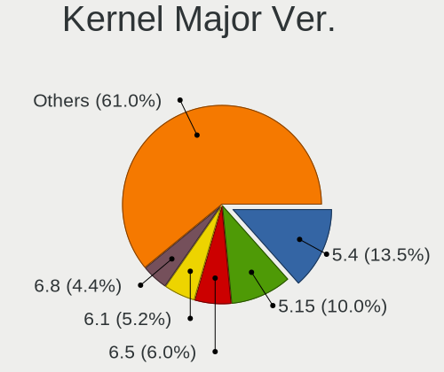

| Version | Computers | Percent |
|---------|-----------|---------|
| 5.4     | 181       | 25.31%  |
| 5.8     | 63        | 8.81%   |
| 4.15    | 61        | 8.53%   |
| 5.3     | 56        | 7.83%   |
| 5.0     | 49        | 6.85%   |
| 4.18    | 43        | 6.01%   |
| 5.13    | 40        | 5.59%   |
| 5.10    | 40        | 5.59%   |
| 5.11    | 38        | 5.31%   |
| 5.16    | 20        | 2.8%    |
| 4.9     | 17        | 2.38%   |
| 5.6     | 15        | 2.1%    |
| 5.15    | 15        | 2.1%    |
| 5.9     | 10        | 1.4%    |
| 5.14    | 10        | 1.4%    |
| 5.12    | 9         | 1.26%   |
| 4.19    | 9         | 1.26%   |
| 5.7     | 8         | 1.12%   |
| 5.5     | 5         | 0.7%    |
| 4.4     | 5         | 0.7%    |
| 4.13    | 4         | 0.56%   |
| 5.17    | 3         | 0.42%   |
| 5.1     | 3         | 0.42%   |
| 4.12    | 3         | 0.42%   |
| 5.2     | 2         | 0.28%   |
| 4.10    | 2         | 0.28%   |
| 4.1     | 2         | 0.28%   |
| 4.20    | 1         | 0.14%   |
| 4.14    | 1         | 0.14%   |

Arch
----

OS architecture (x86_64, i586, etc.)

| Name    | Computers | Percent |
|---------|-----------|---------|
| x86_64  | 638       | 96.81%  |
| i686    | 19        | 2.88%   |
| aarch64 | 2         | 0.3%    |

DE
--

Desktop Environment

| Name       | Computers | Percent |
|------------|-----------|---------|
| GNOME      | 308       | 45.36%  |
| Unknown    | 131       | 19.29%  |
| KDE5       | 72        | 10.6%   |
| XFCE       | 48        | 7.07%   |
| X-Cinnamon | 31        | 4.57%   |
| KDE        | 26        | 3.83%   |
| KDE4       | 12        | 1.77%   |
| MATE       | 8         | 1.18%   |
| Unity      | 7         | 1.03%   |
| Pantheon   | 7         | 1.03%   |
| Cinnamon   | 7         | 1.03%   |
| Deepin     | 5         | 0.74%   |
| Budgie     | 5         | 0.74%   |
| LXQt       | 3         | 0.44%   |
| LXDE       | 3         | 0.44%   |
| i3         | 2         | 0.29%   |
| bspwm      | 2         | 0.29%   |
| awesome    | 2         | 0.29%   |

Display Server
--------------

X11 or Wayland

| Name    | Computers | Percent |
|---------|-----------|---------|
| X11     | 537       | 79.67%  |
| Unknown | 85        | 12.61%  |
| Wayland | 44        | 6.53%   |
| Tty     | 8         | 1.19%   |

Display Manager
---------------

SDDM, LightDM, etc.

| Name    | Computers | Percent |
|---------|-----------|---------|
| Unknown | 441       | 65.43%  |
| GDM     | 71        | 10.53%  |
| SDDM    | 63        | 9.35%   |
| LightDM | 46        | 6.82%   |
| GDM3    | 20        | 2.97%   |
| TDM     | 19        | 2.82%   |
| KDM     | 12        | 1.78%   |
| SLiM    | 1         | 0.15%   |
| LXDM    | 1         | 0.15%   |

OS Lang
-------

Language

| Lang    | Computers | Percent |
|---------|-----------|---------|
| es_CO   | 308       | 45.36%  |
| en_US   | 154       | 22.68%  |
| Unknown | 145       | 21.35%  |
| es_ES   | 39        | 5.74%   |
| es_MX   | 12        | 1.77%   |
| en_GB   | 4         | 0.59%   |
| es_PE   | 3         | 0.44%   |
| es_VE   | 2         | 0.29%   |
| es_EC   | 2         | 0.29%   |
| C       | 2         | 0.29%   |
| pt_PT   | 1         | 0.15%   |
| pt_BR   | 1         | 0.15%   |
| pl_PL   | 1         | 0.15%   |
| it_IT   | 1         | 0.15%   |
| fr_FR   | 1         | 0.15%   |
| es_AR   | 1         | 0.15%   |
| en      | 1         | 0.15%   |
| de_DE   | 1         | 0.15%   |

Boot Mode
---------

EFI or BIOS

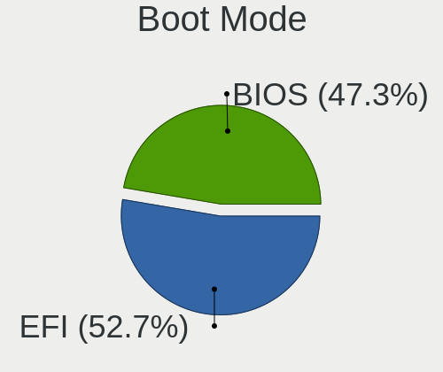

| Mode | Computers | Percent |
|------|-----------|---------|
| EFI  | 338       | 50.45%  |
| BIOS | 332       | 49.55%  |

Filesystem
----------

Type of filesystem

| Type    | Computers | Percent |
|---------|-----------|---------|
| Ext4    | 547       | 81.28%  |
| Unknown | 47        | 6.98%   |
| Overlay | 34        | 5.05%   |
| Btrfs   | 30        | 4.46%   |
| Xfs     | 10        | 1.49%   |
| Tmpfs   | 2         | 0.3%    |
| Ext2    | 2         | 0.3%    |
| Ext3    | 1         | 0.15%   |

Part. scheme
------------

Scheme of partitioning

| Type    | Computers | Percent |
|---------|-----------|---------|
| Unknown | 463       | 69.83%  |
| GPT     | 141       | 21.27%  |
| MBR     | 59        | 8.9%    |

Dual Boot with Linux/BSD
------------------------

Hosting more than one Linux/BSD

| Dual boot | Computers | Percent |
|-----------|-----------|---------|
| No        | 589       | 87.91%  |
| Yes       | 81        | 12.09%  |

Dual Boot (Win)
---------------

Hosting Linux and Windows

| Dual boot | Computers | Percent |
|-----------|-----------|---------|
| No        | 430       | 64.66%  |
| Yes       | 235       | 35.34%  |

Board
-----

Vendor
------

Motherboard manufacturer

| Name                         | Computers | Percent |
|------------------------------|-----------|---------|
| ASUSTek Computer             | 154       | 23.37%  |
| Hewlett-Packard              | 126       | 19.12%  |
| Lenovo                       | 92        | 13.96%  |
| Dell                         | 52        | 7.89%   |
| Acer                         | 40        | 6.07%   |
| MSI                          | 28        | 4.25%   |
| Gigabyte Technology          | 28        | 4.25%   |
| ASRock                       | 23        | 3.49%   |
| Toshiba                      | 18        | 2.73%   |
| Apple                        | 14        | 2.12%   |
| Samsung Electronics          | 12        | 1.82%   |
| Intel                        | 12        | 1.82%   |
| Unknown                      | 8         | 1.21%   |
| Sony                         | 7         | 1.06%   |
| ECS                          | 5         | 0.76%   |
| Pegatron                     | 4         | 0.61%   |
| Foxconn                      | 4         | 0.61%   |
| Biostar                      | 4         | 0.61%   |
| PCSMART                      | 3         | 0.46%   |
| Supermicro                   | 2         | 0.3%    |
| Notebook                     | 2         | 0.3%    |
| HUAWEI                       | 2         | 0.3%    |
| Gateway                      | 2         | 0.3%    |
| VIT                          | 1         | 0.15%   |
| TYAN Computer                | 1         | 0.15%   |
| Timi                         | 1         | 0.15%   |
| Raspberry Pi Foundation      | 1         | 0.15%   |
| PCChips                      | 1         | 0.15%   |
| ONDA                         | 1         | 0.15%   |
| Nvidia                       | 1         | 0.15%   |
| MPS Mayorista de Colombia SA | 1         | 0.15%   |
| Inupur                       | 1         | 0.15%   |
| HARDKERNEL                   | 1         | 0.15%   |
| GREATWALL                    | 1         | 0.15%   |
| Google                       | 1         | 0.15%   |
| Fujitsu Siemens              | 1         | 0.15%   |
| Fujitsu                      | 1         | 0.15%   |
| Framework                    | 1         | 0.15%   |
| Chuwi                        | 1         | 0.15%   |
| BAKED                        | 1         | 0.15%   |

Model
-----

Motherboard model

| Name                                       | Computers | Percent |
|--------------------------------------------|-----------|---------|
| HP Laptop 15-db0xxx                        | 11        | 1.67%   |
| Unknown                                    | 10        | 1.52%   |
| Samsung 300E4C/300E5C/300E7C               | 5         | 0.76%   |
| HP Laptop 14-bs0xx                         | 5         | 0.76%   |
| ASUS VivoBook_ASUS Laptop X505ZA_X505ZA    | 5         | 0.76%   |
| MSI MS-7309                                | 4         | 0.61%   |
| HP Notebook                                | 4         | 0.61%   |
| HP 14                                      | 4         | 0.61%   |
| ASUS ZenBook UX431DA_UM431DA               | 4         | 0.61%   |
| ASUS All Series                            | 4         | 0.61%   |
| Lenovo IdeaPad S340-14API 81NB             | 3         | 0.46%   |
| Lenovo IdeaPad 320-15ABR 80XS              | 3         | 0.46%   |
| Lenovo G40-80 80E4                         | 3         | 0.46%   |
| Lenovo G40-45 80E1                         | 3         | 0.46%   |
| HP Pavilion x360 Convertible 14-cd0xxx     | 3         | 0.46%   |
| HP Pavilion Gaming Laptop 15-cx0xxx        | 3         | 0.46%   |
| HP Laptop 15-da0xxx                        | 3         | 0.46%   |
| HP Laptop 14-cm1xxx                        | 3         | 0.46%   |
| HP 245 G6                                  | 3         | 0.46%   |
| Gigabyte H81M-H                            | 3         | 0.46%   |
| Gigabyte G31M-ES2C                         | 3         | 0.46%   |
| Gigabyte B450M DS3H                        | 3         | 0.46%   |
| ECS G31T-M7                                | 3         | 0.46%   |
| Dell XPS 15 9550                           | 3         | 0.46%   |
| Dell Vostro 3400                           | 3         | 0.46%   |
| ASUS X555QG                                | 3         | 0.46%   |
| ASUS X505BP                                | 3         | 0.46%   |
| ASUS X455LJ                                | 3         | 0.46%   |
| ASUS VivoBook_ASUSLaptop X512FB_X512FB     | 3         | 0.46%   |
| ASUS VivoBook_ASUSLaptop X509DA_M509DA     | 3         | 0.46%   |
| ASUS VivoBook_ASUSLaptop X409DA_M409DA     | 3         | 0.46%   |
| ASUS VivoBook 14_ASUS Laptop X441MA_X441MA | 3         | 0.46%   |
| ASUS T101HA                                | 3         | 0.46%   |
| ASUS M5A78L-M/USB3                         | 3         | 0.46%   |
| ASRock Wolfdale1333-D667                   | 3         | 0.46%   |
| ASRock G41M-VS3                            | 3         | 0.46%   |
| Acer Aspire E5-575G                        | 3         | 0.46%   |
| Acer Aspire A515-51                        | 3         | 0.46%   |
| Acer Aspire 4750                           | 3         | 0.46%   |
| Toshiba Satellite U505                     | 2         | 0.3%    |
| Toshiba NB 105                             | 2         | 0.3%    |
| MSI MS-7817                                | 2         | 0.3%    |
| Lenovo Y520-15IKBN 80WK                    | 2         | 0.3%    |
| Lenovo V330-14IKB 81B0                     | 2         | 0.3%    |
| Lenovo ThinkPad X13 Gen 1 20UGS2B800       | 2         | 0.3%    |
| Lenovo ThinkBook 13s G2 ITL 20V9           | 2         | 0.3%    |
| Lenovo IdeaPad 330-15ARR 81D2              | 2         | 0.3%    |
| Intel H61                                  | 2         | 0.3%    |
| HP ProBook 450 G1                          | 2         | 0.3%    |
| HP ProBook 440 G3                          | 2         | 0.3%    |
| HP ProBook 440 G2                          | 2         | 0.3%    |
| HP Presario CQ43                           | 2         | 0.3%    |
| HP Pavilion x360 Convertible 14-ba0xx      | 2         | 0.3%    |
| HP Pavilion Laptop 15-cw0xxx               | 2         | 0.3%    |
| HP Pavilion dv4                            | 2         | 0.3%    |
| HP Pavilion 10 TS                          | 2         | 0.3%    |
| HP Laptop 14-ck0xxx                        | 2         | 0.3%    |
| HP Laptop 14-bp0xx                         | 2         | 0.3%    |
| HP ENVY 15                                 | 2         | 0.3%    |
| HP Compaq dc7700 Small Form Factor         | 2         | 0.3%    |

Model Family
------------

Motherboard model prefix

| Name                     | Computers | Percent |
|--------------------------|-----------|---------|
| ASUS VivoBook            | 45        | 6.83%   |
| Lenovo IdeaPad           | 30        | 4.55%   |
| Lenovo ThinkPad          | 29        | 4.4%    |
| Acer Aspire              | 29        | 4.4%    |
| HP Laptop                | 27        | 4.1%    |
| HP Pavilion              | 25        | 3.79%   |
| Dell Inspiron            | 19        | 2.88%   |
| Toshiba Satellite        | 15        | 2.28%   |
| HP ProBook               | 13        | 1.97%   |
| ASUS PRIME               | 13        | 1.97%   |
| HP Compaq                | 12        | 1.82%   |
| Unknown                  | 10        | 1.52%   |
| Dell Latitude            | 9         | 1.37%   |
| Dell Vostro              | 7         | 1.06%   |
| Dell OptiPlex            | 6         | 0.91%   |
| ASUS ZenBook             | 6         | 0.91%   |
| Samsung 300E4C           | 5         | 0.76%   |
| HP 245                   | 5         | 0.76%   |
| Dell XPS                 | 5         | 0.76%   |
| ASUS TUF                 | 5         | 0.76%   |
| ASUS ROG                 | 5         | 0.76%   |
| MSI MS-7309              | 4         | 0.61%   |
| HP Notebook              | 4         | 0.61%   |
| HP ENVY                  | 4         | 0.61%   |
| HP EliteBook             | 4         | 0.61%   |
| HP 14                    | 4         | 0.61%   |
| ASUS All                 | 4         | 0.61%   |
| Lenovo Yoga              | 3         | 0.46%   |
| Lenovo G40-80            | 3         | 0.46%   |
| Lenovo G40-45            | 3         | 0.46%   |
| HP ProLiant              | 3         | 0.46%   |
| HP Presario              | 3         | 0.46%   |
| HP All-in-One            | 3         | 0.46%   |
| HP 240                   | 3         | 0.46%   |
| Gigabyte X399            | 3         | 0.46%   |
| Gigabyte H81M-H          | 3         | 0.46%   |
| Gigabyte G31M-ES2C       | 3         | 0.46%   |
| Gigabyte B450M           | 3         | 0.46%   |
| ECS G31T-M7              | 3         | 0.46%   |
| ASUS X555QG              | 3         | 0.46%   |
| ASUS X505BP              | 3         | 0.46%   |
| ASUS X455LJ              | 3         | 0.46%   |
| ASUS T101HA              | 3         | 0.46%   |
| ASUS M5A78L-M            | 3         | 0.46%   |
| ASRock Wolfdale1333-D667 | 3         | 0.46%   |
| ASRock G41M-VS3          | 3         | 0.46%   |
| Acer TravelMate          | 3         | 0.46%   |
| Acer Nitro               | 3         | 0.46%   |
| Toshiba NB               | 2         | 0.3%    |
| MSI PS63                 | 2         | 0.3%    |
| MSI MS-7817              | 2         | 0.3%    |
| Lenovo Y520-15IKBN       | 2         | 0.3%    |
| Lenovo V330-14IKB        | 2         | 0.3%    |
| Lenovo ThinkCentre       | 2         | 0.3%    |
| Lenovo ThinkBook         | 2         | 0.3%    |
| Lenovo Legion            | 2         | 0.3%    |
| Lenovo IdeaCentre        | 2         | 0.3%    |
| Intel H61                | 2         | 0.3%    |
| Intel DH55HC             | 2         | 0.3%    |
| Gigabyte GA-78LMT-USB3   | 2         | 0.3%    |

MFG Year
--------

Motherboard manufacture year

| Year    | Computers | Percent |
|---------|-----------|---------|
| 2018    | 78        | 11.84%  |
| 2017    | 70        | 10.62%  |
| 2019    | 69        | 10.47%  |
| 2012    | 49        | 7.44%   |
| 2011    | 49        | 7.44%   |
| 2010    | 48        | 7.28%   |
| 2015    | 43        | 6.53%   |
| 2013    | 40        | 6.07%   |
| 2014    | 39        | 5.92%   |
| 2020    | 38        | 5.77%   |
| 2009    | 29        | 4.4%    |
| 2016    | 28        | 4.25%   |
| 2008    | 23        | 3.49%   |
| 2021    | 21        | 3.19%   |
| 2007    | 20        | 3.03%   |
| 2006    | 9         | 1.37%   |
| 2005    | 2         | 0.3%    |
| Unknown | 2         | 0.3%    |
| 2022    | 1         | 0.15%   |
| 2003    | 1         | 0.15%   |

Form Factor
-----------

Physical design of the computer

| Name           | Computers | Percent |
|----------------|-----------|---------|
| Notebook       | 443       | 67.22%  |
| Desktop        | 172       | 26.1%   |
| All in one     | 19        | 2.88%   |
| Convertible    | 13        | 1.97%   |
| Tablet         | 6         | 0.91%   |
| Server         | 3         | 0.46%   |
| System on chip | 2         | 0.3%    |
| Mini pc        | 1         | 0.15%   |

Secure Boot
-----------

Enabled or disabled

| State    | Computers | Percent |
|----------|-----------|---------|
| Disabled | 595       | 89.74%  |
| Enabled  | 68        | 10.26%  |

Coreboot
--------

Have coreboot on board

| Used | Computers | Percent |
|------|-----------|---------|
| No   | 658       | 99.85%  |
| Yes  | 1         | 0.15%   |

RAM Size
--------

Total RAM memory

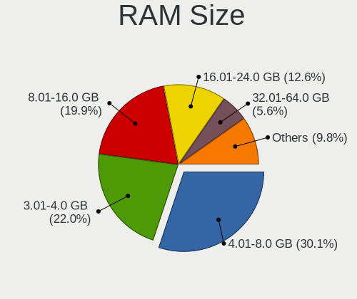

| Size in GB  | Computers | Percent |
|-------------|-----------|---------|
| 4.01-8.0    | 202       | 30.42%  |
| 3.01-4.0    | 179       | 26.96%  |
| 8.01-16.0   | 114       | 17.17%  |
| 16.01-24.0  | 70        | 10.54%  |
| 1.01-2.0    | 42        | 6.33%   |
| 32.01-64.0  | 21        | 3.16%   |
| 2.01-3.0    | 19        | 2.86%   |
| 0.51-1.0    | 7         | 1.05%   |
| 24.01-32.0  | 6         | 0.9%    |
| 64.01-256.0 | 4         | 0.6%    |

RAM Used
--------

Used RAM memory

| Used GB   | Computers | Percent |
|-----------|-----------|---------|
| 1.01-2.0  | 269       | 37.21%  |
| 2.01-3.0  | 213       | 29.46%  |
| 3.01-4.0  | 98        | 13.55%  |
| 4.01-8.0  | 70        | 9.68%   |
| 0.51-1.0  | 46        | 6.36%   |
| 8.01-16.0 | 23        | 3.18%   |
| 0.01-0.5  | 4         | 0.55%   |

Total Drives
------------

Number of drives on board

| Drives | Computers | Percent |
|--------|-----------|---------|
| 1      | 485       | 72.39%  |
| 2      | 144       | 21.49%  |
| 3      | 26        | 3.88%   |
| 4      | 11        | 1.64%   |
| 8      | 1         | 0.15%   |
| 6      | 1         | 0.15%   |
| 5      | 1         | 0.15%   |
| 0      | 1         | 0.15%   |

Has CD-ROM
----------

Has CD-ROM on board

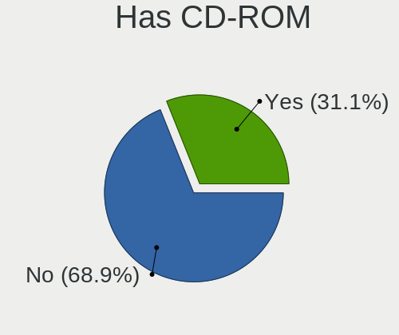

| Presented | Computers | Percent |
|-----------|-----------|---------|
| No        | 419       | 63.2%   |
| Yes       | 244       | 36.8%   |

Has Ethernet
------------

Has Ethernet on board

| Presented | Computers | Percent |
|-----------|-----------|---------|
| Yes       | 573       | 86.82%  |
| No        | 87        | 13.18%  |

Has WiFi
--------

Has WiFi module

| Presented | Computers | Percent |
|-----------|-----------|---------|
| Yes       | 537       | 81.12%  |
| No        | 125       | 18.88%  |

Has Bluetooth
-------------

Has Bluetooth module

| Presented | Computers | Percent |
|-----------|-----------|---------|
| Yes       | 413       | 62.48%  |
| No        | 248       | 37.52%  |

Location
--------

Country
-------

Geographic location (country)

| Country  | Computers | Percent |
|----------|-----------|---------|
| Colombia | 659       | 100%    |

City
----

Geographic location (city)

| City                 | Computers | Percent |
|----------------------|-----------|---------|
| Bogot            | 184       | 26.4%   |
| Bogot            | 75        | 10.76%  |
| Santiago de Cali     | 63        | 9.04%   |
| Medelln          | 63        | 9.04%   |
| Barranquilla         | 32        | 4.59%   |
| Bucaramanga          | 30        | 4.3%    |
| Medelln          | 27        | 3.87%   |
| Bogot              | 19        | 2.73%   |
| Pereira              | 15        | 2.15%   |
| Cartagena            | 12        | 1.72%   |
| Villavicencio        | 10        | 1.43%   |
| Envigado             | 10        | 1.43%   |
| Medelln            | 9         | 1.29%   |
| Manizales            | 8         | 1.15%   |
| Santa Marta          | 6         | 0.86%   |
| Ccuta            | 6         | 0.86%   |
| Chia                 | 6         | 0.86%   |
| Bello                | 6         | 0.86%   |
| Armenia              | 6         | 0.86%   |
| Valledupar           | 5         | 0.72%   |
| Ibague               | 5         | 0.72%   |
| Tulu             | 4         | 0.57%   |
| Sabaneta             | 4         | 0.57%   |
| Popayan              | 4         | 0.57%   |
| Neiva                | 4         | 0.57%   |
| Tunja                | 3         | 0.43%   |
| Sogamoso             | 3         | 0.43%   |
| Sincelejo            | 3         | 0.43%   |
| Pasto                | 3         | 0.43%   |
| Ccuta            | 3         | 0.43%   |
| Yopal                | 2         | 0.29%   |
| Socorro              | 2         | 0.29%   |
| San Gil              | 2         | 0.29%   |
| Popayn           | 2         | 0.29%   |
| Palmira              | 2         | 0.29%   |
| Montera          | 2         | 0.29%   |
| Montera          | 2         | 0.29%   |
| Ipiales              | 2         | 0.29%   |
| Fusagasuga           | 2         | 0.29%   |
| Floridablanca        | 2         | 0.29%   |
| El Carmen de Viboral | 2         | 0.29%   |
| Circasia             | 2         | 0.29%   |
| Villanueva           | 1         | 0.14%   |
| Villamaria           | 1         | 0.14%   |
| Tulu             | 1         | 0.14%   |
| Tocancipa            | 1         | 0.14%   |
| Soledad              | 1         | 0.14%   |
| Soacha               | 1         | 0.14%   |
| San Agustin          | 1         | 0.14%   |
| Sahagun              | 1         | 0.14%   |
| Sabanalarga          | 1         | 0.14%   |
| Rionegro             | 1         | 0.14%   |
| Purificacion         | 1         | 0.14%   |
| Pitalito             | 1         | 0.14%   |
| Piedecuesta          | 1         | 0.14%   |
| Pamplona             | 1         | 0.14%   |
| Mosquera             | 1         | 0.14%   |
| Montera            | 1         | 0.14%   |
| Merida               | 1         | 0.14%   |
| Melgar               | 1         | 0.14%   |

Drives
------

Drive Vendor
------------

Hard drive vendors

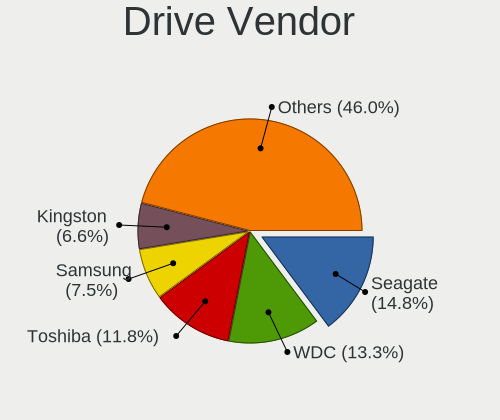

| Vendor                    | Computers | Drives | Percent |
|---------------------------|-----------|--------|---------|
| Seagate                   | 169       | 214    | 19.56%  |
| WDC                       | 128       | 168    | 14.81%  |
| Toshiba                   | 124       | 145    | 14.35%  |
| Samsung Electronics       | 59        | 70     | 6.83%   |
| Hitachi                   | 55        | 68     | 6.37%   |
| Kingston                  | 54        | 71     | 6.25%   |
| SanDisk                   | 39        | 46     | 4.51%   |
| HGST                      | 31        | 40     | 3.59%   |
| A-DATA Technology         | 31        | 39     | 3.59%   |
| Unknown                   | 30        | 33     | 3.47%   |
| Crucial                   | 26        | 28     | 3.01%   |
| SK Hynix                  | 13        | 19     | 1.5%    |
| MAXTOR                    | 13        | 14     | 1.5%    |
| Intel                     | 12        | 13     | 1.39%   |
| Apple                     | 8         | 8      | 0.93%   |
| China                     | 7         | 7      | 0.81%   |
| Phison                    | 6         | 8      | 0.69%   |
| Realtek Semiconductor     | 5         | 6      | 0.58%   |
| Gigabyte Technology       | 5         | 6      | 0.58%   |
| Fujitsu                   | 5         | 5      | 0.58%   |
| Micron Technology         | 4         | 4      | 0.46%   |
| XPG                       | 3         | 3      | 0.35%   |
| PNY                       | 3         | 3      | 0.35%   |
| LITEONIT                  | 3         | 3      | 0.35%   |
| KingDian                  | 3         | 3      | 0.35%   |
| JMicron                   | 3         | 3      | 0.35%   |
| Transcend                 | 2         | 3      | 0.23%   |
| Team                      | 2         | 2      | 0.23%   |
| Silicon Motion            | 2         | 2      | 0.23%   |
| Lexar                     | 2         | 2      | 0.23%   |
| Zheino                    | 1         | 1      | 0.12%   |
| XrayDisk                  | 1         | 1      | 0.12%   |
| SUPERSONIC                | 1         | 1      | 0.12%   |
| SPCC                      | 1         | 1      | 0.12%   |
| RDM-II                    | 1         | 2      | 0.12%   |
| Netac                     | 1         | 1      | 0.12%   |
| Micron/Crucial Technology | 1         | 1      | 0.12%   |
| LITEON                    | 1         | 2      | 0.12%   |
| KIOXIA                    | 1         | 1      | 0.12%   |
| KingSpec                  | 1         | 1      | 0.12%   |
| KINGBANK                  | 1         | 1      | 0.12%   |
| Hewlett-Packard           | 1         | 1      | 0.12%   |
| ExcelStor                 | 1         | 1      | 0.12%   |
| Corsair                   | 1         | 1      | 0.12%   |
| ASMT                      | 1         | 1      | 0.12%   |
| Argon                     | 1         | 1      | 0.12%   |
| Unknown                   | 1         | 1      | 0.12%   |

Drive Model
-----------

Hard drive models

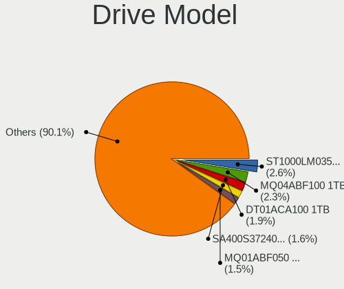

| Model                               | Computers | Percent |
|-------------------------------------|-----------|---------|
| Seagate ST1000LM035-1RK172 1TB      | 36        | 4.06%   |
| Toshiba MQ04ABF100 1TB              | 26        | 2.93%   |
| Toshiba MQ01ABF050 500GB            | 18        | 2.03%   |
| Toshiba MQ01ABD100 1TB              | 16        | 1.81%   |
| Toshiba DT01ACA100 1TB              | 16        | 1.81%   |
| Seagate ST1000LM024 HN-M101MBB 1TB  | 16        | 1.81%   |
| Kingston SA400S37240G 240GB SSD     | 13        | 1.47%   |
| Seagate ST500LT012-1DG142 500GB     | 10        | 1.13%   |
| Crucial CT240BX500SSD1 240GB        | 10        | 1.13%   |
| Kingston SA400S37120G 120GB SSD     | 9         | 1.02%   |
| HGST HTS541010B7E610 1TB            | 8         | 0.9%    |
| HGST HTS541010A9E680 1TB            | 8         | 0.9%    |
| Sandisk NVMe SSD Drive 512GB        | 7         | 0.79%   |
| WDC WD10SPZX-24Z10 1TB              | 6         | 0.68%   |
| Unknown MMC Card  64GB              | 6         | 0.68%   |
| Toshiba HDWD110 1TB                 | 6         | 0.68%   |
| Toshiba DT01ACA200 2TB              | 6         | 0.68%   |
| Kingston SA400S37480G 480GB SSD     | 6         | 0.68%   |
| Hitachi HDS721050CLA362 500GB       | 6         | 0.68%   |
| HGST HTS545050A7E680 500GB          | 6         | 0.68%   |
| Unknown SD/MMC/MS PRO 128GB         | 5         | 0.56%   |
| Unknown MMC Card  32GB              | 5         | 0.56%   |
| Toshiba DT01ACA050 500GB            | 5         | 0.56%   |
| Seagate ST500LT012-9WS142 500GB     | 5         | 0.56%   |
| Seagate ST500LM030-1RK17D 500GB     | 5         | 0.56%   |
| Seagate ST500DM002-1BD142 500GB     | 5         | 0.56%   |
| Sandisk NVMe SSD Drive 256GB        | 5         | 0.56%   |
| Kingston SV300S37A120G 120GB SSD    | 5         | 0.56%   |
| Intel NVMe SSD Drive 512GB          | 5         | 0.56%   |
| Hitachi HDS721616PLA380 160GB       | 5         | 0.56%   |
| Crucial CT500MX500SSD1 500GB        | 5         | 0.56%   |
| A-DATA SU630 240GB SSD              | 5         | 0.56%   |
| Toshiba MQ01ABD050 500GB            | 4         | 0.45%   |
| SK Hynix NVMe SSD Drive 256GB       | 4         | 0.45%   |
| Seagate ST750LM022 HN-M750MBB 752GB | 4         | 0.45%   |
| Seagate ST2000LM007-1R8174 2TB      | 4         | 0.45%   |
| Seagate ST1000DM010-2EP102 1TB      | 4         | 0.45%   |
| Seagate ST1000DM003-1SB102 1TB      | 4         | 0.45%   |
| Samsung NVMe SSD Drive 512GB        | 4         | 0.45%   |
| Samsung NVMe SSD Drive 256GB        | 4         | 0.45%   |
| Realtek NVMe SSD Drive 512GB        | 4         | 0.45%   |
| Crucial CT1000BX500SSD1 1TB         | 4         | 0.45%   |
| A-DATA SU650NS38 240GB SSD          | 4         | 0.45%   |
| A-DATA SU650 120GB SSD              | 4         | 0.45%   |
| A-DATA SU630 480GB SSD              | 4         | 0.45%   |
| WDC WDS100T2G0A-00JH30 1TB SSD      | 3         | 0.34%   |
| WDC WD5000LPCX-60VHAT0 500GB        | 3         | 0.34%   |
| WDC WD3200AAJS-00L7A0 320GB         | 3         | 0.34%   |
| WDC WD1600BEVT-75ZCT2 160GB         | 3         | 0.34%   |
| WDC WD1200BEVS-60UST0 120GB         | 3         | 0.34%   |
| WDC WD10SPZX-60Z10T0 1TB            | 3         | 0.34%   |
| WDC WD10EZEX-60WN4A0 1TB            | 3         | 0.34%   |
| WDC WD10EZEX-08WN4A0 1TB            | 3         | 0.34%   |
| Seagate ST9500420AS 500GB           | 3         | 0.34%   |
| Seagate ST9500325AS 500GB           | 3         | 0.34%   |
| Seagate ST500LM012 HN-M500MBB 500GB | 3         | 0.34%   |
| Seagate ST320LT007-9ZV142 320GB     | 3         | 0.34%   |
| Seagate ST1000DM003-1CH162 1TB      | 3         | 0.34%   |
| Samsung SSD 860 EVO 1TB             | 3         | 0.34%   |
| Samsung NVMe SSD Drive 1024GB       | 3         | 0.34%   |

HDD Vendor
----------

Hard disk drive vendors

| Vendor              | Computers | Drives | Percent |
|---------------------|-----------|--------|---------|
| Seagate             | 169       | 214    | 31.95%  |
| Toshiba             | 120       | 139    | 22.68%  |
| WDC                 | 111       | 149    | 20.98%  |
| Hitachi             | 55        | 68     | 10.4%   |
| HGST                | 31        | 40     | 5.86%   |
| Samsung Electronics | 16        | 18     | 3.02%   |
| MAXTOR              | 13        | 14     | 2.46%   |
| Unknown             | 5         | 6      | 0.95%   |
| Fujitsu             | 5         | 5      | 0.95%   |
| Apple               | 3         | 3      | 0.57%   |
| ExcelStor           | 1         | 1      | 0.19%   |

SSD Vendor
----------

Solid state drive vendors

| Vendor              | Computers | Drives | Percent |
|---------------------|-----------|--------|---------|
| Kingston            | 44        | 59     | 22.34%  |
| A-DATA Technology   | 29        | 37     | 14.72%  |
| Crucial             | 23        | 25     | 11.68%  |
| Samsung Electronics | 19        | 20     | 9.64%   |
| SanDisk             | 18        | 21     | 9.14%   |
| WDC                 | 10        | 11     | 5.08%   |
| China               | 7         | 7      | 3.55%   |
| Toshiba             | 5         | 6      | 2.54%   |
| Intel               | 4         | 5      | 2.03%   |
| Gigabyte Technology | 4         | 5      | 2.03%   |
| Apple               | 4         | 4      | 2.03%   |
| SK Hynix            | 3         | 7      | 1.52%   |
| Micron Technology   | 3         | 3      | 1.52%   |
| LITEONIT            | 3         | 3      | 1.52%   |
| KingDian            | 3         | 3      | 1.52%   |
| Transcend           | 2         | 3      | 1.02%   |
| Team                | 2         | 2      | 1.02%   |
| PNY                 | 2         | 2      | 1.02%   |
| Lexar               | 2         | 2      | 1.02%   |
| Zheino              | 1         | 1      | 0.51%   |
| Unknown             | 1         | 1      | 0.51%   |
| SPCC                | 1         | 1      | 0.51%   |
| Netac               | 1         | 1      | 0.51%   |
| LITEON              | 1         | 2      | 0.51%   |
| KingSpec            | 1         | 1      | 0.51%   |
| JMicron             | 1         | 1      | 0.51%   |
| Hewlett-Packard     | 1         | 1      | 0.51%   |
| Argon               | 1         | 1      | 0.51%   |
| Unknown             | 1         | 1      | 0.51%   |

Drive Kind
----------

HDD or SSD

| Kind    | Computers | Drives | Percent |
|---------|-----------|--------|---------|
| HDD     | 465       | 657    | 59.16%  |
| SSD     | 186       | 236    | 23.66%  |
| NVMe    | 103       | 125    | 13.1%   |
| MMC     | 24        | 27     | 3.05%   |
| Unknown | 8         | 10     | 1.02%   |

Drive Connector
---------------

SATA, SAS, NVMe, etc.

| Type | Computers | Drives | Percent |
|------|-----------|--------|---------|
| SATA | 573       | 883    | 79.81%  |
| NVMe | 103       | 125    | 14.35%  |
| MMC  | 24        | 27     | 3.34%   |
| SAS  | 18        | 20     | 2.51%   |

Drive Size
----------

Size of hard drive

| Size in TB | Computers | Drives | Percent |
|------------|-----------|--------|---------|
| 0.01-0.5   | 378       | 528    | 57.27%  |
| 0.51-1.0   | 246       | 313    | 37.27%  |
| 1.01-2.0   | 27        | 36     | 4.09%   |
| 3.01-4.0   | 4         | 10     | 0.61%   |
| 4.01-10.0  | 3         | 4      | 0.45%   |
| 2.01-3.0   | 2         | 2      | 0.3%    |

Space Total
-----------

Amount of disk space available on the file system

| Size in GB     | Computers | Percent |
|----------------|-----------|---------|
| 101-250        | 179       | 25.79%  |
| 251-500        | 163       | 23.49%  |
| 501-1000       | 146       | 21.04%  |
| 51-100         | 61        | 8.79%   |
| 1-20           | 47        | 6.77%   |
| 1001-2000      | 36        | 5.19%   |
| 21-50          | 32        | 4.61%   |
| Unknown        | 11        | 1.59%   |
| More than 3000 | 10        | 1.44%   |
| 2001-3000      | 9         | 1.3%    |

Space Used
----------

Amount of used disk space

| Used GB        | Computers | Percent |
|----------------|-----------|---------|
| 1-20           | 300       | 41.67%  |
| 21-50          | 140       | 19.44%  |
| 101-250        | 98        | 13.61%  |
| 51-100         | 84        | 11.67%  |
| 251-500        | 45        | 6.25%   |
| 501-1000       | 31        | 4.31%   |
| Unknown        | 11        | 1.53%   |
| 1001-2000      | 6         | 0.83%   |
| More than 3000 | 3         | 0.42%   |
| 2001-3000      | 2         | 0.28%   |

Malfunc. Drives
---------------

Drive models with a malfunction

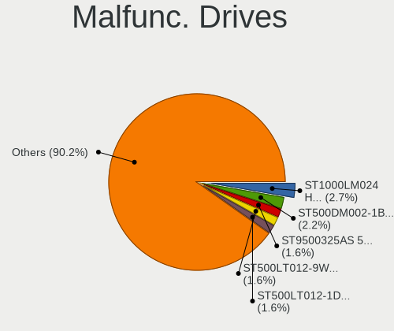

| Model                                          | Computers | Drives | Percent |
|------------------------------------------------|-----------|--------|---------|
| Seagate ST1000LM024 HN-M101MBB 1TB             | 3         | 3      | 4.41%   |
| Seagate ST750LM022 HN-M750MBB 752GB            | 2         | 2      | 2.94%   |
| Seagate ST500DM002-1BD142 500GB                | 2         | 2      | 2.94%   |
| Seagate ST1000DM003-1SB102 1TB                 | 2         | 2      | 2.94%   |
| A-DATA Technology SU630 480GB SSD              | 2         | 2      | 2.94%   |
| WDC WD5000BPVT-22HXZT3 500GB                   | 1         | 1      | 1.47%   |
| WDC WD5000BEVT-22A0RT0 500GB                   | 1         | 1      | 1.47%   |
| WDC WD5000AAKS-08V0A0 500GB                    | 1         | 1      | 1.47%   |
| WDC WD3200BPVT-24JJ5T0 320GB                   | 1         | 1      | 1.47%   |
| WDC WD3200BEKT-60F3T1 320GB                    | 1         | 1      | 1.47%   |
| WDC WD3200AVJS-63B6A0 320GB                    | 1         | 1      | 1.47%   |
| WDC WD3200AAJS-60Z0A0 320GB                    | 1         | 1      | 1.47%   |
| WDC WD3200AAJS-56M0A0 320GB                    | 1         | 1      | 1.47%   |
| WDC WD1600BEVT-22A23T0 160GB                   | 1         | 1      | 1.47%   |
| WDC WD1600BEKT-60V5T1 160GB                    | 1         | 1      | 1.47%   |
| WDC WD1600AAJS-75M0A0 160GB                    | 1         | 1      | 1.47%   |
| WDC WD10EURX-73FH1Y0 1TB                       | 1         | 1      | 1.47%   |
| WDC WD10EACS-00D6B1 1TB                        | 1         | 1      | 1.47%   |
| Toshiba MQ04ABF100 1TB                         | 1         | 2      | 1.47%   |
| Toshiba MQ01ABF050 500GB                       | 1         | 1      | 1.47%   |
| Toshiba MK7559GSXP 752GB                       | 1         | 1      | 1.47%   |
| Toshiba MK5076GSX 500GB                        | 1         | 1      | 1.47%   |
| Toshiba MK3263GSX 320GB                        | 1         | 1      | 1.47%   |
| Toshiba HDWD110 1TB                            | 1         | 1      | 1.47%   |
| Seagate ST9500420AS 500GB                      | 1         | 1      | 1.47%   |
| Seagate ST9320423AS 320GB                      | 1         | 1      | 1.47%   |
| Seagate ST9250315AS 250GB                      | 1         | 1      | 1.47%   |
| Seagate ST500LM021-1KJ152 500GB                | 1         | 1      | 1.47%   |
| Seagate ST500LM012 HN-M500MBB 500GB            | 1         | 1      | 1.47%   |
| Seagate ST3320613AS 320GB                      | 1         | 3      | 1.47%   |
| Seagate ST3320311CS 320GB                      | 1         | 2      | 1.47%   |
| Seagate ST3250820AS 250GB                      | 1         | 1      | 1.47%   |
| Seagate ST320LT007-9ZV142 320GB                | 1         | 1      | 1.47%   |
| Seagate ST2000DM001-1CH164 2TB                 | 1         | 1      | 1.47%   |
| Seagate ST1000LM035-1RK172 1TB                 | 1         | 1      | 1.47%   |
| Seagate ST1000DM010-2EP102 1TB                 | 1         | 2      | 1.47%   |
| Seagate ST1000DM003-1ER162 1TB                 | 1         | 1      | 1.47%   |
| Seagate ST1000DM003-1CH162 1TB                 | 1         | 1      | 1.47%   |
| Samsung Electronics SSD 970 EVO 500GB          | 1         | 1      | 1.47%   |
| Samsung Electronics HM250HI 250GB              | 1         | 1      | 1.47%   |
| Samsung Electronics HD322HJ 320GB              | 1         | 1      | 1.47%   |
| Micron Technology 1100_MTFDDAV256TBN 256GB SSD | 1         | 1      | 1.47%   |
| MAXTOR 6B250S0 256GB                           | 1         | 1      | 1.47%   |
| MAXTOR 53073H6 32GB                            | 1         | 1      | 1.47%   |
| MAXTOR 2F040L0 41GB                            | 1         | 1      | 1.47%   |
| Intel SSDSC2BW240A4 240GB                      | 1         | 2      | 1.47%   |
| Hitachi HTS725032A9A364 320GB                  | 1         | 1      | 1.47%   |
| Hitachi HTS721080G9SA00 80GB                   | 1         | 1      | 1.47%   |
| Hitachi HTS545050B9A300 500GB                  | 1         | 1      | 1.47%   |
| Hitachi HTS545032B9A300 320GB                  | 1         | 1      | 1.47%   |
| Hitachi HTS543225L9A300 250GB                  | 1         | 6      | 1.47%   |
| Hitachi HTS542516K9SA00 160GB                  | 1         | 1      | 1.47%   |
| Hitachi HTS542512K9SA00 120GB                  | 1         | 1      | 1.47%   |
| Hitachi HDT721010SLA360 1TB                    | 1         | 2      | 1.47%   |
| Hitachi HDS728080PLAT20 82GB                   | 1         | 1      | 1.47%   |
| Hitachi HDS721616PLA380 160GB                  | 1         | 1      | 1.47%   |
| Hitachi HDS721050CLA362 500GB                  | 1         | 1      | 1.47%   |
| HGST HTS545050A7E680 500GB                     | 1         | 1      | 1.47%   |
| HGST HTS541075A9E680 752GB                     | 1         | 1      | 1.47%   |
| Fujitsu MHW2160BH PL 160GB                     | 1         | 1      | 1.47%   |

Malfunc. Drive Vendor
---------------------

Vendors of faulty drives

| Vendor              | Computers | Drives | Percent |
|---------------------|-----------|--------|---------|
| Seagate             | 21        | 27     | 32.31%  |
| WDC                 | 12        | 13     | 18.46%  |
| Hitachi             | 11        | 17     | 16.92%  |
| Toshiba             | 6         | 7      | 9.23%   |
| Samsung Electronics | 3         | 3      | 4.62%   |
| MAXTOR              | 3         | 3      | 4.62%   |
| HGST                | 2         | 2      | 3.08%   |
| A-DATA Technology   | 2         | 2      | 3.08%   |
| Micron Technology   | 1         | 1      | 1.54%   |
| Intel               | 1         | 2      | 1.54%   |
| Fujitsu             | 1         | 1      | 1.54%   |
| Crucial             | 1         | 1      | 1.54%   |
| Apple               | 1         | 1      | 1.54%   |

Malfunc. HDD Vendor
-------------------

Vendors of faulty HDD drives

| Vendor              | Computers | Drives | Percent |
|---------------------|-----------|--------|---------|
| Seagate             | 21        | 27     | 35.59%  |
| WDC                 | 12        | 13     | 20.34%  |
| Hitachi             | 11        | 17     | 18.64%  |
| Toshiba             | 6         | 7      | 10.17%  |
| MAXTOR              | 3         | 3      | 5.08%   |
| Samsung Electronics | 2         | 2      | 3.39%   |
| HGST                | 2         | 2      | 3.39%   |
| Fujitsu             | 1         | 1      | 1.69%   |
| Apple               | 1         | 1      | 1.69%   |

Malfunc. Drive Kind
-------------------

Kinds of faulty drives

| Kind | Computers | Drives | Percent |
|------|-----------|--------|---------|
| HDD  | 57        | 73     | 90.48%  |
| SSD  | 5         | 6      | 7.94%   |
| NVMe | 1         | 1      | 1.59%   |

Failed Drives
-------------

Failed drive models

| Model                   | Computers | Drives | Percent |
|-------------------------|-----------|--------|---------|
| MAXTOR STM380211AS 80GB | 1         | 1      | 100%    |

Failed Drive Vendor
-------------------

Failed drive vendors

| Vendor | Computers | Drives | Percent |
|--------|-----------|--------|---------|
| MAXTOR | 1         | 1      | 100%    |

Drive Status
------------

Number of failed and malfunc. drives

| Status   | Computers | Drives | Percent |
|----------|-----------|--------|---------|
| Detected | 476       | 756    | 68.79%  |
| Works    | 152       | 218    | 21.97%  |
| Malfunc  | 63        | 80     | 9.1%    |
| Failed   | 1         | 1      | 0.14%   |

Storage controller
------------------

Storage Vendor
--------------

Storage controller vendors

| Vendor                      | Computers | Percent |
|-----------------------------|-----------|---------|
| Intel                       | 422       | 57.18%  |
| AMD                         | 178       | 24.12%  |
| Sandisk                     | 27        | 3.66%   |
| Samsung Electronics         | 25        | 3.39%   |
| Nvidia                      | 19        | 2.57%   |
| SK Hynix                    | 10        | 1.36%   |
| Kingston Technology Company | 9         | 1.22%   |
| Realtek Semiconductor       | 7         | 0.95%   |
| Phison Electronics          | 7         | 0.95%   |
| VIA Technologies            | 6         | 0.81%   |
| ASMedia Technology          | 6         | 0.81%   |
| Silicon Motion              | 3         | 0.41%   |
| Micron Technology           | 3         | 0.41%   |
| Marvell Technology Group    | 3         | 0.41%   |
| JMicron Technology          | 3         | 0.41%   |
| ADATA Technology            | 3         | 0.41%   |
| Micron/Crucial Technology   | 2         | 0.27%   |
| Union Memory (Shenzhen)     | 1         | 0.14%   |
| LSI Logic / Symbios Logic   | 1         | 0.14%   |
| KIOXIA                      | 1         | 0.14%   |
| Hewlett-Packard             | 1         | 0.14%   |
| Apple                       | 1         | 0.14%   |

Storage Model
-------------

Storage controller models

| Model                                                                                   | Computers | Percent |
|-----------------------------------------------------------------------------------------|-----------|---------|
| AMD FCH SATA Controller [AHCI mode]                                                     | 137       | 16%     |
| Intel Sunrise Point-LP SATA Controller [AHCI mode]                                      | 54        | 6.31%   |
| Intel 82801 Mobile SATA Controller [RAID mode]                                          | 33        | 3.86%   |
| Intel 7 Series Chipset Family 6-port SATA Controller [AHCI mode]                        | 33        | 3.86%   |
| Intel NM10/ICH7 Family SATA Controller [IDE mode]                                       | 24        | 2.8%    |
| Intel 8 Series/C220 Series Chipset Family 6-port SATA Controller 1 [AHCI mode]          | 24        | 2.8%    |
| Intel 6 Series/C200 Series Chipset Family 6 port Mobile SATA AHCI Controller            | 24        | 2.8%    |
| Intel 82801G (ICH7 Family) IDE Controller                                               | 21        | 2.45%   |
| Intel 8 Series SATA Controller 1 [AHCI mode]                                            | 16        | 1.87%   |
| AMD SB7x0/SB8x0/SB9x0 SATA Controller [AHCI mode]                                       | 16        | 1.87%   |
| AMD SB7x0/SB8x0/SB9x0 IDE Controller                                                    | 16        | 1.87%   |
| Intel 5 Series/3400 Series Chipset 4 port SATA AHCI Controller                          | 15        | 1.75%   |
| Intel Wildcat Point-LP SATA Controller [AHCI Mode]                                      | 14        | 1.64%   |
| Intel 6 Series/C200 Series Chipset Family 6 port Desktop SATA AHCI Controller           | 14        | 1.64%   |
| Samsung NVMe SSD Controller SM981/PM981/PM983                                           | 12        | 1.4%    |
| Intel 82801IBM/IEM (ICH9M/ICH9M-E) 4 port SATA Controller [AHCI mode]                   | 12        | 1.4%    |
| Intel Celeron/Pentium Silver Processor SATA Controller                                  | 10        | 1.17%   |
| Intel Cannon Point-LP SATA Controller [AHCI Mode]                                       | 10        | 1.17%   |
| Intel Atom/Celeron/Pentium Processor x5-E8000/J3xxx/N3xxx Series SATA Controller        | 10        | 1.17%   |
| Intel 82801HM/HEM (ICH8M/ICH8M-E) IDE Controller                                        | 10        | 1.17%   |
| AMD SB7x0/SB8x0/SB9x0 SATA Controller [IDE mode]                                        | 10        | 1.17%   |
| Intel 5 Series/3400 Series Chipset 6 port SATA AHCI Controller                          | 9         | 1.05%   |
| Sandisk WD Black SN750 / PC SN730 NVMe SSD                                              | 8         | 0.93%   |
| Nvidia MCP61 SATA Controller                                                            | 8         | 0.93%   |
| Intel Q170/Q150/B150/H170/H110/Z170/CM236 Chipset SATA Controller [AHCI Mode]           | 8         | 0.93%   |
| Intel 82801HM/HEM (ICH8M/ICH8M-E) SATA Controller [AHCI mode]                           | 8         | 0.93%   |
| AMD 400 Series Chipset SATA Controller                                                  | 8         | 0.93%   |
| Sandisk WD Blue SN550 NVMe SSD                                                          | 7         | 0.82%   |
| Nvidia MCP61 IDE                                                                        | 7         | 0.82%   |
| Intel Cannon Lake Mobile PCH SATA AHCI Controller                                       | 7         | 0.82%   |
| Intel 6 Series/C200 Series Chipset Family Desktop SATA Controller (IDE mode, ports 4-5) | 7         | 0.82%   |
| Intel 6 Series/C200 Series Chipset Family Desktop SATA Controller (IDE mode, ports 0-3) | 7         | 0.82%   |
| Intel 400 Series Chipset Family SATA AHCI Controller                                    | 7         | 0.82%   |
| AMD 500 Series Chipset SATA Controller                                                  | 7         | 0.82%   |
| Realtek Realtek Non-Volatile memory controller                                          | 6         | 0.7%    |
| Intel HM170/QM170 Chipset SATA Controller [AHCI Mode]                                   | 6         | 0.7%    |
| Intel 82801H (ICH8 Family) 4 port SATA Controller [IDE mode]                            | 6         | 0.7%    |
| ASMedia ASM1062 Serial ATA Controller                                                   | 6         | 0.7%    |
| Samsung NVMe SSD Controller 980                                                         | 5         | 0.58%   |
| Intel SSD 660P Series                                                                   | 5         | 0.58%   |
| Intel SATA Controller [RAID mode]                                                       | 5         | 0.58%   |
| Intel Cannon Lake PCH SATA AHCI Controller                                              | 5         | 0.58%   |
| AMD FCH SATA Controller [IDE mode]                                                      | 5         | 0.58%   |
| VIA VT82C586A/B/VT82C686/A/B/VT823x/A/C PIPC Bus Master IDE                             | 4         | 0.47%   |
| SK Hynix BC501 NVMe Solid State Drive                                                   | 4         | 0.47%   |
| Sandisk WD Blue SN500 / PC SN520 NVMe SSD                                               | 4         | 0.47%   |
| Sandisk PC SN520 NVMe SSD                                                               | 4         | 0.47%   |
| Samsung NVMe SSD Controller SM951/PM951                                                 | 4         | 0.47%   |
| Phison E12 NVMe Controller                                                              | 4         | 0.47%   |
| Intel Tiger Lake-LP SATA Controller [AHCI mode]                                         | 4         | 0.47%   |
| Intel Comet Lake SATA AHCI Controller                                                   | 4         | 0.47%   |
| Intel Celeron N3350/Pentium N4200/Atom E3900 Series SATA AHCI Controller                | 4         | 0.47%   |
| Intel Atom Processor E3800 Series SATA AHCI Controller                                  | 4         | 0.47%   |
| Intel 82801HR/HO/HH (ICH8R/DO/DH) 2 port SATA Controller [IDE mode]                     | 4         | 0.47%   |
| Intel 7 Series/C210 Series Chipset Family 6-port SATA Controller [AHCI mode]            | 4         | 0.47%   |
| Intel 5 Series/3400 Series Chipset 4 port SATA IDE Controller                           | 4         | 0.47%   |
| Intel 5 Series/3400 Series Chipset 2 port SATA IDE Controller                           | 4         | 0.47%   |
| VIA VT8237A SATA 2-Port Controller                                                      | 3         | 0.35%   |
| SK Hynix Gold P31 SSD                                                                   | 3         | 0.35%   |
| Silicon Motion SM2263EN/SM2263XT SSD Controller                                         | 3         | 0.35%   |

Storage Kind
------------

Kind of storage controller (IDE, SATA, NVMe, SAS, ...)

| Kind | Computers | Percent |
|------|-----------|---------|
| SATA | 507       | 66.45%  |
| IDE  | 106       | 13.89%  |
| NVMe | 102       | 13.37%  |
| RAID | 47        | 6.16%   |
| SAS  | 1         | 0.13%   |

Processor
---------

CPU Vendor
----------

Processor vendors

| Vendor | Computers | Percent |
|--------|-----------|---------|
| Intel  | 453       | 68.74%  |
| AMD    | 204       | 30.96%  |
| ARM    | 2         | 0.3%    |

CPU Model
---------

Processor models

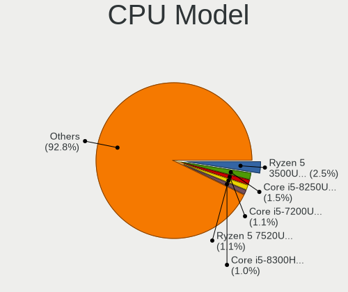

| Model                                           | Computers | Percent |
|-------------------------------------------------|-----------|---------|
| AMD Ryzen 5 3500U with Radeon Vega Mobile Gfx   | 21        | 3.18%   |
| Intel Core i5-8250U CPU @ 1.60GHz               | 12        | 1.82%   |
| Intel Core i5-7200U CPU @ 2.50GHz               | 12        | 1.82%   |
| AMD A9-9425 RADEON R5, 5 COMPUTE CORES 2C+3G    | 9         | 1.36%   |
| AMD A12-9720P RADEON R7, 12 COMPUTE CORES 4C+8G | 9         | 1.36%   |
| Intel Core i7-8550U CPU @ 1.80GHz               | 8         | 1.21%   |
| Intel Core i5-8265U CPU @ 1.60GHz               | 8         | 1.21%   |
| Intel Celeron N4000 CPU @ 1.10GHz               | 8         | 1.21%   |
| Intel Core i7-8565U CPU @ 1.80GHz               | 7         | 1.06%   |
| Intel Celeron CPU N3060 @ 1.60GHz               | 7         | 1.06%   |
| Intel Core i7-4510U CPU @ 2.00GHz               | 6         | 0.91%   |
| Intel Core i5-8300H CPU @ 2.30GHz               | 6         | 0.91%   |
| Intel Core i5-6200U CPU @ 2.30GHz               | 6         | 0.91%   |
| Intel Core i3-8130U CPU @ 2.20GHz               | 6         | 0.91%   |
| Intel Core i3-1005G1 CPU @ 1.20GHz              | 6         | 0.91%   |
| Intel Atom x5-Z8350 CPU @ 1.44GHz               | 6         | 0.91%   |
| AMD Ryzen 5 3600 6-Core Processor               | 6         | 0.91%   |
| AMD Ryzen 5 2500U with Radeon Vega Mobile Gfx   | 6         | 0.91%   |
| AMD FX-8320 Eight-Core Processor                | 6         | 0.91%   |
| AMD A9-9420 RADEON R5, 5 COMPUTE CORES 2C+3G    | 6         | 0.91%   |
| Intel Pentium Dual-Core CPU E5200 @ 2.50GHz     | 5         | 0.76%   |
| Intel Core i7-6700HQ CPU @ 2.60GHz              | 5         | 0.76%   |
| Intel Core i7-6500U CPU @ 2.50GHz               | 5         | 0.76%   |
| AMD Ryzen 5 3400G with Radeon Vega Graphics     | 5         | 0.76%   |
| AMD Ryzen 3 3200U with Radeon Vega Mobile Gfx   | 5         | 0.76%   |
| Intel Core i7-5500U CPU @ 2.40GHz               | 4         | 0.61%   |
| Intel Core i7-2670QM CPU @ 2.20GHz              | 4         | 0.61%   |
| Intel Core i7-10510U CPU @ 1.80GHz              | 4         | 0.61%   |
| Intel Core i5-5200U CPU @ 2.20GHz               | 4         | 0.61%   |
| Intel Core i5-3337U CPU @ 1.80GHz               | 4         | 0.61%   |
| Intel Core i5-3210M CPU @ 2.50GHz               | 4         | 0.61%   |
| Intel Core i5-2400 CPU @ 3.10GHz                | 4         | 0.61%   |
| Intel Core i3-7020U CPU @ 2.30GHz               | 4         | 0.61%   |
| Intel Core i3-6006U CPU @ 2.00GHz               | 4         | 0.61%   |
| Intel Core i3-2350M CPU @ 2.30GHz               | 4         | 0.61%   |
| Intel Core i3-2310M CPU @ 2.10GHz               | 4         | 0.61%   |
| Intel Atom CPU N270 @ 1.60GHz                   | 4         | 0.61%   |
| AMD Ryzen 3 3200G with Radeon Vega Graphics     | 4         | 0.61%   |
| AMD Ryzen 3 2200U with Radeon Vega Mobile Gfx   | 4         | 0.61%   |
| AMD E-300 APU with Radeon HD Graphics           | 4         | 0.61%   |
| Intel Pentium Dual-Core CPU T4400 @ 2.20GHz     | 3         | 0.45%   |
| Intel Pentium Dual CPU E2200 @ 2.20GHz          | 3         | 0.45%   |
| Intel Pentium Dual CPU E2180 @ 2.00GHz          | 3         | 0.45%   |
| Intel Core i7-8750H CPU @ 2.20GHz               | 3         | 0.45%   |
| Intel Core i7-4700MQ CPU @ 2.40GHz              | 3         | 0.45%   |
| Intel Core i7-3770 CPU @ 3.40GHz                | 3         | 0.45%   |
| Intel Core i7-3630QM CPU @ 2.40GHz              | 3         | 0.45%   |
| Intel Core i7-2600 CPU @ 3.40GHz                | 3         | 0.45%   |
| Intel Core i5-6300U CPU @ 2.40GHz               | 3         | 0.45%   |
| Intel Core i5-4210U CPU @ 1.70GHz               | 3         | 0.45%   |
| Intel Core i5-2520M CPU @ 2.50GHz               | 3         | 0.45%   |
| Intel Core i5-10400 CPU @ 2.90GHz               | 3         | 0.45%   |
| Intel Core i5-1035G1 CPU @ 1.00GHz              | 3         | 0.45%   |
| Intel Core i5 CPU M 520 @ 2.40GHz               | 3         | 0.45%   |
| Intel Core i5 CPU 650 @ 3.20GHz                 | 3         | 0.45%   |
| Intel Core i3-3227U CPU @ 1.90GHz               | 3         | 0.45%   |
| Intel Core i3-3110M CPU @ 2.40GHz               | 3         | 0.45%   |
| Intel Core i3-2120 CPU @ 3.30GHz                | 3         | 0.45%   |
| Intel Core i3 CPU M 370 @ 2.40GHz               | 3         | 0.45%   |
| Intel Core 2 Duo CPU E7500 @ 2.93GHz            | 3         | 0.45%   |

CPU Model Family
----------------

Processor model prefix

| Model                          | Computers | Percent |
|--------------------------------|-----------|---------|
| Intel Core i5                  | 124       | 18.76%  |
| Intel Core i7                  | 107       | 16.19%  |
| Intel Core i3                  | 72        | 10.89%  |
| AMD Ryzen 5                    | 50        | 7.56%   |
| Intel Celeron                  | 41        | 6.2%    |
| Other                          | 33        | 4.99%   |
| Intel Core 2 Duo               | 21        | 3.18%   |
| Intel Atom                     | 21        | 3.18%   |
| AMD Ryzen 3                    | 16        | 2.42%   |
| Intel Pentium Dual-Core        | 14        | 2.12%   |
| Intel Pentium                  | 11        | 1.66%   |
| AMD Ryzen 7                    | 11        | 1.66%   |
| AMD FX                         | 11        | 1.66%   |
| Intel Pentium Dual             | 10        | 1.51%   |
| AMD A4                         | 9         | 1.36%   |
| AMD A12                        | 9         | 1.36%   |
| AMD E1                         | 8         | 1.21%   |
| AMD A10                        | 8         | 1.21%   |
| Intel Xeon                     | 7         | 1.06%   |
| AMD A8                         | 7         | 1.06%   |
| AMD A6                         | 7         | 1.06%   |
| AMD Ryzen 7 PRO                | 5         | 0.76%   |
| AMD Athlon 64 X2               | 5         | 0.76%   |
| Intel Core 2                   | 4         | 0.61%   |
| AMD Phenom II X6               | 4         | 0.61%   |
| AMD E                          | 4         | 0.61%   |
| AMD Athlon II X2               | 4         | 0.61%   |
| AMD Ryzen Threadripper         | 3         | 0.45%   |
| AMD Ryzen 9                    | 3         | 0.45%   |
| AMD E2                         | 3         | 0.45%   |
| AMD Athlon                     | 3         | 0.45%   |
| Intel Pentium 4                | 2         | 0.3%    |
| Intel Core m5                  | 2         | 0.3%    |
| Intel Celeron M                | 2         | 0.3%    |
| AMD Turion 64 X2 Mobile        | 2         | 0.3%    |
| AMD Sempron                    | 2         | 0.3%    |
| AMD Phenom                     | 2         | 0.3%    |
| Intel Pentium D                | 1         | 0.15%   |
| Intel Genuine                  | 1         | 0.15%   |
| Intel Core M                   | 1         | 0.15%   |
| Intel Core i9                  | 1         | 0.15%   |
| Intel Core 2 Quad              | 1         | 0.15%   |
| Intel Celeron D                | 1         | 0.15%   |
| AMD V120                       | 1         | 0.15%   |
| AMD Turion X2 Dual-Core Mobile | 1         | 0.15%   |
| AMD Phenom II X4               | 1         | 0.15%   |
| AMD Mobile Sempron             | 1         | 0.15%   |
| AMD Dual Core Opteron          | 1         | 0.15%   |
| AMD C-70                       | 1         | 0.15%   |
| AMD Athlon II Neo              | 1         | 0.15%   |
| AMD Athlon 64                  | 1         | 0.15%   |

CPU Cores
---------

Number of processor cores

| Number  | Computers | Percent |
|---------|-----------|---------|
| 2       | 353       | 53.48%  |
| 4       | 207       | 31.36%  |
| 6       | 38        | 5.76%   |
| 1       | 30        | 4.55%   |
| 8       | 17        | 2.58%   |
| 3       | 5         | 0.76%   |
| 16      | 4         | 0.61%   |
| 12      | 3         | 0.45%   |
| 14      | 1         | 0.15%   |
| 10      | 1         | 0.15%   |
| Unknown | 1         | 0.15%   |

CPU Sockets
-----------

Number of sockets

| Number | Computers | Percent |
|--------|-----------|---------|
| 1      | 652       | 98.94%  |
| 2      | 7         | 1.06%   |

CPU Threads
-----------

Threads per core (Hyper-Threading)

| Number  | Computers | Percent |
|---------|-----------|---------|
| 2       | 419       | 63.29%  |
| 1       | 241       | 36.4%   |
| 8       | 1         | 0.15%   |
| Unknown | 1         | 0.15%   |

CPU Op-Modes
------------

CPU Operation Modes (32-bit, 64-bit)

| Op mode        | Computers | Percent |
|----------------|-----------|---------|
| 32-bit, 64-bit | 614       | 92.61%  |
| Unknown        | 38        | 5.73%   |
| 64-bit         | 7         | 1.06%   |
| 32-bit         | 4         | 0.6%    |

CPU Microcode
-------------

Microcode number

| Number     | Computers | Percent |
|------------|-----------|---------|
| Unknown    | 100       | 14.9%   |
| 0x306a9    | 40        | 5.96%   |
| 0x206a7    | 39        | 5.81%   |
| 0x806ea    | 29        | 4.32%   |
| 0x406e3    | 21        | 3.13%   |
| 0x306c3    | 21        | 3.13%   |
| 0x1067a    | 20        | 2.98%   |
| 0x08108109 | 20        | 2.98%   |
| 0x06006705 | 20        | 2.98%   |
| 0x40651    | 17        | 2.53%   |
| 0x6fd      | 16        | 2.38%   |
| 0x306d4    | 15        | 2.24%   |
| 0x906ea    | 13        | 1.94%   |
| 0x806e9    | 13        | 1.94%   |
| 0x406c4    | 13        | 1.94%   |
| 0x20655    | 13        | 1.94%   |
| 0x08108102 | 13        | 1.94%   |
| 0x806ec    | 11        | 1.64%   |
| 0x706e5    | 9         | 1.34%   |
| 0x706a1    | 9         | 1.34%   |
| 0x08701021 | 8         | 1.19%   |
| 0x06000852 | 8         | 1.19%   |
| 0x806eb    | 7         | 1.04%   |
| 0x806c1    | 7         | 1.04%   |
| 0x506e3    | 7         | 1.04%   |
| 0x10676    | 7         | 1.04%   |
| 0x06006118 | 7         | 1.04%   |
| 0x906e9    | 6         | 0.89%   |
| 0x20652    | 6         | 0.89%   |
| 0x106e5    | 6         | 0.89%   |
| 0x08101007 | 6         | 0.89%   |
| 0x06006704 | 6         | 0.89%   |
| 0x0600611a | 6         | 0.89%   |
| 0x05000119 | 6         | 0.89%   |
| 0x6f6      | 5         | 0.75%   |
| 0x30678    | 5         | 0.75%   |
| 0x106ca    | 5         | 0.75%   |
| 0x106c2    | 5         | 0.75%   |
| 0x07030104 | 5         | 0.75%   |
| 0x010000c8 | 5         | 0.75%   |
| 0xa0653    | 4         | 0.6%    |
| 0xa0652    | 4         | 0.6%    |
| 0x0810100b | 4         | 0.6%    |
| 0x07030105 | 4         | 0.6%    |
| 0x0700010f | 4         | 0.6%    |
| 0x06001119 | 4         | 0.6%    |
| 0x010000dc | 4         | 0.6%    |
| 0xf65      | 3         | 0.45%   |
| 0x406c3    | 3         | 0.45%   |
| 0x0a50000c | 3         | 0.45%   |
| 0x08608103 | 3         | 0.45%   |
| 0x08600106 | 3         | 0.45%   |
| 0x08001138 | 3         | 0.45%   |
| 0x03000027 | 3         | 0.45%   |
| 0xa0671    | 2         | 0.3%    |
| 0xa0655    | 2         | 0.3%    |
| 0x506c9    | 2         | 0.3%    |
| 0x10661    | 2         | 0.3%    |
| 0x08600104 | 2         | 0.3%    |
| 0x0800820d | 2         | 0.3%    |

CPU Microarch
-------------

Microarchitecture

| Name             | Computers | Percent |
|------------------|-----------|---------|
| KabyLake         | 95        | 14.39%  |
| SandyBridge      | 48        | 7.27%   |
| Haswell          | 44        | 6.67%   |
| IvyBridge        | 43        | 6.52%   |
| Zen+             | 41        | 6.21%   |
| Excavator        | 40        | 6.06%   |
| Skylake          | 31        | 4.7%    |
| Penryn           | 31        | 4.7%    |
| Core             | 28        | 4.24%   |
| Westmere         | 24        | 3.64%   |
| Silvermont       | 24        | 3.64%   |
| Zen 2            | 20        | 3.03%   |
| Zen              | 18        | 2.73%   |
| Broadwell        | 16        | 2.42%   |
| Piledriver       | 15        | 2.27%   |
| K8 Hammer        | 14        | 2.12%   |
| K10              | 14        | 2.12%   |
| IceLake          | 12        | 1.82%   |
| Puma             | 11        | 1.67%   |
| CometLake        | 11        | 1.67%   |
| Bonnell          | 11        | 1.67%   |
| Goldmont plus    | 10        | 1.52%   |
| TigerLake        | 8         | 1.21%   |
| Nehalem          | 7         | 1.06%   |
| Jaguar           | 7         | 1.06%   |
| Bobcat           | 7         | 1.06%   |
| NetBurst         | 6         | 0.91%   |
| Unknown          | 6         | 0.91%   |
| Zen 3            | 5         | 0.76%   |
| Goldmont         | 4         | 0.61%   |
| Steamroller      | 3         | 0.45%   |
| K10 Llano        | 3         | 0.45%   |
| K8 & K10 hybrid  | 1         | 0.15%   |
| Bulldozer        | 1         | 0.15%   |
| Alderlake Hybrid | 1         | 0.15%   |

Graphics
--------

GPU Vendor
----------

Vendors of graphics cards

| Vendor                     | Computers | Percent |
|----------------------------|-----------|---------|
| Intel                      | 391       | 51.11%  |
| AMD                        | 209       | 27.32%  |
| Nvidia                     | 156       | 20.39%  |
| Matrox Electronics Systems | 5         | 0.65%   |
| VIA Technologies           | 4         | 0.52%   |

GPU Model
---------

Graphics card models

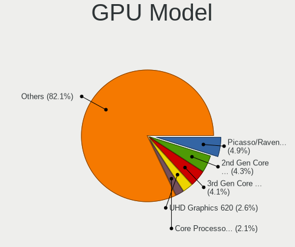

| Model                                                                                    | Computers | Percent |
|------------------------------------------------------------------------------------------|-----------|---------|
| Intel 2nd Generation Core Processor Family Integrated Graphics Controller                | 37        | 4.59%   |
| AMD Picasso/Raven 2 [Radeon Vega Series / Radeon Vega Mobile Series]                     | 37        | 4.59%   |
| Intel 3rd Gen Core processor Graphics Controller                                         | 31        | 3.85%   |
| Intel UHD Graphics 620                                                                   | 27        | 3.35%   |
| AMD Stoney [Radeon R2/R3/R4/R5 Graphics]                                                 | 26        | 3.23%   |
| Intel Skylake GT2 [HD Graphics 520]                                                      | 20        | 2.48%   |
| Intel Core Processor Integrated Graphics Controller                                      | 19        | 2.36%   |
| Intel Haswell-ULT Integrated Graphics Controller                                         | 18        | 2.23%   |
| Intel HD Graphics 620                                                                    | 17        | 2.11%   |
| Intel Atom/Celeron/Pentium Processor x5-E8000/J3xxx/N3xxx Integrated Graphics Controller | 17        | 2.11%   |
| Intel WhiskeyLake-U GT2 [UHD Graphics 620]                                               | 16        | 1.99%   |
| AMD Wani [Radeon R5/R6/R7 Graphics]                                                      | 14        | 1.74%   |
| Intel HD Graphics 5500                                                                   | 12        | 1.49%   |
| Intel 4th Gen Core Processor Integrated Graphics Controller                              | 12        | 1.49%   |
| Intel Mobile 4 Series Chipset Integrated Graphics Controller                             | 11        | 1.36%   |
| Intel CoffeeLake-H GT2 [UHD Graphics 630]                                                | 11        | 1.36%   |
| AMD Raven Ridge [Radeon Vega Series / Radeon Vega Mobile Series]                         | 11        | 1.36%   |
| Nvidia GP107M [GeForce GTX 1050 Mobile]                                                  | 10        | 1.24%   |
| Intel GeminiLake [UHD Graphics 600]                                                      | 10        | 1.24%   |
| Intel Iris Plus Graphics G1 (Ice Lake)                                                   | 9         | 1.12%   |
| Intel Mobile GM965/GL960 Integrated Graphics Controller (secondary)                      | 8         | 0.99%   |
| Intel Mobile GM965/GL960 Integrated Graphics Controller (primary)                        | 8         | 0.99%   |
| Intel HD Graphics 530                                                                    | 8         | 0.99%   |
| Intel 4 Series Chipset Integrated Graphics Controller                                    | 8         | 0.99%   |
| AMD Topaz XT [Radeon R7 M260/M265 / M340/M360 / M440/M445 / 530/535 / 620/625 Mobile]    | 8         | 0.99%   |
| AMD Renoir                                                                               | 8         | 0.99%   |
| AMD Cedar [Radeon HD 5000/6000/7350/8350 Series]                                         | 8         | 0.99%   |
| Intel TigerLake-LP GT2 [Iris Xe Graphics]                                                | 7         | 0.87%   |
| Intel Atom Processor Z36xxx/Z37xxx Series Graphics & Display                             | 7         | 0.87%   |
| Intel 82G33/G31 Express Integrated Graphics Controller                                   | 7         | 0.87%   |
| AMD Sun LE [Radeon HD 8550M / R5 M230]                                                   | 7         | 0.87%   |
| AMD Mullins [Radeon R4/R5 Graphics]                                                      | 7         | 0.87%   |
| AMD Jet PRO [Radeon R5 M230 / R7 M260DX / Radeon 520 Mobile]                             | 7         | 0.87%   |
| Intel Xeon E3-1200 v3/4th Gen Core Processor Integrated Graphics Controller              | 6         | 0.74%   |
| Nvidia GT218 [GeForce 210]                                                               | 5         | 0.62%   |
| Nvidia GM108M [GeForce MX110]                                                            | 5         | 0.62%   |
| Nvidia GF117M [GeForce 610M/710M/810M/820M / GT 620M/625M/630M/720M]                     | 5         | 0.62%   |
| Intel Xeon E3-1200 v2/3rd Gen Core processor Graphics Controller                         | 5         | 0.62%   |
| Intel Mobile 945GM/GMS/GME, 943/940GML Express Integrated Graphics Controller            | 5         | 0.62%   |
| Intel HD Graphics 630                                                                    | 5         | 0.62%   |
| Intel CometLake-U GT2 [UHD Graphics]                                                     | 5         | 0.62%   |
| Intel Atom Processor D4xx/D5xx/N4xx/N5xx Integrated Graphics Controller                  | 5         | 0.62%   |
| AMD Sun XT [Radeon HD 8670A/8670M/8690M / R5 M330 / M430 / Radeon 520 Mobile]            | 5         | 0.62%   |
| AMD RV710 [Radeon HD 4350/4550]                                                          | 5         | 0.62%   |
| Nvidia GM108M [GeForce 940MX]                                                            | 4         | 0.5%    |
| Nvidia GM108M [GeForce 840M]                                                             | 4         | 0.5%    |
| Nvidia GM107M [GeForce GTX 960M]                                                         | 4         | 0.5%    |
| Nvidia GK208BM [GeForce 920M]                                                            | 4         | 0.5%    |
| Intel CometLake-S GT2 [UHD Graphics 630]                                                 | 4         | 0.5%    |
| Intel CometLake-H GT2 [UHD Graphics]                                                     | 4         | 0.5%    |
| Intel 82Q963/Q965 Integrated Graphics Controller                                         | 4         | 0.5%    |
| AMD Wrestler [Radeon HD 6310]                                                            | 4         | 0.5%    |
| AMD RS780L [Radeon 3000]                                                                 | 4         | 0.5%    |
| AMD Lucienne                                                                             | 4         | 0.5%    |
| AMD Ellesmere [Radeon RX 470/480/570/570X/580/580X/590]                                  | 4         | 0.5%    |
| VIA Technologies CN896/VN896/P4M900 [Chrome 9 HC]                                        | 3         | 0.37%   |
| Nvidia TU117M [GeForce GTX 1650 Mobile / Max-Q]                                          | 3         | 0.37%   |
| Nvidia GP108M [GeForce MX230]                                                            | 3         | 0.37%   |
| Nvidia GK208B [GeForce GT 710]                                                           | 3         | 0.37%   |
| Nvidia GF119 [GeForce GT 610]                                                            | 3         | 0.37%   |

GPU Combo
---------

Combinations of graphics cards

| Name            | Computers | Percent |
|-----------------|-----------|---------|
| 1 x Intel       | 293       | 44.33%  |
| 1 x AMD         | 164       | 24.81%  |
| Intel + Nvidia  | 84        | 12.71%  |
| 1 x Nvidia      | 65        | 9.83%   |
| 2 x AMD         | 27        | 4.08%   |
| Intel + AMD     | 12        | 1.82%   |
| AMD + Nvidia    | 5         | 0.76%   |
| 1 x VIA         | 4         | 0.61%   |
| 1 x Matrox      | 4         | 0.61%   |
| Other           | 2         | 0.3%    |
| Nvidia + Matrox | 1         | 0.15%   |

GPU Driver
----------

Free vs proprietary

| Driver      | Computers | Percent |
|-------------|-----------|---------|
| Free        | 557       | 83.89%  |
| Proprietary | 73        | 10.99%  |
| Unknown     | 34        | 5.12%   |

GPU Memory
----------

Total video memory

| Size in GB | Computers | Percent |
|------------|-----------|---------|
| Unknown    | 348       | 51.94%  |
| 1.01-2.0   | 112       | 16.72%  |
| 0.01-0.5   | 108       | 16.12%  |
| 0.51-1.0   | 50        | 7.46%   |
| 3.01-4.0   | 37        | 5.52%   |
| 7.01-8.0   | 5         | 0.75%   |
| 5.01-6.0   | 5         | 0.75%   |
| 8.01-16.0  | 3         | 0.45%   |
| 2.01-3.0   | 2         | 0.3%    |

Monitor
-------

Monitor Vendor
--------------

Monitor vendors

| Vendor                  | Computers | Percent |
|-------------------------|-----------|---------|
| Chimei Innolux          | 122       | 17.28%  |
| Samsung Electronics     | 111       | 15.72%  |
| AU Optronics            | 95        | 13.46%  |
| BOE                     | 68        | 9.63%   |
| LG Display              | 58        | 8.22%   |
| Goldstar                | 51        | 7.22%   |
| Hewlett-Packard         | 37        | 5.24%   |
| Dell                    | 21        | 2.97%   |
| Apple                   | 15        | 2.12%   |
| Acer                    | 14        | 1.98%   |
| Chi Mei Optoelectronics | 11        | 1.56%   |
| AOC                     | 11        | 1.56%   |
| PANDA                   | 10        | 1.42%   |
| Lenovo                  | 8         | 1.13%   |
| ViewSonic               | 6         | 0.85%   |
| Sharp                   | 6         | 0.85%   |
| Sony                    | 5         | 0.71%   |
| InnoLux Display         | 5         | 0.71%   |
| Unknown                 | 4         | 0.57%   |
| LG Philips              | 4         | 0.57%   |
| InfoVision              | 4         | 0.57%   |
| SAC                     | 3         | 0.42%   |
| HannStar                | 3         | 0.42%   |
| CSO                     | 3         | 0.42%   |
| BenQ                    | 3         | 0.42%   |
| Sanyo                   | 2         | 0.28%   |
| LG Electronics          | 2         | 0.28%   |
| KTC                     | 2         | 0.28%   |
| ASUSTek Computer        | 2         | 0.28%   |
| Ancor Communications    | 2         | 0.28%   |
| AGO                     | 2         | 0.28%   |
| Westinghouse            | 1         | 0.14%   |
| Unknown (XXX)           | 1         | 0.14%   |
| SMC                     | 1         | 0.14%   |
| PEGA                    | 1         | 0.14%   |
| NCS                     | 1         | 0.14%   |
| MStar                   | 1         | 0.14%   |
| MSI                     | 1         | 0.14%   |
| LTM                     | 1         | 0.14%   |
| KOA                     | 1         | 0.14%   |
| KDC                     | 1         | 0.14%   |
| HKC                     | 1         | 0.14%   |
| HannStar Display        | 1         | 0.14%   |
| eMachines               | 1         | 0.14%   |
| ELD                     | 1         | 0.14%   |
| DENON                   | 1         | 0.14%   |
| CHO                     | 1         | 0.14%   |

Monitor Model
-------------

Monitor models

| Model                                                                   | Computers | Percent |
|-------------------------------------------------------------------------|-----------|---------|
| Chimei Innolux LCD Monitor CMN15E6 1366x768 344x193mm 15.5-inch         | 14        | 1.96%   |
| Chimei Innolux LCD Monitor CMN14D6 1366x768 309x173mm 13.9-inch         | 14        | 1.96%   |
| Chimei Innolux LCD Monitor CMN14C3 1366x768 309x173mm 13.9-inch         | 11        | 1.54%   |
| Chimei Innolux LCD Monitor CMN15DB 1366x768 344x193mm 15.5-inch         | 9         | 1.26%   |
| Chimei Innolux LCD Monitor CMN14C4 1366x768 309x173mm 13.9-inch         | 8         | 1.12%   |
| BOE LCD Monitor BOE0696 1366x768 309x173mm 13.9-inch                    | 8         | 1.12%   |
| AU Optronics LCD Monitor AUO2D3C 1366x768 309x173mm 13.9-inch           | 8         | 1.12%   |
| BOE LCD Monitor BOE06A4 1366x768 344x194mm 15.5-inch                    | 7         | 0.98%   |
| AU Optronics LCD Monitor AUO723C 1366x768 309x173mm 13.9-inch           | 7         | 0.98%   |
| Samsung Electronics LCD Monitor SAM0C39 1920x1080 700x390mm 31.5-inch   | 6         | 0.84%   |
| BOE LCD Monitor BOE0672 1366x768 344x194mm 15.5-inch                    | 6         | 0.84%   |
| Samsung Electronics SyncMaster SAM036F 1440x900 428x255mm 19.6-inch     | 5         | 0.7%    |
| Samsung Electronics SMB1930N SAM0632 1360x768 410x230mm 18.5-inch       | 5         | 0.7%    |
| Samsung Electronics S22F350 SAM0D1A 1920x1080 477x268mm 21.5-inch       | 5         | 0.7%    |
| PANDA LCD Monitor NCP0035 1920x1080 309x174mm 14.0-inch                 | 5         | 0.7%    |
| LG Display LCD Monitor LGD02DC 1366x768 344x194mm 15.5-inch             | 5         | 0.7%    |
| Goldstar FULL HD GSM5B55 1920x1080 480x270mm 21.7-inch                  | 5         | 0.7%    |
| Chimei Innolux LCD Monitor CMN15DC 1366x768 344x193mm 15.5-inch         | 5         | 0.7%    |
| Chimei Innolux LCD Monitor CMN14E5 1920x1080 309x173mm 13.9-inch        | 4         | 0.56%   |
| Chimei Innolux LCD Monitor CMN1491 1366x768 309x174mm 14.0-inch         | 4         | 0.56%   |
| Chimei Innolux LCD Monitor CMN1490 1366x768 309x173mm 13.9-inch         | 4         | 0.56%   |
| BOE LCD Monitor BOE07AA 1366x768 344x194mm 15.5-inch                    | 4         | 0.56%   |
| BOE LCD Monitor BOE0704 1366x768 344x194mm 15.5-inch                    | 4         | 0.56%   |
| BOE LCD Monitor BOE0644 1366x768 309x173mm 13.9-inch                    | 4         | 0.56%   |
| AU Optronics LCD Monitor AUO61ED 1920x1080 344x194mm 15.5-inch          | 4         | 0.56%   |
| AU Optronics LCD Monitor AUO323C 1366x768 309x173mm 13.9-inch           | 4         | 0.56%   |
| Sharp LCD Monitor SHP143E 3840x2160 346x194mm 15.6-inch                 | 3         | 0.42%   |
| Samsung Electronics U28E590 SAM0C4E 3840x2160 608x345mm 27.5-inch       | 3         | 0.42%   |
| Samsung Electronics SA300/SA350 SAM078B 1600x900 443x249mm 20.0-inch    | 3         | 0.42%   |
| Samsung Electronics LCD Monitor SAM0F13 3840x2160 1872x1053mm 84.6-inch | 3         | 0.42%   |
| Samsung Electronics C24F390 SAM0D2C 1920x1080 521x293mm 23.5-inch       | 3         | 0.42%   |
| LG Display LCD Monitor LGD045C 1366x768 345x194mm 15.6-inch             | 3         | 0.42%   |
| LG Display LCD Monitor LGD02F8 1366x768 309x174mm 14.0-inch             | 3         | 0.42%   |
| Hewlett-Packard Compaq S1922 HWP290B 1366x768 413x234mm 18.7-inch       | 3         | 0.42%   |
| Goldstar W2243 GSM56FE 1920x1080 480x270mm 21.7-inch                    | 3         | 0.42%   |
| Goldstar W2043 GSM4E9D 1600x900 450x250mm 20.3-inch                     | 3         | 0.42%   |
| Goldstar MP59G GSM5B34 1920x1080 480x270mm 21.7-inch                    | 3         | 0.42%   |
| Goldstar LG HD PLUS GSM5AC5 1600x900 440x250mm 19.9-inch                | 3         | 0.42%   |
| Goldstar E1942 GSM4C09 1366x768 410x230mm 18.5-inch                     | 3         | 0.42%   |
| Chimei Innolux LCD Monitor CMN15E8 1920x1080 344x193mm 15.5-inch        | 3         | 0.42%   |
| Chimei Innolux LCD Monitor CMN1495 1366x768 309x173mm 13.9-inch         | 3         | 0.42%   |
| BOE LCD Monitor BOE07F7 1920x1080 309x174mm 14.0-inch                   | 3         | 0.42%   |
| BOE LCD Monitor BOE05BA 1366x768 309x173mm 13.9-inch                    | 3         | 0.42%   |
| AU Optronics LCD Monitor AUO71EC 1366x768 344x193mm 15.5-inch           | 3         | 0.42%   |
| AU Optronics LCD Monitor AUO70EC 1366x768 344x193mm 15.5-inch           | 3         | 0.42%   |
| AU Optronics LCD Monitor AUO333C 1366x768 309x173mm 13.9-inch           | 3         | 0.42%   |
| AU Optronics LCD Monitor AUO2E3C 1366x768 309x173mm 13.9-inch           | 3         | 0.42%   |
| AU Optronics LCD Monitor AUO183C 1366x768 309x173mm 13.9-inch           | 3         | 0.42%   |
| AU Optronics LCD Monitor AUO106C 1366x768 277x156mm 12.5-inch           | 3         | 0.42%   |
| Apple iMac APPA012 1920x1080 475x267mm 21.5-inch                        | 3         | 0.42%   |
| Acer V206HQLB ACR051A 1366x768 434x236mm 19.4-inch                      | 3         | 0.42%   |
| Unknown LCD Monitor SAMSUNG 1920x1080                                   | 2         | 0.28%   |
| Sony TV SNYF301 1920x1080                                               | 2         | 0.28%   |
| Sanyo LCD TV SAN0523 1920x1080 443x249mm 20.0-inch                      | 2         | 0.28%   |
| Samsung Electronics U28E510 SAM0D63 3840x2160 607x345mm 27.5-inch       | 2         | 0.28%   |
| Samsung Electronics SyncMaster SAM02E3 1440x900 367x229mm 17.0-inch     | 2         | 0.28%   |
| Samsung Electronics SA300/SA350 SAM0788 1366x768 410x230mm 18.5-inch    | 2         | 0.28%   |
| Samsung Electronics S20D300 SAM0BDB 1366x768 432x240mm 19.5-inch        | 2         | 0.28%   |
| Samsung Electronics LF22T35 SAM707B 1920x1080 477x268mm 21.5-inch       | 2         | 0.28%   |
| Samsung Electronics LCD Monitor SEC5441 1366x768 309x174mm 14.0-inch    | 2         | 0.28%   |

Monitor Resolution
------------------

Monitor screen resolution

| Resolution         | Computers | Percent |
|--------------------|-----------|---------|
| 1366x768 (WXGA)    | 311       | 46.14%  |
| 1920x1080 (FHD)    | 175       | 25.96%  |
| 1600x900 (HD+)     | 37        | 5.49%   |
| 3840x2160 (4K)     | 29        | 4.3%    |
| 1440x900 (WXGA+)   | 25        | 3.71%   |
| 1280x1024 (SXGA)   | 23        | 3.41%   |
| 1280x800 (WXGA)    | 16        | 2.37%   |
| 1360x768           | 9         | 1.34%   |
| 2560x1440 (QHD)    | 6         | 0.89%   |
| 1024x600           | 6         | 0.89%   |
| 1920x1200 (WUXGA)  | 5         | 0.74%   |
| 2560x1080          | 4         | 0.59%   |
| Unknown            | 4         | 0.59%   |
| 3840x1080          | 3         | 0.45%   |
| 2560x1600          | 3         | 0.45%   |
| 1680x1050 (WSXGA+) | 3         | 0.45%   |
| 1024x768 (XGA)     | 3         | 0.45%   |
| 3456x2160          | 2         | 0.3%    |
| 3440x1440          | 2         | 0.3%    |
| 1280x720 (HD)      | 2         | 0.3%    |
| 3200x1080          | 1         | 0.15%   |
| 2880x1800          | 1         | 0.15%   |
| 2256x1504          | 1         | 0.15%   |
| 1920x540           | 1         | 0.15%   |
| 1536x2048          | 1         | 0.15%   |
| 1152x864           | 1         | 0.15%   |

Monitor Diagonal
----------------

Diagonal size in inches

| Inches  | Computers | Percent |
|---------|-----------|---------|
| 15      | 169       | 23.84%  |
| 13      | 127       | 17.91%  |
| 14      | 94        | 13.26%  |
| 21      | 45        | 6.35%   |
| 19      | 35        | 4.94%   |
| 23      | 33        | 4.65%   |
| 17      | 33        | 4.65%   |
| 18      | 32        | 4.51%   |
| 20      | 16        | 2.26%   |
| Unknown | 16        | 2.26%   |
| 27      | 15        | 2.12%   |
| 24      | 12        | 1.69%   |
| 12      | 12        | 1.69%   |
| 11      | 11        | 1.55%   |
| 31      | 7         | 0.99%   |
| 10      | 7         | 0.99%   |
| 84      | 6         | 0.85%   |
| 47      | 6         | 0.85%   |
| 72      | 5         | 0.71%   |
| 22      | 5         | 0.71%   |
| 34      | 4         | 0.56%   |
| 40      | 3         | 0.42%   |
| 48      | 2         | 0.28%   |
| 16      | 2         | 0.28%   |
| 8       | 2         | 0.28%   |
| 61      | 1         | 0.14%   |
| 60      | 1         | 0.14%   |
| 54      | 1         | 0.14%   |
| 52      | 1         | 0.14%   |
| 44      | 1         | 0.14%   |
| 43      | 1         | 0.14%   |
| 32      | 1         | 0.14%   |
| 28      | 1         | 0.14%   |
| 26      | 1         | 0.14%   |
| 9       | 1         | 0.14%   |

Monitor Width
-------------

Physical width

| Width in mm | Computers | Percent |
|-------------|-----------|---------|
| 301-350     | 376       | 53.64%  |
| 401-500     | 127       | 18.12%  |
| 501-600     | 53        | 7.56%   |
| 201-300     | 52        | 7.42%   |
| 351-400     | 26        | 3.71%   |
| Unknown     | 16        | 2.28%   |
| 601-700     | 15        | 2.14%   |
| 1001-1500   | 12        | 1.71%   |
| 1501-2000   | 11        | 1.57%   |
| 701-800     | 5         | 0.71%   |
| 801-900     | 3         | 0.43%   |
| 101-200     | 3         | 0.43%   |
| 901-1000    | 2         | 0.29%   |

Aspect Ratio
------------

Proportional relationship between the width and the height

| Ratio   | Computers | Percent |
|---------|-----------|---------|
| 16/9    | 529       | 83.05%  |
| 16/10   | 56        | 8.79%   |
| 5/4     | 21        | 3.3%    |
| Unknown | 14        | 2.2%    |
| 4/3     | 6         | 0.94%   |
| 21/9    | 5         | 0.78%   |
| 32/9    | 3         | 0.47%   |
| 3/2     | 2         | 0.31%   |
| 0.75    | 1         | 0.16%   |

Monitor Area
------------

Area in inch

| Area in inch | Computers | Percent |
|----------------|-----------|---------|
| 81-90          | 204       | 28.94%  |
| 101-110        | 167       | 23.69%  |
| 201-250        | 82        | 11.63%  |
| 151-200        | 58        | 8.23%   |
| 141-150        | 47        | 6.67%   |
| 71-80          | 17        | 2.41%   |
| 301-350        | 16        | 2.27%   |
| Unknown        | 16        | 2.27%   |
| More than 1000 | 15        | 2.13%   |
| 501-1000       | 13        | 1.84%   |
| 351-500        | 12        | 1.7%    |
| 121-130        | 12        | 1.7%    |
| 51-60          | 11        | 1.56%   |
| 61-70          | 10        | 1.42%   |
| 41-50          | 8         | 1.13%   |
| 251-300        | 6         | 0.85%   |
| 131-140        | 6         | 0.85%   |
| 111-120        | 3         | 0.43%   |
| 1-40           | 2         | 0.28%   |

Pixel Density
-------------

Pixels per inch

| Density       | Computers | Percent |
|---------------|-----------|---------|
| 101-120       | 322       | 46.6%   |
| 51-100        | 189       | 27.35%  |
| 121-160       | 113       | 16.35%  |
| 1-50          | 21        | 3.04%   |
| 161-240       | 18        | 2.6%    |
| Unknown       | 16        | 2.32%   |
| More than 240 | 12        | 1.74%   |

Multiple Monitors
-----------------

Total monitors connected

| Total | Computers | Percent |
|-------|-----------|---------|
| 1     | 537       | 79.2%   |
| 2     | 100       | 14.75%  |
| 0     | 36        | 5.31%   |
| 3     | 4         | 0.59%   |
| 4     | 1         | 0.15%   |

Network
-------

Net Controller Vendor
---------------------

Controller vendors

| Vendor                            | Computers | Percent |
|-----------------------------------|-----------|---------|
| Realtek Semiconductor             | 433       | 42.45%  |
| Intel                             | 192       | 18.82%  |
| Qualcomm Atheros                  | 164       | 16.08%  |
| Broadcom                          | 59        | 5.78%   |
| Broadcom Limited                  | 27        | 2.65%   |
| Ralink Technology                 | 24        | 2.35%   |
| Ralink                            | 16        | 1.57%   |
| Nvidia                            | 16        | 1.57%   |
| TP-Link                           | 14        | 1.37%   |
| Marvell Technology Group          | 9         | 0.88%   |
| Samsung Electronics               | 8         | 0.78%   |
| Qualcomm Atheros Communications   | 6         | 0.59%   |
| ICS Advent                        | 6         | 0.59%   |
| Xiaomi                            | 4         | 0.39%   |
| VIA Technologies                  | 4         | 0.39%   |
| Huawei Technologies               | 4         | 0.39%   |
| ASIX Electronics                  | 4         | 0.39%   |
| Mercucys                          | 3         | 0.29%   |
| D-Link System                     | 3         | 0.29%   |
| T & A Mobile Phones               | 2         | 0.2%    |
| Qualcomm                          | 2         | 0.2%    |
| Motorola PCS                      | 2         | 0.2%    |
| MediaTek                          | 2         | 0.2%    |
| DisplayLink                       | 2         | 0.2%    |
| Wistron NeWeb                     | 1         | 0.1%    |
| Sundance Technology Inc / IC Plus | 1         | 0.1%    |
| STMicroelectronics                | 1         | 0.1%    |
| Quanta                            | 1         | 0.1%    |
| Prolific Technology               | 1         | 0.1%    |
| OPPO Electronics                  | 1         | 0.1%    |
| Mellanox Technologies             | 1         | 0.1%    |
| Lenovo                            | 1         | 0.1%    |
| JMicron Technology                | 1         | 0.1%    |
| Google                            | 1         | 0.1%    |
| Encore Electronics                | 1         | 0.1%    |
| Dell                              | 1         | 0.1%    |
| Aquantia                          | 1         | 0.1%    |
| 3Com                              | 1         | 0.1%    |

Net Controller Model
--------------------

Controller models

| Model                                                                   | Computers | Percent |
|-------------------------------------------------------------------------|-----------|---------|
| Realtek RTL8111/8168/8411 PCI Express Gigabit Ethernet Controller       | 275       | 23.25%  |
| Realtek RTL810xE PCI Express Fast Ethernet controller                   | 80        | 6.76%   |
| Qualcomm Atheros QCA9377 802.11ac Wireless Network Adapter              | 39        | 3.3%    |
| Realtek RTL8723DE Wireless Network Adapter                              | 33        | 2.79%   |
| Realtek RTL8821CE 802.11ac PCIe Wireless Network Adapter                | 28        | 2.37%   |
| Intel Wireless 8265 / 8275                                              | 28        | 2.37%   |
| Qualcomm Atheros AR9485 Wireless Network Adapter                        | 25        | 2.11%   |
| Qualcomm Atheros AR9285 Wireless Network Adapter (PCI-Express)          | 22        | 1.86%   |
| Qualcomm Atheros QCA9565 / AR9565 Wireless Network Adapter              | 20        | 1.69%   |
| Realtek RTL8723BE PCIe Wireless Network Adapter                         | 17        | 1.44%   |
| Intel Wi-Fi 6 AX200                                                     | 17        | 1.44%   |
| Realtek RTL8153 Gigabit Ethernet Adapter                                | 14        | 1.18%   |
| Realtek RTL8822BE 802.11a/b/g/n/ac WiFi adapter                         | 13        | 1.1%    |
| Ralink MT7601U Wireless Adapter                                         | 12        | 1.01%   |
| Qualcomm Atheros AR8152 v2.0 Fast Ethernet                              | 12        | 1.01%   |
| Realtek RTL8821AE 802.11ac PCIe Wireless Network Adapter                | 10        | 0.85%   |
| Ralink RT2870/RT3070 Wireless Adapter                                   | 10        | 0.85%   |
| Intel Wireless 7260                                                     | 10        | 0.85%   |
| Intel Cannon Point-LP CNVi [Wireless-AC]                                | 10        | 0.85%   |
| Intel 82579LM Gigabit Network Connection (Lewisville)                   | 10        | 0.85%   |
| Realtek RTL8125 2.5GbE Controller                                       | 9         | 0.76%   |
| Broadcom BCM43142 802.11b/g/n                                           | 9         | 0.76%   |
| Realtek RTL8822CE 802.11ac PCIe Wireless Network Adapter                | 8         | 0.68%   |
| Realtek RTL8188EUS 802.11n Wireless Network Adapter                     | 8         | 0.68%   |
| Nvidia MCP61 Ethernet                                                   | 8         | 0.68%   |
| Intel Dual Band Wireless-AC 3165 Plus Bluetooth                         | 8         | 0.68%   |
| Intel Cannon Lake PCH CNVi WiFi                                         | 8         | 0.68%   |
| Ralink RT3290 Wireless 802.11n 1T/1R PCIe                               | 7         | 0.59%   |
| Qualcomm Atheros AR242x / AR542x Wireless Network Adapter (PCI-Express) | 7         | 0.59%   |
| Intel Wireless 8260                                                     | 7         | 0.59%   |
| Broadcom BCM4313 802.11bgn Wireless Network Adapter                     | 7         | 0.59%   |
| TP-Link AC600 wireless Realtek RTL8811AU [Archer T2U Nano]              | 6         | 0.51%   |
| Realtek RTL8188CE 802.11b/g/n WiFi Adapter                              | 6         | 0.51%   |
| Qualcomm Atheros AR9287 Wireless Network Adapter (PCI-Express)          | 6         | 0.51%   |
| Qualcomm Atheros AR8151 v2.0 Gigabit Ethernet                           | 6         | 0.51%   |
| Intel Wireless 7265                                                     | 6         | 0.51%   |
| Intel I211 Gigabit Network Connection                                   | 6         | 0.51%   |
| Intel Ethernet Connection I219-LM                                       | 6         | 0.51%   |
| Intel Centrino Wireless-N 2230                                          | 6         | 0.51%   |
| Intel Centrino Advanced-N 6205 [Taylor Peak]                            | 6         | 0.51%   |
| Samsung Galaxy series, misc. (tethering mode)                           | 5         | 0.42%   |
| Realtek RTL8188EE Wireless Network Adapter                              | 5         | 0.42%   |
| Realtek RTL-8100/8101L/8139 PCI Fast Ethernet Adapter                   | 5         | 0.42%   |
| Qualcomm Atheros AR9271 802.11n                                         | 5         | 0.42%   |
| Qualcomm Atheros AR928X Wireless Network Adapter (PCI-Express)          | 5         | 0.42%   |
| Intel Wi-Fi 6 AX201                                                     | 5         | 0.42%   |
| ICS Advent DM9601 Fast Ethernet Adapter                                 | 5         | 0.42%   |
| Broadcom NetLink BCM57785 Gigabit Ethernet PCIe                         | 5         | 0.42%   |
| Broadcom NetLink BCM57780 Gigabit Ethernet PCIe                         | 5         | 0.42%   |
| Broadcom Limited BCM43142 802.11b/g/n                                   | 5         | 0.42%   |
| Broadcom BCM4312 802.11b/g LP-PHY                                       | 5         | 0.42%   |
| Xiaomi Mi/Redmi series (RNDIS)                                          | 4         | 0.34%   |
| VIA VT6102/VT6103 [Rhine-II]                                            | 4         | 0.34%   |
| Qualcomm Atheros QCA6174 802.11ac Wireless Network Adapter              | 4         | 0.34%   |
| Qualcomm Atheros AR8162 Fast Ethernet                                   | 4         | 0.34%   |
| Qualcomm Atheros AR8132 Fast Ethernet                                   | 4         | 0.34%   |
| Nvidia MCP79 Ethernet                                                   | 4         | 0.34%   |
| Intel PRO/Wireless 3945ABG [Golan] Network Connection                   | 4         | 0.34%   |
| Intel Ice Lake-LP PCH CNVi WiFi                                         | 4         | 0.34%   |
| Intel Ethernet Connection I219-V                                        | 4         | 0.34%   |

Wireless Vendor
---------------

Wireless vendors

| Vendor                          | Computers | Percent |
|---------------------------------|-----------|---------|
| Intel                           | 159       | 27.89%  |
| Realtek Semiconductor           | 154       | 27.02%  |
| Qualcomm Atheros                | 134       | 23.51%  |
| Broadcom                        | 33        | 5.79%   |
| Ralink Technology               | 24        | 4.21%   |
| Broadcom Limited                | 18        | 3.16%   |
| Ralink                          | 16        | 2.81%   |
| TP-Link                         | 14        | 2.46%   |
| Qualcomm Atheros Communications | 6         | 1.05%   |
| Mercucys                        | 3         | 0.53%   |
| D-Link System                   | 2         | 0.35%   |
| Wistron NeWeb                   | 1         | 0.18%   |
| Qualcomm                        | 1         | 0.18%   |
| MEDIATEK                        | 1         | 0.18%   |
| Marvell Technology Group        | 1         | 0.18%   |
| Encore Electronics              | 1         | 0.18%   |
| Dell                            | 1         | 0.18%   |
| 3Com                            | 1         | 0.18%   |

Wireless Model
--------------

Wireless models

| Model                                                                   | Computers | Percent |
|-------------------------------------------------------------------------|-----------|---------|
| Qualcomm Atheros QCA9377 802.11ac Wireless Network Adapter              | 39        | 6.82%   |
| Realtek RTL8723DE Wireless Network Adapter                              | 33        | 5.77%   |
| Realtek RTL8821CE 802.11ac PCIe Wireless Network Adapter                | 28        | 4.9%    |
| Intel Wireless 8265 / 8275                                              | 28        | 4.9%    |
| Qualcomm Atheros AR9485 Wireless Network Adapter                        | 25        | 4.37%   |
| Qualcomm Atheros AR9285 Wireless Network Adapter (PCI-Express)          | 22        | 3.85%   |
| Qualcomm Atheros QCA9565 / AR9565 Wireless Network Adapter              | 20        | 3.5%    |
| Realtek RTL8723BE PCIe Wireless Network Adapter                         | 17        | 2.97%   |
| Intel Wi-Fi 6 AX200                                                     | 17        | 2.97%   |
| Realtek RTL8822BE 802.11a/b/g/n/ac WiFi adapter                         | 13        | 2.27%   |
| Ralink MT7601U Wireless Adapter                                         | 12        | 2.1%    |
| Realtek RTL8821AE 802.11ac PCIe Wireless Network Adapter                | 10        | 1.75%   |
| Ralink RT2870/RT3070 Wireless Adapter                                   | 10        | 1.75%   |
| Intel Wireless 7260                                                     | 10        | 1.75%   |
| Intel Cannon Point-LP CNVi [Wireless-AC]                                | 10        | 1.75%   |
| Broadcom BCM43142 802.11b/g/n                                           | 9         | 1.57%   |
| Realtek RTL8822CE 802.11ac PCIe Wireless Network Adapter                | 8         | 1.4%    |
| Realtek RTL8188EUS 802.11n Wireless Network Adapter                     | 8         | 1.4%    |
| Intel Dual Band Wireless-AC 3165 Plus Bluetooth                         | 8         | 1.4%    |
| Intel Cannon Lake PCH CNVi WiFi                                         | 8         | 1.4%    |
| Ralink RT3290 Wireless 802.11n 1T/1R PCIe                               | 7         | 1.22%   |
| Qualcomm Atheros AR242x / AR542x Wireless Network Adapter (PCI-Express) | 7         | 1.22%   |
| Intel Wireless 8260                                                     | 7         | 1.22%   |
| Broadcom BCM4313 802.11bgn Wireless Network Adapter                     | 7         | 1.22%   |
| TP-Link AC600 wireless Realtek RTL8811AU [Archer T2U Nano]              | 6         | 1.05%   |
| Realtek RTL8188CE 802.11b/g/n WiFi Adapter                              | 6         | 1.05%   |
| Qualcomm Atheros AR9287 Wireless Network Adapter (PCI-Express)          | 6         | 1.05%   |
| Intel Wireless 7265                                                     | 6         | 1.05%   |
| Intel Centrino Wireless-N 2230                                          | 6         | 1.05%   |
| Intel Centrino Advanced-N 6205 [Taylor Peak]                            | 6         | 1.05%   |
| Realtek RTL8188EE Wireless Network Adapter                              | 5         | 0.87%   |
| Qualcomm Atheros AR9271 802.11n                                         | 5         | 0.87%   |
| Qualcomm Atheros AR928X Wireless Network Adapter (PCI-Express)          | 5         | 0.87%   |
| Intel Wi-Fi 6 AX201                                                     | 5         | 0.87%   |
| Broadcom Limited BCM43142 802.11b/g/n                                   | 5         | 0.87%   |
| Broadcom BCM4312 802.11b/g LP-PHY                                       | 5         | 0.87%   |
| Qualcomm Atheros QCA6174 802.11ac Wireless Network Adapter              | 4         | 0.7%    |
| Intel PRO/Wireless 3945ABG [Golan] Network Connection                   | 4         | 0.7%    |
| Intel Ice Lake-LP PCH CNVi WiFi                                         | 4         | 0.7%    |
| Intel Comet Lake PCH-LP CNVi WiFi                                       | 4         | 0.7%    |
| Intel Comet Lake PCH CNVi WiFi                                          | 4         | 0.7%    |
| TP-Link 802.11n NIC                                                     | 3         | 0.52%   |
| Realtek RTL8192CU 802.11n WLAN Adapter                                  | 3         | 0.52%   |
| Realtek RTL-8185 IEEE 802.11a/b/g Wireless LAN Controller               | 3         | 0.52%   |
| Mercucys 802.11n NIC                                                    | 3         | 0.52%   |
| Intel Wireless 3160                                                     | 3         | 0.52%   |
| Intel Dual Band Wireless-AC 3168NGW [Stone Peak]                        | 3         | 0.52%   |
| Intel Centrino Wireless-N 1000 [Condor Peak]                            | 3         | 0.52%   |
| Broadcom Limited BCM43602 802.11ac Wireless LAN SoC                     | 3         | 0.52%   |
| Broadcom Limited BCM4360 802.11ac Wireless Network Adapter              | 3         | 0.52%   |
| Broadcom Limited BCM4312 802.11b/g LP-PHY                               | 3         | 0.52%   |
| Broadcom BCM43228 802.11a/b/g/n                                         | 3         | 0.52%   |
| Realtek RTL8723AE PCIe Wireless Network Adapter                         | 2         | 0.35%   |
| Realtek RTL8192EE PCIe Wireless Network Adapter                         | 2         | 0.35%   |
| Realtek RTL8191SEvB Wireless LAN Controller                             | 2         | 0.35%   |
| Realtek RTL8190 802.11n PCI Wireless Network Adapter                    | 2         | 0.35%   |
| Realtek RTL8187B Wireless 802.11g 54Mbps Network Adapter                | 2         | 0.35%   |
| Ralink RT5370 Wireless Adapter                                          | 2         | 0.35%   |
| Ralink RT5390R 802.11bgn PCIe Wireless Network Adapter                  | 2         | 0.35%   |
| Ralink RT5390 Wireless 802.11n 1T/1R PCIe                               | 2         | 0.35%   |

Ethernet Vendor
---------------

Ethernet vendors

| Vendor                            | Computers | Percent |
|-----------------------------------|-----------|---------|
| Realtek Semiconductor             | 384       | 63.58%  |
| Intel                             | 69        | 11.42%  |
| Qualcomm Atheros                  | 43        | 7.12%   |
| Broadcom                          | 30        | 4.97%   |
| Nvidia                            | 16        | 2.65%   |
| Broadcom Limited                  | 9         | 1.49%   |
| Samsung Electronics               | 8         | 1.32%   |
| Marvell Technology Group          | 8         | 1.32%   |
| ICS Advent                        | 6         | 0.99%   |
| Xiaomi                            | 4         | 0.66%   |
| VIA Technologies                  | 4         | 0.66%   |
| Huawei Technologies               | 4         | 0.66%   |
| ASIX Electronics                  | 4         | 0.66%   |
| T & A Mobile Phones               | 2         | 0.33%   |
| DisplayLink                       | 2         | 0.33%   |
| Sundance Technology Inc / IC Plus | 1         | 0.17%   |
| Quanta                            | 1         | 0.17%   |
| Qualcomm                          | 1         | 0.17%   |
| Prolific Technology               | 1         | 0.17%   |
| OPPO Electronics                  | 1         | 0.17%   |
| Mellanox Technologies             | 1         | 0.17%   |
| MediaTek                          | 1         | 0.17%   |
| Lenovo                            | 1         | 0.17%   |
| JMicron Technology                | 1         | 0.17%   |
| D-Link System                     | 1         | 0.17%   |
| Aquantia                          | 1         | 0.17%   |

Ethernet Model
--------------

Ethernet models

| Model                                                                      | Computers | Percent |
|----------------------------------------------------------------------------|-----------|---------|
| Realtek RTL8111/8168/8411 PCI Express Gigabit Ethernet Controller          | 275       | 45.3%   |
| Realtek RTL810xE PCI Express Fast Ethernet controller                      | 80        | 13.18%  |
| Realtek RTL8153 Gigabit Ethernet Adapter                                   | 14        | 2.31%   |
| Qualcomm Atheros AR8152 v2.0 Fast Ethernet                                 | 12        | 1.98%   |
| Intel 82579LM Gigabit Network Connection (Lewisville)                      | 10        | 1.65%   |
| Realtek RTL8125 2.5GbE Controller                                          | 9         | 1.48%   |
| Nvidia MCP61 Ethernet                                                      | 8         | 1.32%   |
| Qualcomm Atheros AR8151 v2.0 Gigabit Ethernet                              | 6         | 0.99%   |
| Intel I211 Gigabit Network Connection                                      | 6         | 0.99%   |
| Intel Ethernet Connection I219-LM                                          | 6         | 0.99%   |
| Samsung Galaxy series, misc. (tethering mode)                              | 5         | 0.82%   |
| Realtek RTL-8100/8101L/8139 PCI Fast Ethernet Adapter                      | 5         | 0.82%   |
| ICS Advent DM9601 Fast Ethernet Adapter                                    | 5         | 0.82%   |
| Broadcom NetLink BCM57785 Gigabit Ethernet PCIe                            | 5         | 0.82%   |
| Broadcom NetLink BCM57780 Gigabit Ethernet PCIe                            | 5         | 0.82%   |
| Xiaomi Mi/Redmi series (RNDIS)                                             | 4         | 0.66%   |
| VIA VT6102/VT6103 [Rhine-II]                                               | 4         | 0.66%   |
| Qualcomm Atheros AR8162 Fast Ethernet                                      | 4         | 0.66%   |
| Qualcomm Atheros AR8132 Fast Ethernet                                      | 4         | 0.66%   |
| Nvidia MCP79 Ethernet                                                      | 4         | 0.66%   |
| Intel Ethernet Connection I219-V                                           | 4         | 0.66%   |
| Intel 82579V Gigabit Network Connection                                    | 4         | 0.66%   |
| Intel 82577LM Gigabit Network Connection                                   | 4         | 0.66%   |
| Huawei JNY-LX1                                                             | 4         | 0.66%   |
| Samsung GT-I9070 (network tethering, USB debugging enabled)                | 3         | 0.49%   |
| Realtek RTL8152 Fast Ethernet Adapter                                      | 3         | 0.49%   |
| Qualcomm Atheros Killer E220x Gigabit Ethernet Controller                  | 3         | 0.49%   |
| Qualcomm Atheros AR8152 v1.1 Fast Ethernet                                 | 3         | 0.49%   |
| Marvell Group 88E8040 PCI-E Fast Ethernet Controller                       | 3         | 0.49%   |
| Intel Ethernet Connection I218-LM                                          | 3         | 0.49%   |
| Intel Ethernet Connection (4) I219-V                                       | 3         | 0.49%   |
| Broadcom NetXtreme BCM57766 Gigabit Ethernet PCIe                          | 3         | 0.49%   |
| Broadcom NetLink BCM5906M Fast Ethernet PCI Express                        | 3         | 0.49%   |
| Broadcom Limited NetLink BCM57780 Gigabit Ethernet PCIe                    | 3         | 0.49%   |
| Qualcomm Atheros QCA8171 Gigabit Ethernet                                  | 2         | 0.33%   |
| Qualcomm Atheros Killer E2400 Gigabit Ethernet Controller                  | 2         | 0.33%   |
| Qualcomm Atheros Attansic L2 Fast Ethernet                                 | 2         | 0.33%   |
| Nvidia MCP67 Ethernet                                                      | 2         | 0.33%   |
| Intel Ethernet Controller I225-V                                           | 2         | 0.33%   |
| Intel Ethernet Connection (3) I218-LM                                      | 2         | 0.33%   |
| Intel Ethernet Connection (2) I219-V                                       | 2         | 0.33%   |
| Intel Ethernet Connection (10) I219-V                                      | 2         | 0.33%   |
| Intel 82578DC Gigabit Network Connection                                   | 2         | 0.33%   |
| Intel 82566DM Gigabit Network Connection                                   | 2         | 0.33%   |
| Broadcom NetXtreme BCM5754 Gigabit Ethernet PCI Express                    | 2         | 0.33%   |
| Broadcom Limited NetXtreme II BCM5709 Gigabit Ethernet                     | 2         | 0.33%   |
| ASIX AX88772B                                                              | 2         | 0.33%   |
| T & A Mobile Phones ALCATEL ONE TOUCH POP C1                               | 1         | 0.16%   |
| T & A Mobile Phones Alcatel 3X                                             | 1         | 0.16%   |
| Sundance Inc / IC Plus IC Plus IP100A Integrated 10/100 Ethernet MAC + PHY | 1         | 0.16%   |
| Realtek Killer E2600 Gigabit Ethernet Controller                           | 1         | 0.16%   |
| Quanta HSUSB Device                                                        | 1         | 0.16%   |
| Qualcomm Mi A1                                                             | 1         | 0.16%   |
| Qualcomm Atheros Killer E2500 Gigabit Ethernet Controller                  | 1         | 0.16%   |
| Qualcomm Atheros AR8161 Gigabit Ethernet                                   | 1         | 0.16%   |
| Qualcomm Atheros AR8151 v1.0 Gigabit Ethernet                              | 1         | 0.16%   |
| Qualcomm Atheros AR8131 Gigabit Ethernet                                   | 1         | 0.16%   |
| Qualcomm Atheros AR8121/AR8113/AR8114 Gigabit or Fast Ethernet             | 1         | 0.16%   |
| Prolific PL25A1 Host-Host Bridge                                           | 1         | 0.16%   |
| OPPO SDM665-IDP _SN:18689828                                               | 1         | 0.16%   |

Net Controller Kind
-------------------

Ethernet, WiFi or modem

| Kind     | Computers | Percent |
|----------|-----------|---------|
| Ethernet | 573       | 51.44%  |
| WiFi     | 537       | 48.2%   |
| Unknown  | 3         | 0.27%   |
| Modem    | 1         | 0.09%   |

Used Controller
---------------

Currently used network controller

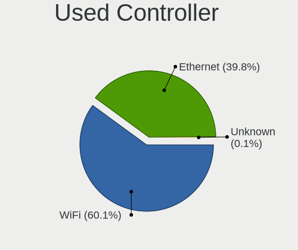

| Kind     | Computers | Percent |
|----------|-----------|---------|
| WiFi     | 439       | 52.96%  |
| Ethernet | 389       | 46.92%  |
| Unknown  | 1         | 0.12%   |

NICs
----

Total network controllers on board

| Total | Computers | Percent |
|-------|-----------|---------|
| 2     | 396       | 60%     |
| 1     | 251       | 38.03%  |
| 0     | 7         | 1.06%   |
| 3     | 3         | 0.45%   |
| 7     | 1         | 0.15%   |
| 6     | 1         | 0.15%   |
| 4     | 1         | 0.15%   |

IPv6
----

IPv6 vs IPv4

| Used | Computers | Percent |
|------|-----------|---------|
| No   | 631       | 95.03%  |
| Yes  | 33        | 4.97%   |

Bluetooth
---------

Bluetooth Vendor
----------------

Controller vendors

| Vendor                          | Computers | Percent |
|---------------------------------|-----------|---------|
| Intel                           | 131       | 31.49%  |
| Realtek Semiconductor           | 80        | 19.23%  |
| IMC Networks                    | 50        | 12.02%  |
| Qualcomm Atheros Communications | 42        | 10.1%   |
| Lite-On Technology              | 25        | 6.01%   |
| Cambridge Silicon Radio         | 24        | 5.77%   |
| Broadcom                        | 15        | 3.61%   |
| Apple                           | 13        | 3.13%   |
| Foxconn / Hon Hai               | 10        | 2.4%    |
| Ralink                          | 7         | 1.68%   |
| Hewlett-Packard                 | 5         | 1.2%    |
| Toshiba                         | 3         | 0.72%   |
| Foxconn International           | 3         | 0.72%   |
| Dell                            | 3         | 0.72%   |
| Alps Electric                   | 2         | 0.48%   |
| Realtek                         | 1         | 0.24%   |
| MediaTek                        | 1         | 0.24%   |
| ASUSTek Computer                | 1         | 0.24%   |

Bluetooth Model
---------------

Controller models

| Model                                                       | Computers | Percent |
|-------------------------------------------------------------|-----------|---------|
| Intel Bluetooth wireless interface                          | 60        | 14.42%  |
| Realtek 802.11n WLAN Adapter                                | 33        | 7.93%   |
| Realtek Bluetooth Radio                                     | 32        | 7.69%   |
| IMC Networks Bluetooth Radio                                | 27        | 6.49%   |
| Cambridge Silicon Radio Bluetooth Dongle (HCI mode)         | 24        | 5.77%   |
| Intel Bluetooth 9460/9560 Jefferson Peak (JfP)              | 23        | 5.53%   |
| Qualcomm Atheros  Bluetooth Device                          | 19        | 4.57%   |
| IMC Networks Bluetooth Device                               | 18        | 4.33%   |
| Intel AX200 Bluetooth                                       | 17        | 4.09%   |
| Intel AX201 Bluetooth                                       | 13        | 3.13%   |
| Qualcomm Atheros AR3012 Bluetooth 4.0                       | 12        | 2.88%   |
| Realtek  Bluetooth 4.2 Adapter                              | 10        | 2.4%    |
| Lite-On Qualcomm Atheros QCA9377 Bluetooth                  | 8         | 1.92%   |
| Ralink RT3290 Bluetooth                                     | 7         | 1.68%   |
| Intel Centrino Bluetooth Wireless Transceiver               | 7         | 1.68%   |
| Qualcomm Atheros AR3011 Bluetooth                           | 6         | 1.44%   |
| Lite-On Broadcom BCM43142A0 Bluetooth Device                | 6         | 1.44%   |
| Apple Bluetooth USB Host Controller                         | 6         | 1.44%   |
| Intel Bluetooth Device                                      | 5         | 1.2%    |
| Qualcomm Atheros QCA61x4 Bluetooth 4.0                      | 4         | 0.96%   |
| Lite-On Atheros AR3012 Bluetooth                            | 4         | 0.96%   |
| Apple Bluetooth Host Controller                             | 4         | 0.96%   |
| Lite-On Bluetooth Device                                    | 3         | 0.72%   |
| Intel Wireless-AC 3168 Bluetooth                            | 3         | 0.72%   |
| IMC Networks Atheros AR3012 Bluetooth 4.0 Adapter           | 3         | 0.72%   |
| HP Bluetooth 2.0 Interface [Broadcom BCM2045]               | 3         | 0.72%   |
| Foxconn International BCM43142A0 Bluetooth module           | 3         | 0.72%   |
| Foxconn / Hon Hai Bluetooth Device                          | 3         | 0.72%   |
| Broadcom BCM20702 Bluetooth 4.0 [ThinkPad]                  | 3         | 0.72%   |
| Broadcom BCM2045B (BDC-2.1)                                 | 3         | 0.72%   |
| Realtek RTL8821A Bluetooth                                  | 2         | 0.48%   |
| Realtek RTL8723B Bluetooth                                  | 2         | 0.48%   |
| Lite-On Bluetooth Radio                                     | 2         | 0.48%   |
| Intel Wireless-AC 9260 Bluetooth Adapter                    | 2         | 0.48%   |
| Foxconn / Hon Hai Bluetooth USB Host Controller             | 2         | 0.48%   |
| Dell Wireless 360 Bluetooth                                 | 2         | 0.48%   |
| Broadcom BCM43142A0 Bluetooth 4.0                           | 2         | 0.48%   |
| Broadcom BCM20703A1 Bluetooth 4.1 + LE                      | 2         | 0.48%   |
| Broadcom BCM20702A0                                         | 2         | 0.48%   |
| Apple Bluetooth HCI                                         | 2         | 0.48%   |
| Alps Electric BCM2046 Bluetooth Device                      | 2         | 0.48%   |
| Toshiba RT Bluetooth Radio                                  | 1         | 0.24%   |
| Toshiba Bluetooth Device                                    | 1         | 0.24%   |
| Toshiba Askey Bluetooth Module                              | 1         | 0.24%   |
| Realtek CSR BS8510                                          | 1         | 0.24%   |
| Realtek Bluetooth Radio                                     | 1         | 0.24%   |
| Qualcomm Atheros AR3012 Bluetooth                           | 1         | 0.24%   |
| MediaTek Wireless_Device                                    | 1         | 0.24%   |
| Lite-On BCM20702A0                                          | 1         | 0.24%   |
| Lite-On Atheros Bluetooth                                   | 1         | 0.24%   |
| Intel AX210 Bluetooth                                       | 1         | 0.24%   |
| IMC Networks Bluetooth USB Host Controller                  | 1         | 0.24%   |
| IMC Networks Bluetooth                                      | 1         | 0.24%   |
| HP Integrated Module with Bluetooth 2.1 Wireless technology | 1         | 0.24%   |
| HP Broadcom 2070 Bluetooth Combo                            | 1         | 0.24%   |
| Foxconn / Hon Hai BT                                        | 1         | 0.24%   |
| Foxconn / Hon Hai Broadcom Bluetooth 2.1 Device             | 1         | 0.24%   |
| Foxconn / Hon Hai BCM43142A0                                | 1         | 0.24%   |
| Foxconn / Hon Hai BCM20702A0                                | 1         | 0.24%   |
| Foxconn / Hon Hai BCM2045A0                                 | 1         | 0.24%   |

Sound
-----

Sound Vendor
------------

Sound card vendors

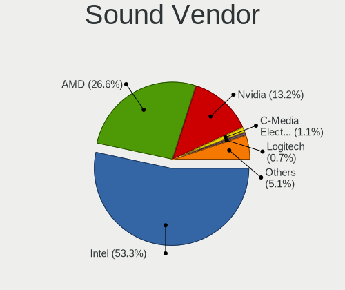

| Vendor                      | Computers | Percent |
|-----------------------------|-----------|---------|
| Intel                       | 428       | 54.45%  |
| AMD                         | 216       | 27.48%  |
| Nvidia                      | 96        | 12.21%  |
| VIA Technologies            | 6         | 0.76%   |
| C-Media Electronics         | 5         | 0.64%   |
| JMTek                       | 4         | 0.51%   |
| Realtek Semiconductor       | 3         | 0.38%   |
| Logitech                    | 3         | 0.38%   |
| Creative Labs               | 3         | 0.38%   |
| Texas Instruments           | 2         | 0.25%   |
| Plantronics                 | 2         | 0.25%   |
| M-Audio                     | 2         | 0.25%   |
| Turtle Beach                | 1         | 0.13%   |
| SteelSeries ApS             | 1         | 0.13%   |
| Sennheiser Communications   | 1         | 0.13%   |
| OLKB                        | 1         | 0.13%   |
| Microsoft                   | 1         | 0.13%   |
| Kingston Technology         | 1         | 0.13%   |
| Generalplus Technology      | 1         | 0.13%   |
| Earth Computer Technologies | 1         | 0.13%   |
| Creative Technology         | 1         | 0.13%   |
| Corsair                     | 1         | 0.13%   |
| Cirrus Logic                | 1         | 0.13%   |
| Blue Microphones            | 1         | 0.13%   |
| BEHRINGER International     | 1         | 0.13%   |
| AVID Technology             | 1         | 0.13%   |
| Astro Gaming                | 1         | 0.13%   |
| Apple                       | 1         | 0.13%   |

Sound Model
-----------

Sound card models

| Model                                                                                             | Computers | Percent |
|---------------------------------------------------------------------------------------------------|-----------|---------|
| Intel Sunrise Point-LP HD Audio                                                                   | 69        | 6.9%    |
| AMD Family 17h/19h HD Audio Controller                                                            | 67        | 6.7%    |
| AMD Raven/Raven2/Fenghuang HDMI/DP Audio Controller                                               | 47        | 4.7%    |
| Intel 6 Series/C200 Series Chipset Family High Definition Audio Controller                        | 46        | 4.6%    |
| Intel 7 Series/C216 Chipset Family High Definition Audio Controller                               | 42        | 4.2%    |
| AMD Family 15h (Models 60h-6fh) Audio Controller                                                  | 40        | 4%      |
| AMD FCH Azalia Controller                                                                         | 33        | 3.3%    |
| Intel NM10/ICH7 Family High Definition Audio Controller                                           | 32        | 3.2%    |
| AMD Kabini HDMI/DP Audio                                                                          | 31        | 3.1%    |
| Intel 5 Series/3400 Series Chipset High Definition Audio                                          | 29        | 2.9%    |
| AMD SBx00 Azalia (Intel HDA)                                                                      | 27        | 2.7%    |
| AMD High Definition Audio Controller                                                              | 26        | 2.6%    |
| Intel 8 Series/C220 Series Chipset High Definition Audio Controller                               | 24        | 2.4%    |
| Intel Xeon E3-1200 v3/4th Gen Core Processor HD Audio Controller                                  | 18        | 1.8%    |
| Intel Haswell-ULT HD Audio Controller                                                             | 18        | 1.8%    |
| Intel Cannon Point-LP High Definition Audio Controller                                            | 17        | 1.7%    |
| Intel 8 Series HD Audio Controller                                                                | 17        | 1.7%    |
| Intel 82801H (ICH8 Family) HD Audio Controller                                                    | 16        | 1.6%    |
| Intel Wildcat Point-LP High Definition Audio Controller                                           | 15        | 1.5%    |
| Intel Cannon Lake PCH cAVS                                                                        | 15        | 1.5%    |
| Intel Broadwell-U Audio Controller                                                                | 15        | 1.5%    |
| Intel 82801I (ICH9 Family) HD Audio Controller                                                    | 13        | 1.3%    |
| Intel 100 Series/C230 Series Chipset Family HD Audio Controller                                   | 13        | 1.3%    |
| AMD Starship/Matisse HD Audio Controller                                                          | 13        | 1.3%    |
| AMD Renoir Radeon High Definition Audio Controller                                                | 13        | 1.3%    |
| Nvidia GP107GL High Definition Audio Controller                                                   | 10        | 1%      |
| Intel Ice Lake-LP Smart Sound Technology Audio Controller                                         | 10        | 1%      |
| Intel Celeron/Pentium Silver Processor High Definition Audio                                      | 10        | 1%      |
| Intel Atom/Celeron/Pentium Processor x5-E8000/J3xxx/N3xxx Series High Definition Audio Controller | 10        | 1%      |
| Nvidia High Definition Audio Controller                                                           | 9         | 0.9%    |
| AMD Oland/Hainan/Cape Verde/Pitcairn HDMI Audio [Radeon HD 7000 Series]                           | 9         | 0.9%    |
| Nvidia MCP61 High Definition Audio                                                                | 8         | 0.8%    |
| Nvidia GK208 HDMI/DP Audio Controller                                                             | 8         | 0.8%    |
| Intel Tiger Lake-LP Smart Sound Technology Audio Controller                                       | 8         | 0.8%    |
| AMD RV710/730 HDMI Audio [Radeon HD 4000 series]                                                  | 8         | 0.8%    |
| AMD Family 17h (Models 00h-0fh) HD Audio Controller                                               | 8         | 0.8%    |
| AMD Cedar HDMI Audio [Radeon HD 5400/6300/7300 Series]                                            | 8         | 0.8%    |
| Nvidia GF119 HDMI Audio Controller                                                                | 6         | 0.6%    |
| Nvidia GF108 High Definition Audio Controller                                                     | 6         | 0.6%    |
| Intel Comet Lake PCH-LP cAVS                                                                      | 6         | 0.6%    |
| Nvidia TU107 GeForce GTX 1650 High Definition Audio Controller                                    | 5         | 0.5%    |
| Intel Comet Lake PCH cAVS                                                                         | 5         | 0.5%    |
| Intel Atom Processor Z36xxx/Z37xxx Series High Definition Audio Controller                        | 5         | 0.5%    |
| Nvidia MCP79 High Definition Audio                                                                | 4         | 0.4%    |
| Nvidia GM107 High Definition Audio Controller [GeForce 940MX]                                     | 4         | 0.4%    |
| Nvidia GK107 HDMI Audio Controller                                                                | 4         | 0.4%    |
| Intel Comet Lake PCH-V cAVS                                                                       | 4         | 0.4%    |
| Intel Celeron N3350/Pentium N4200/Atom E3900 Series Audio Cluster                                 | 4         | 0.4%    |
| AMD Wrestler HDMI Audio                                                                           | 4         | 0.4%    |
| AMD Turks HDMI Audio [Radeon HD 6500/6600 / 6700M Series]                                         | 4         | 0.4%    |
| AMD Trinity HDMI Audio Controller                                                                 | 4         | 0.4%    |
| AMD RS780 HDMI Audio [Radeon 3000/3100 / HD 3200/3300]                                            | 4         | 0.4%    |
| AMD Navi 10 HDMI Audio                                                                            | 4         | 0.4%    |
| AMD Ellesmere HDMI Audio [Radeon RX 470/480 / 570/580/590]                                        | 4         | 0.4%    |
| AMD Caicos HDMI Audio [Radeon HD 6450 / 7450/8450/8490 OEM / R5 230/235/235X OEM]                 | 4         | 0.4%    |
| VIA Technologies VX900/VT8xxx High Definition Audio Controller                                    | 3         | 0.3%    |
| Realtek Semiconductor USB Audio                                                                   | 3         | 0.3%    |
| Nvidia GT216 HDMI Audio Controller                                                                | 3         | 0.3%    |
| Nvidia GP106 High Definition Audio Controller                                                     | 3         | 0.3%    |
| Nvidia GF106 High Definition Audio Controller                                                     | 3         | 0.3%    |

Memory
------

Memory Vendor
-------------

Memory module vendors

| Vendor              | Computers | Percent |
|---------------------|-----------|---------|
| Samsung Electronics | 85        | 25.37%  |
| SK Hynix            | 57        | 17.01%  |
| Micron Technology   | 43        | 12.84%  |
| Unknown             | 32        | 9.55%   |
| Kingston            | 22        | 6.57%   |
| A-DATA Technology   | 18        | 5.37%   |
| Crucial             | 12        | 3.58%   |
| Corsair             | 12        | 3.58%   |
| Ramaxel Technology  | 9         | 2.69%   |
| Elpida              | 6         | 1.79%   |
| Avant               | 5         | 1.49%   |
| G.Skill             | 4         | 1.19%   |
| Team                | 3         | 0.9%    |
| Nanya Technology    | 3         | 0.9%    |
| Apacer              | 3         | 0.9%    |
| Super Talent        | 2         | 0.6%    |
| PNY                 | 2         | 0.6%    |
| Patriot             | 2         | 0.6%    |
| Kreton              | 2         | 0.6%    |
| Hewlett-Packard     | 2         | 0.6%    |
| GeIL                | 2         | 0.6%    |
| Unknown (08AE)      | 1         | 0.3%    |
| Unigen              | 1         | 0.3%    |
| Transcend           | 1         | 0.3%    |
| Sesame              | 1         | 0.3%    |
| Qimonda             | 1         | 0.3%    |
| Puskill             | 1         | 0.3%    |
| Goldkey             | 1         | 0.3%    |
| Centon              | 1         | 0.3%    |
| ASint Technology    | 1         | 0.3%    |

Memory Model
------------

Memory module models

| Model                                                       | Computers | Percent |
|-------------------------------------------------------------|-----------|---------|
| Samsung RAM M471A5244CB0-CRC 4096MB SODIMM DDR4 2667MT/s    | 8         | 2.27%   |
| Samsung RAM M471A5244CB0-CTD 4GB SODIMM DDR4 3266MT/s       | 7         | 1.99%   |
| Micron RAM 4ATF51264HZ-2G6E1 4096MB SODIMM DDR4 2667MT/s    | 7         | 1.99%   |
| Samsung RAM M471B5173DB0-YK0 4096MB SODIMM DDR3 1600MT/s    | 6         | 1.7%    |
| SK Hynix RAM HMT425S6AFR6A-PB 2GB SODIMM DDR3 1600MT/s      | 5         | 1.42%   |
| Samsung RAM M471A1K43CB1-CTD 8GB SODIMM DDR4 2667MT/s       | 5         | 1.42%   |
| Unknown RAM Module 2048MB DIMM SDRAM                        | 4         | 1.14%   |
| SK Hynix RAM HMT451S6BFR8A-PB 4GB SODIMM DDR3 1600MT/s      | 4         | 1.14%   |
| Samsung RAM M471B5273CH0-CH9 4096MB SODIMM DDR3 1334MT/s    | 4         | 1.14%   |
| SK Hynix RAM HMA851S6AFR6N-UH 4GB SODIMM DDR4 2667MT/s      | 3         | 0.85%   |
| SK Hynix RAM HMA81GS6AFR8N-UH 8GB SODIMM DDR4 2667MT/s      | 3         | 0.85%   |
| Samsung RAM M471B5173EB0-YK0 4GB SODIMM DDR3 1600MT/s       | 3         | 0.85%   |
| Micron RAM 4ATF51264HZ-3G2J1 4GB SODIMM DDR4 3200MT/s       | 3         | 0.85%   |
| Micron RAM 4ATF51264HZ-2G3B1 4GB SODIMM DDR4 2400MT/s       | 3         | 0.85%   |
| Unknown RAM Module 4GB DIMM 1333MT/s                        | 2         | 0.57%   |
| Super Talent RAM SUPERTALENT02 2048MB DIMM DDR3 1600MT/s    | 2         | 0.57%   |
| SK Hynix RAM HMT451S6BFR8A-PB 4096MB SODIMM DDR3 1600MT/s   | 2         | 0.57%   |
| SK Hynix RAM HMT351S6CFR8C-PB 4GB SODIMM DDR3 1600MT/s      | 2         | 0.57%   |
| SK Hynix RAM HMA82GS6JJR8N-VK 16GB SODIMM DDR4 2667MT/s     | 2         | 0.57%   |
| SK Hynix RAM HMA81GS6CJR8N-VK 8GB SODIMM DDR4 2667MT/s      | 2         | 0.57%   |
| SK Hynix RAM HMA81GS6AFR8N-UH 8GB SODIMM DDR4 2400MT/s      | 2         | 0.57%   |
| Samsung RAM M471B5273DH0-CH9 4GB SODIMM DDR3 1334MT/s       | 2         | 0.57%   |
| Samsung RAM M471B5273CH0-CK0 4GB SODIMM DDR3 1600MT/s       | 2         | 0.57%   |
| Samsung RAM M471B5173QH0-YK0 4GB SODIMM DDR3 1600MT/s       | 2         | 0.57%   |
| Samsung RAM M471B1G73QH0-YK0 8GB SODIMM DDR3 1600MT/s       | 2         | 0.57%   |
| Samsung RAM M471A1K43CB1-CRC 8GB SODIMM DDR4 2667MT/s       | 2         | 0.57%   |
| Samsung RAM M471A1G43DB0-CPB 8GB SODIMM DDR4 2400MT/s       | 2         | 0.57%   |
| Samsung RAM M3 78T2953EZ3-CF7 1GB DIMM DDR2 800MT/s         | 2         | 0.57%   |
| Patriot RAM 3200 C16 Series 16GB DIMM DDR4 3200MT/s         | 2         | 0.57%   |
| Micron RAM Module 4GB SODIMM DDR3 1600MT/s                  | 2         | 0.57%   |
| Micron RAM Module 4096MB SODIMM DDR3 1600MT/s               | 2         | 0.57%   |
| Micron RAM 8JSF25664HZ-1G4D1 2048MB SODIMM DDR3 1334MT/s    | 2         | 0.57%   |
| Micron RAM 8ATF1G64HZ-2G6E1 8192MB SODIMM DDR4 2667MT/s     | 2         | 0.57%   |
| Micron RAM 53E1G32D2NP-046 2GB Row Of Chips LPDDR4 4267MT/s | 2         | 0.57%   |
| Micron RAM 4ATF1G64HZ-3G2E1 8GB SODIMM DDR4 3200MT/s        | 2         | 0.57%   |
| Micron RAM 16KTF51264HZ-1G6M1 4096MB SODIMM DDR3 1600MT/s   | 2         | 0.57%   |
| Corsair RAM CMZ8GX3M1A1600C10 8192MB DIMM DDR3 1600MT/s     | 2         | 0.57%   |
| Apacer RAM 76.A302G.D330B 2GB SODIMM DDR4 2400MT/s          | 2         | 0.57%   |
| A-DATA RAM Module 8GB SODIMM DDR4 2667MT/s                  | 2         | 0.57%   |
| A-DATA RAM Module 16384MB SODIMM DDR4 2667MT/s              | 2         | 0.57%   |
| A-DATA RAM DDR4 3200 8GB DIMM DDR4 3200MT/s                 | 2         | 0.57%   |
| A-DATA RAM DDR4 2400 2OZ 8GB DIMM DDR4 2666MT/s             | 2         | 0.57%   |
| Unknown RAM Module 8GB SODIMM DDR4 2667MT/s                 | 1         | 0.28%   |
| Unknown RAM Module 8GB DIMM DDR4 2133MT/s                   | 1         | 0.28%   |
| Unknown RAM Module 8192MB SODIMM DDR4 2667MT/s              | 1         | 0.28%   |
| Unknown RAM Module 8192MB DIMM DDR3 1600MT/s                | 1         | 0.28%   |
| Unknown RAM Module 8192MB DIMM DDR3 1333MT/s                | 1         | 0.28%   |
| Unknown RAM Module 512MB SODIMM DRAM 533MT/s                | 1         | 0.28%   |
| Unknown RAM Module 512MB DIMM DDR 333MT/s                   | 1         | 0.28%   |
| Unknown RAM Module 4GB SODIMM LPDDR3 1600MT/s               | 1         | 0.28%   |
| Unknown RAM Module 4GB DIMM SDRAM                           | 1         | 0.28%   |
| Unknown RAM Module 4GB DIMM 1600MT/s                        | 1         | 0.28%   |
| Unknown RAM Module 4096MB SODIMM DDR4 2133MT/s              | 1         | 0.28%   |
| Unknown RAM Module 4096MB SODIMM DDR3 1333MT/s              | 1         | 0.28%   |
| Unknown RAM Module 4096MB SODIMM DDR3                       | 1         | 0.28%   |
| Unknown RAM Module 4096MB DIMM SDRAM                        | 1         | 0.28%   |
| Unknown RAM Module 4096MB DIMM DDR3 1333MT/s                | 1         | 0.28%   |
| Unknown RAM Module 2GB SODIMM DDR2                          | 1         | 0.28%   |
| Unknown RAM Module 2GB DIMM SDRAM                           | 1         | 0.28%   |
| Unknown RAM Module 2GB DIMM DDR2 533MT/s                    | 1         | 0.28%   |

Memory Kind
-----------

Memory module kinds

| Kind    | Computers | Percent |
|---------|-----------|---------|
| DDR4    | 121       | 46.01%  |
| DDR3    | 94        | 35.74%  |
| DDR2    | 15        | 5.7%    |
| SDRAM   | 12        | 4.56%   |
| LPDDR4  | 7         | 2.66%   |
| Unknown | 7         | 2.66%   |
| LPDDR3  | 4         | 1.52%   |
| DRAM    | 2         | 0.76%   |
| DDR     | 1         | 0.38%   |

Memory Form Factor
------------------

Physical design of the memory module

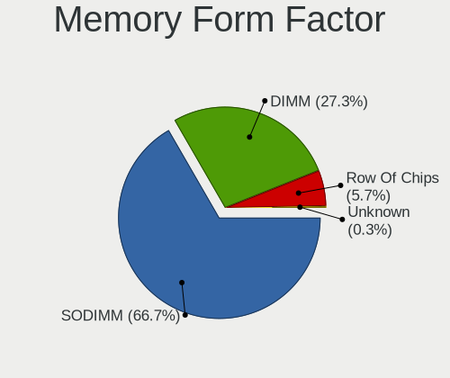

| Name         | Computers | Percent |
|--------------|-----------|---------|
| SODIMM       | 176       | 68.22%  |
| DIMM         | 75        | 29.07%  |
| Row Of Chips | 7         | 2.71%   |

Memory Size
-----------

Memory module size

| Size  | Computers | Percent |
|-------|-----------|---------|
| 4096  | 120       | 39.47%  |
| 8192  | 90        | 29.61%  |
| 2048  | 44        | 14.47%  |
| 16384 | 27        | 8.88%   |
| 1024  | 14        | 4.61%   |
| 32768 | 6         | 1.97%   |
| 512   | 2         | 0.66%   |
| 128   | 1         | 0.33%   |

Memory Speed
------------

Memory module speed

| Speed   | Computers | Percent |
|---------|-----------|---------|
| 1600    | 67        | 23.34%  |
| 2667    | 59        | 20.56%  |
| 3200    | 25        | 8.71%   |
| 2400    | 23        | 8.01%   |
| 1333    | 21        | 7.32%   |
| 2133    | 12        | 4.18%   |
| Unknown | 11        | 3.83%   |
| 1334    | 9         | 3.14%   |
| 3266    | 8         | 2.79%   |
| 800     | 7         | 2.44%   |
| 1067    | 5         | 1.74%   |
| 3600    | 4         | 1.39%   |
| 667     | 4         | 1.39%   |
| 4267    | 3         | 1.05%   |
| 4199    | 3         | 1.05%   |
| 3000    | 3         | 1.05%   |
| 2666    | 3         | 1.05%   |
| 533     | 3         | 1.05%   |
| 1867    | 2         | 0.7%    |
| 1866    | 2         | 0.7%    |
| 333     | 2         | 0.7%    |
| 4800    | 1         | 0.35%   |
| 4266    | 1         | 0.35%   |
| 3800    | 1         | 0.35%   |
| 3500    | 1         | 0.35%   |
| 3400    | 1         | 0.35%   |
| 2800    | 1         | 0.35%   |
| 2176    | 1         | 0.35%   |
| 1776    | 1         | 0.35%   |
| 1066    | 1         | 0.35%   |
| 975     | 1         | 0.35%   |
| 200     | 1         | 0.35%   |

Printers & scanners
-------------------

Printer Vendor
--------------

Printer device vendors

| Vendor              | Computers | Percent |
|---------------------|-----------|---------|
| Hewlett-Packard     | 6         | 40%     |
| Seiko Epson         | 3         | 20%     |
| Samsung Electronics | 3         | 20%     |
| Prolific Technology | 1         | 6.67%   |
| Canon               | 1         | 6.67%   |
| Brother Industries  | 1         | 6.67%   |

Printer Model
-------------

Printer device models

| Model                                                  | Computers | Percent |
|--------------------------------------------------------|-----------|---------|
| HP LaserJet Professional P 1102w                       | 2         | 13.33%  |
| Seiko Epson ME Office 600F/Stylus Office BX300F/TX300F | 1         | 6.67%   |
| Seiko Epson L210 Series                                | 1         | 6.67%   |
| Seiko Epson L120 Series                                | 1         | 6.67%   |
| Samsung ML-2010P Mono Laser Printer                    | 1         | 6.67%   |
| Samsung M2020 Series                                   | 1         | 6.67%   |
| Samsung Composite Device                               | 1         | 6.67%   |
| Prolific PL2305 Parallel Port                          | 1         | 6.67%   |
| HP LaserJet CP 1025                                    | 1         | 6.67%   |
| HP LaserJet 1020                                       | 1         | 6.67%   |
| HP Laser 107a                                          | 1         | 6.67%   |
| HP Deskjet 2540 series                                 | 1         | 6.67%   |
| Canon G3000 series                                     | 1         | 6.67%   |
| Brother DCP-T710W                                      | 1         | 6.67%   |

Scanner Vendor
--------------

Scanner device vendors

Zero info for selected period =(

Scanner Model
-------------

Scanner device models

Zero info for selected period =(

Camera
------

Camera Vendor
-------------

Camera device vendors

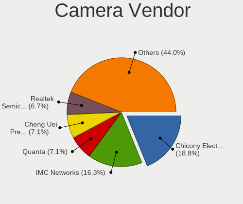

| Vendor                                 | Computers | Percent |
|----------------------------------------|-----------|---------|
| Chicony Electronics                    | 97        | 20.34%  |
| IMC Networks                           | 87        | 18.24%  |
| Acer                                   | 37        | 7.76%   |
| Realtek Semiconductor                  | 35        | 7.34%   |
| Cheng Uei Precision Industry (Foxlink) | 30        | 6.29%   |
| Microdia                               | 26        | 5.45%   |
| Sunplus Innovation Technology          | 21        | 4.4%    |
| Quanta                                 | 20        | 4.19%   |
| Lite-On Technology                     | 19        | 3.98%   |
| Silicon Motion                         | 14        | 2.94%   |
| Suyin                                  | 12        | 2.52%   |
| Logitech                               | 12        | 2.52%   |
| Syntek                                 | 10        | 2.1%    |
| Apple                                  | 8         | 1.68%   |
| KYE Systems (Mouse Systems)            | 7         | 1.47%   |
| Alcor Micro                            | 6         | 1.26%   |
| Ricoh                                  | 4         | 0.84%   |
| Z-Star Microelectronics                | 3         | 0.63%   |
| Microsoft                              | 3         | 0.63%   |
| Importek                               | 3         | 0.63%   |
| Cubeternet                             | 3         | 0.63%   |
| ALi                                    | 3         | 0.63%   |
| Samsung Electronics                    | 2         | 0.42%   |
| Pixart Imaging                         | 2         | 0.42%   |
| OmniVision Technologies                | 2         | 0.42%   |
| Lenovo                                 | 2         | 0.42%   |
| Huawei Technologies                    | 2         | 0.42%   |
| Arkmicro Technologies                  | 2         | 0.42%   |
| Sunplus Technology                     | 1         | 0.21%   |
| Sonix Technology                       | 1         | 0.21%   |
| Genesys Logic                          | 1         | 0.21%   |
| Generalplus Technology                 | 1         | 0.21%   |
| Alcorlink                              | 1         | 0.21%   |

Camera Model
------------

Camera device models

| Model                                                          | Computers | Percent |
|----------------------------------------------------------------|-----------|---------|
| IMC Networks USB2.0 VGA UVC WebCam                             | 40        | 8.39%   |
| IMC Networks USB2.0 HD UVC WebCam                              | 23        | 4.82%   |
| Chicony USB2.0 VGA UVC WebCam                                  | 15        | 3.14%   |
| Microdia Integrated_Webcam_HD                                  | 10        | 2.1%    |
| Chicony Integrated Camera                                      | 10        | 2.1%    |
| Acer Integrated Camera                                         | 10        | 2.1%    |
| Chicony HP TrueVision HD Camera                                | 9         | 1.89%   |
| IMC Networks Integrated Camera                                 | 7         | 1.47%   |
| Chicony HP Webcam                                              | 7         | 1.47%   |
| Cheng Uei Precision Industry (Foxlink) HP Webcam               | 7         | 1.47%   |
| Realtek USB Camera                                             | 6         | 1.26%   |
| Lite-On HP Webcam                                              | 6         | 1.26%   |
| Chicony Lenovo EasyCamera                                      | 6         | 1.26%   |
| Cheng Uei Precision Industry (Foxlink) HP TrueVision HD Camera | 6         | 1.26%   |
| Acer Lenovo EasyCamera                                         | 6         | 1.26%   |
| Lite-On HP Wide Vision HD Camera                               | 5         | 1.05%   |
| Syntek Integrated Camera                                       | 4         | 0.84%   |
| Syntek EasyCamera                                              | 4         | 0.84%   |
| Suyin 1.3M HD WebCam                                           | 4         | 0.84%   |
| Sunplus Integrated_Webcam_HD                                   | 4         | 0.84%   |
| Sunplus HD Webcam                                              | 4         | 0.84%   |
| Realtek USB2.0 VGA UVC WebCam                                  | 4         | 0.84%   |
| Realtek HP Truevision HD                                       | 4         | 0.84%   |
| Quanta HP Webcam                                               | 4         | 0.84%   |
| IMC Networks VGA UVC WebCam                                    | 4         | 0.84%   |
| IMC Networks EasyCamera                                        | 4         | 0.84%   |
| Chicony HP High Definition 1MP Webcam                          | 4         | 0.84%   |
| Chicony HD WebCam                                              | 4         | 0.84%   |
| Cheng Uei Precision Industry (Foxlink) HP Truevision HD        | 4         | 0.84%   |
| Acer EasyCamera                                                | 4         | 0.84%   |
| Silicon Motion WebCam SC-13HDL11939N                           | 3         | 0.63%   |
| Realtek Lenovo EasyCamera                                      | 3         | 0.63%   |
| Realtek Integrated_Webcam_HD                                   | 3         | 0.63%   |
| Realtek HD WebCam                                              | 3         | 0.63%   |
| Quanta HP Wide Vision HD Camera                                | 3         | 0.63%   |
| Quanta HD Webcam                                               | 3         | 0.63%   |
| Logitech C922 Pro Stream Webcam                                | 3         | 0.63%   |
| Lite-On Integrated Camera                                      | 3         | 0.63%   |
| Lite-On HP HD Camera                                           | 3         | 0.63%   |
| Cubeternet GL-UPC822 UVC WebCam                                | 3         | 0.63%   |
| Chicony HP HD Camera                                           | 3         | 0.63%   |
| Chicony CNF9055 Toshiba Webcam                                 | 3         | 0.63%   |
| Apple FaceTime HD Camera (Built-in)                            | 3         | 0.63%   |
| Apple Built-in iSight                                          | 3         | 0.63%   |
| Acer HD Webcam                                                 | 3         | 0.63%   |
| Z-Star Webcam                                                  | 2         | 0.42%   |
| Syntek Lenovo EasyCamera                                       | 2         | 0.42%   |
| Suyin HP TrueVision HD Integrated Webcam                       | 2         | 0.42%   |
| Suyin HD WebCam                                                | 2         | 0.42%   |
| Sunplus ASUS USB2.0 Webcam                                     | 2         | 0.42%   |
| Silicon Motion WebCam SC-03FFL11939N                           | 2         | 0.42%   |
| Silicon Motion HP Webcam-50                                    | 2         | 0.42%   |
| Silicon Motion HP Webcam                                       | 2         | 0.42%   |
| Samsung Galaxy A5 (MTP)                                        | 2         | 0.42%   |
| Realtek Integrated Webcam                                      | 2         | 0.42%   |
| Realtek Asus laptop camera                                     | 2         | 0.42%   |
| Realtek Acer 640 x 480 laptop camera                           | 2         | 0.42%   |
| Quanta VGA WebCam                                              | 2         | 0.42%   |
| Quanta HP Integrated Webcam                                    | 2         | 0.42%   |
| Quanta HD User Facing                                          | 2         | 0.42%   |

Security
--------

Fingerprint Vendor
------------------

Fingerprint sensor vendors

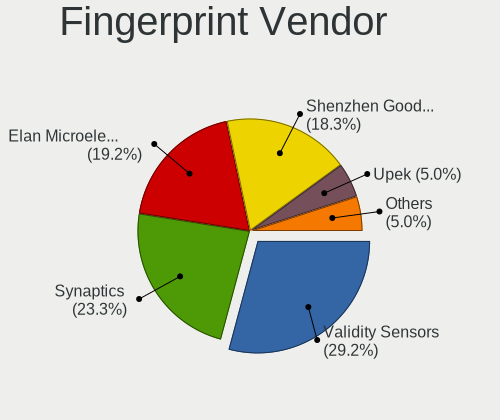

| Vendor                     | Computers | Percent |
|----------------------------|-----------|---------|
| Validity Sensors           | 25        | 39.06%  |
| Synaptics                  | 18        | 28.13%  |
| Elan Microelectronics      | 10        | 15.63%  |
| Shenzhen Goodix Technology | 4         | 6.25%   |
| Upek                       | 3         | 4.69%   |
| LighTuning Technology      | 2         | 3.13%   |
| STMicroelectronics         | 1         | 1.56%   |
| AuthenTec                  | 1         | 1.56%   |

Fingerprint Model
-----------------

Fingerprint sensor models

| Model                                                                      | Computers | Percent |
|----------------------------------------------------------------------------|-----------|---------|
| Elan ELAN:Fingerprint                                                      | 10        | 15.63%  |
| Unknown                                                                    | 8         | 12.5%   |
| Validity Sensors VFS5011 Fingerprint Reader                                | 5         | 7.81%   |
| Synaptics Prometheus MIS Touch Fingerprint Reader                          | 5         | 7.81%   |
| Validity Sensors VFS495 Fingerprint Reader                                 | 4         | 6.25%   |
| Validity Sensors VFS 5011 fingerprint sensor                               | 4         | 6.25%   |
| Upek Biometric Touchchip/Touchstrip Fingerprint Sensor                     | 3         | 4.69%   |
| Shenzhen Goodix Fingerprint Reader                                         | 3         | 4.69%   |
| Validity Sensors VFS451 Fingerprint Reader                                 | 2         | 3.13%   |
| Validity Sensors Synaptics VFS7552 Touch Fingerprint Sensor with PurePrint | 2         | 3.13%   |
| Validity Sensors Swipe Fingerprint Sensor                                  | 2         | 3.13%   |
| Synaptics  WBDI                                                            | 2         | 3.13%   |
| LighTuning EgisTec Touch Fingerprint Sensor                                | 2         | 3.13%   |
| Validity Sensors VFS7500 Touch Fingerprint Sensor                          | 1         | 1.56%   |
| Validity Sensors VFS471 Fingerprint Reader                                 | 1         | 1.56%   |
| Validity Sensors VFS101 Fingerprint Reader                                 | 1         | 1.56%   |
| Validity Sensors VFS Fingerprint sensor                                    | 1         | 1.56%   |
| Validity Sensors Synaptics WBDI                                            | 1         | 1.56%   |
| Validity Sensors Fingerprint scanner                                       | 1         | 1.56%   |
| Synaptics WBDI Device                                                      | 1         | 1.56%   |
| Synaptics  VFS7552 Touch Fingerprint Sensor with PurePrint                 | 1         | 1.56%   |
| Synaptics Metallica MIS Touch Fingerprint Reader                           | 1         | 1.56%   |
| STMicroelectronics Fingerprint Reader                                      | 1         | 1.56%   |
| Shenzhen Goodix  Fingerprint Device                                        | 1         | 1.56%   |
| AuthenTec AES1600                                                          | 1         | 1.56%   |

Chipcard Vendor
---------------

Chipcard module vendors

| Vendor                | Computers | Percent |
|-----------------------|-----------|---------|
| Broadcom              | 5         | 35.71%  |
| Upek                  | 2         | 14.29%  |
| O2 Micro              | 2         | 14.29%  |
| Lenovo                | 2         | 14.29%  |
| Alcor Micro           | 2         | 14.29%  |
| Gemalto (was Gemplus) | 1         | 7.14%   |

Chipcard Model
--------------

Chipcard module models

| Model                                                      | Computers | Percent |
|------------------------------------------------------------|-----------|---------|
| Broadcom 5880                                              | 4         | 28.57%  |
| Upek TouchChip Fingerprint Coprocessor (WBF advanced mode) | 2         | 14.29%  |
| Lenovo Integrated Smart Card Reader                        | 2         | 14.29%  |
| Alcor Micro AU9540 Smartcard Reader                        | 2         | 14.29%  |
| O2 Micro Oz776 SmartCard Reader                            | 1         | 7.14%   |
| O2 Micro OZ776 CCID Smartcard Reader                       | 1         | 7.14%   |
| Gemalto (was Gemplus) Compact Smart Card Reader Writer     | 1         | 7.14%   |
| Broadcom BCM5880 Secure Applications Processor             | 1         | 7.14%   |

Unsupported
-----------

Unsupported Devices
-------------------

Total unsupported devices on board

| Total | Computers | Percent |
|-------|-----------|---------|
| 0     | 452       | 67.46%  |
| 1     | 185       | 27.61%  |
| 2     | 31        | 4.63%   |
| 7     | 1         | 0.15%   |
| 3     | 1         | 0.15%   |

Unsupported Device Types
------------------------

Types of unsupported devices

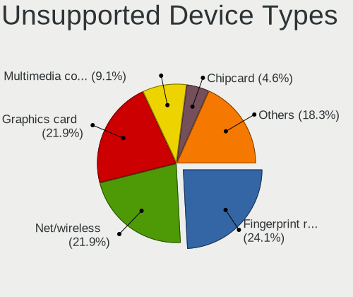

| Type                     | Computers | Percent |
|--------------------------|-----------|---------|
| Fingerprint reader       | 64        | 25.81%  |
| Net/wireless             | 58        | 23.39%  |
| Graphics card            | 49        | 19.76%  |
| Multimedia controller    | 25        | 10.08%  |
| Chipcard                 | 14        | 5.65%   |
| Bluetooth                | 11        | 4.44%   |
| Communication controller | 6         | 2.42%   |
| Sound                    | 5         | 2.02%   |
| Storage                  | 3         | 1.21%   |
| Card reader              | 3         | 1.21%   |
| Camera                   | 3         | 1.21%   |
| Net/ethernet             | 2         | 0.81%   |
| Unassigned class         | 1         | 0.4%    |
| Storage/raid             | 1         | 0.4%    |
| Network                  | 1         | 0.4%    |
| Flash memory             | 1         | 0.4%    |
| Firewire controller      | 1         | 0.4%    |

