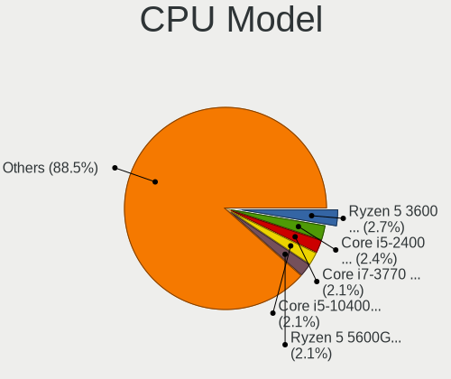
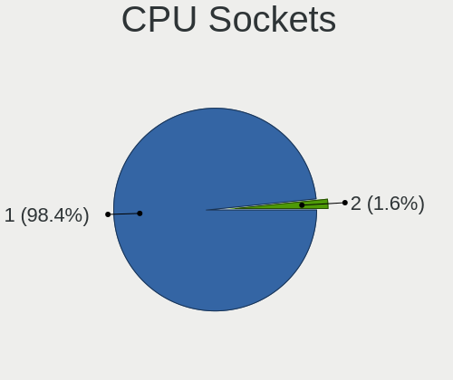
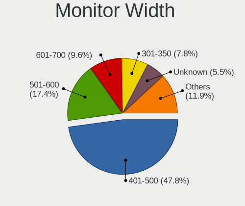
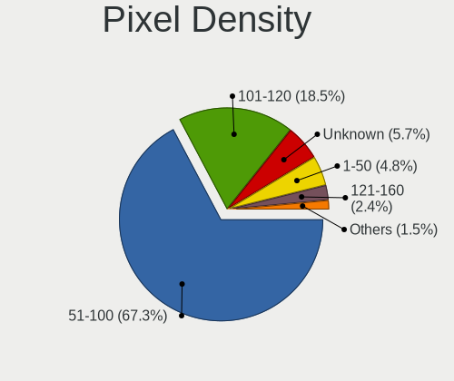
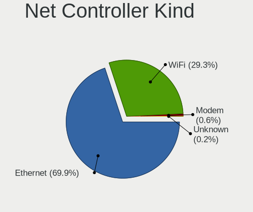
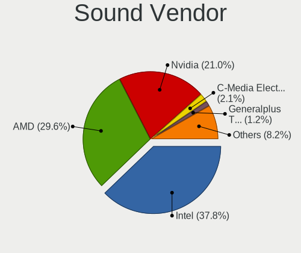
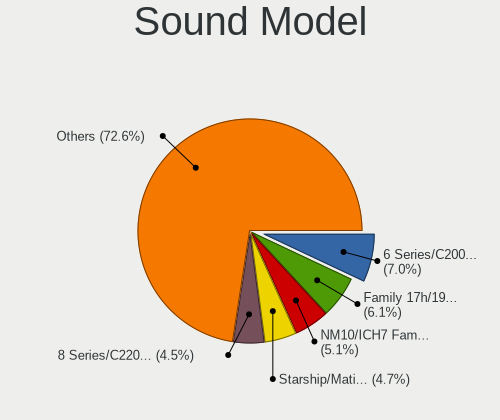
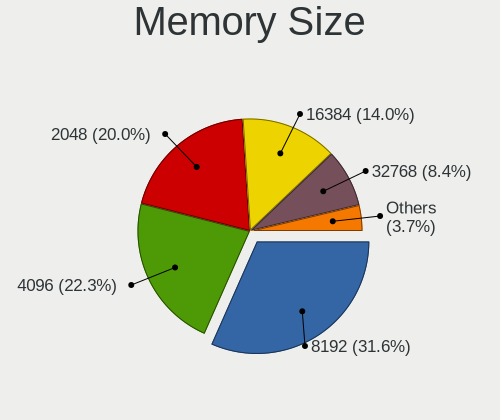
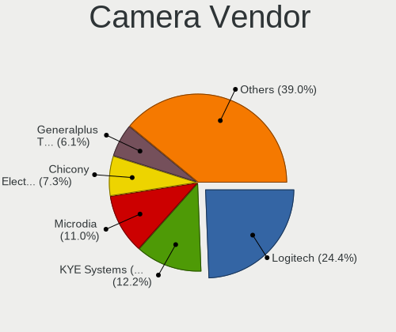

Linux in Colombia - Tested Hardware & Statistics (Desktops)
-----------------------------------------------------------

A project to collect tested hardware configurations for Linux in Colombia.

Anyone can contribute to this report by the [hw-probe](https://github.com/linuxhw/hw-probe) tool:

    sudo -E hw-probe -all -upload

Please contribute! Especially if your hardware is rare.

Contents
--------

* [ Test Cases ](#test-cases)

* [ System ](#system)
  - [ OS                       ](#os)
  - [ OS Family                ](#os-family)
  - [ Kernel                   ](#kernel)
  - [ Kernel Family            ](#kernel-family)
  - [ Kernel Major Ver.        ](#kernel-major-ver)
  - [ Arch                     ](#arch)
  - [ DE                       ](#de)
  - [ Display Server           ](#display-server)
  - [ Display Manager          ](#display-manager)
  - [ OS Lang                  ](#os-lang)
  - [ Boot Mode                ](#boot-mode)
  - [ Filesystem               ](#filesystem)
  - [ Part. scheme             ](#part-scheme)
  - [ Dual Boot with Linux/BSD ](#dual-boot-with-linuxbsd)
  - [ Dual Boot (Win)          ](#dual-boot-win)

* [ Board ](#board)
  - [ Vendor                   ](#vendor)
  - [ Model                    ](#model)
  - [ Model Family             ](#model-family)
  - [ MFG Year                 ](#mfg-year)
  - [ Form Factor              ](#form-factor)
  - [ Secure Boot              ](#secure-boot)
  - [ Coreboot                 ](#coreboot)
  - [ RAM Size                 ](#ram-size)
  - [ RAM Used                 ](#ram-used)
  - [ Total Drives             ](#total-drives)
  - [ Has CD-ROM               ](#has-cd-rom)
  - [ Has Ethernet             ](#has-ethernet)
  - [ Has WiFi                 ](#has-wifi)
  - [ Has Bluetooth            ](#has-bluetooth)

* [ Location ](#location)
  - [ Country                  ](#country)
  - [ City                     ](#city)

* [ Drives ](#drives)
  - [ Drive Vendor             ](#drive-vendor)
  - [ Drive Model              ](#drive-model)
  - [ HDD Vendor               ](#hdd-vendor)
  - [ SSD Vendor               ](#ssd-vendor)
  - [ Drive Kind               ](#drive-kind)
  - [ Drive Connector          ](#drive-connector)
  - [ Drive Size               ](#drive-size)
  - [ Space Total              ](#space-total)
  - [ Space Used               ](#space-used)
  - [ Malfunc. Drives          ](#malfunc-drives)
  - [ Malfunc. Drive Vendor    ](#malfunc-drive-vendor)
  - [ Malfunc. HDD Vendor      ](#malfunc-hdd-vendor)
  - [ Malfunc. Drive Kind      ](#malfunc-drive-kind)
  - [ Failed Drives            ](#failed-drives)
  - [ Failed Drive Vendor      ](#failed-drive-vendor)
  - [ Drive Status             ](#drive-status)

* [ Storage controller ](#storage-controller)
  - [ Storage Vendor           ](#storage-vendor)
  - [ Storage Model            ](#storage-model)
  - [ Storage Kind             ](#storage-kind)

* [ Processor ](#processor)
  - [ CPU Vendor               ](#cpu-vendor)
  - [ CPU Model                ](#cpu-model)
  - [ CPU Model Family         ](#cpu-model-family)
  - [ CPU Cores                ](#cpu-cores)
  - [ CPU Sockets              ](#cpu-sockets)
  - [ CPU Threads              ](#cpu-threads)
  - [ CPU Op-Modes             ](#cpu-op-modes)
  - [ CPU Microcode            ](#cpu-microcode)
  - [ CPU Microarch            ](#cpu-microarch)

* [ Graphics ](#graphics)
  - [ GPU Vendor               ](#gpu-vendor)
  - [ GPU Model                ](#gpu-model)
  - [ GPU Combo                ](#gpu-combo)
  - [ GPU Driver               ](#gpu-driver)
  - [ GPU Memory               ](#gpu-memory)

* [ Monitor ](#monitor)
  - [ Monitor Vendor           ](#monitor-vendor)
  - [ Monitor Model            ](#monitor-model)
  - [ Monitor Resolution       ](#monitor-resolution)
  - [ Monitor Diagonal         ](#monitor-diagonal)
  - [ Monitor Width            ](#monitor-width)
  - [ Aspect Ratio             ](#aspect-ratio)
  - [ Monitor Area             ](#monitor-area)
  - [ Pixel Density            ](#pixel-density)
  - [ Multiple Monitors        ](#multiple-monitors)

* [ Network ](#network)
  - [ Net Controller Vendor    ](#net-controller-vendor)
  - [ Net Controller Model     ](#net-controller-model)
  - [ Wireless Vendor          ](#wireless-vendor)
  - [ Wireless Model           ](#wireless-model)
  - [ Ethernet Vendor          ](#ethernet-vendor)
  - [ Ethernet Model           ](#ethernet-model)
  - [ Net Controller Kind      ](#net-controller-kind)
  - [ Used Controller          ](#used-controller)
  - [ NICs                     ](#nics)
  - [ IPv6                     ](#ipv6)

* [ Bluetooth ](#bluetooth)
  - [ Bluetooth Vendor         ](#bluetooth-vendor)
  - [ Bluetooth Model          ](#bluetooth-model)

* [ Sound ](#sound)
  - [ Sound Vendor             ](#sound-vendor)
  - [ Sound Model              ](#sound-model)

* [ Memory ](#memory)
  - [ Memory Vendor            ](#memory-vendor)
  - [ Memory Model             ](#memory-model)
  - [ Memory Kind              ](#memory-kind)
  - [ Memory Form Factor       ](#memory-form-factor)
  - [ Memory Size              ](#memory-size)
  - [ Memory Speed             ](#memory-speed)

* [ Printers & scanners ](#printers--scanners)
  - [ Printer Vendor           ](#printer-vendor)
  - [ Printer Model            ](#printer-model)
  - [ Scanner Vendor           ](#scanner-vendor)
  - [ Scanner Model            ](#scanner-model)

* [ Camera ](#camera)
  - [ Camera Vendor            ](#camera-vendor)
  - [ Camera Model             ](#camera-model)

* [ Security ](#security)
  - [ Fingerprint Vendor       ](#fingerprint-vendor)
  - [ Fingerprint Model        ](#fingerprint-model)
  - [ Chipcard Vendor          ](#chipcard-vendor)
  - [ Chipcard Model           ](#chipcard-model)

* [ Unsupported ](#unsupported)
  - [ Unsupported Devices      ](#unsupported-devices)
  - [ Unsupported Device Types ](#unsupported-device-types)

Test Cases
----------

Total: 309

| Vendor        | Model                       | Probe                                                      | Date         |
|---------------|-----------------------------|------------------------------------------------------------|--------------|
| HP            | 18E9                        | [9086d1a1e5](https://linux-hardware.org/?probe=9086d1a1e5) | Dec 01, 2022 |
| ASUSTek       | P5K WS                      | [f3608476bf](https://linux-hardware.org/?probe=f3608476bf) | Dec 01, 2022 |
| ASUSTek       | ROG STRIX B550-F GAMING     | [80b8b349f8](https://linux-hardware.org/?probe=80b8b349f8) | Nov 30, 2022 |
| Dell          | 0TP406                      | [3eceea61d2](https://linux-hardware.org/?probe=3eceea61d2) | Nov 30, 2022 |
| Dell          | 0TP406                      | [d22689331c](https://linux-hardware.org/?probe=d22689331c) | Nov 30, 2022 |
| HP            | 339A                        | [ea5cacd50e](https://linux-hardware.org/?probe=ea5cacd50e) | Nov 29, 2022 |
| Dell          | 0HJ054                      | [0e3d082d5a](https://linux-hardware.org/?probe=0e3d082d5a) | Nov 22, 2022 |
| Lenovo        | ThinkCentre M70e 0830AC4    | [8eb9b40274](https://linux-hardware.org/?probe=8eb9b40274) | Nov 10, 2022 |
| MSI           | GF615M-P33                  | [1a298da454](https://linux-hardware.org/?probe=1a298da454) | Nov 09, 2022 |
| Intel         | D33217GKE G76540-207        | [f90e6e931c](https://linux-hardware.org/?probe=f90e6e931c) | Nov 07, 2022 |
| Intel         | D33217GKE G76540-207        | [a154fd19a0](https://linux-hardware.org/?probe=a154fd19a0) | Nov 07, 2022 |
| Lenovo        | 3102 SDK0J40697 WIN 3305... | [a5d58af861](https://linux-hardware.org/?probe=a5d58af861) | Oct 31, 2022 |
| ASUSTek       | SABERTOOTH 990FX R2.0       | [b132f4c4e9](https://linux-hardware.org/?probe=b132f4c4e9) | Oct 30, 2022 |
| ASUSTek       | SABERTOOTH 990FX R2.0       | [7e1df59daa](https://linux-hardware.org/?probe=7e1df59daa) | Oct 30, 2022 |
| Biostar       | H61MH                       | [f505de310c](https://linux-hardware.org/?probe=f505de310c) | Oct 27, 2022 |
| ASUSTek       | ROG STRIX B450-F GAMING     | [6edc8b1444](https://linux-hardware.org/?probe=6edc8b1444) | Oct 06, 2022 |
| Gigabyte      | G41MT-S2                    | [c0b1c8ad8f](https://linux-hardware.org/?probe=c0b1c8ad8f) | Sep 27, 2022 |
| HP            | 18E7                        | [710a40851e](https://linux-hardware.org/?probe=710a40851e) | Sep 18, 2022 |
| ASRock        | A520M-HDV                   | [9e4267bcc6](https://linux-hardware.org/?probe=9e4267bcc6) | Sep 15, 2022 |
| ASRock        | A520M-HDV                   | [bd9b94b7f8](https://linux-hardware.org/?probe=bd9b94b7f8) | Sep 15, 2022 |
| HP            | 1494                        | [0faa06cff4](https://linux-hardware.org/?probe=0faa06cff4) | Sep 12, 2022 |
| ECS           | H61H2-M2                    | [9735a8ef90](https://linux-hardware.org/?probe=9735a8ef90) | Sep 01, 2022 |
| Pegatron      | 2AB6                        | [93af020634](https://linux-hardware.org/?probe=93af020634) | Aug 27, 2022 |
| Gigabyte      | GA-78LMT-USB3               | [04474401fc](https://linux-hardware.org/?probe=04474401fc) | Aug 26, 2022 |
| ECS           | H61H2-M2                    | [72ebc08e0c](https://linux-hardware.org/?probe=72ebc08e0c) | Aug 26, 2022 |
| ASUSTek       | TUF B365-PLUS GAMING        | [83e59cf9a5](https://linux-hardware.org/?probe=83e59cf9a5) | Aug 25, 2022 |
| ASUSTek       | PRIME A320M-K               | [928ce75df1](https://linux-hardware.org/?probe=928ce75df1) | Aug 24, 2022 |
| ECS           | H61H2-M2                    | [97ec1c67e8](https://linux-hardware.org/?probe=97ec1c67e8) | Aug 21, 2022 |
| BESSTAR Te... | TH50                        | [03159c112c](https://linux-hardware.org/?probe=03159c112c) | Aug 12, 2022 |
| ASRock        | B550M Pro4                  | [7fa92e1cb6](https://linux-hardware.org/?probe=7fa92e1cb6) | Aug 09, 2022 |
| Gigabyte      | X470 AORUS GAMING 7 WIFI... | [08b891334e](https://linux-hardware.org/?probe=08b891334e) | Aug 08, 2022 |
| HP            | ProLiant ML310e Gen8        | [7a12318176](https://linux-hardware.org/?probe=7a12318176) | Aug 02, 2022 |
| ASUSTek       | TUF Gaming Z690-PLUS WIF... | [68d8843883](https://linux-hardware.org/?probe=68d8843883) | Jul 17, 2022 |
| ASUSTek       | TUF Gaming Z690-PLUS WIF... | [057b18a904](https://linux-hardware.org/?probe=057b18a904) | Jul 16, 2022 |
| MSI           | B450 TOMAHAWK MAX           | [97b45f9af7](https://linux-hardware.org/?probe=97b45f9af7) | Jul 12, 2022 |
| Dell          | 054KM3 A01                  | [149f746382](https://linux-hardware.org/?probe=149f746382) | Jul 02, 2022 |
| ASRock        | A320M-HDV                   | [ec991b1524](https://linux-hardware.org/?probe=ec991b1524) | Jun 27, 2022 |
| MSI           | H81M-E33                    | [d79b11186c](https://linux-hardware.org/?probe=d79b11186c) | Jun 26, 2022 |
| ASRock        | Z77 Extreme4                | [8caff7e62e](https://linux-hardware.org/?probe=8caff7e62e) | Jun 25, 2022 |
| Dell          | 0J2J3Y A00                  | [50f015312c](https://linux-hardware.org/?probe=50f015312c) | Jun 23, 2022 |
| MSI           | H81M-E33                    | [0d2ace0dde](https://linux-hardware.org/?probe=0d2ace0dde) | Jun 16, 2022 |
| MSI           | H81M-E33                    | [52dbd6f482](https://linux-hardware.org/?probe=52dbd6f482) | Jun 16, 2022 |
| Gigabyte      | H61M-HD2                    | [d6e6a17072](https://linux-hardware.org/?probe=d6e6a17072) | Jun 13, 2022 |
| MSI           | G31TM-P21                   | [824dc8a1c9](https://linux-hardware.org/?probe=824dc8a1c9) | Jun 11, 2022 |
| HP            | 8054                        | [7d7b7577db](https://linux-hardware.org/?probe=7d7b7577db) | Jun 01, 2022 |
| ASUSTek       | ROG STRIX B550-F GAMING     | [2bd8d64c3b](https://linux-hardware.org/?probe=2bd8d64c3b) | May 22, 2022 |
| Gigabyte      | 990FXA-UD3                  | [4bc8f93383](https://linux-hardware.org/?probe=4bc8f93383) | May 17, 2022 |
| Gigabyte      | 990FXA-UD3                  | [89b16a89c5](https://linux-hardware.org/?probe=89b16a89c5) | May 16, 2022 |
| ASUSTek       | H81M-K                      | [753c7be679](https://linux-hardware.org/?probe=753c7be679) | May 05, 2022 |
| MSI           | MPG X570 GAMING PLUS        | [af01f27647](https://linux-hardware.org/?probe=af01f27647) | Apr 30, 2022 |
| Pegatron      | 2A73h                       | [a756a0148d](https://linux-hardware.org/?probe=a756a0148d) | Apr 27, 2022 |
| Lenovo        | 3102 SDK0J40697 WIN 3305... | [7b24feb14a](https://linux-hardware.org/?probe=7b24feb14a) | Apr 21, 2022 |
| ASUSTek       | PRIME Z390-A                | [81d7ace164](https://linux-hardware.org/?probe=81d7ace164) | Apr 18, 2022 |
| Gigabyte      | B550 AORUS ELITE            | [65a5442605](https://linux-hardware.org/?probe=65a5442605) | Apr 04, 2022 |
| HP            | ProLiant ML150 Gen9         | [50114897cc](https://linux-hardware.org/?probe=50114897cc) | Apr 01, 2022 |
| ASUSTek       | TUF Gaming X570-PLUS        | [066fb2b2b9](https://linux-hardware.org/?probe=066fb2b2b9) | Mar 30, 2022 |
| ASRock        | G41M-VS3                    | [34ccbe7db2](https://linux-hardware.org/?probe=34ccbe7db2) | Mar 25, 2022 |
| ASUSTek       | ROG CROSSHAIR VIII HERO     | [13cdf54c81](https://linux-hardware.org/?probe=13cdf54c81) | Mar 21, 2022 |
| ASUSTek       | PRIME H410M-E               | [1f267ffe6e](https://linux-hardware.org/?probe=1f267ffe6e) | Mar 11, 2022 |
| ASUSTek       | CROSSHAIR V FORMULA-Z       | [d068227c07](https://linux-hardware.org/?probe=d068227c07) | Mar 06, 2022 |
| MSI           | MPG X570 GAMING PLUS        | [ac671d5e38](https://linux-hardware.org/?probe=ac671d5e38) | Mar 05, 2022 |
| Supermicro    | X7DA8                       | [fcf69abc8f](https://linux-hardware.org/?probe=fcf69abc8f) | Feb 25, 2022 |
| Gigabyte      | H410M H V3                  | [4c58660705](https://linux-hardware.org/?probe=4c58660705) | Feb 22, 2022 |
| ASUSTek       | PRIME H310-PLUS             | [217c73c9a6](https://linux-hardware.org/?probe=217c73c9a6) | Feb 11, 2022 |
| ASRock        | Z77 Extreme4                | [95b7145bd2](https://linux-hardware.org/?probe=95b7145bd2) | Feb 06, 2022 |
| HP            | 1587h                       | [92625959b4](https://linux-hardware.org/?probe=92625959b4) | Feb 02, 2022 |
| ASUSTek       | H61M-K                      | [c7a35398d0](https://linux-hardware.org/?probe=c7a35398d0) | Feb 02, 2022 |
| ASUSTek       | PRIME H410M-E               | [876f78e96c](https://linux-hardware.org/?probe=876f78e96c) | Feb 01, 2022 |
| Intel         | DH61HO AAG62445-102         | [e0cbedce41](https://linux-hardware.org/?probe=e0cbedce41) | Jan 30, 2022 |
| Foxconn       | H61MXL/H61MXL-K             | [9b0853e1e9](https://linux-hardware.org/?probe=9b0853e1e9) | Jan 29, 2022 |
| Apple         | Mac-F42C88C8 Proto1         | [f967c472e5](https://linux-hardware.org/?probe=f967c472e5) | Jan 27, 2022 |
| Apple         | Mac-F42C88C8 Proto1         | [e92de9ab2e](https://linux-hardware.org/?probe=e92de9ab2e) | Jan 27, 2022 |
| Gigabyte      | H410M H                     | [1ca8a84549](https://linux-hardware.org/?probe=1ca8a84549) | Jan 25, 2022 |
| ASUSTek       | Maximus IX CODE             | [32c7db26bd](https://linux-hardware.org/?probe=32c7db26bd) | Jan 08, 2022 |
| ASRock        | H110M-HDV R3.0              | [90fe76c900](https://linux-hardware.org/?probe=90fe76c900) | Jan 03, 2022 |
| MSI           | H81M-E33                    | [a7e25b05e2](https://linux-hardware.org/?probe=a7e25b05e2) | Dec 27, 2021 |
| ASUSTek       | ROG STRIX B460-I GAMING     | [258369e6dc](https://linux-hardware.org/?probe=258369e6dc) | Dec 24, 2021 |
| MSI           | B150A GAMING PRO            | [475ea42f9a](https://linux-hardware.org/?probe=475ea42f9a) | Dec 11, 2021 |
| HP            | 3047h                       | [b389ca7104](https://linux-hardware.org/?probe=b389ca7104) | Dec 08, 2021 |
| MSI           | 760GM-P23                   | [cbe2fcd79d](https://linux-hardware.org/?probe=cbe2fcd79d) | Nov 26, 2021 |
| MSI           | MPG Z490 GAMING EDGE WIF... | [92d9d82670](https://linux-hardware.org/?probe=92d9d82670) | Nov 25, 2021 |
| MSI           | MPG Z490 GAMING EDGE WIF... | [e3a6c887f6](https://linux-hardware.org/?probe=e3a6c887f6) | Nov 25, 2021 |
| ASRock        | G41M-VS3                    | [35277b1155](https://linux-hardware.org/?probe=35277b1155) | Nov 22, 2021 |
| ASUSTek       | PRIME X570-P                | [abd0cfab6b](https://linux-hardware.org/?probe=abd0cfab6b) | Nov 12, 2021 |
| ASUSTek       | PRIME X570-P                | [27aa14962f](https://linux-hardware.org/?probe=27aa14962f) | Nov 12, 2021 |
| ASUSTek       | PRIME B550M-K               | [de9d0e2b40](https://linux-hardware.org/?probe=de9d0e2b40) | Nov 08, 2021 |
| ASRock        | G41M-VS3                    | [bf54c2ee53](https://linux-hardware.org/?probe=bf54c2ee53) | Nov 04, 2021 |
| ASRock        | G41M-VS3                    | [2ee1cbdc82](https://linux-hardware.org/?probe=2ee1cbdc82) | Nov 03, 2021 |
| Gigabyte      | P67A-UD3-B3                 | [c196661531](https://linux-hardware.org/?probe=c196661531) | Nov 01, 2021 |
| MSI           | 2A9Ch                       | [2f752a1a3e](https://linux-hardware.org/?probe=2f752a1a3e) | Oct 28, 2021 |
| Gigabyte      | H81M-H                      | [eb596b1774](https://linux-hardware.org/?probe=eb596b1774) | Oct 25, 2021 |
| ASUSTek       | PRIME H310-PLUS             | [cdd35d634d](https://linux-hardware.org/?probe=cdd35d634d) | Oct 24, 2021 |
| ASUSTek       | PRIME B550M-K               | [d9c192ea8c](https://linux-hardware.org/?probe=d9c192ea8c) | Oct 23, 2021 |
| ASRock        | G41M-VS3                    | [267bee9221](https://linux-hardware.org/?probe=267bee9221) | Oct 21, 2021 |
| HP            | 0B4Ch D                     | [d0b6443f5b](https://linux-hardware.org/?probe=d0b6443f5b) | Oct 12, 2021 |
| Gigabyte      | B450M DS3H-CF               | [05c0fc8d29](https://linux-hardware.org/?probe=05c0fc8d29) | Oct 10, 2021 |
| ASUSTek       | PRIME B550M-K               | [d034cd0b4a](https://linux-hardware.org/?probe=d034cd0b4a) | Oct 07, 2021 |
| Foxconn       | H61MXE                      | [f684b8da61](https://linux-hardware.org/?probe=f684b8da61) | Oct 06, 2021 |
| ASRock        | G41M-VS3                    | [9c4f3417d4](https://linux-hardware.org/?probe=9c4f3417d4) | Oct 04, 2021 |
| ASRock        | G41M-VS3                    | [3e695d6744](https://linux-hardware.org/?probe=3e695d6744) | Oct 04, 2021 |
| Pegatron      | 2AE2                        | [0309cddc66](https://linux-hardware.org/?probe=0309cddc66) | Oct 02, 2021 |
| ASUSTek       | Z97-A                       | [6476a95a04](https://linux-hardware.org/?probe=6476a95a04) | Sep 27, 2021 |
| Biostar       | G41D3C                      | [16eb676e0c](https://linux-hardware.org/?probe=16eb676e0c) | Sep 25, 2021 |
| ASUSTek       | PRIME B550M-K               | [b30800b2f9](https://linux-hardware.org/?probe=b30800b2f9) | Sep 24, 2021 |
| Gigabyte      | H81M-H                      | [f214b7efbe](https://linux-hardware.org/?probe=f214b7efbe) | Sep 22, 2021 |
| ECS           | G31T-M7                     | [60bf966d06](https://linux-hardware.org/?probe=60bf966d06) | Sep 18, 2021 |
| ASRock        | G41M-VS3                    | [7922da571d](https://linux-hardware.org/?probe=7922da571d) | Sep 16, 2021 |
| ASRock        | G41M-VS3                    | [e7afe651d3](https://linux-hardware.org/?probe=e7afe651d3) | Sep 16, 2021 |
| HP            | 18E9                        | [7a7dd34d6d](https://linux-hardware.org/?probe=7a7dd34d6d) | Sep 13, 2021 |
| MSI           | B350M GAMING PRO            | [052bfbd512](https://linux-hardware.org/?probe=052bfbd512) | Sep 09, 2021 |
| MSI           | B350M GAMING PRO            | [a3b7774236](https://linux-hardware.org/?probe=a3b7774236) | Sep 09, 2021 |
| Intel         | D945GCLF2D AAE59323-101     | [d6808fecbf](https://linux-hardware.org/?probe=d6808fecbf) | Sep 07, 2021 |
| ASUSTek       | PRIME B450M-A II            | [cb9f02b3de](https://linux-hardware.org/?probe=cb9f02b3de) | Sep 07, 2021 |
| ASUSTek       | PRIME B450M-A II            | [f80365b98a](https://linux-hardware.org/?probe=f80365b98a) | Sep 07, 2021 |
| Gigabyte      | G31M-S2C                    | [15d48710db](https://linux-hardware.org/?probe=15d48710db) | Aug 24, 2021 |
| Pegatron      | 2AEE                        | [a3e6da7d21](https://linux-hardware.org/?probe=a3e6da7d21) | Aug 22, 2021 |
| Pegatron      | 2AEE                        | [0b0cf520ba](https://linux-hardware.org/?probe=0b0cf520ba) | Aug 22, 2021 |
| Gigabyte      | G31M-S2C                    | [a8d5b4ff89](https://linux-hardware.org/?probe=a8d5b4ff89) | Aug 22, 2021 |
| HP            | 18E9                        | [9ee974d2df](https://linux-hardware.org/?probe=9ee974d2df) | Aug 21, 2021 |
| HP            | 18E9                        | [838f27241e](https://linux-hardware.org/?probe=838f27241e) | Aug 21, 2021 |
| HP            | 304Ah                       | [4760a65d2f](https://linux-hardware.org/?probe=4760a65d2f) | Aug 20, 2021 |
| HP            | 304Ah                       | [67e7cc53c1](https://linux-hardware.org/?probe=67e7cc53c1) | Aug 18, 2021 |
| Intel         | DB75EN AAG39650-303         | [321af82bbf](https://linux-hardware.org/?probe=321af82bbf) | Aug 09, 2021 |
| Gigabyte      | B550M DS3H                  | [418d6ee68f](https://linux-hardware.org/?probe=418d6ee68f) | Jul 23, 2021 |
| Intel         | DH55HC AAE70933-505         | [e8b5870e50](https://linux-hardware.org/?probe=e8b5870e50) | Jul 19, 2021 |
| MSI           | MS-7309                     | [8b431e8b6f](https://linux-hardware.org/?probe=8b431e8b6f) | Jul 10, 2021 |
| ASRock        | Wolfdale1333-D667           | [7b71d5854c](https://linux-hardware.org/?probe=7b71d5854c) | Jul 01, 2021 |
| ASUSTek       | PRIME Z590-P                | [5530b28aa3](https://linux-hardware.org/?probe=5530b28aa3) | Jun 30, 2021 |
| ASUSTek       | PRIME Z590-P                | [582e4795cf](https://linux-hardware.org/?probe=582e4795cf) | Jun 30, 2021 |
| Intel         | H61                         | [50b0503c3c](https://linux-hardware.org/?probe=50b0503c3c) | Jun 07, 2021 |
| Gigabyte      | B550I AORUS PRO AX          | [2a6868991a](https://linux-hardware.org/?probe=2a6868991a) | May 27, 2021 |
| ASUSTek       | PRIME Z590M-PLUS            | [33c1ecc56e](https://linux-hardware.org/?probe=33c1ecc56e) | May 19, 2021 |
| Gigabyte      | Z68X-UD7-B3                 | [22eae98fb5](https://linux-hardware.org/?probe=22eae98fb5) | May 13, 2021 |
| ECS           | H81H3-M4                    | [6889e28bfd](https://linux-hardware.org/?probe=6889e28bfd) | May 09, 2021 |
| ECS           | H81H3-M4                    | [0ef93e6291](https://linux-hardware.org/?probe=0ef93e6291) | May 09, 2021 |
| ASRock        | G965M-S                     | [dd116582af](https://linux-hardware.org/?probe=dd116582af) | May 03, 2021 |
| Intel         | H61                         | [cca60711c8](https://linux-hardware.org/?probe=cca60711c8) | May 01, 2021 |
| ASUSTek       | M4A77T/USB3                 | [ae115d5ca8](https://linux-hardware.org/?probe=ae115d5ca8) | Apr 29, 2021 |
| ASUSTek       | M4A77T/USB3                 | [34733fe16f](https://linux-hardware.org/?probe=34733fe16f) | Apr 29, 2021 |
| ASUSTek       | TUF B450M-PLUS GAMING       | [037a465656](https://linux-hardware.org/?probe=037a465656) | Apr 28, 2021 |
| MSI           | 970A-G46                    | [f1035827e0](https://linux-hardware.org/?probe=f1035827e0) | Apr 26, 2021 |
| Unknown       | 4CoreDX90-VSTA              | [6410827a2f](https://linux-hardware.org/?probe=6410827a2f) | Apr 25, 2021 |
| Unknown       | 4CoreDX90-VSTA              | [a8c42b2d94](https://linux-hardware.org/?probe=a8c42b2d94) | Apr 25, 2021 |
| MSI           | 970A-G46                    | [9aa4264419](https://linux-hardware.org/?probe=9aa4264419) | Apr 22, 2021 |
| MSI           | K9A2 Platinum               | [fc4fd8ba0e](https://linux-hardware.org/?probe=fc4fd8ba0e) | Apr 19, 2021 |
| Gigabyte      | X399 AORUS PRO-CF           | [7585c05b18](https://linux-hardware.org/?probe=7585c05b18) | Apr 19, 2021 |
| MSI           | K9A2 Platinum               | [ef223aa1d5](https://linux-hardware.org/?probe=ef223aa1d5) | Apr 16, 2021 |
| Gigabyte      | B550 AORUS PRO AC           | [48ab0d2acd](https://linux-hardware.org/?probe=48ab0d2acd) | Apr 14, 2021 |
| ASRock        | N68-VS3 UCC                 | [72861aa353](https://linux-hardware.org/?probe=72861aa353) | Apr 09, 2021 |
| Gigabyte      | X399 AORUS PRO-CF           | [cc61b2b6a7](https://linux-hardware.org/?probe=cc61b2b6a7) | Apr 04, 2021 |
| Gigabyte      | X399 AORUS PRO-CF           | [c079cb8fac](https://linux-hardware.org/?probe=c079cb8fac) | Apr 01, 2021 |
| Gigabyte      | B550M AORUS PRO-P           | [26427e6d23](https://linux-hardware.org/?probe=26427e6d23) | Mar 29, 2021 |
| Dell          | 0G3HR7 A00                  | [f2760185e3](https://linux-hardware.org/?probe=f2760185e3) | Mar 26, 2021 |
| Intel         | DH55HC AAE70933-505         | [2ebfc03ce7](https://linux-hardware.org/?probe=2ebfc03ce7) | Mar 20, 2021 |
| Dell          | 0G3HR7 A00                  | [29c1565b42](https://linux-hardware.org/?probe=29c1565b42) | Mar 10, 2021 |
| Gigabyte      | H61M-S1                     | [98d2580d9e](https://linux-hardware.org/?probe=98d2580d9e) | Mar 06, 2021 |
| Gigabyte      | H61M-S1                     | [91cd908a95](https://linux-hardware.org/?probe=91cd908a95) | Mar 05, 2021 |
| HP            | 2B09                        | [44e3728303](https://linux-hardware.org/?probe=44e3728303) | Mar 05, 2021 |
| ASRock        | Wolfdale1333-D667           | [4cb354b544](https://linux-hardware.org/?probe=4cb354b544) | Mar 02, 2021 |
| Intel         | DP67DE AAG10217-205         | [4b376912e1](https://linux-hardware.org/?probe=4b376912e1) | Feb 23, 2021 |
| Intel         | DP67DE AAG10217-205         | [497e0558af](https://linux-hardware.org/?probe=497e0558af) | Feb 23, 2021 |
| ASRock        | Wolfdale1333-D667           | [ed29a42a57](https://linux-hardware.org/?probe=ed29a42a57) | Feb 23, 2021 |
| MSI           | A320M-A PRO MAX             | [fb6179a8ee](https://linux-hardware.org/?probe=fb6179a8ee) | Feb 16, 2021 |
| Gigabyte      | B450M DS3H-CF               | [5f9a9ff276](https://linux-hardware.org/?probe=5f9a9ff276) | Feb 13, 2021 |
| Gigabyte      | B450M DS3H-CF               | [d8069f1e01](https://linux-hardware.org/?probe=d8069f1e01) | Feb 12, 2021 |
| Dell          | 0HN7XN A01                  | [909121ec95](https://linux-hardware.org/?probe=909121ec95) | Feb 03, 2021 |
| ASRock        | G41M-VS3                    | [b7460ea1e6](https://linux-hardware.org/?probe=b7460ea1e6) | Feb 02, 2021 |
| ECS           | H81H3-M4                    | [b452e9e060](https://linux-hardware.org/?probe=b452e9e060) | Jan 27, 2021 |
| ASUSTek       | PRIME H310M-E               | [cb63800c0d](https://linux-hardware.org/?probe=cb63800c0d) | Jan 24, 2021 |
| ASUSTek       | PRIME H310M-E               | [eb46844f3e](https://linux-hardware.org/?probe=eb46844f3e) | Jan 24, 2021 |
| ASUSTek       | M5A97 EVO R2.0              | [8dcbe2b63e](https://linux-hardware.org/?probe=8dcbe2b63e) | Jan 15, 2021 |
| ASUSTek       | M5A97 EVO R2.0              | [c969271698](https://linux-hardware.org/?probe=c969271698) | Jan 15, 2021 |
| ASUSTek       | ROG STRIX B550-F GAMING     | [9bd74368f0](https://linux-hardware.org/?probe=9bd74368f0) | Jan 15, 2021 |
| Intel         | H61                         | [d8489ff473](https://linux-hardware.org/?probe=d8489ff473) | Jan 11, 2021 |
| ASUSTek       | M5A97 EVO R2.0              | [81ab4a6cc7](https://linux-hardware.org/?probe=81ab4a6cc7) | Jan 11, 2021 |
| MSI           | B450M BAZOOKA V2            | [d68301770d](https://linux-hardware.org/?probe=d68301770d) | Jan 05, 2021 |
| Biostar       | H61MHV                      | [60f41299a7](https://linux-hardware.org/?probe=60f41299a7) | Jan 04, 2021 |
| Gigabyte      | 970A-UD3                    | [4de6e16ced](https://linux-hardware.org/?probe=4de6e16ced) | Dec 30, 2020 |
| Dell          | 0G3HR7 A00                  | [1c8f1911c4](https://linux-hardware.org/?probe=1c8f1911c4) | Dec 29, 2020 |
| PCSMART       | Unknown                     | [5c91c760a5](https://linux-hardware.org/?probe=5c91c760a5) | Dec 28, 2020 |
| ASUSTek       | M5A97 EVO R2.0              | [69e3d131e9](https://linux-hardware.org/?probe=69e3d131e9) | Dec 16, 2020 |
| ASRock        | G41M-VS3                    | [7633d83de8](https://linux-hardware.org/?probe=7633d83de8) | Dec 08, 2020 |
| ECS           | G31T-M7                     | [da86a0de6d](https://linux-hardware.org/?probe=da86a0de6d) | Dec 06, 2020 |
| ECS           | H81H3-M4                    | [324e08922c](https://linux-hardware.org/?probe=324e08922c) | Nov 23, 2020 |
| ASRock        | B450M Pro4                  | [63124c698a](https://linux-hardware.org/?probe=63124c698a) | Nov 22, 2020 |
| Foxconn       | 2ABF                        | [fa95d7cd22](https://linux-hardware.org/?probe=fa95d7cd22) | Nov 21, 2020 |
| ASRock        | AB350M-HDV                  | [4a503972bc](https://linux-hardware.org/?probe=4a503972bc) | Nov 18, 2020 |
| ASUSTek       | ROG STRIX B350-F GAMING     | [a802e86d43](https://linux-hardware.org/?probe=a802e86d43) | Nov 07, 2020 |
| ASUSTek       | M5A78L-M/USB3               | [a39151865e](https://linux-hardware.org/?probe=a39151865e) | Nov 06, 2020 |
| ASRock        | 960GM-VGS3 FX               | [5c51163253](https://linux-hardware.org/?probe=5c51163253) | Nov 05, 2020 |
| ASRock        | A320M-HDV                   | [c4f1aaa3bb](https://linux-hardware.org/?probe=c4f1aaa3bb) | Nov 02, 2020 |
| ASRock        | A320M-HDV                   | [a283f0ab00](https://linux-hardware.org/?probe=a283f0ab00) | Nov 01, 2020 |
| Foxconn       | 2ABF                        | [98e0846229](https://linux-hardware.org/?probe=98e0846229) | Oct 28, 2020 |
| ASRock        | G31M-GS                     | [ed0373efb3](https://linux-hardware.org/?probe=ed0373efb3) | Oct 22, 2020 |
| MSI           | H81M-E33                    | [dc82b20825](https://linux-hardware.org/?probe=dc82b20825) | Oct 20, 2020 |
| MSI           | H81M-E33                    | [21a8676b32](https://linux-hardware.org/?probe=21a8676b32) | Oct 20, 2020 |
| ASRock        | B450M-HDV R4.0              | [d1e0bb32d7](https://linux-hardware.org/?probe=d1e0bb32d7) | Oct 19, 2020 |
| Lenovo        | ThinkCentre A58 7515A18     | [6d228ca955](https://linux-hardware.org/?probe=6d228ca955) | Oct 05, 2020 |
| Gigabyte      | B450M DS3H-CF               | [309b4ecbe6](https://linux-hardware.org/?probe=309b4ecbe6) | Oct 02, 2020 |
| Gigabyte      | G31M-ES2C                   | [41c9698c88](https://linux-hardware.org/?probe=41c9698c88) | Oct 01, 2020 |
| Intel         | 945GCT-M                    | [c0ad55286f](https://linux-hardware.org/?probe=c0ad55286f) | Sep 26, 2020 |
| Dell          | 0MM599                      | [bf8a1f8434](https://linux-hardware.org/?probe=bf8a1f8434) | Sep 22, 2020 |
| ASUSTek       | M4A89GTD-PRO/USB3           | [b178b5269a](https://linux-hardware.org/?probe=b178b5269a) | Sep 18, 2020 |
| ASUSTek       | M4A87TD EVO                 | [4b2b8ed64f](https://linux-hardware.org/?probe=4b2b8ed64f) | Sep 06, 2020 |
| ASRock        | X570 Steel Legend           | [fcc32617ab](https://linux-hardware.org/?probe=fcc32617ab) | Sep 06, 2020 |
| Gigabyte      | AM1M-S2H                    | [8f57e5d722](https://linux-hardware.org/?probe=8f57e5d722) | Sep 05, 2020 |
| PCSMART       | 6.0                         | [e95fadbdfe](https://linux-hardware.org/?probe=e95fadbdfe) | Sep 05, 2020 |
| ASRock        | H110M-HDV R3.0              | [b641263269](https://linux-hardware.org/?probe=b641263269) | Sep 04, 2020 |
| ASUSTek       | M4A87TD/USB3                | [3c21577bc4](https://linux-hardware.org/?probe=3c21577bc4) | Sep 03, 2020 |
| ASUSTek       | PRIME A320M-K               | [131299dd43](https://linux-hardware.org/?probe=131299dd43) | Sep 02, 2020 |
| ASUSTek       | PRIME A320M-K               | [c7c173a4d6](https://linux-hardware.org/?probe=c7c173a4d6) | Aug 28, 2020 |
| ASUSTek       | PRIME H310M-E               | [07445986db](https://linux-hardware.org/?probe=07445986db) | Aug 24, 2020 |
| Dell          | 0D6H9T A01                  | [9c13b5e775](https://linux-hardware.org/?probe=9c13b5e775) | Aug 20, 2020 |
| Dell          | 0D6H9T A01                  | [40b95dab91](https://linux-hardware.org/?probe=40b95dab91) | Aug 20, 2020 |
| ECS           | H81H3-M4                    | [2a6af22359](https://linux-hardware.org/?probe=2a6af22359) | Aug 18, 2020 |
| Foxconn       | 2ABF                        | [24c499fe18](https://linux-hardware.org/?probe=24c499fe18) | Aug 17, 2020 |
| Foxconn       | 2ABF                        | [1fbfbf3d96](https://linux-hardware.org/?probe=1fbfbf3d96) | Aug 17, 2020 |
| ECS           | H81H3-M4                    | [6edc3d456f](https://linux-hardware.org/?probe=6edc3d456f) | Aug 16, 2020 |
| MSI           | A68HM-E33                   | [819dd19a0e](https://linux-hardware.org/?probe=819dd19a0e) | Aug 14, 2020 |
| ASUSTek       | H110-PLUS                   | [28a6907d78](https://linux-hardware.org/?probe=28a6907d78) | Aug 14, 2020 |
| ASUSTek       | PRIME H310M-E               | [a10db0a0f1](https://linux-hardware.org/?probe=a10db0a0f1) | Aug 13, 2020 |
| ASUSTek       | M4A87TD/USB3                | [76ee87fa06](https://linux-hardware.org/?probe=76ee87fa06) | Aug 07, 2020 |
| Gigabyte      | X399 AORUS Gaming 7         | [c27cdabb7b](https://linux-hardware.org/?probe=c27cdabb7b) | Aug 02, 2020 |
| Foxconn       | G41MXE/G41MXE-K             | [67b506f12f](https://linux-hardware.org/?probe=67b506f12f) | Jul 16, 2020 |
| Foxconn       | G41MXE/G41MXE-K             | [65d309fa0f](https://linux-hardware.org/?probe=65d309fa0f) | Jul 16, 2020 |
| Gigabyte      | X570 UD                     | [dffcf158e7](https://linux-hardware.org/?probe=dffcf158e7) | Jul 12, 2020 |
| ASUSTek       | M5A78L-M/USB3               | [f24093f04f](https://linux-hardware.org/?probe=f24093f04f) | Jul 09, 2020 |
| HP            | ProLiant ML310e Gen8 v2     | [b97d60900c](https://linux-hardware.org/?probe=b97d60900c) | Jul 07, 2020 |
| ASUSTek       | M5A78L-M/USB3               | [a57a22212c](https://linux-hardware.org/?probe=a57a22212c) | Jul 06, 2020 |
| ECS           | G31T-M7                     | [95cb3298ec](https://linux-hardware.org/?probe=95cb3298ec) | Jul 05, 2020 |
| ECS           | G31T-M7                     | [56b5cd6eac](https://linux-hardware.org/?probe=56b5cd6eac) | Jul 05, 2020 |
| Pegatron      | 2A73h                       | [58e16275bc](https://linux-hardware.org/?probe=58e16275bc) | Jul 04, 2020 |
| ECS           | H81H3-M4                    | [ed75f47aa0](https://linux-hardware.org/?probe=ed75f47aa0) | Jun 30, 2020 |
| Hardkernel    | ODROID-H2                   | [3cda40d161](https://linux-hardware.org/?probe=3cda40d161) | Jun 28, 2020 |
| ASRock        | N68C-S UCC                  | [19c8257ed1](https://linux-hardware.org/?probe=19c8257ed1) | Jun 26, 2020 |
| ASRock        | N68C-S UCC                  | [a56bd9dd64](https://linux-hardware.org/?probe=a56bd9dd64) | Jun 26, 2020 |
| ECS           | H81H3-M4                    | [9dfcf2f0cb](https://linux-hardware.org/?probe=9dfcf2f0cb) | Jun 23, 2020 |
| Gigabyte      | GA-78LMT-USB3               | [f90ccba28d](https://linux-hardware.org/?probe=f90ccba28d) | Jun 23, 2020 |
| Gigabyte      | GA-78LMT-USB3               | [c8a9bbbaa0](https://linux-hardware.org/?probe=c8a9bbbaa0) | Jun 20, 2020 |
| Biostar       | N68S3+                      | [3d289fd6d2](https://linux-hardware.org/?probe=3d289fd6d2) | Jun 15, 2020 |
| Dell          | 054KM3 A00                  | [3e9f988a30](https://linux-hardware.org/?probe=3e9f988a30) | Jun 11, 2020 |
| ASRock        | G41M-VS3                    | [8143bab4c5](https://linux-hardware.org/?probe=8143bab4c5) | May 30, 2020 |
| MSI           | A55M-P35                    | [1816e90106](https://linux-hardware.org/?probe=1816e90106) | May 22, 2020 |
| ASRock        | G41M-VS3                    | [a0a6bd1e26](https://linux-hardware.org/?probe=a0a6bd1e26) | May 22, 2020 |
| ASUSTek       | M5A78L-M/USB3               | [dc1d621a65](https://linux-hardware.org/?probe=dc1d621a65) | May 15, 2020 |
| MSI           | H110M PRO-VH PLUS           | [c54d7ef6ee](https://linux-hardware.org/?probe=c54d7ef6ee) | May 10, 2020 |
| MSI           | H110M PRO-VH PLUS           | [cbf18515b3](https://linux-hardware.org/?probe=cbf18515b3) | May 10, 2020 |
| ASRock        | G965M-S                     | [9d4cff9871](https://linux-hardware.org/?probe=9d4cff9871) | May 05, 2020 |
| PCChips       | P17G ECS                    | [8220dc9d9a](https://linux-hardware.org/?probe=8220dc9d9a) | May 04, 2020 |
| ECS           | H81H3-M4                    | [c8dd8d2166](https://linux-hardware.org/?probe=c8dd8d2166) | May 02, 2020 |
| Gigabyte      | H170-Gaming 3 DDR3          | [b6540749a2](https://linux-hardware.org/?probe=b6540749a2) | May 01, 2020 |
| MSI           | 970A-G43 PLUS               | [50a3cd26c8](https://linux-hardware.org/?probe=50a3cd26c8) | Apr 25, 2020 |
| Gigabyte      | G31M-S2C                    | [2392a43f27](https://linux-hardware.org/?probe=2392a43f27) | Apr 14, 2020 |
| Gigabyte      | G31M-S2C                    | [50809e26ed](https://linux-hardware.org/?probe=50809e26ed) | Apr 14, 2020 |
| MSI           | MS-7309                     | [598ba6983d](https://linux-hardware.org/?probe=598ba6983d) | Apr 14, 2020 |
| Unknown       | Unknown                     | [6e2105feb5](https://linux-hardware.org/?probe=6e2105feb5) | Apr 03, 2020 |
| ASUSTek       | M5A78L-M/USB3               | [b3c0d80908](https://linux-hardware.org/?probe=b3c0d80908) | Mar 26, 2020 |
| HP            | 3048h                       | [6b07a41174](https://linux-hardware.org/?probe=6b07a41174) | Mar 22, 2020 |
| ASRock        | H61M-VG4                    | [9a17b3a770](https://linux-hardware.org/?probe=9a17b3a770) | Mar 21, 2020 |
| MSI           | K9N6PGM2-V2                 | [68013dac14](https://linux-hardware.org/?probe=68013dac14) | Mar 16, 2020 |
| MSI           | K9N6PGM2-V2                 | [df4df13e54](https://linux-hardware.org/?probe=df4df13e54) | Mar 16, 2020 |
| MSI           | K9N6PGM2-V2                 | [12b38c9ebd](https://linux-hardware.org/?probe=12b38c9ebd) | Mar 16, 2020 |
| Intel         | DH61WW AAG23116-302         | [239a155579](https://linux-hardware.org/?probe=239a155579) | Feb 22, 2020 |
| ASUSTek       | PRIME H310-PLUS             | [c59fbe99a2](https://linux-hardware.org/?probe=c59fbe99a2) | Feb 02, 2020 |
| ASUSTek       | PRIME X570-PRO              | [8f38f0a1e3](https://linux-hardware.org/?probe=8f38f0a1e3) | Jan 20, 2020 |
| Dell          | 0P301D A00                  | [298fac1e53](https://linux-hardware.org/?probe=298fac1e53) | Jan 03, 2020 |
| ASRock        | G41M-VS3                    | [c4c975b9f9](https://linux-hardware.org/?probe=c4c975b9f9) | Dec 29, 2019 |
| Unknown       | GSUO H61V10C                | [96d964a1d9](https://linux-hardware.org/?probe=96d964a1d9) | Dec 23, 2019 |
| Pegatron      | 2AAE                        | [04a6d42a9c](https://linux-hardware.org/?probe=04a6d42a9c) | Dec 16, 2019 |
| Pegatron      | 2AAE                        | [e142be5f58](https://linux-hardware.org/?probe=e142be5f58) | Dec 16, 2019 |
| ASRock        | H55M                        | [a199be0d97](https://linux-hardware.org/?probe=a199be0d97) | Nov 12, 2019 |
| ASRock        | H55M                        | [7202462c60](https://linux-hardware.org/?probe=7202462c60) | Nov 12, 2019 |
| MSI           | MS-7309                     | [2e6203af14](https://linux-hardware.org/?probe=2e6203af14) | Oct 09, 2019 |
| ASUSTek       | H110M-R                     | [d98faab3bc](https://linux-hardware.org/?probe=d98faab3bc) | Oct 09, 2019 |
| ASUSTek       | SABERTOOTH 990FX R2.0       | [3181aa4496](https://linux-hardware.org/?probe=3181aa4496) | Sep 02, 2019 |
| ASUSTek       | SABERTOOTH 990FX R2.0       | [f063afeba7](https://linux-hardware.org/?probe=f063afeba7) | Aug 28, 2019 |
| HP            | ProLiant ML115 G1           | [8f0d70a883](https://linux-hardware.org/?probe=8f0d70a883) | Jul 29, 2019 |
| Dell          | OptiPlex GX260              | [6c061a7a15](https://linux-hardware.org/?probe=6c061a7a15) | Jul 23, 2019 |
| ASUSTek       | H81M-K                      | [b124f401f6](https://linux-hardware.org/?probe=b124f401f6) | Jul 17, 2019 |
| Intel         | DH55HC AAE70933-501         | [3462cd0ccd](https://linux-hardware.org/?probe=3462cd0ccd) | Jul 07, 2019 |
| MSI           | MS-7191                     | [d753273d7b](https://linux-hardware.org/?probe=d753273d7b) | Jul 03, 2019 |
| Dell          | 0RY206                      | [aed7ab6e58](https://linux-hardware.org/?probe=aed7ab6e58) | Jun 28, 2019 |
| Gigabyte      | H81M-H                      | [bebf195e43](https://linux-hardware.org/?probe=bebf195e43) | Jun 18, 2019 |
| ASRock        | K8Upgrade-VM800             | [83cccbaf1a](https://linux-hardware.org/?probe=83cccbaf1a) | Jun 03, 2019 |
| ASRock        | G965M-S                     | [30b8a56200](https://linux-hardware.org/?probe=30b8a56200) | May 30, 2019 |
| Dell          | 0TT708 A01                  | [b732db0128](https://linux-hardware.org/?probe=b732db0128) | May 24, 2019 |
| Dell          | 0TT708 A01                  | [fbe3c00bb0](https://linux-hardware.org/?probe=fbe3c00bb0) | May 24, 2019 |
| Unknown       | 775i65G                     | [0b6fd94458](https://linux-hardware.org/?probe=0b6fd94458) | May 19, 2019 |
| Unknown       | 775i65G                     | [2b8a659310](https://linux-hardware.org/?probe=2b8a659310) | May 18, 2019 |
| Gigabyte      | GA-78LMT-USB3               | [29cf71291b](https://linux-hardware.org/?probe=29cf71291b) | Apr 21, 2019 |
| Biostar       | A55MLV                      | [38fd682351](https://linux-hardware.org/?probe=38fd682351) | Apr 19, 2019 |
| HP            | 0A60h                       | [c59eb70baf](https://linux-hardware.org/?probe=c59eb70baf) | Apr 11, 2019 |
| HP            | 0A60h                       | [bd74dccea9](https://linux-hardware.org/?probe=bd74dccea9) | Apr 10, 2019 |
| ASUSTek       | H81M-K                      | [c5178f5550](https://linux-hardware.org/?probe=c5178f5550) | Apr 04, 2019 |
| ASUSTek       | H81M-K                      | [ef3d04377e](https://linux-hardware.org/?probe=ef3d04377e) | Apr 01, 2019 |
| ASUSTek       | H81M-K                      | [be751979a7](https://linux-hardware.org/?probe=be751979a7) | Apr 01, 2019 |
| ASUSTek       | H81M-K                      | [b9c1d97ec1](https://linux-hardware.org/?probe=b9c1d97ec1) | Apr 01, 2019 |
| Biostar       | A55MLV                      | [138e3baa2d](https://linux-hardware.org/?probe=138e3baa2d) | Mar 29, 2019 |
| ASUSTek       | H81M-K                      | [d3f5c5ac28](https://linux-hardware.org/?probe=d3f5c5ac28) | Mar 29, 2019 |
| Intel         | DH61CR AAG14064-207         | [2c44dea441](https://linux-hardware.org/?probe=2c44dea441) | Mar 17, 2019 |
| Gigabyte      | GA-78LMT-USB3               | [8d9fa49be1](https://linux-hardware.org/?probe=8d9fa49be1) | Feb 09, 2019 |
| Gigabyte      | GA-78LMT-USB3               | [5dcbf55671](https://linux-hardware.org/?probe=5dcbf55671) | Feb 09, 2019 |
| ASRock        | Wolfdale1333-D667           | [f67c3262d4](https://linux-hardware.org/?probe=f67c3262d4) | Dec 10, 2018 |
| ASRock        | Wolfdale1333-D667           | [06bcad286b](https://linux-hardware.org/?probe=06bcad286b) | Nov 18, 2018 |
| Pegatron      | 2A73h                       | [9ab888ea4f](https://linux-hardware.org/?probe=9ab888ea4f) | Jun 19, 2018 |
| HP            | 2ADE                        | [af28bb9a2f](https://linux-hardware.org/?probe=af28bb9a2f) | Dec 01, 2017 |
| HP            | 2ADE                        | [a2ab5f4392](https://linux-hardware.org/?probe=a2ab5f4392) | Dec 01, 2017 |
| HP            | 0A54h                       | [1f795e5896](https://linux-hardware.org/?probe=1f795e5896) | Jun 29, 2017 |
| HP            | 0A54h                       | [ef67a7d651](https://linux-hardware.org/?probe=ef67a7d651) | Feb 05, 2017 |

System
------

OS
--

Installed operating systems

| Name                | Desktops | Percent |
|---------------------|----------|---------|
| Ubuntu 20.04        | 33       | 14.93%  |
| Ubuntu 18.04        | 29       | 13.12%  |
| OpenMandriva 4.3    | 8        | 3.62%   |
| Linux Mint 20.2     | 8        | 3.62%   |
| KDE neon 20.04      | 7        | 3.17%   |
| Zorin 15            | 6        | 2.71%   |
| OpenMandriva 4.2    | 6        | 2.71%   |
| Linux Mint 20.3     | 5        | 2.26%   |
| Linux Mint 19.3     | 5        | 2.26%   |
| Fedora 35           | 5        | 2.26%   |
| ArcoLinux Rolling   | 5        | 2.26%   |
| Xubuntu 20.04       | 4        | 1.81%   |
| Ubuntu 22.04        | 4        | 1.81%   |
| Arch Rolling        | 4        | 1.81%   |
| Zorin 12            | 3        | 1.36%   |
| Ubuntu 19.04        | 3        | 1.36%   |
| ROSA R11            | 3        | 1.36%   |
| ROSA 12.2           | 3        | 1.36%   |
| Kubuntu 20.04       | 3        | 1.36%   |
| Fedora 36           | 3        | 1.36%   |
| Fedora 32           | 3        | 1.36%   |
| Elementary 6.1      | 3        | 1.36%   |
| Debian 11           | 3        | 1.36%   |
| Arch                | 3        | 1.36%   |
| Ubuntu Budgie 20.04 | 2        | 0.9%    |
| Ubuntu 19.10        | 2        | 0.9%    |
| ROSA R10            | 2        | 0.9%    |
| OpenMandriva 4.50   | 2        | 0.9%    |
| Nobara 36           | 2        | 0.9%    |
| Manjaro 21.0.3      | 2        | 0.9%    |
| Linux Mint 20       | 2        | 0.9%    |
| Fedora 33           | 2        | 0.9%    |
| Debian 10           | 2        | 0.9%    |
| BlackPanther 18.1   | 2        | 0.9%    |
| Xubuntu 22.04       | 1        | 0.45%   |
| Xubuntu 18.04       | 1        | 0.45%   |
| Xero Rolling        | 1        | 0.45%   |
| Ubuntu Unity 18.04  | 1        | 0.45%   |
| Ubuntu Unity 16.04  | 1        | 0.45%   |
| Ubuntu 22.10        | 1        | 0.45%   |

OS Family
---------

OS without a version

| Name          | Desktops | Percent |
|---------------|----------|---------|
| Ubuntu        | 72       | 33.96%  |
| Linux Mint    | 23       | 10.85%  |
| OpenMandriva  | 16       | 7.55%   |
| Fedora        | 14       | 6.6%    |
| Zorin         | 9        | 4.25%   |
| ROSA          | 9        | 4.25%   |
| KDE neon      | 8        | 3.77%   |
| Arch          | 7        | 3.3%    |
| Xubuntu       | 6        | 2.83%   |
| Debian        | 5        | 2.36%   |
| ArcoLinux     | 5        | 2.36%   |
| Manjaro       | 4        | 1.89%   |
| Kubuntu       | 4        | 1.89%   |
| Elementary    | 4        | 1.89%   |
| Pop!_OS       | 3        | 1.42%   |
| Lubuntu       | 3        | 1.42%   |
| Ubuntu Unity  | 2        | 0.94%   |
| Ubuntu Budgie | 2        | 0.94%   |
| openSUSE      | 2        | 0.94%   |
| Nobara        | 2        | 0.94%   |
| Endless       | 2        | 0.94%   |
| BlackPanther  | 2        | 0.94%   |
| Xero          | 1        | 0.47%   |
| Rocky Linux   | 1        | 0.47%   |
| Reborn OS     | 1        | 0.47%   |
| MX            | 1        | 0.47%   |
| LMDE          | 1        | 0.47%   |
| Kali          | 1        | 0.47%   |
| Deepin        | 1        | 0.47%   |
| CentOS        | 1        | 0.47%   |

Kernel
------

Version of the Linux kernel

| Version                            | Desktops | Percent |
|------------------------------------|----------|---------|
| 5.16.7-desktop-1omv4003            | 8        | 3.33%   |
| 5.4.0-42-generic                   | 7        | 2.92%   |
| 5.10.14-desktop-1omv4002           | 6        | 2.5%    |
| 5.4.0-72-generic                   | 4        | 1.67%   |
| 5.4.0-58-generic                   | 4        | 1.67%   |
| 5.0.0-32-generic                   | 4        | 1.67%   |
| 5.4.0-48-generic                   | 3        | 1.25%   |
| 5.4.0-45-generic                   | 3        | 1.25%   |
| 5.4.0-122-generic                  | 3        | 1.25%   |
| 5.10.74-generic-2rosa2021.1-x86_64 | 3        | 1.25%   |
| 4.18.0-16-generic                  | 3        | 1.25%   |
| 4.15.0-54-generic                  | 3        | 1.25%   |
| 5.8.0-48-generic                   | 2        | 0.83%   |
| 5.8.0-43-generic                   | 2        | 0.83%   |
| 5.4.0-97-generic                   | 2        | 0.83%   |
| 5.4.0-88-generic                   | 2        | 0.83%   |
| 5.4.0-70-generic                   | 2        | 0.83%   |
| 5.4.0-60-generic                   | 2        | 0.83%   |
| 5.4.0-52-generic                   | 2        | 0.83%   |
| 5.4.0-47-generic                   | 2        | 0.83%   |
| 5.4.0-40-generic                   | 2        | 0.83%   |
| 5.4.0-37-generic                   | 2        | 0.83%   |
| 5.4.0-31-generic                   | 2        | 0.83%   |
| 5.4.0-125-generic                  | 2        | 0.83%   |
| 5.4.0-121-generic                  | 2        | 0.83%   |
| 5.4.0-107-generic                  | 2        | 0.83%   |
| 5.3.0-59-generic                   | 2        | 0.83%   |
| 5.3.0-46-generic                   | 2        | 0.83%   |
| 5.3.0-42-generic                   | 2        | 0.83%   |
| 5.15.12-200.fc35.x86_64            | 2        | 0.83%   |
| 5.15.0-53-generic                  | 2        | 0.83%   |
| 5.15.0-48-generic                  | 2        | 0.83%   |
| 5.15.0-46-generic                  | 2        | 0.83%   |
| 5.15.0-43-generic                  | 2        | 0.83%   |
| 5.13.0-30-generic                  | 2        | 0.83%   |
| 5.13.0-27-generic                  | 2        | 0.83%   |
| 5.12.4-desktop-1omv4050            | 2        | 0.83%   |
| 5.11.0-34-generic                  | 2        | 0.83%   |
| 5.0.0-37-generic                   | 2        | 0.83%   |
| 5.0.0-15-generic                   | 2        | 0.83%   |

Kernel Family
-------------

Linux kernel without a distro release

| Version | Desktops | Percent |
|---------|----------|---------|
| 5.4.0   | 60       | 26.67%  |
| 4.15.0  | 15       | 6.67%   |
| 5.15.0  | 12       | 5.33%   |
| 5.0.0   | 11       | 4.89%   |
| 5.3.0   | 10       | 4.44%   |
| 5.13.0  | 10       | 4.44%   |
| 5.8.0   | 8        | 3.56%   |
| 5.16.7  | 8        | 3.56%   |
| 4.18.0  | 8        | 3.56%   |
| 5.11.0  | 6        | 2.67%   |
| 5.10.14 | 6        | 2.67%   |
| 5.8.5   | 3        | 1.33%   |
| 5.8.18  | 3        | 1.33%   |
| 5.12.4  | 3        | 1.33%   |
| 5.10.74 | 3        | 1.33%   |
| 5.19.0  | 2        | 0.89%   |
| 5.15.12 | 2        | 0.89%   |
| 5.14.1  | 2        | 0.89%   |
| 5.13.19 | 2        | 0.89%   |
| 5.10.0  | 2        | 0.89%   |
| 4.19.0  | 2        | 0.89%   |
| 4.18.16 | 2        | 0.89%   |
| 6.0.7   | 1        | 0.44%   |
| 6.0.6   | 1        | 0.44%   |
| 6.0.10  | 1        | 0.44%   |
| 5.9.3   | 1        | 0.44%   |
| 5.9.0   | 1        | 0.44%   |
| 5.8.4   | 1        | 0.44%   |
| 5.7.12  | 1        | 0.44%   |
| 5.6.12  | 1        | 0.44%   |
| 5.6.0   | 1        | 0.44%   |
| 5.4.92  | 1        | 0.44%   |
| 5.4.5   | 1        | 0.44%   |
| 5.4.40  | 1        | 0.44%   |
| 5.3.12  | 1        | 0.44%   |
| 5.2.9   | 1        | 0.44%   |
| 5.18.18 | 1        | 0.44%   |
| 5.18.16 | 1        | 0.44%   |
| 5.17.8  | 1        | 0.44%   |
| 5.17.5  | 1        | 0.44%   |

Kernel Major Ver.
-----------------

Linux kernel major version

| Version | Desktops | Percent |
|---------|----------|---------|
| 5.4     | 63       | 28.25%  |
| 5.10    | 17       | 7.62%   |
| 5.8     | 15       | 6.73%   |
| 5.15    | 15       | 6.73%   |
| 4.15    | 15       | 6.73%   |
| 5.13    | 12       | 5.38%   |
| 5.3     | 11       | 4.93%   |
| 5.16    | 11       | 4.93%   |
| 5.0     | 11       | 4.93%   |
| 4.18    | 10       | 4.48%   |
| 5.11    | 7        | 3.14%   |
| 5.14    | 6        | 2.69%   |
| 5.12    | 5        | 2.24%   |
| 4.9     | 4        | 1.79%   |
| 6.0     | 3        | 1.35%   |
| 5.17    | 3        | 1.35%   |
| 5.9     | 2        | 0.9%    |
| 5.6     | 2        | 0.9%    |
| 5.19    | 2        | 0.9%    |
| 5.18    | 2        | 0.9%    |
| 4.19    | 2        | 0.9%    |
| 5.7     | 1        | 0.45%   |
| 5.2     | 1        | 0.45%   |
| 4.12    | 1        | 0.45%   |
| 4.10    | 1        | 0.45%   |
| 4.1     | 1        | 0.45%   |

Arch
----

OS architecture (x86_64, i586, etc.)

| Name   | Desktops | Percent |
|--------|----------|---------|
| x86_64 | 203      | 97.13%  |
| i686   | 6        | 2.87%   |

DE
--

Desktop Environment

| Name         | Desktops | Percent |
|--------------|----------|---------|
| GNOME        | 85       | 40.09%  |
| KDE5         | 37       | 17.45%  |
| Unknown      | 24       | 11.32%  |
| X-Cinnamon   | 18       | 8.49%   |
| XFCE         | 13       | 6.13%   |
| KDE          | 8        | 3.77%   |
| Pantheon     | 4        | 1.89%   |
| KDE4         | 4        | 1.89%   |
| MATE         | 3        | 1.42%   |
| LXQt         | 3        | 1.42%   |
| Unity        | 2        | 0.94%   |
| i3           | 2        | 0.94%   |
| Deepin       | 2        | 0.94%   |
| Cinnamon     | 2        | 0.94%   |
| Budgie       | 2        | 0.94%   |
| ubuntu=GNOME | 1        | 0.47%   |
| LXDE         | 1        | 0.47%   |
| awesome      | 1        | 0.47%   |

Display Server
--------------

X11 or Wayland

| Name    | Desktops | Percent |
|---------|----------|---------|
| X11     | 171      | 80.28%  |
| Wayland | 23       | 10.8%   |
| Unknown | 14       | 6.57%   |
| Tty     | 5        | 2.35%   |

Display Manager
---------------

SDDM, LightDM, etc.

| Name    | Desktops | Percent |
|---------|----------|---------|
| Unknown | 121      | 56.54%  |
| SDDM    | 31       | 14.49%  |
| GDM     | 25       | 11.68%  |
| LightDM | 16       | 7.48%   |
| GDM3    | 10       | 4.67%   |
| TDM     | 6        | 2.8%    |
| KDM     | 4        | 1.87%   |
| SLiM    | 1        | 0.47%   |

OS Lang
-------

Language

| Lang    | Desktops | Percent |
|---------|----------|---------|
| es_CO   | 112      | 52.09%  |
| en_US   | 49       | 22.79%  |
| Unknown | 33       | 15.35%  |
| es_ES   | 17       | 7.91%   |
| pt_BR   | 2        | 0.93%   |
| en_GB   | 1        | 0.47%   |
| C       | 1        | 0.47%   |

Boot Mode
---------

EFI or BIOS

| Mode | Desktops | Percent |
|------|----------|---------|
| BIOS | 133      | 63.64%  |
| EFI  | 76       | 36.36%  |

Filesystem
----------

Type of filesystem

| Type    | Desktops | Percent |
|---------|----------|---------|
| Ext4    | 166      | 78.67%  |
| Overlay | 18       | 8.53%   |
| Btrfs   | 17       | 8.06%   |
| Unknown | 5        | 2.37%   |
| Xfs     | 3        | 1.42%   |
| Zfs     | 1        | 0.47%   |
| Ext2    | 1        | 0.47%   |

Part. scheme
------------

Scheme of partitioning

| Type    | Desktops | Percent |
|---------|----------|---------|
| Unknown | 124      | 58.77%  |
| GPT     | 56       | 26.54%  |
| MBR     | 31       | 14.69%  |

Dual Boot with Linux/BSD
------------------------

Hosting more than one Linux/BSD

| Dual boot | Desktops | Percent |
|-----------|----------|---------|
| No        | 176      | 81.86%  |
| Yes       | 39       | 18.14%  |

Dual Boot (Win)
---------------

Hosting Linux and Windows

| Dual boot | Desktops | Percent |
|-----------|----------|---------|
| No        | 126      | 60%     |
| Yes       | 84       | 40%     |

Board
-----

Vendor
------

Motherboard manufacturer

| Name                | Desktops | Percent |
|---------------------|----------|---------|
| ASUSTek Computer    | 45       | 21.53%  |
| Gigabyte Technology | 33       | 15.79%  |
| ASRock              | 26       | 12.44%  |
| MSI                 | 25       | 11.96%  |
| Hewlett-Packard     | 20       | 9.57%   |
| Dell                | 13       | 6.22%   |
| Intel               | 12       | 5.74%   |
| ECS                 | 6        | 2.87%   |
| Pegatron            | 5        | 2.39%   |
| Biostar             | 5        | 2.39%   |
| Lenovo              | 4        | 1.91%   |
| Foxconn             | 4        | 1.91%   |
| Unknown             | 4        | 1.91%   |
| PCSMART             | 2        | 0.96%   |
| Supermicro          | 1        | 0.48%   |
| PCChips             | 1        | 0.48%   |
| Hardkernel          | 1        | 0.48%   |
| BESSTAR Tech        | 1        | 0.48%   |
| Apple               | 1        | 0.48%   |

Model
-----

Motherboard model

| Name                                 | Desktops | Percent |
|--------------------------------------|----------|---------|
| Unknown                              | 5        | 2.39%   |
| MSI MS-7309                          | 4        | 1.91%   |
| ASUS All Series                      | 4        | 1.91%   |
| MSI MS-7817                          | 3        | 1.44%   |
| Gigabyte H81M-H                      | 3        | 1.44%   |
| Gigabyte GA-78LMT-USB3               | 3        | 1.44%   |
| Gigabyte G31M-ES2C                   | 3        | 1.44%   |
| Gigabyte B450M DS3H                  | 3        | 1.44%   |
| ECS G31T-M7                          | 3        | 1.44%   |
| ASUS ROG STRIX B550-F GAMING         | 3        | 1.44%   |
| ASUS M5A78L-M/USB3                   | 3        | 1.44%   |
| ASRock Wolfdale1333-D667             | 3        | 1.44%   |
| ASRock G41M-VS3                      | 3        | 1.44%   |
| Intel H61                            | 2        | 0.96%   |
| HP ProDesk 400 G1 SFF                | 2        | 0.96%   |
| HP Compaq dc7700 Small Form Factor   | 2        | 0.96%   |
| Gigabyte X399 AORUS PRO              | 2        | 0.96%   |
| ECS H81H3-M4                         | 2        | 0.96%   |
| Dell Vostro 430                      | 2        | 0.96%   |
| ASUS SABERTOOTH 990FX R2.0           | 2        | 0.96%   |
| ASUS PRIME H410M-E                   | 2        | 0.96%   |
| ASUS PRIME H310M-E                   | 2        | 0.96%   |
| ASUS PRIME A320M-K                   | 2        | 0.96%   |
| ASRock Z77 Extreme4                  | 2        | 0.96%   |
| ASRock H110M-HDV R3.0                | 2        | 0.96%   |
| ASRock G965M-S                       | 2        | 0.96%   |
| Supermicro X7DA8                     | 1        | 0.48%   |
| Pegatron p6740la                     | 1        | 0.48%   |
| Pegatron CQ2722LA                    | 1        | 0.48%   |
| Pegatron Compaq dx2400 Microtower PC | 1        | 0.48%   |
| Pegatron 23-b030la                   | 1        | 0.48%   |
| Pegatron 100-5015la                  | 1        | 0.48%   |
| PCSMART 6.0                          | 1        | 0.48%   |
| PCChips P17G                         | 1        | 0.48%   |
| MSI MS-7C79                          | 1        | 0.48%   |
| MSI MS-7C52                          | 1        | 0.48%   |
| MSI MS-7C37                          | 1        | 0.48%   |
| MSI MS-7C02                          | 1        | 0.48%   |
| MSI MS-7A39                          | 1        | 0.48%   |
| MSI MS-7A38                          | 1        | 0.48%   |

Model Family
------------

Motherboard model prefix

| Name                     | Desktops | Percent |
|--------------------------|----------|---------|
| ASUS PRIME               | 14       | 6.7%    |
| HP Compaq                | 9        | 4.31%   |
| ASUS ROG                 | 7        | 3.35%   |
| Dell OptiPlex            | 6        | 2.87%   |
| Unknown                  | 5        | 2.39%   |
| MSI MS-7309              | 4        | 1.91%   |
| HP ProLiant              | 4        | 1.91%   |
| ASUS TUF                 | 4        | 1.91%   |
| ASUS All                 | 4        | 1.91%   |
| MSI MS-7817              | 3        | 1.44%   |
| Lenovo ThinkCentre       | 3        | 1.44%   |
| HP ProDesk               | 3        | 1.44%   |
| Gigabyte X399            | 3        | 1.44%   |
| Gigabyte H81M-H          | 3        | 1.44%   |
| Gigabyte GA-78LMT-USB3   | 3        | 1.44%   |
| Gigabyte G31M-ES2C       | 3        | 1.44%   |
| Gigabyte B450M           | 3        | 1.44%   |
| ECS G31T-M7              | 3        | 1.44%   |
| Dell Vostro              | 3        | 1.44%   |
| ASUS M5A78L-M            | 3        | 1.44%   |
| ASRock Wolfdale1333-D667 | 3        | 1.44%   |
| ASRock G41M-VS3          | 3        | 1.44%   |
| Intel H61                | 2        | 0.96%   |
| Intel DH55HC             | 2        | 0.96%   |
| Gigabyte B550M           | 2        | 0.96%   |
| Gigabyte B550            | 2        | 0.96%   |
| ECS H81H3-M4             | 2        | 0.96%   |
| ASUS SABERTOOTH          | 2        | 0.96%   |
| ASUS M4A87TD             | 2        | 0.96%   |
| ASRock Z77               | 2        | 0.96%   |
| ASRock H110M-HDV         | 2        | 0.96%   |
| ASRock G965M-S           | 2        | 0.96%   |
| Supermicro X7DA8         | 1        | 0.48%   |
| Pegatron p6740la         | 1        | 0.48%   |
| Pegatron CQ2722LA        | 1        | 0.48%   |
| Pegatron Compaq          | 1        | 0.48%   |
| Pegatron 23-b030la       | 1        | 0.48%   |
| Pegatron 100-5015la      | 1        | 0.48%   |
| PCSMART 6.0              | 1        | 0.48%   |
| PCChips P17G             | 1        | 0.48%   |

MFG Year
--------

Motherboard manufacture year

| Year | Desktops | Percent |
|------|----------|---------|
| 2012 | 23       | 11%     |
| 2010 | 23       | 11%     |
| 2011 | 19       | 9.09%   |
| 2018 | 17       | 8.13%   |
| 2013 | 17       | 8.13%   |
| 2020 | 15       | 7.18%   |
| 2017 | 12       | 5.74%   |
| 2009 | 12       | 5.74%   |
| 2008 | 11       | 5.26%   |
| 2007 | 11       | 5.26%   |
| 2019 | 10       | 4.78%   |
| 2006 | 9        | 4.31%   |
| 2014 | 8        | 3.83%   |
| 2021 | 6        | 2.87%   |
| 2015 | 6        | 2.87%   |
| 2016 | 5        | 2.39%   |
| 2022 | 2        | 0.96%   |
| 2005 | 2        | 0.96%   |
| 2003 | 1        | 0.48%   |

Form Factor
-----------

Physical design of the computer

| Name    | Desktops | Percent |
|---------|----------|---------|
| Desktop | 209      | 100%    |

Secure Boot
-----------

Enabled or disabled

| State    | Desktops | Percent |
|----------|----------|---------|
| Disabled | 204      | 97.14%  |
| Enabled  | 6        | 2.86%   |

Coreboot
--------

Have coreboot on board

| Used | Desktops | Percent |
|------|----------|---------|
| No   | 209      | 100%    |

RAM Size
--------

Total RAM memory

| Size in GB  | Desktops | Percent |
|-------------|----------|---------|
| 3.01-4.0    | 49       | 23.22%  |
| 8.01-16.0   | 44       | 20.85%  |
| 4.01-8.0    | 39       | 18.48%  |
| 16.01-24.0  | 36       | 17.06%  |
| 1.01-2.0    | 16       | 7.58%   |
| 32.01-64.0  | 15       | 7.11%   |
| 2.01-3.0    | 4        | 1.9%    |
| 24.01-32.0  | 3        | 1.42%   |
| 64.01-256.0 | 3        | 1.42%   |
| 0.51-1.0    | 2        | 0.95%   |

RAM Used
--------

Used RAM memory

| Used GB   | Desktops | Percent |
|-----------|----------|---------|
| 1.01-2.0  | 87       | 38.33%  |
| 2.01-3.0  | 57       | 25.11%  |
| 3.01-4.0  | 37       | 16.3%   |
| 4.01-8.0  | 23       | 10.13%  |
| 0.51-1.0  | 17       | 7.49%   |
| 8.01-16.0 | 4        | 1.76%   |
| 0.01-0.5  | 2        | 0.88%   |

Total Drives
------------

Number of drives on board

| Drives | Desktops | Percent |
|--------|----------|---------|
| 1      | 105      | 49.07%  |
| 2      | 67       | 31.31%  |
| 3      | 24       | 11.21%  |
| 4      | 11       | 5.14%   |
| 5      | 3        | 1.4%    |
| 6      | 2        | 0.93%   |
| 8      | 1        | 0.47%   |
| 0      | 1        | 0.47%   |

Has CD-ROM
----------

Has CD-ROM on board

| Presented | Desktops | Percent |
|-----------|----------|---------|
| No        | 119      | 56.4%   |
| Yes       | 92       | 43.6%   |

Has Ethernet
------------

Has Ethernet on board

| Presented | Desktops | Percent |
|-----------|----------|---------|
| Yes       | 209      | 100%    |

Has WiFi
--------

Has WiFi module

| Presented | Desktops | Percent |
|-----------|----------|---------|
| No        | 133      | 62.74%  |
| Yes       | 79       | 37.26%  |

Has Bluetooth
-------------

Has Bluetooth module

| Presented | Desktops | Percent |
|-----------|----------|---------|
| No        | 178      | 84.76%  |
| Yes       | 32       | 15.24%  |

Location
--------

Country
-------

Geographic location (country)

| Country  | Desktops | Percent |
|----------|----------|---------|
| Colombia | 209      | 100%    |

City
----

Geographic location (city)

| City                 | Desktops | Percent |
|----------------------|----------|---------|
| Bogot              | 84       | 39.44%  |
| Medelln            | 41       | 19.25%  |
| Santiago de Cali     | 20       | 9.39%   |
| Bucaramanga          | 11       | 5.16%   |
| Barranquilla         | 9        | 4.23%   |
| Villavicencio        | 3        | 1.41%   |
| Ibague               | 3        | 1.41%   |
| Valledupar           | 2        | 0.94%   |
| Soledad              | 2        | 0.94%   |
| Pereira              | 2        | 0.94%   |
| Pasto                | 2        | 0.94%   |
| Palmira              | 2        | 0.94%   |
| Montera            | 2        | 0.94%   |
| Manizales            | 2        | 0.94%   |
| Ccuta              | 2        | 0.94%   |
| Chia                 | 2        | 0.94%   |
| Calarc             | 2        | 0.94%   |
| Armenia              | 2        | 0.94%   |
| Villagarzon          | 1        | 0.47%   |
| Tulu               | 1        | 0.47%   |
| Santa Marta          | 1        | 0.47%   |
| Rionegro             | 1        | 0.47%   |
| Puerto Carreo      | 1        | 0.47%   |
| Popayn             | 1        | 0.47%   |
| Mompos               | 1        | 0.47%   |
| La Loma              | 1        | 0.47%   |
| Jamundi              | 1        | 0.47%   |
| Ipiales              | 1        | 0.47%   |
| Envigado             | 1        | 0.47%   |
| El Carmen de Bolivar | 1        | 0.47%   |
| Donmatias            | 1        | 0.47%   |
| Choachi              | 1        | 0.47%   |
| Cartagena            | 1        | 0.47%   |
| Buenaventura         | 1        | 0.47%   |
| Bello                | 1        | 0.47%   |
| Barrio San Luis      | 1        | 0.47%   |
| Barbosa              | 1        | 0.47%   |
| Agua de Dios         | 1        | 0.47%   |

Drives
------

Drive Vendor
------------

Hard drive vendors

| Vendor                | Desktops | Drives | Percent |
|-----------------------|----------|--------|---------|
| WDC                   | 71       | 91     | 20.46%  |
| Seagate               | 57       | 83     | 16.43%  |
| Hitachi               | 42       | 51     | 12.1%   |
| Toshiba               | 40       | 50     | 11.53%  |
| Samsung Electronics   | 28       | 33     | 8.07%   |
| Kingston              | 25       | 35     | 7.2%    |
| Maxtor                | 14       | 15     | 4.03%   |
| A-DATA Technology     | 11       | 15     | 3.17%   |
| SanDisk               | 10       | 12     | 2.88%   |
| Crucial               | 8        | 9      | 2.31%   |
| Phison                | 5        | 6      | 1.44%   |
| XPG                   | 4        | 5      | 1.15%   |
| HGST                  | 4        | 5      | 1.15%   |
| Gigabyte Technology   | 4        | 5      | 1.15%   |
| Unknown               | 2        | 2      | 0.58%   |
| Transcend             | 2        | 3      | 0.58%   |
| PNY                   | 2        | 2      | 0.58%   |
| Fujitsu               | 2        | 2      | 0.58%   |
| Corsair               | 2        | 2      | 0.58%   |
| XrayDisk              | 1        | 1      | 0.29%   |
| SUPERSONIC            | 1        | 1      | 0.29%   |
| SK hynix              | 1        | 2      | 0.29%   |
| Realtek Semiconductor | 1        | 1      | 0.29%   |
| Lexar                 | 1        | 1      | 0.29%   |
| KingSpec              | 1        | 1      | 0.29%   |
| KingDian              | 1        | 1      | 0.29%   |
| KINGBANK              | 1        | 1      | 0.29%   |
| JMicron Technology    | 1        | 1      | 0.29%   |
| Intel                 | 1        | 1      | 0.29%   |
| Hewlett-Packard       | 1        | 1      | 0.29%   |
| ExcelStor             | 1        | 1      | 0.29%   |
| Apple                 | 1        | 1      | 0.29%   |
| Unknown               | 1        | 1      | 0.29%   |

Drive Model
-----------

Hard drive models

| Model                               | Desktops | Percent |
|-------------------------------------|----------|---------|
| Toshiba DT01ACA100 1TB              | 17       | 4.59%   |
| Kingston SA400S37240G 240GB SSD     | 8        | 2.16%   |
| Kingston SA400S37120G 120GB SSD     | 7        | 1.89%   |
| Toshiba HDWD110 1TB                 | 6        | 1.62%   |
| Toshiba DT01ACA200 2TB              | 6        | 1.62%   |
| Hitachi HDS721050CLA362 500GB       | 6        | 1.62%   |
| Toshiba DT01ACA050 500GB            | 5        | 1.35%   |
| Seagate ST500DM002-1BD142 500GB     | 5        | 1.35%   |
| Kingston SV300S37A120G 120GB SSD    | 5        | 1.35%   |
| Hitachi HDS721616PLA380 164GB       | 5        | 1.35%   |
| WDC WD10EZEX-08WN4A0 1TB            | 4        | 1.08%   |
| Seagate ST1000DM010-2EP102 1TB      | 4        | 1.08%   |
| WDC WDS100T2G0A-00JH30 1TB SSD      | 3        | 0.81%   |
| WDC WD3200AAJS-00L7A0 320GB         | 3        | 0.81%   |
| Seagate ST3500413AS 500GB           | 3        | 0.81%   |
| Samsung SSD 850 EVO 250GB           | 3        | 0.81%   |
| Maxtor STM3160215AS 160GB           | 3        | 0.81%   |
| Crucial CT240BX500SSD1 240GB        | 3        | 0.81%   |
| A-DATA SU630 240GB SSD              | 3        | 0.81%   |
| XPG NVMe SSD Drive 1024GB           | 2        | 0.54%   |
| WDC WDS240G2G0B-00EPW0 240GB SSD    | 2        | 0.54%   |
| WDC WDS240G2G0A-00JH30 240GB SSD    | 2        | 0.54%   |
| WDC WD800JD-75MSA3 80GB             | 2        | 0.54%   |
| WDC WD800BD-22MRA1 80GB             | 2        | 0.54%   |
| WDC WD5000AVVS-63ZWB0 500GB         | 2        | 0.54%   |
| WDC WD5000AURX-63UY4Y0 500GB        | 2        | 0.54%   |
| WDC WD5000AAKX-603CA0 500GB         | 2        | 0.54%   |
| WDC WD1200BEVS-60UST0 120GB         | 2        | 0.54%   |
| WDC WD10EZRX-00D8PB0 1TB            | 2        | 0.54%   |
| WDC WD10EZEX-60WN4A0 1TB            | 2        | 0.54%   |
| Toshiba MQ01ABD100 1TB              | 2        | 0.54%   |
| Toshiba DT01ABA200V 2TB             | 2        | 0.54%   |
| Seagate ST500LT012-1DG142 500GB     | 2        | 0.54%   |
| Seagate ST500LM012 HN-M500MBB 500GB | 2        | 0.54%   |
| Seagate ST4000DM004-2CV104 4TB      | 2        | 0.54%   |
| Seagate ST380815AS 80GB             | 2        | 0.54%   |
| Seagate ST3500418AS 500GB           | 2        | 0.54%   |
| Seagate ST3250820AS 250GB           | 2        | 0.54%   |
| Seagate ST3250318AS 250GB           | 2        | 0.54%   |
| Seagate ST31000340NS 1TB            | 2        | 0.54%   |

HDD Vendor
----------

Hard disk drive vendors

| Vendor              | Desktops | Drives | Percent |
|---------------------|----------|--------|---------|
| WDC                 | 61       | 78     | 25.96%  |
| Seagate             | 57       | 82     | 24.26%  |
| Hitachi             | 42       | 51     | 17.87%  |
| Toshiba             | 40       | 50     | 17.02%  |
| Maxtor              | 14       | 15     | 5.96%   |
| Samsung Electronics | 13       | 15     | 5.53%   |
| HGST                | 4        | 5      | 1.7%    |
| Fujitsu             | 2        | 2      | 0.85%   |
| ExcelStor           | 1        | 1      | 0.43%   |
| Apple               | 1        | 1      | 0.43%   |

SSD Vendor
----------

Solid state drive vendors

| Vendor              | Desktops | Drives | Percent |
|---------------------|----------|--------|---------|
| Kingston            | 23       | 33     | 29.87%  |
| WDC                 | 10       | 11     | 12.99%  |
| A-DATA Technology   | 10       | 14     | 12.99%  |
| Samsung Electronics | 8        | 8      | 10.39%  |
| Crucial             | 7        | 8      | 9.09%   |
| SanDisk             | 5        | 7      | 6.49%   |
| Gigabyte Technology | 3        | 4      | 3.9%    |
| Transcend           | 2        | 3      | 2.6%    |
| Unknown             | 1        | 1      | 1.3%    |
| SK hynix            | 1        | 2      | 1.3%    |
| Seagate             | 1        | 1      | 1.3%    |
| PNY                 | 1        | 1      | 1.3%    |
| Lexar               | 1        | 1      | 1.3%    |
| KingSpec            | 1        | 1      | 1.3%    |
| KingDian            | 1        | 1      | 1.3%    |
| Corsair             | 1        | 1      | 1.3%    |
| Unknown             | 1        | 1      | 1.3%    |

Drive Kind
----------

HDD or SSD

| Kind    | Desktops | Drives | Percent |
|---------|----------|--------|---------|
| HDD     | 171      | 300    | 61.73%  |
| SSD     | 71       | 98     | 25.63%  |
| NVMe    | 32       | 40     | 11.55%  |
| Unknown | 3        | 3      | 1.08%   |

Drive Connector
---------------

SATA, SAS, NVMe, etc.

| Type | Desktops | Drives | Percent |
|------|----------|--------|---------|
| SATA | 194      | 397    | 84.35%  |
| NVMe | 32       | 40     | 13.91%  |
| SAS  | 4        | 4      | 1.74%   |

Drive Size
----------

Size of hard drive

| Size in TB | Desktops | Drives | Percent |
|------------|----------|--------|---------|
| 0.01-0.5   | 141      | 231    | 54.65%  |
| 0.51-1.0   | 83       | 117    | 32.17%  |
| 1.01-2.0   | 22       | 31     | 8.53%   |
| 4.01-10.0  | 5        | 6      | 1.94%   |
| 2.01-3.0   | 4        | 4      | 1.55%   |
| 3.01-4.0   | 3        | 9      | 1.16%   |

Space Total
-----------

Amount of disk space available on the file system

| Size in GB     | Desktops | Percent |
|----------------|----------|---------|
| 101-250        | 56       | 25.23%  |
| 501-1000       | 42       | 18.92%  |
| 251-500        | 38       | 17.12%  |
| 1001-2000      | 23       | 10.36%  |
| 1-20           | 17       | 7.66%   |
| 51-100         | 17       | 7.66%   |
| More than 3000 | 10       | 4.5%    |
| 2001-3000      | 7        | 3.15%   |
| Unknown        | 7        | 3.15%   |
| 21-50          | 5        | 2.25%   |

Space Used
----------

Amount of used disk space

| Used GB        | Desktops | Percent |
|----------------|----------|---------|
| 1-20           | 87       | 38.33%  |
| 21-50          | 33       | 14.54%  |
| 101-250        | 32       | 14.1%   |
| 51-100         | 28       | 12.33%  |
| 251-500        | 14       | 6.17%   |
| 501-1000       | 14       | 6.17%   |
| Unknown        | 7        | 3.08%   |
| 1001-2000      | 5        | 2.2%    |
| More than 3000 | 4        | 1.76%   |
| 2001-3000      | 3        | 1.32%   |

Malfunc. Drives
---------------

Drive models with a malfunction

| Model                                 | Desktops | Drives | Percent |
|---------------------------------------|----------|--------|---------|
| Seagate ST500DM002-1BD142 500GB       | 2        | 2      | 4%      |
| Hitachi HDS721050CLA362 500GB         | 2        | 2      | 4%      |
| WDC WD800JD-75MSA3 80GB               | 1        | 1      | 2%      |
| WDC WD800BD-22MRA1 80GB               | 1        | 1      | 2%      |
| WDC WD5000AAKS-08V0A0 500GB           | 1        | 1      | 2%      |
| WDC WD3200AVJS-63B6A0 320GB           | 1        | 1      | 2%      |
| WDC WD3200AAJS-60Z0A0 320GB           | 1        | 1      | 2%      |
| WDC WD3200AAJS-56M0A0 320GB           | 1        | 1      | 2%      |
| WDC WD20EZRX-00DC0B0 2TB              | 1        | 1      | 2%      |
| WDC WD2003FYPS-27W9B0 2TB             | 1        | 1      | 2%      |
| WDC WD1600AAJS-75M0A0 160GB           | 1        | 1      | 2%      |
| WDC WD10EURX-73FH1Y0 1TB              | 1        | 1      | 2%      |
| WDC WD10EACS-00D6B1 1TB               | 1        | 1      | 2%      |
| WDC WD1001FAES-75W7A0 1TB             | 1        | 1      | 2%      |
| Toshiba HDWD110 1TB                   | 1        | 1      | 2%      |
| Toshiba DT01ABA200V 2TB               | 1        | 1      | 2%      |
| Seagate ST9250315AS 250GB             | 1        | 1      | 2%      |
| Seagate ST750LM022 HN-M750MBB 752GB   | 1        | 1      | 2%      |
| Seagate ST500LT012-1DG142 500GB       | 1        | 1      | 2%      |
| Seagate ST500LM012 HN-M500MBB 500GB   | 1        | 1      | 2%      |
| Seagate ST3320613AS 320GB             | 1        | 3      | 2%      |
| Seagate ST3320311CS 320GB             | 1        | 2      | 2%      |
| Seagate ST3250820AS 250GB             | 1        | 1      | 2%      |
| Seagate ST2000DM001-1CH164 2TB        | 1        | 1      | 2%      |
| Seagate ST1000VM002-1CT162 1TB        | 1        | 1      | 2%      |
| Seagate ST1000LM024 HN-M101MBB 1TB    | 1        | 1      | 2%      |
| Seagate ST1000DM010-2EP102 1TB        | 1        | 2      | 2%      |
| Seagate ST1000DM003-1SB102 1TB        | 1        | 1      | 2%      |
| Seagate ST1000DM003-1ER162 1TB        | 1        | 1      | 2%      |
| Seagate ST1000DM003-1CH162 1TB        | 1        | 1      | 2%      |
| Samsung Electronics SSD 970 EVO 500GB | 1        | 1      | 2%      |
| Samsung Electronics HM250HI 250GB     | 1        | 1      | 2%      |
| Samsung Electronics HD502HJ 500GB     | 1        | 1      | 2%      |
| Samsung Electronics HD322HJ 320GB     | 1        | 1      | 2%      |
| Maxtor STM3160211AS 160GB             | 1        | 1      | 2%      |
| Maxtor 53073H6 32GB                   | 1        | 1      | 2%      |
| Maxtor 2F040L0 41GB                   | 1        | 1      | 2%      |
| Kingston SV300S37A120G 120GB SSD      | 1        | 1      | 2%      |
| Hitachi HTS545050A7E380 500GB         | 1        | 1      | 2%      |
| Hitachi HTS545032B9A300 320GB         | 1        | 1      | 2%      |

Malfunc. Drive Vendor
---------------------

Vendors of faulty drives

| Vendor              | Desktops | Drives | Percent |
|---------------------|----------|--------|---------|
| Seagate             | 13       | 20     | 30.23%  |
| WDC                 | 9        | 12     | 20.93%  |
| Hitachi             | 9        | 11     | 20.93%  |
| Samsung Electronics | 4        | 4      | 9.3%    |
| Maxtor              | 3        | 3      | 6.98%   |
| Toshiba             | 2        | 2      | 4.65%   |
| Kingston            | 1        | 1      | 2.33%   |
| Fujitsu             | 1        | 1      | 2.33%   |
| Crucial             | 1        | 1      | 2.33%   |

Malfunc. HDD Vendor
-------------------

Vendors of faulty HDD drives

| Vendor              | Desktops | Drives | Percent |
|---------------------|----------|--------|---------|
| Seagate             | 13       | 20     | 32.5%   |
| WDC                 | 9        | 12     | 22.5%   |
| Hitachi             | 9        | 11     | 22.5%   |
| Samsung Electronics | 3        | 3      | 7.5%    |
| Maxtor              | 3        | 3      | 7.5%    |
| Toshiba             | 2        | 2      | 5%      |
| Fujitsu             | 1        | 1      | 2.5%    |

Malfunc. Drive Kind
-------------------

Kinds of faulty drives

| Kind | Desktops | Drives | Percent |
|------|----------|--------|---------|
| HDD  | 36       | 52     | 92.31%  |
| SSD  | 2        | 2      | 5.13%   |
| NVMe | 1        | 1      | 2.56%   |

Failed Drives
-------------

Failed drive models

| Model                   | Desktops | Drives | Percent |
|-------------------------|----------|--------|---------|
| Maxtor STM380211AS 80GB | 1        | 1      | 100%    |

Failed Drive Vendor
-------------------

Failed drive vendors

| Vendor | Desktops | Drives | Percent |
|--------|----------|--------|---------|
| Maxtor | 1        | 1      | 100%    |

Drive Status
------------

Number of failed and malfunc. drives

| Status   | Desktops | Drives | Percent |
|----------|----------|--------|---------|
| Detected | 133      | 272    | 56.6%   |
| Works    | 62       | 113    | 26.38%  |
| Malfunc  | 39       | 55     | 16.6%   |
| Failed   | 1        | 1      | 0.43%   |

Storage controller
------------------

Storage Vendor
--------------

Storage controller vendors

| Vendor                      | Desktops | Percent |
|-----------------------------|----------|---------|
| Intel                       | 127      | 49.03%  |
| AMD                         | 69       | 26.64%  |
| Nvidia                      | 11       | 4.25%   |
| Samsung Electronics         | 8        | 3.09%   |
| ASMedia Technology          | 8        | 3.09%   |
| SanDisk                     | 7        | 2.7%    |
| Phison Electronics          | 7        | 2.7%    |
| VIA Technologies            | 4        | 1.54%   |
| Realtek Semiconductor       | 3        | 1.16%   |
| JMicron Technology          | 3        | 1.16%   |
| ADATA Technology            | 3        | 1.16%   |
| Silicon Motion              | 2        | 0.77%   |
| Marvell Technology Group    | 2        | 0.77%   |
| Kingston Technology Company | 2        | 0.77%   |
| Micron Technology           | 1        | 0.39%   |
| INNOGRIT                    | 1        | 0.39%   |
| Hewlett-Packard             | 1        | 0.39%   |

Storage Model
-------------

Storage controller models

| Model                                                                                   | Desktops | Percent |
|-----------------------------------------------------------------------------------------|----------|---------|
| AMD FCH SATA Controller [AHCI mode]                                                     | 28       | 7.87%   |
| Intel NM10/ICH7 Family SATA Controller [IDE mode]                                       | 26       | 7.3%    |
| Intel 82801G (ICH7 Family) IDE Controller                                               | 22       | 6.18%   |
| Intel 6 Series/C200 Series Chipset Family 6 port Desktop SATA AHCI Controller           | 17       | 4.78%   |
| Intel 8 Series/C220 Series Chipset Family 6-port SATA Controller 1 [AHCI mode]          | 15       | 4.21%   |
| AMD SB7x0/SB8x0/SB9x0 IDE Controller                                                    | 14       | 3.93%   |
| AMD SB7x0/SB8x0/SB9x0 SATA Controller [AHCI mode]                                       | 11       | 3.09%   |
| AMD 500 Series Chipset SATA Controller                                                  | 11       | 3.09%   |
| AMD 400 Series Chipset SATA Controller                                                  | 11       | 3.09%   |
| AMD SB7x0/SB8x0/SB9x0 SATA Controller [IDE mode]                                        | 10       | 2.81%   |
| Nvidia MCP61 SATA Controller                                                            | 9        | 2.53%   |
| Nvidia MCP61 IDE                                                                        | 8        | 2.25%   |
| Intel Q170/Q150/B150/H170/H110/Z170/CM236 Chipset SATA Controller [AHCI Mode]           | 8        | 2.25%   |
| Intel 6 Series/C200 Series Chipset Family Desktop SATA Controller (IDE mode, ports 4-5) | 8        | 2.25%   |
| Intel 6 Series/C200 Series Chipset Family Desktop SATA Controller (IDE mode, ports 0-3) | 8        | 2.25%   |
| ASMedia ASM1062 Serial ATA Controller                                                   | 8        | 2.25%   |
| Samsung NVMe SSD Controller SM981/PM981/PM983                                           | 7        | 1.97%   |
| Intel SATA Controller [RAID mode]                                                       | 6        | 1.69%   |
| Intel 82801H (ICH8 Family) 4 port SATA Controller [IDE mode]                            | 6        | 1.69%   |
| Phison E12 NVMe Controller                                                              | 5        | 1.4%    |
| Intel 400 Series Chipset Family SATA AHCI Controller                                    | 5        | 1.4%    |
| Intel Cannon Lake PCH SATA AHCI Controller                                              | 4        | 1.12%   |
| Intel 82801HR/HO/HH (ICH8R/DO/DH) 2 port SATA Controller [IDE mode]                     | 4        | 1.12%   |
| AMD FCH SATA Controller D                                                               | 4        | 1.12%   |
| SanDisk Non-Volatile memory controller                                                  | 3        | 0.84%   |
| Intel 82801IR/IO/IH (ICH9R/DO/DH) 4 port SATA Controller [IDE mode]                     | 3        | 0.84%   |
| Intel 82801I (ICH9 Family) 2 port SATA Controller [IDE mode]                            | 3        | 0.84%   |
| Intel 7 Series/C210 Series Chipset Family 6-port SATA Controller [AHCI mode]            | 3        | 0.84%   |
| Intel 500 Series Chipset Family SATA AHCI Controller                                    | 3        | 0.84%   |
| Intel 5 Series/3400 Series Chipset 6 port SATA AHCI Controller                          | 3        | 0.84%   |
| Intel 5 Series/3400 Series Chipset 4 port SATA IDE Controller                           | 3        | 0.84%   |
| Intel 5 Series/3400 Series Chipset 2 port SATA IDE Controller                           | 3        | 0.84%   |
| Intel 200 Series PCH SATA controller [AHCI mode]                                        | 3        | 0.84%   |
| AMD X399 Series Chipset SATA Controller                                                 | 3        | 0.84%   |
| AMD 300 Series Chipset SATA Controller                                                  | 3        | 0.84%   |
| ADATA XPG SX8200 Pro PCIe Gen3x4 M.2 2280 Solid State Drive                             | 3        | 0.84%   |
| VIA VT82C586A/B/VT82C686/A/B/VT823x/A/C PIPC Bus Master IDE                             | 2        | 0.56%   |
| VIA VT6415 PATA IDE Host Controller                                                     | 2        | 0.56%   |
| SanDisk WD Blue SN550 NVMe SSD                                                          | 2        | 0.56%   |
| Realtek Realtek Non-Volatile memory controller                                          | 2        | 0.56%   |

Storage Kind
------------

Kind of storage controller (IDE, SATA, NVMe, SAS, ...)

| Kind | Desktops | Percent |
|------|----------|---------|
| SATA | 136      | 51.71%  |
| IDE  | 83       | 31.56%  |
| NVMe | 32       | 12.17%  |
| RAID | 12       | 4.56%   |

Processor
---------

CPU Vendor
----------

Processor vendors

| Vendor | Desktops | Percent |
|--------|----------|---------|
| Intel  | 128      | 61.24%  |
| AMD    | 81       | 38.76%  |

CPU Model
---------

Processor models

| Model                                       | Desktops | Percent |
|---------------------------------------------|----------|---------|
| AMD Ryzen 5 3600 6-Core Processor           | 7        | 3.32%   |
| AMD FX-8320 Eight-Core Processor            | 6        | 2.84%   |
| Intel Pentium Dual-Core CPU E5200 @ 2.50GHz | 5        | 2.37%   |
| Intel Core i5-2400 CPU @ 3.10GHz            | 5        | 2.37%   |
| AMD Ryzen 5 3400G with Radeon Vega Graphics | 5        | 2.37%   |
| Intel Core i7-3770 CPU @ 3.40GHz            | 4        | 1.9%    |
| Intel Core i3-4160 CPU @ 3.60GHz            | 4        | 1.9%    |
| Intel Core 2 Duo CPU E7500 @ 2.93GHz        | 4        | 1.9%    |
| AMD Ryzen 3 3200G with Radeon Vega Graphics | 4        | 1.9%    |
| Intel Pentium Dual-Core CPU E5700 @ 3.00GHz | 3        | 1.42%   |
| Intel Pentium Dual CPU E2200 @ 2.20GHz      | 3        | 1.42%   |
| Intel Pentium Dual CPU E2180 @ 2.00GHz      | 3        | 1.42%   |
| Intel Core i7-7700 CPU @ 3.60GHz            | 3        | 1.42%   |
| Intel Core i7-6700 CPU @ 3.40GHz            | 3        | 1.42%   |
| Intel Core i7-2600 CPU @ 3.40GHz            | 3        | 1.42%   |
| Intel Core i5-3330 CPU @ 3.00GHz            | 3        | 1.42%   |
| Intel Core i5-10400 CPU @ 2.90GHz           | 3        | 1.42%   |
| Intel Core i5 CPU 650 @ 3.20GHz             | 3        | 1.42%   |
| Intel Core i3-2100 CPU @ 3.10GHz            | 3        | 1.42%   |
| AMD Ryzen 7 3700X 8-Core Processor          | 3        | 1.42%   |
| AMD Ryzen 5 3600X 6-Core Processor          | 3        | 1.42%   |
| AMD Athlon 64 X2 Dual Core Processor 5200+  | 3        | 1.42%   |
| Intel Pentium CPU G3250 @ 3.20GHz           | 2        | 0.95%   |
| Intel Core i7-4790K CPU @ 4.00GHz           | 2        | 0.95%   |
| Intel Core i7-4770 CPU @ 3.40GHz            | 2        | 0.95%   |
| Intel Core i5-8400 CPU @ 2.80GHz            | 2        | 0.95%   |
| Intel Core i5-2300 CPU @ 2.80GHz            | 2        | 0.95%   |
| Intel Core i5 CPU 750 @ 2.67GHz             | 2        | 0.95%   |
| Intel Core i3-4130 CPU @ 3.40GHz            | 2        | 0.95%   |
| Intel Core i3-2120 CPU @ 3.30GHz            | 2        | 0.95%   |
| Intel Core 2 Quad CPU Q6600 @ 2.40GHz       | 2        | 0.95%   |
| Intel Core 2 CPU 6600 @ 2.40GHz             | 2        | 0.95%   |
| Intel Celeron CPU G1610 @ 2.60GHz           | 2        | 0.95%   |
| AMD Ryzen 9 3900X 12-Core Processor         | 2        | 0.95%   |
| AMD Ryzen 5 2600 Six-Core Processor         | 2        | 0.95%   |
| AMD Ryzen 3 1200 Quad-Core Processor        | 2        | 0.95%   |
| AMD Phenom II X6 1100T Processor            | 2        | 0.95%   |
| AMD FX-8350 Eight-Core Processor            | 2        | 0.95%   |
| AMD FX-6300 Six-Core Processor              | 2        | 0.95%   |
| Intel Xeon CPU W3503 @ 2.40GHz              | 1        | 0.47%   |

CPU Model Family
----------------

Processor model prefix

| Model                   | Desktops | Percent |
|-------------------------|----------|---------|
| Intel Core i5           | 30       | 14.22%  |
| Intel Core i7           | 22       | 10.43%  |
| AMD Ryzen 5             | 21       | 9.95%   |
| Intel Core i3           | 18       | 8.53%   |
| AMD FX                  | 14       | 6.64%   |
| Intel Pentium Dual-Core | 10       | 4.74%   |
| Intel Core 2 Duo        | 9        | 4.27%   |
| Intel Celeron           | 8        | 3.79%   |
| AMD Ryzen 7             | 7        | 3.32%   |
| Intel Xeon              | 6        | 2.84%   |
| Intel Pentium Dual      | 6        | 2.84%   |
| AMD Ryzen 3             | 6        | 2.84%   |
| Other                   | 5        | 2.37%   |
| AMD Athlon 64 X2        | 5        | 2.37%   |
| Intel Pentium           | 4        | 1.9%    |
| AMD Phenom II X6        | 4        | 1.9%    |
| AMD Athlon II X2        | 4        | 1.9%    |
| Intel Core 2 Quad       | 3        | 1.42%   |
| Intel Core 2            | 3        | 1.42%   |
| AMD Ryzen Threadripper  | 3        | 1.42%   |
| AMD Athlon              | 3        | 1.42%   |
| Intel Pentium D         | 2        | 0.95%   |
| Intel Pentium 4         | 2        | 0.95%   |
| AMD Sempron             | 2        | 0.95%   |
| AMD Ryzen 9             | 2        | 0.95%   |
| AMD Phenom              | 2        | 0.95%   |
| AMD A4                  | 2        | 0.95%   |
| Intel Core i9           | 1        | 0.47%   |
| Intel Celeron D         | 1        | 0.47%   |
| Intel Atom              | 1        | 0.47%   |
| AMD Phenom II X4        | 1        | 0.47%   |
| AMD Athlon 64           | 1        | 0.47%   |
| AMD A8                  | 1        | 0.47%   |
| AMD A6                  | 1        | 0.47%   |
| AMD A10                 | 1        | 0.47%   |

CPU Cores
---------

Number of processor cores

| Number | Desktops | Percent |
|--------|----------|---------|
| 2      | 77       | 36.84%  |
| 4      | 73       | 34.93%  |
| 6      | 29       | 13.88%  |
| 1      | 9        | 4.31%   |
| 8      | 8        | 3.83%   |
| 3      | 5        | 2.39%   |
| 12     | 4        | 1.91%   |
| 16     | 3        | 1.44%   |
| 10     | 1        | 0.48%   |

CPU Sockets
-----------

Number of sockets

| Number | Desktops | Percent |
|--------|----------|---------|
| 1      | 205      | 98.09%  |
| 2      | 4        | 1.91%   |

CPU Threads
-----------

Threads per core (Hyper-Threading)

| Number | Desktops | Percent |
|--------|----------|---------|
| 1      | 107      | 50.71%  |
| 2      | 104      | 49.29%  |

CPU Op-Modes
------------

CPU Operation Modes (32-bit, 64-bit)

| Op mode        | Desktops | Percent |
|----------------|----------|---------|
| 32-bit, 64-bit | 205      | 98.09%  |
| Unknown        | 2        | 0.96%   |
| 64-bit         | 1        | 0.48%   |
| 32-bit         | 1        | 0.48%   |

CPU Microcode
-------------

Microcode number

| Number     | Desktops | Percent |
|------------|----------|---------|
| Unknown    | 27       | 12.8%   |
| 0x206a7    | 16       | 7.58%   |
| 0x306c3    | 15       | 7.11%   |
| 0x306a9    | 13       | 6.16%   |
| 0x1067a    | 13       | 6.16%   |
| 0x08701021 | 11       | 5.21%   |
| 0x06000852 | 10       | 4.74%   |
| 0x6fd      | 8        | 3.79%   |
| 0x08108109 | 8        | 3.79%   |
| 0xa0653    | 5        | 2.37%   |
| 0x906e9    | 5        | 2.37%   |
| 0x506e3    | 5        | 2.37%   |
| 0x10676    | 5        | 2.37%   |
| 0x010000dc | 4        | 1.9%    |
| 0x010000c8 | 4        | 1.9%    |
| 0xf65      | 3        | 1.42%   |
| 0x906ea    | 3        | 1.42%   |
| 0x6fb      | 3        | 1.42%   |
| 0x20655    | 3        | 1.42%   |
| 0x106e5    | 3        | 1.42%   |
| 0x0800820d | 3        | 1.42%   |
| 0x08001138 | 3        | 1.42%   |
| 0xa0671    | 2        | 0.95%   |
| 0xa0655    | 2        | 0.95%   |
| 0x6f6      | 2        | 0.95%   |
| 0x20652    | 2        | 0.95%   |
| 0x0a50000c | 2        | 0.95%   |
| 0x08001137 | 2        | 0.95%   |
| 0x06001119 | 2        | 0.95%   |
| 0x03000027 | 2        | 0.95%   |
| 0xf64      | 1        | 0.47%   |
| 0xf49      | 1        | 0.47%   |
| 0xf27      | 1        | 0.47%   |
| 0x906ed    | 1        | 0.47%   |
| 0x906eb    | 1        | 0.47%   |
| 0x90672    | 1        | 0.47%   |
| 0x806c2    | 1        | 0.47%   |
| 0x706a1    | 1        | 0.47%   |
| 0x6f2      | 1        | 0.47%   |
| 0x406f1    | 1        | 0.47%   |

CPU Microarch
-------------

Microarchitecture

| Name          | Desktops | Percent |
|---------------|----------|---------|
| Penryn        | 20       | 9.52%   |
| SandyBridge   | 19       | 9.05%   |
| Haswell       | 16       | 7.62%   |
| Zen 2         | 15       | 7.14%   |
| Piledriver    | 14       | 6.67%   |
| IvyBridge     | 14       | 6.67%   |
| Core          | 14       | 6.67%   |
| Zen+          | 13       | 6.19%   |
| K10           | 13       | 6.19%   |
| KabyLake      | 11       | 5.24%   |
| K8 Hammer     | 9        | 4.29%   |
| Zen           | 7        | 3.33%   |
| NetBurst      | 7        | 3.33%   |
| CometLake     | 7        | 3.33%   |
| Westmere      | 5        | 2.38%   |
| Skylake       | 5        | 2.38%   |
| Zen 3         | 4        | 1.9%    |
| Nehalem       | 4        | 1.9%    |
| K10 Llano     | 2        | 0.95%   |
| Icelake       | 2        | 0.95%   |
| Bulldozer     | 2        | 0.95%   |
| TigerLake     | 1        | 0.48%   |
| Steamroller   | 1        | 0.48%   |
| Jaguar        | 1        | 0.48%   |
| Goldmont plus | 1        | 0.48%   |
| Broadwell     | 1        | 0.48%   |
| Bonnell       | 1        | 0.48%   |
| Unknown       | 1        | 0.48%   |

Graphics
--------

GPU Vendor
----------

Vendors of graphics cards

| Vendor                     | Desktops | Percent |
|----------------------------|----------|---------|
| Intel                      | 80       | 36.2%   |
| AMD                        | 72       | 32.58%  |
| Nvidia                     | 63       | 28.51%  |
| Matrox Electronics Systems | 4        | 1.81%   |
| VIA Technologies           | 2        | 0.9%    |

GPU Model
---------

Graphics card models

| Model                                                                       | Desktops | Percent |
|-----------------------------------------------------------------------------|----------|---------|
| Intel 4 Series Chipset Integrated Graphics Controller                       | 10       | 4.46%   |
| Intel 2nd Generation Core Processor Family Integrated Graphics Controller   | 9        | 4.02%   |
| Intel 82G33/G31 Express Integrated Graphics Controller                      | 8        | 3.57%   |
| AMD Cedar [Radeon HD 5000/6000/7350/8350 Series]                            | 8        | 3.57%   |
| AMD Picasso/Raven 2 [Radeon Vega Series / Radeon Vega Mobile Series]        | 7        | 3.13%   |
| Nvidia GT218 [GeForce 210]                                                  | 6        | 2.68%   |
| Intel Xeon E3-1200 v3/4th Gen Core Processor Integrated Graphics Controller | 6        | 2.68%   |
| Intel Xeon E3-1200 v2/3rd Gen Core processor Graphics Controller            | 6        | 2.68%   |
| Intel 4th Generation Core Processor Family Integrated Graphics Controller   | 6        | 2.68%   |
| AMD RV710 [Radeon HD 4350/4550]                                             | 6        | 2.68%   |
| Intel CometLake-S GT2 [UHD Graphics 630]                                    | 5        | 2.23%   |
| AMD RS780L [Radeon 3000]                                                    | 5        | 2.23%   |
| AMD Ellesmere [Radeon RX 470/480/570/570X/580/580X/590]                     | 5        | 2.23%   |
| Nvidia C61 [GeForce 7025 / nForce 630a]                                     | 4        | 1.79%   |
| Intel HD Graphics 530                                                       | 4        | 1.79%   |
| Intel 82Q963/Q965 Integrated Graphics Controller                            | 4        | 1.79%   |
| Intel 82945G/GZ Integrated Graphics Controller                              | 4        | 1.79%   |
| Nvidia GP108 [GeForce GT 1030]                                              | 3        | 1.34%   |
| Nvidia GP107 [GeForce GTX 1050]                                             | 3        | 1.34%   |
| Nvidia GP106 [GeForce GTX 1060 6GB]                                         | 3        | 1.34%   |
| Nvidia GK208B [GeForce GT 710]                                              | 3        | 1.34%   |
| Nvidia GF119 [GeForce GT 610]                                               | 3        | 1.34%   |
| Nvidia C61 [GeForce 6150SE nForce 430]                                      | 3        | 1.34%   |
| Matrox Electronics Systems MGA G200EH                                       | 3        | 1.34%   |
| Intel IvyBridge GT2 [HD Graphics 4000]                                      | 3        | 1.34%   |
| Intel HD Graphics 630                                                       | 3        | 1.34%   |
| AMD Navi 10 [Radeon RX 5600 OEM/5600 XT / 5700/5700 XT]                     | 3        | 1.34%   |
| AMD Cape Verde PRO [Radeon HD 7750/8740 / R7 250E]                          | 3        | 1.34%   |
| AMD Caicos [Radeon HD 6450/7450/8450 / R5 230 OEM]                          | 3        | 1.34%   |
| Nvidia TU106 [GeForce RTX 2060 Rev. A]                                      | 2        | 0.89%   |
| Nvidia GT218 [GeForce 8400 GS Rev. 3]                                       | 2        | 0.89%   |
| Nvidia GP107 [GeForce GTX 1050 Ti]                                          | 2        | 0.89%   |
| Nvidia GK208 [GeForce GT 710]                                               | 2        | 0.89%   |
| Nvidia GF106GL [Quadro 2000]                                                | 2        | 0.89%   |
| Intel Core Processor Integrated Graphics Controller                         | 2        | 0.89%   |
| Intel 82G965 Integrated Graphics Controller                                 | 2        | 0.89%   |
| AMD Turks XT [Radeon HD 6670/7670]                                          | 2        | 0.89%   |
| AMD Cezanne [Radeon Vega Series / Radeon Vega Mobile Series]                | 2        | 0.89%   |
| AMD Cape Verde XT [Radeon HD 7770/8760 / R7 250X]                           | 2        | 0.89%   |
| VIA Technologies K8M800/K8N800/K8N800A [S3 UniChrome Pro]                   | 1        | 0.45%   |

GPU Combo
---------

Combinations of graphics cards

| Name            | Desktops | Percent |
|-----------------|----------|---------|
| 1 x Intel       | 73       | 34.6%   |
| 1 x AMD         | 68       | 32.23%  |
| 1 x Nvidia      | 59       | 27.96%  |
| 1 x Matrox      | 3        | 1.42%   |
| 2 x AMD         | 2        | 0.95%   |
| 1 x VIA         | 2        | 0.95%   |
| Intel + Nvidia  | 2        | 0.95%   |
| Nvidia + Matrox | 1        | 0.47%   |
| Intel + AMD     | 1        | 0.47%   |

GPU Driver
----------

Free vs proprietary

| Driver      | Desktops | Percent |
|-------------|----------|---------|
| Free        | 169      | 80.48%  |
| Proprietary | 32       | 15.24%  |
| Unknown     | 9        | 4.29%   |

GPU Memory
----------

Total video memory

| Size in GB | Desktops | Percent |
|------------|----------|---------|
| Unknown    | 92       | 43.6%   |
| 1.01-2.0   | 35       | 16.59%  |
| 0.51-1.0   | 31       | 14.69%  |
| 0.01-0.5   | 30       | 14.22%  |
| 3.01-4.0   | 9        | 4.27%   |
| 7.01-8.0   | 6        | 2.84%   |
| 5.01-6.0   | 4        | 1.9%    |
| 2.01-3.0   | 2        | 0.95%   |
| 8.01-16.0  | 2        | 0.95%   |

Monitor
-------

Monitor Vendor
--------------

Monitor vendors

| Vendor               | Desktops | Percent |
|----------------------|----------|---------|
| Samsung Electronics  | 62       | 32.29%  |
| Goldstar             | 36       | 18.75%  |
| Hewlett-Packard      | 26       | 13.54%  |
| Dell                 | 14       | 7.29%   |
| Acer                 | 12       | 6.25%   |
| AOC                  | 8        | 4.17%   |
| ViewSonic            | 4        | 2.08%   |
| Unknown              | 3        | 1.56%   |
| LG Electronics       | 3        | 1.56%   |
| ASUSTek Computer     | 3        | 1.56%   |
| SANYO                | 2        | 1.04%   |
| SAC                  | 2        | 1.04%   |
| BenQ                 | 2        | 1.04%   |
| Westinghouse         | 1        | 0.52%   |
| Unknown (XXX)        | 1        | 0.52%   |
| SMC                  | 1        | 0.52%   |
| SKG                  | 1        | 0.52%   |
| Sceptre Tech         | 1        | 0.52%   |
| PEGA                 | 1        | 0.52%   |
| NCS                  | 1        | 0.52%   |
| MStar                | 1        | 0.52%   |
| MSI                  | 1        | 0.52%   |
| KOA                  | 1        | 0.52%   |
| HKC                  | 1        | 0.52%   |
| HannStar             | 1        | 0.52%   |
| DENON                | 1        | 0.52%   |
| Ancor Communications | 1        | 0.52%   |
| AGO                  | 1        | 0.52%   |

Monitor Model
-------------

Monitor models

| Model                                                                 | Desktops | Percent |
|-----------------------------------------------------------------------|----------|---------|
| Samsung Electronics SyncMaster SAM036F 1440x900 428x255mm 19.6-inch   | 5        | 2.53%   |
| Goldstar E1942 GSM4C09 1366x768 410x230mm 18.5-inch                   | 4        | 2.02%   |
| Samsung Electronics SMB1930N SAM0632 1366x768 410x230mm 18.5-inch     | 3        | 1.52%   |
| Samsung Electronics SA300/SA350 SAM0788 1366x768 410x230mm 18.5-inch  | 3        | 1.52%   |
| Samsung Electronics S22F350 SAM0D1A 1920x1080 477x268mm 21.5-inch     | 3        | 1.52%   |
| Samsung Electronics LCD Monitor SAM0C39 1920x1080 885x498mm 40.0-inch | 3        | 1.52%   |
| Goldstar HD PLUS GSM5AC5 1600x900 440x250mm 19.9-inch                 | 3        | 1.52%   |
| Unknown LCD Monitor SAMSUNG 1920x1080                                 | 2        | 1.01%   |
| SANYO LCD TV SAN0523 1920x1080 443x249mm 20.0-inch                    | 2        | 1.01%   |
| Samsung Electronics U28E590 SAM0C4E 3840x2160 610x350mm 27.7-inch     | 2        | 1.01%   |
| Samsung Electronics SA300/SA350 SAM078B 1600x900 443x249mm 20.0-inch  | 2        | 1.01%   |
| Samsung Electronics S24F350 SAM0D20 1920x1080 521x293mm 23.5-inch     | 2        | 1.01%   |
| Samsung Electronics S22F350 SAM0D1B 1920x1080 477x268mm 21.5-inch     | 2        | 1.01%   |
| Samsung Electronics S20D300 SAM0BDB 1366x768 432x240mm 19.5-inch      | 2        | 1.01%   |
| Samsung Electronics C24F390 SAM0D2C 1920x1080 520x290mm 23.4-inch     | 2        | 1.01%   |
| SAC LED MONITOR SAC952D 1920x1080 480x270mm 21.7-inch                 | 2        | 1.01%   |
| LG Electronics LCD Monitor E2241 1920x1080                            | 2        | 1.01%   |
| Hewlett-Packard Compaq S1922 HWP290B 1366x768 413x234mm 18.7-inch     | 2        | 1.01%   |
| Goldstar W2243 GSM56FE 1920x1080 477x269mm 21.6-inch                  | 2        | 1.01%   |
| Goldstar W1943 GSM4BAD 1360x768 406x229mm 18.4-inch                   | 2        | 1.01%   |
| Goldstar ULTRAGEAR GSM7766 2560x1440 697x392mm 31.5-inch              | 2        | 1.01%   |
| Goldstar FULL HD GSM5B55 1920x1080 480x270mm 21.7-inch                | 2        | 1.01%   |
| Goldstar 20M35 GSM4EED 1600x900 433x236mm 19.4-inch                   | 2        | 1.01%   |
| Goldstar 19EN33 GSM4C18 1366x768 410x230mm 18.5-inch                  | 2        | 1.01%   |
| Acer V206HQLB ACR051A 1366x768 434x236mm 19.4-inch                    | 2        | 1.01%   |
| Acer AL1716 ACRAD51 1280x1024 340x270mm 17.1-inch                     | 2        | 1.01%   |
| Westinghouse WDE LCM-17v2 WDE1702 1280x1024 338x270mm 17.0-inch       | 1        | 0.51%   |
| ViewSonic VX2739 Series VSC3F24 1920x1080 598x336mm 27.0-inch         | 1        | 0.51%   |
| ViewSonic VG2239 Series VSCC42B 1920x1080 477x268mm 21.5-inch         | 1        | 0.51%   |
| ViewSonic VA902b VSC211C 1280x1024 376x301mm 19.0-inch                | 1        | 0.51%   |
| ViewSonic VA2405-FHD VSCA939 1920x1080 527x296mm 23.8-inch            | 1        | 0.51%   |
| Unknown LCD Monitor XXX MS82PV 1360x768                               | 1        | 0.51%   |
| Unknown (XXX) MS82PV XXX001A 1360x768 330x210mm 15.4-inch             | 1        | 0.51%   |
| SMC LCD-32K30TD** SMC0001 1920x540                                    | 1        | 0.51%   |
| SKG 32'TV SKG3200 1360x768 698x392mm 31.5-inch                        | 1        | 0.51%   |
| Sceptre Tech C32 SPT0CB3 1920x1080 544x303mm 24.5-inch                | 1        | 0.51%   |
| Samsung Electronics SyncMaster SAM047D 1360x768 410x230mm 18.5-inch   | 1        | 0.51%   |
| Samsung Electronics SyncMaster SAM044C 1680x1050 474x296mm 22.0-inch  | 1        | 0.51%   |
| Samsung Electronics SyncMaster SAM03F0 1680x1050 470x300mm 22.0-inch  | 1        | 0.51%   |
| Samsung Electronics SyncMaster SAM037B 1680x1050 474x296mm 22.0-inch  | 1        | 0.51%   |

Monitor Resolution
------------------

Monitor screen resolution

| Resolution         | Desktops | Percent |
|--------------------|----------|---------|
| 1920x1080 (FHD)    | 61       | 32.11%  |
| 1366x768 (WXGA)    | 32       | 16.84%  |
| 1280x1024 (SXGA)   | 19       | 10%     |
| 1600x900 (HD+)     | 17       | 8.95%   |
| 1440x900 (WXGA+)   | 15       | 7.89%   |
| 3840x2160 (4K)     | 10       | 5.26%   |
| 1360x768           | 8        | 4.21%   |
| 1680x1050 (WSXGA+) | 6        | 3.16%   |
| 2560x1440 (QHD)    | 5        | 2.63%   |
| 2560x1080          | 3        | 1.58%   |
| 1024x768 (XGA)     | 3        | 1.58%   |
| Unknown            | 3        | 1.58%   |
| 3840x1080          | 2        | 1.05%   |
| 1280x720 (HD)      | 2        | 1.05%   |
| 3200x1080          | 1        | 0.53%   |
| 1920x540           | 1        | 0.53%   |
| 1920x1200 (WUXGA)  | 1        | 0.53%   |
| 1152x864           | 1        | 0.53%   |

Monitor Diagonal
----------------

Diagonal size in inches

| Inches  | Desktops | Percent |
|---------|----------|---------|
| 18      | 32       | 16.58%  |
| 21      | 29       | 15.03%  |
| 19      | 28       | 14.51%  |
| 23      | 15       | 7.77%   |
| 17      | 14       | 7.25%   |
| Unknown | 14       | 7.25%   |
| 20      | 12       | 6.22%   |
| 31      | 7        | 3.63%   |
| 27      | 7        | 3.63%   |
| 22      | 7        | 3.63%   |
| 24      | 6        | 3.11%   |
| 15      | 4        | 2.07%   |
| 47      | 3        | 1.55%   |
| 84      | 2        | 1.04%   |
| 48      | 2        | 1.04%   |
| 34      | 2        | 1.04%   |
| 72      | 1        | 0.52%   |
| 60      | 1        | 0.52%   |
| 52      | 1        | 0.52%   |
| 46      | 1        | 0.52%   |
| 40      | 1        | 0.52%   |
| 28      | 1        | 0.52%   |
| 16      | 1        | 0.52%   |
| 13      | 1        | 0.52%   |
| 12      | 1        | 0.52%   |

Monitor Width
-------------

Physical width

| Width in mm | Desktops | Percent |
|-------------|----------|---------|
| 401-500     | 101      | 53.16%  |
| 501-600     | 25       | 13.16%  |
| 301-350     | 16       | 8.42%   |
| Unknown     | 14       | 7.37%   |
| 601-700     | 10       | 5.26%   |
| 351-400     | 8        | 4.21%   |
| 1001-1500   | 8        | 4.21%   |
| 1501-2000   | 3        | 1.58%   |
| 701-800     | 2        | 1.05%   |
| 201-300     | 2        | 1.05%   |
| 801-900     | 1        | 0.53%   |

Aspect Ratio
------------

Proportional relationship between the width and the height

| Ratio   | Desktops | Percent |
|---------|----------|---------|
| 16/9    | 125      | 67.57%  |
| 16/10   | 20       | 10.81%  |
| 5/4     | 17       | 9.19%   |
| Unknown | 13       | 7.03%   |
| 4/3     | 5        | 2.7%    |
| 21/9    | 3        | 1.62%   |
| 32/9    | 2        | 1.08%   |

Monitor Area
------------

Area in inch

| Area in inch | Desktops | Percent |
|----------------|----------|---------|
| 201-250        | 50       | 26.04%  |
| 151-200        | 46       | 23.96%  |
| 141-150        | 42       | 21.88%  |
| Unknown        | 14       | 7.29%   |
| 351-500        | 9        | 4.69%   |
| 301-350        | 7        | 3.65%   |
| More than 1000 | 6        | 3.13%   |
| 501-1000       | 6        | 3.13%   |
| 251-300        | 3        | 1.56%   |
| 131-140        | 2        | 1.04%   |
| 111-120        | 2        | 1.04%   |
| 101-110        | 2        | 1.04%   |
| 81-90          | 1        | 0.52%   |
| 71-80          | 1        | 0.52%   |
| 121-130        | 1        | 0.52%   |

Pixel Density
-------------

Pixels per inch

| Density | Desktops | Percent |
|---------|----------|---------|
| 51-100  | 122      | 64.55%  |
| 101-120 | 36       | 19.05%  |
| Unknown | 14       | 7.41%   |
| 1-50    | 12       | 6.35%   |
| 121-160 | 3        | 1.59%   |
| 161-240 | 2        | 1.06%   |

Multiple Monitors
-----------------

Total monitors connected

| Total | Desktops | Percent |
|-------|----------|---------|
| 1     | 183      | 86.73%  |
| 2     | 14       | 6.64%   |
| 0     | 13       | 6.16%   |
| 3     | 1        | 0.47%   |

Network
-------

Net Controller Vendor
---------------------

Controller vendors

| Vendor                            | Desktops | Percent |
|-----------------------------------|----------|---------|
| Realtek Semiconductor             | 130      | 44.22%  |
| Intel                             | 46       | 15.65%  |
| Qualcomm Atheros                  | 26       | 8.84%   |
| Ralink Technology                 | 21       | 7.14%   |
| Broadcom                          | 14       | 4.76%   |
| TP-Link                           | 9        | 3.06%   |
| Nvidia                            | 8        | 2.72%   |
| Ralink                            | 5        | 1.7%    |
| Qualcomm Atheros Communications   | 4        | 1.36%   |
| Broadcom Limited                  | 4        | 1.36%   |
| Xiaomi                            | 3        | 1.02%   |
| Mercucys                          | 3        | 1.02%   |
| Marvell Technology Group          | 3        | 1.02%   |
| VIA Technologies                  | 2        | 0.68%   |
| Samsung Electronics               | 2        | 0.68%   |
| Motorola PCS                      | 2        | 0.68%   |
| ICS Advent                        | 2        | 0.68%   |
| Wistron NeWeb                     | 1        | 0.34%   |
| Sundance Technology Inc / IC Plus | 1        | 0.34%   |
| Qualcomm                          | 1        | 0.34%   |
| OPPO Electronics                  | 1        | 0.34%   |
| Mellanox Technologies             | 1        | 0.34%   |
| MediaTek                          | 1        | 0.34%   |
| Huawei Technologies               | 1        | 0.34%   |
| Encore Electronics                | 1        | 0.34%   |
| D-Link System                     | 1        | 0.34%   |
| Aquantia                          | 1        | 0.34%   |

Net Controller Model
--------------------

Controller models

| Model                                                             | Desktops | Percent |
|-------------------------------------------------------------------|----------|---------|
| Realtek RTL8111/8168/8411 PCI Express Gigabit Ethernet Controller | 93       | 29.81%  |
| Realtek RTL810xE PCI Express Fast Ethernet controller             | 15       | 4.81%   |
| Ralink RT2870/RT3070 Wireless Adapter                             | 10       | 3.21%   |
| Ralink MT7601U Wireless Adapter                                   | 9        | 2.88%   |
| Realtek RTL8125 2.5GbE Controller                                 | 8        | 2.56%   |
| Qualcomm Atheros AR8152 v2.0 Fast Ethernet                        | 8        | 2.56%   |
| Nvidia MCP61 Ethernet                                             | 8        | 2.56%   |
| Intel I211 Gigabit Network Connection                             | 8        | 2.56%   |
| Realtek RTL-8100/8101L/8139 PCI Fast Ethernet Adapter             | 6        | 1.92%   |
| Intel Wi-Fi 6 AX200                                               | 5        | 1.6%    |
| Intel Ethernet Controller I225-V                                  | 5        | 1.6%    |
| Intel 82579V Gigabit Network Connection                           | 5        | 1.6%    |
| Realtek RTL8188EUS 802.11n Wireless Network Adapter               | 4        | 1.28%   |
| Qualcomm Atheros AR9271 802.11n                                   | 4        | 1.28%   |
| Intel 82579LM Gigabit Network Connection (Lewisville)             | 4        | 1.28%   |
| Broadcom NetLink BCM57780 Gigabit Ethernet PCIe                   | 4        | 1.28%   |
| Xiaomi Mi/Redmi series (RNDIS)                                    | 3        | 0.96%   |
| TP-Link 802.11n NIC                                               | 3        | 0.96%   |
| TP-Link 802.11ac WLAN Adapter                                     | 3        | 0.96%   |
| Realtek RTL-8185 IEEE 802.11a/b/g Wireless LAN Controller         | 3        | 0.96%   |
| Qualcomm Atheros AR9485 Wireless Network Adapter                  | 3        | 0.96%   |
| Qualcomm Atheros AR9285 Wireless Network Adapter (PCI-Express)    | 3        | 0.96%   |
| Mercucys 802.11n NIC                                              | 3        | 0.96%   |
| Intel Ethernet Connection (2) I219-V                              | 3        | 0.96%   |
| VIA VT6102/VT6103 [Rhine-II]                                      | 2        | 0.64%   |
| Samsung GT-I9070 (network tethering, USB debugging enabled)       | 2        | 0.64%   |
| Realtek RTL8192EE PCIe Wireless Network Adapter                   | 2        | 0.64%   |
| Realtek RTL8192CU 802.11n WLAN Adapter                            | 2        | 0.64%   |
| Realtek RTL8190 802.11n PCI Wireless Network Adapter              | 2        | 0.64%   |
| Realtek 802.11n                                                   | 2        | 0.64%   |
| Ralink RT5370 Wireless Adapter                                    | 2        | 0.64%   |
| Ralink RT2561/RT61 rev B 802.11g                                  | 2        | 0.64%   |
| Qualcomm Atheros Attansic L2 Fast Ethernet                        | 2        | 0.64%   |
| Qualcomm Atheros AR9227 Wireless Network Adapter                  | 2        | 0.64%   |
| Qualcomm Atheros AR8151 v2.0 Gigabit Ethernet                     | 2        | 0.64%   |
| Marvell Group 88E8057 PCI-E Gigabit Ethernet Controller           | 2        | 0.64%   |
| Intel 82578DC Gigabit Network Connection                          | 2        | 0.64%   |
| Intel 82566DM Gigabit Network Connection                          | 2        | 0.64%   |
| ICS Advent DM9601 Fast Ethernet Adapter                           | 2        | 0.64%   |
| Broadcom NetXtreme BCM5754 Gigabit Ethernet PCI Express           | 2        | 0.64%   |

Wireless Vendor
---------------

Wireless vendors

| Vendor                          | Desktops | Percent |
|---------------------------------|----------|---------|
| Ralink Technology               | 21       | 24.71%  |
| Realtek Semiconductor           | 18       | 21.18%  |
| Intel                           | 11       | 12.94%  |
| Qualcomm Atheros                | 10       | 11.76%  |
| TP-Link                         | 9        | 10.59%  |
| Ralink                          | 5        | 5.88%   |
| Qualcomm Atheros Communications | 4        | 4.71%   |
| Mercucys                        | 3        | 3.53%   |
| Wistron NeWeb                   | 1        | 1.18%   |
| MediaTek                        | 1        | 1.18%   |
| Encore Electronics              | 1        | 1.18%   |
| Broadcom Limited                | 1        | 1.18%   |

Wireless Model
--------------

Wireless models

| Model                                                          | Desktops | Percent |
|----------------------------------------------------------------|----------|---------|
| Ralink RT2870/RT3070 Wireless Adapter                          | 10       | 11.76%  |
| Ralink MT7601U Wireless Adapter                                | 9        | 10.59%  |
| Intel Wi-Fi 6 AX200                                            | 5        | 5.88%   |
| Realtek RTL8188EUS 802.11n Wireless Network Adapter            | 4        | 4.71%   |
| Qualcomm Atheros AR9271 802.11n                                | 4        | 4.71%   |
| TP-Link 802.11n NIC                                            | 3        | 3.53%   |
| TP-Link 802.11ac WLAN Adapter                                  | 3        | 3.53%   |
| Realtek RTL-8185 IEEE 802.11a/b/g Wireless LAN Controller      | 3        | 3.53%   |
| Qualcomm Atheros AR9485 Wireless Network Adapter               | 3        | 3.53%   |
| Qualcomm Atheros AR9285 Wireless Network Adapter (PCI-Express) | 3        | 3.53%   |
| Mercucys 802.11n NIC                                           | 3        | 3.53%   |
| Realtek RTL8192EE PCIe Wireless Network Adapter                | 2        | 2.35%   |
| Realtek RTL8192CU 802.11n WLAN Adapter                         | 2        | 2.35%   |
| Realtek RTL8190 802.11n PCI Wireless Network Adapter           | 2        | 2.35%   |
| Realtek 802.11n                                                | 2        | 2.35%   |
| Ralink RT5370 Wireless Adapter                                 | 2        | 2.35%   |
| Ralink RT2561/RT61 rev B 802.11g                               | 2        | 2.35%   |
| Qualcomm Atheros AR9227 Wireless Network Adapter               | 2        | 2.35%   |
| Wistron NeWeb AR9170+AR9104 802.11abgn Wireless Adapter        | 1        | 1.18%   |
| TP-Link TL-WN823N v2/v3 [Realtek RTL8192EU]                    | 1        | 1.18%   |
| TP-Link TL-WN8200ND [Realtek RTL8192CU]                        | 1        | 1.18%   |
| TP-Link Archer T3U [Realtek RTL8812BU]                         | 1        | 1.18%   |
| Realtek RTL8814AU 802.11a/b/g/n/ac Wireless Adapter            | 1        | 1.18%   |
| Realtek RTL8192EU 802.11b/g/n WLAN Adapter                     | 1        | 1.18%   |
| Realtek RTL8188CUS 802.11n WLAN Adapter                        | 1        | 1.18%   |
| Ralink RT5390R 802.11bgn PCIe Wireless Network Adapter         | 1        | 1.18%   |
| Ralink RT3090 Wireless 802.11n 1T/1R PCIe                      | 1        | 1.18%   |
| Ralink RT2561/RT61 802.11g PCI                                 | 1        | 1.18%   |
| Qualcomm Atheros AR922X Wireless Network Adapter               | 1        | 1.18%   |
| Qualcomm Atheros AR5212/5213/2414 Wireless Network Adapter     | 1        | 1.18%   |
| MediaTek MT7921K (RZ608) Wi-Fi 6E 80MHz                        | 1        | 1.18%   |
| Intel Wireless-AC 9260                                         | 1        | 1.18%   |
| Intel Wireless 8265 / 8275                                     | 1        | 1.18%   |
| Intel Dual Band Wireless-AC 3168NGW [Stone Peak]               | 1        | 1.18%   |
| Intel Comet Lake PCH CNVi WiFi                                 | 1        | 1.18%   |
| Intel Centrino Wireless-N 2200                                 | 1        | 1.18%   |
| Intel Alder Lake-S PCH CNVi WiFi                               | 1        | 1.18%   |
| Encore 802.11 n WLAN                                           | 1        | 1.18%   |
| Broadcom Limited BCM4321 802.11a/b/g/n                         | 1        | 1.18%   |

Ethernet Vendor
---------------

Ethernet vendors

| Vendor                            | Desktops | Percent |
|-----------------------------------|----------|---------|
| Realtek Semiconductor             | 120      | 53.81%  |
| Intel                             | 42       | 18.83%  |
| Qualcomm Atheros                  | 16       | 7.17%   |
| Broadcom                          | 14       | 6.28%   |
| Nvidia                            | 8        | 3.59%   |
| Xiaomi                            | 3        | 1.35%   |
| Marvell Technology Group          | 3        | 1.35%   |
| Broadcom Limited                  | 3        | 1.35%   |
| VIA Technologies                  | 2        | 0.9%    |
| Samsung Electronics               | 2        | 0.9%    |
| ICS Advent                        | 2        | 0.9%    |
| Sundance Technology Inc / IC Plus | 1        | 0.45%   |
| Qualcomm                          | 1        | 0.45%   |
| OPPO Electronics                  | 1        | 0.45%   |
| Motorola PCS                      | 1        | 0.45%   |
| Mellanox Technologies             | 1        | 0.45%   |
| Huawei Technologies               | 1        | 0.45%   |
| D-Link System                     | 1        | 0.45%   |
| Aquantia                          | 1        | 0.45%   |

Ethernet Model
--------------

Ethernet models

| Model                                                                      | Desktops | Percent |
|----------------------------------------------------------------------------|----------|---------|
| Realtek RTL8111/8168/8411 PCI Express Gigabit Ethernet Controller          | 93       | 41.15%  |
| Realtek RTL810xE PCI Express Fast Ethernet controller                      | 15       | 6.64%   |
| Realtek RTL8125 2.5GbE Controller                                          | 8        | 3.54%   |
| Qualcomm Atheros AR8152 v2.0 Fast Ethernet                                 | 8        | 3.54%   |
| Nvidia MCP61 Ethernet                                                      | 8        | 3.54%   |
| Intel I211 Gigabit Network Connection                                      | 8        | 3.54%   |
| Realtek RTL-8100/8101L/8139 PCI Fast Ethernet Adapter                      | 6        | 2.65%   |
| Intel Ethernet Controller I225-V                                           | 5        | 2.21%   |
| Intel 82579V Gigabit Network Connection                                    | 5        | 2.21%   |
| Intel 82579LM Gigabit Network Connection (Lewisville)                      | 4        | 1.77%   |
| Broadcom NetLink BCM57780 Gigabit Ethernet PCIe                            | 4        | 1.77%   |
| Xiaomi Mi/Redmi series (RNDIS)                                             | 3        | 1.33%   |
| Intel Ethernet Connection (2) I219-V                                       | 3        | 1.33%   |
| VIA VT6102/VT6103 [Rhine-II]                                               | 2        | 0.88%   |
| Samsung GT-I9070 (network tethering, USB debugging enabled)                | 2        | 0.88%   |
| Qualcomm Atheros Attansic L2 Fast Ethernet                                 | 2        | 0.88%   |
| Qualcomm Atheros AR8151 v2.0 Gigabit Ethernet                              | 2        | 0.88%   |
| Marvell Group 88E8057 PCI-E Gigabit Ethernet Controller                    | 2        | 0.88%   |
| Intel 82578DC Gigabit Network Connection                                   | 2        | 0.88%   |
| Intel 82566DM Gigabit Network Connection                                   | 2        | 0.88%   |
| ICS Advent DM9601 Fast Ethernet Adapter                                    | 2        | 0.88%   |
| Broadcom NetXtreme BCM5754 Gigabit Ethernet PCI Express                    | 2        | 0.88%   |
| Broadcom NetXtreme BCM5717 Gigabit Ethernet PCIe                           | 2        | 0.88%   |
| Broadcom NetLink BCM57781 Gigabit Ethernet PCIe                            | 2        | 0.88%   |
| Sundance Inc / IC Plus IC Plus IP100A Integrated 10/100 Ethernet MAC + PHY | 1        | 0.44%   |
| Qualcomm OnePlus 6                                                         | 1        | 0.44%   |
| Qualcomm Atheros Killer E2500 Gigabit Ethernet Controller                  | 1        | 0.44%   |
| Qualcomm Atheros Killer E220x Gigabit Ethernet Controller                  | 1        | 0.44%   |
| Qualcomm Atheros AR8151 v1.0 Gigabit Ethernet                              | 1        | 0.44%   |
| Qualcomm Atheros AR8132 Fast Ethernet                                      | 1        | 0.44%   |
| OPPO SDM665-IDP _SN:18689828                                               | 1        | 0.44%   |
| Motorola PCS motorola one                                                  | 1        | 0.44%   |
| Mellanox MT26448 [ConnectX EN 10GigE, PCIe 2.0 5GT/s]                      | 1        | 0.44%   |
| Marvell Group 88E8056 PCI-E Gigabit Ethernet Controller                    | 1        | 0.44%   |
| Marvell Group 88E8052 PCI-E ASF Gigabit Ethernet Controller                | 1        | 0.44%   |
| Intel NM10/ICH7 Family LAN Controller                                      | 1        | 0.44%   |
| Intel Ethernet Connection I217-LM                                          | 1        | 0.44%   |
| Intel Ethernet Connection (7) I219-V                                       | 1        | 0.44%   |
| Intel Ethernet Connection (2) I219-LM                                      | 1        | 0.44%   |
| Intel Ethernet Connection (2) I218-V                                       | 1        | 0.44%   |

Net Controller Kind
-------------------

Ethernet, WiFi or modem

| Kind     | Desktops | Percent |
|----------|----------|---------|
| Ethernet | 209      | 72.32%  |
| WiFi     | 79       | 27.34%  |
| Unknown  | 1        | 0.35%   |

Used Controller
---------------

Currently used network controller

| Kind     | Desktops | Percent |
|----------|----------|---------|
| Ethernet | 167      | 79.52%  |
| WiFi     | 43       | 20.48%  |

NICs
----

Total network controllers on board

| Total | Desktops | Percent |
|-------|----------|---------|
| 1     | 160      | 76.19%  |
| 2     | 44       | 20.95%  |
| 3     | 3        | 1.43%   |
| 0     | 2        | 0.95%   |
| 7     | 1        | 0.48%   |

IPv6
----

IPv6 vs IPv4

| Used | Desktops | Percent |
|------|----------|---------|
| No   | 193      | 91.47%  |
| Yes  | 18       | 8.53%   |

Bluetooth
---------

Bluetooth Vendor
----------------

Controller vendors

| Vendor                  | Desktops | Percent |
|-------------------------|----------|---------|
| Cambridge Silicon Radio | 19       | 59.38%  |
| Intel                   | 10       | 31.25%  |
| MediaTek                | 1        | 3.13%   |
| Dell                    | 1        | 3.13%   |
| Apple                   | 1        | 3.13%   |

Bluetooth Model
---------------

Controller models

| Model                                               | Desktops | Percent |
|-----------------------------------------------------|----------|---------|
| Cambridge Silicon Radio Bluetooth Dongle (HCI mode) | 19       | 59.38%  |
| Intel AX200 Bluetooth                               | 5        | 15.63%  |
| Intel AX201 Bluetooth                               | 2        | 6.25%   |
| MediaTek Wireless_Device                            | 1        | 3.13%   |
| Intel Wireless-AC 9260 Bluetooth Adapter            | 1        | 3.13%   |
| Intel Wireless-AC 3168 Bluetooth                    | 1        | 3.13%   |
| Intel Bluetooth wireless interface                  | 1        | 3.13%   |
| Dell Wireless 365 Bluetooth                         | 1        | 3.13%   |
| Apple Bluetooth HCI                                 | 1        | 3.13%   |

Sound
-----

Sound Vendor
------------

Sound card vendors

| Vendor                      | Desktops | Percent |
|-----------------------------|----------|---------|
| Intel                       | 122      | 39.74%  |
| AMD                         | 93       | 30.29%  |
| Nvidia                      | 63       | 20.52%  |
| C-Media Electronics         | 5        | 1.63%   |
| VIA Technologies            | 4        | 1.3%    |
| Creative Labs               | 3        | 0.98%   |
| M-Audio                     | 2        | 0.65%   |
| Logitech                    | 2        | 0.65%   |
| Kingston Technology         | 2        | 0.65%   |
| JMTek                       | 2        | 0.65%   |
| Generalplus Technology      | 2        | 0.65%   |
| Turtle Beach                | 1        | 0.33%   |
| SteelSeries ApS             | 1        | 0.33%   |
| Earth Computer Technologies | 1        | 0.33%   |
| Drop                        | 1        | 0.33%   |
| Creative Technology         | 1        | 0.33%   |
| Blue Microphones            | 1        | 0.33%   |
| Avid Technology             | 1        | 0.33%   |

Sound Model
-----------

Sound card models

| Model                                                                             | Desktops | Percent |
|-----------------------------------------------------------------------------------|----------|---------|
| Intel NM10/ICH7 Family High Definition Audio Controller                           | 26       | 7.24%   |
| Intel 6 Series/C200 Series Chipset Family High Definition Audio Controller        | 25       | 6.96%   |
| AMD SBx00 Azalia (Intel HDA)                                                      | 23       | 6.41%   |
| AMD Starship/Matisse HD Audio Controller                                          | 17       | 4.74%   |
| Intel 8 Series/C220 Series Chipset High Definition Audio Controller               | 14       | 3.9%    |
| AMD Family 17h/19h HD Audio Controller                                            | 12       | 3.34%   |
| AMD Family 17h (Models 00h-0fh) HD Audio Controller                               | 10       | 2.79%   |
| Nvidia MCP61 High Definition Audio                                                | 9        | 2.51%   |
| AMD Oland/Hainan/Cape Verde/Pitcairn HDMI Audio [Radeon HD 7000 Series]           | 9        | 2.51%   |
| Nvidia High Definition Audio Controller                                           | 8        | 2.23%   |
| Intel Xeon E3-1200 v3/4th Gen Core Processor HD Audio Controller                  | 8        | 2.23%   |
| Intel 5 Series/3400 Series Chipset High Definition Audio                          | 8        | 2.23%   |
| Intel 100 Series/C230 Series Chipset Family HD Audio Controller                   | 8        | 2.23%   |
| AMD RV710/730 HDMI Audio [Radeon HD 4000 series]                                  | 8        | 2.23%   |
| AMD Raven/Raven2/Fenghuang HDMI/DP Audio Controller                               | 7        | 1.95%   |
| AMD Cedar HDMI Audio [Radeon HD 5400/6300/7300 Series]                            | 7        | 1.95%   |
| Intel 82801H (ICH8 Family) HD Audio Controller                                    | 6        | 1.67%   |
| AMD FCH Azalia Controller                                                         | 6        | 1.67%   |
| Nvidia GP107GL High Definition Audio Controller                                   | 5        | 1.39%   |
| Nvidia GF119 HDMI Audio Controller                                                | 5        | 1.39%   |
| Intel Comet Lake PCH-V cAVS                                                       | 5        | 1.39%   |
| Intel 7 Series/C216 Chipset Family High Definition Audio Controller               | 5        | 1.39%   |
| AMD Ellesmere HDMI Audio [Radeon RX 470/480 / 570/580/590]                        | 5        | 1.39%   |
| Nvidia GP106 High Definition Audio Controller                                     | 4        | 1.11%   |
| Nvidia GK208 HDMI/DP Audio Controller                                             | 4        | 1.11%   |
| Intel 200 Series PCH HD Audio                                                     | 4        | 1.11%   |
| AMD RS780 HDMI Audio [Radeon 3000/3100 / HD 3200/3300]                            | 4        | 1.11%   |
| AMD Navi 10 HDMI Audio                                                            | 4        | 1.11%   |
| AMD Caicos HDMI Audio [Radeon HD 6450 / 7450/8450/8490 OEM / R5 230/235/235X OEM] | 4        | 1.11%   |
| Nvidia TU106 High Definition Audio Controller                                     | 3        | 0.84%   |
| Nvidia GP108 High Definition Audio Controller                                     | 3        | 0.84%   |
| Nvidia GM107 High Definition Audio Controller [GeForce 940MX]                     | 3        | 0.84%   |
| Intel USB PnP Sound Device                                                        | 3        | 0.84%   |
| Intel Cannon Lake PCH cAVS                                                        | 3        | 0.84%   |
| Intel 82801I (ICH9 Family) HD Audio Controller                                    | 3        | 0.84%   |
| C-Media Electronics CMI8738/CMI8768 PCI Audio                                     | 3        | 0.84%   |
| AMD Turks HDMI Audio [Radeon HD 6500/6600 / 6700M Series]                         | 3        | 0.84%   |
| VIA Technologies VT1720/24 [Envy24PT/HT] PCI Multi-Channel Audio Controller       | 2        | 0.56%   |
| Nvidia TU116 High Definition Audio Controller                                     | 2        | 0.56%   |
| Nvidia GP102 HDMI Audio Controller                                                | 2        | 0.56%   |

Memory
------

Memory Vendor
-------------

Memory module vendors

| Vendor              | Desktops | Percent |
|---------------------|----------|---------|
| Unknown             | 22       | 18.33%  |
| Corsair             | 15       | 12.5%   |
| Samsung Electronics | 14       | 11.67%  |
| A-DATA Technology   | 12       | 10%     |
| Kingston            | 10       | 8.33%   |
| SK hynix            | 7        | 5.83%   |
| Crucial             | 7        | 5.83%   |
| G.Skill             | 5        | 4.17%   |
| Super Talent        | 3        | 2.5%    |
| Ramaxel Technology  | 3        | 2.5%    |
| Micron Technology   | 3        | 2.5%    |
| GeIL                | 3        | 2.5%    |
| Team                | 2        | 1.67%   |
| Patriot             | 2        | 1.67%   |
| Nanya Technology    | 2        | 1.67%   |
| Kreton              | 2        | 1.67%   |
| Hewlett-Packard     | 2        | 1.67%   |
| Avant               | 2        | 1.67%   |
| Transcend           | 1        | 0.83%   |
| Sesame              | 1        | 0.83%   |
| PNY                 | 1        | 0.83%   |
| Kllisre             | 1        | 0.83%   |

Memory Model
------------

Memory module models

| Model                                                          | Desktops | Percent |
|----------------------------------------------------------------|----------|---------|
| Unknown RAM Module 2048MB DIMM SDRAM                           | 4        | 2.99%   |
| Super Talent RAM SUPERTALENT02 4GB DIMM DDR3 1600MT/s          | 3        | 2.24%   |
| Unknown RAM Module 4GB DIMM 1333MT/s                           | 2        | 1.49%   |
| Unknown RAM Module 2GB DIMM SDRAM                              | 2        | 1.49%   |
| SK hynix RAM Module 4GB DIMM DDR3 1333MT/s                     | 2        | 1.49%   |
| Samsung RAM M3 78T2953EZ3-CF7 1GB DIMM DDR2 800MT/s            | 2        | 1.49%   |
| Patriot RAM 3200 C16 Series 16GB DIMM DDR4 3200MT/s            | 2        | 1.49%   |
| GeIL RAM CL11-11-11 D3-1600 8GB DIMM DDR3 1600MT/s             | 2        | 1.49%   |
| Corsair RAM CMZ8GX3M1A1600C10 8192MB DIMM DDR3 1600MT/s        | 2        | 1.49%   |
| A-DATA RAM DDR4 3200 16GB DIMM DDR4 3200MT/s                   | 2        | 1.49%   |
| A-DATA RAM DDR4 2400 2OZ 8GB DIMM DDR4 3000MT/s                | 2        | 1.49%   |
| Unknown RAM Module 8GB DIMM DDR4 2133MT/s                      | 1        | 0.75%   |
| Unknown RAM Module 8192MB DIMM DDR3 1600MT/s                   | 1        | 0.75%   |
| Unknown RAM Module 8192MB DIMM DDR3 1333MT/s                   | 1        | 0.75%   |
| Unknown RAM Module 512MB DIMM DDR 333MT/s                      | 1        | 0.75%   |
| Unknown RAM Module 4GB DIMM SDRAM                              | 1        | 0.75%   |
| Unknown RAM Module 4GB DIMM 1600MT/s                           | 1        | 0.75%   |
| Unknown RAM Module 4096MB DIMM SDRAM                           | 1        | 0.75%   |
| Unknown RAM Module 4096MB DIMM DDR3 1333MT/s                   | 1        | 0.75%   |
| Unknown RAM Module 2GB DIMM DDR2 533MT/s                       | 1        | 0.75%   |
| Unknown RAM Module 2GB DIMM DDR2 333MT/s                       | 1        | 0.75%   |
| Unknown RAM Module 2GB DIMM DDR2 200MT/s                       | 1        | 0.75%   |
| Unknown RAM Module 2GB DIMM DDR 800MT/s                        | 1        | 0.75%   |
| Unknown RAM Module 2048MB DIMM 800MT/s                         | 1        | 0.75%   |
| Unknown RAM Module 16GB DIMM DDR4 2400MT/s                     | 1        | 0.75%   |
| Unknown RAM Module 16GB DIMM DDR4 2133MT/s                     | 1        | 0.75%   |
| Unknown RAM Module 1024MB DIMM SDRAM                           | 1        | 0.75%   |
| Unknown RAM Module 1024MB DIMM DDR 333MT/s                     | 1        | 0.75%   |
| Unknown RAM 3600 C17 Series 8GB DIMM DDR4 3200MT/s             | 1        | 0.75%   |
| Transcend RAM JM2400HLH-4G 4GB DIMM DDR4 2400MT/s              | 1        | 0.75%   |
| Team RAM TEAMGROUP-UD4-3200 16GB DIMM DDR4 3800MT/s            | 1        | 0.75%   |
| Team RAM TEAMGROUP-UD4-3000 8GB DIMM DDR4 3000MT/s             | 1        | 0.75%   |
| SK hynix RAM Module 8GB DIMM DDR4 2133MT/s                     | 1        | 0.75%   |
| SK hynix RAM HMT125U7BFR8C-H9 2GB DIMM 1333MT/s                | 1        | 0.75%   |
| SK hynix RAM HMT125U6TFR8C-H9 2GB DIMM DDR3 1333MT/s           | 1        | 0.75%   |
| SK hynix RAM HKNNNFBMAVAR-NEH 2GB Row Of Chips LPDDR4 3200MT/s | 1        | 0.75%   |
| SK hynix RAM DMT351E6CFR8C-H9 4096MB DIMM 1333MT/s             | 1        | 0.75%   |
| Sesame RAM S939A2UGS-ITR 8GB DIMM DDR3 1600MT/s                | 1        | 0.75%   |
| Samsung RAM Module 2GB DIMM DDR3 1333MT/s                      | 1        | 0.75%   |
| Samsung RAM M471B5674EB0-YK0 2GB SODIMM DDR3 1600MT/s          | 1        | 0.75%   |

Memory Kind
-----------

Memory module kinds

| Kind    | Desktops | Percent |
|---------|----------|---------|
| DDR4    | 42       | 43.3%   |
| DDR3    | 30       | 30.93%  |
| SDRAM   | 10       | 10.31%  |
| DDR2    | 6        | 6.19%   |
| Unknown | 6        | 6.19%   |
| DDR     | 2        | 2.06%   |
| LPDDR4  | 1        | 1.03%   |

Memory Form Factor
------------------

Physical design of the memory module

| Name         | Desktops | Percent |
|--------------|----------|---------|
| DIMM         | 91       | 96.81%  |
| SODIMM       | 2        | 2.13%   |
| Row Of Chips | 1        | 1.06%   |

Memory Size
-----------

Memory module size

| Size  | Desktops | Percent |
|-------|----------|---------|
| 8192  | 39       | 35.45%  |
| 4096  | 24       | 21.82%  |
| 2048  | 24       | 21.82%  |
| 16384 | 13       | 11.82%  |
| 32768 | 5        | 4.55%   |
| 1024  | 4        | 3.64%   |
| 512   | 1        | 0.91%   |

Memory Speed
------------

Memory module speed

| Speed   | Desktops | Percent |
|---------|----------|---------|
| 1600    | 18       | 16.82%  |
| 1333    | 18       | 16.82%  |
| 3200    | 11       | 10.28%  |
| 3600    | 7        | 6.54%   |
| 2133    | 7        | 6.54%   |
| Unknown | 7        | 6.54%   |
| 3000    | 6        | 5.61%   |
| 800     | 5        | 4.67%   |
| 2400    | 4        | 3.74%   |
| 1867    | 3        | 2.8%    |
| 3800    | 2        | 1.87%   |
| 3400    | 2        | 1.87%   |
| 2666    | 2        | 1.87%   |
| 1866    | 2        | 1.87%   |
| 333     | 2        | 1.87%   |
| 3733    | 1        | 0.93%   |
| 3500    | 1        | 0.93%   |
| 3100    | 1        | 0.93%   |
| 3066    | 1        | 0.93%   |
| 2800    | 1        | 0.93%   |
| 2667    | 1        | 0.93%   |
| 2176    | 1        | 0.93%   |
| 1334    | 1        | 0.93%   |
| 667     | 1        | 0.93%   |
| 533     | 1        | 0.93%   |
| 200     | 1        | 0.93%   |

Printers & scanners
-------------------

Printer Vendor
--------------

Printer device vendors

| Vendor              | Desktops | Percent |
|---------------------|----------|---------|
| Hewlett-Packard     | 4        | 30.77%  |
| Seiko Epson         | 3        | 23.08%  |
| Samsung Electronics | 2        | 15.38%  |
| SAT                 | 1        | 7.69%   |
| Prolific Technology | 1        | 7.69%   |
| Canon               | 1        | 7.69%   |
| Brother Industries  | 1        | 7.69%   |

Printer Model
-------------

Printer device models

| Model                                                  | Desktops | Percent |
|--------------------------------------------------------|----------|---------|
| Seiko Epson L120 Series                                | 2        | 15.38%  |
| Seiko Epson ME Office 600F/Stylus Office BX300F/TX300F | 1        | 7.69%   |
| SAT SAT38TUSE                                          | 1        | 7.69%   |
| Samsung ML-2010P Mono Laser Printer                    | 1        | 7.69%   |
| Samsung Composite Device                               | 1        | 7.69%   |
| Prolific PL2305 Parallel Port                          | 1        | 7.69%   |
| HP LaserJet CP 1025                                    | 1        | 7.69%   |
| HP LaserJet 1020                                       | 1        | 7.69%   |
| HP Laser 107a                                          | 1        | 7.69%   |
| HP Deskjet 2540 series                                 | 1        | 7.69%   |
| Canon G3000 series                                     | 1        | 7.69%   |
| Brother DCP-T710W                                      | 1        | 7.69%   |

Scanner Vendor
--------------

Scanner device vendors

Zero info for selected period =(

Scanner Model
-------------

Scanner device models

Zero info for selected period =(

Camera
------

Camera Vendor
-------------

Camera device vendors

| Vendor                      | Desktops | Percent |
|-----------------------------|----------|---------|
| Logitech                    | 9        | 22.5%   |
| KYE Systems (Mouse Systems) | 7        | 17.5%   |
| Microsoft                   | 4        | 10%     |
| Microdia                    | 3        | 7.5%    |
| Cubeternet                  | 3        | 7.5%    |
| Chicony Electronics         | 3        | 7.5%    |
| Huawei Technologies         | 2        | 5%      |
| Arkmicro Technologies       | 2        | 5%      |
| Unknown                     | 1        | 2.5%    |
| Trust                       | 1        | 2.5%    |
| Realtek Semiconductor       | 1        | 2.5%    |
| Pixart Imaging              | 1        | 2.5%    |
| OmniVision Technologies     | 1        | 2.5%    |
| Hewlett-Packard             | 1        | 2.5%    |
| Generalplus Technology      | 1        | 2.5%    |

Camera Model
------------

Camera device models

| Model                                               | Desktops | Percent |
|-----------------------------------------------------|----------|---------|
| Logitech HD Webcam C525                             | 3        | 7.5%    |
| KYE Systems (Mouse Systems) FaceCam 1000X           | 3        | 7.5%    |
| Cubeternet GL-UPC822 UVC WebCam                     | 3        | 7.5%    |
| Logitech Webcam C170                                | 2        | 5%      |
| Huawei HiCamera                                     | 2        | 5%      |
| Chicony HP High Definition 1MP Webcam               | 2        | 5%      |
| Unknown HD camera                                   | 1        | 2.5%    |
| Trust Full HD Webcam                                | 1        | 2.5%    |
| Realtek WEB CAMERA M9 Pro                           | 1        | 2.5%    |
| Pixart Imaging GE 1.3 MP MiniCam Pro                | 1        | 2.5%    |
| OmniVision Monitor Webcam                           | 1        | 2.5%    |
| Microsoft Microsoft LifeCam Studio                | 1        | 2.5%    |
| Microsoft Microsoft LifeCam HD-6000 for Notebooks | 1        | 2.5%    |
| Microsoft LifeCam HD-3000                           | 1        | 2.5%    |
| Microsoft LifeCam Cinema                            | 1        | 2.5%    |
| Microdia Sonix USB 2.0 Camera                       | 1        | 2.5%    |
| Microdia Integrated Camera                          | 1        | 2.5%    |
| Microdia Hy-HD-Camera                               | 1        | 2.5%    |
| Logitech Webcam C930e                               | 1        | 2.5%    |
| Logitech HD Pro Webcam C920                         | 1        | 2.5%    |
| Logitech C922 Pro Stream Webcam                     | 1        | 2.5%    |
| Logitech C505 HD Webcam                             | 1        | 2.5%    |
| KYE Systems (Mouse Systems) Genius iLook 1321 V2    | 1        | 2.5%    |
| KYE Systems (Mouse Systems) FaceCam 310             | 1        | 2.5%    |
| KYE Systems (Mouse Systems) FaceCam 2020            | 1        | 2.5%    |
| KYE Systems (Mouse Systems) eFace 2025              | 1        | 2.5%    |
| HP Webcam HD-2200                                   | 1        | 2.5%    |
| Generalplus GENERAL WEBCAM                          | 1        | 2.5%    |
| Chicony HP WebCam                                   | 1        | 2.5%    |
| Arkmicro Webcam Carrefour                           | 1        | 2.5%    |
| Arkmicro USB2.0 PC CAMERA                           | 1        | 2.5%    |

Security
--------

Fingerprint Vendor
------------------

Fingerprint sensor vendors

Zero info for selected period =(

Fingerprint Model
-----------------

Fingerprint sensor models

Zero info for selected period =(

Chipcard Vendor
---------------

Chipcard module vendors

Zero info for selected period =(

Chipcard Model
--------------

Chipcard module models

Zero info for selected period =(

Unsupported
-----------

Unsupported Devices
-------------------

Total unsupported devices on board

| Total | Desktops | Percent |
|-------|----------|---------|
| 0     | 178      | 83.96%  |
| 1     | 31       | 14.62%  |
| 2     | 2        | 0.94%   |
| 4     | 1        | 0.47%   |

Unsupported Device Types
------------------------

Types of unsupported devices

| Type                     | Desktops | Percent |
|--------------------------|----------|---------|
| Net/wireless             | 15       | 39.47%  |
| Graphics card            | 14       | 36.84%  |
| Communication controller | 4        | 10.53%  |
| Storage/raid             | 2        | 5.26%   |
| Unassigned class         | 1        | 2.63%   |
| Sound                    | 1        | 2.63%   |
| Network                  | 1        | 2.63%   |

