Linux in Colombia - Tested Hardware & Statistics (Desktops)
-----------------------------------------------------------

A project to collect tested hardware configurations for Linux in Colombia.

Anyone can contribute to this report by the [hw-probe](https://github.com/linuxhw/hw-probe) tool:

    sudo -E hw-probe -all -upload

Please contribute! Especially if your hardware is rare.

Contents
--------

* [ Test Cases ](#test-cases)

* [ System ](#system)
  - [ OS                       ](#os)
  - [ OS Family                ](#os-family)
  - [ Kernel                   ](#kernel)
  - [ Kernel Family            ](#kernel-family)
  - [ Kernel Major Ver.        ](#kernel-major-ver)
  - [ Arch                     ](#arch)
  - [ DE                       ](#de)
  - [ Display Server           ](#display-server)
  - [ Display Manager          ](#display-manager)
  - [ OS Lang                  ](#os-lang)
  - [ Boot Mode                ](#boot-mode)
  - [ Filesystem               ](#filesystem)
  - [ Part. scheme             ](#part-scheme)
  - [ Dual Boot with Linux/BSD ](#dual-boot-with-linuxbsd)
  - [ Dual Boot (Win)          ](#dual-boot-win)

* [ Board ](#board)
  - [ Vendor                   ](#vendor)
  - [ Model                    ](#model)
  - [ Model Family             ](#model-family)
  - [ MFG Year                 ](#mfg-year)
  - [ Form Factor              ](#form-factor)
  - [ Secure Boot              ](#secure-boot)
  - [ Coreboot                 ](#coreboot)
  - [ RAM Size                 ](#ram-size)
  - [ RAM Used                 ](#ram-used)
  - [ Total Drives             ](#total-drives)
  - [ Has CD-ROM               ](#has-cd-rom)
  - [ Has Ethernet             ](#has-ethernet)
  - [ Has WiFi                 ](#has-wifi)
  - [ Has Bluetooth            ](#has-bluetooth)

* [ Location ](#location)
  - [ Country                  ](#country)
  - [ City                     ](#city)

* [ Drives ](#drives)
  - [ Drive Vendor             ](#drive-vendor)
  - [ Drive Model              ](#drive-model)
  - [ HDD Vendor               ](#hdd-vendor)
  - [ SSD Vendor               ](#ssd-vendor)
  - [ Drive Kind               ](#drive-kind)
  - [ Drive Connector          ](#drive-connector)
  - [ Drive Size               ](#drive-size)
  - [ Space Total              ](#space-total)
  - [ Space Used               ](#space-used)
  - [ Malfunc. Drives          ](#malfunc-drives)
  - [ Malfunc. Drive Vendor    ](#malfunc-drive-vendor)
  - [ Malfunc. HDD Vendor      ](#malfunc-hdd-vendor)
  - [ Malfunc. Drive Kind      ](#malfunc-drive-kind)
  - [ Failed Drives            ](#failed-drives)
  - [ Failed Drive Vendor      ](#failed-drive-vendor)
  - [ Drive Status             ](#drive-status)

* [ Storage controller ](#storage-controller)
  - [ Storage Vendor           ](#storage-vendor)
  - [ Storage Model            ](#storage-model)
  - [ Storage Kind             ](#storage-kind)

* [ Processor ](#processor)
  - [ CPU Vendor               ](#cpu-vendor)
  - [ CPU Model                ](#cpu-model)
  - [ CPU Model Family         ](#cpu-model-family)
  - [ CPU Cores                ](#cpu-cores)
  - [ CPU Sockets              ](#cpu-sockets)
  - [ CPU Threads              ](#cpu-threads)
  - [ CPU Op-Modes             ](#cpu-op-modes)
  - [ CPU Microcode            ](#cpu-microcode)
  - [ CPU Microarch            ](#cpu-microarch)

* [ Graphics ](#graphics)
  - [ GPU Vendor               ](#gpu-vendor)
  - [ GPU Model                ](#gpu-model)
  - [ GPU Combo                ](#gpu-combo)
  - [ GPU Driver               ](#gpu-driver)
  - [ GPU Memory               ](#gpu-memory)

* [ Monitor ](#monitor)
  - [ Monitor Vendor           ](#monitor-vendor)
  - [ Monitor Model            ](#monitor-model)
  - [ Monitor Resolution       ](#monitor-resolution)
  - [ Monitor Diagonal         ](#monitor-diagonal)
  - [ Monitor Width            ](#monitor-width)
  - [ Aspect Ratio             ](#aspect-ratio)
  - [ Monitor Area             ](#monitor-area)
  - [ Pixel Density            ](#pixel-density)
  - [ Multiple Monitors        ](#multiple-monitors)

* [ Network ](#network)
  - [ Net Controller Vendor    ](#net-controller-vendor)
  - [ Net Controller Model     ](#net-controller-model)
  - [ Wireless Vendor          ](#wireless-vendor)
  - [ Wireless Model           ](#wireless-model)
  - [ Ethernet Vendor          ](#ethernet-vendor)
  - [ Ethernet Model           ](#ethernet-model)
  - [ Net Controller Kind      ](#net-controller-kind)
  - [ Used Controller          ](#used-controller)
  - [ NICs                     ](#nics)
  - [ IPv6                     ](#ipv6)

* [ Bluetooth ](#bluetooth)
  - [ Bluetooth Vendor         ](#bluetooth-vendor)
  - [ Bluetooth Model          ](#bluetooth-model)

* [ Sound ](#sound)
  - [ Sound Vendor             ](#sound-vendor)
  - [ Sound Model              ](#sound-model)

* [ Memory ](#memory)
  - [ Memory Vendor            ](#memory-vendor)
  - [ Memory Model             ](#memory-model)
  - [ Memory Kind              ](#memory-kind)
  - [ Memory Form Factor       ](#memory-form-factor)
  - [ Memory Size              ](#memory-size)
  - [ Memory Speed             ](#memory-speed)

* [ Printers & scanners ](#printers--scanners)
  - [ Printer Vendor           ](#printer-vendor)
  - [ Printer Model            ](#printer-model)
  - [ Scanner Vendor           ](#scanner-vendor)
  - [ Scanner Model            ](#scanner-model)

* [ Camera ](#camera)
  - [ Camera Vendor            ](#camera-vendor)
  - [ Camera Model             ](#camera-model)

* [ Security ](#security)
  - [ Fingerprint Vendor       ](#fingerprint-vendor)
  - [ Fingerprint Model        ](#fingerprint-model)
  - [ Chipcard Vendor          ](#chipcard-vendor)
  - [ Chipcard Model           ](#chipcard-model)

* [ Unsupported ](#unsupported)
  - [ Unsupported Devices      ](#unsupported-devices)
  - [ Unsupported Device Types ](#unsupported-device-types)

Test Cases
----------

Total: 443

| Vendor        | Model                       | Probe                                                      | Date         |
|---------------|-----------------------------|------------------------------------------------------------|--------------|
| MSI           | PRO Z790-A WIFI             | [8becdfe1a4](https://linux-hardware.org/?probe=8becdfe1a4) | Dec 23, 2023 |
| MSI           | PRO Z790-A WIFI             | [ff13629db9](https://linux-hardware.org/?probe=ff13629db9) | Dec 23, 2023 |
| ASUSTek       | PRIME B460M-A               | [1c7f9648af](https://linux-hardware.org/?probe=1c7f9648af) | Dec 14, 2023 |
| MSI           | A88XM GAMING                | [1f17749a2e](https://linux-hardware.org/?probe=1f17749a2e) | Dec 12, 2023 |
| Gigabyte      | Z77-DS3H                    | [03c91234ae](https://linux-hardware.org/?probe=03c91234ae) | Dec 11, 2023 |
| ASUSTek       | TUF Gaming B550M-PLUS       | [c71a153915](https://linux-hardware.org/?probe=c71a153915) | Dec 11, 2023 |
| ASUSTek       | PRIME B450-PLUS             | [31943290a3](https://linux-hardware.org/?probe=31943290a3) | Dec 09, 2023 |
| ASUSTek       | PRIME A320M-K               | [74512675b8](https://linux-hardware.org/?probe=74512675b8) | Dec 09, 2023 |
| ASUSTek       | PRIME A320M-K               | [0c4e850e29](https://linux-hardware.org/?probe=0c4e850e29) | Dec 08, 2023 |
| ASUSTek       | PRIME Z790-A WIFI           | [46a43fa59d](https://linux-hardware.org/?probe=46a43fa59d) | Dec 02, 2023 |
| Intel         | DG41RQ AAE54511-205         | [8646f4d21b](https://linux-hardware.org/?probe=8646f4d21b) | Dec 01, 2023 |
| Dell          | 0478VN A00                  | [9673d66df0](https://linux-hardware.org/?probe=9673d66df0) | Nov 28, 2023 |
| Gigabyte      | B660M DS3H DDR4             | [ee5fe89209](https://linux-hardware.org/?probe=ee5fe89209) | Nov 28, 2023 |
| ASUSTek       | PRIME B450M-A II            | [e05084a6aa](https://linux-hardware.org/?probe=e05084a6aa) | Nov 26, 2023 |
| Dell          | 0F373D A00                  | [653b4e617f](https://linux-hardware.org/?probe=653b4e617f) | Nov 25, 2023 |
| Dell          | 0F373D A00                  | [92392e304b](https://linux-hardware.org/?probe=92392e304b) | Nov 24, 2023 |
| HP            | 1495                        | [c03adda1fa](https://linux-hardware.org/?probe=c03adda1fa) | Nov 20, 2023 |
| HP            | 8105                        | [d77d0abf96](https://linux-hardware.org/?probe=d77d0abf96) | Nov 15, 2023 |
| HP            | 198E                        | [f1d1b6839f](https://linux-hardware.org/?probe=f1d1b6839f) | Nov 05, 2023 |
| Gigabyte      | B550 AORUS PRO AC           | [4236902f3d](https://linux-hardware.org/?probe=4236902f3d) | Nov 03, 2023 |
| Dell          | 0200DY A02                  | [f07206a75c](https://linux-hardware.org/?probe=f07206a75c) | Nov 02, 2023 |
| ASUSTek       | M5A97 EVO R2.0              | [385c30cad6](https://linux-hardware.org/?probe=385c30cad6) | Oct 31, 2023 |
| ASUSTek       | M5A97 EVO R2.0              | [e3db582993](https://linux-hardware.org/?probe=e3db582993) | Oct 31, 2023 |
| Dell          | 08NPPY A01                  | [62bc2b3e7a](https://linux-hardware.org/?probe=62bc2b3e7a) | Oct 28, 2023 |
| Lenovo        | 0B98409 STD                 | [b89f42b23f](https://linux-hardware.org/?probe=b89f42b23f) | Oct 24, 2023 |
| MSI           | A320M PRO-VH PLUS           | [92dbf8615b](https://linux-hardware.org/?probe=92dbf8615b) | Oct 24, 2023 |
| Intel         | X79G V2.x                   | [49d37b87cf](https://linux-hardware.org/?probe=49d37b87cf) | Oct 21, 2023 |
| ASUSTek       | PRIME B450M-A II            | [b552badf93](https://linux-hardware.org/?probe=b552badf93) | Oct 17, 2023 |
| Intel         | DG41RQ AAE54511-203         | [64738e1724](https://linux-hardware.org/?probe=64738e1724) | Oct 15, 2023 |
| ASUSTek       | H81M-A                      | [0702e52c02](https://linux-hardware.org/?probe=0702e52c02) | Oct 14, 2023 |
| ASUSTek       | PRIME B450M-A II            | [4ba8548e96](https://linux-hardware.org/?probe=4ba8548e96) | Oct 14, 2023 |
| Lenovo        | ThinkCentre M90 5485AK7     | [02e02dbca5](https://linux-hardware.org/?probe=02e02dbca5) | Oct 11, 2023 |
| MACHINIST     | E5-MR9A PRO V1.2            | [668d09e797](https://linux-hardware.org/?probe=668d09e797) | Oct 07, 2023 |
| MSI           | MPG X570 GAMING PLUS        | [6ff82127e5](https://linux-hardware.org/?probe=6ff82127e5) | Oct 05, 2023 |
| Intel         | DG41RQ AAE54511-202         | [5d2ec27525](https://linux-hardware.org/?probe=5d2ec27525) | Oct 03, 2023 |
| ASUSTek       | NAGAMI2                     | [c0e4ce344f](https://linux-hardware.org/?probe=c0e4ce344f) | Sep 14, 2023 |
| Gigabyte      | H61M-S1                     | [c0bbe7d2b4](https://linux-hardware.org/?probe=c0bbe7d2b4) | Sep 09, 2023 |
| MSI           | A320M PRO-VH PLUS           | [9614656d9b](https://linux-hardware.org/?probe=9614656d9b) | Sep 05, 2023 |
| HP            | 82E0                        | [a86ac881df](https://linux-hardware.org/?probe=a86ac881df) | Sep 05, 2023 |
| MSI           | A320M PRO-VH PLUS           | [3e2b7d52c5](https://linux-hardware.org/?probe=3e2b7d52c5) | Sep 05, 2023 |
| Intel         | DG31PR AAD97573-301         | [359e7817c3](https://linux-hardware.org/?probe=359e7817c3) | Sep 03, 2023 |
| Gigabyte      | B450M DS3H WIFI-CF          | [c972b65ed6](https://linux-hardware.org/?probe=c972b65ed6) | Sep 02, 2023 |
| Intel         | X79G V2.x                   | [658431c5b8](https://linux-hardware.org/?probe=658431c5b8) | Aug 22, 2023 |
| ASUSTek       | Pro B550M-C                 | [0af0e7a958](https://linux-hardware.org/?probe=0af0e7a958) | Aug 17, 2023 |
| MSI           | A320M PRO-VH PLUS           | [65a1f155c0](https://linux-hardware.org/?probe=65a1f155c0) | Aug 17, 2023 |
| Intel         | DH61CR AAG14064-207         | [25d122723f](https://linux-hardware.org/?probe=25d122723f) | Aug 15, 2023 |
| Intel         | DH61CR AAG14064-207         | [ae4eca1596](https://linux-hardware.org/?probe=ae4eca1596) | Aug 15, 2023 |
| Gigabyte      | B450M DS3H-CF               | [7637f0d91d](https://linux-hardware.org/?probe=7637f0d91d) | Aug 06, 2023 |
| MSI           | PRO H610M-G WIFI DDR4       | [d8b172537e](https://linux-hardware.org/?probe=d8b172537e) | Aug 04, 2023 |
| MSI           | A320M PRO-VH PLUS           | [f5cc7a2d00](https://linux-hardware.org/?probe=f5cc7a2d00) | Jul 30, 2023 |
| ASRock        | B85M                        | [d69487eb8d](https://linux-hardware.org/?probe=d69487eb8d) | Jul 26, 2023 |
| Gigabyte      | B450M DS3H-CF               | [d8d58cb5fb](https://linux-hardware.org/?probe=d8d58cb5fb) | Jul 21, 2023 |
| MSI           | A320M PRO-VH PLUS           | [689b191bae](https://linux-hardware.org/?probe=689b191bae) | Jul 21, 2023 |
| Intel X79     | Unknown                     | [360facd1fb](https://linux-hardware.org/?probe=360facd1fb) | Jul 19, 2023 |
| MSI           | 970A-G46                    | [09496b3221](https://linux-hardware.org/?probe=09496b3221) | Jul 12, 2023 |
| MSI           | A320M PRO-VH PLUS           | [e99992afd5](https://linux-hardware.org/?probe=e99992afd5) | Jul 12, 2023 |
| HP            | 2820h                       | [ecbafa25c0](https://linux-hardware.org/?probe=ecbafa25c0) | Jul 10, 2023 |
| HP            | 2820h                       | [9d4f48820d](https://linux-hardware.org/?probe=9d4f48820d) | Jul 10, 2023 |
| HP            | 304Ah                       | [029412ce85](https://linux-hardware.org/?probe=029412ce85) | Jul 05, 2023 |
| MSI           | A320M PRO-VH PLUS           | [a7c8848746](https://linux-hardware.org/?probe=a7c8848746) | Jul 03, 2023 |
| Intel         | SHARKBAY                    | [581282a150](https://linux-hardware.org/?probe=581282a150) | Jun 29, 2023 |
| Gigabyte      | H61M-HD2                    | [404728f350](https://linux-hardware.org/?probe=404728f350) | Jun 29, 2023 |
| Gigabyte      | B560M DS3H V2               | [aa24aa071b](https://linux-hardware.org/?probe=aa24aa071b) | Jun 28, 2023 |
| ASRock        | H55M                        | [cb9e89e20e](https://linux-hardware.org/?probe=cb9e89e20e) | Jun 24, 2023 |
| ASUSTek       | PRIME H410M-E               | [cc8a15081a](https://linux-hardware.org/?probe=cc8a15081a) | Jun 22, 2023 |
| Acer          | Veriton X490G               | [a181339180](https://linux-hardware.org/?probe=a181339180) | Jun 20, 2023 |
| ASUSTek       | PRIME H310M-E R2.0          | [5ff46d41fd](https://linux-hardware.org/?probe=5ff46d41fd) | Jun 18, 2023 |
| ASUSTek       | TUF B450M-PLUS GAMING       | [ddb9fc5a43](https://linux-hardware.org/?probe=ddb9fc5a43) | Jun 14, 2023 |
| Gigabyte      | B560M DS3H V2               | [1b8ad811e0](https://linux-hardware.org/?probe=1b8ad811e0) | Jun 12, 2023 |
| HP            | 82C9                        | [b696990030](https://linux-hardware.org/?probe=b696990030) | Jun 09, 2023 |
| HP            | 18EA                        | [d6e48a99e7](https://linux-hardware.org/?probe=d6e48a99e7) | Jun 08, 2023 |
| Acer          | Predator G3-710             | [7193d24262](https://linux-hardware.org/?probe=7193d24262) | Jun 04, 2023 |
| Acer          | Predator G3-710             | [96834ea12b](https://linux-hardware.org/?probe=96834ea12b) | Jun 04, 2023 |
| Acer          | Predator G3-710             | [c200dbb9cf](https://linux-hardware.org/?probe=c200dbb9cf) | Jun 04, 2023 |
| MSI           | A320M PRO-VH PLUS           | [8ba76b1e88](https://linux-hardware.org/?probe=8ba76b1e88) | Jun 03, 2023 |
| Gigabyte      | H61M-HD2                    | [7c57f43d4a](https://linux-hardware.org/?probe=7c57f43d4a) | May 29, 2023 |
| ASRock        | B450M-HDV R4.0              | [063077bd52](https://linux-hardware.org/?probe=063077bd52) | May 25, 2023 |
| Gigabyte      | B450M DS3H-CF               | [87a75f9dd9](https://linux-hardware.org/?probe=87a75f9dd9) | May 16, 2023 |
| Gigabyte      | GA-990FX-GAMING             | [d7503c22b2](https://linux-hardware.org/?probe=d7503c22b2) | May 16, 2023 |
| Gigabyte      | GA-990FX-GAMING             | [cc42c4e227](https://linux-hardware.org/?probe=cc42c4e227) | May 15, 2023 |
| ASUSTek       | PRIME A320M-K               | [a375533daa](https://linux-hardware.org/?probe=a375533daa) | May 05, 2023 |
| Gigabyte      | Z590 VISION G               | [d37eb8bf49](https://linux-hardware.org/?probe=d37eb8bf49) | May 04, 2023 |
| MSI           | MPG X570 GAMING PLUS        | [2dffd7bed6](https://linux-hardware.org/?probe=2dffd7bed6) | Apr 30, 2023 |
| Pegatron      | 2A73h                       | [f4578519ad](https://linux-hardware.org/?probe=f4578519ad) | Apr 21, 2023 |
| MSI           | MPG X570 GAMING PLUS        | [c4d3eabb55](https://linux-hardware.org/?probe=c4d3eabb55) | Apr 17, 2023 |
| ASUSTek       | PRIME X570-P                | [337102cd4c](https://linux-hardware.org/?probe=337102cd4c) | Apr 15, 2023 |
| Gigabyte      | H61M-HD2                    | [ea4bae8ef7](https://linux-hardware.org/?probe=ea4bae8ef7) | Apr 13, 2023 |
| ASUSTek       | M4N98TD EVO                 | [a2423b5193](https://linux-hardware.org/?probe=a2423b5193) | Apr 07, 2023 |
| ASUSTek       | M4N98TD EVO                 | [8a2a2cf1ce](https://linux-hardware.org/?probe=8a2a2cf1ce) | Apr 07, 2023 |
| Gigabyte      | H310M H x.x                 | [a927671ce2](https://linux-hardware.org/?probe=a927671ce2) | Mar 29, 2023 |
| Lenovo        | ThinkServer TS130           | [2a36fc5043](https://linux-hardware.org/?probe=2a36fc5043) | Mar 28, 2023 |
| ASUSTek       | TUF Gaming B550-PLUS WIF... | [5c811e496f](https://linux-hardware.org/?probe=5c811e496f) | Mar 24, 2023 |
| ASUSTek       | M4N98TD EVO                 | [9cb4b84924](https://linux-hardware.org/?probe=9cb4b84924) | Mar 24, 2023 |
| ASRock        | X670E Pro RS                | [8437e47a82](https://linux-hardware.org/?probe=8437e47a82) | Mar 24, 2023 |
| Gigabyte      | B550 AORUS PRO AC           | [592d9de1cb](https://linux-hardware.org/?probe=592d9de1cb) | Mar 23, 2023 |
| HP            | 18E9                        | [2cc6071591](https://linux-hardware.org/?probe=2cc6071591) | Mar 20, 2023 |
| Lenovo        | MAHOBAY NOK                 | [04ba5a6790](https://linux-hardware.org/?probe=04ba5a6790) | Mar 18, 2023 |
| Lenovo        | MAHOBAY NOK                 | [fcbb054633](https://linux-hardware.org/?probe=fcbb054633) | Mar 18, 2023 |
| HP            | 1850                        | [c805a3a08f](https://linux-hardware.org/?probe=c805a3a08f) | Mar 17, 2023 |
| Gigabyte      | B550 AORUS PRO              | [b72b91fd00](https://linux-hardware.org/?probe=b72b91fd00) | Mar 16, 2023 |
| MSI           | H81M-P33                    | [cb3d11f591](https://linux-hardware.org/?probe=cb3d11f591) | Mar 15, 2023 |
| HP            | 1850                        | [c5439b2fea](https://linux-hardware.org/?probe=c5439b2fea) | Mar 15, 2023 |
| ASRock        | G31M-S                      | [7672cc15a2](https://linux-hardware.org/?probe=7672cc15a2) | Mar 13, 2023 |
| Biostar       | H61MHV                      | [9f184e6e93](https://linux-hardware.org/?probe=9f184e6e93) | Mar 11, 2023 |
| Intel         | DH61BF AAG81311-101         | [b960fb0ebf](https://linux-hardware.org/?probe=b960fb0ebf) | Mar 08, 2023 |
| Gigabyte      | H81M-H                      | [6f915814dd](https://linux-hardware.org/?probe=6f915814dd) | Mar 08, 2023 |
| Gigabyte      | H81M-H                      | [5fdd1701df](https://linux-hardware.org/?probe=5fdd1701df) | Mar 08, 2023 |
| Acer          | Aspire X1400                | [195337bbc6](https://linux-hardware.org/?probe=195337bbc6) | Mar 07, 2023 |
| Gigabyte      | B460M AORUS PRO             | [829848b662](https://linux-hardware.org/?probe=829848b662) | Mar 04, 2023 |
| HP            | 806A                        | [66c29ddd8a](https://linux-hardware.org/?probe=66c29ddd8a) | Mar 03, 2023 |
| HP            | 2ADE                        | [b4309c2b06](https://linux-hardware.org/?probe=b4309c2b06) | Feb 23, 2023 |
| ASRock        | X670E Pro RS                | [906d11e2a3](https://linux-hardware.org/?probe=906d11e2a3) | Feb 19, 2023 |
| HP            | 18E9                        | [e3461fcb74](https://linux-hardware.org/?probe=e3461fcb74) | Feb 16, 2023 |
| HP            | 1497                        | [b27560d384](https://linux-hardware.org/?probe=b27560d384) | Feb 14, 2023 |
| Gigabyte      | Z87X-D3H-CF                 | [e4496f3ff8](https://linux-hardware.org/?probe=e4496f3ff8) | Feb 11, 2023 |
| ASUSTek       | TUF Gaming B450M-PLUS II    | [5fe8eef781](https://linux-hardware.org/?probe=5fe8eef781) | Feb 09, 2023 |
| Unknown       | X79A                        | [eedea973ca](https://linux-hardware.org/?probe=eedea973ca) | Feb 05, 2023 |
| Lenovo        | SHARKBAY SDK0E50510 WIN     | [edbd391f2d](https://linux-hardware.org/?probe=edbd391f2d) | Feb 05, 2023 |
| Gigabyte      | B450M DS3H-CF               | [e2d354b9c5](https://linux-hardware.org/?probe=e2d354b9c5) | Jan 25, 2023 |
| MSI           | MPG X570 GAMING PLUS        | [0c65146f4c](https://linux-hardware.org/?probe=0c65146f4c) | Jan 21, 2023 |
| Intel         | DH61BF AAG81311-101         | [d6ea5bde87](https://linux-hardware.org/?probe=d6ea5bde87) | Jan 21, 2023 |
| MSI           | MPG X570 GAMING PLUS        | [d0a387f425](https://linux-hardware.org/?probe=d0a387f425) | Jan 18, 2023 |
| ASRock        | G965M-S                     | [c1a6d7685b](https://linux-hardware.org/?probe=c1a6d7685b) | Jan 17, 2023 |
| ASUSTek       | TUF Gaming B450M-PLUS II    | [d569a3f698](https://linux-hardware.org/?probe=d569a3f698) | Jan 15, 2023 |
| Gigabyte      | A320M-S2H-CF                | [d26bcd74b2](https://linux-hardware.org/?probe=d26bcd74b2) | Jan 10, 2023 |
| Gigabyte      | A320M-S2H-CF                | [faf7e2eae9](https://linux-hardware.org/?probe=faf7e2eae9) | Jan 10, 2023 |
| Gigabyte      | A520M DS3H                  | [e7107ee8b4](https://linux-hardware.org/?probe=e7107ee8b4) | Jan 06, 2023 |
| Gigabyte      | A520M DS3H                  | [e351ff5e1d](https://linux-hardware.org/?probe=e351ff5e1d) | Jan 05, 2023 |
| Intel         | DH61BF AAG81311-101         | [db8d3007ee](https://linux-hardware.org/?probe=db8d3007ee) | Jan 03, 2023 |
| MSI           | 880GM-E41                   | [2880803d71](https://linux-hardware.org/?probe=2880803d71) | Dec 23, 2022 |
| Gigabyte      | B450M DS3H-CF               | [fe4ef75450](https://linux-hardware.org/?probe=fe4ef75450) | Dec 21, 2022 |
| Lenovo        | ThinkCentre A62 9486E4S     | [cb7cb7b7d7](https://linux-hardware.org/?probe=cb7cb7b7d7) | Dec 21, 2022 |
| Lenovo        | ThinkCentre A62 9486E4S     | [fcd0306cd3](https://linux-hardware.org/?probe=fcd0306cd3) | Dec 19, 2022 |
| ASUSTek       | M3N78-VM                    | [fa99389a1a](https://linux-hardware.org/?probe=fa99389a1a) | Dec 10, 2022 |
| HP            | 18E9                        | [9086d1a1e5](https://linux-hardware.org/?probe=9086d1a1e5) | Dec 01, 2022 |
| ASUSTek       | P5K WS                      | [f3608476bf](https://linux-hardware.org/?probe=f3608476bf) | Dec 01, 2022 |
| ASUSTek       | ROG STRIX B550-F GAMING     | [80b8b349f8](https://linux-hardware.org/?probe=80b8b349f8) | Nov 30, 2022 |
| Dell          | 0TP406                      | [3eceea61d2](https://linux-hardware.org/?probe=3eceea61d2) | Nov 30, 2022 |
| Dell          | 0TP406                      | [d22689331c](https://linux-hardware.org/?probe=d22689331c) | Nov 30, 2022 |
| HP            | 339A                        | [ea5cacd50e](https://linux-hardware.org/?probe=ea5cacd50e) | Nov 29, 2022 |
| Dell          | 0HJ054                      | [0e3d082d5a](https://linux-hardware.org/?probe=0e3d082d5a) | Nov 22, 2022 |
| Lenovo        | ThinkCentre M70e 0830AC4    | [8eb9b40274](https://linux-hardware.org/?probe=8eb9b40274) | Nov 10, 2022 |
| MSI           | GF615M-P33                  | [1a298da454](https://linux-hardware.org/?probe=1a298da454) | Nov 09, 2022 |
| Intel         | D33217GKE G76540-207        | [f90e6e931c](https://linux-hardware.org/?probe=f90e6e931c) | Nov 07, 2022 |
| Intel         | D33217GKE G76540-207        | [a154fd19a0](https://linux-hardware.org/?probe=a154fd19a0) | Nov 07, 2022 |
| Lenovo        | 3102 SDK0J40697 WIN 3305... | [a5d58af861](https://linux-hardware.org/?probe=a5d58af861) | Oct 31, 2022 |
| ASUSTek       | SABERTOOTH 990FX R2.0       | [b132f4c4e9](https://linux-hardware.org/?probe=b132f4c4e9) | Oct 30, 2022 |
| ASUSTek       | SABERTOOTH 990FX R2.0       | [7e1df59daa](https://linux-hardware.org/?probe=7e1df59daa) | Oct 30, 2022 |
| Biostar       | H61MH                       | [f505de310c](https://linux-hardware.org/?probe=f505de310c) | Oct 27, 2022 |
| ASUSTek       | ROG STRIX B450-F GAMING     | [6edc8b1444](https://linux-hardware.org/?probe=6edc8b1444) | Oct 06, 2022 |
| Gigabyte      | G41MT-S2                    | [c0b1c8ad8f](https://linux-hardware.org/?probe=c0b1c8ad8f) | Sep 27, 2022 |
| HP            | 18E7                        | [710a40851e](https://linux-hardware.org/?probe=710a40851e) | Sep 18, 2022 |
| ASRock        | A520M-HDV                   | [9e4267bcc6](https://linux-hardware.org/?probe=9e4267bcc6) | Sep 15, 2022 |
| ASRock        | A520M-HDV                   | [bd9b94b7f8](https://linux-hardware.org/?probe=bd9b94b7f8) | Sep 15, 2022 |
| HP            | 1494                        | [0faa06cff4](https://linux-hardware.org/?probe=0faa06cff4) | Sep 12, 2022 |
| ECS           | H61H2-M2                    | [9735a8ef90](https://linux-hardware.org/?probe=9735a8ef90) | Sep 01, 2022 |
| Pegatron      | 2AB6                        | [93af020634](https://linux-hardware.org/?probe=93af020634) | Aug 27, 2022 |
| Gigabyte      | GA-78LMT-USB3               | [04474401fc](https://linux-hardware.org/?probe=04474401fc) | Aug 26, 2022 |
| ECS           | H61H2-M2                    | [72ebc08e0c](https://linux-hardware.org/?probe=72ebc08e0c) | Aug 26, 2022 |
| ASUSTek       | TUF B365-PLUS GAMING        | [83e59cf9a5](https://linux-hardware.org/?probe=83e59cf9a5) | Aug 25, 2022 |
| ASUSTek       | PRIME A320M-K               | [928ce75df1](https://linux-hardware.org/?probe=928ce75df1) | Aug 24, 2022 |
| ECS           | H61H2-M2                    | [97ec1c67e8](https://linux-hardware.org/?probe=97ec1c67e8) | Aug 21, 2022 |
| BESSTAR Te... | TH50                        | [03159c112c](https://linux-hardware.org/?probe=03159c112c) | Aug 12, 2022 |
| ASRock        | B550M Pro4                  | [7fa92e1cb6](https://linux-hardware.org/?probe=7fa92e1cb6) | Aug 09, 2022 |
| Gigabyte      | X470 AORUS GAMING 7 WIFI... | [08b891334e](https://linux-hardware.org/?probe=08b891334e) | Aug 08, 2022 |
| HP            | ProLiant ML310e Gen8        | [7a12318176](https://linux-hardware.org/?probe=7a12318176) | Aug 02, 2022 |
| ASUSTek       | TUF Gaming Z690-PLUS WIF... | [68d8843883](https://linux-hardware.org/?probe=68d8843883) | Jul 17, 2022 |
| ASUSTek       | TUF Gaming Z690-PLUS WIF... | [057b18a904](https://linux-hardware.org/?probe=057b18a904) | Jul 16, 2022 |
| MSI           | B450 TOMAHAWK MAX           | [97b45f9af7](https://linux-hardware.org/?probe=97b45f9af7) | Jul 12, 2022 |
| Dell          | 054KM3 A01                  | [149f746382](https://linux-hardware.org/?probe=149f746382) | Jul 02, 2022 |
| ASRock        | A320M-HDV                   | [ec991b1524](https://linux-hardware.org/?probe=ec991b1524) | Jun 27, 2022 |
| MSI           | H81M-E33                    | [d79b11186c](https://linux-hardware.org/?probe=d79b11186c) | Jun 26, 2022 |
| ASRock        | Z77 Extreme4                | [8caff7e62e](https://linux-hardware.org/?probe=8caff7e62e) | Jun 25, 2022 |
| Dell          | 0J2J3Y A00                  | [50f015312c](https://linux-hardware.org/?probe=50f015312c) | Jun 23, 2022 |
| MSI           | H81M-E33                    | [0d2ace0dde](https://linux-hardware.org/?probe=0d2ace0dde) | Jun 16, 2022 |
| MSI           | H81M-E33                    | [52dbd6f482](https://linux-hardware.org/?probe=52dbd6f482) | Jun 16, 2022 |
| Gigabyte      | H61M-HD2                    | [d6e6a17072](https://linux-hardware.org/?probe=d6e6a17072) | Jun 13, 2022 |
| MSI           | G31TM-P21                   | [824dc8a1c9](https://linux-hardware.org/?probe=824dc8a1c9) | Jun 11, 2022 |
| HP            | 8054                        | [7d7b7577db](https://linux-hardware.org/?probe=7d7b7577db) | Jun 01, 2022 |
| ASUSTek       | ROG STRIX B550-F GAMING     | [2bd8d64c3b](https://linux-hardware.org/?probe=2bd8d64c3b) | May 22, 2022 |
| Gigabyte      | 990FXA-UD3                  | [4bc8f93383](https://linux-hardware.org/?probe=4bc8f93383) | May 17, 2022 |
| Gigabyte      | 990FXA-UD3                  | [89b16a89c5](https://linux-hardware.org/?probe=89b16a89c5) | May 16, 2022 |
| ASUSTek       | H81M-K                      | [753c7be679](https://linux-hardware.org/?probe=753c7be679) | May 05, 2022 |
| MSI           | MPG X570 GAMING PLUS        | [af01f27647](https://linux-hardware.org/?probe=af01f27647) | Apr 30, 2022 |
| Pegatron      | 2A73h                       | [a756a0148d](https://linux-hardware.org/?probe=a756a0148d) | Apr 27, 2022 |
| Lenovo        | 3102 SDK0J40697 WIN 3305... | [7b24feb14a](https://linux-hardware.org/?probe=7b24feb14a) | Apr 21, 2022 |
| ASUSTek       | PRIME Z390-A                | [81d7ace164](https://linux-hardware.org/?probe=81d7ace164) | Apr 18, 2022 |
| Gigabyte      | B550 AORUS ELITE            | [65a5442605](https://linux-hardware.org/?probe=65a5442605) | Apr 04, 2022 |
| HP            | ProLiant ML150 Gen9         | [50114897cc](https://linux-hardware.org/?probe=50114897cc) | Apr 01, 2022 |
| ASUSTek       | TUF Gaming X570-PLUS        | [066fb2b2b9](https://linux-hardware.org/?probe=066fb2b2b9) | Mar 30, 2022 |
| ASRock        | G41M-VS3                    | [34ccbe7db2](https://linux-hardware.org/?probe=34ccbe7db2) | Mar 25, 2022 |
| ASUSTek       | ROG CROSSHAIR VIII HERO     | [13cdf54c81](https://linux-hardware.org/?probe=13cdf54c81) | Mar 21, 2022 |
| ASUSTek       | PRIME H410M-E               | [1f267ffe6e](https://linux-hardware.org/?probe=1f267ffe6e) | Mar 11, 2022 |
| ASUSTek       | CROSSHAIR V FORMULA-Z       | [d068227c07](https://linux-hardware.org/?probe=d068227c07) | Mar 06, 2022 |
| MSI           | MPG X570 GAMING PLUS        | [ac671d5e38](https://linux-hardware.org/?probe=ac671d5e38) | Mar 05, 2022 |
| Supermicro    | X7DA8                       | [fcf69abc8f](https://linux-hardware.org/?probe=fcf69abc8f) | Feb 25, 2022 |
| Gigabyte      | H410M H V3                  | [4c58660705](https://linux-hardware.org/?probe=4c58660705) | Feb 22, 2022 |
| ASUSTek       | PRIME H310-PLUS             | [217c73c9a6](https://linux-hardware.org/?probe=217c73c9a6) | Feb 11, 2022 |
| ASRock        | Z77 Extreme4                | [95b7145bd2](https://linux-hardware.org/?probe=95b7145bd2) | Feb 06, 2022 |
| HP            | 1587h                       | [92625959b4](https://linux-hardware.org/?probe=92625959b4) | Feb 02, 2022 |
| ASUSTek       | H61M-K                      | [c7a35398d0](https://linux-hardware.org/?probe=c7a35398d0) | Feb 02, 2022 |
| ASUSTek       | PRIME H410M-E               | [876f78e96c](https://linux-hardware.org/?probe=876f78e96c) | Feb 01, 2022 |
| Intel         | DH61HO AAG62445-102         | [e0cbedce41](https://linux-hardware.org/?probe=e0cbedce41) | Jan 30, 2022 |
| Foxconn       | H61MXL/H61MXL-K             | [9b0853e1e9](https://linux-hardware.org/?probe=9b0853e1e9) | Jan 29, 2022 |
| Apple         | Mac-F42C88C8 Proto1         | [f967c472e5](https://linux-hardware.org/?probe=f967c472e5) | Jan 27, 2022 |
| Apple         | Mac-F42C88C8 Proto1         | [e92de9ab2e](https://linux-hardware.org/?probe=e92de9ab2e) | Jan 27, 2022 |
| Gigabyte      | H410M H                     | [1ca8a84549](https://linux-hardware.org/?probe=1ca8a84549) | Jan 25, 2022 |
| ASUSTek       | Maximus IX CODE             | [32c7db26bd](https://linux-hardware.org/?probe=32c7db26bd) | Jan 08, 2022 |
| ASRock        | H110M-HDV R3.0              | [90fe76c900](https://linux-hardware.org/?probe=90fe76c900) | Jan 03, 2022 |
| MSI           | H81M-E33                    | [a7e25b05e2](https://linux-hardware.org/?probe=a7e25b05e2) | Dec 27, 2021 |
| ASUSTek       | ROG STRIX B460-I GAMING     | [258369e6dc](https://linux-hardware.org/?probe=258369e6dc) | Dec 24, 2021 |
| MSI           | B150A GAMING PRO            | [475ea42f9a](https://linux-hardware.org/?probe=475ea42f9a) | Dec 11, 2021 |
| HP            | 3047h                       | [b389ca7104](https://linux-hardware.org/?probe=b389ca7104) | Dec 08, 2021 |
| MSI           | 760GM-P23                   | [cbe2fcd79d](https://linux-hardware.org/?probe=cbe2fcd79d) | Nov 26, 2021 |
| MSI           | MPG Z490 GAMING EDGE WIF... | [92d9d82670](https://linux-hardware.org/?probe=92d9d82670) | Nov 25, 2021 |
| MSI           | MPG Z490 GAMING EDGE WIF... | [e3a6c887f6](https://linux-hardware.org/?probe=e3a6c887f6) | Nov 25, 2021 |
| ASRock        | G41M-VS3                    | [35277b1155](https://linux-hardware.org/?probe=35277b1155) | Nov 22, 2021 |
| ASUSTek       | PRIME X570-P                | [abd0cfab6b](https://linux-hardware.org/?probe=abd0cfab6b) | Nov 12, 2021 |
| ASUSTek       | PRIME X570-P                | [27aa14962f](https://linux-hardware.org/?probe=27aa14962f) | Nov 12, 2021 |
| ASUSTek       | PRIME B550M-K               | [de9d0e2b40](https://linux-hardware.org/?probe=de9d0e2b40) | Nov 08, 2021 |
| ASRock        | G41M-VS3                    | [bf54c2ee53](https://linux-hardware.org/?probe=bf54c2ee53) | Nov 04, 2021 |
| ASRock        | G41M-VS3                    | [2ee1cbdc82](https://linux-hardware.org/?probe=2ee1cbdc82) | Nov 03, 2021 |
| Gigabyte      | P67A-UD3-B3                 | [c196661531](https://linux-hardware.org/?probe=c196661531) | Nov 01, 2021 |
| MSI           | 2A9Ch                       | [2f752a1a3e](https://linux-hardware.org/?probe=2f752a1a3e) | Oct 28, 2021 |
| Gigabyte      | H81M-H                      | [eb596b1774](https://linux-hardware.org/?probe=eb596b1774) | Oct 25, 2021 |
| ASUSTek       | PRIME H310-PLUS             | [cdd35d634d](https://linux-hardware.org/?probe=cdd35d634d) | Oct 24, 2021 |
| ASUSTek       | PRIME B550M-K               | [d9c192ea8c](https://linux-hardware.org/?probe=d9c192ea8c) | Oct 23, 2021 |
| ASRock        | G41M-VS3                    | [267bee9221](https://linux-hardware.org/?probe=267bee9221) | Oct 21, 2021 |
| HP            | 0B4Ch D                     | [d0b6443f5b](https://linux-hardware.org/?probe=d0b6443f5b) | Oct 12, 2021 |
| Gigabyte      | B450M DS3H-CF               | [05c0fc8d29](https://linux-hardware.org/?probe=05c0fc8d29) | Oct 10, 2021 |
| ASUSTek       | PRIME B550M-K               | [d034cd0b4a](https://linux-hardware.org/?probe=d034cd0b4a) | Oct 07, 2021 |
| Foxconn       | H61MXE                      | [f684b8da61](https://linux-hardware.org/?probe=f684b8da61) | Oct 06, 2021 |
| ASRock        | G41M-VS3                    | [9c4f3417d4](https://linux-hardware.org/?probe=9c4f3417d4) | Oct 04, 2021 |
| ASRock        | G41M-VS3                    | [3e695d6744](https://linux-hardware.org/?probe=3e695d6744) | Oct 04, 2021 |
| Pegatron      | 2AE2                        | [0309cddc66](https://linux-hardware.org/?probe=0309cddc66) | Oct 02, 2021 |
| ASUSTek       | Z97-A                       | [6476a95a04](https://linux-hardware.org/?probe=6476a95a04) | Sep 27, 2021 |
| Biostar       | G41D3C                      | [16eb676e0c](https://linux-hardware.org/?probe=16eb676e0c) | Sep 25, 2021 |
| ASUSTek       | PRIME B550M-K               | [b30800b2f9](https://linux-hardware.org/?probe=b30800b2f9) | Sep 24, 2021 |
| Gigabyte      | H81M-H                      | [f214b7efbe](https://linux-hardware.org/?probe=f214b7efbe) | Sep 22, 2021 |
| ECS           | G31T-M7                     | [60bf966d06](https://linux-hardware.org/?probe=60bf966d06) | Sep 18, 2021 |
| ASRock        | G41M-VS3                    | [7922da571d](https://linux-hardware.org/?probe=7922da571d) | Sep 16, 2021 |
| ASRock        | G41M-VS3                    | [e7afe651d3](https://linux-hardware.org/?probe=e7afe651d3) | Sep 16, 2021 |
| HP            | 18E9                        | [7a7dd34d6d](https://linux-hardware.org/?probe=7a7dd34d6d) | Sep 13, 2021 |
| MSI           | B350M GAMING PRO            | [052bfbd512](https://linux-hardware.org/?probe=052bfbd512) | Sep 09, 2021 |
| MSI           | B350M GAMING PRO            | [a3b7774236](https://linux-hardware.org/?probe=a3b7774236) | Sep 09, 2021 |
| Intel         | D945GCLF2D AAE59323-101     | [d6808fecbf](https://linux-hardware.org/?probe=d6808fecbf) | Sep 07, 2021 |
| ASUSTek       | PRIME B450M-A II            | [cb9f02b3de](https://linux-hardware.org/?probe=cb9f02b3de) | Sep 07, 2021 |
| ASUSTek       | PRIME B450M-A II            | [f80365b98a](https://linux-hardware.org/?probe=f80365b98a) | Sep 07, 2021 |
| Gigabyte      | G31M-S2C                    | [15d48710db](https://linux-hardware.org/?probe=15d48710db) | Aug 24, 2021 |
| Pegatron      | 2AEE                        | [a3e6da7d21](https://linux-hardware.org/?probe=a3e6da7d21) | Aug 22, 2021 |
| Pegatron      | 2AEE                        | [0b0cf520ba](https://linux-hardware.org/?probe=0b0cf520ba) | Aug 22, 2021 |
| Gigabyte      | G31M-S2C                    | [a8d5b4ff89](https://linux-hardware.org/?probe=a8d5b4ff89) | Aug 22, 2021 |
| HP            | 18E9                        | [9ee974d2df](https://linux-hardware.org/?probe=9ee974d2df) | Aug 21, 2021 |
| HP            | 18E9                        | [838f27241e](https://linux-hardware.org/?probe=838f27241e) | Aug 21, 2021 |
| HP            | 304Ah                       | [4760a65d2f](https://linux-hardware.org/?probe=4760a65d2f) | Aug 20, 2021 |
| HP            | 304Ah                       | [67e7cc53c1](https://linux-hardware.org/?probe=67e7cc53c1) | Aug 18, 2021 |
| Intel         | DB75EN AAG39650-303         | [321af82bbf](https://linux-hardware.org/?probe=321af82bbf) | Aug 09, 2021 |
| Gigabyte      | B550M DS3H                  | [418d6ee68f](https://linux-hardware.org/?probe=418d6ee68f) | Jul 23, 2021 |
| Intel         | DH55HC AAE70933-505         | [e8b5870e50](https://linux-hardware.org/?probe=e8b5870e50) | Jul 19, 2021 |
| MSI           | MS-7309                     | [8b431e8b6f](https://linux-hardware.org/?probe=8b431e8b6f) | Jul 10, 2021 |
| ASRock        | Wolfdale1333-D667           | [7b71d5854c](https://linux-hardware.org/?probe=7b71d5854c) | Jul 01, 2021 |
| ASUSTek       | PRIME Z590-P                | [5530b28aa3](https://linux-hardware.org/?probe=5530b28aa3) | Jun 30, 2021 |
| ASUSTek       | PRIME Z590-P                | [582e4795cf](https://linux-hardware.org/?probe=582e4795cf) | Jun 30, 2021 |
| Intel         | H61                         | [50b0503c3c](https://linux-hardware.org/?probe=50b0503c3c) | Jun 07, 2021 |
| Gigabyte      | B550I AORUS PRO AX          | [2a6868991a](https://linux-hardware.org/?probe=2a6868991a) | May 27, 2021 |
| ASUSTek       | PRIME Z590M-PLUS            | [33c1ecc56e](https://linux-hardware.org/?probe=33c1ecc56e) | May 19, 2021 |
| Gigabyte      | Z68X-UD7-B3                 | [22eae98fb5](https://linux-hardware.org/?probe=22eae98fb5) | May 13, 2021 |
| ECS           | H81H3-M4                    | [6889e28bfd](https://linux-hardware.org/?probe=6889e28bfd) | May 09, 2021 |
| ECS           | H81H3-M4                    | [0ef93e6291](https://linux-hardware.org/?probe=0ef93e6291) | May 09, 2021 |
| ASRock        | G965M-S                     | [dd116582af](https://linux-hardware.org/?probe=dd116582af) | May 03, 2021 |
| Intel         | H61                         | [cca60711c8](https://linux-hardware.org/?probe=cca60711c8) | May 01, 2021 |
| ASUSTek       | M4A77T/USB3                 | [ae115d5ca8](https://linux-hardware.org/?probe=ae115d5ca8) | Apr 29, 2021 |
| ASUSTek       | M4A77T/USB3                 | [34733fe16f](https://linux-hardware.org/?probe=34733fe16f) | Apr 29, 2021 |
| ASUSTek       | TUF B450M-PLUS GAMING       | [037a465656](https://linux-hardware.org/?probe=037a465656) | Apr 28, 2021 |
| MSI           | 970A-G46                    | [f1035827e0](https://linux-hardware.org/?probe=f1035827e0) | Apr 26, 2021 |
| Unknown       | 4CoreDX90-VSTA              | [6410827a2f](https://linux-hardware.org/?probe=6410827a2f) | Apr 25, 2021 |
| Unknown       | 4CoreDX90-VSTA              | [a8c42b2d94](https://linux-hardware.org/?probe=a8c42b2d94) | Apr 25, 2021 |
| MSI           | 970A-G46                    | [9aa4264419](https://linux-hardware.org/?probe=9aa4264419) | Apr 22, 2021 |
| MSI           | K9A2 Platinum               | [fc4fd8ba0e](https://linux-hardware.org/?probe=fc4fd8ba0e) | Apr 19, 2021 |
| Gigabyte      | X399 AORUS PRO-CF           | [7585c05b18](https://linux-hardware.org/?probe=7585c05b18) | Apr 19, 2021 |
| MSI           | K9A2 Platinum               | [ef223aa1d5](https://linux-hardware.org/?probe=ef223aa1d5) | Apr 16, 2021 |
| Gigabyte      | B550 AORUS PRO AC           | [48ab0d2acd](https://linux-hardware.org/?probe=48ab0d2acd) | Apr 14, 2021 |
| ASRock        | N68-VS3 UCC                 | [72861aa353](https://linux-hardware.org/?probe=72861aa353) | Apr 09, 2021 |
| Gigabyte      | X399 AORUS PRO-CF           | [cc61b2b6a7](https://linux-hardware.org/?probe=cc61b2b6a7) | Apr 04, 2021 |
| Gigabyte      | X399 AORUS PRO-CF           | [c079cb8fac](https://linux-hardware.org/?probe=c079cb8fac) | Apr 01, 2021 |
| Gigabyte      | B550M AORUS PRO-P           | [26427e6d23](https://linux-hardware.org/?probe=26427e6d23) | Mar 29, 2021 |
| Dell          | 0G3HR7 A00                  | [f2760185e3](https://linux-hardware.org/?probe=f2760185e3) | Mar 26, 2021 |
| Intel         | DH55HC AAE70933-505         | [2ebfc03ce7](https://linux-hardware.org/?probe=2ebfc03ce7) | Mar 20, 2021 |
| Dell          | 0G3HR7 A00                  | [29c1565b42](https://linux-hardware.org/?probe=29c1565b42) | Mar 10, 2021 |
| Gigabyte      | H61M-S1                     | [98d2580d9e](https://linux-hardware.org/?probe=98d2580d9e) | Mar 06, 2021 |
| Gigabyte      | H61M-S1                     | [91cd908a95](https://linux-hardware.org/?probe=91cd908a95) | Mar 05, 2021 |
| HP            | 2B09                        | [44e3728303](https://linux-hardware.org/?probe=44e3728303) | Mar 05, 2021 |
| ASRock        | Wolfdale1333-D667           | [4cb354b544](https://linux-hardware.org/?probe=4cb354b544) | Mar 02, 2021 |
| Intel         | DP67DE AAG10217-205         | [4b376912e1](https://linux-hardware.org/?probe=4b376912e1) | Feb 23, 2021 |
| Intel         | DP67DE AAG10217-205         | [497e0558af](https://linux-hardware.org/?probe=497e0558af) | Feb 23, 2021 |
| ASRock        | Wolfdale1333-D667           | [ed29a42a57](https://linux-hardware.org/?probe=ed29a42a57) | Feb 23, 2021 |
| MSI           | A320M-A PRO MAX             | [fb6179a8ee](https://linux-hardware.org/?probe=fb6179a8ee) | Feb 16, 2021 |
| Gigabyte      | B450M DS3H-CF               | [5f9a9ff276](https://linux-hardware.org/?probe=5f9a9ff276) | Feb 13, 2021 |
| Gigabyte      | B450M DS3H-CF               | [d8069f1e01](https://linux-hardware.org/?probe=d8069f1e01) | Feb 12, 2021 |
| Dell          | 0HN7XN A01                  | [909121ec95](https://linux-hardware.org/?probe=909121ec95) | Feb 03, 2021 |
| ASRock        | G41M-VS3                    | [b7460ea1e6](https://linux-hardware.org/?probe=b7460ea1e6) | Feb 02, 2021 |
| ECS           | H81H3-M4                    | [b452e9e060](https://linux-hardware.org/?probe=b452e9e060) | Jan 27, 2021 |
| ASUSTek       | PRIME H310M-E               | [cb63800c0d](https://linux-hardware.org/?probe=cb63800c0d) | Jan 24, 2021 |
| ASUSTek       | PRIME H310M-E               | [eb46844f3e](https://linux-hardware.org/?probe=eb46844f3e) | Jan 24, 2021 |
| ASUSTek       | M5A97 EVO R2.0              | [8dcbe2b63e](https://linux-hardware.org/?probe=8dcbe2b63e) | Jan 15, 2021 |
| ASUSTek       | M5A97 EVO R2.0              | [c969271698](https://linux-hardware.org/?probe=c969271698) | Jan 15, 2021 |
| ASUSTek       | ROG STRIX B550-F GAMING     | [9bd74368f0](https://linux-hardware.org/?probe=9bd74368f0) | Jan 15, 2021 |
| Intel         | H61                         | [d8489ff473](https://linux-hardware.org/?probe=d8489ff473) | Jan 11, 2021 |
| ASUSTek       | M5A97 EVO R2.0              | [81ab4a6cc7](https://linux-hardware.org/?probe=81ab4a6cc7) | Jan 11, 2021 |
| MSI           | B450M BAZOOKA V2            | [d68301770d](https://linux-hardware.org/?probe=d68301770d) | Jan 05, 2021 |
| Biostar       | H61MHV                      | [60f41299a7](https://linux-hardware.org/?probe=60f41299a7) | Jan 04, 2021 |
| Gigabyte      | 970A-UD3                    | [4de6e16ced](https://linux-hardware.org/?probe=4de6e16ced) | Dec 30, 2020 |
| Dell          | 0G3HR7 A00                  | [1c8f1911c4](https://linux-hardware.org/?probe=1c8f1911c4) | Dec 29, 2020 |
| PCSMART       | Unknown                     | [5c91c760a5](https://linux-hardware.org/?probe=5c91c760a5) | Dec 28, 2020 |
| ASUSTek       | M5A97 EVO R2.0              | [69e3d131e9](https://linux-hardware.org/?probe=69e3d131e9) | Dec 16, 2020 |
| ASRock        | G41M-VS3                    | [7633d83de8](https://linux-hardware.org/?probe=7633d83de8) | Dec 08, 2020 |
| ECS           | G31T-M7                     | [da86a0de6d](https://linux-hardware.org/?probe=da86a0de6d) | Dec 06, 2020 |
| ECS           | H81H3-M4                    | [324e08922c](https://linux-hardware.org/?probe=324e08922c) | Nov 23, 2020 |
| ASRock        | B450M Pro4                  | [63124c698a](https://linux-hardware.org/?probe=63124c698a) | Nov 22, 2020 |
| Foxconn       | 2ABF                        | [fa95d7cd22](https://linux-hardware.org/?probe=fa95d7cd22) | Nov 21, 2020 |
| ASRock        | AB350M-HDV                  | [4a503972bc](https://linux-hardware.org/?probe=4a503972bc) | Nov 18, 2020 |
| ASUSTek       | ROG STRIX B350-F GAMING     | [a802e86d43](https://linux-hardware.org/?probe=a802e86d43) | Nov 07, 2020 |
| ASUSTek       | M5A78L-M/USB3               | [a39151865e](https://linux-hardware.org/?probe=a39151865e) | Nov 06, 2020 |
| ASRock        | 960GM-VGS3 FX               | [5c51163253](https://linux-hardware.org/?probe=5c51163253) | Nov 05, 2020 |
| ASRock        | A320M-HDV                   | [c4f1aaa3bb](https://linux-hardware.org/?probe=c4f1aaa3bb) | Nov 02, 2020 |
| ASRock        | A320M-HDV                   | [a283f0ab00](https://linux-hardware.org/?probe=a283f0ab00) | Nov 01, 2020 |
| Foxconn       | 2ABF                        | [98e0846229](https://linux-hardware.org/?probe=98e0846229) | Oct 28, 2020 |
| ASRock        | G31M-GS                     | [ed0373efb3](https://linux-hardware.org/?probe=ed0373efb3) | Oct 22, 2020 |
| MSI           | H81M-E33                    | [dc82b20825](https://linux-hardware.org/?probe=dc82b20825) | Oct 20, 2020 |
| MSI           | H81M-E33                    | [21a8676b32](https://linux-hardware.org/?probe=21a8676b32) | Oct 20, 2020 |
| ASRock        | B450M-HDV R4.0              | [d1e0bb32d7](https://linux-hardware.org/?probe=d1e0bb32d7) | Oct 19, 2020 |
| Lenovo        | ThinkCentre A58 7515A18     | [6d228ca955](https://linux-hardware.org/?probe=6d228ca955) | Oct 05, 2020 |
| Gigabyte      | B450M DS3H-CF               | [309b4ecbe6](https://linux-hardware.org/?probe=309b4ecbe6) | Oct 02, 2020 |
| Gigabyte      | G31M-ES2C                   | [41c9698c88](https://linux-hardware.org/?probe=41c9698c88) | Oct 01, 2020 |
| Intel         | 945GCT-M                    | [c0ad55286f](https://linux-hardware.org/?probe=c0ad55286f) | Sep 26, 2020 |
| Dell          | 0MM599                      | [bf8a1f8434](https://linux-hardware.org/?probe=bf8a1f8434) | Sep 22, 2020 |
| ASUSTek       | M4A89GTD-PRO/USB3           | [b178b5269a](https://linux-hardware.org/?probe=b178b5269a) | Sep 18, 2020 |
| ASUSTek       | M4A87TD EVO                 | [4b2b8ed64f](https://linux-hardware.org/?probe=4b2b8ed64f) | Sep 06, 2020 |
| ASRock        | X570 Steel Legend           | [fcc32617ab](https://linux-hardware.org/?probe=fcc32617ab) | Sep 06, 2020 |
| Gigabyte      | AM1M-S2H                    | [8f57e5d722](https://linux-hardware.org/?probe=8f57e5d722) | Sep 05, 2020 |
| PCSMART       | 6.0                         | [e95fadbdfe](https://linux-hardware.org/?probe=e95fadbdfe) | Sep 05, 2020 |
| ASRock        | H110M-HDV R3.0              | [b641263269](https://linux-hardware.org/?probe=b641263269) | Sep 04, 2020 |
| ASUSTek       | M4A87TD/USB3                | [3c21577bc4](https://linux-hardware.org/?probe=3c21577bc4) | Sep 03, 2020 |
| ASUSTek       | PRIME A320M-K               | [131299dd43](https://linux-hardware.org/?probe=131299dd43) | Sep 02, 2020 |
| ASUSTek       | PRIME A320M-K               | [c7c173a4d6](https://linux-hardware.org/?probe=c7c173a4d6) | Aug 28, 2020 |
| ASUSTek       | PRIME H310M-E               | [07445986db](https://linux-hardware.org/?probe=07445986db) | Aug 24, 2020 |
| Dell          | 0D6H9T A01                  | [9c13b5e775](https://linux-hardware.org/?probe=9c13b5e775) | Aug 20, 2020 |
| Dell          | 0D6H9T A01                  | [40b95dab91](https://linux-hardware.org/?probe=40b95dab91) | Aug 20, 2020 |
| ECS           | H81H3-M4                    | [2a6af22359](https://linux-hardware.org/?probe=2a6af22359) | Aug 18, 2020 |
| Foxconn       | 2ABF                        | [24c499fe18](https://linux-hardware.org/?probe=24c499fe18) | Aug 17, 2020 |
| Foxconn       | 2ABF                        | [1fbfbf3d96](https://linux-hardware.org/?probe=1fbfbf3d96) | Aug 17, 2020 |
| ECS           | H81H3-M4                    | [6edc3d456f](https://linux-hardware.org/?probe=6edc3d456f) | Aug 16, 2020 |
| MSI           | A68HM-E33                   | [819dd19a0e](https://linux-hardware.org/?probe=819dd19a0e) | Aug 14, 2020 |
| ASUSTek       | H110-PLUS                   | [28a6907d78](https://linux-hardware.org/?probe=28a6907d78) | Aug 14, 2020 |
| ASUSTek       | PRIME H310M-E               | [a10db0a0f1](https://linux-hardware.org/?probe=a10db0a0f1) | Aug 13, 2020 |
| ASUSTek       | M4A87TD/USB3                | [76ee87fa06](https://linux-hardware.org/?probe=76ee87fa06) | Aug 07, 2020 |
| Gigabyte      | X399 AORUS Gaming 7         | [c27cdabb7b](https://linux-hardware.org/?probe=c27cdabb7b) | Aug 02, 2020 |
| Foxconn       | G41MXE/G41MXE-K             | [67b506f12f](https://linux-hardware.org/?probe=67b506f12f) | Jul 16, 2020 |
| Foxconn       | G41MXE/G41MXE-K             | [65d309fa0f](https://linux-hardware.org/?probe=65d309fa0f) | Jul 16, 2020 |
| Gigabyte      | X570 UD                     | [dffcf158e7](https://linux-hardware.org/?probe=dffcf158e7) | Jul 12, 2020 |
| ASUSTek       | M5A78L-M/USB3               | [f24093f04f](https://linux-hardware.org/?probe=f24093f04f) | Jul 09, 2020 |
| HP            | ProLiant ML310e Gen8 v2     | [b97d60900c](https://linux-hardware.org/?probe=b97d60900c) | Jul 07, 2020 |
| ASUSTek       | M5A78L-M/USB3               | [a57a22212c](https://linux-hardware.org/?probe=a57a22212c) | Jul 06, 2020 |
| ECS           | G31T-M7                     | [95cb3298ec](https://linux-hardware.org/?probe=95cb3298ec) | Jul 05, 2020 |
| ECS           | G31T-M7                     | [56b5cd6eac](https://linux-hardware.org/?probe=56b5cd6eac) | Jul 05, 2020 |
| Pegatron      | 2A73h                       | [58e16275bc](https://linux-hardware.org/?probe=58e16275bc) | Jul 04, 2020 |
| ECS           | H81H3-M4                    | [ed75f47aa0](https://linux-hardware.org/?probe=ed75f47aa0) | Jun 30, 2020 |
| Hardkernel    | ODROID-H2                   | [3cda40d161](https://linux-hardware.org/?probe=3cda40d161) | Jun 28, 2020 |
| ASRock        | N68C-S UCC                  | [19c8257ed1](https://linux-hardware.org/?probe=19c8257ed1) | Jun 26, 2020 |
| ASRock        | N68C-S UCC                  | [a56bd9dd64](https://linux-hardware.org/?probe=a56bd9dd64) | Jun 26, 2020 |
| ECS           | H81H3-M4                    | [9dfcf2f0cb](https://linux-hardware.org/?probe=9dfcf2f0cb) | Jun 23, 2020 |
| Gigabyte      | GA-78LMT-USB3               | [f90ccba28d](https://linux-hardware.org/?probe=f90ccba28d) | Jun 23, 2020 |
| Gigabyte      | GA-78LMT-USB3               | [c8a9bbbaa0](https://linux-hardware.org/?probe=c8a9bbbaa0) | Jun 20, 2020 |
| Biostar       | N68S3+                      | [3d289fd6d2](https://linux-hardware.org/?probe=3d289fd6d2) | Jun 15, 2020 |
| Dell          | 054KM3 A00                  | [3e9f988a30](https://linux-hardware.org/?probe=3e9f988a30) | Jun 11, 2020 |
| ASRock        | G41M-VS3                    | [8143bab4c5](https://linux-hardware.org/?probe=8143bab4c5) | May 30, 2020 |
| MSI           | A55M-P35                    | [1816e90106](https://linux-hardware.org/?probe=1816e90106) | May 22, 2020 |
| ASRock        | G41M-VS3                    | [a0a6bd1e26](https://linux-hardware.org/?probe=a0a6bd1e26) | May 22, 2020 |
| ASUSTek       | M5A78L-M/USB3               | [dc1d621a65](https://linux-hardware.org/?probe=dc1d621a65) | May 15, 2020 |
| MSI           | H110M PRO-VH PLUS           | [c54d7ef6ee](https://linux-hardware.org/?probe=c54d7ef6ee) | May 10, 2020 |
| MSI           | H110M PRO-VH PLUS           | [cbf18515b3](https://linux-hardware.org/?probe=cbf18515b3) | May 10, 2020 |
| ASRock        | G965M-S                     | [9d4cff9871](https://linux-hardware.org/?probe=9d4cff9871) | May 05, 2020 |
| PCChips       | P17G ECS                    | [8220dc9d9a](https://linux-hardware.org/?probe=8220dc9d9a) | May 04, 2020 |
| ECS           | H81H3-M4                    | [c8dd8d2166](https://linux-hardware.org/?probe=c8dd8d2166) | May 02, 2020 |
| Gigabyte      | H170-Gaming 3 DDR3          | [b6540749a2](https://linux-hardware.org/?probe=b6540749a2) | May 01, 2020 |
| MSI           | 970A-G43 PLUS               | [50a3cd26c8](https://linux-hardware.org/?probe=50a3cd26c8) | Apr 25, 2020 |
| Gigabyte      | G31M-S2C                    | [2392a43f27](https://linux-hardware.org/?probe=2392a43f27) | Apr 14, 2020 |
| Gigabyte      | G31M-S2C                    | [50809e26ed](https://linux-hardware.org/?probe=50809e26ed) | Apr 14, 2020 |
| MSI           | MS-7309                     | [598ba6983d](https://linux-hardware.org/?probe=598ba6983d) | Apr 14, 2020 |
| Unknown       | Unknown                     | [6e2105feb5](https://linux-hardware.org/?probe=6e2105feb5) | Apr 03, 2020 |
| ASUSTek       | M5A78L-M/USB3               | [b3c0d80908](https://linux-hardware.org/?probe=b3c0d80908) | Mar 26, 2020 |
| HP            | 3048h                       | [6b07a41174](https://linux-hardware.org/?probe=6b07a41174) | Mar 22, 2020 |
| ASRock        | H61M-VG4                    | [9a17b3a770](https://linux-hardware.org/?probe=9a17b3a770) | Mar 21, 2020 |
| MSI           | K9N6PGM2-V2                 | [68013dac14](https://linux-hardware.org/?probe=68013dac14) | Mar 16, 2020 |
| MSI           | K9N6PGM2-V2                 | [df4df13e54](https://linux-hardware.org/?probe=df4df13e54) | Mar 16, 2020 |
| MSI           | K9N6PGM2-V2                 | [12b38c9ebd](https://linux-hardware.org/?probe=12b38c9ebd) | Mar 16, 2020 |
| Intel         | DH61WW AAG23116-302         | [239a155579](https://linux-hardware.org/?probe=239a155579) | Feb 22, 2020 |
| ASUSTek       | PRIME H310-PLUS             | [c59fbe99a2](https://linux-hardware.org/?probe=c59fbe99a2) | Feb 02, 2020 |
| ASUSTek       | PRIME X570-PRO              | [8f38f0a1e3](https://linux-hardware.org/?probe=8f38f0a1e3) | Jan 20, 2020 |
| Dell          | 0P301D A00                  | [298fac1e53](https://linux-hardware.org/?probe=298fac1e53) | Jan 03, 2020 |
| ASRock        | G41M-VS3                    | [c4c975b9f9](https://linux-hardware.org/?probe=c4c975b9f9) | Dec 29, 2019 |
| Unknown       | GSUO H61V10C                | [96d964a1d9](https://linux-hardware.org/?probe=96d964a1d9) | Dec 23, 2019 |
| Pegatron      | 2AAE                        | [04a6d42a9c](https://linux-hardware.org/?probe=04a6d42a9c) | Dec 16, 2019 |
| Pegatron      | 2AAE                        | [e142be5f58](https://linux-hardware.org/?probe=e142be5f58) | Dec 16, 2019 |
| ASRock        | H55M                        | [a199be0d97](https://linux-hardware.org/?probe=a199be0d97) | Nov 12, 2019 |
| ASRock        | H55M                        | [7202462c60](https://linux-hardware.org/?probe=7202462c60) | Nov 12, 2019 |
| MSI           | MS-7309                     | [2e6203af14](https://linux-hardware.org/?probe=2e6203af14) | Oct 09, 2019 |
| ASUSTek       | H110M-R                     | [d98faab3bc](https://linux-hardware.org/?probe=d98faab3bc) | Oct 09, 2019 |
| ASUSTek       | SABERTOOTH 990FX R2.0       | [3181aa4496](https://linux-hardware.org/?probe=3181aa4496) | Sep 02, 2019 |
| ASUSTek       | SABERTOOTH 990FX R2.0       | [f063afeba7](https://linux-hardware.org/?probe=f063afeba7) | Aug 28, 2019 |
| HP            | ProLiant ML115 G1           | [8f0d70a883](https://linux-hardware.org/?probe=8f0d70a883) | Jul 29, 2019 |
| Dell          | OptiPlex GX260              | [6c061a7a15](https://linux-hardware.org/?probe=6c061a7a15) | Jul 23, 2019 |
| ASUSTek       | H81M-K                      | [b124f401f6](https://linux-hardware.org/?probe=b124f401f6) | Jul 17, 2019 |
| Intel         | DH55HC AAE70933-501         | [3462cd0ccd](https://linux-hardware.org/?probe=3462cd0ccd) | Jul 07, 2019 |
| MSI           | MS-7191                     | [d753273d7b](https://linux-hardware.org/?probe=d753273d7b) | Jul 03, 2019 |
| Dell          | 0RY206                      | [aed7ab6e58](https://linux-hardware.org/?probe=aed7ab6e58) | Jun 28, 2019 |
| Gigabyte      | H81M-H                      | [bebf195e43](https://linux-hardware.org/?probe=bebf195e43) | Jun 18, 2019 |
| ASRock        | K8Upgrade-VM800             | [83cccbaf1a](https://linux-hardware.org/?probe=83cccbaf1a) | Jun 03, 2019 |
| ASRock        | G965M-S                     | [30b8a56200](https://linux-hardware.org/?probe=30b8a56200) | May 30, 2019 |
| Dell          | 0TT708 A01                  | [b732db0128](https://linux-hardware.org/?probe=b732db0128) | May 24, 2019 |
| Dell          | 0TT708 A01                  | [fbe3c00bb0](https://linux-hardware.org/?probe=fbe3c00bb0) | May 24, 2019 |
| Unknown       | 775i65G                     | [0b6fd94458](https://linux-hardware.org/?probe=0b6fd94458) | May 19, 2019 |
| Unknown       | 775i65G                     | [2b8a659310](https://linux-hardware.org/?probe=2b8a659310) | May 18, 2019 |
| Gigabyte      | GA-78LMT-USB3               | [29cf71291b](https://linux-hardware.org/?probe=29cf71291b) | Apr 21, 2019 |
| Biostar       | A55MLV                      | [38fd682351](https://linux-hardware.org/?probe=38fd682351) | Apr 19, 2019 |
| HP            | 0A60h                       | [c59eb70baf](https://linux-hardware.org/?probe=c59eb70baf) | Apr 11, 2019 |
| HP            | 0A60h                       | [bd74dccea9](https://linux-hardware.org/?probe=bd74dccea9) | Apr 10, 2019 |
| ASUSTek       | H81M-K                      | [c5178f5550](https://linux-hardware.org/?probe=c5178f5550) | Apr 04, 2019 |
| ASUSTek       | H81M-K                      | [ef3d04377e](https://linux-hardware.org/?probe=ef3d04377e) | Apr 01, 2019 |
| ASUSTek       | H81M-K                      | [be751979a7](https://linux-hardware.org/?probe=be751979a7) | Apr 01, 2019 |
| ASUSTek       | H81M-K                      | [b9c1d97ec1](https://linux-hardware.org/?probe=b9c1d97ec1) | Apr 01, 2019 |
| Biostar       | A55MLV                      | [138e3baa2d](https://linux-hardware.org/?probe=138e3baa2d) | Mar 29, 2019 |
| ASUSTek       | H81M-K                      | [d3f5c5ac28](https://linux-hardware.org/?probe=d3f5c5ac28) | Mar 29, 2019 |
| Intel         | DH61CR AAG14064-207         | [2c44dea441](https://linux-hardware.org/?probe=2c44dea441) | Mar 17, 2019 |
| Gigabyte      | GA-78LMT-USB3               | [8d9fa49be1](https://linux-hardware.org/?probe=8d9fa49be1) | Feb 09, 2019 |
| Gigabyte      | GA-78LMT-USB3               | [5dcbf55671](https://linux-hardware.org/?probe=5dcbf55671) | Feb 09, 2019 |
| ASRock        | Wolfdale1333-D667           | [f67c3262d4](https://linux-hardware.org/?probe=f67c3262d4) | Dec 10, 2018 |
| ASRock        | Wolfdale1333-D667           | [06bcad286b](https://linux-hardware.org/?probe=06bcad286b) | Nov 18, 2018 |
| Pegatron      | 2A73h                       | [9ab888ea4f](https://linux-hardware.org/?probe=9ab888ea4f) | Jun 19, 2018 |
| HP            | 2ADE                        | [af28bb9a2f](https://linux-hardware.org/?probe=af28bb9a2f) | Dec 01, 2017 |
| HP            | 2ADE                        | [a2ab5f4392](https://linux-hardware.org/?probe=a2ab5f4392) | Dec 01, 2017 |
| HP            | 0A54h                       | [1f795e5896](https://linux-hardware.org/?probe=1f795e5896) | Jun 29, 2017 |
| HP            | 0A54h                       | [ef67a7d651](https://linux-hardware.org/?probe=ef67a7d651) | Feb 05, 2017 |

System
------

OS
--

Installed operating systems

| Name                | Desktops | Percent |
|---------------------|----------|---------|
| Ubuntu 20.04        | 33       | 10.25%  |
| Ubuntu 18.04        | 31       | 9.63%   |
| Ubuntu 22.04        | 16       | 4.97%   |
| OpenMandriva 4.3    | 14       | 4.35%   |
| Fedora 38           | 10       | 3.11%   |
| OpenMandriva 23.08  | 9        | 2.8%    |
| Linux Mint 20.3     | 9        | 2.8%    |
| Arch Rolling        | 9        | 2.8%    |
| Linux Mint 20.2     | 8        | 2.48%   |
| KDE neon 20.04      | 7        | 2.17%   |
| ArcoLinux Rolling   | 7        | 2.17%   |
| Zorin 15            | 6        | 1.86%   |
| OpenMandriva 4.2    | 6        | 1.86%   |
| Fedora 37           | 6        | 1.86%   |
| Manjaro             | 5        | 1.55%   |
| Linux Mint 19.3     | 5        | 1.55%   |
| KDE neon 22.04      | 5        | 1.55%   |
| Fedora 35           | 5        | 1.55%   |
| Debian 11           | 5        | 1.55%   |
| Zorin 16            | 4        | 1.24%   |
| Xubuntu 20.04       | 4        | 1.24%   |
| Fedora 36           | 4        | 1.24%   |
| Zorin 12            | 3        | 0.93%   |
| Ubuntu 19.04        | 3        | 0.93%   |
| ROSA R11            | 3        | 0.93%   |
| ROSA 12.2           | 3        | 0.93%   |
| OpenMandriva 23.03  | 3        | 0.93%   |
| OpenMandriva 23.01  | 3        | 0.93%   |
| Nobara 36           | 3        | 0.93%   |
| Linux Mint 21.2     | 3        | 0.93%   |
| Linux Mint 21.1     | 3        | 0.93%   |
| Kubuntu 20.04       | 3        | 0.93%   |
| Fedora 32           | 3        | 0.93%   |
| Elementary 6.1      | 3        | 0.93%   |
| Arch                | 3        | 0.93%   |
| Xubuntu 22.04       | 2        | 0.62%   |
| Ubuntu Unity 16.04  | 2        | 0.62%   |
| Ubuntu Budgie 20.04 | 2        | 0.62%   |
| Ubuntu 19.10        | 2        | 0.62%   |
| ROSA R10            | 2        | 0.62%   |

OS Family
---------

OS without a version

| Name          | Desktops | Percent |
|---------------|----------|---------|
| Ubuntu        | 87       | 28.43%  |
| OpenMandriva  | 37       | 12.09%  |
| Linux Mint    | 33       | 10.78%  |
| Fedora        | 29       | 9.48%   |
| Zorin         | 13       | 4.25%   |
| KDE neon      | 12       | 3.92%   |
| Arch          | 12       | 3.92%   |
| ROSA          | 10       | 3.27%   |
| Manjaro       | 8        | 2.61%   |
| Xubuntu       | 7        | 2.29%   |
| Debian        | 7        | 2.29%   |
| ArcoLinux     | 7        | 2.29%   |
| Kubuntu       | 5        | 1.63%   |
| openSUSE      | 4        | 1.31%   |
| Elementary    | 4        | 1.31%   |
| Ubuntu Unity  | 3        | 0.98%   |
| Pop!_OS       | 3        | 0.98%   |
| Nobara        | 3        | 0.98%   |
| Lubuntu       | 3        | 0.98%   |
| Ubuntu Budgie | 2        | 0.65%   |
| Kali          | 2        | 0.65%   |
| Endless       | 2        | 0.65%   |
| Deepin        | 2        | 0.65%   |
| BlackPanther  | 2        | 0.65%   |
| Xero          | 1        | 0.33%   |
| Rocky Linux   | 1        | 0.33%   |
| Reborn OS     | 1        | 0.33%   |
| Parrot        | 1        | 0.33%   |
| MX            | 1        | 0.33%   |
| LMDE          | 1        | 0.33%   |
| LinuxFX       | 1        | 0.33%   |
| CentOS        | 1        | 0.33%   |
| BigLinux      | 1        | 0.33%   |

Kernel
------

Version of the Linux kernel

| Version                            | Desktops | Percent |
|------------------------------------|----------|---------|
| 5.16.7-desktop-1omv4003            | 13       | 3.69%   |
| 6.4.11-desktop-1omv2390            | 8        | 2.27%   |
| 5.4.0-42-generic                   | 7        | 1.99%   |
| 5.10.14-desktop-1omv4002           | 6        | 1.7%    |
| 5.19.0-35-generic                  | 5        | 1.42%   |
| 5.15.0-56-generic                  | 5        | 1.42%   |
| 5.4.0-72-generic                   | 4        | 1.14%   |
| 5.4.0-58-generic                   | 4        | 1.14%   |
| 5.0.0-32-generic                   | 4        | 1.14%   |
| 6.2.6-desktop-1omv2390             | 3        | 0.85%   |
| 6.2.0-35-generic                   | 3        | 0.85%   |
| 6.1.1-desktop-1omv2290             | 3        | 0.85%   |
| 5.4.0-48-generic                   | 3        | 0.85%   |
| 5.4.0-45-generic                   | 3        | 0.85%   |
| 5.4.0-122-generic                  | 3        | 0.85%   |
| 5.19.0-41-generic                  | 3        | 0.85%   |
| 5.15.0-67-generic                  | 3        | 0.85%   |
| 5.10.74-generic-2rosa2021.1-x86_64 | 3        | 0.85%   |
| 4.18.0-16-generic                  | 3        | 0.85%   |
| 4.15.0-54-generic                  | 3        | 0.85%   |
| 6.4.13-200.fc38.x86_64             | 2        | 0.57%   |
| 6.4.10-200.fc38.x86_64             | 2        | 0.57%   |
| 6.3.8-200.fc38.x86_64              | 2        | 0.57%   |
| 6.1.18-200.fc37.x86_64             | 2        | 0.57%   |
| 5.8.0-48-generic                   | 2        | 0.57%   |
| 5.8.0-43-generic                   | 2        | 0.57%   |
| 5.4.0-97-generic                   | 2        | 0.57%   |
| 5.4.0-88-generic                   | 2        | 0.57%   |
| 5.4.0-70-generic                   | 2        | 0.57%   |
| 5.4.0-60-generic                   | 2        | 0.57%   |
| 5.4.0-52-generic                   | 2        | 0.57%   |
| 5.4.0-47-generic                   | 2        | 0.57%   |
| 5.4.0-40-generic                   | 2        | 0.57%   |
| 5.4.0-37-generic                   | 2        | 0.57%   |
| 5.4.0-31-generic                   | 2        | 0.57%   |
| 5.4.0-144-generic                  | 2        | 0.57%   |
| 5.4.0-125-generic                  | 2        | 0.57%   |
| 5.4.0-121-generic                  | 2        | 0.57%   |
| 5.4.0-107-generic                  | 2        | 0.57%   |
| 5.3.0-59-generic                   | 2        | 0.57%   |

Kernel Family
-------------

Linux kernel without a distro release

| Version | Desktops | Percent |
|---------|----------|---------|
| 5.4.0   | 64       | 19.16%  |
| 5.15.0  | 28       | 8.38%   |
| 4.15.0  | 17       | 5.09%   |
| 5.16.7  | 13       | 3.89%   |
| 5.19.0  | 12       | 3.59%   |
| 5.0.0   | 11       | 3.29%   |
| 5.3.0   | 10       | 2.99%   |
| 5.13.0  | 10       | 2.99%   |
| 6.4.11  | 8        | 2.4%    |
| 5.8.0   | 8        | 2.4%    |
| 4.18.0  | 8        | 2.4%    |
| 6.2.0   | 7        | 2.1%    |
| 5.11.0  | 6        | 1.8%    |
| 5.10.14 | 6        | 1.8%    |
| 6.1.1   | 4        | 1.2%    |
| 5.10.0  | 4        | 1.2%    |
| 6.5.0   | 3        | 0.9%    |
| 6.2.6   | 3        | 0.9%    |
| 5.8.5   | 3        | 0.9%    |
| 5.8.18  | 3        | 0.9%    |
| 5.12.4  | 3        | 0.9%    |
| 5.10.74 | 3        | 0.9%    |
| 6.6.2   | 2        | 0.6%    |
| 6.5.7   | 2        | 0.6%    |
| 6.4.13  | 2        | 0.6%    |
| 6.4.10  | 2        | 0.6%    |
| 6.3.8   | 2        | 0.6%    |
| 6.2.15  | 2        | 0.6%    |
| 6.1.18  | 2        | 0.6%    |
| 6.0.10  | 2        | 0.6%    |
| 5.17.5  | 2        | 0.6%    |
| 5.15.12 | 2        | 0.6%    |
| 5.14.1  | 2        | 0.6%    |
| 5.13.19 | 2        | 0.6%    |
| 4.19.0  | 2        | 0.6%    |
| 4.18.16 | 2        | 0.6%    |
| 6.6.3   | 1        | 0.3%    |
| 6.5.6   | 1        | 0.3%    |
| 6.5.5   | 1        | 0.3%    |
| 6.4.8   | 1        | 0.3%    |

Kernel Major Ver.
-----------------

Linux kernel major version

| Version | Desktops | Percent |
|---------|----------|---------|
| 5.4     | 67       | 20.43%  |
| 5.15    | 34       | 10.37%  |
| 5.10    | 19       | 5.79%   |
| 5.16    | 17       | 5.18%   |
| 4.15    | 17       | 5.18%   |
| 6.1     | 15       | 4.57%   |
| 5.8     | 15       | 4.57%   |
| 6.4     | 13       | 3.96%   |
| 6.2     | 13       | 3.96%   |
| 5.19    | 12       | 3.66%   |
| 5.13    | 12       | 3.66%   |
| 5.3     | 11       | 3.35%   |
| 5.0     | 11       | 3.35%   |
| 4.18    | 10       | 3.05%   |
| 6.5     | 7        | 2.13%   |
| 6.3     | 7        | 2.13%   |
| 5.14    | 7        | 2.13%   |
| 5.11    | 7        | 2.13%   |
| 6.0     | 5        | 1.52%   |
| 5.12    | 5        | 1.52%   |
| 5.17    | 4        | 1.22%   |
| 4.9     | 4        | 1.22%   |
| 6.6     | 3        | 0.91%   |
| 5.9     | 2        | 0.61%   |
| 5.6     | 2        | 0.61%   |
| 5.18    | 2        | 0.61%   |
| 4.19    | 2        | 0.61%   |
| 5.7     | 1        | 0.3%    |
| 5.2     | 1        | 0.3%    |
| 4.12    | 1        | 0.3%    |
| 4.10    | 1        | 0.3%    |
| 4.1     | 1        | 0.3%    |

Arch
----

OS architecture (x86_64, i586, etc.)

| Name   | Desktops | Percent |
|--------|----------|---------|
| x86_64 | 294      | 98%     |
| i686   | 6        | 2%      |

DE
--

Desktop Environment

| Name          | Desktops | Percent |
|---------------|----------|---------|
| GNOME         | 122      | 39.74%  |
| KDE5          | 70       | 22.8%   |
| Unknown       | 25       | 8.14%   |
| X-Cinnamon    | 23       | 7.49%   |
| XFCE          | 19       | 6.19%   |
| KDE           | 10       | 3.26%   |
| MATE          | 6        | 1.95%   |
| Pantheon      | 4        | 1.3%    |
| LXQt          | 4        | 1.3%    |
| KDE4          | 4        | 1.3%    |
| Cinnamon      | 4        | 1.3%    |
| Unity         | 3        | 0.98%   |
| i3            | 3        | 0.98%   |
| Deepin        | 3        | 0.98%   |
| GNOME Classic | 2        | 0.65%   |
| Budgie        | 2        | 0.65%   |
| ubuntu=GNOME  | 1        | 0.33%   |
| LXDE          | 1        | 0.33%   |
| awesome       | 1        | 0.33%   |

Display Server
--------------

X11 or Wayland

| Name    | Desktops | Percent |
|---------|----------|---------|
| X11     | 231      | 74.76%  |
| Wayland | 59       | 19.09%  |
| Unknown | 14       | 4.53%   |
| Tty     | 5        | 1.62%   |

Display Manager
---------------

SDDM, LightDM, etc.

| Name    | Desktops | Percent |
|---------|----------|---------|
| Unknown | 151      | 49.19%  |
| SDDM    | 58       | 18.89%  |
| GDM     | 35       | 11.4%   |
| LightDM | 27       | 8.79%   |
| GDM3    | 25       | 8.14%   |
| TDM     | 6        | 1.95%   |
| KDM     | 4        | 1.3%    |
| SLiM    | 1        | 0.33%   |

OS Lang
-------

Language

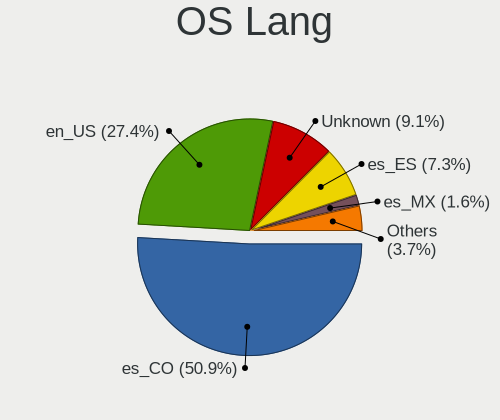

| Lang    | Desktops | Percent |
|---------|----------|---------|
| es_CO   | 157      | 50.97%  |
| en_US   | 82       | 26.62%  |
| Unknown | 34       | 11.04%  |
| es_ES   | 23       | 7.47%   |
| C       | 4        | 1.3%    |
| es_MX   | 3        | 0.97%   |
| pt_BR   | 2        | 0.65%   |
| en_GB   | 2        | 0.65%   |
| es_VE   | 1        | 0.32%   |

Boot Mode
---------

EFI or BIOS

| Mode | Desktops | Percent |
|------|----------|---------|
| BIOS | 181      | 59.93%  |
| EFI  | 121      | 40.07%  |

Filesystem
----------

Type of filesystem

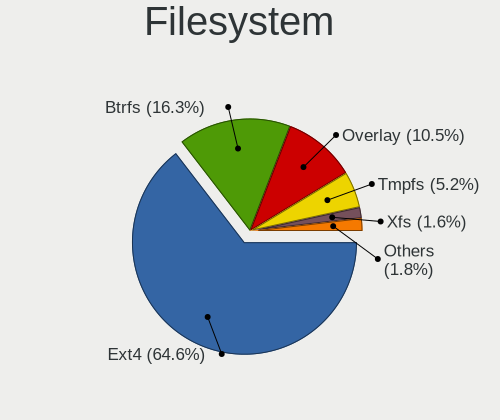

| Type    | Desktops | Percent |
|---------|----------|---------|
| Ext4    | 210      | 68.63%  |
| Btrfs   | 40       | 13.07%  |
| Overlay | 35       | 11.44%  |
| Tmpfs   | 9        | 2.94%   |
| Xfs     | 5        | 1.63%   |
| Unknown | 5        | 1.63%   |
| Zfs     | 1        | 0.33%   |
| Ext2    | 1        | 0.33%   |

Part. scheme
------------

Scheme of partitioning

| Type    | Desktops | Percent |
|---------|----------|---------|
| Unknown | 151      | 49.67%  |
| GPT     | 99       | 32.57%  |
| MBR     | 54       | 17.76%  |

Dual Boot with Linux/BSD
------------------------

Hosting more than one Linux/BSD

| Dual boot | Desktops | Percent |
|-----------|----------|---------|
| No        | 254      | 81.94%  |
| Yes       | 56       | 18.06%  |

Dual Boot (Win)
---------------

Hosting Linux and Windows

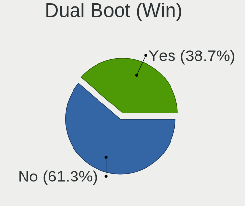

| Dual boot | Desktops | Percent |
|-----------|----------|---------|
| No        | 178      | 58.55%  |
| Yes       | 126      | 41.45%  |

Board
-----

Vendor
------

Motherboard manufacturer

| Name                | Desktops | Percent |
|---------------------|----------|---------|
| ASUSTek Computer    | 63       | 21%     |
| Gigabyte Technology | 55       | 18.33%  |
| MSI                 | 32       | 10.67%  |
| Hewlett-Packard     | 32       | 10.67%  |
| ASRock              | 32       | 10.67%  |
| Intel               | 20       | 6.67%   |
| Dell                | 17       | 5.67%   |
| Lenovo              | 11       | 3.67%   |
| ECS                 | 6        | 2%      |
| Biostar             | 6        | 2%      |
| Pegatron            | 5        | 1.67%   |
| Unknown             | 5        | 1.67%   |
| Foxconn             | 4        | 1.33%   |
| Acer                | 3        | 1%      |
| PCSMART             | 2        | 0.67%   |
| Supermicro          | 1        | 0.33%   |
| PCChips             | 1        | 0.33%   |
| MACHINIST           | 1        | 0.33%   |
| Intel X79           | 1        | 0.33%   |
| Hardkernel          | 1        | 0.33%   |
| BESSTAR Tech        | 1        | 0.33%   |
| Apple               | 1        | 0.33%   |

Model
-----

Motherboard model

| Name                               | Desktops | Percent |
|------------------------------------|----------|---------|
| Gigabyte B450M DS3H                | 7        | 2.33%   |
| Unknown                            | 7        | 2.33%   |
| ASUS All Series                    | 5        | 1.67%   |
| MSI MS-7817                        | 4        | 1.33%   |
| MSI MS-7309                        | 4        | 1.33%   |
| Gigabyte H81M-H                    | 4        | 1.33%   |
| ASUS PRIME A320M-K                 | 4        | 1.33%   |
| HP ProDesk 400 G1 SFF              | 3        | 1%      |
| Gigabyte H61M-HD2                  | 3        | 1%      |
| Gigabyte GA-78LMT-USB3             | 3        | 1%      |
| Gigabyte G31M-ES2C                 | 3        | 1%      |
| ECS G31T-M7                        | 3        | 1%      |
| ASUS ROG STRIX B550-F GAMING       | 3        | 1%      |
| ASUS PRIME B450M-A II              | 3        | 1%      |
| ASUS M5A78L-M/USB3                 | 3        | 1%      |
| ASRock Wolfdale1333-D667           | 3        | 1%      |
| ASRock G965M-S                     | 3        | 1%      |
| ASRock G41M-VS3                    | 3        | 1%      |
| MSI MS-7C37                        | 2        | 0.67%   |
| Intel H61                          | 2        | 0.67%   |
| Intel DH61CR AAG14064-207          | 2        | 0.67%   |
| HP Compaq Pro 4300 SFF PC          | 2        | 0.67%   |
| HP Compaq dc7700 Small Form Factor | 2        | 0.67%   |
| Gigabyte X399 AORUS PRO            | 2        | 0.67%   |
| Gigabyte H61M-S1                   | 2        | 0.67%   |
| Gigabyte B550 AORUS PRO AC         | 2        | 0.67%   |
| Gigabyte A520M DS3H                | 2        | 0.67%   |
| ECS H81H3-M4                       | 2        | 0.67%   |
| Dell Vostro 430                    | 2        | 0.67%   |
| Biostar H61MHV                     | 2        | 0.67%   |
| ASUS TUF B450M-PLUS GAMING         | 2        | 0.67%   |
| ASUS SABERTOOTH 990FX R2.0         | 2        | 0.67%   |
| ASUS PRIME X570-P                  | 2        | 0.67%   |
| ASUS PRIME H410M-E                 | 2        | 0.67%   |
| ASUS PRIME H310M-E                 | 2        | 0.67%   |
| ASRock Z77 Extreme4                | 2        | 0.67%   |
| ASRock H55M                        | 2        | 0.67%   |
| ASRock H110M-HDV R3.0              | 2        | 0.67%   |
| ASRock B450M-HDV R4.0              | 2        | 0.67%   |
| Supermicro X7DA8                   | 1        | 0.33%   |

Model Family
------------

Motherboard model prefix

| Name                     | Desktops | Percent |
|--------------------------|----------|---------|
| ASUS PRIME               | 23       | 7.67%   |
| HP Compaq                | 14       | 4.67%   |
| Lenovo ThinkCentre       | 9        | 3%      |
| Dell OptiPlex            | 9        | 3%      |
| Gigabyte B450M           | 8        | 2.67%   |
| ASUS TUF                 | 8        | 2.67%   |
| HP ProDesk               | 7        | 2.33%   |
| ASUS ROG                 | 7        | 2.33%   |
| Unknown                  | 7        | 2.33%   |
| ASUS All                 | 5        | 1.67%   |
| MSI MS-7817              | 4        | 1.33%   |
| MSI MS-7309              | 4        | 1.33%   |
| HP ProLiant              | 4        | 1.33%   |
| Gigabyte H81M-H          | 4        | 1.33%   |
| Gigabyte B550            | 4        | 1.33%   |
| Intel DG41RQ             | 3        | 1%      |
| Gigabyte X399            | 3        | 1%      |
| Gigabyte H61M-HD2        | 3        | 1%      |
| Gigabyte GA-78LMT-USB3   | 3        | 1%      |
| Gigabyte G31M-ES2C       | 3        | 1%      |
| ECS G31T-M7              | 3        | 1%      |
| Dell Vostro              | 3        | 1%      |
| ASUS M5A78L-M            | 3        | 1%      |
| ASRock Wolfdale1333-D667 | 3        | 1%      |
| ASRock G965M-S           | 3        | 1%      |
| ASRock G41M-VS3          | 3        | 1%      |
| MSI MS-7C37              | 2        | 0.67%   |
| Intel H61                | 2        | 0.67%   |
| Intel DH61CR             | 2        | 0.67%   |
| Intel DH55HC             | 2        | 0.67%   |
| Gigabyte H61M-S1         | 2        | 0.67%   |
| Gigabyte B550M           | 2        | 0.67%   |
| Gigabyte A520M           | 2        | 0.67%   |
| ECS H81H3-M4             | 2        | 0.67%   |
| Dell Inspiron            | 2        | 0.67%   |
| Biostar H61MHV           | 2        | 0.67%   |
| ASUS SABERTOOTH          | 2        | 0.67%   |
| ASUS M4A87TD             | 2        | 0.67%   |
| ASRock Z77               | 2        | 0.67%   |
| ASRock H55M              | 2        | 0.67%   |

MFG Year
--------

Motherboard manufacture year

| Year | Desktops | Percent |
|------|----------|---------|
| 2012 | 34       | 11.33%  |
| 2010 | 31       | 10.33%  |
| 2018 | 27       | 9%      |
| 2020 | 26       | 8.67%   |
| 2013 | 26       | 8.67%   |
| 2011 | 21       | 7%      |
| 2017 | 17       | 5.67%   |
| 2019 | 16       | 5.33%   |
| 2009 | 16       | 5.33%   |
| 2008 | 16       | 5.33%   |
| 2021 | 11       | 3.67%   |
| 2014 | 11       | 3.67%   |
| 2007 | 11       | 3.67%   |
| 2015 | 10       | 3.33%   |
| 2006 | 10       | 3.33%   |
| 2016 | 7        | 2.33%   |
| 2022 | 5        | 1.67%   |
| 2023 | 2        | 0.67%   |
| 2005 | 2        | 0.67%   |
| 2003 | 1        | 0.33%   |

Form Factor
-----------

Physical design of the computer

| Name    | Desktops | Percent |
|---------|----------|---------|
| Desktop | 300      | 100%    |

Secure Boot
-----------

Enabled or disabled

| State    | Desktops | Percent |
|----------|----------|---------|
| Disabled | 292      | 96.69%  |
| Enabled  | 10       | 3.31%   |

Coreboot
--------

Have coreboot on board

| Used | Desktops | Percent |
|------|----------|---------|
| No   | 300      | 100%    |

RAM Size
--------

Total RAM memory

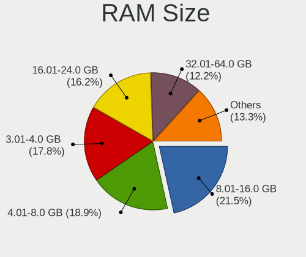

| Size in GB  | Desktops | Percent |
|-------------|----------|---------|
| 8.01-16.0   | 67       | 22.19%  |
| 3.01-4.0    | 64       | 21.19%  |
| 4.01-8.0    | 57       | 18.87%  |
| 16.01-24.0  | 49       | 16.23%  |
| 32.01-64.0  | 31       | 10.26%  |
| 1.01-2.0    | 19       | 6.29%   |
| 24.01-32.0  | 5        | 1.66%   |
| 2.01-3.0    | 4        | 1.32%   |
| 64.01-256.0 | 4        | 1.32%   |
| 0.51-1.0    | 2        | 0.66%   |

RAM Used
--------

Used RAM memory

| Used GB    | Desktops | Percent |
|------------|----------|---------|
| 1.01-2.0   | 120      | 36.25%  |
| 2.01-3.0   | 77       | 23.26%  |
| 3.01-4.0   | 53       | 16.01%  |
| 4.01-8.0   | 45       | 13.6%   |
| 0.51-1.0   | 22       | 6.65%   |
| 8.01-16.0  | 11       | 3.32%   |
| 0.01-0.5   | 2        | 0.6%    |
| 16.01-24.0 | 1        | 0.3%    |

Total Drives
------------

Number of drives on board

| Drives | Desktops | Percent |
|--------|----------|---------|
| 1      | 153      | 49.35%  |
| 2      | 88       | 28.39%  |
| 3      | 45       | 14.52%  |
| 4      | 13       | 4.19%   |
| 5      | 6        | 1.94%   |
| 6      | 3        | 0.97%   |
| 8      | 1        | 0.32%   |
| 0      | 1        | 0.32%   |

Has CD-ROM
----------

Has CD-ROM on board

| Presented | Desktops | Percent |
|-----------|----------|---------|
| No        | 181      | 59.93%  |
| Yes       | 121      | 40.07%  |

Has Ethernet
------------

Has Ethernet on board

| Presented | Desktops | Percent |
|-----------|----------|---------|
| Yes       | 300      | 100%    |

Has WiFi
--------

Has WiFi module

| Presented | Desktops | Percent |
|-----------|----------|---------|
| No        | 182      | 60.07%  |
| Yes       | 121      | 39.93%  |

Has Bluetooth
-------------

Has Bluetooth module

| Presented | Desktops | Percent |
|-----------|----------|---------|
| No        | 241      | 79.28%  |
| Yes       | 63       | 20.72%  |

Location
--------

Country
-------

Geographic location (country)

| Country  | Desktops | Percent |
|----------|----------|---------|
| Colombia | 300      | 100%    |

City
----

Geographic location (city)

| City                 | Desktops | Percent |
|----------------------|----------|---------|
| Bogot              | 119      | 38.51%  |
| Medelln            | 55       | 17.8%   |
| Santiago de Cali     | 23       | 7.44%   |
| Bucaramanga          | 15       | 4.85%   |
| Barranquilla         | 14       | 4.53%   |
| Pereira              | 7        | 2.27%   |
| Pasto                | 7        | 2.27%   |
| Ibague               | 6        | 1.94%   |
| Valledupar           | 5        | 1.62%   |
| Ccuta              | 5        | 1.62%   |
| Armenia              | 4        | 1.29%   |
| Villavicencio        | 3        | 0.97%   |
| Tunja                | 3        | 0.97%   |
| Santa Marta          | 3        | 0.97%   |
| Chia                 | 3        | 0.97%   |
| Soledad              | 2        | 0.65%   |
| Palmira              | 2        | 0.65%   |
| Montera            | 2        | 0.65%   |
| Manizales            | 2        | 0.65%   |
| Cartagena            | 2        | 0.65%   |
| Calarc             | 2        | 0.65%   |
| Buenaventura         | 2        | 0.65%   |
| Bello                | 2        | 0.65%   |
| Zipacon              | 1        | 0.32%   |
| Villagarzon          | 1        | 0.32%   |
| Tulu               | 1        | 0.32%   |
| Soacha               | 1        | 0.32%   |
| Rionegro             | 1        | 0.32%   |
| Puerto Carreo      | 1        | 0.32%   |
| Popayn             | 1        | 0.32%   |
| Ocaa               | 1        | 0.32%   |
| Mompos               | 1        | 0.32%   |
| La Loma              | 1        | 0.32%   |
| Jamundi              | 1        | 0.32%   |
| Ipiales              | 1        | 0.32%   |
| Guadalajara de Buga  | 1        | 0.32%   |
| Fusagasuga           | 1        | 0.32%   |
| Envigado             | 1        | 0.32%   |
| El Carmen de Bolivar | 1        | 0.32%   |
| Donmatias            | 1        | 0.32%   |

Drives
------

Drive Vendor
------------

Hard drive vendors

| Vendor                      | Desktops | Drives | Percent |
|-----------------------------|----------|--------|---------|
| WDC                         | 96       | 133    | 18.86%  |
| Seagate                     | 79       | 117    | 15.52%  |
| Toshiba                     | 61       | 78     | 11.98%  |
| Hitachi                     | 48       | 59     | 9.43%   |
| Samsung Electronics         | 39       | 51     | 7.66%   |
| Kingston                    | 38       | 64     | 7.47%   |
| A-DATA Technology           | 23       | 30     | 4.52%   |
| Maxtor                      | 17       | 18     | 3.34%   |
| Crucial                     | 16       | 18     | 3.14%   |
| SanDisk                     | 12       | 14     | 2.36%   |
| HGST                        | 6        | 7      | 1.18%   |
| Unknown                     | 5        | 5      | 0.98%   |
| Team                        | 5        | 5      | 0.98%   |
| Phison                      | 5        | 9      | 0.98%   |
| Lexar                       | 5        | 5      | 0.98%   |
| XPG                         | 4        | 5      | 0.79%   |
| Realtek Semiconductor       | 4        | 4      | 0.79%   |
| Gigabyte Technology         | 4        | 5      | 0.79%   |
| XrayDisk                    | 3        | 3      | 0.59%   |
| PNY                         | 3        | 4      | 0.59%   |
| JMicron Technology          | 3        | 3      | 0.59%   |
| Corsair                     | 3        | 4      | 0.59%   |
| ADATA Technology            | 3        | 3      | 0.59%   |
| Transcend                   | 2        | 3      | 0.39%   |
| SK hynix                    | 2        | 3      | 0.39%   |
| Hewlett-Packard             | 2        | 2      | 0.39%   |
| Fujitsu                     | 2        | 2      | 0.39%   |
| Fanxiang                    | 2        | 2      | 0.39%   |
| China                       | 2        | 3      | 0.39%   |
| XSTAR                       | 1        | 1      | 0.2%    |
| SUPERSONIC                  | 1        | 1      | 0.2%    |
| Silicon Motion              | 1        | 1      | 0.2%    |
| Micron/Crucial Technology   | 1        | 2      | 0.2%    |
| MAXIO Technology (Hangzhou) | 1        | 1      | 0.2%    |
| KingSpec                    | 1        | 1      | 0.2%    |
| KingFast                    | 1        | 1      | 0.2%    |
| KingDian                    | 1        | 1      | 0.2%    |
| KINGBANK                    | 1        | 1      | 0.2%    |
| Intel                       | 1        | 1      | 0.2%    |
| ExcelStor                   | 1        | 1      | 0.2%    |

Drive Model
-----------

Hard drive models

| Model                                              | Desktops | Percent |
|----------------------------------------------------|----------|---------|
| Toshiba DT01ACA100 1TB                             | 27       | 4.94%   |
| Kingston SA400S37240G 240GB SSD                    | 12       | 2.19%   |
| Toshiba DT01ACA200 2TB                             | 9        | 1.65%   |
| Seagate ST1000DM010-2EP102 1TB                     | 8        | 1.46%   |
| Kingston SA400S37120G 120GB SSD                    | 8        | 1.46%   |
| Toshiba HDWD110 1TB                                | 7        | 1.28%   |
| Toshiba DT01ACA050 500GB                           | 7        | 1.28%   |
| Kingston SV300S37A120G 120GB SSD                   | 7        | 1.28%   |
| WDC WD10EZEX-08WN4A0 1TB                           | 6        | 1.1%    |
| Seagate ST500DM002-1BD142 500GB                    | 6        | 1.1%    |
| Hitachi HDS721050CLA362 500GB                      | 6        | 1.1%    |
| Crucial CT240BX500SSD1 240GB                       | 6        | 1.1%    |
| Kingston SA400S37480G 480GB SSD                    | 5        | 0.91%   |
| Hitachi HDS721616PLA380 160GB                      | 5        | 0.91%   |
| A-DATA SU630 240GB SSD                             | 5        | 0.91%   |
| WDC WDS100T2G0A-00JH30 1TB SSD                     | 4        | 0.73%   |
| Lexar 128GB SSD                                    | 4        | 0.73%   |
| A-DATA SU650 120GB SSD                             | 4        | 0.73%   |
| WDC WD3200AAJS-00L7A0 320GB                        | 3        | 0.55%   |
| Unknown SD/MMC/MS PRO 128GB                        | 3        | 0.55%   |
| Toshiba MQ01ABD100 1TB                             | 3        | 0.55%   |
| Seagate ST500LT012-1DG142 500GB                    | 3        | 0.55%   |
| Seagate ST500LM012 HN-M500MBB 500GB                | 3        | 0.55%   |
| Seagate ST3500413AS 500GB                          | 3        | 0.55%   |
| Seagate ST2000DM008-2FR102 2TB                     | 3        | 0.55%   |
| Seagate ST1500DL003-9VT16L 1TB                     | 3        | 0.55%   |
| Seagate ST1000DM003-1SB102 1TB                     | 3        | 0.55%   |
| Samsung SSD 850 EVO 250GB                          | 3        | 0.55%   |
| Samsung NVMe SSD Controller PM9A1/PM9A3/980PRO 2TB | 3        | 0.55%   |
| Samsung HD322HJ 320GB                              | 3        | 0.55%   |
| Maxtor STM3160215AS 160GB                          | 3        | 0.55%   |
| Hitachi HUA722010CLA330 1TB                        | 3        | 0.55%   |
| Crucial CT480BX500SSD1 480GB                       | 3        | 0.55%   |
| A-DATA SU650 512GB SSD                             | 3        | 0.55%   |
| XPG NVMe SSD Drive 1024GB                          | 2        | 0.37%   |
| WDC WDS480G2G0B-00EPW0 480GB SSD                   | 2        | 0.37%   |
| WDC WDS240G2G0B-00EPW0 240GB SSD                   | 2        | 0.37%   |
| WDC WDS240G2G0A-00JH30 240GB SSD                   | 2        | 0.37%   |
| WDC WDS120G2G0A-00JH30 120GB SSD                   | 2        | 0.37%   |
| WDC WD800JD-75MSA3 80GB                            | 2        | 0.37%   |

HDD Vendor
----------

Hard disk drive vendors

| Vendor              | Desktops | Drives | Percent |
|---------------------|----------|--------|---------|
| WDC                 | 83       | 109    | 26.18%  |
| Seagate             | 78       | 115    | 24.61%  |
| Toshiba             | 61       | 78     | 19.24%  |
| Hitachi             | 48       | 59     | 15.14%  |
| Samsung Electronics | 17       | 21     | 5.36%   |
| Maxtor              | 17       | 18     | 5.36%   |
| HGST                | 6        | 7      | 1.89%   |
| Unknown             | 3        | 3      | 0.95%   |
| Fujitsu             | 2        | 2      | 0.63%   |
| ExcelStor           | 1        | 1      | 0.32%   |
| Apple               | 1        | 1      | 0.32%   |

SSD Vendor
----------

Solid state drive vendors

| Vendor              | Desktops | Drives | Percent |
|---------------------|----------|--------|---------|
| Kingston            | 35       | 58     | 26.32%  |
| A-DATA Technology   | 21       | 28     | 15.79%  |
| WDC                 | 14       | 22     | 10.53%  |
| Crucial             | 14       | 16     | 10.53%  |
| Samsung Electronics | 9        | 10     | 6.77%   |
| SanDisk             | 6        | 8      | 4.51%   |
| Lexar               | 5        | 5      | 3.76%   |
| Team                | 4        | 4      | 3.01%   |
| Gigabyte Technology | 3        | 4      | 2.26%   |
| Transcend           | 2        | 3      | 1.5%    |
| SK hynix            | 2        | 3      | 1.5%    |
| PNY                 | 2        | 3      | 1.5%    |
| JMicron Technology  | 2        | 2      | 1.5%    |
| Corsair             | 2        | 3      | 1.5%    |
| China               | 2        | 3      | 1.5%    |
| XSTAR               | 1        | 1      | 0.75%   |
| XrayDisk            | 1        | 1      | 0.75%   |
| Unknown             | 1        | 1      | 0.75%   |
| Seagate             | 1        | 1      | 0.75%   |
| KingSpec            | 1        | 1      | 0.75%   |
| KingFast            | 1        | 1      | 0.75%   |
| KingDian            | 1        | 1      | 0.75%   |
| Hewlett-Packard     | 1        | 1      | 0.75%   |
| DTECHCO             | 1        | 1      | 0.75%   |
| Unknown             | 1        | 1      | 0.75%   |

Drive Kind
----------

HDD or SSD

| Kind    | Desktops | Drives | Percent |
|---------|----------|--------|---------|
| HDD     | 233      | 414    | 56.55%  |
| SSD     | 118      | 182    | 28.64%  |
| NVMe    | 57       | 75     | 13.83%  |
| Unknown | 4        | 4      | 0.97%   |

Drive Connector
---------------

SATA, SAS, NVMe, etc.

| Type | Desktops | Drives | Percent |
|------|----------|--------|---------|
| SATA | 276      | 589    | 80.23%  |
| NVMe | 57       | 75     | 16.57%  |
| SAS  | 11       | 11     | 3.2%    |

Drive Size
----------

Size of hard drive

| Size in TB | Desktops | Drives | Percent |
|------------|----------|--------|---------|
| 0.01-0.5   | 205      | 340    | 54.96%  |
| 0.51-1.0   | 126      | 188    | 33.78%  |
| 1.01-2.0   | 27       | 38     | 7.24%   |
| 4.01-10.0  | 6        | 10     | 1.61%   |
| 2.01-3.0   | 5        | 7      | 1.34%   |
| 3.01-4.0   | 4        | 13     | 1.07%   |

Space Total
-----------

Amount of disk space available on the file system

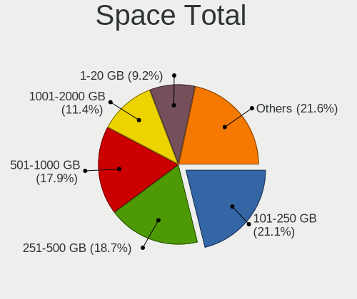

| Size in GB     | Desktops | Percent |
|----------------|----------|---------|
| 101-250        | 72       | 22.36%  |
| 501-1000       | 60       | 18.63%  |
| 251-500        | 56       | 17.39%  |
| 1001-2000      | 35       | 10.87%  |
| 1-20           | 31       | 9.63%   |
| 51-100         | 26       | 8.07%   |
| More than 3000 | 13       | 4.04%   |
| 2001-3000      | 13       | 4.04%   |
| Unknown        | 9        | 2.8%    |
| 21-50          | 7        | 2.17%   |

Space Used
----------

Amount of used disk space

| Used GB        | Desktops | Percent |
|----------------|----------|---------|
| 1-20           | 121      | 36.45%  |
| 21-50          | 52       | 15.66%  |
| 101-250        | 45       | 13.55%  |
| 51-100         | 41       | 12.35%  |
| 251-500        | 22       | 6.63%   |
| 501-1000       | 21       | 6.33%   |
| 1001-2000      | 11       | 3.31%   |
| Unknown        | 9        | 2.71%   |
| More than 3000 | 7        | 2.11%   |
| 2001-3000      | 3        | 0.9%    |

Malfunc. Drives
---------------

Drive models with a malfunction

| Model                                 | Desktops | Drives | Percent |
|---------------------------------------|----------|--------|---------|
| Seagate ST500LT012-1DG142 500GB       | 2        | 2      | 2.47%   |
| Seagate ST500DM002-1BD142 500GB       | 2        | 2      | 2.47%   |
| Hitachi HDS721050CLA362 500GB         | 2        | 2      | 2.47%   |
| A-DATA Technology SU630 240GB SSD     | 2        | 2      | 2.47%   |
| XrayDisk SSD 256GB                    | 1        | 1      | 1.23%   |
| WDC WDS100T2G0A-00JH30 1TB SSD        | 1        | 2      | 1.23%   |
| WDC WD800JD-75MSA3 80GB               | 1        | 1      | 1.23%   |
| WDC WD800JD-60LSA0 80GB               | 1        | 1      | 1.23%   |
| WDC WD800BD-22MRA1 80GB               | 1        | 1      | 1.23%   |
| WDC WD6400AAKS-65Z7B0 640GB           | 1        | 1      | 1.23%   |
| WDC WD5000LPLX-66ZNTT1 500GB          | 1        | 1      | 1.23%   |
| WDC WD5000AAKX-60U6AA0 500GB          | 1        | 1      | 1.23%   |
| WDC WD5000AAKS-08V0A0 500GB           | 1        | 1      | 1.23%   |
| WDC WD3200AVJS-63B6A0 320GB           | 1        | 1      | 1.23%   |
| WDC WD3200AAJS-65M0A0 320GB           | 1        | 1      | 1.23%   |
| WDC WD3200AAJS-60Z0A0 320GB           | 1        | 1      | 1.23%   |
| WDC WD3200AAJS-56M0A0 320GB           | 1        | 1      | 1.23%   |
| WDC WD3200AAJS-56B4A0 320GB           | 1        | 1      | 1.23%   |
| WDC WD20EZRX-00DC0B0 2TB              | 1        | 1      | 1.23%   |
| WDC WD2003FYPS-27W9B0 2TB             | 1        | 1      | 1.23%   |
| WDC WD1600AAJS-75M0A0 160GB           | 1        | 1      | 1.23%   |
| WDC WD10EZEX-08WN4A0 1TB              | 1        | 1      | 1.23%   |
| WDC WD10EURX-73FH1Y0 1TB              | 1        | 1      | 1.23%   |
| WDC WD10EALX-008EA0 1TB               | 1        | 2      | 1.23%   |
| WDC WD10EACS-00D6B1 1TB               | 1        | 1      | 1.23%   |
| WDC WD1001FAES-75W7A0 1TB             | 1        | 1      | 1.23%   |
| Toshiba MQ01ABF032 320GB              | 1        | 1      | 1.23%   |
| Toshiba MQ01ABD075 752GB              | 1        | 1      | 1.23%   |
| Toshiba HDWD110 1TB                   | 1        | 1      | 1.23%   |
| Toshiba DT01ACA100 1TB                | 1        | 1      | 1.23%   |
| Toshiba DT01ACA050 500GB              | 1        | 1      | 1.23%   |
| Toshiba DT01ABA200V 2TB               | 1        | 1      | 1.23%   |
| SK hynix HFS256G39TND-N210A 256GB SSD | 1        | 1      | 1.23%   |
| Seagate ST9500325AS 500GB             | 1        | 1      | 1.23%   |
| Seagate ST9250315AS 250GB             | 1        | 1      | 1.23%   |
| Seagate ST750LM022 HN-M750MBB 752GB   | 1        | 1      | 1.23%   |
| Seagate ST500LM012 HN-M500MBB 500GB   | 1        | 1      | 1.23%   |
| Seagate ST3320613AS 320GB             | 1        | 3      | 1.23%   |
| Seagate ST3320311CS 320GB             | 1        | 2      | 1.23%   |
| Seagate ST3250820AS 250GB             | 1        | 1      | 1.23%   |

Malfunc. Drive Vendor
---------------------

Vendors of faulty drives

| Vendor                | Desktops | Drives | Percent |
|-----------------------|----------|--------|---------|
| WDC                   | 17       | 23     | 23.61%  |
| Seagate               | 16       | 24     | 22.22%  |
| Hitachi               | 14       | 16     | 19.44%  |
| Toshiba               | 6        | 6      | 8.33%   |
| Samsung Electronics   | 6        | 6      | 8.33%   |
| Maxtor                | 4        | 4      | 5.56%   |
| A-DATA Technology     | 2        | 2      | 2.78%   |
| XrayDisk              | 1        | 1      | 1.39%   |
| SK hynix              | 1        | 1      | 1.39%   |
| Realtek Semiconductor | 1        | 1      | 1.39%   |
| Kingston              | 1        | 1      | 1.39%   |
| HGST                  | 1        | 1      | 1.39%   |
| Fujitsu               | 1        | 1      | 1.39%   |
| Crucial               | 1        | 1      | 1.39%   |

Malfunc. HDD Vendor
-------------------

Vendors of faulty HDD drives

| Vendor              | Desktops | Drives | Percent |
|---------------------|----------|--------|---------|
| WDC                 | 16       | 21     | 25.81%  |
| Seagate             | 16       | 24     | 25.81%  |
| Hitachi             | 14       | 16     | 22.58%  |
| Toshiba             | 6        | 6      | 9.68%   |
| Samsung Electronics | 4        | 4      | 6.45%   |
| Maxtor              | 4        | 4      | 6.45%   |
| HGST                | 1        | 1      | 1.61%   |
| Fujitsu             | 1        | 1      | 1.61%   |

Malfunc. Drive Kind
-------------------

Kinds of faulty drives

| Kind | Desktops | Drives | Percent |
|------|----------|--------|---------|
| HDD  | 55       | 77     | 84.62%  |
| SSD  | 7        | 8      | 10.77%  |
| NVMe | 3        | 3      | 4.62%   |

Failed Drives
-------------

Failed drive models

| Model                   | Desktops | Drives | Percent |
|-------------------------|----------|--------|---------|
| Maxtor STM380211AS 80GB | 1        | 1      | 100%    |

Failed Drive Vendor
-------------------

Failed drive vendors

| Vendor | Desktops | Drives | Percent |
|--------|----------|--------|---------|
| Maxtor | 1        | 1      | 100%    |

Drive Status
------------

Number of failed and malfunc. drives

| Status   | Desktops | Drives | Percent |
|----------|----------|--------|---------|
| Detected | 179      | 404    | 52.19%  |
| Works    | 99       | 182    | 28.86%  |
| Malfunc  | 64       | 88     | 18.66%  |
| Failed   | 1        | 1      | 0.29%   |

Storage controller
------------------

Storage Vendor
--------------

Storage controller vendors

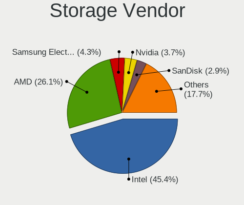

| Vendor                      | Desktops | Percent |
|-----------------------------|----------|---------|
| Intel                       | 183      | 48.41%  |
| AMD                         | 99       | 26.19%  |
| Samsung Electronics         | 15       | 3.97%   |
| Nvidia                      | 15       | 3.97%   |
| ASMedia Technology          | 9        | 2.38%   |
| SanDisk                     | 8        | 2.12%   |
| Realtek Semiconductor       | 7        | 1.85%   |
| Phison Electronics          | 7        | 1.85%   |
| ADATA Technology            | 6        | 1.59%   |
| VIA Technologies            | 5        | 1.32%   |
| Kingston Technology Company | 5        | 1.32%   |
| Silicon Motion              | 3        | 0.79%   |
| MAXIO Technology (Hangzhou) | 3        | 0.79%   |
| JMicron Technology          | 3        | 0.79%   |
| Micron/Crucial Technology   | 2        | 0.53%   |
| Marvell Technology Group    | 2        | 0.53%   |
| INNOGRIT                    | 2        | 0.53%   |
| Seagate Technology          | 1        | 0.26%   |
| Micron Technology           | 1        | 0.26%   |
| Hewlett-Packard             | 1        | 0.26%   |
| Biwin Storage Technology    | 1        | 0.26%   |

Storage Model
-------------

Storage controller models

| Model                                                                                   | Desktops | Percent |
|-----------------------------------------------------------------------------------------|----------|---------|
| AMD FCH SATA Controller [AHCI mode]                                                     | 45       | 8.75%   |
| Intel NM10/ICH7 Family SATA Controller [IDE mode]                                       | 31       | 6.03%   |
| Intel 82801G (ICH7 Family) IDE Controller                                               | 27       | 5.25%   |
| Intel 8 Series/C220 Series Chipset Family 6-port SATA Controller 1 [AHCI mode]          | 26       | 5.06%   |
| Intel 6 Series/C200 Series Chipset Family 6 port Desktop SATA AHCI Controller           | 24       | 4.67%   |
| AMD 400 Series Chipset SATA Controller                                                  | 22       | 4.28%   |
| AMD 500 Series Chipset SATA Controller                                                  | 18       | 3.5%    |
| AMD SB7x0/SB8x0/SB9x0 IDE Controller                                                    | 16       | 3.11%   |
| Intel 6 Series/C200 Series Chipset Family Desktop SATA Controller (IDE mode, ports 4-5) | 14       | 2.72%   |
| Intel 6 Series/C200 Series Chipset Family Desktop SATA Controller (IDE mode, ports 0-3) | 14       | 2.72%   |
| AMD SB7x0/SB8x0/SB9x0 SATA Controller [AHCI mode]                                       | 13       | 2.53%   |
| Intel Q170/Q150/B150/H170/H110/Z170/CM236 Chipset SATA Controller [AHCI Mode]           | 12       | 2.33%   |
| AMD SB7x0/SB8x0/SB9x0 SATA Controller [IDE mode]                                        | 11       | 2.14%   |
| Samsung NVMe SSD Controller SM981/PM981/PM983                                           | 10       | 1.95%   |
| Nvidia MCP61 SATA Controller                                                            | 10       | 1.95%   |
| Nvidia MCP61 IDE                                                                        | 9        | 1.75%   |
| Intel SATA Controller [RAID mode]                                                       | 9        | 1.75%   |
| ASMedia ASM1062 Serial ATA Controller                                                   | 9        | 1.75%   |
| AMD FCH SATA Controller D                                                               | 8        | 1.56%   |
| Intel 82801H (ICH8 Family) 4 port SATA Controller [IDE mode]                            | 7        | 1.36%   |
| Intel 400 Series Chipset Family SATA AHCI Controller                                    | 6        | 1.17%   |
| Samsung NVMe SSD Controller PM9A1/PM9A3/980PRO                                          | 5        | 0.97%   |
| Phison E12 NVMe Controller                                                              | 5        | 0.97%   |
| Intel 82801HR/HO/HH (ICH8R/DO/DH) 2 port SATA Controller [IDE mode]                     | 5        | 0.97%   |
| Intel 7 Series/C210 Series Chipset Family 6-port SATA Controller [AHCI mode]            | 5        | 0.97%   |
| Intel 500 Series Chipset Family SATA AHCI Controller                                    | 5        | 0.97%   |
| Intel 5 Series/3400 Series Chipset 6 port SATA AHCI Controller                          | 5        | 0.97%   |
| Intel 200 Series PCH SATA controller [AHCI mode]                                        | 5        | 0.97%   |
| Intel Cannon Lake PCH SATA AHCI Controller                                              | 4        | 0.78%   |
| Intel 82801I (ICH9 Family) 2 port SATA Controller [IDE mode]                            | 4        | 0.78%   |
| Intel 5 Series/3400 Series Chipset 4 port SATA IDE Controller                           | 4        | 0.78%   |
| Intel 5 Series/3400 Series Chipset 2 port SATA IDE Controller                           | 4        | 0.78%   |
| ADATA XPG SX8200 Pro PCIe Gen3x4 M.2 2280 Solid State Drive                             | 4        | 0.78%   |
| VIA VT6415 PATA IDE Host Controller                                                     | 3        | 0.58%   |
| Samsung NVMe SSD Controller 980 (DRAM-less)                                             | 3        | 0.58%   |
| Realtek RTS5763DL NVMe SSD Controller (DRAM-less)                                       | 3        | 0.58%   |
| MAXIO (Hangzhou) NVMe SSD Controller MAP1202                                            | 3        | 0.58%   |
| Kingston Company NV1 NVMe SSD SM2263XT                                                  | 3        | 0.58%   |
| Intel Alder Lake-S PCH SATA Controller [AHCI Mode]                                      | 3        | 0.58%   |
| Intel 82801IR/IO/IH (ICH9R/DO/DH) 4 port SATA Controller [IDE mode]                     | 3        | 0.58%   |

Storage Kind
------------

Kind of storage controller (IDE, SATA, NVMe, SAS, ...)

| Kind | Desktops | Percent |
|------|----------|---------|
| SATA | 206      | 53.09%  |
| IDE  | 107      | 27.58%  |
| NVMe | 57       | 14.69%  |
| RAID | 17       | 4.38%   |
| SAS  | 1        | 0.26%   |

Processor
---------

CPU Vendor
----------

Processor vendors

| Vendor | Desktops | Percent |
|--------|----------|---------|
| Intel  | 185      | 61.67%  |
| AMD    | 115      | 38.33%  |

CPU Model
---------

Processor models

| Model                                       | Desktops | Percent |
|---------------------------------------------|----------|---------|
| Intel Core i5-2400 CPU @ 3.10GHz            | 8        | 2.65%   |
| Intel Core 2 Duo CPU E7500 @ 2.93GHz        | 7        | 2.32%   |
| AMD Ryzen 5 3600 6-Core Processor           | 7        | 2.32%   |
| AMD Ryzen 5 3400G with Radeon Vega Graphics | 7        | 2.32%   |
| Intel Core i7-7700 CPU @ 3.60GHz            | 6        | 1.99%   |
| Intel Core i5-10400 CPU @ 2.90GHz           | 6        | 1.99%   |
| AMD FX-8320 Eight-Core Processor            | 6        | 1.99%   |
| Intel Pentium Dual-Core CPU E5200 @ 2.50GHz | 5        | 1.66%   |
| Intel Pentium Dual CPU E2200 @ 2.20GHz      | 5        | 1.66%   |
| AMD Ryzen 7 5700G with Radeon Graphics      | 5        | 1.66%   |
| AMD Ryzen 5 5600G with Radeon Graphics      | 5        | 1.66%   |
| AMD Ryzen 3 3200G with Radeon Vega Graphics | 5        | 1.66%   |
| Intel Core i7-3770 CPU @ 3.40GHz            | 4        | 1.32%   |
| Intel Core i5 CPU 650 @ 3.20GHz             | 4        | 1.32%   |
| Intel Core i3-4160 CPU @ 3.60GHz            | 4        | 1.32%   |
| Intel Core i3-3220 CPU @ 3.30GHz            | 4        | 1.32%   |
| Intel Core 2 Quad CPU Q6600 @ 2.40GHz       | 4        | 1.32%   |
| Intel Celeron CPU G1610 @ 2.60GHz           | 4        | 1.32%   |
| AMD Ryzen 7 3700X 8-Core Processor          | 4        | 1.32%   |
| AMD Ryzen 5 3600X 6-Core Processor          | 4        | 1.32%   |
| AMD Ryzen 5 2600 Six-Core Processor         | 4        | 1.32%   |
| Intel Pentium Dual-Core CPU E5700 @ 3.00GHz | 3        | 0.99%   |
| Intel Pentium Dual CPU E2180 @ 2.00GHz      | 3        | 0.99%   |
| Intel Pentium CPU G3250 @ 3.20GHz           | 3        | 0.99%   |
| Intel Core i7-6700 CPU @ 3.40GHz            | 3        | 0.99%   |
| Intel Core i7-4770 CPU @ 3.40GHz            | 3        | 0.99%   |
| Intel Core i7-2600 CPU @ 3.40GHz            | 3        | 0.99%   |
| Intel Core i5-3330 CPU @ 3.00GHz            | 3        | 0.99%   |
| Intel Core i3-2100 CPU @ 3.10GHz            | 3        | 0.99%   |
| AMD Phenom II X6 1100T Processor            | 3        | 0.99%   |
| AMD FX-8350 Eight-Core Processor            | 3        | 0.99%   |
| AMD Athlon 64 X2 Dual Core Processor 5200+  | 3        | 0.99%   |
| Intel Pentium Dual-Core CPU E5400 @ 2.70GHz | 2        | 0.66%   |
| Intel Core i7-4790K CPU @ 4.00GHz           | 2        | 0.66%   |
| Intel Core i7-4790 CPU @ 3.60GHz            | 2        | 0.66%   |
| Intel Core i5-9400F CPU @ 2.90GHz           | 2        | 0.66%   |
| Intel Core i5-8400 CPU @ 2.80GHz            | 2        | 0.66%   |
| Intel Core i5-4570 CPU @ 3.20GHz            | 2        | 0.66%   |
| Intel Core i5-4460 CPU @ 3.20GHz            | 2        | 0.66%   |
| Intel Core i5-3470T CPU @ 2.90GHz           | 2        | 0.66%   |

CPU Model Family
----------------

Processor model prefix

| Model                   | Desktops | Percent |
|-------------------------|----------|---------|
| Intel Core i5           | 51       | 16.89%  |
| AMD Ryzen 5             | 35       | 11.59%  |
| Intel Core i7           | 29       | 9.6%    |
| Intel Core i3           | 24       | 7.95%   |
| AMD Ryzen 7             | 15       | 4.97%   |
| AMD FX                  | 15       | 4.97%   |
| Intel Core 2 Duo        | 13       | 4.3%    |
| Intel Xeon              | 11       | 3.64%   |
| Intel Pentium Dual-Core | 11       | 3.64%   |
| Other                   | 10       | 3.31%   |
| Intel Celeron           | 10       | 3.31%   |
| Intel Pentium Dual      | 8        | 2.65%   |
| AMD Ryzen 3             | 7        | 2.32%   |
| Intel Pentium           | 6        | 1.99%   |
| Intel Core 2 Quad       | 5        | 1.66%   |
| AMD Phenom II X6        | 5        | 1.66%   |
| AMD Athlon II X2        | 5        | 1.66%   |
| AMD Athlon 64 X2        | 5        | 1.66%   |
| AMD Athlon              | 4        | 1.32%   |
| Intel Core 2            | 3        | 0.99%   |
| AMD Sempron             | 3        | 0.99%   |
| AMD Ryzen Threadripper  | 3        | 0.99%   |
| AMD Phenom              | 3        | 0.99%   |
| Intel Pentium D         | 2        | 0.66%   |
| Intel Pentium 4         | 2        | 0.66%   |
| AMD Ryzen 9             | 2        | 0.66%   |
| AMD Phenom II X4        | 2        | 0.66%   |
| AMD A8                  | 2        | 0.66%   |
| AMD A4                  | 2        | 0.66%   |
| AMD A10                 | 2        | 0.66%   |
| Intel Core i9           | 1        | 0.33%   |
| Intel Celeron D         | 1        | 0.33%   |
| Intel Atom              | 1        | 0.33%   |
| AMD Ryzen 5 PRO         | 1        | 0.33%   |
| AMD Athlon II X3        | 1        | 0.33%   |
| AMD Athlon 64           | 1        | 0.33%   |
| AMD A6                  | 1        | 0.33%   |

CPU Cores
---------

Number of processor cores

| Number | Desktops | Percent |
|--------|----------|---------|
| 2      | 102      | 34%     |
| 4      | 101      | 33.67%  |
| 6      | 48       | 16%     |
| 8      | 20       | 6.67%   |
| 1      | 10       | 3.33%   |
| 3      | 7        | 2.33%   |
| 16     | 4        | 1.33%   |
| 12     | 4        | 1.33%   |
| 14     | 2        | 0.67%   |
| 10     | 2        | 0.67%   |

CPU Sockets
-----------

Number of sockets

| Number | Desktops | Percent |
|--------|----------|---------|
| 1      | 296      | 98.67%  |
| 2      | 4        | 1.33%   |

CPU Threads
-----------

Threads per core (Hyper-Threading)

| Number | Desktops | Percent |
|--------|----------|---------|
| 2      | 155      | 51.32%  |
| 1      | 147      | 48.68%  |

CPU Op-Modes
------------

CPU Operation Modes (32-bit, 64-bit)

| Op mode        | Desktops | Percent |
|----------------|----------|---------|
| 32-bit, 64-bit | 296      | 98.67%  |
| Unknown        | 2        | 0.67%   |
| 64-bit         | 1        | 0.33%   |
| 32-bit         | 1        | 0.33%   |

CPU Microcode
-------------

Microcode number

| Number     | Desktops | Percent |
|------------|----------|---------|
| Unknown    | 66       | 21.57%  |
| 0x306c3    | 23       | 7.52%   |
| 0x206a7    | 19       | 6.21%   |
| 0x306a9    | 16       | 5.23%   |
| 0x1067a    | 14       | 4.58%   |
| 0x08108109 | 12       | 3.92%   |
| 0x08701021 | 11       | 3.59%   |
| 0x6fd      | 10       | 3.27%   |
| 0x06000852 | 10       | 3.27%   |
| 0x906e9    | 7        | 2.29%   |
| 0x506e3    | 6        | 1.96%   |
| 0x10676    | 6        | 1.96%   |
| 0x0a50000c | 6        | 1.96%   |
| 0xa0653    | 5        | 1.63%   |
| 0x0800820d | 5        | 1.63%   |
| 0x010000dc | 5        | 1.63%   |
| 0x010000c8 | 5        | 1.63%   |
| 0x906ea    | 4        | 1.31%   |
| 0xf65      | 3        | 0.98%   |
| 0xa0671    | 3        | 0.98%   |
| 0xa0655    | 3        | 0.98%   |
| 0x6fb      | 3        | 0.98%   |
| 0x20655    | 3        | 0.98%   |
| 0x20652    | 3        | 0.98%   |
| 0x106e5    | 3        | 0.98%   |
| 0x08001138 | 3        | 0.98%   |
| 0x06001119 | 3        | 0.98%   |
| 0x6f6      | 2        | 0.65%   |
| 0x0a50000d | 2        | 0.65%   |
| 0x0a20120a | 2        | 0.65%   |
| 0x08701013 | 2        | 0.65%   |
| 0x08001137 | 2        | 0.65%   |
| 0x06000822 | 2        | 0.65%   |
| 0x03000027 | 2        | 0.65%   |
| 0x01000083 | 2        | 0.65%   |
| 0xf64      | 1        | 0.33%   |
| 0xf49      | 1        | 0.33%   |
| 0xf27      | 1        | 0.33%   |
| 0xb0671    | 1        | 0.33%   |
| 0x906ed    | 1        | 0.33%   |

CPU Microarch
-------------

Microarchitecture

| Name             | Desktops | Percent |
|------------------|----------|---------|
| Haswell          | 28       | 9.3%    |
| SandyBridge      | 25       | 8.31%   |
| Penryn           | 25       | 8.31%   |
| IvyBridge        | 25       | 8.31%   |
| Zen+             | 20       | 6.64%   |
| Zen 2            | 19       | 6.31%   |
| K10              | 18       | 5.98%   |
| Core             | 18       | 5.98%   |
| Piledriver       | 17       | 5.65%   |
| Zen 3            | 16       | 5.32%   |
| KabyLake         | 16       | 5.32%   |
| K8 Hammer        | 10       | 3.32%   |
| CometLake        | 10       | 3.32%   |
| Zen              | 8        | 2.66%   |
| Westmere         | 8        | 2.66%   |
| Skylake          | 7        | 2.33%   |
| NetBurst         | 7        | 2.33%   |
| Nehalem          | 4        | 1.33%   |
| Unknown          | 4        | 1.33%   |
| Icelake          | 3        | 1%      |
| K10 Llano        | 2        | 0.66%   |
| Bulldozer        | 2        | 0.66%   |
| Broadwell        | 2        | 0.66%   |
| Alderlake Hybrid | 2        | 0.66%   |
| TigerLake        | 1        | 0.33%   |
| Steamroller      | 1        | 0.33%   |
| Jaguar           | 1        | 0.33%   |
| Goldmont plus    | 1        | 0.33%   |
| Bonnell          | 1        | 0.33%   |

Graphics
--------

GPU Vendor
----------

Vendors of graphics cards

| Vendor                     | Desktops | Percent |
|----------------------------|----------|---------|
| Intel                      | 115      | 36.28%  |
| AMD                        | 103      | 32.49%  |
| Nvidia                     | 93       | 29.34%  |
| Matrox Electronics Systems | 4        | 1.26%   |
| VIA Technologies           | 2        | 0.63%   |

GPU Model
---------

Graphics card models

| Model                                                                       | Desktops | Percent |
|-----------------------------------------------------------------------------|----------|---------|
| Intel Xeon E3-1200 v3/4th Gen Core Processor Integrated Graphics Controller | 14       | 4.35%   |
| Intel 4 Series Chipset Integrated Graphics Controller                       | 14       | 4.35%   |
| Intel 2nd Generation Core Processor Family Integrated Graphics Controller   | 13       | 4.04%   |
| Intel Xeon E3-1200 v2/3rd Gen Core processor Graphics Controller            | 12       | 3.73%   |
| AMD Cedar [Radeon HD 5000/6000/7350/8350 Series]                            | 12       | 3.73%   |
| AMD Cezanne [Radeon Vega Series / Radeon Vega Mobile Series]                | 10       | 3.11%   |
| Intel 82G33/G31 Express Integrated Graphics Controller                      | 9        | 2.8%    |
| AMD Picasso/Raven 2 [Radeon Vega Series / Radeon Vega Mobile Series]        | 9        | 2.8%    |
| Nvidia GT218 [GeForce 210]                                                  | 7        | 2.17%   |
| Intel CometLake-S GT2 [UHD Graphics 630]                                    | 7        | 2.17%   |
| Intel 4th Generation Core Processor Family Integrated Graphics Controller   | 7        | 2.17%   |
| Intel HD Graphics 530                                                       | 6        | 1.86%   |
| AMD RV710 [Radeon HD 4350/4550]                                             | 6        | 1.86%   |
| AMD Ellesmere [Radeon RX 470/480/570/570X/580/580X/590]                     | 6        | 1.86%   |
| Nvidia GP108 [GeForce GT 1030]                                              | 5        | 1.55%   |
| Nvidia GK208B [GeForce GT 710]                                              | 5        | 1.55%   |
| AMD RS780L [Radeon 3000]                                                    | 5        | 1.55%   |
| AMD Navi 10 [Radeon RX 5600 OEM/5600 XT / 5700/5700 XT]                     | 5        | 1.55%   |
| Nvidia GT218 [GeForce 8400 GS Rev. 3]                                       | 4        | 1.24%   |
| Nvidia GP107 [GeForce GTX 1050 Ti]                                          | 4        | 1.24%   |
| Nvidia C61 [GeForce 7025 / nForce 630a]                                     | 4        | 1.24%   |
| Nvidia C61 [GeForce 6150SE nForce 430]                                      | 4        | 1.24%   |
| Intel HD Graphics 630                                                       | 4        | 1.24%   |
| Intel Core Processor Integrated Graphics Controller                         | 4        | 1.24%   |
| Intel 82Q963/Q965 Integrated Graphics Controller                            | 4        | 1.24%   |
| Intel 82945G/GZ Integrated Graphics Controller                              | 4        | 1.24%   |
| Nvidia GP107 [GeForce GTX 1050]                                             | 3        | 0.93%   |
| Nvidia GP106 [GeForce GTX 1060 6GB]                                         | 3        | 0.93%   |
| Nvidia GP104 [GeForce GTX 1070]                                             | 3        | 0.93%   |
| Nvidia GF119 [GeForce GT 610]                                               | 3        | 0.93%   |
| Matrox Electronics Systems MGA G200EH                                       | 3        | 0.93%   |
| Intel IvyBridge GT2 [HD Graphics 4000]                                      | 3        | 0.93%   |
| AMD Cape Verde PRO [Radeon HD 7750/8740 / R7 250E]                          | 3        | 0.93%   |
| AMD Caicos [Radeon HD 6450/7450/8450 / R5 230 OEM]                          | 3        | 0.93%   |
| Nvidia TU117 [GeForce GTX 1650]                                             | 2        | 0.62%   |
| Nvidia TU116 [GeForce GTX 1650 SUPER]                                       | 2        | 0.62%   |
| Nvidia TU106 [GeForce RTX 2060 Rev. A]                                      | 2        | 0.62%   |
| Nvidia GP106 [GeForce GTX 1060 3GB]                                         | 2        | 0.62%   |
| Nvidia GM206 [GeForce GTX 960]                                              | 2        | 0.62%   |
| Nvidia GK208B [GeForce GT 730]                                              | 2        | 0.62%   |

GPU Combo
---------

Combinations of graphics cards

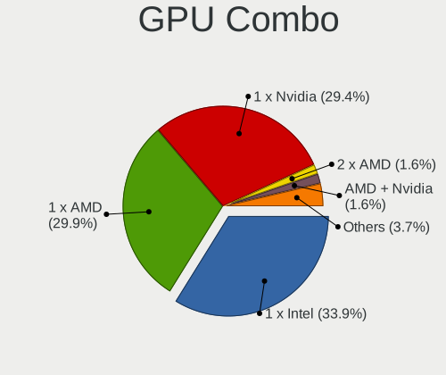

| Name            | Desktops | Percent |
|-----------------|----------|---------|
| 1 x Intel       | 107      | 35.08%  |
| 1 x AMD         | 95       | 31.15%  |
| 1 x Nvidia      | 88       | 28.85%  |
| 2 x AMD         | 4        | 1.31%   |
| 1 x Matrox      | 3        | 0.98%   |
| 1 x VIA         | 2        | 0.66%   |
| Intel + Nvidia  | 2        | 0.66%   |
| Intel + AMD     | 2        | 0.66%   |
| Nvidia + Matrox | 1        | 0.33%   |
| AMD + Nvidia    | 1        | 0.33%   |

GPU Driver
----------

Free vs proprietary

| Driver      | Desktops | Percent |
|-------------|----------|---------|
| Free        | 248      | 81.85%  |
| Proprietary | 42       | 13.86%  |
| Unknown     | 13       | 4.29%   |

GPU Memory
----------

Total video memory

| Size in GB | Desktops | Percent |
|------------|----------|---------|
| Unknown    | 139      | 45.42%  |
| 1.01-2.0   | 47       | 15.36%  |
| 0.51-1.0   | 38       | 12.42%  |
| 0.01-0.5   | 37       | 12.09%  |
| 3.01-4.0   | 15       | 4.9%    |
| 7.01-8.0   | 13       | 4.25%   |
| 5.01-6.0   | 8        | 2.61%   |
| 8.01-16.0  | 5        | 1.63%   |
| 2.01-3.0   | 4        | 1.31%   |

Monitor
-------

Monitor Vendor
--------------

Monitor vendors

| Vendor               | Desktops | Percent |
|----------------------|----------|---------|
| Samsung Electronics  | 80       | 28.99%  |
| Goldstar             | 54       | 19.57%  |
| Hewlett-Packard      | 36       | 13.04%  |
| Dell                 | 22       | 7.97%   |
| Acer                 | 15       | 5.43%   |
| AOC                  | 11       | 3.99%   |
| ViewSonic            | 5        | 1.81%   |
| LG Electronics       | 5        | 1.81%   |
| Lenovo               | 4        | 1.45%   |
| ASUSTek Computer     | 4        | 1.45%   |
| Unknown              | 3        | 1.09%   |
| Sceptre Tech         | 3        | 1.09%   |
| SANYO                | 3        | 1.09%   |
| SAC                  | 3        | 1.09%   |
| RTK                  | 3        | 1.09%   |
| MSI                  | 3        | 1.09%   |
| Ancor Communications | 3        | 1.09%   |
| NCS                  | 2        | 0.72%   |
| Envision             | 2        | 0.72%   |
| BenQ                 | 2        | 0.72%   |
| Westinghouse         | 1        | 0.36%   |
| Unknown (XXX)        | 1        | 0.36%   |
| SMC                  | 1        | 0.36%   |
| SKG                  | 1        | 0.36%   |
| PEGA                 | 1        | 0.36%   |
| MStar                | 1        | 0.36%   |
| KOA                  | 1        | 0.36%   |
| HKC                  | 1        | 0.36%   |
| HannStar             | 1        | 0.36%   |
| Estecom              | 1        | 0.36%   |
| DENON                | 1        | 0.36%   |
| CVT                  | 1        | 0.36%   |
| AGO                  | 1        | 0.36%   |

Monitor Model
-------------

Monitor models

| Model                                                                 | Desktops | Percent |
|-----------------------------------------------------------------------|----------|---------|
| Samsung Electronics SyncMaster SAM036F 1440x900 428x255mm 19.6-inch   | 5        | 1.75%   |
| Samsung Electronics S24F350 SAM0D20 1920x1080 521x293mm 23.5-inch     | 5        | 1.75%   |
| Samsung Electronics S22F350 SAM0D1A 1920x1080 477x268mm 21.5-inch     | 4        | 1.4%    |
| Samsung Electronics LF22T35 SAM707B 1920x1080 477x268mm 21.5-inch     | 4        | 1.4%    |
| Hewlett-Packard LV1911 HWP3005 1366x768 410x230mm 18.5-inch           | 4        | 1.4%    |
| Goldstar HD PLUS GSM5AC5 1600x900 440x250mm 19.9-inch                 | 4        | 1.4%    |
| Goldstar E1942 GSM4C09 1366x768 410x230mm 18.5-inch                   | 4        | 1.4%    |
| Samsung Electronics U28E590 SAM0C4E 3840x2160 608x345mm 27.5-inch     | 3        | 1.05%   |
| Samsung Electronics SMB1930N SAM0632 1366x768 410x230mm 18.5-inch     | 3        | 1.05%   |
| Samsung Electronics SA300/SA350 SAM0788 1366x768 410x230mm 18.5-inch  | 3        | 1.05%   |
| Samsung Electronics LCD Monitor SAM0C39 1920x1080 885x498mm 40.0-inch | 3        | 1.05%   |
| Samsung Electronics C24F390 SAM0D2C 1920x1080 521x293mm 23.5-inch     | 3        | 1.05%   |
| SAC LED MONITOR SAC952D 1920x1080 443x249mm 20.0-inch                 | 3        | 1.05%   |
| Goldstar W1943 GSM4BAD 1360x768 406x229mm 18.4-inch                   | 3        | 1.05%   |
| Goldstar FULL HD GSM5B55 1920x1080 480x270mm 21.7-inch                | 3        | 1.05%   |
| Goldstar 20M35 GSM4EED 1600x900 433x236mm 19.4-inch                   | 3        | 1.05%   |
| Unknown LCD Monitor SAMSUNG 1920x1080                                 | 2        | 0.7%    |
| SANYO LCD TV SAN0523 1920x1080 443x249mm 20.0-inch                    | 2        | 0.7%    |
| Samsung Electronics SA300/SA350 SAM078B 1600x900 443x249mm 20.0-inch  | 2        | 0.7%    |
| Samsung Electronics S22F350 SAM0D1B 1920x1080 477x268mm 21.5-inch     | 2        | 0.7%    |
| Samsung Electronics S20D300 SAM0BDB 1366x768 432x240mm 19.5-inch      | 2        | 0.7%    |
| RTK Verbatim M14 RTK0001 1920x1080 300x190mm 14.0-inch                | 2        | 0.7%    |
| NCS LCD Monitor NCS2275 1920x1080 256x192mm 12.6-inch                 | 2        | 0.7%    |
| LG Electronics LCD Monitor E2241 1920x1080                            | 2        | 0.7%    |
| Lenovo L197 Wide LEN1152 1440x900 410x257mm 19.1-inch                 | 2        | 0.7%    |
| Hewlett-Packard Compaq S1922 HWP290B 1366x768 413x234mm 18.7-inch     | 2        | 0.7%    |
| Goldstar W2243 GSM56FE 1920x1080 477x268mm 21.5-inch                  | 2        | 0.7%    |
| Goldstar W2043 GSM4E9D 1600x900 443x249mm 20.0-inch                   | 2        | 0.7%    |
| Goldstar ULTRAWIDE GSM5BF8 2560x1080 673x284mm 28.8-inch              | 2        | 0.7%    |
| Goldstar LG ULTRAGEAR GSM7766 2560x1440 700x390mm 31.5-inch           | 2        | 0.7%    |
| Goldstar IPS FULLHD GSM5AB9 1920x1080 480x270mm 21.7-inch             | 2        | 0.7%    |
| Goldstar HDR WFHD GSM5B9F 2560x1080 798x334mm 34.1-inch               | 2        | 0.7%    |
| Goldstar HD GSM5ACD 1366x768 410x230mm 18.5-inch                      | 2        | 0.7%    |
| Goldstar 19EN33 GSM4C18 1366x768 410x230mm 18.5-inch                  | 2        | 0.7%    |
| Dell U2410 DELF015 1920x1200 518x324mm 24.1-inch                      | 2        | 0.7%    |
| Acer V206HQLB ACR051A 1366x768 434x236mm 19.4-inch                    | 2        | 0.7%    |
| Acer V173 ACR0053 1280x1024 338x270mm 17.0-inch                       | 2        | 0.7%    |
| Acer AL1716 ACRAD51 1280x1024 340x270mm 17.1-inch                     | 2        | 0.7%    |
| Westinghouse WDE LCM-17v2 WDE1702 1280x1024 338x270mm 17.0-inch       | 1        | 0.35%   |
| ViewSonic VX2768-PC-mhd VSC083A 1920x1080 598x336mm 27.0-inch         | 1        | 0.35%   |

Monitor Resolution
------------------

Monitor screen resolution

| Resolution         | Desktops | Percent |
|--------------------|----------|---------|
| 1920x1080 (FHD)    | 94       | 34.31%  |
| 1366x768 (WXGA)    | 40       | 14.6%   |
| 1600x900 (HD+)     | 24       | 8.76%   |
| 1440x900 (WXGA+)   | 23       | 8.39%   |
| 1280x1024 (SXGA)   | 23       | 8.39%   |
| 3840x2160 (4K)     | 16       | 5.84%   |
| 1360x768           | 10       | 3.65%   |
| 2560x1440 (QHD)    | 9        | 3.28%   |
| 1680x1050 (WSXGA+) | 9        | 3.28%   |
| 2560x1080          | 8        | 2.92%   |
| 1024x768 (XGA)     | 4        | 1.46%   |
| 1920x1200 (WUXGA)  | 3        | 1.09%   |
| Unknown            | 3        | 1.09%   |
| 3840x1080          | 2        | 0.73%   |
| 1280x720 (HD)      | 2        | 0.73%   |
| 3440x1440          | 1        | 0.36%   |
| 3200x1080          | 1        | 0.36%   |
| 1920x540           | 1        | 0.36%   |
| 1152x864           | 1        | 0.36%   |

Monitor Diagonal
----------------

Diagonal size in inches

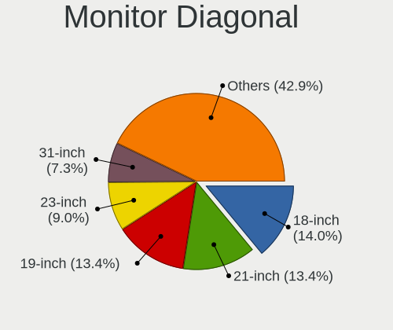

| Inches  | Desktops | Percent |
|---------|----------|---------|
| 21      | 43       | 15.52%  |
| 18      | 42       | 15.16%  |
| 19      | 40       | 14.44%  |
| 23      | 24       | 8.66%   |
| Unknown | 18       | 6.5%    |
| 20      | 17       | 6.14%   |
| 17      | 15       | 5.42%   |
| 27      | 14       | 5.05%   |
| 24      | 11       | 3.97%   |
| 31      | 10       | 3.61%   |
| 22      | 8        | 2.89%   |
| 15      | 6        | 2.17%   |
| 34      | 5        | 1.81%   |
| 28      | 4        | 1.44%   |
| 84      | 3        | 1.08%   |
| 72      | 3        | 1.08%   |
| 54      | 3        | 1.08%   |
| 48      | 2        | 0.72%   |
| 12      | 2        | 0.72%   |
| 60      | 1        | 0.36%   |
| 52      | 1        | 0.36%   |
| 46      | 1        | 0.36%   |
| 40      | 1        | 0.36%   |
| 32      | 1        | 0.36%   |
| 16      | 1        | 0.36%   |
| 13      | 1        | 0.36%   |

Monitor Width
-------------

Physical width

| Width in mm | Desktops | Percent |
|-------------|----------|---------|
| 401-500     | 142      | 52.21%  |
| 501-600     | 42       | 15.44%  |
| 301-350     | 19       | 6.99%   |
| Unknown     | 18       | 6.62%   |
| 601-700     | 17       | 6.25%   |
| 351-400     | 10       | 3.68%   |
| 1001-1500   | 8        | 2.94%   |
| 701-800     | 6        | 2.21%   |
| 1501-2000   | 6        | 2.21%   |
| 201-300     | 3        | 1.1%    |
| 801-900     | 1        | 0.37%   |

Aspect Ratio
------------

Proportional relationship between the width and the height

| Ratio   | Desktops | Percent |
|---------|----------|---------|
| 16/9    | 178      | 66.92%  |
| 16/10   | 33       | 12.41%  |
| 5/4     | 20       | 7.52%   |
| Unknown | 17       | 6.39%   |
| 21/9    | 9        | 3.38%   |
| 4/3     | 7        | 2.63%   |
| 32/9    | 2        | 0.75%   |

Monitor Area
------------

Area in inch

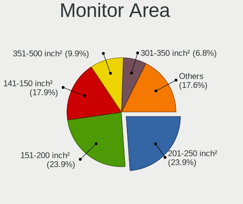

| Area in inch | Desktops | Percent |
|----------------|----------|---------|
| 201-250        | 73       | 26.55%  |
| 151-200        | 67       | 24.36%  |
| 141-150        | 52       | 18.91%  |
| Unknown        | 18       | 6.55%   |
| 351-500        | 16       | 5.82%   |
| 301-350        | 14       | 5.09%   |
| More than 1000 | 12       | 4.36%   |
| 251-300        | 8        | 2.91%   |
| 101-110        | 4        | 1.45%   |
| 501-1000       | 3        | 1.09%   |
| 71-80          | 2        | 0.73%   |
| 131-140        | 2        | 0.73%   |
| 111-120        | 2        | 0.73%   |
| 81-90          | 1        | 0.36%   |
| 121-130        | 1        | 0.36%   |

Pixel Density
-------------

Pixels per inch

| Density | Desktops | Percent |
|---------|----------|---------|
| 51-100  | 173      | 64.79%  |
| 101-120 | 53       | 19.85%  |
| Unknown | 18       | 6.74%   |
| 1-50    | 14       | 5.24%   |
| 121-160 | 6        | 2.25%   |
| 161-240 | 3        | 1.12%   |

Multiple Monitors
-----------------

Total monitors connected

| Total | Desktops | Percent |
|-------|----------|---------|
| 1     | 257      | 84.82%  |
| 2     | 24       | 7.92%   |
| 0     | 18       | 5.94%   |
| 3     | 4        | 1.32%   |

Network
-------

Net Controller Vendor
---------------------

Controller vendors

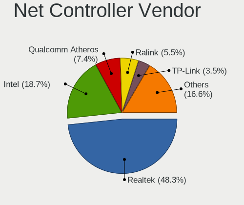

| Vendor                            | Desktops | Percent |
|-----------------------------------|----------|---------|
| Realtek Semiconductor             | 195      | 46.76%  |
| Intel                             | 70       | 16.79%  |
| Qualcomm Atheros                  | 37       | 8.87%   |
| Ralink Technology                 | 24       | 5.76%   |
| Broadcom                          | 15       | 3.6%    |
| TP-Link                           | 14       | 3.36%   |
| Nvidia                            | 12       | 2.88%   |
| Broadcom Limited                  | 6        | 1.44%   |
| Ralink                            | 5        | 1.2%    |
| Qualcomm Atheros Communications   | 5        | 1.2%    |
| Marvell Technology Group          | 4        | 0.96%   |
| Xiaomi                            | 3        | 0.72%   |
| Samsung Electronics               | 3        | 0.72%   |
| Mercucys                          | 3        | 0.72%   |
| MediaTek                          | 3        | 0.72%   |
| VIA Technologies                  | 2        | 0.48%   |
| Sundance Technology Inc / IC Plus | 2        | 0.48%   |
| Motorola PCS                      | 2        | 0.48%   |
| ICS Advent                        | 2        | 0.48%   |
| D-Link System                     | 2        | 0.48%   |
| Wistron NeWeb                     | 1        | 0.24%   |
| Qualcomm                          | 1        | 0.24%   |
| OPPO Electronics                  | 1        | 0.24%   |
| Mellanox Technologies             | 1        | 0.24%   |
| LG Electronics                    | 1        | 0.24%   |
| Huawei Technologies               | 1        | 0.24%   |
| Encore Electronics                | 1        | 0.24%   |
| Aquantia                          | 1        | 0.24%   |

Net Controller Model
--------------------

Controller models

| Model                                                                      | Desktops | Percent |
|----------------------------------------------------------------------------|----------|---------|
| Realtek RTL8111/8168/8411 PCI Express Gigabit Ethernet Controller          | 144      | 32%     |
| Realtek RTL810xE PCI Express Fast Ethernet controller                      | 19       | 4.22%   |
| Realtek RTL8125 2.5GbE Controller                                          | 14       | 3.11%   |
| Ralink RT2870/RT3070 Wireless Adapter                                      | 11       | 2.44%   |
| Ralink MT7601U Wireless Adapter                                            | 9        | 2%      |
| Nvidia MCP61 Ethernet                                                      | 9        | 2%      |
| Qualcomm Atheros AR8152 v2.0 Fast Ethernet                                 | 8        | 1.78%   |
| Intel Wi-Fi 6 AX200                                                        | 8        | 1.78%   |
| Intel I211 Gigabit Network Connection                                      | 8        | 1.78%   |
| Realtek RTL-8100/8101L/8139 PCI Fast Ethernet Adapter                      | 7        | 1.56%   |
| Intel Ethernet Controller I225-V                                           | 7        | 1.56%   |
| Intel 82579LM Gigabit Network Connection (Lewisville)                      | 7        | 1.56%   |
| Realtek RTL8188EUS 802.11n Wireless Network Adapter                        | 6        | 1.33%   |
| Qualcomm Atheros AR9485 Wireless Network Adapter                           | 6        | 1.33%   |
| Intel 82579V Gigabit Network Connection                                    | 6        | 1.33%   |
| Qualcomm Atheros AR9271 802.11n                                            | 5        | 1.11%   |
| TP-Link AC600 wireless Realtek RTL8811AU [Archer T2U Nano]                 | 4        | 0.89%   |
| TP-Link 802.11n NIC                                                        | 4        | 0.89%   |
| Broadcom NetLink BCM57780 Gigabit Ethernet PCIe                            | 4        | 0.89%   |
| Xiaomi Mi/Redmi series (RNDIS)                                             | 3        | 0.67%   |
| TP-Link TL-WN822N Version 4 RTL8192EU                                      | 3        | 0.67%   |
| Samsung GT-I9070 (network tethering, USB debugging enabled)                | 3        | 0.67%   |
| Realtek RTL8192EE PCIe Wireless Network Adapter                            | 3        | 0.67%   |
| Realtek RTL8188FTV 802.11b/g/n 1T1R 2.4G WLAN Adapter                      | 3        | 0.67%   |
| Realtek RTL-8185 IEEE 802.11a/b/g Wireless LAN Controller                  | 3        | 0.67%   |
| Ralink RT5370 Wireless Adapter                                             | 3        | 0.67%   |
| Qualcomm Atheros Killer E220x Gigabit Ethernet Controller                  | 3        | 0.67%   |
| Qualcomm Atheros AR9285 Wireless Network Adapter (PCI-Express)             | 3        | 0.67%   |
| Qualcomm Atheros AR9227 Wireless Network Adapter                           | 3        | 0.67%   |
| Qualcomm Atheros AR8151 v2.0 Gigabit Ethernet                              | 3        | 0.67%   |
| Mercucys 802.11n NIC                                                       | 3        | 0.67%   |
| Intel Ethernet Connection (2) I219-V                                       | 3        | 0.67%   |
| Intel Dual Band Wireless-AC 3168NGW [Stone Peak]                           | 3        | 0.67%   |
| Intel 82578DC Gigabit Network Connection                                   | 3        | 0.67%   |
| Intel 82567LM-3 Gigabit Network Connection                                 | 3        | 0.67%   |
| VIA VT6102/VT6103 [Rhine-II]                                               | 2        | 0.44%   |
| Sundance Inc / IC Plus IC Plus IP100A Integrated 10/100 Ethernet MAC + PHY | 2        | 0.44%   |
| Realtek RTL8192CU 802.11n WLAN Adapter                                     | 2        | 0.44%   |
| Realtek RTL8190 802.11n PCI Wireless Network Adapter                       | 2        | 0.44%   |
| Realtek 802.11ac NIC                                                       | 2        | 0.44%   |

Wireless Vendor
---------------

Wireless vendors

| Vendor                          | Desktops | Percent |
|---------------------------------|----------|---------|
| Realtek Semiconductor           | 28       | 21.71%  |
| Intel                           | 25       | 19.38%  |
| Ralink Technology               | 24       | 18.6%   |
| Qualcomm Atheros                | 16       | 12.4%   |
| TP-Link                         | 14       | 10.85%  |
| Ralink                          | 5        | 3.88%   |
| Qualcomm Atheros Communications | 5        | 3.88%   |
| Mercucys                        | 3        | 2.33%   |
| MediaTek                        | 3        | 2.33%   |
| Wistron NeWeb                   | 1        | 0.78%   |
| LG Electronics                  | 1        | 0.78%   |
| Encore Electronics              | 1        | 0.78%   |
| D-Link System                   | 1        | 0.78%   |
| Broadcom Limited                | 1        | 0.78%   |
| Broadcom                        | 1        | 0.78%   |

Wireless Model
--------------

Wireless models

| Model                                                          | Desktops | Percent |
|----------------------------------------------------------------|----------|---------|
| Ralink RT2870/RT3070 Wireless Adapter                          | 11       | 8.53%   |
| Ralink MT7601U Wireless Adapter                                | 9        | 6.98%   |
| Intel Wi-Fi 6 AX200                                            | 8        | 6.2%    |
| Realtek RTL8188EUS 802.11n Wireless Network Adapter            | 6        | 4.65%   |
| Qualcomm Atheros AR9485 Wireless Network Adapter               | 6        | 4.65%   |
| Qualcomm Atheros AR9271 802.11n                                | 5        | 3.88%   |
| TP-Link AC600 wireless Realtek RTL8811AU [Archer T2U Nano]     | 4        | 3.1%    |
| TP-Link 802.11n NIC                                            | 4        | 3.1%    |
| TP-Link TL-WN822N Version 4 RTL8192EU                          | 3        | 2.33%   |
| Realtek RTL8192EE PCIe Wireless Network Adapter                | 3        | 2.33%   |
| Realtek RTL8188FTV 802.11b/g/n 1T1R 2.4G WLAN Adapter          | 3        | 2.33%   |
| Realtek RTL-8185 IEEE 802.11a/b/g Wireless LAN Controller      | 3        | 2.33%   |
| Ralink RT5370 Wireless Adapter                                 | 3        | 2.33%   |
| Qualcomm Atheros AR9285 Wireless Network Adapter (PCI-Express) | 3        | 2.33%   |
| Qualcomm Atheros AR9227 Wireless Network Adapter               | 3        | 2.33%   |
| Mercucys 802.11n NIC                                           | 3        | 2.33%   |
| Intel Dual Band Wireless-AC 3168NGW [Stone Peak]               | 3        | 2.33%   |
| Realtek RTL8192CU 802.11n WLAN Adapter                         | 2        | 1.55%   |
| Realtek RTL8190 802.11n PCI Wireless Network Adapter           | 2        | 1.55%   |
| Realtek 802.11ac NIC                                           | 2        | 1.55%   |
| Ralink RT2561/RT61 rev B 802.11g                               | 2        | 1.55%   |
| Intel Wireless 7265                                            | 2        | 1.55%   |
| Intel Centrino Wireless-N 2230                                 | 2        | 1.55%   |
| Intel 700 Series Chipset Family Wi-Fi                          | 2        | 1.55%   |
| Wistron NeWeb AR9170+AR9104 802.11abgn Wireless Adapter        | 1        | 0.78%   |
| TP-Link TL-WN823N v2/v3 [Realtek RTL8192EU]                    | 1        | 0.78%   |
| TP-Link TL-WN8200ND [Realtek RTL8192CU]                        | 1        | 0.78%   |
| TP-Link Archer T3U [Realtek RTL8812BU]                         | 1        | 0.78%   |
| Realtek RTL88x2bu [AC1200 Techkey]                             | 1        | 0.78%   |
| Realtek RTL8821CE 802.11ac PCIe Wireless Network Adapter       | 1        | 0.78%   |
| Realtek RTL8814AU 802.11a/b/g/n/ac Wireless Adapter            | 1        | 0.78%   |
| Realtek RTL8192EU 802.11b/g/n WLAN Adapter                     | 1        | 0.78%   |
| Realtek RTL8192CE PCIe Wireless Network Adapter                | 1        | 0.78%   |
| Realtek RTL8188EE Wireless Network Adapter                     | 1        | 0.78%   |
| Realtek RTL8188CUS 802.11n WLAN Adapter                        | 1        | 0.78%   |
| Ralink RT3072 Wireless Adapter                                 | 1        | 0.78%   |
| Ralink RT5390R 802.11bgn PCIe Wireless Network Adapter         | 1        | 0.78%   |
| Ralink RT3090 Wireless 802.11n 1T/1R PCIe                      | 1        | 0.78%   |
| Ralink RT2561/RT61 802.11g PCI                                 | 1        | 0.78%   |
| Qualcomm Atheros AR9287 Wireless Network Adapter (PCI-Express) | 1        | 0.78%   |

Ethernet Vendor
---------------

Ethernet vendors

| Vendor                            | Desktops | Percent |
|-----------------------------------|----------|---------|
| Realtek Semiconductor             | 182      | 58.15%  |
| Intel                             | 59       | 18.85%  |
| Qualcomm Atheros                  | 21       | 6.71%   |
| Broadcom                          | 14       | 4.47%   |
| Nvidia                            | 12       | 3.83%   |
| Broadcom Limited                  | 5        | 1.6%    |
| Marvell Technology Group          | 4        | 1.28%   |
| Xiaomi                            | 3        | 0.96%   |
| VIA Technologies                  | 2        | 0.64%   |
| Sundance Technology Inc / IC Plus | 2        | 0.64%   |
| ICS Advent                        | 2        | 0.64%   |
| Qualcomm                          | 1        | 0.32%   |
| OPPO Electronics                  | 1        | 0.32%   |
| Motorola PCS                      | 1        | 0.32%   |
| Mellanox Technologies             | 1        | 0.32%   |
| Huawei Technologies               | 1        | 0.32%   |
| D-Link System                     | 1        | 0.32%   |
| Aquantia                          | 1        | 0.32%   |

Ethernet Model
--------------

Ethernet models

| Model                                                                      | Desktops | Percent |
|----------------------------------------------------------------------------|----------|---------|
| Realtek RTL8111/8168/8411 PCI Express Gigabit Ethernet Controller          | 144      | 45.43%  |
| Realtek RTL810xE PCI Express Fast Ethernet controller                      | 19       | 5.99%   |
| Realtek RTL8125 2.5GbE Controller                                          | 14       | 4.42%   |
| Nvidia MCP61 Ethernet                                                      | 9        | 2.84%   |
| Qualcomm Atheros AR8152 v2.0 Fast Ethernet                                 | 8        | 2.52%   |
| Intel I211 Gigabit Network Connection                                      | 8        | 2.52%   |
| Realtek RTL-8100/8101L/8139 PCI Fast Ethernet Adapter                      | 7        | 2.21%   |
| Intel Ethernet Controller I225-V                                           | 7        | 2.21%   |
| Intel 82579LM Gigabit Network Connection (Lewisville)                      | 7        | 2.21%   |
| Intel 82579V Gigabit Network Connection                                    | 6        | 1.89%   |
| Broadcom NetLink BCM57780 Gigabit Ethernet PCIe                            | 4        | 1.26%   |
| Xiaomi Mi/Redmi series (RNDIS)                                             | 3        | 0.95%   |
| Qualcomm Atheros Killer E220x Gigabit Ethernet Controller                  | 3        | 0.95%   |
| Qualcomm Atheros AR8151 v2.0 Gigabit Ethernet                              | 3        | 0.95%   |
| Intel Ethernet Connection (2) I219-V                                       | 3        | 0.95%   |
| Intel 82578DC Gigabit Network Connection                                   | 3        | 0.95%   |
| Intel 82567LM-3 Gigabit Network Connection                                 | 3        | 0.95%   |
| VIA VT6102/VT6103 [Rhine-II]                                               | 2        | 0.63%   |
| Sundance Inc / IC Plus IC Plus IP100A Integrated 10/100 Ethernet MAC + PHY | 2        | 0.63%   |
| Qualcomm Atheros Attansic L2 Fast Ethernet                                 | 2        | 0.63%   |
| Nvidia MCP77 Ethernet                                                      | 2        | 0.63%   |
| Marvell Group 88E8057 PCI-E Gigabit Ethernet Controller                    | 2        | 0.63%   |
| Intel Ethernet Connection I217-V                                           | 2        | 0.63%   |
| Intel Ethernet Connection I217-LM                                          | 2        | 0.63%   |
| Intel Ethernet Connection (12) I219-V                                      | 2        | 0.63%   |
| Intel 82578DM Gigabit Network Connection                                   | 2        | 0.63%   |
| Intel 82566DM Gigabit Network Connection                                   | 2        | 0.63%   |
| ICS Advent DM9601 Fast Ethernet Adapter                                    | 2        | 0.63%   |
| Broadcom NetXtreme BCM5754 Gigabit Ethernet PCI Express                    | 2        | 0.63%   |
| Broadcom NetXtreme BCM5717 Gigabit Ethernet PCIe                           | 2        | 0.63%   |
| Broadcom NetLink BCM57781 Gigabit Ethernet PCIe                            | 2        | 0.63%   |
| Broadcom Limited NetLink BCM57788 Gigabit Ethernet PCIe                    | 2        | 0.63%   |
| Realtek RTL8153 Gigabit Ethernet Adapter                                   | 1        | 0.32%   |
| Qualcomm Fairphone 4 5G                                                    | 1        | 0.32%   |
| Qualcomm Atheros QCA8171 Gigabit Ethernet                                  | 1        | 0.32%   |
| Qualcomm Atheros Killer E2500 Gigabit Ethernet Controller                  | 1        | 0.32%   |
| Qualcomm Atheros AR8151 v1.0 Gigabit Ethernet                              | 1        | 0.32%   |
| Qualcomm Atheros AR8132 Fast Ethernet                                      | 1        | 0.32%   |
| Qualcomm Atheros AR8131 Gigabit Ethernet                                   | 1        | 0.32%   |
| OPPO RMX3623                                                               | 1        | 0.32%   |

Net Controller Kind
-------------------

Ethernet, WiFi or modem

| Kind     | Desktops | Percent |
|----------|----------|---------|
| Ethernet | 300      | 70.75%  |
| WiFi     | 120      | 28.3%   |
| Modem    | 3        | 0.71%   |
| Unknown  | 1        | 0.24%   |

Used Controller
---------------

Currently used network controller

| Kind     | Desktops | Percent |
|----------|----------|---------|
| Ethernet | 239      | 78.36%  |
| WiFi     | 65       | 21.31%  |
| Modem    | 1        | 0.33%   |

NICs
----

Total network controllers on board

| Total | Desktops | Percent |
|-------|----------|---------|
| 1     | 223      | 74.09%  |
| 2     | 72       | 23.92%  |
| 3     | 3        | 1%      |
| 0     | 2        | 0.66%   |
| 7     | 1        | 0.33%   |

IPv6
----

IPv6 vs IPv4

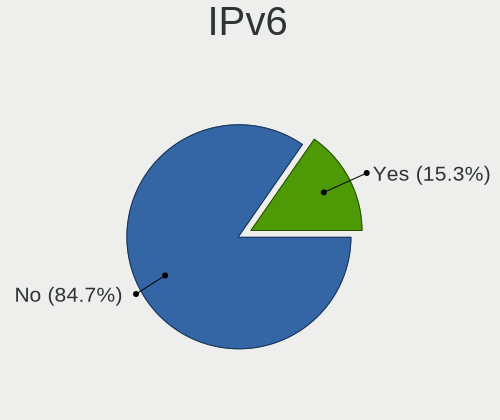

| Used | Desktops | Percent |
|------|----------|---------|
| No   | 261      | 85.29%  |
| Yes  | 45       | 14.71%  |

Bluetooth
---------

Bluetooth Vendor
----------------

Controller vendors

| Vendor                  | Desktops | Percent |
|-------------------------|----------|---------|
| Cambridge Silicon Radio | 30       | 47.62%  |
| Intel                   | 24       | 38.1%   |
| MediaTek                | 2        | 3.17%   |
| IMC Networks            | 2        | 3.17%   |
| TP-Link                 | 1        | 1.59%   |
| Realtek Semiconductor   | 1        | 1.59%   |
| Dell                    | 1        | 1.59%   |
| Broadcom                | 1        | 1.59%   |
| Apple                   | 1        | 1.59%   |

Bluetooth Model
---------------

Controller models

| Model                                               | Desktops | Percent |
|-----------------------------------------------------|----------|---------|
| Cambridge Silicon Radio Bluetooth Dongle (HCI mode) | 30       | 47.62%  |
| Intel AX200 Bluetooth                               | 8        | 12.7%   |
| Intel Bluetooth wireless interface                  | 4        | 6.35%   |
| Intel Wireless-AC 3168 Bluetooth                    | 3        | 4.76%   |
| Intel Centrino Bluetooth Wireless Transceiver       | 3        | 4.76%   |
| MediaTek Wireless_Device                            | 2        | 3.17%   |
| Intel Bluetooth Device                              | 2        | 3.17%   |
| Intel AX201 Bluetooth                               | 2        | 3.17%   |
| TP-Link TP-Cdj+ UB5A Adapter                        | 1        | 1.59%   |
| Realtek Bluetooth Radio                             | 1        | 1.59%   |
| Intel Wireless-AC 9260 Bluetooth Adapter            | 1        | 1.59%   |
| Intel AX210 Bluetooth                               | 1        | 1.59%   |
| IMC Networks Wireless_Device                        | 1        | 1.59%   |
| IMC Networks Bluetooth Radio                        | 1        | 1.59%   |
| Dell Wireless 365 Bluetooth                         | 1        | 1.59%   |
| Broadcom HP Portable Bumble Bee                     | 1        | 1.59%   |
| Apple Bluetooth HCI                                 | 1        | 1.59%   |

Sound
-----

Sound Vendor
------------

Sound card vendors

| Vendor                               | Desktops | Percent |
|--------------------------------------|----------|---------|
| Intel                                | 178      | 38.86%  |
| AMD                                  | 133      | 29.04%  |
| Nvidia                               | 92       | 20.09%  |
| C-Media Electronics                  | 10       | 2.18%   |
| Generalplus Technology               | 5        | 1.09%   |
| VIA Technologies                     | 4        | 0.87%   |
| Logitech                             | 4        | 0.87%   |
| Creative Labs                        | 4        | 0.87%   |
| M-Audio                              | 3        | 0.66%   |
| JMTek                                | 3        | 0.66%   |
| Texas Instruments                    | 2        | 0.44%   |
| Kingston Technology                  | 2        | 0.44%   |
| Blue Microphones                     | 2        | 0.44%   |
| Turtle Beach                         | 1        | 0.22%   |
| Trust                                | 1        | 0.22%   |
| Thesycon Systemsoftware & Consulting | 1        | 0.22%   |
| SteelSeries ApS                      | 1        | 0.22%   |
| Realtek Semiconductor                | 1        | 0.22%   |
| Razer USA                            | 1        | 0.22%   |
| Micro Star International             | 1        | 0.22%   |
| Jieli Technology                     | 1        | 0.22%   |
| HiBy                                 | 1        | 0.22%   |
| GN Netcom                            | 1        | 0.22%   |
| Giga-Byte Technology                 | 1        | 0.22%   |
| Earth Computer Technologies          | 1        | 0.22%   |
| Drop                                 | 1        | 0.22%   |
| Creative Technology                  | 1        | 0.22%   |
| Corsair                              | 1        | 0.22%   |
| Avid Technology                      | 1        | 0.22%   |

Sound Model
-----------

Sound card models

| Model                                                                             | Desktops | Percent |
|-----------------------------------------------------------------------------------|----------|---------|
| Intel 6 Series/C200 Series Chipset Family High Definition Audio Controller        | 38       | 7.04%   |
| Intel NM10/ICH7 Family High Definition Audio Controller                           | 31       | 5.74%   |
| AMD Family 17h/19h HD Audio Controller                                            | 27       | 5%      |
| Intel 8 Series/C220 Series Chipset High Definition Audio Controller               | 26       | 4.81%   |
| AMD SBx00 Azalia (Intel HDA)                                                      | 26       | 4.81%   |
| AMD Starship/Matisse HD Audio Controller                                          | 24       | 4.44%   |
| Intel Xeon E3-1200 v3/4th Gen Core Processor HD Audio Controller                  | 14       | 2.59%   |
| AMD Family 17h (Models 00h-0fh) HD Audio Controller                               | 13       | 2.41%   |
| Intel 100 Series/C230 Series Chipset Family HD Audio Controller                   | 12       | 2.22%   |
| Nvidia High Definition Audio Controller                                           | 11       | 2.04%   |
| Intel 5 Series/3400 Series Chipset High Definition Audio                          | 11       | 2.04%   |
| AMD Renoir Radeon High Definition Audio Controller                                | 11       | 2.04%   |
| AMD Cedar HDMI Audio [Radeon HD 5400/6300/7300 Series]                            | 11       | 2.04%   |
| Nvidia MCP61 High Definition Audio                                                | 10       | 1.85%   |
| AMD Raven/Raven2/Fenghuang HDMI/DP Audio Controller                               | 10       | 1.85%   |
| AMD Oland/Hainan/Cape Verde/Pitcairn HDMI Audio [Radeon HD 7000 Series]           | 10       | 1.85%   |
| Intel 7 Series/C216 Chipset Family High Definition Audio Controller               | 8        | 1.48%   |
| AMD RV710/730 HDMI Audio [Radeon HD 4000 series]                                  | 8        | 1.48%   |
| AMD FCH Azalia Controller                                                         | 8        | 1.48%   |
| Nvidia GP107GL High Definition Audio Controller                                   | 7        | 1.3%    |
| Nvidia GK208 HDMI/DP Audio Controller                                             | 7        | 1.3%    |
| Intel Comet Lake PCH-V cAVS                                                       | 7        | 1.3%    |
| Intel 82801H (ICH8 Family) HD Audio Controller                                    | 7        | 1.3%    |
| Intel 200 Series PCH HD Audio                                                     | 7        | 1.3%    |
| AMD Ellesmere HDMI Audio [Radeon RX 470/480 / 570/580/590]                        | 7        | 1.3%    |
| AMD Navi 10 HDMI Audio                                                            | 6        | 1.11%   |
| Nvidia TU116 High Definition Audio Controller                                     | 5        | 0.93%   |
| Nvidia GP108 High Definition Audio Controller                                     | 5        | 0.93%   |
| Nvidia GP106 High Definition Audio Controller                                     | 5        | 0.93%   |
| Nvidia GF119 HDMI Audio Controller                                                | 5        | 0.93%   |
| Generalplus Technology USB Audio Device                                           | 5        | 0.93%   |
| AMD Turks HDMI Audio [Radeon HD 6500/6600 / 6700M Series]                         | 5        | 0.93%   |
| AMD Navi 21/23 HDMI/DP Audio Controller                                           | 5        | 0.93%   |
| Intel 82801I (ICH9 Family) HD Audio Controller                                    | 4        | 0.74%   |
| C-Media Electronics CMI8738/CMI8768 PCI Audio                                     | 4        | 0.74%   |
| AMD RS780 HDMI Audio [Radeon 3000/3100 / HD 3200/3300]                            | 4        | 0.74%   |
| AMD Caicos HDMI Audio [Radeon HD 6450 / 7450/8450/8490 OEM / R5 230/235/235X OEM] | 4        | 0.74%   |
| Nvidia TU106 High Definition Audio Controller                                     | 3        | 0.56%   |
| Nvidia GP104 High Definition Audio Controller                                     | 3        | 0.56%   |
| Nvidia GM107 High Definition Audio Controller [GeForce 940MX]                     | 3        | 0.56%   |

Memory
------

Memory Vendor
-------------

Memory module vendors

| Vendor              | Desktops | Percent |
|---------------------|----------|---------|
| Unknown             | 34       | 17.99%  |
| Corsair             | 21       | 11.11%  |
| Samsung Electronics | 19       | 10.05%  |
| A-DATA Technology   | 18       | 9.52%   |
| Kingston            | 15       | 7.94%   |
| SK hynix            | 11       | 5.82%   |
| Crucial             | 11       | 5.82%   |
| Micron Technology   | 7        | 3.7%    |
| Team                | 6        | 3.17%   |
| G.Skill             | 6        | 3.17%   |
| Super Talent        | 5        | 2.65%   |
| Ramaxel Technology  | 4        | 2.12%   |
| Patriot             | 4        | 2.12%   |
| Hewlett-Packard     | 4        | 2.12%   |
| GeIL                | 4        | 2.12%   |
| Nanya Technology    | 3        | 1.59%   |
| PNY                 | 2        | 1.06%   |
| Kreton              | 2        | 1.06%   |
| Avant               | 2        | 1.06%   |
| Unknown (AD8A)      | 1        | 0.53%   |
| Transcend           | 1        | 0.53%   |
| Sesame              | 1        | 0.53%   |
| PUSKILL             | 1        | 0.53%   |
| Kllisre             | 1        | 0.53%   |
| Golden Empire       | 1        | 0.53%   |
| Elpida              | 1        | 0.53%   |
| CSX                 | 1        | 0.53%   |
| Atermiter           | 1        | 0.53%   |
| Apacer              | 1        | 0.53%   |
| Unknown             | 1        | 0.53%   |

Memory Model
------------

Memory module models

| Model                                                 | Desktops | Percent |
|-------------------------------------------------------|----------|---------|
| Super Talent RAM SUPERTALENT02 4GB DIMM DDR3 1600MT/s | 5        | 2.38%   |
| Unknown RAM Module 2GB DIMM SDRAM                     | 4        | 1.9%    |
| Unknown RAM Module 2048MB DIMM SDRAM                  | 4        | 1.9%    |
| GeIL RAM CL11-11-11 D3-1600 8192MB DIMM DDR3 1600MT/s | 3        | 1.43%   |
| Corsair RAM CMZ8GX3M1A1600C10 8GB DIMM DDR3 1600MT/s  | 3        | 1.43%   |
| Corsair RAM CMK16GX4M2B3200C16 8GB DIMM DDR4 3600MT/s | 3        | 1.43%   |
| A-DATA RAM DDR4 3200 8GB DIMM DDR4 3600MT/s           | 3        | 1.43%   |
| Unknown RAM Module 4GB DIMM DDR3 1333MT/s             | 2        | 0.95%   |
| Unknown RAM Module 4GB DIMM 1333MT/s                  | 2        | 0.95%   |
| Unknown RAM Module 2GB DIMM DDR2 800MT/s              | 2        | 0.95%   |
| Team RAM TEAMGROUP-UD4-3200 8GB DIMM DDR4 3733MT/s    | 2        | 0.95%   |
| Team RAM TEAMGROUP-UD4-3200 16GB DIMM DDR4 3800MT/s   | 2        | 0.95%   |
| SK hynix RAM Module 4GB DIMM DDR3 1333MT/s            | 2        | 0.95%   |
| Samsung RAM Module 4096MB SODIMM DDR3 1600MT/s        | 2        | 0.95%   |
| Samsung RAM Module 2GB DIMM DDR3 1333MT/s             | 2        | 0.95%   |
| Samsung RAM M3 78T2953EZ3-CF7 1GB DIMM DDR2 800MT/s   | 2        | 0.95%   |
| Patriot RAM 3200 C16 Series 16GB DIMM DDR4 3600MT/s   | 2        | 0.95%   |
| Kingston RAM KHX1600C10D3/8G 4GB DIMM DDR3 1648MT/s   | 2        | 0.95%   |
| Corsair RAM CMZ8GX3M2A1600C9 4GB DIMM DDR3 1800MT/s   | 2        | 0.95%   |
| Corsair RAM CMZ16GX3M2A1600C10 8GB DIMM DDR3 1600MT/s | 2        | 0.95%   |
| A-DATA RAM Module 4GB DIMM DDR3 1333MT/s              | 2        | 0.95%   |
| A-DATA RAM DDR4 3200 8GB DIMM DDR4 3200MT/s           | 2        | 0.95%   |
| A-DATA RAM DDR4 3000 8GB DIMM DDR4 3600MT/s           | 2        | 0.95%   |
| A-DATA RAM DDR4 2400 2OZ 8GB DIMM DDR4 3000MT/s       | 2        | 0.95%   |
| Unknown RAM Module 8GB DIMM DDR4 2667MT/s             | 1        | 0.48%   |
| Unknown RAM Module 8GB DIMM DDR4 2133MT/s             | 1        | 0.48%   |
| Unknown RAM Module 8192MB DIMM DDR3 1600MT/s          | 1        | 0.48%   |
| Unknown RAM Module 8192MB DIMM DDR3 1333MT/s          | 1        | 0.48%   |
| Unknown RAM Module 512MB DIMM DDR 333MT/s             | 1        | 0.48%   |
| Unknown RAM Module 4GB DIMM SDRAM                     | 1        | 0.48%   |
| Unknown RAM Module 4GB DIMM 1600MT/s                  | 1        | 0.48%   |
| Unknown RAM Module 4096MB DIMM SDRAM                  | 1        | 0.48%   |
| Unknown RAM Module 4096MB DIMM DDR3 1333MT/s          | 1        | 0.48%   |
| Unknown RAM Module 2GB DIMM DDR3 1066MT/s             | 1        | 0.48%   |
| Unknown RAM Module 2GB DIMM DDR2 667MT/s              | 1        | 0.48%   |
| Unknown RAM Module 2GB DIMM DDR2 533MT/s              | 1        | 0.48%   |
| Unknown RAM Module 2GB DIMM DDR2 400MT/s              | 1        | 0.48%   |
| Unknown RAM Module 2GB DIMM DDR2 333MT/s              | 1        | 0.48%   |
| Unknown RAM Module 2GB DIMM DDR2 200MT/s              | 1        | 0.48%   |
| Unknown RAM Module 2GB DIMM DDR 800MT/s               | 1        | 0.48%   |

Memory Kind
-----------

Memory module kinds

| Kind    | Desktops | Percent |
|---------|----------|---------|
| DDR4    | 62       | 41.06%  |
| DDR3    | 52       | 34.44%  |
| SDRAM   | 14       | 9.27%   |
| DDR2    | 11       | 7.28%   |
| Unknown | 6        | 3.97%   |
| DDR     | 4        | 2.65%   |
| LPDDR4  | 1        | 0.66%   |
| DRAM    | 1        | 0.66%   |

Memory Form Factor
------------------

Physical design of the memory module

| Name         | Desktops | Percent |
|--------------|----------|---------|
| DIMM         | 140      | 94.59%  |
| SODIMM       | 7        | 4.73%   |
| Row Of Chips | 1        | 0.68%   |

Memory Size
-----------

Memory module size

| Size  | Desktops | Percent |
|-------|----------|---------|
| 8192  | 59       | 33.52%  |
| 4096  | 41       | 23.3%   |
| 2048  | 36       | 20.45%  |
| 16384 | 22       | 12.5%   |
| 32768 | 10       | 5.68%   |
| 1024  | 7        | 3.98%   |
| 512   | 1        | 0.57%   |

Memory Speed
------------

Memory module speed

| Speed   | Desktops | Percent |
|---------|----------|---------|
| 1600    | 35       | 20.23%  |
| 1333    | 25       | 14.45%  |
| 3600    | 17       | 9.83%   |
| 3200    | 11       | 6.36%   |
| 2133    | 9        | 5.2%    |
| Unknown | 9        | 5.2%    |
| 2400    | 8        | 4.62%   |
| 800     | 8        | 4.62%   |
| 3000    | 7        | 4.05%   |
| 2667    | 4        | 2.31%   |
| 1867    | 4        | 2.31%   |
| 3800    | 3        | 1.73%   |
| 3733    | 3        | 1.73%   |
| 3400    | 3        | 1.73%   |
| 2666    | 3        | 1.73%   |
| 1800    | 3        | 1.73%   |
| 667     | 3        | 1.73%   |
| 2800    | 2        | 1.16%   |
| 1866    | 2        | 1.16%   |
| 1334    | 2        | 1.16%   |
| 400     | 2        | 1.16%   |
| 333     | 2        | 1.16%   |
| 3500    | 1        | 0.58%   |
| 3100    | 1        | 0.58%   |
| 3066    | 1        | 0.58%   |
| 2176    | 1        | 0.58%   |
| 1400    | 1        | 0.58%   |
| 1066    | 1        | 0.58%   |
| 533     | 1        | 0.58%   |
| 200     | 1        | 0.58%   |

Printers & scanners
-------------------

Printer Vendor
--------------

Printer device vendors

| Vendor              | Desktops | Percent |
|---------------------|----------|---------|
| Hewlett-Packard     | 4        | 25%     |
| Seiko Epson         | 3        | 18.75%  |
| Samsung Electronics | 2        | 12.5%   |
| Ricoh               | 2        | 12.5%   |
| Prolific Technology | 1        | 6.25%   |
| Philips (or NXP)    | 1        | 6.25%   |
| Canon               | 1        | 6.25%   |
| Brother Industries  | 1        | 6.25%   |
| BESTEASY            | 1        | 6.25%   |

Printer Model
-------------

Printer device models

| Model                                                  | Desktops | Percent |
|--------------------------------------------------------|----------|---------|
| Seiko Epson L120 Series                                | 2        | 12.5%   |
| Seiko Epson ME Office 600F/Stylus Office BX300F/TX300F | 1        | 6.25%   |
| Samsung ML-2010P Mono Laser Printer                    | 1        | 6.25%   |
| Samsung Composite Device                               | 1        | 6.25%   |
| Ricoh Printing Support                                 | 1        | 6.25%   |
| Ricoh Aficio SP 3510DN                                 | 1        | 6.25%   |
| Prolific PL2305 Parallel Port                          | 1        | 6.25%   |
| Philips (or NXP) USB Printer                           | 1        | 6.25%   |
| HP LaserJet CP 1025nw                                  | 1        | 6.25%   |
| HP LaserJet 1020                                       | 1        | 6.25%   |
| HP Laser 107a                                          | 1        | 6.25%   |
| HP Deskjet 2540 series                                 | 1        | 6.25%   |
| Canon G3000 series                                     | 1        | 6.25%   |
| Brother DCP-T710W                                      | 1        | 6.25%   |
| BESTEASY BE-G42S                                       | 1        | 6.25%   |

Scanner Vendor
--------------

Scanner device vendors

Zero info for selected period =(

Scanner Model
-------------

Scanner device models

Zero info for selected period =(

Camera
------

Camera Vendor
-------------

Camera device vendors

| Vendor                      | Desktops | Percent |
|-----------------------------|----------|---------|
| Logitech                    | 16       | 25.4%   |
| KYE Systems (Mouse Systems) | 9        | 14.29%  |
| Microdia                    | 6        | 9.52%   |
| Microsoft                   | 4        | 6.35%   |
| Cubeternet                  | 4        | 6.35%   |
| Chicony Electronics         | 4        | 6.35%   |
| Generalplus Technology      | 3        | 4.76%   |
| Huawei Technologies         | 2        | 3.17%   |
| GEMBIRD                     | 2        | 3.17%   |
| Arkmicro Technologies       | 2        | 3.17%   |
| WaveRider Communications    | 1        | 1.59%   |
| Unknown                     | 1        | 1.59%   |
| Trust                       | 1        | 1.59%   |
| Samsung Electronics         | 1        | 1.59%   |
| Realtek Semiconductor       | 1        | 1.59%   |
| Pixart Imaging              | 1        | 1.59%   |
| OmniVision Technologies     | 1        | 1.59%   |
| Hewlett-Packard             | 1        | 1.59%   |
| HDR webcam                  | 1        | 1.59%   |
| Bison Electronics           | 1        | 1.59%   |
| Unknown                     | 1        | 1.59%   |

Camera Model
------------

Camera device models

| Model                                                               | Desktops | Percent |
|---------------------------------------------------------------------|----------|---------|
| Logitech HD Webcam C525                                             | 4        | 6.35%   |
| Logitech HD Pro Webcam C920                                         | 3        | 4.76%   |
| KYE Systems (Mouse Systems) FaceCam 1000X                           | 3        | 4.76%   |
| Generalplus GENERAL WEBCAM                                          | 3        | 4.76%   |
| Cubeternet GL-UPC822 UVC WebCam                                     | 3        | 4.76%   |
| Chicony HP High Definition 1MP Webcam                               | 3        | 4.76%   |
| Microdia USB Camera                                                 | 2        | 3.17%   |
| Microdia Integrated Camera                                          | 2        | 3.17%   |
| Logitech Webcam C930e                                               | 2        | 3.17%   |
| Logitech Webcam C170                                                | 2        | 3.17%   |
| Huawei UVC Camera                                                   | 2        | 3.17%   |
| GEMBIRD USB2.0 PC CAMERA                                            | 2        | 3.17%   |
| WaveRider USB 2.0 Camera                                            | 1        | 1.59%   |
| Unknown HD camera                                                   | 1        | 1.59%   |
| Trust Full HD Webcam                                                | 1        | 1.59%   |
| Samsung Galaxy series, misc. (MTP mode)                             | 1        | 1.59%   |
| Realtek NexiGo N960E FHD Webcam                                     | 1        | 1.59%   |
| Pixart Imaging GE 1.3 MP MiniCam Pro                                | 1        | 1.59%   |
| OmniVision Monitor Webcam                                           | 1        | 1.59%   |
| Microsoft Microsoft LifeCam Studio                                | 1        | 1.59%   |
| Microsoft Microsoft LifeCam HD-6000 for Notebooks                 | 1        | 1.59%   |
| Microsoft LifeCam HD-3000                                           | 1        | 1.59%   |
| Microsoft LifeCam Cinema                                            | 1        | 1.59%   |
| Microdia Webcam Vitade AF                                           | 1        | 1.59%   |
| Microdia Sonix USB 2.0 Camera                                       | 1        | 1.59%   |
| Logitech Webcam C270                                                | 1        | 1.59%   |
| Logitech HD Webcam C615                                             | 1        | 1.59%   |
| Logitech C922 Pro Stream Webcam                                     | 1        | 1.59%   |
| Logitech C505 HD Webcam                                             | 1        | 1.59%   |
| Logitech BRIO Ultra HD Webcam                                       | 1        | 1.59%   |
| KYE Systems (Mouse Systems) Genius iLook 1321 V2                    | 1        | 1.59%   |
| KYE Systems (Mouse Systems) FaceCam 320X                            | 1        | 1.59%   |
| KYE Systems (Mouse Systems) FaceCam 310                             | 1        | 1.59%   |
| KYE Systems (Mouse Systems) FaceCam 2020                            | 1        | 1.59%   |
| KYE Systems (Mouse Systems) FaceCam 1000                            | 1        | 1.59%   |
| KYE Systems (Mouse Systems) eFace 2025                              | 1        | 1.59%   |
| HP Webcam HD-2200                                                   | 1        | 1.59%   |
| HDR webcam HDR webcam                                               | 1        | 1.59%   |
| Cubeternet EtronTech CMOS based eSP570 WebCam [Onyx Titanium TC101] | 1        | 1.59%   |
| Chicony HP WebCam                                                   | 1        | 1.59%   |

Security
--------

Fingerprint Vendor
------------------

Fingerprint sensor vendors

Zero info for selected period =(

Fingerprint Model
-----------------

Fingerprint sensor models

Zero info for selected period =(

Chipcard Vendor
---------------

Chipcard module vendors

Zero info for selected period =(

Chipcard Model
--------------

Chipcard module models

Zero info for selected period =(

Unsupported
-----------

Unsupported Devices
-------------------

Total unsupported devices on board

| Total | Desktops | Percent |
|-------|----------|---------|
| 0     | 256      | 84.49%  |
| 1     | 42       | 13.86%  |
| 2     | 4        | 1.32%   |
| 4     | 1        | 0.33%   |

Unsupported Device Types
------------------------

Types of unsupported devices

| Type                     | Desktops | Percent |
|--------------------------|----------|---------|
| Graphics card            | 21       | 39.62%  |
| Net/wireless             | 18       | 33.96%  |
| Communication controller | 5        | 9.43%   |
| Storage/raid             | 2        | 3.77%   |
| Multimedia controller    | 2        | 3.77%   |
| Unassigned class         | 1        | 1.89%   |
| Sound                    | 1        | 1.89%   |
| Network                  | 1        | 1.89%   |
| Card reader              | 1        | 1.89%   |
| Camera                   | 1        | 1.89%   |

