Linux in Colombia - Tested Hardware & Statistics (Notebooks)
------------------------------------------------------------

A project to collect tested hardware configurations for Linux in Colombia.

Anyone can contribute to this report by the [hw-probe](https://github.com/linuxhw/hw-probe) tool:

    sudo -E hw-probe -all -upload

Please contribute! Especially if your hardware is rare.

Contents
--------

* [ Test Cases ](#test-cases)

* [ System ](#system)
  - [ OS                       ](#os)
  - [ OS Family                ](#os-family)
  - [ Kernel                   ](#kernel)
  - [ Kernel Family            ](#kernel-family)
  - [ Kernel Major Ver.        ](#kernel-major-ver)
  - [ Arch                     ](#arch)
  - [ DE                       ](#de)
  - [ Display Server           ](#display-server)
  - [ Display Manager          ](#display-manager)
  - [ OS Lang                  ](#os-lang)
  - [ Boot Mode                ](#boot-mode)
  - [ Filesystem               ](#filesystem)
  - [ Part. scheme             ](#part-scheme)
  - [ Dual Boot with Linux/BSD ](#dual-boot-with-linuxbsd)
  - [ Dual Boot (Win)          ](#dual-boot-win)

* [ Board ](#board)
  - [ Vendor                   ](#vendor)
  - [ Model                    ](#model)
  - [ Model Family             ](#model-family)
  - [ MFG Year                 ](#mfg-year)
  - [ Form Factor              ](#form-factor)
  - [ Secure Boot              ](#secure-boot)
  - [ Coreboot                 ](#coreboot)
  - [ RAM Size                 ](#ram-size)
  - [ RAM Used                 ](#ram-used)
  - [ Total Drives             ](#total-drives)
  - [ Has CD-ROM               ](#has-cd-rom)
  - [ Has Ethernet             ](#has-ethernet)
  - [ Has WiFi                 ](#has-wifi)
  - [ Has Bluetooth            ](#has-bluetooth)

* [ Location ](#location)
  - [ Country                  ](#country)
  - [ City                     ](#city)

* [ Drives ](#drives)
  - [ Drive Vendor             ](#drive-vendor)
  - [ Drive Model              ](#drive-model)
  - [ HDD Vendor               ](#hdd-vendor)
  - [ SSD Vendor               ](#ssd-vendor)
  - [ Drive Kind               ](#drive-kind)
  - [ Drive Connector          ](#drive-connector)
  - [ Drive Size               ](#drive-size)
  - [ Space Total              ](#space-total)
  - [ Space Used               ](#space-used)
  - [ Malfunc. Drives          ](#malfunc-drives)
  - [ Malfunc. Drive Vendor    ](#malfunc-drive-vendor)
  - [ Malfunc. HDD Vendor      ](#malfunc-hdd-vendor)
  - [ Malfunc. Drive Kind      ](#malfunc-drive-kind)
  - [ Failed Drives            ](#failed-drives)
  - [ Failed Drive Vendor      ](#failed-drive-vendor)
  - [ Drive Status             ](#drive-status)

* [ Storage controller ](#storage-controller)
  - [ Storage Vendor           ](#storage-vendor)
  - [ Storage Model            ](#storage-model)
  - [ Storage Kind             ](#storage-kind)

* [ Processor ](#processor)
  - [ CPU Vendor               ](#cpu-vendor)
  - [ CPU Model                ](#cpu-model)
  - [ CPU Model Family         ](#cpu-model-family)
  - [ CPU Cores                ](#cpu-cores)
  - [ CPU Sockets              ](#cpu-sockets)
  - [ CPU Threads              ](#cpu-threads)
  - [ CPU Op-Modes             ](#cpu-op-modes)
  - [ CPU Microcode            ](#cpu-microcode)
  - [ CPU Microarch            ](#cpu-microarch)

* [ Graphics ](#graphics)
  - [ GPU Vendor               ](#gpu-vendor)
  - [ GPU Model                ](#gpu-model)
  - [ GPU Combo                ](#gpu-combo)
  - [ GPU Driver               ](#gpu-driver)
  - [ GPU Memory               ](#gpu-memory)

* [ Monitor ](#monitor)
  - [ Monitor Vendor           ](#monitor-vendor)
  - [ Monitor Model            ](#monitor-model)
  - [ Monitor Resolution       ](#monitor-resolution)
  - [ Monitor Diagonal         ](#monitor-diagonal)
  - [ Monitor Width            ](#monitor-width)
  - [ Aspect Ratio             ](#aspect-ratio)
  - [ Monitor Area             ](#monitor-area)
  - [ Pixel Density            ](#pixel-density)
  - [ Multiple Monitors        ](#multiple-monitors)

* [ Network ](#network)
  - [ Net Controller Vendor    ](#net-controller-vendor)
  - [ Net Controller Model     ](#net-controller-model)
  - [ Wireless Vendor          ](#wireless-vendor)
  - [ Wireless Model           ](#wireless-model)
  - [ Ethernet Vendor          ](#ethernet-vendor)
  - [ Ethernet Model           ](#ethernet-model)
  - [ Net Controller Kind      ](#net-controller-kind)
  - [ Used Controller          ](#used-controller)
  - [ NICs                     ](#nics)
  - [ IPv6                     ](#ipv6)

* [ Bluetooth ](#bluetooth)
  - [ Bluetooth Vendor         ](#bluetooth-vendor)
  - [ Bluetooth Model          ](#bluetooth-model)

* [ Sound ](#sound)
  - [ Sound Vendor             ](#sound-vendor)
  - [ Sound Model              ](#sound-model)

* [ Memory ](#memory)
  - [ Memory Vendor            ](#memory-vendor)
  - [ Memory Model             ](#memory-model)
  - [ Memory Kind              ](#memory-kind)
  - [ Memory Form Factor       ](#memory-form-factor)
  - [ Memory Size              ](#memory-size)
  - [ Memory Speed             ](#memory-speed)

* [ Printers & scanners ](#printers--scanners)
  - [ Printer Vendor           ](#printer-vendor)
  - [ Printer Model            ](#printer-model)
  - [ Scanner Vendor           ](#scanner-vendor)
  - [ Scanner Model            ](#scanner-model)

* [ Camera ](#camera)
  - [ Camera Vendor            ](#camera-vendor)
  - [ Camera Model             ](#camera-model)

* [ Security ](#security)
  - [ Fingerprint Vendor       ](#fingerprint-vendor)
  - [ Fingerprint Model        ](#fingerprint-model)
  - [ Chipcard Vendor          ](#chipcard-vendor)
  - [ Chipcard Model           ](#chipcard-model)

* [ Unsupported ](#unsupported)
  - [ Unsupported Devices      ](#unsupported-devices)
  - [ Unsupported Device Types ](#unsupported-device-types)

Test Cases
----------

Total: 990

| Vendor        | Model                       | Probe                                                      | Date         |
|---------------|-----------------------------|------------------------------------------------------------|--------------|
| HUAWEI        | BOHB-WAX9                   | [5d575aeb4f](https://linux-hardware.org/?probe=5d575aeb4f) | Sep 06, 2023 |
| Lenovo        | ThinkPad T430 2349MPS       | [183e5c528c](https://linux-hardware.org/?probe=183e5c528c) | Sep 03, 2023 |
| HP            | Pavilion Notebook           | [3143c94134](https://linux-hardware.org/?probe=3143c94134) | Sep 02, 2023 |
| HP            | 245 G7 Notebook PC          | [bb268c3828](https://linux-hardware.org/?probe=bb268c3828) | Sep 02, 2023 |
| Dell          | Latitude 5430               | [7a9eb9995d](https://linux-hardware.org/?probe=7a9eb9995d) | Sep 02, 2023 |
| HP            | Compaq Presario C700        | [c0030f3b3b](https://linux-hardware.org/?probe=c0030f3b3b) | Sep 01, 2023 |
| Lenovo        | IdeaPad 3 14ALC6 82KT       | [24ad5e2b06](https://linux-hardware.org/?probe=24ad5e2b06) | Aug 31, 2023 |
| Lenovo        | G40-70 20369                | [f3cef329f6](https://linux-hardware.org/?probe=f3cef329f6) | Aug 30, 2023 |
| HP            | Compaq Presario C700        | [bc78db6077](https://linux-hardware.org/?probe=bc78db6077) | Aug 29, 2023 |
| Lenovo        | IdeaPad 110-14IBR 80T6      | [de34a44939](https://linux-hardware.org/?probe=de34a44939) | Aug 29, 2023 |
| Lenovo        | IdeaPad 110-14IBR 80T6      | [776efe803f](https://linux-hardware.org/?probe=776efe803f) | Aug 29, 2023 |
| Lenovo        | IdeaPad 5 14ALC05 82LM      | [78d168c88e](https://linux-hardware.org/?probe=78d168c88e) | Aug 29, 2023 |
| Lenovo        | IdeaPad 1 14IAU7 82QC       | [90e0cad295](https://linux-hardware.org/?probe=90e0cad295) | Aug 28, 2023 |
| Lenovo        | ThinkPad X270 W10DG 20K6... | [9fcb646019](https://linux-hardware.org/?probe=9fcb646019) | Aug 27, 2023 |
| Lenovo        | ThinkPad X270 W10DG 20K6... | [9ce11e1efa](https://linux-hardware.org/?probe=9ce11e1efa) | Aug 27, 2023 |
| Lenovo        | IdeaPad 320-15ISK 80XH      | [657c08f61f](https://linux-hardware.org/?probe=657c08f61f) | Aug 27, 2023 |
| Acer          | Aspire A715-72G             | [cbbaecabb1](https://linux-hardware.org/?probe=cbbaecabb1) | Aug 26, 2023 |
| Apple         | MacBookPro13,2              | [b910d52198](https://linux-hardware.org/?probe=b910d52198) | Aug 26, 2023 |
| Lenovo        | IdeaPad 3 15ALC6 82KU       | [2a05992a61](https://linux-hardware.org/?probe=2a05992a61) | Aug 21, 2023 |
| HP            | Laptop 15-bs0xx             | [5f2a27253a](https://linux-hardware.org/?probe=5f2a27253a) | Aug 21, 2023 |
| HP            | Laptop 15-bs0xx             | [5e76f9bfc3](https://linux-hardware.org/?probe=5e76f9bfc3) | Aug 21, 2023 |
| Apple         | MacBookPro9,2               | [4006007a76](https://linux-hardware.org/?probe=4006007a76) | Aug 20, 2023 |
| ASUSTek       | X450CC                      | [21750fb927](https://linux-hardware.org/?probe=21750fb927) | Aug 19, 2023 |
| HP            | Pavilion Notebook           | [ed75b0702f](https://linux-hardware.org/?probe=ed75b0702f) | Aug 19, 2023 |
| Lenovo        | ThinkBook 14-IIL 20SL       | [3a916bde7d](https://linux-hardware.org/?probe=3a916bde7d) | Aug 16, 2023 |
| ASUSTek       | ZenBook Pro Duo UX582ZM_... | [b3f31fbc53](https://linux-hardware.org/?probe=b3f31fbc53) | Aug 16, 2023 |
| Lenovo        | IdeaPadFlex 10 20324        | [8b4200849d](https://linux-hardware.org/?probe=8b4200849d) | Aug 15, 2023 |
| Lenovo        | IdeaPad 1 14ALC7 82R3       | [0766dc4b96](https://linux-hardware.org/?probe=0766dc4b96) | Aug 13, 2023 |
| Lenovo        | IdeaPad 1 14ALC7 82R3       | [6480e1b649](https://linux-hardware.org/?probe=6480e1b649) | Aug 13, 2023 |
| Dell          | G15 5510                    | [3cfac2d234](https://linux-hardware.org/?probe=3cfac2d234) | Aug 12, 2023 |
| Lenovo        | V310-14ISK 80SX             | [edd47d65b6](https://linux-hardware.org/?probe=edd47d65b6) | Aug 12, 2023 |
| Acer          | Aspire V5-471P              | [cbd4a63b2e](https://linux-hardware.org/?probe=cbd4a63b2e) | Aug 10, 2023 |
| Dell          | Precision 5530              | [3b10bebb7d](https://linux-hardware.org/?probe=3b10bebb7d) | Aug 10, 2023 |
| Lenovo        | IdeaPad 3 15ALC6 82KU       | [03a4763a96](https://linux-hardware.org/?probe=03a4763a96) | Aug 08, 2023 |
| Lenovo        | IdeaPad 3 15ALC6 82KU       | [87ee840e89](https://linux-hardware.org/?probe=87ee840e89) | Aug 07, 2023 |
| HP            | Laptop 15-db0xxx            | [5889bc8dc7](https://linux-hardware.org/?probe=5889bc8dc7) | Aug 06, 2023 |
| COMPUMAX C... | MOBIL                       | [60293c1ac3](https://linux-hardware.org/?probe=60293c1ac3) | Aug 06, 2023 |
| Acer          | Aspire A715-72G             | [4afe306798](https://linux-hardware.org/?probe=4afe306798) | Aug 05, 2023 |
| ASUSTek       | VivoBook_ASUSLaptop X350... | [364aa911cf](https://linux-hardware.org/?probe=364aa911cf) | Aug 05, 2023 |
| Acer          | Aspire A715-72G             | [d0bad7993f](https://linux-hardware.org/?probe=d0bad7993f) | Aug 02, 2023 |
| Dell          | Inspiron 15 3511            | [3ea3ff2535](https://linux-hardware.org/?probe=3ea3ff2535) | Jul 31, 2023 |
| MSI           | Katana 17 B13VFK            | [8bc597da6e](https://linux-hardware.org/?probe=8bc597da6e) | Jul 29, 2023 |
| Dell          | Inspiron 13 5310            | [5f44d0b1d8](https://linux-hardware.org/?probe=5f44d0b1d8) | Jul 26, 2023 |
| Lenovo        | ThinkPad T460 20FMS15W07    | [6a77133959](https://linux-hardware.org/?probe=6a77133959) | Jul 25, 2023 |
| Google        | Treeya                      | [808e203694](https://linux-hardware.org/?probe=808e203694) | Jul 24, 2023 |
| Google        | Treeya                      | [db2b782253](https://linux-hardware.org/?probe=db2b782253) | Jul 24, 2023 |
| MSI           | Modern 15 A5M               | [1763ff7356](https://linux-hardware.org/?probe=1763ff7356) | Jul 18, 2023 |
| HP            | Laptop 14-cf2xxx            | [04dce054f4](https://linux-hardware.org/?probe=04dce054f4) | Jul 17, 2023 |
| Lenovo        | IdeaPad 320-15ISK 80XH      | [ef2395800e](https://linux-hardware.org/?probe=ef2395800e) | Jul 16, 2023 |
| Acer          | Nitro AN515-55              | [c9a21bf55e](https://linux-hardware.org/?probe=c9a21bf55e) | Jul 14, 2023 |
| HP            | 245 G8                      | [07eefc20b0](https://linux-hardware.org/?probe=07eefc20b0) | Jul 13, 2023 |
| Apple         | MacBookPro9,2               | [34fe8ff1ad](https://linux-hardware.org/?probe=34fe8ff1ad) | Jul 13, 2023 |
| Apple         | MacBookPro9,2               | [a3d301a82a](https://linux-hardware.org/?probe=a3d301a82a) | Jul 13, 2023 |
| Dell          | Vostro 3400                 | [93d94feca6](https://linux-hardware.org/?probe=93d94feca6) | Jul 11, 2023 |
| Lenovo        | IdeaPad Gaming 3 15ACH6 ... | [eccd385af4](https://linux-hardware.org/?probe=eccd385af4) | Jul 11, 2023 |
| Lenovo        | IdeaPad Gaming 3 15ACH6 ... | [9cc59dffca](https://linux-hardware.org/?probe=9cc59dffca) | Jul 11, 2023 |
| Compumax C... | ONIX-CEL-0001               | [bd1c8f9529](https://linux-hardware.org/?probe=bd1c8f9529) | Jul 11, 2023 |
| HP            | Notebook                    | [9242935b2b](https://linux-hardware.org/?probe=9242935b2b) | Jul 10, 2023 |
| Apple         | MacBookPro12,1              | [75dc3bfda0](https://linux-hardware.org/?probe=75dc3bfda0) | Jul 04, 2023 |
| Lenovo        | IdeaPad S340-14API 81NB     | [2f5812cb86](https://linux-hardware.org/?probe=2f5812cb86) | Jul 01, 2023 |
| HP            | Laptop 15-ef2xxx            | [d0ea6a2d9d](https://linux-hardware.org/?probe=d0ea6a2d9d) | Jun 30, 2023 |
| Dell          | Latitude E5450              | [e0826ab83a](https://linux-hardware.org/?probe=e0826ab83a) | Jun 30, 2023 |
| Acer          | Aspire A314-22              | [ef54ec3027](https://linux-hardware.org/?probe=ef54ec3027) | Jun 30, 2023 |
| PCsmart       | PCSGOB14p-C                 | [a45977461f](https://linux-hardware.org/?probe=a45977461f) | Jun 27, 2023 |
| ASUSTek       | VivoBook_ASUSLaptop X421... | [b47fa47ef7](https://linux-hardware.org/?probe=b47fa47ef7) | Jun 23, 2023 |
| HP            | Laptop 15-da0xxx            | [71f5fde47b](https://linux-hardware.org/?probe=71f5fde47b) | Jun 23, 2023 |
| Dell          | Vostro 1400                 | [7b5011ff7c](https://linux-hardware.org/?probe=7b5011ff7c) | Jun 22, 2023 |
| Dell          | Vostro 1400                 | [c41c17d657](https://linux-hardware.org/?probe=c41c17d657) | Jun 22, 2023 |
| Apple         | MacBookPro9,2               | [544b40258b](https://linux-hardware.org/?probe=544b40258b) | Jun 21, 2023 |
| Acer          | Aspire A314-22              | [676efbb266](https://linux-hardware.org/?probe=676efbb266) | Jun 18, 2023 |
| Compumax C... | ONIX-CEL-0001               | [2fb2088533](https://linux-hardware.org/?probe=2fb2088533) | Jun 17, 2023 |
| Toshiba       | Satellite L45-B             | [4cc6199522](https://linux-hardware.org/?probe=4cc6199522) | Jun 15, 2023 |
| ASUSTek       | GL552VW                     | [f3b0b03ace](https://linux-hardware.org/?probe=f3b0b03ace) | Jun 12, 2023 |
| Apple         | MacBookPro9,2               | [29d4909dd4](https://linux-hardware.org/?probe=29d4909dd4) | Jun 12, 2023 |
| HUAWEI        | KLVL-WXX9                   | [235239b42b](https://linux-hardware.org/?probe=235239b42b) | Jun 11, 2023 |
| Apple         | MacBookAir5,1               | [53ba4689ae](https://linux-hardware.org/?probe=53ba4689ae) | Jun 10, 2023 |
| Apple         | MacBookAir5,1               | [58f4272bee](https://linux-hardware.org/?probe=58f4272bee) | Jun 10, 2023 |
| Lenovo        | IdeaPad 320-15ISK 80XH      | [2f0f8eb596](https://linux-hardware.org/?probe=2f0f8eb596) | Jun 09, 2023 |
| Apple         | MacBookPro9,2               | [baf92c8b36](https://linux-hardware.org/?probe=baf92c8b36) | Jun 08, 2023 |
| Lenovo        | IdeaPad 100-14IBD 80RK      | [42eab3e3af](https://linux-hardware.org/?probe=42eab3e3af) | Jun 08, 2023 |
| HP            | ZBook 15 G2                 | [ac292cca00](https://linux-hardware.org/?probe=ac292cca00) | Jun 08, 2023 |
| Lenovo        | IdeaPad 110-14IBR 80T6      | [5c63c42a5c](https://linux-hardware.org/?probe=5c63c42a5c) | Jun 04, 2023 |
| Apple         | MacBookPro14,2              | [8f73724b8a](https://linux-hardware.org/?probe=8f73724b8a) | Jun 02, 2023 |
| Lenovo        | IdeaPad 320-15ISK 80XH      | [3de415ea72](https://linux-hardware.org/?probe=3de415ea72) | Jun 01, 2023 |
| Acer          | Aspire A315-59              | [3f08f70d3a](https://linux-hardware.org/?probe=3f08f70d3a) | May 31, 2023 |
| ASUSTek       | X550LD                      | [e091c09373](https://linux-hardware.org/?probe=e091c09373) | May 29, 2023 |
| Compumax C... | ONIX-CEL-0001               | [2f5d8e6789](https://linux-hardware.org/?probe=2f5d8e6789) | May 26, 2023 |
| Acer          | Aspire A314-22              | [776f5c2411](https://linux-hardware.org/?probe=776f5c2411) | May 25, 2023 |
| Acer          | Aspire A314-22              | [e2110ab5da](https://linux-hardware.org/?probe=e2110ab5da) | May 25, 2023 |
| ASUSTek       | X450CC                      | [ca431e5e80](https://linux-hardware.org/?probe=ca431e5e80) | May 24, 2023 |
| Lenovo        | IdeaPadFlex 10 20324        | [ac4be1ce4d](https://linux-hardware.org/?probe=ac4be1ce4d) | May 11, 2023 |
| Toshiba       | Satellite C55-C             | [1f5654331d](https://linux-hardware.org/?probe=1f5654331d) | May 09, 2023 |
| HP            | Laptop 15-ef2xxx            | [96c2411d79](https://linux-hardware.org/?probe=96c2411d79) | May 08, 2023 |
| Lenovo        | IdeaPad S340-14API 81NB     | [6e28d6fd76](https://linux-hardware.org/?probe=6e28d6fd76) | May 07, 2023 |
| ASUSTek       | VivoBook_ASUSLaptop X510... | [fe61386871](https://linux-hardware.org/?probe=fe61386871) | May 05, 2023 |
| ASUSTek       | VivoBook_ASUSLaptop X510... | [764f38bb65](https://linux-hardware.org/?probe=764f38bb65) | May 05, 2023 |
| HP            | Pavilion Laptop 15-eg0xx... | [a00f293aa7](https://linux-hardware.org/?probe=a00f293aa7) | May 04, 2023 |
| HP            | Laptop 15-ef2xxx            | [d29dae3c91](https://linux-hardware.org/?probe=d29dae3c91) | May 04, 2023 |
| ASUSTek       | VivoBook_ASUSLaptop X340... | [e8ce8c11c0](https://linux-hardware.org/?probe=e8ce8c11c0) | May 01, 2023 |
| ASUSTek       | VivoBook_ASUSLaptop X415... | [dca12f3f6a](https://linux-hardware.org/?probe=dca12f3f6a) | Apr 29, 2023 |
| Toshiba       | Satellite C45-A             | [7720195dfe](https://linux-hardware.org/?probe=7720195dfe) | Apr 24, 2023 |
| Lenovo        | ThinkBook 14-IML 20RV       | [32546113c8](https://linux-hardware.org/?probe=32546113c8) | Apr 24, 2023 |
| HP            | EliteBook 840 G8 Noteboo... | [18fc5f09ed](https://linux-hardware.org/?probe=18fc5f09ed) | Apr 23, 2023 |
| Acer          | Nitro AN515-52              | [e3dc4788e7](https://linux-hardware.org/?probe=e3dc4788e7) | Apr 22, 2023 |
| HP            | ProBook 440 G7              | [50408f04cb](https://linux-hardware.org/?probe=50408f04cb) | Apr 22, 2023 |
| ASUSTek       | VivoBook_ASUSLaptop X415... | [901b3d11dc](https://linux-hardware.org/?probe=901b3d11dc) | Apr 20, 2023 |
| HP            | G42                         | [dd87e935d0](https://linux-hardware.org/?probe=dd87e935d0) | Apr 20, 2023 |
| Lenovo        | G40-30 80FY                 | [923b3fd46b](https://linux-hardware.org/?probe=923b3fd46b) | Apr 19, 2023 |
| Lenovo        | ThinkBook 14-IML 20RV       | [d532f6fdbd](https://linux-hardware.org/?probe=d532f6fdbd) | Apr 16, 2023 |
| ASUSTek       | VivoBook 14_ASUS Laptop ... | [7852e88a19](https://linux-hardware.org/?probe=7852e88a19) | Apr 11, 2023 |
| Apple         | MacBookPro14,2              | [1bc09aed8a](https://linux-hardware.org/?probe=1bc09aed8a) | Apr 10, 2023 |
| HUAWEI        | WRTD-WXX9                   | [d478080e54](https://linux-hardware.org/?probe=d478080e54) | Apr 09, 2023 |
| HP            | Laptop 14-dk1xxx            | [5d39494c01](https://linux-hardware.org/?probe=5d39494c01) | Apr 09, 2023 |
| ASUSTek       | VivoBook_ASUSLaptop M350... | [1a6e63f6b2](https://linux-hardware.org/?probe=1a6e63f6b2) | Apr 08, 2023 |
| HUAWEI        | KLVL-WXX9                   | [441d7f391e](https://linux-hardware.org/?probe=441d7f391e) | Apr 08, 2023 |
| Notebook      | NP5x_NP6x_NP7xRNJ_RNH       | [29f00590fb](https://linux-hardware.org/?probe=29f00590fb) | Apr 05, 2023 |
| Compumax C... | ONIX-CEL-0001               | [b3e9bc2fb0](https://linux-hardware.org/?probe=b3e9bc2fb0) | Apr 04, 2023 |
| Apple         | MacBookAir5,2               | [cb94d3ff68](https://linux-hardware.org/?probe=cb94d3ff68) | Apr 04, 2023 |
| Lenovo        | ThinkPad E14 Gen 3 20Y70... | [9f33f20fc4](https://linux-hardware.org/?probe=9f33f20fc4) | Apr 04, 2023 |
| PCSMART S.... | PNTGOB11CPE                 | [874d355cc4](https://linux-hardware.org/?probe=874d355cc4) | Apr 02, 2023 |
| Toshiba       | Satellite L45-B             | [6d4878cdbf](https://linux-hardware.org/?probe=6d4878cdbf) | Apr 01, 2023 |
| ASUSTek       | VivoBook 15_ASUS Laptop ... | [03da618edb](https://linux-hardware.org/?probe=03da618edb) | Mar 31, 2023 |
| Lenovo        | IdeaPad 330S-15ARR 81FB     | [1dc323a9e9](https://linux-hardware.org/?probe=1dc323a9e9) | Mar 30, 2023 |
| Lenovo        | IdeaPad 110-14IBR 80T6      | [117d507724](https://linux-hardware.org/?probe=117d507724) | Mar 24, 2023 |
| Lenovo        | IdeaPad Yoga 13 20175       | [56d564423e](https://linux-hardware.org/?probe=56d564423e) | Mar 24, 2023 |
| HUAWEI        | NBLB-WAX9N                  | [e14a63a1e4](https://linux-hardware.org/?probe=e14a63a1e4) | Mar 24, 2023 |
| Apple         | MacBookPro12,1              | [c6f835ae33](https://linux-hardware.org/?probe=c6f835ae33) | Mar 16, 2023 |
| Toshiba       | Satellite L735              | [0c5b1ebe0a](https://linux-hardware.org/?probe=0c5b1ebe0a) | Mar 11, 2023 |
| Toshiba       | Satellite L735              | [5371ec61c1](https://linux-hardware.org/?probe=5371ec61c1) | Mar 11, 2023 |
| Apple         | MacBookPro11,3              | [bccc889328](https://linux-hardware.org/?probe=bccc889328) | Mar 10, 2023 |
| Lenovo        | ThinkPad X201 36806V4       | [1921dc6d6b](https://linux-hardware.org/?probe=1921dc6d6b) | Mar 09, 2023 |
| ASUSTek       | VivoBook_ASUSLaptop E410... | [4cb7f38354](https://linux-hardware.org/?probe=4cb7f38354) | Mar 05, 2023 |
| HP            | G42                         | [7dee433139](https://linux-hardware.org/?probe=7dee433139) | Mar 05, 2023 |
| Apple         | MacBookPro5,5               | [e20478d60e](https://linux-hardware.org/?probe=e20478d60e) | Feb 28, 2023 |
| ASUSTek       | VivoBook_ASUSLaptop E410... | [39f48414bc](https://linux-hardware.org/?probe=39f48414bc) | Feb 23, 2023 |
| ASUSTek       | VivoBook_ASUSLaptop X509... | [cc447f6c07](https://linux-hardware.org/?probe=cc447f6c07) | Feb 19, 2023 |
| ASUSTek       | VivoBook_ASUSLaptop X513... | [66c33604c4](https://linux-hardware.org/?probe=66c33604c4) | Feb 17, 2023 |
| Lenovo        | ThinkPad E14 Gen 4 21E30... | [4e0e31fd72](https://linux-hardware.org/?probe=4e0e31fd72) | Feb 17, 2023 |
| Lenovo        | IdeaPad Z585 20152          | [e03f8ffaf1](https://linux-hardware.org/?probe=e03f8ffaf1) | Feb 17, 2023 |
| Lenovo        | IdeaPad Z585 20152          | [bc95a7befb](https://linux-hardware.org/?probe=bc95a7befb) | Feb 15, 2023 |
| Lenovo        | ThinkPad E14 Gen 2 20TBS... | [28db1ad82e](https://linux-hardware.org/?probe=28db1ad82e) | Feb 14, 2023 |
| Dell          | Latitude 3410               | [7ccc73c7bf](https://linux-hardware.org/?probe=7ccc73c7bf) | Feb 13, 2023 |
| Dell          | Latitude 3410               | [374ddffec8](https://linux-hardware.org/?probe=374ddffec8) | Feb 13, 2023 |
| Dell          | Inspiron 1420               | [77c6839e06](https://linux-hardware.org/?probe=77c6839e06) | Feb 13, 2023 |
| ASUSTek       | VivoBook_ASUSLaptop X512... | [3c8717baf4](https://linux-hardware.org/?probe=3c8717baf4) | Feb 12, 2023 |
| ASUSTek       | X455YA                      | [ba987663d8](https://linux-hardware.org/?probe=ba987663d8) | Feb 09, 2023 |
| HP            | 450                         | [26d3505372](https://linux-hardware.org/?probe=26d3505372) | Feb 06, 2023 |
| HP            | Pavilion 10 TS              | [522345a482](https://linux-hardware.org/?probe=522345a482) | Feb 05, 2023 |
| PCsmart       | PCSGOB14p-C                 | [9cf7aff807](https://linux-hardware.org/?probe=9cf7aff807) | Feb 05, 2023 |
| Lenovo        | IdeaPad 3 15IML05 81WB      | [42d855f568](https://linux-hardware.org/?probe=42d855f568) | Feb 04, 2023 |
| HP            | 240 G8 Notebook PC          | [00a3607d18](https://linux-hardware.org/?probe=00a3607d18) | Jan 30, 2023 |
| HP            | Pavilion dv6                | [ce950f0a28](https://linux-hardware.org/?probe=ce950f0a28) | Jan 28, 2023 |
| Acer          | Aspire V5-431               | [abf4a51513](https://linux-hardware.org/?probe=abf4a51513) | Jan 24, 2023 |
| Acer          | Aspire V5-431               | [3da8ac521c](https://linux-hardware.org/?probe=3da8ac521c) | Jan 23, 2023 |
| ASUSTek       | VivoBook_ASUSLaptop X513... | [364a07a435](https://linux-hardware.org/?probe=364a07a435) | Jan 23, 2023 |
| ASUSTek       | VivoBook_ASUSLaptop X415... | [546a896e7f](https://linux-hardware.org/?probe=546a896e7f) | Jan 22, 2023 |
| Lenovo        | IdeaPad Z400 20201          | [9e49dc44eb](https://linux-hardware.org/?probe=9e49dc44eb) | Jan 21, 2023 |
| Dell          | Inspiron 3442               | [bb63f70764](https://linux-hardware.org/?probe=bb63f70764) | Jan 21, 2023 |
| Dell          | Inspiron 3442               | [5973a7db86](https://linux-hardware.org/?probe=5973a7db86) | Jan 21, 2023 |
| HP            | 1000                        | [62ee01ee38](https://linux-hardware.org/?probe=62ee01ee38) | Jan 20, 2023 |
| Toshiba       | QOSMIO X505                 | [8b6dfa9517](https://linux-hardware.org/?probe=8b6dfa9517) | Jan 18, 2023 |
| Acer          | Nitro AN515-54              | [4a997fa99d](https://linux-hardware.org/?probe=4a997fa99d) | Jan 17, 2023 |
| Lenovo        | G450 2949                   | [f9141ba069](https://linux-hardware.org/?probe=f9141ba069) | Jan 17, 2023 |
| Lenovo        | G450 2949                   | [923765c4aa](https://linux-hardware.org/?probe=923765c4aa) | Jan 17, 2023 |
| Dell          | Vostro 3405                 | [b769a91b4f](https://linux-hardware.org/?probe=b769a91b4f) | Jan 17, 2023 |
| ASUSTek       | ZenBook UX434FAC_UX434FA    | [0ece2f508b](https://linux-hardware.org/?probe=0ece2f508b) | Jan 14, 2023 |
| HP            | Stream Laptop 14-ax0XX      | [b6c21b8d35](https://linux-hardware.org/?probe=b6c21b8d35) | Jan 14, 2023 |
| Dell          | Inspiron 11 - 3147          | [7193100d05](https://linux-hardware.org/?probe=7193100d05) | Jan 14, 2023 |
| Samsung       | 300E4Z/300E5Z/300E7Z        | [923d70951e](https://linux-hardware.org/?probe=923d70951e) | Jan 14, 2023 |
| HP            | Pavilion Gaming Laptop 1... | [e275cc7891](https://linux-hardware.org/?probe=e275cc7891) | Jan 13, 2023 |
| HP            | Laptop 15-gw0xxx            | [d534567752](https://linux-hardware.org/?probe=d534567752) | Jan 12, 2023 |
| Lenovo        | ThinkPad T430 2349MPS       | [c04ba99a13](https://linux-hardware.org/?probe=c04ba99a13) | Jan 11, 2023 |
| ASUSTek       | VivoBook_ASUSLaptop X415... | [3b767cfcef](https://linux-hardware.org/?probe=3b767cfcef) | Jan 10, 2023 |
| ASUSTek       | VivoBook_ASUSLaptop X415... | [ac7ae437c8](https://linux-hardware.org/?probe=ac7ae437c8) | Jan 10, 2023 |
| Lenovo        | IdeaPad 330S-15ARR 81FB     | [7e32892067](https://linux-hardware.org/?probe=7e32892067) | Jan 09, 2023 |
| Dell          | System XPS L502X            | [7d053f0ab1](https://linux-hardware.org/?probe=7d053f0ab1) | Jan 09, 2023 |
| HP            | Pavilion dv2000 (RX554LA... | [2f9ff5256a](https://linux-hardware.org/?probe=2f9ff5256a) | Jan 08, 2023 |
| HP            | Pavilion dv2000 (RX554LA... | [b952438f2c](https://linux-hardware.org/?probe=b952438f2c) | Jan 08, 2023 |
| Dell          | Inspiron N4010              | [5f1d6f0533](https://linux-hardware.org/?probe=5f1d6f0533) | Jan 07, 2023 |
| ASUSTek       | VivoBook_ASUSLaptop X509... | [dc2a0809aa](https://linux-hardware.org/?probe=dc2a0809aa) | Jan 07, 2023 |
| Acer          | Aspire 4750                 | [f871c26332](https://linux-hardware.org/?probe=f871c26332) | Jan 01, 2023 |
| Acer          | Nitro AN515-55              | [79f628b951](https://linux-hardware.org/?probe=79f628b951) | Dec 29, 2022 |
| HP            | ProBook 430 G1              | [217bb0ea0f](https://linux-hardware.org/?probe=217bb0ea0f) | Dec 29, 2022 |
| ASUSTek       | VivoBook_ASUSLaptop X340... | [b30bf77d27](https://linux-hardware.org/?probe=b30bf77d27) | Dec 19, 2022 |
| HP            | 2000                        | [bcbeb17a60](https://linux-hardware.org/?probe=bcbeb17a60) | Dec 15, 2022 |
| HP            | Laptop 14-fq1xxx            | [2da9ae7906](https://linux-hardware.org/?probe=2da9ae7906) | Dec 14, 2022 |
| HP            | Laptop 14-fq1xxx            | [ed92313ebc](https://linux-hardware.org/?probe=ed92313ebc) | Dec 13, 2022 |
| Notebook      | NL40_50ZU                   | [8e0e4867f8](https://linux-hardware.org/?probe=8e0e4867f8) | Dec 13, 2022 |
| Lenovo        | IdeaPad 110-14IBR 80T6      | [660fe07867](https://linux-hardware.org/?probe=660fe07867) | Dec 07, 2022 |
| HP            | Laptop 14-cm1xxx            | [6fbbd3608f](https://linux-hardware.org/?probe=6fbbd3608f) | Dec 06, 2022 |
| HP            | Laptop 14-fq1xxx            | [4f93d8895e](https://linux-hardware.org/?probe=4f93d8895e) | Dec 06, 2022 |
| HP            | 245 G7                      | [57ed16df1f](https://linux-hardware.org/?probe=57ed16df1f) | Dec 05, 2022 |
| HP            | ProBook 6450b               | [f602f6c0bc](https://linux-hardware.org/?probe=f602f6c0bc) | Dec 05, 2022 |
| HP            | ProBook 6450b               | [de39c86a4c](https://linux-hardware.org/?probe=de39c86a4c) | Dec 05, 2022 |
| HUAWEI        | WRTD-WXX9                   | [9b0de50c65](https://linux-hardware.org/?probe=9b0de50c65) | Dec 04, 2022 |
| Lenovo        | IdeaPad U400 09932JU        | [cb5d9871d0](https://linux-hardware.org/?probe=cb5d9871d0) | Nov 22, 2022 |
| ASUSTek       | X442UA                      | [781e1c13ac](https://linux-hardware.org/?probe=781e1c13ac) | Nov 17, 2022 |
| ASUSTek       | VivoBook_ASUSLaptop X509... | [b3473a1862](https://linux-hardware.org/?probe=b3473a1862) | Nov 13, 2022 |
| Acer          | Aspire E5-571               | [4577f6db37](https://linux-hardware.org/?probe=4577f6db37) | Nov 10, 2022 |
| ASUSTek       | T100TA                      | [962ca3ceb5](https://linux-hardware.org/?probe=962ca3ceb5) | Nov 06, 2022 |
| Lenovo        | Yoga Slim 7 14ITL05 82A3    | [2d78dbce09](https://linux-hardware.org/?probe=2d78dbce09) | Nov 03, 2022 |
| HP            | G72                         | [08a732911d](https://linux-hardware.org/?probe=08a732911d) | Oct 31, 2022 |
| Lenovo        | Yoga Slim 7 14ITL05 82A3    | [150c8ac0ac](https://linux-hardware.org/?probe=150c8ac0ac) | Oct 30, 2022 |
| ASUSTek       | VivoBook 15_ASUS Laptop ... | [7daabab955](https://linux-hardware.org/?probe=7daabab955) | Oct 27, 2022 |
| ASUSTek       | T100TA                      | [947259d1f6](https://linux-hardware.org/?probe=947259d1f6) | Oct 26, 2022 |
| HP            | ProBook 430 G3              | [1ca42d6148](https://linux-hardware.org/?probe=1ca42d6148) | Oct 21, 2022 |
| ASUSTek       | TUF Gaming FX505DY_FX505... | [aca44a3eab](https://linux-hardware.org/?probe=aca44a3eab) | Oct 20, 2022 |
| HP            | 245 G7                      | [9ec088c343](https://linux-hardware.org/?probe=9ec088c343) | Oct 19, 2022 |
| HP            | Pavilion Gaming Laptop 1... | [ff6d42a3ef](https://linux-hardware.org/?probe=ff6d42a3ef) | Oct 17, 2022 |
| HP            | Laptop 15-ef2xxx            | [d8372069b0](https://linux-hardware.org/?probe=d8372069b0) | Oct 16, 2022 |
| Dell          | Inspiron N4010              | [742bc1f2eb](https://linux-hardware.org/?probe=742bc1f2eb) | Oct 16, 2022 |
| ASUSTek       | VivoBook_ASUSLaptop X415... | [a318dbfcc9](https://linux-hardware.org/?probe=a318dbfcc9) | Oct 15, 2022 |
| HP            | Pavilion dv6000 (RG266UA... | [1601ca9a83](https://linux-hardware.org/?probe=1601ca9a83) | Oct 14, 2022 |
| Lenovo        | Yoga Slim 7 14ITL05 82A3    | [f785339c71](https://linux-hardware.org/?probe=f785339c71) | Oct 14, 2022 |
| ASUSTek       | VivoBook_ASUSLaptop X415... | [4ca8fc6d34](https://linux-hardware.org/?probe=4ca8fc6d34) | Oct 11, 2022 |
| HP            | Pavilion g4                 | [19fe60b14c](https://linux-hardware.org/?probe=19fe60b14c) | Oct 07, 2022 |
| Lanix         | Neuron V                    | [6bd3c14cc9](https://linux-hardware.org/?probe=6bd3c14cc9) | Oct 03, 2022 |
| Lenovo        | IdeaPad 5 14ALC05 82LM      | [45557ec6e6](https://linux-hardware.org/?probe=45557ec6e6) | Oct 03, 2022 |
| HP            | 245 G7 Notebook PC          | [7b92fcd976](https://linux-hardware.org/?probe=7b92fcd976) | Oct 02, 2022 |
| HP            | 245 G7 Notebook PC          | [de8eb62c07](https://linux-hardware.org/?probe=de8eb62c07) | Oct 02, 2022 |
| HP            | EliteBook 840 G3            | [ddf1904011](https://linux-hardware.org/?probe=ddf1904011) | Oct 01, 2022 |
| HP            | Pavilion 10 TS              | [28003748e6](https://linux-hardware.org/?probe=28003748e6) | Sep 27, 2022 |
| ASUSTek       | VivoBook 14_ASUS Laptop ... | [56e06deea2](https://linux-hardware.org/?probe=56e06deea2) | Sep 26, 2022 |
| HP            | Pavilion 10 TS              | [1186e5b5d8](https://linux-hardware.org/?probe=1186e5b5d8) | Sep 23, 2022 |
| Dell          | XPS 15 9550                 | [acf36b1555](https://linux-hardware.org/?probe=acf36b1555) | Sep 20, 2022 |
| Acer          | Aspire V3-471               | [b04cc2ea05](https://linux-hardware.org/?probe=b04cc2ea05) | Sep 20, 2022 |
| ASUSTek       | X455LAB                     | [4a71131e80](https://linux-hardware.org/?probe=4a71131e80) | Sep 19, 2022 |
| ASUSTek       | X455LAB                     | [f7c5412964](https://linux-hardware.org/?probe=f7c5412964) | Sep 19, 2022 |
| ASUSTek       | X441NA                      | [282f984233](https://linux-hardware.org/?probe=282f984233) | Sep 19, 2022 |
| Dell          | Latitude E5420              | [7416dc3fb1](https://linux-hardware.org/?probe=7416dc3fb1) | Sep 18, 2022 |
| HP            | Pavilion Gaming Laptop 1... | [a26e1ad502](https://linux-hardware.org/?probe=a26e1ad502) | Sep 15, 2022 |
| HP            | 240 G7 Notebook PC          | [09f7be676c](https://linux-hardware.org/?probe=09f7be676c) | Sep 15, 2022 |
| ASUSTek       | X405UA                      | [3b098addea](https://linux-hardware.org/?probe=3b098addea) | Sep 14, 2022 |
| MSI           | PS63 Modern 8RD             | [8fa2ea42ed](https://linux-hardware.org/?probe=8fa2ea42ed) | Sep 14, 2022 |
| HP            | Notebook                    | [2984aef090](https://linux-hardware.org/?probe=2984aef090) | Sep 11, 2022 |
| Dell          | Precision 3510              | [4337a8e018](https://linux-hardware.org/?probe=4337a8e018) | Sep 11, 2022 |
| Acer          | Aspire V3-472P              | [632117c524](https://linux-hardware.org/?probe=632117c524) | Sep 10, 2022 |
| Toshiba       | Satellite L635              | [6d0bbfb576](https://linux-hardware.org/?probe=6d0bbfb576) | Sep 07, 2022 |
| Lenovo        | IdeaPad 3 14ADA05 81W0      | [cc43cdda9a](https://linux-hardware.org/?probe=cc43cdda9a) | Sep 04, 2022 |
| ASUSTek       | X455LJ                      | [b635e1c2ba](https://linux-hardware.org/?probe=b635e1c2ba) | Sep 01, 2022 |
| HP            | Laptop 14-fq1xxx            | [8ea91d6b4b](https://linux-hardware.org/?probe=8ea91d6b4b) | Aug 30, 2022 |
| Compumax C... | ONIX-CEL-0001               | [272ca2c7b7](https://linux-hardware.org/?probe=272ca2c7b7) | Aug 27, 2022 |
| ASUSTek       | X455LD                      | [5351e31366](https://linux-hardware.org/?probe=5351e31366) | Aug 26, 2022 |
| HP            | ENVY 15                     | [db06c354d4](https://linux-hardware.org/?probe=db06c354d4) | Aug 26, 2022 |
| Lenovo        | IdeaPad Gaming 3 15ARH05... | [5028378988](https://linux-hardware.org/?probe=5028378988) | Aug 23, 2022 |
| ASUSTek       | VivoBook_ASUSLaptop X513... | [d64f8a64fa](https://linux-hardware.org/?probe=d64f8a64fa) | Aug 23, 2022 |
| ASUSTek       | VivoBook_ASUSLaptop X513... | [bb928725a6](https://linux-hardware.org/?probe=bb928725a6) | Aug 23, 2022 |
| Dell          | XPS 15 9550                 | [8ab7fcb6ff](https://linux-hardware.org/?probe=8ab7fcb6ff) | Aug 21, 2022 |
| HP            | 240 G7 Notebook PC          | [24849a5c23](https://linux-hardware.org/?probe=24849a5c23) | Aug 15, 2022 |
| ASUSTek       | X550DP                      | [ce42b65252](https://linux-hardware.org/?probe=ce42b65252) | Aug 13, 2022 |
| ASUSTek       | TUF Gaming FX505DT_FX505... | [298cf4b527](https://linux-hardware.org/?probe=298cf4b527) | Aug 13, 2022 |
| HP            | 240 G7 Notebook PC          | [9321e2df1a](https://linux-hardware.org/?probe=9321e2df1a) | Aug 13, 2022 |
| Lenovo        | Yoga Slim 7 14ITL05 82A3    | [e71b330285](https://linux-hardware.org/?probe=e71b330285) | Aug 13, 2022 |
| ASUSTek       | X455LJ                      | [f90572b8e2](https://linux-hardware.org/?probe=f90572b8e2) | Aug 11, 2022 |
| HUAWEI        | BOHB-WAX9                   | [fcc8ebfb00](https://linux-hardware.org/?probe=fcc8ebfb00) | Aug 04, 2022 |
| HUAWEI        | BOHB-WAX9                   | [6d65ac3351](https://linux-hardware.org/?probe=6d65ac3351) | Aug 02, 2022 |
| ASUSTek       | VivoBook_ASUS Laptop X51... | [bdc243bf9f](https://linux-hardware.org/?probe=bdc243bf9f) | Jul 31, 2022 |
| ASUSTek       | VivoBook_ASUS Laptop X51... | [41a0eba80f](https://linux-hardware.org/?probe=41a0eba80f) | Jul 31, 2022 |
| Sony          | VPCEG33FL                   | [6d371d6c32](https://linux-hardware.org/?probe=6d371d6c32) | Jul 31, 2022 |
| HP            | 245 G6                      | [ae4b0ce17e](https://linux-hardware.org/?probe=ae4b0ce17e) | Jul 28, 2022 |
| Sony          | VPCEG33FL                   | [886dfc7777](https://linux-hardware.org/?probe=886dfc7777) | Jul 27, 2022 |
| HUAWEI        | HVY-WXX9                    | [c2fc2235eb](https://linux-hardware.org/?probe=c2fc2235eb) | Jul 27, 2022 |
| HUAWEI        | HVY-WXX9                    | [f18835e5a1](https://linux-hardware.org/?probe=f18835e5a1) | Jul 27, 2022 |
| Lenovo        | G410 20237                  | [c23a040e55](https://linux-hardware.org/?probe=c23a040e55) | Jul 25, 2022 |
| Sony          | VPCEG33FL                   | [8767e87e9e](https://linux-hardware.org/?probe=8767e87e9e) | Jul 24, 2022 |
| ASUSTek       | X455LJ                      | [49af56cbe0](https://linux-hardware.org/?probe=49af56cbe0) | Jul 24, 2022 |
| HP            | Victus by Laptop 16-d0xx... | [acdc35979c](https://linux-hardware.org/?probe=acdc35979c) | Jul 23, 2022 |
| ASUSTek       | N53SV                       | [635f096b70](https://linux-hardware.org/?probe=635f096b70) | Jul 21, 2022 |
| ASUSTek       | VivoBook_ASUSLaptop X512... | [9863a7ed67](https://linux-hardware.org/?probe=9863a7ed67) | Jul 20, 2022 |
| Unknown       | Unknown                     | [12ef7e83a2](https://linux-hardware.org/?probe=12ef7e83a2) | Jul 20, 2022 |
| Sony          | VPCEH37FJ                   | [1cc39f5c15](https://linux-hardware.org/?probe=1cc39f5c15) | Jul 19, 2022 |
| Toshiba       | Satellite M645              | [0149367a4e](https://linux-hardware.org/?probe=0149367a4e) | Jul 12, 2022 |
| ASUSTek       | N53SV                       | [2af75f4744](https://linux-hardware.org/?probe=2af75f4744) | Jul 12, 2022 |
| HP            | Pavilion Laptop 15-cd0xx    | [ebbc4ebc1d](https://linux-hardware.org/?probe=ebbc4ebc1d) | Jul 11, 2022 |
| HP            | Pavilion Laptop 15-cd0xx    | [d200cc6f06](https://linux-hardware.org/?probe=d200cc6f06) | Jul 11, 2022 |
| HP            | Laptop 15-dy1xxx            | [36b1a0480d](https://linux-hardware.org/?probe=36b1a0480d) | Jul 10, 2022 |
| Lenovo        | IdeaPad S340-14IIL 81VV     | [c7c8a9031c](https://linux-hardware.org/?probe=c7c8a9031c) | Jul 05, 2022 |
| Dell          | Latitude E7450              | [34913911ca](https://linux-hardware.org/?probe=34913911ca) | Jul 05, 2022 |
| Dell          | Latitude E7450              | [60e633e563](https://linux-hardware.org/?probe=60e633e563) | Jul 04, 2022 |
| Sony          | VPCEH37FJ                   | [509fe56362](https://linux-hardware.org/?probe=509fe56362) | Jul 01, 2022 |
| HP            | Pavilion g4                 | [3626d9afe4](https://linux-hardware.org/?probe=3626d9afe4) | Jul 01, 2022 |
| HP            | ProBook 445 G8 Notebook ... | [35ca7c4868](https://linux-hardware.org/?probe=35ca7c4868) | Jun 30, 2022 |
| Lenovo        | Z40-75 80DW                 | [1fc3b34132](https://linux-hardware.org/?probe=1fc3b34132) | Jun 27, 2022 |
| HP            | ProBook 440 G7              | [3bbbcaea72](https://linux-hardware.org/?probe=3bbbcaea72) | Jun 20, 2022 |
| HUAWEI        | WRTD-WXX9                   | [15d402e40c](https://linux-hardware.org/?probe=15d402e40c) | Jun 18, 2022 |
| HUAWEI        | KLVL-WXX9                   | [a71adbf68f](https://linux-hardware.org/?probe=a71adbf68f) | Jun 18, 2022 |
| Lenovo        | IdeaPad 110-14IBR 80T6      | [27d9d9e55e](https://linux-hardware.org/?probe=27d9d9e55e) | Jun 16, 2022 |
| Acer          | AO722                       | [29c2adc56d](https://linux-hardware.org/?probe=29c2adc56d) | Jun 13, 2022 |
| HP            | Laptop 14-cm1xxx            | [269af04437](https://linux-hardware.org/?probe=269af04437) | Jun 13, 2022 |
| Dell          | Vostro 3560                 | [170031499c](https://linux-hardware.org/?probe=170031499c) | Jun 12, 2022 |
| Lenovo        | IdeaPad S340-14IIL 81VV     | [5e7659e141](https://linux-hardware.org/?probe=5e7659e141) | Jun 11, 2022 |
| HP            | Laptop 14-cm1xxx            | [77e3d238c1](https://linux-hardware.org/?probe=77e3d238c1) | Jun 10, 2022 |
| Dell          | Vostro 3560                 | [0664b57ae1](https://linux-hardware.org/?probe=0664b57ae1) | Jun 09, 2022 |
| HP            | ProBook 440 G2              | [47ef7a04b9](https://linux-hardware.org/?probe=47ef7a04b9) | Jun 06, 2022 |
| HP            | Laptop 15-db0xxx            | [e5998cb70e](https://linux-hardware.org/?probe=e5998cb70e) | Jun 05, 2022 |
| Sony          | VGN-CS240T                  | [b25cbd1a6b](https://linux-hardware.org/?probe=b25cbd1a6b) | Jun 03, 2022 |
| Lenovo        | IdeaPad Yoga 13 20175       | [b7e4b7a2ec](https://linux-hardware.org/?probe=b7e4b7a2ec) | Jun 03, 2022 |
| Acer          | AOD260                      | [f5c031faa5](https://linux-hardware.org/?probe=f5c031faa5) | Jun 02, 2022 |
| ASUSTek       | ROG Strix G713IH_G713IH     | [883f055fb1](https://linux-hardware.org/?probe=883f055fb1) | May 30, 2022 |
| ASUSTek       | ROG Strix G713IH_G713IH     | [e475b560cf](https://linux-hardware.org/?probe=e475b560cf) | May 30, 2022 |
| MSI           | GE60 2PE                    | [1e15d749ee](https://linux-hardware.org/?probe=1e15d749ee) | May 30, 2022 |
| Lenovo        | ThinkPad Edge E430 32543... | [dc9d61a80b](https://linux-hardware.org/?probe=dc9d61a80b) | May 30, 2022 |
| ASUSTek       | VivoBook_ASUSLaptop X509... | [33de40a2e1](https://linux-hardware.org/?probe=33de40a2e1) | May 29, 2022 |
| MSI           | GE60 2PE                    | [84d5af4ebe](https://linux-hardware.org/?probe=84d5af4ebe) | May 29, 2022 |
| MSI           | GE60 2PE                    | [c8d325a744](https://linux-hardware.org/?probe=c8d325a744) | May 29, 2022 |
| Lenovo        | Yoga Slim 7 14ITL05 82A3    | [159819d677](https://linux-hardware.org/?probe=159819d677) | May 26, 2022 |
| Dell          | Latitude E5410              | [fcb77d9c00](https://linux-hardware.org/?probe=fcb77d9c00) | May 26, 2022 |
| Acer          | Aspire E5-411               | [7c3a3077ff](https://linux-hardware.org/?probe=7c3a3077ff) | May 24, 2022 |
| HP            | Laptop 15-da2xxx            | [7dd1f5b528](https://linux-hardware.org/?probe=7dd1f5b528) | May 23, 2022 |
| HP            | ProBook 450 G1              | [0097404cab](https://linux-hardware.org/?probe=0097404cab) | May 23, 2022 |
| ASUSTek       | ROG Zephyrus G14 GA401IV    | [50a0ed5e81](https://linux-hardware.org/?probe=50a0ed5e81) | May 22, 2022 |
| HP            | Laptop 14-dk1xxx            | [f05080d3fd](https://linux-hardware.org/?probe=f05080d3fd) | May 22, 2022 |
| Toshiba       | Satellite C55-C             | [46f7672c43](https://linux-hardware.org/?probe=46f7672c43) | May 22, 2022 |
| Toshiba       | Satellite C55-C             | [6f6a96c1cb](https://linux-hardware.org/?probe=6f6a96c1cb) | May 22, 2022 |
| Timi          | A35S                        | [8278281113](https://linux-hardware.org/?probe=8278281113) | May 20, 2022 |
| Acer          | Aspire A314-22              | [b476e4fd95](https://linux-hardware.org/?probe=b476e4fd95) | May 20, 2022 |
| Dell          | Inspiron 3459               | [b36df0b4df](https://linux-hardware.org/?probe=b36df0b4df) | May 17, 2022 |
| MSI           | Katana GF76 12UE            | [460e78b93a](https://linux-hardware.org/?probe=460e78b93a) | May 15, 2022 |
| ASUSTek       | VivoBook_ASUSLaptop X415... | [f7d3a9220c](https://linux-hardware.org/?probe=f7d3a9220c) | May 13, 2022 |
| Lenovo        | V14-IGL 82C2                | [0d1e1d71ee](https://linux-hardware.org/?probe=0d1e1d71ee) | May 08, 2022 |
| Lenovo        | V14-IGL 82C2                | [3ad9fd00c2](https://linux-hardware.org/?probe=3ad9fd00c2) | May 08, 2022 |
| HP            | Compaq 6530b (WA484LA#AB... | [13cda8fea2](https://linux-hardware.org/?probe=13cda8fea2) | May 08, 2022 |
| ASUSTek       | K53Z                        | [0d68cb4fdd](https://linux-hardware.org/?probe=0d68cb4fdd) | May 04, 2022 |
| Toshiba       | Satellite L735              | [cb523c0933](https://linux-hardware.org/?probe=cb523c0933) | May 02, 2022 |
| Lenovo        | G450 2949                   | [8a97581747](https://linux-hardware.org/?probe=8a97581747) | May 02, 2022 |
| Dell          | Vostro 1510                 | [3b071a4b76](https://linux-hardware.org/?probe=3b071a4b76) | Apr 29, 2022 |
| Dell          | Vostro 1510                 | [483727ec47](https://linux-hardware.org/?probe=483727ec47) | Apr 29, 2022 |
| ASUSTek       | ASUS EXPERTBOOK P2451FA_... | [8a8d7b120a](https://linux-hardware.org/?probe=8a8d7b120a) | Apr 24, 2022 |
| Acer          | Aspire A515-51              | [9f8f3a2eb5](https://linux-hardware.org/?probe=9f8f3a2eb5) | Apr 23, 2022 |
| Acer          | Aspire A515-51              | [738850499d](https://linux-hardware.org/?probe=738850499d) | Apr 23, 2022 |
| Acer          | Aspire A515-51              | [fd8cacef33](https://linux-hardware.org/?probe=fd8cacef33) | Apr 23, 2022 |
| Lenovo        | Z40-70 20366                | [c77a5735b7](https://linux-hardware.org/?probe=c77a5735b7) | Apr 20, 2022 |
| MSI           | Creator 15 A10SFS           | [42b2140343](https://linux-hardware.org/?probe=42b2140343) | Apr 15, 2022 |
| Lenovo        | IdeaPad 3 14ALC6 82KT       | [1877553731](https://linux-hardware.org/?probe=1877553731) | Apr 15, 2022 |
| HP            | ProBook 4430s               | [79e30d321b](https://linux-hardware.org/?probe=79e30d321b) | Apr 15, 2022 |
| ASUSTek       | ROG Strix G533ZM_G533ZM     | [4a159b7cd8](https://linux-hardware.org/?probe=4a159b7cd8) | Apr 14, 2022 |
| Acer          | Aspire 4740                 | [d401412daa](https://linux-hardware.org/?probe=d401412daa) | Apr 13, 2022 |
| ASUSTek       | VivoBook_ASUSLaptop E410... | [ab7173f335](https://linux-hardware.org/?probe=ab7173f335) | Apr 10, 2022 |
| Lenovo        | ThinkPad X220 4291AN3       | [848b7902d8](https://linux-hardware.org/?probe=848b7902d8) | Apr 10, 2022 |
| ASUSTek       | X541SA                      | [1d7a301fe2](https://linux-hardware.org/?probe=1d7a301fe2) | Apr 08, 2022 |
| Toshiba       | Satellite L735              | [b7873249a4](https://linux-hardware.org/?probe=b7873249a4) | Apr 07, 2022 |
| Toshiba       | Satellite P755              | [b3601d9299](https://linux-hardware.org/?probe=b3601d9299) | Apr 05, 2022 |
| Lenovo        | ThinkBook 13s G2 ITL 20V... | [38036fe92b](https://linux-hardware.org/?probe=38036fe92b) | Apr 05, 2022 |
| HP            | ProBook 430 G3              | [8623b2ac51](https://linux-hardware.org/?probe=8623b2ac51) | Mar 30, 2022 |
| Lenovo        | ThinkPad T14s Gen 2a 20X... | [0e93a8600c](https://linux-hardware.org/?probe=0e93a8600c) | Mar 27, 2022 |
| Dell          | Vostro 1500                 | [dc0e34cb10](https://linux-hardware.org/?probe=dc0e34cb10) | Mar 26, 2022 |
| Lenovo        | Legion 7 16ACHg6 82N6       | [5b371c14a6](https://linux-hardware.org/?probe=5b371c14a6) | Mar 25, 2022 |
| Acer          | Aspire 3690                 | [76139c48e8](https://linux-hardware.org/?probe=76139c48e8) | Mar 25, 2022 |
| Acer          | Aspire 4738                 | [c809b67c9e](https://linux-hardware.org/?probe=c809b67c9e) | Mar 23, 2022 |
| HP            | Pavilion 10 TS              | [e149d7ed93](https://linux-hardware.org/?probe=e149d7ed93) | Mar 23, 2022 |
| Dell          | Latitude E5420              | [b15d85a6e9](https://linux-hardware.org/?probe=b15d85a6e9) | Mar 22, 2022 |
| Toshiba       | Satellite P755              | [f8d12d8ab9](https://linux-hardware.org/?probe=f8d12d8ab9) | Mar 22, 2022 |
| HP            | 550                         | [91f443bb06](https://linux-hardware.org/?probe=91f443bb06) | Mar 18, 2022 |
| HP            | 550                         | [8acaec9ff1](https://linux-hardware.org/?probe=8acaec9ff1) | Mar 18, 2022 |
| Lenovo        | ThinkPad X1 Carbon Gen 9... | [8c94df31c1](https://linux-hardware.org/?probe=8c94df31c1) | Mar 16, 2022 |
| Lenovo        | N22 80S6                    | [279ca719c8](https://linux-hardware.org/?probe=279ca719c8) | Mar 16, 2022 |
| HP            | Laptop 15-da0xxx            | [51409532cc](https://linux-hardware.org/?probe=51409532cc) | Mar 15, 2022 |
| ASUSTek       | VivoBook_ASUSLaptop X421... | [1b91ffaa87](https://linux-hardware.org/?probe=1b91ffaa87) | Mar 15, 2022 |
| ASUSTek       | VivoBook_ASUSLaptop X513... | [21dfbc138d](https://linux-hardware.org/?probe=21dfbc138d) | Mar 13, 2022 |
| Lenovo        | ThinkPad T430 2347AF3       | [8fa4355200](https://linux-hardware.org/?probe=8fa4355200) | Mar 08, 2022 |
| MSI           | Alpha 17 B5EEK              | [3298d34369](https://linux-hardware.org/?probe=3298d34369) | Mar 07, 2022 |
| Lenovo        | ThinkPad X201 3680DQ1       | [b1a7b4593a](https://linux-hardware.org/?probe=b1a7b4593a) | Mar 07, 2022 |
| MSI           | Alpha 17 B5EEK              | [1e54d4f165](https://linux-hardware.org/?probe=1e54d4f165) | Mar 06, 2022 |
| Lenovo        | ThinkPad X201 3680DQ1       | [f10cf42ebf](https://linux-hardware.org/?probe=f10cf42ebf) | Mar 06, 2022 |
| Apple         | MacBookAir3,1               | [b887ed3aa2](https://linux-hardware.org/?probe=b887ed3aa2) | Mar 06, 2022 |
| Apple         | MacBookAir3,1               | [07cade8a02](https://linux-hardware.org/?probe=07cade8a02) | Mar 06, 2022 |
| HP            | 245 G3                      | [879094e00f](https://linux-hardware.org/?probe=879094e00f) | Mar 02, 2022 |
| ASUSTek       | K43E                        | [484fd9a41a](https://linux-hardware.org/?probe=484fd9a41a) | Feb 27, 2022 |
| Dell          | Latitude 5179               | [b28766add3](https://linux-hardware.org/?probe=b28766add3) | Feb 18, 2022 |
| Lenovo        | ThinkPad X240 20AMA4V500    | [e6a94741de](https://linux-hardware.org/?probe=e6a94741de) | Feb 17, 2022 |
| Acer          | Swift SF314-56              | [a6c7102b14](https://linux-hardware.org/?probe=a6c7102b14) | Feb 14, 2022 |
| ASUSTek       | VivoBook 14_ASUS Laptop ... | [e783775e08](https://linux-hardware.org/?probe=e783775e08) | Feb 14, 2022 |
| ASUSTek       | VivoBook_ASUSLaptop X513... | [8bcb36b8c7](https://linux-hardware.org/?probe=8bcb36b8c7) | Feb 09, 2022 |
| ASUSTek       | UX305FA                     | [ce2c94c97c](https://linux-hardware.org/?probe=ce2c94c97c) | Feb 07, 2022 |
| Sony          | VGN-FW170J                  | [edead40b0d](https://linux-hardware.org/?probe=edead40b0d) | Feb 07, 2022 |
| Framework     | Laptop                      | [55d5b56564](https://linux-hardware.org/?probe=55d5b56564) | Feb 07, 2022 |
| HP            | ProBook 440 G5              | [5f6a923aa2](https://linux-hardware.org/?probe=5f6a923aa2) | Feb 05, 2022 |
| HP            | ProBook 440 G5              | [6ff30e8299](https://linux-hardware.org/?probe=6ff30e8299) | Feb 05, 2022 |
| HP            | 240 G7                      | [48bc3b139b](https://linux-hardware.org/?probe=48bc3b139b) | Feb 03, 2022 |
| Lenovo        | ThinkPad X240 20AMA2AN00    | [3d321c7afd](https://linux-hardware.org/?probe=3d321c7afd) | Jan 28, 2022 |
| Lenovo        | ThinkPad X240 20AMA2AN00    | [dd9909e9f4](https://linux-hardware.org/?probe=dd9909e9f4) | Jan 28, 2022 |
| MSI           | GF75 Thin 10SER             | [2e94cc2b4c](https://linux-hardware.org/?probe=2e94cc2b4c) | Jan 22, 2022 |
| MSI           | GE72 2QE                    | [cbd609290e](https://linux-hardware.org/?probe=cbd609290e) | Jan 21, 2022 |
| MSI           | GE72 2QE                    | [72843af2fc](https://linux-hardware.org/?probe=72843af2fc) | Jan 14, 2022 |
| Acer          | Aspire V5-121               | [fb3b510c66](https://linux-hardware.org/?probe=fb3b510c66) | Jan 06, 2022 |
| Acer          | Aspire V5-121               | [be57155d1f](https://linux-hardware.org/?probe=be57155d1f) | Jan 06, 2022 |
| HP            | ProBook 450 G1              | [3a0d2d3754](https://linux-hardware.org/?probe=3a0d2d3754) | Jan 05, 2022 |
| HP            | ProBook 450 G1              | [4516e6113b](https://linux-hardware.org/?probe=4516e6113b) | Jan 05, 2022 |
| MSI           | PS63 Modern 8RD             | [1cd435c54f](https://linux-hardware.org/?probe=1cd435c54f) | Jan 04, 2022 |
| Dell          | XPS 13 7390                 | [36a412db42](https://linux-hardware.org/?probe=36a412db42) | Dec 29, 2021 |
| Acer          | Nitro AN515-44              | [8fba60c1a8](https://linux-hardware.org/?probe=8fba60c1a8) | Dec 28, 2021 |
| Lenovo        | Legion 5 17ARH05H 82GN      | [9e022a2288](https://linux-hardware.org/?probe=9e022a2288) | Dec 26, 2021 |
| Lenovo        | Legion 5 17ARH05H 82GN      | [8ff8fb5efd](https://linux-hardware.org/?probe=8ff8fb5efd) | Dec 26, 2021 |
| ASUSTek       | ZenBook UX325JA_UX325JA     | [c9cffe7310](https://linux-hardware.org/?probe=c9cffe7310) | Dec 24, 2021 |
| HP            | Laptop 15-da0xxx            | [2b3ad3643a](https://linux-hardware.org/?probe=2b3ad3643a) | Dec 14, 2021 |
| HUAWEI        | BOHB-WAX9                   | [b3f7681477](https://linux-hardware.org/?probe=b3f7681477) | Dec 06, 2021 |
| HP            | ProBook 6450b               | [df1987d444](https://linux-hardware.org/?probe=df1987d444) | Dec 04, 2021 |
| HP            | 14                          | [d7cb66a845](https://linux-hardware.org/?probe=d7cb66a845) | Nov 28, 2021 |
| Dell          | Vostro 3400                 | [d8946eaf3c](https://linux-hardware.org/?probe=d8946eaf3c) | Nov 28, 2021 |
| Lenovo        | G40-45 80E1                 | [b3cdb202fc](https://linux-hardware.org/?probe=b3cdb202fc) | Nov 28, 2021 |
| ASUSTek       | X455LJ                      | [018d5bcbac](https://linux-hardware.org/?probe=018d5bcbac) | Nov 27, 2021 |
| HP            | Compaq CQ45                 | [7d66f3183b](https://linux-hardware.org/?probe=7d66f3183b) | Nov 24, 2021 |
| HP            | ProBook 440 G1              | [6159b4aa5a](https://linux-hardware.org/?probe=6159b4aa5a) | Nov 20, 2021 |
| HP            | ProBook 440 G1              | [42d0889355](https://linux-hardware.org/?probe=42d0889355) | Nov 20, 2021 |
| ASUSTek       | X441NA                      | [da21de67fb](https://linux-hardware.org/?probe=da21de67fb) | Nov 18, 2021 |
| HP            | Pavilion dv9700             | [2d4636d0ee](https://linux-hardware.org/?probe=2d4636d0ee) | Nov 17, 2021 |
| HP            | Pavilion dv9700             | [e5da3884b4](https://linux-hardware.org/?probe=e5da3884b4) | Nov 17, 2021 |
| ASUSTek       | X550ZE                      | [b98c646c47](https://linux-hardware.org/?probe=b98c646c47) | Nov 16, 2021 |
| Lenovo        | IdeaPad S145-14IIL 81W6     | [18152a84af](https://linux-hardware.org/?probe=18152a84af) | Nov 13, 2021 |
| Lenovo        | ThinkPad T495 20NKS0QN0V    | [ceab02dda1](https://linux-hardware.org/?probe=ceab02dda1) | Nov 07, 2021 |
| Dell          | Latitude 7490               | [43eeb8d632](https://linux-hardware.org/?probe=43eeb8d632) | Nov 06, 2021 |
| Dell          | Latitude 7490               | [209cc4c51e](https://linux-hardware.org/?probe=209cc4c51e) | Nov 06, 2021 |
| HP            | Pavilion dv4                | [7e9733638c](https://linux-hardware.org/?probe=7e9733638c) | Nov 04, 2021 |
| ASUSTek       | X550ZE                      | [dcd63f8987](https://linux-hardware.org/?probe=dcd63f8987) | Oct 31, 2021 |
| Dell          | Inspiron 5515               | [809fe8da11](https://linux-hardware.org/?probe=809fe8da11) | Oct 30, 2021 |
| Acer          | Nitro AN515-52              | [7f70de1771](https://linux-hardware.org/?probe=7f70de1771) | Oct 26, 2021 |
| Acer          | Nitro AN515-52              | [6777af6e6a](https://linux-hardware.org/?probe=6777af6e6a) | Oct 26, 2021 |
| Lenovo        | G40-45 80E1                 | [61b1e7901a](https://linux-hardware.org/?probe=61b1e7901a) | Oct 17, 2021 |
| Acer          | Aspire E1-522               | [dc7a02c862](https://linux-hardware.org/?probe=dc7a02c862) | Oct 15, 2021 |
| HP            | 240 G3                      | [a083502110](https://linux-hardware.org/?probe=a083502110) | Oct 11, 2021 |
| HP            | 240 G3                      | [1772f88ed6](https://linux-hardware.org/?probe=1772f88ed6) | Oct 11, 2021 |
| Toshiba       | Satellite C45-A             | [ee28fa6dfb](https://linux-hardware.org/?probe=ee28fa6dfb) | Oct 11, 2021 |
| ASUSTek       | VivoBook_ASUSLaptop X421... | [b2a9183e6d](https://linux-hardware.org/?probe=b2a9183e6d) | Oct 09, 2021 |
| HUAWEI        | NBLK-WAX9X                  | [330659159b](https://linux-hardware.org/?probe=330659159b) | Oct 07, 2021 |
| HUAWEI        | NBLK-WAX9X                  | [14d286f67e](https://linux-hardware.org/?probe=14d286f67e) | Oct 07, 2021 |
| Acer          | Aspire E3-111               | [45a0e8618a](https://linux-hardware.org/?probe=45a0e8618a) | Sep 28, 2021 |
| Acer          | Aspire E3-111               | [f0100402ec](https://linux-hardware.org/?probe=f0100402ec) | Sep 28, 2021 |
| ASUSTek       | VivoBook_ASUSLaptop X512... | [a451fc441b](https://linux-hardware.org/?probe=a451fc441b) | Sep 27, 2021 |
| ASUSTek       | VivoBook_ASUSLaptop X512... | [643c70dec0](https://linux-hardware.org/?probe=643c70dec0) | Sep 27, 2021 |
| ASUSTek       | K53SD                       | [0f6a772a44](https://linux-hardware.org/?probe=0f6a772a44) | Sep 25, 2021 |
| Dell          | XPS 15 9550                 | [6e9f3c8012](https://linux-hardware.org/?probe=6e9f3c8012) | Sep 22, 2021 |
| HP            | ProBook 450 G1              | [e6fbfad3de](https://linux-hardware.org/?probe=e6fbfad3de) | Sep 16, 2021 |
| Gateway       | NV47H                       | [8cef362c2e](https://linux-hardware.org/?probe=8cef362c2e) | Sep 15, 2021 |
| Gateway       | NV47H                       | [0ad04889c5](https://linux-hardware.org/?probe=0ad04889c5) | Sep 15, 2021 |
| Dell          | Latitude E7270              | [479b6d4aa9](https://linux-hardware.org/?probe=479b6d4aa9) | Sep 14, 2021 |
| Lenovo        | IdeaPad 320-15ABR 80XS      | [2300be2f19](https://linux-hardware.org/?probe=2300be2f19) | Sep 13, 2021 |
| HP            | 2000                        | [7d8cd719a2](https://linux-hardware.org/?probe=7d8cd719a2) | Sep 09, 2021 |
| Dell          | Inspiron 1110               | [890d9d9d24](https://linux-hardware.org/?probe=890d9d9d24) | Sep 08, 2021 |
| Dell          | Inspiron 1110               | [e299761316](https://linux-hardware.org/?probe=e299761316) | Sep 08, 2021 |
| ASUSTek       | X555QA                      | [043083e9e8](https://linux-hardware.org/?probe=043083e9e8) | Sep 04, 2021 |
| ASUSTek       | X555QG                      | [badf1b0736](https://linux-hardware.org/?probe=badf1b0736) | Aug 30, 2021 |
| Unknown       | Unknown                     | [33a8107059](https://linux-hardware.org/?probe=33a8107059) | Aug 28, 2021 |
| Unknown       | Unknown                     | [fe2ba9da7c](https://linux-hardware.org/?probe=fe2ba9da7c) | Aug 28, 2021 |
| HP            | EliteBook 840 G6            | [08c766b957](https://linux-hardware.org/?probe=08c766b957) | Aug 26, 2021 |
| ASUSTek       | VivoBook_ASUSLaptop X415... | [7e6a9f0430](https://linux-hardware.org/?probe=7e6a9f0430) | Aug 25, 2021 |
| HP            | 14                          | [6d84790759](https://linux-hardware.org/?probe=6d84790759) | Aug 23, 2021 |
| Fujitsu Si... | AMILO PRO V3515             | [e7f145f52b](https://linux-hardware.org/?probe=e7f145f52b) | Aug 21, 2021 |
| Apple         | MacBook4,1                  | [ad6e3e064f](https://linux-hardware.org/?probe=ad6e3e064f) | Aug 21, 2021 |
| Apple         | MacBook4,1                  | [9a5653e44d](https://linux-hardware.org/?probe=9a5653e44d) | Aug 21, 2021 |
| Timi          | A35S                        | [1f0e95ee1d](https://linux-hardware.org/?probe=1f0e95ee1d) | Aug 17, 2021 |
| ASUSTek       | X441SA                      | [f23d4d50be](https://linux-hardware.org/?probe=f23d4d50be) | Aug 16, 2021 |
| ASUSTek       | K53SD                       | [865c697e6a](https://linux-hardware.org/?probe=865c697e6a) | Aug 13, 2021 |
| Dell          | Precision 3551              | [da8459ac73](https://linux-hardware.org/?probe=da8459ac73) | Aug 10, 2021 |
| Dell          | Precision 3551              | [aeeeb63990](https://linux-hardware.org/?probe=aeeeb63990) | Aug 10, 2021 |
| Dell          | Latitude D630               | [ceb9ca591f](https://linux-hardware.org/?probe=ceb9ca591f) | Aug 05, 2021 |
| Dell          | XPS 13 9310                 | [20eabf2484](https://linux-hardware.org/?probe=20eabf2484) | Aug 02, 2021 |
| MSI           | MS-16GF                     | [ba0b532d35](https://linux-hardware.org/?probe=ba0b532d35) | Aug 01, 2021 |
| ASUSTek       | K46CM                       | [a627b4644e](https://linux-hardware.org/?probe=a627b4644e) | Jul 30, 2021 |
| ASUSTek       | K46CM                       | [ac14ce7f86](https://linux-hardware.org/?probe=ac14ce7f86) | Jul 30, 2021 |
| Lenovo        | ThinkPad X220 4293B43       | [7accb85da9](https://linux-hardware.org/?probe=7accb85da9) | Jul 30, 2021 |
| Lenovo        | ThinkPad X13 Gen 1 20UGS... | [efc844205b](https://linux-hardware.org/?probe=efc844205b) | Jul 27, 2021 |
| ASUSTek       | ZenBook UX425IA_UM425IA     | [2ce8f90f70](https://linux-hardware.org/?probe=2ce8f90f70) | Jul 26, 2021 |
| Acer          | Aspire A515-41G             | [a34056020d](https://linux-hardware.org/?probe=a34056020d) | Jul 25, 2021 |
| Lenovo        | G40-45 80E1                 | [fef67a0fc3](https://linux-hardware.org/?probe=fef67a0fc3) | Jul 24, 2021 |
| Lenovo        | ThinkPad X13 Gen 1 20UGS... | [4a458edcf6](https://linux-hardware.org/?probe=4a458edcf6) | Jul 24, 2021 |
| HP            | Presario CQ42               | [fa65f13c3b](https://linux-hardware.org/?probe=fa65f13c3b) | Jul 23, 2021 |
| Dell          | Inspiron 3493               | [df4bedc1fd](https://linux-hardware.org/?probe=df4bedc1fd) | Jul 21, 2021 |
| HP            | Laptop 15-db0xxx            | [9182648939](https://linux-hardware.org/?probe=9182648939) | Jul 19, 2021 |
| Acer          | TravelMate P2410-G2-M       | [7088129430](https://linux-hardware.org/?probe=7088129430) | Jul 16, 2021 |
| ASUSTek       | VivoBook_ASUSLaptop X415... | [36b0d241cd](https://linux-hardware.org/?probe=36b0d241cd) | Jul 16, 2021 |
| ASUSTek       | VivoBook_ASUSLaptop X415... | [3c938f74fd](https://linux-hardware.org/?probe=3c938f74fd) | Jul 16, 2021 |
| ASUSTek       | VivoBook_ASUSLaptop X421... | [3508d853ae](https://linux-hardware.org/?probe=3508d853ae) | Jul 09, 2021 |
| ASUSTek       | K401UQ                      | [9f9a853e03](https://linux-hardware.org/?probe=9f9a853e03) | Jul 05, 2021 |
| Lenovo        | ThinkPad T460s 20FAA0860... | [850c33e5c3](https://linux-hardware.org/?probe=850c33e5c3) | Jul 04, 2021 |
| ASUSTek       | G73Jw                       | [b1d6609434](https://linux-hardware.org/?probe=b1d6609434) | Jul 03, 2021 |
| Lenovo        | ThinkPad W510 4391BY8       | [12d0ff5c27](https://linux-hardware.org/?probe=12d0ff5c27) | Jul 03, 2021 |
| ASUSTek       | VivoBook_ASUSLaptop X415... | [bc19b4b3bf](https://linux-hardware.org/?probe=bc19b4b3bf) | Jul 03, 2021 |
| ASUSTek       | VivoBook_ASUSLaptop X415... | [c1442501a0](https://linux-hardware.org/?probe=c1442501a0) | Jul 03, 2021 |
| Dell          | Latitude E6430              | [ce6bc6552c](https://linux-hardware.org/?probe=ce6bc6552c) | Jun 29, 2021 |
| Dell          | Latitude 7414               | [5557aada9a](https://linux-hardware.org/?probe=5557aada9a) | Jun 28, 2021 |
| ASUSTek       | X441UA                      | [3574e8459f](https://linux-hardware.org/?probe=3574e8459f) | Jun 25, 2021 |
| HP            | Pavilion 10 TS              | [1759d8d1f8](https://linux-hardware.org/?probe=1759d8d1f8) | Jun 24, 2021 |
| ASUSTek       | VivoBook_ASUSLaptop X412... | [b845fbd6b0](https://linux-hardware.org/?probe=b845fbd6b0) | Jun 20, 2021 |
| Lenovo        | IdeaPad 320-15ABR 80XS      | [3eb01e93e5](https://linux-hardware.org/?probe=3eb01e93e5) | Jun 16, 2021 |
| Acer          | A315-41G                    | [c3b9603724](https://linux-hardware.org/?probe=c3b9603724) | Jun 15, 2021 |
| ASUSTek       | ZenBook UX425IA_UM425IA     | [bd7d3a3b09](https://linux-hardware.org/?probe=bd7d3a3b09) | Jun 11, 2021 |
| Acer          | Aspire E5-471               | [f15409e7cc](https://linux-hardware.org/?probe=f15409e7cc) | Jun 10, 2021 |
| Dell          | Vostro 3400                 | [2e841a4dc4](https://linux-hardware.org/?probe=2e841a4dc4) | Jun 09, 2021 |
| HP            | ProBook 440 G3              | [a5547e4146](https://linux-hardware.org/?probe=a5547e4146) | Jun 08, 2021 |
| Lenovo        | Y520-15IKBN 80WK            | [d15f22008c](https://linux-hardware.org/?probe=d15f22008c) | Jun 08, 2021 |
| Lenovo        | Y520-15IKBN 80WK            | [82dff2688d](https://linux-hardware.org/?probe=82dff2688d) | Jun 07, 2021 |
| HP            | Pavilion 10 TS              | [ad461cbf3e](https://linux-hardware.org/?probe=ad461cbf3e) | Jun 07, 2021 |
| HP            | 245 G6                      | [a3594ab925](https://linux-hardware.org/?probe=a3594ab925) | Jun 03, 2021 |
| Lenovo        | IdeaPad 320-15ABR 80XS      | [c72d3fa57d](https://linux-hardware.org/?probe=c72d3fa57d) | Jun 02, 2021 |
| Acer          | Aspire 4750                 | [499479904d](https://linux-hardware.org/?probe=499479904d) | May 27, 2021 |
| ASUSTek       | UX430UAR                    | [9f332f4fec](https://linux-hardware.org/?probe=9f332f4fec) | May 25, 2021 |
| Lenovo        | IdeaPad 320-15ABR 80XS      | [55abc8169d](https://linux-hardware.org/?probe=55abc8169d) | May 24, 2021 |
| Lenovo        | ThinkBook 13s G2 ITL 20V... | [f367112b19](https://linux-hardware.org/?probe=f367112b19) | May 22, 2021 |
| HP            | Notebook                    | [1ce5457d13](https://linux-hardware.org/?probe=1ce5457d13) | May 21, 2021 |
| HP            | Notebook                    | [42756549fb](https://linux-hardware.org/?probe=42756549fb) | May 21, 2021 |
| Toshiba       | Satellite C850-B797         | [834d15c08c](https://linux-hardware.org/?probe=834d15c08c) | May 16, 2021 |
| Toshiba       | Satellite C850-B797         | [0ece4b9e9e](https://linux-hardware.org/?probe=0ece4b9e9e) | May 16, 2021 |
| HP            | Pavilion Gaming Laptop 1... | [00a8ed533c](https://linux-hardware.org/?probe=00a8ed533c) | May 15, 2021 |
| HP            | Pavilion Gaming Laptop 1... | [14b8295348](https://linux-hardware.org/?probe=14b8295348) | May 15, 2021 |
| Apple         | MacBookAir7,2               | [df405076a1](https://linux-hardware.org/?probe=df405076a1) | May 14, 2021 |
| Toshiba       | Satellite C850-B797         | [1355c6e459](https://linux-hardware.org/?probe=1355c6e459) | May 13, 2021 |
| Lenovo        | ThinkPad T420 42363Y5       | [5a93fb1b0b](https://linux-hardware.org/?probe=5a93fb1b0b) | May 07, 2021 |
| Dell          | Inspiron 3480               | [5ad427cffb](https://linux-hardware.org/?probe=5ad427cffb) | May 04, 2021 |
| Dell          | XPS 15 9550                 | [30b952e127](https://linux-hardware.org/?probe=30b952e127) | May 02, 2021 |
| Notebook      | N150CU                      | [e62762a731](https://linux-hardware.org/?probe=e62762a731) | Apr 14, 2021 |
| Lenovo        | ThinkPad X260 20F5A0HB00    | [9163ce31dc](https://linux-hardware.org/?probe=9163ce31dc) | Apr 14, 2021 |
| Lenovo        | G40-45 80E1                 | [1263e938c8](https://linux-hardware.org/?probe=1263e938c8) | Apr 13, 2021 |
| Lenovo        | G40-45 80E1                 | [5fada7c64a](https://linux-hardware.org/?probe=5fada7c64a) | Apr 13, 2021 |
| Lenovo        | IdeaPad Slim 1-14AST-05 ... | [cdf6743f68](https://linux-hardware.org/?probe=cdf6743f68) | Apr 08, 2021 |
| Lenovo        | V330-14IKB 81B0             | [729cbf17a4](https://linux-hardware.org/?probe=729cbf17a4) | Apr 07, 2021 |
| Lenovo        | ThinkPad X230 2325BG3       | [90f6078b02](https://linux-hardware.org/?probe=90f6078b02) | Apr 04, 2021 |
| ASUSTek       | X555DG                      | [334a8d4184](https://linux-hardware.org/?probe=334a8d4184) | Apr 04, 2021 |
| HP            | Pavilion Gaming Laptop 1... | [2af0a44c72](https://linux-hardware.org/?probe=2af0a44c72) | Apr 04, 2021 |
| ASUSTek       | VivoBook_ASUSLaptop X509... | [2c67d604ff](https://linux-hardware.org/?probe=2c67d604ff) | Mar 28, 2021 |
| Samsung       | 300E4C/300E5C/300E7C        | [01ab712b94](https://linux-hardware.org/?probe=01ab712b94) | Mar 22, 2021 |
| ASUSTek       | N53SM                       | [87e7b3b248](https://linux-hardware.org/?probe=87e7b3b248) | Mar 22, 2021 |
| Toshiba       | Satellite U505              | [1d422767e1](https://linux-hardware.org/?probe=1d422767e1) | Mar 20, 2021 |
| Toshiba       | Satellite U505              | [ccb5c756ee](https://linux-hardware.org/?probe=ccb5c756ee) | Mar 20, 2021 |
| Acer          | AOD255                      | [2e5b228a04](https://linux-hardware.org/?probe=2e5b228a04) | Mar 17, 2021 |
| ASUSTek       | VivoBook_ASUSLaptop X509... | [843d061b78](https://linux-hardware.org/?probe=843d061b78) | Mar 15, 2021 |
| HP            | Laptop 14-cm1xxx            | [87cabd058e](https://linux-hardware.org/?probe=87cabd058e) | Mar 13, 2021 |
| HP            | 245 G7 Notebook PC          | [8cb18a4f6c](https://linux-hardware.org/?probe=8cb18a4f6c) | Mar 11, 2021 |
| HP            | 245 G7 Notebook PC          | [a6e9e8ea5e](https://linux-hardware.org/?probe=a6e9e8ea5e) | Mar 11, 2021 |
| Acer          | AOD255                      | [f3a5b4b0e4](https://linux-hardware.org/?probe=f3a5b4b0e4) | Mar 06, 2021 |
| Lenovo        | ThinkPad T14s Gen 1 20UH... | [d9708c63f5](https://linux-hardware.org/?probe=d9708c63f5) | Mar 04, 2021 |
| Dell          | Precision 3551              | [d75a598209](https://linux-hardware.org/?probe=d75a598209) | Mar 03, 2021 |
| Lenovo        | ThinkPad T14 Gen 1 20S1S... | [bc879be58b](https://linux-hardware.org/?probe=bc879be58b) | Mar 03, 2021 |
| Lenovo        | ThinkPad T14 Gen 1 20S1S... | [27b7f94851](https://linux-hardware.org/?probe=27b7f94851) | Mar 03, 2021 |
| ASUSTek       | VivoBook_ASUSLaptop X510... | [935f9c5571](https://linux-hardware.org/?probe=935f9c5571) | Mar 03, 2021 |
| HP            | Pavilion 10 TS              | [5998c38555](https://linux-hardware.org/?probe=5998c38555) | Feb 26, 2021 |
| Dell          | Latitude E6220              | [1c0ab9fab1](https://linux-hardware.org/?probe=1c0ab9fab1) | Feb 23, 2021 |
| Dell          | Latitude E6220              | [19e1a4a1d6](https://linux-hardware.org/?probe=19e1a4a1d6) | Feb 23, 2021 |
| Dell          | Inspiron 3493               | [684245175e](https://linux-hardware.org/?probe=684245175e) | Feb 20, 2021 |
| Acer          | TravelMate P449-G2-M        | [7581904d41](https://linux-hardware.org/?probe=7581904d41) | Feb 20, 2021 |
| Apple         | MacBookPro15,1              | [a148b9034a](https://linux-hardware.org/?probe=a148b9034a) | Feb 19, 2021 |
| HP            | ProBook 440 G7              | [f6830c6ac2](https://linux-hardware.org/?probe=f6830c6ac2) | Feb 18, 2021 |
| Lenovo        | IdeaPad 520S-14IKB 80X2     | [ecddf05f3e](https://linux-hardware.org/?probe=ecddf05f3e) | Feb 16, 2021 |
| BAKED         | P7xxDM2(-G)                 | [824169b9f7](https://linux-hardware.org/?probe=824169b9f7) | Feb 16, 2021 |
| HP            | ProBook 440 G2              | [8be5048c51](https://linux-hardware.org/?probe=8be5048c51) | Feb 15, 2021 |
| Lenovo        | IdeaPad 520S-14IKB 80X2     | [8da12e7518](https://linux-hardware.org/?probe=8da12e7518) | Feb 14, 2021 |
| Inspur        | M11JB R2.0/R1.1             | [5e5731f2b0](https://linux-hardware.org/?probe=5e5731f2b0) | Feb 13, 2021 |
| Inspur        | M11JB R2.0/R1.1             | [90847dec81](https://linux-hardware.org/?probe=90847dec81) | Feb 12, 2021 |
| HP            | Notebook                    | [5224b13971](https://linux-hardware.org/?probe=5224b13971) | Feb 08, 2021 |
| Dell          | Inspiron 7586               | [7e6463f517](https://linux-hardware.org/?probe=7e6463f517) | Feb 05, 2021 |
| ASUSTek       | X505BA                      | [8059f98337](https://linux-hardware.org/?probe=8059f98337) | Feb 03, 2021 |
| HP            | Presario CQ43               | [13eb02bc61](https://linux-hardware.org/?probe=13eb02bc61) | Feb 02, 2021 |
| HP            | Presario CQ43               | [a6d1b8df1e](https://linux-hardware.org/?probe=a6d1b8df1e) | Feb 02, 2021 |
| Notebook      | N150CU                      | [7753afd04f](https://linux-hardware.org/?probe=7753afd04f) | Jan 29, 2021 |
| Lenovo        | ThinkPad L430 2466EC5       | [8f5111df1d](https://linux-hardware.org/?probe=8f5111df1d) | Jan 28, 2021 |
| Acer          | Aspire E5-575G              | [eac34165b9](https://linux-hardware.org/?probe=eac34165b9) | Jan 27, 2021 |
| HP            | Laptop 15-db0xxx            | [ab91702ac3](https://linux-hardware.org/?probe=ab91702ac3) | Jan 26, 2021 |
| GreatWall     | K41                         | [ddf99d904e](https://linux-hardware.org/?probe=ddf99d904e) | Jan 25, 2021 |
| ASUSTek       | X555LN                      | [e649cc1304](https://linux-hardware.org/?probe=e649cc1304) | Jan 24, 2021 |
| ASUSTek       | X441UVK                     | [c73eaa8a8f](https://linux-hardware.org/?probe=c73eaa8a8f) | Jan 21, 2021 |
| ASUSTek       | VivoBook_ASUSLaptop X509... | [0ca25f14fb](https://linux-hardware.org/?probe=0ca25f14fb) | Jan 21, 2021 |
| ASUSTek       | VivoBook_ASUSLaptop X509... | [419800f72d](https://linux-hardware.org/?probe=419800f72d) | Jan 21, 2021 |
| ASUSTek       | VivoBook_ASUSLaptop X509... | [844d185dae](https://linux-hardware.org/?probe=844d185dae) | Jan 21, 2021 |
| Dell          | XPS 15 9550                 | [91a85ad436](https://linux-hardware.org/?probe=91a85ad436) | Jan 20, 2021 |
| Lenovo        | IdeaPad S340-14IWL 81N7     | [62de1cd91f](https://linux-hardware.org/?probe=62de1cd91f) | Jan 16, 2021 |
| ASUSTek       | ZenBook UX431DA_UM431DA     | [edcaecc674](https://linux-hardware.org/?probe=edcaecc674) | Jan 14, 2021 |
| ASUSTek       | K46CM                       | [e5d77ec648](https://linux-hardware.org/?probe=e5d77ec648) | Jan 14, 2021 |
| Dell          | Precision 3551              | [c6524a92a4](https://linux-hardware.org/?probe=c6524a92a4) | Jan 13, 2021 |
| ASUSTek       | VivoBook_ASUSLaptop X509... | [6d637febe2](https://linux-hardware.org/?probe=6d637febe2) | Jan 10, 2021 |
| ASUSTek       | X455LJ                      | [05b3190864](https://linux-hardware.org/?probe=05b3190864) | Jan 08, 2021 |
| Lenovo        | Y720-15IKB 80VR             | [0d58fd33df](https://linux-hardware.org/?probe=0d58fd33df) | Jan 07, 2021 |
| Lenovo        | Y720-15IKB 80VR             | [d1947d8c18](https://linux-hardware.org/?probe=d1947d8c18) | Jan 07, 2021 |
| Dell          | System XPS L502X            | [6548d3214b](https://linux-hardware.org/?probe=6548d3214b) | Jan 06, 2021 |
| Lenovo        | IdeaPad L340-15IRH Gamin... | [4e9f49422a](https://linux-hardware.org/?probe=4e9f49422a) | Jan 04, 2021 |
| BAKED         | P7xxDM2(-G)                 | [c4206ecc26](https://linux-hardware.org/?probe=c4206ecc26) | Jan 04, 2021 |
| Lenovo        | B41-35 80LD                 | [f995163ff4](https://linux-hardware.org/?probe=f995163ff4) | Jan 04, 2021 |
| Lenovo        | B41-35 80LD                 | [2758658d90](https://linux-hardware.org/?probe=2758658d90) | Jan 04, 2021 |
| ASUSTek       | X555QG                      | [801defb54c](https://linux-hardware.org/?probe=801defb54c) | Jan 02, 2021 |
| Lenovo        | IdeaPad S340-14API 81NB     | [6b7c6db0c5](https://linux-hardware.org/?probe=6b7c6db0c5) | Dec 30, 2020 |
| Lenovo        | IdeaPad S340-14API 81NB     | [10b0b04256](https://linux-hardware.org/?probe=10b0b04256) | Dec 30, 2020 |
| Notebook      | NB50TJ1_TK1                 | [10d64eecc5](https://linux-hardware.org/?probe=10d64eecc5) | Dec 30, 2020 |
| HP            | Laptop 14-cm1xxx            | [e850bec31a](https://linux-hardware.org/?probe=e850bec31a) | Dec 29, 2020 |
| Acer          | Aspire E5-575G              | [3c4ea54770](https://linux-hardware.org/?probe=3c4ea54770) | Dec 26, 2020 |
| Lenovo        | IdeaPad 700-15ISK 80RU      | [d61f2aa238](https://linux-hardware.org/?probe=d61f2aa238) | Dec 26, 2020 |
| Lenovo        | IdeaPad 700-15ISK 80RU      | [bca2708dcd](https://linux-hardware.org/?probe=bca2708dcd) | Dec 25, 2020 |
| ASUSTek       | X450CP                      | [1d2d82e5ee](https://linux-hardware.org/?probe=1d2d82e5ee) | Dec 22, 2020 |
| Apple         | MacBookPro11,1              | [e395d72cbb](https://linux-hardware.org/?probe=e395d72cbb) | Dec 21, 2020 |
| HP            | Pavilion dv4                | [0f86ea7cab](https://linux-hardware.org/?probe=0f86ea7cab) | Dec 20, 2020 |
| HP            | ProBook 440 G3              | [ad30a7ae38](https://linux-hardware.org/?probe=ad30a7ae38) | Dec 20, 2020 |
| Notebook      | NB50TJ1_TK1                 | [c23ae5c475](https://linux-hardware.org/?probe=c23ae5c475) | Dec 19, 2020 |
| Lenovo        | IdeaPad Y550P 3241          | [2475252354](https://linux-hardware.org/?probe=2475252354) | Dec 19, 2020 |
| Lenovo        | IdeaPad Y550P 3241          | [a08f4cf4e5](https://linux-hardware.org/?probe=a08f4cf4e5) | Dec 19, 2020 |
| ASUSTek       | X555QG                      | [263df4fa91](https://linux-hardware.org/?probe=263df4fa91) | Dec 19, 2020 |
| HP            | Laptop 15-da0xxx            | [73fa61c233](https://linux-hardware.org/?probe=73fa61c233) | Dec 15, 2020 |
| Lenovo        | IdeaPad Y410P 20216         | [dd0d449586](https://linux-hardware.org/?probe=dd0d449586) | Dec 14, 2020 |
| Notebook      | NB50TJ1_TK1                 | [246d659f60](https://linux-hardware.org/?probe=246d659f60) | Dec 11, 2020 |
| HP            | Laptop 15-da0xxx            | [fb4783aeba](https://linux-hardware.org/?probe=fb4783aeba) | Dec 10, 2020 |
| Lenovo        | Yoga 700-11ISK 80QE         | [1a353b9226](https://linux-hardware.org/?probe=1a353b9226) | Dec 08, 2020 |
| ASUSTek       | ZenBook UX431DA_UM431DA     | [3962cbfb58](https://linux-hardware.org/?probe=3962cbfb58) | Dec 05, 2020 |
| ASUSTek       | ZenBook UX431DA_UM431DA     | [3d5a1c07e6](https://linux-hardware.org/?probe=3d5a1c07e6) | Dec 05, 2020 |
| Lenovo        | IdeaPad S145-14API 81UV     | [02fb63a36f](https://linux-hardware.org/?probe=02fb63a36f) | Dec 04, 2020 |
| ASUSTek       | X555QG                      | [841208193d](https://linux-hardware.org/?probe=841208193d) | Dec 03, 2020 |
| ASUSTek       | K46CM                       | [490bae951e](https://linux-hardware.org/?probe=490bae951e) | Dec 01, 2020 |
| Lenovo        | G470 20078                  | [b0564c0e50](https://linux-hardware.org/?probe=b0564c0e50) | Dec 01, 2020 |
| ASUSTek       | X555QG                      | [e90cdb39ef](https://linux-hardware.org/?probe=e90cdb39ef) | Nov 30, 2020 |
| Lenovo        | IdeaPad U510 20191          | [895b641220](https://linux-hardware.org/?probe=895b641220) | Nov 30, 2020 |
| MSI           | PS63 Modern 8RC             | [0a4b399149](https://linux-hardware.org/?probe=0a4b399149) | Nov 26, 2020 |
| Notebook      | NB50TJ1_TK1                 | [0c9f7ea289](https://linux-hardware.org/?probe=0c9f7ea289) | Nov 26, 2020 |
| Notebook      | NB50TJ1_TK1                 | [a5f5b59788](https://linux-hardware.org/?probe=a5f5b59788) | Nov 26, 2020 |
| HP            | Laptop 15-db0xxx            | [503b8f9701](https://linux-hardware.org/?probe=503b8f9701) | Nov 25, 2020 |
| ASUSTek       | X441NA                      | [61a5d6947b](https://linux-hardware.org/?probe=61a5d6947b) | Nov 25, 2020 |
| Unknown       | Unknown                     | [73dc6959d6](https://linux-hardware.org/?probe=73dc6959d6) | Nov 23, 2020 |
| Unknown       | Unknown                     | [b0c0ef90cd](https://linux-hardware.org/?probe=b0c0ef90cd) | Nov 23, 2020 |
| ASUSTek       | ZenBook UX431DA_UM431DA     | [a997f8c186](https://linux-hardware.org/?probe=a997f8c186) | Nov 22, 2020 |
| Samsung       | 300V3A/300V4A/300V5A/200... | [e24dba10a2](https://linux-hardware.org/?probe=e24dba10a2) | Nov 22, 2020 |
| ASUSTek       | X441NA                      | [e301cabf95](https://linux-hardware.org/?probe=e301cabf95) | Nov 21, 2020 |
| Lenovo        | IdeaPad 110-14IBR 80T6      | [5021095fd1](https://linux-hardware.org/?probe=5021095fd1) | Nov 19, 2020 |
| Lenovo        | IdeaPad 110-14IBR 80T6      | [e5e8cfd574](https://linux-hardware.org/?probe=e5e8cfd574) | Nov 19, 2020 |
| Lenovo        | IdeaPad 110-14IBR 80T6      | [026fdce11f](https://linux-hardware.org/?probe=026fdce11f) | Nov 13, 2020 |
| Lenovo        | IdeaPad 110-14IBR 80T6      | [b3752255e5](https://linux-hardware.org/?probe=b3752255e5) | Nov 13, 2020 |
| HP            | ProBook 6450b               | [74c2b345b8](https://linux-hardware.org/?probe=74c2b345b8) | Nov 05, 2020 |
| Lenovo        | Y520-15IKBN 80WK            | [5efbf0cf43](https://linux-hardware.org/?probe=5efbf0cf43) | Nov 05, 2020 |
| Lenovo        | Y520-15IKBN 80WK            | [3f9b54f16c](https://linux-hardware.org/?probe=3f9b54f16c) | Nov 05, 2020 |
| Lenovo        | G450 2949                   | [f9bb66b7a2](https://linux-hardware.org/?probe=f9bb66b7a2) | Nov 03, 2020 |
| ASUSTek       | X411UQ                      | [f3e110826b](https://linux-hardware.org/?probe=f3e110826b) | Nov 01, 2020 |
| ASUSTek       | X411UQ                      | [9786cce501](https://linux-hardware.org/?probe=9786cce501) | Nov 01, 2020 |
| Lenovo        | Z50-70 20354                | [b252d0ad02](https://linux-hardware.org/?probe=b252d0ad02) | Oct 31, 2020 |
| Dell          | XPS 15 9550                 | [f08f791eaf](https://linux-hardware.org/?probe=f08f791eaf) | Oct 28, 2020 |
| Dell          | XPS 15 9550                 | [dcd8f2aa99](https://linux-hardware.org/?probe=dcd8f2aa99) | Oct 27, 2020 |
| ASUSTek       | ZenBook UX431DA_UM431DA     | [cafb41376f](https://linux-hardware.org/?probe=cafb41376f) | Oct 26, 2020 |
| HP            | Laptop 15-db0xxx            | [fa89c085cf](https://linux-hardware.org/?probe=fa89c085cf) | Oct 25, 2020 |
| Acer          | Aspire 4730Z                | [7157a6069b](https://linux-hardware.org/?probe=7157a6069b) | Oct 21, 2020 |
| Acer          | Aspire 4730Z                | [fb18c13ac7](https://linux-hardware.org/?probe=fb18c13ac7) | Oct 21, 2020 |
| Lenovo        | IdeaPad S340-14API 81NB     | [89c3fe76c0](https://linux-hardware.org/?probe=89c3fe76c0) | Oct 18, 2020 |
| Lenovo        | IdeaPad S340-14API 81NB     | [0a4d06561e](https://linux-hardware.org/?probe=0a4d06561e) | Oct 18, 2020 |
| ASUSTek       | VivoBook_ASUSLaptop X409... | [8fb2a0621d](https://linux-hardware.org/?probe=8fb2a0621d) | Oct 12, 2020 |
| Lenovo        | G40-45 80E1                 | [eefc7c92b2](https://linux-hardware.org/?probe=eefc7c92b2) | Oct 11, 2020 |
| Dell          | Latitude E7270              | [cff6ba0c00](https://linux-hardware.org/?probe=cff6ba0c00) | Oct 11, 2020 |
| Samsung       | 300E4Z/300E5Z/300E7Z        | [e04a055ab8](https://linux-hardware.org/?probe=e04a055ab8) | Oct 11, 2020 |
| ASUSTek       | VivoBook_ASUSLaptop X409... | [c376c39381](https://linux-hardware.org/?probe=c376c39381) | Oct 07, 2020 |
| ASUSTek       | VivoBook_ASUSLaptop X409... | [4e2c32a972](https://linux-hardware.org/?probe=4e2c32a972) | Oct 07, 2020 |
| Dell          | Inspiron 3480               | [243905bcf2](https://linux-hardware.org/?probe=243905bcf2) | Oct 06, 2020 |
| HP            | Laptop 15-db0xxx            | [eaeba54519](https://linux-hardware.org/?probe=eaeba54519) | Oct 05, 2020 |
| MPS Mayori... | COIN ST800EDU               | [11e4ae4bfe](https://linux-hardware.org/?probe=11e4ae4bfe) | Oct 03, 2020 |
| MPS Mayori... | COIN ST800EDU               | [38a7d9f974](https://linux-hardware.org/?probe=38a7d9f974) | Oct 03, 2020 |
| HP            | Laptop 15-db0xxx            | [eb0e17a039](https://linux-hardware.org/?probe=eb0e17a039) | Oct 01, 2020 |
| HP            | Laptop 15-db0xxx            | [e0afc29d83](https://linux-hardware.org/?probe=e0afc29d83) | Oct 01, 2020 |
| ASUSTek       | VivoBook_ASUSLaptop X409... | [4ff7a5528c](https://linux-hardware.org/?probe=4ff7a5528c) | Sep 29, 2020 |
| HP            | EliteBook 8440p             | [21ecdf1804](https://linux-hardware.org/?probe=21ecdf1804) | Sep 28, 2020 |
| HP            | Pavilion 10 TS              | [393e09d070](https://linux-hardware.org/?probe=393e09d070) | Sep 28, 2020 |
| ASUSTek       | VivoBook_ASUSLaptop X409... | [7ec7b7dbb0](https://linux-hardware.org/?probe=7ec7b7dbb0) | Sep 27, 2020 |
| Dell          | Inspiron 3493               | [be76b68bff](https://linux-hardware.org/?probe=be76b68bff) | Sep 25, 2020 |
| HP            | Notebook                    | [97099ba5b3](https://linux-hardware.org/?probe=97099ba5b3) | Sep 23, 2020 |
| Lenovo        | IdeaPad S145-14IGM 81MW     | [4b3f7c31cc](https://linux-hardware.org/?probe=4b3f7c31cc) | Sep 21, 2020 |
| Lenovo        | IdeaPad S145-14IGM 81MW     | [bf2a498d90](https://linux-hardware.org/?probe=bf2a498d90) | Sep 21, 2020 |
| ASUSTek       | X441UVK                     | [4be17c95ab](https://linux-hardware.org/?probe=4be17c95ab) | Sep 18, 2020 |
| Dell          | Latitude E7270              | [76c31048e9](https://linux-hardware.org/?probe=76c31048e9) | Sep 14, 2020 |
| Toshiba       | Satellite U505              | [20507a8670](https://linux-hardware.org/?probe=20507a8670) | Sep 14, 2020 |
| Dell          | Studio 1558                 | [bfa6ee72ad](https://linux-hardware.org/?probe=bfa6ee72ad) | Sep 11, 2020 |
| Dell          | Studio 1558                 | [09283ede94](https://linux-hardware.org/?probe=09283ede94) | Sep 11, 2020 |
| Acer          | TravelMate 5744             | [cd7e3646ff](https://linux-hardware.org/?probe=cd7e3646ff) | Sep 09, 2020 |
| HP            | EliteBook 840 G5            | [0a16cda83f](https://linux-hardware.org/?probe=0a16cda83f) | Sep 08, 2020 |
| Dell          | Inspiron N5040              | [7d81a97615](https://linux-hardware.org/?probe=7d81a97615) | Sep 07, 2020 |
| Dell          | Inspiron 5570               | [c184b08cc3](https://linux-hardware.org/?probe=c184b08cc3) | Sep 06, 2020 |
| Acer          | Aspire E5-575G              | [71698fa8ea](https://linux-hardware.org/?probe=71698fa8ea) | Sep 05, 2020 |
| Acer          | Aspire 7741                 | [e5914ee358](https://linux-hardware.org/?probe=e5914ee358) | Sep 05, 2020 |
| Dell          | Inspiron 3493               | [11adb16243](https://linux-hardware.org/?probe=11adb16243) | Sep 03, 2020 |
| ASUSTek       | X442UA                      | [cad592ae29](https://linux-hardware.org/?probe=cad592ae29) | Aug 31, 2020 |
| ASUSTek       | X442UA                      | [7697815bb5](https://linux-hardware.org/?probe=7697815bb5) | Aug 31, 2020 |
| HP            | EliteBook 840 G5            | [c020f92165](https://linux-hardware.org/?probe=c020f92165) | Aug 30, 2020 |
| HP            | ProBook 440 G3              | [1e65e31e23](https://linux-hardware.org/?probe=1e65e31e23) | Aug 30, 2020 |
| Samsung       | R430/R480/R440              | [c37003dbfc](https://linux-hardware.org/?probe=c37003dbfc) | Aug 30, 2020 |
| Lenovo        | IdeaPad Z480                | [c1fe24f51b](https://linux-hardware.org/?probe=c1fe24f51b) | Aug 28, 2020 |
| Lenovo        | IdeaPad 330-15ARR 81D2      | [eb0990afbe](https://linux-hardware.org/?probe=eb0990afbe) | Aug 23, 2020 |
| Lenovo        | IdeaPad Z480                | [f43e5244bc](https://linux-hardware.org/?probe=f43e5244bc) | Aug 23, 2020 |
| ASUSTek       | VivoBook_ASUSLaptop X509... | [7b4fcb3693](https://linux-hardware.org/?probe=7b4fcb3693) | Aug 21, 2020 |
| Lenovo        | IdeaPad S540-14IWL 81ND     | [27987ebfb1](https://linux-hardware.org/?probe=27987ebfb1) | Aug 17, 2020 |
| ASUSTek       | VivoBook_ASUSLaptop X512... | [2151fb7ccb](https://linux-hardware.org/?probe=2151fb7ccb) | Aug 15, 2020 |
| Acer          | AOD255                      | [627daa28b5](https://linux-hardware.org/?probe=627daa28b5) | Aug 11, 2020 |
| HP            | Laptop 14-cm1xxx            | [95f6d41901](https://linux-hardware.org/?probe=95f6d41901) | Aug 07, 2020 |
| ASUSTek       | VivoBook_ASUSLaptop X430... | [c958c50dad](https://linux-hardware.org/?probe=c958c50dad) | Aug 07, 2020 |
| HP            | ENVY 15                     | [d2fab519a5](https://linux-hardware.org/?probe=d2fab519a5) | Aug 04, 2020 |
| Toshiba       | Satellite L645              | [2f81e753a6](https://linux-hardware.org/?probe=2f81e753a6) | Jul 31, 2020 |
| HP            | 245 G6                      | [eb51696edd](https://linux-hardware.org/?probe=eb51696edd) | Jul 29, 2020 |
| ASUSTek       | VivoBook_ASUSLaptop X510... | [1b4b43f382](https://linux-hardware.org/?probe=1b4b43f382) | Jul 29, 2020 |
| HP            | G42                         | [80828bd820](https://linux-hardware.org/?probe=80828bd820) | Jul 29, 2020 |
| HP            | Laptop 15-db0xxx            | [0928c9c524](https://linux-hardware.org/?probe=0928c9c524) | Jul 27, 2020 |
| HP            | Compaq CQ45                 | [26022f582b](https://linux-hardware.org/?probe=26022f582b) | Jul 26, 2020 |
| HP            | Compaq CQ45                 | [74cad2f13e](https://linux-hardware.org/?probe=74cad2f13e) | Jul 26, 2020 |
| HP            | Laptop 15-db0xxx            | [75928e5332](https://linux-hardware.org/?probe=75928e5332) | Jul 25, 2020 |
| Lenovo        | IdeaPad 330-15ARR 81D2      | [b4f52ba1be](https://linux-hardware.org/?probe=b4f52ba1be) | Jul 25, 2020 |
| Lenovo        | IdeaPad Z480                | [17ecc94bc0](https://linux-hardware.org/?probe=17ecc94bc0) | Jul 24, 2020 |
| Toshiba       | Satellite M505              | [518faca568](https://linux-hardware.org/?probe=518faca568) | Jul 21, 2020 |
| Toshiba       | Satellite S75-A             | [a2fc5378af](https://linux-hardware.org/?probe=a2fc5378af) | Jul 21, 2020 |
| Toshiba       | Satellite M505              | [64f79b1c45](https://linux-hardware.org/?probe=64f79b1c45) | Jul 21, 2020 |
| Dell          | Latitude E7270              | [3240f0ae94](https://linux-hardware.org/?probe=3240f0ae94) | Jul 20, 2020 |
| ASUSTek       | VivoBook_ASUSLaptop X509... | [1839ba41d3](https://linux-hardware.org/?probe=1839ba41d3) | Jul 19, 2020 |
| ASUSTek       | VivoBook_ASUSLaptop X509... | [f179e69271](https://linux-hardware.org/?probe=f179e69271) | Jul 19, 2020 |
| ASUSTek       | TUF Gaming FX505DT_FX505... | [543185b30a](https://linux-hardware.org/?probe=543185b30a) | Jul 18, 2020 |
| ASUSTek       | VivoBook_ASUSLaptop X509... | [e66cd74e47](https://linux-hardware.org/?probe=e66cd74e47) | Jul 18, 2020 |
| ASUSTek       | X456UA                      | [0bc503ae0b](https://linux-hardware.org/?probe=0bc503ae0b) | Jul 16, 2020 |
| HP            | Laptop 15-db0xxx            | [8a858d88d0](https://linux-hardware.org/?probe=8a858d88d0) | Jul 15, 2020 |
| HP            | Laptop 15-db0xxx            | [260563b336](https://linux-hardware.org/?probe=260563b336) | Jul 15, 2020 |
| HP            | Pavilion Gaming Laptop 1... | [38242e89d2](https://linux-hardware.org/?probe=38242e89d2) | Jul 12, 2020 |
| HP            | Pavilion Gaming Laptop 1... | [c4e21ddab2](https://linux-hardware.org/?probe=c4e21ddab2) | Jul 12, 2020 |
| ASUSTek       | X456UA                      | [6b61996456](https://linux-hardware.org/?probe=6b61996456) | Jul 12, 2020 |
| ASUSTek       | VivoBook_ASUS Laptop X50... | [858cd73913](https://linux-hardware.org/?probe=858cd73913) | Jul 11, 2020 |
| ASUSTek       | VivoBook 14_ASUS Laptop ... | [fc5d45e94a](https://linux-hardware.org/?probe=fc5d45e94a) | Jul 10, 2020 |
| HP            | Compaq 6730s                | [e128a9542c](https://linux-hardware.org/?probe=e128a9542c) | Jul 04, 2020 |
| ASUSTek       | VivoBook_ASUSLaptop X512... | [dd5e302721](https://linux-hardware.org/?probe=dd5e302721) | Jul 03, 2020 |
| ASUSTek       | K46CM                       | [5260584205](https://linux-hardware.org/?probe=5260584205) | Jun 30, 2020 |
| HP            | Pavilion Laptop 15-cw0xx... | [0999108dfb](https://linux-hardware.org/?probe=0999108dfb) | Jun 29, 2020 |
| HP            | Pavilion Gaming Laptop 1... | [aba4b6462f](https://linux-hardware.org/?probe=aba4b6462f) | Jun 27, 2020 |
| ASUSTek       | VivoBook_ASUSLaptop X409... | [a54dfa2b8b](https://linux-hardware.org/?probe=a54dfa2b8b) | Jun 27, 2020 |
| Dell          | XPS 15 9550                 | [fae71e18b2](https://linux-hardware.org/?probe=fae71e18b2) | Jun 25, 2020 |
| Apple         | MacBookPro5,5               | [7e4c8ea12c](https://linux-hardware.org/?probe=7e4c8ea12c) | Jun 25, 2020 |
| Apple         | MacBookPro5,5               | [5e921d68ff](https://linux-hardware.org/?probe=5e921d68ff) | Jun 25, 2020 |
| Samsung       | 300E4C/300E5C/300E7C        | [7e8026e797](https://linux-hardware.org/?probe=7e8026e797) | Jun 22, 2020 |
| Toshiba       | PORTEGE Z30-B               | [29f9ac42d8](https://linux-hardware.org/?probe=29f9ac42d8) | Jun 21, 2020 |
| Unknown       | Unknown                     | [73cda410f2](https://linux-hardware.org/?probe=73cda410f2) | Jun 19, 2020 |
| ASUSTek       | VivoBook_ASUSLaptop X512... | [a7d7f2f4f3](https://linux-hardware.org/?probe=a7d7f2f4f3) | Jun 18, 2020 |
| ASUSTek       | VivoBook_ASUSLaptop X512... | [d194146ff8](https://linux-hardware.org/?probe=d194146ff8) | Jun 18, 2020 |
| ASUSTek       | VivoBook_ASUSLaptop X512... | [5b4fdab686](https://linux-hardware.org/?probe=5b4fdab686) | Jun 18, 2020 |
| Dell          | Inspiron N4010              | [a1ae232e58](https://linux-hardware.org/?probe=a1ae232e58) | Jun 13, 2020 |
| Acer          | Aspire 5532                 | [ce8deb0caa](https://linux-hardware.org/?probe=ce8deb0caa) | Jun 12, 2020 |
| Acer          | Aspire 5532                 | [cc0f65e016](https://linux-hardware.org/?probe=cc0f65e016) | Jun 12, 2020 |
| Gateway       | M-6319                      | [5b3e8b9ef1](https://linux-hardware.org/?probe=5b3e8b9ef1) | Jun 10, 2020 |
| ASUSTek       | VivoBook_ASUSLaptop X580... | [52c8b6876e](https://linux-hardware.org/?probe=52c8b6876e) | Jun 08, 2020 |
| ASUSTek       | T100TA                      | [aad1de590c](https://linux-hardware.org/?probe=aad1de590c) | Jun 07, 2020 |
| Acer          | Aspire E1-421               | [81073e838e](https://linux-hardware.org/?probe=81073e838e) | Jun 05, 2020 |
| ASUSTek       | X455LJ                      | [e7901f9d16](https://linux-hardware.org/?probe=e7901f9d16) | Jun 05, 2020 |
| Sony          | VGN-NR310FH                 | [c774d0a51a](https://linux-hardware.org/?probe=c774d0a51a) | Jun 05, 2020 |
| ASUSTek       | X555LJ                      | [9585e46a59](https://linux-hardware.org/?probe=9585e46a59) | Jun 04, 2020 |
| Lenovo        | ThinkPad T430u 86143HU      | [5a3bf0a8f5](https://linux-hardware.org/?probe=5a3bf0a8f5) | Jun 03, 2020 |
| ASUSTek       | X555LJ                      | [d45d40decd](https://linux-hardware.org/?probe=d45d40decd) | Jun 03, 2020 |
| ASUSTek       | K46CM                       | [994e39c619](https://linux-hardware.org/?probe=994e39c619) | Jun 02, 2020 |
| Apple         | MacBook5,1                  | [841614c2d1](https://linux-hardware.org/?probe=841614c2d1) | Jun 01, 2020 |
| Apple         | MacBook5,1                  | [8126e4dea3](https://linux-hardware.org/?probe=8126e4dea3) | Jun 01, 2020 |
| Acer          | Aspire E1-421               | [618908f152](https://linux-hardware.org/?probe=618908f152) | May 27, 2020 |
| ASUSTek       | X411UQ                      | [a3e9e016a6](https://linux-hardware.org/?probe=a3e9e016a6) | May 27, 2020 |
| Lenovo        | ThinkPad A475 20KMS0NG00    | [4572fa1657](https://linux-hardware.org/?probe=4572fa1657) | May 27, 2020 |
| Dell          | Inspiron 5521               | [169492fdd8](https://linux-hardware.org/?probe=169492fdd8) | May 26, 2020 |
| ASUSTek       | TUF Gaming FX505DY_FX505... | [871784f430](https://linux-hardware.org/?probe=871784f430) | May 26, 2020 |
| HP            | 430                         | [54ba3df0c8](https://linux-hardware.org/?probe=54ba3df0c8) | May 24, 2020 |
| ASUSTek       | VivoBook_ASUSLaptop X509... | [c4c76cecbd](https://linux-hardware.org/?probe=c4c76cecbd) | May 23, 2020 |
| HP            | Laptop 14-bw0xx             | [c9c485db32](https://linux-hardware.org/?probe=c9c485db32) | May 22, 2020 |
| Sony          | SVF14A15CLB                 | [7fb2e1bda0](https://linux-hardware.org/?probe=7fb2e1bda0) | May 20, 2020 |
| Samsung       | 535U3C                      | [b3983a1b17](https://linux-hardware.org/?probe=b3983a1b17) | May 20, 2020 |
| Dell          | Inspiron 1420               | [1269d54a19](https://linux-hardware.org/?probe=1269d54a19) | May 20, 2020 |
| Dell          | Inspiron N4010              | [fe9c89b85a](https://linux-hardware.org/?probe=fe9c89b85a) | May 17, 2020 |
| Lenovo        | G40-80 80E4                 | [70a6d29aa3](https://linux-hardware.org/?probe=70a6d29aa3) | May 15, 2020 |
| Samsung       | 535U3C                      | [fe2d93033d](https://linux-hardware.org/?probe=fe2d93033d) | May 13, 2020 |
| Lenovo        | V330-14IKB 81B0             | [5ed9a929ec](https://linux-hardware.org/?probe=5ed9a929ec) | May 10, 2020 |
| Sony          | SVE14121CLP                 | [df7e4c2b9f](https://linux-hardware.org/?probe=df7e4c2b9f) | May 09, 2020 |
| Lenovo        | IdeaPad S540-14API 81NH     | [69942e79bd](https://linux-hardware.org/?probe=69942e79bd) | May 02, 2020 |
| HP            | Pavilion Laptop 15-cw0xx... | [91627f8ac4](https://linux-hardware.org/?probe=91627f8ac4) | Apr 29, 2020 |
| Toshiba       | Satellite L515              | [c411228b1a](https://linux-hardware.org/?probe=c411228b1a) | Apr 28, 2020 |
| Inspur        | M11JB R2.0/R1.1             | [7f92b47ef4](https://linux-hardware.org/?probe=7f92b47ef4) | Apr 27, 2020 |
| HP            | Pavilion dv6                | [163dac19b3](https://linux-hardware.org/?probe=163dac19b3) | Apr 26, 2020 |
| HP            | Pavilion dv6                | [13cb9e8a90](https://linux-hardware.org/?probe=13cb9e8a90) | Apr 26, 2020 |
| Lenovo        | Z50-70 20354                | [f429ce4848](https://linux-hardware.org/?probe=f429ce4848) | Apr 22, 2020 |
| Dell          | G5 5587                     | [dd4521b554](https://linux-hardware.org/?probe=dd4521b554) | Apr 21, 2020 |
| HP            | Laptop 14-bs0xx             | [e5243ea838](https://linux-hardware.org/?probe=e5243ea838) | Apr 21, 2020 |
| HP            | Pavilion g4                 | [7e9785b653](https://linux-hardware.org/?probe=7e9785b653) | Apr 18, 2020 |
| ASUSTek       | X453SA                      | [ce1bd3affc](https://linux-hardware.org/?probe=ce1bd3affc) | Apr 18, 2020 |
| ASUSTek       | N46VB                       | [d27bf3c005](https://linux-hardware.org/?probe=d27bf3c005) | Apr 18, 2020 |
| HP            | Pavilion g4                 | [3c6a4199c7](https://linux-hardware.org/?probe=3c6a4199c7) | Apr 18, 2020 |
| ASUSTek       | N46VB                       | [5d25f725c9](https://linux-hardware.org/?probe=5d25f725c9) | Apr 18, 2020 |
| ASUSTek       | N46VB                       | [eae7b8a990](https://linux-hardware.org/?probe=eae7b8a990) | Apr 17, 2020 |
| ASUSTek       | N46VB                       | [ab1938abc6](https://linux-hardware.org/?probe=ab1938abc6) | Apr 17, 2020 |
| Acer          | Aspire V5-471               | [6540209d65](https://linux-hardware.org/?probe=6540209d65) | Apr 16, 2020 |
| Samsung       | 300E4C/300E5C/300E7C        | [010fdcb7ab](https://linux-hardware.org/?probe=010fdcb7ab) | Apr 16, 2020 |
| ASUSTek       | TUF Gaming FX505DY_FX505... | [8eae2753ce](https://linux-hardware.org/?probe=8eae2753ce) | Apr 16, 2020 |
| HP            | Laptop 15-db0xxx            | [6ec2d663e5](https://linux-hardware.org/?probe=6ec2d663e5) | Apr 15, 2020 |
| Samsung       | 300E4C/300E5C/300E7C        | [a4b76d231e](https://linux-hardware.org/?probe=a4b76d231e) | Apr 15, 2020 |
| Acer          | Aspire A515-51              | [cb760929c4](https://linux-hardware.org/?probe=cb760929c4) | Apr 14, 2020 |
| Samsung       | 530U4E/540U4E               | [33747354e3](https://linux-hardware.org/?probe=33747354e3) | Apr 13, 2020 |
| Samsung       | 530U4E/540U4E               | [06fa247c32](https://linux-hardware.org/?probe=06fa247c32) | Apr 13, 2020 |
| ASUSTek       | TUF Gaming FX504GE_FX80G... | [25e23d0bf7](https://linux-hardware.org/?probe=25e23d0bf7) | Apr 13, 2020 |
| Lenovo        | ThinkPad E460 20ETA05Y00    | [823afb58b0](https://linux-hardware.org/?probe=823afb58b0) | Apr 12, 2020 |
| Lenovo        | ThinkPad E460 20ETA05Y00    | [90b23eb96e](https://linux-hardware.org/?probe=90b23eb96e) | Apr 12, 2020 |
| Dell          | System Inspiron 5420        | [f74d698b46](https://linux-hardware.org/?probe=f74d698b46) | Apr 11, 2020 |
| Toshiba       | Satellite A505              | [f7f3c03ad9](https://linux-hardware.org/?probe=f7f3c03ad9) | Apr 10, 2020 |
| Lenovo        | IdeaPad 330-14AST 81D5      | [0248492e22](https://linux-hardware.org/?probe=0248492e22) | Apr 08, 2020 |
| Lenovo        | IdeaPad 330-14AST 81D5      | [b19f7181b4](https://linux-hardware.org/?probe=b19f7181b4) | Apr 08, 2020 |
| HP            | Laptop 15-db0xxx            | [c4c866db0d](https://linux-hardware.org/?probe=c4c866db0d) | Apr 04, 2020 |
| HP            | Laptop 15-db0xxx            | [0bb263546b](https://linux-hardware.org/?probe=0bb263546b) | Apr 04, 2020 |
| ASUSTek       | X540YA                      | [2bfdde7714](https://linux-hardware.org/?probe=2bfdde7714) | Apr 03, 2020 |
| ASUSTek       | VivoBook_ASUS Laptop X50... | [f9921167fc](https://linux-hardware.org/?probe=f9921167fc) | Apr 02, 2020 |
| HP            | Mini 311-1100               | [d4918f7f3c](https://linux-hardware.org/?probe=d4918f7f3c) | Mar 27, 2020 |
| ASUSTek       | X455LD                      | [ec6c4486ca](https://linux-hardware.org/?probe=ec6c4486ca) | Mar 26, 2020 |
| Samsung       | 300E4C/300E5C/300E7C        | [60f3879e96](https://linux-hardware.org/?probe=60f3879e96) | Mar 25, 2020 |
| Acer          | Aspire 4750                 | [4757577c86](https://linux-hardware.org/?probe=4757577c86) | Mar 23, 2020 |
| ASUSTek       | K52JT                       | [38330a61d2](https://linux-hardware.org/?probe=38330a61d2) | Mar 23, 2020 |
| Lenovo        | ThinkPad T480 20L6S0VE00    | [4d090cecde](https://linux-hardware.org/?probe=4d090cecde) | Mar 22, 2020 |
| Toshiba       | Satellite C645              | [38d4ca1005](https://linux-hardware.org/?probe=38d4ca1005) | Mar 20, 2020 |
| HP            | Compaq Presario F700        | [912c22a4fd](https://linux-hardware.org/?probe=912c22a4fd) | Mar 20, 2020 |
| HP            | Compaq Presario F700        | [3a11fa91b5](https://linux-hardware.org/?probe=3a11fa91b5) | Mar 20, 2020 |
| HP            | ProBook 440 G6              | [d42c9c08ee](https://linux-hardware.org/?probe=d42c9c08ee) | Mar 19, 2020 |
| Apple         | MacBookPro8,3               | [1279383fb8](https://linux-hardware.org/?probe=1279383fb8) | Mar 17, 2020 |
| ASUSTek       | X505BP                      | [11da78a649](https://linux-hardware.org/?probe=11da78a649) | Mar 16, 2020 |
| Google        | Pantheon                    | [20acb09771](https://linux-hardware.org/?probe=20acb09771) | Mar 09, 2020 |
| Sony          | VGN-SR51MF_S                | [8783bf4fe5](https://linux-hardware.org/?probe=8783bf4fe5) | Mar 09, 2020 |
| HP            | Laptop 15-db0xxx            | [def3aa7871](https://linux-hardware.org/?probe=def3aa7871) | Mar 07, 2020 |
| ASUSTek       | X555QG                      | [6dccf0159e](https://linux-hardware.org/?probe=6dccf0159e) | Mar 07, 2020 |
| ASUSTek       | X555QG                      | [6ec6d9847c](https://linux-hardware.org/?probe=6ec6d9847c) | Mar 07, 2020 |
| ASUSTek       | X555QG                      | [e5c1b0bdce](https://linux-hardware.org/?probe=e5c1b0bdce) | Mar 07, 2020 |
| Lenovo        | IdeaPad Z470                | [20a4bdc803](https://linux-hardware.org/?probe=20a4bdc803) | Mar 05, 2020 |
| Lenovo        | IdeaPad Z470                | [b4898d9e36](https://linux-hardware.org/?probe=b4898d9e36) | Mar 05, 2020 |
| ASUSTek       | X505BP                      | [88ec1bf424](https://linux-hardware.org/?probe=88ec1bf424) | Feb 29, 2020 |
| Toshiba       | Satellite L305              | [fd8dfe766e](https://linux-hardware.org/?probe=fd8dfe766e) | Feb 24, 2020 |
| Toshiba       | Satellite L305              | [96c28903af](https://linux-hardware.org/?probe=96c28903af) | Feb 24, 2020 |
| HP            | Pavilion 10 TS              | [1ee504b68f](https://linux-hardware.org/?probe=1ee504b68f) | Feb 24, 2020 |
| ASUSTek       | TUF Gaming FX504GE_FX80G... | [c74cb1d856](https://linux-hardware.org/?probe=c74cb1d856) | Feb 22, 2020 |
| HP            | Laptop 14-bp0xx             | [303f2ada85](https://linux-hardware.org/?probe=303f2ada85) | Feb 19, 2020 |
| Lenovo        | ThinkPad SL500 27468XU      | [968045d52d](https://linux-hardware.org/?probe=968045d52d) | Feb 19, 2020 |
| HP            | Pavilion 10 TS              | [ed95aa0537](https://linux-hardware.org/?probe=ed95aa0537) | Feb 16, 2020 |
| Lenovo        | IdeaPad 320S-14IKB 80X4     | [d0276ea845](https://linux-hardware.org/?probe=d0276ea845) | Feb 14, 2020 |
| Acer          | Aspire A315-51              | [1d69448de6](https://linux-hardware.org/?probe=1d69448de6) | Feb 09, 2020 |
| Acer          | Aspire A315-51              | [6d4ecdb510](https://linux-hardware.org/?probe=6d4ecdb510) | Feb 09, 2020 |
| Lenovo        | ThinkPad SL500 27468XU      | [30b395a14f](https://linux-hardware.org/?probe=30b395a14f) | Feb 08, 2020 |
| Dell          | Vostro 3400                 | [7ad384214e](https://linux-hardware.org/?probe=7ad384214e) | Feb 06, 2020 |
| Apple         | MacBookPro11,1              | [b3a11d5f5d](https://linux-hardware.org/?probe=b3a11d5f5d) | Jan 20, 2020 |
| Unknown       | Unknown                     | [25f6d11655](https://linux-hardware.org/?probe=25f6d11655) | Jan 11, 2020 |
| ASUSTek       | VivoBook_ASUSLaptop X509... | [94b406a65f](https://linux-hardware.org/?probe=94b406a65f) | Jan 09, 2020 |
| ASUSTek       | VivoBook_ASUSLaptop X512... | [cf5b83db0d](https://linux-hardware.org/?probe=cf5b83db0d) | Jan 08, 2020 |
| ASUSTek       | X550ZE                      | [e06f76becf](https://linux-hardware.org/?probe=e06f76becf) | Jan 08, 2020 |
| HP            | Laptop 14-bp0xx             | [30389049c2](https://linux-hardware.org/?probe=30389049c2) | Jan 07, 2020 |
| ASUSTek       | X555YI                      | [06421a5c44](https://linux-hardware.org/?probe=06421a5c44) | Jan 05, 2020 |
| HP            | Laptop 15-db0xxx            | [db9c0c83ce](https://linux-hardware.org/?probe=db9c0c83ce) | Jan 03, 2020 |
| HP            | Laptop 14-bs0xx             | [854604bdad](https://linux-hardware.org/?probe=854604bdad) | Dec 31, 2019 |
| Dell          | Inspiron 5423               | [ed50d52b54](https://linux-hardware.org/?probe=ed50d52b54) | Dec 28, 2019 |
| Dell          | Inspiron 5423               | [5b5632e40c](https://linux-hardware.org/?probe=5b5632e40c) | Dec 28, 2019 |
| ASUSTek       | VivoBook 14_ASUS Laptop ... | [b6846dfd95](https://linux-hardware.org/?probe=b6846dfd95) | Dec 28, 2019 |
| ASUSTek       | VivoBook 14_ASUS Laptop ... | [75a94cfe2f](https://linux-hardware.org/?probe=75a94cfe2f) | Dec 28, 2019 |
| Dell          | Inspiron 5748               | [17ed1f4194](https://linux-hardware.org/?probe=17ed1f4194) | Dec 22, 2019 |
| HP            | Laptop 14-bp0xx             | [c99b71d804](https://linux-hardware.org/?probe=c99b71d804) | Dec 18, 2019 |
| Lenovo        | G40-45 80E1                 | [b1f6e07d2b](https://linux-hardware.org/?probe=b1f6e07d2b) | Dec 09, 2019 |
| HP            | Pavilion 10 TS              | [fbe754b72c](https://linux-hardware.org/?probe=fbe754b72c) | Nov 29, 2019 |
| Lenovo        | Flex 2-14D 20376            | [d78bbdfa2a](https://linux-hardware.org/?probe=d78bbdfa2a) | Nov 18, 2019 |
| Lenovo        | Flex 2-14D 20376            | [7e957006e4](https://linux-hardware.org/?probe=7e957006e4) | Nov 18, 2019 |
| HP            | Laptop 15-da0xxx            | [cb6e592c0d](https://linux-hardware.org/?probe=cb6e592c0d) | Nov 18, 2019 |
| ASUSTek       | 1005HA                      | [bd953e0701](https://linux-hardware.org/?probe=bd953e0701) | Nov 17, 2019 |
| ASUSTek       | X550DP                      | [9515caaefa](https://linux-hardware.org/?probe=9515caaefa) | Nov 17, 2019 |
| Lenovo        | IdeaPad 330S-14AST 81F8     | [4e2ba6330f](https://linux-hardware.org/?probe=4e2ba6330f) | Nov 09, 2019 |
| Lenovo        | ThinkPad E460 20EUA00900    | [a549aed5b4](https://linux-hardware.org/?probe=a549aed5b4) | Nov 08, 2019 |
| HP            | Laptop 14-bs0xx             | [36570780b5](https://linux-hardware.org/?probe=36570780b5) | Oct 30, 2019 |
| ASUSTek       | VivoBook 14_ASUS Laptop ... | [5d4e6e95f1](https://linux-hardware.org/?probe=5d4e6e95f1) | Oct 30, 2019 |
| Dell          | XPS 15 9550                 | [7323abf391](https://linux-hardware.org/?probe=7323abf391) | Oct 29, 2019 |
| HP            | Laptop 14-bs0xx             | [4270a9638b](https://linux-hardware.org/?probe=4270a9638b) | Oct 29, 2019 |
| Dell          | XPS 15 9550                 | [c70f66f439](https://linux-hardware.org/?probe=c70f66f439) | Oct 29, 2019 |
| HP            | Laptop 15-db0xxx            | [666b6342e0](https://linux-hardware.org/?probe=666b6342e0) | Oct 29, 2019 |
| HP            | Laptop 15-db0xxx            | [36c76546e9](https://linux-hardware.org/?probe=36c76546e9) | Oct 29, 2019 |
| Lenovo        | IdeaPad 330S-14AST 81F8     | [3469bcd886](https://linux-hardware.org/?probe=3469bcd886) | Oct 28, 2019 |
| HP            | Laptop 14-bp0xx             | [2e6a129f3e](https://linux-hardware.org/?probe=2e6a129f3e) | Oct 24, 2019 |
| VIT           | P2412                       | [2604d0b890](https://linux-hardware.org/?probe=2604d0b890) | Oct 15, 2019 |
| Lenovo        | IdeaPad 330-15ARR 81D2      | [6206eb1a2f](https://linux-hardware.org/?probe=6206eb1a2f) | Oct 11, 2019 |
| Lenovo        | IdeaPad 330-15ARR 81D2      | [9a54660b4f](https://linux-hardware.org/?probe=9a54660b4f) | Oct 11, 2019 |
| Toshiba       | NB 105                      | [07f2ac3953](https://linux-hardware.org/?probe=07f2ac3953) | Oct 08, 2019 |
| Toshiba       | NB 105                      | [56d1fb0551](https://linux-hardware.org/?probe=56d1fb0551) | Oct 08, 2019 |
| ASUSTek       | X505BP                      | [147a0012a9](https://linux-hardware.org/?probe=147a0012a9) | Oct 08, 2019 |
| HP            | Pavilion 10 TS              | [f1d915aa56](https://linux-hardware.org/?probe=f1d915aa56) | Oct 06, 2019 |
| Acer          | Aspire E3-111               | [cb12dc0dcd](https://linux-hardware.org/?probe=cb12dc0dcd) | Sep 18, 2019 |
| Chuwi         | LapBook Plus                | [2cc2dc7812](https://linux-hardware.org/?probe=2cc2dc7812) | Sep 15, 2019 |
| Samsung       | 535U3C                      | [3605b4bcc2](https://linux-hardware.org/?probe=3605b4bcc2) | Sep 15, 2019 |
| Fujitsu       | LIFEBOOK T734               | [38a59cafac](https://linux-hardware.org/?probe=38a59cafac) | Sep 07, 2019 |
| Acer          | Aspire E1-571               | [f7809cd921](https://linux-hardware.org/?probe=f7809cd921) | Sep 06, 2019 |
| HP            | 240 G4 Notebook PC          | [c29c743021](https://linux-hardware.org/?probe=c29c743021) | Sep 06, 2019 |
| HP            | Laptop 15-db0xxx            | [47661b90c1](https://linux-hardware.org/?probe=47661b90c1) | Aug 31, 2019 |
| HP            | Laptop 14-ck0xxx            | [e4ca853a88](https://linux-hardware.org/?probe=e4ca853a88) | Aug 30, 2019 |
| HP            | Laptop 14-ck0xxx            | [ebb5e97cc6](https://linux-hardware.org/?probe=ebb5e97cc6) | Aug 30, 2019 |
| Samsung       | 535U3C                      | [05752face4](https://linux-hardware.org/?probe=05752face4) | Aug 29, 2019 |
| Lenovo        | G40-80 80E4                 | [386e041ee1](https://linux-hardware.org/?probe=386e041ee1) | Aug 27, 2019 |
| ASUSTek       | VivoBook 14_ASUS Laptop ... | [934edb8a8d](https://linux-hardware.org/?probe=934edb8a8d) | Aug 19, 2019 |
| ASUSTek       | VivoBook 14_ASUS Laptop ... | [d9d655f7eb](https://linux-hardware.org/?probe=d9d655f7eb) | Aug 19, 2019 |
| Lenovo        | IdeaPad S340-14API 81NB     | [c3f8c454d5](https://linux-hardware.org/?probe=c3f8c454d5) | Aug 17, 2019 |
| ASUSTek       | VivoBook 15_ASUS Laptop ... | [60d6ad276f](https://linux-hardware.org/?probe=60d6ad276f) | Aug 16, 2019 |
| HP            | Laptop 15-db0xxx            | [9b10892d1f](https://linux-hardware.org/?probe=9b10892d1f) | Aug 12, 2019 |
| HP            | 240 G4 Notebook PC          | [8abebd7b2f](https://linux-hardware.org/?probe=8abebd7b2f) | Jul 31, 2019 |
| ASUSTek       | G73Jw                       | [34c2f4a1e6](https://linux-hardware.org/?probe=34c2f4a1e6) | Jul 31, 2019 |
| Acer          | Aspire V3-471               | [6e533b7623](https://linux-hardware.org/?probe=6e533b7623) | Jul 29, 2019 |
| Lenovo        | ThinkPad T440s 20AQ006HU... | [7637f3de5f](https://linux-hardware.org/?probe=7637f3de5f) | Jul 28, 2019 |
| Acer          | Aspire 4750                 | [481b67d08f](https://linux-hardware.org/?probe=481b67d08f) | Jul 22, 2019 |
| HP            | Pavilion tx1000             | [4a6a073320](https://linux-hardware.org/?probe=4a6a073320) | Jul 22, 2019 |
| Acer          | Aspire 4750                 | [bf530b04c7](https://linux-hardware.org/?probe=bf530b04c7) | Jul 22, 2019 |
| HP            | Presario CQ43               | [4201cdd966](https://linux-hardware.org/?probe=4201cdd966) | Jul 20, 2019 |
| ASUSTek       | VivoBook_ASUS Laptop X50... | [ca74df306b](https://linux-hardware.org/?probe=ca74df306b) | Jul 14, 2019 |
| HP            | Pavilion Laptop 15-cd0xx    | [c75d45bec4](https://linux-hardware.org/?probe=c75d45bec4) | Jul 14, 2019 |
| HP            | Laptop 14-ck0xxx            | [05497b6d61](https://linux-hardware.org/?probe=05497b6d61) | Jul 12, 2019 |
| HP            | Laptop 14-bs0xx             | [7a8cfa539b](https://linux-hardware.org/?probe=7a8cfa539b) | Jun 23, 2019 |
| HP            | ProBook 440 G2              | [592064f97e](https://linux-hardware.org/?probe=592064f97e) | Jun 23, 2019 |
| ASUSTek       | X542URR                     | [adf12d067f](https://linux-hardware.org/?probe=adf12d067f) | Jun 19, 2019 |
| Samsung       | 300E4C/300E5C/300E7C        | [3cecb13c13](https://linux-hardware.org/?probe=3cecb13c13) | Jun 18, 2019 |
| ASUSTek       | VivoBook_ASUS Laptop X50... | [af291d02cf](https://linux-hardware.org/?probe=af291d02cf) | Jun 17, 2019 |
| ASUSTek       | VivoBook_ASUS Laptop X50... | [7061046667](https://linux-hardware.org/?probe=7061046667) | Jun 15, 2019 |
| HP            | Pavilion dm1                | [01e9de8250](https://linux-hardware.org/?probe=01e9de8250) | Jun 13, 2019 |
| HP            | Pavilion dm1                | [40f5482a9d](https://linux-hardware.org/?probe=40f5482a9d) | Jun 13, 2019 |
| HP            | Laptop 15-db0xxx            | [f69654fec4](https://linux-hardware.org/?probe=f69654fec4) | Jun 13, 2019 |
| ASUSTek       | X455LAB                     | [6fc7fb8c0e](https://linux-hardware.org/?probe=6fc7fb8c0e) | Jun 12, 2019 |
| ASUSTek       | X455LAB                     | [a8004d007d](https://linux-hardware.org/?probe=a8004d007d) | Jun 12, 2019 |
| HP            | Laptop 15-db0xxx            | [cb1771b144](https://linux-hardware.org/?probe=cb1771b144) | Jun 12, 2019 |
| HP            | Laptop 15-db0xxx            | [ca315cb07b](https://linux-hardware.org/?probe=ca315cb07b) | Jun 12, 2019 |
| ASUSTek       | VivoBook_ASUS Laptop X50... | [5e80fdb647](https://linux-hardware.org/?probe=5e80fdb647) | Jun 11, 2019 |
| ASUSTek       | VivoBook_ASUS Laptop X50... | [8eaae370e1](https://linux-hardware.org/?probe=8eaae370e1) | Jun 10, 2019 |
| ASUSTek       | X450CC                      | [9604bdacb2](https://linux-hardware.org/?probe=9604bdacb2) | Jun 10, 2019 |
| Lenovo        | IdeaPadFlex 14 20308        | [23bd541bf1](https://linux-hardware.org/?probe=23bd541bf1) | Jun 10, 2019 |
| Dell          | Inspiron 1420               | [09ca7997ac](https://linux-hardware.org/?probe=09ca7997ac) | Jun 09, 2019 |
| HP            | Pavilion tx1000             | [a783eb7140](https://linux-hardware.org/?probe=a783eb7140) | Jun 08, 2019 |
| HP            | Notebook                    | [c428093164](https://linux-hardware.org/?probe=c428093164) | Jun 06, 2019 |
| HP            | EliteBook 840 G3            | [b828ffaace](https://linux-hardware.org/?probe=b828ffaace) | Jun 05, 2019 |
| HP            | ENVY 15                     | [f1ee36482d](https://linux-hardware.org/?probe=f1ee36482d) | Jun 03, 2019 |
| HP            | ENVY 15                     | [da05c24e64](https://linux-hardware.org/?probe=da05c24e64) | Jun 03, 2019 |
| HP            | ENVY 15                     | [b450947391](https://linux-hardware.org/?probe=b450947391) | Jun 03, 2019 |
| Acer          | Nitro AN515-52              | [30f1da590b](https://linux-hardware.org/?probe=30f1da590b) | Jun 03, 2019 |
| ASUSTek       | VivoBook_ASUS Laptop X50... | [e11ecb2f55](https://linux-hardware.org/?probe=e11ecb2f55) | May 26, 2019 |
| ASUSTek       | VivoBook_ASUS Laptop X50... | [5b282c8861](https://linux-hardware.org/?probe=5b282c8861) | May 26, 2019 |
| ASUSTek       | VivoBook_ASUS Laptop X50... | [48cc73875b](https://linux-hardware.org/?probe=48cc73875b) | May 26, 2019 |
| ASUSTek       | X555LN                      | [2022ef16da](https://linux-hardware.org/?probe=2022ef16da) | May 23, 2019 |
| Lenovo        | ThinkPad X230 2325P35       | [d666ba7823](https://linux-hardware.org/?probe=d666ba7823) | May 22, 2019 |
| ASUSTek       | VivoBook 12_ASUS Laptop ... | [197946e655](https://linux-hardware.org/?probe=197946e655) | May 09, 2019 |
| Lenovo        | ThinkPad E560 20EV002FUS    | [1700077449](https://linux-hardware.org/?probe=1700077449) | May 07, 2019 |
| Lenovo        | ThinkPad E560 20EV002FUS    | [0a5569615d](https://linux-hardware.org/?probe=0a5569615d) | May 07, 2019 |
| Acer          | Aspire E5-575G              | [253b707c92](https://linux-hardware.org/?probe=253b707c92) | May 05, 2019 |
| Toshiba       | NB 105                      | [4662d43a44](https://linux-hardware.org/?probe=4662d43a44) | Apr 29, 2019 |
| Toshiba       | NB 105                      | [65ef86cd1c](https://linux-hardware.org/?probe=65ef86cd1c) | Apr 29, 2019 |
| ASUSTek       | X705UDR                     | [32a2339838](https://linux-hardware.org/?probe=32a2339838) | Apr 27, 2019 |
| ASUSTek       | VivoBook 12_ASUS Laptop ... | [a6a1ecf366](https://linux-hardware.org/?probe=a6a1ecf366) | Apr 24, 2019 |
| ASUSTek       | VivoBook 12_ASUS Laptop ... | [b34ded162f](https://linux-hardware.org/?probe=b34ded162f) | Apr 22, 2019 |
| ASUSTek       | G73Jw                       | [2626377d36](https://linux-hardware.org/?probe=2626377d36) | Apr 20, 2019 |
| Apple         | MacBookAir6,2               | [a6dd71fdd3](https://linux-hardware.org/?probe=a6dd71fdd3) | Apr 19, 2019 |
| Lenovo        | ThinkPad T450 20BUS1S81F    | [c488c71bcd](https://linux-hardware.org/?probe=c488c71bcd) | Apr 17, 2019 |
| Lenovo        | ThinkPad T450 20BUS1S81F    | [f5fc1d9048](https://linux-hardware.org/?probe=f5fc1d9048) | Apr 17, 2019 |
| PCSMART       | AIRNOTE                     | [8ccaad6ff9](https://linux-hardware.org/?probe=8ccaad6ff9) | Apr 16, 2019 |
| PCSMART       | AIRNOTE                     | [fd6c64b14c](https://linux-hardware.org/?probe=fd6c64b14c) | Apr 16, 2019 |
| Acer          | Aspire A515-51              | [b1b58b7d6b](https://linux-hardware.org/?probe=b1b58b7d6b) | Apr 16, 2019 |
| ASUSTek       | X505BP                      | [dcaf818df8](https://linux-hardware.org/?probe=dcaf818df8) | Apr 16, 2019 |
| Fujitsu       | LIFEBOOK T734               | [06582bdb98](https://linux-hardware.org/?probe=06582bdb98) | Apr 13, 2019 |
| HP            | Laptop 14-bs0xx             | [73f15e5986](https://linux-hardware.org/?probe=73f15e5986) | Apr 12, 2019 |
| ASUSTek       | N56JRH                      | [5764250d85](https://linux-hardware.org/?probe=5764250d85) | Apr 03, 2019 |
| HP            | Pavilion Notebook           | [53fb4de336](https://linux-hardware.org/?probe=53fb4de336) | Mar 27, 2019 |
| HP            | Pavilion Notebook           | [9a4cbb7444](https://linux-hardware.org/?probe=9a4cbb7444) | Mar 27, 2019 |
| ASUSTek       | TAICHI21                    | [ceedb83caa](https://linux-hardware.org/?probe=ceedb83caa) | Mar 25, 2019 |
| HP            | 14                          | [3532a15338](https://linux-hardware.org/?probe=3532a15338) | Mar 19, 2019 |
| Sony          | SVE14A27CXH                 | [f8e75b8eca](https://linux-hardware.org/?probe=f8e75b8eca) | Mar 17, 2019 |
| Acer          | Aspire E3-111               | [e11f7a05d2](https://linux-hardware.org/?probe=e11f7a05d2) | Mar 14, 2019 |
| ASUSTek       | TAICHI21                    | [a90d891180](https://linux-hardware.org/?probe=a90d891180) | Mar 07, 2019 |
| ASUSTek       | X541NA                      | [4fb49f65ef](https://linux-hardware.org/?probe=4fb49f65ef) | Feb 28, 2019 |
| HP            | Laptop 15-da0xxx            | [e1e477a44d](https://linux-hardware.org/?probe=e1e477a44d) | Jan 24, 2019 |
| Dell          | Inspiron 5423               | [0ae4be99f8](https://linux-hardware.org/?probe=0ae4be99f8) | Jan 23, 2019 |
| Dell          | Inspiron 5423               | [0f80a72955](https://linux-hardware.org/?probe=0f80a72955) | Jan 23, 2019 |
| HP            | Laptop 15-da0xxx            | [2ec93c29be](https://linux-hardware.org/?probe=2ec93c29be) | Jan 08, 2019 |
| HP            | 245 G6                      | [feeb8ea6f8](https://linux-hardware.org/?probe=feeb8ea6f8) | Jan 03, 2019 |
| ASUSTek       | X505BP                      | [7f4192344e](https://linux-hardware.org/?probe=7f4192344e) | Dec 29, 2018 |
| ASUSTek       | X505BP                      | [0999f0abc7](https://linux-hardware.org/?probe=0999f0abc7) | Dec 29, 2018 |
| HP            | 245 G6                      | [4289ff0916](https://linux-hardware.org/?probe=4289ff0916) | Dec 28, 2018 |
| HP            | 14                          | [0fe4f88e5a](https://linux-hardware.org/?probe=0fe4f88e5a) | Dec 19, 2018 |
| Acer          | Aspire ES1-572              | [d6d801ec2b](https://linux-hardware.org/?probe=d6d801ec2b) | Dec 19, 2018 |
| Acer          | Aspire ES1-572              | [002ca9c182](https://linux-hardware.org/?probe=002ca9c182) | Dec 19, 2018 |
| ASUSTek       | X505BP                      | [1388526b7f](https://linux-hardware.org/?probe=1388526b7f) | Dec 17, 2018 |
| ASUSTek       | VivoBook 14_ASUS Laptop ... | [57ba3702e3](https://linux-hardware.org/?probe=57ba3702e3) | Dec 11, 2018 |
| Dell          | Latitude D620               | [81774e2415](https://linux-hardware.org/?probe=81774e2415) | Dec 07, 2018 |
| Acer          | Unknown                     | [02419cd635](https://linux-hardware.org/?probe=02419cd635) | Dec 03, 2018 |
| Samsung       | N148P                       | [629403b78b](https://linux-hardware.org/?probe=629403b78b) | Nov 25, 2018 |
| Acer          | Unknown                     | [e25ca67959](https://linux-hardware.org/?probe=e25ca67959) | Nov 20, 2018 |
| Acer          | Unknown                     | [f5a1c21578](https://linux-hardware.org/?probe=f5a1c21578) | Nov 18, 2018 |
| HP            | 1000                        | [e8425d849b](https://linux-hardware.org/?probe=e8425d849b) | Nov 10, 2018 |
| Toshiba       | Satellite C675D             | [aa4071d1df](https://linux-hardware.org/?probe=aa4071d1df) | Nov 05, 2018 |
| ASUSTek       | X542URR                     | [a5e2816233](https://linux-hardware.org/?probe=a5e2816233) | Nov 03, 2018 |
| ASUSTek       | X542URR                     | [2a42f7d935](https://linux-hardware.org/?probe=2a42f7d935) | Nov 03, 2018 |
| Acer          | Aspire 4736Z                | [0d5e0790a7](https://linux-hardware.org/?probe=0d5e0790a7) | Oct 30, 2018 |
| Acer          | Aspire 4736Z                | [17113b9ae5](https://linux-hardware.org/?probe=17113b9ae5) | Oct 30, 2018 |
| ASUSTek       | X505BP                      | [09546ff0fe](https://linux-hardware.org/?probe=09546ff0fe) | Oct 29, 2018 |
| ASUSTek       | X505BP                      | [24dffba93d](https://linux-hardware.org/?probe=24dffba93d) | Oct 29, 2018 |
| Lenovo        | IdeaPad Y700-15ISK 80NV     | [890de967ad](https://linux-hardware.org/?probe=890de967ad) | Oct 26, 2018 |
| HP            | Pavilion 14                 | [a708531868](https://linux-hardware.org/?probe=a708531868) | Oct 25, 2018 |
| HP            | Pavilion 14                 | [dcd47dff54](https://linux-hardware.org/?probe=dcd47dff54) | Oct 25, 2018 |
| Toshiba       | Satellite C655              | [b158836f6e](https://linux-hardware.org/?probe=b158836f6e) | Oct 23, 2018 |
| Toshiba       | Satellite C655              | [347c50681c](https://linux-hardware.org/?probe=347c50681c) | Oct 23, 2018 |
| ASUSTek       | X455LD                      | [6224197a75](https://linux-hardware.org/?probe=6224197a75) | Oct 12, 2018 |
| Samsung       | 350V5C/350V5X/350V4C/350... | [9f2347db71](https://linux-hardware.org/?probe=9f2347db71) | Oct 09, 2018 |
| ASUSTek       | G550JK                      | [af5510f93b](https://linux-hardware.org/?probe=af5510f93b) | Jun 19, 2018 |
| HP            | 14                          | [13f12e2f48](https://linux-hardware.org/?probe=13f12e2f48) | May 23, 2018 |
| HP            | Compaq Presario CQ45        | [762d293955](https://linux-hardware.org/?probe=762d293955) | May 12, 2018 |
| Acer          | Aspire 4739                 | [31eeafc656](https://linux-hardware.org/?probe=31eeafc656) | Jan 04, 2018 |
| Lenovo        | G40-80 80E4                 | [1855d90774](https://linux-hardware.org/?probe=1855d90774) | Dec 19, 2017 |
| Acer          | Aspire 4739                 | [dc6c363798](https://linux-hardware.org/?probe=dc6c363798) | Oct 02, 2017 |
| HP            | Compaq Presario CQ45        | [5c6365ef1a](https://linux-hardware.org/?probe=5c6365ef1a) | Jul 21, 2017 |
| HP            | Compaq Presario CQ45        | [909a456d4f](https://linux-hardware.org/?probe=909a456d4f) | Apr 21, 2017 |
| HP            | Compaq Presario CQ45        | [6571151136](https://linux-hardware.org/?probe=6571151136) | Apr 21, 2017 |
| HP            | Compaq Presario CQ45        | [dc632cca26](https://linux-hardware.org/?probe=dc632cca26) | Mar 18, 2017 |
| HP            | Compaq Presario CQ45        | [c8bbfe9037](https://linux-hardware.org/?probe=c8bbfe9037) | Jan 04, 2017 |

...

See full list of test cases in the file [Test_Cases.md](</Location/Colombia/Notebook/Test_Cases.md>).

System
------

OS
--

Installed operating systems

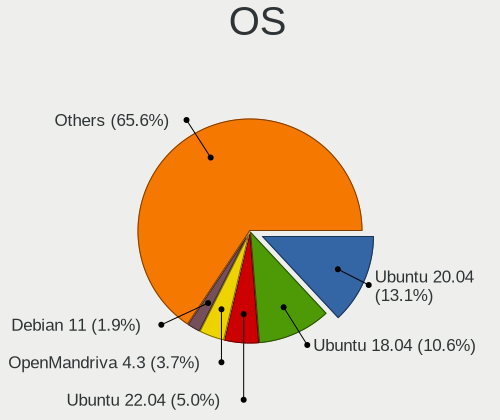

| Name               | Notebooks | Percent |
|--------------------|-----------|---------|
| Ubuntu 20.04       | 85        | 11.74%  |
| Ubuntu 18.04       | 67        | 9.25%   |
| Ubuntu 22.04       | 46        | 6.35%   |
| OpenMandriva 4.3   | 23        | 3.18%   |
| Debian 11          | 15        | 2.07%   |
| Fedora 38          | 13        | 1.8%    |
| Arch Rolling       | 13        | 1.8%    |
| Zorin 16           | 11        | 1.52%   |
| Ubuntu 19.04       | 11        | 1.52%   |
| OpenMandriva 4.2   | 11        | 1.52%   |
| Linux Mint 21.1    | 11        | 1.52%   |
| KDE neon 20.04     | 11        | 1.52%   |
| Arch               | 10        | 1.38%   |
| OpenMandriva 23.01 | 9         | 1.24%   |
| Manjaro            | 9         | 1.24%   |
| Linux Mint 20.3    | 9         | 1.24%   |
| Pop!_OS 22.04      | 8         | 1.1%    |
| OpenMandriva 23.03 | 8         | 1.1%    |
| Fedora 34          | 8         | 1.1%    |
| Zorin 15           | 7         | 0.97%   |
| Ubuntu 20.10       | 7         | 0.97%   |
| Ubuntu 19.10       | 7         | 0.97%   |
| ROSA R10           | 7         | 0.97%   |
| Linux Mint 20.1    | 7         | 0.97%   |
| Linux Mint 19.3    | 7         | 0.97%   |
| Fedora 36          | 7         | 0.97%   |
| Pop!_OS 20.04      | 6         | 0.83%   |
| Debian 10          | 6         | 0.83%   |
| Ubuntu 23.04       | 5         | 0.69%   |
| Ubuntu 21.04       | 5         | 0.69%   |
| Linux Mint 20.2    | 5         | 0.69%   |
| Linux Mint 20      | 5         | 0.69%   |
| Kubuntu 20.04      | 5         | 0.69%   |
| Fedora 37          | 5         | 0.69%   |
| Fedora 33          | 5         | 0.69%   |
| Xubuntu 20.04      | 4         | 0.55%   |
| Xubuntu 18.04      | 4         | 0.55%   |
| Ubuntu 18.10       | 4         | 0.55%   |
| Linux Mint 19.2    | 4         | 0.55%   |
| Fedora 35          | 4         | 0.55%   |

OS Family
---------

OS without a version

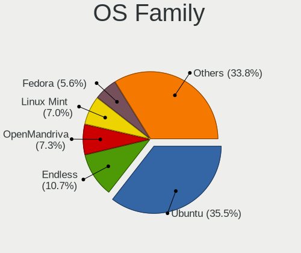

| Name          | Notebooks | Percent |
|---------------|-----------|---------|
| Ubuntu        | 233       | 34.01%  |
| Endless       | 64        | 9.34%   |
| Linux Mint    | 54        | 7.88%   |
| OpenMandriva  | 51        | 7.45%   |
| Fedora        | 47        | 6.86%   |
| Debian        | 27        | 3.94%   |
| Manjaro       | 23        | 3.36%   |
| Arch          | 23        | 3.36%   |
| Pop!_OS       | 21        | 3.07%   |
| Zorin         | 18        | 2.63%   |
| ROSA          | 15        | 2.19%   |
| KDE neon      | 14        | 2.04%   |
| Kubuntu       | 13        | 1.9%    |
| Xubuntu       | 11        | 1.61%   |
| Kali          | 8         | 1.17%   |
| Elementary    | 7         | 1.02%   |
| Lubuntu       | 6         | 0.88%   |
| ArcoLinux     | 6         | 0.88%   |
| openSUSE      | 5         | 0.73%   |
| Ubuntu Unity  | 4         | 0.58%   |
| Ubuntu Budgie | 3         | 0.44%   |
| Nobara        | 3         | 0.44%   |
| MX            | 3         | 0.44%   |
| Garuda Linux  | 3         | 0.44%   |
| EndeavourOS   | 3         | 0.44%   |
| Clear Linux   | 3         | 0.44%   |
| RHEL          | 2         | 0.29%   |
| Parrot        | 2         | 0.29%   |
| Xero          | 1         | 0.15%   |
| Void Linux    | 1         | 0.15%   |
| UbuntuDDE     | 1         | 0.15%   |
| Ubuntu MATE   | 1         | 0.15%   |
| Sparky        | 1         | 0.15%   |
| NixOS         | 1         | 0.15%   |
| Mageia        | 1         | 0.15%   |
| LinuxFX       | 1         | 0.15%   |
| Linux Lite    | 1         | 0.15%   |
| Deepin        | 1         | 0.15%   |
| CentOS        | 1         | 0.15%   |
| Artix         | 1         | 0.15%   |

Kernel
------

Version of the Linux kernel

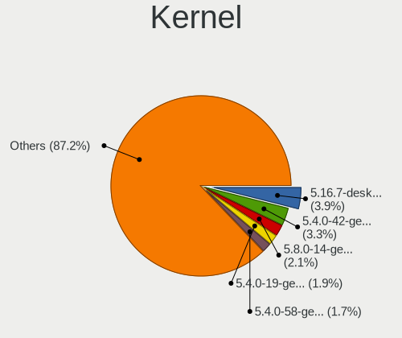

| Version                  | Notebooks | Percent |
|--------------------------|-----------|---------|
| 5.16.7-desktop-1omv4003  | 23        | 3%      |
| 5.4.0-42-generic         | 19        | 2.48%   |
| 5.8.0-14-generic         | 12        | 1.57%   |
| 5.4.0-19-generic         | 11        | 1.44%   |
| 5.10.14-desktop-1omv4002 | 11        | 1.44%   |
| 5.4.0-58-generic         | 10        | 1.31%   |
| 6.1.1-desktop-1omv2290   | 9         | 1.17%   |
| 6.2.6-desktop-1omv2390   | 8         | 1.04%   |
| 5.3.0-46-generic         | 7         | 0.91%   |
| 5.15.0-47-generic        | 7         | 0.91%   |
| 5.11.0-35-generic        | 7         | 0.91%   |
| 5.4.0-48-generic         | 6         | 0.78%   |
| 5.3.0-28-generic         | 6         | 0.78%   |
| 5.15.0-48-generic        | 6         | 0.78%   |
| 4.18.0-25-generic        | 6         | 0.78%   |
| 4.18.0-15-generic        | 6         | 0.78%   |
| 6.2.0-26-generic         | 5         | 0.65%   |
| 5.8.0-43-generic         | 5         | 0.65%   |
| 5.4.0-31-generic         | 5         | 0.65%   |
| 5.3.0-40-generic         | 5         | 0.65%   |
| 5.19.0-46-generic        | 5         | 0.65%   |
| 5.15.0-58-generic        | 5         | 0.65%   |
| 5.15.0-50-generic        | 5         | 0.65%   |
| 5.13.0-40-generic        | 5         | 0.65%   |
| 5.0.0-37-generic         | 5         | 0.65%   |
| 5.0.0-25-generic         | 5         | 0.65%   |
| 5.8.0-59-generic         | 4         | 0.52%   |
| 5.8.0-44-generic         | 4         | 0.52%   |
| 5.4.0-65-generic         | 4         | 0.52%   |
| 5.4.0-64-generic         | 4         | 0.52%   |
| 5.4.0-54-generic         | 4         | 0.52%   |
| 5.4.0-37-generic         | 4         | 0.52%   |
| 5.4.0-26-generic         | 4         | 0.52%   |
| 5.15.0-75-generic        | 4         | 0.52%   |
| 5.15.0-69-generic        | 4         | 0.52%   |
| 5.15.0-60-generic        | 4         | 0.52%   |
| 5.15.0-56-generic        | 4         | 0.52%   |
| 5.15.0-46-generic        | 4         | 0.52%   |
| 5.13.0-30-generic        | 4         | 0.52%   |
| 5.11.0-40-generic        | 4         | 0.52%   |

Kernel Family
-------------

Linux kernel without a distro release

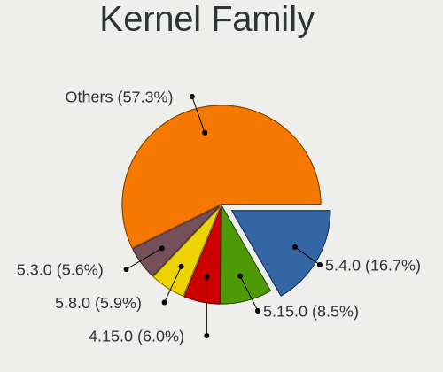

| Version | Notebooks | Percent |
|---------|-----------|---------|
| 5.4.0   | 116       | 15.63%  |
| 5.15.0  | 67        | 9.03%   |
| 4.15.0  | 43        | 5.8%    |
| 5.8.0   | 41        | 5.53%   |
| 5.3.0   | 39        | 5.26%   |
| 5.11.0  | 34        | 4.58%   |
| 5.0.0   | 33        | 4.45%   |
| 4.18.0  | 27        | 3.64%   |
| 5.13.0  | 26        | 3.5%    |
| 5.16.7  | 23        | 3.1%    |
| 5.19.0  | 19        | 2.56%   |
| 5.10.0  | 17        | 2.29%   |
| 6.2.0   | 12        | 1.62%   |
| 5.10.14 | 11        | 1.48%   |
| 6.1.1   | 9         | 1.21%   |
| 6.2.6   | 8         | 1.08%   |
| 4.19.0  | 6         | 0.81%   |
| 6.1.0   | 5         | 0.67%   |
| 4.9.60  | 5         | 0.67%   |
| 5.14.0  | 4         | 0.54%   |
| 4.13.0  | 4         | 0.54%   |
| 6.4.8   | 3         | 0.4%    |
| 6.3.5   | 3         | 0.4%    |
| 6.2.11  | 3         | 0.4%    |
| 6.1.5   | 3         | 0.4%    |
| 5.9.16  | 3         | 0.4%    |
| 5.18.10 | 3         | 0.4%    |
| 5.1.0   | 3         | 0.4%    |
| 4.9.0   | 3         | 0.4%    |
| 4.4.0   | 3         | 0.4%    |
| 6.4.12  | 2         | 0.27%   |
| 6.2.9   | 2         | 0.27%   |
| 6.0.10  | 2         | 0.27%   |
| 5.9.1   | 2         | 0.27%   |
| 5.7.19  | 2         | 0.27%   |
| 5.6.0   | 2         | 0.27%   |
| 5.4.32  | 2         | 0.27%   |
| 5.19.9  | 2         | 0.27%   |
| 5.19.4  | 2         | 0.27%   |
| 5.18.3  | 2         | 0.27%   |

Kernel Major Ver.
-----------------

Linux kernel major version

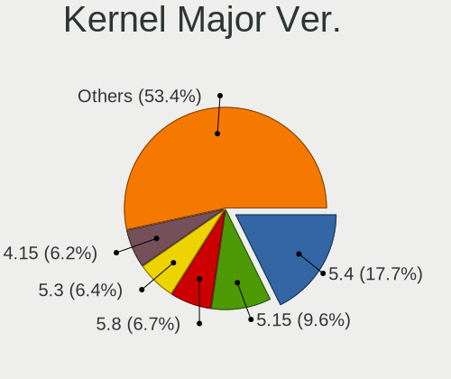

| Version | Notebooks | Percent |
|---------|-----------|---------|
| 5.4     | 119       | 16.26%  |
| 5.15    | 77        | 10.52%  |
| 5.8     | 45        | 6.15%   |
| 5.3     | 43        | 5.87%   |
| 4.15    | 43        | 5.87%   |
| 5.10    | 41        | 5.6%    |
| 5.11    | 39        | 5.33%   |
| 5.13    | 36        | 4.92%   |
| 5.0     | 34        | 4.64%   |
| 6.2     | 28        | 3.83%   |
| 6.1     | 28        | 3.83%   |
| 4.18    | 28        | 3.83%   |
| 5.16    | 26        | 3.55%   |
| 5.19    | 24        | 3.28%   |
| 6.4     | 12        | 1.64%   |
| 4.9     | 12        | 1.64%   |
| 5.6     | 10        | 1.37%   |
| 5.18    | 9         | 1.23%   |
| 5.17    | 9         | 1.23%   |
| 6.0     | 8         | 1.09%   |
| 5.9     | 8         | 1.09%   |
| 6.3     | 7         | 0.96%   |
| 5.14    | 7         | 0.96%   |
| 4.19    | 7         | 0.96%   |
| 5.7     | 6         | 0.82%   |
| 5.5     | 4         | 0.55%   |
| 5.12    | 4         | 0.55%   |
| 4.13    | 4         | 0.55%   |
| 5.1     | 3         | 0.41%   |
| 4.4     | 3         | 0.41%   |
| 6.5     | 2         | 0.27%   |
| 5.2     | 1         | 0.14%   |
| 4.20    | 1         | 0.14%   |
| 4.14    | 1         | 0.14%   |
| 4.12    | 1         | 0.14%   |
| 4.10    | 1         | 0.14%   |
| 4.1     | 1         | 0.14%   |

Arch
----

OS architecture (x86_64, i586, etc.)

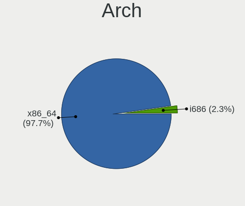

| Name   | Notebooks | Percent |
|--------|-----------|---------|
| x86_64 | 650       | 97.74%  |
| i686   | 15        | 2.26%   |

DE
--

Desktop Environment

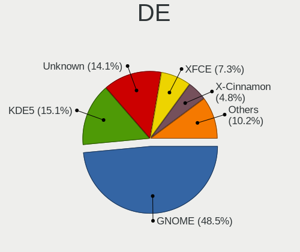

| Name       | Notebooks | Percent |
|------------|-----------|---------|
| GNOME      | 335       | 48.69%  |
| KDE5       | 105       | 15.26%  |
| Unknown    | 94        | 13.66%  |
| XFCE       | 50        | 7.27%   |
| X-Cinnamon | 35        | 5.09%   |
| KDE        | 18        | 2.62%   |
| MATE       | 8         | 1.16%   |
| KDE4       | 8         | 1.16%   |
| Pantheon   | 7         | 1.02%   |
| Cinnamon   | 5         | 0.73%   |
| Budgie     | 5         | 0.73%   |
| Unity      | 4         | 0.58%   |
| LXQt       | 4         | 0.58%   |
| LXDE       | 3         | 0.44%   |
| Deepin     | 2         | 0.29%   |
| bspwm      | 2         | 0.29%   |
| ICEWM      | 1         | 0.15%   |
| dwm        | 1         | 0.15%   |
| awesome    | 1         | 0.15%   |

Display Server
--------------

X11 or Wayland

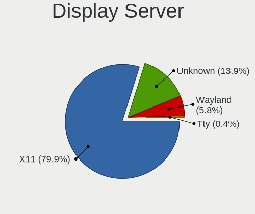

| Name    | Notebooks | Percent |
|---------|-----------|---------|
| X11     | 504       | 73.79%  |
| Wayland | 110       | 16.11%  |
| Unknown | 66        | 9.66%   |
| Tty     | 3         | 0.44%   |

Display Manager
---------------

SDDM, LightDM, etc.

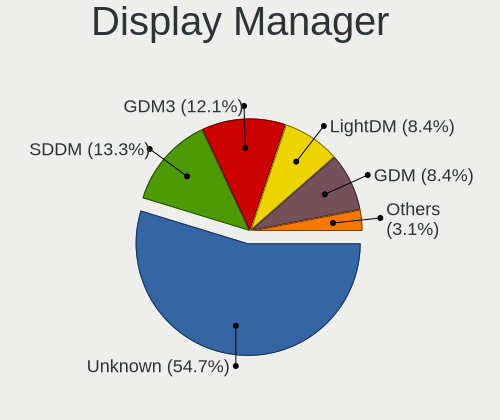

| Name    | Notebooks | Percent |
|---------|-----------|---------|
| Unknown | 387       | 56.41%  |
| SDDM    | 88        | 12.83%  |
| GDM3    | 77        | 11.22%  |
| GDM     | 58        | 8.45%   |
| LightDM | 53        | 7.73%   |
| TDM     | 14        | 2.04%   |
| KDM     | 8         | 1.17%   |
| LXDM    | 1         | 0.15%   |

OS Lang
-------

Language

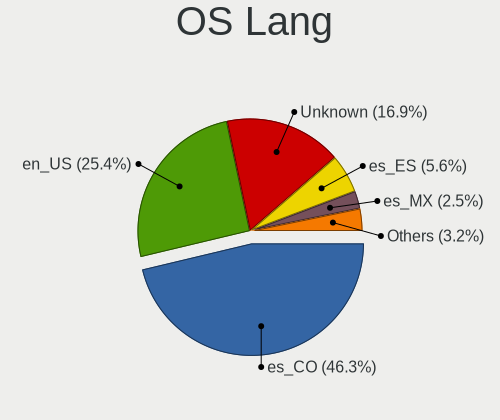

| Lang       | Notebooks | Percent |
|------------|-----------|---------|
| es_CO      | 318       | 46.42%  |
| en_US      | 178       | 25.99%  |
| Unknown    | 101       | 14.74%  |
| es_ES      | 42        | 6.13%   |
| es_MX      | 21        | 3.07%   |
| en_GB      | 4         | 0.58%   |
| es_PE      | 3         | 0.44%   |
| es_VE      | 2         | 0.29%   |
| es_EC      | 2         | 0.29%   |
| C          | 2         | 0.29%   |
| pt_PT      | 1         | 0.15%   |
| pl_PL      | 1         | 0.15%   |
| it_IT      | 1         | 0.15%   |
| fr_FR      | 1         | 0.15%   |
| es_US      | 1         | 0.15%   |
| es_DO      | 1         | 0.15%   |
| es_CO.UTF8 | 1         | 0.15%   |
| es_CL      | 1         | 0.15%   |
| es_AR      | 1         | 0.15%   |
| en_AU      | 1         | 0.15%   |
| en         | 1         | 0.15%   |
| de_DE      | 1         | 0.15%   |

Boot Mode
---------

EFI or BIOS

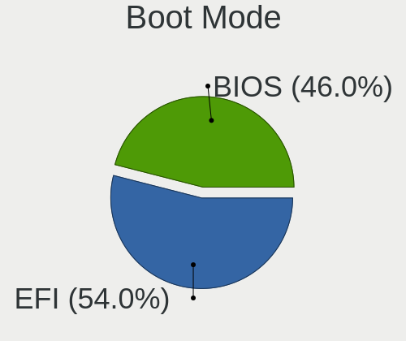

| Mode | Notebooks | Percent |
|------|-----------|---------|
| EFI  | 379       | 55.82%  |
| BIOS | 300       | 44.18%  |

Filesystem
----------

Type of filesystem

| Type    | Notebooks | Percent |
|---------|-----------|---------|
| Ext4    | 521       | 76.17%  |
| Btrfs   | 50        | 7.31%   |
| Overlay | 47        | 6.87%   |
| Unknown | 38        | 5.56%   |
| Tmpfs   | 12        | 1.75%   |
| Xfs     | 11        | 1.61%   |
| Zfs     | 3         | 0.44%   |
| F2fs    | 1         | 0.15%   |
| Ext2    | 1         | 0.15%   |

Part. scheme
------------

Scheme of partitioning

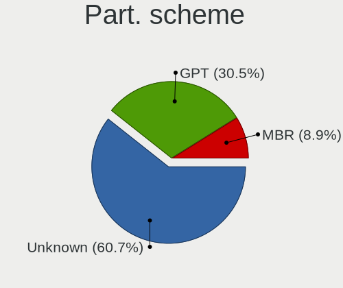

| Type    | Notebooks | Percent |
|---------|-----------|---------|
| Unknown | 415       | 61.39%  |
| GPT     | 200       | 29.59%  |
| MBR     | 61        | 9.02%   |

Dual Boot with Linux/BSD
------------------------

Hosting more than one Linux/BSD

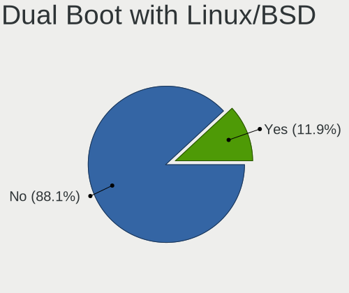

| Dual boot | Notebooks | Percent |
|-----------|-----------|---------|
| No        | 603       | 88.68%  |
| Yes       | 77        | 11.32%  |

Dual Boot (Win)
---------------

Hosting Linux and Windows

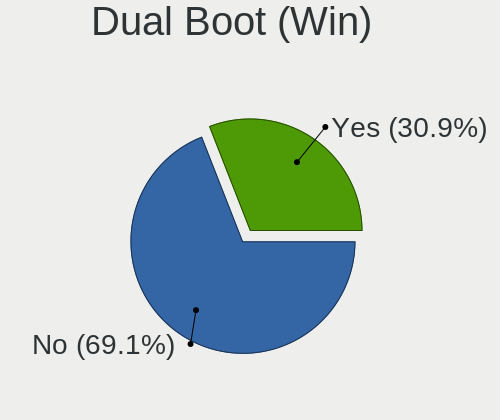

| Dual boot | Notebooks | Percent |
|-----------|-----------|---------|
| No        | 466       | 68.73%  |
| Yes       | 212       | 31.27%  |

Board
-----

Vendor
------

Motherboard manufacturer

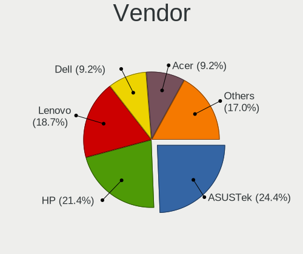

| Name                         | Notebooks | Percent |
|------------------------------|-----------|---------|
| ASUSTek Computer             | 151       | 22.71%  |
| Hewlett-Packard              | 150       | 22.56%  |
| Lenovo                       | 125       | 18.8%   |
| Dell                         | 63        | 9.47%   |
| Acer                         | 57        | 8.57%   |
| Toshiba                      | 26        | 3.91%   |
| Apple                        | 18        | 2.71%   |
| Samsung Electronics          | 13        | 1.95%   |
| MSI                          | 11        | 1.65%   |
| Sony                         | 9         | 1.35%   |
| HUAWEI                       | 9         | 1.35%   |
| Compumax Computer            | 5         | 0.75%   |
| Notebook                     | 4         | 0.6%    |
| Unknown                      | 4         | 0.6%    |
| PCsmart                      | 3         | 0.45%   |
| Google                       | 2         | 0.3%    |
| Gateway                      | 2         | 0.3%    |
| VIT                          | 1         | 0.15%   |
| Timi                         | 1         | 0.15%   |
| PCSMART S.A.S.               | 1         | 0.15%   |
| MPS Mayorista de Colombia SA | 1         | 0.15%   |
| Lanix                        | 1         | 0.15%   |
| Inspur                       | 1         | 0.15%   |
| GreatWall                    | 1         | 0.15%   |
| Fujitsu Siemens              | 1         | 0.15%   |
| Fujitsu                      | 1         | 0.15%   |
| Framework                    | 1         | 0.15%   |
| COMPUMAX COMPUTER S.A.S.     | 1         | 0.15%   |
| Chuwi                        | 1         | 0.15%   |
| BAKED                        | 1         | 0.15%   |

Model
-----

Motherboard model

| Name                                    | Notebooks | Percent |
|-----------------------------------------|-----------|---------|
| HP Laptop 15-db0xxx                     | 12        | 1.8%    |
| HP Pavilion Gaming Laptop 15-cx0xxx     | 6         | 0.9%    |
| HP Notebook                             | 6         | 0.9%    |
| Samsung 300E4C/300E5C/300E7C            | 5         | 0.75%   |
| HP Laptop 14-cm1xxx                     | 5         | 0.75%   |
| HP Laptop 14-bs0xx                      | 5         | 0.75%   |
| Compumax ONIX-CEL-0001                  | 5         | 0.75%   |
| ASUS VivoBook_ASUS Laptop X505ZA_X505ZA | 5         | 0.75%   |
| Unknown                                 | 5         | 0.75%   |
| Lenovo IdeaPad S340-14API 81NB          | 4         | 0.6%    |
| Lenovo IdeaPad 110-14IBR 80T6           | 4         | 0.6%    |
| HP Laptop 15-da0xxx                     | 4         | 0.6%    |
| HP 245 G6                               | 4         | 0.6%    |
| HP 14                                   | 4         | 0.6%    |
| Dell XPS 15 9550                        | 4         | 0.6%    |
| Dell Vostro 3400                        | 4         | 0.6%    |
| ASUS ZenBook UX431DA_UM431DA            | 4         | 0.6%    |
| ASUS X455LJ                             | 4         | 0.6%    |
| ASUS VivoBook_ASUSLaptop X512FB_X512FB  | 4         | 0.6%    |
| ASUS VivoBook_ASUSLaptop X415JA_X415JA  | 4         | 0.6%    |
| Acer Aspire 4750                        | 4         | 0.6%    |
| Lenovo IdeaPad 320-15ABR 80XS           | 3         | 0.45%   |
| Lenovo G40-80 80E4                      | 3         | 0.45%   |
| Lenovo G40-45 80E1                      | 3         | 0.45%   |
| HUAWEI BOHB-WAX9                        | 3         | 0.45%   |
| HP ProBook 450 G1                       | 3         | 0.45%   |
| HP ProBook 440 G7                       | 3         | 0.45%   |
| HP Pavilion Notebook                    | 3         | 0.45%   |
| HP Laptop 15-ef2xxx                     | 3         | 0.45%   |
| HP G42                                  | 3         | 0.45%   |
| HP ENVY 15                              | 3         | 0.45%   |
| HP 245 G7 Notebook PC                   | 3         | 0.45%   |
| Dell Inspiron N4010                     | 3         | 0.45%   |
| Dell Inspiron 1420                      | 3         | 0.45%   |
| ASUS X555QG                             | 3         | 0.45%   |
| ASUS X505BP                             | 3         | 0.45%   |
| ASUS X455LD                             | 3         | 0.45%   |
| ASUS X450CC                             | 3         | 0.45%   |
| ASUS VivoBook_ASUSLaptop X510QA_X510QA  | 3         | 0.45%   |
| ASUS VivoBook_ASUSLaptop X509DA_M509DA  | 3         | 0.45%   |

Model Family
------------

Motherboard model prefix

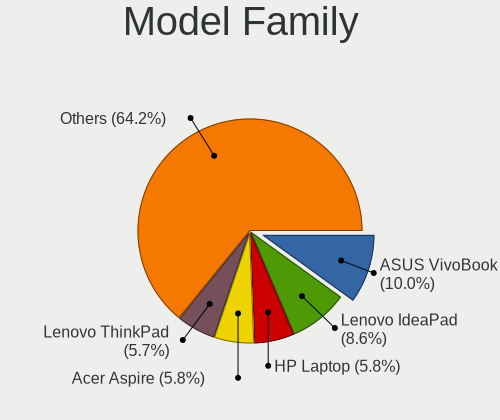

| Name                   | Notebooks | Percent |
|------------------------|-----------|---------|
| ASUS VivoBook          | 64        | 9.62%   |
| Lenovo IdeaPad         | 52        | 7.82%   |
| HP Laptop              | 42        | 6.32%   |
| Acer Aspire            | 40        | 6.02%   |
| Lenovo ThinkPad        | 37        | 5.56%   |
| HP Pavilion            | 29        | 4.36%   |
| Dell Inspiron          | 24        | 3.61%   |
| Toshiba Satellite      | 22        | 3.31%   |
| HP ProBook             | 19        | 2.86%   |
| Dell Latitude          | 14        | 2.11%   |
| HP 245                 | 11        | 1.65%   |
| Dell Vostro            | 9         | 1.35%   |
| ASUS ZenBook           | 8         | 1.2%    |
| HP Compaq              | 7         | 1.05%   |
| Acer Nitro             | 7         | 1.05%   |
| HP Notebook            | 6         | 0.9%    |
| HP EliteBook           | 6         | 0.9%    |
| Dell XPS               | 6         | 0.9%    |
| Samsung 300E4C         | 5         | 0.75%   |
| HP 240                 | 5         | 0.75%   |
| Compumax ONIX-CEL-0001 | 5         | 0.75%   |
| ASUS TUF               | 5         | 0.75%   |
| Unknown                | 5         | 0.75%   |
| Lenovo ThinkBook       | 4         | 0.6%    |
| HP 14                  | 4         | 0.6%    |
| Dell Precision         | 4         | 0.6%    |
| ASUS X455LJ            | 4         | 0.6%    |
| Lenovo IdeaPadFlex     | 3         | 0.45%   |
| Lenovo G40-80          | 3         | 0.45%   |
| Lenovo G40-45          | 3         | 0.45%   |
| HUAWEI BOHB-WAX9       | 3         | 0.45%   |
| HP Presario            | 3         | 0.45%   |
| HP G42                 | 3         | 0.45%   |
| HP ENVY                | 3         | 0.45%   |
| Dell System            | 3         | 0.45%   |
| ASUS X555QG            | 3         | 0.45%   |
| ASUS X505BP            | 3         | 0.45%   |
| ASUS X455LD            | 3         | 0.45%   |
| ASUS X450CC            | 3         | 0.45%   |
| ASUS ROG               | 3         | 0.45%   |

MFG Year
--------

Motherboard manufacture year

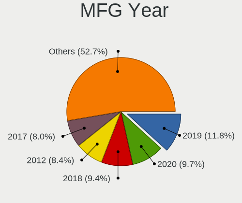

| Year | Notebooks | Percent |
|------|-----------|---------|
| 2019 | 81        | 12.18%  |
| 2018 | 68        | 10.23%  |
| 2017 | 62        | 9.32%   |
| 2020 | 55        | 8.27%   |
| 2021 | 48        | 7.22%   |
| 2012 | 48        | 7.22%   |
| 2015 | 45        | 6.77%   |
| 2014 | 43        | 6.47%   |
| 2010 | 42        | 6.32%   |
| 2013 | 41        | 6.17%   |
| 2011 | 39        | 5.86%   |
| 2016 | 28        | 4.21%   |
| 2009 | 24        | 3.61%   |
| 2008 | 15        | 2.26%   |
| 2007 | 11        | 1.65%   |
| 2022 | 8         | 1.2%    |
| 2023 | 4         | 0.6%    |
| 2006 | 3         | 0.45%   |

Form Factor
-----------

Physical design of the computer

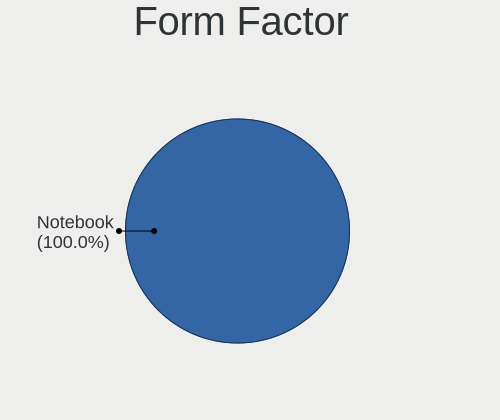

| Name     | Notebooks | Percent |
|----------|-----------|---------|
| Notebook | 665       | 100%    |

Secure Boot
-----------

Enabled or disabled

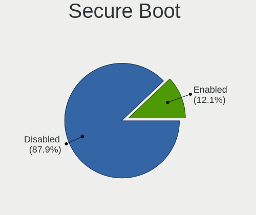

| State    | Notebooks | Percent |
|----------|-----------|---------|
| Disabled | 591       | 88.34%  |
| Enabled  | 78        | 11.66%  |

Coreboot
--------

Have coreboot on board

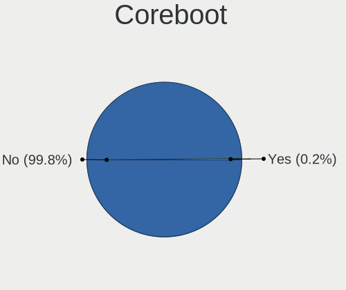

| Used | Notebooks | Percent |
|------|-----------|---------|
| No   | 663       | 99.7%   |
| Yes  | 2         | 0.3%    |

RAM Size
--------

Total RAM memory

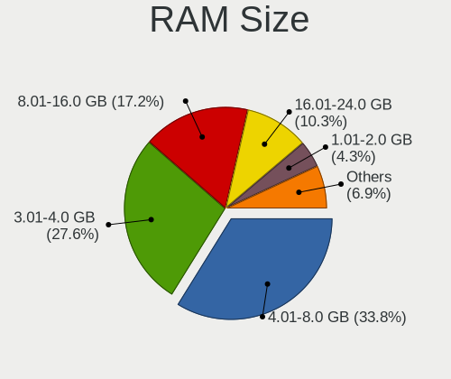

| Size in GB  | Notebooks | Percent |
|-------------|-----------|---------|
| 4.01-8.0    | 230       | 34.23%  |
| 3.01-4.0    | 182       | 27.08%  |
| 8.01-16.0   | 116       | 17.26%  |
| 16.01-24.0  | 67        | 9.97%   |
| 1.01-2.0    | 29        | 4.32%   |
| 2.01-3.0    | 19        | 2.83%   |
| 32.01-64.0  | 16        | 2.38%   |
| 24.01-32.0  | 7         | 1.04%   |
| 0.51-1.0    | 5         | 0.74%   |
| 64.01-256.0 | 1         | 0.15%   |

RAM Used
--------

Used RAM memory

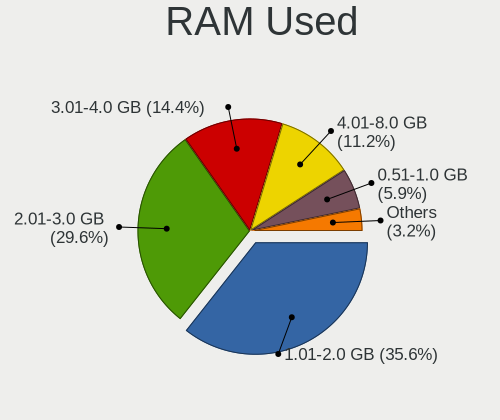

| Used GB    | Notebooks | Percent |
|------------|-----------|---------|
| 1.01-2.0   | 253       | 34.9%   |
| 2.01-3.0   | 214       | 29.52%  |
| 3.01-4.0   | 105       | 14.48%  |
| 4.01-8.0   | 88        | 12.14%  |
| 0.51-1.0   | 41        | 5.66%   |
| 8.01-16.0  | 21        | 2.9%    |
| 0.01-0.5   | 2         | 0.28%   |
| 24.01-32.0 | 1         | 0.14%   |

Total Drives
------------

Number of drives on board

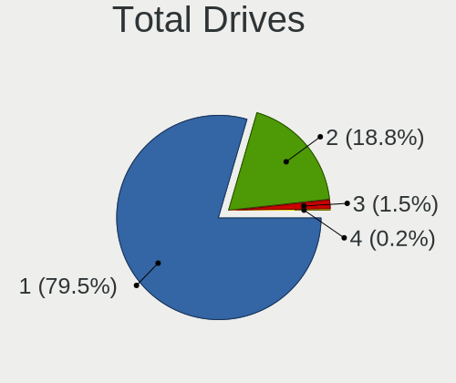

| Drives | Notebooks | Percent |
|--------|-----------|---------|
| 1      | 548       | 81.43%  |
| 2      | 114       | 16.94%  |
| 3      | 9         | 1.34%   |
| 4      | 2         | 0.3%    |

Has CD-ROM
----------

Has CD-ROM on board

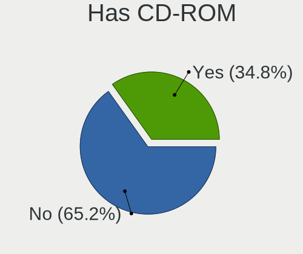

| Presented | Notebooks | Percent |
|-----------|-----------|---------|
| No        | 448       | 67.07%  |
| Yes       | 220       | 32.93%  |

Has Ethernet
------------

Has Ethernet on board

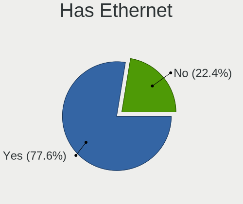

| Presented | Notebooks | Percent |
|-----------|-----------|---------|
| Yes       | 526       | 78.86%  |
| No        | 141       | 21.14%  |

Has WiFi
--------

Has WiFi module

| Presented | Notebooks | Percent |
|-----------|-----------|---------|
| Yes       | 659       | 99.1%   |
| No        | 6         | 0.9%    |

Has Bluetooth
-------------

Has Bluetooth module

| Presented | Notebooks | Percent |
|-----------|-----------|---------|
| Yes       | 538       | 80.66%  |
| No        | 129       | 19.34%  |

Location
--------

Country
-------

Geographic location (country)

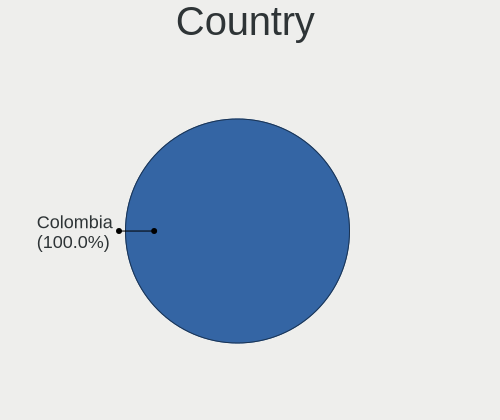

| Country  | Notebooks | Percent |
|----------|-----------|---------|
| Colombia | 665       | 100%    |

City
----

Geographic location (city)

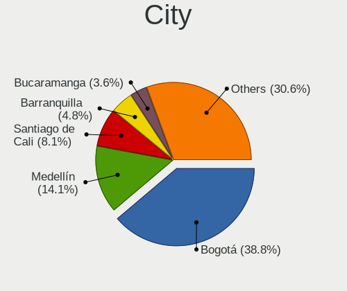

| City             | Notebooks | Percent |
|------------------|-----------|---------|
| Bogotá          | 268       | 38.34%  |
| Medellín        | 93        | 13.3%   |
| Santiago de Cali | 54        | 7.73%   |
| Barranquilla     | 31        | 4.43%   |
| Bucaramanga      | 27        | 3.86%   |
| Pereira          | 22        | 3.15%   |
| Cartagena        | 19        | 2.72%   |
| Manizales        | 15        | 2.15%   |
| Villavicencio    | 9         | 1.29%   |
| Popayán         | 8         | 1.14%   |
| Envigado         | 8         | 1.14%   |
| Cúcuta          | 8         | 1.14%   |
| Tunja            | 7         | 1%      |
| Ibague           | 6         | 0.86%   |
| Fusagasuga       | 6         | 0.86%   |
| Armenia          | 6         | 0.86%   |
| Santa Marta      | 5         | 0.72%   |
| Neiva            | 5         | 0.72%   |
| Montería        | 5         | 0.72%   |
| Bello            | 5         | 0.72%   |
| Yopal            | 4         | 0.57%   |
| Valledupar       | 3         | 0.43%   |
| Sincelejo        | 3         | 0.43%   |
| Pasto            | 3         | 0.43%   |
| Madrid           | 3         | 0.43%   |
| Floridablanca    | 3         | 0.43%   |
| Chia             | 3         | 0.43%   |
| Soacha           | 2         | 0.29%   |
| Sabaneta         | 2         | 0.29%   |
| Rionegro         | 2         | 0.29%   |
| Puerto Boyacá   | 2         | 0.29%   |
| Palmira          | 2         | 0.29%   |
| Mosquera         | 2         | 0.29%   |
| Los Patios       | 2         | 0.29%   |
| Lorica           | 2         | 0.29%   |
| La Estrella      | 2         | 0.29%   |
| Itaguei          | 2         | 0.29%   |
| Ipiales          | 2         | 0.29%   |
| Funza            | 2         | 0.29%   |
| Duitama          | 2         | 0.29%   |

Drives
------

Drive Vendor
------------

Hard drive vendors

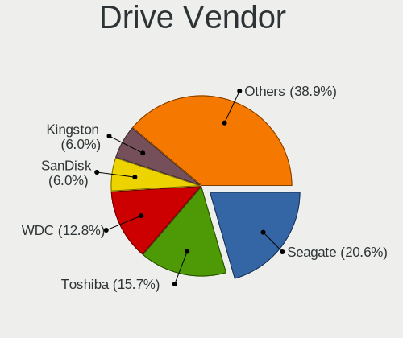

| Vendor                      | Notebooks | Drives | Percent |
|-----------------------------|-----------|--------|---------|
| Seagate                     | 141       | 176    | 18.08%  |
| Toshiba                     | 105       | 124    | 13.46%  |
| WDC                         | 98        | 120    | 12.56%  |
| Kingston                    | 52        | 63     | 6.67%   |
| SanDisk                     | 50        | 58     | 6.41%   |
| Samsung Electronics         | 46        | 55     | 5.9%    |
| HGST                        | 34        | 43     | 4.36%   |
| Crucial                     | 33        | 37     | 4.23%   |
| A-DATA Technology           | 27        | 30     | 3.46%   |
| Unknown                     | 23        | 24     | 2.95%   |
| Hitachi                     | 23        | 27     | 2.95%   |
| Intel                       | 22        | 25     | 2.82%   |
| SK hynix                    | 18        | 23     | 2.31%   |
| Micron Technology           | 16        | 16     | 2.05%   |
| Apple                       | 12        | 16     | 1.54%   |
| China                       | 10        | 10     | 1.28%   |
| KIOXIA                      | 7         | 8      | 0.9%    |
| Silicon Motion              | 6         | 9      | 0.77%   |
| Realtek Semiconductor       | 6         | 7      | 0.77%   |
| Fujitsu                     | 5         | 5      | 0.64%   |
| Phison                      | 4         | 5      | 0.51%   |
| JMicron Technology          | 4         | 4      | 0.51%   |
| LITEONIT                    | 3         | 3      | 0.38%   |
| Lexar                       | 3         | 3      | 0.38%   |
| Kingston Technology Company | 3         | 4      | 0.38%   |
| Gigabyte Technology         | 3         | 3      | 0.38%   |
| Netac                       | 2         | 2      | 0.26%   |
| Micron/Crucial Technology   | 2         | 2      | 0.26%   |
| LITEON                      | 2         | 3      | 0.26%   |
| Hewlett-Packard             | 2         | 3      | 0.26%   |
| Zheino                      | 1         | 1      | 0.13%   |
| XPG                         | 1         | 1      | 0.13%   |
| Union Memory (Shenzhen)     | 1         | 1      | 0.13%   |
| Union Memory                | 1         | 1      | 0.13%   |
| Transcend                   | 1         | 1      | 0.13%   |
| SSSTC                       | 1         | 1      | 0.13%   |
| SSK                         | 1         | 1      | 0.13%   |
| SPCC                        | 1         | 2      | 0.13%   |
| SATAFIRM                    | 1         | 1      | 0.13%   |
| RDM-II                      | 1         | 2      | 0.13%   |

Drive Model
-----------

Hard drive models

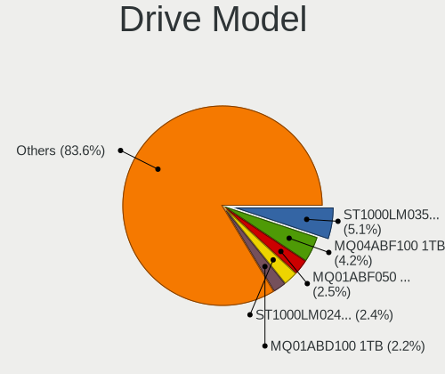

| Model                                  | Notebooks | Percent |
|----------------------------------------|-----------|---------|
| Seagate ST1000LM035-1RK172 1TB         | 41        | 5.17%   |
| Toshiba MQ04ABF100 1TB                 | 35        | 4.41%   |
| Toshiba MQ01ABF050 500GB               | 20        | 2.52%   |
| Seagate ST1000LM024 HN-M101MBB 1TB     | 19        | 2.4%    |
| Toshiba MQ01ABD100 1TB                 | 17        | 2.14%   |
| Seagate ST500LT012-1DG142 500GB        | 14        | 1.77%   |
| Kingston SA400S37240G 240GB SSD        | 11        | 1.39%   |
| Crucial CT240BX500SSD1 240GB           | 10        | 1.26%   |
| WDC WD10SPZX-60Z10T0 1TB               | 9         | 1.13%   |
| HGST HTS541010A9E680 1TB               | 9         | 1.13%   |
| HGST HTS541010B7E610 1TB               | 8         | 1.01%   |
| WDC WD10SPZX-24Z10 1TB                 | 7         | 0.88%   |
| SanDisk NVMe SSD Drive 512GB           | 7         | 0.88%   |
| Kingston SA400S37480G 480GB SSD        | 7         | 0.88%   |
| Seagate ST500LT012-9WS142 500GB        | 6         | 0.76%   |
| Seagate ST2000LM007-1R8174 2TB         | 6         | 0.76%   |
| SanDisk NVMe SSD Drive 256GB           | 6         | 0.76%   |
| HGST HTS545050A7E680 500GB             | 6         | 0.76%   |
| Crucial CT1000BX500SSD1 1TB            | 6         | 0.76%   |
| WDC WD10JPCX-24UE4T0 1TB               | 5         | 0.63%   |
| Unknown MMC Card  64GB                 | 5         | 0.63%   |
| Seagate ST9500325AS 500GB              | 5         | 0.63%   |
| Seagate ST500LM030-1RK17D 500GB        | 5         | 0.63%   |
| Sandisk WD Blue SN550 NVMe SSD 250GB   | 5         | 0.63%   |
| SanDisk NVMe SSD Drive 1TB             | 5         | 0.63%   |
| Kingston SA400S37120G 120GB SSD        | 5         | 0.63%   |
| Intel SSDPEKNU512GZ 512GB              | 5         | 0.63%   |
| Intel NVMe SSD Drive 512GB             | 5         | 0.63%   |
| Crucial CT500MX500SSD1 500GB           | 5         | 0.63%   |
| Crucial CT480BX500SSD1 480GB           | 5         | 0.63%   |
| A-DATA SU650 120GB SSD                 | 5         | 0.63%   |
| A-DATA SU630 480GB SSD                 | 5         | 0.63%   |
| WDC WD5000LPZX-22Z10T0 500GB           | 4         | 0.5%    |
| Unknown MMC Card  32GB                 | 4         | 0.5%    |
| SK hynix NVMe SSD Drive 256GB          | 4         | 0.5%    |
| Seagate ST9500420AS 500GB              | 4         | 0.5%    |
| Seagate ST750LM022 HN-M750MBB 752GB    | 4         | 0.5%    |
| Samsung PM963 2.5" NVMe PCIe SSD 256GB | 4         | 0.5%    |
| WDC WD1600BEVT-75ZCT2 160GB            | 3         | 0.38%   |
| WDC PC SN530 SDBPNPZ-512G              | 3         | 0.38%   |

HDD Vendor
----------

Hard disk drive vendors

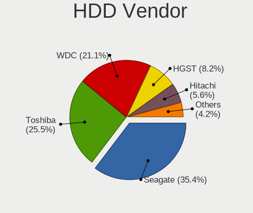

| Vendor              | Notebooks | Drives | Percent |
|---------------------|-----------|--------|---------|
| Seagate             | 141       | 174    | 35.34%  |
| Toshiba             | 100       | 117    | 25.06%  |
| WDC                 | 85        | 105    | 21.3%   |
| HGST                | 34        | 43     | 8.52%   |
| Hitachi             | 23        | 27     | 5.76%   |
| Samsung Electronics | 5         | 5      | 1.25%   |
| Fujitsu             | 5         | 5      | 1.25%   |
| Apple               | 3         | 3      | 0.75%   |
| Unknown             | 2         | 2      | 0.5%    |
| Phison              | 1         | 2      | 0.25%   |

SSD Vendor
----------

Solid state drive vendors

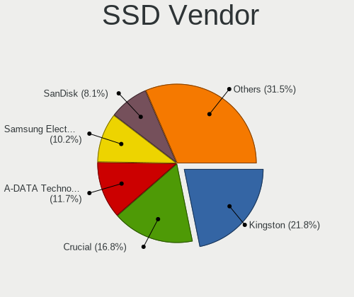

| Vendor              | Notebooks | Drives | Percent |
|---------------------|-----------|--------|---------|
| Kingston            | 41        | 49     | 22.04%  |
| Crucial             | 29        | 33     | 15.59%  |
| A-DATA Technology   | 23        | 26     | 12.37%  |
| Samsung Electronics | 18        | 20     | 9.68%   |
| SanDisk             | 16        | 17     | 8.6%    |
| China               | 9         | 9      | 4.84%   |
| Apple               | 6         | 6      | 3.23%   |
| Toshiba             | 5         | 6      | 2.69%   |
| Intel               | 5         | 6      | 2.69%   |
| Micron Technology   | 4         | 4      | 2.15%   |
| WDC                 | 3         | 3      | 1.61%   |
| LITEONIT            | 3         | 3      | 1.61%   |
| Lexar               | 3         | 3      | 1.61%   |
| JMicron Technology  | 3         | 3      | 1.61%   |
| Gigabyte Technology | 3         | 3      | 1.61%   |
| SK hynix            | 2         | 5      | 1.08%   |
| LITEON              | 2         | 3      | 1.08%   |
| Zheino              | 1         | 1      | 0.54%   |
| Transcend           | 1         | 1      | 0.54%   |
| SPCC                | 1         | 2      | 0.54%   |
| Seagate             | 1         | 2      | 0.54%   |
| SATAFIRM            | 1         | 1      | 0.54%   |
| PNY                 | 1         | 1      | 0.54%   |
| Patriot             | 1         | 1      | 0.54%   |
| Netac               | 1         | 1      | 0.54%   |
| KingSpec            | 1         | 1      | 0.54%   |
| HS-SSD-C100         | 1         | 1      | 0.54%   |
| Hewlett-Packard     | 1         | 1      | 0.54%   |

Drive Kind
----------

HDD or SSD

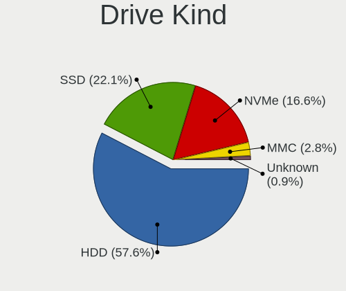

| Kind    | Notebooks | Drives | Percent |
|---------|-----------|--------|---------|
| HDD     | 391       | 483    | 51.25%  |
| SSD     | 182       | 212    | 23.85%  |
| NVMe    | 162       | 203    | 21.23%  |
| MMC     | 21        | 22     | 2.75%   |
| Unknown | 7         | 8      | 0.92%   |

Drive Connector
---------------

SATA, SAS, NVMe, etc.

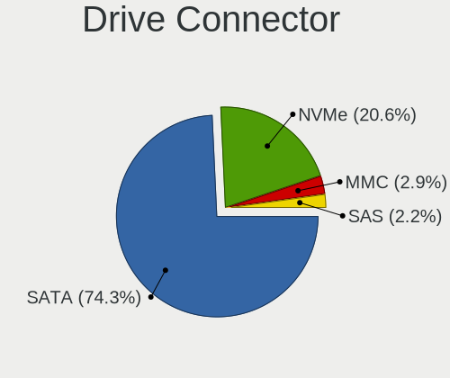

| Type | Notebooks | Drives | Percent |
|------|-----------|--------|---------|
| SATA | 526       | 688    | 72.55%  |
| NVMe | 162       | 201    | 22.34%  |
| MMC  | 21        | 22     | 2.9%    |
| SAS  | 16        | 17     | 2.21%   |

Drive Size
----------

Size of hard drive

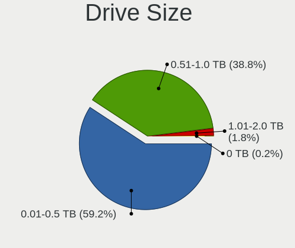

| Size in TB | Notebooks | Drives | Percent |
|------------|-----------|--------|---------|
| 0.01-0.5   | 334       | 416    | 59.22%  |
| 0.51-1.0   | 218       | 261    | 38.65%  |
| 1.01-2.0   | 11        | 16     | 1.95%   |
| 0          | 1         | 2      | 0.18%   |

Space Total
-----------

Amount of disk space available on the file system

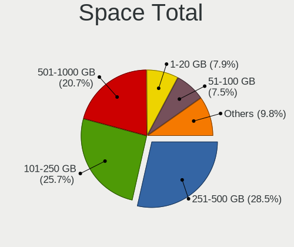

| Size in GB     | Notebooks | Percent |
|----------------|-----------|---------|
| 251-500        | 207       | 29.7%   |
| 101-250        | 184       | 26.4%   |
| 501-1000       | 134       | 19.23%  |
| 1-20           | 52        | 7.46%   |
| 51-100         | 45        | 6.46%   |
| 21-50          | 32        | 4.59%   |
| 1001-2000      | 26        | 3.73%   |
| Unknown        | 7         | 1%      |
| More than 3000 | 5         | 0.72%   |
| 2001-3000      | 5         | 0.72%   |

Space Used
----------

Amount of used disk space

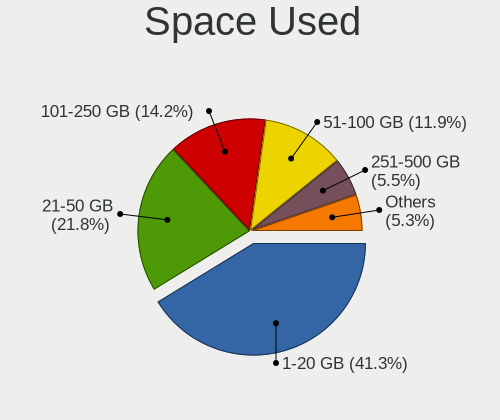

| Used GB   | Notebooks | Percent |
|-----------|-----------|---------|
| 1-20      | 298       | 41.16%  |
| 21-50     | 160       | 22.1%   |
| 101-250   | 102       | 14.09%  |
| 51-100    | 85        | 11.74%  |
| 251-500   | 41        | 5.66%   |
| 501-1000  | 29        | 4.01%   |
| Unknown   | 7         | 0.97%   |
| 1001-2000 | 2         | 0.28%   |

Malfunc. Drives
---------------

Drive models with a malfunction

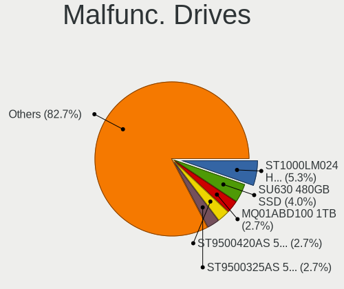

| Model                                          | Notebooks | Drives | Percent |
|------------------------------------------------|-----------|--------|---------|
| Seagate ST1000LM024 HN-M101MBB 1TB             | 4         | 4      | 7.14%   |
| A-DATA Technology SU630 480GB SSD              | 3         | 3      | 5.36%   |
| Seagate ST9500420AS 500GB                      | 2         | 2      | 3.57%   |
| Seagate ST9500325AS 500GB                      | 2         | 2      | 3.57%   |
| Seagate ST9320423AS 320GB                      | 2         | 2      | 3.57%   |
| WDC WD5000BPVT-22HXZT3 500GB                   | 1         | 1      | 1.79%   |
| WDC WD5000BEVT-22A0RT0 500GB                   | 1         | 1      | 1.79%   |
| WDC WD3200BPVT-24JJ5T0 320GB                   | 1         | 1      | 1.79%   |
| WDC WD3200BEKT-60F3T1 320GB                    | 1         | 1      | 1.79%   |
| WDC WD1600BEVT-22A23T0 160GB                   | 1         | 1      | 1.79%   |
| WDC WD1600BEKT-60V5T1 160GB                    | 1         | 1      | 1.79%   |
| WDC WD10SPZX-60Z10T1 1TB                       | 1         | 1      | 1.79%   |
| WDC WD10SPCX-24HWST1 1TB                       | 1         | 1      | 1.79%   |
| Toshiba MQ04ABF100 1TB                         | 1         | 2      | 1.79%   |
| Toshiba MQ01ABF050 500GB                       | 1         | 1      | 1.79%   |
| Toshiba MK7559GSXP 752GB                       | 1         | 1      | 1.79%   |
| Toshiba MK5076GSX 500GB                        | 1         | 1      | 1.79%   |
| Toshiba MK5065GSXN 500GB                       | 1         | 1      | 1.79%   |
| Toshiba MK3263GSX 320GB                        | 1         | 1      | 1.79%   |
| Toshiba HDWL110 1TB                            | 1         | 1      | 1.79%   |
| SK hynix BC711 HFM256GD3JX013N 256GB           | 1         | 1      | 1.79%   |
| Seagate ST9320325AS 320GB                      | 1         | 1      | 1.79%   |
| Seagate ST750LM022 HN-M750MBB 752GB            | 1         | 1      | 1.79%   |
| Seagate ST500LX012-1LM162-SSHD 500GB           | 1         | 1      | 1.79%   |
| Seagate ST500LT012-9WS142 500GB                | 1         | 1      | 1.79%   |
| Seagate ST500LT012-1DG142 500GB                | 1         | 1      | 1.79%   |
| Seagate ST500LM021-1KJ152 500GB                | 1         | 1      | 1.79%   |
| Seagate ST320LT007-9ZV142 320GB                | 1         | 1      | 1.79%   |
| Seagate ST320LM001 HN-M320MBB 320GB            | 1         | 1      | 1.79%   |
| Seagate ST1000LM035-1RK172 1TB                 | 1         | 1      | 1.79%   |
| SanDisk SDSSDX240GG25 240GB                    | 1         | 1      | 1.79%   |
| Samsung Electronics SSD PM810 2.5 7mm 128GB    | 1         | 1      | 1.79%   |
| Micron Technology 1100_MTFDDAV256TBN 256GB SSD | 1         | 1      | 1.79%   |
| Intel SSDSC2BW240A4 240GB                      | 1         | 2      | 1.79%   |
| Intel SSDSC2BF180A4L 180GB                     | 1         | 1      | 1.79%   |
| Hitachi HTS725032A9A364 320GB                  | 1         | 1      | 1.79%   |
| Hitachi HTS721080G9SA00 80GB                   | 1         | 1      | 1.79%   |
| Hitachi HTS545050B9A300 500GB                  | 1         | 1      | 1.79%   |
| Hitachi HTS545050A7E380 500GB                  | 1         | 1      | 1.79%   |
| Hitachi HTS545025B9A300 250GB                  | 1         | 1      | 1.79%   |

Malfunc. Drive Vendor
---------------------

Vendors of faulty drives

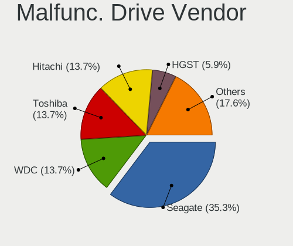

| Vendor              | Notebooks | Drives | Percent |
|---------------------|-----------|--------|---------|
| Seagate             | 19        | 19     | 33.93%  |
| WDC                 | 8         | 8      | 14.29%  |
| Toshiba             | 7         | 8      | 12.5%   |
| Hitachi             | 7         | 11     | 12.5%   |
| HGST                | 4         | 4      | 7.14%   |
| A-DATA Technology   | 4         | 4      | 7.14%   |
| Intel               | 2         | 3      | 3.57%   |
| SK hynix            | 1         | 1      | 1.79%   |
| SanDisk             | 1         | 1      | 1.79%   |
| Samsung Electronics | 1         | 1      | 1.79%   |
| Micron Technology   | 1         | 1      | 1.79%   |
| Crucial             | 1         | 1      | 1.79%   |

Malfunc. HDD Vendor
-------------------

Vendors of faulty HDD drives

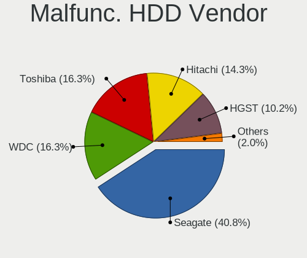

| Vendor  | Notebooks | Drives | Percent |
|---------|-----------|--------|---------|
| Seagate | 19        | 19     | 42.22%  |
| WDC     | 8         | 8      | 17.78%  |
| Toshiba | 7         | 8      | 15.56%  |
| Hitachi | 7         | 11     | 15.56%  |
| HGST    | 4         | 4      | 8.89%   |

Malfunc. Drive Kind
-------------------

Kinds of faulty drives

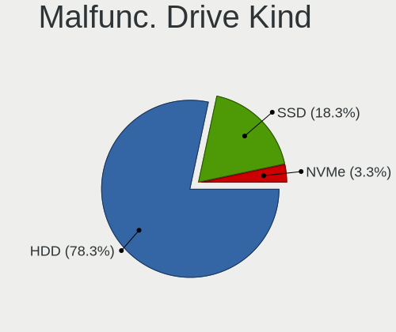

| Kind | Notebooks | Drives | Percent |
|------|-----------|--------|---------|
| HDD  | 43        | 50     | 79.63%  |
| SSD  | 10        | 11     | 18.52%  |
| NVMe | 1         | 1      | 1.85%   |

Failed Drives
-------------

Failed drive models

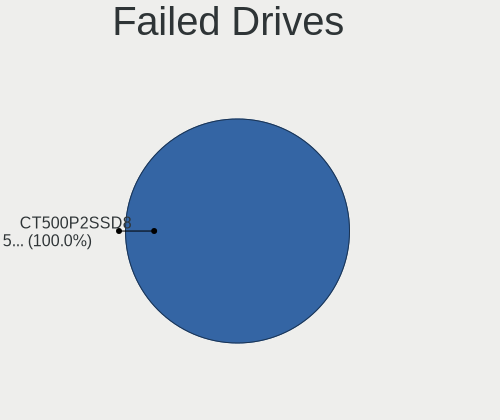

| Model                     | Notebooks | Drives | Percent |
|---------------------------|-----------|--------|---------|
| Crucial CT500P2SSD8 500GB | 1         | 1      | 100%    |

Failed Drive Vendor
-------------------

Failed drive vendors

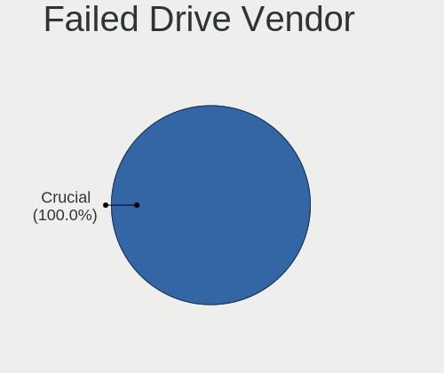

| Vendor  | Notebooks | Drives | Percent |
|---------|-----------|--------|---------|
| Crucial | 1         | 1      | 100%    |

Drive Status
------------

Number of failed and malfunc. drives

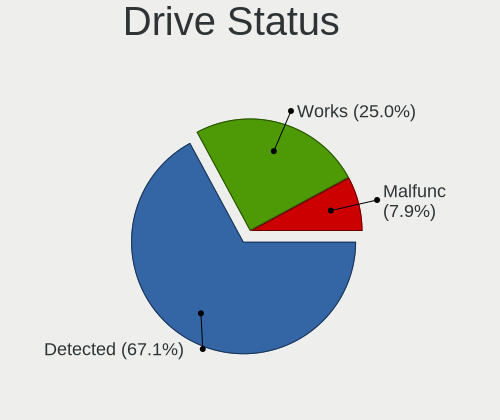

| Status   | Notebooks | Drives | Percent |
|----------|-----------|--------|---------|
| Detected | 457       | 634    | 65.85%  |
| Works    | 182       | 231    | 26.22%  |
| Malfunc  | 54        | 62     | 7.78%   |
| Failed   | 1         | 1      | 0.14%   |

Storage controller
------------------

Storage Vendor
--------------

Storage controller vendors

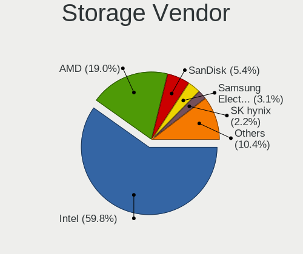

| Vendor                               | Notebooks | Percent |
|--------------------------------------|-----------|---------|
| Intel                                | 453       | 59.45%  |
| AMD                                  | 145       | 19.03%  |
| SanDisk                              | 42        | 5.51%   |
| Samsung Electronics                  | 24        | 3.15%   |
| SK hynix                             | 16        | 2.1%    |
| Micron Technology                    | 13        | 1.71%   |
| Kingston Technology Company          | 13        | 1.71%   |
| Realtek Semiconductor                | 9         | 1.18%   |
| Nvidia                               | 9         | 1.18%   |
| KIOXIA                               | 7         | 0.92%   |
| Silicon Motion                       | 6         | 0.79%   |
| Phison Electronics                   | 5         | 0.66%   |
| Micron/Crucial Technology            | 4         | 0.52%   |
| Union Memory (Shenzhen)              | 3         | 0.39%   |
| Apple                                | 3         | 0.39%   |
| VIA Technologies                     | 2         | 0.26%   |
| Marvell Technology Group             | 2         | 0.26%   |
| ADATA Technology                     | 2         | 0.26%   |
| Toshiba America Info Systems         | 1         | 0.13%   |
| Solid State Storage Technology       | 1         | 0.13%   |
| Ramaxel Technology(Shenzhen) Limited | 1         | 0.13%   |
| Biwin Storage Technology             | 1         | 0.13%   |

Storage Model
-------------

Storage controller models

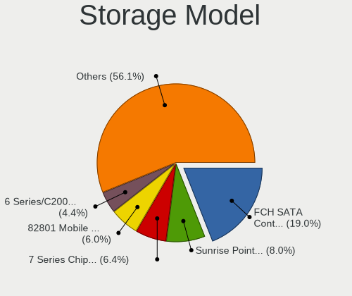

| Model                                                                            | Notebooks | Percent |
|----------------------------------------------------------------------------------|-----------|---------|
| AMD FCH SATA Controller [AHCI mode]                                              | 134       | 16.48%  |
| Intel Sunrise Point-LP SATA Controller [AHCI mode]                               | 58        | 7.13%   |
| Intel 7 Series Chipset Family 6-port SATA Controller [AHCI mode]                 | 52        | 6.4%    |
| Intel 82801 Mobile SATA Controller [RAID mode]                                   | 46        | 5.66%   |
| Intel 6 Series/C200 Series Chipset Family 6 port Mobile SATA AHCI Controller     | 33        | 4.06%   |
| Intel 8 Series SATA Controller 1 [AHCI mode]                                     | 24        | 2.95%   |
| Intel 5 Series/3400 Series Chipset 4 port SATA AHCI Controller                   | 20        | 2.46%   |
| Intel Wildcat Point-LP SATA Controller [AHCI Mode]                               | 18        | 2.21%   |
| Intel Celeron/Pentium Silver Processor SATA Controller                           | 18        | 2.21%   |
| SanDisk WD Blue SN550 NVMe SSD                                                   | 16        | 1.97%   |
| Intel 8 Series/C220 Series Chipset Family 6-port SATA Controller 1 [AHCI mode]   | 16        | 1.97%   |
| Intel 82801IBM/IEM (ICH9M/ICH9M-E) 4 port SATA Controller [AHCI mode]            | 15        | 1.85%   |
| Intel Volume Management Device NVMe RAID Controller                              | 14        | 1.72%   |
| Intel Cannon Lake Mobile PCH SATA AHCI Controller                                | 13        | 1.6%    |
| Intel 82801HM/HEM (ICH8M/ICH8M-E) IDE Controller                                 | 13        | 1.6%    |
| Intel Comet Lake SATA AHCI Controller                                            | 12        | 1.48%   |
| Intel Atom/Celeron/Pentium Processor x5-E8000/J3xxx/N3xxx Series SATA Controller | 12        | 1.48%   |
| Intel Cannon Point-LP SATA Controller [AHCI Mode]                                | 11        | 1.35%   |
| Intel 82801HM/HEM (ICH8M/ICH8M-E) SATA Controller [AHCI mode]                    | 11        | 1.35%   |
| Intel 5 Series/3400 Series Chipset 6 port SATA AHCI Controller                   | 11        | 1.35%   |
| Intel Atom Processor E3800 Series SATA AHCI Controller                           | 10        | 1.23%   |
| SK hynix Gold P31/BC711/PC711 NVMe Solid State Drive                             | 9         | 1.11%   |
| SanDisk WD Black SN750 / PC SN730 NVMe SSD                                       | 8         | 0.98%   |
| Samsung NVMe SSD Controller 980                                                  | 8         | 0.98%   |
| Intel Tiger Lake-LP SATA Controller                                              | 8         | 0.98%   |
| Intel HM170/QM170 Chipset SATA Controller [AHCI Mode]                            | 8         | 0.98%   |
| AMD SB7x0/SB8x0/SB9x0 SATA Controller [AHCI mode]                                | 8         | 0.98%   |
| Realtek RTS5763DL NVMe SSD Controller (DRAM-less)                                | 7         | 0.86%   |
| Intel SSD 670p Series [Keystone Harbor]                                          | 6         | 0.74%   |
| Intel SSD 660P Series                                                            | 6         | 0.74%   |
| Intel Ice Lake-LP SATA Controller [AHCI mode]                                    | 6         | 0.74%   |
| SanDisk PC SN520 NVMe SSD                                                        | 5         | 0.62%   |
| Samsung NVMe SSD Controller SM981/PM981/PM983                                    | 5         | 0.62%   |
| Samsung NVMe SSD Controller SM951/PM951                                          | 5         | 0.62%   |
| KIOXIA NVMe SSD Controller BG4 (DRAM-less)                                       | 5         | 0.62%   |
| Kingston Company OM3PDP3 NVMe SSD                                                | 5         | 0.62%   |
| Intel 400 Series Chipset Family SATA AHCI Controller                             | 5         | 0.62%   |
| SK hynix BC501 NVMe Solid State Drive                                            | 4         | 0.49%   |
| Silicon Motion SM2263EN/SM2263XT (DRAM-less) NVMe SSD Controllers                | 4         | 0.49%   |
| SanDisk WD Blue SN500 / PC SN520 NVMe SSD                                        | 4         | 0.49%   |

Storage Kind
------------

Kind of storage controller (IDE, SATA, NVMe, SAS, ...)

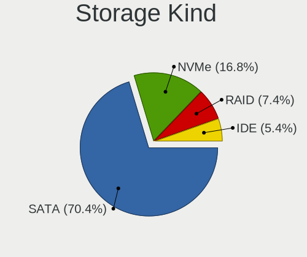

| Kind | Notebooks | Percent |
|------|-----------|---------|
| SATA | 532       | 67.26%  |
| NVMe | 161       | 20.35%  |
| RAID | 60        | 7.59%   |
| IDE  | 38        | 4.8%    |

Processor
---------

CPU Vendor
----------

Processor vendors

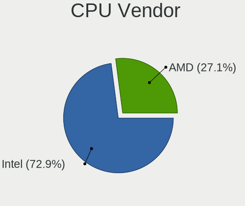

| Vendor | Notebooks | Percent |
|--------|-----------|---------|
| Intel  | 488       | 73.38%  |
| AMD    | 177       | 26.62%  |

CPU Model
---------

Processor models

| Model                                           | Notebooks | Percent |
|-------------------------------------------------|-----------|---------|
| AMD Ryzen 5 3500U with Radeon Vega Mobile Gfx   | 26        | 3.91%   |
| Intel Core i5-8250U CPU @ 1.60GHz               | 13        | 1.95%   |
| Intel Core i5-8300H CPU @ 2.30GHz               | 12        | 1.8%    |
| Intel Celeron CPU N3060 @ 1.60GHz               | 12        | 1.8%    |
| Intel Core i5-8265U CPU @ 1.60GHz               | 11        | 1.65%   |
| Intel Core i7-8550U CPU @ 1.80GHz               | 10        | 1.5%    |
| Intel Core i5-7200U CPU @ 2.50GHz               | 10        | 1.5%    |
| AMD A12-9720P RADEON R7, 12 COMPUTE CORES 4C+8G | 10        | 1.5%    |
| Intel Core i5-6200U CPU @ 2.30GHz               | 9         | 1.35%   |
| Intel Celeron N4000 CPU @ 1.10GHz               | 9         | 1.35%   |
| AMD Ryzen 5 5500U with Radeon Graphics          | 9         | 1.35%   |
| AMD A9-9425 RADEON R5, 5 COMPUTE CORES 2C+3G    | 9         | 1.35%   |
| Intel Core i7-8565U CPU @ 1.80GHz               | 8         | 1.2%    |
| Intel Celeron N4020 CPU @ 1.10GHz               | 8         | 1.2%    |
| AMD Ryzen 5 2500U with Radeon Vega Mobile Gfx   | 8         | 1.2%    |
| Intel Core i7-6700HQ CPU @ 2.60GHz              | 7         | 1.05%   |
| Intel Core i7-4510U CPU @ 2.00GHz               | 7         | 1.05%   |
| Intel Core i7-10510U CPU @ 1.80GHz              | 7         | 1.05%   |
| Intel Core i5-4210U CPU @ 1.70GHz               | 7         | 1.05%   |
| Intel Core i5-3210M CPU @ 2.50GHz               | 7         | 1.05%   |
| Intel Core i5-1035G1 CPU @ 1.00GHz              | 7         | 1.05%   |
| Intel Core i3-6006U CPU @ 2.00GHz               | 7         | 1.05%   |
| Intel Core i3-1005G1 CPU @ 1.20GHz              | 7         | 1.05%   |
| Intel 11th Gen Core i7-1165G7 @ 2.80GHz         | 7         | 1.05%   |
| Intel Core i5-3337U CPU @ 1.80GHz               | 6         | 0.9%    |
| Intel Core i5-10210U CPU @ 1.60GHz              | 6         | 0.9%    |
| Intel 11th Gen Core i5-1135G7 @ 2.40GHz         | 6         | 0.9%    |
| AMD Ryzen 3 3200U with Radeon Vega Mobile Gfx   | 6         | 0.9%    |
| Intel Core i7-6500U CPU @ 2.50GHz               | 5         | 0.75%   |
| Intel Core i7-5500U CPU @ 2.40GHz               | 5         | 0.75%   |
| Intel Core i7-2670QM CPU @ 2.20GHz              | 5         | 0.75%   |
| Intel Core i5-3230M CPU @ 2.60GHz               | 5         | 0.75%   |
| Intel Core i3-5005U CPU @ 2.00GHz               | 5         | 0.75%   |
| AMD Ryzen 7 4800H with Radeon Graphics          | 5         | 0.75%   |
| AMD A9-9420 RADEON R5, 5 COMPUTE CORES 2C+3G    | 5         | 0.75%   |
| Intel Pentium Dual-Core CPU T4400 @ 2.20GHz     | 4         | 0.6%    |
| Intel Core i5-6300U CPU @ 2.40GHz               | 4         | 0.6%    |
| Intel Core i5-5200U CPU @ 2.20GHz               | 4         | 0.6%    |
| Intel Core i5-2450M CPU @ 2.50GHz               | 4         | 0.6%    |
| Intel Core i5-2430M CPU @ 2.40GHz               | 4         | 0.6%    |

CPU Model Family
----------------

Processor model prefix

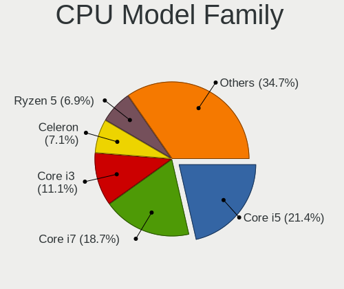

| Model                          | Notebooks | Percent |
|--------------------------------|-----------|---------|
| Intel Core i5                  | 157       | 23.61%  |
| Intel Core i7                  | 111       | 16.69%  |
| Intel Core i3                  | 73        | 10.98%  |
| Intel Celeron                  | 53        | 7.97%   |
| AMD Ryzen 5                    | 51        | 7.67%   |
| Other                          | 50        | 7.52%   |
| Intel Core 2 Duo               | 17        | 2.56%   |
| Intel Atom                     | 16        | 2.41%   |
| AMD Ryzen 3                    | 16        | 2.41%   |
| AMD Ryzen 7                    | 15        | 2.26%   |
| AMD A10                        | 11        | 1.65%   |
| AMD A12                        | 10        | 1.5%    |
| Intel Pentium                  | 9         | 1.35%   |
| AMD E1                         | 9         | 1.35%   |
| AMD A8                         | 7         | 1.05%   |
| Intel Pentium Dual-Core        | 6         | 0.9%    |
| Intel Pentium Dual             | 6         | 0.9%    |
| AMD Ryzen 7 PRO                | 6         | 0.9%    |
| AMD A6                         | 6         | 0.9%    |
| AMD E                          | 5         | 0.75%   |
| AMD A4                         | 5         | 0.75%   |
| AMD E2                         | 4         | 0.6%    |
| AMD Turion 64 X2 Mobile        | 3         | 0.45%   |
| AMD Athlon                     | 3         | 0.45%   |
| Intel Genuine                  | 2         | 0.3%    |
| Intel Core m5                  | 2         | 0.3%    |
| Intel Celeron M                | 2         | 0.3%    |
| AMD Ryzen 9                    | 2         | 0.3%    |
| Intel Core M                   | 1         | 0.15%   |
| Intel Core 2                   | 1         | 0.15%   |
| AMD V120                       | 1         | 0.15%   |
| AMD Turion X2 Dual-Core Mobile | 1         | 0.15%   |
| AMD Mobile Sempron             | 1         | 0.15%   |
| AMD C-70                       | 1         | 0.15%   |
| AMD C-60                       | 1         | 0.15%   |
| AMD Athlon II Neo              | 1         | 0.15%   |

CPU Cores
---------

Number of processor cores

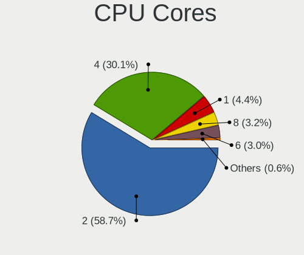

| Number  | Notebooks | Percent |
|---------|-----------|---------|
| 2       | 385       | 57.81%  |
| 4       | 203       | 30.48%  |
| 6       | 25        | 3.75%   |
| 1       | 23        | 3.45%   |
| 8       | 22        | 3.3%    |
| 14      | 4         | 0.6%    |
| 10      | 3         | 0.45%   |
| Unknown | 1         | 0.15%   |

CPU Sockets
-----------

Number of sockets

| Number | Notebooks | Percent |
|--------|-----------|---------|
| 1      | 665       | 100%    |

CPU Threads
-----------

Threads per core (Hyper-Threading)

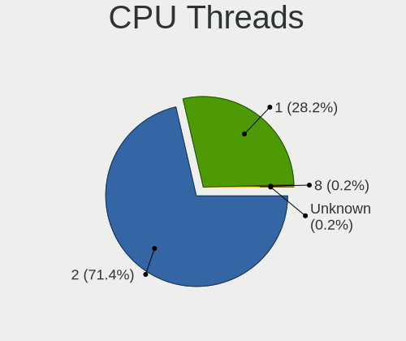

| Number  | Notebooks | Percent |
|---------|-----------|---------|
| 2       | 488       | 73.27%  |
| 1       | 175       | 26.28%  |
| 8       | 2         | 0.3%    |
| Unknown | 1         | 0.15%   |

CPU Op-Modes
------------

CPU Operation Modes (32-bit, 64-bit)

| Op mode        | Notebooks | Percent |
|----------------|-----------|---------|
| 32-bit, 64-bit | 629       | 93.88%  |
| Unknown        | 31        | 4.63%   |
| 64-bit         | 6         | 0.9%    |
| 32-bit         | 4         | 0.6%    |

CPU Microcode
-------------

Microcode number

| Number     | Notebooks | Percent |
|------------|-----------|---------|
| Unknown    | 151       | 22.14%  |
| 0x306a9    | 39        | 5.72%   |
| 0x206a7    | 35        | 5.13%   |
| 0x806ea    | 26        | 3.81%   |
| 0x406e3    | 24        | 3.52%   |
| 0x806ec    | 22        | 3.23%   |
| 0x08108109 | 22        | 3.23%   |
| 0x40651    | 21        | 3.08%   |
| 0x306d4    | 18        | 2.64%   |
| 0x06006705 | 18        | 2.64%   |
| 0x806c1    | 16        | 2.35%   |
| 0x20655    | 15        | 2.2%    |
| 0x906ea    | 14        | 2.05%   |
| 0x306c3    | 13        | 1.91%   |
| 0x08108102 | 13        | 1.91%   |
| 0x706e5    | 12        | 1.76%   |
| 0x406c4    | 12        | 1.76%   |
| 0x08608103 | 12        | 1.76%   |
| 0x806e9    | 11        | 1.61%   |
| 0x6fd      | 11        | 1.61%   |
| 0x1067a    | 11        | 1.61%   |
| 0x706a1    | 9         | 1.32%   |
| 0x05000119 | 9         | 1.32%   |
| 0x806eb    | 8         | 1.17%   |
| 0x06006118 | 8         | 1.17%   |
| 0x0600611a | 7         | 1.03%   |
| 0x706a8    | 6         | 0.88%   |
| 0x506e3    | 6         | 0.88%   |
| 0x30678    | 6         | 0.88%   |
| 0x106ca    | 6         | 0.88%   |
| 0x0a50000c | 6         | 0.88%   |
| 0x08101007 | 6         | 0.88%   |
| 0xa0652    | 5         | 0.73%   |
| 0x20652    | 5         | 0.73%   |
| 0x08600106 | 5         | 0.73%   |
| 0x0810100b | 5         | 0.73%   |
| 0x106e5    | 4         | 0.59%   |
| 0x106c2    | 4         | 0.59%   |
| 0x10676    | 4         | 0.59%   |
| 0x07030105 | 4         | 0.59%   |

CPU Microarch
-------------

Microarchitecture

| Name             | Notebooks | Percent |
|------------------|-----------|---------|
| KabyLake         | 106       | 15.94%  |
| IvyBridge        | 47        | 7.07%   |
| SandyBridge      | 46        | 6.92%   |
| Zen+             | 45        | 6.77%   |
| Haswell          | 44        | 6.62%   |
| Excavator        | 41        | 6.17%   |
| Skylake          | 38        | 5.71%   |
| Silvermont       | 29        | 4.36%   |
| Westmere         | 27        | 4.06%   |
| TigerLake        | 22        | 3.31%   |
| Broadwell        | 21        | 3.16%   |
| Core             | 19        | 2.86%   |
| Goldmont plus    | 18        | 2.71%   |
| Penryn           | 17        | 2.56%   |
| IceLake          | 17        | 2.56%   |
| Unknown          | 17        | 2.56%   |
| Zen              | 16        | 2.41%   |
| Zen 2            | 12        | 1.8%    |
| Bonnell          | 11        | 1.65%   |
| Bobcat           | 10        | 1.5%    |
| Puma             | 9         | 1.35%   |
| CometLake        | 8         | 1.2%    |
| Zen 3            | 7         | 1.05%   |
| Alderlake Hybrid | 7         | 1.05%   |
| Piledriver       | 5         | 0.75%   |
| K8 Hammer        | 5         | 0.75%   |
| Jaguar           | 5         | 0.75%   |
| Nehalem          | 4         | 0.6%    |
| Goldmont         | 4         | 0.6%    |
| Steamroller      | 3         | 0.45%   |
| K10              | 2         | 0.3%    |
| P6               | 1         | 0.15%   |
| K8 & K10 hybrid  | 1         | 0.15%   |
| K10 Llano        | 1         | 0.15%   |

Graphics
--------

GPU Vendor
----------

Vendors of graphics cards

| Vendor           | Notebooks | Percent |
|------------------|-----------|---------|
| Intel            | 468       | 58.06%  |
| AMD              | 190       | 23.57%  |
| Nvidia           | 146       | 18.11%  |
| VIA Technologies | 2         | 0.25%   |

GPU Model
---------

Graphics card models

| Model                                                                                    | Notebooks | Percent |
|------------------------------------------------------------------------------------------|-----------|---------|
| AMD Picasso/Raven 2 [Radeon Vega Series / Radeon Vega Mobile Series]                     | 48        | 5.63%   |
| Intel 3rd Gen Core processor Graphics Controller                                         | 46        | 5.39%   |
| Intel 2nd Generation Core Processor Family Integrated Graphics Controller                | 44        | 5.16%   |
| Intel Haswell-ULT Integrated Graphics Controller                                         | 26        | 3.05%   |
| Intel Core Processor Integrated Graphics Controller                                      | 26        | 3.05%   |
| Intel UHD Graphics 620                                                                   | 25        | 2.93%   |
| Intel Skylake GT2 [HD Graphics 520]                                                      | 25        | 2.93%   |
| AMD Stoney [Radeon R2/R3/R4/R5 Graphics]                                                 | 24        | 2.81%   |
| Intel WhiskeyLake-U GT2 [UHD Graphics 620]                                               | 20        | 2.34%   |
| Intel TigerLake-LP GT2 [Iris Xe Graphics]                                                | 20        | 2.34%   |
| Intel HD Graphics 620                                                                    | 18        | 2.11%   |
| Intel HD Graphics 5500                                                                   | 18        | 2.11%   |
| Intel GeminiLake [UHD Graphics 600]                                                      | 18        | 2.11%   |
| Intel CoffeeLake-H GT2 [UHD Graphics 630]                                                | 18        | 2.11%   |
| AMD Wani [Radeon R5/R6/R7 Graphics]                                                      | 17        | 1.99%   |
| Nvidia GP107M [GeForce GTX 1050 Mobile]                                                  | 16        | 1.88%   |
| Intel CometLake-U GT2 [UHD Graphics]                                                     | 16        | 1.88%   |
| Intel 4th Gen Core Processor Integrated Graphics Controller                              | 16        | 1.88%   |
| Intel Atom/Celeron/Pentium Processor x5-E8000/J3xxx/N3xxx Integrated Graphics Controller | 15        | 1.76%   |
| AMD Lucienne                                                                             | 15        | 1.76%   |
| Intel Mobile 4 Series Chipset Integrated Graphics Controller                             | 14        | 1.64%   |
| Intel Iris Plus Graphics G1 (Ice Lake)                                                   | 14        | 1.64%   |
| Intel Atom Processor Z36xxx/Z37xxx Series Graphics & Display                             | 14        | 1.64%   |
| AMD Raven Ridge [Radeon Vega Series / Radeon Vega Mobile Series]                         | 13        | 1.52%   |
| AMD Renoir                                                                               | 12        | 1.41%   |
| Intel Mobile GM965/GL960 Integrated Graphics Controller (secondary)                      | 11        | 1.29%   |
| Intel Mobile GM965/GL960 Integrated Graphics Controller (primary)                        | 11        | 1.29%   |
| Nvidia GF117M [GeForce 610M/710M/810M/820M / GT 620M/625M/630M/720M]                     | 9         | 1.06%   |
| AMD Topaz XT [Radeon R7 M260/M265 / M340/M360 / M440/M445 / 530/535 / 620/625 Mobile]    | 9         | 1.06%   |
| Intel HD Graphics 530                                                                    | 8         | 0.94%   |
| Nvidia TU117M [GeForce GTX 1650 Mobile / Max-Q]                                          | 7         | 0.82%   |
| Nvidia GM108M [GeForce MX110]                                                            | 7         | 0.82%   |
| Intel CometLake-H GT2 [UHD Graphics]                                                     | 7         | 0.82%   |
| AMD Sun LE [Radeon HD 8550M / R5 M230]                                                   | 7         | 0.82%   |
| AMD Jet PRO [Radeon R5 M230 / R7 M260DX / Radeon 520/610 Mobile]                         | 7         | 0.82%   |
| Nvidia GM107M [GeForce GTX 960M]                                                         | 6         | 0.7%    |
| Intel Mobile 945GM/GMS/GME, 943/940GML Express Integrated Graphics Controller            | 6         | 0.7%    |
| Intel Atom Processor D4xx/D5xx/N4xx/N5xx Integrated Graphics Controller                  | 6         | 0.7%    |
| AMD Sun XT [Radeon HD 8670A/8670M/8690M / R5 M330 / M430 / Radeon 520 Mobile]            | 6         | 0.7%    |
| AMD Mullins [Radeon R4/R5 Graphics]                                                      | 6         | 0.7%    |

GPU Combo
---------

Combinations of graphics cards

| Name           | Notebooks | Percent |
|----------------|-----------|---------|
| 1 x Intel      | 337       | 50.6%   |
| 1 x AMD        | 136       | 20.42%  |
| Intel + Nvidia | 117       | 17.57%  |
| 2 x AMD        | 30        | 4.5%    |
| 1 x Nvidia     | 19        | 2.85%   |
| Intel + AMD    | 14        | 2.1%    |
| AMD + Nvidia   | 10        | 1.5%    |
| 1 x VIA        | 2         | 0.3%    |
| 2 x Intel      | 1         | 0.15%   |

GPU Driver
----------

Free vs proprietary

| Driver      | Notebooks | Percent |
|-------------|-----------|---------|
| Free        | 584       | 87.03%  |
| Proprietary | 63        | 9.39%   |
| Unknown     | 24        | 3.58%   |

GPU Memory
----------

Total video memory

| Size in GB | Notebooks | Percent |
|------------|-----------|---------|
| Unknown    | 412       | 60.95%  |
| 1.01-2.0   | 103       | 15.24%  |
| 0.01-0.5   | 94        | 13.91%  |
| 3.01-4.0   | 32        | 4.73%   |
| 0.51-1.0   | 29        | 4.29%   |
| 5.01-6.0   | 3         | 0.44%   |
| 7.01-8.0   | 1         | 0.15%   |
| 2.01-3.0   | 1         | 0.15%   |
| 8.01-16.0  | 1         | 0.15%   |

Monitor
-------

Monitor Vendor
--------------

Monitor vendors

| Vendor                  | Notebooks | Percent |
|-------------------------|-----------|---------|
| Chimei Innolux          | 162       | 21.8%   |
| AU Optronics            | 122       | 16.42%  |
| BOE                     | 116       | 15.61%  |
| Samsung Electronics     | 88        | 11.84%  |
| LG Display              | 81        | 10.9%   |
| Goldstar                | 23        | 3.1%    |
| PANDA                   | 19        | 2.56%   |
| Apple                   | 19        | 2.56%   |
| Chi Mei Optoelectronics | 15        | 2.02%   |
| Dell                    | 12        | 1.62%   |
| Sharp                   | 9         | 1.21%   |
| Hewlett-Packard         | 8         | 1.08%   |
| InfoVision              | 7         | 0.94%   |
| LG Philips              | 6         | 0.81%   |
| Sony                    | 5         | 0.67%   |
| Lenovo                  | 5         | 0.67%   |
| InnoLux Display         | 5         | 0.67%   |
| Acer                    | 5         | 0.67%   |
| AOC                     | 4         | 0.54%   |
| HKC                     | 3         | 0.4%    |
| HannStar                | 3         | 0.4%    |
| CS_                     | 3         | 0.4%    |
| CSO                     | 3         | 0.4%    |
| ViewSonic               | 2         | 0.27%   |
| BenQ                    | 2         | 0.27%   |
| Toshiba                 | 1         | 0.13%   |
| STA                     | 1         | 0.13%   |
| SLD                     | 1         | 0.13%   |
| Sceptre Tech            | 1         | 0.13%   |
| RGT                     | 1         | 0.13%   |
| MSI                     | 1         | 0.13%   |
| LTM                     | 1         | 0.13%   |
| KTC                     | 1         | 0.13%   |
| KDC                     | 1         | 0.13%   |
| HUAWEI                  | 1         | 0.13%   |
| HannStar Display        | 1         | 0.13%   |
| eMachines               | 1         | 0.13%   |
| ELD                     | 1         | 0.13%   |
| CHO                     | 1         | 0.13%   |
| Ancor Communications    | 1         | 0.13%   |

Monitor Model
-------------

Monitor models

| Model                                                                 | Notebooks | Percent |
|-----------------------------------------------------------------------|-----------|---------|
| Chimei Innolux LCD Monitor CMN15E6 1366x768 344x193mm 15.5-inch       | 17        | 2.27%   |
| Chimei Innolux LCD Monitor CMN14D6 1366x768 309x173mm 13.9-inch       | 15        | 2.01%   |
| Chimei Innolux LCD Monitor CMN14C3 1366x768 309x173mm 13.9-inch       | 13        | 1.74%   |
| Chimei Innolux LCD Monitor CMN15DB 1366x768 344x193mm 15.5-inch       | 10        | 1.34%   |
| Chimei Innolux LCD Monitor CMN14C4 1366x768 309x173mm 13.9-inch       | 10        | 1.34%   |
| AU Optronics LCD Monitor AUO2D3C 1366x768 309x173mm 13.9-inch         | 10        | 1.34%   |
| BOE LCD Monitor BOE06A4 1366x768 344x194mm 15.5-inch                  | 9         | 1.2%    |
| BOE LCD Monitor BOE0696 1366x768 309x173mm 13.9-inch                  | 9         | 1.2%    |
| AU Optronics LCD Monitor AUO723C 1366x768 309x173mm 13.9-inch         | 9         | 1.2%    |
| Chimei Innolux LCD Monitor CMN14E5 1920x1080 309x173mm 13.9-inch      | 8         | 1.07%   |
| AU Optronics LCD Monitor AUO323C 1366x768 309x173mm 13.9-inch         | 7         | 0.94%   |
| Chimei Innolux LCD Monitor CMN15DC 1366x768 344x193mm 15.5-inch       | 6         | 0.8%    |
| BOE LCD Monitor BOE0672 1366x768 344x194mm 15.5-inch                  | 6         | 0.8%    |
| PANDA LCD Monitor NCP0035 1920x1080 344x194mm 15.5-inch               | 5         | 0.67%   |
| LG Display LCD Monitor LGD02DC 1366x768 344x194mm 15.5-inch           | 5         | 0.67%   |
| Chimei Innolux LCD Monitor CMN1491 1366x768 309x174mm 14.0-inch       | 5         | 0.67%   |
| BOE LCD Monitor BOE07AA 1366x768 344x194mm 15.5-inch                  | 5         | 0.67%   |
| BOE LCD Monitor BOE0697 1366x768 309x173mm 13.9-inch                  | 5         | 0.67%   |
| BOE LCD Monitor BOE05BA 1366x768 309x173mm 13.9-inch                  | 5         | 0.67%   |
| Samsung Electronics S22F350 SAM0D1A 1920x1080 477x268mm 21.5-inch     | 4         | 0.53%   |
| Samsung Electronics LCD Monitor SAM0C39 1920x1080 885x498mm 40.0-inch | 4         | 0.53%   |
| Samsung Electronics C24F390 SAM0D2C 1920x1080 521x293mm 23.5-inch     | 4         | 0.53%   |
| PANDA LCD Monitor NCP0046 1920x1080 344x194mm 15.5-inch               | 4         | 0.53%   |
| PANDA LCD Monitor NCP002D 1920x1080 344x194mm 15.5-inch               | 4         | 0.53%   |
| Chimei Innolux LCD Monitor CMN1490 1366x768 309x173mm 13.9-inch       | 4         | 0.53%   |
| Chimei Innolux LCD Monitor CMN1487 1366x768 309x173mm 13.9-inch       | 4         | 0.53%   |
| BOE LCD Monitor BOE07F7 1920x1080 309x174mm 14.0-inch                 | 4         | 0.53%   |
| BOE LCD Monitor BOE07A1 1920x1080 344x193mm 15.5-inch                 | 4         | 0.53%   |
| BOE LCD Monitor BOE0704 1366x768 344x194mm 15.5-inch                  | 4         | 0.53%   |
| BOE LCD Monitor BOE0644 1366x768 309x173mm 13.9-inch                  | 4         | 0.53%   |
| AU Optronics LCD Monitor AUO70EC 1366x768 344x193mm 15.5-inch         | 4         | 0.53%   |
| AU Optronics LCD Monitor AUO106C 1366x768 276x155mm 12.5-inch         | 4         | 0.53%   |
| Sharp LCD Monitor SHP143E 3840x2160 346x194mm 15.6-inch               | 3         | 0.4%    |
| Samsung Electronics LCD Monitor SEC3741 1366x768 309x174mm 14.0-inch  | 3         | 0.4%    |
| LG Display LCD Monitor LGD045C 1366x768 345x194mm 15.6-inch           | 3         | 0.4%    |
| LG Display LCD Monitor LGD0455 1366x768 310x174mm 14.0-inch           | 3         | 0.4%    |
| LG Display LCD Monitor LGD039F 1366x768 345x194mm 15.6-inch           | 3         | 0.4%    |
| LG Display LCD Monitor LGD033C 1366x768 309x174mm 14.0-inch           | 3         | 0.4%    |
| LG Display LCD Monitor LGD02F8 1366x768 309x174mm 14.0-inch           | 3         | 0.4%    |
| LG Display LCD Monitor LGD02E9 1366x768 309x174mm 14.0-inch           | 3         | 0.4%    |

Monitor Resolution
------------------

Monitor screen resolution

| Resolution         | Notebooks | Percent |
|--------------------|-----------|---------|
| 1366x768 (WXGA)    | 395       | 55.71%  |
| 1920x1080 (FHD)    | 183       | 25.81%  |
| 1280x800 (WXGA)    | 25        | 3.53%   |
| 1600x900 (HD+)     | 23        | 3.24%   |
| 3840x2160 (4K)     | 21        | 2.96%   |
| 1440x900 (WXGA+)   | 13        | 1.83%   |
| 1024x600           | 7         | 0.99%   |
| 2880x1800          | 6         | 0.85%   |
| 2560x1600          | 5         | 0.71%   |
| 1920x1200 (WUXGA)  | 5         | 0.71%   |
| 1280x1024 (SXGA)   | 5         | 0.71%   |
| 2560x1440 (QHD)    | 4         | 0.56%   |
| 3456x2160          | 3         | 0.42%   |
| 2160x1440          | 3         | 0.42%   |
| 3440x1440          | 2         | 0.28%   |
| 1360x768           | 2         | 0.28%   |
| 3840x1100          | 1         | 0.14%   |
| 3840x1080          | 1         | 0.14%   |
| 2560x1080          | 1         | 0.14%   |
| 2256x1504          | 1         | 0.14%   |
| 1680x945           | 1         | 0.14%   |
| 1680x1050 (WSXGA+) | 1         | 0.14%   |
| 1024x768 (XGA)     | 1         | 0.14%   |

Monitor Diagonal
----------------

Diagonal size in inches

| Inches  | Notebooks | Percent |
|---------|-----------|---------|
| 15      | 231       | 30.92%  |
| 13      | 176       | 23.56%  |
| 14      | 158       | 21.15%  |
| 17      | 25        | 3.35%   |
| 21      | 23        | 3.08%   |
| 23      | 18        | 2.41%   |
| 11      | 14        | 1.87%   |
| 24      | 12        | 1.61%   |
| 12      | 12        | 1.61%   |
| 10      | 9         | 1.2%    |
| 27      | 8         | 1.07%   |
| 18      | 8         | 1.07%   |
| 54      | 7         | 0.94%   |
| 19      | 7         | 0.94%   |
| 31      | 5         | 0.67%   |
| 20      | 5         | 0.67%   |
| 72      | 4         | 0.54%   |
| Unknown | 4         | 0.54%   |
| 84      | 3         | 0.4%    |
| 40      | 3         | 0.4%    |
| 34      | 3         | 0.4%    |
| 16      | 3         | 0.4%    |
| 26      | 2         | 0.27%   |
| 8       | 2         | 0.27%   |
| 63      | 1         | 0.13%   |
| 61      | 1         | 0.13%   |
| 48      | 1         | 0.13%   |
| 43      | 1         | 0.13%   |
| 22      | 1         | 0.13%   |

Monitor Width
-------------

Physical width

| Width in mm | Notebooks | Percent |
|-------------|-----------|---------|
| 301-350     | 528       | 71.45%  |
| 201-300     | 68        | 9.2%    |
| 401-500     | 44        | 5.95%   |
| 501-600     | 34        | 4.6%    |
| 351-400     | 25        | 3.38%   |
| 601-700     | 10        | 1.35%   |
| 1001-1500   | 10        | 1.35%   |
| 1501-2000   | 7         | 0.95%   |
| Unknown     | 4         | 0.54%   |
| 801-900     | 3         | 0.41%   |
| 701-800     | 3         | 0.41%   |
| 101-200     | 2         | 0.27%   |
| 901-1000    | 1         | 0.14%   |

Aspect Ratio
------------

Proportional relationship between the width and the height

| Ratio   | Notebooks | Percent |
|---------|-----------|---------|
| 16/9    | 580       | 87.48%  |
| 16/10   | 64        | 9.65%   |
| 3/2     | 6         | 0.9%    |
| 5/4     | 5         | 0.75%   |
| 21/9    | 3         | 0.45%   |
| 4/3     | 2         | 0.3%    |
| 32/9    | 1         | 0.15%   |
| 3.40    | 1         | 0.15%   |
| Unknown | 1         | 0.15%   |

Monitor Area
------------

Area in inch²

| Area in inch² | Notebooks | Percent |
|----------------|-----------|---------|
| 81-90          | 313       | 42.07%  |
| 101-110        | 233       | 31.32%  |
| 201-250        | 44        | 5.91%   |
| 71-80          | 18        | 2.42%   |
| More than 1000 | 16        | 2.15%   |
| 121-130        | 16        | 2.15%   |
| 51-60          | 15        | 2.02%   |
| 151-200        | 14        | 1.88%   |
| 141-150        | 13        | 1.75%   |
| 61-70          | 12        | 1.61%   |
| 301-350        | 10        | 1.34%   |
| 41-50          | 9         | 1.21%   |
| 351-500        | 8         | 1.08%   |
| 251-300        | 7         | 0.94%   |
| 501-1000       | 5         | 0.67%   |
| 131-140        | 4         | 0.54%   |
| Unknown        | 4         | 0.54%   |
| 1-40           | 2         | 0.27%   |
| 111-120        | 1         | 0.13%   |

Pixel Density
-------------

Pixels per inch

| Density       | Notebooks | Percent |
|---------------|-----------|---------|
| 101-120       | 397       | 54.61%  |
| 121-160       | 175       | 24.07%  |
| 51-100        | 98        | 13.48%  |
| 161-240       | 22        | 3.03%   |
| More than 240 | 17        | 2.34%   |
| 1-50          | 14        | 1.93%   |
| Unknown       | 4         | 0.55%   |

Multiple Monitors
-----------------

Total monitors connected

| Total | Notebooks | Percent |
|-------|-----------|---------|
| 1     | 544       | 79.3%   |
| 2     | 115       | 16.76%  |
| 0     | 22        | 3.21%   |
| 3     | 4         | 0.58%   |
| 4     | 1         | 0.15%   |

Network
-------

Net Controller Vendor
---------------------

Controller vendors

| Vendor                          | Notebooks | Percent |
|---------------------------------|-----------|---------|
| Realtek Semiconductor           | 438       | 42.24%  |
| Intel                           | 224       | 21.6%   |
| Qualcomm Atheros                | 179       | 17.26%  |
| Broadcom                        | 73        | 7.04%   |
| Broadcom Limited                | 24        | 2.31%   |
| Ralink                          | 14        | 1.35%   |
| TP-Link                         | 11        | 1.06%   |
| MediaTek                        | 10        | 0.96%   |
| Marvell Technology Group        | 9         | 0.87%   |
| Samsung Electronics             | 8         | 0.77%   |
| Nvidia                          | 8         | 0.77%   |
| Ralink Technology               | 6         | 0.58%   |
| Qualcomm Atheros Communications | 4         | 0.39%   |
| Huawei Technologies             | 4         | 0.39%   |
| ASIX Electronics                | 4         | 0.39%   |
| Xiaomi                          | 3         | 0.29%   |
| VIA Technologies                | 2         | 0.19%   |
| Qualcomm                        | 2         | 0.19%   |
| D-Link System                   | 2         | 0.19%   |
| T & A Mobile Phones             | 1         | 0.1%    |
| STMicroelectronics              | 1         | 0.1%    |
| Quanta                          | 1         | 0.1%    |
| Prolific Technology             | 1         | 0.1%    |
| OPPO Electronics                | 1         | 0.1%    |
| Motorola PCS                    | 1         | 0.1%    |
| Lenovo                          | 1         | 0.1%    |
| JMicron Technology              | 1         | 0.1%    |
| Google                          | 1         | 0.1%    |
| DisplayLink                     | 1         | 0.1%    |
| Dell                            | 1         | 0.1%    |
| 3Com                            | 1         | 0.1%    |

Net Controller Model
--------------------

Controller models

| Model                                                                   | Notebooks | Percent |
|-------------------------------------------------------------------------|-----------|---------|
| Realtek RTL8111/8168/8411 PCI Express Gigabit Ethernet Controller       | 264       | 21.19%  |
| Realtek RTL810xE PCI Express Fast Ethernet controller                   | 90        | 7.22%   |
| Qualcomm Atheros QCA9377 802.11ac Wireless Network Adapter              | 46        | 3.69%   |
| Realtek RTL8821CE 802.11ac PCIe Wireless Network Adapter                | 42        | 3.37%   |
| Realtek RTL8723DE Wireless Network Adapter                              | 40        | 3.21%   |
| Qualcomm Atheros QCA9565 / AR9565 Wireless Network Adapter              | 29        | 2.33%   |
| Intel Wireless 8265 / 8275                                              | 28        | 2.25%   |
| Qualcomm Atheros AR9285 Wireless Network Adapter (PCI-Express)          | 26        | 2.09%   |
| Qualcomm Atheros AR9485 Wireless Network Adapter                        | 24        | 1.93%   |
| Realtek RTL8822CE 802.11ac PCIe Wireless Network Adapter                | 20        | 1.61%   |
| Realtek RTL8153 Gigabit Ethernet Adapter                                | 18        | 1.44%   |
| Realtek RTL8723BE PCIe Wireless Network Adapter                         | 17        | 1.36%   |
| Realtek RTL8822BE 802.11a/b/g/n/ac WiFi adapter                         | 16        | 1.28%   |
| Intel Wi-Fi 6 AX201                                                     | 16        | 1.28%   |
| Broadcom BCM4313 802.11bgn Wireless Network Adapter                     | 16        | 1.28%   |
| Intel Wi-Fi 6 AX200                                                     | 14        | 1.12%   |
| Intel Comet Lake PCH-LP CNVi WiFi                                       | 13        | 1.04%   |
| Intel Cannon Point-LP CNVi [Wireless-AC]                                | 13        | 1.04%   |
| Intel Cannon Lake PCH CNVi WiFi                                         | 13        | 1.04%   |
| Broadcom BCM43142 802.11b/g/n                                           | 13        | 1.04%   |
| Realtek RTL8821AE 802.11ac PCIe Wireless Network Adapter                | 12        | 0.96%   |
| Intel Wireless 7260                                                     | 12        | 0.96%   |
| Intel Wireless 8260                                                     | 11        | 0.88%   |
| Ralink RT3290 Wireless 802.11n 1T/1R PCIe                               | 9         | 0.72%   |
| Intel 82579LM Gigabit Network Connection (Lewisville)                   | 9         | 0.72%   |
| Qualcomm Atheros AR242x / AR542x Wireless Network Adapter (PCI-Express) | 8         | 0.64%   |
| Intel Wireless 7265                                                     | 8         | 0.64%   |
| Intel Ethernet Connection I219-LM                                       | 8         | 0.64%   |
| Intel Centrino Wireless-N 2230                                          | 8         | 0.64%   |
| Realtek RTL8188EE Wireless Network Adapter                              | 7         | 0.56%   |
| Realtek RTL8188CE 802.11b/g/n WiFi Adapter                              | 7         | 0.56%   |
| Realtek RTL8152 Fast Ethernet Adapter                                   | 7         | 0.56%   |
| Realtek 802.11ac NIC                                                    | 7         | 0.56%   |
| Qualcomm Atheros AR9287 Wireless Network Adapter (PCI-Express)          | 7         | 0.56%   |
| Qualcomm Atheros AR8151 v2.0 Gigabit Ethernet                           | 7         | 0.56%   |
| Intel Dual Band Wireless-AC 3165 Plus Bluetooth                         | 7         | 0.56%   |
| Samsung Galaxy series, misc. (tethering mode)                           | 6         | 0.48%   |
| Qualcomm Atheros QCA6174 802.11ac Wireless Network Adapter              | 6         | 0.48%   |
| Qualcomm Atheros AR8152 v2.0 Fast Ethernet                              | 6         | 0.48%   |
| MediaTek MT7921 802.11ax PCI Express Wireless Network Adapter           | 6         | 0.48%   |

Wireless Vendor
---------------

Wireless vendors

| Vendor                          | Notebooks | Percent |
|---------------------------------|-----------|---------|
| Intel                           | 218       | 31.5%   |
| Realtek Semiconductor           | 190       | 27.46%  |
| Qualcomm Atheros                | 158       | 22.83%  |
| Broadcom                        | 58        | 8.38%   |
| Broadcom Limited                | 18        | 2.6%    |
| Ralink                          | 14        | 2.02%   |
| TP-Link                         | 11        | 1.59%   |
| MediaTek                        | 9         | 1.3%    |
| Ralink Technology               | 6         | 0.87%   |
| Qualcomm Atheros Communications | 4         | 0.58%   |
| D-Link System                   | 2         | 0.29%   |
| Qualcomm                        | 1         | 0.14%   |
| Marvell Technology Group        | 1         | 0.14%   |
| Dell                            | 1         | 0.14%   |
| 3Com                            | 1         | 0.14%   |

Wireless Model
--------------

Wireless models

| Model                                                                   | Notebooks | Percent |
|-------------------------------------------------------------------------|-----------|---------|
| Qualcomm Atheros QCA9377 802.11ac Wireless Network Adapter              | 46        | 6.63%   |
| Realtek RTL8821CE 802.11ac PCIe Wireless Network Adapter                | 42        | 6.05%   |
| Realtek RTL8723DE Wireless Network Adapter                              | 40        | 5.76%   |
| Qualcomm Atheros QCA9565 / AR9565 Wireless Network Adapter              | 29        | 4.18%   |
| Intel Wireless 8265 / 8275                                              | 28        | 4.03%   |
| Qualcomm Atheros AR9285 Wireless Network Adapter (PCI-Express)          | 26        | 3.75%   |
| Qualcomm Atheros AR9485 Wireless Network Adapter                        | 24        | 3.46%   |
| Realtek RTL8822CE 802.11ac PCIe Wireless Network Adapter                | 20        | 2.88%   |
| Realtek RTL8723BE PCIe Wireless Network Adapter                         | 17        | 2.45%   |
| Realtek RTL8822BE 802.11a/b/g/n/ac WiFi adapter                         | 16        | 2.31%   |
| Intel Wi-Fi 6 AX201                                                     | 16        | 2.31%   |
| Broadcom BCM4313 802.11bgn Wireless Network Adapter                     | 16        | 2.31%   |
| Intel Wi-Fi 6 AX200                                                     | 14        | 2.02%   |
| Intel Comet Lake PCH-LP CNVi WiFi                                       | 13        | 1.87%   |
| Intel Cannon Point-LP CNVi [Wireless-AC]                                | 13        | 1.87%   |
| Intel Cannon Lake PCH CNVi WiFi                                         | 13        | 1.87%   |
| Broadcom BCM43142 802.11b/g/n                                           | 13        | 1.87%   |
| Realtek RTL8821AE 802.11ac PCIe Wireless Network Adapter                | 12        | 1.73%   |
| Intel Wireless 7260                                                     | 12        | 1.73%   |
| Intel Wireless 8260                                                     | 11        | 1.59%   |
| Ralink RT3290 Wireless 802.11n 1T/1R PCIe                               | 9         | 1.3%    |
| Qualcomm Atheros AR242x / AR542x Wireless Network Adapter (PCI-Express) | 8         | 1.15%   |
| Intel Wireless 7265                                                     | 8         | 1.15%   |
| Intel Centrino Wireless-N 2230                                          | 8         | 1.15%   |
| Realtek RTL8188EE Wireless Network Adapter                              | 7         | 1.01%   |
| Realtek RTL8188CE 802.11b/g/n WiFi Adapter                              | 7         | 1.01%   |
| Realtek 802.11ac NIC                                                    | 7         | 1.01%   |
| Qualcomm Atheros AR9287 Wireless Network Adapter (PCI-Express)          | 7         | 1.01%   |
| Intel Dual Band Wireless-AC 3165 Plus Bluetooth                         | 7         | 1.01%   |
| Qualcomm Atheros QCA6174 802.11ac Wireless Network Adapter              | 6         | 0.86%   |
| MediaTek MT7921 802.11ax PCI Express Wireless Network Adapter           | 6         | 0.86%   |
| Intel PRO/Wireless 3945ABG [Golan] Network Connection                   | 6         | 0.86%   |
| Intel Ice Lake-LP PCH CNVi WiFi                                         | 6         | 0.86%   |
| Intel Comet Lake PCH CNVi WiFi                                          | 6         | 0.86%   |
| Intel Centrino Advanced-N 6205 [Taylor Peak]                            | 6         | 0.86%   |
| Intel Alder Lake-P PCH CNVi WiFi                                        | 6         | 0.86%   |
| Broadcom Limited BCM43142 802.11b/g/n                                   | 6         | 0.86%   |
| Broadcom BCM4312 802.11b/g LP-PHY                                       | 6         | 0.86%   |
| TP-Link AC600 wireless Realtek RTL8811AU [Archer T2U Nano]              | 5         | 0.72%   |
| Qualcomm Atheros AR928X Wireless Network Adapter (PCI-Express)          | 5         | 0.72%   |

Ethernet Vendor
---------------

Ethernet vendors

| Vendor                   | Notebooks | Percent |
|--------------------------|-----------|---------|
| Realtek Semiconductor    | 382       | 69.84%  |
| Intel                    | 52        | 9.51%   |
| Qualcomm Atheros         | 39        | 7.13%   |
| Broadcom                 | 22        | 4.02%   |
| Samsung Electronics      | 8         | 1.46%   |
| Nvidia                   | 8         | 1.46%   |
| Marvell Technology Group | 8         | 1.46%   |
| Broadcom Limited         | 6         | 1.1%    |
| Huawei Technologies      | 4         | 0.73%   |
| ASIX Electronics         | 4         | 0.73%   |
| Xiaomi                   | 3         | 0.55%   |
| VIA Technologies         | 2         | 0.37%   |
| T & A Mobile Phones      | 1         | 0.18%   |
| Quanta                   | 1         | 0.18%   |
| Qualcomm                 | 1         | 0.18%   |
| Prolific Technology      | 1         | 0.18%   |
| OPPO Electronics         | 1         | 0.18%   |
| MediaTek                 | 1         | 0.18%   |
| Lenovo                   | 1         | 0.18%   |
| JMicron Technology       | 1         | 0.18%   |
| DisplayLink              | 1         | 0.18%   |

Ethernet Model
--------------

Ethernet models

| Model                                                             | Notebooks | Percent |
|-------------------------------------------------------------------|-----------|---------|
| Realtek RTL8111/8168/8411 PCI Express Gigabit Ethernet Controller | 264       | 48.09%  |
| Realtek RTL810xE PCI Express Fast Ethernet controller             | 90        | 16.39%  |
| Realtek RTL8153 Gigabit Ethernet Adapter                          | 18        | 3.28%   |
| Intel 82579LM Gigabit Network Connection (Lewisville)             | 9         | 1.64%   |
| Intel Ethernet Connection I219-LM                                 | 8         | 1.46%   |
| Realtek RTL8152 Fast Ethernet Adapter                             | 7         | 1.28%   |
| Qualcomm Atheros AR8151 v2.0 Gigabit Ethernet                     | 7         | 1.28%   |
| Samsung Galaxy series, misc. (tethering mode)                     | 6         | 1.09%   |
| Qualcomm Atheros AR8152 v2.0 Fast Ethernet                        | 6         | 1.09%   |
| Broadcom NetLink BCM5906M Fast Ethernet PCI Express               | 6         | 1.09%   |
| Broadcom NetLink BCM57785 Gigabit Ethernet PCIe                   | 6         | 1.09%   |
| Qualcomm Atheros AR8162 Fast Ethernet                             | 5         | 0.91%   |
| Qualcomm Atheros AR8152 v1.1 Fast Ethernet                        | 5         | 0.91%   |
| Intel Ethernet Connection I219-V                                  | 5         | 0.91%   |
| Intel 82577LM Gigabit Network Connection                          | 5         | 0.91%   |
| Qualcomm Atheros AR8132 Fast Ethernet                             | 4         | 0.73%   |
| Nvidia MCP79 Ethernet                                             | 4         | 0.73%   |
| Marvell Group 88E8040 PCI-E Fast Ethernet Controller              | 4         | 0.73%   |
| Intel Ethernet Connection (3) I218-LM                             | 4         | 0.73%   |
| Huawei MLA-L11                                                    | 4         | 0.73%   |
| Xiaomi Mi/Redmi series (RNDIS)                                    | 3         | 0.55%   |
| Realtek Killer E2600 Gigabit Ethernet Controller                  | 3         | 0.55%   |
| Qualcomm Atheros Killer E220x Gigabit Ethernet Controller         | 3         | 0.55%   |
| Intel Ethernet Connection I218-LM                                 | 3         | 0.55%   |
| Broadcom NetXtreme BCM57765 Gigabit Ethernet PCIe                 | 3         | 0.55%   |
| Broadcom Limited NetLink BCM57780 Gigabit Ethernet PCIe           | 3         | 0.55%   |
| VIA VT6102/VT6103 [Rhine-II]                                      | 2         | 0.36%   |
| Samsung GT-I9070 (network tethering, USB debugging enabled)       | 2         | 0.36%   |
| Qualcomm Atheros QCA8171 Gigabit Ethernet                         | 2         | 0.36%   |
| Qualcomm Atheros Killer E2400 Gigabit Ethernet Controller         | 2         | 0.36%   |
| Nvidia MCP67 Ethernet                                             | 2         | 0.36%   |
| Nvidia MCP51 Ethernet Controller                                  | 2         | 0.36%   |
| Intel Ethernet Connection I217-LM                                 | 2         | 0.36%   |
| Intel Ethernet Connection (4) I219-V                              | 2         | 0.36%   |
| Intel Ethernet Connection (10) I219-V                             | 2         | 0.36%   |
| Broadcom NetLink BCM57780 Gigabit Ethernet PCIe                   | 2         | 0.36%   |
| ASIX AX88772B                                                     | 2         | 0.36%   |
| ASIX AX88179 Gigabit Ethernet                                     | 2         | 0.36%   |
| T & A Mobile Phones Alcatel 1                                     | 1         | 0.18%   |
| Realtek RTL8125 2.5GbE Controller                                 | 1         | 0.18%   |

Net Controller Kind
-------------------

Ethernet, WiFi or modem

| Kind     | Notebooks | Percent |
|----------|-----------|---------|
| WiFi     | 659       | 55.52%  |
| Ethernet | 525       | 44.23%  |
| Unknown  | 2         | 0.17%   |
| Modem    | 1         | 0.08%   |

Used Controller
---------------

Currently used network controller

| Kind     | Notebooks | Percent |
|----------|-----------|---------|
| WiFi     | 529       | 74.72%  |
| Ethernet | 178       | 25.14%  |
| Unknown  | 1         | 0.14%   |

NICs
----

Total network controllers on board

| Total | Notebooks | Percent |
|-------|-----------|---------|
| 2     | 486       | 73.08%  |
| 1     | 172       | 25.86%  |
| 0     | 6         | 0.9%    |
| 3     | 1         | 0.15%   |

IPv6
----

IPv6 vs IPv4

| Used | Notebooks | Percent |
|------|-----------|---------|
| No   | 604       | 89.48%  |
| Yes  | 71        | 10.52%  |

Bluetooth
---------

Bluetooth Vendor
----------------

Controller vendors

| Vendor                          | Notebooks | Percent |
|---------------------------------|-----------|---------|
| Intel                           | 179       | 33.09%  |
| Realtek Semiconductor           | 108       | 19.96%  |
| IMC Networks                    | 66        | 12.2%   |
| Qualcomm Atheros Communications | 55        | 10.17%  |
| Lite-On Technology              | 34        | 6.28%   |
| Broadcom                        | 22        | 4.07%   |
| Apple                           | 15        | 2.77%   |
| Foxconn / Hon Hai               | 13        | 2.4%    |
| Ralink                          | 9         | 1.66%   |
| Hewlett-Packard                 | 8         | 1.48%   |
| Cambridge Silicon Radio         | 8         | 1.48%   |
| Toshiba                         | 7         | 1.29%   |
| Realtek                         | 4         | 0.74%   |
| Foxconn International           | 4         | 0.74%   |
| Dell                            | 3         | 0.55%   |
| Alps Electric                   | 3         | 0.55%   |
| MediaTek                        | 2         | 0.37%   |
| ASUSTek Computer                | 1         | 0.18%   |

Bluetooth Model
---------------

Controller models

| Model                                               | Notebooks | Percent |
|-----------------------------------------------------|-----------|---------|
| Intel Bluetooth wireless interface                  | 70        | 12.94%  |
| Realtek  Bluetooth 4.2 Adapter                      | 52        | 9.61%   |
| Realtek Bluetooth Radio                             | 47        | 8.69%   |
| Intel Bluetooth 9460/9560 Jefferson Peak (JfP)      | 39        | 7.21%   |
| IMC Networks Bluetooth Radio                        | 35        | 6.47%   |
| Intel AX201 Bluetooth                               | 32        | 5.91%   |
| Qualcomm Atheros  Bluetooth Device                  | 26        | 4.81%   |
| IMC Networks Bluetooth Device                       | 19        | 3.51%   |
| Intel AX200 Bluetooth                               | 14        | 2.59%   |
| Qualcomm Atheros AR3012 Bluetooth 4.0               | 12        | 2.22%   |
| Lite-On Qualcomm Atheros QCA9377 Bluetooth          | 10        | 1.85%   |
| Ralink RT3290 Bluetooth                             | 9         | 1.66%   |
| Qualcomm Atheros AR3011 Bluetooth                   | 9         | 1.66%   |
| Intel Centrino Bluetooth Wireless Transceiver       | 8         | 1.48%   |
| Cambridge Silicon Radio Bluetooth Dongle (HCI mode) | 8         | 1.48%   |
| Lite-On Broadcom BCM43142A0 Bluetooth Device        | 7         | 1.29%   |
| Apple Bluetooth Host Controller                     | 7         | 1.29%   |
| Qualcomm Atheros QCA61x4 Bluetooth 4.0              | 6         | 1.11%   |
| Lite-On Bluetooth Device                            | 6         | 1.11%   |
| Intel Centrino Advanced-N 6230 Bluetooth adapter    | 6         | 1.11%   |
| Intel Bluetooth Device                              | 6         | 1.11%   |
| IMC Networks Wireless_Device                        | 6         | 1.11%   |
| Lite-On Atheros AR3012 Bluetooth                    | 5         | 0.92%   |
| Foxconn / Hon Hai Bluetooth Device                  | 5         | 0.92%   |
| Apple Bluetooth USB Host Controller                 | 5         | 0.92%   |
| Realtek RTL8822BE Bluetooth 4.2 Adapter             | 4         | 0.74%   |
| Realtek RTL8821A Bluetooth                          | 4         | 0.74%   |
| Realtek 802.11ac WLAN Adapter                       | 4         | 0.74%   |
| IMC Networks Atheros AR3012 Bluetooth 4.0 Adapter   | 4         | 0.74%   |
| HP Bluetooth 2.0 Interface [Broadcom BCM2045]       | 4         | 0.74%   |
| Foxconn International BCM43142A0 Bluetooth module   | 4         | 0.74%   |
| Broadcom BCM20702 Bluetooth 4.0 [ThinkPad]          | 4         | 0.74%   |
| Broadcom BCM2045B (BDC-2.1)                         | 4         | 0.74%   |
| Intel Wireless-AC 9260 Bluetooth Adapter            | 3         | 0.55%   |
| HP Broadcom 2070 Bluetooth Combo                    | 3         | 0.55%   |
| Broadcom BCM20702A0                                 | 3         | 0.55%   |
| Alps Electric BCM2046 Bluetooth Device              | 3         | 0.55%   |
| Toshiba Bluetooth Device                            | 2         | 0.37%   |
| Toshiba BCM43142A0                                  | 2         | 0.37%   |
| Toshiba Askey Bluetooth Module                      | 2         | 0.37%   |

Sound
-----

Sound Vendor
------------

Sound card vendors

| Vendor                    | Notebooks | Percent |
|---------------------------|-----------|---------|
| Intel                     | 475       | 63.59%  |
| AMD                       | 178       | 23.83%  |
| Nvidia                    | 67        | 8.97%   |
| Logitech                  | 4         | 0.54%   |
| C-Media Electronics       | 4         | 0.54%   |
| Realtek Semiconductor     | 3         | 0.4%    |
| VIA Technologies          | 2         | 0.27%   |
| Plantronics               | 2         | 0.27%   |
| JMTek                     | 2         | 0.27%   |
| Generalplus Technology    | 2         | 0.27%   |
| Texas Instruments         | 1         | 0.13%   |
| Sennheiser Communications | 1         | 0.13%   |
| Microsoft                 | 1         | 0.13%   |
| DCMT Technology           | 1         | 0.13%   |
| Corsair                   | 1         | 0.13%   |
| BEHRINGER International   | 1         | 0.13%   |
| Astro Gaming              | 1         | 0.13%   |
| Apple                     | 1         | 0.13%   |

Sound Model
-----------

Sound card models

| Model                                                                                             | Notebooks | Percent |
|---------------------------------------------------------------------------------------------------|-----------|---------|
| AMD Family 17h/19h HD Audio Controller                                                            | 92        | 9.47%   |
| Intel Sunrise Point-LP HD Audio                                                                   | 75        | 7.72%   |
| AMD Raven/Raven2/Fenghuang HDMI/DP Audio Controller                                               | 59        | 6.07%   |
| Intel 7 Series/C216 Chipset Family High Definition Audio Controller                               | 58        | 5.97%   |
| AMD Family 15h (Models 60h-6fh) Audio Controller                                                  | 40        | 4.12%   |
| Intel 6 Series/C200 Series Chipset Family High Definition Audio Controller                        | 35        | 3.6%    |
| Intel 5 Series/3400 Series Chipset High Definition Audio                                          | 31        | 3.19%   |
| AMD Kabini HDMI/DP Audio                                                                          | 31        | 3.19%   |
| AMD Renoir Radeon High Definition Audio Controller                                                | 30        | 3.09%   |
| AMD FCH Azalia Controller                                                                         | 28        | 2.88%   |
| Intel Haswell-ULT HD Audio Controller                                                             | 26        | 2.67%   |
| Intel 8 Series HD Audio Controller                                                                | 25        | 2.57%   |
| AMD High Definition Audio Controller                                                              | 24        | 2.47%   |
| Intel Tiger Lake-LP Smart Sound Technology Audio Controller                                       | 22        | 2.26%   |
| Intel Wildcat Point-LP High Definition Audio Controller                                           | 21        | 2.16%   |
| Intel Cannon Point-LP High Definition Audio Controller                                            | 21        | 2.16%   |
| Intel Broadwell-U Audio Controller                                                                | 21        | 2.16%   |
| Intel Cannon Lake PCH cAVS                                                                        | 19        | 1.95%   |
| Intel Celeron/Pentium Silver Processor High Definition Audio                                      | 18        | 1.85%   |
| Intel 8 Series/C220 Series Chipset High Definition Audio Controller                               | 18        | 1.85%   |
| Intel Comet Lake PCH-LP cAVS                                                                      | 17        | 1.75%   |
| Intel Xeon E3-1200 v3/4th Gen Core Processor HD Audio Controller                                  | 16        | 1.65%   |
| Intel Ice Lake-LP Smart Sound Technology Audio Controller                                         | 16        | 1.65%   |
| Intel 82801I (ICH9 Family) HD Audio Controller                                                    | 15        | 1.54%   |
| Intel Atom/Celeron/Pentium Processor x5-E8000/J3xxx/N3xxx Series High Definition Audio Controller | 14        | 1.44%   |
| Nvidia GP107GL High Definition Audio Controller                                                   | 13        | 1.34%   |
| Intel 82801H (ICH8 Family) HD Audio Controller                                                    | 13        | 1.34%   |
| Intel NM10/ICH7 Family High Definition Audio Controller                                           | 12        | 1.23%   |
| Intel Atom Processor Z36xxx/Z37xxx Series High Definition Audio Controller                        | 11        | 1.13%   |
| Nvidia TU107 GeForce GTX 1650 High Definition Audio Controller                                    | 9         | 0.93%   |
| Intel 100 Series/C230 Series Chipset Family HD Audio Controller                                   | 9         | 0.93%   |
| AMD SBx00 Azalia (Intel HDA)                                                                      | 9         | 0.93%   |
| Nvidia GF108 High Definition Audio Controller                                                     | 8         | 0.82%   |
| Intel Comet Lake PCH cAVS                                                                         | 7         | 0.72%   |
| Intel Alder Lake PCH-P High Definition Audio Controller                                           | 7         | 0.72%   |
| AMD Wrestler HDMI Audio                                                                           | 6         | 0.62%   |
| Nvidia GK208 HDMI/DP Audio Controller                                                             | 5         | 0.51%   |
| AMD Trinity HDMI Audio Controller                                                                 | 5         | 0.51%   |
| Nvidia MCP79 High Definition Audio                                                                | 4         | 0.41%   |
| Intel Celeron N3350/Pentium N4200/Atom E3900 Series Audio Cluster                                 | 4         | 0.41%   |

Memory
------

Memory Vendor
-------------

Memory module vendors

| Vendor              | Notebooks | Percent |
|---------------------|-----------|---------|
| Samsung Electronics | 110       | 28.87%  |
| SK hynix            | 87        | 22.83%  |
| Micron Technology   | 59        | 15.49%  |
| Kingston            | 29        | 7.61%   |
| A-DATA Technology   | 21        | 5.51%   |
| Unknown             | 15        | 3.94%   |
| Ramaxel Technology  | 11        | 2.89%   |
| Crucial             | 10        | 2.62%   |
| Elpida              | 6         | 1.57%   |
| Nanya Technology    | 5         | 1.31%   |
| Avant               | 4         | 1.05%   |
| Unknown (ABCD)      | 3         | 0.79%   |
| Apacer              | 3         | 0.79%   |
| PNY                 | 2         | 0.52%   |
| Hikvision           | 2         | 0.52%   |
| Unknown             | 2         | 0.52%   |
| Unknown (08AE)      | 1         | 0.26%   |
| Team                | 1         | 0.26%   |
| Qumo                | 1         | 0.26%   |
| Qimonda             | 1         | 0.26%   |
| PUSKILL             | 1         | 0.26%   |
| Kllisre             | 1         | 0.26%   |
| Hewlett-Packard     | 1         | 0.26%   |
| Goldkey             | 1         | 0.26%   |
| Gold Key            | 1         | 0.26%   |
| ChangXin Memory     | 1         | 0.26%   |
| Centon              | 1         | 0.26%   |
| ASint Technology    | 1         | 0.26%   |

Memory Model
------------

Memory module models

| Model                                                            | Notebooks | Percent |
|------------------------------------------------------------------|-----------|---------|
| Samsung RAM M471A5244CB0-CRC 4GB SODIMM DDR4 2667MT/s            | 9         | 2.28%   |
| Samsung RAM M471A5244CB0-CTD 4GB SODIMM DDR4 3266MT/s            | 8         | 2.03%   |
| Samsung RAM M471B5173DB0-YK0 4GB SODIMM DDR3 1600MT/s            | 7         | 1.77%   |
| SK hynix RAM HMT451S6BFR8A-PB 4GB SODIMM DDR3 1600MT/s           | 6         | 1.52%   |
| Samsung RAM M471B5273CH0-CH9 4GB SODIMM DDR3 1334MT/s            | 6         | 1.52%   |
| Samsung RAM M471A1K43CB1-CTD 8GB SODIMM DDR4 2667MT/s            | 6         | 1.52%   |
| Micron RAM 4ATF51264HZ-2G6E1 4GB SODIMM DDR4 2667MT/s            | 6         | 1.52%   |
| SK hynix RAM HMA851S6DJR6N-XN 4GB SODIMM DDR4 3200MT/s           | 5         | 1.27%   |
| SK hynix RAM HMA851S6AFR6N-UH 4GB SODIMM DDR4 2667MT/s           | 5         | 1.27%   |
| SK hynix RAM HMT425S6AFR6A-PB 2GB SODIMM DDR3 3200MT/s           | 4         | 1.01%   |
| Samsung RAM M471B5273DH0-CH9 4GB SODIMM DDR3 1334MT/s            | 4         | 1.01%   |
| Samsung RAM M471B5173QH0-YK0 4GB SODIMM DDR3 1600MT/s            | 4         | 1.01%   |
| Samsung RAM M471B5173EB0-YK0 4GB SODIMM DDR3 1600MT/s            | 4         | 1.01%   |
| Samsung RAM M471A1G44AB0-CWE 8GB SODIMM DDR4 3200MT/s            | 4         | 1.01%   |
| Samsung RAM K4A8G165WC-BCTD 4096MB SODIMM DDR4 2667MT/s          | 4         | 1.01%   |
| Unknown (ABCD) RAM 123456789012345678 4GB SODIMM LPDDR4 2400MT/s | 3         | 0.76%   |
| SK hynix RAM HMT41GS6BFR8A-PB 8192MB SODIMM DDR3 1600MT/s        | 3         | 0.76%   |
| SK hynix RAM HMT351S6CFR8C-PB 4GB SODIMM DDR3 1600MT/s           | 3         | 0.76%   |
| SK hynix RAM HMAA1GS6CJR6N-XN 8GB SODIMM DDR4 3200MT/s           | 3         | 0.76%   |
| SK hynix RAM HMA81GS6CJR8N-VK 8GB SODIMM DDR4 2667MT/s           | 3         | 0.76%   |
| SK hynix RAM HMA81GS6AFR8N-UH 8GB SODIMM DDR4 2667MT/s           | 3         | 0.76%   |
| SK hynix RAM HMA81GS6AFR8N-UH 8GB SODIMM DDR4 2400MT/s           | 3         | 0.76%   |
| SK hynix RAM HMA451S6AFR8N-TF 4GB SODIMM DDR4 2133MT/s           | 3         | 0.76%   |
| Samsung RAM M471B5773CHS-CH9 2048MB SODIMM DDR3 4199MT/s         | 3         | 0.76%   |
| Samsung RAM M471A5244CB0-CWE 4GB SODIMM DDR4 3200MT/s            | 3         | 0.76%   |
| Samsung RAM M471A1K43CB1-CRC 8GB SODIMM DDR4 2667MT/s            | 3         | 0.76%   |
| Samsung RAM M471A1G43DB0-CPB 8GB SODIMM DDR4 2667MT/s            | 3         | 0.76%   |
| Micron RAM 8ATF1G64HZ-2G6E1 8GB SODIMM DDR4 2667MT/s             | 3         | 0.76%   |
| Micron RAM 4ATF51264HZ-3G2J1 4GB SODIMM DDR4 3200MT/s            | 3         | 0.76%   |
| Micron RAM 4ATF51264HZ-2G3B1 4GB SODIMM DDR4 3200MT/s            | 3         | 0.76%   |
| Micron RAM 4ATF1G64HZ-3G2E1 8GB SODIMM DDR4 3200MT/s             | 3         | 0.76%   |
| Unknown RAM Module 2GB SODIMM DDR2                               | 2         | 0.51%   |
| SK hynix RAM HMT451S6DFR8A-PB 4GB SODIMM DDR3 1600MT/s           | 2         | 0.51%   |
| SK hynix RAM HMT425S6AFR6A-PB 2GB SODIMM DDR3 1600MT/s           | 2         | 0.51%   |
| SK hynix RAM HMT41GS6AFR8A-PB 8GB SODIMM DDR3 1600MT/s           | 2         | 0.51%   |
| SK hynix RAM HMT351S6EFR8C-PB 4GB SODIMM DDR3 1600MT/s           | 2         | 0.51%   |
| SK hynix RAM HMA851S6CJR6N-XN 4GB SODIMM DDR4 3200MT/s           | 2         | 0.51%   |
| SK hynix RAM HMA851S6CJR6N-VK 4GB SODIMM DDR4 2667MT/s           | 2         | 0.51%   |
| SK hynix RAM HMA851S6CJR6N-VK 4GB Row Of Chips DDR4 2667MT/s     | 2         | 0.51%   |
| SK hynix RAM HMA82GS6JJR8N-VK 16GB SODIMM DDR4 2667MT/s          | 2         | 0.51%   |

Memory Kind
-----------

Memory module kinds

| Kind   | Notebooks | Percent |
|--------|-----------|---------|
| DDR4   | 142       | 47.81%  |
| DDR3   | 112       | 37.71%  |
| LPDDR4 | 15        | 5.05%   |
| DDR2   | 12        | 4.04%   |
| SDRAM  | 6         | 2.02%   |
| LPDDR3 | 6         | 2.02%   |
| DDR5   | 2         | 0.67%   |
| LPDDR5 | 1         | 0.34%   |
| DRAM   | 1         | 0.34%   |

Memory Form Factor
------------------

Physical design of the memory module

| Name         | Notebooks | Percent |
|--------------|-----------|---------|
| SODIMM       | 273       | 93.49%  |
| Row Of Chips | 18        | 6.16%   |
| DIMM         | 1         | 0.34%   |

Memory Size
-----------

Memory module size

| Size  | Notebooks | Percent |
|-------|-----------|---------|
| 4096  | 136       | 39.31%  |
| 8192  | 119       | 34.39%  |
| 2048  | 42        | 12.14%  |
| 16384 | 31        | 8.96%   |
| 1024  | 11        | 3.18%   |
| 32768 | 6         | 1.73%   |
| 512   | 1         | 0.29%   |

Memory Speed
------------

Memory module speed

| Speed   | Notebooks | Percent |
|---------|-----------|---------|
| 2667    | 79        | 24.09%  |
| 1600    | 79        | 24.09%  |
| 3200    | 53        | 16.16%  |
| 2400    | 21        | 6.4%    |
| 1334    | 20        | 6.1%    |
| 2133    | 13        | 3.96%   |
| 1333    | 9         | 2.74%   |
| 3266    | 8         | 2.44%   |
| 1067    | 6         | 1.83%   |
| 4267    | 5         | 1.52%   |
| 4199    | 5         | 1.52%   |
| Unknown | 5         | 1.52%   |
| 1066    | 4         | 1.22%   |
| 667     | 4         | 1.22%   |
| 800     | 3         | 0.91%   |
| 4800    | 2         | 0.61%   |
| 1776    | 2         | 0.61%   |
| 975     | 2         | 0.61%   |
| 533     | 2         | 0.61%   |
| 8400    | 1         | 0.3%    |
| 6400    | 1         | 0.3%    |
| 5600    | 1         | 0.3%    |
| 4266    | 1         | 0.3%    |
| 3733    | 1         | 0.3%    |
| 1867    | 1         | 0.3%    |

Printers & scanners
-------------------

Printer Vendor
--------------

Printer device vendors

| Vendor              | Notebooks | Percent |
|---------------------|-----------|---------|
| Seiko Epson         | 2         | 50%     |
| Samsung Electronics | 1         | 25%     |
| Hewlett-Packard     | 1         | 25%     |

Printer Model
-------------

Printer device models

| Model                            | Notebooks | Percent |
|----------------------------------|-----------|---------|
| Seiko Epson L360 Series          | 1         | 25%     |
| Seiko Epson L210 Series          | 1         | 25%     |
| Samsung M2020 Series             | 1         | 25%     |
| HP LaserJet Professional P 1102w | 1         | 25%     |

Scanner Vendor
--------------

Scanner device vendors

Zero info for selected period =(

Scanner Model
-------------

Scanner device models

Zero info for selected period =(

Camera
------

Camera Vendor
-------------

Camera device vendors

| Vendor                                 | Notebooks | Percent |
|----------------------------------------|-----------|---------|
| Chicony Electronics                    | 133       | 21.31%  |
| IMC Networks                           | 121       | 19.39%  |
| Realtek Semiconductor                  | 47        | 7.53%   |
| Cheng Uei Precision Industry (Foxlink) | 44        | 7.05%   |
| Quanta                                 | 39        | 6.25%   |
| Microdia                               | 39        | 6.25%   |
| Bison Electronics                      | 35        | 5.61%   |
| Sunplus Innovation Technology          | 27        | 4.33%   |
| Lite-On Technology                     | 20        | 3.21%   |
| Syntek                                 | 16        | 2.56%   |
| Silicon Motion                         | 16        | 2.56%   |
| Suyin                                  | 13        | 2.08%   |
| Apple                                  | 11        | 1.76%   |
| Acer                                   | 7         | 1.12%   |
| Ricoh                                  | 5         | 0.8%    |
| Logitech                               | 5         | 0.8%    |
| Alcor Micro                            | 5         | 0.8%    |
| Y Media                                | 4         | 0.64%   |
| OmniVision Technologies                | 4         | 0.64%   |
| Luxvisions Innotech Limited            | 4         | 0.64%   |
| Importek                               | 4         | 0.64%   |
| ALi                                    | 4         | 0.64%   |
| Z-Star Microelectronics                | 3         | 0.48%   |
| Lenovo                                 | 3         | 0.48%   |
| Sunplus Technology                     | 2         | 0.32%   |
| Sonix Technology                       | 2         | 0.32%   |
| Samsung Electronics                    | 2         | 0.32%   |
| Primax Electronics                     | 1         | 0.16%   |
| Pixart Imaging                         | 1         | 0.16%   |
| Nebraska Furniture Mart                | 1         | 0.16%   |
| KYE Systems (Mouse Systems)            | 1         | 0.16%   |
| Huawei Technologies                    | 1         | 0.16%   |
| Genesys Logic                          | 1         | 0.16%   |
| Cubeternet                             | 1         | 0.16%   |
| Arkmicro Technologies                  | 1         | 0.16%   |
| Alcorlink                              | 1         | 0.16%   |

Camera Model
------------

Camera device models

| Model                                                          | Notebooks | Percent |
|----------------------------------------------------------------|-----------|---------|
| IMC Networks USB2.0 VGA UVC WebCam                             | 49        | 7.85%   |
| IMC Networks USB2.0 HD UVC WebCam                              | 31        | 4.97%   |
| Chicony USB2.0 VGA UVC WebCam                                  | 18        | 2.88%   |
| Microdia Integrated_Webcam_HD                                  | 17        | 2.72%   |
| Chicony Integrated Camera                                      | 16        | 2.56%   |
| IMC Networks Integrated Camera                                 | 13        | 2.08%   |
| Chicony HP TrueVision HD Camera                                | 13        | 2.08%   |
| Cheng Uei Precision Industry (Foxlink) HP TrueVision HD Camera | 11        | 1.76%   |
| Chicony Lenovo EasyCamera                                      | 10        | 1.6%    |
| Cheng Uei Precision Industry (Foxlink) HP Webcam               | 9         | 1.44%   |
| Syntek Integrated Camera                                       | 8         | 1.28%   |
| Sunplus Integrated_Webcam_HD                                   | 8         | 1.28%   |
| Realtek USB Camera                                             | 8         | 1.28%   |
| Chicony HP Webcam                                              | 8         | 1.28%   |
| Bison Integrated Camera                                        | 8         | 1.28%   |
| Lite-On HP Webcam                                              | 7         | 1.12%   |
| Chicony HD WebCam                                              | 7         | 1.12%   |
| Realtek Integrated_Webcam_HD                                   | 6         | 0.96%   |
| IMC Networks VGA UVC WebCam                                    | 6         | 0.96%   |
| Bison HD Webcam                                                | 6         | 0.96%   |
| Sunplus HD WebCam                                              | 5         | 0.8%    |
| Realtek Asus laptop camera                                     | 5         | 0.8%    |
| Quanta HP Webcam                                               | 5         | 0.8%    |
| Quanta HD Webcam                                               | 5         | 0.8%    |
| Quanta HD User Facing                                          | 5         | 0.8%    |
| Lite-On Integrated Camera                                      | 5         | 0.8%    |
| Chicony EasyCamera                                             | 5         | 0.8%    |
| Y Media USB Camera                                             | 4         | 0.64%   |
| Syntek Lenovo EasyCamera                                       | 4         | 0.64%   |
| Syntek EasyCamera                                              | 4         | 0.64%   |
| Realtek USB2.0 VGA UVC WebCam                                  | 4         | 0.64%   |
| Realtek HP Truevision HD                                       | 4         | 0.64%   |
| Realtek HD WebCam                                              | 4         | 0.64%   |
| Quanta VGA WebCam                                              | 4         | 0.64%   |
| OmniVision OV2640 Webcam                                       | 4         | 0.64%   |
| Microdia Lenovo EasyCamera                                     | 4         | 0.64%   |
| Lite-On HP HD Camera                                           | 4         | 0.64%   |
| IMC Networks EasyCamera                                        | 4         | 0.64%   |
| Chicony TOSHIBA Web Camera - HD                                | 4         | 0.64%   |
| Chicony HP Wide Vision HD Camera                               | 4         | 0.64%   |

Security
--------

Fingerprint Vendor
------------------

Fingerprint sensor vendors

| Vendor                     | Notebooks | Percent |
|----------------------------|-----------|---------|
| Validity Sensors           | 30        | 35.71%  |
| Synaptics                  | 16        | 19.05%  |
| Elan Microelectronics      | 16        | 19.05%  |
| Shenzhen Goodix Technology | 12        | 14.29%  |
| Upek                       | 5         | 5.95%   |
| LighTuning Technology      | 2         | 2.38%   |
| AuthenTec                  | 2         | 2.38%   |
| STMicroelectronics         | 1         | 1.19%   |

Fingerprint Model
-----------------

Fingerprint sensor models

| Model                                                                      | Notebooks | Percent |
|----------------------------------------------------------------------------|-----------|---------|
| Elan ELAN:Fingerprint                                                      | 13        | 15.48%  |
| Shenzhen Goodix  FingerPrint Device                                        | 10        | 11.9%   |
| Validity Sensors VFS495 Fingerprint Reader                                 | 6         | 7.14%   |
| Validity Sensors VFS5011 Fingerprint Reader                                | 5         | 5.95%   |
| Upek Biometric Touchchip/Touchstrip Fingerprint Sensor                     | 5         | 5.95%   |
| Synaptics Prometheus MIS Touch Fingerprint Reader                          | 5         | 5.95%   |
| Validity Sensors VFS 5011 fingerprint sensor                               | 4         | 4.76%   |
| Validity Sensors VFS451 Fingerprint Reader                                 | 3         | 3.57%   |
| Synaptics WBDI Fingerprint Reader USB 086                                  | 3         | 3.57%   |
| Validity Sensors Synaptics WBDI                                            | 2         | 2.38%   |
| Validity Sensors Synaptics VFS7552 Touch Fingerprint Sensor with PurePrint | 2         | 2.38%   |
| Validity Sensors Swipe Fingerprint Sensor                                  | 2         | 2.38%   |
| Validity Sensors Fingerprint scanner                                       | 2         | 2.38%   |
| Synaptics  WBDI                                                            | 2         | 2.38%   |
| Shenzhen Goodix Fingerprint Reader                                         | 2         | 2.38%   |
| LighTuning EgisTec Touch Fingerprint Sensor                                | 2         | 2.38%   |
| Elan ELAN:ARM-M4                                                           | 2         | 2.38%   |
| Validity Sensors VFS7500 Touch Fingerprint Sensor                          | 1         | 1.19%   |
| Validity Sensors VFS471 Fingerprint Reader                                 | 1         | 1.19%   |
| Validity Sensors VFS101 Fingerprint Reader                                 | 1         | 1.19%   |
| Validity Sensors VFS Fingerprint sensor                                    | 1         | 1.19%   |
| Synaptics WBDI Device                                                      | 1         | 1.19%   |
| Synaptics WBDI                                                             | 1         | 1.19%   |
| Synaptics Metallica MIS Touch Fingerprint Reader                           | 1         | 1.19%   |
| Synaptics FS7604 Touch Fingerprint Sensor with PurePrint                   | 1         | 1.19%   |
| Synaptics Fingerprint reader [HP G6]                                       | 1         | 1.19%   |
| STMicroelectronics Fingerprint Reader                                      | 1         | 1.19%   |
| Elan WBF Fingerprint Sensor                                                | 1         | 1.19%   |
| AuthenTec AES2810                                                          | 1         | 1.19%   |
| AuthenTec AES1600                                                          | 1         | 1.19%   |
| Unknown                                                                    | 1         | 1.19%   |

Chipcard Vendor
---------------

Chipcard module vendors

| Vendor                | Notebooks | Percent |
|-----------------------|-----------|---------|
| Broadcom              | 7         | 41.18%  |
| Upek                  | 3         | 17.65%  |
| O2 Micro              | 2         | 11.76%  |
| Lenovo                | 2         | 11.76%  |
| Alcor Micro           | 2         | 11.76%  |
| Gemalto (was Gemplus) | 1         | 5.88%   |

Chipcard Model
--------------

Chipcard module models

| Model                                                      | Notebooks | Percent |
|------------------------------------------------------------|-----------|---------|
| Broadcom 5880                                              | 4         | 23.53%  |
| Upek TouchChip Fingerprint Coprocessor (WBF advanced mode) | 3         | 17.65%  |
| Lenovo Integrated Smart Card Reader                        | 2         | 11.76%  |
| Broadcom BCM5880 Secure Applications Processor             | 2         | 11.76%  |
| Alcor Micro AU9540 Smartcard Reader                        | 2         | 11.76%  |
| O2 Micro Oz776 SmartCard Reader                            | 1         | 5.88%   |
| O2 Micro OZ776 CCID Smartcard Reader                       | 1         | 5.88%   |
| Gemalto (was Gemplus) Compact Smart Card Reader Writer     | 1         | 5.88%   |
| Broadcom 58200                                             | 1         | 5.88%   |

Unsupported
-----------

Unsupported Devices
-------------------

Total unsupported devices on board

| Total | Notebooks | Percent |
|-------|-----------|---------|
| 0     | 422       | 62.33%  |
| 1     | 215       | 31.76%  |
| 2     | 38        | 5.61%   |
| 7     | 1         | 0.15%   |
| 6     | 1         | 0.15%   |

Unsupported Device Types
------------------------

Types of unsupported devices

| Type                     | Notebooks | Percent |
|--------------------------|-----------|---------|
| Fingerprint reader       | 84        | 28.67%  |
| Graphics card            | 59        | 20.14%  |
| Net/wireless             | 55        | 18.77%  |
| Multimedia controller    | 26        | 8.87%   |
| Chipcard                 | 17        | 5.8%    |
| Bluetooth                | 17        | 5.8%    |
| Camera                   | 11        | 3.75%   |
| Communication controller | 7         | 2.39%   |
| Storage                  | 4         | 1.37%   |
| Sound                    | 4         | 1.37%   |
| Card reader              | 4         | 1.37%   |
| Net/ethernet             | 3         | 1.02%   |
| Flash memory             | 1         | 0.34%   |
| Firewire controller      | 1         | 0.34%   |

