Linux in Colombia - Tested Hardware & Statistics
------------------------------------------------

A project to collect tested hardware configurations for Linux in Colombia.

Anyone can contribute to this report by the [hw-probe](https://github.com/linuxhw/hw-probe) tool:

    sudo -E hw-probe -all -upload

Please contribute! Especially if your hardware is rare.

This is a report for all computer types. See also reports for [desktops](/Location/Colombia/Desktop/README.md) and [notebooks](/Location/Colombia/Notebook/README.md).

Contents
--------

* [ Test Cases ](#test-cases)

* [ System ](#system)
  - [ OS                       ](#os)
  - [ OS Family                ](#os-family)
  - [ Kernel                   ](#kernel)
  - [ Kernel Family            ](#kernel-family)
  - [ Kernel Major Ver.        ](#kernel-major-ver)
  - [ Arch                     ](#arch)
  - [ DE                       ](#de)
  - [ Display Server           ](#display-server)
  - [ Display Manager          ](#display-manager)
  - [ OS Lang                  ](#os-lang)
  - [ Boot Mode                ](#boot-mode)
  - [ Filesystem               ](#filesystem)
  - [ Part. scheme             ](#part-scheme)
  - [ Dual Boot with Linux/BSD ](#dual-boot-with-linuxbsd)
  - [ Dual Boot (Win)          ](#dual-boot-win)

* [ Board ](#board)
  - [ Vendor                   ](#vendor)
  - [ Model                    ](#model)
  - [ Model Family             ](#model-family)
  - [ MFG Year                 ](#mfg-year)
  - [ Form Factor              ](#form-factor)
  - [ Secure Boot              ](#secure-boot)
  - [ Coreboot                 ](#coreboot)
  - [ RAM Size                 ](#ram-size)
  - [ RAM Used                 ](#ram-used)
  - [ Total Drives             ](#total-drives)
  - [ Has CD-ROM               ](#has-cd-rom)
  - [ Has Ethernet             ](#has-ethernet)
  - [ Has WiFi                 ](#has-wifi)
  - [ Has Bluetooth            ](#has-bluetooth)

* [ Location ](#location)
  - [ Country                  ](#country)
  - [ City                     ](#city)

* [ Drives ](#drives)
  - [ Drive Vendor             ](#drive-vendor)
  - [ Drive Model              ](#drive-model)
  - [ HDD Vendor               ](#hdd-vendor)
  - [ SSD Vendor               ](#ssd-vendor)
  - [ Drive Kind               ](#drive-kind)
  - [ Drive Connector          ](#drive-connector)
  - [ Drive Size               ](#drive-size)
  - [ Space Total              ](#space-total)
  - [ Space Used               ](#space-used)
  - [ Malfunc. Drives          ](#malfunc-drives)
  - [ Malfunc. Drive Vendor    ](#malfunc-drive-vendor)
  - [ Malfunc. HDD Vendor      ](#malfunc-hdd-vendor)
  - [ Malfunc. Drive Kind      ](#malfunc-drive-kind)
  - [ Failed Drives            ](#failed-drives)
  - [ Failed Drive Vendor      ](#failed-drive-vendor)
  - [ Drive Status             ](#drive-status)

* [ Storage controller ](#storage-controller)
  - [ Storage Vendor           ](#storage-vendor)
  - [ Storage Model            ](#storage-model)
  - [ Storage Kind             ](#storage-kind)

* [ Processor ](#processor)
  - [ CPU Vendor               ](#cpu-vendor)
  - [ CPU Model                ](#cpu-model)
  - [ CPU Model Family         ](#cpu-model-family)
  - [ CPU Cores                ](#cpu-cores)
  - [ CPU Sockets              ](#cpu-sockets)
  - [ CPU Threads              ](#cpu-threads)
  - [ CPU Op-Modes             ](#cpu-op-modes)
  - [ CPU Microcode            ](#cpu-microcode)
  - [ CPU Microarch            ](#cpu-microarch)

* [ Graphics ](#graphics)
  - [ GPU Vendor               ](#gpu-vendor)
  - [ GPU Model                ](#gpu-model)
  - [ GPU Combo                ](#gpu-combo)
  - [ GPU Driver               ](#gpu-driver)
  - [ GPU Memory               ](#gpu-memory)

* [ Monitor ](#monitor)
  - [ Monitor Vendor           ](#monitor-vendor)
  - [ Monitor Model            ](#monitor-model)
  - [ Monitor Resolution       ](#monitor-resolution)
  - [ Monitor Diagonal         ](#monitor-diagonal)
  - [ Monitor Width            ](#monitor-width)
  - [ Aspect Ratio             ](#aspect-ratio)
  - [ Monitor Area             ](#monitor-area)
  - [ Pixel Density            ](#pixel-density)
  - [ Multiple Monitors        ](#multiple-monitors)

* [ Network ](#network)
  - [ Net Controller Vendor    ](#net-controller-vendor)
  - [ Net Controller Model     ](#net-controller-model)
  - [ Wireless Vendor          ](#wireless-vendor)
  - [ Wireless Model           ](#wireless-model)
  - [ Ethernet Vendor          ](#ethernet-vendor)
  - [ Ethernet Model           ](#ethernet-model)
  - [ Net Controller Kind      ](#net-controller-kind)
  - [ Used Controller          ](#used-controller)
  - [ NICs                     ](#nics)
  - [ IPv6                     ](#ipv6)

* [ Bluetooth ](#bluetooth)
  - [ Bluetooth Vendor         ](#bluetooth-vendor)
  - [ Bluetooth Model          ](#bluetooth-model)

* [ Sound ](#sound)
  - [ Sound Vendor             ](#sound-vendor)
  - [ Sound Model              ](#sound-model)

* [ Memory ](#memory)
  - [ Memory Vendor            ](#memory-vendor)
  - [ Memory Model             ](#memory-model)
  - [ Memory Kind              ](#memory-kind)
  - [ Memory Form Factor       ](#memory-form-factor)
  - [ Memory Size              ](#memory-size)
  - [ Memory Speed             ](#memory-speed)

* [ Printers & scanners ](#printers--scanners)
  - [ Printer Vendor           ](#printer-vendor)
  - [ Printer Model            ](#printer-model)
  - [ Scanner Vendor           ](#scanner-vendor)
  - [ Scanner Model            ](#scanner-model)

* [ Camera ](#camera)
  - [ Camera Vendor            ](#camera-vendor)
  - [ Camera Model             ](#camera-model)

* [ Security ](#security)
  - [ Fingerprint Vendor       ](#fingerprint-vendor)
  - [ Fingerprint Model        ](#fingerprint-model)
  - [ Chipcard Vendor          ](#chipcard-vendor)
  - [ Chipcard Model           ](#chipcard-model)

* [ Unsupported ](#unsupported)
  - [ Unsupported Devices      ](#unsupported-devices)
  - [ Unsupported Device Types ](#unsupported-device-types)

Test Cases
----------

Total: 1695

| Vendor        | Model                       | Form-Factor | Probe                                                      | Date         |
|---------------|-----------------------------|-------------|------------------------------------------------------------|--------------|
| ASRock        | X670E Pro RS                | Desktop     | [fd02477c14](https://linux-hardware.org/?probe=fd02477c14) | Feb 02, 2024 |
| MSI           | Bravo 17 A4DDR              | Notebook    | [bbf603e6e6](https://linux-hardware.org/?probe=bbf603e6e6) | Jan 30, 2024 |
| Acer          | Aspire E1-470               | Notebook    | [732a523ea8](https://linux-hardware.org/?probe=732a523ea8) | Jan 28, 2024 |
| Notebook      | N150CU                      | Notebook    | [fc98de3ad4](https://linux-hardware.org/?probe=fc98de3ad4) | Jan 28, 2024 |
| Dell          | Inspiron 5570               | Notebook    | [0fce3dbe59](https://linux-hardware.org/?probe=0fce3dbe59) | Jan 27, 2024 |
| HP            | ProBook 440 G7              | Notebook    | [47b3929229](https://linux-hardware.org/?probe=47b3929229) | Jan 25, 2024 |
| Lenovo        | IdeaPad 3-15ALC6 82KU       | Notebook    | [c91921bbe1](https://linux-hardware.org/?probe=c91921bbe1) | Jan 24, 2024 |
| Dell          | Inspiron 5570               | Notebook    | [7c453fba6f](https://linux-hardware.org/?probe=7c453fba6f) | Jan 23, 2024 |
| ASUSTek       | ROG STRIX B550-F GAMING     | Desktop     | [6dbdc40268](https://linux-hardware.org/?probe=6dbdc40268) | Jan 22, 2024 |
| Lenovo        | ThinkCentre A62 9486E4S     | Desktop     | [426fe50b95](https://linux-hardware.org/?probe=426fe50b95) | Jan 21, 2024 |
| Lenovo        | ThinkCentre A62 9486E4S     | Desktop     | [9712c9e135](https://linux-hardware.org/?probe=9712c9e135) | Jan 21, 2024 |
| ASUSTek       | PRIME H610M-E D4            | Desktop     | [409e7e4e42](https://linux-hardware.org/?probe=409e7e4e42) | Jan 17, 2024 |
| Apple         | MacBookPro9,2               | Notebook    | [a8557f8a49](https://linux-hardware.org/?probe=a8557f8a49) | Jan 17, 2024 |
| Acer          | TravelMate P214-53          | Notebook    | [dbe5ed82b8](https://linux-hardware.org/?probe=dbe5ed82b8) | Jan 16, 2024 |
| Lenovo        | IdeaPad 320-15ISK 80XH      | Notebook    | [24da300af6](https://linux-hardware.org/?probe=24da300af6) | Jan 16, 2024 |
| HP            | ProBook 445 G7              | Notebook    | [a9499322c3](https://linux-hardware.org/?probe=a9499322c3) | Jan 15, 2024 |
| Lenovo        | ThinkPad T430 2347AF3       | Notebook    | [c52851e59b](https://linux-hardware.org/?probe=c52851e59b) | Jan 15, 2024 |
| COIN COMPU... | LUM580                      | Notebook    | [e9f6bacb29](https://linux-hardware.org/?probe=e9f6bacb29) | Jan 15, 2024 |
| HP            | 18E5                        | Desktop     | [4fb3a76631](https://linux-hardware.org/?probe=4fb3a76631) | Jan 15, 2024 |
| ASUSTek       | ROG STRIX B350-F GAMING     | Desktop     | [23c4e3e208](https://linux-hardware.org/?probe=23c4e3e208) | Jan 13, 2024 |
| ASUSTek       | ROG STRIX B350-F GAMING     | Desktop     | [b98091e5e6](https://linux-hardware.org/?probe=b98091e5e6) | Jan 13, 2024 |
| Intel         | X79G V2.x                   | Desktop     | [cf61b1759b](https://linux-hardware.org/?probe=cf61b1759b) | Jan 12, 2024 |
| MSI           | GF615M-P33                  | Desktop     | [7d32db9104](https://linux-hardware.org/?probe=7d32db9104) | Jan 12, 2024 |
| ASRock        | X670E Pro RS                | Desktop     | [2f899514f8](https://linux-hardware.org/?probe=2f899514f8) | Jan 12, 2024 |
| Dell          | XPS 13 9370                 | Notebook    | [74e153aeed](https://linux-hardware.org/?probe=74e153aeed) | Jan 11, 2024 |
| ASUSTek       | VivoBook_ASUSLaptop E410... | Notebook    | [be9bd3885e](https://linux-hardware.org/?probe=be9bd3885e) | Jan 11, 2024 |
| Lenovo        | IdeaPad 3 15ALC6 82KU       | Notebook    | [54e682c32b](https://linux-hardware.org/?probe=54e682c32b) | Jan 10, 2024 |
| Lenovo        | IdeaPad Slim 3 15AMN8 82... | Notebook    | [9a12d1146d](https://linux-hardware.org/?probe=9a12d1146d) | Jan 09, 2024 |
| HP            | Laptop 15-db0xxx            | Notebook    | [5de015033e](https://linux-hardware.org/?probe=5de015033e) | Jan 08, 2024 |
| HP            | Laptop 15-db0xxx            | Notebook    | [f9da9135c7](https://linux-hardware.org/?probe=f9da9135c7) | Jan 08, 2024 |
| MSI           | A320M PRO-VH PLUS           | Desktop     | [3ff7f414fe](https://linux-hardware.org/?probe=3ff7f414fe) | Jan 07, 2024 |
| MSI           | H81M-E33                    | Desktop     | [cced2d2e95](https://linux-hardware.org/?probe=cced2d2e95) | Jan 07, 2024 |
| Lenovo        | IdeaPad 3 14IAU7 82RJ       | Notebook    | [9b3ba608ee](https://linux-hardware.org/?probe=9b3ba608ee) | Jan 06, 2024 |
| HP            | Presario CQ45               | Notebook    | [8a0a9f1dc0](https://linux-hardware.org/?probe=8a0a9f1dc0) | Jan 04, 2024 |
| HP            | Victus by Laptop 16-d0xx... | Notebook    | [442c8e3a83](https://linux-hardware.org/?probe=442c8e3a83) | Jan 03, 2024 |
| ASUSTek       | ROG STRIX B350-F GAMING     | Desktop     | [f10936a9f7](https://linux-hardware.org/?probe=f10936a9f7) | Jan 02, 2024 |
| MSI           | PRO Z790-A WIFI             | Desktop     | [40362f198b](https://linux-hardware.org/?probe=40362f198b) | Dec 31, 2023 |
| HP            | 8374 1100                   | All in one  | [29b989dbb6](https://linux-hardware.org/?probe=29b989dbb6) | Dec 30, 2023 |
| ASUSTek       | VivoBook_ASUSLaptop X513... | Notebook    | [61c1444cfc](https://linux-hardware.org/?probe=61c1444cfc) | Dec 29, 2023 |
| ASUSTek       | VivoBook 14_ASUS Laptop ... | Notebook    | [4ba914628d](https://linux-hardware.org/?probe=4ba914628d) | Dec 29, 2023 |
| ASUSTek       | PRIME B450-PLUS             | Desktop     | [863f0b5c06](https://linux-hardware.org/?probe=863f0b5c06) | Dec 29, 2023 |
| COIN COMPU... | LUM580                      | Notebook    | [6a8246b500](https://linux-hardware.org/?probe=6a8246b500) | Dec 28, 2023 |
| ASUSTek       | VivoBook 14_ASUS Laptop ... | Notebook    | [8250429628](https://linux-hardware.org/?probe=8250429628) | Dec 28, 2023 |
| Lenovo        | ThinkPad T510 43492RU       | Notebook    | [87b76140e0](https://linux-hardware.org/?probe=87b76140e0) | Dec 28, 2023 |
| Gigabyte      | H61M-S1                     | Desktop     | [6b98d84cb0](https://linux-hardware.org/?probe=6b98d84cb0) | Dec 28, 2023 |
| HP            | 339A                        | Desktop     | [49cb574539](https://linux-hardware.org/?probe=49cb574539) | Dec 27, 2023 |
| MSI           | MPG B550 GAMING CARBON W... | Desktop     | [3c0ecabaa3](https://linux-hardware.org/?probe=3c0ecabaa3) | Dec 27, 2023 |
| Lenovo        | ThinkPad T510 43492RU       | Notebook    | [d3f51b650d](https://linux-hardware.org/?probe=d3f51b650d) | Dec 27, 2023 |
| MSI           | A320M PRO-VH PLUS           | Desktop     | [53fae0e708](https://linux-hardware.org/?probe=53fae0e708) | Dec 25, 2023 |
| MSI           | A320M PRO-VH PLUS           | Desktop     | [0a5b67d3f4](https://linux-hardware.org/?probe=0a5b67d3f4) | Dec 24, 2023 |
| Toshiba       | Satellite Pro L450          | Notebook    | [8da0c619f3](https://linux-hardware.org/?probe=8da0c619f3) | Dec 24, 2023 |
| MSI           | PRO Z790-A WIFI             | Desktop     | [8becdfe1a4](https://linux-hardware.org/?probe=8becdfe1a4) | Dec 23, 2023 |
| MSI           | PRO Z790-A WIFI             | Desktop     | [ff13629db9](https://linux-hardware.org/?probe=ff13629db9) | Dec 23, 2023 |
| Apple         | MacBookPro9,2               | Notebook    | [41256541b5](https://linux-hardware.org/?probe=41256541b5) | Dec 21, 2023 |
| Dell          | Latitude E7270              | Notebook    | [4574a46c78](https://linux-hardware.org/?probe=4574a46c78) | Dec 21, 2023 |
| HP            | EliteBook 840 G6            | Notebook    | [5266cee35b](https://linux-hardware.org/?probe=5266cee35b) | Dec 21, 2023 |
| Dell          | Latitude E5450              | Notebook    | [6d4e378f53](https://linux-hardware.org/?probe=6d4e378f53) | Dec 20, 2023 |
| HUAWEI        | BOHB-WAX9                   | Notebook    | [7b4cd22d8d](https://linux-hardware.org/?probe=7b4cd22d8d) | Dec 20, 2023 |
| Dell          | Latitude E5450              | Notebook    | [627a81b211](https://linux-hardware.org/?probe=627a81b211) | Dec 19, 2023 |
| ASUSTek       | VivoBook 15_ASUS Laptop ... | Notebook    | [2d2f0f8de2](https://linux-hardware.org/?probe=2d2f0f8de2) | Dec 19, 2023 |
| ASUSTek       | VivoBook 15_ASUS Laptop ... | Notebook    | [4e18aeb53f](https://linux-hardware.org/?probe=4e18aeb53f) | Dec 18, 2023 |
| ASUSTek       | PRIME B460M-A               | Desktop     | [1c7f9648af](https://linux-hardware.org/?probe=1c7f9648af) | Dec 14, 2023 |
| Acer          | Spin SP513-52N              | Convertible | [7e8dd058b9](https://linux-hardware.org/?probe=7e8dd058b9) | Dec 14, 2023 |
| MSI           | A88XM GAMING                | Desktop     | [1f17749a2e](https://linux-hardware.org/?probe=1f17749a2e) | Dec 12, 2023 |
| Lenovo        | IdeaPad 3 15ALC6 82KU       | Notebook    | [756283ec58](https://linux-hardware.org/?probe=756283ec58) | Dec 12, 2023 |
| Lenovo        | IdeaPad 3 15ALC6 82KU       | Notebook    | [c258c213e6](https://linux-hardware.org/?probe=c258c213e6) | Dec 12, 2023 |
| Gigabyte      | Z77-DS3H                    | Desktop     | [03c91234ae](https://linux-hardware.org/?probe=03c91234ae) | Dec 11, 2023 |
| HP            | ProBook 450 G3              | Notebook    | [06651b08d9](https://linux-hardware.org/?probe=06651b08d9) | Dec 11, 2023 |
| ASUSTek       | Zenbook UX3402ZA_UX3402Z... | Notebook    | [ccd16e5c8d](https://linux-hardware.org/?probe=ccd16e5c8d) | Dec 11, 2023 |
| ASUSTek       | TUF Gaming B550M-PLUS       | Desktop     | [c71a153915](https://linux-hardware.org/?probe=c71a153915) | Dec 11, 2023 |
| AZW           | SER V1.0                    | Mini pc     | [ba6f3ac46c](https://linux-hardware.org/?probe=ba6f3ac46c) | Dec 10, 2023 |
| Sony          | SVE11115ELW                 | Notebook    | [68fa8c6081](https://linux-hardware.org/?probe=68fa8c6081) | Dec 10, 2023 |
| Sony          | SVE11115ELW                 | Notebook    | [567787c7d3](https://linux-hardware.org/?probe=567787c7d3) | Dec 10, 2023 |
| ASUSTek       | PRIME B450-PLUS             | Desktop     | [31943290a3](https://linux-hardware.org/?probe=31943290a3) | Dec 09, 2023 |
| AZW           | SER V1.0                    | Mini pc     | [c5a3d157b2](https://linux-hardware.org/?probe=c5a3d157b2) | Dec 09, 2023 |
| ASUSTek       | PRIME A320M-K               | Desktop     | [74512675b8](https://linux-hardware.org/?probe=74512675b8) | Dec 09, 2023 |
| ASUSTek       | PRIME A320M-K               | Desktop     | [0c4e850e29](https://linux-hardware.org/?probe=0c4e850e29) | Dec 08, 2023 |
| HP            | G42                         | Notebook    | [f23e6ffe56](https://linux-hardware.org/?probe=f23e6ffe56) | Dec 08, 2023 |
| ASUSTek       | VivoBook_ASUSLaptop X415... | Notebook    | [cf8f25ba97](https://linux-hardware.org/?probe=cf8f25ba97) | Dec 07, 2023 |
| ASUSTek       | VivoBook_ASUSLaptop X415... | Notebook    | [673016ba0f](https://linux-hardware.org/?probe=673016ba0f) | Dec 07, 2023 |
| Notebook      | P15SM-A/SM1-A               | Notebook    | [f7c8033eef](https://linux-hardware.org/?probe=f7c8033eef) | Dec 06, 2023 |
| Lenovo        | IdeaPad 3 15ALC6 82KU       | Notebook    | [fc51759095](https://linux-hardware.org/?probe=fc51759095) | Dec 06, 2023 |
| Lenovo        | IdeaPad 3 15ALC6 82KU       | Notebook    | [1cfd81f715](https://linux-hardware.org/?probe=1cfd81f715) | Dec 05, 2023 |
| Lenovo        | G40-30 80FY                 | Notebook    | [219f784b96](https://linux-hardware.org/?probe=219f784b96) | Dec 04, 2023 |
| Acer          | Aspire E1-470               | Notebook    | [507314cc1f](https://linux-hardware.org/?probe=507314cc1f) | Dec 04, 2023 |
| ASUSTek       | TUF Gaming FX505DY_FX505... | Notebook    | [218e5c18f3](https://linux-hardware.org/?probe=218e5c18f3) | Dec 04, 2023 |
| Sony          | SVP13215PLS                 | Notebook    | [6c360dc427](https://linux-hardware.org/?probe=6c360dc427) | Dec 02, 2023 |
| Lenovo        | IdeaPad Gaming 3 15IHU6 ... | Notebook    | [7b5d061328](https://linux-hardware.org/?probe=7b5d061328) | Dec 02, 2023 |
| Lenovo        | IdeaPad Gaming 3 15IHU6 ... | Notebook    | [1729d2c4c1](https://linux-hardware.org/?probe=1729d2c4c1) | Dec 02, 2023 |
| ASUSTek       | PRIME Z790-A WIFI           | Desktop     | [46a43fa59d](https://linux-hardware.org/?probe=46a43fa59d) | Dec 02, 2023 |
| Intel         | DG41RQ AAE54511-205         | Desktop     | [8646f4d21b](https://linux-hardware.org/?probe=8646f4d21b) | Dec 01, 2023 |
| Acer          | Aspire A314-22              | Notebook    | [d91455d676](https://linux-hardware.org/?probe=d91455d676) | Nov 30, 2023 |
| Acer          | Nitro AN515-55              | Notebook    | [6865be0fd7](https://linux-hardware.org/?probe=6865be0fd7) | Nov 29, 2023 |
| Dell          | 0478VN A00                  | Desktop     | [9673d66df0](https://linux-hardware.org/?probe=9673d66df0) | Nov 28, 2023 |
| Gigabyte      | B660M DS3H DDR4             | Desktop     | [ee5fe89209](https://linux-hardware.org/?probe=ee5fe89209) | Nov 28, 2023 |
| ASUSTek       | VivoBook 14_ASUS Laptop ... | Notebook    | [5aee774fa3](https://linux-hardware.org/?probe=5aee774fa3) | Nov 27, 2023 |
| HP            | OMEN by Laptop 15-dc1xxx    | Notebook    | [8378baf644](https://linux-hardware.org/?probe=8378baf644) | Nov 26, 2023 |
| ASUSTek       | PRIME B450M-A II            | Desktop     | [e05084a6aa](https://linux-hardware.org/?probe=e05084a6aa) | Nov 26, 2023 |
| Dell          | 0F373D A00                  | Desktop     | [653b4e617f](https://linux-hardware.org/?probe=653b4e617f) | Nov 25, 2023 |
| Dell          | 0F373D A00                  | Desktop     | [92392e304b](https://linux-hardware.org/?probe=92392e304b) | Nov 24, 2023 |
| ASUSTek       | Vivobook Go E1504GAB_E15... | Notebook    | [d733fc5f50](https://linux-hardware.org/?probe=d733fc5f50) | Nov 24, 2023 |
| ASUSTek       | Vivobook Go E1504GAB_E15... | Notebook    | [17fd894479](https://linux-hardware.org/?probe=17fd894479) | Nov 24, 2023 |
| Dell          | Latitude 3410               | Notebook    | [db53da231e](https://linux-hardware.org/?probe=db53da231e) | Nov 22, 2023 |
| HP            | 1495                        | Desktop     | [c03adda1fa](https://linux-hardware.org/?probe=c03adda1fa) | Nov 20, 2023 |
| HP            | ProBook 440 G7              | Notebook    | [b3b8fff6bb](https://linux-hardware.org/?probe=b3b8fff6bb) | Nov 19, 2023 |
| Acer          | Aspire 4750                 | Notebook    | [1e7be1c070](https://linux-hardware.org/?probe=1e7be1c070) | Nov 18, 2023 |
| Lenovo        | IdeaPad 5 14ALC05 82LM      | Notebook    | [2af4aec091](https://linux-hardware.org/?probe=2af4aec091) | Nov 17, 2023 |
| Dell          | Inspiron 5421               | Notebook    | [e8f49a554a](https://linux-hardware.org/?probe=e8f49a554a) | Nov 16, 2023 |
| Dell          | Inspiron 5421               | Notebook    | [5e6d967f4d](https://linux-hardware.org/?probe=5e6d967f4d) | Nov 16, 2023 |
| Toshiba       | NB205                       | Notebook    | [a3f0bef4d4](https://linux-hardware.org/?probe=a3f0bef4d4) | Nov 15, 2023 |
| Lenovo        | IdeaPad S340-15IIL 81VW     | Notebook    | [6806c7c828](https://linux-hardware.org/?probe=6806c7c828) | Nov 15, 2023 |
| HP            | 8105                        | Desktop     | [d77d0abf96](https://linux-hardware.org/?probe=d77d0abf96) | Nov 15, 2023 |
| Lenovo        | G40-70 20369                | Notebook    | [c103e79147](https://linux-hardware.org/?probe=c103e79147) | Nov 14, 2023 |
| Toshiba       | Satellite A665D             | Notebook    | [eed03ef68f](https://linux-hardware.org/?probe=eed03ef68f) | Nov 13, 2023 |
| ASUSTek       | VivoBook_ASUSLaptop X150... | Notebook    | [4a32a91914](https://linux-hardware.org/?probe=4a32a91914) | Nov 11, 2023 |
| ASUSTek       | VivoBook_ASUSLaptop X150... | Notebook    | [5fdbcfb950](https://linux-hardware.org/?probe=5fdbcfb950) | Nov 11, 2023 |
| ASUSTek       | VivoBook_ASUSLaptop X415... | Notebook    | [6185a29334](https://linux-hardware.org/?probe=6185a29334) | Nov 09, 2023 |
| HP            | Laptop 15-ef2xxx            | Notebook    | [b0d207b140](https://linux-hardware.org/?probe=b0d207b140) | Nov 07, 2023 |
| Lenovo        | IdeaPad S400u 20213         | Notebook    | [5ddd610c2d](https://linux-hardware.org/?probe=5ddd610c2d) | Nov 06, 2023 |
| Lenovo        | IdeaPad 320-15ABR 80XS      | Notebook    | [b3e37dd334](https://linux-hardware.org/?probe=b3e37dd334) | Nov 06, 2023 |
| Lenovo        | IdeaPad 320-15ABR 80XS      | Notebook    | [f5a032555f](https://linux-hardware.org/?probe=f5a032555f) | Nov 06, 2023 |
| Lenovo        | ThinkPad Edge E431 62771... | Notebook    | [8d789a3937](https://linux-hardware.org/?probe=8d789a3937) | Nov 06, 2023 |
| HP            | 198E                        | Desktop     | [f1d1b6839f](https://linux-hardware.org/?probe=f1d1b6839f) | Nov 05, 2023 |
| Gigabyte      | B550 AORUS PRO AC           | Desktop     | [4236902f3d](https://linux-hardware.org/?probe=4236902f3d) | Nov 03, 2023 |
| Dell          | 0200DY A02                  | Desktop     | [f07206a75c](https://linux-hardware.org/?probe=f07206a75c) | Nov 02, 2023 |
| Dell          | Latitude 3410               | Notebook    | [4ffdc962bf](https://linux-hardware.org/?probe=4ffdc962bf) | Nov 01, 2023 |
| Notebook      | N150CU                      | Notebook    | [a345496524](https://linux-hardware.org/?probe=a345496524) | Nov 01, 2023 |
| ASUSTek       | M5A97 EVO R2.0              | Desktop     | [385c30cad6](https://linux-hardware.org/?probe=385c30cad6) | Oct 31, 2023 |
| ASUSTek       | M5A97 EVO R2.0              | Desktop     | [e3db582993](https://linux-hardware.org/?probe=e3db582993) | Oct 31, 2023 |
| HUAWEI        | WRTD-WXX9                   | Notebook    | [ec6be29d3e](https://linux-hardware.org/?probe=ec6be29d3e) | Oct 29, 2023 |
| Notebook      | N150CU                      | Notebook    | [12347d42c1](https://linux-hardware.org/?probe=12347d42c1) | Oct 28, 2023 |
| Dell          | 08NPPY A01                  | Desktop     | [62bc2b3e7a](https://linux-hardware.org/?probe=62bc2b3e7a) | Oct 28, 2023 |
| Lenovo        | 0B98409 STD                 | Desktop     | [b89f42b23f](https://linux-hardware.org/?probe=b89f42b23f) | Oct 24, 2023 |
| Dell          | Inspiron 14-3467            | Notebook    | [ea07cbb7c4](https://linux-hardware.org/?probe=ea07cbb7c4) | Oct 24, 2023 |
| MSI           | A320M PRO-VH PLUS           | Desktop     | [92dbf8615b](https://linux-hardware.org/?probe=92dbf8615b) | Oct 24, 2023 |
| ASUSTek       | ROG Strix G513QY_G513QY     | Notebook    | [de15a66a8b](https://linux-hardware.org/?probe=de15a66a8b) | Oct 22, 2023 |
| Lenovo        | IdeaPad 320-15ABR 80XS      | Notebook    | [037cfc67ae](https://linux-hardware.org/?probe=037cfc67ae) | Oct 22, 2023 |
| ASUSTek       | N552VW                      | Notebook    | [dd755eb3a0](https://linux-hardware.org/?probe=dd755eb3a0) | Oct 22, 2023 |
| ASUSTek       | N552VW                      | Notebook    | [c511cce283](https://linux-hardware.org/?probe=c511cce283) | Oct 22, 2023 |
| Intel         | X79G V2.x                   | Desktop     | [49d37b87cf](https://linux-hardware.org/?probe=49d37b87cf) | Oct 21, 2023 |
| MSI           | Alpha 17 B5EEK              | Notebook    | [125e76df80](https://linux-hardware.org/?probe=125e76df80) | Oct 20, 2023 |
| MSI           | Alpha 17 B5EEK              | Notebook    | [3a5c553fcb](https://linux-hardware.org/?probe=3a5c553fcb) | Oct 20, 2023 |
| Apple         | MacBookPro9,2               | Notebook    | [01c73b9338](https://linux-hardware.org/?probe=01c73b9338) | Oct 18, 2023 |
| ASUSTek       | PRIME B450M-A II            | Desktop     | [b552badf93](https://linux-hardware.org/?probe=b552badf93) | Oct 17, 2023 |
| Lenovo        | IdeaPad 320-15ABR 80XS      | Notebook    | [8b92e44d64](https://linux-hardware.org/?probe=8b92e44d64) | Oct 17, 2023 |
| Intel         | DG41RQ AAE54511-203         | Desktop     | [64738e1724](https://linux-hardware.org/?probe=64738e1724) | Oct 15, 2023 |
| ASUSTek       | H81M-A                      | Desktop     | [0702e52c02](https://linux-hardware.org/?probe=0702e52c02) | Oct 14, 2023 |
| ASUSTek       | PRIME B450M-A II            | Desktop     | [4ba8548e96](https://linux-hardware.org/?probe=4ba8548e96) | Oct 14, 2023 |
| Apple         | MacBookPro9,2               | Notebook    | [4b5b669131](https://linux-hardware.org/?probe=4b5b669131) | Oct 12, 2023 |
| Lenovo        | IdeaPad 5 14ALC05 82LM      | Notebook    | [cc8062e568](https://linux-hardware.org/?probe=cc8062e568) | Oct 12, 2023 |
| Lenovo        | ThinkCentre M90 5485AK7     | Desktop     | [02e02dbca5](https://linux-hardware.org/?probe=02e02dbca5) | Oct 11, 2023 |
| Lenovo        | G40-45 80E1                 | Notebook    | [d773c4faf0](https://linux-hardware.org/?probe=d773c4faf0) | Oct 09, 2023 |
| MACHINIST     | E5-MR9A PRO V1.2            | Desktop     | [668d09e797](https://linux-hardware.org/?probe=668d09e797) | Oct 07, 2023 |
| Lenovo        | G400 20235                  | Notebook    | [4f9d192833](https://linux-hardware.org/?probe=4f9d192833) | Oct 06, 2023 |
| MSI           | MPG X570 GAMING PLUS        | Desktop     | [6ff82127e5](https://linux-hardware.org/?probe=6ff82127e5) | Oct 05, 2023 |
| Lenovo        | Legion 5 15ACH6A 82NW       | Notebook    | [f10db8b926](https://linux-hardware.org/?probe=f10db8b926) | Oct 04, 2023 |
| HP            | Laptop 14-cf2xxx            | Notebook    | [4c6c3c41b3](https://linux-hardware.org/?probe=4c6c3c41b3) | Oct 03, 2023 |
| ASUSTek       | Vivobook Go E1504FA_E150... | Notebook    | [380e23e27d](https://linux-hardware.org/?probe=380e23e27d) | Oct 03, 2023 |
| Intel         | DG41RQ AAE54511-202         | Desktop     | [5d2ec27525](https://linux-hardware.org/?probe=5d2ec27525) | Oct 03, 2023 |
| Lenovo        | ThinkPad E495 20NES07V00    | Notebook    | [935dc10f6b](https://linux-hardware.org/?probe=935dc10f6b) | Sep 30, 2023 |
| Lenovo        | IdeaPad 5 14ALC05 82LM      | Notebook    | [c1a605af33](https://linux-hardware.org/?probe=c1a605af33) | Sep 29, 2023 |
| HUAWEI        | BOHK-WAX9X                  | Notebook    | [6275e5c1d4](https://linux-hardware.org/?probe=6275e5c1d4) | Sep 29, 2023 |
| ASUSTek       | X441NA                      | Notebook    | [e44f45e8d6](https://linux-hardware.org/?probe=e44f45e8d6) | Sep 28, 2023 |
| Acer          | Predator G3-571             | Notebook    | [f301a514ad](https://linux-hardware.org/?probe=f301a514ad) | Sep 27, 2023 |
| Acer          | Predator G3-571             | Notebook    | [06b0300670](https://linux-hardware.org/?probe=06b0300670) | Sep 27, 2023 |
| Lenovo        | ThinkPad T430 2347H6U       | Notebook    | [7fc871cd5e](https://linux-hardware.org/?probe=7fc871cd5e) | Sep 26, 2023 |
| Lenovo        | IdeaPad 5 14ALC05 82LM      | Notebook    | [73d2dae51c](https://linux-hardware.org/?probe=73d2dae51c) | Sep 26, 2023 |
| ASUSTek       | X550DP                      | Notebook    | [a743f84823](https://linux-hardware.org/?probe=a743f84823) | Sep 24, 2023 |
| Lenovo        | IdeaPad 5 14ALC05 82LM      | Notebook    | [0531db8cb8](https://linux-hardware.org/?probe=0531db8cb8) | Sep 24, 2023 |
| Lenovo        | IdeaPad 5 14ALC05 82LM      | Notebook    | [01b1c1acdb](https://linux-hardware.org/?probe=01b1c1acdb) | Sep 24, 2023 |
| ASUSTek       | X555LJ                      | Notebook    | [2edb781d68](https://linux-hardware.org/?probe=2edb781d68) | Sep 22, 2023 |
| HUAWEI        | NBLB-WAX9N                  | Notebook    | [a9cfc8946d](https://linux-hardware.org/?probe=a9cfc8946d) | Sep 21, 2023 |
| Dell          | Vostro 1310                 | Notebook    | [bc0c23c23c](https://linux-hardware.org/?probe=bc0c23c23c) | Sep 21, 2023 |
| Intel         | NUC13SBBi9 M58736-303       | Mini pc     | [a2a7eacfe6](https://linux-hardware.org/?probe=a2a7eacfe6) | Sep 18, 2023 |
| Lenovo        | G400 20235                  | Notebook    | [bd7a7a6f22](https://linux-hardware.org/?probe=bd7a7a6f22) | Sep 17, 2023 |
| Lenovo        | G400 20235                  | Notebook    | [c8ecd1e0c9](https://linux-hardware.org/?probe=c8ecd1e0c9) | Sep 17, 2023 |
| Apple         | MacBookPro5,5               | Notebook    | [bd4081fcfc](https://linux-hardware.org/?probe=bd4081fcfc) | Sep 17, 2023 |
| Dell          | System XPS L502X            | Notebook    | [d3154f94d7](https://linux-hardware.org/?probe=d3154f94d7) | Sep 17, 2023 |
| HUAWEI        | NBLB-WAX9N                  | Notebook    | [8934a85f1f](https://linux-hardware.org/?probe=8934a85f1f) | Sep 16, 2023 |
| ASUSTek       | NAGAMI2                     | Desktop     | [c0e4ce344f](https://linux-hardware.org/?probe=c0e4ce344f) | Sep 14, 2023 |
| HP            | Pavilion Laptop 15-eh0xx... | Notebook    | [7050f11f50](https://linux-hardware.org/?probe=7050f11f50) | Sep 13, 2023 |
| ASUSTek       | ZenBook UX325EA_UX325EA     | Notebook    | [0317b3bcf6](https://linux-hardware.org/?probe=0317b3bcf6) | Sep 13, 2023 |
| ASUSTek       | ZenBook UX325EA_UX325EA     | Notebook    | [37f8406bab](https://linux-hardware.org/?probe=37f8406bab) | Sep 13, 2023 |
| Lenovo        | E41-55 82FJ                 | Notebook    | [20b3dd0858](https://linux-hardware.org/?probe=20b3dd0858) | Sep 13, 2023 |
| HP            | Pavilion Laptop 15-eh0xx... | Notebook    | [0893eb24cb](https://linux-hardware.org/?probe=0893eb24cb) | Sep 13, 2023 |
| HP            | 240 14 inch G9 Notebook ... | Notebook    | [23652eaf70](https://linux-hardware.org/?probe=23652eaf70) | Sep 12, 2023 |
| ASUSTek       | VivoBook_ASUSLaptop X340... | Notebook    | [d4178bc91c](https://linux-hardware.org/?probe=d4178bc91c) | Sep 11, 2023 |
| Lenovo        | Yoga 6 13ALC6 82ND          | Convertible | [4c5091412b](https://linux-hardware.org/?probe=4c5091412b) | Sep 11, 2023 |
| HP            | 2B0C MVB,A                  | All in one  | [95d9e2cb1f](https://linux-hardware.org/?probe=95d9e2cb1f) | Sep 11, 2023 |
| Toshiba       | Satellite M645              | Notebook    | [40c02e9bc9](https://linux-hardware.org/?probe=40c02e9bc9) | Sep 10, 2023 |
| Lenovo        | ThinkPad X220 42872WS       | Notebook    | [9bd18b41ed](https://linux-hardware.org/?probe=9bd18b41ed) | Sep 09, 2023 |
| Gigabyte      | H61M-S1                     | Desktop     | [c0bbe7d2b4](https://linux-hardware.org/?probe=c0bbe7d2b4) | Sep 09, 2023 |
| Acer          | Nitro AN515-55              | Notebook    | [3f247b15c6](https://linux-hardware.org/?probe=3f247b15c6) | Sep 09, 2023 |
| Dell          | Inspiron 1545               | Notebook    | [95d13f26f0](https://linux-hardware.org/?probe=95d13f26f0) | Sep 09, 2023 |
| ASUSTek       | VivoBook_ASUSLaptop M350... | Notebook    | [4e30077177](https://linux-hardware.org/?probe=4e30077177) | Sep 08, 2023 |
| Lenovo        | IdeaPad 320-15ISK 80XH      | Notebook    | [d5430e9279](https://linux-hardware.org/?probe=d5430e9279) | Sep 08, 2023 |
| Sony          | SVE14A25CLW                 | Notebook    | [9646f55c7d](https://linux-hardware.org/?probe=9646f55c7d) | Sep 08, 2023 |
| Sony          | SVE14A25CLW                 | Notebook    | [3f8a5dcaaf](https://linux-hardware.org/?probe=3f8a5dcaaf) | Sep 08, 2023 |
| HUAWEI        | BOHB-WAX9                   | Notebook    | [5d575aeb4f](https://linux-hardware.org/?probe=5d575aeb4f) | Sep 06, 2023 |
| Apple         | Mac-BE088AF8C5EB4FA2 iMa... | All in one  | [732a32bc98](https://linux-hardware.org/?probe=732a32bc98) | Sep 06, 2023 |
| MSI           | A320M PRO-VH PLUS           | Desktop     | [9614656d9b](https://linux-hardware.org/?probe=9614656d9b) | Sep 05, 2023 |
| HP            | 82E0                        | Desktop     | [a86ac881df](https://linux-hardware.org/?probe=a86ac881df) | Sep 05, 2023 |
| MSI           | A320M PRO-VH PLUS           | Desktop     | [3e2b7d52c5](https://linux-hardware.org/?probe=3e2b7d52c5) | Sep 05, 2023 |
| Lenovo        | ThinkPad T430 2349MPS       | Notebook    | [183e5c528c](https://linux-hardware.org/?probe=183e5c528c) | Sep 03, 2023 |
| Intel         | DG31PR AAD97573-301         | Desktop     | [359e7817c3](https://linux-hardware.org/?probe=359e7817c3) | Sep 03, 2023 |
| HP            | Pavilion Notebook           | Notebook    | [3143c94134](https://linux-hardware.org/?probe=3143c94134) | Sep 02, 2023 |
| HP            | 245 G7 Notebook PC          | Notebook    | [bb268c3828](https://linux-hardware.org/?probe=bb268c3828) | Sep 02, 2023 |
| Gigabyte      | B450M DS3H WIFI-CF          | Desktop     | [c972b65ed6](https://linux-hardware.org/?probe=c972b65ed6) | Sep 02, 2023 |
| Dell          | Latitude 5430               | Notebook    | [7a9eb9995d](https://linux-hardware.org/?probe=7a9eb9995d) | Sep 02, 2023 |
| HP            | Compaq Presario C700        | Notebook    | [c0030f3b3b](https://linux-hardware.org/?probe=c0030f3b3b) | Sep 01, 2023 |
| Lenovo        | IdeaPad 3 14ALC6 82KT       | Notebook    | [24ad5e2b06](https://linux-hardware.org/?probe=24ad5e2b06) | Aug 31, 2023 |
| Lenovo        | G40-70 20369                | Notebook    | [f3cef329f6](https://linux-hardware.org/?probe=f3cef329f6) | Aug 30, 2023 |
| HP            | Compaq Presario C700        | Notebook    | [bc78db6077](https://linux-hardware.org/?probe=bc78db6077) | Aug 29, 2023 |
| Lenovo        | IdeaPad 110-14IBR 80T6      | Notebook    | [de34a44939](https://linux-hardware.org/?probe=de34a44939) | Aug 29, 2023 |
| Lenovo        | IdeaPad 110-14IBR 80T6      | Notebook    | [776efe803f](https://linux-hardware.org/?probe=776efe803f) | Aug 29, 2023 |
| Lenovo        | IdeaPad 5 14ALC05 82LM      | Notebook    | [78d168c88e](https://linux-hardware.org/?probe=78d168c88e) | Aug 29, 2023 |
| Lenovo        | IdeaPad 1 14IAU7 82QC       | Notebook    | [90e0cad295](https://linux-hardware.org/?probe=90e0cad295) | Aug 28, 2023 |
| Lenovo        | ThinkPad X270 W10DG 20K6... | Notebook    | [9fcb646019](https://linux-hardware.org/?probe=9fcb646019) | Aug 27, 2023 |
| Lenovo        | ThinkPad X270 W10DG 20K6... | Notebook    | [9ce11e1efa](https://linux-hardware.org/?probe=9ce11e1efa) | Aug 27, 2023 |
| Lenovo        | IdeaPad 320-15ISK 80XH      | Notebook    | [657c08f61f](https://linux-hardware.org/?probe=657c08f61f) | Aug 27, 2023 |
| Acer          | Aspire A715-72G             | Notebook    | [cbbaecabb1](https://linux-hardware.org/?probe=cbbaecabb1) | Aug 26, 2023 |
| Apple         | MacBookPro13,2              | Notebook    | [b910d52198](https://linux-hardware.org/?probe=b910d52198) | Aug 26, 2023 |
| Intel         | X79G V2.x                   | Desktop     | [658431c5b8](https://linux-hardware.org/?probe=658431c5b8) | Aug 22, 2023 |
| Lenovo        | IdeaPad 3 15ALC6 82KU       | Notebook    | [2a05992a61](https://linux-hardware.org/?probe=2a05992a61) | Aug 21, 2023 |
| HP            | Laptop 15-bs0xx             | Notebook    | [5f2a27253a](https://linux-hardware.org/?probe=5f2a27253a) | Aug 21, 2023 |
| HP            | Laptop 15-bs0xx             | Notebook    | [5e76f9bfc3](https://linux-hardware.org/?probe=5e76f9bfc3) | Aug 21, 2023 |
| Apple         | MacBookPro9,2               | Notebook    | [4006007a76](https://linux-hardware.org/?probe=4006007a76) | Aug 20, 2023 |
| ASUSTek       | X450CC                      | Notebook    | [21750fb927](https://linux-hardware.org/?probe=21750fb927) | Aug 19, 2023 |
| HP            | Pavilion Notebook           | Notebook    | [ed75b0702f](https://linux-hardware.org/?probe=ed75b0702f) | Aug 19, 2023 |
| ASUSTek       | Pro B550M-C                 | Desktop     | [0af0e7a958](https://linux-hardware.org/?probe=0af0e7a958) | Aug 17, 2023 |
| MSI           | A320M PRO-VH PLUS           | Desktop     | [65a1f155c0](https://linux-hardware.org/?probe=65a1f155c0) | Aug 17, 2023 |
| Lenovo        | ThinkBook 14-IIL 20SL       | Notebook    | [3a916bde7d](https://linux-hardware.org/?probe=3a916bde7d) | Aug 16, 2023 |
| Apple         | Mac-63001698E7A34814 iMa... | All in one  | [aeb3f34daa](https://linux-hardware.org/?probe=aeb3f34daa) | Aug 16, 2023 |
| ASUSTek       | ZenBook Pro Duo UX582ZM_... | Notebook    | [b3f31fbc53](https://linux-hardware.org/?probe=b3f31fbc53) | Aug 16, 2023 |
| Lenovo        | IdeaPadFlex 10 20324        | Notebook    | [8b4200849d](https://linux-hardware.org/?probe=8b4200849d) | Aug 15, 2023 |
| Intel         | DH61CR AAG14064-207         | Desktop     | [25d122723f](https://linux-hardware.org/?probe=25d122723f) | Aug 15, 2023 |
| Intel         | DH61CR AAG14064-207         | Desktop     | [ae4eca1596](https://linux-hardware.org/?probe=ae4eca1596) | Aug 15, 2023 |
| Lenovo        | IdeaPad 1 14ALC7 82R3       | Notebook    | [0766dc4b96](https://linux-hardware.org/?probe=0766dc4b96) | Aug 13, 2023 |
| Lenovo        | IdeaPad 1 14ALC7 82R3       | Notebook    | [6480e1b649](https://linux-hardware.org/?probe=6480e1b649) | Aug 13, 2023 |
| Dell          | G15 5510                    | Notebook    | [3cfac2d234](https://linux-hardware.org/?probe=3cfac2d234) | Aug 12, 2023 |
| Lenovo        | V310-14ISK 80SX             | Notebook    | [edd47d65b6](https://linux-hardware.org/?probe=edd47d65b6) | Aug 12, 2023 |
| Acer          | Aspire V5-471P              | Notebook    | [cbd4a63b2e](https://linux-hardware.org/?probe=cbd4a63b2e) | Aug 10, 2023 |
| Dell          | Precision 5530              | Notebook    | [3b10bebb7d](https://linux-hardware.org/?probe=3b10bebb7d) | Aug 10, 2023 |
| Lenovo        | IdeaPad 3 15ALC6 82KU       | Notebook    | [03a4763a96](https://linux-hardware.org/?probe=03a4763a96) | Aug 08, 2023 |
| Lenovo        | IdeaPad 3 15ALC6 82KU       | Notebook    | [87ee840e89](https://linux-hardware.org/?probe=87ee840e89) | Aug 07, 2023 |
| Gigabyte      | B450M DS3H-CF               | Desktop     | [7637f0d91d](https://linux-hardware.org/?probe=7637f0d91d) | Aug 06, 2023 |
| HP            | Laptop 15-db0xxx            | Notebook    | [5889bc8dc7](https://linux-hardware.org/?probe=5889bc8dc7) | Aug 06, 2023 |
| COMPUMAX C... | MOBIL                       | Notebook    | [60293c1ac3](https://linux-hardware.org/?probe=60293c1ac3) | Aug 06, 2023 |
| Acer          | Aspire A715-72G             | Notebook    | [4afe306798](https://linux-hardware.org/?probe=4afe306798) | Aug 05, 2023 |
| ASUSTek       | VivoBook_ASUSLaptop X350... | Notebook    | [364aa911cf](https://linux-hardware.org/?probe=364aa911cf) | Aug 05, 2023 |
| MSI           | PRO H610M-G WIFI DDR4       | Desktop     | [d8b172537e](https://linux-hardware.org/?probe=d8b172537e) | Aug 04, 2023 |
| Apple         | Mac-031B6874CF7F642A iMa... | All in one  | [e066712070](https://linux-hardware.org/?probe=e066712070) | Aug 03, 2023 |
| Acer          | Aspire A715-72G             | Notebook    | [d0bad7993f](https://linux-hardware.org/?probe=d0bad7993f) | Aug 02, 2023 |
| Dell          | Inspiron 15 3511            | Notebook    | [3ea3ff2535](https://linux-hardware.org/?probe=3ea3ff2535) | Jul 31, 2023 |
| MSI           | A320M PRO-VH PLUS           | Desktop     | [f5cc7a2d00](https://linux-hardware.org/?probe=f5cc7a2d00) | Jul 30, 2023 |
| MSI           | Katana 17 B13VFK            | Notebook    | [8bc597da6e](https://linux-hardware.org/?probe=8bc597da6e) | Jul 29, 2023 |
| HP            | 86F3 00100                  | All in one  | [485fcbfa5d](https://linux-hardware.org/?probe=485fcbfa5d) | Jul 29, 2023 |
| ASRock        | B85M                        | Desktop     | [d69487eb8d](https://linux-hardware.org/?probe=d69487eb8d) | Jul 26, 2023 |
| Dell          | Inspiron 13 5310            | Notebook    | [5f44d0b1d8](https://linux-hardware.org/?probe=5f44d0b1d8) | Jul 26, 2023 |
| Lenovo        | ThinkPad T460 20FMS15W07    | Notebook    | [6a77133959](https://linux-hardware.org/?probe=6a77133959) | Jul 25, 2023 |
| Google        | Treeya                      | Notebook    | [808e203694](https://linux-hardware.org/?probe=808e203694) | Jul 24, 2023 |
| Google        | Treeya                      | Notebook    | [db2b782253](https://linux-hardware.org/?probe=db2b782253) | Jul 24, 2023 |
| HP            | 86F3 00100                  | All in one  | [26504c2968](https://linux-hardware.org/?probe=26504c2968) | Jul 22, 2023 |
| Gigabyte      | B450M DS3H-CF               | Desktop     | [d8d58cb5fb](https://linux-hardware.org/?probe=d8d58cb5fb) | Jul 21, 2023 |
| MSI           | A320M PRO-VH PLUS           | Desktop     | [689b191bae](https://linux-hardware.org/?probe=689b191bae) | Jul 21, 2023 |
| Intel X79     | Unknown                     | Desktop     | [360facd1fb](https://linux-hardware.org/?probe=360facd1fb) | Jul 19, 2023 |
| MSI           | Modern 15 A5M               | Notebook    | [1763ff7356](https://linux-hardware.org/?probe=1763ff7356) | Jul 18, 2023 |
| HP            | Laptop 14-cf2xxx            | Notebook    | [04dce054f4](https://linux-hardware.org/?probe=04dce054f4) | Jul 17, 2023 |
| Lenovo        | IdeaPad 320-15ISK 80XH      | Notebook    | [ef2395800e](https://linux-hardware.org/?probe=ef2395800e) | Jul 16, 2023 |
| Acer          | Nitro AN515-55              | Notebook    | [c9a21bf55e](https://linux-hardware.org/?probe=c9a21bf55e) | Jul 14, 2023 |
| HP            | 245 G8                      | Notebook    | [07eefc20b0](https://linux-hardware.org/?probe=07eefc20b0) | Jul 13, 2023 |
| Apple         | MacBookPro9,2               | Notebook    | [34fe8ff1ad](https://linux-hardware.org/?probe=34fe8ff1ad) | Jul 13, 2023 |
| Apple         | MacBookPro9,2               | Notebook    | [a3d301a82a](https://linux-hardware.org/?probe=a3d301a82a) | Jul 13, 2023 |
| MSI           | 970A-G46                    | Desktop     | [09496b3221](https://linux-hardware.org/?probe=09496b3221) | Jul 12, 2023 |
| MSI           | A320M PRO-VH PLUS           | Desktop     | [e99992afd5](https://linux-hardware.org/?probe=e99992afd5) | Jul 12, 2023 |
| Dell          | Vostro 3400                 | Notebook    | [93d94feca6](https://linux-hardware.org/?probe=93d94feca6) | Jul 11, 2023 |
| Lenovo        | IdeaPad Gaming 3 15ACH6 ... | Notebook    | [eccd385af4](https://linux-hardware.org/?probe=eccd385af4) | Jul 11, 2023 |
| Lenovo        | IdeaPad Gaming 3 15ACH6 ... | Notebook    | [9cc59dffca](https://linux-hardware.org/?probe=9cc59dffca) | Jul 11, 2023 |
| Compumax C... | ONIX-CEL-0001               | Notebook    | [bd1c8f9529](https://linux-hardware.org/?probe=bd1c8f9529) | Jul 11, 2023 |
| HP            | 2820h                       | Desktop     | [ecbafa25c0](https://linux-hardware.org/?probe=ecbafa25c0) | Jul 10, 2023 |
| HP            | 2820h                       | Desktop     | [9d4f48820d](https://linux-hardware.org/?probe=9d4f48820d) | Jul 10, 2023 |
| HP            | Notebook                    | Notebook    | [9242935b2b](https://linux-hardware.org/?probe=9242935b2b) | Jul 10, 2023 |
| AYANEO        | AIR Pro                     | Tablet      | [90413e073a](https://linux-hardware.org/?probe=90413e073a) | Jul 09, 2023 |
| HP            | 304Ah                       | Desktop     | [029412ce85](https://linux-hardware.org/?probe=029412ce85) | Jul 05, 2023 |
| Apple         | MacBookPro12,1              | Notebook    | [75dc3bfda0](https://linux-hardware.org/?probe=75dc3bfda0) | Jul 04, 2023 |
| MSI           | A320M PRO-VH PLUS           | Desktop     | [a7c8848746](https://linux-hardware.org/?probe=a7c8848746) | Jul 03, 2023 |
| Lenovo        | IdeaPad S340-14API 81NB     | Notebook    | [2f5812cb86](https://linux-hardware.org/?probe=2f5812cb86) | Jul 01, 2023 |
| HP            | Laptop 15-ef2xxx            | Notebook    | [d0ea6a2d9d](https://linux-hardware.org/?probe=d0ea6a2d9d) | Jun 30, 2023 |
| Dell          | Latitude E5450              | Notebook    | [e0826ab83a](https://linux-hardware.org/?probe=e0826ab83a) | Jun 30, 2023 |
| Acer          | Aspire A314-22              | Notebook    | [ef54ec3027](https://linux-hardware.org/?probe=ef54ec3027) | Jun 30, 2023 |
| Intel         | SHARKBAY                    | Desktop     | [581282a150](https://linux-hardware.org/?probe=581282a150) | Jun 29, 2023 |
| Gigabyte      | H61M-HD2                    | Desktop     | [404728f350](https://linux-hardware.org/?probe=404728f350) | Jun 29, 2023 |
| Gigabyte      | B560M DS3H V2               | Desktop     | [aa24aa071b](https://linux-hardware.org/?probe=aa24aa071b) | Jun 28, 2023 |
| PCsmart       | PCSGOB14p-C                 | Notebook    | [a45977461f](https://linux-hardware.org/?probe=a45977461f) | Jun 27, 2023 |
| HP            | 8430 1000                   | All in one  | [cba036b5d2](https://linux-hardware.org/?probe=cba036b5d2) | Jun 26, 2023 |
| ASRock        | H55M                        | Desktop     | [cb9e89e20e](https://linux-hardware.org/?probe=cb9e89e20e) | Jun 24, 2023 |
| ASUSTek       | VivoBook_ASUSLaptop X421... | Notebook    | [b47fa47ef7](https://linux-hardware.org/?probe=b47fa47ef7) | Jun 23, 2023 |
| HP            | Laptop 15-da0xxx            | Notebook    | [71f5fde47b](https://linux-hardware.org/?probe=71f5fde47b) | Jun 23, 2023 |
| ASUSTek       | PRIME H410M-E               | Desktop     | [cc8a15081a](https://linux-hardware.org/?probe=cc8a15081a) | Jun 22, 2023 |
| Dell          | Vostro 1400                 | Notebook    | [7b5011ff7c](https://linux-hardware.org/?probe=7b5011ff7c) | Jun 22, 2023 |
| Dell          | Vostro 1400                 | Notebook    | [c41c17d657](https://linux-hardware.org/?probe=c41c17d657) | Jun 22, 2023 |
| Apple         | MacBookPro9,2               | Notebook    | [544b40258b](https://linux-hardware.org/?probe=544b40258b) | Jun 21, 2023 |
| Acer          | Veriton X490G               | Desktop     | [a181339180](https://linux-hardware.org/?probe=a181339180) | Jun 20, 2023 |
| ASUSTek       | PRIME H310M-E R2.0          | Desktop     | [5ff46d41fd](https://linux-hardware.org/?probe=5ff46d41fd) | Jun 18, 2023 |
| Acer          | Aspire A314-22              | Notebook    | [676efbb266](https://linux-hardware.org/?probe=676efbb266) | Jun 18, 2023 |
| Compumax C... | ONIX-CEL-0001               | Notebook    | [2fb2088533](https://linux-hardware.org/?probe=2fb2088533) | Jun 17, 2023 |
| Toshiba       | Satellite L45-B             | Notebook    | [4cc6199522](https://linux-hardware.org/?probe=4cc6199522) | Jun 15, 2023 |
| ASUSTek       | TUF B450M-PLUS GAMING       | Desktop     | [ddb9fc5a43](https://linux-hardware.org/?probe=ddb9fc5a43) | Jun 14, 2023 |
| ASUSTek       | GL552VW                     | Notebook    | [f3b0b03ace](https://linux-hardware.org/?probe=f3b0b03ace) | Jun 12, 2023 |
| Gigabyte      | B560M DS3H V2               | Desktop     | [1b8ad811e0](https://linux-hardware.org/?probe=1b8ad811e0) | Jun 12, 2023 |
| Apple         | MacBookPro9,2               | Notebook    | [29d4909dd4](https://linux-hardware.org/?probe=29d4909dd4) | Jun 12, 2023 |
| HUAWEI        | KLVL-WXX9                   | Notebook    | [235239b42b](https://linux-hardware.org/?probe=235239b42b) | Jun 11, 2023 |
| Apple         | MacBookAir5,1               | Notebook    | [53ba4689ae](https://linux-hardware.org/?probe=53ba4689ae) | Jun 10, 2023 |
| Apple         | MacBookAir5,1               | Notebook    | [58f4272bee](https://linux-hardware.org/?probe=58f4272bee) | Jun 10, 2023 |
| HP            | 82C9                        | Desktop     | [b696990030](https://linux-hardware.org/?probe=b696990030) | Jun 09, 2023 |
| Lenovo        | IdeaPad 320-15ISK 80XH      | Notebook    | [2f0f8eb596](https://linux-hardware.org/?probe=2f0f8eb596) | Jun 09, 2023 |
| Apple         | MacBookPro9,2               | Notebook    | [baf92c8b36](https://linux-hardware.org/?probe=baf92c8b36) | Jun 08, 2023 |
| HP            | 18EA                        | Desktop     | [d6e48a99e7](https://linux-hardware.org/?probe=d6e48a99e7) | Jun 08, 2023 |
| Lenovo        | IdeaPad 100-14IBD 80RK      | Notebook    | [42eab3e3af](https://linux-hardware.org/?probe=42eab3e3af) | Jun 08, 2023 |
| HP            | ZBook 15 G2                 | Notebook    | [ac292cca00](https://linux-hardware.org/?probe=ac292cca00) | Jun 08, 2023 |
| Lenovo        | IdeaPad 110-14IBR 80T6      | Notebook    | [5c63c42a5c](https://linux-hardware.org/?probe=5c63c42a5c) | Jun 04, 2023 |
| Acer          | Predator G3-710             | Desktop     | [7193d24262](https://linux-hardware.org/?probe=7193d24262) | Jun 04, 2023 |
| Acer          | Predator G3-710             | Desktop     | [96834ea12b](https://linux-hardware.org/?probe=96834ea12b) | Jun 04, 2023 |
| Acer          | Predator G3-710             | Desktop     | [c200dbb9cf](https://linux-hardware.org/?probe=c200dbb9cf) | Jun 04, 2023 |
| MSI           | A320M PRO-VH PLUS           | Desktop     | [8ba76b1e88](https://linux-hardware.org/?probe=8ba76b1e88) | Jun 03, 2023 |
| Apple         | MacBookPro14,2              | Notebook    | [8f73724b8a](https://linux-hardware.org/?probe=8f73724b8a) | Jun 02, 2023 |
| Lenovo        | IdeaPad 320-15ISK 80XH      | Notebook    | [3de415ea72](https://linux-hardware.org/?probe=3de415ea72) | Jun 01, 2023 |
| Acer          | Aspire A315-59              | Notebook    | [3f08f70d3a](https://linux-hardware.org/?probe=3f08f70d3a) | May 31, 2023 |
| ASUSTek       | X550LD                      | Notebook    | [e091c09373](https://linux-hardware.org/?probe=e091c09373) | May 29, 2023 |
| Gigabyte      | H61M-HD2                    | Desktop     | [7c57f43d4a](https://linux-hardware.org/?probe=7c57f43d4a) | May 29, 2023 |
| Lenovo        | IdeaPad D330-10IGL 82H0     | Tablet      | [d38a3af9af](https://linux-hardware.org/?probe=d38a3af9af) | May 27, 2023 |
| Lenovo        | IdeaPad D330-10IGL 82H0     | Tablet      | [bca0574da6](https://linux-hardware.org/?probe=bca0574da6) | May 27, 2023 |
| Compumax C... | ONIX-CEL-0001               | Notebook    | [2f5d8e6789](https://linux-hardware.org/?probe=2f5d8e6789) | May 26, 2023 |
| ASRock        | B450M-HDV R4.0              | Desktop     | [063077bd52](https://linux-hardware.org/?probe=063077bd52) | May 25, 2023 |
| Acer          | Aspire A314-22              | Notebook    | [776f5c2411](https://linux-hardware.org/?probe=776f5c2411) | May 25, 2023 |
| Acer          | Aspire A314-22              | Notebook    | [e2110ab5da](https://linux-hardware.org/?probe=e2110ab5da) | May 25, 2023 |
| ASUSTek       | X450CC                      | Notebook    | [ca431e5e80](https://linux-hardware.org/?probe=ca431e5e80) | May 24, 2023 |
| Gigabyte      | B450M DS3H-CF               | Desktop     | [87a75f9dd9](https://linux-hardware.org/?probe=87a75f9dd9) | May 16, 2023 |
| Gigabyte      | GA-990FX-GAMING             | Desktop     | [d7503c22b2](https://linux-hardware.org/?probe=d7503c22b2) | May 16, 2023 |
| Gigabyte      | GA-990FX-GAMING             | Desktop     | [cc42c4e227](https://linux-hardware.org/?probe=cc42c4e227) | May 15, 2023 |
| Lenovo        | IdeaPadFlex 10 20324        | Notebook    | [ac4be1ce4d](https://linux-hardware.org/?probe=ac4be1ce4d) | May 11, 2023 |
| Apple         | Mac-BE088AF8C5EB4FA2 iMa... | All in one  | [53bd721aab](https://linux-hardware.org/?probe=53bd721aab) | May 10, 2023 |
| Toshiba       | Satellite C55-C             | Notebook    | [1f5654331d](https://linux-hardware.org/?probe=1f5654331d) | May 09, 2023 |
| HP            | Laptop 15-ef2xxx            | Notebook    | [96c2411d79](https://linux-hardware.org/?probe=96c2411d79) | May 08, 2023 |
| Lenovo        | IdeaPad S340-14API 81NB     | Notebook    | [6e28d6fd76](https://linux-hardware.org/?probe=6e28d6fd76) | May 07, 2023 |
| ASUSTek       | PRIME A320M-K               | Desktop     | [a375533daa](https://linux-hardware.org/?probe=a375533daa) | May 05, 2023 |
| ASUSTek       | VivoBook_ASUSLaptop X510... | Notebook    | [fe61386871](https://linux-hardware.org/?probe=fe61386871) | May 05, 2023 |
| ASUSTek       | VivoBook_ASUSLaptop X510... | Notebook    | [764f38bb65](https://linux-hardware.org/?probe=764f38bb65) | May 05, 2023 |
| HP            | Pavilion Laptop 15-eg0xx... | Notebook    | [a00f293aa7](https://linux-hardware.org/?probe=a00f293aa7) | May 04, 2023 |
| Gigabyte      | Z590 VISION G               | Desktop     | [d37eb8bf49](https://linux-hardware.org/?probe=d37eb8bf49) | May 04, 2023 |
| HP            | Laptop 15-ef2xxx            | Notebook    | [d29dae3c91](https://linux-hardware.org/?probe=d29dae3c91) | May 04, 2023 |
| ASUSTek       | VivoBook_ASUSLaptop X340... | Notebook    | [e8ce8c11c0](https://linux-hardware.org/?probe=e8ce8c11c0) | May 01, 2023 |
| MSI           | MPG X570 GAMING PLUS        | Desktop     | [2dffd7bed6](https://linux-hardware.org/?probe=2dffd7bed6) | Apr 30, 2023 |
| ASUSTek       | VivoBook_ASUSLaptop X415... | Notebook    | [dca12f3f6a](https://linux-hardware.org/?probe=dca12f3f6a) | Apr 29, 2023 |
| Microsoft     | Surface Pro                 | Tablet      | [740c70097e](https://linux-hardware.org/?probe=740c70097e) | Apr 29, 2023 |
| Lenovo        | Yoga 6 13ALC6 82ND          | Convertible | [a931ac9451](https://linux-hardware.org/?probe=a931ac9451) | Apr 28, 2023 |
| Toshiba       | Satellite C45-A             | Notebook    | [7720195dfe](https://linux-hardware.org/?probe=7720195dfe) | Apr 24, 2023 |
| Lenovo        | ThinkBook 14-IML 20RV       | Notebook    | [32546113c8](https://linux-hardware.org/?probe=32546113c8) | Apr 24, 2023 |
| HP            | EliteBook 840 G8 Noteboo... | Notebook    | [18fc5f09ed](https://linux-hardware.org/?probe=18fc5f09ed) | Apr 23, 2023 |
| Acer          | Nitro AN515-52              | Notebook    | [e3dc4788e7](https://linux-hardware.org/?probe=e3dc4788e7) | Apr 22, 2023 |
| HP            | ProBook 440 G7              | Notebook    | [50408f04cb](https://linux-hardware.org/?probe=50408f04cb) | Apr 22, 2023 |
| Pegatron      | 2A73h                       | Desktop     | [f4578519ad](https://linux-hardware.org/?probe=f4578519ad) | Apr 21, 2023 |
| ASUSTek       | VivoBook_ASUSLaptop X415... | Notebook    | [901b3d11dc](https://linux-hardware.org/?probe=901b3d11dc) | Apr 20, 2023 |
| HP            | G42                         | Notebook    | [dd87e935d0](https://linux-hardware.org/?probe=dd87e935d0) | Apr 20, 2023 |
| Lenovo        | G40-30 80FY                 | Notebook    | [923b3fd46b](https://linux-hardware.org/?probe=923b3fd46b) | Apr 19, 2023 |
| MSI           | MPG X570 GAMING PLUS        | Desktop     | [c4d3eabb55](https://linux-hardware.org/?probe=c4d3eabb55) | Apr 17, 2023 |
| Lenovo        | ThinkBook 14-IML 20RV       | Notebook    | [d532f6fdbd](https://linux-hardware.org/?probe=d532f6fdbd) | Apr 16, 2023 |
| Apple         | Mac-BE088AF8C5EB4FA2 iMa... | All in one  | [12bb3d9268](https://linux-hardware.org/?probe=12bb3d9268) | Apr 16, 2023 |
| ASUSTek       | PRIME X570-P                | Desktop     | [337102cd4c](https://linux-hardware.org/?probe=337102cd4c) | Apr 15, 2023 |
| Lenovo        | MIIX 310-10ICR 80SG         | Tablet      | [a817b0fcaf](https://linux-hardware.org/?probe=a817b0fcaf) | Apr 14, 2023 |
| Gigabyte      | H61M-HD2                    | Desktop     | [ea4bae8ef7](https://linux-hardware.org/?probe=ea4bae8ef7) | Apr 13, 2023 |
| Lenovo        | Yoga 6 13ALC6 82ND          | Convertible | [29d92f085a](https://linux-hardware.org/?probe=29d92f085a) | Apr 12, 2023 |
| ASUSTek       | VivoBook 14_ASUS Laptop ... | Notebook    | [7852e88a19](https://linux-hardware.org/?probe=7852e88a19) | Apr 11, 2023 |
| Lenovo        | Yoga 6 13ALC6 82ND          | Convertible | [6e4aea5587](https://linux-hardware.org/?probe=6e4aea5587) | Apr 10, 2023 |
| Apple         | MacBookPro14,2              | Notebook    | [1bc09aed8a](https://linux-hardware.org/?probe=1bc09aed8a) | Apr 10, 2023 |
| HUAWEI        | WRTD-WXX9                   | Notebook    | [d478080e54](https://linux-hardware.org/?probe=d478080e54) | Apr 09, 2023 |
| HP            | Laptop 14-dk1xxx            | Notebook    | [5d39494c01](https://linux-hardware.org/?probe=5d39494c01) | Apr 09, 2023 |
| ASUSTek       | VivoBook_ASUSLaptop M350... | Notebook    | [1a6e63f6b2](https://linux-hardware.org/?probe=1a6e63f6b2) | Apr 08, 2023 |
| HUAWEI        | KLVL-WXX9                   | Notebook    | [441d7f391e](https://linux-hardware.org/?probe=441d7f391e) | Apr 08, 2023 |
| ASUSTek       | M4N98TD EVO                 | Desktop     | [a2423b5193](https://linux-hardware.org/?probe=a2423b5193) | Apr 07, 2023 |
| ASUSTek       | M4N98TD EVO                 | Desktop     | [8a2a2cf1ce](https://linux-hardware.org/?probe=8a2a2cf1ce) | Apr 07, 2023 |
| Notebook      | NP5x_NP6x_NP7xRNJ_RNH       | Notebook    | [29f00590fb](https://linux-hardware.org/?probe=29f00590fb) | Apr 05, 2023 |
| Compumax C... | ONIX-CEL-0001               | Notebook    | [b3e9bc2fb0](https://linux-hardware.org/?probe=b3e9bc2fb0) | Apr 04, 2023 |
| Apple         | MacBookAir5,2               | Notebook    | [cb94d3ff68](https://linux-hardware.org/?probe=cb94d3ff68) | Apr 04, 2023 |
| Lenovo        | ThinkPad E14 Gen 3 20Y70... | Notebook    | [9f33f20fc4](https://linux-hardware.org/?probe=9f33f20fc4) | Apr 04, 2023 |
| PCSMART S.... | PNTGOB11CPE                 | Notebook    | [874d355cc4](https://linux-hardware.org/?probe=874d355cc4) | Apr 02, 2023 |
| Toshiba       | Satellite L45-B             | Notebook    | [6d4878cdbf](https://linux-hardware.org/?probe=6d4878cdbf) | Apr 01, 2023 |
| ASUSTek       | VivoBook 15_ASUS Laptop ... | Notebook    | [03da618edb](https://linux-hardware.org/?probe=03da618edb) | Mar 31, 2023 |
| Lenovo        | IdeaPad 330S-15ARR 81FB     | Notebook    | [1dc323a9e9](https://linux-hardware.org/?probe=1dc323a9e9) | Mar 30, 2023 |
| Apple         | Mac-35C5E08120C7EEAF Mac... | Mini pc     | [18f4d18529](https://linux-hardware.org/?probe=18f4d18529) | Mar 30, 2023 |
| Gigabyte      | H310M H x.x                 | Desktop     | [a927671ce2](https://linux-hardware.org/?probe=a927671ce2) | Mar 29, 2023 |
| Lenovo        | ThinkServer TS130           | Desktop     | [2a36fc5043](https://linux-hardware.org/?probe=2a36fc5043) | Mar 28, 2023 |
| ASUSTek       | TUF Gaming B550-PLUS WIF... | Desktop     | [5c811e496f](https://linux-hardware.org/?probe=5c811e496f) | Mar 24, 2023 |
| Lenovo        | IdeaPad 110-14IBR 80T6      | Notebook    | [117d507724](https://linux-hardware.org/?probe=117d507724) | Mar 24, 2023 |
| ASUSTek       | M4N98TD EVO                 | Desktop     | [9cb4b84924](https://linux-hardware.org/?probe=9cb4b84924) | Mar 24, 2023 |
| ASRock        | X670E Pro RS                | Desktop     | [8437e47a82](https://linux-hardware.org/?probe=8437e47a82) | Mar 24, 2023 |
| Lenovo        | IdeaPad Yoga 13 20175       | Notebook    | [56d564423e](https://linux-hardware.org/?probe=56d564423e) | Mar 24, 2023 |
| HUAWEI        | NBLB-WAX9N                  | Notebook    | [e14a63a1e4](https://linux-hardware.org/?probe=e14a63a1e4) | Mar 24, 2023 |
| Gigabyte      | B550 AORUS PRO AC           | Desktop     | [592d9de1cb](https://linux-hardware.org/?probe=592d9de1cb) | Mar 23, 2023 |
| HP            | 18E9                        | Desktop     | [2cc6071591](https://linux-hardware.org/?probe=2cc6071591) | Mar 20, 2023 |
| Lenovo        | MAHOBAY NOK                 | Desktop     | [04ba5a6790](https://linux-hardware.org/?probe=04ba5a6790) | Mar 18, 2023 |
| Lenovo        | MAHOBAY NOK                 | Desktop     | [fcbb054633](https://linux-hardware.org/?probe=fcbb054633) | Mar 18, 2023 |
| HP            | 1850                        | Desktop     | [c805a3a08f](https://linux-hardware.org/?probe=c805a3a08f) | Mar 17, 2023 |
| Apple         | MacBookPro12,1              | Notebook    | [c6f835ae33](https://linux-hardware.org/?probe=c6f835ae33) | Mar 16, 2023 |
| Gigabyte      | B550 AORUS PRO              | Desktop     | [b72b91fd00](https://linux-hardware.org/?probe=b72b91fd00) | Mar 16, 2023 |
| MSI           | H81M-P33                    | Desktop     | [cb3d11f591](https://linux-hardware.org/?probe=cb3d11f591) | Mar 15, 2023 |
| HP            | 1850                        | Desktop     | [c5439b2fea](https://linux-hardware.org/?probe=c5439b2fea) | Mar 15, 2023 |
| ASRock        | G31M-S                      | Desktop     | [7672cc15a2](https://linux-hardware.org/?probe=7672cc15a2) | Mar 13, 2023 |
| Toshiba       | Satellite L735              | Notebook    | [0c5b1ebe0a](https://linux-hardware.org/?probe=0c5b1ebe0a) | Mar 11, 2023 |
| Toshiba       | Satellite L735              | Notebook    | [5371ec61c1](https://linux-hardware.org/?probe=5371ec61c1) | Mar 11, 2023 |
| Biostar       | H61MHV                      | Desktop     | [9f184e6e93](https://linux-hardware.org/?probe=9f184e6e93) | Mar 11, 2023 |
| Apple         | MacBookPro11,3              | Notebook    | [bccc889328](https://linux-hardware.org/?probe=bccc889328) | Mar 10, 2023 |
| Lenovo        | ThinkPad X201 36806V4       | Notebook    | [1921dc6d6b](https://linux-hardware.org/?probe=1921dc6d6b) | Mar 09, 2023 |
| Intel         | DH61BF AAG81311-101         | Desktop     | [b960fb0ebf](https://linux-hardware.org/?probe=b960fb0ebf) | Mar 08, 2023 |
| Gigabyte      | H81M-H                      | Desktop     | [6f915814dd](https://linux-hardware.org/?probe=6f915814dd) | Mar 08, 2023 |
| Gigabyte      | H81M-H                      | Desktop     | [5fdd1701df](https://linux-hardware.org/?probe=5fdd1701df) | Mar 08, 2023 |
| Acer          | Aspire X1400                | Desktop     | [195337bbc6](https://linux-hardware.org/?probe=195337bbc6) | Mar 07, 2023 |
| ASUSTek       | VivoBook_ASUSLaptop E410... | Notebook    | [4cb7f38354](https://linux-hardware.org/?probe=4cb7f38354) | Mar 05, 2023 |
| HP            | G42                         | Notebook    | [7dee433139](https://linux-hardware.org/?probe=7dee433139) | Mar 05, 2023 |
| LG Electro... | 22V240 FAB3                 | All in one  | [163c52fd3c](https://linux-hardware.org/?probe=163c52fd3c) | Mar 04, 2023 |
| Gigabyte      | B460M AORUS PRO             | Desktop     | [829848b662](https://linux-hardware.org/?probe=829848b662) | Mar 04, 2023 |
| HP            | 806A                        | Desktop     | [66c29ddd8a](https://linux-hardware.org/?probe=66c29ddd8a) | Mar 03, 2023 |
| Apple         | Mac-F2238BAE iMac11,3       | All in one  | [81889ddc9c](https://linux-hardware.org/?probe=81889ddc9c) | Mar 02, 2023 |
| Apple         | Mac-F2238BAE iMac11,3       | All in one  | [b4be9a72dd](https://linux-hardware.org/?probe=b4be9a72dd) | Feb 28, 2023 |
| Apple         | Mac-F2238BAE iMac11,3       | All in one  | [66e63a311d](https://linux-hardware.org/?probe=66e63a311d) | Feb 28, 2023 |
| Apple         | MacBookPro5,5               | Notebook    | [e20478d60e](https://linux-hardware.org/?probe=e20478d60e) | Feb 28, 2023 |
| ASUSTek       | VivoBook_ASUSLaptop E410... | Notebook    | [39f48414bc](https://linux-hardware.org/?probe=39f48414bc) | Feb 23, 2023 |
| HP            | 2ADE                        | Desktop     | [b4309c2b06](https://linux-hardware.org/?probe=b4309c2b06) | Feb 23, 2023 |
| ASUSTek       | VivoBook_ASUSLaptop X509... | Notebook    | [cc447f6c07](https://linux-hardware.org/?probe=cc447f6c07) | Feb 19, 2023 |
| ASRock        | X670E Pro RS                | Desktop     | [906d11e2a3](https://linux-hardware.org/?probe=906d11e2a3) | Feb 19, 2023 |
| ASUSTek       | VivoBook_ASUSLaptop X513... | Notebook    | [66c33604c4](https://linux-hardware.org/?probe=66c33604c4) | Feb 17, 2023 |
| Lenovo        | ThinkPad E14 Gen 4 21E30... | Notebook    | [4e0e31fd72](https://linux-hardware.org/?probe=4e0e31fd72) | Feb 17, 2023 |
| Lenovo        | IdeaPad Z585 20152          | Notebook    | [e03f8ffaf1](https://linux-hardware.org/?probe=e03f8ffaf1) | Feb 17, 2023 |
| HP            | 18E9                        | Desktop     | [e3461fcb74](https://linux-hardware.org/?probe=e3461fcb74) | Feb 16, 2023 |
| Lenovo        | IdeaPad Z585 20152          | Notebook    | [bc95a7befb](https://linux-hardware.org/?probe=bc95a7befb) | Feb 15, 2023 |
| Lenovo        | ThinkPad E14 Gen 2 20TBS... | Notebook    | [28db1ad82e](https://linux-hardware.org/?probe=28db1ad82e) | Feb 14, 2023 |
| HP            | 1497                        | Desktop     | [b27560d384](https://linux-hardware.org/?probe=b27560d384) | Feb 14, 2023 |
| Dell          | Latitude 3410               | Notebook    | [7ccc73c7bf](https://linux-hardware.org/?probe=7ccc73c7bf) | Feb 13, 2023 |
| Dell          | Latitude 3410               | Notebook    | [374ddffec8](https://linux-hardware.org/?probe=374ddffec8) | Feb 13, 2023 |
| Dell          | Inspiron 1420               | Notebook    | [77c6839e06](https://linux-hardware.org/?probe=77c6839e06) | Feb 13, 2023 |
| ASUSTek       | VivoBook_ASUSLaptop X512... | Notebook    | [3c8717baf4](https://linux-hardware.org/?probe=3c8717baf4) | Feb 12, 2023 |
| Gigabyte      | Z87X-D3H-CF                 | Desktop     | [e4496f3ff8](https://linux-hardware.org/?probe=e4496f3ff8) | Feb 11, 2023 |
| ASUSTek       | X455YA                      | Notebook    | [ba987663d8](https://linux-hardware.org/?probe=ba987663d8) | Feb 09, 2023 |
| ASUSTek       | TUF Gaming B450M-PLUS II    | Desktop     | [5fe8eef781](https://linux-hardware.org/?probe=5fe8eef781) | Feb 09, 2023 |
| HP            | 450                         | Notebook    | [26d3505372](https://linux-hardware.org/?probe=26d3505372) | Feb 06, 2023 |
| Lenovo        | Yoga C740-14IML 81TC        | Convertible | [298310a082](https://linux-hardware.org/?probe=298310a082) | Feb 06, 2023 |
| HP            | Pavilion 10 TS              | Notebook    | [522345a482](https://linux-hardware.org/?probe=522345a482) | Feb 05, 2023 |
| PCsmart       | PCSGOB14p-C                 | Notebook    | [9cf7aff807](https://linux-hardware.org/?probe=9cf7aff807) | Feb 05, 2023 |
| Unknown       | X79A                        | Desktop     | [eedea973ca](https://linux-hardware.org/?probe=eedea973ca) | Feb 05, 2023 |
| Lenovo        | SHARKBAY SDK0E50510 WIN     | Desktop     | [edbd391f2d](https://linux-hardware.org/?probe=edbd391f2d) | Feb 05, 2023 |
| Lenovo        | IdeaPad 3 15IML05 81WB      | Notebook    | [42d855f568](https://linux-hardware.org/?probe=42d855f568) | Feb 04, 2023 |
| HP            | 240 G8 Notebook PC          | Notebook    | [00a3607d18](https://linux-hardware.org/?probe=00a3607d18) | Jan 30, 2023 |
| HP            | Pavilion dv6                | Notebook    | [ce950f0a28](https://linux-hardware.org/?probe=ce950f0a28) | Jan 28, 2023 |
| Gigabyte      | B450M DS3H-CF               | Desktop     | [e2d354b9c5](https://linux-hardware.org/?probe=e2d354b9c5) | Jan 25, 2023 |
| Acer          | Aspire V5-431               | Notebook    | [abf4a51513](https://linux-hardware.org/?probe=abf4a51513) | Jan 24, 2023 |
| Acer          | Aspire V5-431               | Notebook    | [3da8ac521c](https://linux-hardware.org/?probe=3da8ac521c) | Jan 23, 2023 |
| ASUSTek       | VivoBook_ASUSLaptop X513... | Notebook    | [364a07a435](https://linux-hardware.org/?probe=364a07a435) | Jan 23, 2023 |
| ASUSTek       | VivoBook_ASUSLaptop X415... | Notebook    | [546a896e7f](https://linux-hardware.org/?probe=546a896e7f) | Jan 22, 2023 |
| MSI           | MPG X570 GAMING PLUS        | Desktop     | [0c65146f4c](https://linux-hardware.org/?probe=0c65146f4c) | Jan 21, 2023 |
| Intel         | DH61BF AAG81311-101         | Desktop     | [d6ea5bde87](https://linux-hardware.org/?probe=d6ea5bde87) | Jan 21, 2023 |
| Lenovo        | IdeaPad Z400 20201          | Notebook    | [9e49dc44eb](https://linux-hardware.org/?probe=9e49dc44eb) | Jan 21, 2023 |
| Dell          | Inspiron 3442               | Notebook    | [bb63f70764](https://linux-hardware.org/?probe=bb63f70764) | Jan 21, 2023 |
| Dell          | Inspiron 3442               | Notebook    | [5973a7db86](https://linux-hardware.org/?probe=5973a7db86) | Jan 21, 2023 |
| HP            | 1000                        | Notebook    | [62ee01ee38](https://linux-hardware.org/?probe=62ee01ee38) | Jan 20, 2023 |
| MSI           | MPG X570 GAMING PLUS        | Desktop     | [d0a387f425](https://linux-hardware.org/?probe=d0a387f425) | Jan 18, 2023 |
| Toshiba       | QOSMIO X505                 | Notebook    | [8b6dfa9517](https://linux-hardware.org/?probe=8b6dfa9517) | Jan 18, 2023 |
| Acer          | Nitro AN515-54              | Notebook    | [4a997fa99d](https://linux-hardware.org/?probe=4a997fa99d) | Jan 17, 2023 |
| ASRock        | G965M-S                     | Desktop     | [c1a6d7685b](https://linux-hardware.org/?probe=c1a6d7685b) | Jan 17, 2023 |
| Lenovo        | G450 2949                   | Notebook    | [f9141ba069](https://linux-hardware.org/?probe=f9141ba069) | Jan 17, 2023 |
| Lenovo        | G450 2949                   | Notebook    | [923765c4aa](https://linux-hardware.org/?probe=923765c4aa) | Jan 17, 2023 |
| Dell          | Vostro 3405                 | Notebook    | [b769a91b4f](https://linux-hardware.org/?probe=b769a91b4f) | Jan 17, 2023 |
| ASUSTek       | TUF Gaming B450M-PLUS II    | Desktop     | [d569a3f698](https://linux-hardware.org/?probe=d569a3f698) | Jan 15, 2023 |
| ASUSTek       | ZenBook UX434FAC_UX434FA    | Notebook    | [0ece2f508b](https://linux-hardware.org/?probe=0ece2f508b) | Jan 14, 2023 |
| HP            | Stream Laptop 14-ax0XX      | Notebook    | [b6c21b8d35](https://linux-hardware.org/?probe=b6c21b8d35) | Jan 14, 2023 |
| Dell          | Inspiron 11 - 3147          | Notebook    | [7193100d05](https://linux-hardware.org/?probe=7193100d05) | Jan 14, 2023 |
| Samsung       | 300E4Z/300E5Z/300E7Z        | Notebook    | [923d70951e](https://linux-hardware.org/?probe=923d70951e) | Jan 14, 2023 |
| HP            | Pavilion Gaming Laptop 1... | Notebook    | [e275cc7891](https://linux-hardware.org/?probe=e275cc7891) | Jan 13, 2023 |
| HP            | Laptop 15-gw0xxx            | Notebook    | [d534567752](https://linux-hardware.org/?probe=d534567752) | Jan 12, 2023 |
| Lenovo        | ThinkPad T430 2349MPS       | Notebook    | [c04ba99a13](https://linux-hardware.org/?probe=c04ba99a13) | Jan 11, 2023 |
| ASUSTek       | VivoBook_ASUSLaptop X415... | Notebook    | [3b767cfcef](https://linux-hardware.org/?probe=3b767cfcef) | Jan 10, 2023 |
| ASUSTek       | VivoBook_ASUSLaptop X415... | Notebook    | [ac7ae437c8](https://linux-hardware.org/?probe=ac7ae437c8) | Jan 10, 2023 |
| Gigabyte      | A320M-S2H-CF                | Desktop     | [d26bcd74b2](https://linux-hardware.org/?probe=d26bcd74b2) | Jan 10, 2023 |
| Gigabyte      | A320M-S2H-CF                | Desktop     | [faf7e2eae9](https://linux-hardware.org/?probe=faf7e2eae9) | Jan 10, 2023 |
| Lenovo        | IdeaPad 330S-15ARR 81FB     | Notebook    | [7e32892067](https://linux-hardware.org/?probe=7e32892067) | Jan 09, 2023 |
| Dell          | System XPS L502X            | Notebook    | [7d053f0ab1](https://linux-hardware.org/?probe=7d053f0ab1) | Jan 09, 2023 |
| HP            | Pavilion dv2000 (RX554LA... | Notebook    | [2f9ff5256a](https://linux-hardware.org/?probe=2f9ff5256a) | Jan 08, 2023 |
| HP            | Pavilion dv2000 (RX554LA... | Notebook    | [b952438f2c](https://linux-hardware.org/?probe=b952438f2c) | Jan 08, 2023 |
| Dell          | Inspiron N4010              | Notebook    | [5f1d6f0533](https://linux-hardware.org/?probe=5f1d6f0533) | Jan 07, 2023 |
| Apple         | Mac-63001698E7A34814 iMa... | All in one  | [892098deef](https://linux-hardware.org/?probe=892098deef) | Jan 07, 2023 |
| ASUSTek       | VivoBook_ASUSLaptop X509... | Notebook    | [dc2a0809aa](https://linux-hardware.org/?probe=dc2a0809aa) | Jan 07, 2023 |
| Gigabyte      | A520M DS3H                  | Desktop     | [e7107ee8b4](https://linux-hardware.org/?probe=e7107ee8b4) | Jan 06, 2023 |
| Gigabyte      | A520M DS3H                  | Desktop     | [e351ff5e1d](https://linux-hardware.org/?probe=e351ff5e1d) | Jan 05, 2023 |
| Intel         | DH61BF AAG81311-101         | Desktop     | [db8d3007ee](https://linux-hardware.org/?probe=db8d3007ee) | Jan 03, 2023 |
| Acer          | Aspire 4750                 | Notebook    | [f871c26332](https://linux-hardware.org/?probe=f871c26332) | Jan 01, 2023 |
| Acer          | Nitro AN515-55              | Notebook    | [79f628b951](https://linux-hardware.org/?probe=79f628b951) | Dec 29, 2022 |
| HP            | ProBook 430 G1              | Notebook    | [217bb0ea0f](https://linux-hardware.org/?probe=217bb0ea0f) | Dec 29, 2022 |
| MSI           | 880GM-E41                   | Desktop     | [2880803d71](https://linux-hardware.org/?probe=2880803d71) | Dec 23, 2022 |
| Gigabyte      | B450M DS3H-CF               | Desktop     | [fe4ef75450](https://linux-hardware.org/?probe=fe4ef75450) | Dec 21, 2022 |
| Lenovo        | ThinkCentre A62 9486E4S     | Desktop     | [cb7cb7b7d7](https://linux-hardware.org/?probe=cb7cb7b7d7) | Dec 21, 2022 |
| Lenovo        | ThinkCentre A62 9486E4S     | Desktop     | [fcd0306cd3](https://linux-hardware.org/?probe=fcd0306cd3) | Dec 19, 2022 |
| ASUSTek       | VivoBook_ASUSLaptop X340... | Notebook    | [b30bf77d27](https://linux-hardware.org/?probe=b30bf77d27) | Dec 19, 2022 |
| HP            | 2000                        | Notebook    | [bcbeb17a60](https://linux-hardware.org/?probe=bcbeb17a60) | Dec 15, 2022 |
| HP            | Laptop 14-fq1xxx            | Notebook    | [2da9ae7906](https://linux-hardware.org/?probe=2da9ae7906) | Dec 14, 2022 |
| HP            | Laptop 14-fq1xxx            | Notebook    | [ed92313ebc](https://linux-hardware.org/?probe=ed92313ebc) | Dec 13, 2022 |
| Notebook      | NL40_50ZU                   | Notebook    | [8e0e4867f8](https://linux-hardware.org/?probe=8e0e4867f8) | Dec 13, 2022 |
| ASUSTek       | M3N78-VM                    | Desktop     | [fa99389a1a](https://linux-hardware.org/?probe=fa99389a1a) | Dec 10, 2022 |
| Lenovo        | IdeaPad 110-14IBR 80T6      | Notebook    | [660fe07867](https://linux-hardware.org/?probe=660fe07867) | Dec 07, 2022 |
| HP            | Laptop 14-cm1xxx            | Notebook    | [6fbbd3608f](https://linux-hardware.org/?probe=6fbbd3608f) | Dec 06, 2022 |
| HP            | Laptop 14-fq1xxx            | Notebook    | [4f93d8895e](https://linux-hardware.org/?probe=4f93d8895e) | Dec 06, 2022 |
| HP            | 245 G7                      | Notebook    | [57ed16df1f](https://linux-hardware.org/?probe=57ed16df1f) | Dec 05, 2022 |
| HP            | ProBook 6450b               | Notebook    | [f602f6c0bc](https://linux-hardware.org/?probe=f602f6c0bc) | Dec 05, 2022 |
| HP            | ProBook 6450b               | Notebook    | [de39c86a4c](https://linux-hardware.org/?probe=de39c86a4c) | Dec 05, 2022 |
| HUAWEI        | WRTD-WXX9                   | Notebook    | [9b0de50c65](https://linux-hardware.org/?probe=9b0de50c65) | Dec 04, 2022 |
| HP            | 18E9                        | Desktop     | [9086d1a1e5](https://linux-hardware.org/?probe=9086d1a1e5) | Dec 01, 2022 |
| ASUSTek       | P5K WS                      | Desktop     | [f3608476bf](https://linux-hardware.org/?probe=f3608476bf) | Dec 01, 2022 |
| ASUSTek       | ROG STRIX B550-F GAMING     | Desktop     | [80b8b349f8](https://linux-hardware.org/?probe=80b8b349f8) | Nov 30, 2022 |
| Dell          | 0TP406                      | Desktop     | [3eceea61d2](https://linux-hardware.org/?probe=3eceea61d2) | Nov 30, 2022 |
| Dell          | 0TP406                      | Desktop     | [d22689331c](https://linux-hardware.org/?probe=d22689331c) | Nov 30, 2022 |
| HP            | 339A                        | Desktop     | [ea5cacd50e](https://linux-hardware.org/?probe=ea5cacd50e) | Nov 29, 2022 |
| Dell          | 0HJ054                      | Desktop     | [0e3d082d5a](https://linux-hardware.org/?probe=0e3d082d5a) | Nov 22, 2022 |
| Lenovo        | IdeaPad U400 09932JU        | Notebook    | [cb5d9871d0](https://linux-hardware.org/?probe=cb5d9871d0) | Nov 22, 2022 |
| ASUSTek       | X442UA                      | Notebook    | [781e1c13ac](https://linux-hardware.org/?probe=781e1c13ac) | Nov 17, 2022 |
| ASUSTek       | VivoBook_ASUSLaptop X509... | Notebook    | [b3473a1862](https://linux-hardware.org/?probe=b3473a1862) | Nov 13, 2022 |
| Lenovo        | ThinkCentre M70e 0830AC4    | Desktop     | [8eb9b40274](https://linux-hardware.org/?probe=8eb9b40274) | Nov 10, 2022 |
| Acer          | Aspire E5-571               | Notebook    | [4577f6db37](https://linux-hardware.org/?probe=4577f6db37) | Nov 10, 2022 |
| MSI           | GF615M-P33                  | Desktop     | [1a298da454](https://linux-hardware.org/?probe=1a298da454) | Nov 09, 2022 |
| Intel         | D33217GKE G76540-207        | Desktop     | [f90e6e931c](https://linux-hardware.org/?probe=f90e6e931c) | Nov 07, 2022 |
| Intel         | D33217GKE G76540-207        | Desktop     | [a154fd19a0](https://linux-hardware.org/?probe=a154fd19a0) | Nov 07, 2022 |
| ASUSTek       | T100TA                      | Notebook    | [962ca3ceb5](https://linux-hardware.org/?probe=962ca3ceb5) | Nov 06, 2022 |
| Lenovo        | Yoga Slim 7 14ITL05 82A3    | Notebook    | [2d78dbce09](https://linux-hardware.org/?probe=2d78dbce09) | Nov 03, 2022 |
| Lenovo        | 3102 SDK0J40697 WIN 3305... | Desktop     | [a5d58af861](https://linux-hardware.org/?probe=a5d58af861) | Oct 31, 2022 |
| ASUSTek       | V241DA                      | All in one  | [8a9451cb9c](https://linux-hardware.org/?probe=8a9451cb9c) | Oct 31, 2022 |
| HP            | G72                         | Notebook    | [08a732911d](https://linux-hardware.org/?probe=08a732911d) | Oct 31, 2022 |
| Lenovo        | Yoga Slim 7 14ITL05 82A3    | Notebook    | [150c8ac0ac](https://linux-hardware.org/?probe=150c8ac0ac) | Oct 30, 2022 |
| ASUSTek       | SABERTOOTH 990FX R2.0       | Desktop     | [b132f4c4e9](https://linux-hardware.org/?probe=b132f4c4e9) | Oct 30, 2022 |
| ASUSTek       | SABERTOOTH 990FX R2.0       | Desktop     | [7e1df59daa](https://linux-hardware.org/?probe=7e1df59daa) | Oct 30, 2022 |
| Biostar       | H61MH                       | Desktop     | [f505de310c](https://linux-hardware.org/?probe=f505de310c) | Oct 27, 2022 |
| ASUSTek       | VivoBook 15_ASUS Laptop ... | Notebook    | [7daabab955](https://linux-hardware.org/?probe=7daabab955) | Oct 27, 2022 |
| ASUSTek       | T100TA                      | Notebook    | [947259d1f6](https://linux-hardware.org/?probe=947259d1f6) | Oct 26, 2022 |
| HP            | ProBook 430 G3              | Notebook    | [1ca42d6148](https://linux-hardware.org/?probe=1ca42d6148) | Oct 21, 2022 |
| ASUSTek       | TUF Gaming FX505DY_FX505... | Notebook    | [aca44a3eab](https://linux-hardware.org/?probe=aca44a3eab) | Oct 20, 2022 |
| HP            | 245 G7                      | Notebook    | [9ec088c343](https://linux-hardware.org/?probe=9ec088c343) | Oct 19, 2022 |
| HP            | Pavilion Gaming Laptop 1... | Notebook    | [ff6d42a3ef](https://linux-hardware.org/?probe=ff6d42a3ef) | Oct 17, 2022 |
| HP            | Laptop 15-ef2xxx            | Notebook    | [d8372069b0](https://linux-hardware.org/?probe=d8372069b0) | Oct 16, 2022 |
| Dell          | Inspiron N4010              | Notebook    | [742bc1f2eb](https://linux-hardware.org/?probe=742bc1f2eb) | Oct 16, 2022 |
| ASUSTek       | VivoBook_ASUSLaptop X415... | Notebook    | [a318dbfcc9](https://linux-hardware.org/?probe=a318dbfcc9) | Oct 15, 2022 |
| HP            | Pavilion dv6000 (RG266UA... | Notebook    | [1601ca9a83](https://linux-hardware.org/?probe=1601ca9a83) | Oct 14, 2022 |
| Lenovo        | Yoga Slim 7 14ITL05 82A3    | Notebook    | [f785339c71](https://linux-hardware.org/?probe=f785339c71) | Oct 14, 2022 |
| ASUSTek       | VivoBook_ASUSLaptop X415... | Notebook    | [4ca8fc6d34](https://linux-hardware.org/?probe=4ca8fc6d34) | Oct 11, 2022 |
| HP            | Pavilion g4                 | Notebook    | [19fe60b14c](https://linux-hardware.org/?probe=19fe60b14c) | Oct 07, 2022 |
| ASUSTek       | ROG STRIX B450-F GAMING     | Desktop     | [6edc8b1444](https://linux-hardware.org/?probe=6edc8b1444) | Oct 06, 2022 |
| Lanix         | Neuron V                    | Notebook    | [6bd3c14cc9](https://linux-hardware.org/?probe=6bd3c14cc9) | Oct 03, 2022 |
| Lenovo        | IdeaPad 5 14ALC05 82LM      | Notebook    | [45557ec6e6](https://linux-hardware.org/?probe=45557ec6e6) | Oct 03, 2022 |
| HP            | 245 G7 Notebook PC          | Notebook    | [7b92fcd976](https://linux-hardware.org/?probe=7b92fcd976) | Oct 02, 2022 |
| HP            | 245 G7 Notebook PC          | Notebook    | [de8eb62c07](https://linux-hardware.org/?probe=de8eb62c07) | Oct 02, 2022 |
| HP            | EliteBook 840 G3            | Notebook    | [ddf1904011](https://linux-hardware.org/?probe=ddf1904011) | Oct 01, 2022 |
| HP            | Pavilion 10 TS              | Notebook    | [28003748e6](https://linux-hardware.org/?probe=28003748e6) | Sep 27, 2022 |
| Gigabyte      | G41MT-S2                    | Desktop     | [c0b1c8ad8f](https://linux-hardware.org/?probe=c0b1c8ad8f) | Sep 27, 2022 |
| ASUSTek       | VivoBook 14_ASUS Laptop ... | Notebook    | [56e06deea2](https://linux-hardware.org/?probe=56e06deea2) | Sep 26, 2022 |
| HP            | Pavilion 10 TS              | Notebook    | [1186e5b5d8](https://linux-hardware.org/?probe=1186e5b5d8) | Sep 23, 2022 |
| Dell          | XPS 15 9550                 | Notebook    | [acf36b1555](https://linux-hardware.org/?probe=acf36b1555) | Sep 20, 2022 |
| Acer          | Aspire V3-471               | Notebook    | [b04cc2ea05](https://linux-hardware.org/?probe=b04cc2ea05) | Sep 20, 2022 |
| ASUSTek       | X455LAB                     | Notebook    | [4a71131e80](https://linux-hardware.org/?probe=4a71131e80) | Sep 19, 2022 |
| ASUSTek       | X455LAB                     | Notebook    | [f7c5412964](https://linux-hardware.org/?probe=f7c5412964) | Sep 19, 2022 |
| ASUSTek       | X441NA                      | Notebook    | [282f984233](https://linux-hardware.org/?probe=282f984233) | Sep 19, 2022 |
| HP            | 18E7                        | Desktop     | [710a40851e](https://linux-hardware.org/?probe=710a40851e) | Sep 18, 2022 |
| Dell          | Latitude E5420              | Notebook    | [7416dc3fb1](https://linux-hardware.org/?probe=7416dc3fb1) | Sep 18, 2022 |
| ASRock        | A520M-HDV                   | Desktop     | [9e4267bcc6](https://linux-hardware.org/?probe=9e4267bcc6) | Sep 15, 2022 |
| ASRock        | A520M-HDV                   | Desktop     | [bd9b94b7f8](https://linux-hardware.org/?probe=bd9b94b7f8) | Sep 15, 2022 |
| HP            | Pavilion Gaming Laptop 1... | Notebook    | [a26e1ad502](https://linux-hardware.org/?probe=a26e1ad502) | Sep 15, 2022 |
| HP            | 240 G7 Notebook PC          | Notebook    | [09f7be676c](https://linux-hardware.org/?probe=09f7be676c) | Sep 15, 2022 |
| ASUSTek       | X405UA                      | Notebook    | [3b098addea](https://linux-hardware.org/?probe=3b098addea) | Sep 14, 2022 |
| MSI           | PS63 Modern 8RD             | Notebook    | [8fa2ea42ed](https://linux-hardware.org/?probe=8fa2ea42ed) | Sep 14, 2022 |
| HP            | 1494                        | Desktop     | [0faa06cff4](https://linux-hardware.org/?probe=0faa06cff4) | Sep 12, 2022 |
| HP            | Notebook                    | Notebook    | [2984aef090](https://linux-hardware.org/?probe=2984aef090) | Sep 11, 2022 |
| Dell          | Precision 3510              | Notebook    | [4337a8e018](https://linux-hardware.org/?probe=4337a8e018) | Sep 11, 2022 |
| Acer          | Aspire V3-472P              | Notebook    | [632117c524](https://linux-hardware.org/?probe=632117c524) | Sep 10, 2022 |
| Toshiba       | Satellite L635              | Notebook    | [6d0bbfb576](https://linux-hardware.org/?probe=6d0bbfb576) | Sep 07, 2022 |
| Lenovo        | IdeaPad 3 14ADA05 81W0      | Notebook    | [cc43cdda9a](https://linux-hardware.org/?probe=cc43cdda9a) | Sep 04, 2022 |
| ASUSTek       | X455LJ                      | Notebook    | [b635e1c2ba](https://linux-hardware.org/?probe=b635e1c2ba) | Sep 01, 2022 |
| ECS           | H61H2-M2                    | Desktop     | [9735a8ef90](https://linux-hardware.org/?probe=9735a8ef90) | Sep 01, 2022 |
| HP            | Laptop 14-fq1xxx            | Notebook    | [8ea91d6b4b](https://linux-hardware.org/?probe=8ea91d6b4b) | Aug 30, 2022 |
| Pegatron      | 2AB6                        | Desktop     | [93af020634](https://linux-hardware.org/?probe=93af020634) | Aug 27, 2022 |
| Compumax C... | ONIX-CEL-0001               | Notebook    | [272ca2c7b7](https://linux-hardware.org/?probe=272ca2c7b7) | Aug 27, 2022 |
| Gigabyte      | GA-78LMT-USB3               | Desktop     | [04474401fc](https://linux-hardware.org/?probe=04474401fc) | Aug 26, 2022 |
| ASUSTek       | X455LD                      | Notebook    | [5351e31366](https://linux-hardware.org/?probe=5351e31366) | Aug 26, 2022 |
| ECS           | H61H2-M2                    | Desktop     | [72ebc08e0c](https://linux-hardware.org/?probe=72ebc08e0c) | Aug 26, 2022 |
| HP            | ENVY 15                     | Notebook    | [db06c354d4](https://linux-hardware.org/?probe=db06c354d4) | Aug 26, 2022 |
| ASUSTek       | TUF B365-PLUS GAMING        | Desktop     | [83e59cf9a5](https://linux-hardware.org/?probe=83e59cf9a5) | Aug 25, 2022 |
| ASUSTek       | PRIME A320M-K               | Desktop     | [928ce75df1](https://linux-hardware.org/?probe=928ce75df1) | Aug 24, 2022 |
| Lenovo        | IdeaPad Gaming 3 15ARH05... | Notebook    | [5028378988](https://linux-hardware.org/?probe=5028378988) | Aug 23, 2022 |
| ASUSTek       | VivoBook_ASUSLaptop X513... | Notebook    | [d64f8a64fa](https://linux-hardware.org/?probe=d64f8a64fa) | Aug 23, 2022 |
| ASUSTek       | VivoBook_ASUSLaptop X513... | Notebook    | [bb928725a6](https://linux-hardware.org/?probe=bb928725a6) | Aug 23, 2022 |
| ECS           | H61H2-M2                    | Desktop     | [97ec1c67e8](https://linux-hardware.org/?probe=97ec1c67e8) | Aug 21, 2022 |
| Dell          | XPS 15 9550                 | Notebook    | [8ab7fcb6ff](https://linux-hardware.org/?probe=8ab7fcb6ff) | Aug 21, 2022 |
| HP            | 240 G7 Notebook PC          | Notebook    | [24849a5c23](https://linux-hardware.org/?probe=24849a5c23) | Aug 15, 2022 |
| ASUSTek       | X550DP                      | Notebook    | [ce42b65252](https://linux-hardware.org/?probe=ce42b65252) | Aug 13, 2022 |
| ASUSTek       | TUF Gaming FX505DT_FX505... | Notebook    | [298cf4b527](https://linux-hardware.org/?probe=298cf4b527) | Aug 13, 2022 |
| HP            | 240 G7 Notebook PC          | Notebook    | [9321e2df1a](https://linux-hardware.org/?probe=9321e2df1a) | Aug 13, 2022 |
| Lenovo        | Yoga Slim 7 14ITL05 82A3    | Notebook    | [e71b330285](https://linux-hardware.org/?probe=e71b330285) | Aug 13, 2022 |
| BESSTAR Te... | TH50                        | Desktop     | [03159c112c](https://linux-hardware.org/?probe=03159c112c) | Aug 12, 2022 |
| ASUSTek       | X455LJ                      | Notebook    | [f90572b8e2](https://linux-hardware.org/?probe=f90572b8e2) | Aug 11, 2022 |
| ASRock        | B550M Pro4                  | Desktop     | [7fa92e1cb6](https://linux-hardware.org/?probe=7fa92e1cb6) | Aug 09, 2022 |
| Gigabyte      | X470 AORUS GAMING 7 WIFI... | Desktop     | [08b891334e](https://linux-hardware.org/?probe=08b891334e) | Aug 08, 2022 |
| HUAWEI        | BOHB-WAX9                   | Notebook    | [fcc8ebfb00](https://linux-hardware.org/?probe=fcc8ebfb00) | Aug 04, 2022 |
| HUAWEI        | BOHB-WAX9                   | Notebook    | [6d65ac3351](https://linux-hardware.org/?probe=6d65ac3351) | Aug 02, 2022 |
| HP            | ProLiant ML310e Gen8        | Desktop     | [7a12318176](https://linux-hardware.org/?probe=7a12318176) | Aug 02, 2022 |
| ASUSTek       | VivoBook_ASUS Laptop X51... | Notebook    | [bdc243bf9f](https://linux-hardware.org/?probe=bdc243bf9f) | Jul 31, 2022 |
| ASUSTek       | VivoBook_ASUS Laptop X51... | Notebook    | [41a0eba80f](https://linux-hardware.org/?probe=41a0eba80f) | Jul 31, 2022 |
| Sony          | VPCEG33FL                   | Notebook    | [6d371d6c32](https://linux-hardware.org/?probe=6d371d6c32) | Jul 31, 2022 |
| HP            | 245 G6                      | Notebook    | [ae4b0ce17e](https://linux-hardware.org/?probe=ae4b0ce17e) | Jul 28, 2022 |
| Sony          | VPCEG33FL                   | Notebook    | [886dfc7777](https://linux-hardware.org/?probe=886dfc7777) | Jul 27, 2022 |
| HUAWEI        | HVY-WXX9                    | Notebook    | [c2fc2235eb](https://linux-hardware.org/?probe=c2fc2235eb) | Jul 27, 2022 |
| HUAWEI        | HVY-WXX9                    | Notebook    | [f18835e5a1](https://linux-hardware.org/?probe=f18835e5a1) | Jul 27, 2022 |
| Lenovo        | G410 20237                  | Notebook    | [c23a040e55](https://linux-hardware.org/?probe=c23a040e55) | Jul 25, 2022 |
| Sony          | VPCEG33FL                   | Notebook    | [8767e87e9e](https://linux-hardware.org/?probe=8767e87e9e) | Jul 24, 2022 |
| ASUSTek       | X455LJ                      | Notebook    | [49af56cbe0](https://linux-hardware.org/?probe=49af56cbe0) | Jul 24, 2022 |
| HP            | Victus by Laptop 16-d0xx... | Notebook    | [acdc35979c](https://linux-hardware.org/?probe=acdc35979c) | Jul 23, 2022 |
| ASUSTek       | N53SV                       | Notebook    | [635f096b70](https://linux-hardware.org/?probe=635f096b70) | Jul 21, 2022 |
| ASUSTek       | VivoBook_ASUSLaptop X512... | Notebook    | [9863a7ed67](https://linux-hardware.org/?probe=9863a7ed67) | Jul 20, 2022 |
| Unknown       | Unknown                     | Notebook    | [12ef7e83a2](https://linux-hardware.org/?probe=12ef7e83a2) | Jul 20, 2022 |
| Sony          | VPCEH37FJ                   | Notebook    | [1cc39f5c15](https://linux-hardware.org/?probe=1cc39f5c15) | Jul 19, 2022 |
| ASUSTek       | TUF Gaming Z690-PLUS WIF... | Desktop     | [68d8843883](https://linux-hardware.org/?probe=68d8843883) | Jul 17, 2022 |
| ASUSTek       | TUF Gaming Z690-PLUS WIF... | Desktop     | [057b18a904](https://linux-hardware.org/?probe=057b18a904) | Jul 16, 2022 |
| ASUSTek       | V241DA                      | All in one  | [51c040abed](https://linux-hardware.org/?probe=51c040abed) | Jul 13, 2022 |
| MSI           | B450 TOMAHAWK MAX           | Desktop     | [97b45f9af7](https://linux-hardware.org/?probe=97b45f9af7) | Jul 12, 2022 |
| Toshiba       | Satellite M645              | Notebook    | [0149367a4e](https://linux-hardware.org/?probe=0149367a4e) | Jul 12, 2022 |
| ASUSTek       | N53SV                       | Notebook    | [2af75f4744](https://linux-hardware.org/?probe=2af75f4744) | Jul 12, 2022 |
| HP            | Pavilion Laptop 15-cd0xx    | Notebook    | [ebbc4ebc1d](https://linux-hardware.org/?probe=ebbc4ebc1d) | Jul 11, 2022 |
| HP            | Pavilion Laptop 15-cd0xx    | Notebook    | [d200cc6f06](https://linux-hardware.org/?probe=d200cc6f06) | Jul 11, 2022 |
| HP            | Laptop 15-dy1xxx            | Notebook    | [36b1a0480d](https://linux-hardware.org/?probe=36b1a0480d) | Jul 10, 2022 |
| Lenovo        | IdeaPad S340-14IIL 81VV     | Notebook    | [c7c8a9031c](https://linux-hardware.org/?probe=c7c8a9031c) | Jul 05, 2022 |
| Dell          | Latitude E7450              | Notebook    | [34913911ca](https://linux-hardware.org/?probe=34913911ca) | Jul 05, 2022 |
| Dell          | Latitude E7450              | Notebook    | [60e633e563](https://linux-hardware.org/?probe=60e633e563) | Jul 04, 2022 |
| Dell          | 054KM3 A01                  | Desktop     | [149f746382](https://linux-hardware.org/?probe=149f746382) | Jul 02, 2022 |
| Sony          | VPCEH37FJ                   | Notebook    | [509fe56362](https://linux-hardware.org/?probe=509fe56362) | Jul 01, 2022 |
| HP            | Pavilion g4                 | Notebook    | [3626d9afe4](https://linux-hardware.org/?probe=3626d9afe4) | Jul 01, 2022 |
| HP            | ProBook 445 G8 Notebook ... | Notebook    | [35ca7c4868](https://linux-hardware.org/?probe=35ca7c4868) | Jun 30, 2022 |
| Lenovo        | Z40-75 80DW                 | Notebook    | [1fc3b34132](https://linux-hardware.org/?probe=1fc3b34132) | Jun 27, 2022 |
| ASRock        | A320M-HDV                   | Desktop     | [ec991b1524](https://linux-hardware.org/?probe=ec991b1524) | Jun 27, 2022 |
| MSI           | H81M-E33                    | Desktop     | [d79b11186c](https://linux-hardware.org/?probe=d79b11186c) | Jun 26, 2022 |
| ASRock        | Z77 Extreme4                | Desktop     | [8caff7e62e](https://linux-hardware.org/?probe=8caff7e62e) | Jun 25, 2022 |
| Dell          | 0J2J3Y A00                  | Desktop     | [50f015312c](https://linux-hardware.org/?probe=50f015312c) | Jun 23, 2022 |
| HP            | ProBook 440 G7              | Notebook    | [3bbbcaea72](https://linux-hardware.org/?probe=3bbbcaea72) | Jun 20, 2022 |
| HUAWEI        | WRTD-WXX9                   | Notebook    | [15d402e40c](https://linux-hardware.org/?probe=15d402e40c) | Jun 18, 2022 |
| HUAWEI        | KLVL-WXX9                   | Notebook    | [a71adbf68f](https://linux-hardware.org/?probe=a71adbf68f) | Jun 18, 2022 |
| MSI           | H81M-E33                    | Desktop     | [0d2ace0dde](https://linux-hardware.org/?probe=0d2ace0dde) | Jun 16, 2022 |
| MSI           | H81M-E33                    | Desktop     | [52dbd6f482](https://linux-hardware.org/?probe=52dbd6f482) | Jun 16, 2022 |
| Lenovo        | IdeaPad 110-14IBR 80T6      | Notebook    | [27d9d9e55e](https://linux-hardware.org/?probe=27d9d9e55e) | Jun 16, 2022 |
| Acer          | AO722                       | Notebook    | [29c2adc56d](https://linux-hardware.org/?probe=29c2adc56d) | Jun 13, 2022 |
| Gigabyte      | H61M-HD2                    | Desktop     | [d6e6a17072](https://linux-hardware.org/?probe=d6e6a17072) | Jun 13, 2022 |
| HP            | Laptop 14-cm1xxx            | Notebook    | [269af04437](https://linux-hardware.org/?probe=269af04437) | Jun 13, 2022 |
| Dell          | Vostro 3560                 | Notebook    | [170031499c](https://linux-hardware.org/?probe=170031499c) | Jun 12, 2022 |
| Lenovo        | IdeaPad S340-14IIL 81VV     | Notebook    | [5e7659e141](https://linux-hardware.org/?probe=5e7659e141) | Jun 11, 2022 |
| MSI           | G31TM-P21                   | Desktop     | [824dc8a1c9](https://linux-hardware.org/?probe=824dc8a1c9) | Jun 11, 2022 |
| HP            | Laptop 14-cm1xxx            | Notebook    | [77e3d238c1](https://linux-hardware.org/?probe=77e3d238c1) | Jun 10, 2022 |
| Dell          | Vostro 3560                 | Notebook    | [0664b57ae1](https://linux-hardware.org/?probe=0664b57ae1) | Jun 09, 2022 |
| HP            | ProBook 440 G2              | Notebook    | [47ef7a04b9](https://linux-hardware.org/?probe=47ef7a04b9) | Jun 06, 2022 |
| HP            | Laptop 15-db0xxx            | Notebook    | [e5998cb70e](https://linux-hardware.org/?probe=e5998cb70e) | Jun 05, 2022 |
| Sony          | VGN-CS240T                  | Notebook    | [b25cbd1a6b](https://linux-hardware.org/?probe=b25cbd1a6b) | Jun 03, 2022 |
| Lenovo        | IdeaPad Yoga 13 20175       | Notebook    | [b7e4b7a2ec](https://linux-hardware.org/?probe=b7e4b7a2ec) | Jun 03, 2022 |
| Acer          | AOD260                      | Notebook    | [f5c031faa5](https://linux-hardware.org/?probe=f5c031faa5) | Jun 02, 2022 |
| HP            | 8054                        | Desktop     | [7d7b7577db](https://linux-hardware.org/?probe=7d7b7577db) | Jun 01, 2022 |
| ASUSTek       | ROG Strix G713IH_G713IH     | Notebook    | [883f055fb1](https://linux-hardware.org/?probe=883f055fb1) | May 30, 2022 |
| ASUSTek       | ROG Strix G713IH_G713IH     | Notebook    | [e475b560cf](https://linux-hardware.org/?probe=e475b560cf) | May 30, 2022 |
| MSI           | GE60 2PE                    | Notebook    | [1e15d749ee](https://linux-hardware.org/?probe=1e15d749ee) | May 30, 2022 |
| Lenovo        | ThinkPad Edge E430 32543... | Notebook    | [dc9d61a80b](https://linux-hardware.org/?probe=dc9d61a80b) | May 30, 2022 |
| ASUSTek       | VivoBook_ASUSLaptop X509... | Notebook    | [33de40a2e1](https://linux-hardware.org/?probe=33de40a2e1) | May 29, 2022 |
| MSI           | GE60 2PE                    | Notebook    | [84d5af4ebe](https://linux-hardware.org/?probe=84d5af4ebe) | May 29, 2022 |
| MSI           | GE60 2PE                    | Notebook    | [c8d325a744](https://linux-hardware.org/?probe=c8d325a744) | May 29, 2022 |
| Lenovo        | Yoga Slim 7 14ITL05 82A3    | Notebook    | [159819d677](https://linux-hardware.org/?probe=159819d677) | May 26, 2022 |
| Dell          | Latitude E5410              | Notebook    | [fcb77d9c00](https://linux-hardware.org/?probe=fcb77d9c00) | May 26, 2022 |
| Acer          | Aspire E5-411               | Notebook    | [7c3a3077ff](https://linux-hardware.org/?probe=7c3a3077ff) | May 24, 2022 |
| HP            | Laptop 15-da2xxx            | Notebook    | [7dd1f5b528](https://linux-hardware.org/?probe=7dd1f5b528) | May 23, 2022 |
| HP            | ProBook 450 G1              | Notebook    | [0097404cab](https://linux-hardware.org/?probe=0097404cab) | May 23, 2022 |
| ASUSTek       | ROG Zephyrus G14 GA401IV    | Notebook    | [50a0ed5e81](https://linux-hardware.org/?probe=50a0ed5e81) | May 22, 2022 |
| HP            | Laptop 14-dk1xxx            | Notebook    | [f05080d3fd](https://linux-hardware.org/?probe=f05080d3fd) | May 22, 2022 |
| ASUSTek       | ROG STRIX B550-F GAMING     | Desktop     | [2bd8d64c3b](https://linux-hardware.org/?probe=2bd8d64c3b) | May 22, 2022 |
| Toshiba       | Satellite C55-C             | Notebook    | [46f7672c43](https://linux-hardware.org/?probe=46f7672c43) | May 22, 2022 |
| Toshiba       | Satellite C55-C             | Notebook    | [6f6a96c1cb](https://linux-hardware.org/?probe=6f6a96c1cb) | May 22, 2022 |
| Timi          | A35S                        | Notebook    | [8278281113](https://linux-hardware.org/?probe=8278281113) | May 20, 2022 |
| Acer          | Aspire A314-22              | Notebook    | [b476e4fd95](https://linux-hardware.org/?probe=b476e4fd95) | May 20, 2022 |
| Gigabyte      | 990FXA-UD3                  | Desktop     | [4bc8f93383](https://linux-hardware.org/?probe=4bc8f93383) | May 17, 2022 |
| Dell          | Inspiron 3459               | Notebook    | [b36df0b4df](https://linux-hardware.org/?probe=b36df0b4df) | May 17, 2022 |
| Gigabyte      | 990FXA-UD3                  | Desktop     | [89b16a89c5](https://linux-hardware.org/?probe=89b16a89c5) | May 16, 2022 |
| Raspberry ... | Raspberry Pi                | Soc         | [915b4b3bf1](https://linux-hardware.org/?probe=915b4b3bf1) | May 16, 2022 |
| MSI           | Katana GF76 12UE            | Notebook    | [460e78b93a](https://linux-hardware.org/?probe=460e78b93a) | May 15, 2022 |
| ASUSTek       | VivoBook_ASUSLaptop X415... | Notebook    | [f7d3a9220c](https://linux-hardware.org/?probe=f7d3a9220c) | May 13, 2022 |
| Lenovo        | V14-IGL 82C2                | Notebook    | [0d1e1d71ee](https://linux-hardware.org/?probe=0d1e1d71ee) | May 08, 2022 |
| Lenovo        | V14-IGL 82C2                | Notebook    | [3ad9fd00c2](https://linux-hardware.org/?probe=3ad9fd00c2) | May 08, 2022 |
| HP            | Compaq 6530b (WA484LA#AB... | Notebook    | [13cda8fea2](https://linux-hardware.org/?probe=13cda8fea2) | May 08, 2022 |
| ASUSTek       | H81M-K                      | Desktop     | [753c7be679](https://linux-hardware.org/?probe=753c7be679) | May 05, 2022 |
| ASUSTek       | K53Z                        | Notebook    | [0d68cb4fdd](https://linux-hardware.org/?probe=0d68cb4fdd) | May 04, 2022 |
| Toshiba       | Satellite L735              | Notebook    | [cb523c0933](https://linux-hardware.org/?probe=cb523c0933) | May 02, 2022 |
| Lenovo        | G450 2949                   | Notebook    | [8a97581747](https://linux-hardware.org/?probe=8a97581747) | May 02, 2022 |
| MSI           | MPG X570 GAMING PLUS        | Desktop     | [af01f27647](https://linux-hardware.org/?probe=af01f27647) | Apr 30, 2022 |
| Dell          | Vostro 1510                 | Notebook    | [3b071a4b76](https://linux-hardware.org/?probe=3b071a4b76) | Apr 29, 2022 |
| Dell          | Vostro 1510                 | Notebook    | [483727ec47](https://linux-hardware.org/?probe=483727ec47) | Apr 29, 2022 |
| Pegatron      | 2A73h                       | Desktop     | [a756a0148d](https://linux-hardware.org/?probe=a756a0148d) | Apr 27, 2022 |
| ASUSTek       | ASUS EXPERTBOOK P2451FA_... | Notebook    | [8a8d7b120a](https://linux-hardware.org/?probe=8a8d7b120a) | Apr 24, 2022 |
| Acer          | Aspire A515-51              | Notebook    | [9f8f3a2eb5](https://linux-hardware.org/?probe=9f8f3a2eb5) | Apr 23, 2022 |
| Acer          | Aspire A515-51              | Notebook    | [738850499d](https://linux-hardware.org/?probe=738850499d) | Apr 23, 2022 |
| Acer          | Aspire A515-51              | Notebook    | [fd8cacef33](https://linux-hardware.org/?probe=fd8cacef33) | Apr 23, 2022 |
| Lenovo        | 3102 SDK0J40697 WIN 3305... | Desktop     | [7b24feb14a](https://linux-hardware.org/?probe=7b24feb14a) | Apr 21, 2022 |
| Lenovo        | Z40-70 20366                | Notebook    | [c77a5735b7](https://linux-hardware.org/?probe=c77a5735b7) | Apr 20, 2022 |
| ASUSTek       | PRIME Z390-A                | Desktop     | [81d7ace164](https://linux-hardware.org/?probe=81d7ace164) | Apr 18, 2022 |
| MSI           | Creator 15 A10SFS           | Notebook    | [42b2140343](https://linux-hardware.org/?probe=42b2140343) | Apr 15, 2022 |
| Lenovo        | IdeaPad 3 14ALC6 82KT       | Notebook    | [1877553731](https://linux-hardware.org/?probe=1877553731) | Apr 15, 2022 |
| HP            | ProBook 4430s               | Notebook    | [79e30d321b](https://linux-hardware.org/?probe=79e30d321b) | Apr 15, 2022 |
| ASUSTek       | ROG Strix G533ZM_G533ZM     | Notebook    | [4a159b7cd8](https://linux-hardware.org/?probe=4a159b7cd8) | Apr 14, 2022 |
| Acer          | Aspire 4740                 | Notebook    | [d401412daa](https://linux-hardware.org/?probe=d401412daa) | Apr 13, 2022 |
| Dell          | 0C1GJ7 A00                  | All in one  | [8dd3b0dfb9](https://linux-hardware.org/?probe=8dd3b0dfb9) | Apr 13, 2022 |
| Lenovo        | Yoga 6 13ALC6 82ND          | Convertible | [7349c76e13](https://linux-hardware.org/?probe=7349c76e13) | Apr 11, 2022 |
| ASUSTek       | VivoBook_ASUSLaptop E410... | Notebook    | [ab7173f335](https://linux-hardware.org/?probe=ab7173f335) | Apr 10, 2022 |
| Lenovo        | ThinkPad X220 4291AN3       | Notebook    | [848b7902d8](https://linux-hardware.org/?probe=848b7902d8) | Apr 10, 2022 |
| ASUSTek       | X541SA                      | Notebook    | [1d7a301fe2](https://linux-hardware.org/?probe=1d7a301fe2) | Apr 08, 2022 |
| Toshiba       | Satellite L735              | Notebook    | [b7873249a4](https://linux-hardware.org/?probe=b7873249a4) | Apr 07, 2022 |
| Lenovo        | Yoga 6 13ALC6 82ND          | Convertible | [f68ed48f1b](https://linux-hardware.org/?probe=f68ed48f1b) | Apr 06, 2022 |
| Toshiba       | Satellite P755              | Notebook    | [b3601d9299](https://linux-hardware.org/?probe=b3601d9299) | Apr 05, 2022 |
| Lenovo        | ThinkBook 13s G2 ITL 20V... | Notebook    | [38036fe92b](https://linux-hardware.org/?probe=38036fe92b) | Apr 05, 2022 |
| Gigabyte      | B550 AORUS ELITE            | Desktop     | [65a5442605](https://linux-hardware.org/?probe=65a5442605) | Apr 04, 2022 |
| HP            | ProLiant ML150 Gen9         | Desktop     | [50114897cc](https://linux-hardware.org/?probe=50114897cc) | Apr 01, 2022 |
| HP            | ProBook 430 G3              | Notebook    | [8623b2ac51](https://linux-hardware.org/?probe=8623b2ac51) | Mar 30, 2022 |
| ASUSTek       | TUF Gaming X570-PLUS        | Desktop     | [066fb2b2b9](https://linux-hardware.org/?probe=066fb2b2b9) | Mar 30, 2022 |
| Lenovo        | ThinkPad T14s Gen 2a 20X... | Notebook    | [0e93a8600c](https://linux-hardware.org/?probe=0e93a8600c) | Mar 27, 2022 |
| Lenovo        | Yoga 6 13ALC6 82ND          | Convertible | [a7fbdd0858](https://linux-hardware.org/?probe=a7fbdd0858) | Mar 26, 2022 |
| Dell          | Vostro 1500                 | Notebook    | [dc0e34cb10](https://linux-hardware.org/?probe=dc0e34cb10) | Mar 26, 2022 |
| Lenovo        | Yoga 6 13ALC6 82ND          | Convertible | [18bc4eb505](https://linux-hardware.org/?probe=18bc4eb505) | Mar 25, 2022 |
| Lenovo        | Legion 7 16ACHg6 82N6       | Notebook    | [5b371c14a6](https://linux-hardware.org/?probe=5b371c14a6) | Mar 25, 2022 |
| Acer          | Aspire 3690                 | Notebook    | [76139c48e8](https://linux-hardware.org/?probe=76139c48e8) | Mar 25, 2022 |
| ASRock        | G41M-VS3                    | Desktop     | [34ccbe7db2](https://linux-hardware.org/?probe=34ccbe7db2) | Mar 25, 2022 |
| Acer          | Aspire 4738                 | Notebook    | [c809b67c9e](https://linux-hardware.org/?probe=c809b67c9e) | Mar 23, 2022 |
| HP            | Pavilion 10 TS              | Notebook    | [e149d7ed93](https://linux-hardware.org/?probe=e149d7ed93) | Mar 23, 2022 |
| Dell          | Latitude E5420              | Notebook    | [b15d85a6e9](https://linux-hardware.org/?probe=b15d85a6e9) | Mar 22, 2022 |
| Toshiba       | Satellite P755              | Notebook    | [f8d12d8ab9](https://linux-hardware.org/?probe=f8d12d8ab9) | Mar 22, 2022 |
| Lenovo        | Yoga 6 13ALC6 82ND          | Convertible | [6d6865b081](https://linux-hardware.org/?probe=6d6865b081) | Mar 22, 2022 |
| Lenovo        | MIIX 310-10ICR 80SG         | Tablet      | [7810210cf5](https://linux-hardware.org/?probe=7810210cf5) | Mar 22, 2022 |
| ASUSTek       | ROG CROSSHAIR VIII HERO     | Desktop     | [13cdf54c81](https://linux-hardware.org/?probe=13cdf54c81) | Mar 21, 2022 |
| HP            | 550                         | Notebook    | [91f443bb06](https://linux-hardware.org/?probe=91f443bb06) | Mar 18, 2022 |
| HP            | 550                         | Notebook    | [8acaec9ff1](https://linux-hardware.org/?probe=8acaec9ff1) | Mar 18, 2022 |
| Lenovo        | ThinkPad X1 Carbon Gen 9... | Notebook    | [8c94df31c1](https://linux-hardware.org/?probe=8c94df31c1) | Mar 16, 2022 |
| Lenovo        | N22 80S6                    | Notebook    | [279ca719c8](https://linux-hardware.org/?probe=279ca719c8) | Mar 16, 2022 |
| HP            | Laptop 15-da0xxx            | Notebook    | [51409532cc](https://linux-hardware.org/?probe=51409532cc) | Mar 15, 2022 |
| ASUSTek       | VivoBook_ASUSLaptop X421... | Notebook    | [1b91ffaa87](https://linux-hardware.org/?probe=1b91ffaa87) | Mar 15, 2022 |
| ASUSTek       | VivoBook_ASUSLaptop X513... | Notebook    | [21dfbc138d](https://linux-hardware.org/?probe=21dfbc138d) | Mar 13, 2022 |
| ASUSTek       | PRIME H410M-E               | Desktop     | [1f267ffe6e](https://linux-hardware.org/?probe=1f267ffe6e) | Mar 11, 2022 |
| Lenovo        | ThinkPad T430 2347AF3       | Notebook    | [8fa4355200](https://linux-hardware.org/?probe=8fa4355200) | Mar 08, 2022 |
| MSI           | Alpha 17 B5EEK              | Notebook    | [3298d34369](https://linux-hardware.org/?probe=3298d34369) | Mar 07, 2022 |
| Lenovo        | ThinkPad X201 3680DQ1       | Notebook    | [b1a7b4593a](https://linux-hardware.org/?probe=b1a7b4593a) | Mar 07, 2022 |
| MSI           | Alpha 17 B5EEK              | Notebook    | [1e54d4f165](https://linux-hardware.org/?probe=1e54d4f165) | Mar 06, 2022 |
| Lenovo        | ThinkPad X201 3680DQ1       | Notebook    | [f10cf42ebf](https://linux-hardware.org/?probe=f10cf42ebf) | Mar 06, 2022 |
| ASUSTek       | CROSSHAIR V FORMULA-Z       | Desktop     | [d068227c07](https://linux-hardware.org/?probe=d068227c07) | Mar 06, 2022 |
| Apple         | MacBookAir3,1               | Notebook    | [b887ed3aa2](https://linux-hardware.org/?probe=b887ed3aa2) | Mar 06, 2022 |
| Apple         | MacBookAir3,1               | Notebook    | [07cade8a02](https://linux-hardware.org/?probe=07cade8a02) | Mar 06, 2022 |
| MSI           | MPG X570 GAMING PLUS        | Desktop     | [ac671d5e38](https://linux-hardware.org/?probe=ac671d5e38) | Mar 05, 2022 |
| HP            | 245 G3                      | Notebook    | [879094e00f](https://linux-hardware.org/?probe=879094e00f) | Mar 02, 2022 |
| ASUSTek       | K43E                        | Notebook    | [484fd9a41a](https://linux-hardware.org/?probe=484fd9a41a) | Feb 27, 2022 |
| Supermicro    | X7DA8                       | Desktop     | [fcf69abc8f](https://linux-hardware.org/?probe=fcf69abc8f) | Feb 25, 2022 |
| Gigabyte      | H410M H V3                  | Desktop     | [4c58660705](https://linux-hardware.org/?probe=4c58660705) | Feb 22, 2022 |
| Dell          | Latitude 5179               | Notebook    | [b28766add3](https://linux-hardware.org/?probe=b28766add3) | Feb 18, 2022 |
| Lenovo        | ThinkPad X240 20AMA4V500    | Notebook    | [e6a94741de](https://linux-hardware.org/?probe=e6a94741de) | Feb 17, 2022 |
| Apple         | Mac-00BE6ED71E35EB86 iMa... | All in one  | [2505367a60](https://linux-hardware.org/?probe=2505367a60) | Feb 16, 2022 |
| Acer          | Swift SF314-56              | Notebook    | [a6c7102b14](https://linux-hardware.org/?probe=a6c7102b14) | Feb 14, 2022 |
| ASUSTek       | VivoBook 14_ASUS Laptop ... | Notebook    | [e783775e08](https://linux-hardware.org/?probe=e783775e08) | Feb 14, 2022 |
| ASUSTek       | PRIME H310-PLUS             | Desktop     | [217c73c9a6](https://linux-hardware.org/?probe=217c73c9a6) | Feb 11, 2022 |
| ASUSTek       | VivoBook_ASUSLaptop X513... | Notebook    | [8bcb36b8c7](https://linux-hardware.org/?probe=8bcb36b8c7) | Feb 09, 2022 |
| ASUSTek       | UX305FA                     | Notebook    | [ce2c94c97c](https://linux-hardware.org/?probe=ce2c94c97c) | Feb 07, 2022 |
| Sony          | VGN-FW170J                  | Notebook    | [edead40b0d](https://linux-hardware.org/?probe=edead40b0d) | Feb 07, 2022 |
| Framework     | Laptop                      | Notebook    | [55d5b56564](https://linux-hardware.org/?probe=55d5b56564) | Feb 07, 2022 |
| ASRock        | Z77 Extreme4                | Desktop     | [95b7145bd2](https://linux-hardware.org/?probe=95b7145bd2) | Feb 06, 2022 |
| HP            | ProBook 440 G5              | Notebook    | [5f6a923aa2](https://linux-hardware.org/?probe=5f6a923aa2) | Feb 05, 2022 |
| HP            | ProBook 440 G5              | Notebook    | [6ff30e8299](https://linux-hardware.org/?probe=6ff30e8299) | Feb 05, 2022 |
| HP            | 240 G7                      | Notebook    | [48bc3b139b](https://linux-hardware.org/?probe=48bc3b139b) | Feb 03, 2022 |
| HP            | 1587h                       | Desktop     | [92625959b4](https://linux-hardware.org/?probe=92625959b4) | Feb 02, 2022 |
| ASUSTek       | H61M-K                      | Desktop     | [c7a35398d0](https://linux-hardware.org/?probe=c7a35398d0) | Feb 02, 2022 |
| ASUSTek       | PRIME H410M-E               | Desktop     | [876f78e96c](https://linux-hardware.org/?probe=876f78e96c) | Feb 01, 2022 |
| Intel         | DH61HO AAG62445-102         | Desktop     | [e0cbedce41](https://linux-hardware.org/?probe=e0cbedce41) | Jan 30, 2022 |
| Foxconn       | H61MXL/H61MXL-K             | Desktop     | [9b0853e1e9](https://linux-hardware.org/?probe=9b0853e1e9) | Jan 29, 2022 |
| Lenovo        | ThinkPad X240 20AMA2AN00    | Notebook    | [3d321c7afd](https://linux-hardware.org/?probe=3d321c7afd) | Jan 28, 2022 |
| Lenovo        | ThinkPad X240 20AMA2AN00    | Notebook    | [dd9909e9f4](https://linux-hardware.org/?probe=dd9909e9f4) | Jan 28, 2022 |
| Apple         | Mac-F42C88C8 Proto1         | Desktop     | [f967c472e5](https://linux-hardware.org/?probe=f967c472e5) | Jan 27, 2022 |
| Apple         | Mac-F42C88C8 Proto1         | Desktop     | [e92de9ab2e](https://linux-hardware.org/?probe=e92de9ab2e) | Jan 27, 2022 |
| Gigabyte      | H410M H                     | Desktop     | [1ca8a84549](https://linux-hardware.org/?probe=1ca8a84549) | Jan 25, 2022 |
| HP            | ENVY x360 Convertible 13... | Convertible | [e9752ad35d](https://linux-hardware.org/?probe=e9752ad35d) | Jan 24, 2022 |
| MSI           | GF75 Thin 10SER             | Notebook    | [2e94cc2b4c](https://linux-hardware.org/?probe=2e94cc2b4c) | Jan 22, 2022 |
| MSI           | GE72 2QE                    | Notebook    | [cbd609290e](https://linux-hardware.org/?probe=cbd609290e) | Jan 21, 2022 |
| MSI           | GE72 2QE                    | Notebook    | [72843af2fc](https://linux-hardware.org/?probe=72843af2fc) | Jan 14, 2022 |
| ASUSTek       | Maximus IX CODE             | Desktop     | [32c7db26bd](https://linux-hardware.org/?probe=32c7db26bd) | Jan 08, 2022 |
| Acer          | Aspire V5-121               | Notebook    | [fb3b510c66](https://linux-hardware.org/?probe=fb3b510c66) | Jan 06, 2022 |
| Acer          | Aspire V5-121               | Notebook    | [be57155d1f](https://linux-hardware.org/?probe=be57155d1f) | Jan 06, 2022 |
| HP            | ProBook 450 G1              | Notebook    | [3a0d2d3754](https://linux-hardware.org/?probe=3a0d2d3754) | Jan 05, 2022 |
| HP            | ProBook 450 G1              | Notebook    | [4516e6113b](https://linux-hardware.org/?probe=4516e6113b) | Jan 05, 2022 |
| MSI           | PS63 Modern 8RD             | Notebook    | [1cd435c54f](https://linux-hardware.org/?probe=1cd435c54f) | Jan 04, 2022 |
| ASRock        | H110M-HDV R3.0              | Desktop     | [90fe76c900](https://linux-hardware.org/?probe=90fe76c900) | Jan 03, 2022 |
| Dell          | XPS 13 7390                 | Notebook    | [36a412db42](https://linux-hardware.org/?probe=36a412db42) | Dec 29, 2021 |
| Acer          | Nitro AN515-44              | Notebook    | [8fba60c1a8](https://linux-hardware.org/?probe=8fba60c1a8) | Dec 28, 2021 |
| MSI           | H81M-E33                    | Desktop     | [a7e25b05e2](https://linux-hardware.org/?probe=a7e25b05e2) | Dec 27, 2021 |
| Lenovo        | Legion 5 17ARH05H 82GN      | Notebook    | [9e022a2288](https://linux-hardware.org/?probe=9e022a2288) | Dec 26, 2021 |
| Lenovo        | Legion 5 17ARH05H 82GN      | Notebook    | [8ff8fb5efd](https://linux-hardware.org/?probe=8ff8fb5efd) | Dec 26, 2021 |
| ASUSTek       | ROG STRIX B460-I GAMING     | Desktop     | [258369e6dc](https://linux-hardware.org/?probe=258369e6dc) | Dec 24, 2021 |
| ASUSTek       | ZenBook UX325JA_UX325JA     | Notebook    | [c9cffe7310](https://linux-hardware.org/?probe=c9cffe7310) | Dec 24, 2021 |
| HP            | Laptop 15-da0xxx            | Notebook    | [2b3ad3643a](https://linux-hardware.org/?probe=2b3ad3643a) | Dec 14, 2021 |
| MSI           | B150A GAMING PRO            | Desktop     | [475ea42f9a](https://linux-hardware.org/?probe=475ea42f9a) | Dec 11, 2021 |
| HP            | 3047h                       | Desktop     | [b389ca7104](https://linux-hardware.org/?probe=b389ca7104) | Dec 08, 2021 |
| HUAWEI        | BOHB-WAX9                   | Notebook    | [b3f7681477](https://linux-hardware.org/?probe=b3f7681477) | Dec 06, 2021 |
| HP            | ProBook 6450b               | Notebook    | [df1987d444](https://linux-hardware.org/?probe=df1987d444) | Dec 04, 2021 |
| HP            | 14                          | Notebook    | [d7cb66a845](https://linux-hardware.org/?probe=d7cb66a845) | Nov 28, 2021 |
| Dell          | Vostro 3400                 | Notebook    | [d8946eaf3c](https://linux-hardware.org/?probe=d8946eaf3c) | Nov 28, 2021 |
| Lenovo        | G40-45 80E1                 | Notebook    | [b3cdb202fc](https://linux-hardware.org/?probe=b3cdb202fc) | Nov 28, 2021 |
| ASUSTek       | X455LJ                      | Notebook    | [018d5bcbac](https://linux-hardware.org/?probe=018d5bcbac) | Nov 27, 2021 |
| MSI           | 760GM-P23                   | Desktop     | [cbe2fcd79d](https://linux-hardware.org/?probe=cbe2fcd79d) | Nov 26, 2021 |
| MSI           | MPG Z490 GAMING EDGE WIF... | Desktop     | [92d9d82670](https://linux-hardware.org/?probe=92d9d82670) | Nov 25, 2021 |
| MSI           | MPG Z490 GAMING EDGE WIF... | Desktop     | [e3a6c887f6](https://linux-hardware.org/?probe=e3a6c887f6) | Nov 25, 2021 |
| HP            | Compaq CQ45                 | Notebook    | [7d66f3183b](https://linux-hardware.org/?probe=7d66f3183b) | Nov 24, 2021 |
| ASRock        | G41M-VS3                    | Desktop     | [35277b1155](https://linux-hardware.org/?probe=35277b1155) | Nov 22, 2021 |
| HP            | ProBook 440 G1              | Notebook    | [6159b4aa5a](https://linux-hardware.org/?probe=6159b4aa5a) | Nov 20, 2021 |
| HP            | ProBook 440 G1              | Notebook    | [42d0889355](https://linux-hardware.org/?probe=42d0889355) | Nov 20, 2021 |
| ASUSTek       | X441NA                      | Notebook    | [da21de67fb](https://linux-hardware.org/?probe=da21de67fb) | Nov 18, 2021 |
| HP            | Pavilion dv9700             | Notebook    | [2d4636d0ee](https://linux-hardware.org/?probe=2d4636d0ee) | Nov 17, 2021 |
| HP            | Pavilion dv9700             | Notebook    | [e5da3884b4](https://linux-hardware.org/?probe=e5da3884b4) | Nov 17, 2021 |
| ASUSTek       | X550ZE                      | Notebook    | [b98c646c47](https://linux-hardware.org/?probe=b98c646c47) | Nov 16, 2021 |
| Lenovo        | IdeaPad S145-14IIL 81W6     | Notebook    | [18152a84af](https://linux-hardware.org/?probe=18152a84af) | Nov 13, 2021 |
| ASUSTek       | PRIME X570-P                | Desktop     | [abd0cfab6b](https://linux-hardware.org/?probe=abd0cfab6b) | Nov 12, 2021 |
| ASUSTek       | PRIME X570-P                | Desktop     | [27aa14962f](https://linux-hardware.org/?probe=27aa14962f) | Nov 12, 2021 |
| Apple         | Mac-A369DDC4E67F1C45 iMa... | All in one  | [6514199d0c](https://linux-hardware.org/?probe=6514199d0c) | Nov 09, 2021 |
| ASUSTek       | PRIME B550M-K               | Desktop     | [de9d0e2b40](https://linux-hardware.org/?probe=de9d0e2b40) | Nov 08, 2021 |
| Lenovo        | ThinkPad T495 20NKS0QN0V    | Notebook    | [ceab02dda1](https://linux-hardware.org/?probe=ceab02dda1) | Nov 07, 2021 |
| Dell          | Latitude 7490               | Notebook    | [43eeb8d632](https://linux-hardware.org/?probe=43eeb8d632) | Nov 06, 2021 |
| Dell          | Latitude 7490               | Notebook    | [209cc4c51e](https://linux-hardware.org/?probe=209cc4c51e) | Nov 06, 2021 |
| ASRock        | G41M-VS3                    | Desktop     | [bf54c2ee53](https://linux-hardware.org/?probe=bf54c2ee53) | Nov 04, 2021 |
| HP            | Pavilion dv4                | Notebook    | [7e9733638c](https://linux-hardware.org/?probe=7e9733638c) | Nov 04, 2021 |
| ASRock        | G41M-VS3                    | Desktop     | [2ee1cbdc82](https://linux-hardware.org/?probe=2ee1cbdc82) | Nov 03, 2021 |
| Gigabyte      | P67A-UD3-B3                 | Desktop     | [c196661531](https://linux-hardware.org/?probe=c196661531) | Nov 01, 2021 |
| ASUSTek       | X550ZE                      | Notebook    | [dcd63f8987](https://linux-hardware.org/?probe=dcd63f8987) | Oct 31, 2021 |
| Dell          | Inspiron 5515               | Notebook    | [809fe8da11](https://linux-hardware.org/?probe=809fe8da11) | Oct 30, 2021 |
| MSI           | 2A9Ch                       | Desktop     | [2f752a1a3e](https://linux-hardware.org/?probe=2f752a1a3e) | Oct 28, 2021 |
| Acer          | Nitro AN515-52              | Notebook    | [7f70de1771](https://linux-hardware.org/?probe=7f70de1771) | Oct 26, 2021 |
| Acer          | Nitro AN515-52              | Notebook    | [6777af6e6a](https://linux-hardware.org/?probe=6777af6e6a) | Oct 26, 2021 |
| Gigabyte      | H81M-H                      | Desktop     | [eb596b1774](https://linux-hardware.org/?probe=eb596b1774) | Oct 25, 2021 |
| ASUSTek       | PRIME H310-PLUS             | Desktop     | [cdd35d634d](https://linux-hardware.org/?probe=cdd35d634d) | Oct 24, 2021 |
| ASUSTek       | PRIME B550M-K               | Desktop     | [d9c192ea8c](https://linux-hardware.org/?probe=d9c192ea8c) | Oct 23, 2021 |
| HP            | 2B0C MVB,A                  | All in one  | [46a74b74fc](https://linux-hardware.org/?probe=46a74b74fc) | Oct 22, 2021 |
| ASRock        | G41M-VS3                    | Desktop     | [267bee9221](https://linux-hardware.org/?probe=267bee9221) | Oct 21, 2021 |
| Lenovo        | G40-45 80E1                 | Notebook    | [61b1e7901a](https://linux-hardware.org/?probe=61b1e7901a) | Oct 17, 2021 |
| Acer          | Aspire E1-522               | Notebook    | [dc7a02c862](https://linux-hardware.org/?probe=dc7a02c862) | Oct 15, 2021 |
| HP            | 0B4Ch D                     | Desktop     | [d0b6443f5b](https://linux-hardware.org/?probe=d0b6443f5b) | Oct 12, 2021 |
| HP            | 240 G3                      | Notebook    | [a083502110](https://linux-hardware.org/?probe=a083502110) | Oct 11, 2021 |
| HP            | 240 G3                      | Notebook    | [1772f88ed6](https://linux-hardware.org/?probe=1772f88ed6) | Oct 11, 2021 |
| Toshiba       | Satellite C45-A             | Notebook    | [ee28fa6dfb](https://linux-hardware.org/?probe=ee28fa6dfb) | Oct 11, 2021 |
| Gigabyte      | B450M DS3H-CF               | Desktop     | [05c0fc8d29](https://linux-hardware.org/?probe=05c0fc8d29) | Oct 10, 2021 |
| ASUSTek       | VivoBook_ASUSLaptop X421... | Notebook    | [b2a9183e6d](https://linux-hardware.org/?probe=b2a9183e6d) | Oct 09, 2021 |
| HUAWEI        | NBLK-WAX9X                  | Notebook    | [330659159b](https://linux-hardware.org/?probe=330659159b) | Oct 07, 2021 |
| HUAWEI        | NBLK-WAX9X                  | Notebook    | [14d286f67e](https://linux-hardware.org/?probe=14d286f67e) | Oct 07, 2021 |
| ASUSTek       | PRIME B550M-K               | Desktop     | [d034cd0b4a](https://linux-hardware.org/?probe=d034cd0b4a) | Oct 07, 2021 |
| Foxconn       | H61MXE                      | Desktop     | [f684b8da61](https://linux-hardware.org/?probe=f684b8da61) | Oct 06, 2021 |
| ASRock        | G41M-VS3                    | Desktop     | [9c4f3417d4](https://linux-hardware.org/?probe=9c4f3417d4) | Oct 04, 2021 |
| ASRock        | G41M-VS3                    | Desktop     | [3e695d6744](https://linux-hardware.org/?probe=3e695d6744) | Oct 04, 2021 |
| HP            | 2B0C MVB,A                  | All in one  | [b411cfd959](https://linux-hardware.org/?probe=b411cfd959) | Oct 04, 2021 |
| Pegatron      | 2AE2                        | Desktop     | [0309cddc66](https://linux-hardware.org/?probe=0309cddc66) | Oct 02, 2021 |
| Acer          | Aspire E3-111               | Notebook    | [45a0e8618a](https://linux-hardware.org/?probe=45a0e8618a) | Sep 28, 2021 |
| Acer          | Aspire E3-111               | Notebook    | [f0100402ec](https://linux-hardware.org/?probe=f0100402ec) | Sep 28, 2021 |
| ASUSTek       | VivoBook_ASUSLaptop X512... | Notebook    | [a451fc441b](https://linux-hardware.org/?probe=a451fc441b) | Sep 27, 2021 |
| ASUSTek       | VivoBook_ASUSLaptop X512... | Notebook    | [643c70dec0](https://linux-hardware.org/?probe=643c70dec0) | Sep 27, 2021 |
| ASUSTek       | Z97-A                       | Desktop     | [6476a95a04](https://linux-hardware.org/?probe=6476a95a04) | Sep 27, 2021 |
| Biostar       | G41D3C                      | Desktop     | [16eb676e0c](https://linux-hardware.org/?probe=16eb676e0c) | Sep 25, 2021 |
| ASUSTek       | K53SD                       | Notebook    | [0f6a772a44](https://linux-hardware.org/?probe=0f6a772a44) | Sep 25, 2021 |
| ASUSTek       | PRIME B550M-K               | Desktop     | [b30800b2f9](https://linux-hardware.org/?probe=b30800b2f9) | Sep 24, 2021 |
| Gigabyte      | H81M-H                      | Desktop     | [f214b7efbe](https://linux-hardware.org/?probe=f214b7efbe) | Sep 22, 2021 |
| Dell          | XPS 15 9550                 | Notebook    | [6e9f3c8012](https://linux-hardware.org/?probe=6e9f3c8012) | Sep 22, 2021 |
| ECS           | G31T-M7                     | Desktop     | [60bf966d06](https://linux-hardware.org/?probe=60bf966d06) | Sep 18, 2021 |
| ASRock        | G41M-VS3                    | Desktop     | [7922da571d](https://linux-hardware.org/?probe=7922da571d) | Sep 16, 2021 |
| ASRock        | G41M-VS3                    | Desktop     | [e7afe651d3](https://linux-hardware.org/?probe=e7afe651d3) | Sep 16, 2021 |
| HP            | ProBook 450 G1              | Notebook    | [e6fbfad3de](https://linux-hardware.org/?probe=e6fbfad3de) | Sep 16, 2021 |
| Gateway       | NV47H                       | Notebook    | [8cef362c2e](https://linux-hardware.org/?probe=8cef362c2e) | Sep 15, 2021 |
| Gateway       | NV47H                       | Notebook    | [0ad04889c5](https://linux-hardware.org/?probe=0ad04889c5) | Sep 15, 2021 |
| Dell          | Latitude E7270              | Notebook    | [479b6d4aa9](https://linux-hardware.org/?probe=479b6d4aa9) | Sep 14, 2021 |
| HP            | 18E9                        | Desktop     | [7a7dd34d6d](https://linux-hardware.org/?probe=7a7dd34d6d) | Sep 13, 2021 |
| Lenovo        | Yoga 510-14ISK 80S7         | Convertible | [d4a19b90eb](https://linux-hardware.org/?probe=d4a19b90eb) | Sep 13, 2021 |
| Lenovo        | IdeaPad 320-15ABR 80XS      | Notebook    | [2300be2f19](https://linux-hardware.org/?probe=2300be2f19) | Sep 13, 2021 |
| HP            | 2000                        | Notebook    | [7d8cd719a2](https://linux-hardware.org/?probe=7d8cd719a2) | Sep 09, 2021 |
| MSI           | B350M GAMING PRO            | Desktop     | [052bfbd512](https://linux-hardware.org/?probe=052bfbd512) | Sep 09, 2021 |
| MSI           | B350M GAMING PRO            | Desktop     | [a3b7774236](https://linux-hardware.org/?probe=a3b7774236) | Sep 09, 2021 |
| Dell          | Inspiron 1110               | Notebook    | [890d9d9d24](https://linux-hardware.org/?probe=890d9d9d24) | Sep 08, 2021 |
| Dell          | Inspiron 1110               | Notebook    | [e299761316](https://linux-hardware.org/?probe=e299761316) | Sep 08, 2021 |
| Intel         | D945GCLF2D AAE59323-101     | Desktop     | [d6808fecbf](https://linux-hardware.org/?probe=d6808fecbf) | Sep 07, 2021 |
| ASUSTek       | PRIME B450M-A II            | Desktop     | [cb9f02b3de](https://linux-hardware.org/?probe=cb9f02b3de) | Sep 07, 2021 |
| ASUSTek       | PRIME B450M-A II            | Desktop     | [f80365b98a](https://linux-hardware.org/?probe=f80365b98a) | Sep 07, 2021 |
| ASUSTek       | X555QA                      | Notebook    | [043083e9e8](https://linux-hardware.org/?probe=043083e9e8) | Sep 04, 2021 |
| ASUSTek       | X555QG                      | Notebook    | [badf1b0736](https://linux-hardware.org/?probe=badf1b0736) | Aug 30, 2021 |
| Unknown       | Unknown                     | Notebook    | [33a8107059](https://linux-hardware.org/?probe=33a8107059) | Aug 28, 2021 |
| Unknown       | Unknown                     | Notebook    | [fe2ba9da7c](https://linux-hardware.org/?probe=fe2ba9da7c) | Aug 28, 2021 |
| HP            | EliteBook 840 G6            | Notebook    | [08c766b957](https://linux-hardware.org/?probe=08c766b957) | Aug 26, 2021 |
| ASUSTek       | VivoBook_ASUSLaptop X415... | Notebook    | [7e6a9f0430](https://linux-hardware.org/?probe=7e6a9f0430) | Aug 25, 2021 |
| Gigabyte      | G31M-S2C                    | Desktop     | [15d48710db](https://linux-hardware.org/?probe=15d48710db) | Aug 24, 2021 |
| Apple         | Mac-031B6874CF7F642A iMa... | All in one  | [8aa8372f3c](https://linux-hardware.org/?probe=8aa8372f3c) | Aug 23, 2021 |
| HP            | 14                          | Notebook    | [6d84790759](https://linux-hardware.org/?probe=6d84790759) | Aug 23, 2021 |
| Pegatron      | 2AEE                        | Desktop     | [a3e6da7d21](https://linux-hardware.org/?probe=a3e6da7d21) | Aug 22, 2021 |
| Pegatron      | 2AEE                        | Desktop     | [0b0cf520ba](https://linux-hardware.org/?probe=0b0cf520ba) | Aug 22, 2021 |
| Gigabyte      | G31M-S2C                    | Desktop     | [a8d5b4ff89](https://linux-hardware.org/?probe=a8d5b4ff89) | Aug 22, 2021 |
| HP            | 18E9                        | Desktop     | [9ee974d2df](https://linux-hardware.org/?probe=9ee974d2df) | Aug 21, 2021 |
| HP            | 18E9                        | Desktop     | [838f27241e](https://linux-hardware.org/?probe=838f27241e) | Aug 21, 2021 |
| Fujitsu Si... | AMILO PRO V3515             | Notebook    | [e7f145f52b](https://linux-hardware.org/?probe=e7f145f52b) | Aug 21, 2021 |
| Apple         | MacBook4,1                  | Notebook    | [ad6e3e064f](https://linux-hardware.org/?probe=ad6e3e064f) | Aug 21, 2021 |
| Apple         | MacBook4,1                  | Notebook    | [9a5653e44d](https://linux-hardware.org/?probe=9a5653e44d) | Aug 21, 2021 |
| HP            | 304Ah                       | Desktop     | [4760a65d2f](https://linux-hardware.org/?probe=4760a65d2f) | Aug 20, 2021 |
| HP            | 84F0 0100                   | All in one  | [0acfc1ab65](https://linux-hardware.org/?probe=0acfc1ab65) | Aug 20, 2021 |
| HP            | 84F0 0100                   | All in one  | [27898f0b8e](https://linux-hardware.org/?probe=27898f0b8e) | Aug 20, 2021 |
| HP            | 304Ah                       | Desktop     | [67e7cc53c1](https://linux-hardware.org/?probe=67e7cc53c1) | Aug 18, 2021 |
| HP            | 8430 1000                   | All in one  | [38088141ff](https://linux-hardware.org/?probe=38088141ff) | Aug 17, 2021 |
| Timi          | A35S                        | Notebook    | [1f0e95ee1d](https://linux-hardware.org/?probe=1f0e95ee1d) | Aug 17, 2021 |
| Apple         | Mac-031B6874CF7F642A iMa... | All in one  | [3bf42ebeb8](https://linux-hardware.org/?probe=3bf42ebeb8) | Aug 17, 2021 |
| ASUSTek       | X441SA                      | Notebook    | [f23d4d50be](https://linux-hardware.org/?probe=f23d4d50be) | Aug 16, 2021 |
| ASUSTek       | K53SD                       | Notebook    | [865c697e6a](https://linux-hardware.org/?probe=865c697e6a) | Aug 13, 2021 |
| Dell          | Precision 3551              | Notebook    | [da8459ac73](https://linux-hardware.org/?probe=da8459ac73) | Aug 10, 2021 |
| Dell          | Precision 3551              | Notebook    | [aeeeb63990](https://linux-hardware.org/?probe=aeeeb63990) | Aug 10, 2021 |
| Dell          | 0CXTWJ A00                  | All in one  | [55b0b947be](https://linux-hardware.org/?probe=55b0b947be) | Aug 09, 2021 |
| Intel         | DB75EN AAG39650-303         | Desktop     | [321af82bbf](https://linux-hardware.org/?probe=321af82bbf) | Aug 09, 2021 |
| Dell          | Latitude D630               | Notebook    | [ceb9ca591f](https://linux-hardware.org/?probe=ceb9ca591f) | Aug 05, 2021 |
| Dell          | XPS 13 9310                 | Notebook    | [20eabf2484](https://linux-hardware.org/?probe=20eabf2484) | Aug 02, 2021 |
| MSI           | MS-16GF                     | Notebook    | [ba0b532d35](https://linux-hardware.org/?probe=ba0b532d35) | Aug 01, 2021 |
| ASUSTek       | K46CM                       | Notebook    | [a627b4644e](https://linux-hardware.org/?probe=a627b4644e) | Jul 30, 2021 |
| ASUSTek       | K46CM                       | Notebook    | [ac14ce7f86](https://linux-hardware.org/?probe=ac14ce7f86) | Jul 30, 2021 |
| Lenovo        | ThinkPad X220 4293B43       | Notebook    | [7accb85da9](https://linux-hardware.org/?probe=7accb85da9) | Jul 30, 2021 |
| Lenovo        | ThinkPad X13 Gen 1 20UGS... | Notebook    | [efc844205b](https://linux-hardware.org/?probe=efc844205b) | Jul 27, 2021 |
| ASUSTek       | ZenBook UX425IA_UM425IA     | Notebook    | [2ce8f90f70](https://linux-hardware.org/?probe=2ce8f90f70) | Jul 26, 2021 |
| Acer          | Aspire A515-41G             | Notebook    | [a34056020d](https://linux-hardware.org/?probe=a34056020d) | Jul 25, 2021 |
| Lenovo        | G40-45 80E1                 | Notebook    | [fef67a0fc3](https://linux-hardware.org/?probe=fef67a0fc3) | Jul 24, 2021 |
| Lenovo        | ThinkPad X13 Gen 1 20UGS... | Notebook    | [4a458edcf6](https://linux-hardware.org/?probe=4a458edcf6) | Jul 24, 2021 |
| Gigabyte      | B550M DS3H                  | Desktop     | [418d6ee68f](https://linux-hardware.org/?probe=418d6ee68f) | Jul 23, 2021 |
| HP            | Presario CQ42               | Notebook    | [fa65f13c3b](https://linux-hardware.org/?probe=fa65f13c3b) | Jul 23, 2021 |
| Dell          | Inspiron 3493               | Notebook    | [df4bedc1fd](https://linux-hardware.org/?probe=df4bedc1fd) | Jul 21, 2021 |
| Intel         | DH55HC AAE70933-505         | Desktop     | [e8b5870e50](https://linux-hardware.org/?probe=e8b5870e50) | Jul 19, 2021 |
| HP            | Laptop 15-db0xxx            | Notebook    | [9182648939](https://linux-hardware.org/?probe=9182648939) | Jul 19, 2021 |
| Acer          | TravelMate P2410-G2-M       | Notebook    | [7088129430](https://linux-hardware.org/?probe=7088129430) | Jul 16, 2021 |
| ASUSTek       | VivoBook_ASUSLaptop X415... | Notebook    | [36b0d241cd](https://linux-hardware.org/?probe=36b0d241cd) | Jul 16, 2021 |
| ASUSTek       | VivoBook_ASUSLaptop X415... | Notebook    | [3c938f74fd](https://linux-hardware.org/?probe=3c938f74fd) | Jul 16, 2021 |
| MSI           | MS-7309                     | Desktop     | [8b431e8b6f](https://linux-hardware.org/?probe=8b431e8b6f) | Jul 10, 2021 |
| ASUSTek       | VivoBook_ASUSLaptop X421... | Notebook    | [3508d853ae](https://linux-hardware.org/?probe=3508d853ae) | Jul 09, 2021 |
| Dell          | 0CXTWJ A00                  | All in one  | [c8d344a37f](https://linux-hardware.org/?probe=c8d344a37f) | Jul 07, 2021 |
| ASUSTek       | K401UQ                      | Notebook    | [9f9a853e03](https://linux-hardware.org/?probe=9f9a853e03) | Jul 05, 2021 |
| Lenovo        | ThinkPad T460s 20FAA0860... | Notebook    | [850c33e5c3](https://linux-hardware.org/?probe=850c33e5c3) | Jul 04, 2021 |
| ASUSTek       | G73Jw                       | Notebook    | [b1d6609434](https://linux-hardware.org/?probe=b1d6609434) | Jul 03, 2021 |
| Lenovo        | ThinkPad W510 4391BY8       | Notebook    | [12d0ff5c27](https://linux-hardware.org/?probe=12d0ff5c27) | Jul 03, 2021 |
| ASUSTek       | VivoBook_ASUSLaptop X415... | Notebook    | [bc19b4b3bf](https://linux-hardware.org/?probe=bc19b4b3bf) | Jul 03, 2021 |
| ASUSTek       | VivoBook_ASUSLaptop X415... | Notebook    | [c1442501a0](https://linux-hardware.org/?probe=c1442501a0) | Jul 03, 2021 |
| ASRock        | Wolfdale1333-D667           | Desktop     | [7b71d5854c](https://linux-hardware.org/?probe=7b71d5854c) | Jul 01, 2021 |
| ASUSTek       | PRIME Z590-P                | Desktop     | [5530b28aa3](https://linux-hardware.org/?probe=5530b28aa3) | Jun 30, 2021 |
| ASUSTek       | PRIME Z590-P                | Desktop     | [582e4795cf](https://linux-hardware.org/?probe=582e4795cf) | Jun 30, 2021 |
| Dell          | Latitude E6430              | Notebook    | [ce6bc6552c](https://linux-hardware.org/?probe=ce6bc6552c) | Jun 29, 2021 |
| Dell          | Latitude 7414               | Notebook    | [5557aada9a](https://linux-hardware.org/?probe=5557aada9a) | Jun 28, 2021 |
| ASUSTek       | X441UA                      | Notebook    | [3574e8459f](https://linux-hardware.org/?probe=3574e8459f) | Jun 25, 2021 |
| HP            | Pavilion 10 TS              | Notebook    | [1759d8d1f8](https://linux-hardware.org/?probe=1759d8d1f8) | Jun 24, 2021 |
| ASUSTek       | VivoBook_ASUSLaptop X412... | Notebook    | [b845fbd6b0](https://linux-hardware.org/?probe=b845fbd6b0) | Jun 20, 2021 |
| ASUSTek       | T101HA                      | Tablet      | [ae0e0904db](https://linux-hardware.org/?probe=ae0e0904db) | Jun 20, 2021 |
| ASUSTek       | T101HA                      | Tablet      | [5482959345](https://linux-hardware.org/?probe=5482959345) | Jun 18, 2021 |
| Lenovo        | IdeaPad 320-15ABR 80XS      | Notebook    | [3eb01e93e5](https://linux-hardware.org/?probe=3eb01e93e5) | Jun 16, 2021 |
| Acer          | A315-41G                    | Notebook    | [c3b9603724](https://linux-hardware.org/?probe=c3b9603724) | Jun 15, 2021 |
| ASUSTek       | ZenBook UX425IA_UM425IA     | Notebook    | [bd7d3a3b09](https://linux-hardware.org/?probe=bd7d3a3b09) | Jun 11, 2021 |
| Acer          | Aspire E5-471               | Notebook    | [f15409e7cc](https://linux-hardware.org/?probe=f15409e7cc) | Jun 10, 2021 |
| Dell          | Vostro 3400                 | Notebook    | [2e841a4dc4](https://linux-hardware.org/?probe=2e841a4dc4) | Jun 09, 2021 |
| HP            | ProBook 440 G3              | Notebook    | [a5547e4146](https://linux-hardware.org/?probe=a5547e4146) | Jun 08, 2021 |
| Lenovo        | Y520-15IKBN 80WK            | Notebook    | [d15f22008c](https://linux-hardware.org/?probe=d15f22008c) | Jun 08, 2021 |
| Lenovo        | Y520-15IKBN 80WK            | Notebook    | [82dff2688d](https://linux-hardware.org/?probe=82dff2688d) | Jun 07, 2021 |
| Intel         | H61                         | Desktop     | [50b0503c3c](https://linux-hardware.org/?probe=50b0503c3c) | Jun 07, 2021 |
| HP            | Pavilion 10 TS              | Notebook    | [ad461cbf3e](https://linux-hardware.org/?probe=ad461cbf3e) | Jun 07, 2021 |
| HP            | 245 G6                      | Notebook    | [a3594ab925](https://linux-hardware.org/?probe=a3594ab925) | Jun 03, 2021 |
| Lenovo        | IdeaPad 320-15ABR 80XS      | Notebook    | [c72d3fa57d](https://linux-hardware.org/?probe=c72d3fa57d) | Jun 02, 2021 |
| ONDA          | V919 AIR CH                 | Tablet      | [3317ba664d](https://linux-hardware.org/?probe=3317ba664d) | May 28, 2021 |
| Acer          | Aspire 4750                 | Notebook    | [499479904d](https://linux-hardware.org/?probe=499479904d) | May 27, 2021 |
| Gigabyte      | B550I AORUS PRO AX          | Desktop     | [2a6868991a](https://linux-hardware.org/?probe=2a6868991a) | May 27, 2021 |
| ASUSTek       | UX430UAR                    | Notebook    | [9f332f4fec](https://linux-hardware.org/?probe=9f332f4fec) | May 25, 2021 |
| Lenovo        | IdeaPad 320-15ABR 80XS      | Notebook    | [55abc8169d](https://linux-hardware.org/?probe=55abc8169d) | May 24, 2021 |
| Lenovo        | ThinkBook 13s G2 ITL 20V... | Notebook    | [f367112b19](https://linux-hardware.org/?probe=f367112b19) | May 22, 2021 |
| HP            | Notebook                    | Notebook    | [1ce5457d13](https://linux-hardware.org/?probe=1ce5457d13) | May 21, 2021 |
| HP            | Notebook                    | Notebook    | [42756549fb](https://linux-hardware.org/?probe=42756549fb) | May 21, 2021 |
| ASUSTek       | PRIME Z590M-PLUS            | Desktop     | [33c1ecc56e](https://linux-hardware.org/?probe=33c1ecc56e) | May 19, 2021 |
| Toshiba       | Satellite C850-B797         | Notebook    | [834d15c08c](https://linux-hardware.org/?probe=834d15c08c) | May 16, 2021 |
| Toshiba       | Satellite C850-B797         | Notebook    | [0ece4b9e9e](https://linux-hardware.org/?probe=0ece4b9e9e) | May 16, 2021 |
| HP            | Pavilion Gaming Laptop 1... | Notebook    | [00a8ed533c](https://linux-hardware.org/?probe=00a8ed533c) | May 15, 2021 |
| HP            | Pavilion Gaming Laptop 1... | Notebook    | [14b8295348](https://linux-hardware.org/?probe=14b8295348) | May 15, 2021 |
| Apple         | MacBookAir7,2               | Notebook    | [df405076a1](https://linux-hardware.org/?probe=df405076a1) | May 14, 2021 |
| Gigabyte      | Z68X-UD7-B3                 | Desktop     | [22eae98fb5](https://linux-hardware.org/?probe=22eae98fb5) | May 13, 2021 |
| Toshiba       | Satellite C850-B797         | Notebook    | [1355c6e459](https://linux-hardware.org/?probe=1355c6e459) | May 13, 2021 |
| ECS           | H81H3-M4                    | Desktop     | [6889e28bfd](https://linux-hardware.org/?probe=6889e28bfd) | May 09, 2021 |
| ECS           | H81H3-M4                    | Desktop     | [0ef93e6291](https://linux-hardware.org/?probe=0ef93e6291) | May 09, 2021 |
| Lenovo        | ThinkPad T420 42363Y5       | Notebook    | [5a93fb1b0b](https://linux-hardware.org/?probe=5a93fb1b0b) | May 07, 2021 |
| Dell          | Inspiron 3480               | Notebook    | [5ad427cffb](https://linux-hardware.org/?probe=5ad427cffb) | May 04, 2021 |
| ASRock        | G965M-S                     | Desktop     | [dd116582af](https://linux-hardware.org/?probe=dd116582af) | May 03, 2021 |
| Dell          | XPS 15 9550                 | Notebook    | [30b952e127](https://linux-hardware.org/?probe=30b952e127) | May 02, 2021 |
| Dell          | 00NH4P A09                  | Server      | [bed13d11ad](https://linux-hardware.org/?probe=bed13d11ad) | May 02, 2021 |
| Dell          | 00NH4P A09                  | Server      | [d03d113d9f](https://linux-hardware.org/?probe=d03d113d9f) | May 02, 2021 |
| Intel         | H61                         | Desktop     | [cca60711c8](https://linux-hardware.org/?probe=cca60711c8) | May 01, 2021 |
| ASUSTek       | M4A77T/USB3                 | Desktop     | [ae115d5ca8](https://linux-hardware.org/?probe=ae115d5ca8) | Apr 29, 2021 |
| ASUSTek       | M4A77T/USB3                 | Desktop     | [34733fe16f](https://linux-hardware.org/?probe=34733fe16f) | Apr 29, 2021 |
| ASUSTek       | TUF B450M-PLUS GAMING       | Desktop     | [037a465656](https://linux-hardware.org/?probe=037a465656) | Apr 28, 2021 |
| MSI           | 970A-G46                    | Desktop     | [f1035827e0](https://linux-hardware.org/?probe=f1035827e0) | Apr 26, 2021 |
| Unknown       | 4CoreDX90-VSTA              | Desktop     | [6410827a2f](https://linux-hardware.org/?probe=6410827a2f) | Apr 25, 2021 |
| Unknown       | 4CoreDX90-VSTA              | Desktop     | [a8c42b2d94](https://linux-hardware.org/?probe=a8c42b2d94) | Apr 25, 2021 |
| MSI           | 970A-G46                    | Desktop     | [9aa4264419](https://linux-hardware.org/?probe=9aa4264419) | Apr 22, 2021 |
| MSI           | K9A2 Platinum               | Desktop     | [fc4fd8ba0e](https://linux-hardware.org/?probe=fc4fd8ba0e) | Apr 19, 2021 |
| Gigabyte      | X399 AORUS PRO-CF           | Desktop     | [7585c05b18](https://linux-hardware.org/?probe=7585c05b18) | Apr 19, 2021 |

...

See full list of test cases in the file [Test_Cases.md](</Location/Colombia/All/Test_Cases.md>).

System
------

OS
--

Installed operating systems

| Name               | Computers | Percent |
|--------------------|-----------|---------|
| Ubuntu 20.04       | 126       | 10.27%  |
| Ubuntu 18.04       | 105       | 8.56%   |
| Ubuntu 22.04       | 77        | 6.28%   |
| OpenMandriva 4.3   | 37        | 3.02%   |
| Fedora 38          | 36        | 2.93%   |
| Arch Rolling       | 26        | 2.12%   |
| Debian 11          | 22        | 1.79%   |
| Zorin 16           | 21        | 1.71%   |
| Linux Mint 20.3    | 20        | 1.63%   |
| KDE neon 20.04     | 18        | 1.47%   |
| OpenMandriva 4.2   | 17        | 1.39%   |
| OpenMandriva 23.08 | 17        | 1.39%   |
| Zorin 15           | 16        | 1.3%    |
| Ubuntu 19.04       | 15        | 1.22%   |
| OpenMandriva 23.01 | 15        | 1.22%   |
| Linux Mint 21.1    | 15        | 1.22%   |
| Manjaro            | 14        | 1.14%   |
| OpenMandriva 23.03 | 13        | 1.06%   |
| Linux Mint 21.2    | 13        | 1.06%   |
| Linux Mint 20.2    | 13        | 1.06%   |
| Linux Mint 19.3    | 13        | 1.06%   |
| Fedora 39          | 13        | 1.06%   |
| Arch               | 13        | 1.06%   |
| KDE neon 22.04     | 12        | 0.98%   |
| Fedora 36          | 12        | 0.98%   |
| ArcoLinux Rolling  | 12        | 0.98%   |
| Fedora 37          | 11        | 0.9%    |
| Ubuntu 19.10       | 10        | 0.81%   |
| Pop!_OS 22.04      | 10        | 0.81%   |
| Linux Mint 20.1    | 10        | 0.81%   |
| Fedora 35          | 10        | 0.81%   |
| Fedora 34          | 10        | 0.81%   |
| ROSA R10           | 9         | 0.73%   |
| Kubuntu 20.04      | 9         | 0.73%   |
| Debian 10          | 9         | 0.73%   |
| Xubuntu 20.04      | 8         | 0.65%   |
| Ubuntu 20.10       | 8         | 0.65%   |
| Fedora 33          | 8         | 0.65%   |
| Debian 12          | 8         | 0.65%   |
| Ubuntu Unity 16.04 | 7         | 0.57%   |

OS Family
---------

OS without a version

| Name          | Computers | Percent |
|---------------|-----------|---------|
| Ubuntu        | 362       | 31.29%  |
| Linux Mint    | 101       | 8.73%   |
| OpenMandriva  | 99        | 8.56%   |
| Fedora        | 99        | 8.56%   |
| Endless       | 73        | 6.31%   |
| Debian        | 45        | 3.89%   |
| Zorin         | 40        | 3.46%   |
| Arch          | 39        | 3.37%   |
| Manjaro       | 35        | 3.03%   |
| KDE neon      | 31        | 2.68%   |
| Pop!_OS       | 27        | 2.33%   |
| ROSA          | 25        | 2.16%   |
| Kubuntu       | 21        | 1.82%   |
| Xubuntu       | 19        | 1.64%   |
| ArcoLinux     | 14        | 1.21%   |
| Elementary    | 12        | 1.04%   |
| openSUSE      | 11        | 0.95%   |
| Kali          | 11        | 0.95%   |
| Ubuntu Unity  | 10        | 0.86%   |
| Nobara        | 9         | 0.78%   |
| Lubuntu       | 9         | 0.78%   |
| EndeavourOS   | 6         | 0.52%   |
| Ubuntu Budgie | 5         | 0.43%   |
| MX            | 4         | 0.35%   |
| Garuda Linux  | 4         | 0.35%   |
| Deepin        | 4         | 0.35%   |
| Xero          | 3         | 0.26%   |
| Parrot        | 3         | 0.26%   |
| Clear Linux   | 3         | 0.26%   |
| RHEL          | 2         | 0.17%   |
| Reborn OS     | 2         | 0.17%   |
| Mageia        | 2         | 0.17%   |
| LMDE          | 2         | 0.17%   |
| LinuxFX       | 2         | 0.17%   |
| Lilidog       | 2         | 0.17%   |
| CentOS        | 2         | 0.17%   |
| BlackPanther  | 2         | 0.17%   |
| Artix         | 2         | 0.17%   |
| Void Linux    | 1         | 0.09%   |
| UbuntuDDE     | 1         | 0.09%   |

Kernel
------

Version of the Linux kernel

| Version                  | Computers | Percent |
|--------------------------|-----------|---------|
| 5.16.7-desktop-1omv4003  | 36        | 2.74%   |
| 5.4.0-42-generic         | 28        | 2.13%   |
| 5.10.14-desktop-1omv4002 | 17        | 1.29%   |
| 5.8.0-14-generic         | 16        | 1.22%   |
| 6.1.1-desktop-1omv2290   | 15        | 1.14%   |
| 6.4.11-desktop-1omv2390  | 14        | 1.07%   |
| 5.4.0-58-generic         | 14        | 1.07%   |
| 6.2.6-desktop-1omv2390   | 13        | 0.99%   |
| 5.4.0-19-generic         | 12        | 0.91%   |
| 5.4.0-48-generic         | 9         | 0.69%   |
| 5.3.0-46-generic         | 9         | 0.69%   |
| 5.15.0-56-generic        | 9         | 0.69%   |
| 5.15.0-47-generic        | 9         | 0.69%   |
| 4.18.0-15-generic        | 9         | 0.69%   |
| 5.15.0-48-generic        | 8         | 0.61%   |
| 4.18.0-25-generic        | 8         | 0.61%   |
| 6.2.0-26-generic         | 7         | 0.53%   |
| 5.8.0-43-generic         | 7         | 0.53%   |
| 5.4.0-37-generic         | 7         | 0.53%   |
| 5.4.0-31-generic         | 7         | 0.53%   |
| 5.3.0-28-generic         | 7         | 0.53%   |
| 5.15.0-88-generic        | 7         | 0.53%   |
| 5.15.0-46-generic        | 7         | 0.53%   |
| 5.11.0-35-generic        | 7         | 0.53%   |
| 5.0.0-37-generic         | 7         | 0.53%   |
| 6.5.0-14-generic         | 6         | 0.46%   |
| 5.19.0-35-generic        | 6         | 0.46%   |
| 5.15.0-91-generic        | 6         | 0.46%   |
| 5.15.0-60-generic        | 6         | 0.46%   |
| 5.13.0-40-generic        | 6         | 0.46%   |
| 5.13.0-30-generic        | 6         | 0.46%   |
| 5.11.0-34-generic        | 6         | 0.46%   |
| 5.11.0-27-generic        | 6         | 0.46%   |
| 5.0.0-32-generic         | 6         | 0.46%   |
| 5.0.0-25-generic         | 6         | 0.46%   |
| 5.0.0-15-generic         | 6         | 0.46%   |
| 6.4.14-200.fc38.x86_64   | 5         | 0.38%   |
| 6.2.0-37-generic         | 5         | 0.38%   |
| 5.4.0-72-generic         | 5         | 0.38%   |
| 5.4.0-70-generic         | 5         | 0.38%   |

Kernel Family
-------------

Linux kernel without a distro release

| Version | Computers | Percent |
|---------|-----------|---------|
| 5.4.0   | 193       | 15.23%  |
| 5.15.0  | 115       | 9.08%   |
| 4.15.0  | 65        | 5.13%   |
| 5.8.0   | 53        | 4.18%   |
| 5.3.0   | 51        | 4.03%   |
| 5.0.0   | 48        | 3.79%   |
| 5.11.0  | 43        | 3.39%   |
| 4.18.0  | 41        | 3.24%   |
| 5.13.0  | 39        | 3.08%   |
| 6.2.0   | 36        | 2.84%   |
| 5.16.7  | 36        | 2.84%   |
| 5.19.0  | 32        | 2.53%   |
| 5.10.0  | 24        | 1.89%   |
| 6.5.0   | 17        | 1.34%   |
| 5.10.14 | 17        | 1.34%   |
| 6.1.1   | 16        | 1.26%   |
| 6.4.11  | 14        | 1.1%    |
| 6.1.0   | 14        | 1.1%    |
| 6.2.6   | 13        | 1.03%   |
| 4.19.0  | 8         | 0.63%   |
| 6.6.2   | 6         | 0.47%   |
| 6.6.9   | 5         | 0.39%   |
| 6.5.7   | 5         | 0.39%   |
| 6.5.6   | 5         | 0.39%   |
| 6.5.5   | 5         | 0.39%   |
| 6.4.8   | 5         | 0.39%   |
| 6.4.14  | 5         | 0.39%   |
| 5.10.74 | 5         | 0.39%   |
| 4.9.60  | 5         | 0.39%   |
| 4.4.0   | 5         | 0.39%   |
| 6.3.8   | 4         | 0.32%   |
| 6.3.5   | 4         | 0.32%   |
| 6.0.10  | 4         | 0.32%   |
| 6.0.0   | 4         | 0.32%   |
| 5.8.5   | 4         | 0.32%   |
| 5.8.18  | 4         | 0.32%   |
| 5.17.5  | 4         | 0.32%   |
| 5.14.0  | 4         | 0.32%   |
| 5.13.19 | 4         | 0.32%   |
| 4.13.0  | 4         | 0.32%   |

Kernel Major Ver.
-----------------

Linux kernel major version

| Version | Computers | Percent |
|---------|-----------|---------|
| 5.4     | 202       | 16.19%  |
| 5.15    | 132       | 10.58%  |
| 4.15    | 65        | 5.21%   |
| 5.8     | 64        | 5.13%   |
| 5.10    | 64        | 5.13%   |
| 6.2     | 62        | 4.97%   |
| 6.1     | 58        | 4.65%   |
| 5.3     | 56        | 4.49%   |
| 5.13    | 51        | 4.09%   |
| 5.11    | 49        | 3.93%   |
| 5.0     | 49        | 3.93%   |
| 4.18    | 44        | 3.53%   |
| 5.16    | 43        | 3.45%   |
| 6.4     | 41        | 3.29%   |
| 6.5     | 39        | 3.13%   |
| 5.19    | 37        | 2.96%   |
| 6.6     | 23        | 1.84%   |
| 6.3     | 17        | 1.36%   |
| 4.9     | 17        | 1.36%   |
| 6.0     | 15        | 1.2%    |
| 5.6     | 15        | 1.2%    |
| 5.14    | 15        | 1.2%    |
| 5.17    | 14        | 1.12%   |
| 5.18    | 11        | 0.88%   |
| 5.9     | 10        | 0.8%    |
| 5.12    | 9         | 0.72%   |
| 4.19    | 9         | 0.72%   |
| 5.7     | 8         | 0.64%   |
| 4.4     | 5         | 0.4%    |
| 5.5     | 4         | 0.32%   |
| 4.13    | 4         | 0.32%   |
| 5.1     | 3         | 0.24%   |
| 4.12    | 3         | 0.24%   |
| 6.7     | 2         | 0.16%   |
| 5.2     | 2         | 0.16%   |
| 4.10    | 2         | 0.16%   |
| 4.1     | 2         | 0.16%   |
| 4.20    | 1         | 0.08%   |
| 4.14    | 1         | 0.08%   |

Arch
----

OS architecture (x86_64, i586, etc.)

| Name    | Computers | Percent |
|---------|-----------|---------|
| x86_64  | 1090      | 97.76%  |
| i686    | 22        | 1.97%   |
| aarch64 | 3         | 0.27%   |

DE
--

Desktop Environment

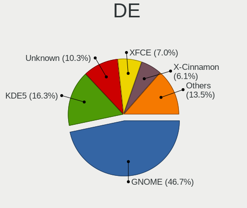

| Name             | Computers | Percent |
|------------------|-----------|---------|
| GNOME            | 535       | 46.36%  |
| KDE5             | 203       | 17.59%  |
| Unknown          | 136       | 11.79%  |
| XFCE             | 79        | 6.85%   |
| X-Cinnamon       | 67        | 5.81%   |
| KDE              | 28        | 2.43%   |
| MATE             | 19        | 1.65%   |
| Pantheon         | 12        | 1.04%   |
| KDE4             | 12        | 1.04%   |
| Unity            | 10        | 0.87%   |
| Cinnamon         | 10        | 0.87%   |
| LXQt             | 9         | 0.78%   |
| Budgie           | 8         | 0.69%   |
| Deepin           | 6         | 0.52%   |
| LXDE             | 5         | 0.43%   |
| i3               | 3         | 0.26%   |
| GNOME Classic    | 3         | 0.26%   |
| lightdm-xsession | 2         | 0.17%   |
| bspwm            | 2         | 0.17%   |
| awesome          | 2         | 0.17%   |
| ubuntu=GNOME     | 1         | 0.09%   |
| ICEWM            | 1         | 0.09%   |
| dwm              | 1         | 0.09%   |

Display Server
--------------

X11 or Wayland

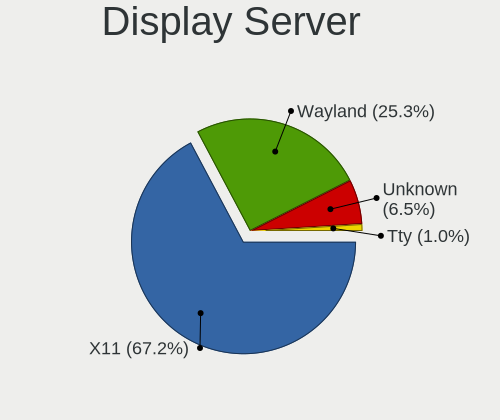

| Name    | Computers | Percent |
|---------|-----------|---------|
| X11     | 826       | 71.76%  |
| Wayland | 224       | 19.46%  |
| Unknown | 90        | 7.82%   |
| Tty     | 11        | 0.96%   |

Display Manager
---------------

SDDM, LightDM, etc.

| Name    | Computers | Percent |
|---------|-----------|---------|
| Unknown | 612       | 53.31%  |
| SDDM    | 167       | 14.55%  |
| GDM3    | 126       | 10.98%  |
| GDM     | 107       | 9.32%   |
| LightDM | 100       | 8.71%   |
| TDM     | 21        | 1.83%   |
| KDM     | 12        | 1.05%   |
| LXDM    | 2         | 0.17%   |
| SLiM    | 1         | 0.09%   |

OS Lang
-------

Language

| Lang       | Computers | Percent |
|------------|-----------|---------|
| es_CO      | 544       | 47.22%  |
| en_US      | 314       | 27.26%  |
| Unknown    | 148       | 12.85%  |
| es_ES      | 75        | 6.51%   |
| es_MX      | 30        | 2.6%    |
| C          | 10        | 0.87%   |
| en_GB      | 6         | 0.52%   |
| es_VE      | 3         | 0.26%   |
| es_PE      | 3         | 0.26%   |
| pt_BR      | 2         | 0.17%   |
| es_EC      | 2         | 0.17%   |
| pt_PT      | 1         | 0.09%   |
| pl_PL      | 1         | 0.09%   |
| it_IT      | 1         | 0.09%   |
| fr_FR      | 1         | 0.09%   |
| es_US      | 1         | 0.09%   |
| es_ES.UTF8 | 1         | 0.09%   |
| es_DO      | 1         | 0.09%   |
| es_CO.UTF8 | 1         | 0.09%   |
| es_CL      | 1         | 0.09%   |
| es_BO      | 1         | 0.09%   |
| es_AR      | 1         | 0.09%   |
| en_AU      | 1         | 0.09%   |
| en         | 1         | 0.09%   |
| de_DE      | 1         | 0.09%   |
| C.UTF8     | 1         | 0.09%   |

Boot Mode
---------

EFI or BIOS

| Mode | Computers | Percent |
|------|-----------|---------|
| EFI  | 608       | 53.43%  |
| BIOS | 530       | 46.57%  |

Filesystem
----------

Type of filesystem

| Type    | Computers | Percent |
|---------|-----------|---------|
| Ext4    | 833       | 72.37%  |
| Btrfs   | 119       | 10.34%  |
| Overlay | 93        | 8.08%   |
| Unknown | 47        | 4.08%   |
| Tmpfs   | 33        | 2.87%   |
| Xfs     | 17        | 1.48%   |
| Zfs     | 5         | 0.43%   |
| Ext2    | 2         | 0.17%   |
| F2fs    | 1         | 0.09%   |
| Ext3    | 1         | 0.09%   |

Part. scheme
------------

Scheme of partitioning

| Type    | Computers | Percent |
|---------|-----------|---------|
| Unknown | 642       | 56.61%  |
| GPT     | 369       | 32.54%  |
| MBR     | 123       | 10.85%  |

Dual Boot with Linux/BSD
------------------------

Hosting more than one Linux/BSD

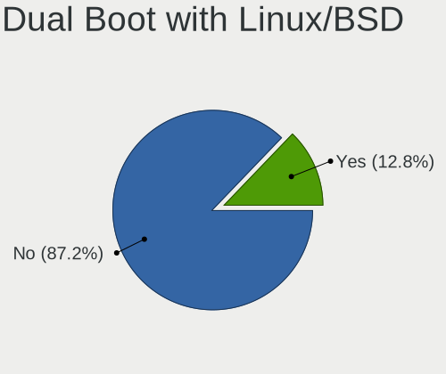

| Dual boot | Computers | Percent |
|-----------|-----------|---------|
| No        | 991       | 86.78%  |
| Yes       | 151       | 13.22%  |

Dual Boot (Win)
---------------

Hosting Linux and Windows

| Dual boot | Computers | Percent |
|-----------|-----------|---------|
| No        | 753       | 66.29%  |
| Yes       | 383       | 33.71%  |

Board
-----

Vendor
------

Motherboard manufacturer

| Name                         | Computers | Percent |
|------------------------------|-----------|---------|
| ASUSTek Computer             | 239       | 21.43%  |
| Hewlett-Packard              | 216       | 19.37%  |
| Lenovo                       | 169       | 15.16%  |
| Dell                         | 91        | 8.16%   |
| Acer                         | 68        | 6.1%    |
| Gigabyte Technology          | 56        | 5.02%   |
| MSI                          | 47        | 4.22%   |
| ASRock                       | 32        | 2.87%   |
| Toshiba                      | 29        | 2.6%    |
| Apple                        | 29        | 2.6%    |
| Intel                        | 22        | 1.97%   |
| Sony                         | 13        | 1.17%   |
| Samsung Electronics          | 13        | 1.17%   |
| HUAWEI                       | 12        | 1.08%   |
| Unknown                      | 9         | 0.81%   |
| ECS                          | 6         | 0.54%   |
| Biostar                      | 6         | 0.54%   |
| Pegatron                     | 5         | 0.45%   |
| PCsmart                      | 5         | 0.45%   |
| Notebook                     | 5         | 0.45%   |
| Compumax Computer            | 5         | 0.45%   |
| Foxconn                      | 4         | 0.36%   |
| Supermicro                   | 2         | 0.18%   |
| Raspberry Pi Foundation      | 2         | 0.18%   |
| Google                       | 2         | 0.18%   |
| Gateway                      | 2         | 0.18%   |
| VIT                          | 1         | 0.09%   |
| TYAN Computer                | 1         | 0.09%   |
| Timi                         | 1         | 0.09%   |
| PCSMART S.A.S.               | 1         | 0.09%   |
| PCChips                      | 1         | 0.09%   |
| ONDA                         | 1         | 0.09%   |
| Nvidia                       | 1         | 0.09%   |
| MPS Mayorista de Colombia SA | 1         | 0.09%   |
| Microsoft                    | 1         | 0.09%   |
| MACHINIST                    | 1         | 0.09%   |
| LG Electronics               | 1         | 0.09%   |
| Lanix                        | 1         | 0.09%   |
| Intel X79                    | 1         | 0.09%   |
| Inspur                       | 1         | 0.09%   |

Model
-----

Motherboard model

| Name                                    | Computers | Percent |
|-----------------------------------------|-----------|---------|
| HP Laptop 15-db0xxx                     | 12        | 1.08%   |
| Unknown                                 | 12        | 1.08%   |
| Gigabyte B450M DS3H                     | 7         | 0.63%   |
| Lenovo IdeaPad 320-15ABR 80XS           | 6         | 0.54%   |
| HP Pavilion Gaming Laptop 15-cx0xxx     | 6         | 0.54%   |
| HP Notebook                             | 6         | 0.54%   |
| Samsung 300E4C/300E5C/300E7C            | 5         | 0.45%   |
| MSI MS-7817                             | 5         | 0.45%   |
| HP Laptop 14-cm1xxx                     | 5         | 0.45%   |
| HP Laptop 14-bs0xx                      | 5         | 0.45%   |
| Compumax ONIX-CEL-0001                  | 5         | 0.45%   |
| ASUS VivoBook_ASUS Laptop X505ZA_X505ZA | 5         | 0.45%   |
| ASUS All Series                         | 5         | 0.45%   |
| Acer Aspire 4750                        | 5         | 0.45%   |
| MSI MS-7309                             | 4         | 0.36%   |
| Lenovo IdeaPad S340-14API 81NB          | 4         | 0.36%   |
| Lenovo IdeaPad 110-14IBR 80T6           | 4         | 0.36%   |
| Lenovo G40-45 80E1                      | 4         | 0.36%   |
| HP ProBook 440 G7                       | 4         | 0.36%   |
| HP Laptop 15-ef2xxx                     | 4         | 0.36%   |
| HP Laptop 15-da0xxx                     | 4         | 0.36%   |
| HP 245 G6                               | 4         | 0.36%   |
| HP 14                                   | 4         | 0.36%   |
| Gigabyte H81M-H                         | 4         | 0.36%   |
| Dell XPS 15 9550                        | 4         | 0.36%   |
| Dell Vostro 3400                        | 4         | 0.36%   |
| ASUS ZenBook UX431DA_UM431DA            | 4         | 0.36%   |
| ASUS X455LJ                             | 4         | 0.36%   |
| ASUS VivoBook_ASUSLaptop X512FB_X512FB  | 4         | 0.36%   |
| ASUS VivoBook_ASUSLaptop X415JA_X415JA  | 4         | 0.36%   |
| ASUS PRIME A320M-K                      | 4         | 0.36%   |
| Acer Nitro AN515-55                     | 4         | 0.36%   |
| Lenovo IdeaPad 5 14ALC05 82LM           | 3         | 0.27%   |
| Lenovo IdeaPad 3 15ALC6 82KU            | 3         | 0.27%   |
| Lenovo G40-80 80E4                      | 3         | 0.27%   |
| HUAWEI NBLB-WAX9N                       | 3         | 0.27%   |
| HUAWEI BOHB-WAX9                        | 3         | 0.27%   |
| HP ProDesk 400 G1 SFF                   | 3         | 0.27%   |
| HP ProBook 450 G1                       | 3         | 0.27%   |
| HP Pavilion x360 Convertible 14-cd0xxx  | 3         | 0.27%   |

Model Family
------------

Motherboard model prefix

| Name                   | Computers | Percent |
|------------------------|-----------|---------|
| ASUS VivoBook          | 75        | 6.73%   |
| Lenovo IdeaPad         | 65        | 5.83%   |
| Acer Aspire            | 44        | 3.95%   |
| HP Laptop              | 43        | 3.86%   |
| Lenovo ThinkPad        | 42        | 3.77%   |
| HP Pavilion            | 38        | 3.41%   |
| Dell Inspiron          | 31        | 2.78%   |
| ASUS PRIME             | 25        | 2.24%   |
| Toshiba Satellite      | 24        | 2.15%   |
| HP ProBook             | 22        | 1.97%   |
| HP Compaq              | 22        | 1.97%   |
| Dell Latitude          | 16        | 1.43%   |
| ASUS TUF               | 14        | 1.26%   |
| Dell Vostro            | 13        | 1.17%   |
| Unknown                | 12        | 1.08%   |
| HP 245                 | 11        | 0.99%   |
| ASUS ROG               | 11        | 0.99%   |
| Dell OptiPlex          | 10        | 0.9%    |
| ASUS ZenBook           | 10        | 0.9%    |
| Lenovo ThinkCentre     | 9         | 0.81%   |
| Acer Nitro             | 9         | 0.81%   |
| Gigabyte B450M         | 8         | 0.72%   |
| HP ProDesk             | 7         | 0.63%   |
| HP EliteBook           | 7         | 0.63%   |
| Dell XPS               | 7         | 0.63%   |
| HP Notebook            | 6         | 0.54%   |
| HP 240                 | 6         | 0.54%   |
| Samsung 300E4C         | 5         | 0.45%   |
| MSI MS-7817            | 5         | 0.45%   |
| Lenovo Yoga            | 5         | 0.45%   |
| HP ENVY                | 5         | 0.45%   |
| HP All-in-One          | 5         | 0.45%   |
| Compumax ONIX-CEL-0001 | 5         | 0.45%   |
| ASUS All               | 5         | 0.45%   |
| MSI MS-7309            | 4         | 0.36%   |
| Lenovo ThinkBook       | 4         | 0.36%   |
| Lenovo G40-45          | 4         | 0.36%   |
| HP ProLiant            | 4         | 0.36%   |
| HP Presario            | 4         | 0.36%   |
| HP 14                  | 4         | 0.36%   |

MFG Year
--------

Motherboard manufacture year

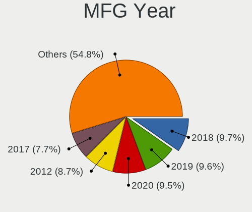

| Year    | Computers | Percent |
|---------|-----------|---------|
| 2018    | 112       | 10.04%  |
| 2019    | 109       | 9.78%   |
| 2020    | 100       | 8.97%   |
| 2017    | 94        | 8.43%   |
| 2012    | 87        | 7.8%    |
| 2013    | 76        | 6.82%   |
| 2021    | 75        | 6.73%   |
| 2010    | 75        | 6.73%   |
| 2014    | 65        | 5.83%   |
| 2011    | 64        | 5.74%   |
| 2015    | 63        | 5.65%   |
| 2009    | 45        | 4.04%   |
| 2016    | 41        | 3.68%   |
| 2008    | 36        | 3.23%   |
| 2007    | 23        | 2.06%   |
| 2022    | 20        | 1.79%   |
| 2006    | 14        | 1.26%   |
| 2023    | 10        | 0.9%    |
| Unknown | 3         | 0.27%   |
| 2005    | 2         | 0.18%   |
| 2003    | 1         | 0.09%   |

Form Factor
-----------

Physical design of the computer

| Name           | Computers | Percent |
|----------------|-----------|---------|
| Notebook       | 742       | 66.55%  |
| Desktop        | 308       | 27.62%  |
| All in one     | 30        | 2.69%   |
| Convertible    | 15        | 1.35%   |
| Tablet         | 10        | 0.9%    |
| Mini pc        | 4         | 0.36%   |
| System on chip | 3         | 0.27%   |
| Server         | 3         | 0.27%   |

Secure Boot
-----------

Enabled or disabled

| State    | Computers | Percent |
|----------|-----------|---------|
| Disabled | 1009      | 89.93%  |
| Enabled  | 113       | 10.07%  |

Coreboot
--------

Have coreboot on board

| Used | Computers | Percent |
|------|-----------|---------|
| No   | 1113      | 99.82%  |
| Yes  | 2         | 0.18%   |

RAM Size
--------

Total RAM memory

| Size in GB  | Computers | Percent |
|-------------|-----------|---------|
| 4.01-8.0    | 334       | 29.64%  |
| 3.01-4.0    | 279       | 24.76%  |
| 8.01-16.0   | 220       | 19.52%  |
| 16.01-24.0  | 131       | 11.62%  |
| 1.01-2.0    | 53        | 4.7%    |
| 32.01-64.0  | 52        | 4.61%   |
| 2.01-3.0    | 27        | 2.4%    |
| 24.01-32.0  | 15        | 1.33%   |
| 64.01-256.0 | 8         | 0.71%   |
| 0.51-1.0    | 8         | 0.71%   |

RAM Used
--------

Used RAM memory

| Used GB    | Computers | Percent |
|------------|-----------|---------|
| 1.01-2.0   | 414       | 33.58%  |
| 2.01-3.0   | 359       | 29.12%  |
| 3.01-4.0   | 181       | 14.68%  |
| 4.01-8.0   | 163       | 13.22%  |
| 0.51-1.0   | 67        | 5.43%   |
| 8.01-16.0  | 42        | 3.41%   |
| 0.01-0.5   | 4         | 0.32%   |
| 16.01-24.0 | 2         | 0.16%   |
| 24.01-32.0 | 1         | 0.08%   |

Total Drives
------------

Number of drives on board

| Drives | Computers | Percent |
|--------|-----------|---------|
| 1      | 807       | 70.85%  |
| 2      | 243       | 21.33%  |
| 3      | 59        | 5.18%   |
| 4      | 15        | 1.32%   |
| 5      | 8         | 0.7%    |
| 6      | 3         | 0.26%   |
| 8      | 2         | 0.18%   |
| 7      | 1         | 0.09%   |
| 0      | 1         | 0.09%   |

Has CD-ROM
----------

Has CD-ROM on board

| Presented | Computers | Percent |
|-----------|-----------|---------|
| No        | 736       | 65.66%  |
| Yes       | 385       | 34.34%  |

Has Ethernet
------------

Has Ethernet on board

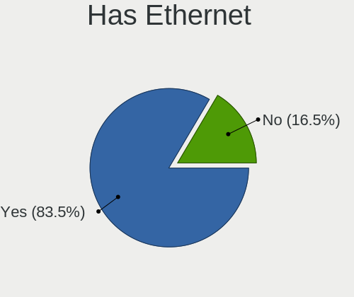

| Presented | Computers | Percent |
|-----------|-----------|---------|
| Yes       | 939       | 83.99%  |
| No        | 179       | 16.01%  |

Has WiFi
--------

Has WiFi module

| Presented | Computers | Percent |
|-----------|-----------|---------|
| Yes       | 919       | 82.05%  |
| No        | 201       | 17.95%  |

Has Bluetooth
-------------

Has Bluetooth module

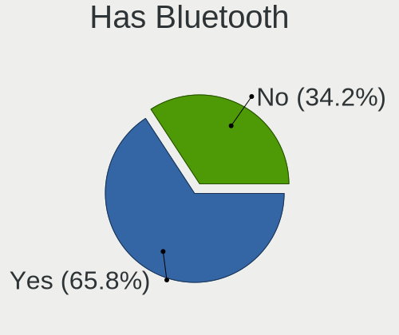

| Presented | Computers | Percent |
|-----------|-----------|---------|
| Yes       | 719       | 64.08%  |
| No        | 403       | 35.92%  |

Location
--------

Country
-------

Geographic location (country)

| Country  | Computers | Percent |
|----------|-----------|---------|
| Colombia | 1115      | 100%    |

City
----

Geographic location (city)

| City             | Computers | Percent |
|------------------|-----------|---------|
| Bogot          | 449       | 38.34%  |
| Medelln        | 170       | 14.52%  |
| Santiago de Cali | 100       | 8.54%   |
| Barranquilla     | 55        | 4.7%    |
| Bucaramanga      | 48        | 4.1%    |
| Pereira          | 32        | 2.73%   |
| Cartagena        | 23        | 1.96%   |
| Manizales        | 17        | 1.45%   |
| Ccuta          | 15        | 1.28%   |
| Villavicencio    | 14        | 1.2%    |
| Ibague           | 14        | 1.2%    |
| Popayn         | 12        | 1.02%   |
| Pasto            | 12        | 1.02%   |
| Envigado         | 11        | 0.94%   |
| Tunja            | 10        | 0.85%   |
| Santa Marta      | 10        | 0.85%   |
| Armenia          | 10        | 0.85%   |
| Fusagasuga       | 9         | 0.77%   |
| Valledupar       | 8         | 0.68%   |
| Chia             | 8         | 0.68%   |
| Neiva            | 7         | 0.6%    |
| Montera        | 7         | 0.6%    |
| Bello            | 7         | 0.6%    |
| Yopal            | 4         | 0.34%   |
| Rionegro         | 4         | 0.34%   |
| Palmira          | 4         | 0.34%   |
| Madrid           | 4         | 0.34%   |
| Soacha           | 3         | 0.26%   |
| Sincelejo        | 3         | 0.26%   |
| Los Patios       | 3         | 0.26%   |
| Lorica           | 3         | 0.26%   |
| Jamundi          | 3         | 0.26%   |
| Ipiales          | 3         | 0.26%   |
| Floridablanca    | 3         | 0.26%   |
| Zipaquir       | 2         | 0.17%   |
| Tulu           | 2         | 0.17%   |
| Soledad          | 2         | 0.17%   |
| Sogamoso         | 2         | 0.17%   |
| Sabaneta         | 2         | 0.17%   |
| Puerto Boyac   | 2         | 0.17%   |

Drives
------

Drive Vendor
------------

Hard drive vendors

| Vendor                      | Computers | Drives | Percent |
|-----------------------------|-----------|--------|---------|
| Seagate                     | 247       | 329    | 16.48%  |
| WDC                         | 216       | 280    | 14.41%  |
| Toshiba                     | 190       | 231    | 12.68%  |
| Samsung Electronics         | 107       | 139    | 7.14%   |
| Kingston                    | 103       | 148    | 6.87%   |
| Hitachi                     | 75        | 91     | 5%      |
| SanDisk                     | 71        | 91     | 4.74%   |
| Crucial                     | 62        | 75     | 4.14%   |
| A-DATA Technology           | 55        | 67     | 3.67%   |
| Unknown                     | 45        | 52     | 3%      |
| HGST                        | 43        | 53     | 2.87%   |
| Intel                       | 31        | 35     | 2.07%   |
| SK hynix                    | 27        | 33     | 1.8%    |
| Micron Technology           | 19        | 20     | 1.27%   |
| Maxtor                      | 18        | 19     | 1.2%    |
| Apple                       | 16        | 24     | 1.07%   |
| Realtek Semiconductor       | 14        | 15     | 0.93%   |
| China                       | 14        | 15     | 0.93%   |
| Phison                      | 9         | 15     | 0.6%    |
| JMicron Technology          | 9         | 9      | 0.6%    |
| Silicon Motion              | 8         | 12     | 0.53%   |
| Lexar                       | 8         | 8      | 0.53%   |
| Team                        | 7         | 7      | 0.47%   |
| KIOXIA                      | 7         | 8      | 0.47%   |
| Gigabyte Technology         | 7         | 8      | 0.47%   |
| Fujitsu                     | 7         | 7      | 0.47%   |
| XPG                         | 5         | 6      | 0.33%   |
| Hewlett-Packard             | 5         | 6      | 0.33%   |
| XrayDisk                    | 4         | 4      | 0.27%   |
| PNY                         | 4         | 7      | 0.27%   |
| Micron/Crucial Technology   | 4         | 7      | 0.27%   |
| Kingston Technology Company | 4         | 7      | 0.27%   |
| KingSpec                    | 4         | 4      | 0.27%   |
| ADATA Technology            | 4         | 4      | 0.27%   |
| Transcend                   | 3         | 4      | 0.2%    |
| LITEONIT                    | 3         | 3      | 0.2%    |
| KingDian                    | 3         | 3      | 0.2%    |
| Corsair                     | 3         | 6      | 0.2%    |
| Union Memory                | 2         | 2      | 0.13%   |
| SPCC                        | 2         | 6      | 0.13%   |

Drive Model
-----------

Hard drive models

| Model                                | Computers | Percent |
|--------------------------------------|-----------|---------|
| Seagate ST1000LM035-1RK172 1TB       | 46        | 2.94%   |
| Toshiba MQ04ABF100 1TB               | 40        | 2.56%   |
| Toshiba DT01ACA100 1TB               | 31        | 1.98%   |
| Toshiba MQ01ABF050 500GB             | 27        | 1.73%   |
| Kingston SA400S37240G 240GB SSD      | 26        | 1.66%   |
| Seagate ST1000LM024 HN-M101MBB 1TB   | 23        | 1.47%   |
| Toshiba MQ01ABD100 1TB               | 22        | 1.41%   |
| Crucial CT240BX500SSD1 240GB         | 18        | 1.15%   |
| Seagate ST500LT012-1DG142 500GB      | 17        | 1.09%   |
| Kingston SA400S37480G 480GB SSD      | 14        | 0.9%    |
| Kingston SA400S37120G 120GB SSD      | 14        | 0.9%    |
| HGST HTS541010A9E680 1TB             | 11        | 0.7%    |
| Crucial CT1000BX500SSD1 1TB          | 11        | 0.7%    |
| Unknown SD/MMC/MS PRO 256GB          | 10        | 0.64%   |
| Unknown MMC Card  64GB               | 10        | 0.64%   |
| A-DATA SU650 120GB SSD               | 10        | 0.64%   |
| WDC WD10SPZX-60Z10T0 1TB             | 9         | 0.58%   |
| Toshiba DT01ACA200 2TB               | 9         | 0.58%   |
| Toshiba DT01ACA050 500GB             | 9         | 0.58%   |
| Seagate ST500LT012-9WS142 500GB      | 9         | 0.58%   |
| Seagate ST2000LM007-1R8174 2TB       | 9         | 0.58%   |
| Seagate ST1000DM010-2EP102 1TB       | 9         | 0.58%   |
| Kingston SV300S37A120G 120GB SSD     | 9         | 0.58%   |
| Intel SSDPEKNU512GZ 512GB            | 9         | 0.58%   |
| HGST HTS541010B7E610 1TB             | 9         | 0.58%   |
| Toshiba HDWD110 1TB                  | 8         | 0.51%   |
| Sandisk WD Blue SN550 NVMe SSD 512GB | 8         | 0.51%   |
| SanDisk NVMe SSD Drive 512GB         | 8         | 0.51%   |
| SanDisk NVMe SSD Drive 256GB         | 8         | 0.51%   |
| HGST HTS545050A7E680 500GB           | 8         | 0.51%   |
| Crucial CT480BX500SSD1 480GB         | 8         | 0.51%   |
| A-DATA SU630 240GB SSD               | 8         | 0.51%   |
| WDC WD10SPZX-24Z10 1TB               | 7         | 0.45%   |
| WDC WD10EZEX-08WN4A0 1TB             | 7         | 0.45%   |
| Unknown MMC Card  32GB               | 7         | 0.45%   |
| Seagate ST500DM002-1BD142 500GB      | 7         | 0.45%   |
| Seagate ST1000DM003-1SB102 1TB       | 7         | 0.45%   |
| JMicron Generic 8GB                  | 7         | 0.45%   |
| Hitachi HDS721050CLA362 500GB        | 7         | 0.45%   |
| Crucial CT500MX500SSD1 500GB         | 7         | 0.45%   |

HDD Vendor
----------

Hard disk drive vendors

| Vendor              | Computers | Drives | Percent |
|---------------------|-----------|--------|---------|
| Seagate             | 245       | 324    | 30.43%  |
| WDC                 | 184       | 233    | 22.86%  |
| Toshiba             | 184       | 223    | 22.86%  |
| Hitachi             | 75        | 91     | 9.32%   |
| HGST                | 43        | 53     | 5.34%   |
| Samsung Electronics | 23        | 28     | 2.86%   |
| Maxtor              | 18        | 19     | 2.24%   |
| Unknown             | 10        | 11     | 1.24%   |
| JMicron Technology  | 7         | 7      | 0.87%   |
| Fujitsu             | 7         | 7      | 0.87%   |
| Apple               | 6         | 9      | 0.75%   |
| Phison              | 1         | 2      | 0.12%   |
| Inateck             | 1         | 1      | 0.12%   |
| ExcelStor           | 1         | 1      | 0.12%   |

SSD Vendor
----------

Solid state drive vendors

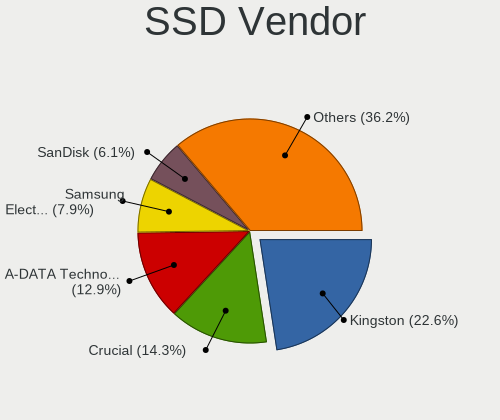

| Vendor              | Computers | Drives | Percent |
|---------------------|-----------|--------|---------|
| Kingston            | 87        | 124    | 23.84%  |
| Crucial             | 53        | 66     | 14.52%  |
| A-DATA Technology   | 49        | 61     | 13.42%  |
| Samsung Electronics | 35        | 40     | 9.59%   |
| SanDisk             | 24        | 28     | 6.58%   |
| WDC                 | 17        | 27     | 4.66%   |
| China               | 13        | 14     | 3.56%   |
| Lexar               | 8         | 8      | 2.19%   |
| Team                | 6         | 6      | 1.64%   |
| Gigabyte Technology | 6         | 7      | 1.64%   |
| Apple               | 6         | 6      | 1.64%   |
| Toshiba             | 5         | 6      | 1.37%   |
| SK hynix            | 5         | 9      | 1.37%   |
| Intel               | 5         | 6      | 1.37%   |
| Micron Technology   | 4         | 4      | 1.1%    |
| KingSpec            | 4         | 4      | 1.1%    |
| Transcend           | 3         | 4      | 0.82%   |
| PNY                 | 3         | 6      | 0.82%   |
| LITEONIT            | 3         | 3      | 0.82%   |
| KingDian            | 3         | 3      | 0.82%   |
| XrayDisk            | 2         | 2      | 0.55%   |
| SPCC                | 2         | 6      | 0.55%   |
| Seagate             | 2         | 3      | 0.55%   |
| LITEON              | 2         | 3      | 0.55%   |
| Hewlett-Packard     | 2         | 2      | 0.55%   |
| DTECHCO             | 2         | 2      | 0.55%   |
| Corsair             | 2         | 5      | 0.55%   |
| Zheino              | 1         | 1      | 0.27%   |
| XSTAR               | 1         | 1      | 0.27%   |
| USB3.0              | 1         | 1      | 0.27%   |
| Unknown             | 1         | 1      | 0.27%   |
| SATAFIRM            | 1         | 1      | 0.27%   |
| Patriot             | 1         | 1      | 0.27%   |
| Netac               | 1         | 1      | 0.27%   |
| KingFast            | 1         | 1      | 0.27%   |
| HS-SSD-C100         | 1         | 1      | 0.27%   |
| Hised               | 1         | 2      | 0.27%   |
| Argon               | 1         | 1      | 0.27%   |
| Unknown             | 1         | 1      | 0.27%   |

Drive Kind
----------

HDD or SSD

| Kind    | Computers | Drives | Percent |
|---------|-----------|--------|---------|
| HDD     | 696       | 1009   | 51.33%  |
| SSD     | 342       | 468    | 25.22%  |
| NVMe    | 274       | 368    | 20.21%  |
| MMC     | 33        | 40     | 2.43%   |
| Unknown | 11        | 12     | 0.81%   |

Drive Connector
---------------

SATA, SAS, NVMe, etc.

| Type | Computers | Drives | Percent |
|------|-----------|--------|---------|
| SATA | 898       | 1447   | 72.07%  |
| NVMe | 274       | 366    | 21.99%  |
| SAS  | 41        | 44     | 3.29%   |
| MMC  | 33        | 40     | 2.65%   |

Drive Size
----------

Size of hard drive

| Size in TB | Computers | Drives | Percent |
|------------|-----------|--------|---------|
| 0.01-0.5   | 602       | 856    | 57.01%  |
| 0.51-1.0   | 395       | 525    | 37.41%  |
| 1.01-2.0   | 42        | 63     | 3.98%   |
| 4.01-10.0  | 7         | 11     | 0.66%   |
| 2.01-3.0   | 5         | 7      | 0.47%   |
| 3.01-4.0   | 4         | 13     | 0.38%   |
| 0          | 1         | 2      | 0.09%   |

Space Total
-----------

Amount of disk space available on the file system

| Size in GB     | Computers | Percent |
|----------------|-----------|---------|
| 251-500        | 297       | 25.04%  |
| 101-250        | 294       | 24.79%  |
| 501-1000       | 226       | 19.06%  |
| 1-20           | 97        | 8.18%   |
| 51-100         | 87        | 7.34%   |
| 1001-2000      | 77        | 6.49%   |
| 21-50          | 48        | 4.05%   |
| More than 3000 | 23        | 1.94%   |
| 2001-3000      | 20        | 1.69%   |
| Unknown        | 17        | 1.43%   |

Space Used
----------

Amount of used disk space

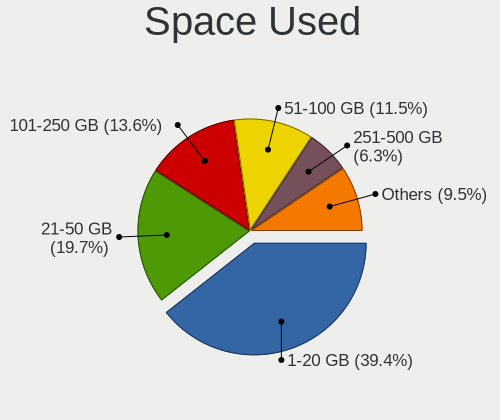

| Used GB        | Computers | Percent |
|----------------|-----------|---------|
| 1-20           | 489       | 39.63%  |
| 21-50          | 249       | 20.18%  |
| 101-250        | 168       | 13.61%  |
| 51-100         | 145       | 11.75%  |
| 251-500        | 79        | 6.4%    |
| 501-1000       | 59        | 4.78%   |
| 1001-2000      | 17        | 1.38%   |
| Unknown        | 17        | 1.38%   |
| More than 3000 | 8         | 0.65%   |
| 2001-3000      | 3         | 0.24%   |

Malfunc. Drives
---------------

Drive models with a malfunction

| Model                               | Computers | Drives | Percent |
|-------------------------------------|-----------|--------|---------|
| Seagate ST1000LM024 HN-M101MBB 1TB  | 5         | 5      | 3.27%   |
| Seagate ST9500325AS 500GB           | 3         | 3      | 1.96%   |
| Seagate ST500LT012-1DG142 500GB     | 3         | 3      | 1.96%   |
| Seagate ST500DM002-1BD142 500GB     | 3         | 3      | 1.96%   |
| A-DATA Technology SU630 480GB SSD   | 3         | 4      | 1.96%   |
| A-DATA Technology SU630 240GB SSD   | 3         | 3      | 1.96%   |
| Toshiba MQ01ABF050 500GB            | 2         | 2      | 1.31%   |
| Toshiba DT01ACA050 500GB            | 2         | 2      | 1.31%   |
| Seagate ST9500420AS 500GB           | 2         | 2      | 1.31%   |
| Seagate ST9320423AS 320GB           | 2         | 2      | 1.31%   |
| Seagate ST750LM022 HN-M750MBB 752GB | 2         | 2      | 1.31%   |
| Seagate ST500LT012-9WS142 500GB     | 2         | 2      | 1.31%   |
| Seagate ST1000DM003-1SB102 1TB      | 2         | 2      | 1.31%   |
| Hitachi HTS545050A7E380 500GB       | 2         | 2      | 1.31%   |
| Hitachi HDS721050CLA362 500GB       | 2         | 2      | 1.31%   |
| XrayDisk SSD 256GB                  | 1         | 1      | 0.65%   |
| WDC WDS100T2G0A-00JH30 1TB SSD      | 1         | 2      | 0.65%   |
| WDC WD800JD-75MSA3 80GB             | 1         | 1      | 0.65%   |
| WDC WD800JD-60LSA0 80GB             | 1         | 1      | 0.65%   |
| WDC WD800BD-22MRA1 80GB             | 1         | 1      | 0.65%   |
| WDC WD6400AAKS-65Z7B0 640GB         | 1         | 1      | 0.65%   |
| WDC WD5000LPLX-66ZNTT1 500GB        | 1         | 1      | 0.65%   |
| WDC WD5000BPVT-22HXZT3 500GB        | 1         | 1      | 0.65%   |
| WDC WD5000BEVT-22A0RT0 500GB        | 1         | 1      | 0.65%   |
| WDC WD5000AAKX-60U6AA0 500GB        | 1         | 1      | 0.65%   |
| WDC WD5000AAKS-08V0A0 500GB         | 1         | 1      | 0.65%   |
| WDC WD3200BPVT-24JJ5T0 320GB        | 1         | 1      | 0.65%   |
| WDC WD3200BEVT-22ZCT0 320GB         | 1         | 1      | 0.65%   |
| WDC WD3200BEKT-60F3T1 320GB         | 1         | 1      | 0.65%   |
| WDC WD3200AVJS-63B6A0 320GB         | 1         | 1      | 0.65%   |
| WDC WD3200AAJS-65M0A0 320GB         | 1         | 1      | 0.65%   |
| WDC WD3200AAJS-60Z0A0 320GB         | 1         | 1      | 0.65%   |
| WDC WD3200AAJS-56M0A0 320GB         | 1         | 1      | 0.65%   |
| WDC WD3200AAJS-56B4A0 320GB         | 1         | 1      | 0.65%   |
| WDC WD20PURZ-85GU6Y0 2TB            | 1         | 1      | 0.65%   |
| WDC WD20PURZ-85AKKY0 2TB            | 1         | 1      | 0.65%   |
| WDC WD20EZRX-00DC0B0 2TB            | 1         | 1      | 0.65%   |
| WDC WD2003FYPS-27W9B0 2TB           | 1         | 1      | 0.65%   |
| WDC WD1600BEVT-22A23T0 160GB        | 1         | 1      | 0.65%   |
| WDC WD1600BEKT-60V5T1 160GB         | 1         | 1      | 0.65%   |

Malfunc. Drive Vendor
---------------------

Vendors of faulty drives

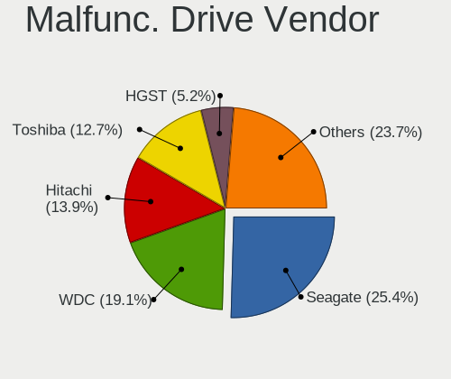

| Vendor                | Computers | Drives | Percent |
|-----------------------|-----------|--------|---------|
| Seagate               | 38        | 46     | 26.57%  |
| WDC                   | 27        | 34     | 18.88%  |
| Hitachi               | 21        | 27     | 14.69%  |
| Toshiba               | 16        | 17     | 11.19%  |
| Samsung Electronics   | 7         | 7      | 4.9%    |
| A-DATA Technology     | 7         | 8      | 4.9%    |
| HGST                  | 6         | 6      | 4.2%    |
| Maxtor                | 5         | 5      | 3.5%    |
| Crucial               | 3         | 3      | 2.1%    |
| SK hynix              | 2         | 2      | 1.4%    |
| Intel                 | 2         | 3      | 1.4%    |
| XrayDisk              | 1         | 1      | 0.7%    |
| SanDisk               | 1         | 1      | 0.7%    |
| Realtek Semiconductor | 1         | 1      | 0.7%    |
| Micron Technology     | 1         | 1      | 0.7%    |
| Kingston              | 1         | 1      | 0.7%    |
| Inateck               | 1         | 1      | 0.7%    |
| Fujitsu               | 1         | 1      | 0.7%    |
| DTECHCO               | 1         | 1      | 0.7%    |
| Apple                 | 1         | 1      | 0.7%    |

Malfunc. HDD Vendor
-------------------

Vendors of faulty HDD drives

| Vendor              | Computers | Drives | Percent |
|---------------------|-----------|--------|---------|
| Seagate             | 38        | 46     | 31.93%  |
| WDC                 | 26        | 32     | 21.85%  |
| Hitachi             | 21        | 27     | 17.65%  |
| Toshiba             | 16        | 17     | 13.45%  |
| HGST                | 6         | 6      | 5.04%   |
| Maxtor              | 5         | 5      | 4.2%    |
| Samsung Electronics | 4         | 4      | 3.36%   |
| Inateck             | 1         | 1      | 0.84%   |
| Fujitsu             | 1         | 1      | 0.84%   |
| Apple               | 1         | 1      | 0.84%   |

Malfunc. Drive Kind
-------------------

Kinds of faulty drives

| Kind | Computers | Drives | Percent |
|------|-----------|--------|---------|
| HDD  | 110       | 140    | 82.09%  |
| SSD  | 19        | 22     | 14.18%  |
| NVMe | 5         | 5      | 3.73%   |

Failed Drives
-------------

Failed drive models

| Model                     | Computers | Drives | Percent |
|---------------------------|-----------|--------|---------|
| Maxtor STM380211AS 80GB   | 1         | 1      | 50%     |
| Crucial CT500P2SSD8 500GB | 1         | 1      | 50%     |

Failed Drive Vendor
-------------------

Failed drive vendors

| Vendor  | Computers | Drives | Percent |
|---------|-----------|--------|---------|
| Maxtor  | 1         | 1      | 50%     |
| Crucial | 1         | 1      | 50%     |

Drive Status
------------

Number of failed and malfunc. drives

| Status   | Computers | Drives | Percent |
|----------|-----------|--------|---------|
| Detected | 723       | 1223   | 60.3%   |
| Works    | 342       | 505    | 28.52%  |
| Malfunc  | 132       | 167    | 11.01%  |
| Failed   | 2         | 2      | 0.17%   |

Storage controller
------------------

Storage Vendor
--------------

Storage controller vendors

| Vendor                               | Computers | Percent |
|--------------------------------------|-----------|---------|
| Intel                                | 722       | 54.57%  |
| AMD                                  | 283       | 21.39%  |
| SanDisk                              | 60        | 4.54%   |
| Samsung Electronics                  | 54        | 4.08%   |
| Nvidia                               | 28        | 2.12%   |
| SK hynix                             | 22        | 1.66%   |
| Kingston Technology Company          | 21        | 1.59%   |
| Realtek Semiconductor                | 20        | 1.51%   |
| Micron Technology                    | 17        | 1.28%   |
| Phison Electronics                   | 13        | 0.98%   |
| Silicon Motion                       | 11        | 0.83%   |
| Micron/Crucial Technology            | 10        | 0.76%   |
| ASMedia Technology                   | 9         | 0.68%   |
| ADATA Technology                     | 9         | 0.68%   |
| VIA Technologies                     | 7         | 0.53%   |
| KIOXIA                               | 7         | 0.53%   |
| Union Memory (Shenzhen)              | 5         | 0.38%   |
| Marvell Technology Group             | 4         | 0.3%    |
| MAXIO Technology (Hangzhou)          | 3         | 0.23%   |
| JMicron Technology                   | 3         | 0.23%   |
| Apple                                | 3         | 0.23%   |
| Toshiba America Info Systems         | 2         | 0.15%   |
| Seagate Technology                   | 2         | 0.15%   |
| INNOGRIT                             | 2         | 0.15%   |
| Biwin Storage Technology             | 2         | 0.15%   |
| Solid State Storage Technology       | 1         | 0.08%   |
| Ramaxel Technology(Shenzhen) Limited | 1         | 0.08%   |
| LSI Logic / Symbios Logic            | 1         | 0.08%   |
| Hewlett-Packard                      | 1         | 0.08%   |

Storage Model
-------------

Storage controller models

| Model                                                                                   | Computers | Percent |
|-----------------------------------------------------------------------------------------|-----------|---------|
| AMD FCH SATA Controller [AHCI mode]                                                     | 215       | 14.09%  |
| Intel Sunrise Point-LP SATA Controller [AHCI mode]                                      | 74        | 4.85%   |
| Intel 7 Series Chipset Family 6-port SATA Controller [AHCI mode]                        | 60        | 3.93%   |
| Intel 82801 Mobile SATA Controller [RAID mode]                                          | 53        | 3.47%   |
| Intel 8 Series/C220 Series Chipset Family 6-port SATA Controller 1 [AHCI mode]          | 47        | 3.08%   |
| Intel 6 Series/C200 Series Chipset Family 6 port Mobile SATA AHCI Controller            | 37        | 2.42%   |
| Intel NM10/ICH7 Family SATA Controller [IDE mode]                                       | 34        | 2.23%   |
| Intel 82801G (ICH7 Family) IDE Controller                                               | 31        | 2.03%   |
| Intel 8 Series SATA Controller 1 [AHCI mode]                                            | 27        | 1.77%   |
| Intel 6 Series/C200 Series Chipset Family 6 port Desktop SATA AHCI Controller           | 25        | 1.64%   |
| AMD 400 Series Chipset SATA Controller                                                  | 23        | 1.51%   |
| AMD SB7x0/SB8x0/SB9x0 SATA Controller [AHCI mode]                                       | 22        | 1.44%   |
| Intel Volume Management Device NVMe RAID Controller                                     | 21        | 1.38%   |
| Intel Celeron/Pentium Silver Processor SATA Controller                                  | 21        | 1.38%   |
| SanDisk Ultra 3D / WD Blue SN550 NVMe SSD                                               | 20        | 1.31%   |
| Intel Wildcat Point-LP SATA Controller [AHCI Mode]                                      | 20        | 1.31%   |
| Intel 5 Series/3400 Series Chipset 4 port SATA AHCI Controller                          | 20        | 1.31%   |
| Samsung NVMe SSD Controller SM981/PM981/PM983                                           | 19        | 1.25%   |
| AMD SB7x0/SB8x0/SB9x0 IDE Controller                                                    | 19        | 1.25%   |
| AMD 500 Series Chipset SATA Controller                                                  | 19        | 1.25%   |
| Intel 5 Series/3400 Series Chipset 6 port SATA AHCI Controller                          | 18        | 1.18%   |
| Samsung NVMe SSD Controller 980 (DRAM-less)                                             | 17        | 1.11%   |
| Intel Comet Lake SATA AHCI Controller                                                   | 17        | 1.11%   |
| Intel 82801IBM/IEM (ICH9M/ICH9M-E) 4 port SATA Controller [AHCI mode]                   | 17        | 1.11%   |
| Intel 6 Series/C200 Series Chipset Family Desktop SATA Controller (IDE mode, ports 4-5) | 15        | 0.98%   |
| Intel 6 Series/C200 Series Chipset Family Desktop SATA Controller (IDE mode, ports 0-3) | 15        | 0.98%   |
| Intel Q170/Q150/B150/H170/H110/Z170/CM236 Chipset SATA Controller [AHCI Mode]           | 14        | 0.92%   |
| Intel Atom Processor E3800 Series SATA AHCI Controller                                  | 14        | 0.92%   |
| Intel 82801HM/HEM (ICH8M/ICH8M-E) IDE Controller                                        | 14        | 0.92%   |
| SK hynix Gold P31/BC711/PC711 NVMe Solid State Drive                                    | 13        | 0.85%   |
| Intel SSD 670p Series [Keystone Harbor]                                                 | 13        | 0.85%   |
| Intel Cannon Lake Mobile PCH SATA AHCI Controller                                       | 13        | 0.85%   |
| Intel Atom/Celeron/Pentium Processor x5-E8000/J3xxx/N3xxx Series SATA Controller        | 13        | 0.85%   |
| SanDisk Extreme Pro / WD Black SN750 / PC SN730 / Red SN700 NVMe SSD                    | 12        | 0.79%   |
| Intel Cannon Point-LP SATA Controller [AHCI Mode]                                       | 12        | 0.79%   |
| Intel 82801HM/HEM (ICH8M/ICH8M-E) SATA Controller [AHCI mode]                           | 12        | 0.79%   |
| Intel 400 Series Chipset Family SATA AHCI Controller                                    | 12        | 0.79%   |
| AMD SB7x0/SB8x0/SB9x0 SATA Controller [IDE mode]                                        | 12        | 0.79%   |
| Realtek RTS5763DL NVMe SSD Controller (DRAM-less)                                       | 11        | 0.72%   |
| Nvidia MCP61 SATA Controller                                                            | 11        | 0.72%   |

Storage Kind
------------

Kind of storage controller (IDE, SATA, NVMe, SAS, ...)

| Kind | Computers | Percent |
|------|-----------|---------|
| SATA | 848       | 61.99%  |
| NVMe | 273       | 19.96%  |
| IDE  | 151       | 11.04%  |
| RAID | 94        | 6.87%   |
| SAS  | 2         | 0.15%   |

Processor
---------

CPU Vendor
----------

Processor vendors

| Vendor | Computers | Percent |
|--------|-----------|---------|
| Intel  | 770       | 69.06%  |
| AMD    | 342       | 30.67%  |
| ARM    | 3         | 0.27%   |

CPU Model
---------

Processor models

| Model                                           | Computers | Percent |
|-------------------------------------------------|-----------|---------|
| AMD Ryzen 5 3500U with Radeon Vega Mobile Gfx   | 29        | 2.6%    |
| Intel Core i5-8250U CPU @ 1.60GHz               | 16        | 1.43%   |
| Intel Core i5-7200U CPU @ 2.50GHz               | 14        | 1.25%   |
| AMD A12-9720P RADEON R7, 12 COMPUTE CORES 4C+8G | 13        | 1.16%   |
| Intel Core i5-8300H CPU @ 2.30GHz               | 12        | 1.07%   |
| Intel Celeron CPU N3060 @ 1.60GHz               | 12        | 1.07%   |
| Intel Core i7-8550U CPU @ 1.80GHz               | 11        | 0.98%   |
| Intel Core i5-8265U CPU @ 1.60GHz               | 11        | 0.98%   |
| AMD Ryzen 5 5500U with Radeon Graphics          | 11        | 0.98%   |
| AMD A9-9425 RADEON R5, 5 COMPUTE CORES 2C+3G    | 11        | 0.98%   |
| Intel Core i5-6200U CPU @ 2.30GHz               | 10        | 0.9%    |
| Intel Celeron N4020 CPU @ 1.10GHz               | 10        | 0.9%    |
| Intel Celeron N4000 CPU @ 1.10GHz               | 10        | 0.9%    |
| Intel 11th Gen Core i7-1165G7 @ 2.80GHz         | 9         | 0.81%   |
| Intel Core i7-8565U CPU @ 1.80GHz               | 8         | 0.72%   |
| Intel Core i7-10510U CPU @ 1.80GHz              | 8         | 0.72%   |
| Intel Core i5-3210M CPU @ 2.50GHz               | 8         | 0.72%   |
| Intel Core i5-2400 CPU @ 3.10GHz                | 8         | 0.72%   |
| Intel Core i3-1005G1 CPU @ 1.20GHz              | 8         | 0.72%   |
| AMD Ryzen 7 5700U with Radeon Graphics          | 8         | 0.72%   |
| AMD Ryzen 5 3600 6-Core Processor               | 8         | 0.72%   |
| AMD Ryzen 5 2500U with Radeon Vega Mobile Gfx   | 8         | 0.72%   |
| Intel Core i7-6700HQ CPU @ 2.60GHz              | 7         | 0.63%   |
| Intel Core i7-4510U CPU @ 2.00GHz               | 7         | 0.63%   |
| Intel Core i5-4210U CPU @ 1.70GHz               | 7         | 0.63%   |
| Intel Core i5-1035G1 CPU @ 1.00GHz              | 7         | 0.63%   |
| Intel Core i5-10210U CPU @ 1.60GHz              | 7         | 0.63%   |
| Intel Core i3-6006U CPU @ 2.00GHz               | 7         | 0.63%   |
| Intel Core 2 Duo CPU E7500 @ 2.93GHz            | 7         | 0.63%   |
| Intel Atom x5-Z8350 CPU @ 1.44GHz               | 7         | 0.63%   |
| AMD Ryzen 5 3400G with Radeon Vega Graphics     | 7         | 0.63%   |
| AMD Ryzen 3 3200U with Radeon Vega Mobile Gfx   | 7         | 0.63%   |
| Intel Core i7-7700 CPU @ 3.60GHz                | 6         | 0.54%   |
| Intel Core i5-3337U CPU @ 1.80GHz               | 6         | 0.54%   |
| Intel Core i5-10400 CPU @ 2.90GHz               | 6         | 0.54%   |
| Intel Core i3-8130U CPU @ 2.20GHz               | 6         | 0.54%   |
| Intel Core i3-5005U CPU @ 2.00GHz               | 6         | 0.54%   |
| Intel Core i3-10110U CPU @ 2.10GHz              | 6         | 0.54%   |
| Intel 11th Gen Core i5-1135G7 @ 2.40GHz         | 6         | 0.54%   |
| AMD Ryzen 7 4800H with Radeon Graphics          | 6         | 0.54%   |

CPU Model Family
----------------

Processor model prefix

| Model                   | Computers | Percent |
|-------------------------|-----------|---------|
| Intel Core i5           | 238       | 21.31%  |
| Intel Core i7           | 152       | 13.61%  |
| Intel Core i3           | 118       | 10.56%  |
| AMD Ryzen 5             | 100       | 8.95%   |
| Other                   | 78        | 6.98%   |
| Intel Celeron           | 72        | 6.45%   |
| AMD Ryzen 7             | 37        | 3.31%   |
| Intel Core 2 Duo        | 35        | 3.13%   |
| AMD Ryzen 3             | 28        | 2.51%   |
| Intel Atom              | 25        | 2.24%   |
| Intel Pentium Dual-Core | 17        | 1.52%   |
| Intel Pentium           | 16        | 1.43%   |
| AMD FX                  | 15        | 1.34%   |
| Intel Pentium Dual      | 14        | 1.25%   |
| AMD A12                 | 14        | 1.25%   |
| AMD A10                 | 14        | 1.25%   |
| Intel Xeon              | 13        | 1.16%   |
| AMD E1                  | 10        | 0.9%    |
| AMD Athlon              | 10        | 0.9%    |
| AMD A8                  | 10        | 0.9%    |
| AMD A4                  | 9         | 0.81%   |
| AMD A6                  | 8         | 0.72%   |
| AMD Ryzen 7 PRO         | 6         | 0.54%   |
| AMD Athlon II X2        | 6         | 0.54%   |
| Intel Core 2 Quad       | 5         | 0.45%   |
| AMD Ryzen 9             | 5         | 0.45%   |
| AMD Phenom II X6        | 5         | 0.45%   |
| AMD E2                  | 5         | 0.45%   |
| AMD E                   | 5         | 0.45%   |
| AMD Athlon 64 X2        | 5         | 0.45%   |
| Intel Core 2            | 4         | 0.36%   |
| AMD Turion 64 X2 Mobile | 3         | 0.27%   |
| AMD Sempron             | 3         | 0.27%   |
| AMD Ryzen Threadripper  | 3         | 0.27%   |
| AMD Phenom              | 3         | 0.27%   |
| Intel Pentium D         | 2         | 0.18%   |
| Intel Pentium 4         | 2         | 0.18%   |
| Intel Genuine           | 2         | 0.18%   |
| Intel Core m5           | 2         | 0.18%   |
| Intel Celeron M         | 2         | 0.18%   |

CPU Cores
---------

Number of processor cores

| Number  | Computers | Percent |
|---------|-----------|---------|
| 2       | 556       | 49.73%  |
| 4       | 355       | 31.75%  |
| 6       | 85        | 7.6%    |
| 8       | 53        | 4.74%   |
| 1       | 36        | 3.22%   |
| 12      | 8         | 0.72%   |
| 3       | 7         | 0.63%   |
| 14      | 6         | 0.54%   |
| 16      | 5         | 0.45%   |
| 10      | 5         | 0.45%   |
| 24      | 1         | 0.09%   |
| Unknown | 1         | 0.09%   |

CPU Sockets
-----------

Number of sockets

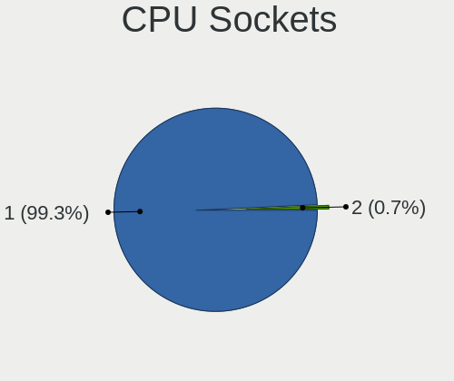

| Number | Computers | Percent |
|--------|-----------|---------|
| 1      | 1108      | 99.37%  |
| 2      | 7         | 0.63%   |

CPU Threads
-----------

Threads per core (Hyper-Threading)

| Number  | Computers | Percent |
|---------|-----------|---------|
| 2       | 739       | 66.04%  |
| 1       | 376       | 33.6%   |
| 8       | 2         | 0.18%   |
| 4       | 1         | 0.09%   |
| Unknown | 1         | 0.09%   |

CPU Op-Modes
------------

CPU Operation Modes (32-bit, 64-bit)

| Op mode        | Computers | Percent |
|----------------|-----------|---------|
| 32-bit, 64-bit | 1068      | 95.36%  |
| Unknown        | 39        | 3.48%   |
| 64-bit         | 7         | 0.63%   |
| 32-bit         | 6         | 0.54%   |

CPU Microcode
-------------

Microcode number

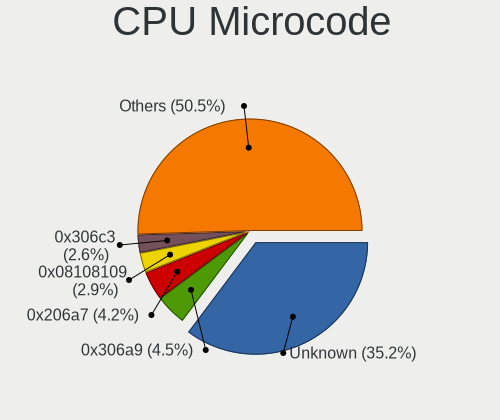

| Number     | Computers | Percent |
|------------|-----------|---------|
| Unknown    | 288       | 25.04%  |
| 0x306a9    | 61        | 5.3%    |
| 0x206a7    | 58        | 5.04%   |
| 0x08108109 | 39        | 3.39%   |
| 0x306c3    | 36        | 3.13%   |
| 0x806ea    | 32        | 2.78%   |
| 0x806ec    | 28        | 2.43%   |
| 0x406e3    | 26        | 2.26%   |
| 0x1067a    | 25        | 2.17%   |
| 0x06006705 | 23        | 2%      |
| 0x40651    | 22        | 1.91%   |
| 0x6fd      | 21        | 1.83%   |
| 0x306d4    | 20        | 1.74%   |
| 0x906ea    | 19        | 1.65%   |
| 0x20655    | 19        | 1.65%   |
| 0x406c4    | 18        | 1.57%   |
| 0x08608103 | 17        | 1.48%   |
| 0x806e9    | 16        | 1.39%   |
| 0x806c1    | 16        | 1.39%   |
| 0x0a50000c | 15        | 1.3%    |
| 0x08108102 | 14        | 1.22%   |
| 0x706e5    | 13        | 1.13%   |
| 0x506e3    | 12        | 1.04%   |
| 0x08701021 | 11        | 0.96%   |
| 0x706a1    | 10        | 0.87%   |
| 0x10676    | 10        | 0.87%   |
| 0x06000852 | 10        | 0.87%   |
| 0x05000119 | 10        | 0.87%   |
| 0x906e9    | 9         | 0.78%   |
| 0x06006118 | 9         | 0.78%   |
| 0x806eb    | 8         | 0.7%    |
| 0x30678    | 8         | 0.7%    |
| 0x20652    | 8         | 0.7%    |
| 0x0600611a | 8         | 0.7%    |
| 0x06001119 | 8         | 0.7%    |
| 0x010000c8 | 8         | 0.7%    |
| 0x706a8    | 7         | 0.61%   |
| 0x106e5    | 7         | 0.61%   |
| 0x08600106 | 7         | 0.61%   |
| 0xa0652    | 6         | 0.52%   |

CPU Microarch
-------------

Microarchitecture

| Name             | Computers | Percent |
|------------------|-----------|---------|
| KabyLake         | 150       | 13.44%  |
| IvyBridge        | 83        | 7.44%   |
| Haswell          | 80        | 7.17%   |
| SandyBridge      | 77        | 6.9%    |
| Zen+             | 74        | 6.63%   |
| Excavator        | 51        | 4.57%   |
| Skylake          | 49        | 4.39%   |
| Penryn           | 45        | 4.03%   |
| Silvermont       | 41        | 3.67%   |
| Core             | 39        | 3.49%   |
| Westmere         | 38        | 3.41%   |
| Zen 2            | 37        | 3.32%   |
| Unknown          | 33        | 2.96%   |
| Zen 3            | 29        | 2.6%    |
| TigerLake        | 26        | 2.33%   |
| Broadwell        | 25        | 2.24%   |
| Zen              | 24        | 2.15%   |
| Piledriver       | 23        | 2.06%   |
| K10              | 22        | 1.97%   |
| IceLake          | 22        | 1.97%   |
| Goldmont plus    | 22        | 1.97%   |
| CometLake        | 20        | 1.79%   |
| K8 Hammer        | 16        | 1.43%   |
| Alderlake Hybrid | 15        | 1.34%   |
| Puma             | 13        | 1.16%   |
| Bonnell          | 13        | 1.16%   |
| Bobcat           | 11        | 0.99%   |
| Nehalem          | 8         | 0.72%   |
| NetBurst         | 7         | 0.63%   |
| Jaguar           | 7         | 0.63%   |
| Steamroller      | 4         | 0.36%   |
| Goldmont         | 4         | 0.36%   |
| K10 Llano        | 3         | 0.27%   |
| Bulldozer        | 2         | 0.18%   |
| P6               | 1         | 0.09%   |
| K8 & K10 hybrid  | 1         | 0.09%   |
| Gracemont        | 1         | 0.09%   |

Graphics
--------

GPU Vendor
----------

Vendors of graphics cards

| Vendor                     | Computers | Percent |
|----------------------------|-----------|---------|
| Intel                      | 670       | 52.14%  |
| AMD                        | 345       | 26.85%  |
| Nvidia                     | 260       | 20.23%  |
| Matrox Electronics Systems | 6         | 0.47%   |
| VIA Technologies           | 4         | 0.31%   |

GPU Model
---------

Graphics card models

| Model                                                                                    | Computers | Percent |
|------------------------------------------------------------------------------------------|-----------|---------|
| AMD Picasso/Raven 2 [Radeon Vega Series / Radeon Vega Mobile Series]                     | 66        | 4.9%    |
| Intel 2nd Generation Core Processor Family Integrated Graphics Controller                | 61        | 4.53%   |
| Intel 3rd Gen Core processor Graphics Controller                                         | 54        | 4.01%   |
| Intel UHD Graphics 620                                                                   | 35        | 2.6%    |
| Intel Core Processor Integrated Graphics Controller                                      | 30        | 2.23%   |
| AMD Stoney [Radeon R2/R3/R4/R5 Graphics]                                                 | 30        | 2.23%   |
| Intel Haswell-ULT Integrated Graphics Controller                                         | 29        | 2.15%   |
| Intel Skylake GT2 [HD Graphics 520]                                                      | 28        | 2.08%   |
| Intel TigerLake-LP GT2 [Iris Xe Graphics]                                                | 24        | 1.78%   |
| Intel Atom/Celeron/Pentium Processor x5-E8000/J3xxx/N3xxx Integrated Graphics Controller | 23        | 1.71%   |
| Intel HD Graphics 620                                                                    | 22        | 1.63%   |
| Intel GeminiLake [UHD Graphics 600]                                                      | 22        | 1.63%   |
| AMD Lucienne                                                                             | 22        | 1.63%   |
| Intel WhiskeyLake-U GT2 [UHD Graphics 620]                                               | 21        | 1.56%   |
| Intel CometLake-U GT2 [UHD Graphics]                                                     | 21        | 1.56%   |
| AMD Wani [Radeon R5/R6/R7 Graphics]                                                      | 21        | 1.56%   |
| Intel CoffeeLake-H GT2 [UHD Graphics 630]                                                | 20        | 1.48%   |
| AMD Cezanne [Radeon Vega Series / Radeon Vega Mobile Series]                             | 20        | 1.48%   |
| Intel HD Graphics 5500                                                                   | 19        | 1.41%   |
| Intel Atom Processor Z36xxx/Z37xxx Series Graphics & Display                             | 18        | 1.34%   |
| AMD Renoir [Radeon RX Vega 6 (Ryzen 4000/5000 Mobile Series)]                            | 18        | 1.34%   |
| Intel 4th Gen Core Processor Integrated Graphics Controller                              | 17        | 1.26%   |
| Nvidia GP107M [GeForce GTX 1050 Mobile]                                                  | 16        | 1.19%   |
| Intel Xeon E3-1200 v3/4th Gen Core Processor Integrated Graphics Controller              | 16        | 1.19%   |
| Intel Mobile 4 Series Chipset Integrated Graphics Controller                             | 16        | 1.19%   |
| Intel Iris Plus Graphics G1 (Ice Lake)                                                   | 15        | 1.11%   |
| Intel HD Graphics 530                                                                    | 15        | 1.11%   |
| Intel Xeon E3-1200 v2/3rd Gen Core processor Graphics Controller                         | 14        | 1.04%   |
| Intel 4 Series Chipset Integrated Graphics Controller                                    | 14        | 1.04%   |
| AMD Raven Ridge [Radeon Vega Series / Radeon Vega Mobile Series]                         | 14        | 1.04%   |
| Nvidia TU117M [GeForce GTX 1650 Mobile / Max-Q]                                          | 13        | 0.97%   |
| Intel Mobile GM965/GL960 Integrated Graphics Controller (secondary)                      | 12        | 0.89%   |
| Intel Mobile GM965/GL960 Integrated Graphics Controller (primary)                        | 12        | 0.89%   |
| AMD Cedar [Radeon HD 5000/6000/7350/8350 Series]                                         | 12        | 0.89%   |
| Nvidia GF117M [GeForce 610M/710M/810M/820M / GT 620M/625M/630M/720M]                     | 9         | 0.67%   |
| Intel CometLake-H GT2 [UHD Graphics]                                                     | 9         | 0.67%   |
| Intel 82G33/G31 Express Integrated Graphics Controller                                   | 9         | 0.67%   |
| AMD Topaz XT [Radeon R7 M260/M265 / M340/M360 / M440/M445 / 530/535 / 620/625 Mobile]    | 9         | 0.67%   |
| Intel HD Graphics 630                                                                    | 8         | 0.59%   |
| AMD Mullins [Radeon R4/R5 Graphics]                                                      | 8         | 0.59%   |

GPU Combo
---------

Combinations of graphics cards

| Name            | Computers | Percent |
|-----------------|-----------|---------|
| 1 x Intel       | 515       | 45.9%   |
| 1 x AMD         | 274       | 24.42%  |
| Intel + Nvidia  | 131       | 11.68%  |
| 1 x Nvidia      | 116       | 10.34%  |
| 2 x AMD         | 41        | 3.65%   |
| Intel + AMD     | 18        | 1.6%    |
| AMD + Nvidia    | 11        | 0.98%   |
| 1 x Matrox      | 5         | 0.45%   |
| 1 x VIA         | 4         | 0.36%   |
| Other           | 3         | 0.27%   |
| 2 x Intel       | 3         | 0.27%   |
| Nvidia + Matrox | 1         | 0.09%   |

GPU Driver
----------

Free vs proprietary

| Driver      | Computers | Percent |
|-------------|-----------|---------|
| Free        | 961       | 85.2%   |
| Proprietary | 117       | 10.37%  |
| Unknown     | 50        | 4.43%   |

GPU Memory
----------

Total video memory

| Size in GB | Computers | Percent |
|------------|-----------|---------|
| Unknown    | 655       | 57.46%  |
| 1.01-2.0   | 158       | 13.86%  |
| 0.01-0.5   | 155       | 13.6%   |
| 0.51-1.0   | 74        | 6.49%   |
| 3.01-4.0   | 56        | 4.91%   |
| 7.01-8.0   | 16        | 1.4%    |
| 5.01-6.0   | 13        | 1.14%   |
| 8.01-16.0  | 8         | 0.7%    |
| 2.01-3.0   | 5         | 0.44%   |

Monitor
-------

Monitor Vendor
--------------

Monitor vendors

| Vendor                  | Computers | Percent |
|-------------------------|-----------|---------|
| Chimei Innolux          | 197       | 16.78%  |
| Samsung Electronics     | 186       | 15.84%  |
| AU Optronics            | 143       | 12.18%  |
| BOE                     | 130       | 11.07%  |
| LG Display              | 85        | 7.24%   |
| Goldstar                | 84        | 7.16%   |
| Hewlett-Packard         | 58        | 4.94%   |
| Dell                    | 38        | 3.24%   |
| Apple                   | 29        | 2.47%   |
| PANDA                   | 23        | 1.96%   |
| Acer                    | 21        | 1.79%   |
| AOC                     | 16        | 1.36%   |
| Chi Mei Optoelectronics | 15        | 1.28%   |
| Lenovo                  | 14        | 1.19%   |
| Sharp                   | 11        | 0.94%   |
| ViewSonic               | 8         | 0.68%   |
| InfoVision              | 8         | 0.68%   |
| Sony                    | 6         | 0.51%   |
| LG Philips              | 6         | 0.51%   |
| ASUSTek Computer        | 6         | 0.51%   |
| MSI                     | 5         | 0.43%   |
| LG Electronics          | 5         | 0.43%   |
| InnoLux Display         | 5         | 0.43%   |
| BenQ                    | 5         | 0.43%   |
| Unknown                 | 4         | 0.34%   |
| Sceptre Tech            | 4         | 0.34%   |
| SANYO                   | 4         | 0.34%   |
| SAC                     | 4         | 0.34%   |
| RTK                     | 4         | 0.34%   |
| HKC                     | 4         | 0.34%   |
| HannStar                | 4         | 0.34%   |
| Ancor Communications    | 4         | 0.34%   |
| CS_                     | 3         | 0.26%   |
| CSO                     | 3         | 0.26%   |
| NCS                     | 2         | 0.17%   |
| KTC                     | 2         | 0.17%   |
| Envision                | 2         | 0.17%   |
| AGO                     | 2         | 0.17%   |
| Westinghouse            | 1         | 0.09%   |
| Unknown (XXX)           | 1         | 0.09%   |

Monitor Model
-------------

Monitor models

| Model                                                                 | Computers | Percent |
|-----------------------------------------------------------------------|-----------|---------|
| Chimei Innolux LCD Monitor CMN14D6 1366x768 309x173mm 13.9-inch       | 21        | 1.76%   |
| Chimei Innolux LCD Monitor CMN15E6 1366x768 344x193mm 15.5-inch       | 17        | 1.43%   |
| Chimei Innolux LCD Monitor CMN14C3 1366x768 309x173mm 13.9-inch       | 14        | 1.18%   |
| Chimei Innolux LCD Monitor CMN15DB 1366x768 344x193mm 15.5-inch       | 11        | 0.92%   |
| AU Optronics LCD Monitor AUO723C 1366x768 309x173mm 13.9-inch         | 11        | 0.92%   |
| Chimei Innolux LCD Monitor CMN14E5 1920x1080 309x173mm 13.9-inch      | 10        | 0.84%   |
| Chimei Innolux LCD Monitor CMN14C4 1366x768 309x173mm 13.9-inch       | 10        | 0.84%   |
| AU Optronics LCD Monitor AUO2D3C 1366x768 309x173mm 13.9-inch         | 10        | 0.84%   |
| Samsung Electronics S22F350 SAM0D1A 1920x1080 477x268mm 21.5-inch     | 9         | 0.76%   |
| BOE LCD Monitor BOE06A4 1366x768 344x194mm 15.5-inch                  | 9         | 0.76%   |
| BOE LCD Monitor BOE0696 1366x768 309x173mm 13.9-inch                  | 9         | 0.76%   |
| Samsung Electronics LCD Monitor SAM0C39 1920x1080 885x498mm 40.0-inch | 8         | 0.67%   |
| Samsung Electronics S24F350 SAM0D20 1920x1080 521x293mm 23.5-inch     | 7         | 0.59%   |
| Samsung Electronics C24F390 SAM0D2C 1920x1080 521x293mm 23.5-inch     | 7         | 0.59%   |
| AU Optronics LCD Monitor AUO323C 1366x768 309x173mm 13.9-inch         | 7         | 0.59%   |
| Goldstar FULL HD GSM5B55 1920x1080 480x270mm 21.7-inch                | 6         | 0.5%    |
| Chimei Innolux LCD Monitor CMN15F5 1920x1080 344x193mm 15.5-inch      | 6         | 0.5%    |
| Chimei Innolux LCD Monitor CMN15DC 1366x768 344x193mm 15.5-inch       | 6         | 0.5%    |
| BOE LCD Monitor BOE0672 1366x768 344x194mm 15.5-inch                  | 6         | 0.5%    |
| Samsung Electronics SyncMaster SAM036F 1440x900 428x255mm 19.6-inch   | 5         | 0.42%   |
| Samsung Electronics SMB1930N SAM0632 1366x768 410x230mm 18.5-inch     | 5         | 0.42%   |
| Samsung Electronics LF22T35 SAM707B 1920x1080 477x268mm 21.5-inch     | 5         | 0.42%   |
| PANDA LCD Monitor NCP0035 1920x1080 309x174mm 14.0-inch               | 5         | 0.42%   |
| PANDA LCD Monitor NCP002D 1920x1080 344x194mm 15.5-inch               | 5         | 0.42%   |
| LG Display LCD Monitor LGD02DC 1366x768 344x194mm 15.5-inch           | 5         | 0.42%   |
| Goldstar W2243 GSM56FE 1920x1080 477x268mm 21.5-inch                  | 5         | 0.42%   |
| Goldstar W2043 GSM4E9D 1600x900 443x249mm 20.0-inch                   | 5         | 0.42%   |
| Goldstar 20M35 GSM4EED 1600x900 433x236mm 19.4-inch                   | 5         | 0.42%   |
| Chimei Innolux LCD Monitor CMN1491 1366x768 309x174mm 14.0-inch       | 5         | 0.42%   |
| Chimei Innolux LCD Monitor CMN1490 1366x768 309x173mm 13.9-inch       | 5         | 0.42%   |
| Chimei Innolux LCD Monitor CMN1476 1366x768 309x174mm 14.0-inch       | 5         | 0.42%   |
| BOE LCD Monitor BOE07AA 1366x768 344x194mm 15.5-inch                  | 5         | 0.42%   |
| BOE LCD Monitor BOE0697 1366x768 309x173mm 13.9-inch                  | 5         | 0.42%   |
| BOE LCD Monitor BOE05BA 1366x768 309x173mm 13.9-inch                  | 5         | 0.42%   |
| AU Optronics LCD Monitor AUO21ED 1920x1080 344x193mm 15.5-inch        | 5         | 0.42%   |
| AU Optronics LCD Monitor AUO106C 1366x768 276x155mm 12.5-inch         | 5         | 0.42%   |
| Samsung Electronics U28E590 SAM0C4E 3840x2160 608x345mm 27.5-inch     | 4         | 0.34%   |
| Samsung Electronics LCD Monitor SDC4161 1920x1080 344x194mm 15.5-inch | 4         | 0.34%   |
| PANDA LCD Monitor NCP0046 1920x1080 344x194mm 15.5-inch               | 4         | 0.34%   |
| LG Display LCD Monitor LGD0455 1366x768 310x174mm 14.0-inch           | 4         | 0.34%   |

Monitor Resolution
------------------

Monitor screen resolution

| Resolution         | Computers | Percent |
|--------------------|-----------|---------|
| 1366x768 (WXGA)    | 479       | 42.43%  |
| 1920x1080 (FHD)    | 345       | 30.56%  |
| 1600x900 (HD+)     | 52        | 4.61%   |
| 3840x2160 (4K)     | 47        | 4.16%   |
| 1440x900 (WXGA+)   | 38        | 3.37%   |
| 1280x1024 (SXGA)   | 30        | 2.66%   |
| 1280x800 (WXGA)    | 27        | 2.39%   |
| 2560x1440 (QHD)    | 15        | 1.33%   |
| 1360x768           | 13        | 1.15%   |
| 2560x1080          | 12        | 1.06%   |
| 1680x1050 (WSXGA+) | 10        | 0.89%   |
| 1920x1200 (WUXGA)  | 8         | 0.71%   |
| 1024x600           | 8         | 0.71%   |
| 2880x1800          | 7         | 0.62%   |
| 2560x1600          | 5         | 0.44%   |
| 1024x768 (XGA)     | 5         | 0.44%   |
| 3440x1440          | 4         | 0.35%   |
| Unknown            | 4         | 0.35%   |
| 3840x1080          | 3         | 0.27%   |
| 3456x2160          | 3         | 0.27%   |
| 2160x1440          | 3         | 0.27%   |
| 1280x720 (HD)      | 2         | 0.18%   |
| 3840x1100          | 1         | 0.09%   |
| 3200x1080          | 1         | 0.09%   |
| 2736x1824          | 1         | 0.09%   |
| 2256x1504          | 1         | 0.09%   |
| 1920x540           | 1         | 0.09%   |
| 1680x945           | 1         | 0.09%   |
| 1600x2560          | 1         | 0.09%   |
| 1536x2048          | 1         | 0.09%   |
| 1152x864           | 1         | 0.09%   |

Monitor Diagonal
----------------

Diagonal size in inches

| Inches  | Computers | Percent |
|---------|-----------|---------|
| 15      | 276       | 23.39%  |
| 13      | 206       | 17.46%  |
| 14      | 176       | 14.92%  |
| 21      | 79        | 6.69%   |
| 23      | 57        | 4.83%   |
| 18      | 52        | 4.41%   |
| 19      | 50        | 4.24%   |
| 17      | 44        | 3.73%   |
| 24      | 28        | 2.37%   |
| 27      | 27        | 2.29%   |
| 20      | 23        | 1.95%   |
| Unknown | 23        | 1.95%   |
| 12      | 18        | 1.53%   |
| 31      | 17        | 1.44%   |
| 11      | 15        | 1.27%   |
| 54      | 11        | 0.93%   |
| 34      | 11        | 0.93%   |
| 10      | 11        | 0.93%   |
| 84      | 9         | 0.76%   |
| 22      | 9         | 0.76%   |
| 72      | 7         | 0.59%   |
| 40      | 4         | 0.34%   |
| 28      | 4         | 0.34%   |
| 16      | 4         | 0.34%   |
| 48      | 3         | 0.25%   |
| 8       | 3         | 0.25%   |
| 32      | 2         | 0.17%   |
| 26      | 2         | 0.17%   |
| 86      | 1         | 0.08%   |
| 63      | 1         | 0.08%   |
| 61      | 1         | 0.08%   |
| 60      | 1         | 0.08%   |
| 52      | 1         | 0.08%   |
| 46      | 1         | 0.08%   |
| 44      | 1         | 0.08%   |
| 43      | 1         | 0.08%   |
| 9       | 1         | 0.08%   |

Monitor Width
-------------

Physical width

| Width in mm | Computers | Percent |
|-------------|-----------|---------|
| 301-350     | 628       | 53.86%  |
| 401-500     | 205       | 17.58%  |
| 501-600     | 100       | 8.58%   |
| 201-300     | 83        | 7.12%   |
| 351-400     | 38        | 3.26%   |
| 601-700     | 30        | 2.57%   |
| Unknown     | 23        | 1.97%   |
| 1001-1500   | 20        | 1.72%   |
| 1501-2000   | 16        | 1.37%   |
| 701-800     | 13        | 1.11%   |
| 801-900     | 4         | 0.34%   |
| 101-200     | 4         | 0.34%   |
| 901-1000    | 2         | 0.17%   |

Aspect Ratio
------------

Proportional relationship between the width and the height

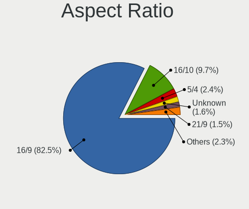

| Ratio   | Computers | Percent |
|---------|-----------|---------|
| 16/9    | 882       | 82.58%  |
| 16/10   | 102       | 9.55%   |
| 5/4     | 27        | 2.53%   |
| Unknown | 19        | 1.78%   |
| 21/9    | 15        | 1.4%    |
| 4/3     | 9         | 0.84%   |
| 3/2     | 7         | 0.66%   |
| 32/9    | 3         | 0.28%   |
| 3.40    | 1         | 0.09%   |
| 0.75    | 1         | 0.09%   |
| 0.58    | 1         | 0.09%   |
| 0.56    | 1         | 0.09%   |

Monitor Area
------------

Area in inch

| Area in inch | Computers | Percent |
|----------------|-----------|---------|
| 81-90          | 357       | 30.38%  |
| 101-110        | 275       | 23.4%   |
| 201-250        | 143       | 12.17%  |
| 151-200        | 92        | 7.83%   |
| 141-150        | 68        | 5.79%   |
| More than 1000 | 33        | 2.81%   |
| 351-500        | 30        | 2.55%   |
| 301-350        | 29        | 2.47%   |
| 71-80          | 26        | 2.21%   |
| Unknown        | 23        | 1.96%   |
| 121-130        | 19        | 1.62%   |
| 51-60          | 16        | 1.36%   |
| 251-300        | 16        | 1.36%   |
| 61-70          | 14        | 1.19%   |
| 41-50          | 12        | 1.02%   |
| 501-1000       | 9         | 0.77%   |
| 131-140        | 6         | 0.51%   |
| 1-40           | 3         | 0.26%   |
| 111-120        | 3         | 0.26%   |
| 91-100         | 1         | 0.09%   |

Pixel Density
-------------

Pixels per inch

| Density       | Computers | Percent |
|---------------|-----------|---------|
| 101-120       | 505       | 44.03%  |
| 51-100        | 308       | 26.85%  |
| 121-160       | 226       | 19.7%   |
| 161-240       | 32        | 2.79%   |
| 1-50          | 31        | 2.7%    |
| Unknown       | 23        | 2.01%   |
| More than 240 | 22        | 1.92%   |

Multiple Monitors
-----------------

Total monitors connected

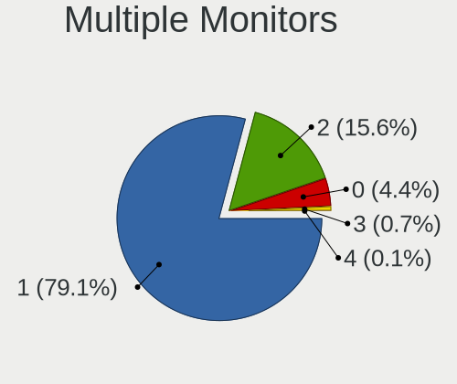

| Total | Computers | Percent |
|-------|-----------|---------|
| 1     | 921       | 80.44%  |
| 2     | 162       | 14.15%  |
| 0     | 52        | 4.54%   |
| 3     | 9         | 0.79%   |
| 4     | 1         | 0.09%   |

Network
-------

Net Controller Vendor
---------------------

Controller vendors

| Vendor                            | Computers | Percent |
|-----------------------------------|-----------|---------|
| Realtek Semiconductor             | 731       | 43.38%  |
| Intel                             | 340       | 20.18%  |
| Qualcomm Atheros                  | 246       | 14.6%   |
| Broadcom                          | 103       | 6.11%   |
| Broadcom Limited                  | 35        | 2.08%   |
| Ralink Technology                 | 32        | 1.9%    |
| TP-Link                           | 26        | 1.54%   |
| Nvidia                            | 23        | 1.36%   |
| MediaTek                          | 22        | 1.31%   |
| Ralink                            | 21        | 1.25%   |
| Marvell Technology Group          | 15        | 0.89%   |
| Samsung Electronics               | 13        | 0.77%   |
| Qualcomm Atheros Communications   | 11        | 0.65%   |
| Xiaomi                            | 7         | 0.42%   |
| ASIX Electronics                  | 7         | 0.42%   |
| ICS Advent                        | 6         | 0.36%   |
| Huawei Technologies               | 5         | 0.3%    |
| VIA Technologies                  | 4         | 0.24%   |
| Mercucys                          | 4         | 0.24%   |
| D-Link System                     | 4         | 0.24%   |
| Qualcomm                          | 3         | 0.18%   |
| Motorola PCS                      | 3         | 0.18%   |
| DisplayLink                       | 3         | 0.18%   |
| T & A Mobile Phones               | 2         | 0.12%   |
| Sundance Technology Inc / IC Plus | 2         | 0.12%   |
| OPPO Electronics                  | 2         | 0.12%   |
| Aquantia                          | 2         | 0.12%   |
| Wistron NeWeb                     | 1         | 0.06%   |
| STMicroelectronics                | 1         | 0.06%   |
| Quanta                            | 1         | 0.06%   |
| QinHeng Electronics               | 1         | 0.06%   |
| Prolific Technology               | 1         | 0.06%   |
| Mellanox Technologies             | 1         | 0.06%   |
| LG Electronics                    | 1         | 0.06%   |
| Lenovo                            | 1         | 0.06%   |
| JMicron Technology                | 1         | 0.06%   |
| Google                            | 1         | 0.06%   |
| Encore Electronics                | 1         | 0.06%   |
| Dell                              | 1         | 0.06%   |
| 3Com                              | 1         | 0.06%   |

Net Controller Model
--------------------

Controller models

| Model                                                                  | Computers | Percent |
|------------------------------------------------------------------------|-----------|---------|
| Realtek RTL8111/8168/8211/8411 PCI Express Gigabit Ethernet Controller | 469       | 23.84%  |
| Realtek RTL810xE PCI Express Fast Ethernet controller                  | 119       | 6.05%   |
| Realtek RTL8821CE 802.11ac PCIe Wireless Network Adapter               | 59        | 3%      |
| Qualcomm Atheros QCA9377 802.11ac Wireless Network Adapter             | 53        | 2.69%   |
| Realtek RTL8723DE Wireless Network Adapter                             | 42        | 2.14%   |
| Qualcomm Atheros AR9485 Wireless Network Adapter                       | 37        | 1.88%   |
| Qualcomm Atheros QCA9565 / AR9565 Wireless Network Adapter             | 34        | 1.73%   |
| Qualcomm Atheros AR9285 Wireless Network Adapter (PCI-Express)         | 32        | 1.63%   |
| Intel Wireless 8265 / 8275                                             | 32        | 1.63%   |
| Intel Wi-Fi 6 AX200                                                    | 27        | 1.37%   |
| Realtek RTL8822CE 802.11ac PCIe Wireless Network Adapter               | 26        | 1.32%   |
| Realtek RTL8723BE PCIe Wireless Network Adapter                        | 23        | 1.17%   |
| Realtek RTL8153 Gigabit Ethernet Adapter                               | 23        | 1.17%   |
| Intel Wi-Fi 6 AX201                                                    | 19        | 0.97%   |
| Intel 82579LM Gigabit Network Connection (Lewisville)                  | 19        | 0.97%   |
| Realtek RTL8822BE 802.11a/b/g/n/ac WiFi adapter                        | 18        | 0.92%   |
| Intel Comet Lake PCH-LP CNVi WiFi                                      | 18        | 0.92%   |
| Realtek RTL8125 2.5GbE Controller                                      | 16        | 0.81%   |
| Broadcom BCM4313 802.11bgn Wireless Network Adapter                    | 16        | 0.81%   |
| Intel Wireless 7260                                                    | 15        | 0.76%   |
| Intel Cannon Point-LP CNVi [Wireless-AC]                               | 15        | 0.76%   |
| Broadcom BCM43142 802.11b/g/n                                          | 15        | 0.76%   |
| Ralink RT2870/RT3070 Wireless Adapter                                  | 14        | 0.71%   |
| Ralink MT7601U Wireless Adapter                                        | 14        | 0.71%   |
| Qualcomm Atheros AR8152 v2.0 Fast Ethernet                             | 14        | 0.71%   |
| Intel Cannon Lake PCH CNVi WiFi                                        | 14        | 0.71%   |
| Realtek RTL8821AE 802.11ac PCIe Wireless Network Adapter               | 13        | 0.66%   |
| Realtek RTL8188EUS 802.11n Wireless Network Adapter                    | 13        | 0.66%   |
| Intel Wireless 8260                                                    | 12        | 0.61%   |
| Intel Centrino Wireless-N 2230                                         | 12        | 0.61%   |
| Intel Wireless 7265                                                    | 11        | 0.56%   |
| Ralink RT3290 Wireless 802.11n 1T/1R PCIe                              | 10        | 0.51%   |
| Qualcomm Atheros AR9271 802.11n                                        | 10        | 0.51%   |
| Qualcomm Atheros AR8151 v2.0 Gigabit Ethernet                          | 10        | 0.51%   |
| MediaTek MT7921 802.11ax PCI Express Wireless Network Adapter          | 10        | 0.51%   |
| TP-Link AC600 wireless Realtek RTL8811AU [Archer T2U Nano]             | 9         | 0.46%   |
| Realtek 802.11ac NIC                                                   | 9         | 0.46%   |
| Qualcomm Atheros QCA6174 802.11ac Wireless Network Adapter             | 9         | 0.46%   |
| Qualcomm Atheros AR9287 Wireless Network Adapter (PCI-Express)         | 9         | 0.46%   |
| Nvidia MCP61 Ethernet                                                  | 9         | 0.46%   |

Wireless Vendor
---------------

Wireless vendors

| Vendor                          | Computers | Percent |
|---------------------------------|-----------|---------|
| Intel                           | 286       | 29.55%  |
| Realtek Semiconductor           | 262       | 27.07%  |
| Qualcomm Atheros                | 203       | 20.97%  |
| Broadcom                        | 68        | 7.02%   |
| Ralink Technology               | 32        | 3.31%   |
| TP-Link                         | 26        | 2.69%   |
| Broadcom Limited                | 23        | 2.38%   |
| Ralink                          | 21        | 2.17%   |
| MediaTek                        | 21        | 2.17%   |
| Qualcomm Atheros Communications | 11        | 1.14%   |
| Mercucys                        | 4         | 0.41%   |
| D-Link System                   | 3         | 0.31%   |
| Marvell Technology Group        | 2         | 0.21%   |
| Wistron NeWeb                   | 1         | 0.1%    |
| Qualcomm                        | 1         | 0.1%    |
| LG Electronics                  | 1         | 0.1%    |
| Encore Electronics              | 1         | 0.1%    |
| Dell                            | 1         | 0.1%    |
| 3Com                            | 1         | 0.1%    |

Wireless Model
--------------

Wireless models

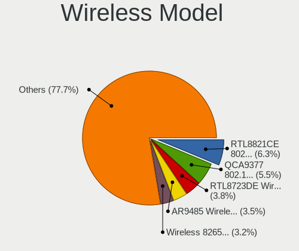

| Model                                                                   | Computers | Percent |
|-------------------------------------------------------------------------|-----------|---------|
| Realtek RTL8821CE 802.11ac PCIe Wireless Network Adapter                | 59        | 6.07%   |
| Qualcomm Atheros QCA9377 802.11ac Wireless Network Adapter              | 53        | 5.45%   |
| Realtek RTL8723DE Wireless Network Adapter                              | 42        | 4.32%   |
| Qualcomm Atheros AR9485 Wireless Network Adapter                        | 37        | 3.81%   |
| Qualcomm Atheros QCA9565 / AR9565 Wireless Network Adapter              | 34        | 3.5%    |
| Qualcomm Atheros AR9285 Wireless Network Adapter (PCI-Express)          | 32        | 3.29%   |
| Intel Wireless 8265 / 8275                                              | 32        | 3.29%   |
| Intel Wi-Fi 6 AX200                                                     | 27        | 2.78%   |
| Realtek RTL8822CE 802.11ac PCIe Wireless Network Adapter                | 26        | 2.67%   |
| Realtek RTL8723BE PCIe Wireless Network Adapter                         | 23        | 2.37%   |
| Intel Wi-Fi 6 AX201                                                     | 19        | 1.95%   |
| Realtek RTL8822BE 802.11a/b/g/n/ac WiFi adapter                         | 18        | 1.85%   |
| Intel Comet Lake PCH-LP CNVi WiFi                                       | 18        | 1.85%   |
| Broadcom BCM4313 802.11bgn Wireless Network Adapter                     | 16        | 1.65%   |
| Intel Wireless 7260                                                     | 15        | 1.54%   |
| Intel Cannon Point-LP CNVi [Wireless-AC]                                | 15        | 1.54%   |
| Broadcom BCM43142 802.11b/g/n                                           | 15        | 1.54%   |
| Ralink RT2870/RT3070 Wireless Adapter                                   | 14        | 1.44%   |
| Ralink MT7601U Wireless Adapter                                         | 14        | 1.44%   |
| Intel Cannon Lake PCH CNVi WiFi                                         | 14        | 1.44%   |
| Realtek RTL8821AE 802.11ac PCIe Wireless Network Adapter                | 13        | 1.34%   |
| Realtek RTL8188EUS 802.11n Wireless Network Adapter                     | 13        | 1.34%   |
| Intel Wireless 8260                                                     | 12        | 1.23%   |
| Intel Centrino Wireless-N 2230                                          | 12        | 1.23%   |
| Intel Wireless 7265                                                     | 11        | 1.13%   |
| Ralink RT3290 Wireless 802.11n 1T/1R PCIe                               | 10        | 1.03%   |
| Qualcomm Atheros AR9271 802.11n                                         | 10        | 1.03%   |
| MediaTek MT7921 802.11ax PCI Express Wireless Network Adapter           | 10        | 1.03%   |
| TP-Link AC600 wireless Realtek RTL8811AU [Archer T2U Nano]              | 9         | 0.93%   |
| Realtek 802.11ac NIC                                                    | 9         | 0.93%   |
| Qualcomm Atheros QCA6174 802.11ac Wireless Network Adapter              | 9         | 0.93%   |
| Qualcomm Atheros AR9287 Wireless Network Adapter (PCI-Express)          | 9         | 0.93%   |
| Intel Dual Band Wireless-AC 3165 Plus Bluetooth                         | 9         | 0.93%   |
| Intel Comet Lake PCH CNVi WiFi                                          | 9         | 0.93%   |
| Intel Alder Lake-P PCH CNVi WiFi                                        | 9         | 0.93%   |
| Realtek RTL8188EE Wireless Network Adapter                              | 8         | 0.82%   |
| Realtek RTL8188CE 802.11b/g/n WiFi Adapter                              | 8         | 0.82%   |
| Qualcomm Atheros AR242x / AR542x Wireless Network Adapter (PCI-Express) | 8         | 0.82%   |
| Qualcomm Atheros AR928X Wireless Network Adapter (PCI-Express)          | 7         | 0.72%   |
| Intel Ice Lake-LP PCH CNVi WiFi                                         | 7         | 0.72%   |

Ethernet Vendor
---------------

Ethernet vendors

| Vendor                            | Computers | Percent |
|-----------------------------------|-----------|---------|
| Realtek Semiconductor             | 643       | 65.41%  |
| Intel                             | 122       | 12.41%  |
| Qualcomm Atheros                  | 61        | 6.21%   |
| Broadcom                          | 46        | 4.68%   |
| Nvidia                            | 23        | 2.34%   |
| Samsung Electronics               | 13        | 1.32%   |
| Marvell Technology Group          | 13        | 1.32%   |
| Broadcom Limited                  | 12        | 1.22%   |
| Xiaomi                            | 7         | 0.71%   |
| ASIX Electronics                  | 7         | 0.71%   |
| ICS Advent                        | 6         | 0.61%   |
| Huawei Technologies               | 5         | 0.51%   |
| VIA Technologies                  | 4         | 0.41%   |
| DisplayLink                       | 3         | 0.31%   |
| T & A Mobile Phones               | 2         | 0.2%    |
| Sundance Technology Inc / IC Plus | 2         | 0.2%    |
| Qualcomm                          | 2         | 0.2%    |
| OPPO Electronics                  | 2         | 0.2%    |
| Aquantia                          | 2         | 0.2%    |
| Quanta                            | 1         | 0.1%    |
| Prolific Technology               | 1         | 0.1%    |
| Motorola PCS                      | 1         | 0.1%    |
| Mellanox Technologies             | 1         | 0.1%    |
| MediaTek                          | 1         | 0.1%    |
| Lenovo                            | 1         | 0.1%    |
| JMicron Technology                | 1         | 0.1%    |
| D-Link System                     | 1         | 0.1%    |

Ethernet Model
--------------

Ethernet models

| Model                                                                  | Computers | Percent |
|------------------------------------------------------------------------|-----------|---------|
| Realtek RTL8111/8168/8211/8411 PCI Express Gigabit Ethernet Controller | 469       | 47.37%  |
| Realtek RTL810xE PCI Express Fast Ethernet controller                  | 119       | 12.02%  |
| Realtek RTL8153 Gigabit Ethernet Adapter                               | 23        | 2.32%   |
| Intel 82579LM Gigabit Network Connection (Lewisville)                  | 19        | 1.92%   |
| Realtek RTL8125 2.5GbE Controller                                      | 16        | 1.62%   |
| Qualcomm Atheros AR8152 v2.0 Fast Ethernet                             | 14        | 1.41%   |
| Qualcomm Atheros AR8151 v2.0 Gigabit Ethernet                          | 10        | 1.01%   |
| Nvidia MCP61 Ethernet                                                  | 9         | 0.91%   |
| Intel Ethernet Connection I219-LM                                      | 9         | 0.91%   |
| Samsung Galaxy series, misc. (tethering mode)                          | 8         | 0.81%   |
| Realtek RTL8152 Fast Ethernet Adapter                                  | 8         | 0.81%   |
| Realtek RTL-8100/8101L/8139 PCI Fast Ethernet Adapter                  | 8         | 0.81%   |
| Intel I211 Gigabit Network Connection                                  | 8         | 0.81%   |
| Intel Ethernet Controller I225-V                                       | 8         | 0.81%   |
| Xiaomi Mi/Redmi series (RNDIS)                                         | 7         | 0.71%   |
| Intel 82579V Gigabit Network Connection                                | 7         | 0.71%   |
| Broadcom NetXtreme BCM57766 Gigabit Ethernet PCIe                      | 7         | 0.71%   |
| Broadcom NetLink BCM57785 Gigabit Ethernet PCIe                        | 7         | 0.71%   |
| Qualcomm Atheros Killer E220x Gigabit Ethernet Controller              | 6         | 0.61%   |
| Nvidia MCP79 Ethernet                                                  | 6         | 0.61%   |
| Intel 82577LM Gigabit Network Connection                               | 6         | 0.61%   |
| Broadcom NetLink BCM5906M Fast Ethernet PCI Express                    | 6         | 0.61%   |
| Broadcom NetLink BCM57780 Gigabit Ethernet PCIe                        | 6         | 0.61%   |
| Samsung GT-I9070 (network tethering, USB debugging enabled)            | 5         | 0.51%   |
| Realtek Killer E2600 GbE Controller                                    | 5         | 0.51%   |
| Qualcomm Atheros AR8162 Fast Ethernet                                  | 5         | 0.51%   |
| Qualcomm Atheros AR8152 v1.1 Fast Ethernet                             | 5         | 0.51%   |
| Qualcomm Atheros AR8132 Fast Ethernet                                  | 5         | 0.51%   |
| Marvell Group 88E8040 PCI-E Fast Ethernet Controller                   | 5         | 0.51%   |
| Intel Ethernet Connection I219-V                                       | 5         | 0.51%   |
| Intel Ethernet Connection I217-LM                                      | 5         | 0.51%   |
| ICS Advent DM9601 Fast Ethernet Adapter                                | 5         | 0.51%   |
| Huawei STG-LX1                                                         | 5         | 0.51%   |
| VIA VT6102/VT6103 [Rhine-II]                                           | 4         | 0.4%    |
| Intel Ethernet Connection (3) I218-LM                                  | 4         | 0.4%    |
| ASIX AX88179 Gigabit Ethernet                                          | 4         | 0.4%    |
| Qualcomm Atheros QCA8171 Gigabit Ethernet                              | 3         | 0.3%    |
| Nvidia MCP51 Ethernet Controller                                       | 3         | 0.3%    |
| Intel Ethernet Connection I218-LM                                      | 3         | 0.3%    |
| Intel Ethernet Connection (4) I219-V                                   | 3         | 0.3%    |

Net Controller Kind
-------------------

Ethernet, WiFi or modem

| Kind     | Computers | Percent |
|----------|-----------|---------|
| Ethernet | 938       | 50.43%  |
| WiFi     | 917       | 49.3%   |
| Unknown  | 3         | 0.16%   |
| Modem    | 2         | 0.11%   |

Used Controller
---------------

Currently used network controller

| Kind     | Computers | Percent |
|----------|-----------|---------|
| WiFi     | 705       | 59.7%   |
| Ethernet | 475       | 40.22%  |
| Unknown  | 1         | 0.08%   |

NICs
----

Total network controllers on board

| Total | Computers | Percent |
|-------|-----------|---------|
| 2     | 645       | 57.74%  |
| 1     | 449       | 40.2%   |
| 0     | 13        | 1.16%   |
| 3     | 7         | 0.63%   |
| 7     | 1         | 0.09%   |
| 6     | 1         | 0.09%   |
| 4     | 1         | 0.09%   |

IPv6
----

IPv6 vs IPv4

| Used | Computers | Percent |
|------|-----------|---------|
| No   | 993       | 87.57%  |
| Yes  | 141       | 12.43%  |

Bluetooth
---------

Bluetooth Vendor
----------------

Controller vendors

| Vendor                          | Computers | Percent |
|---------------------------------|-----------|---------|
| Intel                           | 241       | 33.29%  |
| Realtek Semiconductor           | 139       | 19.2%   |
| IMC Networks                    | 84        | 11.6%   |
| Qualcomm Atheros Communications | 64        | 8.84%   |
| Cambridge Silicon Radio         | 41        | 5.66%   |
| Lite-On Technology              | 38        | 5.25%   |
| Apple                           | 25        | 3.45%   |
| Broadcom                        | 24        | 3.31%   |
| Foxconn / Hon Hai               | 17        | 2.35%   |
| Ralink                          | 10        | 1.38%   |
| Hewlett-Packard                 | 8         | 1.1%    |
| Toshiba                         | 7         | 0.97%   |
| MediaTek                        | 6         | 0.83%   |
| Realtek                         | 5         | 0.69%   |
| Foxconn International           | 5         | 0.69%   |
| Dell                            | 4         | 0.55%   |
| Alps Electric                   | 3         | 0.41%   |
| TP-Link                         | 1         | 0.14%   |
| Marvell Semiconductor           | 1         | 0.14%   |
| ASUSTek Computer                | 1         | 0.14%   |

Bluetooth Model
---------------

Controller models

| Model                                               | Computers | Percent |
|-----------------------------------------------------|-----------|---------|
| Intel Bluetooth wireless interface                  | 83        | 11.46%  |
| Realtek Bluetooth Radio                             | 65        | 8.98%   |
| Realtek  Bluetooth 4.2 Adapter                      | 63        | 8.7%    |
| Intel Bluetooth 9460/9560 Jefferson Peak (JfP)      | 47        | 6.49%   |
| Intel AX201 Bluetooth                               | 42        | 5.8%    |
| IMC Networks Bluetooth Radio                        | 41        | 5.66%   |
| Cambridge Silicon Radio Bluetooth Dongle (HCI mode) | 41        | 5.66%   |
| Qualcomm Atheros  Bluetooth Device                  | 29        | 4.01%   |
| Intel AX200 Bluetooth                               | 27        | 3.73%   |
| IMC Networks Bluetooth Device                       | 25        | 3.45%   |
| Qualcomm Atheros AR3012 Bluetooth 4.0               | 15        | 2.07%   |
| Intel Bluetooth Device                              | 15        | 2.07%   |
| Intel Centrino Bluetooth Wireless Transceiver       | 13        | 1.8%    |
| IMC Networks Wireless_Device                        | 12        | 1.66%   |
| Apple Bluetooth Host Controller                     | 11        | 1.52%   |
| Ralink RT3290 Bluetooth                             | 10        | 1.38%   |
| Qualcomm Atheros AR3011 Bluetooth                   | 10        | 1.38%   |
| Lite-On Qualcomm Atheros QCA9377 Bluetooth          | 10        | 1.38%   |
| Qualcomm Atheros QCA61x4 Bluetooth 4.0              | 8         | 1.1%    |
| Lite-On Broadcom BCM43142A0 Bluetooth Device        | 8         | 1.1%    |
| Lite-On Bluetooth Device                            | 8         | 1.1%    |
| Apple Bluetooth USB Host Controller                 | 8         | 1.1%    |
| Intel Wireless-AC 3168 Bluetooth                    | 7         | 0.97%   |
| MediaTek Wireless_Device                            | 6         | 0.83%   |
| Lite-On Atheros AR3012 Bluetooth                    | 6         | 0.83%   |
| Foxconn / Hon Hai Bluetooth Device                  | 6         | 0.83%   |
| Realtek RTL8822BE Bluetooth 4.2 Adapter             | 5         | 0.69%   |
| Realtek RTL8723B Bluetooth                          | 5         | 0.69%   |
| Realtek Bluetooth Radio                             | 5         | 0.69%   |
| Intel Wireless-AC 9260 Bluetooth Adapter            | 5         | 0.69%   |
| Foxconn International BCM43142A0 Bluetooth module   | 5         | 0.69%   |
| Broadcom BCM2045B (BDC-2.1)                         | 5         | 0.69%   |
| IMC Networks Atheros AR3012 Bluetooth 4.0 Adapter   | 4         | 0.55%   |
| HP Bluetooth 2.0 Interface [Broadcom BCM2045]       | 4         | 0.55%   |
| Foxconn / Hon Hai Bluetooth USB Host Controller     | 4         | 0.55%   |
| Broadcom BCM20702 Bluetooth 4.0 [ThinkPad]          | 4         | 0.55%   |
| Apple Built-in Bluetooth 2.0+EDR HCI                | 4         | 0.55%   |
| HP Broadcom 2070 Bluetooth Combo                    | 3         | 0.41%   |
| Broadcom BCM20702A0                                 | 3         | 0.41%   |
| Alps Electric BCM2046 Bluetooth Device              | 3         | 0.41%   |

Sound
-----

Sound Vendor
------------

Sound card vendors

| Vendor                               | Computers | Percent |
|--------------------------------------|-----------|---------|
| Intel                                | 739       | 53.67%  |
| AMD                                  | 364       | 26.43%  |
| Nvidia                               | 177       | 12.85%  |
| C-Media Electronics                  | 16        | 1.16%   |
| Logitech                             | 10        | 0.73%   |
| Generalplus Technology               | 8         | 0.58%   |
| VIA Technologies                     | 6         | 0.44%   |
| Realtek Semiconductor                | 6         | 0.44%   |
| JMTek                                | 6         | 0.44%   |
| Texas Instruments                    | 5         | 0.36%   |
| Creative Labs                        | 4         | 0.29%   |
| Plantronics                          | 3         | 0.22%   |
| M-Audio                              | 3         | 0.22%   |
| Corsair                              | 3         | 0.22%   |
| Kingston Technology                  | 2         | 0.15%   |
| Blue Microphones                     | 2         | 0.15%   |
| Turtle Beach                         | 1         | 0.07%   |
| Trust                                | 1         | 0.07%   |
| Thesycon Systemsoftware & Consulting | 1         | 0.07%   |
| SteelSeries ApS                      | 1         | 0.07%   |
| Sennheiser Communications            | 1         | 0.07%   |
| Razer USA                            | 1         | 0.07%   |
| Microsoft                            | 1         | 0.07%   |
| Micro Star International             | 1         | 0.07%   |
| KTMicro                              | 1         | 0.07%   |
| Jieli Technology                     | 1         | 0.07%   |
| HiBy                                 | 1         | 0.07%   |
| GN Netcom                            | 1         | 0.07%   |
| Giga-Byte Technology                 | 1         | 0.07%   |
| Earth Computer Technologies          | 1         | 0.07%   |
| Drop                                 | 1         | 0.07%   |
| Creative Technology                  | 1         | 0.07%   |
| Conexant Systems                     | 1         | 0.07%   |
| Cirrus Logic                         | 1         | 0.07%   |
| BEHRINGER International              | 1         | 0.07%   |
| Avid Technology                      | 1         | 0.07%   |
| ASUSTek Computer                     | 1         | 0.07%   |
| Astro Gaming                         | 1         | 0.07%   |
| Apple                                | 1         | 0.07%   |

Sound Model
-----------

Sound card models

| Model                                                                                             | Computers | Percent |
|---------------------------------------------------------------------------------------------------|-----------|---------|
| AMD Family 17h/19h HD Audio Controller                                                            | 147       | 8.43%   |
| Intel Sunrise Point-LP HD Audio                                                                   | 94        | 5.39%   |
| Intel 6 Series/C200 Series Chipset Family High Definition Audio Controller                        | 78        | 4.48%   |
| AMD Raven/Raven2/Fenghuang HDMI/DP Audio Controller                                               | 78        | 4.48%   |
| Intel 7 Series/C216 Chipset Family High Definition Audio Controller                               | 77        | 4.42%   |
| AMD Renoir Radeon High Definition Audio Controller                                                | 56        | 3.21%   |
| AMD Family 15h (Models 60h-6fh) Audio Controller                                                  | 50        | 2.87%   |
| Intel 8 Series/C220 Series Chipset High Definition Audio Controller                               | 49        | 2.81%   |
| Intel NM10/ICH7 Family High Definition Audio Controller                                           | 44        | 2.52%   |
| Intel 5 Series/3400 Series Chipset High Definition Audio                                          | 44        | 2.52%   |
| AMD FCH Azalia Controller                                                                         | 43        | 2.47%   |
| AMD Kabini HDMI/DP Audio                                                                          | 40        | 2.29%   |
| AMD SBx00 Azalia (Intel HDA)                                                                      | 36        | 2.07%   |
| Intel Xeon E3-1200 v3/4th Gen Core Processor HD Audio Controller                                  | 33        | 1.89%   |
| AMD High Definition Audio Controller                                                              | 30        | 1.72%   |
| Intel Haswell-ULT HD Audio Controller                                                             | 29        | 1.66%   |
| Intel 8 Series HD Audio Controller                                                                | 28        | 1.61%   |
| Intel Tiger Lake-LP Smart Sound Technology Audio Controller                                       | 26        | 1.49%   |
| AMD Starship/Matisse HD Audio Controller                                                          | 26        | 1.49%   |
| Intel Cannon Lake PCH cAVS                                                                        | 25        | 1.43%   |
| Intel Wildcat Point-LP High Definition Audio Controller                                           | 23        | 1.32%   |
| Intel Cannon Point-LP High Definition Audio Controller                                            | 23        | 1.32%   |
| Intel Broadwell-U Audio Controller                                                                | 23        | 1.32%   |
| Intel 100 Series/C230 Series Chipset Family HD Audio Controller                                   | 23        | 1.32%   |
| Intel Comet Lake PCH-LP cAVS                                                                      | 22        | 1.26%   |
| Intel Celeron/Pentium Silver Processor High Definition Audio                                      | 22        | 1.26%   |
| Nvidia GP107GL High Definition Audio Controller                                                   | 21        | 1.2%    |
| Intel 82801I (ICH9 Family) HD Audio Controller                                                    | 21        | 1.2%    |
| Intel 82801H (ICH8 Family) HD Audio Controller                                                    | 21        | 1.2%    |
| Intel Ice Lake-LP Smart Sound Technology Audio Controller                                         | 18        | 1.03%   |
| Nvidia TU107 GeForce GTX 1650 High Definition Audio Controller                                    | 15        | 0.86%   |
| Intel Atom/Celeron/Pentium Processor x5-E8000/J3xxx/N3xxx Series High Definition Audio Controller | 15        | 0.86%   |
| Intel Atom Processor Z36xxx/Z37xxx Series High Definition Audio Controller                        | 15        | 0.86%   |
| Nvidia High Definition Audio Controller                                                           | 14        | 0.8%    |
| Nvidia GK208 HDMI/DP Audio Controller                                                             | 14        | 0.8%    |
| AMD Family 17h (Models 00h-0fh) HD Audio Controller                                               | 13        | 0.75%   |
| AMD Cedar HDMI Audio [Radeon HD 5400/6300/7300 Series]                                            | 12        | 0.69%   |
| Nvidia MCP61 High Definition Audio                                                                | 11        | 0.63%   |
| Intel Alder Lake PCH-P High Definition Audio Controller                                           | 11        | 0.63%   |
| Nvidia GF108 High Definition Audio Controller                                                     | 10        | 0.57%   |

Memory
------

Memory Vendor
-------------

Memory module vendors

| Vendor                       | Computers | Percent |
|------------------------------|-----------|---------|
| Samsung Electronics          | 162       | 24.4%   |
| SK hynix                     | 115       | 17.32%  |
| Micron Technology            | 81        | 12.2%   |
| Unknown                      | 54        | 8.13%   |
| Kingston                     | 51        | 7.68%   |
| A-DATA Technology            | 42        | 6.33%   |
| Crucial                      | 24        | 3.61%   |
| Corsair                      | 21        | 3.16%   |
| Ramaxel Technology           | 16        | 2.41%   |
| Nanya Technology             | 9         | 1.36%   |
| Team                         | 8         | 1.2%    |
| Elpida                       | 8         | 1.2%    |
| Patriot                      | 6         | 0.9%    |
| G.Skill                      | 6         | 0.9%    |
| Avant                        | 6         | 0.9%    |
| Super Talent                 | 5         | 0.75%   |
| PNY                          | 5         | 0.75%   |
| Hewlett-Packard              | 5         | 0.75%   |
| GeIL                         | 4         | 0.6%    |
| Apacer                       | 4         | 0.6%    |
| Unknown                      | 4         | 0.6%    |
| Unknown (ABCD)               | 3         | 0.45%   |
| PUSKILL                      | 2         | 0.3%    |
| Kreton                       | 2         | 0.3%    |
| Kllisre                      | 2         | 0.3%    |
| Hikvision                    | 2         | 0.3%    |
| Unknown (AD8A)               | 1         | 0.15%   |
| Unknown (08AE)               | 1         | 0.15%   |
| Unigen                       | 1         | 0.15%   |
| Transcend                    | 1         | 0.15%   |
| Toshiba                      | 1         | 0.15%   |
| Sesame                       | 1         | 0.15%   |
| Qumo                         | 1         | 0.15%   |
| Qimonda                      | 1         | 0.15%   |
| Patriot Memory (PDP Systems) | 1         | 0.15%   |
| Goldkey                      | 1         | 0.15%   |
| Golden Empire                | 1         | 0.15%   |
| Gold Key                     | 1         | 0.15%   |
| CSX                          | 1         | 0.15%   |
| ChangXin Memory              | 1         | 0.15%   |

Memory Model
------------

Memory module models

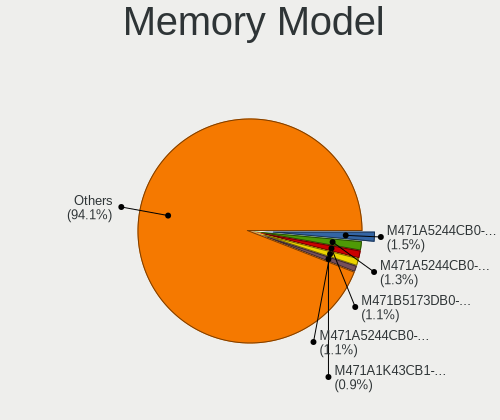

| Model                                                               | Computers | Percent |
|---------------------------------------------------------------------|-----------|---------|
| Samsung RAM M471A5244CB0-CRC 4GB SODIMM DDR4 2667MT/s               | 10        | 1.42%   |
| Samsung RAM M471B5173DB0-YK0 4GB SODIMM DDR3 1600MT/s               | 9         | 1.28%   |
| Samsung RAM M471A5244CB0-CTD 4096MB SODIMM DDR4 3266MT/s            | 9         | 1.28%   |
| SK hynix RAM HMT451S6BFR8A-PB 4GB SODIMM DDR3 1600MT/s              | 8         | 1.14%   |
| Samsung RAM M471B5273CH0-CH9 4GB SODIMM DDR3 1334MT/s               | 7         | 0.99%   |
| Samsung RAM M471A5244CB0-CWE 4GB SODIMM DDR4 3200MT/s               | 7         | 0.99%   |
| Samsung RAM M471A1K43CB1-CTD 8GB SODIMM DDR4 2667MT/s               | 7         | 0.99%   |
| Micron RAM 4ATF51264HZ-2G6E1 4GB SODIMM DDR4 2667MT/s               | 7         | 0.99%   |
| SK hynix RAM HMA851S6AFR6N-UH 4GB SODIMM DDR4 2667MT/s              | 6         | 0.85%   |
| Super Talent RAM SUPERTALENT02 4GB DIMM DDR3 1600MT/s               | 5         | 0.71%   |
| SK hynix RAM HMA851S6DJR6N-XN 4GB SODIMM DDR4 3200MT/s              | 5         | 0.71%   |
| Samsung RAM M471B5173QH0-YK0 4096MB SODIMM DDR3 1600MT/s            | 5         | 0.71%   |
| Samsung RAM M471A1G44AB0-CWE 8GB SODIMM DDR4 3200MT/s               | 5         | 0.71%   |
| Unknown RAM Module 2GB DIMM SDRAM                                   | 4         | 0.57%   |
| Unknown RAM Module 2048MB DIMM SDRAM                                | 4         | 0.57%   |
| SK hynix RAM HMT425S6AFR6A-PB 2GB SODIMM DDR3 3200MT/s              | 4         | 0.57%   |
| SK hynix RAM HMT41GS6BFR8A-PB 8GB SODIMM DDR3 1600MT/s              | 4         | 0.57%   |
| SK hynix RAM HMT351S6CFR8C-PB 4GB SODIMM DDR3 1600MT/s              | 4         | 0.57%   |
| SK hynix RAM HMAA1GS6CJR6N-XN 8GB SODIMM DDR4 3200MT/s              | 4         | 0.57%   |
| SK hynix RAM HMA81GS6CJR8N-VK 8GB SODIMM DDR4 2667MT/s              | 4         | 0.57%   |
| SK hynix RAM HMA81GS6AFR8N-UH 8GB SODIMM DDR4 2667MT/s              | 4         | 0.57%   |
| Samsung RAM M471B5273DH0-CH9 4GB SODIMM DDR3 1334MT/s               | 4         | 0.57%   |
| Samsung RAM M471B5173EB0-YK0 4GB SODIMM DDR3 1600MT/s               | 4         | 0.57%   |
| Samsung RAM M471A1K43CB1-CRC 8GB SODIMM DDR4 2667MT/s               | 4         | 0.57%   |
| Samsung RAM M471A1G43DB0-CPB 8GB SODIMM DDR4 3200MT/s               | 4         | 0.57%   |
| Samsung RAM K4A8G165WC-BCTD 4GB SODIMM DDR4 2667MT/s                | 4         | 0.57%   |
| Micron RAM 4ATF51264HZ-3G2J1 4GB SODIMM DDR4 3200MT/s               | 4         | 0.57%   |
| Micron RAM 4ATF51264HZ-2G3B1 4GB SODIMM DDR4 3200MT/s               | 4         | 0.57%   |
| Unknown                                                             | 4         | 0.57%   |
| Unknown (ABCD) RAM 123456789012345678 2048MB SODIMM LPDDR4 2400MT/s | 3         | 0.43%   |
| SK hynix RAM HMA851S6CJR6N-XN 4GB SODIMM DDR4 3200MT/s              | 3         | 0.43%   |
| SK hynix RAM HMA851S6CJR6N-VK 4GB SODIMM DDR4 2667MT/s              | 3         | 0.43%   |
| SK hynix RAM HMA81GS6JJR8N-VK 8GB SODIMM DDR4 2667MT/s              | 3         | 0.43%   |
| SK hynix RAM HMA81GS6AFR8N-UH 8GB SODIMM DDR4 2400MT/s              | 3         | 0.43%   |
| SK hynix RAM HMA451S6AFR8N-TF 4GB SODIMM DDR4 2133MT/s              | 3         | 0.43%   |
| Samsung RAM M471B5773CHS-CH9 2048MB SODIMM DDR3 4199MT/s            | 3         | 0.43%   |
| Samsung RAM M471A1K43EB1-CWE 8GB SODIMM DDR4 3200MT/s               | 3         | 0.43%   |
| Samsung RAM M471A1K43DB1-CTD 8GB SODIMM DDR4 2667MT/s               | 3         | 0.43%   |
| Samsung RAM M471A1G44AB0-CWE 8GB Row Of Chips DDR4 3200MT/s         | 3         | 0.43%   |
| Micron RAM Module 4GB SODIMM DDR3 1600MT/s                          | 3         | 0.43%   |

Memory Kind
-----------

Memory module kinds

| Kind    | Computers | Percent |
|---------|-----------|---------|
| DDR4    | 253       | 47.92%  |
| DDR3    | 184       | 34.85%  |
| DDR2    | 24        | 4.55%   |
| SDRAM   | 21        | 3.98%   |
| LPDDR4  | 18        | 3.41%   |
| LPDDR3  | 8         | 1.52%   |
| Unknown | 6         | 1.14%   |
| LPDDR5  | 4         | 0.76%   |
| DDR     | 4         | 0.76%   |
| DRAM    | 3         | 0.57%   |
| DDR5    | 3         | 0.57%   |

Memory Form Factor
------------------

Physical design of the memory module

| Name         | Computers | Percent |
|--------------|-----------|---------|
| SODIMM       | 342       | 65.52%  |
| DIMM         | 150       | 28.74%  |
| Row Of Chips | 30        | 5.75%   |

Memory Size
-----------

Memory module size

| Size  | Computers | Percent |
|-------|-----------|---------|
| 8192  | 207       | 34.05%  |
| 4096  | 205       | 33.72%  |
| 2048  | 83        | 13.65%  |
| 16384 | 70        | 11.51%  |
| 32768 | 21        | 3.45%   |
| 1024  | 19        | 3.13%   |
| 512   | 2         | 0.33%   |
| 128   | 1         | 0.16%   |

Memory Speed
------------

Memory module speed

| Speed   | Computers | Percent |
|---------|-----------|---------|
| 1600    | 129       | 21.98%  |
| 2667    | 102       | 17.38%  |
| 3200    | 90        | 15.33%  |
| 1333    | 37        | 6.3%    |
| 2400    | 33        | 5.62%   |
| 1334    | 24        | 4.09%   |
| 2133    | 23        | 3.92%   |
| 3600    | 19        | 3.24%   |
| Unknown | 17        | 2.9%    |
| 800     | 11        | 1.87%   |
| 3266    | 9         | 1.53%   |
| 3000    | 7         | 1.19%   |
| 1867    | 7         | 1.19%   |
| 667     | 7         | 1.19%   |
| 1067    | 6         | 1.02%   |
| 1066    | 6         | 1.02%   |
| 4267    | 5         | 0.85%   |
| 4199    | 5         | 0.85%   |
| 6400    | 4         | 0.68%   |
| 3733    | 4         | 0.68%   |
| 4800    | 3         | 0.51%   |
| 3800    | 3         | 0.51%   |
| 3400    | 3         | 0.51%   |
| 2666    | 3         | 0.51%   |
| 1800    | 3         | 0.51%   |
| 533     | 3         | 0.51%   |
| 3066    | 2         | 0.34%   |
| 1866    | 2         | 0.34%   |
| 1776    | 2         | 0.34%   |
| 975     | 2         | 0.34%   |
| 400     | 2         | 0.34%   |
| 333     | 2         | 0.34%   |
| 8400    | 1         | 0.17%   |
| 5600    | 1         | 0.17%   |
| 4266    | 1         | 0.17%   |
| 3666    | 1         | 0.17%   |
| 3500    | 1         | 0.17%   |
| 3333    | 1         | 0.17%   |
| 3100    | 1         | 0.17%   |
| 2800    | 1         | 0.17%   |

Printers & scanners
-------------------

Printer Vendor
--------------

Printer device vendors

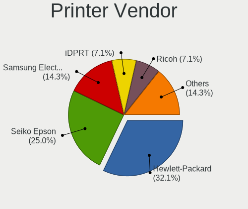

| Vendor              | Computers | Percent |
|---------------------|-----------|---------|
| Hewlett-Packard     | 8         | 30.77%  |
| Seiko Epson         | 7         | 26.92%  |
| Samsung Electronics | 3         | 11.54%  |
| SAT                 | 2         | 7.69%   |
| Ricoh               | 2         | 7.69%   |
| Prolific Technology | 1         | 3.85%   |
| Philips (or NXP)    | 1         | 3.85%   |
| Canon               | 1         | 3.85%   |
| Brother Industries  | 1         | 3.85%   |

Printer Model
-------------

Printer device models

| Model                                                  | Computers | Percent |
|--------------------------------------------------------|-----------|---------|
| Seiko Epson L120 Series                                | 3         | 11.54%  |
| SAT SAT38TUSE                                          | 2         | 7.69%   |
| HP LaserJet Professional P 1102w                       | 2         | 7.69%   |
| Seiko Epson ME Office 600F/Stylus Office BX300F/TX300F | 1         | 3.85%   |
| Seiko Epson L360 Series                                | 1         | 3.85%   |
| Seiko Epson L3110 Series                               | 1         | 3.85%   |
| Seiko Epson L210 Series                                | 1         | 3.85%   |
| Samsung ML-2010P Mono Laser Printer                    | 1         | 3.85%   |
| Samsung M2020 Series                                   | 1         | 3.85%   |
| Samsung Composite Device                               | 1         | 3.85%   |
| Ricoh Printing Support                                 | 1         | 3.85%   |
| Ricoh Aficio SP 3510DN                                 | 1         | 3.85%   |
| Prolific PL2305 Parallel Port                          | 1         | 3.85%   |
| Philips (or NXP) USB Printer                           | 1         | 3.85%   |
| HP Smart Tank 530 series                               | 1         | 3.85%   |
| HP LaserJet CP 1025nw                                  | 1         | 3.85%   |
| HP LaserJet 1020                                       | 1         | 3.85%   |
| HP Laser 107a                                          | 1         | 3.85%   |
| HP DeskJet 5810 series                                 | 1         | 3.85%   |
| HP Deskjet 2540 series                                 | 1         | 3.85%   |
| Canon G3000 series                                     | 1         | 3.85%   |
| Brother DCP-T710W                                      | 1         | 3.85%   |

Scanner Vendor
--------------

Scanner device vendors

Zero info for selected period =(

Scanner Model
-------------

Scanner device models

Zero info for selected period =(

Camera
------

Camera Vendor
-------------

Camera device vendors

| Vendor                                 | Computers | Percent |
|----------------------------------------|-----------|---------|
| Chicony Electronics                    | 157       | 19.12%  |
| IMC Networks                           | 140       | 17.05%  |
| Realtek Semiconductor                  | 58        | 7.06%   |
| Cheng Uei Precision Industry (Foxlink) | 54        | 6.58%   |
| Microdia                               | 53        | 6.46%   |
| Quanta                                 | 51        | 6.21%   |
| Bison Electronics                      | 39        | 4.75%   |
| Sunplus Innovation Technology          | 31        | 3.78%   |
| Lite-On Technology                     | 27        | 3.29%   |
| Logitech                               | 24        | 2.92%   |
| Apple                                  | 20        | 2.44%   |
| Acer                                   | 18        | 2.19%   |
| Syntek                                 | 17        | 2.07%   |
| Silicon Motion                         | 16        | 1.95%   |
| Suyin                                  | 13        | 1.58%   |
| KYE Systems (Mouse Systems)            | 10        | 1.22%   |
| Ricoh                                  | 8         | 0.97%   |
| Cubeternet                             | 6         | 0.73%   |
| Alcor Micro                            | 6         | 0.73%   |
| Y Media                                | 5         | 0.61%   |
| OmniVision Technologies                | 5         | 0.61%   |
| Luxvisions Innotech Limited            | 5         | 0.61%   |
| Sonix Technology                       | 4         | 0.49%   |
| Samsung Electronics                    | 4         | 0.49%   |
| Microsoft                              | 4         | 0.49%   |
| Lenovo                                 | 4         | 0.49%   |
| Importek                               | 4         | 0.49%   |
| Huawei Technologies                    | 4         | 0.49%   |
| Generalplus Technology                 | 4         | 0.49%   |
| ALi                                    | 4         | 0.49%   |
| Z-Star Microelectronics                | 3         | 0.37%   |
| GEMBIRD                                | 3         | 0.37%   |
| Arkmicro Technologies                  | 3         | 0.37%   |
| Sunplus Technology                     | 2         | 0.24%   |
| Pixart Imaging                         | 2         | 0.24%   |
| webcamvendor                           | 1         | 0.12%   |
| WaveRider Communications               | 1         | 0.12%   |
| Unknown                                | 1         | 0.12%   |
| Trust                                  | 1         | 0.12%   |
| ShineTech                              | 1         | 0.12%   |

Camera Model
------------

Camera device models

| Model                                                                      | Computers | Percent |
|----------------------------------------------------------------------------|-----------|---------|
| IMC Networks USB2.0 VGA UVC WebCam                                         | 52        | 6.33%   |
| IMC Networks USB2.0 HD UVC WebCam                                          | 38        | 4.62%   |
| Chicony USB2.0 VGA UVC WebCam                                              | 21        | 2.55%   |
| Microdia Integrated_Webcam_HD                                              | 19        | 2.31%   |
| IMC Networks Integrated Camera                                             | 18        | 2.19%   |
| Chicony Integrated Camera                                                  | 18        | 2.19%   |
| Bison Integrated Camera                                                    | 15        | 1.82%   |
| Chicony HP TrueVision HD Camera                                            | 13        | 1.58%   |
| Cheng Uei Precision Industry (Foxlink) HP TrueVision HD Camera             | 11        | 1.34%   |
| Sunplus Integrated_Webcam_HD                                               | 10        | 1.22%   |
| Realtek USB Camera                                                         | 10        | 1.22%   |
| Chicony Lenovo EasyCamera                                                  | 10        | 1.22%   |
| Syntek Integrated Camera                                                   | 9         | 1.09%   |
| Realtek Integrated_Webcam_HD                                               | 9         | 1.09%   |
| Chicony HP Webcam                                                          | 9         | 1.09%   |
| Chicony HD WebCam                                                          | 9         | 1.09%   |
| Cheng Uei Precision Industry (Foxlink) HP Webcam                           | 9         | 1.09%   |
| Quanta HD User Facing                                                      | 8         | 0.97%   |
| Lite-On HP Webcam                                                          | 8         | 0.97%   |
| Apple FaceTime HD Camera (Built-in)                                        | 8         | 0.97%   |
| Quanta HP Webcam                                                           | 6         | 0.73%   |
| Quanta HD Webcam                                                           | 6         | 0.73%   |
| Microdia Lenovo EasyCamera                                                 | 6         | 0.73%   |
| Lite-On HP Wide Vision HD Camera                                           | 6         | 0.73%   |
| IMC Networks VGA UVC WebCam                                                | 6         | 0.73%   |
| Chicony HP High Definition 1MP Webcam                                      | 6         | 0.73%   |
| Chicony EasyCamera                                                         | 6         | 0.73%   |
| Apple Built-in iSight                                                      | 6         | 0.73%   |
| Y Media USB Camera                                                         | 5         | 0.61%   |
| Realtek Lenovo EasyCamera                                                  | 5         | 0.61%   |
| Realtek Asus laptop camera                                                 | 5         | 0.61%   |
| Quanta USB2.0 HD UVC WebCam                                                | 5         | 0.61%   |
| Logitech HD Webcam C525                                                    | 5         | 0.61%   |
| Logitech HD Pro Webcam C920                                                | 5         | 0.61%   |
| Lite-On Integrated Camera                                                  | 5         | 0.61%   |
| Lite-On HP HD Camera                                                       | 5         | 0.61%   |
| Chicony HP Wide Vision HD Camera                                           | 5         | 0.61%   |
| Cheng Uei Precision Industry (Foxlink) HP Wide Vision HD Integrated Webcam | 5         | 0.61%   |
| Cheng Uei Precision Industry (Foxlink) HP Truevision HD                    | 5         | 0.61%   |
| Bison Lenovo EasyCamera                                                    | 5         | 0.61%   |

Security
--------

Fingerprint Vendor
------------------

Fingerprint sensor vendors

| Vendor                     | Computers | Percent |
|----------------------------|-----------|---------|
| Validity Sensors           | 30        | 30%     |
| Synaptics                  | 20        | 20%     |
| Elan Microelectronics      | 20        | 20%     |
| Shenzhen Goodix Technology | 18        | 18%     |
| Upek                       | 6         | 6%      |
| LighTuning Technology      | 3         | 3%      |
| AuthenTec                  | 2         | 2%      |
| STMicroelectronics         | 1         | 1%      |

Fingerprint Model
-----------------

Fingerprint sensor models

| Model                                                                      | Computers | Percent |
|----------------------------------------------------------------------------|-----------|---------|
| Elan ELAN:Fingerprint                                                      | 17        | 17%     |
| Shenzhen Goodix  FingerPrint Device                                        | 13        | 13%     |
| Validity Sensors VFS495 Fingerprint Reader                                 | 6         | 6%      |
| Upek Biometric Touchchip/Touchstrip Fingerprint Sensor                     | 6         | 6%      |
| Validity Sensors VFS5011 Fingerprint Reader                                | 5         | 5%      |
| Synaptics Prometheus MIS Touch Fingerprint Reader                          | 5         | 5%      |
| Shenzhen Goodix Fingerprint Reader                                         | 5         | 5%      |
| Validity Sensors VFS 5011 fingerprint sensor                               | 4         | 4%      |
| Validity Sensors VFS451 Fingerprint Reader                                 | 3         | 3%      |
| Synaptics WBDI Fingerprint Reader USB 086                                  | 3         | 3%      |
| Elan ELAN:ARM-M4                                                           | 3         | 3%      |
| Validity Sensors Synaptics WBDI                                            | 2         | 2%      |
| Validity Sensors Synaptics VFS7552 Touch Fingerprint Sensor with PurePrint | 2         | 2%      |
| Validity Sensors Swipe Fingerprint Sensor                                  | 2         | 2%      |
| Validity Sensors Fingerprint scanner                                       | 2         | 2%      |
| Synaptics UWP WBDI                                                         | 2         | 2%      |
| Synaptics  WBDI                                                            | 2         | 2%      |
| Synaptics Fingerprint reader [HP G6]                                       | 2         | 2%      |
| LighTuning EgisTec Touch Fingerprint Sensor                                | 2         | 2%      |
| Validity Sensors VFS7500 Touch Fingerprint Sensor                          | 1         | 1%      |
| Validity Sensors VFS471 Fingerprint Reader                                 | 1         | 1%      |
| Validity Sensors VFS101 Fingerprint Reader                                 | 1         | 1%      |
| Validity Sensors VFS Fingerprint sensor                                    | 1         | 1%      |
| Synaptics WBDI Fingerprint Reader USB 102                                  | 1         | 1%      |
| Synaptics WBDI Device                                                      | 1         | 1%      |
| Synaptics WBDI                                                             | 1         | 1%      |
| Synaptics Metallica MIS Touch Fingerprint Reader                           | 1         | 1%      |
| Synaptics FS7604 Touch Fingerprint Sensor with PurePrint                   | 1         | 1%      |
| STMicroelectronics Fingerprint Reader                                      | 1         | 1%      |
| LighTuning ES603 Swipe Fingerprint Sensor                                  | 1         | 1%      |
| AuthenTec AES2810                                                          | 1         | 1%      |
| AuthenTec AES1600                                                          | 1         | 1%      |
| Unknown                                                                    | 1         | 1%      |

Chipcard Vendor
---------------

Chipcard module vendors

| Vendor                | Computers | Percent |
|-----------------------|-----------|---------|
| Broadcom              | 8         | 42.11%  |
| Upek                  | 4         | 21.05%  |
| O2 Micro              | 2         | 10.53%  |
| Lenovo                | 2         | 10.53%  |
| Alcor Micro           | 2         | 10.53%  |
| Gemalto (was Gemplus) | 1         | 5.26%   |

Chipcard Model
--------------

Chipcard module models

| Model                                                      | Computers | Percent |
|------------------------------------------------------------|-----------|---------|
| Broadcom 5880                                              | 5         | 26.32%  |
| Upek TouchChip Fingerprint Coprocessor (WBF advanced mode) | 4         | 21.05%  |
| Lenovo Integrated Smart Card Reader                        | 2         | 10.53%  |
| Broadcom BCM5880 Secure Applications Processor             | 2         | 10.53%  |
| Alcor Micro AU9540 Smartcard Reader                        | 2         | 10.53%  |
| O2 Micro Oz776 SmartCard Reader                            | 1         | 5.26%   |
| O2 Micro OZ776 CCID Smartcard Reader                       | 1         | 5.26%   |
| Gemalto (was Gemplus) Compact Smart Card Reader Writer     | 1         | 5.26%   |
| Broadcom 58200                                             | 1         | 5.26%   |

Unsupported
-----------

Unsupported Devices
-------------------

Total unsupported devices on board

| Total | Computers | Percent |
|-------|-----------|---------|
| 0     | 772       | 67.84%  |
| 1     | 308       | 27.07%  |
| 2     | 53        | 4.66%   |
| 3     | 2         | 0.18%   |
| 7     | 1         | 0.09%   |
| 6     | 1         | 0.09%   |
| 4     | 1         | 0.09%   |

Unsupported Device Types
------------------------

Types of unsupported devices

| Type                     | Computers | Percent |
|--------------------------|-----------|---------|
| Fingerprint reader       | 100       | 23.92%  |
| Graphics card            | 97        | 23.21%  |
| Net/wireless             | 86        | 20.57%  |
| Multimedia controller    | 39        | 9.33%   |
| Bluetooth                | 20        | 4.78%   |
| Chipcard                 | 19        | 4.55%   |
| Camera                   | 16        | 3.83%   |
| Communication controller | 15        | 3.59%   |
| Sound                    | 7         | 1.67%   |
| Storage                  | 5         | 1.2%    |
| Card reader              | 5         | 1.2%    |
| Net/ethernet             | 3         | 0.72%   |
| Storage/raid             | 2         | 0.48%   |
| Unassigned class         | 1         | 0.24%   |
| Network                  | 1         | 0.24%   |
| Flash memory             | 1         | 0.24%   |
| Firewire controller      | 1         | 0.24%   |

