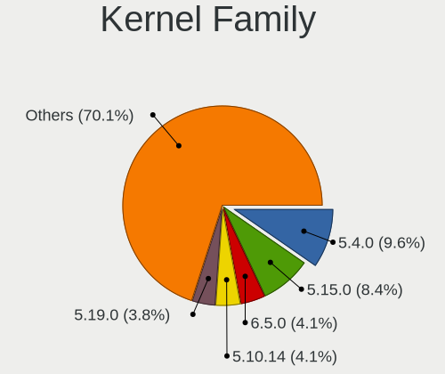
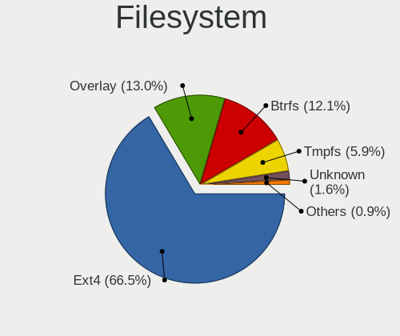
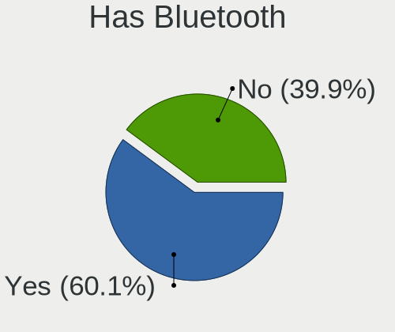
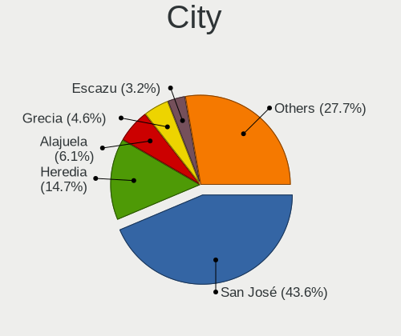
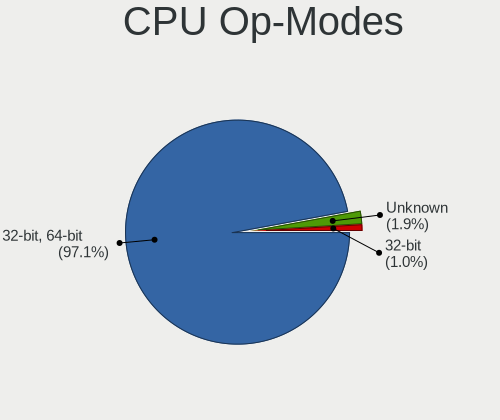
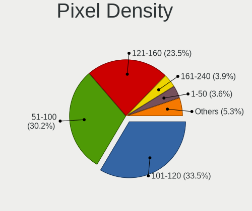

Linux in Costa Rica - Tested Hardware & Statistics
--------------------------------------------------

A project to collect tested hardware configurations for Linux in Costa Rica.

Anyone can contribute to this report by the [hw-probe](https://github.com/linuxhw/hw-probe) tool:

    sudo -E hw-probe -all -upload

Please contribute! Especially if your hardware is rare.

This is a report for all computer types. See also reports for [desktops](/Location/Costa_Rica/Desktop/README.md) and [notebooks](/Location/Costa_Rica/Notebook/README.md).

Contents
--------

* [ Test Cases ](#test-cases)

* [ System ](#system)
  - [ OS                       ](#os)
  - [ OS Family                ](#os-family)
  - [ Kernel                   ](#kernel)
  - [ Kernel Family            ](#kernel-family)
  - [ Kernel Major Ver.        ](#kernel-major-ver)
  - [ Arch                     ](#arch)
  - [ DE                       ](#de)
  - [ Display Server           ](#display-server)
  - [ Display Manager          ](#display-manager)
  - [ OS Lang                  ](#os-lang)
  - [ Boot Mode                ](#boot-mode)
  - [ Filesystem               ](#filesystem)
  - [ Part. scheme             ](#part-scheme)
  - [ Dual Boot with Linux/BSD ](#dual-boot-with-linuxbsd)
  - [ Dual Boot (Win)          ](#dual-boot-win)

* [ Board ](#board)
  - [ Vendor                   ](#vendor)
  - [ Model                    ](#model)
  - [ Model Family             ](#model-family)
  - [ MFG Year                 ](#mfg-year)
  - [ Form Factor              ](#form-factor)
  - [ Secure Boot              ](#secure-boot)
  - [ Coreboot                 ](#coreboot)
  - [ RAM Size                 ](#ram-size)
  - [ RAM Used                 ](#ram-used)
  - [ Total Drives             ](#total-drives)
  - [ Has CD-ROM               ](#has-cd-rom)
  - [ Has Ethernet             ](#has-ethernet)
  - [ Has WiFi                 ](#has-wifi)
  - [ Has Bluetooth            ](#has-bluetooth)

* [ Location ](#location)
  - [ Country                  ](#country)
  - [ City                     ](#city)

* [ Drives ](#drives)
  - [ Drive Vendor             ](#drive-vendor)
  - [ Drive Model              ](#drive-model)
  - [ HDD Vendor               ](#hdd-vendor)
  - [ SSD Vendor               ](#ssd-vendor)
  - [ Drive Kind               ](#drive-kind)
  - [ Drive Connector          ](#drive-connector)
  - [ Drive Size               ](#drive-size)
  - [ Space Total              ](#space-total)
  - [ Space Used               ](#space-used)
  - [ Malfunc. Drives          ](#malfunc-drives)
  - [ Malfunc. Drive Vendor    ](#malfunc-drive-vendor)
  - [ Malfunc. HDD Vendor      ](#malfunc-hdd-vendor)
  - [ Malfunc. Drive Kind      ](#malfunc-drive-kind)
  - [ Failed Drives            ](#failed-drives)
  - [ Failed Drive Vendor      ](#failed-drive-vendor)
  - [ Drive Status             ](#drive-status)

* [ Storage controller ](#storage-controller)
  - [ Storage Vendor           ](#storage-vendor)
  - [ Storage Model            ](#storage-model)
  - [ Storage Kind             ](#storage-kind)

* [ Processor ](#processor)
  - [ CPU Vendor               ](#cpu-vendor)
  - [ CPU Model                ](#cpu-model)
  - [ CPU Model Family         ](#cpu-model-family)
  - [ CPU Cores                ](#cpu-cores)
  - [ CPU Sockets              ](#cpu-sockets)
  - [ CPU Threads              ](#cpu-threads)
  - [ CPU Op-Modes             ](#cpu-op-modes)
  - [ CPU Microcode            ](#cpu-microcode)
  - [ CPU Microarch            ](#cpu-microarch)

* [ Graphics ](#graphics)
  - [ GPU Vendor               ](#gpu-vendor)
  - [ GPU Model                ](#gpu-model)
  - [ GPU Combo                ](#gpu-combo)
  - [ GPU Driver               ](#gpu-driver)
  - [ GPU Memory               ](#gpu-memory)

* [ Monitor ](#monitor)
  - [ Monitor Vendor           ](#monitor-vendor)
  - [ Monitor Model            ](#monitor-model)
  - [ Monitor Resolution       ](#monitor-resolution)
  - [ Monitor Diagonal         ](#monitor-diagonal)
  - [ Monitor Width            ](#monitor-width)
  - [ Aspect Ratio             ](#aspect-ratio)
  - [ Monitor Area             ](#monitor-area)
  - [ Pixel Density            ](#pixel-density)
  - [ Multiple Monitors        ](#multiple-monitors)

* [ Network ](#network)
  - [ Net Controller Vendor    ](#net-controller-vendor)
  - [ Net Controller Model     ](#net-controller-model)
  - [ Wireless Vendor          ](#wireless-vendor)
  - [ Wireless Model           ](#wireless-model)
  - [ Ethernet Vendor          ](#ethernet-vendor)
  - [ Ethernet Model           ](#ethernet-model)
  - [ Net Controller Kind      ](#net-controller-kind)
  - [ Used Controller          ](#used-controller)
  - [ NICs                     ](#nics)
  - [ IPv6                     ](#ipv6)

* [ Bluetooth ](#bluetooth)
  - [ Bluetooth Vendor         ](#bluetooth-vendor)
  - [ Bluetooth Model          ](#bluetooth-model)

* [ Sound ](#sound)
  - [ Sound Vendor             ](#sound-vendor)
  - [ Sound Model              ](#sound-model)

* [ Memory ](#memory)
  - [ Memory Vendor            ](#memory-vendor)
  - [ Memory Model             ](#memory-model)
  - [ Memory Kind              ](#memory-kind)
  - [ Memory Form Factor       ](#memory-form-factor)
  - [ Memory Size              ](#memory-size)
  - [ Memory Speed             ](#memory-speed)

* [ Printers & scanners ](#printers--scanners)
  - [ Printer Vendor           ](#printer-vendor)
  - [ Printer Model            ](#printer-model)
  - [ Scanner Vendor           ](#scanner-vendor)
  - [ Scanner Model            ](#scanner-model)

* [ Camera ](#camera)
  - [ Camera Vendor            ](#camera-vendor)
  - [ Camera Model             ](#camera-model)

* [ Security ](#security)
  - [ Fingerprint Vendor       ](#fingerprint-vendor)
  - [ Fingerprint Model        ](#fingerprint-model)
  - [ Chipcard Vendor          ](#chipcard-vendor)
  - [ Chipcard Model           ](#chipcard-model)

* [ Unsupported ](#unsupported)
  - [ Unsupported Devices      ](#unsupported-devices)
  - [ Unsupported Device Types ](#unsupported-device-types)

Test Cases
----------

Total: 320

| Vendor        | Model                       | Form-Factor | Probe                                                      | Date         |
|---------------|-----------------------------|-------------|------------------------------------------------------------|--------------|
| Dell          | Latitude E5430 non-vPro     | Notebook    | [ae644e258a](https://linux-hardware.org/?probe=ae644e258a) | Jan 28, 2023 |
| ASUSTek       | TUF Gaming X570-PLUS        | Desktop     | [cc2d26e52e](https://linux-hardware.org/?probe=cc2d26e52e) | Jan 22, 2023 |
| HP            | Laptop 14-dk1xxx            | Notebook    | [8761a4096a](https://linux-hardware.org/?probe=8761a4096a) | Jan 22, 2023 |
| HP            | Laptop 14-dk1xxx            | Notebook    | [7099ccff2f](https://linux-hardware.org/?probe=7099ccff2f) | Jan 22, 2023 |
| Dell          | 0D28YY A00                  | Desktop     | [394be1956b](https://linux-hardware.org/?probe=394be1956b) | Jan 22, 2023 |
| HP            | Laptop 15-da0xxx            | Notebook    | [f33868aba0](https://linux-hardware.org/?probe=f33868aba0) | Jan 15, 2023 |
| Dell          | Inspiron 7506 2n1           | Convertible | [927415e3d5](https://linux-hardware.org/?probe=927415e3d5) | Jan 07, 2023 |
| Dell          | Inspiron 7506 2n1           | Convertible | [46ea5b81b7](https://linux-hardware.org/?probe=46ea5b81b7) | Jan 07, 2023 |
| Lenovo        | Legion Y540-15IRH 81SX      | Notebook    | [f5ff2f8568](https://linux-hardware.org/?probe=f5ff2f8568) | Jan 06, 2023 |
| MACHINIST     | X79 V2.82H                  | Desktop     | [e6028c8640](https://linux-hardware.org/?probe=e6028c8640) | Jan 04, 2023 |
| Jumper        | EZpad                       | Tablet      | [cfa761d534](https://linux-hardware.org/?probe=cfa761d534) | Jan 03, 2023 |
| Raspberry ... | Raspberry Pi                | Soc         | [b1a7532cf1](https://linux-hardware.org/?probe=b1a7532cf1) | Dec 23, 2022 |
| ZOTAC         | NM10                        | Desktop     | [98b6981431](https://linux-hardware.org/?probe=98b6981431) | Dec 21, 2022 |
| Gigabyte      | B150-HD3-CF                 | Desktop     | [173dde2177](https://linux-hardware.org/?probe=173dde2177) | Dec 14, 2022 |
| MSI           | PRO B650M-A WIFI            | Desktop     | [485240a680](https://linux-hardware.org/?probe=485240a680) | Dec 13, 2022 |
| Lenovo        | ThinkPad P17 Gen 2i 20YU... | Notebook    | [75a9a0c076](https://linux-hardware.org/?probe=75a9a0c076) | Dec 12, 2022 |
| Lenovo        | ThinkPad P17 Gen 2i 20YU... | Notebook    | [15695e4deb](https://linux-hardware.org/?probe=15695e4deb) | Dec 11, 2022 |
| Apple         | MacBookPro8,1               | Notebook    | [71137ab051](https://linux-hardware.org/?probe=71137ab051) | Dec 08, 2022 |
| Apple         | MacBookPro8,1               | Notebook    | [651f6f4d18](https://linux-hardware.org/?probe=651f6f4d18) | Dec 07, 2022 |
| HP            | Laptop 15-da0xxx            | Notebook    | [de8272cf2e](https://linux-hardware.org/?probe=de8272cf2e) | Dec 05, 2022 |
| Lenovo        | ThinkPad X1 Extreme Gen ... | Notebook    | [0ade3eaab1](https://linux-hardware.org/?probe=0ade3eaab1) | Dec 02, 2022 |
| Lenovo        | ThinkPad X1 Extreme Gen ... | Notebook    | [a3746e8985](https://linux-hardware.org/?probe=a3746e8985) | Dec 01, 2022 |
| Gigabyte      | H410M H                     | Desktop     | [09129dad50](https://linux-hardware.org/?probe=09129dad50) | Nov 28, 2022 |
| Gigabyte      | H410M H                     | Desktop     | [88ca303518](https://linux-hardware.org/?probe=88ca303518) | Nov 28, 2022 |
| Gigabyte      | H81M-DS2                    | Desktop     | [f278eb7e59](https://linux-hardware.org/?probe=f278eb7e59) | Nov 27, 2022 |
| Toshiba       | Satellite S55-A             | Notebook    | [c188e01f20](https://linux-hardware.org/?probe=c188e01f20) | Nov 20, 2022 |
| HP            | Unknown                     | Notebook    | [9b1181bc4b](https://linux-hardware.org/?probe=9b1181bc4b) | Nov 19, 2022 |
| Apple         | MacBookPro8,1               | Notebook    | [8a52f497b0](https://linux-hardware.org/?probe=8a52f497b0) | Nov 19, 2022 |
| Toshiba       | Satellite S55-A             | Notebook    | [d5e9f0d98a](https://linux-hardware.org/?probe=d5e9f0d98a) | Nov 19, 2022 |
| ASRock        | B660M Steel Legend          | Desktop     | [708d98bf92](https://linux-hardware.org/?probe=708d98bf92) | Nov 06, 2022 |
| ASRock        | B660M Steel Legend          | Desktop     | [2fce0b247c](https://linux-hardware.org/?probe=2fce0b247c) | Nov 06, 2022 |
| Lenovo        | ThinkPad P16 Gen 1 21D7S... | Notebook    | [fc4b865872](https://linux-hardware.org/?probe=fc4b865872) | Nov 04, 2022 |
| Lenovo        | ThinkPad T60 1952F75        | Notebook    | [a6f536ca3d](https://linux-hardware.org/?probe=a6f536ca3d) | Oct 25, 2022 |
| Lenovo        | ThinkPad T60 1952F75        | Notebook    | [813bd112f8](https://linux-hardware.org/?probe=813bd112f8) | Oct 25, 2022 |
| MACHINIST     | X79 V2.82H                  | Desktop     | [5d99fbefc1](https://linux-hardware.org/?probe=5d99fbefc1) | Oct 17, 2022 |
| MSI           | GF65 Thin 10SDR             | Notebook    | [1c2a3b90e2](https://linux-hardware.org/?probe=1c2a3b90e2) | Oct 04, 2022 |
| ASUSTek       | PRIME Z370-A                | Desktop     | [5d789a1783](https://linux-hardware.org/?probe=5d789a1783) | Sep 28, 2022 |
| Dell          | Inspiron 3493               | Notebook    | [b1f8d22e3e](https://linux-hardware.org/?probe=b1f8d22e3e) | Sep 25, 2022 |
| Intel         | DG41WV AAE90316-103         | Desktop     | [425dd57672](https://linux-hardware.org/?probe=425dd57672) | Sep 24, 2022 |
| Dell          | 0HD5W2 A01                  | Desktop     | [1bb8ad599d](https://linux-hardware.org/?probe=1bb8ad599d) | Sep 11, 2022 |
| Dell          | Inspiron 14 5410 2-in-1     | Convertible | [b49d726ab0](https://linux-hardware.org/?probe=b49d726ab0) | Sep 03, 2022 |
| Dell          | Inspiron 14 5410 2-in-1     | Convertible | [ee80be714e](https://linux-hardware.org/?probe=ee80be714e) | Sep 03, 2022 |
| ASRock        | N68-S UCC                   | Desktop     | [1d38f1f08e](https://linux-hardware.org/?probe=1d38f1f08e) | Aug 30, 2022 |
| Lenovo        | ThinkPad T470 W10DG 20JM... | Notebook    | [9b23c4b82c](https://linux-hardware.org/?probe=9b23c4b82c) | Aug 30, 2022 |
| Dell          | G3 3579                     | Notebook    | [a3fc82fe9a](https://linux-hardware.org/?probe=a3fc82fe9a) | Aug 30, 2022 |
| Dell          | Inspiron 3543               | Notebook    | [68d1385b7e](https://linux-hardware.org/?probe=68d1385b7e) | Aug 28, 2022 |
| Toshiba       | Satellite C55-C             | Notebook    | [99faef3f00](https://linux-hardware.org/?probe=99faef3f00) | Aug 20, 2022 |
| Lenovo        | IdeaPadFlex 5 14ARE05 81... | Convertible | [fb77adfb99](https://linux-hardware.org/?probe=fb77adfb99) | Aug 16, 2022 |
| Toshiba       | Satellite L655              | Notebook    | [5e3e45b5d5](https://linux-hardware.org/?probe=5e3e45b5d5) | Aug 08, 2022 |
| Toshiba       | Satellite C55-C             | Notebook    | [992b4f4910](https://linux-hardware.org/?probe=992b4f4910) | Aug 06, 2022 |
| Gigabyte      | GA-78LMT-USB3 SEx           | Desktop     | [b932802b52](https://linux-hardware.org/?probe=b932802b52) | Aug 04, 2022 |
| ASUSTek       | GL552VW                     | Notebook    | [cd24503d2f](https://linux-hardware.org/?probe=cd24503d2f) | Aug 02, 2022 |
| Acer          | Aspire E5-576               | Notebook    | [a31ceb9a36](https://linux-hardware.org/?probe=a31ceb9a36) | Jul 31, 2022 |
| MACHINIST     | X79 V2.82H                  | Desktop     | [da4a098248](https://linux-hardware.org/?probe=da4a098248) | Jul 22, 2022 |
| MACHINIST     | X79 V2.82H                  | Desktop     | [0e06f3fdf5](https://linux-hardware.org/?probe=0e06f3fdf5) | Jul 22, 2022 |
| Acer          | Aspire R3-131T              | Notebook    | [f4efe63bf8](https://linux-hardware.org/?probe=f4efe63bf8) | Jul 13, 2022 |
| Acer          | Aspire R3-131T              | Notebook    | [a06c4e1f6b](https://linux-hardware.org/?probe=a06c4e1f6b) | Jul 13, 2022 |
| Deffad        | Unknown                     | Notebook    | [af38c7120e](https://linux-hardware.org/?probe=af38c7120e) | Jul 04, 2022 |
| Dell          | Inspiron 3520               | Notebook    | [b865370f11](https://linux-hardware.org/?probe=b865370f11) | Jun 28, 2022 |
| Lenovo        | ThinkPad P50 20EN001PUS     | Notebook    | [52ef9383a4](https://linux-hardware.org/?probe=52ef9383a4) | Jun 09, 2022 |
| Raspberry ... | Raspberry Pi 3 Model B P... | Soc         | [46afe6a354](https://linux-hardware.org/?probe=46afe6a354) | Jun 02, 2022 |
| Lenovo        | ThinkPad T440s 20ARS29U0... | Notebook    | [50de8ad2e9](https://linux-hardware.org/?probe=50de8ad2e9) | Jun 01, 2022 |
| Unknown       | Unknown                     | Desktop     | [b64c215325](https://linux-hardware.org/?probe=b64c215325) | May 30, 2022 |
| Dell          | Latitude 7400               | Notebook    | [caf85903ad](https://linux-hardware.org/?probe=caf85903ad) | May 19, 2022 |
| Dell          | Inspiron 5565               | Notebook    | [d5a8629a31](https://linux-hardware.org/?probe=d5a8629a31) | May 19, 2022 |
| Unknown       | Unknown                     | Desktop     | [1aba67a1ac](https://linux-hardware.org/?probe=1aba67a1ac) | May 15, 2022 |
| Lenovo        | ThinkPad L420 7829AA4       | Notebook    | [9c1bbe8cf2](https://linux-hardware.org/?probe=9c1bbe8cf2) | May 14, 2022 |
| HP            | 0AECh D                     | Desktop     | [68adfe0740](https://linux-hardware.org/?probe=68adfe0740) | May 12, 2022 |
| HP            | 83EE                        | Desktop     | [55171637ca](https://linux-hardware.org/?probe=55171637ca) | Apr 29, 2022 |
| HP            | Laptop 15-da0xxx            | Notebook    | [6ad1b34a48](https://linux-hardware.org/?probe=6ad1b34a48) | Apr 29, 2022 |
| Lenovo        | ThinkPad E15 Gen 2 20T80... | Notebook    | [637af2dcc6](https://linux-hardware.org/?probe=637af2dcc6) | Apr 29, 2022 |
| Dell          | 040DDP A01                  | Desktop     | [1f14473753](https://linux-hardware.org/?probe=1f14473753) | Apr 19, 2022 |
| Apple         | MacBookPro8,1               | Notebook    | [f74cae630d](https://linux-hardware.org/?probe=f74cae630d) | Apr 16, 2022 |
| ZOTAC         | NM10                        | Desktop     | [b2983fdd9d](https://linux-hardware.org/?probe=b2983fdd9d) | Apr 15, 2022 |
| ASUSTek       | STRIX Z270G GAMING          | Desktop     | [e04e7a6bc9](https://linux-hardware.org/?probe=e04e7a6bc9) | Apr 13, 2022 |
| HP            | Pavilion Notebook           | Notebook    | [a1130d8070](https://linux-hardware.org/?probe=a1130d8070) | Apr 13, 2022 |
| Dell          | 040DDP A01                  | Desktop     | [8e31fed1d4](https://linux-hardware.org/?probe=8e31fed1d4) | Apr 07, 2022 |
| Dell          | 040DDP A01                  | Desktop     | [ff072aa20b](https://linux-hardware.org/?probe=ff072aa20b) | Apr 07, 2022 |
| Dell          | 040DDP A01                  | Desktop     | [9cd507e648](https://linux-hardware.org/?probe=9cd507e648) | Apr 07, 2022 |
| Dell          | 040DDP A01                  | Desktop     | [e5b52520a8](https://linux-hardware.org/?probe=e5b52520a8) | Apr 07, 2022 |
| ASRock        | B450 Steel Legend           | Desktop     | [6a631fae48](https://linux-hardware.org/?probe=6a631fae48) | Mar 22, 2022 |
| Acer          | Nitro AN515-43              | Notebook    | [e1386a38c7](https://linux-hardware.org/?probe=e1386a38c7) | Mar 20, 2022 |
| Dell          | Latitude E5500              | Notebook    | [13be4a0a1b](https://linux-hardware.org/?probe=13be4a0a1b) | Mar 16, 2022 |
| Dell          | Latitude E5500              | Notebook    | [d5f8fd7890](https://linux-hardware.org/?probe=d5f8fd7890) | Mar 16, 2022 |
| HP            | Laptop 15-da0xxx            | Notebook    | [a8531f3837](https://linux-hardware.org/?probe=a8531f3837) | Mar 13, 2022 |
| Dell          | Latitude D630               | Notebook    | [b7b428082a](https://linux-hardware.org/?probe=b7b428082a) | Mar 05, 2022 |
| Dell          | XPS 13 9305                 | Notebook    | [8807d99cb4](https://linux-hardware.org/?probe=8807d99cb4) | Mar 01, 2022 |
| ASUSTek       | VivoBook_ASUS Laptop E41... | Notebook    | [c0adf77f3f](https://linux-hardware.org/?probe=c0adf77f3f) | Feb 26, 2022 |
| Sony          | SVD13215PLB                 | Notebook    | [82c4287f85](https://linux-hardware.org/?probe=82c4287f85) | Feb 23, 2022 |
| Lenovo        | ThinkPad L15 Gen 2 20X4S... | Notebook    | [b355ea1ff3](https://linux-hardware.org/?probe=b355ea1ff3) | Feb 20, 2022 |
| Lenovo        | IdeaPad 3 14ADA05 81W0      | Notebook    | [8468cd0da9](https://linux-hardware.org/?probe=8468cd0da9) | Feb 19, 2022 |
| Lenovo        | IdeaPad 3 14ADA05 81W0      | Notebook    | [80e2f3c47e](https://linux-hardware.org/?probe=80e2f3c47e) | Feb 19, 2022 |
| Apple         | MacBookPro8,1               | Notebook    | [b99a5f9b59](https://linux-hardware.org/?probe=b99a5f9b59) | Feb 14, 2022 |
| Dell          | 0RW203 A00                  | Desktop     | [21ac06a9f6](https://linux-hardware.org/?probe=21ac06a9f6) | Feb 12, 2022 |
| HP            | Laptop 15-da0xxx            | Notebook    | [ce15566bc3](https://linux-hardware.org/?probe=ce15566bc3) | Feb 12, 2022 |
| Dell          | 09KPNV A01                  | Desktop     | [8fc6552bc9](https://linux-hardware.org/?probe=8fc6552bc9) | Feb 08, 2022 |
| HUAWEI        | NBLK-WAX9X                  | Notebook    | [dbc7cbcfe1](https://linux-hardware.org/?probe=dbc7cbcfe1) | Feb 07, 2022 |
| Gigabyte      | X570 I AORUS PRO WIFI       | Desktop     | [ac53ba49ef](https://linux-hardware.org/?probe=ac53ba49ef) | Jan 28, 2022 |
| Toshiba       | Satellite L45-B             | Notebook    | [5e026ae9b0](https://linux-hardware.org/?probe=5e026ae9b0) | Jan 14, 2022 |
| ASUSTek       | VivoBook 15_ASUS Laptop ... | Notebook    | [3f953ad7f3](https://linux-hardware.org/?probe=3f953ad7f3) | Jan 14, 2022 |
| ASUSTek       | VivoBook 15_ASUS Laptop ... | Notebook    | [eecedd12b2](https://linux-hardware.org/?probe=eecedd12b2) | Jan 14, 2022 |
| Samsung       | 930QAA                      | Convertible | [56758d8bfb](https://linux-hardware.org/?probe=56758d8bfb) | Jan 10, 2022 |
| Samsung       | 930QAA                      | Convertible | [206f508be5](https://linux-hardware.org/?probe=206f508be5) | Jan 10, 2022 |
| Raspberry ... | Raspberry Pi 3 Model B P... | Soc         | [6837cca618](https://linux-hardware.org/?probe=6837cca618) | Jan 02, 2022 |
| Gigabyte      | Z690 UD AX DDR4             | Desktop     | [9158036ed3](https://linux-hardware.org/?probe=9158036ed3) | Dec 30, 2021 |
| ASUSTek       | ROG STRIX B550-F GAMING     | Desktop     | [b482ef13ea](https://linux-hardware.org/?probe=b482ef13ea) | Dec 26, 2021 |
| ASUSTek       | H81M-C                      | Desktop     | [0b0241baf7](https://linux-hardware.org/?probe=0b0241baf7) | Dec 08, 2021 |
| MSI           | H55M-E33                    | Desktop     | [f0786be9c3](https://linux-hardware.org/?probe=f0786be9c3) | Nov 14, 2021 |
| HP            | 18E4                        | Desktop     | [692c64d7c1](https://linux-hardware.org/?probe=692c64d7c1) | Nov 08, 2021 |
| HP            | 18E4                        | Desktop     | [499e85c152](https://linux-hardware.org/?probe=499e85c152) | Nov 07, 2021 |
| MSI           | H55M-E33                    | Desktop     | [3d8c474259](https://linux-hardware.org/?probe=3d8c474259) | Nov 06, 2021 |
| Dell          | Latitude 5490               | Notebook    | [c5c1f555f1](https://linux-hardware.org/?probe=c5c1f555f1) | Nov 03, 2021 |
| HP            | EliteBook 8460p             | Notebook    | [b6ac4539d1](https://linux-hardware.org/?probe=b6ac4539d1) | Oct 28, 2021 |
| HP            | EliteBook 8460p             | Notebook    | [8264430178](https://linux-hardware.org/?probe=8264430178) | Oct 28, 2021 |
| Dell          | Inspiron 3595               | Notebook    | [1df662506b](https://linux-hardware.org/?probe=1df662506b) | Oct 27, 2021 |
| Apple         | MacBookPro8,1               | Notebook    | [e7e870c6cc](https://linux-hardware.org/?probe=e7e870c6cc) | Oct 22, 2021 |
| Lenovo        | IdeaPad Gaming 3 15ARH05... | Notebook    | [a271c08df2](https://linux-hardware.org/?probe=a271c08df2) | Oct 21, 2021 |
| HP            | EliteBook 8460p             | Notebook    | [5bb3c9bc8b](https://linux-hardware.org/?probe=5bb3c9bc8b) | Oct 19, 2021 |
| Apple         | MacBookPro8,1               | Notebook    | [bfadd59ae5](https://linux-hardware.org/?probe=bfadd59ae5) | Oct 18, 2021 |
| Lenovo        | IdeaPad Gaming 3 15ARH05... | Notebook    | [2a9e8d32e2](https://linux-hardware.org/?probe=2a9e8d32e2) | Oct 15, 2021 |
| Acer          | Aspire 5750                 | Notebook    | [ff12aa7481](https://linux-hardware.org/?probe=ff12aa7481) | Oct 15, 2021 |
| Lenovo        | IdeaPad Gaming 3 15ARH05... | Notebook    | [f0a9d13afb](https://linux-hardware.org/?probe=f0a9d13afb) | Oct 14, 2021 |
| ASUSTek       | TUF Gaming B550M-PLUS       | Desktop     | [2a83508f22](https://linux-hardware.org/?probe=2a83508f22) | Oct 10, 2021 |
| Lenovo        | ThinkPad X1 Carbon 2nd 2... | Notebook    | [1dbff2c4f9](https://linux-hardware.org/?probe=1dbff2c4f9) | Oct 09, 2021 |
| TPV-INVENT... | 2AF2 A01                    | Desktop     | [23e967d7f5](https://linux-hardware.org/?probe=23e967d7f5) | Oct 06, 2021 |
| HP            | Laptop 15-da0xxx            | Notebook    | [da71bb02c1](https://linux-hardware.org/?probe=da71bb02c1) | Oct 03, 2021 |
| Dell          | Latitude D620               | Notebook    | [1dc8e001f5](https://linux-hardware.org/?probe=1dc8e001f5) | Sep 28, 2021 |
| ZOTAC         | NM10                        | Desktop     | [94313faa27](https://linux-hardware.org/?probe=94313faa27) | Sep 27, 2021 |
| Acer          | Aspire Z1-601               | All in one  | [29a6b45091](https://linux-hardware.org/?probe=29a6b45091) | Sep 26, 2021 |
| Acer          | Aspire Z1-601               | All in one  | [5ed9f083e1](https://linux-hardware.org/?probe=5ed9f083e1) | Sep 26, 2021 |
| Apple         | MacBookPro8,1               | Notebook    | [3a8451c3d2](https://linux-hardware.org/?probe=3a8451c3d2) | Sep 25, 2021 |
| Apple         | MacBookPro8,1               | Notebook    | [0a7625c3ec](https://linux-hardware.org/?probe=0a7625c3ec) | Sep 25, 2021 |
| Apple         | MacBookPro8,1               | Notebook    | [2c4c85f574](https://linux-hardware.org/?probe=2c4c85f574) | Sep 20, 2021 |
| Apple         | MacBookPro8,1               | Notebook    | [dcf03222dc](https://linux-hardware.org/?probe=dcf03222dc) | Sep 12, 2021 |
| HP            | EliteBook 820 G1            | Notebook    | [00b3e62e2e](https://linux-hardware.org/?probe=00b3e62e2e) | Sep 10, 2021 |
| MSI           | GF75 Thin 9SD               | Notebook    | [e70d1b33e1](https://linux-hardware.org/?probe=e70d1b33e1) | Sep 09, 2021 |
| HP            | Pavilion Laptop 15-cc1xx    | Notebook    | [a7cc7fb98c](https://linux-hardware.org/?probe=a7cc7fb98c) | Aug 27, 2021 |
| HP            | Pavilion Laptop 15-cc1xx    | Notebook    | [6972dfc45b](https://linux-hardware.org/?probe=6972dfc45b) | Aug 25, 2021 |
| ZOTAC         | NM10                        | Desktop     | [f735937235](https://linux-hardware.org/?probe=f735937235) | Aug 22, 2021 |
| MSI           | MPG Z390I GAMING EDGE AC    | Desktop     | [391c21db23](https://linux-hardware.org/?probe=391c21db23) | Aug 16, 2021 |
| Dell          | 0PU052                      | Desktop     | [25ce6d5bbd](https://linux-hardware.org/?probe=25ce6d5bbd) | Aug 05, 2021 |
| Olivetti      | CL133A                      | Notebook    | [59d8296ec4](https://linux-hardware.org/?probe=59d8296ec4) | Jul 31, 2021 |
| HP            | Pavilion g4                 | Notebook    | [3f01790d4e](https://linux-hardware.org/?probe=3f01790d4e) | Jul 21, 2021 |
| AZW           | GT-R                        | Notebook    | [115230aa47](https://linux-hardware.org/?probe=115230aa47) | Jul 19, 2021 |
| Gigabyte      | B250M-DS3H-CF               | Desktop     | [a5a9cfcd44](https://linux-hardware.org/?probe=a5a9cfcd44) | Jul 18, 2021 |
| Gigabyte      | B250M-DS3H-CF               | Desktop     | [689b83e978](https://linux-hardware.org/?probe=689b83e978) | Jul 18, 2021 |
| Olivetti      | CL133A                      | Notebook    | [a73133e4f3](https://linux-hardware.org/?probe=a73133e4f3) | Jul 15, 2021 |
| ASUSTek       | U46E                        | Notebook    | [720dec33c4](https://linux-hardware.org/?probe=720dec33c4) | Jul 14, 2021 |
| HP            | ProBook 6460b               | Notebook    | [b39eb9b256](https://linux-hardware.org/?probe=b39eb9b256) | Jul 13, 2021 |
| Dell          | G3 3590                     | Notebook    | [3781e31377](https://linux-hardware.org/?probe=3781e31377) | Jul 12, 2021 |
| Olivetti      | CL133A                      | Notebook    | [ba8eb5f003](https://linux-hardware.org/?probe=ba8eb5f003) | Jul 10, 2021 |
| Olivetti      | CL133A                      | Notebook    | [117e8fa0b4](https://linux-hardware.org/?probe=117e8fa0b4) | Jul 06, 2021 |
| Dell          | 05WNJ2 A02                  | Server      | [9e01fd5e8c](https://linux-hardware.org/?probe=9e01fd5e8c) | Jun 20, 2021 |
| Dell          | 05WNJ2 A02                  | Server      | [e937e8ba7e](https://linux-hardware.org/?probe=e937e8ba7e) | Jun 20, 2021 |
| HP            | EliteBook 8570p             | Notebook    | [ab19b80507](https://linux-hardware.org/?probe=ab19b80507) | Jun 09, 2021 |
| Gigabyte      | X570 I AORUS PRO WIFI       | Desktop     | [b05fbab283](https://linux-hardware.org/?probe=b05fbab283) | Jun 06, 2021 |
| HUAWEI        | NBLK-WAX9X                  | Notebook    | [9908ba82e9](https://linux-hardware.org/?probe=9908ba82e9) | May 31, 2021 |
| Dell          | 05WNJ2 A02                  | Server      | [2d1d9030e8](https://linux-hardware.org/?probe=2d1d9030e8) | May 31, 2021 |
| HP            | Pavilion dv6000 (RP297UA... | Notebook    | [5f6d9f025a](https://linux-hardware.org/?probe=5f6d9f025a) | May 29, 2021 |
| Dell          | Inspiron 5584               | Notebook    | [ebffa34fe2](https://linux-hardware.org/?probe=ebffa34fe2) | May 28, 2021 |
| ASUSTek       | PRIME A320M-K               | Desktop     | [3e92571a0c](https://linux-hardware.org/?probe=3e92571a0c) | May 26, 2021 |
| Toshiba       | Satellite C845              | Notebook    | [e3b90e238b](https://linux-hardware.org/?probe=e3b90e238b) | May 24, 2021 |
| HP            | Laptop 14-ck0xxx            | Notebook    | [6f3c2aa3be](https://linux-hardware.org/?probe=6f3c2aa3be) | May 24, 2021 |
| HP            | Laptop 14-ck0xxx            | Notebook    | [8ccda2ce59](https://linux-hardware.org/?probe=8ccda2ce59) | May 24, 2021 |
| Toshiba       | Satellite C845              | Notebook    | [4d346e2691](https://linux-hardware.org/?probe=4d346e2691) | May 24, 2021 |
| Dell          | Inspiron 5584               | Notebook    | [5e2e76f838](https://linux-hardware.org/?probe=5e2e76f838) | May 20, 2021 |
| Acer          | Aspire A515-43              | Notebook    | [0a87ab06c5](https://linux-hardware.org/?probe=0a87ab06c5) | May 19, 2021 |
| Apple         | MacBookPro8,1               | Notebook    | [4a32129550](https://linux-hardware.org/?probe=4a32129550) | May 15, 2021 |
| Lenovo        | IdeaPad S340-15API 81NC     | Notebook    | [93286a0d38](https://linux-hardware.org/?probe=93286a0d38) | May 15, 2021 |
| Lenovo        | IdeaPad S340-15API 81NC     | Notebook    | [796f490bbb](https://linux-hardware.org/?probe=796f490bbb) | May 15, 2021 |
| Dell          | Inspiron 5584               | Notebook    | [1da876ea0b](https://linux-hardware.org/?probe=1da876ea0b) | May 06, 2021 |
| Dell          | Inspiron 5584               | Notebook    | [0216a041d2](https://linux-hardware.org/?probe=0216a041d2) | May 05, 2021 |
| HP            | Laptop 15-da0xxx            | Notebook    | [b91d32b11a](https://linux-hardware.org/?probe=b91d32b11a) | May 03, 2021 |
| Pegatron      | 2AE4                        | Desktop     | [604b735ad8](https://linux-hardware.org/?probe=604b735ad8) | May 02, 2021 |
| Acer          | Aspire A515-43              | Notebook    | [3c87a86111](https://linux-hardware.org/?probe=3c87a86111) | May 02, 2021 |
| HP            | Pavilion dv6                | Notebook    | [a181ae8691](https://linux-hardware.org/?probe=a181ae8691) | Apr 30, 2021 |
| HP            | Pavilion dv6                | Notebook    | [d363966e4c](https://linux-hardware.org/?probe=d363966e4c) | Apr 30, 2021 |
| HP            | Pavilion dv6                | Notebook    | [204cd9c44f](https://linux-hardware.org/?probe=204cd9c44f) | Apr 30, 2021 |
| HP            | Pavilion dv6                | Notebook    | [e20fc33e2b](https://linux-hardware.org/?probe=e20fc33e2b) | Apr 29, 2021 |
| Lenovo        | ThinkPad L14 Gen 1 20U10... | Notebook    | [3cca89aa74](https://linux-hardware.org/?probe=3cca89aa74) | Apr 28, 2021 |
| HP            | Laptop 15-da0xxx            | Notebook    | [fd209ac377](https://linux-hardware.org/?probe=fd209ac377) | Apr 24, 2021 |
| Lenovo        | ThinkPad L14 Gen 1 20U10... | Notebook    | [38c505f6bd](https://linux-hardware.org/?probe=38c505f6bd) | Apr 23, 2021 |
| Intel         | D33217CK G76541-302         | Desktop     | [1db9d29c38](https://linux-hardware.org/?probe=1db9d29c38) | Apr 19, 2021 |
| Apple         | MacBook2,1                  | Notebook    | [a0590a2529](https://linux-hardware.org/?probe=a0590a2529) | Apr 18, 2021 |
| HP            | Laptop 15-da0xxx            | Notebook    | [5afa66a433](https://linux-hardware.org/?probe=5afa66a433) | Apr 17, 2021 |
| Lenovo        | IdeaPad S340-15API 81NC     | Notebook    | [e990abe7f1](https://linux-hardware.org/?probe=e990abe7f1) | Apr 11, 2021 |
| Lenovo        | IdeaPad S340-15API 81NC     | Notebook    | [41c14db0ef](https://linux-hardware.org/?probe=41c14db0ef) | Apr 11, 2021 |
| ASUSTek       | PRIME A320M-K               | Desktop     | [48f003363a](https://linux-hardware.org/?probe=48f003363a) | Apr 09, 2021 |
| Dell          | 096JG8 A01                  | Desktop     | [1cf6d1daea](https://linux-hardware.org/?probe=1cf6d1daea) | Apr 02, 2021 |
| Supermicro    | X9DAi                       | Desktop     | [ff94b1201c](https://linux-hardware.org/?probe=ff94b1201c) | Mar 31, 2021 |
| Unknown       | i845G-W83627HF              | Desktop     | [2ff9864ce6](https://linux-hardware.org/?probe=2ff9864ce6) | Mar 29, 2021 |
| Dell          | G3 3590                     | Notebook    | [3c952dbc96](https://linux-hardware.org/?probe=3c952dbc96) | Mar 26, 2021 |
| Toshiba       | QOSMIO X775                 | Notebook    | [d8f82a3984](https://linux-hardware.org/?probe=d8f82a3984) | Mar 26, 2021 |
| HP            | OMEN by Laptop              | Notebook    | [127ea1feb8](https://linux-hardware.org/?probe=127ea1feb8) | Mar 13, 2021 |
| HP            | Pavilion g4                 | Notebook    | [1e7372e4f2](https://linux-hardware.org/?probe=1e7372e4f2) | Mar 01, 2021 |
| Toshiba       | Satellite C45-A             | Notebook    | [e00317dc4d](https://linux-hardware.org/?probe=e00317dc4d) | Mar 01, 2021 |
| Unknown       | Unknown                     | Notebook    | [941e941403](https://linux-hardware.org/?probe=941e941403) | Feb 27, 2021 |
| Dell          | Inspiron 5584               | Notebook    | [16fca1f86b](https://linux-hardware.org/?probe=16fca1f86b) | Feb 24, 2021 |
| Google        | Celes                       | Notebook    | [b30c090b2b](https://linux-hardware.org/?probe=b30c090b2b) | Feb 22, 2021 |
| Dell          | Inspiron 3558               | Notebook    | [41ba11dbb4](https://linux-hardware.org/?probe=41ba11dbb4) | Feb 18, 2021 |
| Pegatron      | 2AE4                        | Desktop     | [8570b15385](https://linux-hardware.org/?probe=8570b15385) | Feb 14, 2021 |
| ASUSTek       | H110M-K                     | Desktop     | [34bf1da3fe](https://linux-hardware.org/?probe=34bf1da3fe) | Feb 13, 2021 |
| ASRock        | 970 Extreme3                | Desktop     | [48548effcd](https://linux-hardware.org/?probe=48548effcd) | Feb 13, 2021 |
| Dell          | Inspiron 5584               | Notebook    | [660afa073b](https://linux-hardware.org/?probe=660afa073b) | Feb 11, 2021 |
| Dell          | Inspiron 5584               | Notebook    | [840e0e2818](https://linux-hardware.org/?probe=840e0e2818) | Feb 04, 2021 |
| Dell          | Inspiron 5584               | Notebook    | [e10690d1d2](https://linux-hardware.org/?probe=e10690d1d2) | Feb 04, 2021 |
| Gigabyte      | B250M-DS3H-CF               | Desktop     | [e0de5d87e6](https://linux-hardware.org/?probe=e0de5d87e6) | Feb 04, 2021 |
| HP            | Laptop 14-dq1xxx            | Notebook    | [84c932e071](https://linux-hardware.org/?probe=84c932e071) | Feb 02, 2021 |
| Dell          | Inspiron 5584               | Notebook    | [473419d486](https://linux-hardware.org/?probe=473419d486) | Jan 24, 2021 |
| Dell          | Inspiron 5584               | Notebook    | [738e03e488](https://linux-hardware.org/?probe=738e03e488) | Jan 23, 2021 |
| Dell          | Precision M4800             | Notebook    | [f24be700aa](https://linux-hardware.org/?probe=f24be700aa) | Jan 21, 2021 |
| Dell          | Precision M4800             | Notebook    | [316c7dd34b](https://linux-hardware.org/?probe=316c7dd34b) | Jan 21, 2021 |
| HP            | Laptop 14-bp0xx             | Notebook    | [4badbab2db](https://linux-hardware.org/?probe=4badbab2db) | Jan 19, 2021 |
| Dell          | Inspiron 5584               | Notebook    | [1a731e13e0](https://linux-hardware.org/?probe=1a731e13e0) | Jan 18, 2021 |
| Lenovo        | IdeaPad 330-15IKB 81DE      | Notebook    | [6a0e9eff49](https://linux-hardware.org/?probe=6a0e9eff49) | Jan 16, 2021 |
| Dell          | Inspiron 5584               | Notebook    | [76fe08b67a](https://linux-hardware.org/?probe=76fe08b67a) | Jan 14, 2021 |
| Dell          | Inspiron 5584               | Notebook    | [8d9be2defd](https://linux-hardware.org/?probe=8d9be2defd) | Jan 13, 2021 |
| Lenovo        | ThinkPad X1 Carbon 3rd 2... | Notebook    | [b30b783683](https://linux-hardware.org/?probe=b30b783683) | Jan 12, 2021 |
| Dell          | Inspiron 5584               | Notebook    | [6917b5bc30](https://linux-hardware.org/?probe=6917b5bc30) | Jan 11, 2021 |
| Dell          | Inspiron 5584               | Notebook    | [cfa1367cf6](https://linux-hardware.org/?probe=cfa1367cf6) | Jan 10, 2021 |
| Dell          | Inspiron 5584               | Notebook    | [60a171b505](https://linux-hardware.org/?probe=60a171b505) | Jan 10, 2021 |
| Unknown       | i845G-W83627HF              | Desktop     | [6c9d42b55d](https://linux-hardware.org/?probe=6c9d42b55d) | Jan 08, 2021 |
| Unknown       | i845G-W83627HF              | Desktop     | [9ff8161bec](https://linux-hardware.org/?probe=9ff8161bec) | Jan 08, 2021 |
| Gigabyte      | Z170X-Gaming 7              | Desktop     | [6706c380ab](https://linux-hardware.org/?probe=6706c380ab) | Dec 21, 2020 |
| Gigabyte      | H110M-S2-CF                 | Desktop     | [93308d477a](https://linux-hardware.org/?probe=93308d477a) | Dec 18, 2020 |
| HP            | Laptop 14-bp0xx             | Notebook    | [a481e8e9c0](https://linux-hardware.org/?probe=a481e8e9c0) | Dec 16, 2020 |
| HP            | Laptop 14-bp0xx             | Notebook    | [266b8d7543](https://linux-hardware.org/?probe=266b8d7543) | Dec 16, 2020 |
| MSI           | GE60 2OC\2OD\2OE            | Notebook    | [a305c14111](https://linux-hardware.org/?probe=a305c14111) | Dec 13, 2020 |
| ASUSTek       | TUF Gaming X570-PLUS        | Desktop     | [2d9e84acd0](https://linux-hardware.org/?probe=2d9e84acd0) | Dec 13, 2020 |
| Gigabyte      | GA-970A-D3                  | Desktop     | [3c6c9b7bd3](https://linux-hardware.org/?probe=3c6c9b7bd3) | Dec 11, 2020 |
| ASUSTek       | PRIME H310M-E R2.0          | Desktop     | [3070faaf5e](https://linux-hardware.org/?probe=3070faaf5e) | Dec 03, 2020 |
| Alienware     | 06G6JW A01                  | Desktop     | [812527d15d](https://linux-hardware.org/?probe=812527d15d) | Dec 02, 2020 |
| ASUSTek       | VivoBook_ASUSLaptop X512... | Notebook    | [c110de3643](https://linux-hardware.org/?probe=c110de3643) | Oct 31, 2020 |
| Dell          | Latitude 7480               | Notebook    | [2e569dcaed](https://linux-hardware.org/?probe=2e569dcaed) | Oct 22, 2020 |
| Dell          | Latitude 7480               | Notebook    | [1cc0a03f18](https://linux-hardware.org/?probe=1cc0a03f18) | Oct 22, 2020 |
| HP            | 2B54 100                    | All in one  | [161455efd7](https://linux-hardware.org/?probe=161455efd7) | Oct 17, 2020 |
| Dell          | XPS 15 9560                 | Notebook    | [9f10520397](https://linux-hardware.org/?probe=9f10520397) | Oct 11, 2020 |
| Dell          | G3 3590                     | Notebook    | [4c2ddd8b88](https://linux-hardware.org/?probe=4c2ddd8b88) | Oct 01, 2020 |
| Toshiba       | Satellite C55-B             | Notebook    | [6acb0908ff](https://linux-hardware.org/?probe=6acb0908ff) | Sep 18, 2020 |
| HP            | Unknown                     | Notebook    | [a446c81ca9](https://linux-hardware.org/?probe=a446c81ca9) | Sep 10, 2020 |
| HP            | 2B54 100                    | All in one  | [8e21d2bb01](https://linux-hardware.org/?probe=8e21d2bb01) | Sep 06, 2020 |
| HP            | EliteBook 8570p             | Notebook    | [48e494142e](https://linux-hardware.org/?probe=48e494142e) | Aug 27, 2020 |
| Toshiba       | Satellite X205              | Notebook    | [b0d5e7d0dd](https://linux-hardware.org/?probe=b0d5e7d0dd) | Aug 26, 2020 |
| Toshiba       | Satellite X205              | Notebook    | [45e52f3631](https://linux-hardware.org/?probe=45e52f3631) | Aug 26, 2020 |
| Dell          | 042P49 A01                  | Desktop     | [36ddd61132](https://linux-hardware.org/?probe=36ddd61132) | Aug 12, 2020 |
| Acer          | Aspire 4739Z                | Notebook    | [44ec59d132](https://linux-hardware.org/?probe=44ec59d132) | Aug 11, 2020 |
| HP            | Pavilion dv2500             | Notebook    | [4bdd603282](https://linux-hardware.org/?probe=4bdd603282) | Aug 06, 2020 |
| HP            | Pavilion dv2500             | Notebook    | [4114f58581](https://linux-hardware.org/?probe=4114f58581) | Aug 06, 2020 |
| Gigabyte      | H110M-H-CF                  | Desktop     | [d8a8eb467a](https://linux-hardware.org/?probe=d8a8eb467a) | Aug 02, 2020 |
| Dell          | Latitude E5440              | Notebook    | [9d31b1e38d](https://linux-hardware.org/?probe=9d31b1e38d) | Jul 29, 2020 |
| Gateway       | FMCP7AM                     | Desktop     | [58e88b2df5](https://linux-hardware.org/?probe=58e88b2df5) | Jul 28, 2020 |
| ABIT          | AW9D-MAX                    | Desktop     | [fca26e4a11](https://linux-hardware.org/?probe=fca26e4a11) | Jul 21, 2020 |
| ASRock        | H81M-VG4 R2.0               | Desktop     | [c00d0feee3](https://linux-hardware.org/?probe=c00d0feee3) | Jul 21, 2020 |
| MSI           | 970 GAMING                  | Desktop     | [73c5756fdd](https://linux-hardware.org/?probe=73c5756fdd) | Jul 01, 2020 |
| Dell          | G3 3590                     | Notebook    | [e2fa394ba6](https://linux-hardware.org/?probe=e2fa394ba6) | Jun 28, 2020 |
| Dell          | XPS 15 9560                 | Notebook    | [8119688776](https://linux-hardware.org/?probe=8119688776) | Jun 27, 2020 |
| Dell          | XPS 15 9560                 | Notebook    | [d2a2900148](https://linux-hardware.org/?probe=d2a2900148) | Jun 20, 2020 |
| ASRock        | B450 Steel Legend           | Desktop     | [7d9ad3146b](https://linux-hardware.org/?probe=7d9ad3146b) | Jun 12, 2020 |
| Dell          | Inspiron 5559               | Notebook    | [4619502a6b](https://linux-hardware.org/?probe=4619502a6b) | May 28, 2020 |
| ASUSTek       | TUF Gaming X570-PLUS        | Desktop     | [b9c266ed55](https://linux-hardware.org/?probe=b9c266ed55) | May 20, 2020 |
| HP            | ProBook 455 G4              | Notebook    | [6b6fe8e0c1](https://linux-hardware.org/?probe=6b6fe8e0c1) | May 18, 2020 |
| MSI           | B450 GAMING PLUS MAX        | Desktop     | [6252910769](https://linux-hardware.org/?probe=6252910769) | May 11, 2020 |
| ASUSTek       | SABERTOOTH 990FX R2.0       | Desktop     | [8fc4603f6c](https://linux-hardware.org/?probe=8fc4603f6c) | May 10, 2020 |
| ASUSTek       | SABERTOOTH 990FX R2.0       | Desktop     | [33cd43676f](https://linux-hardware.org/?probe=33cd43676f) | May 09, 2020 |
| ASUSTek       | SABERTOOTH 990FX R2.0       | Desktop     | [1a81d95494](https://linux-hardware.org/?probe=1a81d95494) | May 09, 2020 |
| ASUSTek       | SABERTOOTH 990FX R2.0       | Desktop     | [cd09b6b8a5](https://linux-hardware.org/?probe=cd09b6b8a5) | May 09, 2020 |
| HP            | 245 G4 Notebook PC          | Notebook    | [9311532f56](https://linux-hardware.org/?probe=9311532f56) | Apr 23, 2020 |
| HP            | 245 G4 Notebook PC          | Notebook    | [b662f230b2](https://linux-hardware.org/?probe=b662f230b2) | Apr 23, 2020 |
| Apple         | Mac-DB15BD556843C820 iMa... | All in one  | [3c2d508fc2](https://linux-hardware.org/?probe=3c2d508fc2) | Apr 23, 2020 |
| HP            | Notebook                    | Notebook    | [5815277bb0](https://linux-hardware.org/?probe=5815277bb0) | Apr 22, 2020 |
| HP            | Laptop 15-da0xxx            | Notebook    | [1dc3e83e11](https://linux-hardware.org/?probe=1dc3e83e11) | Apr 18, 2020 |
| ASUSTek       | Strix 17 GL703GE            | Notebook    | [2f87bcd627](https://linux-hardware.org/?probe=2f87bcd627) | Apr 07, 2020 |
| ASUSTek       | Strix 17 GL703GE            | Notebook    | [16ff51d343](https://linux-hardware.org/?probe=16ff51d343) | Apr 07, 2020 |
| Acer          | Aspire V3-471               | Notebook    | [024d5b0563](https://linux-hardware.org/?probe=024d5b0563) | Apr 06, 2020 |
| Dell          | G3 3590                     | Notebook    | [26a4f7e20b](https://linux-hardware.org/?probe=26a4f7e20b) | Mar 22, 2020 |
| Dell          | G3 3590                     | Notebook    | [96d9b68953](https://linux-hardware.org/?probe=96d9b68953) | Mar 21, 2020 |
| Lenovo        | IdeaPadFlex 4-1480 80VD     | Convertible | [fcea840696](https://linux-hardware.org/?probe=fcea840696) | Mar 04, 2020 |
| Toshiba       | Satellite C855D             | Notebook    | [9246f32b7e](https://linux-hardware.org/?probe=9246f32b7e) | Mar 01, 2020 |
| Lenovo        | IdeaPadFlex 4-1480 80VD     | Convertible | [9398ebaa03](https://linux-hardware.org/?probe=9398ebaa03) | Feb 29, 2020 |
| Lenovo        | IdeaPadFlex 4-1480 80VD     | Convertible | [1419b6c5e7](https://linux-hardware.org/?probe=1419b6c5e7) | Feb 29, 2020 |
| HP            | Pavilion Notebook           | Notebook    | [2bbf18e9e5](https://linux-hardware.org/?probe=2bbf18e9e5) | Feb 20, 2020 |
| HP            | Pavilion Notebook           | Notebook    | [68895d1461](https://linux-hardware.org/?probe=68895d1461) | Feb 20, 2020 |
| HP            | ProBook 6460b               | Notebook    | [121b074dd0](https://linux-hardware.org/?probe=121b074dd0) | Feb 19, 2020 |
| Dell          | Latitude 5500               | Notebook    | [3a7f8e19f1](https://linux-hardware.org/?probe=3a7f8e19f1) | Feb 17, 2020 |
| ASUSTek       | K52F                        | Notebook    | [9dde03d12c](https://linux-hardware.org/?probe=9dde03d12c) | Feb 13, 2020 |
| Microsoft     | Surface with Windows 8 P... | Tablet      | [750ccde7c5](https://linux-hardware.org/?probe=750ccde7c5) | Jan 19, 2020 |
| ASUSTek       | Strix 17 GL703GE            | Notebook    | [9eb64d7269](https://linux-hardware.org/?probe=9eb64d7269) | Jan 17, 2020 |
| ASUSTek       | Strix 17 GL703GE            | Notebook    | [8211b13acf](https://linux-hardware.org/?probe=8211b13acf) | Jan 17, 2020 |
| ASRock        | 775i65GV                    | Desktop     | [0367c8a291](https://linux-hardware.org/?probe=0367c8a291) | Jan 07, 2020 |
| Lenovo        | IdeaPadFlex 4-1480 80VD     | Convertible | [5662d620a5](https://linux-hardware.org/?probe=5662d620a5) | Jan 03, 2020 |
| Lenovo        | IdeaPadFlex 4-1480 80VD     | Convertible | [bd9a062902](https://linux-hardware.org/?probe=bd9a062902) | Jan 03, 2020 |
| ASRock        | 775i65GV                    | Desktop     | [d0a8b9d7da](https://linux-hardware.org/?probe=d0a8b9d7da) | Dec 25, 2019 |
| HP            | 240 G6 Notebook PC          | Notebook    | [73da3dccf1](https://linux-hardware.org/?probe=73da3dccf1) | Nov 14, 2019 |
| HP            | 240 G6 Notebook PC          | Notebook    | [efeee7f2fc](https://linux-hardware.org/?probe=efeee7f2fc) | Nov 14, 2019 |
| Dell          | 042P49 A01                  | Desktop     | [ce3194fcde](https://linux-hardware.org/?probe=ce3194fcde) | Oct 28, 2019 |
| System76      | Lemur                       | Notebook    | [a9cc263cb4](https://linux-hardware.org/?probe=a9cc263cb4) | Oct 09, 2019 |
| Gigabyte      | GA-78LMT-S2                 | Desktop     | [4ddf2bb220](https://linux-hardware.org/?probe=4ddf2bb220) | Oct 06, 2019 |
| HP            | ProBook 450 G2              | Notebook    | [c7959cccb3](https://linux-hardware.org/?probe=c7959cccb3) | Sep 30, 2019 |
| HP            | Notebook                    | Notebook    | [163fc3e9dd](https://linux-hardware.org/?probe=163fc3e9dd) | Sep 14, 2019 |
| Biostar       | H61MGV3                     | Desktop     | [911486bcc2](https://linux-hardware.org/?probe=911486bcc2) | Sep 08, 2019 |
| ASUSTek       | Strix 17 GL703GE            | Notebook    | [c34161a66d](https://linux-hardware.org/?probe=c34161a66d) | Sep 02, 2019 |
| System76      | Lemur                       | Notebook    | [01bbf99115](https://linux-hardware.org/?probe=01bbf99115) | Sep 02, 2019 |
| Lenovo        | ThinkPad P53 20QNS00P00     | Notebook    | [47182bd3e3](https://linux-hardware.org/?probe=47182bd3e3) | Sep 01, 2019 |
| Lenovo        | ThinkPad P53 20QNS00P00     | Notebook    | [2105fa4def](https://linux-hardware.org/?probe=2105fa4def) | Sep 01, 2019 |
| HP            | Notebook                    | Notebook    | [b7e9995b67](https://linux-hardware.org/?probe=b7e9995b67) | Aug 18, 2019 |
| HP            | Notebook                    | Notebook    | [273d0bcc2e](https://linux-hardware.org/?probe=273d0bcc2e) | Aug 18, 2019 |
| Dell          | Venue 11 Pro 7130 vPro      | Notebook    | [2e5b92af00](https://linux-hardware.org/?probe=2e5b92af00) | Aug 17, 2019 |
| Dell          | Latitude E5450              | Notebook    | [3336801ccf](https://linux-hardware.org/?probe=3336801ccf) | Aug 10, 2019 |
| Toshiba       | Satellite A305D             | Notebook    | [ebf0a9c89e](https://linux-hardware.org/?probe=ebf0a9c89e) | Aug 08, 2019 |
| Acer          | SW5-017P                    | Notebook    | [fbf9b74a34](https://linux-hardware.org/?probe=fbf9b74a34) | Jul 29, 2019 |
| Dell          | Latitude 5480               | Notebook    | [f488cfd08f](https://linux-hardware.org/?probe=f488cfd08f) | Jun 22, 2019 |
| Biostar       | H61MGV3                     | Desktop     | [0b1e8f1f08](https://linux-hardware.org/?probe=0b1e8f1f08) | Jun 12, 2019 |
| Intel         | DG41WV AAE90316-103         | Desktop     | [7b2dc235f8](https://linux-hardware.org/?probe=7b2dc235f8) | May 18, 2019 |
| ASUSTek       | Strix 17 GL703GE            | Notebook    | [328975f3a5](https://linux-hardware.org/?probe=328975f3a5) | May 15, 2019 |
| Dell          | Latitude 5480               | Notebook    | [694ca16d49](https://linux-hardware.org/?probe=694ca16d49) | May 04, 2019 |
| Lenovo        | SHARKBAY 31900003 STD       | Desktop     | [e7164fcda2](https://linux-hardware.org/?probe=e7164fcda2) | Dec 01, 2018 |
| Purism        | Librem 15 v3                | Notebook    | [00259367c8](https://linux-hardware.org/?probe=00259367c8) | Oct 29, 2018 |
| Purism        | Librem 15 v3                | Notebook    | [c5e1ab1520](https://linux-hardware.org/?probe=c5e1ab1520) | Oct 29, 2018 |
| ASUSTek       | X555LAB                     | Notebook    | [243803142a](https://linux-hardware.org/?probe=243803142a) | Aug 01, 2018 |
| Toshiba       | Satellite C645D             | Notebook    | [9d50eb7fdb](https://linux-hardware.org/?probe=9d50eb7fdb) | Nov 24, 2016 |

System
------

OS
--

Installed operating systems

| Name                         | Computers | Percent |
|------------------------------|-----------|---------|
| Ubuntu 20.04                 | 23        | 10.22%  |
| Ubuntu 18.04                 | 17        | 7.56%   |
| OpenMandriva 4.2             | 16        | 7.11%   |
| Ubuntu 22.04                 | 11        | 4.89%   |
| OpenMandriva 4.3             | 7         | 3.11%   |
| Zorin 16                     | 6         | 2.67%   |
| Ubuntu 19.04                 | 4         | 1.78%   |
| Lubuntu 22.04                | 4         | 1.78%   |
| Lubuntu 21.10                | 4         | 1.78%   |
| Linux Mint 20.2              | 4         | 1.78%   |
| Linux Mint 19.3              | 4         | 1.78%   |
| Fedora 36                    | 4         | 1.78%   |
| Debian 11                    | 4         | 1.78%   |
| Lubuntu 22.10                | 3         | 1.33%   |
| Lubuntu 21.04                | 3         | 1.33%   |
| Debian 10                    | 3         | 1.33%   |
| Zorin 15                     | 2         | 0.89%   |
| Xubuntu 20.04                | 2         | 0.89%   |
| UbuntuDDE 20.04              | 2         | 0.89%   |
| Ubuntu Studio 20.04          | 2         | 0.89%   |
| Ubuntu 21.04                 | 2         | 0.89%   |
| Raspbian 11                  | 2         | 0.89%   |
| Pop!_OS 22.04                | 2         | 0.89%   |
| Pop!_OS 21.04                | 2         | 0.89%   |
| Pop!_OS 20.10                | 2         | 0.89%   |
| openSUSE Tumbleweed-XXXXXXXX | 2         | 0.89%   |
| OpenMandriva 23.01           | 2         | 0.89%   |
| Manjaro 20.2.1               | 2         | 0.89%   |
| Manjaro                      | 2         | 0.89%   |
| Lubuntu 20.04                | 2         | 0.89%   |
| Linux Mint 20.3              | 2         | 0.89%   |
| Linux Mint 20.1              | 2         | 0.89%   |
| Linux Mint 20                | 2         | 0.89%   |
| KDE neon 20.04               | 2         | 0.89%   |
| Fedora 35                    | 2         | 0.89%   |
| Fedora 34                    | 2         | 0.89%   |
| Fedora 32                    | 2         | 0.89%   |
| EndeavourOS Rolling          | 2         | 0.89%   |
| Debian Testing               | 2         | 0.89%   |
| Arch                         | 2         | 0.89%   |

OS Family
---------

OS without a version

| Name          | Computers | Percent |
|---------------|-----------|---------|
| Ubuntu        | 60        | 28.71%  |
| OpenMandriva  | 27        | 12.92%  |
| Linux Mint    | 15        | 7.18%   |
| Fedora        | 13        | 6.22%   |
| Manjaro       | 10        | 4.78%   |
| Zorin         | 9         | 4.31%   |
| Debian        | 9         | 4.31%   |
| Pop!_OS       | 8         | 3.83%   |
| Lubuntu       | 8         | 3.83%   |
| ROSA          | 5         | 2.39%   |
| Xubuntu       | 3         | 1.44%   |
| Kubuntu       | 3         | 1.44%   |
| KDE neon      | 3         | 1.44%   |
| Elementary    | 3         | 1.44%   |
| Arch          | 3         | 1.44%   |
| UbuntuDDE     | 2         | 0.96%   |
| Ubuntu Unity  | 2         | 0.96%   |
| Ubuntu Studio | 2         | 0.96%   |
| Raspbian      | 2         | 0.96%   |
| openSUSE      | 2         | 0.96%   |
| Kali          | 2         | 0.96%   |
| Endless       | 2         | 0.96%   |
| EndeavourOS   | 2         | 0.96%   |
| ArcoLinux     | 2         | 0.96%   |
| Ubuntu MATE   | 1         | 0.48%   |
| Reborn OS     | 1         | 0.48%   |
| PureOS        | 1         | 0.48%   |
| Peppermint    | 1         | 0.48%   |
| Parrot        | 1         | 0.48%   |
| Nobara        | 1         | 0.48%   |
| LMDE          | 1         | 0.48%   |
| Clear Linux   | 1         | 0.48%   |
| ChimeraOS     | 1         | 0.48%   |
| BlackPanther  | 1         | 0.48%   |
| BigLinux      | 1         | 0.48%   |
| ALT Linux     | 1         | 0.48%   |

Kernel
------

Version of the Linux kernel

| Version                  | Computers | Percent |
|--------------------------|-----------|---------|
| 5.10.14-desktop-1omv4002 | 16        | 6.53%   |
| 5.16.7-desktop-1omv4003  | 7         | 2.86%   |
| 5.4.0-42-generic         | 5         | 2.04%   |
| 5.4.0-70-generic         | 4         | 1.63%   |
| 5.13.0-16-generic        | 4         | 1.63%   |
| 5.11.0-27-generic        | 4         | 1.63%   |
| 5.0.0-23-generic         | 4         | 1.63%   |
| 5.8.0-50-generic         | 3         | 1.22%   |
| 5.4.0-77-generic         | 3         | 1.22%   |
| 5.19.0-26-generic        | 3         | 1.22%   |
| 5.15.0-52-generic        | 3         | 1.22%   |
| 5.0.0-25-generic         | 3         | 1.22%   |
| 6.0.6-76060006-generic   | 2         | 0.82%   |
| 5.9.16-1-MANJARO         | 2         | 0.82%   |
| 5.8.0-7630-generic       | 2         | 0.82%   |
| 5.4.0-52-generic         | 2         | 0.82%   |
| 5.4.0-29-generic         | 2         | 0.82%   |
| 5.4.0-26-generic         | 2         | 0.82%   |
| 5.4.0-21-generic         | 2         | 0.82%   |
| 5.3.0-40-generic         | 2         | 0.82%   |
| 5.3.0-28-generic         | 2         | 0.82%   |
| 5.18.13-200.fc36.x86_64  | 2         | 0.82%   |
| 5.15.0-58-generic        | 2         | 0.82%   |
| 5.15.0-53-generic        | 2         | 0.82%   |
| 5.15.0-41-generic        | 2         | 0.82%   |
| 5.15.0-27-generic        | 2         | 0.82%   |
| 5.15.0-25-generic        | 2         | 0.82%   |
| 5.13.0-35-generic        | 2         | 0.82%   |
| 5.13.0-20-generic        | 2         | 0.82%   |
| 5.11.0-16-generic        | 2         | 0.82%   |
| 4.19.0-8-amd64           | 2         | 0.82%   |
| 4.15.0-112-generic       | 2         | 0.82%   |
| 6.1.6-custom             | 1         | 0.41%   |
| 6.1.2-desktop-1omv2301   | 1         | 0.41%   |
| 6.1.2-arch1-1            | 1         | 0.41%   |
| 6.1.1-desktop-1omv2290   | 1         | 0.41%   |
| 6.1.1-arch1-1            | 1         | 0.41%   |
| 6.1.1-1-MANJARO          | 1         | 0.41%   |
| 6.1.0-custom             | 1         | 0.41%   |
| 6.0.8-1-MANJARO          | 1         | 0.41%   |

Kernel Family
-------------

Linux kernel without a distro release

| Version | Computers | Percent |
|---------|-----------|---------|
| 5.4.0   | 36        | 15.65%  |
| 5.15.0  | 21        | 9.13%   |
| 5.10.14 | 16        | 6.96%   |
| 5.11.0  | 15        | 6.52%   |
| 4.15.0  | 12        | 5.22%   |
| 5.3.0   | 10        | 4.35%   |
| 5.13.0  | 10        | 4.35%   |
| 5.8.0   | 9         | 3.91%   |
| 5.0.0   | 9         | 3.91%   |
| 5.10.0  | 8         | 3.48%   |
| 5.16.7  | 7         | 3.04%   |
| 5.19.0  | 4         | 1.74%   |
| 6.1.1   | 3         | 1.3%    |
| 5.18.13 | 3         | 1.3%    |
| 4.19.0  | 3         | 1.3%    |
| 6.1.2   | 2         | 0.87%   |
| 6.0.6   | 2         | 0.87%   |
| 5.9.16  | 2         | 0.87%   |
| 5.7.0   | 2         | 0.87%   |
| 4.18.0  | 2         | 0.87%   |
| 6.1.6   | 1         | 0.43%   |
| 6.1.0   | 1         | 0.43%   |
| 6.0.8   | 1         | 0.43%   |
| 6.0.7   | 1         | 0.43%   |
| 6.0.2   | 1         | 0.43%   |
| 6.0.11  | 1         | 0.43%   |
| 6.0.10  | 1         | 0.43%   |
| 5.9.9   | 1         | 0.43%   |
| 5.9.14  | 1         | 0.43%   |
| 5.9.11  | 1         | 0.43%   |
| 5.8.6   | 1         | 0.43%   |
| 5.6.19  | 1         | 0.43%   |
| 5.6.16  | 1         | 0.43%   |
| 5.6.14  | 1         | 0.43%   |
| 5.6.13  | 1         | 0.43%   |
| 5.4.40  | 1         | 0.43%   |
| 5.2.11  | 1         | 0.43%   |
| 5.19.6  | 1         | 0.43%   |
| 5.19.4  | 1         | 0.43%   |
| 5.19.11 | 1         | 0.43%   |

Kernel Major Ver.
-----------------

Linux kernel major version

| Version | Computers | Percent |
|---------|-----------|---------|
| 5.4     | 37        | 16.16%  |
| 5.10    | 31        | 13.54%  |
| 5.15    | 27        | 11.79%  |
| 5.11    | 19        | 8.3%    |
| 4.15    | 12        | 5.24%   |
| 5.13    | 11        | 4.8%    |
| 5.8     | 10        | 4.37%   |
| 5.3     | 10        | 4.37%   |
| 5.0     | 10        | 4.37%   |
| 6.1     | 7         | 3.06%   |
| 6.0     | 7         | 3.06%   |
| 5.19    | 7         | 3.06%   |
| 5.16    | 7         | 3.06%   |
| 5.18    | 6         | 2.62%   |
| 5.9     | 5         | 2.18%   |
| 5.6     | 4         | 1.75%   |
| 4.19    | 4         | 1.75%   |
| 5.12    | 3         | 1.31%   |
| 4.18    | 3         | 1.31%   |
| 5.7     | 2         | 0.87%   |
| 5.14    | 2         | 0.87%   |
| 4.1     | 2         | 0.87%   |
| 5.2     | 1         | 0.44%   |
| 5.17    | 1         | 0.44%   |
| 4.9     | 1         | 0.44%   |

Arch
----

OS architecture (x86_64, i586, etc.)

| Name   | Computers | Percent |
|--------|-----------|---------|
| x86_64 | 190       | 96.45%  |
| i686   | 5         | 2.54%   |
| armv7l | 1         | 0.51%   |
| armv6l | 1         | 0.51%   |

DE
--

Desktop Environment

| Name          | Computers | Percent |
|---------------|-----------|---------|
| GNOME         | 90        | 44.33%  |
| KDE5          | 39        | 19.21%  |
| Unknown       | 19        | 9.36%   |
| XFCE          | 13        | 6.4%    |
| X-Cinnamon    | 8         | 3.94%   |
| LXQt          | 7         | 3.45%   |
| MATE          | 6         | 2.96%   |
| KDE           | 4         | 1.97%   |
| Pantheon      | 3         | 1.48%   |
| LXDE          | 3         | 1.48%   |
| Unity         | 2         | 0.99%   |
| Openbox       | 2         | 0.99%   |
| i3            | 2         | 0.99%   |
| Deepin        | 2         | 0.99%   |
| Cinnamon      | 2         | 0.99%   |
| GNOME Classic | 1         | 0.49%   |

Display Server
--------------

X11 or Wayland

| Name    | Computers | Percent |
|---------|-----------|---------|
| X11     | 153       | 76.5%   |
| Wayland | 35        | 17.5%   |
| Unknown | 8         | 4%      |
| Tty     | 4         | 2%      |

Display Manager
---------------

SDDM, LightDM, etc.

| Name    | Computers | Percent |
|---------|-----------|---------|
| Unknown | 91        | 44.61%  |
| SDDM    | 48        | 23.53%  |
| GDM     | 21        | 10.29%  |
| LightDM | 17        | 8.33%   |
| GDM3    | 16        | 7.84%   |
| TDM     | 11        | 5.39%   |

OS Lang
-------

Language

| Lang    | Computers | Percent |
|---------|-----------|---------|
| en_US   | 84        | 41.38%  |
| es_CR   | 78        | 38.42%  |
| Unknown | 19        | 9.36%   |
| es_ES   | 13        | 6.4%    |
| C       | 3         | 1.48%   |
| es_MX   | 2         | 0.99%   |
| en_GB   | 2         | 0.99%   |
| fr_FR   | 1         | 0.49%   |
| de_DE   | 1         | 0.49%   |

Boot Mode
---------

EFI or BIOS

| Mode | Computers | Percent |
|------|-----------|---------|
| EFI  | 107       | 52.97%  |
| BIOS | 95        | 47.03%  |

Filesystem
----------

Type of filesystem

| Type    | Computers | Percent |
|---------|-----------|---------|
| Ext4    | 148       | 73.27%  |
| Overlay | 27        | 13.37%  |
| Btrfs   | 20        | 9.9%    |
| Unknown | 5         | 2.48%   |
| Xfs     | 2         | 0.99%   |

Part. scheme
------------

Scheme of partitioning

| Type    | Computers | Percent |
|---------|-----------|---------|
| Unknown | 102       | 50.75%  |
| GPT     | 77        | 38.31%  |
| MBR     | 22        | 10.95%  |

Dual Boot with Linux/BSD
------------------------

Hosting more than one Linux/BSD

| Dual boot | Computers | Percent |
|-----------|-----------|---------|
| No        | 175       | 87.06%  |
| Yes       | 26        | 12.94%  |

Dual Boot (Win)
---------------

Hosting Linux and Windows

| Dual boot | Computers | Percent |
|-----------|-----------|---------|
| No        | 126       | 62.69%  |
| Yes       | 75        | 37.31%  |

Board
-----

Vendor
------

Motherboard manufacturer

| Name                    | Computers | Percent |
|-------------------------|-----------|---------|
| Dell                    | 43        | 21.83%  |
| Hewlett-Packard         | 31        | 15.74%  |
| Lenovo                  | 22        | 11.17%  |
| ASUSTek Computer        | 20        | 10.15%  |
| Toshiba                 | 12        | 6.09%   |
| Gigabyte Technology     | 12        | 6.09%   |
| Acer                    | 9         | 4.57%   |
| MSI                     | 8         | 4.06%   |
| ASRock                  | 7         | 3.55%   |
| Apple                   | 6         | 3.05%   |
| Unknown                 | 3         | 1.52%   |
| Raspberry Pi Foundation | 2         | 1.02%   |
| Intel                   | 2         | 1.02%   |
| ZOTAC                   | 1         | 0.51%   |
| TPV-INVENTA             | 1         | 0.51%   |
| System76                | 1         | 0.51%   |
| Supermicro              | 1         | 0.51%   |
| Sony                    | 1         | 0.51%   |
| Samsung Electronics     | 1         | 0.51%   |
| Purism                  | 1         | 0.51%   |
| Pegatron                | 1         | 0.51%   |
| Olivetti                | 1         | 0.51%   |
| Microsoft               | 1         | 0.51%   |
| MACHINIST               | 1         | 0.51%   |
| Jumper                  | 1         | 0.51%   |
| HUAWEI                  | 1         | 0.51%   |
| Google                  | 1         | 0.51%   |
| Gateway                 | 1         | 0.51%   |
| Deffad                  | 1         | 0.51%   |
| Biostar                 | 1         | 0.51%   |
| AZW                     | 1         | 0.51%   |
| Alienware               | 1         | 0.51%   |
| ABIT                    | 1         | 0.51%   |

Model
-----

Motherboard model

| Name                                     | Computers | Percent |
|------------------------------------------|-----------|---------|
| Unknown                                  | 6         | 3.05%   |
| Dell OptiPlex 3020                       | 5         | 2.54%   |
| Apple MacBookPro8,1                      | 4         | 2.03%   |
| Dell Inspiron 5584                       | 3         | 1.52%   |
| HP ProBook 6460b                         | 2         | 1.02%   |
| HP Pavilion Notebook                     | 2         | 1.02%   |
| HP Notebook                              | 2         | 1.02%   |
| HP Laptop 15-da0xxx                      | 2         | 1.02%   |
| Gigabyte B250M-DS3H                      | 2         | 1.02%   |
| Dell OptiPlex 7040                       | 2         | 1.02%   |
| Dell Inspiron 7506 2n1                   | 2         | 1.02%   |
| ASUS TUF Gaming X570-PLUS                | 2         | 1.02%   |
| ASUS PRIME A320M-K                       | 2         | 1.02%   |
| ASRock B450 Steel Legend                 | 2         | 1.02%   |
| ZOTAC NM10                               | 1         | 0.51%   |
| TPV-INVENTA 18-2003LA                    | 1         | 0.51%   |
| Toshiba Satellite X205                   | 1         | 0.51%   |
| Toshiba Satellite S55-A                  | 1         | 0.51%   |
| Toshiba Satellite L655                   | 1         | 0.51%   |
| Toshiba Satellite L45-B                  | 1         | 0.51%   |
| Toshiba Satellite C855D                  | 1         | 0.51%   |
| Toshiba Satellite C845                   | 1         | 0.51%   |
| Toshiba Satellite C645D                  | 1         | 0.51%   |
| Toshiba Satellite C55-C                  | 1         | 0.51%   |
| Toshiba Satellite C55-B                  | 1         | 0.51%   |
| Toshiba Satellite C45-A                  | 1         | 0.51%   |
| Toshiba Satellite A305D                  | 1         | 0.51%   |
| Toshiba QOSMIO X775                      | 1         | 0.51%   |
| System76 Lemur                           | 1         | 0.51%   |
| Supermicro X9DAi                         | 1         | 0.51%   |
| Sony SVD13215PLB                         | 1         | 0.51%   |
| Samsung 930QAA                           | 1         | 0.51%   |
| RPi Raspberry Pi 3 Model B Plus Rev 1.3  | 1         | 0.51%   |
| RPi Raspberry Pi                         | 1         | 0.51%   |
| Purism Librem 15 v3                      | 1         | 0.51%   |
| Pegatron CQ2728LA                        | 1         | 0.51%   |
| Olivetti CL133A                          | 1         | 0.51%   |
| MSI Z390 Gaming Trident X Plus (MS-B926) | 1         | 0.51%   |
| MSI MS-7D77                              | 1         | 0.51%   |
| MSI MS-7B86                              | 1         | 0.51%   |

Model Family
------------

Motherboard model prefix

| Name                  | Computers | Percent |
|-----------------------|-----------|---------|
| Lenovo ThinkPad       | 14        | 7.11%   |
| Dell Inspiron         | 13        | 6.6%    |
| Toshiba Satellite     | 11        | 5.58%   |
| Dell Latitude         | 11        | 5.58%   |
| Dell OptiPlex         | 10        | 5.08%   |
| HP Pavilion           | 7         | 3.55%   |
| Acer Aspire           | 7         | 3.55%   |
| HP Laptop             | 6         | 3.05%   |
| Unknown               | 6         | 3.05%   |
| Lenovo IdeaPad        | 4         | 2.03%   |
| HP ProBook            | 4         | 2.03%   |
| Dell Precision        | 4         | 2.03%   |
| ASUS PRIME            | 4         | 2.03%   |
| Apple MacBookPro8     | 4         | 2.03%   |
| HP EliteBook          | 3         | 1.52%   |
| ASUS VivoBook         | 3         | 1.52%   |
| ASUS TUF              | 3         | 1.52%   |
| RPi Raspberry         | 2         | 1.02%   |
| Lenovo IdeaPadFlex    | 2         | 1.02%   |
| HP Notebook           | 2         | 1.02%   |
| Gigabyte B250M-DS3H   | 2         | 1.02%   |
| Dell XPS              | 2         | 1.02%   |
| Dell G3               | 2         | 1.02%   |
| ASUS Strix            | 2         | 1.02%   |
| ASRock B450           | 2         | 1.02%   |
| ZOTAC NM10            | 1         | 0.51%   |
| TPV-INVENTA 18-2003LA | 1         | 0.51%   |
| Toshiba QOSMIO        | 1         | 0.51%   |
| System76 Lemur        | 1         | 0.51%   |
| Supermicro X9DAi      | 1         | 0.51%   |
| Sony SVD13215PLB      | 1         | 0.51%   |
| Samsung 930QAA        | 1         | 0.51%   |
| Purism Librem         | 1         | 0.51%   |
| Pegatron CQ2728LA     | 1         | 0.51%   |
| Olivetti CL133A       | 1         | 0.51%   |
| MSI Z390              | 1         | 0.51%   |
| MSI MS-7D77           | 1         | 0.51%   |
| MSI MS-7B86           | 1         | 0.51%   |
| MSI MS-7693           | 1         | 0.51%   |
| MSI MS-7636           | 1         | 0.51%   |

MFG Year
--------

Motherboard manufacture year

| Year    | Computers | Percent |
|---------|-----------|---------|
| 2019    | 27        | 13.71%  |
| 2014    | 18        | 9.14%   |
| 2018    | 17        | 8.63%   |
| 2020    | 16        | 8.12%   |
| 2013    | 15        | 7.61%   |
| 2011    | 15        | 7.61%   |
| 2017    | 14        | 7.11%   |
| 2016    | 14        | 7.11%   |
| 2012    | 12        | 6.09%   |
| 2015    | 10        | 5.08%   |
| 2021    | 7         | 3.55%   |
| 2008    | 7         | 3.55%   |
| 2010    | 6         | 3.05%   |
| 2022    | 5         | 2.54%   |
| 2007    | 4         | 2.03%   |
| 2009    | 3         | 1.52%   |
| 2006    | 3         | 1.52%   |
| 2005    | 2         | 1.02%   |
| Unknown | 2         | 1.02%   |

Form Factor
-----------

Physical design of the computer

| Name           | Computers | Percent |
|----------------|-----------|---------|
| Notebook       | 118       | 59.9%   |
| Desktop        | 65        | 32.99%  |
| Convertible    | 6         | 3.05%   |
| All in one     | 3         | 1.52%   |
| System on chip | 2         | 1.02%   |
| Tablet         | 2         | 1.02%   |
| Server         | 1         | 0.51%   |

Secure Boot
-----------

Enabled or disabled

| State    | Computers | Percent |
|----------|-----------|---------|
| Disabled | 180       | 91.37%  |
| Enabled  | 17        | 8.63%   |

Coreboot
--------

Have coreboot on board

| Used | Computers | Percent |
|------|-----------|---------|
| No   | 195       | 98.98%  |
| Yes  | 2         | 1.02%   |

RAM Size
--------

Total RAM memory

| Size in GB      | Computers | Percent |
|-----------------|-----------|---------|
| 4.01-8.0        | 42        | 21.11%  |
| 3.01-4.0        | 40        | 20.1%   |
| 8.01-16.0       | 40        | 20.1%   |
| 16.01-24.0      | 38        | 19.1%   |
| 32.01-64.0      | 17        | 8.54%   |
| 1.01-2.0        | 9         | 4.52%   |
| 2.01-3.0        | 4         | 2.01%   |
| 24.01-32.0      | 3         | 1.51%   |
| 64.01-256.0     | 3         | 1.51%   |
| More than 256.0 | 1         | 0.5%    |
| 0.51-1.0        | 1         | 0.5%    |
| 0.01-0.5        | 1         | 0.5%    |

RAM Used
--------

Used RAM memory

| Used GB    | Computers | Percent |
|------------|-----------|---------|
| 1.01-2.0   | 87        | 40.65%  |
| 2.01-3.0   | 49        | 22.9%   |
| 4.01-8.0   | 31        | 14.49%  |
| 3.01-4.0   | 23        | 10.75%  |
| 0.51-1.0   | 10        | 4.67%   |
| 8.01-16.0  | 7         | 3.27%   |
| 0.01-0.5   | 5         | 2.34%   |
| 24.01-32.0 | 1         | 0.47%   |
| 16.01-24.0 | 1         | 0.47%   |

Total Drives
------------

Number of drives on board

| Drives | Computers | Percent |
|--------|-----------|---------|
| 1      | 136       | 67.33%  |
| 2      | 45        | 22.28%  |
| 3      | 11        | 5.45%   |
| 4      | 7         | 3.47%   |
| 8      | 1         | 0.5%    |
| 7      | 1         | 0.5%    |
| 5      | 1         | 0.5%    |

Has CD-ROM
----------

Has CD-ROM on board

| Presented | Computers | Percent |
|-----------|-----------|---------|
| No        | 111       | 55.78%  |
| Yes       | 88        | 44.22%  |

Has Ethernet
------------

Has Ethernet on board

| Presented | Computers | Percent |
|-----------|-----------|---------|
| Yes       | 176       | 89.34%  |
| No        | 21        | 10.66%  |

Has WiFi
--------

Has WiFi module

| Presented | Computers | Percent |
|-----------|-----------|---------|
| Yes       | 153       | 76.88%  |
| No        | 46        | 23.12%  |

Has Bluetooth
-------------

Has Bluetooth module

| Presented | Computers | Percent |
|-----------|-----------|---------|
| Yes       | 113       | 56.22%  |
| No        | 88        | 43.78%  |

Location
--------

Country
-------

Geographic location (country)

| Country    | Computers | Percent |
|------------|-----------|---------|
| Costa Rica | 197       | 100%    |

City
----

Geographic location (city)

| City          | Computers | Percent |
|---------------|-----------|---------|
| San Jos     | 85        | 39.17%  |
| Heredia       | 43        | 19.82%  |
| Alajuela      | 17        | 7.83%   |
| Escazu        | 7         | 3.23%   |
| Cartago       | 6         | 2.76%   |
| Rio Segundo   | 5         | 2.3%    |
| Quesada       | 4         | 1.84%   |
| Grecia        | 4         | 1.84%   |
| Santa Ana     | 3         | 1.38%   |
| San Ramon     | 3         | 1.38%   |
| Liberia       | 3         | 1.38%   |
| Tres Rios     | 2         | 0.92%   |
| Siquirres     | 2         | 0.92%   |
| Santa Fe      | 2         | 0.92%   |
| Santa Cruz    | 2         | 0.92%   |
| San Pedro     | 2         | 0.92%   |
| Puntarenas    | 2         | 0.92%   |
| Palmares      | 2         | 0.92%   |
| Nosara        | 2         | 0.92%   |
| Naranjo       | 2         | 0.92%   |
| Esparza       | 2         | 0.92%   |
| Curridabat    | 2         | 0.92%   |
| Zarcero       | 1         | 0.46%   |
| Tibas         | 1         | 0.46%   |
| Santo Domingo | 1         | 0.46%   |
| Santiago      | 1         | 0.46%   |
| San Pablo     | 1         | 0.46%   |
| San Juan      | 1         | 0.46%   |
| San Francisco | 1         | 0.46%   |
| Quepos        | 1         | 0.46%   |
| Pavas         | 1         | 0.46%   |
| Guacima       | 1         | 0.46%   |
| Colon         | 1         | 0.46%   |
| Bajo Perez    | 1         | 0.46%   |
| Bagaces       | 1         | 0.46%   |
| Alpes         | 1         | 0.46%   |
| Alajuelita    | 1         | 0.46%   |

Drives
------

Drive Vendor
------------

Hard drive vendors

| Vendor                | Computers | Drives | Percent |
|-----------------------|-----------|--------|---------|
| Seagate               | 41        | 68     | 15.07%  |
| WDC                   | 39        | 54     | 14.34%  |
| Toshiba               | 28        | 33     | 10.29%  |
| Samsung Electronics   | 22        | 38     | 8.09%   |
| Kingston              | 18        | 27     | 6.62%   |
| A-DATA Technology     | 17        | 17     | 6.25%   |
| Intel                 | 14        | 24     | 5.15%   |
| Unknown               | 12        | 17     | 4.41%   |
| HGST                  | 11        | 12     | 4.04%   |
| SanDisk               | 8         | 9      | 2.94%   |
| SK hynix              | 6         | 11     | 2.21%   |
| Hitachi               | 6         | 9      | 2.21%   |
| Patriot               | 5         | 5      | 1.84%   |
| Crucial               | 5         | 5      | 1.84%   |
| XPG                   | 4         | 4      | 1.47%   |
| Micron Technology     | 4         | 4      | 1.47%   |
| JMicron Technology    | 4         | 4      | 1.47%   |
| Realtek Semiconductor | 3         | 5      | 1.1%    |
| ZOTAC                 | 2         | 3      | 0.74%   |
| Team                  | 2         | 2      | 0.74%   |
| Netac                 | 2         | 2      | 0.74%   |
| Maxtor                | 2         | 2      | 0.74%   |
| LITEONIT              | 2         | 2      | 0.74%   |
| Zheino                | 1         | 1      | 0.37%   |
| WD MediaMax           | 1         | 1      | 0.37%   |
| UMIS                  | 1         | 1      | 0.37%   |
| Transcend             | 1         | 1      | 0.37%   |
| T-FORCE               | 1         | 1      | 0.37%   |
| Silicon Motion        | 1         | 1      | 0.37%   |
| Phison Electronics    | 1         | 1      | 0.37%   |
| KIOXIA                | 1         | 1      | 0.37%   |
| Fujitsu               | 1         | 1      | 0.37%   |
| FORESEE               | 1         | 1      | 0.37%   |
| Dell                  | 1         | 1      | 0.37%   |
| CT120BX5              | 1         | 1      | 0.37%   |
| Apple                 | 1         | 2      | 0.37%   |
| ADATA Technology      | 1         | 1      | 0.37%   |
| Unknown               | 1         | 1      | 0.37%   |

Drive Model
-----------

Hard drive models

| Model                                               | Computers | Percent |
|-----------------------------------------------------|-----------|---------|
| Kingston SA400S37240G 240GB SSD                     | 8         | 2.71%   |
| A-DATA SU630 480GB SSD                              | 6         | 2.03%   |
| Toshiba MQ01ABF050 500GB                            | 5         | 1.69%   |
| Toshiba MQ01ABD100 1TB                              | 5         | 1.69%   |
| Toshiba DT01ACA100 1TB                              | 5         | 1.69%   |
| JMicron Generic 500GB                               | 4         | 1.36%   |
| WDC WDS500G2B0A-00SM50 500GB SSD                    | 3         | 1.02%   |
| WDC WD10EZEX-75WN4A1 1TB                            | 3         | 1.02%   |
| Toshiba KBG30ZMS256G NVMe 256GB                     | 3         | 1.02%   |
| Seagate ST1000DM003-1CH162 1TB                      | 3         | 1.02%   |
| Kingston SV300S37A120G 120GB SSD                    | 3         | 1.02%   |
| Intel SSDSC2BF180A4H 180GB                          | 3         | 1.02%   |
| Intel SSDSA2CW300G3 304GB                           | 3         | 1.02%   |
| HGST HTS541075A9E680 752GB                          | 3         | 1.02%   |
| HGST HTS541010A9E680 1TB                            | 3         | 1.02%   |
| XPG GAMMIX S11 Pro 1TB                              | 2         | 0.68%   |
| WDC WDS240G2G0A-00JH30 240GB SSD                    | 2         | 0.68%   |
| WDC WD5000LPCX-60VHAT0 500GB                        | 2         | 0.68%   |
| WDC WD20SPZX-08UA7 2TB                              | 2         | 0.68%   |
| WDC WD10EZEX-08WN4A0 1TB                            | 2         | 0.68%   |
| Unknown MMC Card  128GB                             | 2         | 0.68%   |
| Unknown 00000  32GB                                 | 2         | 0.68%   |
| Toshiba NVMe SSD Drive 256GB                        | 2         | 0.68%   |
| SK hynix NVMe SSD Drive 128GB                       | 2         | 0.68%   |
| Seagate ST8000DM004-2CX188 8TB                      | 2         | 0.68%   |
| Seagate ST500LM021-1KJ152 500GB                     | 2         | 0.68%   |
| Seagate ST500DM002-1BD142 500GB                     | 2         | 0.68%   |
| Seagate ST380815AS 80GB                             | 2         | 0.68%   |
| Seagate ST2000LM007-1R8174 2TB                      | 2         | 0.68%   |
| Seagate ST1000LM035-1RK172 1TB                      | 2         | 0.68%   |
| Seagate ST1000LM024 HN-M101MBB 1TB                  | 2         | 0.68%   |
| Seagate ST1000DM010-2EP102 1TB                      | 2         | 0.68%   |
| Samsung SM963 2.5" NVMe PCIe SSD 256GB              | 2         | 0.68%   |
| Samsung NVMe SSD Controller SM981/PM981/PM983 500GB | 2         | 0.68%   |
| Patriot P210 256GB SSD                              | 2         | 0.68%   |
| Kingston SA400S37480G 480GB SSD                     | 2         | 0.68%   |
| Intel SSDSC2MH250A2 250GB                           | 2         | 0.68%   |
| Intel H10 HBRPEKNX0203AO NVMe 32GB                  | 2         | 0.68%   |
| Intel H10 HBRPEKNX0203A NVMe 1TB                    | 2         | 0.68%   |
| A-DATA SU650 120GB SSD                              | 2         | 0.68%   |

HDD Vendor
----------

Hard disk drive vendors

| Vendor              | Computers | Drives | Percent |
|---------------------|-----------|--------|---------|
| Seagate             | 39        | 66     | 33.62%  |
| WDC                 | 31        | 37     | 26.72%  |
| Toshiba             | 23        | 24     | 19.83%  |
| HGST                | 11        | 12     | 9.48%   |
| Hitachi             | 6         | 9      | 5.17%   |
| Maxtor              | 2         | 2      | 1.72%   |
| Unknown             | 1         | 1      | 0.86%   |
| Samsung Electronics | 1         | 1      | 0.86%   |
| Fujitsu             | 1         | 1      | 0.86%   |
| Apple               | 1         | 1      | 0.86%   |

SSD Vendor
----------

Solid state drive vendors

| Vendor              | Computers | Drives | Percent |
|---------------------|-----------|--------|---------|
| Kingston            | 16        | 21     | 18.39%  |
| A-DATA Technology   | 13        | 13     | 14.94%  |
| Samsung Electronics | 10        | 22     | 11.49%  |
| Intel               | 9         | 16     | 10.34%  |
| WDC                 | 7         | 13     | 8.05%   |
| SanDisk             | 6         | 7      | 6.9%    |
| Patriot             | 4         | 4      | 4.6%    |
| JMicron Technology  | 4         | 4      | 4.6%    |
| Crucial             | 4         | 4      | 4.6%    |
| Micron Technology   | 3         | 3      | 3.45%   |
| ZOTAC               | 2         | 3      | 2.3%    |
| Team                | 2         | 2      | 2.3%    |
| LITEONIT            | 2         | 2      | 2.3%    |
| Transcend           | 1         | 1      | 1.15%   |
| Seagate             | 1         | 1      | 1.15%   |
| Netac               | 1         | 1      | 1.15%   |
| FORESEE             | 1         | 1      | 1.15%   |
| CT120BX5            | 1         | 1      | 1.15%   |

Drive Kind
----------

HDD or SSD

| Kind    | Computers | Drives | Percent |
|---------|-----------|--------|---------|
| HDD     | 105       | 154    | 42.17%  |
| SSD     | 80        | 119    | 32.13%  |
| NVMe    | 48        | 78     | 19.28%  |
| MMC     | 12        | 17     | 4.82%   |
| Unknown | 4         | 5      | 1.61%   |

Drive Connector
---------------

SATA, SAS, NVMe, etc.

| Type | Computers | Drives | Percent |
|------|-----------|--------|---------|
| SATA | 166       | 263    | 70.34%  |
| NVMe | 48        | 78     | 20.34%  |
| MMC  | 12        | 17     | 5.08%   |
| SAS  | 10        | 15     | 4.24%   |

Drive Size
----------

Size of hard drive

| Size in TB | Computers | Drives | Percent |
|------------|-----------|--------|---------|
| 0.01-0.5   | 116       | 156    | 60.42%  |
| 0.51-1.0   | 59        | 90     | 30.73%  |
| 1.01-2.0   | 10        | 12     | 5.21%   |
| 4.01-10.0  | 5         | 13     | 2.6%    |
| 3.01-4.0   | 1         | 1      | 0.52%   |
| 2.01-3.0   | 1         | 1      | 0.52%   |

Space Total
-----------

Amount of disk space available on the file system

| Size in GB     | Computers | Percent |
|----------------|-----------|---------|
| 101-250        | 52        | 24.64%  |
| 251-500        | 40        | 18.96%  |
| 501-1000       | 35        | 16.59%  |
| 1-20           | 20        | 9.48%   |
| 51-100         | 20        | 9.48%   |
| 1001-2000      | 15        | 7.11%   |
| More than 3000 | 10        | 4.74%   |
| 21-50          | 10        | 4.74%   |
| 2001-3000      | 5         | 2.37%   |
| Unknown        | 4         | 1.9%    |

Space Used
----------

Amount of used disk space

| Used GB        | Computers | Percent |
|----------------|-----------|---------|
| 1-20           | 95        | 43.58%  |
| 21-50          | 37        | 16.97%  |
| 101-250        | 24        | 11.01%  |
| 51-100         | 22        | 10.09%  |
| 251-500        | 19        | 8.72%   |
| 501-1000       | 7         | 3.21%   |
| More than 3000 | 4         | 1.83%   |
| 1001-2000      | 4         | 1.83%   |
| Unknown        | 4         | 1.83%   |
| 2001-3000      | 2         | 0.92%   |

Malfunc. Drives
---------------

Drive models with a malfunction

| Model                                               | Computers | Drives | Percent |
|-----------------------------------------------------|-----------|--------|---------|
| Intel H10 HBRPEKNX0203A NVMe 1TB                    | 2         | 2      | 10%     |
| WDC WD5000LPCX-60VHAT0 500GB                        | 1         | 1      | 5%      |
| WDC WD10JPVX-60JC3T0 1TB                            | 1         | 1      | 5%      |
| Toshiba MQ01ABD075 752GB                            | 1         | 1      | 5%      |
| Toshiba MK6476GSX 640GB                             | 1         | 1      | 5%      |
| Toshiba MK2565GSXV 250GB                            | 1         | 1      | 5%      |
| Seagate ST9320310AS 320GB                           | 1         | 1      | 5%      |
| Seagate ST9160412AS 160GB                           | 1         | 1      | 5%      |
| Seagate ST500DM002-1BD142 500GB                     | 1         | 2      | 5%      |
| SanDisk SD6SB1M-128G-1006 128GB SSD                 | 1         | 1      | 5%      |
| Micron Technology MTFDDAV256TBN-1AR15ABHA 256GB SSD | 1         | 1      | 5%      |
| Maxtor STM3160215AS 160GB                           | 1         | 1      | 5%      |
| Kingston SV300S37A120G 120GB SSD                    | 1         | 1      | 5%      |
| Intel SSDSC2BF180A4H 180GB                          | 1         | 1      | 5%      |
| Hitachi HTS547550A9E384 500GB                       | 1         | 2      | 5%      |
| Hitachi HDE721010SLA330 1TB                         | 1         | 1      | 5%      |
| HGST HTS721010A9E630 1TB                            | 1         | 1      | 5%      |
| HGST HTS545050A7E380 500GB                          | 1         | 1      | 5%      |
| A-DATA Technology SX8100NP 256GB                    | 1         | 1      | 5%      |

Malfunc. Drive Vendor
---------------------

Vendors of faulty drives

| Vendor            | Computers | Drives | Percent |
|-------------------|-----------|--------|---------|
| Toshiba           | 3         | 3      | 15%     |
| Seagate           | 3         | 4      | 15%     |
| Intel             | 3         | 3      | 15%     |
| WDC               | 2         | 2      | 10%     |
| Hitachi           | 2         | 3      | 10%     |
| HGST              | 2         | 2      | 10%     |
| SanDisk           | 1         | 1      | 5%      |
| Micron Technology | 1         | 1      | 5%      |
| Maxtor            | 1         | 1      | 5%      |
| Kingston          | 1         | 1      | 5%      |
| A-DATA Technology | 1         | 1      | 5%      |

Malfunc. HDD Vendor
-------------------

Vendors of faulty HDD drives

| Vendor  | Computers | Drives | Percent |
|---------|-----------|--------|---------|
| Toshiba | 3         | 3      | 23.08%  |
| Seagate | 3         | 4      | 23.08%  |
| WDC     | 2         | 2      | 15.38%  |
| Hitachi | 2         | 3      | 15.38%  |
| HGST    | 2         | 2      | 15.38%  |
| Maxtor  | 1         | 1      | 7.69%   |

Malfunc. Drive Kind
-------------------

Kinds of faulty drives

| Kind | Computers | Drives | Percent |
|------|-----------|--------|---------|
| HDD  | 12        | 15     | 63.16%  |
| SSD  | 4         | 4      | 21.05%  |
| NVMe | 3         | 3      | 15.79%  |

Failed Drives
-------------

Failed drive models

Zero info for selected period =(

Failed Drive Vendor
-------------------

Failed drive vendors

Zero info for selected period =(

Drive Status
------------

Number of failed and malfunc. drives

| Status   | Computers | Drives | Percent |
|----------|-----------|--------|---------|
| Detected | 120       | 210    | 55.3%   |
| Works    | 78        | 141    | 35.94%  |
| Malfunc  | 19        | 22     | 8.76%   |

Storage controller
------------------

Storage Vendor
--------------

Storage controller vendors

| Vendor                       | Computers | Percent |
|------------------------------|-----------|---------|
| Intel                        | 144       | 59.5%   |
| AMD                          | 35        | 14.46%  |
| Samsung Electronics          | 12        | 4.96%   |
| ASMedia Technology           | 7         | 2.89%   |
| ADATA Technology             | 6         | 2.48%   |
| SK hynix                     | 5         | 2.07%   |
| SanDisk                      | 5         | 2.07%   |
| Realtek Semiconductor        | 5         | 2.07%   |
| Toshiba America Info Systems | 4         | 1.65%   |
| Nvidia                       | 3         | 1.24%   |
| Silicon Motion               | 2         | 0.83%   |
| Kingston Technology Company  | 2         | 0.83%   |
| Union Memory (Shenzhen)      | 1         | 0.41%   |
| Silicon Image                | 1         | 0.41%   |
| Phison Electronics           | 1         | 0.41%   |
| OCZ Technology Group         | 1         | 0.41%   |
| Micron/Crucial Technology    | 1         | 0.41%   |
| Micron Technology            | 1         | 0.41%   |
| Marvell Technology Group     | 1         | 0.41%   |
| LSI Logic / Symbios Logic    | 1         | 0.41%   |
| KIOXIA                       | 1         | 0.41%   |
| JMicron Technology           | 1         | 0.41%   |
| INNOGRIT                     | 1         | 0.41%   |
| Apple                        | 1         | 0.41%   |

Storage Model
-------------

Storage controller models

| Model                                                                                  | Computers | Percent |
|----------------------------------------------------------------------------------------|-----------|---------|
| AMD FCH SATA Controller [AHCI mode]                                                    | 23        | 8.52%   |
| Intel Sunrise Point-LP SATA Controller [AHCI mode]                                     | 13        | 4.81%   |
| Intel 8 Series/C220 Series Chipset Family 6-port SATA Controller 1 [AHCI mode]         | 13        | 4.81%   |
| Intel 6 Series/C200 Series Chipset Family 6 port Mobile SATA AHCI Controller           | 12        | 4.44%   |
| Intel 82801 Mobile SATA Controller [RAID mode]                                         | 10        | 3.7%    |
| Intel Q170/Q150/B150/H170/H110/Z170/CM236 Chipset SATA Controller [AHCI Mode]          | 8         | 2.96%   |
| Intel 8 Series SATA Controller 1 [AHCI mode]                                           | 8         | 2.96%   |
| Intel 7 Series Chipset Family 6-port SATA Controller [AHCI mode]                       | 8         | 2.96%   |
| ASMedia ASM1062 Serial ATA Controller                                                  | 7         | 2.59%   |
| AMD SB7x0/SB8x0/SB9x0 SATA Controller [AHCI mode]                                      | 7         | 2.59%   |
| Intel Celeron/Pentium Silver Processor SATA Controller                                 | 6         | 2.22%   |
| Samsung NVMe SSD Controller SM981/PM981/PM983                                          | 5         | 1.85%   |
| Intel Wildcat Point-LP SATA Controller [AHCI Mode]                                     | 5         | 1.85%   |
| Intel Cannon Lake Mobile PCH SATA AHCI Controller                                      | 5         | 1.85%   |
| ADATA XPG SX8200 Pro PCIe Gen3x4 M.2 2280 Solid State Drive                            | 5         | 1.85%   |
| Samsung NVMe SSD Controller SM961/PM961/SM963                                          | 4         | 1.48%   |
| Intel SATA Controller [RAID mode]                                                      | 4         | 1.48%   |
| Intel 6 Series/C200 Series Chipset Family Mobile SATA Controller (IDE mode, ports 0-3) | 4         | 1.48%   |
| Intel 200 Series PCH SATA controller [AHCI mode]                                       | 4         | 1.48%   |
| Toshiba America Info Systems BG3 NVMe SSD Controller                                   | 3         | 1.11%   |
| SanDisk WD Black SN750 / PC SN730 NVMe SSD                                             | 3         | 1.11%   |
| Realtek RTS5763DL NVMe SSD Controller                                                  | 3         | 1.11%   |
| Intel Volume Management Device NVMe RAID Controller                                    | 3         | 1.11%   |
| Intel Non-Volatile memory controller                                                   | 3         | 1.11%   |
| Intel Cannon Point-LP SATA Controller [AHCI Mode]                                      | 3         | 1.11%   |
| Intel 82801GBM/GHM (ICH7-M Family) SATA Controller [IDE mode]                          | 3         | 1.11%   |
| Intel 6 Series/C200 Series Chipset Family 6 port Desktop SATA AHCI Controller          | 3         | 1.11%   |
| Intel 5 Series/3400 Series Chipset 4 port SATA AHCI Controller                         | 3         | 1.11%   |
| AMD SB7x0/SB8x0/SB9x0 IDE Controller                                                   | 3         | 1.11%   |
| AMD 400 Series Chipset SATA Controller                                                 | 3         | 1.11%   |
| SK hynix BC501 NVMe Solid State Drive                                                  | 2         | 0.74%   |
| Silicon Motion SM2263EN/SM2263XT SSD Controller                                        | 2         | 0.74%   |
| SanDisk WD Blue SN550 NVMe SSD                                                         | 2         | 0.74%   |
| Realtek Realtek Non-Volatile memory controller                                         | 2         | 0.74%   |
| Intel SSD Pro 7600p/760p/E 6100p Series                                                | 2         | 0.74%   |
| Intel NM10/ICH7 Family SATA Controller [IDE mode]                                      | 2         | 0.74%   |
| Intel HM170/QM170 Chipset SATA Controller [AHCI Mode]                                  | 2         | 0.74%   |
| Intel Cannon Lake PCH SATA AHCI Controller                                             | 2         | 0.74%   |
| Intel C600/X79 series chipset 6-Port SATA AHCI Controller                              | 2         | 0.74%   |
| Intel Atom/Celeron/Pentium Processor x5-E8000/J3xxx/N3xxx Series SATA Controller       | 2         | 0.74%   |

Storage Kind
------------

Kind of storage controller (IDE, SATA, NVMe, SAS, ...)

| Kind | Computers | Percent |
|------|-----------|---------|
| SATA | 148       | 60.41%  |
| NVMe | 49        | 20%     |
| IDE  | 27        | 11.02%  |
| RAID | 19        | 7.76%   |
| SAS  | 1         | 0.41%   |
| SCSI | 1         | 0.41%   |

Processor
---------

CPU Vendor
----------

Processor vendors

| Vendor | Computers | Percent |
|--------|-----------|---------|
| Intel  | 155       | 78.68%  |
| AMD    | 40        | 20.3%   |
| ARM    | 2         | 1.02%   |

CPU Model
---------

Processor models

| Model                                           | Computers | Percent |
|-------------------------------------------------|-----------|---------|
| Intel Core i5-4590 CPU @ 3.30GHz                | 5         | 2.54%   |
| Intel Core i5-2520M CPU @ 2.50GHz               | 4         | 2.03%   |
| AMD Ryzen 5 3600 6-Core Processor               | 4         | 2.03%   |
| Intel Core i7-9750H CPU @ 2.60GHz               | 3         | 1.52%   |
| Intel Core i7-8750H CPU @ 2.20GHz               | 3         | 1.52%   |
| Intel Core i7-8565U CPU @ 1.80GHz               | 3         | 1.52%   |
| Intel Core i7-2640M CPU @ 2.80GHz               | 3         | 1.52%   |
| Intel Celeron N4000 CPU @ 1.10GHz               | 3         | 1.52%   |
| Intel Celeron CPU N3060 @ 1.60GHz               | 3         | 1.52%   |
| Intel 11th Gen Core i7-1165G7 @ 2.80GHz         | 3         | 1.52%   |
| Intel Core i7-8665U CPU @ 1.90GHz               | 2         | 1.02%   |
| Intel Core i7-8550U CPU @ 1.80GHz               | 2         | 1.02%   |
| Intel Core i7-7500U CPU @ 2.70GHz               | 2         | 1.02%   |
| Intel Core i7-4800MQ CPU @ 2.70GHz              | 2         | 1.02%   |
| Intel Core i7-4600U CPU @ 2.10GHz               | 2         | 1.02%   |
| Intel Core i5-7400 CPU @ 3.00GHz                | 2         | 1.02%   |
| Intel Core i5-7200U CPU @ 2.50GHz               | 2         | 1.02%   |
| Intel Core i5-6400 CPU @ 2.70GHz                | 2         | 1.02%   |
| Intel Core i5-6200U CPU @ 2.30GHz               | 2         | 1.02%   |
| Intel Core i5-4200U CPU @ 1.60GHz               | 2         | 1.02%   |
| Intel Core i3-8130U CPU @ 2.20GHz               | 2         | 1.02%   |
| Intel Core i3-5005U CPU @ 2.00GHz               | 2         | 1.02%   |
| Intel Core i3-4130 CPU @ 3.40GHz                | 2         | 1.02%   |
| Intel Core i3-3220 CPU @ 3.30GHz                | 2         | 1.02%   |
| Intel Core i3 CPU M 380 @ 2.53GHz               | 2         | 1.02%   |
| Intel Core 2 CPU T7200 @ 2.00GHz                | 2         | 1.02%   |
| Intel Celeron CPU N2840 @ 2.16GHz               | 2         | 1.02%   |
| Intel Atom x5-Z8350 CPU @ 1.44GHz               | 2         | 1.02%   |
| ARM BCM2835 Processor                           | 2         | 1.02%   |
| AMD Ryzen 7 5800X 8-Core Processor              | 2         | 1.02%   |
| AMD Ryzen 7 4700U with Radeon Graphics          | 2         | 1.02%   |
| AMD E1-1200 APU with Radeon HD Graphics         | 2         | 1.02%   |
| AMD A10-9600P RADEON R5, 10 COMPUTE CORES 4C+6G | 2         | 1.02%   |
| Intel Xeon Silver 4114 CPU @ 2.20GHz            | 1         | 0.51%   |
| Intel Xeon CPU X5667 @ 3.07GHz                  | 1         | 0.51%   |
| Intel Xeon CPU W3565 @ 3.20GHz                  | 1         | 0.51%   |
| Intel Xeon CPU E5405 @ 2.00GHz                  | 1         | 0.51%   |
| Intel Xeon CPU E5-2660 v2 @ 2.20GHz             | 1         | 0.51%   |
| Intel Xeon CPU E5-2650 v2 @ 2.60GHz             | 1         | 0.51%   |
| Intel Xeon CPU E3-1505M v5 @ 2.80GHz            | 1         | 0.51%   |

CPU Model Family
----------------

Processor model prefix

| Model                          | Computers | Percent |
|--------------------------------|-----------|---------|
| Intel Core i5                  | 43        | 21.83%  |
| Intel Core i7                  | 38        | 19.29%  |
| Intel Core i3                  | 21        | 10.66%  |
| Intel Celeron                  | 15        | 7.61%   |
| Other                          | 11        | 5.58%   |
| AMD Ryzen 5                    | 9         | 4.57%   |
| AMD Ryzen 7                    | 7         | 3.55%   |
| Intel Xeon                     | 6         | 3.05%   |
| Intel Pentium                  | 4         | 2.03%   |
| Intel Core 2 Duo               | 4         | 2.03%   |
| Intel Core 2                   | 4         | 2.03%   |
| AMD FX                         | 4         | 2.03%   |
| AMD E1                         | 4         | 2.03%   |
| Intel Atom                     | 3         | 1.52%   |
| AMD Ryzen 3                    | 3         | 1.52%   |
| Intel Genuine                  | 2         | 1.02%   |
| ARM BCM                        | 2         | 1.02%   |
| AMD A8                         | 2         | 1.02%   |
| AMD A10                        | 2         | 1.02%   |
| Intel Xeon Silver              | 1         | 0.51%   |
| Intel Pentium Dual-Core        | 1         | 0.51%   |
| Intel Pentium 4                | 1         | 0.51%   |
| Intel Core i9                  | 1         | 0.51%   |
| Intel Core 2 Quad              | 1         | 0.51%   |
| AMD V120                       | 1         | 0.51%   |
| AMD Turion X2 Dual-Core Mobile | 1         | 0.51%   |
| AMD Turion 64 X2               | 1         | 0.51%   |
| AMD Sempron                    | 1         | 0.51%   |
| AMD Ryzen 7 PRO                | 1         | 0.51%   |
| AMD Phenom II X4               | 1         | 0.51%   |
| AMD E2                         | 1         | 0.51%   |
| AMD Athlon                     | 1         | 0.51%   |

CPU Cores
---------

Number of processor cores

| Number | Computers | Percent |
|--------|-----------|---------|
| 2      | 93        | 47.21%  |
| 4      | 64        | 32.49%  |
| 6      | 18        | 9.14%   |
| 8      | 11        | 5.58%   |
| 1      | 6         | 3.05%   |
| 10     | 2         | 1.02%   |
| 20     | 1         | 0.51%   |
| 16     | 1         | 0.51%   |
| 3      | 1         | 0.51%   |

CPU Sockets
-----------

Number of sockets

| Number | Computers | Percent |
|--------|-----------|---------|
| 1      | 195       | 98.98%  |
| 2      | 2         | 1.02%   |

CPU Threads
-----------

Threads per core (Hyper-Threading)

| Number | Computers | Percent |
|--------|-----------|---------|
| 2      | 119       | 60.41%  |
| 1      | 78        | 39.59%  |

CPU Op-Modes
------------

CPU Operation Modes (32-bit, 64-bit)

| Op mode        | Computers | Percent |
|----------------|-----------|---------|
| 32-bit, 64-bit | 191       | 96.46%  |
| Unknown        | 5         | 2.53%   |
| 32-bit         | 2         | 1.01%   |

CPU Microcode
-------------

Microcode number

| Number     | Computers | Percent |
|------------|-----------|---------|
| Unknown    | 39        | 19.31%  |
| 0x306c3    | 12        | 5.94%   |
| 0x206a7    | 12        | 5.94%   |
| 0x306a9    | 9         | 4.46%   |
| 0x40651    | 7         | 3.47%   |
| 0x08108109 | 7         | 3.47%   |
| 0x806e9    | 6         | 2.97%   |
| 0x506e3    | 6         | 2.97%   |
| 0x306d4    | 6         | 2.97%   |
| 0x906ea    | 5         | 2.48%   |
| 0x906e9    | 5         | 2.48%   |
| 0x406c4    | 5         | 2.48%   |
| 0x806ec    | 4         | 1.98%   |
| 0x806c1    | 4         | 1.98%   |
| 0x706a1    | 4         | 1.98%   |
| 0x406e3    | 4         | 1.98%   |
| 0x08701021 | 4         | 1.98%   |
| 0x806eb    | 3         | 1.49%   |
| 0x806ea    | 3         | 1.49%   |
| 0x20655    | 3         | 1.49%   |
| 0x05000119 | 3         | 1.49%   |
| 0x906eb    | 2         | 0.99%   |
| 0x706a8    | 2         | 0.99%   |
| 0x6fd      | 2         | 0.99%   |
| 0x6f6      | 2         | 0.99%   |
| 0x306e4    | 2         | 0.99%   |
| 0x30678    | 2         | 0.99%   |
| 0x1067a    | 2         | 0.99%   |
| 0x10676    | 2         | 0.99%   |
| 0x08600104 | 2         | 0.99%   |
| 0x07030105 | 2         | 0.99%   |
| 0x06000852 | 2         | 0.99%   |
| 0x010000c8 | 2         | 0.99%   |
| 0xf49      | 1         | 0.5%    |
| 0xf29      | 1         | 0.5%    |
| 0xa0652    | 1         | 0.5%    |
| 0x906ed    | 1         | 0.5%    |
| 0x906ec    | 1         | 0.5%    |
| 0x90675    | 1         | 0.5%    |
| 0x90672    | 1         | 0.5%    |

CPU Microarch
-------------

Microarchitecture

| Name             | Computers | Percent |
|------------------|-----------|---------|
| KabyLake         | 35        | 17.77%  |
| Haswell          | 22        | 11.17%  |
| SandyBridge      | 17        | 8.63%   |
| Skylake          | 13        | 6.6%    |
| IvyBridge        | 11        | 5.58%   |
| Zen+             | 9         | 4.57%   |
| Zen 2            | 9         | 4.57%   |
| Silvermont       | 8         | 4.06%   |
| Unknown          | 7         | 3.55%   |
| Penryn           | 6         | 3.05%   |
| Goldmont plus    | 6         | 3.05%   |
| Core             | 6         | 3.05%   |
| Broadwell        | 6         | 3.05%   |
| TigerLake        | 5         | 2.54%   |
| Westmere         | 4         | 2.03%   |
| Piledriver       | 3         | 1.52%   |
| K10              | 3         | 1.52%   |
| Excavator        | 3         | 1.52%   |
| Bobcat           | 3         | 1.52%   |
| Zen 3            | 2         | 1.02%   |
| Puma             | 2         | 1.02%   |
| NetBurst         | 2         | 1.02%   |
| Nehalem          | 2         | 1.02%   |
| IceLake          | 2         | 1.02%   |
| CometLake        | 2         | 1.02%   |
| P6               | 1         | 0.51%   |
| K8 Hammer        | 1         | 0.51%   |
| K8 & K10 hybrid  | 1         | 0.51%   |
| K10 Llano        | 1         | 0.51%   |
| Jaguar           | 1         | 0.51%   |
| Goldmont         | 1         | 0.51%   |
| Bulldozer        | 1         | 0.51%   |
| Bonnell          | 1         | 0.51%   |
| Alderlake Hybrid | 1         | 0.51%   |

Graphics
--------

GPU Vendor
----------

Vendors of graphics cards

| Vendor | Computers | Percent |
|--------|-----------|---------|
| Intel  | 130       | 58.04%  |
| Nvidia | 51        | 22.77%  |
| AMD    | 43        | 19.2%   |

GPU Model
---------

Graphics card models

| Model                                                                                    | Computers | Percent |
|------------------------------------------------------------------------------------------|-----------|---------|
| Intel 2nd Generation Core Processor Family Integrated Graphics Controller                | 14        | 5.91%   |
| Intel Xeon E3-1200 v3/4th Gen Core Processor Integrated Graphics Controller              | 8         | 3.38%   |
| AMD Picasso/Raven 2 [Radeon Vega Series / Radeon Vega Mobile Series]                     | 8         | 3.38%   |
| Intel Haswell-ULT Integrated Graphics Controller                                         | 7         | 2.95%   |
| Intel CoffeeLake-H GT2 [UHD Graphics 630]                                                | 7         | 2.95%   |
| Intel WhiskeyLake-U GT2 [UHD Graphics 620]                                               | 6         | 2.53%   |
| Intel HD Graphics 620                                                                    | 6         | 2.53%   |
| Intel HD Graphics 5500                                                                   | 6         | 2.53%   |
| Intel GeminiLake [UHD Graphics 600]                                                      | 6         | 2.53%   |
| Intel Atom/Celeron/Pentium Processor x5-E8000/J3xxx/N3xxx Integrated Graphics Controller | 6         | 2.53%   |
| Intel UHD Graphics 620                                                                   | 5         | 2.11%   |
| Intel 3rd Gen Core processor Graphics Controller                                         | 5         | 2.11%   |
| Nvidia TU116M [GeForce GTX 1660 Ti Mobile]                                               | 4         | 1.69%   |
| Nvidia GK208B [GeForce GT 710]                                                           | 4         | 1.69%   |
| Intel TigerLake-LP GT2 [Iris Xe Graphics]                                                | 4         | 1.69%   |
| Intel Skylake GT2 [HD Graphics 520]                                                      | 4         | 1.69%   |
| Intel Mobile 945GM/GMS/GME, 943/940GML Express Integrated Graphics Controller            | 4         | 1.69%   |
| Intel Mobile 945GM/GMS, 943/940GML Express Integrated Graphics Controller                | 4         | 1.69%   |
| Intel HD Graphics 630                                                                    | 4         | 1.69%   |
| Intel HD Graphics 530                                                                    | 4         | 1.69%   |
| Intel 4th Gen Core Processor Integrated Graphics Controller                              | 4         | 1.69%   |
| AMD Renoir                                                                               | 4         | 1.69%   |
| AMD Ellesmere [Radeon RX 470/480/570/570X/580/580X/590]                                  | 4         | 1.69%   |
| Intel Xeon E3-1200 v2/3rd Gen Core processor Graphics Controller                         | 3         | 1.27%   |
| Intel Core Processor Integrated Graphics Controller                                      | 3         | 1.27%   |
| Intel CoffeeLake-S GT2 [UHD Graphics 630]                                                | 3         | 1.27%   |
| Nvidia GT218 [GeForce 8400 GS Rev. 3]                                                    | 2         | 0.84%   |
| Nvidia GP107M [GeForce GTX 1050 Ti Mobile]                                               | 2         | 0.84%   |
| Nvidia GP107M [GeForce GTX 1050 Mobile]                                                  | 2         | 0.84%   |
| Nvidia GP106 [GeForce GTX 1060 6GB]                                                      | 2         | 0.84%   |
| Nvidia GF108 [GeForce GT 430]                                                            | 2         | 0.84%   |
| Intel TigerLake-H GT1 [UHD Graphics]                                                     | 2         | 0.84%   |
| Intel Mobile 4 Series Chipset Integrated Graphics Controller                             | 2         | 0.84%   |
| Intel Iris Plus Graphics G1 (Ice Lake)                                                   | 2         | 0.84%   |
| Intel DG1 [Iris Xe MAX Graphics]                                                         | 2         | 0.84%   |
| Intel Atom Processor Z36xxx/Z37xxx Series Graphics & Display                             | 2         | 0.84%   |
| Intel 4th Generation Core Processor Family Integrated Graphics Controller                | 2         | 0.84%   |
| AMD Wrestler [Radeon HD 7310]                                                            | 2         | 0.84%   |
| AMD Wani [Radeon R5/R6/R7 Graphics]                                                      | 2         | 0.84%   |
| AMD Topaz XT [Radeon R7 M260/M265 / M340/M360 / M440/M445 / 530/535 / 620/625 Mobile]    | 2         | 0.84%   |

GPU Combo
---------

Combinations of graphics cards

| Name           | Computers | Percent |
|----------------|-----------|---------|
| 1 x Intel      | 104       | 52.26%  |
| 1 x AMD        | 32        | 16.08%  |
| 1 x Nvidia     | 28        | 14.07%  |
| Intel + Nvidia | 20        | 10.05%  |
| 2 x AMD        | 6         | 3.02%   |
| AMD + Nvidia   | 3         | 1.51%   |
| Other          | 2         | 1.01%   |
| 2 x Intel      | 2         | 1.01%   |
| Intel + AMD    | 2         | 1.01%   |

GPU Driver
----------

Free vs proprietary

| Driver      | Computers | Percent |
|-------------|-----------|---------|
| Free        | 168       | 83.58%  |
| Proprietary | 28        | 13.93%  |
| Unknown     | 5         | 2.49%   |

GPU Memory
----------

Total video memory

| Size in GB | Computers | Percent |
|------------|-----------|---------|
| Unknown    | 128       | 62.75%  |
| 1.01-2.0   | 25        | 12.25%  |
| 0.01-0.5   | 17        | 8.33%   |
| 3.01-4.0   | 12        | 5.88%   |
| 0.51-1.0   | 12        | 5.88%   |
| 5.01-6.0   | 7         | 3.43%   |
| 7.01-8.0   | 2         | 0.98%   |
| 8.01-16.0  | 1         | 0.49%   |

Monitor
-------

Monitor Vendor
--------------

Monitor vendors

| Vendor                  | Computers | Percent |
|-------------------------|-----------|---------|
| AU Optronics            | 33        | 13.92%  |
| AOC                     | 24        | 10.13%  |
| LG Display              | 22        | 9.28%   |
| Samsung Electronics     | 20        | 8.44%   |
| BOE                     | 19        | 8.02%   |
| Chimei Innolux          | 17        | 7.17%   |
| Dell                    | 16        | 6.75%   |
| Hewlett-Packard         | 15        | 6.33%   |
| Goldstar                | 10        | 4.22%   |
| Apple                   | 6         | 2.53%   |
| ViewSonic               | 5         | 2.11%   |
| Acer                    | 5         | 2.11%   |
| Sony                    | 4         | 1.69%   |
| Chi Mei Optoelectronics | 4         | 1.69%   |
| BenQ                    | 3         | 1.27%   |
| ASUSTek Computer        | 3         | 1.27%   |
| AGO                     | 3         | 1.27%   |
| Sharp                   | 2         | 0.84%   |
| Panasonic               | 2         | 0.84%   |
| Lenovo                  | 2         | 0.84%   |
| CPT                     | 2         | 0.84%   |
| Ancor Communications    | 2         | 0.84%   |
| Xerox                   | 1         | 0.42%   |
| Unknown (XXX)           | 1         | 0.42%   |
| Sun                     | 1         | 0.42%   |
| RTK                     | 1         | 0.42%   |
| Royal Information       | 1         | 0.42%   |
| PRISM+                  | 1         | 0.42%   |
| Philips                 | 1         | 0.42%   |
| PAR                     | 1         | 0.42%   |
| MSI                     | 1         | 0.42%   |
| LTM                     | 1         | 0.42%   |
| LG Philips              | 1         | 0.42%   |
| KDC                     | 1         | 0.42%   |
| Hitachi                 | 1         | 0.42%   |
| Haier                   | 1         | 0.42%   |
| GAOMON                  | 1         | 0.42%   |
| Envision                | 1         | 0.42%   |
| CVT                     | 1         | 0.42%   |
| ASR                     | 1         | 0.42%   |

Monitor Model
-------------

Monitor models

| Model                                                                | Computers | Percent |
|----------------------------------------------------------------------|-----------|---------|
| AOC 2370 AOC2370 1920x1080 509x286mm 23.0-inch                       | 5         | 2.04%   |
| Dell LCD Monitor DELA102 1920x1080 540x300mm 24.3-inch               | 4         | 1.63%   |
| Apple LCD Monitor APP9CC5 1280x800 286x179mm 13.3-inch               | 4         | 1.63%   |
| Goldstar FULL HD GSM5B55 1920x1080 480x270mm 21.7-inch               | 3         | 1.22%   |
| Chimei Innolux LCD Monitor CMN14C3 1366x768 309x173mm 13.9-inch      | 3         | 1.22%   |
| AU Optronics LCD Monitor AUO25ED 1920x1080 344x194mm 15.5-inch       | 3         | 1.22%   |
| AGO LCD Monitor AGO0001 1920x1080 256x192mm 12.6-inch                | 3         | 1.22%   |
| Sony TV SNY1B02 1360x768                                             | 2         | 0.82%   |
| Sony TV SNY0902 1360x768                                             | 2         | 0.82%   |
| Samsung Electronics LCD Monitor SAM0A76 1280x720 949x543mm 43.0-inch | 2         | 0.82%   |
| Panasonic TV MEIA296 1920x1080 1280x720mm 57.8-inch                  | 2         | 0.82%   |
| LG Display LCD Monitor LGD0563 1920x1080 344x194mm 15.5-inch         | 2         | 0.82%   |
| LG Display LCD Monitor LGD02F8 1366x768 309x174mm 14.0-inch          | 2         | 0.82%   |
| Hewlett-Packard LCD Monitor E232 2944x1080                           | 2         | 0.82%   |
| Hewlett-Packard L1908w HWP26F0 1440x900 410x256mm 19.0-inch          | 2         | 0.82%   |
| Hewlett-Packard 22cwa HWP3183 1920x1080 476x268mm 21.5-inch          | 2         | 0.82%   |
| Dell E207WFP DELD011 1680x1050 430x270mm 20.0-inch                   | 2         | 0.82%   |
| Chimei Innolux LCD Monitor CMN15F5 1920x1080 344x193mm 15.5-inch     | 2         | 0.82%   |
| Chimei Innolux LCD Monitor CMN15DB 1366x768 344x193mm 15.5-inch      | 2         | 0.82%   |
| Chimei Innolux LCD Monitor CMN1482 1600x900 309x174mm 14.0-inch      | 2         | 0.82%   |
| AU Optronics LCD Monitor AUOD1ED 1920x1080 344x193mm 15.5-inch       | 2         | 0.82%   |
| AU Optronics LCD Monitor AUO38ED 1920x1080 344x193mm 15.5-inch       | 2         | 0.82%   |
| AU Optronics LCD Monitor AUO35EB 3840x2160 344x193mm 15.5-inch       | 2         | 0.82%   |
| AU Optronics LCD Monitor AUO22EC 1366x768 344x193mm 15.5-inch        | 2         | 0.82%   |
| AU Optronics LCD Monitor AUO21ED 1920x1080 344x194mm 15.5-inch       | 2         | 0.82%   |
| AOC 2070W AOC2070 1600x900 434x236mm 19.4-inch                       | 2         | 0.82%   |
| Xerox XA3-17 XER7B10 1280x1024 337x270mm 17.0-inch                   | 1         | 0.41%   |
| ViewSonic VX2778 Series VSC8432 2560x1440 597x336mm 27.0-inch        | 1         | 0.41%   |
| ViewSonic VA2359 Series VSC6332 1920x1080 509x286mm 23.0-inch        | 1         | 0.41%   |
| ViewSonic VA1703wb-2 VSCA21F 1440x900 367x230mm 17.1-inch            | 1         | 0.41%   |
| ViewSonic LCD Monitor VX2458-mhd 3286x1080                           | 1         | 0.41%   |
| ViewSonic LCD Monitor VX2260WM                                       | 1         | 0.41%   |
| Unknown (XXX) Union TV XXX2841 1920x1080 1209x680mm 54.6-inch        | 1         | 0.41%   |
| Sun SCEI MONITOR SCE0301 1920x1080 522x294mm 23.6-inch               | 1         | 0.41%   |
| Sharp LCD Monitor SHP14AD 3840x2160 294x165mm 13.3-inch              | 1         | 0.41%   |
| Sharp LCD Monitor SHP1453 1920x1080 346x194mm 15.6-inch              | 1         | 0.41%   |
| Samsung Electronics U32J59x SAM0F35 3840x2160 700x390mm 31.5-inch    | 1         | 0.41%   |
| Samsung Electronics SyncMaster SAM058A 1920x1080 531x298mm 24.0-inch | 1         | 0.41%   |
| Samsung Electronics S24F350 SAM0D20 1920x1080 521x293mm 23.5-inch    | 1         | 0.41%   |
| Samsung Electronics S24A31x SAM7115 1920x1080 527x296mm 23.8-inch    | 1         | 0.41%   |

Monitor Resolution
------------------

Monitor screen resolution

| Resolution         | Computers | Percent |
|--------------------|-----------|---------|
| 1920x1080 (FHD)    | 80        | 35.4%   |
| 1366x768 (WXGA)    | 60        | 26.55%  |
| 3840x2160 (4K)     | 18        | 7.96%   |
| 1600x900 (HD+)     | 13        | 5.75%   |
| 1440x900 (WXGA+)   | 10        | 4.42%   |
| 1280x800 (WXGA)    | 10        | 4.42%   |
| 1280x1024 (SXGA)   | 10        | 4.42%   |
| 2560x1440 (QHD)    | 5         | 2.21%   |
| 1360x768           | 3         | 1.33%   |
| 3286x1080          | 2         | 0.88%   |
| 2944x1080          | 2         | 0.88%   |
| 2560x1080          | 2         | 0.88%   |
| 1920x1200 (WUXGA)  | 2         | 0.88%   |
| 1680x1050 (WSXGA+) | 2         | 0.88%   |
| 1280x720 (HD)      | 2         | 0.88%   |
| Unknown            | 2         | 0.88%   |
| 3840x2400          | 1         | 0.44%   |
| 1400x1050          | 1         | 0.44%   |
| 1280x960           | 1         | 0.44%   |

Monitor Diagonal
----------------

Diagonal size in inches

| Inches  | Computers | Percent |
|---------|-----------|---------|
| 15      | 59        | 24.79%  |
| 14      | 26        | 10.92%  |
| 13      | 24        | 10.08%  |
| 23      | 16        | 6.72%   |
| 19      | 15        | 6.3%    |
| 24      | 14        | 5.88%   |
| 17      | 13        | 5.46%   |
| 18      | 10        | 4.2%    |
| 21      | 9         | 3.78%   |
| Unknown | 9         | 3.78%   |
| 27      | 7         | 2.94%   |
| 84      | 4         | 1.68%   |
| 72      | 4         | 1.68%   |
| 12      | 4         | 1.68%   |
| 31      | 3         | 1.26%   |
| 20      | 3         | 1.26%   |
| 11      | 3         | 1.26%   |
| 57      | 2         | 0.84%   |
| 43      | 2         | 0.84%   |
| 34      | 2         | 0.84%   |
| 32      | 2         | 0.84%   |
| 16      | 2         | 0.84%   |
| 58      | 1         | 0.42%   |
| 54      | 1         | 0.42%   |
| 40      | 1         | 0.42%   |
| 36      | 1         | 0.42%   |
| 22      | 1         | 0.42%   |

Monitor Width
-------------

Physical width

| Width in mm | Computers | Percent |
|-------------|-----------|---------|
| 301-350     | 107       | 45.53%  |
| 501-600     | 36        | 15.32%  |
| 401-500     | 34        | 14.47%  |
| 201-300     | 16        | 6.81%   |
| 351-400     | 10        | 4.26%   |
| Unknown     | 9         | 3.83%   |
| 1501-2000   | 8         | 3.4%    |
| 701-800     | 6         | 2.55%   |
| 601-700     | 3         | 1.28%   |
| 1001-1500   | 3         | 1.28%   |
| 901-1000    | 2         | 0.85%   |
| 801-900     | 1         | 0.43%   |

Aspect Ratio
------------

Proportional relationship between the width and the height

| Ratio   | Computers | Percent |
|---------|-----------|---------|
| 16/9    | 154       | 74.76%  |
| 16/10   | 26        | 12.62%  |
| 5/4     | 9         | 4.37%   |
| Unknown | 9         | 4.37%   |
| 4/3     | 5         | 2.43%   |
| 21/9    | 2         | 0.97%   |
| 0.56    | 1         | 0.49%   |

Monitor Area
------------

Area in inch

| Area in inch | Computers | Percent |
|----------------|-----------|---------|
| 101-110        | 58        | 24.47%  |
| 81-90          | 46        | 19.41%  |
| 201-250        | 30        | 12.66%  |
| 151-200        | 23        | 9.7%    |
| 141-150        | 14        | 5.91%   |
| More than 1000 | 12        | 5.06%   |
| Unknown        | 9         | 3.8%    |
| 351-500        | 7         | 2.95%   |
| 301-350        | 7         | 2.95%   |
| 71-80          | 6         | 2.53%   |
| 251-300        | 6         | 2.53%   |
| 121-130        | 5         | 2.11%   |
| 501-1000       | 4         | 1.69%   |
| 51-60          | 3         | 1.27%   |
| 111-120        | 3         | 1.27%   |
| 131-140        | 2         | 0.84%   |
| 61-70          | 1         | 0.42%   |
| 91-100         | 1         | 0.42%   |

Pixel Density
-------------

Pixels per inch

| Density       | Computers | Percent |
|---------------|-----------|---------|
| 51-100        | 74        | 32.17%  |
| 101-120       | 70        | 30.43%  |
| 121-160       | 53        | 23.04%  |
| 1-50          | 11        | 4.78%   |
| Unknown       | 9         | 3.91%   |
| 161-240       | 7         | 3.04%   |
| More than 240 | 6         | 2.61%   |

Multiple Monitors
-----------------

Total monitors connected

| Total | Computers | Percent |
|-------|-----------|---------|
| 1     | 153       | 73.91%  |
| 2     | 45        | 21.74%  |
| 0     | 6         | 2.9%    |
| 3     | 3         | 1.45%   |

Network
-------

Net Controller Vendor
---------------------

Controller vendors

| Vendor                          | Computers | Percent |
|---------------------------------|-----------|---------|
| Realtek Semiconductor           | 117       | 38.74%  |
| Intel                           | 78        | 25.83%  |
| Qualcomm Atheros                | 42        | 13.91%  |
| Broadcom                        | 21        | 6.95%   |
| Broadcom Limited                | 8         | 2.65%   |
| TP-Link                         | 7         | 2.32%   |
| Xiaomi                          | 3         | 0.99%   |
| Ralink                          | 3         | 0.99%   |
| Nvidia                          | 3         | 0.99%   |
| MediaTek                        | 2         | 0.66%   |
| Linksys                         | 2         | 0.66%   |
| Huawei Technologies             | 2         | 0.66%   |
| ASIX Electronics                | 2         | 0.66%   |
| Standard Microsystems           | 1         | 0.33%   |
| Ralink Technology               | 1         | 0.33%   |
| Qualcomm Atheros Communications | 1         | 0.33%   |
| Microchip Technology            | 1         | 0.33%   |
| Marvell Technology Group        | 1         | 0.33%   |
| Lenovo                          | 1         | 0.33%   |
| JMicron Technology              | 1         | 0.33%   |
| Hewlett-Packard                 | 1         | 0.33%   |
| DisplayLink                     | 1         | 0.33%   |
| Dell                            | 1         | 0.33%   |
| Davicom Semiconductor           | 1         | 0.33%   |
| D-Link                          | 1         | 0.33%   |

Net Controller Model
--------------------

Controller models

| Model                                                             | Computers | Percent |
|-------------------------------------------------------------------|-----------|---------|
| Realtek RTL8111/8168/8411 PCI Express Gigabit Ethernet Controller | 70        | 19.34%  |
| Realtek RTL810xE PCI Express Fast Ethernet controller             | 23        | 6.35%   |
| Qualcomm Atheros QCA9377 802.11ac Wireless Network Adapter        | 9         | 2.49%   |
| Realtek RTL8153 Gigabit Ethernet Adapter                          | 8         | 2.21%   |
| Qualcomm Atheros QCA6174 802.11ac Wireless Network Adapter        | 7         | 1.93%   |
| Intel Wireless 7265                                               | 7         | 1.93%   |
| Qualcomm Atheros AR9485 Wireless Network Adapter                  | 6         | 1.66%   |
| Intel Wireless 7260                                               | 6         | 1.66%   |
| Intel Wi-Fi 6 AX200                                               | 6         | 1.66%   |
| Intel Centrino Advanced-N 6205 [Taylor Peak]                      | 6         | 1.66%   |
| Intel Cannon Lake PCH CNVi WiFi                                   | 6         | 1.66%   |
| Realtek RTL8723DE Wireless Network Adapter                        | 5         | 1.38%   |
| Intel 82579LM Gigabit Network Connection (Lewisville)             | 5         | 1.38%   |
| Broadcom BCM43142 802.11b/g/n                                     | 5         | 1.38%   |
| Realtek RTL8723BE PCIe Wireless Network Adapter                   | 4         | 1.1%    |
| Realtek RTL8125 2.5GbE Controller                                 | 4         | 1.1%    |
| Broadcom NetXtreme BCM57765 Gigabit Ethernet PCIe                 | 4         | 1.1%    |
| Broadcom BCM4331 802.11a/b/g/n                                    | 4         | 1.1%    |
| Xiaomi Mi/Redmi series (RNDIS)                                    | 3         | 0.83%   |
| TP-Link Archer T4U v2 [Realtek RTL8812AU]                         | 3         | 0.83%   |
| Realtek RTL8822CE 802.11ac PCIe Wireless Network Adapter          | 3         | 0.83%   |
| Realtek RTL8188EUS 802.11n Wireless Network Adapter               | 3         | 0.83%   |
| Realtek RTL8188EE Wireless Network Adapter                        | 3         | 0.83%   |
| Realtek RTL8188CE 802.11b/g/n WiFi Adapter                        | 3         | 0.83%   |
| Qualcomm Atheros QCA9565 / AR9565 Wireless Network Adapter        | 3         | 0.83%   |
| Qualcomm Atheros AR9285 Wireless Network Adapter (PCI-Express)    | 3         | 0.83%   |
| Qualcomm Atheros AR8152 v2.0 Fast Ethernet                        | 3         | 0.83%   |
| Intel Wireless 8265 / 8275                                        | 3         | 0.83%   |
| Intel Wi-Fi 6 AX201                                               | 3         | 0.83%   |
| Intel Ethernet Controller I225-V                                  | 3         | 0.83%   |
| Intel Ethernet Connection I218-LM                                 | 3         | 0.83%   |
| Intel Ethernet Connection (4) I219-LM                             | 3         | 0.83%   |
| Intel Ethernet Connection (2) I219-V                              | 3         | 0.83%   |
| Intel Ethernet Connection (2) I219-LM                             | 3         | 0.83%   |
| Intel Cannon Point-LP CNVi [Wireless-AC]                          | 3         | 0.83%   |
| Realtek RTL8821CE 802.11ac PCIe Wireless Network Adapter          | 2         | 0.55%   |
| Realtek 802.11ac NIC                                              | 2         | 0.55%   |
| Qualcomm Atheros Killer E220x Gigabit Ethernet Controller         | 2         | 0.55%   |
| Qualcomm Atheros AR8152 v1.1 Fast Ethernet                        | 2         | 0.55%   |
| Intel Wireless-AC 9260                                            | 2         | 0.55%   |

Wireless Vendor
---------------

Wireless vendors

| Vendor                          | Computers | Percent |
|---------------------------------|-----------|---------|
| Intel                           | 59        | 36.42%  |
| Qualcomm Atheros                | 33        | 20.37%  |
| Realtek Semiconductor           | 32        | 19.75%  |
| Broadcom                        | 14        | 8.64%   |
| TP-Link                         | 7         | 4.32%   |
| Broadcom Limited                | 7         | 4.32%   |
| Ralink                          | 3         | 1.85%   |
| Linksys                         | 2         | 1.23%   |
| Ralink Technology               | 1         | 0.62%   |
| Qualcomm Atheros Communications | 1         | 0.62%   |
| MediaTek                        | 1         | 0.62%   |
| Dell                            | 1         | 0.62%   |
| D-Link                          | 1         | 0.62%   |

Wireless Model
--------------

Wireless models

| Model                                                          | Computers | Percent |
|----------------------------------------------------------------|-----------|---------|
| Qualcomm Atheros QCA9377 802.11ac Wireless Network Adapter     | 9         | 5.45%   |
| Qualcomm Atheros QCA6174 802.11ac Wireless Network Adapter     | 7         | 4.24%   |
| Intel Wireless 7265                                            | 7         | 4.24%   |
| Qualcomm Atheros AR9485 Wireless Network Adapter               | 6         | 3.64%   |
| Intel Wireless 7260                                            | 6         | 3.64%   |
| Intel Wi-Fi 6 AX200                                            | 6         | 3.64%   |
| Intel Centrino Advanced-N 6205 [Taylor Peak]                   | 6         | 3.64%   |
| Intel Cannon Lake PCH CNVi WiFi                                | 6         | 3.64%   |
| Realtek RTL8723DE Wireless Network Adapter                     | 5         | 3.03%   |
| Broadcom BCM43142 802.11b/g/n                                  | 5         | 3.03%   |
| Realtek RTL8723BE PCIe Wireless Network Adapter                | 4         | 2.42%   |
| Broadcom BCM4331 802.11a/b/g/n                                 | 4         | 2.42%   |
| TP-Link Archer T4U v2 [Realtek RTL8812AU]                      | 3         | 1.82%   |
| Realtek RTL8822CE 802.11ac PCIe Wireless Network Adapter       | 3         | 1.82%   |
| Realtek RTL8188EUS 802.11n Wireless Network Adapter            | 3         | 1.82%   |
| Realtek RTL8188EE Wireless Network Adapter                     | 3         | 1.82%   |
| Realtek RTL8188CE 802.11b/g/n WiFi Adapter                     | 3         | 1.82%   |
| Qualcomm Atheros QCA9565 / AR9565 Wireless Network Adapter     | 3         | 1.82%   |
| Qualcomm Atheros AR9285 Wireless Network Adapter (PCI-Express) | 3         | 1.82%   |
| Intel Wireless 8265 / 8275                                     | 3         | 1.82%   |
| Intel Wi-Fi 6 AX201                                            | 3         | 1.82%   |
| Intel Cannon Point-LP CNVi [Wireless-AC]                       | 3         | 1.82%   |
| Realtek RTL8821CE 802.11ac PCIe Wireless Network Adapter       | 2         | 1.21%   |
| Realtek 802.11ac NIC                                           | 2         | 1.21%   |
| Intel Wireless-AC 9260                                         | 2         | 1.21%   |
| Intel Wireless 8260                                            | 2         | 1.21%   |
| Intel Wireless 3160                                            | 2         | 1.21%   |
| Intel Wi-Fi 6 AX210/AX211/AX411 160MHz                         | 2         | 1.21%   |
| Intel Dual Band Wireless-AC 3168NGW [Stone Peak]               | 2         | 1.21%   |
| Intel Centrino Advanced-N 6235                                 | 2         | 1.21%   |
| Intel Alder Lake-S PCH CNVi WiFi                               | 2         | 1.21%   |
| Broadcom Limited BCM4311 802.11a/b/g                           | 2         | 1.21%   |
| TP-Link TL-WN823N v2/v3 [Realtek RTL8192EU]                    | 1         | 0.61%   |
| TP-Link TL-WN822N Version 4 RTL8192EU                          | 1         | 0.61%   |
| TP-Link Archer T2U PLUS [RTL8821AU]                            | 1         | 0.61%   |
| TP-Link AC600 wireless Realtek RTL8811AU [Archer T2U Nano]     | 1         | 0.61%   |
| Realtek RTL88x2bu [AC1200 Techkey]                             | 1         | 0.61%   |
| Realtek RTL8852AE 802.11ax PCIe Wireless Network Adapter       | 1         | 0.61%   |
| Realtek RTL8822BE 802.11a/b/g/n/ac WiFi adapter                | 1         | 0.61%   |
| Realtek RTL8723BU 802.11b/g/n WLAN Adapter                     | 1         | 0.61%   |

Ethernet Vendor
---------------

Ethernet vendors

| Vendor                   | Computers | Percent |
|--------------------------|-----------|---------|
| Realtek Semiconductor    | 105       | 55.56%  |
| Intel                    | 40        | 21.16%  |
| Broadcom                 | 13        | 6.88%   |
| Qualcomm Atheros         | 12        | 6.35%   |
| Xiaomi                   | 3         | 1.59%   |
| Nvidia                   | 3         | 1.59%   |
| Huawei Technologies      | 2         | 1.06%   |
| ASIX Electronics         | 2         | 1.06%   |
| Standard Microsystems    | 1         | 0.53%   |
| Microchip Technology     | 1         | 0.53%   |
| MediaTek                 | 1         | 0.53%   |
| Marvell Technology Group | 1         | 0.53%   |
| Lenovo                   | 1         | 0.53%   |
| JMicron Technology       | 1         | 0.53%   |
| DisplayLink              | 1         | 0.53%   |
| Davicom Semiconductor    | 1         | 0.53%   |
| Broadcom Limited         | 1         | 0.53%   |

Ethernet Model
--------------

Ethernet models

| Model                                                             | Computers | Percent |
|-------------------------------------------------------------------|-----------|---------|
| Realtek RTL8111/8168/8411 PCI Express Gigabit Ethernet Controller | 70        | 35.71%  |
| Realtek RTL810xE PCI Express Fast Ethernet controller             | 23        | 11.73%  |
| Realtek RTL8153 Gigabit Ethernet Adapter                          | 8         | 4.08%   |
| Intel 82579LM Gigabit Network Connection (Lewisville)             | 5         | 2.55%   |
| Realtek RTL8125 2.5GbE Controller                                 | 4         | 2.04%   |
| Broadcom NetXtreme BCM57765 Gigabit Ethernet PCIe                 | 4         | 2.04%   |
| Xiaomi Mi/Redmi series (RNDIS)                                    | 3         | 1.53%   |
| Qualcomm Atheros AR8152 v2.0 Fast Ethernet                        | 3         | 1.53%   |
| Intel Ethernet Controller I225-V                                  | 3         | 1.53%   |
| Intel Ethernet Connection I218-LM                                 | 3         | 1.53%   |
| Intel Ethernet Connection (4) I219-LM                             | 3         | 1.53%   |
| Intel Ethernet Connection (2) I219-V                              | 3         | 1.53%   |
| Intel Ethernet Connection (2) I219-LM                             | 3         | 1.53%   |
| Qualcomm Atheros Killer E220x Gigabit Ethernet Controller         | 2         | 1.02%   |
| Qualcomm Atheros AR8152 v1.1 Fast Ethernet                        | 2         | 1.02%   |
| Intel Ethernet Connection I217-LM                                 | 2         | 1.02%   |
| Intel Ethernet Connection (7) I219-LM                             | 2         | 1.02%   |
| Intel Ethernet Connection (3) I218-LM                             | 2         | 1.02%   |
| Broadcom NetXtreme BCM57762 Gigabit Ethernet PCIe                 | 2         | 1.02%   |
| Broadcom NetXtreme BCM5761 Gigabit Ethernet PCIe                  | 2         | 1.02%   |
| Standard Microsystems Ethernet controller                         | 1         | 0.51%   |
| Realtek USB 10/100/1G/2.5G LAN                                    | 1         | 0.51%   |
| Realtek RTL-8110SC/8169SC Gigabit Ethernet                        | 1         | 0.51%   |
| Realtek RTL-8100/8101L/8139 PCI Fast Ethernet Adapter             | 1         | 0.51%   |
| Qualcomm Atheros QCA8171 Gigabit Ethernet                         | 1         | 0.51%   |
| Qualcomm Atheros Killer E2400 Gigabit Ethernet Controller         | 1         | 0.51%   |
| Qualcomm Atheros AR8162 Fast Ethernet                             | 1         | 0.51%   |
| Qualcomm Atheros AR8161 Gigabit Ethernet                          | 1         | 0.51%   |
| Qualcomm Atheros AR8151 v2.0 Gigabit Ethernet                     | 1         | 0.51%   |
| Nvidia MCP79 Ethernet                                             | 1         | 0.51%   |
| Nvidia MCP67 Ethernet                                             | 1         | 0.51%   |
| Nvidia MCP61 Ethernet                                             | 1         | 0.51%   |
| Microchip SMSC9512/9514 Fast Ethernet Adapter                     | 1         | 0.51%   |
| MediaTek File-CD Gadget                                           | 1         | 0.51%   |
| Marvell Group 88E8053 PCI-E Gigabit Ethernet Controller           | 1         | 0.51%   |
| Lenovo Thinkpad LAN                                               | 1         | 0.51%   |
| JMicron JMC250 PCI Express Gigabit Ethernet Controller            | 1         | 0.51%   |
| Intel PRO/100 VE Network Connection                               | 1         | 0.51%   |
| Intel I350 Gigabit Network Connection                             | 1         | 0.51%   |
| Intel I211 Gigabit Network Connection                             | 1         | 0.51%   |

Net Controller Kind
-------------------

Ethernet, WiFi or modem

| Kind     | Computers | Percent |
|----------|-----------|---------|
| Ethernet | 175       | 53.19%  |
| WiFi     | 153       | 46.5%   |
| Modem    | 1         | 0.3%    |

Used Controller
---------------

Currently used network controller

| Kind     | Computers | Percent |
|----------|-----------|---------|
| WiFi     | 117       | 57.35%  |
| Ethernet | 87        | 42.65%  |

NICs
----

Total network controllers on board

| Total | Computers | Percent |
|-------|-----------|---------|
| 2     | 124       | 62%     |
| 1     | 63        | 31.5%   |
| 3     | 6         | 3%      |
| 0     | 6         | 3%      |
| 4     | 1         | 0.5%    |

IPv6
----

IPv6 vs IPv4

| Used | Computers | Percent |
|------|-----------|---------|
| No   | 196       | 98.49%  |
| Yes  | 3         | 1.51%   |

Bluetooth
---------

Bluetooth Vendor
----------------

Controller vendors

| Vendor                          | Computers | Percent |
|---------------------------------|-----------|---------|
| Intel                           | 48        | 41.74%  |
| Realtek Semiconductor           | 15        | 13.04%  |
| Qualcomm Atheros Communications | 14        | 12.17%  |
| Cambridge Silicon Radio         | 8         | 6.96%   |
| Broadcom                        | 8         | 6.96%   |
| Apple                           | 6         | 5.22%   |
| Toshiba                         | 3         | 2.61%   |
| Lite-On Technology              | 3         | 2.61%   |
| IMC Networks                    | 2         | 1.74%   |
| ASUSTek Computer                | 2         | 1.74%   |
| Realtek                         | 1         | 0.87%   |
| MediaTek                        | 1         | 0.87%   |
| Marvell Semiconductor           | 1         | 0.87%   |
| Hewlett-Packard                 | 1         | 0.87%   |
| Foxconn / Hon Hai               | 1         | 0.87%   |
| Dell                            | 1         | 0.87%   |

Bluetooth Model
---------------

Controller models

| Model                                                        | Computers | Percent |
|--------------------------------------------------------------|-----------|---------|
| Intel Bluetooth wireless interface                           | 18        | 15.65%  |
| Qualcomm Atheros  Bluetooth Device                           | 9         | 7.83%   |
| Intel Bluetooth 9460/9560 Jefferson Peak (JfP)               | 9         | 7.83%   |
| Realtek Bluetooth Radio                                      | 8         | 6.96%   |
| Cambridge Silicon Radio Bluetooth Dongle (HCI mode)          | 8         | 6.96%   |
| Realtek  Bluetooth 4.2 Adapter                               | 7         | 6.09%   |
| Intel Bluetooth Device                                       | 6         | 5.22%   |
| Intel AX200 Bluetooth                                        | 6         | 5.22%   |
| Apple Bluetooth Host Controller                              | 4         | 3.48%   |
| Qualcomm Atheros QCA61x4 Bluetooth 4.0                       | 3         | 2.61%   |
| Lite-On Bluetooth Device                                     | 3         | 2.61%   |
| Intel Centrino Bluetooth Wireless Transceiver                | 3         | 2.61%   |
| Broadcom BCM43142A0 Bluetooth 4.0                            | 3         | 2.61%   |
| Toshiba Bluetooth Device                                     | 2         | 1.74%   |
| Intel Wireless-AC 9260 Bluetooth Adapter                     | 2         | 1.74%   |
| Intel Wireless-AC 3168 Bluetooth                             | 2         | 1.74%   |
| Intel AX210 Bluetooth                                        | 2         | 1.74%   |
| Toshiba BCM43142A0                                           | 1         | 0.87%   |
| Realtek Bluetooth Radio                                      | 1         | 0.87%   |
| Qualcomm Atheros Bluetooth USB Host Controller               | 1         | 0.87%   |
| Qualcomm Atheros AR3011 Bluetooth                            | 1         | 0.87%   |
| MediaTek Wireless_Device                                     | 1         | 0.87%   |
| Marvell Bluetooth and Wireless LAN Composite Device          | 1         | 0.87%   |
| IMC Networks Bluetooth Radio                                 | 1         | 0.87%   |
| IMC Networks Bluetooth                                       | 1         | 0.87%   |
| HP Broadcom 2070 Bluetooth Combo                             | 1         | 0.87%   |
| Foxconn / Hon Hai Bluetooth Device                           | 1         | 0.87%   |
| Dell Broadcom BCM20702A0 Bluetooth                           | 1         | 0.87%   |
| Broadcom HP Portable SoftSailing                             | 1         | 0.87%   |
| Broadcom HP Portable Bumble Bee                              | 1         | 0.87%   |
| Broadcom BCM43142 Bluetooth 4.0                              | 1         | 0.87%   |
| Broadcom BCM2070 Bluetooth 2.1 + EDR                         | 1         | 0.87%   |
| Broadcom 2045 Bluetooth 2.0 USB-UHE Device with trace filter | 1         | 0.87%   |
| ASUS Qualcomm Bluetooth 4.1                                  | 1         | 0.87%   |
| ASUS Broadcom BCM20702A0 Bluetooth                           | 1         | 0.87%   |
| Apple Bluetooth USB Host Controller                          | 1         | 0.87%   |
| Apple Bluetooth HCI                                          | 1         | 0.87%   |

Sound
-----

Sound Vendor
------------

Sound card vendors

| Vendor                  | Computers | Percent |
|-------------------------|-----------|---------|
| Intel                   | 151       | 55.93%  |
| AMD                     | 49        | 18.15%  |
| Nvidia                  | 40        | 14.81%  |
| C-Media Electronics     | 4         | 1.48%   |
| Generalplus Technology  | 3         | 1.11%   |
| Sony                    | 2         | 0.74%   |
| Logitech                | 2         | 0.74%   |
| JMTek                   | 2         | 0.74%   |
| GN Netcom               | 2         | 0.74%   |
| Soundprese              | 1         | 0.37%   |
| Realtek Semiconductor   | 1         | 0.37%   |
| Plantronics             | 1         | 0.37%   |
| Medeli Electronics      | 1         | 0.37%   |
| Lenovo                  | 1         | 0.37%   |
| KTMicro                 | 1         | 0.37%   |
| Ensoniq                 | 1         | 0.37%   |
| Corsair                 | 1         | 0.37%   |
| CMX Systems             | 1         | 0.37%   |
| Blue Microphones        | 1         | 0.37%   |
| BEHRINGER International | 1         | 0.37%   |
| Astro Gaming            | 1         | 0.37%   |
| Argosy Research         | 1         | 0.37%   |
| Afatech                 | 1         | 0.37%   |
| A-DATA Technology       | 1         | 0.37%   |

Sound Model
-----------

Sound card models

| Model                                                                                             | Computers | Percent |
|---------------------------------------------------------------------------------------------------|-----------|---------|
| Intel 6 Series/C200 Series Chipset Family High Definition Audio Controller                        | 17        | 5.28%   |
| Intel Sunrise Point-LP HD Audio                                                                   | 15        | 4.66%   |
| Intel 8 Series/C220 Series Chipset High Definition Audio Controller                               | 14        | 4.35%   |
| AMD Family 17h/19h HD Audio Controller                                                            | 13        | 4.04%   |
| Intel Xeon E3-1200 v3/4th Gen Core Processor HD Audio Controller                                  | 12        | 3.73%   |
| Intel 100 Series/C230 Series Chipset Family HD Audio Controller                                   | 10        | 3.11%   |
| Intel Cannon Lake PCH cAVS                                                                        | 9         | 2.8%    |
| Intel 7 Series/C216 Chipset Family High Definition Audio Controller                               | 9         | 2.8%    |
| Intel Haswell-ULT HD Audio Controller                                                             | 8         | 2.48%   |
| Intel 8 Series HD Audio Controller                                                                | 8         | 2.48%   |
| AMD SBx00 Azalia (Intel HDA)                                                                      | 8         | 2.48%   |
| AMD Raven/Raven2/Fenghuang HDMI/DP Audio Controller                                               | 8         | 2.48%   |
| Nvidia TU116 High Definition Audio Controller                                                     | 7         | 2.17%   |
| Intel NM10/ICH7 Family High Definition Audio Controller                                           | 7         | 2.17%   |
| AMD Starship/Matisse HD Audio Controller                                                          | 7         | 2.17%   |
| Intel Wildcat Point-LP High Definition Audio Controller                                           | 6         | 1.86%   |
| Intel Celeron/Pentium Silver Processor High Definition Audio                                      | 6         | 1.86%   |
| Intel Cannon Point-LP High Definition Audio Controller                                            | 6         | 1.86%   |
| Intel Broadwell-U Audio Controller                                                                | 6         | 1.86%   |
| AMD FCH Azalia Controller                                                                         | 6         | 1.86%   |
| Nvidia GP107GL High Definition Audio Controller                                                   | 5         | 1.55%   |
| Intel Tiger Lake-LP Smart Sound Technology Audio Controller                                       | 5         | 1.55%   |
| Intel 200 Series PCH HD Audio                                                                     | 5         | 1.55%   |
| AMD Kabini HDMI/DP Audio                                                                          | 5         | 1.55%   |
| Nvidia GK208 HDMI/DP Audio Controller                                                             | 4         | 1.24%   |
| Intel Atom/Celeron/Pentium Processor x5-E8000/J3xxx/N3xxx Series High Definition Audio Controller | 4         | 1.24%   |
| Intel 5 Series/3400 Series Chipset High Definition Audio                                          | 4         | 1.24%   |
| AMD Ellesmere HDMI Audio [Radeon RX 470/480 / 570/580/590]                                        | 4         | 1.24%   |
| Nvidia TU107 GeForce GTX 1650 High Definition Audio Controller                                    | 3         | 0.93%   |
| Nvidia High Definition Audio Controller                                                           | 3         | 0.93%   |
| Intel Alder Lake-S HD Audio Controller                                                            | 3         | 0.93%   |
| Intel 82801I (ICH9 Family) HD Audio Controller                                                    | 3         | 0.93%   |
| Generalplus Technology USB Audio Device                                                           | 3         | 0.93%   |
| AMD Renoir Radeon High Definition Audio Controller                                                | 3         | 0.93%   |
| AMD Oland/Hainan/Cape Verde/Pitcairn HDMI Audio [Radeon HD 7000 Series]                           | 3         | 0.93%   |
| AMD Family 15h (Models 60h-6fh) Audio Controller                                                  | 3         | 0.93%   |
| AMD Caicos HDMI Audio [Radeon HD 6450 / 7450/8450/8490 OEM / R5 230/235/235X OEM]                 | 3         | 0.93%   |
| Nvidia GP106 High Definition Audio Controller                                                     | 2         | 0.62%   |
| Nvidia GF119 HDMI Audio Controller                                                                | 2         | 0.62%   |
| Nvidia GF108 High Definition Audio Controller                                                     | 2         | 0.62%   |

Memory
------

Memory Vendor
-------------

Memory module vendors

| Vendor              | Computers | Percent |
|---------------------|-----------|---------|
| Samsung Electronics | 31        | 24.6%   |
| SK hynix            | 20        | 15.87%  |
| Kingston            | 20        | 15.87%  |
| Micron Technology   | 18        | 14.29%  |
| Corsair             | 8         | 6.35%   |
| Crucial             | 7         | 5.56%   |
| A-DATA Technology   | 5         | 3.97%   |
| Unknown             | 4         | 3.17%   |
| Team                | 4         | 3.17%   |
| Nanya Technology    | 4         | 3.17%   |
| Patriot             | 2         | 1.59%   |
| Unknown (ABCD)      | 1         | 0.79%   |
| Kimtigo             | 1         | 0.79%   |
| G.Skill             | 1         | 0.79%   |

Memory Model
------------

Memory module models

| Model                                                            | Computers | Percent |
|------------------------------------------------------------------|-----------|---------|
| Micron RAM 8KTF51264AZ-1G6E1 4GB DIMM DDR3 1600MT/s              | 5         | 3.42%   |
| Team RAM TEAMGROUP-SD4-2666 16GB SODIMM DDR4 2667MT/s            | 4         | 2.74%   |
| Samsung RAM M471A5244CB0-CTD 4GB SODIMM DDR4 3266MT/s            | 4         | 2.74%   |
| Corsair RAM Module 8GB SODIMM DDR3 1333MT/s                      | 4         | 2.74%   |
| Corsair RAM Module 4GB SODIMM DDR3 1333MT/s                      | 4         | 2.74%   |
| Samsung RAM M471A5244CB0-CRC 4GB SODIMM DDR4 2667MT/s            | 3         | 2.05%   |
| Kingston RAM 9905584-015.A00LF 4GB DIMM DDR3 1600MT/s            | 3         | 2.05%   |
| Unknown RAM Module 2048MB SODIMM DDR2 667MT/s                    | 2         | 1.37%   |
| SK hynix RAM HMT451S6BFR8A-PB 4096MB SODIMM DDR3 1600MT/s        | 2         | 1.37%   |
| SK hynix RAM HMT41GS6BFR8A-PB 8GB SODIMM DDR3 1600MT/s           | 2         | 1.37%   |
| SK hynix RAM HMA81GS6JJR8N-VK 8GB SODIMM DDR4 2667MT/s           | 2         | 1.37%   |
| Samsung RAM M471B5773DH0-CH9 2GB SODIMM DDR3 1600MT/s            | 2         | 1.37%   |
| Samsung RAM M471B5173QH0-YK0 4GB SODIMM DDR3 1600MT/s            | 2         | 1.37%   |
| Samsung RAM M471B5173EB0-YK0 4GB SODIMM DDR3 1600MT/s            | 2         | 1.37%   |
| Samsung RAM M471B1G73EB0-YK0 8GB SODIMM DDR3 1600MT/s            | 2         | 1.37%   |
| Samsung RAM M471A1G44AB0-CWE 8GB SODIMM DDR4 3200MT/s            | 2         | 1.37%   |
| Nanya RAM NT4GC64B8HB0NS-CG 4GB SODIMM DDR3 1334MT/s             | 2         | 1.37%   |
| Micron RAM 53E1G32D2NP-046 2GB Row Of Chips LPDDR4 4267MT/s      | 2         | 1.37%   |
| Micron RAM 4ATF51264HZ-2G6E1 4GB SODIMM DDR4 2667MT/s            | 2         | 1.37%   |
| Kingston RAM 9905402-174.A00G 4GB DIMM DDR3 1600MT/s             | 2         | 1.37%   |
| Unknown RAM Module 8GB SODIMM DDR3 1333MT/s                      | 1         | 0.68%   |
| Unknown RAM Module 8GB SODIMM DDR3                               | 1         | 0.68%   |
| Unknown RAM Module 4GB SODIMM DDR3                               | 1         | 0.68%   |
| Unknown RAM Module 2GB SODIMM DDR2 667MT/s                       | 1         | 0.68%   |
| Unknown (ABCD) RAM 123456789012345678 2GB SODIMM LPDDR4 2400MT/s | 1         | 0.68%   |
| SK hynix RAM Module 4096MB SODIMM DDR3 1867MT/s                  | 1         | 0.68%   |
| SK hynix RAM Module 16GB DIMM DDR4 2667MT/s                      | 1         | 0.68%   |
| SK hynix RAM HMT451U6BFR8C-PB 4GB DIMM DDR3 1600MT/s             | 1         | 0.68%   |
| SK hynix RAM HMT451U6AFR8C-PB 4GB DIMM DDR3 1600MT/s             | 1         | 0.68%   |
| SK hynix RAM HMT451S6BFR8A-PB 4GB SODIMM DDR3 1600MT/s           | 1         | 0.68%   |
| SK hynix RAM HMT425S6CFR6A-PB 2GB SODIMM DDR3 1600MT/s           | 1         | 0.68%   |
| SK hynix RAM HMT351U6CFR8C-PB 4GB DIMM DDR3 1800MT/s             | 1         | 0.68%   |
| SK hynix RAM HMT351U6CFR8C-H9 4GB DIMM DDR3 1333MT/s             | 1         | 0.68%   |
| SK hynix RAM HMT351S6CFR8C-PB 4096MB SODIMM DDR3 1600MT/s        | 1         | 0.68%   |
| SK hynix RAM HMAA1GS6CJR6N-XN 8GB SODIMM DDR4 3200MT/s           | 1         | 0.68%   |
| SK hynix RAM HMA851S6JJR6N-VK 4GB SODIMM DDR4 2667MT/s           | 1         | 0.68%   |
| SK hynix RAM HMA851S6AFR6N-UH 4GB SODIMM DDR4 2667MT/s           | 1         | 0.68%   |
| SK hynix RAM HMA82GS6JJR8N-VK 16GB SODIMM DDR4 2667MT/s          | 1         | 0.68%   |
| SK hynix RAM HMA82GS6AFR8N-UH 16GB SODIMM DDR4 2667MT/s          | 1         | 0.68%   |
| SK hynix RAM HMA81GS6DJR8N-VK 8GB SODIMM DDR4 2667MT/s           | 1         | 0.68%   |

Memory Kind
-----------

Memory module kinds

| Kind    | Computers | Percent |
|---------|-----------|---------|
| DDR4    | 49        | 46.23%  |
| DDR3    | 44        | 41.51%  |
| SDRAM   | 4         | 3.77%   |
| LPDDR4  | 4         | 3.77%   |
| DDR2    | 4         | 3.77%   |
| Unknown | 1         | 0.94%   |

Memory Form Factor
------------------

Physical design of the memory module

| Name         | Computers | Percent |
|--------------|-----------|---------|
| SODIMM       | 69        | 66.99%  |
| DIMM         | 28        | 27.18%  |
| Row Of Chips | 5         | 4.85%   |
| Chip         | 1         | 0.97%   |

Memory Size
-----------

Memory module size

| Size  | Computers | Percent |
|-------|-----------|---------|
| 4096  | 48        | 40.34%  |
| 8192  | 38        | 31.93%  |
| 16384 | 14        | 11.76%  |
| 2048  | 12        | 10.08%  |
| 32768 | 7         | 5.88%   |

Memory Speed
------------

Memory module speed

| Speed   | Computers | Percent |
|---------|-----------|---------|
| 1600    | 32        | 26.23%  |
| 2667    | 24        | 19.67%  |
| 1333    | 10        | 8.2%    |
| 2400    | 7         | 5.74%   |
| 3200    | 6         | 4.92%   |
| 1334    | 5         | 4.1%    |
| 667     | 5         | 4.1%    |
| 3266    | 4         | 3.28%   |
| 2133    | 4         | 3.28%   |
| 2933    | 3         | 2.46%   |
| 4267    | 2         | 1.64%   |
| 4199    | 2         | 1.64%   |
| 3600    | 2         | 1.64%   |
| 3400    | 2         | 1.64%   |
| Unknown | 2         | 1.64%   |
| 8400    | 1         | 0.82%   |
| 4800    | 1         | 0.82%   |
| 3866    | 1         | 0.82%   |
| 3466    | 1         | 0.82%   |
| 3100    | 1         | 0.82%   |
| 2934    | 1         | 0.82%   |
| 2800    | 1         | 0.82%   |
| 2666    | 1         | 0.82%   |
| 1867    | 1         | 0.82%   |
| 1866    | 1         | 0.82%   |
| 1800    | 1         | 0.82%   |
| 1067    | 1         | 0.82%   |

Printers & scanners
-------------------

Printer Vendor
--------------

Printer device vendors

| Vendor          | Computers | Percent |
|-----------------|-----------|---------|
| Seiko Epson     | 3         | 37.5%   |
| Hewlett-Packard | 3         | 37.5%   |
| Canon           | 2         | 25%     |

Printer Model
-------------

Printer device models

| Model                    | Computers | Percent |
|--------------------------|-----------|---------|
| Seiko Epson L380 Series  | 1         | 12.5%   |
| Seiko Epson L3110 Series | 1         | 12.5%   |
| Seiko Epson L220 Series  | 1         | 12.5%   |
| HP DeskJet 2600 series   | 1         | 12.5%   |
| HP DeskJet 2130 series   | 1         | 12.5%   |
| HP Deskjet 2050 J510     | 1         | 12.5%   |
| Canon G2000 series       | 1         | 12.5%   |
| Canon E400 series        | 1         | 12.5%   |

Scanner Vendor
--------------

Scanner device vendors

Zero info for selected period =(

Scanner Model
-------------

Scanner device models

Zero info for selected period =(

Camera
------

Camera Vendor
-------------

Camera device vendors

| Vendor                                 | Computers | Percent |
|----------------------------------------|-----------|---------|
| Chicony Electronics                    | 29        | 20.86%  |
| Microdia                               | 16        | 11.51%  |
| Realtek Semiconductor                  | 13        | 9.35%   |
| IMC Networks                           | 13        | 9.35%   |
| Sunplus Innovation Technology          | 9         | 6.47%   |
| Logitech                               | 9         | 6.47%   |
| Apple                                  | 7         | 5.04%   |
| Microsoft                              | 5         | 3.6%    |
| Cheng Uei Precision Industry (Foxlink) | 4         | 2.88%   |
| Suyin                                  | 3         | 2.16%   |
| Quanta                                 | 3         | 2.16%   |
| Lite-On Technology                     | 3         | 2.16%   |
| Alcor Micro                            | 3         | 2.16%   |
| Acer                                   | 3         | 2.16%   |
| Z-Star Microelectronics                | 2         | 1.44%   |
| Syntek                                 | 2         | 1.44%   |
| Primax Electronics                     | 2         | 1.44%   |
| Luxvisions Innotech Limited            | 2         | 1.44%   |
| TANDBERG                               | 1         | 0.72%   |
| Silicon Motion                         | 1         | 0.72%   |
| Philips (or NXP)                       | 1         | 0.72%   |
| LG Electronics                         | 1         | 0.72%   |
| Importek                               | 1         | 0.72%   |
| Huawei Technologies                    | 1         | 0.72%   |
| GEMBIRD                                | 1         | 0.72%   |
| Creative Technology                    | 1         | 0.72%   |
| Aveo Technology                        | 1         | 0.72%   |
| Arkmicro Technologies                  | 1         | 0.72%   |
| Alpha Imaging Technology               | 1         | 0.72%   |

Camera Model
------------

Camera device models

| Model                                            | Computers | Percent |
|--------------------------------------------------|-----------|---------|
| Microdia Integrated_Webcam_HD                    | 9         | 6.34%   |
| Chicony Integrated Camera                        | 7         | 4.93%   |
| Realtek Integrated_Webcam_HD                     | 5         | 3.52%   |
| IMC Networks Integrated Camera                   | 5         | 3.52%   |
| Apple FaceTime HD Camera                         | 4         | 2.82%   |
| Sunplus Integrated_Webcam_HD                     | 3         | 2.11%   |
| Sunplus HD WebCam                                | 3         | 2.11%   |
| Microsoft LifeCam HD-3000                        | 3         | 2.11%   |
| Logitech Webcam C270                             | 3         | 2.11%   |
| Syntek EasyCamera                                | 2         | 1.41%   |
| Realtek Integrated Webcam HD                     | 2         | 1.41%   |
| Realtek Integrated Webcam                        | 2         | 1.41%   |
| Quanta HD WebCam                                 | 2         | 1.41%   |
| Microdia USB 2.0 Camera                          | 2         | 1.41%   |
| Microdia Laptop_Integrated_Webcam_FHD            | 2         | 1.41%   |
| Microdia Integrated Webcam                       | 2         | 1.41%   |
| IMC Networks USB2.0 VGA UVC WebCam               | 2         | 1.41%   |
| IMC Networks USB2.0 HD UVC WebCam                | 2         | 1.41%   |
| Chicony Web Camera - HD                          | 2         | 1.41%   |
| Chicony USB 2.0 Camera                           | 2         | 1.41%   |
| Chicony Integrated HP HD Webcam                  | 2         | 1.41%   |
| Chicony HP Truevision HD                         | 2         | 1.41%   |
| Chicony HP HD Webcam                             | 2         | 1.41%   |
| Chicony 720p HD Camera                           | 2         | 1.41%   |
| Cheng Uei Precision Industry (Foxlink) HP Webcam | 2         | 1.41%   |
| Z-Star Vimicro USB Camera (Altair)               | 1         | 0.7%    |
| Z-Star Vega USB2.0 Camera                        | 1         | 0.7%    |
| TANDBERG PrecisionHD Camera                      | 1         | 0.7%    |
| Suyin TOSHIBA Web Camera - HD                    | 1         | 0.7%    |
| Suyin HP TrueVision HD                           | 1         | 0.7%    |
| Suyin 1.3M HD WebCam                             | 1         | 0.7%    |
| Sunplus Laptop_Integrated_Webcam_HD              | 1         | 0.7%    |
| Sunplus Integrated Webcam                        | 1         | 0.7%    |
| Sunplus HP HD Webcam [Fixed]                     | 1         | 0.7%    |
| Silicon Motion Silicon Motion Camera             | 1         | 0.7%    |
| Realtek USB Camera                               | 1         | 0.7%    |
| Realtek Rear Camera                              | 1         | 0.7%    |
| Realtek HP Wide Vision FHD Camera                | 1         | 0.7%    |
| Realtek HP Truevision HD                         | 1         | 0.7%    |
| Realtek Front Camera                             | 1         | 0.7%    |

Security
--------

Fingerprint Vendor
------------------

Fingerprint sensor vendors

| Vendor                     | Computers | Percent |
|----------------------------|-----------|---------|
| Validity Sensors           | 11        | 47.83%  |
| Synaptics                  | 5         | 21.74%  |
| Shenzhen Goodix Technology | 2         | 8.7%    |
| STMicroelectronics         | 1         | 4.35%   |
| Samsung Electronics        | 1         | 4.35%   |
| LighTuning Technology      | 1         | 4.35%   |
| Elan Microelectronics      | 1         | 4.35%   |
| AuthenTec                  | 1         | 4.35%   |

Fingerprint Model
-----------------

Fingerprint sensor models

| Model                                             | Computers | Percent |
|---------------------------------------------------|-----------|---------|
| Validity Sensors VFS495 Fingerprint Reader        | 3         | 13.04%  |
| Synaptics Prometheus MIS Touch Fingerprint Reader | 3         | 13.04%  |
| Validity Sensors VFS 5011 fingerprint sensor      | 2         | 8.7%    |
| Validity Sensors Synaptics WBDI                   | 2         | 8.7%    |
| Shenzhen Goodix  Fingerprint Device               | 2         | 8.7%    |
| Unknown                                           | 2         | 8.7%    |
| Validity Sensors VFS7500 Touch Fingerprint Sensor | 1         | 4.35%   |
| Validity Sensors VFS491                           | 1         | 4.35%   |
| Validity Sensors VFS471 Fingerprint Reader        | 1         | 4.35%   |
| Validity Sensors Fingerprint scanner              | 1         | 4.35%   |
| STMicroelectronics Fingerprint Reader             | 1         | 4.35%   |
| Samsung Fingerprint Device                        | 1         | 4.35%   |
| LighTuning EgisTec Touch Fingerprint Sensor       | 1         | 4.35%   |
| Elan ELAN:ARM-M4                                  | 1         | 4.35%   |
| AuthenTec AES1600                                 | 1         | 4.35%   |

Chipcard Vendor
---------------

Chipcard module vendors

| Vendor                     | Computers | Percent |
|----------------------------|-----------|---------|
| Broadcom                   | 4         | 28.57%  |
| Athena Smartcard Solutions | 4         | 28.57%  |
| O2 Micro                   | 3         | 21.43%  |
| SCM Microsystems           | 1         | 7.14%   |
| OmniKey                    | 1         | 7.14%   |
| Alcor Micro                | 1         | 7.14%   |

Chipcard Model
--------------

Chipcard module models

| Model                                                                        | Computers | Percent |
|------------------------------------------------------------------------------|-----------|---------|
| Athena Smartcard Solutions ASEDrive CCID                                     | 4         | 28.57%  |
| O2 Micro OZ776 CCID Smartcard Reader                                         | 2         | 14.29%  |
| Broadcom 5880                                                                | 2         | 14.29%  |
| SCM Microsystems SCR331-LC1 / SCR3310 SmartCard Reader                       | 1         | 7.14%   |
| OmniKey CardMan 3021 / 3121                                                  | 1         | 7.14%   |
| O2 Micro Oz776 SmartCard Reader                                              | 1         | 7.14%   |
| Broadcom BCM5880 Secure Applications Processor with fingerprint swipe sensor | 1         | 7.14%   |
| Broadcom 58200                                                               | 1         | 7.14%   |
| Alcor Micro AU9540 Smartcard Reader                                          | 1         | 7.14%   |

Unsupported
-----------

Unsupported Devices
-------------------

Total unsupported devices on board

| Total | Computers | Percent |
|-------|-----------|---------|
| 0     | 142       | 69.27%  |
| 1     | 51        | 24.88%  |
| 2     | 8         | 3.9%    |
| 3     | 4         | 1.95%   |

Unsupported Device Types
------------------------

Types of unsupported devices

| Type                     | Computers | Percent |
|--------------------------|-----------|---------|
| Fingerprint reader       | 22        | 28.95%  |
| Net/wireless             | 15        | 19.74%  |
| Graphics card            | 15        | 19.74%  |
| Chipcard                 | 11        | 14.47%  |
| Communication controller | 3         | 3.95%   |
| Sound                    | 2         | 2.63%   |
| Multimedia controller    | 2         | 2.63%   |
| Unassigned class         | 1         | 1.32%   |
| Network                  | 1         | 1.32%   |
| Net/ethernet             | 1         | 1.32%   |
| Firewire controller      | 1         | 1.32%   |
| Card reader              | 1         | 1.32%   |
| Bluetooth                | 1         | 1.32%   |

