Linux in Costa Rica - Tested Hardware & Statistics (Desktops)
-------------------------------------------------------------

A project to collect tested hardware configurations for Linux in Costa Rica.

Anyone can contribute to this report by the [hw-probe](https://github.com/linuxhw/hw-probe) tool:

    sudo -E hw-probe -all -upload

Please contribute! Especially if your hardware is rare.

Contents
--------

* [ Test Cases ](#test-cases)

* [ System ](#system)
  - [ OS                       ](#os)
  - [ OS Family                ](#os-family)
  - [ Kernel                   ](#kernel)
  - [ Kernel Family            ](#kernel-family)
  - [ Kernel Major Ver.        ](#kernel-major-ver)
  - [ Arch                     ](#arch)
  - [ DE                       ](#de)
  - [ Display Server           ](#display-server)
  - [ Display Manager          ](#display-manager)
  - [ OS Lang                  ](#os-lang)
  - [ Boot Mode                ](#boot-mode)
  - [ Filesystem               ](#filesystem)
  - [ Part. scheme             ](#part-scheme)
  - [ Dual Boot with Linux/BSD ](#dual-boot-with-linuxbsd)
  - [ Dual Boot (Win)          ](#dual-boot-win)

* [ Board ](#board)
  - [ Vendor                   ](#vendor)
  - [ Model                    ](#model)
  - [ Model Family             ](#model-family)
  - [ MFG Year                 ](#mfg-year)
  - [ Form Factor              ](#form-factor)
  - [ Secure Boot              ](#secure-boot)
  - [ Coreboot                 ](#coreboot)
  - [ RAM Size                 ](#ram-size)
  - [ RAM Used                 ](#ram-used)
  - [ Total Drives             ](#total-drives)
  - [ Has CD-ROM               ](#has-cd-rom)
  - [ Has Ethernet             ](#has-ethernet)
  - [ Has WiFi                 ](#has-wifi)
  - [ Has Bluetooth            ](#has-bluetooth)

* [ Location ](#location)
  - [ Country                  ](#country)
  - [ City                     ](#city)

* [ Drives ](#drives)
  - [ Drive Vendor             ](#drive-vendor)
  - [ Drive Model              ](#drive-model)
  - [ HDD Vendor               ](#hdd-vendor)
  - [ SSD Vendor               ](#ssd-vendor)
  - [ Drive Kind               ](#drive-kind)
  - [ Drive Connector          ](#drive-connector)
  - [ Drive Size               ](#drive-size)
  - [ Space Total              ](#space-total)
  - [ Space Used               ](#space-used)
  - [ Malfunc. Drives          ](#malfunc-drives)
  - [ Malfunc. Drive Vendor    ](#malfunc-drive-vendor)
  - [ Malfunc. HDD Vendor      ](#malfunc-hdd-vendor)
  - [ Malfunc. Drive Kind      ](#malfunc-drive-kind)
  - [ Failed Drives            ](#failed-drives)
  - [ Failed Drive Vendor      ](#failed-drive-vendor)
  - [ Drive Status             ](#drive-status)

* [ Storage controller ](#storage-controller)
  - [ Storage Vendor           ](#storage-vendor)
  - [ Storage Model            ](#storage-model)
  - [ Storage Kind             ](#storage-kind)

* [ Processor ](#processor)
  - [ CPU Vendor               ](#cpu-vendor)
  - [ CPU Model                ](#cpu-model)
  - [ CPU Model Family         ](#cpu-model-family)
  - [ CPU Cores                ](#cpu-cores)
  - [ CPU Sockets              ](#cpu-sockets)
  - [ CPU Threads              ](#cpu-threads)
  - [ CPU Op-Modes             ](#cpu-op-modes)
  - [ CPU Microcode            ](#cpu-microcode)
  - [ CPU Microarch            ](#cpu-microarch)

* [ Graphics ](#graphics)
  - [ GPU Vendor               ](#gpu-vendor)
  - [ GPU Model                ](#gpu-model)
  - [ GPU Combo                ](#gpu-combo)
  - [ GPU Driver               ](#gpu-driver)
  - [ GPU Memory               ](#gpu-memory)

* [ Monitor ](#monitor)
  - [ Monitor Vendor           ](#monitor-vendor)
  - [ Monitor Model            ](#monitor-model)
  - [ Monitor Resolution       ](#monitor-resolution)
  - [ Monitor Diagonal         ](#monitor-diagonal)
  - [ Monitor Width            ](#monitor-width)
  - [ Aspect Ratio             ](#aspect-ratio)
  - [ Monitor Area             ](#monitor-area)
  - [ Pixel Density            ](#pixel-density)
  - [ Multiple Monitors        ](#multiple-monitors)

* [ Network ](#network)
  - [ Net Controller Vendor    ](#net-controller-vendor)
  - [ Net Controller Model     ](#net-controller-model)
  - [ Wireless Vendor          ](#wireless-vendor)
  - [ Wireless Model           ](#wireless-model)
  - [ Ethernet Vendor          ](#ethernet-vendor)
  - [ Ethernet Model           ](#ethernet-model)
  - [ Net Controller Kind      ](#net-controller-kind)
  - [ Used Controller          ](#used-controller)
  - [ NICs                     ](#nics)
  - [ IPv6                     ](#ipv6)

* [ Bluetooth ](#bluetooth)
  - [ Bluetooth Vendor         ](#bluetooth-vendor)
  - [ Bluetooth Model          ](#bluetooth-model)

* [ Sound ](#sound)
  - [ Sound Vendor             ](#sound-vendor)
  - [ Sound Model              ](#sound-model)

* [ Memory ](#memory)
  - [ Memory Vendor            ](#memory-vendor)
  - [ Memory Model             ](#memory-model)
  - [ Memory Kind              ](#memory-kind)
  - [ Memory Form Factor       ](#memory-form-factor)
  - [ Memory Size              ](#memory-size)
  - [ Memory Speed             ](#memory-speed)

* [ Printers & scanners ](#printers--scanners)
  - [ Printer Vendor           ](#printer-vendor)
  - [ Printer Model            ](#printer-model)
  - [ Scanner Vendor           ](#scanner-vendor)
  - [ Scanner Model            ](#scanner-model)

* [ Camera ](#camera)
  - [ Camera Vendor            ](#camera-vendor)
  - [ Camera Model             ](#camera-model)

* [ Security ](#security)
  - [ Fingerprint Vendor       ](#fingerprint-vendor)
  - [ Fingerprint Model        ](#fingerprint-model)
  - [ Chipcard Vendor          ](#chipcard-vendor)
  - [ Chipcard Model           ](#chipcard-model)

* [ Unsupported ](#unsupported)
  - [ Unsupported Devices      ](#unsupported-devices)
  - [ Unsupported Device Types ](#unsupported-device-types)

Test Cases
----------

Total: 73

| Vendor        | Model                    | Probe                                                      | Date         |
|---------------|--------------------------|------------------------------------------------------------|--------------|
| MACHINIST     | X79 V2.82H               | [da4a098248](https://linux-hardware.org/?probe=da4a098248) | Jul 22, 2022 |
| MACHINIST     | X79 V2.82H               | [0e06f3fdf5](https://linux-hardware.org/?probe=0e06f3fdf5) | Jul 22, 2022 |
| Unknown       | Unknown                  | [b64c215325](https://linux-hardware.org/?probe=b64c215325) | May 30, 2022 |
| Unknown       | Unknown                  | [1aba67a1ac](https://linux-hardware.org/?probe=1aba67a1ac) | May 15, 2022 |
| HP            | 0AECh D                  | [68adfe0740](https://linux-hardware.org/?probe=68adfe0740) | May 12, 2022 |
| HP            | 83EE                     | [55171637ca](https://linux-hardware.org/?probe=55171637ca) | Apr 29, 2022 |
| Dell          | 040DDP A01               | [1f14473753](https://linux-hardware.org/?probe=1f14473753) | Apr 19, 2022 |
| ZOTAC         | NM10                     | [b2983fdd9d](https://linux-hardware.org/?probe=b2983fdd9d) | Apr 15, 2022 |
| ASUSTek       | STRIX Z270G GAMING       | [e04e7a6bc9](https://linux-hardware.org/?probe=e04e7a6bc9) | Apr 13, 2022 |
| Dell          | 040DDP A01               | [8e31fed1d4](https://linux-hardware.org/?probe=8e31fed1d4) | Apr 07, 2022 |
| Dell          | 040DDP A01               | [ff072aa20b](https://linux-hardware.org/?probe=ff072aa20b) | Apr 07, 2022 |
| Dell          | 040DDP A01               | [9cd507e648](https://linux-hardware.org/?probe=9cd507e648) | Apr 07, 2022 |
| Dell          | 040DDP A01               | [e5b52520a8](https://linux-hardware.org/?probe=e5b52520a8) | Apr 07, 2022 |
| ASRock        | B450 Steel Legend        | [6a631fae48](https://linux-hardware.org/?probe=6a631fae48) | Mar 22, 2022 |
| Dell          | 0RW203 A00               | [21ac06a9f6](https://linux-hardware.org/?probe=21ac06a9f6) | Feb 12, 2022 |
| Dell          | 09KPNV A01               | [8fc6552bc9](https://linux-hardware.org/?probe=8fc6552bc9) | Feb 08, 2022 |
| Gigabyte      | X570 I AORUS PRO WIFI    | [ac53ba49ef](https://linux-hardware.org/?probe=ac53ba49ef) | Jan 28, 2022 |
| Gigabyte      | Z690 UD AX DDR4          | [9158036ed3](https://linux-hardware.org/?probe=9158036ed3) | Dec 30, 2021 |
| ASUSTek       | ROG STRIX B550-F GAMING  | [b482ef13ea](https://linux-hardware.org/?probe=b482ef13ea) | Dec 26, 2021 |
| ASUSTek       | H81M-C                   | [0b0241baf7](https://linux-hardware.org/?probe=0b0241baf7) | Dec 08, 2021 |
| MSI           | H55M-E33                 | [f0786be9c3](https://linux-hardware.org/?probe=f0786be9c3) | Nov 14, 2021 |
| HP            | 18E4                     | [692c64d7c1](https://linux-hardware.org/?probe=692c64d7c1) | Nov 08, 2021 |
| HP            | 18E4                     | [499e85c152](https://linux-hardware.org/?probe=499e85c152) | Nov 07, 2021 |
| MSI           | H55M-E33                 | [3d8c474259](https://linux-hardware.org/?probe=3d8c474259) | Nov 06, 2021 |
| ASUSTek       | TUF Gaming B550M-PLUS    | [2a83508f22](https://linux-hardware.org/?probe=2a83508f22) | Oct 10, 2021 |
| TPV-INVENT... | 2AF2 A01                 | [23e967d7f5](https://linux-hardware.org/?probe=23e967d7f5) | Oct 06, 2021 |
| ZOTAC         | NM10                     | [94313faa27](https://linux-hardware.org/?probe=94313faa27) | Sep 27, 2021 |
| ZOTAC         | NM10                     | [f735937235](https://linux-hardware.org/?probe=f735937235) | Aug 22, 2021 |
| MSI           | MPG Z390I GAMING EDGE AC | [391c21db23](https://linux-hardware.org/?probe=391c21db23) | Aug 16, 2021 |
| Dell          | 0PU052                   | [25ce6d5bbd](https://linux-hardware.org/?probe=25ce6d5bbd) | Aug 05, 2021 |
| Gigabyte      | B250M-DS3H-CF            | [a5a9cfcd44](https://linux-hardware.org/?probe=a5a9cfcd44) | Jul 18, 2021 |
| Gigabyte      | B250M-DS3H-CF            | [689b83e978](https://linux-hardware.org/?probe=689b83e978) | Jul 18, 2021 |
| Gigabyte      | X570 I AORUS PRO WIFI    | [b05fbab283](https://linux-hardware.org/?probe=b05fbab283) | Jun 06, 2021 |
| ASUSTek       | PRIME A320M-K            | [3e92571a0c](https://linux-hardware.org/?probe=3e92571a0c) | May 26, 2021 |
| Pegatron      | 2AE4                     | [604b735ad8](https://linux-hardware.org/?probe=604b735ad8) | May 02, 2021 |
| Intel         | D33217CK G76541-302      | [1db9d29c38](https://linux-hardware.org/?probe=1db9d29c38) | Apr 19, 2021 |
| ASUSTek       | PRIME A320M-K            | [48f003363a](https://linux-hardware.org/?probe=48f003363a) | Apr 09, 2021 |
| Dell          | 096JG8 A01               | [1cf6d1daea](https://linux-hardware.org/?probe=1cf6d1daea) | Apr 02, 2021 |
| Supermicro    | X9DAi                    | [ff94b1201c](https://linux-hardware.org/?probe=ff94b1201c) | Mar 31, 2021 |
| Unknown       | i845G-W83627HF           | [2ff9864ce6](https://linux-hardware.org/?probe=2ff9864ce6) | Mar 29, 2021 |
| Pegatron      | 2AE4                     | [8570b15385](https://linux-hardware.org/?probe=8570b15385) | Feb 14, 2021 |
| ASUSTek       | H110M-K                  | [34bf1da3fe](https://linux-hardware.org/?probe=34bf1da3fe) | Feb 13, 2021 |
| ASRock        | 970 Extreme3             | [48548effcd](https://linux-hardware.org/?probe=48548effcd) | Feb 13, 2021 |
| Gigabyte      | B250M-DS3H-CF            | [e0de5d87e6](https://linux-hardware.org/?probe=e0de5d87e6) | Feb 04, 2021 |
| Unknown       | i845G-W83627HF           | [6c9d42b55d](https://linux-hardware.org/?probe=6c9d42b55d) | Jan 08, 2021 |
| Unknown       | i845G-W83627HF           | [9ff8161bec](https://linux-hardware.org/?probe=9ff8161bec) | Jan 08, 2021 |
| Gigabyte      | Z170X-Gaming 7           | [6706c380ab](https://linux-hardware.org/?probe=6706c380ab) | Dec 21, 2020 |
| Gigabyte      | H110M-S2-CF              | [93308d477a](https://linux-hardware.org/?probe=93308d477a) | Dec 18, 2020 |
| ASUSTek       | TUF Gaming X570-PLUS     | [2d9e84acd0](https://linux-hardware.org/?probe=2d9e84acd0) | Dec 13, 2020 |
| Gigabyte      | GA-970A-D3               | [3c6c9b7bd3](https://linux-hardware.org/?probe=3c6c9b7bd3) | Dec 11, 2020 |
| ASUSTek       | PRIME H310M-E R2.0       | [3070faaf5e](https://linux-hardware.org/?probe=3070faaf5e) | Dec 03, 2020 |
| Alienware     | 06G6JW A01               | [812527d15d](https://linux-hardware.org/?probe=812527d15d) | Dec 02, 2020 |
| Dell          | 042P49 A01               | [36ddd61132](https://linux-hardware.org/?probe=36ddd61132) | Aug 12, 2020 |
| Gigabyte      | H110M-H-CF               | [d8a8eb467a](https://linux-hardware.org/?probe=d8a8eb467a) | Aug 02, 2020 |
| Gateway       | FMCP7AM                  | [58e88b2df5](https://linux-hardware.org/?probe=58e88b2df5) | Jul 28, 2020 |
| ABIT          | AW9D-MAX                 | [fca26e4a11](https://linux-hardware.org/?probe=fca26e4a11) | Jul 21, 2020 |
| ASRock        | H81M-VG4 R2.0            | [c00d0feee3](https://linux-hardware.org/?probe=c00d0feee3) | Jul 21, 2020 |
| MSI           | 970 GAMING               | [73c5756fdd](https://linux-hardware.org/?probe=73c5756fdd) | Jul 01, 2020 |
| ASRock        | B450 Steel Legend        | [7d9ad3146b](https://linux-hardware.org/?probe=7d9ad3146b) | Jun 12, 2020 |
| ASUSTek       | TUF Gaming X570-PLUS     | [b9c266ed55](https://linux-hardware.org/?probe=b9c266ed55) | May 20, 2020 |
| MSI           | B450 GAMING PLUS MAX     | [6252910769](https://linux-hardware.org/?probe=6252910769) | May 11, 2020 |
| ASUSTek       | SABERTOOTH 990FX R2.0    | [8fc4603f6c](https://linux-hardware.org/?probe=8fc4603f6c) | May 10, 2020 |
| ASUSTek       | SABERTOOTH 990FX R2.0    | [33cd43676f](https://linux-hardware.org/?probe=33cd43676f) | May 09, 2020 |
| ASUSTek       | SABERTOOTH 990FX R2.0    | [1a81d95494](https://linux-hardware.org/?probe=1a81d95494) | May 09, 2020 |
| ASUSTek       | SABERTOOTH 990FX R2.0    | [cd09b6b8a5](https://linux-hardware.org/?probe=cd09b6b8a5) | May 09, 2020 |
| ASRock        | 775i65GV                 | [0367c8a291](https://linux-hardware.org/?probe=0367c8a291) | Jan 07, 2020 |
| ASRock        | 775i65GV                 | [d0a8b9d7da](https://linux-hardware.org/?probe=d0a8b9d7da) | Dec 25, 2019 |
| Dell          | 042P49 A01               | [ce3194fcde](https://linux-hardware.org/?probe=ce3194fcde) | Oct 28, 2019 |
| Gigabyte      | GA-78LMT-S2              | [4ddf2bb220](https://linux-hardware.org/?probe=4ddf2bb220) | Oct 06, 2019 |
| Biostar       | H61MGV3                  | [911486bcc2](https://linux-hardware.org/?probe=911486bcc2) | Sep 08, 2019 |
| Biostar       | H61MGV3                  | [0b1e8f1f08](https://linux-hardware.org/?probe=0b1e8f1f08) | Jun 12, 2019 |
| Intel         | DG41WV AAE90316-103      | [7b2dc235f8](https://linux-hardware.org/?probe=7b2dc235f8) | May 18, 2019 |
| Lenovo        | SHARKBAY 31900003 STD    | [e7164fcda2](https://linux-hardware.org/?probe=e7164fcda2) | Dec 01, 2018 |

System
------

OS
--

Installed operating systems

| Name                | Desktops | Percent |
|---------------------|----------|---------|
| OpenMandriva 4.2    | 9        | 15.25%  |
| Ubuntu 20.04        | 7        | 11.86%  |
| Ubuntu 18.04        | 3        | 5.08%   |
| Linux Mint 20.2     | 3        | 5.08%   |
| Pop!_OS 21.04       | 2        | 3.39%   |
| OpenMandriva 4.3    | 2        | 3.39%   |
| Lubuntu 22.04       | 2        | 3.39%   |
| Linux Mint 19.3     | 2        | 3.39%   |
| Fedora 32           | 2        | 3.39%   |
| Zorin 15            | 1        | 1.69%   |
| Zorin 12            | 1        | 1.69%   |
| UbuntuDDE 20.04     | 1        | 1.69%   |
| Ubuntu 22.04        | 1        | 1.69%   |
| Ubuntu 20.10        | 1        | 1.69%   |
| Ubuntu 19.10        | 1        | 1.69%   |
| ROSA R8.1           | 1        | 1.69%   |
| ROSA R11.1          | 1        | 1.69%   |
| ROSA R11            | 1        | 1.69%   |
| Pop!_OS 20.10       | 1        | 1.69%   |
| Pop!_OS 20.04       | 1        | 1.69%   |
| OpenMandriva 4.50   | 1        | 1.69%   |
| Manjaro 21.3.5      | 1        | 1.69%   |
| Manjaro 21.2.5      | 1        | 1.69%   |
| Manjaro 21.2.0      | 1        | 1.69%   |
| Lubuntu 21.10       | 1        | 1.69%   |
| Lubuntu 20.04       | 1        | 1.69%   |
| KDE neon 18.04      | 1        | 1.69%   |
| Fedora 34           | 1        | 1.69%   |
| EndeavourOS Rolling | 1        | 1.69%   |
| Elementary 6        | 1        | 1.69%   |
| Elementary 5.1.7    | 1        | 1.69%   |
| Debian Testing      | 1        | 1.69%   |
| Debian 11           | 1        | 1.69%   |
| BlackPanther 18.1   | 1        | 1.69%   |
| Arch Rolling        | 1        | 1.69%   |
| Arch                | 1        | 1.69%   |

OS Family
---------

OS without a version

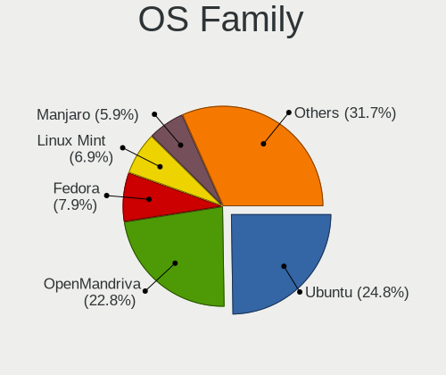

| Name         | Desktops | Percent |
|--------------|----------|---------|
| Ubuntu       | 13       | 23.21%  |
| OpenMandriva | 12       | 21.43%  |
| Linux Mint   | 5        | 8.93%   |
| Pop!_OS      | 4        | 7.14%   |
| Manjaro      | 3        | 5.36%   |
| Fedora       | 3        | 5.36%   |
| Zorin        | 2        | 3.57%   |
| ROSA         | 2        | 3.57%   |
| Lubuntu      | 2        | 3.57%   |
| Elementary   | 2        | 3.57%   |
| Debian       | 2        | 3.57%   |
| Arch         | 2        | 3.57%   |
| UbuntuDDE    | 1        | 1.79%   |
| KDE neon     | 1        | 1.79%   |
| EndeavourOS  | 1        | 1.79%   |
| BlackPanther | 1        | 1.79%   |

Kernel
------

Version of the Linux kernel

| Version                         | Desktops | Percent |
|---------------------------------|----------|---------|
| 5.10.14-desktop-1omv4002        | 9        | 14.52%  |
| 5.4.0-70-generic                | 3        | 4.84%   |
| 5.4.0-42-generic                | 2        | 3.23%   |
| 5.16.7-desktop-1omv4003         | 2        | 3.23%   |
| 5.9.9-arch1-1                   | 1        | 1.61%   |
| 5.9.14-arch1-1                  | 1        | 1.61%   |
| 5.8.0-7630-generic              | 1        | 1.61%   |
| 5.8.0-50-generic                | 1        | 1.61%   |
| 5.8.0-41-generic                | 1        | 1.61%   |
| 5.8.0-34-generic                | 1        | 1.61%   |
| 5.7.0-1-amd64                   | 1        | 1.61%   |
| 5.6.19-300.fc32.x86_64          | 1        | 1.61%   |
| 5.6.16-300.fc32.x86_64          | 1        | 1.61%   |
| 5.6.14-desktop-2bP              | 1        | 1.61%   |
| 5.6.13-arch1-1                  | 1        | 1.61%   |
| 5.4.40-generic-1rosa-x86_64     | 1        | 1.61%   |
| 5.4.0-91-generic                | 1        | 1.61%   |
| 5.4.0-88-generic                | 1        | 1.61%   |
| 5.4.0-60-generic                | 1        | 1.61%   |
| 5.4.0-56-generic                | 1        | 1.61%   |
| 5.4.0-52-generic                | 1        | 1.61%   |
| 5.4.0-29-generic                | 1        | 1.61%   |
| 5.4.0-26-generic                | 1        | 1.61%   |
| 5.3.0-62-generic                | 1        | 1.61%   |
| 5.3.0-51-generic                | 1        | 1.61%   |
| 5.18.12-3-MANJARO               | 1        | 1.61%   |
| 5.15.11-1-MANJARO               | 1        | 1.61%   |
| 5.15.0-30-generic               | 1        | 1.61%   |
| 5.15.0-27-generic               | 1        | 1.61%   |
| 5.15.0-25-generic               | 1        | 1.61%   |
| 5.14.14-desktop-1omv4050        | 1        | 1.61%   |
| 5.13.9-200.fc34.x86_64          | 1        | 1.61%   |
| 5.13.0-7620-generic             | 1        | 1.61%   |
| 5.13.0-16-generic               | 1        | 1.61%   |
| 5.11.11-arch1-1                 | 1        | 1.61%   |
| 5.11.0-7620-generic             | 1        | 1.61%   |
| 5.11.0-7614-generic             | 1        | 1.61%   |
| 5.11.0-41-generic               | 1        | 1.61%   |
| 5.11.0-27-generic               | 1        | 1.61%   |
| 5.10.94-xanmod2                 | 1        | 1.61%   |
| 5.10.105-1-MANJARO              | 1        | 1.61%   |
| 5.10.0-2-amd64                  | 1        | 1.61%   |
| 4.18.0-21-generic               | 1        | 1.61%   |
| 4.15.0-desktop-45.1rosa-x86_64  | 1        | 1.61%   |
| 4.15.0-74-generic               | 1        | 1.61%   |
| 4.15.0-72-generic               | 1        | 1.61%   |
| 4.15.0-39-generic               | 1        | 1.61%   |
| 4.15.0-167-generic              | 1        | 1.61%   |
| 4.15.0-147-generic              | 1        | 1.61%   |
| 4.1.38-nrj-desktop-2rosa-x86_64 | 1        | 1.61%   |

Kernel Family
-------------

Linux kernel without a distro release

| Version  | Desktops | Percent |
|----------|----------|---------|
| 5.4.0    | 11       | 18.33%  |
| 5.10.14  | 9        | 15%     |
| 4.15.0   | 5        | 8.33%   |
| 5.8.0    | 4        | 6.67%   |
| 5.11.0   | 4        | 6.67%   |
| 5.15.0   | 3        | 5%      |
| 5.3.0    | 2        | 3.33%   |
| 5.16.7   | 2        | 3.33%   |
| 5.13.0   | 2        | 3.33%   |
| 5.9.9    | 1        | 1.67%   |
| 5.9.14   | 1        | 1.67%   |
| 5.7.0    | 1        | 1.67%   |
| 5.6.19   | 1        | 1.67%   |
| 5.6.16   | 1        | 1.67%   |
| 5.6.14   | 1        | 1.67%   |
| 5.6.13   | 1        | 1.67%   |
| 5.4.40   | 1        | 1.67%   |
| 5.18.12  | 1        | 1.67%   |
| 5.15.11  | 1        | 1.67%   |
| 5.14.14  | 1        | 1.67%   |
| 5.13.9   | 1        | 1.67%   |
| 5.11.11  | 1        | 1.67%   |
| 5.10.94  | 1        | 1.67%   |
| 5.10.105 | 1        | 1.67%   |
| 5.10.0   | 1        | 1.67%   |
| 4.18.0   | 1        | 1.67%   |
| 4.1.38   | 1        | 1.67%   |

Kernel Major Ver.
-----------------

Linux kernel major version

| Version | Desktops | Percent |
|---------|----------|---------|
| 5.4     | 12       | 20%     |
| 5.10    | 12       | 20%     |
| 5.11    | 5        | 8.33%   |
| 4.15    | 5        | 8.33%   |
| 5.8     | 4        | 6.67%   |
| 5.6     | 4        | 6.67%   |
| 5.15    | 4        | 6.67%   |
| 5.13    | 3        | 5%      |
| 5.9     | 2        | 3.33%   |
| 5.3     | 2        | 3.33%   |
| 5.16    | 2        | 3.33%   |
| 5.7     | 1        | 1.67%   |
| 5.18    | 1        | 1.67%   |
| 5.14    | 1        | 1.67%   |
| 4.18    | 1        | 1.67%   |
| 4.1     | 1        | 1.67%   |

Arch
----

OS architecture (x86_64, i586, etc.)

| Name   | Desktops | Percent |
|--------|----------|---------|
| x86_64 | 51       | 94.44%  |
| i686   | 3        | 5.56%   |

DE
--

Desktop Environment

| Name          | Desktops | Percent |
|---------------|----------|---------|
| GNOME         | 20       | 36.36%  |
| KDE5          | 16       | 29.09%  |
| Unknown       | 6        | 10.91%  |
| X-Cinnamon    | 3        | 5.45%   |
| Pantheon      | 2        | 3.64%   |
| MATE          | 2        | 3.64%   |
| LXQt          | 2        | 3.64%   |
| XFCE          | 1        | 1.82%   |
| KDE           | 1        | 1.82%   |
| GNOME Classic | 1        | 1.82%   |
| Deepin        | 1        | 1.82%   |

Display Server
--------------

X11 or Wayland

| Name    | Desktops | Percent |
|---------|----------|---------|
| X11     | 49       | 90.74%  |
| Wayland | 4        | 7.41%   |
| Tty     | 1        | 1.85%   |

Display Manager
---------------

SDDM, LightDM, etc.

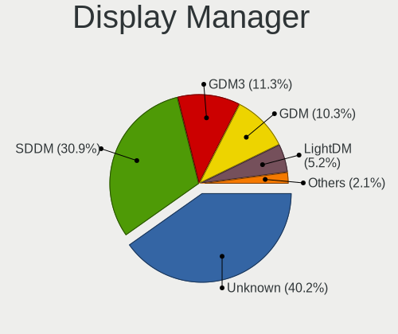

| Name    | Desktops | Percent |
|---------|----------|---------|
| Unknown | 26       | 48.15%  |
| SDDM    | 18       | 33.33%  |
| GDM     | 5        | 9.26%   |
| TDM     | 2        | 3.7%    |
| GDM3    | 2        | 3.7%    |
| LightDM | 1        | 1.85%   |

OS Lang
-------

Language

| Lang    | Desktops | Percent |
|---------|----------|---------|
| en_US   | 26       | 46.43%  |
| es_CR   | 21       | 37.5%   |
| Unknown | 5        | 8.93%   |
| es_ES   | 3        | 5.36%   |
| de_DE   | 1        | 1.79%   |

Boot Mode
---------

EFI or BIOS

| Mode | Desktops | Percent |
|------|----------|---------|
| EFI  | 31       | 57.41%  |
| BIOS | 23       | 42.59%  |

Filesystem
----------

Type of filesystem

| Type    | Desktops | Percent |
|---------|----------|---------|
| Ext4    | 38       | 70.37%  |
| Overlay | 11       | 20.37%  |
| Btrfs   | 3        | 5.56%   |
| Xfs     | 1        | 1.85%   |
| Unknown | 1        | 1.85%   |

Part. scheme
------------

Scheme of partitioning

| Type    | Desktops | Percent |
|---------|----------|---------|
| Unknown | 27       | 50%     |
| GPT     | 21       | 38.89%  |
| MBR     | 6        | 11.11%  |

Dual Boot with Linux/BSD
------------------------

Hosting more than one Linux/BSD

| Dual boot | Desktops | Percent |
|-----------|----------|---------|
| No        | 44       | 81.48%  |
| Yes       | 10       | 18.52%  |

Dual Boot (Win)
---------------

Hosting Linux and Windows

| Dual boot | Desktops | Percent |
|-----------|----------|---------|
| No        | 28       | 51.85%  |
| Yes       | 26       | 48.15%  |

Board
-----

Vendor
------

Motherboard manufacturer

| Name                | Desktops | Percent |
|---------------------|----------|---------|
| Dell                | 10       | 18.52%  |
| ASUSTek Computer    | 10       | 18.52%  |
| Gigabyte Technology | 8        | 14.81%  |
| ASRock              | 5        | 9.26%   |
| MSI                 | 4        | 7.41%   |
| Hewlett-Packard     | 3        | 5.56%   |
| Intel               | 2        | 3.7%    |
| Unknown             | 2        | 3.7%    |
| ZOTAC               | 1        | 1.85%   |
| TPV-INVENTA         | 1        | 1.85%   |
| Supermicro          | 1        | 1.85%   |
| Pegatron            | 1        | 1.85%   |
| MACHINIST           | 1        | 1.85%   |
| Lenovo              | 1        | 1.85%   |
| Gateway             | 1        | 1.85%   |
| Biostar             | 1        | 1.85%   |
| Alienware           | 1        | 1.85%   |
| ABIT                | 1        | 1.85%   |

Model
-----

Motherboard model

| Name                                     | Desktops | Percent |
|------------------------------------------|----------|---------|
| Dell OptiPlex 3020                       | 5        | 9.26%   |
| Gigabyte B250M-DS3H                      | 2        | 3.7%    |
| ASUS PRIME A320M-K                       | 2        | 3.7%    |
| ASRock B450 Steel Legend                 | 2        | 3.7%    |
| Unknown                                  | 2        | 3.7%    |
| ZOTAC NM10                               | 1        | 1.85%   |
| TPV-INVENTA 18-2003LA                    | 1        | 1.85%   |
| Supermicro X9DAi                         | 1        | 1.85%   |
| Pegatron CQ2728LA                        | 1        | 1.85%   |
| MSI Z390 Gaming Trident X Plus (MS-B926) | 1        | 1.85%   |
| MSI MS-7B86                              | 1        | 1.85%   |
| MSI MS-7693                              | 1        | 1.85%   |
| MSI MS-7636                              | 1        | 1.85%   |
| MACHINIST X79 V2.82H                     | 1        | 1.85%   |
| Lenovo H530S 10132                       | 1        | 1.85%   |
| Intel DG41WV AAE90316-103                | 1        | 1.85%   |
| Intel D33217CK G76541-302                | 1        | 1.85%   |
| HP Z800 Workstation                      | 1        | 1.85%   |
| HP ProDesk 600 G4 SFF                    | 1        | 1.85%   |
| HP EliteDesk 800 G1 TWR                  | 1        | 1.85%   |
| Gigabyte Z690 UD AX DDR4                 | 1        | 1.85%   |
| Gigabyte Z170X-Gaming 7                  | 1        | 1.85%   |
| Gigabyte X570 I AORUS PRO WIFI           | 1        | 1.85%   |
| Gigabyte H110M-S2                        | 1        | 1.85%   |
| Gigabyte H110M-H                         | 1        | 1.85%   |
| Gigabyte GA-970A-D3                      | 1        | 1.85%   |
| Gateway LX6810-01                        | 1        | 1.85%   |
| Dell Precision WorkStation T5400         | 1        | 1.85%   |
| Dell Precision WorkStation T3500         | 1        | 1.85%   |
| Dell OptiPlex 755                        | 1        | 1.85%   |
| Dell OptiPlex 7040                       | 1        | 1.85%   |
| Dell OptiPlex 3010                       | 1        | 1.85%   |
| Biostar H61MGV3                          | 1        | 1.85%   |
| ASUS TUF Gaming X570-PLUS                | 1        | 1.85%   |
| ASUS TUF Gaming B550M-PLUS               | 1        | 1.85%   |
| ASUS STRIX Z270G GAMING                  | 1        | 1.85%   |
| ASUS SABERTOOTH 990FX R2.0               | 1        | 1.85%   |
| ASUS ROG STRIX B550-F GAMING             | 1        | 1.85%   |
| ASUS PRIME H310M-E R2.0                  | 1        | 1.85%   |
| ASUS H110M-K                             | 1        | 1.85%   |
| ASUS All Series                          | 1        | 1.85%   |
| ASRock H81M-VG4 R2.0                     | 1        | 1.85%   |
| ASRock 970 Extreme3                      | 1        | 1.85%   |
| ASRock 775i65GV                          | 1        | 1.85%   |
| Alienware X51                            | 1        | 1.85%   |
| ABIT AW9D-MAX                            | 1        | 1.85%   |

Model Family
------------

Motherboard model prefix

| Name                  | Desktops | Percent |
|-----------------------|----------|---------|
| Dell OptiPlex         | 8        | 14.81%  |
| ASUS PRIME            | 3        | 5.56%   |
| Gigabyte B250M-DS3H   | 2        | 3.7%    |
| Dell Precision        | 2        | 3.7%    |
| ASUS TUF              | 2        | 3.7%    |
| ASRock B450           | 2        | 3.7%    |
| Unknown               | 2        | 3.7%    |
| ZOTAC NM10            | 1        | 1.85%   |
| TPV-INVENTA 18-2003LA | 1        | 1.85%   |
| Supermicro X9DAi      | 1        | 1.85%   |
| Pegatron CQ2728LA     | 1        | 1.85%   |
| MSI Z390              | 1        | 1.85%   |
| MSI MS-7B86           | 1        | 1.85%   |
| MSI MS-7693           | 1        | 1.85%   |
| MSI MS-7636           | 1        | 1.85%   |
| MACHINIST X79         | 1        | 1.85%   |
| Lenovo H530S          | 1        | 1.85%   |
| Intel DG41WV          | 1        | 1.85%   |
| Intel D33217CK        | 1        | 1.85%   |
| HP Z800               | 1        | 1.85%   |
| HP ProDesk            | 1        | 1.85%   |
| HP EliteDesk          | 1        | 1.85%   |
| Gigabyte Z690         | 1        | 1.85%   |
| Gigabyte Z170X-Gaming | 1        | 1.85%   |
| Gigabyte X570         | 1        | 1.85%   |
| Gigabyte H110M-S2     | 1        | 1.85%   |
| Gigabyte H110M-H      | 1        | 1.85%   |
| Gigabyte GA-970A-D3   | 1        | 1.85%   |
| Gateway LX6810-01     | 1        | 1.85%   |
| Biostar H61MGV3       | 1        | 1.85%   |
| ASUS STRIX            | 1        | 1.85%   |
| ASUS SABERTOOTH       | 1        | 1.85%   |
| ASUS ROG              | 1        | 1.85%   |
| ASUS H110M-K          | 1        | 1.85%   |
| ASUS All              | 1        | 1.85%   |
| ASRock H81M-VG4       | 1        | 1.85%   |
| ASRock 970            | 1        | 1.85%   |
| ASRock 775i65GV       | 1        | 1.85%   |
| Alienware X51         | 1        | 1.85%   |
| ABIT AW9D-MAX         | 1        | 1.85%   |

MFG Year
--------

Motherboard manufacture year

| Year | Desktops | Percent |
|------|----------|---------|
| 2019 | 7        | 12.96%  |
| 2014 | 7        | 12.96%  |
| 2016 | 6        | 11.11%  |
| 2013 | 6        | 11.11%  |
| 2012 | 5        | 9.26%   |
| 2017 | 4        | 7.41%   |
| 2010 | 3        | 5.56%   |
| 2008 | 3        | 5.56%   |
| 2021 | 2        | 3.7%    |
| 2020 | 2        | 3.7%    |
| 2018 | 2        | 3.7%    |
| 2011 | 2        | 3.7%    |
| 2005 | 2        | 3.7%    |
| 2022 | 1        | 1.85%   |
| 2009 | 1        | 1.85%   |
| 2007 | 1        | 1.85%   |

Form Factor
-----------

Physical design of the computer

| Name    | Desktops | Percent |
|---------|----------|---------|
| Desktop | 54       | 100%    |

Secure Boot
-----------

Enabled or disabled

| State    | Desktops | Percent |
|----------|----------|---------|
| Disabled | 50       | 92.59%  |
| Enabled  | 4        | 7.41%   |

Coreboot
--------

Have coreboot on board

| Used | Desktops | Percent |
|------|----------|---------|
| No   | 54       | 100%    |

RAM Size
--------

Total RAM memory

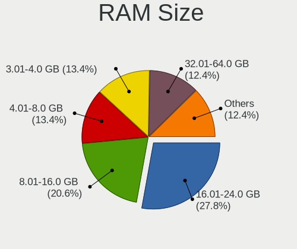

| Size in GB      | Desktops | Percent |
|-----------------|----------|---------|
| 16.01-24.0      | 16       | 29.09%  |
| 8.01-16.0       | 13       | 23.64%  |
| 3.01-4.0        | 9        | 16.36%  |
| 4.01-8.0        | 6        | 10.91%  |
| 32.01-64.0      | 4        | 7.27%   |
| 1.01-2.0        | 4        | 7.27%   |
| More than 256.0 | 1        | 1.82%   |
| 2.01-3.0        | 1        | 1.82%   |
| 64.01-256.0     | 1        | 1.82%   |

RAM Used
--------

Used RAM memory

| Used GB    | Desktops | Percent |
|------------|----------|---------|
| 1.01-2.0   | 25       | 43.1%   |
| 2.01-3.0   | 10       | 17.24%  |
| 4.01-8.0   | 8        | 13.79%  |
| 3.01-4.0   | 5        | 8.62%   |
| 0.51-1.0   | 4        | 6.9%    |
| 0.01-0.5   | 3        | 5.17%   |
| 24.01-32.0 | 1        | 1.72%   |
| 16.01-24.0 | 1        | 1.72%   |
| 8.01-16.0  | 1        | 1.72%   |

Total Drives
------------

Number of drives on board

| Drives | Desktops | Percent |
|--------|----------|---------|
| 1      | 28       | 50%     |
| 2      | 15       | 26.79%  |
| 3      | 6        | 10.71%  |
| 4      | 5        | 8.93%   |
| 8      | 1        | 1.79%   |
| 5      | 1        | 1.79%   |

Has CD-ROM
----------

Has CD-ROM on board

| Presented | Desktops | Percent |
|-----------|----------|---------|
| Yes       | 28       | 50.91%  |
| No        | 27       | 49.09%  |

Has Ethernet
------------

Has Ethernet on board

| Presented | Desktops | Percent |
|-----------|----------|---------|
| Yes       | 53       | 98.15%  |
| No        | 1        | 1.85%   |

Has WiFi
--------

Has WiFi module

| Presented | Desktops | Percent |
|-----------|----------|---------|
| No        | 32       | 59.26%  |
| Yes       | 22       | 40.74%  |

Has Bluetooth
-------------

Has Bluetooth module

| Presented | Desktops | Percent |
|-----------|----------|---------|
| No        | 42       | 76.36%  |
| Yes       | 13       | 23.64%  |

Location
--------

Country
-------

Geographic location (country)

| Country    | Desktops | Percent |
|------------|----------|---------|
| Costa Rica | 54       | 100%    |

City
----

Geographic location (city)

| City       | Desktops | Percent |
|------------|----------|---------|
| San José  | 23       | 40.35%  |
| Heredia    | 16       | 28.07%  |
| Alajuela   | 3        | 5.26%   |
| Escazu     | 2        | 3.51%   |
| Cartago    | 2        | 3.51%   |
| Tres Rios  | 1        | 1.75%   |
| Tibas      | 1        | 1.75%   |
| Santa Fe   | 1        | 1.75%   |
| Santa Ana  | 1        | 1.75%   |
| San Pedro  | 1        | 1.75%   |
| Palmares   | 1        | 1.75%   |
| Nosara     | 1        | 1.75%   |
| Liberia    | 1        | 1.75%   |
| Curridabat | 1        | 1.75%   |
| Bajo Perez | 1        | 1.75%   |
| Alajuelita | 1        | 1.75%   |

Drives
------

Drive Vendor
------------

Hard drive vendors

| Vendor                | Desktops | Drives | Percent |
|-----------------------|----------|--------|---------|
| Seagate               | 21       | 37     | 23.86%  |
| WDC                   | 16       | 18     | 18.18%  |
| A-DATA Technology     | 10       | 10     | 11.36%  |
| Kingston              | 7        | 9      | 7.95%   |
| Toshiba               | 6        | 7      | 6.82%   |
| Samsung Electronics   | 5        | 9      | 5.68%   |
| Hitachi               | 5        | 7      | 5.68%   |
| XPG                   | 4        | 4      | 4.55%   |
| ZOTAC                 | 2        | 3      | 2.27%   |
| Realtek Semiconductor | 2        | 3      | 2.27%   |
| Maxtor                | 2        | 2      | 2.27%   |
| HGST                  | 2        | 2      | 2.27%   |
| WD MediaMax           | 1        | 1      | 1.14%   |
| SanDisk               | 1        | 1      | 1.14%   |
| Patriot               | 1        | 1      | 1.14%   |
| JMicron Technology    | 1        | 1      | 1.14%   |
| Intel                 | 1        | 1      | 1.14%   |
| Crucial               | 1        | 1      | 1.14%   |

Drive Model
-----------

Hard drive models

| Model                                | Desktops | Percent |
|--------------------------------------|----------|---------|
| A-DATA SU630 480GB SSD               | 5        | 5.21%   |
| WDC WD10EZEX-75WN4A1 1TB             | 3        | 3.13%   |
| Seagate ST1000DM003-1CH162 1TB       | 3        | 3.13%   |
| Kingston SA400S37240G 240GB SSD      | 3        | 3.13%   |
| XPG GAMMIX S11 Pro 256GB             | 2        | 2.08%   |
| WDC WD10EZEX-08WN4A0 1TB             | 2        | 2.08%   |
| Toshiba DT01ACA100 1TB               | 2        | 2.08%   |
| Seagate ST8000DM004-2CX188 8TB       | 2        | 2.08%   |
| Seagate ST380815AS 80GB              | 2        | 2.08%   |
| ZOTAC ZTSSD-S11-240G-P 240GB         | 1        | 1.04%   |
| ZOTAC ZTSSD-S11-120G-MD 120GB        | 1        | 1.04%   |
| XPG NVMe SSD Drive 512GB             | 1        | 1.04%   |
| XPG NVMe SSD Drive 1TB               | 1        | 1.04%   |
| WDC WD6400AAKS-22A7B0 640GB          | 1        | 1.04%   |
| WDC WD5000LPCX-60VHAT0 500GB         | 1        | 1.04%   |
| WDC WD5000AAKS-00V1A0 500GB          | 1        | 1.04%   |
| WDC WD2500AAJS-00VTA0 250GB          | 1        | 1.04%   |
| WDC WD20EZRZ-00Z5HB0 2TB             | 1        | 1.04%   |
| WDC WD1600BEVS-26VAT0 160GB          | 1        | 1.04%   |
| WDC WD1500HLFS-01G6U0 150GB          | 1        | 1.04%   |
| WDC WD10SPZX-24Z10T0 1TB             | 1        | 1.04%   |
| WDC WD10JPVX-00JC3T0 1TB             | 1        | 1.04%   |
| WDC WD10EZEX-60WN4A0 1TB             | 1        | 1.04%   |
| WDC WD10EZEX-08M2NA0 1TB             | 1        | 1.04%   |
| WD MediaMax WL3000GSA6472 3TB        | 1        | 1.04%   |
| Toshiba THNSN5512GPUK NVMe 512GB     | 1        | 1.04%   |
| Toshiba RD400 256GB                  | 1        | 1.04%   |
| Toshiba MQ01ABD100 1TB               | 1        | 1.04%   |
| Toshiba HDWD105 500GB                | 1        | 1.04%   |
| Seagate ST9160301AS 160GB            | 1        | 1.04%   |
| Seagate ST8000DM005-2EH112 8TB       | 1        | 1.04%   |
| Seagate ST6000VN0033-2EE110 6TB      | 1        | 1.04%   |
| Seagate ST500DM002-1BD142 500GB      | 1        | 1.04%   |
| Seagate ST4000DM006-2G5107 4TB       | 1        | 1.04%   |
| Seagate ST3500418AS 500GB            | 1        | 1.04%   |
| Seagate ST3500414CS 500GB            | 1        | 1.04%   |
| Seagate ST3500320AS 500GB            | 1        | 1.04%   |
| Seagate ST3320413CS 320GB            | 1        | 1.04%   |
| Seagate ST3250318AS 250GB            | 1        | 1.04%   |
| Seagate ST3160811AS 160GB            | 1        | 1.04%   |
| Seagate ST31000322CS 1TB             | 1        | 1.04%   |
| Seagate ST250DM000-1BD141 250GB      | 1        | 1.04%   |
| Seagate ST2000LM015-2E8174 2TB       | 1        | 1.04%   |
| Seagate ST2000LM007-1R8174 2TB       | 1        | 1.04%   |
| Seagate ST1000DM010-2EP102 1TB       | 1        | 1.04%   |
| Seagate Expansion Desk 4TB           | 1        | 1.04%   |
| Seagate Backup+ Hub BK 4TB           | 1        | 1.04%   |
| Seagate Backup+ Desk 3TB             | 1        | 1.04%   |
| SanDisk SD6SB1M-128G-1006 128GB SSD  | 1        | 1.04%   |
| Samsung SSD 980 PRO 500GB            | 1        | 1.04%   |
| Samsung SSD 830 Series 256GB         | 1        | 1.04%   |
| Samsung MZVLV512HCJH-00000 512GB     | 1        | 1.04%   |
| Samsung MZVLB512HAJQ-00000 512GB     | 1        | 1.04%   |
| Samsung MZ7LN128HAHQ-000L2 128GB SSD | 1        | 1.04%   |
| Realtek NVMe SSD Drive 512GB         | 1        | 1.04%   |
| Realtek NVMe SSD Drive 256GB         | 1        | 1.04%   |
| Patriot Burst 480GB SSD              | 1        | 1.04%   |
| Maxtor STM3500630AS 500GB            | 1        | 1.04%   |
| Maxtor STM3160215AS 160GB            | 1        | 1.04%   |
| Kingston SV300S37A120G 120GB SSD     | 1        | 1.04%   |

HDD Vendor
----------

Hard disk drive vendors

| Vendor  | Desktops | Drives | Percent |
|---------|----------|--------|---------|
| Seagate | 20       | 36     | 40.82%  |
| WDC     | 16       | 18     | 32.65%  |
| Hitachi | 5        | 7      | 10.2%   |
| Toshiba | 4        | 5      | 8.16%   |
| Maxtor  | 2        | 2      | 4.08%   |
| HGST    | 2        | 2      | 4.08%   |

SSD Vendor
----------

Solid state drive vendors

| Vendor              | Desktops | Drives | Percent |
|---------------------|----------|--------|---------|
| A-DATA Technology   | 8        | 8      | 34.78%  |
| Kingston            | 7        | 9      | 30.43%  |
| ZOTAC               | 2        | 3      | 8.7%    |
| Samsung Electronics | 2        | 4      | 8.7%    |
| SanDisk             | 1        | 1      | 4.35%   |
| Patriot             | 1        | 1      | 4.35%   |
| Intel               | 1        | 1      | 4.35%   |
| Crucial             | 1        | 1      | 4.35%   |

Drive Kind
----------

HDD or SSD

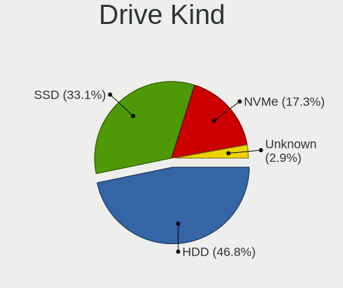

| Kind    | Desktops | Drives | Percent |
|---------|----------|--------|---------|
| HDD     | 40       | 70     | 52.63%  |
| SSD     | 23       | 28     | 30.26%  |
| NVMe    | 12       | 17     | 15.79%  |
| Unknown | 1        | 2      | 1.32%   |

Drive Connector
---------------

SATA, SAS, NVMe, etc.

| Type | Desktops | Drives | Percent |
|------|----------|--------|---------|
| SATA | 52       | 93     | 77.61%  |
| NVMe | 11       | 16     | 16.42%  |
| SAS  | 4        | 8      | 5.97%   |

Drive Size
----------

Size of hard drive

| Size in TB | Desktops | Drives | Percent |
|------------|----------|--------|---------|
| 0.01-0.5   | 40       | 55     | 56.34%  |
| 0.51-1.0   | 21       | 25     | 29.58%  |
| 4.01-10.0  | 4        | 7      | 5.63%   |
| 3.01-4.0   | 3        | 7      | 4.23%   |
| 1.01-2.0   | 3        | 4      | 4.23%   |

Space Total
-----------

Amount of disk space available on the file system

| Size in GB     | Desktops | Percent |
|----------------|----------|---------|
| 101-250        | 11       | 19.64%  |
| 501-1000       | 10       | 17.86%  |
| 1-20           | 9        | 16.07%  |
| More than 3000 | 6        | 10.71%  |
| 251-500        | 6        | 10.71%  |
| 51-100         | 6        | 10.71%  |
| 1001-2000      | 5        | 8.93%   |
| 21-50          | 1        | 1.79%   |
| 2001-3000      | 1        | 1.79%   |
| Unknown        | 1        | 1.79%   |

Space Used
----------

Amount of used disk space

| Used GB        | Desktops | Percent |
|----------------|----------|---------|
| 1-20           | 25       | 43.86%  |
| 21-50          | 6        | 10.53%  |
| 251-500        | 5        | 8.77%   |
| 101-250        | 5        | 8.77%   |
| More than 3000 | 4        | 7.02%   |
| 1001-2000      | 3        | 5.26%   |
| 501-1000       | 3        | 5.26%   |
| 51-100         | 3        | 5.26%   |
| 2001-3000      | 2        | 3.51%   |
| Unknown        | 1        | 1.75%   |

Malfunc. Drives
---------------

Drive models with a malfunction

| Model                               | Desktops | Drives | Percent |
|-------------------------------------|----------|--------|---------|
| Seagate ST500DM002-1BD142 500GB     | 1        | 2      | 16.67%  |
| SanDisk SD6SB1M-128G-1006 128GB SSD | 1        | 1      | 16.67%  |
| Maxtor STM3160215AS 160GB           | 1        | 1      | 16.67%  |
| Kingston SV300S37A120G 120GB SSD    | 1        | 1      | 16.67%  |
| Hitachi HDE721010SLA330 1TB         | 1        | 1      | 16.67%  |
| A-DATA Technology SX8100NP 256GB    | 1        | 1      | 16.67%  |

Malfunc. Drive Vendor
---------------------

Vendors of faulty drives

| Vendor            | Desktops | Drives | Percent |
|-------------------|----------|--------|---------|
| Seagate           | 1        | 2      | 16.67%  |
| SanDisk           | 1        | 1      | 16.67%  |
| Maxtor            | 1        | 1      | 16.67%  |
| Kingston          | 1        | 1      | 16.67%  |
| Hitachi           | 1        | 1      | 16.67%  |
| A-DATA Technology | 1        | 1      | 16.67%  |

Malfunc. HDD Vendor
-------------------

Vendors of faulty HDD drives

| Vendor  | Desktops | Drives | Percent |
|---------|----------|--------|---------|
| Seagate | 1        | 2      | 33.33%  |
| Maxtor  | 1        | 1      | 33.33%  |
| Hitachi | 1        | 1      | 33.33%  |

Malfunc. Drive Kind
-------------------

Kinds of faulty drives

| Kind | Desktops | Drives | Percent |
|------|----------|--------|---------|
| HDD  | 3        | 4      | 50%     |
| SSD  | 2        | 2      | 33.33%  |
| NVMe | 1        | 1      | 16.67%  |

Failed Drives
-------------

Failed drive models

Zero info for selected period =(

Failed Drive Vendor
-------------------

Failed drive vendors

Zero info for selected period =(

Drive Status
------------

Number of failed and malfunc. drives

| Status   | Desktops | Drives | Percent |
|----------|----------|--------|---------|
| Detected | 30       | 67     | 51.72%  |
| Works    | 22       | 43     | 37.93%  |
| Malfunc  | 6        | 7      | 10.34%  |

Storage controller
------------------

Storage Vendor
--------------

Storage controller vendors

| Vendor                       | Desktops | Percent |
|------------------------------|----------|---------|
| Intel                        | 38       | 50.67%  |
| AMD                          | 15       | 20%     |
| Realtek Semiconductor        | 4        | 5.33%   |
| ASMedia Technology           | 4        | 5.33%   |
| ADATA Technology             | 4        | 5.33%   |
| Samsung Electronics          | 3        | 4%      |
| Toshiba America Info Systems | 1        | 1.33%   |
| Silicon Image                | 1        | 1.33%   |
| OCZ Technology Group         | 1        | 1.33%   |
| Nvidia                       | 1        | 1.33%   |
| Marvell Technology Group     | 1        | 1.33%   |
| LSI Logic / Symbios Logic    | 1        | 1.33%   |
| JMicron Technology           | 1        | 1.33%   |

Storage Model
-------------

Storage controller models

| Model                                                                                   | Desktops | Percent |
|-----------------------------------------------------------------------------------------|----------|---------|
| Intel 8 Series/C220 Series Chipset Family 6-port SATA Controller 1 [AHCI mode]          | 9        | 10.59%  |
| AMD FCH SATA Controller [AHCI mode]                                                     | 7        | 8.24%   |
| Intel Q170/Q150/B150/H170/H110/Z170/CM236 Chipset SATA Controller [AHCI Mode]           | 5        | 5.88%   |
| ASMedia ASM1062 Serial ATA Controller                                                   | 4        | 4.71%   |
| AMD SB7x0/SB8x0/SB9x0 SATA Controller [AHCI mode]                                       | 4        | 4.71%   |
| ADATA XPG SX8200 Pro PCIe Gen3x4 M.2 2280 Solid State Drive                             | 4        | 4.71%   |
| Realtek RTS5763DL NVMe SSD Controller                                                   | 3        | 3.53%   |
| Intel SATA Controller [RAID mode]                                                       | 3        | 3.53%   |
| Intel 200 Series PCH SATA controller [AHCI mode]                                        | 3        | 3.53%   |
| AMD 400 Series Chipset SATA Controller                                                  | 3        | 3.53%   |
| Intel NM10/ICH7 Family SATA Controller [IDE mode]                                       | 2        | 2.35%   |
| Intel Cannon Lake PCH SATA AHCI Controller                                              | 2        | 2.35%   |
| Intel C600/X79 series chipset 6-Port SATA AHCI Controller                               | 2        | 2.35%   |
| Intel 6 Series/C200 Series Chipset Family 6 port Desktop SATA AHCI Controller           | 2        | 2.35%   |
| AMD FCH SATA Controller D                                                               | 2        | 2.35%   |
| AMD 500 Series Chipset SATA Controller                                                  | 2        | 2.35%   |
| Toshiba America Info Systems XG4 NVMe SSD Controller                                    | 1        | 1.18%   |
| Silicon Image SiI 3132 Serial ATA Raid II Controller                                    | 1        | 1.18%   |
| Samsung NVMe SSD Controller SM981/PM981/PM983                                           | 1        | 1.18%   |
| Samsung NVMe SSD Controller SM951/PM951                                                 | 1        | 1.18%   |
| Samsung NVMe SSD Controller PM9A1/PM9A3/980PRO                                          | 1        | 1.18%   |
| Realtek Realtek Non-Volatile memory controller                                          | 1        | 1.18%   |
| OCZ Group RD400/400A SSD                                                                | 1        | 1.18%   |
| Nvidia MCP79 RAID Controller                                                            | 1        | 1.18%   |
| Marvell Group 88SE912x IDE Controller                                                   | 1        | 1.18%   |
| Marvell Group 88SE9120 SATA 6Gb/s Controller                                            | 1        | 1.18%   |
| LSI Logic / Symbios Logic SAS1068E PCI-Express Fusion-MPT SAS                           | 1        | 1.18%   |
| JMicron JMB368 IDE controller                                                           | 1        | 1.18%   |
| Intel NM10/ICH7 Family SATA Controller [AHCI mode]                                      | 1        | 1.18%   |
| Intel Celeron/Pentium Silver Processor SATA Controller                                  | 1        | 1.18%   |
| Intel C602 chipset 4-Port SATA Storage Control Unit                                     | 1        | 1.18%   |
| Intel Alder Lake-S PCH SATA Controller [AHCI Mode]                                      | 1        | 1.18%   |
| Intel 82801IR/IO/IH (ICH9R/DO/DH) 6 port SATA Controller [AHCI mode]                    | 1        | 1.18%   |
| Intel 82801EB/ER (ICH5/ICH5R) IDE Controller                                            | 1        | 1.18%   |
| Intel 82801EB (ICH5) SATA Controller                                                    | 1        | 1.18%   |
| Intel 82801DB (ICH4) IDE Controller                                                     | 1        | 1.18%   |
| Intel 7 Series Chipset Family 6-port SATA Controller [AHCI mode]                        | 1        | 1.18%   |
| Intel 631xESB/632xESB SATA AHCI Controller                                              | 1        | 1.18%   |
| Intel 631xESB/632xESB IDE Controller                                                    | 1        | 1.18%   |
| Intel 6 Series/C200 Series Chipset Family Desktop SATA Controller (IDE mode, ports 4-5) | 1        | 1.18%   |
| Intel 6 Series/C200 Series Chipset Family Desktop SATA Controller (IDE mode, ports 0-3) | 1        | 1.18%   |
| Intel 5 Series/3400 Series Chipset 6 port SATA AHCI Controller                          | 1        | 1.18%   |
| AMD SB7x0/SB8x0/SB9x0 SATA Controller [IDE mode]                                        | 1        | 1.18%   |
| AMD SB7x0/SB8x0/SB9x0 IDE Controller                                                    | 1        | 1.18%   |

Storage Kind
------------

Kind of storage controller (IDE, SATA, NVMe, SAS, ...)

| Kind | Desktops | Percent |
|------|----------|---------|
| SATA | 45       | 62.5%   |
| NVMe | 11       | 15.28%  |
| IDE  | 9        | 12.5%   |
| RAID | 5        | 6.94%   |
| SAS  | 1        | 1.39%   |
| SCSI | 1        | 1.39%   |

Processor
---------

CPU Vendor
----------

Processor vendors

| Vendor | Desktops | Percent |
|--------|----------|---------|
| Intel  | 39       | 72.22%  |
| AMD    | 15       | 27.78%  |

CPU Model
---------

Processor models

| Model                                       | Desktops | Percent |
|---------------------------------------------|----------|---------|
| Intel Core i5-4590 CPU @ 3.30GHz            | 5        | 9.26%   |
| AMD Ryzen 5 3600 6-Core Processor           | 4        | 7.41%   |
| Intel Core i5-7400 CPU @ 3.00GHz            | 2        | 3.7%    |
| Intel Core i3-3220 CPU @ 3.30GHz            | 2        | 3.7%    |
| Intel Xeon CPU X5667 @ 3.07GHz              | 1        | 1.85%   |
| Intel Xeon CPU W3565 @ 3.20GHz              | 1        | 1.85%   |
| Intel Xeon CPU E5405 @ 2.00GHz              | 1        | 1.85%   |
| Intel Xeon CPU E5-2660 v2 @ 2.20GHz         | 1        | 1.85%   |
| Intel Xeon CPU E5-2650 v2 @ 2.60GHz         | 1        | 1.85%   |
| Intel Pentium Dual-Core CPU E5300 @ 2.60GHz | 1        | 1.85%   |
| Intel Pentium CPU G3260 @ 3.30GHz           | 1        | 1.85%   |
| Intel Pentium CPU G2030 @ 3.00GHz           | 1        | 1.85%   |
| Intel Pentium 4 CPU 2.00GHz                 | 1        | 1.85%   |
| Intel Core i9-9900KF CPU @ 3.60GHz          | 1        | 1.85%   |
| Intel Core i7-7700K CPU @ 4.20GHz           | 1        | 1.85%   |
| Intel Core i7-7700 CPU @ 3.60GHz            | 1        | 1.85%   |
| Intel Core i5-8500 CPU @ 3.00GHz            | 1        | 1.85%   |
| Intel Core i5-7500 CPU @ 3.40GHz            | 1        | 1.85%   |
| Intel Core i5-6600 CPU @ 3.30GHz            | 1        | 1.85%   |
| Intel Core i5-6500T CPU @ 2.50GHz           | 1        | 1.85%   |
| Intel Core i5-6400 CPU @ 2.70GHz            | 1        | 1.85%   |
| Intel Core i5-4570 CPU @ 3.20GHz            | 1        | 1.85%   |
| Intel Core i5-4460 CPU @ 3.20GHz            | 1        | 1.85%   |
| Intel Core i5 CPU 760 @ 2.80GHz             | 1        | 1.85%   |
| Intel Core i3-9100 CPU @ 3.60GHz            | 1        | 1.85%   |
| Intel Core i3-4130 CPU @ 3.40GHz            | 1        | 1.85%   |
| Intel Core i3-3217U CPU @ 1.80GHz           | 1        | 1.85%   |
| Intel Core 2 Quad CPU Q8200 @ 2.33GHz       | 1        | 1.85%   |
| Intel Core 2 Duo CPU E8400 @ 3.00GHz        | 1        | 1.85%   |
| Intel Core 2 CPU 6600 @ 2.40GHz             | 1        | 1.85%   |
| Intel Celeron J4125 CPU @ 2.00GHz           | 1        | 1.85%   |
| Intel Celeron CPU 2.66GHz                   | 1        | 1.85%   |
| Intel Atom CPU D525 @ 1.80GHz               | 1        | 1.85%   |
| Intel 12th Gen Core i5-12600K               | 1        | 1.85%   |
| AMD Ryzen 7 PRO 4750G with Radeon Graphics  | 1        | 1.85%   |
| AMD Ryzen 7 5800X 8-Core Processor          | 1        | 1.85%   |
| AMD Ryzen 7 2700 Eight-Core Processor       | 1        | 1.85%   |
| AMD Ryzen 5 3600X 6-Core Processor          | 1        | 1.85%   |
| AMD Ryzen 3 3200G with Radeon Vega Graphics | 1        | 1.85%   |
| AMD FX-8350 Eight-Core Processor            | 1        | 1.85%   |
| AMD FX-8320E Eight-Core Processor           | 1        | 1.85%   |
| AMD FX-8120 Eight-Core Processor            | 1        | 1.85%   |
| AMD FX-6350 Six-Core Processor              | 1        | 1.85%   |
| AMD E2-1800 APU with Radeon HD Graphics     | 1        | 1.85%   |
| AMD E1-1200 APU with Radeon HD Graphics     | 1        | 1.85%   |

CPU Model Family
----------------

Processor model prefix

| Model                   | Desktops | Percent |
|-------------------------|----------|---------|
| Intel Core i5           | 15       | 27.78%  |
| Intel Xeon              | 5        | 9.26%   |
| Intel Core i3           | 5        | 9.26%   |
| AMD Ryzen 5             | 5        | 9.26%   |
| AMD FX                  | 4        | 7.41%   |
| Intel Pentium           | 2        | 3.7%    |
| Intel Core i7           | 2        | 3.7%    |
| Intel Celeron           | 2        | 3.7%    |
| AMD Ryzen 7             | 2        | 3.7%    |
| Other                   | 1        | 1.85%   |
| Intel Pentium Dual-Core | 1        | 1.85%   |
| Intel Pentium 4         | 1        | 1.85%   |
| Intel Core i9           | 1        | 1.85%   |
| Intel Core 2 Quad       | 1        | 1.85%   |
| Intel Core 2 Duo        | 1        | 1.85%   |
| Intel Core 2            | 1        | 1.85%   |
| Intel Atom              | 1        | 1.85%   |
| AMD Ryzen 7 PRO         | 1        | 1.85%   |
| AMD Ryzen 3             | 1        | 1.85%   |
| AMD E2                  | 1        | 1.85%   |
| AMD E1                  | 1        | 1.85%   |

CPU Cores
---------

Number of processor cores

| Number | Desktops | Percent |
|--------|----------|---------|
| 4      | 25       | 46.3%   |
| 2      | 11       | 20.37%  |
| 8      | 6        | 11.11%  |
| 6      | 6        | 11.11%  |
| 1      | 3        | 5.56%   |
| 20     | 1        | 1.85%   |
| 10     | 1        | 1.85%   |
| 3      | 1        | 1.85%   |

CPU Sockets
-----------

Number of sockets

| Number | Desktops | Percent |
|--------|----------|---------|
| 1      | 52       | 96.3%   |
| 2      | 2        | 3.7%    |

CPU Threads
-----------

Threads per core (Hyper-Threading)

| Number | Desktops | Percent |
|--------|----------|---------|
| 1      | 32       | 59.26%  |
| 2      | 22       | 40.74%  |

CPU Op-Modes
------------

CPU Operation Modes (32-bit, 64-bit)

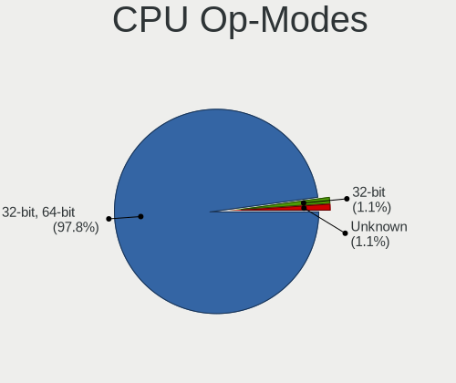

| Op mode        | Desktops | Percent |
|----------------|----------|---------|
| 32-bit, 64-bit | 52       | 96.3%   |
| 32-bit         | 1        | 1.85%   |
| Unknown        | 1        | 1.85%   |

CPU Microcode
-------------

Microcode number

| Number     | Desktops | Percent |
|------------|----------|---------|
| 0x306c3    | 8        | 14.29%  |
| Unknown    | 7        | 12.5%   |
| 0x906e9    | 4        | 7.14%   |
| 0x306a9    | 4        | 7.14%   |
| 0x08701021 | 4        | 7.14%   |
| 0x506e3    | 2        | 3.57%   |
| 0x306e4    | 2        | 3.57%   |
| 0x10676    | 2        | 3.57%   |
| 0x06000852 | 2        | 3.57%   |
| 0x05000119 | 2        | 3.57%   |
| 0xf49      | 1        | 1.79%   |
| 0xf29      | 1        | 1.79%   |
| 0x906ec    | 1        | 1.79%   |
| 0x906eb    | 1        | 1.79%   |
| 0x906ea    | 1        | 1.79%   |
| 0x90672    | 1        | 1.79%   |
| 0x706a8    | 1        | 1.79%   |
| 0x6f6      | 1        | 1.79%   |
| 0x106e5    | 1        | 1.79%   |
| 0x106ca    | 1        | 1.79%   |
| 0x106a5    | 1        | 1.79%   |
| 0x10677    | 1        | 1.79%   |
| 0x08701011 | 1        | 1.79%   |
| 0x0870100a | 1        | 1.79%   |
| 0x08600106 | 1        | 1.79%   |
| 0x08108109 | 1        | 1.79%   |
| 0x0800820d | 1        | 1.79%   |
| 0x0500010d | 1        | 1.79%   |
| 0x00000000 | 1        | 1.79%   |

CPU Microarch
-------------

Microarchitecture

| Name          | Desktops | Percent |
|---------------|----------|---------|
| Haswell       | 9        | 16.67%  |
| KabyLake      | 8        | 14.81%  |
| Zen 2         | 6        | 11.11%  |
| IvyBridge     | 6        | 11.11%  |
| Penryn        | 4        | 7.41%   |
| Skylake       | 3        | 5.56%   |
| Piledriver    | 3        | 5.56%   |
| Zen+          | 2        | 3.7%    |
| NetBurst      | 2        | 3.7%    |
| Nehalem       | 2        | 3.7%    |
| Bobcat        | 2        | 3.7%    |
| Zen 3         | 1        | 1.85%   |
| Westmere      | 1        | 1.85%   |
| Goldmont plus | 1        | 1.85%   |
| Core          | 1        | 1.85%   |
| Bulldozer     | 1        | 1.85%   |
| Bonnell       | 1        | 1.85%   |
| Unknown       | 1        | 1.85%   |

Graphics
--------

GPU Vendor
----------

Vendors of graphics cards

| Vendor | Desktops | Percent |
|--------|----------|---------|
| Intel  | 24       | 40.68%  |
| Nvidia | 22       | 37.29%  |
| AMD    | 13       | 22.03%  |

GPU Model
---------

Graphics card models

| Model                                                                       | Desktops | Percent |
|-----------------------------------------------------------------------------|----------|---------|
| Intel Xeon E3-1200 v3/4th Gen Core Processor Integrated Graphics Controller | 8        | 13.33%  |
| AMD Ellesmere [Radeon RX 470/480/570/570X/580/580X/590]                     | 4        | 6.67%   |
| Nvidia GK208B [GeForce GT 710]                                              | 3        | 5%      |
| Intel Xeon E3-1200 v2/3rd Gen Core processor Graphics Controller            | 3        | 5%      |
| Intel HD Graphics 630                                                       | 3        | 5%      |
| Nvidia GT218 [GeForce 8400 GS Rev. 3]                                       | 2        | 3.33%   |
| Nvidia GP106 [GeForce GTX 1060 6GB]                                         | 2        | 3.33%   |
| Nvidia GF108 [GeForce GT 430]                                               | 2        | 3.33%   |
| Intel HD Graphics 530                                                       | 2        | 3.33%   |
| Intel CoffeeLake-S GT2 [UHD Graphics 630]                                   | 2        | 3.33%   |
| AMD Cedar [Radeon HD 5000/6000/7350/8350 Series]                            | 2        | 3.33%   |
| Nvidia TU117 [GeForce GTX 1650]                                             | 1        | 1.67%   |
| Nvidia TU116 [GeForce GTX 1660]                                             | 1        | 1.67%   |
| Nvidia TU116 [GeForce GTX 1660 Ti]                                          | 1        | 1.67%   |
| Nvidia TU116 [GeForce GTX 1660 SUPER]                                       | 1        | 1.67%   |
| Nvidia TU104 [GeForce RTX 2080]                                             | 1        | 1.67%   |
| Nvidia NV18 [GeForce4 MX 440 AGP 8x]                                        | 1        | 1.67%   |
| Nvidia GT218 [ION]                                                          | 1        | 1.67%   |
| Nvidia GP107 [GeForce GTX 1050]                                             | 1        | 1.67%   |
| Nvidia GP107 [GeForce GTX 1050 Ti]                                          | 1        | 1.67%   |
| Nvidia GK106 [GeForce GTX 645 OEM]                                          | 1        | 1.67%   |
| Nvidia GF119 [GeForce GT 520]                                               | 1        | 1.67%   |
| Nvidia G96C [GeForce GT 120]                                                | 1        | 1.67%   |
| Nvidia G71GL [Quadro FX 3500]                                               | 1        | 1.67%   |
| Intel GeminiLake [UHD Graphics 600]                                         | 1        | 1.67%   |
| Intel 82Q35 Express Integrated Graphics Controller                          | 1        | 1.67%   |
| Intel 82865G Integrated Graphics Controller                                 | 1        | 1.67%   |
| Intel 82845G/GL[Brookdale-G]/GE Chipset Integrated Graphics Device          | 1        | 1.67%   |
| Intel 4th Generation Core Processor Family Integrated Graphics Controller   | 1        | 1.67%   |
| Intel 3rd Gen Core processor Graphics Controller                            | 1        | 1.67%   |
| AMD Wrestler [Radeon HD 7340]                                               | 1        | 1.67%   |
| AMD Wrestler [Radeon HD 7310]                                               | 1        | 1.67%   |
| AMD Turks XT [Radeon HD 6670/7670]                                          | 1        | 1.67%   |
| AMD RV530LE [Radeon X1600/X1650 PRO]                                        | 1        | 1.67%   |
| AMD RV530 [Radeon X1650] (Secondary)                                        | 1        | 1.67%   |
| AMD Renoir                                                                  | 1        | 1.67%   |
| AMD Picasso/Raven 2 [Radeon Vega Series / Radeon Vega Mobile Series]        | 1        | 1.67%   |
| AMD Caicos PRO [Radeon HD 7450]                                             | 1        | 1.67%   |

GPU Combo
---------

Combinations of graphics cards

| Name           | Desktops | Percent |
|----------------|----------|---------|
| 1 x Intel      | 22       | 40%     |
| 1 x Nvidia     | 19       | 34.55%  |
| 1 x AMD        | 10       | 18.18%  |
| AMD + Nvidia   | 2        | 3.64%   |
| 2 x AMD        | 1        | 1.82%   |
| Intel + Nvidia | 1        | 1.82%   |

GPU Driver
----------

Free vs proprietary

| Driver      | Desktops | Percent |
|-------------|----------|---------|
| Free        | 43       | 79.63%  |
| Proprietary | 11       | 20.37%  |

GPU Memory
----------

Total video memory

| Size in GB | Desktops | Percent |
|------------|----------|---------|
| Unknown    | 22       | 39.29%  |
| 1.01-2.0   | 9        | 16.07%  |
| 0.51-1.0   | 7        | 12.5%   |
| 3.01-4.0   | 6        | 10.71%  |
| 0.01-0.5   | 6        | 10.71%  |
| 5.01-6.0   | 5        | 8.93%   |
| 7.01-8.0   | 1        | 1.79%   |

Monitor
-------

Monitor Vendor
--------------

Monitor vendors

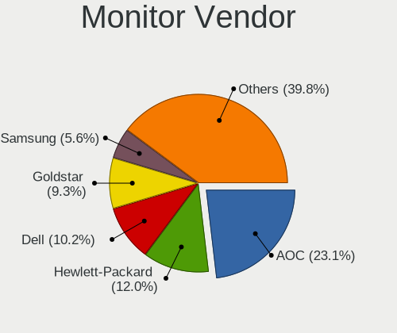

| Vendor               | Desktops | Percent |
|----------------------|----------|---------|
| AOC                  | 16       | 25.4%   |
| Hewlett-Packard      | 9        | 14.29%  |
| Goldstar             | 7        | 11.11%  |
| Dell                 | 7        | 11.11%  |
| ViewSonic            | 3        | 4.76%   |
| BenQ                 | 3        | 4.76%   |
| Sony                 | 2        | 3.17%   |
| Samsung Electronics  | 2        | 3.17%   |
| AGO                  | 2        | 3.17%   |
| Acer                 | 2        | 3.17%   |
| Xerox                | 1        | 1.59%   |
| Unknown (XXX)        | 1        | 1.59%   |
| Royal Information    | 1        | 1.59%   |
| Philips              | 1        | 1.59%   |
| Panasonic            | 1        | 1.59%   |
| MSI                  | 1        | 1.59%   |
| LTM                  | 1        | 1.59%   |
| Lenovo               | 1        | 1.59%   |
| Haier                | 1        | 1.59%   |
| Ancor Communications | 1        | 1.59%   |

Monitor Model
-------------

Monitor models

| Model                                                                | Desktops | Percent |
|----------------------------------------------------------------------|----------|---------|
| AOC 2370 AOC2370 1920x1080 509x286mm 23.0-inch                       | 5        | 7.58%   |
| Samsung Electronics LCD Monitor SAM0A76 1280x720 949x543mm 43.0-inch | 2        | 3.03%   |
| Dell LCD Monitor DELA102 1920x1080 540x300mm 24.3-inch               | 2        | 3.03%   |
| AGO LCD Monitor AGO0001 1920x1080 256x192mm 12.6-inch                | 2        | 3.03%   |
| Xerox XA3-17 XER7B10 1280x1024 337x270mm 17.0-inch                   | 1        | 1.52%   |
| ViewSonic VA1703wb-2 VSCA21F 1440x900 367x230mm 17.1-inch            | 1        | 1.52%   |
| ViewSonic LCD Monitor VX2458-mhd 3286x1080                           | 1        | 1.52%   |
| ViewSonic LCD Monitor VX2260WM                                       | 1        | 1.52%   |
| Unknown (XXX) Union TV XXX2841 1920x1080 1209x680mm 54.6-inch        | 1        | 1.52%   |
| Sony TV SNY1B02 1360x768 1600x900mm 72.3-inch                        | 1        | 1.52%   |
| Sony TV SNY0902 1360x768                                             | 1        | 1.52%   |
| Royal Information Monitor TRL1012 1280x1024 320x240mm 15.7-inch      | 1        | 1.52%   |
| Philips LCD Monitor 170B4 1280x1024                                  | 1        | 1.52%   |
| Panasonic TV MEIA296 1280x1024 698x392mm 31.5-inch                   | 1        | 1.52%   |
| MSI MAG271CQP MSI3FA7 2560x1440 597x336mm 27.0-inch                  | 1        | 1.52%   |
| LTM LCD_VGA LTM0659 1920x1080 886x498mm 40.0-inch                    | 1        | 1.52%   |
| Lenovo LEN LS1922wA LEN0A14 1366x768 410x230mm 18.5-inch             | 1        | 1.52%   |
| Hewlett-Packard V193 HWP3178 1366x768 410x230mm 18.5-inch            | 1        | 1.52%   |
| Hewlett-Packard P223 HPN3391 1920x1080 477x268mm 21.5-inch           | 1        | 1.52%   |
| Hewlett-Packard LCD Monitor L1908w 1440x900                          | 1        | 1.52%   |
| Hewlett-Packard LCD Monitor Compaq W185q 3286x1080                   | 1        | 1.52%   |
| Hewlett-Packard LA1751 HWP2858 1280x1024 340x270mm 17.1-inch         | 1        | 1.52%   |
| Hewlett-Packard L1910 HWP26E6 1280x1024 380x300mm 19.1-inch          | 1        | 1.52%   |
| Hewlett-Packard L1908w HWP26F0 1440x900 410x256mm 19.0-inch          | 1        | 1.52%   |
| Hewlett-Packard E232 HWP3279 1920x1080 509x286mm 23.0-inch           | 1        | 1.52%   |
| Hewlett-Packard Compaq W1952a HWP3010 1366x768 410x230mm 18.5-inch   | 1        | 1.52%   |
| Hewlett-Packard Compaq CQ-1 HWP410E 1366x768 410x230mm 18.5-inch     | 1        | 1.52%   |
| Haier AQUA TV HRE0030 1920x1080 708x398mm 32.0-inch                  | 1        | 1.52%   |
| Goldstar MP59G GSM5B34 1920x1080 480x270mm 21.7-inch                 | 1        | 1.52%   |
| Goldstar MP59G GSM5B33 1920x1080 480x270mm 21.7-inch                 | 1        | 1.52%   |
| Goldstar HDR WFHD GSM7714 2560x1080 798x334mm 34.1-inch              | 1        | 1.52%   |
| Goldstar HDR WFHD GSM5B9F 2560x1080 798x334mm 34.1-inch              | 1        | 1.52%   |
| Goldstar HDR 4K GSM7707 3840x2160 600x340mm 27.2-inch                | 1        | 1.52%   |
| Goldstar HD PLUS GSM5AC5 1600x900 440x250mm 19.9-inch                | 1        | 1.52%   |
| Goldstar FULL HD GSM5B9E 1920x1080 600x340mm 27.2-inch               | 1        | 1.52%   |
| Goldstar FULL HD GSM5B55 1920x1080 480x270mm 21.7-inch               | 1        | 1.52%   |
| Dell U2412M DELA07A 1920x1200 518x324mm 24.1-inch                    | 1        | 1.52%   |
| Dell P2415Q DELA0BE 3840x2160 530x300mm 24.0-inch                    | 1        | 1.52%   |
| Dell E2211H DELA071 1920x1080 477x268mm 21.5-inch                    | 1        | 1.52%   |
| Dell E1911 DELF036 1440x900 408x255mm 18.9-inch                      | 1        | 1.52%   |
| Dell 1908FP DEL4026 1280x1024 376x301mm 19.0-inch                    | 1        | 1.52%   |
| Dell 1708FP DEL4023 1280x1024 338x270mm 17.0-inch                    | 1        | 1.52%   |
| BenQ RL2455 BNQ7F1C 1920x1080 531x298mm 24.0-inch                    | 1        | 1.52%   |
| BenQ PC BNQ7816 1366x768 430x254mm 19.7-inch                         | 1        | 1.52%   |
| BenQ GL2450 BNQ78A4 1920x1080 531x298mm 24.0-inch                    | 1        | 1.52%   |
| AOC LCD Monitor 2260WG5 1920x1080                                    | 1        | 1.52%   |
| AOC LCD Monitor 2036 1600x900                                        | 1        | 1.52%   |
| AOC LCD Monitor 1970W                                                | 1        | 1.52%   |
| AOC F19 AOC1900 1366x768 410x230mm 18.5-inch                         | 1        | 1.52%   |
| AOC 936W AOC1936 1366x768 410x230mm 18.5-inch                        | 1        | 1.52%   |
| AOC 2769M AOC2769 1920x1080 598x336mm 27.0-inch                      | 1        | 1.52%   |
| AOC 2590G5 AOC2590 1920x1080 544x303mm 24.5-inch                     | 1        | 1.52%   |
| AOC 24G2W1G4 AOC2402 1920x1080 527x296mm 23.8-inch                   | 1        | 1.52%   |
| AOC 2343 AOC2343 1920x1080 509x286mm 23.0-inch                       | 1        | 1.52%   |
| AOC 2070W AOC2070 1600x900 434x236mm 19.4-inch                       | 1        | 1.52%   |
| AOC 1670W AOC1670 1366x768 344x194mm 15.5-inch                       | 1        | 1.52%   |
| Ancor Communications ASUS VW199 ACI19ED 1440x900 408x255mm 18.9-inch | 1        | 1.52%   |
| Acer LCD Monitor S220HQL 1920x1080                                   | 1        | 1.52%   |
| Acer G246HL ACR02FF 1920x1080 530x300mm 24.0-inch                    | 1        | 1.52%   |

Monitor Resolution
------------------

Monitor screen resolution

| Resolution        | Desktops | Percent |
|-------------------|----------|---------|
| 1920x1080 (FHD)   | 24       | 38.71%  |
| 1366x768 (WXGA)   | 8        | 12.9%   |
| 1280x1024 (SXGA)  | 6        | 9.68%   |
| 3840x2160 (4K)    | 5        | 8.06%   |
| 1440x900 (WXGA+)  | 4        | 6.45%   |
| 1600x900 (HD+)    | 3        | 4.84%   |
| 3286x1080         | 2        | 3.23%   |
| 2560x1080         | 2        | 3.23%   |
| 1280x720 (HD)     | 2        | 3.23%   |
| Unknown           | 2        | 3.23%   |
| 2560x1440 (QHD)   | 1        | 1.61%   |
| 1920x1200 (WUXGA) | 1        | 1.61%   |
| 1360x768          | 1        | 1.61%   |
| 1280x960          | 1        | 1.61%   |

Monitor Diagonal
----------------

Diagonal size in inches

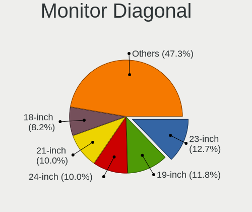

| Inches  | Desktops | Percent |
|---------|----------|---------|
| 23      | 8        | 12.9%   |
| 19      | 8        | 12.9%   |
| 24      | 7        | 11.29%  |
| Unknown | 7        | 11.29%  |
| 18      | 6        | 9.68%   |
| 21      | 5        | 8.06%   |
| 17      | 4        | 6.45%   |
| 27      | 3        | 4.84%   |
| 72      | 2        | 3.23%   |
| 43      | 2        | 3.23%   |
| 34      | 2        | 3.23%   |
| 15      | 2        | 3.23%   |
| 12      | 2        | 3.23%   |
| 84      | 1        | 1.61%   |
| 54      | 1        | 1.61%   |
| 40      | 1        | 1.61%   |
| 32      | 1        | 1.61%   |

Monitor Width
-------------

Physical width

| Width in mm | Desktops | Percent |
|-------------|----------|---------|
| 501-600     | 18       | 29.03%  |
| 401-500     | 17       | 27.42%  |
| Unknown     | 7        | 11.29%  |
| 301-350     | 5        | 8.06%   |
| 701-800     | 3        | 4.84%   |
| 351-400     | 3        | 4.84%   |
| 1501-2000   | 3        | 4.84%   |
| 201-300     | 2        | 3.23%   |
| 901-1000    | 2        | 3.23%   |
| 801-900     | 1        | 1.61%   |
| 1001-1500   | 1        | 1.61%   |

Aspect Ratio
------------

Proportional relationship between the width and the height

| Ratio   | Desktops | Percent |
|---------|----------|---------|
| 16/9    | 36       | 62.07%  |
| Unknown | 7        | 12.07%  |
| 5/4     | 5        | 8.62%   |
| 16/10   | 5        | 8.62%   |
| 4/3     | 3        | 5.17%   |
| 21/9    | 2        | 3.45%   |

Monitor Area
------------

Area in inch²

| Area in inch² | Desktops | Percent |
|----------------|----------|---------|
| 201-250        | 15       | 23.81%  |
| 151-200        | 10       | 15.87%  |
| 141-150        | 9        | 14.29%  |
| Unknown        | 7        | 11.11%  |
| More than 1000 | 4        | 6.35%   |
| 251-300        | 4        | 6.35%   |
| 351-500        | 3        | 4.76%   |
| 301-350        | 3        | 4.76%   |
| 501-1000       | 3        | 4.76%   |
| 71-80          | 2        | 3.17%   |
| 131-140        | 1        | 1.59%   |
| 111-120        | 1        | 1.59%   |
| 101-110        | 1        | 1.59%   |

Pixel Density
-------------

Pixels per inch

| Density | Desktops | Percent |
|---------|----------|---------|
| 51-100  | 36       | 60%     |
| 101-120 | 8        | 13.33%  |
| Unknown | 7        | 11.67%  |
| 1-50    | 5        | 8.33%   |
| 161-240 | 4        | 6.67%   |

Multiple Monitors
-----------------

Total monitors connected

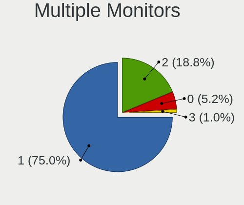

| Total | Desktops | Percent |
|-------|----------|---------|
| 1     | 45       | 81.82%  |
| 2     | 9        | 16.36%  |
| 0     | 1        | 1.82%   |

Network
-------

Net Controller Vendor
---------------------

Controller vendors

| Vendor                | Desktops | Percent |
|-----------------------|----------|---------|
| Realtek Semiconductor | 38       | 50%     |
| Intel                 | 16       | 21.05%  |
| Qualcomm Atheros      | 7        | 9.21%   |
| Broadcom              | 3        | 3.95%   |
| Xiaomi                | 2        | 2.63%   |
| TP-Link               | 2        | 2.63%   |
| Ralink                | 2        | 2.63%   |
| Linksys               | 2        | 2.63%   |
| Ralink Technology     | 1        | 1.32%   |
| Nvidia                | 1        | 1.32%   |
| Huawei Technologies   | 1        | 1.32%   |
| D-Link                | 1        | 1.32%   |

Net Controller Model
--------------------

Controller models

| Model                                                                                         | Desktops | Percent |
|-----------------------------------------------------------------------------------------------|----------|---------|
| Realtek RTL8111/8168/8411 PCI Express Gigabit Ethernet Controller                             | 31       | 37.8%   |
| Realtek RTL8188EUS 802.11n Wireless Network Adapter                                           | 3        | 3.66%   |
| Xiaomi Mi/Redmi series (RNDIS)                                                                | 2        | 2.44%   |
| Realtek RTL8125 2.5GbE Controller                                                             | 2        | 2.44%   |
| Qualcomm Atheros AR9485 Wireless Network Adapter                                              | 2        | 2.44%   |
| Intel Ethernet Controller I225-V                                                              | 2        | 2.44%   |
| Intel Ethernet Connection (2) I219-V                                                          | 2        | 2.44%   |
| Intel Centrino Advanced-N 6235                                                                | 2        | 2.44%   |
| TP-Link Archer T4U v2 [Realtek RTL8812AU]                                                     | 1        | 1.22%   |
| TP-Link Archer T2U PLUS [RTL8821AU]                                                           | 1        | 1.22%   |
| Realtek RTL88x2bu [AC1200 Techkey]                                                            | 1        | 1.22%   |
| Realtek RTL810xE PCI Express Fast Ethernet controller                                         | 1        | 1.22%   |
| Realtek RTL-8110SC/8169SC Gigabit Ethernet                                                    | 1        | 1.22%   |
| Realtek RTL-8100/8101L/8139 PCI Fast Ethernet Adapter                                         | 1        | 1.22%   |
| Realtek Realtek 8812AU/8821AU 802.11ac WLAN Adapter [USB Wireless Dual-Band Adapter 2.4/5Ghz] | 1        | 1.22%   |
| Realtek 802.11ac NIC                                                                          | 1        | 1.22%   |
| Ralink MT7601U Wireless Adapter                                                               | 1        | 1.22%   |
| Ralink RT5390R 802.11bgn PCIe Wireless Network Adapter                                        | 1        | 1.22%   |
| Ralink RT3062 Wireless 802.11n 2T/2R                                                          | 1        | 1.22%   |
| Qualcomm Atheros QCA6174 802.11ac Wireless Network Adapter                                    | 1        | 1.22%   |
| Qualcomm Atheros Killer E2400 Gigabit Ethernet Controller                                     | 1        | 1.22%   |
| Qualcomm Atheros Killer E220x Gigabit Ethernet Controller                                     | 1        | 1.22%   |
| Qualcomm Atheros AR8152 v2.0 Fast Ethernet                                                    | 1        | 1.22%   |
| Qualcomm Atheros AR5212/5213/2414 Wireless Network Adapter                                    | 1        | 1.22%   |
| Nvidia MCP79 Ethernet                                                                         | 1        | 1.22%   |
| Linksys AE2500 802.11abgn Wireless Adapter [Broadcom BCM43236]                                | 1        | 1.22%   |
| Linksys AE1000 v1 802.11n [Ralink RT3572]                                                     | 1        | 1.22%   |
| Intel Wireless-AC 9260                                                                        | 1        | 1.22%   |
| Intel Wi-Fi 6 AX200                                                                           | 1        | 1.22%   |
| Intel I350 Gigabit Network Connection                                                         | 1        | 1.22%   |
| Intel I211 Gigabit Network Connection                                                         | 1        | 1.22%   |
| Intel Ethernet Connection I217-LM                                                             | 1        | 1.22%   |
| Intel Ethernet Connection (7) I219-LM                                                         | 1        | 1.22%   |
| Intel Ethernet Connection (2) I219-LM                                                         | 1        | 1.22%   |
| Intel Cannon Lake PCH CNVi WiFi                                                               | 1        | 1.22%   |
| Intel Alder Lake-S PCH CNVi WiFi                                                              | 1        | 1.22%   |
| Intel 82801DB PRO/100 VE (CNR) Ethernet Controller                                            | 1        | 1.22%   |
| Intel 82566DM-2 Gigabit Network Connection                                                    | 1        | 1.22%   |
| Intel 82557/8/9/0/1 Ethernet Pro 100                                                          | 1        | 1.22%   |
| Huawei LYA-L09                                                                                | 1        | 1.22%   |
| D-Link DWA-123 Wireless N 150 Adapter (rev.D1)                                                | 1        | 1.22%   |
| Broadcom NetXtreme BCM5764M Gigabit Ethernet PCIe                                             | 1        | 1.22%   |
| Broadcom NetXtreme BCM5761 Gigabit Ethernet PCIe                                              | 1        | 1.22%   |
| Broadcom NetXtreme BCM5754 Gigabit Ethernet PCI Express                                       | 1        | 1.22%   |

Wireless Vendor
---------------

Wireless vendors

| Vendor                | Desktops | Percent |
|-----------------------|----------|---------|
| Realtek Semiconductor | 6        | 25%     |
| Intel                 | 6        | 25%     |
| Qualcomm Atheros      | 4        | 16.67%  |
| TP-Link               | 2        | 8.33%   |
| Ralink                | 2        | 8.33%   |
| Linksys               | 2        | 8.33%   |
| Ralink Technology     | 1        | 4.17%   |
| D-Link                | 1        | 4.17%   |

Wireless Model
--------------

Wireless models

| Model                                                                                         | Desktops | Percent |
|-----------------------------------------------------------------------------------------------|----------|---------|
| Realtek RTL8188EUS 802.11n Wireless Network Adapter                                           | 3        | 12.5%   |
| Qualcomm Atheros AR9485 Wireless Network Adapter                                              | 2        | 8.33%   |
| Intel Centrino Advanced-N 6235                                                                | 2        | 8.33%   |
| TP-Link Archer T4U v2 [Realtek RTL8812AU]                                                     | 1        | 4.17%   |
| TP-Link Archer T2U PLUS [RTL8821AU]                                                           | 1        | 4.17%   |
| Realtek RTL88x2bu [AC1200 Techkey]                                                            | 1        | 4.17%   |
| Realtek Realtek 8812AU/8821AU 802.11ac WLAN Adapter [USB Wireless Dual-Band Adapter 2.4/5Ghz] | 1        | 4.17%   |
| Realtek 802.11ac NIC                                                                          | 1        | 4.17%   |
| Ralink MT7601U Wireless Adapter                                                               | 1        | 4.17%   |
| Ralink RT5390R 802.11bgn PCIe Wireless Network Adapter                                        | 1        | 4.17%   |
| Ralink RT3062 Wireless 802.11n 2T/2R                                                          | 1        | 4.17%   |
| Qualcomm Atheros QCA6174 802.11ac Wireless Network Adapter                                    | 1        | 4.17%   |
| Qualcomm Atheros AR5212/5213/2414 Wireless Network Adapter                                    | 1        | 4.17%   |
| Linksys AE2500 802.11abgn Wireless Adapter [Broadcom BCM43236]                                | 1        | 4.17%   |
| Linksys AE1000 v1 802.11n [Ralink RT3572]                                                     | 1        | 4.17%   |
| Intel Wireless-AC 9260                                                                        | 1        | 4.17%   |
| Intel Wi-Fi 6 AX200                                                                           | 1        | 4.17%   |
| Intel Cannon Lake PCH CNVi WiFi                                                               | 1        | 4.17%   |
| Intel Alder Lake-S PCH CNVi WiFi                                                              | 1        | 4.17%   |
| D-Link DWA-123 Wireless N 150 Adapter (rev.D1)                                                | 1        | 4.17%   |

Ethernet Vendor
---------------

Ethernet vendors

| Vendor                | Desktops | Percent |
|-----------------------|----------|---------|
| Realtek Semiconductor | 36       | 63.16%  |
| Intel                 | 11       | 19.3%   |
| Qualcomm Atheros      | 3        | 5.26%   |
| Broadcom              | 3        | 5.26%   |
| Xiaomi                | 2        | 3.51%   |
| Nvidia                | 1        | 1.75%   |
| Huawei Technologies   | 1        | 1.75%   |

Ethernet Model
--------------

Ethernet models

| Model                                                             | Desktops | Percent |
|-------------------------------------------------------------------|----------|---------|
| Realtek RTL8111/8168/8411 PCI Express Gigabit Ethernet Controller | 31       | 53.45%  |
| Xiaomi Mi/Redmi series (RNDIS)                                    | 2        | 3.45%   |
| Realtek RTL8125 2.5GbE Controller                                 | 2        | 3.45%   |
| Intel Ethernet Controller I225-V                                  | 2        | 3.45%   |
| Intel Ethernet Connection (2) I219-V                              | 2        | 3.45%   |
| Realtek RTL810xE PCI Express Fast Ethernet controller             | 1        | 1.72%   |
| Realtek RTL-8110SC/8169SC Gigabit Ethernet                        | 1        | 1.72%   |
| Realtek RTL-8100/8101L/8139 PCI Fast Ethernet Adapter             | 1        | 1.72%   |
| Qualcomm Atheros Killer E2400 Gigabit Ethernet Controller         | 1        | 1.72%   |
| Qualcomm Atheros Killer E220x Gigabit Ethernet Controller         | 1        | 1.72%   |
| Qualcomm Atheros AR8152 v2.0 Fast Ethernet                        | 1        | 1.72%   |
| Nvidia MCP79 Ethernet                                             | 1        | 1.72%   |
| Intel I350 Gigabit Network Connection                             | 1        | 1.72%   |
| Intel I211 Gigabit Network Connection                             | 1        | 1.72%   |
| Intel Ethernet Connection I217-LM                                 | 1        | 1.72%   |
| Intel Ethernet Connection (7) I219-LM                             | 1        | 1.72%   |
| Intel Ethernet Connection (2) I219-LM                             | 1        | 1.72%   |
| Intel 82801DB PRO/100 VE (CNR) Ethernet Controller                | 1        | 1.72%   |
| Intel 82566DM-2 Gigabit Network Connection                        | 1        | 1.72%   |
| Intel 82557/8/9/0/1 Ethernet Pro 100                              | 1        | 1.72%   |
| Huawei LYA-L09                                                    | 1        | 1.72%   |
| Broadcom NetXtreme BCM5764M Gigabit Ethernet PCIe                 | 1        | 1.72%   |
| Broadcom NetXtreme BCM5761 Gigabit Ethernet PCIe                  | 1        | 1.72%   |
| Broadcom NetXtreme BCM5754 Gigabit Ethernet PCI Express           | 1        | 1.72%   |

Net Controller Kind
-------------------

Ethernet, WiFi or modem

| Kind     | Desktops | Percent |
|----------|----------|---------|
| Ethernet | 53       | 70.67%  |
| WiFi     | 22       | 29.33%  |

Used Controller
---------------

Currently used network controller

| Kind     | Desktops | Percent |
|----------|----------|---------|
| Ethernet | 43       | 75.44%  |
| WiFi     | 14       | 24.56%  |

NICs
----

Total network controllers on board

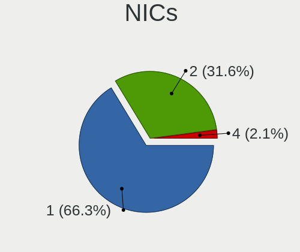

| Total | Desktops | Percent |
|-------|----------|---------|
| 1     | 32       | 59.26%  |
| 2     | 21       | 38.89%  |
| 4     | 1        | 1.85%   |

IPv6
----

IPv6 vs IPv4

| Used | Desktops | Percent |
|------|----------|---------|
| No   | 54       | 100%    |

Bluetooth
---------

Bluetooth Vendor
----------------

Controller vendors

| Vendor                  | Desktops | Percent |
|-------------------------|----------|---------|
| Intel                   | 6        | 42.86%  |
| Cambridge Silicon Radio | 5        | 35.71%  |
| ASUSTek Computer        | 2        | 14.29%  |
| Broadcom                | 1        | 7.14%   |

Bluetooth Model
---------------

Controller models

| Model                                                        | Desktops | Percent |
|--------------------------------------------------------------|----------|---------|
| Cambridge Silicon Radio Bluetooth Dongle (HCI mode)          | 5        | 35.71%  |
| Intel Centrino Bluetooth Wireless Transceiver                | 2        | 14.29%  |
| Intel Bluetooth Device                                       | 1        | 7.14%   |
| Intel Bluetooth 9460/9560 Jefferson Peak (JfP)               | 1        | 7.14%   |
| Intel AX201 Bluetooth                                        | 1        | 7.14%   |
| Intel AX200 Bluetooth                                        | 1        | 7.14%   |
| Broadcom 2045 Bluetooth 2.0 USB-UHE Device with trace filter | 1        | 7.14%   |
| ASUS Qualcomm Bluetooth 4.1                                  | 1        | 7.14%   |
| ASUS Broadcom BCM20702A0 Bluetooth                           | 1        | 7.14%   |

Sound
-----

Sound Vendor
------------

Sound card vendors

| Vendor                  | Desktops | Percent |
|-------------------------|----------|---------|
| Intel                   | 36       | 43.9%   |
| Nvidia                  | 20       | 24.39%  |
| AMD                     | 19       | 23.17%  |
| Realtek Semiconductor   | 1        | 1.22%   |
| Logitech                | 1        | 1.22%   |
| GN Netcom               | 1        | 1.22%   |
| Corsair                 | 1        | 1.22%   |
| C-Media Electronics     | 1        | 1.22%   |
| BEHRINGER International | 1        | 1.22%   |
| Argosy Research         | 1        | 1.22%   |

Sound Model
-----------

Sound card models

| Model                                                                             | Desktops | Percent |
|-----------------------------------------------------------------------------------|----------|---------|
| Intel 8 Series/C220 Series Chipset High Definition Audio Controller               | 9        | 9.47%   |
| Intel Xeon E3-1200 v3/4th Gen Core Processor HD Audio Controller                  | 7        | 7.37%   |
| AMD Starship/Matisse HD Audio Controller                                          | 6        | 6.32%   |
| Intel 100 Series/C230 Series Chipset Family HD Audio Controller                   | 5        | 5.26%   |
| AMD SBx00 Azalia (Intel HDA)                                                      | 5        | 5.26%   |
| Intel 200 Series PCH HD Audio                                                     | 4        | 4.21%   |
| AMD Ellesmere HDMI Audio [Radeon RX 470/480 / 570/580/590]                        | 4        | 4.21%   |
| Nvidia TU116 High Definition Audio Controller                                     | 3        | 3.16%   |
| Nvidia High Definition Audio Controller                                           | 3        | 3.16%   |
| Nvidia GK208 HDMI/DP Audio Controller                                             | 3        | 3.16%   |
| Intel NM10/ICH7 Family High Definition Audio Controller                           | 3        | 3.16%   |
| Intel 6 Series/C200 Series Chipset Family High Definition Audio Controller        | 3        | 3.16%   |
| Nvidia GP107GL High Definition Audio Controller                                   | 2        | 2.11%   |
| Nvidia GP106 High Definition Audio Controller                                     | 2        | 2.11%   |
| Nvidia GF108 High Definition Audio Controller                                     | 2        | 2.11%   |
| Intel Cannon Lake PCH cAVS                                                        | 2        | 2.11%   |
| Intel C600/X79 series chipset High Definition Audio Controller                    | 2        | 2.11%   |
| Intel 82801JI (ICH10 Family) HD Audio Controller                                  | 2        | 2.11%   |
| AMD Family 17h/19h HD Audio Controller                                            | 2        | 2.11%   |
| AMD Cedar HDMI Audio [Radeon HD 5400/6300/7300 Series]                            | 2        | 2.11%   |
| Realtek Semiconductor TX-384Khz Hifi Type-C Audio                                 | 1        | 1.05%   |
| Nvidia TU107 GeForce GTX 1650 High Definition Audio Controller                    | 1        | 1.05%   |
| Nvidia TU104 HD Audio Controller                                                  | 1        | 1.05%   |
| Nvidia MCP79 High Definition Audio                                                | 1        | 1.05%   |
| Nvidia GK106 HDMI Audio Controller                                                | 1        | 1.05%   |
| Nvidia GF119 HDMI Audio Controller                                                | 1        | 1.05%   |
| Logitech AudioHub Speaker                                                         | 1        | 1.05%   |
| Intel Celeron/Pentium Silver Processor High Definition Audio                      | 1        | 1.05%   |
| Intel Alder Lake-S HD Audio Controller                                            | 1        | 1.05%   |
| Intel 82801I (ICH9 Family) HD Audio Controller                                    | 1        | 1.05%   |
| Intel 82801EB/ER (ICH5/ICH5R) AC'97 Audio Controller                              | 1        | 1.05%   |
| Intel 7 Series/C216 Chipset Family High Definition Audio Controller               | 1        | 1.05%   |
| Intel 5 Series/3400 Series Chipset High Definition Audio                          | 1        | 1.05%   |
| GN Netcom Jabra EVOLVE Link MS                                                    | 1        | 1.05%   |
| Corsair VIRTUOSO USB Gaming Headset                                               | 1        | 1.05%   |
| C-Media Electronics CMI8738/CMI8768 PCI Audio                                     | 1        | 1.05%   |
| BEHRINGER International UMC202HD 192k                                             | 1        | 1.05%   |
| Argosy Research Argosy Multimedia audio controller                                | 1        | 1.05%   |
| AMD Turks HDMI Audio [Radeon HD 6500/6600 / 6700M Series]                         | 1        | 1.05%   |
| AMD Renoir Radeon High Definition Audio Controller                                | 1        | 1.05%   |
| AMD Raven/Raven2/Fenghuang HDMI/DP Audio Controller                               | 1        | 1.05%   |
| AMD FCH Azalia Controller                                                         | 1        | 1.05%   |
| AMD Family 17h (Models 00h-0fh) HD Audio Controller                               | 1        | 1.05%   |
| AMD Caicos HDMI Audio [Radeon HD 6450 / 7450/8450/8490 OEM / R5 230/235/235X OEM] | 1        | 1.05%   |

Memory
------

Memory Vendor
-------------

Memory module vendors

| Vendor              | Desktops | Percent |
|---------------------|----------|---------|
| Kingston            | 11       | 27.5%   |
| Micron Technology   | 9        | 22.5%   |
| SK hynix            | 5        | 12.5%   |
| Samsung Electronics | 4        | 10%     |
| Corsair             | 3        | 7.5%    |
| Crucial             | 2        | 5%      |
| A-DATA Technology   | 2        | 5%      |
| Unknown             | 1        | 2.5%    |
| Patriot             | 1        | 2.5%    |
| Kimtigo             | 1        | 2.5%    |
| G.Skill             | 1        | 2.5%    |

Memory Model
------------

Memory module models

| Model                                                     | Desktops | Percent |
|-----------------------------------------------------------|----------|---------|
| Micron RAM 8KTF51264AZ-1G6E1 4096MB DIMM DDR3 1600MT/s    | 5        | 11.11%  |
| Kingston RAM 9905584-015.A00LF 4096MB DIMM DDR3 1600MT/s  | 3        | 6.67%   |
| Kingston RAM 9905402-174.A00G 4GB DIMM DDR3 1600MT/s      | 2        | 4.44%   |
| Unknown RAM Module 2GB SODIMM DDR2 667MT/s                | 1        | 2.22%   |
| Unknown RAM Module 2048MB SODIMM DDR2 667MT/s             | 1        | 2.22%   |
| SK hynix RAM Module 16GB DIMM DDR4 2667MT/s               | 1        | 2.22%   |
| SK hynix RAM HMT451U6BFR8C-PB 4096MB DIMM DDR3 1600MT/s   | 1        | 2.22%   |
| SK hynix RAM HMT451U6AFR8C-PB 4GB DIMM DDR3 1600MT/s      | 1        | 2.22%   |
| SK hynix RAM HMT351U6CFR8C-PB 4096MB DIMM DDR3 1800MT/s   | 1        | 2.22%   |
| SK hynix RAM HMT351U6CFR8C-H9 4GB DIMM DDR3 1333MT/s      | 1        | 2.22%   |
| SK hynix RAM HMA81GS6CJR8N-VK 8GB SODIMM DDR4 2667MT/s    | 1        | 2.22%   |
| Samsung RAM M393B2G70BH0 16GB DIMM DDR3 1866MT/s          | 1        | 2.22%   |
| Samsung RAM M378B5773CH0-CK0 2GB DIMM DDR3 1600MT/s       | 1        | 2.22%   |
| Samsung RAM M378B5673FH0-CH9 2GB DIMM DDR3 1600MT/s       | 1        | 2.22%   |
| Samsung RAM M378A2K43CB1-CTD 16384MB DIMM DDR4 2667MT/s   | 1        | 2.22%   |
| Patriot RAM PSD48G266681 8GB DIMM DDR4 2934MT/s           | 1        | 2.22%   |
| Micron RAM 8JTF25664HZ-1G6M1 2048MB SODIMM DDR3 1600MT/s  | 1        | 2.22%   |
| Micron RAM 16JTF51264AZ-1G6M1 4GB DIMM DDR3 1600MT/s      | 1        | 2.22%   |
| Micron RAM 16JTF25664AZ-1G4F1 2GB DIMM 1333MT/s           | 1        | 2.22%   |
| Micron RAM 16ATF2G64HZ-2G6E1 16GB SODIMM DDR4 2400MT/s    | 1        | 2.22%   |
| Kingston RAM KHX2666C16/8G 8GB DIMM DDR4 3466MT/s         | 1        | 2.22%   |
| Kingston RAM KHX2666C15/16G 16GB DIMM DDR4 2666MT/s       | 1        | 2.22%   |
| Kingston RAM KHX2400C15/8G 8GB DIMM DDR4 2933MT/s         | 1        | 2.22%   |
| Kingston RAM 99U5624-001.A00G 8GB SODIMM DDR4 2400MT/s    | 1        | 2.22%   |
| Kingston RAM 99U5403-067.A00LF 4096MB DIMM DDR3 1600MT/s  | 1        | 2.22%   |
| Kingston RAM 99U5403-050.A00 F 4GB DIMM DDR3 667MT/s      | 1        | 2.22%   |
| Kingston RAM 9905713-030.A00G 8GB DIMM DDR4 2667MT/s      | 1        | 2.22%   |
| Kingston RAM 9905702-017.A00G 8GB DIMM DDR4 2933MT/s      | 1        | 2.22%   |
| Kingston RAM 9905402-413.A00LF 2GB DIMM DDR3 1333MT/s     | 1        | 2.22%   |
| Kimtigo RAM KTR1333U4G 4096MB DIMM DDR3 1333MT/s          | 1        | 2.22%   |
| G.Skill RAM F4-3200C16-8GVKB 8GB DIMM DDR4 3200MT/s       | 1        | 2.22%   |
| Crucial RAM CT4G4DFS824A.C8FBD1 4096MB DIMM DDR4 2400MT/s | 1        | 2.22%   |
| Crucial RAM BLS8G4D240FSE.16FBD 8GB DIMM DDR4 2400MT/s    | 1        | 2.22%   |
| Corsair RAM CMK8GX4M1A2400C16 8GB DIMM DDR4 2800MT/s      | 1        | 2.22%   |
| Corsair RAM CMK16GX4M2B3200C16 8GB DIMM DDR4 3600MT/s     | 1        | 2.22%   |
| Corsair RAM CMD16GX4M2B3000C15 8192MB DIMM DDR4 3100MT/s  | 1        | 2.22%   |
| A-DATA RAM DDR4 3200 8GB DIMM DDR4 3400MT/s               | 1        | 2.22%   |
| A-DATA RAM DDR4 3000 8GB DIMM DDR4 3600MT/s               | 1        | 2.22%   |

Memory Kind
-----------

Memory module kinds

| Kind  | Desktops | Percent |
|-------|----------|---------|
| DDR4  | 15       | 48.39%  |
| DDR3  | 13       | 41.94%  |
| SDRAM | 2        | 6.45%   |
| DDR2  | 1        | 3.23%   |

Memory Form Factor
------------------

Physical design of the memory module

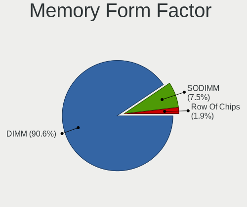

| Name   | Desktops | Percent |
|--------|----------|---------|
| DIMM   | 25       | 86.21%  |
| SODIMM | 4        | 13.79%  |

Memory Size
-----------

Memory module size

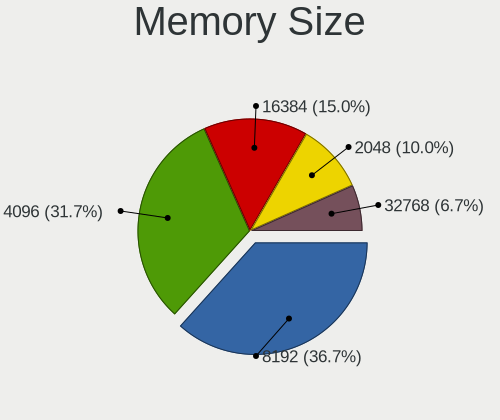

| Size  | Desktops | Percent |
|-------|----------|---------|
| 4096  | 12       | 37.5%   |
| 8192  | 9        | 28.13%  |
| 16384 | 5        | 15.63%  |
| 2048  | 5        | 15.63%  |
| 32768 | 1        | 3.13%   |

Memory Speed
------------

Memory module speed

| Speed | Desktops | Percent |
|-------|----------|---------|
| 1600  | 11       | 29.73%  |
| 2667  | 4        | 10.81%  |
| 2400  | 4        | 10.81%  |
| 1333  | 3        | 8.11%   |
| 3600  | 2        | 5.41%   |
| 3466  | 2        | 5.41%   |
| 2933  | 2        | 5.41%   |
| 667   | 2        | 5.41%   |
| 3400  | 1        | 2.7%    |
| 3100  | 1        | 2.7%    |
| 2934  | 1        | 2.7%    |
| 2800  | 1        | 2.7%    |
| 2666  | 1        | 2.7%    |
| 1866  | 1        | 2.7%    |
| 1800  | 1        | 2.7%    |

Printers & scanners
-------------------

Printer Vendor
--------------

Printer device vendors

| Vendor          | Desktops | Percent |
|-----------------|----------|---------|
| Hewlett-Packard | 3        | 50%     |
| Canon           | 2        | 33.33%  |
| Seiko Epson     | 1        | 16.67%  |

Printer Model
-------------

Printer device models

| Model                              | Desktops | Percent |
|------------------------------------|----------|---------|
| Seiko Epson L3110 Series           | 1        | 16.67%  |
| HP DeskJet 2620 All-in-One Printer | 1        | 16.67%  |
| HP DeskJet 2130 series             | 1        | 16.67%  |
| HP Deskjet 2050 J510               | 1        | 16.67%  |
| Canon G2000 series                 | 1        | 16.67%  |
| Canon E400 series                  | 1        | 16.67%  |

Scanner Vendor
--------------

Scanner device vendors

Zero info for selected period =(

Scanner Model
-------------

Scanner device models

Zero info for selected period =(

Camera
------

Camera Vendor
-------------

Camera device vendors

| Vendor                  | Desktops | Percent |
|-------------------------|----------|---------|
| Logitech                | 5        | 33.33%  |
| Microsoft               | 3        | 20%     |
| Z-Star Microelectronics | 1        | 6.67%   |
| Philips (or NXP)        | 1        | 6.67%   |
| Microdia                | 1        | 6.67%   |
| Huawei Technologies     | 1        | 6.67%   |
| Chicony Electronics     | 1        | 6.67%   |
| Aveo Technology         | 1        | 6.67%   |
| Arkmicro Technologies   | 1        | 6.67%   |

Camera Model
------------

Camera device models

| Model                                 | Desktops | Percent |
|---------------------------------------|----------|---------|
| Logitech Webcam C270                  | 3        | 20%     |
| Microsoft LifeCam HD-3000             | 2        | 13.33%  |
| Z-Star Vimicro USB Camera (Altair)    | 1        | 6.67%   |
| Philips (or NXP) SPC 1300NC PC Camera | 1        | 6.67%   |
| Microsoft LifeCam Cinema              | 1        | 6.67%   |
| Microdia USB 2.0 Camera               | 1        | 6.67%   |
| Logitech Webcam Pro 9000              | 1        | 6.67%   |
| Logitech HD Pro Webcam C920           | 1        | 6.67%   |
| Huawei HiCamera                       | 1        | 6.67%   |
| Chicony HP High Definition 1MP Webcam | 1        | 6.67%   |
| Aveo USB2.0 UVC PC Camera             | 1        | 6.67%   |
| Arkmicro USB2.0 PC CAMERA             | 1        | 6.67%   |

Security
--------

Fingerprint Vendor
------------------

Fingerprint sensor vendors

Zero info for selected period =(

Fingerprint Model
-----------------

Fingerprint sensor models

Zero info for selected period =(

Chipcard Vendor
---------------

Chipcard module vendors

| Vendor                     | Desktops | Percent |
|----------------------------|----------|---------|
| OmniKey                    | 1        | 50%     |
| Athena Smartcard Solutions | 1        | 50%     |

Chipcard Model
--------------

Chipcard module models

| Model                                    | Desktops | Percent |
|------------------------------------------|----------|---------|
| OmniKey CardMan 3021 / 3121              | 1        | 50%     |
| Athena Smartcard Solutions ASEDrive CCID | 1        | 50%     |

Unsupported
-----------

Unsupported Devices
-------------------

Total unsupported devices on board

| Total | Desktops | Percent |
|-------|----------|---------|
| 0     | 44       | 80%     |
| 1     | 8        | 14.55%  |
| 3     | 2        | 3.64%   |
| 2     | 1        | 1.82%   |

Unsupported Device Types
------------------------

Types of unsupported devices

| Type                     | Desktops | Percent |
|--------------------------|----------|---------|
| Net/wireless             | 5        | 33.33%  |
| Graphics card            | 3        | 20%     |
| Communication controller | 3        | 20%     |
| Chipcard                 | 2        | 13.33%  |
| Sound                    | 1        | 6.67%   |
| Network                  | 1        | 6.67%   |

