Linux in Costa Rica - Tested Hardware & Statistics (Desktops)
-------------------------------------------------------------

A project to collect tested hardware configurations for Linux in Costa Rica.

Anyone can contribute to this report by the [hw-probe](https://github.com/linuxhw/hw-probe) tool:

    sudo -E hw-probe -all -upload

Please contribute! Especially if your hardware is rare.

Contents
--------

* [ Test Cases ](#test-cases)

* [ System ](#system)
  - [ OS                       ](#os)
  - [ OS Family                ](#os-family)
  - [ Kernel                   ](#kernel)
  - [ Kernel Family            ](#kernel-family)
  - [ Kernel Major Ver.        ](#kernel-major-ver)
  - [ Arch                     ](#arch)
  - [ DE                       ](#de)
  - [ Display Server           ](#display-server)
  - [ Display Manager          ](#display-manager)
  - [ OS Lang                  ](#os-lang)
  - [ Boot Mode                ](#boot-mode)
  - [ Filesystem               ](#filesystem)
  - [ Part. scheme             ](#part-scheme)
  - [ Dual Boot with Linux/BSD ](#dual-boot-with-linuxbsd)
  - [ Dual Boot (Win)          ](#dual-boot-win)

* [ Board ](#board)
  - [ Vendor                   ](#vendor)
  - [ Model                    ](#model)
  - [ Model Family             ](#model-family)
  - [ MFG Year                 ](#mfg-year)
  - [ Form Factor              ](#form-factor)
  - [ Secure Boot              ](#secure-boot)
  - [ Coreboot                 ](#coreboot)
  - [ RAM Size                 ](#ram-size)
  - [ RAM Used                 ](#ram-used)
  - [ Total Drives             ](#total-drives)
  - [ Has CD-ROM               ](#has-cd-rom)
  - [ Has Ethernet             ](#has-ethernet)
  - [ Has WiFi                 ](#has-wifi)
  - [ Has Bluetooth            ](#has-bluetooth)

* [ Location ](#location)
  - [ Country                  ](#country)
  - [ City                     ](#city)

* [ Drives ](#drives)
  - [ Drive Vendor             ](#drive-vendor)
  - [ Drive Model              ](#drive-model)
  - [ HDD Vendor               ](#hdd-vendor)
  - [ SSD Vendor               ](#ssd-vendor)
  - [ Drive Kind               ](#drive-kind)
  - [ Drive Connector          ](#drive-connector)
  - [ Drive Size               ](#drive-size)
  - [ Space Total              ](#space-total)
  - [ Space Used               ](#space-used)
  - [ Malfunc. Drives          ](#malfunc-drives)
  - [ Malfunc. Drive Vendor    ](#malfunc-drive-vendor)
  - [ Malfunc. HDD Vendor      ](#malfunc-hdd-vendor)
  - [ Malfunc. Drive Kind      ](#malfunc-drive-kind)
  - [ Failed Drives            ](#failed-drives)
  - [ Failed Drive Vendor      ](#failed-drive-vendor)
  - [ Drive Status             ](#drive-status)

* [ Storage controller ](#storage-controller)
  - [ Storage Vendor           ](#storage-vendor)
  - [ Storage Model            ](#storage-model)
  - [ Storage Kind             ](#storage-kind)

* [ Processor ](#processor)
  - [ CPU Vendor               ](#cpu-vendor)
  - [ CPU Model                ](#cpu-model)
  - [ CPU Model Family         ](#cpu-model-family)
  - [ CPU Cores                ](#cpu-cores)
  - [ CPU Sockets              ](#cpu-sockets)
  - [ CPU Threads              ](#cpu-threads)
  - [ CPU Op-Modes             ](#cpu-op-modes)
  - [ CPU Microcode            ](#cpu-microcode)
  - [ CPU Microarch            ](#cpu-microarch)

* [ Graphics ](#graphics)
  - [ GPU Vendor               ](#gpu-vendor)
  - [ GPU Model                ](#gpu-model)
  - [ GPU Combo                ](#gpu-combo)
  - [ GPU Driver               ](#gpu-driver)
  - [ GPU Memory               ](#gpu-memory)

* [ Monitor ](#monitor)
  - [ Monitor Vendor           ](#monitor-vendor)
  - [ Monitor Model            ](#monitor-model)
  - [ Monitor Resolution       ](#monitor-resolution)
  - [ Monitor Diagonal         ](#monitor-diagonal)
  - [ Monitor Width            ](#monitor-width)
  - [ Aspect Ratio             ](#aspect-ratio)
  - [ Monitor Area             ](#monitor-area)
  - [ Pixel Density            ](#pixel-density)
  - [ Multiple Monitors        ](#multiple-monitors)

* [ Network ](#network)
  - [ Net Controller Vendor    ](#net-controller-vendor)
  - [ Net Controller Model     ](#net-controller-model)
  - [ Wireless Vendor          ](#wireless-vendor)
  - [ Wireless Model           ](#wireless-model)
  - [ Ethernet Vendor          ](#ethernet-vendor)
  - [ Ethernet Model           ](#ethernet-model)
  - [ Net Controller Kind      ](#net-controller-kind)
  - [ Used Controller          ](#used-controller)
  - [ NICs                     ](#nics)
  - [ IPv6                     ](#ipv6)

* [ Bluetooth ](#bluetooth)
  - [ Bluetooth Vendor         ](#bluetooth-vendor)
  - [ Bluetooth Model          ](#bluetooth-model)

* [ Sound ](#sound)
  - [ Sound Vendor             ](#sound-vendor)
  - [ Sound Model              ](#sound-model)

* [ Memory ](#memory)
  - [ Memory Vendor            ](#memory-vendor)
  - [ Memory Model             ](#memory-model)
  - [ Memory Kind              ](#memory-kind)
  - [ Memory Form Factor       ](#memory-form-factor)
  - [ Memory Size              ](#memory-size)
  - [ Memory Speed             ](#memory-speed)

* [ Printers & scanners ](#printers--scanners)
  - [ Printer Vendor           ](#printer-vendor)
  - [ Printer Model            ](#printer-model)
  - [ Scanner Vendor           ](#scanner-vendor)
  - [ Scanner Model            ](#scanner-model)

* [ Camera ](#camera)
  - [ Camera Vendor            ](#camera-vendor)
  - [ Camera Model             ](#camera-model)

* [ Security ](#security)
  - [ Fingerprint Vendor       ](#fingerprint-vendor)
  - [ Fingerprint Model        ](#fingerprint-model)
  - [ Chipcard Vendor          ](#chipcard-vendor)
  - [ Chipcard Model           ](#chipcard-model)

* [ Unsupported ](#unsupported)
  - [ Unsupported Devices      ](#unsupported-devices)
  - [ Unsupported Device Types ](#unsupported-device-types)

Test Cases
----------

Total: 136

| Vendor        | Model                       | Probe                                                      | Date         |
|---------------|-----------------------------|------------------------------------------------------------|--------------|
| Unknown       | ROUTER                      | [c6bf9058fa](https://linux-hardware.org/?probe=c6bf9058fa) | Dec 10, 2024 |
| ASUSTek       | H81M-K                      | [c3a615acb3](https://linux-hardware.org/?probe=c3a615acb3) | Nov 12, 2024 |
| ASUSTek       | H110M-A/DP                  | [00f803e8a2](https://linux-hardware.org/?probe=00f803e8a2) | Sep 18, 2024 |
| ASUSTek       | PRIME A320M-K               | [3b88a5d126](https://linux-hardware.org/?probe=3b88a5d126) | Aug 14, 2024 |
| Pegatron      | 2AE4                        | [db698b9ba0](https://linux-hardware.org/?probe=db698b9ba0) | Jul 31, 2024 |
| MSI           | X470 GAMING PLUS MAX        | [7c6efb1095](https://linux-hardware.org/?probe=7c6efb1095) | Jun 30, 2024 |
| Gigabyte      | B560M GAMING HD             | [c93b542abf](https://linux-hardware.org/?probe=c93b542abf) | Jun 19, 2024 |
| HP            | 83F2                        | [e802a9a41a](https://linux-hardware.org/?probe=e802a9a41a) | Jun 03, 2024 |
| Dell          | 0VD5HY A07                  | [a64b949879](https://linux-hardware.org/?probe=a64b949879) | May 28, 2024 |
| MSI           | MAG B550 TOMAHAWK MAX WI... | [001ab54ab1](https://linux-hardware.org/?probe=001ab54ab1) | May 23, 2024 |
| MSI           | K9N6PGM2-V2                 | [a79d33d7cf](https://linux-hardware.org/?probe=a79d33d7cf) | May 06, 2024 |
| Dell          | 0WMJ54 A00                  | [306aac13ae](https://linux-hardware.org/?probe=306aac13ae) | Mar 18, 2024 |
| Lenovo        | SHARKBAY NOK                | [abfba381b6](https://linux-hardware.org/?probe=abfba381b6) | Mar 02, 2024 |
| Lenovo        | SHARKBAY NOK                | [5d03e50172](https://linux-hardware.org/?probe=5d03e50172) | Mar 02, 2024 |
| Gigabyte      | B550M AORUS ELITE           | [d72d6f6951](https://linux-hardware.org/?probe=d72d6f6951) | Feb 09, 2024 |
| Gigabyte      | H110M-H-CF                  | [d1065a1aca](https://linux-hardware.org/?probe=d1065a1aca) | Jan 30, 2024 |
| ZOTAC         | NM10                        | [e185a9b292](https://linux-hardware.org/?probe=e185a9b292) | Jan 18, 2024 |
| MSI           | A320M-A PRO                 | [f118f7960d](https://linux-hardware.org/?probe=f118f7960d) | Jan 18, 2024 |
| Dell          | 0GY6Y8 A01                  | [bece296ba4](https://linux-hardware.org/?probe=bece296ba4) | Jan 15, 2024 |
| Dell          | 0GY6Y8 A01                  | [6eb80a3aae](https://linux-hardware.org/?probe=6eb80a3aae) | Jan 15, 2024 |
| Lenovo        | Annapurna CRB NO DPK        | [7d003c702a](https://linux-hardware.org/?probe=7d003c702a) | Dec 27, 2023 |
| Gigabyte      | B150-HD3-CF                 | [d7e062f534](https://linux-hardware.org/?probe=d7e062f534) | Nov 15, 2023 |
| ZOTAC         | NM10                        | [5a951d80a6](https://linux-hardware.org/?probe=5a951d80a6) | Oct 31, 2023 |
| HP            | 3047h                       | [cdd7fbc37f](https://linux-hardware.org/?probe=cdd7fbc37f) | Oct 25, 2023 |
| HP            | 3047h                       | [4235f287b2](https://linux-hardware.org/?probe=4235f287b2) | Oct 25, 2023 |
| ZOTAC         | NM10                        | [2e0ab67bec](https://linux-hardware.org/?probe=2e0ab67bec) | Oct 21, 2023 |
| Gigabyte      | X570 I AORUS PRO WIFI       | [a8028e0998](https://linux-hardware.org/?probe=a8028e0998) | Oct 11, 2023 |
| ASRock        | A320M-HDV R4.0              | [d1d30ae371](https://linux-hardware.org/?probe=d1d30ae371) | Oct 10, 2023 |
| Dell          | 0D28YY A00                  | [ef531e70d1](https://linux-hardware.org/?probe=ef531e70d1) | Sep 22, 2023 |
| Dell          | 0RW203 A00                  | [0c76c5a1a7](https://linux-hardware.org/?probe=0c76c5a1a7) | Aug 30, 2023 |
| MSI           | A320M-A PRO                 | [a0394c8f0b](https://linux-hardware.org/?probe=a0394c8f0b) | Jul 30, 2023 |
| Foxconn       | nT-iBT18/nT-iBT19/nT-iBT... | [23633cafce](https://linux-hardware.org/?probe=23633cafce) | Jul 27, 2023 |
| ASUSTek       | A55BM-E                     | [4e99483733](https://linux-hardware.org/?probe=4e99483733) | Jul 13, 2023 |
| ASUSTek       | PRIME H310M-E R2.0          | [a98b1d131d](https://linux-hardware.org/?probe=a98b1d131d) | Jul 06, 2023 |
| ASUSTek       | PRIME H310M-E R2.0          | [eb913300f2](https://linux-hardware.org/?probe=eb913300f2) | Jul 06, 2023 |
| ASUSTek       | SABERTOOTH Z77              | [607d40a328](https://linux-hardware.org/?probe=607d40a328) | Jul 04, 2023 |
| MSI           | A320M-A PRO                 | [7dffb9055b](https://linux-hardware.org/?probe=7dffb9055b) | Jun 29, 2023 |
| MSI           | Z390-A PRO                  | [638d6b4ef3](https://linux-hardware.org/?probe=638d6b4ef3) | Jun 27, 2023 |
| Dell          | 0WMJ54 A00                  | [5875771b0c](https://linux-hardware.org/?probe=5875771b0c) | May 24, 2023 |
| Dell          | 0WMJ54 A00                  | [50283ef123](https://linux-hardware.org/?probe=50283ef123) | May 24, 2023 |
| ZOTAC         | NM10                        | [0be7755cf9](https://linux-hardware.org/?probe=0be7755cf9) | May 19, 2023 |
| ASRock        | 970 Extreme3                | [906f9d6d04](https://linux-hardware.org/?probe=906f9d6d04) | Mar 30, 2023 |
| MSI           | PRO B650M-A WIFI            | [457915fe10](https://linux-hardware.org/?probe=457915fe10) | Mar 23, 2023 |
| ASUSTek       | PRO A320M-R WI-FI           | [2b64b38f7a](https://linux-hardware.org/?probe=2b64b38f7a) | Mar 01, 2023 |
| MSI           | 970A GAMING PRO CARBON      | [0649eea8a9](https://linux-hardware.org/?probe=0649eea8a9) | Feb 25, 2023 |
| Gigabyte      | GA-78LMT-USB3 SEx           | [d6fea43eb5](https://linux-hardware.org/?probe=d6fea43eb5) | Feb 25, 2023 |
| ASUSTek       | TUF Gaming X570-PLUS        | [cc2d26e52e](https://linux-hardware.org/?probe=cc2d26e52e) | Jan 22, 2023 |
| Dell          | 0D28YY A00                  | [394be1956b](https://linux-hardware.org/?probe=394be1956b) | Jan 22, 2023 |
| MACHINIST     | X79 V2.82H                  | [e6028c8640](https://linux-hardware.org/?probe=e6028c8640) | Jan 04, 2023 |
| ZOTAC         | NM10                        | [98b6981431](https://linux-hardware.org/?probe=98b6981431) | Dec 21, 2022 |
| Gigabyte      | B150-HD3-CF                 | [173dde2177](https://linux-hardware.org/?probe=173dde2177) | Dec 14, 2022 |
| MSI           | PRO B650M-A WIFI            | [485240a680](https://linux-hardware.org/?probe=485240a680) | Dec 13, 2022 |
| Gigabyte      | H410M H                     | [09129dad50](https://linux-hardware.org/?probe=09129dad50) | Nov 28, 2022 |
| Gigabyte      | H410M H                     | [88ca303518](https://linux-hardware.org/?probe=88ca303518) | Nov 28, 2022 |
| Gigabyte      | H81M-DS2                    | [f278eb7e59](https://linux-hardware.org/?probe=f278eb7e59) | Nov 27, 2022 |
| ASRock        | B660M Steel Legend          | [708d98bf92](https://linux-hardware.org/?probe=708d98bf92) | Nov 06, 2022 |
| ASRock        | B660M Steel Legend          | [2fce0b247c](https://linux-hardware.org/?probe=2fce0b247c) | Nov 06, 2022 |
| MACHINIST     | X79 V2.82H                  | [5d99fbefc1](https://linux-hardware.org/?probe=5d99fbefc1) | Oct 17, 2022 |
| ASUSTek       | PRIME Z370-A                | [5d789a1783](https://linux-hardware.org/?probe=5d789a1783) | Sep 28, 2022 |
| Intel         | DG41WV AAE90316-103         | [425dd57672](https://linux-hardware.org/?probe=425dd57672) | Sep 24, 2022 |
| Dell          | 0HD5W2 A01                  | [1bb8ad599d](https://linux-hardware.org/?probe=1bb8ad599d) | Sep 11, 2022 |
| ASRock        | N68-S UCC                   | [1d38f1f08e](https://linux-hardware.org/?probe=1d38f1f08e) | Aug 30, 2022 |
| Gigabyte      | GA-78LMT-USB3 SEx           | [b932802b52](https://linux-hardware.org/?probe=b932802b52) | Aug 04, 2022 |
| MACHINIST     | X79 V2.82H                  | [da4a098248](https://linux-hardware.org/?probe=da4a098248) | Jul 22, 2022 |
| MACHINIST     | X79 V2.82H                  | [0e06f3fdf5](https://linux-hardware.org/?probe=0e06f3fdf5) | Jul 22, 2022 |
| Unknown       | Unknown                     | [b64c215325](https://linux-hardware.org/?probe=b64c215325) | May 30, 2022 |
| Unknown       | Unknown                     | [1aba67a1ac](https://linux-hardware.org/?probe=1aba67a1ac) | May 15, 2022 |
| HP            | 0AECh D                     | [68adfe0740](https://linux-hardware.org/?probe=68adfe0740) | May 12, 2022 |
| HP            | 83EE                        | [55171637ca](https://linux-hardware.org/?probe=55171637ca) | Apr 29, 2022 |
| Dell          | 040DDP A01                  | [1f14473753](https://linux-hardware.org/?probe=1f14473753) | Apr 19, 2022 |
| ZOTAC         | NM10                        | [b2983fdd9d](https://linux-hardware.org/?probe=b2983fdd9d) | Apr 15, 2022 |
| ASUSTek       | STRIX Z270G GAMING          | [e04e7a6bc9](https://linux-hardware.org/?probe=e04e7a6bc9) | Apr 13, 2022 |
| Dell          | 040DDP A01                  | [8e31fed1d4](https://linux-hardware.org/?probe=8e31fed1d4) | Apr 07, 2022 |
| Dell          | 040DDP A01                  | [ff072aa20b](https://linux-hardware.org/?probe=ff072aa20b) | Apr 07, 2022 |
| Dell          | 040DDP A01                  | [9cd507e648](https://linux-hardware.org/?probe=9cd507e648) | Apr 07, 2022 |
| Dell          | 040DDP A01                  | [e5b52520a8](https://linux-hardware.org/?probe=e5b52520a8) | Apr 07, 2022 |
| ASRock        | B450 Steel Legend           | [6a631fae48](https://linux-hardware.org/?probe=6a631fae48) | Mar 22, 2022 |
| Dell          | 0RW203 A00                  | [21ac06a9f6](https://linux-hardware.org/?probe=21ac06a9f6) | Feb 12, 2022 |
| Dell          | 09KPNV A01                  | [8fc6552bc9](https://linux-hardware.org/?probe=8fc6552bc9) | Feb 08, 2022 |
| Gigabyte      | X570 I AORUS PRO WIFI       | [ac53ba49ef](https://linux-hardware.org/?probe=ac53ba49ef) | Jan 28, 2022 |
| Gigabyte      | Z690 UD AX DDR4             | [9158036ed3](https://linux-hardware.org/?probe=9158036ed3) | Dec 30, 2021 |
| ASUSTek       | ROG STRIX B550-F GAMING     | [b482ef13ea](https://linux-hardware.org/?probe=b482ef13ea) | Dec 26, 2021 |
| ASUSTek       | H81M-C                      | [0b0241baf7](https://linux-hardware.org/?probe=0b0241baf7) | Dec 08, 2021 |
| MSI           | H55M-E33                    | [f0786be9c3](https://linux-hardware.org/?probe=f0786be9c3) | Nov 14, 2021 |
| HP            | 18E4                        | [692c64d7c1](https://linux-hardware.org/?probe=692c64d7c1) | Nov 08, 2021 |
| HP            | 18E4                        | [499e85c152](https://linux-hardware.org/?probe=499e85c152) | Nov 07, 2021 |
| MSI           | H55M-E33                    | [3d8c474259](https://linux-hardware.org/?probe=3d8c474259) | Nov 06, 2021 |
| ASUSTek       | TUF Gaming B550M-PLUS       | [2a83508f22](https://linux-hardware.org/?probe=2a83508f22) | Oct 10, 2021 |
| TPV-INVENT... | 2AF2 A01                    | [23e967d7f5](https://linux-hardware.org/?probe=23e967d7f5) | Oct 06, 2021 |
| ZOTAC         | NM10                        | [94313faa27](https://linux-hardware.org/?probe=94313faa27) | Sep 27, 2021 |
| ZOTAC         | NM10                        | [f735937235](https://linux-hardware.org/?probe=f735937235) | Aug 22, 2021 |
| MSI           | MPG Z390I GAMING EDGE AC    | [391c21db23](https://linux-hardware.org/?probe=391c21db23) | Aug 16, 2021 |
| Dell          | 0PU052                      | [25ce6d5bbd](https://linux-hardware.org/?probe=25ce6d5bbd) | Aug 05, 2021 |
| Gigabyte      | B250M-DS3H-CF               | [a5a9cfcd44](https://linux-hardware.org/?probe=a5a9cfcd44) | Jul 18, 2021 |
| Gigabyte      | B250M-DS3H-CF               | [689b83e978](https://linux-hardware.org/?probe=689b83e978) | Jul 18, 2021 |
| Gigabyte      | X570 I AORUS PRO WIFI       | [b05fbab283](https://linux-hardware.org/?probe=b05fbab283) | Jun 06, 2021 |
| ASUSTek       | PRIME A320M-K               | [3e92571a0c](https://linux-hardware.org/?probe=3e92571a0c) | May 26, 2021 |
| Pegatron      | 2AE4                        | [604b735ad8](https://linux-hardware.org/?probe=604b735ad8) | May 02, 2021 |
| Intel         | D33217CK G76541-302         | [1db9d29c38](https://linux-hardware.org/?probe=1db9d29c38) | Apr 19, 2021 |
| ASUSTek       | PRIME A320M-K               | [48f003363a](https://linux-hardware.org/?probe=48f003363a) | Apr 09, 2021 |
| Dell          | 096JG8 A01                  | [1cf6d1daea](https://linux-hardware.org/?probe=1cf6d1daea) | Apr 02, 2021 |
| Supermicro    | X9DAi                       | [ff94b1201c](https://linux-hardware.org/?probe=ff94b1201c) | Mar 31, 2021 |
| Unknown       | i845G-W83627HF              | [2ff9864ce6](https://linux-hardware.org/?probe=2ff9864ce6) | Mar 29, 2021 |
| Pegatron      | 2AE4                        | [8570b15385](https://linux-hardware.org/?probe=8570b15385) | Feb 14, 2021 |
| ASUSTek       | H110M-K                     | [34bf1da3fe](https://linux-hardware.org/?probe=34bf1da3fe) | Feb 13, 2021 |
| ASRock        | 970 Extreme3                | [48548effcd](https://linux-hardware.org/?probe=48548effcd) | Feb 13, 2021 |
| Gigabyte      | B250M-DS3H-CF               | [e0de5d87e6](https://linux-hardware.org/?probe=e0de5d87e6) | Feb 04, 2021 |
| Unknown       | i845G-W83627HF              | [6c9d42b55d](https://linux-hardware.org/?probe=6c9d42b55d) | Jan 08, 2021 |
| Unknown       | i845G-W83627HF              | [9ff8161bec](https://linux-hardware.org/?probe=9ff8161bec) | Jan 08, 2021 |
| Gigabyte      | Z170X-Gaming 7              | [6706c380ab](https://linux-hardware.org/?probe=6706c380ab) | Dec 21, 2020 |
| Gigabyte      | H110M-S2-CF                 | [93308d477a](https://linux-hardware.org/?probe=93308d477a) | Dec 18, 2020 |
| ASUSTek       | TUF Gaming X570-PLUS        | [2d9e84acd0](https://linux-hardware.org/?probe=2d9e84acd0) | Dec 13, 2020 |
| Gigabyte      | GA-970A-D3                  | [3c6c9b7bd3](https://linux-hardware.org/?probe=3c6c9b7bd3) | Dec 11, 2020 |
| ASUSTek       | PRIME H310M-E R2.0          | [3070faaf5e](https://linux-hardware.org/?probe=3070faaf5e) | Dec 03, 2020 |
| Alienware     | 06G6JW A01                  | [812527d15d](https://linux-hardware.org/?probe=812527d15d) | Dec 02, 2020 |
| Dell          | 042P49 A01                  | [36ddd61132](https://linux-hardware.org/?probe=36ddd61132) | Aug 12, 2020 |
| Gigabyte      | H110M-H-CF                  | [d8a8eb467a](https://linux-hardware.org/?probe=d8a8eb467a) | Aug 02, 2020 |
| Gateway       | FMCP7AM                     | [58e88b2df5](https://linux-hardware.org/?probe=58e88b2df5) | Jul 28, 2020 |
| ABIT          | AW9D-MAX                    | [fca26e4a11](https://linux-hardware.org/?probe=fca26e4a11) | Jul 21, 2020 |
| ASRock        | H81M-VG4 R2.0               | [c00d0feee3](https://linux-hardware.org/?probe=c00d0feee3) | Jul 21, 2020 |
| MSI           | 970 GAMING                  | [73c5756fdd](https://linux-hardware.org/?probe=73c5756fdd) | Jul 01, 2020 |
| ASRock        | B450 Steel Legend           | [7d9ad3146b](https://linux-hardware.org/?probe=7d9ad3146b) | Jun 12, 2020 |
| ASUSTek       | TUF Gaming X570-PLUS        | [b9c266ed55](https://linux-hardware.org/?probe=b9c266ed55) | May 20, 2020 |
| MSI           | B450 GAMING PLUS MAX        | [6252910769](https://linux-hardware.org/?probe=6252910769) | May 11, 2020 |
| ASUSTek       | SABERTOOTH 990FX R2.0       | [8fc4603f6c](https://linux-hardware.org/?probe=8fc4603f6c) | May 10, 2020 |
| ASUSTek       | SABERTOOTH 990FX R2.0       | [33cd43676f](https://linux-hardware.org/?probe=33cd43676f) | May 09, 2020 |
| ASUSTek       | SABERTOOTH 990FX R2.0       | [1a81d95494](https://linux-hardware.org/?probe=1a81d95494) | May 09, 2020 |
| ASUSTek       | SABERTOOTH 990FX R2.0       | [cd09b6b8a5](https://linux-hardware.org/?probe=cd09b6b8a5) | May 09, 2020 |
| ASRock        | 775i65GV                    | [0367c8a291](https://linux-hardware.org/?probe=0367c8a291) | Jan 07, 2020 |
| ASRock        | 775i65GV                    | [d0a8b9d7da](https://linux-hardware.org/?probe=d0a8b9d7da) | Dec 25, 2019 |
| Dell          | 042P49 A01                  | [ce3194fcde](https://linux-hardware.org/?probe=ce3194fcde) | Oct 28, 2019 |
| Gigabyte      | GA-78LMT-S2                 | [4ddf2bb220](https://linux-hardware.org/?probe=4ddf2bb220) | Oct 06, 2019 |
| Biostar       | H61MGV3                     | [911486bcc2](https://linux-hardware.org/?probe=911486bcc2) | Sep 08, 2019 |
| Biostar       | H61MGV3                     | [0b1e8f1f08](https://linux-hardware.org/?probe=0b1e8f1f08) | Jun 12, 2019 |
| Intel         | DG41WV AAE90316-103         | [7b2dc235f8](https://linux-hardware.org/?probe=7b2dc235f8) | May 18, 2019 |
| Lenovo        | SHARKBAY 31900003 STD       | [e7164fcda2](https://linux-hardware.org/?probe=e7164fcda2) | Dec 01, 2018 |

System
------

OS
--

Installed operating systems

| Name               | Desktops | Percent |
|--------------------|----------|---------|
| Ubuntu 20.04       | 9        | 8.33%   |
| OpenMandriva 4.2   | 9        | 8.33%   |
| Ubuntu 22.04       | 8        | 7.41%   |
| Ubuntu 18.04       | 4        | 3.7%    |
| OpenMandriva 23.03 | 4        | 3.7%    |
| OpenMandriva 4.3   | 3        | 2.78%   |
| Linux Mint 20.2    | 3        | 2.78%   |
| Zorin 16           | 2        | 1.85%   |
| Xubuntu 22.04      | 2        | 1.85%   |
| Ubuntu 22.10       | 2        | 1.85%   |
| Pop!_OS 21.04      | 2        | 1.85%   |
| OpenMandriva 24.07 | 2        | 1.85%   |
| OpenMandriva 23.01 | 2        | 1.85%   |
| Lubuntu 22.04      | 2        | 1.85%   |
| Linux Mint 19.3    | 2        | 1.85%   |
| KDE neon 22.04     | 2        | 1.85%   |
| Fedora 38          | 2        | 1.85%   |
| Fedora 32          | 2        | 1.85%   |
| ArcoLinux Rolling  | 2        | 1.85%   |
| Zorin 15           | 1        | 0.93%   |
| Zorin 12           | 1        | 0.93%   |
| UbuntuDDE 20.04    | 1        | 0.93%   |
| Ubuntu 20.10       | 1        | 0.93%   |
| Ubuntu 19.10       | 1        | 0.93%   |
| ROSA R8.1          | 1        | 0.93%   |
| ROSA R11.1         | 1        | 0.93%   |
| ROSA R11           | 1        | 0.93%   |
| Pop!_OS 22.04      | 1        | 0.93%   |
| Pop!_OS 20.10      | 1        | 0.93%   |
| Pop!_OS 20.04      | 1        | 0.93%   |
| OpenMandriva 5.0   | 1        | 0.93%   |
| OpenMandriva 4.50  | 1        | 0.93%   |
| OpenMandriva 24.09 | 1        | 0.93%   |
| OpenMandriva 23.11 | 1        | 0.93%   |
| OpenMandriva 23.08 | 1        | 0.93%   |
| OpenMandriva 22.12 | 1        | 0.93%   |
| Nobara 40          | 1        | 0.93%   |
| Manjaro 23.1.3     | 1        | 0.93%   |
| Manjaro 22.0.4     | 1        | 0.93%   |
| Manjaro 22.0.0     | 1        | 0.93%   |

OS Family
---------

OS without a version

| Name         | Desktops | Percent |
|--------------|----------|---------|
| Ubuntu       | 25       | 24.75%  |
| OpenMandriva | 23       | 22.77%  |
| Fedora       | 8        | 7.92%   |
| Linux Mint   | 7        | 6.93%   |
| Manjaro      | 6        | 5.94%   |
| Pop!_OS      | 5        | 4.95%   |
| Zorin        | 4        | 3.96%   |
| Lubuntu      | 3        | 2.97%   |
| KDE neon     | 3        | 2.97%   |
| ArcoLinux    | 3        | 2.97%   |
| Xubuntu      | 2        | 1.98%   |
| ROSA         | 2        | 1.98%   |
| Elementary   | 2        | 1.98%   |
| Debian       | 2        | 1.98%   |
| Arch         | 2        | 1.98%   |
| UbuntuDDE    | 1        | 0.99%   |
| Nobara       | 1        | 0.99%   |
| EndeavourOS  | 1        | 0.99%   |
| BlackPanther | 1        | 0.99%   |

Kernel
------

Version of the Linux kernel

| Version                      | Desktops | Percent |
|------------------------------|----------|---------|
| 5.10.14-desktop-1omv4002     | 9        | 7.69%   |
| 6.2.6-desktop-1omv2390       | 4        | 3.42%   |
| 5.4.0-70-generic             | 3        | 2.56%   |
| 5.16.7-desktop-1omv4003      | 3        | 2.56%   |
| 6.4.11-desktop-1omv2390      | 2        | 1.71%   |
| 6.10.0-desktop-1omv2490      | 2        | 1.71%   |
| 5.4.0-42-generic             | 2        | 1.71%   |
| 5.19.0-45-generic            | 2        | 1.71%   |
| 5.15.0-53-generic            | 2        | 1.71%   |
| 6.9.7-zen1-1-zen             | 1        | 0.85%   |
| 6.8.10-300.fc40.x86_64       | 1        | 0.85%   |
| 6.7.0-custom                 | 1        | 0.85%   |
| 6.7.0-arch3-1                | 1        | 0.85%   |
| 6.6.2-desktop-1omv2390       | 1        | 0.85%   |
| 6.6.19-1-MANJARO             | 1        | 0.85%   |
| 6.6.0-custom                 | 1        | 0.85%   |
| 6.5.6-200.fc38.x86_64        | 1        | 0.85%   |
| 6.5.0-41-generic             | 1        | 0.85%   |
| 6.5.0-35-generic             | 1        | 0.85%   |
| 6.5.0-21-generic             | 1        | 0.85%   |
| 6.4.6-76060406-generic       | 1        | 0.85%   |
| 6.3.8-200.fc38.x86_64        | 1        | 0.85%   |
| 6.3.3-custom                 | 1        | 0.85%   |
| 6.2.7-200.fc37.x86_64        | 1        | 0.85%   |
| 6.2.0-33-generic             | 1        | 0.85%   |
| 6.12.3-alderlake-custom      | 1        | 0.85%   |
| 6.11.0-desktop-2omv2490      | 1        | 0.85%   |
| 6.10.7-200.fsync.fc40.x86_64 | 1        | 0.85%   |
| 6.1.4-desktop-1omv2301       | 1        | 0.85%   |
| 6.1.2-arch1-1                | 1        | 0.85%   |
| 6.1.1-desktop-1omv2290       | 1        | 0.85%   |
| 6.1.1-1-MANJARO              | 1        | 0.85%   |
| 6.1.0-custom                 | 1        | 0.85%   |
| 6.0.2-2-MANJARO              | 1        | 0.85%   |
| 6.0.11-300.fc37.x86_64       | 1        | 0.85%   |
| 6.0.10-desktop-2omv22090     | 1        | 0.85%   |
| 5.9.9-arch1-1                | 1        | 0.85%   |
| 5.9.14-arch1-1               | 1        | 0.85%   |
| 5.8.0-7630-generic           | 1        | 0.85%   |
| 5.8.0-50-generic             | 1        | 0.85%   |

Kernel Family
-------------

Linux kernel without a distro release

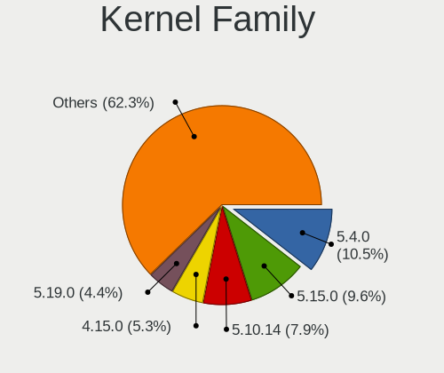

| Version | Desktops | Percent |
|---------|----------|---------|
| 5.4.0   | 12       | 10.53%  |
| 5.15.0  | 11       | 9.65%   |
| 5.10.14 | 9        | 7.89%   |
| 4.15.0  | 6        | 5.26%   |
| 5.19.0  | 5        | 4.39%   |
| 6.2.6   | 4        | 3.51%   |
| 5.8.0   | 4        | 3.51%   |
| 5.11.0  | 4        | 3.51%   |
| 6.5.0   | 3        | 2.63%   |
| 5.16.7  | 3        | 2.63%   |
| 6.7.0   | 2        | 1.75%   |
| 6.4.11  | 2        | 1.75%   |
| 6.10.0  | 2        | 1.75%   |
| 6.1.1   | 2        | 1.75%   |
| 5.3.0   | 2        | 1.75%   |
| 5.13.0  | 2        | 1.75%   |
| 6.9.7   | 1        | 0.88%   |
| 6.8.10  | 1        | 0.88%   |
| 6.6.2   | 1        | 0.88%   |
| 6.6.19  | 1        | 0.88%   |
| 6.6.0   | 1        | 0.88%   |
| 6.5.6   | 1        | 0.88%   |
| 6.4.6   | 1        | 0.88%   |
| 6.3.8   | 1        | 0.88%   |
| 6.3.3   | 1        | 0.88%   |
| 6.2.7   | 1        | 0.88%   |
| 6.2.0   | 1        | 0.88%   |
| 6.12.3  | 1        | 0.88%   |
| 6.11.0  | 1        | 0.88%   |
| 6.10.7  | 1        | 0.88%   |
| 6.1.4   | 1        | 0.88%   |
| 6.1.2   | 1        | 0.88%   |
| 6.1.0   | 1        | 0.88%   |
| 6.0.2   | 1        | 0.88%   |
| 6.0.11  | 1        | 0.88%   |
| 6.0.10  | 1        | 0.88%   |
| 5.9.9   | 1        | 0.88%   |
| 5.9.14  | 1        | 0.88%   |
| 5.7.0   | 1        | 0.88%   |
| 5.6.19  | 1        | 0.88%   |

Kernel Major Ver.
-----------------

Linux kernel major version

| Version | Desktops | Percent |
|---------|----------|---------|
| 5.4     | 13       | 11.4%   |
| 5.15    | 13       | 11.4%   |
| 5.10    | 12       | 10.53%  |
| 6.2     | 6        | 5.26%   |
| 4.15    | 6        | 5.26%   |
| 6.1     | 5        | 4.39%   |
| 5.19    | 5        | 4.39%   |
| 5.11    | 5        | 4.39%   |
| 6.5     | 4        | 3.51%   |
| 5.8     | 4        | 3.51%   |
| 5.6     | 4        | 3.51%   |
| 6.6     | 3        | 2.63%   |
| 6.4     | 3        | 2.63%   |
| 6.10    | 3        | 2.63%   |
| 6.0     | 3        | 2.63%   |
| 5.16    | 3        | 2.63%   |
| 5.13    | 3        | 2.63%   |
| 6.7     | 2        | 1.75%   |
| 6.3     | 2        | 1.75%   |
| 5.9     | 2        | 1.75%   |
| 5.3     | 2        | 1.75%   |
| 5.18    | 2        | 1.75%   |
| 6.9     | 1        | 0.88%   |
| 6.8     | 1        | 0.88%   |
| 6.12    | 1        | 0.88%   |
| 6.11    | 1        | 0.88%   |
| 5.7     | 1        | 0.88%   |
| 5.17    | 1        | 0.88%   |
| 5.14    | 1        | 0.88%   |
| 4.18    | 1        | 0.88%   |
| 4.1     | 1        | 0.88%   |

Arch
----

OS architecture (x86_64, i586, etc.)

| Name   | Desktops | Percent |
|--------|----------|---------|
| x86_64 | 90       | 96.77%  |
| i686   | 3        | 3.23%   |

DE
--

Desktop Environment

| Name          | Desktops | Percent |
|---------------|----------|---------|
| GNOME         | 41       | 42.27%  |
| KDE5          | 24       | 24.74%  |
| Unknown       | 9        | 9.28%   |
| X-Cinnamon    | 5        | 5.15%   |
| LXQt          | 5        | 5.15%   |
| XFCE          | 3        | 3.09%   |
| Pantheon      | 2        | 2.06%   |
| MATE          | 2        | 2.06%   |
| KDE6          | 2        | 2.06%   |
| KDE           | 1        | 1.03%   |
| Hyprland      | 1        | 1.03%   |
| GNOME Classic | 1        | 1.03%   |
| Deepin        | 1        | 1.03%   |

Display Server
--------------

X11 or Wayland

| Name    | Desktops | Percent |
|---------|----------|---------|
| X11     | 71       | 73.96%  |
| Wayland | 23       | 23.96%  |
| Tty     | 2        | 2.08%   |

Display Manager
---------------

SDDM, LightDM, etc.

| Name    | Desktops | Percent |
|---------|----------|---------|
| Unknown | 39       | 40.21%  |
| SDDM    | 30       | 30.93%  |
| GDM3    | 11       | 11.34%  |
| GDM     | 10       | 10.31%  |
| LightDM | 5        | 5.15%   |
| TDM     | 2        | 2.06%   |

OS Lang
-------

Language

| Lang    | Desktops | Percent |
|---------|----------|---------|
| en_US   | 45       | 44.55%  |
| es_CR   | 40       | 39.6%   |
| es_MX   | 6        | 5.94%   |
| Unknown | 5        | 4.95%   |
| es_ES   | 4        | 3.96%   |
| de_DE   | 1        | 0.99%   |

Boot Mode
---------

EFI or BIOS

| Mode | Desktops | Percent |
|------|----------|---------|
| BIOS | 48       | 51.06%  |
| EFI  | 46       | 48.94%  |

Filesystem
----------

Type of filesystem

| Type    | Desktops | Percent |
|---------|----------|---------|
| Ext4    | 57       | 57.58%  |
| Overlay | 19       | 19.19%  |
| Btrfs   | 15       | 15.15%  |
| Tmpfs   | 6        | 6.06%   |
| Xfs     | 1        | 1.01%   |
| Unknown | 1        | 1.01%   |

Part. scheme
------------

Scheme of partitioning

| Type    | Desktops | Percent |
|---------|----------|---------|
| GPT     | 48       | 49.48%  |
| Unknown | 40       | 41.24%  |
| MBR     | 9        | 9.28%   |

Dual Boot with Linux/BSD
------------------------

Hosting more than one Linux/BSD

| Dual boot | Desktops | Percent |
|-----------|----------|---------|
| No        | 73       | 77.66%  |
| Yes       | 21       | 22.34%  |

Dual Boot (Win)
---------------

Hosting Linux and Windows

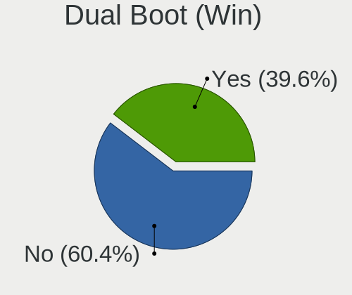

| Dual boot | Desktops | Percent |
|-----------|----------|---------|
| No        | 58       | 60.42%  |
| Yes       | 38       | 39.58%  |

Board
-----

Vendor
------

Motherboard manufacturer

| Name                | Desktops | Percent |
|---------------------|----------|---------|
| ASUSTek Computer    | 19       | 20.43%  |
| Gigabyte Technology | 15       | 16.13%  |
| Dell                | 15       | 16.13%  |
| MSI                 | 13       | 13.98%  |
| ASRock              | 8        | 8.6%    |
| Hewlett-Packard     | 5        | 5.38%   |
| Lenovo              | 3        | 3.23%   |
| Unknown             | 3        | 3.23%   |
| Intel               | 2        | 2.15%   |
| ZOTAC               | 1        | 1.08%   |
| TPV-INVENTA         | 1        | 1.08%   |
| Supermicro          | 1        | 1.08%   |
| Pegatron            | 1        | 1.08%   |
| MACHINIST           | 1        | 1.08%   |
| Gateway             | 1        | 1.08%   |
| Foxconn             | 1        | 1.08%   |
| Biostar             | 1        | 1.08%   |
| Alienware           | 1        | 1.08%   |
| ABIT                | 1        | 1.08%   |

Model
-----

Motherboard model

| Name                                     | Desktops | Percent |
|------------------------------------------|----------|---------|
| Dell OptiPlex 3020                       | 6        | 6.45%   |
| MSI MS-7C51                              | 3        | 3.23%   |
| ASUS PRIME A320M-K                       | 3        | 3.23%   |
| Unknown                                  | 3        | 3.23%   |
| Gigabyte H110M-H                         | 2        | 2.15%   |
| Gigabyte B250M-DS3H                      | 2        | 2.15%   |
| Dell OptiPlex 7040                       | 2        | 2.15%   |
| ASUS TUF Gaming X570-PLUS                | 2        | 2.15%   |
| ASUS PRIME H310M-E R2.0                  | 2        | 2.15%   |
| ASUS All Series                          | 2        | 2.15%   |
| ASRock B450 Steel Legend                 | 2        | 2.15%   |
| ZOTAC NM10                               | 1        | 1.08%   |
| TPV-INVENTA 18-2003LA                    | 1        | 1.08%   |
| Supermicro X9DAi                         | 1        | 1.08%   |
| Pegatron CQ2728LA                        | 1        | 1.08%   |
| MSI Z390 Gaming Trident X Plus (MS-B926) | 1        | 1.08%   |
| MSI MS-7D77                              | 1        | 1.08%   |
| MSI MS-7C91                              | 1        | 1.08%   |
| MSI MS-7B98                              | 1        | 1.08%   |
| MSI MS-7B86                              | 1        | 1.08%   |
| MSI MS-7B79                              | 1        | 1.08%   |
| MSI MS-7992                              | 1        | 1.08%   |
| MSI MS-7693                              | 1        | 1.08%   |
| MSI MS-7636                              | 1        | 1.08%   |
| MSI MS-7309                              | 1        | 1.08%   |
| MACHINIST X79 V2.82H                     | 1        | 1.08%   |
| Lenovo ThinkCentre M93p 10A8S41Q00       | 1        | 1.08%   |
| Lenovo ThinkCentre M78 21131C7           | 1        | 1.08%   |
| Lenovo H530S 10132                       | 1        | 1.08%   |
| Intel DG41WV AAE90316-103                | 1        | 1.08%   |
| Intel D33217CK G76541-302                | 1        | 1.08%   |
| HP Z800 Workstation                      | 1        | 1.08%   |
| HP ProDesk 600 G4 SFF                    | 1        | 1.08%   |
| HP ProDesk 400 G5 SFF                    | 1        | 1.08%   |
| HP EliteDesk 800 G1 TWR                  | 1        | 1.08%   |
| HP Compaq 6005 Pro SFF PC                | 1        | 1.08%   |
| Gigabyte Z690 UD AX DDR4                 | 1        | 1.08%   |
| Gigabyte Z170X-Gaming 7                  | 1        | 1.08%   |
| Gigabyte X570 I AORUS PRO WIFI           | 1        | 1.08%   |
| Gigabyte H81M-DS2                        | 1        | 1.08%   |

Model Family
------------

Motherboard model prefix

| Name                  | Desktops | Percent |
|-----------------------|----------|---------|
| Dell OptiPlex         | 12       | 12.9%   |
| ASUS PRIME            | 6        | 6.45%   |
| MSI MS-7C51           | 3        | 3.23%   |
| ASUS TUF              | 3        | 3.23%   |
| Unknown               | 3        | 3.23%   |
| Lenovo ThinkCentre    | 2        | 2.15%   |
| HP ProDesk            | 2        | 2.15%   |
| Gigabyte H110M-H      | 2        | 2.15%   |
| Gigabyte B250M-DS3H   | 2        | 2.15%   |
| Dell Precision        | 2        | 2.15%   |
| ASUS SABERTOOTH       | 2        | 2.15%   |
| ASUS All              | 2        | 2.15%   |
| ASRock B450           | 2        | 2.15%   |
| ZOTAC NM10            | 1        | 1.08%   |
| TPV-INVENTA 18-2003LA | 1        | 1.08%   |
| Supermicro X9DAi      | 1        | 1.08%   |
| Pegatron CQ2728LA     | 1        | 1.08%   |
| MSI Z390              | 1        | 1.08%   |
| MSI MS-7D77           | 1        | 1.08%   |
| MSI MS-7C91           | 1        | 1.08%   |
| MSI MS-7B98           | 1        | 1.08%   |
| MSI MS-7B86           | 1        | 1.08%   |
| MSI MS-7B79           | 1        | 1.08%   |
| MSI MS-7992           | 1        | 1.08%   |
| MSI MS-7693           | 1        | 1.08%   |
| MSI MS-7636           | 1        | 1.08%   |
| MSI MS-7309           | 1        | 1.08%   |
| MACHINIST X79         | 1        | 1.08%   |
| Lenovo H530S          | 1        | 1.08%   |
| Intel DG41WV          | 1        | 1.08%   |
| Intel D33217CK        | 1        | 1.08%   |
| HP Z800               | 1        | 1.08%   |
| HP EliteDesk          | 1        | 1.08%   |
| HP Compaq             | 1        | 1.08%   |
| Gigabyte Z690         | 1        | 1.08%   |
| Gigabyte Z170X-Gaming | 1        | 1.08%   |
| Gigabyte X570         | 1        | 1.08%   |
| Gigabyte H81M-DS2     | 1        | 1.08%   |
| Gigabyte H410M        | 1        | 1.08%   |
| Gigabyte H110M-S2     | 1        | 1.08%   |

MFG Year
--------

Motherboard manufacture year

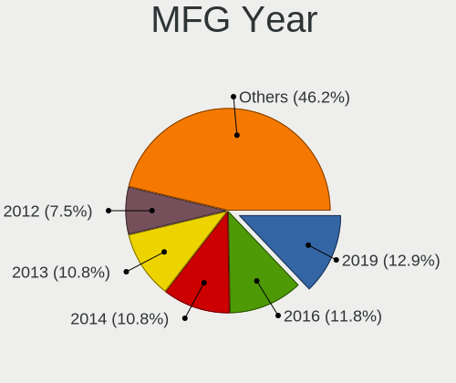

| Year | Desktops | Percent |
|------|----------|---------|
| 2019 | 12       | 12.9%   |
| 2016 | 11       | 11.83%  |
| 2014 | 10       | 10.75%  |
| 2013 | 10       | 10.75%  |
| 2012 | 7        | 7.53%   |
| 2018 | 6        | 6.45%   |
| 2015 | 5        | 5.38%   |
| 2021 | 4        | 4.3%    |
| 2020 | 4        | 4.3%    |
| 2017 | 4        | 4.3%    |
| 2010 | 4        | 4.3%    |
| 2022 | 3        | 3.23%   |
| 2011 | 3        | 3.23%   |
| 2009 | 3        | 3.23%   |
| 2008 | 2        | 2.15%   |
| 2007 | 2        | 2.15%   |
| 2005 | 2        | 2.15%   |
| 2023 | 1        | 1.08%   |

Form Factor
-----------

Physical design of the computer

| Name    | Desktops | Percent |
|---------|----------|---------|
| Desktop | 93       | 100%    |

Secure Boot
-----------

Enabled or disabled

| State    | Desktops | Percent |
|----------|----------|---------|
| Disabled | 87       | 93.55%  |
| Enabled  | 6        | 6.45%   |

Coreboot
--------

Have coreboot on board

| Used | Desktops | Percent |
|------|----------|---------|
| No   | 93       | 100%    |

RAM Size
--------

Total RAM memory

| Size in GB      | Desktops | Percent |
|-----------------|----------|---------|
| 16.01-24.0      | 27       | 27.84%  |
| 8.01-16.0       | 20       | 20.62%  |
| 4.01-8.0        | 13       | 13.4%   |
| 3.01-4.0        | 13       | 13.4%   |
| 32.01-64.0      | 12       | 12.37%  |
| 1.01-2.0        | 5        | 5.15%   |
| 64.01-256.0     | 3        | 3.09%   |
| 24.01-32.0      | 2        | 2.06%   |
| More than 256.0 | 1        | 1.03%   |
| 2.01-3.0        | 1        | 1.03%   |

RAM Used
--------

Used RAM memory

| Used GB    | Desktops | Percent |
|------------|----------|---------|
| 1.01-2.0   | 41       | 38.68%  |
| 2.01-3.0   | 21       | 19.81%  |
| 4.01-8.0   | 18       | 16.98%  |
| 3.01-4.0   | 12       | 11.32%  |
| 0.51-1.0   | 6        | 5.66%   |
| 0.01-0.5   | 3        | 2.83%   |
| 16.01-24.0 | 2        | 1.89%   |
| 8.01-16.0  | 2        | 1.89%   |
| 24.01-32.0 | 1        | 0.94%   |

Total Drives
------------

Number of drives on board

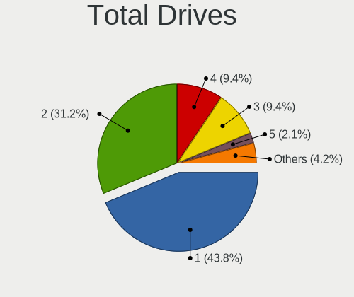

| Drives | Desktops | Percent |
|--------|----------|---------|
| 1      | 42       | 43.75%  |
| 2      | 30       | 31.25%  |
| 4      | 9        | 9.38%   |
| 3      | 9        | 9.38%   |
| 5      | 2        | 2.08%   |
| 9      | 1        | 1.04%   |
| 8      | 1        | 1.04%   |
| 7      | 1        | 1.04%   |
| 6      | 1        | 1.04%   |

Has CD-ROM
----------

Has CD-ROM on board

| Presented | Desktops | Percent |
|-----------|----------|---------|
| No        | 58       | 60.42%  |
| Yes       | 38       | 39.58%  |

Has Ethernet
------------

Has Ethernet on board

| Presented | Desktops | Percent |
|-----------|----------|---------|
| Yes       | 92       | 98.92%  |
| No        | 1        | 1.08%   |

Has WiFi
--------

Has WiFi module

| Presented | Desktops | Percent |
|-----------|----------|---------|
| No        | 57       | 60%     |
| Yes       | 38       | 40%     |

Has Bluetooth
-------------

Has Bluetooth module

| Presented | Desktops | Percent |
|-----------|----------|---------|
| No        | 72       | 74.23%  |
| Yes       | 25       | 25.77%  |

Location
--------

Country
-------

Geographic location (country)

| Country    | Desktops | Percent |
|------------|----------|---------|
| Costa Rica | 93       | 100%    |

City
----

Geographic location (city)

| City        | Desktops | Percent |
|-------------|----------|---------|
| San José   | 45       | 42.86%  |
| Heredia     | 20       | 19.05%  |
| Escazu      | 6        | 5.71%   |
| Alajuela    | 5        | 4.76%   |
| Liberia     | 3        | 2.86%   |
| Grecia      | 3        | 2.86%   |
| Cartago     | 3        | 2.86%   |
| Santa Fe    | 2        | 1.9%    |
| Santa Ana   | 2        | 1.9%    |
| Pavas       | 2        | 1.9%    |
| Tres Rios   | 1        | 0.95%   |
| Tibas       | 1        | 0.95%   |
| Siquirres   | 1        | 0.95%   |
| San Ramon   | 1        | 0.95%   |
| San Pedro   | 1        | 0.95%   |
| Rio Segundo | 1        | 0.95%   |
| Puntarenas  | 1        | 0.95%   |
| Palmares    | 1        | 0.95%   |
| Nosara      | 1        | 0.95%   |
| Naranjo     | 1        | 0.95%   |
| Curridabat  | 1        | 0.95%   |
| Cariblanca  | 1        | 0.95%   |
| Bajo Perez  | 1        | 0.95%   |
| Alajuelita  | 1        | 0.95%   |

Drives
------

Drive Vendor
------------

Hard drive vendors

| Vendor                    | Desktops | Drives | Percent |
|---------------------------|----------|--------|---------|
| Seagate                   | 35       | 57     | 19.55%  |
| WDC                       | 24       | 32     | 13.41%  |
| Kingston                  | 21       | 28     | 11.73%  |
| Toshiba                   | 16       | 18     | 8.94%   |
| A-DATA Technology         | 14       | 15     | 7.82%   |
| Samsung Electronics       | 8        | 18     | 4.47%   |
| Hitachi                   | 7        | 9      | 3.91%   |
| Realtek Semiconductor     | 5        | 7      | 2.79%   |
| XPG                       | 4        | 4      | 2.23%   |
| Patriot                   | 4        | 6      | 2.23%   |
| SanDisk                   | 3        | 4      | 1.68%   |
| HGST                      | 3        | 3      | 1.68%   |
| Crucial                   | 3        | 3      | 1.68%   |
| ZOTAC                     | 2        | 3      | 1.12%   |
| Unknown                   | 2        | 3      | 1.12%   |
| Phison Electronics        | 2        | 2      | 1.12%   |
| Netac                     | 2        | 3      | 1.12%   |
| Mushkin                   | 2        | 2      | 1.12%   |
| Maxtor                    | 2        | 2      | 1.12%   |
| Intel                     | 2        | 2      | 1.12%   |
| ADATA Technology          | 2        | 2      | 1.12%   |
| WD MediaMax               | 1        | 1      | 0.56%   |
| Team                      | 1        | 1      | 0.56%   |
| T-FORCE                   | 1        | 1      | 0.56%   |
| Silicon Motion            | 1        | 1      | 0.56%   |
| SABRENT                   | 1        | 1      | 0.56%   |
| Micron/Crucial Technology | 1        | 1      | 0.56%   |
| KIOXIA                    | 1        | 1      | 0.56%   |
| JMicron Technology        | 1        | 1      | 0.56%   |
| HPE                       | 1        | 1      | 0.56%   |
| Hewlett-Packard           | 1        | 1      | 0.56%   |
| Gigabyte Technology       | 1        | 2      | 0.56%   |
| CT120BX5                  | 1        | 1      | 0.56%   |
| China                     | 1        | 1      | 0.56%   |
| Biostar                   | 1        | 1      | 0.56%   |
| ASMedia                   | 1        | 1      | 0.56%   |
| Acer                      | 1        | 1      | 0.56%   |

Drive Model
-----------

Hard drive models

| Model                                       | Desktops | Percent |
|---------------------------------------------|----------|---------|
| Kingston SA400S37240G 240GB SSD             | 8        | 4.08%   |
| Toshiba DT01ACA100 1TB                      | 6        | 3.06%   |
| A-DATA SU630 480GB SSD                      | 5        | 2.55%   |
| Seagate ST1000DM003-1CH162 1TB              | 4        | 2.04%   |
| A-DATA SU650 120GB SSD                      | 4        | 2.04%   |
| WDC WD10EZEX-75WN4A1 1TB                    | 3        | 1.53%   |
| WDC WD10EZEX-08WN4A0 1TB                    | 3        | 1.53%   |
| Realtek RTS5763DL NVMe SSD Controller 256GB | 3        | 1.53%   |
| Kingston SV300S37A120G 120GB SSD            | 3        | 1.53%   |
| Kingston SA400S37480G 480GB SSD             | 3        | 1.53%   |
| XPG GAMMIX S11 Pro 512GB                    | 2        | 1.02%   |
| WDC WDS240G2G0A-00JH30 240GB SSD            | 2        | 1.02%   |
| Toshiba MQ01ABD100 1TB                      | 2        | 1.02%   |
| Seagate ST8000DM004-2CX188 8TB              | 2        | 1.02%   |
| Seagate ST500DM002-1BD142 500GB             | 2        | 1.02%   |
| Seagate ST380815AS 80GB                     | 2        | 1.02%   |
| Seagate ST2000LM015-2E8174 2TB              | 2        | 1.02%   |
| Seagate ST2000LM007-1R8174 2TB              | 2        | 1.02%   |
| Seagate Backup+ Desk 4TB                    | 2        | 1.02%   |
| Mushkin MKNSSDEL240GB                       | 2        | 1.02%   |
| Kingston SUV400S37120G 120GB SSD            | 2        | 1.02%   |
| Kingston SKC400S37256G 256GB SSD            | 2        | 1.02%   |
| Hitachi HUA722020ALA331 2TB                 | 2        | 1.02%   |
| HGST HTS541075A9E680 752GB                  | 2        | 1.02%   |
| A-DATA SX8100NP 256GB                       | 2        | 1.02%   |
| ZOTAC ZTSSD-S11-240G-P 240GB                | 1        | 0.51%   |
| ZOTAC ZTSSD-S11-120G-MD 120GB               | 1        | 0.51%   |
| XPG NVMe SSD Drive 512GB                    | 1        | 0.51%   |
| XPG NVMe SSD Drive 1TB                      | 1        | 0.51%   |
| WDC WUH721414ALE6L4 14TB                    | 1        | 0.51%   |
| WDC WDS120G2G0A-00JH30 120GB SSD            | 1        | 0.51%   |
| WDC WD6400AAKS-22A7B0 640GB                 | 1        | 0.51%   |
| WDC WD5000LPCX-60VHAT0 500GB                | 1        | 0.51%   |
| WDC WD5000AAKS-00V1A0 500GB                 | 1        | 0.51%   |
| WDC WD2500AAJS-00VTA0 250GB                 | 1        | 0.51%   |
| WDC WD20EZRZ-00Z5HB0 2TB                    | 1        | 0.51%   |
| WDC WD1600BEVS-26VAT0 160GB                 | 1        | 0.51%   |
| WDC WD1500HLFS-01G6U0 150GB                 | 1        | 0.51%   |
| WDC WD10SPZX-24Z10T0 1TB                    | 1        | 0.51%   |
| WDC WD10JPVX-00JC3T0 1TB                    | 1        | 0.51%   |

HDD Vendor
----------

Hard disk drive vendors

| Vendor              | Desktops | Drives | Percent |
|---------------------|----------|--------|---------|
| Seagate             | 34       | 55     | 38.64%  |
| WDC                 | 22       | 27     | 25%     |
| Toshiba             | 14       | 16     | 15.91%  |
| Hitachi             | 7        | 9      | 7.95%   |
| HGST                | 3        | 3      | 3.41%   |
| Samsung Electronics | 2        | 2      | 2.27%   |
| Maxtor              | 2        | 2      | 2.27%   |
| Unknown             | 1        | 2      | 1.14%   |
| SABRENT             | 1        | 1      | 1.14%   |
| JMicron Technology  | 1        | 1      | 1.14%   |
| ASMedia             | 1        | 1      | 1.14%   |

SSD Vendor
----------

Solid state drive vendors

| Vendor              | Desktops | Drives | Percent |
|---------------------|----------|--------|---------|
| Kingston            | 19       | 25     | 33.33%  |
| A-DATA Technology   | 11       | 12     | 19.3%   |
| WDC                 | 3        | 5      | 5.26%   |
| Samsung Electronics | 3        | 9      | 5.26%   |
| Patriot             | 3        | 5      | 5.26%   |
| ZOTAC               | 2        | 3      | 3.51%   |
| SanDisk             | 2        | 3      | 3.51%   |
| Mushkin             | 2        | 2      | 3.51%   |
| Intel               | 2        | 2      | 3.51%   |
| Crucial             | 2        | 2      | 3.51%   |
| Unknown             | 1        | 1      | 1.75%   |
| Team                | 1        | 1      | 1.75%   |
| Netac               | 1        | 1      | 1.75%   |
| Gigabyte Technology | 1        | 2      | 1.75%   |
| CT120BX5            | 1        | 1      | 1.75%   |
| China               | 1        | 1      | 1.75%   |
| Biostar             | 1        | 1      | 1.75%   |
| Acer                | 1        | 1      | 1.75%   |

Drive Kind
----------

HDD or SSD

| Kind    | Desktops | Drives | Percent |
|---------|----------|--------|---------|
| HDD     | 65       | 119    | 46.76%  |
| SSD     | 46       | 77     | 33.09%  |
| NVMe    | 24       | 39     | 17.27%  |
| Unknown | 4        | 5      | 2.88%   |

Drive Connector
---------------

SATA, SAS, NVMe, etc.

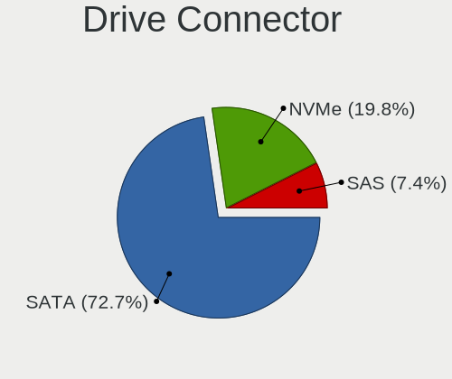

| Type | Desktops | Drives | Percent |
|------|----------|--------|---------|
| SATA | 88       | 184    | 72.73%  |
| NVMe | 24       | 39     | 19.83%  |
| SAS  | 9        | 17     | 7.44%   |

Drive Size
----------

Size of hard drive

| Size in TB | Desktops | Drives | Percent |
|------------|----------|--------|---------|
| 0.01-0.5   | 67       | 117    | 54.92%  |
| 0.51-1.0   | 34       | 46     | 27.87%  |
| 1.01-2.0   | 8        | 10     | 6.56%   |
| 4.01-10.0  | 5        | 13     | 4.1%    |
| 3.01-4.0   | 4        | 4      | 3.28%   |
| 2.01-3.0   | 3        | 5      | 2.46%   |
| 10.01-20.0 | 1        | 1      | 0.82%   |

Space Total
-----------

Amount of disk space available on the file system

| Size in GB     | Desktops | Percent |
|----------------|----------|---------|
| 501-1000       | 23       | 22.12%  |
| 101-250        | 21       | 20.19%  |
| 251-500        | 14       | 13.46%  |
| 1-20           | 14       | 13.46%  |
| 1001-2000      | 11       | 10.58%  |
| More than 3000 | 8        | 7.69%   |
| 51-100         | 7        | 6.73%   |
| Unknown        | 3        | 2.88%   |
| 2001-3000      | 2        | 1.92%   |
| 21-50          | 1        | 0.96%   |

Space Used
----------

Amount of used disk space

| Used GB        | Desktops | Percent |
|----------------|----------|---------|
| 1-20           | 42       | 38.89%  |
| 21-50          | 17       | 15.74%  |
| 251-500        | 11       | 10.19%  |
| 101-250        | 10       | 9.26%   |
| 51-100         | 9        | 8.33%   |
| 501-1000       | 6        | 5.56%   |
| More than 3000 | 5        | 4.63%   |
| 1001-2000      | 3        | 2.78%   |
| Unknown        | 3        | 2.78%   |
| 2001-3000      | 2        | 1.85%   |

Malfunc. Drives
---------------

Drive models with a malfunction

| Model                               | Desktops | Drives | Percent |
|-------------------------------------|----------|--------|---------|
| Seagate ST1000DM003-1CH162 1TB      | 2        | 2      | 13.33%  |
| Kingston SV300S37A120G 120GB SSD    | 2        | 2      | 13.33%  |
| A-DATA Technology SX8100NP 256GB    | 2        | 2      | 13.33%  |
| Unknown MB3000EBKAB 3TB             | 1        | 1      | 6.67%   |
| Seagate ST9160412AS 160GB           | 1        | 1      | 6.67%   |
| Seagate ST500LT012-1DG142 500GB     | 1        | 1      | 6.67%   |
| Seagate ST500DM002-1BD142 500GB     | 1        | 2      | 6.67%   |
| SanDisk SD6SB1M-128G-1006 128GB SSD | 1        | 2      | 6.67%   |
| Maxtor STM3160215AS 160GB           | 1        | 1      | 6.67%   |
| Kingston SA400S37480G 480GB SSD     | 1        | 1      | 6.67%   |
| Kingston SA400S37240G 240GB SSD     | 1        | 1      | 6.67%   |
| Hitachi HDE721010SLA330 1TB         | 1        | 1      | 6.67%   |

Malfunc. Drive Vendor
---------------------

Vendors of faulty drives

| Vendor            | Desktops | Drives | Percent |
|-------------------|----------|--------|---------|
| Seagate           | 5        | 6      | 33.33%  |
| Kingston          | 4        | 4      | 26.67%  |
| A-DATA Technology | 2        | 2      | 13.33%  |
| Unknown           | 1        | 1      | 6.67%   |
| SanDisk           | 1        | 2      | 6.67%   |
| Maxtor            | 1        | 1      | 6.67%   |
| Hitachi           | 1        | 1      | 6.67%   |

Malfunc. HDD Vendor
-------------------

Vendors of faulty HDD drives

| Vendor  | Desktops | Drives | Percent |
|---------|----------|--------|---------|
| Seagate | 5        | 6      | 62.5%   |
| Unknown | 1        | 1      | 12.5%   |
| Maxtor  | 1        | 1      | 12.5%   |
| Hitachi | 1        | 1      | 12.5%   |

Malfunc. Drive Kind
-------------------

Kinds of faulty drives

| Kind | Desktops | Drives | Percent |
|------|----------|--------|---------|
| HDD  | 7        | 9      | 50%     |
| SSD  | 5        | 6      | 35.71%  |
| NVMe | 2        | 2      | 14.29%  |

Failed Drives
-------------

Failed drive models

Zero info for selected period =(

Failed Drive Vendor
-------------------

Failed drive vendors

Zero info for selected period =(

Drive Status
------------

Number of failed and malfunc. drives

| Status   | Desktops | Drives | Percent |
|----------|----------|--------|---------|
| Detected | 52       | 116    | 47.27%  |
| Works    | 46       | 107    | 41.82%  |
| Malfunc  | 12       | 17     | 10.91%  |

Storage controller
------------------

Storage Vendor
--------------

Storage controller vendors

| Vendor                       | Desktops | Percent |
|------------------------------|----------|---------|
| Intel                        | 58       | 43.61%  |
| AMD                          | 31       | 23.31%  |
| Realtek Semiconductor        | 7        | 5.26%   |
| ASMedia Technology           | 6        | 4.51%   |
| ADATA Technology             | 6        | 4.51%   |
| Samsung Electronics          | 3        | 2.26%   |
| Nvidia                       | 3        | 2.26%   |
| Silicon Motion               | 2        | 1.5%    |
| Phison Electronics           | 2        | 1.5%    |
| Micron/Crucial Technology    | 2        | 1.5%    |
| LSI Logic / Symbios Logic    | 2        | 1.5%    |
| Kingston Technology Company  | 2        | 1.5%    |
| INNOGRIT                     | 2        | 1.5%    |
| Toshiba America Info Systems | 1        | 0.75%   |
| Silicon Image                | 1        | 0.75%   |
| SanDisk                      | 1        | 0.75%   |
| OCZ Technology Group         | 1        | 0.75%   |
| Marvell Technology Group     | 1        | 0.75%   |
| KIOXIA                       | 1        | 0.75%   |
| JMicron Technology           | 1        | 0.75%   |

Storage Model
-------------

Storage controller models

| Model                                                                          | Desktops | Percent |
|--------------------------------------------------------------------------------|----------|---------|
| Intel 8 Series/C220 Series Chipset Family 6-port SATA Controller 1 [AHCI mode] | 14       | 9.33%   |
| AMD FCH SATA Controller [AHCI mode]                                            | 13       | 8.67%   |
| Intel Q170/Q150/B150/H170/H110/Z170/CM236 Chipset SATA Controller [AHCI Mode]  | 8        | 5.33%   |
| AMD A320 Chipset SATA Controller [AHCI mode]                                   | 8        | 5.33%   |
| AMD SB7x0/SB8x0/SB9x0 SATA Controller [AHCI mode]                              | 7        | 4.67%   |
| Realtek RTS5762 NVMe SSD Controller                                            | 6        | 4%      |
| ASMedia ASM1061/ASM1062 Serial ATA Controller                                  | 6        | 4%      |
| Intel 200 Series PCH SATA controller [AHCI mode]                               | 5        | 3.33%   |
| ADATA XPG SX8200 Pro PCIe Gen3x4 M.2 2280 Solid State Drive                    | 5        | 3.33%   |
| Intel SATA Controller [RAID mode]                                              | 4        | 2.67%   |
| Intel Cannon Lake PCH SATA AHCI Controller                                     | 4        | 2.67%   |
| AMD 400 Series Chipset SATA Controller                                         | 4        | 2.67%   |
| Intel 6 Series/C200 Series Chipset Family 6 port Desktop SATA AHCI Controller  | 3        | 2%      |
| AMD 500 Series Chipset SATA Controller                                         | 3        | 2%      |
| Silicon Motion SM2263EN/SM2263XT (DRAM-less) NVMe SSD Controllers              | 2        | 1.33%   |
| Nvidia MCP61 SATA Controller                                                   | 2        | 1.33%   |
| Nvidia MCP61 IDE                                                               | 2        | 1.33%   |
| Kingston Company KC3000/FURY Renegade NVMe SSD [E18]                           | 2        | 1.33%   |
| Intel NM10/ICH7 Family SATA Controller [IDE mode]                              | 2        | 1.33%   |
| Intel C600/X79 series chipset 6-Port SATA AHCI Controller                      | 2        | 1.33%   |
| Intel Alder Lake-S PCH SATA Controller [AHCI Mode]                             | 2        | 1.33%   |
| AMD SB7x0/SB8x0/SB9x0 IDE Controller                                           | 2        | 1.33%   |
| Toshiba America Info Systems XG4 NVMe SSD Controller                           | 1        | 0.67%   |
| Silicon Image SiI 3132 Serial ATA Raid II Controller                           | 1        | 0.67%   |
| SanDisk Extreme Pro / WD Black SN750 / PC SN730 / Red SN700 NVMe SSD           | 1        | 0.67%   |
| Samsung NVMe SSD Controller SM981/PM981/PM983                                  | 1        | 0.67%   |
| Samsung NVMe SSD Controller SM951/PM951                                        | 1        | 0.67%   |
| Samsung NVMe SSD Controller PM9A1/PM9A3/980PRO                                 | 1        | 0.67%   |
| Realtek RTS5765DL NVMe SSD Controller (DRAM-less)                              | 1        | 0.67%   |
| Phison PS5013-E13 PCIe3 NVMe Controller (DRAM-less)                            | 1        | 0.67%   |
| Phison E12 NVMe Controller                                                     | 1        | 0.67%   |
| OCZ Group RD400/400A SSD                                                       | 1        | 0.67%   |
| Nvidia MCP79 RAID Controller                                                   | 1        | 0.67%   |
| Micron/Crucial P5 Plus NVMe PCIe SSD                                           | 1        | 0.67%   |
| Micron/Crucial P2 [Nick P2] / P3 / P3 Plus NVMe PCIe SSD (DRAM-less)           | 1        | 0.67%   |
| Marvell Group 88SE912x IDE Controller                                          | 1        | 0.67%   |
| Marvell Group 88SE9120 SATA 6Gb/s Controller                                   | 1        | 0.67%   |
| LSI Logic / Symbios Logic SAS1068E PCI-Express Fusion-MPT SAS                  | 1        | 0.67%   |
| LSI Logic / Symbios Logic MegaRAID SAS 2008 [Falcon]                           | 1        | 0.67%   |
| KIOXIA NVMe SSD Controller BG4 (DRAM-less)                                     | 1        | 0.67%   |

Storage Kind
------------

Kind of storage controller (IDE, SATA, NVMe, SAS, ...)

| Kind | Desktops | Percent |
|------|----------|---------|
| SATA | 79       | 62.7%   |
| NVMe | 24       | 19.05%  |
| IDE  | 13       | 10.32%  |
| RAID | 8        | 6.35%   |
| SAS  | 1        | 0.79%   |
| SCSI | 1        | 0.79%   |

Processor
---------

CPU Vendor
----------

Processor vendors

| Vendor | Desktops | Percent |
|--------|----------|---------|
| Intel  | 60       | 64.52%  |
| AMD    | 33       | 35.48%  |

CPU Model
---------

Processor models

| Model                                       | Desktops | Percent |
|---------------------------------------------|----------|---------|
| Intel Core i5-4590 CPU @ 3.30GHz            | 6        | 6.45%   |
| AMD Ryzen 5 3600 6-Core Processor           | 4        | 4.3%    |
| AMD Ryzen 3 3200G with Radeon Vega Graphics | 4        | 4.3%    |
| Intel Core i5-7400 CPU @ 3.00GHz            | 3        | 3.23%   |
| Intel Core i7-4790 CPU @ 3.60GHz            | 2        | 2.15%   |
| Intel Core i5-6400 CPU @ 2.70GHz            | 2        | 2.15%   |
| Intel Core i3-4130 CPU @ 3.40GHz            | 2        | 2.15%   |
| Intel Core i3-3220 CPU @ 3.30GHz            | 2        | 2.15%   |
| AMD Ryzen 7 5800X 8-Core Processor          | 2        | 2.15%   |
| AMD Ryzen 3 2200G with Radeon Vega Graphics | 2        | 2.15%   |
| Intel Xeon CPU X5667 @ 3.07GHz              | 1        | 1.08%   |
| Intel Xeon CPU W3565 @ 3.20GHz              | 1        | 1.08%   |
| Intel Xeon CPU E5405 @ 2.00GHz              | 1        | 1.08%   |
| Intel Xeon CPU E5-2660 v2 @ 2.20GHz         | 1        | 1.08%   |
| Intel Xeon CPU E5-2650 v2 @ 2.60GHz         | 1        | 1.08%   |
| Intel Xeon CPU E3-1225 v3 @ 3.20GHz         | 1        | 1.08%   |
| Intel Pentium Dual-Core CPU E5300 @ 2.60GHz | 1        | 1.08%   |
| Intel Pentium CPU G3260 @ 3.30GHz           | 1        | 1.08%   |
| Intel Pentium CPU G2030 @ 3.00GHz           | 1        | 1.08%   |
| Intel Pentium 4 CPU 2.00GHz                 | 1        | 1.08%   |
| Intel N100                                  | 1        | 1.08%   |
| Intel Core i9-9900KF CPU @ 3.60GHz          | 1        | 1.08%   |
| Intel Core i7-7700K CPU @ 4.20GHz           | 1        | 1.08%   |
| Intel Core i7-7700 CPU @ 3.60GHz            | 1        | 1.08%   |
| Intel Core i7-6700 CPU @ 3.40GHz            | 1        | 1.08%   |
| Intel Core i7-2700K CPU @ 3.50GHz           | 1        | 1.08%   |
| Intel Core i5-9600K CPU @ 3.70GHz           | 1        | 1.08%   |
| Intel Core i5-9400F CPU @ 2.90GHz           | 1        | 1.08%   |
| Intel Core i5-8500 CPU @ 3.00GHz            | 1        | 1.08%   |
| Intel Core i5-8400 CPU @ 2.80GHz            | 1        | 1.08%   |
| Intel Core i5-7500 CPU @ 3.40GHz            | 1        | 1.08%   |
| Intel Core i5-6600 CPU @ 3.30GHz            | 1        | 1.08%   |
| Intel Core i5-6500T CPU @ 2.50GHz           | 1        | 1.08%   |
| Intel Core i5-6500 CPU @ 3.20GHz            | 1        | 1.08%   |
| Intel Core i5-4570 CPU @ 3.20GHz            | 1        | 1.08%   |
| Intel Core i5-4460 CPU @ 3.20GHz            | 1        | 1.08%   |
| Intel Core i5-3470 CPU @ 3.20GHz            | 1        | 1.08%   |
| Intel Core i5-3330 CPU @ 3.00GHz            | 1        | 1.08%   |
| Intel Core i5-10400 CPU @ 2.90GHz           | 1        | 1.08%   |
| Intel Core i5 CPU 760 @ 2.80GHz             | 1        | 1.08%   |

CPU Model Family
----------------

Processor model prefix

| Model                   | Desktops | Percent |
|-------------------------|----------|---------|
| Intel Core i5           | 25       | 26.88%  |
| Intel Core i3           | 8        | 8.6%    |
| AMD Ryzen 5             | 8        | 8.6%    |
| Intel Xeon              | 6        | 6.45%   |
| Intel Core i7           | 6        | 6.45%   |
| AMD Ryzen 3             | 6        | 6.45%   |
| AMD Ryzen 7             | 5        | 5.38%   |
| AMD FX                  | 5        | 5.38%   |
| Other                   | 3        | 3.23%   |
| Intel Celeron           | 3        | 3.23%   |
| Intel Pentium           | 2        | 2.15%   |
| AMD Athlon II X2        | 2        | 2.15%   |
| Intel Pentium Dual-Core | 1        | 1.08%   |
| Intel Pentium 4         | 1        | 1.08%   |
| Intel Core i9           | 1        | 1.08%   |
| Intel Core 2 Quad       | 1        | 1.08%   |
| Intel Core 2 Duo        | 1        | 1.08%   |
| Intel Core 2            | 1        | 1.08%   |
| Intel Atom              | 1        | 1.08%   |
| AMD Sempron             | 1        | 1.08%   |
| AMD Ryzen 7 PRO         | 1        | 1.08%   |
| AMD Phenom II X4        | 1        | 1.08%   |
| AMD E2                  | 1        | 1.08%   |
| AMD E1                  | 1        | 1.08%   |
| AMD A8                  | 1        | 1.08%   |
| AMD A4                  | 1        | 1.08%   |

CPU Cores
---------

Number of processor cores

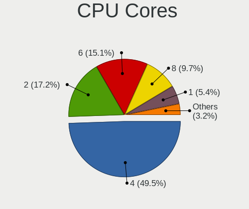

| Number | Desktops | Percent |
|--------|----------|---------|
| 4      | 46       | 49.46%  |
| 2      | 16       | 17.2%   |
| 6      | 14       | 15.05%  |
| 8      | 9        | 9.68%   |
| 1      | 5        | 5.38%   |
| 20     | 1        | 1.08%   |
| 10     | 1        | 1.08%   |
| 3      | 1        | 1.08%   |

CPU Sockets
-----------

Number of sockets

| Number | Desktops | Percent |
|--------|----------|---------|
| 1      | 91       | 97.85%  |
| 2      | 2        | 2.15%   |

CPU Threads
-----------

Threads per core (Hyper-Threading)

| Number | Desktops | Percent |
|--------|----------|---------|
| 1      | 54       | 58.06%  |
| 2      | 39       | 41.94%  |

CPU Op-Modes
------------

CPU Operation Modes (32-bit, 64-bit)

| Op mode        | Desktops | Percent |
|----------------|----------|---------|
| 32-bit, 64-bit | 91       | 97.85%  |
| 32-bit         | 1        | 1.08%   |
| Unknown        | 1        | 1.08%   |

CPU Microcode
-------------

Microcode number

| Number     | Desktops | Percent |
|------------|----------|---------|
| Unknown    | 32       | 31.68%  |
| 0x306c3    | 10       | 9.9%    |
| 0x906e9    | 5        | 4.95%   |
| 0x306a9    | 5        | 4.95%   |
| 0x08701021 | 4        | 3.96%   |
| 0x506e3    | 3        | 2.97%   |
| 0x08108109 | 3        | 2.97%   |
| 0x906eb    | 2        | 1.98%   |
| 0x306e4    | 2        | 1.98%   |
| 0x10676    | 2        | 1.98%   |
| 0x08101016 | 2        | 1.98%   |
| 0x06000852 | 2        | 1.98%   |
| 0x05000119 | 2        | 1.98%   |
| 0x010000c8 | 2        | 1.98%   |
| 0xf49      | 1        | 0.99%   |
| 0xf29      | 1        | 0.99%   |
| 0x906ec    | 1        | 0.99%   |
| 0x906ea    | 1        | 0.99%   |
| 0x90675    | 1        | 0.99%   |
| 0x90672    | 1        | 0.99%   |
| 0x706a8    | 1        | 0.99%   |
| 0x6f6      | 1        | 0.99%   |
| 0x30678    | 1        | 0.99%   |
| 0x106e5    | 1        | 0.99%   |
| 0x106ca    | 1        | 0.99%   |
| 0x106a5    | 1        | 0.99%   |
| 0x10677    | 1        | 0.99%   |
| 0x0a601201 | 1        | 0.99%   |
| 0x08701011 | 1        | 0.99%   |
| 0x0870100a | 1        | 0.99%   |
| 0x08600109 | 1        | 0.99%   |
| 0x08600106 | 1        | 0.99%   |
| 0x0800820d | 1        | 0.99%   |
| 0x06001119 | 1        | 0.99%   |
| 0x06001116 | 1        | 0.99%   |
| 0x06000822 | 1        | 0.99%   |
| 0x0500010d | 1        | 0.99%   |
| 0x010000c7 | 1        | 0.99%   |
| 0x00000000 | 1        | 0.99%   |

CPU Microarch
-------------

Microarchitecture

| Name             | Desktops | Percent |
|------------------|----------|---------|
| Haswell          | 14       | 15.05%  |
| KabyLake         | 13       | 13.98%  |
| IvyBridge        | 8        | 8.6%    |
| Zen+             | 6        | 6.45%   |
| Zen 2            | 6        | 6.45%   |
| Skylake          | 6        | 6.45%   |
| Piledriver       | 6        | 6.45%   |
| Zen 3            | 5        | 5.38%   |
| Penryn           | 4        | 4.3%    |
| K10              | 4        | 4.3%    |
| Zen              | 2        | 2.15%   |
| NetBurst         | 2        | 2.15%   |
| Nehalem          | 2        | 2.15%   |
| CometLake        | 2        | 2.15%   |
| Bobcat           | 2        | 2.15%   |
| Unknown          | 2        | 2.15%   |
| Westmere         | 1        | 1.08%   |
| Silvermont       | 1        | 1.08%   |
| SandyBridge      | 1        | 1.08%   |
| Gracemont        | 1        | 1.08%   |
| Goldmont plus    | 1        | 1.08%   |
| Core             | 1        | 1.08%   |
| Bulldozer        | 1        | 1.08%   |
| Bonnell          | 1        | 1.08%   |
| Alderlake Hybrid | 1        | 1.08%   |

Graphics
--------

GPU Vendor
----------

Vendors of graphics cards

| Vendor | Desktops | Percent |
|--------|----------|---------|
| Intel  | 40       | 38.83%  |
| Nvidia | 35       | 33.98%  |
| AMD    | 28       | 27.18%  |

GPU Model
---------

Graphics card models

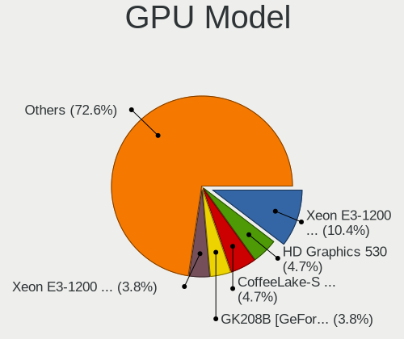

| Model                                                                       | Desktops | Percent |
|-----------------------------------------------------------------------------|----------|---------|
| Intel Xeon E3-1200 v3/4th Gen Core Processor Integrated Graphics Controller | 11       | 10.38%  |
| Intel HD Graphics 530                                                       | 5        | 4.72%   |
| Intel CoffeeLake-S GT2 [UHD Graphics 630]                                   | 5        | 4.72%   |
| Nvidia GK208B [GeForce GT 710]                                              | 4        | 3.77%   |
| Intel Xeon E3-1200 v2/3rd Gen Core processor Graphics Controller            | 4        | 3.77%   |
| Intel HD Graphics 630                                                       | 4        | 3.77%   |
| AMD Picasso/Raven 2 [Radeon Vega Series / Radeon Vega Mobile Series]        | 4        | 3.77%   |
| AMD Ellesmere [Radeon RX 470/480/570/570X/580/580X/590]                     | 4        | 3.77%   |
| Nvidia GT218 [GeForce 8400 GS Rev. 3]                                       | 3        | 2.83%   |
| Nvidia GP106 [GeForce GTX 1060 6GB]                                         | 2        | 1.89%   |
| Nvidia GF108 [GeForce GT 430]                                               | 2        | 1.89%   |
| Intel 4th Generation Core Processor Family Integrated Graphics Controller   | 2        | 1.89%   |
| AMD Navi 21 [Radeon RX 6800/6800 XT / 6900 XT]                              | 2        | 1.89%   |
| AMD Cedar [Radeon HD 5000/6000/7350/8350 Series]                            | 2        | 1.89%   |
| Nvidia TU117 [GeForce GTX 1650]                                             | 1        | 0.94%   |
| Nvidia TU116 [GeForce GTX 1660]                                             | 1        | 0.94%   |
| Nvidia TU116 [GeForce GTX 1660 Ti]                                          | 1        | 0.94%   |
| Nvidia TU116 [GeForce GTX 1660 SUPER]                                       | 1        | 0.94%   |
| Nvidia TU116 [GeForce GTX 1650]                                             | 1        | 0.94%   |
| Nvidia TU116 [GeForce GTX 1650 SUPER]                                       | 1        | 0.94%   |
| Nvidia TU106 [GeForce RTX 2060 12GB]                                        | 1        | 0.94%   |
| Nvidia TU104 [GeForce RTX 2080]                                             | 1        | 0.94%   |
| Nvidia NV18 [GeForce4 MX 440 AGP 8x]                                        | 1        | 0.94%   |
| Nvidia GT218 [ION]                                                          | 1        | 0.94%   |
| Nvidia GP108 [GeForce GT 1030]                                              | 1        | 0.94%   |
| Nvidia GP107 [GeForce GTX 1050]                                             | 1        | 0.94%   |
| Nvidia GP107 [GeForce GTX 1050 Ti]                                          | 1        | 0.94%   |
| Nvidia GK107 [GeForce GT 740]                                               | 1        | 0.94%   |
| Nvidia GK107 [GeForce GT 640]                                               | 1        | 0.94%   |
| Nvidia GK106 [GeForce GTX 645 OEM]                                          | 1        | 0.94%   |
| Nvidia GF119 [GeForce GT 610]                                               | 1        | 0.94%   |
| Nvidia GF119 [GeForce GT 520]                                               | 1        | 0.94%   |
| Nvidia GA106 [GeForce RTX 3060 Lite Hash Rate]                              | 1        | 0.94%   |
| Nvidia GA106 [Geforce RTX 3050]                                             | 1        | 0.94%   |
| Nvidia GA104 [GeForce RTX 3060]                                             | 1        | 0.94%   |
| Nvidia G96C [GeForce GT 120]                                                | 1        | 0.94%   |
| Nvidia G71GL [Quadro FX 3500]                                               | 1        | 0.94%   |
| Nvidia C61 [GeForce 7025 / nForce 630a]                                     | 1        | 0.94%   |
| Intel Xeon E3-1200 v3 Processor Integrated Graphics Controller              | 1        | 0.94%   |
| Intel GeminiLake [UHD Graphics 600]                                         | 1        | 0.94%   |

GPU Combo
---------

Combinations of graphics cards

| Name           | Desktops | Percent |
|----------------|----------|---------|
| 1 x Intel      | 37       | 37.76%  |
| 1 x Nvidia     | 32       | 32.65%  |
| 1 x AMD        | 22       | 22.45%  |
| 2 x AMD        | 3        | 3.06%   |
| AMD + Nvidia   | 3        | 3.06%   |
| Intel + Nvidia | 1        | 1.02%   |

GPU Driver
----------

Free vs proprietary

| Driver      | Desktops | Percent |
|-------------|----------|---------|
| Free        | 74       | 77.08%  |
| Proprietary | 19       | 19.79%  |
| Unknown     | 3        | 3.13%   |

GPU Memory
----------

Total video memory

| Size in GB | Desktops | Percent |
|------------|----------|---------|
| Unknown    | 46       | 46%     |
| 1.01-2.0   | 17       | 17%     |
| 3.01-4.0   | 9        | 9%      |
| 0.51-1.0   | 9        | 9%      |
| 0.01-0.5   | 8        | 8%      |
| 5.01-6.0   | 5        | 5%      |
| 7.01-8.0   | 4        | 4%      |
| 8.01-16.0  | 2        | 2%      |

Monitor
-------

Monitor Vendor
--------------

Monitor vendors

| Vendor               | Desktops | Percent |
|----------------------|----------|---------|
| AOC                  | 25       | 23.15%  |
| Hewlett-Packard      | 13       | 12.04%  |
| Dell                 | 11       | 10.19%  |
| Goldstar             | 10       | 9.26%   |
| Samsung Electronics  | 6        | 5.56%   |
| Acer                 | 6        | 5.56%   |
| ViewSonic            | 5        | 4.63%   |
| BenQ                 | 5        | 4.63%   |
| Sony                 | 3        | 2.78%   |
| AGO                  | 3        | 2.78%   |
| Panasonic            | 2        | 1.85%   |
| Lenovo               | 2        | 1.85%   |
| Ancor Communications | 2        | 1.85%   |
| Xerox                | 1        | 0.93%   |
| Unknown (XXX)        | 1        | 0.93%   |
| RTK                  | 1        | 0.93%   |
| Royal Information    | 1        | 0.93%   |
| RGT                  | 1        | 0.93%   |
| Philips              | 1        | 0.93%   |
| MSI                  | 1        | 0.93%   |
| LTM                  | 1        | 0.93%   |
| ITE                  | 1        | 0.93%   |
| Hitachi              | 1        | 0.93%   |
| Haier                | 1        | 0.93%   |
| DZX                  | 1        | 0.93%   |
| Denver               | 1        | 0.93%   |
| ASRock               | 1        | 0.93%   |
| ASR                  | 1        | 0.93%   |

Monitor Model
-------------

Monitor models

| Model                                                                | Desktops | Percent |
|----------------------------------------------------------------------|----------|---------|
| AOC 2370 AOC2370 1920x1080 509x286mm 23.0-inch                       | 5        | 4.24%   |
| AOC 2343 AOC2343 1920x1080 509x286mm 23.0-inch                       | 4        | 3.39%   |
| Goldstar HD GSM5ACD 1366x768 410x230mm 18.5-inch                     | 3        | 2.54%   |
| Dell AW2518HF DELA102 1920x1080 544x303mm 24.5-inch                  | 3        | 2.54%   |
| AOC 2070W AOC2070 1600x900 434x236mm 19.4-inch                       | 3        | 2.54%   |
| AGO LCD Monitor AGO0001 1920x1080 256x192mm 12.6-inch                | 3        | 2.54%   |
| Samsung Electronics LCD Monitor SAM0A76 1280x720 949x543mm 43.0-inch | 2        | 1.69%   |
| Panasonic TV MEIA296 1920x1080 698x392mm 31.5-inch                   | 2        | 1.69%   |
| Hewlett-Packard LCD Monitor E232 2944x1080                           | 2        | 1.69%   |
| Hewlett-Packard L1908w HWP26F0 1440x900 410x256mm 19.0-inch          | 2        | 1.69%   |
| Hewlett-Packard E232 HWP3279 1920x1080 509x286mm 23.0-inch           | 2        | 1.69%   |
| AOC 1670W AOC1670 1366x768 344x194mm 15.5-inch                       | 2        | 1.69%   |
| Xerox XA3-17 XER7B10 1280x1024 337x270mm 17.0-inch                   | 1        | 0.85%   |
| ViewSonic VX2778 Series VSC8432 2560x1440 597x336mm 27.0-inch        | 1        | 0.85%   |
| ViewSonic VA2231 Series VSCBB25 1920x1080 477x268mm 21.5-inch        | 1        | 0.85%   |
| ViewSonic VA1703wb-2 VSCA21F 1440x900 367x230mm 17.1-inch            | 1        | 0.85%   |
| ViewSonic LCD Monitor VX2458-mhd 3286x1080                           | 1        | 0.85%   |
| ViewSonic LCD Monitor VX2260WM                                       | 1        | 0.85%   |
| Unknown (XXX) Union TV XXX2841 1920x1080 1209x680mm 54.6-inch        | 1        | 0.85%   |
| Sony TV SNY5703 1920x1080                                            | 1        | 0.85%   |
| Sony TV SNY1B02 1360x768                                             | 1        | 0.85%   |
| Sony TV SNY0902 1920x1080                                            | 1        | 0.85%   |
| Samsung Electronics S24A31x SAM7115 1920x1080 527x296mm 23.8-inch    | 1        | 0.85%   |
| Samsung Electronics S22F350 SAM0D1A 1920x1080 477x268mm 21.5-inch    | 1        | 0.85%   |
| Samsung Electronics LCD Monitor SAM0C3C 1366x768 609x347mm 27.6-inch | 1        | 0.85%   |
| Samsung Electronics LC34G55T SAM7119 3440x1440 798x334mm 34.1-inch   | 1        | 0.85%   |
| Samsung Electronics C27F390 SAM0D32 1920x1080 600x340mm 27.2-inch    | 1        | 0.85%   |
| RTK FHD HDR RTKBC32 1920x1080 597x336mm 27.0-inch                    | 1        | 0.85%   |
| Royal Information Monitor TRL1012 1280x1024 320x240mm 15.7-inch      | 1        | 0.85%   |
| RGT LCD Monitor RGT1352 1920x1080 480x270mm 21.7-inch                | 1        | 0.85%   |
| Philips LCD Monitor 170B4 1280x1024                                  | 1        | 0.85%   |
| MSI MAG271CQR MSI3FA7 2560x1440 597x336mm 27.0-inch                  | 1        | 0.85%   |
| LTM LCD_VGA LTM0659 1024x768 880x500mm 39.8-inch                     | 1        | 0.85%   |
| Lenovo LEN T27h-20 LEN61EC 2560x1440 597x336mm 27.0-inch             | 1        | 0.85%   |
| Lenovo LEN D186wA LEN0A14 1366x768 410x230mm 18.5-inch               | 1        | 0.85%   |
| ITE DP2VGA V235 ITE6516 1920x1080 600x340mm 27.2-inch                | 1        | 0.85%   |
| Hitachi 32E10 HTC0128 1366x768 575x323mm 26.0-inch                   | 1        | 0.85%   |
| Hewlett-Packard V202 HWP330B 1600x900 452x263mm 20.6-inch            | 1        | 0.85%   |
| Hewlett-Packard V193 HWP3178 1366x768 410x230mm 18.5-inch            | 1        | 0.85%   |
| Hewlett-Packard P223a HPN3391 1920x1080 477x268mm 21.5-inch          | 1        | 0.85%   |

Monitor Resolution
------------------

Monitor screen resolution

| Resolution        | Desktops | Percent |
|-------------------|----------|---------|
| 1920x1080 (FHD)   | 43       | 40.57%  |
| 1366x768 (WXGA)   | 15       | 14.15%  |
| 3840x2160 (4K)    | 8        | 7.55%   |
| 1600x900 (HD+)    | 7        | 6.6%    |
| 1440x900 (WXGA+)  | 7        | 6.6%    |
| 1280x1024 (SXGA)  | 7        | 6.6%    |
| 2560x1440 (QHD)   | 5        | 4.72%   |
| 3286x1080         | 2        | 1.89%   |
| 2944x1080         | 2        | 1.89%   |
| 2560x1080         | 2        | 1.89%   |
| 1280x720 (HD)     | 2        | 1.89%   |
| Unknown           | 2        | 1.89%   |
| 3440x1440         | 1        | 0.94%   |
| 1920x1200 (WUXGA) | 1        | 0.94%   |
| 1360x768          | 1        | 0.94%   |
| 1280x960          | 1        | 0.94%   |

Monitor Diagonal
----------------

Diagonal size in inches

| Inches  | Desktops | Percent |
|---------|----------|---------|
| 23      | 14       | 12.73%  |
| 19      | 13       | 11.82%  |
| 24      | 11       | 10%     |
| 21      | 11       | 10%     |
| 18      | 9        | 8.18%   |
| Unknown | 9        | 8.18%   |
| 27      | 6        | 5.45%   |
| 15      | 6        | 5.45%   |
| 17      | 5        | 4.55%   |
| 72      | 4        | 3.64%   |
| 34      | 3        | 2.73%   |
| 12      | 3        | 2.73%   |
| 84      | 2        | 1.82%   |
| 43      | 2        | 1.82%   |
| 40      | 2        | 1.82%   |
| 31      | 2        | 1.82%   |
| 26      | 2        | 1.82%   |
| 54      | 1        | 0.91%   |
| 49      | 1        | 0.91%   |
| 36      | 1        | 0.91%   |
| 32      | 1        | 0.91%   |
| 22      | 1        | 0.91%   |
| 20      | 1        | 0.91%   |

Monitor Width
-------------

Physical width

| Width in mm | Desktops | Percent |
|-------------|----------|---------|
| 501-600     | 32       | 29.63%  |
| 401-500     | 32       | 29.63%  |
| 301-350     | 10       | 9.26%   |
| Unknown     | 9        | 8.33%   |
| 1501-2000   | 6        | 5.56%   |
| 701-800     | 5        | 4.63%   |
| 351-400     | 3        | 2.78%   |
| 201-300     | 3        | 2.78%   |
| 801-900     | 2        | 1.85%   |
| 601-700     | 2        | 1.85%   |
| 1001-1500   | 2        | 1.85%   |
| 901-1000    | 2        | 1.85%   |

Aspect Ratio
------------

Proportional relationship between the width and the height

| Ratio   | Desktops | Percent |
|---------|----------|---------|
| 16/9    | 65       | 67.01%  |
| Unknown | 9        | 9.28%   |
| 16/10   | 8        | 8.25%   |
| 5/4     | 6        | 6.19%   |
| 4/3     | 5        | 5.15%   |
| 21/9    | 3        | 3.09%   |
| 32/9    | 1        | 1.03%   |

Monitor Area
------------

Area in inch²

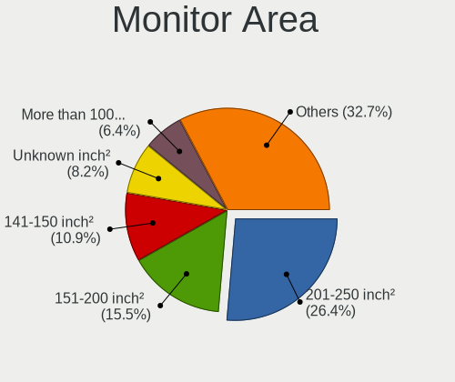

| Area in inch² | Desktops | Percent |
|----------------|----------|---------|
| 201-250        | 29       | 26.36%  |
| 151-200        | 17       | 15.45%  |
| 141-150        | 12       | 10.91%  |
| Unknown        | 9        | 8.18%   |
| More than 1000 | 7        | 6.36%   |
| 301-350        | 7        | 6.36%   |
| 251-300        | 7        | 6.36%   |
| 351-500        | 6        | 5.45%   |
| 501-1000       | 6        | 5.45%   |
| 101-110        | 5        | 4.55%   |
| 71-80          | 3        | 2.73%   |
| 131-140        | 1        | 0.91%   |
| 111-120        | 1        | 0.91%   |

Pixel Density
-------------

Pixels per inch

| Density | Desktops | Percent |
|---------|----------|---------|
| 51-100  | 60       | 58.25%  |
| 101-120 | 21       | 20.39%  |
| Unknown | 9        | 8.74%   |
| 1-50    | 7        | 6.8%    |
| 161-240 | 4        | 3.88%   |
| 121-160 | 2        | 1.94%   |

Multiple Monitors
-----------------

Total monitors connected

| Total | Desktops | Percent |
|-------|----------|---------|
| 1     | 72       | 75%     |
| 2     | 18       | 18.75%  |
| 0     | 5        | 5.21%   |
| 3     | 1        | 1.04%   |

Network
-------

Net Controller Vendor
---------------------

Controller vendors

| Vendor                          | Desktops | Percent |
|---------------------------------|----------|---------|
| Realtek Semiconductor           | 68       | 51.52%  |
| Intel                           | 27       | 20.45%  |
| Qualcomm Atheros                | 7        | 5.3%    |
| TP-Link                         | 6        | 4.55%   |
| Broadcom                        | 4        | 3.03%   |
| Ralink                          | 3        | 2.27%   |
| Nvidia                          | 3        | 2.27%   |
| Xiaomi                          | 2        | 1.52%   |
| Ralink Technology               | 2        | 1.52%   |
| MediaTek                        | 2        | 1.52%   |
| Linksys                         | 2        | 1.52%   |
| Huawei Technologies             | 2        | 1.52%   |
| Qualcomm Atheros Communications | 1        | 0.76%   |
| Davicom Semiconductor           | 1        | 0.76%   |
| D-Link                          | 1        | 0.76%   |
| Broadcom Limited                | 1        | 0.76%   |

Net Controller Model
--------------------

Controller models

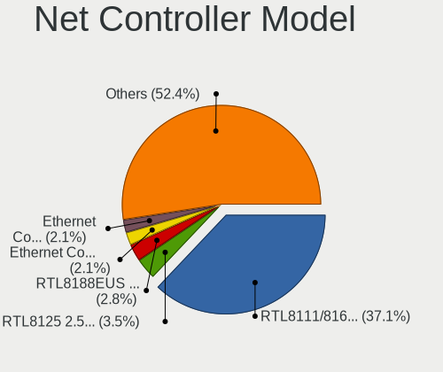

| Model                                                                                         | Desktops | Percent |
|-----------------------------------------------------------------------------------------------|----------|---------|
| Realtek RTL8111/8168/8211/8411 PCI Express Gigabit Ethernet Controller                        | 53       | 37.06%  |
| Realtek RTL8125 2.5GbE Controller                                                             | 5        | 3.5%    |
| Realtek RTL8188EUS 802.11n Wireless Network Adapter                                           | 4        | 2.8%    |
| Intel Ethernet Connection I217-LM                                                             | 3        | 2.1%    |
| Intel Ethernet Connection (2) I219-V                                                          | 3        | 2.1%    |
| Xiaomi Mi/Redmi series (RNDIS)                                                                | 2        | 1.4%    |
| TP-Link TL-WN823N v2/v3 [Realtek RTL8192EU]                                                   | 2        | 1.4%    |
| TP-Link Archer T2U PLUS [RTL8821AU]                                                           | 2        | 1.4%    |
| Realtek RTL8192EU 802.11b/g/n WLAN Adapter                                                    | 2        | 1.4%    |
| Realtek RTL-8185 IEEE 802.11a/b/g Wireless LAN Controller                                     | 2        | 1.4%    |
| Ralink MT7601U Wireless Adapter                                                               | 2        | 1.4%    |
| Qualcomm Atheros AR9485 Wireless Network Adapter                                              | 2        | 1.4%    |
| Nvidia MCP61 Ethernet                                                                         | 2        | 1.4%    |
| Intel Wi-Fi 5(802.11ac) Wireless-AC 9x6x [Thunder Peak]                                       | 2        | 1.4%    |
| Intel I211 Gigabit Network Connection                                                         | 2        | 1.4%    |
| Intel Ethernet Controller I225-V                                                              | 2        | 1.4%    |
| Intel Ethernet Connection (2) I219-LM                                                         | 2        | 1.4%    |
| Intel Centrino Advanced-N 6235                                                                | 2        | 1.4%    |
| Intel 82579LM Gigabit Network Connection (Lewisville)                                         | 2        | 1.4%    |
| Huawei FOA-LX9                                                                                | 2        | 1.4%    |
| Broadcom NetXtreme BCM5761 Gigabit Ethernet PCIe                                              | 2        | 1.4%    |
| TP-Link Archer T4U v2 [Realtek RTL8812AU]                                                     | 1        | 0.7%    |
| TP-Link AC600 wireless Realtek RTL8811AU [Archer T2U Nano]                                    | 1        | 0.7%    |
| TP-Link 802.11ac WLAN Adapter                                                                 | 1        | 0.7%    |
| Realtek RTL88x2bu [AC1200 Techkey]                                                            | 1        | 0.7%    |
| Realtek RTL8821CE PCIe 802.11ac Wireless Network Controller                                   | 1        | 0.7%    |
| Realtek RTL8821CE 802.11ac PCIe Wireless Network Adapter                                      | 1        | 0.7%    |
| Realtek RTL8188CUS 802.11n WLAN Adapter                                                       | 1        | 0.7%    |
| Realtek RTL8153 Gigabit Ethernet Adapter                                                      | 1        | 0.7%    |
| Realtek RTL810xE PCI Express Fast Ethernet controller                                         | 1        | 0.7%    |
| Realtek RTL-8110SC/8169SC Gigabit Ethernet                                                    | 1        | 0.7%    |
| Realtek RTL-8100/8101L/8139 PCI Fast Ethernet Adapter                                         | 1        | 0.7%    |
| Realtek Realtek 8812AU/8821AU 802.11ac WLAN Adapter [USB Wireless Dual-Band Adapter 2.4/5Ghz] | 1        | 0.7%    |
| Realtek 802.11ac NIC                                                                          | 1        | 0.7%    |
| Ralink RT5390R 802.11bgn PCIe Wireless Network Adapter                                        | 1        | 0.7%    |
| Ralink RT3062 Wireless 802.11n 2T/2R                                                          | 1        | 0.7%    |
| Ralink RT2800 802.11n PCI                                                                     | 1        | 0.7%    |
| Qualcomm Atheros QCA6174 802.11ac Wireless Network Adapter                                    | 1        | 0.7%    |
| Qualcomm Atheros Killer E2400 Gigabit Ethernet Controller                                     | 1        | 0.7%    |
| Qualcomm Atheros Killer E220x Gigabit Ethernet Controller                                     | 1        | 0.7%    |

Wireless Vendor
---------------

Wireless vendors

| Vendor                          | Desktops | Percent |
|---------------------------------|----------|---------|
| Realtek Semiconductor           | 14       | 33.33%  |
| Intel                           | 7        | 16.67%  |
| TP-Link                         | 6        | 14.29%  |
| Qualcomm Atheros                | 4        | 9.52%   |
| Ralink                          | 3        | 7.14%   |
| Ralink Technology               | 2        | 4.76%   |
| MediaTek                        | 2        | 4.76%   |
| Linksys                         | 2        | 4.76%   |
| Qualcomm Atheros Communications | 1        | 2.38%   |
| D-Link                          | 1        | 2.38%   |

Wireless Model
--------------

Wireless models

| Model                                                                                         | Desktops | Percent |
|-----------------------------------------------------------------------------------------------|----------|---------|
| Realtek RTL8188EUS 802.11n Wireless Network Adapter                                           | 4        | 9.3%    |
| TP-Link TL-WN823N v2/v3 [Realtek RTL8192EU]                                                   | 2        | 4.65%   |
| TP-Link Archer T2U PLUS [RTL8821AU]                                                           | 2        | 4.65%   |
| Realtek RTL8192EU 802.11b/g/n WLAN Adapter                                                    | 2        | 4.65%   |
| Realtek RTL-8185 IEEE 802.11a/b/g Wireless LAN Controller                                     | 2        | 4.65%   |
| Ralink MT7601U Wireless Adapter                                                               | 2        | 4.65%   |
| Qualcomm Atheros AR9485 Wireless Network Adapter                                              | 2        | 4.65%   |
| Intel Wi-Fi 5(802.11ac) Wireless-AC 9x6x [Thunder Peak]                                       | 2        | 4.65%   |
| Intel Centrino Advanced-N 6235                                                                | 2        | 4.65%   |
| TP-Link Archer T4U v2 [Realtek RTL8812AU]                                                     | 1        | 2.33%   |
| TP-Link AC600 wireless Realtek RTL8811AU [Archer T2U Nano]                                    | 1        | 2.33%   |
| TP-Link 802.11ac WLAN Adapter                                                                 | 1        | 2.33%   |
| Realtek RTL88x2bu [AC1200 Techkey]                                                            | 1        | 2.33%   |
| Realtek RTL8821CE PCIe 802.11ac Wireless Network Controller                                   | 1        | 2.33%   |
| Realtek RTL8821CE 802.11ac PCIe Wireless Network Adapter                                      | 1        | 2.33%   |
| Realtek RTL8188CUS 802.11n WLAN Adapter                                                       | 1        | 2.33%   |
| Realtek Realtek 8812AU/8821AU 802.11ac WLAN Adapter [USB Wireless Dual-Band Adapter 2.4/5Ghz] | 1        | 2.33%   |
| Realtek 802.11ac NIC                                                                          | 1        | 2.33%   |
| Ralink RT5390R 802.11bgn PCIe Wireless Network Adapter                                        | 1        | 2.33%   |
| Ralink RT3062 Wireless 802.11n 2T/2R                                                          | 1        | 2.33%   |
| Ralink RT2800 802.11n PCI                                                                     | 1        | 2.33%   |
| Qualcomm Atheros QCA6174 802.11ac Wireless Network Adapter                                    | 1        | 2.33%   |
| Qualcomm Atheros AR9271 802.11n                                                               | 1        | 2.33%   |
| Qualcomm Atheros AR5212/5213/2414 Wireless Network Adapter                                    | 1        | 2.33%   |
| MediaTek MT7922 802.11ax PCI Express Wireless Network Adapter                                 | 1        | 2.33%   |
| MediaTek MT7921K (RZ608) Wi-Fi 6E 80MHz                                                       | 1        | 2.33%   |
| Linksys AE2500 802.11abgn Wireless Adapter [Broadcom BCM43236]                                | 1        | 2.33%   |
| Linksys AE1000 v1 802.11n [Ralink RT3572]                                                     | 1        | 2.33%   |
| Intel Wi-Fi 6 AX200                                                                           | 1        | 2.33%   |
| Intel Cannon Lake PCH CNVi WiFi                                                               | 1        | 2.33%   |
| Intel Alder Lake-S PCH CNVi WiFi                                                              | 1        | 2.33%   |
| D-Link DWA-123 Wireless N 150 Adapter (rev.D1)                                                | 1        | 2.33%   |

Ethernet Vendor
---------------

Ethernet vendors

| Vendor                | Desktops | Percent |
|-----------------------|----------|---------|
| Realtek Semiconductor | 62       | 62.63%  |
| Intel                 | 21       | 21.21%  |
| Broadcom              | 4        | 4.04%   |
| Qualcomm Atheros      | 3        | 3.03%   |
| Nvidia                | 3        | 3.03%   |
| Xiaomi                | 2        | 2.02%   |
| Huawei Technologies   | 2        | 2.02%   |
| Davicom Semiconductor | 1        | 1.01%   |
| Broadcom Limited      | 1        | 1.01%   |

Ethernet Model
--------------

Ethernet models

| Model                                                                  | Desktops | Percent |
|------------------------------------------------------------------------|----------|---------|
| Realtek RTL8111/8168/8211/8411 PCI Express Gigabit Ethernet Controller | 53       | 53%     |
| Realtek RTL8125 2.5GbE Controller                                      | 5        | 5%      |
| Intel Ethernet Connection I217-LM                                      | 3        | 3%      |
| Intel Ethernet Connection (2) I219-V                                   | 3        | 3%      |
| Xiaomi Mi/Redmi series (RNDIS)                                         | 2        | 2%      |
| Nvidia MCP61 Ethernet                                                  | 2        | 2%      |
| Intel I211 Gigabit Network Connection                                  | 2        | 2%      |
| Intel Ethernet Controller I225-V                                       | 2        | 2%      |
| Intel Ethernet Connection (2) I219-LM                                  | 2        | 2%      |
| Intel 82579LM Gigabit Network Connection (Lewisville)                  | 2        | 2%      |
| Huawei FOA-LX9                                                         | 2        | 2%      |
| Broadcom NetXtreme BCM5761 Gigabit Ethernet PCIe                       | 2        | 2%      |
| Realtek RTL8153 Gigabit Ethernet Adapter                               | 1        | 1%      |
| Realtek RTL810xE PCI Express Fast Ethernet controller                  | 1        | 1%      |
| Realtek RTL-8110SC/8169SC Gigabit Ethernet                             | 1        | 1%      |
| Realtek RTL-8100/8101L/8139 PCI Fast Ethernet Adapter                  | 1        | 1%      |
| Qualcomm Atheros Killer E2400 Gigabit Ethernet Controller              | 1        | 1%      |
| Qualcomm Atheros Killer E220x Gigabit Ethernet Controller              | 1        | 1%      |
| Qualcomm Atheros AR8152 v2.0 Fast Ethernet                             | 1        | 1%      |
| Nvidia MCP79 Ethernet                                                  | 1        | 1%      |
| Intel I350 Gigabit Network Connection                                  | 1        | 1%      |
| Intel Ethernet Controller I226-V                                       | 1        | 1%      |
| Intel Ethernet Connection (7) I219-V                                   | 1        | 1%      |
| Intel Ethernet Connection (7) I219-LM                                  | 1        | 1%      |
| Intel 82801DB PRO/100 VE (CNR) Ethernet Controller                     | 1        | 1%      |
| Intel 82579V Gigabit Network Connection                                | 1        | 1%      |
| Intel 82566DM-2 Gigabit Network Connection                             | 1        | 1%      |
| Intel 82557/8/9/0/1 Ethernet Pro 100                                   | 1        | 1%      |
| Davicom DM9102 Fast Ethernet Controller                                | 1        | 1%      |
| Broadcom NetXtreme BCM5764M Gigabit Ethernet PCIe                      | 1        | 1%      |
| Broadcom NetXtreme BCM5754 Gigabit Ethernet PCI Express                | 1        | 1%      |
| Broadcom Limited NetXtreme BCM5751 Gigabit Ethernet PCI Express        | 1        | 1%      |

Net Controller Kind
-------------------

Ethernet, WiFi or modem

| Kind     | Desktops | Percent |
|----------|----------|---------|
| Ethernet | 92       | 70.77%  |
| WiFi     | 38       | 29.23%  |

Used Controller
---------------

Currently used network controller

| Kind     | Desktops | Percent |
|----------|----------|---------|
| Ethernet | 78       | 77.23%  |
| WiFi     | 23       | 22.77%  |

NICs
----

Total network controllers on board

| Total | Desktops | Percent |
|-------|----------|---------|
| 1     | 63       | 66.32%  |
| 2     | 30       | 31.58%  |
| 4     | 2        | 2.11%   |

IPv6
----

IPv6 vs IPv4

| Used | Desktops | Percent |
|------|----------|---------|
| No   | 92       | 97.87%  |
| Yes  | 2        | 2.13%   |

Bluetooth
---------

Bluetooth Vendor
----------------

Controller vendors

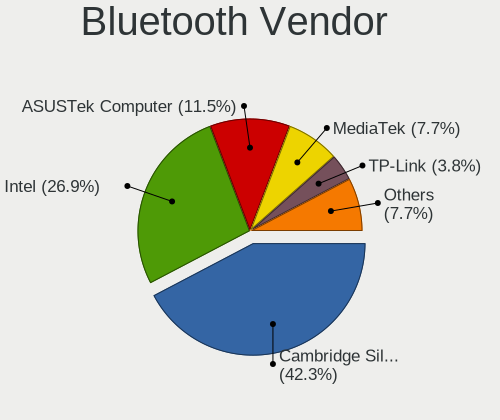

| Vendor                  | Desktops | Percent |
|-------------------------|----------|---------|
| Cambridge Silicon Radio | 11       | 42.31%  |
| Intel                   | 7        | 26.92%  |
| ASUSTek Computer        | 3        | 11.54%  |
| MediaTek                | 2        | 7.69%   |
| TP-Link                 | 1        | 3.85%   |
| Realtek Semiconductor   | 1        | 3.85%   |
| Broadcom                | 1        | 3.85%   |

Bluetooth Model
---------------

Controller models

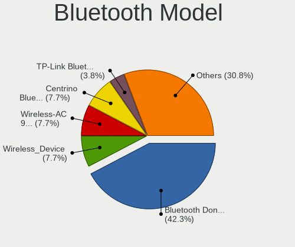

| Model                                                        | Desktops | Percent |
|--------------------------------------------------------------|----------|---------|
| Cambridge Silicon Radio Bluetooth Dongle (HCI mode)          | 11       | 42.31%  |
| MediaTek Wireless_Device                                     | 2        | 7.69%   |
| Intel Wireless-AC 9260 Bluetooth Adapter                     | 2        | 7.69%   |
| Intel Centrino Bluetooth Wireless Transceiver                | 2        | 7.69%   |
| TP-Link TP-Link Bluetooth USB Adapter                        | 1        | 3.85%   |
| Realtek Bluetooth Radio                                      | 1        | 3.85%   |
| Intel Bluetooth 9460/9560 Jefferson Peak (JfP)               | 1        | 3.85%   |
| Intel AX201 Bluetooth                                        | 1        | 3.85%   |
| Intel AX200 Bluetooth                                        | 1        | 3.85%   |
| Broadcom 2045 Bluetooth 2.0 USB-UHE Device with trace filter | 1        | 3.85%   |
| ASUS Qualcomm Bluetooth 4.1                                  | 1        | 3.85%   |
| ASUS Broadcom BCM20702A0 Bluetooth                           | 1        | 3.85%   |
| ASUS Bluetooth Radio                                         | 1        | 3.85%   |

Sound
-----

Sound Vendor
------------

Sound card vendors

| Vendor                  | Desktops | Percent |
|-------------------------|----------|---------|
| Intel                   | 57       | 38.26%  |
| AMD                     | 38       | 25.5%   |
| Nvidia                  | 34       | 22.82%  |
| C-Media Electronics     | 4        | 2.68%   |
| Logitech                | 2        | 1.34%   |
| Unknown                 | 1        | 0.67%   |
| Soundprese              | 1        | 0.67%   |
| Sony                    | 1        | 0.67%   |
| Realtek Semiconductor   | 1        | 0.67%   |
| Medeli Electronics      | 1        | 0.67%   |
| Kingston Technology     | 1        | 0.67%   |
| GN Netcom               | 1        | 0.67%   |
| Ensoniq                 | 1        | 0.67%   |
| Creative Labs           | 1        | 0.67%   |
| Corsair                 | 1        | 0.67%   |
| BEHRINGER International | 1        | 0.67%   |
| Astro Gaming            | 1        | 0.67%   |
| Argosy Research         | 1        | 0.67%   |
| A-DATA Technology       | 1        | 0.67%   |

Sound Model
-----------

Sound card models

| Model                                                                      | Desktops | Percent |
|----------------------------------------------------------------------------|----------|---------|
| Intel 8 Series/C220 Series Chipset High Definition Audio Controller        | 13       | 7.22%   |
| Intel Xeon E3-1200 v3/4th Gen Core Processor HD Audio Controller           | 10       | 5.56%   |
| AMD Family 17h/19h/1ah HD Audio Controller                                 | 10       | 5.56%   |
| Intel 100 Series/C230 Series Chipset Family HD Audio Controller            | 9        | 5%      |
| AMD Starship/Matisse HD Audio Controller                                   | 8        | 4.44%   |
| AMD SBx00 Azalia (Intel HDA)                                               | 8        | 4.44%   |
| Intel 200 Series PCH HD Audio                                              | 6        | 3.33%   |
| Nvidia TU116 High Definition Audio Controller                              | 5        | 2.78%   |
| AMD Raven/Raven2/Fenghuang HDMI/DP Audio Controller                        | 5        | 2.78%   |
| AMD Ellesmere HDMI Audio [Radeon RX 470/480 / 570/580/590]                 | 5        | 2.78%   |
| Nvidia High Definition Audio Controller                                    | 4        | 2.22%   |
| Nvidia GK208 HDMI/DP Audio Controller                                      | 4        | 2.22%   |
| Intel Cannon Lake PCH cAVS                                                 | 4        | 2.22%   |
| Intel 6 Series/C200 Series Chipset Family High Definition Audio Controller | 4        | 2.22%   |
| Intel NM10/ICH7 Family High Definition Audio Controller                    | 3        | 1.67%   |
| Intel 7 Series/C216 Chipset Family High Definition Audio Controller        | 3        | 1.67%   |
| C-Media Electronics CMI8788 [Oxygen HD Audio]                              | 3        | 1.67%   |
| AMD Renoir Radeon High Definition Audio Controller                         | 3        | 1.67%   |
| AMD Navi 21/23 HDMI/DP Audio Controller                                    | 3        | 1.67%   |
| AMD FCH Azalia Controller                                                  | 3        | 1.67%   |
| Nvidia MCP61 High Definition Audio                                         | 2        | 1.11%   |
| Nvidia GP107GL High Definition Audio Controller                            | 2        | 1.11%   |
| Nvidia GP106 High Definition Audio Controller                              | 2        | 1.11%   |
| Nvidia GK107 HDMI Audio Controller                                         | 2        | 1.11%   |
| Nvidia GF119 HDMI Audio Controller                                         | 2        | 1.11%   |
| Nvidia GF108 High Definition Audio Controller                              | 2        | 1.11%   |
| Nvidia GA106 High Definition Audio Controller                              | 2        | 1.11%   |
| Intel C600/X79 series chipset High Definition Audio Controller             | 2        | 1.11%   |
| Intel Alder Lake-S HD Audio Controller                                     | 2        | 1.11%   |
| Intel 82801JI (ICH10 Family) HD Audio Controller                           | 2        | 1.11%   |
| AMD Family 17h (Models 00h-0fh) HD Audio Controller                        | 2        | 1.11%   |
| AMD Cedar HDMI Audio [Radeon HD 5400/6300/7300 Series]                     | 2        | 1.11%   |
| Unknown USB PnP Audio Device                                               | 1        | 0.56%   |
| Soundprese HD-II                                                           | 1        | 0.56%   |
| Sony DualShock 4 [CUH-ZCT2x]                                               | 1        | 0.56%   |
| Realtek Semiconductor TX-384Khz Hifi Type-C Audio                          | 1        | 0.56%   |
| Nvidia TU107 GeForce GTX 1650 High Definition Audio Controller             | 1        | 0.56%   |
| Nvidia TU106 High Definition Audio Controller                              | 1        | 0.56%   |
| Nvidia TU104 HD Audio Controller                                           | 1        | 0.56%   |
| Nvidia MCP79 High Definition Audio                                         | 1        | 0.56%   |

Memory
------

Memory Vendor
-------------

Memory module vendors

| Vendor              | Desktops | Percent |
|---------------------|----------|---------|
| Kingston            | 13       | 18.57%  |
| Micron Technology   | 11       | 15.71%  |
| SK hynix            | 8        | 11.43%  |
| A-DATA Technology   | 7        | 10%     |
| Samsung Electronics | 6        | 8.57%   |
| G.Skill             | 6        | 8.57%   |
| Crucial             | 5        | 7.14%   |
| Unknown             | 4        | 5.71%   |
| Corsair             | 4        | 5.71%   |
| Ramaxel Technology  | 2        | 2.86%   |
| V-Color             | 1        | 1.43%   |
| Patriot             | 1        | 1.43%   |
| Kimtigo             | 1        | 1.43%   |
| Unknown             | 1        | 1.43%   |

Memory Model
------------

Memory module models

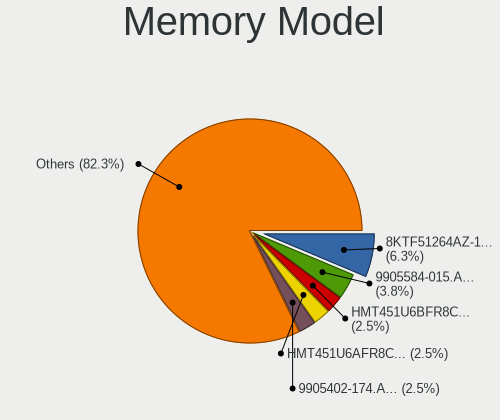

| Model                                                  | Desktops | Percent |
|--------------------------------------------------------|----------|---------|
| Micron RAM 8KTF51264AZ-1G6E1 4GB DIMM DDR3 1600MT/s    | 5        | 6.33%   |
| Kingston RAM 9905584-015.A00LF 4GB DIMM DDR3 1600MT/s  | 3        | 3.8%    |
| SK hynix RAM HMT451U6BFR8C-PB 4GB DIMM DDR3 1600MT/s   | 2        | 2.53%   |
| SK hynix RAM HMT451U6AFR8C-PB 4GB DIMM DDR3 1600MT/s   | 2        | 2.53%   |
| Kingston RAM 9905402-174.A00G 4GB DIMM DDR3 1600MT/s   | 2        | 2.53%   |
| A-DATA RAM Module 16GB DIMM DDR4 2667MT/s              | 2        | 2.53%   |
| A-DATA RAM DDR4 3200 8GB DIMM DDR4 3600MT/s            | 2        | 2.53%   |
| V-Color RAM TN4G8C11-H11 4GB DIMM DDR3 1600MT/s        | 1        | 1.27%   |
| Unknown RAM Module 8GB DIMM DDR3 1333MT/s              | 1        | 1.27%   |
| Unknown RAM Module 4GB DIMM 1333MT/s                   | 1        | 1.27%   |
| Unknown RAM Module 2GB SODIMM DDR2 667MT/s             | 1        | 1.27%   |
| Unknown RAM Module 2048MB SODIMM DDR2 667MT/s          | 1        | 1.27%   |
| Unknown RAM 3600 C18 Series 16GB DIMM DDR4 2933MT/s    | 1        | 1.27%   |
| SK hynix RAM Module 16GB DIMM DDR4 2667MT/s            | 1        | 1.27%   |
| SK hynix RAM HMT351U6CFR8C-PB 4GB DIMM DDR3 1800MT/s   | 1        | 1.27%   |
| SK hynix RAM HMT351U6CFR8C-H9 4GB DIMM DDR3 1333MT/s   | 1        | 1.27%   |
| SK hynix RAM HMT325U6EFR8C-PB 2GB DIMM DDR3 1600MT/s   | 1        | 1.27%   |
| SK hynix RAM HMA81GS6CJR8N-VK 8GB SODIMM DDR4 2667MT/s | 1        | 1.27%   |
| SK hynix RAM HMA41GU6AFR8N-TF 8GB DIMM DDR4 2465MT/s   | 1        | 1.27%   |
| Samsung RAM M393B2G70BH0 16GB DIMM DDR3 1866MT/s       | 1        | 1.27%   |
| Samsung RAM M378B5773CH0-CK0 2GB DIMM DDR3 1600MT/s    | 1        | 1.27%   |
| Samsung RAM M378B5673FH0-CH9 2GB DIMM DDR3 1600MT/s    | 1        | 1.27%   |
| Samsung RAM M378B5273DH0-CH9 4GB DIMM DDR3 2133MT/s    | 1        | 1.27%   |
| Samsung RAM M378B5273CH0-CK0 4GB DIMM DDR3 2000MT/s    | 1        | 1.27%   |
| Samsung RAM M378B5173EB0-CK0 4GB DIMM DDR3 1600MT/s    | 1        | 1.27%   |
| Samsung RAM M378A2K43CB1-CTD 16GB DIMM DDR4 3200MT/s   | 1        | 1.27%   |
| Ramaxel RAM RMR5030MJ68F9F1600 4GB DIMM DDR3 1600MT/s  | 1        | 1.27%   |
| Ramaxel RAM RMR5030ME68F9F1600 4GB DIMM DDR3 1600MT/s  | 1        | 1.27%   |
| Patriot RAM PSD48G266681 8GB DIMM DDR4 2934MT/s        | 1        | 1.27%   |
| Micron RAM Module 4GB Row Of Chips LPDDR5 6400MT/s     | 1        | 1.27%   |
| Micron RAM 8JTF25664HZ-1G6M1 2GB SODIMM DDR3 1600MT/s  | 1        | 1.27%   |
| Micron RAM 16JTF51264AZ-1G6M1 4GB DIMM DDR3 1600MT/s   | 1        | 1.27%   |
| Micron RAM 16JTF25664AZ-1G4F1 2GB DIMM DDR3 1333MT/s   | 1        | 1.27%   |
| Micron RAM 16JTF1G64AZ-1G6E1 8GB DIMM DDR3 1600MT/s    | 1        | 1.27%   |
| Micron RAM 16ATF2G64HZ-2G6E1 16GB SODIMM DDR4 2400MT/s | 1        | 1.27%   |
| Kingston RAM KHX2666C16/8G 8GB DIMM DDR4 3466MT/s      | 1        | 1.27%   |
| Kingston RAM KHX2666C15/16G 16GB DIMM DDR4 2666MT/s    | 1        | 1.27%   |
| Kingston RAM KHX2400C15/8G 8GB DIMM DDR4 3400MT/s      | 1        | 1.27%   |
| Kingston RAM 99U5624-001.A00G 8GB SODIMM DDR4 2667MT/s | 1        | 1.27%   |
| Kingston RAM 99U5474-038.A00LF 4GB DIMM DDR3 1333MT/s  | 1        | 1.27%   |

Memory Kind
-----------

Memory module kinds

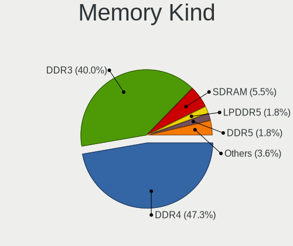

| Kind    | Desktops | Percent |
|---------|----------|---------|
| DDR4    | 26       | 47.27%  |
| DDR3    | 22       | 40%     |
| SDRAM   | 3        | 5.45%   |
| LPDDR5  | 1        | 1.82%   |
| DDR5    | 1        | 1.82%   |
| DDR2    | 1        | 1.82%   |
| Unknown | 1        | 1.82%   |

Memory Form Factor
------------------

Physical design of the memory module

| Name         | Desktops | Percent |
|--------------|----------|---------|
| DIMM         | 48       | 90.57%  |
| SODIMM       | 4        | 7.55%   |
| Row Of Chips | 1        | 1.89%   |

Memory Size
-----------

Memory module size

| Size  | Desktops | Percent |
|-------|----------|---------|
| 8192  | 22       | 36.67%  |
| 4096  | 19       | 31.67%  |
| 16384 | 9        | 15%     |
| 2048  | 6        | 10%     |
| 32768 | 4        | 6.67%   |

Memory Speed
------------

Memory module speed

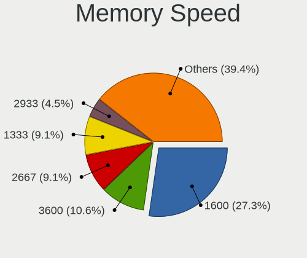

| Speed | Desktops | Percent |
|-------|----------|---------|
| 1600  | 18       | 27.27%  |
| 3600  | 7        | 10.61%  |
| 2667  | 6        | 9.09%   |
| 1333  | 6        | 9.09%   |
| 2933  | 3        | 4.55%   |
| 2400  | 3        | 4.55%   |
| 3200  | 2        | 3.03%   |
| 2133  | 2        | 3.03%   |
| 667   | 2        | 3.03%   |
| 6400  | 1        | 1.52%   |
| 4800  | 1        | 1.52%   |
| 4000  | 1        | 1.52%   |
| 3866  | 1        | 1.52%   |
| 3666  | 1        | 1.52%   |
| 3466  | 1        | 1.52%   |
| 3400  | 1        | 1.52%   |
| 3100  | 1        | 1.52%   |
| 3066  | 1        | 1.52%   |
| 2934  | 1        | 1.52%   |
| 2666  | 1        | 1.52%   |
| 2465  | 1        | 1.52%   |
| 2448  | 1        | 1.52%   |
| 2000  | 1        | 1.52%   |
| 1867  | 1        | 1.52%   |
| 1866  | 1        | 1.52%   |
| 1800  | 1        | 1.52%   |

Printers & scanners
-------------------

Printer Vendor
--------------

Printer device vendors

| Vendor          | Desktops | Percent |
|-----------------|----------|---------|
| Hewlett-Packard | 4        | 57.14%  |
| Canon           | 2        | 28.57%  |
| Seiko Epson     | 1        | 14.29%  |

Printer Model
-------------

Printer device models

| Model                              | Desktops | Percent |
|------------------------------------|----------|---------|
| Seiko Epson L3110 Series           | 1        | 14.29%  |
| HP Ink Tank Wireless 410 series    | 1        | 14.29%  |
| HP DeskJet 2620 All-in-One Printer | 1        | 14.29%  |
| HP DeskJet 2130 series             | 1        | 14.29%  |
| HP Deskjet 2050 J510               | 1        | 14.29%  |
| Canon G2000 series                 | 1        | 14.29%  |
| Canon E400 series                  | 1        | 14.29%  |

Scanner Vendor
--------------

Scanner device vendors

Zero info for selected period =(

Scanner Model
-------------

Scanner device models

Zero info for selected period =(

Camera
------

Camera Vendor
-------------

Camera device vendors

| Vendor                  | Desktops | Percent |
|-------------------------|----------|---------|
| Logitech                | 6        | 27.27%  |
| Microdia                | 4        | 18.18%  |
| Microsoft               | 3        | 13.64%  |
| Chicony Electronics     | 2        | 9.09%   |
| Z-Star Microelectronics | 1        | 4.55%   |
| TANDBERG                | 1        | 4.55%   |
| Philips (or NXP)        | 1        | 4.55%   |
| Jieli Technology        | 1        | 4.55%   |
| Huawei Technologies     | 1        | 4.55%   |
| Aveo Technology         | 1        | 4.55%   |
| Arkmicro Technologies   | 1        | 4.55%   |

Camera Model
------------

Camera device models

| Model                                 | Desktops | Percent |
|---------------------------------------|----------|---------|
| Logitech Webcam C270                  | 3        | 13.64%  |
| Microsoft LifeCam HD-3000             | 2        | 9.09%   |
| Microdia USB 2.0 Camera               | 2        | 9.09%   |
| Microdia Integrated Camera            | 2        | 9.09%   |
| Z-Star Vimicro USB Camera (Altair)    | 1        | 4.55%   |
| TANDBERG PrecisionHD Camera           | 1        | 4.55%   |
| Philips (or NXP) SPC 1300NC PC Camera | 1        | 4.55%   |
| Microsoft LifeCam Cinema              | 1        | 4.55%   |
| Logitech Webcam Pro 9000              | 1        | 4.55%   |
| Logitech Webcam C310                  | 1        | 4.55%   |
| Logitech HD Pro Webcam C920           | 1        | 4.55%   |
| Jieli USB PHY 2.0                     | 1        | 4.55%   |
| Huawei HiCamera                       | 1        | 4.55%   |
| Chicony HP High Definition 1MP Webcam | 1        | 4.55%   |
| Chicony HP 720p HD Monitor Webcam     | 1        | 4.55%   |
| Aveo USB2.0 Camera                    | 1        | 4.55%   |
| Arkmicro USB2.0 PC CAMERA             | 1        | 4.55%   |

Security
--------

Fingerprint Vendor
------------------

Fingerprint sensor vendors

Zero info for selected period =(

Fingerprint Model
-----------------

Fingerprint sensor models

Zero info for selected period =(

Chipcard Vendor
---------------

Chipcard module vendors

| Vendor                     | Desktops | Percent |
|----------------------------|----------|---------|
| SCM Microsystems           | 1        | 33.33%  |
| OmniKey                    | 1        | 33.33%  |
| Athena Smartcard Solutions | 1        | 33.33%  |

Chipcard Model
--------------

Chipcard module models

| Model                                                  | Desktops | Percent |
|--------------------------------------------------------|----------|---------|
| SCM Microsystems SCR331-LC1 / SCR3310 SmartCard Reader | 1        | 33.33%  |
| OmniKey CardMan 3021 / 3121                            | 1        | 33.33%  |
| Athena Smartcard Solutions ASEDrive V3C                | 1        | 33.33%  |

Unsupported
-----------

Unsupported Devices
-------------------

Total unsupported devices on board

| Total | Desktops | Percent |
|-------|----------|---------|
| 0     | 74       | 77.89%  |
| 1     | 18       | 18.95%  |
| 3     | 2        | 2.11%   |
| 2     | 1        | 1.05%   |

Unsupported Device Types
------------------------

Types of unsupported devices

| Type                     | Desktops | Percent |
|--------------------------|----------|---------|
| Graphics card            | 10       | 40%     |
| Net/wireless             | 6        | 24%     |
| Communication controller | 3        | 12%     |
| Chipcard                 | 3        | 12%     |
| Storage/raid             | 1        | 4%      |
| Sound                    | 1        | 4%      |
| Network                  | 1        | 4%      |

