Linux in Costa Rica - Tested Hardware & Statistics (Notebooks)
--------------------------------------------------------------

A project to collect tested hardware configurations for Linux in Costa Rica.

Anyone can contribute to this report by the [hw-probe](https://github.com/linuxhw/hw-probe) tool:

    sudo -E hw-probe -all -upload

Please contribute! Especially if your hardware is rare.

Contents
--------

* [ Test Cases ](#test-cases)

* [ System ](#system)
  - [ OS                       ](#os)
  - [ OS Family                ](#os-family)
  - [ Kernel                   ](#kernel)
  - [ Kernel Family            ](#kernel-family)
  - [ Kernel Major Ver.        ](#kernel-major-ver)
  - [ Arch                     ](#arch)
  - [ DE                       ](#de)
  - [ Display Server           ](#display-server)
  - [ Display Manager          ](#display-manager)
  - [ OS Lang                  ](#os-lang)
  - [ Boot Mode                ](#boot-mode)
  - [ Filesystem               ](#filesystem)
  - [ Part. scheme             ](#part-scheme)
  - [ Dual Boot with Linux/BSD ](#dual-boot-with-linuxbsd)
  - [ Dual Boot (Win)          ](#dual-boot-win)

* [ Board ](#board)
  - [ Vendor                   ](#vendor)
  - [ Model                    ](#model)
  - [ Model Family             ](#model-family)
  - [ MFG Year                 ](#mfg-year)
  - [ Form Factor              ](#form-factor)
  - [ Secure Boot              ](#secure-boot)
  - [ Coreboot                 ](#coreboot)
  - [ RAM Size                 ](#ram-size)
  - [ RAM Used                 ](#ram-used)
  - [ Total Drives             ](#total-drives)
  - [ Has CD-ROM               ](#has-cd-rom)
  - [ Has Ethernet             ](#has-ethernet)
  - [ Has WiFi                 ](#has-wifi)
  - [ Has Bluetooth            ](#has-bluetooth)

* [ Location ](#location)
  - [ Country                  ](#country)
  - [ City                     ](#city)

* [ Drives ](#drives)
  - [ Drive Vendor             ](#drive-vendor)
  - [ Drive Model              ](#drive-model)
  - [ HDD Vendor               ](#hdd-vendor)
  - [ SSD Vendor               ](#ssd-vendor)
  - [ Drive Kind               ](#drive-kind)
  - [ Drive Connector          ](#drive-connector)
  - [ Drive Size               ](#drive-size)
  - [ Space Total              ](#space-total)
  - [ Space Used               ](#space-used)
  - [ Malfunc. Drives          ](#malfunc-drives)
  - [ Malfunc. Drive Vendor    ](#malfunc-drive-vendor)
  - [ Malfunc. HDD Vendor      ](#malfunc-hdd-vendor)
  - [ Malfunc. Drive Kind      ](#malfunc-drive-kind)
  - [ Failed Drives            ](#failed-drives)
  - [ Failed Drive Vendor      ](#failed-drive-vendor)
  - [ Drive Status             ](#drive-status)

* [ Storage controller ](#storage-controller)
  - [ Storage Vendor           ](#storage-vendor)
  - [ Storage Model            ](#storage-model)
  - [ Storage Kind             ](#storage-kind)

* [ Processor ](#processor)
  - [ CPU Vendor               ](#cpu-vendor)
  - [ CPU Model                ](#cpu-model)
  - [ CPU Model Family         ](#cpu-model-family)
  - [ CPU Cores                ](#cpu-cores)
  - [ CPU Sockets              ](#cpu-sockets)
  - [ CPU Threads              ](#cpu-threads)
  - [ CPU Op-Modes             ](#cpu-op-modes)
  - [ CPU Microcode            ](#cpu-microcode)
  - [ CPU Microarch            ](#cpu-microarch)

* [ Graphics ](#graphics)
  - [ GPU Vendor               ](#gpu-vendor)
  - [ GPU Model                ](#gpu-model)
  - [ GPU Combo                ](#gpu-combo)
  - [ GPU Driver               ](#gpu-driver)
  - [ GPU Memory               ](#gpu-memory)

* [ Monitor ](#monitor)
  - [ Monitor Vendor           ](#monitor-vendor)
  - [ Monitor Model            ](#monitor-model)
  - [ Monitor Resolution       ](#monitor-resolution)
  - [ Monitor Diagonal         ](#monitor-diagonal)
  - [ Monitor Width            ](#monitor-width)
  - [ Aspect Ratio             ](#aspect-ratio)
  - [ Monitor Area             ](#monitor-area)
  - [ Pixel Density            ](#pixel-density)
  - [ Multiple Monitors        ](#multiple-monitors)

* [ Network ](#network)
  - [ Net Controller Vendor    ](#net-controller-vendor)
  - [ Net Controller Model     ](#net-controller-model)
  - [ Wireless Vendor          ](#wireless-vendor)
  - [ Wireless Model           ](#wireless-model)
  - [ Ethernet Vendor          ](#ethernet-vendor)
  - [ Ethernet Model           ](#ethernet-model)
  - [ Net Controller Kind      ](#net-controller-kind)
  - [ Used Controller          ](#used-controller)
  - [ NICs                     ](#nics)
  - [ IPv6                     ](#ipv6)

* [ Bluetooth ](#bluetooth)
  - [ Bluetooth Vendor         ](#bluetooth-vendor)
  - [ Bluetooth Model          ](#bluetooth-model)

* [ Sound ](#sound)
  - [ Sound Vendor             ](#sound-vendor)
  - [ Sound Model              ](#sound-model)

* [ Memory ](#memory)
  - [ Memory Vendor            ](#memory-vendor)
  - [ Memory Model             ](#memory-model)
  - [ Memory Kind              ](#memory-kind)
  - [ Memory Form Factor       ](#memory-form-factor)
  - [ Memory Size              ](#memory-size)
  - [ Memory Speed             ](#memory-speed)

* [ Printers & scanners ](#printers--scanners)
  - [ Printer Vendor           ](#printer-vendor)
  - [ Printer Model            ](#printer-model)
  - [ Scanner Vendor           ](#scanner-vendor)
  - [ Scanner Model            ](#scanner-model)

* [ Camera ](#camera)
  - [ Camera Vendor            ](#camera-vendor)
  - [ Camera Model             ](#camera-model)

* [ Security ](#security)
  - [ Fingerprint Vendor       ](#fingerprint-vendor)
  - [ Fingerprint Model        ](#fingerprint-model)
  - [ Chipcard Vendor          ](#chipcard-vendor)
  - [ Chipcard Model           ](#chipcard-model)

* [ Unsupported ](#unsupported)
  - [ Unsupported Devices      ](#unsupported-devices)
  - [ Unsupported Device Types ](#unsupported-device-types)

Test Cases
----------

Total: 173

| Vendor   | Model                       | Probe                                                      | Date         |
|----------|-----------------------------|------------------------------------------------------------|--------------|
| Dell     | Inspiron 3520               | [b865370f11](https://linux-hardware.org/?probe=b865370f11) | Jun 28, 2022 |
| Lenovo   | ThinkPad P50 20EN001PUS     | [52ef9383a4](https://linux-hardware.org/?probe=52ef9383a4) | Jun 09, 2022 |
| Lenovo   | ThinkPad T440s 20ARS29U0... | [50de8ad2e9](https://linux-hardware.org/?probe=50de8ad2e9) | Jun 01, 2022 |
| Dell     | Latitude 7400               | [caf85903ad](https://linux-hardware.org/?probe=caf85903ad) | May 19, 2022 |
| Dell     | Inspiron 5565               | [d5a8629a31](https://linux-hardware.org/?probe=d5a8629a31) | May 19, 2022 |
| Lenovo   | ThinkPad L420 7829AA4       | [9c1bbe8cf2](https://linux-hardware.org/?probe=9c1bbe8cf2) | May 14, 2022 |
| HP       | Laptop 15-da0xxx            | [6ad1b34a48](https://linux-hardware.org/?probe=6ad1b34a48) | Apr 29, 2022 |
| Lenovo   | ThinkPad E15 Gen 2 20T80... | [637af2dcc6](https://linux-hardware.org/?probe=637af2dcc6) | Apr 29, 2022 |
| Apple    | MacBookPro8,1               | [f74cae630d](https://linux-hardware.org/?probe=f74cae630d) | Apr 16, 2022 |
| HP       | Pavilion Notebook           | [a1130d8070](https://linux-hardware.org/?probe=a1130d8070) | Apr 13, 2022 |
| Acer     | Nitro AN515-43              | [e1386a38c7](https://linux-hardware.org/?probe=e1386a38c7) | Mar 20, 2022 |
| Dell     | Latitude E5500              | [13be4a0a1b](https://linux-hardware.org/?probe=13be4a0a1b) | Mar 16, 2022 |
| Dell     | Latitude E5500              | [d5f8fd7890](https://linux-hardware.org/?probe=d5f8fd7890) | Mar 16, 2022 |
| HP       | Laptop 15-da0xxx            | [a8531f3837](https://linux-hardware.org/?probe=a8531f3837) | Mar 13, 2022 |
| Dell     | Latitude D630               | [b7b428082a](https://linux-hardware.org/?probe=b7b428082a) | Mar 05, 2022 |
| Dell     | XPS 13 9305                 | [8807d99cb4](https://linux-hardware.org/?probe=8807d99cb4) | Mar 01, 2022 |
| ASUSTek  | VivoBook_ASUS Laptop E41... | [c0adf77f3f](https://linux-hardware.org/?probe=c0adf77f3f) | Feb 26, 2022 |
| Sony     | SVD13215PLB                 | [82c4287f85](https://linux-hardware.org/?probe=82c4287f85) | Feb 23, 2022 |
| Lenovo   | ThinkPad L15 Gen 2 20X4S... | [b355ea1ff3](https://linux-hardware.org/?probe=b355ea1ff3) | Feb 20, 2022 |
| Lenovo   | IdeaPad 3 14ADA05 81W0      | [8468cd0da9](https://linux-hardware.org/?probe=8468cd0da9) | Feb 19, 2022 |
| Lenovo   | IdeaPad 3 14ADA05 81W0      | [80e2f3c47e](https://linux-hardware.org/?probe=80e2f3c47e) | Feb 19, 2022 |
| Apple    | MacBookPro8,1               | [b99a5f9b59](https://linux-hardware.org/?probe=b99a5f9b59) | Feb 14, 2022 |
| HP       | Laptop 15-da0xxx            | [ce15566bc3](https://linux-hardware.org/?probe=ce15566bc3) | Feb 12, 2022 |
| HUAWEI   | NBLK-WAX9X                  | [dbc7cbcfe1](https://linux-hardware.org/?probe=dbc7cbcfe1) | Feb 07, 2022 |
| Toshiba  | Satellite L45-B             | [5e026ae9b0](https://linux-hardware.org/?probe=5e026ae9b0) | Jan 14, 2022 |
| ASUSTek  | VivoBook 15_ASUS Laptop ... | [3f953ad7f3](https://linux-hardware.org/?probe=3f953ad7f3) | Jan 14, 2022 |
| ASUSTek  | VivoBook 15_ASUS Laptop ... | [eecedd12b2](https://linux-hardware.org/?probe=eecedd12b2) | Jan 14, 2022 |
| Dell     | Latitude 5490               | [c5c1f555f1](https://linux-hardware.org/?probe=c5c1f555f1) | Nov 03, 2021 |
| HP       | EliteBook 8460p             | [b6ac4539d1](https://linux-hardware.org/?probe=b6ac4539d1) | Oct 28, 2021 |
| HP       | EliteBook 8460p             | [8264430178](https://linux-hardware.org/?probe=8264430178) | Oct 28, 2021 |
| Dell     | Inspiron 3595               | [1df662506b](https://linux-hardware.org/?probe=1df662506b) | Oct 27, 2021 |
| Apple    | MacBookPro8,1               | [e7e870c6cc](https://linux-hardware.org/?probe=e7e870c6cc) | Oct 22, 2021 |
| Lenovo   | IdeaPad Gaming 3 15ARH05... | [a271c08df2](https://linux-hardware.org/?probe=a271c08df2) | Oct 21, 2021 |
| HP       | EliteBook 8460p             | [5bb3c9bc8b](https://linux-hardware.org/?probe=5bb3c9bc8b) | Oct 19, 2021 |
| Apple    | MacBookPro8,1               | [bfadd59ae5](https://linux-hardware.org/?probe=bfadd59ae5) | Oct 18, 2021 |
| Lenovo   | IdeaPad Gaming 3 15ARH05... | [2a9e8d32e2](https://linux-hardware.org/?probe=2a9e8d32e2) | Oct 15, 2021 |
| Acer     | Aspire 5750                 | [ff12aa7481](https://linux-hardware.org/?probe=ff12aa7481) | Oct 15, 2021 |
| Lenovo   | IdeaPad Gaming 3 15ARH05... | [f0a9d13afb](https://linux-hardware.org/?probe=f0a9d13afb) | Oct 14, 2021 |
| Lenovo   | ThinkPad X1 Carbon 2nd 2... | [1dbff2c4f9](https://linux-hardware.org/?probe=1dbff2c4f9) | Oct 09, 2021 |
| HP       | Laptop 15-da0xxx            | [da71bb02c1](https://linux-hardware.org/?probe=da71bb02c1) | Oct 03, 2021 |
| Dell     | Latitude D620               | [1dc8e001f5](https://linux-hardware.org/?probe=1dc8e001f5) | Sep 28, 2021 |
| Apple    | MacBookPro8,1               | [3a8451c3d2](https://linux-hardware.org/?probe=3a8451c3d2) | Sep 25, 2021 |
| Apple    | MacBookPro8,1               | [0a7625c3ec](https://linux-hardware.org/?probe=0a7625c3ec) | Sep 25, 2021 |
| Apple    | MacBookPro8,1               | [2c4c85f574](https://linux-hardware.org/?probe=2c4c85f574) | Sep 20, 2021 |
| Apple    | MacBookPro8,1               | [dcf03222dc](https://linux-hardware.org/?probe=dcf03222dc) | Sep 12, 2021 |
| HP       | EliteBook 820 G1            | [00b3e62e2e](https://linux-hardware.org/?probe=00b3e62e2e) | Sep 10, 2021 |
| MSI      | GF75 Thin 9SD               | [e70d1b33e1](https://linux-hardware.org/?probe=e70d1b33e1) | Sep 09, 2021 |
| HP       | Pavilion Laptop 15-cc1xx    | [a7cc7fb98c](https://linux-hardware.org/?probe=a7cc7fb98c) | Aug 27, 2021 |
| HP       | Pavilion Laptop 15-cc1xx    | [6972dfc45b](https://linux-hardware.org/?probe=6972dfc45b) | Aug 25, 2021 |
| Olivetti | CL133A                      | [59d8296ec4](https://linux-hardware.org/?probe=59d8296ec4) | Jul 31, 2021 |
| HP       | Pavilion g4                 | [3f01790d4e](https://linux-hardware.org/?probe=3f01790d4e) | Jul 21, 2021 |
| AZW      | GT-R                        | [115230aa47](https://linux-hardware.org/?probe=115230aa47) | Jul 19, 2021 |
| Olivetti | CL133A                      | [a73133e4f3](https://linux-hardware.org/?probe=a73133e4f3) | Jul 15, 2021 |
| ASUSTek  | U46E                        | [720dec33c4](https://linux-hardware.org/?probe=720dec33c4) | Jul 14, 2021 |
| HP       | ProBook 6460b               | [b39eb9b256](https://linux-hardware.org/?probe=b39eb9b256) | Jul 13, 2021 |
| Dell     | G3 3590                     | [3781e31377](https://linux-hardware.org/?probe=3781e31377) | Jul 12, 2021 |
| Olivetti | CL133A                      | [ba8eb5f003](https://linux-hardware.org/?probe=ba8eb5f003) | Jul 10, 2021 |
| Olivetti | CL133A                      | [117e8fa0b4](https://linux-hardware.org/?probe=117e8fa0b4) | Jul 06, 2021 |
| HP       | EliteBook 8570p             | [ab19b80507](https://linux-hardware.org/?probe=ab19b80507) | Jun 09, 2021 |
| HUAWEI   | NBLK-WAX9X                  | [9908ba82e9](https://linux-hardware.org/?probe=9908ba82e9) | May 31, 2021 |
| HP       | Pavilion dv6000 (RP297UA... | [5f6d9f025a](https://linux-hardware.org/?probe=5f6d9f025a) | May 29, 2021 |
| Dell     | Inspiron 5584               | [ebffa34fe2](https://linux-hardware.org/?probe=ebffa34fe2) | May 28, 2021 |
| Toshiba  | Satellite C845              | [e3b90e238b](https://linux-hardware.org/?probe=e3b90e238b) | May 24, 2021 |
| HP       | Laptop 14-ck0xxx            | [6f3c2aa3be](https://linux-hardware.org/?probe=6f3c2aa3be) | May 24, 2021 |
| HP       | Laptop 14-ck0xxx            | [8ccda2ce59](https://linux-hardware.org/?probe=8ccda2ce59) | May 24, 2021 |
| Toshiba  | Satellite C845              | [4d346e2691](https://linux-hardware.org/?probe=4d346e2691) | May 24, 2021 |
| Dell     | Inspiron 5584               | [5e2e76f838](https://linux-hardware.org/?probe=5e2e76f838) | May 20, 2021 |
| Acer     | Aspire A515-43              | [0a87ab06c5](https://linux-hardware.org/?probe=0a87ab06c5) | May 19, 2021 |
| Apple    | MacBookPro8,1               | [4a32129550](https://linux-hardware.org/?probe=4a32129550) | May 15, 2021 |
| Lenovo   | IdeaPad S340-15API 81NC     | [93286a0d38](https://linux-hardware.org/?probe=93286a0d38) | May 15, 2021 |
| Lenovo   | IdeaPad S340-15API 81NC     | [796f490bbb](https://linux-hardware.org/?probe=796f490bbb) | May 15, 2021 |
| Dell     | Inspiron 5584               | [1da876ea0b](https://linux-hardware.org/?probe=1da876ea0b) | May 06, 2021 |
| Dell     | Inspiron 5584               | [0216a041d2](https://linux-hardware.org/?probe=0216a041d2) | May 05, 2021 |
| HP       | Laptop 15-da0xxx            | [b91d32b11a](https://linux-hardware.org/?probe=b91d32b11a) | May 03, 2021 |
| Acer     | Aspire A515-43              | [3c87a86111](https://linux-hardware.org/?probe=3c87a86111) | May 02, 2021 |
| HP       | Pavilion dv6                | [a181ae8691](https://linux-hardware.org/?probe=a181ae8691) | Apr 30, 2021 |
| HP       | Pavilion dv6                | [d363966e4c](https://linux-hardware.org/?probe=d363966e4c) | Apr 30, 2021 |
| HP       | Pavilion dv6                | [204cd9c44f](https://linux-hardware.org/?probe=204cd9c44f) | Apr 30, 2021 |
| HP       | Pavilion dv6                | [e20fc33e2b](https://linux-hardware.org/?probe=e20fc33e2b) | Apr 29, 2021 |
| Lenovo   | ThinkPad L14 Gen 1 20U10... | [3cca89aa74](https://linux-hardware.org/?probe=3cca89aa74) | Apr 28, 2021 |
| HP       | Laptop 15-da0xxx            | [fd209ac377](https://linux-hardware.org/?probe=fd209ac377) | Apr 24, 2021 |
| Lenovo   | ThinkPad L14 Gen 1 20U10... | [38c505f6bd](https://linux-hardware.org/?probe=38c505f6bd) | Apr 23, 2021 |
| Apple    | MacBook2,1                  | [a0590a2529](https://linux-hardware.org/?probe=a0590a2529) | Apr 18, 2021 |
| HP       | Laptop 15-da0xxx            | [5afa66a433](https://linux-hardware.org/?probe=5afa66a433) | Apr 17, 2021 |
| Lenovo   | IdeaPad S340-15API 81NC     | [e990abe7f1](https://linux-hardware.org/?probe=e990abe7f1) | Apr 11, 2021 |
| Lenovo   | IdeaPad S340-15API 81NC     | [41c14db0ef](https://linux-hardware.org/?probe=41c14db0ef) | Apr 11, 2021 |
| Dell     | G3 3590                     | [3c952dbc96](https://linux-hardware.org/?probe=3c952dbc96) | Mar 26, 2021 |
| Toshiba  | QOSMIO X775                 | [d8f82a3984](https://linux-hardware.org/?probe=d8f82a3984) | Mar 26, 2021 |
| HP       | OMEN by Laptop              | [127ea1feb8](https://linux-hardware.org/?probe=127ea1feb8) | Mar 13, 2021 |
| HP       | Pavilion g4                 | [1e7372e4f2](https://linux-hardware.org/?probe=1e7372e4f2) | Mar 01, 2021 |
| Toshiba  | Satellite C45-A             | [e00317dc4d](https://linux-hardware.org/?probe=e00317dc4d) | Mar 01, 2021 |
| Unknown  | Unknown                     | [941e941403](https://linux-hardware.org/?probe=941e941403) | Feb 27, 2021 |
| Dell     | Inspiron 5584               | [16fca1f86b](https://linux-hardware.org/?probe=16fca1f86b) | Feb 24, 2021 |
| Google   | Celes                       | [b30c090b2b](https://linux-hardware.org/?probe=b30c090b2b) | Feb 22, 2021 |
| Dell     | Inspiron 3558               | [41ba11dbb4](https://linux-hardware.org/?probe=41ba11dbb4) | Feb 18, 2021 |
| Dell     | Inspiron 5584               | [660afa073b](https://linux-hardware.org/?probe=660afa073b) | Feb 11, 2021 |
| Dell     | Inspiron 5584               | [840e0e2818](https://linux-hardware.org/?probe=840e0e2818) | Feb 04, 2021 |
| Dell     | Inspiron 5584               | [e10690d1d2](https://linux-hardware.org/?probe=e10690d1d2) | Feb 04, 2021 |
| HP       | Laptop 14-dq1xxx            | [84c932e071](https://linux-hardware.org/?probe=84c932e071) | Feb 02, 2021 |
| Dell     | Inspiron 5584               | [473419d486](https://linux-hardware.org/?probe=473419d486) | Jan 24, 2021 |
| Dell     | Inspiron 5584               | [738e03e488](https://linux-hardware.org/?probe=738e03e488) | Jan 23, 2021 |
| Dell     | Precision M4800             | [f24be700aa](https://linux-hardware.org/?probe=f24be700aa) | Jan 21, 2021 |
| Dell     | Precision M4800             | [316c7dd34b](https://linux-hardware.org/?probe=316c7dd34b) | Jan 21, 2021 |
| HP       | Laptop 14-bp0xx             | [4badbab2db](https://linux-hardware.org/?probe=4badbab2db) | Jan 19, 2021 |
| Dell     | Inspiron 5584               | [1a731e13e0](https://linux-hardware.org/?probe=1a731e13e0) | Jan 18, 2021 |
| Lenovo   | IdeaPad 330-15IKB 81DE      | [6a0e9eff49](https://linux-hardware.org/?probe=6a0e9eff49) | Jan 16, 2021 |
| Dell     | Inspiron 5584               | [76fe08b67a](https://linux-hardware.org/?probe=76fe08b67a) | Jan 14, 2021 |
| Dell     | Inspiron 5584               | [8d9be2defd](https://linux-hardware.org/?probe=8d9be2defd) | Jan 13, 2021 |
| Lenovo   | ThinkPad X1 Carbon 3rd 2... | [b30b783683](https://linux-hardware.org/?probe=b30b783683) | Jan 12, 2021 |
| Dell     | Inspiron 5584               | [6917b5bc30](https://linux-hardware.org/?probe=6917b5bc30) | Jan 11, 2021 |
| Dell     | Inspiron 5584               | [cfa1367cf6](https://linux-hardware.org/?probe=cfa1367cf6) | Jan 10, 2021 |
| Dell     | Inspiron 5584               | [60a171b505](https://linux-hardware.org/?probe=60a171b505) | Jan 10, 2021 |
| HP       | Laptop 14-bp0xx             | [a481e8e9c0](https://linux-hardware.org/?probe=a481e8e9c0) | Dec 16, 2020 |
| HP       | Laptop 14-bp0xx             | [266b8d7543](https://linux-hardware.org/?probe=266b8d7543) | Dec 16, 2020 |
| MSI      | GE60 2OC\2OD\2OE            | [a305c14111](https://linux-hardware.org/?probe=a305c14111) | Dec 13, 2020 |
| ASUSTek  | VivoBook_ASUSLaptop X512... | [c110de3643](https://linux-hardware.org/?probe=c110de3643) | Oct 31, 2020 |
| Dell     | Latitude 7480               | [2e569dcaed](https://linux-hardware.org/?probe=2e569dcaed) | Oct 22, 2020 |
| Dell     | Latitude 7480               | [1cc0a03f18](https://linux-hardware.org/?probe=1cc0a03f18) | Oct 22, 2020 |
| Dell     | XPS 15 9560                 | [9f10520397](https://linux-hardware.org/?probe=9f10520397) | Oct 11, 2020 |
| Dell     | G3 3590                     | [4c2ddd8b88](https://linux-hardware.org/?probe=4c2ddd8b88) | Oct 01, 2020 |
| Toshiba  | Satellite C55-B             | [6acb0908ff](https://linux-hardware.org/?probe=6acb0908ff) | Sep 18, 2020 |
| HP       | Unknown                     | [a446c81ca9](https://linux-hardware.org/?probe=a446c81ca9) | Sep 10, 2020 |
| HP       | EliteBook 8570p             | [48e494142e](https://linux-hardware.org/?probe=48e494142e) | Aug 27, 2020 |
| Toshiba  | Satellite X205              | [b0d5e7d0dd](https://linux-hardware.org/?probe=b0d5e7d0dd) | Aug 26, 2020 |
| Toshiba  | Satellite X205              | [45e52f3631](https://linux-hardware.org/?probe=45e52f3631) | Aug 26, 2020 |
| Acer     | Aspire 4739Z                | [44ec59d132](https://linux-hardware.org/?probe=44ec59d132) | Aug 11, 2020 |
| HP       | Pavilion dv2500             | [4bdd603282](https://linux-hardware.org/?probe=4bdd603282) | Aug 06, 2020 |
| HP       | Pavilion dv2500             | [4114f58581](https://linux-hardware.org/?probe=4114f58581) | Aug 06, 2020 |
| Dell     | Latitude E5440              | [9d31b1e38d](https://linux-hardware.org/?probe=9d31b1e38d) | Jul 29, 2020 |
| Dell     | G3 3590                     | [e2fa394ba6](https://linux-hardware.org/?probe=e2fa394ba6) | Jun 28, 2020 |
| Dell     | XPS 15 9560                 | [8119688776](https://linux-hardware.org/?probe=8119688776) | Jun 27, 2020 |
| Dell     | XPS 15 9560                 | [d2a2900148](https://linux-hardware.org/?probe=d2a2900148) | Jun 20, 2020 |
| Dell     | Inspiron 5559               | [4619502a6b](https://linux-hardware.org/?probe=4619502a6b) | May 28, 2020 |
| HP       | ProBook 455 G4              | [6b6fe8e0c1](https://linux-hardware.org/?probe=6b6fe8e0c1) | May 18, 2020 |
| HP       | 245 G4 Notebook PC          | [9311532f56](https://linux-hardware.org/?probe=9311532f56) | Apr 23, 2020 |
| HP       | 245 G4 Notebook PC          | [b662f230b2](https://linux-hardware.org/?probe=b662f230b2) | Apr 23, 2020 |
| HP       | Notebook                    | [5815277bb0](https://linux-hardware.org/?probe=5815277bb0) | Apr 22, 2020 |
| HP       | Laptop 15-da0xxx            | [1dc3e83e11](https://linux-hardware.org/?probe=1dc3e83e11) | Apr 18, 2020 |
| ASUSTek  | Strix 17 GL703GE            | [2f87bcd627](https://linux-hardware.org/?probe=2f87bcd627) | Apr 07, 2020 |
| ASUSTek  | Strix 17 GL703GE            | [16ff51d343](https://linux-hardware.org/?probe=16ff51d343) | Apr 07, 2020 |
| Acer     | Aspire V3-471               | [024d5b0563](https://linux-hardware.org/?probe=024d5b0563) | Apr 06, 2020 |
| Dell     | G3 3590                     | [26a4f7e20b](https://linux-hardware.org/?probe=26a4f7e20b) | Mar 22, 2020 |
| Dell     | G3 3590                     | [96d9b68953](https://linux-hardware.org/?probe=96d9b68953) | Mar 21, 2020 |
| Toshiba  | Satellite C855D             | [9246f32b7e](https://linux-hardware.org/?probe=9246f32b7e) | Mar 01, 2020 |
| HP       | Pavilion Notebook           | [2bbf18e9e5](https://linux-hardware.org/?probe=2bbf18e9e5) | Feb 20, 2020 |
| HP       | Pavilion Notebook           | [68895d1461](https://linux-hardware.org/?probe=68895d1461) | Feb 20, 2020 |
| HP       | ProBook 6460b               | [121b074dd0](https://linux-hardware.org/?probe=121b074dd0) | Feb 19, 2020 |
| Dell     | Latitude 5500               | [3a7f8e19f1](https://linux-hardware.org/?probe=3a7f8e19f1) | Feb 17, 2020 |
| ASUSTek  | K52F                        | [9dde03d12c](https://linux-hardware.org/?probe=9dde03d12c) | Feb 13, 2020 |
| ASUSTek  | Strix 17 GL703GE            | [9eb64d7269](https://linux-hardware.org/?probe=9eb64d7269) | Jan 17, 2020 |
| ASUSTek  | Strix 17 GL703GE            | [8211b13acf](https://linux-hardware.org/?probe=8211b13acf) | Jan 17, 2020 |
| HP       | 240 G6 Notebook PC          | [73da3dccf1](https://linux-hardware.org/?probe=73da3dccf1) | Nov 14, 2019 |
| HP       | 240 G6 Notebook PC          | [efeee7f2fc](https://linux-hardware.org/?probe=efeee7f2fc) | Nov 14, 2019 |
| System76 | Lemur                       | [a9cc263cb4](https://linux-hardware.org/?probe=a9cc263cb4) | Oct 09, 2019 |
| HP       | ProBook 450 G2              | [c7959cccb3](https://linux-hardware.org/?probe=c7959cccb3) | Sep 30, 2019 |
| HP       | Notebook                    | [163fc3e9dd](https://linux-hardware.org/?probe=163fc3e9dd) | Sep 14, 2019 |
| ASUSTek  | Strix 17 GL703GE            | [c34161a66d](https://linux-hardware.org/?probe=c34161a66d) | Sep 02, 2019 |
| System76 | Lemur                       | [01bbf99115](https://linux-hardware.org/?probe=01bbf99115) | Sep 02, 2019 |
| Lenovo   | ThinkPad P53 20QNS00P00     | [47182bd3e3](https://linux-hardware.org/?probe=47182bd3e3) | Sep 01, 2019 |
| Lenovo   | ThinkPad P53 20QNS00P00     | [2105fa4def](https://linux-hardware.org/?probe=2105fa4def) | Sep 01, 2019 |
| HP       | Notebook                    | [b7e9995b67](https://linux-hardware.org/?probe=b7e9995b67) | Aug 18, 2019 |
| HP       | Notebook                    | [273d0bcc2e](https://linux-hardware.org/?probe=273d0bcc2e) | Aug 18, 2019 |
| Dell     | Venue 11 Pro 7130 vPro      | [2e5b92af00](https://linux-hardware.org/?probe=2e5b92af00) | Aug 17, 2019 |
| Dell     | Latitude E5450              | [3336801ccf](https://linux-hardware.org/?probe=3336801ccf) | Aug 10, 2019 |
| Toshiba  | Satellite A305D             | [ebf0a9c89e](https://linux-hardware.org/?probe=ebf0a9c89e) | Aug 08, 2019 |
| Acer     | SW5-017P                    | [fbf9b74a34](https://linux-hardware.org/?probe=fbf9b74a34) | Jul 29, 2019 |
| Dell     | Latitude 5480               | [f488cfd08f](https://linux-hardware.org/?probe=f488cfd08f) | Jun 22, 2019 |
| ASUSTek  | Strix 17 GL703GE            | [328975f3a5](https://linux-hardware.org/?probe=328975f3a5) | May 15, 2019 |
| Dell     | Latitude 5480               | [694ca16d49](https://linux-hardware.org/?probe=694ca16d49) | May 04, 2019 |
| Purism   | Librem 15 v3                | [00259367c8](https://linux-hardware.org/?probe=00259367c8) | Oct 29, 2018 |
| Purism   | Librem 15 v3                | [c5e1ab1520](https://linux-hardware.org/?probe=c5e1ab1520) | Oct 29, 2018 |
| ASUSTek  | X555LAB                     | [243803142a](https://linux-hardware.org/?probe=243803142a) | Aug 01, 2018 |
| Toshiba  | Satellite C645D             | [9d50eb7fdb](https://linux-hardware.org/?probe=9d50eb7fdb) | Nov 24, 2016 |

System
------

OS
--

Installed operating systems

| Name                         | Notebooks | Percent |
|------------------------------|-----------|---------|
| Ubuntu 18.04                 | 13        | 11.5%   |
| Ubuntu 20.04                 | 12        | 10.62%  |
| OpenMandriva 4.2             | 7         | 6.19%   |
| Ubuntu 19.04                 | 4         | 3.54%   |
| OpenMandriva 4.3             | 4         | 3.54%   |
| Ubuntu 22.04                 | 3         | 2.65%   |
| Lubuntu 21.10                | 3         | 2.65%   |
| Lubuntu 21.04                | 3         | 2.65%   |
| Xubuntu 20.04                | 2         | 1.77%   |
| Ubuntu Studio 20.04          | 2         | 1.77%   |
| Ubuntu 21.04                 | 2         | 1.77%   |
| openSUSE Tumbleweed-XXXXXXXX | 2         | 1.77%   |
| Manjaro 20.2.1               | 2         | 1.77%   |
| Lubuntu 22.04                | 2         | 1.77%   |
| Linux Mint 20.3              | 2         | 1.77%   |
| Linux Mint 20.1              | 2         | 1.77%   |
| Linux Mint 20                | 2         | 1.77%   |
| KDE neon 20.04               | 2         | 1.77%   |
| Debian 11                    | 2         | 1.77%   |
| Debian 10                    | 2         | 1.77%   |
| Zorin 16                     | 1         | 0.88%   |
| Zorin 15                     | 1         | 0.88%   |
| Xubuntu 18.04                | 1         | 0.88%   |
| UbuntuDDE 20.04              | 1         | 0.88%   |
| Ubuntu MATE 18.04            | 1         | 0.88%   |
| Ubuntu 21.10                 | 1         | 0.88%   |
| Ubuntu 16.04                 | 1         | 0.88%   |
| ROSA R8                      | 1         | 0.88%   |
| ROSA R10                     | 1         | 0.88%   |
| Reborn OS Rolling            | 1         | 0.88%   |
| PureOS 10.0                  | 1         | 0.88%   |
| Pop!_OS 21.10                | 1         | 0.88%   |
| Pop!_OS 20.10                | 1         | 0.88%   |
| Peppermint 10                | 1         | 0.88%   |
| Parrot 4.10                  | 1         | 0.88%   |
| Manjaro 21.0.1               | 1         | 0.88%   |
| Manjaro 20.2                 | 1         | 0.88%   |
| Manjaro 20.1                 | 1         | 0.88%   |
| Manjaro                      | 1         | 0.88%   |
| Lubuntu 20.10                | 1         | 0.88%   |
| Lubuntu 20.04                | 1         | 0.88%   |
| Linux Mint 20.2              | 1         | 0.88%   |
| Linux Mint 19.3              | 1         | 0.88%   |
| Kubuntu 22.04                | 1         | 0.88%   |
| Kubuntu 21.10                | 1         | 0.88%   |
| Kubuntu 20.04                | 1         | 0.88%   |
| Kali 2022.2                  | 1         | 0.88%   |
| Kali 2021.1                  | 1         | 0.88%   |
| Fedora 34                    | 1         | 0.88%   |
| Fedora 33                    | 1         | 0.88%   |
| Fedora 28                    | 1         | 0.88%   |
| Endless 4.0.2                | 1         | 0.88%   |
| Endless 3.7.7                | 1         | 0.88%   |
| Debian Testing               | 1         | 0.88%   |
| Clear Linux 32110            | 1         | 0.88%   |
| Clear Linux 30900            | 1         | 0.88%   |
| Clear Linux 29410            | 1         | 0.88%   |
| ArcoLinux Rolling            | 1         | 0.88%   |
| Arch                         | 1         | 0.88%   |
| ALT Linux 20201124           | 1         | 0.88%   |

OS Family
---------

OS without a version

| Name          | Notebooks | Percent |
|---------------|-----------|---------|
| Ubuntu        | 35        | 33.65%  |
| OpenMandriva  | 11        | 10.58%  |
| Linux Mint    | 8         | 7.69%   |
| Manjaro       | 6         | 5.77%   |
| Lubuntu       | 5         | 4.81%   |
| Debian        | 5         | 4.81%   |
| Xubuntu       | 3         | 2.88%   |
| Fedora        | 3         | 2.88%   |
| Zorin         | 2         | 1.92%   |
| Ubuntu Studio | 2         | 1.92%   |
| ROSA          | 2         | 1.92%   |
| Pop!_OS       | 2         | 1.92%   |
| openSUSE      | 2         | 1.92%   |
| Kubuntu       | 2         | 1.92%   |
| KDE neon      | 2         | 1.92%   |
| Kali          | 2         | 1.92%   |
| Endless       | 2         | 1.92%   |
| UbuntuDDE     | 1         | 0.96%   |
| Ubuntu MATE   | 1         | 0.96%   |
| Reborn OS     | 1         | 0.96%   |
| PureOS        | 1         | 0.96%   |
| Peppermint    | 1         | 0.96%   |
| Parrot        | 1         | 0.96%   |
| Clear Linux   | 1         | 0.96%   |
| ArcoLinux     | 1         | 0.96%   |
| Arch          | 1         | 0.96%   |
| ALT Linux     | 1         | 0.96%   |

Kernel
------

Version of the Linux kernel

| Version                    | Notebooks | Percent |
|----------------------------|-----------|---------|
| 5.10.14-desktop-1omv4002   | 7         | 5.6%    |
| 5.16.7-desktop-1omv4003    | 4         | 3.2%    |
| 5.0.0-23-generic           | 4         | 3.2%    |
| 5.4.0-77-generic           | 3         | 2.4%    |
| 5.4.0-42-generic           | 3         | 2.4%    |
| 5.13.0-16-generic          | 3         | 2.4%    |
| 5.11.0-27-generic          | 3         | 2.4%    |
| 5.0.0-25-generic           | 3         | 2.4%    |
| 5.9.16-1-MANJARO           | 2         | 1.6%    |
| 5.8.0-50-generic           | 2         | 1.6%    |
| 5.4.0-21-generic           | 2         | 1.6%    |
| 5.3.0-40-generic           | 2         | 1.6%    |
| 5.3.0-28-generic           | 2         | 1.6%    |
| 5.13.0-35-generic          | 2         | 1.6%    |
| 5.13.0-20-generic          | 2         | 1.6%    |
| 5.11.0-16-generic          | 2         | 1.6%    |
| 4.15.0-112-generic         | 2         | 1.6%    |
| 5.9.11-3-MANJARO           | 1         | 0.8%    |
| 5.8.6-1-MANJARO            | 1         | 0.8%    |
| 5.8.0-7630-generic         | 1         | 0.8%    |
| 5.8.0-55-generic           | 1         | 0.8%    |
| 5.8.0-53-generic           | 1         | 0.8%    |
| 5.7.0-2parrot2-amd64       | 1         | 0.8%    |
| 5.4.0-88-lowlatency        | 1         | 0.8%    |
| 5.4.0-72-generic           | 1         | 0.8%    |
| 5.4.0-70-generic           | 1         | 0.8%    |
| 5.4.0-65-generic           | 1         | 0.8%    |
| 5.4.0-64-generic           | 1         | 0.8%    |
| 5.4.0-58-generic           | 1         | 0.8%    |
| 5.4.0-52-generic           | 1         | 0.8%    |
| 5.4.0-48-lowlatency        | 1         | 0.8%    |
| 5.4.0-48-generic           | 1         | 0.8%    |
| 5.4.0-47-generic           | 1         | 0.8%    |
| 5.4.0-37-generic           | 1         | 0.8%    |
| 5.4.0-31-generic           | 1         | 0.8%    |
| 5.4.0-29-generic           | 1         | 0.8%    |
| 5.4.0-25-generic           | 1         | 0.8%    |
| 5.4.0-110-generic          | 1         | 0.8%    |
| 5.4.0-109-generic          | 1         | 0.8%    |
| 5.4.0-100-generic          | 1         | 0.8%    |
| 5.3.0-61-generic           | 1         | 0.8%    |
| 5.3.0-46-generic           | 1         | 0.8%    |
| 5.3.0-45-generic           | 1         | 0.8%    |
| 5.3.0-42-generic           | 1         | 0.8%    |
| 5.2.11-829.native          | 1         | 0.8%    |
| 5.18.0-kali2-amd64         | 1         | 0.8%    |
| 5.17.9-051709-generic      | 1         | 0.8%    |
| 5.15.23-76051523-generic   | 1         | 0.8%    |
| 5.15.0-35-generic          | 1         | 0.8%    |
| 5.15.0-33-generic          | 1         | 0.8%    |
| 5.15.0-27-generic          | 1         | 0.8%    |
| 5.15.0-25-generic          | 1         | 0.8%    |
| 5.15.0-18-generic          | 1         | 0.8%    |
| 5.14.0-15.1-liquorix-amd64 | 1         | 0.8%    |
| 5.13.0-40-generic          | 1         | 0.8%    |
| 5.13.0-28-generic          | 1         | 0.8%    |
| 5.13.0-19-generic          | 1         | 0.8%    |
| 5.12.6-300.fc34.x86_64     | 1         | 0.8%    |
| 5.12.15-arch1-1            | 1         | 0.8%    |
| 5.12.0-2-default           | 1         | 0.8%    |

Kernel Family
-------------

Linux kernel without a distro release

| Version | Notebooks | Percent |
|---------|-----------|---------|
| 5.4.0   | 22        | 19.13%  |
| 5.11.0  | 11        | 9.57%   |
| 5.0.0   | 8         | 6.96%   |
| 5.3.0   | 7         | 6.09%   |
| 5.13.0  | 7         | 6.09%   |
| 5.10.14 | 7         | 6.09%   |
| 5.8.0   | 5         | 4.35%   |
| 5.15.0  | 5         | 4.35%   |
| 5.10.0  | 5         | 4.35%   |
| 4.15.0  | 5         | 4.35%   |
| 5.16.7  | 4         | 3.48%   |
| 5.9.16  | 2         | 1.74%   |
| 4.19.0  | 2         | 1.74%   |
| 5.9.11  | 1         | 0.87%   |
| 5.8.6   | 1         | 0.87%   |
| 5.7.0   | 1         | 0.87%   |
| 5.2.11  | 1         | 0.87%   |
| 5.18.0  | 1         | 0.87%   |
| 5.17.9  | 1         | 0.87%   |
| 5.15.23 | 1         | 0.87%   |
| 5.14.0  | 1         | 0.87%   |
| 5.12.6  | 1         | 0.87%   |
| 5.12.15 | 1         | 0.87%   |
| 5.12.0  | 1         | 0.87%   |
| 5.11.5  | 1         | 0.87%   |
| 5.11.12 | 1         | 0.87%   |
| 5.11.1  | 1         | 0.87%   |
| 5.10.9  | 1         | 0.87%   |
| 5.10.7  | 1         | 0.87%   |
| 5.10.35 | 1         | 0.87%   |
| 5.10.26 | 1         | 0.87%   |
| 5.10.2  | 1         | 0.87%   |
| 5.0.15  | 1         | 0.87%   |
| 4.9.111 | 1         | 0.87%   |
| 4.19.96 | 1         | 0.87%   |
| 4.18.11 | 1         | 0.87%   |
| 4.18.0  | 1         | 0.87%   |
| 4.1.34  | 1         | 0.87%   |

Kernel Major Ver.
-----------------

Linux kernel major version

| Version | Notebooks | Percent |
|---------|-----------|---------|
| 5.4     | 22        | 19.3%   |
| 5.10    | 16        | 14.04%  |
| 5.11    | 14        | 12.28%  |
| 5.0     | 9         | 7.89%   |
| 5.3     | 7         | 6.14%   |
| 5.13    | 7         | 6.14%   |
| 5.8     | 6         | 5.26%   |
| 5.15    | 6         | 5.26%   |
| 4.15    | 5         | 4.39%   |
| 5.16    | 4         | 3.51%   |
| 5.9     | 3         | 2.63%   |
| 5.12    | 3         | 2.63%   |
| 4.19    | 3         | 2.63%   |
| 4.18    | 2         | 1.75%   |
| 5.7     | 1         | 0.88%   |
| 5.2     | 1         | 0.88%   |
| 5.18    | 1         | 0.88%   |
| 5.17    | 1         | 0.88%   |
| 5.14    | 1         | 0.88%   |
| 4.9     | 1         | 0.88%   |
| 4.1     | 1         | 0.88%   |

Arch
----

OS architecture (x86_64, i586, etc.)

| Name   | Notebooks | Percent |
|--------|-----------|---------|
| x86_64 | 97        | 98.98%  |
| i686   | 1         | 1.02%   |

DE
--

Desktop Environment

| Name       | Notebooks | Percent |
|------------|-----------|---------|
| GNOME      | 38        | 38%     |
| KDE5       | 16        | 16%     |
| Unknown    | 13        | 13%     |
| XFCE       | 11        | 11%     |
| LXQt       | 5         | 5%      |
| X-Cinnamon | 4         | 4%      |
| MATE       | 3         | 3%      |
| KDE        | 3         | 3%      |
| Unity      | 2         | 2%      |
| i3         | 2         | 2%      |
| LXDE       | 1         | 1%      |
| Deepin     | 1         | 1%      |
| Cinnamon   | 1         | 1%      |

Display Server
--------------

X11 or Wayland

| Name    | Notebooks | Percent |
|---------|-----------|---------|
| X11     | 77        | 78.57%  |
| Wayland | 12        | 12.24%  |
| Unknown | 8         | 8.16%   |
| Tty     | 1         | 1.02%   |

Display Manager
---------------

SDDM, LightDM, etc.

| Name    | Notebooks | Percent |
|---------|-----------|---------|
| Unknown | 45        | 44.55%  |
| SDDM    | 23        | 22.77%  |
| LightDM | 11        | 10.89%  |
| TDM     | 8         | 7.92%   |
| GDM     | 8         | 7.92%   |
| GDM3    | 6         | 5.94%   |

OS Lang
-------

Language

| Lang    | Notebooks | Percent |
|---------|-----------|---------|
| en_US   | 40        | 40.4%   |
| es_CR   | 36        | 36.36%  |
| Unknown | 14        | 14.14%  |
| es_ES   | 6         | 6.06%   |
| C       | 2         | 2.02%   |
| es_MX   | 1         | 1.01%   |

Boot Mode
---------

EFI or BIOS

| Mode | Notebooks | Percent |
|------|-----------|---------|
| BIOS | 52        | 51.49%  |
| EFI  | 49        | 48.51%  |

Filesystem
----------

Type of filesystem

| Type    | Notebooks | Percent |
|---------|-----------|---------|
| Ext4    | 79        | 78.22%  |
| Overlay | 12        | 11.88%  |
| Btrfs   | 5         | 4.95%   |
| Unknown | 4         | 3.96%   |
| Xfs     | 1         | 0.99%   |

Part. scheme
------------

Scheme of partitioning

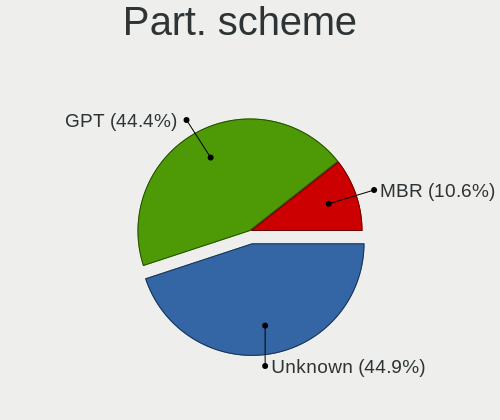

| Type    | Notebooks | Percent |
|---------|-----------|---------|
| Unknown | 52        | 52.53%  |
| GPT     | 34        | 34.34%  |
| MBR     | 13        | 13.13%  |

Dual Boot with Linux/BSD
------------------------

Hosting more than one Linux/BSD

| Dual boot | Notebooks | Percent |
|-----------|-----------|---------|
| No        | 90        | 90%     |
| Yes       | 10        | 10%     |

Dual Boot (Win)
---------------

Hosting Linux and Windows

| Dual boot | Notebooks | Percent |
|-----------|-----------|---------|
| No        | 62        | 62.63%  |
| Yes       | 37        | 37.37%  |

Board
-----

Vendor
------

Motherboard manufacturer

| Name             | Notebooks | Percent |
|------------------|-----------|---------|
| Hewlett-Packard  | 25        | 25.51%  |
| Dell             | 23        | 23.47%  |
| Lenovo           | 13        | 13.27%  |
| Toshiba          | 9         | 9.18%   |
| ASUSTek Computer | 7         | 7.14%   |
| Acer             | 6         | 6.12%   |
| Apple            | 5         | 5.1%    |
| MSI              | 2         | 2.04%   |
| System76         | 1         | 1.02%   |
| Sony             | 1         | 1.02%   |
| Purism           | 1         | 1.02%   |
| Olivetti         | 1         | 1.02%   |
| HUAWEI           | 1         | 1.02%   |
| Google           | 1         | 1.02%   |
| AZW              | 1         | 1.02%   |
| Unknown          | 1         | 1.02%   |

Model
-----

Motherboard model

| Name                                     | Notebooks | Percent |
|------------------------------------------|-----------|---------|
| Apple MacBookPro8,1                      | 4         | 4.08%   |
| Dell Inspiron 5584                       | 3         | 3.06%   |
| HP ProBook 6460b                         | 2         | 2.04%   |
| HP Pavilion Notebook                     | 2         | 2.04%   |
| HP Notebook                              | 2         | 2.04%   |
| HP Laptop 15-da0xxx                      | 2         | 2.04%   |
| Unknown                                  | 2         | 2.04%   |
| Toshiba Satellite X205                   | 1         | 1.02%   |
| Toshiba Satellite L45-B                  | 1         | 1.02%   |
| Toshiba Satellite C855D                  | 1         | 1.02%   |
| Toshiba Satellite C845                   | 1         | 1.02%   |
| Toshiba Satellite C645D                  | 1         | 1.02%   |
| Toshiba Satellite C55-B                  | 1         | 1.02%   |
| Toshiba Satellite C45-A                  | 1         | 1.02%   |
| Toshiba Satellite A305D                  | 1         | 1.02%   |
| Toshiba QOSMIO X775                      | 1         | 1.02%   |
| System76 Lemur                           | 1         | 1.02%   |
| Sony SVD13215PLB                         | 1         | 1.02%   |
| Purism Librem 15 v3                      | 1         | 1.02%   |
| Olivetti CL133A                          | 1         | 1.02%   |
| MSI GF75 Thin 9SD                        | 1         | 1.02%   |
| MSI GE60 2OC\2OD\2OE                     | 1         | 1.02%   |
| Lenovo ThinkPad X1 Carbon 3rd 20BTS1EY00 | 1         | 1.02%   |
| Lenovo ThinkPad X1 Carbon 2nd 20A80035US | 1         | 1.02%   |
| Lenovo ThinkPad T440s 20ARS29U00         | 1         | 1.02%   |
| Lenovo ThinkPad P53 20QNS00P00           | 1         | 1.02%   |
| Lenovo ThinkPad P50 20EN001PUS           | 1         | 1.02%   |
| Lenovo ThinkPad L420 7829AA4             | 1         | 1.02%   |
| Lenovo ThinkPad L15 Gen 2 20X4S8YL00     | 1         | 1.02%   |
| Lenovo ThinkPad L14 Gen 1 20U1001TUS     | 1         | 1.02%   |
| Lenovo ThinkPad E15 Gen 2 20T8005BUS     | 1         | 1.02%   |
| Lenovo IdeaPad S340-15API 81NC           | 1         | 1.02%   |
| Lenovo IdeaPad Gaming 3 15ARH05 82EY     | 1         | 1.02%   |
| Lenovo IdeaPad 330-15IKB 81DE            | 1         | 1.02%   |
| Lenovo IdeaPad 3 14ADA05 81W0            | 1         | 1.02%   |
| HUAWEI NBLK-WAX9X                        | 1         | 1.02%   |
| HP ProBook 455 G4                        | 1         | 1.02%   |
| HP ProBook 450 G2                        | 1         | 1.02%   |
| HP Pavilion Laptop 15-cc1xx              | 1         | 1.02%   |
| HP Pavilion g4                           | 1         | 1.02%   |
| HP Pavilion dv6000 (RP297UA#ABA)         | 1         | 1.02%   |
| HP Pavilion dv6                          | 1         | 1.02%   |
| HP Pavilion dv2500                       | 1         | 1.02%   |
| HP OMEN by Laptop                        | 1         | 1.02%   |
| HP Laptop 14-dq1xxx                      | 1         | 1.02%   |
| HP Laptop 14-ck0xxx                      | 1         | 1.02%   |
| HP Laptop 14-bp0xx                       | 1         | 1.02%   |
| HP EliteBook 8570p                       | 1         | 1.02%   |
| HP EliteBook 8460p                       | 1         | 1.02%   |
| HP EliteBook 820 G1                      | 1         | 1.02%   |
| HP 245 G4 Notebook PC                    | 1         | 1.02%   |
| HP 240 G6 Notebook PC                    | 1         | 1.02%   |
| Google Celes                             | 1         | 1.02%   |
| Dell XPS 15 9560                         | 1         | 1.02%   |
| Dell XPS 13 9305                         | 1         | 1.02%   |
| Dell Venue 11 Pro 7130 vPro              | 1         | 1.02%   |
| Dell Precision M4800                     | 1         | 1.02%   |
| Dell Latitude E5500                      | 1         | 1.02%   |
| Dell Latitude E5450                      | 1         | 1.02%   |
| Dell Latitude E5440                      | 1         | 1.02%   |

Model Family
------------

Motherboard model prefix

| Name              | Notebooks | Percent |
|-------------------|-----------|---------|
| Dell Latitude     | 10        | 10.2%   |
| Lenovo ThinkPad   | 9         | 9.18%   |
| Toshiba Satellite | 8         | 8.16%   |
| Dell Inspiron     | 8         | 8.16%   |
| HP Pavilion       | 7         | 7.14%   |
| HP Laptop         | 5         | 5.1%    |
| Lenovo IdeaPad    | 4         | 4.08%   |
| HP ProBook        | 4         | 4.08%   |
| Apple MacBookPro8 | 4         | 4.08%   |
| Acer Aspire       | 4         | 4.08%   |
| HP EliteBook      | 3         | 3.06%   |
| ASUS VivoBook     | 3         | 3.06%   |
| HP Notebook       | 2         | 2.04%   |
| Dell XPS          | 2         | 2.04%   |
| Unknown           | 2         | 2.04%   |
| Toshiba QOSMIO    | 1         | 1.02%   |
| System76 Lemur    | 1         | 1.02%   |
| Sony SVD13215PLB  | 1         | 1.02%   |
| Purism Librem     | 1         | 1.02%   |
| Olivetti CL133A   | 1         | 1.02%   |
| MSI GF75          | 1         | 1.02%   |
| MSI GE60          | 1         | 1.02%   |
| HUAWEI NBLK-WAX9X | 1         | 1.02%   |
| HP OMEN           | 1         | 1.02%   |
| HP 245            | 1         | 1.02%   |
| HP 240            | 1         | 1.02%   |
| Google Celes      | 1         | 1.02%   |
| Dell Venue        | 1         | 1.02%   |
| Dell Precision    | 1         | 1.02%   |
| Dell G3           | 1         | 1.02%   |
| AZW GT-R          | 1         | 1.02%   |
| ASUS X555LAB      | 1         | 1.02%   |
| ASUS U46E         | 1         | 1.02%   |
| ASUS Strix        | 1         | 1.02%   |
| ASUS K52F         | 1         | 1.02%   |
| Apple MacBook2    | 1         | 1.02%   |
| Acer SW5-017P     | 1         | 1.02%   |
| Acer Nitro        | 1         | 1.02%   |

MFG Year
--------

Motherboard manufacture year

| Year | Notebooks | Percent |
|------|-----------|---------|
| 2019 | 15        | 15.31%  |
| 2011 | 12        | 12.24%  |
| 2018 | 11        | 11.22%  |
| 2020 | 8         | 8.16%   |
| 2014 | 8         | 8.16%   |
| 2017 | 7         | 7.14%   |
| 2016 | 6         | 6.12%   |
| 2013 | 6         | 6.12%   |
| 2012 | 6         | 6.12%   |
| 2015 | 5         | 5.1%    |
| 2008 | 4         | 4.08%   |
| 2007 | 3         | 3.06%   |
| 2021 | 2         | 2.04%   |
| 2009 | 2         | 2.04%   |
| 2006 | 2         | 2.04%   |
| 2010 | 1         | 1.02%   |

Form Factor
-----------

Physical design of the computer

| Name     | Notebooks | Percent |
|----------|-----------|---------|
| Notebook | 98        | 100%    |

Secure Boot
-----------

Enabled or disabled

| State    | Notebooks | Percent |
|----------|-----------|---------|
| Disabled | 91        | 92.86%  |
| Enabled  | 7         | 7.14%   |

Coreboot
--------

Have coreboot on board

| Used | Notebooks | Percent |
|------|-----------|---------|
| No   | 96        | 97.96%  |
| Yes  | 2         | 2.04%   |

RAM Size
--------

Total RAM memory

| Size in GB  | Notebooks | Percent |
|-------------|-----------|---------|
| 4.01-8.0    | 27        | 27.27%  |
| 3.01-4.0    | 25        | 25.25%  |
| 8.01-16.0   | 22        | 22.22%  |
| 16.01-24.0  | 14        | 14.14%  |
| 32.01-64.0  | 4         | 4.04%   |
| 2.01-3.0    | 3         | 3.03%   |
| 64.01-256.0 | 2         | 2.02%   |
| 24.01-32.0  | 1         | 1.01%   |
| 1.01-2.0    | 1         | 1.01%   |

RAM Used
--------

Used RAM memory

| Used GB   | Notebooks | Percent |
|-----------|-----------|---------|
| 1.01-2.0  | 49        | 45.79%  |
| 2.01-3.0  | 29        | 27.1%   |
| 4.01-8.0  | 11        | 10.28%  |
| 3.01-4.0  | 11        | 10.28%  |
| 0.51-1.0  | 5         | 4.67%   |
| 8.01-16.0 | 2         | 1.87%   |

Total Drives
------------

Number of drives on board

| Drives | Notebooks | Percent |
|--------|-----------|---------|
| 1      | 79        | 80.61%  |
| 2      | 17        | 17.35%  |
| 3      | 2         | 2.04%   |

Has CD-ROM
----------

Has CD-ROM on board

| Presented | Notebooks | Percent |
|-----------|-----------|---------|
| No        | 53        | 54.08%  |
| Yes       | 45        | 45.92%  |

Has Ethernet
------------

Has Ethernet on board

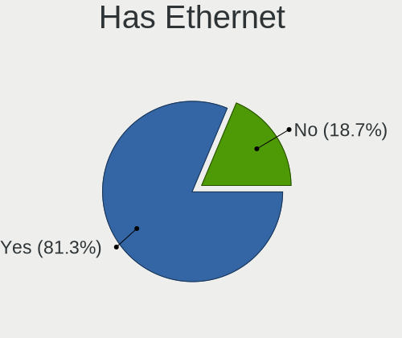

| Presented | Notebooks | Percent |
|-----------|-----------|---------|
| Yes       | 84        | 85.71%  |
| No        | 14        | 14.29%  |

Has WiFi
--------

Has WiFi module

| Presented | Notebooks | Percent |
|-----------|-----------|---------|
| Yes       | 97        | 98.98%  |
| No        | 1         | 1.02%   |

Has Bluetooth
-------------

Has Bluetooth module

| Presented | Notebooks | Percent |
|-----------|-----------|---------|
| Yes       | 73        | 73.74%  |
| No        | 26        | 26.26%  |

Location
--------

Country
-------

Geographic location (country)

| Country    | Notebooks | Percent |
|------------|-----------|---------|
| Costa Rica | 98        | 100%    |

City
----

Geographic location (city)

| City          | Notebooks | Percent |
|---------------|-----------|---------|
| San Jos     | 36        | 33.03%  |
| Heredia       | 23        | 21.1%   |
| Alajuela      | 9         | 8.26%   |
| Quesada       | 4         | 3.67%   |
| Cartago       | 4         | 3.67%   |
| Siquirres     | 2         | 1.83%   |
| Santa Cruz    | 2         | 1.83%   |
| San Ramon     | 2         | 1.83%   |
| Naranjo       | 2         | 1.83%   |
| Grecia        | 2         | 1.83%   |
| Esparza       | 2         | 1.83%   |
| Escazu        | 2         | 1.83%   |
| Zarcero       | 1         | 0.92%   |
| Tres Rios     | 1         | 0.92%   |
| Santo Domingo | 1         | 0.92%   |
| Santiago      | 1         | 0.92%   |
| Santa Fe      | 1         | 0.92%   |
| San Pedro     | 1         | 0.92%   |
| San Pablo     | 1         | 0.92%   |
| San Juan      | 1         | 0.92%   |
| San Francisco | 1         | 0.92%   |
| Quepos        | 1         | 0.92%   |
| Puntarenas    | 1         | 0.92%   |
| Palmares      | 1         | 0.92%   |
| Nosara        | 1         | 0.92%   |
| Liberia       | 1         | 0.92%   |
| Guacima       | 1         | 0.92%   |
| Curridabat    | 1         | 0.92%   |
| Colon         | 1         | 0.92%   |
| Bagaces       | 1         | 0.92%   |
| Alpes         | 1         | 0.92%   |

Drives
------

Drive Vendor
------------

Hard drive vendors

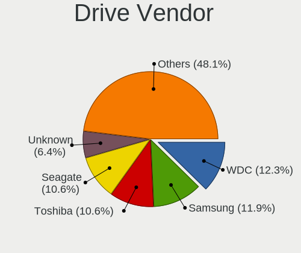

| Vendor              | Notebooks | Drives | Percent |
|---------------------|-----------|--------|---------|
| WDC                 | 19        | 27     | 16.38%  |
| Toshiba             | 18        | 22     | 15.52%  |
| Seagate             | 11        | 18     | 9.48%   |
| Samsung Electronics | 11        | 17     | 9.48%   |
| Intel               | 10        | 15     | 8.62%   |
| Kingston            | 7         | 11     | 6.03%   |
| HGST                | 7         | 8      | 6.03%   |
| Unknown             | 6         | 10     | 5.17%   |
| A-DATA Technology   | 5         | 5      | 4.31%   |
| SK hynix            | 3         | 8      | 2.59%   |
| Micron Technology   | 3         | 3      | 2.59%   |
| Team                | 2         | 2      | 1.72%   |
| SanDisk             | 2         | 2      | 1.72%   |
| Crucial             | 2         | 2      | 1.72%   |
| Zheino              | 1         | 1      | 0.86%   |
| UMIS                | 1         | 1      | 0.86%   |
| Transcend           | 1         | 1      | 0.86%   |
| Silicon Motion      | 1         | 1      | 0.86%   |
| Patriot             | 1         | 1      | 0.86%   |
| LITEONIT            | 1         | 1      | 0.86%   |
| JMicron Technology  | 1         | 1      | 0.86%   |
| Hitachi             | 1         | 2      | 0.86%   |
| Fujitsu             | 1         | 1      | 0.86%   |
| Dell                | 1         | 1      | 0.86%   |

Drive Model
-----------

Hard drive models

| Model                                   | Notebooks | Percent |
|-----------------------------------------|-----------|---------|
| Toshiba MQ01ABF050 500GB                | 4         | 3.25%   |
| Toshiba MQ01ABD100 1TB                  | 4         | 3.25%   |
| WDC WDS500G2B0A-00SM50 500GB SSD        | 3         | 2.44%   |
| Toshiba KBG30ZMS256G NVMe 256GB         | 3         | 2.44%   |
| Kingston SA400S37240G 240GB SSD         | 3         | 2.44%   |
| Intel SSDSA2CW300G3 304GB               | 3         | 2.44%   |
| Toshiba KBG30ZMS128G 128GB NVMe SSD     | 2         | 1.63%   |
| SK hynix NVMe SSD Drive 128GB           | 2         | 1.63%   |
| Seagate ST1000LM035-1RK172 1TB          | 2         | 1.63%   |
| Kingston SV300S37A120G 120GB SSD        | 2         | 1.63%   |
| Intel SSDSC2MH250A2 250GB               | 2         | 1.63%   |
| Intel SSDSC2BF180A4H 180GB              | 2         | 1.63%   |
| HGST HTS541010A9E680 1TB                | 2         | 1.63%   |
| Zheino CHN 25SATAA3 240 240GB           | 1         | 0.81%   |
| WDC WDS240G2G0A-00JH30 240GB SSD        | 1         | 0.81%   |
| WDC WDS120G1G0B-00RC30 120GB SSD        | 1         | 0.81%   |
| WDC WD800BEVT-75ZCT2 80GB               | 1         | 0.81%   |
| WDC WD7500BPVT-22HXZT3 752GB            | 1         | 0.81%   |
| WDC WD5000LPCX-60VHAT0 500GB            | 1         | 0.81%   |
| WDC WD5000LPCX-21VHAT0 500GB            | 1         | 0.81%   |
| WDC WD5000BPKT-60PK4T0 500GB            | 1         | 0.81%   |
| WDC WD3200BPVT-22JJ5T0 320GB            | 1         | 0.81%   |
| WDC WD20SPZX-08UA7 2TB                  | 1         | 0.81%   |
| WDC WD1600BEVT-75A23T0 160GB            | 1         | 0.81%   |
| WDC WD10SPZX-60Z10T0 1TB                | 1         | 0.81%   |
| WDC WD10JPVX-75JC3T0 1TB                | 1         | 0.81%   |
| WDC WD10JPVX-60JC3T0 1TB                | 1         | 0.81%   |
| WDC WD10JPVX-22JC3T0 1TB                | 1         | 0.81%   |
| WDC PC SN730 SDBQNTY-512G-1001 512GB    | 1         | 0.81%   |
| WDC PC SN730 SDBPNTY-512G-1027 512GB    | 1         | 0.81%   |
| Unknown SP32G  32GB                     | 1         | 0.81%   |
| Unknown SC64G  64GB                     | 1         | 0.81%   |
| Unknown NVMe SSD Drive 256GB            | 1         | 0.81%   |
| Unknown MMC Card  64GB                  | 1         | 0.81%   |
| Unknown MMC Card  32GB                  | 1         | 0.81%   |
| Unknown MMC Card  128GB                 | 1         | 0.81%   |
| Unknown HCG4a2  64GB                    | 1         | 0.81%   |
| Unknown 00000  129GB                    | 1         | 0.81%   |
| UMIS RPJTJ256MEE1OWX 256GB              | 1         | 0.81%   |
| Transcend TS256GSSD340 256GB            | 1         | 0.81%   |
| Toshiba MQ04ABF100 1TB                  | 1         | 0.81%   |
| Toshiba MQ01ABD075 752GB                | 1         | 0.81%   |
| Toshiba MK6476GSX 640GB                 | 1         | 0.81%   |
| Toshiba MK3265GSXN 320GB                | 1         | 0.81%   |
| Toshiba MK2565GSXV 250GB                | 1         | 0.81%   |
| Toshiba MK2546GSX 250GB                 | 1         | 0.81%   |
| Toshiba MK1255GSX H 120GB               | 1         | 0.81%   |
| Team T253X1480G 480GB SSD               | 1         | 0.81%   |
| Team L5 LITE SSD 240GB                  | 1         | 0.81%   |
| SK hynix NVMe SSD Drive 512GB           | 1         | 0.81%   |
| Silicon Motion 512GB                    | 1         | 0.81%   |
| Seagate ST980811AS 80GB                 | 1         | 0.81%   |
| Seagate ST9750422AS 752GB               | 1         | 0.81%   |
| Seagate ST9500325AS 500GB               | 1         | 0.81%   |
| Seagate ST500LT012-1DG142 500GB         | 1         | 0.81%   |
| Seagate ST500LM021-1KJ152 500GB         | 1         | 0.81%   |
| Seagate ST2000LM007-1R8174 2TB          | 1         | 0.81%   |
| Seagate ST1000LX015-1U7172 1TB          | 1         | 0.81%   |
| Seagate BUP Slim SL 1TB                 | 1         | 0.81%   |
| Seagate BarraCuda SSD ZA1000CM10002 1TB | 1         | 0.81%   |

HDD Vendor
----------

Hard disk drive vendors

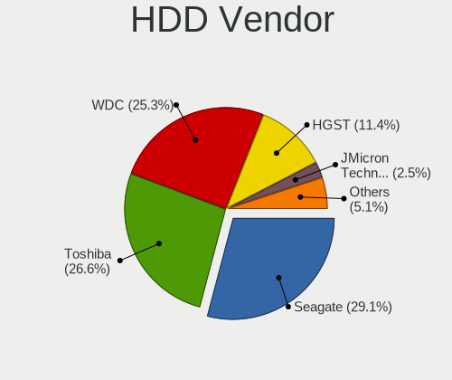

| Vendor             | Notebooks | Drives | Percent |
|--------------------|-----------|--------|---------|
| Toshiba            | 15        | 15     | 31.91%  |
| WDC                | 12        | 14     | 25.53%  |
| Seagate            | 10        | 17     | 21.28%  |
| HGST               | 7         | 8      | 14.89%  |
| JMicron Technology | 1         | 1      | 2.13%   |
| Hitachi            | 1         | 2      | 2.13%   |
| Fujitsu            | 1         | 1      | 2.13%   |

SSD Vendor
----------

Solid state drive vendors

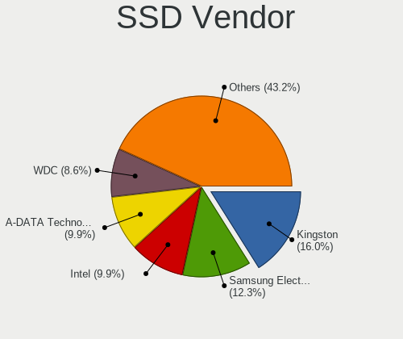

| Vendor              | Notebooks | Drives | Percent |
|---------------------|-----------|--------|---------|
| Samsung Electronics | 7         | 12     | 17.07%  |
| Intel               | 7         | 11     | 17.07%  |
| Kingston            | 6         | 6      | 14.63%  |
| WDC                 | 5         | 10     | 12.2%   |
| A-DATA Technology   | 4         | 4      | 9.76%   |
| Micron Technology   | 3         | 3      | 7.32%   |
| Team                | 2         | 2      | 4.88%   |
| Crucial             | 2         | 2      | 4.88%   |
| Transcend           | 1         | 1      | 2.44%   |
| Seagate             | 1         | 1      | 2.44%   |
| SanDisk             | 1         | 1      | 2.44%   |
| Patriot             | 1         | 1      | 2.44%   |
| LITEONIT            | 1         | 1      | 2.44%   |

Drive Kind
----------

HDD or SSD

| Kind    | Notebooks | Drives | Percent |
|---------|-----------|--------|---------|
| HDD     | 47        | 58     | 41.23%  |
| SSD     | 41        | 55     | 35.96%  |
| NVMe    | 19        | 37     | 16.67%  |
| MMC     | 5         | 9      | 4.39%   |
| Unknown | 2         | 2      | 1.75%   |

Drive Connector
---------------

SATA, SAS, NVMe, etc.

| Type | Notebooks | Drives | Percent |
|------|-----------|--------|---------|
| SATA | 84        | 112    | 75.68%  |
| NVMe | 19        | 37     | 17.12%  |
| MMC  | 5         | 9      | 4.5%    |
| SAS  | 3         | 3      | 2.7%    |

Drive Size
----------

Size of hard drive

| Size in TB | Notebooks | Drives | Percent |
|------------|-----------|--------|---------|
| 0.01-0.5   | 56        | 66     | 63.64%  |
| 0.51-1.0   | 27        | 41     | 30.68%  |
| 1.01-2.0   | 5         | 6      | 5.68%   |

Space Total
-----------

Amount of disk space available on the file system

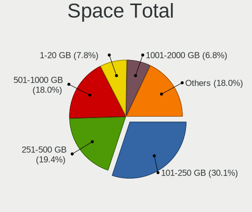

| Size in GB     | Notebooks | Percent |
|----------------|-----------|---------|
| 101-250        | 34        | 32.69%  |
| 251-500        | 22        | 21.15%  |
| 501-1000       | 15        | 14.42%  |
| 1-20           | 10        | 9.62%   |
| 51-100         | 8         | 7.69%   |
| 1001-2000      | 5         | 4.81%   |
| 21-50          | 3         | 2.88%   |
| Unknown        | 3         | 2.88%   |
| More than 3000 | 2         | 1.92%   |
| 2001-3000      | 2         | 1.92%   |

Space Used
----------

Amount of used disk space

| Used GB  | Notebooks | Percent |
|----------|-----------|---------|
| 1-20     | 51        | 46.36%  |
| 21-50    | 20        | 18.18%  |
| 101-250  | 13        | 11.82%  |
| 51-100   | 12        | 10.91%  |
| 251-500  | 8         | 7.27%   |
| 501-1000 | 3         | 2.73%   |
| Unknown  | 3         | 2.73%   |

Malfunc. Drives
---------------

Drive models with a malfunction

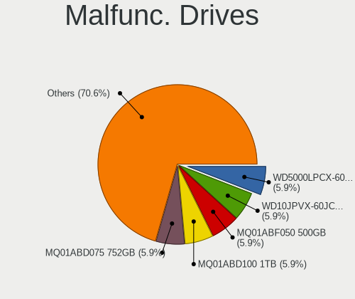

| Model                                               | Notebooks | Drives | Percent |
|-----------------------------------------------------|-----------|--------|---------|
| WDC WD5000LPCX-60VHAT0 500GB                        | 1         | 1      | 10%     |
| WDC WD10JPVX-60JC3T0 1TB                            | 1         | 1      | 10%     |
| Toshiba MQ01ABD075 752GB                            | 1         | 1      | 10%     |
| Toshiba MK6476GSX 640GB                             | 1         | 1      | 10%     |
| Toshiba MK2565GSXV 250GB                            | 1         | 1      | 10%     |
| Micron Technology MTFDDAV256TBN-1AR15ABHA 256GB SSD | 1         | 1      | 10%     |
| Intel SSDSC2BF180A4H 180GB                          | 1         | 1      | 10%     |
| Hitachi HTS547550A9E384 500GB                       | 1         | 2      | 10%     |
| HGST HTS721010A9E630 1TB                            | 1         | 1      | 10%     |
| HGST HTS545050A7E380 500GB                          | 1         | 1      | 10%     |

Malfunc. Drive Vendor
---------------------

Vendors of faulty drives

| Vendor            | Notebooks | Drives | Percent |
|-------------------|-----------|--------|---------|
| Toshiba           | 3         | 3      | 30%     |
| WDC               | 2         | 2      | 20%     |
| HGST              | 2         | 2      | 20%     |
| Micron Technology | 1         | 1      | 10%     |
| Intel             | 1         | 1      | 10%     |
| Hitachi           | 1         | 2      | 10%     |

Malfunc. HDD Vendor
-------------------

Vendors of faulty HDD drives

| Vendor  | Notebooks | Drives | Percent |
|---------|-----------|--------|---------|
| Toshiba | 3         | 3      | 37.5%   |
| WDC     | 2         | 2      | 25%     |
| HGST    | 2         | 2      | 25%     |
| Hitachi | 1         | 2      | 12.5%   |

Malfunc. Drive Kind
-------------------

Kinds of faulty drives

| Kind | Notebooks | Drives | Percent |
|------|-----------|--------|---------|
| HDD  | 8         | 9      | 80%     |
| SSD  | 2         | 2      | 20%     |

Failed Drives
-------------

Failed drive models

Zero info for selected period =(

Failed Drive Vendor
-------------------

Failed drive vendors

Zero info for selected period =(

Drive Status
------------

Number of failed and malfunc. drives

| Status   | Notebooks | Drives | Percent |
|----------|-----------|--------|---------|
| Detected | 55        | 90     | 52.38%  |
| Works    | 40        | 60     | 38.1%   |
| Malfunc  | 10        | 11     | 9.52%   |

Storage controller
------------------

Storage Vendor
--------------

Storage controller vendors

| Vendor                       | Notebooks | Percent |
|------------------------------|-----------|---------|
| Intel                        | 76        | 67.86%  |
| AMD                          | 15        | 13.39%  |
| Samsung Electronics          | 5         | 4.46%   |
| Toshiba America Info Systems | 3         | 2.68%   |
| SK hynix                     | 3         | 2.68%   |
| SanDisk                      | 3         | 2.68%   |
| Union Memory (Shenzhen)      | 1         | 0.89%   |
| Silicon Motion               | 1         | 0.89%   |
| Realtek Semiconductor        | 1         | 0.89%   |
| Nvidia                       | 1         | 0.89%   |
| Kingston Technology Company  | 1         | 0.89%   |
| ASMedia Technology           | 1         | 0.89%   |
| ADATA Technology             | 1         | 0.89%   |

Storage Model
-------------

Storage controller models

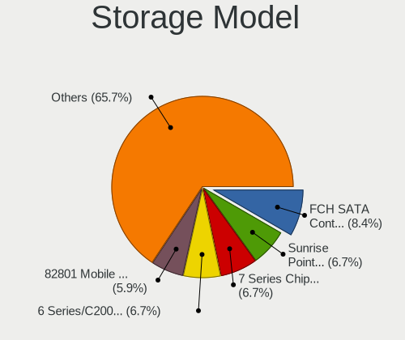

| Model                                                                                  | Notebooks | Percent |
|----------------------------------------------------------------------------------------|-----------|---------|
| AMD FCH SATA Controller [AHCI mode]                                                    | 13        | 10.4%   |
| Intel 6 Series/C200 Series Chipset Family 6 port Mobile SATA AHCI Controller           | 11        | 8.8%    |
| Intel Sunrise Point-LP SATA Controller [AHCI mode]                                     | 9         | 7.2%    |
| Intel 82801 Mobile SATA Controller [RAID mode]                                         | 9         | 7.2%    |
| Intel 8 Series SATA Controller 1 [AHCI mode]                                           | 8         | 6.4%    |
| Intel Celeron/Pentium Silver Processor SATA Controller                                 | 5         | 4%      |
| Intel 7 Series Chipset Family 6-port SATA Controller [AHCI mode]                       | 4         | 3.2%    |
| Intel 6 Series/C200 Series Chipset Family Mobile SATA Controller (IDE mode, ports 0-3) | 4         | 3.2%    |
| Toshiba America Info Systems BG3 NVMe SSD Controller                                   | 3         | 2.4%    |
| SanDisk WD Black SN750 / PC SN730 NVMe SSD                                             | 3         | 2.4%    |
| Intel Wildcat Point-LP SATA Controller [AHCI Mode]                                     | 3         | 2.4%    |
| Intel Cannon Point-LP SATA Controller [AHCI Mode]                                      | 3         | 2.4%    |
| Intel Cannon Lake Mobile PCH SATA AHCI Controller                                      | 3         | 2.4%    |
| SK hynix BC501 NVMe Solid State Drive                                                  | 2         | 1.6%    |
| Samsung NVMe SSD Controller SM981/PM981/PM983                                          | 2         | 1.6%    |
| Samsung NVMe SSD Controller SM961/PM961/SM963                                          | 2         | 1.6%    |
| Intel SSD Pro 7600p/760p/E 6100p Series                                                | 2         | 1.6%    |
| Intel Atom/Celeron/Pentium Processor x5-E8000/J3xxx/N3xxx Series SATA Controller       | 2         | 1.6%    |
| Intel 82801HM/HEM (ICH8M/ICH8M-E) IDE Controller                                       | 2         | 1.6%    |
| Intel 82801GBM/GHM (ICH7-M Family) SATA Controller [IDE mode]                          | 2         | 1.6%    |
| Intel 82801G (ICH7 Family) IDE Controller                                              | 2         | 1.6%    |
| Intel 8 Series/C220 Series Chipset Family 6-port SATA Controller 1 [AHCI mode]         | 2         | 1.6%    |
| Intel 5 Series/3400 Series Chipset 4 port SATA AHCI Controller                         | 2         | 1.6%    |
| AMD SB7x0/SB8x0/SB9x0 SATA Controller [AHCI mode]                                      | 2         | 1.6%    |
| Union Memory (Shenzhen) Non-Volatile memory controller                                 | 1         | 0.8%    |
| SK hynix PC401 NVMe Solid State Drive 256GB                                            | 1         | 0.8%    |
| Silicon Motion SM2263EN/SM2263XT SSD Controller                                        | 1         | 0.8%    |
| Samsung NVMe SSD Controller 980                                                        | 1         | 0.8%    |
| Realtek Realtek Non-Volatile memory controller                                         | 1         | 0.8%    |
| Nvidia MCP67 IDE Controller                                                            | 1         | 0.8%    |
| Nvidia MCP67 AHCI Controller                                                           | 1         | 0.8%    |
| Kingston Company U-SNS8154P3 NVMe SSD                                                  | 1         | 0.8%    |
| Intel Volume Management Device NVMe RAID Controller                                    | 1         | 0.8%    |
| Intel Q170/Q150/B150/H170/H110/Z170/CM236 Chipset SATA Controller [AHCI Mode]          | 1         | 0.8%    |
| Intel Non-Volatile memory controller                                                   | 1         | 0.8%    |
| Intel HM170/QM170 Chipset SATA Controller [AHCI Mode]                                  | 1         | 0.8%    |
| Intel Atom Processor E3800 Series SATA AHCI Controller                                 | 1         | 0.8%    |
| Intel 82801IBM/IEM (ICH9M/ICH9M-E) 4 port SATA Controller [AHCI mode]                  | 1         | 0.8%    |
| Intel 82801IBM/IEM (ICH9M/ICH9M-E) 2 port SATA Controller [IDE mode]                   | 1         | 0.8%    |
| Intel 82801HM/HEM (ICH8M/ICH8M-E) SATA Controller [IDE mode]                           | 1         | 0.8%    |
| Intel 82801HM/HEM (ICH8M/ICH8M-E) SATA Controller [AHCI mode]                          | 1         | 0.8%    |
| Intel 82801GBM/GHM (ICH7-M Family) SATA Controller [AHCI mode]                         | 1         | 0.8%    |
| Intel 7 Series Chipset Family 4-port SATA Controller [IDE mode]                        | 1         | 0.8%    |
| Intel 7 Series Chipset Family 2-port SATA Controller [IDE mode]                        | 1         | 0.8%    |
| Intel 6 Series/C200 Series Chipset Family Mobile SATA Controller (IDE mode, ports 4-5) | 1         | 0.8%    |
| ASMedia ASM1062 Serial ATA Controller                                                  | 1         | 0.8%    |
| AMD SB7x0/SB8x0/SB9x0 IDE Controller                                                   | 1         | 0.8%    |
| AMD FCH IDE Controller                                                                 | 1         | 0.8%    |
| ADATA XPG SX8200 Pro PCIe Gen3x4 M.2 2280 Solid State Drive                            | 1         | 0.8%    |

Storage Kind
------------

Kind of storage controller (IDE, SATA, NVMe, SAS, ...)

| Kind | Notebooks | Percent |
|------|-----------|---------|
| SATA | 73        | 62.39%  |
| NVMe | 20        | 17.09%  |
| IDE  | 14        | 11.97%  |
| RAID | 10        | 8.55%   |

Processor
---------

CPU Vendor
----------

Processor vendors

| Vendor | Notebooks | Percent |
|--------|-----------|---------|
| Intel  | 80        | 81.63%  |
| AMD    | 18        | 18.37%  |

CPU Model
---------

Processor models

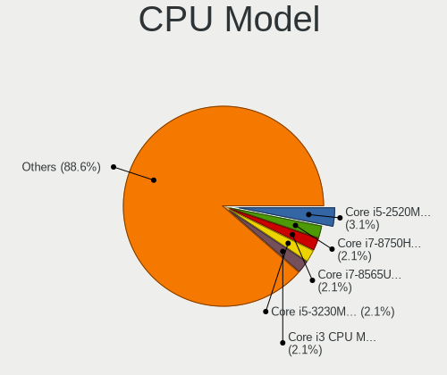

| Model                                           | Notebooks | Percent |
|-------------------------------------------------|-----------|---------|
| Intel Core i5-2520M CPU @ 2.50GHz               | 4         | 4.08%   |
| Intel Core i7-8565U CPU @ 1.80GHz               | 3         | 3.06%   |
| Intel Core i7-2640M CPU @ 2.80GHz               | 3         | 3.06%   |
| Intel Celeron N4000 CPU @ 1.10GHz               | 3         | 3.06%   |
| Intel Celeron CPU N3060 @ 1.60GHz               | 3         | 3.06%   |
| Intel Core i7-9750H CPU @ 2.60GHz               | 2         | 2.04%   |
| Intel Core i7-8750H CPU @ 2.20GHz               | 2         | 2.04%   |
| Intel Core i7-8665U CPU @ 1.90GHz               | 2         | 2.04%   |
| Intel Core i7-4800MQ CPU @ 2.70GHz              | 2         | 2.04%   |
| Intel Core i7-4600U CPU @ 2.10GHz               | 2         | 2.04%   |
| Intel Core i5-7200U CPU @ 2.50GHz               | 2         | 2.04%   |
| Intel Core i5-4200U CPU @ 1.60GHz               | 2         | 2.04%   |
| Intel Core i3 CPU M 380 @ 2.53GHz               | 2         | 2.04%   |
| AMD A10-9600P RADEON R5, 10 COMPUTE CORES 4C+6G | 2         | 2.04%   |
| Intel Xeon CPU E3-1505M v5 @ 2.80GHz            | 1         | 1.02%   |
| Intel Pentium CPU B960 @ 2.20GHz                | 1         | 1.02%   |
| Intel Genuine CPU U4100 @ 1.30GHz               | 1         | 1.02%   |
| Intel Genuine CPU T2060 @ 1.60GHz               | 1         | 1.02%   |
| Intel Core i7-9850H CPU @ 2.60GHz               | 1         | 1.02%   |
| Intel Core i7-8550U CPU @ 1.80GHz               | 1         | 1.02%   |
| Intel Core i7-7700HQ CPU @ 2.80GHz              | 1         | 1.02%   |
| Intel Core i7-7600U CPU @ 2.80GHz               | 1         | 1.02%   |
| Intel Core i7-7500U CPU @ 2.70GHz               | 1         | 1.02%   |
| Intel Core i7-6500U CPU @ 2.50GHz               | 1         | 1.02%   |
| Intel Core i7-5600U CPU @ 2.60GHz               | 1         | 1.02%   |
| Intel Core i7-3520M CPU @ 2.90GHz               | 1         | 1.02%   |
| Intel Core i7-2760QM CPU @ 2.40GHz              | 1         | 1.02%   |
| Intel Core i7-2630QM CPU @ 2.00GHz              | 1         | 1.02%   |
| Intel Core i7-2620M CPU @ 2.70GHz               | 1         | 1.02%   |
| Intel Core i5-8350U CPU @ 1.70GHz               | 1         | 1.02%   |
| Intel Core i5-8265U CPU @ 1.60GHz               | 1         | 1.02%   |
| Intel Core i5-6200U CPU @ 2.30GHz               | 1         | 1.02%   |
| Intel Core i5-5300U CPU @ 2.30GHz               | 1         | 1.02%   |
| Intel Core i5-4300Y CPU @ 1.60GHz               | 1         | 1.02%   |
| Intel Core i5-4300U CPU @ 1.90GHz               | 1         | 1.02%   |
| Intel Core i5-4210U CPU @ 1.70GHz               | 1         | 1.02%   |
| Intel Core i5-3210M CPU @ 2.50GHz               | 1         | 1.02%   |
| Intel Core i5-2435M CPU @ 2.40GHz               | 1         | 1.02%   |
| Intel Core i5-2410M CPU @ 2.30GHz               | 1         | 1.02%   |
| Intel Core i5-1035G1 CPU @ 1.00GHz              | 1         | 1.02%   |
| Intel Core i5-10210U CPU @ 1.60GHz              | 1         | 1.02%   |
| Intel Core i3-8130U CPU @ 2.20GHz               | 1         | 1.02%   |
| Intel Core i3-7020U CPU @ 2.30GHz               | 1         | 1.02%   |
| Intel Core i3-6100U CPU @ 2.30GHz               | 1         | 1.02%   |
| Intel Core i3-5020U CPU @ 2.20GHz               | 1         | 1.02%   |
| Intel Core i3-5005U CPU @ 2.00GHz               | 1         | 1.02%   |
| Intel Core i3-4005U CPU @ 1.70GHz               | 1         | 1.02%   |
| Intel Core i3-4000M CPU @ 2.40GHz               | 1         | 1.02%   |
| Intel Core i3-2370M CPU @ 2.40GHz               | 1         | 1.02%   |
| Intel Core i3-2310M CPU @ 2.10GHz               | 1         | 1.02%   |
| Intel Core 2 Duo CPU T7100 @ 1.80GHz            | 1         | 1.02%   |
| Intel Core 2 Duo CPU T5550 @ 1.83GHz            | 1         | 1.02%   |
| Intel Core 2 Duo CPU P8600 @ 2.40GHz            | 1         | 1.02%   |
| Intel Core 2 CPU T7200 @ 2.00GHz                | 1         | 1.02%   |
| Intel Core 2 CPU T5600 @ 1.83GHz                | 1         | 1.02%   |
| Intel Celeron N4020 CPU @ 1.10GHz               | 1         | 1.02%   |
| Intel Celeron N4000C CPU @ 1.10GHz              | 1         | 1.02%   |
| Intel Celeron CPU N2840 @ 2.16GHz               | 1         | 1.02%   |
| Intel Celeron CPU B815 @ 1.60GHz                | 1         | 1.02%   |
| Intel Atom x5-Z8350 CPU @ 1.44GHz               | 1         | 1.02%   |

CPU Model Family
----------------

Processor model prefix

| Model                          | Notebooks | Percent |
|--------------------------------|-----------|---------|
| Intel Core i7                  | 27        | 27.55%  |
| Intel Core i5                  | 20        | 20.41%  |
| Intel Core i3                  | 11        | 11.22%  |
| Intel Celeron                  | 10        | 10.2%   |
| Other                          | 3         | 3.06%   |
| Intel Core 2 Duo               | 3         | 3.06%   |
| AMD Ryzen 7                    | 3         | 3.06%   |
| AMD Ryzen 5                    | 3         | 3.06%   |
| Intel Genuine                  | 2         | 2.04%   |
| Intel Core 2                   | 2         | 2.04%   |
| AMD Ryzen 3                    | 2         | 2.04%   |
| AMD E1                         | 2         | 2.04%   |
| AMD A8                         | 2         | 2.04%   |
| AMD A10                        | 2         | 2.04%   |
| Intel Xeon                     | 1         | 1.02%   |
| Intel Pentium                  | 1         | 1.02%   |
| Intel Atom                     | 1         | 1.02%   |
| AMD V120                       | 1         | 1.02%   |
| AMD Turion X2 Dual-Core Mobile | 1         | 1.02%   |
| AMD Turion 64 X2               | 1         | 1.02%   |

CPU Cores
---------

Number of processor cores

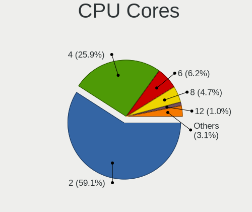

| Number | Notebooks | Percent |
|--------|-----------|---------|
| 2      | 65        | 66.33%  |
| 4      | 25        | 25.51%  |
| 6      | 6         | 6.12%   |
| 8      | 1         | 1.02%   |
| 1      | 1         | 1.02%   |

CPU Sockets
-----------

Number of sockets

| Number | Notebooks | Percent |
|--------|-----------|---------|
| 1      | 98        | 100%    |

CPU Threads
-----------

Threads per core (Hyper-Threading)

| Number | Notebooks | Percent |
|--------|-----------|---------|
| 2      | 69        | 70.41%  |
| 1      | 29        | 29.59%  |

CPU Op-Modes
------------

CPU Operation Modes (32-bit, 64-bit)

| Op mode        | Notebooks | Percent |
|----------------|-----------|---------|
| 32-bit, 64-bit | 96        | 96.97%  |
| Unknown        | 2         | 2.02%   |
| 32-bit         | 1         | 1.01%   |

CPU Microcode
-------------

Microcode number

| Number     | Notebooks | Percent |
|------------|-----------|---------|
| Unknown    | 17        | 17%     |
| 0x206a7    | 12        | 12%     |
| 0x40651    | 7         | 7%      |
| 0x806e9    | 5         | 5%      |
| 0x08108109 | 5         | 5%      |
| 0x806ec    | 4         | 4%      |
| 0x706a1    | 4         | 4%      |
| 0x406c4    | 4         | 4%      |
| 0x306d4    | 4         | 4%      |
| 0x906ea    | 3         | 3%      |
| 0x806eb    | 3         | 3%      |
| 0x406e3    | 3         | 3%      |
| 0x306c3    | 3         | 3%      |
| 0x6fd      | 2         | 2%      |
| 0x306a9    | 2         | 2%      |
| 0x20655    | 2         | 2%      |
| 0x1067a    | 2         | 2%      |
| 0x906ed    | 1         | 1%      |
| 0x906e9    | 1         | 1%      |
| 0x806ea    | 1         | 1%      |
| 0x806c1    | 1         | 1%      |
| 0x706a8    | 1         | 1%      |
| 0x6f6      | 1         | 1%      |
| 0x6ec      | 1         | 1%      |
| 0x506e3    | 1         | 1%      |
| 0x30678    | 1         | 1%      |
| 0x08600104 | 1         | 1%      |
| 0x08600103 | 1         | 1%      |
| 0x07030105 | 1         | 1%      |
| 0x07000110 | 1         | 1%      |
| 0x06006118 | 1         | 1%      |
| 0x05000119 | 1         | 1%      |
| 0x03000027 | 1         | 1%      |
| 0x02000057 | 1         | 1%      |
| 0x010000c8 | 1         | 1%      |

CPU Microarch
-------------

Microarchitecture

| Name            | Notebooks | Percent |
|-----------------|-----------|---------|
| KabyLake        | 21        | 21.43%  |
| SandyBridge     | 16        | 16.33%  |
| Haswell         | 11        | 11.22%  |
| Zen+            | 6         | 6.12%   |
| Silvermont      | 5         | 5.1%    |
| Goldmont plus   | 5         | 5.1%    |
| Skylake         | 4         | 4.08%   |
| Core            | 4         | 4.08%   |
| Broadwell       | 4         | 4.08%   |
| Excavator       | 3         | 3.06%   |
| Zen 2           | 2         | 2.04%   |
| Westmere        | 2         | 2.04%   |
| TigerLake       | 2         | 2.04%   |
| Penryn          | 2         | 2.04%   |
| IvyBridge       | 2         | 2.04%   |
| Puma            | 1         | 1.02%   |
| P6              | 1         | 1.02%   |
| K8 Hammer       | 1         | 1.02%   |
| K8 & K10 hybrid | 1         | 1.02%   |
| K10 Llano       | 1         | 1.02%   |
| K10             | 1         | 1.02%   |
| Jaguar          | 1         | 1.02%   |
| IceLake         | 1         | 1.02%   |
| Bobcat          | 1         | 1.02%   |

Graphics
--------

GPU Vendor
----------

Vendors of graphics cards

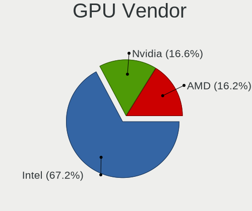

| Vendor | Notebooks | Percent |
|--------|-----------|---------|
| Intel  | 76        | 67.86%  |
| AMD    | 21        | 18.75%  |
| Nvidia | 15        | 13.39%  |

GPU Model
---------

Graphics card models

| Model                                                                                    | Notebooks | Percent |
|------------------------------------------------------------------------------------------|-----------|---------|
| Intel 2nd Generation Core Processor Family Integrated Graphics Controller                | 14        | 11.76%  |
| Intel Haswell-ULT Integrated Graphics Controller                                         | 7         | 5.88%   |
| Intel WhiskeyLake-U GT2 [UHD Graphics 620]                                               | 6         | 5.04%   |
| AMD Picasso/Raven 2 [Radeon Vega Series / Radeon Vega Mobile Series]                     | 6         | 5.04%   |
| Intel HD Graphics 620                                                                    | 5         | 4.2%    |
| Intel GeminiLake [UHD Graphics 600]                                                      | 5         | 4.2%    |
| Intel CoffeeLake-H GT2 [UHD Graphics 630]                                                | 5         | 4.2%    |
| Intel HD Graphics 5500                                                                   | 4         | 3.36%   |
| Intel Atom/Celeron/Pentium Processor x5-E8000/J3xxx/N3xxx Integrated Graphics Controller | 4         | 3.36%   |
| Intel UHD Graphics 620                                                                   | 3         | 2.52%   |
| Intel Skylake GT2 [HD Graphics 520]                                                      | 3         | 2.52%   |
| Intel Mobile 945GM/GMS/GME, 943/940GML Express Integrated Graphics Controller            | 3         | 2.52%   |
| Intel Mobile 945GM/GMS, 943/940GML Express Integrated Graphics Controller                | 3         | 2.52%   |
| Intel 4th Gen Core Processor Integrated Graphics Controller                              | 3         | 2.52%   |
| Nvidia TU116M [GeForce GTX 1660 Ti Mobile]                                               | 2         | 1.68%   |
| Nvidia GP107M [GeForce GTX 1050 Mobile]                                                  | 2         | 1.68%   |
| Intel TigerLake-LP GT2 [Iris Xe Graphics]                                                | 2         | 1.68%   |
| Intel Mobile 4 Series Chipset Integrated Graphics Controller                             | 2         | 1.68%   |
| Intel Core Processor Integrated Graphics Controller                                      | 2         | 1.68%   |
| AMD Wani [Radeon R5/R6/R7 Graphics]                                                      | 2         | 1.68%   |
| AMD Topaz XT [Radeon R7 M260/M265 / M340/M360 / M440/M445 / 530/535 / 620/625 Mobile]    | 2         | 1.68%   |
| AMD Seymour [Radeon HD 6400M/7400M Series]                                               | 2         | 1.68%   |
| AMD Renoir                                                                               | 2         | 1.68%   |
| Nvidia TU117M                                                                            | 1         | 0.84%   |
| Nvidia TU117GLM [Quadro T2000 Mobile / Max-Q]                                            | 1         | 0.84%   |
| Nvidia GP108M [GeForce MX230]                                                            | 1         | 0.84%   |
| Nvidia GP107M [GeForce GTX 1050 Ti Mobile]                                               | 1         | 0.84%   |
| Nvidia GM108M [GeForce 940MX]                                                            | 1         | 0.84%   |
| Nvidia GM107GLM [Quadro M2000M]                                                          | 1         | 0.84%   |
| Nvidia GK106M [GeForce GTX 765M]                                                         | 1         | 0.84%   |
| Nvidia GF117M [GeForce 610M/710M/810M/820M / GT 620M/625M/630M/720M]                     | 1         | 0.84%   |
| Nvidia GF116M [GeForce GT 560M]                                                          | 1         | 0.84%   |
| Nvidia G84M [GeForce 8700M GT]                                                           | 1         | 0.84%   |
| Nvidia C67 [GeForce 7150M / nForce 630M]                                                 | 1         | 0.84%   |
| Intel Mobile GM965/GL960 Integrated Graphics Controller (secondary)                      | 1         | 0.84%   |
| Intel Mobile GM965/GL960 Integrated Graphics Controller (primary)                        | 1         | 0.84%   |
| Intel Iris Plus Graphics G1 (Ice Lake)                                                   | 1         | 0.84%   |
| Intel HD Graphics P530                                                                   | 1         | 0.84%   |
| Intel HD Graphics 630                                                                    | 1         | 0.84%   |
| Intel Haswell-ULT High Definition Audio Controller [HD Graphics]                         | 1         | 0.84%   |
| Intel CometLake-U GT2 [UHD Graphics]                                                     | 1         | 0.84%   |
| Intel Atom Processor Z36xxx/Z37xxx Series Graphics & Display                             | 1         | 0.84%   |
| Intel 3rd Gen Core processor Graphics Controller                                         | 1         | 0.84%   |
| AMD Wrestler [Radeon HD 7310]                                                            | 1         | 0.84%   |
| AMD Venus XT [Radeon HD 8870M / R9 M270X/M370X]                                          | 1         | 0.84%   |
| AMD Thames [Radeon HD 7550M/7570M/7650M]                                                 | 1         | 0.84%   |
| AMD Sumo [Radeon HD 6620G]                                                               | 1         | 0.84%   |
| AMD Stoney [Radeon R2/R3/R4/R5 Graphics]                                                 | 1         | 0.84%   |
| AMD RS880M [Mobility Radeon HD 4225/4250]                                                | 1         | 0.84%   |
| AMD RS780MC [Mobility Radeon HD 3100]                                                    | 1         | 0.84%   |
| AMD Mullins [Radeon R4/R5 Graphics]                                                      | 1         | 0.84%   |
| AMD Kabini [Radeon HD 8240 / R3 Series]                                                  | 1         | 0.84%   |
| AMD Baffin [Radeon RX 460/560D / Pro 450/455/460/555/555X/560/560X]                      | 1         | 0.84%   |

GPU Combo
---------

Combinations of graphics cards

| Name           | Notebooks | Percent |
|----------------|-----------|---------|
| 1 x Intel      | 63        | 64.29%  |
| 1 x AMD        | 16        | 16.33%  |
| Intel + Nvidia | 12        | 12.24%  |
| 2 x AMD        | 3         | 3.06%   |
| 1 x Nvidia     | 2         | 2.04%   |
| Intel + AMD    | 1         | 1.02%   |
| AMD + Nvidia   | 1         | 1.02%   |

GPU Driver
----------

Free vs proprietary

| Driver      | Notebooks | Percent |
|-------------|-----------|---------|
| Free        | 90        | 90.91%  |
| Proprietary | 7         | 7.07%   |
| Unknown     | 2         | 2.02%   |

GPU Memory
----------

Total video memory

| Size in GB | Notebooks | Percent |
|------------|-----------|---------|
| Unknown    | 73        | 73.74%  |
| 1.01-2.0   | 8         | 8.08%   |
| 0.01-0.5   | 8         | 8.08%   |
| 3.01-4.0   | 5         | 5.05%   |
| 0.51-1.0   | 4         | 4.04%   |
| 5.01-6.0   | 1         | 1.01%   |

Monitor
-------

Monitor Vendor
--------------

Monitor vendors

| Vendor                  | Notebooks | Percent |
|-------------------------|-----------|---------|
| AU Optronics            | 25        | 21.37%  |
| LG Display              | 18        | 15.38%  |
| Chimei Innolux          | 15        | 12.82%  |
| Samsung Electronics     | 14        | 11.97%  |
| BOE                     | 9         | 7.69%   |
| Apple                   | 5         | 4.27%   |
| AOC                     | 5         | 4.27%   |
| Goldstar                | 3         | 2.56%   |
| Chi Mei Optoelectronics | 3         | 2.56%   |
| Sharp                   | 2         | 1.71%   |
| Hewlett-Packard         | 2         | 1.71%   |
| Dell                    | 2         | 1.71%   |
| CPT                     | 2         | 1.71%   |
| ViewSonic               | 1         | 0.85%   |
| Sony                    | 1         | 0.85%   |
| Panasonic               | 1         | 0.85%   |
| LG Philips              | 1         | 0.85%   |
| KDC                     | 1         | 0.85%   |
| Hitachi                 | 1         | 0.85%   |
| GAOMON                  | 1         | 0.85%   |
| Envision                | 1         | 0.85%   |
| CVT                     | 1         | 0.85%   |
| ASUSTek Computer        | 1         | 0.85%   |
| Ancor Communications    | 1         | 0.85%   |
| Acer                    | 1         | 0.85%   |

Monitor Model
-------------

Monitor models

| Model                                                                   | Notebooks | Percent |
|-------------------------------------------------------------------------|-----------|---------|
| Apple LCD Monitor APP9CC5 1280x800 286x179mm 13.3-inch                  | 4         | 3.42%   |
| AU Optronics LCD Monitor AUO25ED 1920x1080 344x194mm 15.5-inch          | 3         | 2.56%   |
| LG Display LCD Monitor LGD0563 1920x1080 344x194mm 15.5-inch            | 2         | 1.71%   |
| LG Display LCD Monitor LGD02F8 1366x768 309x174mm 14.0-inch             | 2         | 1.71%   |
| Hewlett-Packard 22cwa HWP3183 1920x1080 476x268mm 21.5-inch             | 2         | 1.71%   |
| Goldstar FULL HD GSM5B55 1920x1080 480x270mm 21.7-inch                  | 2         | 1.71%   |
| Chimei Innolux LCD Monitor CMN15F5 1920x1080 344x193mm 15.5-inch        | 2         | 1.71%   |
| Chimei Innolux LCD Monitor CMN15DB 1366x768 344x193mm 15.5-inch         | 2         | 1.71%   |
| Chimei Innolux LCD Monitor CMN14C3 1366x768 309x173mm 13.9-inch         | 2         | 1.71%   |
| Chimei Innolux LCD Monitor CMN1482 1600x900 309x174mm 14.0-inch         | 2         | 1.71%   |
| AU Optronics LCD Monitor AUO22EC 1366x768 344x193mm 15.5-inch           | 2         | 1.71%   |
| ViewSonic VA2359 Series VSC6332 1920x1080 509x286mm 23.0-inch           | 1         | 0.85%   |
| Sony TV SNY0902 1360x768                                                | 1         | 0.85%   |
| Sharp LCD Monitor SHP14AD 3840x2160 290x170mm 13.2-inch                 | 1         | 0.85%   |
| Sharp LCD Monitor SHP1453 1920x1080 346x194mm 15.6-inch                 | 1         | 0.85%   |
| Samsung Electronics U32J59x SAM0F35 3840x2160 697x392mm 31.5-inch       | 1         | 0.85%   |
| Samsung Electronics SyncMaster SAM058A 1920x1080 531x298mm 24.0-inch    | 1         | 0.85%   |
| Samsung Electronics S24F350 SAM0D20 1920x1080 521x293mm 23.5-inch       | 1         | 0.85%   |
| Samsung Electronics LCD Monitor SEC544B 1600x900 310x174mm 14.0-inch    | 1         | 0.85%   |
| Samsung Electronics LCD Monitor SEC4E45 1280x800 331x207mm 15.4-inch    | 1         | 0.85%   |
| Samsung Electronics LCD Monitor SEC4251 1366x768 344x194mm 15.5-inch    | 1         | 0.85%   |
| Samsung Electronics LCD Monitor SEC4145 1366x768 309x174mm 14.0-inch    | 1         | 0.85%   |
| Samsung Electronics LCD Monitor SEC3847 1440x900 367x230mm 17.1-inch    | 1         | 0.85%   |
| Samsung Electronics LCD Monitor SEC345A 1366x768 309x174mm 14.0-inch    | 1         | 0.85%   |
| Samsung Electronics LCD Monitor SEC3345 1280x800 331x207mm 15.4-inch    | 1         | 0.85%   |
| Samsung Electronics LCD Monitor SEC325A 1366x768 344x194mm 15.5-inch    | 1         | 0.85%   |
| Samsung Electronics LCD Monitor SDC4C48 1920x1080 344x194mm 15.5-inch   | 1         | 0.85%   |
| Samsung Electronics LCD Monitor SAM0FEE 3840x2160 1872x1053mm 84.6-inch | 1         | 0.85%   |
| Samsung Electronics LCD Monitor SAM0F13 3840x2160 1872x1053mm 84.6-inch | 1         | 0.85%   |
| Panasonic TV MEIA296 3840x2160 698x392mm 31.5-inch                      | 1         | 0.85%   |
| LG Philips LP154WX4-TLC8 LPL0120 1280x800 331x207mm 15.4-inch           | 1         | 0.85%   |
| LG Display LCD Monitor LGD062C 1920x1080 309x174mm 14.0-inch            | 1         | 0.85%   |
| LG Display LCD Monitor LGD05F2 1920x1080 344x194mm 15.5-inch            | 1         | 0.85%   |
| LG Display LCD Monitor LGD05E6 1920x1080 344x194mm 15.5-inch            | 1         | 0.85%   |
| LG Display LCD Monitor LGD0493 1366x768 344x194mm 15.5-inch             | 1         | 0.85%   |
| LG Display LCD Monitor LGD0484 1366x768 344x194mm 15.5-inch             | 1         | 0.85%   |
| LG Display LCD Monitor LGD046D 1920x1080 309x174mm 14.0-inch            | 1         | 0.85%   |
| LG Display LCD Monitor LGD0465 1366x768 344x194mm 15.5-inch             | 1         | 0.85%   |
| LG Display LCD Monitor LGD0454 1366x768 310x174mm 14.0-inch             | 1         | 0.85%   |
| LG Display LCD Monitor LGD033A 1366x768 344x194mm 15.5-inch             | 1         | 0.85%   |
| LG Display LCD Monitor LGD0306 1600x900 310x174mm 14.0-inch             | 1         | 0.85%   |
| LG Display LCD Monitor LGD02EB 1366x768 309x174mm 14.0-inch             | 1         | 0.85%   |
| LG Display LCD Monitor LGD02E9 1366x768 309x174mm 14.0-inch             | 1         | 0.85%   |
| LG Display LCD Monitor LGD0259 1920x1080 345x194mm 15.6-inch            | 1         | 0.85%   |
| LG Display LCD Monitor LGD01E6 1366x768 309x174mm 14.0-inch             | 1         | 0.85%   |
| KDC LCD Monitor KDC05F1 1366x768 344x193mm 15.5-inch                    | 1         | 0.85%   |
| Hitachi 50A3 HTC011C 1440x900 708x398mm 32.0-inch                       | 1         | 0.85%   |
| Goldstar 2D HD TV GSM59CA 1366x768 509x286mm 23.0-inch                  | 1         | 0.85%   |
| GAOMON PD1560 GAM1560 1920x1080 345x195mm 15.6-inch                     | 1         | 0.85%   |
| Envision EPI2442 EPI2442 1360x768 525x297mm 23.7-inch                   | 1         | 0.85%   |
| Dell P2417H DELA0DC 1920x1080 530x300mm 24.0-inch                       | 1         | 0.85%   |
| Dell E198FP DELA028 1280x1024 376x301mm 19.0-inch                       | 1         | 0.85%   |
| CVT LCD CVT001A 1920x1080 330x210mm 15.4-inch                           | 1         | 0.85%   |
| CPT LCD Monitor CPT1775 1280x800 304x190mm 14.1-inch                    | 1         | 0.85%   |
| CPT LCD Monitor COR0207 1366x768 309x174mm 14.0-inch                    | 1         | 0.85%   |
| Chimei Innolux LCD Monitor CMN1747 1920x1080 381x214mm 17.2-inch        | 1         | 0.85%   |
| Chimei Innolux LCD Monitor CMN1738 1920x1080 381x214mm 17.2-inch        | 1         | 0.85%   |
| Chimei Innolux LCD Monitor CMN15E7 1920x1080 344x193mm 15.5-inch        | 1         | 0.85%   |
| Chimei Innolux LCD Monitor CMN150C 1920x1080 344x193mm 15.5-inch        | 1         | 0.85%   |
| Chimei Innolux LCD Monitor CMN14E5 1920x1080 309x173mm 13.9-inch        | 1         | 0.85%   |

Monitor Resolution
------------------

Monitor screen resolution

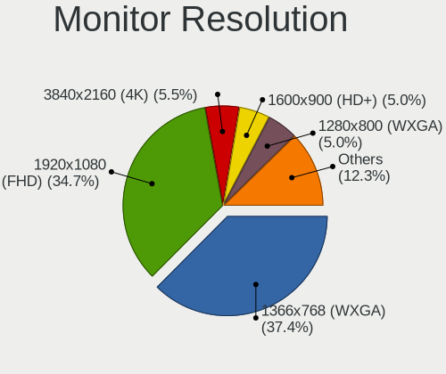

| Resolution       | Notebooks | Percent |
|------------------|-----------|---------|
| 1366x768 (WXGA)  | 41        | 37.61%  |
| 1920x1080 (FHD)  | 38        | 34.86%  |
| 1280x800 (WXGA)  | 10        | 9.17%   |
| 3840x2160 (4K)   | 7         | 6.42%   |
| 1600x900 (HD+)   | 7         | 6.42%   |
| 1440x900 (WXGA+) | 3         | 2.75%   |
| 1280x1024 (SXGA) | 2         | 1.83%   |
| 1360x768         | 1         | 0.92%   |

Monitor Diagonal
----------------

Diagonal size in inches

| Inches | Notebooks | Percent |
|--------|-----------|---------|
| 15     | 44        | 38.26%  |
| 14     | 21        | 18.26%  |
| 13     | 19        | 16.52%  |
| 23     | 6         | 5.22%   |
| 17     | 6         | 5.22%   |
| 84     | 3         | 2.61%   |
| 24     | 3         | 2.61%   |
| 21     | 3         | 2.61%   |
| 19     | 3         | 2.61%   |
| 18     | 3         | 2.61%   |
| 72     | 1         | 0.87%   |
| 32     | 1         | 0.87%   |
| 31     | 1         | 0.87%   |
| 12     | 1         | 0.87%   |

Monitor Width
-------------

Physical width

| Width in mm | Notebooks | Percent |
|-------------|-----------|---------|
| 301-350     | 78        | 67.83%  |
| 501-600     | 9         | 7.83%   |
| 401-500     | 8         | 6.96%   |
| 201-300     | 8         | 6.96%   |
| 351-400     | 6         | 5.22%   |
| 1501-2000   | 4         | 3.48%   |
| 701-800     | 1         | 0.87%   |
| 601-700     | 1         | 0.87%   |

Aspect Ratio
------------

Proportional relationship between the width and the height

| Ratio | Notebooks | Percent |
|-------|-----------|---------|
| 16/9  | 81        | 83.51%  |
| 16/10 | 14        | 14.43%  |
| 5/4   | 2         | 2.06%   |

Monitor Area
------------

Area in inch

| Area in inch | Notebooks | Percent |
|----------------|-----------|---------|
| 101-110        | 44        | 38.6%   |
| 81-90          | 38        | 33.33%  |
| 201-250        | 11        | 9.65%   |
| More than 1000 | 4         | 3.51%   |
| 151-200        | 4         | 3.51%   |
| 121-130        | 4         | 3.51%   |
| 141-150        | 3         | 2.63%   |
| 71-80          | 2         | 1.75%   |
| 351-500        | 2         | 1.75%   |
| 61-70          | 1         | 0.88%   |
| 131-140        | 1         | 0.88%   |

Pixel Density
-------------

Pixels per inch

| Density       | Notebooks | Percent |
|---------------|-----------|---------|
| 101-120       | 50        | 44.64%  |
| 121-160       | 39        | 34.82%  |
| 51-100        | 20        | 17.86%  |
| 1-50          | 2         | 1.79%   |
| More than 240 | 1         | 0.89%   |

Multiple Monitors
-----------------

Total monitors connected

| Total | Notebooks | Percent |
|-------|-----------|---------|
| 1     | 81        | 77.88%  |
| 2     | 19        | 18.27%  |
| 3     | 2         | 1.92%   |
| 0     | 2         | 1.92%   |

Network
-------

Net Controller Vendor
---------------------

Controller vendors

| Vendor                   | Notebooks | Percent |
|--------------------------|-----------|---------|
| Realtek Semiconductor    | 54        | 34.39%  |
| Intel                    | 42        | 26.75%  |
| Qualcomm Atheros         | 30        | 19.11%  |
| Broadcom                 | 13        | 8.28%   |
| Broadcom Limited         | 6         | 3.82%   |
| TP-Link                  | 4         | 2.55%   |
| Xiaomi                   | 1         | 0.64%   |
| Nvidia                   | 1         | 0.64%   |
| Marvell Technology Group | 1         | 0.64%   |
| JMicron Technology       | 1         | 0.64%   |
| Huawei Technologies      | 1         | 0.64%   |
| DisplayLink              | 1         | 0.64%   |
| Dell                     | 1         | 0.64%   |
| ASIX Electronics         | 1         | 0.64%   |

Net Controller Model
--------------------

Controller models

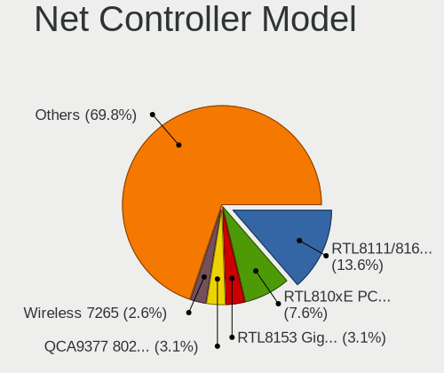

| Model                                                                                 | Notebooks | Percent |
|---------------------------------------------------------------------------------------|-----------|---------|
| Realtek RTL8111/8168/8411 PCI Express Gigabit Ethernet Controller                     | 26        | 13%     |
| Realtek RTL810xE PCI Express Fast Ethernet controller                                 | 18        | 9%      |
| Qualcomm Atheros QCA9377 802.11ac Wireless Network Adapter                            | 7         | 3.5%    |
| Intel Wireless 7265                                                                   | 6         | 3%      |
| Intel Wireless 7260                                                                   | 6         | 3%      |
| Realtek RTL8723DE Wireless Network Adapter                                            | 5         | 2.5%    |
| Realtek RTL8153 Gigabit Ethernet Adapter                                              | 5         | 2.5%    |
| Qualcomm Atheros QCA6174 802.11ac Wireless Network Adapter                            | 5         | 2.5%    |
| Intel Centrino Advanced-N 6205 [Taylor Peak]                                          | 5         | 2.5%    |
| Realtek RTL8723BE PCIe Wireless Network Adapter                                       | 4         | 2%      |
| Qualcomm Atheros AR9485 Wireless Network Adapter                                      | 4         | 2%      |
| Intel Wi-Fi 6 AX200                                                                   | 4         | 2%      |
| Intel 82579LM Gigabit Network Connection (Lewisville)                                 | 4         | 2%      |
| Broadcom NetXtreme BCM57765 Gigabit Ethernet PCIe                                     | 4         | 2%      |
| Broadcom BCM4331 802.11a/b/g/n                                                        | 4         | 2%      |
| Realtek RTL8188CE 802.11b/g/n WiFi Adapter                                            | 3         | 1.5%    |
| Qualcomm Atheros QCA9565 / AR9565 Wireless Network Adapter                            | 3         | 1.5%    |
| Qualcomm Atheros AR9285 Wireless Network Adapter (PCI-Express)                        | 3         | 1.5%    |
| Intel Ethernet Connection I218-LM                                                     | 3         | 1.5%    |
| Intel Ethernet Connection (4) I219-LM                                                 | 3         | 1.5%    |
| Intel Cannon Point-LP CNVi [Wireless-AC]                                              | 3         | 1.5%    |
| Intel Cannon Lake PCH CNVi WiFi                                                       | 3         | 1.5%    |
| Broadcom BCM43142 802.11b/g/n                                                         | 3         | 1.5%    |
| TP-Link Archer T4U v2 [Realtek RTL8812AU]                                             | 2         | 1%      |
| Realtek RTL8822CE 802.11ac PCIe Wireless Network Adapter                              | 2         | 1%      |
| Qualcomm Atheros AR8152 v2.0 Fast Ethernet                                            | 2         | 1%      |
| Intel Wireless 8265 / 8275                                                            | 2         | 1%      |
| Intel Wireless 3160                                                                   | 2         | 1%      |
| Intel Ethernet Connection (3) I218-LM                                                 | 2         | 1%      |
| Intel Dual Band Wireless-AC 3168NGW [Stone Peak]                                      | 2         | 1%      |
| Broadcom NetXtreme BCM57762 Gigabit Ethernet PCIe                                     | 2         | 1%      |
| Broadcom Limited BCM4311 802.11a/b/g                                                  | 2         | 1%      |
| Xiaomi Mi/Redmi series (RNDIS)                                                        | 1         | 0.5%    |
| TP-Link TL-WN822N Version 4 RTL8192EU                                                 | 1         | 0.5%    |
| TP-Link AC600 wireless Realtek RTL8811AU [Archer T2U Nano]                            | 1         | 0.5%    |
| Realtek USB 10/100/1G/2.5G LAN                                                        | 1         | 0.5%    |
| Realtek RTL8852AE 802.11ax PCIe Wireless Network Adapter                              | 1         | 0.5%    |
| Realtek RTL8822BE 802.11a/b/g/n/ac WiFi adapter                                       | 1         | 0.5%    |
| Realtek RTL8821CE 802.11ac PCIe Wireless Network Adapter                              | 1         | 0.5%    |
| Realtek RTL8723AE PCIe Wireless Network Adapter                                       | 1         | 0.5%    |
| Realtek RTL8191SU 802.11n WLAN Adapter                                                | 1         | 0.5%    |
| Realtek 802.11ac NIC                                                                  | 1         | 0.5%    |
| Qualcomm Atheros Killer E220x Gigabit Ethernet Controller                             | 1         | 0.5%    |
| Qualcomm Atheros AR9462 Wireless Network Adapter                                      | 1         | 0.5%    |
| Qualcomm Atheros AR8162 Fast Ethernet                                                 | 1         | 0.5%    |
| Qualcomm Atheros AR8161 Gigabit Ethernet                                              | 1         | 0.5%    |
| Qualcomm Atheros AR8152 v1.1 Fast Ethernet                                            | 1         | 0.5%    |
| Qualcomm Atheros AR8151 v2.0 Gigabit Ethernet                                         | 1         | 0.5%    |
| Qualcomm Atheros AR5418 Wireless Network Adapter [AR5008E 802.11(a)bgn] (PCI-Express) | 1         | 0.5%    |
| Qualcomm Atheros AR242x / AR542x Wireless Network Adapter (PCI-Express)               | 1         | 0.5%    |
| Qualcomm Atheros AR2427 802.11bg Wireless Network Adapter (PCI-Express)               | 1         | 0.5%    |
| Nvidia MCP67 Ethernet                                                                 | 1         | 0.5%    |
| Marvell Group 88E8053 PCI-E Gigabit Ethernet Controller                               | 1         | 0.5%    |
| JMicron JMC250 PCI Express Gigabit Ethernet Controller                                | 1         | 0.5%    |
| Intel Wireless 8260                                                                   | 1         | 0.5%    |
| Intel PRO/Wireless 4965 AG or AGN [Kedron] Network Connection                         | 1         | 0.5%    |
| Intel PRO/100 VE Network Connection                                                   | 1         | 0.5%    |
| Intel Ethernet Connection I218-V                                                      | 1         | 0.5%    |
| Intel Ethernet Connection I217-LM                                                     | 1         | 0.5%    |
| Intel Ethernet Connection (7) I219-LM                                                 | 1         | 0.5%    |

Wireless Vendor
---------------

Wireless vendors

| Vendor                | Notebooks | Percent |
|-----------------------|-----------|---------|
| Intel                 | 37        | 35.92%  |
| Qualcomm Atheros      | 26        | 25.24%  |
| Realtek Semiconductor | 19        | 18.45%  |
| Broadcom              | 10        | 9.71%   |
| Broadcom Limited      | 6         | 5.83%   |
| TP-Link               | 4         | 3.88%   |
| Dell                  | 1         | 0.97%   |

Wireless Model
--------------

Wireless models

| Model                                                                                 | Notebooks | Percent |
|---------------------------------------------------------------------------------------|-----------|---------|
| Qualcomm Atheros QCA9377 802.11ac Wireless Network Adapter                            | 7         | 6.67%   |
| Intel Wireless 7265                                                                   | 6         | 5.71%   |
| Intel Wireless 7260                                                                   | 6         | 5.71%   |
| Realtek RTL8723DE Wireless Network Adapter                                            | 5         | 4.76%   |
| Qualcomm Atheros QCA6174 802.11ac Wireless Network Adapter                            | 5         | 4.76%   |
| Intel Centrino Advanced-N 6205 [Taylor Peak]                                          | 5         | 4.76%   |
| Realtek RTL8723BE PCIe Wireless Network Adapter                                       | 4         | 3.81%   |
| Qualcomm Atheros AR9485 Wireless Network Adapter                                      | 4         | 3.81%   |
| Intel Wi-Fi 6 AX200                                                                   | 4         | 3.81%   |
| Broadcom BCM4331 802.11a/b/g/n                                                        | 4         | 3.81%   |
| Realtek RTL8188CE 802.11b/g/n WiFi Adapter                                            | 3         | 2.86%   |
| Qualcomm Atheros QCA9565 / AR9565 Wireless Network Adapter                            | 3         | 2.86%   |
| Qualcomm Atheros AR9285 Wireless Network Adapter (PCI-Express)                        | 3         | 2.86%   |
| Intel Cannon Point-LP CNVi [Wireless-AC]                                              | 3         | 2.86%   |
| Intel Cannon Lake PCH CNVi WiFi                                                       | 3         | 2.86%   |
| Broadcom BCM43142 802.11b/g/n                                                         | 3         | 2.86%   |
| TP-Link Archer T4U v2 [Realtek RTL8812AU]                                             | 2         | 1.9%    |
| Realtek RTL8822CE 802.11ac PCIe Wireless Network Adapter                              | 2         | 1.9%    |
| Intel Wireless 8265 / 8275                                                            | 2         | 1.9%    |
| Intel Wireless 3160                                                                   | 2         | 1.9%    |
| Intel Dual Band Wireless-AC 3168NGW [Stone Peak]                                      | 2         | 1.9%    |
| Broadcom Limited BCM4311 802.11a/b/g                                                  | 2         | 1.9%    |
| TP-Link TL-WN822N Version 4 RTL8192EU                                                 | 1         | 0.95%   |
| TP-Link AC600 wireless Realtek RTL8811AU [Archer T2U Nano]                            | 1         | 0.95%   |
| Realtek RTL8852AE 802.11ax PCIe Wireless Network Adapter                              | 1         | 0.95%   |
| Realtek RTL8822BE 802.11a/b/g/n/ac WiFi adapter                                       | 1         | 0.95%   |
| Realtek RTL8821CE 802.11ac PCIe Wireless Network Adapter                              | 1         | 0.95%   |
| Realtek RTL8723AE PCIe Wireless Network Adapter                                       | 1         | 0.95%   |
| Realtek RTL8191SU 802.11n WLAN Adapter                                                | 1         | 0.95%   |
| Realtek 802.11ac NIC                                                                  | 1         | 0.95%   |
| Qualcomm Atheros AR9462 Wireless Network Adapter                                      | 1         | 0.95%   |
| Qualcomm Atheros AR5418 Wireless Network Adapter [AR5008E 802.11(a)bgn] (PCI-Express) | 1         | 0.95%   |
| Qualcomm Atheros AR242x / AR542x Wireless Network Adapter (PCI-Express)               | 1         | 0.95%   |
| Qualcomm Atheros AR2427 802.11bg Wireless Network Adapter (PCI-Express)               | 1         | 0.95%   |
| Intel Wireless 8260                                                                   | 1         | 0.95%   |
| Intel PRO/Wireless 4965 AG or AGN [Kedron] Network Connection                         | 1         | 0.95%   |
| Intel Centrino Wireless-N 6150                                                        | 1         | 0.95%   |
| Intel Centrino Wireless-N 2230                                                        | 1         | 0.95%   |
| Intel Centrino Wireless-N + WiMAX 6150                                                | 1         | 0.95%   |
| Dell Wireless 5808e Gobi 4G LTE Mobile Broadband Card                           | 1         | 0.95%   |
| Broadcom Limited BCM4352 802.11ac Wireless Network Adapter                            | 1         | 0.95%   |
| Broadcom Limited BCM43224 802.11a/b/g/n                                               | 1         | 0.95%   |
| Broadcom Limited BCM4312 802.11b/g LP-PHY                                             | 1         | 0.95%   |
| Broadcom Limited BCM4311 802.11b/g WLAN                                               | 1         | 0.95%   |
| Broadcom BCM43227 802.11b/g/n                                                         | 1         | 0.95%   |
| Broadcom BCM4313 802.11bgn Wireless Network Adapter                                   | 1         | 0.95%   |
| Broadcom BCM4311 802.11b/g WLAN                                                       | 1         | 0.95%   |

Ethernet Vendor
---------------

Ethernet vendors

| Vendor                   | Notebooks | Percent |
|--------------------------|-----------|---------|
| Realtek Semiconductor    | 48        | 52.75%  |
| Intel                    | 21        | 23.08%  |
| Broadcom                 | 8         | 8.79%   |
| Qualcomm Atheros         | 7         | 7.69%   |
| Xiaomi                   | 1         | 1.1%    |
| Nvidia                   | 1         | 1.1%    |
| Marvell Technology Group | 1         | 1.1%    |
| JMicron Technology       | 1         | 1.1%    |
| Huawei Technologies      | 1         | 1.1%    |
| DisplayLink              | 1         | 1.1%    |
| ASIX Electronics         | 1         | 1.1%    |

Ethernet Model
--------------

Ethernet models

| Model                                                             | Notebooks | Percent |
|-------------------------------------------------------------------|-----------|---------|
| Realtek RTL8111/8168/8411 PCI Express Gigabit Ethernet Controller | 26        | 27.37%  |
| Realtek RTL810xE PCI Express Fast Ethernet controller             | 18        | 18.95%  |
| Realtek RTL8153 Gigabit Ethernet Adapter                          | 5         | 5.26%   |
| Intel 82579LM Gigabit Network Connection (Lewisville)             | 4         | 4.21%   |
| Broadcom NetXtreme BCM57765 Gigabit Ethernet PCIe                 | 4         | 4.21%   |
| Intel Ethernet Connection I218-LM                                 | 3         | 3.16%   |
| Intel Ethernet Connection (4) I219-LM                             | 3         | 3.16%   |
| Qualcomm Atheros AR8152 v2.0 Fast Ethernet                        | 2         | 2.11%   |
| Intel Ethernet Connection (3) I218-LM                             | 2         | 2.11%   |
| Broadcom NetXtreme BCM57762 Gigabit Ethernet PCIe                 | 2         | 2.11%   |
| Xiaomi Mi/Redmi series (RNDIS)                                    | 1         | 1.05%   |
| Realtek USB 10/100/1G/2.5G LAN                                    | 1         | 1.05%   |
| Qualcomm Atheros Killer E220x Gigabit Ethernet Controller         | 1         | 1.05%   |
| Qualcomm Atheros AR8162 Fast Ethernet                             | 1         | 1.05%   |
| Qualcomm Atheros AR8161 Gigabit Ethernet                          | 1         | 1.05%   |
| Qualcomm Atheros AR8152 v1.1 Fast Ethernet                        | 1         | 1.05%   |
| Qualcomm Atheros AR8151 v2.0 Gigabit Ethernet                     | 1         | 1.05%   |
| Nvidia MCP67 Ethernet                                             | 1         | 1.05%   |
| Marvell Group 88E8053 PCI-E Gigabit Ethernet Controller           | 1         | 1.05%   |
| JMicron JMC250 PCI Express Gigabit Ethernet Controller            | 1         | 1.05%   |
| Intel PRO/100 VE Network Connection                               | 1         | 1.05%   |
| Intel Ethernet Connection I218-V                                  | 1         | 1.05%   |
| Intel Ethernet Connection I217-LM                                 | 1         | 1.05%   |
| Intel Ethernet Connection (7) I219-LM                             | 1         | 1.05%   |
| Intel Ethernet Connection (6) I219-LM                             | 1         | 1.05%   |
| Intel Ethernet Connection (2) I219-LM                             | 1         | 1.05%   |
| Intel Ethernet Connection (10) I219-V                             | 1         | 1.05%   |
| Intel 82599 10 Gigabit Network Connection                         | 1         | 1.05%   |
| Intel 82579V Gigabit Network Connection                           | 1         | 1.05%   |
| Huawei E353/E3131                                                 | 1         | 1.05%   |
| DisplayLink Dell Universal Dock D6000                             | 1         | 1.05%   |
| Broadcom NetXtreme BCM5761e Gigabit Ethernet PCIe                 | 1         | 1.05%   |
| Broadcom NetXtreme BCM5755M Gigabit Ethernet PCI Express          | 1         | 1.05%   |
| Broadcom NetXtreme BCM5752 Gigabit Ethernet PCI Express           | 1         | 1.05%   |
| Broadcom NetLink BCM57785 Gigabit Ethernet PCIe                   | 1         | 1.05%   |
| ASIX AX88772A Fast Ethernet                                       | 1         | 1.05%   |

Net Controller Kind
-------------------

Ethernet, WiFi or modem

| Kind     | Notebooks | Percent |
|----------|-----------|---------|
| WiFi     | 97        | 53.59%  |
| Ethernet | 84        | 46.41%  |

Used Controller
---------------

Currently used network controller

| Kind     | Notebooks | Percent |
|----------|-----------|---------|
| WiFi     | 79        | 76.7%   |
| Ethernet | 24        | 23.3%   |

NICs
----

Total network controllers on board

| Total | Notebooks | Percent |
|-------|-----------|---------|
| 2     | 78        | 79.59%  |
| 1     | 15        | 15.31%  |
| 3     | 4         | 4.08%   |
| 0     | 1         | 1.02%   |

IPv6
----

IPv6 vs IPv4

| Used | Notebooks | Percent |
|------|-----------|---------|
| No   | 98        | 98.99%  |
| Yes  | 1         | 1.01%   |

Bluetooth
---------

Bluetooth Vendor
----------------

Controller vendors

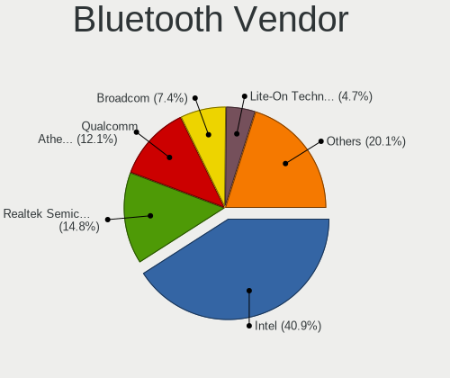

| Vendor                          | Notebooks | Percent |
|---------------------------------|-----------|---------|
| Intel                           | 28        | 37.84%  |
| Qualcomm Atheros Communications | 13        | 17.57%  |
| Realtek Semiconductor           | 12        | 16.22%  |
| Broadcom                        | 5         | 6.76%   |
| Apple                           | 5         | 6.76%   |
| Toshiba                         | 2         | 2.7%    |
| IMC Networks                    | 2         | 2.7%    |
| Cambridge Silicon Radio         | 2         | 2.7%    |
| Realtek                         | 1         | 1.35%   |
| Lite-On Technology              | 1         | 1.35%   |
| Hewlett-Packard                 | 1         | 1.35%   |
| Foxconn / Hon Hai               | 1         | 1.35%   |
| Dell                            | 1         | 1.35%   |

Bluetooth Model
---------------

Controller models

| Model                                               | Notebooks | Percent |
|-----------------------------------------------------|-----------|---------|
| Intel Bluetooth wireless interface                  | 15        | 20.27%  |
| Qualcomm Atheros  Bluetooth Device                  | 9         | 12.16%  |
| Realtek  Bluetooth 4.2 Adapter                      | 6         | 8.11%   |
| Realtek Bluetooth Radio                             | 6         | 8.11%   |
| Intel Bluetooth 9460/9560 Jefferson Peak (JfP)      | 6         | 8.11%   |
| Intel AX200 Bluetooth                               | 4         | 5.41%   |
| Apple Bluetooth Host Controller                     | 4         | 5.41%   |
| Broadcom BCM43142A0 Bluetooth 4.0                   | 3         | 4.05%   |
| Toshiba Bluetooth Device                            | 2         | 2.7%    |
| Qualcomm Atheros QCA61x4 Bluetooth 4.0              | 2         | 2.7%    |
| Intel Wireless-AC 3168 Bluetooth                    | 2         | 2.7%    |
| Cambridge Silicon Radio Bluetooth Dongle (HCI mode) | 2         | 2.7%    |
| Realtek Bluetooth Radio                             | 1         | 1.35%   |
| Qualcomm Atheros Bluetooth USB Host Controller      | 1         | 1.35%   |
| Qualcomm Atheros AR3011 Bluetooth                   | 1         | 1.35%   |
| Lite-On Bluetooth Device                            | 1         | 1.35%   |
| Intel Centrino Bluetooth Wireless Transceiver       | 1         | 1.35%   |
| IMC Networks Bluetooth Radio                        | 1         | 1.35%   |
| IMC Networks Bluetooth                              | 1         | 1.35%   |
| HP Broadcom 2070 Bluetooth Combo                    | 1         | 1.35%   |
| Foxconn / Hon Hai Bluetooth Device                  | 1         | 1.35%   |
| Dell Broadcom BCM20702A0 Bluetooth                  | 1         | 1.35%   |
| Broadcom HP Portable SoftSailing                    | 1         | 1.35%   |
| Broadcom BCM2070 Bluetooth 2.1 + EDR                | 1         | 1.35%   |
| Apple Bluetooth HCI                                 | 1         | 1.35%   |

Sound
-----

Sound Vendor
------------

Sound card vendors

| Vendor                 | Notebooks | Percent |
|------------------------|-----------|---------|
| Intel                  | 79        | 65.83%  |
| AMD                    | 21        | 17.5%   |
| Nvidia                 | 7         | 5.83%   |
| Generalplus Technology | 3         | 2.5%    |
| JMTek                  | 2         | 1.67%   |
| C-Media Electronics    | 2         | 1.67%   |
| Plantronics            | 1         | 0.83%   |
| Logitech               | 1         | 0.83%   |
| Lenovo                 | 1         | 0.83%   |
| GN Netcom              | 1         | 0.83%   |
| C&T                    | 1         | 0.83%   |
| Afatech                | 1         | 0.83%   |

Sound Model
-----------

Sound card models

| Model                                                                                             | Notebooks | Percent |
|---------------------------------------------------------------------------------------------------|-----------|---------|
| Intel 6 Series/C200 Series Chipset Family High Definition Audio Controller                        | 13        | 8.78%   |
| Intel Sunrise Point-LP HD Audio                                                                   | 11        | 7.43%   |
| Intel Haswell-ULT HD Audio Controller                                                             | 8         | 5.41%   |
| Intel 8 Series HD Audio Controller                                                                | 8         | 5.41%   |
| AMD Family 17h/19h HD Audio Controller                                                            | 8         | 5.41%   |
| Intel Cannon Point-LP High Definition Audio Controller                                            | 6         | 4.05%   |
| AMD Raven/Raven2/Fenghuang HDMI/DP Audio Controller                                               | 6         | 4.05%   |
| Intel Celeron/Pentium Silver Processor High Definition Audio                                      | 5         | 3.38%   |
| Intel Cannon Lake PCH cAVS                                                                        | 5         | 3.38%   |
| Intel 7 Series/C216 Chipset Family High Definition Audio Controller                               | 5         | 3.38%   |
| Intel Wildcat Point-LP High Definition Audio Controller                                           | 4         | 2.7%    |
| Intel Broadwell-U Audio Controller                                                                | 4         | 2.7%    |
| AMD Kabini HDMI/DP Audio                                                                          | 4         | 2.7%    |
| AMD FCH Azalia Controller                                                                         | 4         | 2.7%    |
| Intel Xeon E3-1200 v3/4th Gen Core Processor HD Audio Controller                                  | 3         | 2.03%   |
| Intel NM10/ICH7 Family High Definition Audio Controller                                           | 3         | 2.03%   |
| Intel Atom/Celeron/Pentium Processor x5-E8000/J3xxx/N3xxx Series High Definition Audio Controller | 3         | 2.03%   |
| Intel 8 Series/C220 Series Chipset High Definition Audio Controller                               | 3         | 2.03%   |
| Generalplus Technology IMYB 7.1 Channel                                                           | 3         | 2.03%   |
| AMD Family 15h (Models 60h-6fh) Audio Controller                                                  | 3         | 2.03%   |
| Nvidia TU116 High Definition Audio Controller                                                     | 2         | 1.35%   |
| Nvidia TU107 GeForce GTX 1650 High Definition Audio Controller                                    | 2         | 1.35%   |
| Intel Tiger Lake-LP Smart Sound Technology Audio Controller                                       | 2         | 1.35%   |
| Intel 82801I (ICH9 Family) HD Audio Controller                                                    | 2         | 1.35%   |
| Intel 82801H (ICH8 Family) HD Audio Controller                                                    | 2         | 1.35%   |
| Intel 5 Series/3400 Series Chipset High Definition Audio                                          | 2         | 1.35%   |
| AMD SBx00 Azalia (Intel HDA)                                                                      | 2         | 1.35%   |
| AMD Caicos HDMI Audio [Radeon HD 6450 / 7450/8450/8490 OEM / R5 230/235/235X OEM]                 | 2         | 1.35%   |
| Plantronics Blackwire 3225 Series                                                                 | 1         | 0.68%   |
| Nvidia GP107GL High Definition Audio Controller                                                   | 1         | 0.68%   |
| Nvidia GM107 High Definition Audio Controller [GeForce 940MX]                                     | 1         | 0.68%   |
| Nvidia GF116 High Definition Audio Controller                                                     | 1         | 0.68%   |
| Logitech Headset H390                                                                             | 1         | 0.68%   |
| Lenovo ThinkPad USB-C Dock Gen2 USB Audio                                                         | 1         | 0.68%   |
| JMTek USB PnP Audio Device                                                                        | 1         | 0.68%   |
| JMTek LCS USB Audio                                                                               | 1         | 0.68%   |
| Intel Ice Lake-LP Smart Sound Technology Audio Controller                                         | 1         | 0.68%   |
| Intel Comet Lake PCH-LP cAVS                                                                      | 1         | 0.68%   |
| Intel CM238 HD Audio Controller                                                                   | 1         | 0.68%   |
| Intel Atom Processor Z36xxx/Z37xxx Series High Definition Audio Controller                        | 1         | 0.68%   |
| Intel 100 Series/C230 Series Chipset Family HD Audio Controller                                   | 1         | 0.68%   |
| GN Netcom Jabra PRO 9460                                                                          | 1         | 0.68%   |
| C-Media Electronics Q9-1                                                                          | 1         | 0.68%   |
| C-Media Electronics Audio Adapter (Unitek Y-247A)                                                 | 1         | 0.68%   |
| C&T EarPods_TC01_K79                                                                              | 1         | 0.68%   |
| AMD Turks HDMI Audio [Radeon HD 6500/6600 / 6700M Series]                                         | 1         | 0.68%   |
| AMD Renoir Radeon High Definition Audio Controller                                                | 1         | 0.68%   |
| AMD Oland/Hainan/Cape Verde/Pitcairn HDMI Audio [Radeon HD 7000 Series]                           | 1         | 0.68%   |
| AMD High Definition Audio Controller                                                              | 1         | 0.68%   |
| AMD BeaverCreek HDMI Audio [Radeon HD 6500D and 6400G-6600G series]                               | 1         | 0.68%   |
| Afatech GAMDIAS USB Audio Device                                                                  | 1         | 0.68%   |

Memory
------

Memory Vendor
-------------

Memory module vendors

| Vendor              | Notebooks | Percent |
|---------------------|-----------|---------|
| Samsung Electronics | 23        | 34.85%  |
| SK hynix            | 10        | 15.15%  |
| Micron Technology   | 6         | 9.09%   |
| Kingston            | 5         | 7.58%   |
| Team                | 4         | 6.06%   |
| Nanya Technology    | 4         | 6.06%   |
| Corsair             | 4         | 6.06%   |
| Unknown             | 3         | 4.55%   |
| Crucial             | 3         | 4.55%   |
| A-DATA Technology   | 3         | 4.55%   |
| Patriot             | 1         | 1.52%   |

Memory Model
------------

Memory module models

| Model                                                       | Notebooks | Percent |
|-------------------------------------------------------------|-----------|---------|
| Team RAM TEAMGROUP-SD4-2666 32GB SODIMM DDR4 2667MT/s       | 4         | 5.13%   |
| Samsung RAM M471A5244CB0-CTD 4GB SODIMM DDR4 3266MT/s       | 3         | 3.85%   |
| Corsair RAM Module 8GB SODIMM DDR3 1333MT/s                 | 3         | 3.85%   |
| Corsair RAM Module 4GB SODIMM DDR3 1333MT/s                 | 3         | 3.85%   |
| SK hynix RAM HMT41GS6BFR8A-PB 8GB SODIMM DDR3 1600MT/s      | 2         | 2.56%   |
| SK hynix RAM HMA81GS6JJR8N-VK 8GB SODIMM DDR4 2667MT/s      | 2         | 2.56%   |
| Samsung RAM M471B5773DH0-CH9 2GB SODIMM DDR3 1600MT/s       | 2         | 2.56%   |
| Samsung RAM M471B5173QH0-YK0 4GB SODIMM DDR3 1600MT/s       | 2         | 2.56%   |
| Samsung RAM M471B5173EB0-YK0 4GB SODIMM DDR3 1600MT/s       | 2         | 2.56%   |
| Samsung RAM M471A5244CB0-CRC 4GB SODIMM DDR4 2667MT/s       | 2         | 2.56%   |
| Samsung RAM M471A1G44AB0-CWE 8192MB SODIMM DDR4 3200MT/s    | 2         | 2.56%   |
| Nanya RAM NT4GC64B8HB0NS-CG 4096MB SODIMM DDR3 1334MT/s     | 2         | 2.56%   |
| Micron RAM 4ATF51264HZ-2G6E1 4GB SODIMM DDR4 2667MT/s       | 2         | 2.56%   |
| Unknown RAM Module 8GB SODIMM DDR3 1333MT/s                 | 1         | 1.28%   |
| Unknown RAM Module 8GB SODIMM DDR3                          | 1         | 1.28%   |
| Unknown RAM Module 4GB SODIMM DDR3                          | 1         | 1.28%   |
| Unknown RAM Module 2048MB SODIMM DDR2 667MT/s               | 1         | 1.28%   |
| SK hynix RAM HMT451S6BFR8A-PB 4GB SODIMM DDR3 1600MT/s      | 1         | 1.28%   |
| SK hynix RAM HMT425S6CFR6A-PB 2048MB SODIMM DDR3 1600MT/s   | 1         | 1.28%   |
| SK hynix RAM HMT351S6CFR8C-PB 4GB SODIMM DDR3 1600MT/s      | 1         | 1.28%   |
| SK hynix RAM HMA851S6JJR6N-VK 4GB SODIMM DDR4 2667MT/s      | 1         | 1.28%   |
| SK hynix RAM HMA851S6AFR6N-UH 4GB SODIMM DDR4 2667MT/s      | 1         | 1.28%   |
| SK hynix RAM HMA82GS6JJR8N-VK 16GB SODIMM DDR4 2667MT/s     | 1         | 1.28%   |
| SK hynix RAM HMA82GS6AFR8N-UH 16GB SODIMM DDR4 2667MT/s     | 1         | 1.28%   |
| SK hynix RAM HMA451S6AFR8N-TF 4GB SODIMM DDR4 2133MT/s      | 1         | 1.28%   |
| Samsung RAM M471B5773CHS-CH9 2GB SODIMM DDR3 4199MT/s       | 1         | 1.28%   |
| Samsung RAM M471B5674-H0-YK0--- 4GB Chip DDR3 1600MT/s      | 1         | 1.28%   |
| Samsung RAM M471B5673FH0-CF8 2GB SODIMM DDR3 1067MT/s       | 1         | 1.28%   |
| Samsung RAM M471B5273EB0-CK0 4GB SODIMM DDR3 4199MT/s       | 1         | 1.28%   |
| Samsung RAM M471B5273DH0-CK0 4GB SODIMM DDR3 1600MT/s       | 1         | 1.28%   |
| Samsung RAM M471B5273DH0-CH9 4GB SODIMM DDR3 1334MT/s       | 1         | 1.28%   |
| Samsung RAM M471B5173DB0-YK0 4GB SODIMM DDR3 1600MT/s       | 1         | 1.28%   |
| Samsung RAM M471B1G73EB0-YK0 8GB SODIMM DDR3 1600MT/s       | 1         | 1.28%   |
| Samsung RAM M471A5244CB0-CTD 4GB Row Of Chips DDR4 2667MT/s | 1         | 1.28%   |
| Samsung RAM M471A5244BB0-CRC 8GB SODIMM DDR4 2667MT/s       | 1         | 1.28%   |
| Samsung RAM M471A5143EB0-CPB 4GB SODIMM DDR4 2133MT/s       | 1         | 1.28%   |
| Samsung RAM M471A2K43CB1-CTD 16GB SODIMM DDR4 2667MT/s      | 1         | 1.28%   |
| Samsung RAM M471A1K43DB1-CWE 8GB SODIMM DDR4 3200MT/s       | 1         | 1.28%   |
| Samsung RAM M471A1K43BB1-CRC 8GB SODIMM DDR4 2667MT/s       | 1         | 1.28%   |
| Patriot RAM PSD48G266681S 8GB SODIMM DDR4 2667MT/s          | 1         | 1.28%   |
| Nanya RAM NT4GC64B8HG0NS-DI 4GB SODIMM DDR3 1600MT/s        | 1         | 1.28%   |
| Nanya RAM NT2GC64B88B0NS-CG 2GB SODIMM DDR3 1334MT/s        | 1         | 1.28%   |
| Micron RAM M391A1G43BB1-CRCB1 16GB SODIMM DDR4 2667MT/s     | 1         | 1.28%   |
| Micron RAM 8KTF51264HZ-1G6N1 4GB SODIMM DDR3 1600MT/s       | 1         | 1.28%   |
| Micron RAM 8ATF1G64HZ-2G6H1 8GB SODIMM DDR4 2667MT/s        | 1         | 1.28%   |
| Micron RAM 16HTF25664HY-667E1 2048MB SODIMM DDR2 667MT/s    | 1         | 1.28%   |
| Kingston RAM MSI16D3LS1KBG/8G 8GB SODIMM DDR3 1600MT/s      | 1         | 1.28%   |
| Kingston RAM MSI16D3LS1KBG/4G 4GB SODIMM DDR3 1600MT/s      | 1         | 1.28%   |
| Kingston RAM Module 2GB SODIMM DDR2 667MT/s                 | 1         | 1.28%   |
| Kingston RAM LV32D4S2S8HD-8 8GB SODIMM DDR4 3200MT/s        | 1         | 1.28%   |
| Kingston RAM 99U5469-015.A00LF 2048MB SODIMM DDR3 1333MT/s  | 1         | 1.28%   |
| Kingston RAM 9905428-045.A00LF 4GB SODIMM DDR3 1333MT/s     | 1         | 1.28%   |
| Crucial RAM CT8G3S1339M.M16FP 8192MB SODIMM DDR3 1334MT/s   | 1         | 1.28%   |
| Crucial RAM CT16G4SFRA32A.M16FRS 16GB SODIMM DDR4 3200MT/s  | 1         | 1.28%   |
| Crucial RAM CT16G4SFD8213.C16FBD 16GB SODIMM DDR4 2133MT/s  | 1         | 1.28%   |
| Corsair RAM Module 8192MB SODIMM DDR3 1333MT/s              | 1         | 1.28%   |
| Corsair RAM Module 4096MB SODIMM DDR3 1333MT/s              | 1         | 1.28%   |
| A-DATA RAM Module 8GB SODIMM DDR4 2667MT/s                  | 1         | 1.28%   |
| A-DATA RAM Module 32GB SODIMM DDR4 2667MT/s                 | 1         | 1.28%   |
| A-DATA RAM Module 16GB Row Of Chips DDR4 2400MT/s           | 1         | 1.28%   |

Memory Kind
-----------

Memory module kinds

| Kind   | Notebooks | Percent |
|--------|-----------|---------|
| DDR4   | 26        | 46.43%  |
| DDR3   | 24        | 42.86%  |
| DDR2   | 3         | 5.36%   |
| SDRAM  | 2         | 3.57%   |
| LPDDR4 | 1         | 1.79%   |

Memory Form Factor
------------------

Physical design of the memory module

| Name         | Notebooks | Percent |
|--------------|-----------|---------|
| SODIMM       | 52        | 94.55%  |
| Row Of Chips | 2         | 3.64%   |
| Chip         | 1         | 1.82%   |

Memory Size
-----------

Memory module size

| Size  | Notebooks | Percent |
|-------|-----------|---------|
| 4096  | 29        | 42.65%  |
| 8192  | 20        | 29.41%  |
| 2048  | 8         | 11.76%  |
| 16384 | 6         | 8.82%   |
| 32768 | 5         | 7.35%   |

Memory Speed
------------

Memory module speed

| Speed   | Notebooks | Percent |
|---------|-----------|---------|
| 2667    | 20        | 30.77%  |
| 1600    | 15        | 23.08%  |
| 1333    | 7         | 10.77%  |
| 1334    | 5         | 7.69%   |
| 3200    | 4         | 6.15%   |
| 3266    | 3         | 4.62%   |
| 667     | 3         | 4.62%   |
| 4199    | 2         | 3.08%   |
| 2133    | 2         | 3.08%   |
| Unknown | 2         | 3.08%   |
| 2400    | 1         | 1.54%   |
| 1067    | 1         | 1.54%   |

Printers & scanners
-------------------

Printer Vendor
--------------

Printer device vendors

| Vendor      | Notebooks | Percent |
|-------------|-----------|---------|
| Seiko Epson | 2         | 100%    |

Printer Model
-------------

Printer device models

| Model                   | Notebooks | Percent |
|-------------------------|-----------|---------|
| Seiko Epson L380 Series | 1         | 50%     |
| Seiko Epson L222 Series | 1         | 50%     |

Scanner Vendor
--------------

Scanner device vendors

Zero info for selected period =(

Scanner Model
-------------

Scanner device models

Zero info for selected period =(

Camera
------

Camera Vendor
-------------

Camera device vendors

| Vendor                                 | Notebooks | Percent |
|----------------------------------------|-----------|---------|
| Chicony Electronics                    | 19        | 21.84%  |
| Microdia                               | 12        | 13.79%  |
| Realtek Semiconductor                  | 11        | 12.64%  |
| IMC Networks                           | 11        | 12.64%  |
| Apple                                  | 5         | 5.75%   |
| Sunplus Innovation Technology          | 4         | 4.6%    |
| Suyin                                  | 3         | 3.45%   |
| Quanta                                 | 2         | 2.3%    |
| Primax Electronics                     | 2         | 2.3%    |
| Lite-On Technology                     | 2         | 2.3%    |
| Cheng Uei Precision Industry (Foxlink) | 2         | 2.3%    |
| Alcor Micro                            | 2         | 2.3%    |
| Acer                                   | 2         | 2.3%    |
| Z-Star Microelectronics                | 1         | 1.15%   |
| Syntek                                 | 1         | 1.15%   |
| Microsoft                              | 1         | 1.15%   |
| Luxvisions Innotech Limited            | 1         | 1.15%   |
| Logitech                               | 1         | 1.15%   |
| LG Electronics                         | 1         | 1.15%   |
| Importek                               | 1         | 1.15%   |
| Creative Technology                    | 1         | 1.15%   |
| Alpha Imaging Technology               | 1         | 1.15%   |
| 8SSC20F27145V1SR1BX02P8                | 1         | 1.15%   |

Camera Model
------------

Camera device models

| Model                                                           | Notebooks | Percent |
|-----------------------------------------------------------------|-----------|---------|
| Microdia Integrated_Webcam_HD                                   | 8         | 8.99%   |
| IMC Networks Integrated Camera                                  | 4         | 4.49%   |
| Chicony Integrated Camera                                       | 4         | 4.49%   |
| Apple FaceTime HD Camera                                        | 4         | 4.49%   |
| Realtek Integrated_Webcam_HD                                    | 3         | 3.37%   |
| Sunplus HD WebCam                                               | 2         | 2.25%   |
| Realtek Integrated Webcam HD                                    | 2         | 2.25%   |
| Realtek Integrated Webcam                                       | 2         | 2.25%   |
| Microdia Integrated Webcam                                      | 2         | 2.25%   |
| IMC Networks USB2.0 VGA UVC WebCam                              | 2         | 2.25%   |
| IMC Networks USB2.0 HD UVC WebCam                               | 2         | 2.25%   |
| Chicony USB 2.0 Camera                                          | 2         | 2.25%   |
| Chicony TOSHIBA Web Camera - HD                                 | 2         | 2.25%   |
| Chicony Integrated HP HD Webcam                                 | 2         | 2.25%   |
| Chicony HP Truevision HD                                        | 2         | 2.25%   |
| Z-Star Vega USB2.0 Camera                                       | 1         | 1.12%   |
| Syntek EasyCamera                                               | 1         | 1.12%   |
| Suyin TOSHIBA Web Camera - HD                                   | 1         | 1.12%   |
| Suyin HP TrueVision HD                                          | 1         | 1.12%   |
| Suyin 1.3M HD WebCam                                            | 1         | 1.12%   |
| Sunplus Laptop_Integrated_Webcam_HD                             | 1         | 1.12%   |
| Sunplus HP HD Webcam [Fixed]                                    | 1         | 1.12%   |
| Realtek USB Camera                                              | 1         | 1.12%   |
| Realtek Rear Camera                                             | 1         | 1.12%   |
| Realtek HP Wide Vision FHD Camera                               | 1         | 1.12%   |
| Realtek HP Truevision HD                                        | 1         | 1.12%   |
| Realtek Front Camera                                            | 1         | 1.12%   |
| Quanta HP Webcam                                                | 1         | 1.12%   |
| Quanta HD Webcam                                                | 1         | 1.12%   |
| Primax webcam                                                   | 1         | 1.12%   |
| Primax HP HD Webcam [Fixed]                                     | 1         | 1.12%   |
| Microsoft LifeCam HD-3000                                       | 1         | 1.12%   |
| Microdia Laptop_Integrated_Webcam_HD                            | 1         | 1.12%   |
| Microdia Integrated Webcam HD                                   | 1         | 1.12%   |
| Microdia Integrated Camera                                      | 1         | 1.12%   |
| Luxvisions Innotech Limited HP TrueVision HD Camera             | 1         | 1.12%   |
| Logitech Webcam C925e                                           | 1         | 1.12%   |
| Lite-On Integrated Camera                                       | 1         | 1.12%   |
| Lite-On HP HD Webcam                                            | 1         | 1.12%   |
| LG LM-X420xxx/G2/G3 Android Phone (MTP/download mode)           | 1         | 1.12%   |
| Importek Laptop Integrated Webcam                               | 1         | 1.12%   |
| IMC Networks TOSHIBA Web Camera - HD                            | 1         | 1.12%   |
| IMC Networks ov9734_azurewave_camera                            | 1         | 1.12%   |
| IMC Networks Integrated Webcam                                  | 1         | 1.12%   |
| Creative VF0610 Live! Cam Socialize HD                          | 1         | 1.12%   |
| Chicony VGA 30fps UVC Webcam                                    | 1         | 1.12%   |
| Chicony HP TrueVision HD Camera                                 | 1         | 1.12%   |
| Chicony HP HD Webcam                                            | 1         | 1.12%   |
| Chicony HP HD Camera                                            | 1         | 1.12%   |
| Chicony HD User Facing                                          | 1         | 1.12%   |
| Chicony CKF8136                                                 | 1         | 1.12%   |
| Chicony 720p HD Camera                                          | 1         | 1.12%   |
| Cheng Uei Precision Industry (Foxlink) HP Wide Vision HD Camera | 1         | 1.12%   |
| Cheng Uei Precision Industry (Foxlink) HP Webcam                | 1         | 1.12%   |
| Apple Built-in iSight [Micron]                                  | 1         | 1.12%   |
| Alpha Imaging Integrated_Webcam_8M                              | 1         | 1.12%   |
| Alcor Micro TOSHIBA Web Camera - MP                             | 1         | 1.12%   |
| Alcor Micro HD WebCam                                           | 1         | 1.12%   |
| Acer ThinkPad P50 Integrated Camera                             | 1         | 1.12%   |
| Acer BisonCam,NB Pro                                            | 1         | 1.12%   |

Security
--------

Fingerprint Vendor
------------------

Fingerprint sensor vendors

| Vendor                     | Notebooks | Percent |
|----------------------------|-----------|---------|
| Validity Sensors           | 9         | 50%     |
| Synaptics                  | 3         | 16.67%  |
| Shenzhen Goodix Technology | 2         | 11.11%  |
| STMicroelectronics         | 1         | 5.56%   |
| LighTuning Technology      | 1         | 5.56%   |
| Elan Microelectronics      | 1         | 5.56%   |
| AuthenTec                  | 1         | 5.56%   |

Fingerprint Model
-----------------

Fingerprint sensor models

| Model                                             | Notebooks | Percent |
|---------------------------------------------------|-----------|---------|
| Validity Sensors VFS495 Fingerprint Reader        | 3         | 16.67%  |
| Validity Sensors VFS 5011 fingerprint sensor      | 2         | 11.11%  |
| Synaptics Prometheus MIS Touch Fingerprint Reader | 2         | 11.11%  |
| Shenzhen Goodix  Fingerprint Device               | 2         | 11.11%  |
| Validity Sensors VFS7500 Touch Fingerprint Sensor | 1         | 5.56%   |
| Validity Sensors VFS491                           | 1         | 5.56%   |
| Validity Sensors VFS471 Fingerprint Reader        | 1         | 5.56%   |
| Validity Sensors Fingerprint scanner              | 1         | 5.56%   |
| STMicroelectronics Fingerprint Reader             | 1         | 5.56%   |
| LighTuning EgisTec Touch Fingerprint Sensor       | 1         | 5.56%   |
| Elan ELAN:ARM-M4                                  | 1         | 5.56%   |
| AuthenTec AES1600                                 | 1         | 5.56%   |
| Unknown                                           | 1         | 5.56%   |

Chipcard Vendor
---------------

Chipcard module vendors

| Vendor                     | Notebooks | Percent |
|----------------------------|-----------|---------|
| Broadcom                   | 4         | 44.44%  |
| O2 Micro                   | 3         | 33.33%  |
| Athena Smartcard Solutions | 1         | 11.11%  |
| Alcor Micro                | 1         | 11.11%  |

Chipcard Model
--------------

Chipcard module models

| Model                                                                        | Notebooks | Percent |
|------------------------------------------------------------------------------|-----------|---------|
| O2 Micro OZ776 CCID Smartcard Reader                                         | 2         | 22.22%  |
| Broadcom 5880                                                                | 2         | 22.22%  |
| O2 Micro Oz776 SmartCard Reader                                              | 1         | 11.11%  |
| Broadcom BCM5880 Secure Applications Processor with fingerprint swipe sensor | 1         | 11.11%  |
| Broadcom 58200                                                               | 1         | 11.11%  |
| Athena Smartcard Solutions ASEDrive CCID                                     | 1         | 11.11%  |
| Alcor Micro AU9540 Smartcard Reader                                          | 1         | 11.11%  |

Unsupported
-----------

Unsupported Devices
-------------------

Total unsupported devices on board

| Total | Notebooks | Percent |
|-------|-----------|---------|
| 0     | 64        | 62.14%  |
| 1     | 34        | 33.01%  |
| 2     | 3         | 2.91%   |
| 3     | 2         | 1.94%   |

Unsupported Device Types
------------------------

Types of unsupported devices

| Type                  | Notebooks | Percent |
|-----------------------|-----------|---------|
| Fingerprint reader    | 17        | 36.96%  |
| Net/wireless          | 9         | 19.57%  |
| Graphics card         | 8         | 17.39%  |
| Chipcard              | 8         | 17.39%  |
| Multimedia controller | 2         | 4.35%   |
| Net/ethernet          | 1         | 2.17%   |
| Firewire controller   | 1         | 2.17%   |

