Linux in Croatia - Tested Hardware & Statistics
-----------------------------------------------

A project to collect tested hardware configurations for Linux in Croatia.

Anyone can contribute to this report by the [hw-probe](https://github.com/linuxhw/hw-probe) tool:

    sudo -E hw-probe -all -upload

Please contribute! Especially if your hardware is rare.

This is a report for all computer types. See also reports for [desktops](/Location/Croatia/Desktop/README.md) and [notebooks](/Location/Croatia/Notebook/README.md).

Contents
--------

* [ Test Cases ](#test-cases)

* [ System ](#system)
  - [ OS                       ](#os)
  - [ OS Family                ](#os-family)
  - [ Kernel                   ](#kernel)
  - [ Kernel Family            ](#kernel-family)
  - [ Kernel Major Ver.        ](#kernel-major-ver)
  - [ Arch                     ](#arch)
  - [ DE                       ](#de)
  - [ Display Server           ](#display-server)
  - [ Display Manager          ](#display-manager)
  - [ OS Lang                  ](#os-lang)
  - [ Boot Mode                ](#boot-mode)
  - [ Filesystem               ](#filesystem)
  - [ Part. scheme             ](#part-scheme)
  - [ Dual Boot with Linux/BSD ](#dual-boot-with-linuxbsd)
  - [ Dual Boot (Win)          ](#dual-boot-win)

* [ Board ](#board)
  - [ Vendor                   ](#vendor)
  - [ Model                    ](#model)
  - [ Model Family             ](#model-family)
  - [ MFG Year                 ](#mfg-year)
  - [ Form Factor              ](#form-factor)
  - [ Secure Boot              ](#secure-boot)
  - [ Coreboot                 ](#coreboot)
  - [ RAM Size                 ](#ram-size)
  - [ RAM Used                 ](#ram-used)
  - [ Total Drives             ](#total-drives)
  - [ Has CD-ROM               ](#has-cd-rom)
  - [ Has Ethernet             ](#has-ethernet)
  - [ Has WiFi                 ](#has-wifi)
  - [ Has Bluetooth            ](#has-bluetooth)

* [ Location ](#location)
  - [ Country                  ](#country)
  - [ City                     ](#city)

* [ Drives ](#drives)
  - [ Drive Vendor             ](#drive-vendor)
  - [ Drive Model              ](#drive-model)
  - [ HDD Vendor               ](#hdd-vendor)
  - [ SSD Vendor               ](#ssd-vendor)
  - [ Drive Kind               ](#drive-kind)
  - [ Drive Connector          ](#drive-connector)
  - [ Drive Size               ](#drive-size)
  - [ Space Total              ](#space-total)
  - [ Space Used               ](#space-used)
  - [ Malfunc. Drives          ](#malfunc-drives)
  - [ Malfunc. Drive Vendor    ](#malfunc-drive-vendor)
  - [ Malfunc. HDD Vendor      ](#malfunc-hdd-vendor)
  - [ Malfunc. Drive Kind      ](#malfunc-drive-kind)
  - [ Failed Drives            ](#failed-drives)
  - [ Failed Drive Vendor      ](#failed-drive-vendor)
  - [ Drive Status             ](#drive-status)

* [ Storage controller ](#storage-controller)
  - [ Storage Vendor           ](#storage-vendor)
  - [ Storage Model            ](#storage-model)
  - [ Storage Kind             ](#storage-kind)

* [ Processor ](#processor)
  - [ CPU Vendor               ](#cpu-vendor)
  - [ CPU Model                ](#cpu-model)
  - [ CPU Model Family         ](#cpu-model-family)
  - [ CPU Cores                ](#cpu-cores)
  - [ CPU Sockets              ](#cpu-sockets)
  - [ CPU Threads              ](#cpu-threads)
  - [ CPU Op-Modes             ](#cpu-op-modes)
  - [ CPU Microcode            ](#cpu-microcode)
  - [ CPU Microarch            ](#cpu-microarch)

* [ Graphics ](#graphics)
  - [ GPU Vendor               ](#gpu-vendor)
  - [ GPU Model                ](#gpu-model)
  - [ GPU Combo                ](#gpu-combo)
  - [ GPU Driver               ](#gpu-driver)
  - [ GPU Memory               ](#gpu-memory)

* [ Monitor ](#monitor)
  - [ Monitor Vendor           ](#monitor-vendor)
  - [ Monitor Model            ](#monitor-model)
  - [ Monitor Resolution       ](#monitor-resolution)
  - [ Monitor Diagonal         ](#monitor-diagonal)
  - [ Monitor Width            ](#monitor-width)
  - [ Aspect Ratio             ](#aspect-ratio)
  - [ Monitor Area             ](#monitor-area)
  - [ Pixel Density            ](#pixel-density)
  - [ Multiple Monitors        ](#multiple-monitors)

* [ Network ](#network)
  - [ Net Controller Vendor    ](#net-controller-vendor)
  - [ Net Controller Model     ](#net-controller-model)
  - [ Wireless Vendor          ](#wireless-vendor)
  - [ Wireless Model           ](#wireless-model)
  - [ Ethernet Vendor          ](#ethernet-vendor)
  - [ Ethernet Model           ](#ethernet-model)
  - [ Net Controller Kind      ](#net-controller-kind)
  - [ Used Controller          ](#used-controller)
  - [ NICs                     ](#nics)
  - [ IPv6                     ](#ipv6)

* [ Bluetooth ](#bluetooth)
  - [ Bluetooth Vendor         ](#bluetooth-vendor)
  - [ Bluetooth Model          ](#bluetooth-model)

* [ Sound ](#sound)
  - [ Sound Vendor             ](#sound-vendor)
  - [ Sound Model              ](#sound-model)

* [ Memory ](#memory)
  - [ Memory Vendor            ](#memory-vendor)
  - [ Memory Model             ](#memory-model)
  - [ Memory Kind              ](#memory-kind)
  - [ Memory Form Factor       ](#memory-form-factor)
  - [ Memory Size              ](#memory-size)
  - [ Memory Speed             ](#memory-speed)

* [ Printers & scanners ](#printers--scanners)
  - [ Printer Vendor           ](#printer-vendor)
  - [ Printer Model            ](#printer-model)
  - [ Scanner Vendor           ](#scanner-vendor)
  - [ Scanner Model            ](#scanner-model)

* [ Camera ](#camera)
  - [ Camera Vendor            ](#camera-vendor)
  - [ Camera Model             ](#camera-model)

* [ Security ](#security)
  - [ Fingerprint Vendor       ](#fingerprint-vendor)
  - [ Fingerprint Model        ](#fingerprint-model)
  - [ Chipcard Vendor          ](#chipcard-vendor)
  - [ Chipcard Model           ](#chipcard-model)

* [ Unsupported ](#unsupported)
  - [ Unsupported Devices      ](#unsupported-devices)
  - [ Unsupported Device Types ](#unsupported-device-types)

Test Cases
----------

Total: 719

| Vendor        | Model                       | Form-Factor | Probe                                                      | Date         |
|---------------|-----------------------------|-------------|------------------------------------------------------------|--------------|
| Apple         | MacBookAir5,2               | Notebook    | [18e80281cc](https://linux-hardware.org/?probe=18e80281cc) | Jun 10, 2023 |
| Apple         | MacBookAir5,2               | Notebook    | [f7bd03dbb9](https://linux-hardware.org/?probe=f7bd03dbb9) | Jun 10, 2023 |
| ASUSTek       | VivoBook_ASUSLaptop M350... | Notebook    | [bf403bb6d8](https://linux-hardware.org/?probe=bf403bb6d8) | Jun 06, 2023 |
| Lenovo        | ThinkPad T15 Gen 2i 20W4... | Notebook    | [2667cb67a3](https://linux-hardware.org/?probe=2667cb67a3) | May 30, 2023 |
| Lenovo        | ThinkPad T15 Gen 2i 20W4... | Notebook    | [0568aa067a](https://linux-hardware.org/?probe=0568aa067a) | May 30, 2023 |
| Lenovo        | ThinkPad E15 Gen 4 21E60... | Notebook    | [c8e0efc288](https://linux-hardware.org/?probe=c8e0efc288) | May 29, 2023 |
| Lenovo        | ThinkPad E15 Gen 4 21E60... | Notebook    | [da399dc7cc](https://linux-hardware.org/?probe=da399dc7cc) | May 29, 2023 |
| Gigabyte      | B450 AORUS ELITE            | Desktop     | [2a36e1c1d5](https://linux-hardware.org/?probe=2a36e1c1d5) | May 26, 2023 |
| Lenovo        | ThinkPad X1 Carbon 6th 2... | Notebook    | [72f5c85f7f](https://linux-hardware.org/?probe=72f5c85f7f) | May 26, 2023 |
| Lenovo        | IdeaPad 3 15ALC6 82KU       | Notebook    | [913f21a49c](https://linux-hardware.org/?probe=913f21a49c) | May 25, 2023 |
| Acer          | Aspire A515-57              | Notebook    | [3272ba5e49](https://linux-hardware.org/?probe=3272ba5e49) | May 19, 2023 |
| Tactus        | GeoBook 140                 | Notebook    | [534c32884a](https://linux-hardware.org/?probe=534c32884a) | May 19, 2023 |
| Schenker      | VISION (E22)                | Notebook    | [582ac3cbf5](https://linux-hardware.org/?probe=582ac3cbf5) | May 13, 2023 |
| Acer          | Aspire E5-553G              | Notebook    | [cd65f81693](https://linux-hardware.org/?probe=cd65f81693) | May 11, 2023 |
| MSI           | PRO Z690-A DDR4             | Desktop     | [45c02c8b1b](https://linux-hardware.org/?probe=45c02c8b1b) | May 11, 2023 |
| Acer          | Aspire A315-23              | Notebook    | [2c96614c16](https://linux-hardware.org/?probe=2c96614c16) | May 11, 2023 |
| Acer          | Aspire E5-553G              | Notebook    | [5312325c90](https://linux-hardware.org/?probe=5312325c90) | May 10, 2023 |
| Lenovo        | ThinkPad T530 2394CE2       | Notebook    | [d232fefed2](https://linux-hardware.org/?probe=d232fefed2) | May 09, 2023 |
| HPE           | ProLiant ML30 Gen10 Plus    | Desktop     | [3a75fa5c03](https://linux-hardware.org/?probe=3a75fa5c03) | May 07, 2023 |
| Acer          | Predator PH315-53           | Notebook    | [efb597952f](https://linux-hardware.org/?probe=efb597952f) | May 07, 2023 |
| HP            | EliteBook 845 G8 Noteboo... | Notebook    | [1c98821416](https://linux-hardware.org/?probe=1c98821416) | May 03, 2023 |
| Acer          | TravelMate 5730             | Notebook    | [e74d115d0d](https://linux-hardware.org/?probe=e74d115d0d) | Apr 29, 2023 |
| ASUSTek       | Zenbook UM5302TA_UM5302T... | Notebook    | [5cb9fe1ae9](https://linux-hardware.org/?probe=5cb9fe1ae9) | Apr 28, 2023 |
| ASUSTek       | Zenbook UM5302TA_UM5302T... | Notebook    | [3669ef1de9](https://linux-hardware.org/?probe=3669ef1de9) | Apr 28, 2023 |
| Lenovo        | 3000 N200 0769A97           | Notebook    | [a293f4f1f7](https://linux-hardware.org/?probe=a293f4f1f7) | Apr 26, 2023 |
| TUXEDO        | Pulse 15 Gen1               | Notebook    | [0db2c54b2a](https://linux-hardware.org/?probe=0db2c54b2a) | Apr 24, 2023 |
| ASUSTek       | GRYPHON Z87                 | Desktop     | [045a79a6e4](https://linux-hardware.org/?probe=045a79a6e4) | Apr 18, 2023 |
| Lenovo        | 30C0 SDK0J40705 WIN 3425... | Desktop     | [490a059818](https://linux-hardware.org/?probe=490a059818) | Apr 13, 2023 |
| HP            | EliteBook 845 G8 Noteboo... | Notebook    | [b3c9b78fec](https://linux-hardware.org/?probe=b3c9b78fec) | Apr 13, 2023 |
| HP            | Pavilion Gaming Laptop 1... | Notebook    | [bba5f185af](https://linux-hardware.org/?probe=bba5f185af) | Apr 13, 2023 |
| Lenovo        | ThinkPad T530 2394BF7       | Notebook    | [5161d2f521](https://linux-hardware.org/?probe=5161d2f521) | Apr 11, 2023 |
| Acer          | Nitro AN515-55              | Notebook    | [64f96c6fde](https://linux-hardware.org/?probe=64f96c6fde) | Apr 07, 2023 |
| Lenovo        | V15-ADA 82C7                | Notebook    | [917714b1be](https://linux-hardware.org/?probe=917714b1be) | Apr 06, 2023 |
| Lenovo        | V15-ADA 82C7                | Notebook    | [ad148ede52](https://linux-hardware.org/?probe=ad148ede52) | Apr 06, 2023 |
| ASUSTek       | PRIME B560M-A               | Desktop     | [171e39cdb6](https://linux-hardware.org/?probe=171e39cdb6) | Apr 05, 2023 |
| Dell          | Latitude 5530               | Notebook    | [802248e232](https://linux-hardware.org/?probe=802248e232) | Apr 03, 2023 |
| Intel         | NUC11PABi3 M68269-400       | Mini pc     | [7c7fdc5950](https://linux-hardware.org/?probe=7c7fdc5950) | Apr 02, 2023 |
| Dell          | Latitude 5530               | Notebook    | [e4688e2ef8](https://linux-hardware.org/?probe=e4688e2ef8) | Apr 01, 2023 |
| HP            | 82DC 1100                   | All in one  | [4c1c2f908b](https://linux-hardware.org/?probe=4c1c2f908b) | Mar 30, 2023 |
| ASUSTek       | N551JM                      | Notebook    | [b8e3d627b5](https://linux-hardware.org/?probe=b8e3d627b5) | Mar 27, 2023 |
| Fujitsu Si... | AMILO Pro Edition V3505     | Notebook    | [2b0f3e8867](https://linux-hardware.org/?probe=2b0f3e8867) | Mar 25, 2023 |
| Fujitsu Si... | AMILO Pro Edition V3505     | Notebook    | [8bb2484825](https://linux-hardware.org/?probe=8bb2484825) | Mar 25, 2023 |
| MSI           | B450M PRO-M2 MAX            | Desktop     | [bdfe7a3498](https://linux-hardware.org/?probe=bdfe7a3498) | Mar 21, 2023 |
| Lenovo        | ThinkPad T14 Gen 2a 20XL... | Notebook    | [4c7add7cd1](https://linux-hardware.org/?probe=4c7add7cd1) | Mar 21, 2023 |
| Tactus        | GeoBook 140                 | Notebook    | [5efd6f0674](https://linux-hardware.org/?probe=5efd6f0674) | Mar 20, 2023 |
| Lenovo        | IdeaPad 5 Pro 16ARH7 82S... | Notebook    | [55dc5e3ef4](https://linux-hardware.org/?probe=55dc5e3ef4) | Mar 19, 2023 |
| Supermicro    | X8DTU                       | Server      | [6012de6351](https://linux-hardware.org/?probe=6012de6351) | Mar 10, 2023 |
| ASUSTek       | H110M-R                     | Desktop     | [2409dc15b4](https://linux-hardware.org/?probe=2409dc15b4) | Mar 10, 2023 |
| HP            | EliteBook 8730w             | Notebook    | [a012fe4bd2](https://linux-hardware.org/?probe=a012fe4bd2) | Mar 10, 2023 |
| ASUSTek       | ASUS TUF Gaming F15 FX50... | Notebook    | [b349a8eedd](https://linux-hardware.org/?probe=b349a8eedd) | Mar 08, 2023 |
| Lenovo        | IdeaPad Gaming 3 15ARH05... | Notebook    | [314cad4a2f](https://linux-hardware.org/?probe=314cad4a2f) | Mar 07, 2023 |
| ASRock        | H97 Pro4                    | Desktop     | [9ef8ff0b68](https://linux-hardware.org/?probe=9ef8ff0b68) | Mar 06, 2023 |
| Dell          | 00V62H A01                  | Desktop     | [dda13d9c8e](https://linux-hardware.org/?probe=dda13d9c8e) | Mar 05, 2023 |
| HP            | EliteBook 840 G5            | Notebook    | [8e02418ca7](https://linux-hardware.org/?probe=8e02418ca7) | Mar 05, 2023 |
| HP            | EliteBook 840 G5            | Notebook    | [5510fed545](https://linux-hardware.org/?probe=5510fed545) | Mar 04, 2023 |
| Acer          | Swift SF314-43              | Notebook    | [4f2c05c854](https://linux-hardware.org/?probe=4f2c05c854) | Feb 28, 2023 |
| Valve         | Jupiter                     | Notebook    | [e2f06dcb4a](https://linux-hardware.org/?probe=e2f06dcb4a) | Feb 24, 2023 |
| Dell          | System XPS L702X            | Notebook    | [81f9738975](https://linux-hardware.org/?probe=81f9738975) | Feb 16, 2023 |
| Unknown       | Apple MacBook Pro (13-in... | Notebook    | [1d5a0bc43f](https://linux-hardware.org/?probe=1d5a0bc43f) | Feb 14, 2023 |
| Lenovo        | ThinkPad T540p 20BFA183A... | Notebook    | [2705e3d0c5](https://linux-hardware.org/?probe=2705e3d0c5) | Feb 12, 2023 |
| MSI           | PRO Z690-A DDR4             | Desktop     | [caca2e6be1](https://linux-hardware.org/?probe=caca2e6be1) | Feb 11, 2023 |
| Acer          | Nitro AN515-55              | Notebook    | [b4b0bee06c](https://linux-hardware.org/?probe=b4b0bee06c) | Feb 08, 2023 |
| Raspberry ... | Raspberry Pi 4 Model B R... | Soc         | [e574477cb6](https://linux-hardware.org/?probe=e574477cb6) | Feb 07, 2023 |
| MSI           | 0A90                        | Desktop     | [9210981559](https://linux-hardware.org/?probe=9210981559) | Feb 06, 2023 |
| MSI           | 0A90                        | Desktop     | [aedd414dbf](https://linux-hardware.org/?probe=aedd414dbf) | Feb 06, 2023 |
| MSI           | PRO Z690-A DDR4             | Desktop     | [5a7a0cf485](https://linux-hardware.org/?probe=5a7a0cf485) | Feb 03, 2023 |
| Lenovo        | V15 G2 ALC 82KD             | Notebook    | [9f76193ccc](https://linux-hardware.org/?probe=9f76193ccc) | Jan 29, 2023 |
| HP            | EliteBook 855 G7 Noteboo... | Notebook    | [34882391f3](https://linux-hardware.org/?probe=34882391f3) | Jan 25, 2023 |
| HP            | Laptop 15-bs1xx             | Notebook    | [76689345ef](https://linux-hardware.org/?probe=76689345ef) | Jan 19, 2023 |
| Toshiba       | Satellite P200              | Notebook    | [478f5dc5cb](https://linux-hardware.org/?probe=478f5dc5cb) | Jan 18, 2023 |
| HP            | Laptop 15s-eq2xxx           | Notebook    | [29ff669f2c](https://linux-hardware.org/?probe=29ff669f2c) | Jan 14, 2023 |
| ASUSTek       | PRIME B560M-A               | Desktop     | [2b04043ef0](https://linux-hardware.org/?probe=2b04043ef0) | Jan 10, 2023 |
| ASUSTek       | VivoBook 15_ASUS Laptop ... | Notebook    | [ef10fbe492](https://linux-hardware.org/?probe=ef10fbe492) | Jan 09, 2023 |
| Dell          | Inspiron 15-3567            | Notebook    | [5aaaf24b85](https://linux-hardware.org/?probe=5aaaf24b85) | Jan 09, 2023 |
| Samsung       | SBB-DA                      | Notebook    | [a4c6b4f454](https://linux-hardware.org/?probe=a4c6b4f454) | Jan 07, 2023 |
| Acer          | Nitro AN515-55              | Notebook    | [800f20e309](https://linux-hardware.org/?probe=800f20e309) | Jan 07, 2023 |
| Lenovo        | MIIX 320-10ICR 80XF         | Tablet      | [066ab1d6a3](https://linux-hardware.org/?probe=066ab1d6a3) | Jan 04, 2023 |
| ASUSTek       | N551JM                      | Notebook    | [f6de50a76b](https://linux-hardware.org/?probe=f6de50a76b) | Jan 04, 2023 |
| HP            | OMEN by Laptop              | Notebook    | [e703dd0215](https://linux-hardware.org/?probe=e703dd0215) | Jan 04, 2023 |
| ASUSTek       | N551JM                      | Notebook    | [3ba1d0e689](https://linux-hardware.org/?probe=3ba1d0e689) | Jan 03, 2023 |
| Raspberry ... | Raspberry Pi 400 Rev 1.0    | Soc         | [d88df3fcee](https://linux-hardware.org/?probe=d88df3fcee) | Jan 01, 2023 |
| Acer          | Aspire A715-41G             | Notebook    | [92f3c92191](https://linux-hardware.org/?probe=92f3c92191) | Dec 29, 2022 |
| Acer          | Swift SF314-41              | Notebook    | [2923c4c0fc](https://linux-hardware.org/?probe=2923c4c0fc) | Dec 28, 2022 |
| Dell          | Inspiron N5110              | Notebook    | [9b8756cdd0](https://linux-hardware.org/?probe=9b8756cdd0) | Dec 17, 2022 |
| ASUSTek       | ZenBook UX425UAZ_UM425UA... | Notebook    | [b2b93008c3](https://linux-hardware.org/?probe=b2b93008c3) | Dec 17, 2022 |
| ASRock        | B550M Steel Legend          | Desktop     | [516d6f7f12](https://linux-hardware.org/?probe=516d6f7f12) | Dec 14, 2022 |
| HP            | Laptop 15-db1xxx            | Notebook    | [3dcbd61f9e](https://linux-hardware.org/?probe=3dcbd61f9e) | Dec 12, 2022 |
| Lenovo        | HASWELLREFRESHDT 3190005... | All in one  | [b73060ce38](https://linux-hardware.org/?probe=b73060ce38) | Dec 10, 2022 |
| ASUSTek       | ROG STRIX X670E-F GAMING... | Desktop     | [15d7102174](https://linux-hardware.org/?probe=15d7102174) | Dec 08, 2022 |
| ASUSTek       | ROG STRIX X670E-F GAMING... | Desktop     | [52525a1058](https://linux-hardware.org/?probe=52525a1058) | Dec 08, 2022 |
| Dell          | Inspiron N5110              | Notebook    | [9815b67f0b](https://linux-hardware.org/?probe=9815b67f0b) | Dec 06, 2022 |
| Lenovo        | Legion Y540-15IRH-PG0 81... | Notebook    | [d632edc927](https://linux-hardware.org/?probe=d632edc927) | Dec 05, 2022 |
| Lenovo        | Legion Y540-15IRH-PG0 81... | Notebook    | [412bffea3b](https://linux-hardware.org/?probe=412bffea3b) | Dec 05, 2022 |
| ASRock        | K10N78D                     | Desktop     | [b5e2e7a024](https://linux-hardware.org/?probe=b5e2e7a024) | Dec 02, 2022 |
| ASRock        | B550M-ITX/ac                | Desktop     | [31f70fbb3e](https://linux-hardware.org/?probe=31f70fbb3e) | Nov 27, 2022 |
| Intel         | NUC5i5MYBE H47797-202       | Mini pc     | [e904ef7a24](https://linux-hardware.org/?probe=e904ef7a24) | Nov 26, 2022 |
| ASUSTek       | X550LB                      | Notebook    | [466592b744](https://linux-hardware.org/?probe=466592b744) | Nov 20, 2022 |
| ASUSTek       | X550LB                      | Notebook    | [3ca5ee2f7a](https://linux-hardware.org/?probe=3ca5ee2f7a) | Nov 20, 2022 |
| Apple         | MacBookPro12,1              | Notebook    | [9e16721568](https://linux-hardware.org/?probe=9e16721568) | Nov 17, 2022 |
| HP            | 1998                        | Desktop     | [f9746a4ae0](https://linux-hardware.org/?probe=f9746a4ae0) | Nov 15, 2022 |
| HP            | EliteBook 855 G7 Noteboo... | Notebook    | [311c90573c](https://linux-hardware.org/?probe=311c90573c) | Nov 12, 2022 |
| HP            | EliteBook 855 G7 Noteboo... | Notebook    | [1198a061e1](https://linux-hardware.org/?probe=1198a061e1) | Nov 12, 2022 |
| HP            | EliteBook 855 G7 Noteboo... | Notebook    | [de85ac10f6](https://linux-hardware.org/?probe=de85ac10f6) | Nov 09, 2022 |
| ASUSTek       | Zenbook UX5401EA_UX5401E... | Notebook    | [84bf8d9578](https://linux-hardware.org/?probe=84bf8d9578) | Nov 05, 2022 |
| Intel         | NUC5i5MYBE H47797-202       | Mini pc     | [01381d41de](https://linux-hardware.org/?probe=01381d41de) | Nov 03, 2022 |
| ASUSTek       | PRIME H410M-A               | Desktop     | [b3cac9f8b8](https://linux-hardware.org/?probe=b3cac9f8b8) | Nov 02, 2022 |
| Intel         | NUC5i5MYBE H47797-202       | Mini pc     | [41a93c4dfa](https://linux-hardware.org/?probe=41a93c4dfa) | Nov 02, 2022 |
| Lenovo        | Legion 5 15ARH05 82B5       | Notebook    | [9b61195a2a](https://linux-hardware.org/?probe=9b61195a2a) | Nov 01, 2022 |
| ASUSTek       | PRIME B560M-A               | Desktop     | [499932f589](https://linux-hardware.org/?probe=499932f589) | Nov 01, 2022 |
| Dell          | Studio 1735                 | Notebook    | [8f070a2831](https://linux-hardware.org/?probe=8f070a2831) | Oct 30, 2022 |
| Pretech       | EVE 1801 3G ES1049EG        | Notebook    | [24b035a7a4](https://linux-hardware.org/?probe=24b035a7a4) | Oct 25, 2022 |
| Dell          | Studio 1735                 | Notebook    | [21959a7db7](https://linux-hardware.org/?probe=21959a7db7) | Oct 24, 2022 |
| ASUSTek       | K53U                        | Notebook    | [d178c463df](https://linux-hardware.org/?probe=d178c463df) | Oct 24, 2022 |
| Dell          | Studio 1735                 | Notebook    | [4385640990](https://linux-hardware.org/?probe=4385640990) | Oct 23, 2022 |
| Lenovo        | Legion 5 Pro 16IAH7H 82R... | Notebook    | [eaecfdf473](https://linux-hardware.org/?probe=eaecfdf473) | Oct 21, 2022 |
| Lenovo        | Legion 5 Pro 16IAH7H 82R... | Notebook    | [c044987599](https://linux-hardware.org/?probe=c044987599) | Oct 20, 2022 |
| Acer          | Swift SF314-54              | Notebook    | [04fed978ae](https://linux-hardware.org/?probe=04fed978ae) | Oct 18, 2022 |
| Lenovo        | ThinkPad T470s 20HGS1R90... | Notebook    | [e3eba59f05](https://linux-hardware.org/?probe=e3eba59f05) | Oct 17, 2022 |
| ASUSTek       | PRIME B560M-A               | Desktop     | [c6f57791dc](https://linux-hardware.org/?probe=c6f57791dc) | Oct 12, 2022 |
| Acer          | Aspire A317-53              | Notebook    | [dadf436fd1](https://linux-hardware.org/?probe=dadf436fd1) | Oct 10, 2022 |
| HP            | EliteBook 8730w             | Notebook    | [e7545a94b2](https://linux-hardware.org/?probe=e7545a94b2) | Oct 09, 2022 |
| HP            | EliteBook 8730w             | Notebook    | [b938a96086](https://linux-hardware.org/?probe=b938a96086) | Oct 09, 2022 |
| ASUSTek       | M5A78L LE                   | Desktop     | [69023fe30e](https://linux-hardware.org/?probe=69023fe30e) | Oct 09, 2022 |
| MSI           | PRO Z690-A DDR4             | Desktop     | [2a1088b211](https://linux-hardware.org/?probe=2a1088b211) | Oct 08, 2022 |
| Pretech       | EVE 1801 3G ES1049EG        | Notebook    | [3f2cdff8d4](https://linux-hardware.org/?probe=3f2cdff8d4) | Oct 05, 2022 |
| Toshiba       | Encore                      | Notebook    | [a11bf538ec](https://linux-hardware.org/?probe=a11bf538ec) | Oct 05, 2022 |
| Lenovo        | 0x30F617AA NOK              | Desktop     | [bb13b87bd5](https://linux-hardware.org/?probe=bb13b87bd5) | Oct 01, 2022 |
| ASRock        | A320M-DVS R4.0              | Desktop     | [0dca3e500c](https://linux-hardware.org/?probe=0dca3e500c) | Sep 22, 2022 |
| ASUSTek       | N56VZ                       | Notebook    | [ce162c52c0](https://linux-hardware.org/?probe=ce162c52c0) | Sep 19, 2022 |
| HP            | EliteBook 8560p             | Notebook    | [4a9e29fab2](https://linux-hardware.org/?probe=4a9e29fab2) | Sep 18, 2022 |
| Lenovo        | Unknown                     | Notebook    | [64dc493d4d](https://linux-hardware.org/?probe=64dc493d4d) | Sep 17, 2022 |
| Lenovo        | Unknown                     | Notebook    | [581356206a](https://linux-hardware.org/?probe=581356206a) | Sep 17, 2022 |
| Dell          | Latitude 5420               | Notebook    | [511ef8a105](https://linux-hardware.org/?probe=511ef8a105) | Sep 08, 2022 |
| Dell          | Latitude 5420               | Notebook    | [48db2c3954](https://linux-hardware.org/?probe=48db2c3954) | Sep 08, 2022 |
| Toshiba       | Satellite P200              | Notebook    | [583489891f](https://linux-hardware.org/?probe=583489891f) | Sep 06, 2022 |
| HP            | Pavilion dv9700             | Notebook    | [9543920c45](https://linux-hardware.org/?probe=9543920c45) | Sep 04, 2022 |
| HP            | Pavilion dv9700             | Notebook    | [b6d4d6bca2](https://linux-hardware.org/?probe=b6d4d6bca2) | Sep 04, 2022 |
| Acer          | Swift SF314-41              | Notebook    | [1394aca8b2](https://linux-hardware.org/?probe=1394aca8b2) | Sep 03, 2022 |
| ASUSTek       | Z97-PRO                     | Desktop     | [60865c8ded](https://linux-hardware.org/?probe=60865c8ded) | Sep 02, 2022 |
| HP            | Pavilion Notebook           | Notebook    | [0e4eab04c0](https://linux-hardware.org/?probe=0e4eab04c0) | Aug 27, 2022 |
| HP            | Pavilion Notebook           | Notebook    | [65e832cb2f](https://linux-hardware.org/?probe=65e832cb2f) | Aug 27, 2022 |
| Dell          | Latitude 5290 2-in-1        | Notebook    | [bafc4d3392](https://linux-hardware.org/?probe=bafc4d3392) | Aug 20, 2022 |
| Dell          | Latitude E7240              | Notebook    | [1f20b0f54b](https://linux-hardware.org/?probe=1f20b0f54b) | Aug 08, 2022 |
| Gigabyte      | A320M-S2H-CF                | Desktop     | [5ddb15f201](https://linux-hardware.org/?probe=5ddb15f201) | Aug 07, 2022 |
| Acer          | Aspire A515-56G             | Notebook    | [3df2b6b19b](https://linux-hardware.org/?probe=3df2b6b19b) | Aug 05, 2022 |
| HP            | 1825                        | Desktop     | [4a21a02ae4](https://linux-hardware.org/?probe=4a21a02ae4) | Jul 29, 2022 |
| Gigabyte      | Z390 AORUS PRO-CF           | Desktop     | [3c665fb25f](https://linux-hardware.org/?probe=3c665fb25f) | Jul 28, 2022 |
| ASUSTek       | S551LB                      | Notebook    | [8660a06086](https://linux-hardware.org/?probe=8660a06086) | Jul 27, 2022 |
| Lenovo        | ThinkPad T580 20LAS27000    | Notebook    | [a78a8e806f](https://linux-hardware.org/?probe=a78a8e806f) | Jul 21, 2022 |
| Dell          | XPS 15 9500                 | Notebook    | [6886cd26f5](https://linux-hardware.org/?probe=6886cd26f5) | Jul 20, 2022 |
| Gigabyte      | Z97-D3H-CF                  | Desktop     | [55f956b817](https://linux-hardware.org/?probe=55f956b817) | Jul 14, 2022 |
| HP            | 250 G8 Notebook PC          | Notebook    | [17cdd0291e](https://linux-hardware.org/?probe=17cdd0291e) | Jul 12, 2022 |
| Lenovo        | G50-30 80G0                 | Notebook    | [4de601fe45](https://linux-hardware.org/?probe=4de601fe45) | Jul 12, 2022 |
| ASUSTek       | X75A1                       | Notebook    | [4bd18943fb](https://linux-hardware.org/?probe=4bd18943fb) | Jul 09, 2022 |
| ASUSTek       | X75A1                       | Notebook    | [3da162d001](https://linux-hardware.org/?probe=3da162d001) | Jul 09, 2022 |
| Dell          | Inspiron 3537               | Notebook    | [36305f7936](https://linux-hardware.org/?probe=36305f7936) | Jul 09, 2022 |
| Lenovo        | ThinkPad T480s 20L8S2330... | Notebook    | [4718003bb5](https://linux-hardware.org/?probe=4718003bb5) | Jul 09, 2022 |
| Lenovo        | Z50-70 20354                | Notebook    | [6d9101e2d2](https://linux-hardware.org/?probe=6d9101e2d2) | Jul 08, 2022 |
| Dell          | XPS 15 9500                 | Notebook    | [36c7cff92d](https://linux-hardware.org/?probe=36c7cff92d) | Jul 07, 2022 |
| HP            | EliteBook 850 G8 Noteboo... | Notebook    | [445bedc2c9](https://linux-hardware.org/?probe=445bedc2c9) | Jul 06, 2022 |
| ASRock        | K10N78D                     | Desktop     | [650465a972](https://linux-hardware.org/?probe=650465a972) | Jul 06, 2022 |
| Dell          | Inspiron 3537               | Notebook    | [bfe2aed3aa](https://linux-hardware.org/?probe=bfe2aed3aa) | Jul 05, 2022 |
| Lenovo        | ThinkPad E15 Gen 2 20T80... | Notebook    | [4d4cd5bae0](https://linux-hardware.org/?probe=4d4cd5bae0) | Jul 05, 2022 |
| WinFast       | NF-MCP55 FAB1.0             | Desktop     | [bb066cc2da](https://linux-hardware.org/?probe=bb066cc2da) | Jul 03, 2022 |
| Lenovo        | ThinkBook 15 G2 ITL 20VE    | Notebook    | [82ca4386ae](https://linux-hardware.org/?probe=82ca4386ae) | Jun 30, 2022 |
| Lenovo        | ThinkBook 15 G2 ITL 20VE    | Notebook    | [42462e221b](https://linux-hardware.org/?probe=42462e221b) | Jun 29, 2022 |
| MSI           | Z87-G41 PC Mate             | Desktop     | [c73501602b](https://linux-hardware.org/?probe=c73501602b) | Jun 26, 2022 |
| Chuwi         | GemiBook Pro                | Notebook    | [160062e69a](https://linux-hardware.org/?probe=160062e69a) | Jun 25, 2022 |
| Gigabyte      | G5 KC                       | Notebook    | [5ef620811f](https://linux-hardware.org/?probe=5ef620811f) | Jun 25, 2022 |
| Acer          | Aspire A315-23              | Notebook    | [45c9b081c5](https://linux-hardware.org/?probe=45c9b081c5) | Jun 24, 2022 |
| Lenovo        | ThinkBook 15 G2 ITL 20VE    | Notebook    | [96c4f21509](https://linux-hardware.org/?probe=96c4f21509) | Jun 21, 2022 |
| Acer          | Aspire E5-771G              | Notebook    | [dac3ae2eba](https://linux-hardware.org/?probe=dac3ae2eba) | Jun 21, 2022 |
| Chuwi         | GemiBook Pro                | Notebook    | [ba5ab976e2](https://linux-hardware.org/?probe=ba5ab976e2) | Jun 16, 2022 |
| Chuwi         | GemiBook Pro                | Notebook    | [d2b608c230](https://linux-hardware.org/?probe=d2b608c230) | Jun 16, 2022 |
| ASUSTek       | B250 MINING EXPERT          | Desktop     | [0d4266a0f3](https://linux-hardware.org/?probe=0d4266a0f3) | Jun 15, 2022 |
| Lenovo        | ThinkBook 15 G2 ITL 20VE    | Notebook    | [1f92039342](https://linux-hardware.org/?probe=1f92039342) | Jun 02, 2022 |
| Supermicro    | C7Z270-CG-M                 | Server      | [dbbe7457ff](https://linux-hardware.org/?probe=dbbe7457ff) | May 31, 2022 |
| Supermicro    | C7Z270-CG-M                 | Server      | [a9c593dd0b](https://linux-hardware.org/?probe=a9c593dd0b) | May 31, 2022 |
| ASUSTek       | B250 MINING EXPERT          | Desktop     | [987ef7b2e7](https://linux-hardware.org/?probe=987ef7b2e7) | May 26, 2022 |
| Dell          | Vostro 3500                 | Notebook    | [9dff398fa9](https://linux-hardware.org/?probe=9dff398fa9) | May 24, 2022 |
| ASUSTek       | PRIME B560M-A               | Desktop     | [7b393b3933](https://linux-hardware.org/?probe=7b393b3933) | May 24, 2022 |
| Lenovo        | G40-30 80FY                 | Notebook    | [4280810a31](https://linux-hardware.org/?probe=4280810a31) | May 20, 2022 |
| eMachines     | E525                        | Notebook    | [2c397d4229](https://linux-hardware.org/?probe=2c397d4229) | May 19, 2022 |
| eMachines     | E525                        | Notebook    | [7a1e439150](https://linux-hardware.org/?probe=7a1e439150) | May 19, 2022 |
| Gigabyte      | X48T-DQ6                    | Desktop     | [2953148fae](https://linux-hardware.org/?probe=2953148fae) | May 16, 2022 |
| HP            | ProBook 470 G1              | Notebook    | [cb4ef48c3d](https://linux-hardware.org/?probe=cb4ef48c3d) | May 10, 2022 |
| Dell          | 0J37VM A01                  | Desktop     | [a5363ae511](https://linux-hardware.org/?probe=a5363ae511) | May 09, 2022 |
| ASUSTek       | PRIME H510M-A               | Desktop     | [1e2ee4a2fb](https://linux-hardware.org/?probe=1e2ee4a2fb) | May 09, 2022 |
| ASRock        | Z87 Extreme4                | Desktop     | [db3a8bef92](https://linux-hardware.org/?probe=db3a8bef92) | May 09, 2022 |
| Lenovo        | 3746 No DPK                 | All in one  | [910612b856](https://linux-hardware.org/?probe=910612b856) | May 07, 2022 |
| ASRock        | H470M-HDV                   | Desktop     | [14d8e1d537](https://linux-hardware.org/?probe=14d8e1d537) | May 06, 2022 |
| HP            | ProBook 470 G1              | Notebook    | [a20a5df1ad](https://linux-hardware.org/?probe=a20a5df1ad) | May 06, 2022 |
| Lenovo        | G50-30 80G0                 | Notebook    | [3d1c0ef2f0](https://linux-hardware.org/?probe=3d1c0ef2f0) | May 05, 2022 |
| MSI           | B450 TOMAHAWK               | Desktop     | [220979cd04](https://linux-hardware.org/?probe=220979cd04) | May 05, 2022 |
| HP            | Laptop 15-dw0xxx            | Notebook    | [8d561055ba](https://linux-hardware.org/?probe=8d561055ba) | May 04, 2022 |
| HP            | Pavilion 17                 | Notebook    | [3958b61eff](https://linux-hardware.org/?probe=3958b61eff) | May 02, 2022 |
| ASUSTek       | X540UA                      | Notebook    | [af0ed39935](https://linux-hardware.org/?probe=af0ed39935) | May 01, 2022 |
| Lenovo        | G50-30 80G0                 | Notebook    | [bc333fe437](https://linux-hardware.org/?probe=bc333fe437) | Apr 30, 2022 |
| HP            | Pavilion Gaming Laptop 1... | Notebook    | [67d1865b69](https://linux-hardware.org/?probe=67d1865b69) | Apr 30, 2022 |
| HP            | Pavilion Gaming Laptop 1... | Notebook    | [57a8a5bfcd](https://linux-hardware.org/?probe=57a8a5bfcd) | Apr 30, 2022 |
| Gigabyte      | P31-ES3G                    | Desktop     | [dc8419dcb3](https://linux-hardware.org/?probe=dc8419dcb3) | Apr 29, 2022 |
| HP            | Pavilion 17                 | Notebook    | [6de5e5677f](https://linux-hardware.org/?probe=6de5e5677f) | Apr 29, 2022 |
| Intel         | H61M-S2PV                   | Desktop     | [caa602b556](https://linux-hardware.org/?probe=caa602b556) | Apr 28, 2022 |
| Gigabyte      | P31-ES3G                    | Desktop     | [c3df637d15](https://linux-hardware.org/?probe=c3df637d15) | Apr 27, 2022 |
| Razer         | Blade                       | Notebook    | [c5ef4943c4](https://linux-hardware.org/?probe=c5ef4943c4) | Apr 27, 2022 |
| Fujitsu Si... | D2151-A1 S26361-D2151-A1    | Desktop     | [4db68ede02](https://linux-hardware.org/?probe=4db68ede02) | Apr 27, 2022 |
| ASRock        | H61M-DGS                    | Desktop     | [c8019d43f7](https://linux-hardware.org/?probe=c8019d43f7) | Apr 25, 2022 |
| ASRock        | H97 Pro4                    | Desktop     | [e937f129bf](https://linux-hardware.org/?probe=e937f129bf) | Apr 25, 2022 |
| Lenovo        | ThinkPad T450s 20BWS2US0... | Notebook    | [1a7a85a6ca](https://linux-hardware.org/?probe=1a7a85a6ca) | Apr 21, 2022 |
| Pegatron      | 2AC3                        | Desktop     | [771e8a4439](https://linux-hardware.org/?probe=771e8a4439) | Apr 18, 2022 |
| Lenovo        | ThinkPad E15 Gen 3 20YG0... | Notebook    | [84978cfba3](https://linux-hardware.org/?probe=84978cfba3) | Apr 17, 2022 |
| Acer          | Swift SF114-32              | Notebook    | [e970f67c93](https://linux-hardware.org/?probe=e970f67c93) | Apr 13, 2022 |
| ASUSTek       | P8H61 PRO                   | Desktop     | [82d8b5968f](https://linux-hardware.org/?probe=82d8b5968f) | Apr 12, 2022 |
| ASUSTek       | ROG Zephyrus G14 GA401QC... | Notebook    | [bae30f6939](https://linux-hardware.org/?probe=bae30f6939) | Apr 11, 2022 |
| Dell          | 00V62H A01                  | Desktop     | [6d0445b848](https://linux-hardware.org/?probe=6d0445b848) | Apr 09, 2022 |
| ASUSTek       | ZenBook UX434DA_UM433DA     | Notebook    | [d7d4ac2b9a](https://linux-hardware.org/?probe=d7d4ac2b9a) | Apr 04, 2022 |
| ASRock        | A320M-HDV R4.0              | Desktop     | [73cf5373cf](https://linux-hardware.org/?probe=73cf5373cf) | Apr 03, 2022 |
| ASRock        | A320M-HDV R4.0              | Desktop     | [f76380fdae](https://linux-hardware.org/?probe=f76380fdae) | Apr 03, 2022 |
| ASUSTek       | ZenBook UX434DA_UM433DA     | Notebook    | [f9ab989993](https://linux-hardware.org/?probe=f9ab989993) | Apr 02, 2022 |
| Acer          | Swift SF314-43              | Notebook    | [752a6415ff](https://linux-hardware.org/?probe=752a6415ff) | Apr 02, 2022 |
| ASUSTek       | X71Sr                       | Notebook    | [0e6ffbc190](https://linux-hardware.org/?probe=0e6ffbc190) | Apr 01, 2022 |
| Gigabyte      | X48T-DQ6                    | Desktop     | [f63c898bc3](https://linux-hardware.org/?probe=f63c898bc3) | Mar 18, 2022 |
| eMachines     | E725 V1.03                  | Notebook    | [12ea923e2b](https://linux-hardware.org/?probe=12ea923e2b) | Mar 18, 2022 |
| ASUSTek       | P8H61 PRO                   | Desktop     | [60dc2b7bd7](https://linux-hardware.org/?probe=60dc2b7bd7) | Mar 18, 2022 |
| ASUSTek       | PRIME H410M-A               | Desktop     | [9352c21f95](https://linux-hardware.org/?probe=9352c21f95) | Mar 17, 2022 |
| Lenovo        | Legion 5 Pro 16ACH6H 82J... | Notebook    | [8a6bb86ea0](https://linux-hardware.org/?probe=8a6bb86ea0) | Mar 17, 2022 |
| Lenovo        | Legion 5 Pro 16ACH6H 82J... | Notebook    | [271852ad10](https://linux-hardware.org/?probe=271852ad10) | Mar 17, 2022 |
| Acer          | Swift SF314-43              | Notebook    | [6415b33b34](https://linux-hardware.org/?probe=6415b33b34) | Mar 17, 2022 |
| ASUSTek       | G75VX                       | Notebook    | [2b94fd73ea](https://linux-hardware.org/?probe=2b94fd73ea) | Mar 14, 2022 |
| Lenovo        | ThinkPad T410 2522DK2       | Notebook    | [9990e887c2](https://linux-hardware.org/?probe=9990e887c2) | Mar 13, 2022 |
| ASUSTek       | TUF Gaming X570-PLUS        | Desktop     | [561a945c5a](https://linux-hardware.org/?probe=561a945c5a) | Mar 13, 2022 |
| HP            | ProBook 4530s               | Notebook    | [061de41ec5](https://linux-hardware.org/?probe=061de41ec5) | Mar 13, 2022 |
| Toshiba       | Satellite C850-1GD          | Notebook    | [79b2741217](https://linux-hardware.org/?probe=79b2741217) | Mar 12, 2022 |
| ASRock        | B360 Gaming K4              | Desktop     | [ae6cb3bea9](https://linux-hardware.org/?probe=ae6cb3bea9) | Mar 11, 2022 |
| Lenovo        | Yoga 7 14ACN6 82N7          | Convertible | [ed3d7239af](https://linux-hardware.org/?probe=ed3d7239af) | Mar 09, 2022 |
| ASUSTek       | Z170-P                      | Desktop     | [fac84edcf2](https://linux-hardware.org/?probe=fac84edcf2) | Mar 08, 2022 |
| ASRock        | H97 Pro4                    | Desktop     | [83df7fb05a](https://linux-hardware.org/?probe=83df7fb05a) | Mar 07, 2022 |
| Gigabyte      | X48T-DQ6                    | Desktop     | [593cb60512](https://linux-hardware.org/?probe=593cb60512) | Mar 06, 2022 |
| Lenovo        | Legion 5 Pro 16ACH6H 82J... | Notebook    | [6ba21bc191](https://linux-hardware.org/?probe=6ba21bc191) | Mar 05, 2022 |
| Foxconn       | 2A8Ch                       | Desktop     | [49093d0be0](https://linux-hardware.org/?probe=49093d0be0) | Mar 05, 2022 |
| Apple         | MacBookAir7,2               | Notebook    | [34da56b567](https://linux-hardware.org/?probe=34da56b567) | Mar 01, 2022 |
| Gigabyte      | H410M H V3                  | Desktop     | [d0ee45a4b1](https://linux-hardware.org/?probe=d0ee45a4b1) | Feb 26, 2022 |
| Acer          | Aspire A515-51G             | Notebook    | [28a9d8d6a4](https://linux-hardware.org/?probe=28a9d8d6a4) | Feb 25, 2022 |
| Lenovo        | IdeaPad 5 15ARE05 81YQ      | Notebook    | [a93fdb0cc8](https://linux-hardware.org/?probe=a93fdb0cc8) | Feb 25, 2022 |
| Chuwi         | GemiBook Pro                | Notebook    | [37c0889ae6](https://linux-hardware.org/?probe=37c0889ae6) | Feb 25, 2022 |
| Lenovo        | ThinkPad E15 Gen 3 20YG0... | Notebook    | [57a0f33a96](https://linux-hardware.org/?probe=57a0f33a96) | Feb 23, 2022 |
| HP            | 2140                        | Notebook    | [ad18e8d0b3](https://linux-hardware.org/?probe=ad18e8d0b3) | Feb 22, 2022 |
| HP            | 2140                        | Notebook    | [e0757f087f](https://linux-hardware.org/?probe=e0757f087f) | Feb 22, 2022 |
| eMachines     | E725 V1.03                  | Notebook    | [0f12be73fa](https://linux-hardware.org/?probe=0f12be73fa) | Feb 21, 2022 |
| Apple         | MacBookAir5,2               | Notebook    | [dc8f1e8a38](https://linux-hardware.org/?probe=dc8f1e8a38) | Feb 20, 2022 |
| Acer          | Aspire E1-532G              | Notebook    | [2ec2b8bf53](https://linux-hardware.org/?probe=2ec2b8bf53) | Feb 20, 2022 |
| Samsung       | 300E4A/300E5A/300E7A/343... | Notebook    | [7f55b1fa12](https://linux-hardware.org/?probe=7f55b1fa12) | Feb 17, 2022 |
| ASUSTek       | TUF Gaming B460M-PLUS       | Desktop     | [731457f46c](https://linux-hardware.org/?probe=731457f46c) | Feb 13, 2022 |
| ECS           | A75F2-M2                    | Desktop     | [0c4ea60fd5](https://linux-hardware.org/?probe=0c4ea60fd5) | Feb 12, 2022 |
| Dell          | XPS 13 9310                 | Notebook    | [64cfd66662](https://linux-hardware.org/?probe=64cfd66662) | Feb 11, 2022 |
| Raspberry ... | Raspberry Pi 4 Model B R... | Soc         | [980b14c09a](https://linux-hardware.org/?probe=980b14c09a) | Feb 11, 2022 |
| Acer          | Aspire 7739G                | Notebook    | [f8150dd53e](https://linux-hardware.org/?probe=f8150dd53e) | Feb 10, 2022 |
| HP            | 82DC 1100                   | All in one  | [e3a85b9aaf](https://linux-hardware.org/?probe=e3a85b9aaf) | Feb 09, 2022 |
| Gigabyte      | B85M-DS3H                   | Desktop     | [98d6451ac1](https://linux-hardware.org/?probe=98d6451ac1) | Feb 07, 2022 |
| Apple         | MacBookPro11,4              | Notebook    | [c843bc46b3](https://linux-hardware.org/?probe=c843bc46b3) | Feb 07, 2022 |
| ASRock        | Z97M Pro4                   | Desktop     | [a496090845](https://linux-hardware.org/?probe=a496090845) | Feb 01, 2022 |
| HP            | ZBook 17 G2                 | Notebook    | [4210faf0d2](https://linux-hardware.org/?probe=4210faf0d2) | Jan 29, 2022 |
| Foxconn       | 2A8Ch                       | Desktop     | [276caa5169](https://linux-hardware.org/?probe=276caa5169) | Jan 23, 2022 |
| Samsung       | 300E4A/300E5A/300E7A/343... | Notebook    | [5310be8910](https://linux-hardware.org/?probe=5310be8910) | Jan 23, 2022 |
| ASUSTek       | ASUS EXPERTBOOK B1400CEA... | Notebook    | [4c77e8f334](https://linux-hardware.org/?probe=4c77e8f334) | Jan 23, 2022 |
| Acer          | Aspire F5-573G              | Notebook    | [cb60b63849](https://linux-hardware.org/?probe=cb60b63849) | Jan 23, 2022 |
| Lenovo        | ThinkPad T15 Gen 1 20S60... | Notebook    | [4b3b067330](https://linux-hardware.org/?probe=4b3b067330) | Jan 21, 2022 |
| ASRock        | Z590 Pro4                   | Desktop     | [a89877d9de](https://linux-hardware.org/?probe=a89877d9de) | Jan 16, 2022 |
| Lenovo        | ThinkBook 15p 20V3          | Notebook    | [45b3c5b85a](https://linux-hardware.org/?probe=45b3c5b85a) | Jan 16, 2022 |
| ASRock        | Z590 Pro4                   | Desktop     | [7a2453280a](https://linux-hardware.org/?probe=7a2453280a) | Jan 14, 2022 |
| ECS           | H61H2-M2                    | Desktop     | [21704ab656](https://linux-hardware.org/?probe=21704ab656) | Jan 10, 2022 |
| ASUSTek       | X750LB                      | Desktop     | [47b4da86e2](https://linux-hardware.org/?probe=47b4da86e2) | Jan 10, 2022 |
| ASUSTek       | X750LB                      | Desktop     | [f1f247b586](https://linux-hardware.org/?probe=f1f247b586) | Jan 09, 2022 |
| Acer          | Aspire A315-21              | Notebook    | [91548d30f5](https://linux-hardware.org/?probe=91548d30f5) | Jan 06, 2022 |
| HP            | EliteBook 2170p             | Notebook    | [4598e643d1](https://linux-hardware.org/?probe=4598e643d1) | Jan 05, 2022 |
| Lenovo        | 371C No DPK                 | All in one  | [6c4714d241](https://linux-hardware.org/?probe=6c4714d241) | Jan 04, 2022 |
| Lenovo        | ThinkPad E580 20KS005ASC    | Notebook    | [0a37cdb124](https://linux-hardware.org/?probe=0a37cdb124) | Jan 02, 2022 |
| MSI           | H81M-P33                    | Desktop     | [0fb1d25a7d](https://linux-hardware.org/?probe=0fb1d25a7d) | Dec 30, 2021 |
| Gigabyte      | 965P-DS3                    | Desktop     | [467762be06](https://linux-hardware.org/?probe=467762be06) | Dec 29, 2021 |
| ECS           | H61H2-M2                    | Desktop     | [6f3d8856df](https://linux-hardware.org/?probe=6f3d8856df) | Dec 29, 2021 |
| Lenovo        | B590 20208                  | Notebook    | [967a9b3a38](https://linux-hardware.org/?probe=967a9b3a38) | Dec 27, 2021 |
| Lenovo        | ThinkBook 16p Gen 2 20YM    | Notebook    | [d9c0087822](https://linux-hardware.org/?probe=d9c0087822) | Dec 26, 2021 |
| Apple         | MacBookAir3,2               | Notebook    | [9f3a7c27d9](https://linux-hardware.org/?probe=9f3a7c27d9) | Dec 24, 2021 |
| ASRock        | 870 Extreme3                | Desktop     | [d202f241ee](https://linux-hardware.org/?probe=d202f241ee) | Dec 23, 2021 |
| Intel         | DH61CR AAG14064-204         | Desktop     | [13c79f41a6](https://linux-hardware.org/?probe=13c79f41a6) | Dec 18, 2021 |
| Intel         | DH61CR AAG14064-204         | Desktop     | [dbc555c5ad](https://linux-hardware.org/?probe=dbc555c5ad) | Dec 16, 2021 |
| Acer          | Aspire 5250                 | Notebook    | [b4a48e5350](https://linux-hardware.org/?probe=b4a48e5350) | Dec 15, 2021 |
| Dell          | XPS 13 9310                 | Notebook    | [86eb1ce765](https://linux-hardware.org/?probe=86eb1ce765) | Dec 15, 2021 |
| Acer          | Aspire A515-55              | Notebook    | [f258cd6bb3](https://linux-hardware.org/?probe=f258cd6bb3) | Dec 12, 2021 |
| Acer          | Aspire A314-22              | Notebook    | [655c34690e](https://linux-hardware.org/?probe=655c34690e) | Dec 12, 2021 |
| Lenovo        | IdeaPad 510-15IKB 80SV      | Notebook    | [eb77365d4e](https://linux-hardware.org/?probe=eb77365d4e) | Dec 11, 2021 |
| Lenovo        | IdeaPad 510S-13IKB 80V0     | Notebook    | [fe88e1083a](https://linux-hardware.org/?probe=fe88e1083a) | Dec 11, 2021 |
| ASRock        | B450M-HDV R4.0              | Desktop     | [594becb8c9](https://linux-hardware.org/?probe=594becb8c9) | Dec 06, 2021 |
| ASRock        | M3A770DE                    | Desktop     | [1a03b6e5c7](https://linux-hardware.org/?probe=1a03b6e5c7) | Dec 05, 2021 |
| ASRock        | M3A770DE                    | Desktop     | [bdf4260678](https://linux-hardware.org/?probe=bdf4260678) | Dec 05, 2021 |
| ASUSTek       | PRIME A320M-K               | Desktop     | [d9019c420c](https://linux-hardware.org/?probe=d9019c420c) | Dec 04, 2021 |
| Lenovo        | Legion Y530-15ICH 81FV      | Notebook    | [dac924cd16](https://linux-hardware.org/?probe=dac924cd16) | Dec 04, 2021 |
| Acer          | Aspire E1-522               | Notebook    | [3111a073e8](https://linux-hardware.org/?probe=3111a073e8) | Dec 03, 2021 |
| Lenovo        | ThinkBook 16p Gen 2 20YM    | Notebook    | [422733b9df](https://linux-hardware.org/?probe=422733b9df) | Dec 02, 2021 |
| Lenovo        | B50-70 20384                | Notebook    | [d75361564f](https://linux-hardware.org/?probe=d75361564f) | Dec 02, 2021 |
| Lenovo        | ThinkPad T450s 20BWS2US0... | Notebook    | [0e099c0bdd](https://linux-hardware.org/?probe=0e099c0bdd) | Dec 02, 2021 |
| Dell          | 0GDG8Y A00                  | Desktop     | [d0cf0cc443](https://linux-hardware.org/?probe=d0cf0cc443) | Dec 01, 2021 |
| Foxconn       | 2A8Ch                       | Desktop     | [1eff06a331](https://linux-hardware.org/?probe=1eff06a331) | Nov 30, 2021 |
| Foxconn       | 2A8Ch                       | Desktop     | [1f650ebd72](https://linux-hardware.org/?probe=1f650ebd72) | Nov 30, 2021 |
| Lenovo        | ThinkPad T440p 20AWS1HK0... | Notebook    | [416712d76f](https://linux-hardware.org/?probe=416712d76f) | Nov 30, 2021 |
| Lenovo        | ThinkPad T440p 20AWS1HK0... | Notebook    | [c4e34dbb1c](https://linux-hardware.org/?probe=c4e34dbb1c) | Nov 30, 2021 |
| ASUSTek       | P8Z77-V LX                  | Desktop     | [b153db375f](https://linux-hardware.org/?probe=b153db375f) | Nov 29, 2021 |
| Dell          | XPS 13 9310                 | Notebook    | [ec7596ddfa](https://linux-hardware.org/?probe=ec7596ddfa) | Nov 26, 2021 |
| Acer          | Aspire 6930G                | Notebook    | [323825e995](https://linux-hardware.org/?probe=323825e995) | Nov 24, 2021 |
| Lenovo        | ThinkBook 16p Gen 2 20YM    | Notebook    | [659ed4999d](https://linux-hardware.org/?probe=659ed4999d) | Nov 24, 2021 |
| Dell          | Vostro 3500                 | Notebook    | [b0b04002be](https://linux-hardware.org/?probe=b0b04002be) | Nov 24, 2021 |
| HP            | EliteBook 2530p             | Notebook    | [08f1548a45](https://linux-hardware.org/?probe=08f1548a45) | Nov 23, 2021 |
| Dell          | Vostro 5568                 | Notebook    | [515899572d](https://linux-hardware.org/?probe=515899572d) | Nov 22, 2021 |
| Dell          | Vostro 5568                 | Notebook    | [9ae3647f81](https://linux-hardware.org/?probe=9ae3647f81) | Nov 22, 2021 |
| Dell          | Inspiron 5570               | Notebook    | [bde1fd1da2](https://linux-hardware.org/?probe=bde1fd1da2) | Nov 20, 2021 |
| ASUSTek       | ROG Strix G513IH_G513IH     | Notebook    | [8a1a3f0661](https://linux-hardware.org/?probe=8a1a3f0661) | Nov 20, 2021 |
| ASUSTek       | ROG Strix G513IH_G513IH     | Notebook    | [eace5e1302](https://linux-hardware.org/?probe=eace5e1302) | Nov 19, 2021 |
| Dell          | Inspiron 5570               | Notebook    | [9c7eba9b77](https://linux-hardware.org/?probe=9c7eba9b77) | Nov 19, 2021 |
| ASUSTek       | VivoBook_ASUSLaptop M350... | Notebook    | [3a3f503917](https://linux-hardware.org/?probe=3a3f503917) | Nov 14, 2021 |
| Gigabyte      | GB-BRR7H-4800               | Desktop     | [c77e499435](https://linux-hardware.org/?probe=c77e499435) | Nov 13, 2021 |
| HP            | Pavilion Laptop 14-bf1xx    | Notebook    | [93e710085b](https://linux-hardware.org/?probe=93e710085b) | Nov 12, 2021 |
| ASUSTek       | M4A78T-E                    | Desktop     | [10991ab539](https://linux-hardware.org/?probe=10991ab539) | Nov 10, 2021 |
| Lenovo        | ThinkPad E15 Gen 3 20YG0... | Notebook    | [aa49529b6c](https://linux-hardware.org/?probe=aa49529b6c) | Nov 09, 2021 |
| Lenovo        | Legion 5 17ACH6 82K0        | Notebook    | [3af4c85553](https://linux-hardware.org/?probe=3af4c85553) | Nov 04, 2021 |
| Lenovo        | Legion 5 15ARH05 82B5       | Notebook    | [df4871ce19](https://linux-hardware.org/?probe=df4871ce19) | Nov 04, 2021 |
| ASUSTek       | P8Z77-V LX                  | Desktop     | [d59cc9fead](https://linux-hardware.org/?probe=d59cc9fead) | Nov 04, 2021 |
| ASUSTek       | X751NV                      | Notebook    | [ecf08805fe](https://linux-hardware.org/?probe=ecf08805fe) | Nov 03, 2021 |
| ASUSTek       | P8Z77-V LX                  | Desktop     | [903ec63ceb](https://linux-hardware.org/?probe=903ec63ceb) | Nov 02, 2021 |
| Lenovo        | ThinkBook 16p Gen 2 20YM    | Notebook    | [c7f7df5e24](https://linux-hardware.org/?probe=c7f7df5e24) | Nov 01, 2021 |
| MSI           | P55-CD53                    | Desktop     | [860bde5935](https://linux-hardware.org/?probe=860bde5935) | Oct 31, 2021 |
| Dell          | Inspiron N5110              | Notebook    | [532a1d3d01](https://linux-hardware.org/?probe=532a1d3d01) | Oct 29, 2021 |
| MSI           | P55-CD53                    | Desktop     | [12bf811a5c](https://linux-hardware.org/?probe=12bf811a5c) | Oct 24, 2021 |
| MSI           | P55-CD53                    | Desktop     | [c1c364dbc1](https://linux-hardware.org/?probe=c1c364dbc1) | Oct 24, 2021 |
| ASUSTek       | M5A78L LE                   | Desktop     | [adf114d66e](https://linux-hardware.org/?probe=adf114d66e) | Oct 23, 2021 |
| Lenovo        | ThinkBook 16p Gen 2 20YM    | Notebook    | [2d80988ddc](https://linux-hardware.org/?probe=2d80988ddc) | Oct 22, 2021 |
| Pegatron      | 2A73h                       | Desktop     | [dc24d5d19f](https://linux-hardware.org/?probe=dc24d5d19f) | Oct 16, 2021 |
| ASUSTek       | PRIME H410M-R               | Desktop     | [d891006b52](https://linux-hardware.org/?probe=d891006b52) | Oct 14, 2021 |
| ASUSTek       | B85M-E                      | Desktop     | [d98b27a03c](https://linux-hardware.org/?probe=d98b27a03c) | Oct 11, 2021 |
| SHENZHEN X... | ST106                       | Notebook    | [afbb6f50c8](https://linux-hardware.org/?probe=afbb6f50c8) | Oct 11, 2021 |
| SHENZHEN X... | ST106                       | Notebook    | [5ca1710273](https://linux-hardware.org/?probe=5ca1710273) | Oct 11, 2021 |
| Lenovo        | ThinkBook 16p Gen 2 20YM    | Notebook    | [e570cc15cd](https://linux-hardware.org/?probe=e570cc15cd) | Oct 06, 2021 |
| Lenovo        | ThinkBook 16p Gen 2 20YM    | Notebook    | [d5199453f5](https://linux-hardware.org/?probe=d5199453f5) | Oct 04, 2021 |
| Lenovo        | ThinkBook 16p Gen 2 20YM    | Notebook    | [068d8ff3b0](https://linux-hardware.org/?probe=068d8ff3b0) | Oct 04, 2021 |
| ASUSTek       | A58M-K                      | Desktop     | [2ca6ce79db](https://linux-hardware.org/?probe=2ca6ce79db) | Oct 03, 2021 |
| Toshiba       | Satellite P200              | Notebook    | [df46118ac3](https://linux-hardware.org/?probe=df46118ac3) | Oct 02, 2021 |
| Acer          | Aspire A315-21              | Notebook    | [1b6bb85e6b](https://linux-hardware.org/?probe=1b6bb85e6b) | Sep 30, 2021 |
| Acer          | Aspire A315-21              | Notebook    | [aa5e0ddd18](https://linux-hardware.org/?probe=aa5e0ddd18) | Sep 30, 2021 |
| Gigabyte      | A320M-S2H-CF                | Desktop     | [e5508ac7ab](https://linux-hardware.org/?probe=e5508ac7ab) | Sep 27, 2021 |
| ASUSTek       | M4A78T-E                    | Desktop     | [01ec64f498](https://linux-hardware.org/?probe=01ec64f498) | Sep 24, 2021 |
| HP            | ProBook 4740s               | Notebook    | [77b2eed991](https://linux-hardware.org/?probe=77b2eed991) | Sep 22, 2021 |
| Acer          | Aspire 5250                 | Notebook    | [be1b633020](https://linux-hardware.org/?probe=be1b633020) | Sep 14, 2021 |
| Lenovo        | 371C No DPK                 | All in one  | [cd0d01d653](https://linux-hardware.org/?probe=cd0d01d653) | Sep 11, 2021 |
| Apple         | Mac-AA95B1DDAB278B95 iMa... | All in one  | [8803020fce](https://linux-hardware.org/?probe=8803020fce) | Sep 11, 2021 |
| Lenovo        | IdeaPadFlex 5 14ARE05 81... | Convertible | [1172b42b6b](https://linux-hardware.org/?probe=1172b42b6b) | Sep 10, 2021 |
| HUAWEI        | WRTB-WXX9                   | Notebook    | [1570fd5033](https://linux-hardware.org/?probe=1570fd5033) | Sep 09, 2021 |
| HP            | Pavilion Gaming Laptop 1... | Notebook    | [104bd9a2a0](https://linux-hardware.org/?probe=104bd9a2a0) | Sep 09, 2021 |
| Lenovo        | ThinkPad E590 20NB006MSC    | Notebook    | [73c87242b9](https://linux-hardware.org/?probe=73c87242b9) | Sep 09, 2021 |
| HP            | OMEN by Laptop              | Notebook    | [aa6b5ca915](https://linux-hardware.org/?probe=aa6b5ca915) | Sep 08, 2021 |
| HP            | OMEN by Laptop              | Notebook    | [8b503ffd8a](https://linux-hardware.org/?probe=8b503ffd8a) | Sep 07, 2021 |
| Dell          | Latitude 5580               | Notebook    | [944d9e820d](https://linux-hardware.org/?probe=944d9e820d) | Sep 01, 2021 |
| Acer          | Aspire F5-571G              | Notebook    | [d3d0e83199](https://linux-hardware.org/?probe=d3d0e83199) | Aug 30, 2021 |
| Lenovo        | IdeaPad 110-17IKB 80VK      | Notebook    | [44e5a5c02e](https://linux-hardware.org/?probe=44e5a5c02e) | Aug 26, 2021 |
| Lenovo        | ThinkPad X1 Carbon 6th 2... | Notebook    | [06981db89b](https://linux-hardware.org/?probe=06981db89b) | Aug 20, 2021 |
| Acer          | Aspire A315-34              | Notebook    | [a33d74d8e4](https://linux-hardware.org/?probe=a33d74d8e4) | Aug 19, 2021 |
| Acer          | Aspire A315-34              | Notebook    | [19982a455b](https://linux-hardware.org/?probe=19982a455b) | Aug 18, 2021 |
| Acer          | Aspire E5-575G              | Notebook    | [3c4fba3670](https://linux-hardware.org/?probe=3c4fba3670) | Aug 15, 2021 |
| Fujitsu Si... | ESPRIMO Mobile V5535        | Notebook    | [f9bd04ed57](https://linux-hardware.org/?probe=f9bd04ed57) | Aug 14, 2021 |
| MSI           | A320M PRO-VH PLUS           | Desktop     | [149504315f](https://linux-hardware.org/?probe=149504315f) | Aug 10, 2021 |
| HP            | 2000                        | Notebook    | [73e2b73533](https://linux-hardware.org/?probe=73e2b73533) | Aug 09, 2021 |
| HP            | EliteBook 850 G8 Noteboo... | Notebook    | [a319e4cbd9](https://linux-hardware.org/?probe=a319e4cbd9) | Aug 06, 2021 |
| Acer          | Nitro AN515-52              | Notebook    | [7d693f5628](https://linux-hardware.org/?probe=7d693f5628) | Aug 04, 2021 |
| Acer          | Nitro AN515-52              | Notebook    | [75944f340e](https://linux-hardware.org/?probe=75944f340e) | Aug 04, 2021 |
| Lenovo        | ThinkPad T430 2349AK2       | Notebook    | [c51aebd74f](https://linux-hardware.org/?probe=c51aebd74f) | Aug 04, 2021 |
| Gigabyte      | X399 AORUS XTREME-CF        | Desktop     | [3a2fd430f6](https://linux-hardware.org/?probe=3a2fd430f6) | Aug 03, 2021 |
| Dell          | Inspiron N5110              | Notebook    | [0283581712](https://linux-hardware.org/?probe=0283581712) | Jul 31, 2021 |
| ASRock        | B450M-HDV R4.0              | Desktop     | [f15116c26a](https://linux-hardware.org/?probe=f15116c26a) | Jul 30, 2021 |
| Lenovo        | ThinkBook 14-IIL 20SL       | Notebook    | [8297a49138](https://linux-hardware.org/?probe=8297a49138) | Jul 28, 2021 |
| Acer          | Aspire E5-774G              | Notebook    | [f60a7a3f63](https://linux-hardware.org/?probe=f60a7a3f63) | Jul 28, 2021 |
| HP            | Laptop 15s-eq2xxx           | Notebook    | [4759f3249f](https://linux-hardware.org/?probe=4759f3249f) | Jul 28, 2021 |
| Lenovo        | ThinkPad X260 20F5S0JF00    | Notebook    | [98cbf345d9](https://linux-hardware.org/?probe=98cbf345d9) | Jul 25, 2021 |
| HP            | 2000                        | Notebook    | [0187fe7c8a](https://linux-hardware.org/?probe=0187fe7c8a) | Jul 25, 2021 |
| ASUSTek       | X540SAA                     | Notebook    | [34bb1d000b](https://linux-hardware.org/?probe=34bb1d000b) | Jul 24, 2021 |
| Lenovo        | Z50-70 20354                | Notebook    | [66ea173cb5](https://linux-hardware.org/?probe=66ea173cb5) | Jul 21, 2021 |
| ASRock        | Z370 Pro4                   | Desktop     | [9a9f7c5e69](https://linux-hardware.org/?probe=9a9f7c5e69) | Jul 20, 2021 |
| Acer          | Aspire 6930G                | Notebook    | [45694711ff](https://linux-hardware.org/?probe=45694711ff) | Jul 20, 2021 |
| Lenovo        | Legion Y530-15ICH 81FV      | Notebook    | [1cd948b8e0](https://linux-hardware.org/?probe=1cd948b8e0) | Jul 19, 2021 |
| Acer          | Aspire 6930G                | Notebook    | [0e4d09c44c](https://linux-hardware.org/?probe=0e4d09c44c) | Jul 15, 2021 |
| Acer          | Aspire E5-571G              | Notebook    | [6c3da4947f](https://linux-hardware.org/?probe=6c3da4947f) | Jul 02, 2021 |
| Acer          | Aspire E5-571G              | Notebook    | [5497b79433](https://linux-hardware.org/?probe=5497b79433) | Jul 02, 2021 |
| HP            | EliteBook 830 G5            | Notebook    | [e43bc569f4](https://linux-hardware.org/?probe=e43bc569f4) | Jul 01, 2021 |
| Acer          | Aspire A315-34              | Notebook    | [2e6400b3fb](https://linux-hardware.org/?probe=2e6400b3fb) | Jun 30, 2021 |
| System76      | Oryx Pro                    | Notebook    | [fd3cc0ad52](https://linux-hardware.org/?probe=fd3cc0ad52) | Jun 30, 2021 |
| HP            | EliteBook 850 G6            | Notebook    | [e38bee4588](https://linux-hardware.org/?probe=e38bee4588) | Jun 24, 2021 |
| ASUSTek       | ROG Strix G513IH_G513IH     | Notebook    | [b6ea706618](https://linux-hardware.org/?probe=b6ea706618) | Jun 22, 2021 |
| ASUSTek       | ROG Strix G513IH_G513IH     | Notebook    | [0c5f910d8b](https://linux-hardware.org/?probe=0c5f910d8b) | Jun 21, 2021 |
| HP            | 255 G7 Notebook PC          | Notebook    | [79627ead32](https://linux-hardware.org/?probe=79627ead32) | Jun 14, 2021 |
| Lenovo        | ThinkPad E580 20KS005ASC    | Notebook    | [5b707f47c0](https://linux-hardware.org/?probe=5b707f47c0) | Jun 11, 2021 |
| Gigabyte      | GA-990XA-UD3                | Desktop     | [af31bae015](https://linux-hardware.org/?probe=af31bae015) | Jun 10, 2021 |
| Lenovo        | G40-30 80FY                 | Notebook    | [b2fe748178](https://linux-hardware.org/?probe=b2fe748178) | Jun 08, 2021 |
| Toshiba       | Satellite L750              | Notebook    | [e0c6618369](https://linux-hardware.org/?probe=e0c6618369) | Jun 07, 2021 |
| Lenovo        | ThinkPad P53 20QNZ4RBUS     | Notebook    | [3f5925d0f5](https://linux-hardware.org/?probe=3f5925d0f5) | Jun 07, 2021 |
| ASUSTek       | ROG CROSSHAIR VIII HERO     | Desktop     | [83b3cc659a](https://linux-hardware.org/?probe=83b3cc659a) | Jun 07, 2021 |
| ASUSTek       | VivoBook 15_ASUS Laptop ... | Notebook    | [7d816dafe7](https://linux-hardware.org/?probe=7d816dafe7) | Jun 01, 2021 |
| Lenovo        | ThinkPad P1 20MES1T700      | Notebook    | [be5bc5605b](https://linux-hardware.org/?probe=be5bc5605b) | Jun 01, 2021 |
| Lenovo        | G40-30 80FY                 | Notebook    | [eb9aaa55ea](https://linux-hardware.org/?probe=eb9aaa55ea) | May 30, 2021 |
| Lenovo        | V340-17IWL 81RG             | Notebook    | [2ec41d1cf8](https://linux-hardware.org/?probe=2ec41d1cf8) | May 26, 2021 |
| Lenovo        | G40-30 80FY                 | Notebook    | [0c3e0e8293](https://linux-hardware.org/?probe=0c3e0e8293) | May 26, 2021 |
| Dell          | 06CV2N A01                  | Desktop     | [35a0afd617](https://linux-hardware.org/?probe=35a0afd617) | May 25, 2021 |
| MSI           | B450 TOMAHAWK               | Desktop     | [eb4e8e4cc2](https://linux-hardware.org/?probe=eb4e8e4cc2) | May 25, 2021 |
| Gigabyte      | Z390 M GAMING-CF            | Desktop     | [657fe689d6](https://linux-hardware.org/?probe=657fe689d6) | May 19, 2021 |
| HP            | 255 G7 Notebook PC          | Notebook    | [bfb71f53ec](https://linux-hardware.org/?probe=bfb71f53ec) | May 03, 2021 |
| Lenovo        | CRESCENTBAY 31900058 WIN... | All in one  | [84248bb07c](https://linux-hardware.org/?probe=84248bb07c) | May 03, 2021 |
| Acer          | Aspire F5-571G              | Notebook    | [5bb52c52af](https://linux-hardware.org/?probe=5bb52c52af) | Apr 30, 2021 |
| ASUSTek       | P5KPL-AM SE                 | Desktop     | [2cd9e43be0](https://linux-hardware.org/?probe=2cd9e43be0) | Apr 27, 2021 |
| Acer          | Aspire A315-34              | Notebook    | [6ab7b315e3](https://linux-hardware.org/?probe=6ab7b315e3) | Apr 24, 2021 |
| Acer          | Aspire A315-34              | Notebook    | [7e0d6ec835](https://linux-hardware.org/?probe=7e0d6ec835) | Apr 24, 2021 |
| Lenovo        | ThinkPad X1 Carbon 5th 2... | Notebook    | [470c00d1c5](https://linux-hardware.org/?probe=470c00d1c5) | Apr 23, 2021 |
| Lenovo        | Z50-70 20354                | Notebook    | [fbc2a66e2b](https://linux-hardware.org/?probe=fbc2a66e2b) | Apr 22, 2021 |
| Lenovo        | ThinkBook 15-IIL 20SM       | Notebook    | [eabbb41fea](https://linux-hardware.org/?probe=eabbb41fea) | Apr 20, 2021 |
| Lenovo        | ThinkBook 15-IIL 20SM       | Notebook    | [86927ce44d](https://linux-hardware.org/?probe=86927ce44d) | Apr 20, 2021 |
| Lenovo        | ThinkPad T490s 20NXCTO1W... | Notebook    | [92fe8bf812](https://linux-hardware.org/?probe=92fe8bf812) | Apr 20, 2021 |
| ASRock        | P45DE                       | Desktop     | [2f6b602e36](https://linux-hardware.org/?probe=2f6b602e36) | Apr 18, 2021 |
| HP            | Compaq 6710b (KL509AV)      | Notebook    | [735870e390](https://linux-hardware.org/?probe=735870e390) | Apr 16, 2021 |
| HP            | EliteBook 850 G6            | Notebook    | [7dbeb6844a](https://linux-hardware.org/?probe=7dbeb6844a) | Apr 16, 2021 |
| Fujitsu Si... | ESPRIMO Mobile V5535        | Notebook    | [24cd2670f3](https://linux-hardware.org/?probe=24cd2670f3) | Apr 15, 2021 |
| Fujitsu Si... | ESPRIMO Mobile V5535        | Notebook    | [60ef5cf4f2](https://linux-hardware.org/?probe=60ef5cf4f2) | Apr 15, 2021 |
| HP            | Compaq 6710b (KL509AV)      | Notebook    | [565cd80547](https://linux-hardware.org/?probe=565cd80547) | Apr 15, 2021 |
| Acer          | Aspire A315-21              | Notebook    | [78550034b4](https://linux-hardware.org/?probe=78550034b4) | Apr 14, 2021 |
| Lenovo        | ThinkPad X1 Carbon 6th 2... | Notebook    | [43b989fae1](https://linux-hardware.org/?probe=43b989fae1) | Apr 06, 2021 |
| Lenovo        | ThinkPad T460 20FMS0X022    | Notebook    | [02ce254082](https://linux-hardware.org/?probe=02ce254082) | Apr 06, 2021 |
| ASRock        | Z370 Pro4                   | Desktop     | [7ad77d82ba](https://linux-hardware.org/?probe=7ad77d82ba) | Apr 03, 2021 |
| ASUSTek       | TUF Gaming Z490-PLUS        | Desktop     | [b776bc7947](https://linux-hardware.org/?probe=b776bc7947) | Mar 31, 2021 |
| Lenovo        | Legion Y530-15ICH 81FV      | Notebook    | [2d68f9ad7f](https://linux-hardware.org/?probe=2d68f9ad7f) | Mar 31, 2021 |
| ASUSTek       | TUF Gaming FX505DY_FX505... | Notebook    | [be7b667e75](https://linux-hardware.org/?probe=be7b667e75) | Mar 27, 2021 |
| HP            | ZBook 17 G2                 | Notebook    | [45e4f9d242](https://linux-hardware.org/?probe=45e4f9d242) | Mar 24, 2021 |
| HP            | 250 G7 Notebook PC          | Notebook    | [ba238dbe29](https://linux-hardware.org/?probe=ba238dbe29) | Mar 21, 2021 |
| Dell          | Inspiron 5551               | Notebook    | [3b91b6e49f](https://linux-hardware.org/?probe=3b91b6e49f) | Mar 20, 2021 |
| MSI           | B450M PRO-M2 MAX            | Desktop     | [6e5e0c9ef4](https://linux-hardware.org/?probe=6e5e0c9ef4) | Mar 19, 2021 |
| MSI           | Z390-A PRO                  | Desktop     | [12566ee726](https://linux-hardware.org/?probe=12566ee726) | Mar 10, 2021 |
| Gigabyte      | G1.Sniper Z87               | Desktop     | [c9a3501b03](https://linux-hardware.org/?probe=c9a3501b03) | Mar 02, 2021 |
| ASRock        | FM2A75M-DGS                 | Desktop     | [72c1ab0b9b](https://linux-hardware.org/?probe=72c1ab0b9b) | Mar 01, 2021 |
| ASUSTek       | PRIME A320M-K               | Desktop     | [24a672b8ac](https://linux-hardware.org/?probe=24a672b8ac) | Feb 25, 2021 |
| Acer          | Aspire F5-573G              | Notebook    | [8f0d10afce](https://linux-hardware.org/?probe=8f0d10afce) | Feb 24, 2021 |
| HP            | ProBook 455 G7              | Notebook    | [ffdabc425b](https://linux-hardware.org/?probe=ffdabc425b) | Feb 16, 2021 |
| ASRock        | Z87 Extreme4                | Desktop     | [081e14044d](https://linux-hardware.org/?probe=081e14044d) | Feb 13, 2021 |
| Dell          | XPS 13 9380                 | Notebook    | [69f9ebe58b](https://linux-hardware.org/?probe=69f9ebe58b) | Feb 11, 2021 |
| Acer          | Aspire ES1-532G             | Notebook    | [f01b666f99](https://linux-hardware.org/?probe=f01b666f99) | Feb 09, 2021 |
| Dell          | 0NNGP2 A00                  | Desktop     | [9be58392b6](https://linux-hardware.org/?probe=9be58392b6) | Feb 08, 2021 |
| Acer          | Aspire A315-41              | Notebook    | [d0648fe1f7](https://linux-hardware.org/?probe=d0648fe1f7) | Feb 07, 2021 |
| Dell          | 0J37VM A01                  | Desktop     | [3062914f46](https://linux-hardware.org/?probe=3062914f46) | Feb 07, 2021 |
| Dell          | 0J37VM A01                  | Desktop     | [34e1267a80](https://linux-hardware.org/?probe=34e1267a80) | Feb 07, 2021 |
| ASRock        | X570 Phantom Gaming 4       | Desktop     | [eee7c1f592](https://linux-hardware.org/?probe=eee7c1f592) | Feb 03, 2021 |
| HP            | 250 G5 Notebook PC          | Notebook    | [a541bcd390](https://linux-hardware.org/?probe=a541bcd390) | Feb 02, 2021 |
| ASRock        | ConRoe1333-D667             | Desktop     | [54121172b8](https://linux-hardware.org/?probe=54121172b8) | Jan 31, 2021 |
| Gigabyte      | B450 GAMING X               | Desktop     | [28cb4726bb](https://linux-hardware.org/?probe=28cb4726bb) | Jan 31, 2021 |
| Gigabyte      | B450 GAMING X               | Desktop     | [0b4b751863](https://linux-hardware.org/?probe=0b4b751863) | Jan 31, 2021 |
| ASUSTek       | F5N                         | Notebook    | [5a1b1f9f7a](https://linux-hardware.org/?probe=5a1b1f9f7a) | Jan 26, 2021 |
| ASRock        | X570M Pro4                  | Desktop     | [9cd91004ab](https://linux-hardware.org/?probe=9cd91004ab) | Jan 24, 2021 |
| Gigabyte      | F2A78M-DS2                  | Desktop     | [9afb5c207a](https://linux-hardware.org/?probe=9afb5c207a) | Jan 23, 2021 |
| Dell          | 0DFRFW A01                  | Desktop     | [482bc5334f](https://linux-hardware.org/?probe=482bc5334f) | Jan 22, 2021 |
| MSI           | B450 TOMAHAWK               | Desktop     | [943284255a](https://linux-hardware.org/?probe=943284255a) | Jan 20, 2021 |
| Gigabyte      | F2A78M-DS2                  | Desktop     | [df34a7d718](https://linux-hardware.org/?probe=df34a7d718) | Jan 20, 2021 |
| Gigabyte      | F2A78M-DS2                  | Desktop     | [0d8e905a30](https://linux-hardware.org/?probe=0d8e905a30) | Jan 16, 2021 |
| Lenovo        | ThinkPad L15 Gen 1 20U70... | Notebook    | [17f2fe84cb](https://linux-hardware.org/?probe=17f2fe84cb) | Jan 14, 2021 |
| ASUSTek       | Maximus VII HERO            | Desktop     | [9b72f3a82b](https://linux-hardware.org/?probe=9b72f3a82b) | Jan 11, 2021 |
| Dell          | Latitude E6430              | Notebook    | [939c4dbad4](https://linux-hardware.org/?probe=939c4dbad4) | Jan 10, 2021 |
| ASUSTek       | TUF Gaming FX505DY_FX505... | Notebook    | [1f95699c20](https://linux-hardware.org/?probe=1f95699c20) | Jan 09, 2021 |
| Lenovo        | ThinkPad T61 6458AU9        | Notebook    | [5350b0523f](https://linux-hardware.org/?probe=5350b0523f) | Jan 08, 2021 |
| Lenovo        | G710 20252                  | Notebook    | [9b176fb8e5](https://linux-hardware.org/?probe=9b176fb8e5) | Jan 04, 2021 |
| Lenovo        | G710 20252                  | Notebook    | [db68ccb5de](https://linux-hardware.org/?probe=db68ccb5de) | Jan 04, 2021 |
| ASUSTek       | M4A78T-E                    | Desktop     | [e2fa1223c4](https://linux-hardware.org/?probe=e2fa1223c4) | Jan 03, 2021 |
| ASUSTek       | M4A78T-E                    | Desktop     | [db7dfe41a5](https://linux-hardware.org/?probe=db7dfe41a5) | Jan 03, 2021 |
| MSI           | P67A-GD53/2.0               | Desktop     | [2ca3b4e129](https://linux-hardware.org/?probe=2ca3b4e129) | Jan 03, 2021 |
| MSI           | P67A-GD53/2.0               | Desktop     | [638a245f5f](https://linux-hardware.org/?probe=638a245f5f) | Jan 03, 2021 |
| Gigabyte      | GA-MA785GMT-UD2H            | Desktop     | [15160d8a87](https://linux-hardware.org/?probe=15160d8a87) | Jan 02, 2021 |
| Dell          | Vostro 3578                 | Notebook    | [a2e6574ba4](https://linux-hardware.org/?probe=a2e6574ba4) | Dec 30, 2020 |
| HP            | 18EA                        | Desktop     | [67e2e927b6](https://linux-hardware.org/?probe=67e2e927b6) | Dec 27, 2020 |
| Lenovo        | Legion Y530-15ICH 81FV      | Notebook    | [bb46f7172f](https://linux-hardware.org/?probe=bb46f7172f) | Dec 27, 2020 |
| Gigabyte      | GA-MA770-UD3                | Desktop     | [120e788567](https://linux-hardware.org/?probe=120e788567) | Dec 24, 2020 |
| TUXEDO        | Pulse 15 Gen1               | Notebook    | [f6ef9c50ed](https://linux-hardware.org/?probe=f6ef9c50ed) | Dec 23, 2020 |
| ASUSTek       | H81M-K                      | Desktop     | [03b737b966](https://linux-hardware.org/?probe=03b737b966) | Dec 23, 2020 |
| Lenovo        | ThinkPad E14 Gen 2 20T60... | Notebook    | [d886327463](https://linux-hardware.org/?probe=d886327463) | Dec 22, 2020 |
| ASRock        | Z370 Pro4                   | Desktop     | [e6df8b78b5](https://linux-hardware.org/?probe=e6df8b78b5) | Dec 21, 2020 |
| Acer          | Aspire A315-21              | Notebook    | [4c807db430](https://linux-hardware.org/?probe=4c807db430) | Dec 19, 2020 |
| Dell          | Inspiron N5110              | Notebook    | [fb469bd0dc](https://linux-hardware.org/?probe=fb469bd0dc) | Dec 17, 2020 |
| ASUSTek       | M5A78L LE                   | Desktop     | [4e7620198d](https://linux-hardware.org/?probe=4e7620198d) | Dec 15, 2020 |
| ASUSTek       | M5A78L LE                   | Desktop     | [0a6542f4b3](https://linux-hardware.org/?probe=0a6542f4b3) | Dec 12, 2020 |
| Acer          | Aspire 7739G                | Notebook    | [9d81c58373](https://linux-hardware.org/?probe=9d81c58373) | Dec 12, 2020 |
| Lenovo        | Legion Y530-15ICH 81FV      | Notebook    | [9b07c5b4a5](https://linux-hardware.org/?probe=9b07c5b4a5) | Dec 06, 2020 |
| HP            | EliteBook 8560p             | Notebook    | [3cc104d803](https://linux-hardware.org/?probe=3cc104d803) | Dec 05, 2020 |
| Lenovo        | ThinkPad W540 20BHS04K00    | Notebook    | [c429b95a44](https://linux-hardware.org/?probe=c429b95a44) | Dec 03, 2020 |
| HP            | 2000                        | Notebook    | [27fed77b24](https://linux-hardware.org/?probe=27fed77b24) | Dec 02, 2020 |
| HP            | 255 G7 Notebook PC          | Notebook    | [82adf2d707](https://linux-hardware.org/?probe=82adf2d707) | Dec 01, 2020 |
| Acer          | Aspire ES1-732              | Notebook    | [243f8b5015](https://linux-hardware.org/?probe=243f8b5015) | Nov 29, 2020 |
| Lenovo        | ThinkPad E14 Gen 2 20T60... | Notebook    | [24fe3f5f2f](https://linux-hardware.org/?probe=24fe3f5f2f) | Nov 25, 2020 |
| HP            | ProBook 450 G7              | Notebook    | [49c3ecb298](https://linux-hardware.org/?probe=49c3ecb298) | Nov 24, 2020 |
| Acer          | Aspire ES1-732              | Notebook    | [9a62fb8fe7](https://linux-hardware.org/?probe=9a62fb8fe7) | Nov 21, 2020 |
| HP            | ProBook 640 G1              | Notebook    | [eed4ff0229](https://linux-hardware.org/?probe=eed4ff0229) | Nov 19, 2020 |
| Lenovo        | IdeaPad 520-15IKB 81BF      | Notebook    | [9c165b5f59](https://linux-hardware.org/?probe=9c165b5f59) | Nov 11, 2020 |
| HUAWEI        | KLVL-WXX9                   | Notebook    | [50ddfd361b](https://linux-hardware.org/?probe=50ddfd361b) | Nov 11, 2020 |
| HUAWEI        | KLVL-WXX9                   | Notebook    | [7e3892e9b1](https://linux-hardware.org/?probe=7e3892e9b1) | Nov 09, 2020 |
| Acer          | Aspire E5-771G              | Notebook    | [9d967e969d](https://linux-hardware.org/?probe=9d967e969d) | Nov 01, 2020 |
| ASRock        | N68-S3 UCC                  | Desktop     | [b75cfae4a3](https://linux-hardware.org/?probe=b75cfae4a3) | Nov 01, 2020 |
| Acer          | Aspire V5-531               | Notebook    | [8eb2cc2336](https://linux-hardware.org/?probe=8eb2cc2336) | Nov 01, 2020 |
| Lenovo        | Legion Y530-15ICH 81FV      | Notebook    | [e6cd5153b1](https://linux-hardware.org/?probe=e6cd5153b1) | Oct 31, 2020 |
| HP            | ProBook 450 G7              | Notebook    | [c3c04c52ab](https://linux-hardware.org/?probe=c3c04c52ab) | Oct 26, 2020 |
| HP            | Laptop 15-bs0xx             | Notebook    | [57db732909](https://linux-hardware.org/?probe=57db732909) | Oct 25, 2020 |
| Nvidia        | Tegra                       | Soc         | [ef24e8c128](https://linux-hardware.org/?probe=ef24e8c128) | Oct 23, 2020 |
| Lenovo        | ThinkPad L15 Gen 1 20U70... | Notebook    | [8d0c1b4422](https://linux-hardware.org/?probe=8d0c1b4422) | Oct 22, 2020 |
| Nvidia        | Tegra                       | Soc         | [d3a4ce2fd2](https://linux-hardware.org/?probe=d3a4ce2fd2) | Oct 22, 2020 |
| Nvidia        | Tegra                       | Soc         | [d3bdc7437e](https://linux-hardware.org/?probe=d3bdc7437e) | Oct 22, 2020 |
| ASUSTek       | ROG STRIX B550-I GAMING     | Desktop     | [36db0ea3d4](https://linux-hardware.org/?probe=36db0ea3d4) | Oct 21, 2020 |
| Fujitsu Si... | ESPRIMO Mobile V5535        | Notebook    | [38c87efbca](https://linux-hardware.org/?probe=38c87efbca) | Oct 16, 2020 |
| ASUSTek       | ROG STRIX B550-I GAMING     | Desktop     | [ff7ecd0641](https://linux-hardware.org/?probe=ff7ecd0641) | Oct 15, 2020 |
| Dell          | XPS 15 7590                 | Notebook    | [65c065a968](https://linux-hardware.org/?probe=65c065a968) | Oct 09, 2020 |
| HP            | EliteBook 850 G5            | Notebook    | [0d11552658](https://linux-hardware.org/?probe=0d11552658) | Oct 07, 2020 |
| Pegatron      | 2A94h                       | Desktop     | [668c4bbb8b](https://linux-hardware.org/?probe=668c4bbb8b) | Oct 06, 2020 |
| Toshiba       | Satellite C55-A-1M7         | Notebook    | [174d6c4c6d](https://linux-hardware.org/?probe=174d6c4c6d) | Oct 06, 2020 |
| Dell          | Vostro 3578                 | Notebook    | [7904981ea3](https://linux-hardware.org/?probe=7904981ea3) | Oct 05, 2020 |
| ASUSTek       | PRIME H310M-A R2.0          | Desktop     | [b098cfc85e](https://linux-hardware.org/?probe=b098cfc85e) | Sep 30, 2020 |
| Dell          | XPS 15 9570                 | Notebook    | [dacb39a2ba](https://linux-hardware.org/?probe=dacb39a2ba) | Sep 30, 2020 |
| ASUSTek       | PRIME H310M-A R2.0          | Desktop     | [df11954c4f](https://linux-hardware.org/?probe=df11954c4f) | Sep 28, 2020 |
| HP            | ProBook 450 G7              | Notebook    | [b4807eff1e](https://linux-hardware.org/?probe=b4807eff1e) | Sep 28, 2020 |
| HP            | ProBook 450 G7              | Notebook    | [9cc971b2e7](https://linux-hardware.org/?probe=9cc971b2e7) | Sep 28, 2020 |
| ASUSTek       | PRIME H310M-A R2.0          | Desktop     | [8220732bda](https://linux-hardware.org/?probe=8220732bda) | Sep 28, 2020 |
| ASUSTek       | M5A78L LE                   | Desktop     | [7f4940b41c](https://linux-hardware.org/?probe=7f4940b41c) | Sep 28, 2020 |
| HP            | 255 G7 Notebook PC          | Notebook    | [062f436dfa](https://linux-hardware.org/?probe=062f436dfa) | Sep 27, 2020 |
| Fujitsu Si... | ESPRIMO Mobile V5535        | Notebook    | [181e06ec2e](https://linux-hardware.org/?probe=181e06ec2e) | Sep 26, 2020 |
| Lenovo        | ThinkBook 14-IIL 20SL       | Notebook    | [d7391de736](https://linux-hardware.org/?probe=d7391de736) | Sep 21, 2020 |
| Fujitsu Si... | ESPRIMO Mobile V5535        | Notebook    | [ea8e216968](https://linux-hardware.org/?probe=ea8e216968) | Sep 20, 2020 |
| Fujitsu Si... | ESPRIMO Mobile V5535        | Notebook    | [d93882e0b2](https://linux-hardware.org/?probe=d93882e0b2) | Sep 20, 2020 |
| ASRock        | N68-S3 UCC                  | Desktop     | [42ed26b195](https://linux-hardware.org/?probe=42ed26b195) | Sep 19, 2020 |
| HP            | EliteBook 850 G6            | Notebook    | [fa0ec4aeae](https://linux-hardware.org/?probe=fa0ec4aeae) | Sep 17, 2020 |
| HP            | Compaq nc6220 (PY732ES#A... | Notebook    | [eeb54854f8](https://linux-hardware.org/?probe=eeb54854f8) | Sep 12, 2020 |
| HP            | Compaq nc6220 (PY732ES#A... | Notebook    | [a8d6bb1865](https://linux-hardware.org/?probe=a8d6bb1865) | Sep 12, 2020 |
| Dell          | Latitude 7390               | Notebook    | [b8019896d0](https://linux-hardware.org/?probe=b8019896d0) | Sep 10, 2020 |
| ASUSTek       | M4A77                       | Desktop     | [d076f8fe03](https://linux-hardware.org/?probe=d076f8fe03) | Sep 08, 2020 |
| HP            | ProBook 430 G3              | Notebook    | [b80f12df10](https://linux-hardware.org/?probe=b80f12df10) | Sep 07, 2020 |
| ASRock        | Z87E-ITX                    | Desktop     | [d1095a7a24](https://linux-hardware.org/?probe=d1095a7a24) | Sep 05, 2020 |
| ASRock        | N68-S3 UCC                  | Desktop     | [a2d99d11fc](https://linux-hardware.org/?probe=a2d99d11fc) | Aug 30, 2020 |
| ASUSTek       | P8H77-V LE                  | Desktop     | [1c2eaa2346](https://linux-hardware.org/?probe=1c2eaa2346) | Aug 23, 2020 |
| HP            | 2129                        | Desktop     | [d1eda00971](https://linux-hardware.org/?probe=d1eda00971) | Aug 20, 2020 |
| MSI           | Z87-G41 PC Mate             | Desktop     | [1b2d8402af](https://linux-hardware.org/?probe=1b2d8402af) | Aug 17, 2020 |
| HP            | EliteBook 850 G6            | Notebook    | [4458c2267f](https://linux-hardware.org/?probe=4458c2267f) | Aug 17, 2020 |
| AMI           | Cherry Trail CR             | Mini pc     | [3a826b3414](https://linux-hardware.org/?probe=3a826b3414) | Aug 13, 2020 |
| HP            | ProBook 430 G3              | Notebook    | [e28ccfa01e](https://linux-hardware.org/?probe=e28ccfa01e) | Aug 11, 2020 |
| HP            | 255 G7 Notebook PC          | Notebook    | [9bf9387073](https://linux-hardware.org/?probe=9bf9387073) | Aug 05, 2020 |
| ASUSTek       | GL752VW                     | Notebook    | [26fc584896](https://linux-hardware.org/?probe=26fc584896) | Aug 02, 2020 |
| Samsung       | 300E4C/300E5C/300E7C        | Notebook    | [c670b35249](https://linux-hardware.org/?probe=c670b35249) | Jul 29, 2020 |
| Lenovo        | Y50-70 20378                | Notebook    | [842efe3170](https://linux-hardware.org/?probe=842efe3170) | Jul 28, 2020 |
| Dell          | XPS 13 9360                 | Notebook    | [743f8b4f98](https://linux-hardware.org/?probe=743f8b4f98) | Jul 25, 2020 |
| Lenovo        | ThinkPad X1 Carbon 6th 2... | Notebook    | [34213d655c](https://linux-hardware.org/?probe=34213d655c) | Jul 24, 2020 |
| Lenovo        | IdeaCentre Stick 300-01I... | Stick pc    | [28b902c9b7](https://linux-hardware.org/?probe=28b902c9b7) | Jul 21, 2020 |
| Dell          | Precision 5530              | Notebook    | [30c2f2561e](https://linux-hardware.org/?probe=30c2f2561e) | Jul 20, 2020 |
| ASUSTek       | X751NV                      | Notebook    | [f94768a5e6](https://linux-hardware.org/?probe=f94768a5e6) | Jul 15, 2020 |
| HP            | Compaq 6820s                | Notebook    | [f5b6aa7190](https://linux-hardware.org/?probe=f5b6aa7190) | Jul 15, 2020 |
| HP            | EliteBook 8470p             | Notebook    | [ce78055795](https://linux-hardware.org/?probe=ce78055795) | Jul 14, 2020 |
| Gigabyte      | G41M-Combo                  | Desktop     | [2f3657530f](https://linux-hardware.org/?probe=2f3657530f) | Jun 29, 2020 |
| ASUSTek       | B85M-E                      | Desktop     | [e46352dec8](https://linux-hardware.org/?probe=e46352dec8) | Jun 28, 2020 |
| Apple         | Mac-942B59F58194171B iMa... | All in one  | [ac52acb928](https://linux-hardware.org/?probe=ac52acb928) | Jun 24, 2020 |
| Notebook      | MAM2080                     | Notebook    | [7464ed3c9d](https://linux-hardware.org/?probe=7464ed3c9d) | Jun 23, 2020 |
| ASUSTek       | X751NV                      | Notebook    | [08c5775f88](https://linux-hardware.org/?probe=08c5775f88) | Jun 22, 2020 |
| Notebook      | MAM2080                     | Notebook    | [7321ecab2d](https://linux-hardware.org/?probe=7321ecab2d) | Jun 21, 2020 |
| ASRock        | H97M Pro4                   | Desktop     | [31f3732dc9](https://linux-hardware.org/?probe=31f3732dc9) | Jun 19, 2020 |
| Lenovo        | ThinkPad T440 20B7S14N0U    | Notebook    | [c0c727bcb0](https://linux-hardware.org/?probe=c0c727bcb0) | Jun 18, 2020 |
| ASUSTek       | X540UA                      | Notebook    | [7f0afeb60e](https://linux-hardware.org/?probe=7f0afeb60e) | Jun 16, 2020 |
| HP            | 255 G7 Notebook PC          | Notebook    | [639b8bd2bc](https://linux-hardware.org/?probe=639b8bd2bc) | Jun 14, 2020 |
| Acer          | Aspire 7720                 | Notebook    | [77e3ae41d8](https://linux-hardware.org/?probe=77e3ae41d8) | Jun 10, 2020 |
| Lenovo        | Yoga 910-13IKB 80VF         | Convertible | [2c0b3072ac](https://linux-hardware.org/?probe=2c0b3072ac) | Jun 09, 2020 |
| Acer          | Swift SF314-52              | Notebook    | [fa00080df2](https://linux-hardware.org/?probe=fa00080df2) | Jun 06, 2020 |
| Lenovo        | G710 20252                  | Notebook    | [eff12f397f](https://linux-hardware.org/?probe=eff12f397f) | Jun 06, 2020 |
| Gigabyte      | G31MX-S2                    | Desktop     | [7da6752573](https://linux-hardware.org/?probe=7da6752573) | May 31, 2020 |
| Lenovo        | Yoga 910-13IKB 80VF         | Convertible | [d77566be76](https://linux-hardware.org/?probe=d77566be76) | May 31, 2020 |
| Gigabyte      | G31MX-S2                    | Desktop     | [5472c53dca](https://linux-hardware.org/?probe=5472c53dca) | May 31, 2020 |
| Lenovo        | Yoga 910-13IKB 80VF         | Convertible | [06f88752e5](https://linux-hardware.org/?probe=06f88752e5) | May 31, 2020 |
| AMI           | Cherry Trail CR             | Mini pc     | [15cf043276](https://linux-hardware.org/?probe=15cf043276) | May 31, 2020 |
| AMI           | Cherry Trail CR             | Mini pc     | [89935abc60](https://linux-hardware.org/?probe=89935abc60) | May 31, 2020 |
| AMI           | Cherry Trail CR             | Mini pc     | [bbb1f5819f](https://linux-hardware.org/?probe=bbb1f5819f) | May 31, 2020 |
| ASRock        | H81M-DGS R2.0               | Desktop     | [26a9c7f62c](https://linux-hardware.org/?probe=26a9c7f62c) | May 30, 2020 |
| Lenovo        | G500 20236                  | Notebook    | [689825038f](https://linux-hardware.org/?probe=689825038f) | May 25, 2020 |
| Gigabyte      | 990FXA-UD3                  | Desktop     | [e3042f4583](https://linux-hardware.org/?probe=e3042f4583) | May 24, 2020 |
| Toshiba       | Satellite L50-B             | Notebook    | [3ae92d178c](https://linux-hardware.org/?probe=3ae92d178c) | May 21, 2020 |
| ASUSTek       | P8H77-V LE                  | Desktop     | [e6f20d976d](https://linux-hardware.org/?probe=e6f20d976d) | May 17, 2020 |
| HP            | Pavilion Gaming Laptop 1... | Notebook    | [9e3950795e](https://linux-hardware.org/?probe=9e3950795e) | May 17, 2020 |
| Toshiba       | Satellite L50-B             | Notebook    | [0a7ccd88d0](https://linux-hardware.org/?probe=0a7ccd88d0) | May 15, 2020 |
| Lenovo        | ThinkPad X1 Carbon 5th 2... | Notebook    | [951378d6d8](https://linux-hardware.org/?probe=951378d6d8) | May 15, 2020 |
| ASUSTek       | N56VZ                       | Notebook    | [69ee412460](https://linux-hardware.org/?probe=69ee412460) | May 14, 2020 |
| Acer          | Aspire ES1-571              | Notebook    | [77ee42e92e](https://linux-hardware.org/?probe=77ee42e92e) | May 12, 2020 |
| Gigabyte      | 965P-DS3                    | Desktop     | [abfb95a938](https://linux-hardware.org/?probe=abfb95a938) | May 11, 2020 |
| Gigabyte      | 965P-DS3                    | Desktop     | [e59e1593d5](https://linux-hardware.org/?probe=e59e1593d5) | May 11, 2020 |
| MSI           | MS-7360                     | Desktop     | [ab94189bcf](https://linux-hardware.org/?probe=ab94189bcf) | May 07, 2020 |
| eMachines     | G725                        | Notebook    | [7edfa3ee85](https://linux-hardware.org/?probe=7edfa3ee85) | May 04, 2020 |
| Acer          | Aspire A315-51              | Notebook    | [c5c02e1984](https://linux-hardware.org/?probe=c5c02e1984) | May 03, 2020 |
| MSI           | Z87-G41 PC Mate             | Desktop     | [c17fa3f327](https://linux-hardware.org/?probe=c17fa3f327) | May 02, 2020 |
| Acer          | Aspire A315-51              | Notebook    | [5f8f6e1f17](https://linux-hardware.org/?probe=5f8f6e1f17) | May 02, 2020 |
| Acer          | Swift SF314-52              | Notebook    | [72ece5cb6b](https://linux-hardware.org/?probe=72ece5cb6b) | Apr 23, 2020 |
| Lenovo        | B590 627439G                | Notebook    | [59e71f4410](https://linux-hardware.org/?probe=59e71f4410) | Apr 16, 2020 |
| Dell          | Vostro 3584                 | Notebook    | [37bd21052a](https://linux-hardware.org/?probe=37bd21052a) | Apr 15, 2020 |
| ASUSTek       | VivoBook 15_ASUS Laptop ... | Notebook    | [ca750eb568](https://linux-hardware.org/?probe=ca750eb568) | Apr 14, 2020 |
| HP            | 3031h                       | Desktop     | [b4638888cb](https://linux-hardware.org/?probe=b4638888cb) | Apr 14, 2020 |
| ASUSTek       | M5A78L LE                   | Desktop     | [1562c544a6](https://linux-hardware.org/?probe=1562c544a6) | Apr 14, 2020 |
| ASRock        | H61M-DGS                    | Desktop     | [0a090881ae](https://linux-hardware.org/?probe=0a090881ae) | Apr 12, 2020 |
| ASUSTek       | N56VZ                       | Notebook    | [249176d47f](https://linux-hardware.org/?probe=249176d47f) | Apr 01, 2020 |
| ASUSTek       | VivoBook_ASUSLaptop X705... | Notebook    | [72c0b81b89](https://linux-hardware.org/?probe=72c0b81b89) | Mar 27, 2020 |
| Lenovo        | G710 20252                  | Notebook    | [1a2c3269a9](https://linux-hardware.org/?probe=1a2c3269a9) | Mar 25, 2020 |
| ASUSTek       | A8V-MQ                      | Desktop     | [54a0034c0a](https://linux-hardware.org/?probe=54a0034c0a) | Mar 24, 2020 |
| Medion        | P6618                       | Notebook    | [cd6a2e684b](https://linux-hardware.org/?probe=cd6a2e684b) | Mar 20, 2020 |
| ASRock        | H61M-VS                     | Desktop     | [799e1670fd](https://linux-hardware.org/?probe=799e1670fd) | Mar 18, 2020 |
| HP            | 212B                        | Desktop     | [6058dd53b1](https://linux-hardware.org/?probe=6058dd53b1) | Mar 16, 2020 |
| ASUSTek       | VivoBook 15_ASUS Laptop ... | Notebook    | [958514b01d](https://linux-hardware.org/?probe=958514b01d) | Mar 06, 2020 |
| HP            | Presario CQ57               | Notebook    | [09b5945399](https://linux-hardware.org/?probe=09b5945399) | Mar 02, 2020 |
| Gigabyte      | Z390 M GAMING-CF            | Desktop     | [26545c7add](https://linux-hardware.org/?probe=26545c7add) | Feb 24, 2020 |
| Gigabyte      | Z390 M GAMING-CF            | Desktop     | [1693523c61](https://linux-hardware.org/?probe=1693523c61) | Feb 21, 2020 |
| AMI           | Cherry Trail CR             | Mini pc     | [bdebb9000c](https://linux-hardware.org/?probe=bdebb9000c) | Feb 21, 2020 |
| AMI           | Cherry Trail CR             | Mini pc     | [65c38da632](https://linux-hardware.org/?probe=65c38da632) | Feb 20, 2020 |
| Intel         | DH67BL AAG10189-213         | Desktop     | [b0e9895bef](https://linux-hardware.org/?probe=b0e9895bef) | Feb 16, 2020 |
| HP            | Pavilion g6                 | Notebook    | [5965dbf803](https://linux-hardware.org/?probe=5965dbf803) | Feb 08, 2020 |
| ASRock        | B150M-HDV                   | Desktop     | [c08c6d0574](https://linux-hardware.org/?probe=c08c6d0574) | Feb 08, 2020 |
| HP            | EliteBook 850 G6            | Notebook    | [ed2e18e22a](https://linux-hardware.org/?probe=ed2e18e22a) | Jan 31, 2020 |
| Acer          | Aspire A315-21              | Notebook    | [fc460d19de](https://linux-hardware.org/?probe=fc460d19de) | Jan 29, 2020 |
| Lenovo        | IdeaPad 320-15IKB 80XL      | Notebook    | [ad283e347b](https://linux-hardware.org/?probe=ad283e347b) | Jan 28, 2020 |
| Acer          | Aspire A315-21              | Notebook    | [fe5311a7e7](https://linux-hardware.org/?probe=fe5311a7e7) | Jan 28, 2020 |
| HP            | 18E7                        | Desktop     | [de846e5f4f](https://linux-hardware.org/?probe=de846e5f4f) | Jan 22, 2020 |
| Intel         | DH67BL AAG10189-213         | Desktop     | [9ed2076b0d](https://linux-hardware.org/?probe=9ed2076b0d) | Jan 18, 2020 |
| Intel         | DH67BL AAG10189-213         | Desktop     | [dc121e5512](https://linux-hardware.org/?probe=dc121e5512) | Jan 18, 2020 |
| Acer          | Veriton S680G               | Desktop     | [277889b2ff](https://linux-hardware.org/?probe=277889b2ff) | Jan 15, 2020 |
| Intel         | NUC6CAYB J23203-403         | Mini pc     | [3317c231ea](https://linux-hardware.org/?probe=3317c231ea) | Jan 08, 2020 |
| HP            | Laptop 17-ca0xxx            | Notebook    | [0af8fff870](https://linux-hardware.org/?probe=0af8fff870) | Jan 06, 2020 |
| ASUSTek       | ZenBook UX431DA_UM431DA     | Notebook    | [cd7fe65e36](https://linux-hardware.org/?probe=cd7fe65e36) | Jan 02, 2020 |
| Acer          | Aspire A715-72G             | Notebook    | [d8301b28b6](https://linux-hardware.org/?probe=d8301b28b6) | Dec 31, 2019 |
| HP            | ProBook 4730s               | Notebook    | [a56d8d1c28](https://linux-hardware.org/?probe=a56d8d1c28) | Dec 26, 2019 |
| HP            | ProBook 4730s               | Notebook    | [fc266328ed](https://linux-hardware.org/?probe=fc266328ed) | Dec 26, 2019 |
| HP            | ProBook 4730s               | Notebook    | [581fd252a9](https://linux-hardware.org/?probe=581fd252a9) | Dec 26, 2019 |
| Gigabyte      | Z390 M GAMING-CF            | Desktop     | [e097415087](https://linux-hardware.org/?probe=e097415087) | Dec 26, 2019 |
| ASRock        | N68-S3 UCC                  | Desktop     | [9cbd6c2e0e](https://linux-hardware.org/?probe=9cbd6c2e0e) | Dec 25, 2019 |
| ASRock        | 990FX Extreme3              | Desktop     | [107280e5a9](https://linux-hardware.org/?probe=107280e5a9) | Dec 23, 2019 |
| ASRock        | 990FX Extreme3              | Desktop     | [66a084d547](https://linux-hardware.org/?probe=66a084d547) | Dec 11, 2019 |
| Lenovo        | ThinkPad T440 20B7S14N0U    | Notebook    | [059788b6b9](https://linux-hardware.org/?probe=059788b6b9) | Dec 04, 2019 |
| Lenovo        | ThinkPad X1 Carbon 6th 2... | Notebook    | [1bb0047e0e](https://linux-hardware.org/?probe=1bb0047e0e) | Dec 03, 2019 |
| ASRock        | H97 Killer                  | Desktop     | [8538b88e3d](https://linux-hardware.org/?probe=8538b88e3d) | Nov 27, 2019 |
| ASRock        | 970 Pro3 R2.0               | Desktop     | [73c6829ffb](https://linux-hardware.org/?probe=73c6829ffb) | Nov 27, 2019 |
| HP            | OMEN by Laptop 17-cb0xxx    | Notebook    | [c3973966c4](https://linux-hardware.org/?probe=c3973966c4) | Nov 21, 2019 |
| Lenovo        | Y520-15IKBN 80WK            | Notebook    | [518b6e5e9c](https://linux-hardware.org/?probe=518b6e5e9c) | Nov 21, 2019 |
| HP            | Laptop 17-ca0xxx            | Notebook    | [dfc4334b0c](https://linux-hardware.org/?probe=dfc4334b0c) | Nov 15, 2019 |
| HP            | Laptop 17-ca0xxx            | Notebook    | [6334709a9e](https://linux-hardware.org/?probe=6334709a9e) | Nov 15, 2019 |
| HP            | EliteBook 850 G6            | Notebook    | [d1a89b5c7b](https://linux-hardware.org/?probe=d1a89b5c7b) | Nov 13, 2019 |
| HP            | 18EA                        | Desktop     | [101b838d0e](https://linux-hardware.org/?probe=101b838d0e) | Nov 10, 2019 |
| Toshiba       | Satellite A300              | Notebook    | [9bd874bab4](https://linux-hardware.org/?probe=9bd874bab4) | Nov 05, 2019 |
| Acer          | Aspire A715-72G             | Notebook    | [ae95cd5f3d](https://linux-hardware.org/?probe=ae95cd5f3d) | Oct 12, 2019 |
| Acer          | Aspire A715-72G             | Notebook    | [38c98d0bfa](https://linux-hardware.org/?probe=38c98d0bfa) | Oct 12, 2019 |
| ASRock        | A320M-HDV R3.0              | Desktop     | [d3d79c2a8d](https://linux-hardware.org/?probe=d3d79c2a8d) | Sep 16, 2019 |
| ASUSTek       | G750JZ                      | Notebook    | [f6f8595b70](https://linux-hardware.org/?probe=f6f8595b70) | Sep 14, 2019 |
| Acer          | Aspire A315-21              | Notebook    | [b29e405bdc](https://linux-hardware.org/?probe=b29e405bdc) | Sep 13, 2019 |
| Gigabyte      | A320M-H-CF                  | Desktop     | [a35aea421b](https://linux-hardware.org/?probe=a35aea421b) | Sep 09, 2019 |
| Intel         | DX58SO AAE29331-501         | Desktop     | [349ef8982a](https://linux-hardware.org/?probe=349ef8982a) | Sep 09, 2019 |
| Gigabyte      | A320M-H-CF                  | Desktop     | [59782a89ea](https://linux-hardware.org/?probe=59782a89ea) | Sep 06, 2019 |
| Gigabyte      | A320M-H-CF                  | Desktop     | [b4ef0f5499](https://linux-hardware.org/?probe=b4ef0f5499) | Sep 05, 2019 |
| Acer          | Aspire A515-51G             | Notebook    | [458c9ffc20](https://linux-hardware.org/?probe=458c9ffc20) | Sep 02, 2019 |
| Dell          | G3 3779                     | Notebook    | [46c53c54c1](https://linux-hardware.org/?probe=46c53c54c1) | Aug 28, 2019 |
| Lenovo        | ThinkPad X240 20AMS30A01    | Notebook    | [a808bddfca](https://linux-hardware.org/?probe=a808bddfca) | Aug 22, 2019 |
| ASRock        | FM2A55M-DGS R2.0            | Desktop     | [be3a07802c](https://linux-hardware.org/?probe=be3a07802c) | Aug 13, 2019 |
| ASRock        | FM2A55M-DGS R2.0            | Desktop     | [9cdd546881](https://linux-hardware.org/?probe=9cdd546881) | Jul 29, 2019 |
| ASRock        | A300M-STX                   | Desktop     | [edf300f175](https://linux-hardware.org/?probe=edf300f175) | Jul 29, 2019 |
| Gigabyte      | X299 UD4 Pro-CF             | Desktop     | [aad0551e27](https://linux-hardware.org/?probe=aad0551e27) | Jul 25, 2019 |
| Lenovo        | ThinkPad X1 Carbon 6th 2... | Notebook    | [57c89febd9](https://linux-hardware.org/?probe=57c89febd9) | Jul 22, 2019 |
| Dell          | Vostro 3480                 | Notebook    | [142a1d632e](https://linux-hardware.org/?probe=142a1d632e) | Jul 12, 2019 |
| Dell          | Vostro 3480                 | Notebook    | [5c7cd324e3](https://linux-hardware.org/?probe=5c7cd324e3) | Jul 12, 2019 |
| ASUSTek       | E35M1-M                     | Desktop     | [1b78cc518f](https://linux-hardware.org/?probe=1b78cc518f) | Jul 08, 2019 |
| HP            | Laptop 17-ca0xxx            | Notebook    | [542c9cbc52](https://linux-hardware.org/?probe=542c9cbc52) | Jun 23, 2019 |
| ASUSTek       | E35M1-M                     | Desktop     | [1f5e6b026b](https://linux-hardware.org/?probe=1f5e6b026b) | Jun 23, 2019 |
| Acer          | Aspire A515-51G             | Notebook    | [43a15b2717](https://linux-hardware.org/?probe=43a15b2717) | Jun 22, 2019 |
| Acer          | Extensa 5630                | Notebook    | [ac0c824624](https://linux-hardware.org/?probe=ac0c824624) | Jun 16, 2019 |
| ASUSTek       | PRIME A320M-K               | Desktop     | [f8c4365b6c](https://linux-hardware.org/?probe=f8c4365b6c) | Jun 07, 2019 |
| ASUSTek       | PRIME A320M-K               | Desktop     | [3968b06d9c](https://linux-hardware.org/?probe=3968b06d9c) | Jun 07, 2019 |
| ASUSTek       | VivoBook 15_ASUS Laptop ... | Notebook    | [edcc2f0a4e](https://linux-hardware.org/?probe=edcc2f0a4e) | Jun 06, 2019 |
| ASUSTek       | VivoBook 15_ASUS Laptop ... | Notebook    | [8195d1d516](https://linux-hardware.org/?probe=8195d1d516) | Jun 06, 2019 |
| Dell          | Latitude E6440              | Notebook    | [6c61ba4580](https://linux-hardware.org/?probe=6c61ba4580) | Jun 04, 2019 |
| Lenovo        | ThinkPad X1 Carbon 6th 2... | Notebook    | [6ce5e7dbb1](https://linux-hardware.org/?probe=6ce5e7dbb1) | May 24, 2019 |
| HP            | 250 G6 Notebook PC          | Notebook    | [da7e75ebe8](https://linux-hardware.org/?probe=da7e75ebe8) | May 19, 2019 |
| Lenovo        | G50-45 80E3                 | Notebook    | [d78a5346f7](https://linux-hardware.org/?probe=d78a5346f7) | May 13, 2019 |
| HP            | Laptop 17-ca0xxx            | Notebook    | [6465c1b176](https://linux-hardware.org/?probe=6465c1b176) | May 11, 2019 |
| HP            | 83ED                        | Desktop     | [532b72754e](https://linux-hardware.org/?probe=532b72754e) | May 06, 2019 |
| HP            | Laptop 17-ca0xxx            | Notebook    | [93859ddac7](https://linux-hardware.org/?probe=93859ddac7) | May 05, 2019 |
| HP            | Notebook                    | Notebook    | [75f8121579](https://linux-hardware.org/?probe=75f8121579) | May 03, 2019 |
| HP            | Notebook                    | Notebook    | [55d7e86f13](https://linux-hardware.org/?probe=55d7e86f13) | May 03, 2019 |
| HP            | Notebook                    | Notebook    | [17fa8aef52](https://linux-hardware.org/?probe=17fa8aef52) | May 03, 2019 |
| HP            | Laptop 17-ca0xxx            | Notebook    | [09c192ce30](https://linux-hardware.org/?probe=09c192ce30) | May 03, 2019 |
| HP            | Laptop 17-ca0xxx            | Notebook    | [f4deeacc7c](https://linux-hardware.org/?probe=f4deeacc7c) | May 03, 2019 |
| ASUSTek       | VivoBook 15_ASUS Laptop ... | Notebook    | [5d410980c0](https://linux-hardware.org/?probe=5d410980c0) | May 01, 2019 |
| Toshiba       | Satellite A300              | Notebook    | [89f0da0254](https://linux-hardware.org/?probe=89f0da0254) | Apr 30, 2019 |
| ASUSTek       | X550JX                      | Notebook    | [341ce6f2fb](https://linux-hardware.org/?probe=341ce6f2fb) | Apr 14, 2019 |
| Gigabyte      | Z77P-D3                     | Desktop     | [e7259783d1](https://linux-hardware.org/?probe=e7259783d1) | Apr 13, 2019 |
| ASUSTek       | VivoBook 15_ASUS Laptop ... | Notebook    | [3b3d563f34](https://linux-hardware.org/?probe=3b3d563f34) | Apr 12, 2019 |
| ASUSTek       | VivoBook 15_ASUS Laptop ... | Notebook    | [8046c09d71](https://linux-hardware.org/?probe=8046c09d71) | Apr 03, 2019 |
| Lenovo        | ThinkPad X1 Carbon 6th 2... | Notebook    | [54f04aad99](https://linux-hardware.org/?probe=54f04aad99) | Mar 22, 2019 |
| Dell          | 00X7CK A02                  | Server      | [5b9ec879fc](https://linux-hardware.org/?probe=5b9ec879fc) | Mar 11, 2019 |
| Pegatron      | 2A99                        | Desktop     | [196712630c](https://linux-hardware.org/?probe=196712630c) | Feb 26, 2019 |
| HP            | Unknown                     | Notebook    | [37702d4223](https://linux-hardware.org/?probe=37702d4223) | Feb 22, 2019 |
| ASUSTek       | VivoBook_ASUSLaptop X570... | Notebook    | [01e34dc2d8](https://linux-hardware.org/?probe=01e34dc2d8) | Feb 19, 2019 |
| ASUSTek       | B150M-C                     | Desktop     | [88898f6797](https://linux-hardware.org/?probe=88898f6797) | Feb 10, 2019 |
| ECS           | A770M-A                     | Desktop     | [feacfccf11](https://linux-hardware.org/?probe=feacfccf11) | Feb 05, 2019 |
| Gigabyte      | AB350-Gaming 3-CF           | Desktop     | [bf1298d356](https://linux-hardware.org/?probe=bf1298d356) | Jan 29, 2019 |
| ABIT          | IP35-E                      | Desktop     | [87b22d6a66](https://linux-hardware.org/?probe=87b22d6a66) | Jan 26, 2019 |
| ASUSTek       | X540UA                      | Notebook    | [42572b9771](https://linux-hardware.org/?probe=42572b9771) | Jan 05, 2019 |
| ASUSTek       | X540UA                      | Notebook    | [867a1fdda8](https://linux-hardware.org/?probe=867a1fdda8) | Dec 14, 2018 |
| ASUSTek       | X540UA                      | Notebook    | [ae2b9d2b8f](https://linux-hardware.org/?probe=ae2b9d2b8f) | Dec 14, 2018 |
| ASUSTek       | X540UA                      | Notebook    | [567e365e34](https://linux-hardware.org/?probe=567e365e34) | Dec 14, 2018 |
| Gigabyte      | AX370-Gaming K7             | Desktop     | [bc26ed35a0](https://linux-hardware.org/?probe=bc26ed35a0) | Dec 08, 2018 |
| Acer          | Aspire 5715Z                | Notebook    | [abecd9bff0](https://linux-hardware.org/?probe=abecd9bff0) | Nov 30, 2018 |
| Acer          | Aspire 5715Z                | Notebook    | [fd1d18122b](https://linux-hardware.org/?probe=fd1d18122b) | Nov 30, 2018 |
| HP            | 2000                        | Notebook    | [b24b2b9082](https://linux-hardware.org/?probe=b24b2b9082) | Nov 26, 2018 |
| Unknown       | Grantsdale                  | Desktop     | [65da6a461b](https://linux-hardware.org/?probe=65da6a461b) | Nov 21, 2018 |
| HP            | ProBook 450 G4              | Notebook    | [415307639f](https://linux-hardware.org/?probe=415307639f) | Nov 21, 2018 |
| Pegatron      | 2AB6                        | Desktop     | [00a8407210](https://linux-hardware.org/?probe=00a8407210) | Oct 31, 2018 |
| HP            | EliteBook 2540p             | Notebook    | [88e983ac45](https://linux-hardware.org/?probe=88e983ac45) | Oct 28, 2018 |
| ASUSTek       | X705UDR                     | Notebook    | [0a1cf851c7](https://linux-hardware.org/?probe=0a1cf851c7) | Jun 20, 2018 |
| Samsung       | N150/N210/N220              | Notebook    | [bab6da27ab](https://linux-hardware.org/?probe=bab6da27ab) | Apr 30, 2017 |
| Dell          | Vostro 1700                 | Notebook    | [6167c4bd5d](https://linux-hardware.org/?probe=6167c4bd5d) | Mar 17, 2017 |
| Dell          | Inspiron 3737               | Notebook    | [fba4632269](https://linux-hardware.org/?probe=fba4632269) | Dec 22, 2016 |

...

See full list of test cases in the file [Test_Cases.md](</Location/Croatia/All/Test_Cases.md>).

System
------

OS
--

Installed operating systems

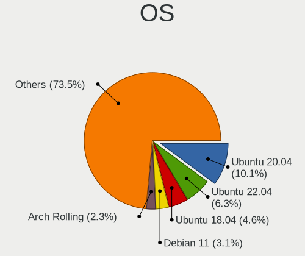

| Name                         | Computers | Percent |
|------------------------------|-----------|---------|
| Ubuntu 20.04                 | 72        | 13.64%  |
| Ubuntu 18.04                 | 32        | 6.06%   |
| Ubuntu 22.04                 | 22        | 4.17%   |
| Debian 11                    | 20        | 3.79%   |
| OpenMandriva 4.3             | 14        | 2.65%   |
| Zorin 16                     | 11        | 2.08%   |
| Linux Mint 20.2              | 11        | 2.08%   |
| Linux Mint 20.3              | 10        | 1.89%   |
| Ubuntu 18.10                 | 9         | 1.7%    |
| Pop!_OS 21.04                | 9         | 1.7%    |
| Arch Rolling                 | 9         | 1.7%    |
| Ubuntu 21.04                 | 7         | 1.33%   |
| Pop!_OS 20.04                | 7         | 1.33%   |
| Fedora 36                    | 7         | 1.33%   |
| Ubuntu 19.10                 | 6         | 1.14%   |
| Pop!_OS 22.04                | 6         | 1.14%   |
| Pop!_OS 21.10                | 6         | 1.14%   |
| Pop!_OS 20.10                | 6         | 1.14%   |
| OpenMandriva 4.2             | 6         | 1.14%   |
| KDE neon 20.04               | 6         | 1.14%   |
| Fedora 38                    | 6         | 1.14%   |
| Debian 10                    | 6         | 1.14%   |
| Ubuntu 19.04                 | 5         | 0.95%   |
| openSUSE Tumbleweed-XXXXXXXX | 5         | 0.95%   |
| Linux Mint 21.1              | 5         | 0.95%   |
| Fedora 35                    | 5         | 0.95%   |
| Endless 3.7.8                | 5         | 0.95%   |
| EndeavourOS Rolling          | 5         | 0.95%   |
| ArcoLinux Rolling            | 5         | 0.95%   |
| Arch                         | 5         | 0.95%   |
| Zorin 15                     | 4         | 0.76%   |
| Ubuntu 20.10                 | 4         | 0.76%   |
| OpenMandriva 4.50            | 4         | 0.76%   |
| Manjaro                      | 4         | 0.76%   |
| Linux Mint 20                | 4         | 0.76%   |
| Fedora 31                    | 4         | 0.76%   |
| Ubuntu Unity 18.04           | 3         | 0.57%   |
| Ubuntu MATE 22.04            | 3         | 0.57%   |
| Ubuntu MATE 20.04            | 3         | 0.57%   |
| Ubuntu 21.10                 | 3         | 0.57%   |

OS Family
---------

OS without a version

| Name          | Computers | Percent |
|---------------|-----------|---------|
| Ubuntu        | 154       | 31.88%  |
| Linux Mint    | 40        | 8.28%   |
| Pop!_OS       | 34        | 7.04%   |
| OpenMandriva  | 29        | 6%      |
| Fedora        | 28        | 5.8%    |
| Debian        | 26        | 5.38%   |
| Endless       | 24        | 4.97%   |
| Manjaro       | 23        | 4.76%   |
| Zorin         | 15        | 3.11%   |
| Arch          | 13        | 2.69%   |
| Kubuntu       | 12        | 2.48%   |
| ROSA          | 9         | 1.86%   |
| openSUSE      | 8         | 1.66%   |
| KDE neon      | 8         | 1.66%   |
| Ubuntu MATE   | 6         | 1.24%   |
| Elementary    | 6         | 1.24%   |
| ArcoLinux     | 6         | 1.24%   |
| EndeavourOS   | 5         | 1.04%   |
| Xubuntu       | 4         | 0.83%   |
| Ubuntu Budgie | 4         | 0.83%   |
| Kali          | 4         | 0.83%   |
| Ubuntu Unity  | 3         | 0.62%   |
| Nobara        | 3         | 0.62%   |
| Raspbian      | 2         | 0.41%   |
| MX            | 2         | 0.41%   |
| Lubuntu       | 2         | 0.41%   |
| LMDE          | 2         | 0.41%   |
| LinuxFX       | 2         | 0.41%   |
| Gentoo        | 2         | 0.41%   |
| SteamOS       | 1         | 0.21%   |
| Rocky Linux   | 1         | 0.21%   |
| Q4OS          | 1         | 0.21%   |
| Parrot        | 1         | 0.21%   |
| Clear Linux   | 1         | 0.21%   |
| CentOS        | 1         | 0.21%   |
| Arch ARM      | 1         | 0.21%   |

Kernel
------

Version of the Linux kernel

| Version                  | Computers | Percent |
|--------------------------|-----------|---------|
| 5.16.7-desktop-1omv4003  | 14        | 2.44%   |
| 5.4.0-42-generic         | 8         | 1.4%    |
| 5.11.0-38-generic        | 8         | 1.4%    |
| 5.8.0-14-generic         | 6         | 1.05%   |
| 5.4.0-58-generic         | 6         | 1.05%   |
| 5.3.0-28-generic         | 6         | 1.05%   |
| 5.11.0-7620-generic      | 6         | 1.05%   |
| 5.10.14-desktop-1omv4002 | 6         | 1.05%   |
| 5.4.0-91-generic         | 5         | 0.87%   |
| 5.4.0-48-generic         | 5         | 0.87%   |
| 5.4.0-37-generic         | 5         | 0.87%   |
| 5.11.0-41-generic        | 5         | 0.87%   |
| 5.8.0-59-generic         | 4         | 0.7%    |
| 5.8.0-48-generic         | 4         | 0.7%    |
| 5.4.0-52-generic         | 4         | 0.7%    |
| 5.3.0-26-generic         | 4         | 0.7%    |
| 5.15.0-58-generic        | 4         | 0.7%    |
| 5.15.0-56-generic        | 4         | 0.7%    |
| 5.13.0-30-generic        | 4         | 0.7%    |
| 5.11.0-40-generic        | 4         | 0.7%    |
| 4.18.0-10-generic        | 4         | 0.7%    |
| 6.2.6-desktop-1omv2390   | 3         | 0.52%   |
| 6.1.1-desktop-1omv2290   | 3         | 0.52%   |
| 5.8.16-2-MANJARO         | 3         | 0.52%   |
| 5.8.0-7630-generic       | 3         | 0.52%   |
| 5.8.0-43-generic         | 3         | 0.52%   |
| 5.4.0-47-generic         | 3         | 0.52%   |
| 5.4.0-40-generic         | 3         | 0.52%   |
| 5.4.0-29-generic         | 3         | 0.52%   |
| 5.4.0-26-generic         | 3         | 0.52%   |
| 5.4.0-19-generic         | 3         | 0.52%   |
| 5.4.0-100-generic        | 3         | 0.52%   |
| 5.3.0-40-generic         | 3         | 0.52%   |
| 5.3.0-23-generic         | 3         | 0.52%   |
| 5.19.0-38-generic        | 3         | 0.52%   |
| 5.16.11-76051611-generic | 3         | 0.52%   |
| 5.15.0-71-generic        | 3         | 0.52%   |
| 5.15.0-52-generic        | 3         | 0.52%   |
| 5.15.0-48-generic        | 3         | 0.52%   |
| 5.15.0-40-generic        | 3         | 0.52%   |

Kernel Family
-------------

Linux kernel without a distro release

| Version | Computers | Percent |
|---------|-----------|---------|
| 5.4.0   | 90        | 16.61%  |
| 5.11.0  | 48        | 8.86%   |
| 5.15.0  | 37        | 6.83%   |
| 5.8.0   | 26        | 4.8%    |
| 4.15.0  | 25        | 4.61%   |
| 5.3.0   | 24        | 4.43%   |
| 5.13.0  | 24        | 4.43%   |
| 5.10.0  | 20        | 3.69%   |
| 4.18.0  | 19        | 3.51%   |
| 5.16.7  | 15        | 2.77%   |
| 5.19.0  | 14        | 2.58%   |
| 5.0.0   | 14        | 2.58%   |
| 5.10.14 | 6         | 1.11%   |
| 4.19.0  | 6         | 1.11%   |
| 6.2.6   | 5         | 0.92%   |
| 6.1.1   | 5         | 0.92%   |
| 5.9.16  | 4         | 0.74%   |
| 5.16.11 | 4         | 0.74%   |
| 5.12.4  | 4         | 0.74%   |
| 6.0.5   | 3         | 0.55%   |
| 6.0.0   | 3         | 0.55%   |
| 5.8.16  | 3         | 0.55%   |
| 5.3.18  | 3         | 0.55%   |
| 5.15.8  | 3         | 0.55%   |
| 5.14.0  | 3         | 0.55%   |
| 4.9.60  | 3         | 0.55%   |
| 6.2.15  | 2         | 0.37%   |
| 6.2.1   | 2         | 0.37%   |
| 6.1.0   | 2         | 0.37%   |
| 5.9.11  | 2         | 0.37%   |
| 5.7.11  | 2         | 0.37%   |
| 5.5.0   | 2         | 0.37%   |
| 5.19.13 | 2         | 0.37%   |
| 5.17.5  | 2         | 0.37%   |
| 5.17.4  | 2         | 0.37%   |
| 5.15.32 | 2         | 0.37%   |
| 5.15.15 | 2         | 0.37%   |
| 5.11.22 | 2         | 0.37%   |
| 5.10.92 | 2         | 0.37%   |
| 5.10.79 | 2         | 0.37%   |

Kernel Major Ver.
-----------------

Linux kernel major version

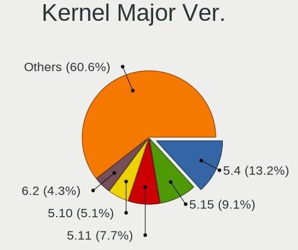

| Version | Computers | Percent |
|---------|-----------|---------|
| 5.4     | 97        | 18.16%  |
| 5.11    | 55        | 10.3%   |
| 5.15    | 52        | 9.74%   |
| 5.10    | 36        | 6.74%   |
| 5.8     | 30        | 5.62%   |
| 5.3     | 28        | 5.24%   |
| 5.13    | 27        | 5.06%   |
| 4.15    | 25        | 4.68%   |
| 5.16    | 23        | 4.31%   |
| 5.19    | 22        | 4.12%   |
| 4.18    | 19        | 3.56%   |
| 6.2     | 15        | 2.81%   |
| 5.0     | 15        | 2.81%   |
| 6.1     | 11        | 2.06%   |
| 6.0     | 9         | 1.69%   |
| 5.9     | 9         | 1.69%   |
| 5.18    | 8         | 1.5%    |
| 5.17    | 8         | 1.5%    |
| 5.14    | 6         | 1.12%   |
| 4.9     | 6         | 1.12%   |
| 4.19    | 6         | 1.12%   |
| 5.6     | 5         | 0.94%   |
| 5.12    | 5         | 0.94%   |
| 5.7     | 3         | 0.56%   |
| 6.3     | 2         | 0.37%   |
| 5.5     | 2         | 0.37%   |
| 4.16    | 2         | 0.37%   |
| 5.2     | 1         | 0.19%   |
| 5.1     | 1         | 0.19%   |
| 4.17    | 1         | 0.19%   |
| 4.14    | 1         | 0.19%   |
| 4.13    | 1         | 0.19%   |
| 4.12    | 1         | 0.19%   |
| 4.1     | 1         | 0.19%   |
| 3.10    | 1         | 0.19%   |

Arch
----

OS architecture (x86_64, i586, etc.)

| Name    | Computers | Percent |
|---------|-----------|---------|
| x86_64  | 455       | 97.22%  |
| i686    | 8         | 1.71%   |
| aarch64 | 3         | 0.64%   |
| armv7l  | 2         | 0.43%   |

DE
--

Desktop Environment

| Name            | Computers | Percent |
|-----------------|-----------|---------|
| GNOME           | 223       | 45.42%  |
| KDE5            | 86        | 17.52%  |
| Unknown         | 60        | 12.22%  |
| X-Cinnamon      | 26        | 5.3%    |
| XFCE            | 22        | 4.48%   |
| Cinnamon        | 12        | 2.44%   |
| MATE            | 11        | 2.24%   |
| KDE             | 10        | 2.04%   |
| Pantheon        | 5         | 1.02%   |
| Budgie          | 5         | 1.02%   |
| LXDE            | 4         | 0.81%   |
| KDE4            | 4         | 0.81%   |
| GNOME Flashback | 4         | 0.81%   |
| DWM             | 4         | 0.81%   |
| Unity           | 3         | 0.61%   |
| LXQt            | 3         | 0.61%   |
| Openbox         | 2         | 0.41%   |
| i3              | 2         | 0.41%   |
| ubuntu          | 1         | 0.2%    |
| Trinity         | 1         | 0.2%    |
| GNUstep         | 1         | 0.2%    |
| Deepin          | 1         | 0.2%    |
| bspwm           | 1         | 0.2%    |

Display Server
--------------

X11 or Wayland

| Name    | Computers | Percent |
|---------|-----------|---------|
| X11     | 379       | 76.72%  |
| Wayland | 66        | 13.36%  |
| Unknown | 37        | 7.49%   |
| Tty     | 12        | 2.43%   |

Display Manager
---------------

SDDM, LightDM, etc.

| Name    | Computers | Percent |
|---------|-----------|---------|
| Unknown | 232       | 47.84%  |
| GDM     | 73        | 15.05%  |
| SDDM    | 72        | 14.85%  |
| LightDM | 47        | 9.69%   |
| GDM3    | 42        | 8.66%   |
| TDM     | 15        | 3.09%   |
| KDM     | 3         | 0.62%   |
| Ly      | 1         | 0.21%   |

OS Lang
-------

Language

| Lang    | Computers | Percent |
|---------|-----------|---------|
| en_US   | 263       | 54.56%  |
| hr_HR   | 116       | 24.07%  |
| Unknown | 63        | 13.07%  |
| en_GB   | 21        | 4.36%   |
| C       | 7         | 1.45%   |
| de_DE   | 6         | 1.24%   |
| ru_RU   | 1         | 0.21%   |
| pl_PL   | 1         | 0.21%   |
| hr_BA   | 1         | 0.21%   |
| fr_FR   | 1         | 0.21%   |
| en_DE   | 1         | 0.21%   |
| en_150  | 1         | 0.21%   |

Boot Mode
---------

EFI or BIOS

| Mode | Computers | Percent |
|------|-----------|---------|
| EFI  | 261       | 54.6%   |
| BIOS | 217       | 45.4%   |

Filesystem
----------

Type of filesystem

| Type    | Computers | Percent |
|---------|-----------|---------|
| Ext4    | 375       | 77.8%   |
| Btrfs   | 36        | 7.47%   |
| Overlay | 31        | 6.43%   |
| Unknown | 21        | 4.36%   |
| Zfs     | 9         | 1.87%   |
| Xfs     | 6         | 1.24%   |
| Tmpfs   | 2         | 0.41%   |
| Jfs     | 1         | 0.21%   |
| Ext2    | 1         | 0.21%   |

Part. scheme
------------

Scheme of partitioning

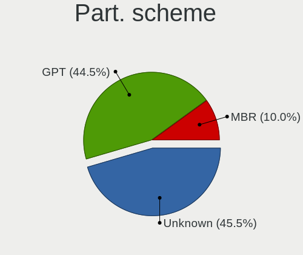

| Type    | Computers | Percent |
|---------|-----------|---------|
| Unknown | 245       | 51.58%  |
| GPT     | 178       | 37.47%  |
| MBR     | 52        | 10.95%  |

Dual Boot with Linux/BSD
------------------------

Hosting more than one Linux/BSD

| Dual boot | Computers | Percent |
|-----------|-----------|---------|
| No        | 419       | 87.66%  |
| Yes       | 59        | 12.34%  |

Dual Boot (Win)
---------------

Hosting Linux and Windows

| Dual boot | Computers | Percent |
|-----------|-----------|---------|
| No        | 348       | 72.96%  |
| Yes       | 129       | 27.04%  |

Board
-----

Vendor
------

Motherboard manufacturer

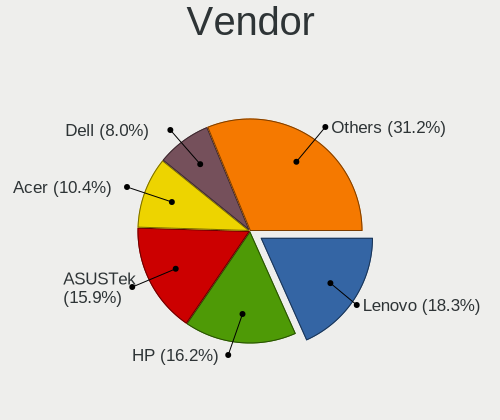

| Name                    | Computers | Percent |
|-------------------------|-----------|---------|
| Lenovo                  | 89        | 19.02%  |
| ASUSTek Computer        | 75        | 16.03%  |
| Hewlett-Packard         | 69        | 14.74%  |
| Acer                    | 53        | 11.32%  |
| Dell                    | 39        | 8.33%   |
| ASRock                  | 35        | 7.48%   |
| Gigabyte Technology     | 28        | 5.98%   |
| MSI                     | 12        | 2.56%   |
| Toshiba                 | 7         | 1.5%    |
| Intel                   | 7         | 1.5%    |
| Apple                   | 7         | 1.5%    |
| Pegatron                | 5         | 1.07%   |
| Samsung Electronics     | 4         | 0.85%   |
| Fujitsu Siemens         | 4         | 0.85%   |
| Raspberry Pi Foundation | 3         | 0.64%   |
| eMachines               | 3         | 0.64%   |
| ECS                     | 3         | 0.64%   |
| TUXEDO                  | 2         | 0.43%   |
| Tactus                  | 2         | 0.43%   |
| Supermicro              | 2         | 0.43%   |
| HUAWEI                  | 2         | 0.43%   |
| Unknown                 | 2         | 0.43%   |
| WinFast                 | 1         | 0.21%   |
| Valve                   | 1         | 0.21%   |
| System76                | 1         | 0.21%   |
| SHENZHEN X&F TECHNOLOGY | 1         | 0.21%   |
| Schenker                | 1         | 0.21%   |
| Razer                   | 1         | 0.21%   |
| Pretech                 | 1         | 0.21%   |
| Nvidia                  | 1         | 0.21%   |
| Notebook                | 1         | 0.21%   |
| Medion                  | 1         | 0.21%   |
| HPE                     | 1         | 0.21%   |
| Foxconn                 | 1         | 0.21%   |
| Chuwi                   | 1         | 0.21%   |
| AMI                     | 1         | 0.21%   |
| ABIT                    | 1         | 0.21%   |

Model
-----

Motherboard model

| Name                                     | Computers | Percent |
|------------------------------------------|-----------|---------|
| ASUS All Series                          | 6         | 1.28%   |
| Acer Aspire A315-21                      | 4         | 0.85%   |
| Unknown                                  | 4         | 0.85%   |
| Lenovo G710 20252                        | 3         | 0.64%   |
| ASUS PRIME A320M-K                       | 3         | 0.64%   |
| Acer Aspire A515-51G                     | 3         | 0.64%   |
| TUXEDO Pulse 15 Gen1                     | 2         | 0.43%   |
| Tactus GeoBook 140                       | 2         | 0.43%   |
| RPi Raspberry Pi 4 Model B Rev 1.1       | 2         | 0.43%   |
| MSI MS-7850                              | 2         | 0.43%   |
| Lenovo Z50-70 20354                      | 2         | 0.43%   |
| Lenovo ThinkBook 16p Gen 2 20YM          | 2         | 0.43%   |
| Lenovo Legion 5 Pro 16ACH6H 82JQ         | 2         | 0.43%   |
| Lenovo Legion 5 15ARH05 82B5             | 2         | 0.43%   |
| Lenovo G40-30 80FY                       | 2         | 0.43%   |
| HP ProBook 450 G7                        | 2         | 0.43%   |
| HP OMEN by Laptop                        | 2         | 0.43%   |
| HP Laptop 15s-eq2xxx                     | 2         | 0.43%   |
| HP EliteBook 8560p                       | 2         | 0.43%   |
| HP EliteBook 850 G6                      | 2         | 0.43%   |
| HP EliteBook 845 G8 Notebook PC          | 2         | 0.43%   |
| HP 2000                                  | 2         | 0.43%   |
| Gigabyte A320M-S2H                       | 2         | 0.43%   |
| Fujitsu Siemens ESPRIMO Mobile V5535     | 2         | 0.43%   |
| Dell XPS 13 9310                         | 2         | 0.43%   |
| Dell Vostro 3500                         | 2         | 0.43%   |
| Dell Inspiron N5110                      | 2         | 0.43%   |
| ASUS X751NV                              | 2         | 0.43%   |
| ASUS VivoBook_ASUSLaptop M3500QA_M3500QA | 2         | 0.43%   |
| ASUS VivoBook 15_ASUS Laptop X560UD      | 2         | 0.43%   |
| ASUS VivoBook 15_ASUS Laptop X540BP      | 2         | 0.43%   |
| ASUS P8H77-V LE                          | 2         | 0.43%   |
| ASUS N56VZ                               | 2         | 0.43%   |
| ASUS M5A78L LE                           | 2         | 0.43%   |
| ASRock H61M-DGS                          | 2         | 0.43%   |
| ASRock B450M-HDV R4.0                    | 2         | 0.43%   |
| Acer Swift SF314-43                      | 2         | 0.43%   |
| Acer Nitro AN515-55                      | 2         | 0.43%   |
| Acer Aspire E5-771G                      | 2         | 0.43%   |
| Acer Aspire A715-72G                     | 2         | 0.43%   |

Model Family
------------

Motherboard model prefix

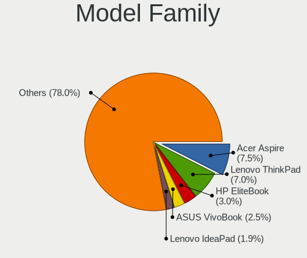

| Name              | Computers | Percent |
|-------------------|-----------|---------|
| Acer Aspire       | 40        | 8.55%   |
| Lenovo ThinkPad   | 35        | 7.48%   |
| HP EliteBook      | 16        | 3.42%   |
| HP ProBook        | 10        | 2.14%   |
| Dell Vostro       | 10        | 2.14%   |
| ASUS VivoBook     | 10        | 2.14%   |
| Lenovo IdeaPad    | 9         | 1.92%   |
| HP Pavilion       | 9         | 1.92%   |
| Lenovo Legion     | 8         | 1.71%   |
| Dell Latitude     | 8         | 1.71%   |
| ASUS PRIME        | 8         | 1.71%   |
| HP Laptop         | 7         | 1.5%    |
| Dell XPS          | 7         | 1.5%    |
| Dell Inspiron     | 7         | 1.5%    |
| Toshiba Satellite | 6         | 1.28%   |
| Lenovo ThinkBook  | 6         | 1.28%   |
| ASUS All          | 6         | 1.28%   |
| Acer Swift        | 6         | 1.28%   |
| ASUS Zenbook      | 5         | 1.07%   |
| ASUS ROG          | 5         | 1.07%   |
| HP Compaq         | 4         | 0.85%   |
| HP 250            | 4         | 0.85%   |
| ASUS TUF          | 4         | 0.85%   |
| Unknown           | 4         | 0.85%   |
| RPi Raspberry     | 3         | 0.64%   |
| Lenovo IdeaCentre | 3         | 0.64%   |
| Lenovo G710       | 3         | 0.64%   |
| HP OMEN           | 3         | 0.64%   |
| Acer Nitro        | 3         | 0.64%   |
| TUXEDO Pulse      | 2         | 0.43%   |
| Tactus GeoBook    | 2         | 0.43%   |
| MSI MS-7850       | 2         | 0.43%   |
| Lenovo Z50-70     | 2         | 0.43%   |
| Lenovo Yoga       | 2         | 0.43%   |
| Lenovo G40-30     | 2         | 0.43%   |
| Lenovo B590       | 2         | 0.43%   |
| HP ProDesk        | 2         | 0.43%   |
| HP EliteDesk      | 2         | 0.43%   |
| HP 2000           | 2         | 0.43%   |
| Gigabyte Z390     | 2         | 0.43%   |

MFG Year
--------

Motherboard manufacture year

| Year    | Computers | Percent |
|---------|-----------|---------|
| 2018    | 54        | 11.54%  |
| 2020    | 46        | 9.83%   |
| 2017    | 42        | 8.97%   |
| 2021    | 41        | 8.76%   |
| 2013    | 39        | 8.33%   |
| 2019    | 36        | 7.69%   |
| 2011    | 33        | 7.05%   |
| 2014    | 28        | 5.98%   |
| 2012    | 28        | 5.98%   |
| 2016    | 23        | 4.91%   |
| 2008    | 17        | 3.63%   |
| 2015    | 16        | 3.42%   |
| 2007    | 15        | 3.21%   |
| 2009    | 14        | 2.99%   |
| 2022    | 13        | 2.78%   |
| 2010    | 12        | 2.56%   |
| 2006    | 5         | 1.07%   |
| Unknown | 4         | 0.85%   |
| 2005    | 2         | 0.43%   |

Form Factor
-----------

Physical design of the computer

| Name           | Computers | Percent |
|----------------|-----------|---------|
| Notebook       | 300       | 64.1%   |
| Desktop        | 145       | 30.98%  |
| All in one     | 7         | 1.5%    |
| System on chip | 4         | 0.85%   |
| Mini pc        | 4         | 0.85%   |
| Convertible    | 3         | 0.64%   |
| Server         | 3         | 0.64%   |
| Stick pc       | 1         | 0.21%   |
| Tablet         | 1         | 0.21%   |

Secure Boot
-----------

Enabled or disabled

| State    | Computers | Percent |
|----------|-----------|---------|
| Disabled | 426       | 90.45%  |
| Enabled  | 45        | 9.55%   |

Coreboot
--------

Have coreboot on board

| Used | Computers | Percent |
|------|-----------|---------|
| No   | 468       | 100%    |

RAM Size
--------

Total RAM memory

| Size in GB  | Computers | Percent |
|-------------|-----------|---------|
| 4.01-8.0    | 117       | 24.53%  |
| 8.01-16.0   | 109       | 22.85%  |
| 16.01-24.0  | 92        | 19.29%  |
| 3.01-4.0    | 77        | 16.14%  |
| 32.01-64.0  | 38        | 7.97%   |
| 1.01-2.0    | 19        | 3.98%   |
| 24.01-32.0  | 12        | 2.52%   |
| 64.01-256.0 | 7         | 1.47%   |
| 2.01-3.0    | 6         | 1.26%   |

RAM Used
--------

Used RAM memory

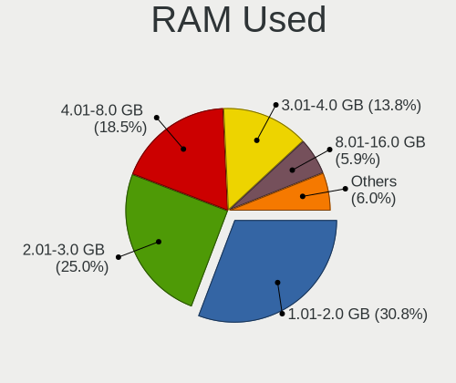

| Used GB    | Computers | Percent |
|------------|-----------|---------|
| 1.01-2.0   | 183       | 34.66%  |
| 2.01-3.0   | 131       | 24.81%  |
| 4.01-8.0   | 86        | 16.29%  |
| 3.01-4.0   | 67        | 12.69%  |
| 0.51-1.0   | 28        | 5.3%    |
| 8.01-16.0  | 23        | 4.36%   |
| 16.01-24.0 | 6         | 1.14%   |
| 0.01-0.5   | 3         | 0.57%   |
| 24.01-32.0 | 1         | 0.19%   |

Total Drives
------------

Number of drives on board

| Drives  | Computers | Percent |
|---------|-----------|---------|
| 1       | 294       | 60.37%  |
| 2       | 120       | 24.64%  |
| 3       | 38        | 7.8%    |
| 4       | 13        | 2.67%   |
| 5       | 10        | 2.05%   |
| 0       | 5         | 1.03%   |
| 6       | 3         | 0.62%   |
| 14      | 1         | 0.21%   |
| 8       | 1         | 0.21%   |
| 7       | 1         | 0.21%   |
| Unknown | 1         | 0.21%   |

Has CD-ROM
----------

Has CD-ROM on board

| Presented | Computers | Percent |
|-----------|-----------|---------|
| No        | 303       | 64.19%  |
| Yes       | 169       | 35.81%  |

Has Ethernet
------------

Has Ethernet on board

| Presented | Computers | Percent |
|-----------|-----------|---------|
| Yes       | 405       | 86.35%  |
| No        | 64        | 13.65%  |

Has WiFi
--------

Has WiFi module

| Presented | Computers | Percent |
|-----------|-----------|---------|
| Yes       | 361       | 76.65%  |
| No        | 110       | 23.35%  |

Has Bluetooth
-------------

Has Bluetooth module

| Presented | Computers | Percent |
|-----------|-----------|---------|
| Yes       | 289       | 60.84%  |
| No        | 186       | 39.16%  |

Location
--------

Country
-------

Geographic location (country)

| Country | Computers | Percent |
|---------|-----------|---------|
| Croatia | 468       | 100%    |

City
----

Geographic location (city)

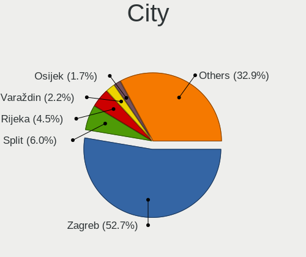

| City             | Computers | Percent |
|------------------|-----------|---------|
| Zagreb           | 281       | 53.02%  |
| Split            | 30        | 5.66%   |
| Rijeka           | 22        | 4.15%   |
| Varadin        | 11        | 2.08%   |
| Velika Gorica    | 9         | 1.7%    |
| Osijek           | 9         | 1.7%    |
| Koprivnica       | 9         | 1.7%    |
| Pula             | 8         | 1.51%   |
| Zaprei       | 6         | 1.13%   |
| Zadar            | 6         | 1.13%   |
| Bjelovar         | 6         | 1.13%   |
| Samobor          | 5         | 0.94%   |
| Virovitica       | 4         | 0.75%   |
| Pitomaca         | 3         | 0.57%   |
| Petrinja         | 3         | 0.57%   |
| Krizevci         | 3         | 0.57%   |
| Karlovac         | 3         | 0.57%   |
| Jesenice         | 3         | 0.57%   |
| GJurgevac        | 3         | 0.57%   |
| akovec         | 3         | 0.57%   |
| akovo          | 2         | 0.38%   |
| Supetar          | 2         | 0.38%   |
| Slatina          | 2         | 0.38%   |
| Sesvete          | 2         | 0.38%   |
| Rovinj           | 2         | 0.38%   |
| Omi            | 2         | 0.38%   |
| Novska           | 2         | 0.38%   |
| Matulji          | 2         | 0.38%   |
| Labin            | 2         | 0.38%   |
| Komia          | 2         | 0.38%   |
| Kastav           | 2         | 0.38%   |
| Ivanja Reka      | 2         | 0.38%   |
| Hvar             | 2         | 0.38%   |
| Drakulica Rijeka | 2         | 0.38%   |
| Cres             | 2         | 0.38%   |
| Buzin            | 2         | 0.38%   |
| Zminj            | 1         | 0.19%   |
| Zabok            | 1         | 0.19%   |
| Visoko           | 1         | 0.19%   |
| Visnjevac        | 1         | 0.19%   |

Drives
------

Drive Vendor
------------

Hard drive vendors

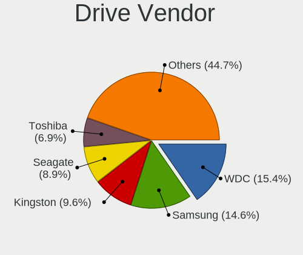

| Vendor              | Computers | Drives | Percent |
|---------------------|-----------|--------|---------|
| WDC                 | 119       | 190    | 17.66%  |
| Samsung Electronics | 96        | 130    | 14.24%  |
| Kingston            | 71        | 100    | 10.53%  |
| Seagate             | 61        | 99     | 9.05%   |
| Toshiba             | 47        | 66     | 6.97%   |
| Sandisk             | 32        | 41     | 4.75%   |
| SK hynix            | 27        | 40     | 4.01%   |
| Crucial             | 25        | 37     | 3.71%   |
| Intel               | 23        | 32     | 3.41%   |
| Unknown             | 19        | 22     | 2.82%   |
| Micron Technology   | 19        | 22     | 2.82%   |
| Hitachi             | 16        | 20     | 2.37%   |
| A-DATA Technology   | 15        | 19     | 2.23%   |
| Patriot             | 9         | 13     | 1.34%   |
| HGST                | 9         | 9      | 1.34%   |
| Apple               | 8         | 11     | 1.19%   |
| Silicon Motion      | 6         | 8      | 0.89%   |
| Transcend           | 5         | 10     | 0.74%   |
| Netac               | 5         | 5      | 0.74%   |
| Fujitsu             | 5         | 7      | 0.74%   |
| Phison              | 4         | 4      | 0.59%   |
| LITEON              | 4         | 5      | 0.59%   |
| Gigabyte Technology | 3         | 3      | 0.45%   |
| Corsair             | 3         | 3      | 0.45%   |
| UMIS                | 2         | 2      | 0.3%    |
| StoreJet            | 2         | 2      | 0.3%    |
| OCZ                 | 2         | 3      | 0.3%    |
| Maxtor              | 2         | 2      | 0.3%    |
| Lenovo              | 2         | 3      | 0.3%    |
| KIOXIA              | 2         | 2      | 0.3%    |
| KingFast            | 2         | 4      | 0.3%    |
| JMicron Technology  | 2         | 2      | 0.3%    |
| Intenso             | 2         | 3      | 0.3%    |
| HPE                 | 2         | 4      | 0.3%    |
| AMD                 | 2         | 5      | 0.3%    |
| XPG                 | 1         | 3      | 0.15%   |
| Verbatim            | 1         | 1      | 0.15%   |
| Ugreen              | 1         | 1      | 0.15%   |
| TO Exter            | 1         | 1      | 0.15%   |
| SSK                 | 1         | 1      | 0.15%   |

Drive Model
-----------

Hard drive models

| Model                                               | Computers | Percent |
|-----------------------------------------------------|-----------|---------|
| Kingston SA400S37240G 240GB SSD                     | 13        | 1.79%   |
| Samsung NVMe SSD Drive 512GB                        | 9         | 1.24%   |
| Kingston SA400S37480G 480GB SSD                     | 9         | 1.24%   |
| Kingston SA400S37120G 120GB SSD                     | 9         | 1.24%   |
| Samsung SSD 850 EVO 250GB                           | 7         | 0.96%   |
| Toshiba MQ01ABD100 1TB                              | 6         | 0.83%   |
| SanDisk NVMe SSD Drive 512GB                        | 6         | 0.83%   |
| Micron 1100_MTFDDAV256TBN 256GB SSD                 | 6         | 0.83%   |
| Crucial CT240BX500SSD1 240GB                        | 6         | 0.83%   |
| Seagate ST1000LM024 HN-M101MBB 1TB                  | 5         | 0.69%   |
| Kingston SV300S37A120G 120GB SSD                    | 5         | 0.69%   |
| WDC WD10EZEX-08WN4A0 1TB                            | 4         | 0.55%   |
| WDC PC SN730 SDBPNTY-1T00-1101 1TB                  | 4         | 0.55%   |
| Unknown MMC Card  32GB                              | 4         | 0.55%   |
| Toshiba HDWD130 3TB                                 | 4         | 0.55%   |
| Toshiba HDWD110 1TB                                 | 4         | 0.55%   |
| Seagate ST500LT012-1DG142 500GB                     | 4         | 0.55%   |
| Samsung SSD 860 QVO 1TB                             | 4         | 0.55%   |
| Patriot Burst 240GB SSD                             | 4         | 0.55%   |
| HGST HTS721010A9E630 1TB                            | 4         | 0.55%   |
| A-DATA SU650 240GB SSD                              | 4         | 0.55%   |
| WDC WD5000AAKX-001CA0 500GB                         | 3         | 0.41%   |
| WDC WD10EZEX-08M2NA0 1TB                            | 3         | 0.41%   |
| Unknown MMC Card  128GB                             | 3         | 0.41%   |
| Toshiba MQ04ABF100 1TB                              | 3         | 0.41%   |
| Toshiba MQ01ABF050 500GB                            | 3         | 0.41%   |
| Toshiba DT01ACA100 1TB                              | 3         | 0.41%   |
| SK hynix NVMe SSD Drive 512GB                       | 3         | 0.41%   |
| SK hynix NVMe SSD Drive 256GB                       | 3         | 0.41%   |
| Seagate ST9500325AS 500GB                           | 3         | 0.41%   |
| Seagate ST1000LM048-2E7172 1TB                      | 3         | 0.41%   |
| Seagate ST1000LM035-1RK172 1TB                      | 3         | 0.41%   |
| Seagate ST1000DM010-2EP102 1TB                      | 3         | 0.41%   |
| SanDisk SDSSDA240G 240GB                            | 3         | 0.41%   |
| Samsung SSD 970 EVO Plus 1TB                        | 3         | 0.41%   |
| Samsung SSD 870 QVO 1TB                             | 3         | 0.41%   |
| Samsung NVMe SSD Drive 500GB                        | 3         | 0.41%   |
| Samsung NVMe SSD Drive 1TB                          | 3         | 0.41%   |
| Samsung NVMe SSD Controller SM981/PM981/PM983 256GB | 3         | 0.41%   |
| Samsung NVMe SSD Controller PM9A1/PM9A3/980PRO 1TB  | 3         | 0.41%   |

HDD Vendor
----------

Hard disk drive vendors

| Vendor              | Computers | Drives | Percent |
|---------------------|-----------|--------|---------|
| WDC                 | 98        | 157    | 40%     |
| Seagate             | 59        | 86     | 24.08%  |
| Toshiba             | 39        | 57     | 15.92%  |
| Hitachi             | 16        | 20     | 6.53%   |
| HGST                | 9         | 9      | 3.67%   |
| Samsung Electronics | 8         | 11     | 3.27%   |
| Fujitsu             | 5         | 7      | 2.04%   |
| Unknown             | 2         | 2      | 0.82%   |
| Maxtor              | 2         | 2      | 0.82%   |
| SSK                 | 1         | 1      | 0.41%   |
| JMicron Technology  | 1         | 1      | 0.41%   |
| Intenso             | 1         | 2      | 0.41%   |
| HPE                 | 1         | 2      | 0.41%   |
| HGST HTS            | 1         | 1      | 0.41%   |
| External            | 1         | 1      | 0.41%   |
| ASMedia             | 1         | 1      | 0.41%   |

SSD Vendor
----------

Solid state drive vendors

| Vendor              | Computers | Drives | Percent |
|---------------------|-----------|--------|---------|
| Kingston            | 61        | 81     | 26.07%  |
| Samsung Electronics | 35        | 51     | 14.96%  |
| Crucial             | 23        | 34     | 9.83%   |
| SanDisk             | 18        | 25     | 7.69%   |
| A-DATA Technology   | 13        | 16     | 5.56%   |
| Intel               | 12        | 16     | 5.13%   |
| Micron Technology   | 10        | 11     | 4.27%   |
| SK hynix            | 8         | 14     | 3.42%   |
| Patriot             | 8         | 12     | 3.42%   |
| WDC                 | 7         | 8      | 2.99%   |
| Apple               | 6         | 7      | 2.56%   |
| Netac               | 4         | 4      | 1.71%   |
| Transcend           | 3         | 4      | 1.28%   |
| LITEON              | 3         | 4      | 1.28%   |
| Gigabyte Technology | 3         | 3      | 1.28%   |
| Toshiba             | 2         | 3      | 0.85%   |
| StoreJet            | 2         | 2      | 0.85%   |
| OCZ                 | 2         | 3      | 0.85%   |
| AMD                 | 2         | 5      | 0.85%   |
| TO Exter            | 1         | 1      | 0.43%   |
| Seagate             | 1         | 1      | 0.43%   |
| PNY                 | 1         | 1      | 0.43%   |
| Mushkin             | 1         | 2      | 0.43%   |
| Min Yi U            | 1         | 1      | 0.43%   |
| KingSpec            | 1         | 1      | 0.43%   |
| Kingmax             | 1         | 1      | 0.43%   |
| Intenso             | 1         | 1      | 0.43%   |
| GOODRAM             | 1         | 1      | 0.43%   |
| Emtec               | 1         | 1      | 0.43%   |
| Corsair             | 1         | 1      | 0.43%   |
| China               | 1         | 1      | 0.43%   |

Drive Kind
----------

HDD or SSD

| Kind    | Computers | Drives | Percent |
|---------|-----------|--------|---------|
| HDD     | 212       | 360    | 34.93%  |
| SSD     | 201       | 316    | 33.11%  |
| NVMe    | 167       | 235    | 27.51%  |
| MMC     | 17        | 20     | 2.8%    |
| Unknown | 10        | 23     | 1.65%   |

Drive Connector
---------------

SATA, SAS, NVMe, etc.

| Type | Computers | Drives | Percent |
|------|-----------|--------|---------|
| SATA | 327       | 659    | 61.35%  |
| NVMe | 167       | 235    | 31.33%  |
| SAS  | 22        | 40     | 4.13%   |
| MMC  | 17        | 20     | 3.19%   |

Drive Size
----------

Size of hard drive

| Size in TB | Computers | Drives | Percent |
|------------|-----------|--------|---------|
| 0.01-0.5   | 259       | 413    | 61.08%  |
| 0.51-1.0   | 116       | 176    | 27.36%  |
| 1.01-2.0   | 24        | 42     | 5.66%   |
| 2.01-3.0   | 13        | 27     | 3.07%   |
| 3.01-4.0   | 9         | 14     | 2.12%   |
| 4.01-10.0  | 3         | 4      | 0.71%   |

Space Total
-----------

Amount of disk space available on the file system

| Size in GB     | Computers | Percent |
|----------------|-----------|---------|
| 101-250        | 150       | 30%     |
| 251-500        | 115       | 23%     |
| 501-1000       | 74        | 14.8%   |
| 1001-2000      | 48        | 9.6%    |
| 51-100         | 29        | 5.8%    |
| 1-20           | 28        | 5.6%    |
| More than 3000 | 19        | 3.8%    |
| 21-50          | 14        | 2.8%    |
| Unknown        | 14        | 2.8%    |
| 2001-3000      | 9         | 1.8%    |

Space Used
----------

Amount of used disk space

| Used GB        | Computers | Percent |
|----------------|-----------|---------|
| 1-20           | 190       | 36.05%  |
| 21-50          | 101       | 19.17%  |
| 101-250        | 59        | 11.2%   |
| 51-100         | 57        | 10.82%  |
| 251-500        | 40        | 7.59%   |
| 501-1000       | 38        | 7.21%   |
| 1001-2000      | 14        | 2.66%   |
| Unknown        | 14        | 2.66%   |
| More than 3000 | 7         | 1.33%   |
| 2001-3000      | 7         | 1.33%   |

Malfunc. Drives
---------------

Drive models with a malfunction

| Model                                | Computers | Drives | Percent |
|--------------------------------------|-----------|--------|---------|
| Seagate ST1000LM024 HN-M101MBB 1TB   | 2         | 4      | 4.55%   |
| WDC WDS240G2G0B-00EPW0 240GB SSD     | 1         | 1      | 2.27%   |
| WDC WD6400AAKS-07A7B0 640GB          | 1         | 1      | 2.27%   |
| WDC WD600VE-75HDT0 64GB              | 1         | 1      | 2.27%   |
| WDC WD5003ABYX-88 LEN 500GB          | 1         | 1      | 2.27%   |
| WDC WD5000AAKX-221CA1 500GB          | 1         | 1      | 2.27%   |
| WDC WD3200AAKS-00L9A0 320GB          | 1         | 1      | 2.27%   |
| WDC WD2500AAKX-75U6AA0 250GB         | 1         | 1      | 2.27%   |
| WDC WD10JPCX-24UE4T0 1TB             | 1         | 1      | 2.27%   |
| WDC WD10EZRZ-00HTKB0 1TB             | 1         | 1      | 2.27%   |
| WDC WD10EZEX-08M2NA0 1TB             | 1         | 1      | 2.27%   |
| WDC WD10EZEX-00MFCA0 1TB             | 1         | 1      | 2.27%   |
| Transcend TS480GSSD220S 480GB        | 1         | 1      | 2.27%   |
| Toshiba MK6459GSXP 640GB             | 1         | 1      | 2.27%   |
| Toshiba DT01ACA100 1TB               | 1         | 1      | 2.27%   |
| SK hynix SH920 2.5 7MM 256GB SSD     | 1         | 2      | 2.27%   |
| SK hynix SC210 2.5 7MM 256GB SSD     | 1         | 1      | 2.27%   |
| Seagate ST9500420AS 500GB            | 1         | 1      | 2.27%   |
| Seagate ST9500325AS 500GB            | 1         | 1      | 2.27%   |
| Seagate ST9250827AS 250GB            | 1         | 1      | 2.27%   |
| Seagate ST500DM002-1BD142 500GB      | 1         | 2      | 2.27%   |
| Seagate ST31500341AS 1TB             | 1         | 1      | 2.27%   |
| Seagate ST1000LM035-1RK172 1TB       | 1         | 1      | 2.27%   |
| SanDisk SDSSDXPS960G 960GB           | 1         | 1      | 2.27%   |
| SanDisk SDSSDA240G 240GB             | 1         | 1      | 2.27%   |
| SanDisk SD6PP4M-256G-1006 256GB SSD  | 1         | 1      | 2.27%   |
| LITEON LMH-256V2M-11 MSATA 256GB SSD | 1         | 1      | 2.27%   |
| Kingston SHFS37A120G 120GB SSD       | 1         | 1      | 2.27%   |
| Intel SSDSC2KW512G8 512GB            | 1         | 1      | 2.27%   |
| Intel SSDSC2KF256H6 SATA 256GB       | 1         | 2      | 2.27%   |
| Intel SSDSC2BW180A4 180GB            | 1         | 1      | 2.27%   |
| Intel SSDSC2BW120A4 120GB            | 1         | 1      | 2.27%   |
| Hitachi HTS723232A7A364 320GB        | 1         | 1      | 2.27%   |
| Hitachi HTS542512K9SA00 120GB        | 1         | 1      | 2.27%   |
| Hitachi HDS723020BLA642 2TB          | 1         | 1      | 2.27%   |
| HGST HTS721010A9E630 1TB             | 1         | 1      | 2.27%   |
| HGST HTS545050A7E380 500GB           | 1         | 1      | 2.27%   |
| HGST HTS541010A9E680 1TB             | 1         | 1      | 2.27%   |
| Crucial CT525MX300SSD1 528GB         | 1         | 1      | 2.27%   |
| Crucial CT120BX500SSD1 120GB         | 1         | 2      | 2.27%   |

Malfunc. Drive Vendor
---------------------

Vendors of faulty drives

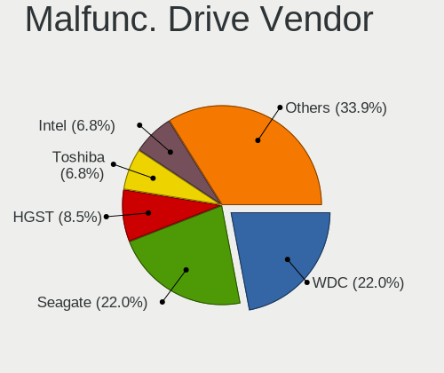

| Vendor            | Computers | Drives | Percent |
|-------------------|-----------|--------|---------|
| WDC               | 11        | 11     | 25.58%  |
| Seagate           | 8         | 11     | 18.6%   |
| Intel             | 4         | 5      | 9.3%    |
| Hitachi           | 3         | 3      | 6.98%   |
| HGST              | 3         | 3      | 6.98%   |
| Crucial           | 3         | 4      | 6.98%   |
| Toshiba           | 2         | 2      | 4.65%   |
| SK hynix          | 2         | 3      | 4.65%   |
| SanDisk           | 2         | 3      | 4.65%   |
| A-DATA Technology | 2         | 2      | 4.65%   |
| Transcend         | 1         | 1      | 2.33%   |
| LITEON            | 1         | 1      | 2.33%   |
| Kingston          | 1         | 1      | 2.33%   |

Malfunc. HDD Vendor
-------------------

Vendors of faulty HDD drives

| Vendor  | Computers | Drives | Percent |
|---------|-----------|--------|---------|
| WDC     | 10        | 10     | 38.46%  |
| Seagate | 8         | 11     | 30.77%  |
| Hitachi | 3         | 3      | 11.54%  |
| HGST    | 3         | 3      | 11.54%  |
| Toshiba | 2         | 2      | 7.69%   |

Malfunc. Drive Kind
-------------------

Kinds of faulty drives

| Kind | Computers | Drives | Percent |
|------|-----------|--------|---------|
| HDD  | 26        | 29     | 61.9%   |
| SSD  | 16        | 21     | 38.1%   |

Failed Drives
-------------

Failed drive models

Zero info for selected period =(

Failed Drive Vendor
-------------------

Failed drive vendors

Zero info for selected period =(

Drive Status
------------

Number of failed and malfunc. drives

| Status   | Computers | Drives | Percent |
|----------|-----------|--------|---------|
| Detected | 281       | 546    | 55.53%  |
| Works    | 186       | 358    | 36.76%  |
| Malfunc  | 39        | 50     | 7.71%   |

Storage controller
------------------

Storage Vendor
--------------

Storage controller vendors

| Vendor                           | Computers | Percent |
|----------------------------------|-----------|---------|
| Intel                            | 308       | 51.51%  |
| AMD                              | 94        | 15.72%  |
| Samsung Electronics              | 60        | 10.03%  |
| SanDisk                          | 28        | 4.68%   |
| SK hynix                         | 19        | 3.18%   |
| Kingston Technology Company      | 13        | 2.17%   |
| Micron Technology                | 9         | 1.51%   |
| Toshiba America Info Systems     | 8         | 1.34%   |
| Phison Electronics               | 8         | 1.34%   |
| Silicon Motion                   | 6         | 1%      |
| Nvidia                           | 6         | 1%      |
| JMicron Technology               | 6         | 1%      |
| Marvell Technology Group         | 4         | 0.67%   |
| ASMedia Technology               | 4         | 0.67%   |
| ADATA Technology                 | 3         | 0.5%    |
| VIA Technologies                 | 2         | 0.33%   |
| Union Memory (Shenzhen)          | 2         | 0.33%   |
| Silicon Integrated Systems [SiS] | 2         | 0.33%   |
| Micron/Crucial Technology        | 2         | 0.33%   |
| Lite-On Technology               | 2         | 0.33%   |
| Lenovo                           | 2         | 0.33%   |
| KIOXIA                           | 2         | 0.33%   |
| Broadcom / LSI                   | 2         | 0.33%   |
| Transcend                        | 1         | 0.17%   |
| Silicon Image                    | 1         | 0.17%   |
| Seagate Technology               | 1         | 0.17%   |
| Realtek Semiconductor            | 1         | 0.17%   |
| LSI Logic / Symbios Logic        | 1         | 0.17%   |
| Adaptec                          | 1         | 0.17%   |

Storage Model
-------------

Storage controller models

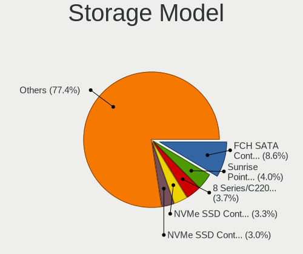

| Model                                                                                   | Computers | Percent |
|-----------------------------------------------------------------------------------------|-----------|---------|
| AMD FCH SATA Controller [AHCI mode]                                                     | 70        | 10.17%  |
| Intel 8 Series/C220 Series Chipset Family 6-port SATA Controller 1 [AHCI mode]          | 33        | 4.8%    |
| Intel Sunrise Point-LP SATA Controller [AHCI mode]                                      | 32        | 4.65%   |
| Samsung NVMe SSD Controller SM981/PM981/PM983                                           | 23        | 3.34%   |
| Samsung NVMe SSD Controller 980                                                         | 21        | 3.05%   |
| Intel 7 Series Chipset Family 6-port SATA Controller [AHCI mode]                        | 18        | 2.62%   |
| Intel 8 Series SATA Controller 1 [AHCI mode]                                            | 17        | 2.47%   |
| Intel Cannon Lake Mobile PCH SATA AHCI Controller                                       | 12        | 1.74%   |
| AMD SB7x0/SB8x0/SB9x0 IDE Controller                                                    | 12        | 1.74%   |
| Intel Volume Management Device NVMe RAID Controller                                     | 11        | 1.6%    |
| Intel 82801HM/HEM (ICH8M/ICH8M-E) SATA Controller [AHCI mode]                           | 10        | 1.45%   |
| AMD FCH SATA Controller D                                                               | 10        | 1.45%   |
| SK hynix Gold P31/PC711 NVMe Solid State Drive                                          | 9         | 1.31%   |
| Micron NVMe Storage Controller                                                          | 9         | 1.31%   |
| Intel 82801IBM/IEM (ICH9M/ICH9M-E) 4 port SATA Controller [AHCI mode]                   | 9         | 1.31%   |
| Intel 82801HM/HEM (ICH8M/ICH8M-E) IDE Controller                                        | 9         | 1.31%   |
| Intel 82801 Mobile SATA Controller [RAID mode]                                          | 9         | 1.31%   |
| Intel 6 Series/C200 Series Chipset Family 6 port Mobile SATA AHCI Controller            | 9         | 1.31%   |
| Intel 6 Series/C200 Series Chipset Family 6 port Desktop SATA AHCI Controller           | 9         | 1.31%   |
| Intel 400 Series Chipset Family SATA AHCI Controller                                    | 9         | 1.31%   |
| SanDisk WD Black SN750 / PC SN730 NVMe SSD                                              | 8         | 1.16%   |
| Intel Tiger Lake-LP SATA Controller                                                     | 8         | 1.16%   |
| Intel Q170/Q150/B150/H170/H110/Z170/CM236 Chipset SATA Controller [AHCI Mode]           | 8         | 1.16%   |
| Intel NM10/ICH7 Family SATA Controller [IDE mode]                                       | 8         | 1.16%   |
| AMD SB7x0/SB8x0/SB9x0 SATA Controller [IDE mode]                                        | 8         | 1.16%   |
| AMD SB7x0/SB8x0/SB9x0 SATA Controller [AHCI mode]                                       | 8         | 1.16%   |
| Samsung NVMe SSD Controller PM9A1/PM9A3/980PRO                                          | 7         | 1.02%   |
| SK hynix BC501 NVMe Solid State Drive                                                   | 6         | 0.87%   |
| SanDisk WD Blue SN550 NVMe SSD                                                          | 6         | 0.87%   |
| Samsung NVMe SSD Controller SM961/PM961/SM963                                           | 6         | 0.87%   |
| Intel Wildcat Point-LP SATA Controller [AHCI Mode]                                      | 6         | 0.87%   |
| Intel Celeron/Pentium Silver Processor SATA Controller                                  | 6         | 0.87%   |
| Intel Cannon Lake PCH SATA AHCI Controller                                              | 6         | 0.87%   |
| Intel 9 Series Chipset Family SATA Controller [AHCI Mode]                               | 6         | 0.87%   |
| Intel 200 Series PCH SATA controller [AHCI mode]                                        | 6         | 0.87%   |
| AMD 400 Series Chipset SATA Controller                                                  | 6         | 0.87%   |
| SanDisk WD Black 2018/SN750 / PC SN720 NVMe SSD                                         | 5         | 0.73%   |
| Intel Comet Lake SATA AHCI Controller                                                   | 5         | 0.73%   |
| Intel 82801G (ICH7 Family) IDE Controller                                               | 5         | 0.73%   |
| Intel 6 Series/C200 Series Chipset Family Desktop SATA Controller (IDE mode, ports 4-5) | 5         | 0.73%   |

Storage Kind
------------

Kind of storage controller (IDE, SATA, NVMe, SAS, ...)

| Kind | Computers | Percent |
|------|-----------|---------|
| SATA | 346       | 56.26%  |
| NVMe | 168       | 27.32%  |
| IDE  | 72        | 11.71%  |
| RAID | 28        | 4.55%   |
| SAS  | 1         | 0.16%   |

Processor
---------

CPU Vendor
----------

Processor vendors

| Vendor  | Computers | Percent |
|---------|-----------|---------|
| Intel   | 339       | 72.44%  |
| AMD     | 124       | 26.5%   |
| ARM     | 4         | 0.85%   |
| Unknown | 1         | 0.21%   |

CPU Model
---------

Processor models

| Model                                         | Computers | Percent |
|-----------------------------------------------|-----------|---------|
| Intel Core i5-7200U CPU @ 2.50GHz             | 12        | 2.55%   |
| Intel Core i7-8550U CPU @ 1.80GHz             | 10        | 2.12%   |
| Intel Core i5-8250U CPU @ 1.60GHz             | 10        | 2.12%   |
| Intel Core i5-3210M CPU @ 2.50GHz             | 7         | 1.49%   |
| AMD Ryzen 7 5700U with Radeon Graphics        | 7         | 1.49%   |
| Intel Core i7-8750H CPU @ 2.20GHz             | 6         | 1.27%   |
| AMD Ryzen 5 3500U with Radeon Vega Mobile Gfx | 6         | 1.27%   |
| Intel Core i5-4200U CPU @ 1.60GHz             | 5         | 1.06%   |
| Intel 11th Gen Core i7-1165G7 @ 2.80GHz       | 5         | 1.06%   |
| AMD Ryzen 7 4800H with Radeon Graphics        | 5         | 1.06%   |
| AMD Ryzen 5 1600 Six-Core Processor           | 5         | 1.06%   |
| Intel Core i7-8565U CPU @ 1.80GHz             | 4         | 0.85%   |
| Intel Core i7-7500U CPU @ 2.70GHz             | 4         | 0.85%   |
| Intel Core i5-8300H CPU @ 2.30GHz             | 4         | 0.85%   |
| Intel Core i5-8265U CPU @ 1.60GHz             | 4         | 0.85%   |
| Intel Core i5-10210U CPU @ 1.60GHz            | 4         | 0.85%   |
| Intel 11th Gen Core i5-1135G7 @ 2.40GHz       | 4         | 0.85%   |
| AMD Ryzen 7 5800H with Radeon Graphics        | 4         | 0.85%   |
| AMD Ryzen 5 4500U with Radeon Graphics        | 4         | 0.85%   |
| Intel Pentium Silver N5000 CPU @ 1.10GHz      | 3         | 0.64%   |
| Intel Pentium CPU N4200 @ 1.10GHz             | 3         | 0.64%   |
| Intel Pentium CPU 2020M @ 2.40GHz             | 3         | 0.64%   |
| Intel Pentium 3556U @ 1.70GHz                 | 3         | 0.64%   |
| Intel Core i7-4790 CPU @ 3.60GHz              | 3         | 0.64%   |
| Intel Core i7-4770 CPU @ 3.40GHz              | 3         | 0.64%   |
| Intel Core i7-10750H CPU @ 2.60GHz            | 3         | 0.64%   |
| Intel Core i5-9400F CPU @ 2.90GHz             | 3         | 0.64%   |
| Intel Core i5-6300U CPU @ 2.40GHz             | 3         | 0.64%   |
| Intel Core i5-4210U CPU @ 1.70GHz             | 3         | 0.64%   |
| Intel Core i5-2400 CPU @ 3.10GHz              | 3         | 0.64%   |
| Intel Core i3-10100F CPU @ 3.60GHz            | 3         | 0.64%   |
| Intel Core 2 Duo CPU E8400 @ 3.00GHz          | 3         | 0.64%   |
| Intel Celeron CPU N2840 @ 2.16GHz             | 3         | 0.64%   |
| Intel Atom x5-Z8350 CPU @ 1.44GHz             | 3         | 0.64%   |
| AMD Ryzen 9 5900X 12-Core Processor           | 3         | 0.64%   |
| AMD Ryzen 5 PRO 5650U with Radeon Graphics    | 3         | 0.64%   |
| AMD Ryzen 5 3550H with Radeon Vega Mobile Gfx | 3         | 0.64%   |
| Intel Pentium M processor 1.86GHz             | 2         | 0.42%   |
| Intel Pentium Dual-Core CPU T4200 @ 2.00GHz   | 2         | 0.42%   |
| Intel Pentium Dual-Core CPU E5400 @ 2.70GHz   | 2         | 0.42%   |

CPU Model Family
----------------

Processor model prefix

| Model                   | Computers | Percent |
|-------------------------|-----------|---------|
| Intel Core i5           | 117       | 24.84%  |
| Intel Core i7           | 66        | 14.01%  |
| Intel Core i3           | 35        | 7.43%   |
| Other                   | 31        | 6.58%   |
| AMD Ryzen 5             | 31        | 6.58%   |
| Intel Core 2 Duo        | 25        | 5.31%   |
| AMD Ryzen 7             | 25        | 5.31%   |
| Intel Pentium           | 20        | 4.25%   |
| Intel Celeron           | 11        | 2.34%   |
| AMD Ryzen 3             | 10        | 2.12%   |
| Intel Atom              | 7         | 1.49%   |
| AMD Ryzen 9             | 7         | 1.49%   |
| Intel Pentium Dual      | 6         | 1.27%   |
| Intel Core i9           | 6         | 1.27%   |
| Intel Xeon              | 5         | 1.06%   |
| Intel Pentium Dual-Core | 5         | 1.06%   |
| AMD FX                  | 5         | 1.06%   |
| AMD A6                  | 5         | 1.06%   |
| AMD Ryzen 5 PRO         | 4         | 0.85%   |
| AMD E                   | 4         | 0.85%   |
| AMD Athlon II X4        | 4         | 0.85%   |
| Intel Pentium Silver    | 3         | 0.64%   |
| AMD Phenom II X4        | 3         | 0.64%   |
| AMD Athlon X4           | 3         | 0.64%   |
| AMD Athlon 64 X2        | 3         | 0.64%   |
| Intel Pentium M         | 2         | 0.42%   |
| Intel Pentium 4         | 2         | 0.42%   |
| Intel Core 2 Quad       | 2         | 0.42%   |
| Intel Core 2            | 2         | 0.42%   |
| ARM BCM                 | 2         | 0.42%   |
| AMD Ryzen 7 PRO         | 2         | 0.42%   |
| AMD E1                  | 2         | 0.42%   |
| AMD Athlon              | 2         | 0.42%   |
| AMD A8                  | 2         | 0.42%   |
| Intel Xeon Bronze       | 1         | 0.21%   |
| Intel Genuine           | 1         | 0.21%   |
| Intel Celeron M         | 1         | 0.21%   |
| AMD Turion 64 X2 Mobile | 1         | 0.21%   |
| AMD Ryzen Threadripper  | 1         | 0.21%   |
| AMD Ryzen 3 PRO         | 1         | 0.21%   |

CPU Cores
---------

Number of processor cores

| Number  | Computers | Percent |
|---------|-----------|---------|
| 2       | 183       | 38.85%  |
| 4       | 179       | 38%     |
| 6       | 43        | 9.13%   |
| 8       | 38        | 8.07%   |
| 1       | 9         | 1.91%   |
| 12      | 5         | 1.06%   |
| 10      | 5         | 1.06%   |
| 3       | 3         | 0.64%   |
| 16      | 2         | 0.42%   |
| 14      | 2         | 0.42%   |
| 24      | 1         | 0.21%   |
| Unknown | 1         | 0.21%   |

CPU Sockets
-----------

Number of sockets

| Number  | Computers | Percent |
|---------|-----------|---------|
| 1       | 465       | 99.36%  |
| 2       | 2         | 0.43%   |
| Unknown | 1         | 0.21%   |

CPU Threads
-----------

Threads per core (Hyper-Threading)

| Number  | Computers | Percent |
|---------|-----------|---------|
| 2       | 305       | 65.03%  |
| 1       | 163       | 34.75%  |
| Unknown | 1         | 0.21%   |

CPU Op-Modes
------------

CPU Operation Modes (32-bit, 64-bit)

| Op mode        | Computers | Percent |
|----------------|-----------|---------|
| 32-bit, 64-bit | 450       | 95.74%  |
| Unknown        | 14        | 2.98%   |
| 32-bit         | 5         | 1.06%   |
| 64-bit         | 1         | 0.21%   |

CPU Microcode
-------------

Microcode number

| Number     | Computers | Percent |
|------------|-----------|---------|
| Unknown    | 110       | 22.31%  |
| 0x306c3    | 38        | 7.71%   |
| 0x206a7    | 20        | 4.06%   |
| 0x306a9    | 18        | 3.65%   |
| 0x806ea    | 17        | 3.45%   |
| 0x906ea    | 16        | 3.25%   |
| 0x806e9    | 16        | 3.25%   |
| 0x1067a    | 14        | 2.84%   |
| 0x40651    | 13        | 2.64%   |
| 0x6fd      | 11        | 2.23%   |
| 0x806ec    | 10        | 2.03%   |
| 0x806c1    | 9         | 1.83%   |
| 0x0a50000c | 9         | 1.83%   |
| 0x08108109 | 8         | 1.62%   |
| 0x906e9    | 7         | 1.42%   |
| 0x08600106 | 7         | 1.42%   |
| 0xa0652    | 6         | 1.22%   |
| 0x306d4    | 6         | 1.22%   |
| 0x08600103 | 6         | 1.22%   |
| 0x0810100b | 6         | 1.22%   |
| 0xa0653    | 5         | 1.01%   |
| 0x906ed    | 5         | 1.01%   |
| 0x30678    | 5         | 1.01%   |
| 0x08608103 | 5         | 1.01%   |
| 0x0800820d | 5         | 1.01%   |
| 0x06006705 | 5         | 1.01%   |
| 0x6fb      | 4         | 0.81%   |
| 0x506e3    | 4         | 0.81%   |
| 0x506c9    | 4         | 0.81%   |
| 0x406e3    | 4         | 0.81%   |
| 0x406c4    | 4         | 0.81%   |
| 0x20655    | 4         | 0.81%   |
| 0x10676    | 4         | 0.81%   |
| 0x08108102 | 4         | 0.81%   |
| 0x010000db | 4         | 0.81%   |
| 0x010000c8 | 4         | 0.81%   |
| 0xa0671    | 3         | 0.61%   |
| 0x706e5    | 3         | 0.61%   |
| 0x706a1    | 3         | 0.61%   |
| 0x0a50000d | 3         | 0.61%   |

CPU Microarch
-------------

Microarchitecture

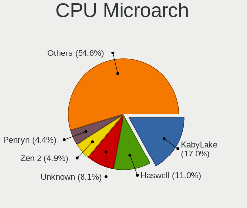

| Name             | Computers | Percent |
|------------------|-----------|---------|
| KabyLake         | 88        | 18.76%  |
| Haswell          | 60        | 12.79%  |
| SandyBridge      | 23        | 4.9%    |
| IvyBridge        | 23        | 4.9%    |
| Unknown          | 22        | 4.69%   |
| Zen 2            | 21        | 4.48%   |
| Penryn           | 21        | 4.48%   |
| Zen+             | 20        | 4.26%   |
| Core             | 19        | 4.05%   |
| Zen 3            | 17        | 3.62%   |
| TigerLake        | 14        | 2.99%   |
| Skylake          | 14        | 2.99%   |
| CometLake        | 14        | 2.99%   |
| Silvermont       | 13        | 2.77%   |
| Zen              | 12        | 2.56%   |
| K10              | 9         | 1.92%   |
| Piledriver       | 8         | 1.71%   |
| IceLake          | 8         | 1.71%   |
| Excavator        | 8         | 1.71%   |
| Broadwell        | 8         | 1.71%   |
| Westmere         | 7         | 1.49%   |
| Goldmont plus    | 6         | 1.28%   |
| Alderlake Hybrid | 6         | 1.28%   |
| K8 Hammer        | 5         | 1.07%   |
| Bobcat           | 5         | 1.07%   |
| P6               | 4         | 0.85%   |
| Goldmont         | 4         | 0.85%   |
| NetBurst         | 2         | 0.43%   |
| Bulldozer        | 2         | 0.43%   |
| Tremont          | 1         | 0.21%   |
| Steamroller      | 1         | 0.21%   |
| Puma             | 1         | 0.21%   |
| Nehalem          | 1         | 0.21%   |
| Jaguar           | 1         | 0.21%   |
| Bonnell          | 1         | 0.21%   |

Graphics
--------

GPU Vendor
----------

Vendors of graphics cards

| Vendor                           | Computers | Percent |
|----------------------------------|-----------|---------|
| Intel                            | 260       | 44.52%  |
| Nvidia                           | 163       | 27.91%  |
| AMD                              | 154       | 26.37%  |
| Matrox Electronics Systems       | 3         | 0.51%   |
| Silicon Integrated Systems [SiS] | 2         | 0.34%   |
| VIA Technologies                 | 1         | 0.17%   |
| ATI Technologies                 | 1         | 0.17%   |

GPU Model
---------

Graphics card models

| Model                                                                                    | Computers | Percent |
|------------------------------------------------------------------------------------------|-----------|---------|
| Intel UHD Graphics 620                                                                   | 23        | 3.87%   |
| Intel HD Graphics 620                                                                    | 18        | 3.03%   |
| Intel Haswell-ULT Integrated Graphics Controller                                         | 17        | 2.86%   |
| Intel 3rd Gen Core processor Graphics Controller                                         | 17        | 2.86%   |
| AMD Renoir                                                                               | 17        | 2.86%   |
| Intel TigerLake-LP GT2 [Iris Xe Graphics]                                                | 13        | 2.18%   |
| Intel CoffeeLake-H GT2 [UHD Graphics 630]                                                | 13        | 2.18%   |
| Intel 4th Gen Core Processor Integrated Graphics Controller                              | 13        | 2.18%   |
| AMD Picasso/Raven 2 [Radeon Vega Series / Radeon Vega Mobile Series]                     | 13        | 2.18%   |
| Intel Xeon E3-1200 v3/4th Gen Core Processor Integrated Graphics Controller              | 12        | 2.02%   |
| Intel 2nd Generation Core Processor Family Integrated Graphics Controller                | 12        | 2.02%   |
| AMD Cezanne [Radeon Vega Series / Radeon Vega Mobile Series]                             | 12        | 2.02%   |
| AMD Lucienne                                                                             | 10        | 1.68%   |
| Intel WhiskeyLake-U GT2 [UHD Graphics 620]                                               | 9         | 1.51%   |
| AMD Ellesmere [Radeon RX 470/480/570/570X/580/580X/590]                                  | 9         | 1.51%   |
| Nvidia GP107M [GeForce GTX 1050 Mobile]                                                  | 8         | 1.34%   |
| Nvidia GA106M [GeForce RTX 3060 Mobile / Max-Q]                                          | 7         | 1.18%   |
| Intel Mobile 4 Series Chipset Integrated Graphics Controller                             | 7         | 1.18%   |
| Intel Atom Processor Z36xxx/Z37xxx Series Graphics & Display                             | 7         | 1.18%   |
| AMD Sun XT [Radeon HD 8670A/8670M/8690M / R5 M330 / M430 / Radeon 520 Mobile]            | 7         | 1.18%   |
| Nvidia GP106 [GeForce GTX 1060 6GB]                                                      | 6         | 1.01%   |
| Intel HD Graphics 5500                                                                   | 6         | 1.01%   |
| Intel CometLake-H GT2 [UHD Graphics]                                                     | 6         | 1.01%   |
| Intel Atom/Celeron/Pentium Processor x5-E8000/J3xxx/N3xxx Integrated Graphics Controller | 6         | 1.01%   |
| AMD Stoney [Radeon R2/R3/R4/R5 Graphics]                                                 | 6         | 1.01%   |
| Nvidia GP107M [GeForce GTX 1050 Ti Mobile]                                               | 5         | 0.84%   |
| Nvidia GM108M [GeForce 840M]                                                             | 5         | 0.84%   |
| Intel Skylake GT2 [HD Graphics 520]                                                      | 5         | 0.84%   |
| Intel HD Graphics 530                                                                    | 5         | 0.84%   |
| Intel CometLake-S GT2 [UHD Graphics 630]                                                 | 5         | 0.84%   |
| AMD Seymour [Radeon HD 6400M/7400M Series]                                               | 5         | 0.84%   |
| AMD Raven Ridge [Radeon Vega Series / Radeon Vega Mobile Series]                         | 5         | 0.84%   |
| Nvidia TU117M [GeForce GTX 1650 Ti Mobile]                                               | 4         | 0.67%   |
| Nvidia TU117M [GeForce GTX 1650 Mobile / Max-Q]                                          | 4         | 0.67%   |
| Nvidia GP107 [GeForce GTX 1050]                                                          | 4         | 0.67%   |
| Nvidia GM107M [GeForce GTX 950M]                                                         | 4         | 0.67%   |
| Nvidia GF117M [GeForce 610M/710M/810M/820M / GT 620M/625M/630M/720M]                     | 4         | 0.67%   |
| Intel HD Graphics 630                                                                    | 4         | 0.67%   |
| Intel Core Processor Integrated Graphics Controller                                      | 4         | 0.67%   |
| Intel CometLake-U GT2 [UHD Graphics]                                                     | 4         | 0.67%   |

GPU Combo
---------

Combinations of graphics cards

| Name            | Computers | Percent |
|-----------------|-----------|---------|
| 1 x Intel       | 159       | 33.69%  |
| 1 x AMD         | 112       | 23.73%  |
| Intel + Nvidia  | 75        | 15.89%  |
| 1 x Nvidia      | 73        | 15.47%  |
| Intel + AMD     | 21        | 4.45%   |
| AMD + Nvidia    | 14        | 2.97%   |
| 2 x AMD         | 7         | 1.48%   |
| Other           | 5         | 1.06%   |
| 1 x SiS         | 2         | 0.42%   |
| 1 x Matrox      | 2         | 0.42%   |
| 1 x VIA         | 1         | 0.21%   |
| Nvidia + Matrox | 1         | 0.21%   |

GPU Driver
----------

Free vs proprietary

| Driver      | Computers | Percent |
|-------------|-----------|---------|
| Free        | 362       | 76.21%  |
| Proprietary | 96        | 20.21%  |
| Unknown     | 17        | 3.58%   |

GPU Memory
----------

Total video memory

| Size in GB | Computers | Percent |
|------------|-----------|---------|
| Unknown    | 243       | 50.1%   |
| 1.01-2.0   | 77        | 15.88%  |
| 0.01-0.5   | 52        | 10.72%  |
| 3.01-4.0   | 43        | 8.87%   |
| 0.51-1.0   | 43        | 8.87%   |
| 7.01-8.0   | 16        | 3.3%    |
| 5.01-6.0   | 5         | 1.03%   |
| 2.01-3.0   | 4         | 0.82%   |
| 8.01-16.0  | 2         | 0.41%   |

Monitor
-------

Monitor Vendor
--------------

Monitor vendors

| Vendor                  | Computers | Percent |
|-------------------------|-----------|---------|
| Samsung Electronics     | 78        | 14.63%  |
| AU Optronics            | 60        | 11.26%  |
| LG Display              | 50        | 9.38%   |
| Dell                    | 50        | 9.38%   |
| BOE                     | 50        | 9.38%   |
| Chimei Innolux          | 44        | 8.26%   |
| AOC                     | 26        | 4.88%   |
| Goldstar                | 21        | 3.94%   |
| Philips                 | 20        | 3.75%   |
| Acer                    | 15        | 2.81%   |
| Lenovo                  | 12        | 2.25%   |
| Sharp                   | 10        | 1.88%   |
| Hewlett-Packard         | 10        | 1.88%   |
| Ancor Communications    | 10        | 1.88%   |
| Apple                   | 7         | 1.31%   |
| CSO                     | 6         | 1.13%   |
| PANDA                   | 5         | 0.94%   |
| Chi Mei Optoelectronics | 5         | 0.94%   |
| BenQ                    | 5         | 0.94%   |
| LG Philips              | 4         | 0.75%   |
| LG Electronics          | 3         | 0.56%   |
| InfoVision              | 3         | 0.56%   |
| Grundig                 | 3         | 0.56%   |
| Fujitsu Siemens         | 3         | 0.56%   |
| ASUSTek Computer        | 3         | 0.56%   |
| Unknown                 | 2         | 0.38%   |
| Sony                    | 2         | 0.38%   |
| Quanta Display          | 2         | 0.38%   |
| Panasonic               | 2         | 0.38%   |
| InnoLux Display         | 2         | 0.38%   |
| Huion                   | 2         | 0.38%   |
| Vestel Elektronik       | 1         | 0.19%   |
| Valve                   | 1         | 0.19%   |
| TSL                     | 1         | 0.19%   |
| TMX                     | 1         | 0.19%   |
| RTK                     | 1         | 0.19%   |
| NOA VISION              | 1         | 0.19%   |
| NEC Computers           | 1         | 0.19%   |
| NCS                     | 1         | 0.19%   |
| MSI                     | 1         | 0.19%   |

Monitor Model
-------------

Monitor models

| Model                                                                 | Computers | Percent |
|-----------------------------------------------------------------------|-----------|---------|
| BOE LCD Monitor BOE06A5 1366x768 344x194mm 15.5-inch                  | 6         | 1.08%   |
| AU Optronics LCD Monitor AUO38ED 1920x1080 344x193mm 15.5-inch        | 5         | 0.9%    |
| LG Display LCD Monitor LGD062E 1920x1080 344x194mm 15.5-inch          | 4         | 0.72%   |
| Dell U2412M DELA07A 1920x1200 518x324mm 24.1-inch                     | 4         | 0.72%   |
| Chimei Innolux LCD Monitor CMN15D5 1920x1080 344x193mm 15.5-inch      | 4         | 0.72%   |
| Chimei Innolux LCD Monitor CMN15C4 1920x1080 344x193mm 15.5-inch      | 4         | 0.72%   |
| BOE LCD Monitor BOE06BA 1920x1080 344x193mm 15.5-inch                 | 4         | 0.72%   |
| LG Display LCD Monitor LGD069A 1920x1080 344x194mm 15.5-inch          | 3         | 0.54%   |
| LG Display LCD Monitor LGD034D 1366x768 344x194mm 15.5-inch           | 3         | 0.54%   |
| LG Display LCD Monitor LGD02DC 1366x768 344x194mm 15.5-inch           | 3         | 0.54%   |
| Lenovo LCD Monitor LEN40BA 1920x1080 344x194mm 15.5-inch              | 3         | 0.54%   |
| Grundig WUXGA GRU4448 1920x1080                                       | 3         | 0.54%   |
| Dell U2312HM DEL4072 1920x1080 510x287mm 23.0-inch                    | 3         | 0.54%   |
| Dell SE2717H/HX DELD0A1 1920x1080 598x336mm 27.0-inch                 | 3         | 0.54%   |
| Dell P2414H DELA09B 1920x1080 527x297mm 23.8-inch                     | 3         | 0.54%   |
| Chimei Innolux LCD Monitor CMN14D4 1920x1080 309x173mm 13.9-inch      | 3         | 0.54%   |
| BOE LCD Monitor BOE0687 1920x1080 344x193mm 15.5-inch                 | 3         | 0.54%   |
| AU Optronics LCD Monitor AUO403D 1920x1080 309x173mm 13.9-inch        | 3         | 0.54%   |
| AOC 27P2DG5 AOC2702 1920x1080 598x336mm 27.0-inch                     | 3         | 0.54%   |
| Sharp LQ156M1JW01 SHP14C3 1920x1080 344x194mm 15.5-inch               | 2         | 0.36%   |
| Sharp LCD Monitor SHP14FA 3840x2400 288x180mm 13.4-inch               | 2         | 0.36%   |
| Sharp LCD Monitor SHP149A 1920x1080 344x194mm 15.5-inch               | 2         | 0.36%   |
| Samsung Electronics U28E590 SAM0C4D 1680x1050 610x350mm 27.7-inch     | 2         | 0.36%   |
| Samsung Electronics LCD Monitor SEC5441 1280x800 331x207mm 15.4-inch  | 2         | 0.36%   |
| Samsung Electronics LCD Monitor SEC3152 1366x768 344x194mm 15.5-inch  | 2         | 0.36%   |
| Samsung Electronics LCD Monitor SEC304C 1366x768 309x174mm 14.0-inch  | 2         | 0.36%   |
| Samsung Electronics LCD Monitor SDC4161 1920x1080 344x194mm 15.5-inch | 2         | 0.36%   |
| Samsung Electronics LCD Monitor SAM0509 1920x1080                     | 2         | 0.36%   |
| Quanta Display LCD Monitor QDS002D 1400x1050 285x214mm 14.0-inch      | 2         | 0.36%   |
| Philips 190C PHLC017 1280x1024 338x270mm 17.0-inch                    | 2         | 0.36%   |
| PANDA LCD Monitor NCP004D 1920x1080 344x194mm 15.5-inch               | 2         | 0.36%   |
| LG Philips LCD Monitor LPLA002 1440x900 367x230mm 17.1-inch           | 2         | 0.36%   |
| LG Display LCD Monitor LGD05D8 1920x1080 344x194mm 15.5-inch          | 2         | 0.36%   |
| LG Display LCD Monitor LGD0590 1920x1080 344x194mm 15.5-inch          | 2         | 0.36%   |
| LG Display LCD Monitor LGD04E8 1920x1080 382x215mm 17.3-inch          | 2         | 0.36%   |
| LG Display LCD Monitor LGD0390 1600x900 382x215mm 17.3-inch           | 2         | 0.36%   |
| LG Display LCD Monitor LGD0289 1600x900 382x215mm 17.3-inch           | 2         | 0.36%   |
| LG Display LCD Monitor LGD0258 1600x900 345x194mm 15.6-inch           | 2         | 0.36%   |
| Lenovo LBG AIO PC LEN8000 1920x1080 480x270mm 21.7-inch               | 2         | 0.36%   |
| InfoVision LCD Monitor IVO057D 1920x1080 309x174mm 14.0-inch          | 2         | 0.36%   |

Monitor Resolution
------------------

Monitor screen resolution

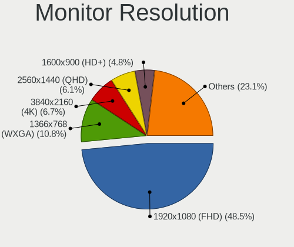

| Resolution         | Computers | Percent |
|--------------------|-----------|---------|
| 1920x1080 (FHD)    | 250       | 49.5%   |
| 1366x768 (WXGA)    | 58        | 11.49%  |
| 1600x900 (HD+)     | 30        | 5.94%   |
| 3840x2160 (4K)     | 27        | 5.35%   |
| 2560x1440 (QHD)    | 25        | 4.95%   |
| 1680x1050 (WSXGA+) | 18        | 3.56%   |
| 1280x1024 (SXGA)   | 14        | 2.77%   |
| 1440x900 (WXGA+)   | 12        | 2.38%   |
| 1920x1200 (WUXGA)  | 11        | 2.18%   |
| 1280x800 (WXGA)    | 9         | 1.78%   |
| Unknown            | 9         | 1.78%   |
| 2560x1600          | 6         | 1.19%   |
| 3840x1080          | 4         | 0.79%   |
| 2880x1800          | 4         | 0.79%   |
| 1360x768           | 4         | 0.79%   |
| 3440x1440          | 3         | 0.59%   |
| 2160x1440          | 3         | 0.59%   |
| 5760x1080          | 2         | 0.4%    |
| 3840x2400          | 2         | 0.4%    |
| 2560x1080          | 2         | 0.4%    |
| 2048x1152          | 2         | 0.4%    |
| 1400x1050          | 2         | 0.4%    |
| 800x1280           | 1         | 0.2%    |
| 4480x1440          | 1         | 0.2%    |
| 3200x2000          | 1         | 0.2%    |
| 1920x1280          | 1         | 0.2%    |
| 1280x960           | 1         | 0.2%    |
| 1280x720 (HD)      | 1         | 0.2%    |
| 1024x600           | 1         | 0.2%    |
| 1024x576           | 1         | 0.2%    |

Monitor Diagonal
----------------

Diagonal size in inches

| Inches  | Computers | Percent |
|---------|-----------|---------|
| 15      | 162       | 30.22%  |
| 17      | 50        | 9.33%   |
| 27      | 47        | 8.77%   |
| 23      | 41        | 7.65%   |
| 24      | 39        | 7.28%   |
| 14      | 32        | 5.97%   |
| 13      | 30        | 5.6%    |
| 21      | 27        | 5.04%   |
| Unknown | 23        | 4.29%   |
| 22      | 10        | 1.87%   |
| 20      | 9         | 1.68%   |
| 31      | 8         | 1.49%   |
| 19      | 8         | 1.49%   |
| 54      | 7         | 1.31%   |
| 12      | 7         | 1.31%   |
| 16      | 5         | 0.93%   |
| 34      | 4         | 0.75%   |
| 26      | 4         | 0.75%   |
| 18      | 4         | 0.75%   |
| 25      | 3         | 0.56%   |
| 84      | 2         | 0.37%   |
| 72      | 2         | 0.37%   |
| 33      | 2         | 0.37%   |
| 10      | 2         | 0.37%   |
| 60      | 1         | 0.19%   |
| 58      | 1         | 0.19%   |
| 49      | 1         | 0.19%   |
| 46      | 1         | 0.19%   |
| 38      | 1         | 0.19%   |
| 32      | 1         | 0.19%   |
| 11      | 1         | 0.19%   |
| 7       | 1         | 0.19%   |

Monitor Width
-------------

Physical width

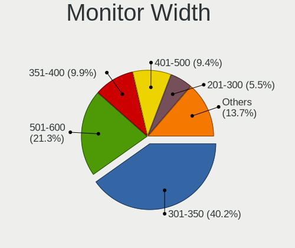

| Width in mm | Computers | Percent |
|-------------|-----------|---------|
| 301-350     | 211       | 40.34%  |
| 501-600     | 114       | 21.8%   |
| 351-400     | 53        | 10.13%  |
| 401-500     | 52        | 9.94%   |
| 201-300     | 28        | 5.35%   |
| Unknown     | 23        | 4.4%    |
| 601-700     | 18        | 3.44%   |
| 1001-1500   | 11        | 2.1%    |
| 701-800     | 7         | 1.34%   |
| 1501-2000   | 4         | 0.76%   |
| 801-900     | 1         | 0.19%   |
| 1-100       | 1         | 0.19%   |

Aspect Ratio
------------

Proportional relationship between the width and the height

| Ratio   | Computers | Percent |
|---------|-----------|---------|
| 16/9    | 358       | 76.33%  |
| 16/10   | 66        | 14.07%  |
| Unknown | 19        | 4.05%   |
| 5/4     | 12        | 2.56%   |
| 3/2     | 6         | 1.28%   |
| 21/9    | 4         | 0.85%   |
| 4/3     | 3         | 0.64%   |
| 0.67    | 1         | 0.21%   |

Monitor Area
------------

Area in inch

| Area in inch | Computers | Percent |
|----------------|-----------|---------|
| 101-110        | 160       | 30.08%  |
| 201-250        | 86        | 16.17%  |
| 301-350        | 51        | 9.59%   |
| 81-90          | 50        | 9.4%    |
| 121-130        | 36        | 6.77%   |
| 151-200        | 30        | 5.64%   |
| Unknown        | 23        | 4.32%   |
| 251-300        | 17        | 3.2%    |
| 351-500        | 15        | 2.82%   |
| More than 1000 | 14        | 2.63%   |
| 71-80          | 11        | 2.07%   |
| 141-150        | 11        | 2.07%   |
| 131-140        | 7         | 1.32%   |
| 61-70          | 6         | 1.13%   |
| 111-120        | 6         | 1.13%   |
| 91-100         | 3         | 0.56%   |
| 41-50          | 2         | 0.38%   |
| 501-1000       | 2         | 0.38%   |
| 51-60          | 1         | 0.19%   |
| 1-40           | 1         | 0.19%   |

Pixel Density
-------------

Pixels per inch

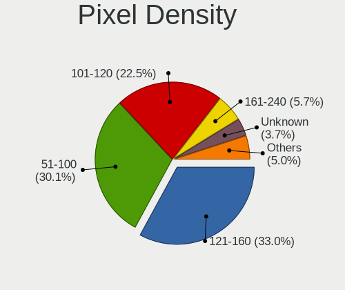

| Density       | Computers | Percent |
|---------------|-----------|---------|
| 121-160       | 170       | 33.07%  |
| 51-100        | 160       | 31.13%  |
| 101-120       | 116       | 22.57%  |
| Unknown       | 23        | 4.47%   |
| 161-240       | 22        | 4.28%   |
| 1-50          | 14        | 2.72%   |
| More than 240 | 9         | 1.75%   |

Multiple Monitors
-----------------

Total monitors connected

| Total | Computers | Percent |
|-------|-----------|---------|
| 1     | 372       | 76.7%   |
| 2     | 87        | 17.94%  |
| 0     | 15        | 3.09%   |
| 3     | 9         | 1.86%   |
| 4     | 2         | 0.41%   |

Network
-------

Net Controller Vendor
---------------------

Controller vendors

| Vendor                            | Computers | Percent |
|-----------------------------------|-----------|---------|
| Realtek Semiconductor             | 280       | 38.83%  |
| Intel                             | 204       | 28.29%  |
| Qualcomm Atheros                  | 84        | 11.65%  |
| Broadcom                          | 33        | 4.58%   |
| MediaTek                          | 17        | 2.36%   |
| TP-Link                           | 12        | 1.66%   |
| Broadcom Limited                  | 8         | 1.11%   |
| Samsung Electronics               | 7         | 0.97%   |
| Ralink                            | 7         | 0.97%   |
| Qualcomm Atheros Communications   | 7         | 0.97%   |
| Ralink Technology                 | 6         | 0.83%   |
| Marvell Technology Group          | 6         | 0.83%   |
| Nvidia                            | 5         | 0.69%   |
| D-Link                            | 5         | 0.69%   |
| ASIX Electronics                  | 5         | 0.69%   |
| Xiaomi                            | 4         | 0.55%   |
| VIA Technologies                  | 2         | 0.28%   |
| Sundance Technology Inc / IC Plus | 2         | 0.28%   |
| Silicon Integrated Systems [SiS]  | 2         | 0.28%   |
| Qualcomm                          | 2         | 0.28%   |
| NetGear                           | 2         | 0.28%   |
| Lenovo                            | 2         | 0.28%   |
| Fibocom                           | 2         | 0.28%   |
| Ericsson Business Mobile Networks | 2         | 0.28%   |
| Dell                              | 2         | 0.28%   |
| T & A Mobile Phones               | 1         | 0.14%   |
| Nokia Mobile Phones               | 1         | 0.14%   |
| Microsoft                         | 1         | 0.14%   |
| Linksys                           | 1         | 0.14%   |
| ICS Advent                        | 1         | 0.14%   |
| Huawei Technologies               | 1         | 0.14%   |
| HTC (High Tech Computer)          | 1         | 0.14%   |
| Hewlett-Packard                   | 1         | 0.14%   |
| Edimax Technology                 | 1         | 0.14%   |
| DisplayLink                       | 1         | 0.14%   |
| D-Link System                     | 1         | 0.14%   |
| ASUSTek Computer                  | 1         | 0.14%   |
| Aquantia                          | 1         | 0.14%   |

Net Controller Model
--------------------

Controller models

| Model                                                                   | Computers | Percent |
|-------------------------------------------------------------------------|-----------|---------|
| Realtek RTL8111/8168/8411 PCI Express Gigabit Ethernet Controller       | 215       | 26.06%  |
| Intel Wireless 8265 / 8275                                              | 23        | 2.79%   |
| Qualcomm Atheros QCA9377 802.11ac Wireless Network Adapter              | 22        | 2.67%   |
| Intel Wi-Fi 6 AX200                                                     | 22        | 2.67%   |
| Realtek RTL810xE PCI Express Fast Ethernet controller                   | 20        | 2.42%   |
| Realtek RTL8822CE 802.11ac PCIe Wireless Network Adapter                | 17        | 2.06%   |
| Qualcomm Atheros QCA9565 / AR9565 Wireless Network Adapter              | 14        | 1.7%    |
| Intel Dual Band Wireless-AC 3168NGW [Stone Peak]                        | 12        | 1.45%   |
| MediaTek MT7921 802.11ax PCI Express Wireless Network Adapter           | 11        | 1.33%   |
| Realtek RTL8821CE 802.11ac PCIe Wireless Network Adapter                | 10        | 1.21%   |
| Realtek RTL8153 Gigabit Ethernet Adapter                                | 10        | 1.21%   |
| Qualcomm Atheros AR9485 Wireless Network Adapter                        | 9         | 1.09%   |
| Intel Wireless 3165                                                     | 9         | 1.09%   |
| Intel Ethernet Connection I217-LM                                       | 9         | 1.09%   |
| Intel Ethernet Connection (4) I219-V                                    | 9         | 1.09%   |
| Intel Wireless 7260                                                     | 8         | 0.97%   |
| Intel Wi-Fi 6 AX201                                                     | 8         | 0.97%   |
| Intel 82579LM Gigabit Network Connection (Lewisville)                   | 8         | 0.97%   |
| Qualcomm Atheros QCA6174 802.11ac Wireless Network Adapter              | 7         | 0.85%   |
| Qualcomm Atheros AR242x / AR542x Wireless Network Adapter (PCI-Express) | 7         | 0.85%   |
| Intel Wireless 7265                                                     | 7         | 0.85%   |
| Intel Centrino Advanced-N 6205 [Taylor Peak]                            | 7         | 0.85%   |
| Intel Cannon Lake PCH CNVi WiFi                                         | 7         | 0.85%   |
| TP-Link TL-WN722N v2/v3 [Realtek RTL8188EUS]                            | 6         | 0.73%   |
| Qualcomm Atheros AR9271 802.11n                                         | 6         | 0.73%   |
| Intel Wireless 3160                                                     | 6         | 0.73%   |
| Broadcom BCM43142 802.11b/g/n                                           | 6         | 0.73%   |
| Samsung Galaxy series, misc. (tethering mode)                           | 5         | 0.61%   |
| Realtek RTL8723BE PCIe Wireless Network Adapter                         | 5         | 0.61%   |
| Qualcomm Atheros QCA8172 Fast Ethernet                                  | 5         | 0.61%   |
| Qualcomm Atheros AR9285 Wireless Network Adapter (PCI-Express)          | 5         | 0.61%   |
| Intel Ethernet Connection I217-V                                        | 5         | 0.61%   |
| Intel Ethernet Connection (7) I219-V                                    | 5         | 0.61%   |
| Intel Ethernet Connection (2) I218-V                                    | 5         | 0.61%   |
| Intel Comet Lake PCH CNVi WiFi                                          | 5         | 0.61%   |
| Intel Alder Lake-P PCH CNVi WiFi                                        | 5         | 0.61%   |
| Realtek RTL8852AE 802.11ax PCIe Wireless Network Adapter                | 4         | 0.48%   |
| Realtek RTL8822BE 802.11a/b/g/n/ac WiFi adapter                         | 4         | 0.48%   |
| Realtek RTL8125 2.5GbE Controller                                       | 4         | 0.48%   |
| Ralink MT7601U Wireless Adapter                                         | 4         | 0.48%   |

Wireless Vendor
---------------

Wireless vendors

| Vendor                          | Computers | Percent |
|---------------------------------|-----------|---------|
| Intel                           | 163       | 43.24%  |
| Qualcomm Atheros                | 69        | 18.3%   |
| Realtek Semiconductor           | 55        | 14.59%  |
| Broadcom                        | 21        | 5.57%   |
| MediaTek                        | 16        | 4.24%   |
| TP-Link                         | 12        | 3.18%   |
| Ralink                          | 7         | 1.86%   |
| Qualcomm Atheros Communications | 7         | 1.86%   |
| Ralink Technology               | 6         | 1.59%   |
| D-Link                          | 5         | 1.33%   |
| Broadcom Limited                | 4         | 1.06%   |
| Qualcomm                        | 2         | 0.53%   |
| NetGear                         | 2         | 0.53%   |
| Fibocom                         | 2         | 0.53%   |
| Dell                            | 2         | 0.53%   |
| Microsoft                       | 1         | 0.27%   |
| Linksys                         | 1         | 0.27%   |
| Edimax Technology               | 1         | 0.27%   |
| ASUSTek Computer                | 1         | 0.27%   |

Wireless Model
--------------

Wireless models

| Model                                                                   | Computers | Percent |
|-------------------------------------------------------------------------|-----------|---------|
| Intel Wireless 8265 / 8275                                              | 23        | 6.08%   |
| Qualcomm Atheros QCA9377 802.11ac Wireless Network Adapter              | 22        | 5.82%   |
| Intel Wi-Fi 6 AX200                                                     | 22        | 5.82%   |
| Realtek RTL8822CE 802.11ac PCIe Wireless Network Adapter                | 17        | 4.5%    |
| Qualcomm Atheros QCA9565 / AR9565 Wireless Network Adapter              | 14        | 3.7%    |
| Intel Dual Band Wireless-AC 3168NGW [Stone Peak]                        | 12        | 3.17%   |
| MediaTek MT7921 802.11ax PCI Express Wireless Network Adapter           | 11        | 2.91%   |
| Realtek RTL8821CE 802.11ac PCIe Wireless Network Adapter                | 10        | 2.65%   |
| Qualcomm Atheros AR9485 Wireless Network Adapter                        | 9         | 2.38%   |
| Intel Wireless 3165                                                     | 9         | 2.38%   |
| Intel Wireless 7260                                                     | 8         | 2.12%   |
| Intel Wi-Fi 6 AX201                                                     | 8         | 2.12%   |
| Qualcomm Atheros QCA6174 802.11ac Wireless Network Adapter              | 7         | 1.85%   |
| Qualcomm Atheros AR242x / AR542x Wireless Network Adapter (PCI-Express) | 7         | 1.85%   |
| Intel Wireless 7265                                                     | 7         | 1.85%   |
| Intel Centrino Advanced-N 6205 [Taylor Peak]                            | 7         | 1.85%   |
| Intel Cannon Lake PCH CNVi WiFi                                         | 7         | 1.85%   |
| TP-Link TL-WN722N v2/v3 [Realtek RTL8188EUS]                            | 6         | 1.59%   |
| Qualcomm Atheros AR9271 802.11n                                         | 6         | 1.59%   |
| Intel Wireless 3160                                                     | 6         | 1.59%   |
| Broadcom BCM43142 802.11b/g/n                                           | 6         | 1.59%   |
| Realtek RTL8723BE PCIe Wireless Network Adapter                         | 5         | 1.32%   |
| Qualcomm Atheros AR9285 Wireless Network Adapter (PCI-Express)          | 5         | 1.32%   |
| Intel Comet Lake PCH CNVi WiFi                                          | 5         | 1.32%   |
| Intel Alder Lake-P PCH CNVi WiFi                                        | 5         | 1.32%   |
| Realtek RTL8852AE 802.11ax PCIe Wireless Network Adapter                | 4         | 1.06%   |
| Realtek RTL8822BE 802.11a/b/g/n/ac WiFi adapter                         | 4         | 1.06%   |
| Ralink MT7601U Wireless Adapter                                         | 4         | 1.06%   |
| Intel Dual Band Wireless-AC 3165 Plus Bluetooth                         | 4         | 1.06%   |
| Intel Comet Lake PCH-LP CNVi WiFi                                       | 4         | 1.06%   |
| Intel Centrino Advanced-N 6235                                          | 4         | 1.06%   |
| TP-Link 802.11ac NIC                                                    | 3         | 0.79%   |
| Realtek RTL8821AE 802.11ac PCIe Wireless Network Adapter                | 3         | 0.79%   |
| Ralink RT2561/RT61 802.11g PCI                                          | 3         | 0.79%   |
| Intel Wireless-AC 9260                                                  | 3         | 0.79%   |
| Intel WiFi Link 5100                                                    | 3         | 0.79%   |
| Intel PRO/Wireless 4965 AG or AGN [Kedron] Network Connection           | 3         | 0.79%   |
| Intel Ice Lake-LP PCH CNVi WiFi                                         | 3         | 0.79%   |
| Broadcom Limited BCM4312 802.11b/g LP-PHY                               | 3         | 0.79%   |
| Realtek RTL8188EUS 802.11n Wireless Network Adapter                     | 2         | 0.53%   |

Ethernet Vendor
---------------

Ethernet vendors

| Vendor                            | Computers | Percent |
|-----------------------------------|-----------|---------|
| Realtek Semiconductor             | 254       | 58.53%  |
| Intel                             | 96        | 22.12%  |
| Qualcomm Atheros                  | 25        | 5.76%   |
| Broadcom                          | 13        | 3%      |
| Marvell Technology Group          | 6         | 1.38%   |
| Samsung Electronics               | 5         | 1.15%   |
| Nvidia                            | 5         | 1.15%   |
| ASIX Electronics                  | 5         | 1.15%   |
| Xiaomi                            | 4         | 0.92%   |
| Broadcom Limited                  | 4         | 0.92%   |
| VIA Technologies                  | 2         | 0.46%   |
| Sundance Technology Inc / IC Plus | 2         | 0.46%   |
| Silicon Integrated Systems [SiS]  | 2         | 0.46%   |
| Lenovo                            | 2         | 0.46%   |
| TP-Link                           | 1         | 0.23%   |
| T & A Mobile Phones               | 1         | 0.23%   |
| MediaTek                          | 1         | 0.23%   |
| ICS Advent                        | 1         | 0.23%   |
| Huawei Technologies               | 1         | 0.23%   |
| HTC (High Tech Computer)          | 1         | 0.23%   |
| DisplayLink                       | 1         | 0.23%   |
| D-Link System                     | 1         | 0.23%   |
| Aquantia                          | 1         | 0.23%   |

Ethernet Model
--------------

Ethernet models

| Model                                                             | Computers | Percent |
|-------------------------------------------------------------------|-----------|---------|
| Realtek RTL8111/8168/8411 PCI Express Gigabit Ethernet Controller | 215       | 48.97%  |
| Realtek RTL810xE PCI Express Fast Ethernet controller             | 20        | 4.56%   |
| Realtek RTL8153 Gigabit Ethernet Adapter                          | 10        | 2.28%   |
| Intel Ethernet Connection I217-LM                                 | 9         | 2.05%   |
| Intel Ethernet Connection (4) I219-V                              | 9         | 2.05%   |
| Intel 82579LM Gigabit Network Connection (Lewisville)             | 8         | 1.82%   |
| Samsung Galaxy series, misc. (tethering mode)                     | 5         | 1.14%   |
| Qualcomm Atheros QCA8172 Fast Ethernet                            | 5         | 1.14%   |
| Intel Ethernet Connection I217-V                                  | 5         | 1.14%   |
| Intel Ethernet Connection (7) I219-V                              | 5         | 1.14%   |
| Intel Ethernet Connection (2) I218-V                              | 5         | 1.14%   |
| Realtek RTL8125 2.5GbE Controller                                 | 4         | 0.91%   |
| Qualcomm Atheros AR8152 v2.0 Fast Ethernet                        | 4         | 0.91%   |
| Intel I211 Gigabit Network Connection                             | 4         | 0.91%   |
| Intel Ethernet Controller I225-V                                  | 4         | 0.91%   |
| ASIX AX88179 Gigabit Ethernet                                     | 4         | 0.91%   |
| Xiaomi Mi/Redmi series (RNDIS)                                    | 3         | 0.68%   |
| Realtek RTL-8100/8101L/8139 PCI Fast Ethernet Adapter             | 3         | 0.68%   |
| Realtek Killer E2600 Gigabit Ethernet Controller                  | 3         | 0.68%   |
| Qualcomm Atheros AR8161 Gigabit Ethernet                          | 3         | 0.68%   |
| Qualcomm Atheros AR8151 v2.0 Gigabit Ethernet                     | 3         | 0.68%   |
| Qualcomm Atheros AR8132 Fast Ethernet                             | 3         | 0.68%   |
| Intel Ethernet Connection I218-LM                                 | 3         | 0.68%   |
| Intel Ethernet Connection (4) I219-LM                             | 3         | 0.68%   |
| Intel Ethernet Connection (2) I219-V                              | 3         | 0.68%   |
| Intel 82567LM Gigabit Network Connection                          | 3         | 0.68%   |
| VIA VT6102/VT6103 [Rhine-II]                                      | 2         | 0.46%   |
| Silicon Integrated Systems [SiS] 191 Gigabit Ethernet Adapter     | 2         | 0.46%   |
| Qualcomm Atheros QCA8171 Gigabit Ethernet                         | 2         | 0.46%   |
| Qualcomm Atheros Killer E220x Gigabit Ethernet Controller         | 2         | 0.46%   |
| Qualcomm Atheros AR8121/AR8113/AR8114 Gigabit or Fast Ethernet    | 2         | 0.46%   |
| Nvidia MCP61 Ethernet                                             | 2         | 0.46%   |
| Marvell Group 88E8056 PCI-E Gigabit Ethernet Controller           | 2         | 0.46%   |
| Marvell Group 88E8055 PCI-E Gigabit Ethernet Controller           | 2         | 0.46%   |
| Lenovo USB-C Dock Ethernet                                        | 2         | 0.46%   |
| Intel I210 Gigabit Network Connection                             | 2         | 0.46%   |
| Intel Ethernet Connection I219-LM                                 | 2         | 0.46%   |
| Intel Ethernet Connection (7) I219-LM                             | 2         | 0.46%   |
| Intel Ethernet Connection (6) I219-V                              | 2         | 0.46%   |
| Intel Ethernet Connection (3) I218-LM                             | 2         | 0.46%   |

Net Controller Kind
-------------------

Ethernet, WiFi or modem

| Kind     | Computers | Percent |
|----------|-----------|---------|
| Ethernet | 405       | 52.33%  |
| WiFi     | 361       | 46.64%  |
| Modem    | 7         | 0.9%    |
| Unknown  | 1         | 0.13%   |

Used Controller
---------------

Currently used network controller

| Kind     | Computers | Percent |
|----------|-----------|---------|
| WiFi     | 301       | 61.18%  |
| Ethernet | 191       | 38.82%  |

NICs
----

Total network controllers on board

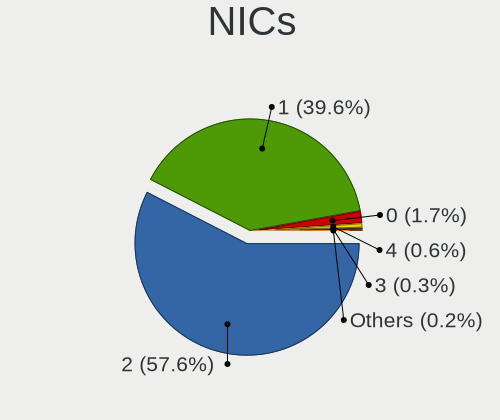

| Total | Computers | Percent |
|-------|-----------|---------|
| 2     | 272       | 58%     |
| 1     | 182       | 38.81%  |
| 0     | 10        | 2.13%   |
| 4     | 3         | 0.64%   |
| 3     | 2         | 0.43%   |

IPv6
----

IPv6 vs IPv4

| Used | Computers | Percent |
|------|-----------|---------|
| No   | 451       | 95.96%  |
| Yes  | 19        | 4.04%   |

Bluetooth
---------

Bluetooth Vendor
----------------

Controller vendors

| Vendor                          | Computers | Percent |
|---------------------------------|-----------|---------|
| Intel                           | 129       | 44.33%  |
| Realtek Semiconductor           | 35        | 12.03%  |
| Lite-On Technology              | 25        | 8.59%   |
| Qualcomm Atheros Communications | 24        | 8.25%   |
| IMC Networks                    | 19        | 6.53%   |
| Broadcom                        | 13        | 4.47%   |
| Foxconn / Hon Hai               | 11        | 3.78%   |
| Cambridge Silicon Radio         | 11        | 3.78%   |
| Hewlett-Packard                 | 6         | 2.06%   |
| Apple                           | 6         | 2.06%   |
| Toshiba                         | 3         | 1.03%   |
| Foxconn International           | 3         | 1.03%   |
| ASUSTek Computer                | 2         | 0.69%   |
| TP-Link                         | 1         | 0.34%   |
| Realtek                         | 1         | 0.34%   |
| Integrated System Solution      | 1         | 0.34%   |
| Dell                            | 1         | 0.34%   |

Bluetooth Model
---------------

Controller models

| Model                                               | Computers | Percent |
|-----------------------------------------------------|-----------|---------|
| Intel Bluetooth wireless interface                  | 54        | 18.56%  |
| Realtek Bluetooth Radio                             | 29        | 9.97%   |
| Intel AX201 Bluetooth                               | 22        | 7.56%   |
| Intel AX200 Bluetooth                               | 22        | 7.56%   |
| Lite-On Qualcomm Atheros QCA9377 Bluetooth          | 15        | 5.15%   |
| Intel Bluetooth 9460/9560 Jefferson Peak (JfP)      | 12        | 4.12%   |
| Intel Wireless-AC 3168 Bluetooth                    | 11        | 3.78%   |
| Cambridge Silicon Radio Bluetooth Dongle (HCI mode) | 11        | 3.78%   |
| Qualcomm Atheros  Bluetooth Device                  | 9         | 3.09%   |
| IMC Networks Bluetooth Radio                        | 9         | 3.09%   |
| Qualcomm Atheros AR3012 Bluetooth 4.0               | 6         | 2.06%   |
| IMC Networks Wireless_Device                        | 5         | 1.72%   |
| Foxconn / Hon Hai Bluetooth Device                  | 5         | 1.72%   |
| Lite-On Wireless_Device                             | 4         | 1.37%   |
| Broadcom BCM2045 Bluetooth                          | 4         | 1.37%   |
| Realtek  Bluetooth 4.2 Adapter                      | 3         | 1.03%   |
| Qualcomm Atheros QCA61x4 Bluetooth 4.0              | 3         | 1.03%   |
| Qualcomm Atheros AR3011 Bluetooth                   | 3         | 1.03%   |
| Lite-On Bluetooth Device                            | 3         | 1.03%   |
| Intel Wireless-AC 9260 Bluetooth Adapter            | 3         | 1.03%   |
| Intel Centrino Bluetooth Wireless Transceiver       | 3         | 1.03%   |
| HP Bluetooth 2.0 Interface [Broadcom BCM2045]       | 3         | 1.03%   |
| Foxconn International BCM43142A0 Bluetooth module   | 3         | 1.03%   |
| Realtek RTL8821A Bluetooth                          | 2         | 0.69%   |
| Intel Bluetooth Device                              | 2         | 0.69%   |
| IMC Networks Bluetooth Device                       | 2         | 0.69%   |
| Foxconn / Hon Hai Wireless_Device                   | 2         | 0.69%   |
| Foxconn / Hon Hai MediaTek Bluetooth Adapter        | 2         | 0.69%   |
| Broadcom HP Portable Bumble Bee                     | 2         | 0.69%   |
| ASUS Broadcom BCM20702A0 Bluetooth                  | 2         | 0.69%   |
| Apple Built-in Bluetooth 2.0+EDR HCI                | 2         | 0.69%   |
| Apple Bluetooth USB Host Controller                 | 2         | 0.69%   |
| Apple Bluetooth Host Controller                     | 2         | 0.69%   |
| TP-Link UB500 Adapter                               | 1         | 0.34%   |
| Toshiba Integrated Bluetooth HCI                    | 1         | 0.34%   |
| Toshiba Integrated Bluetooth (Taiyo Yuden)          | 1         | 0.34%   |
| Toshiba Bluetooth Device                            | 1         | 0.34%   |
| Realtek RTL8723B Bluetooth                          | 1         | 0.34%   |
| Realtek Bluetooth Radio                             | 1         | 0.34%   |
| Qualcomm Atheros Bluetooth                          | 1         | 0.34%   |

Sound
-----

Sound Vendor
------------

Sound card vendors

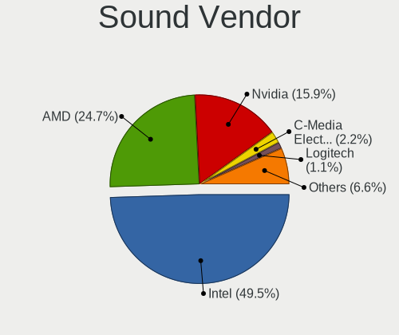

| Vendor                           | Computers | Percent |
|----------------------------------|-----------|---------|
| Intel                            | 326       | 50.23%  |
| AMD                              | 156       | 24.04%  |
| Nvidia                           | 100       | 15.41%  |
| C-Media Electronics              | 15        | 2.31%   |
| Logitech                         | 9         | 1.39%   |
| Lenovo                           | 4         | 0.62%   |
| JMTek                            | 4         | 0.62%   |
| Creative Labs                    | 3         | 0.46%   |
| VIA Technologies                 | 2         | 0.31%   |
| Trust                            | 2         | 0.31%   |
| Silicon Integrated Systems [SiS] | 2         | 0.31%   |
| Microsoft                        | 2         | 0.31%   |
| ZOOM                             | 1         | 0.15%   |
| YZ Technology                    | 1         | 0.15%   |
| Yamaha                           | 1         | 0.15%   |
| XMOS                             | 1         | 0.15%   |
| Texas Instruments                | 1         | 0.15%   |
| Tenx Technology                  | 1         | 0.15%   |
| SteelSeries ApS                  | 1         | 0.15%   |
| Samson Technologies              | 1         | 0.15%   |
| Realtek Semiconductor            | 1         | 0.15%   |
| Razer USA                        | 1         | 0.15%   |
| Plantronics                      | 1         | 0.15%   |
| Pioneer DJ                       | 1         | 0.15%   |
| Native Instruments               | 1         | 0.15%   |
| MCS                              | 1         | 0.15%   |
| M-Audio                          | 1         | 0.15%   |
| Kingston Technology              | 1         | 0.15%   |
| GN Netcom                        | 1         | 0.15%   |
| Focusrite-Novation               | 1         | 0.15%   |
| Ensoniq                          | 1         | 0.15%   |
| Cirrus Logic                     | 1         | 0.15%   |
| BEHRINGER International          | 1         | 0.15%   |
| ATI Technologies                 | 1         | 0.15%   |
| ASUSTek Computer                 | 1         | 0.15%   |
| Astro Gaming                     | 1         | 0.15%   |

Sound Model
-----------

Sound card models

| Model                                                                      | Computers | Percent |
|----------------------------------------------------------------------------|-----------|---------|
| AMD Family 17h/19h HD Audio Controller                                     | 65        | 8.27%   |
| Intel Sunrise Point-LP HD Audio                                            | 46        | 5.85%   |
| Intel 8 Series/C220 Series Chipset High Definition Audio Controller        | 34        | 4.33%   |
| AMD Renoir Radeon High Definition Audio Controller                         | 33        | 4.2%    |
| Intel Xeon E3-1200 v3/4th Gen Core Processor HD Audio Controller           | 28        | 3.56%   |
| Intel 7 Series/C216 Chipset Family High Definition Audio Controller        | 24        | 3.05%   |
| Intel Cannon Lake PCH cAVS                                                 | 22        | 2.8%    |
| Intel 6 Series/C200 Series Chipset Family High Definition Audio Controller | 22        | 2.8%    |
| Intel Haswell-ULT HD Audio Controller                                      | 17        | 2.16%   |
| Intel 8 Series HD Audio Controller                                         | 17        | 2.16%   |
| AMD Raven/Raven2/Fenghuang HDMI/DP Audio Controller                        | 17        | 2.16%   |
| Nvidia GP107GL High Definition Audio Controller                            | 16        | 2.04%   |
| Intel 82801I (ICH9 Family) HD Audio Controller                             | 15        | 1.91%   |
| AMD SBx00 Azalia (Intel HDA)                                               | 15        | 1.91%   |
| Intel Tiger Lake-LP Smart Sound Technology Audio Controller                | 14        | 1.78%   |
| Intel 82801H (ICH8 Family) HD Audio Controller                             | 12        | 1.53%   |
| Nvidia TU107 GeForce GTX 1650 High Definition Audio Controller             | 11        | 1.4%    |
| Nvidia GP106 High Definition Audio Controller                              | 11        | 1.4%    |
| Intel NM10/ICH7 Family High Definition Audio Controller                    | 10        | 1.27%   |
| Intel Cannon Point-LP High Definition Audio Controller                     | 10        | 1.27%   |
| AMD Family 17h (Models 00h-0fh) HD Audio Controller                        | 10        | 1.27%   |
| Intel Comet Lake PCH cAVS                                                  | 9         | 1.15%   |
| Intel 100 Series/C230 Series Chipset Family HD Audio Controller            | 9         | 1.15%   |
| AMD FCH Azalia Controller                                                  | 9         | 1.15%   |
| AMD Ellesmere HDMI Audio [Radeon RX 470/480 / 570/580/590]                 | 9         | 1.15%   |
| Nvidia GA106 High Definition Audio Controller                              | 8         | 1.02%   |
| Intel Wildcat Point-LP High Definition Audio Controller                    | 8         | 1.02%   |
| Intel Broadwell-U Audio Controller                                         | 8         | 1.02%   |
| AMD Family 15h (Models 60h-6fh) Audio Controller                           | 8         | 1.02%   |
| Intel 9 Series Chipset Family HD Audio Controller                          | 7         | 0.89%   |
| Intel 200 Series PCH HD Audio                                              | 7         | 0.89%   |
| AMD Oland/Hainan/Cape Verde/Pitcairn HDMI Audio [Radeon HD 7000 Series]    | 7         | 0.89%   |
| Intel Celeron/Pentium Silver Processor High Definition Audio               | 6         | 0.76%   |
| Intel 5 Series/3400 Series Chipset High Definition Audio                   | 6         | 0.76%   |
| AMD Starship/Matisse HD Audio Controller                                   | 6         | 0.76%   |
| AMD High Definition Audio Controller                                       | 6         | 0.76%   |
| AMD Cedar HDMI Audio [Radeon HD 5400/6300/7300 Series]                     | 6         | 0.76%   |
| Nvidia TU116 High Definition Audio Controller                              | 5         | 0.64%   |
| Nvidia GM206 High Definition Audio Controller                              | 5         | 0.64%   |
| Intel Atom Processor Z36xxx/Z37xxx Series High Definition Audio Controller | 5         | 0.64%   |

Memory
------

Memory Vendor
-------------

Memory module vendors

| Vendor              | Computers | Percent |
|---------------------|-----------|---------|
| Samsung Electronics | 72        | 23.84%  |
| Kingston            | 58        | 19.21%  |
| SK hynix            | 55        | 18.21%  |
| Micron Technology   | 28        | 9.27%   |
| Unknown             | 19        | 6.29%   |
| Crucial             | 17        | 5.63%   |
| Corsair             | 12        | 3.97%   |
| G.Skill             | 10        | 3.31%   |
| Ramaxel Technology  | 6         | 1.99%   |
| Patriot             | 5         | 1.66%   |
| Transcend           | 4         | 1.32%   |
| Elpida              | 4         | 1.32%   |
| A-DATA Technology   | 4         | 1.32%   |
| Kingmax             | 2         | 0.66%   |
| Unknown (ABCD)      | 1         | 0.33%   |
| Qimonda             | 1         | 0.33%   |
| Mushkin             | 1         | 0.33%   |
| Avant               | 1         | 0.33%   |
| Apacer              | 1         | 0.33%   |
| 48spaces            | 1         | 0.33%   |

Memory Model
------------

Memory module models

| Model                                                         | Computers | Percent |
|---------------------------------------------------------------|-----------|---------|
| Samsung RAM M471A1G44AB0-CWE 8GB SODIMM DDR4 3200MT/s         | 8         | 2.43%   |
| SK hynix RAM HMT451S6BFR8A-PB 4GB SODIMM DDR3 1600MT/s        | 5         | 1.52%   |
| Samsung RAM M471A1K43DB1-CWE 8GB SODIMM DDR4 3200MT/s         | 5         | 1.52%   |
| Samsung RAM M471B5173QH0-YK0 4GB SODIMM DDR3 1600MT/s         | 4         | 1.22%   |
| Crucial RAM CT102464BF160B.C16 8GB SODIMM DDR3 1600MT/s       | 4         | 1.22%   |
| SK hynix RAM HMT451S6AFR8A-PB 4GB SODIMM DDR3 1600MT/s        | 3         | 0.91%   |
| SK hynix RAM HMA82GS6AFR8N-UH 16GB SODIMM DDR4 2667MT/s       | 3         | 0.91%   |
| SK hynix RAM HMA81GS6JJR8N-VK 8GB SODIMM DDR4 2667MT/s        | 3         | 0.91%   |
| SK hynix RAM HMA81GS6AFR8N-UH 8GB SODIMM DDR4 2667MT/s        | 3         | 0.91%   |
| Samsung RAM M471A1K43CB1-CRC 8GB SODIMM DDR4 2667MT/s         | 3         | 0.91%   |
| Micron RAM 4ATF1G64HZ-3G2E1 8GB SODIMM DDR4 3200MT/s          | 3         | 0.91%   |
| Kingston RAM KHX1600C9D3/4GX 4GB DIMM DDR3 1600MT/s           | 3         | 0.91%   |
| Unknown RAM Module 4GB Row Of Chips LPDDR4 4267MT/s           | 2         | 0.61%   |
| Unknown RAM Module 4096MB DIMM 667MT/s                        | 2         | 0.61%   |
| SK hynix RAM HMT351U6CFR8C-PB 4GB DIMM DDR3 1800MT/s          | 2         | 0.61%   |
| SK hynix RAM HMAA1GS6CJR6N-XN 8GB SODIMM DDR4 3200MT/s        | 2         | 0.61%   |
| SK hynix RAM HMA851S6CJR6N-VK 4GB SODIMM DDR4 2667MT/s        | 2         | 0.61%   |
| SK hynix RAM HMA81GS6DJR8N-XN 8GB SODIMM DDR4 3200MT/s        | 2         | 0.61%   |
| SK hynix RAM HMA81GS6CJR8N-VK 8GB SODIMM DDR4 2667MT/s        | 2         | 0.61%   |
| SK hynix RAM H9HCNNNCPMMLXR-NEE 8GB SODIMM LPDDR4 4266MT/s    | 2         | 0.61%   |
| Samsung RAM Module 8192MB SODIMM DDR4 2667MT/s                | 2         | 0.61%   |
| Samsung RAM M471B5273DH0-CK0 4GB SODIMM DDR3 1600MT/s         | 2         | 0.61%   |
| Samsung RAM M471B5273DH0-CH9 4GB SODIMM DDR3 1334MT/s         | 2         | 0.61%   |
| Samsung RAM M471B5173DB0-YK0 4GB SODIMM DDR3 1600MT/s         | 2         | 0.61%   |
| Samsung RAM M471B1G73DB0-YK0 8GB SODIMM DDR3 1600MT/s         | 2         | 0.61%   |
| Samsung RAM M471A5244CB0-CTD 4GB SODIMM DDR4 3266MT/s         | 2         | 0.61%   |
| Samsung RAM M471A2G44AM0-CWE 16GB Row Of Chips DDR4 3200MT/s  | 2         | 0.61%   |
| Samsung RAM M471A2G43AB2-CWE 16GB SODIMM DDR4 3200MT/s        | 2         | 0.61%   |
| Samsung RAM M471A1G44BB0-CWE 8GB SODIMM DDR4 3200MT/s         | 2         | 0.61%   |
| Samsung RAM M378B5673EH1-CH9 2GB DIMM DDR3 1333MT/s           | 2         | 0.61%   |
| Samsung RAM K4EBE304EB-EGCG 8GB Row Of Chips LPDDR3 2133MT/s  | 2         | 0.61%   |
| Micron RAM MT52L1G32D4PG-093 8GB Row Of Chips LPDDR3 2133MT/s | 2         | 0.61%   |
| Micron RAM 8ATF1G64HZ-3G2J1 8GB SODIMM DDR4 3200MT/s          | 2         | 0.61%   |
| Micron RAM 4ATF51264HZ-2G3AZ 4GB SODIMM DDR4 2133MT/s         | 2         | 0.61%   |
| Micron RAM 16KTF1G64HZ-1G6E1 8GB SODIMM DDR3 1600MT/s         | 2         | 0.61%   |
| Kingston RAM KF3200C16D4/16GX 16GB DIMM DDR4 3200MT/s         | 2         | 0.61%   |
| Kingston RAM 99U5702-095.A00G 8GB DIMM DDR4 2667MT/s          | 2         | 0.61%   |
| Kingston RAM 9905712-034.A00G 16GB SODIMM DDR4 2400MT/s       | 2         | 0.61%   |
| Kingston RAM 9905700-047.A00G 16GB SODIMM DDR4 2667MT/s       | 2         | 0.61%   |
| Elpida RAM Module 4GB SODIMM DDR3 1600MT/s                    | 2         | 0.61%   |

Memory Kind
-----------

Memory module kinds

| Kind    | Computers | Percent |
|---------|-----------|---------|
| DDR4    | 127       | 50.8%   |
| DDR3    | 81        | 32.4%   |
| DDR2    | 12        | 4.8%    |
| LPDDR4  | 9         | 3.6%    |
| LPDDR3  | 9         | 3.6%    |
| Unknown | 5         | 2%      |
| SDRAM   | 3         | 1.2%    |
| LPDDR5  | 2         | 0.8%    |
| DDR5    | 1         | 0.4%    |
| DDR     | 1         | 0.4%    |

Memory Form Factor
------------------

Physical design of the memory module

| Name         | Computers | Percent |
|--------------|-----------|---------|
| SODIMM       | 156       | 62.4%   |
| DIMM         | 71        | 28.4%   |
| Row Of Chips | 22        | 8.8%    |
| Chip         | 1         | 0.4%    |

Memory Size
-----------

Memory module size

| Size  | Computers | Percent |
|-------|-----------|---------|
| 8192  | 110       | 40.59%  |
| 4096  | 80        | 29.52%  |
| 16384 | 41        | 15.13%  |
| 2048  | 23        | 8.49%   |
| 1024  | 9         | 3.32%   |
| 32768 | 6         | 2.21%   |
| 512   | 2         | 0.74%   |

Memory Speed
------------

Memory module speed

| Speed   | Computers | Percent |
|---------|-----------|---------|
| 1600    | 58        | 21.64%  |
| 3200    | 54        | 20.15%  |
| 2667    | 50        | 18.66%  |
| 2400    | 15        | 5.6%    |
| 2133    | 14        | 5.22%   |
| 1333    | 13        | 4.85%   |
| 667     | 8         | 2.99%   |
| 1334    | 7         | 2.61%   |
| 4267    | 4         | 1.49%   |
| 3400    | 4         | 1.49%   |
| 3600    | 3         | 1.12%   |
| 1867    | 3         | 1.12%   |
| 1066    | 3         | 1.12%   |
| 800     | 3         | 1.12%   |
| 6400    | 2         | 0.75%   |
| 4266    | 2         | 0.75%   |
| 3266    | 2         | 0.75%   |
| 2933    | 2         | 0.75%   |
| 2800    | 2         | 0.75%   |
| 1800    | 2         | 0.75%   |
| 1067    | 2         | 0.75%   |
| 533     | 2         | 0.75%   |
| 8400    | 1         | 0.37%   |
| 4800    | 1         | 0.37%   |
| 4000    | 1         | 0.37%   |
| 3866    | 1         | 0.37%   |
| 3533    | 1         | 0.37%   |
| 3334    | 1         | 0.37%   |
| 3333    | 1         | 0.37%   |
| 3000    | 1         | 0.37%   |
| 2666    | 1         | 0.37%   |
| 2048    | 1         | 0.37%   |
| 975     | 1         | 0.37%   |
| 400     | 1         | 0.37%   |
| Unknown | 1         | 0.37%   |

Printers & scanners
-------------------

Printer Vendor
--------------

Printer device vendors

| Vendor              | Computers | Percent |
|---------------------|-----------|---------|
| Hewlett-Packard     | 9         | 56.25%  |
| Canon               | 3         | 18.75%  |
| Prolific Technology | 2         | 12.5%   |
| Seiko Epson         | 1         | 6.25%   |
| Samsung Electronics | 1         | 6.25%   |

Printer Model
-------------

Printer device models

| Model                           | Computers | Percent |
|---------------------------------|-----------|---------|
| Prolific PL2305 Parallel Port   | 2         | 12.5%   |
| HP DeskJet 3630 series          | 2         | 12.5%   |
| Seiko Epson L396 Series         | 1         | 6.25%   |
| Samsung Composite Device        | 1         | 6.25%   |
| HP LaserJet P1005               | 1         | 6.25%   |
| HP LaserJet M14-M17             | 1         | 6.25%   |
| HP LaserJet M101-M106           | 1         | 6.25%   |
| HP LaserJet 400 colorMFP M475dw | 1         | 6.25%   |
| HP Ink Tank Wireless 410 series | 1         | 6.25%   |
| HP DeskJet 2130 series          | 1         | 6.25%   |
| HP Deskjet 1050 J410            | 1         | 6.25%   |
| Canon PIXMA iP4300 Printer      | 1         | 6.25%   |
| Canon PIXMA iP1800 Printer      | 1         | 6.25%   |
| Canon LBP6670 UFR II            | 1         | 6.25%   |

Scanner Vendor
--------------

Scanner device vendors

| Vendor             | Computers | Percent |
|--------------------|-----------|---------|
| Canon              | 2         | 66.67%  |
| Ultima Electronics | 1         | 33.33%  |

Scanner Model
-------------

Scanner device models

| Model                         | Computers | Percent |
|-------------------------------|-----------|---------|
| Ultima Artec Ultima 2000      | 1         | 33.33%  |
| Canon CanoScan N1240U/LiDE 30 | 1         | 33.33%  |
| Canon CanoScan LiDE 220       | 1         | 33.33%  |

Camera
------

Camera Vendor
-------------

Camera device vendors

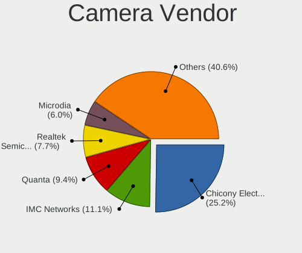

| Vendor                                 | Computers | Percent |
|----------------------------------------|-----------|---------|
| Chicony Electronics                    | 82        | 26.11%  |
| IMC Networks                           | 32        | 10.19%  |
| Quanta                                 | 31        | 9.87%   |
| Realtek Semiconductor                  | 26        | 8.28%   |
| Microdia                               | 19        | 6.05%   |
| Logitech                               | 17        | 5.41%   |
| Sunplus Innovation Technology          | 15        | 4.78%   |
| Bison Electronics                      | 12        | 3.82%   |
| Syntek                                 | 11        | 3.5%    |
| Suyin                                  | 11        | 3.5%    |
| Acer                                   | 10        | 3.18%   |
| Lite-On Technology                     | 9         | 2.87%   |
| Cheng Uei Precision Industry (Foxlink) | 7         | 2.23%   |
| Luxvisions Innotech Limited            | 5         | 1.59%   |
| Apple                                  | 5         | 1.59%   |
| SunplusIT                              | 2         | 0.64%   |
| Sonix Technology                       | 2         | 0.64%   |
| Silicon Motion                         | 2         | 0.64%   |
| Primax Electronics                     | 2         | 0.64%   |
| Jieli Technology                       | 2         | 0.64%   |
| Anker                                  | 2         | 0.64%   |
| Z-Star Microelectronics                | 1         | 0.32%   |
| Trust                                  | 1         | 0.32%   |
| Samsung Electronics                    | 1         | 0.32%   |
| Ricoh                                  | 1         | 0.32%   |
| Goertek Electronics                    | 1         | 0.32%   |
| GenesysLogic Technology                | 1         | 0.32%   |
| Genesys Logic                          | 1         | 0.32%   |
| Cubeternet                             | 1         | 0.32%   |
| AVerMedia Technologies                 | 1         | 0.32%   |
| Alcor Micro                            | 1         | 0.32%   |

Camera Model
------------

Camera device models

| Model                                    | Computers | Percent |
|------------------------------------------|-----------|---------|
| Chicony HD Webcam                        | 15        | 4.76%   |
| Chicony Integrated Camera                | 14        | 4.44%   |
| IMC Networks Integrated Camera           | 12        | 3.81%   |
| Quanta VGA WebCam                        | 9         | 2.86%   |
| Microdia Integrated_Webcam_HD            | 8         | 2.54%   |
| IMC Networks USB2.0 VGA UVC WebCam       | 8         | 2.54%   |
| Syntek Integrated Camera                 | 7         | 2.22%   |
| Realtek Integrated_Webcam_HD             | 6         | 1.9%    |
| Quanta HD User Facing                    | 6         | 1.9%    |
| Logitech Webcam C270                     | 6         | 1.9%    |
| IMC Networks USB2.0 HD UVC WebCam        | 6         | 1.9%    |
| Lite-On HP HD Camera                     | 5         | 1.59%   |
| Bison Lenovo EasyCamera                  | 5         | 1.59%   |
| Suyin Acer/HP Integrated Webcam [CN0314] | 4         | 1.27%   |
| Quanta HP TrueVision HD Camera           | 4         | 1.27%   |
| Quanta HP HD Camera                      | 4         | 1.27%   |
| Quanta HD Webcam                         | 4         | 1.27%   |
| Chicony HP Webcam                        | 4         | 1.27%   |
| Sunplus HD 720P webcam                   | 3         | 0.95%   |
| Sunplus Asus Webcam                      | 3         | 0.95%   |
| Realtek Lenovo EasyCamera                | 3         | 0.95%   |
| Lite-On Integrated Camera                | 3         | 0.95%   |
| Chicony USB2.0 VGA UVC WebCam            | 3         | 0.95%   |
| Chicony USB2.0 HD UVC WebCam             | 3         | 0.95%   |
| Chicony Integrated HP HD Webcam          | 3         | 0.95%   |
| Chicony HP Wide Vision HD Camera         | 3         | 0.95%   |
| Chicony HP Wide Vision HD                | 3         | 0.95%   |
| Chicony HP HD Camera                     | 3         | 0.95%   |
| Chicony HD User Facing                   | 3         | 0.95%   |
| Bison Integrated Camera                  | 3         | 0.95%   |
| Apple FaceTime HD Camera (Built-in)      | 3         | 0.95%   |
| Acer Integrated Camera                   | 3         | 0.95%   |
| Suyin WebCam                             | 2         | 0.63%   |
| Suyin HP TrueVision HD Integrated Webcam | 2         | 0.63%   |
| SunplusIT MTD camera                     | 2         | 0.63%   |
| Sunplus Integrated_Webcam_HD             | 2         | 0.63%   |
| Sunplus HD WebCam                        | 2         | 0.63%   |
| Realtek Integrated Webcam                | 2         | 0.63%   |
| Realtek HD WebCam                        | 2         | 0.63%   |
| Realtek FULL HD 1080P Webcam             | 2         | 0.63%   |

Security
--------

Fingerprint Vendor
------------------

Fingerprint sensor vendors

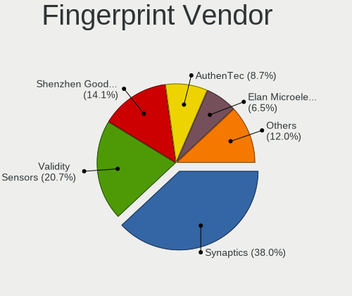

| Vendor                     | Computers | Percent |
|----------------------------|-----------|---------|
| Synaptics                  | 24        | 33.8%   |
| Validity Sensors           | 16        | 22.54%  |
| Shenzhen Goodix Technology | 12        | 16.9%   |
| AuthenTec                  | 6         | 8.45%   |
| Upek                       | 4         | 5.63%   |
| LighTuning Technology      | 4         | 5.63%   |
| Elan Microelectronics      | 4         | 5.63%   |
| STMicroelectronics         | 1         | 1.41%   |

Fingerprint Model
-----------------

Fingerprint sensor models

| Model                                                                      | Computers | Percent |
|----------------------------------------------------------------------------|-----------|---------|
| Shenzhen Goodix  FingerPrint Device                                        | 8         | 11.27%  |
| Synaptics Metallica MIS Touch Fingerprint Reader                           | 7         | 9.86%   |
| Validity Sensors VFS495 Fingerprint Reader                                 | 4         | 5.63%   |
| Upek Biometric Touchchip/Touchstrip Fingerprint Sensor                     | 4         | 5.63%   |
| Synaptics  FS7604 Touch Fingerprint Sensor with PurePrint                  | 4         | 5.63%   |
| Synaptics Prometheus MIS Touch Fingerprint Reader                          | 4         | 5.63%   |
| LighTuning EgisTec Touch Fingerprint Sensor                                | 4         | 5.63%   |
| Validity Sensors Synaptics VFS7552 Touch Fingerprint Sensor with PurePrint | 3         | 4.23%   |
| Shenzhen Goodix FingerPrint                                                | 3         | 4.23%   |
| Elan ELAN:Fingerprint                                                      | 3         | 4.23%   |
| AuthenTec AES2810                                                          | 3         | 4.23%   |
| AuthenTec AES2501 Fingerprint Sensor                                       | 3         | 4.23%   |
| Validity Sensors VFS5011 Fingerprint Reader                                | 2         | 2.82%   |
| Validity Sensors VFS471 Fingerprint Reader                                 | 2         | 2.82%   |
| Validity Sensors Synaptics WBDI                                            | 2         | 2.82%   |
| Synaptics WBDI                                                             | 2         | 2.82%   |
| Synaptics Metallica MOH Touch Fingerprint Reader                           | 2         | 2.82%   |
| Synaptics FS7604 Touch Fingerprint Sensor with PurePrint                   | 2         | 2.82%   |
| Validity Sensors VFS7552 Touch Fingerprint Sensor                          | 1         | 1.41%   |
| Validity Sensors VFS491                                                    | 1         | 1.41%   |
| Validity Sensors VFS 5011 fingerprint sensor                               | 1         | 1.41%   |
| Synaptics UWP WBDI                                                         | 1         | 1.41%   |
| Synaptics  WBDI                                                            | 1         | 1.41%   |
| Synaptics  VFS7552 Touch Fingerprint Sensor with PurePrint                 | 1         | 1.41%   |
| STMicroelectronics Fingerprint Reader                                      | 1         | 1.41%   |
| Shenzhen Goodix Fingerprint Reader                                         | 1         | 1.41%   |
| Elan fingerprint sensor [FeinTech FPS00200]                                | 1         | 1.41%   |

Chipcard Vendor
---------------

Chipcard module vendors

| Vendor                     | Computers | Percent |
|----------------------------|-----------|---------|
| Alcor Micro                | 7         | 38.89%  |
| Broadcom                   | 4         | 22.22%  |
| Lenovo                     | 3         | 16.67%  |
| Upek                       | 1         | 5.56%   |
| Realtek Semiconductor      | 1         | 5.56%   |
| Gemalto (was Gemplus)      | 1         | 5.56%   |
| Athena Smartcard Solutions | 1         | 5.56%   |

Chipcard Model
--------------

Chipcard module models

| Model                                                      | Computers | Percent |
|------------------------------------------------------------|-----------|---------|
| Alcor Micro AU9540 Smartcard Reader                        | 7         | 38.89%  |
| Lenovo Integrated Smart Card Reader                        | 3         | 16.67%  |
| Broadcom 58200                                             | 2         | 11.11%  |
| Upek TouchChip Fingerprint Coprocessor (WBF advanced mode) | 1         | 5.56%   |
| Realtek Semiconductor Smart Card Reader Interface          | 1         | 5.56%   |
| Gemalto (was Gemplus) GemPC Twin SmartCard Reader          | 1         | 5.56%   |
| Broadcom BCM5880 Secure Applications Processor             | 1         | 5.56%   |
| Broadcom 5880                                              | 1         | 5.56%   |
| Athena Smartcard Solutions ASEDrive CCID                   | 1         | 5.56%   |

Unsupported
-----------

Unsupported Devices
-------------------

Total unsupported devices on board

| Total | Computers | Percent |
|-------|-----------|---------|
| 0     | 335       | 69.65%  |
| 1     | 115       | 23.91%  |
| 2     | 27        | 5.61%   |
| 3     | 4         | 0.83%   |

Unsupported Device Types
------------------------

Types of unsupported devices

| Type                     | Computers | Percent |
|--------------------------|-----------|---------|
| Fingerprint reader       | 70        | 39.77%  |
| Graphics card            | 35        | 19.89%  |
| Net/wireless             | 18        | 10.23%  |
| Chipcard                 | 16        | 9.09%   |
| Multimedia controller    | 12        | 6.82%   |
| Communication controller | 5         | 2.84%   |
| Camera                   | 4         | 2.27%   |
| Unassigned class         | 3         | 1.7%    |
| Card reader              | 3         | 1.7%    |
| Bluetooth                | 3         | 1.7%    |
| Storage                  | 2         | 1.14%   |
| Storage/raid             | 1         | 0.57%   |
| Storage/ide              | 1         | 0.57%   |
| Sound                    | 1         | 0.57%   |
| Modem                    | 1         | 0.57%   |
| Flash memory             | 1         | 0.57%   |

