Linux in Croatia - Tested Hardware & Statistics (Desktops)
----------------------------------------------------------

A project to collect tested hardware configurations for Linux in Croatia.

Anyone can contribute to this report by the [hw-probe](https://github.com/linuxhw/hw-probe) tool:

    sudo -E hw-probe -all -upload

Please contribute! Especially if your hardware is rare.

Contents
--------

* [ Test Cases ](#test-cases)

* [ System ](#system)
  - [ OS                       ](#os)
  - [ OS Family                ](#os-family)
  - [ Kernel                   ](#kernel)
  - [ Kernel Family            ](#kernel-family)
  - [ Kernel Major Ver.        ](#kernel-major-ver)
  - [ Arch                     ](#arch)
  - [ DE                       ](#de)
  - [ Display Server           ](#display-server)
  - [ Display Manager          ](#display-manager)
  - [ OS Lang                  ](#os-lang)
  - [ Boot Mode                ](#boot-mode)
  - [ Filesystem               ](#filesystem)
  - [ Part. scheme             ](#part-scheme)
  - [ Dual Boot with Linux/BSD ](#dual-boot-with-linuxbsd)
  - [ Dual Boot (Win)          ](#dual-boot-win)

* [ Board ](#board)
  - [ Vendor                   ](#vendor)
  - [ Model                    ](#model)
  - [ Model Family             ](#model-family)
  - [ MFG Year                 ](#mfg-year)
  - [ Form Factor              ](#form-factor)
  - [ Secure Boot              ](#secure-boot)
  - [ Coreboot                 ](#coreboot)
  - [ RAM Size                 ](#ram-size)
  - [ RAM Used                 ](#ram-used)
  - [ Total Drives             ](#total-drives)
  - [ Has CD-ROM               ](#has-cd-rom)
  - [ Has Ethernet             ](#has-ethernet)
  - [ Has WiFi                 ](#has-wifi)
  - [ Has Bluetooth            ](#has-bluetooth)

* [ Location ](#location)
  - [ Country                  ](#country)
  - [ City                     ](#city)

* [ Drives ](#drives)
  - [ Drive Vendor             ](#drive-vendor)
  - [ Drive Model              ](#drive-model)
  - [ HDD Vendor               ](#hdd-vendor)
  - [ SSD Vendor               ](#ssd-vendor)
  - [ Drive Kind               ](#drive-kind)
  - [ Drive Connector          ](#drive-connector)
  - [ Drive Size               ](#drive-size)
  - [ Space Total              ](#space-total)
  - [ Space Used               ](#space-used)
  - [ Malfunc. Drives          ](#malfunc-drives)
  - [ Malfunc. Drive Vendor    ](#malfunc-drive-vendor)
  - [ Malfunc. HDD Vendor      ](#malfunc-hdd-vendor)
  - [ Malfunc. Drive Kind      ](#malfunc-drive-kind)
  - [ Failed Drives            ](#failed-drives)
  - [ Failed Drive Vendor      ](#failed-drive-vendor)
  - [ Drive Status             ](#drive-status)

* [ Storage controller ](#storage-controller)
  - [ Storage Vendor           ](#storage-vendor)
  - [ Storage Model            ](#storage-model)
  - [ Storage Kind             ](#storage-kind)

* [ Processor ](#processor)
  - [ CPU Vendor               ](#cpu-vendor)
  - [ CPU Model                ](#cpu-model)
  - [ CPU Model Family         ](#cpu-model-family)
  - [ CPU Cores                ](#cpu-cores)
  - [ CPU Sockets              ](#cpu-sockets)
  - [ CPU Threads              ](#cpu-threads)
  - [ CPU Op-Modes             ](#cpu-op-modes)
  - [ CPU Microcode            ](#cpu-microcode)
  - [ CPU Microarch            ](#cpu-microarch)

* [ Graphics ](#graphics)
  - [ GPU Vendor               ](#gpu-vendor)
  - [ GPU Model                ](#gpu-model)
  - [ GPU Combo                ](#gpu-combo)
  - [ GPU Driver               ](#gpu-driver)
  - [ GPU Memory               ](#gpu-memory)

* [ Monitor ](#monitor)
  - [ Monitor Vendor           ](#monitor-vendor)
  - [ Monitor Model            ](#monitor-model)
  - [ Monitor Resolution       ](#monitor-resolution)
  - [ Monitor Diagonal         ](#monitor-diagonal)
  - [ Monitor Width            ](#monitor-width)
  - [ Aspect Ratio             ](#aspect-ratio)
  - [ Monitor Area             ](#monitor-area)
  - [ Pixel Density            ](#pixel-density)
  - [ Multiple Monitors        ](#multiple-monitors)

* [ Network ](#network)
  - [ Net Controller Vendor    ](#net-controller-vendor)
  - [ Net Controller Model     ](#net-controller-model)
  - [ Wireless Vendor          ](#wireless-vendor)
  - [ Wireless Model           ](#wireless-model)
  - [ Ethernet Vendor          ](#ethernet-vendor)
  - [ Ethernet Model           ](#ethernet-model)
  - [ Net Controller Kind      ](#net-controller-kind)
  - [ Used Controller          ](#used-controller)
  - [ NICs                     ](#nics)
  - [ IPv6                     ](#ipv6)

* [ Bluetooth ](#bluetooth)
  - [ Bluetooth Vendor         ](#bluetooth-vendor)
  - [ Bluetooth Model          ](#bluetooth-model)

* [ Sound ](#sound)
  - [ Sound Vendor             ](#sound-vendor)
  - [ Sound Model              ](#sound-model)

* [ Memory ](#memory)
  - [ Memory Vendor            ](#memory-vendor)
  - [ Memory Model             ](#memory-model)
  - [ Memory Kind              ](#memory-kind)
  - [ Memory Form Factor       ](#memory-form-factor)
  - [ Memory Size              ](#memory-size)
  - [ Memory Speed             ](#memory-speed)

* [ Printers & scanners ](#printers--scanners)
  - [ Printer Vendor           ](#printer-vendor)
  - [ Printer Model            ](#printer-model)
  - [ Scanner Vendor           ](#scanner-vendor)
  - [ Scanner Model            ](#scanner-model)

* [ Camera ](#camera)
  - [ Camera Vendor            ](#camera-vendor)
  - [ Camera Model             ](#camera-model)

* [ Security ](#security)
  - [ Fingerprint Vendor       ](#fingerprint-vendor)
  - [ Fingerprint Model        ](#fingerprint-model)
  - [ Chipcard Vendor          ](#chipcard-vendor)
  - [ Chipcard Model           ](#chipcard-model)

* [ Unsupported ](#unsupported)
  - [ Unsupported Devices      ](#unsupported-devices)
  - [ Unsupported Device Types ](#unsupported-device-types)

Test Cases
----------

Total: 186

| Vendor        | Model                    | Probe                                                      | Date         |
|---------------|--------------------------|------------------------------------------------------------|--------------|
| ASRock        | H470M-HDV                | [14d8e1d537](https://linux-hardware.org/?probe=14d8e1d537) | May 06, 2022 |
| MSI           | B450 TOMAHAWK            | [220979cd04](https://linux-hardware.org/?probe=220979cd04) | May 05, 2022 |
| Gigabyte      | P31-ES3G                 | [dc8419dcb3](https://linux-hardware.org/?probe=dc8419dcb3) | Apr 29, 2022 |
| Intel         | H61M-S2PV                | [caa602b556](https://linux-hardware.org/?probe=caa602b556) | Apr 28, 2022 |
| Gigabyte      | P31-ES3G                 | [c3df637d15](https://linux-hardware.org/?probe=c3df637d15) | Apr 27, 2022 |
| Fujitsu Si... | D2151-A1 S26361-D2151-A1 | [4db68ede02](https://linux-hardware.org/?probe=4db68ede02) | Apr 27, 2022 |
| ASRock        | H61M-DGS                 | [c8019d43f7](https://linux-hardware.org/?probe=c8019d43f7) | Apr 25, 2022 |
| ASRock        | H97 Pro4                 | [e937f129bf](https://linux-hardware.org/?probe=e937f129bf) | Apr 25, 2022 |
| ASRock        | H97 Pro4                 | [2147b931e3](https://linux-hardware.org/?probe=2147b931e3) | Apr 22, 2022 |
| Pegatron      | 2AC3                     | [771e8a4439](https://linux-hardware.org/?probe=771e8a4439) | Apr 18, 2022 |
| ASUSTek       | P8H61 PRO                | [82d8b5968f](https://linux-hardware.org/?probe=82d8b5968f) | Apr 12, 2022 |
| Dell          | 00V62H A01               | [6d0445b848](https://linux-hardware.org/?probe=6d0445b848) | Apr 09, 2022 |
| ASRock        | A320M-HDV R4.0           | [73cf5373cf](https://linux-hardware.org/?probe=73cf5373cf) | Apr 03, 2022 |
| ASRock        | A320M-HDV R4.0           | [f76380fdae](https://linux-hardware.org/?probe=f76380fdae) | Apr 03, 2022 |
| ASRock        | H97 Pro4                 | [f4ca737c25](https://linux-hardware.org/?probe=f4ca737c25) | Mar 31, 2022 |
| Gigabyte      | X48T-DQ6                 | [f63c898bc3](https://linux-hardware.org/?probe=f63c898bc3) | Mar 18, 2022 |
| ASUSTek       | P8H61 PRO                | [60dc2b7bd7](https://linux-hardware.org/?probe=60dc2b7bd7) | Mar 18, 2022 |
| ASUSTek       | PRIME H410M-A            | [9352c21f95](https://linux-hardware.org/?probe=9352c21f95) | Mar 17, 2022 |
| ASUSTek       | TUF Gaming X570-PLUS     | [561a945c5a](https://linux-hardware.org/?probe=561a945c5a) | Mar 13, 2022 |
| ASRock        | B360 Gaming K4           | [ae6cb3bea9](https://linux-hardware.org/?probe=ae6cb3bea9) | Mar 11, 2022 |
| ASUSTek       | Z170-P                   | [fac84edcf2](https://linux-hardware.org/?probe=fac84edcf2) | Mar 08, 2022 |
| ASRock        | H97 Pro4                 | [83df7fb05a](https://linux-hardware.org/?probe=83df7fb05a) | Mar 07, 2022 |
| Gigabyte      | X48T-DQ6                 | [e669f0a460](https://linux-hardware.org/?probe=e669f0a460) | Mar 06, 2022 |
| Gigabyte      | X48T-DQ6                 | [593cb60512](https://linux-hardware.org/?probe=593cb60512) | Mar 06, 2022 |
| Foxconn       | 2A8Ch                    | [49093d0be0](https://linux-hardware.org/?probe=49093d0be0) | Mar 05, 2022 |
| Gigabyte      | H410M H V3               | [d0ee45a4b1](https://linux-hardware.org/?probe=d0ee45a4b1) | Feb 26, 2022 |
| ASUSTek       | TUF GAMING B460M-PLUS    | [731457f46c](https://linux-hardware.org/?probe=731457f46c) | Feb 13, 2022 |
| ECS           | A75F2-M2                 | [0c4ea60fd5](https://linux-hardware.org/?probe=0c4ea60fd5) | Feb 12, 2022 |
| Gigabyte      | B85M-DS3H                | [98d6451ac1](https://linux-hardware.org/?probe=98d6451ac1) | Feb 07, 2022 |
| ASRock        | Z97M Pro4                | [a496090845](https://linux-hardware.org/?probe=a496090845) | Feb 01, 2022 |
| Foxconn       | 2A8Ch                    | [276caa5169](https://linux-hardware.org/?probe=276caa5169) | Jan 23, 2022 |
| ASRock        | Z590 Pro4                | [a89877d9de](https://linux-hardware.org/?probe=a89877d9de) | Jan 16, 2022 |
| ASRock        | Z590 Pro4                | [7a2453280a](https://linux-hardware.org/?probe=7a2453280a) | Jan 14, 2022 |
| ECS           | H61H2-M2                 | [21704ab656](https://linux-hardware.org/?probe=21704ab656) | Jan 10, 2022 |
| ASUSTek       | X750LB                   | [47b4da86e2](https://linux-hardware.org/?probe=47b4da86e2) | Jan 10, 2022 |
| ASUSTek       | X750LB                   | [f1f247b586](https://linux-hardware.org/?probe=f1f247b586) | Jan 09, 2022 |
| MSI           | H81M-P33                 | [0fb1d25a7d](https://linux-hardware.org/?probe=0fb1d25a7d) | Dec 30, 2021 |
| Gigabyte      | 965P-DS3                 | [467762be06](https://linux-hardware.org/?probe=467762be06) | Dec 29, 2021 |
| ECS           | H61H2-M2                 | [6f3d8856df](https://linux-hardware.org/?probe=6f3d8856df) | Dec 29, 2021 |
| ASRock        | 870 Extreme3             | [d202f241ee](https://linux-hardware.org/?probe=d202f241ee) | Dec 23, 2021 |
| Intel         | DH61CR AAG14064-204      | [13c79f41a6](https://linux-hardware.org/?probe=13c79f41a6) | Dec 18, 2021 |
| Intel         | DH61CR AAG14064-204      | [247642d30f](https://linux-hardware.org/?probe=247642d30f) | Dec 16, 2021 |
| Intel         | DH61CR AAG14064-204      | [dbc555c5ad](https://linux-hardware.org/?probe=dbc555c5ad) | Dec 16, 2021 |
| ASRock        | B450M-HDV R4.0           | [594becb8c9](https://linux-hardware.org/?probe=594becb8c9) | Dec 06, 2021 |
| ASRock        | M3A770DE                 | [1a03b6e5c7](https://linux-hardware.org/?probe=1a03b6e5c7) | Dec 05, 2021 |
| ASRock        | M3A770DE                 | [bdf4260678](https://linux-hardware.org/?probe=bdf4260678) | Dec 05, 2021 |
| ASUSTek       | PRIME A320M-K            | [d9019c420c](https://linux-hardware.org/?probe=d9019c420c) | Dec 04, 2021 |
| Dell          | 0GDG8Y A00               | [d0cf0cc443](https://linux-hardware.org/?probe=d0cf0cc443) | Dec 01, 2021 |
| Foxconn       | 2A8Ch                    | [1eff06a331](https://linux-hardware.org/?probe=1eff06a331) | Nov 30, 2021 |
| Foxconn       | 2A8Ch                    | [1f650ebd72](https://linux-hardware.org/?probe=1f650ebd72) | Nov 30, 2021 |
| ASUSTek       | P8Z77-V LX               | [b153db375f](https://linux-hardware.org/?probe=b153db375f) | Nov 29, 2021 |
| Gigabyte      | GB-BRR7H-4800            | [c77e499435](https://linux-hardware.org/?probe=c77e499435) | Nov 13, 2021 |
| ASUSTek       | M4A78T-E                 | [10991ab539](https://linux-hardware.org/?probe=10991ab539) | Nov 10, 2021 |
| ASUSTek       | P8Z77-V LX               | [d59cc9fead](https://linux-hardware.org/?probe=d59cc9fead) | Nov 04, 2021 |
| ASUSTek       | P8Z77-V LX               | [903ec63ceb](https://linux-hardware.org/?probe=903ec63ceb) | Nov 02, 2021 |
| MSI           | P55-CD53                 | [860bde5935](https://linux-hardware.org/?probe=860bde5935) | Oct 31, 2021 |
| MSI           | P55-CD53                 | [12bf811a5c](https://linux-hardware.org/?probe=12bf811a5c) | Oct 24, 2021 |
| MSI           | P55-CD53                 | [c1c364dbc1](https://linux-hardware.org/?probe=c1c364dbc1) | Oct 24, 2021 |
| ASUSTek       | M5A78L LE                | [adf114d66e](https://linux-hardware.org/?probe=adf114d66e) | Oct 23, 2021 |
| Pegatron      | 2A73h                    | [dc24d5d19f](https://linux-hardware.org/?probe=dc24d5d19f) | Oct 16, 2021 |
| ASUSTek       | PRIME H410M-R            | [d891006b52](https://linux-hardware.org/?probe=d891006b52) | Oct 14, 2021 |
| ASUSTek       | B85M-E                   | [d98b27a03c](https://linux-hardware.org/?probe=d98b27a03c) | Oct 11, 2021 |
| ASUSTek       | A58M-K                   | [2ca6ce79db](https://linux-hardware.org/?probe=2ca6ce79db) | Oct 03, 2021 |
| Gigabyte      | A320M-S2H-CF             | [e5508ac7ab](https://linux-hardware.org/?probe=e5508ac7ab) | Sep 27, 2021 |
| ASUSTek       | M4A78T-E                 | [01ec64f498](https://linux-hardware.org/?probe=01ec64f498) | Sep 24, 2021 |
| MSI           | A320M PRO-VH PLUS        | [149504315f](https://linux-hardware.org/?probe=149504315f) | Aug 10, 2021 |
| Gigabyte      | X399 AORUS XTREME-CF     | [3a2fd430f6](https://linux-hardware.org/?probe=3a2fd430f6) | Aug 03, 2021 |
| ASRock        | B450M-HDV R4.0           | [f15116c26a](https://linux-hardware.org/?probe=f15116c26a) | Jul 30, 2021 |
| ASRock        | Z370 Pro4                | [9a9f7c5e69](https://linux-hardware.org/?probe=9a9f7c5e69) | Jul 20, 2021 |
| Gigabyte      | GA-990XA-UD3             | [af31bae015](https://linux-hardware.org/?probe=af31bae015) | Jun 10, 2021 |
| ASUSTek       | ROG CROSSHAIR VIII HERO  | [83b3cc659a](https://linux-hardware.org/?probe=83b3cc659a) | Jun 07, 2021 |
| Dell          | 06CV2N A01               | [35a0afd617](https://linux-hardware.org/?probe=35a0afd617) | May 25, 2021 |
| MSI           | B450 TOMAHAWK            | [eb4e8e4cc2](https://linux-hardware.org/?probe=eb4e8e4cc2) | May 25, 2021 |
| Gigabyte      | Z390 M GAMING-CF         | [657fe689d6](https://linux-hardware.org/?probe=657fe689d6) | May 19, 2021 |
| ASUSTek       | P5KPL-AM SE              | [2cd9e43be0](https://linux-hardware.org/?probe=2cd9e43be0) | Apr 27, 2021 |
| ASRock        | P45DE                    | [2f6b602e36](https://linux-hardware.org/?probe=2f6b602e36) | Apr 18, 2021 |
| ASRock        | Z370 Pro4                | [7ad77d82ba](https://linux-hardware.org/?probe=7ad77d82ba) | Apr 03, 2021 |
| ASUSTek       | TUF GAMING Z490-PLUS     | [b776bc7947](https://linux-hardware.org/?probe=b776bc7947) | Mar 31, 2021 |
| MSI           | B450M PRO-M2 MAX         | [6e5e0c9ef4](https://linux-hardware.org/?probe=6e5e0c9ef4) | Mar 19, 2021 |
| MSI           | Z390-A PRO               | [12566ee726](https://linux-hardware.org/?probe=12566ee726) | Mar 10, 2021 |
| Gigabyte      | G1.Sniper Z87            | [c9a3501b03](https://linux-hardware.org/?probe=c9a3501b03) | Mar 02, 2021 |
| ASRock        | FM2A75M-DGS              | [72c1ab0b9b](https://linux-hardware.org/?probe=72c1ab0b9b) | Mar 01, 2021 |
| ASUSTek       | PRIME A320M-K            | [24a672b8ac](https://linux-hardware.org/?probe=24a672b8ac) | Feb 25, 2021 |
| ASRock        | Z87 Extreme4             | [081e14044d](https://linux-hardware.org/?probe=081e14044d) | Feb 13, 2021 |
| Dell          | 0NNGP2 A00               | [9be58392b6](https://linux-hardware.org/?probe=9be58392b6) | Feb 08, 2021 |
| Dell          | 0J37VM A01               | [3062914f46](https://linux-hardware.org/?probe=3062914f46) | Feb 07, 2021 |
| Dell          | 0J37VM A01               | [34e1267a80](https://linux-hardware.org/?probe=34e1267a80) | Feb 07, 2021 |
| ASRock        | X570 Phantom Gaming 4    | [eee7c1f592](https://linux-hardware.org/?probe=eee7c1f592) | Feb 03, 2021 |
| ASRock        | ConRoe1333-D667          | [54121172b8](https://linux-hardware.org/?probe=54121172b8) | Jan 31, 2021 |
| Gigabyte      | B450 GAMING X            | [28cb4726bb](https://linux-hardware.org/?probe=28cb4726bb) | Jan 31, 2021 |
| Gigabyte      | B450 GAMING X            | [0b4b751863](https://linux-hardware.org/?probe=0b4b751863) | Jan 31, 2021 |
| ASRock        | X570M Pro4               | [9cd91004ab](https://linux-hardware.org/?probe=9cd91004ab) | Jan 24, 2021 |
| Gigabyte      | F2A78M-DS2               | [9afb5c207a](https://linux-hardware.org/?probe=9afb5c207a) | Jan 23, 2021 |
| Dell          | 0DFRFW A01               | [482bc5334f](https://linux-hardware.org/?probe=482bc5334f) | Jan 22, 2021 |
| MSI           | B450 TOMAHAWK            | [943284255a](https://linux-hardware.org/?probe=943284255a) | Jan 20, 2021 |
| Gigabyte      | F2A78M-DS2               | [df34a7d718](https://linux-hardware.org/?probe=df34a7d718) | Jan 20, 2021 |
| Gigabyte      | F2A78M-DS2               | [0d8e905a30](https://linux-hardware.org/?probe=0d8e905a30) | Jan 16, 2021 |
| ASUSTek       | Maximus VII HERO         | [9b72f3a82b](https://linux-hardware.org/?probe=9b72f3a82b) | Jan 11, 2021 |
| ASUSTek       | M4A78T-E                 | [e2fa1223c4](https://linux-hardware.org/?probe=e2fa1223c4) | Jan 03, 2021 |
| ASUSTek       | M4A78T-E                 | [db7dfe41a5](https://linux-hardware.org/?probe=db7dfe41a5) | Jan 03, 2021 |
| Gigabyte      | GA-MA785GMT-UD2H         | [c4e582f9c3](https://linux-hardware.org/?probe=c4e582f9c3) | Jan 03, 2021 |
| MSI           | P67A-GD53/2.0            | [2ca3b4e129](https://linux-hardware.org/?probe=2ca3b4e129) | Jan 03, 2021 |
| MSI           | P67A-GD53/2.0            | [638a245f5f](https://linux-hardware.org/?probe=638a245f5f) | Jan 03, 2021 |
| Gigabyte      | GA-MA785GMT-UD2H         | [15160d8a87](https://linux-hardware.org/?probe=15160d8a87) | Jan 02, 2021 |
| Gigabyte      | GA-MA770-UD3             | [120e788567](https://linux-hardware.org/?probe=120e788567) | Dec 24, 2020 |
| ASUSTek       | H81M-K                   | [03b737b966](https://linux-hardware.org/?probe=03b737b966) | Dec 23, 2020 |
| ASRock        | Z370 Pro4                | [e6df8b78b5](https://linux-hardware.org/?probe=e6df8b78b5) | Dec 21, 2020 |
| ASUSTek       | M5A78L LE                | [4e7620198d](https://linux-hardware.org/?probe=4e7620198d) | Dec 15, 2020 |
| ASUSTek       | M5A78L LE                | [0a6542f4b3](https://linux-hardware.org/?probe=0a6542f4b3) | Dec 12, 2020 |
| ASRock        | N68-S3 UCC               | [b75cfae4a3](https://linux-hardware.org/?probe=b75cfae4a3) | Nov 01, 2020 |
| ASUSTek       | ROG STRIX B550-I GAMING  | [36db0ea3d4](https://linux-hardware.org/?probe=36db0ea3d4) | Oct 21, 2020 |
| ASUSTek       | ROG STRIX B550-I GAMING  | [6e1e46a3cb](https://linux-hardware.org/?probe=6e1e46a3cb) | Oct 21, 2020 |
| ASUSTek       | ROG STRIX B550-I GAMING  | [ff7ecd0641](https://linux-hardware.org/?probe=ff7ecd0641) | Oct 15, 2020 |
| Pegatron      | 2A94h                    | [668c4bbb8b](https://linux-hardware.org/?probe=668c4bbb8b) | Oct 06, 2020 |
| ASUSTek       | PRIME H310M-A R2.0       | [b098cfc85e](https://linux-hardware.org/?probe=b098cfc85e) | Sep 30, 2020 |
| ASUSTek       | PRIME H310M-A R2.0       | [df11954c4f](https://linux-hardware.org/?probe=df11954c4f) | Sep 28, 2020 |
| ASUSTek       | PRIME H310M-A R2.0       | [8220732bda](https://linux-hardware.org/?probe=8220732bda) | Sep 28, 2020 |
| ASUSTek       | M5A78L LE                | [7f4940b41c](https://linux-hardware.org/?probe=7f4940b41c) | Sep 28, 2020 |
| ASRock        | N68-S3 UCC               | [42ed26b195](https://linux-hardware.org/?probe=42ed26b195) | Sep 19, 2020 |
| ASUSTek       | M4A77                    | [d076f8fe03](https://linux-hardware.org/?probe=d076f8fe03) | Sep 08, 2020 |
| ASRock        | Z87E-ITX                 | [d1095a7a24](https://linux-hardware.org/?probe=d1095a7a24) | Sep 05, 2020 |
| ASRock        | N68-S3 UCC               | [a2d99d11fc](https://linux-hardware.org/?probe=a2d99d11fc) | Aug 30, 2020 |
| ASUSTek       | P8H77-V LE               | [1c2eaa2346](https://linux-hardware.org/?probe=1c2eaa2346) | Aug 23, 2020 |
| HP            | 2129                     | [d1eda00971](https://linux-hardware.org/?probe=d1eda00971) | Aug 20, 2020 |
| MSI           | Z87-G41 PC Mate          | [1b2d8402af](https://linux-hardware.org/?probe=1b2d8402af) | Aug 17, 2020 |
| Gigabyte      | G41M-Combo               | [2f3657530f](https://linux-hardware.org/?probe=2f3657530f) | Jun 29, 2020 |
| ASUSTek       | B85M-E                   | [e46352dec8](https://linux-hardware.org/?probe=e46352dec8) | Jun 28, 2020 |
| ASRock        | H97M Pro4                | [31f3732dc9](https://linux-hardware.org/?probe=31f3732dc9) | Jun 19, 2020 |
| Gigabyte      | G31MX-S2                 | [7da6752573](https://linux-hardware.org/?probe=7da6752573) | May 31, 2020 |
| Gigabyte      | G31MX-S2                 | [44ea78341a](https://linux-hardware.org/?probe=44ea78341a) | May 31, 2020 |
| Gigabyte      | G31MX-S2                 | [5472c53dca](https://linux-hardware.org/?probe=5472c53dca) | May 31, 2020 |
| ASRock        | H81M-DGS R2.0            | [26a9c7f62c](https://linux-hardware.org/?probe=26a9c7f62c) | May 30, 2020 |
| Gigabyte      | 990FXA-UD3               | [e3042f4583](https://linux-hardware.org/?probe=e3042f4583) | May 24, 2020 |
| ASUSTek       | P8H77-V LE               | [e6f20d976d](https://linux-hardware.org/?probe=e6f20d976d) | May 17, 2020 |
| Gigabyte      | 965P-DS3                 | [abfb95a938](https://linux-hardware.org/?probe=abfb95a938) | May 11, 2020 |
| Gigabyte      | 965P-DS3                 | [e59e1593d5](https://linux-hardware.org/?probe=e59e1593d5) | May 11, 2020 |
| MSI           | MS-7360                  | [ab94189bcf](https://linux-hardware.org/?probe=ab94189bcf) | May 07, 2020 |
| MSI           | Z87-G41 PC Mate          | [e2ab63b529](https://linux-hardware.org/?probe=e2ab63b529) | May 02, 2020 |
| MSI           | Z87-G41 PC Mate          | [c17fa3f327](https://linux-hardware.org/?probe=c17fa3f327) | May 02, 2020 |
| HP            | 3031h                    | [b4638888cb](https://linux-hardware.org/?probe=b4638888cb) | Apr 14, 2020 |
| ASUSTek       | M5A78L LE                | [1562c544a6](https://linux-hardware.org/?probe=1562c544a6) | Apr 14, 2020 |
| ASRock        | H61M-DGS                 | [0a090881ae](https://linux-hardware.org/?probe=0a090881ae) | Apr 12, 2020 |
| ASUSTek       | A8V-MQ                   | [54a0034c0a](https://linux-hardware.org/?probe=54a0034c0a) | Mar 24, 2020 |
| ASRock        | H61M-VS                  | [799e1670fd](https://linux-hardware.org/?probe=799e1670fd) | Mar 18, 2020 |
| HP            | 212B                     | [6058dd53b1](https://linux-hardware.org/?probe=6058dd53b1) | Mar 16, 2020 |
| Gigabyte      | Z390 M GAMING-CF         | [26545c7add](https://linux-hardware.org/?probe=26545c7add) | Feb 24, 2020 |
| Gigabyte      | Z390 M GAMING-CF         | [1693523c61](https://linux-hardware.org/?probe=1693523c61) | Feb 21, 2020 |
| Intel         | DH67BL AAG10189-213      | [b0e9895bef](https://linux-hardware.org/?probe=b0e9895bef) | Feb 16, 2020 |
| ASRock        | B150M-HDV                | [c08c6d0574](https://linux-hardware.org/?probe=c08c6d0574) | Feb 08, 2020 |
| HP            | 18E7                     | [de846e5f4f](https://linux-hardware.org/?probe=de846e5f4f) | Jan 22, 2020 |
| Intel         | DH67BL AAG10189-213      | [9ed2076b0d](https://linux-hardware.org/?probe=9ed2076b0d) | Jan 18, 2020 |
| Intel         | DH67BL AAG10189-213      | [dc121e5512](https://linux-hardware.org/?probe=dc121e5512) | Jan 18, 2020 |
| Acer          | Veriton S680G            | [277889b2ff](https://linux-hardware.org/?probe=277889b2ff) | Jan 15, 2020 |
| Gigabyte      | Z390 M GAMING-CF         | [e097415087](https://linux-hardware.org/?probe=e097415087) | Dec 26, 2019 |
| ASRock        | N68-S3 UCC               | [9cbd6c2e0e](https://linux-hardware.org/?probe=9cbd6c2e0e) | Dec 25, 2019 |
| ASRock        | N68-S3 UCC               | [86f93b71dd](https://linux-hardware.org/?probe=86f93b71dd) | Dec 24, 2019 |
| ASRock        | 990FX Extreme3           | [107280e5a9](https://linux-hardware.org/?probe=107280e5a9) | Dec 23, 2019 |
| ASRock        | 990FX Extreme3           | [66a084d547](https://linux-hardware.org/?probe=66a084d547) | Dec 11, 2019 |
| ASRock        | H97 Killer               | [8538b88e3d](https://linux-hardware.org/?probe=8538b88e3d) | Nov 27, 2019 |
| ASRock        | 970 Pro3 R2.0            | [73c6829ffb](https://linux-hardware.org/?probe=73c6829ffb) | Nov 27, 2019 |
| ASRock        | A320M-HDV R3.0           | [d3d79c2a8d](https://linux-hardware.org/?probe=d3d79c2a8d) | Sep 16, 2019 |
| Gigabyte      | A320M-H-CF               | [a35aea421b](https://linux-hardware.org/?probe=a35aea421b) | Sep 09, 2019 |
| Intel         | DX58SO AAE29331-501      | [349ef8982a](https://linux-hardware.org/?probe=349ef8982a) | Sep 09, 2019 |
| Gigabyte      | A320M-H-CF               | [59782a89ea](https://linux-hardware.org/?probe=59782a89ea) | Sep 06, 2019 |
| Gigabyte      | A320M-H-CF               | [223de1d51b](https://linux-hardware.org/?probe=223de1d51b) | Sep 06, 2019 |
| Gigabyte      | A320M-H-CF               | [5dcbb1bf21](https://linux-hardware.org/?probe=5dcbb1bf21) | Sep 06, 2019 |
| Gigabyte      | A320M-H-CF               | [b4ef0f5499](https://linux-hardware.org/?probe=b4ef0f5499) | Sep 05, 2019 |
| ASRock        | FM2A55M-DGS R2.0         | [be3a07802c](https://linux-hardware.org/?probe=be3a07802c) | Aug 13, 2019 |
| ASRock        | FM2A55M-DGS R2.0         | [59a4b66b03](https://linux-hardware.org/?probe=59a4b66b03) | Jul 30, 2019 |
| ASRock        | FM2A55M-DGS R2.0         | [9cdd546881](https://linux-hardware.org/?probe=9cdd546881) | Jul 29, 2019 |
| ASRock        | A300M-STX                | [edf300f175](https://linux-hardware.org/?probe=edf300f175) | Jul 29, 2019 |
| Gigabyte      | X299 UD4 Pro-CF          | [aad0551e27](https://linux-hardware.org/?probe=aad0551e27) | Jul 25, 2019 |
| ASUSTek       | E35M1-M                  | [1b78cc518f](https://linux-hardware.org/?probe=1b78cc518f) | Jul 08, 2019 |
| ASUSTek       | E35M1-M                  | [dd91a2582a](https://linux-hardware.org/?probe=dd91a2582a) | Jul 06, 2019 |
| ASUSTek       | E35M1-M                  | [1f5e6b026b](https://linux-hardware.org/?probe=1f5e6b026b) | Jun 23, 2019 |
| ASUSTek       | PRIME A320M-K            | [f8c4365b6c](https://linux-hardware.org/?probe=f8c4365b6c) | Jun 07, 2019 |
| ASUSTek       | PRIME A320M-K            | [3968b06d9c](https://linux-hardware.org/?probe=3968b06d9c) | Jun 07, 2019 |
| HP            | 83ED                     | [532b72754e](https://linux-hardware.org/?probe=532b72754e) | May 06, 2019 |
| Pegatron      | 2A99                     | [196712630c](https://linux-hardware.org/?probe=196712630c) | Feb 26, 2019 |
| ASUSTek       | B150M-C                  | [88898f6797](https://linux-hardware.org/?probe=88898f6797) | Feb 10, 2019 |
| ECS           | A770M-A                  | [feacfccf11](https://linux-hardware.org/?probe=feacfccf11) | Feb 05, 2019 |
| Gigabyte      | AB350-Gaming 3-CF        | [bf1298d356](https://linux-hardware.org/?probe=bf1298d356) | Jan 29, 2019 |
| ABIT          | IP35-E                   | [87b22d6a66](https://linux-hardware.org/?probe=87b22d6a66) | Jan 26, 2019 |
| Gigabyte      | AX370-Gaming K7          | [bc26ed35a0](https://linux-hardware.org/?probe=bc26ed35a0) | Dec 08, 2018 |
| Unknown       | Grantsdale               | [65da6a461b](https://linux-hardware.org/?probe=65da6a461b) | Nov 21, 2018 |
| Pegatron      | 2AB6                     | [00a8407210](https://linux-hardware.org/?probe=00a8407210) | Oct 31, 2018 |

System
------

OS
--

Installed operating systems

| Name                | Desktops | Percent |
|---------------------|----------|---------|
| Ubuntu 20.04        | 19       | 14.96%  |
| Ubuntu 18.04        | 15       | 11.81%  |
| Linux Mint 20.2     | 6        | 4.72%   |
| Ubuntu 18.10        | 5        | 3.94%   |
| Linux Mint 20.3     | 5        | 3.94%   |
| Zorin 16            | 4        | 3.15%   |
| OpenMandriva 4.3    | 4        | 3.15%   |
| Debian 10           | 4        | 3.15%   |
| Ubuntu 19.10        | 3        | 2.36%   |
| Pop!_OS 21.10       | 3        | 2.36%   |
| OpenMandriva 4.2    | 3        | 2.36%   |
| Manjaro             | 3        | 2.36%   |
| Fedora 31           | 3        | 2.36%   |
| Xubuntu 20.04       | 2        | 1.57%   |
| Ubuntu 21.04        | 2        | 1.57%   |
| Pop!_OS 20.10       | 2        | 1.57%   |
| openSUSE Leap-15.2  | 2        | 1.57%   |
| OpenMandriva 4.50   | 2        | 1.57%   |
| Linux Mint 20       | 2        | 1.57%   |
| Debian 11           | 2        | 1.57%   |
| ArcoLinux Rolling   | 2        | 1.57%   |
| Zorin 15            | 1        | 0.79%   |
| Xubuntu 18.04       | 1        | 0.79%   |
| Ubuntu MATE 22.04   | 1        | 0.79%   |
| Ubuntu MATE 20.04   | 1        | 0.79%   |
| Ubuntu MATE 19.10   | 1        | 0.79%   |
| Ubuntu Budgie 20.04 | 1        | 0.79%   |
| Ubuntu Budgie 18.04 | 1        | 0.79%   |
| Ubuntu 21.10        | 1        | 0.79%   |
| Ubuntu 20.10        | 1        | 0.79%   |
| Ubuntu 17.10        | 1        | 0.79%   |
| Ubuntu              | 1        | 0.79%   |
| Pop!_OS 21.04       | 1        | 0.79%   |
| Pop!_OS 20.04       | 1        | 0.79%   |
| Pop!_OS 19.10       | 1        | 0.79%   |
| openSUSE Leap-15.3  | 1        | 0.79%   |
| openSUSE 20220423   | 1        | 0.79%   |
| openSUSE 20210521   | 1        | 0.79%   |
| openSUSE 20210118   | 1        | 0.79%   |
| Manjaro 21.1.0      | 1        | 0.79%   |
| Manjaro 21.0.6      | 1        | 0.79%   |
| Manjaro 20.1        | 1        | 0.79%   |
| Lubuntu 19.10       | 1        | 0.79%   |
| LMDE 4              | 1        | 0.79%   |
| LinuxFX 10          | 1        | 0.79%   |
| Linux Mint 19.3     | 1        | 0.79%   |
| Linux Mint 19.1     | 1        | 0.79%   |
| Linux Mint 19       | 1        | 0.79%   |
| Kubuntu 20.04       | 1        | 0.79%   |
| KDE neon 20.04      | 1        | 0.79%   |
| Fedora 34           | 1        | 0.79%   |
| Fedora 32           | 1        | 0.79%   |
| Endless 3.7.8       | 1        | 0.79%   |
| Clear Linux 32270   | 1        | 0.79%   |
| Arch Rolling        | 1        | 0.79%   |

OS Family
---------

OS without a version

| Name          | Desktops | Percent |
|---------------|----------|---------|
| Ubuntu        | 47       | 39.17%  |
| Linux Mint    | 15       | 12.5%   |
| OpenMandriva  | 9        | 7.5%    |
| Pop!_OS       | 8        | 6.67%   |
| Manjaro       | 6        | 5%      |
| Debian        | 6        | 5%      |
| Zorin         | 5        | 4.17%   |
| Fedora        | 4        | 3.33%   |
| Xubuntu       | 3        | 2.5%    |
| openSUSE      | 3        | 2.5%    |
| Ubuntu MATE   | 2        | 1.67%   |
| Ubuntu Budgie | 2        | 1.67%   |
| ArcoLinux     | 2        | 1.67%   |
| Lubuntu       | 1        | 0.83%   |
| LMDE          | 1        | 0.83%   |
| LinuxFX       | 1        | 0.83%   |
| Kubuntu       | 1        | 0.83%   |
| KDE neon      | 1        | 0.83%   |
| Endless       | 1        | 0.83%   |
| Clear Linux   | 1        | 0.83%   |
| Arch          | 1        | 0.83%   |

Kernel
------

Version of the Linux kernel

| Version                  | Desktops | Percent |
|--------------------------|----------|---------|
| 5.16.7-desktop-1omv4003  | 4        | 2.9%    |
| 5.4.0-91-generic         | 3        | 2.17%   |
| 5.4.0-58-generic         | 3        | 2.17%   |
| 5.3.0-26-generic         | 3        | 2.17%   |
| 5.10.14-desktop-1omv4002 | 3        | 2.17%   |
| 5.0.0-27-generic         | 3        | 2.17%   |
| 5.8.0-48-generic         | 2        | 1.45%   |
| 5.4.0-48-generic         | 2        | 1.45%   |
| 5.4.0-42-generic         | 2        | 1.45%   |
| 5.4.0-26-generic         | 2        | 1.45%   |
| 5.4.0-100-generic        | 2        | 1.45%   |
| 5.3.0-42-generic         | 2        | 1.45%   |
| 5.3.0-28-generic         | 2        | 1.45%   |
| 5.13.0-40-generic        | 2        | 1.45%   |
| 5.12.4-desktop-1omv4050  | 2        | 1.45%   |
| 5.11.0-41-generic        | 2        | 1.45%   |
| 5.11.0-38-generic        | 2        | 1.45%   |
| 5.11.0-37-generic        | 2        | 1.45%   |
| 4.19.0-14-amd64          | 2        | 1.45%   |
| 4.18.0-10-generic        | 2        | 1.45%   |
| 4.15.0-45-generic        | 2        | 1.45%   |
| 4.15.0-20-generic        | 2        | 1.45%   |
| 5.9.0-0.bpo.5-amd64      | 1        | 0.72%   |
| 5.8.0-59-generic         | 1        | 0.72%   |
| 5.8.0-41-generic         | 1        | 0.72%   |
| 5.8.0-40-generic         | 1        | 0.72%   |
| 5.8.0-34-generic         | 1        | 0.72%   |
| 5.7.11-100.fc31.x86_64   | 1        | 0.72%   |
| 5.7.0-0.bpo.2-amd64      | 1        | 0.72%   |
| 5.6.12-300.fc32.x86_64   | 1        | 0.72%   |
| 5.4.64-1-MANJARO         | 1        | 0.72%   |
| 5.4.20-200.fc31.x86_64   | 1        | 0.72%   |
| 5.4.2-300.fc31.x86_64    | 1        | 0.72%   |
| 5.4.18-902.native        | 1        | 0.72%   |
| 5.4.0-97-generic         | 1        | 0.72%   |
| 5.4.0-92-generic         | 1        | 0.72%   |
| 5.4.0-90-generic         | 1        | 0.72%   |
| 5.4.0-89-generic         | 1        | 0.72%   |
| 5.4.0-7626-generic       | 1        | 0.72%   |
| 5.4.0-74-generic         | 1        | 0.72%   |
| 5.4.0-66-generic         | 1        | 0.72%   |
| 5.4.0-60-generic         | 1        | 0.72%   |
| 5.4.0-56-generic         | 1        | 0.72%   |
| 5.4.0-52-generic         | 1        | 0.72%   |
| 5.4.0-51-generic         | 1        | 0.72%   |
| 5.4.0-45-generic         | 1        | 0.72%   |
| 5.4.0-40-generic         | 1        | 0.72%   |
| 5.4.0-37-generic         | 1        | 0.72%   |
| 5.4.0-33-generic         | 1        | 0.72%   |
| 5.4.0-31-generic         | 1        | 0.72%   |
| 5.4.0-28-generic         | 1        | 0.72%   |
| 5.4.0-21-generic         | 1        | 0.72%   |
| 5.4.0-109-generic        | 1        | 0.72%   |
| 5.3.18-lp152.63-default  | 1        | 0.72%   |
| 5.3.18-lp152.57-preempt  | 1        | 0.72%   |
| 5.3.18-59.27-preempt     | 1        | 0.72%   |
| 5.3.18-59.24-preempt     | 1        | 0.72%   |
| 5.3.16-300.fc31.x86_64   | 1        | 0.72%   |
| 5.3.0-64-generic         | 1        | 0.72%   |
| 5.3.0-51-generic         | 1        | 0.72%   |

Kernel Family
-------------

Linux kernel without a distro release

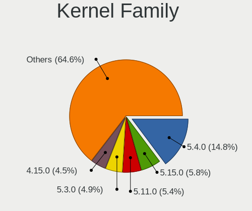

| Version  | Desktops | Percent |
|----------|----------|---------|
| 5.4.0    | 31       | 24.03%  |
| 5.11.0   | 12       | 9.3%    |
| 5.3.0    | 11       | 8.53%   |
| 4.15.0   | 9        | 6.98%   |
| 4.18.0   | 8        | 6.2%    |
| 5.8.0    | 5        | 3.88%   |
| 5.13.0   | 5        | 3.88%   |
| 5.16.7   | 4        | 3.1%    |
| 5.12.4   | 3        | 2.33%   |
| 5.10.14  | 3        | 2.33%   |
| 5.10.0   | 3        | 2.33%   |
| 5.0.0    | 3        | 2.33%   |
| 4.19.0   | 3        | 2.33%   |
| 5.3.18   | 2        | 1.55%   |
| 5.16.11  | 2        | 1.55%   |
| 5.9.0    | 1        | 0.78%   |
| 5.7.11   | 1        | 0.78%   |
| 5.7.0    | 1        | 0.78%   |
| 5.6.12   | 1        | 0.78%   |
| 5.4.64   | 1        | 0.78%   |
| 5.4.20   | 1        | 0.78%   |
| 5.4.2    | 1        | 0.78%   |
| 5.4.18   | 1        | 0.78%   |
| 5.3.16   | 1        | 0.78%   |
| 5.17.4   | 1        | 0.78%   |
| 5.17.3   | 1        | 0.78%   |
| 5.16.18  | 1        | 0.78%   |
| 5.16.15  | 1        | 0.78%   |
| 5.15.8   | 1        | 0.78%   |
| 5.15.32  | 1        | 0.78%   |
| 5.15.15  | 1        | 0.78%   |
| 5.15.0   | 1        | 0.78%   |
| 5.14.7   | 1        | 0.78%   |
| 5.14.11  | 1        | 0.78%   |
| 5.11.20  | 1        | 0.78%   |
| 5.10.79  | 1        | 0.78%   |
| 5.10.7   | 1        | 0.78%   |
| 5.10.53  | 1        | 0.78%   |
| 4.14.234 | 1        | 0.78%   |
| 4.13.0   | 1        | 0.78%   |

Kernel Major Ver.
-----------------

Linux kernel major version

| Version | Desktops | Percent |
|---------|----------|---------|
| 5.4     | 35       | 27.56%  |
| 5.3     | 14       | 11.02%  |
| 5.11    | 13       | 10.24%  |
| 5.10    | 9        | 7.09%   |
| 4.15    | 9        | 7.09%   |
| 4.18    | 8        | 6.3%    |
| 5.16    | 6        | 4.72%   |
| 5.8     | 5        | 3.94%   |
| 5.13    | 5        | 3.94%   |
| 5.15    | 4        | 3.15%   |
| 5.12    | 3        | 2.36%   |
| 5.0     | 3        | 2.36%   |
| 4.19    | 3        | 2.36%   |
| 5.7     | 2        | 1.57%   |
| 5.17    | 2        | 1.57%   |
| 5.14    | 2        | 1.57%   |
| 5.9     | 1        | 0.79%   |
| 5.6     | 1        | 0.79%   |
| 4.14    | 1        | 0.79%   |
| 4.13    | 1        | 0.79%   |

Arch
----

OS architecture (x86_64, i586, etc.)

| Name   | Desktops | Percent |
|--------|----------|---------|
| x86_64 | 117      | 98.32%  |
| i686   | 2        | 1.68%   |

DE
--

Desktop Environment

| Name       | Desktops | Percent |
|------------|----------|---------|
| GNOME      | 50       | 41.67%  |
| Unknown    | 20       | 16.67%  |
| KDE5       | 18       | 15%     |
| X-Cinnamon | 9        | 7.5%    |
| XFCE       | 6        | 5%      |
| MATE       | 4        | 3.33%   |
| KDE        | 4        | 3.33%   |
| Cinnamon   | 3        | 2.5%    |
| Budgie     | 2        | 1.67%   |
| Unity      | 1        | 0.83%   |
| openbox    | 1        | 0.83%   |
| LXQt       | 1        | 0.83%   |
| dwm        | 1        | 0.83%   |

Display Server
--------------

X11 or Wayland

| Name    | Desktops | Percent |
|---------|----------|---------|
| X11     | 101      | 84.87%  |
| Unknown | 9        | 7.56%   |
| Wayland | 6        | 5.04%   |
| Tty     | 3        | 2.52%   |

Display Manager
---------------

SDDM, LightDM, etc.

| Name    | Desktops | Percent |
|---------|----------|---------|
| Unknown | 72       | 59.02%  |
| SDDM    | 18       | 14.75%  |
| LightDM | 12       | 9.84%   |
| GDM     | 10       | 8.2%    |
| GDM3    | 7        | 5.74%   |
| TDM     | 3        | 2.46%   |

OS Lang
-------

Language

| Lang    | Desktops | Percent |
|---------|----------|---------|
| en_US   | 63       | 51.64%  |
| hr_HR   | 32       | 26.23%  |
| Unknown | 19       | 15.57%  |
| en_GB   | 6        | 4.92%   |
| C       | 2        | 1.64%   |

Boot Mode
---------

EFI or BIOS

| Mode | Desktops | Percent |
|------|----------|---------|
| BIOS | 72       | 60.5%   |
| EFI  | 47       | 39.5%   |

Filesystem
----------

Type of filesystem

| Type    | Desktops | Percent |
|---------|----------|---------|
| Ext4    | 97       | 79.51%  |
| Overlay | 11       | 9.02%   |
| Btrfs   | 5        | 4.1%    |
| Zfs     | 4        | 3.28%   |
| Unknown | 4        | 3.28%   |
| Xfs     | 1        | 0.82%   |

Part. scheme
------------

Scheme of partitioning

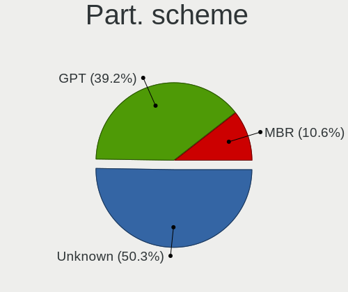

| Type    | Desktops | Percent |
|---------|----------|---------|
| Unknown | 77       | 64.71%  |
| GPT     | 30       | 25.21%  |
| MBR     | 12       | 10.08%  |

Dual Boot with Linux/BSD
------------------------

Hosting more than one Linux/BSD

| Dual boot | Desktops | Percent |
|-----------|----------|---------|
| No        | 98       | 80.33%  |
| Yes       | 24       | 19.67%  |

Dual Boot (Win)
---------------

Hosting Linux and Windows

| Dual boot | Desktops | Percent |
|-----------|----------|---------|
| No        | 76       | 62.81%  |
| Yes       | 45       | 37.19%  |

Board
-----

Vendor
------

Motherboard manufacturer

| Name                | Desktops | Percent |
|---------------------|----------|---------|
| ASRock              | 31       | 26.05%  |
| ASUSTek Computer    | 30       | 25.21%  |
| Gigabyte Technology | 22       | 18.49%  |
| MSI                 | 9        | 7.56%   |
| Pegatron            | 5        | 4.2%    |
| Hewlett-Packard     | 5        | 4.2%    |
| Dell                | 5        | 4.2%    |
| Intel               | 4        | 3.36%   |
| ECS                 | 3        | 2.52%   |
| Fujitsu Siemens     | 1        | 0.84%   |
| Foxconn             | 1        | 0.84%   |
| Acer                | 1        | 0.84%   |
| ABIT                | 1        | 0.84%   |
| Unknown             | 1        | 0.84%   |

Model
-----

Motherboard model

| Name                                   | Desktops | Percent |
|----------------------------------------|----------|---------|
| ASUS All Series                        | 4        | 3.36%   |
| ASUS PRIME A320M-K                     | 3        | 2.52%   |
| ASUS P8H77-V LE                        | 2        | 1.68%   |
| ASUS M5A78L LE                         | 2        | 1.68%   |
| ASRock H61M-DGS                        | 2        | 1.68%   |
| ASRock B450M-HDV R4.0                  | 2        | 1.68%   |
| Pegatron Pro 3010 Small Form Factor PC | 1        | 0.84%   |
| Pegatron HPE-520ad                     | 1        | 0.84%   |
| Pegatron G5261de                       | 1        | 0.84%   |
| Pegatron Compaq dx2400 Microtower PC   | 1        | 0.84%   |
| Pegatron 27-1001eu                     | 1        | 0.84%   |
| MSI MS-7C02                            | 1        | 0.84%   |
| MSI MS-7B98                            | 1        | 0.84%   |
| MSI MS-7B84                            | 1        | 0.84%   |
| MSI MS-7B07                            | 1        | 0.84%   |
| MSI MS-7850                            | 1        | 0.84%   |
| MSI MS-7817                            | 1        | 0.84%   |
| MSI MS-7681                            | 1        | 0.84%   |
| MSI MS-7586                            | 1        | 0.84%   |
| MSI MS-7360                            | 1        | 0.84%   |
| Intel H61M-S2PV                        | 1        | 0.84%   |
| Intel DX58SO AAE29331-501              | 1        | 0.84%   |
| Intel DH67BL AAG10189-213              | 1        | 0.84%   |
| Intel DH61CR AAG14064-204              | 1        | 0.84%   |
| HP Z840 Workstation                    | 1        | 0.84%   |
| HP Z440 Workstation                    | 1        | 0.84%   |
| HP ProDesk 600 G4 PCI MT               | 1        | 0.84%   |
| HP ProDesk 600 G1 SFF                  | 1        | 0.84%   |
| HP Compaq dc7900 Small Form Factor     | 1        | 0.84%   |
| Gigabyte Z390 M GAMING                 | 1        | 0.84%   |
| Gigabyte X48T-DQ6                      | 1        | 0.84%   |
| Gigabyte X399 AORUS XTREME             | 1        | 0.84%   |
| Gigabyte X299 UD4 Pro                  | 1        | 0.84%   |
| Gigabyte P31-ES3G                      | 1        | 0.84%   |
| Gigabyte H410M H V3                    | 1        | 0.84%   |
| Gigabyte GB-BRR7H-4800                 | 1        | 0.84%   |
| Gigabyte GA-MA785GMT-UD2H              | 1        | 0.84%   |
| Gigabyte GA-MA770-UD3                  | 1        | 0.84%   |
| Gigabyte GA-990XA-UD3                  | 1        | 0.84%   |
| Gigabyte G41M-Combo                    | 1        | 0.84%   |
| Gigabyte G31MX-S2                      | 1        | 0.84%   |
| Gigabyte G1.Sniper Z87                 | 1        | 0.84%   |
| Gigabyte F2A78M-DS2                    | 1        | 0.84%   |
| Gigabyte B85M-DS3H                     | 1        | 0.84%   |
| Gigabyte B450 GAMING X                 | 1        | 0.84%   |
| Gigabyte AX370-Gaming K7               | 1        | 0.84%   |
| Gigabyte AB350-Gaming 3                | 1        | 0.84%   |
| Gigabyte A320M-S2H                     | 1        | 0.84%   |
| Gigabyte A320M-H                       | 1        | 0.84%   |
| Gigabyte 990FXA-UD3                    | 1        | 0.84%   |
| Gigabyte 965P-DS3                      | 1        | 0.84%   |
| Fujitsu Siemens D2151-A1               | 1        | 0.84%   |
| Foxconn Compaq 500B Microtower         | 1        | 0.84%   |
| ECS H61H2-M2                           | 1        | 0.84%   |
| ECS A770M-A                            | 1        | 0.84%   |
| ECS A75F2-M2                           | 1        | 0.84%   |
| Dell Vostro 3681                       | 1        | 0.84%   |
| Dell Vostro 3471                       | 1        | 0.84%   |
| Dell Vostro 260                        | 1        | 0.84%   |
| Dell OptiPlex 9020                     | 1        | 0.84%   |

Model Family
------------

Motherboard model prefix

| Name                      | Desktops | Percent |
|---------------------------|----------|---------|
| ASUS PRIME                | 6        | 5.04%   |
| ASUS All                  | 4        | 3.36%   |
| Dell Vostro               | 3        | 2.52%   |
| ASUS TUF                  | 3        | 2.52%   |
| HP ProDesk                | 2        | 1.68%   |
| Dell OptiPlex             | 2        | 1.68%   |
| ASUS ROG                  | 2        | 1.68%   |
| ASUS P8H77-V              | 2        | 1.68%   |
| ASUS M5A78L               | 2        | 1.68%   |
| ASRock H97                | 2        | 1.68%   |
| ASRock H61M-DGS           | 2        | 1.68%   |
| ASRock B450M-HDV          | 2        | 1.68%   |
| ASRock A320M-HDV          | 2        | 1.68%   |
| Pegatron Pro              | 1        | 0.84%   |
| Pegatron HPE-520ad        | 1        | 0.84%   |
| Pegatron G5261de          | 1        | 0.84%   |
| Pegatron Compaq           | 1        | 0.84%   |
| Pegatron 27-1001eu        | 1        | 0.84%   |
| MSI MS-7C02               | 1        | 0.84%   |
| MSI MS-7B98               | 1        | 0.84%   |
| MSI MS-7B84               | 1        | 0.84%   |
| MSI MS-7B07               | 1        | 0.84%   |
| MSI MS-7850               | 1        | 0.84%   |
| MSI MS-7817               | 1        | 0.84%   |
| MSI MS-7681               | 1        | 0.84%   |
| MSI MS-7586               | 1        | 0.84%   |
| MSI MS-7360               | 1        | 0.84%   |
| Intel H61M-S2PV           | 1        | 0.84%   |
| Intel DX58SO              | 1        | 0.84%   |
| Intel DH67BL              | 1        | 0.84%   |
| Intel DH61CR              | 1        | 0.84%   |
| HP Z840                   | 1        | 0.84%   |
| HP Z440                   | 1        | 0.84%   |
| HP Compaq                 | 1        | 0.84%   |
| Gigabyte Z390             | 1        | 0.84%   |
| Gigabyte X48T-DQ6         | 1        | 0.84%   |
| Gigabyte X399             | 1        | 0.84%   |
| Gigabyte X299             | 1        | 0.84%   |
| Gigabyte P31-ES3G         | 1        | 0.84%   |
| Gigabyte H410M            | 1        | 0.84%   |
| Gigabyte GB-BRR7H-4800    | 1        | 0.84%   |
| Gigabyte GA-MA785GMT-UD2H | 1        | 0.84%   |
| Gigabyte GA-MA770-UD3     | 1        | 0.84%   |
| Gigabyte GA-990XA-UD3     | 1        | 0.84%   |
| Gigabyte G41M-Combo       | 1        | 0.84%   |
| Gigabyte G31MX-S2         | 1        | 0.84%   |
| Gigabyte G1.Sniper        | 1        | 0.84%   |
| Gigabyte F2A78M-DS2       | 1        | 0.84%   |
| Gigabyte B85M-DS3H        | 1        | 0.84%   |
| Gigabyte B450             | 1        | 0.84%   |
| Gigabyte AX370-Gaming     | 1        | 0.84%   |
| Gigabyte AB350-Gaming     | 1        | 0.84%   |
| Gigabyte A320M-S2H        | 1        | 0.84%   |
| Gigabyte A320M-H          | 1        | 0.84%   |
| Gigabyte 990FXA-UD3       | 1        | 0.84%   |
| Gigabyte 965P-DS3         | 1        | 0.84%   |
| Fujitsu Siemens D2151-A1  | 1        | 0.84%   |
| Foxconn Compaq            | 1        | 0.84%   |
| ECS H61H2-M2              | 1        | 0.84%   |
| ECS A770M-A               | 1        | 0.84%   |

MFG Year
--------

Motherboard manufacture year

| Year | Desktops | Percent |
|------|----------|---------|
| 2013 | 14       | 11.76%  |
| 2018 | 12       | 10.08%  |
| 2012 | 12       | 10.08%  |
| 2011 | 12       | 10.08%  |
| 2017 | 10       | 8.4%    |
| 2020 | 9        | 7.56%   |
| 2009 | 8        | 6.72%   |
| 2019 | 7        | 5.88%   |
| 2015 | 6        | 5.04%   |
| 2014 | 6        | 5.04%   |
| 2010 | 6        | 5.04%   |
| 2008 | 6        | 5.04%   |
| 2007 | 4        | 3.36%   |
| 2021 | 3        | 2.52%   |
| 2006 | 2        | 1.68%   |
| 2005 | 2        | 1.68%   |

Form Factor
-----------

Physical design of the computer

| Name    | Desktops | Percent |
|---------|----------|---------|
| Desktop | 119      | 100%    |

Secure Boot
-----------

Enabled or disabled

| State    | Desktops | Percent |
|----------|----------|---------|
| Disabled | 116      | 96.67%  |
| Enabled  | 4        | 3.33%   |

Coreboot
--------

Have coreboot on board

| Used | Desktops | Percent |
|------|----------|---------|
| No   | 119      | 100%    |

RAM Size
--------

Total RAM memory

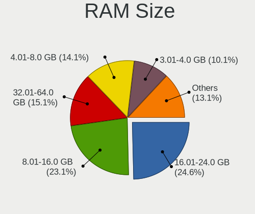

| Size in GB  | Desktops | Percent |
|-------------|----------|---------|
| 16.01-24.0  | 33       | 27.27%  |
| 8.01-16.0   | 32       | 26.45%  |
| 4.01-8.0    | 23       | 19.01%  |
| 3.01-4.0    | 15       | 12.4%   |
| 32.01-64.0  | 9        | 7.44%   |
| 1.01-2.0    | 5        | 4.13%   |
| 64.01-256.0 | 2        | 1.65%   |
| 24.01-32.0  | 1        | 0.83%   |
| 2.01-3.0    | 1        | 0.83%   |

RAM Used
--------

Used RAM memory

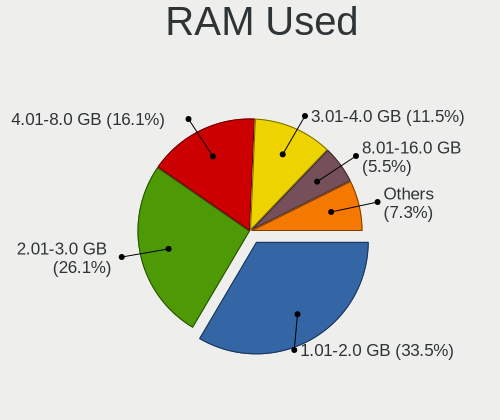

| Used GB    | Desktops | Percent |
|------------|----------|---------|
| 1.01-2.0   | 57       | 44.88%  |
| 2.01-3.0   | 32       | 25.2%   |
| 4.01-8.0   | 17       | 13.39%  |
| 3.01-4.0   | 10       | 7.87%   |
| 0.51-1.0   | 8        | 6.3%    |
| 16.01-24.0 | 1        | 0.79%   |
| 8.01-16.0  | 1        | 0.79%   |
| 0.01-0.5   | 1        | 0.79%   |

Total Drives
------------

Number of drives on board

| Drives | Desktops | Percent |
|--------|----------|---------|
| 1      | 46       | 36.8%   |
| 2      | 41       | 32.8%   |
| 3      | 22       | 17.6%   |
| 5      | 8        | 6.4%    |
| 4      | 5        | 4%      |
| 0      | 2        | 1.6%    |
| 7      | 1        | 0.8%    |

Has CD-ROM
----------

Has CD-ROM on board

| Presented | Desktops | Percent |
|-----------|----------|---------|
| Yes       | 61       | 50.83%  |
| No        | 59       | 49.17%  |

Has Ethernet
------------

Has Ethernet on board

| Presented | Desktops | Percent |
|-----------|----------|---------|
| Yes       | 117      | 98.32%  |
| No        | 2        | 1.68%   |

Has WiFi
--------

Has WiFi module

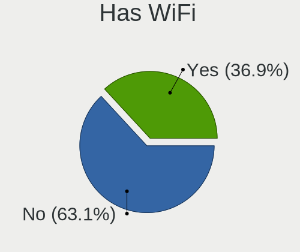

| Presented | Desktops | Percent |
|-----------|----------|---------|
| No        | 80       | 66.12%  |
| Yes       | 41       | 33.88%  |

Has Bluetooth
-------------

Has Bluetooth module

| Presented | Desktops | Percent |
|-----------|----------|---------|
| No        | 100      | 84.03%  |
| Yes       | 19       | 15.97%  |

Location
--------

Country
-------

Geographic location (country)

| Country | Desktops | Percent |
|---------|----------|---------|
| Croatia | 119      | 100%    |

City
----

Geographic location (city)

| City              | Desktops | Percent |
|-------------------|----------|---------|
| Zagreb            | 69       | 54.76%  |
| Split             | 9        | 7.14%   |
| Osijek            | 5        | 3.97%   |
| Velika Gorica     | 4        | 3.17%   |
| Pula              | 4        | 3.17%   |
| Vinkovci          | 2        | 1.59%   |
| Varadin       | 2        | 1.59%   |
| Dubrovnik         | 2        | 1.59%   |
| Zaprei   | 1        | 0.79%   |
| Zadar             | 1        | 0.79%   |
| Virovitica        | 1        | 0.79%   |
| Trogir            | 1        | 0.79%   |
| Supetar           | 1        | 0.79%   |
| Strmec Samoborski | 1        | 0.79%   |
| Sisak             | 1        | 0.79%   |
| Samobor           | 1        | 0.79%   |
| Rijeka            | 1        | 0.79%   |
| Raslina           | 1        | 0.79%   |
| Povljana          | 1        | 0.79%   |
| Pore          | 1        | 0.79%   |
| Opatija           | 1        | 0.79%   |
| Novo Selo Rok     | 1        | 0.79%   |
| Novi Marof        | 1        | 0.79%   |
| Medulin           | 1        | 0.79%   |
| Mala Subotica     | 1        | 0.79%   |
| Kutina            | 1        | 0.79%   |
| Knin              | 1        | 0.79%   |
| Klana             | 1        | 0.79%   |
| Kastel Kambelovac | 1        | 0.79%   |
| Karlovac          | 1        | 0.79%   |
| Kalinovac         | 1        | 0.79%   |
| Jastrebarsko      | 1        | 0.79%   |
| GJurgevac         | 1        | 0.79%   |
| Buje              | 1        | 0.79%   |
| Brdovec           | 1        | 0.79%   |
| Bjelovar          | 1        | 0.79%   |
| Bedekovcina       | 1        | 0.79%   |

Drives
------

Drive Vendor
------------

Hard drive vendors

| Vendor              | Desktops | Drives | Percent |
|---------------------|----------|--------|---------|
| WDC                 | 56       | 99     | 26.54%  |
| Samsung Electronics | 27       | 38     | 12.8%   |
| Kingston            | 24       | 35     | 11.37%  |
| Seagate             | 21       | 32     | 9.95%   |
| Toshiba             | 18       | 24     | 8.53%   |
| Crucial             | 12       | 15     | 5.69%   |
| Intel               | 8        | 9      | 3.79%   |
| A-DATA Technology   | 7        | 9      | 3.32%   |
| Patriot             | 4        | 7      | 1.9%    |
| Hitachi             | 4        | 4      | 1.9%    |
| SanDisk             | 3        | 4      | 1.42%   |
| Transcend           | 2        | 2      | 0.95%   |
| Silicon Motion      | 2        | 2      | 0.95%   |
| Phison              | 2        | 2      | 0.95%   |
| OCZ                 | 2        | 3      | 0.95%   |
| MAXTOR              | 2        | 2      | 0.95%   |
| Gigabyte Technology | 2        | 2      | 0.95%   |
| Corsair             | 2        | 2      | 0.95%   |
| XPG                 | 1        | 3      | 0.47%   |
| TO Exter            | 1        | 1      | 0.47%   |
| SK Hynix            | 1        | 1      | 0.47%   |
| Netac               | 1        | 1      | 0.47%   |
| Mushkin             | 1        | 1      | 0.47%   |
| KingSpec            | 1        | 1      | 0.47%   |
| Kingmax             | 1        | 1      | 0.47%   |
| HPE                 | 1        | 2      | 0.47%   |
| HGST                | 1        | 1      | 0.47%   |
| GOODRAM             | 1        | 1      | 0.47%   |
| External            | 1        | 1      | 0.47%   |
| ASMedia             | 1        | 1      | 0.47%   |
| AMD                 | 1        | 2      | 0.47%   |

Drive Model
-----------

Hard drive models

| Model                            | Desktops | Percent |
|----------------------------------|----------|---------|
| Kingston SA400S37480G 480GB SSD  | 5        | 2.07%   |
| Toshiba HDWD130 3TB              | 4        | 1.66%   |
| Samsung SSD 850 EVO 250GB        | 4        | 1.66%   |
| Kingston SV300S37A120G 120GB SSD | 4        | 1.66%   |
| Kingston SA400S37120G 120GB SSD  | 4        | 1.66%   |
| WDC WD5000AAKX-001CA0 500GB      | 3        | 1.24%   |
| WDC WD10EZEX-08WN4A0 1TB         | 3        | 1.24%   |
| Toshiba HDWD110 1TB              | 3        | 1.24%   |
| Toshiba DT01ACA100 1TB           | 3        | 1.24%   |
| Seagate ST1000DM010-2EP102 1TB   | 3        | 1.24%   |
| Samsung HD103SI 1TB              | 3        | 1.24%   |
| Patriot Burst 240GB SSD          | 3        | 1.24%   |
| Kingston SA400S37240G 240GB SSD  | 3        | 1.24%   |
| Intel SSDSC2BW120A4 120GB        | 3        | 1.24%   |
| WDC WDS240G2G0A-00JH30 240GB SSD | 2        | 0.83%   |
| WDC WD6400AAKS-22A7B0 640GB      | 2        | 0.83%   |
| WDC WD5000AAKX-60U6AA0 500GB     | 2        | 0.83%   |
| WDC WD5000AAKX-22ERMA0 500GB     | 2        | 0.83%   |
| WDC WD3200AAKS-00L9A0 320GB      | 2        | 0.83%   |
| WDC WD30EFRX-68EUZN0 3TB         | 2        | 0.83%   |
| WDC WD20EFRX-68EUZN0 2TB         | 2        | 0.83%   |
| WDC WD1600AAJS-07M0A0 160GB      | 2        | 0.83%   |
| Toshiba HDWD120 2TB              | 2        | 0.83%   |
| Seagate ST31000524AS 1TB         | 2        | 0.83%   |
| Seagate ST2000DM008-2FR102 2TB   | 2        | 0.83%   |
| SanDisk SDSSDA240G 240GB         | 2        | 0.83%   |
| Samsung SSD 970 EVO Plus 1TB     | 2        | 0.83%   |
| Samsung SSD 860 PRO 256GB        | 2        | 0.83%   |
| Samsung NVMe SSD Drive 500GB     | 2        | 0.83%   |
| Samsung NVMe SSD Drive 1TB       | 2        | 0.83%   |
| Samsung HD256GJ 250GB            | 2        | 0.83%   |
| Kingston SUV400S37240G 240GB SSD | 2        | 0.83%   |
| Intel NVMe SSD Drive 128GB       | 2        | 0.83%   |
| Crucial CT480BX500SSD1 480GB     | 2        | 0.83%   |
| Crucial CT240BX500SSD1 240GB     | 2        | 0.83%   |
| Crucial CT120BX500SSD1 120GB     | 2        | 0.83%   |
| A-DATA SU650 240GB SSD           | 2        | 0.83%   |
| XPG NVMe SSD Drive 256GB         | 1        | 0.41%   |
| WDC WDS500G3XHC-00SJG0 500GB     | 1        | 0.41%   |
| WDC WDS250G2X0C-00L350 250GB     | 1        | 0.41%   |
| WDC WDS100T3XHC-00SJG0 1TB       | 1        | 0.41%   |
| WDC WD800JD-08LSA0 80GB          | 1        | 0.41%   |
| WDC WD800AAJS-00TDA0 80GB        | 1        | 0.41%   |
| WDC WD6401AALS-00L3B2 640GB      | 1        | 0.41%   |
| WDC WD6400AAKS-65A7B2 640GB      | 1        | 0.41%   |
| WDC WD6400AAKS-07A7B0 640GB      | 1        | 0.41%   |
| WDC WD5000LPCX-22VHAT1 500GB     | 1        | 0.41%   |
| WDC WD5000AZRX-00L4HB0 500GB     | 1        | 0.41%   |
| WDC WD5000AAKX-221CA1 500GB      | 1        | 0.41%   |
| WDC WD5000AAKX-003CA0 500GB      | 1        | 0.41%   |
| WDC WD5000AAKS-55V0A0 500GB      | 1        | 0.41%   |
| WDC WD40PURZ-85TTDY0 4TB         | 1        | 0.41%   |
| WDC WD40PURZ-74AKKY0 4TB         | 1        | 0.41%   |
| WDC WD40EZRZ-22GXCB0 4TB         | 1        | 0.41%   |
| WDC WD3200BEVT-75ZCT2 320GB      | 1        | 0.41%   |
| WDC WD3200AVJS-63B6A0 320GB      | 1        | 0.41%   |
| WDC WD3200AAKS-00VYA0 320GB      | 1        | 0.41%   |
| WDC WD30EZRX-00D8PB0 3TB         | 1        | 0.41%   |
| WDC WD30EZRX-00AZ6B0 3TB         | 1        | 0.41%   |
| WDC WD2500JS-00MVB1 250GB        | 1        | 0.41%   |

HDD Vendor
----------

Hard disk drive vendors

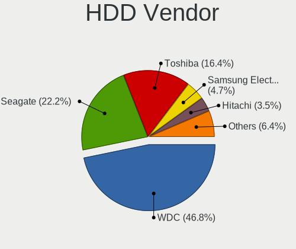

| Vendor              | Desktops | Drives | Percent |
|---------------------|----------|--------|---------|
| WDC                 | 54       | 90     | 50.94%  |
| Seagate             | 21       | 32     | 19.81%  |
| Toshiba             | 17       | 23     | 16.04%  |
| Samsung Electronics | 7        | 9      | 6.6%    |
| Hitachi             | 4        | 4      | 3.77%   |
| MAXTOR              | 2        | 2      | 1.89%   |
| HGST                | 1        | 1      | 0.94%   |

SSD Vendor
----------

Solid state drive vendors

| Vendor              | Desktops | Drives | Percent |
|---------------------|----------|--------|---------|
| Kingston            | 23       | 31     | 27.71%  |
| Samsung Electronics | 12       | 18     | 14.46%  |
| Crucial             | 11       | 13     | 13.25%  |
| Intel               | 6        | 7      | 7.23%   |
| A-DATA Technology   | 6        | 8      | 7.23%   |
| Patriot             | 3        | 6      | 3.61%   |
| WDC                 | 2        | 2      | 2.41%   |
| Transcend           | 2        | 2      | 2.41%   |
| SanDisk             | 2        | 3      | 2.41%   |
| OCZ                 | 2        | 3      | 2.41%   |
| Gigabyte Technology | 2        | 2      | 2.41%   |
| Toshiba             | 1        | 1      | 1.2%    |
| TO Exter            | 1        | 1      | 1.2%    |
| SK Hynix            | 1        | 1      | 1.2%    |
| Netac               | 1        | 1      | 1.2%    |
| Mushkin             | 1        | 1      | 1.2%    |
| KingSpec            | 1        | 1      | 1.2%    |
| Kingmax             | 1        | 1      | 1.2%    |
| GOODRAM             | 1        | 1      | 1.2%    |
| External            | 1        | 1      | 1.2%    |
| Corsair             | 1        | 1      | 1.2%    |
| ASMedia             | 1        | 1      | 1.2%    |
| AMD                 | 1        | 2      | 1.2%    |

Drive Kind
----------

HDD or SSD

| Kind    | Desktops | Drives | Percent |
|---------|----------|--------|---------|
| HDD     | 86       | 161    | 48.04%  |
| SSD     | 69       | 108    | 38.55%  |
| NVMe    | 23       | 37     | 12.85%  |
| Unknown | 1        | 2      | 0.56%   |

Drive Connector
---------------

SATA, SAS, NVMe, etc.

| Type | Desktops | Drives | Percent |
|------|----------|--------|---------|
| SATA | 107      | 266    | 79.85%  |
| NVMe | 23       | 37     | 17.16%  |
| SAS  | 4        | 5      | 2.99%   |

Drive Size
----------

Size of hard drive

| Size in TB | Desktops | Drives | Percent |
|------------|----------|--------|---------|
| 0.01-0.5   | 86       | 159    | 54.09%  |
| 0.51-1.0   | 45       | 66     | 28.3%   |
| 1.01-2.0   | 13       | 19     | 8.18%   |
| 2.01-3.0   | 10       | 20     | 6.29%   |
| 3.01-4.0   | 4        | 4      | 2.52%   |
| 4.01-10.0  | 1        | 1      | 0.63%   |

Space Total
-----------

Amount of disk space available on the file system

| Size in GB     | Desktops | Percent |
|----------------|----------|---------|
| 101-250        | 39       | 30.95%  |
| 251-500        | 20       | 15.87%  |
| 501-1000       | 18       | 14.29%  |
| 1001-2000      | 14       | 11.11%  |
| More than 3000 | 9        | 7.14%   |
| 1-20           | 9        | 7.14%   |
| 51-100         | 7        | 5.56%   |
| Unknown        | 5        | 3.97%   |
| 2001-3000      | 3        | 2.38%   |
| 21-50          | 2        | 1.59%   |

Space Used
----------

Amount of used disk space

| Used GB        | Desktops | Percent |
|----------------|----------|---------|
| 1-20           | 61       | 46.56%  |
| 21-50          | 13       | 9.92%   |
| 251-500        | 10       | 7.63%   |
| 101-250        | 10       | 7.63%   |
| 501-1000       | 10       | 7.63%   |
| 51-100         | 9        | 6.87%   |
| 1001-2000      | 7        | 5.34%   |
| Unknown        | 5        | 3.82%   |
| 2001-3000      | 4        | 3.05%   |
| More than 3000 | 2        | 1.53%   |

Malfunc. Drives
---------------

Drive models with a malfunction

| Model                            | Desktops | Drives | Percent |
|----------------------------------|----------|--------|---------|
| WDC WD6400AAKS-07A7B0 640GB      | 1        | 1      | 6.67%   |
| WDC WD5000AAKX-221CA1 500GB      | 1        | 1      | 6.67%   |
| WDC WD3200AAKS-00L9A0 320GB      | 1        | 1      | 6.67%   |
| WDC WD2500AAKX-75U6AA0 250GB     | 1        | 1      | 6.67%   |
| WDC WD10EZEX-00MFCA0 1TB         | 1        | 1      | 6.67%   |
| Transcend TS480GSSD220S 480GB    | 1        | 1      | 6.67%   |
| Toshiba DT01ACA100 1TB           | 1        | 1      | 6.67%   |
| SK Hynix SH920 2.5 7MM 256GB SSD | 1        | 1      | 6.67%   |
| Seagate ST500DM002-1BD142 500GB  | 1        | 1      | 6.67%   |
| Seagate ST31500341AS 1TB         | 1        | 1      | 6.67%   |
| SanDisk SDSSDA240G 240GB         | 1        | 1      | 6.67%   |
| Intel SSDSC2BW120A4 120GB        | 1        | 1      | 6.67%   |
| Hitachi HDS723020BLA642 2TB      | 1        | 1      | 6.67%   |
| Crucial CT525MX300SSD1 528GB     | 1        | 1      | 6.67%   |
| Crucial CT120BX500SSD1 120GB     | 1        | 1      | 6.67%   |

Malfunc. Drive Vendor
---------------------

Vendors of faulty drives

| Vendor    | Desktops | Drives | Percent |
|-----------|----------|--------|---------|
| WDC       | 5        | 5      | 33.33%  |
| Seagate   | 2        | 2      | 13.33%  |
| Crucial   | 2        | 2      | 13.33%  |
| Transcend | 1        | 1      | 6.67%   |
| Toshiba   | 1        | 1      | 6.67%   |
| SK Hynix  | 1        | 1      | 6.67%   |
| SanDisk   | 1        | 1      | 6.67%   |
| Intel     | 1        | 1      | 6.67%   |
| Hitachi   | 1        | 1      | 6.67%   |

Malfunc. HDD Vendor
-------------------

Vendors of faulty HDD drives

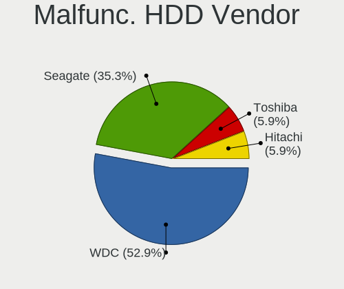

| Vendor  | Desktops | Drives | Percent |
|---------|----------|--------|---------|
| WDC     | 5        | 5      | 55.56%  |
| Seagate | 2        | 2      | 22.22%  |
| Toshiba | 1        | 1      | 11.11%  |
| Hitachi | 1        | 1      | 11.11%  |

Malfunc. Drive Kind
-------------------

Kinds of faulty drives

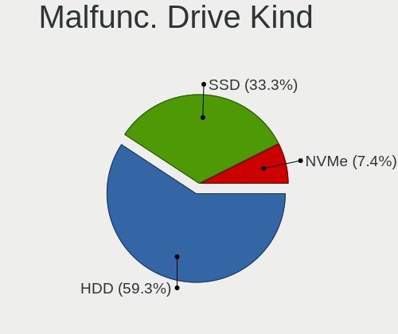

| Kind | Desktops | Drives | Percent |
|------|----------|--------|---------|
| HDD  | 9        | 9      | 60%     |
| SSD  | 6        | 6      | 40%     |

Failed Drives
-------------

Failed drive models

Zero info for selected period =(

Failed Drive Vendor
-------------------

Failed drive vendors

Zero info for selected period =(

Drive Status
------------

Number of failed and malfunc. drives

| Status   | Desktops | Drives | Percent |
|----------|----------|--------|---------|
| Detected | 80       | 207    | 61.54%  |
| Works    | 38       | 86     | 29.23%  |
| Malfunc  | 12       | 15     | 9.23%   |

Storage controller
------------------

Storage Vendor
--------------

Storage controller vendors

| Vendor                      | Desktops | Percent |
|-----------------------------|----------|---------|
| Intel                       | 75       | 48.39%  |
| AMD                         | 41       | 26.45%  |
| Samsung Electronics         | 10       | 6.45%   |
| Phison Electronics          | 4        | 2.58%   |
| JMicron Technology          | 4        | 2.58%   |
| Marvell Technology Group    | 3        | 1.94%   |
| Kingston Technology Company | 3        | 1.94%   |
| ASMedia Technology          | 3        | 1.94%   |
| Silicon Motion              | 2        | 1.29%   |
| Sandisk                     | 2        | 1.29%   |
| Nvidia                      | 2        | 1.29%   |
| ADATA Technology            | 2        | 1.29%   |
| VIA Technologies            | 1        | 0.65%   |
| Micron/Crucial Technology   | 1        | 0.65%   |
| Broadcom / LSI              | 1        | 0.65%   |
| Adaptec                     | 1        | 0.65%   |

Storage Model
-------------

Storage controller models

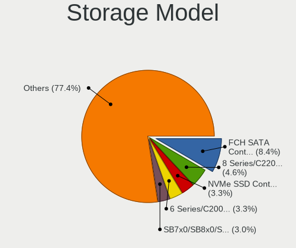

| Model                                                                                   | Desktops | Percent |
|-----------------------------------------------------------------------------------------|----------|---------|
| AMD FCH SATA Controller [AHCI mode]                                                     | 24       | 11.32%  |
| Intel 8 Series/C220 Series Chipset Family 6-port SATA Controller 1 [AHCI mode]          | 12       | 5.66%   |
| AMD SB7x0/SB8x0/SB9x0 IDE Controller                                                    | 11       | 5.19%   |
| Intel 6 Series/C200 Series Chipset Family 6 port Desktop SATA AHCI Controller           | 8        | 3.77%   |
| AMD SB7x0/SB8x0/SB9x0 SATA Controller [IDE mode]                                        | 8        | 3.77%   |
| AMD FCH SATA Controller D                                                               | 8        | 3.77%   |
| Intel NM10/ICH7 Family SATA Controller [IDE mode]                                       | 7        | 3.3%    |
| Samsung NVMe SSD Controller SM981/PM981/PM983                                           | 6        | 2.83%   |
| Intel 6 Series/C200 Series Chipset Family Desktop SATA Controller (IDE mode, ports 4-5) | 5        | 2.36%   |
| AMD SB7x0/SB8x0/SB9x0 SATA Controller [AHCI mode]                                       | 5        | 2.36%   |
| AMD 400 Series Chipset SATA Controller                                                  | 5        | 2.36%   |
| Intel Cannon Lake PCH SATA AHCI Controller                                              | 4        | 1.89%   |
| Intel 9 Series Chipset Family SATA Controller [AHCI Mode]                               | 4        | 1.89%   |
| Intel 82801I (ICH9 Family) 2 port SATA Controller [IDE mode]                            | 4        | 1.89%   |
| Intel 82801G (ICH7 Family) IDE Controller                                               | 4        | 1.89%   |
| Intel 6 Series/C200 Series Chipset Family Desktop SATA Controller (IDE mode, ports 0-3) | 4        | 1.89%   |
| Intel 400 Series Chipset Family SATA AHCI Controller                                    | 4        | 1.89%   |
| Intel 200 Series PCH SATA controller [AHCI mode]                                        | 4        | 1.89%   |
| AMD FCH IDE Controller                                                                  | 4        | 1.89%   |
| JMicron JMB363 SATA/IDE Controller                                                      | 3        | 1.42%   |
| Intel Q170/Q150/B150/H170/H110/Z170/CM236 Chipset SATA Controller [AHCI Mode]           | 3        | 1.42%   |
| ASMedia ASM1062 Serial ATA Controller                                                   | 3        | 1.42%   |
| Sandisk WD Black 2018/SN750 / PC SN720 NVMe SSD                                         | 2        | 0.94%   |
| Nvidia MCP61 SATA Controller                                                            | 2        | 0.94%   |
| Marvell Group 88SE6111/6121 SATA II / PATA Controller                                   | 2        | 0.94%   |
| Kingston Company A2000 NVMe SSD                                                         | 2        | 0.94%   |
| Intel SSD 600P Series                                                                   | 2        | 0.94%   |
| Intel Comet Lake SATA AHCI Controller                                                   | 2        | 0.94%   |
| Intel 82801JI (ICH10 Family) 4 port SATA IDE Controller #1                              | 2        | 0.94%   |
| Intel 82801JI (ICH10 Family) 2 port SATA IDE Controller #2                              | 2        | 0.94%   |
| Intel 82801IR/IO/IH (ICH9R/DO/DH) 4 port SATA Controller [IDE mode]                     | 2        | 0.94%   |
| Intel 82801IB (ICH9) 2 port SATA Controller [IDE mode]                                  | 2        | 0.94%   |
| Intel 7 Series/C210 Series Chipset Family 4-port SATA Controller [IDE mode]             | 2        | 0.94%   |
| Intel 7 Series/C210 Series Chipset Family 2-port SATA Controller [IDE mode]             | 2        | 0.94%   |
| Intel 500 Series Chipset Family SATA AHCI Controller                                    | 2        | 0.94%   |
| ADATA XPG SX8200 Pro PCIe Gen3x4 M.2 2280 Solid State Drive                             | 2        | 0.94%   |
| VIA VT82C586A/B/VT82C686/A/B/VT823x/A/C PIPC Bus Master IDE                             | 1        | 0.47%   |
| VIA VT8251 AHCI/SATA 4-Port Controller                                                  | 1        | 0.47%   |
| Silicon Motion SM2263EN/SM2263XT SSD Controller                                         | 1        | 0.47%   |
| Silicon Motion SM2262/SM2262EN SSD Controller                                           | 1        | 0.47%   |
| Samsung NVMe SSD Controller SM961/PM961/SM963                                           | 1        | 0.47%   |
| Samsung NVMe SSD Controller PM9A1/PM9A3/980PRO                                          | 1        | 0.47%   |
| Samsung NVMe SSD Controller 980                                                         | 1        | 0.47%   |
| Samsung NVMe SSD Controller 172Xa/172Xb                                                 | 1        | 0.47%   |
| Phison PS5013 E13 NVMe Controller                                                       | 1        | 0.47%   |
| Phison NVMe Storage Controller                                                          | 1        | 0.47%   |
| Phison E16 PCIe4 NVMe Controller                                                        | 1        | 0.47%   |
| Phison E12 NVMe Controller                                                              | 1        | 0.47%   |
| Nvidia MCP61 IDE                                                                        | 1        | 0.47%   |
| Micron/Crucial P1 NVMe PCIe SSD                                                         | 1        | 0.47%   |
| Marvell Group 88SE9172 SATA 6Gb/s Controller                                            | 1        | 0.47%   |
| Kingston Company U-SNS8154P3 NVMe SSD                                                   | 1        | 0.47%   |
| JMicron JMB361 AHCI/IDE                                                                 | 1        | 0.47%   |
| Intel SATA Controller [RAID mode]                                                       | 1        | 0.47%   |
| Intel Comet Lake PCH-H RAID                                                             | 1        | 0.47%   |
| Intel C610/X99 series chipset sSATA Controller [RAID mode]                              | 1        | 0.47%   |
| Intel C610/X99 series chipset sSATA Controller [AHCI mode]                              | 1        | 0.47%   |
| Intel C610/X99 series chipset 6-Port SATA Controller [AHCI mode]                        | 1        | 0.47%   |
| Intel C600/X79 series chipset SATA RAID Controller                                      | 1        | 0.47%   |
| Intel 82801JI (ICH10 Family) SATA AHCI Controller                                       | 1        | 0.47%   |

Storage Kind
------------

Kind of storage controller (IDE, SATA, NVMe, SAS, ...)

| Kind | Desktops | Percent |
|------|----------|---------|
| SATA | 89       | 54.27%  |
| IDE  | 44       | 26.83%  |
| NVMe | 24       | 14.63%  |
| RAID | 6        | 3.66%   |
| SAS  | 1        | 0.61%   |

Processor
---------

CPU Vendor
----------

Processor vendors

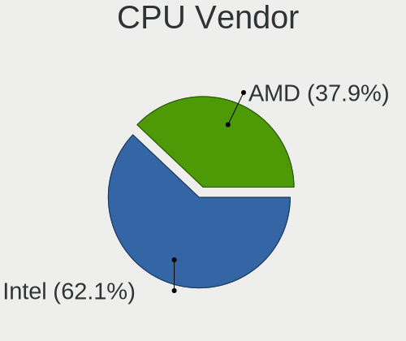

| Vendor | Desktops | Percent |
|--------|----------|---------|
| Intel  | 74       | 62.18%  |
| AMD    | 45       | 37.82%  |

CPU Model
---------

Processor models

| Model                                       | Desktops | Percent |
|---------------------------------------------|----------|---------|
| AMD Ryzen 5 1600 Six-Core Processor         | 5        | 4.1%    |
| Intel Core i7-4770 CPU @ 3.40GHz            | 3        | 2.46%   |
| Intel Core i5-9400F CPU @ 2.90GHz           | 3        | 2.46%   |
| Intel Core i3-10100F CPU @ 3.60GHz          | 3        | 2.46%   |
| Intel Core 2 Duo CPU E8400 @ 3.00GHz        | 3        | 2.46%   |
| Intel Pentium Dual-Core CPU E5400 @ 2.70GHz | 2        | 1.64%   |
| Intel Pentium 4 CPU 3.00GHz                 | 2        | 1.64%   |
| Intel Core i7-4790 CPU @ 3.60GHz            | 2        | 1.64%   |
| Intel Core i7-4771 CPU @ 3.50GHz            | 2        | 1.64%   |
| Intel Core i5-4460 CPU @ 3.20GHz            | 2        | 1.64%   |
| Intel Core i5-2500K CPU @ 3.30GHz           | 2        | 1.64%   |
| Intel Core i5-2400 CPU @ 3.10GHz            | 2        | 1.64%   |
| Intel Core i5-2300 CPU @ 2.80GHz            | 2        | 1.64%   |
| Intel Core i3-4130 CPU @ 3.40GHz            | 2        | 1.64%   |
| Intel Core i3-2100 CPU @ 3.10GHz            | 2        | 1.64%   |
| Intel Core i3-10100 CPU @ 3.60GHz           | 2        | 1.64%   |
| Intel Core 2 Duo CPU E4500 @ 2.20GHz        | 2        | 1.64%   |
| AMD Ryzen 9 5900X 12-Core Processor         | 2        | 1.64%   |
| AMD Ryzen 7 2700X Eight-Core Processor      | 2        | 1.64%   |
| AMD Ryzen 3 2200G with Radeon Vega Graphics | 2        | 1.64%   |
| AMD Ryzen 3 1200 Quad-Core Processor        | 2        | 1.64%   |
| AMD Phenom II X4 965 Processor              | 2        | 1.64%   |
| AMD FX-6300 Six-Core Processor              | 2        | 1.64%   |
| AMD Athlon X4 740 Quad Core Processor       | 2        | 1.64%   |
| Intel Xeon CPU E5-2670 v3 @ 2.30GHz         | 1        | 0.82%   |
| Intel Xeon CPU E5-1603 v3 @ 2.80GHz         | 1        | 0.82%   |
| Intel Xeon CPU E3-1230 v3 @ 3.30GHz         | 1        | 0.82%   |
| Intel Pentium Dual CPU E2200 @ 2.20GHz      | 1        | 0.82%   |
| Intel Pentium CPU G620 @ 2.60GHz            | 1        | 0.82%   |
| Intel Pentium CPU G4400 @ 3.30GHz           | 1        | 0.82%   |
| Intel Pentium CPU G3250 @ 3.20GHz           | 1        | 0.82%   |
| Intel Core i9-10900K CPU @ 3.70GHz          | 1        | 0.82%   |
| Intel Core i7-9700 CPU @ 3.00GHz            | 1        | 0.82%   |
| Intel Core i7-8700 CPU @ 3.20GHz            | 1        | 0.82%   |
| Intel Core i7-3770 CPU @ 3.40GHz            | 1        | 0.82%   |
| Intel Core i7-10700K CPU @ 3.80GHz          | 1        | 0.82%   |
| Intel Core i7 CPU 965 @ 3.20GHz             | 1        | 0.82%   |
| Intel Core i5-8500 CPU @ 3.00GHz            | 1        | 0.82%   |
| Intel Core i5-7640X CPU @ 4.00GHz           | 1        | 0.82%   |
| Intel Core i5-6500 CPU @ 3.20GHz            | 1        | 0.82%   |
| Intel Core i5-6400 CPU @ 2.70GHz            | 1        | 0.82%   |
| Intel Core i5-4590 CPU @ 3.30GHz            | 1        | 0.82%   |
| Intel Core i5-4570 CPU @ 3.20GHz            | 1        | 0.82%   |
| Intel Core i5-4200U CPU @ 1.60GHz           | 1        | 0.82%   |
| Intel Core i5-3570K CPU @ 3.40GHz           | 1        | 0.82%   |
| Intel Core i5-3470 CPU @ 3.20GHz            | 1        | 0.82%   |
| Intel Core i5-3330 CPU @ 3.00GHz            | 1        | 0.82%   |
| Intel Core i5-2500 CPU @ 3.30GHz            | 1        | 0.82%   |
| Intel Core i5-2400S CPU @ 2.50GHz           | 1        | 0.82%   |
| Intel Core i3-9100 CPU @ 3.60GHz            | 1        | 0.82%   |
| Intel Core i3-8100 CPU @ 3.60GHz            | 1        | 0.82%   |
| Intel Core i3-4160 CPU @ 3.60GHz            | 1        | 0.82%   |
| Intel Core i3-2120 CPU @ 3.30GHz            | 1        | 0.82%   |
| Intel Core i3-10105 CPU @ 3.70GHz           | 1        | 0.82%   |
| Intel Core i3 CPU 550 @ 3.20GHz             | 1        | 0.82%   |
| Intel Core i3 CPU 540 @ 3.07GHz             | 1        | 0.82%   |
| Intel Core 2 Quad CPU Q9650 @ 3.00GHz       | 1        | 0.82%   |
| Intel Core 2 Quad CPU Q6600 @ 2.40GHz       | 1        | 0.82%   |
| Intel Core 2 Duo CPU E7400 @ 2.80GHz        | 1        | 0.82%   |
| Intel Core 2 Duo CPU E6550 @ 2.33GHz        | 1        | 0.82%   |

CPU Model Family
----------------

Processor model prefix

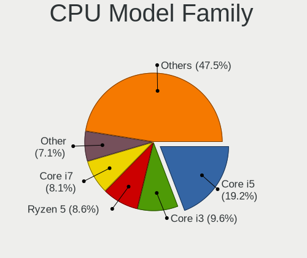

| Model                   | Desktops | Percent |
|-------------------------|----------|---------|
| Intel Core i5           | 23       | 18.85%  |
| Intel Core i3           | 16       | 13.11%  |
| Intel Core i7           | 12       | 9.84%   |
| AMD Ryzen 5             | 8        | 6.56%   |
| Intel Core 2 Duo        | 7        | 5.74%   |
| AMD FX                  | 5        | 4.1%    |
| AMD Ryzen 3             | 4        | 3.28%   |
| AMD Athlon II X4        | 4        | 3.28%   |
| Intel Xeon              | 3        | 2.46%   |
| Intel Pentium           | 3        | 2.46%   |
| AMD Ryzen 9             | 3        | 2.46%   |
| AMD Ryzen 7             | 3        | 2.46%   |
| AMD Phenom II X4        | 3        | 2.46%   |
| AMD Athlon X4           | 3        | 2.46%   |
| Intel Pentium Dual-Core | 2        | 1.64%   |
| Intel Pentium 4         | 2        | 1.64%   |
| Intel Core 2 Quad       | 2        | 1.64%   |
| Intel Core 2            | 2        | 1.64%   |
| AMD Athlon 64 X2        | 2        | 1.64%   |
| AMD A8                  | 2        | 1.64%   |
| Other                   | 1        | 0.82%   |
| Intel Pentium Dual      | 1        | 0.82%   |
| Intel Core i9           | 1        | 0.82%   |
| Intel Celeron           | 1        | 0.82%   |
| AMD Ryzen Threadripper  | 1        | 0.82%   |
| AMD Ryzen 7 PRO         | 1        | 0.82%   |
| AMD Ryzen 3 PRO         | 1        | 0.82%   |
| AMD Phenom II X6        | 1        | 0.82%   |
| AMD Phenom II X2        | 1        | 0.82%   |
| AMD E                   | 1        | 0.82%   |
| AMD Athlon 64           | 1        | 0.82%   |
| AMD Athlon              | 1        | 0.82%   |
| AMD A6                  | 1        | 0.82%   |

CPU Cores
---------

Number of processor cores

| Number | Desktops | Percent |
|--------|----------|---------|
| 4      | 54       | 44.26%  |
| 2      | 36       | 29.51%  |
| 6      | 14       | 11.48%  |
| 8      | 6        | 4.92%   |
| 1      | 4        | 3.28%   |
| 12     | 3        | 2.46%   |
| 3      | 2        | 1.64%   |
| 24     | 1        | 0.82%   |
| 16     | 1        | 0.82%   |
| 10     | 1        | 0.82%   |

CPU Sockets
-----------

Number of sockets

| Number | Desktops | Percent |
|--------|----------|---------|
| 1      | 118      | 99.16%  |
| 2      | 1        | 0.84%   |

CPU Threads
-----------

Threads per core (Hyper-Threading)

| Number | Desktops | Percent |
|--------|----------|---------|
| 2      | 60       | 50%     |
| 1      | 60       | 50%     |

CPU Op-Modes
------------

CPU Operation Modes (32-bit, 64-bit)

| Op mode        | Desktops | Percent |
|----------------|----------|---------|
| 32-bit, 64-bit | 117      | 98.32%  |
| Unknown        | 2        | 1.68%   |

CPU Microcode
-------------

Microcode number

| Number     | Desktops | Percent |
|------------|----------|---------|
| Unknown    | 20       | 16.13%  |
| 0x306c3    | 16       | 12.9%   |
| 0x206a7    | 10       | 8.06%   |
| 0x1067a    | 7        | 5.65%   |
| 0xa0653    | 5        | 4.03%   |
| 0x906ea    | 5        | 4.03%   |
| 0x0800820d | 5        | 4.03%   |
| 0x010000db | 4        | 3.23%   |
| 0x010000c8 | 4        | 3.23%   |
| 0x6fd      | 3        | 2.42%   |
| 0x306a9    | 3        | 2.42%   |
| 0x06001119 | 3        | 2.42%   |
| 0xf43      | 2        | 1.61%   |
| 0xa0655    | 2        | 1.61%   |
| 0x906eb    | 2        | 1.61%   |
| 0x6fb      | 2        | 1.61%   |
| 0x506e3    | 2        | 1.61%   |
| 0x306f2    | 2        | 1.61%   |
| 0x0810100b | 2        | 1.61%   |
| 0x08001137 | 2        | 1.61%   |
| 0x06000852 | 2        | 1.61%   |
| 0x0600063e | 2        | 1.61%   |
| 0xa0671    | 1        | 0.81%   |
| 0x906ed    | 1        | 0.81%   |
| 0x906e9    | 1        | 0.81%   |
| 0x6f6      | 1        | 0.81%   |
| 0x20655    | 1        | 0.81%   |
| 0x106a4    | 1        | 0.81%   |
| 0x0a201009 | 1        | 0.81%   |
| 0x0a201005 | 1        | 0.81%   |
| 0x08701021 | 1        | 0.81%   |
| 0x08701013 | 1        | 0.81%   |
| 0x08600106 | 1        | 0.81%   |
| 0x08600103 | 1        | 0.81%   |
| 0x08108109 | 1        | 0.81%   |
| 0x08108102 | 1        | 0.81%   |
| 0x08001138 | 1        | 0.81%   |
| 0x08001129 | 1        | 0.81%   |
| 0x05000029 | 1        | 0.81%   |
| 0x010000dc | 1        | 0.81%   |
| 0x00000000 | 1        | 0.81%   |

CPU Microarch
-------------

Microarchitecture

| Name        | Desktops | Percent |
|-------------|----------|---------|
| Haswell     | 20       | 16.81%  |
| SandyBridge | 11       | 9.24%   |
| Zen+        | 8        | 6.72%   |
| Zen         | 8        | 6.72%   |
| Piledriver  | 8        | 6.72%   |
| KabyLake    | 8        | 6.72%   |
| K10         | 8        | 6.72%   |
| CometLake   | 8        | 6.72%   |
| Penryn      | 7        | 5.88%   |
| Core        | 7        | 5.88%   |
| Zen 2       | 4        | 3.36%   |
| IvyBridge   | 4        | 3.36%   |
| Skylake     | 3        | 2.52%   |
| K8 Hammer   | 3        | 2.52%   |
| Zen 3       | 2        | 1.68%   |
| Westmere    | 2        | 1.68%   |
| NetBurst    | 2        | 1.68%   |
| Bulldozer   | 2        | 1.68%   |
| Nehalem     | 1        | 0.84%   |
| Icelake     | 1        | 0.84%   |
| Excavator   | 1        | 0.84%   |
| Bobcat      | 1        | 0.84%   |

Graphics
--------

GPU Vendor
----------

Vendors of graphics cards

| Vendor           | Desktops | Percent |
|------------------|----------|---------|
| Nvidia           | 49       | 37.4%   |
| AMD              | 49       | 37.4%   |
| Intel            | 32       | 24.43%  |
| ATI Technologies | 1        | 0.76%   |

GPU Model
---------

Graphics card models

| Model                                                                       | Desktops | Percent |
|-----------------------------------------------------------------------------|----------|---------|
| Intel Xeon E3-1200 v3/4th Gen Core Processor Integrated Graphics Controller | 8        | 6.02%   |
| AMD Ellesmere [Radeon RX 470/480/570/570X/580/580X/590]                     | 7        | 5.26%   |
| Nvidia GP106 [GeForce GTX 1060 6GB]                                         | 6        | 4.51%   |
| Intel CometLake-S GT2 [UHD Graphics 630]                                    | 5        | 3.76%   |
| Nvidia GP107 [GeForce GTX 1050]                                             | 4        | 3.01%   |
| Nvidia TU117 [GeForce GTX 1650]                                             | 3        | 2.26%   |
| Nvidia GP108 [GeForce GT 1030]                                              | 3        | 2.26%   |
| Nvidia GP107 [GeForce GTX 1050 Ti]                                          | 3        | 2.26%   |
| Intel CoffeeLake-S GT2 [UHD Graphics 630]                                   | 3        | 2.26%   |
| Intel 4th Generation Core Processor Family Integrated Graphics Controller   | 3        | 2.26%   |
| Intel 2nd Generation Core Processor Family Integrated Graphics Controller   | 3        | 2.26%   |
| AMD Cedar [Radeon HD 5000/6000/7350/8350 Series]                            | 3        | 2.26%   |
| Nvidia GP106 [GeForce GTX 1060 3GB]                                         | 2        | 1.5%    |
| Nvidia GM206 [GeForce GTX 960]                                              | 2        | 1.5%    |
| Nvidia GM206 [GeForce GTX 950]                                              | 2        | 1.5%    |
| Nvidia GM107GL [Quadro K620]                                                | 2        | 1.5%    |
| Nvidia GK208B [GeForce GT 710]                                              | 2        | 1.5%    |
| Nvidia GF119 [GeForce GT 610]                                               | 2        | 1.5%    |
| Intel 4 Series Chipset Integrated Graphics Controller                       | 2        | 1.5%    |
| AMD Turks PRO [Radeon HD 6570/7570/8550 / R5 230]                           | 2        | 1.5%    |
| AMD Renoir                                                                  | 2        | 1.5%    |
| AMD Picasso/Raven 2 [Radeon Vega Series / Radeon Vega Mobile Series]        | 2        | 1.5%    |
| AMD Park [Mobility Radeon HD 5430]                                          | 2        | 1.5%    |
| AMD Oland PRO [Radeon R7 240/340 / Radeon 520]                              | 2        | 1.5%    |
| AMD Cape Verde PRO [Radeon HD 7750/8740 / R7 250E]                          | 2        | 1.5%    |
| AMD Bonaire XTX [Radeon R7 260X/360]                                        | 2        | 1.5%    |
| Nvidia TU116 [GeForce GTX 1660 Ti]                                          | 1        | 0.75%   |
| Nvidia TU116 [GeForce GTX 1660 SUPER]                                       | 1        | 0.75%   |
| Nvidia TU104 [GeForce RTX 2080 Rev. A]                                      | 1        | 0.75%   |
| Nvidia GM206 [GeForce GTX 750 v2]                                           | 1        | 0.75%   |
| Nvidia GM107 [GeForce GTX 750 Ti]                                           | 1        | 0.75%   |
| Nvidia GK208M [GeForce GT 740M]                                             | 1        | 0.75%   |
| Nvidia GK107 [GeForce GTX 650]                                              | 1        | 0.75%   |
| Nvidia GK106 [GeForce GTX 660]                                              | 1        | 0.75%   |
| Nvidia GK104 [GeForce GTX 770]                                              | 1        | 0.75%   |
| Nvidia GK104 [GeForce GTX 680]                                              | 1        | 0.75%   |
| Nvidia GF116 [GeForce GTX 550 Ti]                                           | 1        | 0.75%   |
| Nvidia GF108 [GeForce GT 420]                                               | 1        | 0.75%   |
| Nvidia GF106 [GeForce GT 440]                                               | 1        | 0.75%   |
| Nvidia GA104 [GeForce RTX 3060 Ti]                                          | 1        | 0.75%   |
| Nvidia G92 [GeForce GTS 250]                                                | 1        | 0.75%   |
| Nvidia G92 [GeForce 9800 GT]                                                | 1        | 0.75%   |
| Nvidia G92 [GeForce 8800 GT]                                                | 1        | 0.75%   |
| Nvidia G86 [GeForce 8500 GT]                                                | 1        | 0.75%   |
| Intel Xeon E3-1200 v2/3rd Gen Core processor Graphics Controller            | 1        | 0.75%   |
| Intel RocketLake-S GT1 [UHD Graphics 750]                                   | 1        | 0.75%   |
| Intel IvyBridge GT2 [HD Graphics 4000]                                      | 1        | 0.75%   |
| Intel HD Graphics 530                                                       | 1        | 0.75%   |
| Intel HD Graphics 510                                                       | 1        | 0.75%   |
| Intel Haswell-ULT Integrated Graphics Controller                            | 1        | 0.75%   |
| Intel 82G33/G31 Express Integrated Graphics Controller                      | 1        | 0.75%   |
| Intel 82945G/GZ Integrated Graphics Controller                              | 1        | 0.75%   |
| ATI Technologies Wani [Radeon R5/R6/R7 Graphics]                            | 1        | 0.75%   |
| AMD Vega 10 XL/XT [Radeon RX Vega 56/64]                                    | 1        | 0.75%   |
| AMD Turks [Radeon HD 7650A/7670A]                                           | 1        | 0.75%   |
| AMD Turks XT [Radeon HD 6670/7670]                                          | 1        | 0.75%   |
| AMD Tonga PRO [Radeon R9 285/380]                                           | 1        | 0.75%   |
| AMD Tahiti PRO [Radeon HD 7950/8950 OEM / R9 280]                           | 1        | 0.75%   |
| AMD RV730 PRO [Radeon HD 4650]                                              | 1        | 0.75%   |
| AMD RV710 [Radeon HD 4550]                                                  | 1        | 0.75%   |

GPU Combo
---------

Combinations of graphics cards

| Name           | Desktops | Percent |
|----------------|----------|---------|
| 1 x Nvidia     | 45       | 36.89%  |
| 1 x AMD        | 45       | 36.89%  |
| 1 x Intel      | 25       | 20.49%  |
| Intel + Nvidia | 3        | 2.46%   |
| 2 x AMD        | 2        | 1.64%   |
| Intel + AMD    | 1        | 0.82%   |
| AMD + Nvidia   | 1        | 0.82%   |

GPU Driver
----------

Free vs proprietary

| Driver      | Desktops | Percent |
|-------------|----------|---------|
| Free        | 86       | 70.49%  |
| Proprietary | 34       | 27.87%  |
| Unknown     | 2        | 1.64%   |

GPU Memory
----------

Total video memory

| Size in GB | Desktops | Percent |
|------------|----------|---------|
| Unknown    | 42       | 34.15%  |
| 1.01-2.0   | 25       | 20.33%  |
| 0.51-1.0   | 25       | 20.33%  |
| 3.01-4.0   | 10       | 8.13%   |
| 7.01-8.0   | 8        | 6.5%    |
| 0.01-0.5   | 8        | 6.5%    |
| 5.01-6.0   | 2        | 1.63%   |
| 2.01-3.0   | 2        | 1.63%   |
| 8.01-16.0  | 1        | 0.81%   |

Monitor
-------

Monitor Vendor
--------------

Monitor vendors

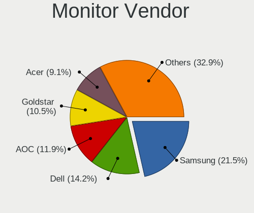

| Vendor               | Desktops | Percent |
|----------------------|----------|---------|
| Samsung Electronics  | 27       | 20.93%  |
| AOC                  | 18       | 13.95%  |
| Dell                 | 17       | 13.18%  |
| Philips              | 13       | 10.08%  |
| Acer                 | 12       | 9.3%    |
| Goldstar             | 11       | 8.53%   |
| Ancor Communications | 8        | 6.2%    |
| Hewlett-Packard      | 5        | 3.88%   |
| Unknown              | 2        | 1.55%   |
| LG Electronics       | 2        | 1.55%   |
| Fujitsu Siemens      | 2        | 1.55%   |
| Vestel Elektronik    | 1        | 0.78%   |
| RTK                  | 1        | 0.78%   |
| Panasonic            | 1        | 0.78%   |
| NOA VISION           | 1        | 0.78%   |
| NEC Computers        | 1        | 0.78%   |
| LG Display           | 1        | 0.78%   |
| Lenovo               | 1        | 0.78%   |
| KTC                  | 1        | 0.78%   |
| InnoLux Display      | 1        | 0.78%   |
| Huion                | 1        | 0.78%   |
| BenQ                 | 1        | 0.78%   |
| ASUSTek Computer     | 1        | 0.78%   |

Monitor Model
-------------

Monitor models

| Model                                                                 | Desktops | Percent |
|-----------------------------------------------------------------------|----------|---------|
| Samsung Electronics LCD Monitor SAM0509 1920x1080                     | 2        | 1.43%   |
| Philips 190C PHLC017 1280x1024 338x270mm 17.0-inch                    | 2        | 1.43%   |
| Goldstar W2043 GSM4E9D 1600x900 450x250mm 20.3-inch                   | 2        | 1.43%   |
| Dell P2414H DELA09B 1920x1080 527x297mm 23.8-inch                     | 2        | 1.43%   |
| Dell LCD Monitor SE2416H 5760x1080                                    | 2        | 1.43%   |
| Dell LCD Monitor SE2416H                                              | 2        | 1.43%   |
| Dell 2209WA DELF011 1680x1050 474x296mm 22.0-inch                     | 2        | 1.43%   |
| AOC 2481W AOC2481 1920x1080 527x296mm 23.8-inch                       | 2        | 1.43%   |
| AOC 2436 AOC2436 1920x1080 521x293mm 23.5-inch                        | 2        | 1.43%   |
| AOC 22B1W AOC2201 1920x1080 476x268mm 21.5-inch                       | 2        | 1.43%   |
| Acer V223HQ ACR0070 1920x1080 470x270mm 21.3-inch                     | 2        | 1.43%   |
| Vestel Elektronik 32FHD_LCD_TV VES3700 1920x1080 700x390mm 31.5-inch  | 1        | 0.71%   |
| Unknown LCD Monitor SAMSUNG                                           | 1        | 0.71%   |
| Unknown LCD Monitor CVT STD LCDTV 3840x1080                           | 1        | 0.71%   |
| Samsung Electronics SyncMaster SAM0608 1920x1080 510x290mm 23.1-inch  | 1        | 0.71%   |
| Samsung Electronics SyncMaster SAM05C6 1920x1080 520x290mm 23.4-inch  | 1        | 0.71%   |
| Samsung Electronics SyncMaster SAM0599 1600x900 443x249mm 20.0-inch   | 1        | 0.71%   |
| Samsung Electronics SyncMaster SAM0598 1360x768 410x230mm 18.5-inch   | 1        | 0.71%   |
| Samsung Electronics SyncMaster SAM0595 2048x1152 510x287mm 23.0-inch  | 1        | 0.71%   |
| Samsung Electronics SyncMaster SAM0564 1360x768 410x230mm 18.5-inch   | 1        | 0.71%   |
| Samsung Electronics SyncMaster SAM0497 1600x900 443x249mm 20.0-inch   | 1        | 0.71%   |
| Samsung Electronics SyncMaster SAM0422 1680x1050 520x320mm 24.0-inch  | 1        | 0.71%   |
| Samsung Electronics SyncMaster SAM03D2 1680x1050 474x296mm 22.0-inch  | 1        | 0.71%   |
| Samsung Electronics SyncMaster SAM0302 1680x1050 459x296mm 21.5-inch  | 1        | 0.71%   |
| Samsung Electronics SyncMaster SAM02B6 1920x1200 518x324mm 24.1-inch  | 1        | 0.71%   |
| Samsung Electronics SyncMaster SAM01E7 1920x1200 518x324mm 24.1-inch  | 1        | 0.71%   |
| Samsung Electronics SMS23A350H SAM07D4 1920x1080 510x290mm 23.1-inch  | 1        | 0.71%   |
| Samsung Electronics SME1920N SAM06A3 1366x768 410x230mm 18.5-inch     | 1        | 0.71%   |
| Samsung Electronics SMB1940 SAM06BA 1280x1024 376x301mm 19.0-inch     | 1        | 0.71%   |
| Samsung Electronics S24F350 SAM0D20 1920x1080 520x290mm 23.4-inch     | 1        | 0.71%   |
| Samsung Electronics S23B550 SAM0919 1920x1080 510x287mm 23.0-inch     | 1        | 0.71%   |
| Samsung Electronics LS24A600U SAM7160 2560x1440 527x297mm 23.8-inch   | 1        | 0.71%   |
| Samsung Electronics LF27T450F SAM7097 1920x1080 600x340mm 27.2-inch   | 1        | 0.71%   |
| Samsung Electronics LCD Monitor SyncMaster 1920x1200                  | 1        | 0.71%   |
| Samsung Electronics LCD Monitor SyncMaster 1280x1024                  | 1        | 0.71%   |
| Samsung Electronics LCD Monitor SyncMaster                            | 1        | 0.71%   |
| Samsung Electronics LCD Monitor SAM0FB9 3840x2160 950x540mm 43.0-inch | 1        | 0.71%   |
| Samsung Electronics LCD Monitor SAM0D4B 1360x768 700x390mm 31.5-inch  | 1        | 0.71%   |
| Samsung Electronics LCD Monitor SAM04FD 1280x720                      | 1        | 0.71%   |
| Samsung Electronics LCD Monitor S24F350 3840x1080                     | 1        | 0.71%   |
| Samsung Electronics LC32G7xT SAM7058 2560x1440 698x393mm 31.5-inch    | 1        | 0.71%   |
| Samsung Electronics C32F391 SAM0D34 1920x1080 698x393mm 31.5-inch     | 1        | 0.71%   |
| RTK LCD Monitor RTK1D1A 1920x1080 1020x570mm 46.0-inch                | 1        | 0.71%   |
| Philips PHL 273V7 PHLC156 1920x1080 598x336mm 27.0-inch               | 1        | 0.71%   |
| Philips PHL 273V5 PHLC0D2 1920x1080 600x340mm 27.2-inch               | 1        | 0.71%   |
| Philips PHL 246V5 PHLC0C5 1920x1080 531x299mm 24.0-inch               | 1        | 0.71%   |
| Philips PHL 243V5 PHLC0D1 1920x1080 521x293mm 23.5-inch               | 1        | 0.71%   |
| Philips PHL 242E2F PHLC238 1920x1080 530x300mm 24.0-inch              | 1        | 0.71%   |
| Philips LCD Monitor PHL0850 1680x1050 470x300mm 22.0-inch             | 1        | 0.71%   |
| Philips LCD Monitor PHL 272B8Q 2560x1440                              | 1        | 0.71%   |
| Philips LCD Monitor 231T                                              | 1        | 0.71%   |
| Philips LCD Monitor 170S 1280x1024                                    | 1        | 0.71%   |
| Philips 235PL PHL089B 1920x1080 510x287mm 23.0-inch                   | 1        | 0.71%   |
| Philips 220WS PHL0851 1680x1050 474x296mm 22.0-inch                   | 1        | 0.71%   |
| Panasonic TV MEIC311 1920x1080 698x392mm 31.5-inch                    | 1        | 0.71%   |
| NOA VISION N32LHXS NOA0032 1360x768 708x398mm 32.0-inch               | 1        | 0.71%   |
| NEC Computers EA244WMi NEC68D6 1920x1200 520x320mm 24.0-inch          | 1        | 0.71%   |
| LG Electronics LCD Monitor LG TV 1360x768                             | 1        | 0.71%   |
| LG Electronics LCD Monitor LG HDR WFHD 2560x1080                      | 1        | 0.71%   |
| LG Display LCD Monitor LGD0390 1600x900 382x215mm 17.3-inch           | 1        | 0.71%   |

Monitor Resolution
------------------

Monitor screen resolution

| Resolution         | Desktops | Percent |
|--------------------|----------|---------|
| 1920x1080 (FHD)    | 58       | 44.96%  |
| 2560x1440 (QHD)    | 10       | 7.75%   |
| 1680x1050 (WSXGA+) | 10       | 7.75%   |
| 1280x1024 (SXGA)   | 9        | 6.98%   |
| Unknown            | 7        | 5.43%   |
| 1920x1200 (WUXGA)  | 6        | 4.65%   |
| 1600x900 (HD+)     | 5        | 3.88%   |
| 3840x2160 (4K)     | 4        | 3.1%    |
| 3840x1080          | 4        | 3.1%    |
| 1360x768           | 4        | 3.1%    |
| 1440x900 (WXGA+)   | 3        | 2.33%   |
| 5760x1080          | 2        | 1.55%   |
| 2560x1080          | 2        | 1.55%   |
| 1366x768 (WXGA)    | 2        | 1.55%   |
| 4480x1440          | 1        | 0.78%   |
| 2560x1600          | 1        | 0.78%   |
| 2048x1152          | 1        | 0.78%   |

Monitor Diagonal
----------------

Diagonal size in inches

| Inches  | Desktops | Percent |
|---------|----------|---------|
| 23      | 25       | 19.69%  |
| Unknown | 16       | 12.6%   |
| 24      | 15       | 11.81%  |
| 21      | 15       | 11.81%  |
| 27      | 14       | 11.02%  |
| 22      | 8        | 6.3%    |
| 19      | 8        | 6.3%    |
| 20      | 6        | 4.72%   |
| 31      | 4        | 3.15%   |
| 17      | 4        | 3.15%   |
| 18      | 3        | 2.36%   |
| 84      | 2        | 1.57%   |
| 25      | 2        | 1.57%   |
| 46      | 1        | 0.79%   |
| 34      | 1        | 0.79%   |
| 33      | 1        | 0.79%   |
| 32      | 1        | 0.79%   |
| 26      | 1        | 0.79%   |

Monitor Width
-------------

Physical width

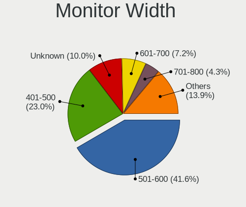

| Width in mm | Desktops | Percent |
|-------------|----------|---------|
| 501-600     | 51       | 42.15%  |
| 401-500     | 33       | 27.27%  |
| Unknown     | 16       | 13.22%  |
| 601-700     | 6        | 4.96%   |
| 351-400     | 6        | 4.96%   |
| 701-800     | 3        | 2.48%   |
| 301-350     | 3        | 2.48%   |
| 1501-2000   | 2        | 1.65%   |
| 1001-1500   | 1        | 0.83%   |

Aspect Ratio
------------

Proportional relationship between the width and the height

| Ratio   | Desktops | Percent |
|---------|----------|---------|
| 16/9    | 76       | 63.33%  |
| 16/10   | 20       | 16.67%  |
| Unknown | 14       | 11.67%  |
| 5/4     | 8        | 6.67%   |
| 3/2     | 1        | 0.83%   |
| 21/9    | 1        | 0.83%   |

Monitor Area
------------

Area in inch

| Area in inch | Desktops | Percent |
|----------------|----------|---------|
| 201-250        | 47       | 37.6%   |
| 151-200        | 21       | 16.8%   |
| Unknown        | 16       | 12.8%   |
| 301-350        | 15       | 12%     |
| 251-300        | 9        | 7.2%    |
| 351-500        | 7        | 5.6%    |
| 141-150        | 6        | 4.8%    |
| More than 1000 | 2        | 1.6%    |
| 121-130        | 1        | 0.8%    |
| 501-1000       | 1        | 0.8%    |

Pixel Density
-------------

Pixels per inch

| Density | Desktops | Percent |
|---------|----------|---------|
| 51-100  | 74       | 63.25%  |
| 101-120 | 21       | 17.95%  |
| Unknown | 16       | 13.68%  |
| 1-50    | 3        | 2.56%   |
| 121-160 | 2        | 1.71%   |
| 161-240 | 1        | 0.85%   |

Multiple Monitors
-----------------

Total monitors connected

| Total | Desktops | Percent |
|-------|----------|---------|
| 1     | 92       | 76.67%  |
| 2     | 22       | 18.33%  |
| 0     | 4        | 3.33%   |
| 4     | 1        | 0.83%   |
| 3     | 1        | 0.83%   |

Network
-------

Net Controller Vendor
---------------------

Controller vendors

| Vendor                            | Desktops | Percent |
|-----------------------------------|----------|---------|
| Realtek Semiconductor             | 80       | 47.34%  |
| Intel                             | 32       | 18.93%  |
| Qualcomm Atheros                  | 10       | 5.92%   |
| TP-Link                           | 7        | 4.14%   |
| Qualcomm Atheros Communications   | 5        | 2.96%   |
| Ralink                            | 4        | 2.37%   |
| Ralink Technology                 | 3        | 1.78%   |
| Broadcom                          | 3        | 1.78%   |
| Sundance Technology Inc / IC Plus | 2        | 1.18%   |
| Samsung Electronics               | 2        | 1.18%   |
| Nvidia                            | 2        | 1.18%   |
| MEDIATEK                          | 2        | 1.18%   |
| Marvell Technology Group          | 2        | 1.18%   |
| D-Link                            | 2        | 1.18%   |
| Xiaomi                            | 1        | 0.59%   |
| VIA Technologies                  | 1        | 0.59%   |
| T & A Mobile Phones               | 1        | 0.59%   |
| Nokia Mobile Phones               | 1        | 0.59%   |
| Microsoft                         | 1        | 0.59%   |
| Linksys                           | 1        | 0.59%   |
| Huawei Technologies               | 1        | 0.59%   |
| Edimax Technology                 | 1        | 0.59%   |
| D-Link System                     | 1        | 0.59%   |
| Broadcom Limited                  | 1        | 0.59%   |
| ASUSTek Computer                  | 1        | 0.59%   |
| ASIX Electronics                  | 1        | 0.59%   |
| Aquantia                          | 1        | 0.59%   |

Net Controller Model
--------------------

Controller models

| Model                                                                      | Desktops | Percent |
|----------------------------------------------------------------------------|----------|---------|
| Realtek RTL8111/8168/8411 PCI Express Gigabit Ethernet Controller          | 68       | 38.2%   |
| Qualcomm Atheros AR9271 802.11n                                            | 5        | 2.81%   |
| TP-Link TL-WN722N v2/v3 [Realtek RTL8188EUS]                               | 4        | 2.25%   |
| Intel I211 Gigabit Network Connection                                      | 4        | 2.25%   |
| Intel Ethernet Connection (2) I218-V                                       | 4        | 2.25%   |
| Realtek RTL8125 2.5GbE Controller                                          | 3        | 1.69%   |
| Realtek RTL810xE PCI Express Fast Ethernet controller                      | 3        | 1.69%   |
| Realtek RTL-8100/8101L/8139 PCI Fast Ethernet Adapter                      | 3        | 1.69%   |
| Intel Wi-Fi 6 AX200                                                        | 3        | 1.69%   |
| Intel Ethernet Connection (7) I219-V                                       | 3        | 1.69%   |
| Realtek RTL8188EUS 802.11n Wireless Network Adapter                        | 2        | 1.12%   |
| Ralink MT7601U Wireless Adapter                                            | 2        | 1.12%   |
| Ralink RT3060 Wireless 802.11n 1T/1R                                       | 2        | 1.12%   |
| Qualcomm Atheros Killer E220x Gigabit Ethernet Controller                  | 2        | 1.12%   |
| Qualcomm Atheros AR8151 v2.0 Gigabit Ethernet                              | 2        | 1.12%   |
| Qualcomm Atheros AR5212/5213/2414 Wireless Network Adapter                 | 2        | 1.12%   |
| Nvidia MCP61 Ethernet                                                      | 2        | 1.12%   |
| Marvell Group 88E8056 PCI-E Gigabit Ethernet Controller                    | 2        | 1.12%   |
| Intel I210 Gigabit Network Connection                                      | 2        | 1.12%   |
| Intel Ethernet Connection I217-V                                           | 2        | 1.12%   |
| Intel Ethernet Connection I217-LM                                          | 2        | 1.12%   |
| Intel Ethernet Connection (2) I219-V                                       | 2        | 1.12%   |
| Intel Ethernet Connection (2) I218-LM                                      | 2        | 1.12%   |
| Intel 82579V Gigabit Network Connection                                    | 2        | 1.12%   |
| Xiaomi Mi/Redmi series (RNDIS)                                             | 1        | 0.56%   |
| VIA VT6102/VT6103 [Rhine-II]                                               | 1        | 0.56%   |
| TP-Link TL-WN822N Version 4 RTL8192EU                                      | 1        | 0.56%   |
| TP-Link TL-WN821N Version 5 RTL8192EU                                      | 1        | 0.56%   |
| TP-Link 802.11ac NIC                                                       | 1        | 0.56%   |
| T & A Mobile Phones 9010X                                                  | 1        | 0.56%   |
| Sundance Inc / IC Plus IP1000 Family Gigabit Ethernet                      | 1        | 0.56%   |
| Sundance Inc / IC Plus IC Plus IP100A Integrated 10/100 Ethernet MAC + PHY | 1        | 0.56%   |
| Samsung GT-I9070 (network tethering, USB debugging enabled)                | 1        | 0.56%   |
| Samsung Galaxy series, misc. (tethering mode)                              | 1        | 0.56%   |
| Realtek RTL8812AU 802.11a/b/g/n/ac 2T2R DB WLAN Adapter                    | 1        | 0.56%   |
| Realtek RTL8812AE 802.11ac PCIe Wireless Network Adapter                   | 1        | 0.56%   |
| Realtek RTL8188CUS 802.11n WLAN Adapter                                    | 1        | 0.56%   |
| Realtek RTL8188CE 802.11b/g/n WiFi Adapter                                 | 1        | 0.56%   |
| Realtek RTL8169 PCI Gigabit Ethernet Controller                            | 1        | 0.56%   |
| Realtek RTL-8110SC/8169SC Gigabit Ethernet                                 | 1        | 0.56%   |
| Ralink RT5370 Wireless Adapter                                             | 1        | 0.56%   |
| Ralink RT2561/RT61 rev B 802.11g                                           | 1        | 0.56%   |
| Ralink RT2561/RT61 802.11g PCI                                             | 1        | 0.56%   |
| Qualcomm Atheros QCA9565 / AR9565 Wireless Network Adapter                 | 1        | 0.56%   |
| Qualcomm Atheros Killer E2500 Gigabit Ethernet Controller                  | 1        | 0.56%   |
| Qualcomm Atheros AR9485 Wireless Network Adapter                           | 1        | 0.56%   |
| Qualcomm Atheros AR8121/AR8113/AR8114 Gigabit or Fast Ethernet             | 1        | 0.56%   |
| Nokia Mobile Phones Nokia X2-00                                            | 1        | 0.56%   |
| Microsoft Xbox 360 Wireless Adapter                                        | 1        | 0.56%   |
| MediaTek NOA N2                                                            | 1        | 0.56%   |
| MEDIATEK MT7630e 802.11bgn Wireless Network Adapter                        | 1        | 0.56%   |
| Linksys WUSB6400M                                                          | 1        | 0.56%   |
| Intel Wireless 8265 / 8275                                                 | 1        | 0.56%   |
| Intel Wireless 3165                                                        | 1        | 0.56%   |
| Intel Ethernet Controller I225-V                                           | 1        | 0.56%   |
| Intel Ethernet Connection (7) I219-LM                                      | 1        | 0.56%   |
| Intel Ethernet Connection (12) I219-V                                      | 1        | 0.56%   |
| Intel Ethernet Connection (11) I219-V                                      | 1        | 0.56%   |
| Intel Ethernet Connection (11) I219-LM                                     | 1        | 0.56%   |
| Intel 82578DM Gigabit Network Connection                                   | 1        | 0.56%   |

Wireless Vendor
---------------

Wireless vendors

| Vendor                          | Desktops | Percent |
|---------------------------------|----------|---------|
| TP-Link                         | 7        | 16.28%  |
| Realtek Semiconductor           | 6        | 13.95%  |
| Qualcomm Atheros Communications | 5        | 11.63%  |
| Intel                           | 5        | 11.63%  |
| Ralink                          | 4        | 9.3%    |
| Qualcomm Atheros                | 4        | 9.3%    |
| Ralink Technology               | 3        | 6.98%   |
| D-Link                          | 2        | 4.65%   |
| Broadcom                        | 2        | 4.65%   |
| Microsoft                       | 1        | 2.33%   |
| MEDIATEK                        | 1        | 2.33%   |
| Linksys                         | 1        | 2.33%   |
| Edimax Technology               | 1        | 2.33%   |
| ASUSTek Computer                | 1        | 2.33%   |

Wireless Model
--------------

Wireless models

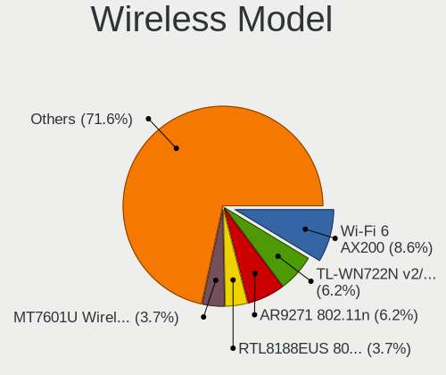

| Model                                                                   | Desktops | Percent |
|-------------------------------------------------------------------------|----------|---------|
| Qualcomm Atheros AR9271 802.11n                                         | 5        | 11.63%  |
| TP-Link TL-WN722N v2/v3 [Realtek RTL8188EUS]                            | 4        | 9.3%    |
| Intel Wi-Fi 6 AX200                                                     | 3        | 6.98%   |
| Realtek RTL8188EUS 802.11n Wireless Network Adapter                     | 2        | 4.65%   |
| Ralink MT7601U Wireless Adapter                                         | 2        | 4.65%   |
| Ralink RT3060 Wireless 802.11n 1T/1R                                    | 2        | 4.65%   |
| Qualcomm Atheros AR5212/5213/2414 Wireless Network Adapter              | 2        | 4.65%   |
| TP-Link TL-WN822N Version 4 RTL8192EU                                   | 1        | 2.33%   |
| TP-Link TL-WN821N Version 5 RTL8192EU                                   | 1        | 2.33%   |
| TP-Link 802.11ac NIC                                                    | 1        | 2.33%   |
| Realtek RTL8812AU 802.11a/b/g/n/ac 2T2R DB WLAN Adapter                 | 1        | 2.33%   |
| Realtek RTL8812AE 802.11ac PCIe Wireless Network Adapter                | 1        | 2.33%   |
| Realtek RTL8188CUS 802.11n WLAN Adapter                                 | 1        | 2.33%   |
| Realtek RTL8188CE 802.11b/g/n WiFi Adapter                              | 1        | 2.33%   |
| Ralink RT5370 Wireless Adapter                                          | 1        | 2.33%   |
| Ralink RT2561/RT61 rev B 802.11g                                        | 1        | 2.33%   |
| Ralink RT2561/RT61 802.11g PCI                                          | 1        | 2.33%   |
| Qualcomm Atheros QCA9565 / AR9565 Wireless Network Adapter              | 1        | 2.33%   |
| Qualcomm Atheros AR9485 Wireless Network Adapter                        | 1        | 2.33%   |
| Microsoft Xbox 360 Wireless Adapter                                     | 1        | 2.33%   |
| MEDIATEK MT7630e 802.11bgn Wireless Network Adapter                     | 1        | 2.33%   |
| Linksys WUSB6400M                                                       | 1        | 2.33%   |
| Intel Wireless 8265 / 8275                                              | 1        | 2.33%   |
| Intel Wireless 3165                                                     | 1        | 2.33%   |
| Edimax EW-7711UTn nLite Wireless Adapter [Ralink RT3070]                | 1        | 2.33%   |
| D-Link DWA-121 802.11n Wireless N 150 Pico Adapter [Realtek RTL8188CUS] | 1        | 2.33%   |
| D-Link 11ac adapter                                                     | 1        | 2.33%   |
| Broadcom BCM4352 802.11ac Wireless Network Adapter                      | 1        | 2.33%   |
| Broadcom BCM43228 802.11a/b/g/n                                         | 1        | 2.33%   |
| ASUS USB-N14 802.11b/g/n (2x2) Wireless Adapter [Ralink RT5372]         | 1        | 2.33%   |

Ethernet Vendor
---------------

Ethernet vendors

| Vendor                            | Desktops | Percent |
|-----------------------------------|----------|---------|
| Realtek Semiconductor             | 77       | 58.78%  |
| Intel                             | 30       | 22.9%   |
| Qualcomm Atheros                  | 6        | 4.58%   |
| Sundance Technology Inc / IC Plus | 2        | 1.53%   |
| Samsung Electronics               | 2        | 1.53%   |
| Nvidia                            | 2        | 1.53%   |
| Marvell Technology Group          | 2        | 1.53%   |
| Xiaomi                            | 1        | 0.76%   |
| VIA Technologies                  | 1        | 0.76%   |
| T & A Mobile Phones               | 1        | 0.76%   |
| MediaTek                          | 1        | 0.76%   |
| Huawei Technologies               | 1        | 0.76%   |
| D-Link System                     | 1        | 0.76%   |
| Broadcom Limited                  | 1        | 0.76%   |
| Broadcom                          | 1        | 0.76%   |
| ASIX Electronics                  | 1        | 0.76%   |
| Aquantia                          | 1        | 0.76%   |

Ethernet Model
--------------

Ethernet models

| Model                                                                      | Desktops | Percent |
|----------------------------------------------------------------------------|----------|---------|
| Realtek RTL8111/8168/8411 PCI Express Gigabit Ethernet Controller          | 68       | 50.75%  |
| Intel I211 Gigabit Network Connection                                      | 4        | 2.99%   |
| Intel Ethernet Connection (2) I218-V                                       | 4        | 2.99%   |
| Realtek RTL8125 2.5GbE Controller                                          | 3        | 2.24%   |
| Realtek RTL810xE PCI Express Fast Ethernet controller                      | 3        | 2.24%   |
| Realtek RTL-8100/8101L/8139 PCI Fast Ethernet Adapter                      | 3        | 2.24%   |
| Intel Ethernet Connection (7) I219-V                                       | 3        | 2.24%   |
| Qualcomm Atheros Killer E220x Gigabit Ethernet Controller                  | 2        | 1.49%   |
| Qualcomm Atheros AR8151 v2.0 Gigabit Ethernet                              | 2        | 1.49%   |
| Nvidia MCP61 Ethernet                                                      | 2        | 1.49%   |
| Marvell Group 88E8056 PCI-E Gigabit Ethernet Controller                    | 2        | 1.49%   |
| Intel I210 Gigabit Network Connection                                      | 2        | 1.49%   |
| Intel Ethernet Connection I217-V                                           | 2        | 1.49%   |
| Intel Ethernet Connection I217-LM                                          | 2        | 1.49%   |
| Intel Ethernet Connection (2) I219-V                                       | 2        | 1.49%   |
| Intel Ethernet Connection (2) I218-LM                                      | 2        | 1.49%   |
| Intel 82579V Gigabit Network Connection                                    | 2        | 1.49%   |
| Xiaomi Mi/Redmi series (RNDIS)                                             | 1        | 0.75%   |
| VIA VT6102/VT6103 [Rhine-II]                                               | 1        | 0.75%   |
| T & A Mobile Phones 9010X                                                  | 1        | 0.75%   |
| Sundance Inc / IC Plus IP1000 Family Gigabit Ethernet                      | 1        | 0.75%   |
| Sundance Inc / IC Plus IC Plus IP100A Integrated 10/100 Ethernet MAC + PHY | 1        | 0.75%   |
| Samsung GT-I9070 (network tethering, USB debugging enabled)                | 1        | 0.75%   |
| Samsung Galaxy series, misc. (tethering mode)                              | 1        | 0.75%   |
| Realtek RTL8169 PCI Gigabit Ethernet Controller                            | 1        | 0.75%   |
| Realtek RTL-8110SC/8169SC Gigabit Ethernet                                 | 1        | 0.75%   |
| Qualcomm Atheros Killer E2500 Gigabit Ethernet Controller                  | 1        | 0.75%   |
| Qualcomm Atheros AR8121/AR8113/AR8114 Gigabit or Fast Ethernet             | 1        | 0.75%   |
| MediaTek NOA N2                                                            | 1        | 0.75%   |
| Intel Ethernet Controller I225-V                                           | 1        | 0.75%   |
| Intel Ethernet Connection (7) I219-LM                                      | 1        | 0.75%   |
| Intel Ethernet Connection (12) I219-V                                      | 1        | 0.75%   |
| Intel Ethernet Connection (11) I219-V                                      | 1        | 0.75%   |
| Intel Ethernet Connection (11) I219-LM                                     | 1        | 0.75%   |
| Intel 82578DM Gigabit Network Connection                                   | 1        | 0.75%   |
| Intel 82567LM-3 Gigabit Network Connection                                 | 1        | 0.75%   |
| Intel 82567LM-2 Gigabit Network Connection                                 | 1        | 0.75%   |
| Huawei JNY-LX1                                                             | 1        | 0.75%   |
| D-Link System RTL8139 Ethernet                                             | 1        | 0.75%   |
| Broadcom NetLink BCM57781 Gigabit Ethernet PCIe                            | 1        | 0.75%   |
| Broadcom Limited NetXtreme BCM5751 Gigabit Ethernet PCI Express            | 1        | 0.75%   |
| ASIX AX88772A Fast Ethernet                                                | 1        | 0.75%   |
| Aquantia AQC107 NBase-T/IEEE 802.3bz Ethernet Controller [AQtion]          | 1        | 0.75%   |

Net Controller Kind
-------------------

Ethernet, WiFi or modem

| Kind     | Desktops | Percent |
|----------|----------|---------|
| Ethernet | 117      | 73.58%  |
| WiFi     | 41       | 25.79%  |
| Modem    | 1        | 0.63%   |

Used Controller
---------------

Currently used network controller

| Kind     | Desktops | Percent |
|----------|----------|---------|
| Ethernet | 95       | 75.4%   |
| WiFi     | 31       | 24.6%   |

NICs
----

Total network controllers on board

| Total | Desktops | Percent |
|-------|----------|---------|
| 1     | 91       | 75.83%  |
| 2     | 25       | 20.83%  |
| 0     | 2        | 1.67%   |
| 4     | 1        | 0.83%   |
| 3     | 1        | 0.83%   |

IPv6
----

IPv6 vs IPv4

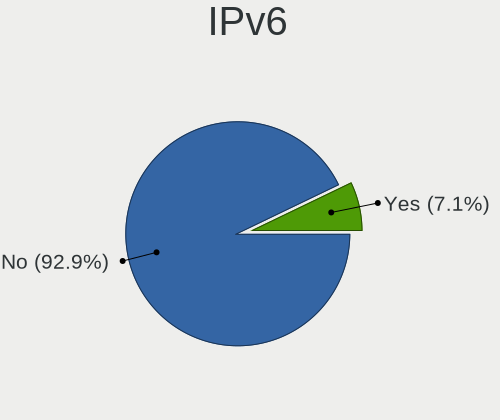

| Used | Desktops | Percent |
|------|----------|---------|
| No   | 116      | 97.48%  |
| Yes  | 3        | 2.52%   |

Bluetooth
---------

Bluetooth Vendor
----------------

Controller vendors

| Vendor                          | Desktops | Percent |
|---------------------------------|----------|---------|
| Intel                           | 5        | 26.32%  |
| Cambridge Silicon Radio         | 5        | 26.32%  |
| Realtek Semiconductor           | 2        | 10.53%  |
| Broadcom                        | 2        | 10.53%  |
| Qualcomm Atheros Communications | 1        | 5.26%   |
| Integrated System Solution      | 1        | 5.26%   |
| IMC Networks                    | 1        | 5.26%   |
| Foxconn / Hon Hai               | 1        | 5.26%   |
| ASUSTek Computer                | 1        | 5.26%   |

Bluetooth Model
---------------

Controller models

| Model                                                 | Desktops | Percent |
|-------------------------------------------------------|----------|---------|
| Cambridge Silicon Radio Bluetooth Dongle (HCI mode)   | 5        | 26.32%  |
| Intel AX200 Bluetooth                                 | 3        | 15.79%  |
| Realtek Bluetooth Radio                               | 2        | 10.53%  |
| Intel Bluetooth wireless interface                    | 2        | 10.53%  |
| Qualcomm Atheros  Bluetooth Device                    | 1        | 5.26%   |
| Integrated System Solution KY-BT100 Bluetooth Adapter | 1        | 5.26%   |
| IMC Networks BCM20702A0                               | 1        | 5.26%   |
| Foxconn / Hon Hai BT                                  | 1        | 5.26%   |
| Broadcom HP Portable Bumble Bee                       | 1        | 5.26%   |
| Broadcom BCM92046DG-CL1ROM Bluetooth 2.1 Adapter      | 1        | 5.26%   |
| ASUS Broadcom BCM20702A0 Bluetooth                    | 1        | 5.26%   |

Sound
-----

Sound Vendor
------------

Sound card vendors

| Vendor              | Desktops | Percent |
|---------------------|----------|---------|
| Intel               | 73       | 34.43%  |
| AMD                 | 65       | 30.66%  |
| Nvidia              | 45       | 21.23%  |
| C-Media Electronics | 8        | 3.77%   |
| Logitech            | 3        | 1.42%   |
| Creative Labs       | 3        | 1.42%   |
| Microsoft           | 2        | 0.94%   |
| Yamaha              | 1        | 0.47%   |
| XMOS                | 1        | 0.47%   |
| VIA Technologies    | 1        | 0.47%   |
| Trust               | 1        | 0.47%   |
| Tenx Technology     | 1        | 0.47%   |
| Razer USA           | 1        | 0.47%   |
| Native Instruments  | 1        | 0.47%   |
| JMTek               | 1        | 0.47%   |
| Focusrite-Novation  | 1        | 0.47%   |
| Ensoniq             | 1        | 0.47%   |
| Cirrus Logic        | 1        | 0.47%   |
| ATI Technologies    | 1        | 0.47%   |
| Astro Gaming        | 1        | 0.47%   |

Sound Model
-----------

Sound card models

| Model                                                                      | Desktops | Percent |
|----------------------------------------------------------------------------|----------|---------|
| Intel 8 Series/C220 Series Chipset High Definition Audio Controller        | 12       | 4.88%   |
| Intel 6 Series/C200 Series Chipset Family High Definition Audio Controller | 12       | 4.88%   |
| AMD SBx00 Azalia (Intel HDA)                                               | 12       | 4.88%   |
| AMD Family 17h (Models 00h-0fh) HD Audio Controller                        | 10       | 4.07%   |
| Intel Xeon E3-1200 v3/4th Gen Core Processor HD Audio Controller           | 9        | 3.66%   |
| Nvidia GP106 High Definition Audio Controller                              | 8        | 3.25%   |
| Nvidia GP107GL High Definition Audio Controller                            | 7        | 2.85%   |
| AMD Oland/Hainan/Cape Verde/Pitcairn HDMI Audio [Radeon HD 7000 Series]    | 7        | 2.85%   |
| AMD Family 17h/19h HD Audio Controller                                     | 7        | 2.85%   |
| AMD Ellesmere HDMI Audio [Radeon RX 470/480 / 570/580/590]                 | 7        | 2.85%   |
| Intel NM10/ICH7 Family High Definition Audio Controller                    | 6        | 2.44%   |
| AMD Cedar HDMI Audio [Radeon HD 5400/6300/7300 Series]                     | 6        | 2.44%   |
| Nvidia GM206 High Definition Audio Controller                              | 5        | 2.03%   |
| Intel 9 Series Chipset Family HD Audio Controller                          | 5        | 2.03%   |
| AMD FCH Azalia Controller                                                  | 5        | 2.03%   |
| Intel Comet Lake PCH-V cAVS                                                | 4        | 1.63%   |
| Intel Cannon Lake PCH cAVS                                                 | 4        | 1.63%   |
| Intel 82801I (ICH9 Family) HD Audio Controller                             | 4        | 1.63%   |
| Intel 200 Series PCH HD Audio                                              | 4        | 1.63%   |
| AMD Turks HDMI Audio [Radeon HD 6500/6600 / 6700M Series]                  | 4        | 1.63%   |
| AMD Starship/Matisse HD Audio Controller                                   | 4        | 1.63%   |
| Nvidia TU107 GeForce GTX 1650 High Definition Audio Controller             | 3        | 1.22%   |
| Nvidia GP108 High Definition Audio Controller                              | 3        | 1.22%   |
| Nvidia GM107 High Definition Audio Controller [GeForce 940MX]              | 3        | 1.22%   |
| Intel Comet Lake PCH cAVS                                                  | 3        | 1.22%   |
| Intel 82801JI (ICH10 Family) HD Audio Controller                           | 3        | 1.22%   |
| Intel 7 Series/C216 Chipset Family High Definition Audio Controller        | 3        | 1.22%   |
| Intel 100 Series/C230 Series Chipset Family HD Audio Controller            | 3        | 1.22%   |
| C-Media Electronics CMI8738/CMI8768 PCI Audio                              | 3        | 1.22%   |
| AMD RV710/730 HDMI Audio [Radeon HD 4000 series]                           | 3        | 1.22%   |
| AMD Raven/Raven2/Fenghuang HDMI/DP Audio Controller                        | 3        | 1.22%   |
| Nvidia TU116 High Definition Audio Controller                              | 2        | 0.81%   |
| Nvidia MCP61 High Definition Audio                                         | 2        | 0.81%   |
| Nvidia GK208 HDMI/DP Audio Controller                                      | 2        | 0.81%   |
| Nvidia GK104 HDMI Audio Controller                                         | 2        | 0.81%   |
| Nvidia GF119 HDMI Audio Controller                                         | 2        | 0.81%   |
| Microsoft LifeChat LX-3000 Headset                                         | 2        | 0.81%   |
| Logitech EasyCall Speakerphone                                             | 2        | 0.81%   |
| Intel C610/X99 series chipset HD Audio Controller                          | 2        | 0.81%   |
| Intel 5 Series/3400 Series Chipset High Definition Audio                   | 2        | 0.81%   |
| Creative Labs EMU20k1 [Sound Blaster X-Fi Series]                          | 2        | 0.81%   |
| C-Media Electronics Audio Adapter                                          | 2        | 0.81%   |
| AMD Tobago HDMI Audio [Radeon R7 360 / R9 360 OEM]                         | 2        | 0.81%   |
| AMD Renoir Radeon High Definition Audio Controller                         | 2        | 0.81%   |
| AMD Juniper HDMI Audio [Radeon HD 5700 Series]                             | 2        | 0.81%   |
| Yamaha Steinberg UR12                                                      | 1        | 0.41%   |
| XMOS Soekris dac1xxx USB Audio 2.0                                         | 1        | 0.41%   |
| VIA Technologies VT8233/A/8235/8237 AC97 Audio Controller                  | 1        | 0.41%   |
| Trust GXT 232 Microphone                                                   | 1        | 0.41%   |
| Tenx Technology USB AUDIO                                                  | 1        | 0.41%   |
| Razer USA Kraken Tournament Edition                                        | 1        | 0.41%   |
| Nvidia TU104 HD Audio Controller                                           | 1        | 0.41%   |
| Nvidia GK107 HDMI Audio Controller                                         | 1        | 0.41%   |
| Nvidia GK106 HDMI Audio Controller                                         | 1        | 0.41%   |
| Nvidia GF116 High Definition Audio Controller                              | 1        | 0.41%   |
| Nvidia GF108 High Definition Audio Controller                              | 1        | 0.41%   |
| Nvidia GF106 High Definition Audio Controller                              | 1        | 0.41%   |
| Nvidia GA104 High Definition Audio Controller                              | 1        | 0.41%   |
| Native Instruments Komplete Audio 1                                        | 1        | 0.41%   |
| Logitech G935 Gaming Headset                                               | 1        | 0.41%   |

Memory
------

Memory Vendor
-------------

Memory module vendors

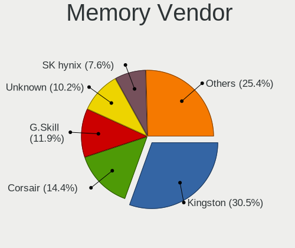

| Vendor              | Desktops | Percent |
|---------------------|----------|---------|
| Kingston            | 18       | 27.27%  |
| Unknown             | 9        | 13.64%  |
| Corsair             | 8        | 12.12%  |
| G.Skill             | 7        | 10.61%  |
| SK Hynix            | 6        | 9.09%   |
| Samsung Electronics | 4        | 6.06%   |
| Transcend           | 3        | 4.55%   |
| Crucial             | 3        | 4.55%   |
| Patriot             | 2        | 3.03%   |
| Kingmax             | 2        | 3.03%   |
| Mushkin             | 1        | 1.52%   |
| Elpida              | 1        | 1.52%   |
| Apacer              | 1        | 1.52%   |
| A-DATA Technology   | 1        | 1.52%   |

Memory Model
------------

Memory module models

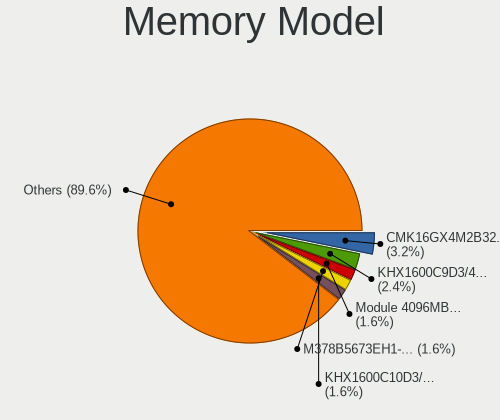

| Model                                                    | Desktops | Percent |
|----------------------------------------------------------|----------|---------|
| Unknown RAM Module 4096MB DIMM 667MT/s                   | 2        | 2.78%   |
| SK Hynix RAM HMT351U6CFR8C-PB 4GB DIMM DDR3 1800MT/s     | 2        | 2.78%   |
| Samsung RAM M378B5673EH1-CH9 2GB DIMM 1333MT/s           | 2        | 2.78%   |
| Unknown RAM Module 512MB DIMM DDR2 533MT/s               | 1        | 1.39%   |
| Unknown RAM Module 4GB DIMM DDR3 1600MT/s                | 1        | 1.39%   |
| Unknown RAM Module 4GB DIMM 1600MT/s                     | 1        | 1.39%   |
| Unknown RAM Module 4GB DIMM 1333MT/s                     | 1        | 1.39%   |
| Unknown RAM Module 4096MB DIMM 1600MT/s                  | 1        | 1.39%   |
| Unknown RAM Module 2GB DIMM 1600MT/s                     | 1        | 1.39%   |
| Unknown RAM Module 2048MB DIMM DDR2 800MT/s              | 1        | 1.39%   |
| Unknown RAM Module 2048MB DIMM 1600MT/s                  | 1        | 1.39%   |
| Unknown RAM Module 1GB DIMM DDR2 533MT/s                 | 1        | 1.39%   |
| Unknown RAM Module 1024MB DIMM DDR 400MT/s               | 1        | 1.39%   |
| Unknown RAM 4000 C19 Series 8192MB DIMM DDR4 4000MT/s    | 1        | 1.39%   |
| Transcend RAM JM2666HLB-8G 8192MB DIMM DDR4 2667MT/s     | 1        | 1.39%   |
| Transcend RAM JM1600KLN-2G 2GB DIMM DDR3 1333MT/s        | 1        | 1.39%   |
| Transcend RAM JM1333KLN-2G 2GB DIMM DDR3 1333MT/s        | 1        | 1.39%   |
| SK Hynix RAM HMT41GU6MFR8C-PB 8GB DIMM DDR3 1600MT/s     | 1        | 1.39%   |
| SK Hynix RAM HMT351U6EFR8C-PB 4096MB DIMM DDR3 1800MT/s  | 1        | 1.39%   |
| SK Hynix RAM HMT125U6BFR8C-H9 2GB DIMM DDR3 1333MT/s     | 1        | 1.39%   |
| SK Hynix RAM HMA82GU6DJR8N-XN 16GB DIMM DDR4 3200MT/s    | 1        | 1.39%   |
| SK Hynix RAM HMA81GU6CJR8N-XN 8GB DIMM DDR4 3200MT/s     | 1        | 1.39%   |
| Samsung RAM M471B5773DH0-CH9 2GB DIMM DDR3 1333MT/s      | 1        | 1.39%   |
| Samsung RAM M378A5244CB0-CTD 4GB DIMM DDR4 3334MT/s      | 1        | 1.39%   |
| Patriot RAM PSD38G16002 8192MB DIMM DDR3 1600MT/s        | 1        | 1.39%   |
| Patriot RAM PSD22G80026 2GB DIMM DDR 800MT/s             | 1        | 1.39%   |
| Mushkin RAM 99[2/7/4]199[F/T] 8192MB DIMM DDR4 2400MT/s  | 1        | 1.39%   |
| Kingston RAM KHX3200C18D4/8G 8GB DIMM DDR4 3333MT/s      | 1        | 1.39%   |
| Kingston RAM KHX3200C16D4/8GX 8GB DIMM DDR4 3533MT/s     | 1        | 1.39%   |
| Kingston RAM KHX3000C15D4/8GX 8GB DIMM DDR4 3400MT/s     | 1        | 1.39%   |
| Kingston RAM KHX2400C15/8G 8GB DIMM DDR4 2933MT/s        | 1        | 1.39%   |
| Kingston RAM KHX2400C11D3/8GX 8GB DIMM DDR3 2400MT/s     | 1        | 1.39%   |
| Kingston RAM KHX2133C13D4/8GX 8192MB DIMM DDR4 2133MT/s  | 1        | 1.39%   |
| Kingston RAM KHX1866C10D3/4G 4GB DIMM DDR3 1867MT/s      | 1        | 1.39%   |
| Kingston RAM KHX1600C9D3/4GX 4GB DIMM DDR3 2400MT/s      | 1        | 1.39%   |
| Kingston RAM KF2666C16D4/8G 8192MB DIMM DDR4 2666MT/s    | 1        | 1.39%   |
| Kingston RAM KF2666C16D4/16G 16GB DIMM DDR4 2666MT/s     | 1        | 1.39%   |
| Kingston RAM 99U5702-095.A00G 8GB DIMM DDR4 2667MT/s     | 1        | 1.39%   |
| Kingston RAM 99U5584-016.A00LF 4GB DIMM DDR3 1600MT/s    | 1        | 1.39%   |
| Kingston RAM 99U5474-038.A00LF 4GB DIMM DDR3 1333MT/s    | 1        | 1.39%   |
| Kingston RAM 99U5474-037.A00LF 4GB DIMM DDR3 1600MT/s    | 1        | 1.39%   |
| Kingston RAM 9905711-039.A00G 8GB SODIMM DDR4 3200MT/s   | 1        | 1.39%   |
| Kingston RAM 9905702-203.A00G 8GB DIMM DDR4 2400MT/s     | 1        | 1.39%   |
| Kingston RAM 9905702-017.A00G 8GB DIMM DDR4 2933MT/s     | 1        | 1.39%   |
| Kingston RAM 9905595-011.A00LF 2GB DIMM DDR3 1333MT/s    | 1        | 1.39%   |
| Kingston RAM 9905471-084.A00LF 8192MB DIMM DDR3 1600MT/s | 1        | 1.39%   |
| Kingmax RAM KLDD48F-A8KB5 1024MB DIMM DDR2 800MT/s       | 1        | 1.39%   |
| Kingmax RAM FLGG45F-D8 8192MB DIMM DDR3 1067MT/s         | 1        | 1.39%   |
| G.Skill RAM F4-3200C16-8GVKB 8192MB DIMM DDR4 3200MT/s   | 1        | 1.39%   |
| G.Skill RAM F4-3200C16-8GIS 8GB DIMM DDR4 3200MT/s       | 1        | 1.39%   |
| G.Skill RAM F4-3200C15-16GTZR 16384MB DIMM DDR4 3200MT/s | 1        | 1.39%   |
| G.Skill RAM F3-1600C11-4GNS 4GB DIMM DDR3 1600MT/s       | 1        | 1.39%   |
| G.Skill RAM F3-12800CL9-2GBNQ 2GB DIMM 1333MT/s          | 1        | 1.39%   |
| G.Skill RAM F3-10666CL9-2GBNS 2048MB DIMM DDR3 1333MT/s  | 1        | 1.39%   |
| G.Skill RAM F3-10600CL9-2GBNT 2048MB DIMM DDR3 1333MT/s  | 1        | 1.39%   |
| Elpida RAM EBJ41UF8BCS0-DJ-F 4GB DIMM DDR3 1333MT/s      | 1        | 1.39%   |
| Crucial RAM CT8G4DFRA266.C8FB 8GB DIMM DDR4 2667MT/s     | 1        | 1.39%   |
| Crucial RAM CT102464BA160B.C16 8GB DIMM DDR3 1600MT/s    | 1        | 1.39%   |
| Crucial RAM BLS4G3D1609ES 4GB DIMM DDR3 1600MT/s         | 1        | 1.39%   |
| Corsair RAM CMZ8GX3M2A1600C9 4096MB DIMM DDR3 1600MT/s   | 1        | 1.39%   |

Memory Kind
-----------

Memory module kinds

| Kind    | Desktops | Percent |
|---------|----------|---------|
| DDR4    | 27       | 49.09%  |
| DDR3    | 18       | 32.73%  |
| Unknown | 4        | 7.27%   |
| DDR2    | 3        | 5.45%   |
| SDRAM   | 2        | 3.64%   |
| DDR     | 1        | 1.82%   |

Memory Form Factor
------------------

Physical design of the memory module

| Name   | Desktops | Percent |
|--------|----------|---------|
| DIMM   | 53       | 98.15%  |
| SODIMM | 1        | 1.85%   |

Memory Size
-----------

Memory module size

| Size  | Desktops | Percent |
|-------|----------|---------|
| 8192  | 25       | 41.67%  |
| 4096  | 15       | 25%     |
| 2048  | 10       | 16.67%  |
| 16384 | 6        | 10%     |
| 1024  | 3        | 5%      |
| 512   | 1        | 1.67%   |

Memory Speed
------------

Memory module speed

| Speed | Desktops | Percent |
|-------|----------|---------|
| 1600  | 11       | 19.3%   |
| 3200  | 7        | 12.28%  |
| 1333  | 7        | 12.28%  |
| 2667  | 4        | 7.02%   |
| 2400  | 4        | 7.02%   |
| 2666  | 3        | 5.26%   |
| 3466  | 2        | 3.51%   |
| 2933  | 2        | 3.51%   |
| 2133  | 2        | 3.51%   |
| 1800  | 2        | 3.51%   |
| 800   | 2        | 3.51%   |
| 667   | 2        | 3.51%   |
| 4000  | 1        | 1.75%   |
| 3600  | 1        | 1.75%   |
| 3533  | 1        | 1.75%   |
| 3400  | 1        | 1.75%   |
| 3334  | 1        | 1.75%   |
| 3333  | 1        | 1.75%   |
| 1067  | 1        | 1.75%   |
| 533   | 1        | 1.75%   |
| 400   | 1        | 1.75%   |

Printers & scanners
-------------------

Printer Vendor
--------------

Printer device vendors

| Vendor              | Desktops | Percent |
|---------------------|----------|---------|
| Hewlett-Packard     | 6        | 66.67%  |
| Prolific Technology | 2        | 22.22%  |
| Canon               | 1        | 11.11%  |

Printer Model
-------------

Printer device models

| Model                           | Desktops | Percent |
|---------------------------------|----------|---------|
| Prolific PL2305 Parallel Port   | 2        | 22.22%  |
| HP DeskJet 3630 series          | 2        | 22.22%  |
| HP LaserJet M14-M17             | 1        | 11.11%  |
| HP LaserJet M101-M106           | 1        | 11.11%  |
| HP Ink Tank Wireless 410 series | 1        | 11.11%  |
| HP DeskJet 2130 series          | 1        | 11.11%  |
| Canon PIXMA iP1800 Printer      | 1        | 11.11%  |

Scanner Vendor
--------------

Scanner device vendors

| Vendor | Desktops | Percent |
|--------|----------|---------|
| Canon  | 1        | 100%    |

Scanner Model
-------------

Scanner device models

| Model                         | Desktops | Percent |
|-------------------------------|----------|---------|
| Canon CanoScan N1240U/LiDE 30 | 1        | 100%    |

Camera
------

Camera Vendor
-------------

Camera device vendors

| Vendor                        | Desktops | Percent |
|-------------------------------|----------|---------|
| Logitech                      | 9        | 39.13%  |
| Sunplus Innovation Technology | 4        | 17.39%  |
| Realtek Semiconductor         | 3        | 13.04%  |
| Microdia                      | 3        | 13.04%  |
| Trust                         | 1        | 4.35%   |
| GenesysLogic Technology       | 1        | 4.35%   |
| Chicony Electronics           | 1        | 4.35%   |
| Alcor Micro                   | 1        | 4.35%   |

Camera Model
------------

Camera device models

| Model                             | Desktops | Percent |
|-----------------------------------|----------|---------|
| Sunplus Full HD webcam            | 4        | 17.39%  |
| Logitech Webcam C270              | 3        | 13.04%  |
| Realtek FULL HD 1080P Webcam      | 2        | 8.7%    |
| Microdia Camera                   | 2        | 8.7%    |
| Trust Full HD Webcam              | 1        | 4.35%   |
| Realtek Asus laptop camera        | 1        | 4.35%   |
| Microdia Sonix USB 2.0 Camera     | 1        | 4.35%   |
| Logitech Webcam C925e             | 1        | 4.35%   |
| Logitech Webcam C250              | 1        | 4.35%   |
| Logitech Webcam C210              | 1        | 4.35%   |
| Logitech Webcam C170              | 1        | 4.35%   |
| Logitech Webcam C110              | 1        | 4.35%   |
| Logitech HD Pro Webcam C920       | 1        | 4.35%   |
| GenesysLogic USB2.0 UVC PC Camera | 1        | 4.35%   |
| Chicony HP High Definition Webcam | 1        | 4.35%   |
| Alcor Micro USB 2.0 Camera        | 1        | 4.35%   |

Security
--------

Fingerprint Vendor
------------------

Fingerprint sensor vendors

| Vendor                | Desktops | Percent |
|-----------------------|----------|---------|
| Elan Microelectronics | 1        | 100%    |

Fingerprint Model
-----------------

Fingerprint sensor models

| Model                                       | Desktops | Percent |
|---------------------------------------------|----------|---------|
| Elan fingerprint sensor [FeinTech FPS00200] | 1        | 100%    |

Chipcard Vendor
---------------

Chipcard module vendors

Zero info for selected period =(

Chipcard Model
--------------

Chipcard module models

Zero info for selected period =(

Unsupported
-----------

Unsupported Devices
-------------------

Total unsupported devices on board

| Total | Desktops | Percent |
|-------|----------|---------|
| 0     | 108      | 90%     |
| 1     | 10       | 8.33%   |
| 2     | 2        | 1.67%   |

Unsupported Device Types
------------------------

Types of unsupported devices

| Type               | Desktops | Percent |
|--------------------|----------|---------|
| Graphics card      | 5        | 35.71%  |
| Bluetooth          | 3        | 21.43%  |
| Unassigned class   | 2        | 14.29%  |
| Net/wireless       | 2        | 14.29%  |
| Storage/raid       | 1        | 7.14%   |
| Fingerprint reader | 1        | 7.14%   |

