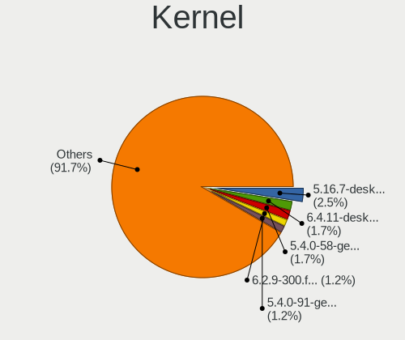
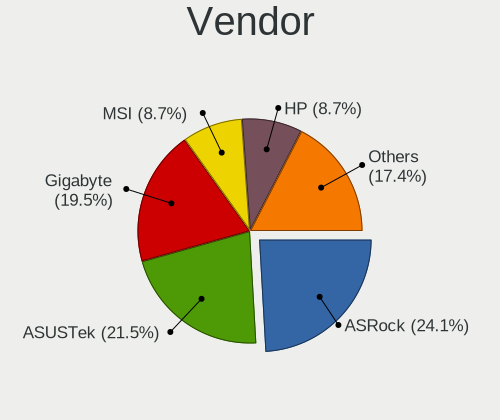
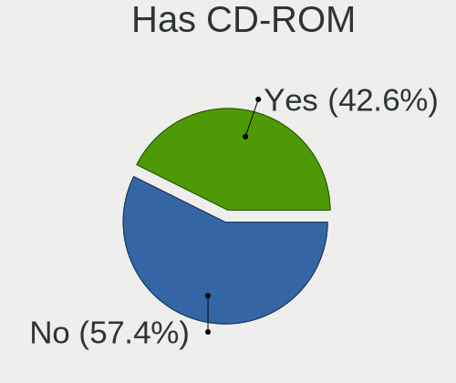
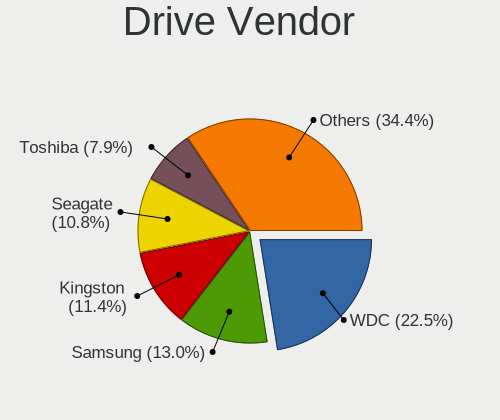
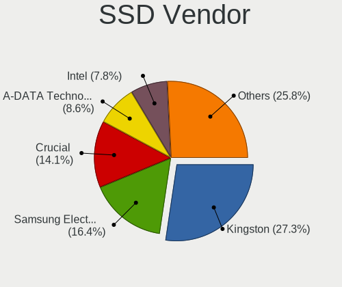
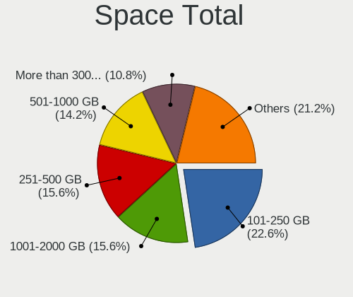
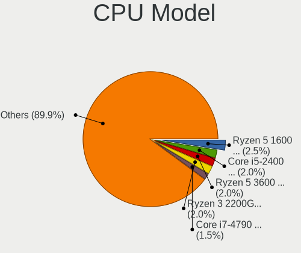
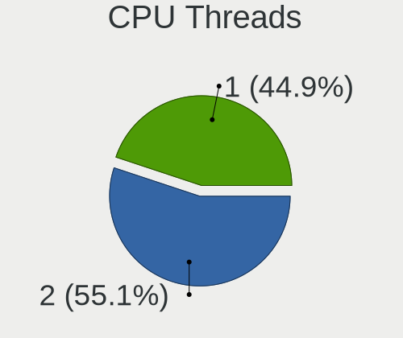
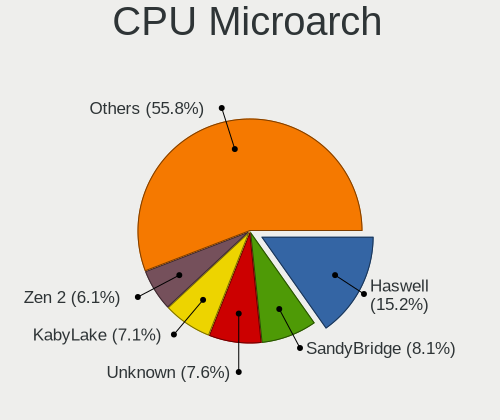
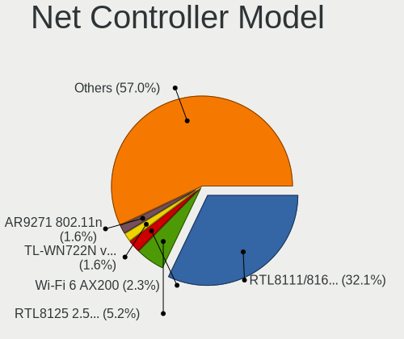

Linux in Croatia - Tested Hardware & Statistics (Desktops)
----------------------------------------------------------

A project to collect tested hardware configurations for Linux in Croatia.

Anyone can contribute to this report by the [hw-probe](https://github.com/linuxhw/hw-probe) tool:

    sudo -E hw-probe -all -upload

Please contribute! Especially if your hardware is rare.

Contents
--------

* [ Test Cases ](#test-cases)

* [ System ](#system)
  - [ OS                       ](#os)
  - [ OS Family                ](#os-family)
  - [ Kernel                   ](#kernel)
  - [ Kernel Family            ](#kernel-family)
  - [ Kernel Major Ver.        ](#kernel-major-ver)
  - [ Arch                     ](#arch)
  - [ DE                       ](#de)
  - [ Display Server           ](#display-server)
  - [ Display Manager          ](#display-manager)
  - [ OS Lang                  ](#os-lang)
  - [ Boot Mode                ](#boot-mode)
  - [ Filesystem               ](#filesystem)
  - [ Part. scheme             ](#part-scheme)
  - [ Dual Boot with Linux/BSD ](#dual-boot-with-linuxbsd)
  - [ Dual Boot (Win)          ](#dual-boot-win)

* [ Board ](#board)
  - [ Vendor                   ](#vendor)
  - [ Model                    ](#model)
  - [ Model Family             ](#model-family)
  - [ MFG Year                 ](#mfg-year)
  - [ Form Factor              ](#form-factor)
  - [ Secure Boot              ](#secure-boot)
  - [ Coreboot                 ](#coreboot)
  - [ RAM Size                 ](#ram-size)
  - [ RAM Used                 ](#ram-used)
  - [ Total Drives             ](#total-drives)
  - [ Has CD-ROM               ](#has-cd-rom)
  - [ Has Ethernet             ](#has-ethernet)
  - [ Has WiFi                 ](#has-wifi)
  - [ Has Bluetooth            ](#has-bluetooth)

* [ Location ](#location)
  - [ Country                  ](#country)
  - [ City                     ](#city)

* [ Drives ](#drives)
  - [ Drive Vendor             ](#drive-vendor)
  - [ Drive Model              ](#drive-model)
  - [ HDD Vendor               ](#hdd-vendor)
  - [ SSD Vendor               ](#ssd-vendor)
  - [ Drive Kind               ](#drive-kind)
  - [ Drive Connector          ](#drive-connector)
  - [ Drive Size               ](#drive-size)
  - [ Space Total              ](#space-total)
  - [ Space Used               ](#space-used)
  - [ Malfunc. Drives          ](#malfunc-drives)
  - [ Malfunc. Drive Vendor    ](#malfunc-drive-vendor)
  - [ Malfunc. HDD Vendor      ](#malfunc-hdd-vendor)
  - [ Malfunc. Drive Kind      ](#malfunc-drive-kind)
  - [ Failed Drives            ](#failed-drives)
  - [ Failed Drive Vendor      ](#failed-drive-vendor)
  - [ Drive Status             ](#drive-status)

* [ Storage controller ](#storage-controller)
  - [ Storage Vendor           ](#storage-vendor)
  - [ Storage Model            ](#storage-model)
  - [ Storage Kind             ](#storage-kind)

* [ Processor ](#processor)
  - [ CPU Vendor               ](#cpu-vendor)
  - [ CPU Model                ](#cpu-model)
  - [ CPU Model Family         ](#cpu-model-family)
  - [ CPU Cores                ](#cpu-cores)
  - [ CPU Sockets              ](#cpu-sockets)
  - [ CPU Threads              ](#cpu-threads)
  - [ CPU Op-Modes             ](#cpu-op-modes)
  - [ CPU Microcode            ](#cpu-microcode)
  - [ CPU Microarch            ](#cpu-microarch)

* [ Graphics ](#graphics)
  - [ GPU Vendor               ](#gpu-vendor)
  - [ GPU Model                ](#gpu-model)
  - [ GPU Combo                ](#gpu-combo)
  - [ GPU Driver               ](#gpu-driver)
  - [ GPU Memory               ](#gpu-memory)

* [ Monitor ](#monitor)
  - [ Monitor Vendor           ](#monitor-vendor)
  - [ Monitor Model            ](#monitor-model)
  - [ Monitor Resolution       ](#monitor-resolution)
  - [ Monitor Diagonal         ](#monitor-diagonal)
  - [ Monitor Width            ](#monitor-width)
  - [ Aspect Ratio             ](#aspect-ratio)
  - [ Monitor Area             ](#monitor-area)
  - [ Pixel Density            ](#pixel-density)
  - [ Multiple Monitors        ](#multiple-monitors)

* [ Network ](#network)
  - [ Net Controller Vendor    ](#net-controller-vendor)
  - [ Net Controller Model     ](#net-controller-model)
  - [ Wireless Vendor          ](#wireless-vendor)
  - [ Wireless Model           ](#wireless-model)
  - [ Ethernet Vendor          ](#ethernet-vendor)
  - [ Ethernet Model           ](#ethernet-model)
  - [ Net Controller Kind      ](#net-controller-kind)
  - [ Used Controller          ](#used-controller)
  - [ NICs                     ](#nics)
  - [ IPv6                     ](#ipv6)

* [ Bluetooth ](#bluetooth)
  - [ Bluetooth Vendor         ](#bluetooth-vendor)
  - [ Bluetooth Model          ](#bluetooth-model)

* [ Sound ](#sound)
  - [ Sound Vendor             ](#sound-vendor)
  - [ Sound Model              ](#sound-model)

* [ Memory ](#memory)
  - [ Memory Vendor            ](#memory-vendor)
  - [ Memory Model             ](#memory-model)
  - [ Memory Kind              ](#memory-kind)
  - [ Memory Form Factor       ](#memory-form-factor)
  - [ Memory Size              ](#memory-size)
  - [ Memory Speed             ](#memory-speed)

* [ Printers & scanners ](#printers--scanners)
  - [ Printer Vendor           ](#printer-vendor)
  - [ Printer Model            ](#printer-model)
  - [ Scanner Vendor           ](#scanner-vendor)
  - [ Scanner Model            ](#scanner-model)

* [ Camera ](#camera)
  - [ Camera Vendor            ](#camera-vendor)
  - [ Camera Model             ](#camera-model)

* [ Security ](#security)
  - [ Fingerprint Vendor       ](#fingerprint-vendor)
  - [ Fingerprint Model        ](#fingerprint-model)
  - [ Chipcard Vendor          ](#chipcard-vendor)
  - [ Chipcard Model           ](#chipcard-model)

* [ Unsupported ](#unsupported)
  - [ Unsupported Devices      ](#unsupported-devices)
  - [ Unsupported Device Types ](#unsupported-device-types)

Test Cases
----------

Total: 252

| Vendor        | Model                       | Probe                                                      | Date         |
|---------------|-----------------------------|------------------------------------------------------------|--------------|
| HP            | 1496                        | [64f726b9c5](https://linux-hardware.org/?probe=64f726b9c5) | Apr 30, 2024 |
| ASUSTek       | PRIME B560M-A               | [886328abc3](https://linux-hardware.org/?probe=886328abc3) | Apr 25, 2024 |
| ASUSTek       | TUF Gaming B650-PLUS WIF... | [0b8cd1192f](https://linux-hardware.org/?probe=0b8cd1192f) | Apr 24, 2024 |
| HP            | 8876 11                     | [b15b96ee62](https://linux-hardware.org/?probe=b15b96ee62) | Apr 23, 2024 |
| MSI           | PRO Z790-P WIFI             | [3ac4d133b8](https://linux-hardware.org/?probe=3ac4d133b8) | Apr 23, 2024 |
| Dell          | 06JWJY A01                  | [824cb2807f](https://linux-hardware.org/?probe=824cb2807f) | Apr 11, 2024 |
| HP            | 1495                        | [7bb71cc6c8](https://linux-hardware.org/?probe=7bb71cc6c8) | Apr 03, 2024 |
| HP            | 1495                        | [369904b953](https://linux-hardware.org/?probe=369904b953) | Apr 03, 2024 |
| Gigabyte      | Z790 AORUS PRO X            | [74e95f0015](https://linux-hardware.org/?probe=74e95f0015) | Mar 24, 2024 |
| HP            | 83EF                        | [34c1c23a84](https://linux-hardware.org/?probe=34c1c23a84) | Mar 23, 2024 |
| Lenovo        | 30C0 SDK0J40705 WIN 3425... | [fac66be915](https://linux-hardware.org/?probe=fac66be915) | Mar 19, 2024 |
| Gigabyte      | B650M DS3H                  | [91f2211c0c](https://linux-hardware.org/?probe=91f2211c0c) | Feb 14, 2024 |
| Gigabyte      | B450 AORUS ELITE            | [bf2ce0efeb](https://linux-hardware.org/?probe=bf2ce0efeb) | Jan 15, 2024 |
| Gigabyte      | Z790 GAMING X AX            | [80799f979c](https://linux-hardware.org/?probe=80799f979c) | Jan 10, 2024 |
| MSI           | MAG X570 TOMAHAWK WIFI      | [ff9686f03c](https://linux-hardware.org/?probe=ff9686f03c) | Jan 06, 2024 |
| ASUSTek       | PRIME Z690M-PLUS D4         | [7a9ff71d9b](https://linux-hardware.org/?probe=7a9ff71d9b) | Dec 28, 2023 |
| MSI           | MPG B760I EDGE WIFI DDR4    | [58bbd67a73](https://linux-hardware.org/?probe=58bbd67a73) | Dec 23, 2023 |
| Gigabyte      | Z790 GAMING X AX            | [155e0f1c37](https://linux-hardware.org/?probe=155e0f1c37) | Dec 22, 2023 |
| Dell          | 0R790T A00                  | [8a72b2a4ce](https://linux-hardware.org/?probe=8a72b2a4ce) | Dec 13, 2023 |
| eMachines     | ET1850                      | [b433ca3cfa](https://linux-hardware.org/?probe=b433ca3cfa) | Dec 02, 2023 |
| MSI           | PRO B650M-A WIFI            | [2a9ba6fc77](https://linux-hardware.org/?probe=2a9ba6fc77) | Nov 17, 2023 |
| HP            | 18E4                        | [fb73ea4228](https://linux-hardware.org/?probe=fb73ea4228) | Nov 12, 2023 |
| ASRock        | B450M-HDV R4.0              | [c019f410aa](https://linux-hardware.org/?probe=c019f410aa) | Nov 08, 2023 |
| ASRock        | B650E PG Riptide WiFi       | [24304767eb](https://linux-hardware.org/?probe=24304767eb) | Oct 21, 2023 |
| Intel         | DG965RY AAD41691-301        | [0bdf442d3d](https://linux-hardware.org/?probe=0bdf442d3d) | Oct 19, 2023 |
| ASRock        | B550M Phantom Gaming 4      | [e0158c541c](https://linux-hardware.org/?probe=e0158c541c) | Sep 29, 2023 |
| Gigabyte      | X570S UD                    | [88653e2f06](https://linux-hardware.org/?probe=88653e2f06) | Sep 24, 2023 |
| MSI           | MPG B760I EDGE WIFI DDR4    | [5a6ff779bd](https://linux-hardware.org/?probe=5a6ff779bd) | Sep 19, 2023 |
| MSI           | MPG B760I EDGE WIFI DDR4    | [bd389fb2a0](https://linux-hardware.org/?probe=bd389fb2a0) | Sep 15, 2023 |
| Lenovo        | ThinkCentre A58 77057FG     | [b96c23b77b](https://linux-hardware.org/?probe=b96c23b77b) | Sep 04, 2023 |
| Intel         | DH61CR AAG14064-204         | [2fa0bbc7ec](https://linux-hardware.org/?probe=2fa0bbc7ec) | Aug 28, 2023 |
| ASRock        | B560 Steel Legend           | [b2e8cd4ed2](https://linux-hardware.org/?probe=b2e8cd4ed2) | Aug 26, 2023 |
| ASUSTek       | TUF Gaming B660-PLUS WIF... | [ee8f18e185](https://linux-hardware.org/?probe=ee8f18e185) | Aug 07, 2023 |
| HP            | 2B47                        | [06373794be](https://linux-hardware.org/?probe=06373794be) | Aug 01, 2023 |
| ASRock        | B450M-HDV R4.0              | [289d9fe165](https://linux-hardware.org/?probe=289d9fe165) | Jun 14, 2023 |
| Gigabyte      | B450 AORUS ELITE            | [2a36e1c1d5](https://linux-hardware.org/?probe=2a36e1c1d5) | May 26, 2023 |
| MSI           | PRO Z690-A DDR4             | [45c02c8b1b](https://linux-hardware.org/?probe=45c02c8b1b) | May 11, 2023 |
| HPE           | ProLiant ML30 Gen10 Plus    | [3a75fa5c03](https://linux-hardware.org/?probe=3a75fa5c03) | May 07, 2023 |
| ASUSTek       | GRYPHON Z87                 | [045a79a6e4](https://linux-hardware.org/?probe=045a79a6e4) | Apr 18, 2023 |
| Lenovo        | 30C0 SDK0J40705 WIN 3425... | [490a059818](https://linux-hardware.org/?probe=490a059818) | Apr 13, 2023 |
| ASUSTek       | PRIME B560M-A               | [171e39cdb6](https://linux-hardware.org/?probe=171e39cdb6) | Apr 05, 2023 |
| MSI           | B450M PRO-M2 MAX            | [bdfe7a3498](https://linux-hardware.org/?probe=bdfe7a3498) | Mar 21, 2023 |
| ASUSTek       | H110M-R                     | [2409dc15b4](https://linux-hardware.org/?probe=2409dc15b4) | Mar 10, 2023 |
| ASRock        | H97 Pro4                    | [9ef8ff0b68](https://linux-hardware.org/?probe=9ef8ff0b68) | Mar 06, 2023 |
| MSI           | PRO Z690-A DDR4             | [caca2e6be1](https://linux-hardware.org/?probe=caca2e6be1) | Feb 11, 2023 |
| MSI           | 0A90                        | [9210981559](https://linux-hardware.org/?probe=9210981559) | Feb 06, 2023 |
| MSI           | 0A90                        | [aedd414dbf](https://linux-hardware.org/?probe=aedd414dbf) | Feb 06, 2023 |
| MSI           | PRO Z690-A DDR4             | [5a7a0cf485](https://linux-hardware.org/?probe=5a7a0cf485) | Feb 03, 2023 |
| ASUSTek       | PRIME B560M-A               | [2b04043ef0](https://linux-hardware.org/?probe=2b04043ef0) | Jan 10, 2023 |
| ASRock        | B550M Steel Legend          | [516d6f7f12](https://linux-hardware.org/?probe=516d6f7f12) | Dec 14, 2022 |
| ASUSTek       | ROG STRIX X670E-F GAMING... | [15d7102174](https://linux-hardware.org/?probe=15d7102174) | Dec 08, 2022 |
| ASUSTek       | ROG STRIX X670E-F GAMING... | [52525a1058](https://linux-hardware.org/?probe=52525a1058) | Dec 08, 2022 |
| ASRock        | K10N78D                     | [b5e2e7a024](https://linux-hardware.org/?probe=b5e2e7a024) | Dec 02, 2022 |
| ASRock        | B550M-ITX/ac                | [31f70fbb3e](https://linux-hardware.org/?probe=31f70fbb3e) | Nov 27, 2022 |
| HP            | 1998                        | [f9746a4ae0](https://linux-hardware.org/?probe=f9746a4ae0) | Nov 15, 2022 |
| ASUSTek       | PRIME H410M-A               | [b3cac9f8b8](https://linux-hardware.org/?probe=b3cac9f8b8) | Nov 02, 2022 |
| ASUSTek       | PRIME B560M-A               | [499932f589](https://linux-hardware.org/?probe=499932f589) | Nov 01, 2022 |
| ASUSTek       | PRIME B560M-A               | [c6f57791dc](https://linux-hardware.org/?probe=c6f57791dc) | Oct 12, 2022 |
| ASUSTek       | M5A78L LE                   | [69023fe30e](https://linux-hardware.org/?probe=69023fe30e) | Oct 09, 2022 |
| MSI           | PRO Z690-A DDR4             | [2a1088b211](https://linux-hardware.org/?probe=2a1088b211) | Oct 08, 2022 |
| Lenovo        | 0x30F617AA NOK              | [bb13b87bd5](https://linux-hardware.org/?probe=bb13b87bd5) | Oct 01, 2022 |
| ASRock        | A320M-DVS R4.0              | [0dca3e500c](https://linux-hardware.org/?probe=0dca3e500c) | Sep 22, 2022 |
| ASUSTek       | Z97-PRO                     | [60865c8ded](https://linux-hardware.org/?probe=60865c8ded) | Sep 02, 2022 |
| Gigabyte      | A320M-S2H-CF                | [5ddb15f201](https://linux-hardware.org/?probe=5ddb15f201) | Aug 07, 2022 |
| HP            | 1825                        | [4a21a02ae4](https://linux-hardware.org/?probe=4a21a02ae4) | Jul 29, 2022 |
| Gigabyte      | Z390 AORUS PRO-CF           | [3c665fb25f](https://linux-hardware.org/?probe=3c665fb25f) | Jul 28, 2022 |
| Gigabyte      | Z97-D3H-CF                  | [55f956b817](https://linux-hardware.org/?probe=55f956b817) | Jul 14, 2022 |
| ASRock        | K10N78D                     | [650465a972](https://linux-hardware.org/?probe=650465a972) | Jul 06, 2022 |
| WinFast       | NF-MCP55 FAB1.0             | [bb066cc2da](https://linux-hardware.org/?probe=bb066cc2da) | Jul 03, 2022 |
| MSI           | Z87-G41 PC Mate             | [c73501602b](https://linux-hardware.org/?probe=c73501602b) | Jun 26, 2022 |
| ASUSTek       | B250 MINING EXPERT          | [0d4266a0f3](https://linux-hardware.org/?probe=0d4266a0f3) | Jun 15, 2022 |
| ASUSTek       | B250 MINING EXPERT          | [987ef7b2e7](https://linux-hardware.org/?probe=987ef7b2e7) | May 26, 2022 |
| ASUSTek       | PRIME B560M-A               | [7b393b3933](https://linux-hardware.org/?probe=7b393b3933) | May 24, 2022 |
| Gigabyte      | X48T-DQ6                    | [2953148fae](https://linux-hardware.org/?probe=2953148fae) | May 16, 2022 |
| Dell          | 0J37VM A01                  | [a5363ae511](https://linux-hardware.org/?probe=a5363ae511) | May 09, 2022 |
| ASUSTek       | PRIME H510M-A               | [1e2ee4a2fb](https://linux-hardware.org/?probe=1e2ee4a2fb) | May 09, 2022 |
| ASRock        | Z87 Extreme4                | [db3a8bef92](https://linux-hardware.org/?probe=db3a8bef92) | May 09, 2022 |
| ASRock        | H470M-HDV                   | [14d8e1d537](https://linux-hardware.org/?probe=14d8e1d537) | May 06, 2022 |
| MSI           | B450 TOMAHAWK               | [220979cd04](https://linux-hardware.org/?probe=220979cd04) | May 05, 2022 |
| Gigabyte      | P31-ES3G                    | [dc8419dcb3](https://linux-hardware.org/?probe=dc8419dcb3) | Apr 29, 2022 |
| Intel         | H61M-S2PV                   | [caa602b556](https://linux-hardware.org/?probe=caa602b556) | Apr 28, 2022 |
| Gigabyte      | P31-ES3G                    | [c3df637d15](https://linux-hardware.org/?probe=c3df637d15) | Apr 27, 2022 |
| Fujitsu Si... | D2151-A1 S26361-D2151-A1    | [4db68ede02](https://linux-hardware.org/?probe=4db68ede02) | Apr 27, 2022 |
| ASRock        | H61M-DGS                    | [c8019d43f7](https://linux-hardware.org/?probe=c8019d43f7) | Apr 25, 2022 |
| ASRock        | H97 Pro4                    | [e937f129bf](https://linux-hardware.org/?probe=e937f129bf) | Apr 25, 2022 |
| Pegatron      | 2AC3                        | [771e8a4439](https://linux-hardware.org/?probe=771e8a4439) | Apr 18, 2022 |
| ASUSTek       | P8H61 PRO                   | [82d8b5968f](https://linux-hardware.org/?probe=82d8b5968f) | Apr 12, 2022 |
| ASRock        | A320M-HDV R4.0              | [73cf5373cf](https://linux-hardware.org/?probe=73cf5373cf) | Apr 03, 2022 |
| ASRock        | A320M-HDV R4.0              | [f76380fdae](https://linux-hardware.org/?probe=f76380fdae) | Apr 03, 2022 |
| Gigabyte      | X48T-DQ6                    | [f63c898bc3](https://linux-hardware.org/?probe=f63c898bc3) | Mar 18, 2022 |
| ASUSTek       | P8H61 PRO                   | [60dc2b7bd7](https://linux-hardware.org/?probe=60dc2b7bd7) | Mar 18, 2022 |
| ASUSTek       | PRIME H410M-A               | [9352c21f95](https://linux-hardware.org/?probe=9352c21f95) | Mar 17, 2022 |
| ASUSTek       | TUF Gaming X570-PLUS        | [561a945c5a](https://linux-hardware.org/?probe=561a945c5a) | Mar 13, 2022 |
| ASRock        | B360 Gaming K4              | [ae6cb3bea9](https://linux-hardware.org/?probe=ae6cb3bea9) | Mar 11, 2022 |
| ASUSTek       | Z170-P                      | [fac84edcf2](https://linux-hardware.org/?probe=fac84edcf2) | Mar 08, 2022 |
| ASRock        | H97 Pro4                    | [83df7fb05a](https://linux-hardware.org/?probe=83df7fb05a) | Mar 07, 2022 |
| Gigabyte      | X48T-DQ6                    | [593cb60512](https://linux-hardware.org/?probe=593cb60512) | Mar 06, 2022 |
| Foxconn       | 2A8Ch                       | [49093d0be0](https://linux-hardware.org/?probe=49093d0be0) | Mar 05, 2022 |
| Gigabyte      | H410M H V3                  | [d0ee45a4b1](https://linux-hardware.org/?probe=d0ee45a4b1) | Feb 26, 2022 |
| ASUSTek       | TUF Gaming B460M-PLUS       | [731457f46c](https://linux-hardware.org/?probe=731457f46c) | Feb 13, 2022 |
| ECS           | A75F2-M2                    | [0c4ea60fd5](https://linux-hardware.org/?probe=0c4ea60fd5) | Feb 12, 2022 |
| Gigabyte      | B85M-DS3H                   | [98d6451ac1](https://linux-hardware.org/?probe=98d6451ac1) | Feb 07, 2022 |
| ASRock        | Z97M Pro4                   | [a496090845](https://linux-hardware.org/?probe=a496090845) | Feb 01, 2022 |
| Foxconn       | 2A8Ch                       | [276caa5169](https://linux-hardware.org/?probe=276caa5169) | Jan 23, 2022 |
| ASRock        | Z590 Pro4                   | [a89877d9de](https://linux-hardware.org/?probe=a89877d9de) | Jan 16, 2022 |
| ASRock        | Z590 Pro4                   | [7a2453280a](https://linux-hardware.org/?probe=7a2453280a) | Jan 14, 2022 |
| ECS           | H61H2-M2                    | [21704ab656](https://linux-hardware.org/?probe=21704ab656) | Jan 10, 2022 |
| ASUSTek       | X750LB                      | [47b4da86e2](https://linux-hardware.org/?probe=47b4da86e2) | Jan 10, 2022 |
| ASUSTek       | X750LB                      | [f1f247b586](https://linux-hardware.org/?probe=f1f247b586) | Jan 09, 2022 |
| MSI           | H81M-P33                    | [0fb1d25a7d](https://linux-hardware.org/?probe=0fb1d25a7d) | Dec 30, 2021 |
| Gigabyte      | 965P-DS3                    | [467762be06](https://linux-hardware.org/?probe=467762be06) | Dec 29, 2021 |
| ECS           | H61H2-M2                    | [6f3d8856df](https://linux-hardware.org/?probe=6f3d8856df) | Dec 29, 2021 |
| ASRock        | 870 Extreme3                | [d202f241ee](https://linux-hardware.org/?probe=d202f241ee) | Dec 23, 2021 |
| Intel         | DH61CR AAG14064-204         | [13c79f41a6](https://linux-hardware.org/?probe=13c79f41a6) | Dec 18, 2021 |
| Intel         | DH61CR AAG14064-204         | [dbc555c5ad](https://linux-hardware.org/?probe=dbc555c5ad) | Dec 16, 2021 |
| ASRock        | B450M-HDV R4.0              | [594becb8c9](https://linux-hardware.org/?probe=594becb8c9) | Dec 06, 2021 |
| ASRock        | M3A770DE                    | [1a03b6e5c7](https://linux-hardware.org/?probe=1a03b6e5c7) | Dec 05, 2021 |
| ASRock        | M3A770DE                    | [bdf4260678](https://linux-hardware.org/?probe=bdf4260678) | Dec 05, 2021 |
| ASUSTek       | PRIME A320M-K               | [d9019c420c](https://linux-hardware.org/?probe=d9019c420c) | Dec 04, 2021 |
| Dell          | 0GDG8Y A00                  | [d0cf0cc443](https://linux-hardware.org/?probe=d0cf0cc443) | Dec 01, 2021 |
| Foxconn       | 2A8Ch                       | [1eff06a331](https://linux-hardware.org/?probe=1eff06a331) | Nov 30, 2021 |
| Foxconn       | 2A8Ch                       | [1f650ebd72](https://linux-hardware.org/?probe=1f650ebd72) | Nov 30, 2021 |
| ASUSTek       | P8Z77-V LX                  | [b153db375f](https://linux-hardware.org/?probe=b153db375f) | Nov 29, 2021 |
| Gigabyte      | GB-BRR7H-4800               | [c77e499435](https://linux-hardware.org/?probe=c77e499435) | Nov 13, 2021 |
| ASUSTek       | M4A78T-E                    | [10991ab539](https://linux-hardware.org/?probe=10991ab539) | Nov 10, 2021 |
| ASUSTek       | P8Z77-V LX                  | [d59cc9fead](https://linux-hardware.org/?probe=d59cc9fead) | Nov 04, 2021 |
| ASUSTek       | P8Z77-V LX                  | [903ec63ceb](https://linux-hardware.org/?probe=903ec63ceb) | Nov 02, 2021 |
| MSI           | P55-CD53                    | [860bde5935](https://linux-hardware.org/?probe=860bde5935) | Oct 31, 2021 |
| MSI           | P55-CD53                    | [12bf811a5c](https://linux-hardware.org/?probe=12bf811a5c) | Oct 24, 2021 |
| MSI           | P55-CD53                    | [c1c364dbc1](https://linux-hardware.org/?probe=c1c364dbc1) | Oct 24, 2021 |
| ASUSTek       | M5A78L LE                   | [adf114d66e](https://linux-hardware.org/?probe=adf114d66e) | Oct 23, 2021 |
| Pegatron      | 2A73h                       | [dc24d5d19f](https://linux-hardware.org/?probe=dc24d5d19f) | Oct 16, 2021 |
| ASUSTek       | PRIME H410M-R               | [d891006b52](https://linux-hardware.org/?probe=d891006b52) | Oct 14, 2021 |
| ASUSTek       | B85M-E                      | [d98b27a03c](https://linux-hardware.org/?probe=d98b27a03c) | Oct 11, 2021 |
| ASUSTek       | A58M-K                      | [2ca6ce79db](https://linux-hardware.org/?probe=2ca6ce79db) | Oct 03, 2021 |
| Gigabyte      | A320M-S2H-CF                | [e5508ac7ab](https://linux-hardware.org/?probe=e5508ac7ab) | Sep 27, 2021 |
| ASUSTek       | M4A78T-E                    | [01ec64f498](https://linux-hardware.org/?probe=01ec64f498) | Sep 24, 2021 |
| MSI           | A320M PRO-VH PLUS           | [149504315f](https://linux-hardware.org/?probe=149504315f) | Aug 10, 2021 |
| Gigabyte      | X399 AORUS XTREME-CF        | [3a2fd430f6](https://linux-hardware.org/?probe=3a2fd430f6) | Aug 03, 2021 |
| ASRock        | B450M-HDV R4.0              | [f15116c26a](https://linux-hardware.org/?probe=f15116c26a) | Jul 30, 2021 |
| ASRock        | Z370 Pro4                   | [9a9f7c5e69](https://linux-hardware.org/?probe=9a9f7c5e69) | Jul 20, 2021 |
| Gigabyte      | GA-990XA-UD3                | [af31bae015](https://linux-hardware.org/?probe=af31bae015) | Jun 10, 2021 |
| ASUSTek       | ROG CROSSHAIR VIII HERO     | [83b3cc659a](https://linux-hardware.org/?probe=83b3cc659a) | Jun 07, 2021 |
| Dell          | 06CV2N A01                  | [35a0afd617](https://linux-hardware.org/?probe=35a0afd617) | May 25, 2021 |
| MSI           | B450 TOMAHAWK               | [eb4e8e4cc2](https://linux-hardware.org/?probe=eb4e8e4cc2) | May 25, 2021 |
| Gigabyte      | Z390 M GAMING-CF            | [657fe689d6](https://linux-hardware.org/?probe=657fe689d6) | May 19, 2021 |
| ASUSTek       | P5KPL-AM SE                 | [2cd9e43be0](https://linux-hardware.org/?probe=2cd9e43be0) | Apr 27, 2021 |
| ASRock        | P45DE                       | [2f6b602e36](https://linux-hardware.org/?probe=2f6b602e36) | Apr 18, 2021 |
| ASRock        | Z370 Pro4                   | [7ad77d82ba](https://linux-hardware.org/?probe=7ad77d82ba) | Apr 03, 2021 |
| ASUSTek       | TUF Gaming Z490-PLUS        | [b776bc7947](https://linux-hardware.org/?probe=b776bc7947) | Mar 31, 2021 |
| MSI           | B450M PRO-M2 MAX            | [6e5e0c9ef4](https://linux-hardware.org/?probe=6e5e0c9ef4) | Mar 19, 2021 |
| MSI           | Z390-A PRO                  | [12566ee726](https://linux-hardware.org/?probe=12566ee726) | Mar 10, 2021 |
| Gigabyte      | G1.Sniper Z87               | [c9a3501b03](https://linux-hardware.org/?probe=c9a3501b03) | Mar 02, 2021 |
| ASRock        | FM2A75M-DGS                 | [72c1ab0b9b](https://linux-hardware.org/?probe=72c1ab0b9b) | Mar 01, 2021 |
| ASUSTek       | PRIME A320M-K               | [24a672b8ac](https://linux-hardware.org/?probe=24a672b8ac) | Feb 25, 2021 |
| ASRock        | Z87 Extreme4                | [081e14044d](https://linux-hardware.org/?probe=081e14044d) | Feb 13, 2021 |
| Dell          | 0NNGP2 A00                  | [9be58392b6](https://linux-hardware.org/?probe=9be58392b6) | Feb 08, 2021 |
| Dell          | 0J37VM A01                  | [3062914f46](https://linux-hardware.org/?probe=3062914f46) | Feb 07, 2021 |
| Dell          | 0J37VM A01                  | [34e1267a80](https://linux-hardware.org/?probe=34e1267a80) | Feb 07, 2021 |
| ASRock        | X570 Phantom Gaming 4       | [eee7c1f592](https://linux-hardware.org/?probe=eee7c1f592) | Feb 03, 2021 |
| ASRock        | ConRoe1333-D667             | [54121172b8](https://linux-hardware.org/?probe=54121172b8) | Jan 31, 2021 |
| Gigabyte      | B450 GAMING X               | [28cb4726bb](https://linux-hardware.org/?probe=28cb4726bb) | Jan 31, 2021 |
| Gigabyte      | B450 GAMING X               | [0b4b751863](https://linux-hardware.org/?probe=0b4b751863) | Jan 31, 2021 |
| ASRock        | X570M Pro4                  | [9cd91004ab](https://linux-hardware.org/?probe=9cd91004ab) | Jan 24, 2021 |
| Gigabyte      | F2A78M-DS2                  | [9afb5c207a](https://linux-hardware.org/?probe=9afb5c207a) | Jan 23, 2021 |
| Dell          | 0DFRFW A01                  | [482bc5334f](https://linux-hardware.org/?probe=482bc5334f) | Jan 22, 2021 |
| MSI           | B450 TOMAHAWK               | [943284255a](https://linux-hardware.org/?probe=943284255a) | Jan 20, 2021 |
| Gigabyte      | F2A78M-DS2                  | [df34a7d718](https://linux-hardware.org/?probe=df34a7d718) | Jan 20, 2021 |
| Gigabyte      | F2A78M-DS2                  | [0d8e905a30](https://linux-hardware.org/?probe=0d8e905a30) | Jan 16, 2021 |
| ASUSTek       | Maximus VII HERO            | [9b72f3a82b](https://linux-hardware.org/?probe=9b72f3a82b) | Jan 11, 2021 |
| ASUSTek       | M4A78T-E                    | [e2fa1223c4](https://linux-hardware.org/?probe=e2fa1223c4) | Jan 03, 2021 |
| ASUSTek       | M4A78T-E                    | [db7dfe41a5](https://linux-hardware.org/?probe=db7dfe41a5) | Jan 03, 2021 |
| MSI           | P67A-GD53/2.0               | [2ca3b4e129](https://linux-hardware.org/?probe=2ca3b4e129) | Jan 03, 2021 |
| MSI           | P67A-GD53/2.0               | [638a245f5f](https://linux-hardware.org/?probe=638a245f5f) | Jan 03, 2021 |
| Gigabyte      | GA-MA785GMT-UD2H            | [15160d8a87](https://linux-hardware.org/?probe=15160d8a87) | Jan 02, 2021 |
| HP            | 18EA                        | [67e2e927b6](https://linux-hardware.org/?probe=67e2e927b6) | Dec 27, 2020 |
| Gigabyte      | GA-MA770-UD3                | [120e788567](https://linux-hardware.org/?probe=120e788567) | Dec 24, 2020 |
| ASUSTek       | H81M-K                      | [03b737b966](https://linux-hardware.org/?probe=03b737b966) | Dec 23, 2020 |
| ASRock        | Z370 Pro4                   | [e6df8b78b5](https://linux-hardware.org/?probe=e6df8b78b5) | Dec 21, 2020 |
| ASUSTek       | M5A78L LE                   | [4e7620198d](https://linux-hardware.org/?probe=4e7620198d) | Dec 15, 2020 |
| ASUSTek       | M5A78L LE                   | [0a6542f4b3](https://linux-hardware.org/?probe=0a6542f4b3) | Dec 12, 2020 |
| ASRock        | N68-S3 UCC                  | [b75cfae4a3](https://linux-hardware.org/?probe=b75cfae4a3) | Nov 01, 2020 |
| ASUSTek       | ROG STRIX B550-I GAMING     | [36db0ea3d4](https://linux-hardware.org/?probe=36db0ea3d4) | Oct 21, 2020 |
| ASUSTek       | ROG STRIX B550-I GAMING     | [ff7ecd0641](https://linux-hardware.org/?probe=ff7ecd0641) | Oct 15, 2020 |
| Pegatron      | 2A94h                       | [668c4bbb8b](https://linux-hardware.org/?probe=668c4bbb8b) | Oct 06, 2020 |
| ASUSTek       | PRIME H310M-A R2.0          | [b098cfc85e](https://linux-hardware.org/?probe=b098cfc85e) | Sep 30, 2020 |
| ASUSTek       | PRIME H310M-A R2.0          | [df11954c4f](https://linux-hardware.org/?probe=df11954c4f) | Sep 28, 2020 |
| ASUSTek       | PRIME H310M-A R2.0          | [8220732bda](https://linux-hardware.org/?probe=8220732bda) | Sep 28, 2020 |
| ASUSTek       | M5A78L LE                   | [7f4940b41c](https://linux-hardware.org/?probe=7f4940b41c) | Sep 28, 2020 |
| ASRock        | N68-S3 UCC                  | [42ed26b195](https://linux-hardware.org/?probe=42ed26b195) | Sep 19, 2020 |
| ASUSTek       | M4A77                       | [d076f8fe03](https://linux-hardware.org/?probe=d076f8fe03) | Sep 08, 2020 |
| ASRock        | Z87E-ITX                    | [d1095a7a24](https://linux-hardware.org/?probe=d1095a7a24) | Sep 05, 2020 |
| ASRock        | N68-S3 UCC                  | [a2d99d11fc](https://linux-hardware.org/?probe=a2d99d11fc) | Aug 30, 2020 |
| ASUSTek       | P8H77-V LE                  | [1c2eaa2346](https://linux-hardware.org/?probe=1c2eaa2346) | Aug 23, 2020 |
| HP            | 2129                        | [d1eda00971](https://linux-hardware.org/?probe=d1eda00971) | Aug 20, 2020 |
| MSI           | Z87-G41 PC Mate             | [1b2d8402af](https://linux-hardware.org/?probe=1b2d8402af) | Aug 17, 2020 |
| Gigabyte      | G41M-Combo                  | [2f3657530f](https://linux-hardware.org/?probe=2f3657530f) | Jun 29, 2020 |
| ASUSTek       | B85M-E                      | [e46352dec8](https://linux-hardware.org/?probe=e46352dec8) | Jun 28, 2020 |
| ASRock        | H97M Pro4                   | [31f3732dc9](https://linux-hardware.org/?probe=31f3732dc9) | Jun 19, 2020 |
| Gigabyte      | G31MX-S2                    | [7da6752573](https://linux-hardware.org/?probe=7da6752573) | May 31, 2020 |
| Gigabyte      | G31MX-S2                    | [5472c53dca](https://linux-hardware.org/?probe=5472c53dca) | May 31, 2020 |
| ASRock        | H81M-DGS R2.0               | [26a9c7f62c](https://linux-hardware.org/?probe=26a9c7f62c) | May 30, 2020 |
| Gigabyte      | 990FXA-UD3                  | [e3042f4583](https://linux-hardware.org/?probe=e3042f4583) | May 24, 2020 |
| ASUSTek       | P8H77-V LE                  | [e6f20d976d](https://linux-hardware.org/?probe=e6f20d976d) | May 17, 2020 |
| Gigabyte      | 965P-DS3                    | [abfb95a938](https://linux-hardware.org/?probe=abfb95a938) | May 11, 2020 |
| Gigabyte      | 965P-DS3                    | [e59e1593d5](https://linux-hardware.org/?probe=e59e1593d5) | May 11, 2020 |
| MSI           | MS-7360                     | [ab94189bcf](https://linux-hardware.org/?probe=ab94189bcf) | May 07, 2020 |
| MSI           | Z87-G41 PC Mate             | [c17fa3f327](https://linux-hardware.org/?probe=c17fa3f327) | May 02, 2020 |
| HP            | 3031h                       | [b4638888cb](https://linux-hardware.org/?probe=b4638888cb) | Apr 14, 2020 |
| ASUSTek       | M5A78L LE                   | [1562c544a6](https://linux-hardware.org/?probe=1562c544a6) | Apr 14, 2020 |
| ASRock        | H61M-DGS                    | [0a090881ae](https://linux-hardware.org/?probe=0a090881ae) | Apr 12, 2020 |
| ASUSTek       | A8V-MQ                      | [54a0034c0a](https://linux-hardware.org/?probe=54a0034c0a) | Mar 24, 2020 |
| ASRock        | H61M-VS                     | [799e1670fd](https://linux-hardware.org/?probe=799e1670fd) | Mar 18, 2020 |
| HP            | 212B                        | [6058dd53b1](https://linux-hardware.org/?probe=6058dd53b1) | Mar 16, 2020 |
| Gigabyte      | Z390 M GAMING-CF            | [26545c7add](https://linux-hardware.org/?probe=26545c7add) | Feb 24, 2020 |
| Gigabyte      | Z390 M GAMING-CF            | [1693523c61](https://linux-hardware.org/?probe=1693523c61) | Feb 21, 2020 |
| Intel         | DH67BL AAG10189-213         | [b0e9895bef](https://linux-hardware.org/?probe=b0e9895bef) | Feb 16, 2020 |
| ASRock        | B150M-HDV                   | [c08c6d0574](https://linux-hardware.org/?probe=c08c6d0574) | Feb 08, 2020 |
| HP            | 18E7                        | [de846e5f4f](https://linux-hardware.org/?probe=de846e5f4f) | Jan 22, 2020 |
| Intel         | DH67BL AAG10189-213         | [9ed2076b0d](https://linux-hardware.org/?probe=9ed2076b0d) | Jan 18, 2020 |
| Intel         | DH67BL AAG10189-213         | [dc121e5512](https://linux-hardware.org/?probe=dc121e5512) | Jan 18, 2020 |
| Acer          | Veriton S680G               | [277889b2ff](https://linux-hardware.org/?probe=277889b2ff) | Jan 15, 2020 |
| Gigabyte      | Z390 M GAMING-CF            | [e097415087](https://linux-hardware.org/?probe=e097415087) | Dec 26, 2019 |
| ASRock        | N68-S3 UCC                  | [9cbd6c2e0e](https://linux-hardware.org/?probe=9cbd6c2e0e) | Dec 25, 2019 |
| ASRock        | 990FX Extreme3              | [107280e5a9](https://linux-hardware.org/?probe=107280e5a9) | Dec 23, 2019 |
| ASRock        | 990FX Extreme3              | [66a084d547](https://linux-hardware.org/?probe=66a084d547) | Dec 11, 2019 |
| ASRock        | H97 Killer                  | [8538b88e3d](https://linux-hardware.org/?probe=8538b88e3d) | Nov 27, 2019 |
| ASRock        | 970 Pro3 R2.0               | [73c6829ffb](https://linux-hardware.org/?probe=73c6829ffb) | Nov 27, 2019 |
| HP            | 18EA                        | [101b838d0e](https://linux-hardware.org/?probe=101b838d0e) | Nov 10, 2019 |
| ASRock        | A320M-HDV R3.0              | [d3d79c2a8d](https://linux-hardware.org/?probe=d3d79c2a8d) | Sep 16, 2019 |
| Gigabyte      | A320M-H-CF                  | [a35aea421b](https://linux-hardware.org/?probe=a35aea421b) | Sep 09, 2019 |
| Intel         | DX58SO AAE29331-501         | [349ef8982a](https://linux-hardware.org/?probe=349ef8982a) | Sep 09, 2019 |
| Gigabyte      | A320M-H-CF                  | [59782a89ea](https://linux-hardware.org/?probe=59782a89ea) | Sep 06, 2019 |
| Gigabyte      | A320M-H-CF                  | [b4ef0f5499](https://linux-hardware.org/?probe=b4ef0f5499) | Sep 05, 2019 |
| ASRock        | FM2A55M-DGS R2.0            | [be3a07802c](https://linux-hardware.org/?probe=be3a07802c) | Aug 13, 2019 |
| ASRock        | FM2A55M-DGS R2.0            | [9cdd546881](https://linux-hardware.org/?probe=9cdd546881) | Jul 29, 2019 |
| ASRock        | A300M-STX                   | [edf300f175](https://linux-hardware.org/?probe=edf300f175) | Jul 29, 2019 |
| Gigabyte      | X299 UD4 Pro-CF             | [aad0551e27](https://linux-hardware.org/?probe=aad0551e27) | Jul 25, 2019 |
| ASUSTek       | E35M1-M                     | [1b78cc518f](https://linux-hardware.org/?probe=1b78cc518f) | Jul 08, 2019 |
| ASUSTek       | E35M1-M                     | [1f5e6b026b](https://linux-hardware.org/?probe=1f5e6b026b) | Jun 23, 2019 |
| ASUSTek       | PRIME A320M-K               | [f8c4365b6c](https://linux-hardware.org/?probe=f8c4365b6c) | Jun 07, 2019 |
| ASUSTek       | PRIME A320M-K               | [3968b06d9c](https://linux-hardware.org/?probe=3968b06d9c) | Jun 07, 2019 |
| HP            | 83ED                        | [532b72754e](https://linux-hardware.org/?probe=532b72754e) | May 06, 2019 |
| Gigabyte      | Z77P-D3                     | [e7259783d1](https://linux-hardware.org/?probe=e7259783d1) | Apr 13, 2019 |
| Pegatron      | 2A99                        | [196712630c](https://linux-hardware.org/?probe=196712630c) | Feb 26, 2019 |
| ASUSTek       | B150M-C                     | [88898f6797](https://linux-hardware.org/?probe=88898f6797) | Feb 10, 2019 |
| ECS           | A770M-A                     | [feacfccf11](https://linux-hardware.org/?probe=feacfccf11) | Feb 05, 2019 |
| Gigabyte      | AB350-Gaming 3-CF           | [bf1298d356](https://linux-hardware.org/?probe=bf1298d356) | Jan 29, 2019 |
| ABIT          | IP35-E                      | [87b22d6a66](https://linux-hardware.org/?probe=87b22d6a66) | Jan 26, 2019 |
| Gigabyte      | AX370-Gaming K7             | [bc26ed35a0](https://linux-hardware.org/?probe=bc26ed35a0) | Dec 08, 2018 |
| Unknown       | Grantsdale                  | [65da6a461b](https://linux-hardware.org/?probe=65da6a461b) | Nov 21, 2018 |
| Pegatron      | 2AB6                        | [00a8407210](https://linux-hardware.org/?probe=00a8407210) | Oct 31, 2018 |

System
------

OS
--

Installed operating systems

| Name                         | Desktops | Percent |
|------------------------------|----------|---------|
| Ubuntu 20.04                 | 20       | 10.53%  |
| Ubuntu 18.04                 | 14       | 7.37%   |
| Debian 11                    | 7        | 3.68%   |
| Ubuntu 22.04                 | 6        | 3.16%   |
| OpenMandriva 4.3             | 6        | 3.16%   |
| Linux Mint 20.3              | 6        | 3.16%   |
| Linux Mint 20.2              | 6        | 3.16%   |
| Ubuntu 18.10                 | 5        | 2.63%   |
| Manjaro                      | 5        | 2.63%   |
| Zorin 16                     | 4        | 2.11%   |
| openSUSE Tumbleweed-XXXXXXXX | 4        | 2.11%   |
| Fedora 38                    | 4        | 2.11%   |
| Debian 10                    | 4        | 2.11%   |
| ArcoLinux Rolling            | 4        | 2.11%   |
| Ubuntu MATE 22.04            | 3        | 1.58%   |
| Ubuntu 19.10                 | 3        | 1.58%   |
| Pop!_OS 21.10                | 3        | 1.58%   |
| OpenMandriva 4.2             | 3        | 1.58%   |
| Fedora 31                    | 3        | 1.58%   |
| Ubuntu 21.04                 | 2        | 1.05%   |
| Pop!_OS 20.10                | 2        | 1.05%   |
| openSUSE Leap-15.2           | 2        | 1.05%   |
| OpenMandriva 4.50            | 2        | 1.05%   |
| OpenMandriva 23.11           | 2        | 1.05%   |
| OpenMandriva 23.08           | 2        | 1.05%   |
| OpenMandriva 23.03           | 2        | 1.05%   |
| LMDE 6                       | 2        | 1.05%   |
| Linux Mint 20                | 2        | 1.05%   |
| KDE neon 20.04               | 2        | 1.05%   |
| Fedora 39                    | 2        | 1.05%   |
| EndeavourOS Rolling          | 2        | 1.05%   |
| Debian 12                    | 2        | 1.05%   |
| Arch Rolling                 | 2        | 1.05%   |
| Zorin 15                     | 1        | 0.53%   |
| Xubuntu 20.04                | 1        | 0.53%   |
| Xubuntu 18.04                | 1        | 0.53%   |
| Ubuntu Unity 18.04           | 1        | 0.53%   |
| Ubuntu MATE 20.04            | 1        | 0.53%   |
| Ubuntu MATE 19.10            | 1        | 0.53%   |
| Ubuntu Budgie 22.04          | 1        | 0.53%   |

OS Family
---------

OS without a version

| Name          | Desktops | Percent |
|---------------|----------|---------|
| Ubuntu        | 54       | 30.34%  |
| Linux Mint    | 19       | 10.67%  |
| OpenMandriva  | 17       | 9.55%   |
| Debian        | 11       | 6.18%   |
| Manjaro       | 10       | 5.62%   |
| Fedora        | 10       | 5.62%   |
| Pop!_OS       | 9        | 5.06%   |
| openSUSE      | 6        | 3.37%   |
| Zorin         | 5        | 2.81%   |
| ArcoLinux     | 4        | 2.25%   |
| Ubuntu MATE   | 3        | 1.69%   |
| Ubuntu Budgie | 3        | 1.69%   |
| LMDE          | 3        | 1.69%   |
| KDE neon      | 3        | 1.69%   |
| Arch          | 3        | 1.69%   |
| Xubuntu       | 2        | 1.12%   |
| Kubuntu       | 2        | 1.12%   |
| Gentoo        | 2        | 1.12%   |
| EndeavourOS   | 2        | 1.12%   |
| Ubuntu Unity  | 1        | 0.56%   |
| ROSA          | 1        | 0.56%   |
| Nobara        | 1        | 0.56%   |
| MX            | 1        | 0.56%   |
| Lubuntu       | 1        | 0.56%   |
| LinuxFX       | 1        | 0.56%   |
| Endless       | 1        | 0.56%   |
| Elementary    | 1        | 0.56%   |
| Dts-distro    | 1        | 0.56%   |
| Clear Linux   | 1        | 0.56%   |

Kernel
------

Version of the Linux kernel

| Version                  | Desktops | Percent |
|--------------------------|----------|---------|
| 5.16.7-desktop-1omv4003  | 6        | 2.84%   |
| 5.4.0-58-generic         | 4        | 1.9%    |
| 6.2.9-300.fc38.x86_64    | 3        | 1.42%   |
| 5.4.0-91-generic         | 3        | 1.42%   |
| 5.3.0-26-generic         | 3        | 1.42%   |
| 5.10.14-desktop-1omv4002 | 3        | 1.42%   |
| 5.0.0-27-generic         | 3        | 1.42%   |
| 6.6.2-desktop-1omv2390   | 2        | 0.95%   |
| 6.4.11-desktop-1omv2390  | 2        | 0.95%   |
| 6.2.6-desktop-1omv2390   | 2        | 0.95%   |
| 5.8.0-48-generic         | 2        | 0.95%   |
| 5.4.0-48-generic         | 2        | 0.95%   |
| 5.4.0-42-generic         | 2        | 0.95%   |
| 5.4.0-26-generic         | 2        | 0.95%   |
| 5.4.0-100-generic        | 2        | 0.95%   |
| 5.3.0-42-generic         | 2        | 0.95%   |
| 5.3.0-28-generic         | 2        | 0.95%   |
| 5.15.0-52-generic        | 2        | 0.95%   |
| 5.15.0-48-generic        | 2        | 0.95%   |
| 5.15.0-105-generic       | 2        | 0.95%   |
| 5.13.0-40-generic        | 2        | 0.95%   |
| 5.12.4-desktop-1omv4050  | 2        | 0.95%   |
| 5.11.0-41-generic        | 2        | 0.95%   |
| 5.11.0-38-generic        | 2        | 0.95%   |
| 5.11.0-37-generic        | 2        | 0.95%   |
| 5.10.0-13-amd64          | 2        | 0.95%   |
| 4.19.0-14-amd64          | 2        | 0.95%   |
| 4.18.0-10-generic        | 2        | 0.95%   |
| 4.15.0-45-generic        | 2        | 0.95%   |
| 4.15.0-20-generic        | 2        | 0.95%   |
| 6.8.7-zen1-1-zen         | 1        | 0.47%   |
| 6.8.1-zen1-1-zen         | 1        | 0.47%   |
| 6.7.10-200.fc39.x86_64   | 1        | 0.47%   |
| 6.6.7-200.fc39.x86_64    | 1        | 0.47%   |
| 6.6.19-1-MANJARO         | 1        | 0.47%   |
| 6.6.13+bpo-amd64         | 1        | 0.47%   |
| 6.6.11-lqx1-1-lqx        | 1        | 0.47%   |
| 6.6.0-desktop-1omv2390   | 1        | 0.47%   |
| 6.5.9-zen2-1-zen         | 1        | 0.47%   |
| 6.5.4-76060504-generic   | 1        | 0.47%   |

Kernel Family
-------------

Linux kernel without a distro release

| Version | Desktops | Percent |
|---------|----------|---------|
| 5.4.0   | 33       | 16.75%  |
| 5.11.0  | 12       | 6.09%   |
| 5.3.0   | 11       | 5.58%   |
| 5.15.0  | 11       | 5.58%   |
| 4.15.0  | 10       | 5.08%   |
| 5.10.0  | 8        | 4.06%   |
| 4.18.0  | 8        | 4.06%   |
| 5.16.7  | 6        | 3.05%   |
| 5.13.0  | 6        | 3.05%   |
| 5.8.0   | 5        | 2.54%   |
| 5.0.0   | 4        | 2.03%   |
| 6.2.9   | 3        | 1.52%   |
| 6.1.0   | 3        | 1.52%   |
| 5.12.4  | 3        | 1.52%   |
| 5.10.14 | 3        | 1.52%   |
| 4.19.0  | 3        | 1.52%   |
| 6.6.2   | 2        | 1.02%   |
| 6.5.4   | 2        | 1.02%   |
| 6.4.11  | 2        | 1.02%   |
| 6.2.6   | 2        | 1.02%   |
| 5.3.18  | 2        | 1.02%   |
| 5.19.0  | 2        | 1.02%   |
| 5.16.11 | 2        | 1.02%   |
| 6.8.7   | 1        | 0.51%   |
| 6.8.1   | 1        | 0.51%   |
| 6.7.10  | 1        | 0.51%   |
| 6.6.7   | 1        | 0.51%   |
| 6.6.19  | 1        | 0.51%   |
| 6.6.13  | 1        | 0.51%   |
| 6.6.11  | 1        | 0.51%   |
| 6.6.0   | 1        | 0.51%   |
| 6.5.9   | 1        | 0.51%   |
| 6.5.13  | 1        | 0.51%   |
| 6.5.0   | 1        | 0.51%   |
| 6.4.15  | 1        | 0.51%   |
| 6.3.4   | 1        | 0.51%   |
| 6.3.13  | 1        | 0.51%   |
| 6.2.14  | 1        | 0.51%   |
| 6.2.0   | 1        | 0.51%   |
| 6.1.8   | 1        | 0.51%   |

Kernel Major Ver.
-----------------

Linux kernel major version

| Version | Desktops | Percent |
|---------|----------|---------|
| 5.4     | 37       | 18.97%  |
| 5.15    | 16       | 8.21%   |
| 5.10    | 15       | 7.69%   |
| 5.3     | 14       | 7.18%   |
| 5.11    | 13       | 6.67%   |
| 4.15    | 10       | 5.13%   |
| 5.16    | 8        | 4.1%    |
| 4.18    | 8        | 4.1%    |
| 6.6     | 7        | 3.59%   |
| 6.2     | 7        | 3.59%   |
| 5.13    | 6        | 3.08%   |
| 6.5     | 5        | 2.56%   |
| 6.1     | 5        | 2.56%   |
| 5.8     | 5        | 2.56%   |
| 5.19    | 5        | 2.56%   |
| 5.0     | 4        | 2.05%   |
| 6.4     | 3        | 1.54%   |
| 6.0     | 3        | 1.54%   |
| 5.18    | 3        | 1.54%   |
| 5.12    | 3        | 1.54%   |
| 4.19    | 3        | 1.54%   |
| 6.8     | 2        | 1.03%   |
| 6.3     | 2        | 1.03%   |
| 5.7     | 2        | 1.03%   |
| 5.17    | 2        | 1.03%   |
| 5.14    | 2        | 1.03%   |
| 6.7     | 1        | 0.51%   |
| 5.9     | 1        | 0.51%   |
| 5.6     | 1        | 0.51%   |
| 4.14    | 1        | 0.51%   |
| 4.13    | 1        | 0.51%   |

Arch
----

OS architecture (x86_64, i586, etc.)

| Name   | Desktops | Percent |
|--------|----------|---------|
| x86_64 | 170      | 98.84%  |
| i686   | 2        | 1.16%   |

DE
--

Desktop Environment

| Name       | Desktops | Percent |
|------------|----------|---------|
| GNOME      | 65       | 36.72%  |
| KDE5       | 41       | 23.16%  |
| Unknown    | 23       | 12.99%  |
| X-Cinnamon | 14       | 7.91%   |
| XFCE       | 9        | 5.08%   |
| MATE       | 5        | 2.82%   |
| KDE        | 5        | 2.82%   |
| Cinnamon   | 4        | 2.26%   |
| Budgie     | 3        | 1.69%   |
| Unity      | 1        | 0.56%   |
| ubuntu     | 1        | 0.56%   |
| Pantheon   | 1        | 0.56%   |
| openbox    | 1        | 0.56%   |
| LXQt       | 1        | 0.56%   |
| LXDE       | 1        | 0.56%   |
| i3         | 1        | 0.56%   |
| DWM        | 1        | 0.56%   |

Display Server
--------------

X11 or Wayland

| Name    | Desktops | Percent |
|---------|----------|---------|
| X11     | 138      | 77.09%  |
| Wayland | 25       | 13.97%  |
| Unknown | 11       | 6.15%   |
| Tty     | 5        | 2.79%   |

Display Manager
---------------

SDDM, LightDM, etc.

| Name    | Desktops | Percent |
|---------|----------|---------|
| Unknown | 93       | 51.96%  |
| SDDM    | 33       | 18.44%  |
| LightDM | 21       | 11.73%  |
| GDM3    | 15       | 8.38%   |
| GDM     | 13       | 7.26%   |
| TDM     | 4        | 2.23%   |

OS Lang
-------

Language

| Lang    | Desktops | Percent |
|---------|----------|---------|
| en_US   | 99       | 55.93%  |
| hr_HR   | 43       | 24.29%  |
| Unknown | 26       | 14.69%  |
| en_GB   | 8        | 4.52%   |
| C       | 1        | 0.56%   |

Boot Mode
---------

EFI or BIOS

| Mode | Desktops | Percent |
|------|----------|---------|
| BIOS | 92       | 53.18%  |
| EFI  | 81       | 46.82%  |

Filesystem
----------

Type of filesystem

| Type    | Desktops | Percent |
|---------|----------|---------|
| Ext4    | 134      | 75.71%  |
| Btrfs   | 19       | 10.73%  |
| Overlay | 15       | 8.47%   |
| Unknown | 4        | 2.26%   |
| Zfs     | 3        | 1.69%   |
| Xfs     | 1        | 0.56%   |
| Tmpfs   | 1        | 0.56%   |

Part. scheme
------------

Scheme of partitioning

| Type    | Desktops | Percent |
|---------|----------|---------|
| Unknown | 95       | 53.98%  |
| GPT     | 61       | 34.66%  |
| MBR     | 20       | 11.36%  |

Dual Boot with Linux/BSD
------------------------

Hosting more than one Linux/BSD

| Dual boot | Desktops | Percent |
|-----------|----------|---------|
| No        | 141      | 79.21%  |
| Yes       | 37       | 20.79%  |

Dual Boot (Win)
---------------

Hosting Linux and Windows

| Dual boot | Desktops | Percent |
|-----------|----------|---------|
| No        | 110      | 62.5%   |
| Yes       | 66       | 37.5%   |

Board
-----

Vendor
------

Motherboard manufacturer

| Name                | Desktops | Percent |
|---------------------|----------|---------|
| ASUSTek Computer    | 40       | 23.26%  |
| ASRock              | 40       | 23.26%  |
| Gigabyte Technology | 31       | 18.02%  |
| MSI                 | 16       | 9.3%    |
| Hewlett-Packard     | 14       | 8.14%   |
| Intel               | 6        | 3.49%   |
| Dell                | 6        | 3.49%   |
| Pegatron            | 5        | 2.91%   |
| Lenovo              | 3        | 1.74%   |
| ECS                 | 3        | 1.74%   |
| WinFast             | 1        | 0.58%   |
| HPE                 | 1        | 0.58%   |
| Fujitsu Siemens     | 1        | 0.58%   |
| Foxconn             | 1        | 0.58%   |
| eMachines           | 1        | 0.58%   |
| Acer                | 1        | 0.58%   |
| ABIT                | 1        | 0.58%   |
| Unknown             | 1        | 0.58%   |

Model
-----

Motherboard model

| Name                                   | Desktops | Percent |
|----------------------------------------|----------|---------|
| ASUS All Series                        | 6        | 3.49%   |
| ASRock B450M-HDV R4.0                  | 4        | 2.33%   |
| ASUS PRIME A320M-K                     | 3        | 1.74%   |
| MSI MS-7850                            | 2        | 1.16%   |
| Intel DH61CR AAG14064-204              | 2        | 1.16%   |
| Gigabyte A320M-S2H                     | 2        | 1.16%   |
| ASUS P8H77-V LE                        | 2        | 1.16%   |
| ASUS M5A78L LE                         | 2        | 1.16%   |
| ASRock H61M-DGS                        | 2        | 1.16%   |
| WinFast N570SM2AA                      | 1        | 0.58%   |
| Pegatron Pro 3010 Small Form Factor PC | 1        | 0.58%   |
| Pegatron HPE-520ad                     | 1        | 0.58%   |
| Pegatron G5261de                       | 1        | 0.58%   |
| Pegatron Compaq dx2400 Microtower PC   | 1        | 0.58%   |
| Pegatron 27-1001eu                     | 1        | 0.58%   |
| MSI MS-7E06                            | 1        | 0.58%   |
| MSI MS-7D77                            | 1        | 0.58%   |
| MSI MS-7D40                            | 1        | 0.58%   |
| MSI MS-7D25                            | 1        | 0.58%   |
| MSI MS-7C84                            | 1        | 0.58%   |
| MSI MS-7C02                            | 1        | 0.58%   |
| MSI MS-7B98                            | 1        | 0.58%   |
| MSI MS-7B84                            | 1        | 0.58%   |
| MSI MS-7B07                            | 1        | 0.58%   |
| MSI MS-7817                            | 1        | 0.58%   |
| MSI MS-7681                            | 1        | 0.58%   |
| MSI MS-7586                            | 1        | 0.58%   |
| MSI MS-7360                            | 1        | 0.58%   |
| MSI 0A90                               | 1        | 0.58%   |
| Lenovo ThinkStation P310 30AT0029GE    | 1        | 0.58%   |
| Lenovo ThinkCentre A58 77057FG         | 1        | 0.58%   |
| Lenovo S510                            | 1        | 0.58%   |
| Intel H61M-S2PV                        | 1        | 0.58%   |
| Intel DX58SO AAE29331-501              | 1        | 0.58%   |
| Intel DH67BL AAG10189-213              | 1        | 0.58%   |
| Intel DG965RY AAD41691-301             | 1        | 0.58%   |
| HPE ProLiant ML30 Gen10 Plus           | 1        | 0.58%   |
| HP Z840 Workstation                    | 1        | 0.58%   |
| HP Z440 Workstation                    | 1        | 0.58%   |
| HP ProOne 400 G1 AiO                   | 1        | 0.58%   |

Model Family
------------

Motherboard model prefix

| Name               | Desktops | Percent |
|--------------------|----------|---------|
| ASUS PRIME         | 9        | 5.23%   |
| ASUS All           | 6        | 3.49%   |
| ASUS TUF           | 5        | 2.91%   |
| ASRock B450M-HDV   | 4        | 2.33%   |
| HP ProDesk         | 3        | 1.74%   |
| HP EliteDesk       | 3        | 1.74%   |
| HP Compaq          | 3        | 1.74%   |
| Dell Vostro        | 3        | 1.74%   |
| ASUS ROG           | 3        | 1.74%   |
| MSI MS-7850        | 2        | 1.16%   |
| Intel DH61CR       | 2        | 1.16%   |
| Gigabyte Z790      | 2        | 1.16%   |
| Gigabyte Z390      | 2        | 1.16%   |
| Gigabyte B450      | 2        | 1.16%   |
| Gigabyte A320M-S2H | 2        | 1.16%   |
| Dell OptiPlex      | 2        | 1.16%   |
| ASUS P8H77-V       | 2        | 1.16%   |
| ASUS M5A78L        | 2        | 1.16%   |
| ASRock H97         | 2        | 1.16%   |
| ASRock H61M-DGS    | 2        | 1.16%   |
| ASRock B550M       | 2        | 1.16%   |
| ASRock A320M-HDV   | 2        | 1.16%   |
| WinFast N570SM2AA  | 1        | 0.58%   |
| Pegatron Pro       | 1        | 0.58%   |
| Pegatron HPE-520ad | 1        | 0.58%   |
| Pegatron G5261de   | 1        | 0.58%   |
| Pegatron Compaq    | 1        | 0.58%   |
| Pegatron 27-1001eu | 1        | 0.58%   |
| MSI MS-7E06        | 1        | 0.58%   |
| MSI MS-7D77        | 1        | 0.58%   |
| MSI MS-7D40        | 1        | 0.58%   |
| MSI MS-7D25        | 1        | 0.58%   |
| MSI MS-7C84        | 1        | 0.58%   |
| MSI MS-7C02        | 1        | 0.58%   |
| MSI MS-7B98        | 1        | 0.58%   |
| MSI MS-7B84        | 1        | 0.58%   |
| MSI MS-7B07        | 1        | 0.58%   |
| MSI MS-7817        | 1        | 0.58%   |
| MSI MS-7681        | 1        | 0.58%   |
| MSI MS-7586        | 1        | 0.58%   |

MFG Year
--------

Motherboard manufacture year

| Year | Desktops | Percent |
|------|----------|---------|
| 2013 | 19       | 11.05%  |
| 2018 | 18       | 10.47%  |
| 2011 | 15       | 8.72%   |
| 2020 | 14       | 8.14%   |
| 2017 | 13       | 7.56%   |
| 2012 | 13       | 7.56%   |
| 2021 | 12       | 6.98%   |
| 2009 | 10       | 5.81%   |
| 2022 | 9        | 5.23%   |
| 2019 | 8        | 4.65%   |
| 2014 | 8        | 4.65%   |
| 2015 | 7        | 4.07%   |
| 2010 | 7        | 4.07%   |
| 2008 | 7        | 4.07%   |
| 2007 | 6        | 3.49%   |
| 2023 | 2        | 1.16%   |
| 2006 | 2        | 1.16%   |
| 2005 | 2        | 1.16%   |

Form Factor
-----------

Physical design of the computer

| Name    | Desktops | Percent |
|---------|----------|---------|
| Desktop | 172      | 100%    |

Secure Boot
-----------

Enabled or disabled

| State    | Desktops | Percent |
|----------|----------|---------|
| Disabled | 165      | 95.38%  |
| Enabled  | 8        | 4.62%   |

Coreboot
--------

Have coreboot on board

| Used | Desktops | Percent |
|------|----------|---------|
| No   | 172      | 100%    |

RAM Size
--------

Total RAM memory

| Size in GB  | Desktops | Percent |
|-------------|----------|---------|
| 8.01-16.0   | 44       | 25%     |
| 16.01-24.0  | 42       | 23.86%  |
| 4.01-8.0    | 26       | 14.77%  |
| 32.01-64.0  | 24       | 13.64%  |
| 3.01-4.0    | 19       | 10.8%   |
| 1.01-2.0    | 8        | 4.55%   |
| 24.01-32.0  | 7        | 3.98%   |
| 64.01-256.0 | 5        | 2.84%   |
| 2.01-3.0    | 1        | 0.57%   |

RAM Used
--------

Used RAM memory

| Used GB    | Desktops | Percent |
|------------|----------|---------|
| 1.01-2.0   | 70       | 36.65%  |
| 2.01-3.0   | 49       | 25.65%  |
| 4.01-8.0   | 27       | 14.14%  |
| 3.01-4.0   | 24       | 12.57%  |
| 8.01-16.0  | 8        | 4.19%   |
| 0.51-1.0   | 8        | 4.19%   |
| 16.01-24.0 | 3        | 1.57%   |
| 0.01-0.5   | 2        | 1.05%   |

Total Drives
------------

Number of drives on board

| Drives | Desktops | Percent |
|--------|----------|---------|
| 1      | 63       | 34.81%  |
| 2      | 53       | 29.28%  |
| 3      | 33       | 18.23%  |
| 4      | 13       | 7.18%   |
| 5      | 11       | 6.08%   |
| 6      | 3        | 1.66%   |
| 0      | 3        | 1.66%   |
| 8      | 1        | 0.55%   |
| 7      | 1        | 0.55%   |

Has CD-ROM
----------

Has CD-ROM on board

| Presented | Desktops | Percent |
|-----------|----------|---------|
| No        | 94       | 54.02%  |
| Yes       | 80       | 45.98%  |

Has Ethernet
------------

Has Ethernet on board

| Presented | Desktops | Percent |
|-----------|----------|---------|
| Yes       | 169      | 98.26%  |
| No        | 3        | 1.74%   |

Has WiFi
--------

Has WiFi module

| Presented | Desktops | Percent |
|-----------|----------|---------|
| No        | 106      | 60.92%  |
| Yes       | 68       | 39.08%  |

Has Bluetooth
-------------

Has Bluetooth module

| Presented | Desktops | Percent |
|-----------|----------|---------|
| No        | 133      | 76.44%  |
| Yes       | 41       | 23.56%  |

Location
--------

Country
-------

Geographic location (country)

| Country | Desktops | Percent |
|---------|----------|---------|
| Croatia | 172      | 100%    |

City
----

Geographic location (city)

| City            | Desktops | Percent |
|-----------------|----------|---------|
| Zagreb          | 89       | 46.35%  |
| Split           | 14       | 7.29%   |
| Rijeka          | 12       | 6.25%   |
| Osijek          | 6        | 3.13%   |
| Velika Gorica   | 4        | 2.08%   |
| Varadin       | 4        | 2.08%   |
| Pula            | 4        | 2.08%   |
| Zaprei      | 3        | 1.56%   |
| Samobor         | 3        | 1.56%   |
| Koprivnica      | 3        | 1.56%   |
| Bjelovar        | 3        | 1.56%   |
| Zadar           | 2        | 1.04%   |
| Virovitica      | 2        | 1.04%   |
| Slatina         | 2        | 1.04%   |
| Sisak           | 2        | 1.04%   |
| Pitomaca        | 2        | 1.04%   |
| Ivanja Reka     | 2        | 1.04%   |
| GJurgevac       | 2        | 1.04%   |
| ervar-Porat   | 2        | 1.04%   |
| akovec        | 2        | 1.04%   |
| Visnjevac       | 1        | 0.52%   |
| Supetar         | 1        | 0.52%   |
| Stari Perkovci  | 1        | 0.52%   |
| Skrad           | 1        | 0.52%   |
| Sesvete         | 1        | 0.52%   |
| Raslina         | 1        | 0.52%   |
| Prelog          | 1        | 0.52%   |
| Postira         | 1        | 0.52%   |
| Novi Marof      | 1        | 0.52%   |
| Nerezine        | 1        | 0.52%   |
| Matulji         | 1        | 0.52%   |
| Mali Loinj    | 1        | 0.52%   |
| Mahicno         | 1        | 0.52%   |
| Lovran          | 1        | 0.52%   |
| Labin           | 1        | 0.52%   |
| Kuan Marof    | 1        | 0.52%   |
| Krizevci        | 1        | 0.52%   |
| Krapina         | 1        | 0.52%   |
| Kastel Gomilica | 1        | 0.52%   |
| Jesenice        | 1        | 0.52%   |

Drives
------

Drive Vendor
------------

Hard drive vendors

| Vendor                      | Desktops | Drives | Percent |
|-----------------------------|----------|--------|---------|
| WDC                         | 76       | 135    | 23.75%  |
| Samsung Electronics         | 40       | 65     | 12.5%   |
| Kingston                    | 39       | 67     | 12.19%  |
| Seagate                     | 31       | 46     | 9.69%   |
| Toshiba                     | 23       | 42     | 7.19%   |
| Crucial                     | 20       | 29     | 6.25%   |
| A-DATA Technology           | 12       | 16     | 3.75%   |
| Intel                       | 11       | 13     | 3.44%   |
| Sandisk                     | 7        | 10     | 2.19%   |
| Patriot                     | 5        | 8      | 1.56%   |
| Hitachi                     | 5        | 8      | 1.56%   |
| Transcend                   | 3        | 7      | 0.94%   |
| SPCC                        | 3        | 3      | 0.94%   |
| Silicon Motion              | 3        | 4      | 0.94%   |
| Phison                      | 3        | 3      | 0.94%   |
| Phison Electronics          | 2        | 3      | 0.63%   |
| OCZ                         | 2        | 3      | 0.63%   |
| Micron/Crucial Technology   | 2        | 2      | 0.63%   |
| Micron Technology           | 2        | 2      | 0.63%   |
| Maxtor                      | 2        | 2      | 0.63%   |
| Kingston Technology Company | 2        | 2      | 0.63%   |
| HPE                         | 2        | 4      | 0.63%   |
| Gigabyte Technology         | 2        | 2      | 0.63%   |
| External                    | 2        | 2      | 0.63%   |
| Corsair                     | 2        | 2      | 0.63%   |
| XPG                         | 1        | 3      | 0.31%   |
| Unknown                     | 1        | 1      | 0.31%   |
| TO Exter                    | 1        | 1      | 0.31%   |
| Realtek Semiconductor       | 1        | 1      | 0.31%   |
| PNY                         | 1        | 1      | 0.31%   |
| Netac                       | 1        | 1      | 0.31%   |
| Mushkin                     | 1        | 2      | 0.31%   |
| Min Yi U                    | 1        | 1      | 0.31%   |
| KIOXIA                      | 1        | 1      | 0.31%   |
| KingSpec                    | 1        | 1      | 0.31%   |
| Kingmax                     | 1        | 1      | 0.31%   |
| INNOVATION IT               | 1        | 1      | 0.31%   |
| HGST HTS                    | 1        | 1      | 0.31%   |
| HGST                        | 1        | 1      | 0.31%   |
| GOODRAM                     | 1        | 1      | 0.31%   |

Drive Model
-----------

Hard drive models

| Model                            | Desktops | Percent |
|----------------------------------|----------|---------|
| Kingston SA400S37480G 480GB SSD  | 6        | 1.61%   |
| Toshiba HDWD130 3TB              | 5        | 1.34%   |
| Kingston SV300S37A120G 120GB SSD | 5        | 1.34%   |
| Kingston SA400S37240G 240GB SSD  | 5        | 1.34%   |
| Kingston SA400S37120G 120GB SSD  | 5        | 1.34%   |
| WDC WD10EZEX-08WN4A0 1TB         | 4        | 1.07%   |
| Toshiba HDWD110 1TB              | 4        | 1.07%   |
| Samsung SSD 850 EVO 250GB        | 4        | 1.07%   |
| WDC WD5000AAKX-001CA0 500GB      | 3        | 0.8%    |
| WDC WD30EFRX-68EUZN0 3TB         | 3        | 0.8%    |
| WDC WD10EZEX-08M2NA0 1TB         | 3        | 0.8%    |
| Toshiba DT01ACA100 1TB           | 3        | 0.8%    |
| Seagate ST1000DM010-2EP102 1TB   | 3        | 0.8%    |
| SanDisk SDSSDA240G 240GB         | 3        | 0.8%    |
| Samsung SSD 970 EVO Plus 1TB     | 3        | 0.8%    |
| Samsung HD103SI 1TB              | 3        | 0.8%    |
| Patriot Burst 240GB SSD          | 3        | 0.8%    |
| Kingston SKC3000D2048G 2TB       | 3        | 0.8%    |
| Intel SSDSC2BW120A4 120GB        | 3        | 0.8%    |
| Crucial CT120BX500SSD1 120GB     | 3        | 0.8%    |
| WDC WDS240G2G0A-00JH30 240GB SSD | 2        | 0.54%   |
| WDC WD6400AAKS-22A7B0 640GB      | 2        | 0.54%   |
| WDC WD5003ABYX-88 LEN 500GB      | 2        | 0.54%   |
| WDC WD5000AAKX-60U6AA0 500GB     | 2        | 0.54%   |
| WDC WD5000AAKX-22ERMA0 500GB     | 2        | 0.54%   |
| WDC WD3200AAKS-00L9A0 320GB      | 2        | 0.54%   |
| WDC WD30EZRX-00AZ6B0 3TB         | 2        | 0.54%   |
| WDC WD2500AVJS-63WDA0 250GB      | 2        | 0.54%   |
| WDC WD20EZRZ-00Z5HB0 2TB         | 2        | 0.54%   |
| WDC WD20EFRX-68EUZN0 2TB         | 2        | 0.54%   |
| WDC WD1600AAJS-07M0A0 160GB      | 2        | 0.54%   |
| Toshiba MQ01ABD100 1TB           | 2        | 0.54%   |
| Toshiba HDWD240 4TB              | 2        | 0.54%   |
| Toshiba HDWD120 2TB              | 2        | 0.54%   |
| Toshiba DT01ACA300 3TB           | 2        | 0.54%   |
| Seagate ST3250410AS 250GB        | 2        | 0.54%   |
| Seagate ST3160815AS 160GB        | 2        | 0.54%   |
| Seagate ST31000528AS 1TB         | 2        | 0.54%   |
| Seagate ST31000524AS 1TB         | 2        | 0.54%   |
| Seagate ST2000DM008-2FR102 2TB   | 2        | 0.54%   |

HDD Vendor
----------

Hard disk drive vendors

| Vendor              | Desktops | Drives | Percent |
|---------------------|----------|--------|---------|
| WDC                 | 74       | 126    | 49.66%  |
| Seagate             | 30       | 45     | 20.13%  |
| Toshiba             | 23       | 42     | 15.44%  |
| Samsung Electronics | 8        | 10     | 5.37%   |
| Hitachi             | 5        | 8      | 3.36%   |
| Maxtor              | 2        | 2      | 1.34%   |
| Unknown             | 1        | 1      | 0.67%   |
| TO Exter            | 1        | 1      | 0.67%   |
| Min Yi U            | 1        | 1      | 0.67%   |
| HPE                 | 1        | 2      | 0.67%   |
| HGST HTS            | 1        | 1      | 0.67%   |
| HGST                | 1        | 1      | 0.67%   |
| ASMedia             | 1        | 1      | 0.67%   |

SSD Vendor
----------

Solid state drive vendors

| Vendor              | Desktops | Drives | Percent |
|---------------------|----------|--------|---------|
| Kingston            | 33       | 48     | 28.21%  |
| Samsung Electronics | 18       | 29     | 15.38%  |
| Crucial             | 16       | 22     | 13.68%  |
| A-DATA Technology   | 10       | 13     | 8.55%   |
| Intel               | 9        | 11     | 7.69%   |
| Patriot             | 4        | 7      | 3.42%   |
| SPCC                | 3        | 3      | 2.56%   |
| SanDisk             | 3        | 5      | 2.56%   |
| WDC                 | 2        | 2      | 1.71%   |
| Transcend           | 2        | 2      | 1.71%   |
| OCZ                 | 2        | 3      | 1.71%   |
| Gigabyte Technology | 2        | 2      | 1.71%   |
| External            | 2        | 2      | 1.71%   |
| Seagate             | 1        | 1      | 0.85%   |
| PNY                 | 1        | 1      | 0.85%   |
| Netac               | 1        | 1      | 0.85%   |
| Mushkin             | 1        | 2      | 0.85%   |
| KingSpec            | 1        | 1      | 0.85%   |
| Kingmax             | 1        | 1      | 0.85%   |
| INNOVATION IT       | 1        | 1      | 0.85%   |
| GOODRAM             | 1        | 1      | 0.85%   |
| Corsair             | 1        | 1      | 0.85%   |
| China               | 1        | 2      | 0.85%   |
| AMD                 | 1        | 2      | 0.85%   |

Drive Kind
----------

HDD or SSD

| Kind    | Desktops | Drives | Percent |
|---------|----------|--------|---------|
| HDD     | 118      | 241    | 44.53%  |
| SSD     | 94       | 163    | 35.47%  |
| NVMe    | 52       | 98     | 19.62%  |
| Unknown | 1        | 2      | 0.38%   |

Drive Connector
---------------

SATA, SAS, NVMe, etc.

| Type | Desktops | Drives | Percent |
|------|----------|--------|---------|
| SATA | 151      | 396    | 71.56%  |
| NVMe | 52       | 98     | 24.64%  |
| SAS  | 8        | 10     | 3.79%   |

Drive Size
----------

Size of hard drive

| Size in TB | Desktops | Drives | Percent |
|------------|----------|--------|---------|
| 0.01-0.5   | 120      | 226    | 53.57%  |
| 0.51-1.0   | 58       | 95     | 25.89%  |
| 1.01-2.0   | 20       | 33     | 8.93%   |
| 2.01-3.0   | 14       | 31     | 6.25%   |
| 3.01-4.0   | 9        | 15     | 4.02%   |
| 4.01-10.0  | 3        | 4      | 1.34%   |

Space Total
-----------

Amount of disk space available on the file system

| Size in GB     | Desktops | Percent |
|----------------|----------|---------|
| 101-250        | 47       | 25.13%  |
| 251-500        | 30       | 16.04%  |
| 1001-2000      | 27       | 14.44%  |
| 501-1000       | 27       | 14.44%  |
| More than 3000 | 17       | 9.09%   |
| 1-20           | 14       | 7.49%   |
| 51-100         | 10       | 5.35%   |
| Unknown        | 7        | 3.74%   |
| 2001-3000      | 6        | 3.21%   |
| 21-50          | 2        | 1.07%   |

Space Used
----------

Amount of used disk space

| Used GB        | Desktops | Percent |
|----------------|----------|---------|
| 1-20           | 80       | 41.24%  |
| 21-50          | 22       | 11.34%  |
| 501-1000       | 18       | 9.28%   |
| 251-500        | 17       | 8.76%   |
| 101-250        | 14       | 7.22%   |
| 51-100         | 13       | 6.7%    |
| 1001-2000      | 12       | 6.19%   |
| Unknown        | 7        | 3.61%   |
| More than 3000 | 6        | 3.09%   |
| 2001-3000      | 5        | 2.58%   |

Malfunc. Drives
---------------

Drive models with a malfunction

| Model                              | Desktops | Drives | Percent |
|------------------------------------|----------|--------|---------|
| WDC WD6400AAKS-07A7B0 640GB        | 1        | 1      | 4.17%   |
| WDC WD5003ABYX-88 LEN 500GB        | 1        | 1      | 4.17%   |
| WDC WD5000AAKX-221CA1 500GB        | 1        | 1      | 4.17%   |
| WDC WD3200BEKT-08PVMT1 320GB       | 1        | 1      | 4.17%   |
| WDC WD3200AAKS-00L9A0 320GB        | 1        | 1      | 4.17%   |
| WDC WD2500AAKX-75U6AA0 250GB       | 1        | 1      | 4.17%   |
| WDC WD10EZRZ-00HTKB0 1TB           | 1        | 1      | 4.17%   |
| WDC WD10EZEX-00MFCA0 1TB           | 1        | 1      | 4.17%   |
| Transcend TS480GSSD220S 480GB      | 1        | 1      | 4.17%   |
| Toshiba DT01ACA100 1TB             | 1        | 1      | 4.17%   |
| SPCC Solid State Disk 128GB        | 1        | 1      | 4.17%   |
| Seagate ST3250410AS 250GB          | 1        | 1      | 4.17%   |
| Seagate ST31500341AS 1TB           | 1        | 1      | 4.17%   |
| Seagate ST1000LM024 HN-M101MBB 1TB | 1        | 3      | 4.17%   |
| Seagate ST1000DX002-2DV162 1TB     | 1        | 1      | 4.17%   |
| SanDisk SDSSDA240G 240GB           | 1        | 1      | 4.17%   |
| Kingston SKC2500M8500G 500GB       | 1        | 1      | 4.17%   |
| Kingston SHFS37A120G 120GB SSD     | 1        | 1      | 4.17%   |
| Intel SSDSC2BW180A4 180GB          | 1        | 1      | 4.17%   |
| Intel SSDSC2BW120A4 120GB          | 1        | 1      | 4.17%   |
| Hitachi HDS723020BLA642 2TB        | 1        | 1      | 4.17%   |
| Crucial CT525MX300SSD1 528GB       | 1        | 1      | 4.17%   |
| Crucial CT120BX500SSD1 120GB       | 1        | 2      | 4.17%   |
| A-DATA Technology SP900 64GB SSD   | 1        | 1      | 4.17%   |

Malfunc. Drive Vendor
---------------------

Vendors of faulty drives

| Vendor            | Desktops | Drives | Percent |
|-------------------|----------|--------|---------|
| WDC               | 8        | 8      | 34.78%  |
| Seagate           | 3        | 6      | 13.04%  |
| Kingston          | 2        | 2      | 8.7%    |
| Intel             | 2        | 2      | 8.7%    |
| Crucial           | 2        | 3      | 8.7%    |
| Transcend         | 1        | 1      | 4.35%   |
| Toshiba           | 1        | 1      | 4.35%   |
| SPCC              | 1        | 1      | 4.35%   |
| SanDisk           | 1        | 1      | 4.35%   |
| Hitachi           | 1        | 1      | 4.35%   |
| A-DATA Technology | 1        | 1      | 4.35%   |

Malfunc. HDD Vendor
-------------------

Vendors of faulty HDD drives

| Vendor  | Desktops | Drives | Percent |
|---------|----------|--------|---------|
| WDC     | 8        | 8      | 61.54%  |
| Seagate | 3        | 6      | 23.08%  |
| Toshiba | 1        | 1      | 7.69%   |
| Hitachi | 1        | 1      | 7.69%   |

Malfunc. Drive Kind
-------------------

Kinds of faulty drives

| Kind | Desktops | Drives | Percent |
|------|----------|--------|---------|
| HDD  | 13       | 16     | 56.52%  |
| SSD  | 9        | 10     | 39.13%  |
| NVMe | 1        | 1      | 4.35%   |

Failed Drives
-------------

Failed drive models

Zero info for selected period =(

Failed Drive Vendor
-------------------

Failed drive vendors

Zero info for selected period =(

Drive Status
------------

Number of failed and malfunc. drives

| Status   | Desktops | Drives | Percent |
|----------|----------|--------|---------|
| Detected | 103      | 296    | 53.93%  |
| Works    | 67       | 181    | 35.08%  |
| Malfunc  | 21       | 27     | 10.99%  |

Storage controller
------------------

Storage Vendor
--------------

Storage controller vendors

| Vendor                      | Desktops | Percent |
|-----------------------------|----------|---------|
| Intel                       | 109      | 43.78%  |
| AMD                         | 57       | 22.89%  |
| Samsung Electronics         | 18       | 7.23%   |
| Kingston Technology Company | 13       | 5.22%   |
| Phison Electronics          | 7        | 2.81%   |
| Micron/Crucial Technology   | 6        | 2.41%   |
| SanDisk                     | 5        | 2.01%   |
| JMicron Technology          | 5        | 2.01%   |
| ASMedia Technology          | 5        | 2.01%   |
| Nvidia                      | 4        | 1.61%   |
| Marvell Technology Group    | 4        | 1.61%   |
| ADATA Technology            | 4        | 1.61%   |
| Silicon Motion              | 3        | 1.2%    |
| Micron Technology           | 2        | 0.8%    |
| VIA Technologies            | 1        | 0.4%    |
| Transcend                   | 1        | 0.4%    |
| Silicon Image               | 1        | 0.4%    |
| Realtek Semiconductor       | 1        | 0.4%    |
| KIOXIA                      | 1        | 0.4%    |
| Broadcom / LSI              | 1        | 0.4%    |
| Adaptec                     | 1        | 0.4%    |

Storage Model
-------------

Storage controller models

| Model                                                                                   | Desktops | Percent |
|-----------------------------------------------------------------------------------------|----------|---------|
| AMD FCH SATA Controller [AHCI mode]                                                     | 28       | 8.72%   |
| Intel 8 Series/C220 Series Chipset Family 6-port SATA Controller 1 [AHCI mode]          | 17       | 5.3%    |
| Intel 6 Series/C200 Series Chipset Family 6 port Desktop SATA AHCI Controller           | 11       | 3.43%   |
| AMD SB7x0/SB8x0/SB9x0 IDE Controller                                                    | 11       | 3.43%   |
| Intel NM10/ICH7 Family SATA Controller [IDE mode]                                       | 10       | 3.12%   |
| AMD FCH SATA Controller D                                                               | 10       | 3.12%   |
| Samsung NVMe SSD Controller SM981/PM981/PM983                                           | 9        | 2.8%    |
| Intel Q170/Q150/B150/H170/H110/Z170/CM236 Chipset SATA Controller [AHCI Mode]           | 8        | 2.49%   |
| AMD SB7x0/SB8x0/SB9x0 SATA Controller [IDE mode]                                        | 8        | 2.49%   |
| AMD 400 Series Chipset SATA Controller                                                  | 8        | 2.49%   |
| Intel Cannon Lake PCH SATA AHCI Controller                                              | 6        | 1.87%   |
| Intel 9 Series Chipset Family SATA Controller [AHCI Mode]                               | 6        | 1.87%   |
| Intel 82801G (ICH7 Family) IDE Controller                                               | 6        | 1.87%   |
| Micron/Crucial P2 [Nick P2] / P3 / P3 Plus NVMe PCIe SSD (DRAM-less)                    | 5        | 1.56%   |
| Kingston Company KC3000/FURY Renegade NVMe SSD E18                                      | 5        | 1.56%   |
| Intel 6 Series/C200 Series Chipset Family Desktop SATA Controller (IDE mode, ports 4-5) | 5        | 1.56%   |
| Intel 500 Series Chipset Family SATA AHCI Controller                                    | 5        | 1.56%   |
| ASMedia ASM1061/ASM1062 Serial ATA Controller                                           | 5        | 1.56%   |
| AMD SB7x0/SB8x0/SB9x0 SATA Controller [AHCI mode]                                       | 5        | 1.56%   |
| AMD 600 Series Chipset SATA Controller                                                  | 5        | 1.56%   |
| AMD 500 Series Chipset SATA Controller                                                  | 5        | 1.56%   |
| Samsung NVMe SSD Controller PM9A1/PM9A3/980PRO                                          | 4        | 1.25%   |
| Kingston Company A2000 NVMe SSD SM2263EN                                                | 4        | 1.25%   |
| JMicron JMB363 SATA/IDE Controller                                                      | 4        | 1.25%   |
| Intel SATA Controller [RAID Mode]                                                       | 4        | 1.25%   |
| Intel Raptor Lake SATA AHCI Controller                                                  | 4        | 1.25%   |
| Intel 82801I (ICH9 Family) 2 port SATA Controller [IDE mode]                            | 4        | 1.25%   |
| Intel 6 Series/C200 Series Chipset Family Desktop SATA Controller (IDE mode, ports 0-3) | 4        | 1.25%   |
| Intel 400 Series Chipset Family SATA AHCI Controller                                    | 4        | 1.25%   |
| Intel 200 Series PCH SATA controller [AHCI mode]                                        | 4        | 1.25%   |
| AMD FCH IDE Controller                                                                  | 4        | 1.25%   |
| Samsung NVMe SSD Controller 980 (DRAM-less)                                             | 3        | 0.93%   |
| Intel Alder Lake-S PCH SATA Controller [AHCI Mode]                                      | 3        | 0.93%   |
| ADATA XPG SX8200 Pro PCIe Gen3x4 M.2 2280 Solid State Drive                             | 3        | 0.93%   |
| Silicon Motion SM2263EN/SM2263XT (DRAM-less) NVMe SSD Controllers                       | 2        | 0.62%   |
| SanDisk Ultra 3D / WD Blue SN570 NVMe SSD (DRAM-less)                                   | 2        | 0.62%   |
| SanDisk Extreme Pro / WD Black 2018/SN750/PC SN720 NVMe SSD                             | 2        | 0.62%   |
| Phison PS5013-E13 PCIe3 NVMe Controller (DRAM-less)                                     | 2        | 0.62%   |
| Phison E16 PCIe4 NVMe Controller                                                        | 2        | 0.62%   |
| Nvidia MCP61 SATA Controller                                                            | 2        | 0.62%   |

Storage Kind
------------

Kind of storage controller (IDE, SATA, NVMe, SAS, ...)

| Kind | Desktops | Percent |
|------|----------|---------|
| SATA | 133      | 53.85%  |
| NVMe | 53       | 21.46%  |
| IDE  | 50       | 20.24%  |
| RAID | 10       | 4.05%   |
| SAS  | 1        | 0.4%    |

Processor
---------

CPU Vendor
----------

Processor vendors

| Vendor | Desktops | Percent |
|--------|----------|---------|
| Intel  | 109      | 63.37%  |
| AMD    | 63       | 36.63%  |

CPU Model
---------

Processor models

| Model                                       | Desktops | Percent |
|---------------------------------------------|----------|---------|
| AMD Ryzen 5 1600 Six-Core Processor         | 5        | 2.86%   |
| Intel Core i5-2400 CPU @ 3.10GHz            | 4        | 2.29%   |
| Intel Core i7-4790 CPU @ 3.60GHz            | 3        | 1.71%   |
| Intel Core i7-4770 CPU @ 3.40GHz            | 3        | 1.71%   |
| Intel Core i5-9400F CPU @ 2.90GHz           | 3        | 1.71%   |
| Intel Core i5-6400 CPU @ 2.70GHz            | 3        | 1.71%   |
| Intel Core i5-4570 CPU @ 3.20GHz            | 3        | 1.71%   |
| Intel Core i3-10100F CPU @ 3.60GHz          | 3        | 1.71%   |
| Intel Core 2 Duo CPU E8400 @ 3.00GHz        | 3        | 1.71%   |
| AMD Ryzen 9 5900X 12-Core Processor         | 3        | 1.71%   |
| AMD Ryzen 7 7700 8-Core Processor           | 3        | 1.71%   |
| AMD Ryzen 5 3600 6-Core Processor           | 3        | 1.71%   |
| AMD Ryzen 3 2200G with Radeon Vega Graphics | 3        | 1.71%   |
| Intel Pentium Dual-Core CPU E5400 @ 2.70GHz | 2        | 1.14%   |
| Intel Pentium CPU G620 @ 2.60GHz            | 2        | 1.14%   |
| Intel Pentium 4 CPU 3.00GHz                 | 2        | 1.14%   |
| Intel Core i7-4771 CPU @ 3.50GHz            | 2        | 1.14%   |
| Intel Core i5-4670K CPU @ 3.40GHz           | 2        | 1.14%   |
| Intel Core i5-4460 CPU @ 3.20GHz            | 2        | 1.14%   |
| Intel Core i5-2500K CPU @ 3.30GHz           | 2        | 1.14%   |
| Intel Core i5-2300 CPU @ 2.80GHz            | 2        | 1.14%   |
| Intel Core i3-4130 CPU @ 3.40GHz            | 2        | 1.14%   |
| Intel Core i3-2100 CPU @ 3.10GHz            | 2        | 1.14%   |
| Intel Core i3-10100 CPU @ 3.60GHz           | 2        | 1.14%   |
| Intel Core 2 Duo CPU E4500 @ 2.20GHz        | 2        | 1.14%   |
| Intel Core 2 CPU 6320 @ 1.86GHz             | 2        | 1.14%   |
| AMD Ryzen 7 2700X Eight-Core Processor      | 2        | 1.14%   |
| AMD Ryzen 3 1200 Quad-Core Processor        | 2        | 1.14%   |
| AMD Phenom II X4 965 Processor              | 2        | 1.14%   |
| AMD FX-6300 Six-Core Processor              | 2        | 1.14%   |
| AMD Athlon X4 740 Quad Core Processor       | 2        | 1.14%   |
| AMD Athlon 64 X2 Dual Core Processor 6400+  | 2        | 1.14%   |
| Intel Xeon W-2295 CPU @ 3.00GHz             | 1        | 0.57%   |
| Intel Xeon E-2314 CPU @ 2.80GHz             | 1        | 0.57%   |
| Intel Xeon CPU E5-2670 v3 @ 2.30GHz         | 1        | 0.57%   |
| Intel Xeon CPU E5-1603 v3 @ 2.80GHz         | 1        | 0.57%   |
| Intel Xeon CPU E3-1230 v3 @ 3.30GHz         | 1        | 0.57%   |
| Intel Pentium Dual CPU E2200 @ 2.20GHz      | 1        | 0.57%   |
| Intel Pentium Dual CPU E2180 @ 2.00GHz      | 1        | 0.57%   |
| Intel Pentium CPU G4560T @ 2.90GHz          | 1        | 0.57%   |

CPU Model Family
----------------

Processor model prefix

| Model                   | Desktops | Percent |
|-------------------------|----------|---------|
| Intel Core i5           | 35       | 20%     |
| Intel Core i3           | 17       | 9.71%   |
| Intel Core i7           | 16       | 9.14%   |
| AMD Ryzen 5             | 13       | 7.43%   |
| Other                   | 10       | 5.71%   |
| Intel Core 2 Duo        | 9        | 5.14%   |
| AMD Ryzen 7             | 9        | 5.14%   |
| AMD Ryzen 9             | 6        | 3.43%   |
| Intel Xeon              | 5        | 2.86%   |
| Intel Pentium           | 5        | 2.86%   |
| AMD Ryzen 3             | 5        | 2.86%   |
| AMD FX                  | 5        | 2.86%   |
| AMD Athlon II X4        | 4        | 2.29%   |
| Intel Core 2            | 3        | 1.71%   |
| AMD Phenom II X4        | 3        | 1.71%   |
| AMD Athlon X4           | 3        | 1.71%   |
| AMD Athlon 64 X2        | 3        | 1.71%   |
| Intel Pentium Dual-Core | 2        | 1.14%   |
| Intel Pentium Dual      | 2        | 1.14%   |
| Intel Pentium 4         | 2        | 1.14%   |
| Intel Core i9           | 2        | 1.14%   |
| Intel Core 2 Quad       | 2        | 1.14%   |
| AMD A8                  | 2        | 1.14%   |
| Intel Celeron           | 1        | 0.57%   |
| AMD Ryzen Threadripper  | 1        | 0.57%   |
| AMD Ryzen 7 PRO         | 1        | 0.57%   |
| AMD Ryzen 5 PRO         | 1        | 0.57%   |
| AMD Ryzen 3 PRO         | 1        | 0.57%   |
| AMD Phenom II X6        | 1        | 0.57%   |
| AMD Phenom II X2        | 1        | 0.57%   |
| AMD Phenom              | 1        | 0.57%   |
| AMD E                   | 1        | 0.57%   |
| AMD Athlon 64           | 1        | 0.57%   |
| AMD Athlon              | 1        | 0.57%   |
| AMD A6                  | 1        | 0.57%   |

CPU Cores
---------

Number of processor cores

| Number | Desktops | Percent |
|--------|----------|---------|
| 4      | 71       | 40.57%  |
| 2      | 43       | 24.57%  |
| 6      | 23       | 13.14%  |
| 8      | 14       | 8%      |
| 12     | 5        | 2.86%   |
| 1      | 5        | 2.86%   |
| 24     | 3        | 1.71%   |
| 3      | 3        | 1.71%   |
| 16     | 2        | 1.14%   |
| 14     | 2        | 1.14%   |
| 10     | 2        | 1.14%   |
| 20     | 1        | 0.57%   |
| 18     | 1        | 0.57%   |

CPU Sockets
-----------

Number of sockets

| Number | Desktops | Percent |
|--------|----------|---------|
| 1      | 171      | 99.42%  |
| 2      | 1        | 0.58%   |

CPU Threads
-----------

Threads per core (Hyper-Threading)

| Number | Desktops | Percent |
|--------|----------|---------|
| 2      | 92       | 53.18%  |
| 1      | 81       | 46.82%  |

CPU Op-Modes
------------

CPU Operation Modes (32-bit, 64-bit)

| Op mode        | Desktops | Percent |
|----------------|----------|---------|
| 32-bit, 64-bit | 170      | 98.84%  |
| Unknown        | 2        | 1.16%   |

CPU Microcode
-------------

Microcode number

| Number     | Desktops | Percent |
|------------|----------|---------|
| Unknown    | 46       | 25.56%  |
| 0x306c3    | 21       | 11.67%  |
| 0x206a7    | 12       | 6.67%   |
| 0x1067a    | 7        | 3.89%   |
| 0xa0653    | 5        | 2.78%   |
| 0x906ea    | 5        | 2.78%   |
| 0x0800820d | 5        | 2.78%   |
| 0x506e3    | 4        | 2.22%   |
| 0x010000db | 4        | 2.22%   |
| 0x010000c8 | 4        | 2.22%   |
| 0xa0671    | 3        | 1.67%   |
| 0x906e9    | 3        | 1.67%   |
| 0x6fd      | 3        | 1.67%   |
| 0x306a9    | 3        | 1.67%   |
| 0x0a601203 | 3        | 1.67%   |
| 0x08701021 | 3        | 1.67%   |
| 0x06001119 | 3        | 1.67%   |
| 0xf43      | 2        | 1.11%   |
| 0xb0671    | 2        | 1.11%   |
| 0xa0655    | 2        | 1.11%   |
| 0x906ed    | 2        | 1.11%   |
| 0x906eb    | 2        | 1.11%   |
| 0x6fb      | 2        | 1.11%   |
| 0x306f2    | 2        | 1.11%   |
| 0x0a601206 | 2        | 1.11%   |
| 0x08701013 | 2        | 1.11%   |
| 0x08600106 | 2        | 1.11%   |
| 0x0810100b | 2        | 1.11%   |
| 0x08001137 | 2        | 1.11%   |
| 0x06000852 | 2        | 1.11%   |
| 0x0600063e | 2        | 1.11%   |
| 0x90672    | 1        | 0.56%   |
| 0x6f6      | 1        | 0.56%   |
| 0x20655    | 1        | 0.56%   |
| 0x106a4    | 1        | 0.56%   |
| 0x0a50000d | 1        | 0.56%   |
| 0x0a50000c | 1        | 0.56%   |
| 0x0a20120e | 1        | 0.56%   |
| 0x0a201009 | 1        | 0.56%   |
| 0x0a201005 | 1        | 0.56%   |

CPU Microarch
-------------

Microarchitecture

| Name             | Desktops | Percent |
|------------------|----------|---------|
| Haswell          | 27       | 15.61%  |
| SandyBridge      | 15       | 8.67%   |
| KabyLake         | 12       | 6.94%   |
| Zen+             | 9        | 5.2%    |
| Zen 2            | 9        | 5.2%    |
| Zen              | 9        | 5.2%    |
| Penryn           | 9        | 5.2%    |
| K10              | 9        | 5.2%    |
| Core             | 9        | 5.2%    |
| Unknown          | 9        | 5.2%    |
| Skylake          | 8        | 4.62%   |
| Piledriver       | 8        | 4.62%   |
| CometLake        | 8        | 4.62%   |
| Zen 3            | 6        | 3.47%   |
| Alderlake Hybrid | 5        | 2.89%   |
| K8 Hammer        | 4        | 2.31%   |
| IvyBridge        | 4        | 2.31%   |
| Icelake          | 4        | 2.31%   |
| Westmere         | 2        | 1.16%   |
| NetBurst         | 2        | 1.16%   |
| Bulldozer        | 2        | 1.16%   |
| Nehalem          | 1        | 0.58%   |
| Excavator        | 1        | 0.58%   |
| Bobcat           | 1        | 0.58%   |

Graphics
--------

GPU Vendor
----------

Vendors of graphics cards

| Vendor                     | Desktops | Percent |
|----------------------------|----------|---------|
| AMD                        | 73       | 37.24%  |
| Nvidia                     | 71       | 36.22%  |
| Intel                      | 50       | 25.51%  |
| Matrox Electronics Systems | 1        | 0.51%   |
| ATI Technologies           | 1        | 0.51%   |

GPU Model
---------

Graphics card models

| Model                                                                       | Desktops | Percent |
|-----------------------------------------------------------------------------|----------|---------|
| Intel Xeon E3-1200 v3/4th Gen Core Processor Integrated Graphics Controller | 12       | 6.06%   |
| AMD Ellesmere [Radeon RX 470/480/570/570X/580/580X/590]                     | 10       | 5.05%   |
| Nvidia GP106 [GeForce GTX 1060 6GB]                                         | 7        | 3.54%   |
| Intel CometLake-S GT2 [UHD Graphics 630]                                    | 5        | 2.53%   |
| Intel 2nd Generation Core Processor Family Integrated Graphics Controller   | 5        | 2.53%   |
| AMD Raphael                                                                 | 5        | 2.53%   |
| Nvidia GP107 [GeForce GTX 1050]                                             | 4        | 2.02%   |
| Intel HD Graphics 530                                                       | 4        | 2.02%   |
| Intel CoffeeLake-S GT2 [UHD Graphics 630]                                   | 4        | 2.02%   |
| AMD RV730 PRO [Radeon HD 4650]                                              | 4        | 2.02%   |
| Nvidia TU117 [GeForce GTX 1650]                                             | 3        | 1.52%   |
| Nvidia TU116 [GeForce GTX 1660 Ti]                                          | 3        | 1.52%   |
| Nvidia TU116 [GeForce GTX 1660 SUPER]                                       | 3        | 1.52%   |
| Nvidia GP108 [GeForce GT 1030]                                              | 3        | 1.52%   |
| Nvidia GP107 [GeForce GTX 1050 Ti]                                          | 3        | 1.52%   |
| Nvidia GP106 [GeForce GTX 1060 3GB]                                         | 3        | 1.52%   |
| Nvidia GM206 [GeForce GTX 960]                                              | 3        | 1.52%   |
| Intel Raptor Lake-S GT1 [UHD Graphics 770]                                  | 3        | 1.52%   |
| Intel 4th Generation Core Processor Family Integrated Graphics Controller   | 3        | 1.52%   |
| AMD Renoir [Radeon RX Vega 6 (Ryzen 4000/5000 Mobile Series)]               | 3        | 1.52%   |
| AMD Oland PRO [Radeon R7 240/340 / Radeon 520]                              | 3        | 1.52%   |
| AMD Cedar [Radeon HD 5000/6000/7350/8350 Series]                            | 3        | 1.52%   |
| Nvidia GM206 [GeForce GTX 950]                                              | 2        | 1.01%   |
| Nvidia GM107GL [Quadro K620]                                                | 2        | 1.01%   |
| Nvidia GM107 [GeForce GTX 750 Ti]                                           | 2        | 1.01%   |
| Nvidia GK208B [GeForce GT 710]                                              | 2        | 1.01%   |
| Nvidia GK106 [GeForce GTX 660]                                              | 2        | 1.01%   |
| Nvidia GF119 [GeForce GT 610]                                               | 2        | 1.01%   |
| Intel RocketLake-S GT1 [UHD Graphics 750]                                   | 2        | 1.01%   |
| Intel 4 Series Chipset Integrated Graphics Controller                       | 2        | 1.01%   |
| AMD Turks XT [Radeon HD 6670/7670]                                          | 2        | 1.01%   |
| AMD Turks PRO [Radeon HD 6570/7570/8550 / R5 230]                           | 2        | 1.01%   |
| AMD Raven Ridge [Radeon Vega Series / Radeon Vega Mobile Series]            | 2        | 1.01%   |
| AMD Picasso/Raven 2 [Radeon Vega Series / Radeon Vega Mobile Series]        | 2        | 1.01%   |
| AMD Park [Mobility Radeon HD 5430]                                          | 2        | 1.01%   |
| AMD Navi 23 [Radeon RX 6600/6600 XT/6600M]                                  | 2        | 1.01%   |
| AMD Cape Verde PRO [Radeon HD 7750/8740 / R7 250E]                          | 2        | 1.01%   |
| AMD Bonaire XTX [Radeon R7 260X/360]                                        | 2        | 1.01%   |
| Nvidia TU116 [GeForce GTX 1650]                                             | 1        | 0.51%   |
| Nvidia TU106 [GeForce RTX 2070 Rev. A]                                      | 1        | 0.51%   |

GPU Combo
---------

Combinations of graphics cards

| Name           | Desktops | Percent |
|----------------|----------|---------|
| 1 x AMD        | 65       | 36.11%  |
| 1 x Nvidia     | 62       | 34.44%  |
| 1 x Intel      | 38       | 21.11%  |
| Intel + Nvidia | 6        | 3.33%   |
| Intel + AMD    | 3        | 1.67%   |
| AMD + Nvidia   | 3        | 1.67%   |
| 2 x AMD        | 2        | 1.11%   |
| 1 x Matrox     | 1        | 0.56%   |

GPU Driver
----------

Free vs proprietary

| Driver      | Desktops | Percent |
|-------------|----------|---------|
| Free        | 123      | 68.33%  |
| Proprietary | 51       | 28.33%  |
| Unknown     | 6        | 3.33%   |

GPU Memory
----------

Total video memory

| Size in GB | Desktops | Percent |
|------------|----------|---------|
| Unknown    | 66       | 36.46%  |
| 1.01-2.0   | 30       | 16.57%  |
| 0.51-1.0   | 30       | 16.57%  |
| 7.01-8.0   | 15       | 8.29%   |
| 0.01-0.5   | 14       | 7.73%   |
| 3.01-4.0   | 12       | 6.63%   |
| 5.01-6.0   | 6        | 3.31%   |
| 8.01-16.0  | 5        | 2.76%   |
| 2.01-3.0   | 3        | 1.66%   |

Monitor
-------

Monitor Vendor
--------------

Monitor vendors

| Vendor               | Desktops | Percent |
|----------------------|----------|---------|
| Samsung Electronics  | 43       | 22.51%  |
| Dell                 | 26       | 13.61%  |
| AOC                  | 22       | 11.52%  |
| Goldstar             | 20       | 10.47%  |
| Acer                 | 18       | 9.42%   |
| Philips              | 16       | 8.38%   |
| Ancor Communications | 9        | 4.71%   |
| Hewlett-Packard      | 6        | 3.14%   |
| BenQ                 | 4        | 2.09%   |
| Unknown              | 3        | 1.57%   |
| LG Electronics       | 3        | 1.57%   |
| ASUSTek Computer     | 3        | 1.57%   |
| Huion                | 2        | 1.05%   |
| Grundig              | 2        | 1.05%   |
| Fujitsu Siemens      | 2        | 1.05%   |
| Vestel Elektronik    | 1        | 0.52%   |
| Sony                 | 1        | 0.52%   |
| RTK                  | 1        | 0.52%   |
| Panasonic            | 1        | 0.52%   |
| NOA VISION           | 1        | 0.52%   |
| NEC Computers        | 1        | 0.52%   |
| LG Display           | 1        | 0.52%   |
| Lenovo               | 1        | 0.52%   |
| KTC                  | 1        | 0.52%   |
| Jean                 | 1        | 0.52%   |
| InnoLux Display      | 1        | 0.52%   |
| AU Optronics         | 1        | 0.52%   |

Monitor Model
-------------

Monitor models

| Model                                                                | Desktops | Percent |
|----------------------------------------------------------------------|----------|---------|
| AOC Q3279WG5B AOC3279 2560x1440 725x428mm 33.1-inch                  | 3        | 1.44%   |
| Samsung Electronics LCD Monitor SAM0509 1920x1080                    | 2        | 0.96%   |
| Philips 190C PHLC017 1280x1024 338x270mm 17.0-inch                   | 2        | 0.96%   |
| Huion Kamvas 22 HAT2150 1920x1080 476x267mm 21.5-inch                | 2        | 0.96%   |
| Grundig WXGA GRU4448 1600x1200                                       | 2        | 0.96%   |
| Goldstar W2043 GSM4E9D 1600x900 443x249mm 20.0-inch                  | 2        | 0.96%   |
| Goldstar HDR 4K GSM7780 3840x2160 697x392mm 31.5-inch                | 2        | 0.96%   |
| Dell P2414H DELA09B 1920x1080 527x297mm 23.8-inch                    | 2        | 0.96%   |
| Dell LCD Monitor SE2416H 5760x1080                                   | 2        | 0.96%   |
| Dell LCD Monitor SE2416H                                             | 2        | 0.96%   |
| Dell 2209WA DELF011 1680x1050 474x296mm 22.0-inch                    | 2        | 0.96%   |
| BenQ GL2450H BNQ78A7 1920x1080 531x298mm 24.0-inch                   | 2        | 0.96%   |
| AOC U2879G6 AOC2879 3840x2160 621x341mm 27.9-inch                    | 2        | 0.96%   |
| AOC 2481W AOC2481 1920x1080 527x296mm 23.8-inch                      | 2        | 0.96%   |
| AOC 2436 AOC2436 1920x1080 521x293mm 23.5-inch                       | 2        | 0.96%   |
| AOC 22B1WG5 AOC2201 1920x1080 479x260mm 21.5-inch                    | 2        | 0.96%   |
| Acer V223HQ ACR0070 1920x1080 470x270mm 21.3-inch                    | 2        | 0.96%   |
| Acer K272HL ACR03DC 1920x1080 598x336mm 27.0-inch                    | 2        | 0.96%   |
| Vestel Elektronik 22W_LCD_TV VES3700 1920x540                        | 1        | 0.48%   |
| Unknown LCD Monitor SAMSUNG 3840x2160                                | 1        | 0.48%   |
| Unknown LCD Monitor SAMSUNG                                          | 1        | 0.48%   |
| Unknown LCD Monitor CVT STD LCDTV 3840x1080                          | 1        | 0.48%   |
| Sony TV SNY1A02 1920x1080                                            | 1        | 0.48%   |
| Samsung Electronics U28E590 SAM0C4D 3840x2160 607x345mm 27.5-inch    | 1        | 0.48%   |
| Samsung Electronics U28E570 SAM0D6F 3840x2160 607x345mm 27.5-inch    | 1        | 0.48%   |
| Samsung Electronics SyncMaster SAM0608 1920x1080 510x290mm 23.1-inch | 1        | 0.48%   |
| Samsung Electronics SyncMaster SAM05C6 1920x1080 520x290mm 23.4-inch | 1        | 0.48%   |
| Samsung Electronics SyncMaster SAM0599 1600x900 443x249mm 20.0-inch  | 1        | 0.48%   |
| Samsung Electronics SyncMaster SAM0598 1360x768 410x230mm 18.5-inch  | 1        | 0.48%   |
| Samsung Electronics SyncMaster SAM0595 2048x1152 510x287mm 23.0-inch | 1        | 0.48%   |
| Samsung Electronics SyncMaster SAM0564 1360x768 410x230mm 18.5-inch  | 1        | 0.48%   |
| Samsung Electronics SyncMaster SAM0497 1600x900 443x249mm 20.0-inch  | 1        | 0.48%   |
| Samsung Electronics SyncMaster SAM0473 2048x1152 510x287mm 23.0-inch | 1        | 0.48%   |
| Samsung Electronics SyncMaster SAM0422 1920x1200 518x324mm 24.1-inch | 1        | 0.48%   |
| Samsung Electronics SyncMaster SAM03D2 1680x1050 474x296mm 22.0-inch | 1        | 0.48%   |
| Samsung Electronics SyncMaster SAM0302 1680x1050 459x296mm 21.5-inch | 1        | 0.48%   |
| Samsung Electronics SyncMaster SAM02B6 1920x1200 518x324mm 24.1-inch | 1        | 0.48%   |
| Samsung Electronics SyncMaster SAM0285 1440x900 410x257mm 19.1-inch  | 1        | 0.48%   |
| Samsung Electronics SyncMaster SAM0255 1680x1050 474x296mm 22.0-inch | 1        | 0.48%   |
| Samsung Electronics SyncMaster SAM01E7 1920x1200 518x324mm 24.1-inch | 1        | 0.48%   |

Monitor Resolution
------------------

Monitor screen resolution

| Resolution         | Desktops | Percent |
|--------------------|----------|---------|
| 1920x1080 (FHD)    | 82       | 44.32%  |
| 2560x1440 (QHD)    | 18       | 9.73%   |
| 3840x2160 (4K)     | 15       | 8.11%   |
| 1280x1024 (SXGA)   | 14       | 7.57%   |
| 1680x1050 (WSXGA+) | 11       | 5.95%   |
| Unknown            | 8        | 4.32%   |
| 1920x1200 (WUXGA)  | 6        | 3.24%   |
| 3840x1080          | 5        | 2.7%    |
| 1600x900 (HD+)     | 5        | 2.7%    |
| 2560x1080          | 4        | 2.16%   |
| 1440x900 (WXGA+)   | 4        | 2.16%   |
| 1360x768           | 4        | 2.16%   |
| 5760x1080          | 2        | 1.08%   |
| 2048x1152          | 2        | 1.08%   |
| 1366x768 (WXGA)    | 2        | 1.08%   |
| 4480x1440          | 1        | 0.54%   |
| 3440x1440          | 1        | 0.54%   |
| 2560x1600          | 1        | 0.54%   |

Monitor Diagonal
----------------

Diagonal size in inches

| Inches  | Desktops | Percent |
|---------|----------|---------|
| 23      | 30       | 15.71%  |
| 27      | 29       | 15.18%  |
| 24      | 23       | 12.04%  |
| 21      | 23       | 12.04%  |
| Unknown | 20       | 10.47%  |
| 19      | 10       | 5.24%   |
| 22      | 9        | 4.71%   |
| 17      | 8        | 4.19%   |
| 31      | 6        | 3.14%   |
| 20      | 6        | 3.14%   |
| 34      | 4        | 2.09%   |
| 84      | 3        | 1.57%   |
| 54      | 3        | 1.57%   |
| 33      | 3        | 1.57%   |
| 18      | 3        | 1.57%   |
| 25      | 2        | 1.05%   |
| 72      | 1        | 0.52%   |
| 60      | 1        | 0.52%   |
| 58      | 1        | 0.52%   |
| 49      | 1        | 0.52%   |
| 46      | 1        | 0.52%   |
| 39      | 1        | 0.52%   |
| 32      | 1        | 0.52%   |
| 26      | 1        | 0.52%   |
| 15      | 1        | 0.52%   |

Monitor Width
-------------

Physical width

| Width in mm | Desktops | Percent |
|-------------|----------|---------|
| 501-600     | 74       | 40.44%  |
| 401-500     | 43       | 23.5%   |
| Unknown     | 20       | 10.93%  |
| 601-700     | 11       | 6.01%   |
| 701-800     | 8        | 4.37%   |
| 301-350     | 8        | 4.37%   |
| 351-400     | 7        | 3.83%   |
| 1001-1500   | 7        | 3.83%   |
| 1501-2000   | 4        | 2.19%   |
| 901-1000    | 1        | 0.55%   |

Aspect Ratio
------------

Proportional relationship between the width and the height

| Ratio   | Desktops | Percent |
|---------|----------|---------|
| 16/9    | 111      | 64.53%  |
| 16/10   | 23       | 13.37%  |
| Unknown | 18       | 10.47%  |
| 5/4     | 13       | 7.56%   |
| 21/9    | 5        | 2.91%   |
| 32/9    | 1        | 0.58%   |
| 3/2     | 1        | 0.58%   |

Monitor Area
------------

Area in inch

| Area in inch | Desktops | Percent |
|----------------|----------|---------|
| 201-250        | 61       | 32.97%  |
| 301-350        | 30       | 16.22%  |
| 151-200        | 25       | 13.51%  |
| Unknown        | 20       | 10.81%  |
| 351-500        | 14       | 7.57%   |
| 251-300        | 11       | 5.95%   |
| 141-150        | 10       | 5.41%   |
| More than 1000 | 9        | 4.86%   |
| 501-1000       | 3        | 1.62%   |
| 121-130        | 1        | 0.54%   |
| 101-110        | 1        | 0.54%   |

Pixel Density
-------------

Pixels per inch

| Density | Desktops | Percent |
|---------|----------|---------|
| 51-100  | 103      | 58.19%  |
| 101-120 | 37       | 20.9%   |
| Unknown | 20       | 11.3%   |
| 121-160 | 8        | 4.52%   |
| 1-50    | 7        | 3.95%   |
| 161-240 | 2        | 1.13%   |

Multiple Monitors
-----------------

Total monitors connected

| Total | Desktops | Percent |
|-------|----------|---------|
| 1     | 129      | 72.47%  |
| 2     | 36       | 20.22%  |
| 0     | 8        | 4.49%   |
| 3     | 4        | 2.25%   |
| 4     | 1        | 0.56%   |

Network
-------

Net Controller Vendor
---------------------

Controller vendors

| Vendor                            | Desktops | Percent |
|-----------------------------------|----------|---------|
| Realtek Semiconductor             | 111      | 43.7%   |
| Intel                             | 60       | 23.62%  |
| Qualcomm Atheros                  | 10       | 3.94%   |
| TP-Link                           | 9        | 3.54%   |
| Broadcom                          | 8        | 3.15%   |
| Ralink Technology                 | 6        | 2.36%   |
| MediaTek                          | 6        | 2.36%   |
| Ralink                            | 5        | 1.97%   |
| Qualcomm Atheros Communications   | 5        | 1.97%   |
| D-Link                            | 5        | 1.97%   |
| Nvidia                            | 4        | 1.57%   |
| Marvell Technology Group          | 3        | 1.18%   |
| Xiaomi                            | 2        | 0.79%   |
| Sundance Technology Inc / IC Plus | 2        | 0.79%   |
| Samsung Electronics               | 2        | 0.79%   |
| NetGear                           | 2        | 0.79%   |
| ASIX Electronics                  | 2        | 0.79%   |
| VIA Technologies                  | 1        | 0.39%   |
| T & A Mobile Phones               | 1        | 0.39%   |
| Nokia Mobile Phones               | 1        | 0.39%   |
| Microsoft                         | 1        | 0.39%   |
| Linksys                           | 1        | 0.39%   |
| ICS Advent                        | 1        | 0.39%   |
| Huawei Technologies               | 1        | 0.39%   |
| Edimax Technology                 | 1        | 0.39%   |
| D-Link System                     | 1        | 0.39%   |
| Broadcom Limited                  | 1        | 0.39%   |
| ASUSTek Computer                  | 1        | 0.39%   |
| Aquantia                          | 1        | 0.39%   |

Net Controller Model
--------------------

Controller models

| Model                                                                  | Desktops | Percent |
|------------------------------------------------------------------------|----------|---------|
| Realtek RTL8111/8168/8211/8411 PCI Express Gigabit Ethernet Controller | 85       | 31.37%  |
| Realtek RTL8125 2.5GbE Controller                                      | 12       | 4.43%   |
| Intel Wi-Fi 6 AX200                                                    | 6        | 2.21%   |
| Qualcomm Atheros AR9271 802.11n                                        | 5        | 1.85%   |
| Intel Ethernet Controller I225-V                                       | 5        | 1.85%   |
| Intel Ethernet Connection (2) I218-V                                   | 5        | 1.85%   |
| TP-Link TL-WN722N v2/v3 [Realtek RTL8188EUS]                           | 4        | 1.48%   |
| Intel I211 Gigabit Network Connection                                  | 4        | 1.48%   |
| Intel Ethernet Connection I217-V                                       | 4        | 1.48%   |
| Intel Ethernet Connection I217-LM                                      | 4        | 1.48%   |
| Intel Ethernet Connection (7) I219-V                                   | 4        | 1.48%   |
| Realtek RTL8188EUS 802.11n Wireless Network Adapter                    | 3        | 1.11%   |
| Realtek RTL810xE PCI Express Fast Ethernet controller                  | 3        | 1.11%   |
| Realtek RTL-8100/8101L/8139 PCI Fast Ethernet Adapter                  | 3        | 1.11%   |
| Ralink MT7601U Wireless Adapter                                        | 3        | 1.11%   |
| Ralink RT2561/RT61 802.11g PCI                                         | 3        | 1.11%   |
| Intel Raptor Lake-S PCH CNVi WiFi                                      | 3        | 1.11%   |
| Intel I210 Gigabit Network Connection                                  | 3        | 1.11%   |
| Intel Ethernet Connection (2) I219-V                                   | 3        | 1.11%   |
| Intel 82579V Gigabit Network Connection                                | 3        | 1.11%   |
| Xiaomi Mi/Redmi series (RNDIS)                                         | 2        | 0.74%   |
| TP-Link TL-WN822N Version 4 RTL8192EU                                  | 2        | 0.74%   |
| TP-Link 802.11ac NIC                                                   | 2        | 0.74%   |
| Realtek 802.11ac NIC                                                   | 2        | 0.74%   |
| Ralink RT2070 Wireless Adapter                                         | 2        | 0.74%   |
| Ralink RT3060 Wireless 802.11n 1T/1R                                   | 2        | 0.74%   |
| Qualcomm Atheros Killer E220x Gigabit Ethernet Controller              | 2        | 0.74%   |
| Qualcomm Atheros AR8151 v2.0 Gigabit Ethernet                          | 2        | 0.74%   |
| Qualcomm Atheros AR5212/5213/2414 Wireless Network Adapter             | 2        | 0.74%   |
| Nvidia MCP61 Ethernet                                                  | 2        | 0.74%   |
| NetGear A6210                                                          | 2        | 0.74%   |
| MediaTek MT7922 802.11ax PCI Express Wireless Network Adapter          | 2        | 0.74%   |
| Marvell Group 88E8056 PCI-E Gigabit Ethernet Controller                | 2        | 0.74%   |
| Intel Wireless 3165                                                    | 2        | 0.74%   |
| Intel Ethernet Connection (7) I219-LM                                  | 2        | 0.74%   |
| Intel Ethernet Connection (2) I218-LM                                  | 2        | 0.74%   |
| Intel Ethernet Connection (14) I219-V                                  | 2        | 0.74%   |
| Intel 82579LM Gigabit Network Connection (Lewisville)                  | 2        | 0.74%   |
| D-Link DWA-131 Wireless N Nano Adapter (Rev. E1) [Realtek RTL8192EU]   | 2        | 0.74%   |
| Broadcom BCM4360 802.11ac Dual Band Wireless Network Adapter           | 2        | 0.74%   |

Wireless Vendor
---------------

Wireless vendors

| Vendor                          | Desktops | Percent |
|---------------------------------|----------|---------|
| Intel                           | 14       | 18.67%  |
| Realtek Semiconductor           | 11       | 14.67%  |
| TP-Link                         | 9        | 12%     |
| Ralink Technology               | 6        | 8%      |
| Broadcom                        | 6        | 8%      |
| Ralink                          | 5        | 6.67%   |
| Qualcomm Atheros Communications | 5        | 6.67%   |
| D-Link                          | 5        | 6.67%   |
| Qualcomm Atheros                | 4        | 5.33%   |
| MediaTek                        | 4        | 5.33%   |
| NetGear                         | 2        | 2.67%   |
| Microsoft                       | 1        | 1.33%   |
| Linksys                         | 1        | 1.33%   |
| Edimax Technology               | 1        | 1.33%   |
| ASUSTek Computer                | 1        | 1.33%   |

Wireless Model
--------------

Wireless models

| Model                                                                   | Desktops | Percent |
|-------------------------------------------------------------------------|----------|---------|
| Intel Wi-Fi 6 AX200                                                     | 6        | 7.89%   |
| Qualcomm Atheros AR9271 802.11n                                         | 5        | 6.58%   |
| TP-Link TL-WN722N v2/v3 [Realtek RTL8188EUS]                            | 4        | 5.26%   |
| Realtek RTL8188EUS 802.11n Wireless Network Adapter                     | 3        | 3.95%   |
| Ralink MT7601U Wireless Adapter                                         | 3        | 3.95%   |
| Ralink RT2561/RT61 802.11g PCI                                          | 3        | 3.95%   |
| Intel Raptor Lake-S PCH CNVi WiFi                                       | 3        | 3.95%   |
| TP-Link TL-WN822N Version 4 RTL8192EU                                   | 2        | 2.63%   |
| TP-Link 802.11ac NIC                                                    | 2        | 2.63%   |
| Realtek 802.11ac NIC                                                    | 2        | 2.63%   |
| Ralink RT2070 Wireless Adapter                                          | 2        | 2.63%   |
| Ralink RT3060 Wireless 802.11n 1T/1R                                    | 2        | 2.63%   |
| Qualcomm Atheros AR5212/5213/2414 Wireless Network Adapter              | 2        | 2.63%   |
| NetGear A6210                                                           | 2        | 2.63%   |
| MediaTek MT7922 802.11ax PCI Express Wireless Network Adapter           | 2        | 2.63%   |
| Intel Wireless 3165                                                     | 2        | 2.63%   |
| D-Link DWA-131 Wireless N Nano Adapter (Rev. E1) [Realtek RTL8192EU]    | 2        | 2.63%   |
| Broadcom BCM4360 802.11ac Dual Band Wireless Network Adapter            | 2        | 2.63%   |
| Broadcom BCM43228 802.11a/b/g/n                                         | 2        | 2.63%   |
| TP-Link TL-WN821N v5/v6 [RTL8192EU]                                     | 1        | 1.32%   |
| Realtek RTL8822CE 802.11ac PCIe Wireless Network Adapter                | 1        | 1.32%   |
| Realtek RTL8812AU 802.11a/b/g/n/ac 2T2R DB WLAN Adapter                 | 1        | 1.32%   |
| Realtek RTL8812AE 802.11ac PCIe Wireless Network Adapter                | 1        | 1.32%   |
| Realtek RTL8188SU 802.11n WLAN Adapter                                  | 1        | 1.32%   |
| Realtek RTL8188CUS 802.11n WLAN Adapter                                 | 1        | 1.32%   |
| Realtek RTL8188CE 802.11b/g/n WiFi Adapter                              | 1        | 1.32%   |
| Ralink RT5370 Wireless Adapter                                          | 1        | 1.32%   |
| Ralink RT2561/RT61 rev B 802.11g                                        | 1        | 1.32%   |
| Qualcomm Atheros QCA9565 / AR9565 Wireless Network Adapter              | 1        | 1.32%   |
| Qualcomm Atheros AR9485 Wireless Network Adapter                        | 1        | 1.32%   |
| Microsoft Xbox 360 Wireless Adapter                                     | 1        | 1.32%   |
| MediaTek MT7921K (RZ608) Wi-Fi 6E 80MHz                                 | 1        | 1.32%   |
| MediaTek MT7630e 802.11bgn Wireless Network Adapter                     | 1        | 1.32%   |
| Linksys WUSB6400M                                                       | 1        | 1.32%   |
| Intel Wireless 8265 / 8275                                              | 1        | 1.32%   |
| Intel Dual Band Wireless-AC 3168NGW [Stone Peak]                        | 1        | 1.32%   |
| Intel Alder Lake-S PCH CNVi WiFi                                        | 1        | 1.32%   |
| Edimax EW-7711UTn nLite Wireless Adapter [Ralink RT3070]                | 1        | 1.32%   |
| D-Link DWA-121 802.11n Wireless N 150 Pico Adapter [Realtek RTL8188CUS] | 1        | 1.32%   |
| D-Link 802.11ac WLAN Adapter                                            | 1        | 1.32%   |

Ethernet Vendor
---------------

Ethernet vendors

| Vendor                            | Desktops | Percent |
|-----------------------------------|----------|---------|
| Realtek Semiconductor             | 105      | 55.85%  |
| Intel                             | 52       | 27.66%  |
| Qualcomm Atheros                  | 6        | 3.19%   |
| Nvidia                            | 4        | 2.13%   |
| Marvell Technology Group          | 3        | 1.6%    |
| Xiaomi                            | 2        | 1.06%   |
| Sundance Technology Inc / IC Plus | 2        | 1.06%   |
| Samsung Electronics               | 2        | 1.06%   |
| Broadcom                          | 2        | 1.06%   |
| ASIX Electronics                  | 2        | 1.06%   |
| VIA Technologies                  | 1        | 0.53%   |
| T & A Mobile Phones               | 1        | 0.53%   |
| MediaTek                          | 1        | 0.53%   |
| ICS Advent                        | 1        | 0.53%   |
| Huawei Technologies               | 1        | 0.53%   |
| D-Link System                     | 1        | 0.53%   |
| Broadcom Limited                  | 1        | 0.53%   |
| Aquantia                          | 1        | 0.53%   |

Ethernet Model
--------------

Ethernet models

| Model                                                                      | Desktops | Percent |
|----------------------------------------------------------------------------|----------|---------|
| Realtek RTL8111/8168/8211/8411 PCI Express Gigabit Ethernet Controller     | 85       | 44.04%  |
| Realtek RTL8125 2.5GbE Controller                                          | 12       | 6.22%   |
| Intel Ethernet Controller I225-V                                           | 5        | 2.59%   |
| Intel Ethernet Connection (2) I218-V                                       | 5        | 2.59%   |
| Intel I211 Gigabit Network Connection                                      | 4        | 2.07%   |
| Intel Ethernet Connection I217-V                                           | 4        | 2.07%   |
| Intel Ethernet Connection I217-LM                                          | 4        | 2.07%   |
| Intel Ethernet Connection (7) I219-V                                       | 4        | 2.07%   |
| Realtek RTL810xE PCI Express Fast Ethernet controller                      | 3        | 1.55%   |
| Realtek RTL-8100/8101L/8139 PCI Fast Ethernet Adapter                      | 3        | 1.55%   |
| Intel I210 Gigabit Network Connection                                      | 3        | 1.55%   |
| Intel Ethernet Connection (2) I219-V                                       | 3        | 1.55%   |
| Intel 82579V Gigabit Network Connection                                    | 3        | 1.55%   |
| Xiaomi Mi/Redmi series (RNDIS)                                             | 2        | 1.04%   |
| Qualcomm Atheros Killer E220x Gigabit Ethernet Controller                  | 2        | 1.04%   |
| Qualcomm Atheros AR8151 v2.0 Gigabit Ethernet                              | 2        | 1.04%   |
| Nvidia MCP61 Ethernet                                                      | 2        | 1.04%   |
| Marvell Group 88E8056 PCI-E Gigabit Ethernet Controller                    | 2        | 1.04%   |
| Intel Ethernet Connection (7) I219-LM                                      | 2        | 1.04%   |
| Intel Ethernet Connection (2) I218-LM                                      | 2        | 1.04%   |
| Intel Ethernet Connection (14) I219-V                                      | 2        | 1.04%   |
| Intel 82579LM Gigabit Network Connection (Lewisville)                      | 2        | 1.04%   |
| VIA VT6102/VT6103 [Rhine-II]                                               | 1        | 0.52%   |
| T & A Mobile Phones 9008A                                                  | 1        | 0.52%   |
| Sundance Inc / IC Plus IP1000 Family Gigabit Ethernet                      | 1        | 0.52%   |
| Sundance Inc / IC Plus IC Plus IP100A Integrated 10/100 Ethernet MAC + PHY | 1        | 0.52%   |
| Samsung GT-I9070 (network tethering, USB debugging enabled)                | 1        | 0.52%   |
| Samsung Galaxy series, misc. (tethering mode)                              | 1        | 0.52%   |
| Realtek RTL8169 PCI Gigabit Ethernet Controller                            | 1        | 0.52%   |
| Realtek RTL8153 Gigabit Ethernet Adapter                                   | 1        | 0.52%   |
| Realtek RTL-8110SC/8169SC Gigabit Ethernet                                 | 1        | 0.52%   |
| Realtek RT8126 PCIe Ethernet Controller                                    | 1        | 0.52%   |
| Realtek Killer E3000 2.5GbE Controller                                     | 1        | 0.52%   |
| Qualcomm Atheros Killer E2500 Gigabit Ethernet Controller                  | 1        | 0.52%   |
| Qualcomm Atheros AR8121/AR8113/AR8114 Gigabit or Fast Ethernet             | 1        | 0.52%   |
| Nvidia MCP77 Ethernet                                                      | 1        | 0.52%   |
| Nvidia MCP55 Ethernet                                                      | 1        | 0.52%   |
| MediaTek RMX3085                                                           | 1        | 0.52%   |
| Marvell Group 88E8057 PCI-E Gigabit Ethernet Controller                    | 1        | 0.52%   |
| Intel NM10/ICH7 Family LAN Controller                                      | 1        | 0.52%   |

Net Controller Kind
-------------------

Ethernet, WiFi or modem

| Kind     | Desktops | Percent |
|----------|----------|---------|
| Ethernet | 169      | 70.71%  |
| WiFi     | 68       | 28.45%  |
| Modem    | 1        | 0.42%   |
| Unknown  | 1        | 0.42%   |

Used Controller
---------------

Currently used network controller

| Kind     | Desktops | Percent |
|----------|----------|---------|
| Ethernet | 125      | 73.1%   |
| WiFi     | 46       | 26.9%   |

NICs
----

Total network controllers on board

| Total | Desktops | Percent |
|-------|----------|---------|
| 1     | 120      | 69.36%  |
| 2     | 48       | 27.75%  |
| 0     | 3        | 1.73%   |
| 4     | 1        | 0.58%   |
| 3     | 1        | 0.58%   |

IPv6
----

IPv6 vs IPv4

| Used | Desktops | Percent |
|------|----------|---------|
| No   | 161      | 93.06%  |
| Yes  | 12       | 6.94%   |

Bluetooth
---------

Bluetooth Vendor
----------------

Controller vendors

| Vendor                          | Desktops | Percent |
|---------------------------------|----------|---------|
| Intel                           | 14       | 33.33%  |
| Cambridge Silicon Radio         | 8        | 19.05%  |
| Broadcom                        | 4        | 9.52%   |
| Realtek Semiconductor           | 3        | 7.14%   |
| Foxconn / Hon Hai               | 3        | 7.14%   |
| MediaTek                        | 2        | 4.76%   |
| Integrated System Solution      | 2        | 4.76%   |
| ASUSTek Computer                | 2        | 4.76%   |
| TP-Link                         | 1        | 2.38%   |
| Qualcomm Atheros Communications | 1        | 2.38%   |
| IMC Networks                    | 1        | 2.38%   |
| Apple                           | 1        | 2.38%   |

Bluetooth Model
---------------

Controller models

| Model                                                 | Desktops | Percent |
|-------------------------------------------------------|----------|---------|
| Cambridge Silicon Radio Bluetooth Dongle (HCI mode)   | 8        | 19.05%  |
| Intel AX200 Bluetooth                                 | 6        | 14.29%  |
| Intel AX211 Bluetooth                                 | 3        | 7.14%   |
| Realtek Bluetooth Radio                               | 2        | 4.76%   |
| MediaTek Wireless_Device                              | 2        | 4.76%   |
| Intel Bluetooth wireless interface                    | 2        | 4.76%   |
| Foxconn / Hon Hai Wireless_Device                     | 2        | 4.76%   |
| Broadcom HP Portable Bumble Bee                       | 2        | 4.76%   |
| ASUS Broadcom BCM20702A0 Bluetooth                    | 2        | 4.76%   |
| TP-Link UB500 Adapter                                 | 1        | 2.38%   |
| Realtek 802.11ac WLAN Adapter                         | 1        | 2.38%   |
| Qualcomm Atheros  Bluetooth Device                    | 1        | 2.38%   |
| Intel Wireless-AC 3168 Bluetooth                      | 1        | 2.38%   |
| Intel Bluetooth Device                                | 1        | 2.38%   |
| Intel AX201 Bluetooth                                 | 1        | 2.38%   |
| Integrated System Solution KY-BT100 Bluetooth Adapter | 1        | 2.38%   |
| Integrated System Solution Bluetooth Device           | 1        | 2.38%   |
| IMC Networks BCM20702A0                               | 1        | 2.38%   |
| Foxconn / Hon Hai BT                                  | 1        | 2.38%   |
| Broadcom BCM92046DG-CL1ROM Bluetooth 2.1 Adapter      | 1        | 2.38%   |
| Broadcom BCM2045 Bluetooth                            | 1        | 2.38%   |
| Apple Bluetooth Host Controller                       | 1        | 2.38%   |

Sound
-----

Sound Vendor
------------

Sound card vendors

| Vendor                   | Desktops | Percent |
|--------------------------|----------|---------|
| Intel                    | 107      | 35.08%  |
| AMD                      | 94       | 30.82%  |
| Nvidia                   | 68       | 22.3%   |
| C-Media Electronics      | 10       | 3.28%   |
| Logitech                 | 4        | 1.31%   |
| Creative Labs            | 3        | 0.98%   |
| Microsoft                | 2        | 0.66%   |
| Yamaha                   | 1        | 0.33%   |
| XMOS                     | 1        | 0.33%   |
| VIA Technologies         | 1        | 0.33%   |
| Trust                    | 1        | 0.33%   |
| Tenx Technology          | 1        | 0.33%   |
| Razer USA                | 1        | 0.33%   |
| Nordic Semiconductor ASA | 1        | 0.33%   |
| Native Instruments       | 1        | 0.33%   |
| MCS                      | 1        | 0.33%   |
| Kingston Technology      | 1        | 0.33%   |
| JMTek                    | 1        | 0.33%   |
| Focusrite-Novation       | 1        | 0.33%   |
| Ensoniq                  | 1        | 0.33%   |
| Cirrus Logic             | 1        | 0.33%   |
| ATI Technologies         | 1        | 0.33%   |
| ASUSTek Computer         | 1        | 0.33%   |
| Astro Gaming             | 1        | 0.33%   |

Sound Model
-----------

Sound card models

| Model                                                                             | Desktops | Percent |
|-----------------------------------------------------------------------------------|----------|---------|
| Intel 8 Series/C220 Series Chipset High Definition Audio Controller               | 17       | 4.82%   |
| AMD Family 17h/19h HD Audio Controller                                            | 16       | 4.53%   |
| Intel 6 Series/C200 Series Chipset Family High Definition Audio Controller        | 15       | 4.25%   |
| Intel Xeon E3-1200 v3/4th Gen Core Processor HD Audio Controller                  | 13       | 3.68%   |
| AMD SBx00 Azalia (Intel HDA)                                                      | 12       | 3.4%    |
| Nvidia GP106 High Definition Audio Controller                                     | 10       | 2.83%   |
| AMD Starship/Matisse HD Audio Controller                                          | 10       | 2.83%   |
| AMD Family 17h (Models 00h-0fh) HD Audio Controller                               | 10       | 2.83%   |
| AMD Ellesmere HDMI Audio [Radeon RX 470/480 / 570/580/590]                        | 10       | 2.83%   |
| Nvidia GP107GL High Definition Audio Controller                                   | 9        | 2.55%   |
| Intel NM10/ICH7 Family High Definition Audio Controller                           | 9        | 2.55%   |
| Intel 100 Series/C230 Series Chipset Family HD Audio Controller                   | 8        | 2.27%   |
| AMD Oland/Hainan/Cape Verde/Pitcairn HDMI Audio [Radeon HD 7000 Series]           | 8        | 2.27%   |
| Nvidia TU116 High Definition Audio Controller                                     | 7        | 1.98%   |
| Intel 9 Series Chipset Family HD Audio Controller                                 | 7        | 1.98%   |
| Nvidia GM206 High Definition Audio Controller                                     | 6        | 1.7%    |
| Intel Cannon Lake PCH cAVS                                                        | 6        | 1.7%    |
| Intel 200 Series PCH HD Audio                                                     | 6        | 1.7%    |
| AMD RV710/730 HDMI Audio [Radeon HD 4000 series]                                  | 6        | 1.7%    |
| AMD Cedar HDMI Audio [Radeon HD 5400/6300/7300 Series]                            | 6        | 1.7%    |
| AMD Turks HDMI Audio [Radeon HD 6500/6600 / 6700M Series]                         | 5        | 1.42%   |
| AMD Rembrandt Radeon High Definition Audio Controller                             | 5        | 1.42%   |
| AMD Navi 21/23 HDMI/DP Audio Controller                                           | 5        | 1.42%   |
| AMD FCH Azalia Controller                                                         | 5        | 1.42%   |
| Nvidia GM107 High Definition Audio Controller [GeForce 940MX]                     | 4        | 1.13%   |
| Intel Tiger Lake-H HD Audio Controller                                            | 4        | 1.13%   |
| Intel Raptor Lake High Definition Audio Controller                                | 4        | 1.13%   |
| Intel Comet Lake PCH-V cAVS                                                       | 4        | 1.13%   |
| Intel 82801I (ICH9 Family) HD Audio Controller                                    | 4        | 1.13%   |
| Intel 7 Series/C216 Chipset Family High Definition Audio Controller               | 4        | 1.13%   |
| C-Media Electronics CMI8738/CMI8768 PCI Audio                                     | 4        | 1.13%   |
| AMD Renoir Radeon High Definition Audio Controller                                | 4        | 1.13%   |
| AMD Raven/Raven2/Fenghuang HDMI/DP Audio Controller                               | 4        | 1.13%   |
| Nvidia TU107 GeForce GTX 1650 High Definition Audio Controller                    | 3        | 0.85%   |
| Nvidia GP108 High Definition Audio Controller                                     | 3        | 0.85%   |
| Nvidia GK208 HDMI/DP Audio Controller                                             | 3        | 0.85%   |
| Intel Comet Lake PCH cAVS                                                         | 3        | 0.85%   |
| Intel Alder Lake-S HD Audio Controller                                            | 3        | 0.85%   |
| Intel 82801JI (ICH10 Family) HD Audio Controller                                  | 3        | 0.85%   |
| AMD Caicos HDMI Audio [Radeon HD 6450 / 7450/8450/8490 OEM / R5 230/235/235X OEM] | 3        | 0.85%   |

Memory
------

Memory Vendor
-------------

Memory module vendors

| Vendor              | Desktops | Percent |
|---------------------|----------|---------|
| Kingston            | 31       | 29.52%  |
| Corsair             | 14       | 13.33%  |
| Unknown             | 12       | 11.43%  |
| G.Skill             | 12       | 11.43%  |
| Samsung Electronics | 8        | 7.62%   |
| SK hynix            | 7        | 6.67%   |
| Crucial             | 6        | 5.71%   |
| Transcend           | 3        | 2.86%   |
| Patriot             | 2        | 1.9%    |
| Kingmax             | 2        | 1.9%    |
| Elpida              | 2        | 1.9%    |
| Silicon Power       | 1        | 0.95%   |
| Ramaxel Technology  | 1        | 0.95%   |
| Mushkin             | 1        | 0.95%   |
| Micron Technology   | 1        | 0.95%   |
| Apacer              | 1        | 0.95%   |
| A-DATA Technology   | 1        | 0.95%   |

Memory Model
------------

Memory module models

| Model                                                  | Desktops | Percent |
|--------------------------------------------------------|----------|---------|
| Kingston RAM KHX1600C9D3/4GX 4GB DIMM DDR3 1600MT/s    | 3        | 2.7%    |
| Corsair RAM CMK16GX4M2B3200C16 8GB DIMM DDR4 3600MT/s  | 3        | 2.7%    |
| Unknown RAM Module 4096MB DIMM 667MT/s                 | 2        | 1.8%    |
| Samsung RAM M378B5673EH1-CH9 2GB DIMM DDR3 1333MT/s    | 2        | 1.8%    |
| Kingston RAM KF560C40-16 16GB DIMM DDR5 6000MT/s       | 2        | 1.8%    |
| Kingston RAM KF3200C16D4/16GX 16GB DIMM DDR4 3200MT/s  | 2        | 1.8%    |
| Kingston RAM 99U5702-095.A00G 8GB DIMM DDR4 2667MT/s   | 2        | 1.8%    |
| G.Skill RAM F4-3200C16-8GVKB 8GB DIMM DDR4 3866MT/s    | 2        | 1.8%    |
| Unknown RAM Module 512MB DIMM DDR2 533MT/s             | 1        | 0.9%    |
| Unknown RAM Module 4GB SODIMM DDR3 1333MT/s            | 1        | 0.9%    |
| Unknown RAM Module 4GB DIMM DDR3 1600MT/s              | 1        | 0.9%    |
| Unknown RAM Module 4GB DIMM 1600MT/s                   | 1        | 0.9%    |
| Unknown RAM Module 4GB DIMM 1333MT/s                   | 1        | 0.9%    |
| Unknown RAM Module 4096MB DIMM 1600MT/s                | 1        | 0.9%    |
| Unknown RAM Module 2GB DIMM SDRAM 800MT/s              | 1        | 0.9%    |
| Unknown RAM Module 2GB DIMM DDR3 1333MT/s              | 1        | 0.9%    |
| Unknown RAM Module 2GB DIMM 1600MT/s                   | 1        | 0.9%    |
| Unknown RAM Module 2048MB DIMM DDR2 800MT/s            | 1        | 0.9%    |
| Unknown RAM Module 2048MB DIMM 1600MT/s                | 1        | 0.9%    |
| Unknown RAM Module 1GB DIMM DDR2 533MT/s               | 1        | 0.9%    |
| Unknown RAM Module 1024MB DIMM DDR 400MT/s             | 1        | 0.9%    |
| Unknown RAM 4000 C19 Series 8192MB DIMM DDR4 4000MT/s  | 1        | 0.9%    |
| Transcend RAM JM2666HLB-8G 8192MB DIMM DDR4 2667MT/s   | 1        | 0.9%    |
| Transcend RAM JM1600KLN-2G 2GB DIMM DDR3 1333MT/s      | 1        | 0.9%    |
| Transcend RAM JM1333KLN-2G 2GB DIMM DDR3 1333MT/s      | 1        | 0.9%    |
| SK hynix RAM Module 2GB DIMM DDR3 1066MT/s             | 1        | 0.9%    |
| SK hynix RAM HMT451U6AFR8A-PB 4GB DIMM DDR3 1600MT/s   | 1        | 0.9%    |
| SK hynix RAM HMT41GU6MFR8C-PB 8GB DIMM DDR3 1600MT/s   | 1        | 0.9%    |
| SK hynix RAM HMT351U6CFR8C-PB 4GB DIMM DDR3 1800MT/s   | 1        | 0.9%    |
| SK hynix RAM HMT125U6BFR8C-H9 2GB DIMM DDR3 1333MT/s   | 1        | 0.9%    |
| SK hynix RAM HMA82GU6DJR8N-XN 16GB DIMM DDR4 3200MT/s  | 1        | 0.9%    |
| SK hynix RAM HMA81GU6CJR8N-XN 8GB DIMM DDR4 3200MT/s   | 1        | 0.9%    |
| Silicon Power RAM Module 8GB DIMM DDR3 1600MT/s        | 1        | 0.9%    |
| Samsung RAM Module 4GB DIMM DDR3 1333MT/s              | 1        | 0.9%    |
| Samsung RAM M471B5773DH0-CH9 2GB DIMM DDR3 1333MT/s    | 1        | 0.9%    |
| Samsung RAM M471B5173QH0-YK0 4GB SODIMM DDR3 1600MT/s  | 1        | 0.9%    |
| Samsung RAM M471B5173DB0-YK0 4GB SODIMM DDR3 1600MT/s  | 1        | 0.9%    |
| Samsung RAM M378B5173DB0-CK0 4GB DIMM DDR3 1600MT/s    | 1        | 0.9%    |
| Samsung RAM M378A5244CB0-CTD 4GB DIMM DDR4 3334MT/s    | 1        | 0.9%    |
| Ramaxel RAM RMUA5090KE68H9F2133 4GB DIMM DDR4 2133MT/s | 1        | 0.9%    |

Memory Kind
-----------

Memory module kinds

| Kind    | Desktops | Percent |
|---------|----------|---------|
| DDR4    | 41       | 46.07%  |
| DDR3    | 29       | 32.58%  |
| DDR5    | 7        | 7.87%   |
| SDRAM   | 4        | 4.49%   |
| Unknown | 4        | 4.49%   |
| DDR2    | 3        | 3.37%   |
| DDR     | 1        | 1.12%   |

Memory Form Factor
------------------

Physical design of the memory module

| Name   | Desktops | Percent |
|--------|----------|---------|
| DIMM   | 84       | 95.45%  |
| SODIMM | 4        | 4.55%   |

Memory Size
-----------

Memory module size

| Size  | Desktops | Percent |
|-------|----------|---------|
| 8192  | 33       | 33.67%  |
| 4096  | 24       | 24.49%  |
| 16384 | 21       | 21.43%  |
| 2048  | 14       | 14.29%  |
| 1024  | 3        | 3.06%   |
| 32768 | 2        | 2.04%   |
| 512   | 1        | 1.02%   |

Memory Speed
------------

Memory module speed

| Speed | Desktops | Percent |
|-------|----------|---------|
| 1600  | 15       | 16.13%  |
| 3200  | 10       | 10.75%  |
| 1333  | 10       | 10.75%  |
| 2667  | 8        | 8.6%    |
| 2400  | 7        | 7.53%   |
| 3600  | 5        | 5.38%   |
| 3400  | 5        | 5.38%   |
| 6000  | 3        | 3.23%   |
| 2133  | 3        | 3.23%   |
| 1800  | 3        | 3.23%   |
| 800   | 3        | 3.23%   |
| 4800  | 2        | 2.15%   |
| 3866  | 2        | 2.15%   |
| 667   | 2        | 2.15%   |
| 6600  | 1        | 1.08%   |
| 5200  | 1        | 1.08%   |
| 4000  | 1        | 1.08%   |
| 3800  | 1        | 1.08%   |
| 3733  | 1        | 1.08%   |
| 3466  | 1        | 1.08%   |
| 3334  | 1        | 1.08%   |
| 3333  | 1        | 1.08%   |
| 2933  | 1        | 1.08%   |
| 2800  | 1        | 1.08%   |
| 1867  | 1        | 1.08%   |
| 1067  | 1        | 1.08%   |
| 1066  | 1        | 1.08%   |
| 533   | 1        | 1.08%   |
| 400   | 1        | 1.08%   |

Printers & scanners
-------------------

Printer Vendor
--------------

Printer device vendors

| Vendor              | Desktops | Percent |
|---------------------|----------|---------|
| Hewlett-Packard     | 7        | 63.64%  |
| Prolific Technology | 2        | 18.18%  |
| Canon               | 2        | 18.18%  |

Printer Model
-------------

Printer device models

| Model                           | Desktops | Percent |
|---------------------------------|----------|---------|
| Prolific PL2305 Parallel Port   | 2        | 18.18%  |
| HP DeskJet 3630 series          | 2        | 18.18%  |
| HP LaserJet P1102               | 1        | 9.09%   |
| HP LaserJet M101-M106           | 1        | 9.09%   |
| HP Ink Tank Wireless 410 series | 1        | 9.09%   |
| HP HP LaserJet M14-M17          | 1        | 9.09%   |
| HP DeskJet 2130 series          | 1        | 9.09%   |
| Canon PIXMA iP1800 Printer      | 1        | 9.09%   |
| Canon LiDE 400                  | 1        | 9.09%   |

Scanner Vendor
--------------

Scanner device vendors

| Vendor | Desktops | Percent |
|--------|----------|---------|
| Canon  | 2        | 100%    |

Scanner Model
-------------

Scanner device models

| Model                         | Desktops | Percent |
|-------------------------------|----------|---------|
| Canon CanoScan N1240U/LiDE 30 | 1        | 50%     |
| Canon CanoScan LiDE 220       | 1        | 50%     |

Camera
------

Camera Vendor
-------------

Camera device vendors

| Vendor                        | Desktops | Percent |
|-------------------------------|----------|---------|
| Logitech                      | 12       | 41.38%  |
| Sunplus Innovation Technology | 4        | 13.79%  |
| Realtek Semiconductor         | 3        | 10.34%  |
| Microdia                      | 3        | 10.34%  |
| Chicony Electronics           | 2        | 6.9%    |
| Trust                         | 1        | 3.45%   |
| GenesysLogic Technology       | 1        | 3.45%   |
| Genesys Logic                 | 1        | 3.45%   |
| Anker                         | 1        | 3.45%   |
| Alcor Micro                   | 1        | 3.45%   |

Camera Model
------------

Camera device models

| Model                                 | Desktops | Percent |
|---------------------------------------|----------|---------|
| Logitech Webcam C270                  | 4        | 13.79%  |
| Sunplus HD 720P webcam                | 3        | 10.34%  |
| Realtek FULL HD 1080P Webcam          | 2        | 6.9%    |
| Microdia Camera                       | 2        | 6.9%    |
| Logitech Webcam C170                  | 2        | 6.9%    |
| Trust Full HD Webcam                  | 1        | 3.45%   |
| Sunplus Full HD webcam                | 1        | 3.45%   |
| Realtek Asus laptop camera            | 1        | 3.45%   |
| Microdia Sonix USB 2.0 Camera         | 1        | 3.45%   |
| Logitech Webcam C925e                 | 1        | 3.45%   |
| Logitech Webcam C250                  | 1        | 3.45%   |
| Logitech Webcam C210                  | 1        | 3.45%   |
| Logitech Webcam C110                  | 1        | 3.45%   |
| Logitech HD Pro Webcam C920           | 1        | 3.45%   |
| Logitech C922 Pro Stream Webcam       | 1        | 3.45%   |
| GenesysLogic USB2.0 UVC PC Camera     | 1        | 3.45%   |
| Genesys Logic USB2.0 UVC PC Camera    | 1        | 3.45%   |
| Chicony HP High Definition Webcam     | 1        | 3.45%   |
| Chicony HP High Definition 1MP Webcam | 1        | 3.45%   |
| Anker Anker PowerConf C300            | 1        | 3.45%   |
| Alcor Micro USB 2.0 PC cam            | 1        | 3.45%   |

Security
--------

Fingerprint Vendor
------------------

Fingerprint sensor vendors

| Vendor                | Desktops | Percent |
|-----------------------|----------|---------|
| Elan Microelectronics | 1        | 100%    |

Fingerprint Model
-----------------

Fingerprint sensor models

| Model                                       | Desktops | Percent |
|---------------------------------------------|----------|---------|
| Elan fingerprint sensor [FeinTech FPS00200] | 1        | 100%    |

Chipcard Vendor
---------------

Chipcard module vendors

| Vendor                     | Desktops | Percent |
|----------------------------|----------|---------|
| Gemalto (was Gemplus)      | 3        | 50%     |
| Aladdin Knowledge Systems  | 2        | 33.33%  |
| Athena Smartcard Solutions | 1        | 16.67%  |

Chipcard Model
--------------

Chipcard module models

| Model                                             | Desktops | Percent |
|---------------------------------------------------|----------|---------|
| Gemalto (was Gemplus) GemPC Key SmartCard Reader  | 2        | 33.33%  |
| Aladdin Knowledge Systems Token JC                | 2        | 33.33%  |
| Gemalto (was Gemplus) GemPC Twin SmartCard Reader | 1        | 16.67%  |
| Athena Smartcard Solutions ASEDrive CCID          | 1        | 16.67%  |

Unsupported
-----------

Unsupported Devices
-------------------

Total unsupported devices on board

| Total | Desktops | Percent |
|-------|----------|---------|
| 0     | 149      | 85.14%  |
| 1     | 17       | 9.71%   |
| 2     | 8        | 4.57%   |
| 4     | 1        | 0.57%   |

Unsupported Device Types
------------------------

Types of unsupported devices

| Type                     | Desktops | Percent |
|--------------------------|----------|---------|
| Graphics card            | 10       | 30.3%   |
| Net/wireless             | 7        | 21.21%  |
| Chipcard                 | 4        | 12.12%  |
| Bluetooth                | 4        | 12.12%  |
| Unassigned class         | 2        | 6.06%   |
| Communication controller | 2        | 6.06%   |
| Storage/raid             | 1        | 3.03%   |
| Sound                    | 1        | 3.03%   |
| Network                  | 1        | 3.03%   |
| Fingerprint reader       | 1        | 3.03%   |

