Linux in Croatia - Tested Hardware & Statistics (Desktops)
----------------------------------------------------------

A project to collect tested hardware configurations for Linux in Croatia.

Anyone can contribute to this report by the [hw-probe](https://github.com/linuxhw/hw-probe) tool:

    sudo -E hw-probe -all -upload

Please contribute! Especially if your hardware is rare.

Contents
--------

* [ Test Cases ](#test-cases)

* [ System ](#system)
  - [ OS                       ](#os)
  - [ OS Family                ](#os-family)
  - [ Kernel                   ](#kernel)
  - [ Kernel Family            ](#kernel-family)
  - [ Kernel Major Ver.        ](#kernel-major-ver)
  - [ Arch                     ](#arch)
  - [ DE                       ](#de)
  - [ Display Server           ](#display-server)
  - [ Display Manager          ](#display-manager)
  - [ OS Lang                  ](#os-lang)
  - [ Boot Mode                ](#boot-mode)
  - [ Filesystem               ](#filesystem)
  - [ Part. scheme             ](#part-scheme)
  - [ Dual Boot with Linux/BSD ](#dual-boot-with-linuxbsd)
  - [ Dual Boot (Win)          ](#dual-boot-win)

* [ Board ](#board)
  - [ Vendor                   ](#vendor)
  - [ Model                    ](#model)
  - [ Model Family             ](#model-family)
  - [ MFG Year                 ](#mfg-year)
  - [ Form Factor              ](#form-factor)
  - [ Secure Boot              ](#secure-boot)
  - [ Coreboot                 ](#coreboot)
  - [ RAM Size                 ](#ram-size)
  - [ RAM Used                 ](#ram-used)
  - [ Total Drives             ](#total-drives)
  - [ Has CD-ROM               ](#has-cd-rom)
  - [ Has Ethernet             ](#has-ethernet)
  - [ Has WiFi                 ](#has-wifi)
  - [ Has Bluetooth            ](#has-bluetooth)

* [ Location ](#location)
  - [ Country                  ](#country)
  - [ City                     ](#city)

* [ Drives ](#drives)
  - [ Drive Vendor             ](#drive-vendor)
  - [ Drive Model              ](#drive-model)
  - [ HDD Vendor               ](#hdd-vendor)
  - [ SSD Vendor               ](#ssd-vendor)
  - [ Drive Kind               ](#drive-kind)
  - [ Drive Connector          ](#drive-connector)
  - [ Drive Size               ](#drive-size)
  - [ Space Total              ](#space-total)
  - [ Space Used               ](#space-used)
  - [ Malfunc. Drives          ](#malfunc-drives)
  - [ Malfunc. Drive Vendor    ](#malfunc-drive-vendor)
  - [ Malfunc. HDD Vendor      ](#malfunc-hdd-vendor)
  - [ Malfunc. Drive Kind      ](#malfunc-drive-kind)
  - [ Failed Drives            ](#failed-drives)
  - [ Failed Drive Vendor      ](#failed-drive-vendor)
  - [ Drive Status             ](#drive-status)

* [ Storage controller ](#storage-controller)
  - [ Storage Vendor           ](#storage-vendor)
  - [ Storage Model            ](#storage-model)
  - [ Storage Kind             ](#storage-kind)

* [ Processor ](#processor)
  - [ CPU Vendor               ](#cpu-vendor)
  - [ CPU Model                ](#cpu-model)
  - [ CPU Model Family         ](#cpu-model-family)
  - [ CPU Cores                ](#cpu-cores)
  - [ CPU Sockets              ](#cpu-sockets)
  - [ CPU Threads              ](#cpu-threads)
  - [ CPU Op-Modes             ](#cpu-op-modes)
  - [ CPU Microcode            ](#cpu-microcode)
  - [ CPU Microarch            ](#cpu-microarch)

* [ Graphics ](#graphics)
  - [ GPU Vendor               ](#gpu-vendor)
  - [ GPU Model                ](#gpu-model)
  - [ GPU Combo                ](#gpu-combo)
  - [ GPU Driver               ](#gpu-driver)
  - [ GPU Memory               ](#gpu-memory)

* [ Monitor ](#monitor)
  - [ Monitor Vendor           ](#monitor-vendor)
  - [ Monitor Model            ](#monitor-model)
  - [ Monitor Resolution       ](#monitor-resolution)
  - [ Monitor Diagonal         ](#monitor-diagonal)
  - [ Monitor Width            ](#monitor-width)
  - [ Aspect Ratio             ](#aspect-ratio)
  - [ Monitor Area             ](#monitor-area)
  - [ Pixel Density            ](#pixel-density)
  - [ Multiple Monitors        ](#multiple-monitors)

* [ Network ](#network)
  - [ Net Controller Vendor    ](#net-controller-vendor)
  - [ Net Controller Model     ](#net-controller-model)
  - [ Wireless Vendor          ](#wireless-vendor)
  - [ Wireless Model           ](#wireless-model)
  - [ Ethernet Vendor          ](#ethernet-vendor)
  - [ Ethernet Model           ](#ethernet-model)
  - [ Net Controller Kind      ](#net-controller-kind)
  - [ Used Controller          ](#used-controller)
  - [ NICs                     ](#nics)
  - [ IPv6                     ](#ipv6)

* [ Bluetooth ](#bluetooth)
  - [ Bluetooth Vendor         ](#bluetooth-vendor)
  - [ Bluetooth Model          ](#bluetooth-model)

* [ Sound ](#sound)
  - [ Sound Vendor             ](#sound-vendor)
  - [ Sound Model              ](#sound-model)

* [ Memory ](#memory)
  - [ Memory Vendor            ](#memory-vendor)
  - [ Memory Model             ](#memory-model)
  - [ Memory Kind              ](#memory-kind)
  - [ Memory Form Factor       ](#memory-form-factor)
  - [ Memory Size              ](#memory-size)
  - [ Memory Speed             ](#memory-speed)

* [ Printers & scanners ](#printers--scanners)
  - [ Printer Vendor           ](#printer-vendor)
  - [ Printer Model            ](#printer-model)
  - [ Scanner Vendor           ](#scanner-vendor)
  - [ Scanner Model            ](#scanner-model)

* [ Camera ](#camera)
  - [ Camera Vendor            ](#camera-vendor)
  - [ Camera Model             ](#camera-model)

* [ Security ](#security)
  - [ Fingerprint Vendor       ](#fingerprint-vendor)
  - [ Fingerprint Model        ](#fingerprint-model)
  - [ Chipcard Vendor          ](#chipcard-vendor)
  - [ Chipcard Model           ](#chipcard-model)

* [ Unsupported ](#unsupported)
  - [ Unsupported Devices      ](#unsupported-devices)
  - [ Unsupported Device Types ](#unsupported-device-types)

Test Cases
----------

Total: 204

| Vendor        | Model                       | Probe                                                      | Date         |
|---------------|-----------------------------|------------------------------------------------------------|--------------|
| ASRock        | B550M Steel Legend          | [516d6f7f12](https://linux-hardware.org/?probe=516d6f7f12) | Dec 14, 2022 |
| ASUSTek       | ROG STRIX X670E-F GAMING... | [15d7102174](https://linux-hardware.org/?probe=15d7102174) | Dec 08, 2022 |
| ASUSTek       | ROG STRIX X670E-F GAMING... | [52525a1058](https://linux-hardware.org/?probe=52525a1058) | Dec 08, 2022 |
| ASRock        | K10N78D                     | [b5e2e7a024](https://linux-hardware.org/?probe=b5e2e7a024) | Dec 02, 2022 |
| ASRock        | B550M-ITX/ac                | [31f70fbb3e](https://linux-hardware.org/?probe=31f70fbb3e) | Nov 27, 2022 |
| HP            | 1998                        | [f9746a4ae0](https://linux-hardware.org/?probe=f9746a4ae0) | Nov 15, 2022 |
| ASUSTek       | PRIME H410M-A               | [b3cac9f8b8](https://linux-hardware.org/?probe=b3cac9f8b8) | Nov 02, 2022 |
| ASUSTek       | PRIME B560M-A               | [499932f589](https://linux-hardware.org/?probe=499932f589) | Nov 01, 2022 |
| ASUSTek       | PRIME B560M-A               | [c6f57791dc](https://linux-hardware.org/?probe=c6f57791dc) | Oct 12, 2022 |
| ASUSTek       | M5A78L LE                   | [69023fe30e](https://linux-hardware.org/?probe=69023fe30e) | Oct 09, 2022 |
| MSI           | PRO Z690-A DDR4             | [2a1088b211](https://linux-hardware.org/?probe=2a1088b211) | Oct 08, 2022 |
| Lenovo        | 0x30F617AA NOK              | [bb13b87bd5](https://linux-hardware.org/?probe=bb13b87bd5) | Oct 01, 2022 |
| ASRock        | A320M-DVS R4.0              | [0dca3e500c](https://linux-hardware.org/?probe=0dca3e500c) | Sep 22, 2022 |
| ASUSTek       | Z97-PRO                     | [60865c8ded](https://linux-hardware.org/?probe=60865c8ded) | Sep 02, 2022 |
| Gigabyte      | A320M-S2H-CF                | [5ddb15f201](https://linux-hardware.org/?probe=5ddb15f201) | Aug 07, 2022 |
| HP            | 1825                        | [4a21a02ae4](https://linux-hardware.org/?probe=4a21a02ae4) | Jul 29, 2022 |
| Gigabyte      | Z390 AORUS PRO-CF           | [3c665fb25f](https://linux-hardware.org/?probe=3c665fb25f) | Jul 28, 2022 |
| Gigabyte      | Z97-D3H-CF                  | [55f956b817](https://linux-hardware.org/?probe=55f956b817) | Jul 14, 2022 |
| ASRock        | K10N78D                     | [650465a972](https://linux-hardware.org/?probe=650465a972) | Jul 06, 2022 |
| WinFast       | NF-MCP55 FAB1.0             | [bb066cc2da](https://linux-hardware.org/?probe=bb066cc2da) | Jul 03, 2022 |
| MSI           | Z87-G41 PC Mate             | [c73501602b](https://linux-hardware.org/?probe=c73501602b) | Jun 26, 2022 |
| ASUSTek       | B250 MINING EXPERT          | [0d4266a0f3](https://linux-hardware.org/?probe=0d4266a0f3) | Jun 15, 2022 |
| ASUSTek       | B250 MINING EXPERT          | [987ef7b2e7](https://linux-hardware.org/?probe=987ef7b2e7) | May 26, 2022 |
| ASUSTek       | PRIME B560M-A               | [7b393b3933](https://linux-hardware.org/?probe=7b393b3933) | May 24, 2022 |
| Gigabyte      | X48T-DQ6                    | [2953148fae](https://linux-hardware.org/?probe=2953148fae) | May 16, 2022 |
| Dell          | 0J37VM A01                  | [a5363ae511](https://linux-hardware.org/?probe=a5363ae511) | May 09, 2022 |
| ASUSTek       | PRIME H510M-A               | [1e2ee4a2fb](https://linux-hardware.org/?probe=1e2ee4a2fb) | May 09, 2022 |
| ASRock        | Z87 Extreme4                | [db3a8bef92](https://linux-hardware.org/?probe=db3a8bef92) | May 09, 2022 |
| ASRock        | H470M-HDV                   | [14d8e1d537](https://linux-hardware.org/?probe=14d8e1d537) | May 06, 2022 |
| MSI           | B450 TOMAHAWK               | [220979cd04](https://linux-hardware.org/?probe=220979cd04) | May 05, 2022 |
| Gigabyte      | P31-ES3G                    | [dc8419dcb3](https://linux-hardware.org/?probe=dc8419dcb3) | Apr 29, 2022 |
| Intel         | H61M-S2PV                   | [caa602b556](https://linux-hardware.org/?probe=caa602b556) | Apr 28, 2022 |
| Gigabyte      | P31-ES3G                    | [c3df637d15](https://linux-hardware.org/?probe=c3df637d15) | Apr 27, 2022 |
| Fujitsu Si... | D2151-A1 S26361-D2151-A1    | [4db68ede02](https://linux-hardware.org/?probe=4db68ede02) | Apr 27, 2022 |
| ASRock        | H61M-DGS                    | [c8019d43f7](https://linux-hardware.org/?probe=c8019d43f7) | Apr 25, 2022 |
| ASRock        | H97 Pro4                    | [e937f129bf](https://linux-hardware.org/?probe=e937f129bf) | Apr 25, 2022 |
| Pegatron      | 2AC3                        | [771e8a4439](https://linux-hardware.org/?probe=771e8a4439) | Apr 18, 2022 |
| ASUSTek       | P8H61 PRO                   | [82d8b5968f](https://linux-hardware.org/?probe=82d8b5968f) | Apr 12, 2022 |
| Dell          | 00V62H A01                  | [6d0445b848](https://linux-hardware.org/?probe=6d0445b848) | Apr 09, 2022 |
| ASRock        | A320M-HDV R4.0              | [73cf5373cf](https://linux-hardware.org/?probe=73cf5373cf) | Apr 03, 2022 |
| ASRock        | A320M-HDV R4.0              | [f76380fdae](https://linux-hardware.org/?probe=f76380fdae) | Apr 03, 2022 |
| Gigabyte      | X48T-DQ6                    | [f63c898bc3](https://linux-hardware.org/?probe=f63c898bc3) | Mar 18, 2022 |
| ASUSTek       | P8H61 PRO                   | [60dc2b7bd7](https://linux-hardware.org/?probe=60dc2b7bd7) | Mar 18, 2022 |
| ASUSTek       | PRIME H410M-A               | [9352c21f95](https://linux-hardware.org/?probe=9352c21f95) | Mar 17, 2022 |
| ASUSTek       | TUF Gaming X570-PLUS        | [561a945c5a](https://linux-hardware.org/?probe=561a945c5a) | Mar 13, 2022 |
| ASRock        | B360 Gaming K4              | [ae6cb3bea9](https://linux-hardware.org/?probe=ae6cb3bea9) | Mar 11, 2022 |
| ASUSTek       | Z170-P                      | [fac84edcf2](https://linux-hardware.org/?probe=fac84edcf2) | Mar 08, 2022 |
| ASRock        | H97 Pro4                    | [83df7fb05a](https://linux-hardware.org/?probe=83df7fb05a) | Mar 07, 2022 |
| Gigabyte      | X48T-DQ6                    | [593cb60512](https://linux-hardware.org/?probe=593cb60512) | Mar 06, 2022 |
| Foxconn       | 2A8Ch                       | [49093d0be0](https://linux-hardware.org/?probe=49093d0be0) | Mar 05, 2022 |
| Gigabyte      | H410M H V3                  | [d0ee45a4b1](https://linux-hardware.org/?probe=d0ee45a4b1) | Feb 26, 2022 |
| ASUSTek       | TUF Gaming B460M-PLUS       | [731457f46c](https://linux-hardware.org/?probe=731457f46c) | Feb 13, 2022 |
| ECS           | A75F2-M2                    | [0c4ea60fd5](https://linux-hardware.org/?probe=0c4ea60fd5) | Feb 12, 2022 |
| Gigabyte      | B85M-DS3H                   | [98d6451ac1](https://linux-hardware.org/?probe=98d6451ac1) | Feb 07, 2022 |
| ASRock        | Z97M Pro4                   | [a496090845](https://linux-hardware.org/?probe=a496090845) | Feb 01, 2022 |
| Foxconn       | 2A8Ch                       | [276caa5169](https://linux-hardware.org/?probe=276caa5169) | Jan 23, 2022 |
| ASRock        | Z590 Pro4                   | [a89877d9de](https://linux-hardware.org/?probe=a89877d9de) | Jan 16, 2022 |
| ASRock        | Z590 Pro4                   | [7a2453280a](https://linux-hardware.org/?probe=7a2453280a) | Jan 14, 2022 |
| ECS           | H61H2-M2                    | [21704ab656](https://linux-hardware.org/?probe=21704ab656) | Jan 10, 2022 |
| ASUSTek       | X750LB                      | [47b4da86e2](https://linux-hardware.org/?probe=47b4da86e2) | Jan 10, 2022 |
| ASUSTek       | X750LB                      | [f1f247b586](https://linux-hardware.org/?probe=f1f247b586) | Jan 09, 2022 |
| MSI           | H81M-P33                    | [0fb1d25a7d](https://linux-hardware.org/?probe=0fb1d25a7d) | Dec 30, 2021 |
| Gigabyte      | 965P-DS3                    | [467762be06](https://linux-hardware.org/?probe=467762be06) | Dec 29, 2021 |
| ECS           | H61H2-M2                    | [6f3d8856df](https://linux-hardware.org/?probe=6f3d8856df) | Dec 29, 2021 |
| ASRock        | 870 Extreme3                | [d202f241ee](https://linux-hardware.org/?probe=d202f241ee) | Dec 23, 2021 |
| Intel         | DH61CR AAG14064-204         | [13c79f41a6](https://linux-hardware.org/?probe=13c79f41a6) | Dec 18, 2021 |
| Intel         | DH61CR AAG14064-204         | [dbc555c5ad](https://linux-hardware.org/?probe=dbc555c5ad) | Dec 16, 2021 |
| ASRock        | B450M-HDV R4.0              | [594becb8c9](https://linux-hardware.org/?probe=594becb8c9) | Dec 06, 2021 |
| ASRock        | M3A770DE                    | [1a03b6e5c7](https://linux-hardware.org/?probe=1a03b6e5c7) | Dec 05, 2021 |
| ASRock        | M3A770DE                    | [bdf4260678](https://linux-hardware.org/?probe=bdf4260678) | Dec 05, 2021 |
| ASUSTek       | PRIME A320M-K               | [d9019c420c](https://linux-hardware.org/?probe=d9019c420c) | Dec 04, 2021 |
| Dell          | 0GDG8Y A00                  | [d0cf0cc443](https://linux-hardware.org/?probe=d0cf0cc443) | Dec 01, 2021 |
| Foxconn       | 2A8Ch                       | [1eff06a331](https://linux-hardware.org/?probe=1eff06a331) | Nov 30, 2021 |
| Foxconn       | 2A8Ch                       | [1f650ebd72](https://linux-hardware.org/?probe=1f650ebd72) | Nov 30, 2021 |
| ASUSTek       | P8Z77-V LX                  | [b153db375f](https://linux-hardware.org/?probe=b153db375f) | Nov 29, 2021 |
| Gigabyte      | GB-BRR7H-4800               | [c77e499435](https://linux-hardware.org/?probe=c77e499435) | Nov 13, 2021 |
| ASUSTek       | M4A78T-E                    | [10991ab539](https://linux-hardware.org/?probe=10991ab539) | Nov 10, 2021 |
| ASUSTek       | P8Z77-V LX                  | [d59cc9fead](https://linux-hardware.org/?probe=d59cc9fead) | Nov 04, 2021 |
| ASUSTek       | P8Z77-V LX                  | [903ec63ceb](https://linux-hardware.org/?probe=903ec63ceb) | Nov 02, 2021 |
| MSI           | P55-CD53                    | [860bde5935](https://linux-hardware.org/?probe=860bde5935) | Oct 31, 2021 |
| MSI           | P55-CD53                    | [12bf811a5c](https://linux-hardware.org/?probe=12bf811a5c) | Oct 24, 2021 |
| MSI           | P55-CD53                    | [c1c364dbc1](https://linux-hardware.org/?probe=c1c364dbc1) | Oct 24, 2021 |
| ASUSTek       | M5A78L LE                   | [adf114d66e](https://linux-hardware.org/?probe=adf114d66e) | Oct 23, 2021 |
| Pegatron      | 2A73h                       | [dc24d5d19f](https://linux-hardware.org/?probe=dc24d5d19f) | Oct 16, 2021 |
| ASUSTek       | PRIME H410M-R               | [d891006b52](https://linux-hardware.org/?probe=d891006b52) | Oct 14, 2021 |
| ASUSTek       | B85M-E                      | [d98b27a03c](https://linux-hardware.org/?probe=d98b27a03c) | Oct 11, 2021 |
| ASUSTek       | A58M-K                      | [2ca6ce79db](https://linux-hardware.org/?probe=2ca6ce79db) | Oct 03, 2021 |
| Gigabyte      | A320M-S2H-CF                | [e5508ac7ab](https://linux-hardware.org/?probe=e5508ac7ab) | Sep 27, 2021 |
| ASUSTek       | M4A78T-E                    | [01ec64f498](https://linux-hardware.org/?probe=01ec64f498) | Sep 24, 2021 |
| MSI           | A320M PRO-VH PLUS           | [149504315f](https://linux-hardware.org/?probe=149504315f) | Aug 10, 2021 |
| Gigabyte      | X399 AORUS XTREME-CF        | [3a2fd430f6](https://linux-hardware.org/?probe=3a2fd430f6) | Aug 03, 2021 |
| ASRock        | B450M-HDV R4.0              | [f15116c26a](https://linux-hardware.org/?probe=f15116c26a) | Jul 30, 2021 |
| ASRock        | Z370 Pro4                   | [9a9f7c5e69](https://linux-hardware.org/?probe=9a9f7c5e69) | Jul 20, 2021 |
| Gigabyte      | GA-990XA-UD3                | [af31bae015](https://linux-hardware.org/?probe=af31bae015) | Jun 10, 2021 |
| ASUSTek       | ROG CROSSHAIR VIII HERO     | [83b3cc659a](https://linux-hardware.org/?probe=83b3cc659a) | Jun 07, 2021 |
| Dell          | 06CV2N A01                  | [35a0afd617](https://linux-hardware.org/?probe=35a0afd617) | May 25, 2021 |
| MSI           | B450 TOMAHAWK               | [eb4e8e4cc2](https://linux-hardware.org/?probe=eb4e8e4cc2) | May 25, 2021 |
| Gigabyte      | Z390 M GAMING-CF            | [657fe689d6](https://linux-hardware.org/?probe=657fe689d6) | May 19, 2021 |
| ASUSTek       | P5KPL-AM SE                 | [2cd9e43be0](https://linux-hardware.org/?probe=2cd9e43be0) | Apr 27, 2021 |
| ASRock        | P45DE                       | [2f6b602e36](https://linux-hardware.org/?probe=2f6b602e36) | Apr 18, 2021 |
| ASRock        | Z370 Pro4                   | [7ad77d82ba](https://linux-hardware.org/?probe=7ad77d82ba) | Apr 03, 2021 |
| ASUSTek       | TUF Gaming Z490-PLUS        | [b776bc7947](https://linux-hardware.org/?probe=b776bc7947) | Mar 31, 2021 |
| MSI           | B450M PRO-M2 MAX            | [6e5e0c9ef4](https://linux-hardware.org/?probe=6e5e0c9ef4) | Mar 19, 2021 |
| MSI           | Z390-A PRO                  | [12566ee726](https://linux-hardware.org/?probe=12566ee726) | Mar 10, 2021 |
| Gigabyte      | G1.Sniper Z87               | [c9a3501b03](https://linux-hardware.org/?probe=c9a3501b03) | Mar 02, 2021 |
| ASRock        | FM2A75M-DGS                 | [72c1ab0b9b](https://linux-hardware.org/?probe=72c1ab0b9b) | Mar 01, 2021 |
| ASUSTek       | PRIME A320M-K               | [24a672b8ac](https://linux-hardware.org/?probe=24a672b8ac) | Feb 25, 2021 |
| ASRock        | Z87 Extreme4                | [081e14044d](https://linux-hardware.org/?probe=081e14044d) | Feb 13, 2021 |
| Dell          | 0NNGP2 A00                  | [9be58392b6](https://linux-hardware.org/?probe=9be58392b6) | Feb 08, 2021 |
| Dell          | 0J37VM A01                  | [3062914f46](https://linux-hardware.org/?probe=3062914f46) | Feb 07, 2021 |
| Dell          | 0J37VM A01                  | [34e1267a80](https://linux-hardware.org/?probe=34e1267a80) | Feb 07, 2021 |
| ASRock        | X570 Phantom Gaming 4       | [eee7c1f592](https://linux-hardware.org/?probe=eee7c1f592) | Feb 03, 2021 |
| ASRock        | ConRoe1333-D667             | [54121172b8](https://linux-hardware.org/?probe=54121172b8) | Jan 31, 2021 |
| Gigabyte      | B450 GAMING X               | [28cb4726bb](https://linux-hardware.org/?probe=28cb4726bb) | Jan 31, 2021 |
| Gigabyte      | B450 GAMING X               | [0b4b751863](https://linux-hardware.org/?probe=0b4b751863) | Jan 31, 2021 |
| ASRock        | X570M Pro4                  | [9cd91004ab](https://linux-hardware.org/?probe=9cd91004ab) | Jan 24, 2021 |
| Gigabyte      | F2A78M-DS2                  | [9afb5c207a](https://linux-hardware.org/?probe=9afb5c207a) | Jan 23, 2021 |
| Dell          | 0DFRFW A01                  | [482bc5334f](https://linux-hardware.org/?probe=482bc5334f) | Jan 22, 2021 |
| MSI           | B450 TOMAHAWK               | [943284255a](https://linux-hardware.org/?probe=943284255a) | Jan 20, 2021 |
| Gigabyte      | F2A78M-DS2                  | [df34a7d718](https://linux-hardware.org/?probe=df34a7d718) | Jan 20, 2021 |
| Gigabyte      | F2A78M-DS2                  | [0d8e905a30](https://linux-hardware.org/?probe=0d8e905a30) | Jan 16, 2021 |
| ASUSTek       | Maximus VII HERO            | [9b72f3a82b](https://linux-hardware.org/?probe=9b72f3a82b) | Jan 11, 2021 |
| ASUSTek       | M4A78T-E                    | [e2fa1223c4](https://linux-hardware.org/?probe=e2fa1223c4) | Jan 03, 2021 |
| ASUSTek       | M4A78T-E                    | [db7dfe41a5](https://linux-hardware.org/?probe=db7dfe41a5) | Jan 03, 2021 |
| MSI           | P67A-GD53/2.0               | [2ca3b4e129](https://linux-hardware.org/?probe=2ca3b4e129) | Jan 03, 2021 |
| MSI           | P67A-GD53/2.0               | [638a245f5f](https://linux-hardware.org/?probe=638a245f5f) | Jan 03, 2021 |
| Gigabyte      | GA-MA785GMT-UD2H            | [15160d8a87](https://linux-hardware.org/?probe=15160d8a87) | Jan 02, 2021 |
| HP            | 18EA                        | [67e2e927b6](https://linux-hardware.org/?probe=67e2e927b6) | Dec 27, 2020 |
| Gigabyte      | GA-MA770-UD3                | [120e788567](https://linux-hardware.org/?probe=120e788567) | Dec 24, 2020 |
| ASUSTek       | H81M-K                      | [03b737b966](https://linux-hardware.org/?probe=03b737b966) | Dec 23, 2020 |
| ASRock        | Z370 Pro4                   | [e6df8b78b5](https://linux-hardware.org/?probe=e6df8b78b5) | Dec 21, 2020 |
| ASUSTek       | M5A78L LE                   | [4e7620198d](https://linux-hardware.org/?probe=4e7620198d) | Dec 15, 2020 |
| ASUSTek       | M5A78L LE                   | [0a6542f4b3](https://linux-hardware.org/?probe=0a6542f4b3) | Dec 12, 2020 |
| ASRock        | N68-S3 UCC                  | [b75cfae4a3](https://linux-hardware.org/?probe=b75cfae4a3) | Nov 01, 2020 |
| ASUSTek       | ROG STRIX B550-I GAMING     | [36db0ea3d4](https://linux-hardware.org/?probe=36db0ea3d4) | Oct 21, 2020 |
| ASUSTek       | ROG STRIX B550-I GAMING     | [ff7ecd0641](https://linux-hardware.org/?probe=ff7ecd0641) | Oct 15, 2020 |
| Pegatron      | 2A94h                       | [668c4bbb8b](https://linux-hardware.org/?probe=668c4bbb8b) | Oct 06, 2020 |
| ASUSTek       | PRIME H310M-A R2.0          | [b098cfc85e](https://linux-hardware.org/?probe=b098cfc85e) | Sep 30, 2020 |
| ASUSTek       | PRIME H310M-A R2.0          | [df11954c4f](https://linux-hardware.org/?probe=df11954c4f) | Sep 28, 2020 |
| ASUSTek       | PRIME H310M-A R2.0          | [8220732bda](https://linux-hardware.org/?probe=8220732bda) | Sep 28, 2020 |
| ASUSTek       | M5A78L LE                   | [7f4940b41c](https://linux-hardware.org/?probe=7f4940b41c) | Sep 28, 2020 |
| ASRock        | N68-S3 UCC                  | [42ed26b195](https://linux-hardware.org/?probe=42ed26b195) | Sep 19, 2020 |
| ASUSTek       | M4A77                       | [d076f8fe03](https://linux-hardware.org/?probe=d076f8fe03) | Sep 08, 2020 |
| ASRock        | Z87E-ITX                    | [d1095a7a24](https://linux-hardware.org/?probe=d1095a7a24) | Sep 05, 2020 |
| ASRock        | N68-S3 UCC                  | [a2d99d11fc](https://linux-hardware.org/?probe=a2d99d11fc) | Aug 30, 2020 |
| ASUSTek       | P8H77-V LE                  | [1c2eaa2346](https://linux-hardware.org/?probe=1c2eaa2346) | Aug 23, 2020 |
| HP            | 2129                        | [d1eda00971](https://linux-hardware.org/?probe=d1eda00971) | Aug 20, 2020 |
| MSI           | Z87-G41 PC Mate             | [1b2d8402af](https://linux-hardware.org/?probe=1b2d8402af) | Aug 17, 2020 |
| Gigabyte      | G41M-Combo                  | [2f3657530f](https://linux-hardware.org/?probe=2f3657530f) | Jun 29, 2020 |
| ASUSTek       | B85M-E                      | [e46352dec8](https://linux-hardware.org/?probe=e46352dec8) | Jun 28, 2020 |
| ASRock        | H97M Pro4                   | [31f3732dc9](https://linux-hardware.org/?probe=31f3732dc9) | Jun 19, 2020 |
| Gigabyte      | G31MX-S2                    | [7da6752573](https://linux-hardware.org/?probe=7da6752573) | May 31, 2020 |
| Gigabyte      | G31MX-S2                    | [5472c53dca](https://linux-hardware.org/?probe=5472c53dca) | May 31, 2020 |
| ASRock        | H81M-DGS R2.0               | [26a9c7f62c](https://linux-hardware.org/?probe=26a9c7f62c) | May 30, 2020 |
| Gigabyte      | 990FXA-UD3                  | [e3042f4583](https://linux-hardware.org/?probe=e3042f4583) | May 24, 2020 |
| ASUSTek       | P8H77-V LE                  | [e6f20d976d](https://linux-hardware.org/?probe=e6f20d976d) | May 17, 2020 |
| Gigabyte      | 965P-DS3                    | [abfb95a938](https://linux-hardware.org/?probe=abfb95a938) | May 11, 2020 |
| Gigabyte      | 965P-DS3                    | [e59e1593d5](https://linux-hardware.org/?probe=e59e1593d5) | May 11, 2020 |
| MSI           | MS-7360                     | [ab94189bcf](https://linux-hardware.org/?probe=ab94189bcf) | May 07, 2020 |
| MSI           | Z87-G41 PC Mate             | [c17fa3f327](https://linux-hardware.org/?probe=c17fa3f327) | May 02, 2020 |
| HP            | 3031h                       | [b4638888cb](https://linux-hardware.org/?probe=b4638888cb) | Apr 14, 2020 |
| ASUSTek       | M5A78L LE                   | [1562c544a6](https://linux-hardware.org/?probe=1562c544a6) | Apr 14, 2020 |
| ASRock        | H61M-DGS                    | [0a090881ae](https://linux-hardware.org/?probe=0a090881ae) | Apr 12, 2020 |
| ASUSTek       | A8V-MQ                      | [54a0034c0a](https://linux-hardware.org/?probe=54a0034c0a) | Mar 24, 2020 |
| ASRock        | H61M-VS                     | [799e1670fd](https://linux-hardware.org/?probe=799e1670fd) | Mar 18, 2020 |
| HP            | 212B                        | [6058dd53b1](https://linux-hardware.org/?probe=6058dd53b1) | Mar 16, 2020 |
| Gigabyte      | Z390 M GAMING-CF            | [26545c7add](https://linux-hardware.org/?probe=26545c7add) | Feb 24, 2020 |
| Gigabyte      | Z390 M GAMING-CF            | [1693523c61](https://linux-hardware.org/?probe=1693523c61) | Feb 21, 2020 |
| Intel         | DH67BL AAG10189-213         | [b0e9895bef](https://linux-hardware.org/?probe=b0e9895bef) | Feb 16, 2020 |
| ASRock        | B150M-HDV                   | [c08c6d0574](https://linux-hardware.org/?probe=c08c6d0574) | Feb 08, 2020 |
| HP            | 18E7                        | [de846e5f4f](https://linux-hardware.org/?probe=de846e5f4f) | Jan 22, 2020 |
| Intel         | DH67BL AAG10189-213         | [9ed2076b0d](https://linux-hardware.org/?probe=9ed2076b0d) | Jan 18, 2020 |
| Intel         | DH67BL AAG10189-213         | [dc121e5512](https://linux-hardware.org/?probe=dc121e5512) | Jan 18, 2020 |
| Acer          | Veriton S680G               | [277889b2ff](https://linux-hardware.org/?probe=277889b2ff) | Jan 15, 2020 |
| Gigabyte      | Z390 M GAMING-CF            | [e097415087](https://linux-hardware.org/?probe=e097415087) | Dec 26, 2019 |
| ASRock        | N68-S3 UCC                  | [9cbd6c2e0e](https://linux-hardware.org/?probe=9cbd6c2e0e) | Dec 25, 2019 |
| ASRock        | 990FX Extreme3              | [107280e5a9](https://linux-hardware.org/?probe=107280e5a9) | Dec 23, 2019 |
| ASRock        | 990FX Extreme3              | [66a084d547](https://linux-hardware.org/?probe=66a084d547) | Dec 11, 2019 |
| ASRock        | H97 Killer                  | [8538b88e3d](https://linux-hardware.org/?probe=8538b88e3d) | Nov 27, 2019 |
| ASRock        | 970 Pro3 R2.0               | [73c6829ffb](https://linux-hardware.org/?probe=73c6829ffb) | Nov 27, 2019 |
| HP            | 18EA                        | [101b838d0e](https://linux-hardware.org/?probe=101b838d0e) | Nov 10, 2019 |
| ASRock        | A320M-HDV R3.0              | [d3d79c2a8d](https://linux-hardware.org/?probe=d3d79c2a8d) | Sep 16, 2019 |
| Gigabyte      | A320M-H-CF                  | [a35aea421b](https://linux-hardware.org/?probe=a35aea421b) | Sep 09, 2019 |
| Intel         | DX58SO AAE29331-501         | [349ef8982a](https://linux-hardware.org/?probe=349ef8982a) | Sep 09, 2019 |
| Gigabyte      | A320M-H-CF                  | [59782a89ea](https://linux-hardware.org/?probe=59782a89ea) | Sep 06, 2019 |
| Gigabyte      | A320M-H-CF                  | [b4ef0f5499](https://linux-hardware.org/?probe=b4ef0f5499) | Sep 05, 2019 |
| ASRock        | FM2A55M-DGS R2.0            | [be3a07802c](https://linux-hardware.org/?probe=be3a07802c) | Aug 13, 2019 |
| ASRock        | FM2A55M-DGS R2.0            | [9cdd546881](https://linux-hardware.org/?probe=9cdd546881) | Jul 29, 2019 |
| ASRock        | A300M-STX                   | [edf300f175](https://linux-hardware.org/?probe=edf300f175) | Jul 29, 2019 |
| Gigabyte      | X299 UD4 Pro-CF             | [aad0551e27](https://linux-hardware.org/?probe=aad0551e27) | Jul 25, 2019 |
| ASUSTek       | E35M1-M                     | [1b78cc518f](https://linux-hardware.org/?probe=1b78cc518f) | Jul 08, 2019 |
| ASUSTek       | E35M1-M                     | [1f5e6b026b](https://linux-hardware.org/?probe=1f5e6b026b) | Jun 23, 2019 |
| ASUSTek       | PRIME A320M-K               | [f8c4365b6c](https://linux-hardware.org/?probe=f8c4365b6c) | Jun 07, 2019 |
| ASUSTek       | PRIME A320M-K               | [3968b06d9c](https://linux-hardware.org/?probe=3968b06d9c) | Jun 07, 2019 |
| HP            | 83ED                        | [532b72754e](https://linux-hardware.org/?probe=532b72754e) | May 06, 2019 |
| Gigabyte      | Z77P-D3                     | [e7259783d1](https://linux-hardware.org/?probe=e7259783d1) | Apr 13, 2019 |
| Pegatron      | 2A99                        | [196712630c](https://linux-hardware.org/?probe=196712630c) | Feb 26, 2019 |
| ASUSTek       | B150M-C                     | [88898f6797](https://linux-hardware.org/?probe=88898f6797) | Feb 10, 2019 |
| ECS           | A770M-A                     | [feacfccf11](https://linux-hardware.org/?probe=feacfccf11) | Feb 05, 2019 |
| Gigabyte      | AB350-Gaming 3-CF           | [bf1298d356](https://linux-hardware.org/?probe=bf1298d356) | Jan 29, 2019 |
| ABIT          | IP35-E                      | [87b22d6a66](https://linux-hardware.org/?probe=87b22d6a66) | Jan 26, 2019 |
| Gigabyte      | AX370-Gaming K7             | [bc26ed35a0](https://linux-hardware.org/?probe=bc26ed35a0) | Dec 08, 2018 |
| Unknown       | Grantsdale                  | [65da6a461b](https://linux-hardware.org/?probe=65da6a461b) | Nov 21, 2018 |
| Pegatron      | 2AB6                        | [00a8407210](https://linux-hardware.org/?probe=00a8407210) | Oct 31, 2018 |

System
------

OS
--

Installed operating systems

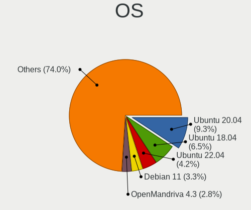

| Name                         | Desktops | Percent |
|------------------------------|----------|---------|
| Ubuntu 20.04                 | 20       | 13.16%  |
| Ubuntu 18.04                 | 14       | 9.21%   |
| Debian 11                    | 7        | 4.61%   |
| OpenMandriva 4.3             | 6        | 3.95%   |
| Linux Mint 20.2              | 6        | 3.95%   |
| Ubuntu 18.10                 | 5        | 3.29%   |
| Linux Mint 20.3              | 5        | 3.29%   |
| Zorin 16                     | 4        | 2.63%   |
| Debian 10                    | 4        | 2.63%   |
| Ubuntu MATE 22.04            | 3        | 1.97%   |
| Ubuntu 22.04                 | 3        | 1.97%   |
| Ubuntu 19.10                 | 3        | 1.97%   |
| Pop!_OS 21.10                | 3        | 1.97%   |
| openSUSE Tumbleweed-XXXXXXXX | 3        | 1.97%   |
| OpenMandriva 4.2             | 3        | 1.97%   |
| Manjaro                      | 3        | 1.97%   |
| Fedora 31                    | 3        | 1.97%   |
| Xubuntu 20.04                | 2        | 1.32%   |
| Ubuntu 21.04                 | 2        | 1.32%   |
| Pop!_OS 20.10                | 2        | 1.32%   |
| openSUSE Leap-15.2           | 2        | 1.32%   |
| OpenMandriva 4.50            | 2        | 1.32%   |
| Linux Mint 20                | 2        | 1.32%   |
| KDE neon 20.04               | 2        | 1.32%   |
| ArcoLinux Rolling            | 2        | 1.32%   |
| Zorin 15                     | 1        | 0.66%   |
| Xubuntu 18.04                | 1        | 0.66%   |
| Ubuntu Unity 18.04           | 1        | 0.66%   |
| Ubuntu MATE 20.04            | 1        | 0.66%   |
| Ubuntu MATE 19.10            | 1        | 0.66%   |
| Ubuntu Budgie 22.04          | 1        | 0.66%   |
| Ubuntu Budgie 20.04          | 1        | 0.66%   |
| Ubuntu Budgie 18.04          | 1        | 0.66%   |
| Ubuntu 22.10                 | 1        | 0.66%   |
| Ubuntu 21.10                 | 1        | 0.66%   |
| Ubuntu 20.10                 | 1        | 0.66%   |
| Ubuntu 17.10                 | 1        | 0.66%   |
| Ubuntu                       | 1        | 0.66%   |
| ROSA R11                     | 1        | 0.66%   |
| Pop!_OS 21.04                | 1        | 0.66%   |

OS Family
---------

OS without a version

| Name          | Desktops | Percent |
|---------------|----------|---------|
| Ubuntu        | 51       | 35.66%  |
| Linux Mint    | 15       | 10.49%  |
| OpenMandriva  | 12       | 8.39%   |
| Debian        | 9        | 6.29%   |
| Pop!_OS       | 8        | 5.59%   |
| Manjaro       | 7        | 4.9%    |
| Zorin         | 5        | 3.5%    |
| openSUSE      | 5        | 3.5%    |
| Fedora        | 4        | 2.8%    |
| Xubuntu       | 3        | 2.1%    |
| Ubuntu MATE   | 3        | 2.1%    |
| Ubuntu Budgie | 3        | 2.1%    |
| KDE neon      | 2        | 1.4%    |
| ArcoLinux     | 2        | 1.4%    |
| Arch          | 2        | 1.4%    |
| Ubuntu Unity  | 1        | 0.7%    |
| ROSA          | 1        | 0.7%    |
| Nobara        | 1        | 0.7%    |
| Lubuntu       | 1        | 0.7%    |
| LMDE          | 1        | 0.7%    |
| LinuxFX       | 1        | 0.7%    |
| Kubuntu       | 1        | 0.7%    |
| Gentoo        | 1        | 0.7%    |
| Endless       | 1        | 0.7%    |
| EndeavourOS   | 1        | 0.7%    |
| Elementary    | 1        | 0.7%    |
| Clear Linux   | 1        | 0.7%    |

Kernel
------

Version of the Linux kernel

| Version                  | Desktops | Percent |
|--------------------------|----------|---------|
| 5.16.7-desktop-1omv4003  | 6        | 3.59%   |
| 5.4.0-58-generic         | 4        | 2.4%    |
| 5.4.0-91-generic         | 3        | 1.8%    |
| 5.3.0-26-generic         | 3        | 1.8%    |
| 5.10.14-desktop-1omv4002 | 3        | 1.8%    |
| 5.0.0-27-generic         | 3        | 1.8%    |
| 5.8.0-48-generic         | 2        | 1.2%    |
| 5.4.0-48-generic         | 2        | 1.2%    |
| 5.4.0-42-generic         | 2        | 1.2%    |
| 5.4.0-26-generic         | 2        | 1.2%    |
| 5.4.0-100-generic        | 2        | 1.2%    |
| 5.3.0-42-generic         | 2        | 1.2%    |
| 5.3.0-28-generic         | 2        | 1.2%    |
| 5.15.0-52-generic        | 2        | 1.2%    |
| 5.15.0-48-generic        | 2        | 1.2%    |
| 5.13.0-40-generic        | 2        | 1.2%    |
| 5.12.4-desktop-1omv4050  | 2        | 1.2%    |
| 5.11.0-41-generic        | 2        | 1.2%    |
| 5.11.0-38-generic        | 2        | 1.2%    |
| 5.11.0-37-generic        | 2        | 1.2%    |
| 5.10.0-13-amd64          | 2        | 1.2%    |
| 4.19.0-14-amd64          | 2        | 1.2%    |
| 4.18.0-10-generic        | 2        | 1.2%    |
| 4.15.0-45-generic        | 2        | 1.2%    |
| 4.15.0-20-generic        | 2        | 1.2%    |
| 6.0.6-zen1-1-zen         | 1        | 0.6%    |
| 5.9.0-0.bpo.5-amd64      | 1        | 0.6%    |
| 5.8.0-59-generic         | 1        | 0.6%    |
| 5.8.0-41-generic         | 1        | 0.6%    |
| 5.8.0-40-generic         | 1        | 0.6%    |
| 5.8.0-34-generic         | 1        | 0.6%    |
| 5.7.11-100.fc31.x86_64   | 1        | 0.6%    |
| 5.7.0-0.bpo.2-amd64      | 1        | 0.6%    |
| 5.6.12-300.fc32.x86_64   | 1        | 0.6%    |
| 5.4.64-1-MANJARO         | 1        | 0.6%    |
| 5.4.20-200.fc31.x86_64   | 1        | 0.6%    |
| 5.4.2-300.fc31.x86_64    | 1        | 0.6%    |
| 5.4.18-902.native        | 1        | 0.6%    |
| 5.4.0-97-generic         | 1        | 0.6%    |
| 5.4.0-92-generic         | 1        | 0.6%    |

Kernel Family
-------------

Linux kernel without a distro release

| Version | Desktops | Percent |
|---------|----------|---------|
| 5.4.0   | 33       | 21.02%  |
| 5.11.0  | 12       | 7.64%   |
| 5.3.0   | 11       | 7.01%   |
| 4.15.0  | 10       | 6.37%   |
| 4.18.0  | 8        | 5.1%    |
| 5.13.0  | 7        | 4.46%   |
| 5.10.0  | 7        | 4.46%   |
| 5.16.7  | 6        | 3.82%   |
| 5.15.0  | 6        | 3.82%   |
| 5.8.0   | 5        | 3.18%   |
| 5.0.0   | 4        | 2.55%   |
| 5.12.4  | 3        | 1.91%   |
| 5.10.14 | 3        | 1.91%   |
| 4.19.0  | 3        | 1.91%   |
| 5.3.18  | 2        | 1.27%   |
| 5.16.11 | 2        | 1.27%   |
| 6.0.6   | 1        | 0.64%   |
| 5.9.0   | 1        | 0.64%   |
| 5.7.11  | 1        | 0.64%   |
| 5.7.0   | 1        | 0.64%   |
| 5.6.12  | 1        | 0.64%   |
| 5.4.64  | 1        | 0.64%   |
| 5.4.20  | 1        | 0.64%   |
| 5.4.2   | 1        | 0.64%   |
| 5.4.18  | 1        | 0.64%   |
| 5.3.16  | 1        | 0.64%   |
| 5.19.2  | 1        | 0.64%   |
| 5.19.13 | 1        | 0.64%   |
| 5.19.12 | 1        | 0.64%   |
| 5.19.0  | 1        | 0.64%   |
| 5.18.4  | 1        | 0.64%   |
| 5.18.14 | 1        | 0.64%   |
| 5.18.12 | 1        | 0.64%   |
| 5.17.4  | 1        | 0.64%   |
| 5.17.3  | 1        | 0.64%   |
| 5.16.18 | 1        | 0.64%   |
| 5.16.15 | 1        | 0.64%   |
| 5.15.8  | 1        | 0.64%   |
| 5.15.59 | 1        | 0.64%   |
| 5.15.53 | 1        | 0.64%   |

Kernel Major Ver.
-----------------

Linux kernel major version

| Version | Desktops | Percent |
|---------|----------|---------|
| 5.4     | 37       | 23.87%  |
| 5.3     | 14       | 9.03%   |
| 5.10    | 14       | 9.03%   |
| 5.11    | 13       | 8.39%   |
| 5.15    | 11       | 7.1%    |
| 4.15    | 10       | 6.45%   |
| 5.16    | 8        | 5.16%   |
| 4.18    | 8        | 5.16%   |
| 5.13    | 7        | 4.52%   |
| 5.8     | 5        | 3.23%   |
| 5.19    | 4        | 2.58%   |
| 5.0     | 4        | 2.58%   |
| 5.18    | 3        | 1.94%   |
| 5.12    | 3        | 1.94%   |
| 4.19    | 3        | 1.94%   |
| 5.7     | 2        | 1.29%   |
| 5.17    | 2        | 1.29%   |
| 5.14    | 2        | 1.29%   |
| 6.0     | 1        | 0.65%   |
| 5.9     | 1        | 0.65%   |
| 5.6     | 1        | 0.65%   |
| 4.14    | 1        | 0.65%   |
| 4.13    | 1        | 0.65%   |

Arch
----

OS architecture (x86_64, i586, etc.)

| Name   | Desktops | Percent |
|--------|----------|---------|
| x86_64 | 137      | 98.56%  |
| i686   | 2        | 1.44%   |

DE
--

Desktop Environment

| Name       | Desktops | Percent |
|------------|----------|---------|
| GNOME      | 56       | 39.44%  |
| KDE5       | 26       | 18.31%  |
| Unknown    | 21       | 14.79%  |
| X-Cinnamon | 9        | 6.34%   |
| XFCE       | 7        | 4.93%   |
| MATE       | 5        | 3.52%   |
| KDE        | 4        | 2.82%   |
| Cinnamon   | 3        | 2.11%   |
| Budgie     | 3        | 2.11%   |
| Unity      | 1        | 0.7%    |
| ubuntu     | 1        | 0.7%    |
| Pantheon   | 1        | 0.7%    |
| openbox    | 1        | 0.7%    |
| LXQt       | 1        | 0.7%    |
| LXDE       | 1        | 0.7%    |
| i3         | 1        | 0.7%    |
| DWM        | 1        | 0.7%    |

Display Server
--------------

X11 or Wayland

| Name    | Desktops | Percent |
|---------|----------|---------|
| X11     | 121      | 84.62%  |
| Wayland | 9        | 6.29%   |
| Unknown | 9        | 6.29%   |
| Tty     | 4        | 2.8%    |

Display Manager
---------------

SDDM, LightDM, etc.

| Name    | Desktops | Percent |
|---------|----------|---------|
| Unknown | 79       | 54.48%  |
| SDDM    | 25       | 17.24%  |
| LightDM | 15       | 10.34%  |
| GDM3    | 11       | 7.59%   |
| GDM     | 11       | 7.59%   |
| TDM     | 4        | 2.76%   |

OS Lang
-------

Language

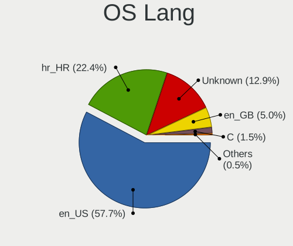

| Lang    | Desktops | Percent |
|---------|----------|---------|
| en_US   | 74       | 51.75%  |
| hr_HR   | 37       | 25.87%  |
| Unknown | 24       | 16.78%  |
| en_GB   | 6        | 4.2%    |
| C       | 2        | 1.4%    |

Boot Mode
---------

EFI or BIOS

| Mode | Desktops | Percent |
|------|----------|---------|
| BIOS | 79       | 56.83%  |
| EFI  | 60       | 43.17%  |

Filesystem
----------

Type of filesystem

| Type    | Desktops | Percent |
|---------|----------|---------|
| Ext4    | 111      | 78.17%  |
| Overlay | 13       | 9.15%   |
| Btrfs   | 10       | 7.04%   |
| Unknown | 4        | 2.82%   |
| Zfs     | 3        | 2.11%   |
| Xfs     | 1        | 0.7%    |

Part. scheme
------------

Scheme of partitioning

| Type    | Desktops | Percent |
|---------|----------|---------|
| Unknown | 84       | 59.15%  |
| GPT     | 41       | 28.87%  |
| MBR     | 17       | 11.97%  |

Dual Boot with Linux/BSD
------------------------

Hosting more than one Linux/BSD

| Dual boot | Desktops | Percent |
|-----------|----------|---------|
| No        | 113      | 77.93%  |
| Yes       | 32       | 22.07%  |

Dual Boot (Win)
---------------

Hosting Linux and Windows

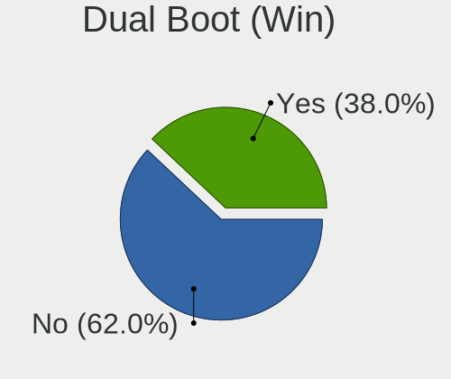

| Dual boot | Desktops | Percent |
|-----------|----------|---------|
| No        | 86       | 60.56%  |
| Yes       | 56       | 39.44%  |

Board
-----

Vendor
------

Motherboard manufacturer

| Name                | Desktops | Percent |
|---------------------|----------|---------|
| ASUSTek Computer    | 35       | 25.18%  |
| ASRock              | 35       | 25.18%  |
| Gigabyte Technology | 26       | 18.71%  |
| MSI                 | 11       | 7.91%   |
| Hewlett-Packard     | 8        | 5.76%   |
| Pegatron            | 5        | 3.6%    |
| Dell                | 5        | 3.6%    |
| Intel               | 4        | 2.88%   |
| ECS                 | 3        | 2.16%   |
| WinFast             | 1        | 0.72%   |
| Lenovo              | 1        | 0.72%   |
| Fujitsu Siemens     | 1        | 0.72%   |
| Foxconn             | 1        | 0.72%   |
| Acer                | 1        | 0.72%   |
| ABIT                | 1        | 0.72%   |
| Unknown             | 1        | 0.72%   |

Model
-----

Motherboard model

| Name                                   | Desktops | Percent |
|----------------------------------------|----------|---------|
| ASUS All Series                        | 5        | 3.6%    |
| ASUS PRIME A320M-K                     | 3        | 2.16%   |
| MSI MS-7850                            | 2        | 1.44%   |
| Gigabyte A320M-S2H                     | 2        | 1.44%   |
| ASUS P8H77-V LE                        | 2        | 1.44%   |
| ASUS M5A78L LE                         | 2        | 1.44%   |
| ASRock H61M-DGS                        | 2        | 1.44%   |
| ASRock B450M-HDV R4.0                  | 2        | 1.44%   |
| WinFast N570SM2AA                      | 1        | 0.72%   |
| Pegatron Pro 3010 Small Form Factor PC | 1        | 0.72%   |
| Pegatron HPE-520ad                     | 1        | 0.72%   |
| Pegatron G5261de                       | 1        | 0.72%   |
| Pegatron Compaq dx2400 Microtower PC   | 1        | 0.72%   |
| Pegatron 27-1001eu                     | 1        | 0.72%   |
| MSI MS-7D25                            | 1        | 0.72%   |
| MSI MS-7C02                            | 1        | 0.72%   |
| MSI MS-7B98                            | 1        | 0.72%   |
| MSI MS-7B84                            | 1        | 0.72%   |
| MSI MS-7B07                            | 1        | 0.72%   |
| MSI MS-7817                            | 1        | 0.72%   |
| MSI MS-7681                            | 1        | 0.72%   |
| MSI MS-7586                            | 1        | 0.72%   |
| MSI MS-7360                            | 1        | 0.72%   |
| Lenovo S510                            | 1        | 0.72%   |
| Intel H61M-S2PV                        | 1        | 0.72%   |
| Intel DX58SO AAE29331-501              | 1        | 0.72%   |
| Intel DH67BL AAG10189-213              | 1        | 0.72%   |
| Intel DH61CR AAG14064-204              | 1        | 0.72%   |
| HP Z840 Workstation                    | 1        | 0.72%   |
| HP Z440 Workstation                    | 1        | 0.72%   |
| HP ProOne 400 G1 AiO                   | 1        | 0.72%   |
| HP ProDesk 600 G4 PCI MT               | 1        | 0.72%   |
| HP ProDesk 600 G1 SFF                  | 1        | 0.72%   |
| HP EliteDesk 800 G1 SFF                | 1        | 0.72%   |
| HP EliteDesk 800 G1 DM                 | 1        | 0.72%   |
| HP Compaq dc7900 Small Form Factor     | 1        | 0.72%   |
| Gigabyte Z97-D3H                       | 1        | 0.72%   |
| Gigabyte Z77P-D3                       | 1        | 0.72%   |
| Gigabyte Z390 M GAMING                 | 1        | 0.72%   |
| Gigabyte Z390 AORUS PRO                | 1        | 0.72%   |

Model Family
------------

Motherboard model prefix

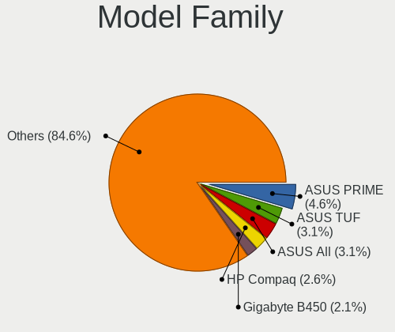

| Name               | Desktops | Percent |
|--------------------|----------|---------|
| ASUS PRIME         | 8        | 5.76%   |
| ASUS All           | 5        | 3.6%    |
| Dell Vostro        | 3        | 2.16%   |
| ASUS TUF           | 3        | 2.16%   |
| ASUS ROG           | 3        | 2.16%   |
| MSI MS-7850        | 2        | 1.44%   |
| HP ProDesk         | 2        | 1.44%   |
| HP EliteDesk       | 2        | 1.44%   |
| Gigabyte Z390      | 2        | 1.44%   |
| Gigabyte A320M-S2H | 2        | 1.44%   |
| Dell OptiPlex      | 2        | 1.44%   |
| ASUS P8H77-V       | 2        | 1.44%   |
| ASUS M5A78L        | 2        | 1.44%   |
| ASRock H97         | 2        | 1.44%   |
| ASRock H61M-DGS    | 2        | 1.44%   |
| ASRock B450M-HDV   | 2        | 1.44%   |
| ASRock A320M-HDV   | 2        | 1.44%   |
| WinFast N570SM2AA  | 1        | 0.72%   |
| Pegatron Pro       | 1        | 0.72%   |
| Pegatron HPE-520ad | 1        | 0.72%   |
| Pegatron G5261de   | 1        | 0.72%   |
| Pegatron Compaq    | 1        | 0.72%   |
| Pegatron 27-1001eu | 1        | 0.72%   |
| MSI MS-7D25        | 1        | 0.72%   |
| MSI MS-7C02        | 1        | 0.72%   |
| MSI MS-7B98        | 1        | 0.72%   |
| MSI MS-7B84        | 1        | 0.72%   |
| MSI MS-7B07        | 1        | 0.72%   |
| MSI MS-7817        | 1        | 0.72%   |
| MSI MS-7681        | 1        | 0.72%   |
| MSI MS-7586        | 1        | 0.72%   |
| MSI MS-7360        | 1        | 0.72%   |
| Lenovo S510        | 1        | 0.72%   |
| Intel H61M-S2PV    | 1        | 0.72%   |
| Intel DX58SO       | 1        | 0.72%   |
| Intel DH67BL       | 1        | 0.72%   |
| Intel DH61CR       | 1        | 0.72%   |
| HP Z840            | 1        | 0.72%   |
| HP Z440            | 1        | 0.72%   |
| HP ProOne          | 1        | 0.72%   |

MFG Year
--------

Motherboard manufacture year

| Year | Desktops | Percent |
|------|----------|---------|
| 2013 | 17       | 12.23%  |
| 2018 | 13       | 9.35%   |
| 2012 | 13       | 9.35%   |
| 2017 | 12       | 8.63%   |
| 2011 | 12       | 8.63%   |
| 2020 | 11       | 7.91%   |
| 2014 | 9        | 6.47%   |
| 2019 | 8        | 5.76%   |
| 2009 | 8        | 5.76%   |
| 2021 | 7        | 5.04%   |
| 2010 | 7        | 5.04%   |
| 2008 | 7        | 5.04%   |
| 2015 | 6        | 4.32%   |
| 2007 | 4        | 2.88%   |
| 2006 | 2        | 1.44%   |
| 2005 | 2        | 1.44%   |
| 2022 | 1        | 0.72%   |

Form Factor
-----------

Physical design of the computer

| Name    | Desktops | Percent |
|---------|----------|---------|
| Desktop | 139      | 100%    |

Secure Boot
-----------

Enabled or disabled

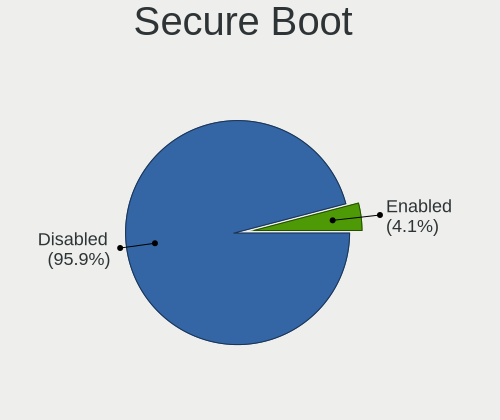

| State    | Desktops | Percent |
|----------|----------|---------|
| Disabled | 134      | 95.71%  |
| Enabled  | 6        | 4.29%   |

Coreboot
--------

Have coreboot on board

| Used | Desktops | Percent |
|------|----------|---------|
| No   | 139      | 100%    |

RAM Size
--------

Total RAM memory

| Size in GB  | Desktops | Percent |
|-------------|----------|---------|
| 8.01-16.0   | 39       | 27.27%  |
| 16.01-24.0  | 38       | 26.57%  |
| 4.01-8.0    | 25       | 17.48%  |
| 3.01-4.0    | 17       | 11.89%  |
| 32.01-64.0  | 13       | 9.09%   |
| 1.01-2.0    | 5        | 3.5%    |
| 64.01-256.0 | 3        | 2.1%    |
| 24.01-32.0  | 2        | 1.4%    |
| 2.01-3.0    | 1        | 0.7%    |

RAM Used
--------

Used RAM memory

| Used GB    | Desktops | Percent |
|------------|----------|---------|
| 1.01-2.0   | 63       | 41.18%  |
| 2.01-3.0   | 39       | 25.49%  |
| 4.01-8.0   | 21       | 13.73%  |
| 3.01-4.0   | 15       | 9.8%    |
| 0.51-1.0   | 8        | 5.23%   |
| 16.01-24.0 | 4        | 2.61%   |
| 8.01-16.0  | 2        | 1.31%   |
| 0.01-0.5   | 1        | 0.65%   |

Total Drives
------------

Number of drives on board

| Drives | Desktops | Percent |
|--------|----------|---------|
| 1      | 51       | 34.93%  |
| 2      | 46       | 31.51%  |
| 3      | 28       | 19.18%  |
| 5      | 8        | 5.48%   |
| 4      | 8        | 5.48%   |
| 0      | 2        | 1.37%   |
| 8      | 1        | 0.68%   |
| 7      | 1        | 0.68%   |
| 6      | 1        | 0.68%   |

Has CD-ROM
----------

Has CD-ROM on board

| Presented | Desktops | Percent |
|-----------|----------|---------|
| No        | 71       | 50.71%  |
| Yes       | 69       | 49.29%  |

Has Ethernet
------------

Has Ethernet on board

| Presented | Desktops | Percent |
|-----------|----------|---------|
| Yes       | 136      | 97.84%  |
| No        | 3        | 2.16%   |

Has WiFi
--------

Has WiFi module

| Presented | Desktops | Percent |
|-----------|----------|---------|
| No        | 91       | 65%     |
| Yes       | 49       | 35%     |

Has Bluetooth
-------------

Has Bluetooth module

| Presented | Desktops | Percent |
|-----------|----------|---------|
| No        | 113      | 80.71%  |
| Yes       | 27       | 19.29%  |

Location
--------

Country
-------

Geographic location (country)

| Country | Desktops | Percent |
|---------|----------|---------|
| Croatia | 139      | 100%    |

City
----

Geographic location (city)

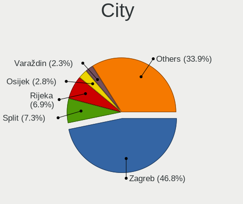

| City            | Desktops | Percent |
|-----------------|----------|---------|
| Zagreb          | 77       | 50.33%  |
| Split           | 11       | 7.19%   |
| Rijeka          | 7        | 4.58%   |
| Velika Gorica   | 3        | 1.96%   |
| Varadin       | 3        | 1.96%   |
| Samobor         | 3        | 1.96%   |
| Osijek          | 3        | 1.96%   |
| Koprivnica      | 3        | 1.96%   |
| Zaprei      | 2        | 1.31%   |
| Virovitica      | 2        | 1.31%   |
| Pula            | 2        | 1.31%   |
| Pitomaca        | 2        | 1.31%   |
| Ivanja Reka     | 2        | 1.31%   |
| GJurgevac       | 2        | 1.31%   |
| Bjelovar        | 2        | 1.31%   |
| Zadar           | 1        | 0.65%   |
| Visnjevac       | 1        | 0.65%   |
| Supetar         | 1        | 0.65%   |
| Stari Perkovci  | 1        | 0.65%   |
| Slatina         | 1        | 0.65%   |
| Skrad           | 1        | 0.65%   |
| Sisak           | 1        | 0.65%   |
| Sesvete         | 1        | 0.65%   |
| Raslina         | 1        | 0.65%   |
| Prelog          | 1        | 0.65%   |
| Postira         | 1        | 0.65%   |
| Novi Marof      | 1        | 0.65%   |
| Matulji         | 1        | 0.65%   |
| Mali Loinj    | 1        | 0.65%   |
| Mahicno         | 1        | 0.65%   |
| Lovran          | 1        | 0.65%   |
| Labin           | 1        | 0.65%   |
| Kuan Marof    | 1        | 0.65%   |
| Krizevci        | 1        | 0.65%   |
| Krapina         | 1        | 0.65%   |
| Kastel Gomilica | 1        | 0.65%   |
| Hvar            | 1        | 0.65%   |
| Grad            | 1        | 0.65%   |
| Galgovo         | 1        | 0.65%   |
| Dubrovnik       | 1        | 0.65%   |

Drives
------

Drive Vendor
------------

Hard drive vendors

| Vendor              | Desktops | Drives | Percent |
|---------------------|----------|--------|---------|
| WDC                 | 65       | 116    | 25.49%  |
| Samsung Electronics | 31       | 49     | 12.16%  |
| Kingston            | 31       | 44     | 12.16%  |
| Seagate             | 26       | 40     | 10.2%   |
| Toshiba             | 21       | 28     | 8.24%   |
| Crucial             | 13       | 16     | 5.1%    |
| Intel               | 10       | 11     | 3.92%   |
| A-DATA Technology   | 10       | 13     | 3.92%   |
| Patriot             | 5        | 8      | 1.96%   |
| Hitachi             | 5        | 7      | 1.96%   |
| SanDisk             | 4        | 6      | 1.57%   |
| Transcend           | 3        | 5      | 1.18%   |
| Silicon Motion      | 3        | 4      | 1.18%   |
| Phison              | 3        | 3      | 1.18%   |
| OCZ                 | 2        | 3      | 0.78%   |
| Maxtor              | 2        | 2      | 0.78%   |
| Gigabyte Technology | 2        | 2      | 0.78%   |
| Corsair             | 2        | 2      | 0.78%   |
| XPG                 | 1        | 3      | 0.39%   |
| TO Exter            | 1        | 1      | 0.39%   |
| SK hynix            | 1        | 1      | 0.39%   |
| PNY                 | 1        | 1      | 0.39%   |
| Netac               | 1        | 1      | 0.39%   |
| Mushkin             | 1        | 2      | 0.39%   |
| Min Yi U            | 1        | 1      | 0.39%   |
| Micron Technology   | 1        | 1      | 0.39%   |
| KingSpec            | 1        | 1      | 0.39%   |
| Kingmax             | 1        | 1      | 0.39%   |
| HPE                 | 1        | 2      | 0.39%   |
| HGST HTS            | 1        | 1      | 0.39%   |
| HGST                | 1        | 1      | 0.39%   |
| Goodram             | 1        | 1      | 0.39%   |
| External            | 1        | 1      | 0.39%   |
| ASMedia             | 1        | 1      | 0.39%   |
| AMD                 | 1        | 2      | 0.39%   |

Drive Model
-----------

Hard drive models

| Model                             | Desktops | Percent |
|-----------------------------------|----------|---------|
| Kingston SV300S37A120G 120GB SSD  | 5        | 1.7%    |
| Kingston SA400S37480G 480GB SSD   | 5        | 1.7%    |
| WDC WD10EZEX-08WN4A0 1TB          | 4        | 1.36%   |
| Toshiba HDWD130 3TB               | 4        | 1.36%   |
| Toshiba HDWD110 1TB               | 4        | 1.36%   |
| Samsung SSD 850 EVO 250GB         | 4        | 1.36%   |
| Kingston SA400S37240G 240GB SSD   | 4        | 1.36%   |
| Kingston SA400S37120G 120GB SSD   | 4        | 1.36%   |
| WDC WD5000AAKX-001CA0 500GB       | 3        | 1.02%   |
| Toshiba DT01ACA100 1TB            | 3        | 1.02%   |
| Seagate ST1000DM010-2EP102 1TB    | 3        | 1.02%   |
| Samsung SSD 970 EVO Plus 1TB      | 3        | 1.02%   |
| Samsung HD103SI 1TB               | 3        | 1.02%   |
| Patriot Burst 240GB SSD           | 3        | 1.02%   |
| Intel SSDSC2BW120A4 120GB         | 3        | 1.02%   |
| WDC WDS240G2G0A-00JH30 240GB SSD  | 2        | 0.68%   |
| WDC WD6400AAKS-22A7B0 640GB       | 2        | 0.68%   |
| WDC WD5000AAKX-60U6AA0 500GB      | 2        | 0.68%   |
| WDC WD5000AAKX-22ERMA0 500GB      | 2        | 0.68%   |
| WDC WD3200AAKS-00L9A0 320GB       | 2        | 0.68%   |
| WDC WD30EZRX-00AZ6B0 3TB          | 2        | 0.68%   |
| WDC WD30EFRX-68EUZN0 3TB          | 2        | 0.68%   |
| WDC WD20EZRZ-00Z5HB0 2TB          | 2        | 0.68%   |
| WDC WD20EFRX-68EUZN0 2TB          | 2        | 0.68%   |
| WDC WD1600AAJS-07M0A0 160GB       | 2        | 0.68%   |
| Toshiba HDWD120 2TB               | 2        | 0.68%   |
| Toshiba DT01ACA300 3TB            | 2        | 0.68%   |
| Seagate ST31000528AS 1TB          | 2        | 0.68%   |
| Seagate ST31000524AS 1TB          | 2        | 0.68%   |
| Seagate ST2000DM008-2FR102 2TB    | 2        | 0.68%   |
| Seagate ST10000DM0004-1ZC101 10TB | 2        | 0.68%   |
| SanDisk SDSSDA240G 240GB          | 2        | 0.68%   |
| Samsung SSD 860 QVO 1TB           | 2        | 0.68%   |
| Samsung SSD 860 PRO 256GB         | 2        | 0.68%   |
| Samsung SSD 860 EVO 250GB         | 2        | 0.68%   |
| Samsung NVMe SSD Drive 500GB      | 2        | 0.68%   |
| Samsung NVMe SSD Drive 1TB        | 2        | 0.68%   |
| Samsung HD256GJ 250GB             | 2        | 0.68%   |
| Kingston SV300S37A60G 64GB SSD    | 2        | 0.68%   |
| Kingston SUV400S37240G 240GB SSD  | 2        | 0.68%   |

HDD Vendor
----------

Hard disk drive vendors

| Vendor              | Desktops | Drives | Percent |
|---------------------|----------|--------|---------|
| WDC                 | 63       | 107    | 50.4%   |
| Seagate             | 26       | 40     | 20.8%   |
| Toshiba             | 20       | 27     | 16%     |
| Samsung Electronics | 7        | 9      | 5.6%    |
| Hitachi             | 5        | 7      | 4%      |
| Maxtor              | 2        | 2      | 1.6%    |
| HGST HTS            | 1        | 1      | 0.8%    |
| HGST                | 1        | 1      | 0.8%    |

SSD Vendor
----------

Solid state drive vendors

| Vendor              | Desktops | Drives | Percent |
|---------------------|----------|--------|---------|
| Kingston            | 28       | 38     | 28.57%  |
| Samsung Electronics | 15       | 23     | 15.31%  |
| Crucial             | 12       | 14     | 12.24%  |
| Intel               | 8        | 9      | 8.16%   |
| A-DATA Technology   | 8        | 10     | 8.16%   |
| Patriot             | 4        | 7      | 4.08%   |
| WDC                 | 2        | 2      | 2.04%   |
| Transcend           | 2        | 2      | 2.04%   |
| SanDisk             | 2        | 3      | 2.04%   |
| OCZ                 | 2        | 3      | 2.04%   |
| Gigabyte Technology | 2        | 2      | 2.04%   |
| Toshiba             | 1        | 1      | 1.02%   |
| TO Exter            | 1        | 1      | 1.02%   |
| SK hynix            | 1        | 1      | 1.02%   |
| PNY                 | 1        | 1      | 1.02%   |
| Netac               | 1        | 1      | 1.02%   |
| Mushkin             | 1        | 2      | 1.02%   |
| Min Yi U            | 1        | 1      | 1.02%   |
| KingSpec            | 1        | 1      | 1.02%   |
| Kingmax             | 1        | 1      | 1.02%   |
| Goodram             | 1        | 1      | 1.02%   |
| Corsair             | 1        | 1      | 1.02%   |
| ASMedia             | 1        | 1      | 1.02%   |
| AMD                 | 1        | 2      | 1.02%   |

Drive Kind
----------

HDD or SSD

| Kind    | Desktops | Drives | Percent |
|---------|----------|--------|---------|
| HDD     | 99       | 194    | 46.48%  |
| SSD     | 79       | 128    | 37.09%  |
| NVMe    | 34       | 57     | 15.96%  |
| Unknown | 1        | 2      | 0.47%   |

Drive Connector
---------------

SATA, SAS, NVMe, etc.

| Type | Desktops | Drives | Percent |
|------|----------|--------|---------|
| SATA | 124      | 318    | 76.07%  |
| NVMe | 33       | 56     | 20.25%  |
| SAS  | 6        | 7      | 3.68%   |

Drive Size
----------

Size of hard drive

| Size in TB | Desktops | Drives | Percent |
|------------|----------|--------|---------|
| 0.01-0.5   | 100      | 187    | 53.76%  |
| 0.51-1.0   | 51       | 80     | 27.42%  |
| 1.01-2.0   | 15       | 23     | 8.06%   |
| 2.01-3.0   | 12       | 23     | 6.45%   |
| 3.01-4.0   | 6        | 6      | 3.23%   |
| 4.01-10.0  | 2        | 3      | 1.08%   |

Space Total
-----------

Amount of disk space available on the file system

| Size in GB     | Desktops | Percent |
|----------------|----------|---------|
| 101-250        | 45       | 30%     |
| 251-500        | 23       | 15.33%  |
| 501-1000       | 22       | 14.67%  |
| 1001-2000      | 17       | 11.33%  |
| More than 3000 | 10       | 6.67%   |
| 1-20           | 10       | 6.67%   |
| 51-100         | 9        | 6%      |
| 2001-3000      | 6        | 4%      |
| Unknown        | 6        | 4%      |
| 21-50          | 2        | 1.33%   |

Space Used
----------

Amount of used disk space

| Used GB        | Desktops | Percent |
|----------------|----------|---------|
| 1-20           | 69       | 44.23%  |
| 21-50          | 16       | 10.26%  |
| 251-500        | 14       | 8.97%   |
| 501-1000       | 13       | 8.33%   |
| 51-100         | 12       | 7.69%   |
| 101-250        | 10       | 6.41%   |
| 1001-2000      | 8        | 5.13%   |
| Unknown        | 6        | 3.85%   |
| 2001-3000      | 5        | 3.21%   |
| More than 3000 | 3        | 1.92%   |

Malfunc. Drives
---------------

Drive models with a malfunction

| Model                              | Desktops | Drives | Percent |
|------------------------------------|----------|--------|---------|
| WDC WD6400AAKS-07A7B0 640GB        | 1        | 1      | 5.26%   |
| WDC WD5000AAKX-221CA1 500GB        | 1        | 1      | 5.26%   |
| WDC WD3200AAKS-00L9A0 320GB        | 1        | 1      | 5.26%   |
| WDC WD2500AAKX-75U6AA0 250GB       | 1        | 1      | 5.26%   |
| WDC WD10EZEX-00MFCA0 1TB           | 1        | 1      | 5.26%   |
| Transcend TS480GSSD220S 480GB      | 1        | 1      | 5.26%   |
| Toshiba DT01ACA100 1TB             | 1        | 1      | 5.26%   |
| SK hynix SH920 2.5 7MM 256GB SSD   | 1        | 1      | 5.26%   |
| Seagate ST500DM002-1BD142 500GB    | 1        | 1      | 5.26%   |
| Seagate ST31500341AS 1TB           | 1        | 1      | 5.26%   |
| Seagate ST1000LM024 HN-M101MBB 1TB | 1        | 3      | 5.26%   |
| SanDisk SDSSDA240G 240GB           | 1        | 1      | 5.26%   |
| Kingston SHFS37A120G 120GB SSD     | 1        | 1      | 5.26%   |
| Intel SSDSC2BW180A4 180GB          | 1        | 1      | 5.26%   |
| Intel SSDSC2BW120A4 120GB          | 1        | 1      | 5.26%   |
| Hitachi HDS723020BLA642 2TB        | 1        | 1      | 5.26%   |
| Crucial CT525MX300SSD1 528GB       | 1        | 1      | 5.26%   |
| Crucial CT120BX500SSD1 120GB       | 1        | 1      | 5.26%   |
| A-DATA Technology SP900 64GB SSD   | 1        | 1      | 5.26%   |

Malfunc. Drive Vendor
---------------------

Vendors of faulty drives

| Vendor            | Desktops | Drives | Percent |
|-------------------|----------|--------|---------|
| WDC               | 5        | 5      | 26.32%  |
| Seagate           | 3        | 5      | 15.79%  |
| Intel             | 2        | 2      | 10.53%  |
| Crucial           | 2        | 2      | 10.53%  |
| Transcend         | 1        | 1      | 5.26%   |
| Toshiba           | 1        | 1      | 5.26%   |
| SK hynix          | 1        | 1      | 5.26%   |
| SanDisk           | 1        | 1      | 5.26%   |
| Kingston          | 1        | 1      | 5.26%   |
| Hitachi           | 1        | 1      | 5.26%   |
| A-DATA Technology | 1        | 1      | 5.26%   |

Malfunc. HDD Vendor
-------------------

Vendors of faulty HDD drives

| Vendor  | Desktops | Drives | Percent |
|---------|----------|--------|---------|
| WDC     | 5        | 5      | 50%     |
| Seagate | 3        | 5      | 30%     |
| Toshiba | 1        | 1      | 10%     |
| Hitachi | 1        | 1      | 10%     |

Malfunc. Drive Kind
-------------------

Kinds of faulty drives

| Kind | Desktops | Drives | Percent |
|------|----------|--------|---------|
| HDD  | 10       | 12     | 52.63%  |
| SSD  | 9        | 9      | 47.37%  |

Failed Drives
-------------

Failed drive models

Zero info for selected period =(

Failed Drive Vendor
-------------------

Failed drive vendors

Zero info for selected period =(

Drive Status
------------

Number of failed and malfunc. drives

| Status   | Desktops | Drives | Percent |
|----------|----------|--------|---------|
| Detected | 87       | 232    | 56.13%  |
| Works    | 52       | 128    | 33.55%  |
| Malfunc  | 16       | 21     | 10.32%  |

Storage controller
------------------

Storage Vendor
--------------

Storage controller vendors

| Vendor                      | Desktops | Percent |
|-----------------------------|----------|---------|
| Intel                       | 87       | 46.77%  |
| AMD                         | 46       | 24.73%  |
| Samsung Electronics         | 12       | 6.45%   |
| Phison Electronics          | 5        | 2.69%   |
| Kingston Technology Company | 5        | 2.69%   |
| JMicron Technology          | 5        | 2.69%   |
| Nvidia                      | 4        | 2.15%   |
| ASMedia Technology          | 4        | 2.15%   |
| Silicon Motion              | 3        | 1.61%   |
| SanDisk                     | 3        | 1.61%   |
| Marvell Technology Group    | 3        | 1.61%   |
| ADATA Technology            | 3        | 1.61%   |
| VIA Technologies            | 1        | 0.54%   |
| Transcend                   | 1        | 0.54%   |
| Micron/Crucial Technology   | 1        | 0.54%   |
| Micron Technology           | 1        | 0.54%   |
| Broadcom / LSI              | 1        | 0.54%   |
| Adaptec                     | 1        | 0.54%   |

Storage Model
-------------

Storage controller models

| Model                                                                                   | Desktops | Percent |
|-----------------------------------------------------------------------------------------|----------|---------|
| AMD FCH SATA Controller [AHCI mode]                                                     | 24       | 9.72%   |
| Intel 8 Series/C220 Series Chipset Family 6-port SATA Controller 1 [AHCI mode]          | 16       | 6.48%   |
| AMD SB7x0/SB8x0/SB9x0 IDE Controller                                                    | 11       | 4.45%   |
| AMD FCH SATA Controller D                                                               | 10       | 4.05%   |
| Samsung NVMe SSD Controller SM981/PM981/PM983                                           | 8        | 3.24%   |
| Intel 6 Series/C200 Series Chipset Family 6 port Desktop SATA AHCI Controller           | 8        | 3.24%   |
| AMD SB7x0/SB8x0/SB9x0 SATA Controller [IDE mode]                                        | 8        | 3.24%   |
| Intel NM10/ICH7 Family SATA Controller [IDE mode]                                       | 7        | 2.83%   |
| Intel 9 Series Chipset Family SATA Controller [AHCI Mode]                               | 6        | 2.43%   |
| Intel Cannon Lake PCH SATA AHCI Controller                                              | 5        | 2.02%   |
| Intel 6 Series/C200 Series Chipset Family Desktop SATA Controller (IDE mode, ports 4-5) | 5        | 2.02%   |
| AMD SB7x0/SB8x0/SB9x0 SATA Controller [AHCI mode]                                       | 5        | 2.02%   |
| AMD 400 Series Chipset SATA Controller                                                  | 5        | 2.02%   |
| JMicron JMB363 SATA/IDE Controller                                                      | 4        | 1.62%   |
| Intel Q170/Q150/B150/H170/H110/Z170/CM236 Chipset SATA Controller [AHCI Mode]           | 4        | 1.62%   |
| Intel 82801I (ICH9 Family) 2 port SATA Controller [IDE mode]                            | 4        | 1.62%   |
| Intel 82801G (ICH7 Family) IDE Controller                                               | 4        | 1.62%   |
| Intel 6 Series/C200 Series Chipset Family Desktop SATA Controller (IDE mode, ports 0-3) | 4        | 1.62%   |
| Intel 500 Series Chipset Family SATA AHCI Controller                                    | 4        | 1.62%   |
| Intel 400 Series Chipset Family SATA AHCI Controller                                    | 4        | 1.62%   |
| Intel 200 Series PCH SATA controller [AHCI mode]                                        | 4        | 1.62%   |
| ASMedia ASM1062 Serial ATA Controller                                                   | 4        | 1.62%   |
| AMD FCH IDE Controller                                                                  | 4        | 1.62%   |
| Kingston Company A2000 NVMe SSD                                                         | 3        | 1.21%   |
| AMD 500 Series Chipset SATA Controller                                                  | 3        | 1.21%   |
| ADATA XPG SX8200 Pro PCIe Gen3x4 M.2 2280 Solid State Drive                             | 3        | 1.21%   |
| Silicon Motion SM2263EN/SM2263XT SSD Controller                                         | 2        | 0.81%   |
| SanDisk WD Black 2018/SN750 / PC SN720 NVMe SSD                                         | 2        | 0.81%   |
| Samsung NVMe SSD Controller PM9A1/PM9A3/980PRO                                          | 2        | 0.81%   |
| Phison PS5013 E13 NVMe Controller                                                       | 2        | 0.81%   |
| Nvidia MCP61 SATA Controller                                                            | 2        | 0.81%   |
| Marvell Group 88SE6111/6121 SATA II / PATA Controller                                   | 2        | 0.81%   |
| Intel SSD 600P Series                                                                   | 2        | 0.81%   |
| Intel Comet Lake SATA AHCI Controller                                                   | 2        | 0.81%   |
| Intel 82801JI (ICH10 Family) 4 port SATA IDE Controller #1                              | 2        | 0.81%   |
| Intel 82801JI (ICH10 Family) 2 port SATA IDE Controller #2                              | 2        | 0.81%   |
| Intel 82801IR/IO/IH (ICH9R/DO/DH) 4 port SATA Controller [IDE mode]                     | 2        | 0.81%   |
| Intel 82801IB (ICH9) 2 port SATA Controller [IDE mode]                                  | 2        | 0.81%   |
| Intel 7 Series/C210 Series Chipset Family 6-port SATA Controller [AHCI mode]            | 2        | 0.81%   |
| Intel 7 Series/C210 Series Chipset Family 4-port SATA Controller [IDE mode]             | 2        | 0.81%   |

Storage Kind
------------

Kind of storage controller (IDE, SATA, NVMe, SAS, ...)

| Kind | Desktops | Percent |
|------|----------|---------|
| SATA | 107      | 55.73%  |
| IDE  | 46       | 23.96%  |
| NVMe | 34       | 17.71%  |
| RAID | 4        | 2.08%   |
| SAS  | 1        | 0.52%   |

Processor
---------

CPU Vendor
----------

Processor vendors

| Vendor | Desktops | Percent |
|--------|----------|---------|
| Intel  | 87       | 62.59%  |
| AMD    | 52       | 37.41%  |

CPU Model
---------

Processor models

| Model                                       | Desktops | Percent |
|---------------------------------------------|----------|---------|
| AMD Ryzen 5 1600 Six-Core Processor         | 5        | 3.52%   |
| Intel Core i7-4790 CPU @ 3.60GHz            | 3        | 2.11%   |
| Intel Core i7-4770 CPU @ 3.40GHz            | 3        | 2.11%   |
| Intel Core i5-9400F CPU @ 2.90GHz           | 3        | 2.11%   |
| Intel Core i5-2400 CPU @ 3.10GHz            | 3        | 2.11%   |
| Intel Core i3-10100F CPU @ 3.60GHz          | 3        | 2.11%   |
| Intel Core 2 Duo CPU E8400 @ 3.00GHz        | 3        | 2.11%   |
| Intel Pentium Dual-Core CPU E5400 @ 2.70GHz | 2        | 1.41%   |
| Intel Pentium 4 CPU 3.00GHz                 | 2        | 1.41%   |
| Intel Core i7-4771 CPU @ 3.50GHz            | 2        | 1.41%   |
| Intel Core i5-6400 CPU @ 2.70GHz            | 2        | 1.41%   |
| Intel Core i5-4570 CPU @ 3.20GHz            | 2        | 1.41%   |
| Intel Core i5-4460 CPU @ 3.20GHz            | 2        | 1.41%   |
| Intel Core i5-2500K CPU @ 3.30GHz           | 2        | 1.41%   |
| Intel Core i5-2300 CPU @ 2.80GHz            | 2        | 1.41%   |
| Intel Core i3-4130 CPU @ 3.40GHz            | 2        | 1.41%   |
| Intel Core i3-2100 CPU @ 3.10GHz            | 2        | 1.41%   |
| Intel Core i3-10100 CPU @ 3.60GHz           | 2        | 1.41%   |
| Intel Core 2 Duo CPU E4500 @ 2.20GHz        | 2        | 1.41%   |
| AMD Ryzen 9 5900X 12-Core Processor         | 2        | 1.41%   |
| AMD Ryzen 7 2700X Eight-Core Processor      | 2        | 1.41%   |
| AMD Ryzen 3 2200G with Radeon Vega Graphics | 2        | 1.41%   |
| AMD Ryzen 3 1200 Quad-Core Processor        | 2        | 1.41%   |
| AMD Phenom II X4 965 Processor              | 2        | 1.41%   |
| AMD FX-6300 Six-Core Processor              | 2        | 1.41%   |
| AMD Athlon X4 740 Quad Core Processor       | 2        | 1.41%   |
| AMD Athlon 64 X2 Dual Core Processor 6400+  | 2        | 1.41%   |
| Intel Xeon CPU E5-2670 v3 @ 2.30GHz         | 1        | 0.7%    |
| Intel Xeon CPU E5-1603 v3 @ 2.80GHz         | 1        | 0.7%    |
| Intel Xeon CPU E3-1230 v3 @ 3.30GHz         | 1        | 0.7%    |
| Intel Pentium Dual CPU E2200 @ 2.20GHz      | 1        | 0.7%    |
| Intel Pentium CPU G620 @ 2.60GHz            | 1        | 0.7%    |
| Intel Pentium CPU G4560T @ 2.90GHz          | 1        | 0.7%    |
| Intel Pentium CPU G4400 @ 3.30GHz           | 1        | 0.7%    |
| Intel Pentium CPU G3250 @ 3.20GHz           | 1        | 0.7%    |
| Intel Core i9-9900K CPU @ 3.60GHz           | 1        | 0.7%    |
| Intel Core i9-10900K CPU @ 3.70GHz          | 1        | 0.7%    |
| Intel Core i7-9700 CPU @ 3.00GHz            | 1        | 0.7%    |
| Intel Core i7-8700 CPU @ 3.20GHz            | 1        | 0.7%    |
| Intel Core i7-3770 CPU @ 3.40GHz            | 1        | 0.7%    |

CPU Model Family
----------------

Processor model prefix

| Model                   | Desktops | Percent |
|-------------------------|----------|---------|
| Intel Core i5           | 29       | 20.42%  |
| Intel Core i3           | 17       | 11.97%  |
| Intel Core i7           | 13       | 9.15%   |
| AMD Ryzen 5             | 11       | 7.75%   |
| Intel Core 2 Duo        | 7        | 4.93%   |
| AMD FX                  | 5        | 3.52%   |
| Other                   | 4        | 2.82%   |
| Intel Pentium           | 4        | 2.82%   |
| AMD Ryzen 9             | 4        | 2.82%   |
| AMD Ryzen 3             | 4        | 2.82%   |
| AMD Athlon II X4        | 4        | 2.82%   |
| Intel Xeon              | 3        | 2.11%   |
| AMD Ryzen 7             | 3        | 2.11%   |
| AMD Phenom II X4        | 3        | 2.11%   |
| AMD Athlon X4           | 3        | 2.11%   |
| AMD Athlon 64 X2        | 3        | 2.11%   |
| Intel Pentium Dual-Core | 2        | 1.41%   |
| Intel Pentium 4         | 2        | 1.41%   |
| Intel Core i9           | 2        | 1.41%   |
| Intel Core 2 Quad       | 2        | 1.41%   |
| Intel Core 2            | 2        | 1.41%   |
| AMD A8                  | 2        | 1.41%   |
| Intel Pentium Dual      | 1        | 0.7%    |
| Intel Celeron           | 1        | 0.7%    |
| AMD Ryzen Threadripper  | 1        | 0.7%    |
| AMD Ryzen 7 PRO         | 1        | 0.7%    |
| AMD Ryzen 5 PRO         | 1        | 0.7%    |
| AMD Ryzen 3 PRO         | 1        | 0.7%    |
| AMD Phenom II X6        | 1        | 0.7%    |
| AMD Phenom II X2        | 1        | 0.7%    |
| AMD Phenom              | 1        | 0.7%    |
| AMD E                   | 1        | 0.7%    |
| AMD Athlon 64           | 1        | 0.7%    |
| AMD Athlon              | 1        | 0.7%    |
| AMD A6                  | 1        | 0.7%    |

CPU Cores
---------

Number of processor cores

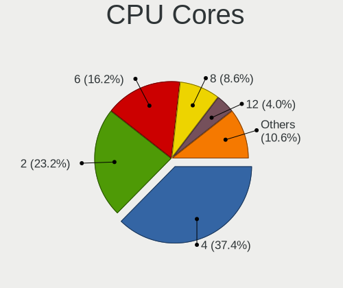

| Number | Desktops | Percent |
|--------|----------|---------|
| 4      | 62       | 43.66%  |
| 2      | 39       | 27.46%  |
| 6      | 18       | 12.68%  |
| 8      | 8        | 5.63%   |
| 1      | 4        | 2.82%   |
| 12     | 3        | 2.11%   |
| 3      | 3        | 2.11%   |
| 16     | 2        | 1.41%   |
| 10     | 2        | 1.41%   |
| 24     | 1        | 0.7%    |

CPU Sockets
-----------

Number of sockets

| Number | Desktops | Percent |
|--------|----------|---------|
| 1      | 138      | 99.28%  |
| 2      | 1        | 0.72%   |

CPU Threads
-----------

Threads per core (Hyper-Threading)

| Number | Desktops | Percent |
|--------|----------|---------|
| 2      | 72       | 51.43%  |
| 1      | 68       | 48.57%  |

CPU Op-Modes
------------

CPU Operation Modes (32-bit, 64-bit)

| Op mode        | Desktops | Percent |
|----------------|----------|---------|
| 32-bit, 64-bit | 137      | 98.56%  |
| Unknown        | 2        | 1.44%   |

CPU Microcode
-------------

Microcode number

| Number     | Desktops | Percent |
|------------|----------|---------|
| Unknown    | 26       | 17.81%  |
| 0x306c3    | 21       | 14.38%  |
| 0x206a7    | 11       | 7.53%   |
| 0x1067a    | 7        | 4.79%   |
| 0xa0653    | 5        | 3.42%   |
| 0x906ea    | 5        | 3.42%   |
| 0x0800820d | 5        | 3.42%   |
| 0x010000db | 4        | 2.74%   |
| 0x010000c8 | 4        | 2.74%   |
| 0xa0671    | 3        | 2.05%   |
| 0x6fd      | 3        | 2.05%   |
| 0x506e3    | 3        | 2.05%   |
| 0x306a9    | 3        | 2.05%   |
| 0x06001119 | 3        | 2.05%   |
| 0xf43      | 2        | 1.37%   |
| 0xa0655    | 2        | 1.37%   |
| 0x906ed    | 2        | 1.37%   |
| 0x906eb    | 2        | 1.37%   |
| 0x906e9    | 2        | 1.37%   |
| 0x6fb      | 2        | 1.37%   |
| 0x306f2    | 2        | 1.37%   |
| 0x08701021 | 2        | 1.37%   |
| 0x08600106 | 2        | 1.37%   |
| 0x0810100b | 2        | 1.37%   |
| 0x08001137 | 2        | 1.37%   |
| 0x06000852 | 2        | 1.37%   |
| 0x0600063e | 2        | 1.37%   |
| 0x90672    | 1        | 0.68%   |
| 0x6f6      | 1        | 0.68%   |
| 0x20655    | 1        | 0.68%   |
| 0x106a4    | 1        | 0.68%   |
| 0x0a601203 | 1        | 0.68%   |
| 0x0a50000d | 1        | 0.68%   |
| 0x0a201009 | 1        | 0.68%   |
| 0x0a201005 | 1        | 0.68%   |
| 0x08701013 | 1        | 0.68%   |
| 0x08600103 | 1        | 0.68%   |
| 0x08108109 | 1        | 0.68%   |
| 0x08108102 | 1        | 0.68%   |
| 0x08001138 | 1        | 0.68%   |

CPU Microarch
-------------

Microarchitecture

| Name             | Desktops | Percent |
|------------------|----------|---------|
| Haswell          | 26       | 18.57%  |
| SandyBridge      | 12       | 8.57%   |
| KabyLake         | 10       | 7.14%   |
| Zen+             | 9        | 6.43%   |
| K10              | 9        | 6.43%   |
| Zen              | 8        | 5.71%   |
| Piledriver       | 8        | 5.71%   |
| CometLake        | 8        | 5.71%   |
| Penryn           | 7        | 5%      |
| Core             | 7        | 5%      |
| Zen 2            | 6        | 4.29%   |
| Skylake          | 4        | 2.86%   |
| K8 Hammer        | 4        | 2.86%   |
| IvyBridge        | 4        | 2.86%   |
| Zen 3            | 3        | 2.14%   |
| Unknown          | 3        | 2.14%   |
| Westmere         | 2        | 1.43%   |
| NetBurst         | 2        | 1.43%   |
| Icelake          | 2        | 1.43%   |
| Bulldozer        | 2        | 1.43%   |
| Nehalem          | 1        | 0.71%   |
| Excavator        | 1        | 0.71%   |
| Bobcat           | 1        | 0.71%   |
| Alderlake Hybrid | 1        | 0.71%   |

Graphics
--------

GPU Vendor
----------

Vendors of graphics cards

| Vendor           | Desktops | Percent |
|------------------|----------|---------|
| Nvidia           | 58       | 37.66%  |
| AMD              | 55       | 35.71%  |
| Intel            | 40       | 25.97%  |
| ATI Technologies | 1        | 0.65%   |

GPU Model
---------

Graphics card models

| Model                                                                       | Desktops | Percent |
|-----------------------------------------------------------------------------|----------|---------|
| Intel Xeon E3-1200 v3/4th Gen Core Processor Integrated Graphics Controller | 11       | 7.05%   |
| AMD Ellesmere [Radeon RX 470/480/570/570X/580/580X/590]                     | 8        | 5.13%   |
| Nvidia GP106 [GeForce GTX 1060 6GB]                                         | 6        | 3.85%   |
| Intel CometLake-S GT2 [UHD Graphics 630]                                    | 5        | 3.21%   |
| Nvidia GP107 [GeForce GTX 1050]                                             | 4        | 2.56%   |
| Intel 4th Generation Core Processor Family Integrated Graphics Controller   | 4        | 2.56%   |
| Nvidia TU117 [GeForce GTX 1650]                                             | 3        | 1.92%   |
| Nvidia GP108 [GeForce GT 1030]                                              | 3        | 1.92%   |
| Nvidia GP107 [GeForce GTX 1050 Ti]                                          | 3        | 1.92%   |
| Nvidia GP106 [GeForce GTX 1060 3GB]                                         | 3        | 1.92%   |
| Intel CoffeeLake-S GT2 [UHD Graphics 630]                                   | 3        | 1.92%   |
| Intel 2nd Generation Core Processor Family Integrated Graphics Controller   | 3        | 1.92%   |
| AMD RV730 PRO [Radeon HD 4650]                                              | 3        | 1.92%   |
| AMD Renoir                                                                  | 3        | 1.92%   |
| AMD Cedar [Radeon HD 5000/6000/7350/8350 Series]                            | 3        | 1.92%   |
| Nvidia TU116 [GeForce GTX 1660 Ti]                                          | 2        | 1.28%   |
| Nvidia GM206 [GeForce GTX 960]                                              | 2        | 1.28%   |
| Nvidia GM206 [GeForce GTX 950]                                              | 2        | 1.28%   |
| Nvidia GM107GL [Quadro K620]                                                | 2        | 1.28%   |
| Nvidia GM107 [GeForce GTX 750 Ti]                                           | 2        | 1.28%   |
| Nvidia GK208B [GeForce GT 710]                                              | 2        | 1.28%   |
| Nvidia GK106 [GeForce GTX 660]                                              | 2        | 1.28%   |
| Nvidia GF119 [GeForce GT 610]                                               | 2        | 1.28%   |
| Intel RocketLake-S GT1 [UHD Graphics 750]                                   | 2        | 1.28%   |
| Intel HD Graphics 530                                                       | 2        | 1.28%   |
| Intel 4 Series Chipset Integrated Graphics Controller                       | 2        | 1.28%   |
| AMD Turks PRO [Radeon HD 6570/7570/8550 / R5 230]                           | 2        | 1.28%   |
| AMD Picasso/Raven 2 [Radeon Vega Series / Radeon Vega Mobile Series]        | 2        | 1.28%   |
| AMD Park [Mobility Radeon HD 5430]                                          | 2        | 1.28%   |
| AMD Oland PRO [Radeon R7 240/340 / Radeon 520]                              | 2        | 1.28%   |
| AMD Cape Verde PRO [Radeon HD 7750/8740 / R7 250E]                          | 2        | 1.28%   |
| AMD Bonaire XTX [Radeon R7 260X/360]                                        | 2        | 1.28%   |
| Nvidia TU116 [GeForce GTX 1660 SUPER]                                       | 1        | 0.64%   |
| Nvidia TU116 [GeForce GTX 1650]                                             | 1        | 0.64%   |
| Nvidia TU106 [GeForce RTX 2070 Rev. A]                                      | 1        | 0.64%   |
| Nvidia TU104 [GeForce RTX 2080 Rev. A]                                      | 1        | 0.64%   |
| Nvidia GP107GL [Quadro P620]                                                | 1        | 0.64%   |
| Nvidia GM206 [GeForce GTX 750 v2]                                           | 1        | 0.64%   |
| Nvidia GK208M [GeForce GT 740M]                                             | 1        | 0.64%   |
| Nvidia GK208B [GeForce GT 730]                                              | 1        | 0.64%   |

GPU Combo
---------

Combinations of graphics cards

| Name           | Desktops | Percent |
|----------------|----------|---------|
| 1 x Nvidia     | 53       | 37.06%  |
| 1 x AMD        | 50       | 34.97%  |
| 1 x Intel      | 32       | 22.38%  |
| Intel + Nvidia | 3        | 2.1%    |
| 2 x AMD        | 2        | 1.4%    |
| AMD + Nvidia   | 2        | 1.4%    |
| Intel + AMD    | 1        | 0.7%    |

GPU Driver
----------

Free vs proprietary

| Driver      | Desktops | Percent |
|-------------|----------|---------|
| Free        | 99       | 68.28%  |
| Proprietary | 43       | 29.66%  |
| Unknown     | 3        | 2.07%   |

GPU Memory
----------

Total video memory

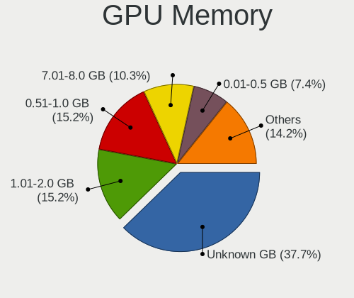

| Size in GB | Desktops | Percent |
|------------|----------|---------|
| Unknown    | 53       | 36.55%  |
| 1.01-2.0   | 28       | 19.31%  |
| 0.51-1.0   | 27       | 18.62%  |
| 3.01-4.0   | 11       | 7.59%   |
| 0.01-0.5   | 10       | 6.9%    |
| 7.01-8.0   | 9        | 6.21%   |
| 2.01-3.0   | 3        | 2.07%   |
| 5.01-6.0   | 2        | 1.38%   |
| 8.01-16.0  | 2        | 1.38%   |

Monitor
-------

Monitor Vendor
--------------

Monitor vendors

| Vendor               | Desktops | Percent |
|----------------------|----------|---------|
| Samsung Electronics  | 33       | 21.85%  |
| Dell                 | 20       | 13.25%  |
| AOC                  | 20       | 13.25%  |
| Philips              | 16       | 10.6%   |
| Goldstar             | 14       | 9.27%   |
| Acer                 | 13       | 8.61%   |
| Ancor Communications | 8        | 5.3%    |
| Hewlett-Packard      | 5        | 3.31%   |
| LG Electronics       | 3        | 1.99%   |
| Unknown              | 2        | 1.32%   |
| Huion                | 2        | 1.32%   |
| Fujitsu Siemens      | 2        | 1.32%   |
| BenQ                 | 2        | 1.32%   |
| Vestel Elektronik    | 1        | 0.66%   |
| RTK                  | 1        | 0.66%   |
| Panasonic            | 1        | 0.66%   |
| NOA VISION           | 1        | 0.66%   |
| NEC Computers        | 1        | 0.66%   |
| LG Display           | 1        | 0.66%   |
| Lenovo               | 1        | 0.66%   |
| KTC                  | 1        | 0.66%   |
| InnoLux Display      | 1        | 0.66%   |
| Grundig              | 1        | 0.66%   |
| ASUSTek Computer     | 1        | 0.66%   |

Monitor Model
-------------

Monitor models

| Model                                                                | Desktops | Percent |
|----------------------------------------------------------------------|----------|---------|
| Samsung Electronics LCD Monitor SAM0509 1920x1080                    | 2        | 1.23%   |
| Philips 190C PHLC017 1280x1024 338x270mm 17.0-inch                   | 2        | 1.23%   |
| Huion LCD Monitor HAT2150 1920x1080 470x270mm 21.3-inch              | 2        | 1.23%   |
| Goldstar W2043 GSM4E9D 1600x900 443x249mm 20.0-inch                  | 2        | 1.23%   |
| Dell P2414H DELA09B 1920x1080 527x297mm 23.8-inch                    | 2        | 1.23%   |
| Dell LCD Monitor SE2416H 5760x1080                                   | 2        | 1.23%   |
| Dell LCD Monitor SE2416H                                             | 2        | 1.23%   |
| Dell 2209WA DELF011 1680x1050 474x296mm 22.0-inch                    | 2        | 1.23%   |
| AOC Q3279WG5B AOC3279 2560x1440 725x428mm 33.1-inch                  | 2        | 1.23%   |
| AOC 2481W AOC2481 1920x1080 527x296mm 23.8-inch                      | 2        | 1.23%   |
| AOC 2436 AOC2436 1920x1080 521x293mm 23.5-inch                       | 2        | 1.23%   |
| AOC 22P1W AOC2201 1920x1080 477x268mm 21.5-inch                      | 2        | 1.23%   |
| Acer V223HQ ACR0070 1920x1080 477x268mm 21.5-inch                    | 2        | 1.23%   |
| Vestel Elektronik 40UHD_LCD_TV VES3700 3840x2160 890x500mm 40.2-inch | 1        | 0.61%   |
| Unknown LCD Monitor SAMSUNG                                          | 1        | 0.61%   |
| Unknown LCD Monitor CVT STD LCDTV 3840x1080                          | 1        | 0.61%   |
| Samsung Electronics U28E590 SAM0C4D 3840x2160 607x345mm 27.5-inch    | 1        | 0.61%   |
| Samsung Electronics U28E570 SAM0D6F 3840x2160 607x345mm 27.5-inch    | 1        | 0.61%   |
| Samsung Electronics SyncMaster SAM0608 1920x1080 510x290mm 23.1-inch | 1        | 0.61%   |
| Samsung Electronics SyncMaster SAM05C6 1920x1080 520x290mm 23.4-inch | 1        | 0.61%   |
| Samsung Electronics SyncMaster SAM0599 1600x900 443x249mm 20.0-inch  | 1        | 0.61%   |
| Samsung Electronics SyncMaster SAM0598 1360x768 410x230mm 18.5-inch  | 1        | 0.61%   |
| Samsung Electronics SyncMaster SAM0595 2048x1152 510x287mm 23.0-inch | 1        | 0.61%   |
| Samsung Electronics SyncMaster SAM0564 1360x768 410x230mm 18.5-inch  | 1        | 0.61%   |
| Samsung Electronics SyncMaster SAM0497 1600x900 443x249mm 20.0-inch  | 1        | 0.61%   |
| Samsung Electronics SyncMaster SAM0473 2048x1152 510x287mm 23.0-inch | 1        | 0.61%   |
| Samsung Electronics SyncMaster SAM0422 1920x1200 518x324mm 24.1-inch | 1        | 0.61%   |
| Samsung Electronics SyncMaster SAM03D2 1680x1050 474x296mm 22.0-inch | 1        | 0.61%   |
| Samsung Electronics SyncMaster SAM0302 1680x1050 459x296mm 21.5-inch | 1        | 0.61%   |
| Samsung Electronics SyncMaster SAM02B6 1920x1200 518x324mm 24.1-inch | 1        | 0.61%   |
| Samsung Electronics SyncMaster SAM01E7 1920x1200 518x324mm 24.1-inch | 1        | 0.61%   |
| Samsung Electronics SyncMaster SAM0168 1280x1024 338x270mm 17.0-inch | 1        | 0.61%   |
| Samsung Electronics SMS23A350H SAM07D4 1920x1080 509x286mm 23.0-inch | 1        | 0.61%   |
| Samsung Electronics SME1920N SAM06A3 1366x768 410x230mm 18.5-inch    | 1        | 0.61%   |
| Samsung Electronics SMB1940 SAM06BA 1280x1024 376x301mm 19.0-inch    | 1        | 0.61%   |
| Samsung Electronics S24F350 SAM0D20 1920x1080 520x290mm 23.4-inch    | 1        | 0.61%   |
| Samsung Electronics S23B550 SAM0919 1920x1080 510x290mm 23.1-inch    | 1        | 0.61%   |
| Samsung Electronics LS24A600U SAM7160 2560x1440 527x297mm 23.8-inch  | 1        | 0.61%   |
| Samsung Electronics LF27T450F SAM7097 1920x1080 597x336mm 27.0-inch  | 1        | 0.61%   |
| Samsung Electronics LF22T35 SAM707B 1920x1080 480x270mm 21.7-inch    | 1        | 0.61%   |

Monitor Resolution
------------------

Monitor screen resolution

| Resolution         | Desktops | Percent |
|--------------------|----------|---------|
| 1920x1080 (FHD)    | 70       | 46.67%  |
| 2560x1440 (QHD)    | 11       | 7.33%   |
| 1680x1050 (WSXGA+) | 11       | 7.33%   |
| 1280x1024 (SXGA)   | 10       | 6.67%   |
| 3840x2160 (4K)     | 8        | 5.33%   |
| Unknown            | 8        | 5.33%   |
| 1920x1200 (WUXGA)  | 6        | 4%      |
| 1600x900 (HD+)     | 5        | 3.33%   |
| 3840x1080          | 4        | 2.67%   |
| 1360x768           | 4        | 2.67%   |
| 1440x900 (WXGA+)   | 3        | 2%      |
| 5760x1080          | 2        | 1.33%   |
| 2560x1080          | 2        | 1.33%   |
| 2048x1152          | 2        | 1.33%   |
| 1366x768 (WXGA)    | 2        | 1.33%   |
| 4480x1440          | 1        | 0.67%   |
| 2560x1600          | 1        | 0.67%   |

Monitor Diagonal
----------------

Diagonal size in inches

| Inches  | Desktops | Percent |
|---------|----------|---------|
| 23      | 27       | 18%     |
| 27      | 19       | 12.67%  |
| 21      | 19       | 12.67%  |
| Unknown | 19       | 12.67%  |
| 24      | 18       | 12%     |
| 22      | 9        | 6%      |
| 19      | 8        | 5.33%   |
| 20      | 6        | 4%      |
| 17      | 5        | 3.33%   |
| 31      | 4        | 2.67%   |
| 18      | 3        | 2%      |
| 84      | 2        | 1.33%   |
| 33      | 2        | 1.33%   |
| 25      | 2        | 1.33%   |
| 60      | 1        | 0.67%   |
| 58      | 1        | 0.67%   |
| 54      | 1        | 0.67%   |
| 46      | 1        | 0.67%   |
| 34      | 1        | 0.67%   |
| 32      | 1        | 0.67%   |
| 26      | 1        | 0.67%   |

Monitor Width
-------------

Physical width

| Width in mm | Desktops | Percent |
|-------------|----------|---------|
| 501-600     | 60       | 41.38%  |
| 401-500     | 38       | 26.21%  |
| Unknown     | 19       | 13.1%   |
| 601-700     | 8        | 5.52%   |
| 351-400     | 6        | 4.14%   |
| 701-800     | 4        | 2.76%   |
| 301-350     | 4        | 2.76%   |
| 1001-1500   | 4        | 2.76%   |
| 1501-2000   | 2        | 1.38%   |

Aspect Ratio
------------

Proportional relationship between the width and the height

| Ratio   | Desktops | Percent |
|---------|----------|---------|
| 16/9    | 90       | 64.29%  |
| 16/10   | 22       | 15.71%  |
| Unknown | 17       | 12.14%  |
| 5/4     | 9        | 6.43%   |
| 3/2     | 1        | 0.71%   |
| 21/9    | 1        | 0.71%   |

Monitor Area
------------

Area in inch

| Area in inch | Desktops | Percent |
|----------------|----------|---------|
| 201-250        | 53       | 36.05%  |
| 151-200        | 23       | 15.65%  |
| 301-350        | 20       | 13.61%  |
| Unknown        | 19       | 12.93%  |
| 251-300        | 10       | 6.8%    |
| 351-500        | 8        | 5.44%   |
| 141-150        | 7        | 4.76%   |
| More than 1000 | 5        | 3.4%    |
| 121-130        | 1        | 0.68%   |
| 501-1000       | 1        | 0.68%   |

Pixel Density
-------------

Pixels per inch

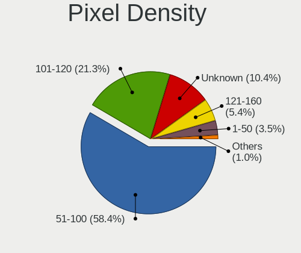

| Density | Desktops | Percent |
|---------|----------|---------|
| 51-100  | 84       | 60.43%  |
| 101-120 | 26       | 18.71%  |
| Unknown | 19       | 13.67%  |
| 1-50    | 5        | 3.6%    |
| 121-160 | 4        | 2.88%   |
| 161-240 | 1        | 0.72%   |

Multiple Monitors
-----------------

Total monitors connected

| Total | Desktops | Percent |
|-------|----------|---------|
| 1     | 108      | 76.6%   |
| 2     | 25       | 17.73%  |
| 0     | 5        | 3.55%   |
| 3     | 2        | 1.42%   |
| 4     | 1        | 0.71%   |

Network
-------

Net Controller Vendor
---------------------

Controller vendors

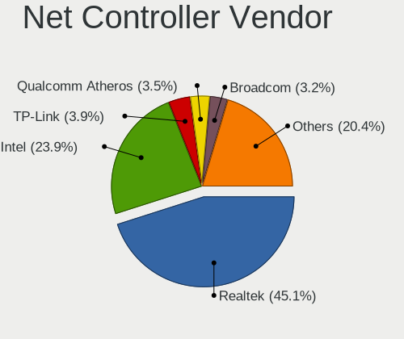

| Vendor                            | Desktops | Percent |
|-----------------------------------|----------|---------|
| Realtek Semiconductor             | 90       | 45%     |
| Intel                             | 43       | 21.5%   |
| Qualcomm Atheros                  | 10       | 5%      |
| TP-Link                           | 8        | 4%      |
| Ralink                            | 5        | 2.5%    |
| Qualcomm Atheros Communications   | 5        | 2.5%    |
| Broadcom                          | 5        | 2.5%    |
| Ralink Technology                 | 4        | 2%      |
| Nvidia                            | 4        | 2%      |
| MediaTek                          | 3        | 1.5%    |
| Sundance Technology Inc / IC Plus | 2        | 1%      |
| Samsung Electronics               | 2        | 1%      |
| Marvell Technology Group          | 2        | 1%      |
| D-Link                            | 2        | 1%      |
| Xiaomi                            | 1        | 0.5%    |
| VIA Technologies                  | 1        | 0.5%    |
| T & A Mobile Phones               | 1        | 0.5%    |
| Nokia Mobile Phones               | 1        | 0.5%    |
| NetGear                           | 1        | 0.5%    |
| Microsoft                         | 1        | 0.5%    |
| Linksys                           | 1        | 0.5%    |
| ICS Advent                        | 1        | 0.5%    |
| Huawei Technologies               | 1        | 0.5%    |
| Edimax Technology                 | 1        | 0.5%    |
| D-Link System                     | 1        | 0.5%    |
| Broadcom Limited                  | 1        | 0.5%    |
| ASUSTek Computer                  | 1        | 0.5%    |
| ASIX Electronics                  | 1        | 0.5%    |
| Aquantia                          | 1        | 0.5%    |

Net Controller Model
--------------------

Controller models

| Model                                                                      | Desktops | Percent |
|----------------------------------------------------------------------------|----------|---------|
| Realtek RTL8111/8168/8411 PCI Express Gigabit Ethernet Controller          | 76       | 36.02%  |
| Qualcomm Atheros AR9271 802.11n                                            | 5        | 2.37%   |
| Intel Ethernet Connection (2) I218-V                                       | 5        | 2.37%   |
| TP-Link TL-WN722N v2/v3 [Realtek RTL8188EUS]                               | 4        | 1.9%    |
| Realtek RTL8125 2.5GbE Controller                                          | 4        | 1.9%    |
| Intel Wi-Fi 6 AX200                                                        | 4        | 1.9%    |
| Intel I211 Gigabit Network Connection                                      | 4        | 1.9%    |
| Intel Ethernet Connection I217-LM                                          | 4        | 1.9%    |
| Intel Ethernet Connection (7) I219-V                                       | 4        | 1.9%    |
| Realtek RTL810xE PCI Express Fast Ethernet controller                      | 3        | 1.42%   |
| Realtek RTL-8100/8101L/8139 PCI Fast Ethernet Adapter                      | 3        | 1.42%   |
| Ralink MT7601U Wireless Adapter                                            | 3        | 1.42%   |
| Ralink RT2561/RT61 802.11g PCI                                             | 3        | 1.42%   |
| Intel Ethernet Controller I225-V                                           | 3        | 1.42%   |
| Intel Ethernet Connection I217-V                                           | 3        | 1.42%   |
| TP-Link 802.11ac NIC                                                       | 2        | 0.95%   |
| Realtek RTL8188EUS 802.11n Wireless Network Adapter                        | 2        | 0.95%   |
| Ralink RT3060 Wireless 802.11n 1T/1R                                       | 2        | 0.95%   |
| Qualcomm Atheros Killer E220x Gigabit Ethernet Controller                  | 2        | 0.95%   |
| Qualcomm Atheros AR8151 v2.0 Gigabit Ethernet                              | 2        | 0.95%   |
| Qualcomm Atheros AR5212/5213/2414 Wireless Network Adapter                 | 2        | 0.95%   |
| Nvidia MCP61 Ethernet                                                      | 2        | 0.95%   |
| Marvell Group 88E8056 PCI-E Gigabit Ethernet Controller                    | 2        | 0.95%   |
| Intel I210 Gigabit Network Connection                                      | 2        | 0.95%   |
| Intel Ethernet Connection (2) I219-V                                       | 2        | 0.95%   |
| Intel Ethernet Connection (2) I218-LM                                      | 2        | 0.95%   |
| Intel Ethernet Connection (14) I219-V                                      | 2        | 0.95%   |
| Intel 82579V Gigabit Network Connection                                    | 2        | 0.95%   |
| Broadcom BCM43228 802.11a/b/g/n                                            | 2        | 0.95%   |
| Xiaomi Mi/Redmi series (RNDIS)                                             | 1        | 0.47%   |
| VIA VT6102/VT6103 [Rhine-II]                                               | 1        | 0.47%   |
| TP-Link TL-WN822N Version 4 RTL8192EU                                      | 1        | 0.47%   |
| TP-Link TL-WN821N v5/v6 [RTL8192EU]                                        | 1        | 0.47%   |
| T & A Mobile Phones 9010X                                                  | 1        | 0.47%   |
| Sundance Inc / IC Plus IP1000 Family Gigabit Ethernet                      | 1        | 0.47%   |
| Sundance Inc / IC Plus IC Plus IP100A Integrated 10/100 Ethernet MAC + PHY | 1        | 0.47%   |
| Samsung GT-I9070 (network tethering, USB debugging enabled)                | 1        | 0.47%   |
| Samsung Galaxy series, misc. (tethering mode)                              | 1        | 0.47%   |
| Realtek RTL8812AU 802.11a/b/g/n/ac 2T2R DB WLAN Adapter                    | 1        | 0.47%   |
| Realtek RTL8812AE 802.11ac PCIe Wireless Network Adapter                   | 1        | 0.47%   |

Wireless Vendor
---------------

Wireless vendors

| Vendor                          | Desktops | Percent |
|---------------------------------|----------|---------|
| TP-Link                         | 8        | 15.38%  |
| Realtek Semiconductor           | 7        | 13.46%  |
| Intel                           | 7        | 13.46%  |
| Ralink                          | 5        | 9.62%   |
| Qualcomm Atheros Communications | 5        | 9.62%   |
| Ralink Technology               | 4        | 7.69%   |
| Qualcomm Atheros                | 4        | 7.69%   |
| Broadcom                        | 4        | 7.69%   |
| MediaTek                        | 2        | 3.85%   |
| NetGear                         | 1        | 1.92%   |
| Microsoft                       | 1        | 1.92%   |
| Linksys                         | 1        | 1.92%   |
| Edimax Technology               | 1        | 1.92%   |
| D-Link                          | 1        | 1.92%   |
| ASUSTek Computer                | 1        | 1.92%   |

Wireless Model
--------------

Wireless models

| Model                                                                   | Desktops | Percent |
|-------------------------------------------------------------------------|----------|---------|
| Qualcomm Atheros AR9271 802.11n                                         | 5        | 9.43%   |
| TP-Link TL-WN722N v2/v3 [Realtek RTL8188EUS]                            | 4        | 7.55%   |
| Intel Wi-Fi 6 AX200                                                     | 4        | 7.55%   |
| Ralink MT7601U Wireless Adapter                                         | 3        | 5.66%   |
| Ralink RT2561/RT61 802.11g PCI                                          | 3        | 5.66%   |
| TP-Link 802.11ac NIC                                                    | 2        | 3.77%   |
| Realtek RTL8188EUS 802.11n Wireless Network Adapter                     | 2        | 3.77%   |
| Ralink RT3060 Wireless 802.11n 1T/1R                                    | 2        | 3.77%   |
| Qualcomm Atheros AR5212/5213/2414 Wireless Network Adapter              | 2        | 3.77%   |
| Broadcom BCM43228 802.11a/b/g/n                                         | 2        | 3.77%   |
| TP-Link TL-WN822N Version 4 RTL8192EU                                   | 1        | 1.89%   |
| TP-Link TL-WN821N v5/v6 [RTL8192EU]                                     | 1        | 1.89%   |
| Realtek RTL8812AU 802.11a/b/g/n/ac 2T2R DB WLAN Adapter                 | 1        | 1.89%   |
| Realtek RTL8812AE 802.11ac PCIe Wireless Network Adapter                | 1        | 1.89%   |
| Realtek RTL8188SU 802.11n WLAN Adapter                                  | 1        | 1.89%   |
| Realtek RTL8188CUS 802.11n WLAN Adapter                                 | 1        | 1.89%   |
| Realtek RTL8188CE 802.11b/g/n WiFi Adapter                              | 1        | 1.89%   |
| Ralink RT5370 Wireless Adapter                                          | 1        | 1.89%   |
| Ralink RT2561/RT61 rev B 802.11g                                        | 1        | 1.89%   |
| Qualcomm Atheros QCA9565 / AR9565 Wireless Network Adapter              | 1        | 1.89%   |
| Qualcomm Atheros AR9485 Wireless Network Adapter                        | 1        | 1.89%   |
| NetGear A6210                                                           | 1        | 1.89%   |
| Microsoft Xbox 360 Wireless Adapter                                     | 1        | 1.89%   |
| MediaTek MT7922 802.11ax PCI Express Wireless Network Adapter           | 1        | 1.89%   |
| MediaTek MT7630e 802.11bgn Wireless Network Adapter                     | 1        | 1.89%   |
| Linksys WUSB6400M                                                       | 1        | 1.89%   |
| Intel Wireless 8265 / 8275                                              | 1        | 1.89%   |
| Intel Wireless 3165                                                     | 1        | 1.89%   |
| Intel Dual Band Wireless-AC 3168NGW [Stone Peak]                        | 1        | 1.89%   |
| Edimax EW-7711UTn nLite Wireless Adapter [Ralink RT3070]                | 1        | 1.89%   |
| D-Link DWA-121 802.11n Wireless N 150 Pico Adapter [Realtek RTL8188CUS] | 1        | 1.89%   |
| Broadcom BCM4360 802.11ac Wireless Network Adapter                      | 1        | 1.89%   |
| Broadcom BCM4352 802.11ac Wireless Network Adapter                      | 1        | 1.89%   |
| ASUS USB-N14 802.11b/g/n (2x2) Wireless Adapter [Ralink RT5372]         | 1        | 1.89%   |

Ethernet Vendor
---------------

Ethernet vendors

| Vendor                            | Desktops | Percent |
|-----------------------------------|----------|---------|
| Realtek Semiconductor             | 86       | 56.21%  |
| Intel                             | 39       | 25.49%  |
| Qualcomm Atheros                  | 6        | 3.92%   |
| Nvidia                            | 4        | 2.61%   |
| Sundance Technology Inc / IC Plus | 2        | 1.31%   |
| Samsung Electronics               | 2        | 1.31%   |
| Marvell Technology Group          | 2        | 1.31%   |
| Xiaomi                            | 1        | 0.65%   |
| VIA Technologies                  | 1        | 0.65%   |
| T & A Mobile Phones               | 1        | 0.65%   |
| MediaTek                          | 1        | 0.65%   |
| ICS Advent                        | 1        | 0.65%   |
| Huawei Technologies               | 1        | 0.65%   |
| D-Link System                     | 1        | 0.65%   |
| D-Link                            | 1        | 0.65%   |
| Broadcom Limited                  | 1        | 0.65%   |
| Broadcom                          | 1        | 0.65%   |
| ASIX Electronics                  | 1        | 0.65%   |
| Aquantia                          | 1        | 0.65%   |

Ethernet Model
--------------

Ethernet models

| Model                                                                      | Desktops | Percent |
|----------------------------------------------------------------------------|----------|---------|
| Realtek RTL8111/8168/8411 PCI Express Gigabit Ethernet Controller          | 76       | 48.41%  |
| Intel Ethernet Connection (2) I218-V                                       | 5        | 3.18%   |
| Realtek RTL8125 2.5GbE Controller                                          | 4        | 2.55%   |
| Intel I211 Gigabit Network Connection                                      | 4        | 2.55%   |
| Intel Ethernet Connection I217-LM                                          | 4        | 2.55%   |
| Intel Ethernet Connection (7) I219-V                                       | 4        | 2.55%   |
| Realtek RTL810xE PCI Express Fast Ethernet controller                      | 3        | 1.91%   |
| Realtek RTL-8100/8101L/8139 PCI Fast Ethernet Adapter                      | 3        | 1.91%   |
| Intel Ethernet Controller I225-V                                           | 3        | 1.91%   |
| Intel Ethernet Connection I217-V                                           | 3        | 1.91%   |
| Qualcomm Atheros Killer E220x Gigabit Ethernet Controller                  | 2        | 1.27%   |
| Qualcomm Atheros AR8151 v2.0 Gigabit Ethernet                              | 2        | 1.27%   |
| Nvidia MCP61 Ethernet                                                      | 2        | 1.27%   |
| Marvell Group 88E8056 PCI-E Gigabit Ethernet Controller                    | 2        | 1.27%   |
| Intel I210 Gigabit Network Connection                                      | 2        | 1.27%   |
| Intel Ethernet Connection (2) I219-V                                       | 2        | 1.27%   |
| Intel Ethernet Connection (2) I218-LM                                      | 2        | 1.27%   |
| Intel Ethernet Connection (14) I219-V                                      | 2        | 1.27%   |
| Intel 82579V Gigabit Network Connection                                    | 2        | 1.27%   |
| Xiaomi Mi/Redmi series (RNDIS)                                             | 1        | 0.64%   |
| VIA VT6102/VT6103 [Rhine-II]                                               | 1        | 0.64%   |
| T & A Mobile Phones 9010X                                                  | 1        | 0.64%   |
| Sundance Inc / IC Plus IP1000 Family Gigabit Ethernet                      | 1        | 0.64%   |
| Sundance Inc / IC Plus IC Plus IP100A Integrated 10/100 Ethernet MAC + PHY | 1        | 0.64%   |
| Samsung GT-I9070 (network tethering, USB debugging enabled)                | 1        | 0.64%   |
| Samsung Galaxy series, misc. (tethering mode)                              | 1        | 0.64%   |
| Realtek RTL8169 PCI Gigabit Ethernet Controller                            | 1        | 0.64%   |
| Realtek RTL8153 Gigabit Ethernet Adapter                                   | 1        | 0.64%   |
| Realtek RTL-8110SC/8169SC Gigabit Ethernet                                 | 1        | 0.64%   |
| Qualcomm Atheros Killer E2500 Gigabit Ethernet Controller                  | 1        | 0.64%   |
| Qualcomm Atheros AR8121/AR8113/AR8114 Gigabit or Fast Ethernet             | 1        | 0.64%   |
| Nvidia MCP77 Ethernet                                                      | 1        | 0.64%   |
| Nvidia MCP55 Ethernet                                                      | 1        | 0.64%   |
| MediaTek Infinix NOTE 11                                                   | 1        | 0.64%   |
| Intel Ethernet Connection (7) I219-LM                                      | 1        | 0.64%   |
| Intel Ethernet Connection (12) I219-V                                      | 1        | 0.64%   |
| Intel Ethernet Connection (11) I219-V                                      | 1        | 0.64%   |
| Intel Ethernet Connection (11) I219-LM                                     | 1        | 0.64%   |
| Intel 82578DM Gigabit Network Connection                                   | 1        | 0.64%   |
| Intel 82567LM-3 Gigabit Network Connection                                 | 1        | 0.64%   |

Net Controller Kind
-------------------

Ethernet, WiFi or modem

| Kind     | Desktops | Percent |
|----------|----------|---------|
| Ethernet | 136      | 73.12%  |
| WiFi     | 49       | 26.34%  |
| Modem    | 1        | 0.54%   |

Used Controller
---------------

Currently used network controller

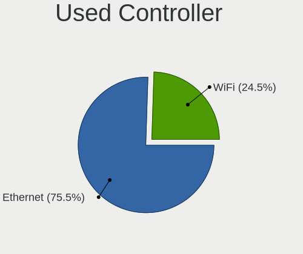

| Kind     | Desktops | Percent |
|----------|----------|---------|
| Ethernet | 103      | 74.64%  |
| WiFi     | 35       | 25.36%  |

NICs
----

Total network controllers on board

| Total | Desktops | Percent |
|-------|----------|---------|
| 1     | 102      | 72.86%  |
| 2     | 33       | 23.57%  |
| 0     | 3        | 2.14%   |
| 4     | 1        | 0.71%   |
| 3     | 1        | 0.71%   |

IPv6
----

IPv6 vs IPv4

| Used | Desktops | Percent |
|------|----------|---------|
| No   | 135      | 97.12%  |
| Yes  | 4        | 2.88%   |

Bluetooth
---------

Bluetooth Vendor
----------------

Controller vendors

| Vendor                          | Desktops | Percent |
|---------------------------------|----------|---------|
| Intel                           | 7        | 25.93%  |
| Cambridge Silicon Radio         | 7        | 25.93%  |
| Broadcom                        | 4        | 14.81%  |
| Realtek Semiconductor           | 2        | 7.41%   |
| Foxconn / Hon Hai               | 2        | 7.41%   |
| ASUSTek Computer                | 2        | 7.41%   |
| Qualcomm Atheros Communications | 1        | 3.7%    |
| Integrated System Solution      | 1        | 3.7%    |
| IMC Networks                    | 1        | 3.7%    |

Bluetooth Model
---------------

Controller models

| Model                                                 | Desktops | Percent |
|-------------------------------------------------------|----------|---------|
| Cambridge Silicon Radio Bluetooth Dongle (HCI mode)   | 7        | 25.93%  |
| Intel AX200 Bluetooth                                 | 4        | 14.81%  |
| Realtek Bluetooth Radio                               | 2        | 7.41%   |
| Intel Bluetooth wireless interface                    | 2        | 7.41%   |
| Broadcom HP Portable Bumble Bee                       | 2        | 7.41%   |
| ASUS Broadcom BCM20702A0 Bluetooth                    | 2        | 7.41%   |
| Qualcomm Atheros  Bluetooth Device                    | 1        | 3.7%    |
| Intel Wireless-AC 3168 Bluetooth                      | 1        | 3.7%    |
| Integrated System Solution KY-BT100 Bluetooth Adapter | 1        | 3.7%    |
| IMC Networks BCM20702A0                               | 1        | 3.7%    |
| Foxconn / Hon Hai Wireless_Device                     | 1        | 3.7%    |
| Foxconn / Hon Hai BT                                  | 1        | 3.7%    |
| Broadcom BCM92046DG-CL1ROM Bluetooth 2.1 Adapter      | 1        | 3.7%    |
| Broadcom BCM2045 Bluetooth                            | 1        | 3.7%    |

Sound
-----

Sound Vendor
------------

Sound card vendors

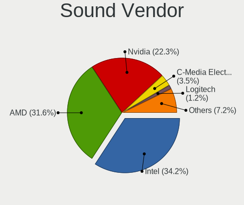

| Vendor              | Desktops | Percent |
|---------------------|----------|---------|
| Intel               | 86       | 34.96%  |
| AMD                 | 73       | 29.67%  |
| Nvidia              | 56       | 22.76%  |
| C-Media Electronics | 9        | 3.66%   |
| Logitech            | 3        | 1.22%   |
| Creative Labs       | 3        | 1.22%   |
| Microsoft           | 2        | 0.81%   |
| Yamaha              | 1        | 0.41%   |
| XMOS                | 1        | 0.41%   |
| VIA Technologies    | 1        | 0.41%   |
| Trust               | 1        | 0.41%   |
| Tenx Technology     | 1        | 0.41%   |
| Razer USA           | 1        | 0.41%   |
| Native Instruments  | 1        | 0.41%   |
| JMTek               | 1        | 0.41%   |
| Focusrite-Novation  | 1        | 0.41%   |
| Ensoniq             | 1        | 0.41%   |
| Cirrus Logic        | 1        | 0.41%   |
| ATI Technologies    | 1        | 0.41%   |
| ASUSTek Computer    | 1        | 0.41%   |
| Astro Gaming        | 1        | 0.41%   |

Sound Model
-----------

Sound card models

| Model                                                                      | Desktops | Percent |
|----------------------------------------------------------------------------|----------|---------|
| Intel 8 Series/C220 Series Chipset High Definition Audio Controller        | 16       | 5.59%   |
| Intel Xeon E3-1200 v3/4th Gen Core Processor HD Audio Controller           | 13       | 4.55%   |
| Intel 6 Series/C200 Series Chipset Family High Definition Audio Controller | 12       | 4.2%    |
| AMD SBx00 Azalia (Intel HDA)                                               | 12       | 4.2%    |
| AMD Family 17h/19h HD Audio Controller                                     | 10       | 3.5%    |
| AMD Family 17h (Models 00h-0fh) HD Audio Controller                        | 10       | 3.5%    |
| Nvidia GP106 High Definition Audio Controller                              | 9        | 3.15%   |
| Nvidia GP107GL High Definition Audio Controller                            | 8        | 2.8%    |
| AMD Ellesmere HDMI Audio [Radeon RX 470/480 / 570/580/590]                 | 8        | 2.8%    |
| Intel 9 Series Chipset Family HD Audio Controller                          | 7        | 2.45%   |
| AMD Oland/Hainan/Cape Verde/Pitcairn HDMI Audio [Radeon HD 7000 Series]    | 7        | 2.45%   |
| Intel NM10/ICH7 Family High Definition Audio Controller                    | 6        | 2.1%    |
| AMD Cedar HDMI Audio [Radeon HD 5400/6300/7300 Series]                     | 6        | 2.1%    |
| Nvidia GM206 High Definition Audio Controller                              | 5        | 1.75%   |
| Intel Cannon Lake PCH cAVS                                                 | 5        | 1.75%   |
| Intel 200 Series PCH HD Audio                                              | 5        | 1.75%   |
| AMD Starship/Matisse HD Audio Controller                                   | 5        | 1.75%   |
| AMD RV710/730 HDMI Audio [Radeon HD 4000 series]                           | 5        | 1.75%   |
| AMD FCH Azalia Controller                                                  | 5        | 1.75%   |
| Nvidia TU116 High Definition Audio Controller                              | 4        | 1.4%    |
| Nvidia GM107 High Definition Audio Controller [GeForce 940MX]              | 4        | 1.4%    |
| Intel Comet Lake PCH-V cAVS                                                | 4        | 1.4%    |
| Intel 82801I (ICH9 Family) HD Audio Controller                             | 4        | 1.4%    |
| Intel 7 Series/C216 Chipset Family High Definition Audio Controller        | 4        | 1.4%    |
| Intel 100 Series/C230 Series Chipset Family HD Audio Controller            | 4        | 1.4%    |
| AMD Turks HDMI Audio [Radeon HD 6500/6600 / 6700M Series]                  | 4        | 1.4%    |
| AMD Renoir Radeon High Definition Audio Controller                         | 4        | 1.4%    |
| Nvidia TU107 GeForce GTX 1650 High Definition Audio Controller             | 3        | 1.05%   |
| Nvidia GP108 High Definition Audio Controller                              | 3        | 1.05%   |
| Nvidia GK208 HDMI/DP Audio Controller                                      | 3        | 1.05%   |
| Intel Tiger Lake-H HD Audio Controller                                     | 3        | 1.05%   |
| Intel Comet Lake PCH cAVS                                                  | 3        | 1.05%   |
| Intel 82801JI (ICH10 Family) HD Audio Controller                           | 3        | 1.05%   |
| C-Media Electronics CMI8738/CMI8768 PCI Audio                              | 3        | 1.05%   |
| AMD Raven/Raven2/Fenghuang HDMI/DP Audio Controller                        | 3        | 1.05%   |
| Nvidia MCP61 High Definition Audio                                         | 2        | 0.7%    |
| Nvidia GK106 HDMI Audio Controller                                         | 2        | 0.7%    |
| Nvidia GK104 HDMI Audio Controller                                         | 2        | 0.7%    |
| Nvidia GF119 HDMI Audio Controller                                         | 2        | 0.7%    |
| Microsoft LifeChat LX-3000 Headset                                         | 2        | 0.7%    |

Memory
------

Memory Vendor
-------------

Memory module vendors

| Vendor              | Desktops | Percent |
|---------------------|----------|---------|
| Kingston            | 22       | 27.5%   |
| Corsair             | 11       | 13.75%  |
| Unknown             | 9        | 11.25%  |
| G.Skill             | 9        | 11.25%  |
| Samsung Electronics | 7        | 8.75%   |
| SK hynix            | 6        | 7.5%    |
| Crucial             | 4        | 5%      |
| Transcend           | 3        | 3.75%   |
| Patriot             | 2        | 2.5%    |
| Kingmax             | 2        | 2.5%    |
| Ramaxel Technology  | 1        | 1.25%   |
| Mushkin             | 1        | 1.25%   |
| Elpida              | 1        | 1.25%   |
| Apacer              | 1        | 1.25%   |
| A-DATA Technology   | 1        | 1.25%   |

Memory Model
------------

Memory module models

| Model                                                   | Desktops | Percent |
|---------------------------------------------------------|----------|---------|
| Unknown RAM Module 4096MB DIMM 667MT/s                  | 2        | 2.3%    |
| SK hynix RAM HMT351U6CFR8C-PB 4096MB DIMM DDR3 1800MT/s | 2        | 2.3%    |
| Samsung RAM M378B5673EH1-CH9 2GB DIMM DDR3 1333MT/s     | 2        | 2.3%    |
| Kingston RAM KHX1600C9D3/4GX 4GB DIMM DDR3 2400MT/s     | 2        | 2.3%    |
| Kingston RAM 99U5702-095.A00G 8GB DIMM DDR4 2667MT/s    | 2        | 2.3%    |
| Corsair RAM CMK16GX4M2B3200C16 8GB DIMM DDR4 3600MT/s   | 2        | 2.3%    |
| Unknown RAM Module 512MB DIMM DDR2 533MT/s              | 1        | 1.15%   |
| Unknown RAM Module 4GB DIMM DDR3 1600MT/s               | 1        | 1.15%   |
| Unknown RAM Module 4GB DIMM 1600MT/s                    | 1        | 1.15%   |
| Unknown RAM Module 4GB DIMM 1333MT/s                    | 1        | 1.15%   |
| Unknown RAM Module 4096MB DIMM 1600MT/s                 | 1        | 1.15%   |
| Unknown RAM Module 2GB DIMM 1600MT/s                    | 1        | 1.15%   |
| Unknown RAM Module 2048MB DIMM DDR2 800MT/s             | 1        | 1.15%   |
| Unknown RAM Module 2048MB DIMM 1600MT/s                 | 1        | 1.15%   |
| Unknown RAM Module 1GB DIMM DDR2 533MT/s                | 1        | 1.15%   |
| Unknown RAM Module 1024MB DIMM DDR 400MT/s              | 1        | 1.15%   |
| Unknown RAM 4000 C19 Series 8192MB DIMM DDR4 4000MT/s   | 1        | 1.15%   |
| Transcend RAM JM2666HLB-8G 8192MB DIMM DDR4 2667MT/s    | 1        | 1.15%   |
| Transcend RAM JM1600KLN-2G 2GB DIMM DDR3 1333MT/s       | 1        | 1.15%   |
| Transcend RAM JM1333KLN-2G 2GB DIMM DDR3 1333MT/s       | 1        | 1.15%   |
| SK hynix RAM HMT41GU6MFR8C-PB 8GB DIMM DDR3 1600MT/s    | 1        | 1.15%   |
| SK hynix RAM HMT351U6EFR8C-PB 4GB DIMM DDR3 1800MT/s    | 1        | 1.15%   |
| SK hynix RAM HMT125U6BFR8C-H9 2GB DIMM DDR3 1333MT/s    | 1        | 1.15%   |
| SK hynix RAM HMA82GU6DJR8N-XN 16GB DIMM DDR4 3200MT/s   | 1        | 1.15%   |
| SK hynix RAM HMA81GU6CJR8N-XN 8GB DIMM DDR4 3200MT/s    | 1        | 1.15%   |
| Samsung RAM M471B5773DH0-CH9 2GB DIMM DDR3 1333MT/s     | 1        | 1.15%   |
| Samsung RAM M471B5173QH0-YK0 4GB SODIMM DDR3 1600MT/s   | 1        | 1.15%   |
| Samsung RAM M471B5173DB0-YK0 4GB SODIMM DDR3 1600MT/s   | 1        | 1.15%   |
| Samsung RAM M378B5173DB0-CK0 4GB DIMM DDR3 1600MT/s     | 1        | 1.15%   |
| Samsung RAM M378A5244CB0-CTD 4GB DIMM DDR4 3334MT/s     | 1        | 1.15%   |
| Ramaxel RAM RMUA5090KE68H9F2133 4GB DIMM DDR4 2133MT/s  | 1        | 1.15%   |
| Patriot RAM PSD38G16002 8GB DIMM DDR3 1600MT/s          | 1        | 1.15%   |
| Patriot RAM PSD22G80026 2048MB DIMM DDR2 800MT/s        | 1        | 1.15%   |
| Mushkin RAM 99[2/7/4]199[F/T] 8192MB DIMM DDR4 2400MT/s | 1        | 1.15%   |
| Kingston RAM KHX3200C18D4/8G 8GB DIMM DDR4 3333MT/s     | 1        | 1.15%   |
| Kingston RAM KHX3200C16D4/8GX 8GB DIMM DDR4 3600MT/s    | 1        | 1.15%   |
| Kingston RAM KHX3000C15D4/8GX 8GB DIMM DDR4 3400MT/s    | 1        | 1.15%   |
| Kingston RAM KHX2400C15/8G 8192MB DIMM DDR4 3400MT/s    | 1        | 1.15%   |
| Kingston RAM KHX2400C11D3/8GX 8GB DIMM DDR3 2400MT/s    | 1        | 1.15%   |
| Kingston RAM KHX2133C13D4/8GX 8192MB DIMM DDR4 2133MT/s | 1        | 1.15%   |

Memory Kind
-----------

Memory module kinds

| Kind    | Desktops | Percent |
|---------|----------|---------|
| DDR4    | 34       | 50%     |
| DDR3    | 23       | 33.82%  |
| Unknown | 4        | 5.88%   |
| DDR2    | 3        | 4.41%   |
| SDRAM   | 2        | 2.94%   |
| DDR5    | 1        | 1.47%   |
| DDR     | 1        | 1.47%   |

Memory Form Factor
------------------

Physical design of the memory module

| Name   | Desktops | Percent |
|--------|----------|---------|
| DIMM   | 64       | 95.52%  |
| SODIMM | 3        | 4.48%   |

Memory Size
-----------

Memory module size

| Size  | Desktops | Percent |
|-------|----------|---------|
| 8192  | 29       | 39.19%  |
| 4096  | 20       | 27.03%  |
| 16384 | 10       | 13.51%  |
| 2048  | 10       | 13.51%  |
| 1024  | 3        | 4.05%   |
| 32768 | 1        | 1.35%   |
| 512   | 1        | 1.35%   |

Memory Speed
------------

Memory module speed

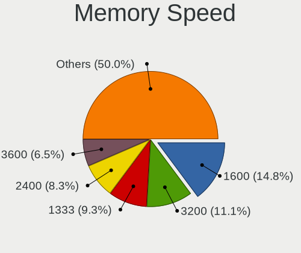

| Speed | Desktops | Percent |
|-------|----------|---------|
| 1600  | 14       | 19.44%  |
| 3200  | 9        | 12.5%   |
| 1333  | 7        | 9.72%   |
| 2667  | 6        | 8.33%   |
| 2400  | 5        | 6.94%   |
| 2133  | 4        | 5.56%   |
| 3600  | 3        | 4.17%   |
| 3400  | 3        | 4.17%   |
| 2666  | 2        | 2.78%   |
| 1800  | 2        | 2.78%   |
| 800   | 2        | 2.78%   |
| 667   | 2        | 2.78%   |
| 4800  | 1        | 1.39%   |
| 4000  | 1        | 1.39%   |
| 3866  | 1        | 1.39%   |
| 3466  | 1        | 1.39%   |
| 3334  | 1        | 1.39%   |
| 3333  | 1        | 1.39%   |
| 3000  | 1        | 1.39%   |
| 2933  | 1        | 1.39%   |
| 2800  | 1        | 1.39%   |
| 1867  | 1        | 1.39%   |
| 1067  | 1        | 1.39%   |
| 533   | 1        | 1.39%   |
| 400   | 1        | 1.39%   |

Printers & scanners
-------------------

Printer Vendor
--------------

Printer device vendors

| Vendor              | Desktops | Percent |
|---------------------|----------|---------|
| Hewlett-Packard     | 6        | 66.67%  |
| Prolific Technology | 2        | 22.22%  |
| Canon               | 1        | 11.11%  |

Printer Model
-------------

Printer device models

| Model                           | Desktops | Percent |
|---------------------------------|----------|---------|
| Prolific PL2305 Parallel Port   | 2        | 22.22%  |
| HP DeskJet 3630 series          | 2        | 22.22%  |
| HP LaserJet M14-M17             | 1        | 11.11%  |
| HP LaserJet M101-M106           | 1        | 11.11%  |
| HP Ink Tank Wireless 410 series | 1        | 11.11%  |
| HP DeskJet 2130 series          | 1        | 11.11%  |
| Canon PIXMA iP1800 Printer      | 1        | 11.11%  |

Scanner Vendor
--------------

Scanner device vendors

| Vendor | Desktops | Percent |
|--------|----------|---------|
| Canon  | 2        | 100%    |

Scanner Model
-------------

Scanner device models

| Model                         | Desktops | Percent |
|-------------------------------|----------|---------|
| Canon CanoScan N1240U/LiDE 30 | 1        | 50%     |
| Canon CanoScan LiDE 220       | 1        | 50%     |

Camera
------

Camera Vendor
-------------

Camera device vendors

| Vendor                        | Desktops | Percent |
|-------------------------------|----------|---------|
| Logitech                      | 11       | 42.31%  |
| Sunplus Innovation Technology | 4        | 15.38%  |
| Realtek Semiconductor         | 3        | 11.54%  |
| Microdia                      | 3        | 11.54%  |
| Chicony Electronics           | 2        | 7.69%   |
| Trust                         | 1        | 3.85%   |
| GenesysLogic Technology       | 1        | 3.85%   |
| Alcor Micro                   | 1        | 3.85%   |

Camera Model
------------

Camera device models

| Model                                 | Desktops | Percent |
|---------------------------------------|----------|---------|
| Logitech Webcam C270                  | 4        | 15.38%  |
| Sunplus HD 720P webcam                | 3        | 11.54%  |
| Microdia Camera                       | 2        | 7.69%   |
| Logitech Webcam C170                  | 2        | 7.69%   |
| Trust Full HD Webcam                  | 1        | 3.85%   |
| Sunplus Full HD webcam                | 1        | 3.85%   |
| Realtek USB Camera                    | 1        | 3.85%   |
| Realtek Full HD webcam                | 1        | 3.85%   |
| Realtek Asus laptop camera            | 1        | 3.85%   |
| Microdia Sonix USB 2.0 Camera         | 1        | 3.85%   |
| Logitech Webcam C925e                 | 1        | 3.85%   |
| Logitech Webcam C250                  | 1        | 3.85%   |
| Logitech Webcam C210                  | 1        | 3.85%   |
| Logitech Webcam C110                  | 1        | 3.85%   |
| Logitech HD Pro Webcam C920           | 1        | 3.85%   |
| GenesysLogic USB2.0 UVC PC Camera     | 1        | 3.85%   |
| Chicony HP High Definition Webcam     | 1        | 3.85%   |
| Chicony HP High Definition 1MP Webcam | 1        | 3.85%   |
| Alcor Micro USB 2.0 Camera            | 1        | 3.85%   |

Security
--------

Fingerprint Vendor
------------------

Fingerprint sensor vendors

| Vendor                | Desktops | Percent |
|-----------------------|----------|---------|
| Elan Microelectronics | 1        | 100%    |

Fingerprint Model
-----------------

Fingerprint sensor models

| Model                                       | Desktops | Percent |
|---------------------------------------------|----------|---------|
| Elan fingerprint sensor [FeinTech FPS00200] | 1        | 100%    |

Chipcard Vendor
---------------

Chipcard module vendors

| Vendor                     | Desktops | Percent |
|----------------------------|----------|---------|
| Gemalto (was Gemplus)      | 1        | 50%     |
| Athena Smartcard Solutions | 1        | 50%     |

Chipcard Model
--------------

Chipcard module models

| Model                                             | Desktops | Percent |
|---------------------------------------------------|----------|---------|
| Gemalto (was Gemplus) GemPC Twin SmartCard Reader | 1        | 50%     |
| Athena Smartcard Solutions ASEDrive CCID          | 1        | 50%     |

Unsupported
-----------

Unsupported Devices
-------------------

Total unsupported devices on board

| Total | Desktops | Percent |
|-------|----------|---------|
| 0     | 126      | 88.73%  |
| 1     | 13       | 9.15%   |
| 2     | 3        | 2.11%   |

Unsupported Device Types
------------------------

Types of unsupported devices

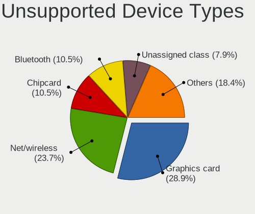

| Type               | Desktops | Percent |
|--------------------|----------|---------|
| Graphics card      | 6        | 31.58%  |
| Net/wireless       | 4        | 21.05%  |
| Bluetooth          | 3        | 15.79%  |
| Unassigned class   | 2        | 10.53%  |
| Chipcard           | 2        | 10.53%  |
| Storage/raid       | 1        | 5.26%   |
| Fingerprint reader | 1        | 5.26%   |

