Linux in Croatia - Tested Hardware & Statistics (Notebooks)
-----------------------------------------------------------

A project to collect tested hardware configurations for Linux in Croatia.

Anyone can contribute to this report by the [hw-probe](https://github.com/linuxhw/hw-probe) tool:

    sudo -E hw-probe -all -upload

Please contribute! Especially if your hardware is rare.

Contents
--------

* [ Test Cases ](#test-cases)

* [ System ](#system)
  - [ OS                       ](#os)
  - [ OS Family                ](#os-family)
  - [ Kernel                   ](#kernel)
  - [ Kernel Family            ](#kernel-family)
  - [ Kernel Major Ver.        ](#kernel-major-ver)
  - [ Arch                     ](#arch)
  - [ DE                       ](#de)
  - [ Display Server           ](#display-server)
  - [ Display Manager          ](#display-manager)
  - [ OS Lang                  ](#os-lang)
  - [ Boot Mode                ](#boot-mode)
  - [ Filesystem               ](#filesystem)
  - [ Part. scheme             ](#part-scheme)
  - [ Dual Boot with Linux/BSD ](#dual-boot-with-linuxbsd)
  - [ Dual Boot (Win)          ](#dual-boot-win)

* [ Board ](#board)
  - [ Vendor                   ](#vendor)
  - [ Model                    ](#model)
  - [ Model Family             ](#model-family)
  - [ MFG Year                 ](#mfg-year)
  - [ Form Factor              ](#form-factor)
  - [ Secure Boot              ](#secure-boot)
  - [ Coreboot                 ](#coreboot)
  - [ RAM Size                 ](#ram-size)
  - [ RAM Used                 ](#ram-used)
  - [ Total Drives             ](#total-drives)
  - [ Has CD-ROM               ](#has-cd-rom)
  - [ Has Ethernet             ](#has-ethernet)
  - [ Has WiFi                 ](#has-wifi)
  - [ Has Bluetooth            ](#has-bluetooth)

* [ Location ](#location)
  - [ Country                  ](#country)
  - [ City                     ](#city)

* [ Drives ](#drives)
  - [ Drive Vendor             ](#drive-vendor)
  - [ Drive Model              ](#drive-model)
  - [ HDD Vendor               ](#hdd-vendor)
  - [ SSD Vendor               ](#ssd-vendor)
  - [ Drive Kind               ](#drive-kind)
  - [ Drive Connector          ](#drive-connector)
  - [ Drive Size               ](#drive-size)
  - [ Space Total              ](#space-total)
  - [ Space Used               ](#space-used)
  - [ Malfunc. Drives          ](#malfunc-drives)
  - [ Malfunc. Drive Vendor    ](#malfunc-drive-vendor)
  - [ Malfunc. HDD Vendor      ](#malfunc-hdd-vendor)
  - [ Malfunc. Drive Kind      ](#malfunc-drive-kind)
  - [ Failed Drives            ](#failed-drives)
  - [ Failed Drive Vendor      ](#failed-drive-vendor)
  - [ Drive Status             ](#drive-status)

* [ Storage controller ](#storage-controller)
  - [ Storage Vendor           ](#storage-vendor)
  - [ Storage Model            ](#storage-model)
  - [ Storage Kind             ](#storage-kind)

* [ Processor ](#processor)
  - [ CPU Vendor               ](#cpu-vendor)
  - [ CPU Model                ](#cpu-model)
  - [ CPU Model Family         ](#cpu-model-family)
  - [ CPU Cores                ](#cpu-cores)
  - [ CPU Sockets              ](#cpu-sockets)
  - [ CPU Threads              ](#cpu-threads)
  - [ CPU Op-Modes             ](#cpu-op-modes)
  - [ CPU Microcode            ](#cpu-microcode)
  - [ CPU Microarch            ](#cpu-microarch)

* [ Graphics ](#graphics)
  - [ GPU Vendor               ](#gpu-vendor)
  - [ GPU Model                ](#gpu-model)
  - [ GPU Combo                ](#gpu-combo)
  - [ GPU Driver               ](#gpu-driver)
  - [ GPU Memory               ](#gpu-memory)

* [ Monitor ](#monitor)
  - [ Monitor Vendor           ](#monitor-vendor)
  - [ Monitor Model            ](#monitor-model)
  - [ Monitor Resolution       ](#monitor-resolution)
  - [ Monitor Diagonal         ](#monitor-diagonal)
  - [ Monitor Width            ](#monitor-width)
  - [ Aspect Ratio             ](#aspect-ratio)
  - [ Monitor Area             ](#monitor-area)
  - [ Pixel Density            ](#pixel-density)
  - [ Multiple Monitors        ](#multiple-monitors)

* [ Network ](#network)
  - [ Net Controller Vendor    ](#net-controller-vendor)
  - [ Net Controller Model     ](#net-controller-model)
  - [ Wireless Vendor          ](#wireless-vendor)
  - [ Wireless Model           ](#wireless-model)
  - [ Ethernet Vendor          ](#ethernet-vendor)
  - [ Ethernet Model           ](#ethernet-model)
  - [ Net Controller Kind      ](#net-controller-kind)
  - [ Used Controller          ](#used-controller)
  - [ NICs                     ](#nics)
  - [ IPv6                     ](#ipv6)

* [ Bluetooth ](#bluetooth)
  - [ Bluetooth Vendor         ](#bluetooth-vendor)
  - [ Bluetooth Model          ](#bluetooth-model)

* [ Sound ](#sound)
  - [ Sound Vendor             ](#sound-vendor)
  - [ Sound Model              ](#sound-model)

* [ Memory ](#memory)
  - [ Memory Vendor            ](#memory-vendor)
  - [ Memory Model             ](#memory-model)
  - [ Memory Kind              ](#memory-kind)
  - [ Memory Form Factor       ](#memory-form-factor)
  - [ Memory Size              ](#memory-size)
  - [ Memory Speed             ](#memory-speed)

* [ Printers & scanners ](#printers--scanners)
  - [ Printer Vendor           ](#printer-vendor)
  - [ Printer Model            ](#printer-model)
  - [ Scanner Vendor           ](#scanner-vendor)
  - [ Scanner Model            ](#scanner-model)

* [ Camera ](#camera)
  - [ Camera Vendor            ](#camera-vendor)
  - [ Camera Model             ](#camera-model)

* [ Security ](#security)
  - [ Fingerprint Vendor       ](#fingerprint-vendor)
  - [ Fingerprint Model        ](#fingerprint-model)
  - [ Chipcard Vendor          ](#chipcard-vendor)
  - [ Chipcard Model           ](#chipcard-model)

* [ Unsupported ](#unsupported)
  - [ Unsupported Devices      ](#unsupported-devices)
  - [ Unsupported Device Types ](#unsupported-device-types)

Test Cases
----------

Total: 433

| Vendor        | Model                       | Probe                                                      | Date         |
|---------------|-----------------------------|------------------------------------------------------------|--------------|
| Dell          | Latitude 5530               | [e4688e2ef8](https://linux-hardware.org/?probe=e4688e2ef8) | Apr 01, 2023 |
| ASUSTek       | N551JM                      | [b8e3d627b5](https://linux-hardware.org/?probe=b8e3d627b5) | Mar 27, 2023 |
| Fujitsu Si... | AMILO Pro Edition V3505     | [2b0f3e8867](https://linux-hardware.org/?probe=2b0f3e8867) | Mar 25, 2023 |
| Fujitsu Si... | AMILO Pro Edition V3505     | [8bb2484825](https://linux-hardware.org/?probe=8bb2484825) | Mar 25, 2023 |
| Lenovo        | ThinkPad T14 Gen 2a 20XL... | [4c7add7cd1](https://linux-hardware.org/?probe=4c7add7cd1) | Mar 21, 2023 |
| Tactus        | GeoBook 140                 | [5efd6f0674](https://linux-hardware.org/?probe=5efd6f0674) | Mar 20, 2023 |
| Lenovo        | IdeaPad 5 Pro 16ARH7 82S... | [55dc5e3ef4](https://linux-hardware.org/?probe=55dc5e3ef4) | Mar 19, 2023 |
| HP            | EliteBook 8730w             | [a012fe4bd2](https://linux-hardware.org/?probe=a012fe4bd2) | Mar 10, 2023 |
| ASUSTek       | ASUS TUF Gaming F15 FX50... | [b349a8eedd](https://linux-hardware.org/?probe=b349a8eedd) | Mar 08, 2023 |
| Lenovo        | IdeaPad Gaming 3 15ARH05... | [314cad4a2f](https://linux-hardware.org/?probe=314cad4a2f) | Mar 07, 2023 |
| HP            | EliteBook 840 G5            | [8e02418ca7](https://linux-hardware.org/?probe=8e02418ca7) | Mar 05, 2023 |
| HP            | EliteBook 840 G5            | [5510fed545](https://linux-hardware.org/?probe=5510fed545) | Mar 04, 2023 |
| Acer          | Swift SF314-43              | [4f2c05c854](https://linux-hardware.org/?probe=4f2c05c854) | Feb 28, 2023 |
| Valve         | Jupiter                     | [e2f06dcb4a](https://linux-hardware.org/?probe=e2f06dcb4a) | Feb 24, 2023 |
| Dell          | System XPS L702X            | [81f9738975](https://linux-hardware.org/?probe=81f9738975) | Feb 16, 2023 |
| Unknown       | Apple MacBook Pro (13-in... | [1d5a0bc43f](https://linux-hardware.org/?probe=1d5a0bc43f) | Feb 14, 2023 |
| Lenovo        | ThinkPad T540p 20BFA183A... | [2705e3d0c5](https://linux-hardware.org/?probe=2705e3d0c5) | Feb 12, 2023 |
| Acer          | Nitro AN515-55              | [b4b0bee06c](https://linux-hardware.org/?probe=b4b0bee06c) | Feb 08, 2023 |
| Lenovo        | V15 G2 ALC 82KD             | [9f76193ccc](https://linux-hardware.org/?probe=9f76193ccc) | Jan 29, 2023 |
| HP            | EliteBook 855 G7 Noteboo... | [34882391f3](https://linux-hardware.org/?probe=34882391f3) | Jan 25, 2023 |
| HP            | Laptop 15-bs1xx             | [76689345ef](https://linux-hardware.org/?probe=76689345ef) | Jan 19, 2023 |
| Toshiba       | Satellite P200              | [478f5dc5cb](https://linux-hardware.org/?probe=478f5dc5cb) | Jan 18, 2023 |
| HP            | Laptop 15s-eq2xxx           | [29ff669f2c](https://linux-hardware.org/?probe=29ff669f2c) | Jan 14, 2023 |
| ASUSTek       | VivoBook 15_ASUS Laptop ... | [ef10fbe492](https://linux-hardware.org/?probe=ef10fbe492) | Jan 09, 2023 |
| Dell          | Inspiron 15-3567            | [5aaaf24b85](https://linux-hardware.org/?probe=5aaaf24b85) | Jan 09, 2023 |
| Samsung       | SBB-DA                      | [a4c6b4f454](https://linux-hardware.org/?probe=a4c6b4f454) | Jan 07, 2023 |
| Acer          | Nitro AN515-55              | [800f20e309](https://linux-hardware.org/?probe=800f20e309) | Jan 07, 2023 |
| ASUSTek       | N551JM                      | [f6de50a76b](https://linux-hardware.org/?probe=f6de50a76b) | Jan 04, 2023 |
| HP            | OMEN by Laptop              | [e703dd0215](https://linux-hardware.org/?probe=e703dd0215) | Jan 04, 2023 |
| ASUSTek       | N551JM                      | [3ba1d0e689](https://linux-hardware.org/?probe=3ba1d0e689) | Jan 03, 2023 |
| Acer          | Aspire A715-41G             | [92f3c92191](https://linux-hardware.org/?probe=92f3c92191) | Dec 29, 2022 |
| Acer          | Swift SF314-41              | [2923c4c0fc](https://linux-hardware.org/?probe=2923c4c0fc) | Dec 28, 2022 |
| Dell          | Inspiron N5110              | [9b8756cdd0](https://linux-hardware.org/?probe=9b8756cdd0) | Dec 17, 2022 |
| ASUSTek       | ZenBook UX425UAZ_UM425UA... | [b2b93008c3](https://linux-hardware.org/?probe=b2b93008c3) | Dec 17, 2022 |
| HP            | Laptop 15-db1xxx            | [3dcbd61f9e](https://linux-hardware.org/?probe=3dcbd61f9e) | Dec 12, 2022 |
| Dell          | Inspiron N5110              | [9815b67f0b](https://linux-hardware.org/?probe=9815b67f0b) | Dec 06, 2022 |
| Lenovo        | Legion Y540-15IRH-PG0 81... | [d632edc927](https://linux-hardware.org/?probe=d632edc927) | Dec 05, 2022 |
| Lenovo        | Legion Y540-15IRH-PG0 81... | [412bffea3b](https://linux-hardware.org/?probe=412bffea3b) | Dec 05, 2022 |
| ASUSTek       | X550LB                      | [466592b744](https://linux-hardware.org/?probe=466592b744) | Nov 20, 2022 |
| ASUSTek       | X550LB                      | [3ca5ee2f7a](https://linux-hardware.org/?probe=3ca5ee2f7a) | Nov 20, 2022 |
| Apple         | MacBookPro12,1              | [9e16721568](https://linux-hardware.org/?probe=9e16721568) | Nov 17, 2022 |
| HP            | EliteBook 855 G7 Noteboo... | [311c90573c](https://linux-hardware.org/?probe=311c90573c) | Nov 12, 2022 |
| HP            | EliteBook 855 G7 Noteboo... | [1198a061e1](https://linux-hardware.org/?probe=1198a061e1) | Nov 12, 2022 |
| HP            | EliteBook 855 G7 Noteboo... | [de85ac10f6](https://linux-hardware.org/?probe=de85ac10f6) | Nov 09, 2022 |
| ASUSTek       | Zenbook UX5401EA_UX5401E... | [84bf8d9578](https://linux-hardware.org/?probe=84bf8d9578) | Nov 05, 2022 |
| Lenovo        | Legion 5 15ARH05 82B5       | [9b61195a2a](https://linux-hardware.org/?probe=9b61195a2a) | Nov 01, 2022 |
| Dell          | Studio 1735                 | [8f070a2831](https://linux-hardware.org/?probe=8f070a2831) | Oct 30, 2022 |
| Pretech       | EVE 1801 3G ES1049EG        | [24b035a7a4](https://linux-hardware.org/?probe=24b035a7a4) | Oct 25, 2022 |
| Dell          | Studio 1735                 | [21959a7db7](https://linux-hardware.org/?probe=21959a7db7) | Oct 24, 2022 |
| ASUSTek       | K53U                        | [d178c463df](https://linux-hardware.org/?probe=d178c463df) | Oct 24, 2022 |
| Dell          | Studio 1735                 | [4385640990](https://linux-hardware.org/?probe=4385640990) | Oct 23, 2022 |
| Lenovo        | Legion 5 Pro 16IAH7H 82R... | [eaecfdf473](https://linux-hardware.org/?probe=eaecfdf473) | Oct 21, 2022 |
| Lenovo        | Legion 5 Pro 16IAH7H 82R... | [c044987599](https://linux-hardware.org/?probe=c044987599) | Oct 20, 2022 |
| Acer          | Swift SF314-54              | [04fed978ae](https://linux-hardware.org/?probe=04fed978ae) | Oct 18, 2022 |
| Lenovo        | ThinkPad T470s 20HGS1R90... | [e3eba59f05](https://linux-hardware.org/?probe=e3eba59f05) | Oct 17, 2022 |
| Acer          | Aspire A317-53              | [dadf436fd1](https://linux-hardware.org/?probe=dadf436fd1) | Oct 10, 2022 |
| HP            | EliteBook 8730w             | [e7545a94b2](https://linux-hardware.org/?probe=e7545a94b2) | Oct 09, 2022 |
| HP            | EliteBook 8730w             | [b938a96086](https://linux-hardware.org/?probe=b938a96086) | Oct 09, 2022 |
| Pretech       | EVE 1801 3G ES1049EG        | [3f2cdff8d4](https://linux-hardware.org/?probe=3f2cdff8d4) | Oct 05, 2022 |
| Toshiba       | Encore                      | [a11bf538ec](https://linux-hardware.org/?probe=a11bf538ec) | Oct 05, 2022 |
| ASUSTek       | N56VZ                       | [ce162c52c0](https://linux-hardware.org/?probe=ce162c52c0) | Sep 19, 2022 |
| HP            | EliteBook 8560p             | [4a9e29fab2](https://linux-hardware.org/?probe=4a9e29fab2) | Sep 18, 2022 |
| Lenovo        | Unknown                     | [64dc493d4d](https://linux-hardware.org/?probe=64dc493d4d) | Sep 17, 2022 |
| Lenovo        | Unknown                     | [581356206a](https://linux-hardware.org/?probe=581356206a) | Sep 17, 2022 |
| Dell          | Latitude 5420               | [511ef8a105](https://linux-hardware.org/?probe=511ef8a105) | Sep 08, 2022 |
| Dell          | Latitude 5420               | [48db2c3954](https://linux-hardware.org/?probe=48db2c3954) | Sep 08, 2022 |
| Toshiba       | Satellite P200              | [583489891f](https://linux-hardware.org/?probe=583489891f) | Sep 06, 2022 |
| HP            | Pavilion dv9700             | [9543920c45](https://linux-hardware.org/?probe=9543920c45) | Sep 04, 2022 |
| HP            | Pavilion dv9700             | [b6d4d6bca2](https://linux-hardware.org/?probe=b6d4d6bca2) | Sep 04, 2022 |
| Acer          | Swift SF314-41              | [1394aca8b2](https://linux-hardware.org/?probe=1394aca8b2) | Sep 03, 2022 |
| HP            | Pavilion Notebook           | [0e4eab04c0](https://linux-hardware.org/?probe=0e4eab04c0) | Aug 27, 2022 |
| HP            | Pavilion Notebook           | [65e832cb2f](https://linux-hardware.org/?probe=65e832cb2f) | Aug 27, 2022 |
| Dell          | Latitude 5290 2-in-1        | [bafc4d3392](https://linux-hardware.org/?probe=bafc4d3392) | Aug 20, 2022 |
| Dell          | Latitude E7240              | [1f20b0f54b](https://linux-hardware.org/?probe=1f20b0f54b) | Aug 08, 2022 |
| Acer          | Aspire A515-56G             | [3df2b6b19b](https://linux-hardware.org/?probe=3df2b6b19b) | Aug 05, 2022 |
| ASUSTek       | S551LB                      | [8660a06086](https://linux-hardware.org/?probe=8660a06086) | Jul 27, 2022 |
| Lenovo        | ThinkPad T580 20LAS27000    | [a78a8e806f](https://linux-hardware.org/?probe=a78a8e806f) | Jul 21, 2022 |
| Dell          | XPS 15 9500                 | [6886cd26f5](https://linux-hardware.org/?probe=6886cd26f5) | Jul 20, 2022 |
| HP            | 250 G8 Notebook PC          | [17cdd0291e](https://linux-hardware.org/?probe=17cdd0291e) | Jul 12, 2022 |
| Lenovo        | G50-30 80G0                 | [4de601fe45](https://linux-hardware.org/?probe=4de601fe45) | Jul 12, 2022 |
| ASUSTek       | X75A1                       | [4bd18943fb](https://linux-hardware.org/?probe=4bd18943fb) | Jul 09, 2022 |
| ASUSTek       | X75A1                       | [3da162d001](https://linux-hardware.org/?probe=3da162d001) | Jul 09, 2022 |
| Dell          | Inspiron 3537               | [36305f7936](https://linux-hardware.org/?probe=36305f7936) | Jul 09, 2022 |
| Lenovo        | ThinkPad T480s 20L8S2330... | [4718003bb5](https://linux-hardware.org/?probe=4718003bb5) | Jul 09, 2022 |
| Lenovo        | Z50-70 20354                | [6d9101e2d2](https://linux-hardware.org/?probe=6d9101e2d2) | Jul 08, 2022 |
| Dell          | XPS 15 9500                 | [36c7cff92d](https://linux-hardware.org/?probe=36c7cff92d) | Jul 07, 2022 |
| HP            | EliteBook 850 G8 Noteboo... | [445bedc2c9](https://linux-hardware.org/?probe=445bedc2c9) | Jul 06, 2022 |
| Dell          | Inspiron 3537               | [bfe2aed3aa](https://linux-hardware.org/?probe=bfe2aed3aa) | Jul 05, 2022 |
| Lenovo        | ThinkPad E15 Gen 2 20T80... | [4d4cd5bae0](https://linux-hardware.org/?probe=4d4cd5bae0) | Jul 05, 2022 |
| Lenovo        | ThinkBook 15 G2 ITL 20VE    | [82ca4386ae](https://linux-hardware.org/?probe=82ca4386ae) | Jun 30, 2022 |
| Lenovo        | ThinkBook 15 G2 ITL 20VE    | [42462e221b](https://linux-hardware.org/?probe=42462e221b) | Jun 29, 2022 |
| Chuwi         | GemiBook Pro                | [160062e69a](https://linux-hardware.org/?probe=160062e69a) | Jun 25, 2022 |
| Gigabyte      | G5 KC                       | [5ef620811f](https://linux-hardware.org/?probe=5ef620811f) | Jun 25, 2022 |
| Acer          | Aspire A315-23              | [45c9b081c5](https://linux-hardware.org/?probe=45c9b081c5) | Jun 24, 2022 |
| Lenovo        | ThinkBook 15 G2 ITL 20VE    | [96c4f21509](https://linux-hardware.org/?probe=96c4f21509) | Jun 21, 2022 |
| Acer          | Aspire E5-771G              | [dac3ae2eba](https://linux-hardware.org/?probe=dac3ae2eba) | Jun 21, 2022 |
| Chuwi         | GemiBook Pro                | [ba5ab976e2](https://linux-hardware.org/?probe=ba5ab976e2) | Jun 16, 2022 |
| Chuwi         | GemiBook Pro                | [d2b608c230](https://linux-hardware.org/?probe=d2b608c230) | Jun 16, 2022 |
| Lenovo        | ThinkBook 15 G2 ITL 20VE    | [1f92039342](https://linux-hardware.org/?probe=1f92039342) | Jun 02, 2022 |
| Dell          | Vostro 3500                 | [9dff398fa9](https://linux-hardware.org/?probe=9dff398fa9) | May 24, 2022 |
| Lenovo        | G40-30 80FY                 | [4280810a31](https://linux-hardware.org/?probe=4280810a31) | May 20, 2022 |
| eMachines     | E525                        | [2c397d4229](https://linux-hardware.org/?probe=2c397d4229) | May 19, 2022 |
| eMachines     | E525                        | [7a1e439150](https://linux-hardware.org/?probe=7a1e439150) | May 19, 2022 |
| HP            | ProBook 470 G1              | [cb4ef48c3d](https://linux-hardware.org/?probe=cb4ef48c3d) | May 10, 2022 |
| HP            | ProBook 470 G1              | [a20a5df1ad](https://linux-hardware.org/?probe=a20a5df1ad) | May 06, 2022 |
| Lenovo        | G50-30 80G0                 | [3d1c0ef2f0](https://linux-hardware.org/?probe=3d1c0ef2f0) | May 05, 2022 |
| HP            | Laptop 15-dw0xxx            | [8d561055ba](https://linux-hardware.org/?probe=8d561055ba) | May 04, 2022 |
| HP            | Pavilion 17                 | [3958b61eff](https://linux-hardware.org/?probe=3958b61eff) | May 02, 2022 |
| ASUSTek       | X540UA                      | [af0ed39935](https://linux-hardware.org/?probe=af0ed39935) | May 01, 2022 |
| Lenovo        | G50-30 80G0                 | [bc333fe437](https://linux-hardware.org/?probe=bc333fe437) | Apr 30, 2022 |
| HP            | Pavilion Gaming Laptop 1... | [67d1865b69](https://linux-hardware.org/?probe=67d1865b69) | Apr 30, 2022 |
| HP            | Pavilion Gaming Laptop 1... | [57a8a5bfcd](https://linux-hardware.org/?probe=57a8a5bfcd) | Apr 30, 2022 |
| HP            | Pavilion 17                 | [6de5e5677f](https://linux-hardware.org/?probe=6de5e5677f) | Apr 29, 2022 |
| Razer         | Blade                       | [c5ef4943c4](https://linux-hardware.org/?probe=c5ef4943c4) | Apr 27, 2022 |
| Lenovo        | ThinkPad T450s 20BWS2US0... | [1a7a85a6ca](https://linux-hardware.org/?probe=1a7a85a6ca) | Apr 21, 2022 |
| Lenovo        | ThinkPad E15 Gen 3 20YG0... | [84978cfba3](https://linux-hardware.org/?probe=84978cfba3) | Apr 17, 2022 |
| Acer          | Swift SF114-32              | [e970f67c93](https://linux-hardware.org/?probe=e970f67c93) | Apr 13, 2022 |
| ASUSTek       | ROG Zephyrus G14 GA401QC... | [bae30f6939](https://linux-hardware.org/?probe=bae30f6939) | Apr 11, 2022 |
| ASUSTek       | ZenBook UX434DA_UM433DA     | [d7d4ac2b9a](https://linux-hardware.org/?probe=d7d4ac2b9a) | Apr 04, 2022 |
| ASUSTek       | ZenBook UX434DA_UM433DA     | [f9ab989993](https://linux-hardware.org/?probe=f9ab989993) | Apr 02, 2022 |
| Acer          | Swift SF314-43              | [752a6415ff](https://linux-hardware.org/?probe=752a6415ff) | Apr 02, 2022 |
| ASUSTek       | X71Sr                       | [0e6ffbc190](https://linux-hardware.org/?probe=0e6ffbc190) | Apr 01, 2022 |
| eMachines     | E725 V1.03                  | [12ea923e2b](https://linux-hardware.org/?probe=12ea923e2b) | Mar 18, 2022 |
| Lenovo        | Legion 5 Pro 16ACH6H 82J... | [8a6bb86ea0](https://linux-hardware.org/?probe=8a6bb86ea0) | Mar 17, 2022 |
| Lenovo        | Legion 5 Pro 16ACH6H 82J... | [271852ad10](https://linux-hardware.org/?probe=271852ad10) | Mar 17, 2022 |
| Acer          | Swift SF314-43              | [6415b33b34](https://linux-hardware.org/?probe=6415b33b34) | Mar 17, 2022 |
| ASUSTek       | G75VX                       | [2b94fd73ea](https://linux-hardware.org/?probe=2b94fd73ea) | Mar 14, 2022 |
| Lenovo        | ThinkPad T410 2522DK2       | [9990e887c2](https://linux-hardware.org/?probe=9990e887c2) | Mar 13, 2022 |
| HP            | ProBook 4530s               | [061de41ec5](https://linux-hardware.org/?probe=061de41ec5) | Mar 13, 2022 |
| Toshiba       | Satellite C850-1GD          | [79b2741217](https://linux-hardware.org/?probe=79b2741217) | Mar 12, 2022 |
| Lenovo        | Legion 5 Pro 16ACH6H 82J... | [6ba21bc191](https://linux-hardware.org/?probe=6ba21bc191) | Mar 05, 2022 |
| Apple         | MacBookAir7,2               | [34da56b567](https://linux-hardware.org/?probe=34da56b567) | Mar 01, 2022 |
| Acer          | Aspire A515-51G             | [28a9d8d6a4](https://linux-hardware.org/?probe=28a9d8d6a4) | Feb 25, 2022 |
| Lenovo        | IdeaPad 5 15ARE05 81YQ      | [a93fdb0cc8](https://linux-hardware.org/?probe=a93fdb0cc8) | Feb 25, 2022 |
| Chuwi         | GemiBook Pro                | [37c0889ae6](https://linux-hardware.org/?probe=37c0889ae6) | Feb 25, 2022 |
| Lenovo        | ThinkPad E15 Gen 3 20YG0... | [57a0f33a96](https://linux-hardware.org/?probe=57a0f33a96) | Feb 23, 2022 |
| HP            | 2140                        | [ad18e8d0b3](https://linux-hardware.org/?probe=ad18e8d0b3) | Feb 22, 2022 |
| HP            | 2140                        | [e0757f087f](https://linux-hardware.org/?probe=e0757f087f) | Feb 22, 2022 |
| eMachines     | E725 V1.03                  | [0f12be73fa](https://linux-hardware.org/?probe=0f12be73fa) | Feb 21, 2022 |
| Apple         | MacBookAir5,2               | [dc8f1e8a38](https://linux-hardware.org/?probe=dc8f1e8a38) | Feb 20, 2022 |
| Acer          | Aspire E1-532G              | [2ec2b8bf53](https://linux-hardware.org/?probe=2ec2b8bf53) | Feb 20, 2022 |
| Samsung       | 300E4A/300E5A/300E7A/343... | [7f55b1fa12](https://linux-hardware.org/?probe=7f55b1fa12) | Feb 17, 2022 |
| Dell          | XPS 13 9310                 | [64cfd66662](https://linux-hardware.org/?probe=64cfd66662) | Feb 11, 2022 |
| Acer          | Aspire 7739G                | [f8150dd53e](https://linux-hardware.org/?probe=f8150dd53e) | Feb 10, 2022 |
| Apple         | MacBookPro11,4              | [c843bc46b3](https://linux-hardware.org/?probe=c843bc46b3) | Feb 07, 2022 |
| HP            | ZBook 17 G2                 | [4210faf0d2](https://linux-hardware.org/?probe=4210faf0d2) | Jan 29, 2022 |
| Samsung       | 300E4A/300E5A/300E7A/343... | [5310be8910](https://linux-hardware.org/?probe=5310be8910) | Jan 23, 2022 |
| ASUSTek       | ASUS EXPERTBOOK B1400CEA... | [4c77e8f334](https://linux-hardware.org/?probe=4c77e8f334) | Jan 23, 2022 |
| Acer          | Aspire F5-573G              | [cb60b63849](https://linux-hardware.org/?probe=cb60b63849) | Jan 23, 2022 |
| Lenovo        | ThinkPad T15 Gen 1 20S60... | [4b3b067330](https://linux-hardware.org/?probe=4b3b067330) | Jan 21, 2022 |
| Lenovo        | ThinkBook 15p 20V3          | [45b3c5b85a](https://linux-hardware.org/?probe=45b3c5b85a) | Jan 16, 2022 |
| Acer          | Aspire A315-21              | [91548d30f5](https://linux-hardware.org/?probe=91548d30f5) | Jan 06, 2022 |
| HP            | EliteBook 2170p             | [4598e643d1](https://linux-hardware.org/?probe=4598e643d1) | Jan 05, 2022 |
| Lenovo        | ThinkPad E580 20KS005ASC    | [0a37cdb124](https://linux-hardware.org/?probe=0a37cdb124) | Jan 02, 2022 |
| Lenovo        | B590 20208                  | [967a9b3a38](https://linux-hardware.org/?probe=967a9b3a38) | Dec 27, 2021 |
| Lenovo        | ThinkBook 16p Gen 2 20YM    | [d9c0087822](https://linux-hardware.org/?probe=d9c0087822) | Dec 26, 2021 |
| Apple         | MacBookAir3,2               | [9f3a7c27d9](https://linux-hardware.org/?probe=9f3a7c27d9) | Dec 24, 2021 |
| Acer          | Aspire 5250                 | [b4a48e5350](https://linux-hardware.org/?probe=b4a48e5350) | Dec 15, 2021 |
| Dell          | XPS 13 9310                 | [86eb1ce765](https://linux-hardware.org/?probe=86eb1ce765) | Dec 15, 2021 |
| Acer          | Aspire A515-55              | [f258cd6bb3](https://linux-hardware.org/?probe=f258cd6bb3) | Dec 12, 2021 |
| Acer          | Aspire A314-22              | [655c34690e](https://linux-hardware.org/?probe=655c34690e) | Dec 12, 2021 |
| Lenovo        | IdeaPad 510-15IKB 80SV      | [eb77365d4e](https://linux-hardware.org/?probe=eb77365d4e) | Dec 11, 2021 |
| Lenovo        | IdeaPad 510S-13IKB 80V0     | [fe88e1083a](https://linux-hardware.org/?probe=fe88e1083a) | Dec 11, 2021 |
| Lenovo        | Legion Y530-15ICH 81FV      | [dac924cd16](https://linux-hardware.org/?probe=dac924cd16) | Dec 04, 2021 |
| Acer          | Aspire E1-522               | [3111a073e8](https://linux-hardware.org/?probe=3111a073e8) | Dec 03, 2021 |
| Lenovo        | ThinkBook 16p Gen 2 20YM    | [422733b9df](https://linux-hardware.org/?probe=422733b9df) | Dec 02, 2021 |
| Lenovo        | B50-70 20384                | [d75361564f](https://linux-hardware.org/?probe=d75361564f) | Dec 02, 2021 |
| Lenovo        | ThinkPad T450s 20BWS2US0... | [0e099c0bdd](https://linux-hardware.org/?probe=0e099c0bdd) | Dec 02, 2021 |
| Lenovo        | ThinkPad T440p 20AWS1HK0... | [416712d76f](https://linux-hardware.org/?probe=416712d76f) | Nov 30, 2021 |
| Lenovo        | ThinkPad T440p 20AWS1HK0... | [c4e34dbb1c](https://linux-hardware.org/?probe=c4e34dbb1c) | Nov 30, 2021 |
| Dell          | XPS 13 9310                 | [ec7596ddfa](https://linux-hardware.org/?probe=ec7596ddfa) | Nov 26, 2021 |
| Acer          | Aspire 6930G                | [323825e995](https://linux-hardware.org/?probe=323825e995) | Nov 24, 2021 |
| Lenovo        | ThinkBook 16p Gen 2 20YM    | [659ed4999d](https://linux-hardware.org/?probe=659ed4999d) | Nov 24, 2021 |
| Dell          | Vostro 3500                 | [b0b04002be](https://linux-hardware.org/?probe=b0b04002be) | Nov 24, 2021 |
| HP            | EliteBook 2530p             | [08f1548a45](https://linux-hardware.org/?probe=08f1548a45) | Nov 23, 2021 |
| Dell          | Vostro 5568                 | [515899572d](https://linux-hardware.org/?probe=515899572d) | Nov 22, 2021 |
| Dell          | Vostro 5568                 | [9ae3647f81](https://linux-hardware.org/?probe=9ae3647f81) | Nov 22, 2021 |
| Dell          | Inspiron 5570               | [bde1fd1da2](https://linux-hardware.org/?probe=bde1fd1da2) | Nov 20, 2021 |
| ASUSTek       | ROG Strix G513IH_G513IH     | [8a1a3f0661](https://linux-hardware.org/?probe=8a1a3f0661) | Nov 20, 2021 |
| ASUSTek       | ROG Strix G513IH_G513IH     | [eace5e1302](https://linux-hardware.org/?probe=eace5e1302) | Nov 19, 2021 |
| Dell          | Inspiron 5570               | [9c7eba9b77](https://linux-hardware.org/?probe=9c7eba9b77) | Nov 19, 2021 |
| ASUSTek       | VivoBook_ASUSLaptop M350... | [3a3f503917](https://linux-hardware.org/?probe=3a3f503917) | Nov 14, 2021 |
| HP            | Pavilion Laptop 14-bf1xx    | [93e710085b](https://linux-hardware.org/?probe=93e710085b) | Nov 12, 2021 |
| Lenovo        | ThinkPad E15 Gen 3 20YG0... | [aa49529b6c](https://linux-hardware.org/?probe=aa49529b6c) | Nov 09, 2021 |
| Lenovo        | Legion 5 17ACH6 82K0        | [3af4c85553](https://linux-hardware.org/?probe=3af4c85553) | Nov 04, 2021 |
| Lenovo        | Legion 5 15ARH05 82B5       | [df4871ce19](https://linux-hardware.org/?probe=df4871ce19) | Nov 04, 2021 |
| ASUSTek       | X751NV                      | [ecf08805fe](https://linux-hardware.org/?probe=ecf08805fe) | Nov 03, 2021 |
| Lenovo        | ThinkBook 16p Gen 2 20YM    | [c7f7df5e24](https://linux-hardware.org/?probe=c7f7df5e24) | Nov 01, 2021 |
| Dell          | Inspiron N5110              | [532a1d3d01](https://linux-hardware.org/?probe=532a1d3d01) | Oct 29, 2021 |
| Lenovo        | ThinkBook 16p Gen 2 20YM    | [2d80988ddc](https://linux-hardware.org/?probe=2d80988ddc) | Oct 22, 2021 |
| SHENZHEN X... | ST106                       | [afbb6f50c8](https://linux-hardware.org/?probe=afbb6f50c8) | Oct 11, 2021 |
| SHENZHEN X... | ST106                       | [5ca1710273](https://linux-hardware.org/?probe=5ca1710273) | Oct 11, 2021 |
| Lenovo        | ThinkBook 16p Gen 2 20YM    | [e570cc15cd](https://linux-hardware.org/?probe=e570cc15cd) | Oct 06, 2021 |
| Lenovo        | ThinkBook 16p Gen 2 20YM    | [d5199453f5](https://linux-hardware.org/?probe=d5199453f5) | Oct 04, 2021 |
| Lenovo        | ThinkBook 16p Gen 2 20YM    | [068d8ff3b0](https://linux-hardware.org/?probe=068d8ff3b0) | Oct 04, 2021 |
| Toshiba       | Satellite P200              | [df46118ac3](https://linux-hardware.org/?probe=df46118ac3) | Oct 02, 2021 |
| Acer          | Aspire A315-21              | [1b6bb85e6b](https://linux-hardware.org/?probe=1b6bb85e6b) | Sep 30, 2021 |
| Acer          | Aspire A315-21              | [aa5e0ddd18](https://linux-hardware.org/?probe=aa5e0ddd18) | Sep 30, 2021 |
| HP            | ProBook 4740s               | [77b2eed991](https://linux-hardware.org/?probe=77b2eed991) | Sep 22, 2021 |
| Acer          | Aspire 5250                 | [be1b633020](https://linux-hardware.org/?probe=be1b633020) | Sep 14, 2021 |
| HUAWEI        | WRTB-WXX9                   | [1570fd5033](https://linux-hardware.org/?probe=1570fd5033) | Sep 09, 2021 |
| HP            | Pavilion Gaming Laptop 1... | [104bd9a2a0](https://linux-hardware.org/?probe=104bd9a2a0) | Sep 09, 2021 |
| Lenovo        | ThinkPad E590 20NB006MSC    | [73c87242b9](https://linux-hardware.org/?probe=73c87242b9) | Sep 09, 2021 |
| HP            | OMEN by Laptop              | [aa6b5ca915](https://linux-hardware.org/?probe=aa6b5ca915) | Sep 08, 2021 |
| HP            | OMEN by Laptop              | [8b503ffd8a](https://linux-hardware.org/?probe=8b503ffd8a) | Sep 07, 2021 |
| Dell          | Latitude 5580               | [944d9e820d](https://linux-hardware.org/?probe=944d9e820d) | Sep 01, 2021 |
| Acer          | Aspire F5-571G              | [d3d0e83199](https://linux-hardware.org/?probe=d3d0e83199) | Aug 30, 2021 |
| Lenovo        | IdeaPad 110-17IKB 80VK      | [44e5a5c02e](https://linux-hardware.org/?probe=44e5a5c02e) | Aug 26, 2021 |
| Lenovo        | ThinkPad X1 Carbon 6th 2... | [06981db89b](https://linux-hardware.org/?probe=06981db89b) | Aug 20, 2021 |
| Acer          | Aspire A315-34              | [a33d74d8e4](https://linux-hardware.org/?probe=a33d74d8e4) | Aug 19, 2021 |
| Acer          | Aspire A315-34              | [19982a455b](https://linux-hardware.org/?probe=19982a455b) | Aug 18, 2021 |
| Acer          | Aspire E5-575G              | [3c4fba3670](https://linux-hardware.org/?probe=3c4fba3670) | Aug 15, 2021 |
| Fujitsu Si... | ESPRIMO Mobile V5535        | [f9bd04ed57](https://linux-hardware.org/?probe=f9bd04ed57) | Aug 14, 2021 |
| HP            | 2000                        | [73e2b73533](https://linux-hardware.org/?probe=73e2b73533) | Aug 09, 2021 |
| HP            | EliteBook 850 G8 Noteboo... | [a319e4cbd9](https://linux-hardware.org/?probe=a319e4cbd9) | Aug 06, 2021 |
| Acer          | Nitro AN515-52              | [7d693f5628](https://linux-hardware.org/?probe=7d693f5628) | Aug 04, 2021 |
| Acer          | Nitro AN515-52              | [75944f340e](https://linux-hardware.org/?probe=75944f340e) | Aug 04, 2021 |
| Lenovo        | ThinkPad T430 2349AK2       | [c51aebd74f](https://linux-hardware.org/?probe=c51aebd74f) | Aug 04, 2021 |
| Dell          | Inspiron N5110              | [0283581712](https://linux-hardware.org/?probe=0283581712) | Jul 31, 2021 |
| Lenovo        | ThinkBook 14-IIL 20SL       | [8297a49138](https://linux-hardware.org/?probe=8297a49138) | Jul 28, 2021 |
| Acer          | Aspire E5-774G              | [f60a7a3f63](https://linux-hardware.org/?probe=f60a7a3f63) | Jul 28, 2021 |
| HP            | Laptop 15s-eq2xxx           | [4759f3249f](https://linux-hardware.org/?probe=4759f3249f) | Jul 28, 2021 |
| Lenovo        | ThinkPad X260 20F5S0JF00    | [98cbf345d9](https://linux-hardware.org/?probe=98cbf345d9) | Jul 25, 2021 |
| HP            | 2000                        | [0187fe7c8a](https://linux-hardware.org/?probe=0187fe7c8a) | Jul 25, 2021 |
| ASUSTek       | X540SAA                     | [34bb1d000b](https://linux-hardware.org/?probe=34bb1d000b) | Jul 24, 2021 |
| Lenovo        | Z50-70 20354                | [66ea173cb5](https://linux-hardware.org/?probe=66ea173cb5) | Jul 21, 2021 |
| Acer          | Aspire 6930G                | [45694711ff](https://linux-hardware.org/?probe=45694711ff) | Jul 20, 2021 |
| Lenovo        | Legion Y530-15ICH 81FV      | [1cd948b8e0](https://linux-hardware.org/?probe=1cd948b8e0) | Jul 19, 2021 |
| Acer          | Aspire 6930G                | [0e4d09c44c](https://linux-hardware.org/?probe=0e4d09c44c) | Jul 15, 2021 |
| Acer          | Aspire E5-571G              | [6c3da4947f](https://linux-hardware.org/?probe=6c3da4947f) | Jul 02, 2021 |
| Acer          | Aspire E5-571G              | [5497b79433](https://linux-hardware.org/?probe=5497b79433) | Jul 02, 2021 |
| HP            | EliteBook 830 G5            | [e43bc569f4](https://linux-hardware.org/?probe=e43bc569f4) | Jul 01, 2021 |
| Acer          | Aspire A315-34              | [2e6400b3fb](https://linux-hardware.org/?probe=2e6400b3fb) | Jun 30, 2021 |
| System76      | Oryx Pro                    | [fd3cc0ad52](https://linux-hardware.org/?probe=fd3cc0ad52) | Jun 30, 2021 |
| HP            | EliteBook 850 G6            | [e38bee4588](https://linux-hardware.org/?probe=e38bee4588) | Jun 24, 2021 |
| ASUSTek       | ROG Strix G513IH_G513IH     | [b6ea706618](https://linux-hardware.org/?probe=b6ea706618) | Jun 22, 2021 |
| ASUSTek       | ROG Strix G513IH_G513IH     | [0c5f910d8b](https://linux-hardware.org/?probe=0c5f910d8b) | Jun 21, 2021 |
| HP            | 255 G7 Notebook PC          | [79627ead32](https://linux-hardware.org/?probe=79627ead32) | Jun 14, 2021 |
| Lenovo        | ThinkPad E580 20KS005ASC    | [5b707f47c0](https://linux-hardware.org/?probe=5b707f47c0) | Jun 11, 2021 |
| Lenovo        | G40-30 80FY                 | [b2fe748178](https://linux-hardware.org/?probe=b2fe748178) | Jun 08, 2021 |
| Toshiba       | Satellite L750              | [e0c6618369](https://linux-hardware.org/?probe=e0c6618369) | Jun 07, 2021 |
| Lenovo        | ThinkPad P53 20QNZ4RBUS     | [3f5925d0f5](https://linux-hardware.org/?probe=3f5925d0f5) | Jun 07, 2021 |
| ASUSTek       | VivoBook 15_ASUS Laptop ... | [7d816dafe7](https://linux-hardware.org/?probe=7d816dafe7) | Jun 01, 2021 |
| Lenovo        | ThinkPad P1 20MES1T700      | [be5bc5605b](https://linux-hardware.org/?probe=be5bc5605b) | Jun 01, 2021 |
| Lenovo        | G40-30 80FY                 | [eb9aaa55ea](https://linux-hardware.org/?probe=eb9aaa55ea) | May 30, 2021 |
| Lenovo        | V340-17IWL 81RG             | [2ec41d1cf8](https://linux-hardware.org/?probe=2ec41d1cf8) | May 26, 2021 |
| Lenovo        | G40-30 80FY                 | [0c3e0e8293](https://linux-hardware.org/?probe=0c3e0e8293) | May 26, 2021 |
| HP            | 255 G7 Notebook PC          | [bfb71f53ec](https://linux-hardware.org/?probe=bfb71f53ec) | May 03, 2021 |
| Acer          | Aspire F5-571G              | [5bb52c52af](https://linux-hardware.org/?probe=5bb52c52af) | Apr 30, 2021 |
| Acer          | Aspire A315-34              | [6ab7b315e3](https://linux-hardware.org/?probe=6ab7b315e3) | Apr 24, 2021 |
| Acer          | Aspire A315-34              | [7e0d6ec835](https://linux-hardware.org/?probe=7e0d6ec835) | Apr 24, 2021 |
| Lenovo        | ThinkPad X1 Carbon 5th 2... | [470c00d1c5](https://linux-hardware.org/?probe=470c00d1c5) | Apr 23, 2021 |
| Lenovo        | Z50-70 20354                | [fbc2a66e2b](https://linux-hardware.org/?probe=fbc2a66e2b) | Apr 22, 2021 |
| Lenovo        | ThinkBook 15-IIL 20SM       | [eabbb41fea](https://linux-hardware.org/?probe=eabbb41fea) | Apr 20, 2021 |
| Lenovo        | ThinkBook 15-IIL 20SM       | [86927ce44d](https://linux-hardware.org/?probe=86927ce44d) | Apr 20, 2021 |
| Lenovo        | ThinkPad T490s 20NXCTO1W... | [92fe8bf812](https://linux-hardware.org/?probe=92fe8bf812) | Apr 20, 2021 |
| HP            | Compaq 6710b (KL509AV)      | [735870e390](https://linux-hardware.org/?probe=735870e390) | Apr 16, 2021 |
| HP            | EliteBook 850 G6            | [7dbeb6844a](https://linux-hardware.org/?probe=7dbeb6844a) | Apr 16, 2021 |
| Fujitsu Si... | ESPRIMO Mobile V5535        | [24cd2670f3](https://linux-hardware.org/?probe=24cd2670f3) | Apr 15, 2021 |
| Fujitsu Si... | ESPRIMO Mobile V5535        | [60ef5cf4f2](https://linux-hardware.org/?probe=60ef5cf4f2) | Apr 15, 2021 |
| HP            | Compaq 6710b (KL509AV)      | [565cd80547](https://linux-hardware.org/?probe=565cd80547) | Apr 15, 2021 |
| Acer          | Aspire A315-21              | [78550034b4](https://linux-hardware.org/?probe=78550034b4) | Apr 14, 2021 |
| Lenovo        | ThinkPad X1 Carbon 6th 2... | [43b989fae1](https://linux-hardware.org/?probe=43b989fae1) | Apr 06, 2021 |
| Lenovo        | ThinkPad T460 20FMS0X022    | [02ce254082](https://linux-hardware.org/?probe=02ce254082) | Apr 06, 2021 |
| Lenovo        | Legion Y530-15ICH 81FV      | [2d68f9ad7f](https://linux-hardware.org/?probe=2d68f9ad7f) | Mar 31, 2021 |
| ASUSTek       | TUF Gaming FX505DY_FX505... | [be7b667e75](https://linux-hardware.org/?probe=be7b667e75) | Mar 27, 2021 |
| HP            | ZBook 17 G2                 | [45e4f9d242](https://linux-hardware.org/?probe=45e4f9d242) | Mar 24, 2021 |
| HP            | 250 G7 Notebook PC          | [ba238dbe29](https://linux-hardware.org/?probe=ba238dbe29) | Mar 21, 2021 |
| Dell          | Inspiron 5551               | [3b91b6e49f](https://linux-hardware.org/?probe=3b91b6e49f) | Mar 20, 2021 |
| Acer          | Aspire F5-573G              | [8f0d10afce](https://linux-hardware.org/?probe=8f0d10afce) | Feb 24, 2021 |
| HP            | ProBook 455 G7              | [ffdabc425b](https://linux-hardware.org/?probe=ffdabc425b) | Feb 16, 2021 |
| Dell          | XPS 13 9380                 | [69f9ebe58b](https://linux-hardware.org/?probe=69f9ebe58b) | Feb 11, 2021 |
| Acer          | Aspire ES1-532G             | [f01b666f99](https://linux-hardware.org/?probe=f01b666f99) | Feb 09, 2021 |
| Acer          | Aspire A315-41              | [d0648fe1f7](https://linux-hardware.org/?probe=d0648fe1f7) | Feb 07, 2021 |
| HP            | 250 G5 Notebook PC          | [a541bcd390](https://linux-hardware.org/?probe=a541bcd390) | Feb 02, 2021 |
| ASUSTek       | F5N                         | [5a1b1f9f7a](https://linux-hardware.org/?probe=5a1b1f9f7a) | Jan 26, 2021 |
| Lenovo        | ThinkPad L15 Gen 1 20U70... | [17f2fe84cb](https://linux-hardware.org/?probe=17f2fe84cb) | Jan 14, 2021 |
| Dell          | Latitude E6430              | [939c4dbad4](https://linux-hardware.org/?probe=939c4dbad4) | Jan 10, 2021 |
| ASUSTek       | TUF Gaming FX505DY_FX505... | [1f95699c20](https://linux-hardware.org/?probe=1f95699c20) | Jan 09, 2021 |
| Lenovo        | ThinkPad T61 6458AU9        | [5350b0523f](https://linux-hardware.org/?probe=5350b0523f) | Jan 08, 2021 |
| Lenovo        | G710 20252                  | [9b176fb8e5](https://linux-hardware.org/?probe=9b176fb8e5) | Jan 04, 2021 |
| Lenovo        | G710 20252                  | [db68ccb5de](https://linux-hardware.org/?probe=db68ccb5de) | Jan 04, 2021 |
| Dell          | Vostro 3578                 | [a2e6574ba4](https://linux-hardware.org/?probe=a2e6574ba4) | Dec 30, 2020 |
| Lenovo        | Legion Y530-15ICH 81FV      | [bb46f7172f](https://linux-hardware.org/?probe=bb46f7172f) | Dec 27, 2020 |
| TUXEDO        | Pulse 15 Gen1               | [f6ef9c50ed](https://linux-hardware.org/?probe=f6ef9c50ed) | Dec 23, 2020 |
| Lenovo        | ThinkPad E14 Gen 2 20T60... | [d886327463](https://linux-hardware.org/?probe=d886327463) | Dec 22, 2020 |
| Acer          | Aspire A315-21              | [4c807db430](https://linux-hardware.org/?probe=4c807db430) | Dec 19, 2020 |
| Dell          | Inspiron N5110              | [fb469bd0dc](https://linux-hardware.org/?probe=fb469bd0dc) | Dec 17, 2020 |
| Acer          | Aspire 7739G                | [9d81c58373](https://linux-hardware.org/?probe=9d81c58373) | Dec 12, 2020 |
| Lenovo        | Legion Y530-15ICH 81FV      | [9b07c5b4a5](https://linux-hardware.org/?probe=9b07c5b4a5) | Dec 06, 2020 |
| HP            | EliteBook 8560p             | [3cc104d803](https://linux-hardware.org/?probe=3cc104d803) | Dec 05, 2020 |
| Lenovo        | ThinkPad W540 20BHS04K00    | [c429b95a44](https://linux-hardware.org/?probe=c429b95a44) | Dec 03, 2020 |
| HP            | 2000                        | [27fed77b24](https://linux-hardware.org/?probe=27fed77b24) | Dec 02, 2020 |
| HP            | 255 G7 Notebook PC          | [82adf2d707](https://linux-hardware.org/?probe=82adf2d707) | Dec 01, 2020 |
| Acer          | Aspire ES1-732              | [243f8b5015](https://linux-hardware.org/?probe=243f8b5015) | Nov 29, 2020 |
| Lenovo        | ThinkPad E14 Gen 2 20T60... | [24fe3f5f2f](https://linux-hardware.org/?probe=24fe3f5f2f) | Nov 25, 2020 |
| HP            | ProBook 450 G7              | [49c3ecb298](https://linux-hardware.org/?probe=49c3ecb298) | Nov 24, 2020 |
| Acer          | Aspire ES1-732              | [9a62fb8fe7](https://linux-hardware.org/?probe=9a62fb8fe7) | Nov 21, 2020 |
| HP            | ProBook 640 G1              | [eed4ff0229](https://linux-hardware.org/?probe=eed4ff0229) | Nov 19, 2020 |
| Lenovo        | IdeaPad 520-15IKB 81BF      | [9c165b5f59](https://linux-hardware.org/?probe=9c165b5f59) | Nov 11, 2020 |
| HUAWEI        | KLVL-WXX9                   | [50ddfd361b](https://linux-hardware.org/?probe=50ddfd361b) | Nov 11, 2020 |
| HUAWEI        | KLVL-WXX9                   | [7e3892e9b1](https://linux-hardware.org/?probe=7e3892e9b1) | Nov 09, 2020 |
| Acer          | Aspire E5-771G              | [9d967e969d](https://linux-hardware.org/?probe=9d967e969d) | Nov 01, 2020 |
| Acer          | Aspire V5-531               | [8eb2cc2336](https://linux-hardware.org/?probe=8eb2cc2336) | Nov 01, 2020 |
| Lenovo        | Legion Y530-15ICH 81FV      | [e6cd5153b1](https://linux-hardware.org/?probe=e6cd5153b1) | Oct 31, 2020 |
| HP            | ProBook 450 G7              | [c3c04c52ab](https://linux-hardware.org/?probe=c3c04c52ab) | Oct 26, 2020 |
| HP            | Laptop 15-bs0xx             | [57db732909](https://linux-hardware.org/?probe=57db732909) | Oct 25, 2020 |
| Lenovo        | ThinkPad L15 Gen 1 20U70... | [8d0c1b4422](https://linux-hardware.org/?probe=8d0c1b4422) | Oct 22, 2020 |
| Fujitsu Si... | ESPRIMO Mobile V5535        | [38c87efbca](https://linux-hardware.org/?probe=38c87efbca) | Oct 16, 2020 |
| Dell          | XPS 15 7590                 | [65c065a968](https://linux-hardware.org/?probe=65c065a968) | Oct 09, 2020 |
| HP            | EliteBook 850 G5            | [0d11552658](https://linux-hardware.org/?probe=0d11552658) | Oct 07, 2020 |
| Toshiba       | Satellite C55-A-1M7         | [174d6c4c6d](https://linux-hardware.org/?probe=174d6c4c6d) | Oct 06, 2020 |
| Dell          | Vostro 3578                 | [7904981ea3](https://linux-hardware.org/?probe=7904981ea3) | Oct 05, 2020 |
| Dell          | XPS 15 9570                 | [dacb39a2ba](https://linux-hardware.org/?probe=dacb39a2ba) | Sep 30, 2020 |
| HP            | ProBook 450 G7              | [b4807eff1e](https://linux-hardware.org/?probe=b4807eff1e) | Sep 28, 2020 |
| HP            | ProBook 450 G7              | [9cc971b2e7](https://linux-hardware.org/?probe=9cc971b2e7) | Sep 28, 2020 |
| HP            | 255 G7 Notebook PC          | [062f436dfa](https://linux-hardware.org/?probe=062f436dfa) | Sep 27, 2020 |
| Fujitsu Si... | ESPRIMO Mobile V5535        | [181e06ec2e](https://linux-hardware.org/?probe=181e06ec2e) | Sep 26, 2020 |
| Lenovo        | ThinkBook 14-IIL 20SL       | [d7391de736](https://linux-hardware.org/?probe=d7391de736) | Sep 21, 2020 |
| Fujitsu Si... | ESPRIMO Mobile V5535        | [ea8e216968](https://linux-hardware.org/?probe=ea8e216968) | Sep 20, 2020 |
| Fujitsu Si... | ESPRIMO Mobile V5535        | [d93882e0b2](https://linux-hardware.org/?probe=d93882e0b2) | Sep 20, 2020 |
| HP            | EliteBook 850 G6            | [fa0ec4aeae](https://linux-hardware.org/?probe=fa0ec4aeae) | Sep 17, 2020 |
| HP            | Compaq nc6220 (PY732ES#A... | [eeb54854f8](https://linux-hardware.org/?probe=eeb54854f8) | Sep 12, 2020 |
| HP            | Compaq nc6220 (PY732ES#A... | [a8d6bb1865](https://linux-hardware.org/?probe=a8d6bb1865) | Sep 12, 2020 |
| Dell          | Latitude 7390               | [b8019896d0](https://linux-hardware.org/?probe=b8019896d0) | Sep 10, 2020 |
| HP            | ProBook 430 G3              | [b80f12df10](https://linux-hardware.org/?probe=b80f12df10) | Sep 07, 2020 |
| HP            | EliteBook 850 G6            | [4458c2267f](https://linux-hardware.org/?probe=4458c2267f) | Aug 17, 2020 |
| HP            | ProBook 430 G3              | [e28ccfa01e](https://linux-hardware.org/?probe=e28ccfa01e) | Aug 11, 2020 |
| HP            | 255 G7 Notebook PC          | [9bf9387073](https://linux-hardware.org/?probe=9bf9387073) | Aug 05, 2020 |
| ASUSTek       | GL752VW                     | [26fc584896](https://linux-hardware.org/?probe=26fc584896) | Aug 02, 2020 |
| Samsung       | 300E4C/300E5C/300E7C        | [c670b35249](https://linux-hardware.org/?probe=c670b35249) | Jul 29, 2020 |
| Lenovo        | Y50-70 20378                | [842efe3170](https://linux-hardware.org/?probe=842efe3170) | Jul 28, 2020 |
| Dell          | XPS 13 9360                 | [743f8b4f98](https://linux-hardware.org/?probe=743f8b4f98) | Jul 25, 2020 |
| Lenovo        | ThinkPad X1 Carbon 6th 2... | [34213d655c](https://linux-hardware.org/?probe=34213d655c) | Jul 24, 2020 |
| Dell          | Precision 5530              | [30c2f2561e](https://linux-hardware.org/?probe=30c2f2561e) | Jul 20, 2020 |
| ASUSTek       | X751NV                      | [f94768a5e6](https://linux-hardware.org/?probe=f94768a5e6) | Jul 15, 2020 |
| HP            | Compaq 6820s                | [f5b6aa7190](https://linux-hardware.org/?probe=f5b6aa7190) | Jul 15, 2020 |
| HP            | EliteBook 8470p             | [ce78055795](https://linux-hardware.org/?probe=ce78055795) | Jul 14, 2020 |
| Notebook      | MAM2080                     | [7464ed3c9d](https://linux-hardware.org/?probe=7464ed3c9d) | Jun 23, 2020 |
| ASUSTek       | X751NV                      | [08c5775f88](https://linux-hardware.org/?probe=08c5775f88) | Jun 22, 2020 |
| Notebook      | MAM2080                     | [7321ecab2d](https://linux-hardware.org/?probe=7321ecab2d) | Jun 21, 2020 |
| Lenovo        | ThinkPad T440 20B7S14N0U    | [c0c727bcb0](https://linux-hardware.org/?probe=c0c727bcb0) | Jun 18, 2020 |
| ASUSTek       | X540UA                      | [7f0afeb60e](https://linux-hardware.org/?probe=7f0afeb60e) | Jun 16, 2020 |
| HP            | 255 G7 Notebook PC          | [639b8bd2bc](https://linux-hardware.org/?probe=639b8bd2bc) | Jun 14, 2020 |
| Acer          | Aspire 7720                 | [77e3ae41d8](https://linux-hardware.org/?probe=77e3ae41d8) | Jun 10, 2020 |
| Acer          | Swift SF314-52              | [fa00080df2](https://linux-hardware.org/?probe=fa00080df2) | Jun 06, 2020 |
| Lenovo        | G710 20252                  | [eff12f397f](https://linux-hardware.org/?probe=eff12f397f) | Jun 06, 2020 |
| Lenovo        | G500 20236                  | [689825038f](https://linux-hardware.org/?probe=689825038f) | May 25, 2020 |
| Toshiba       | Satellite L50-B             | [3ae92d178c](https://linux-hardware.org/?probe=3ae92d178c) | May 21, 2020 |
| HP            | Pavilion Gaming Laptop 1... | [9e3950795e](https://linux-hardware.org/?probe=9e3950795e) | May 17, 2020 |
| Toshiba       | Satellite L50-B             | [0a7ccd88d0](https://linux-hardware.org/?probe=0a7ccd88d0) | May 15, 2020 |
| Lenovo        | ThinkPad X1 Carbon 5th 2... | [951378d6d8](https://linux-hardware.org/?probe=951378d6d8) | May 15, 2020 |
| ASUSTek       | N56VZ                       | [69ee412460](https://linux-hardware.org/?probe=69ee412460) | May 14, 2020 |
| Acer          | Aspire ES1-571              | [77ee42e92e](https://linux-hardware.org/?probe=77ee42e92e) | May 12, 2020 |
| eMachines     | G725                        | [7edfa3ee85](https://linux-hardware.org/?probe=7edfa3ee85) | May 04, 2020 |
| Acer          | Aspire A315-51              | [c5c02e1984](https://linux-hardware.org/?probe=c5c02e1984) | May 03, 2020 |
| Acer          | Aspire A315-51              | [5f8f6e1f17](https://linux-hardware.org/?probe=5f8f6e1f17) | May 02, 2020 |
| Acer          | Swift SF314-52              | [72ece5cb6b](https://linux-hardware.org/?probe=72ece5cb6b) | Apr 23, 2020 |
| Lenovo        | B590 627439G                | [59e71f4410](https://linux-hardware.org/?probe=59e71f4410) | Apr 16, 2020 |
| Dell          | Vostro 3584                 | [37bd21052a](https://linux-hardware.org/?probe=37bd21052a) | Apr 15, 2020 |
| ASUSTek       | VivoBook 15_ASUS Laptop ... | [ca750eb568](https://linux-hardware.org/?probe=ca750eb568) | Apr 14, 2020 |
| ASUSTek       | N56VZ                       | [249176d47f](https://linux-hardware.org/?probe=249176d47f) | Apr 01, 2020 |
| ASUSTek       | VivoBook_ASUSLaptop X705... | [72c0b81b89](https://linux-hardware.org/?probe=72c0b81b89) | Mar 27, 2020 |
| Lenovo        | G710 20252                  | [1a2c3269a9](https://linux-hardware.org/?probe=1a2c3269a9) | Mar 25, 2020 |
| Medion        | P6618                       | [cd6a2e684b](https://linux-hardware.org/?probe=cd6a2e684b) | Mar 20, 2020 |
| ASUSTek       | VivoBook 15_ASUS Laptop ... | [958514b01d](https://linux-hardware.org/?probe=958514b01d) | Mar 06, 2020 |
| HP            | Presario CQ57               | [09b5945399](https://linux-hardware.org/?probe=09b5945399) | Mar 02, 2020 |
| HP            | Pavilion g6                 | [5965dbf803](https://linux-hardware.org/?probe=5965dbf803) | Feb 08, 2020 |
| HP            | EliteBook 850 G6            | [ed2e18e22a](https://linux-hardware.org/?probe=ed2e18e22a) | Jan 31, 2020 |
| Acer          | Aspire A315-21              | [fc460d19de](https://linux-hardware.org/?probe=fc460d19de) | Jan 29, 2020 |
| Lenovo        | IdeaPad 320-15IKB 80XL      | [ad283e347b](https://linux-hardware.org/?probe=ad283e347b) | Jan 28, 2020 |
| Acer          | Aspire A315-21              | [fe5311a7e7](https://linux-hardware.org/?probe=fe5311a7e7) | Jan 28, 2020 |
| HP            | Laptop 17-ca0xxx            | [0af8fff870](https://linux-hardware.org/?probe=0af8fff870) | Jan 06, 2020 |
| ASUSTek       | ZenBook UX431DA_UM431DA     | [cd7fe65e36](https://linux-hardware.org/?probe=cd7fe65e36) | Jan 02, 2020 |
| Acer          | Aspire A715-72G             | [d8301b28b6](https://linux-hardware.org/?probe=d8301b28b6) | Dec 31, 2019 |
| HP            | ProBook 4730s               | [a56d8d1c28](https://linux-hardware.org/?probe=a56d8d1c28) | Dec 26, 2019 |
| HP            | ProBook 4730s               | [fc266328ed](https://linux-hardware.org/?probe=fc266328ed) | Dec 26, 2019 |
| HP            | ProBook 4730s               | [581fd252a9](https://linux-hardware.org/?probe=581fd252a9) | Dec 26, 2019 |
| Lenovo        | ThinkPad T440 20B7S14N0U    | [059788b6b9](https://linux-hardware.org/?probe=059788b6b9) | Dec 04, 2019 |
| Lenovo        | ThinkPad X1 Carbon 6th 2... | [1bb0047e0e](https://linux-hardware.org/?probe=1bb0047e0e) | Dec 03, 2019 |
| HP            | OMEN by Laptop 17-cb0xxx    | [c3973966c4](https://linux-hardware.org/?probe=c3973966c4) | Nov 21, 2019 |
| Lenovo        | Y520-15IKBN 80WK            | [518b6e5e9c](https://linux-hardware.org/?probe=518b6e5e9c) | Nov 21, 2019 |
| HP            | Laptop 17-ca0xxx            | [dfc4334b0c](https://linux-hardware.org/?probe=dfc4334b0c) | Nov 15, 2019 |
| HP            | Laptop 17-ca0xxx            | [6334709a9e](https://linux-hardware.org/?probe=6334709a9e) | Nov 15, 2019 |
| HP            | EliteBook 850 G6            | [d1a89b5c7b](https://linux-hardware.org/?probe=d1a89b5c7b) | Nov 13, 2019 |
| Toshiba       | Satellite A300              | [9bd874bab4](https://linux-hardware.org/?probe=9bd874bab4) | Nov 05, 2019 |
| Acer          | Aspire A715-72G             | [ae95cd5f3d](https://linux-hardware.org/?probe=ae95cd5f3d) | Oct 12, 2019 |
| Acer          | Aspire A715-72G             | [38c98d0bfa](https://linux-hardware.org/?probe=38c98d0bfa) | Oct 12, 2019 |
| ASUSTek       | G750JZ                      | [f6f8595b70](https://linux-hardware.org/?probe=f6f8595b70) | Sep 14, 2019 |
| Acer          | Aspire A315-21              | [b29e405bdc](https://linux-hardware.org/?probe=b29e405bdc) | Sep 13, 2019 |
| Acer          | Aspire A515-51G             | [458c9ffc20](https://linux-hardware.org/?probe=458c9ffc20) | Sep 02, 2019 |
| Dell          | G3 3779                     | [46c53c54c1](https://linux-hardware.org/?probe=46c53c54c1) | Aug 28, 2019 |
| Lenovo        | ThinkPad X240 20AMS30A01    | [a808bddfca](https://linux-hardware.org/?probe=a808bddfca) | Aug 22, 2019 |
| Lenovo        | ThinkPad X1 Carbon 6th 2... | [57c89febd9](https://linux-hardware.org/?probe=57c89febd9) | Jul 22, 2019 |
| Dell          | Vostro 3480                 | [142a1d632e](https://linux-hardware.org/?probe=142a1d632e) | Jul 12, 2019 |
| Dell          | Vostro 3480                 | [5c7cd324e3](https://linux-hardware.org/?probe=5c7cd324e3) | Jul 12, 2019 |
| HP            | Laptop 17-ca0xxx            | [542c9cbc52](https://linux-hardware.org/?probe=542c9cbc52) | Jun 23, 2019 |
| Acer          | Aspire A515-51G             | [43a15b2717](https://linux-hardware.org/?probe=43a15b2717) | Jun 22, 2019 |
| Acer          | Extensa 5630                | [ac0c824624](https://linux-hardware.org/?probe=ac0c824624) | Jun 16, 2019 |
| ASUSTek       | VivoBook 15_ASUS Laptop ... | [edcc2f0a4e](https://linux-hardware.org/?probe=edcc2f0a4e) | Jun 06, 2019 |
| ASUSTek       | VivoBook 15_ASUS Laptop ... | [8195d1d516](https://linux-hardware.org/?probe=8195d1d516) | Jun 06, 2019 |
| Dell          | Latitude E6440              | [6c61ba4580](https://linux-hardware.org/?probe=6c61ba4580) | Jun 04, 2019 |
| Lenovo        | ThinkPad X1 Carbon 6th 2... | [6ce5e7dbb1](https://linux-hardware.org/?probe=6ce5e7dbb1) | May 24, 2019 |
| HP            | 250 G6 Notebook PC          | [da7e75ebe8](https://linux-hardware.org/?probe=da7e75ebe8) | May 19, 2019 |
| Lenovo        | G50-45 80E3                 | [d78a5346f7](https://linux-hardware.org/?probe=d78a5346f7) | May 13, 2019 |
| HP            | Laptop 17-ca0xxx            | [6465c1b176](https://linux-hardware.org/?probe=6465c1b176) | May 11, 2019 |
| HP            | Laptop 17-ca0xxx            | [93859ddac7](https://linux-hardware.org/?probe=93859ddac7) | May 05, 2019 |
| HP            | Notebook                    | [75f8121579](https://linux-hardware.org/?probe=75f8121579) | May 03, 2019 |
| HP            | Notebook                    | [55d7e86f13](https://linux-hardware.org/?probe=55d7e86f13) | May 03, 2019 |
| HP            | Notebook                    | [17fa8aef52](https://linux-hardware.org/?probe=17fa8aef52) | May 03, 2019 |
| HP            | Laptop 17-ca0xxx            | [09c192ce30](https://linux-hardware.org/?probe=09c192ce30) | May 03, 2019 |
| HP            | Laptop 17-ca0xxx            | [f4deeacc7c](https://linux-hardware.org/?probe=f4deeacc7c) | May 03, 2019 |
| ASUSTek       | VivoBook 15_ASUS Laptop ... | [5d410980c0](https://linux-hardware.org/?probe=5d410980c0) | May 01, 2019 |
| Toshiba       | Satellite A300              | [89f0da0254](https://linux-hardware.org/?probe=89f0da0254) | Apr 30, 2019 |
| ASUSTek       | X550JX                      | [341ce6f2fb](https://linux-hardware.org/?probe=341ce6f2fb) | Apr 14, 2019 |
| ASUSTek       | VivoBook 15_ASUS Laptop ... | [3b3d563f34](https://linux-hardware.org/?probe=3b3d563f34) | Apr 12, 2019 |
| ASUSTek       | VivoBook 15_ASUS Laptop ... | [8046c09d71](https://linux-hardware.org/?probe=8046c09d71) | Apr 03, 2019 |
| Lenovo        | ThinkPad X1 Carbon 6th 2... | [54f04aad99](https://linux-hardware.org/?probe=54f04aad99) | Mar 22, 2019 |
| HP            | Unknown                     | [37702d4223](https://linux-hardware.org/?probe=37702d4223) | Feb 22, 2019 |
| ASUSTek       | VivoBook_ASUSLaptop X570... | [01e34dc2d8](https://linux-hardware.org/?probe=01e34dc2d8) | Feb 19, 2019 |
| ASUSTek       | X540UA                      | [42572b9771](https://linux-hardware.org/?probe=42572b9771) | Jan 05, 2019 |
| ASUSTek       | X540UA                      | [867a1fdda8](https://linux-hardware.org/?probe=867a1fdda8) | Dec 14, 2018 |
| ASUSTek       | X540UA                      | [ae2b9d2b8f](https://linux-hardware.org/?probe=ae2b9d2b8f) | Dec 14, 2018 |
| ASUSTek       | X540UA                      | [567e365e34](https://linux-hardware.org/?probe=567e365e34) | Dec 14, 2018 |
| Acer          | Aspire 5715Z                | [abecd9bff0](https://linux-hardware.org/?probe=abecd9bff0) | Nov 30, 2018 |
| Acer          | Aspire 5715Z                | [fd1d18122b](https://linux-hardware.org/?probe=fd1d18122b) | Nov 30, 2018 |
| HP            | 2000                        | [b24b2b9082](https://linux-hardware.org/?probe=b24b2b9082) | Nov 26, 2018 |
| HP            | ProBook 450 G4              | [415307639f](https://linux-hardware.org/?probe=415307639f) | Nov 21, 2018 |
| HP            | EliteBook 2540p             | [88e983ac45](https://linux-hardware.org/?probe=88e983ac45) | Oct 28, 2018 |
| ASUSTek       | X705UDR                     | [0a1cf851c7](https://linux-hardware.org/?probe=0a1cf851c7) | Jun 20, 2018 |
| Samsung       | N150/N210/N220              | [bab6da27ab](https://linux-hardware.org/?probe=bab6da27ab) | Apr 30, 2017 |
| Dell          | Vostro 1700                 | [6167c4bd5d](https://linux-hardware.org/?probe=6167c4bd5d) | Mar 17, 2017 |
| Dell          | Inspiron 3737               | [fba4632269](https://linux-hardware.org/?probe=fba4632269) | Dec 22, 2016 |

System
------

OS
--

Installed operating systems

| Name                | Notebooks | Percent |
|---------------------|-----------|---------|
| Ubuntu 20.04        | 49        | 15.41%  |
| Ubuntu 18.04        | 17        | 5.35%   |
| Ubuntu 22.04        | 14        | 4.4%    |
| Debian 11           | 11        | 3.46%   |
| Pop!_OS 21.04       | 7         | 2.2%    |
| OpenMandriva 4.3    | 7         | 2.2%    |
| Fedora 36           | 7         | 2.2%    |
| Arch Rolling        | 7         | 2.2%    |
| Pop!_OS 20.04       | 6         | 1.89%   |
| Ubuntu 19.04        | 5         | 1.57%   |
| Fedora 35           | 5         | 1.57%   |
| Zorin 16            | 4         | 1.26%   |
| Ubuntu 21.04        | 4         | 1.26%   |
| Pop!_OS 22.04       | 4         | 1.26%   |
| Pop!_OS 20.10       | 4         | 1.26%   |
| Linux Mint 20.3     | 4         | 1.26%   |
| Linux Mint 20.2     | 4         | 1.26%   |
| KDE neon 20.04      | 4         | 1.26%   |
| Endless 3.7.8       | 4         | 1.26%   |
| Arch                | 4         | 1.26%   |
| Zorin 15            | 3         | 0.94%   |
| Ubuntu 20.10        | 3         | 0.94%   |
| Ubuntu 19.10        | 3         | 0.94%   |
| Ubuntu 18.10        | 3         | 0.94%   |
| ROSA R10            | 3         | 0.94%   |
| Pop!_OS 21.10       | 3         | 0.94%   |
| OpenMandriva 4.2    | 3         | 0.94%   |
| OpenMandriva 23.01  | 3         | 0.94%   |
| Linux Mint 20.1     | 3         | 0.94%   |
| KDE neon 22.04      | 3         | 0.94%   |
| Endless 3.9.5       | 3         | 0.94%   |
| Endless 3.9.4       | 3         | 0.94%   |
| EndeavourOS Rolling | 3         | 0.94%   |
| Ubuntu 21.10        | 2         | 0.63%   |
| OpenMandriva 4.50   | 2         | 0.63%   |
| Nobara 36           | 2         | 0.63%   |
| Manjaro 22.0.0      | 2         | 0.63%   |
| Manjaro 21.0.7      | 2         | 0.63%   |
| Manjaro 21.0        | 2         | 0.63%   |
| Manjaro 20.2.1      | 2         | 0.63%   |

OS Family
---------

OS without a version

| Name          | Notebooks | Percent |
|---------------|-----------|---------|
| Ubuntu        | 91        | 31.71%  |
| Pop!_OS       | 23        | 8.01%   |
| Endless       | 22        | 7.67%   |
| Linux Mint    | 19        | 6.62%   |
| Fedora        | 18        | 6.27%   |
| OpenMandriva  | 15        | 5.23%   |
| Manjaro       | 15        | 5.23%   |
| Debian        | 14        | 4.88%   |
| Arch          | 10        | 3.48%   |
| Kubuntu       | 9         | 3.14%   |
| Zorin         | 7         | 2.44%   |
| ROSA          | 7         | 2.44%   |
| KDE neon      | 6         | 2.09%   |
| Kali          | 3         | 1.05%   |
| EndeavourOS   | 3         | 1.05%   |
| Elementary    | 3         | 1.05%   |
| ArcoLinux     | 3         | 1.05%   |
| Ubuntu MATE   | 2         | 0.7%    |
| openSUSE      | 2         | 0.7%    |
| Nobara        | 2         | 0.7%    |
| Xubuntu       | 1         | 0.35%   |
| Ubuntu Unity  | 1         | 0.35%   |
| Ubuntu Budgie | 1         | 0.35%   |
| SteamOS       | 1         | 0.35%   |
| Rocky Linux   | 1         | 0.35%   |
| Q4OS          | 1         | 0.35%   |
| Parrot        | 1         | 0.35%   |
| MX            | 1         | 0.35%   |
| LMDE          | 1         | 0.35%   |
| LinuxFX       | 1         | 0.35%   |
| Gentoo        | 1         | 0.35%   |
| CentOS        | 1         | 0.35%   |
| Arch ARM      | 1         | 0.35%   |

Kernel
------

Version of the Linux kernel

| Version                  | Notebooks | Percent |
|--------------------------|-----------|---------|
| 5.16.7-desktop-1omv4003  | 7         | 2.03%   |
| 5.8.0-14-generic         | 6         | 1.74%   |
| 5.11.0-38-generic        | 6         | 1.74%   |
| 5.4.0-42-generic         | 5         | 1.45%   |
| 5.11.0-7620-generic      | 5         | 1.45%   |
| 5.3.0-28-generic         | 4         | 1.16%   |
| 5.13.0-30-generic        | 4         | 1.16%   |
| 6.1.1-desktop-1omv2290   | 3         | 0.87%   |
| 5.8.16-2-MANJARO         | 3         | 0.87%   |
| 5.8.0-7630-generic       | 3         | 0.87%   |
| 5.8.0-59-generic         | 3         | 0.87%   |
| 5.8.0-43-generic         | 3         | 0.87%   |
| 5.4.0-52-generic         | 3         | 0.87%   |
| 5.4.0-48-generic         | 3         | 0.87%   |
| 5.4.0-47-generic         | 3         | 0.87%   |
| 5.4.0-37-generic         | 3         | 0.87%   |
| 5.4.0-29-generic         | 3         | 0.87%   |
| 5.4.0-19-generic         | 3         | 0.87%   |
| 5.15.0-58-generic        | 3         | 0.87%   |
| 5.15.0-56-generic        | 3         | 0.87%   |
| 5.15.0-40-generic        | 3         | 0.87%   |
| 5.13.0-7620-generic      | 3         | 0.87%   |
| 5.13.0-52-generic        | 3         | 0.87%   |
| 5.11.0-41-generic        | 3         | 0.87%   |
| 5.11.0-40-generic        | 3         | 0.87%   |
| 5.11.0-35-generic        | 3         | 0.87%   |
| 5.10.14-desktop-1omv4002 | 3         | 0.87%   |
| 4.18.0-18-generic        | 3         | 0.87%   |
| 6.0.5-200.fc36.x86_64    | 2         | 0.58%   |
| 5.9.16-1-MANJARO         | 2         | 0.58%   |
| 5.8.0-49-generic         | 2         | 0.58%   |
| 5.8.0-48-generic         | 2         | 0.58%   |
| 5.4.0-91-generic         | 2         | 0.58%   |
| 5.4.0-84-generic         | 2         | 0.58%   |
| 5.4.0-7642-generic       | 2         | 0.58%   |
| 5.4.0-58-generic         | 2         | 0.58%   |
| 5.4.0-54-generic         | 2         | 0.58%   |
| 5.4.0-40-generic         | 2         | 0.58%   |
| 5.4.0-128-generic        | 2         | 0.58%   |
| 5.3.0-23-generic         | 2         | 0.58%   |

Kernel Family
-------------

Linux kernel without a distro release

| Version | Notebooks | Percent |
|---------|-----------|---------|
| 5.4.0   | 53        | 16.26%  |
| 5.11.0  | 32        | 9.82%   |
| 5.15.0  | 22        | 6.75%   |
| 5.8.0   | 20        | 6.13%   |
| 5.13.0  | 17        | 5.21%   |
| 4.15.0  | 15        | 4.6%    |
| 5.3.0   | 11        | 3.37%   |
| 5.10.0  | 11        | 3.37%   |
| 5.0.0   | 10        | 3.07%   |
| 4.18.0  | 10        | 3.07%   |
| 5.16.7  | 8         | 2.45%   |
| 5.19.0  | 6         | 1.84%   |
| 6.1.1   | 5         | 1.53%   |
| 5.9.16  | 4         | 1.23%   |
| 5.8.16  | 3         | 0.92%   |
| 5.14.0  | 3         | 0.92%   |
| 5.10.14 | 3         | 0.92%   |
| 4.9.60  | 3         | 0.92%   |
| 4.19.0  | 3         | 0.92%   |
| 6.2.1   | 2         | 0.61%   |
| 6.0.5   | 2         | 0.61%   |
| 6.0.0   | 2         | 0.61%   |
| 5.9.11  | 2         | 0.61%   |
| 5.5.0   | 2         | 0.61%   |
| 5.16.11 | 2         | 0.61%   |
| 5.15.8  | 2         | 0.61%   |
| 5.11.22 | 2         | 0.61%   |
| 6.2.7   | 1         | 0.31%   |
| 6.2.0   | 1         | 0.31%   |
| 6.1.5   | 1         | 0.31%   |
| 6.1.15  | 1         | 0.31%   |
| 6.1.14  | 1         | 0.31%   |
| 6.1.0   | 1         | 0.31%   |
| 5.9.9   | 1         | 0.31%   |
| 5.9.1   | 1         | 0.31%   |
| 5.8.6   | 1         | 0.31%   |
| 5.7.11  | 1         | 0.31%   |
| 5.6.6   | 1         | 0.31%   |
| 5.6.2   | 1         | 0.31%   |
| 5.6.19  | 1         | 0.31%   |

Kernel Major Ver.
-----------------

Linux kernel major version

| Version | Notebooks | Percent |
|---------|-----------|---------|
| 5.4     | 56        | 17.45%  |
| 5.11    | 38        | 11.84%  |
| 5.15    | 29        | 9.03%   |
| 5.8     | 24        | 7.48%   |
| 5.13    | 20        | 6.23%   |
| 5.10    | 19        | 5.92%   |
| 4.15    | 15        | 4.67%   |
| 5.16    | 13        | 4.05%   |
| 5.3     | 12        | 3.74%   |
| 5.19    | 11        | 3.43%   |
| 5.0     | 11        | 3.43%   |
| 4.18    | 10        | 3.12%   |
| 6.1     | 9         | 2.8%    |
| 5.9     | 8         | 2.49%   |
| 5.18    | 5         | 1.56%   |
| 5.17    | 5         | 1.56%   |
| 4.9     | 5         | 1.56%   |
| 6.2     | 4         | 1.25%   |
| 6.0     | 4         | 1.25%   |
| 5.6     | 4         | 1.25%   |
| 5.14    | 4         | 1.25%   |
| 4.19    | 3         | 0.93%   |
| 5.5     | 2         | 0.62%   |
| 5.12    | 2         | 0.62%   |
| 5.7     | 1         | 0.31%   |
| 5.2     | 1         | 0.31%   |
| 5.1     | 1         | 0.31%   |
| 4.17    | 1         | 0.31%   |
| 4.16    | 1         | 0.31%   |
| 4.12    | 1         | 0.31%   |
| 4.1     | 1         | 0.31%   |
| 3.10    | 1         | 0.31%   |

Arch
----

OS architecture (x86_64, i586, etc.)

| Name    | Notebooks | Percent |
|---------|-----------|---------|
| x86_64  | 272       | 97.49%  |
| i686    | 6         | 2.15%   |
| aarch64 | 1         | 0.36%   |

DE
--

Desktop Environment

| Name            | Notebooks | Percent |
|-----------------|-----------|---------|
| GNOME           | 145       | 49.15%  |
| KDE5            | 50        | 16.95%  |
| Unknown         | 37        | 12.54%  |
| X-Cinnamon      | 13        | 4.41%   |
| XFCE            | 11        | 3.73%   |
| KDE             | 6         | 2.03%   |
| Cinnamon        | 6         | 2.03%   |
| MATE            | 5         | 1.69%   |
| KDE4            | 4         | 1.36%   |
| GNOME Flashback | 4         | 1.36%   |
| Pantheon        | 3         | 1.02%   |
| DWM             | 3         | 1.02%   |
| Budgie          | 2         | 0.68%   |
| Unity           | 1         | 0.34%   |
| Trinity         | 1         | 0.34%   |
| LXQt            | 1         | 0.34%   |
| LXDE            | 1         | 0.34%   |
| i3              | 1         | 0.34%   |
| bspwm           | 1         | 0.34%   |

Display Server
--------------

X11 or Wayland

| Name    | Notebooks | Percent |
|---------|-----------|---------|
| X11     | 220       | 73.83%  |
| Wayland | 47        | 15.77%  |
| Unknown | 27        | 9.06%   |
| Tty     | 4         | 1.34%   |

Display Manager
---------------

SDDM, LightDM, etc.

| Name    | Notebooks | Percent |
|---------|-----------|---------|
| Unknown | 133       | 46.34%  |
| GDM     | 54        | 18.82%  |
| SDDM    | 40        | 13.94%  |
| GDM3    | 26        | 9.06%   |
| LightDM | 19        | 6.62%   |
| TDM     | 11        | 3.83%   |
| KDM     | 3         | 1.05%   |
| Ly      | 1         | 0.35%   |

OS Lang
-------

Language

| Lang    | Notebooks | Percent |
|---------|-----------|---------|
| en_US   | 157       | 54.7%   |
| hr_HR   | 65        | 22.65%  |
| Unknown | 38        | 13.24%  |
| en_GB   | 13        | 4.53%   |
| de_DE   | 6         | 2.09%   |
| C       | 4         | 1.39%   |
| pl_PL   | 1         | 0.35%   |
| hr_BA   | 1         | 0.35%   |
| fr_FR   | 1         | 0.35%   |
| en_DE   | 1         | 0.35%   |

Boot Mode
---------

EFI or BIOS

| Mode | Notebooks | Percent |
|------|-----------|---------|
| EFI  | 170       | 59.23%  |
| BIOS | 117       | 40.77%  |

Filesystem
----------

Type of filesystem

| Type    | Notebooks | Percent |
|---------|-----------|---------|
| Ext4    | 227       | 78.55%  |
| Btrfs   | 19        | 6.57%   |
| Overlay | 16        | 5.54%   |
| Unknown | 16        | 5.54%   |
| Xfs     | 5         | 1.73%   |
| Zfs     | 4         | 1.38%   |
| Jfs     | 1         | 0.35%   |
| Ext2    | 1         | 0.35%   |

Part. scheme
------------

Scheme of partitioning

| Type    | Notebooks | Percent |
|---------|-----------|---------|
| Unknown | 143       | 50.71%  |
| GPT     | 109       | 38.65%  |
| MBR     | 30        | 10.64%  |

Dual Boot with Linux/BSD
------------------------

Hosting more than one Linux/BSD

| Dual boot | Notebooks | Percent |
|-----------|-----------|---------|
| No        | 260       | 91.87%  |
| Yes       | 23        | 8.13%   |

Dual Boot (Win)
---------------

Hosting Linux and Windows

| Dual boot | Notebooks | Percent |
|-----------|-----------|---------|
| No        | 220       | 77.74%  |
| Yes       | 63        | 22.26%  |

Board
-----

Vendor
------

Motherboard manufacturer

| Name                    | Notebooks | Percent |
|-------------------------|-----------|---------|
| Lenovo                  | 70        | 25.09%  |
| Hewlett-Packard         | 57        | 20.43%  |
| Acer                    | 47        | 16.85%  |
| ASUSTek Computer        | 36        | 12.9%   |
| Dell                    | 33        | 11.83%  |
| Toshiba                 | 7         | 2.51%   |
| Apple                   | 5         | 1.79%   |
| Samsung Electronics     | 4         | 1.43%   |
| Fujitsu Siemens         | 3         | 1.08%   |
| eMachines               | 3         | 1.08%   |
| HUAWEI                  | 2         | 0.72%   |
| Valve                   | 1         | 0.36%   |
| TUXEDO                  | 1         | 0.36%   |
| Tactus                  | 1         | 0.36%   |
| System76                | 1         | 0.36%   |
| SHENZHEN X&F TECHNOLOGY | 1         | 0.36%   |
| Razer                   | 1         | 0.36%   |
| Pretech                 | 1         | 0.36%   |
| Notebook                | 1         | 0.36%   |
| Medion                  | 1         | 0.36%   |
| Gigabyte Technology     | 1         | 0.36%   |
| Chuwi                   | 1         | 0.36%   |
| Unknown                 | 1         | 0.36%   |

Model
-----

Motherboard model

| Name                                 | Notebooks | Percent |
|--------------------------------------|-----------|---------|
| Acer Aspire A315-21                  | 4         | 1.43%   |
| Lenovo G710 20252                    | 3         | 1.08%   |
| Acer Aspire A515-51G                 | 3         | 1.08%   |
| Unknown                              | 3         | 1.08%   |
| Lenovo Z50-70 20354                  | 2         | 0.72%   |
| Lenovo ThinkBook 16p Gen 2 20YM      | 2         | 0.72%   |
| Lenovo Legion 5 Pro 16ACH6H 82JQ     | 2         | 0.72%   |
| Lenovo Legion 5 15ARH05 82B5         | 2         | 0.72%   |
| Lenovo G40-30 80FY                   | 2         | 0.72%   |
| HP ProBook 450 G7                    | 2         | 0.72%   |
| HP OMEN by Laptop                    | 2         | 0.72%   |
| HP Laptop 15s-eq2xxx                 | 2         | 0.72%   |
| HP EliteBook 8560p                   | 2         | 0.72%   |
| HP EliteBook 850 G6                  | 2         | 0.72%   |
| HP 2000                              | 2         | 0.72%   |
| Fujitsu Siemens ESPRIMO Mobile V5535 | 2         | 0.72%   |
| Dell XPS 13 9310                     | 2         | 0.72%   |
| Dell Vostro 3500                     | 2         | 0.72%   |
| Dell Inspiron N5110                  | 2         | 0.72%   |
| ASUS X751NV                          | 2         | 0.72%   |
| ASUS VivoBook 15_ASUS Laptop X560UD  | 2         | 0.72%   |
| ASUS VivoBook 15_ASUS Laptop X540BP  | 2         | 0.72%   |
| ASUS N56VZ                           | 2         | 0.72%   |
| Acer Swift SF314-43                  | 2         | 0.72%   |
| Acer Nitro AN515-55                  | 2         | 0.72%   |
| Acer Aspire E5-771G                  | 2         | 0.72%   |
| Acer Aspire A715-72G                 | 2         | 0.72%   |
| Acer Aspire 7739G                    | 2         | 0.72%   |
| Valve Jupiter                        | 1         | 0.36%   |
| TUXEDO Pulse 15 Gen1                 | 1         | 0.36%   |
| Toshiba Satellite P200               | 1         | 0.36%   |
| Toshiba Satellite L750               | 1         | 0.36%   |
| Toshiba Satellite L50-B              | 1         | 0.36%   |
| Toshiba Satellite C850-1GD           | 1         | 0.36%   |
| Toshiba Satellite C55-A-1M7          | 1         | 0.36%   |
| Toshiba Satellite A300               | 1         | 0.36%   |
| Toshiba Encore                       | 1         | 0.36%   |
| Tactus GeoBook 140                   | 1         | 0.36%   |
| System76 Oryx Pro                    | 1         | 0.36%   |
| SHENZHEN X&F TECHNOLOGY ST106        | 1         | 0.36%   |

Model Family
------------

Motherboard model prefix

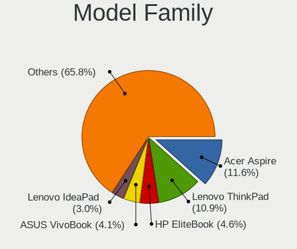

| Name                          | Notebooks | Percent |
|-------------------------------|-----------|---------|
| Acer Aspire                   | 37        | 13.26%  |
| Lenovo ThinkPad               | 30        | 10.75%  |
| HP EliteBook                  | 14        | 5.02%   |
| HP ProBook                    | 10        | 3.58%   |
| ASUS VivoBook                 | 9         | 3.23%   |
| Lenovo Legion                 | 8         | 2.87%   |
| Lenovo IdeaPad                | 8         | 2.87%   |
| HP Pavilion                   | 8         | 2.87%   |
| Dell Latitude                 | 8         | 2.87%   |
| HP Laptop                     | 7         | 2.51%   |
| Dell XPS                      | 7         | 2.51%   |
| Dell Vostro                   | 7         | 2.51%   |
| Dell Inspiron                 | 7         | 2.51%   |
| Toshiba Satellite             | 6         | 2.15%   |
| Lenovo ThinkBook              | 6         | 2.15%   |
| Acer Swift                    | 6         | 2.15%   |
| HP 250                        | 4         | 1.43%   |
| ASUS ZenBook                  | 4         | 1.43%   |
| Lenovo G710                   | 3         | 1.08%   |
| HP OMEN                       | 3         | 1.08%   |
| HP Compaq                     | 3         | 1.08%   |
| Acer Nitro                    | 3         | 1.08%   |
| Unknown                       | 3         | 1.08%   |
| Lenovo Z50-70                 | 2         | 0.72%   |
| Lenovo G40-30                 | 2         | 0.72%   |
| Lenovo B590                   | 2         | 0.72%   |
| HP 2000                       | 2         | 0.72%   |
| Fujitsu Siemens ESPRIMO       | 2         | 0.72%   |
| ASUS X751NV                   | 2         | 0.72%   |
| ASUS ROG                      | 2         | 0.72%   |
| ASUS N56VZ                    | 2         | 0.72%   |
| ASUS ASUS                     | 2         | 0.72%   |
| Valve Jupiter                 | 1         | 0.36%   |
| TUXEDO Pulse                  | 1         | 0.36%   |
| Toshiba Encore                | 1         | 0.36%   |
| Tactus GeoBook                | 1         | 0.36%   |
| System76 Oryx                 | 1         | 0.36%   |
| SHENZHEN X&F TECHNOLOGY ST106 | 1         | 0.36%   |
| Samsung SBB-DA                | 1         | 0.36%   |
| Samsung N150                  | 1         | 0.36%   |

MFG Year
--------

Motherboard manufacture year

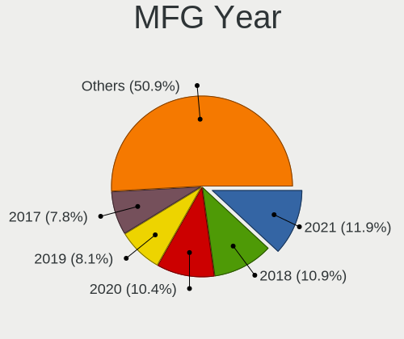

| Year    | Notebooks | Percent |
|---------|-----------|---------|
| 2018    | 37        | 13.26%  |
| 2020    | 28        | 10.04%  |
| 2019    | 27        | 9.68%   |
| 2021    | 25        | 8.96%   |
| 2017    | 25        | 8.96%   |
| 2013    | 21        | 7.53%   |
| 2016    | 20        | 7.17%   |
| 2011    | 19        | 6.81%   |
| 2014    | 18        | 6.45%   |
| 2012    | 13        | 4.66%   |
| 2007    | 10        | 3.58%   |
| 2015    | 8         | 2.87%   |
| 2008    | 8         | 2.87%   |
| 2009    | 6         | 2.15%   |
| 2010    | 5         | 1.79%   |
| 2022    | 4         | 1.43%   |
| 2006    | 3         | 1.08%   |
| 2023    | 1         | 0.36%   |
| Unknown | 1         | 0.36%   |

Form Factor
-----------

Physical design of the computer

| Name     | Notebooks | Percent |
|----------|-----------|---------|
| Notebook | 279       | 100%    |

Secure Boot
-----------

Enabled or disabled

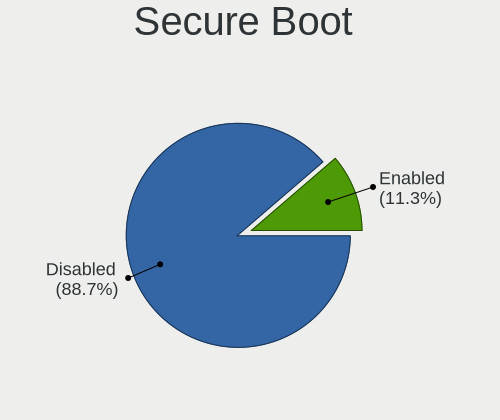

| State    | Notebooks | Percent |
|----------|-----------|---------|
| Disabled | 249       | 88.93%  |
| Enabled  | 31        | 11.07%  |

Coreboot
--------

Have coreboot on board

| Used | Notebooks | Percent |
|------|-----------|---------|
| No   | 279       | 100%    |

RAM Size
--------

Total RAM memory

| Size in GB  | Notebooks | Percent |
|-------------|-----------|---------|
| 4.01-8.0    | 86        | 30.28%  |
| 8.01-16.0   | 57        | 20.07%  |
| 3.01-4.0    | 51        | 17.96%  |
| 16.01-24.0  | 46        | 16.2%   |
| 32.01-64.0  | 18        | 6.34%   |
| 1.01-2.0    | 11        | 3.87%   |
| 24.01-32.0  | 9         | 3.17%   |
| 2.01-3.0    | 5         | 1.76%   |
| 64.01-256.0 | 1         | 0.35%   |

RAM Used
--------

Used RAM memory

| Used GB    | Notebooks | Percent |
|------------|-----------|---------|
| 1.01-2.0   | 106       | 33.33%  |
| 2.01-3.0   | 74        | 23.27%  |
| 4.01-8.0   | 53        | 16.67%  |
| 3.01-4.0   | 46        | 14.47%  |
| 0.51-1.0   | 18        | 5.66%   |
| 8.01-16.0  | 17        | 5.35%   |
| 16.01-24.0 | 2         | 0.63%   |
| 0.01-0.5   | 2         | 0.63%   |

Total Drives
------------

Number of drives on board

| Drives | Notebooks | Percent |
|--------|-----------|---------|
| 1      | 208       | 72.47%  |
| 2      | 65        | 22.65%  |
| 3      | 7         | 2.44%   |
| 0      | 3         | 1.05%   |
| 4      | 2         | 0.7%    |
| 6      | 1         | 0.35%   |
| 5      | 1         | 0.35%   |

Has CD-ROM
----------

Has CD-ROM on board

| Presented | Notebooks | Percent |
|-----------|-----------|---------|
| No        | 194       | 69.04%  |
| Yes       | 87        | 30.96%  |

Has Ethernet
------------

Has Ethernet on board

| Presented | Notebooks | Percent |
|-----------|-----------|---------|
| Yes       | 233       | 83.21%  |
| No        | 47        | 16.79%  |

Has WiFi
--------

Has WiFi module

| Presented | Notebooks | Percent |
|-----------|-----------|---------|
| Yes       | 274       | 98.21%  |
| No        | 5         | 1.79%   |

Has Bluetooth
-------------

Has Bluetooth module

| Presented | Notebooks | Percent |
|-----------|-----------|---------|
| Yes       | 229       | 80.63%  |
| No        | 55        | 19.37%  |

Location
--------

Country
-------

Geographic location (country)

| Country | Notebooks | Percent |
|---------|-----------|---------|
| Croatia | 279       | 100%    |

City
----

Geographic location (city)

| City                | Notebooks | Percent |
|---------------------|-----------|---------|
| Zagreb              | 178       | 55.28%  |
| Split               | 17        | 5.28%   |
| Rijeka              | 12        | 3.73%   |
| Varadin           | 8         | 2.48%   |
| Velika Gorica       | 6         | 1.86%   |
| Pula                | 6         | 1.86%   |
| Osijek              | 4         | 1.24%   |
| akovec            | 4         | 1.24%   |
| Zaprei          | 3         | 0.93%   |
| Petrinja            | 3         | 0.93%   |
| Jesenice            | 3         | 0.93%   |
| Bjelovar            | 3         | 0.93%   |
| Zadar               | 2         | 0.62%   |
| Virovitica          | 2         | 0.62%   |
| Rovinj              | 2         | 0.62%   |
| Omi               | 2         | 0.62%   |
| Novska              | 2         | 0.62%   |
| Krizevci            | 2         | 0.62%   |
| Koprivnica          | 2         | 0.62%   |
| Komia             | 2         | 0.62%   |
| Kastav              | 2         | 0.62%   |
| Buzin               | 2         | 0.62%   |
| akovo             | 1         | 0.31%   |
| Zminj               | 1         | 0.31%   |
| Zabok               | 1         | 0.31%   |
| Vinkovci            | 1         | 0.31%   |
| Varazdinske Toplice | 1         | 0.31%   |
| Umag                | 1         | 0.31%   |
| Udbinja             | 1         | 0.31%   |
| Trenkovo            | 1         | 0.31%   |
| Sveti Ivan Zelina   | 1         | 0.31%   |
| Sveta Marija        | 1         | 0.31%   |
| Supetar             | 1         | 0.31%   |
| Sracinec            | 1         | 0.31%   |
| Slavonski Brod      | 1         | 0.31%   |
| ibenik            | 1         | 0.31%   |
| Sesvete             | 1         | 0.31%   |
| Senj                | 1         | 0.31%   |
| Samobor             | 1         | 0.31%   |
| Rokovci             | 1         | 0.31%   |

Drives
------

Drive Vendor
------------

Hard drive vendors

| Vendor                | Notebooks | Drives | Percent |
|-----------------------|-----------|--------|---------|
| Samsung Electronics   | 58        | 72     | 16.71%  |
| WDC                   | 41        | 50     | 11.82%  |
| Kingston              | 34        | 46     | 9.8%    |
| Seagate               | 29        | 51     | 8.36%   |
| SK hynix              | 24        | 36     | 6.92%   |
| Toshiba               | 22        | 23     | 6.34%   |
| SanDisk               | 22        | 27     | 6.34%   |
| Micron Technology     | 15        | 18     | 4.32%   |
| Unknown               | 11        | 11     | 3.17%   |
| Intel                 | 10        | 16     | 2.88%   |
| Hitachi               | 10        | 10     | 2.88%   |
| Crucial               | 9         | 14     | 2.59%   |
| HGST                  | 8         | 8      | 2.31%   |
| Apple                 | 6         | 8      | 1.73%   |
| Fujitsu               | 5         | 7      | 1.44%   |
| A-DATA Technology     | 5         | 5      | 1.44%   |
| LITEON                | 4         | 5      | 1.15%   |
| Silicon Motion        | 3         | 4      | 0.86%   |
| Patriot               | 3         | 4      | 0.86%   |
| UMIS                  | 2         | 2      | 0.58%   |
| Transcend             | 2         | 3      | 0.58%   |
| Netac                 | 2         | 2      | 0.58%   |
| Lenovo                | 2         | 3      | 0.58%   |
| KIOXIA                | 2         | 2      | 0.58%   |
| KingFast              | 2         | 4      | 0.58%   |
| Intenso               | 2         | 3      | 0.58%   |
| Verbatim              | 1         | 1      | 0.29%   |
| StoreJet              | 1         | 1      | 0.29%   |
| SSK                   | 1         | 1      | 0.29%   |
| Realtek Semiconductor | 1         | 3      | 0.29%   |
| Phison Electronics    | 1         | 1      | 0.29%   |
| Phison                | 1         | 1      | 0.29%   |
| Mass                  | 1         | 1      | 0.29%   |
| Lite-On               | 1         | 1      | 0.29%   |
| LaCie                 | 1         | 1      | 0.29%   |
| JMicron Technology    | 1         | 1      | 0.29%   |
| Gigabyte Technology   | 1         | 1      | 0.29%   |
| Emtec                 | 1         | 1      | 0.29%   |
| Corsair               | 1         | 1      | 0.29%   |
| AMD                   | 1         | 3      | 0.29%   |

Drive Model
-----------

Hard drive models

| Model                                   | Notebooks | Percent |
|-----------------------------------------|-----------|---------|
| Samsung NVMe SSD Drive 512GB            | 8         | 2.27%   |
| Kingston SA400S37240G 240GB SSD         | 7         | 1.98%   |
| Micron 1100_MTFDDAV256TBN 256GB SSD     | 6         | 1.7%    |
| SanDisk NVMe SSD Drive 512GB            | 5         | 1.42%   |
| Toshiba MQ01ABD100 1TB                  | 4         | 1.13%   |
| Seagate ST1000LM024 HN-M101MBB 1TB      | 4         | 1.13%   |
| Kingston SA400S37120G 120GB SSD         | 4         | 1.13%   |
| Toshiba MQ04ABF100 1TB                  | 3         | 0.85%   |
| Toshiba MQ01ABF050 500GB                | 3         | 0.85%   |
| SK hynix NVMe SSD Drive 256GB           | 3         | 0.85%   |
| Seagate ST500LT012-1DG142 500GB         | 3         | 0.85%   |
| Seagate ST1000LM048-2E7172 1TB          | 3         | 0.85%   |
| Seagate ST1000LM035-1RK172 1TB          | 3         | 0.85%   |
| Samsung SSD 850 EVO 250GB               | 3         | 0.85%   |
| Samsung MZALQ512HALU-000L2 512GB        | 3         | 0.85%   |
| Kingston SA400S37480G 480GB SSD         | 3         | 0.85%   |
| Intel NVMe SSD Drive 256GB              | 3         | 0.85%   |
| HGST HTS721010A9E630 1TB                | 3         | 0.85%   |
| Crucial CT240BX500SSD1 240GB            | 3         | 0.85%   |
| WDC WD5000LPCX-60VHAT0 500GB            | 2         | 0.57%   |
| WDC WD5000LPCX-24C6HT0 500GB            | 2         | 0.57%   |
| WDC WD1600BEVT-22ZCT0 160GB             | 2         | 0.57%   |
| WDC WD10SPZX-21Z10T0 1TB                | 2         | 0.57%   |
| WDC WD10JPVX-22JC3T0 1TB                | 2         | 0.57%   |
| WDC PC SN730 SDBPNTY-1T00-1101 1TB      | 2         | 0.57%   |
| Unknown SD/MMC/MS PRO 64GB              | 2         | 0.57%   |
| Unknown MMC Card  32GB                  | 2         | 0.57%   |
| Unknown MMC Card  128GB                 | 2         | 0.57%   |
| SK hynix NVMe SSD Drive 512GB           | 2         | 0.57%   |
| SK hynix HFS256G39TND-N210A 256GB SSD   | 2         | 0.57%   |
| SK hynix HFS128G39TND-N210A 128GB SSD   | 2         | 0.57%   |
| SK hynix HFM512GDJTNI-82A0A 512GB       | 2         | 0.57%   |
| SK hynix BC511 HFM256GDJTNI-82A0A 256GB | 2         | 0.57%   |
| Seagate ST9500325AS 500GB               | 2         | 0.57%   |
| Seagate ST2000LM007-1R8174 2TB          | 2         | 0.57%   |
| SanDisk SD8SN8U-256G-1006 256GB SSD     | 2         | 0.57%   |
| Samsung SSD 860 QVO 1TB                 | 2         | 0.57%   |
| Samsung SM963 2.5" NVMe PCIe SSD 256GB  | 2         | 0.57%   |
| Samsung PM9A1 NVMe 2048GB               | 2         | 0.57%   |
| Samsung PM981 NVMe 512GB                | 2         | 0.57%   |

HDD Vendor
----------

Hard disk drive vendors

| Vendor              | Notebooks | Drives | Percent |
|---------------------|-----------|--------|---------|
| Seagate             | 29        | 40     | 29%     |
| WDC                 | 27        | 32     | 27%     |
| Toshiba             | 16        | 17     | 16%     |
| Hitachi             | 10        | 10     | 10%     |
| HGST                | 8         | 8      | 8%      |
| Fujitsu             | 5         | 7      | 5%      |
| Unknown             | 2         | 2      | 2%      |
| Samsung Electronics | 1         | 2      | 1%      |
| JMicron Technology  | 1         | 1      | 1%      |
| Intenso             | 1         | 2      | 1%      |

SSD Vendor
----------

Solid state drive vendors

| Vendor              | Notebooks | Drives | Percent |
|---------------------|-----------|--------|---------|
| Kingston            | 29        | 37     | 24.79%  |
| Samsung Electronics | 18        | 26     | 15.38%  |
| SanDisk             | 13        | 17     | 11.11%  |
| Micron Technology   | 10        | 11     | 8.55%   |
| Crucial             | 8         | 13     | 6.84%   |
| SK hynix            | 7         | 12     | 5.98%   |
| WDC                 | 5         | 6      | 4.27%   |
| Apple               | 5         | 5      | 4.27%   |
| A-DATA Technology   | 5         | 5      | 4.27%   |
| Patriot             | 3         | 4      | 2.56%   |
| LITEON              | 3         | 4      | 2.56%   |
| Netac               | 2         | 2      | 1.71%   |
| Intel               | 2         | 3      | 1.71%   |
| Transcend           | 1         | 2      | 0.85%   |
| Toshiba             | 1         | 1      | 0.85%   |
| StoreJet            | 1         | 1      | 0.85%   |
| Intenso             | 1         | 1      | 0.85%   |
| Gigabyte Technology | 1         | 1      | 0.85%   |
| Emtec               | 1         | 1      | 0.85%   |
| AMD                 | 1         | 3      | 0.85%   |

Drive Kind
----------

HDD or SSD

| Kind    | Notebooks | Drives | Percent |
|---------|-----------|--------|---------|
| NVMe    | 111       | 149    | 33.43%  |
| SSD     | 108       | 155    | 32.53%  |
| HDD     | 98        | 121    | 29.52%  |
| MMC     | 8         | 8      | 2.41%   |
| Unknown | 7         | 19     | 2.11%   |

Drive Connector
---------------

SATA, SAS, NVMe, etc.

| Type | Notebooks | Drives | Percent |
|------|-----------|--------|---------|
| SATA | 181       | 267    | 58.01%  |
| NVMe | 111       | 149    | 35.58%  |
| SAS  | 12        | 28     | 3.85%   |
| MMC  | 8         | 8      | 2.56%   |

Drive Size
----------

Size of hard drive

| Size in TB | Notebooks | Drives | Percent |
|------------|-----------|--------|---------|
| 0.01-0.5   | 142       | 189    | 69.27%  |
| 0.51-1.0   | 55        | 74     | 26.83%  |
| 1.01-2.0   | 7         | 11     | 3.41%   |
| 2.01-3.0   | 1         | 2      | 0.49%   |

Space Total
-----------

Amount of disk space available on the file system

| Size in GB     | Notebooks | Percent |
|----------------|-----------|---------|
| 101-250        | 94        | 32.08%  |
| 251-500        | 78        | 26.62%  |
| 501-1000       | 43        | 14.68%  |
| 1001-2000      | 27        | 9.22%   |
| 51-100         | 17        | 5.8%    |
| 1-20           | 14        | 4.78%   |
| 21-50          | 8         | 2.73%   |
| Unknown        | 7         | 2.39%   |
| 2001-3000      | 3         | 1.02%   |
| More than 3000 | 2         | 0.68%   |

Space Used
----------

Amount of used disk space

| Used GB        | Notebooks | Percent |
|----------------|-----------|---------|
| 1-20           | 102       | 32.48%  |
| 21-50          | 72        | 22.93%  |
| 101-250        | 43        | 13.69%  |
| 51-100         | 39        | 12.42%  |
| 251-500        | 23        | 7.32%   |
| 501-1000       | 23        | 7.32%   |
| Unknown        | 7         | 2.23%   |
| 1001-2000      | 4         | 1.27%   |
| More than 3000 | 1         | 0.32%   |

Malfunc. Drives
---------------

Drive models with a malfunction

| Model                                | Notebooks | Drives | Percent |
|--------------------------------------|-----------|--------|---------|
| WDC WDS240G2G0B-00EPW0 240GB SSD     | 1         | 1      | 5%      |
| WDC WD600VE-75HDT0 64GB              | 1         | 1      | 5%      |
| WDC WD10JPCX-24UE4T0 1TB             | 1         | 1      | 5%      |
| Toshiba MK6459GSXP 640GB             | 1         | 1      | 5%      |
| SK hynix SC210 2.5 7MM 256GB SSD     | 1         | 1      | 5%      |
| Seagate ST9500420AS 500GB            | 1         | 1      | 5%      |
| Seagate ST9500325AS 500GB            | 1         | 1      | 5%      |
| Seagate ST9250827AS 250GB            | 1         | 1      | 5%      |
| Seagate ST1000LM035-1RK172 1TB       | 1         | 1      | 5%      |
| Seagate ST1000LM024 HN-M101MBB 1TB   | 1         | 1      | 5%      |
| SanDisk SDSSDXPS960G 960GB           | 1         | 1      | 5%      |
| SanDisk SD6PP4M-256G-1006 256GB SSD  | 1         | 1      | 5%      |
| LITEON LMH-256V2M-11 MSATA 256GB SSD | 1         | 1      | 5%      |
| Hitachi HTS723232A7A364 320GB        | 1         | 1      | 5%      |
| Hitachi HTS542512K9SA00 120GB        | 1         | 1      | 5%      |
| HGST HTS721010A9E630 1TB             | 1         | 1      | 5%      |
| HGST HTS545050A7E380 500GB           | 1         | 1      | 5%      |
| HGST HTS541010A9E680 1TB             | 1         | 1      | 5%      |
| Crucial CT1024M550SSD1 1024GB        | 1         | 1      | 5%      |
| A-DATA Technology SU630 240GB SSD    | 1         | 1      | 5%      |

Malfunc. Drive Vendor
---------------------

Vendors of faulty drives

| Vendor            | Notebooks | Drives | Percent |
|-------------------|-----------|--------|---------|
| Seagate           | 5         | 5      | 26.32%  |
| WDC               | 3         | 3      | 15.79%  |
| HGST              | 3         | 3      | 15.79%  |
| Hitachi           | 2         | 2      | 10.53%  |
| Toshiba           | 1         | 1      | 5.26%   |
| SK hynix          | 1         | 1      | 5.26%   |
| SanDisk           | 1         | 2      | 5.26%   |
| LITEON            | 1         | 1      | 5.26%   |
| Crucial           | 1         | 1      | 5.26%   |
| A-DATA Technology | 1         | 1      | 5.26%   |

Malfunc. HDD Vendor
-------------------

Vendors of faulty HDD drives

| Vendor  | Notebooks | Drives | Percent |
|---------|-----------|--------|---------|
| Seagate | 5         | 5      | 38.46%  |
| HGST    | 3         | 3      | 23.08%  |
| WDC     | 2         | 2      | 15.38%  |
| Hitachi | 2         | 2      | 15.38%  |
| Toshiba | 1         | 1      | 7.69%   |

Malfunc. Drive Kind
-------------------

Kinds of faulty drives

| Kind | Notebooks | Drives | Percent |
|------|-----------|--------|---------|
| HDD  | 13        | 13     | 72.22%  |
| SSD  | 5         | 7      | 27.78%  |

Failed Drives
-------------

Failed drive models

Zero info for selected period =(

Failed Drive Vendor
-------------------

Failed drive vendors

Zero info for selected period =(

Drive Status
------------

Number of failed and malfunc. drives

| Status   | Notebooks | Drives | Percent |
|----------|-----------|--------|---------|
| Detected | 167       | 262    | 56.04%  |
| Works    | 113       | 170    | 37.92%  |
| Malfunc  | 18        | 20     | 6.04%   |

Storage controller
------------------

Storage Vendor
--------------

Storage controller vendors

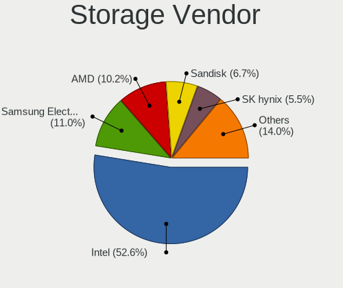

| Vendor                           | Notebooks | Percent |
|----------------------------------|-----------|---------|
| Intel                            | 197       | 55.97%  |
| Samsung Electronics              | 42        | 11.93%  |
| AMD                              | 38        | 10.8%   |
| SanDisk                          | 18        | 5.11%   |
| SK hynix                         | 17        | 4.83%   |
| Toshiba America Info Systems     | 7         | 1.99%   |
| Micron Technology                | 5         | 1.42%   |
| Kingston Technology Company      | 5         | 1.42%   |
| Silicon Motion                   | 3         | 0.85%   |
| Phison Electronics               | 3         | 0.85%   |
| Union Memory (Shenzhen)          | 2         | 0.57%   |
| Silicon Integrated Systems [SiS] | 2         | 0.57%   |
| Nvidia                           | 2         | 0.57%   |
| Lite-On Technology               | 2         | 0.57%   |
| Lenovo                           | 2         | 0.57%   |
| KIOXIA                           | 2         | 0.57%   |
| VIA Technologies                 | 1         | 0.28%   |
| Realtek Semiconductor            | 1         | 0.28%   |
| Micron/Crucial Technology        | 1         | 0.28%   |
| Marvell Technology Group         | 1         | 0.28%   |
| JMicron Technology               | 1         | 0.28%   |

Storage Model
-------------

Storage controller models

| Model                                                                            | Notebooks | Percent |
|----------------------------------------------------------------------------------|-----------|---------|
| AMD FCH SATA Controller [AHCI mode]                                              | 35        | 9.31%   |
| Intel Sunrise Point-LP SATA Controller [AHCI mode]                               | 32        | 8.51%   |
| Samsung NVMe SSD Controller 980                                                  | 17        | 4.52%   |
| Intel 7 Series Chipset Family 6-port SATA Controller [AHCI mode]                 | 16        | 4.26%   |
| Intel 8 Series/C220 Series Chipset Family 6-port SATA Controller 1 [AHCI mode]   | 15        | 3.99%   |
| Intel 8 Series SATA Controller 1 [AHCI mode]                                     | 15        | 3.99%   |
| Samsung NVMe SSD Controller SM981/PM981/PM983                                    | 14        | 3.72%   |
| Intel Cannon Lake Mobile PCH SATA AHCI Controller                                | 12        | 3.19%   |
| Intel Volume Management Device NVMe RAID Controller                              | 10        | 2.66%   |
| Intel 82801HM/HEM (ICH8M/ICH8M-E) SATA Controller [AHCI mode]                    | 9         | 2.39%   |
| Intel 82801 Mobile SATA Controller [RAID mode]                                   | 9         | 2.39%   |
| Intel 6 Series/C200 Series Chipset Family 6 port Mobile SATA AHCI Controller     | 9         | 2.39%   |
| Intel 82801IBM/IEM (ICH9M/ICH9M-E) 4 port SATA Controller [AHCI mode]            | 8         | 2.13%   |
| Intel 82801HM/HEM (ICH8M/ICH8M-E) IDE Controller                                 | 8         | 2.13%   |
| SK hynix Gold P31/PC711 NVMe Solid State Drive                                   | 7         | 1.86%   |
| Intel Tiger Lake-LP SATA Controller                                              | 7         | 1.86%   |
| SK hynix BC501 NVMe Solid State Drive                                            | 6         | 1.6%    |
| SanDisk WD Blue SN550 NVMe SSD                                                   | 6         | 1.6%    |
| SanDisk WD Black SN750 / PC SN730 NVMe SSD                                       | 5         | 1.33%   |
| Samsung NVMe SSD Controller PM9A1/PM9A3/980PRO                                   | 5         | 1.33%   |
| Micron NVMe Storage Controller                                                   | 5         | 1.33%   |
| Intel Wildcat Point-LP SATA Controller [AHCI Mode]                               | 5         | 1.33%   |
| Intel Celeron/Pentium Silver Processor SATA Controller                           | 5         | 1.33%   |
| Toshiba America Info Systems BG3 NVMe SSD Controller                             | 4         | 1.06%   |
| SK hynix BC511                                                                   | 4         | 1.06%   |
| Intel HM170/QM170 Chipset SATA Controller [AHCI Mode]                            | 4         | 1.06%   |
| Intel Atom Processor E3800 Series SATA AHCI Controller                           | 4         | 1.06%   |
| Intel 400 Series Chipset Family SATA AHCI Controller                             | 4         | 1.06%   |
| SanDisk WD Black 2018/SN750 / PC SN720 NVMe SSD                                  | 3         | 0.8%    |
| Samsung NVMe SSD Controller SM961/PM961/SM963                                    | 3         | 0.8%    |
| Samsung Electronics SATA controller                                              | 3         | 0.8%    |
| Intel SSD Pro 7600p/760p/E 6100p Series                                          | 3         | 0.8%    |
| Intel SSD 660P Series                                                            | 3         | 0.8%    |
| Intel Comet Lake SATA AHCI Controller                                            | 3         | 0.8%    |
| Intel Celeron N3350/Pentium N4200/Atom E3900 Series SATA AHCI Controller         | 3         | 0.8%    |
| Intel Atom/Celeron/Pentium Processor x5-E8000/J3xxx/N3xxx Series SATA Controller | 3         | 0.8%    |
| AMD SB7x0/SB8x0/SB9x0 SATA Controller [AHCI mode]                                | 3         | 0.8%    |
| Union Memory (Shenzhen) Non-Volatile memory controller                           | 2         | 0.53%   |
| Toshiba America Info Systems XG6 NVMe SSD Controller                             | 2         | 0.53%   |
| Silicon Motion SM2262/SM2262EN SSD Controller                                    | 2         | 0.53%   |

Storage Kind
------------

Kind of storage controller (IDE, SATA, NVMe, SAS, ...)

| Kind | Notebooks | Percent |
|------|-----------|---------|
| SATA | 208       | 57.46%  |
| NVMe | 111       | 30.66%  |
| IDE  | 24        | 6.63%   |
| RAID | 19        | 5.25%   |

Processor
---------

CPU Vendor
----------

Processor vendors

| Vendor  | Notebooks | Percent |
|---------|-----------|---------|
| Intel   | 221       | 79.21%  |
| AMD     | 57        | 20.43%  |
| Unknown | 1         | 0.36%   |

CPU Model
---------

Processor models

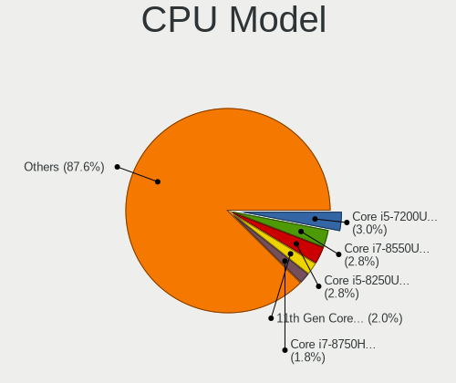

| Model                                         | Notebooks | Percent |
|-----------------------------------------------|-----------|---------|
| Intel Core i5-7200U CPU @ 2.50GHz             | 12        | 4.3%    |
| Intel Core i7-8550U CPU @ 1.80GHz             | 10        | 3.58%   |
| Intel Core i5-8250U CPU @ 1.60GHz             | 10        | 3.58%   |
| Intel Core i7-8750H CPU @ 2.20GHz             | 6         | 2.15%   |
| Intel Core i5-3210M CPU @ 2.50GHz             | 6         | 2.15%   |
| AMD Ryzen 7 5700U with Radeon Graphics        | 6         | 2.15%   |
| AMD Ryzen 5 3500U with Radeon Vega Mobile Gfx | 5         | 1.79%   |
| Intel Core i7-8565U CPU @ 1.80GHz             | 4         | 1.43%   |
| Intel Core i5-8300H CPU @ 2.30GHz             | 4         | 1.43%   |
| Intel Core i5-8265U CPU @ 1.60GHz             | 4         | 1.43%   |
| Intel Core i5-4200U CPU @ 1.60GHz             | 4         | 1.43%   |
| Intel Core i5-10210U CPU @ 1.60GHz            | 4         | 1.43%   |
| Intel 11th Gen Core i7-1165G7 @ 2.80GHz       | 4         | 1.43%   |
| Intel 11th Gen Core i5-1135G7 @ 2.40GHz       | 4         | 1.43%   |
| AMD Ryzen 7 4800H with Radeon Graphics        | 4         | 1.43%   |
| Intel Pentium Silver N5000 CPU @ 1.10GHz      | 3         | 1.08%   |
| Intel Pentium CPU N4200 @ 1.10GHz             | 3         | 1.08%   |
| Intel Pentium CPU 2020M @ 2.40GHz             | 3         | 1.08%   |
| Intel Pentium 3556U @ 1.70GHz                 | 3         | 1.08%   |
| Intel Core i7-7500U CPU @ 2.70GHz             | 3         | 1.08%   |
| Intel Core i5-6300U CPU @ 2.40GHz             | 3         | 1.08%   |
| Intel Core i5-4210U CPU @ 1.70GHz             | 3         | 1.08%   |
| Intel Celeron CPU N2840 @ 2.16GHz             | 3         | 1.08%   |
| AMD Ryzen 5 4500U with Radeon Graphics        | 3         | 1.08%   |
| AMD Ryzen 5 3550H with Radeon Vega Mobile Gfx | 3         | 1.08%   |
| Intel Pentium M processor 1.86GHz             | 2         | 0.72%   |
| Intel Pentium Dual-Core CPU T4200 @ 2.00GHz   | 2         | 0.72%   |
| Intel Core i9-9880H CPU @ 2.30GHz             | 2         | 0.72%   |
| Intel Core i7-9750H CPU @ 2.60GHz             | 2         | 0.72%   |
| Intel Core i7-7700HQ CPU @ 2.80GHz            | 2         | 0.72%   |
| Intel Core i7-6700HQ CPU @ 2.60GHz            | 2         | 0.72%   |
| Intel Core i7-10750H CPU @ 2.60GHz            | 2         | 0.72%   |
| Intel Core i5-5200U CPU @ 2.20GHz             | 2         | 0.72%   |
| Intel Core i5-4300M CPU @ 2.60GHz             | 2         | 0.72%   |
| Intel Core i5-4200M CPU @ 2.50GHz             | 2         | 0.72%   |
| Intel Core i5-2540M CPU @ 2.60GHz             | 2         | 0.72%   |
| Intel Core i5-2430M CPU @ 2.40GHz             | 2         | 0.72%   |
| Intel Core i5-2410M CPU @ 2.30GHz             | 2         | 0.72%   |
| Intel Core i5-1035G1 CPU @ 1.00GHz            | 2         | 0.72%   |
| Intel Core i5-10300H CPU @ 2.50GHz            | 2         | 0.72%   |

CPU Model Family
----------------

Processor model prefix

| Model                   | Notebooks | Percent |
|-------------------------|-----------|---------|
| Intel Core i5           | 82        | 29.39%  |
| Intel Core i7           | 46        | 16.49%  |
| Other                   | 20        | 7.17%   |
| AMD Ryzen 5             | 18        | 6.45%   |
| Intel Core i3           | 17        | 6.09%   |
| Intel Pentium           | 16        | 5.73%   |
| Intel Core 2 Duo        | 16        | 5.73%   |
| AMD Ryzen 7             | 15        | 5.38%   |
| Intel Celeron           | 8         | 2.87%   |
| Intel Pentium Dual      | 4         | 1.43%   |
| Intel Atom              | 4         | 1.43%   |
| AMD Ryzen 3             | 4         | 1.43%   |
| AMD A6                  | 4         | 1.43%   |
| Intel Pentium Silver    | 3         | 1.08%   |
| Intel Pentium Dual-Core | 3         | 1.08%   |
| Intel Core i9           | 3         | 1.08%   |
| AMD E                   | 3         | 1.08%   |
| Intel Pentium M         | 2         | 0.72%   |
| AMD Ryzen 9             | 2         | 0.72%   |
| AMD E1                  | 2         | 0.72%   |
| Intel Genuine           | 1         | 0.36%   |
| Intel Celeron M         | 1         | 0.36%   |
| AMD Turion 64 X2 Mobile | 1         | 0.36%   |
| AMD Ryzen 7 PRO         | 1         | 0.36%   |
| AMD Ryzen 5 PRO         | 1         | 0.36%   |
| AMD Athlon              | 1         | 0.36%   |
| AMD A4                  | 1         | 0.36%   |

CPU Cores
---------

Number of processor cores

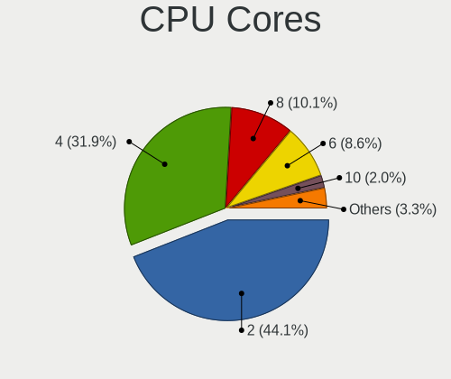

| Number  | Notebooks | Percent |
|---------|-----------|---------|
| 2       | 134       | 48.03%  |
| 4       | 96        | 34.41%  |
| 8       | 21        | 7.53%   |
| 6       | 21        | 7.53%   |
| 1       | 4         | 1.43%   |
| 14      | 1         | 0.36%   |
| 10      | 1         | 0.36%   |
| Unknown | 1         | 0.36%   |

CPU Sockets
-----------

Number of sockets

| Number  | Notebooks | Percent |
|---------|-----------|---------|
| 1       | 278       | 99.64%  |
| Unknown | 1         | 0.36%   |

CPU Threads
-----------

Threads per core (Hyper-Threading)

| Number  | Notebooks | Percent |
|---------|-----------|---------|
| 2       | 202       | 72.4%   |
| 1       | 76        | 27.24%  |
| Unknown | 1         | 0.36%   |

CPU Op-Modes
------------

CPU Operation Modes (32-bit, 64-bit)

| Op mode        | Notebooks | Percent |
|----------------|-----------|---------|
| 32-bit, 64-bit | 266       | 94.66%  |
| Unknown        | 9         | 3.2%    |
| 32-bit         | 5         | 1.78%   |
| 64-bit         | 1         | 0.36%   |

CPU Microcode
-------------

Microcode number

| Number     | Notebooks | Percent |
|------------|-----------|---------|
| Unknown    | 64        | 21.84%  |
| 0x806ea    | 17        | 5.8%    |
| 0x806e9    | 15        | 5.12%   |
| 0x306c3    | 15        | 5.12%   |
| 0x306a9    | 13        | 4.44%   |
| 0x40651    | 12        | 4.1%    |
| 0x906ea    | 11        | 3.75%   |
| 0x806ec    | 10        | 3.41%   |
| 0x806c1    | 8         | 2.73%   |
| 0x6fd      | 8         | 2.73%   |
| 0x206a7    | 8         | 2.73%   |
| 0x0a50000c | 7         | 2.39%   |
| 0x1067a    | 6         | 2.05%   |
| 0xa0652    | 5         | 1.71%   |
| 0x306d4    | 5         | 1.71%   |
| 0x08608103 | 5         | 1.71%   |
| 0x08108109 | 5         | 1.71%   |
| 0x06006705 | 5         | 1.71%   |
| 0x406e3    | 4         | 1.37%   |
| 0x30678    | 4         | 1.37%   |
| 0x10676    | 4         | 1.37%   |
| 0x08600106 | 4         | 1.37%   |
| 0x08600103 | 4         | 1.37%   |
| 0x0810100b | 4         | 1.37%   |
| 0x706e5    | 3         | 1.02%   |
| 0x706a1    | 3         | 1.02%   |
| 0x506c9    | 3         | 1.02%   |
| 0x20655    | 3         | 1.02%   |
| 0x08108102 | 3         | 1.02%   |
| 0x05000119 | 3         | 1.02%   |
| 0x906ed    | 2         | 0.68%   |
| 0x906e9    | 2         | 0.68%   |
| 0x806eb    | 2         | 0.68%   |
| 0x6fb      | 2         | 0.68%   |
| 0x6e8      | 2         | 0.68%   |
| 0x6d8      | 2         | 0.68%   |
| 0x406c4    | 2         | 0.68%   |
| 0x08608102 | 2         | 0.68%   |
| 0x906c0    | 1         | 0.34%   |
| 0x906a4    | 1         | 0.34%   |

CPU Microarch
-------------

Microarchitecture

| Name             | Notebooks | Percent |
|------------------|-----------|---------|
| KabyLake         | 72        | 25.81%  |
| Haswell          | 31        | 11.11%  |
| IvyBridge        | 17        | 6.09%   |
| Zen 2            | 12        | 4.3%    |
| TigerLake        | 12        | 4.3%    |
| Penryn           | 12        | 4.3%    |
| Unknown          | 12        | 4.3%    |
| Core             | 11        | 3.94%   |
| Silvermont       | 10        | 3.58%   |
| SandyBridge      | 10        | 3.58%   |
| Zen+             | 9         | 3.23%   |
| Zen 3            | 8         | 2.87%   |
| Skylake          | 8         | 2.87%   |
| Broadwell        | 7         | 2.51%   |
| Excavator        | 6         | 2.15%   |
| IceLake          | 5         | 1.79%   |
| Goldmont plus    | 5         | 1.79%   |
| CometLake        | 5         | 1.79%   |
| Zen              | 4         | 1.43%   |
| Westmere         | 4         | 1.43%   |
| P6               | 4         | 1.43%   |
| Bobcat           | 4         | 1.43%   |
| Goldmont         | 3         | 1.08%   |
| Alderlake Hybrid | 2         | 0.72%   |
| Tremont          | 1         | 0.36%   |
| Steamroller      | 1         | 0.36%   |
| Puma             | 1         | 0.36%   |
| K8 Hammer        | 1         | 0.36%   |
| Jaguar           | 1         | 0.36%   |
| Bonnell          | 1         | 0.36%   |

Graphics
--------

GPU Vendor
----------

Vendors of graphics cards

| Vendor                           | Notebooks | Percent |
|----------------------------------|-----------|---------|
| Intel                            | 196       | 52.13%  |
| Nvidia                           | 96        | 25.53%  |
| AMD                              | 81        | 21.54%  |
| Silicon Integrated Systems [SiS] | 2         | 0.53%   |
| VIA Technologies                 | 1         | 0.27%   |

GPU Model
---------

Graphics card models

| Model                                                                                    | Notebooks | Percent |
|------------------------------------------------------------------------------------------|-----------|---------|
| Intel UHD Graphics 620                                                                   | 22        | 5.73%   |
| Intel HD Graphics 620                                                                    | 17        | 4.43%   |
| Intel Haswell-ULT Integrated Graphics Controller                                         | 15        | 3.91%   |
| Intel 3rd Gen Core processor Graphics Controller                                         | 15        | 3.91%   |
| Intel CoffeeLake-H GT2 [UHD Graphics 630]                                                | 13        | 3.39%   |
| Intel 4th Gen Core Processor Integrated Graphics Controller                              | 13        | 3.39%   |
| Intel TigerLake-LP GT2 [Iris Xe Graphics]                                                | 12        | 3.13%   |
| AMD Renoir                                                                               | 11        | 2.86%   |
| Intel WhiskeyLake-U GT2 [UHD Graphics 620]                                               | 9         | 2.34%   |
| AMD Picasso/Raven 2 [Radeon Vega Series / Radeon Vega Mobile Series]                     | 9         | 2.34%   |
| Nvidia GP107M [GeForce GTX 1050 Mobile]                                                  | 8         | 2.08%   |
| Intel 2nd Generation Core Processor Family Integrated Graphics Controller                | 8         | 2.08%   |
| AMD Lucienne                                                                             | 8         | 2.08%   |
| AMD Sun XT [Radeon HD 8670A/8670M/8690M / R5 M330 / M430 / Radeon 520 Mobile]            | 7         | 1.82%   |
| Nvidia GA106M [GeForce RTX 3060 Mobile / Max-Q]                                          | 6         | 1.56%   |
| Intel Mobile 4 Series Chipset Integrated Graphics Controller                             | 6         | 1.56%   |
| Intel Atom Processor Z36xxx/Z37xxx Series Graphics & Display                             | 6         | 1.56%   |
| AMD Stoney [Radeon R2/R3/R4/R5 Graphics]                                                 | 6         | 1.56%   |
| AMD Cezanne [Radeon Vega Series / Radeon Vega Mobile Series]                             | 6         | 1.56%   |
| Nvidia GP107M [GeForce GTX 1050 Ti Mobile]                                               | 5         | 1.3%    |
| Nvidia GM108M [GeForce 840M]                                                             | 5         | 1.3%    |
| Intel Skylake GT2 [HD Graphics 520]                                                      | 5         | 1.3%    |
| Intel HD Graphics 5500                                                                   | 5         | 1.3%    |
| Intel CometLake-H GT2 [UHD Graphics]                                                     | 5         | 1.3%    |
| AMD Seymour [Radeon HD 6400M/7400M Series]                                               | 5         | 1.3%    |
| Nvidia TU117M [GeForce GTX 1650 Ti Mobile]                                               | 4         | 1.04%   |
| Nvidia TU117M [GeForce GTX 1650 Mobile / Max-Q]                                          | 4         | 1.04%   |
| Nvidia GM107M [GeForce GTX 950M]                                                         | 4         | 1.04%   |
| Intel Core Processor Integrated Graphics Controller                                      | 4         | 1.04%   |
| Intel CometLake-U GT2 [UHD Graphics]                                                     | 4         | 1.04%   |
| Intel Atom/Celeron/Pentium Processor x5-E8000/J3xxx/N3xxx Integrated Graphics Controller | 4         | 1.04%   |
| AMD Raven Ridge [Radeon Vega Series / Radeon Vega Mobile Series]                         | 4         | 1.04%   |
| Nvidia TU117M                                                                            | 3         | 0.78%   |
| Nvidia GM108M [GeForce MX130]                                                            | 3         | 0.78%   |
| Nvidia GM108M [GeForce 940MX]                                                            | 3         | 0.78%   |
| Nvidia GM108M [GeForce 920MX]                                                            | 3         | 0.78%   |
| Nvidia GF117M [GeForce 610M/710M/810M/820M / GT 620M/625M/630M/720M]                     | 3         | 0.78%   |
| Nvidia GA107M [GeForce RTX 3050 Mobile]                                                  | 3         | 0.78%   |
| Intel Iris Plus Graphics G1 (Ice Lake)                                                   | 3         | 0.78%   |
| Intel GeminiLake [UHD Graphics 605]                                                      | 3         | 0.78%   |

GPU Combo
---------

Combinations of graphics cards

| Name           | Notebooks | Percent |
|----------------|-----------|---------|
| 1 x Intel      | 109       | 39.07%  |
| Intel + Nvidia | 67        | 24.01%  |
| 1 x AMD        | 46        | 16.49%  |
| Intel + AMD    | 20        | 7.17%   |
| 1 x Nvidia     | 18        | 6.45%   |
| AMD + Nvidia   | 11        | 3.94%   |
| 2 x AMD        | 4         | 1.43%   |
| 1 x SiS        | 2         | 0.72%   |
| Other          | 1         | 0.36%   |
| 1 x VIA        | 1         | 0.36%   |

GPU Driver
----------

Free vs proprietary

| Driver      | Notebooks | Percent |
|-------------|-----------|---------|
| Free        | 222       | 79.29%  |
| Proprietary | 49        | 17.5%   |
| Unknown     | 9         | 3.21%   |

GPU Memory
----------

Total video memory

| Size in GB | Notebooks | Percent |
|------------|-----------|---------|
| Unknown    | 162       | 55.86%  |
| 1.01-2.0   | 42        | 14.48%  |
| 0.01-0.5   | 35        | 12.07%  |
| 3.01-4.0   | 30        | 10.34%  |
| 0.51-1.0   | 14        | 4.83%   |
| 7.01-8.0   | 4         | 1.38%   |
| 5.01-6.0   | 2         | 0.69%   |
| 2.01-3.0   | 1         | 0.34%   |

Monitor
-------

Monitor Vendor
--------------

Monitor vendors

| Vendor                  | Notebooks | Percent |
|-------------------------|-----------|---------|
| AU Optronics            | 53        | 16.21%  |
| LG Display              | 49        | 14.98%  |
| BOE                     | 46        | 14.07%  |
| Chimei Innolux          | 41        | 12.54%  |
| Samsung Electronics     | 36        | 11.01%  |
| Dell                    | 26        | 7.95%   |
| Sharp                   | 9         | 2.75%   |
| Lenovo                  | 6         | 1.83%   |
| Goldstar                | 6         | 1.83%   |
| PANDA                   | 5         | 1.53%   |
| Chi Mei Optoelectronics | 5         | 1.53%   |
| Apple                   | 5         | 1.53%   |
| CSO                     | 4         | 1.22%   |
| AOC                     | 4         | 1.22%   |
| LG Philips              | 3         | 0.92%   |
| InfoVision              | 3         | 0.92%   |
| Quanta Display          | 2         | 0.61%   |
| Philips                 | 2         | 0.61%   |
| Hewlett-Packard         | 2         | 0.61%   |
| Grundig                 | 2         | 0.61%   |
| BenQ                    | 2         | 0.61%   |
| Valve                   | 1         | 0.31%   |
| Sony                    | 1         | 0.31%   |
| Panasonic               | 1         | 0.31%   |
| NCS                     | 1         | 0.31%   |
| MSI                     | 1         | 0.31%   |
| InnoLux Display         | 1         | 0.31%   |
| Iiyama                  | 1         | 0.31%   |
| IBM                     | 1         | 0.31%   |
| HJW                     | 1         | 0.31%   |
| Fujitsu Siemens         | 1         | 0.31%   |
| Daewoo                  | 1         | 0.31%   |
| CPT                     | 1         | 0.31%   |
| BOE Technology Group    | 1         | 0.31%   |
| Ancor Communications    | 1         | 0.31%   |
| Achieva Shimian         | 1         | 0.31%   |
| Acer                    | 1         | 0.31%   |

Monitor Model
-------------

Monitor models

| Model                                                                     | Notebooks | Percent |
|---------------------------------------------------------------------------|-----------|---------|
| BOE LCD Monitor BOE06A5 1366x768 344x194mm 15.5-inch                      | 6         | 1.8%    |
| AU Optronics LCD Monitor AUO38ED 1920x1080 344x193mm 15.5-inch            | 5         | 1.5%    |
| LG Display LCD Monitor LGD062E 1920x1080 344x194mm 15.5-inch              | 4         | 1.2%    |
| Chimei Innolux LCD Monitor CMN15D5 1920x1080 344x193mm 15.5-inch          | 4         | 1.2%    |
| BOE LCD Monitor BOE06BA 1920x1080 344x193mm 15.5-inch                     | 4         | 1.2%    |
| LG Display LCD Monitor LGD069A 1920x1080 344x194mm 15.5-inch              | 3         | 0.9%    |
| LG Display LCD Monitor LGD034D 1366x768 344x194mm 15.5-inch               | 3         | 0.9%    |
| LG Display LCD Monitor LGD02DC 1366x768 344x194mm 15.5-inch               | 3         | 0.9%    |
| Lenovo LCD Monitor LEN40BA 1920x1080 344x194mm 15.5-inch                  | 3         | 0.9%    |
| Dell SE2717H/HX DELD0A1 1920x1080 598x336mm 27.0-inch                     | 3         | 0.9%    |
| Chimei Innolux LCD Monitor CMN15C4 1920x1080 344x193mm 15.5-inch          | 3         | 0.9%    |
| Chimei Innolux LCD Monitor CMN14D4 1920x1080 309x173mm 13.9-inch          | 3         | 0.9%    |
| BOE LCD Monitor BOE0687 1920x1080 344x193mm 15.5-inch                     | 3         | 0.9%    |
| AU Optronics LCD Monitor AUO403D 1920x1080 309x173mm 13.9-inch            | 3         | 0.9%    |
| Sharp LCD Monitor SHP14FA 3840x2400 288x180mm 13.4-inch                   | 2         | 0.6%    |
| Sharp LCD Monitor SHP149A 1920x1080 344x194mm 15.5-inch                   | 2         | 0.6%    |
| Samsung Electronics LCD Monitor SEC5441 1366x768 344x194mm 15.5-inch      | 2         | 0.6%    |
| Samsung Electronics LCD Monitor SEC3152 1366x768 344x194mm 15.5-inch      | 2         | 0.6%    |
| Samsung Electronics LCD Monitor SEC304C 1366x768 353x198mm 15.9-inch      | 2         | 0.6%    |
| Quanta Display LCD Monitor QDS002D 1400x1050 285x214mm 14.0-inch          | 2         | 0.6%    |
| PANDA LCD Monitor NCP004D 1920x1080 344x194mm 15.5-inch                   | 2         | 0.6%    |
| LG Philips LCD Monitor LPLA002 1440x900 367x230mm 17.1-inch               | 2         | 0.6%    |
| LG Display LCD Monitor LGD05D8 1920x1080 344x194mm 15.5-inch              | 2         | 0.6%    |
| LG Display LCD Monitor LGD0590 1920x1080 344x194mm 15.5-inch              | 2         | 0.6%    |
| LG Display LCD Monitor LGD04E8 1920x1080 382x215mm 17.3-inch              | 2         | 0.6%    |
| LG Display LCD Monitor LGD0289 1600x900 382x215mm 17.3-inch               | 2         | 0.6%    |
| LG Display LCD Monitor LGD0258 1600x900 345x194mm 15.6-inch               | 2         | 0.6%    |
| InfoVision LCD Monitor IVO057D 1920x1080 309x174mm 14.0-inch              | 2         | 0.6%    |
| Grundig WUXGA GRU4448 1920x1080                                           | 2         | 0.6%    |
| Goldstar 22EN43 GSM59D8 1920x1080 477x268mm 21.5-inch                     | 2         | 0.6%    |
| Dell U2412M DELA07A 1920x1200 518x324mm 24.1-inch                         | 2         | 0.6%    |
| Dell U2312HM DEL4072 1920x1080 510x287mm 23.0-inch                        | 2         | 0.6%    |
| Dell S2421HN DEL41F1 1920x1080 527x296mm 23.8-inch                        | 2         | 0.6%    |
| Dell P2417H DELA0DB 1920x1080 527x296mm 23.8-inch                         | 2         | 0.6%    |
| Chimei Innolux LCD Monitor CMN1734 1600x900 382x214mm 17.2-inch           | 2         | 0.6%    |
| Chimei Innolux LCD Monitor CMN15F5 1920x1080 344x193mm 15.5-inch          | 2         | 0.6%    |
| Chimei Innolux LCD Monitor CMN1487 1366x768 309x173mm 13.9-inch           | 2         | 0.6%    |
| Chi Mei Optoelectronics LCD Monitor CMO1720 1920x1080 382x215mm 17.3-inch | 2         | 0.6%    |
| AU Optronics LCD Monitor AUODF87 1920x1080 344x193mm 15.5-inch            | 2         | 0.6%    |
| AU Optronics LCD Monitor AUO8174 1280x800 331x207mm 15.4-inch             | 2         | 0.6%    |

Monitor Resolution
------------------

Monitor screen resolution

| Resolution         | Notebooks | Percent |
|--------------------|-----------|---------|
| 1920x1080 (FHD)    | 151       | 50%     |
| 1366x768 (WXGA)    | 53        | 17.55%  |
| 1600x900 (HD+)     | 24        | 7.95%   |
| 3840x2160 (4K)     | 15        | 4.97%   |
| 2560x1440 (QHD)    | 10        | 3.31%   |
| 1440x900 (WXGA+)   | 9         | 2.98%   |
| 1280x800 (WXGA)    | 7         | 2.32%   |
| 2560x1600          | 5         | 1.66%   |
| 1680x1050 (WSXGA+) | 5         | 1.66%   |
| 1920x1200 (WUXGA)  | 4         | 1.32%   |
| 2160x1440          | 3         | 0.99%   |
| 3840x2400          | 2         | 0.66%   |
| 3440x1440          | 2         | 0.66%   |
| 2880x1800          | 2         | 0.66%   |
| 1400x1050          | 2         | 0.66%   |
| 1280x1024 (SXGA)   | 2         | 0.66%   |
| 800x1280           | 1         | 0.33%   |
| 1920x1280          | 1         | 0.33%   |
| 1280x960           | 1         | 0.33%   |
| 1280x720 (HD)      | 1         | 0.33%   |
| 1024x600           | 1         | 0.33%   |
| 1024x576           | 1         | 0.33%   |

Monitor Diagonal
----------------

Diagonal size in inches

| Inches  | Notebooks | Percent |
|---------|-----------|---------|
| 15      | 147       | 44.55%  |
| 17      | 43        | 13.03%  |
| 14      | 27        | 8.18%   |
| 13      | 27        | 8.18%   |
| 27      | 19        | 5.76%   |
| 24      | 14        | 4.24%   |
| 23      | 9         | 2.73%   |
| 12      | 7         | 2.12%   |
| 54      | 6         | 1.82%   |
| 21      | 5         | 1.52%   |
| 16      | 5         | 1.52%   |
| 31      | 4         | 1.21%   |
| Unknown | 3         | 0.91%   |
| 34      | 2         | 0.61%   |
| 20      | 2         | 0.61%   |
| 10      | 2         | 0.61%   |
| 72      | 1         | 0.3%    |
| 49      | 1         | 0.3%    |
| 38      | 1         | 0.3%    |
| 26      | 1         | 0.3%    |
| 25      | 1         | 0.3%    |
| 18      | 1         | 0.3%    |
| 11      | 1         | 0.3%    |
| 7       | 1         | 0.3%    |

Monitor Width
-------------

Physical width

| Width in mm | Notebooks | Percent |
|-------------|-----------|---------|
| 301-350     | 184       | 56.62%  |
| 351-400     | 47        | 14.46%  |
| 501-600     | 35        | 10.77%  |
| 201-300     | 27        | 8.31%   |
| 401-500     | 9         | 2.77%   |
| 601-700     | 8         | 2.46%   |
| 1001-1500   | 7         | 2.15%   |
| Unknown     | 3         | 0.92%   |
| 701-800     | 2         | 0.62%   |
| 801-900     | 1         | 0.31%   |
| 1501-2000   | 1         | 0.31%   |
| 1-100       | 1         | 0.31%   |

Aspect Ratio
------------

Proportional relationship between the width and the height

| Ratio   | Notebooks | Percent |
|---------|-----------|---------|
| 16/9    | 230       | 82.73%  |
| 16/10   | 35        | 12.59%  |
| 3/2     | 5         | 1.8%    |
| 4/3     | 3         | 1.08%   |
| 21/9    | 2         | 0.72%   |
| 5/4     | 1         | 0.36%   |
| 0.67    | 1         | 0.36%   |
| Unknown | 1         | 0.36%   |

Monitor Area
------------

Area in inch

| Area in inch | Notebooks | Percent |
|----------------|-----------|---------|
| 101-110        | 147       | 44.55%  |
| 81-90          | 42        | 12.73%  |
| 121-130        | 35        | 10.61%  |
| 201-250        | 22        | 6.67%   |
| 301-350        | 20        | 6.06%   |
| 71-80          | 11        | 3.33%   |
| More than 1000 | 8         | 2.42%   |
| 131-140        | 7         | 2.12%   |
| 61-70          | 6         | 1.82%   |
| 351-500        | 6         | 1.82%   |
| 151-200        | 5         | 1.52%   |
| 251-300        | 4         | 1.21%   |
| 111-120        | 4         | 1.21%   |
| 91-100         | 3         | 0.91%   |
| Unknown        | 3         | 0.91%   |
| 41-50          | 2         | 0.61%   |
| 141-150        | 2         | 0.61%   |
| 51-60          | 1         | 0.3%    |
| 1-40           | 1         | 0.3%    |
| 501-1000       | 1         | 0.3%    |

Pixel Density
-------------

Pixels per inch

| Density       | Notebooks | Percent |
|---------------|-----------|---------|
| 121-160       | 152       | 47.5%   |
| 101-120       | 81        | 25.31%  |
| 51-100        | 53        | 16.56%  |
| 161-240       | 18        | 5.63%   |
| 1-50          | 8         | 2.5%    |
| More than 240 | 5         | 1.56%   |
| Unknown       | 3         | 0.94%   |

Multiple Monitors
-----------------

Total monitors connected

| Total | Notebooks | Percent |
|-------|-----------|---------|
| 1     | 218       | 75.17%  |
| 2     | 56        | 19.31%  |
| 0     | 9         | 3.1%    |
| 3     | 6         | 2.07%   |
| 4     | 1         | 0.34%   |

Network
-------

Net Controller Vendor
---------------------

Controller vendors

| Vendor                            | Notebooks | Percent |
|-----------------------------------|-----------|---------|
| Realtek Semiconductor             | 166       | 36.4%   |
| Intel                             | 138       | 30.26%  |
| Qualcomm Atheros                  | 71        | 15.57%  |
| Broadcom                          | 23        | 5.04%   |
| MediaTek                          | 12        | 2.63%   |
| Broadcom Limited                  | 6         | 1.32%   |
| TP-Link                           | 4         | 0.88%   |
| Samsung Electronics               | 4         | 0.88%   |
| Marvell Technology Group          | 4         | 0.88%   |
| Xiaomi                            | 3         | 0.66%   |
| Silicon Integrated Systems [SiS]  | 2         | 0.44%   |
| Ralink Technology                 | 2         | 0.44%   |
| Ralink                            | 2         | 0.44%   |
| Qualcomm Atheros Communications   | 2         | 0.44%   |
| Qualcomm                          | 2         | 0.44%   |
| Lenovo                            | 2         | 0.44%   |
| Ericsson Business Mobile Networks | 2         | 0.44%   |
| Dell                              | 2         | 0.44%   |
| D-Link                            | 2         | 0.44%   |
| VIA Technologies                  | 1         | 0.22%   |
| Nvidia                            | 1         | 0.22%   |
| HTC (High Tech Computer)          | 1         | 0.22%   |
| Hewlett-Packard                   | 1         | 0.22%   |
| Fibocom                           | 1         | 0.22%   |
| DisplayLink                       | 1         | 0.22%   |
| ASIX Electronics                  | 1         | 0.22%   |

Net Controller Model
--------------------

Controller models

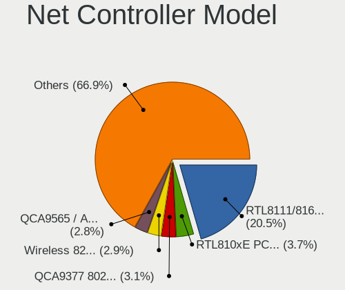

| Model                                                                   | Notebooks | Percent |
|-------------------------------------------------------------------------|-----------|---------|
| Realtek RTL8111/8168/8411 PCI Express Gigabit Ethernet Controller       | 124       | 23.18%  |
| Qualcomm Atheros QCA9377 802.11ac Wireless Network Adapter              | 21        | 3.93%   |
| Intel Wireless 8265 / 8275                                              | 20        | 3.74%   |
| Realtek RTL810xE PCI Express Fast Ethernet controller                   | 17        | 3.18%   |
| Intel Wi-Fi 6 AX200                                                     | 16        | 2.99%   |
| Qualcomm Atheros QCA9565 / AR9565 Wireless Network Adapter              | 13        | 2.43%   |
| Realtek RTL8822CE 802.11ac PCIe Wireless Network Adapter                | 11        | 2.06%   |
| MediaTek MT7921 802.11ax PCI Express Wireless Network Adapter           | 10        | 1.87%   |
| Realtek RTL8821CE 802.11ac PCIe Wireless Network Adapter                | 9         | 1.68%   |
| Realtek RTL8153 Gigabit Ethernet Adapter                                | 9         | 1.68%   |
| Intel Ethernet Connection (4) I219-V                                    | 9         | 1.68%   |
| Qualcomm Atheros AR9485 Wireless Network Adapter                        | 8         | 1.5%    |
| Intel Wireless 7260                                                     | 8         | 1.5%    |
| Intel Dual Band Wireless-AC 3168NGW [Stone Peak]                        | 8         | 1.5%    |
| Qualcomm Atheros AR242x / AR542x Wireless Network Adapter (PCI-Express) | 7         | 1.31%   |
| Intel Wireless 7265                                                     | 7         | 1.31%   |
| Intel Cannon Lake PCH CNVi WiFi                                         | 7         | 1.31%   |
| Qualcomm Atheros QCA6174 802.11ac Wireless Network Adapter              | 6         | 1.12%   |
| Intel Wireless 3165                                                     | 6         | 1.12%   |
| Intel Wireless 3160                                                     | 6         | 1.12%   |
| Intel Wi-Fi 6 AX201                                                     | 6         | 1.12%   |
| Intel 82579LM Gigabit Network Connection (Lewisville)                   | 6         | 1.12%   |
| Broadcom BCM43142 802.11b/g/n                                           | 6         | 1.12%   |
| Qualcomm Atheros QCA8172 Fast Ethernet                                  | 5         | 0.93%   |
| Qualcomm Atheros AR9285 Wireless Network Adapter (PCI-Express)          | 5         | 0.93%   |
| Intel Ethernet Connection I217-LM                                       | 5         | 0.93%   |
| Intel Centrino Advanced-N 6205 [Taylor Peak]                            | 5         | 0.93%   |
| Realtek RTL8822BE 802.11a/b/g/n/ac WiFi adapter                         | 4         | 0.75%   |
| Realtek RTL8723BE PCIe Wireless Network Adapter                         | 4         | 0.75%   |
| Qualcomm Atheros AR8152 v2.0 Fast Ethernet                              | 4         | 0.75%   |
| Intel Dual Band Wireless-AC 3165 Plus Bluetooth                         | 4         | 0.75%   |
| Intel Comet Lake PCH-LP CNVi WiFi                                       | 4         | 0.75%   |
| Intel Comet Lake PCH CNVi WiFi                                          | 4         | 0.75%   |
| Intel Centrino Advanced-N 6235                                          | 4         | 0.75%   |
| Samsung Galaxy series, misc. (tethering mode)                           | 3         | 0.56%   |
| Qualcomm Atheros AR8161 Gigabit Ethernet                                | 3         | 0.56%   |
| Qualcomm Atheros AR8132 Fast Ethernet                                   | 3         | 0.56%   |
| Intel Wireless-AC 9260                                                  | 3         | 0.56%   |
| Intel WiFi Link 5100                                                    | 3         | 0.56%   |
| Intel PRO/Wireless 4965 AG or AGN [Kedron] Network Connection           | 3         | 0.56%   |

Wireless Vendor
---------------

Wireless vendors

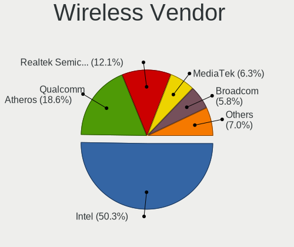

| Vendor                          | Notebooks | Percent |
|---------------------------------|-----------|---------|
| Intel                           | 137       | 48.24%  |
| Qualcomm Atheros                | 62        | 21.83%  |
| Realtek Semiconductor           | 36        | 12.68%  |
| Broadcom                        | 16        | 5.63%   |
| MediaTek                        | 12        | 4.23%   |
| TP-Link                         | 4         | 1.41%   |
| Broadcom Limited                | 4         | 1.41%   |
| Ralink Technology               | 2         | 0.7%    |
| Ralink                          | 2         | 0.7%    |
| Qualcomm Atheros Communications | 2         | 0.7%    |
| Qualcomm                        | 2         | 0.7%    |
| Dell                            | 2         | 0.7%    |
| D-Link                          | 2         | 0.7%    |
| Fibocom                         | 1         | 0.35%   |

Wireless Model
--------------

Wireless models

| Model                                                                   | Notebooks | Percent |
|-------------------------------------------------------------------------|-----------|---------|
| Qualcomm Atheros QCA9377 802.11ac Wireless Network Adapter              | 21        | 7.39%   |
| Intel Wireless 8265 / 8275                                              | 20        | 7.04%   |
| Intel Wi-Fi 6 AX200                                                     | 16        | 5.63%   |
| Qualcomm Atheros QCA9565 / AR9565 Wireless Network Adapter              | 13        | 4.58%   |
| Realtek RTL8822CE 802.11ac PCIe Wireless Network Adapter                | 11        | 3.87%   |
| MediaTek MT7921 802.11ax PCI Express Wireless Network Adapter           | 10        | 3.52%   |
| Realtek RTL8821CE 802.11ac PCIe Wireless Network Adapter                | 9         | 3.17%   |
| Qualcomm Atheros AR9485 Wireless Network Adapter                        | 8         | 2.82%   |
| Intel Wireless 7260                                                     | 8         | 2.82%   |
| Intel Dual Band Wireless-AC 3168NGW [Stone Peak]                        | 8         | 2.82%   |
| Qualcomm Atheros AR242x / AR542x Wireless Network Adapter (PCI-Express) | 7         | 2.46%   |
| Intel Wireless 7265                                                     | 7         | 2.46%   |
| Intel Cannon Lake PCH CNVi WiFi                                         | 7         | 2.46%   |
| Qualcomm Atheros QCA6174 802.11ac Wireless Network Adapter              | 6         | 2.11%   |
| Intel Wireless 3165                                                     | 6         | 2.11%   |
| Intel Wireless 3160                                                     | 6         | 2.11%   |
| Intel Wi-Fi 6 AX201                                                     | 6         | 2.11%   |
| Broadcom BCM43142 802.11b/g/n                                           | 6         | 2.11%   |
| Qualcomm Atheros AR9285 Wireless Network Adapter (PCI-Express)          | 5         | 1.76%   |
| Intel Centrino Advanced-N 6205 [Taylor Peak]                            | 5         | 1.76%   |
| Realtek RTL8822BE 802.11a/b/g/n/ac WiFi adapter                         | 4         | 1.41%   |
| Realtek RTL8723BE PCIe Wireless Network Adapter                         | 4         | 1.41%   |
| Intel Dual Band Wireless-AC 3165 Plus Bluetooth                         | 4         | 1.41%   |
| Intel Comet Lake PCH-LP CNVi WiFi                                       | 4         | 1.41%   |
| Intel Comet Lake PCH CNVi WiFi                                          | 4         | 1.41%   |
| Intel Centrino Advanced-N 6235                                          | 4         | 1.41%   |
| Intel Wireless-AC 9260                                                  | 3         | 1.06%   |
| Intel WiFi Link 5100                                                    | 3         | 1.06%   |
| Intel PRO/Wireless 4965 AG or AGN [Kedron] Network Connection           | 3         | 1.06%   |
| Intel Ice Lake-LP PCH CNVi WiFi                                         | 3         | 1.06%   |
| Broadcom Limited BCM4312 802.11b/g LP-PHY                               | 3         | 1.06%   |
| TP-Link TL-WN722N v2/v3 [Realtek RTL8188EUS]                            | 2         | 0.7%    |
| Realtek RTL8852AE 802.11ax PCIe Wireless Network Adapter                | 2         | 0.7%    |
| Realtek RTL8821AE 802.11ac PCIe Wireless Network Adapter                | 2         | 0.7%    |
| Qualcomm QCA6390 Wireless Network Adapter                               | 2         | 0.7%    |
| Qualcomm Atheros AR9462 Wireless Network Adapter                        | 2         | 0.7%    |
| Intel Wireless 8260                                                     | 2         | 0.7%    |
| Intel PRO/Wireless 5100 AGN [Shiloh] Network Connection                 | 2         | 0.7%    |
| Intel Centrino Wireless-N 100                                           | 2         | 0.7%    |
| Intel Cannon Point-LP CNVi [Wireless-AC]                                | 2         | 0.7%    |

Ethernet Vendor
---------------

Ethernet vendors

| Vendor                           | Notebooks | Percent |
|----------------------------------|-----------|---------|
| Realtek Semiconductor            | 152       | 62.04%  |
| Intel                            | 45        | 18.37%  |
| Qualcomm Atheros                 | 19        | 7.76%   |
| Broadcom                         | 7         | 2.86%   |
| Samsung Electronics              | 4         | 1.63%   |
| Marvell Technology Group         | 4         | 1.63%   |
| Xiaomi                           | 3         | 1.22%   |
| Silicon Integrated Systems [SiS] | 2         | 0.82%   |
| Lenovo                           | 2         | 0.82%   |
| Broadcom Limited                 | 2         | 0.82%   |
| VIA Technologies                 | 1         | 0.41%   |
| Nvidia                           | 1         | 0.41%   |
| HTC (High Tech Computer)         | 1         | 0.41%   |
| DisplayLink                      | 1         | 0.41%   |
| ASIX Electronics                 | 1         | 0.41%   |

Ethernet Model
--------------

Ethernet models

| Model                                                             | Notebooks | Percent |
|-------------------------------------------------------------------|-----------|---------|
| Realtek RTL8111/8168/8411 PCI Express Gigabit Ethernet Controller | 124       | 50.41%  |
| Realtek RTL810xE PCI Express Fast Ethernet controller             | 17        | 6.91%   |
| Realtek RTL8153 Gigabit Ethernet Adapter                          | 9         | 3.66%   |
| Intel Ethernet Connection (4) I219-V                              | 9         | 3.66%   |
| Intel 82579LM Gigabit Network Connection (Lewisville)             | 6         | 2.44%   |
| Qualcomm Atheros QCA8172 Fast Ethernet                            | 5         | 2.03%   |
| Intel Ethernet Connection I217-LM                                 | 5         | 2.03%   |
| Qualcomm Atheros AR8152 v2.0 Fast Ethernet                        | 4         | 1.63%   |
| Samsung Galaxy series, misc. (tethering mode)                     | 3         | 1.22%   |
| Qualcomm Atheros AR8161 Gigabit Ethernet                          | 3         | 1.22%   |
| Qualcomm Atheros AR8132 Fast Ethernet                             | 3         | 1.22%   |
| Intel Ethernet Connection I218-LM                                 | 3         | 1.22%   |
| Intel 82567LM Gigabit Network Connection                          | 3         | 1.22%   |
| Xiaomi Mi/Redmi series (RNDIS)                                    | 2         | 0.81%   |
| Silicon Integrated Systems [SiS] 191 Gigabit Ethernet Adapter     | 2         | 0.81%   |
| Realtek Killer E2600 Gigabit Ethernet Controller                  | 2         | 0.81%   |
| Qualcomm Atheros QCA8171 Gigabit Ethernet                         | 2         | 0.81%   |
| Marvell Group 88E8055 PCI-E Gigabit Ethernet Controller           | 2         | 0.81%   |
| Lenovo USB-C Dock Ethernet                                        | 2         | 0.81%   |
| Intel Ethernet Connection I219-LM                                 | 2         | 0.81%   |
| Intel Ethernet Connection (6) I219-V                              | 2         | 0.81%   |
| Intel Ethernet Connection (4) I219-LM                             | 2         | 0.81%   |
| Intel 82577LM Gigabit Network Connection                          | 2         | 0.81%   |
| Broadcom NetXtreme BCM5751M Gigabit Ethernet PCI Express          | 2         | 0.81%   |
| Xiaomi Mi/Redmi series (RNDIS + ADB)                              | 1         | 0.41%   |
| VIA VT6102/VT6103 [Rhine-II]                                      | 1         | 0.41%   |
| Samsung GT-I9070 (network tethering, USB debugging enabled)       | 1         | 0.41%   |
| Realtek RTL8152 Fast Ethernet Adapter                             | 1         | 0.41%   |
| Qualcomm Atheros AR8151 v2.0 Gigabit Ethernet                     | 1         | 0.41%   |
| Qualcomm Atheros AR8121/AR8113/AR8114 Gigabit or Fast Ethernet    | 1         | 0.41%   |
| Nvidia MCP67 Ethernet                                             | 1         | 0.41%   |
| Marvell Group 88E8072 PCI-E Gigabit Ethernet Controller           | 1         | 0.41%   |
| Marvell Group 88E8040 PCI-E Fast Ethernet Controller              | 1         | 0.41%   |
| Intel Ethernet Connection I217-V                                  | 1         | 0.41%   |
| Intel Ethernet Connection (7) I219-V                              | 1         | 0.41%   |
| Intel Ethernet Connection (7) I219-LM                             | 1         | 0.41%   |
| Intel Ethernet Connection (6) I219-LM                             | 1         | 0.41%   |
| Intel Ethernet Connection (5) I219-LM                             | 1         | 0.41%   |
| Intel Ethernet Connection (3) I218-LM                             | 1         | 0.41%   |
| Intel Ethernet Connection (16) I219-LM                            | 1         | 0.41%   |

Net Controller Kind
-------------------

Ethernet, WiFi or modem

| Kind     | Notebooks | Percent |
|----------|-----------|---------|
| WiFi     | 274       | 53.52%  |
| Ethernet | 233       | 45.51%  |
| Modem    | 4         | 0.78%   |
| Unknown  | 1         | 0.2%    |

Used Controller
---------------

Currently used network controller

| Kind     | Notebooks | Percent |
|----------|-----------|---------|
| WiFi     | 237       | 78.22%  |
| Ethernet | 66        | 21.78%  |

NICs
----

Total network controllers on board

| Total | Notebooks | Percent |
|-------|-----------|---------|
| 2     | 216       | 77.42%  |
| 1     | 59        | 21.15%  |
| 0     | 3         | 1.08%   |
| 3     | 1         | 0.36%   |

IPv6
----

IPv6 vs IPv4

| Used | Notebooks | Percent |
|------|-----------|---------|
| No   | 268       | 95.71%  |
| Yes  | 12        | 4.29%   |

Bluetooth
---------

Bluetooth Vendor
----------------

Controller vendors

| Vendor                          | Notebooks | Percent |
|---------------------------------|-----------|---------|
| Intel                           | 107       | 46.52%  |
| Lite-On Technology              | 24        | 10.43%  |
| Qualcomm Atheros Communications | 22        | 9.57%   |
| Realtek Semiconductor           | 21        | 9.13%   |
| IMC Networks                    | 18        | 7.83%   |
| Broadcom                        | 8         | 3.48%   |
| Foxconn / Hon Hai               | 7         | 3.04%   |
| Hewlett-Packard                 | 6         | 2.61%   |
| Apple                           | 5         | 2.17%   |
| Cambridge Silicon Radio         | 4         | 1.74%   |
| Toshiba                         | 3         | 1.3%    |
| Foxconn International           | 3         | 1.3%    |
| Realtek                         | 1         | 0.43%   |
| Dell                            | 1         | 0.43%   |

Bluetooth Model
---------------

Controller models

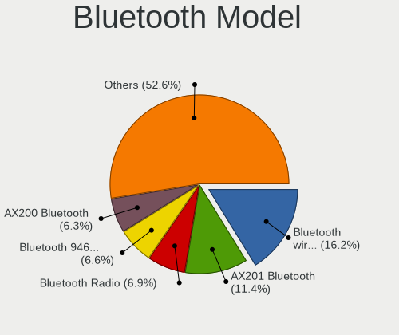

| Model                                               | Notebooks | Percent |
|-----------------------------------------------------|-----------|---------|
| Intel Bluetooth wireless interface                  | 48        | 20.87%  |
| Realtek Bluetooth Radio                             | 17        | 7.39%   |
| Intel AX201 Bluetooth                               | 16        | 6.96%   |
| Intel AX200 Bluetooth                               | 16        | 6.96%   |
| Lite-On Qualcomm Atheros QCA9377 Bluetooth          | 14        | 6.09%   |
| Intel Bluetooth 9460/9560 Jefferson Peak (JfP)      | 12        | 5.22%   |
| IMC Networks Bluetooth Radio                        | 9         | 3.91%   |
| Qualcomm Atheros  Bluetooth Device                  | 8         | 3.48%   |
| Intel Wireless-AC 3168 Bluetooth                    | 7         | 3.04%   |
| Qualcomm Atheros AR3012 Bluetooth 4.0               | 6         | 2.61%   |
| IMC Networks Wireless_Device                        | 5         | 2.17%   |
| Foxconn / Hon Hai Bluetooth Device                  | 5         | 2.17%   |
| Lite-On Wireless_Device                             | 4         | 1.74%   |
| Cambridge Silicon Radio Bluetooth Dongle (HCI mode) | 4         | 1.74%   |
| Realtek  Bluetooth 4.2 Adapter                      | 3         | 1.3%    |
| Qualcomm Atheros AR3011 Bluetooth                   | 3         | 1.3%    |
| Lite-On Bluetooth Device                            | 3         | 1.3%    |
| Intel Wireless-AC 9260 Bluetooth Adapter            | 3         | 1.3%    |
| Intel Centrino Bluetooth Wireless Transceiver       | 3         | 1.3%    |
| HP Bluetooth 2.0 Interface [Broadcom BCM2045]       | 3         | 1.3%    |
| Foxconn International BCM43142A0 Bluetooth module   | 3         | 1.3%    |
| Qualcomm Atheros QCA61x4 Bluetooth 4.0              | 2         | 0.87%   |
| IMC Networks Bluetooth Device                       | 2         | 0.87%   |
| Foxconn / Hon Hai Wireless_Device                   | 2         | 0.87%   |
| Broadcom BCM2045 Bluetooth                          | 2         | 0.87%   |
| Apple Bluetooth USB Host Controller                 | 2         | 0.87%   |
| Apple Bluetooth Host Controller                     | 2         | 0.87%   |
| Toshiba Integrated Bluetooth HCI                    | 1         | 0.43%   |
| Toshiba Integrated Bluetooth (Taiyo Yuden)          | 1         | 0.43%   |
| Toshiba Bluetooth Device                            | 1         | 0.43%   |
| Realtek RTL8821A Bluetooth                          | 1         | 0.43%   |
| Realtek Bluetooth Radio                             | 1         | 0.43%   |
| Qualcomm Atheros Bluetooth                          | 1         | 0.43%   |
| Qualcomm Atheros AR9462 Bluetooth                   | 1         | 0.43%   |
| Qualcomm Atheros AR3012 Bluetooth                   | 1         | 0.43%   |
| Lite-On Broadcom BCM43142A0 Bluetooth Device        | 1         | 0.43%   |
| Lite-On Atheros Bluetooth                           | 1         | 0.43%   |
| Lite-On Atheros AR3012 Bluetooth                    | 1         | 0.43%   |
| Intel Centrino Advanced-N 6230 Bluetooth adapter    | 1         | 0.43%   |
| Intel Bluetooth Device                              | 1         | 0.43%   |

Sound
-----

Sound Vendor
------------

Sound card vendors

| Vendor                           | Notebooks | Percent |
|----------------------------------|-----------|---------|
| Intel                            | 215       | 61.43%  |
| AMD                              | 64        | 18.29%  |
| Nvidia                           | 41        | 11.71%  |
| Logitech                         | 5         | 1.43%   |
| C-Media Electronics              | 5         | 1.43%   |
| Lenovo                           | 4         | 1.14%   |
| JMTek                            | 3         | 0.86%   |
| Silicon Integrated Systems [SiS] | 2         | 0.57%   |
| ZOOM                             | 1         | 0.29%   |
| YZ Technology                    | 1         | 0.29%   |
| VIA Technologies                 | 1         | 0.29%   |
| Trust                            | 1         | 0.29%   |
| Texas Instruments                | 1         | 0.29%   |
| SteelSeries ApS                  | 1         | 0.29%   |
| Samson Technologies              | 1         | 0.29%   |
| Realtek Semiconductor            | 1         | 0.29%   |
| Plantronics                      | 1         | 0.29%   |
| Pioneer DJ                       | 1         | 0.29%   |
| GN Netcom                        | 1         | 0.29%   |

Sound Model
-----------

Sound card models

| Model                                                                                             | Notebooks | Percent |
|---------------------------------------------------------------------------------------------------|-----------|---------|
| Intel Sunrise Point-LP HD Audio                                                                   | 44        | 10.21%  |
| AMD Family 17h/19h HD Audio Controller                                                            | 42        | 9.74%   |
| AMD Renoir Radeon High Definition Audio Controller                                                | 20        | 4.64%   |
| Intel 7 Series/C216 Chipset Family High Definition Audio Controller                               | 18        | 4.18%   |
| Intel Cannon Lake PCH cAVS                                                                        | 16        | 3.71%   |
| Intel 8 Series/C220 Series Chipset High Definition Audio Controller                               | 16        | 3.71%   |
| Intel Haswell-ULT HD Audio Controller                                                             | 15        | 3.48%   |
| Intel 8 Series HD Audio Controller                                                                | 15        | 3.48%   |
| Intel Xeon E3-1200 v3/4th Gen Core Processor HD Audio Controller                                  | 14        | 3.25%   |
| Intel Tiger Lake-LP Smart Sound Technology Audio Controller                                       | 12        | 2.78%   |
| AMD Raven/Raven2/Fenghuang HDMI/DP Audio Controller                                               | 12        | 2.78%   |
| Intel Cannon Point-LP High Definition Audio Controller                                            | 10        | 2.32%   |
| Intel 82801I (ICH9 Family) HD Audio Controller                                                    | 10        | 2.32%   |
| Intel 82801H (ICH8 Family) HD Audio Controller                                                    | 10        | 2.32%   |
| Intel 6 Series/C200 Series Chipset Family High Definition Audio Controller                        | 9         | 2.09%   |
| Nvidia TU107 GeForce GTX 1650 High Definition Audio Controller                                    | 8         | 1.86%   |
| Nvidia GP107GL High Definition Audio Controller                                                   | 8         | 1.86%   |
| Intel Wildcat Point-LP High Definition Audio Controller                                           | 7         | 1.62%   |
| Intel Broadwell-U Audio Controller                                                                | 7         | 1.62%   |
| Nvidia GA106 High Definition Audio Controller                                                     | 6         | 1.39%   |
| AMD High Definition Audio Controller                                                              | 6         | 1.39%   |
| AMD Family 15h (Models 60h-6fh) Audio Controller                                                  | 6         | 1.39%   |
| Intel Comet Lake PCH cAVS                                                                         | 5         | 1.16%   |
| Intel Celeron/Pentium Silver Processor High Definition Audio                                      | 5         | 1.16%   |
| Intel Atom Processor Z36xxx/Z37xxx Series High Definition Audio Controller                        | 5         | 1.16%   |
| Intel Ice Lake-LP Smart Sound Technology Audio Controller                                         | 4         | 0.93%   |
| Intel Comet Lake PCH-LP cAVS                                                                      | 4         | 0.93%   |
| Intel 5 Series/3400 Series Chipset High Definition Audio                                          | 4         | 0.93%   |
| AMD FCH Azalia Controller                                                                         | 4         | 0.93%   |
| Nvidia GK107 HDMI Audio Controller                                                                | 3         | 0.7%    |
| Nvidia Audio device                                                                               | 3         | 0.7%    |
| JMTek USB PnP Audio Device                                                                        | 3         | 0.7%    |
| Intel NM10/ICH7 Family High Definition Audio Controller                                           | 3         | 0.7%    |
| Intel CM238 HD Audio Controller                                                                   | 3         | 0.7%    |
| Intel Celeron N3350/Pentium N4200/Atom E3900 Series Audio Cluster                                 | 3         | 0.7%    |
| Intel Atom/Celeron/Pentium Processor x5-E8000/J3xxx/N3xxx Series High Definition Audio Controller | 3         | 0.7%    |
| AMD SBx00 Azalia (Intel HDA)                                                                      | 3         | 0.7%    |
| Silicon Integrated Systems [SiS] Azalia Audio Controller                                          | 2         | 0.46%   |
| Nvidia TU104 HD Audio Controller                                                                  | 2         | 0.46%   |
| Nvidia GP106 High Definition Audio Controller                                                     | 2         | 0.46%   |

Memory
------

Memory Vendor
-------------

Memory module vendors

| Vendor              | Notebooks | Percent |
|---------------------|-----------|---------|
| Samsung Electronics | 55        | 29.26%  |
| SK hynix            | 41        | 21.81%  |
| Kingston            | 27        | 14.36%  |
| Micron Technology   | 26        | 13.83%  |
| Crucial             | 12        | 6.38%   |
| Unknown             | 8         | 4.26%   |
| Ramaxel Technology  | 5         | 2.66%   |
| Elpida              | 3         | 1.6%    |
| Patriot             | 2         | 1.06%   |
| A-DATA Technology   | 2         | 1.06%   |
| Unknown (ABCD)      | 1         | 0.53%   |
| Transcend           | 1         | 0.53%   |
| Qimonda             | 1         | 0.53%   |
| G.Skill             | 1         | 0.53%   |
| Corsair             | 1         | 0.53%   |
| Avant               | 1         | 0.53%   |
| 48spaces            | 1         | 0.53%   |

Memory Model
------------

Memory module models

| Model                                                            | Notebooks | Percent |
|------------------------------------------------------------------|-----------|---------|
| Samsung RAM M471A1G44AB0-CWE 8GB SODIMM DDR4 3200MT/s            | 7         | 3.43%   |
| Samsung RAM M471A1K43DB1-CWE 8GB SODIMM DDR4 3200MT/s            | 5         | 2.45%   |
| SK hynix RAM HMT451S6BFR8A-PB 4GB SODIMM DDR3 1600MT/s           | 4         | 1.96%   |
| Crucial RAM CT102464BF160B.C16 8GB SODIMM DDR3 1600MT/s          | 4         | 1.96%   |
| SK hynix RAM HMT451S6AFR8A-PB 4GB SODIMM DDR3 1600MT/s           | 3         | 1.47%   |
| SK hynix RAM HMA82GS6AFR8N-UH 16GB SODIMM DDR4 2667MT/s          | 3         | 1.47%   |
| SK hynix RAM HMA81GS6JJR8N-VK 8GB SODIMM DDR4 2667MT/s           | 3         | 1.47%   |
| SK hynix RAM HMA81GS6AFR8N-UH 8GB SODIMM DDR4 2667MT/s           | 3         | 1.47%   |
| Samsung RAM M471B5173QH0-YK0 4GB SODIMM DDR3 1600MT/s            | 3         | 1.47%   |
| Micron RAM 4ATF1G64HZ-3G2E1 8GB SODIMM DDR4 3200MT/s             | 3         | 1.47%   |
| Unknown RAM Module 4GB Row Of Chips LPDDR4 4267MT/s              | 2         | 0.98%   |
| SK hynix RAM HMAA1GS6CJR6N-XN 8GB SODIMM DDR4 3200MT/s           | 2         | 0.98%   |
| SK hynix RAM HMA851S6CJR6N-VK 4GB SODIMM DDR4 2667MT/s           | 2         | 0.98%   |
| SK hynix RAM HMA81GS6CJR8N-VK 8GB SODIMM DDR4 2667MT/s           | 2         | 0.98%   |
| SK hynix RAM H9HCNNNCPMMLXR-NEE 8GB SODIMM LPDDR4 4266MT/s       | 2         | 0.98%   |
| Samsung RAM Module 8192MB SODIMM DDR4 2667MT/s                   | 2         | 0.98%   |
| Samsung RAM M471B5273DH0-CH9 4GB SODIMM DDR3 1334MT/s            | 2         | 0.98%   |
| Samsung RAM M471B1G73DB0-YK0 8GB SODIMM DDR3 1600MT/s            | 2         | 0.98%   |
| Samsung RAM M471A2G44AM0-CWE 16GB Row Of Chips DDR4 3200MT/s     | 2         | 0.98%   |
| Samsung RAM M471A2G43AB2-CWE 16384MB SODIMM DDR4 3200MT/s        | 2         | 0.98%   |
| Samsung RAM M471A1K43CB1-CRC 8GB SODIMM DDR4 2667MT/s            | 2         | 0.98%   |
| Micron RAM MT52L1G32D4PG-093 8GB Row Of Chips LPDDR3 2133MT/s    | 2         | 0.98%   |
| Micron RAM 8ATF1G64HZ-3G2J1 8GB SODIMM DDR4 3200MT/s             | 2         | 0.98%   |
| Micron RAM 4ATF51264HZ-2G3AZ 4GB SODIMM DDR4 2133MT/s            | 2         | 0.98%   |
| Micron RAM 16KTF1G64HZ-1G6E1 8GB SODIMM DDR3 1600MT/s            | 2         | 0.98%   |
| Kingston RAM 9905712-034.A00G 16GB SODIMM DDR4 2400MT/s          | 2         | 0.98%   |
| Kingston RAM 9905700-047.A00G 16GB SODIMM DDR4 2667MT/s          | 2         | 0.98%   |
| Elpida RAM Module 4GB SODIMM DDR3 1600MT/s                       | 2         | 0.98%   |
| Unknown RAM Module 512MB SODIMM DDR2                             | 1         | 0.49%   |
| Unknown RAM Module 4GB Row Of Chips LPDDR3 1867MT/s              | 1         | 0.49%   |
| Unknown RAM Module 4096MB SODIMM DDR4 2400MT/s                   | 1         | 0.49%   |
| Unknown RAM Module 2GB SODIMM DDR2 667MT/s                       | 1         | 0.49%   |
| Unknown RAM Module 2GB SODIMM DDR2                               | 1         | 0.49%   |
| Unknown RAM Module 1GB SODIMM DDR3 1066MT/s                      | 1         | 0.49%   |
| Unknown RAM Module 1GB SODIMM DDR2 667MT/s                       | 1         | 0.49%   |
| Unknown RAM Module 1024MB SODIMM DDR2 667MT/s                    | 1         | 0.49%   |
| Unknown (ABCD) RAM 123456789012345678 2GB SODIMM LPDDR4 2400MT/s | 1         | 0.49%   |
| Transcend RAM TS128MSQ64V6J 1GB SODIMM DDR 667MT/s               | 1         | 0.49%   |
| SK hynix RAM Module 8GB SODIMM DDR3 1600MT/s                     | 1         | 0.49%   |
| SK hynix RAM Module 8192MB SODIMM DDR4 2400MT/s                  | 1         | 0.49%   |

Memory Kind
-----------

Memory module kinds

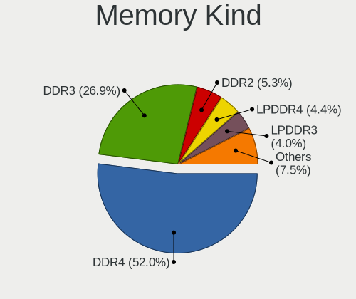

| Kind   | Notebooks | Percent |
|--------|-----------|---------|
| DDR4   | 77        | 50.66%  |
| DDR3   | 48        | 31.58%  |
| DDR2   | 9         | 5.92%   |
| LPDDR4 | 8         | 5.26%   |
| LPDDR3 | 8         | 5.26%   |
| SDRAM  | 1         | 0.66%   |
| LPDDR5 | 1         | 0.66%   |

Memory Form Factor
------------------

Physical design of the memory module

| Name         | Notebooks | Percent |
|--------------|-----------|---------|
| SODIMM       | 133       | 86.93%  |
| Row Of Chips | 18        | 11.76%  |
| DIMM         | 1         | 0.65%   |
| Chip         | 1         | 0.65%   |

Memory Size
-----------

Memory module size

| Size  | Notebooks | Percent |
|-------|-----------|---------|
| 8192  | 70        | 41.67%  |
| 4096  | 51        | 30.36%  |
| 16384 | 25        | 14.88%  |
| 2048  | 12        | 7.14%   |
| 1024  | 6         | 3.57%   |
| 32768 | 3         | 1.79%   |
| 512   | 1         | 0.6%    |

Memory Speed
------------

Memory module speed

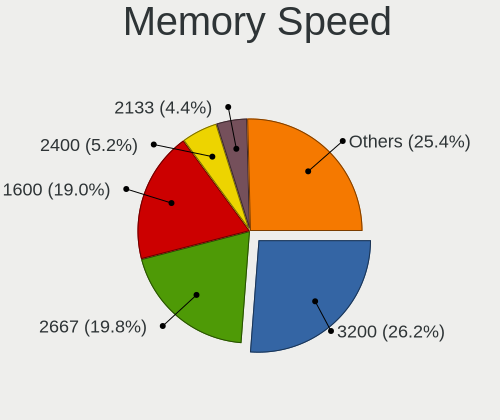

| Speed   | Notebooks | Percent |
|---------|-----------|---------|
| 2667    | 40        | 24.1%   |
| 1600    | 38        | 22.89%  |
| 3200    | 34        | 20.48%  |
| 2133    | 9         | 5.42%   |
| 2400    | 8         | 4.82%   |
| 1334    | 7         | 4.22%   |
| 667     | 6         | 3.61%   |
| 4267    | 3         | 1.81%   |
| 1333    | 3         | 1.81%   |
| 1066    | 3         | 1.81%   |
| 4266    | 2         | 1.2%    |
| 1867    | 2         | 1.2%    |
| 8400    | 1         | 0.6%    |
| 6400    | 1         | 0.6%    |
| 3266    | 1         | 0.6%    |
| 3000    | 1         | 0.6%    |
| 2933    | 1         | 0.6%    |
| 2048    | 1         | 0.6%    |
| 1067    | 1         | 0.6%    |
| 975     | 1         | 0.6%    |
| 800     | 1         | 0.6%    |
| 533     | 1         | 0.6%    |
| Unknown | 1         | 0.6%    |

Printers & scanners
-------------------

Printer Vendor
--------------

Printer device vendors

| Vendor              | Notebooks | Percent |
|---------------------|-----------|---------|
| Hewlett-Packard     | 2         | 40%     |
| Canon               | 2         | 40%     |
| Samsung Electronics | 1         | 20%     |

Printer Model
-------------

Printer device models

| Model                           | Notebooks | Percent |
|---------------------------------|-----------|---------|
| Samsung Composite Device        | 1         | 20%     |
| HP LaserJet 400 colorMFP M475dw | 1         | 20%     |
| HP Deskjet 1050 J410            | 1         | 20%     |
| Canon PIXMA iP4300 Printer      | 1         | 20%     |
| Canon LBP6670 UFR II            | 1         | 20%     |

Scanner Vendor
--------------

Scanner device vendors

| Vendor             | Notebooks | Percent |
|--------------------|-----------|---------|
| Ultima Electronics | 1         | 100%    |

Scanner Model
-------------

Scanner device models

| Model                    | Notebooks | Percent |
|--------------------------|-----------|---------|
| Ultima Artec Ultima 2000 | 1         | 100%    |

Camera
------

Camera Vendor
-------------

Camera device vendors

| Vendor                                 | Notebooks | Percent |
|----------------------------------------|-----------|---------|
| Chicony Electronics                    | 73        | 28.74%  |
| IMC Networks                           | 30        | 11.81%  |
| Quanta                                 | 27        | 10.63%  |
| Realtek Semiconductor                  | 21        | 8.27%   |
| Acer                                   | 17        | 6.69%   |
| Microdia                               | 15        | 5.91%   |
| Sunplus Innovation Technology          | 11        | 4.33%   |
| Suyin                                  | 10        | 3.94%   |
| Lite-On Technology                     | 9         | 3.54%   |
| Syntek                                 | 7         | 2.76%   |
| Cheng Uei Precision Industry (Foxlink) | 6         | 2.36%   |
| Luxvisions Innotech Limited            | 5         | 1.97%   |
| Logitech                               | 4         | 1.57%   |
| Apple                                  | 3         | 1.18%   |
| Silicon Motion                         | 2         | 0.79%   |
| Primax Electronics                     | 2         | 0.79%   |
| Jieli Technology                       | 2         | 0.79%   |
| Anker                                  | 2         | 0.79%   |
| Z-Star Microelectronics                | 1         | 0.39%   |
| SunplusIT                              | 1         | 0.39%   |
| Sonix Technology                       | 1         | 0.39%   |
| Ricoh                                  | 1         | 0.39%   |
| Goertek Electronics                    | 1         | 0.39%   |
| Genesys Logic                          | 1         | 0.39%   |
| Cubeternet                             | 1         | 0.39%   |
| AVerMedia Technologies                 | 1         | 0.39%   |

Camera Model
------------

Camera device models

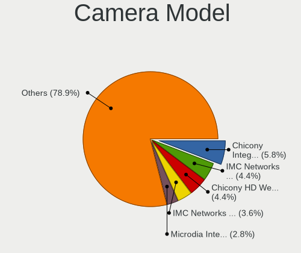

| Model                                               | Notebooks | Percent |
|-----------------------------------------------------|-----------|---------|
| Chicony Integrated Camera                           | 15        | 5.91%   |
| Chicony HD WebCam                                   | 14        | 5.51%   |
| IMC Networks Integrated Camera                      | 11        | 4.33%   |
| Quanta VGA WebCam                                   | 8         | 3.15%   |
| Microdia Integrated_Webcam_HD                       | 8         | 3.15%   |
| IMC Networks USB2.0 VGA UVC WebCam                  | 8         | 3.15%   |
| Realtek Integrated_Webcam_HD                        | 6         | 2.36%   |
| Quanta HD User Facing                               | 5         | 1.97%   |
| Lite-On HP HD Camera                                | 5         | 1.97%   |
| IMC Networks USB2.0 HD UVC WebCam                   | 5         | 1.97%   |
| Acer Lenovo EasyCamera                              | 5         | 1.97%   |
| Acer Integrated Camera                              | 5         | 1.97%   |
| Quanta HP TrueVision HD Camera                      | 4         | 1.57%   |
| Quanta HD Webcam                                    | 4         | 1.57%   |
| Chicony HP Webcam                                   | 4         | 1.57%   |
| Syntek Integrated Camera                            | 3         | 1.18%   |
| Suyin Acer/HP Integrated Webcam [CN0314]            | 3         | 1.18%   |
| Sunplus Asus Webcam                                 | 3         | 1.18%   |
| Realtek Lenovo EasyCamera                           | 3         | 1.18%   |
| Quanta HP HD Camera                                 | 3         | 1.18%   |
| Lite-On Integrated Camera                           | 3         | 1.18%   |
| Chicony USB2.0 VGA UVC WebCam                       | 3         | 1.18%   |
| Chicony USB2.0 HD UVC WebCam                        | 3         | 1.18%   |
| Chicony Integrated HP HD Webcam                     | 3         | 1.18%   |
| Chicony HP Wide Vision HD Camera                    | 3         | 1.18%   |
| Chicony HP Wide Vision HD                           | 3         | 1.18%   |
| Chicony HD User Facing                              | 3         | 1.18%   |
| Suyin WebCam                                        | 2         | 0.79%   |
| Suyin HP TrueVision HD Integrated Webcam            | 2         | 0.79%   |
| Sunplus Integrated_Webcam_HD                        | 2         | 0.79%   |
| Sunplus HD WebCam                                   | 2         | 0.79%   |
| Realtek Integrated Webcam                           | 2         | 0.79%   |
| Realtek EasyCamera                                  | 2         | 0.79%   |
| Realtek Acer 640 x 480 laptop camera                | 2         | 0.79%   |
| Primax HP HD Webcam [Fixed]                         | 2         | 0.79%   |
| Microdia Laptop_Integrated_Webcam_HD                | 2         | 0.79%   |
| Microdia Integrated Webcam                          | 2         | 0.79%   |
| Luxvisions Innotech Limited Integrated Camera       | 2         | 0.79%   |
| Luxvisions Innotech Limited HP TrueVision HD Camera | 2         | 0.79%   |
| Jieli USB PHY 2.0                                   | 2         | 0.79%   |

Security
--------

Fingerprint Vendor
------------------

Fingerprint sensor vendors

| Vendor                     | Notebooks | Percent |
|----------------------------|-----------|---------|
| Synaptics                  | 19        | 31.15%  |
| Validity Sensors           | 15        | 24.59%  |
| Shenzhen Goodix Technology | 11        | 18.03%  |
| AuthenTec                  | 5         | 8.2%    |
| LighTuning Technology      | 4         | 6.56%   |
| Upek                       | 3         | 4.92%   |
| Elan Microelectronics      | 3         | 4.92%   |
| STMicroelectronics         | 1         | 1.64%   |

Fingerprint Model
-----------------

Fingerprint sensor models

| Model                                                                      | Notebooks | Percent |
|----------------------------------------------------------------------------|-----------|---------|
| Shenzhen Goodix  FingerPrint Device                                        | 8         | 13.11%  |
| Synaptics Metallica MIS Touch Fingerprint Reader                           | 6         | 9.84%   |
| Validity Sensors VFS495 Fingerprint Reader                                 | 4         | 6.56%   |
| LighTuning EgisTec Touch Fingerprint Sensor                                | 4         | 6.56%   |
| Validity Sensors Synaptics VFS7552 Touch Fingerprint Sensor with PurePrint | 3         | 4.92%   |
| Upek Biometric Touchchip/Touchstrip Fingerprint Sensor                     | 3         | 4.92%   |
| Synaptics  FS7604 Touch Fingerprint Sensor with PurePrint                  | 3         | 4.92%   |
| Synaptics Prometheus MIS Touch Fingerprint Reader                          | 3         | 4.92%   |
| Shenzhen Goodix FingerPrint                                                | 3         | 4.92%   |
| Elan ELAN:Fingerprint                                                      | 3         | 4.92%   |
| AuthenTec AES2810                                                          | 3         | 4.92%   |
| Validity Sensors VFS5011 Fingerprint Reader                                | 2         | 3.28%   |
| Validity Sensors VFS471 Fingerprint Reader                                 | 2         | 3.28%   |
| Synaptics Metallica MOH Touch Fingerprint Reader                           | 2         | 3.28%   |
| AuthenTec AES2501 Fingerprint Sensor                                       | 2         | 3.28%   |
| Validity Sensors VFS7552 Touch Fingerprint Sensor                          | 1         | 1.64%   |
| Validity Sensors VFS491                                                    | 1         | 1.64%   |
| Validity Sensors VFS 5011 fingerprint sensor                               | 1         | 1.64%   |
| Validity Sensors Synaptics WBDI                                            | 1         | 1.64%   |
| Synaptics WBDI                                                             | 1         | 1.64%   |
| Synaptics UWP WBDI                                                         | 1         | 1.64%   |
| Synaptics  WBDI                                                            | 1         | 1.64%   |
| Synaptics  VFS7552 Touch Fingerprint Sensor with PurePrint                 | 1         | 1.64%   |
| Synaptics FS7604 Touch Fingerprint Sensor with PurePrint                   | 1         | 1.64%   |
| STMicroelectronics Fingerprint Reader                                      | 1         | 1.64%   |

Chipcard Vendor
---------------

Chipcard module vendors

| Vendor                | Notebooks | Percent |
|-----------------------|-----------|---------|
| Alcor Micro           | 6         | 50%     |
| Broadcom              | 4         | 33.33%  |
| Realtek Semiconductor | 1         | 8.33%   |
| Lenovo                | 1         | 8.33%   |

Chipcard Model
--------------

Chipcard module models

| Model                                             | Notebooks | Percent |
|---------------------------------------------------|-----------|---------|
| Alcor Micro AU9540 Smartcard Reader               | 6         | 50%     |
| Broadcom 58200                                    | 2         | 16.67%  |
| Realtek Semiconductor Smart Card Reader Interface | 1         | 8.33%   |
| Lenovo Integrated Smart Card Reader               | 1         | 8.33%   |
| Broadcom BCM5880 Secure Applications Processor    | 1         | 8.33%   |
| Broadcom 5880                                     | 1         | 8.33%   |

Unsupported
-----------

Unsupported Devices
-------------------

Total unsupported devices on board

| Total | Notebooks | Percent |
|-------|-----------|---------|
| 0     | 177       | 61.46%  |
| 1     | 91        | 31.6%   |
| 2     | 18        | 6.25%   |
| 3     | 2         | 0.69%   |

Unsupported Device Types
------------------------

Types of unsupported devices

| Type                     | Notebooks | Percent |
|--------------------------|-----------|---------|
| Fingerprint reader       | 60        | 45.8%   |
| Graphics card            | 27        | 20.61%  |
| Net/wireless             | 13        | 9.92%   |
| Chipcard                 | 11        | 8.4%    |
| Multimedia controller    | 8         | 6.11%   |
| Card reader              | 3         | 2.29%   |
| Communication controller | 2         | 1.53%   |
| Camera                   | 2         | 1.53%   |
| Storage/ide              | 1         | 0.76%   |
| Storage                  | 1         | 0.76%   |
| Sound                    | 1         | 0.76%   |
| Modem                    | 1         | 0.76%   |
| Flash memory             | 1         | 0.76%   |

