Linux in Czechia - Tested Hardware & Statistics (Desktops)
----------------------------------------------------------

A project to collect tested hardware configurations for Linux in Czechia.

Anyone can contribute to this report by the [hw-probe](https://github.com/linuxhw/hw-probe) tool:

    sudo -E hw-probe -all -upload

Please contribute! Especially if your hardware is rare.

Contents
--------

* [ Test Cases ](#test-cases)

* [ System ](#system)
  - [ OS                       ](#os)
  - [ OS Family                ](#os-family)
  - [ Kernel                   ](#kernel)
  - [ Kernel Family            ](#kernel-family)
  - [ Kernel Major Ver.        ](#kernel-major-ver)
  - [ Arch                     ](#arch)
  - [ DE                       ](#de)
  - [ Display Server           ](#display-server)
  - [ Display Manager          ](#display-manager)
  - [ OS Lang                  ](#os-lang)
  - [ Boot Mode                ](#boot-mode)
  - [ Filesystem               ](#filesystem)
  - [ Part. scheme             ](#part-scheme)
  - [ Dual Boot with Linux/BSD ](#dual-boot-with-linuxbsd)
  - [ Dual Boot (Win)          ](#dual-boot-win)

* [ Board ](#board)
  - [ Vendor                   ](#vendor)
  - [ Model                    ](#model)
  - [ Model Family             ](#model-family)
  - [ MFG Year                 ](#mfg-year)
  - [ Form Factor              ](#form-factor)
  - [ Secure Boot              ](#secure-boot)
  - [ Coreboot                 ](#coreboot)
  - [ RAM Size                 ](#ram-size)
  - [ RAM Used                 ](#ram-used)
  - [ Total Drives             ](#total-drives)
  - [ Has CD-ROM               ](#has-cd-rom)
  - [ Has Ethernet             ](#has-ethernet)
  - [ Has WiFi                 ](#has-wifi)
  - [ Has Bluetooth            ](#has-bluetooth)

* [ Location ](#location)
  - [ Country                  ](#country)
  - [ City                     ](#city)

* [ Drives ](#drives)
  - [ Drive Vendor             ](#drive-vendor)
  - [ Drive Model              ](#drive-model)
  - [ HDD Vendor               ](#hdd-vendor)
  - [ SSD Vendor               ](#ssd-vendor)
  - [ Drive Kind               ](#drive-kind)
  - [ Drive Connector          ](#drive-connector)
  - [ Drive Size               ](#drive-size)
  - [ Space Total              ](#space-total)
  - [ Space Used               ](#space-used)
  - [ Malfunc. Drives          ](#malfunc-drives)
  - [ Malfunc. Drive Vendor    ](#malfunc-drive-vendor)
  - [ Malfunc. HDD Vendor      ](#malfunc-hdd-vendor)
  - [ Malfunc. Drive Kind      ](#malfunc-drive-kind)
  - [ Failed Drives            ](#failed-drives)
  - [ Failed Drive Vendor      ](#failed-drive-vendor)
  - [ Drive Status             ](#drive-status)

* [ Storage controller ](#storage-controller)
  - [ Storage Vendor           ](#storage-vendor)
  - [ Storage Model            ](#storage-model)
  - [ Storage Kind             ](#storage-kind)

* [ Processor ](#processor)
  - [ CPU Vendor               ](#cpu-vendor)
  - [ CPU Model                ](#cpu-model)
  - [ CPU Model Family         ](#cpu-model-family)
  - [ CPU Cores                ](#cpu-cores)
  - [ CPU Sockets              ](#cpu-sockets)
  - [ CPU Threads              ](#cpu-threads)
  - [ CPU Op-Modes             ](#cpu-op-modes)
  - [ CPU Microcode            ](#cpu-microcode)
  - [ CPU Microarch            ](#cpu-microarch)

* [ Graphics ](#graphics)
  - [ GPU Vendor               ](#gpu-vendor)
  - [ GPU Model                ](#gpu-model)
  - [ GPU Combo                ](#gpu-combo)
  - [ GPU Driver               ](#gpu-driver)
  - [ GPU Memory               ](#gpu-memory)

* [ Monitor ](#monitor)
  - [ Monitor Vendor           ](#monitor-vendor)
  - [ Monitor Model            ](#monitor-model)
  - [ Monitor Resolution       ](#monitor-resolution)
  - [ Monitor Diagonal         ](#monitor-diagonal)
  - [ Monitor Width            ](#monitor-width)
  - [ Aspect Ratio             ](#aspect-ratio)
  - [ Monitor Area             ](#monitor-area)
  - [ Pixel Density            ](#pixel-density)
  - [ Multiple Monitors        ](#multiple-monitors)

* [ Network ](#network)
  - [ Net Controller Vendor    ](#net-controller-vendor)
  - [ Net Controller Model     ](#net-controller-model)
  - [ Wireless Vendor          ](#wireless-vendor)
  - [ Wireless Model           ](#wireless-model)
  - [ Ethernet Vendor          ](#ethernet-vendor)
  - [ Ethernet Model           ](#ethernet-model)
  - [ Net Controller Kind      ](#net-controller-kind)
  - [ Used Controller          ](#used-controller)
  - [ NICs                     ](#nics)
  - [ IPv6                     ](#ipv6)

* [ Bluetooth ](#bluetooth)
  - [ Bluetooth Vendor         ](#bluetooth-vendor)
  - [ Bluetooth Model          ](#bluetooth-model)

* [ Sound ](#sound)
  - [ Sound Vendor             ](#sound-vendor)
  - [ Sound Model              ](#sound-model)

* [ Memory ](#memory)
  - [ Memory Vendor            ](#memory-vendor)
  - [ Memory Model             ](#memory-model)
  - [ Memory Kind              ](#memory-kind)
  - [ Memory Form Factor       ](#memory-form-factor)
  - [ Memory Size              ](#memory-size)
  - [ Memory Speed             ](#memory-speed)

* [ Printers & scanners ](#printers--scanners)
  - [ Printer Vendor           ](#printer-vendor)
  - [ Printer Model            ](#printer-model)
  - [ Scanner Vendor           ](#scanner-vendor)
  - [ Scanner Model            ](#scanner-model)

* [ Camera ](#camera)
  - [ Camera Vendor            ](#camera-vendor)
  - [ Camera Model             ](#camera-model)

* [ Security ](#security)
  - [ Fingerprint Vendor       ](#fingerprint-vendor)
  - [ Fingerprint Model        ](#fingerprint-model)
  - [ Chipcard Vendor          ](#chipcard-vendor)
  - [ Chipcard Model           ](#chipcard-model)

* [ Unsupported ](#unsupported)
  - [ Unsupported Devices      ](#unsupported-devices)
  - [ Unsupported Device Types ](#unsupported-device-types)

Test Cases
----------

Total: 796

| Vendor        | Model                       | Probe                                                      | Date         |
|---------------|-----------------------------|------------------------------------------------------------|--------------|
| ASUSTek       | PRIME Z690-P D4             | [21213fdeec](https://linux-hardware.org/?probe=21213fdeec) | Oct 31, 2022 |
| ASUSTek       | TUF Gaming B550M-PLUS       | [919fad100f](https://linux-hardware.org/?probe=919fad100f) | Oct 31, 2022 |
| MSI           | MAG B550 TOMAHAWK           | [f45ab957da](https://linux-hardware.org/?probe=f45ab957da) | Oct 28, 2022 |
| HP            | 3029h                       | [46c9e39101](https://linux-hardware.org/?probe=46c9e39101) | Oct 26, 2022 |
| ASUSTek       | PRIME Z690-P D4             | [5bc9d4bdc8](https://linux-hardware.org/?probe=5bc9d4bdc8) | Oct 26, 2022 |
| Acer          | Veriton NBU                 | [7be04cd3ed](https://linux-hardware.org/?probe=7be04cd3ed) | Oct 25, 2022 |
| Gigabyte      | X58A-UD7                    | [6d3bf37ff3](https://linux-hardware.org/?probe=6d3bf37ff3) | Oct 25, 2022 |
| Dell          | 0J3C2F A00                  | [c97e42e738](https://linux-hardware.org/?probe=c97e42e738) | Oct 20, 2022 |
| ASRock        | H81 Pro BTC R2.0            | [2ead6c088f](https://linux-hardware.org/?probe=2ead6c088f) | Oct 20, 2022 |
| ASUSTek       | ROG STRIX B550-I GAMING     | [5335a66143](https://linux-hardware.org/?probe=5335a66143) | Oct 17, 2022 |
| ASRock        | X300M-STX                   | [40c27af11f](https://linux-hardware.org/?probe=40c27af11f) | Oct 17, 2022 |
| ASRock        | X300M-STX                   | [25fdbfba33](https://linux-hardware.org/?probe=25fdbfba33) | Oct 17, 2022 |
| MSI           | 970 GAMING                  | [a6e072bc6b](https://linux-hardware.org/?probe=a6e072bc6b) | Oct 15, 2022 |
| MSI           | 970 GAMING                  | [6bc730181f](https://linux-hardware.org/?probe=6bc730181f) | Oct 15, 2022 |
| MSI           | MAG B550 TOMAHAWK           | [4e66c25e04](https://linux-hardware.org/?probe=4e66c25e04) | Oct 15, 2022 |
| ASUSTek       | ROG STRIX B550-I GAMING     | [da04425205](https://linux-hardware.org/?probe=da04425205) | Oct 14, 2022 |
| ASUSTek       | PRIME A320M-E               | [ff58ea3dc1](https://linux-hardware.org/?probe=ff58ea3dc1) | Oct 12, 2022 |
| ASUSTek       | ROG STRIX B450-F GAMING     | [e2d9db1022](https://linux-hardware.org/?probe=e2d9db1022) | Oct 10, 2022 |
| ASUSTek       | PRIME Z590-P                | [cf3661bb7c](https://linux-hardware.org/?probe=cf3661bb7c) | Oct 09, 2022 |
| Gigabyte      | B550I AORUS PRO AX          | [704da5b600](https://linux-hardware.org/?probe=704da5b600) | Oct 07, 2022 |
| Dell          | 0D28YY A01                  | [5c85c7623a](https://linux-hardware.org/?probe=5c85c7623a) | Oct 04, 2022 |
| ASUSTek       | ROG STRIX B550-I GAMING     | [13f60e066f](https://linux-hardware.org/?probe=13f60e066f) | Oct 03, 2022 |
| ASUSTek       | ROG STRIX B550-I GAMING     | [e3eb4cd95f](https://linux-hardware.org/?probe=e3eb4cd95f) | Oct 02, 2022 |
| MSI           | B350 PC MATE                | [a4c73b484e](https://linux-hardware.org/?probe=a4c73b484e) | Oct 02, 2022 |
| MSI           | B450 TOMAHAWK MAX           | [ff11bc4efb](https://linux-hardware.org/?probe=ff11bc4efb) | Oct 02, 2022 |
| Lenovo        | ThinkCentre Edge71 1578D... | [95dded89b8](https://linux-hardware.org/?probe=95dded89b8) | Sep 23, 2022 |
| Gigabyte      | Z77-DS3H                    | [ea8ea96269](https://linux-hardware.org/?probe=ea8ea96269) | Sep 21, 2022 |
| ASUSTek       | AM1M-A                      | [a6e61a9993](https://linux-hardware.org/?probe=a6e61a9993) | Sep 19, 2022 |
| Gigabyte      | X58A-UD7                    | [b7f881a109](https://linux-hardware.org/?probe=b7f881a109) | Sep 19, 2022 |
| Gigabyte      | X58A-UD7                    | [59e7485a11](https://linux-hardware.org/?probe=59e7485a11) | Sep 19, 2022 |
| ASUSTek       | PRIME H310-PLUS             | [b9693eaf7c](https://linux-hardware.org/?probe=b9693eaf7c) | Sep 17, 2022 |
| Gigabyte      | Z77-DS3H                    | [b5a0c6309d](https://linux-hardware.org/?probe=b5a0c6309d) | Sep 17, 2022 |
| Lenovo        | SHARKBAY NOK                | [bfd4a6b00a](https://linux-hardware.org/?probe=bfd4a6b00a) | Sep 13, 2022 |
| ASUSTek       | ROG STRIX X299-E GAMING     | [fc3200b967](https://linux-hardware.org/?probe=fc3200b967) | Aug 31, 2022 |
| ASUSTek       | PRIME B450-PLUS             | [a01239fd83](https://linux-hardware.org/?probe=a01239fd83) | Aug 29, 2022 |
| HP            | 8509                        | [0656e40cba](https://linux-hardware.org/?probe=0656e40cba) | Aug 26, 2022 |
| ASUSTek       | TUF Gaming B550M-PLUS       | [595bf9c8a7](https://linux-hardware.org/?probe=595bf9c8a7) | Aug 23, 2022 |
| ASRock        | N68C-S UCC                  | [bb19c0586c](https://linux-hardware.org/?probe=bb19c0586c) | Aug 20, 2022 |
| ASUSTek       | P5KPL-SE                    | [2925e63a87](https://linux-hardware.org/?probe=2925e63a87) | Aug 20, 2022 |
| MSI           | MAG B550 TOMAHAWK           | [6865f5ed0b](https://linux-hardware.org/?probe=6865f5ed0b) | Aug 19, 2022 |
| Gigabyte      | B450 GAMING X               | [80760b8e4b](https://linux-hardware.org/?probe=80760b8e4b) | Aug 16, 2022 |
| HP            | 805B                        | [188fdd3a56](https://linux-hardware.org/?probe=188fdd3a56) | Aug 13, 2022 |
| ASRock        | 990FX Killer                | [cba7d360f1](https://linux-hardware.org/?probe=cba7d360f1) | Aug 10, 2022 |
| Gigabyte      | Z87-HD3                     | [ee1bdd9333](https://linux-hardware.org/?probe=ee1bdd9333) | Aug 09, 2022 |
| Gigabyte      | Z87-HD3                     | [a0243ce6f0](https://linux-hardware.org/?probe=a0243ce6f0) | Aug 09, 2022 |
| Gigabyte      | EP35-DS3P                   | [5c29aee903](https://linux-hardware.org/?probe=5c29aee903) | Aug 08, 2022 |
| MSI           | MAG X570S TOMAHAWK MAX W... | [61e317887a](https://linux-hardware.org/?probe=61e317887a) | Aug 07, 2022 |
| Dell          | 0VHWTR A02                  | [61b30cfde0](https://linux-hardware.org/?probe=61b30cfde0) | Aug 06, 2022 |
| Gigabyte      | B450 GAMING X               | [b875ef6dbf](https://linux-hardware.org/?probe=b875ef6dbf) | Aug 04, 2022 |
| ASUSTek       | H110M-K                     | [8c6442a868](https://linux-hardware.org/?probe=8c6442a868) | Aug 04, 2022 |
| Gigabyte      | Z87-HD3                     | [01430753da](https://linux-hardware.org/?probe=01430753da) | Aug 02, 2022 |
| MSI           | MAG B550 TOMAHAWK           | [cc8b9aa8f6](https://linux-hardware.org/?probe=cc8b9aa8f6) | Aug 01, 2022 |
| MSI           | MAG X570S TOMAHAWK MAX W... | [82d0a7ace6](https://linux-hardware.org/?probe=82d0a7ace6) | Jul 29, 2022 |
| MSI           | G31TM-P35                   | [1bc8def241](https://linux-hardware.org/?probe=1bc8def241) | Jul 28, 2022 |
| HP            | 1494                        | [6805afe809](https://linux-hardware.org/?probe=6805afe809) | Jul 27, 2022 |
| Minix         | NEO Z83-4 V1.1              | [e8c6448552](https://linux-hardware.org/?probe=e8c6448552) | Jul 23, 2022 |
| ASUSTek       | ROG STRIX X570-E GAMING ... | [2986a26253](https://linux-hardware.org/?probe=2986a26253) | Jul 22, 2022 |
| ASUSTek       | TUF Gaming B550M-PLUS WI... | [7e6502be7c](https://linux-hardware.org/?probe=7e6502be7c) | Jul 20, 2022 |
| Foxconn       | 2ABF                        | [2349372af2](https://linux-hardware.org/?probe=2349372af2) | Jul 16, 2022 |
| ASUSTek       | PRIME Z690-P D4             | [e5fed36e22](https://linux-hardware.org/?probe=e5fed36e22) | Jul 15, 2022 |
| MSI           | MAG B550 TOMAHAWK           | [9c06bd996b](https://linux-hardware.org/?probe=9c06bd996b) | Jul 15, 2022 |
| MSI           | MAG B550 TOMAHAWK           | [9e71693839](https://linux-hardware.org/?probe=9e71693839) | Jul 15, 2022 |
| ASUSTek       | TUF Gaming Z690-PLUS WIF... | [e5316b7d72](https://linux-hardware.org/?probe=e5316b7d72) | Jul 09, 2022 |
| ASUSTek       | TUF Gaming Z690-PLUS WIF... | [3df269fec9](https://linux-hardware.org/?probe=3df269fec9) | Jul 09, 2022 |
| MSI           | X470 GAMING PRO             | [b94f3f8031](https://linux-hardware.org/?probe=b94f3f8031) | Jul 07, 2022 |
| ASUSTek       | P5B                         | [149ab02b84](https://linux-hardware.org/?probe=149ab02b84) | Jul 06, 2022 |
| MSI           | 880GMA-E35                  | [8bcc34797b](https://linux-hardware.org/?probe=8bcc34797b) | Jul 02, 2022 |
| ASUSTek       | A88XM-A/USB                 | [01fb492b9d](https://linux-hardware.org/?probe=01fb492b9d) | Jul 01, 2022 |
| ASUSTek       | A88XM-A/USB                 | [b4b8457bd9](https://linux-hardware.org/?probe=b4b8457bd9) | Jul 01, 2022 |
| Gigabyte      | GA-870A-UD3                 | [7b07f30b17](https://linux-hardware.org/?probe=7b07f30b17) | Jun 29, 2022 |
| Gigabyte      | Z170-Gaming K3              | [70dc9ba605](https://linux-hardware.org/?probe=70dc9ba605) | Jun 28, 2022 |
| Gigabyte      | Z690 UD                     | [2c21dadeed](https://linux-hardware.org/?probe=2c21dadeed) | Jun 25, 2022 |
| ASUSTek       | H81M-R 2016-11-08           | [f9ac4d3e81](https://linux-hardware.org/?probe=f9ac4d3e81) | Jun 25, 2022 |
| ASUSTek       | ROG STRIX B550-I GAMING     | [cf76d2d9a4](https://linux-hardware.org/?probe=cf76d2d9a4) | Jun 23, 2022 |
| Gigabyte      | B660M GAMING DDR4           | [80ecbe8684](https://linux-hardware.org/?probe=80ecbe8684) | Jun 21, 2022 |
| Gigabyte      | Z390 GAMING X-CF            | [bbba4fae4b](https://linux-hardware.org/?probe=bbba4fae4b) | Jun 12, 2022 |
| ASUSTek       | M4A78 PRO                   | [805f88e697](https://linux-hardware.org/?probe=805f88e697) | Jun 08, 2022 |
| MSI           | B85M-G43                    | [097b308b60](https://linux-hardware.org/?probe=097b308b60) | Jun 04, 2022 |
| ASUSTek       | P5E-VM DO                   | [935c03cd63](https://linux-hardware.org/?probe=935c03cd63) | Jun 03, 2022 |
| Lenovo        | ThinkCentre M57 00P4496     | [07ba75838a](https://linux-hardware.org/?probe=07ba75838a) | May 31, 2022 |
| ASUSTek       | M4A78 PRO                   | [276f8565dc](https://linux-hardware.org/?probe=276f8565dc) | May 29, 2022 |
| ASUSTek       | TUF X299 MARK 2             | [8409764263](https://linux-hardware.org/?probe=8409764263) | May 27, 2022 |
| Gigabyte      | Z77X-UD3H                   | [0d439f9812](https://linux-hardware.org/?probe=0d439f9812) | May 25, 2022 |
| SIEMENS       | A5E02122237 ES010           | [3d7173e7a3](https://linux-hardware.org/?probe=3d7173e7a3) | May 24, 2022 |
| MSI           | MAG X570S TOMAHAWK MAX W... | [5f03a4b52d](https://linux-hardware.org/?probe=5f03a4b52d) | May 21, 2022 |
| MSI           | B85M-G43                    | [ef33bf347c](https://linux-hardware.org/?probe=ef33bf347c) | May 18, 2022 |
| ASRock        | 970M Pro3                   | [d39e962536](https://linux-hardware.org/?probe=d39e962536) | May 18, 2022 |
| ASUSTek       | M5A88-V EVO                 | [ab5a307891](https://linux-hardware.org/?probe=ab5a307891) | May 18, 2022 |
| MSI           | X470 GAMING PLUS MAX        | [77c7c34b9e](https://linux-hardware.org/?probe=77c7c34b9e) | May 18, 2022 |
| ASRock        | 970M Pro3                   | [6f48a71a87](https://linux-hardware.org/?probe=6f48a71a87) | May 17, 2022 |
| HP            | 22F8                        | [70f6561c5c](https://linux-hardware.org/?probe=70f6561c5c) | May 16, 2022 |
| Clientron     | Sunshine Valley             | [e8915a5023](https://linux-hardware.org/?probe=e8915a5023) | May 15, 2022 |
| Clientron     | Sunshine Valley             | [5f148de534](https://linux-hardware.org/?probe=5f148de534) | May 15, 2022 |
| MSI           | AM1I                        | [f22b398676](https://linux-hardware.org/?probe=f22b398676) | May 15, 2022 |
| ASUSTek       | ROG STRIX B550-I GAMING     | [0ec606b729](https://linux-hardware.org/?probe=0ec606b729) | May 14, 2022 |
| ASUSTek       | ROG STRIX B550-I GAMING     | [6fdf1cd28c](https://linux-hardware.org/?probe=6fdf1cd28c) | May 14, 2022 |
| Pegatron      | 2AB5                        | [14905c8ec7](https://linux-hardware.org/?probe=14905c8ec7) | May 14, 2022 |
| SIEMENS       | A5E02122237 ES010           | [cc728f6c38](https://linux-hardware.org/?probe=cc728f6c38) | May 09, 2022 |
| Clientron     | Sunshine Valley             | [d2deff798c](https://linux-hardware.org/?probe=d2deff798c) | May 08, 2022 |
| ASUSTek       | ROG STRIX X470-F GAMING     | [a3e95474a0](https://linux-hardware.org/?probe=a3e95474a0) | May 08, 2022 |
| ASRock        | 970M Pro3                   | [1983ed1d48](https://linux-hardware.org/?probe=1983ed1d48) | May 07, 2022 |
| ASRock        | 970M Pro3                   | [2853128cd0](https://linux-hardware.org/?probe=2853128cd0) | May 05, 2022 |
| ASRock        | 970M Pro3                   | [5f51fd4cf8](https://linux-hardware.org/?probe=5f51fd4cf8) | May 05, 2022 |
| Clientron     | Sunshine Valley             | [97a95fa1af](https://linux-hardware.org/?probe=97a95fa1af) | May 05, 2022 |
| MSI           | B85M-G43                    | [f5deeb2d19](https://linux-hardware.org/?probe=f5deeb2d19) | May 04, 2022 |
| Dell          | 0P301D A02                  | [ab9edfbc39](https://linux-hardware.org/?probe=ab9edfbc39) | May 03, 2022 |
| ASRock        | 970M Pro3                   | [f20f31b107](https://linux-hardware.org/?probe=f20f31b107) | May 03, 2022 |
| ASRock        | 970M Pro3                   | [73a563257a](https://linux-hardware.org/?probe=73a563257a) | May 03, 2022 |
| MSI           | X570-A PRO                  | [ff568c874c](https://linux-hardware.org/?probe=ff568c874c) | Apr 30, 2022 |
| Gigabyte      | M68MT-S2                    | [f3b89e43d4](https://linux-hardware.org/?probe=f3b89e43d4) | Apr 30, 2022 |
| Gigabyte      | H310N x.x                   | [d0daa33c07](https://linux-hardware.org/?probe=d0daa33c07) | Apr 30, 2022 |
| ASUSTek       | ROG STRIX B550-F GAMING     | [f4a6777382](https://linux-hardware.org/?probe=f4a6777382) | Apr 30, 2022 |
| Gigabyte      | H170-HD3 DDR3-CF            | [b23594dfa0](https://linux-hardware.org/?probe=b23594dfa0) | Apr 29, 2022 |
| ASUSTek       | ROG STRIX B450-F GAMING     | [ffdfb3a578](https://linux-hardware.org/?probe=ffdfb3a578) | Apr 29, 2022 |
| ASUSTek       | ROG STRIX B450-F GAMING     | [55c0ec3653](https://linux-hardware.org/?probe=55c0ec3653) | Apr 29, 2022 |
| ASUSTek       | TUF B450-PRO GAMING         | [4185312ca8](https://linux-hardware.org/?probe=4185312ca8) | Apr 27, 2022 |
| ASUSTek       | TUF B450-PRO GAMING         | [88248eb2e6](https://linux-hardware.org/?probe=88248eb2e6) | Apr 27, 2022 |
| HP            | 22F8                        | [eb4d49a17b](https://linux-hardware.org/?probe=eb4d49a17b) | Apr 27, 2022 |
| HP            | 22F8                        | [67dc13d1ad](https://linux-hardware.org/?probe=67dc13d1ad) | Apr 23, 2022 |
| ASRock        | B450M Pro4-F                | [68d9ef89c7](https://linux-hardware.org/?probe=68d9ef89c7) | Apr 19, 2022 |
| MSI           | B150 PC MATE                | [34c7fe45bc](https://linux-hardware.org/?probe=34c7fe45bc) | Apr 19, 2022 |
| Intel         | X79G V2.x                   | [497807c732](https://linux-hardware.org/?probe=497807c732) | Apr 18, 2022 |
| Gigabyte      | B450 AORUS PRO-CF           | [874e39c8ef](https://linux-hardware.org/?probe=874e39c8ef) | Apr 18, 2022 |
| ASRockRack    | X470D4U                     | [1b9b990e65](https://linux-hardware.org/?probe=1b9b990e65) | Apr 17, 2022 |
| ASUSTek       | B85M-E                      | [b68f986aaf](https://linux-hardware.org/?probe=b68f986aaf) | Apr 17, 2022 |
| ASUSTek       | B85M-E                      | [93306ff9ee](https://linux-hardware.org/?probe=93306ff9ee) | Apr 17, 2022 |
| Lenovo        | 3132 SDK0K17763 WIN 1801... | [a6e43346ba](https://linux-hardware.org/?probe=a6e43346ba) | Apr 16, 2022 |
| Gigabyte      | G41MT-D3V                   | [b1944bf89e](https://linux-hardware.org/?probe=b1944bf89e) | Apr 15, 2022 |
| Gigabyte      | G41MT-D3V                   | [19b11d696f](https://linux-hardware.org/?probe=19b11d696f) | Apr 15, 2022 |
| MSI           | MAG X570S TOMAHAWK MAX W... | [cf9feaf8ec](https://linux-hardware.org/?probe=cf9feaf8ec) | Apr 15, 2022 |
| Gigabyte      | Z590 VISION D               | [4bde7cc5cd](https://linux-hardware.org/?probe=4bde7cc5cd) | Apr 13, 2022 |
| ASUSTek       | ROG STRIX B550-F GAMING     | [8a5920ae1a](https://linux-hardware.org/?probe=8a5920ae1a) | Apr 13, 2022 |
| Gigabyte      | B85M-D3H-A                  | [46dc99c237](https://linux-hardware.org/?probe=46dc99c237) | Apr 13, 2022 |
| Dell          | 0GWHMW A03                  | [ff312c5929](https://linux-hardware.org/?probe=ff312c5929) | Apr 13, 2022 |
| MSI           | X370 GAMING PRO CARBON A... | [e4ea2782f9](https://linux-hardware.org/?probe=e4ea2782f9) | Apr 10, 2022 |
| MSI           | H110M ECO                   | [c01d51d1f5](https://linux-hardware.org/?probe=c01d51d1f5) | Apr 09, 2022 |
| HP            | 1495                        | [36ea4763de](https://linux-hardware.org/?probe=36ea4763de) | Apr 08, 2022 |
| Dell          | 0VD5HY A04                  | [8672ef6c18](https://linux-hardware.org/?probe=8672ef6c18) | Apr 07, 2022 |
| ASUSTek       | A88XM-A                     | [0f8ce13fb9](https://linux-hardware.org/?probe=0f8ce13fb9) | Apr 06, 2022 |
| ASRock        | B450 Pro4                   | [65e855a6a5](https://linux-hardware.org/?probe=65e855a6a5) | Apr 05, 2022 |
| Gigabyte      | B450M S2H                   | [046d0eb6c8](https://linux-hardware.org/?probe=046d0eb6c8) | Apr 05, 2022 |
| Gigabyte      | H61M-D2-B3                  | [d95c37955a](https://linux-hardware.org/?probe=d95c37955a) | Apr 03, 2022 |
| Intel         | DG45ID AAE27729-310         | [4a15651672](https://linux-hardware.org/?probe=4a15651672) | Apr 01, 2022 |
| MSI           | X370 GAMING PRO CARBON A... | [ce2e9f743d](https://linux-hardware.org/?probe=ce2e9f743d) | Mar 31, 2022 |
| Dell          | OptiPlex 7010               | [f1167c797e](https://linux-hardware.org/?probe=f1167c797e) | Mar 31, 2022 |
| Acer          | Veriton M4610G              | [34ac41051e](https://linux-hardware.org/?probe=34ac41051e) | Mar 30, 2022 |
| ASRock        | B75M-GL R2.0                | [b951c3cc48](https://linux-hardware.org/?probe=b951c3cc48) | Mar 29, 2022 |
| MSI           | B450 TOMAHAWK MAX           | [b02c880a8a](https://linux-hardware.org/?probe=b02c880a8a) | Mar 26, 2022 |
| Le Cube 1     | Unknown                     | [a881cc0397](https://linux-hardware.org/?probe=a881cc0397) | Mar 26, 2022 |
| ASUSTek       | B85M-E                      | [b0769dffdd](https://linux-hardware.org/?probe=b0769dffdd) | Mar 19, 2022 |
| ASUSTek       | ROG STRIX X470-F GAMING     | [a5d1f1ec32](https://linux-hardware.org/?probe=a5d1f1ec32) | Mar 18, 2022 |
| MSI           | B85M-G43                    | [3869d4fdc0](https://linux-hardware.org/?probe=3869d4fdc0) | Mar 14, 2022 |
| MSI           | B85M-E45 2015-08-19         | [90f5d4247e](https://linux-hardware.org/?probe=90f5d4247e) | Mar 13, 2022 |
| ASUSTek       | B85M-E                      | [161eda858b](https://linux-hardware.org/?probe=161eda858b) | Mar 10, 2022 |
| Unknown       | Unknown                     | [c9ba6eb4ae](https://linux-hardware.org/?probe=c9ba6eb4ae) | Mar 09, 2022 |
| ASUSTek       | P5E-VM DO                   | [876e876df1](https://linux-hardware.org/?probe=876e876df1) | Mar 09, 2022 |
| ASUSTek       | B85M-E                      | [36bada67c8](https://linux-hardware.org/?probe=36bada67c8) | Mar 08, 2022 |
| ASUSTek       | PRIME B360M-A               | [038e9b79ef](https://linux-hardware.org/?probe=038e9b79ef) | Mar 08, 2022 |
| ASUSTek       | A88XM-A                     | [ce5f22f97a](https://linux-hardware.org/?probe=ce5f22f97a) | Mar 08, 2022 |
| ASUSTek       | M5A78L-M LX3                | [ae9c8e47e2](https://linux-hardware.org/?probe=ae9c8e47e2) | Mar 07, 2022 |
| MSI           | X370 GAMING PRO CARBON A... | [1fb25ad2c3](https://linux-hardware.org/?probe=1fb25ad2c3) | Mar 05, 2022 |
| MSI           | B85M-G43                    | [d5e3087569](https://linux-hardware.org/?probe=d5e3087569) | Mar 04, 2022 |
| HP            | 3031h                       | [52a519941d](https://linux-hardware.org/?probe=52a519941d) | Mar 03, 2022 |
| Gigabyte      | G1.Sniper                   | [59b1ae56dd](https://linux-hardware.org/?probe=59b1ae56dd) | Mar 01, 2022 |
| Dell          | 0M858N A01                  | [02b86c4d66](https://linux-hardware.org/?probe=02b86c4d66) | Mar 01, 2022 |
| HP            | 821D                        | [fdfcbe172a](https://linux-hardware.org/?probe=fdfcbe172a) | Feb 28, 2022 |
| ASUSTek       | P8Q67-M DO/TPM              | [ee784c0a7e](https://linux-hardware.org/?probe=ee784c0a7e) | Feb 28, 2022 |
| ASRock        | Z370M Pro4                  | [8e08f3846b](https://linux-hardware.org/?probe=8e08f3846b) | Feb 27, 2022 |
| ASUSTek       | ROG STRIX B360-G GAMING     | [b2e75d51bb](https://linux-hardware.org/?probe=b2e75d51bb) | Feb 26, 2022 |
| Gigabyte      | G1.Sniper                   | [615669f693](https://linux-hardware.org/?probe=615669f693) | Feb 22, 2022 |
| MSI           | MAG X570 TOMAHAWK WIFI      | [d32c812d2b](https://linux-hardware.org/?probe=d32c812d2b) | Feb 22, 2022 |
| Unknown       | Unknown                     | [de7189b0d4](https://linux-hardware.org/?probe=de7189b0d4) | Feb 20, 2022 |
| MSI           | A55M-P33                    | [d891e34be9](https://linux-hardware.org/?probe=d891e34be9) | Feb 20, 2022 |
| MSI           | Boston                      | [0f7a7dd744](https://linux-hardware.org/?probe=0f7a7dd744) | Feb 19, 2022 |
| ASUSTek       | P5E-VM DO                   | [c204579cc4](https://linux-hardware.org/?probe=c204579cc4) | Feb 18, 2022 |
| MSI           | Z370-A PRO                  | [51dfd147ef](https://linux-hardware.org/?probe=51dfd147ef) | Feb 17, 2022 |
| Dell          | 073MMW A02                  | [ab6cd0396d](https://linux-hardware.org/?probe=ab6cd0396d) | Feb 14, 2022 |
| MSI           | X370 GAMING PRO CARBON A... | [fa5ed1f68b](https://linux-hardware.org/?probe=fa5ed1f68b) | Feb 13, 2022 |
| Gigabyte      | EP45-DS3L                   | [bec0b9ac1e](https://linux-hardware.org/?probe=bec0b9ac1e) | Feb 13, 2022 |
| ASUSTek       | M4A77T/USB3                 | [b5dd380b9a](https://linux-hardware.org/?probe=b5dd380b9a) | Feb 10, 2022 |
| HP            | 18E7                        | [11c3f1c67f](https://linux-hardware.org/?probe=11c3f1c67f) | Feb 09, 2022 |
| Gigabyte      | H81M-S2PV                   | [4aece000f1](https://linux-hardware.org/?probe=4aece000f1) | Feb 03, 2022 |
| ASRock        | B75M-GL R2.0                | [4cf4045deb](https://linux-hardware.org/?probe=4cf4045deb) | Feb 01, 2022 |
| Acer          | Aspire XC-830               | [182ad67187](https://linux-hardware.org/?probe=182ad67187) | Feb 01, 2022 |
| ASRock        | B75M-GL R2.0                | [6afebcc975](https://linux-hardware.org/?probe=6afebcc975) | Feb 01, 2022 |
| ASUSTek       | H81M-A                      | [8fba4698c9](https://linux-hardware.org/?probe=8fba4698c9) | Feb 01, 2022 |
| ASUSTek       | ROG STRIX X570-F GAMING     | [dcc55138d2](https://linux-hardware.org/?probe=dcc55138d2) | Jan 29, 2022 |
| ASRock        | AB350M Pro4                 | [6b7cf2d570](https://linux-hardware.org/?probe=6b7cf2d570) | Jan 27, 2022 |
| Gigabyte      | F2A68HM-DS2                 | [267ee0e693](https://linux-hardware.org/?probe=267ee0e693) | Jan 26, 2022 |
| Gigabyte      | AB350-Gaming 3-CF           | [a72f036b05](https://linux-hardware.org/?probe=a72f036b05) | Jan 26, 2022 |
| ASUSTek       | A88XM-PLUS                  | [a920db9f29](https://linux-hardware.org/?probe=a920db9f29) | Jan 23, 2022 |
| ASUSTek       | TUF Gaming B550M-PLUS       | [7a14d864d4](https://linux-hardware.org/?probe=7a14d864d4) | Jan 20, 2022 |
| Gigabyte      | X58A-UD7                    | [c0039193bb](https://linux-hardware.org/?probe=c0039193bb) | Jan 09, 2022 |
| HP            | 18E7                        | [2598720ae1](https://linux-hardware.org/?probe=2598720ae1) | Jan 08, 2022 |
| ASUSTek       | ROG STRIX X470-F GAMING     | [b4f5f6f8da](https://linux-hardware.org/?probe=b4f5f6f8da) | Jan 08, 2022 |
| Lenovo        | 369A SDK0F82993 WIN         | [e1141045bf](https://linux-hardware.org/?probe=e1141045bf) | Jan 08, 2022 |
| Gigabyte      | Q87M-D2H                    | [5107953369](https://linux-hardware.org/?probe=5107953369) | Jan 08, 2022 |
| MSI           | B350 PC MATE                | [c5c108c138](https://linux-hardware.org/?probe=c5c108c138) | Jan 03, 2022 |
| HP            | 18E7                        | [8fe0391d59](https://linux-hardware.org/?probe=8fe0391d59) | Dec 28, 2021 |
| MSI           | B450 TOMAHAWK               | [dc6fd4bfc7](https://linux-hardware.org/?probe=dc6fd4bfc7) | Dec 25, 2021 |
| HP            | 1905                        | [9e2637fa00](https://linux-hardware.org/?probe=9e2637fa00) | Dec 23, 2021 |
| ASUSTek       | ROG STRIX X470-F GAMING     | [180954acf2](https://linux-hardware.org/?probe=180954acf2) | Dec 23, 2021 |
| ASUSTek       | P5G41-M                     | [09352ecc24](https://linux-hardware.org/?probe=09352ecc24) | Dec 21, 2021 |
| Dell          | 0478VN A00                  | [67955910cb](https://linux-hardware.org/?probe=67955910cb) | Dec 18, 2021 |
| ASUSTek       | P5G41-M                     | [c073d4a4e9](https://linux-hardware.org/?probe=c073d4a4e9) | Dec 17, 2021 |
| Gigabyte      | B75M-D3H                    | [86aff395eb](https://linux-hardware.org/?probe=86aff395eb) | Dec 15, 2021 |
| Gigabyte      | B75M-D3H                    | [6b3727344c](https://linux-hardware.org/?probe=6b3727344c) | Dec 15, 2021 |
| Gigabyte      | Z97X-Gaming GT              | [efb6380716](https://linux-hardware.org/?probe=efb6380716) | Dec 11, 2021 |
| Gigabyte      | 990FXA-UD3                  | [b76ef07c59](https://linux-hardware.org/?probe=b76ef07c59) | Dec 10, 2021 |
| Fujitsu       | D3003-A1 S26361-D3003-A1    | [e96b1f7f6b](https://linux-hardware.org/?probe=e96b1f7f6b) | Dec 07, 2021 |
| Dell          | 0PTTT9 A01                  | [fb7c5092e9](https://linux-hardware.org/?probe=fb7c5092e9) | Dec 07, 2021 |
| HP            | 1905                        | [e16a65e786](https://linux-hardware.org/?probe=e16a65e786) | Dec 06, 2021 |
| HP            | 1905                        | [d58c2f29a4](https://linux-hardware.org/?probe=d58c2f29a4) | Dec 06, 2021 |
| Acer          | Nitro N50-600 V:1.1         | [63319937d0](https://linux-hardware.org/?probe=63319937d0) | Dec 04, 2021 |
| EVGA          | 142-SS-E178                 | [8ad978bbf2](https://linux-hardware.org/?probe=8ad978bbf2) | Nov 23, 2021 |
| Lenovo        | 3731 SDK0J40697 WIN 3305... | [c50601fb76](https://linux-hardware.org/?probe=c50601fb76) | Nov 23, 2021 |
| ASUSTek       | ROG Maximus XI HERO         | [021a54d6d2](https://linux-hardware.org/?probe=021a54d6d2) | Nov 18, 2021 |
| ASUSTek       | PRIME X399-A                | [5edbaed472](https://linux-hardware.org/?probe=5edbaed472) | Nov 18, 2021 |
| Intel         | DP55WB AAE64798-204         | [19a21ae965](https://linux-hardware.org/?probe=19a21ae965) | Nov 17, 2021 |
| Biostar       | TH67B                       | [5d655fd2bd](https://linux-hardware.org/?probe=5d655fd2bd) | Nov 17, 2021 |
| MSI           | A88X-G43                    | [c546efdb47](https://linux-hardware.org/?probe=c546efdb47) | Nov 16, 2021 |
| MSI           | A88X-G43                    | [3cb4a9134c](https://linux-hardware.org/?probe=3cb4a9134c) | Nov 16, 2021 |
| ASUSTek       | P5KPL                       | [6e52b269ee](https://linux-hardware.org/?probe=6e52b269ee) | Nov 15, 2021 |
| Seeed Stud... | ODYSSEY-TGL-A               | [b05c5533b0](https://linux-hardware.org/?probe=b05c5533b0) | Nov 14, 2021 |
| HP            | 1998                        | [2e830badd5](https://linux-hardware.org/?probe=2e830badd5) | Nov 14, 2021 |
| MSI           | 970A-G43                    | [da61ca8b52](https://linux-hardware.org/?probe=da61ca8b52) | Nov 13, 2021 |
| MSI           | 970A-G43                    | [d27f131cce](https://linux-hardware.org/?probe=d27f131cce) | Nov 13, 2021 |
| ASRock        | Z97 Anniversary             | [59ca43cb01](https://linux-hardware.org/?probe=59ca43cb01) | Nov 12, 2021 |
| ASUSTek       | TUF B450-PLUS GAMING        | [0f4ebd720e](https://linux-hardware.org/?probe=0f4ebd720e) | Nov 11, 2021 |
| ASUSTek       | PRIME B360M-C               | [ecf35bff43](https://linux-hardware.org/?probe=ecf35bff43) | Nov 09, 2021 |
| HP            | 1998                        | [c2ab98c42f](https://linux-hardware.org/?probe=c2ab98c42f) | Nov 07, 2021 |
| ASUSTek       | PRIME A320M-K               | [68d7274a99](https://linux-hardware.org/?probe=68d7274a99) | Nov 07, 2021 |
| MSI           | A320M PRO-VH PLUS           | [7295833004](https://linux-hardware.org/?probe=7295833004) | Nov 03, 2021 |
| Gigabyte      | X470 AORUS ULTRA GAMING-... | [164b215164](https://linux-hardware.org/?probe=164b215164) | Oct 29, 2021 |
| MSI           | H310M PRO-VDH PLUS          | [9f21330313](https://linux-hardware.org/?probe=9f21330313) | Oct 18, 2021 |
| ASUSTek       | ROG STRIX X470-F GAMING     | [d890edb314](https://linux-hardware.org/?probe=d890edb314) | Oct 16, 2021 |
| ASRock        | B550M Pro4                  | [ae854c2ff2](https://linux-hardware.org/?probe=ae854c2ff2) | Oct 16, 2021 |
| Gigabyte      | H61M-D2-B3                  | [138df954cb](https://linux-hardware.org/?probe=138df954cb) | Oct 15, 2021 |
| Gigabyte      | H61M-D2-B3                  | [dabe5d459a](https://linux-hardware.org/?probe=dabe5d459a) | Oct 15, 2021 |
| MSI           | MS-7309                     | [33faf5dbef](https://linux-hardware.org/?probe=33faf5dbef) | Oct 14, 2021 |
| Dell          | 0GY6Y8 A00                  | [878347dd71](https://linux-hardware.org/?probe=878347dd71) | Oct 13, 2021 |
| MSI           | MS-7309                     | [b0ddfaaa86](https://linux-hardware.org/?probe=b0ddfaaa86) | Oct 12, 2021 |
| ASUSTek       | AM1I-A                      | [b624e54271](https://linux-hardware.org/?probe=b624e54271) | Oct 10, 2021 |
| UMAX          | J42 Nano                    | [fd40a94769](https://linux-hardware.org/?probe=fd40a94769) | Oct 09, 2021 |
| Gigabyte      | Z390 AORUS PRO-CF           | [81c36c3a21](https://linux-hardware.org/?probe=81c36c3a21) | Oct 09, 2021 |
| ASUSTek       | Crosshair IV Formula        | [3cab016500](https://linux-hardware.org/?probe=3cab016500) | Oct 06, 2021 |
| ASUSTek       | P8B75-V                     | [2615e61a63](https://linux-hardware.org/?probe=2615e61a63) | Oct 05, 2021 |
| Acer          | Aspire M1930                | [0f21c5864a](https://linux-hardware.org/?probe=0f21c5864a) | Oct 05, 2021 |
| Lenovo        | ThinkCentre M58p 6234A1G    | [f6518ea548](https://linux-hardware.org/?probe=f6518ea548) | Oct 04, 2021 |
| HP            | 3047h                       | [15f4144ba7](https://linux-hardware.org/?probe=15f4144ba7) | Oct 03, 2021 |
| ASUSTek       | ROG STRIX Z370-G GAMING     | [38422d16b5](https://linux-hardware.org/?probe=38422d16b5) | Oct 02, 2021 |
| Pegatron      | 2AB5                        | [21453a290c](https://linux-hardware.org/?probe=21453a290c) | Oct 02, 2021 |
| MSI           | X370 GAMING PRO CARBON A... | [26fb963760](https://linux-hardware.org/?probe=26fb963760) | Oct 01, 2021 |
| ASUSTek       | ROG STRIX Z370-G GAMING     | [7e82dd3e6d](https://linux-hardware.org/?probe=7e82dd3e6d) | Sep 25, 2021 |
| ASUSTek       | ROG STRIX Z370-G GAMING     | [f64736711c](https://linux-hardware.org/?probe=f64736711c) | Sep 25, 2021 |
| Foxconn       | Priv                        | [78997c0b10](https://linux-hardware.org/?probe=78997c0b10) | Sep 24, 2021 |
| ASUSTek       | PRIME B360M-A               | [b39008d274](https://linux-hardware.org/?probe=b39008d274) | Sep 22, 2021 |
| ASUSTek       | AM1I-A                      | [0f57a946c9](https://linux-hardware.org/?probe=0f57a946c9) | Sep 22, 2021 |
| MSI           | MPG Z490 GAMING PLUS        | [5422161d82](https://linux-hardware.org/?probe=5422161d82) | Sep 21, 2021 |
| Gigabyte      | GA-990FX-GAMING             | [61c16353ce](https://linux-hardware.org/?probe=61c16353ce) | Sep 14, 2021 |
| ASRock        | B450M Steel Legend          | [d069d8c301](https://linux-hardware.org/?probe=d069d8c301) | Sep 10, 2021 |
| ASRock        | B75M-GL R2.0                | [4078ccd6f6](https://linux-hardware.org/?probe=4078ccd6f6) | Sep 08, 2021 |
| Gigabyte      | H110M-S2PV-CF               | [fb3c4b683c](https://linux-hardware.org/?probe=fb3c4b683c) | Sep 08, 2021 |
| ASRock        | B75M-GL R2.0                | [9e43cd58cd](https://linux-hardware.org/?probe=9e43cd58cd) | Sep 07, 2021 |
| ASUSTek       | P5KPL                       | [5abf2f2b22](https://linux-hardware.org/?probe=5abf2f2b22) | Sep 05, 2021 |
| ASUSTek       | PRIME X370-PRO              | [d0d9c89285](https://linux-hardware.org/?probe=d0d9c89285) | Sep 04, 2021 |
| Gigabyte      | Z77MX-D3H                   | [e9741b1baf](https://linux-hardware.org/?probe=e9741b1baf) | Sep 02, 2021 |
| Gigabyte      | GA-MA78G-DS3H               | [c31af0c00d](https://linux-hardware.org/?probe=c31af0c00d) | Sep 02, 2021 |
| Gigabyte      | B460M DS3H                  | [ef23780b19](https://linux-hardware.org/?probe=ef23780b19) | Aug 31, 2021 |
| ASRock        | B450M Steel Legend          | [d744798f8c](https://linux-hardware.org/?probe=d744798f8c) | Aug 28, 2021 |
| Gigabyte      | GA-78LMT-USB3 R2 sex        | [2a6bfff91f](https://linux-hardware.org/?probe=2a6bfff91f) | Aug 24, 2021 |
| ASRock        | FM2A68M-DG3+                | [157d6655d0](https://linux-hardware.org/?probe=157d6655d0) | Aug 23, 2021 |
| MSI           | MPG Z390 GAMING PRO CARB... | [413934fef3](https://linux-hardware.org/?probe=413934fef3) | Aug 23, 2021 |
| ASUSTek       | Pro WS X570-ACE             | [a253cd3e21](https://linux-hardware.org/?probe=a253cd3e21) | Aug 21, 2021 |
| Lenovo        | 3176 NOK                    | [ed11430a97](https://linux-hardware.org/?probe=ed11430a97) | Aug 18, 2021 |
| ASRock        | B460M-ITX/ac                | [2eb3e6f3f6](https://linux-hardware.org/?probe=2eb3e6f3f6) | Aug 17, 2021 |
| Dell          | 02YYK5 A00                  | [2918bafc50](https://linux-hardware.org/?probe=2918bafc50) | Aug 16, 2021 |
| ASUSTek       | Z97-A                       | [5e65f099db](https://linux-hardware.org/?probe=5e65f099db) | Aug 12, 2021 |
| Gigabyte      | Z77-D3H                     | [9dafe47483](https://linux-hardware.org/?probe=9dafe47483) | Aug 07, 2021 |
| MSI           | MPG Z390 GAMING PRO CARB... | [c861e28d21](https://linux-hardware.org/?probe=c861e28d21) | Aug 05, 2021 |
| ASUSTek       | ROG STRIX Z390-H GAMING     | [ffee1e0026](https://linux-hardware.org/?probe=ffee1e0026) | Aug 03, 2021 |
| Dell          | 0J3C2F A00                  | [f557538404](https://linux-hardware.org/?probe=f557538404) | Aug 03, 2021 |
| Dell          | 0J3C2F A00                  | [54a72c496f](https://linux-hardware.org/?probe=54a72c496f) | Aug 03, 2021 |
| Pegatron      | 2AB5                        | [752c8e7000](https://linux-hardware.org/?probe=752c8e7000) | Aug 03, 2021 |
| ASUSTek       | P5QL-E                      | [2894e88095](https://linux-hardware.org/?probe=2894e88095) | Aug 02, 2021 |
| MSI           | MAG B550M MORTAR            | [b5e7cb3f3d](https://linux-hardware.org/?probe=b5e7cb3f3d) | Jul 25, 2021 |
| ASUSTek       | P7H55                       | [44103309b6](https://linux-hardware.org/?probe=44103309b6) | Jul 24, 2021 |
| ASUSTek       | PRIME A320M-K               | [62a0cf7f70](https://linux-hardware.org/?probe=62a0cf7f70) | Jul 21, 2021 |
| Lenovo        | ThinkCentre M58p 3285A1G    | [214c59a169](https://linux-hardware.org/?probe=214c59a169) | Jul 19, 2021 |
| Gigabyte      | GA-890GPA-UD3H              | [3b293f18b7](https://linux-hardware.org/?probe=3b293f18b7) | Jul 18, 2021 |
| ASUSTek       | K30BF_M32BF                 | [c6fa7a1e42](https://linux-hardware.org/?probe=c6fa7a1e42) | Jul 16, 2021 |
| HP            | 3047h                       | [9e162f2640](https://linux-hardware.org/?probe=9e162f2640) | Jul 15, 2021 |
| ASUSTek       | EX-B250-V7                  | [32e09fdf66](https://linux-hardware.org/?probe=32e09fdf66) | Jul 11, 2021 |
| ASUSTek       | PRIME B450M-K II            | [ac44464839](https://linux-hardware.org/?probe=ac44464839) | Jul 10, 2021 |
| ASUSTek       | M3A78-CM                    | [f751fa4ae6](https://linux-hardware.org/?probe=f751fa4ae6) | Jul 04, 2021 |
| HP            | 805B                        | [5d5a6504aa](https://linux-hardware.org/?probe=5d5a6504aa) | Jul 03, 2021 |
| HP            | 805B                        | [83f501a4c5](https://linux-hardware.org/?probe=83f501a4c5) | Jul 03, 2021 |
| ASUSTek       | ROG STRIX B550-F GAMING     | [4327921246](https://linux-hardware.org/?probe=4327921246) | Jun 30, 2021 |
| Gigabyte      | Z97X-Gaming GT              | [ca207b7cd3](https://linux-hardware.org/?probe=ca207b7cd3) | Jun 28, 2021 |
| HP            | 2B28                        | [9f9e5ad8f7](https://linux-hardware.org/?probe=9f9e5ad8f7) | Jun 27, 2021 |
| HP            | 2B28                        | [7eb7cb002a](https://linux-hardware.org/?probe=7eb7cb002a) | Jun 27, 2021 |
| Lenovo        | 3176 NOK                    | [9dad112b64](https://linux-hardware.org/?probe=9dad112b64) | Jun 27, 2021 |
| HP            | 3647h                       | [838bf8880c](https://linux-hardware.org/?probe=838bf8880c) | Jun 25, 2021 |
| ASUSTek       | H170-PRO                    | [27b4b0831d](https://linux-hardware.org/?probe=27b4b0831d) | Jun 18, 2021 |
| Gigabyte      | M61PME-S2                   | [528c4990aa](https://linux-hardware.org/?probe=528c4990aa) | Jun 16, 2021 |
| MSI           | B250I PRO                   | [02087ebc8a](https://linux-hardware.org/?probe=02087ebc8a) | Jun 15, 2021 |
| MSI           | B250I PRO                   | [05b0b94ace](https://linux-hardware.org/?probe=05b0b94ace) | Jun 15, 2021 |
| Acer          | Aspire XC-603               | [b8e13ff999](https://linux-hardware.org/?probe=b8e13ff999) | Jun 15, 2021 |
| HP            | 2B28                        | [67c946572f](https://linux-hardware.org/?probe=67c946572f) | Jun 15, 2021 |
| HP            | 2B28                        | [49bcd8e078](https://linux-hardware.org/?probe=49bcd8e078) | Jun 15, 2021 |
| ASUSTek       | M5A99X EVO                  | [6466886164](https://linux-hardware.org/?probe=6466886164) | Jun 06, 2021 |
| ASRock        | H410M-ITX/ac                | [1f2d258849](https://linux-hardware.org/?probe=1f2d258849) | Jun 02, 2021 |
| ASRock        | B450M Pro4                  | [ccd56acb24](https://linux-hardware.org/?probe=ccd56acb24) | May 27, 2021 |
| Gigabyte      | G41MT-S2PT                  | [91eacced05](https://linux-hardware.org/?probe=91eacced05) | May 27, 2021 |
| ASRock        | B450M Pro4                  | [cfb66b647f](https://linux-hardware.org/?probe=cfb66b647f) | May 27, 2021 |
| ASUSTek       | PRIME B450-PLUS             | [8222525f6a](https://linux-hardware.org/?probe=8222525f6a) | May 26, 2021 |
| ASRock        | H110 Pro BTC+               | [947c13ccd9](https://linux-hardware.org/?probe=947c13ccd9) | May 24, 2021 |
| ASRock        | B75M-GL R2.0                | [a51030d9a0](https://linux-hardware.org/?probe=a51030d9a0) | May 22, 2021 |
| HP            | 0B54h D                     | [ee9a2da17c](https://linux-hardware.org/?probe=ee9a2da17c) | May 19, 2021 |
| ASUSTek       | P8H61-M                     | [5d5163972e](https://linux-hardware.org/?probe=5d5163972e) | May 19, 2021 |
| ASUSTek       | TUF Gaming B550M-PLUS       | [63da02a979](https://linux-hardware.org/?probe=63da02a979) | May 19, 2021 |
| ASUSTek       | P5N-D                       | [3965d087b0](https://linux-hardware.org/?probe=3965d087b0) | May 17, 2021 |
| MSI           | G41M-P25                    | [57d1c4dafa](https://linux-hardware.org/?probe=57d1c4dafa) | May 16, 2021 |
| ASRock        | H61M-VG4                    | [f99a68e64b](https://linux-hardware.org/?probe=f99a68e64b) | May 14, 2021 |
| HP            | 1850                        | [c904ea417d](https://linux-hardware.org/?probe=c904ea417d) | May 13, 2021 |
| MSI           | MPG Z390 GAMING PRO CARB... | [8d22fdb15f](https://linux-hardware.org/?probe=8d22fdb15f) | May 12, 2021 |
| ASRock        | H61M-VG4                    | [d2a90378bc](https://linux-hardware.org/?probe=d2a90378bc) | May 12, 2021 |
| Gigabyte      | G31M-ES2L                   | [6a58a91c19](https://linux-hardware.org/?probe=6a58a91c19) | May 11, 2021 |
| Dell          | 00V62H A01                  | [fdac79e308](https://linux-hardware.org/?probe=fdac79e308) | May 10, 2021 |
| Gigabyte      | B460M DS3H V2               | [ee32f4a115](https://linux-hardware.org/?probe=ee32f4a115) | May 07, 2021 |
| Gigabyte      | B460M DS3H V2               | [3ad4ad9793](https://linux-hardware.org/?probe=3ad4ad9793) | May 07, 2021 |
| MSI           | MPG Z390 GAMING PRO CARB... | [ec56f6327d](https://linux-hardware.org/?probe=ec56f6327d) | May 06, 2021 |
| ASUSTek       | TUF Gaming B550M-PLUS       | [223234378e](https://linux-hardware.org/?probe=223234378e) | May 04, 2021 |
| Lenovo        | ThinkCentre M58p 3285A1G    | [0b347a19e2](https://linux-hardware.org/?probe=0b347a19e2) | May 02, 2021 |
| Lenovo        | SDK0J40700 WIN              | [000925bf4b](https://linux-hardware.org/?probe=000925bf4b) | Apr 30, 2021 |
| ASUSTek       | B250 MINING EXPERT          | [4f7a626b9b](https://linux-hardware.org/?probe=4f7a626b9b) | Apr 26, 2021 |
| ASUSTek       | PRIME B450M-A               | [a5d42684da](https://linux-hardware.org/?probe=a5d42684da) | Apr 25, 2021 |
| Gigabyte      | GA-890GPA-UD3H              | [31d974ab0d](https://linux-hardware.org/?probe=31d974ab0d) | Apr 24, 2021 |
| ASUSTek       | Z170-A                      | [0f9a641322](https://linux-hardware.org/?probe=0f9a641322) | Apr 22, 2021 |
| Gigabyte      | GA-73PVM-S2H                | [d8e49fec64](https://linux-hardware.org/?probe=d8e49fec64) | Apr 22, 2021 |
| ASUSTek       | PRIME B450M-A               | [edd61e3d95](https://linux-hardware.org/?probe=edd61e3d95) | Apr 22, 2021 |
| Gigabyte      | Z370 AORUS Gaming 5-CF      | [4198628d9f](https://linux-hardware.org/?probe=4198628d9f) | Apr 22, 2021 |
| MSI           | MAG X570 TOMAHAWK WIFI      | [6b7033f43d](https://linux-hardware.org/?probe=6b7033f43d) | Apr 20, 2021 |
| MSI           | MAG X570 TOMAHAWK WIFI      | [b5e763d4f7](https://linux-hardware.org/?probe=b5e763d4f7) | Apr 20, 2021 |
| Gigabyte      | EP43-DS3L                   | [105bd71875](https://linux-hardware.org/?probe=105bd71875) | Apr 16, 2021 |
| Gigabyte      | GA-E7AUM-DS2H               | [6c871ab8be](https://linux-hardware.org/?probe=6c871ab8be) | Apr 16, 2021 |
| Lenovo        | Dory CRB                    | [676ace5d71](https://linux-hardware.org/?probe=676ace5d71) | Apr 15, 2021 |
| MSI           | PRESTIGE X570 CREATION      | [26b69278f1](https://linux-hardware.org/?probe=26b69278f1) | Apr 14, 2021 |
| Dell          | 03NVJ6 A00                  | [1dd1d4d667](https://linux-hardware.org/?probe=1dd1d4d667) | Apr 14, 2021 |
| Gigabyte      | Z370 AORUS Gaming 5-CF      | [c294906b60](https://linux-hardware.org/?probe=c294906b60) | Apr 13, 2021 |
| Pegatron      | 2AB5                        | [0a501933e1](https://linux-hardware.org/?probe=0a501933e1) | Apr 13, 2021 |
| Gigabyte      | Z370 AORUS Gaming 5-CF      | [efb35be24f](https://linux-hardware.org/?probe=efb35be24f) | Apr 13, 2021 |
| Intel         | D525MW AAE93082-401         | [aea7beb5c3](https://linux-hardware.org/?probe=aea7beb5c3) | Apr 12, 2021 |
| Dell          | 0GWHMW A03                  | [a0ff0f4cf3](https://linux-hardware.org/?probe=a0ff0f4cf3) | Apr 08, 2021 |
| ASUSTek       | ROG STRIX B450-I GAMING     | [e293d1c2a3](https://linux-hardware.org/?probe=e293d1c2a3) | Apr 07, 2021 |
| Gigabyte      | B450 AORUS M                | [b867fe3dc8](https://linux-hardware.org/?probe=b867fe3dc8) | Apr 06, 2021 |
| MSI           | MS-7418 100                 | [af5ab7c73f](https://linux-hardware.org/?probe=af5ab7c73f) | Apr 06, 2021 |
| Lenovo        | SHARKBAY SDK0E50510 WIN     | [7a299e175f](https://linux-hardware.org/?probe=7a299e175f) | Apr 05, 2021 |
| MSI           | MS-7061                     | [ff8b934f8d](https://linux-hardware.org/?probe=ff8b934f8d) | Mar 31, 2021 |
| HP            | 8299                        | [12120a16f6](https://linux-hardware.org/?probe=12120a16f6) | Mar 30, 2021 |
| ASUSTek       | STRIX Z270F GAMING          | [1b8abaccfb](https://linux-hardware.org/?probe=1b8abaccfb) | Mar 26, 2021 |
| ASUSTek       | Z170-A                      | [53380cdda7](https://linux-hardware.org/?probe=53380cdda7) | Mar 25, 2021 |
| Gigabyte      | X570 AORUS ELITE            | [d40fdda820](https://linux-hardware.org/?probe=d40fdda820) | Mar 25, 2021 |
| ASUSTek       | SABERTOOTH 990FX            | [84c62ff65b](https://linux-hardware.org/?probe=84c62ff65b) | Mar 25, 2021 |
| ASRock        | B75M-GL R2.0                | [2200a1532c](https://linux-hardware.org/?probe=2200a1532c) | Mar 24, 2021 |
| HP            | 21D0                        | [98195974ff](https://linux-hardware.org/?probe=98195974ff) | Mar 24, 2021 |
| Gigabyte      | F2A88XM-D3H                 | [5860ac9ed4](https://linux-hardware.org/?probe=5860ac9ed4) | Mar 21, 2021 |
| Dell          | 0M5DCD A00                  | [39c5751f26](https://linux-hardware.org/?probe=39c5751f26) | Mar 20, 2021 |
| Gigabyte      | X570 AORUS ELITE            | [ffad8b5cba](https://linux-hardware.org/?probe=ffad8b5cba) | Mar 19, 2021 |
| Gigabyte      | B450 AORUS ELITE            | [0cbaa85995](https://linux-hardware.org/?probe=0cbaa85995) | Mar 17, 2021 |
| Biostar       | TB250-BTC PRO               | [e53aecefd9](https://linux-hardware.org/?probe=e53aecefd9) | Mar 17, 2021 |
| Fujitsu       | D3230-A1 S26361-D3230-A1    | [8e366d0ac5](https://linux-hardware.org/?probe=8e366d0ac5) | Mar 16, 2021 |
| Gigabyte      | G41MT-D3V                   | [38b0010bcd](https://linux-hardware.org/?probe=38b0010bcd) | Mar 14, 2021 |
| ASUSTek       | M4A77T/USB3                 | [878ef5b5a9](https://linux-hardware.org/?probe=878ef5b5a9) | Mar 14, 2021 |
| Gigabyte      | B550 AORUS ELITE AX V2      | [a837738425](https://linux-hardware.org/?probe=a837738425) | Mar 12, 2021 |
| Lenovo        | ThinkCentre M58p 3285A1G    | [82a9fbf842](https://linux-hardware.org/?probe=82a9fbf842) | Mar 10, 2021 |
| Gigabyte      | H61M-S2V-B3                 | [b0a0929002](https://linux-hardware.org/?probe=b0a0929002) | Mar 09, 2021 |
| ASRock        | B75M-GL R2.0                | [5737dda498](https://linux-hardware.org/?probe=5737dda498) | Mar 06, 2021 |
| Gigabyte      | F2A85X-UP4                  | [d75d9b7907](https://linux-hardware.org/?probe=d75d9b7907) | Mar 05, 2021 |
| HP            | 8299                        | [e8e31dfc6e](https://linux-hardware.org/?probe=e8e31dfc6e) | Mar 01, 2021 |
| MSI           | B450 TOMAHAWK MAX           | [d35de9f29e](https://linux-hardware.org/?probe=d35de9f29e) | Feb 28, 2021 |
| Fujitsu       | D3024-A1 S26361-D3024-A1    | [00cab9c594](https://linux-hardware.org/?probe=00cab9c594) | Feb 28, 2021 |
| Pegatron      | 2AB5                        | [3026ac5e90](https://linux-hardware.org/?probe=3026ac5e90) | Feb 27, 2021 |
| Pegatron      | 2AB5                        | [de86804d84](https://linux-hardware.org/?probe=de86804d84) | Feb 27, 2021 |
| ASUSTek       | B150 PRO GAMING/AURA        | [5ebac513c1](https://linux-hardware.org/?probe=5ebac513c1) | Feb 26, 2021 |
| Gigabyte      | B450 AORUS ELITE            | [94d8e7faa5](https://linux-hardware.org/?probe=94d8e7faa5) | Feb 26, 2021 |
| ASUSTek       | P5Q SE PLUS                 | [3c13afb411](https://linux-hardware.org/?probe=3c13afb411) | Feb 25, 2021 |
| Gigabyte      | AB350M-Gaming 3-CF          | [55cfaaee1b](https://linux-hardware.org/?probe=55cfaaee1b) | Feb 22, 2021 |
| ASUSTek       | M4N78 SE                    | [da1fd4246e](https://linux-hardware.org/?probe=da1fd4246e) | Feb 22, 2021 |
| Gigabyte      | MZAPLBP-00                  | [150d692c9a](https://linux-hardware.org/?probe=150d692c9a) | Feb 16, 2021 |
| Biostar       | TB250-BTC PRO               | [b0d416dfbc](https://linux-hardware.org/?probe=b0d416dfbc) | Feb 16, 2021 |
| ASUSTek       | P5Q SE PLUS                 | [40dd819b23](https://linux-hardware.org/?probe=40dd819b23) | Feb 15, 2021 |
| Gigabyte      | X570 GAMING X               | [4b0521d0ee](https://linux-hardware.org/?probe=4b0521d0ee) | Feb 14, 2021 |
| ASUSTek       | TUF Gaming X570-PLUS        | [23ecc9c16e](https://linux-hardware.org/?probe=23ecc9c16e) | Feb 13, 2021 |
| Gigabyte      | H81M-S2PV                   | [a94647b020](https://linux-hardware.org/?probe=a94647b020) | Feb 12, 2021 |
| MSI           | B350 TOMAHAWK               | [fae8d202da](https://linux-hardware.org/?probe=fae8d202da) | Feb 12, 2021 |
| Gigabyte      | H81M-S2PV                   | [d822d59913](https://linux-hardware.org/?probe=d822d59913) | Feb 12, 2021 |
| ASUSTek       | P5Q SE PLUS                 | [2ef8a250d3](https://linux-hardware.org/?probe=2ef8a250d3) | Feb 07, 2021 |
| ASRock        | H81 Pro BTC R2.0            | [aae7eb09bf](https://linux-hardware.org/?probe=aae7eb09bf) | Feb 06, 2021 |
| ASUSTek       | ROG STRIX X570-F GAMING     | [36c87ef485](https://linux-hardware.org/?probe=36c87ef485) | Feb 03, 2021 |
| Intel         | DB75EN AAG39650-400         | [706a8c3c73](https://linux-hardware.org/?probe=706a8c3c73) | Feb 03, 2021 |
| ASRock        | G41C-GS                     | [47cbf95a16](https://linux-hardware.org/?probe=47cbf95a16) | Feb 02, 2021 |
| ASUSTek       | PRIME A320M-R               | [3a99ca2e3a](https://linux-hardware.org/?probe=3a99ca2e3a) | Feb 01, 2021 |
| ASUSTek       | PRIME A320M-R               | [0a61c5b666](https://linux-hardware.org/?probe=0a61c5b666) | Feb 01, 2021 |
| HP            | 8299                        | [16e50ec1cd](https://linux-hardware.org/?probe=16e50ec1cd) | Jan 31, 2021 |
| ASUSTek       | TUF Gaming B550-PLUS        | [a51a715f7b](https://linux-hardware.org/?probe=a51a715f7b) | Jan 30, 2021 |
| Gigabyte      | B360M D3H-CF                | [a01fc6e6fc](https://linux-hardware.org/?probe=a01fc6e6fc) | Jan 28, 2021 |
| Gigabyte      | 970A-DS3P                   | [8405804af1](https://linux-hardware.org/?probe=8405804af1) | Jan 26, 2021 |
| ASUSTek       | P5Q SE PLUS                 | [386196c0dd](https://linux-hardware.org/?probe=386196c0dd) | Jan 26, 2021 |
| Gigabyte      | GA-A75M-UD2H                | [f428258e3c](https://linux-hardware.org/?probe=f428258e3c) | Jan 26, 2021 |
| Intel         | DB75EN AAG39650-400         | [f5b2931f56](https://linux-hardware.org/?probe=f5b2931f56) | Jan 26, 2021 |
| Intel         | DB75EN AAG39650-400         | [daaa93aeda](https://linux-hardware.org/?probe=daaa93aeda) | Jan 26, 2021 |
| Gigabyte      | GA-A75M-UD2H                | [353cfbeabe](https://linux-hardware.org/?probe=353cfbeabe) | Jan 26, 2021 |
| HP            | 0AA8h                       | [3a726e28e4](https://linux-hardware.org/?probe=3a726e28e4) | Jan 23, 2021 |
| MSI           | B460M PRO-VDH WIFI          | [f950b8cb2c](https://linux-hardware.org/?probe=f950b8cb2c) | Jan 23, 2021 |
| ASRock        | B450 Pro4                   | [7177dfdace](https://linux-hardware.org/?probe=7177dfdace) | Jan 23, 2021 |
| ASUSTek       | P8Z77-V LK                  | [39bb07129a](https://linux-hardware.org/?probe=39bb07129a) | Jan 21, 2021 |
| Lenovo        | MAHOBAY NOK                 | [e6246a62eb](https://linux-hardware.org/?probe=e6246a62eb) | Jan 20, 2021 |
| ASRock        | B450M Pro4-F                | [8f063fe8f1](https://linux-hardware.org/?probe=8f063fe8f1) | Jan 19, 2021 |
| ASRock        | B450M Pro4-F                | [5a83f4c70e](https://linux-hardware.org/?probe=5a83f4c70e) | Jan 19, 2021 |
| ASUSTek       | P5W DH Deluxe               | [177818b63b](https://linux-hardware.org/?probe=177818b63b) | Jan 19, 2021 |
| ASUSTek       | M4A77TD                     | [8dff00cfff](https://linux-hardware.org/?probe=8dff00cfff) | Jan 18, 2021 |
| ASRock        | B75M-GL R2.0                | [79848dc213](https://linux-hardware.org/?probe=79848dc213) | Jan 17, 2021 |
| Gigabyte      | B550M AORUS ELITE           | [f26799f89e](https://linux-hardware.org/?probe=f26799f89e) | Jan 17, 2021 |
| MSI           | 970A-G46                    | [139738eab5](https://linux-hardware.org/?probe=139738eab5) | Jan 16, 2021 |
| ASRock        | B75M-GL R2.0                | [16ded24529](https://linux-hardware.org/?probe=16ded24529) | Jan 15, 2021 |
| Gigabyte      | 970A-DS3P                   | [beaa31df09](https://linux-hardware.org/?probe=beaa31df09) | Jan 14, 2021 |
| ASUSTek       | ROG STRIX B350-F GAMING     | [e10979867d](https://linux-hardware.org/?probe=e10979867d) | Jan 13, 2021 |
| MSI           | IONA                        | [d28e052ec6](https://linux-hardware.org/?probe=d28e052ec6) | Jan 10, 2021 |
| ASRock        | AB350M Pro4                 | [b75dcb6545](https://linux-hardware.org/?probe=b75dcb6545) | Jan 05, 2021 |
| MSI           | MS-7061                     | [5701f637e7](https://linux-hardware.org/?probe=5701f637e7) | Jan 04, 2021 |
| ASRock        | B75M-GL R2.0                | [0c506c630e](https://linux-hardware.org/?probe=0c506c630e) | Jan 02, 2021 |
| Dell          | 0T10XW A01                  | [7170404b87](https://linux-hardware.org/?probe=7170404b87) | Dec 31, 2020 |
| ASUSTek       | TUF Gaming B460M-PLUS       | [3994a22935](https://linux-hardware.org/?probe=3994a22935) | Dec 27, 2020 |
| Intel         | DQ67OW AAG12528-309         | [5f42b365ae](https://linux-hardware.org/?probe=5f42b365ae) | Dec 26, 2020 |
| ASUSTek       | PRIME X570-P                | [d5fa351273](https://linux-hardware.org/?probe=d5fa351273) | Dec 26, 2020 |
| Gigabyte      | H77M-D3H                    | [fa8a07845c](https://linux-hardware.org/?probe=fa8a07845c) | Dec 25, 2020 |
| Gigabyte      | H77M-D3H                    | [edb4c27530](https://linux-hardware.org/?probe=edb4c27530) | Dec 24, 2020 |
| ASUSTek       | P5G41T-M LX                 | [14e569e26c](https://linux-hardware.org/?probe=14e569e26c) | Dec 20, 2020 |
| HP            | 18E7                        | [a84ff44872](https://linux-hardware.org/?probe=a84ff44872) | Dec 20, 2020 |
| ASRock        | B75M-GL R2.0                | [91c33b15fe](https://linux-hardware.org/?probe=91c33b15fe) | Dec 18, 2020 |
| Gigabyte      | X470 AORUS ULTRA GAMING-... | [94b7599bed](https://linux-hardware.org/?probe=94b7599bed) | Dec 16, 2020 |
| ASUSTek       | M2N-E                       | [8fa83ff1f4](https://linux-hardware.org/?probe=8fa83ff1f4) | Dec 16, 2020 |
| ASUSTek       | M2N-E                       | [6a68ea590f](https://linux-hardware.org/?probe=6a68ea590f) | Dec 15, 2020 |
| ASUSTek       | M2N-E                       | [5b0148344f](https://linux-hardware.org/?probe=5b0148344f) | Dec 15, 2020 |
| MSI           | IONA                        | [e0c6ee5ff1](https://linux-hardware.org/?probe=e0c6ee5ff1) | Dec 15, 2020 |
| Gigabyte      | EG41MF-S2H                  | [81d8b34e8e](https://linux-hardware.org/?probe=81d8b34e8e) | Dec 14, 2020 |
| ASUSTek       | M5A97 LE R2.0               | [8f96733244](https://linux-hardware.org/?probe=8f96733244) | Dec 13, 2020 |
| MSI           | MPG B550I GAMING EDGE WI... | [f86eaf1968](https://linux-hardware.org/?probe=f86eaf1968) | Dec 12, 2020 |
| Gigabyte      | F2A88XM-D3HP                | [a767404d0e](https://linux-hardware.org/?probe=a767404d0e) | Dec 12, 2020 |
| Gigabyte      | F2A88XM-D3HP                | [5edf82c417](https://linux-hardware.org/?probe=5edf82c417) | Dec 12, 2020 |
| ASRock        | B75M-GL R2.0                | [b083b46acb](https://linux-hardware.org/?probe=b083b46acb) | Dec 10, 2020 |
| ASUSTek       | M5A97 LE R2.0               | [a1c00e55f5](https://linux-hardware.org/?probe=a1c00e55f5) | Dec 08, 2020 |
| ASUSTek       | M5A97 LE R2.0               | [8572ec4934](https://linux-hardware.org/?probe=8572ec4934) | Dec 08, 2020 |
| ASUSTek       | P8Z77-V LK                  | [99ba99aa39](https://linux-hardware.org/?probe=99ba99aa39) | Dec 06, 2020 |
| ASUSTek       | B150M PRO GAMING            | [4d4ec823bb](https://linux-hardware.org/?probe=4d4ec823bb) | Dec 06, 2020 |
| HP            | 1905                        | [6690d08a07](https://linux-hardware.org/?probe=6690d08a07) | Dec 04, 2020 |
| MSI           | H81M-P33                    | [9c614066cc](https://linux-hardware.org/?probe=9c614066cc) | Dec 03, 2020 |
| ASUSTek       | B150M PRO GAMING            | [7d1a0b6924](https://linux-hardware.org/?probe=7d1a0b6924) | Dec 02, 2020 |
| ASUSTek       | M5A78L/USB3                 | [80ed74b9e9](https://linux-hardware.org/?probe=80ed74b9e9) | Dec 02, 2020 |
| HP            | 8618                        | [91f724f25b](https://linux-hardware.org/?probe=91f724f25b) | Nov 25, 2020 |
| Gigabyte      | X470 AORUS ULTRA GAMING-... | [7e1033e8f3](https://linux-hardware.org/?probe=7e1033e8f3) | Nov 22, 2020 |
| ASUSTek       | B150M PRO GAMING            | [a49a6f5cd0](https://linux-hardware.org/?probe=a49a6f5cd0) | Nov 20, 2020 |
| ASUSTek       | B150M PRO GAMING            | [6b203577af](https://linux-hardware.org/?probe=6b203577af) | Nov 20, 2020 |
| ASUSTek       | H110M-K                     | [985b5c933d](https://linux-hardware.org/?probe=985b5c933d) | Nov 20, 2020 |
| Gigabyte      | GA-73PVM-S2H                | [a706435b39](https://linux-hardware.org/?probe=a706435b39) | Nov 20, 2020 |
| MSI           | Z97 GAMING 7                | [c1e3c06f22](https://linux-hardware.org/?probe=c1e3c06f22) | Nov 20, 2020 |
| ASRock        | B75M-GL R2.0                | [1c9a604ba6](https://linux-hardware.org/?probe=1c9a604ba6) | Nov 20, 2020 |
| Gigabyte      | X470 AORUS ULTRA GAMING-... | [b536f1bb57](https://linux-hardware.org/?probe=b536f1bb57) | Nov 19, 2020 |
| ASRock        | AB350 Pro4                  | [c8af4ac482](https://linux-hardware.org/?probe=c8af4ac482) | Nov 18, 2020 |
| ASUSTek       | M5A97 R2.0                  | [bbd45f8b19](https://linux-hardware.org/?probe=bbd45f8b19) | Nov 17, 2020 |
| Gigabyte      | 970A-DS3P                   | [5e2da261c7](https://linux-hardware.org/?probe=5e2da261c7) | Nov 14, 2020 |
| ASUSTek       | PRIME B350-PLUS             | [0bd4668348](https://linux-hardware.org/?probe=0bd4668348) | Nov 13, 2020 |
| Gigabyte      | GA-990FXA-D3                | [9f86ed3e72](https://linux-hardware.org/?probe=9f86ed3e72) | Nov 13, 2020 |
| Dell          | 0DR845                      | [fdc86c4e1a](https://linux-hardware.org/?probe=fdc86c4e1a) | Nov 10, 2020 |
| ASUSTek       | M2A-VM HDMI                 | [df7527ce9d](https://linux-hardware.org/?probe=df7527ce9d) | Nov 08, 2020 |
| Dell          | 0HR330                      | [6c239e76c2](https://linux-hardware.org/?probe=6c239e76c2) | Nov 07, 2020 |
| Gigabyte      | X470 AORUS ULTRA GAMING-... | [233cd75348](https://linux-hardware.org/?probe=233cd75348) | Nov 05, 2020 |
| Gigabyte      | H81ND2H                     | [5d76ba9ebd](https://linux-hardware.org/?probe=5d76ba9ebd) | Oct 31, 2020 |
| Gigabyte      | B550 GAMING X               | [c78aeb9bad](https://linux-hardware.org/?probe=c78aeb9bad) | Oct 28, 2020 |
| Gigabyte      | B450M S2H                   | [4ef991873c](https://linux-hardware.org/?probe=4ef991873c) | Oct 26, 2020 |
| MSI           | X370 GAMING PLUS            | [66088ce191](https://linux-hardware.org/?probe=66088ce191) | Oct 20, 2020 |
| ASUSTek       | TUF Gaming B460M-PLUS       | [04aed365e7](https://linux-hardware.org/?probe=04aed365e7) | Oct 18, 2020 |
| Acer          | EM61SM/EM61PM               | [d123fda7a8](https://linux-hardware.org/?probe=d123fda7a8) | Oct 16, 2020 |
| Unknown       | Unknown                     | [0dbef68451](https://linux-hardware.org/?probe=0dbef68451) | Oct 15, 2020 |
| MSI           | X370 GAMING PLUS            | [46840b02f0](https://linux-hardware.org/?probe=46840b02f0) | Oct 14, 2020 |
| HP            | 1905                        | [0e53545ff8](https://linux-hardware.org/?probe=0e53545ff8) | Oct 14, 2020 |
| MSI           | X470 GAMING PRO CARBON      | [fca58ff529](https://linux-hardware.org/?probe=fca58ff529) | Oct 13, 2020 |
| Acer          | Aspire GX-781               | [159afb32c1](https://linux-hardware.org/?probe=159afb32c1) | Oct 10, 2020 |
| Gigabyte      | X570 AORUS ULTRA            | [80079c46e3](https://linux-hardware.org/?probe=80079c46e3) | Oct 10, 2020 |
| Intel         | D946GZIS AAD66165-301       | [bb231aa749](https://linux-hardware.org/?probe=bb231aa749) | Oct 09, 2020 |
| Intel         | D946GZIS AAD66165-301       | [a89dffe004](https://linux-hardware.org/?probe=a89dffe004) | Oct 09, 2020 |
| ASUSTek       | ROG STRIX B350-F GAMING     | [95a78ff474](https://linux-hardware.org/?probe=95a78ff474) | Oct 08, 2020 |
| ASUSTek       | ROG STRIX B350-F GAMING     | [d01a07b619](https://linux-hardware.org/?probe=d01a07b619) | Oct 08, 2020 |
| ASUSTek       | Maximus VII HERO            | [13fa4df109](https://linux-hardware.org/?probe=13fa4df109) | Oct 08, 2020 |
| Gigabyte      | P55A-UD3                    | [46ebc8c075](https://linux-hardware.org/?probe=46ebc8c075) | Oct 06, 2020 |
| HP            | 1998                        | [8d941cca29](https://linux-hardware.org/?probe=8d941cca29) | Oct 05, 2020 |
| Gigabyte      | B460M DS3H                  | [c607051cd6](https://linux-hardware.org/?probe=c607051cd6) | Oct 04, 2020 |
| Gigabyte      | B460M DS3H                  | [a96b9c0e32](https://linux-hardware.org/?probe=a96b9c0e32) | Oct 04, 2020 |
| ASRock        | N68-S                       | [e867c049a3](https://linux-hardware.org/?probe=e867c049a3) | Sep 30, 2020 |
| ASRock        | N68-S                       | [5e39fce3e2](https://linux-hardware.org/?probe=5e39fce3e2) | Sep 30, 2020 |
| MSI           | 870-C45                     | [0c99fa95e9](https://linux-hardware.org/?probe=0c99fa95e9) | Sep 28, 2020 |
| HP            | 843B                        | [759b4e1098](https://linux-hardware.org/?probe=759b4e1098) | Sep 28, 2020 |
| HP            | 1905                        | [48fd57f60f](https://linux-hardware.org/?probe=48fd57f60f) | Sep 24, 2020 |
| HP            | 1905                        | [0e2d6062d9](https://linux-hardware.org/?probe=0e2d6062d9) | Sep 24, 2020 |
| HP            | 843F                        | [6f9898a049](https://linux-hardware.org/?probe=6f9898a049) | Sep 24, 2020 |
| ASRock        | AB350M Pro4                 | [6cd6f20aef](https://linux-hardware.org/?probe=6cd6f20aef) | Sep 22, 2020 |
| Gigabyte      | F2A88X-D3H                  | [2c385e1a66](https://linux-hardware.org/?probe=2c385e1a66) | Sep 20, 2020 |
| ASUSTek       | TUF B450-PLUS GAMING        | [1699708a5b](https://linux-hardware.org/?probe=1699708a5b) | Sep 20, 2020 |
| ASRock        | 980DE3/U3S3 R2.0            | [8bfe52a7d7](https://linux-hardware.org/?probe=8bfe52a7d7) | Sep 19, 2020 |
| HP            | 843F                        | [91498f153e](https://linux-hardware.org/?probe=91498f153e) | Sep 18, 2020 |
| Gigabyte      | P67A-D3-B3                  | [c5a9bb91be](https://linux-hardware.org/?probe=c5a9bb91be) | Sep 15, 2020 |
| Gigabyte      | X470 AORUS ULTRA GAMING-... | [2399ed18fd](https://linux-hardware.org/?probe=2399ed18fd) | Sep 14, 2020 |
| MSI           | B450 TOMAHAWK MAX           | [73d7e76e09](https://linux-hardware.org/?probe=73d7e76e09) | Sep 11, 2020 |
| Lenovo        | 1036 SDK0Q40104 WIN 3305... | [9ccc9861eb](https://linux-hardware.org/?probe=9ccc9861eb) | Sep 10, 2020 |
| Lenovo        | Bantry CRB 31900058 STD     | [bcc958126a](https://linux-hardware.org/?probe=bcc958126a) | Sep 03, 2020 |
| Gigabyte      | X570 AORUS PRO              | [0295f343f4](https://linux-hardware.org/?probe=0295f343f4) | Sep 03, 2020 |
| ASRock        | B450M Pro4                  | [1975c693cb](https://linux-hardware.org/?probe=1975c693cb) | Sep 02, 2020 |
| Gigabyte      | H170-HD3 DDR3-CF            | [b48f1779ec](https://linux-hardware.org/?probe=b48f1779ec) | Aug 30, 2020 |
| Gigabyte      | P67A-D3-B3                  | [f5f3758bed](https://linux-hardware.org/?probe=f5f3758bed) | Aug 30, 2020 |
| MSI           | B460M PRO-VDH WIFI          | [e53f585923](https://linux-hardware.org/?probe=e53f585923) | Aug 30, 2020 |
| Gigabyte      | 970A-DS3P                   | [557964d138](https://linux-hardware.org/?probe=557964d138) | Aug 29, 2020 |
| Gigabyte      | 970A-DS3P                   | [37dc85cc8b](https://linux-hardware.org/?probe=37dc85cc8b) | Aug 29, 2020 |
| Gigabyte      | F2A88X-D3H                  | [4d58eb3965](https://linux-hardware.org/?probe=4d58eb3965) | Aug 27, 2020 |
| MSI           | A320M PRO-VD/S              | [febc06a11a](https://linux-hardware.org/?probe=febc06a11a) | Aug 25, 2020 |
| ASUSTek       | PRIME Z390-A                | [e7c4cf1576](https://linux-hardware.org/?probe=e7c4cf1576) | Aug 23, 2020 |
| ASUSTek       | PRIME X399-A                | [8d0d4f27be](https://linux-hardware.org/?probe=8d0d4f27be) | Aug 22, 2020 |
| Dell          | 073MMW A01                  | [c9cc3e1a0f](https://linux-hardware.org/?probe=c9cc3e1a0f) | Aug 20, 2020 |
| MSI           | B350 TOMAHAWK               | [51ef1db220](https://linux-hardware.org/?probe=51ef1db220) | Aug 20, 2020 |
| Pegatron      | 2A73h                       | [9754808d3d](https://linux-hardware.org/?probe=9754808d3d) | Aug 20, 2020 |
| MSI           | B350 GAMING PRO CARBON      | [762b0fed7b](https://linux-hardware.org/?probe=762b0fed7b) | Aug 18, 2020 |
| ASUSTek       | P8H67-M PRO                 | [7b143c1637](https://linux-hardware.org/?probe=7b143c1637) | Aug 13, 2020 |
| HP            | 806A                        | [9b5a07dcd9](https://linux-hardware.org/?probe=9b5a07dcd9) | Aug 08, 2020 |
| ASRock        | X570 Extreme4               | [f946f61a7b](https://linux-hardware.org/?probe=f946f61a7b) | Jul 29, 2020 |
| Intel         | DCP847SKE G80890-104        | [33d9cddf98](https://linux-hardware.org/?probe=33d9cddf98) | Jul 28, 2020 |
| HP            | 1495                        | [8a51ce66a3](https://linux-hardware.org/?probe=8a51ce66a3) | Jul 27, 2020 |
| Gigabyte      | Z170-HD3P-CF                | [f37d0fb96a](https://linux-hardware.org/?probe=f37d0fb96a) | Jul 26, 2020 |
| Gigabyte      | Z77-DS3H                    | [e7f8121d46](https://linux-hardware.org/?probe=e7f8121d46) | Jul 22, 2020 |
| Intel         | DG33TL AAD89517-803         | [b50a829b37](https://linux-hardware.org/?probe=b50a829b37) | Jul 19, 2020 |
| ASUSTek       | PRIME B450-PLUS             | [300e34bdff](https://linux-hardware.org/?probe=300e34bdff) | Jul 17, 2020 |
| HP            | 843F                        | [e0bdf38c8a](https://linux-hardware.org/?probe=e0bdf38c8a) | Jul 16, 2020 |
| ASUSTek       | M5A97 LE R2.0               | [2a545cac20](https://linux-hardware.org/?probe=2a545cac20) | Jul 16, 2020 |
| ASUSTek       | M5A97 LE R2.0               | [7e5966439c](https://linux-hardware.org/?probe=7e5966439c) | Jul 16, 2020 |
| Gigabyte      | B450 AORUS ELITE            | [68e6b713ca](https://linux-hardware.org/?probe=68e6b713ca) | Jul 14, 2020 |
| Gigabyte      | GA-M56S-S3                  | [7e2596c52f](https://linux-hardware.org/?probe=7e2596c52f) | Jul 12, 2020 |
| MSI           | MS-7061                     | [ec0257fb90](https://linux-hardware.org/?probe=ec0257fb90) | Jul 11, 2020 |
| MSI           | MS-7061                     | [5c76906c4c](https://linux-hardware.org/?probe=5c76906c4c) | Jul 11, 2020 |
| Packard Be... | PT890-8237A                 | [089d020111](https://linux-hardware.org/?probe=089d020111) | Jul 08, 2020 |
| Intel         | DG33TL AAD89517-803         | [5b3d9f328a](https://linux-hardware.org/?probe=5b3d9f328a) | Jul 03, 2020 |
| ASUSTek       | PRIME H410M-E               | [f033f59c7f](https://linux-hardware.org/?probe=f033f59c7f) | Jul 03, 2020 |
| Intel         | DG33TL AAD89517-803         | [2b1fcc4155](https://linux-hardware.org/?probe=2b1fcc4155) | Jul 03, 2020 |
| ASUSTek       | P5K-E                       | [5923c246c4](https://linux-hardware.org/?probe=5923c246c4) | Jun 30, 2020 |
| ASUSTek       | P5G41T-M LX                 | [dcdaf862fd](https://linux-hardware.org/?probe=dcdaf862fd) | Jun 28, 2020 |
| ASRock        | 970M Pro3                   | [98ee7025f4](https://linux-hardware.org/?probe=98ee7025f4) | Jun 27, 2020 |
| Acer          | EM61SM/EM61PM               | [c7523734df](https://linux-hardware.org/?probe=c7523734df) | Jun 26, 2020 |
| ASRock        | 960GC-GS FX                 | [f31e3e1831](https://linux-hardware.org/?probe=f31e3e1831) | Jun 24, 2020 |
| ASRock        | 960GC-GS FX                 | [b5cf346e5d](https://linux-hardware.org/?probe=b5cf346e5d) | Jun 23, 2020 |
| ASUSTek       | M2R-FVM                     | [e6ee210f6d](https://linux-hardware.org/?probe=e6ee210f6d) | Jun 23, 2020 |
| Gigabyte      | H55M-USB3                   | [6e57629563](https://linux-hardware.org/?probe=6e57629563) | Jun 22, 2020 |
| ASUSTek       | Crosshair IV Formula        | [51b8e4300b](https://linux-hardware.org/?probe=51b8e4300b) | Jun 20, 2020 |
| ASUSTek       | Crosshair IV Formula        | [e1184552d0](https://linux-hardware.org/?probe=e1184552d0) | Jun 20, 2020 |
| ASUSTek       | M2R-FVM                     | [33713a0404](https://linux-hardware.org/?probe=33713a0404) | Jun 18, 2020 |
| ASUSTek       | A55BM-E                     | [ff4c765cf8](https://linux-hardware.org/?probe=ff4c765cf8) | Jun 15, 2020 |
| Pegatron      | 2A73h                       | [fa273cd6e3](https://linux-hardware.org/?probe=fa273cd6e3) | Jun 14, 2020 |
| Pegatron      | 2A73h                       | [bdbf5c3068](https://linux-hardware.org/?probe=bdbf5c3068) | Jun 14, 2020 |
| Lenovo        | 3132 SDK0J40697 WIN 3305... | [b9a88cd7cf](https://linux-hardware.org/?probe=b9a88cd7cf) | Jun 13, 2020 |
| HP            | 1495                        | [c9c1099add](https://linux-hardware.org/?probe=c9c1099add) | Jun 12, 2020 |
| Gigabyte      | GA-MA790XT-UD4P             | [62b8ebc9dc](https://linux-hardware.org/?probe=62b8ebc9dc) | Jun 11, 2020 |
| Gigabyte      | GA-MA78LMT-US2H             | [1d365cfa28](https://linux-hardware.org/?probe=1d365cfa28) | Jun 08, 2020 |
| Gigabyte      | GA-MA790XT-UD4P             | [0d9a285392](https://linux-hardware.org/?probe=0d9a285392) | Jun 05, 2020 |
| ASRock        | 980DE3/U3S3                 | [146b8e892a](https://linux-hardware.org/?probe=146b8e892a) | Jun 05, 2020 |
| ASUSTek       | M2A-VM HDMI                 | [ee9f7329ff](https://linux-hardware.org/?probe=ee9f7329ff) | May 31, 2020 |
| ASUSTek       | M2A-VM HDMI                 | [911a12baa7](https://linux-hardware.org/?probe=911a12baa7) | May 31, 2020 |
| ASRock        | AB350 Pro4                  | [5d11e43736](https://linux-hardware.org/?probe=5d11e43736) | May 30, 2020 |
| Gigabyte      | B450 AORUS M                | [a25818fe46](https://linux-hardware.org/?probe=a25818fe46) | May 30, 2020 |
| Acer          | Aspire XC-830               | [b260486efb](https://linux-hardware.org/?probe=b260486efb) | May 29, 2020 |
| Acer          | Aspire XC-830               | [90501ddf39](https://linux-hardware.org/?probe=90501ddf39) | May 27, 2020 |
| Acer          | Aspire XC-830               | [bb81a1b4c7](https://linux-hardware.org/?probe=bb81a1b4c7) | May 27, 2020 |
| ASUSTek       | P5QL PRO                    | [cd5a927598](https://linux-hardware.org/?probe=cd5a927598) | May 26, 2020 |
| ASRock        | Z97 Anniversary             | [9182b64cda](https://linux-hardware.org/?probe=9182b64cda) | May 25, 2020 |
| Fujitsu       | D3062-A1 S26361-D3062-A1    | [d8ecbfe382](https://linux-hardware.org/?probe=d8ecbfe382) | May 23, 2020 |
| Fujitsu       | D3062-A1 S26361-D3062-A1    | [e02d9dc211](https://linux-hardware.org/?probe=e02d9dc211) | May 23, 2020 |
| MSI           | Z270 KRAIT GAMING           | [b51348e9b8](https://linux-hardware.org/?probe=b51348e9b8) | May 22, 2020 |
| ASUSTek       | M2N-CM DVI                  | [e2c38feac9](https://linux-hardware.org/?probe=e2c38feac9) | May 19, 2020 |
| ASUSTek       | PRIME B450M-K               | [8fd77159e9](https://linux-hardware.org/?probe=8fd77159e9) | May 19, 2020 |
| HP            | 304Ah                       | [c27cabd96c](https://linux-hardware.org/?probe=c27cabd96c) | May 19, 2020 |
| HP            | 304Ah                       | [c6d530a3fb](https://linux-hardware.org/?probe=c6d530a3fb) | May 19, 2020 |
| ASRock        | B75M-GL R2.0                | [5d07d6db8e](https://linux-hardware.org/?probe=5d07d6db8e) | May 17, 2020 |
| Gigabyte      | X470 AORUS ULTRA GAMING-... | [96677ee210](https://linux-hardware.org/?probe=96677ee210) | May 16, 2020 |
| Gigabyte      | X470 AORUS ULTRA GAMING-... | [15d0451825](https://linux-hardware.org/?probe=15d0451825) | May 16, 2020 |
| Gigabyte      | M61SME-S2                   | [bd4b1dc757](https://linux-hardware.org/?probe=bd4b1dc757) | May 12, 2020 |
| ASUSTek       | Z97M-PLUS                   | [1523e8f4a8](https://linux-hardware.org/?probe=1523e8f4a8) | May 11, 2020 |
| Lenovo        | 3132 SDK0J40697 WIN 3305... | [6237c4cae4](https://linux-hardware.org/?probe=6237c4cae4) | May 10, 2020 |
| ASRock        | H81M-HDS R2.0               | [c2edd5fbaf](https://linux-hardware.org/?probe=c2edd5fbaf) | May 09, 2020 |
| MSI           | MPG X570 GAMING EDGE WIF... | [ada5fbf86d](https://linux-hardware.org/?probe=ada5fbf86d) | May 03, 2020 |
| MSI           | MS-7507                     | [120f09865e](https://linux-hardware.org/?probe=120f09865e) | Apr 30, 2020 |
| Gigabyte      | N3050ND3H                   | [3f7cfb988e](https://linux-hardware.org/?probe=3f7cfb988e) | Apr 29, 2020 |
| Acer          | EM61SM/EM61PM               | [94e7ff927b](https://linux-hardware.org/?probe=94e7ff927b) | Apr 27, 2020 |
| Acer          | EM61SM/EM61PM               | [8b0fba21d2](https://linux-hardware.org/?probe=8b0fba21d2) | Apr 27, 2020 |
| MSI           | B360M MORTAR                | [d2215c28af](https://linux-hardware.org/?probe=d2215c28af) | Apr 26, 2020 |
| HP            | 339A                        | [a4b2a57cc3](https://linux-hardware.org/?probe=a4b2a57cc3) | Apr 25, 2020 |
| Gigabyte      | X470 AORUS ULTRA GAMING-... | [87b901a1b9](https://linux-hardware.org/?probe=87b901a1b9) | Apr 23, 2020 |
| Gigabyte      | 990FXA-UD3                  | [ffe9b12dd4](https://linux-hardware.org/?probe=ffe9b12dd4) | Apr 23, 2020 |
| MSI           | MS-7267                     | [678e22693c](https://linux-hardware.org/?probe=678e22693c) | Apr 21, 2020 |
| Gigabyte      | AX370-Gaming 5              | [a1ba861a3d](https://linux-hardware.org/?probe=a1ba861a3d) | Apr 20, 2020 |
| Gigabyte      | EG41MF-US2H                 | [695ccb4b40](https://linux-hardware.org/?probe=695ccb4b40) | Apr 18, 2020 |
| Intel         | DP35DP AAD81073-207         | [43157cc32b](https://linux-hardware.org/?probe=43157cc32b) | Apr 18, 2020 |
| ASUSTek       | TUF B450M-PRO GAMING        | [17ba5a84d9](https://linux-hardware.org/?probe=17ba5a84d9) | Apr 12, 2020 |
| Gigabyte      | X470 AORUS ULTRA GAMING-... | [64f6604a82](https://linux-hardware.org/?probe=64f6604a82) | Apr 06, 2020 |
| MSI           | B150 GAMING M3              | [c5221a134d](https://linux-hardware.org/?probe=c5221a134d) | Apr 06, 2020 |
| MSI           | B150 GAMING M3              | [4d2bcc0613](https://linux-hardware.org/?probe=4d2bcc0613) | Apr 06, 2020 |
| Lenovo        | 3132 SDK0J40697 WIN 3305... | [848a63637f](https://linux-hardware.org/?probe=848a63637f) | Apr 01, 2020 |
| ASUSTek       | P5G41-M LX2/GB/LPT          | [736d155f37](https://linux-hardware.org/?probe=736d155f37) | Mar 30, 2020 |
| ASUSTek       | P5G41-M LX2/GB/LPT          | [b8b840e5a5](https://linux-hardware.org/?probe=b8b840e5a5) | Mar 30, 2020 |
| Gigabyte      | GA-MA78LMT-S2               | [4a2233bf6d](https://linux-hardware.org/?probe=4a2233bf6d) | Mar 29, 2020 |
| MSI           | MS-7357                     | [dd315713e7](https://linux-hardware.org/?probe=dd315713e7) | Mar 28, 2020 |
| Gigabyte      | M68MT-S2                    | [ab1ea8323a](https://linux-hardware.org/?probe=ab1ea8323a) | Mar 27, 2020 |
| MSI           | X370 GAMING PRO CARBON A... | [79c8660f50](https://linux-hardware.org/?probe=79c8660f50) | Mar 26, 2020 |
| Gigabyte      | Z77-D3H                     | [6188581fde](https://linux-hardware.org/?probe=6188581fde) | Mar 25, 2020 |
| Intel         | DG43RK AAE78175-402         | [262ba9568a](https://linux-hardware.org/?probe=262ba9568a) | Mar 22, 2020 |
| Gigabyte      | EG41MF-US2H                 | [3454a872c0](https://linux-hardware.org/?probe=3454a872c0) | Mar 22, 2020 |
| Gigabyte      | N3050ND3H                   | [9306c157ae](https://linux-hardware.org/?probe=9306c157ae) | Mar 16, 2020 |
| ASUSTek       | B85M-G                      | [bfb2fb34f1](https://linux-hardware.org/?probe=bfb2fb34f1) | Mar 16, 2020 |
| Gigabyte      | G31M-ES2L                   | [e7634e66cc](https://linux-hardware.org/?probe=e7634e66cc) | Mar 14, 2020 |
| MSI           | H81M-P33                    | [6727ba0937](https://linux-hardware.org/?probe=6727ba0937) | Mar 12, 2020 |
| HP            | 843F                        | [f76a18754d](https://linux-hardware.org/?probe=f76a18754d) | Mar 12, 2020 |
| MSI           | NF520T-C35                  | [e9c434add5](https://linux-hardware.org/?probe=e9c434add5) | Mar 11, 2020 |
| Gigabyte      | X470 AORUS ULTRA GAMING-... | [6f3950f01a](https://linux-hardware.org/?probe=6f3950f01a) | Mar 11, 2020 |
| Gigabyte      | X470 AORUS ULTRA GAMING-... | [5aad033c6b](https://linux-hardware.org/?probe=5aad033c6b) | Mar 11, 2020 |
| Gigabyte      | N3050ND3H                   | [531eedbf04](https://linux-hardware.org/?probe=531eedbf04) | Mar 11, 2020 |
| MSI           | H81M-P33                    | [4fd88fa0cd](https://linux-hardware.org/?probe=4fd88fa0cd) | Mar 11, 2020 |
| Gigabyte      | X470 AORUS ULTRA GAMING-... | [601a1539ce](https://linux-hardware.org/?probe=601a1539ce) | Mar 11, 2020 |
| HP            | 843F                        | [8e3653137c](https://linux-hardware.org/?probe=8e3653137c) | Mar 10, 2020 |
| Dell          | 0NW73C A00                  | [079032cab6](https://linux-hardware.org/?probe=079032cab6) | Feb 29, 2020 |
| Dell          | 0NW73C A00                  | [4f94baa369](https://linux-hardware.org/?probe=4f94baa369) | Feb 28, 2020 |
| Dell          | 0NW73C A00                  | [ee7108cb91](https://linux-hardware.org/?probe=ee7108cb91) | Feb 28, 2020 |
| Dell          | 0NW73C A00                  | [1cfd8f7014](https://linux-hardware.org/?probe=1cfd8f7014) | Feb 28, 2020 |
| Lenovo        | 3132 SDK0J40697 WIN 3305... | [a018f0a4d4](https://linux-hardware.org/?probe=a018f0a4d4) | Feb 27, 2020 |
| ASUSTek       | ROG STRIX X470-F GAMING     | [3ab01ccb21](https://linux-hardware.org/?probe=3ab01ccb21) | Feb 26, 2020 |
| ASUSTek       | ROG STRIX X470-F GAMING     | [8474de61ef](https://linux-hardware.org/?probe=8474de61ef) | Feb 26, 2020 |
| ASUSTek       | CUSL2-M                     | [a20a268bb5](https://linux-hardware.org/?probe=a20a268bb5) | Feb 23, 2020 |
| ASUSTek       | P5G41T-M LX                 | [73e5d55bdb](https://linux-hardware.org/?probe=73e5d55bdb) | Feb 23, 2020 |
| Gigabyte      | GA-770T-D3L                 | [a221d53be6](https://linux-hardware.org/?probe=a221d53be6) | Feb 22, 2020 |
| ASUSTek       | STRIX Z270G GAMING          | [5bd0e60cb9](https://linux-hardware.org/?probe=5bd0e60cb9) | Feb 21, 2020 |
| Gigabyte      | Z77-D3H                     | [86b54afeaf](https://linux-hardware.org/?probe=86b54afeaf) | Feb 20, 2020 |
| HP            | 1495                        | [ce0ebaa644](https://linux-hardware.org/?probe=ce0ebaa644) | Feb 16, 2020 |
| HP            | 1495                        | [e07a108e6f](https://linux-hardware.org/?probe=e07a108e6f) | Feb 16, 2020 |
| Gigabyte      | B450 AORUS ELITE            | [a84be71f79](https://linux-hardware.org/?probe=a84be71f79) | Feb 05, 2020 |
| Gigabyte      | EP35-DS3                    | [5a3ef0f23c](https://linux-hardware.org/?probe=5a3ef0f23c) | Feb 03, 2020 |
| Gigabyte      | GA-73PVM-S2H                | [503c223716](https://linux-hardware.org/?probe=503c223716) | Jan 28, 2020 |
| HP            | 806A                        | [bfc2676644](https://linux-hardware.org/?probe=bfc2676644) | Jan 26, 2020 |
| Gigabyte      | Z390 AORUS PRO-CF           | [436f08bfd7](https://linux-hardware.org/?probe=436f08bfd7) | Jan 24, 2020 |
| Gigabyte      | Z77-D3H                     | [1c841791ef](https://linux-hardware.org/?probe=1c841791ef) | Jan 20, 2020 |
| ASUSTek       | ROG STRIX X470-F GAMING     | [1edaf69823](https://linux-hardware.org/?probe=1edaf69823) | Jan 20, 2020 |
| Gigabyte      | H97-HD3                     | [80245136bd](https://linux-hardware.org/?probe=80245136bd) | Jan 18, 2020 |
| Dell          | 0Y1057                      | [bf78aaecc3](https://linux-hardware.org/?probe=bf78aaecc3) | Jan 17, 2020 |
| Intel         | DQ35JO AAD82085-807         | [6c64315bcf](https://linux-hardware.org/?probe=6c64315bcf) | Jan 15, 2020 |
| Intel         | DQ35JO AAD82085-807         | [c570563513](https://linux-hardware.org/?probe=c570563513) | Jan 15, 2020 |
| Intel         | DQ35JO AAD82085-807         | [5173e103d5](https://linux-hardware.org/?probe=5173e103d5) | Jan 15, 2020 |
| Gigabyte      | EP45-DS4                    | [4bd613ef39](https://linux-hardware.org/?probe=4bd613ef39) | Jan 14, 2020 |
| Gigabyte      | EP45-DS4                    | [081fbf92ef](https://linux-hardware.org/?probe=081fbf92ef) | Jan 14, 2020 |
| Gigabyte      | Z77-D3H                     | [7c5c1cff72](https://linux-hardware.org/?probe=7c5c1cff72) | Jan 14, 2020 |
| Gigabyte      | Z77-D3H                     | [745edd74fb](https://linux-hardware.org/?probe=745edd74fb) | Jan 14, 2020 |
| Gigabyte      | Z77-D3H                     | [4a82019d80](https://linux-hardware.org/?probe=4a82019d80) | Jan 13, 2020 |
| Gigabyte      | Z77-D3H                     | [2a51f23df2](https://linux-hardware.org/?probe=2a51f23df2) | Jan 13, 2020 |
| Gigabyte      | Z77-D3H                     | [2f9a0ca1ce](https://linux-hardware.org/?probe=2f9a0ca1ce) | Jan 12, 2020 |
| Gigabyte      | Z77-D3H                     | [2f98991cfb](https://linux-hardware.org/?probe=2f98991cfb) | Jan 12, 2020 |
| Gigabyte      | Z77-D3H                     | [d93b8a1a22](https://linux-hardware.org/?probe=d93b8a1a22) | Jan 12, 2020 |
| ASUSTek       | P5K Premium                 | [8b39be3e8f](https://linux-hardware.org/?probe=8b39be3e8f) | Jan 10, 2020 |
| Dell          | 0Y1057                      | [6c5515c415](https://linux-hardware.org/?probe=6c5515c415) | Jan 10, 2020 |
| MSI           | MS-7366                     | [7b29163b46](https://linux-hardware.org/?probe=7b29163b46) | Dec 28, 2019 |
| ASUSTek       | P5B-Deluxe                  | [49bc4a3291](https://linux-hardware.org/?probe=49bc4a3291) | Dec 24, 2019 |
| Lenovo        | 3132 SDK0J40697 WIN 3305... | [fff26d5712](https://linux-hardware.org/?probe=fff26d5712) | Dec 21, 2019 |
| Lenovo        | SHARKBAY 0B98401 PRO        | [7cc0e44901](https://linux-hardware.org/?probe=7cc0e44901) | Dec 08, 2019 |
| Lenovo        | SHARKBAY 0B98401 PRO        | [6c2647ab1f](https://linux-hardware.org/?probe=6c2647ab1f) | Dec 07, 2019 |
| MSI           | Z97 PC Mate                 | [72bbff1151](https://linux-hardware.org/?probe=72bbff1151) | Dec 06, 2019 |
| ASUSTek       | P5B-Deluxe                  | [6bd7363656](https://linux-hardware.org/?probe=6bd7363656) | Nov 30, 2019 |
| Lenovo        | 3132 SDK0J40697 WIN 3305... | [199fad181e](https://linux-hardware.org/?probe=199fad181e) | Nov 29, 2019 |
| ASRock        | B75M-GL R2.0                | [af0f782566](https://linux-hardware.org/?probe=af0f782566) | Nov 23, 2019 |
| Gigabyte      | GA-MA770-UD3                | [16108ce66a](https://linux-hardware.org/?probe=16108ce66a) | Nov 19, 2019 |
| ASUSTek       | P5K Premium                 | [5cb1d8f9b9](https://linux-hardware.org/?probe=5cb1d8f9b9) | Nov 15, 2019 |
| ASUSTek       | P5K SE                      | [47ed174456](https://linux-hardware.org/?probe=47ed174456) | Nov 14, 2019 |
| Lenovo        | 3132 SDK0J40697 WIN 3305... | [6a11247e37](https://linux-hardware.org/?probe=6a11247e37) | Nov 11, 2019 |
| Gigabyte      | H110M-S2H-CF                | [c78f6913ae](https://linux-hardware.org/?probe=c78f6913ae) | Nov 11, 2019 |
| ASUSTek       | P5K Premium                 | [ead46dee7b](https://linux-hardware.org/?probe=ead46dee7b) | Nov 11, 2019 |
| MSI           | MS-7360                     | [ef6c3da38a](https://linux-hardware.org/?probe=ef6c3da38a) | Nov 07, 2019 |
| MSI           | MS-7360                     | [3c13191b90](https://linux-hardware.org/?probe=3c13191b90) | Nov 07, 2019 |
| Gigabyte      | GA-M55PLUS-S3G              | [6027467f3b](https://linux-hardware.org/?probe=6027467f3b) | Nov 01, 2019 |
| HP            | 1998                        | [342c447028](https://linux-hardware.org/?probe=342c447028) | Oct 11, 2019 |
| Unknown       | Unknown                     | [c125474c31](https://linux-hardware.org/?probe=c125474c31) | Oct 10, 2019 |
| MSI           | 970 GAMING                  | [1bb3b162b8](https://linux-hardware.org/?probe=1bb3b162b8) | Oct 03, 2019 |
| Acer          | Aspire TC-885 V:1.1         | [42ef2aa13b](https://linux-hardware.org/?probe=42ef2aa13b) | Sep 30, 2019 |
| MSI           | 970 GAMING                  | [f8858e6fb6](https://linux-hardware.org/?probe=f8858e6fb6) | Sep 22, 2019 |
| Gigabyte      | GA-MA69VM-S2                | [1eced47226](https://linux-hardware.org/?probe=1eced47226) | Sep 18, 2019 |
| MSI           | 0A90                        | [70949e4cac](https://linux-hardware.org/?probe=70949e4cac) | Sep 12, 2019 |
| ASRock        | X470 Master SLI             | [49e321f31a](https://linux-hardware.org/?probe=49e321f31a) | Sep 10, 2019 |
| ASRock        | X470 Master SLI             | [9cf2d3e877](https://linux-hardware.org/?probe=9cf2d3e877) | Sep 02, 2019 |
| MSI           | A78M-E45                    | [c5735a3943](https://linux-hardware.org/?probe=c5735a3943) | Aug 31, 2019 |
| MSI           | 0A90                        | [12b46024d1](https://linux-hardware.org/?probe=12b46024d1) | Aug 16, 2019 |
| ELSKY         | Nano9F-2C                   | [a3eb79407f](https://linux-hardware.org/?probe=a3eb79407f) | Aug 08, 2019 |
| MSI           | A78M-E45                    | [5b9ab2b30a](https://linux-hardware.org/?probe=5b9ab2b30a) | Jul 31, 2019 |
| Gigabyte      | 990FXA-UD3                  | [394c81b911](https://linux-hardware.org/?probe=394c81b911) | Jul 28, 2019 |
| Fujitsu       | D3118-A1 S26361-D3118-A1    | [077a9b9d45](https://linux-hardware.org/?probe=077a9b9d45) | Jul 22, 2019 |
| ASRock        | Q1900B-ITX                  | [9f5937d37e](https://linux-hardware.org/?probe=9f5937d37e) | Jul 21, 2019 |
| ASUSTek       | M2N-E SLI                   | [6e181005c4](https://linux-hardware.org/?probe=6e181005c4) | Jul 16, 2019 |
| Fujitsu       | D3118-A1 S26361-D3118-A1    | [7fc111342c](https://linux-hardware.org/?probe=7fc111342c) | Jul 14, 2019 |
| ASUSTek       | P5G41T-M LX                 | [65cf4f7f82](https://linux-hardware.org/?probe=65cf4f7f82) | Jul 05, 2019 |
| ASUSTek       | P5G41T-M LX                 | [d28cd9f74d](https://linux-hardware.org/?probe=d28cd9f74d) | Jul 04, 2019 |
| Gigabyte      | P35-DS3                     | [8168ba11e3](https://linux-hardware.org/?probe=8168ba11e3) | Jul 02, 2019 |
| Gigabyte      | H77-DS3H                    | [87233b6bd2](https://linux-hardware.org/?probe=87233b6bd2) | Jun 28, 2019 |
| Gigabyte      | GA-MA785GMT-UD2H            | [583c276ad3](https://linux-hardware.org/?probe=583c276ad3) | Jun 18, 2019 |
| MSI           | B350 TOMAHAWK               | [84ec84c6f6](https://linux-hardware.org/?probe=84ec84c6f6) | Jun 16, 2019 |
| MSI           | B350 TOMAHAWK               | [ec5e14a2fc](https://linux-hardware.org/?probe=ec5e14a2fc) | Jun 12, 2019 |
| ASUSTek       | H81M-R 2016-11-08           | [8a3d697836](https://linux-hardware.org/?probe=8a3d697836) | Jun 12, 2019 |
| Gigabyte      | GA-MA785GMT-UD2H            | [8373600eb6](https://linux-hardware.org/?probe=8373600eb6) | Jun 09, 2019 |
| Gigabyte      | GA-MA770-UD3                | [e938889e72](https://linux-hardware.org/?probe=e938889e72) | Jun 04, 2019 |
| ASUSTek       | M5A78L-M LX                 | [8984f382ef](https://linux-hardware.org/?probe=8984f382ef) | May 12, 2019 |
| ASUSTek       | P5K SE                      | [fe7f2c780a](https://linux-hardware.org/?probe=fe7f2c780a) | May 11, 2019 |
| MSI           | B350 GAMING PLUS            | [63c8391791](https://linux-hardware.org/?probe=63c8391791) | May 09, 2019 |
| ASUSTek       | P5K Premium                 | [aaecfa3e56](https://linux-hardware.org/?probe=aaecfa3e56) | May 08, 2019 |
| Dell          | 0HHV7N A00                  | [945e8a152d](https://linux-hardware.org/?probe=945e8a152d) | May 06, 2019 |
| Gigabyte      | G33M-S2L                    | [74f9393d09](https://linux-hardware.org/?probe=74f9393d09) | Apr 27, 2019 |
| ASUSTek       | PRIME B250M-A               | [a6769b6b22](https://linux-hardware.org/?probe=a6769b6b22) | Apr 26, 2019 |
| ASRock        | FM2A68M-DG3+                | [6011d46330](https://linux-hardware.org/?probe=6011d46330) | Apr 10, 2019 |
| MSI           | P45 Platinum                | [7999e0452a](https://linux-hardware.org/?probe=7999e0452a) | Apr 07, 2019 |
| MSI           | P45 Platinum                | [4e9d6c8e02](https://linux-hardware.org/?probe=4e9d6c8e02) | Apr 07, 2019 |
| ASUSTek       | J1800I-C                    | [35cfa6018f](https://linux-hardware.org/?probe=35cfa6018f) | Apr 03, 2019 |
| ASUSTek       | Leonite2                    | [acd81f03f2](https://linux-hardware.org/?probe=acd81f03f2) | Mar 28, 2019 |
| ASUSTek       | PRIME X470-PRO              | [aeef8eb693](https://linux-hardware.org/?probe=aeef8eb693) | Mar 26, 2019 |
| MSI           | G41M4                       | [34263c5455](https://linux-hardware.org/?probe=34263c5455) | Mar 22, 2019 |
| MSI           | G41M-P26                    | [fb80aa717a](https://linux-hardware.org/?probe=fb80aa717a) | Mar 21, 2019 |
| HP            | 1497                        | [645891d86b](https://linux-hardware.org/?probe=645891d86b) | Mar 21, 2019 |
| HP            | 1497                        | [50753b9ba5](https://linux-hardware.org/?probe=50753b9ba5) | Mar 21, 2019 |
| ASUSTek       | ROG STRIX X470-F GAMING     | [2f4122790d](https://linux-hardware.org/?probe=2f4122790d) | Mar 20, 2019 |
| HP            | 198E                        | [556ffdb3d3](https://linux-hardware.org/?probe=556ffdb3d3) | Mar 17, 2019 |
| HP            | 198E                        | [c722407ee3](https://linux-hardware.org/?probe=c722407ee3) | Mar 17, 2019 |
| ASUSTek       | K8VSEDX                     | [e75f4538bc](https://linux-hardware.org/?probe=e75f4538bc) | Mar 13, 2019 |
| ASUSTek       | K8VSEDX                     | [af41e6a893](https://linux-hardware.org/?probe=af41e6a893) | Mar 11, 2019 |
| MSI           | B360M MORTAR                | [f86dada1e8](https://linux-hardware.org/?probe=f86dada1e8) | Mar 08, 2019 |
| HP            | Compaq dc7600 Small Form... | [126f2d8b0f](https://linux-hardware.org/?probe=126f2d8b0f) | Mar 07, 2019 |
| HP            | Compaq dc7600 Small Form... | [3ffe7337bd](https://linux-hardware.org/?probe=3ffe7337bd) | Mar 04, 2019 |
| HP            | Compaq dc7600 Small Form... | [06472f3d2c](https://linux-hardware.org/?probe=06472f3d2c) | Mar 03, 2019 |
| Fujitsu Si... | MS-7379VP                   | [e3ef0760f5](https://linux-hardware.org/?probe=e3ef0760f5) | Mar 03, 2019 |
| MSI           | 970A-G43                    | [631892b31b](https://linux-hardware.org/?probe=631892b31b) | Feb 22, 2019 |
| Gigabyte      | G31M-ES2L                   | [3799326d94](https://linux-hardware.org/?probe=3799326d94) | Feb 18, 2019 |
| ASUSTek       | P5K Premium                 | [f6f1f3d526](https://linux-hardware.org/?probe=f6f1f3d526) | Feb 16, 2019 |
| Fujitsu Si... | D2598-A1 S26361-D2598-A1    | [9bc9c716d7](https://linux-hardware.org/?probe=9bc9c716d7) | Feb 15, 2019 |
| ASUSTek       | P5K Premium                 | [13dbdc3bfe](https://linux-hardware.org/?probe=13dbdc3bfe) | Feb 11, 2019 |
| ASUSTek       | P5K Premium                 | [52d7ba736e](https://linux-hardware.org/?probe=52d7ba736e) | Feb 11, 2019 |
| ASRock        | 970 Pro3 R2.0               | [a8632b914f](https://linux-hardware.org/?probe=a8632b914f) | Feb 07, 2019 |
| Fujitsu Si... | MS-7379VP                   | [b854c8f19f](https://linux-hardware.org/?probe=b854c8f19f) | Jan 31, 2019 |
| Gigabyte      | GA-A75M-S2V                 | [190b100445](https://linux-hardware.org/?probe=190b100445) | Jan 27, 2019 |
| Gigabyte      | GA-K8NMF-9                  | [06d9e6367f](https://linux-hardware.org/?probe=06d9e6367f) | Jan 13, 2019 |
| Gigabyte      | GA-MA785GMT-UD2H            | [3f6457cfd5](https://linux-hardware.org/?probe=3f6457cfd5) | Jan 10, 2019 |
| Dell          | 040DDP A01                  | [b930102736](https://linux-hardware.org/?probe=b930102736) | Jan 09, 2019 |
| Dell          | 040DDP A01                  | [40c27cbf90](https://linux-hardware.org/?probe=40c27cbf90) | Jan 09, 2019 |
| Gigabyte      | B450 AORUS ELITE            | [1192b16b2a](https://linux-hardware.org/?probe=1192b16b2a) | Dec 29, 2018 |
| Gigabyte      | B450 AORUS ELITE            | [f1b5bc1e1f](https://linux-hardware.org/?probe=f1b5bc1e1f) | Dec 29, 2018 |
| ASUSTek       | P8P67 PRO                   | [0dad2407e3](https://linux-hardware.org/?probe=0dad2407e3) | Dec 20, 2018 |
| MSI           | H55M-E33                    | [b780e08bb9](https://linux-hardware.org/?probe=b780e08bb9) | Dec 16, 2018 |
| MSI           | MS-B0731 110                | [c3d309bfb3](https://linux-hardware.org/?probe=c3d309bfb3) | Dec 14, 2018 |
| MSI           | MS-B0731 110                | [e827df73dc](https://linux-hardware.org/?probe=e827df73dc) | Dec 14, 2018 |
| ASUSTek       | H170-PRO                    | [0938abc248](https://linux-hardware.org/?probe=0938abc248) | Dec 11, 2018 |
| Gigabyte      | H87N-WIFI                   | [f905cc3870](https://linux-hardware.org/?probe=f905cc3870) | Dec 05, 2018 |
| Gigabyte      | H87N-WIFI                   | [e6d3282cf3](https://linux-hardware.org/?probe=e6d3282cf3) | Dec 05, 2018 |
| Gigabyte      | M68MT-S2                    | [bb2e4203aa](https://linux-hardware.org/?probe=bb2e4203aa) | Nov 29, 2018 |
| Acer          | Aspire XC-330               | [f8f3bade01](https://linux-hardware.org/?probe=f8f3bade01) | Nov 26, 2018 |
| ASUSTek       | M2R32-MVP                   | [c55fd274a8](https://linux-hardware.org/?probe=c55fd274a8) | Nov 25, 2018 |
| ASUSTek       | P5KC                        | [8a3e1d567d](https://linux-hardware.org/?probe=8a3e1d567d) | Nov 24, 2018 |
| Acer          | Aspire XC-330               | [68b982def0](https://linux-hardware.org/?probe=68b982def0) | Nov 24, 2018 |
| MSI           | B450-A PRO                  | [69d51e68b0](https://linux-hardware.org/?probe=69d51e68b0) | Nov 17, 2018 |
| ASUSTek       | Z170-P                      | [89df305ae0](https://linux-hardware.org/?probe=89df305ae0) | Nov 16, 2018 |
| MSI           | B450-A PRO                  | [e19f3cd86b](https://linux-hardware.org/?probe=e19f3cd86b) | Nov 13, 2018 |
| Gigabyte      | Z97X-Gaming 3               | [785b8234d8](https://linux-hardware.org/?probe=785b8234d8) | Nov 11, 2018 |
| Gigabyte      | Z97X-Gaming 3               | [8647c5f6bf](https://linux-hardware.org/?probe=8647c5f6bf) | Nov 11, 2018 |
| MSI           | P45 Platinum                | [a37ef3f804](https://linux-hardware.org/?probe=a37ef3f804) | Nov 10, 2018 |
| ASUSTek       | PRIME H310M-K               | [bb570c89e7](https://linux-hardware.org/?probe=bb570c89e7) | Nov 10, 2018 |
| ASUSTek       | PRIME H310M-K               | [eb0530deb6](https://linux-hardware.org/?probe=eb0530deb6) | Nov 10, 2018 |
| ASUSTek       | PRIME H310M-K               | [afa6ff3556](https://linux-hardware.org/?probe=afa6ff3556) | Nov 10, 2018 |
| Gigabyte      | Z77X-UD3H                   | [72b7400f99](https://linux-hardware.org/?probe=72b7400f99) | Oct 21, 2018 |
| ASUSTek       | 970 PRO GAMING/AURA         | [a31f08667c](https://linux-hardware.org/?probe=a31f08667c) | Oct 21, 2018 |
| ASUSTek       | 970 PRO GAMING/AURA         | [51dce6d904](https://linux-hardware.org/?probe=51dce6d904) | Oct 21, 2018 |
| Supermicro    | X8STi                       | [a265bad98f](https://linux-hardware.org/?probe=a265bad98f) | Oct 19, 2018 |
| Gigabyte      | P67A-UD4-B3                 | [cbbd77219d](https://linux-hardware.org/?probe=cbbd77219d) | Aug 10, 2018 |
| ASUSTek       | K8VSEDX                     | [ef07e2c2ef](https://linux-hardware.org/?probe=ef07e2c2ef) | Aug 10, 2018 |
| Gigabyte      | Z77X-UP5 TH-CF              | [2457e81077](https://linux-hardware.org/?probe=2457e81077) | May 12, 2018 |
| ASUSTek       | K8VSEDX                     | [dff4a09807](https://linux-hardware.org/?probe=dff4a09807) | Feb 02, 2018 |
| MSI           | H81M-P33 V2                 | [ab7edede3c](https://linux-hardware.org/?probe=ab7edede3c) | Jan 17, 2018 |
| ASUSTek       | M2A74-AM                    | [f3d795bddd](https://linux-hardware.org/?probe=f3d795bddd) | Nov 24, 2017 |
| ASUSTek       | J1800I-C                    | [44deca13f0](https://linux-hardware.org/?probe=44deca13f0) | Oct 15, 2017 |
| ASUSTek       | J1800I-C                    | [043af9db42](https://linux-hardware.org/?probe=043af9db42) | Oct 11, 2017 |
| Gigabyte      | M68MT-S2                    | [1843755019](https://linux-hardware.org/?probe=1843755019) | Aug 22, 2017 |
| Gigabyte      | M68MT-S2                    | [5fbed0d6a1](https://linux-hardware.org/?probe=5fbed0d6a1) | Jul 15, 2017 |
| Gigabyte      | GA-A75M-UD2H                | [cf39a21a77](https://linux-hardware.org/?probe=cf39a21a77) | Jul 02, 2017 |
| Fujitsu Si... | D2824-A1 S26361-D2824-A1    | [fd5fde7a28](https://linux-hardware.org/?probe=fd5fde7a28) | Jun 15, 2017 |
| ASUSTek       | M5A97 R2.0                  | [602f0c766a](https://linux-hardware.org/?probe=602f0c766a) | Apr 23, 2017 |

...

See full list of test cases in the file [Test_Cases.md](</Location/Czechia/Desktop/Test_Cases.md>).

System
------

OS
--

Installed operating systems

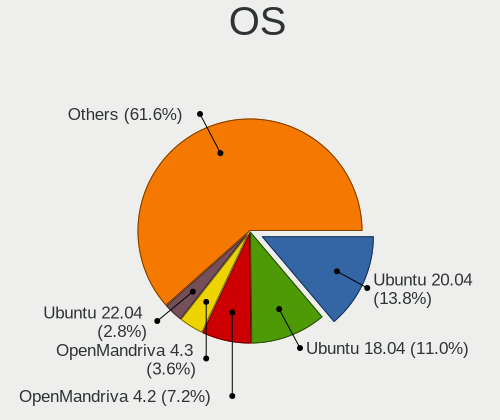

| Name                         | Desktops | Percent |
|------------------------------|----------|---------|
| Ubuntu 20.04                 | 73       | 13.27%  |
| Ubuntu 18.04                 | 57       | 10.36%  |
| OpenMandriva 4.2             | 38       | 6.91%   |
| OpenMandriva 4.3             | 24       | 4.36%   |
| Ubuntu 22.04                 | 21       | 3.82%   |
| Linux Mint 20.1              | 13       | 2.36%   |
| Ubuntu 19.04                 | 10       | 1.82%   |
| Fedora 35                    | 10       | 1.82%   |
| Fedora 32                    | 10       | 1.82%   |
| Ubuntu 20.10                 | 9        | 1.64%   |
| Debian 11                    | 9        | 1.64%   |
| Linux Mint 20.3              | 8        | 1.45%   |
| Fedora 34                    | 8        | 1.45%   |
| ROSA R9                      | 7        | 1.27%   |
| Pop!_OS 20.04                | 7        | 1.27%   |
| OpenMandriva 4.50            | 7        | 1.27%   |
| Linux Mint 20.2              | 7        | 1.27%   |
| Linux Mint 20                | 7        | 1.27%   |
| Fedora 33                    | 7        | 1.27%   |
| Arch Rolling                 | 7        | 1.27%   |
| Zorin 16                     | 6        | 1.09%   |
| Ubuntu 21.10                 | 6        | 1.09%   |
| Ubuntu 21.04                 | 6        | 1.09%   |
| Ubuntu 19.10                 | 6        | 1.09%   |
| Linux Mint 19.3              | 6        | 1.09%   |
| KDE neon 20.04               | 6        | 1.09%   |
| Fedora 36                    | 6        | 1.09%   |
| Xubuntu 18.04                | 5        | 0.91%   |
| Ubuntu MATE 20.04            | 5        | 0.91%   |
| Ubuntu 18.10                 | 5        | 0.91%   |
| RHEL 8                       | 5        | 0.91%   |
| Kubuntu 20.04                | 5        | 0.91%   |
| Gentoo 2.6                   | 5        | 0.91%   |
| Debian 10                    | 5        | 0.91%   |
| Arch                         | 5        | 0.91%   |
| Ubuntu 16.04                 | 4        | 0.73%   |
| ROSA R10                     | 4        | 0.73%   |
| Pop!_OS 21.04                | 4        | 0.73%   |
| openSUSE Tumbleweed-XXXXXXXX | 4        | 0.73%   |
| Linux Mint 19                | 4        | 0.73%   |

OS Family
---------

OS without a version

| Name         | Desktops | Percent |
|--------------|----------|---------|
| Ubuntu       | 189      | 35.93%  |
| OpenMandriva | 70       | 13.31%  |
| Linux Mint   | 48       | 9.13%   |
| Fedora       | 43       | 8.17%   |
| Debian       | 19       | 3.61%   |
| ROSA         | 17       | 3.23%   |
| Pop!_OS      | 16       | 3.04%   |
| Arch         | 12       | 2.28%   |
| Zorin        | 11       | 2.09%   |
| Manjaro      | 10       | 1.9%    |
| Gentoo       | 9        | 1.71%   |
| Xubuntu      | 7        | 1.33%   |
| Kubuntu      | 7        | 1.33%   |
| KDE neon     | 7        | 1.33%   |
| Ubuntu MATE  | 5        | 0.95%   |
| RHEL         | 5        | 0.95%   |
| Lubuntu      | 5        | 0.95%   |
| Endless      | 5        | 0.95%   |
| CentOS       | 5        | 0.95%   |
| Ubuntu Unity | 4        | 0.76%   |
| openSUSE     | 4        | 0.76%   |
| Void Linux   | 3        | 0.57%   |
| Kali         | 3        | 0.57%   |
| Elementary   | 3        | 0.57%   |
| Parrot       | 2        | 0.38%   |
| LMDE         | 2        | 0.38%   |
| EndeavourOS  | 2        | 0.38%   |
| ArcoLinux    | 2        | 0.38%   |
| Sparky       | 1        | 0.19%   |
| Rocky Linux  | 1        | 0.19%   |
| Rockstor     | 1        | 0.19%   |
| Nobara       | 1        | 0.19%   |
| Mageia       | 1        | 0.19%   |
| LinuxFX      | 1        | 0.19%   |
| GNOME OS     | 1        | 0.19%   |
| Drauger OS   | 1        | 0.19%   |
| BlackPanther | 1        | 0.19%   |
| Archman      | 1        | 0.19%   |
| Archcraft    | 1        | 0.19%   |

Kernel
------

Version of the Linux kernel

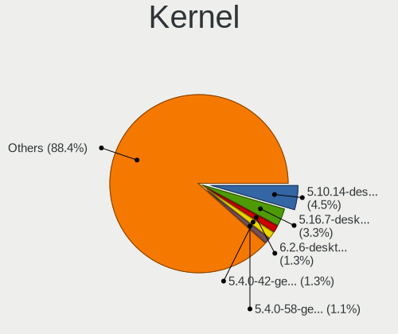

| Version                         | Desktops | Percent |
|---------------------------------|----------|---------|
| 5.10.14-desktop-1omv4002        | 37       | 5.98%   |
| 5.16.7-desktop-1omv4003         | 24       | 3.88%   |
| 5.4.0-42-generic                | 11       | 1.78%   |
| 5.4.0-58-generic                | 9        | 1.45%   |
| 5.11.0-27-generic               | 8        | 1.29%   |
| 5.13.0-30-generic               | 7        | 1.13%   |
| 5.4.0-26-generic                | 6        | 0.97%   |
| 5.15.0-46-generic               | 6        | 0.97%   |
| 4.9.20-nrj-desktop-1rosa-x86_64 | 6        | 0.97%   |
| 5.4.0-52-generic                | 5        | 0.81%   |
| 5.3.0-28-generic                | 5        | 0.81%   |
| 5.12.4-desktop-1omv4050         | 5        | 0.81%   |
| 5.0.0-37-generic                | 5        | 0.81%   |
| 4.15.0-45-generic               | 5        | 0.81%   |
| 5.8.0-50-generic                | 4        | 0.65%   |
| 5.8.0-41-generic                | 4        | 0.65%   |
| 5.4.0-72-generic                | 4        | 0.65%   |
| 5.4.0-48-generic                | 4        | 0.65%   |
| 5.4.0-47-generic                | 4        | 0.65%   |
| 5.4.0-33-generic                | 4        | 0.65%   |
| 5.3.0-40-generic                | 4        | 0.65%   |
| 5.15.0-52-generic               | 4        | 0.65%   |
| 5.15.0-25-generic               | 4        | 0.65%   |
| 5.13.0-39-generic               | 4        | 0.65%   |
| 5.11.0-37-generic               | 4        | 0.65%   |
| 5.0.0-32-generic                | 4        | 0.65%   |
| 4.18.0-25-generic               | 4        | 0.65%   |
| 4.18.0-16-generic               | 4        | 0.65%   |
| 4.15.0-43-generic               | 4        | 0.65%   |
| 5.8.0-53-generic                | 3        | 0.48%   |
| 5.8.0-43-generic                | 3        | 0.48%   |
| 5.8.0-38-generic                | 3        | 0.48%   |
| 5.4.0-88-generic                | 3        | 0.48%   |
| 5.4.0-80-generic                | 3        | 0.48%   |
| 5.4.0-77-generic                | 3        | 0.48%   |
| 5.4.0-74-generic                | 3        | 0.48%   |
| 5.4.0-67-generic                | 3        | 0.48%   |
| 5.4.0-66-generic                | 3        | 0.48%   |
| 5.4.0-62-generic                | 3        | 0.48%   |
| 5.4.0-29-generic                | 3        | 0.48%   |

Kernel Family
-------------

Linux kernel without a distro release

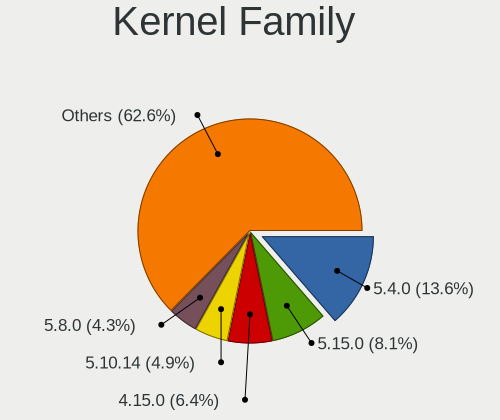

| Version | Desktops | Percent |
|---------|----------|---------|
| 5.4.0   | 98       | 17.28%  |
| 4.15.0  | 47       | 8.29%   |
| 5.10.14 | 37       | 6.53%   |
| 5.8.0   | 33       | 5.82%   |
| 5.15.0  | 29       | 5.11%   |
| 5.11.0  | 28       | 4.94%   |
| 4.18.0  | 26       | 4.59%   |
| 5.16.7  | 24       | 4.23%   |
| 5.0.0   | 24       | 4.23%   |
| 5.3.0   | 22       | 3.88%   |
| 5.13.0  | 20       | 3.53%   |
| 5.10.0  | 10       | 1.76%   |
| 4.19.0  | 8        | 1.41%   |
| 4.9.20  | 7        | 1.23%   |
| 5.12.4  | 5        | 0.88%   |
| 5.6.6   | 3        | 0.53%   |
| 5.16.11 | 3        | 0.53%   |
| 5.9.16  | 2        | 0.35%   |
| 5.9.0   | 2        | 0.35%   |
| 5.8.11  | 2        | 0.35%   |
| 5.7.12  | 2        | 0.35%   |
| 5.7.0   | 2        | 0.35%   |
| 5.6.0   | 2        | 0.35%   |
| 5.4.72  | 2        | 0.35%   |
| 5.19.13 | 2        | 0.35%   |
| 5.19.0  | 2        | 0.35%   |
| 5.18.12 | 2        | 0.35%   |
| 5.16.18 | 2        | 0.35%   |
| 5.16.0  | 2        | 0.35%   |
| 5.15.34 | 2        | 0.35%   |
| 5.15.13 | 2        | 0.35%   |
| 5.15.12 | 2        | 0.35%   |
| 5.15.10 | 2        | 0.35%   |
| 5.14.9  | 2        | 0.35%   |
| 5.14.10 | 2        | 0.35%   |
| 5.13.4  | 2        | 0.35%   |
| 5.11.12 | 2        | 0.35%   |
| 5.10.74 | 2        | 0.35%   |
| 4.9.60  | 2        | 0.35%   |
| 4.9.155 | 2        | 0.35%   |

Kernel Major Ver.
-----------------

Linux kernel major version

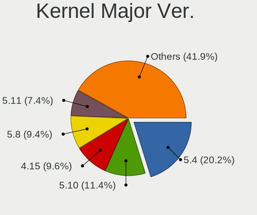

| Version | Desktops | Percent |
|---------|----------|---------|
| 5.4     | 104      | 18.51%  |
| 5.10    | 59       | 10.5%   |
| 4.15    | 47       | 8.36%   |
| 5.8     | 46       | 8.19%   |
| 5.15    | 40       | 7.12%   |
| 5.11    | 37       | 6.58%   |
| 5.16    | 34       | 6.05%   |
| 4.18    | 27       | 4.8%    |
| 5.0     | 26       | 4.63%   |
| 5.3     | 25       | 4.45%   |
| 5.13    | 24       | 4.27%   |
| 4.9     | 11       | 1.96%   |
| 5.19    | 8        | 1.42%   |
| 5.12    | 8        | 1.42%   |
| 4.19    | 8        | 1.42%   |
| 5.7     | 7        | 1.25%   |
| 5.6     | 7        | 1.25%   |
| 5.18    | 7        | 1.25%   |
| 5.17    | 7        | 1.25%   |
| 5.14    | 7        | 1.25%   |
| 5.9     | 6        | 1.07%   |
| 5.5     | 4        | 0.71%   |
| 4.4     | 2        | 0.36%   |
| 4.17    | 2        | 0.36%   |
| 3.10    | 2        | 0.36%   |
| 5.2     | 1        | 0.18%   |
| 4.20    | 1        | 0.18%   |
| 4.14    | 1        | 0.18%   |
| 4.13    | 1        | 0.18%   |
| 4.10    | 1        | 0.18%   |
| 4.1     | 1        | 0.18%   |
| 2.6     | 1        | 0.18%   |

Arch
----

OS architecture (x86_64, i586, etc.)

| Name   | Desktops | Percent |
|--------|----------|---------|
| x86_64 | 498      | 96.51%  |
| i686   | 18       | 3.49%   |

DE
--

Desktop Environment

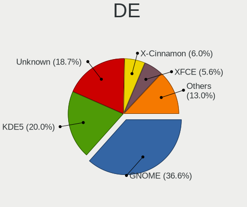

| Name            | Desktops | Percent |
|-----------------|----------|---------|
| GNOME           | 197      | 36.96%  |
| KDE5            | 110      | 20.64%  |
| Unknown         | 97       | 18.2%   |
| X-Cinnamon      | 31       | 5.82%   |
| XFCE            | 30       | 5.63%   |
| KDE             | 18       | 3.38%   |
| MATE            | 11       | 2.06%   |
| Cinnamon        | 9        | 1.69%   |
| KDE4            | 5        | 0.94%   |
| Unity           | 4        | 0.75%   |
| LXQt            | 4        | 0.75%   |
| LXDE            | 4        | 0.75%   |
| Pantheon        | 3        | 0.56%   |
| i3              | 3        | 0.56%   |
| GNOME Flashback | 3        | 0.56%   |
| openbox         | 2        | 0.38%   |
| Core            | 1        | 0.19%   |
| Budgie          | 1        | 0.19%   |

Display Server
--------------

X11 or Wayland

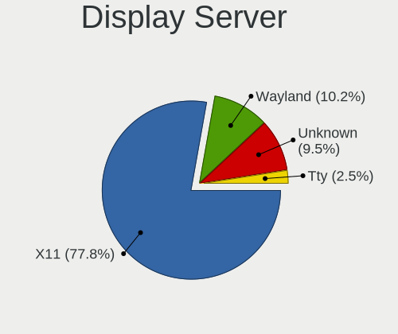

| Name    | Desktops | Percent |
|---------|----------|---------|
| X11     | 410      | 77.8%   |
| Wayland | 54       | 10.25%  |
| Unknown | 50       | 9.49%   |
| Tty     | 13       | 2.47%   |

Display Manager
---------------

SDDM, LightDM, etc.

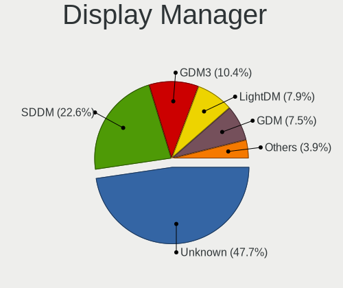

| Name    | Desktops | Percent |
|---------|----------|---------|
| Unknown | 299      | 55.99%  |
| SDDM    | 104      | 19.48%  |
| GDM     | 47       | 8.8%    |
| GDM3    | 34       | 6.37%   |
| TDM     | 25       | 4.68%   |
| LightDM | 20       | 3.75%   |
| KDM     | 5        | 0.94%   |

OS Lang
-------

Language

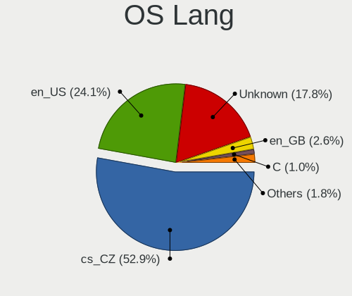

| Lang    | Desktops | Percent |
|---------|----------|---------|
| cs_CZ   | 278      | 52.85%  |
| en_US   | 129      | 24.52%  |
| Unknown | 90       | 17.11%  |
| en_GB   | 14       | 2.66%   |
| C       | 5        | 0.95%   |
| sk_SK   | 3        | 0.57%   |
| ru_RU   | 2        | 0.38%   |
| pt_PT   | 1        | 0.19%   |
| POSIX   | 1        | 0.19%   |
| fi_FI   | 1        | 0.19%   |
| en_CA   | 1        | 0.19%   |
| en_AU   | 1        | 0.19%   |

Boot Mode
---------

EFI or BIOS

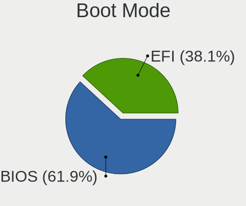

| Mode | Desktops | Percent |
|------|----------|---------|
| BIOS | 340      | 65.01%  |
| EFI  | 183      | 34.99%  |

Filesystem
----------

Type of filesystem

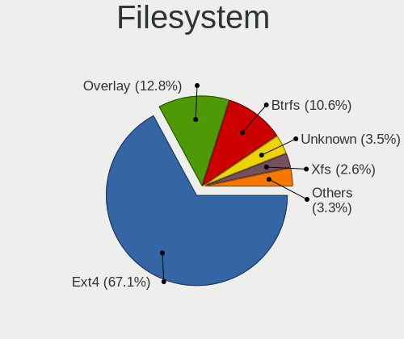

| Type     | Desktops | Percent |
|----------|----------|---------|
| Ext4     | 364      | 68.81%  |
| Overlay  | 72       | 13.61%  |
| Btrfs    | 46       | 8.7%    |
| Unknown  | 24       | 4.54%   |
| Xfs      | 14       | 2.65%   |
| Zfs      | 5        | 0.95%   |
| Ext2     | 2        | 0.38%   |
| Reiserfs | 1        | 0.19%   |
| Ext3     | 1        | 0.19%   |

Part. scheme
------------

Scheme of partitioning

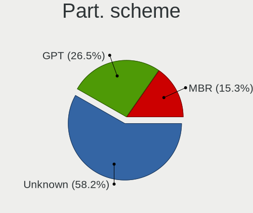

| Type    | Desktops | Percent |
|---------|----------|---------|
| Unknown | 308      | 58.22%  |
| GPT     | 140      | 26.47%  |
| MBR     | 81       | 15.31%  |

Dual Boot with Linux/BSD
------------------------

Hosting more than one Linux/BSD

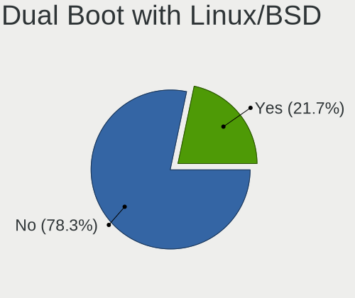

| Dual boot | Desktops | Percent |
|-----------|----------|---------|
| No        | 424      | 80.3%   |
| Yes       | 104      | 19.7%   |

Dual Boot (Win)
---------------

Hosting Linux and Windows

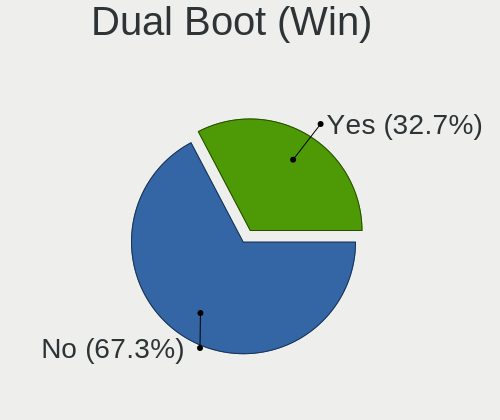

| Dual boot | Desktops | Percent |
|-----------|----------|---------|
| No        | 356      | 67.81%  |
| Yes       | 169      | 32.19%  |

Board
-----

Vendor
------

Motherboard manufacturer

| Name                | Desktops | Percent |
|---------------------|----------|---------|
| ASUSTek Computer    | 142      | 27.57%  |
| Gigabyte Technology | 120      | 23.3%   |
| MSI                 | 82       | 15.92%  |
| ASRock              | 37       | 7.18%   |
| Hewlett-Packard     | 36       | 6.99%   |
| Dell                | 24       | 4.66%   |
| Lenovo              | 19       | 3.69%   |
| Intel               | 13       | 2.52%   |
| Acer                | 11       | 2.14%   |
| Fujitsu             | 5        | 0.97%   |
| Pegatron            | 4        | 0.78%   |
| Fujitsu Siemens     | 3        | 0.58%   |
| Unknown             | 3        | 0.58%   |
| Foxconn             | 2        | 0.39%   |
| Clientron           | 2        | 0.39%   |
| Biostar             | 2        | 0.39%   |
| UMAX                | 1        | 0.19%   |
| Supermicro          | 1        | 0.19%   |
| SIEMENS             | 1        | 0.19%   |
| Seeed Studio        | 1        | 0.19%   |
| Packard Bell        | 1        | 0.19%   |
| Minix               | 1        | 0.19%   |
| Le Cube 1           | 1        | 0.19%   |
| EVGA                | 1        | 0.19%   |
| ELSKY               | 1        | 0.19%   |
| ASRockRack          | 1        | 0.19%   |

Model
-----

Motherboard model

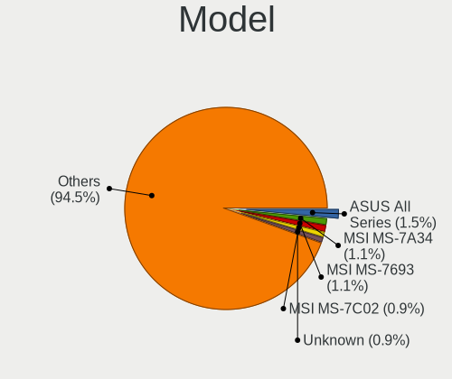

| Name                               | Desktops | Percent |
|------------------------------------|----------|---------|
| ASUS All Series                    | 8        | 1.55%   |
| MSI MS-7A34                        | 6        | 1.17%   |
| MSI MS-7693                        | 6        | 1.17%   |
| MSI MS-7C02                        | 5        | 0.97%   |
| MSI MS-7C91                        | 4        | 0.78%   |
| Unknown                            | 4        | 0.78%   |
| MSI MS-7592                        | 3        | 0.58%   |
| HP Compaq 8200 Elite SFF PC        | 3        | 0.58%   |
| Gigabyte B450 AORUS ELITE          | 3        | 0.58%   |
| Gigabyte 970A-DS3P                 | 3        | 0.58%   |
| ASUS ROG STRIX B550-I GAMING       | 3        | 0.58%   |
| ASUS ROG STRIX B550-F GAMING       | 3        | 0.58%   |
| ASUS P5G41T-M LX                   | 3        | 0.58%   |
| Pegatron h9-1000cs                 | 2        | 0.39%   |
| MSI MS-7C84                        | 2        | 0.39%   |
| MSI MS-7C37                        | 2        | 0.39%   |
| MSI MS-7B79                        | 2        | 0.39%   |
| MSI MS-7817                        | 2        | 0.39%   |
| MSI MS-7512                        | 2        | 0.39%   |
| Lenovo ThinkCentre M58p 3285A1G    | 2        | 0.39%   |
| Intel DQ35JO AAD82085-807          | 2        | 0.39%   |
| HP Z230 Tower Workstation          | 2        | 0.39%   |
| HP EliteDesk 800 G1 SFF            | 2        | 0.39%   |
| HP Compaq dc7600 Small Form Factor | 2        | 0.39%   |
| HP Compaq 6005 Pro MT PC           | 2        | 0.39%   |
| HP 290 G1 SFF Business PC          | 2        | 0.39%   |
| Gigabyte Z77-D3H                   | 2        | 0.39%   |
| Gigabyte Z390 AORUS PRO            | 2        | 0.39%   |
| Gigabyte X470 AORUS ULTRA GAMING   | 2        | 0.39%   |
| Gigabyte TRILINE PROFI             | 2        | 0.39%   |
| Gigabyte GA-MA785GMT-UD2H          | 2        | 0.39%   |
| Gigabyte GA-A75M-UD2H              | 2        | 0.39%   |
| Gigabyte B460MDS3H                 | 2        | 0.39%   |
| Gigabyte B450 AORUS M              | 2        | 0.39%   |
| Gigabyte 990FXA-UD3                | 2        | 0.39%   |
| Dell Precision T1700               | 2        | 0.39%   |
| Dell OptiPlex 790                  | 2        | 0.39%   |
| Dell OptiPlex 7010                 | 2        | 0.39%   |
| Dell OptiPlex 3020                 | 2        | 0.39%   |
| Clientron Sunshine Valley          | 2        | 0.39%   |

Model Family
------------

Motherboard model prefix

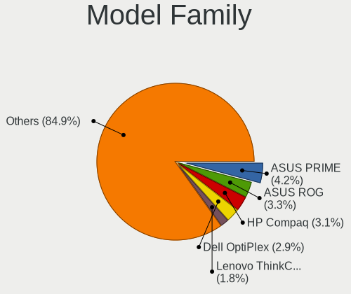

| Name                 | Desktops | Percent |
|----------------------|----------|---------|
| ASUS PRIME           | 23       | 4.47%   |
| ASUS ROG             | 21       | 4.08%   |
| HP Compaq            | 16       | 3.11%   |
| Dell OptiPlex        | 15       | 2.91%   |
| Lenovo ThinkCentre   | 11       | 2.14%   |
| ASUS TUF             | 10       | 1.94%   |
| ASUS All             | 8        | 1.55%   |
| Acer Aspire          | 8        | 1.55%   |
| Gigabyte B450        | 7        | 1.36%   |
| MSI MS-7A34          | 6        | 1.17%   |
| MSI MS-7693          | 6        | 1.17%   |
| MSI MS-7C02          | 5        | 0.97%   |
| HP ProDesk           | 5        | 0.97%   |
| HP EliteDesk         | 5        | 0.97%   |
| Dell Precision       | 5        | 0.97%   |
| MSI MS-7C91          | 4        | 0.78%   |
| Gigabyte X570        | 4        | 0.78%   |
| ASUS M5A97           | 4        | 0.78%   |
| ASRock B450M         | 4        | 0.78%   |
| Unknown              | 4        | 0.78%   |
| MSI MS-7592          | 3        | 0.58%   |
| Gigabyte Z390        | 3        | 0.58%   |
| Gigabyte TRILINE     | 3        | 0.58%   |
| Gigabyte 970A-DS3P   | 3        | 0.58%   |
| Fujitsu ESPRIMO      | 3        | 0.58%   |
| ASUS P5G41T-M        | 3        | 0.58%   |
| ASUS A88XM-A         | 3        | 0.58%   |
| Pegatron h9-1000cs   | 2        | 0.39%   |
| MSI MS-7C84          | 2        | 0.39%   |
| MSI MS-7C37          | 2        | 0.39%   |
| MSI MS-7B79          | 2        | 0.39%   |
| MSI MS-7817          | 2        | 0.39%   |
| MSI MS-7512          | 2        | 0.39%   |
| Lenovo V530-15ICR    | 2        | 0.39%   |
| Lenovo H30-05        | 2        | 0.39%   |
| Intel DQ35JO         | 2        | 0.39%   |
| HP Z230              | 2        | 0.39%   |
| HP 290               | 2        | 0.39%   |
| Gigabyte Z97X-Gaming | 2        | 0.39%   |
| Gigabyte Z77-D3H     | 2        | 0.39%   |

MFG Year
--------

Motherboard manufacture year

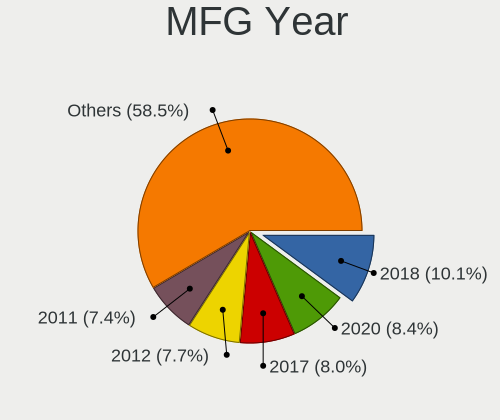

| Year    | Desktops | Percent |
|---------|----------|---------|
| 2018    | 59       | 11.46%  |
| 2017    | 42       | 8.16%   |
| 2012    | 40       | 7.77%   |
| 2014    | 38       | 7.38%   |
| 2011    | 38       | 7.38%   |
| 2020    | 37       | 7.18%   |
| 2013    | 35       | 6.8%    |
| 2009    | 35       | 6.8%    |
| 2019    | 32       | 6.21%   |
| 2008    | 31       | 6.02%   |
| 2007    | 29       | 5.63%   |
| 2010    | 24       | 4.66%   |
| 2015    | 22       | 4.27%   |
| 2016    | 21       | 4.08%   |
| 2021    | 14       | 2.72%   |
| 2006    | 11       | 2.14%   |
| 2005    | 3        | 0.58%   |
| 2004    | 2        | 0.39%   |
| 2000    | 1        | 0.19%   |
| Unknown | 1        | 0.19%   |

Form Factor
-----------

Physical design of the computer

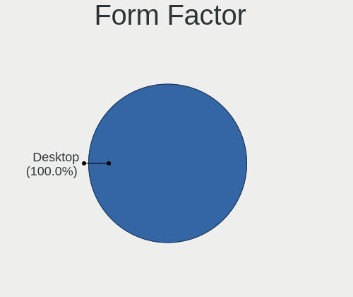

| Name    | Desktops | Percent |
|---------|----------|---------|
| Desktop | 515      | 100%    |

Secure Boot
-----------

Enabled or disabled

| State    | Desktops | Percent |
|----------|----------|---------|
| Disabled | 507      | 98.26%  |
| Enabled  | 9        | 1.74%   |

Coreboot
--------

Have coreboot on board

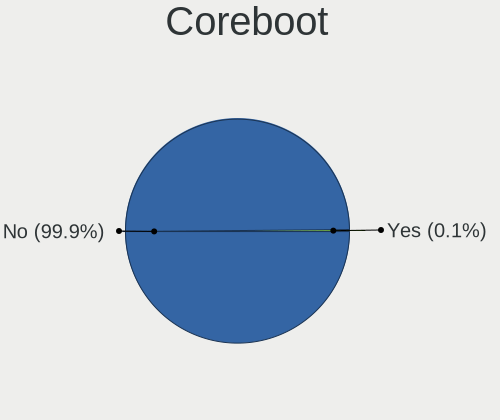

| Used | Desktops | Percent |
|------|----------|---------|
| No   | 515      | 100%    |

RAM Size
--------

Total RAM memory

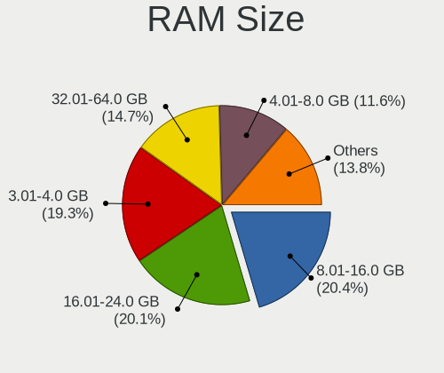

| Size in GB  | Desktops | Percent |
|-------------|----------|---------|
| 3.01-4.0    | 113      | 21.36%  |
| 8.01-16.0   | 112      | 21.17%  |
| 16.01-24.0  | 102      | 19.28%  |
| 32.01-64.0  | 76       | 14.37%  |
| 4.01-8.0    | 60       | 11.34%  |
| 1.01-2.0    | 28       | 5.29%   |
| 64.01-256.0 | 17       | 3.21%   |
| 24.01-32.0  | 10       | 1.89%   |
| 2.01-3.0    | 10       | 1.89%   |
| 0.01-0.5    | 1        | 0.19%   |

RAM Used
--------

Used RAM memory

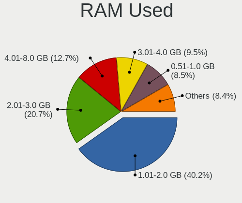

| Used GB    | Desktops | Percent |
|------------|----------|---------|
| 1.01-2.0   | 229      | 39.9%   |
| 2.01-3.0   | 119      | 20.73%  |
| 4.01-8.0   | 75       | 13.07%  |
| 3.01-4.0   | 56       | 9.76%   |
| 0.51-1.0   | 48       | 8.36%   |
| 8.01-16.0  | 30       | 5.23%   |
| 0.01-0.5   | 8        | 1.39%   |
| 16.01-24.0 | 4        | 0.7%    |
| 32.01-64.0 | 2        | 0.35%   |
| 24.01-32.0 | 2        | 0.35%   |
| Unknown    | 1        | 0.17%   |

Total Drives
------------

Number of drives on board

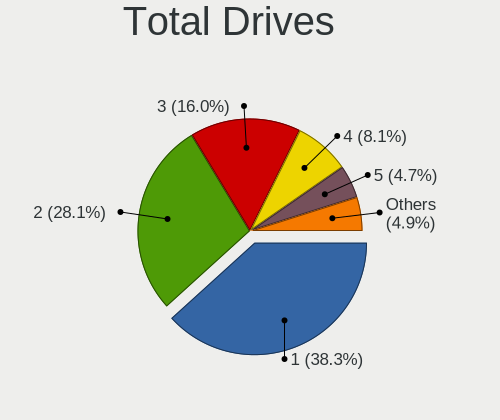

| Drives | Desktops | Percent |
|--------|----------|---------|
| 1      | 214      | 39.93%  |
| 2      | 150      | 27.99%  |
| 3      | 81       | 15.11%  |
| 4      | 42       | 7.84%   |
| 5      | 22       | 4.1%    |
| 7      | 8        | 1.49%   |
| 6      | 7        | 1.31%   |
| 0      | 7        | 1.31%   |
| 8      | 4        | 0.75%   |
| 9      | 1        | 0.19%   |

Has CD-ROM
----------

Has CD-ROM on board

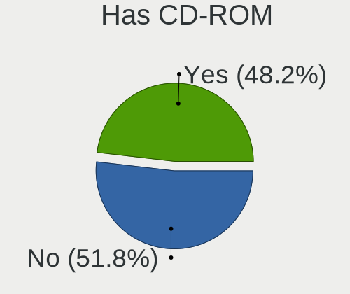

| Presented | Desktops | Percent |
|-----------|----------|---------|
| No        | 262      | 50.19%  |
| Yes       | 260      | 49.81%  |

Has Ethernet
------------

Has Ethernet on board

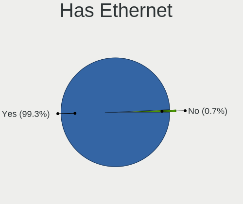

| Presented | Desktops | Percent |
|-----------|----------|---------|
| Yes       | 510      | 99.03%  |
| No        | 5        | 0.97%   |

Has WiFi
--------

Has WiFi module

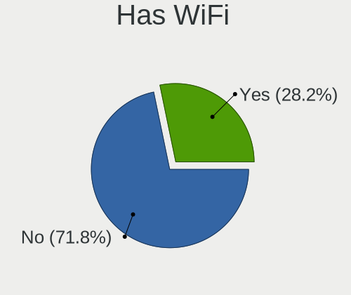

| Presented | Desktops | Percent |
|-----------|----------|---------|
| No        | 373      | 71.87%  |
| Yes       | 146      | 28.13%  |

Has Bluetooth
-------------

Has Bluetooth module

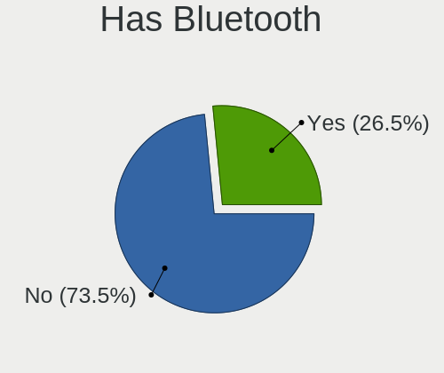

| Presented | Desktops | Percent |
|-----------|----------|---------|
| No        | 401      | 77.12%  |
| Yes       | 119      | 22.88%  |

Location
--------

Country
-------

Geographic location (country)

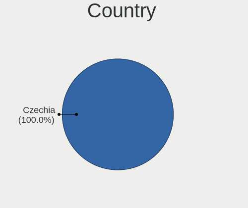

| Country | Desktops | Percent |
|---------|----------|---------|
| Czechia | 515      | 100%    |

City
----

Geographic location (city)

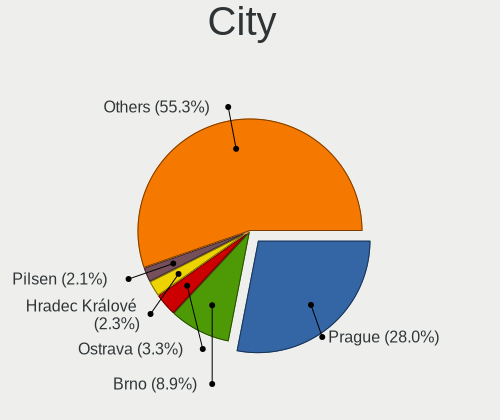

| City                | Desktops | Percent |
|---------------------|----------|---------|
| Prague              | 151      | 28.38%  |
| Brno                | 46       | 8.65%   |
| Ostrava             | 17       | 3.2%    |
| Hradec Králové    | 13       | 2.44%   |
| Pilsen              | 11       | 2.07%   |
| Zlín               | 8        | 1.5%    |
| Pardubice           | 8        | 1.5%    |
| Olomouc             | 8        | 1.5%    |
| České Budějovice | 8        | 1.5%    |
| Liberec             | 6        | 1.13%   |
| Havířov           | 6        | 1.13%   |
| Uherské Hradiště | 5        | 0.94%   |
| Litoměřice        | 5        | 0.94%   |
| Znojmo              | 4        | 0.75%   |
| Ponetovice          | 4        | 0.75%   |
| Frýdek-Místek     | 4        | 0.75%   |
| Zdanice             | 3        | 0.56%   |
| Teplice             | 3        | 0.56%   |
| Sokolov             | 3        | 0.56%   |
| Rumburk             | 3        | 0.56%   |
| Rakvice             | 3        | 0.56%   |
| Přerov             | 3        | 0.56%   |
| Opava               | 3        | 0.56%   |
| Novy Jicin          | 3        | 0.56%   |
| Neratovice          | 3        | 0.56%   |
| Most                | 3        | 0.56%   |
| Mladá Boleslav     | 3        | 0.56%   |
| Jirikov             | 3        | 0.56%   |
| Český Těšín    | 3        | 0.56%   |
| Česká Lípa       | 3        | 0.56%   |
| As                  | 3        | 0.56%   |
| Zidlochovice        | 2        | 0.38%   |
| Zelenec             | 2        | 0.38%   |
| Zbysov              | 2        | 0.38%   |
| Vyškov             | 2        | 0.38%   |
| Vsetin              | 2        | 0.38%   |
| Vrchlabi            | 2        | 0.38%   |
| Velke Mezirici      | 2        | 0.38%   |
| Valasske Mezirici   | 2        | 0.38%   |
| Ústí nad Labem    | 2        | 0.38%   |

Drives
------

Drive Vendor
------------

Hard drive vendors

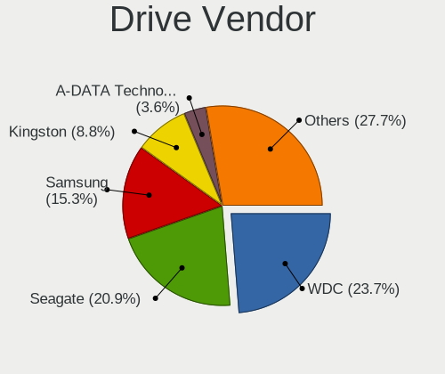

| Vendor                      | Desktops | Drives | Percent |
|-----------------------------|----------|--------|---------|
| WDC                         | 227      | 424    | 24.95%  |
| Seagate                     | 189      | 301    | 20.77%  |
| Samsung Electronics         | 134      | 206    | 14.73%  |
| Kingston                    | 81       | 109    | 8.9%    |
| A-DATA Technology           | 33       | 43     | 3.63%   |
| Crucial                     | 31       | 35     | 3.41%   |
| Hitachi                     | 29       | 33     | 3.19%   |
| Toshiba                     | 28       | 29     | 3.08%   |
| Patriot                     | 21       | 27     | 2.31%   |
| Intel                       | 16       | 19     | 1.76%   |
| SanDisk                     | 11       | 15     | 1.21%   |
| Unknown                     | 9        | 13     | 0.99%   |
| OCZ                         | 9        | 29     | 0.99%   |
| Maxtor                      | 9        | 13     | 0.99%   |
| Transcend                   | 8        | 15     | 0.88%   |
| Phison                      | 8        | 12     | 0.88%   |
| Gigabyte Technology         | 7        | 10     | 0.77%   |
| Apacer                      | 7        | 9      | 0.77%   |
| HGST                        | 6        | 7      | 0.66%   |
| XPG                         | 5        | 7      | 0.55%   |
| Verbatim                    | 4        | 4      | 0.44%   |
| Silicon Motion              | 3        | 3      | 0.33%   |
| Micron Technology           | 3        | 4      | 0.33%   |
| GOODRAM                     | 3        | 3      | 0.33%   |
| UMAX                        | 2        | 2      | 0.22%   |
| SPCC                        | 2        | 2      | 0.22%   |
| SK hynix                    | 2        | 2      | 0.22%   |
| pqi                         | 2        | 2      | 0.22%   |
| Micron/Crucial Technology   | 2        | 2      | 0.22%   |
| LITEONIT                    | 2        | 2      | 0.22%   |
| Corsair                     | 2        | 2      | 0.22%   |
| Western Digital             | 1        | 1      | 0.11%   |
| WDC WUH                     | 1        | 1      | 0.11%   |
| WDC WDS1                    | 1        | 1      | 0.11%   |
| Team                        | 1        | 1      | 0.11%   |
| TCSUNBOW                    | 1        | 1      | 0.11%   |
| LITEON                      | 1        | 2      | 0.11%   |
| Kingston Technology Company | 1        | 1      | 0.11%   |
| Innodisk                    | 1        | 1      | 0.11%   |
| HPE                         | 1        | 1      | 0.11%   |

Drive Model
-----------

Hard drive models

| Model                            | Desktops | Percent |
|----------------------------------|----------|---------|
| Kingston SA400S37240G 240GB SSD  | 17       | 1.58%   |
| Samsung SSD 860 EVO 500GB        | 15       | 1.4%    |
| Samsung NVMe SSD Drive 500GB     | 13       | 1.21%   |
| Seagate ST2000DM008-2FR102 2TB   | 12       | 1.12%   |
| Seagate ST1000DM010-2EP102 1TB   | 12       | 1.12%   |
| Seagate ST3500418AS 500GB        | 10       | 0.93%   |
| Kingston SA400S37120G 120GB SSD  | 10       | 0.93%   |
| WDC WDS500G2B0A-00SM50 500GB SSD | 9        | 0.84%   |
| WDC WD30EFRX-68EUZN0 3TB         | 9        | 0.84%   |
| Samsung SSD 850 EVO 250GB        | 9        | 0.84%   |
| WDC WD10EZEX-08M2NA0 1TB         | 8        | 0.74%   |
| Seagate ST500DM002-1BD142 500GB  | 8        | 0.74%   |
| Patriot Burst 120GB SSD          | 8        | 0.74%   |
| WDC WDS240G2G0A-00JH30 240GB SSD | 7        | 0.65%   |
| WDC WD10EZEX-08WN4A0 1TB         | 7        | 0.65%   |
| Seagate ST4000DM004-2CV104 4TB   | 7        | 0.65%   |
| Seagate ST1000DM003-1ER162 1TB   | 7        | 0.65%   |
| Samsung SSD 860 EVO 1TB          | 7        | 0.65%   |
| Samsung HD103SI 1TB              | 7        | 0.65%   |
| Kingston SV300S37A120G 120GB SSD | 7        | 0.65%   |
| Kingston SA400S37480G 480GB SSD  | 7        | 0.65%   |
| Toshiba DT01ACA100 1TB           | 6        | 0.56%   |
| Samsung NVMe SSD Drive 250GB     | 6        | 0.56%   |
| Samsung HD322HJ 320GB            | 6        | 0.56%   |
| WDC WDS120G2G0A-00JH30 120GB SSD | 5        | 0.47%   |
| WDC WD20EARX-00PASB0 2TB         | 5        | 0.47%   |
| WDC WD10EZRZ-00HTKB0 1TB         | 5        | 0.47%   |
| Seagate ST4000VN008-2DR166 4TB   | 5        | 0.47%   |
| Seagate ST3250318AS 250GB        | 5        | 0.47%   |
| Seagate ST3160815AS 160GB        | 5        | 0.47%   |
| Seagate ST2000DM001-1ER164 2TB   | 5        | 0.47%   |
| Seagate ST2000DM001-1CH164 2TB   | 5        | 0.47%   |
| Samsung SSD 970 EVO 500GB        | 5        | 0.47%   |
| Samsung SSD 850 EVO 500GB        | 5        | 0.47%   |
| Kingston SHFS37A120G 120GB SSD   | 5        | 0.47%   |
| WDC WDS100T2B0A-00SM50 1TB SSD   | 4        | 0.37%   |
| WDC WD5000AAKX-60U6AA0 500GB     | 4        | 0.37%   |
| WDC WD5000AAKX-08U6AA0 500GB     | 4        | 0.37%   |
| WDC WD20EFRX-68EUZN0 2TB         | 4        | 0.37%   |
| Transcend TS128GSSD370 128GB     | 4        | 0.37%   |

HDD Vendor
----------

Hard disk drive vendors

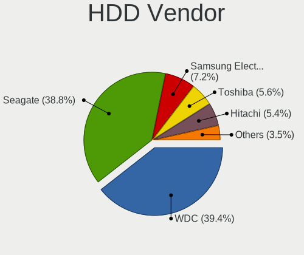

| Vendor              | Desktops | Drives | Percent |
|---------------------|----------|--------|---------|
| WDC                 | 202      | 371    | 40.73%  |
| Seagate             | 183      | 293    | 36.9%   |
| Samsung Electronics | 39       | 58     | 7.86%   |
| Hitachi             | 29       | 33     | 5.85%   |
| Toshiba             | 23       | 23     | 4.64%   |
| Maxtor              | 9        | 13     | 1.81%   |
| HGST                | 6        | 7      | 1.21%   |
| Unknown             | 2        | 2      | 0.4%    |
| pqi                 | 2        | 2      | 0.4%    |
| Fujitsu             | 1        | 2      | 0.2%    |

SSD Vendor
----------

Solid state drive vendors

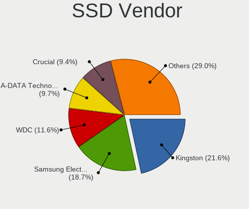

| Vendor              | Desktops | Drives | Percent |
|---------------------|----------|--------|---------|
| Kingston            | 67       | 92     | 21.61%  |
| Samsung Electronics | 58       | 77     | 18.71%  |
| WDC                 | 36       | 46     | 11.61%  |
| A-DATA Technology   | 30       | 38     | 9.68%   |
| Crucial             | 29       | 33     | 9.35%   |
| Patriot             | 20       | 26     | 6.45%   |
| Transcend           | 8        | 15     | 2.58%   |
| Intel               | 8        | 10     | 2.58%   |
| OCZ                 | 7        | 11     | 2.26%   |
| Apacer              | 7        | 9      | 2.26%   |
| SanDisk             | 6        | 9      | 1.94%   |
| Verbatim            | 4        | 4      | 1.29%   |
| Toshiba             | 3        | 3      | 0.97%   |
| GOODRAM             | 3        | 3      | 0.97%   |
| UMAX                | 2        | 2      | 0.65%   |
| SPCC                | 2        | 2      | 0.65%   |
| SK hynix            | 2        | 2      | 0.65%   |
| Seagate             | 2        | 2      | 0.65%   |
| Micron Technology   | 2        | 2      | 0.65%   |
| LITEONIT            | 2        | 2      | 0.65%   |
| Gigabyte Technology | 2        | 4      | 0.65%   |
| WDC WDS1            | 1        | 1      | 0.32%   |
| Unknown             | 1        | 1      | 0.32%   |
| Team                | 1        | 1      | 0.32%   |
| TCSUNBOW            | 1        | 1      | 0.32%   |
| Phison              | 1        | 1      | 0.32%   |
| LITEON              | 1        | 2      | 0.32%   |
| Innodisk            | 1        | 1      | 0.32%   |
| FORESEE             | 1        | 1      | 0.32%   |
| China               | 1        | 1      | 0.32%   |
| ADATA SP            | 1        | 1      | 0.32%   |

Drive Kind
----------

HDD or SSD

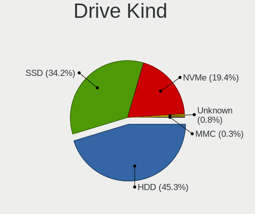

| Kind    | Desktops | Drives | Percent |
|---------|----------|--------|---------|
| HDD     | 388      | 804    | 51.12%  |
| SSD     | 256      | 403    | 33.73%  |
| NVMe    | 107      | 182    | 14.1%   |
| Unknown | 5        | 6      | 0.66%   |
| MMC     | 3        | 6      | 0.4%    |

Drive Connector
---------------

SATA, SAS, NVMe, etc.

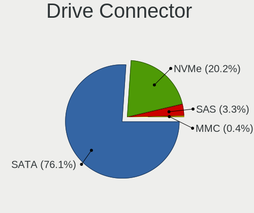

| Type | Desktops | Drives | Percent |
|------|----------|--------|---------|
| SATA | 479      | 1191   | 78.65%  |
| NVMe | 107      | 182    | 17.57%  |
| SAS  | 20       | 22     | 3.28%   |
| MMC  | 3        | 6      | 0.49%   |

Drive Size
----------

Size of hard drive

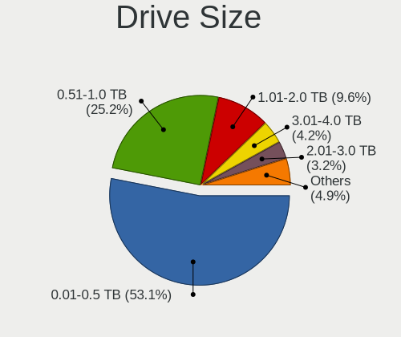

| Size in TB | Desktops | Drives | Percent |
|------------|----------|--------|---------|
| 0.01-0.5   | 399      | 697    | 56.52%  |
| 0.51-1.0   | 178      | 267    | 25.21%  |
| 1.01-2.0   | 58       | 128    | 8.22%   |
| 2.01-3.0   | 26       | 39     | 3.68%   |
| 3.01-4.0   | 19       | 30     | 2.69%   |
| 4.01-10.0  | 17       | 32     | 2.41%   |
| 10.01-20.0 | 9        | 14     | 1.27%   |

Space Total
-----------

Amount of disk space available on the file system

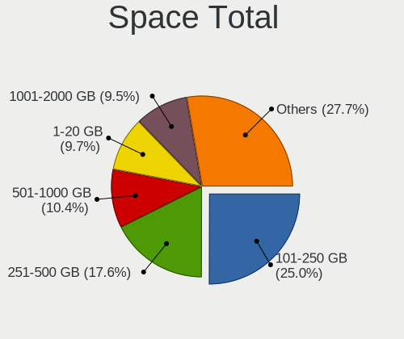

| Size in GB     | Desktops | Percent |
|----------------|----------|---------|
| 101-250        | 142      | 25.72%  |
| 251-500        | 96       | 17.39%  |
| 501-1000       | 57       | 10.33%  |
| 1001-2000      | 56       | 10.14%  |
| 1-20           | 55       | 9.96%   |
| More than 3000 | 43       | 7.79%   |
| 51-100         | 35       | 6.34%   |
| Unknown        | 29       | 5.25%   |
| 21-50          | 21       | 3.8%    |
| 2001-3000      | 18       | 3.26%   |

Space Used
----------

Amount of used disk space

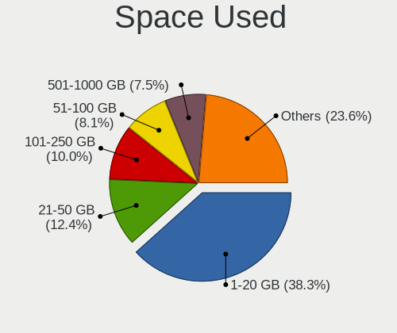

| Used GB        | Desktops | Percent |
|----------------|----------|---------|
| 1-20           | 221      | 39.05%  |
| 21-50          | 71       | 12.54%  |
| 101-250        | 55       | 9.72%   |
| 51-100         | 46       | 8.13%   |
| 501-1000       | 44       | 7.77%   |
| 251-500        | 41       | 7.24%   |
| Unknown        | 29       | 5.12%   |
| 1001-2000      | 26       | 4.59%   |
| More than 3000 | 21       | 3.71%   |
| 2001-3000      | 12       | 2.12%   |

Malfunc. Drives
---------------

Drive models with a malfunction

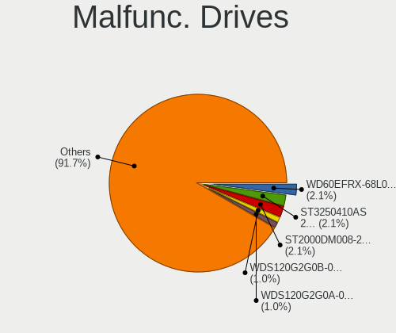

| Model                            | Desktops | Drives | Percent |
|----------------------------------|----------|--------|---------|
| WDC WD60EFRX-68L0BN1 6TB         | 2        | 3      | 3.33%   |
| Seagate ST2000DM008-2FR102 2TB   | 2        | 2      | 3.33%   |
| WDC WDS120G2G0A-00JH30 120GB SSD | 1        | 1      | 1.67%   |
| WDC WDS100T2B0A-00SM50 1TB SSD   | 1        | 1      | 1.67%   |
| WDC WD800BB-00JHA0 80GB          | 1        | 1      | 1.67%   |
| WDC WD7500AADS-00M2B0 752GB      | 1        | 1      | 1.67%   |
| WDC WD6400AAKS-22A7B2 640GB      | 1        | 1      | 1.67%   |
| WDC WD5000AAKS-00V0A0 500GB      | 1        | 1      | 1.67%   |
| WDC WD30EFRX-68EUZN0 3TB         | 1        | 1      | 1.67%   |
| WDC WD2502ABYS-02B7A0 256GB      | 1        | 1      | 1.67%   |
| WDC WD2500BEVS-22UST0 250GB      | 1        | 1      | 1.67%   |
| WDC WD2500AAKX-75U6AA0 250GB     | 1        | 1      | 1.67%   |
| WDC WD2500AAKX-60U6AA0 250GB     | 1        | 1      | 1.67%   |
| WDC WD2500AAKX-603CA0 250GB      | 1        | 1      | 1.67%   |
| WDC WD2500AAKX-083CA1 250GB      | 1        | 1      | 1.67%   |
| WDC WD2500AAJS-08L7A0 250GB      | 1        | 2      | 1.67%   |
| WDC WD20EARX-008FB0 2TB          | 1        | 2      | 1.67%   |
| WDC WD10JPCX-24UE4T0 1TB         | 1        | 1      | 1.67%   |
| WDC WD10EZRX-00L4HB0 1TB         | 1        | 1      | 1.67%   |
| WDC WD10EZEX-75M2NA0 1TB         | 1        | 1      | 1.67%   |
| WDC WD10EZEX-35M2NA0 1TB         | 1        | 1      | 1.67%   |
| WDC WD10EZEX-08WN4A0 1TB         | 1        | 1      | 1.67%   |
| WDC WD1001FALS-40K1B0 1TB        | 1        | 1      | 1.67%   |
| Seagate ST8000VN0002-1Z8112 8TB  | 1        | 1      | 1.67%   |
| Seagate ST500LT012-9WS142 500GB  | 1        | 1      | 1.67%   |
| Seagate ST500LT0 12-1DG142 500GB | 1        | 1      | 1.67%   |
| Seagate ST500DM005 HD502HJ 500GB | 1        | 3      | 1.67%   |
| Seagate ST500DM002-1SB10A 500GB  | 1        | 1      | 1.67%   |
| Seagate ST3500410SV 500GB        | 1        | 1      | 1.67%   |
| Seagate ST3320620A 320GB         | 1        | 1      | 1.67%   |
| Seagate ST3250620NS 250GB        | 1        | 2      | 1.67%   |
| Seagate ST3250410AS 250GB        | 1        | 2      | 1.67%   |
| Seagate ST3250318AS 250GB        | 1        | 1      | 1.67%   |
| Seagate ST3160815SV 160GB        | 1        | 1      | 1.67%   |
| Seagate ST3160318AS 160GB        | 1        | 1      | 1.67%   |
| Seagate ST3120026AS 120GB        | 1        | 3      | 1.67%   |
| Seagate ST31000528AS 1TB         | 1        | 1      | 1.67%   |
| Seagate ST250DM000-1BD141 250GB  | 1        | 1      | 1.67%   |
| Seagate ST2000VX000-1CU164 2TB   | 1        | 1      | 1.67%   |
| Seagate ST2000DM006-2DM164 2TB   | 1        | 1      | 1.67%   |

Malfunc. Drive Vendor
---------------------

Vendors of faulty drives

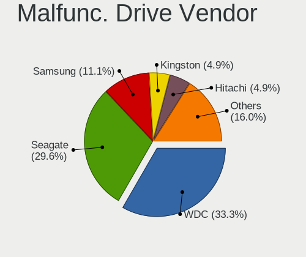

| Vendor              | Desktops | Drives | Percent |
|---------------------|----------|--------|---------|
| WDC                 | 21       | 26     | 36.21%  |
| Seagate             | 21       | 27     | 36.21%  |
| Samsung Electronics | 5        | 5      | 8.62%   |
| Micron Technology   | 2        | 2      | 3.45%   |
| Kingston            | 2        | 2      | 3.45%   |
| Hitachi             | 2        | 2      | 3.45%   |
| Crucial             | 2        | 2      | 3.45%   |
| Maxtor              | 1        | 1      | 1.72%   |
| HGST                | 1        | 1      | 1.72%   |
| A-DATA Technology   | 1        | 2      | 1.72%   |

Malfunc. HDD Vendor
-------------------

Vendors of faulty HDD drives

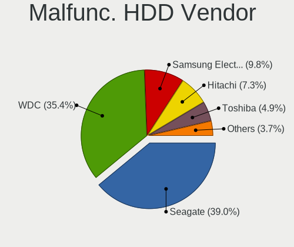

| Vendor              | Desktops | Drives | Percent |
|---------------------|----------|--------|---------|
| Seagate             | 21       | 27     | 42%     |
| WDC                 | 20       | 24     | 40%     |
| Samsung Electronics | 5        | 5      | 10%     |
| Hitachi             | 2        | 2      | 4%      |
| Maxtor              | 1        | 1      | 2%      |
| HGST                | 1        | 1      | 2%      |

Malfunc. Drive Kind
-------------------

Kinds of faulty drives

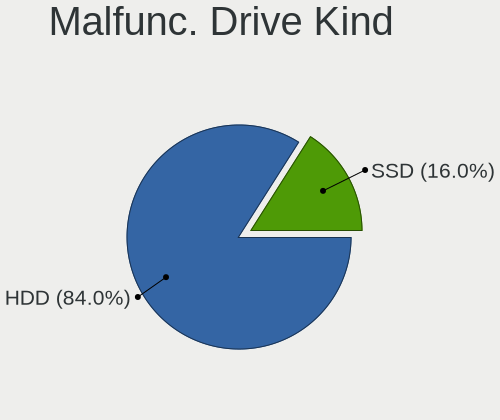

| Kind | Desktops | Drives | Percent |
|------|----------|--------|---------|
| HDD  | 48       | 60     | 84.21%  |
| SSD  | 9        | 10     | 15.79%  |

Failed Drives
-------------

Failed drive models

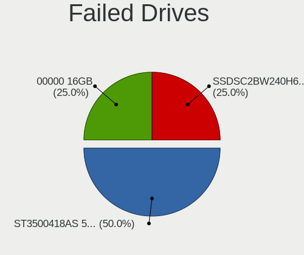

| Model                     | Desktops | Drives | Percent |
|---------------------------|----------|--------|---------|
| Seagate ST3500418AS 500GB | 2        | 3      | 66.67%  |
| Unknown 00000  16GB       | 1        | 1      | 33.33%  |

Failed Drive Vendor
-------------------

Failed drive vendors

| Vendor  | Desktops | Drives | Percent |
|---------|----------|--------|---------|
| Seagate | 2        | 3      | 66.67%  |
| Unknown | 1        | 1      | 33.33%  |

Drive Status
------------

Number of failed and malfunc. drives

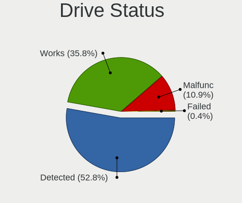

| Status   | Desktops | Drives | Percent |
|----------|----------|--------|---------|
| Detected | 316      | 886    | 55.54%  |
| Works    | 194      | 441    | 34.09%  |
| Malfunc  | 56       | 70     | 9.84%   |
| Failed   | 3        | 4      | 0.53%   |

Storage controller
------------------

Storage Vendor
--------------

Storage controller vendors

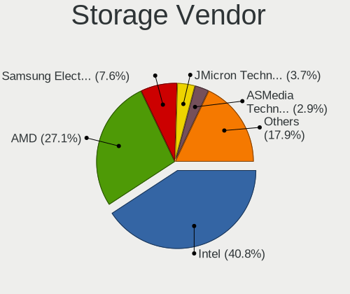

| Vendor                        | Desktops | Percent |
|-------------------------------|----------|---------|
| Intel                         | 298      | 41.45%  |
| AMD                           | 196      | 27.26%  |
| Samsung Electronics           | 49       | 6.82%   |
| JMicron Technology            | 30       | 4.17%   |
| Nvidia                        | 21       | 2.92%   |
| Marvell Technology Group      | 21       | 2.92%   |
| ASMedia Technology            | 20       | 2.78%   |
| Kingston Technology Company   | 15       | 2.09%   |
| Phison Electronics            | 11       | 1.53%   |
| SanDisk                       | 10       | 1.39%   |
| ADATA Technology              | 10       | 1.39%   |
| VIA Technologies              | 7        | 0.97%   |
| Silicon Motion                | 6        | 0.83%   |
| Seagate Technology            | 5        | 0.7%    |
| Micron/Crucial Technology     | 4        | 0.56%   |
| Toshiba America Info Systems  | 2        | 0.28%   |
| Silicon Image                 | 2        | 0.28%   |
| OCZ Technology Group          | 2        | 0.28%   |
| Integrated Technology Express | 2        | 0.28%   |
| Adaptec                       | 2        | 0.28%   |
| Western Digital               | 1        | 0.14%   |
| Promise Technology            | 1        | 0.14%   |
| Micron Technology             | 1        | 0.14%   |
| LSI Logic / Symbios Logic     | 1        | 0.14%   |
| Chelsio Communications        | 1        | 0.14%   |
| 3ware                         | 1        | 0.14%   |

Storage Model
-------------

Storage controller models

| Model                                                                                   | Desktops | Percent |
|-----------------------------------------------------------------------------------------|----------|---------|
| AMD FCH SATA Controller [AHCI mode]                                                     | 106      | 11.03%  |
| AMD 400 Series Chipset SATA Controller                                                  | 41       | 4.27%   |
| Intel 8 Series/C220 Series Chipset Family 6-port SATA Controller 1 [AHCI mode]          | 36       | 3.75%   |
| Intel NM10/ICH7 Family SATA Controller [IDE mode]                                       | 35       | 3.64%   |
| AMD SB7x0/SB8x0/SB9x0 IDE Controller                                                    | 34       | 3.54%   |
| Samsung NVMe SSD Controller SM981/PM981/PM983                                           | 32       | 3.33%   |
| AMD SB7x0/SB8x0/SB9x0 SATA Controller [AHCI mode]                                       | 29       | 3.02%   |
| Intel 82801G (ICH7 Family) IDE Controller                                               | 28       | 2.91%   |
| AMD SB7x0/SB8x0/SB9x0 SATA Controller [IDE mode]                                        | 27       | 2.81%   |
| Intel Q170/Q150/B150/H170/H110/Z170/CM236 Chipset SATA Controller [AHCI Mode]           | 22       | 2.29%   |
| Intel 6 Series/C200 Series Chipset Family 6 port Desktop SATA AHCI Controller           | 22       | 2.29%   |
| JMicron JMB363 SATA/IDE Controller                                                      | 20       | 2.08%   |
| AMD 500 Series Chipset SATA Controller                                                  | 20       | 2.08%   |
| Intel Cannon Lake PCH SATA AHCI Controller                                              | 19       | 1.98%   |
| Intel 200 Series PCH SATA controller [AHCI mode]                                        | 19       | 1.98%   |
| ASMedia ASM1062 Serial ATA Controller                                                   | 19       | 1.98%   |
| Intel 82801I (ICH9 Family) 2 port SATA Controller [IDE mode]                            | 16       | 1.66%   |
| Intel 7 Series/C210 Series Chipset Family 6-port SATA Controller [AHCI mode]            | 15       | 1.56%   |
| AMD 300 Series Chipset SATA Controller                                                  | 15       | 1.56%   |
| Intel SATA Controller [RAID mode]                                                       | 12       | 1.25%   |
| Intel 82801JI (ICH10 Family) 4 port SATA IDE Controller #1                              | 11       | 1.14%   |
| Intel 82801JI (ICH10 Family) 2 port SATA IDE Controller #2                              | 11       | 1.14%   |
| Intel 9 Series Chipset Family SATA Controller [AHCI Mode]                               | 10       | 1.04%   |
| ADATA XPG SX8200 Pro PCIe Gen3x4 M.2 2280 Solid State Drive                             | 10       | 1.04%   |
| Intel 82801IR/IO/IH (ICH9R/DO/DH) 4 port SATA Controller [IDE mode]                     | 9        | 0.94%   |
| Samsung NVMe SSD Controller SM961/PM961/SM963                                           | 8        | 0.83%   |
| Nvidia MCP61 SATA Controller                                                            | 8        | 0.83%   |
| JMicron JMB368 IDE controller                                                           | 8        | 0.83%   |
| Intel 4 Series Chipset PT IDER Controller                                               | 8        | 0.83%   |
| SanDisk WD Blue SN550 NVMe SSD                                                          | 7        | 0.73%   |
| Nvidia MCP61 IDE                                                                        | 7        | 0.73%   |
| Intel 82801IB (ICH9) 2 port SATA Controller [IDE mode]                                  | 7        | 0.73%   |
| Intel 6 Series/C200 Series Chipset Family Desktop SATA Controller (IDE mode, ports 4-5) | 7        | 0.73%   |
| Intel 6 Series/C200 Series Chipset Family Desktop SATA Controller (IDE mode, ports 0-3) | 7        | 0.73%   |
| Intel 400 Series Chipset Family SATA AHCI Controller                                    | 7        | 0.73%   |
| Samsung NVMe SSD Controller 980                                                         | 6        | 0.62%   |
| Marvell Group 88SE6101/6102 single-port PATA133 interface                               | 6        | 0.62%   |
| Intel Atom Processor E3800 Series SATA AHCI Controller                                  | 6        | 0.62%   |
| Intel 82Q35 Express PT IDER Controller                                                  | 6        | 0.62%   |
| Intel 82801JD/DO (ICH10 Family) SATA AHCI Controller                                    | 6        | 0.62%   |

Storage Kind
------------

Kind of storage controller (IDE, SATA, NVMe, SAS, ...)

| Kind | Desktops | Percent |
|------|----------|---------|
| SATA | 396      | 55.46%  |
| IDE  | 178      | 24.93%  |
| NVMe | 111      | 15.55%  |
| RAID | 23       | 3.22%   |
| SCSI | 4        | 0.56%   |
| SAS  | 2        | 0.28%   |

Processor
---------

CPU Vendor
----------

Processor vendors

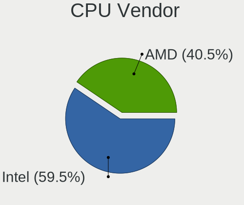

| Vendor | Desktops | Percent |
|--------|----------|---------|
| Intel  | 302      | 58.64%  |
| AMD    | 213      | 41.36%  |

CPU Model
---------

Processor models

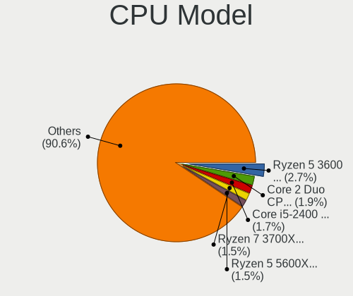

| Model                                       | Desktops | Percent |
|---------------------------------------------|----------|---------|
| AMD Ryzen 5 3600 6-Core Processor           | 14       | 2.68%   |
| Intel Core 2 Duo CPU E8400 @ 3.00GHz        | 10       | 1.92%   |
| Intel Core i5-2400 CPU @ 3.10GHz            | 9        | 1.72%   |
| AMD Ryzen 7 3700X 8-Core Processor          | 8        | 1.53%   |
| AMD Ryzen 5 5600X 6-Core Processor          | 8        | 1.53%   |
| AMD Ryzen 5 2600 Six-Core Processor         | 8        | 1.53%   |
| AMD Ryzen 9 3900X 12-Core Processor         | 7        | 1.34%   |
| AMD Ryzen 5 1600 Six-Core Processor         | 7        | 1.34%   |
| AMD FX-8350 Eight-Core Processor            | 7        | 1.34%   |
| AMD Ryzen 9 5900X 12-Core Processor         | 6        | 1.15%   |
| AMD Ryzen 7 1700 Eight-Core Processor       | 6        | 1.15%   |
| AMD FX-8300 Eight-Core Processor            | 6        | 1.15%   |
| AMD FX-6300 Six-Core Processor              | 6        | 1.15%   |
| Intel Core i5-9400F CPU @ 2.90GHz           | 5        | 0.96%   |
| Intel Core i5-7400 CPU @ 3.00GHz            | 5        | 0.96%   |
| Intel Core i5-2500 CPU @ 3.30GHz            | 5        | 0.96%   |
| Intel Core 2 Duo CPU E6550 @ 2.33GHz        | 5        | 0.96%   |
| AMD Ryzen 5 2400G with Radeon Vega Graphics | 5        | 0.96%   |
| AMD FX-4300 Quad-Core Processor             | 5        | 0.96%   |
| Intel Core i9-9900K CPU @ 3.60GHz           | 4        | 0.77%   |
| Intel Core i7-8700 CPU @ 3.20GHz            | 4        | 0.77%   |
| Intel Core i5-8400 CPU @ 2.80GHz            | 4        | 0.77%   |
| Intel Core i5-4590 CPU @ 3.30GHz            | 4        | 0.77%   |
| Intel Core i5-4460 CPU @ 3.20GHz            | 4        | 0.77%   |
| Intel Core i5-3470 CPU @ 3.20GHz            | 4        | 0.77%   |
| Intel Core 2 Quad CPU Q6600 @ 2.40GHz       | 4        | 0.77%   |
| Intel Core 2 Duo CPU E8500 @ 3.16GHz        | 4        | 0.77%   |
| Intel Core 2 Duo CPU E6750 @ 2.66GHz        | 4        | 0.77%   |
| Intel Core 2 CPU 6300 @ 1.86GHz             | 4        | 0.77%   |
| Intel Celeron CPU J1900 @ 1.99GHz           | 4        | 0.77%   |
| AMD Ryzen 7 2700X Eight-Core Processor      | 4        | 0.77%   |
| AMD Ryzen 3 2200G with Radeon Vega Graphics | 4        | 0.77%   |
| Intel Pentium Dual-Core CPU E5700 @ 3.00GHz | 3        | 0.57%   |
| Intel Pentium Dual-Core CPU E5200 @ 2.50GHz | 3        | 0.57%   |
| Intel Pentium Dual CPU E2200 @ 2.20GHz      | 3        | 0.57%   |
| Intel Pentium CPU G3260 @ 3.30GHz           | 3        | 0.57%   |
| Intel Pentium CPU G3220 @ 3.00GHz           | 3        | 0.57%   |
| Intel Core i7-7700K CPU @ 4.20GHz           | 3        | 0.57%   |
| Intel Core i5-6500 CPU @ 3.20GHz            | 3        | 0.57%   |
| Intel Core i5-4570 CPU @ 3.20GHz            | 3        | 0.57%   |

CPU Model Family
----------------

Processor model prefix

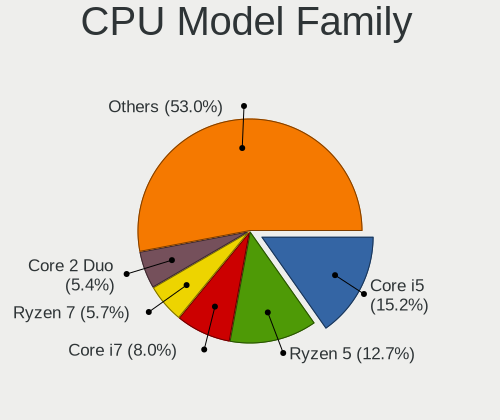

| Model                   | Desktops | Percent |
|-------------------------|----------|---------|
| Intel Core i5           | 80       | 15.33%  |
| AMD Ryzen 5             | 54       | 10.34%  |
| Intel Core 2 Duo        | 37       | 7.09%   |
| Intel Core i7           | 35       | 6.7%    |
| AMD FX                  | 30       | 5.75%   |
| Intel Core i3           | 27       | 5.17%   |
| AMD Ryzen 7             | 25       | 4.79%   |
| Intel Pentium           | 22       | 4.21%   |
| Intel Celeron           | 21       | 4.02%   |
| AMD Ryzen 9             | 15       | 2.87%   |
| Intel Xeon              | 14       | 2.68%   |
| Intel Pentium Dual-Core | 13       | 2.49%   |
| AMD Athlon 64 X2        | 12       | 2.3%    |
| Intel Core 2 Quad       | 11       | 2.11%   |
| AMD Phenom II X4        | 9        | 1.72%   |
| Other                   | 8        | 1.53%   |
| AMD Athlon              | 8        | 1.53%   |
| AMD A8                  | 8        | 1.53%   |
| Intel Pentium Dual      | 7        | 1.34%   |
| Intel Core 2            | 7        | 1.34%   |
| AMD Ryzen 3             | 7        | 1.34%   |
| AMD A10                 | 7        | 1.34%   |
| AMD A4                  | 6        | 1.15%   |
| Intel Atom              | 5        | 0.96%   |
| AMD Athlon II X2        | 5        | 0.96%   |
| Intel Pentium Gold      | 4        | 0.77%   |
| Intel Pentium 4         | 4        | 0.77%   |
| Intel Core i9           | 4        | 0.77%   |
| AMD Athlon II X4        | 4        | 0.77%   |
| AMD Sempron             | 3        | 0.57%   |
| AMD Athlon II X3        | 3        | 0.57%   |
| AMD Athlon 64           | 3        | 0.57%   |
| Intel Pentium Silver    | 2        | 0.38%   |
| Intel Pentium D         | 2        | 0.38%   |
| AMD Ryzen Threadripper  | 2        | 0.38%   |
| AMD Phenom II X2        | 2        | 0.38%   |
| AMD Phenom              | 2        | 0.38%   |
| AMD Athlon X4           | 2        | 0.38%   |
| AMD Athlon Dual Core    | 2        | 0.38%   |
| Intel Pentium III       | 1        | 0.19%   |

CPU Cores
---------

Number of processor cores

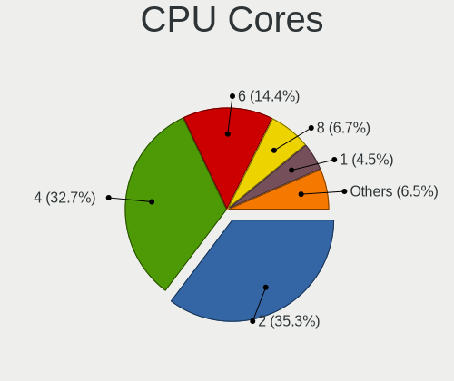

| Number  | Desktops | Percent |
|---------|----------|---------|
| 2       | 182      | 34.87%  |
| 4       | 169      | 32.38%  |
| 6       | 78       | 14.94%  |
| 8       | 36       | 6.9%    |
| 1       | 23       | 4.41%   |
| 12      | 17       | 3.26%   |
| 3       | 11       | 2.11%   |
| 16      | 4        | 0.77%   |
| Unknown | 2        | 0.38%   |

CPU Sockets
-----------

Number of sockets

| Number | Desktops | Percent |
|--------|----------|---------|
| 1      | 513      | 99.61%  |
| 2      | 2        | 0.39%   |

CPU Threads
-----------

Threads per core (Hyper-Threading)

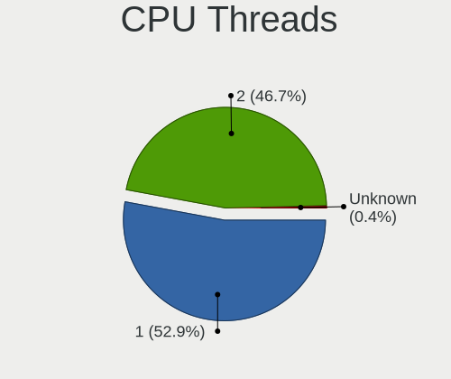

| Number  | Desktops | Percent |
|---------|----------|---------|
| 1       | 268      | 51.74%  |
| 2       | 247      | 47.68%  |
| Unknown | 2        | 0.39%   |
| 4       | 1        | 0.19%   |

CPU Op-Modes
------------

CPU Operation Modes (32-bit, 64-bit)

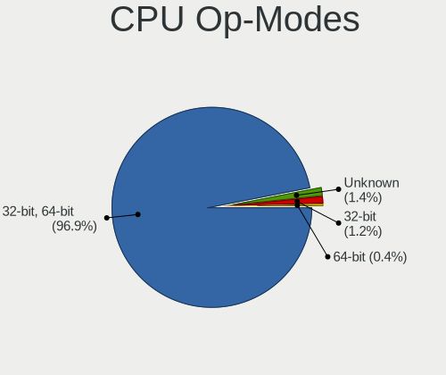

| Op mode        | Desktops | Percent |
|----------------|----------|---------|
| 32-bit, 64-bit | 502      | 97.1%   |
| Unknown        | 7        | 1.35%   |
| 32-bit         | 6        | 1.16%   |
| 64-bit         | 2        | 0.39%   |

CPU Microcode
-------------

Microcode number

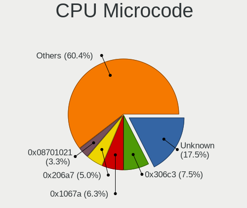

| Number     | Desktops | Percent |
|------------|----------|---------|
| Unknown    | 92       | 17.2%   |
| 0x306c3    | 41       | 7.66%   |
| 0x1067a    | 34       | 6.36%   |
| 0x206a7    | 25       | 4.67%   |
| 0x06000852 | 18       | 3.36%   |
| 0x906ea    | 17       | 3.18%   |
| 0x08701021 | 17       | 3.18%   |
| 0x306a9    | 16       | 2.99%   |
| 0x506e3    | 15       | 2.8%    |
| 0x0800820d | 15       | 2.8%    |
| 0x010000c8 | 14       | 2.62%   |
| 0x906e9    | 13       | 2.43%   |
| 0x6fb      | 13       | 2.43%   |
| 0x08701013 | 12       | 2.24%   |
| 0x6fd      | 10       | 1.87%   |
| 0x08001138 | 9        | 1.68%   |
| 0x10676    | 7        | 1.31%   |
| 0x06001119 | 7        | 1.31%   |
| 0xa0653    | 6        | 1.12%   |
| 0x0a201009 | 6        | 1.12%   |
| 0x06003106 | 6        | 1.12%   |
| 0x0a201016 | 5        | 0.93%   |
| 0x08101016 | 5        | 0.93%   |
| 0x0810100b | 5        | 0.93%   |
| 0x010000db | 5        | 0.93%   |
| 0x906ed    | 4        | 0.75%   |
| 0x906eb    | 4        | 0.75%   |
| 0x03000027 | 4        | 0.75%   |
| 0x6f6      | 3        | 0.56%   |
| 0x30678    | 3        | 0.56%   |
| 0x20652    | 3        | 0.56%   |
| 0x0800820b | 3        | 0.56%   |
| 0x08008206 | 3        | 0.56%   |
| 0x08001136 | 3        | 0.56%   |
| 0x01000095 | 3        | 0.56%   |
| 0xf43      | 2        | 0.37%   |
| 0xa0671    | 2        | 0.37%   |
| 0xa0655    | 2        | 0.37%   |
| 0x90672    | 2        | 0.37%   |
| 0x706a8    | 2        | 0.37%   |

CPU Microarch
-------------

Microarchitecture

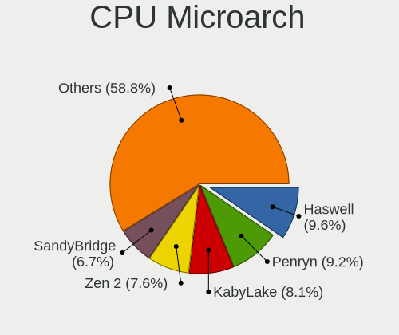

| Name             | Desktops | Percent |
|------------------|----------|---------|
| Haswell          | 51       | 9.86%   |
| Penryn           | 48       | 9.28%   |
| KabyLake         | 46       | 8.9%    |
| Zen 2            | 39       | 7.54%   |
| Piledriver       | 35       | 6.77%   |
| SandyBridge      | 32       | 6.19%   |
| Zen              | 30       | 5.8%    |
| Core             | 30       | 5.8%    |
| K10              | 27       | 5.22%   |
| IvyBridge        | 22       | 4.26%   |
| Zen+             | 19       | 3.68%   |
| Zen 3            | 19       | 3.68%   |
| Skylake          | 19       | 3.68%   |
| K8 Hammer        | 19       | 3.68%   |
| Silvermont       | 9        | 1.74%   |
| CometLake        | 9        | 1.74%   |
| Steamroller      | 8        | 1.55%   |
| NetBurst         | 7        | 1.35%   |
| Westmere         | 6        | 1.16%   |
| Nehalem          | 5        | 0.97%   |
| Bonnell          | 5        | 0.97%   |
| K10 Llano        | 4        | 0.77%   |
| Goldmont plus    | 4        | 0.77%   |
| Excavator        | 4        | 0.77%   |
| Jaguar           | 3        | 0.58%   |
| Bulldozer        | 3        | 0.58%   |
| Alderlake Hybrid | 3        | 0.58%   |
| Puma             | 2        | 0.39%   |
| Icelake          | 2        | 0.39%   |
| Goldmont         | 2        | 0.39%   |
| TigerLake        | 1        | 0.19%   |
| P6               | 1        | 0.19%   |
| K6               | 1        | 0.19%   |
| Bobcat           | 1        | 0.19%   |
| Unknown          | 1        | 0.19%   |

Graphics
--------

GPU Vendor
----------

Vendors of graphics cards

| Vendor            | Desktops | Percent |
|-------------------|----------|---------|
| Nvidia            | 216      | 39.85%  |
| AMD               | 175      | 32.29%  |
| Intel             | 150      | 27.68%  |
| ASPEED Technology | 1        | 0.18%   |

GPU Model
---------

Graphics card models

| Model                                                                       | Desktops | Percent |
|-----------------------------------------------------------------------------|----------|---------|
| AMD Ellesmere [Radeon RX 470/480/570/570X/580/580X/590]                     | 30       | 5.28%   |
| Intel Xeon E3-1200 v3/4th Gen Core Processor Integrated Graphics Controller | 28       | 4.93%   |
| Intel 2nd Generation Core Processor Family Integrated Graphics Controller   | 19       | 3.35%   |
| Nvidia GP107 [GeForce GTX 1050 Ti]                                          | 16       | 2.82%   |
| Intel 4 Series Chipset Integrated Graphics Controller                       | 16       | 2.82%   |
| Nvidia GK208B [GeForce GT 710]                                              | 11       | 1.94%   |
| Intel CoffeeLake-S GT2 [UHD Graphics 630]                                   | 11       | 1.94%   |
| Nvidia GP106 [GeForce GTX 1060 3GB]                                         | 10       | 1.76%   |
| Nvidia GK208B [GeForce GT 730]                                              | 9        | 1.58%   |
| AMD Baffin [Radeon RX 550 640SP / RX 560/560X]                              | 9        | 1.58%   |
| Nvidia GP108 [GeForce GT 1030]                                              | 8        | 1.41%   |
| Nvidia GP106 [GeForce GTX 1060 6GB]                                         | 8        | 1.41%   |
| Intel Xeon E3-1200 v2/3rd Gen Core processor Graphics Controller            | 8        | 1.41%   |
| AMD Caicos [Radeon HD 6450/7450/8450 / R5 230 OEM]                          | 8        | 1.41%   |
| Nvidia GM107 [GeForce GTX 750 Ti]                                           | 7        | 1.23%   |
| Nvidia GP107 [GeForce GTX 1050]                                             | 6        | 1.06%   |
| Nvidia GM206 [GeForce GTX 960]                                              | 6        | 1.06%   |
| Intel HD Graphics 630                                                       | 6        | 1.06%   |
| Intel HD Graphics 530                                                       | 6        | 1.06%   |
| Intel Atom Processor Z36xxx/Z37xxx Series Graphics & Display                | 6        | 1.06%   |
| Intel 4th Generation Core Processor Family Integrated Graphics Controller   | 6        | 1.06%   |
| AMD Raven Ridge [Radeon Vega Series / Radeon Vega Mobile Series]            | 6        | 1.06%   |
| AMD Lexa PRO [Radeon 540/540X/550/550X / RX 540X/550/550X]                  | 6        | 1.06%   |
| Nvidia GP104 [GeForce GTX 1070]                                             | 5        | 0.88%   |
| Nvidia GF108 [GeForce GT 630]                                               | 5        | 0.88%   |
| Nvidia G86 [GeForce 8500 GT]                                                | 5        | 0.88%   |
| AMD Vega 10 XL/XT [Radeon RX Vega 56/64]                                    | 5        | 0.88%   |
| AMD RV670 [Radeon HD 3690/3850]                                             | 5        | 0.88%   |
| AMD Navi 10 [Radeon RX 5600 OEM/5600 XT / 5700/5700 XT]                     | 5        | 0.88%   |
| AMD Kaveri [Radeon R7 Graphics]                                             | 5        | 0.88%   |
| Nvidia TU117 [GeForce GTX 1650]                                             | 4        | 0.7%    |
| Nvidia GT218 [GeForce 210]                                                  | 4        | 0.7%    |
| Nvidia GF119 [GeForce GT 610]                                               | 4        | 0.7%    |
| Nvidia GF108 [GeForce GT 440]                                               | 4        | 0.7%    |
| Nvidia GA106 [GeForce RTX 3060 Lite Hash Rate]                              | 4        | 0.7%    |
| Nvidia G96C [GeForce 9400 GT]                                               | 4        | 0.7%    |
| Intel CometLake-S GT2 [UHD Graphics 630]                                    | 4        | 0.7%    |
| AMD Tonga PRO [Radeon R9 285/380]                                           | 4        | 0.7%    |
| AMD RS780L [Radeon 3000]                                                    | 4        | 0.7%    |
| AMD Juniper XT [Radeon HD 5770]                                             | 4        | 0.7%    |

GPU Combo
---------

Combinations of graphics cards

| Name           | Desktops | Percent |
|----------------|----------|---------|
| 1 x Nvidia     | 201      | 38.51%  |
| 1 x AMD        | 161      | 30.84%  |
| 1 x Intel      | 136      | 26.05%  |
| 2 x AMD        | 9        | 1.72%   |
| Intel + Nvidia | 5        | 0.96%   |
| AMD + Nvidia   | 3        | 0.57%   |
| 3 x Nvidia     | 2        | 0.38%   |
| 2 x Nvidia     | 2        | 0.38%   |
| Intel + AMD    | 2        | 0.38%   |
| 1 x ASPEED     | 1        | 0.19%   |

GPU Driver
----------

Free vs proprietary

| Driver      | Desktops | Percent |
|-------------|----------|---------|
| Free        | 400      | 75.76%  |
| Proprietary | 109      | 20.64%  |
| Unknown     | 19       | 3.6%    |

GPU Memory
----------

Total video memory

| Size in GB | Desktops | Percent |
|------------|----------|---------|
| Unknown    | 196      | 36.23%  |
| 0.01-0.5   | 77       | 14.23%  |
| 0.51-1.0   | 72       | 13.31%  |
| 1.01-2.0   | 68       | 12.57%  |
| 3.01-4.0   | 47       | 8.69%   |
| 7.01-8.0   | 42       | 7.76%   |
| 2.01-3.0   | 15       | 2.77%   |
| 5.01-6.0   | 14       | 2.59%   |
| 8.01-16.0  | 9        | 1.66%   |
| 16.01-24.0 | 1        | 0.18%   |

Monitor
-------

Monitor Vendor
--------------

Monitor vendors

| Vendor               | Desktops | Percent |
|----------------------|----------|---------|
| Samsung Electronics  | 92       | 16.31%  |
| Goldstar             | 59       | 10.46%  |
| BenQ                 | 56       | 9.93%   |
| Acer                 | 55       | 9.75%   |
| Dell                 | 52       | 9.22%   |
| Philips              | 32       | 5.67%   |
| Hewlett-Packard      | 31       | 5.5%    |
| Ancor Communications | 31       | 5.5%    |
| AOC                  | 29       | 5.14%   |
| Iiyama               | 13       | 2.3%    |
| Eizo                 | 13       | 2.3%    |
| Lenovo               | 10       | 1.77%   |
| Sony                 | 8        | 1.42%   |
| NEC Computers        | 8        | 1.42%   |
| Fujitsu Siemens      | 8        | 1.42%   |
| ASUSTek Computer     | 7        | 1.24%   |
| Vestel Elektronik    | 5        | 0.89%   |
| Panasonic            | 5        | 0.89%   |
| LG Electronics       | 5        | 0.89%   |
| ViewSonic            | 4        | 0.71%   |
| Unknown              | 4        | 0.71%   |
| MSI                  | 3        | 0.53%   |
| Lenovo Group Limited | 3        | 0.53%   |
| Onkyo                | 2        | 0.35%   |
| MStar                | 2        | 0.35%   |
| CON                  | 2        | 0.35%   |
| CHR                  | 2        | 0.35%   |
| Belinea              | 2        | 0.35%   |
| Arnos Instruments    | 2        | 0.35%   |
| Wacom                | 1        | 0.18%   |
| Vestel               | 1        | 0.18%   |
| Sharp                | 1        | 0.18%   |
| S2-Tek               | 1        | 0.18%   |
| OEM                  | 1        | 0.18%   |
| MiTAC                | 1        | 0.18%   |
| LLL                  | 1        | 0.18%   |
| Jean                 | 1        | 0.18%   |
| Hyundai ImageQuest   | 1        | 0.18%   |
| HPN                  | 1        | 0.18%   |
| HKC                  | 1        | 0.18%   |

Monitor Model
-------------

Monitor models

| Model                                                                  | Desktops | Percent |
|------------------------------------------------------------------------|----------|---------|
| Vestel Elektronik 50UHD_LCD_TV VES3700 3840x2160 1872x1053mm 84.6-inch | 5        | 0.81%   |
| Samsung Electronics S24F350 SAM0D20 1920x1080 521x293mm 23.5-inch      | 5        | 0.81%   |
| Dell U2412M DELA07A 1920x1200 518x324mm 24.1-inch                      | 5        | 0.81%   |
| Iiyama PL4840 IVM1065 1920x1080 1054x593mm 47.6-inch                   | 4        | 0.65%   |
| BenQ GW2470 BNQ78D9 1920x1080 527x296mm 23.8-inch                      | 4        | 0.65%   |
| AOC Q3279WG5B AOC3279 2560x1440 725x428mm 33.1-inch                    | 4        | 0.65%   |
| AOC 2770 AOC2770 1920x1080 598x336mm 27.0-inch                         | 4        | 0.65%   |
| Samsung Electronics S22C450 SAM09C7 1680x1050 473x291mm 21.9-inch      | 3        | 0.49%   |
| Philips PHL 243V7 PHLC155 1920x1080 530x300mm 24.0-inch                | 3        | 0.49%   |
| Panasonic TV MEIC303 1920x1080 698x392mm 31.5-inch                     | 3        | 0.49%   |
| Lenovo LEN P27u-10 LEN61B0 3840x2160 600x340mm 27.2-inch               | 3        | 0.49%   |
| Dell U2410 DELF016 1920x1200 518x324mm 24.1-inch                       | 3        | 0.49%   |
| Dell P190S DEL405A 1280x1024 376x301mm 19.0-inch                       | 3        | 0.49%   |
| BenQ GW2760 BNQ78C6 1920x1080 598x336mm 27.0-inch                      | 3        | 0.49%   |
| Ancor Communications VE228 ACI22FA 1920x1080 477x268mm 21.5-inch       | 3        | 0.49%   |
| Ancor Communications ASUS VH192 ACI19E4 1366x768 410x230mm 18.5-inch   | 3        | 0.49%   |
| Acer P226HQV ACR01C7 1920x1080 477x268mm 21.5-inch                     | 3        | 0.49%   |
| Acer G247HL ACR03FA 1920x1080 531x299mm 24.0-inch                      | 3        | 0.49%   |
| Acer G246HL ACR02FF 1920x1080 531x299mm 24.0-inch                      | 3        | 0.49%   |
| Samsung Electronics SyncMaster SAM05CC 1920x1080 530x300mm 24.0-inch   | 2        | 0.33%   |
| Samsung Electronics SyncMaster SAM05C8 1920x1080 521x293mm 23.5-inch   | 2        | 0.33%   |
| Samsung Electronics SyncMaster SAM0593 1920x1080 477x268mm 21.5-inch   | 2        | 0.33%   |
| Samsung Electronics SyncMaster SAM03D0 1440x900 410x257mm 19.1-inch    | 2        | 0.33%   |
| Samsung Electronics SyncMaster SAM0380 1680x1050 459x296mm 21.5-inch   | 2        | 0.33%   |
| Samsung Electronics SyncMaster SAM030C 1680x1050 474x296mm 22.0-inch   | 2        | 0.33%   |
| Samsung Electronics S24F350 SAM0D21 1920x1080 521x293mm 23.5-inch      | 2        | 0.33%   |
| Samsung Electronics S24E650 SAM0CB8 1920x1080 521x293mm 23.5-inch      | 2        | 0.33%   |
| Samsung Electronics S22C450 SAM09C6 1680x1050 470x290mm 21.7-inch      | 2        | 0.33%   |
| Samsung Electronics LCD Monitor SyncMaster 1920x1080                   | 2        | 0.33%   |
| Samsung Electronics LCD Monitor SAM07C0 1920x1080 700x390mm 31.5-inch  | 2        | 0.33%   |
| Samsung Electronics LCD Monitor S24F350 1920x1080                      | 2        | 0.33%   |
| Samsung Electronics C27F390 SAM0D32 1920x1080 598x336mm 27.0-inch      | 2        | 0.33%   |
| Samsung Electronics C24F390 SAM0D2C 1920x1080 520x290mm 23.4-inch      | 2        | 0.33%   |
| Philips PHL 273V5 PHLC0D2 1920x1080 598x336mm 27.0-inch                | 2        | 0.33%   |
| Philips PHL 243V5 PHLC0D1 1920x1080 520x290mm 23.4-inch                | 2        | 0.33%   |
| Philips FTV PHL04C3 3840x2160 1440x810mm 65.0-inch                     | 2        | 0.33%   |
| Philips 220CW PHLC024 1680x1050 474x296mm 22.0-inch                    | 2        | 0.33%   |
| Philips 196VL PHLC07F 1366x768 409x230mm 18.5-inch                     | 2        | 0.33%   |
| Onkyo TX-NR747 ONK0F71 1920x1200 550x309mm 24.8-inch                   | 2        | 0.33%   |
| NEC Computers E222W NEC6777 1680x1050 474x296mm 22.0-inch              | 2        | 0.33%   |

Monitor Resolution
------------------

Monitor screen resolution

| Resolution         | Desktops | Percent |
|--------------------|----------|---------|
| 1920x1080 (FHD)    | 248      | 44.85%  |
| 1280x1024 (SXGA)   | 56       | 10.13%  |
| 1680x1050 (WSXGA+) | 49       | 8.86%   |
| 2560x1440 (QHD)    | 39       | 7.05%   |
| 3840x2160 (4K)     | 37       | 6.69%   |
| 1920x1200 (WUXGA)  | 33       | 5.97%   |
| 1440x900 (WXGA+)   | 17       | 3.07%   |
| 1366x768 (WXGA)    | 11       | 1.99%   |
| Unknown            | 8        | 1.45%   |
| 3440x1440          | 6        | 1.08%   |
| 1024x768 (XGA)     | 6        | 1.08%   |
| 3840x1080          | 5        | 0.9%    |
| 1600x1200          | 5        | 0.9%    |
| 2560x1080          | 4        | 0.72%   |
| 1360x768           | 4        | 0.72%   |
| 1280x720 (HD)      | 4        | 0.72%   |
| 2288x1287          | 3        | 0.54%   |
| 1920x540           | 2        | 0.36%   |
| 1600x900 (HD+)     | 2        | 0.36%   |
| 1400x1050          | 2        | 0.36%   |
| 1280x768           | 2        | 0.36%   |
| 9600x2160          | 1        | 0.18%   |
| 7680x2160          | 1        | 0.18%   |
| 640x480            | 1        | 0.18%   |
| 6400x2160          | 1        | 0.18%   |
| 6080x1440          | 1        | 0.18%   |
| 5840x1440          | 1        | 0.18%   |
| 5520x1080          | 1        | 0.18%   |
| 4240x1440          | 1        | 0.18%   |
| 2560x1600          | 1        | 0.18%   |
| 2048x1152          | 1        | 0.18%   |

Monitor Diagonal
----------------

Diagonal size in inches

| Inches  | Desktops | Percent |
|---------|----------|---------|
| 24      | 100      | 17.39%  |
| 27      | 68       | 11.83%  |
| 23      | 66       | 11.48%  |
| 21      | 63       | 10.96%  |
| 19      | 57       | 9.91%   |
| Unknown | 50       | 8.7%    |
| 22      | 31       | 5.39%   |
| 31      | 18       | 3.13%   |
| 17      | 18       | 3.13%   |
| 20      | 17       | 2.96%   |
| 18      | 14       | 2.43%   |
| 34      | 10       | 1.74%   |
| 84      | 6        | 1.04%   |
| 25      | 6        | 1.04%   |
| 72      | 5        | 0.87%   |
| 15      | 5        | 0.87%   |
| 65      | 4        | 0.7%    |
| 47      | 4        | 0.7%    |
| 39      | 4        | 0.7%    |
| 33      | 4        | 0.7%    |
| 32      | 4        | 0.7%    |
| 54      | 3        | 0.52%   |
| 52      | 3        | 0.52%   |
| 46      | 3        | 0.52%   |
| 26      | 3        | 0.52%   |
| 59      | 1        | 0.17%   |
| 55      | 1        | 0.17%   |
| 48      | 1        | 0.17%   |
| 43      | 1        | 0.17%   |
| 42      | 1        | 0.17%   |
| 40      | 1        | 0.17%   |
| 29      | 1        | 0.17%   |
| 28      | 1        | 0.17%   |
| 13      | 1        | 0.17%   |

Monitor Width
-------------

Physical width

| Width in mm | Desktops | Percent |
|-------------|----------|---------|
| 501-600     | 220      | 39.71%  |
| 401-500     | 137      | 24.73%  |
| Unknown     | 50       | 9.03%   |
| 351-400     | 45       | 8.12%   |
| 601-700     | 23       | 4.15%   |
| 301-350     | 23       | 4.15%   |
| 1001-1500   | 20       | 3.61%   |
| 701-800     | 17       | 3.07%   |
| 1501-2000   | 11       | 1.99%   |
| 801-900     | 6        | 1.08%   |
| 901-1000    | 2        | 0.36%   |

Aspect Ratio
------------

Proportional relationship between the width and the height

| Ratio   | Desktops | Percent |
|---------|----------|---------|
| 16/9    | 299      | 55.78%  |
| 16/10   | 102      | 19.03%  |
| 5/4     | 60       | 11.19%  |
| Unknown | 46       | 8.58%   |
| 4/3     | 15       | 2.8%    |
| 21/9    | 9        | 1.68%   |
| 3/2     | 4        | 0.75%   |
| 32/9    | 1        | 0.19%   |

Monitor Area
------------

Area in inch²

| Area in inch² | Desktops | Percent |
|----------------|----------|---------|
| 201-250        | 201      | 35.58%  |
| 151-200        | 89       | 15.75%  |
| 301-350        | 70       | 12.39%  |
| Unknown        | 50       | 8.85%   |
| 251-300        | 46       | 8.14%   |
| 351-500        | 37       | 6.55%   |
| 141-150        | 27       | 4.78%   |
| More than 1000 | 23       | 4.07%   |
| 501-1000       | 16       | 2.83%   |
| 101-110        | 5        | 0.88%   |
| 81-90          | 1        | 0.18%   |

Pixel Density
-------------

Pixels per inch

| Density | Desktops | Percent |
|---------|----------|---------|
| 51-100  | 348      | 64.93%  |
| 101-120 | 88       | 16.42%  |
| Unknown | 50       | 9.33%   |
| 1-50    | 23       | 4.29%   |
| 121-160 | 16       | 2.99%   |
| 161-240 | 11       | 2.05%   |

Multiple Monitors
-----------------

Total monitors connected

| Total | Desktops | Percent |
|-------|----------|---------|
| 1     | 412      | 78.03%  |
| 2     | 79       | 14.96%  |
| 0     | 23       | 4.36%   |
| 3     | 14       | 2.65%   |

Network
-------

Net Controller Vendor
---------------------

Controller vendors

| Vendor                          | Desktops | Percent |
|---------------------------------|----------|---------|
| Realtek Semiconductor           | 317      | 47.31%  |
| Intel                           | 173      | 25.82%  |
| Qualcomm Atheros                | 52       | 7.76%   |
| Nvidia                          | 18       | 2.69%   |
| TP-Link                         | 14       | 2.09%   |
| Marvell Technology Group        | 13       | 1.94%   |
| Qualcomm Atheros Communications | 9        | 1.34%   |
| Broadcom                        | 9        | 1.34%   |
| Ralink Technology               | 8        | 1.19%   |
| Microsoft                       | 6        | 0.9%    |
| ASUSTek Computer                | 6        | 0.9%    |
| Ralink                          | 5        | 0.75%   |
| Broadcom Limited                | 5        | 0.75%   |
| ZyDAS                           | 3        | 0.45%   |
| VIA Technologies                | 3        | 0.45%   |
| OnePlus Technology (Shenzhen)   | 3        | 0.45%   |
| Edimax Technology               | 3        | 0.45%   |
| Samsung Electronics             | 2        | 0.3%    |
| MediaTek                        | 2        | 0.3%    |
| D-Link                          | 2        | 0.3%    |
| ZyXEL Communications            | 1        | 0.15%   |
| Xiaomi                          | 1        | 0.15%   |
| SIEMENS                         | 1        | 0.15%   |
| Seeed Technology                | 1        | 0.15%   |
| MICRORISC                       | 1        | 0.15%   |
| Mellanox Technologies           | 1        | 0.15%   |
| LSI                             | 1        | 0.15%   |
| Intersil                        | 1        | 0.15%   |
| Huawei Technologies             | 1        | 0.15%   |
| Google                          | 1        | 0.15%   |
| D-Link System                   | 1        | 0.15%   |
| Chelsio Communications          | 1        | 0.15%   |
| ASIX Electronics                | 1        | 0.15%   |
| Arduino SA                      | 1        | 0.15%   |
| Aquantia                        | 1        | 0.15%   |
| American Megatrends             | 1        | 0.15%   |
| 3Com                            | 1        | 0.15%   |

Net Controller Model
--------------------

Controller models

| Model                                                             | Desktops | Percent |
|-------------------------------------------------------------------|----------|---------|
| Realtek RTL8111/8168/8411 PCI Express Gigabit Ethernet Controller | 261      | 35.95%  |
| Intel I211 Gigabit Network Connection                             | 29       | 3.99%   |
| Realtek RTL8125 2.5GbE Controller                                 | 20       | 2.75%   |
| Intel Wi-Fi 6 AX200                                               | 18       | 2.48%   |
| Intel Ethernet Connection I217-LM                                 | 17       | 2.34%   |
| Intel Ethernet Connection (2) I219-V                              | 17       | 2.34%   |
| Intel 82579LM Gigabit Network Connection (Lewisville)             | 17       | 2.34%   |
| Realtek RTL-8100/8101L/8139 PCI Fast Ethernet Adapter             | 13       | 1.79%   |
| Intel Ethernet Connection (7) I219-V                              | 11       | 1.52%   |
| Intel Ethernet Controller I225-V                                  | 10       | 1.38%   |
| Realtek RTL810xE PCI Express Fast Ethernet controller             | 9        | 1.24%   |
| Qualcomm Atheros Killer E220x Gigabit Ethernet Controller         | 8        | 1.1%    |
| Qualcomm Atheros AR9271 802.11n                                   | 8        | 1.1%    |
| Intel Dual Band Wireless-AC 3168NGW [Stone Peak]                  | 7        | 0.96%   |
| Intel 82567LM-3 Gigabit Network Connection                        | 7        | 0.96%   |
| Intel 82566DM-2 Gigabit Network Connection                        | 7        | 0.96%   |
| Qualcomm Atheros AR8131 Gigabit Ethernet                          | 6        | 0.83%   |
| Marvell Group 88E8056 PCI-E Gigabit Ethernet Controller           | 6        | 0.83%   |
| TP-Link TL-WN722N v2/v3 [Realtek RTL8188EUS]                      | 5        | 0.69%   |
| Qualcomm Atheros AR8161 Gigabit Ethernet                          | 5        | 0.69%   |
| Nvidia MCP61 Ethernet                                             | 5        | 0.69%   |
| Intel Ethernet Connection (2) I218-V                              | 5        | 0.69%   |
| Realtek RTL8822BE 802.11a/b/g/n/ac WiFi adapter                   | 4        | 0.55%   |
| Realtek RTL8188EUS 802.11n Wireless Network Adapter               | 4        | 0.55%   |
| Realtek RTL8169 PCI Gigabit Ethernet Controller                   | 4        | 0.55%   |
| Qualcomm Atheros Attansic L1 Gigabit Ethernet                     | 4        | 0.55%   |
| Qualcomm Atheros AR8151 v2.0 Gigabit Ethernet                     | 4        | 0.55%   |
| Qualcomm Atheros AR8121/AR8113/AR8114 Gigabit or Fast Ethernet    | 4        | 0.55%   |
| Nvidia MCP73 Ethernet                                             | 4        | 0.55%   |
| Microsoft XBOX ACC                                                | 4        | 0.55%   |
| Intel Cannon Lake PCH CNVi WiFi                                   | 4        | 0.55%   |
| Intel 82579V Gigabit Network Connection                           | 4        | 0.55%   |
| ZyDAS ZD1211B 802.11g                                             | 3        | 0.41%   |
| Realtek RTL8188EE Wireless Network Adapter                        | 3        | 0.41%   |
| Realtek RTL8188CE 802.11b/g/n WiFi Adapter                        | 3        | 0.41%   |
| Realtek RTL8187 Wireless Adapter                                  | 3        | 0.41%   |
| Realtek RTL8153 Gigabit Ethernet Adapter                          | 3        | 0.41%   |
| Realtek RTL-8110SC/8169SC Gigabit Ethernet                        | 3        | 0.41%   |
| Ralink RT5370 Wireless Adapter                                    | 3        | 0.41%   |
| Ralink MT7601U Wireless Adapter                                   | 3        | 0.41%   |

Wireless Vendor
---------------

Wireless vendors

| Vendor                          | Desktops | Percent |
|---------------------------------|----------|---------|
| Intel                           | 44       | 28.95%  |
| Realtek Semiconductor           | 29       | 19.08%  |
| Qualcomm Atheros                | 16       | 10.53%  |
| TP-Link                         | 14       | 9.21%   |
| Qualcomm Atheros Communications | 9        | 5.92%   |
| Ralink Technology               | 8        | 5.26%   |
| Microsoft                       | 6        | 3.95%   |
| Ralink                          | 5        | 3.29%   |
| ASUSTek Computer                | 5        | 3.29%   |
| ZyDAS                           | 3        | 1.97%   |
| Edimax Technology               | 3        | 1.97%   |
| Broadcom                        | 3        | 1.97%   |
| MediaTek                        | 2        | 1.32%   |
| D-Link                          | 2        | 1.32%   |
| ZyXEL Communications            | 1        | 0.66%   |
| Marvell Technology Group        | 1        | 0.66%   |
| Intersil                        | 1        | 0.66%   |

Wireless Model
--------------

Wireless models

| Model                                                                         | Desktops | Percent |
|-------------------------------------------------------------------------------|----------|---------|
| Intel Wi-Fi 6 AX200                                                           | 18       | 11.84%  |
| Qualcomm Atheros AR9271 802.11n                                               | 8        | 5.26%   |
| Intel Dual Band Wireless-AC 3168NGW [Stone Peak]                              | 7        | 4.61%   |
| TP-Link TL-WN722N v2/v3 [Realtek RTL8188EUS]                                  | 5        | 3.29%   |
| Realtek RTL8822BE 802.11a/b/g/n/ac WiFi adapter                               | 4        | 2.63%   |
| Realtek RTL8188EUS 802.11n Wireless Network Adapter                           | 4        | 2.63%   |
| Microsoft XBOX ACC                                                            | 4        | 2.63%   |
| Intel Cannon Lake PCH CNVi WiFi                                               | 4        | 2.63%   |
| ZyDAS ZD1211B 802.11g                                                         | 3        | 1.97%   |
| Realtek RTL8188EE Wireless Network Adapter                                    | 3        | 1.97%   |
| Realtek RTL8188CE 802.11b/g/n WiFi Adapter                                    | 3        | 1.97%   |
| Realtek RTL8187 Wireless Adapter                                              | 3        | 1.97%   |
| Ralink RT5370 Wireless Adapter                                                | 3        | 1.97%   |
| Ralink MT7601U Wireless Adapter                                               | 3        | 1.97%   |
| Qualcomm Atheros AR9227 Wireless Network Adapter                              | 3        | 1.97%   |
| Qualcomm Atheros AR2413/AR2414 Wireless Network Adapter [AR5005G(S) 802.11bg] | 3        | 1.97%   |
| Intel Wireless 7265                                                           | 3        | 1.97%   |
| Intel Wireless 3165                                                           | 3        | 1.97%   |
| TP-Link TL-WN821N v5/v6 [RTL8192EU]                                           | 2        | 1.32%   |
| TP-Link AC600 wireless Realtek RTL8811AU [Archer T2U Nano]                    | 2        | 1.32%   |
| Realtek RTL8812AU 802.11a/b/g/n/ac 2T2R DB WLAN Adapter                       | 2        | 1.32%   |
| Realtek RTL8192EU 802.11b/g/n WLAN Adapter                                    | 2        | 1.32%   |
| Realtek RTL8192CU 802.11n WLAN Adapter                                        | 2        | 1.32%   |
| Realtek RTL8192CE PCIe Wireless Network Adapter                               | 2        | 1.32%   |
| Ralink RT5390 Wireless 802.11n 1T/1R PCIe                                     | 2        | 1.32%   |
| Ralink RT2561/RT61 802.11g PCI                                                | 2        | 1.32%   |
| Qualcomm Atheros QCA6174 802.11ac Wireless Network Adapter                    | 2        | 1.32%   |
| Qualcomm Atheros AR93xx Wireless Network Adapter                              | 2        | 1.32%   |
| Microsoft Wireless XBox Controller Dongle                                     | 2        | 1.32%   |
| Intel Wireless-AC 9260                                                        | 2        | 1.32%   |
| Intel Wi-Fi 6 AX210/AX211/AX411 160MHz                                        | 2        | 1.32%   |
| Intel Centrino Wireless-N 2230                                                | 2        | 1.32%   |
| ZyXEL ZyAIR AG-225H v2 802.11bg                                               | 1        | 0.66%   |
| TP-Link TL-WN823N v2/v3 [Realtek RTL8192EU]                                   | 1        | 0.66%   |
| TP-Link TL-WN822N Version 4 RTL8192EU                                         | 1        | 0.66%   |
| TP-Link Archer T2U PLUS [RTL8821AU]                                           | 1        | 0.66%   |
| TP-Link 802.11n NIC                                                           | 1        | 0.66%   |
| TP-Link 802.11ac NIC                                                          | 1        | 0.66%   |
| Realtek RTL8821CE 802.11ac PCIe Wireless Network Adapter                      | 1        | 0.66%   |
| Realtek RTL8723BE PCIe Wireless Network Adapter                               | 1        | 0.66%   |

Ethernet Vendor
---------------

Ethernet vendors

| Vendor                   | Desktops | Percent |
|--------------------------|----------|---------|
| Realtek Semiconductor    | 303      | 55.39%  |
| Intel                    | 150      | 27.42%  |
| Qualcomm Atheros         | 37       | 6.76%   |
| Nvidia                   | 18       | 3.29%   |
| Marvell Technology Group | 13       | 2.38%   |
| Broadcom                 | 6        | 1.1%    |
| Broadcom Limited         | 5        | 0.91%   |
| VIA Technologies         | 2        | 0.37%   |
| Samsung Electronics      | 2        | 0.37%   |
| Xiaomi                   | 1        | 0.18%   |
| Mellanox Technologies    | 1        | 0.18%   |
| Huawei Technologies      | 1        | 0.18%   |
| Google                   | 1        | 0.18%   |
| D-Link System            | 1        | 0.18%   |
| Chelsio Communications   | 1        | 0.18%   |
| ASUSTek Computer         | 1        | 0.18%   |
| ASIX Electronics         | 1        | 0.18%   |
| Aquantia                 | 1        | 0.18%   |
| American Megatrends      | 1        | 0.18%   |
| 3Com                     | 1        | 0.18%   |

Ethernet Model
--------------

Ethernet models

| Model                                                                          | Desktops | Percent |
|--------------------------------------------------------------------------------|----------|---------|
| Realtek RTL8111/8168/8411 PCI Express Gigabit Ethernet Controller              | 261      | 46.19%  |
| Intel I211 Gigabit Network Connection                                          | 29       | 5.13%   |
| Realtek RTL8125 2.5GbE Controller                                              | 20       | 3.54%   |
| Intel Ethernet Connection I217-LM                                              | 17       | 3.01%   |
| Intel Ethernet Connection (2) I219-V                                           | 17       | 3.01%   |
| Intel 82579LM Gigabit Network Connection (Lewisville)                          | 17       | 3.01%   |
| Realtek RTL-8100/8101L/8139 PCI Fast Ethernet Adapter                          | 13       | 2.3%    |
| Intel Ethernet Connection (7) I219-V                                           | 11       | 1.95%   |
| Intel Ethernet Controller I225-V                                               | 10       | 1.77%   |
| Realtek RTL810xE PCI Express Fast Ethernet controller                          | 9        | 1.59%   |
| Qualcomm Atheros Killer E220x Gigabit Ethernet Controller                      | 8        | 1.42%   |
| Intel 82567LM-3 Gigabit Network Connection                                     | 7        | 1.24%   |
| Intel 82566DM-2 Gigabit Network Connection                                     | 7        | 1.24%   |
| Qualcomm Atheros AR8131 Gigabit Ethernet                                       | 6        | 1.06%   |
| Marvell Group 88E8056 PCI-E Gigabit Ethernet Controller                        | 6        | 1.06%   |
| Qualcomm Atheros AR8161 Gigabit Ethernet                                       | 5        | 0.88%   |
| Nvidia MCP61 Ethernet                                                          | 5        | 0.88%   |
| Intel Ethernet Connection (2) I218-V                                           | 5        | 0.88%   |
| Realtek RTL8169 PCI Gigabit Ethernet Controller                                | 4        | 0.71%   |
| Qualcomm Atheros Attansic L1 Gigabit Ethernet                                  | 4        | 0.71%   |
| Qualcomm Atheros AR8151 v2.0 Gigabit Ethernet                                  | 4        | 0.71%   |
| Qualcomm Atheros AR8121/AR8113/AR8114 Gigabit or Fast Ethernet                 | 4        | 0.71%   |
| Nvidia MCP73 Ethernet                                                          | 4        | 0.71%   |
| Intel 82579V Gigabit Network Connection                                        | 4        | 0.71%   |
| Realtek RTL8153 Gigabit Ethernet Adapter                                       | 3        | 0.53%   |
| Realtek RTL-8110SC/8169SC Gigabit Ethernet                                     | 3        | 0.53%   |
| Qualcomm Atheros Killer E2400 Gigabit Ethernet Controller                      | 3        | 0.53%   |
| Marvell Group 88E8001 Gigabit Ethernet Controller                              | 3        | 0.53%   |
| Intel Ethernet Connection (12) I219-V                                          | 3        | 0.53%   |
| Intel 82574L Gigabit Network Connection                                        | 3        | 0.53%   |
| Broadcom NetXtreme BCM5761 Gigabit Ethernet PCIe                               | 3        | 0.53%   |
| Samsung Galaxy series, misc. (tethering mode)                                  | 2        | 0.35%   |
| Nvidia MCP51 Ethernet Controller                                               | 2        | 0.35%   |
| Nvidia CK804 Ethernet Controller                                               | 2        | 0.35%   |
| Marvell Group Yukon Optima 88E8059 [PCIe Gigabit Ethernet Controller with AVB] | 2        | 0.35%   |
| Marvell Group 88E8075 PCI-E Gigabit Ethernet Controller                        | 2        | 0.35%   |
| Intel NM10/ICH7 Family LAN Controller                                          | 2        | 0.35%   |
| Intel I210 Gigabit Network Connection                                          | 2        | 0.35%   |
| Intel Ethernet Connection (7) I219-LM                                          | 2        | 0.35%   |
| Intel 82567LF-3 Gigabit Network Connection                                     | 2        | 0.35%   |

Net Controller Kind
-------------------

Ethernet, WiFi or modem

| Kind     | Desktops | Percent |
|----------|----------|---------|
| Ethernet | 510      | 76.81%  |
| WiFi     | 146      | 21.99%  |
| Modem    | 4        | 0.6%    |
| Unknown  | 4        | 0.6%    |

Used Controller
---------------

Currently used network controller

| Kind     | Desktops | Percent |
|----------|----------|---------|
| Ethernet | 443      | 85.03%  |
| WiFi     | 78       | 14.97%  |

NICs
----

Total network controllers on board

| Total | Desktops | Percent |
|-------|----------|---------|
| 1     | 379      | 73.03%  |
| 2     | 118      | 22.74%  |
| 3     | 12       | 2.31%   |
| 0     | 6        | 1.16%   |
| 5     | 2        | 0.39%   |
| 8     | 1        | 0.19%   |
| 4     | 1        | 0.19%   |

IPv6
----

IPv6 vs IPv4

| Used | Desktops | Percent |
|------|----------|---------|
| No   | 490      | 93.33%  |
| Yes  | 35       | 6.67%   |

Bluetooth
---------

Bluetooth Vendor
----------------

Controller vendors

| Vendor                          | Desktops | Percent |
|---------------------------------|----------|---------|
| Cambridge Silicon Radio         | 40       | 32.79%  |
| Intel                           | 39       | 31.97%  |
| ASUSTek Computer                | 18       | 14.75%  |
| Realtek Semiconductor           | 7        | 5.74%   |
| Broadcom                        | 7        | 5.74%   |
| Qualcomm Atheros Communications | 3        | 2.46%   |
| Integrated System Solution      | 2        | 1.64%   |
| TP-Link                         | 1        | 0.82%   |
| Mobile Action Technology        | 1        | 0.82%   |
| Micro Star International        | 1        | 0.82%   |
| MediaTek                        | 1        | 0.82%   |
| Lite-On Technology              | 1        | 0.82%   |
| IMC Networks                    | 1        | 0.82%   |

Bluetooth Model
---------------

Controller models

| Model                                                    | Desktops | Percent |
|----------------------------------------------------------|----------|---------|
| Cambridge Silicon Radio Bluetooth Dongle (HCI mode)      | 40       | 32.79%  |
| Intel AX200 Bluetooth                                    | 15       | 12.3%   |
| Intel Wireless-AC 3168 Bluetooth                         | 7        | 5.74%   |
| Intel Bluetooth wireless interface                       | 7        | 5.74%   |
| ASUS Broadcom BCM20702A0 Bluetooth                       | 7        | 5.74%   |
| ASUS ASUS USB-BT500                                      | 6        | 4.92%   |
| Realtek Bluetooth Radio                                  | 5        | 4.1%    |
| Intel Bluetooth 9460/9560 Jefferson Peak (JfP)           | 4        | 3.28%   |
| ASUS Bluetooth Radio                                     | 3        | 2.46%   |
| Realtek  Bluetooth 4.2 Adapter                           | 2        | 1.64%   |
| Intel Centrino Bluetooth Wireless Transceiver            | 2        | 1.64%   |
| Intel AX210 Bluetooth                                    | 2        | 1.64%   |
| Integrated System Solution KY-BT100 Bluetooth Adapter    | 2        | 1.64%   |
| Broadcom BCM20702A0 Bluetooth 4.0                        | 2        | 1.64%   |
| TP-Link TPuLink UB500 Adapter                            | 1        | 0.82%   |
| Qualcomm Atheros QCA61x4 Bluetooth 4.0                   | 1        | 0.82%   |
| Qualcomm Atheros Bluetooth USB Host Controller           | 1        | 0.82%   |
| Qualcomm Atheros AR3011 Bluetooth                        | 1        | 0.82%   |
| Mobile Action MA-730/MA-730G Bluetooth Adapter           | 1        | 0.82%   |
| Micro Star International MS-6970 BToes Bluetooth adapter | 1        | 0.82%   |
| MediaTek Wireless_Device                                 | 1        | 0.82%   |
| Lite-On Qualcomm Atheros QCA9377 Bluetooth               | 1        | 0.82%   |
| Intel Wireless-AC 9260 Bluetooth Adapter                 | 1        | 0.82%   |
| Intel AX201 Bluetooth                                    | 1        | 0.82%   |
| IMC Networks Wireless_Device                             | 1        | 0.82%   |
| Broadcom Bluetooth Controller                            | 1        | 0.82%   |
| Broadcom Bluetooth 2.0+eDR dongle                        | 1        | 0.82%   |
| Broadcom BCM2070 Bluetooth 3.0 + HS                      | 1        | 0.82%   |
| Broadcom BCM2045 Bluetooth                               | 1        | 0.82%   |
| Broadcom BCM2035 Bluetooth dongle                        | 1        | 0.82%   |
| ASUS Qualcomm Bluetooth 4.1                              | 1        | 0.82%   |
| ASUS 2045 Bluetooth 2.0 Device with trace filter         | 1        | 0.82%   |

Sound
-----

Sound Vendor
------------

Sound card vendors

| Vendor                   | Desktops | Percent |
|--------------------------|----------|---------|
| Intel                    | 284      | 34.18%  |
| AMD                      | 253      | 30.45%  |
| Nvidia                   | 194      | 23.35%  |
| C-Media Electronics      | 24       | 2.89%   |
| Creative Labs            | 13       | 1.56%   |
| Creative Technology      | 9        | 1.08%   |
| VIA Technologies         | 8        | 0.96%   |
| Logitech                 | 6        | 0.72%   |
| Razer USA                | 3        | 0.36%   |
| Lenovo                   | 3        | 0.36%   |
| Kingston Technology      | 3        | 0.36%   |
| GYROCOM C&C              | 3        | 0.36%   |
| Dell                     | 3        | 0.36%   |
| ASUSTek Computer         | 3        | 0.36%   |
| Realtek Semiconductor    | 2        | 0.24%   |
| Plantronics              | 2        | 0.24%   |
| JMTek                    | 2        | 0.24%   |
| Focusrite-Novation       | 2        | 0.24%   |
| Trust                    | 1        | 0.12%   |
| Texas Instruments        | 1        | 0.12%   |
| Tenx Technology          | 1        | 0.12%   |
| SteelSeries ApS          | 1        | 0.12%   |
| Sony                     | 1        | 0.12%   |
| Micro Star International | 1        | 0.12%   |
| M-Audio                  | 1        | 0.12%   |
| KORG                     | 1        | 0.12%   |
| GN Netcom                | 1        | 0.12%   |
| fifinemicrophone.com     | 1        | 0.12%   |
| Elgato Systems           | 1        | 0.12%   |
| DigiTech                 | 1        | 0.12%   |
| BEHRINGER International  | 1        | 0.12%   |
| Audio-Technica           | 1        | 0.12%   |

Sound Model
-----------

Sound card models

| Model                                                                             | Desktops | Percent |
|-----------------------------------------------------------------------------------|----------|---------|
| AMD SBx00 Azalia (Intel HDA)                                                      | 59       | 6.02%   |
| AMD Starship/Matisse HD Audio Controller                                          | 52       | 5.31%   |
| Intel 8 Series/C220 Series Chipset High Definition Audio Controller               | 38       | 3.88%   |
| AMD Family 17h (Models 00h-0fh) HD Audio Controller                               | 35       | 3.57%   |
| Intel NM10/ICH7 Family High Definition Audio Controller                           | 34       | 3.47%   |
| Intel Xeon E3-1200 v3/4th Gen Core Processor HD Audio Controller                  | 30       | 3.06%   |
| AMD Ellesmere HDMI Audio [Radeon RX 470/480 / 570/580/590]                        | 30       | 3.06%   |
| Intel 6 Series/C200 Series Chipset Family High Definition Audio Controller        | 29       | 2.96%   |
| AMD FCH Azalia Controller                                                         | 24       | 2.45%   |
| Nvidia GP107GL High Definition Audio Controller                                   | 23       | 2.35%   |
| Intel Cannon Lake PCH cAVS                                                        | 22       | 2.24%   |
| Intel 100 Series/C230 Series Chipset Family HD Audio Controller                   | 22       | 2.24%   |
| Nvidia GK208 HDMI/DP Audio Controller                                             | 21       | 2.14%   |
| Intel 82801I (ICH9 Family) HD Audio Controller                                    | 20       | 2.04%   |
| Intel 7 Series/C216 Chipset Family High Definition Audio Controller               | 20       | 2.04%   |
| Intel 200 Series PCH HD Audio                                                     | 19       | 1.94%   |
| AMD Baffin HDMI/DP Audio [Radeon RX 550 640SP / RX 560/560X]                      | 19       | 1.94%   |
| Nvidia GP106 High Definition Audio Controller                                     | 18       | 1.84%   |
| AMD Family 17h/19h HD Audio Controller                                            | 18       | 1.84%   |
| Intel 82801JI (ICH10 Family) HD Audio Controller                                  | 13       | 1.33%   |
| AMD Caicos HDMI Audio [Radeon HD 6450 / 7450/8450/8490 OEM / R5 230/235/235X OEM] | 11       | 1.12%   |
| Nvidia GP104 High Definition Audio Controller                                     | 10       | 1.02%   |
| Nvidia GF108 High Definition Audio Controller                                     | 10       | 1.02%   |
| Intel 9 Series Chipset Family HD Audio Controller                                 | 10       | 1.02%   |
| AMD Oland/Hainan/Cape Verde/Pitcairn HDMI Audio [Radeon HD 7000 Series]           | 10       | 1.02%   |
| Nvidia GM107 High Definition Audio Controller [GeForce 940MX]                     | 9        | 0.92%   |
| Nvidia GK107 HDMI Audio Controller                                                | 9        | 0.92%   |
| Intel 82801JD/DO (ICH10 Family) HD Audio Controller                               | 9        | 0.92%   |
| Nvidia MCP61 High Definition Audio                                                | 8        | 0.82%   |
| Nvidia GP108 High Definition Audio Controller                                     | 8        | 0.82%   |
| Nvidia GF119 HDMI Audio Controller                                                | 8        | 0.82%   |
| AMD Raven/Raven2/Fenghuang HDMI/DP Audio Controller                               | 8        | 0.82%   |
| AMD Navi 10 HDMI Audio                                                            | 8        | 0.82%   |
| Nvidia TU116 High Definition Audio Controller                                     | 7        | 0.71%   |
| Nvidia TU106 High Definition Audio Controller                                     | 7        | 0.71%   |
| Nvidia GM206 High Definition Audio Controller                                     | 7        | 0.71%   |
| Intel Comet Lake PCH-V cAVS                                                       | 7        | 0.71%   |
| AMD Kabini HDMI/DP Audio                                                          | 7        | 0.71%   |
| Nvidia GK106 HDMI Audio Controller                                                | 6        | 0.61%   |
| Intel Atom Processor Z36xxx/Z37xxx Series High Definition Audio Controller        | 6        | 0.61%   |

Memory
------

Memory Vendor
-------------

Memory module vendors

| Vendor              | Desktops | Percent |
|---------------------|----------|---------|
| Kingston            | 98       | 35%     |
| Unknown             | 63       | 22.5%   |
| Samsung Electronics | 22       | 7.86%   |
| Corsair             | 17       | 6.07%   |
| Crucial             | 15       | 5.36%   |
| Patriot             | 14       | 5%      |
| SK hynix            | 13       | 4.64%   |
| A-DATA Technology   | 9        | 3.21%   |
| Micron Technology   | 7        | 2.5%    |
| G.Skill             | 5        | 1.79%   |
| Ramaxel Technology  | 4        | 1.43%   |
| Unknown (ABCD)      | 2        | 0.71%   |
| Transcend           | 2        | 0.71%   |
| Toshiba             | 1        | 0.36%   |
| PDPSystems          | 1        | 0.36%   |
| Nanya Technology    | 1        | 0.36%   |
| Kingmax             | 1        | 0.36%   |
| Kimtigo             | 1        | 0.36%   |
| H                   | 1        | 0.36%   |
| Goodram             | 1        | 0.36%   |
| Elpida              | 1        | 0.36%   |
| AMD                 | 1        | 0.36%   |

Memory Model
------------

Memory module models

| Model                                                        | Desktops | Percent |
|--------------------------------------------------------------|----------|---------|
| Unknown RAM Module 2GB DIMM DDR2 800MT/s                     | 6        | 1.9%    |
| Kingston RAM KHX1866C10D3/8G 8GB DIMM DDR3 2133MT/s          | 6        | 1.9%    |
| Unknown RAM Module 4096MB DIMM 1333MT/s                      | 5        | 1.59%   |
| Kingston RAM KHX3200C16D4/8GX 8GB DIMM DDR4 3600MT/s         | 5        | 1.59%   |
| Kingston RAM KHX3200C16D4/16GX 16GB DIMM DDR4 3600MT/s       | 5        | 1.59%   |
| Kingston RAM KHX2400C15/8G 8GB DIMM DDR4 3400MT/s            | 5        | 1.59%   |
| Unknown RAM Module 2048MB DIMM 1333MT/s                      | 4        | 1.27%   |
| Kingston RAM KHX2666C16/8G 8GB DIMM DDR4 3466MT/s            | 4        | 1.27%   |
| Kingston RAM KHX1600C9D3/8GX 8GB DIMM DDR3 2133MT/s          | 4        | 1.27%   |
| Kingston RAM KHX1600C10D3/4G 4GB DIMM DDR3 1866MT/s          | 4        | 1.27%   |
| Unknown RAM Module 4GB DIMM DDR3 1600MT/s                    | 3        | 0.95%   |
| Samsung RAM Module 8192MB DIMM DDR4 2666MT/s                 | 3        | 0.95%   |
| Patriot RAM 3200 C16 Series 8GB DIMM DDR4 3200MT/s           | 3        | 0.95%   |
| Kingston RAM KHX3000C15D4/8GX 8192MB DIMM DDR4 3400MT/s      | 3        | 0.95%   |
| Kingston RAM KHX2400C11D3/4GX 4GB DIMM DDR3 2400MT/s         | 3        | 0.95%   |
| Kingston RAM KHX2133C14/8G 8GB DIMM DDR4 2400MT/s            | 3        | 0.95%   |
| Kingston RAM 99U5471-020.A00LF 4GB DIMM DDR3 1600MT/s        | 3        | 0.95%   |
| Unknown RAM Module 4GB DIMM DDR3 1333MT/s                    | 2        | 0.63%   |
| Unknown RAM Module 4GB DIMM 1333MT/s                         | 2        | 0.63%   |
| Unknown RAM Module 4096MB DIMM DDR3 1600MT/s                 | 2        | 0.63%   |
| Unknown RAM Module 2GB DIMM DDR2 1067MT/s                    | 2        | 0.63%   |
| Unknown RAM Module 2GB DIMM 400MT/s                          | 2        | 0.63%   |
| Unknown RAM Module 2GB DIMM 1333MT/s                         | 2        | 0.63%   |
| Unknown RAM Module 2048MB DIMM DDR2 800MT/s                  | 2        | 0.63%   |
| Unknown RAM Module 2048MB DIMM 800MT/s                       | 2        | 0.63%   |
| Unknown RAM Module 1GB DIMM DDR2 800MT/s                     | 2        | 0.63%   |
| Unknown RAM Module 1024MB DIMM DDR2 800MT/s                  | 2        | 0.63%   |
| Unknown RAM Module 1024MB DIMM DDR2 667MT/s                  | 2        | 0.63%   |
| Unknown RAM 3600 C20 Series 32GB DIMM DDR4 3666MT/s          | 2        | 0.63%   |
| Unknown RAM 3000 C16 Series 8192MB DIMM DDR4 2133MT/s        | 2        | 0.63%   |
| Unknown (ABCD) RAM 123456789012345678 8GB DIMM DDR4 2400MT/s | 2        | 0.63%   |
| SK hynix RAM HMT351U6CFR8C-H9 4GB DIMM DDR3 1333MT/s         | 2        | 0.63%   |
| Samsung RAM Module 16GB DIMM DDR4 2666MT/s                   | 2        | 0.63%   |
| Samsung RAM M378B5173BH0-CK0 4GB DIMM DDR3 1600MT/s          | 2        | 0.63%   |
| Samsung RAM M378B1G73QH0-CK0 8GB DIMM DDR3 1600MT/s          | 2        | 0.63%   |
| Samsung RAM M378A2K43CB1-CTD 16GB DIMM DDR4 2667MT/s         | 2        | 0.63%   |
| Patriot RAM 1600 CL9 Series 4GB DIMM DDR3 1600MT/s           | 2        | 0.63%   |
| Micron RAM 8JTF51264AZ-1G6E1 4GB DIMM DDR3 1600MT/s          | 2        | 0.63%   |
| Kingston RAM KHX3600C17D4/16GX 16GB DIMM DDR4 3800MT/s       | 2        | 0.63%   |
| Kingston RAM KHX3333C16D4/8GX 8GB DIMM DDR4 3800MT/s         | 2        | 0.63%   |

Memory Kind
-----------

Memory module kinds

| Kind    | Desktops | Percent |
|---------|----------|---------|
| DDR4    | 103      | 40.87%  |
| DDR3    | 86       | 34.13%  |
| Unknown | 28       | 11.11%  |
| DDR2    | 24       | 9.52%   |
| SDRAM   | 7        | 2.78%   |
| LPDDR4  | 2        | 0.79%   |
| DRAM    | 1        | 0.4%    |
| DDR     | 1        | 0.4%    |

Memory Form Factor
------------------

Physical design of the memory module

| Name   | Desktops | Percent |
|--------|----------|---------|
| DIMM   | 239      | 95.6%   |
| SODIMM | 9        | 3.6%    |
| RIMM   | 2        | 0.8%    |

Memory Size
-----------

Memory module size

| Size  | Desktops | Percent |
|-------|----------|---------|
| 8192  | 88       | 31.77%  |
| 4096  | 68       | 24.55%  |
| 2048  | 46       | 16.61%  |
| 16384 | 36       | 13%     |
| 1024  | 19       | 6.86%   |
| 32768 | 17       | 6.14%   |
| 512   | 2        | 0.72%   |
| 256   | 1        | 0.36%   |

Memory Speed
------------

Memory module speed

| Speed   | Desktops | Percent |
|---------|----------|---------|
| 1600    | 43       | 15.25%  |
| 1333    | 34       | 12.06%  |
| 800     | 25       | 8.87%   |
| 3600    | 22       | 7.8%    |
| 2133    | 21       | 7.45%   |
| 3200    | 18       | 6.38%   |
| 2400    | 18       | 6.38%   |
| 2667    | 10       | 3.55%   |
| 667     | 10       | 3.55%   |
| 3400    | 9        | 3.19%   |
| 2666    | 7        | 2.48%   |
| Unknown | 7        | 2.48%   |
| 3466    | 5        | 1.77%   |
| 3000    | 5        | 1.77%   |
| 1866    | 5        | 1.77%   |
| 3800    | 4        | 1.42%   |
| 1867    | 4        | 1.42%   |
| 1067    | 4        | 1.42%   |
| 400     | 4        | 1.42%   |
| 3333    | 3        | 1.06%   |
| 2933    | 3        | 1.06%   |
| 1334    | 3        | 1.06%   |
| 4133    | 2        | 0.71%   |
| 3733    | 2        | 0.71%   |
| 3666    | 2        | 0.71%   |
| 3334    | 2        | 0.71%   |
| 2800    | 2        | 0.71%   |
| 4800    | 1        | 0.35%   |
| 3151    | 1        | 0.35%   |
| 2200    | 1        | 0.35%   |
| 2000    | 1        | 0.35%   |
| 1800    | 1        | 0.35%   |
| 1648    | 1        | 0.35%   |
| 1066    | 1        | 0.35%   |
| 266     | 1        | 0.35%   |

Printers & scanners
-------------------

Printer Vendor
--------------

Printer device vendors

| Vendor              | Desktops | Percent |
|---------------------|----------|---------|
| Canon               | 7        | 29.17%  |
| Hewlett-Packard     | 6        | 25%     |
| Brother Industries  | 5        | 20.83%  |
| Samsung Electronics | 4        | 16.67%  |
| Seiko Epson         | 1        | 4.17%   |
| QinHeng Electronics | 1        | 4.17%   |

Printer Model
-------------

Printer device models

| Model                                   | Desktops | Percent |
|-----------------------------------------|----------|---------|
| HP DeskJet 2620 All-in-One Printer      | 3        | 12%     |
| Seiko Epson L365 Series                 | 1        | 4%      |
| Samsung Xerox Phaser 3117 Laser Printer | 1        | 4%      |
| Samsung M267x 287x Series               | 1        | 4%      |
| Samsung M2070 Series                    | 1        | 4%      |
| Samsung C460 Series                     | 1        | 4%      |
| QinHeng CH340S                          | 1        | 4%      |
| HP Neverstop Laser 100x                 | 1        | 4%      |
| HP LaserJet P2014                       | 1        | 4%      |
| HP Deskjet 3050 J610 series             | 1        | 4%      |
| Canon TS6300 series                     | 1        | 4%      |
| Canon PIXMA MX920 Series                | 1        | 4%      |
| Canon PIXMA MX720 Series                | 1        | 4%      |
| Canon PIXMA MP280                       | 1        | 4%      |
| Canon PIXMA MG3500 Series               | 1        | 4%      |
| Canon PIXMA MG2500 Series               | 1        | 4%      |
| Canon MG5600 series                     | 1        | 4%      |
| Canon iP7200 series                     | 1        | 4%      |
| Brother MFC-J3930DW                     | 1        | 4%      |
| Brother HL-2030 Laser Printer           | 1        | 4%      |
| Brother HL-1430 Laser Printer           | 1        | 4%      |
| Brother DCP-J105                        | 1        | 4%      |
| Brother DCP-1610W                       | 1        | 4%      |

Scanner Vendor
--------------

Scanner device vendors

| Vendor         | Desktops | Percent |
|----------------|----------|---------|
| Canon          | 4        | 80%     |
| Mustek Systems | 1        | 20%     |

Scanner Model
-------------

Scanner device models

| Model                               | Desktops | Percent |
|-------------------------------------|----------|---------|
| Canon CanoScan LiDE 210             | 2        | 40%     |
| Mustek Systems BearPaw 1200 CU Plus | 1        | 20%     |
| Canon CanoScan LIDE 25              | 1        | 20%     |
| Canon CanoScan LiDE 100             | 1        | 20%     |

Camera
------

Camera Vendor
-------------

Camera device vendors

| Vendor                        | Desktops | Percent |
|-------------------------------|----------|---------|
| Logitech                      | 18       | 25%     |
| KYE Systems (Mouse Systems)   | 8        | 11.11%  |
| Microdia                      | 7        | 9.72%   |
| Creative Technology           | 7        | 9.72%   |
| Samsung Electronics           | 5        | 6.94%   |
| Microsoft                     | 5        | 6.94%   |
| Z-Star Microelectronics       | 3        | 4.17%   |
| Unknown                       | 3        | 4.17%   |
| GEMBIRD                       | 3        | 4.17%   |
| Apple                         | 3        | 4.17%   |
| Sunplus Innovation Technology | 2        | 2.78%   |
| Hewlett-Packard               | 2        | 2.78%   |
| Generalplus Technology        | 2        | 2.78%   |
| Nokia Mobile Phones           | 1        | 1.39%   |
| MacroSilicon                  | 1        | 1.39%   |
| Lenovo                        | 1        | 1.39%   |
| Cubeternet                    | 1        | 1.39%   |

Camera Model
------------

Camera device models

| Model                                             | Desktops | Percent |
|---------------------------------------------------|----------|---------|
| Logitech Webcam C270                              | 6        | 8.22%   |
| Samsung Galaxy series, misc. (MTP mode)           | 5        | 6.85%   |
| Creative Live! Cam Sync HD [VF0770]               | 5        | 6.85%   |
| Unknown FULL HD 1080P Webcam                      | 3        | 4.11%   |
| Microsoft LifeCam HD-3000                         | 3        | 4.11%   |
| Microdia USB 2.0 Camera                           | 3        | 4.11%   |
| KYE Systems (Mouse Systems) FaceCam 1000X         | 3        | 4.11%   |
| Apple iPhone 5/5C/5S/6/SE                         | 3        | 4.11%   |
| Microdia Webcam Vitade AF                         | 2        | 2.74%   |
| Logitech Webcam C925e                             | 2        | 2.74%   |
| Logitech Webcam C170                              | 2        | 2.74%   |
| Logitech HD Webcam C910                           | 2        | 2.74%   |
| Logitech HD Pro Webcam C920                       | 2        | 2.74%   |
| KYE Systems (Mouse Systems) Genius FaceCam 320    | 2        | 2.74%   |
| Generalplus 808 Camera                            | 2        | 2.74%   |
| GEMBIRD Generic UVC 1.00 camera [AppoTech AX2311] | 2        | 2.74%   |
| Creative Live! Cam Chat HD [VF0700]               | 2        | 2.74%   |
| Z-Star Venus USB2.0 Camera                        | 1        | 1.37%   |
| Z-Star Vega USB 2.0 Camera                        | 1        | 1.37%   |
| Z-Star A4 TECH USB2.0 PC Camera J                 | 1        | 1.37%   |
| Sunplus HD 720P webcam                            | 1        | 1.37%   |
| Sunplus Full HD webcam                            | 1        | 1.37%   |
| Nokia Mobile Phones Lumia 620/920                 | 1        | 1.37%   |
| Microsoft LifeCam VX-800                          | 1        | 1.37%   |
| Microsoft LifeCam NX-6000                         | 1        | 1.37%   |
| Microdia Sonix USB 2.0 Camera                     | 1        | 1.37%   |
| Microdia Camera                                   | 1        | 1.37%   |
| MacroSilicon USB Video                            | 1        | 1.37%   |
| Logitech Webcam C200                              | 1        | 1.37%   |
| Logitech Logi 4K Stream Edition                   | 1        | 1.37%   |
| Logitech C922 Pro Stream Webcam                   | 1        | 1.37%   |
| Logitech B525 HD Webcam                           | 1        | 1.37%   |
| Lenovo FHD Webcam                                 | 1        | 1.37%   |
| KYE Systems (Mouse Systems) PC-LM1E Camera        | 1        | 1.37%   |
| KYE Systems (Mouse Systems) Genius Webcam         | 1        | 1.37%   |
| KYE Systems (Mouse Systems) Genius iSlim 330      | 1        | 1.37%   |
| KYE Systems (Mouse Systems) FaceCam 311           | 1        | 1.37%   |
| HP Webcam HD 4310                                 | 1        | 1.37%   |
| HP Webcam                                         | 1        | 1.37%   |
| GEMBIRD USB2.0 PC CAMERA                          | 1        | 1.37%   |

Security
--------

Fingerprint Vendor
------------------

Fingerprint sensor vendors

| Vendor | Desktops | Percent |
|--------|----------|---------|
| Dell   | 1        | 100%    |

Fingerprint Model
-----------------

Fingerprint sensor models

| Model                                          | Desktops | Percent |
|------------------------------------------------|----------|---------|
| Dell MS819 Wired Mouse With Fingerprint Reader | 1        | 100%    |

Chipcard Vendor
---------------

Chipcard module vendors

| Vendor                    | Desktops | Percent |
|---------------------------|----------|---------|
| Alcor Micro               | 2        | 40%     |
| OmniKey                   | 1        | 20%     |
| Fujitsu Siemens Computers | 1        | 20%     |
| Aladdin Knowledge Systems | 1        | 20%     |

Chipcard Model
--------------

Chipcard module models

| Model                                         | Desktops | Percent |
|-----------------------------------------------|----------|---------|
| Alcor Micro AU9540 Smartcard Reader           | 2        | 40%     |
| OmniKey 3x21 Smart Card Reader                | 1        | 20%     |
| Fujitsu Siemens Computers SmartCard Reader 2A | 1        | 20%     |
| Aladdin Knowledge Systems Token JC            | 1        | 20%     |

Unsupported
-----------

Unsupported Devices
-------------------

Total unsupported devices on board

| Total | Desktops | Percent |
|-------|----------|---------|
| 0     | 463      | 89.04%  |
| 1     | 49       | 9.42%   |
| 2     | 5        | 0.96%   |
| 4     | 2        | 0.38%   |
| 3     | 1        | 0.19%   |

Unsupported Device Types
------------------------

Types of unsupported devices

| Type                     | Desktops | Percent |
|--------------------------|----------|---------|
| Graphics card            | 27       | 42.86%  |
| Net/wireless             | 10       | 15.87%  |
| Multimedia controller    | 7        | 11.11%  |
| Unassigned class         | 3        | 4.76%   |
| Sound                    | 3        | 4.76%   |
| Network                  | 3        | 4.76%   |
| Chipcard                 | 3        | 4.76%   |
| Net/ethernet             | 2        | 3.17%   |
| Communication controller | 2        | 3.17%   |
| Storage/ide              | 1        | 1.59%   |
| Modem                    | 1        | 1.59%   |
| Bluetooth                | 1        | 1.59%   |

