Linux in Czechia - Tested Hardware & Statistics (Desktops)
----------------------------------------------------------

A project to collect tested hardware configurations for Linux in Czechia.

Anyone can contribute to this report by the [hw-probe](https://github.com/linuxhw/hw-probe) tool:

    sudo -E hw-probe -all -upload

Please contribute! Especially if your hardware is rare.

Contents
--------

* [ Test Cases ](#test-cases)

* [ System ](#system)
  - [ OS                       ](#os)
  - [ OS Family                ](#os-family)
  - [ Kernel                   ](#kernel)
  - [ Kernel Family            ](#kernel-family)
  - [ Kernel Major Ver.        ](#kernel-major-ver)
  - [ Arch                     ](#arch)
  - [ DE                       ](#de)
  - [ Display Server           ](#display-server)
  - [ Display Manager          ](#display-manager)
  - [ OS Lang                  ](#os-lang)
  - [ Boot Mode                ](#boot-mode)
  - [ Filesystem               ](#filesystem)
  - [ Part. scheme             ](#part-scheme)
  - [ Dual Boot with Linux/BSD ](#dual-boot-with-linuxbsd)
  - [ Dual Boot (Win)          ](#dual-boot-win)

* [ Board ](#board)
  - [ Vendor                   ](#vendor)
  - [ Model                    ](#model)
  - [ Model Family             ](#model-family)
  - [ MFG Year                 ](#mfg-year)
  - [ Form Factor              ](#form-factor)
  - [ Secure Boot              ](#secure-boot)
  - [ Coreboot                 ](#coreboot)
  - [ RAM Size                 ](#ram-size)
  - [ RAM Used                 ](#ram-used)
  - [ Total Drives             ](#total-drives)
  - [ Has CD-ROM               ](#has-cd-rom)
  - [ Has Ethernet             ](#has-ethernet)
  - [ Has WiFi                 ](#has-wifi)
  - [ Has Bluetooth            ](#has-bluetooth)

* [ Location ](#location)
  - [ Country                  ](#country)
  - [ City                     ](#city)

* [ Drives ](#drives)
  - [ Drive Vendor             ](#drive-vendor)
  - [ Drive Model              ](#drive-model)
  - [ HDD Vendor               ](#hdd-vendor)
  - [ SSD Vendor               ](#ssd-vendor)
  - [ Drive Kind               ](#drive-kind)
  - [ Drive Connector          ](#drive-connector)
  - [ Drive Size               ](#drive-size)
  - [ Space Total              ](#space-total)
  - [ Space Used               ](#space-used)
  - [ Malfunc. Drives          ](#malfunc-drives)
  - [ Malfunc. Drive Vendor    ](#malfunc-drive-vendor)
  - [ Malfunc. HDD Vendor      ](#malfunc-hdd-vendor)
  - [ Malfunc. Drive Kind      ](#malfunc-drive-kind)
  - [ Failed Drives            ](#failed-drives)
  - [ Failed Drive Vendor      ](#failed-drive-vendor)
  - [ Drive Status             ](#drive-status)

* [ Storage controller ](#storage-controller)
  - [ Storage Vendor           ](#storage-vendor)
  - [ Storage Model            ](#storage-model)
  - [ Storage Kind             ](#storage-kind)

* [ Processor ](#processor)
  - [ CPU Vendor               ](#cpu-vendor)
  - [ CPU Model                ](#cpu-model)
  - [ CPU Model Family         ](#cpu-model-family)
  - [ CPU Cores                ](#cpu-cores)
  - [ CPU Sockets              ](#cpu-sockets)
  - [ CPU Threads              ](#cpu-threads)
  - [ CPU Op-Modes             ](#cpu-op-modes)
  - [ CPU Microcode            ](#cpu-microcode)
  - [ CPU Microarch            ](#cpu-microarch)

* [ Graphics ](#graphics)
  - [ GPU Vendor               ](#gpu-vendor)
  - [ GPU Model                ](#gpu-model)
  - [ GPU Combo                ](#gpu-combo)
  - [ GPU Driver               ](#gpu-driver)
  - [ GPU Memory               ](#gpu-memory)

* [ Monitor ](#monitor)
  - [ Monitor Vendor           ](#monitor-vendor)
  - [ Monitor Model            ](#monitor-model)
  - [ Monitor Resolution       ](#monitor-resolution)
  - [ Monitor Diagonal         ](#monitor-diagonal)
  - [ Monitor Width            ](#monitor-width)
  - [ Aspect Ratio             ](#aspect-ratio)
  - [ Monitor Area             ](#monitor-area)
  - [ Pixel Density            ](#pixel-density)
  - [ Multiple Monitors        ](#multiple-monitors)

* [ Network ](#network)
  - [ Net Controller Vendor    ](#net-controller-vendor)
  - [ Net Controller Model     ](#net-controller-model)
  - [ Wireless Vendor          ](#wireless-vendor)
  - [ Wireless Model           ](#wireless-model)
  - [ Ethernet Vendor          ](#ethernet-vendor)
  - [ Ethernet Model           ](#ethernet-model)
  - [ Net Controller Kind      ](#net-controller-kind)
  - [ Used Controller          ](#used-controller)
  - [ NICs                     ](#nics)
  - [ IPv6                     ](#ipv6)

* [ Bluetooth ](#bluetooth)
  - [ Bluetooth Vendor         ](#bluetooth-vendor)
  - [ Bluetooth Model          ](#bluetooth-model)

* [ Sound ](#sound)
  - [ Sound Vendor             ](#sound-vendor)
  - [ Sound Model              ](#sound-model)

* [ Memory ](#memory)
  - [ Memory Vendor            ](#memory-vendor)
  - [ Memory Model             ](#memory-model)
  - [ Memory Kind              ](#memory-kind)
  - [ Memory Form Factor       ](#memory-form-factor)
  - [ Memory Size              ](#memory-size)
  - [ Memory Speed             ](#memory-speed)

* [ Printers & scanners ](#printers--scanners)
  - [ Printer Vendor           ](#printer-vendor)
  - [ Printer Model            ](#printer-model)
  - [ Scanner Vendor           ](#scanner-vendor)
  - [ Scanner Model            ](#scanner-model)

* [ Camera ](#camera)
  - [ Camera Vendor            ](#camera-vendor)
  - [ Camera Model             ](#camera-model)

* [ Security ](#security)
  - [ Fingerprint Vendor       ](#fingerprint-vendor)
  - [ Fingerprint Model        ](#fingerprint-model)
  - [ Chipcard Vendor          ](#chipcard-vendor)
  - [ Chipcard Model           ](#chipcard-model)

* [ Unsupported ](#unsupported)
  - [ Unsupported Devices      ](#unsupported-devices)
  - [ Unsupported Device Types ](#unsupported-device-types)

Test Cases
----------

Total: 1648

| Vendor        | Model                       | Probe                                                      | Date         |
|---------------|-----------------------------|------------------------------------------------------------|--------------|
| HP            | 22F8                        | [da8d4d86ff](https://linux-hardware.org/?probe=da8d4d86ff) | Jan 02, 2026 |
| Dell          | 0773VG A00                  | [e913d436ed](https://linux-hardware.org/?probe=e913d436ed) | Jan 02, 2026 |
| ASRock        | A620M-HDV/M.2+              | [085df30531](https://linux-hardware.org/?probe=085df30531) | Jan 01, 2026 |
| ASUSTek       | A8N-E                       | [e7d4feb0e5](https://linux-hardware.org/?probe=e7d4feb0e5) | Dec 31, 2025 |
| Gigabyte      | B550 AORUS ELITE V2         | [2b79bef4ec](https://linux-hardware.org/?probe=2b79bef4ec) | Dec 31, 2025 |
| Fujitsu Si... | D2811-A1 S26361-D2811-A1    | [1b91792792](https://linux-hardware.org/?probe=1b91792792) | Dec 30, 2025 |
| Gigabyte      | B365M HD3                   | [d3ccf18a7c](https://linux-hardware.org/?probe=d3ccf18a7c) | Dec 29, 2025 |
| ASUSTek       | TUF Gaming X570-PLUS        | [193f8d2ea8](https://linux-hardware.org/?probe=193f8d2ea8) | Dec 29, 2025 |
| MSI           | MAG B550 TOMAHAWK           | [14f8b333c8](https://linux-hardware.org/?probe=14f8b333c8) | Dec 27, 2025 |
| ASUSTek       | SABERTOOTH P67              | [b2dda1e2cb](https://linux-hardware.org/?probe=b2dda1e2cb) | Dec 24, 2025 |
| Dell          | 0T7D40 A01                  | [adc1a2ad3d](https://linux-hardware.org/?probe=adc1a2ad3d) | Dec 23, 2025 |
| ASRock        | ALiveNF6G-VSTA              | [78c2fee771](https://linux-hardware.org/?probe=78c2fee771) | Dec 23, 2025 |
| Dell          | 0D6H9T A00                  | [aecd54e8ec](https://linux-hardware.org/?probe=aecd54e8ec) | Dec 21, 2025 |
| ASUSTek       | PRIME A620M-K               | [c36304065d](https://linux-hardware.org/?probe=c36304065d) | Dec 21, 2025 |
| HP            | 1495                        | [398a0e76d7](https://linux-hardware.org/?probe=398a0e76d7) | Dec 20, 2025 |
| ASUSTek       | P8H61-M LE                  | [abe879fb9f](https://linux-hardware.org/?probe=abe879fb9f) | Dec 18, 2025 |
| Dell          | 0MF24N A03                  | [6f264b6775](https://linux-hardware.org/?probe=6f264b6775) | Dec 17, 2025 |
| Lenovo        | 313A SDK0J40697 WIN 3305... | [c599e94e88](https://linux-hardware.org/?probe=c599e94e88) | Dec 17, 2025 |
| ASRock        | B650E PG-ITX WiFi           | [bf76ceaf10](https://linux-hardware.org/?probe=bf76ceaf10) | Dec 17, 2025 |
| ASRock        | AMD BC-250                  | [5857189dba](https://linux-hardware.org/?probe=5857189dba) | Dec 14, 2025 |
| Gigabyte      | B550M K                     | [758ea36ada](https://linux-hardware.org/?probe=758ea36ada) | Dec 12, 2025 |
| HP            | 8433 11                     | [f43153d7da](https://linux-hardware.org/?probe=f43153d7da) | Dec 11, 2025 |
| ASUSTek       | TUF Gaming A620M-PLUS WI... | [28825dc189](https://linux-hardware.org/?probe=28825dc189) | Dec 11, 2025 |
| ASUSTek       | H170-PRO                    | [3001810a89](https://linux-hardware.org/?probe=3001810a89) | Dec 11, 2025 |
| MSI           | B250M GAMING PRO            | [eccdef46b8](https://linux-hardware.org/?probe=eccdef46b8) | Dec 11, 2025 |
| ASRock        | C2750D4I                    | [0025a5cc7b](https://linux-hardware.org/?probe=0025a5cc7b) | Dec 08, 2025 |
| ASRock        | X570 Phantom Gaming 4       | [eb3c1ab9a7](https://linux-hardware.org/?probe=eb3c1ab9a7) | Dec 08, 2025 |
| ASUSTek       | H170-PRO                    | [2e48ff8e90](https://linux-hardware.org/?probe=2e48ff8e90) | Dec 07, 2025 |
| Gigabyte      | B650 AORUS ELITE AX V2      | [ccc7343e86](https://linux-hardware.org/?probe=ccc7343e86) | Dec 07, 2025 |
| MSI           | B250M GAMING PRO            | [23ee5a2066](https://linux-hardware.org/?probe=23ee5a2066) | Dec 06, 2025 |
| ASRock        | AB350M Pro4                 | [6cd071662d](https://linux-hardware.org/?probe=6cd071662d) | Dec 04, 2025 |
| ASRock        | A620AM Pro-A                | [5350fc4f22](https://linux-hardware.org/?probe=5350fc4f22) | Dec 03, 2025 |
| MSI           | MS-7309                     | [b31a5ee8e1](https://linux-hardware.org/?probe=b31a5ee8e1) | Dec 03, 2025 |
| MSI           | IONA                        | [59197c1910](https://linux-hardware.org/?probe=59197c1910) | Dec 03, 2025 |
| MSI           | MAG X570S TOMAHAWK MAX W... | [bc2933806f](https://linux-hardware.org/?probe=bc2933806f) | Nov 30, 2025 |
| HP            | 158B                        | [4749ea7988](https://linux-hardware.org/?probe=4749ea7988) | Nov 29, 2025 |
| Unknown       | Unknown                     | [6d3da2328f](https://linux-hardware.org/?probe=6d3da2328f) | Nov 29, 2025 |
| MSI           | IONA                        | [7e2e736181](https://linux-hardware.org/?probe=7e2e736181) | Nov 29, 2025 |
| ASUSTek       | A88XM-A/USB                 | [334a095a6a](https://linux-hardware.org/?probe=334a095a6a) | Nov 29, 2025 |
| MSI           | A320M PRO-VH PLUS           | [975e542cf0](https://linux-hardware.org/?probe=975e542cf0) | Nov 29, 2025 |
| Gigabyte      | H61M-S2PV                   | [f94841a146](https://linux-hardware.org/?probe=f94841a146) | Nov 29, 2025 |
| ASUSTek       | TUF Gaming B650M-E WIFI     | [b8049474c7](https://linux-hardware.org/?probe=b8049474c7) | Nov 24, 2025 |
| Intel         | DQ67SW AAG12527-309         | [1bcb211456](https://linux-hardware.org/?probe=1bcb211456) | Nov 24, 2025 |
| MSI           | MPG B550I GAMING EDGE WI... | [a5202069f4](https://linux-hardware.org/?probe=a5202069f4) | Nov 23, 2025 |
| Foxconn       | 2A8C                        | [b9a2f08d89](https://linux-hardware.org/?probe=b9a2f08d89) | Nov 23, 2025 |
| ASUSTek       | TUF Gaming A620M-PLUS WI... | [54434fbef6](https://linux-hardware.org/?probe=54434fbef6) | Nov 22, 2025 |
| Acer          | Aspire TC-1760              | [807b31edc5](https://linux-hardware.org/?probe=807b31edc5) | Nov 19, 2025 |
| Gigabyte      | EP45-DS4                    | [8b52405c01](https://linux-hardware.org/?probe=8b52405c01) | Nov 18, 2025 |
| ASUSTek       | M5A99X EVO                  | [d7ff2e22ac](https://linux-hardware.org/?probe=d7ff2e22ac) | Nov 16, 2025 |
| MSI           | IONA                        | [2ec6cc0628](https://linux-hardware.org/?probe=2ec6cc0628) | Nov 15, 2025 |
| ASUSTek       | TUF Z390-PLUS GAMING        | [c77f39c909](https://linux-hardware.org/?probe=c77f39c909) | Nov 15, 2025 |
| Foxconn       | 2A8C                        | [1e2ee56a90](https://linux-hardware.org/?probe=1e2ee56a90) | Nov 09, 2025 |
| ASUSTek       | H81M-K                      | [537bbea8d3](https://linux-hardware.org/?probe=537bbea8d3) | Nov 08, 2025 |
| Gigabyte      | B450M DS3H-CF               | [7b2e8fe880](https://linux-hardware.org/?probe=7b2e8fe880) | Nov 06, 2025 |
| ASUSTek       | TUF Z390-PLUS GAMING        | [280bed0cd6](https://linux-hardware.org/?probe=280bed0cd6) | Nov 05, 2025 |
| Gigabyte      | EP35-DS3L                   | [feac77a9de](https://linux-hardware.org/?probe=feac77a9de) | Nov 05, 2025 |
| ASRock        | X470 Gaming K4              | [5d3478f689](https://linux-hardware.org/?probe=5d3478f689) | Nov 05, 2025 |
| Dell          | 0T1D10 A01                  | [06b1d8ef38](https://linux-hardware.org/?probe=06b1d8ef38) | Nov 03, 2025 |
| Gigabyte      | GA-MA785G-UD3H              | [457a26885f](https://linux-hardware.org/?probe=457a26885f) | Nov 02, 2025 |
| MSI           | A320M PRO-VH PLUS           | [6f17f0a735](https://linux-hardware.org/?probe=6f17f0a735) | Nov 01, 2025 |
| MSI           | MS-7236                     | [af7e19f1e4](https://linux-hardware.org/?probe=af7e19f1e4) | Oct 26, 2025 |
| ASUSTek       | P6X58D-E                    | [65d3626093](https://linux-hardware.org/?probe=65d3626093) | Oct 25, 2025 |
| MSI           | 970A SLI Krait Edition      | [c2b15bfdb4](https://linux-hardware.org/?probe=c2b15bfdb4) | Oct 22, 2025 |
| MSI           | 970A SLI Krait Edition      | [86872009da](https://linux-hardware.org/?probe=86872009da) | Oct 22, 2025 |
| Dell          | 09M8Y8 A01                  | [ec03956fca](https://linux-hardware.org/?probe=ec03956fca) | Oct 22, 2025 |
| Gigabyte      | A520M K V2                  | [172cf40949](https://linux-hardware.org/?probe=172cf40949) | Oct 22, 2025 |
| Gigabyte      | A520M K V2                  | [ec251888a2](https://linux-hardware.org/?probe=ec251888a2) | Oct 22, 2025 |
| Dell          | 09M8Y8 A01                  | [30c1936d88](https://linux-hardware.org/?probe=30c1936d88) | Oct 20, 2025 |
| ASUSTek       | TUF B450M-PRO GAMING        | [00af2a560c](https://linux-hardware.org/?probe=00af2a560c) | Oct 19, 2025 |
| ASRock        | 985GM-GS3 FX                | [561fd827bb](https://linux-hardware.org/?probe=561fd827bb) | Oct 18, 2025 |
| MSI           | 970 GAMING                  | [d361422dea](https://linux-hardware.org/?probe=d361422dea) | Oct 17, 2025 |
| ASUSTek       | ROG STRIX B550-F GAMING     | [1c0c5b8ebc](https://linux-hardware.org/?probe=1c0c5b8ebc) | Oct 15, 2025 |
| Dell          | 0TTDMJ A00                  | [d7291ac09e](https://linux-hardware.org/?probe=d7291ac09e) | Oct 15, 2025 |
| MSI           | B450 TOMAHAWK MAX           | [d6bfbe491e](https://linux-hardware.org/?probe=d6bfbe491e) | Oct 14, 2025 |
| ASUSTek       | SABERTOOTH X99              | [8e739c965d](https://linux-hardware.org/?probe=8e739c965d) | Oct 12, 2025 |
| Gigabyte      | 8I945GZME-RH                | [ea6860d75f](https://linux-hardware.org/?probe=ea6860d75f) | Oct 09, 2025 |
| MSI           | Z370-A PRO                  | [e9c4dd84d4](https://linux-hardware.org/?probe=e9c4dd84d4) | Oct 09, 2025 |
| MSI           | MAG B550 TOMAHAWK           | [a06a88f604](https://linux-hardware.org/?probe=a06a88f604) | Oct 07, 2025 |
| Unknown       | Unknown                     | [b1f15206aa](https://linux-hardware.org/?probe=b1f15206aa) | Oct 06, 2025 |
| ASUSTek       | P8Z77-V LK                  | [a1f2ec2234](https://linux-hardware.org/?probe=a1f2ec2234) | Oct 04, 2025 |
| IP3 Tech      | GB3                         | [3ade6a9af1](https://linux-hardware.org/?probe=3ade6a9af1) | Oct 03, 2025 |
| Pegatron      | 2AB5                        | [6ccf973a3a](https://linux-hardware.org/?probe=6ccf973a3a) | Oct 02, 2025 |
| ASUSTek       | A8N-SLI                     | [537cecf354](https://linux-hardware.org/?probe=537cecf354) | Oct 02, 2025 |
| ASUSTek       | PRIME B660M-A WIFI D4       | [8e85365936](https://linux-hardware.org/?probe=8e85365936) | Sep 27, 2025 |
| ASUSTek       | PRIME B660M-A WIFI D4       | [63814defc0](https://linux-hardware.org/?probe=63814defc0) | Sep 27, 2025 |
| Dell          | 05YDCW A02                  | [1422a30249](https://linux-hardware.org/?probe=1422a30249) | Sep 26, 2025 |
| ASUSTek       | PRIME B660M-A WIFI D4       | [fc96a3c782](https://linux-hardware.org/?probe=fc96a3c782) | Sep 25, 2025 |
| HP            | 895D                        | [de70a36a6c](https://linux-hardware.org/?probe=de70a36a6c) | Sep 24, 2025 |
| HP            | 8433 11                     | [5ace23976d](https://linux-hardware.org/?probe=5ace23976d) | Sep 23, 2025 |
| MSI           | X470 GAMING PLUS MAX 202... | [57adb51aa6](https://linux-hardware.org/?probe=57adb51aa6) | Sep 21, 2025 |
| ASUSTek       | P5G41T-M LX3                | [cdc254dd9a](https://linux-hardware.org/?probe=cdc254dd9a) | Sep 21, 2025 |
| HP            | 8433 11                     | [83e1213afd](https://linux-hardware.org/?probe=83e1213afd) | Sep 20, 2025 |
| ASUSTek       | ROG STRIX B650E-F GAMING... | [a1353a78b7](https://linux-hardware.org/?probe=a1353a78b7) | Sep 20, 2025 |
| Lenovo        | MAHOBAY Win8 Pro DPK TPG    | [2c69d07736](https://linux-hardware.org/?probe=2c69d07736) | Sep 14, 2025 |
| ASUSTek       | PRIME B660M-A WIFI D4       | [dadc863425](https://linux-hardware.org/?probe=dadc863425) | Sep 13, 2025 |
| Unknown       | Unknown                     | [e9d34a4276](https://linux-hardware.org/?probe=e9d34a4276) | Sep 12, 2025 |
| HP            | 18E9                        | [d78bbccfa2](https://linux-hardware.org/?probe=d78bbccfa2) | Sep 12, 2025 |
| Dell          | 0C27VV A01                  | [a9b45551cc](https://linux-hardware.org/?probe=a9b45551cc) | Sep 12, 2025 |
| Fujitsu       | D3431-A1 S26361-D3431-A1    | [afab0a89aa](https://linux-hardware.org/?probe=afab0a89aa) | Sep 11, 2025 |
| IceWhale T... | ZBB001-BK10032 ZMB          | [ad342756e0](https://linux-hardware.org/?probe=ad342756e0) | Sep 10, 2025 |
| Dell          | 05YDCW A02                  | [681f3937cb](https://linux-hardware.org/?probe=681f3937cb) | Sep 10, 2025 |
| Dell          | 0C27VV A01                  | [a773dcbad2](https://linux-hardware.org/?probe=a773dcbad2) | Sep 07, 2025 |
| Gigabyte      | B550M K                     | [3886909388](https://linux-hardware.org/?probe=3886909388) | Sep 07, 2025 |
| ASUSTek       | TUF Gaming B550-PLUS WIF... | [151645f676](https://linux-hardware.org/?probe=151645f676) | Sep 06, 2025 |
| ASUSTek       | TUF Gaming B550-PLUS        | [9eb05e0aea](https://linux-hardware.org/?probe=9eb05e0aea) | Sep 05, 2025 |
| Dell          | 0C27VV A01                  | [47a7abf1a6](https://linux-hardware.org/?probe=47a7abf1a6) | Sep 03, 2025 |
| Dell          | 0C27VV A01                  | [a1ec75f085](https://linux-hardware.org/?probe=a1ec75f085) | Sep 02, 2025 |
| MSI           | B650 GAMING PLUS WIFI       | [e1ad1ffd10](https://linux-hardware.org/?probe=e1ad1ffd10) | Sep 01, 2025 |
| ASUSTek       | K5130                       | [8410b50b17](https://linux-hardware.org/?probe=8410b50b17) | Sep 01, 2025 |
| ASUSTek       | PRIME B650M-K               | [f5ff0d45f6](https://linux-hardware.org/?probe=f5ff0d45f6) | Sep 01, 2025 |
| ASUSTek       | K5130                       | [7299a6ff86](https://linux-hardware.org/?probe=7299a6ff86) | Aug 31, 2025 |
| HP            | 158B                        | [9a09733fcf](https://linux-hardware.org/?probe=9a09733fcf) | Aug 30, 2025 |
| MSI           | Z77MA-G45                   | [41985dc81a](https://linux-hardware.org/?probe=41985dc81a) | Aug 29, 2025 |
| MSI           | MAG X570S TOMAHAWK MAX W... | [4fba399d67](https://linux-hardware.org/?probe=4fba399d67) | Aug 26, 2025 |
| ASUSTek       | TUF B450M-PRO GAMING        | [3ddf646e6d](https://linux-hardware.org/?probe=3ddf646e6d) | Aug 24, 2025 |
| Gigabyte      | H61M-DS2                    | [05d28fba0d](https://linux-hardware.org/?probe=05d28fba0d) | Aug 22, 2025 |
| MSI           | IONA                        | [7bc41cccbf](https://linux-hardware.org/?probe=7bc41cccbf) | Aug 19, 2025 |
| MSI           | Z77A-G41                    | [a7a08a15ec](https://linux-hardware.org/?probe=a7a08a15ec) | Aug 18, 2025 |
| ASUSTek       | ROG STRIX X870-I GAMING ... | [f1e8928ba0](https://linux-hardware.org/?probe=f1e8928ba0) | Aug 17, 2025 |
| Gigabyte      | B365M DS3H                  | [56f5fff71b](https://linux-hardware.org/?probe=56f5fff71b) | Aug 13, 2025 |
| Gigabyte      | X470 AORUS GAMING 7 WIFI... | [5292c549d0](https://linux-hardware.org/?probe=5292c549d0) | Aug 11, 2025 |
| Gigabyte      | X470 AORUS GAMING 7 WIFI... | [5ae2f50c8f](https://linux-hardware.org/?probe=5ae2f50c8f) | Aug 11, 2025 |
| Dell          | 0WMJ54 A01                  | [b84eb31640](https://linux-hardware.org/?probe=b84eb31640) | Aug 11, 2025 |
| Dell          | 01TKCC A01                  | [cebec0c7aa](https://linux-hardware.org/?probe=cebec0c7aa) | Aug 10, 2025 |
| HP            | 8534 MVB                    | [37a3db917f](https://linux-hardware.org/?probe=37a3db917f) | Aug 08, 2025 |
| HP            | 18EA                        | [695a17a741](https://linux-hardware.org/?probe=695a17a741) | Aug 05, 2025 |
| Gigabyte      | B650M AORUS ELITE AX ICE    | [0eed3e2b9f](https://linux-hardware.org/?probe=0eed3e2b9f) | Aug 05, 2025 |
| Dell          | 0JP3NX A01                  | [12f8ef0dc1](https://linux-hardware.org/?probe=12f8ef0dc1) | Aug 03, 2025 |
| Dell          | 0VD5HY A07                  | [cdfc4bb2df](https://linux-hardware.org/?probe=cdfc4bb2df) | Jul 30, 2025 |
| Gigabyte      | B550I AORUS PRO AX          | [83850e0faa](https://linux-hardware.org/?probe=83850e0faa) | Jul 30, 2025 |
| MSI           | MPG B550 GAMING PLUS        | [3ff141ccc1](https://linux-hardware.org/?probe=3ff141ccc1) | Jul 28, 2025 |
| AZW           | SER9                        | [b5e143c8ab](https://linux-hardware.org/?probe=b5e143c8ab) | Jul 21, 2025 |
| ASUSTek       | TUF B450M-PRO GAMING        | [ab022255d9](https://linux-hardware.org/?probe=ab022255d9) | Jul 21, 2025 |
| ASUSTek       | ProArt X670E-CREATOR WIF... | [d82f66168e](https://linux-hardware.org/?probe=d82f66168e) | Jul 20, 2025 |
| Gigabyte      | X870E AORUS ELITE WIFI7     | [a0d64c86ba](https://linux-hardware.org/?probe=a0d64c86ba) | Jul 20, 2025 |
| MSI           | MAG B550 TOMAHAWK           | [f39f4b7884](https://linux-hardware.org/?probe=f39f4b7884) | Jul 19, 2025 |
| MSI           | H81M-P33                    | [390a802b87](https://linux-hardware.org/?probe=390a802b87) | Jul 18, 2025 |
| Gigabyte      | EG41MFT-US2H                | [22c1e78cee](https://linux-hardware.org/?probe=22c1e78cee) | Jul 18, 2025 |
| MSI           | Creator X299                | [db03a17ee6](https://linux-hardware.org/?probe=db03a17ee6) | Jul 16, 2025 |
| ASUSTek       | TUF Gaming B650M-E WIFI     | [fa9a76a235](https://linux-hardware.org/?probe=fa9a76a235) | Jul 15, 2025 |
| ASUSTek       | TUF Gaming X670E-PLUS       | [d734540749](https://linux-hardware.org/?probe=d734540749) | Jul 14, 2025 |
| Dell          | 0D28YY A01                  | [6e61d38c12](https://linux-hardware.org/?probe=6e61d38c12) | Jul 11, 2025 |
| HP            | 1494                        | [7fec4cd53f](https://linux-hardware.org/?probe=7fec4cd53f) | Jul 11, 2025 |
| Acer          | Aspire TC-1760              | [5e2bbd8874](https://linux-hardware.org/?probe=5e2bbd8874) | Jul 11, 2025 |
| Lenovo        | SHARKBAY NOK                | [27cec7af9e](https://linux-hardware.org/?probe=27cec7af9e) | Jul 10, 2025 |
| HP            | 8433 11                     | [be9129f9ba](https://linux-hardware.org/?probe=be9129f9ba) | Jul 09, 2025 |
| MSI           | H81M-P33                    | [6474317183](https://linux-hardware.org/?probe=6474317183) | Jul 08, 2025 |
| MSI           | X470 GAMING PLUS MAX 202... | [4cd58864d9](https://linux-hardware.org/?probe=4cd58864d9) | Jul 07, 2025 |
| MSI           | GF615M-P33                  | [ce7d61a320](https://linux-hardware.org/?probe=ce7d61a320) | Jul 06, 2025 |
| Fujitsu Si... | D2811-A1 S26361-D2811-A1    | [6c60a6895e](https://linux-hardware.org/?probe=6c60a6895e) | Jun 29, 2025 |
| MSI           | B350 PC MATE                | [24d2812d26](https://linux-hardware.org/?probe=24d2812d26) | Jun 29, 2025 |
| Gigabyte      | Z390 GAMING X-CF            | [5b1c8b9aad](https://linux-hardware.org/?probe=5b1c8b9aad) | Jun 26, 2025 |
| ASRock        | K10N78FullHD-hSLI           | [f223a7dc18](https://linux-hardware.org/?probe=f223a7dc18) | Jun 25, 2025 |
| HP            | 3033h                       | [be66226e3c](https://linux-hardware.org/?probe=be66226e3c) | Jun 25, 2025 |
| HP            | 3033h                       | [1bd612ad75](https://linux-hardware.org/?probe=1bd612ad75) | Jun 25, 2025 |
| Gigabyte      | X570S UD                    | [ace1bcf6ae](https://linux-hardware.org/?probe=ace1bcf6ae) | Jun 23, 2025 |
| MSI           | PRO X870-P WIFI             | [4f65faa626](https://linux-hardware.org/?probe=4f65faa626) | Jun 23, 2025 |
| MSI           | PRO X870-P WIFI             | [15217bc467](https://linux-hardware.org/?probe=15217bc467) | Jun 23, 2025 |
| HP            | 805D                        | [bf4f36f4a3](https://linux-hardware.org/?probe=bf4f36f4a3) | Jun 22, 2025 |
| Dell          | 0D28YY A01                  | [0292226007](https://linux-hardware.org/?probe=0292226007) | Jun 22, 2025 |
| ASRock        | A620M-HDV/M.2+              | [7b5e929a80](https://linux-hardware.org/?probe=7b5e929a80) | Jun 22, 2025 |
| ASUSTek       | PRIME H610M-R D4            | [39613d91e1](https://linux-hardware.org/?probe=39613d91e1) | Jun 21, 2025 |
| MSI           | Z77MA-G45                   | [9ec4db7249](https://linux-hardware.org/?probe=9ec4db7249) | Jun 20, 2025 |
| Dell          | 0T1D10 A01                  | [2153096582](https://linux-hardware.org/?probe=2153096582) | Jun 20, 2025 |
| ASRock        | B650M-H/M.2+                | [7c7b18402d](https://linux-hardware.org/?probe=7c7b18402d) | Jun 18, 2025 |
| Gigabyte      | X470 AORUS ULTRA GAMING-... | [d3a0c2f6e7](https://linux-hardware.org/?probe=d3a0c2f6e7) | Jun 14, 2025 |
| Dell          | 0C27VV A01                  | [9f54a023a4](https://linux-hardware.org/?probe=9f54a023a4) | Jun 13, 2025 |
| MSI           | H81M-P33                    | [79421d6595](https://linux-hardware.org/?probe=79421d6595) | Jun 10, 2025 |
| Gigabyte      | X570 AORUS ELITE            | [bec4da8a0b](https://linux-hardware.org/?probe=bec4da8a0b) | Jun 09, 2025 |
| ASRock        | A320M-HDV R3.0              | [cecbead796](https://linux-hardware.org/?probe=cecbead796) | Jun 09, 2025 |
| ASRock        | A320M-HDV R3.0              | [0b75e7bcd0](https://linux-hardware.org/?probe=0b75e7bcd0) | Jun 08, 2025 |
| ASUSTek       | H81M-PLUS                   | [79755fdd99](https://linux-hardware.org/?probe=79755fdd99) | Jun 05, 2025 |
| Dell          | 0KC9NP A01                  | [c131643c8e](https://linux-hardware.org/?probe=c131643c8e) | Jun 04, 2025 |
| ASUSTek       | PRIME B450-PLUS             | [9418c5a9f7](https://linux-hardware.org/?probe=9418c5a9f7) | Jun 03, 2025 |
| HP            | 3397                        | [8085a6cf8c](https://linux-hardware.org/?probe=8085a6cf8c) | Jun 01, 2025 |
| MSI           | A320M PRO-VH PLUS           | [cc872f30b6](https://linux-hardware.org/?probe=cc872f30b6) | Jun 01, 2025 |
| HP            | 3397                        | [ef67513061](https://linux-hardware.org/?probe=ef67513061) | Jun 01, 2025 |
| Gigabyte      | B75M-D3V                    | [504f49f67f](https://linux-hardware.org/?probe=504f49f67f) | Jun 01, 2025 |
| MSI           | MAG B550 TOMAHAWK           | [08f9104859](https://linux-hardware.org/?probe=08f9104859) | Jun 01, 2025 |
| Fujitsu Si... | D2811-A1 S26361-D2811-A1    | [e11793091a](https://linux-hardware.org/?probe=e11793091a) | May 31, 2025 |
| Pegatron      | 2AB6                        | [a1682ea927](https://linux-hardware.org/?probe=a1682ea927) | May 30, 2025 |
| ASUSTek       | PRIME B550-PLUS             | [81caac9e57](https://linux-hardware.org/?probe=81caac9e57) | May 28, 2025 |
| Dell          | 01TN68 A00                  | [8285eeea96](https://linux-hardware.org/?probe=8285eeea96) | May 28, 2025 |
| ASUSTek       | PRIME B550-PLUS             | [3b68d8a7c8](https://linux-hardware.org/?probe=3b68d8a7c8) | May 27, 2025 |
| Gigabyte      | N3050ND3H                   | [3745e66d2c](https://linux-hardware.org/?probe=3745e66d2c) | May 26, 2025 |
| ASUSTek       | PRIME A320M-K 2020-11-24    | [8115986dff](https://linux-hardware.org/?probe=8115986dff) | May 26, 2025 |
| ASRock        | A320M-HDV R3.0              | [0154aded8c](https://linux-hardware.org/?probe=0154aded8c) | May 26, 2025 |
| Gigabyte      | N3050ND3H                   | [2ef93a7f1c](https://linux-hardware.org/?probe=2ef93a7f1c) | May 25, 2025 |
| ASRock        | A520M-ITX/ac                | [55c8eac0fe](https://linux-hardware.org/?probe=55c8eac0fe) | May 20, 2025 |
| Gigabyte      | EP35-DS3P                   | [b1c3f9f547](https://linux-hardware.org/?probe=b1c3f9f547) | May 20, 2025 |
| MSI           | B350 TOMAHAWK               | [1e6ffcc0d1](https://linux-hardware.org/?probe=1e6ffcc0d1) | May 20, 2025 |
| MSI           | Z270 TOMAHAWK               | [7766d995c2](https://linux-hardware.org/?probe=7766d995c2) | May 18, 2025 |
| Intel         | DX58SO AAE29331-501         | [63ee1560f4](https://linux-hardware.org/?probe=63ee1560f4) | May 14, 2025 |
| Gigabyte      | B250M-DS3H-CF               | [4db92d0bbd](https://linux-hardware.org/?probe=4db92d0bbd) | May 12, 2025 |
| Dell          | 0R230R A00                  | [88f9e85419](https://linux-hardware.org/?probe=88f9e85419) | May 12, 2025 |
| Aiffro        | K100                        | [925adc9c86](https://linux-hardware.org/?probe=925adc9c86) | May 09, 2025 |
| Aiffro        | K100                        | [d6dbfec078](https://linux-hardware.org/?probe=d6dbfec078) | May 09, 2025 |
| ASUSTek       | PRIME TRX40-PRO             | [e82d9cf782](https://linux-hardware.org/?probe=e82d9cf782) | May 09, 2025 |
| Gigabyte      | B550 AORUS ELITE V2         | [3c1b2e8879](https://linux-hardware.org/?probe=3c1b2e8879) | May 05, 2025 |
| Lenovo        | NOK                         | [986942e518](https://linux-hardware.org/?probe=986942e518) | May 05, 2025 |
| Gigabyte      | B550 AORUS ELITE V2         | [4d071bbe00](https://linux-hardware.org/?probe=4d071bbe00) | May 05, 2025 |
| HP            | 8433 11                     | [53811a5126](https://linux-hardware.org/?probe=53811a5126) | May 04, 2025 |
| ASRock        | X470 Gaming K4              | [8f9229bfd3](https://linux-hardware.org/?probe=8f9229bfd3) | Apr 29, 2025 |
| MSI           | A320M PRO-VH PLUS           | [0cafc3a244](https://linux-hardware.org/?probe=0cafc3a244) | Apr 29, 2025 |
| Gigabyte      | X470 AORUS ULTRA GAMING-... | [4b33656ca5](https://linux-hardware.org/?probe=4b33656ca5) | Apr 29, 2025 |
| ASRock        | B550M-ITX/ac                | [34857bec8d](https://linux-hardware.org/?probe=34857bec8d) | Apr 27, 2025 |
| ASUSTek       | TUF X470-PLUS GAMING        | [b536bb45e7](https://linux-hardware.org/?probe=b536bb45e7) | Apr 27, 2025 |
| Gigabyte      | Z97X-UD7 TH-CF              | [a8b707ff9c](https://linux-hardware.org/?probe=a8b707ff9c) | Apr 27, 2025 |
| Fujitsu       | D3161-A1 S26361-D3161-A1    | [995fcaabda](https://linux-hardware.org/?probe=995fcaabda) | Apr 26, 2025 |
| MSI           | GF615M-P33                  | [f555d8fabc](https://linux-hardware.org/?probe=f555d8fabc) | Apr 26, 2025 |
| MSI           | MEG Z790 ACE                | [952dcad8b3](https://linux-hardware.org/?probe=952dcad8b3) | Apr 23, 2025 |
| ASUSTek       | PRIME N100I-D D4            | [04d2643b9f](https://linux-hardware.org/?probe=04d2643b9f) | Apr 21, 2025 |
| ASUSTek       | PRIME B650M-K               | [957f2f7312](https://linux-hardware.org/?probe=957f2f7312) | Apr 19, 2025 |
| MSI           | Z390-A PRO                  | [61476bffd6](https://linux-hardware.org/?probe=61476bffd6) | Apr 18, 2025 |
| MSI           | PRO B650M-P                 | [794105efaf](https://linux-hardware.org/?probe=794105efaf) | Apr 18, 2025 |
| MSI           | 760GA-P43                   | [f73c19921a](https://linux-hardware.org/?probe=f73c19921a) | Apr 16, 2025 |
| Pegatron      | 2AB6                        | [dc10e45914](https://linux-hardware.org/?probe=dc10e45914) | Apr 15, 2025 |
| Lenovo        | SHARKBAY NOK                | [1dd708c165](https://linux-hardware.org/?probe=1dd708c165) | Apr 13, 2025 |
| Gigabyte      | X470 AORUS ULTRA GAMING-... | [0f1f5c84af](https://linux-hardware.org/?probe=0f1f5c84af) | Apr 11, 2025 |
| Lenovo        | NOK                         | [aaed8fceac](https://linux-hardware.org/?probe=aaed8fceac) | Apr 11, 2025 |
| Lenovo        | NOK                         | [1b258ce552](https://linux-hardware.org/?probe=1b258ce552) | Apr 10, 2025 |
| ASUSTek       | PRIME Z270-A                | [fa2d4b8a47](https://linux-hardware.org/?probe=fa2d4b8a47) | Apr 10, 2025 |
| Dell          | 0HN7XN A00                  | [1d485ecb23](https://linux-hardware.org/?probe=1d485ecb23) | Apr 10, 2025 |
| Gigabyte      | H61M-S2PV                   | [e8ad37f94f](https://linux-hardware.org/?probe=e8ad37f94f) | Apr 10, 2025 |
| MSI           | X370 GAMING PRO CARBON      | [c46dc3dda1](https://linux-hardware.org/?probe=c46dc3dda1) | Apr 09, 2025 |
| Gigabyte      | EP45-DS3R                   | [3cbfccc09a](https://linux-hardware.org/?probe=3cbfccc09a) | Apr 09, 2025 |
| Gigabyte      | EP45-DS3R                   | [f7d87349d9](https://linux-hardware.org/?probe=f7d87349d9) | Apr 09, 2025 |
| Gigabyte      | B650E AORUS ELITE X AX I... | [ec649d0e41](https://linux-hardware.org/?probe=ec649d0e41) | Apr 07, 2025 |
| MSI           | FM2-A75MA-E35               | [eefe61b8a8](https://linux-hardware.org/?probe=eefe61b8a8) | Apr 07, 2025 |
| Gigabyte      | GA-MA790XT-UD4P             | [7f688034cb](https://linux-hardware.org/?probe=7f688034cb) | Apr 06, 2025 |
| ASUSTek       | P8P67 DELUXE                | [96233fe908](https://linux-hardware.org/?probe=96233fe908) | Apr 05, 2025 |
| ASUSTek       | ROG STRIX X570-F GAMING     | [ba46e9c49e](https://linux-hardware.org/?probe=ba46e9c49e) | Apr 05, 2025 |
| ASUSTek       | TUF Gaming X670E-PLUS       | [75e2c99d2c](https://linux-hardware.org/?probe=75e2c99d2c) | Apr 05, 2025 |
| ASUSTek       | TUF Gaming X670E-PLUS       | [fb2968e7a9](https://linux-hardware.org/?probe=fb2968e7a9) | Apr 05, 2025 |
| ASRock        | A88M-G                      | [3f19673840](https://linux-hardware.org/?probe=3f19673840) | Apr 05, 2025 |
| ASUSTek       | ROG CROSSHAIR VIII HERO     | [105da9ab85](https://linux-hardware.org/?probe=105da9ab85) | Apr 04, 2025 |
| MSI           | PRO A620M-E                 | [49a55a4dc6](https://linux-hardware.org/?probe=49a55a4dc6) | Apr 03, 2025 |
| ASUSTek       | PRIME B660M-A WIFI D4       | [64ee3723a2](https://linux-hardware.org/?probe=64ee3723a2) | Mar 28, 2025 |
| Huanan        | X99-QD4 V0.1 693H           | [337ed81ec1](https://linux-hardware.org/?probe=337ed81ec1) | Mar 24, 2025 |
| Gigabyte      | X570 AORUS ELITE            | [faf7b8082c](https://linux-hardware.org/?probe=faf7b8082c) | Mar 21, 2025 |
| ASUSTek       | PRIME B450-PLUS             | [d6b424f29d](https://linux-hardware.org/?probe=d6b424f29d) | Mar 19, 2025 |
| ASUSTek       | PRIME B450-PLUS             | [d62667d9be](https://linux-hardware.org/?probe=d62667d9be) | Mar 19, 2025 |
| ASUSTek       | TUF Gaming B550M-PLUS       | [b82c293036](https://linux-hardware.org/?probe=b82c293036) | Mar 18, 2025 |
| ASUSTek       | TUF Z270 MARK 1             | [8152a5a578](https://linux-hardware.org/?probe=8152a5a578) | Mar 17, 2025 |
| MSI           | Z170A GAMING M5             | [8c9ac9a3fe](https://linux-hardware.org/?probe=8c9ac9a3fe) | Mar 16, 2025 |
| Gigabyte      | X470 AORUS ULTRA GAMING-... | [c69c01b451](https://linux-hardware.org/?probe=c69c01b451) | Mar 16, 2025 |
| MSI           | MAG B550 TOMAHAWK           | [528d1716bf](https://linux-hardware.org/?probe=528d1716bf) | Mar 15, 2025 |
| HP            | 1998                        | [62df145325](https://linux-hardware.org/?probe=62df145325) | Mar 15, 2025 |
| ASRock        | B760M PG SONIC WiFi         | [c699416895](https://linux-hardware.org/?probe=c699416895) | Mar 14, 2025 |
| HP            | 8433 11                     | [da72eb3666](https://linux-hardware.org/?probe=da72eb3666) | Mar 13, 2025 |
| HP            | 8433 11                     | [7dd81eceb0](https://linux-hardware.org/?probe=7dd81eceb0) | Mar 12, 2025 |
| Gigabyte      | Z890 UD WIFI6E              | [60af966468](https://linux-hardware.org/?probe=60af966468) | Mar 10, 2025 |
| Gigabyte      | Z890 UD WIFI6E              | [070c16c5d6](https://linux-hardware.org/?probe=070c16c5d6) | Mar 10, 2025 |
| HP            | 3033h                       | [1711bd8fe8](https://linux-hardware.org/?probe=1711bd8fe8) | Mar 07, 2025 |
| HP            | 3033h                       | [9a18f4fb45](https://linux-hardware.org/?probe=9a18f4fb45) | Mar 06, 2025 |
| MSI           | X370 GAMING PRO CARBON      | [bd1beff6f9](https://linux-hardware.org/?probe=bd1beff6f9) | Mar 03, 2025 |
| HP            | 8953                        | [6188a1bdae](https://linux-hardware.org/?probe=6188a1bdae) | Mar 03, 2025 |
| ASUSTek       | PRIME B250-PRO              | [d26f186743](https://linux-hardware.org/?probe=d26f186743) | Mar 01, 2025 |
| Dell          | 07HXY6 A01                  | [0650b4f05e](https://linux-hardware.org/?probe=0650b4f05e) | Feb 25, 2025 |
| Dell          | 07HXY6 A01                  | [89d6f7a4e2](https://linux-hardware.org/?probe=89d6f7a4e2) | Feb 25, 2025 |
| Dell          | 0KJCC5 A00                  | [4c531467d7](https://linux-hardware.org/?probe=4c531467d7) | Feb 25, 2025 |
| Gigabyte      | B450M DS3H-CF               | [8f0b15f37f](https://linux-hardware.org/?probe=8f0b15f37f) | Feb 25, 2025 |
| ASRock        | AB350M Pro4                 | [6162af4f4f](https://linux-hardware.org/?probe=6162af4f4f) | Feb 25, 2025 |
| Intel         | D945GCLF2D AAE59323-103     | [b448fbdae6](https://linux-hardware.org/?probe=b448fbdae6) | Feb 23, 2025 |
| Gigabyte      | B550I AORUS PRO AX          | [253c099acf](https://linux-hardware.org/?probe=253c099acf) | Feb 23, 2025 |
| ASUSTek       | ROG CROSSHAIR VIII DARK ... | [fb1e769e76](https://linux-hardware.org/?probe=fb1e769e76) | Feb 21, 2025 |
| Gigabyte      | H61M-DS2V                   | [83c1132ba9](https://linux-hardware.org/?probe=83c1132ba9) | Feb 17, 2025 |
| Acer          | FMCP7A-ION-LE               | [349f9a260a](https://linux-hardware.org/?probe=349f9a260a) | Feb 15, 2025 |
| Gigabyte      | X670 AORUS ELITE AX         | [0c2091c472](https://linux-hardware.org/?probe=0c2091c472) | Feb 14, 2025 |
| ASRock        | X870E Taichi Lite           | [3bbd0ab790](https://linux-hardware.org/?probe=3bbd0ab790) | Feb 11, 2025 |
| Gigabyte      | X570 GAMING X               | [918a0062a6](https://linux-hardware.org/?probe=918a0062a6) | Feb 09, 2025 |
| Acer          | FMCP7A-ION-LE               | [101ec3780b](https://linux-hardware.org/?probe=101ec3780b) | Feb 08, 2025 |
| MSI           | E350IA-E45                  | [f21478cbb7](https://linux-hardware.org/?probe=f21478cbb7) | Feb 08, 2025 |
| ASUSTek       | PRIME B660M-A WIFI D4       | [f1fc934621](https://linux-hardware.org/?probe=f1fc934621) | Feb 07, 2025 |
| Fujitsu       | D3061-A1 S26361-D3061-A1    | [e39eff2bb2](https://linux-hardware.org/?probe=e39eff2bb2) | Feb 07, 2025 |
| ASUSTek       | PRIME B660M-A WIFI D4       | [1226870a2e](https://linux-hardware.org/?probe=1226870a2e) | Feb 06, 2025 |
| ASRock        | AM1B-ITX                    | [cabf27f5b4](https://linux-hardware.org/?probe=cabf27f5b4) | Feb 05, 2025 |
| ASRock        | P67 Professional            | [aaf4f6d202](https://linux-hardware.org/?probe=aaf4f6d202) | Feb 05, 2025 |
| Gigabyte      | H610M S2H DDR4              | [4b189f823e](https://linux-hardware.org/?probe=4b189f823e) | Feb 01, 2025 |
| ASUSTek       | H81-PLUS                    | [e81232b9ee](https://linux-hardware.org/?probe=e81232b9ee) | Jan 31, 2025 |
| Gigabyte      | GA-880GM-USB3               | [24feba973f](https://linux-hardware.org/?probe=24feba973f) | Jan 26, 2025 |
| Gigabyte      | GA-880GM-USB3               | [9b22e505f7](https://linux-hardware.org/?probe=9b22e505f7) | Jan 26, 2025 |
| HP            | 82B4                        | [b97dc50326](https://linux-hardware.org/?probe=b97dc50326) | Jan 19, 2025 |
| MSI           | PRO B650-S WIFI             | [218bae8b2f](https://linux-hardware.org/?probe=218bae8b2f) | Jan 14, 2025 |
| MSI           | PRO B650-S WIFI             | [3a402b81f0](https://linux-hardware.org/?probe=3a402b81f0) | Jan 14, 2025 |
| HP            | 8396                        | [0bc6fb5b75](https://linux-hardware.org/?probe=0bc6fb5b75) | Jan 14, 2025 |
| ASUSTek       | TUF Gaming X670E-PLUS       | [299f7d12e8](https://linux-hardware.org/?probe=299f7d12e8) | Jan 11, 2025 |
| Gigabyte      | B650 GAMING X               | [a64ba93f94](https://linux-hardware.org/?probe=a64ba93f94) | Jan 10, 2025 |
| MSI           | Z790 GAMING PLUS WIFI       | [fb70ad20a0](https://linux-hardware.org/?probe=fb70ad20a0) | Jan 07, 2025 |
| ASUSTek       | TUF Gaming B560-PLUS WIF... | [a0f5e047b3](https://linux-hardware.org/?probe=a0f5e047b3) | Jan 06, 2025 |
| Lenovo        | SHARKBAY SDK0J40700 WIN     | [262450ac44](https://linux-hardware.org/?probe=262450ac44) | Jan 06, 2025 |
| Gigabyte      | X470 AORUS ULTRA GAMING-... | [99e9eae159](https://linux-hardware.org/?probe=99e9eae159) | Jan 05, 2025 |
| Dell          | 0GY6Y8 A03                  | [734e205226](https://linux-hardware.org/?probe=734e205226) | Jan 03, 2025 |
| Gigabyte      | G31M-S2L                    | [c04f5f8431](https://linux-hardware.org/?probe=c04f5f8431) | Jan 03, 2025 |
| MSI           | MEG Z790 ACE                | [7479e71d41](https://linux-hardware.org/?probe=7479e71d41) | Jan 02, 2025 |
| Gigabyte      | GA-MA790XT-UD4P             | [2e3ebfe841](https://linux-hardware.org/?probe=2e3ebfe841) | Jan 01, 2025 |
| Gigabyte      | B650 EAGLE AX               | [0524509879](https://linux-hardware.org/?probe=0524509879) | Dec 29, 2024 |
| ASRock        | J5040-ITX                   | [cfe9a3c37e](https://linux-hardware.org/?probe=cfe9a3c37e) | Dec 28, 2024 |
| Gigabyte      | B450M DS3H-CF               | [cf730d4359](https://linux-hardware.org/?probe=cf730d4359) | Dec 24, 2024 |
| ASUSTek       | Pro A620M-C                 | [9138796588](https://linux-hardware.org/?probe=9138796588) | Dec 23, 2024 |
| Lenovo        | MAHOBAY                     | [d526f3d692](https://linux-hardware.org/?probe=d526f3d692) | Dec 20, 2024 |
| ASRock        | 970 Extreme3 R2.0           | [cc8e8b062c](https://linux-hardware.org/?probe=cc8e8b062c) | Dec 19, 2024 |
| ASRock        | J5040-ITX                   | [30c96f3002](https://linux-hardware.org/?probe=30c96f3002) | Dec 19, 2024 |
| ASUSTek       | PRIME H410M-K               | [6de41c2f20](https://linux-hardware.org/?probe=6de41c2f20) | Dec 18, 2024 |
| MSI           | MS-7360                     | [d3638359ac](https://linux-hardware.org/?probe=d3638359ac) | Dec 17, 2024 |
| ASUSTek       | TUF Gaming B550M-PLUS WI... | [c9737709d2](https://linux-hardware.org/?probe=c9737709d2) | Dec 17, 2024 |
| Gigabyte      | Z390 AORUS PRO WIFI-CF      | [7e6d9bed21](https://linux-hardware.org/?probe=7e6d9bed21) | Dec 16, 2024 |
| ASRock        | H81 Pro BTC R2.0            | [2bb573bea0](https://linux-hardware.org/?probe=2bb573bea0) | Dec 16, 2024 |
| HP            | 1494                        | [5f877b3923](https://linux-hardware.org/?probe=5f877b3923) | Dec 15, 2024 |
| Dell          | 042P49 A01                  | [7628da790c](https://linux-hardware.org/?probe=7628da790c) | Dec 15, 2024 |
| HP            | 87D6 SMVB                   | [41333823f1](https://linux-hardware.org/?probe=41333823f1) | Dec 14, 2024 |
| ASUSTek       | ROG STRIX X470-F GAMING     | [263df008c5](https://linux-hardware.org/?probe=263df008c5) | Dec 13, 2024 |
| ASRock        | 970 Extreme3 R2.0           | [9fa51abc19](https://linux-hardware.org/?probe=9fa51abc19) | Dec 11, 2024 |
| Lenovo        | MAHOBAY NO DPK              | [c5d5aaca89](https://linux-hardware.org/?probe=c5d5aaca89) | Dec 11, 2024 |
| HP            | 87D6 SMVB                   | [39c13368a2](https://linux-hardware.org/?probe=39c13368a2) | Dec 09, 2024 |
| Pegatron      | 2AB6                        | [6ab7d72400](https://linux-hardware.org/?probe=6ab7d72400) | Dec 08, 2024 |
| Gigabyte      | B650 GAMING X AX            | [29c0a11039](https://linux-hardware.org/?probe=29c0a11039) | Dec 07, 2024 |
| Gigabyte      | X870 EAGLE WIFI7            | [b7f62c7b88](https://linux-hardware.org/?probe=b7f62c7b88) | Dec 06, 2024 |
| Gigabyte      | X870 EAGLE WIFI7            | [4178f34632](https://linux-hardware.org/?probe=4178f34632) | Dec 04, 2024 |
| MSI           | MAG B650 TOMAHAWK WIFI      | [a5a7fb0be4](https://linux-hardware.org/?probe=a5a7fb0be4) | Dec 03, 2024 |
| ASUSTek       | STRIX H270F GAMING          | [2e9abd7b29](https://linux-hardware.org/?probe=2e9abd7b29) | Dec 02, 2024 |
| MSI           | B550 GAMING GEN3            | [83ca89bebd](https://linux-hardware.org/?probe=83ca89bebd) | Nov 29, 2024 |
| MSI           | B550 GAMING GEN3            | [605841ff4d](https://linux-hardware.org/?probe=605841ff4d) | Nov 29, 2024 |
| Gigabyte      | B650 EAGLE AX               | [a24ba9321a](https://linux-hardware.org/?probe=a24ba9321a) | Nov 26, 2024 |
| MSI           | MAG B550 TOMAHAWK           | [d62bf666bf](https://linux-hardware.org/?probe=d62bf666bf) | Nov 25, 2024 |
| MSI           | PRO Z690-A DDR4             | [f3239ec223](https://linux-hardware.org/?probe=f3239ec223) | Nov 25, 2024 |
| MSI           | MAG B550 TOMAHAWK           | [f3eb835176](https://linux-hardware.org/?probe=f3eb835176) | Nov 24, 2024 |
| ASRock        | 970 Extreme3 R2.0           | [3c75cf4004](https://linux-hardware.org/?probe=3c75cf4004) | Nov 21, 2024 |
| Gigabyte      | B75M-D3H                    | [f4e6dc4230](https://linux-hardware.org/?probe=f4e6dc4230) | Nov 21, 2024 |
| MSI           | PRO Z690-A DDR4             | [111732e0e1](https://linux-hardware.org/?probe=111732e0e1) | Nov 20, 2024 |
| Gigabyte      | AB350-Gaming 3-CF           | [e643ae8c2a](https://linux-hardware.org/?probe=e643ae8c2a) | Nov 18, 2024 |
| ASUSTek       | PRIME B660M-A WIFI D4       | [01dd8a732f](https://linux-hardware.org/?probe=01dd8a732f) | Nov 16, 2024 |
| Gigabyte      | B650 EAGLE AX               | [81e58aee9c](https://linux-hardware.org/?probe=81e58aee9c) | Nov 15, 2024 |
| HPE           | ProLiant MicroServer Gen... | [adb5565f6f](https://linux-hardware.org/?probe=adb5565f6f) | Nov 12, 2024 |
| Unknown       | Unknown                     | [0447d7aa55](https://linux-hardware.org/?probe=0447d7aa55) | Nov 06, 2024 |
| ASRock        | A620I Lightning WiFi        | [ff91555feb](https://linux-hardware.org/?probe=ff91555feb) | Nov 02, 2024 |
| MSI           | MAG B550 TOMAHAWK           | [be82de4944](https://linux-hardware.org/?probe=be82de4944) | Nov 01, 2024 |
| ASUSTek       | ROG CROSSHAIR X670E HERO    | [8e4d6535f4](https://linux-hardware.org/?probe=8e4d6535f4) | Oct 31, 2024 |
| ASRock        | A620I Lightning WiFi        | [5d7099a83b](https://linux-hardware.org/?probe=5d7099a83b) | Oct 31, 2024 |
| MSI           | B350 PC MATE                | [c3d9d79264](https://linux-hardware.org/?probe=c3d9d79264) | Oct 29, 2024 |
| Gigabyte      | H97-D3H-CF                  | [e84fc0d40a](https://linux-hardware.org/?probe=e84fc0d40a) | Oct 28, 2024 |
| Maxtang       | BYT30                       | [5891779efd](https://linux-hardware.org/?probe=5891779efd) | Oct 27, 2024 |
| Maxtang       | BYT30                       | [e76e2b7929](https://linux-hardware.org/?probe=e76e2b7929) | Oct 27, 2024 |
| Lenovo        | SHARKBAY SDK0J40700 WIN     | [a7457422a3](https://linux-hardware.org/?probe=a7457422a3) | Oct 26, 2024 |
| Lenovo        | SHARKBAY SDK0J40700 WIN     | [a28a4f60ad](https://linux-hardware.org/?probe=a28a4f60ad) | Oct 26, 2024 |
| ASUSTek       | ROG STRIX B550-I GAMING     | [177aace39e](https://linux-hardware.org/?probe=177aace39e) | Oct 25, 2024 |
| ASRock        | 970 Extreme3 R2.0           | [1fcb0f751e](https://linux-hardware.org/?probe=1fcb0f751e) | Oct 21, 2024 |
| ASUSTek       | PRIME A320I-K               | [d7c1bb04df](https://linux-hardware.org/?probe=d7c1bb04df) | Oct 20, 2024 |
| ASRock        | X300M-STX                   | [09910b6194](https://linux-hardware.org/?probe=09910b6194) | Oct 19, 2024 |
| Gigabyte      | B650 EAGLE AX               | [c3b6e7482d](https://linux-hardware.org/?probe=c3b6e7482d) | Oct 15, 2024 |
| ASUSTek       | PRIME B450-PLUS             | [60c0669298](https://linux-hardware.org/?probe=60c0669298) | Oct 14, 2024 |
| Dell          | 0N867P A01                  | [d710abc433](https://linux-hardware.org/?probe=d710abc433) | Oct 13, 2024 |
| Gigabyte      | X470 AORUS ULTRA GAMING-... | [903f8e6923](https://linux-hardware.org/?probe=903f8e6923) | Oct 12, 2024 |
| Pegatron      | 2AB6                        | [9e31ddb1af](https://linux-hardware.org/?probe=9e31ddb1af) | Oct 04, 2024 |
| Gigabyte      | B365 M AORUS ELITE-CF 20... | [d748225968](https://linux-hardware.org/?probe=d748225968) | Oct 04, 2024 |
| ASUSTek       | PRIME B450-PLUS             | [54d9a44aa3](https://linux-hardware.org/?probe=54d9a44aa3) | Oct 03, 2024 |
| ASRock        | 970 Extreme3 R2.0           | [234ffa3729](https://linux-hardware.org/?probe=234ffa3729) | Oct 02, 2024 |
| Gigabyte      | Z270-HD3P-CF                | [59741fca50](https://linux-hardware.org/?probe=59741fca50) | Oct 01, 2024 |
| Gigabyte      | B450M DS3H V2               | [bc0c0c5232](https://linux-hardware.org/?probe=bc0c0c5232) | Sep 30, 2024 |
| ASUSTek       | P7P55D-E                    | [224d52d7c3](https://linux-hardware.org/?probe=224d52d7c3) | Sep 30, 2024 |
| Gigabyte      | B450M DS3H V2               | [c9bbe80c34](https://linux-hardware.org/?probe=c9bbe80c34) | Sep 30, 2024 |
| ASRock        | 970 Extreme3 R2.0           | [506731ea8d](https://linux-hardware.org/?probe=506731ea8d) | Sep 29, 2024 |
| ASRock        | AB350 Pro4                  | [4054bf629f](https://linux-hardware.org/?probe=4054bf629f) | Sep 29, 2024 |
| ASRock        | Z790 Pro RS                 | [aa8dd7285c](https://linux-hardware.org/?probe=aa8dd7285c) | Sep 28, 2024 |
| ASUSTek       | TUF Gaming B550M-PLUS WI... | [4b4ad854bf](https://linux-hardware.org/?probe=4b4ad854bf) | Sep 27, 2024 |
| Lenovo        | MAHOBAY NOK                 | [fa91e595a0](https://linux-hardware.org/?probe=fa91e595a0) | Sep 26, 2024 |
| Pegatron      | 2AB6                        | [621eefa747](https://linux-hardware.org/?probe=621eefa747) | Sep 26, 2024 |
| Gigabyte      | H77M-D3H                    | [ce4c4fdfaa](https://linux-hardware.org/?probe=ce4c4fdfaa) | Sep 24, 2024 |
| HP            | 8433 11                     | [d679489f08](https://linux-hardware.org/?probe=d679489f08) | Sep 24, 2024 |
| Gigabyte      | H77M-D3H                    | [87658ad294](https://linux-hardware.org/?probe=87658ad294) | Sep 24, 2024 |
| Gigabyte      | H110M-S2H-CF                | [ccf5a7a24c](https://linux-hardware.org/?probe=ccf5a7a24c) | Sep 24, 2024 |
| Gigabyte      | H110M-S2H-CF                | [fc4bfbbef4](https://linux-hardware.org/?probe=fc4bfbbef4) | Sep 24, 2024 |
| Foxconn       | 2ABF                        | [ae87bd81f4](https://linux-hardware.org/?probe=ae87bd81f4) | Sep 23, 2024 |
| Lenovo        | ThinkCentre M91p 7033AK8    | [bf80f25eda](https://linux-hardware.org/?probe=bf80f25eda) | Sep 21, 2024 |
| MSI           | Z87-G45 GAMING              | [789f0a6fbf](https://linux-hardware.org/?probe=789f0a6fbf) | Sep 17, 2024 |
| MSI           | Z87-G45 GAMING              | [8a1c41d355](https://linux-hardware.org/?probe=8a1c41d355) | Sep 17, 2024 |
| ASUSTek       | ROG STRIX X570-F GAMING     | [3bbcc1fdfa](https://linux-hardware.org/?probe=3bbcc1fdfa) | Sep 16, 2024 |
| MSI           | 760GM-P23                   | [5c16d614d1](https://linux-hardware.org/?probe=5c16d614d1) | Sep 14, 2024 |
| MSI           | 760GM-P23                   | [eef1ade403](https://linux-hardware.org/?probe=eef1ade403) | Sep 14, 2024 |
| Unknown       | MIX-H310A2                  | [5b7bab2100](https://linux-hardware.org/?probe=5b7bab2100) | Sep 13, 2024 |
| Fujitsu       | D3220-A1 S26361-D3220-A1    | [6de4a86058](https://linux-hardware.org/?probe=6de4a86058) | Sep 10, 2024 |
| ASUSTek       | TUF Gaming Z690-PLUS D4     | [432b392c59](https://linux-hardware.org/?probe=432b392c59) | Sep 10, 2024 |
| Gigabyte      | B550M K                     | [f4a9d0add1](https://linux-hardware.org/?probe=f4a9d0add1) | Sep 08, 2024 |
| Gigabyte      | X470 AORUS ULTRA GAMING-... | [f896396077](https://linux-hardware.org/?probe=f896396077) | Sep 04, 2024 |
| Dell          | 0G214D A00                  | [14a759b600](https://linux-hardware.org/?probe=14a759b600) | Sep 03, 2024 |
| HP            | 0B54h D                     | [a1d7f9ad70](https://linux-hardware.org/?probe=a1d7f9ad70) | Sep 02, 2024 |
| Dell          | 0XPDFK A01                  | [1a28c32ab7](https://linux-hardware.org/?probe=1a28c32ab7) | Sep 02, 2024 |
| Gigabyte      | G41MT-D3V                   | [e3dacdbfc2](https://linux-hardware.org/?probe=e3dacdbfc2) | Aug 31, 2024 |
| Gigabyte      | G41MT-D3V                   | [474a6ee7fc](https://linux-hardware.org/?probe=474a6ee7fc) | Aug 31, 2024 |
| ASUSTek       | PRIME B660M-A WIFI D4       | [70de36840c](https://linux-hardware.org/?probe=70de36840c) | Aug 29, 2024 |
| ASRock        | H110M-DVS R3.0              | [a121c5dce4](https://linux-hardware.org/?probe=a121c5dce4) | Aug 28, 2024 |
| Dell          | 0WR7PY A02                  | [866dddf14b](https://linux-hardware.org/?probe=866dddf14b) | Aug 28, 2024 |
| Lenovo        | SHARKBAY SDK0J40700 WIN     | [70a151d0ad](https://linux-hardware.org/?probe=70a151d0ad) | Aug 27, 2024 |
| ASUSTek       | TUF Gaming B550-PLUS        | [48260f04cb](https://linux-hardware.org/?probe=48260f04cb) | Aug 27, 2024 |
| Lenovo        | SHARKBAY SDK0J40700 WIN     | [9fda904107](https://linux-hardware.org/?probe=9fda904107) | Aug 26, 2024 |
| MSI           | H67MA-E35                   | [7b15665f68](https://linux-hardware.org/?probe=7b15665f68) | Aug 24, 2024 |
| ASRock        | B450 Gaming-ITX/ac          | [94cd7c3d5a](https://linux-hardware.org/?probe=94cd7c3d5a) | Aug 21, 2024 |
| ASUSTek       | PRIME B360M-A               | [6f1b3926ff](https://linux-hardware.org/?probe=6f1b3926ff) | Aug 19, 2024 |
| MSI           | B450 TOMAHAWK MAX           | [bd0e0e631d](https://linux-hardware.org/?probe=bd0e0e631d) | Aug 19, 2024 |
| ASUSTek       | ROG STRIX B650E-F GAMING... | [6ad4f248fb](https://linux-hardware.org/?probe=6ad4f248fb) | Aug 18, 2024 |
| ASUSTek       | TUF Gaming X570-PLUS        | [ca58993e0b](https://linux-hardware.org/?probe=ca58993e0b) | Aug 18, 2024 |
| ASUSTek       | TUF Gaming B550-PLUS        | [205287f7bd](https://linux-hardware.org/?probe=205287f7bd) | Aug 17, 2024 |
| ASUSTek       | ProArt X670E-CREATOR WIF... | [02426e639f](https://linux-hardware.org/?probe=02426e639f) | Aug 17, 2024 |
| MACHINIST     | X99 PR9                     | [fd08f80e3b](https://linux-hardware.org/?probe=fd08f80e3b) | Aug 10, 2024 |
| Gigabyte      | B550 AORUS ELITE V2         | [69f6392035](https://linux-hardware.org/?probe=69f6392035) | Aug 05, 2024 |
| Gigabyte      | N4120IH-CF                  | [3f98461152](https://linux-hardware.org/?probe=3f98461152) | Aug 05, 2024 |
| Gigabyte      | N4120IH-CF                  | [078e5a9850](https://linux-hardware.org/?probe=078e5a9850) | Aug 05, 2024 |
| Intel         | Thurley                     | [9b879619e7](https://linux-hardware.org/?probe=9b879619e7) | Aug 03, 2024 |
| Gigabyte      | A520M H                     | [441b66da67](https://linux-hardware.org/?probe=441b66da67) | Aug 02, 2024 |
| Gigabyte      | A520M H                     | [95da2bb780](https://linux-hardware.org/?probe=95da2bb780) | Aug 02, 2024 |
| MSI           | J1800I                      | [2d0100f3d6](https://linux-hardware.org/?probe=2d0100f3d6) | Aug 02, 2024 |
| HP            | 87D6 SMVB                   | [0fd2fb1e27](https://linux-hardware.org/?probe=0fd2fb1e27) | Aug 01, 2024 |
| Fujitsu       | D2679-B1 S26361-D2679-Bx... | [8fa3c3f741](https://linux-hardware.org/?probe=8fa3c3f741) | Jul 31, 2024 |
| HP            | 22F8                        | [a0d6163df8](https://linux-hardware.org/?probe=a0d6163df8) | Jul 27, 2024 |
| ASUSTek       | PRIME H610M-D D4            | [5952505694](https://linux-hardware.org/?probe=5952505694) | Jul 23, 2024 |
| ASUSTek       | H81M-R 2016-11-08           | [db8577580d](https://linux-hardware.org/?probe=db8577580d) | Jul 22, 2024 |
| ASUSTek       | P8P67-M PRO                 | [c5cf5cc4fc](https://linux-hardware.org/?probe=c5cf5cc4fc) | Jul 22, 2024 |
| ASUSTek       | A88XM-PLUS                  | [2b0ba480f8](https://linux-hardware.org/?probe=2b0ba480f8) | Jul 21, 2024 |
| Advantech     | UNO-127                     | [be9cb1f823](https://linux-hardware.org/?probe=be9cb1f823) | Jul 16, 2024 |
| Gigabyte      | B450 I AORUS PRO WIFI-CF    | [2a8bf9e8a0](https://linux-hardware.org/?probe=2a8bf9e8a0) | Jul 16, 2024 |
| ASUSTek       | P6X58D-E                    | [b4230fd990](https://linux-hardware.org/?probe=b4230fd990) | Jul 16, 2024 |
| MSI           | B450 TOMAHAWK MAX           | [4ff3034bf8](https://linux-hardware.org/?probe=4ff3034bf8) | Jul 12, 2024 |
| Gigabyte      | B450 AORUS M                | [741e243eb8](https://linux-hardware.org/?probe=741e243eb8) | Jul 11, 2024 |
| HP            | 8594                        | [422cea7949](https://linux-hardware.org/?probe=422cea7949) | Jul 09, 2024 |
| Lenovo        | 3102 SDK0J40697 WIN 3305... | [bbd165776b](https://linux-hardware.org/?probe=bbd165776b) | Jul 07, 2024 |
| Gigabyte      | P67A-UD3P-B3                | [626f3d11a6](https://linux-hardware.org/?probe=626f3d11a6) | Jul 06, 2024 |
| Lenovo        | 31900058 STD                | [1982b33154](https://linux-hardware.org/?probe=1982b33154) | Jul 04, 2024 |
| Gigabyte      | B550 AORUS PRO AC           | [d3561bc7bb](https://linux-hardware.org/?probe=d3561bc7bb) | Jul 02, 2024 |
| ASUSTek       | PRIME B360M-A               | [3f534ac81b](https://linux-hardware.org/?probe=3f534ac81b) | Jun 30, 2024 |
| MSI           | MS-7392                     | [fbfd1ecd6e](https://linux-hardware.org/?probe=fbfd1ecd6e) | Jun 29, 2024 |
| MSI           | B450 TOMAHAWK               | [c42856353c](https://linux-hardware.org/?probe=c42856353c) | Jun 28, 2024 |
| ASUSTek       | P7H55-USB3                  | [feb18e84bb](https://linux-hardware.org/?probe=feb18e84bb) | Jun 25, 2024 |
| ASUSTek       | PRIME Z490-P                | [07987832f6](https://linux-hardware.org/?probe=07987832f6) | Jun 20, 2024 |
| ASRock        | B650E Taichi Lite           | [83677646c3](https://linux-hardware.org/?probe=83677646c3) | Jun 20, 2024 |
| MSI           | MS-7309                     | [706db3e6ba](https://linux-hardware.org/?probe=706db3e6ba) | Jun 16, 2024 |
| HP            | 212B                        | [2b58d96653](https://linux-hardware.org/?probe=2b58d96653) | Jun 16, 2024 |
| HP            | 8054                        | [9beee67f9c](https://linux-hardware.org/?probe=9beee67f9c) | Jun 15, 2024 |
| HP            | 212B                        | [d8743bc674](https://linux-hardware.org/?probe=d8743bc674) | Jun 15, 2024 |
| ASUSTek       | ROG STRIX B360-F GAMING     | [f1be01dd26](https://linux-hardware.org/?probe=f1be01dd26) | Jun 13, 2024 |
| ASUSTek       | TUF Gaming B450-PLUS II     | [433a3215e8](https://linux-hardware.org/?probe=433a3215e8) | Jun 10, 2024 |
| ASRock        | Z270M Pro4                  | [5e30fab9b5](https://linux-hardware.org/?probe=5e30fab9b5) | Jun 10, 2024 |
| MSI           | MS-7309                     | [30c2582d83](https://linux-hardware.org/?probe=30c2582d83) | Jun 09, 2024 |
| ASUSTek       | TUF Gaming B550-PLUS        | [d9c950aebb](https://linux-hardware.org/?probe=d9c950aebb) | Jun 09, 2024 |
| Gigabyte      | H410M H V2                  | [20465abb0a](https://linux-hardware.org/?probe=20465abb0a) | Jun 07, 2024 |
| ASUSTek       | TUF Gaming B560-PLUS WIF... | [7d71b82a4b](https://linux-hardware.org/?probe=7d71b82a4b) | Jun 06, 2024 |
| ASUSTek       | P7H55-USB3                  | [76d63bde87](https://linux-hardware.org/?probe=76d63bde87) | Jun 04, 2024 |
| Lenovo        | 3102 SDK0J40697 WIN 3305... | [746f7d0436](https://linux-hardware.org/?probe=746f7d0436) | Jun 04, 2024 |
| MSI           | K9N6PGM2-V2                 | [eed93354a4](https://linux-hardware.org/?probe=eed93354a4) | May 31, 2024 |
| ASUSTek       | ROG STRIX B450-F GAMING     | [779625280a](https://linux-hardware.org/?probe=779625280a) | May 31, 2024 |
| Lenovo        | SHARKBAY NOK                | [682d9af576](https://linux-hardware.org/?probe=682d9af576) | May 27, 2024 |
| ASUSTek       | SABERTOOTH X79              | [f677738e4f](https://linux-hardware.org/?probe=f677738e4f) | May 26, 2024 |
| ASUSTek       | SABERTOOTH X79              | [95cb8ec60f](https://linux-hardware.org/?probe=95cb8ec60f) | May 26, 2024 |
| Dell          | 00CV7F A00                  | [9abbcb9ee1](https://linux-hardware.org/?probe=9abbcb9ee1) | May 23, 2024 |
| HP            | 22F8                        | [2e2b7deed7](https://linux-hardware.org/?probe=2e2b7deed7) | May 22, 2024 |
| HP            | 8062                        | [831b25d55b](https://linux-hardware.org/?probe=831b25d55b) | May 22, 2024 |
| HP            | 8062                        | [e481c11e4a](https://linux-hardware.org/?probe=e481c11e4a) | May 22, 2024 |
| HP            | 2ADC                        | [66f5e8294a](https://linux-hardware.org/?probe=66f5e8294a) | May 21, 2024 |
| Dell          | 00CV7F A00                  | [42e2b3e59e](https://linux-hardware.org/?probe=42e2b3e59e) | May 20, 2024 |
| ASUSTek       | TUF B450-PRO GAMING         | [96b544eefe](https://linux-hardware.org/?probe=96b544eefe) | May 17, 2024 |
| MSI           | PRO Z790-A WIFI             | [c0fd89c090](https://linux-hardware.org/?probe=c0fd89c090) | May 12, 2024 |
| MSI           | PRO Z790-P WIFI             | [3a2f87105d](https://linux-hardware.org/?probe=3a2f87105d) | May 09, 2024 |
| ASUSTek       | ROG STRIX Z490-G GAMING     | [3514a63f05](https://linux-hardware.org/?probe=3514a63f05) | May 08, 2024 |
| Dell          | 00CV7F A00                  | [83dce373d6](https://linux-hardware.org/?probe=83dce373d6) | May 06, 2024 |
| Hardkernel    | ODROID-H3                   | [e9ea8670f9](https://linux-hardware.org/?probe=e9ea8670f9) | May 04, 2024 |
| Dell          | 00CV7F A00                  | [0e00dd8ed3](https://linux-hardware.org/?probe=0e00dd8ed3) | May 03, 2024 |
| ASUSTek       | TUF Gaming B560-PLUS WIF... | [026737408a](https://linux-hardware.org/?probe=026737408a) | May 03, 2024 |
| Gigabyte      | B450 AORUS M                | [931e4419fa](https://linux-hardware.org/?probe=931e4419fa) | May 03, 2024 |
| Gigabyte      | Q87M-D2H                    | [f163dcd97e](https://linux-hardware.org/?probe=f163dcd97e) | May 02, 2024 |
| Gigabyte      | Z390 AORUS PRO WIFI-CF      | [1902c0eeab](https://linux-hardware.org/?probe=1902c0eeab) | May 02, 2024 |
| ASUSTek       | Pro A620M-C                 | [124b68b5bf](https://linux-hardware.org/?probe=124b68b5bf) | Apr 29, 2024 |
| ASUSTek       | TUF Gaming B550M-PLUS       | [74c797eef3](https://linux-hardware.org/?probe=74c797eef3) | Apr 29, 2024 |
| ASUSTek       | TUF B450-PRO GAMING         | [29c763baa8](https://linux-hardware.org/?probe=29c763baa8) | Apr 27, 2024 |
| ASUSTek       | M2N-SLI DELUXE              | [e74da3b338](https://linux-hardware.org/?probe=e74da3b338) | Apr 24, 2024 |
| HP            | 8433 11                     | [ab3e30a8ee](https://linux-hardware.org/?probe=ab3e30a8ee) | Apr 24, 2024 |
| HP            | 802F                        | [8a38f4d001](https://linux-hardware.org/?probe=8a38f4d001) | Apr 21, 2024 |
| ASRock        | B450M-HDV R4.0              | [c5eedce567](https://linux-hardware.org/?probe=c5eedce567) | Apr 21, 2024 |
| HP            | 802F                        | [cb7a0fabc8](https://linux-hardware.org/?probe=cb7a0fabc8) | Apr 21, 2024 |
| ASUSTek       | TUF Gaming B650M-E WIFI     | [6190a14941](https://linux-hardware.org/?probe=6190a14941) | Apr 19, 2024 |
| Dell          | 0Y2MRG A00                  | [6abe6d21fc](https://linux-hardware.org/?probe=6abe6d21fc) | Apr 19, 2024 |
| MSI           | Z270 GAMING PLUS            | [4e997cc9d3](https://linux-hardware.org/?probe=4e997cc9d3) | Apr 18, 2024 |
| Dell          | 0Y2MRG A00                  | [693ad9a009](https://linux-hardware.org/?probe=693ad9a009) | Apr 16, 2024 |
| ASUSTek       | ROG STRIX B550-I GAMING     | [4fb5756438](https://linux-hardware.org/?probe=4fb5756438) | Apr 14, 2024 |
| Gigabyte      | A520M H                     | [cdb5335b20](https://linux-hardware.org/?probe=cdb5335b20) | Apr 13, 2024 |
| MSI           | B450 TOMAHAWK MAX           | [00f8d60e91](https://linux-hardware.org/?probe=00f8d60e91) | Apr 12, 2024 |
| MSI           | MEG Z590 UNIFY              | [88f634c670](https://linux-hardware.org/?probe=88f634c670) | Apr 11, 2024 |
| MSI           | MEG Z590 UNIFY              | [2336b3cd38](https://linux-hardware.org/?probe=2336b3cd38) | Apr 11, 2024 |
| ASUSTek       | H81M-R 2016-11-08           | [7ecfc5dbec](https://linux-hardware.org/?probe=7ecfc5dbec) | Apr 07, 2024 |
| MSI           | Z97 GAMING 5                | [52f07d74f3](https://linux-hardware.org/?probe=52f07d74f3) | Apr 07, 2024 |
| Gigabyte      | H110M-S2-CF                 | [b2e584528d](https://linux-hardware.org/?probe=b2e584528d) | Apr 06, 2024 |
| ASUSTek       | TUF Gaming X570-PLUS        | [4eb39c2cf0](https://linux-hardware.org/?probe=4eb39c2cf0) | Apr 03, 2024 |
| ASUSTek       | X99-E                       | [f9f01b1a69](https://linux-hardware.org/?probe=f9f01b1a69) | Apr 03, 2024 |
| ASUSTek       | X99-E                       | [e87752dc61](https://linux-hardware.org/?probe=e87752dc61) | Apr 03, 2024 |
| Gigabyte      | B450M S2H                   | [1d0e019001](https://linux-hardware.org/?probe=1d0e019001) | Apr 01, 2024 |
| ASUSTek       | PRIME A320I-K               | [463d13b7df](https://linux-hardware.org/?probe=463d13b7df) | Apr 01, 2024 |
| MSI           | Z370 PC PRO                 | [5d7f434e4e](https://linux-hardware.org/?probe=5d7f434e4e) | Mar 31, 2024 |
| ASUSTek       | P8P67                       | [6ab2d189e5](https://linux-hardware.org/?probe=6ab2d189e5) | Mar 28, 2024 |
| ASUSTek       | P8P67                       | [eae7373113](https://linux-hardware.org/?probe=eae7373113) | Mar 28, 2024 |
| Pegatron      | 2ADC                        | [9f9c35e7b5](https://linux-hardware.org/?probe=9f9c35e7b5) | Mar 27, 2024 |
| Lenovo        | ThinkCentre Edge91 1895B... | [991944129e](https://linux-hardware.org/?probe=991944129e) | Mar 26, 2024 |
| ASRock        | AB350 Pro4                  | [98053d03fb](https://linux-hardware.org/?probe=98053d03fb) | Mar 23, 2024 |
| ASRock        | AB350 Pro4                  | [6a4491e402](https://linux-hardware.org/?probe=6a4491e402) | Mar 23, 2024 |
| ASUSTek       | TUF Gaming X570-PLUS        | [5a3211374f](https://linux-hardware.org/?probe=5a3211374f) | Mar 20, 2024 |
| Gigabyte      | X470 AORUS ULTRA GAMING-... | [9df4721239](https://linux-hardware.org/?probe=9df4721239) | Mar 20, 2024 |
| Gigabyte      | A620M GAMING X AX           | [95dabe0b93](https://linux-hardware.org/?probe=95dabe0b93) | Mar 17, 2024 |
| Gigabyte      | B450M S2H                   | [c1dbd5edb2](https://linux-hardware.org/?probe=c1dbd5edb2) | Mar 17, 2024 |
| Gigabyte      | A620M GAMING X AX           | [ac8a1cf30d](https://linux-hardware.org/?probe=ac8a1cf30d) | Mar 16, 2024 |
| Gigabyte      | X470 AORUS ULTRA GAMING-... | [8f589013b1](https://linux-hardware.org/?probe=8f589013b1) | Mar 15, 2024 |
| MSI           | B450-A PRO                  | [fbea84b6b4](https://linux-hardware.org/?probe=fbea84b6b4) | Mar 15, 2024 |
| Gigabyte      | Z97X-UD7 TH-CF              | [3f20fe5386](https://linux-hardware.org/?probe=3f20fe5386) | Mar 13, 2024 |
| MSI           | Z370 PC PRO                 | [a731101036](https://linux-hardware.org/?probe=a731101036) | Mar 11, 2024 |
| MSI           | GF615M-P33                  | [e90ec20e06](https://linux-hardware.org/?probe=e90ec20e06) | Mar 09, 2024 |
| Dell          | 0PJDGF A02                  | [6b66f42f95](https://linux-hardware.org/?probe=6b66f42f95) | Mar 08, 2024 |
| MSI           | B450 TOMAHAWK               | [40d64c8f25](https://linux-hardware.org/?probe=40d64c8f25) | Mar 08, 2024 |
| HP            | 2129                        | [c06e16031f](https://linux-hardware.org/?probe=c06e16031f) | Mar 07, 2024 |
| HP            | 2129                        | [5f2414ecf8](https://linux-hardware.org/?probe=5f2414ecf8) | Mar 07, 2024 |
| Unknown       | Unknown                     | [b272a2d828](https://linux-hardware.org/?probe=b272a2d828) | Mar 05, 2024 |
| HP            | ProLiant ML310e Gen8 v2     | [3b6afc68c7](https://linux-hardware.org/?probe=3b6afc68c7) | Mar 05, 2024 |
| HP            | 8434 11                     | [842df97252](https://linux-hardware.org/?probe=842df97252) | Mar 03, 2024 |
| Gigabyte      | G41MT-S2PT                  | [740b57ea8c](https://linux-hardware.org/?probe=740b57ea8c) | Mar 03, 2024 |
| ASUSTek       | PRIME B250M-A               | [9755250230](https://linux-hardware.org/?probe=9755250230) | Feb 27, 2024 |
| Gigabyte      | B550M DS3H AC               | [86575e9e0c](https://linux-hardware.org/?probe=86575e9e0c) | Feb 26, 2024 |
| MSI           | Z97 GAMING 5                | [6ff44e118d](https://linux-hardware.org/?probe=6ff44e118d) | Feb 25, 2024 |
| HP            | 1496                        | [1cc3bd19db](https://linux-hardware.org/?probe=1cc3bd19db) | Feb 23, 2024 |
| Gigabyte      | B550I AORUS PRO AX          | [3ee0f278e6](https://linux-hardware.org/?probe=3ee0f278e6) | Feb 22, 2024 |
| Gigabyte      | B550I AORUS PRO AX          | [9a1eb808e3](https://linux-hardware.org/?probe=9a1eb808e3) | Feb 22, 2024 |
| HP            | 2215                        | [0baf673b54](https://linux-hardware.org/?probe=0baf673b54) | Feb 12, 2024 |
| ASUSTek       | CROSSHAIR VI HERO           | [9f43349b7d](https://linux-hardware.org/?probe=9f43349b7d) | Feb 10, 2024 |
| ASUSTek       | M5A99FX PRO R2.0            | [894a9128d0](https://linux-hardware.org/?probe=894a9128d0) | Feb 07, 2024 |
| Gigabyte      | AX370-Gaming K7 se3         | [ab6aee51a0](https://linux-hardware.org/?probe=ab6aee51a0) | Feb 03, 2024 |
| Gigabyte      | AX370-Gaming K7 se3         | [e2f3e78a6a](https://linux-hardware.org/?probe=e2f3e78a6a) | Feb 03, 2024 |
| ASUSTek       | TUF Gaming B550M-PLUS       | [a3277bc7da](https://linux-hardware.org/?probe=a3277bc7da) | Jan 31, 2024 |
| HP            | 802F                        | [7d597a977d](https://linux-hardware.org/?probe=7d597a977d) | Jan 30, 2024 |
| Lenovo        | 318E SDK0J40697 WIN 3305... | [856669283d](https://linux-hardware.org/?probe=856669283d) | Jan 29, 2024 |
| MSI           | 880GMS-E35                  | [0216fb4b4f](https://linux-hardware.org/?probe=0216fb4b4f) | Jan 28, 2024 |
| ASRock        | B450 Gaming K4              | [9cee6b0a5b](https://linux-hardware.org/?probe=9cee6b0a5b) | Jan 27, 2024 |
| HP            | 89D8 SMVB                   | [61f8c8c9e0](https://linux-hardware.org/?probe=61f8c8c9e0) | Jan 22, 2024 |
| HP            | 89D8 SMVB                   | [3c8308af97](https://linux-hardware.org/?probe=3c8308af97) | Jan 22, 2024 |
| ASUSTek       | P7P55D                      | [8d8fab9b27](https://linux-hardware.org/?probe=8d8fab9b27) | Jan 21, 2024 |
| ASUSTek       | ROG STRIX B560-I GAMING ... | [d248b6e5a9](https://linux-hardware.org/?probe=d248b6e5a9) | Jan 21, 2024 |
| Lenovo        | MAHOBAY                     | [77a68d33db](https://linux-hardware.org/?probe=77a68d33db) | Jan 20, 2024 |
| ASUSTek       | TUF Gaming X670E-PLUS WI... | [008c387c2b](https://linux-hardware.org/?probe=008c387c2b) | Jan 19, 2024 |
| Gigabyte      | EP35-DS3                    | [18f8b43855](https://linux-hardware.org/?probe=18f8b43855) | Jan 16, 2024 |
| ASUSTek       | PRIME Z270-P                | [ae035d3e35](https://linux-hardware.org/?probe=ae035d3e35) | Jan 16, 2024 |
| ASUSTek       | P7P55D-E                    | [bb8785aa08](https://linux-hardware.org/?probe=bb8785aa08) | Jan 15, 2024 |
| ASUSTek       | TUF Gaming B560-PLUS WIF... | [0d4e6f7e0b](https://linux-hardware.org/?probe=0d4e6f7e0b) | Jan 13, 2024 |
| HP            | 802F                        | [c1c2cf68cf](https://linux-hardware.org/?probe=c1c2cf68cf) | Jan 13, 2024 |
| HP            | 198E                        | [15f15e41f1](https://linux-hardware.org/?probe=15f15e41f1) | Jan 11, 2024 |
| ASUSTek       | H81T R2.0                   | [23cc8eb053](https://linux-hardware.org/?probe=23cc8eb053) | Jan 10, 2024 |
| Gigabyte      | A320M-S2H-CF                | [88c9ecb793](https://linux-hardware.org/?probe=88c9ecb793) | Jan 08, 2024 |
| Gigabyte      | B650 GAMING X               | [33c147e1f3](https://linux-hardware.org/?probe=33c147e1f3) | Jan 07, 2024 |
| Google        | Teemo                       | [c763bd20f9](https://linux-hardware.org/?probe=c763bd20f9) | Jan 06, 2024 |
| ASUSTek       | TUF Gaming B550M-PLUS       | [345ae1cb3d](https://linux-hardware.org/?probe=345ae1cb3d) | Jan 05, 2024 |
| ASUSTek       | TUF Gaming B550M-PLUS       | [280d389295](https://linux-hardware.org/?probe=280d389295) | Jan 05, 2024 |
| Intel         | Thurley                     | [2ad7d27607](https://linux-hardware.org/?probe=2ad7d27607) | Dec 29, 2023 |
| Acer          | Aspire XC-330               | [1b2d301d07](https://linux-hardware.org/?probe=1b2d301d07) | Dec 29, 2023 |
| MSI           | MS-7390                     | [ca9f0bde00](https://linux-hardware.org/?probe=ca9f0bde00) | Dec 28, 2023 |
| MSI           | GF615M-P33                  | [9e99d63708](https://linux-hardware.org/?probe=9e99d63708) | Dec 25, 2023 |
| Lenovo        | 3098 0B98417 PRO            | [770682ab90](https://linux-hardware.org/?probe=770682ab90) | Dec 24, 2023 |
| ASUSTek       | P8H61 EVO                   | [a123efbb84](https://linux-hardware.org/?probe=a123efbb84) | Dec 22, 2023 |
| Lenovo        | 318E SDK0J40697 WIN 3305... | [191d4913cd](https://linux-hardware.org/?probe=191d4913cd) | Dec 21, 2023 |
| Pegatron      | 2AB6                        | [fc2beada0a](https://linux-hardware.org/?probe=fc2beada0a) | Dec 21, 2023 |
| MSI           | MAG B550 TOMAHAWK           | [35272a3d20](https://linux-hardware.org/?probe=35272a3d20) | Dec 19, 2023 |
| MSI           | Z87-G45 GAMING              | [e728e078f2](https://linux-hardware.org/?probe=e728e078f2) | Dec 18, 2023 |
| HP            | 09CCh                       | [e966e2bb97](https://linux-hardware.org/?probe=e966e2bb97) | Dec 15, 2023 |
| Lenovo        | SHARKBAY 0B98401 WIN        | [8939c99ccb](https://linux-hardware.org/?probe=8939c99ccb) | Dec 15, 2023 |
| ASUSTek       | ROG STRIX X670E-F GAMING... | [25b995fdda](https://linux-hardware.org/?probe=25b995fdda) | Dec 12, 2023 |
| ASUSTek       | ROG STRIX X670E-F GAMING... | [52ffec69ce](https://linux-hardware.org/?probe=52ffec69ce) | Dec 12, 2023 |
| ASUSTek       | M4N68T-M-LE-V2              | [785864b944](https://linux-hardware.org/?probe=785864b944) | Dec 11, 2023 |
| ASUSTek       | M4N68T-M-LE-V2              | [a00282d994](https://linux-hardware.org/?probe=a00282d994) | Dec 11, 2023 |
| Gigabyte      | Z270-Gaming K3 2017-06-1... | [5292573e8d](https://linux-hardware.org/?probe=5292573e8d) | Dec 11, 2023 |
| HP            | 09CCh                       | [3ef7653874](https://linux-hardware.org/?probe=3ef7653874) | Dec 10, 2023 |
| HP            | 212B                        | [9a48a7f9bc](https://linux-hardware.org/?probe=9a48a7f9bc) | Dec 09, 2023 |
| ASUSTek       | ROG STRIX B550-F GAMING ... | [70f37dae85](https://linux-hardware.org/?probe=70f37dae85) | Dec 08, 2023 |
| MSI           | Z370 PC PRO                 | [9b92fedd68](https://linux-hardware.org/?probe=9b92fedd68) | Dec 03, 2023 |
| MSI           | Z370 PC PRO                 | [debba6a511](https://linux-hardware.org/?probe=debba6a511) | Dec 03, 2023 |
| MSI           | B360-A PRO                  | [7df9fbb107](https://linux-hardware.org/?probe=7df9fbb107) | Dec 03, 2023 |
| MSI           | B360-A PRO                  | [f9da2a7d45](https://linux-hardware.org/?probe=f9da2a7d45) | Dec 03, 2023 |
| Lenovo        | Win8 STD MM DPK IPG         | [59610f075c](https://linux-hardware.org/?probe=59610f075c) | Nov 30, 2023 |
| Lenovo        | Win8 STD MM DPK IPG         | [1959f30d83](https://linux-hardware.org/?probe=1959f30d83) | Nov 30, 2023 |
| Gigabyte      | B550M DS3H                  | [86519a17c4](https://linux-hardware.org/?probe=86519a17c4) | Nov 30, 2023 |
| ASUSTek       | TUF Gaming Z690-PLUS D4     | [cc47b08289](https://linux-hardware.org/?probe=cc47b08289) | Nov 30, 2023 |
| Dell          | 0KV62T A00                  | [7c57d31cc7](https://linux-hardware.org/?probe=7c57d31cc7) | Nov 28, 2023 |
| Gigabyte      | B550M DS3H                  | [47105264f8](https://linux-hardware.org/?probe=47105264f8) | Nov 22, 2023 |
| Gigabyte      | AB350-Gaming 3-CF           | [2710dfedf4](https://linux-hardware.org/?probe=2710dfedf4) | Nov 05, 2023 |
| MSI           | MAG B650 TOMAHAWK WIFI      | [5832913981](https://linux-hardware.org/?probe=5832913981) | Nov 04, 2023 |
| MSI           | MAG B650 TOMAHAWK WIFI      | [4f6d5932fa](https://linux-hardware.org/?probe=4f6d5932fa) | Nov 04, 2023 |
| ASUSTek       | TUF Gaming Z690-PLUS        | [99b1ce4372](https://linux-hardware.org/?probe=99b1ce4372) | Nov 02, 2023 |
| MSI           | IONA                        | [579757d1cf](https://linux-hardware.org/?probe=579757d1cf) | Nov 02, 2023 |
| ASUSTek       | ROG STRIX B450-F GAMING ... | [1fd433ec1e](https://linux-hardware.org/?probe=1fd433ec1e) | Nov 02, 2023 |
| Gigabyte      | GA-970A-UD3                 | [98b1bd5970](https://linux-hardware.org/?probe=98b1bd5970) | Oct 31, 2023 |
| Dell          | 06X1TJ A00                  | [c2bc73c67b](https://linux-hardware.org/?probe=c2bc73c67b) | Oct 28, 2023 |
| MSI           | GF615M-P33                  | [10af2377c2](https://linux-hardware.org/?probe=10af2377c2) | Oct 28, 2023 |
| Gigabyte      | B450M DS3H V2               | [3279dc82a1](https://linux-hardware.org/?probe=3279dc82a1) | Oct 26, 2023 |
| ASRock        | J4125-ITX                   | [b124e800d6](https://linux-hardware.org/?probe=b124e800d6) | Oct 25, 2023 |
| ASUSTek       | PRIME B650M-A WIFI          | [d22fc67d1d](https://linux-hardware.org/?probe=d22fc67d1d) | Oct 25, 2023 |
| Gigabyte      | EX38-DS5                    | [79e9d5669a](https://linux-hardware.org/?probe=79e9d5669a) | Oct 23, 2023 |
| MSI           | IONA                        | [e444708510](https://linux-hardware.org/?probe=e444708510) | Oct 22, 2023 |
| Gigabyte      | Z77M-D3H                    | [0dcc624a0d](https://linux-hardware.org/?probe=0dcc624a0d) | Oct 21, 2023 |
| ASUSTek       | PRIME H410M-R               | [aa10d84f78](https://linux-hardware.org/?probe=aa10d84f78) | Oct 17, 2023 |
| ASRock        | A320M-HDV R4.0              | [70c2a81f9f](https://linux-hardware.org/?probe=70c2a81f9f) | Oct 14, 2023 |
| ASUSTek       | TUF Gaming B550-PLUS        | [9972c1fc42](https://linux-hardware.org/?probe=9972c1fc42) | Oct 11, 2023 |
| ASRock        | H61M-DGS                    | [b16ee3559a](https://linux-hardware.org/?probe=b16ee3559a) | Oct 11, 2023 |
| Lenovo        | ThinkCentre M90p 5536W67    | [3e075f72d8](https://linux-hardware.org/?probe=3e075f72d8) | Oct 09, 2023 |
| MSI           | G41M-P33 Combo              | [b82e5d0718](https://linux-hardware.org/?probe=b82e5d0718) | Oct 07, 2023 |
| MSI           | G41M-P33 Combo              | [299eee42c7](https://linux-hardware.org/?probe=299eee42c7) | Oct 07, 2023 |
| MSI           | Z370 PC PRO                 | [ec51b8fd0c](https://linux-hardware.org/?probe=ec51b8fd0c) | Oct 02, 2023 |
| ASUSTek       | A88XM-A/USB                 | [5a154d10af](https://linux-hardware.org/?probe=5a154d10af) | Oct 01, 2023 |
| MSI           | X299 RAIDER 2018-10-08      | [8bccf1be8d](https://linux-hardware.org/?probe=8bccf1be8d) | Sep 26, 2023 |
| MSI           | B450M MORTAR MAX            | [fa3021d826](https://linux-hardware.org/?probe=fa3021d826) | Sep 23, 2023 |
| MSI           | B450M MORTAR MAX            | [3b9bbcebb0](https://linux-hardware.org/?probe=3b9bbcebb0) | Sep 23, 2023 |
| ASUSTek       | P9X79 PRO                   | [b58de0bed0](https://linux-hardware.org/?probe=b58de0bed0) | Sep 21, 2023 |
| Gigabyte      | B550 AORUS PRO              | [81d1af1a96](https://linux-hardware.org/?probe=81d1af1a96) | Sep 20, 2023 |
| HP            | 158B                        | [d56ff45f03](https://linux-hardware.org/?probe=d56ff45f03) | Sep 17, 2023 |
| ASUSTek       | TUF Gaming B650-PLUS WIF... | [c323f31788](https://linux-hardware.org/?probe=c323f31788) | Sep 17, 2023 |
| Lenovo        | NOK                         | [ead85a1003](https://linux-hardware.org/?probe=ead85a1003) | Sep 16, 2023 |
| Gigabyte      | Z790 UD                     | [bcfc38f6da](https://linux-hardware.org/?probe=bcfc38f6da) | Sep 11, 2023 |
| MSI           | B350 TOMAHAWK               | [2a7d4dfb14](https://linux-hardware.org/?probe=2a7d4dfb14) | Sep 09, 2023 |
| Pegatron      | 2AB6                        | [40b17904fa](https://linux-hardware.org/?probe=40b17904fa) | Sep 06, 2023 |
| HP            | 3032h                       | [7dfc9fa7a0](https://linux-hardware.org/?probe=7dfc9fa7a0) | Sep 01, 2023 |
| ASUSTek       | PRIME B450M-K               | [8cc90dd6b0](https://linux-hardware.org/?probe=8cc90dd6b0) | Sep 01, 2023 |
| Fujitsu       | D2679-B1 S26361-D2679-Bx... | [81ae698cf8](https://linux-hardware.org/?probe=81ae698cf8) | Aug 31, 2023 |
| HP            | 0B4Ch D                     | [362ee070d7](https://linux-hardware.org/?probe=362ee070d7) | Aug 30, 2023 |
| Gigabyte      | H410M H V2                  | [3240f39404](https://linux-hardware.org/?probe=3240f39404) | Aug 30, 2023 |
| Gigabyte      | H410M H V2                  | [14fce9ff7f](https://linux-hardware.org/?probe=14fce9ff7f) | Aug 30, 2023 |
| ASRock        | AB350M Pro4                 | [e3ca221ba9](https://linux-hardware.org/?probe=e3ca221ba9) | Aug 28, 2023 |
| HP            | 802F                        | [6759058353](https://linux-hardware.org/?probe=6759058353) | Aug 25, 2023 |
| Lenovo        | 313C SDK0J40697 WIN 3305... | [536f3c29b6](https://linux-hardware.org/?probe=536f3c29b6) | Aug 23, 2023 |
| ASRock        | TRX40 Creator               | [6c3b3d9727](https://linux-hardware.org/?probe=6c3b3d9727) | Aug 23, 2023 |
| ECS           | 7AT-3LB                     | [fe545a2a23](https://linux-hardware.org/?probe=fe545a2a23) | Aug 19, 2023 |
| Gigabyte      | B450M H                     | [722707e986](https://linux-hardware.org/?probe=722707e986) | Aug 18, 2023 |
| Gigabyte      | B450M H                     | [73867661a3](https://linux-hardware.org/?probe=73867661a3) | Aug 18, 2023 |
| MSI           | B250M MORTAR                | [fc97ccab18](https://linux-hardware.org/?probe=fc97ccab18) | Aug 17, 2023 |
| Gigabyte      | X570S AERO G                | [e5618417ed](https://linux-hardware.org/?probe=e5618417ed) | Aug 16, 2023 |
| HP            | 09CCh                       | [947fb1edcb](https://linux-hardware.org/?probe=947fb1edcb) | Aug 15, 2023 |
| ASUSTek       | TUF B450M-PRO GAMING        | [4775c7e602](https://linux-hardware.org/?probe=4775c7e602) | Aug 13, 2023 |
| AMD           | A690G M2+                   | [4179510c0b](https://linux-hardware.org/?probe=4179510c0b) | Aug 13, 2023 |
| HP            | 09CCh                       | [15bfdf7213](https://linux-hardware.org/?probe=15bfdf7213) | Aug 12, 2023 |
| ASUSTek       | ROG STRIX B450-E GAMING     | [401fdc46ef](https://linux-hardware.org/?probe=401fdc46ef) | Aug 05, 2023 |
| ASRock        | 4CoreDual-SATA2             | [6495cadf19](https://linux-hardware.org/?probe=6495cadf19) | Aug 04, 2023 |
| Dell          | 0CRH6C A02                  | [141928d8e2](https://linux-hardware.org/?probe=141928d8e2) | Aug 02, 2023 |
| Gigabyte      | H410M H V3                  | [2d1e78ec7e](https://linux-hardware.org/?probe=2d1e78ec7e) | Aug 02, 2023 |
| ASRock        | 4CoreDual-SATA2             | [44438ab71e](https://linux-hardware.org/?probe=44438ab71e) | Jul 30, 2023 |
| HP            | 843B                        | [c570a7c5f2](https://linux-hardware.org/?probe=c570a7c5f2) | Jul 29, 2023 |
| Gigabyte      | X570S AERO G                | [d500093891](https://linux-hardware.org/?probe=d500093891) | Jul 28, 2023 |
| ASUSTek       | PRIME X570-P                | [fd41467554](https://linux-hardware.org/?probe=fd41467554) | Jul 28, 2023 |
| ASUSTek       | PRIME B450-PLUS             | [ccfe4b2234](https://linux-hardware.org/?probe=ccfe4b2234) | Jul 27, 2023 |
| HP            | 8169                        | [f2885ba2de](https://linux-hardware.org/?probe=f2885ba2de) | Jul 26, 2023 |
| Gigabyte      | X570S AERO G                | [8e3dbf7ff9](https://linux-hardware.org/?probe=8e3dbf7ff9) | Jul 23, 2023 |
| MSI           | B450 TOMAHAWK MAX           | [4f00ba88de](https://linux-hardware.org/?probe=4f00ba88de) | Jul 21, 2023 |
| Foxconn       | 2ABF                        | [6a048ba2cc](https://linux-hardware.org/?probe=6a048ba2cc) | Jul 21, 2023 |
| Lenovo        | SHARKBAY 0B98401 WIN        | [0d5bd8b2f2](https://linux-hardware.org/?probe=0d5bd8b2f2) | Jul 20, 2023 |
| MSI           | IONA                        | [7b8b6c38e1](https://linux-hardware.org/?probe=7b8b6c38e1) | Jul 18, 2023 |
| Dell          | 02YYK5 A01                  | [4ad55cf9da](https://linux-hardware.org/?probe=4ad55cf9da) | Jul 16, 2023 |
| ASUSTek       | J1800I-A                    | [ce7f031b0a](https://linux-hardware.org/?probe=ce7f031b0a) | Jul 14, 2023 |
| Dell          | 0J3C2F A00                  | [b3770db2e8](https://linux-hardware.org/?probe=b3770db2e8) | Jul 12, 2023 |
| Dell          | 0J3C2F A00                  | [d7d8d93ac1](https://linux-hardware.org/?probe=d7d8d93ac1) | Jul 10, 2023 |
| ASUSTek       | P7P55D DELUXE               | [ecba1dae0a](https://linux-hardware.org/?probe=ecba1dae0a) | Jul 09, 2023 |
| ASUSTek       | M4A88TD-V EVO/USB3          | [003c30f690](https://linux-hardware.org/?probe=003c30f690) | Jul 09, 2023 |
| Lenovo        | SHARKBAY 0B98401 WIN        | [76a4853c56](https://linux-hardware.org/?probe=76a4853c56) | Jul 08, 2023 |
| ASUSTek       | M5A97 R2.0                  | [624fca7465](https://linux-hardware.org/?probe=624fca7465) | Jul 07, 2023 |
| Dell          | 05XGC8 A01                  | [ef4d169d77](https://linux-hardware.org/?probe=ef4d169d77) | Jul 05, 2023 |
| ASUSTek       | TUF B450-PRO GAMING         | [33e4bac631](https://linux-hardware.org/?probe=33e4bac631) | Jul 05, 2023 |
| Dell          | 08NPPY A00                  | [b0432f19ba](https://linux-hardware.org/?probe=b0432f19ba) | Jul 05, 2023 |
| Dell          | 05XGC8 A01                  | [eada4fe260](https://linux-hardware.org/?probe=eada4fe260) | Jul 02, 2023 |
| MSI           | PRO X670-P WIFI             | [7beeaf657d](https://linux-hardware.org/?probe=7beeaf657d) | Jul 02, 2023 |
| Dell          | 0T656F A02                  | [e9b879f3ff](https://linux-hardware.org/?probe=e9b879f3ff) | Jul 02, 2023 |
| MSI           | A320M GAMING PRO            | [7bdc183ddc](https://linux-hardware.org/?probe=7bdc183ddc) | Jul 02, 2023 |
| ASUSTek       | PRIME B350-PLUS             | [f22f547276](https://linux-hardware.org/?probe=f22f547276) | Jul 01, 2023 |
| MSI           | G41M-P33 Combo              | [07ab83bef1](https://linux-hardware.org/?probe=07ab83bef1) | Jun 30, 2023 |
| MSI           | G41M-P33 Combo              | [fcf9a0fd47](https://linux-hardware.org/?probe=fcf9a0fd47) | Jun 30, 2023 |
| ASUSTek       | H87M-E                      | [7e7af2948c](https://linux-hardware.org/?probe=7e7af2948c) | Jun 29, 2023 |
| Gigabyte      | H410M H V3                  | [5496b9130e](https://linux-hardware.org/?probe=5496b9130e) | Jun 29, 2023 |
| MSI           | MAG B550 TOMAHAWK           | [607da926f3](https://linux-hardware.org/?probe=607da926f3) | Jun 28, 2023 |
| Lenovo        | ThinkCentre M58p 3285A1G    | [d5e4ce2efa](https://linux-hardware.org/?probe=d5e4ce2efa) | Jun 25, 2023 |
| MSI           | A320M GAMING PRO            | [70b7839ea8](https://linux-hardware.org/?probe=70b7839ea8) | Jun 23, 2023 |
| ASRockRack    | X470D4U                     | [9e0ba5032b](https://linux-hardware.org/?probe=9e0ba5032b) | Jun 21, 2023 |
| ASRock        | X570 Extreme4               | [3ff2c9e4cc](https://linux-hardware.org/?probe=3ff2c9e4cc) | Jun 21, 2023 |
| Shuttle       | FX21V10                     | [d77f55da92](https://linux-hardware.org/?probe=d77f55da92) | Jun 19, 2023 |
| Shuttle       | FX21V10                     | [71a0effa3a](https://linux-hardware.org/?probe=71a0effa3a) | Jun 19, 2023 |
| Gigabyte      | H61M-S2PV                   | [0054d0c92e](https://linux-hardware.org/?probe=0054d0c92e) | Jun 18, 2023 |
| ASUSTek       | A55BM-E                     | [98b3d14b06](https://linux-hardware.org/?probe=98b3d14b06) | Jun 17, 2023 |
| Gigabyte      | H61M-S2PV                   | [706eeef80f](https://linux-hardware.org/?probe=706eeef80f) | Jun 15, 2023 |
| ASUSTek       | P5G41T-M LX                 | [c74f83bbea](https://linux-hardware.org/?probe=c74f83bbea) | Jun 13, 2023 |
| MSI           | IONA                        | [86535af79b](https://linux-hardware.org/?probe=86535af79b) | Jun 13, 2023 |
| Dell          | 0PTTT9 A01                  | [4d019c4a6f](https://linux-hardware.org/?probe=4d019c4a6f) | Jun 13, 2023 |
| Gigabyte      | X99-UD4-CF                  | [a2c63b86b0](https://linux-hardware.org/?probe=a2c63b86b0) | Jun 08, 2023 |
| MSI           | H110M ECO                   | [4215fc5993](https://linux-hardware.org/?probe=4215fc5993) | Jun 05, 2023 |
| Gigabyte      | B360M HD3                   | [fcb1b60578](https://linux-hardware.org/?probe=fcb1b60578) | Jun 04, 2023 |
| MSI           | GF615M-P33                  | [84f237f434](https://linux-hardware.org/?probe=84f237f434) | Jun 04, 2023 |
| Acer          | Veriton M2631 V:1.0         | [e64369d2ec](https://linux-hardware.org/?probe=e64369d2ec) | Jun 03, 2023 |
| Gigabyte      | H67MA-USB3-B3               | [1908e7e6f5](https://linux-hardware.org/?probe=1908e7e6f5) | Jun 03, 2023 |
| HP            | 158A                        | [39d4ab7307](https://linux-hardware.org/?probe=39d4ab7307) | May 31, 2023 |
| ASRock        | B550M Steel Legend          | [ab97cb7f09](https://linux-hardware.org/?probe=ab97cb7f09) | May 30, 2023 |
| Gigabyte      | X399 AORUS PRO-CF           | [b00cd1c84e](https://linux-hardware.org/?probe=b00cd1c84e) | May 30, 2023 |
| Gigabyte      | Z690 UD                     | [feab206ef4](https://linux-hardware.org/?probe=feab206ef4) | May 29, 2023 |
| ASRock        | X670E Taichi Carrara        | [7b001db11a](https://linux-hardware.org/?probe=7b001db11a) | May 29, 2023 |
| HP            | 1495                        | [200cab3da9](https://linux-hardware.org/?probe=200cab3da9) | May 23, 2023 |
| Lenovo        | 36C8 SDK0J40700 WIN 3258... | [7e8b42ab5f](https://linux-hardware.org/?probe=7e8b42ab5f) | May 22, 2023 |
| HP            | 2B5E                        | [a221629f4d](https://linux-hardware.org/?probe=a221629f4d) | May 21, 2023 |
| ASUSTek       | PRIME B660M-A WIFI D4       | [5da7add39a](https://linux-hardware.org/?probe=5da7add39a) | May 20, 2023 |
| MSI           | GF615M-P33                  | [09ae9aca26](https://linux-hardware.org/?probe=09ae9aca26) | May 19, 2023 |
| ASUSTek       | PRIME B660M-A WIFI D4       | [c3626b71ae](https://linux-hardware.org/?probe=c3626b71ae) | May 18, 2023 |
| Lenovo        | 36C8 SDK0J40700 WIN 3258... | [166ec29ce0](https://linux-hardware.org/?probe=166ec29ce0) | May 18, 2023 |
| MSI           | MAG B760M MORTAR WIFI       | [f7c208d0f0](https://linux-hardware.org/?probe=f7c208d0f0) | May 16, 2023 |
| Gigabyte      | H410M H V2                  | [1effa68567](https://linux-hardware.org/?probe=1effa68567) | May 15, 2023 |
| Lenovo        | NOK                         | [9c6f0bae8f](https://linux-hardware.org/?probe=9c6f0bae8f) | May 14, 2023 |
| MSI           | H81M-P33                    | [b5c0679341](https://linux-hardware.org/?probe=b5c0679341) | May 08, 2023 |
| ASUSTek       | ROG STRIX B550-I GAMING     | [b979325eea](https://linux-hardware.org/?probe=b979325eea) | May 07, 2023 |
| Supermicro    | X9DRi-LN4+/X9DR3-LN4+       | [701907636a](https://linux-hardware.org/?probe=701907636a) | May 06, 2023 |
| ASUSTek       | P8Z68 DELUXE/GEN3           | [288e495c16](https://linux-hardware.org/?probe=288e495c16) | May 06, 2023 |
| Gigabyte      | B660M DS3H DDR4             | [ab48e66c38](https://linux-hardware.org/?probe=ab48e66c38) | May 01, 2023 |
| Gigabyte      | B660M DS3H DDR4             | [0e035d415e](https://linux-hardware.org/?probe=0e035d415e) | May 01, 2023 |
| MSI           | B550M PRO-VDH WIFI          | [e0367e684f](https://linux-hardware.org/?probe=e0367e684f) | Apr 28, 2023 |
| MSI           | B550M PRO-VDH WIFI          | [fed0a1a719](https://linux-hardware.org/?probe=fed0a1a719) | Apr 28, 2023 |
| Lenovo        | NOK                         | [cf3db26781](https://linux-hardware.org/?probe=cf3db26781) | Apr 28, 2023 |
| ASUSTek       | ROG STRIX B550-F GAMING     | [92be2563a8](https://linux-hardware.org/?probe=92be2563a8) | Apr 28, 2023 |
| ASUSTek       | P5G41T-M LX                 | [68d1859c93](https://linux-hardware.org/?probe=68d1859c93) | Apr 23, 2023 |
| ASUSTek       | ROG STRIX B450-I GAMING     | [1cc955413f](https://linux-hardware.org/?probe=1cc955413f) | Apr 23, 2023 |
| Pegatron      | 2AB5                        | [5f771d8ee5](https://linux-hardware.org/?probe=5f771d8ee5) | Apr 23, 2023 |
| Gigabyte      | Z97X-Gaming 3               | [085b87dc27](https://linux-hardware.org/?probe=085b87dc27) | Apr 21, 2023 |
| ASUSTek       | TUF Gaming B560M-PLUS       | [42ca23ca64](https://linux-hardware.org/?probe=42ca23ca64) | Apr 20, 2023 |
| ASUSTek       | TUF Gaming B560M-PLUS       | [e315ba7088](https://linux-hardware.org/?probe=e315ba7088) | Apr 20, 2023 |
| ASUSTek       | PRIME B350-PLUS             | [ec0b554256](https://linux-hardware.org/?probe=ec0b554256) | Apr 19, 2023 |
| MSI           | MAG B550 TOMAHAWK           | [980c6d63d6](https://linux-hardware.org/?probe=980c6d63d6) | Apr 16, 2023 |
| Gigabyte      | AX370-Gaming K7 se3         | [5439790362](https://linux-hardware.org/?probe=5439790362) | Apr 15, 2023 |
| ASUSTek       | TUF Gaming X670E-PLUS       | [9518f3e6d8](https://linux-hardware.org/?probe=9518f3e6d8) | Apr 13, 2023 |
| Gigabyte      | AX370-Gaming K7 se3         | [ef5cbba147](https://linux-hardware.org/?probe=ef5cbba147) | Apr 12, 2023 |
| Lenovo        | Dory CRB                    | [cab4258e1b](https://linux-hardware.org/?probe=cab4258e1b) | Apr 11, 2023 |
| MSI           | B450 TOMAHAWK MAX           | [fff8cbca92](https://linux-hardware.org/?probe=fff8cbca92) | Apr 10, 2023 |
| Lenovo        | ThinkCentre M90p 5536W67    | [f67448dd99](https://linux-hardware.org/?probe=f67448dd99) | Apr 09, 2023 |
| Dell          | 0J3C2F A00                  | [e2c3600e8b](https://linux-hardware.org/?probe=e2c3600e8b) | Apr 07, 2023 |
| MSI           | J1800I                      | [983e4f18d4](https://linux-hardware.org/?probe=983e4f18d4) | Apr 06, 2023 |
| MSI           | B150 PC MATE                | [da2d2d3d5c](https://linux-hardware.org/?probe=da2d2d3d5c) | Apr 05, 2023 |
| ASRock        | Z87 Killer                  | [ec627dea03](https://linux-hardware.org/?probe=ec627dea03) | Apr 05, 2023 |
| Gigabyte      | Z77X-UD3H                   | [5499373552](https://linux-hardware.org/?probe=5499373552) | Apr 03, 2023 |
| MSI           | GF615M-P33                  | [022324033e](https://linux-hardware.org/?probe=022324033e) | Apr 02, 2023 |
| Pegatron      | 2ACF                        | [c015b7fd50](https://linux-hardware.org/?probe=c015b7fd50) | Apr 01, 2023 |
| MSI           | B250M PRO-VDH 2018-05-07    | [6f7e481d06](https://linux-hardware.org/?probe=6f7e481d06) | Mar 27, 2023 |
| ASRock        | Z87 Killer                  | [53ec55f5ae](https://linux-hardware.org/?probe=53ec55f5ae) | Mar 27, 2023 |
| Shenzhen M... | HX90G                       | [b6bd6cab94](https://linux-hardware.org/?probe=b6bd6cab94) | Mar 26, 2023 |
| MSI           | GF615M-P33                  | [51276a5f00](https://linux-hardware.org/?probe=51276a5f00) | Mar 25, 2023 |
| Lenovo        | SHARKBAY NOK                | [df8f872445](https://linux-hardware.org/?probe=df8f872445) | Mar 25, 2023 |
| Gigabyte      | GA-990FX-GAMING             | [7f1e3cf271](https://linux-hardware.org/?probe=7f1e3cf271) | Mar 20, 2023 |
| ASUSTek       | ROG STRIX B550-I GAMING     | [9b2ff390f6](https://linux-hardware.org/?probe=9b2ff390f6) | Mar 20, 2023 |
| MSI           | B365M PRO-VDH               | [3332cb54e5](https://linux-hardware.org/?probe=3332cb54e5) | Mar 18, 2023 |
| HP            | 09CCh                       | [e122b11e42](https://linux-hardware.org/?probe=e122b11e42) | Mar 12, 2023 |
| HP            | 09CCh                       | [9421be2c59](https://linux-hardware.org/?probe=9421be2c59) | Mar 11, 2023 |
| ASRock        | Z170 Extreme4               | [428377b153](https://linux-hardware.org/?probe=428377b153) | Mar 03, 2023 |
| Foxconn       | 2ABF                        | [9e63190b6f](https://linux-hardware.org/?probe=9e63190b6f) | Mar 01, 2023 |
| ASUSTek       | TUF B450M-PRO GAMING        | [10f864cbb0](https://linux-hardware.org/?probe=10f864cbb0) | Mar 01, 2023 |
| ASUSTek       | AM1I-A                      | [b5fe605f8b](https://linux-hardware.org/?probe=b5fe605f8b) | Feb 27, 2023 |
| Gigabyte      | Z77X-UD5H                   | [2071bc50ce](https://linux-hardware.org/?probe=2071bc50ce) | Feb 27, 2023 |
| Gigabyte      | Z77X-UD5H                   | [472c035387](https://linux-hardware.org/?probe=472c035387) | Feb 27, 2023 |
| Dell          | 0MH651                      | [7921e9f8bc](https://linux-hardware.org/?probe=7921e9f8bc) | Feb 27, 2023 |
| ASUSTek       | TUF Gaming B550M-PLUS WI... | [9b2a57b7d2](https://linux-hardware.org/?probe=9b2a57b7d2) | Feb 26, 2023 |
| ASRock        | B550M Phantom Gaming 4      | [8bfeed43ef](https://linux-hardware.org/?probe=8bfeed43ef) | Feb 24, 2023 |
| MSI           | C847MS-E33                  | [698d950f05](https://linux-hardware.org/?probe=698d950f05) | Feb 24, 2023 |
| Dell          | 02YYK5 A00                  | [cff33d0b1e](https://linux-hardware.org/?probe=cff33d0b1e) | Feb 20, 2023 |
| MSI           | MAG B550 TOMAHAWK           | [503fe663b4](https://linux-hardware.org/?probe=503fe663b4) | Feb 20, 2023 |
| ASUSTek       | PRIME H570M-PLUS            | [4fac3ddf27](https://linux-hardware.org/?probe=4fac3ddf27) | Feb 19, 2023 |
| ASUSTek       | TUF Gaming Z690-PLUS D4     | [e2facdc650](https://linux-hardware.org/?probe=e2facdc650) | Feb 19, 2023 |
| ASRock        | B550M-HDV                   | [755006e226](https://linux-hardware.org/?probe=755006e226) | Feb 17, 2023 |
| Dell          | 03NVJ6 A00                  | [d118fe4ba2](https://linux-hardware.org/?probe=d118fe4ba2) | Feb 16, 2023 |
| ASUSTek       | Maximus VII HERO            | [ef3ee2ebf2](https://linux-hardware.org/?probe=ef3ee2ebf2) | Feb 14, 2023 |
| ASUSTek       | Maximus VII HERO            | [cdd9011e76](https://linux-hardware.org/?probe=cdd9011e76) | Feb 13, 2023 |
| Pegatron      | 2AB6                        | [65b3bb622e](https://linux-hardware.org/?probe=65b3bb622e) | Feb 12, 2023 |
| MSI           | 2A9Ch                       | [934ca9b130](https://linux-hardware.org/?probe=934ca9b130) | Feb 12, 2023 |
| MSI           | 2A9Ch                       | [1a76baff0f](https://linux-hardware.org/?probe=1a76baff0f) | Feb 12, 2023 |
| ASUSTek       | Z97-PRO GAMER               | [19547b9a43](https://linux-hardware.org/?probe=19547b9a43) | Feb 12, 2023 |
| Pegatron      | 2AB6                        | [1f727ee133](https://linux-hardware.org/?probe=1f727ee133) | Feb 11, 2023 |
| Fujitsu       | D3041-A1 S26361-D3041-A1    | [2b4f9e9f21](https://linux-hardware.org/?probe=2b4f9e9f21) | Feb 11, 2023 |
| HP            | 0B4Ch D                     | [731d910d0c](https://linux-hardware.org/?probe=731d910d0c) | Feb 08, 2023 |
| ASUSTek       | TUF B450M-PRO GAMING        | [d7157a7862](https://linux-hardware.org/?probe=d7157a7862) | Feb 07, 2023 |
| ASUSTek       | ROG STRIX B550-I GAMING     | [4214ad8f29](https://linux-hardware.org/?probe=4214ad8f29) | Feb 04, 2023 |
| Intel         | X79M-S                      | [91ab5e33ed](https://linux-hardware.org/?probe=91ab5e33ed) | Feb 03, 2023 |
| MSI           | MAG B550 TOMAHAWK           | [8ae0d42e1a](https://linux-hardware.org/?probe=8ae0d42e1a) | Feb 03, 2023 |
| ASUSTek       | G10DK                       | [80e1fa4ed8](https://linux-hardware.org/?probe=80e1fa4ed8) | Feb 01, 2023 |
| Gigabyte      | X470 AORUS ULTRA GAMING-... | [6444a93633](https://linux-hardware.org/?probe=6444a93633) | Jan 29, 2023 |
| HP            | 8750                        | [e8b02ffbb5](https://linux-hardware.org/?probe=e8b02ffbb5) | Jan 23, 2023 |
| Intel         | X79M-S                      | [ccad523936](https://linux-hardware.org/?probe=ccad523936) | Jan 22, 2023 |
| ASUSTek       | H81M-C                      | [ec12d33bd7](https://linux-hardware.org/?probe=ec12d33bd7) | Jan 21, 2023 |
| ASRock        | X99 Taichi                  | [793777c14e](https://linux-hardware.org/?probe=793777c14e) | Jan 19, 2023 |
| ASUSTek       | ROG Maximus XIII HERO       | [0e8d25f649](https://linux-hardware.org/?probe=0e8d25f649) | Jan 19, 2023 |
| ASUSTek       | PRIME H570M-PLUS            | [4932579d3e](https://linux-hardware.org/?probe=4932579d3e) | Jan 19, 2023 |
| ASUSTek       | ROG Maximus XIII HERO       | [a1b3ac9ccc](https://linux-hardware.org/?probe=a1b3ac9ccc) | Jan 19, 2023 |
| ASUSTek       | TUF Gaming Z690-PLUS D4     | [b11a63e25d](https://linux-hardware.org/?probe=b11a63e25d) | Jan 19, 2023 |
| ASRock        | AM1H-ITX                    | [7427c997d7](https://linux-hardware.org/?probe=7427c997d7) | Jan 18, 2023 |
| MSI           | X370 GAMING PRO CARBON      | [3677d8f4e7](https://linux-hardware.org/?probe=3677d8f4e7) | Jan 15, 2023 |
| MSI           | MAG B550 TOMAHAWK           | [291dceb273](https://linux-hardware.org/?probe=291dceb273) | Jan 14, 2023 |
| ASUSTek       | P5KPL-AM                    | [9d4f877d3d](https://linux-hardware.org/?probe=9d4f877d3d) | Jan 14, 2023 |
| MSI           | 970 GAMING                  | [bd4516127b](https://linux-hardware.org/?probe=bd4516127b) | Jan 14, 2023 |
| MSI           | 970 GAMING                  | [3c475bc193](https://linux-hardware.org/?probe=3c475bc193) | Jan 14, 2023 |
| Gigabyte      | B75M-D2V                    | [8f9d1f85ee](https://linux-hardware.org/?probe=8f9d1f85ee) | Jan 14, 2023 |
| MSI           | PRO H610M-B DDR4            | [1d6a667a5b](https://linux-hardware.org/?probe=1d6a667a5b) | Jan 11, 2023 |
| HP            | 304Ah                       | [c79a932800](https://linux-hardware.org/?probe=c79a932800) | Jan 11, 2023 |
| Dell          | 0PTTT9 A01                  | [fa17d61c80](https://linux-hardware.org/?probe=fa17d61c80) | Jan 11, 2023 |
| Gigabyte      | H170-D3H-CF                 | [8064745798](https://linux-hardware.org/?probe=8064745798) | Jan 10, 2023 |
| Gigabyte      | B550M DS3H                  | [3e39bca3ed](https://linux-hardware.org/?probe=3e39bca3ed) | Jan 09, 2023 |
| ASUSTek       | ROG STRIX B550-I GAMING     | [2f03fd41c1](https://linux-hardware.org/?probe=2f03fd41c1) | Jan 09, 2023 |
| ASUSTek       | TUF Gaming X570-PRO         | [92205d303f](https://linux-hardware.org/?probe=92205d303f) | Jan 08, 2023 |
| ASRock        | B450M Pro4-F                | [182a43f2b4](https://linux-hardware.org/?probe=182a43f2b4) | Jan 08, 2023 |
| Lenovo        | SHARKBAY 0B98401 WIN        | [b808a6be1a](https://linux-hardware.org/?probe=b808a6be1a) | Jan 08, 2023 |
| Dell          | 0C27VV A00                  | [317f136007](https://linux-hardware.org/?probe=317f136007) | Jan 07, 2023 |
| Gigabyte      | H410M H V3                  | [abdf0ab0b9](https://linux-hardware.org/?probe=abdf0ab0b9) | Jan 03, 2023 |
| Gigabyte      | H410M H V3                  | [5c14d6ea96](https://linux-hardware.org/?probe=5c14d6ea96) | Jan 03, 2023 |
| ASRock        | AM1H-ITX                    | [3b32e784a3](https://linux-hardware.org/?probe=3b32e784a3) | Jan 03, 2023 |
| Intel         | X79M-S                      | [3b38d8023e](https://linux-hardware.org/?probe=3b38d8023e) | Jan 03, 2023 |
| Intel         | X79M-S                      | [5c97a3976d](https://linux-hardware.org/?probe=5c97a3976d) | Jan 01, 2023 |
| Fujitsu Si... | D2420 S26361-D2420          | [9e8c937daa](https://linux-hardware.org/?probe=9e8c937daa) | Dec 31, 2022 |
| Gigabyte      | B75M-D3V                    | [ce23d2f7cd](https://linux-hardware.org/?probe=ce23d2f7cd) | Dec 31, 2022 |
| ASUSTek       | PRIME X670-P WIFI           | [cecef0575d](https://linux-hardware.org/?probe=cecef0575d) | Dec 30, 2022 |
| ASUSTek       | PRIME X670-P WIFI           | [498c8c83e2](https://linux-hardware.org/?probe=498c8c83e2) | Dec 30, 2022 |
| Fujitsu Si... | D2420 S26361-D2420          | [019236854d](https://linux-hardware.org/?probe=019236854d) | Dec 30, 2022 |
| Fujitsu Si... | D2420 S26361-D2420          | [d6f064e643](https://linux-hardware.org/?probe=d6f064e643) | Dec 30, 2022 |
| MSI           | B75MA-P45                   | [f0b4df8849](https://linux-hardware.org/?probe=f0b4df8849) | Dec 29, 2022 |
| MSI           | Z97 PC Mate                 | [1b7e70ab6e](https://linux-hardware.org/?probe=1b7e70ab6e) | Dec 29, 2022 |
| Gigabyte      | M61SME-S2                   | [5d0485ba40](https://linux-hardware.org/?probe=5d0485ba40) | Dec 26, 2022 |
| Gigabyte      | M61SME-S2                   | [d68451099d](https://linux-hardware.org/?probe=d68451099d) | Dec 26, 2022 |
| Dell          | 0T656F A02                  | [35aa2eee2a](https://linux-hardware.org/?probe=35aa2eee2a) | Dec 23, 2022 |
| ASUSTek       | M5A78L-M LE/USB3            | [c5cc33f2c6](https://linux-hardware.org/?probe=c5cc33f2c6) | Dec 23, 2022 |
| ASUSTek       | M5A78L-M LE/USB3            | [ffbf35fd33](https://linux-hardware.org/?probe=ffbf35fd33) | Dec 23, 2022 |
| ASRock        | X300M-STX                   | [3d90b10b72](https://linux-hardware.org/?probe=3d90b10b72) | Dec 22, 2022 |
| ASUSTek       | ROG STRIX B450-F GAMING     | [64f6471e58](https://linux-hardware.org/?probe=64f6471e58) | Dec 21, 2022 |
| ASUSTek       | ROG STRIX B450-F GAMING     | [b01c41faa0](https://linux-hardware.org/?probe=b01c41faa0) | Dec 21, 2022 |
| HP            | 09CCh                       | [60d8cc87c7](https://linux-hardware.org/?probe=60d8cc87c7) | Dec 20, 2022 |
| Dell          | 0M5DCD A00                  | [2a2f618c62](https://linux-hardware.org/?probe=2a2f618c62) | Dec 19, 2022 |
| ASUSTek       | P8Z77-V LK                  | [c106327357](https://linux-hardware.org/?probe=c106327357) | Dec 18, 2022 |
| Dell          | 0Y2MRG A00                  | [e5525b45b5](https://linux-hardware.org/?probe=e5525b45b5) | Dec 18, 2022 |
| ASUSTek       | ROG STRIX B550-I GAMING     | [00cc810cfc](https://linux-hardware.org/?probe=00cc810cfc) | Dec 17, 2022 |
| ASUSTek       | PRIME B450M-K               | [a6dfbac9f9](https://linux-hardware.org/?probe=a6dfbac9f9) | Dec 15, 2022 |
| MSI           | MAG B550 TOMAHAWK           | [57b6a24933](https://linux-hardware.org/?probe=57b6a24933) | Dec 05, 2022 |
| ASUSTek       | TUF Gaming X570-PLUS        | [059ed32da0](https://linux-hardware.org/?probe=059ed32da0) | Dec 03, 2022 |
| ASUSTek       | A88XM-A/USB                 | [012f2dccba](https://linux-hardware.org/?probe=012f2dccba) | Dec 01, 2022 |
| ASUSTek       | ROG STRIX B550-I GAMING     | [4e6ae396d9](https://linux-hardware.org/?probe=4e6ae396d9) | Nov 30, 2022 |
| ASUSTek       | P5WD2-Premium               | [aad7343998](https://linux-hardware.org/?probe=aad7343998) | Nov 25, 2022 |
| ASRock        | X570 Pro4                   | [dad186aa07](https://linux-hardware.org/?probe=dad186aa07) | Nov 24, 2022 |
| HP            | 8750                        | [b1ac308187](https://linux-hardware.org/?probe=b1ac308187) | Nov 24, 2022 |
| ASRock        | X670E Taichi Carrara        | [7e844d7172](https://linux-hardware.org/?probe=7e844d7172) | Nov 24, 2022 |
| HP            | 0AACh                       | [9e37ad4151](https://linux-hardware.org/?probe=9e37ad4151) | Nov 23, 2022 |
| Gigabyte      | Z87-HD3                     | [00faab62d7](https://linux-hardware.org/?probe=00faab62d7) | Nov 22, 2022 |
| HP            | 82B4                        | [c56604f389](https://linux-hardware.org/?probe=c56604f389) | Nov 21, 2022 |
| ASUSTek       | A55BM-E                     | [9ed6d8ee1e](https://linux-hardware.org/?probe=9ed6d8ee1e) | Nov 16, 2022 |
| Fujitsu       | D2679-B1 S26361-D2679-Bx... | [b8da32bca0](https://linux-hardware.org/?probe=b8da32bca0) | Nov 14, 2022 |
| Supermicro    | X9DAL                       | [56d4bd9f26](https://linux-hardware.org/?probe=56d4bd9f26) | Nov 13, 2022 |
| ASRock        | B450 Steel Legend           | [48572e207b](https://linux-hardware.org/?probe=48572e207b) | Nov 12, 2022 |
| ASUSTek       | ROG STRIX B550-I GAMING     | [558d46bf81](https://linux-hardware.org/?probe=558d46bf81) | Nov 08, 2022 |
| ASUSTek       | PRIME X670-P WIFI           | [9f586bafd4](https://linux-hardware.org/?probe=9f586bafd4) | Nov 07, 2022 |
| ASUSTek       | PRIME X670-P WIFI           | [1d9cb16e2f](https://linux-hardware.org/?probe=1d9cb16e2f) | Nov 07, 2022 |
| ASUSTek       | P5Q DELUXE                  | [82bf0e80f0](https://linux-hardware.org/?probe=82bf0e80f0) | Nov 06, 2022 |
| ASUSTek       | P5Q DELUXE                  | [28af0c9803](https://linux-hardware.org/?probe=28af0c9803) | Nov 06, 2022 |
| ASRock        | AB350M Pro4                 | [96bd39af33](https://linux-hardware.org/?probe=96bd39af33) | Nov 05, 2022 |
| HP            | 3029h                       | [2acf620628](https://linux-hardware.org/?probe=2acf620628) | Nov 04, 2022 |
| ASUSTek       | PRIME Z690-P D4             | [21213fdeec](https://linux-hardware.org/?probe=21213fdeec) | Oct 31, 2022 |
| ASUSTek       | TUF Gaming B550M-PLUS       | [919fad100f](https://linux-hardware.org/?probe=919fad100f) | Oct 31, 2022 |
| MSI           | MAG B550 TOMAHAWK           | [f45ab957da](https://linux-hardware.org/?probe=f45ab957da) | Oct 28, 2022 |
| HP            | 3029h                       | [46c9e39101](https://linux-hardware.org/?probe=46c9e39101) | Oct 26, 2022 |
| ASUSTek       | PRIME Z690-P D4             | [5bc9d4bdc8](https://linux-hardware.org/?probe=5bc9d4bdc8) | Oct 26, 2022 |
| Acer          | Veriton NBU                 | [7be04cd3ed](https://linux-hardware.org/?probe=7be04cd3ed) | Oct 25, 2022 |
| Gigabyte      | X58A-UD7                    | [6d3bf37ff3](https://linux-hardware.org/?probe=6d3bf37ff3) | Oct 25, 2022 |
| Dell          | 0J3C2F A00                  | [c97e42e738](https://linux-hardware.org/?probe=c97e42e738) | Oct 20, 2022 |
| ASRock        | H81 Pro BTC R2.0            | [2ead6c088f](https://linux-hardware.org/?probe=2ead6c088f) | Oct 20, 2022 |
| ASUSTek       | ROG STRIX B550-I GAMING     | [5335a66143](https://linux-hardware.org/?probe=5335a66143) | Oct 17, 2022 |
| ASRock        | X300M-STX                   | [40c27af11f](https://linux-hardware.org/?probe=40c27af11f) | Oct 17, 2022 |
| ASRock        | X300M-STX                   | [25fdbfba33](https://linux-hardware.org/?probe=25fdbfba33) | Oct 17, 2022 |
| MSI           | 970 GAMING                  | [a6e072bc6b](https://linux-hardware.org/?probe=a6e072bc6b) | Oct 15, 2022 |
| MSI           | 970 GAMING                  | [6bc730181f](https://linux-hardware.org/?probe=6bc730181f) | Oct 15, 2022 |
| MSI           | MAG B550 TOMAHAWK           | [4e66c25e04](https://linux-hardware.org/?probe=4e66c25e04) | Oct 15, 2022 |
| ASUSTek       | ROG STRIX B550-I GAMING     | [da04425205](https://linux-hardware.org/?probe=da04425205) | Oct 14, 2022 |
| ASUSTek       | PRIME A320M-E               | [ff58ea3dc1](https://linux-hardware.org/?probe=ff58ea3dc1) | Oct 12, 2022 |
| ASUSTek       | ROG STRIX B450-F GAMING     | [e2d9db1022](https://linux-hardware.org/?probe=e2d9db1022) | Oct 10, 2022 |
| ASUSTek       | PRIME Z590-P                | [cf3661bb7c](https://linux-hardware.org/?probe=cf3661bb7c) | Oct 09, 2022 |
| Gigabyte      | B550I AORUS PRO AX          | [704da5b600](https://linux-hardware.org/?probe=704da5b600) | Oct 07, 2022 |
| Dell          | 0D28YY A01                  | [5c85c7623a](https://linux-hardware.org/?probe=5c85c7623a) | Oct 04, 2022 |
| ASUSTek       | ROG STRIX B550-I GAMING     | [13f60e066f](https://linux-hardware.org/?probe=13f60e066f) | Oct 03, 2022 |
| ASUSTek       | ROG STRIX B550-I GAMING     | [e3eb4cd95f](https://linux-hardware.org/?probe=e3eb4cd95f) | Oct 02, 2022 |
| MSI           | B350 PC MATE                | [a4c73b484e](https://linux-hardware.org/?probe=a4c73b484e) | Oct 02, 2022 |
| MSI           | B450 TOMAHAWK MAX           | [ff11bc4efb](https://linux-hardware.org/?probe=ff11bc4efb) | Oct 02, 2022 |
| Lenovo        | ThinkCentre Edge71 1578D... | [95dded89b8](https://linux-hardware.org/?probe=95dded89b8) | Sep 23, 2022 |
| Gigabyte      | Z77-DS3H                    | [ea8ea96269](https://linux-hardware.org/?probe=ea8ea96269) | Sep 21, 2022 |
| ASUSTek       | AM1M-A                      | [a6e61a9993](https://linux-hardware.org/?probe=a6e61a9993) | Sep 19, 2022 |
| Gigabyte      | X58A-UD7                    | [b7f881a109](https://linux-hardware.org/?probe=b7f881a109) | Sep 19, 2022 |
| Gigabyte      | X58A-UD7                    | [59e7485a11](https://linux-hardware.org/?probe=59e7485a11) | Sep 19, 2022 |
| ASUSTek       | PRIME H310-PLUS             | [b9693eaf7c](https://linux-hardware.org/?probe=b9693eaf7c) | Sep 17, 2022 |
| Gigabyte      | Z77-DS3H                    | [b5a0c6309d](https://linux-hardware.org/?probe=b5a0c6309d) | Sep 17, 2022 |
| Lenovo        | SHARKBAY NOK                | [bfd4a6b00a](https://linux-hardware.org/?probe=bfd4a6b00a) | Sep 13, 2022 |
| ASUSTek       | ROG STRIX X299-E GAMING     | [fc3200b967](https://linux-hardware.org/?probe=fc3200b967) | Aug 31, 2022 |
| ASUSTek       | PRIME B450-PLUS             | [a01239fd83](https://linux-hardware.org/?probe=a01239fd83) | Aug 29, 2022 |
| HP            | 8509                        | [0656e40cba](https://linux-hardware.org/?probe=0656e40cba) | Aug 26, 2022 |
| ASUSTek       | TUF Gaming B550M-PLUS       | [595bf9c8a7](https://linux-hardware.org/?probe=595bf9c8a7) | Aug 23, 2022 |
| ASRock        | N68C-S UCC                  | [bb19c0586c](https://linux-hardware.org/?probe=bb19c0586c) | Aug 20, 2022 |
| ASUSTek       | P5KPL-SE                    | [2925e63a87](https://linux-hardware.org/?probe=2925e63a87) | Aug 20, 2022 |
| MSI           | MAG B550 TOMAHAWK           | [6865f5ed0b](https://linux-hardware.org/?probe=6865f5ed0b) | Aug 19, 2022 |
| Gigabyte      | B450 GAMING X               | [80760b8e4b](https://linux-hardware.org/?probe=80760b8e4b) | Aug 16, 2022 |
| HP            | 805B                        | [188fdd3a56](https://linux-hardware.org/?probe=188fdd3a56) | Aug 13, 2022 |
| ASRock        | 990FX Killer                | [cba7d360f1](https://linux-hardware.org/?probe=cba7d360f1) | Aug 10, 2022 |
| Gigabyte      | Z87-HD3                     | [ee1bdd9333](https://linux-hardware.org/?probe=ee1bdd9333) | Aug 09, 2022 |
| Gigabyte      | Z87-HD3                     | [a0243ce6f0](https://linux-hardware.org/?probe=a0243ce6f0) | Aug 09, 2022 |
| Gigabyte      | EP35-DS3P                   | [5c29aee903](https://linux-hardware.org/?probe=5c29aee903) | Aug 08, 2022 |
| MSI           | MAG X570S TOMAHAWK MAX W... | [61e317887a](https://linux-hardware.org/?probe=61e317887a) | Aug 07, 2022 |
| Dell          | 0VHWTR A02                  | [61b30cfde0](https://linux-hardware.org/?probe=61b30cfde0) | Aug 06, 2022 |
| Gigabyte      | B450 GAMING X               | [b875ef6dbf](https://linux-hardware.org/?probe=b875ef6dbf) | Aug 04, 2022 |
| ASUSTek       | H110M-K                     | [8c6442a868](https://linux-hardware.org/?probe=8c6442a868) | Aug 04, 2022 |
| Gigabyte      | Z87-HD3                     | [01430753da](https://linux-hardware.org/?probe=01430753da) | Aug 02, 2022 |
| MSI           | MAG B550 TOMAHAWK           | [cc8b9aa8f6](https://linux-hardware.org/?probe=cc8b9aa8f6) | Aug 01, 2022 |
| MSI           | MAG X570S TOMAHAWK MAX W... | [82d0a7ace6](https://linux-hardware.org/?probe=82d0a7ace6) | Jul 29, 2022 |
| MSI           | G31TM-P35                   | [1bc8def241](https://linux-hardware.org/?probe=1bc8def241) | Jul 28, 2022 |
| HP            | 1494                        | [6805afe809](https://linux-hardware.org/?probe=6805afe809) | Jul 27, 2022 |
| Minix         | NEO Z83-4 V1.1              | [e8c6448552](https://linux-hardware.org/?probe=e8c6448552) | Jul 23, 2022 |
| ASUSTek       | ROG STRIX X570-E GAMING ... | [2986a26253](https://linux-hardware.org/?probe=2986a26253) | Jul 22, 2022 |
| ASUSTek       | TUF Gaming B550M-PLUS WI... | [7e6502be7c](https://linux-hardware.org/?probe=7e6502be7c) | Jul 20, 2022 |
| Foxconn       | 2ABF                        | [2349372af2](https://linux-hardware.org/?probe=2349372af2) | Jul 16, 2022 |
| ASUSTek       | PRIME Z690-P D4             | [e5fed36e22](https://linux-hardware.org/?probe=e5fed36e22) | Jul 15, 2022 |
| MSI           | MAG B550 TOMAHAWK           | [9c06bd996b](https://linux-hardware.org/?probe=9c06bd996b) | Jul 15, 2022 |
| MSI           | MAG B550 TOMAHAWK           | [9e71693839](https://linux-hardware.org/?probe=9e71693839) | Jul 15, 2022 |
| ASUSTek       | TUF Gaming Z690-PLUS WIF... | [e5316b7d72](https://linux-hardware.org/?probe=e5316b7d72) | Jul 09, 2022 |
| ASUSTek       | TUF Gaming Z690-PLUS WIF... | [3df269fec9](https://linux-hardware.org/?probe=3df269fec9) | Jul 09, 2022 |
| MSI           | X470 GAMING PRO             | [b94f3f8031](https://linux-hardware.org/?probe=b94f3f8031) | Jul 07, 2022 |
| ASUSTek       | P5B                         | [149ab02b84](https://linux-hardware.org/?probe=149ab02b84) | Jul 06, 2022 |
| MSI           | 880GMA-E35                  | [8bcc34797b](https://linux-hardware.org/?probe=8bcc34797b) | Jul 02, 2022 |
| ASUSTek       | A88XM-A/USB                 | [01fb492b9d](https://linux-hardware.org/?probe=01fb492b9d) | Jul 01, 2022 |
| ASUSTek       | A88XM-A/USB                 | [b4b8457bd9](https://linux-hardware.org/?probe=b4b8457bd9) | Jul 01, 2022 |
| Gigabyte      | GA-870A-UD3                 | [7b07f30b17](https://linux-hardware.org/?probe=7b07f30b17) | Jun 29, 2022 |
| Gigabyte      | Z170-Gaming K3              | [70dc9ba605](https://linux-hardware.org/?probe=70dc9ba605) | Jun 28, 2022 |
| Gigabyte      | Z690 UD                     | [2c21dadeed](https://linux-hardware.org/?probe=2c21dadeed) | Jun 25, 2022 |
| ASUSTek       | H81M-R 2016-11-08           | [f9ac4d3e81](https://linux-hardware.org/?probe=f9ac4d3e81) | Jun 25, 2022 |
| ASUSTek       | ROG STRIX B550-I GAMING     | [cf76d2d9a4](https://linux-hardware.org/?probe=cf76d2d9a4) | Jun 23, 2022 |
| Gigabyte      | B660M GAMING DDR4           | [80ecbe8684](https://linux-hardware.org/?probe=80ecbe8684) | Jun 21, 2022 |
| Gigabyte      | Z390 GAMING X-CF            | [bbba4fae4b](https://linux-hardware.org/?probe=bbba4fae4b) | Jun 12, 2022 |
| ASUSTek       | M4A78 PRO                   | [805f88e697](https://linux-hardware.org/?probe=805f88e697) | Jun 08, 2022 |
| MSI           | B85M-G43                    | [097b308b60](https://linux-hardware.org/?probe=097b308b60) | Jun 04, 2022 |
| ASUSTek       | P5E-VM DO                   | [935c03cd63](https://linux-hardware.org/?probe=935c03cd63) | Jun 03, 2022 |
| Lenovo        | ThinkCentre M57 00P4496     | [07ba75838a](https://linux-hardware.org/?probe=07ba75838a) | May 31, 2022 |
| ASUSTek       | M4A78 PRO                   | [276f8565dc](https://linux-hardware.org/?probe=276f8565dc) | May 29, 2022 |
| ASUSTek       | TUF X299 MARK 2             | [8409764263](https://linux-hardware.org/?probe=8409764263) | May 27, 2022 |
| Gigabyte      | Z77X-UD3H                   | [0d439f9812](https://linux-hardware.org/?probe=0d439f9812) | May 25, 2022 |
| SIEMENS       | A5E02122237 ES010           | [3d7173e7a3](https://linux-hardware.org/?probe=3d7173e7a3) | May 24, 2022 |
| MSI           | MAG X570S TOMAHAWK MAX W... | [5f03a4b52d](https://linux-hardware.org/?probe=5f03a4b52d) | May 21, 2022 |
| MSI           | B85M-G43                    | [ef33bf347c](https://linux-hardware.org/?probe=ef33bf347c) | May 18, 2022 |
| ASRock        | 970M Pro3                   | [d39e962536](https://linux-hardware.org/?probe=d39e962536) | May 18, 2022 |
| ASUSTek       | M5A88-V EVO                 | [ab5a307891](https://linux-hardware.org/?probe=ab5a307891) | May 18, 2022 |
| MSI           | X470 GAMING PLUS MAX        | [77c7c34b9e](https://linux-hardware.org/?probe=77c7c34b9e) | May 18, 2022 |
| ASRock        | 970M Pro3                   | [6f48a71a87](https://linux-hardware.org/?probe=6f48a71a87) | May 17, 2022 |
| HP            | 22F8                        | [70f6561c5c](https://linux-hardware.org/?probe=70f6561c5c) | May 16, 2022 |
| Clientron     | Sunshine Valley             | [e8915a5023](https://linux-hardware.org/?probe=e8915a5023) | May 15, 2022 |
| Clientron     | Sunshine Valley             | [5f148de534](https://linux-hardware.org/?probe=5f148de534) | May 15, 2022 |
| MSI           | AM1I                        | [f22b398676](https://linux-hardware.org/?probe=f22b398676) | May 15, 2022 |
| ASUSTek       | ROG STRIX B550-I GAMING     | [0ec606b729](https://linux-hardware.org/?probe=0ec606b729) | May 14, 2022 |
| ASUSTek       | ROG STRIX B550-I GAMING     | [6fdf1cd28c](https://linux-hardware.org/?probe=6fdf1cd28c) | May 14, 2022 |
| Pegatron      | 2AB5                        | [14905c8ec7](https://linux-hardware.org/?probe=14905c8ec7) | May 14, 2022 |
| SIEMENS       | A5E02122237 ES010           | [cc728f6c38](https://linux-hardware.org/?probe=cc728f6c38) | May 09, 2022 |
| Clientron     | Sunshine Valley             | [d2deff798c](https://linux-hardware.org/?probe=d2deff798c) | May 08, 2022 |
| ASUSTek       | ROG STRIX X470-F GAMING     | [a3e95474a0](https://linux-hardware.org/?probe=a3e95474a0) | May 08, 2022 |
| ASRock        | 970M Pro3                   | [1983ed1d48](https://linux-hardware.org/?probe=1983ed1d48) | May 07, 2022 |
| ASRock        | 970M Pro3                   | [2853128cd0](https://linux-hardware.org/?probe=2853128cd0) | May 05, 2022 |
| ASRock        | 970M Pro3                   | [5f51fd4cf8](https://linux-hardware.org/?probe=5f51fd4cf8) | May 05, 2022 |
| Clientron     | Sunshine Valley             | [97a95fa1af](https://linux-hardware.org/?probe=97a95fa1af) | May 05, 2022 |
| MSI           | B85M-G43                    | [f5deeb2d19](https://linux-hardware.org/?probe=f5deeb2d19) | May 04, 2022 |
| Dell          | 0P301D A02                  | [ab9edfbc39](https://linux-hardware.org/?probe=ab9edfbc39) | May 03, 2022 |
| ASRock        | 970M Pro3                   | [f20f31b107](https://linux-hardware.org/?probe=f20f31b107) | May 03, 2022 |
| ASRock        | 970M Pro3                   | [73a563257a](https://linux-hardware.org/?probe=73a563257a) | May 03, 2022 |
| MSI           | X570-A PRO                  | [ff568c874c](https://linux-hardware.org/?probe=ff568c874c) | Apr 30, 2022 |
| Gigabyte      | M68MT-S2                    | [f3b89e43d4](https://linux-hardware.org/?probe=f3b89e43d4) | Apr 30, 2022 |
| Gigabyte      | H310N x.x                   | [d0daa33c07](https://linux-hardware.org/?probe=d0daa33c07) | Apr 30, 2022 |
| ASUSTek       | ROG STRIX B550-F GAMING     | [f4a6777382](https://linux-hardware.org/?probe=f4a6777382) | Apr 30, 2022 |
| Gigabyte      | H170-HD3 DDR3-CF            | [b23594dfa0](https://linux-hardware.org/?probe=b23594dfa0) | Apr 29, 2022 |
| ASUSTek       | ROG STRIX B450-F GAMING     | [ffdfb3a578](https://linux-hardware.org/?probe=ffdfb3a578) | Apr 29, 2022 |
| ASUSTek       | ROG STRIX B450-F GAMING     | [55c0ec3653](https://linux-hardware.org/?probe=55c0ec3653) | Apr 29, 2022 |
| ASUSTek       | TUF B450-PRO GAMING         | [4185312ca8](https://linux-hardware.org/?probe=4185312ca8) | Apr 27, 2022 |
| ASUSTek       | TUF B450-PRO GAMING         | [88248eb2e6](https://linux-hardware.org/?probe=88248eb2e6) | Apr 27, 2022 |
| HP            | 22F8                        | [eb4d49a17b](https://linux-hardware.org/?probe=eb4d49a17b) | Apr 27, 2022 |
| HP            | 22F8                        | [67dc13d1ad](https://linux-hardware.org/?probe=67dc13d1ad) | Apr 23, 2022 |
| ASRock        | B450M Pro4-F                | [68d9ef89c7](https://linux-hardware.org/?probe=68d9ef89c7) | Apr 19, 2022 |
| MSI           | B150 PC MATE                | [34c7fe45bc](https://linux-hardware.org/?probe=34c7fe45bc) | Apr 19, 2022 |
| Intel         | X79G V2.x                   | [497807c732](https://linux-hardware.org/?probe=497807c732) | Apr 18, 2022 |
| Gigabyte      | B450 AORUS PRO-CF           | [874e39c8ef](https://linux-hardware.org/?probe=874e39c8ef) | Apr 18, 2022 |
| ASRockRack    | X470D4U                     | [1b9b990e65](https://linux-hardware.org/?probe=1b9b990e65) | Apr 17, 2022 |
| ASUSTek       | B85M-E                      | [b68f986aaf](https://linux-hardware.org/?probe=b68f986aaf) | Apr 17, 2022 |
| ASUSTek       | B85M-E                      | [93306ff9ee](https://linux-hardware.org/?probe=93306ff9ee) | Apr 17, 2022 |
| Lenovo        | 3132 SDK0K17763 WIN 1801... | [a6e43346ba](https://linux-hardware.org/?probe=a6e43346ba) | Apr 16, 2022 |
| Gigabyte      | G41MT-D3V                   | [b1944bf89e](https://linux-hardware.org/?probe=b1944bf89e) | Apr 15, 2022 |
| Gigabyte      | G41MT-D3V                   | [19b11d696f](https://linux-hardware.org/?probe=19b11d696f) | Apr 15, 2022 |
| MSI           | MAG X570S TOMAHAWK MAX W... | [cf9feaf8ec](https://linux-hardware.org/?probe=cf9feaf8ec) | Apr 15, 2022 |
| Gigabyte      | Z590 VISION D               | [4bde7cc5cd](https://linux-hardware.org/?probe=4bde7cc5cd) | Apr 13, 2022 |
| ASUSTek       | ROG STRIX B550-F GAMING     | [8a5920ae1a](https://linux-hardware.org/?probe=8a5920ae1a) | Apr 13, 2022 |
| Gigabyte      | B85M-D3H-A                  | [46dc99c237](https://linux-hardware.org/?probe=46dc99c237) | Apr 13, 2022 |
| Dell          | 0GWHMW A03                  | [ff312c5929](https://linux-hardware.org/?probe=ff312c5929) | Apr 13, 2022 |
| MSI           | X370 GAMING PRO CARBON A... | [e4ea2782f9](https://linux-hardware.org/?probe=e4ea2782f9) | Apr 10, 2022 |
| MSI           | H110M ECO                   | [c01d51d1f5](https://linux-hardware.org/?probe=c01d51d1f5) | Apr 09, 2022 |
| HP            | 1495                        | [36ea4763de](https://linux-hardware.org/?probe=36ea4763de) | Apr 08, 2022 |
| Dell          | 0VD5HY A04                  | [8672ef6c18](https://linux-hardware.org/?probe=8672ef6c18) | Apr 07, 2022 |
| ASUSTek       | A88XM-A                     | [0f8ce13fb9](https://linux-hardware.org/?probe=0f8ce13fb9) | Apr 06, 2022 |
| ASRock        | B450 Pro4                   | [65e855a6a5](https://linux-hardware.org/?probe=65e855a6a5) | Apr 05, 2022 |
| Gigabyte      | B450M S2H                   | [046d0eb6c8](https://linux-hardware.org/?probe=046d0eb6c8) | Apr 05, 2022 |
| Gigabyte      | H61M-D2-B3                  | [d95c37955a](https://linux-hardware.org/?probe=d95c37955a) | Apr 03, 2022 |
| Intel         | DG45ID AAE27729-310         | [4a15651672](https://linux-hardware.org/?probe=4a15651672) | Apr 01, 2022 |
| MSI           | X370 GAMING PRO CARBON A... | [ce2e9f743d](https://linux-hardware.org/?probe=ce2e9f743d) | Mar 31, 2022 |
| Dell          | OptiPlex 7010               | [f1167c797e](https://linux-hardware.org/?probe=f1167c797e) | Mar 31, 2022 |
| Acer          | Veriton M4610G              | [34ac41051e](https://linux-hardware.org/?probe=34ac41051e) | Mar 30, 2022 |
| ASRock        | B75M-GL R2.0                | [b951c3cc48](https://linux-hardware.org/?probe=b951c3cc48) | Mar 29, 2022 |
| MSI           | B450 TOMAHAWK MAX           | [b02c880a8a](https://linux-hardware.org/?probe=b02c880a8a) | Mar 26, 2022 |
| Le Cube 1     | Unknown                     | [a881cc0397](https://linux-hardware.org/?probe=a881cc0397) | Mar 26, 2022 |

...

See full list of test cases in the file [Test_Cases.md](</Location/Czechia/Desktop/Test_Cases.md>).

System
------

OS
--

Installed operating systems

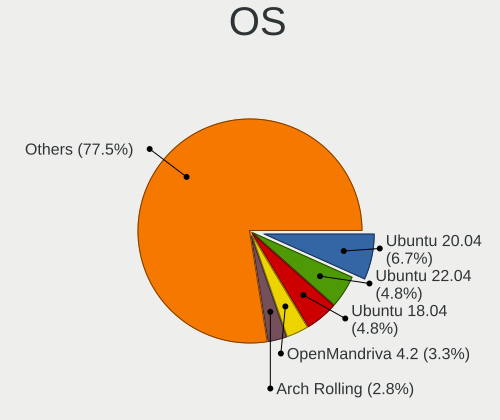

| Name                         | Desktops | Percent |
|------------------------------|----------|---------|
| Ubuntu 20.04                 | 79       | 6.7%    |
| Ubuntu 22.04                 | 57       | 4.83%   |
| Ubuntu 18.04                 | 57       | 4.83%   |
| OpenMandriva 4.2             | 39       | 3.31%   |
| Arch Rolling                 | 33       | 2.8%    |
| OpenMandriva 4.3             | 30       | 2.54%   |
| Ubuntu 24.04                 | 29       | 2.46%   |
| Linux Mint 22.1              | 19       | 1.61%   |
| Fedora 39                    | 19       | 1.61%   |
| Pop!_OS 22.04                | 18       | 1.53%   |
| Debian 11                    | 18       | 1.53%   |
| Zorin 17                     | 16       | 1.36%   |
| OpenMandriva 25.90           | 15       | 1.27%   |
| Linux Mint 21.1              | 14       | 1.19%   |
| Debian 12                    | 14       | 1.19%   |
| Zorin 16                     | 13       | 1.1%    |
| OpenMandriva 23.08           | 13       | 1.1%    |
| Linux Mint 20.1              | 13       | 1.1%    |
| Fedora 42                    | 12       | 1.02%   |
| openSUSE Tumbleweed-XXXXXXXX | 11       | 0.93%   |
| OpenMandriva 23.03           | 11       | 0.93%   |
| OpenMandriva 23.01           | 11       | 0.93%   |
| Fedora 40                    | 11       | 0.93%   |
| Fedora 35                    | 11       | 0.93%   |
| Ubuntu 19.04                 | 10       | 0.85%   |
| OpenMandriva 24.07           | 10       | 0.85%   |
| Linux Mint 22.2              | 10       | 0.85%   |
| Linux Mint 20.3              | 10       | 0.85%   |
| Fedora 32                    | 10       | 0.85%   |
| Debian                       | 10       | 0.85%   |
| Ubuntu 22.10                 | 9        | 0.76%   |
| Ubuntu 20.10                 | 9        | 0.76%   |
| Ubuntu 23.04                 | 8        | 0.68%   |
| OpenMandriva 6.0             | 8        | 0.68%   |
| OpenMandriva 4.50            | 8        | 0.68%   |
| OpenMandriva 24.12           | 8        | 0.68%   |
| Linux Mint 20.2              | 8        | 0.68%   |
| Kubuntu 22.04                | 8        | 0.68%   |
| Fedora 36                    | 8        | 0.68%   |
| Fedora 34                    | 8        | 0.68%   |

OS Family
---------

OS without a version

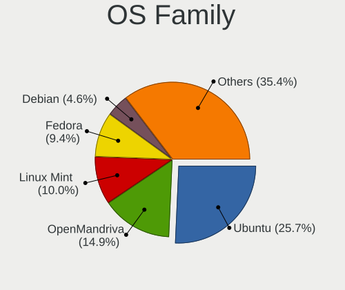

| Name         | Desktops | Percent |
|--------------|----------|---------|
| Ubuntu       | 282      | 25.71%  |
| OpenMandriva | 163      | 14.86%  |
| Linux Mint   | 110      | 10.03%  |
| Fedora       | 103      | 9.39%   |
| Debian       | 51       | 4.65%   |
| Arch         | 38       | 3.46%   |
| Zorin        | 37       | 3.37%   |
| Pop!_OS      | 31       | 2.83%   |
| Gentoo       | 25       | 2.28%   |
| Kubuntu      | 23       | 2.1%    |
| ROSA         | 21       | 1.91%   |
| Manjaro      | 21       | 1.91%   |
| openSUSE     | 16       | 1.46%   |
| Bazzite      | 15       | 1.37%   |
| KDE neon     | 14       | 1.28%   |
| Xubuntu      | 13       | 1.19%   |
| Kali         | 11       | 1%      |
| ArcoLinux    | 10       | 0.91%   |
| Lubuntu      | 7        | 0.64%   |
| EndeavourOS  | 7        | 0.64%   |
| Ubuntu MATE  | 6        | 0.55%   |
| NixOS        | 6        | 0.55%   |
| LMDE         | 6        | 0.55%   |
| Elementary   | 6        | 0.55%   |
| CachyOS      | 6        | 0.55%   |
| Ubuntu Unity | 5        | 0.46%   |
| RHEL         | 5        | 0.46%   |
| Endless      | 5        | 0.46%   |
| CentOS       | 5        | 0.46%   |
| Void Linux   | 4        | 0.36%   |
| TUXEDO OS    | 4        | 0.36%   |
| Nobara       | 4        | 0.36%   |
| Dts-distro   | 3        | 0.27%   |
| Xero         | 2        | 0.18%   |
| SteamOS      | 2        | 0.18%   |
| Parrot       | 2        | 0.18%   |
| Neptune OS   | 2        | 0.18%   |
| GNOME OS     | 2        | 0.18%   |
| Garuda Linux | 2        | 0.18%   |
| Drauger OS   | 2        | 0.18%   |

Kernel
------

Version of the Linux kernel

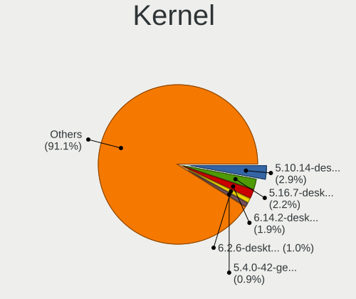

| Version                             | Desktops | Percent |
|-------------------------------------|----------|---------|
| 5.10.14-desktop-1omv4002            | 38       | 2.89%   |
| 5.16.7-desktop-1omv4003             | 29       | 2.21%   |
| 6.14.2-desktop-3omv2590             | 25       | 1.9%    |
| 6.2.6-desktop-1omv2390              | 13       | 0.99%   |
| 5.4.0-42-generic                    | 12       | 0.91%   |
| 6.4.11-desktop-1omv2390             | 11       | 0.84%   |
| 6.14.0-29-generic                   | 9        | 0.69%   |
| 6.1.1-desktop-1omv2290              | 9        | 0.69%   |
| 5.4.0-58-generic                    | 9        | 0.69%   |
| 5.15.0-56-generic                   | 9        | 0.69%   |
| 6.8.0-60-generic                    | 8        | 0.61%   |
| 6.12.1-desktop-1omv2490             | 8        | 0.61%   |
| 5.11.0-27-generic                   | 8        | 0.61%   |
| 6.8.0-57-generic                    | 7        | 0.53%   |
| 6.3.5-desktop-3omv2390              | 7        | 0.53%   |
| 6.10.0-desktop-1omv2490             | 7        | 0.53%   |
| 5.15.0-52-generic                   | 7        | 0.53%   |
| 5.13.0-30-generic                   | 7        | 0.53%   |
| 6.8.0-51-generic                    | 6        | 0.46%   |
| 5.4.0-26-generic                    | 6        | 0.46%   |
| 5.15.0-46-generic                   | 6        | 0.46%   |
| 4.9.20-nrj-desktop-1rosa-x86_64     | 6        | 0.46%   |
| 6.8.0-45-generic                    | 5        | 0.38%   |
| 6.6.2-desktop-1omv2390              | 5        | 0.38%   |
| 6.14.0-36-generic                   | 5        | 0.38%   |
| 5.4.0-52-generic                    | 5        | 0.38%   |
| 5.3.0-28-generic                    | 5        | 0.38%   |
| 5.12.4-desktop-1omv4050             | 5        | 0.38%   |
| 5.0.0-37-generic                    | 5        | 0.38%   |
| 4.15.0-45-generic                   | 5        | 0.38%   |
| 6.9.3-76060903-generic              | 4        | 0.3%    |
| 6.8.0-76060800daily20240311-generic | 4        | 0.3%    |
| 6.8.0-55-generic                    | 4        | 0.3%    |
| 6.8.0-52-generic                    | 4        | 0.3%    |
| 6.8.0-41-generic                    | 4        | 0.3%    |
| 6.8.0-40-generic                    | 4        | 0.3%    |
| 6.15.0-desktop-0.rc2.3omv2590       | 4        | 0.3%    |
| 6.14.0-33-generic                   | 4        | 0.3%    |
| 6.14.0-27-generic                   | 4        | 0.3%    |
| 6.12.10-76061203-generic            | 4        | 0.3%    |

Kernel Family
-------------

Linux kernel without a distro release

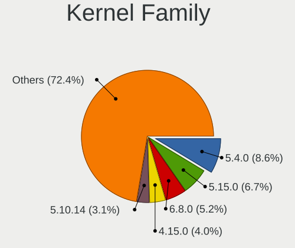

| Version | Desktops | Percent |
|---------|----------|---------|
| 5.4.0   | 106      | 8.64%   |
| 5.15.0  | 82       | 6.68%   |
| 6.8.0   | 64       | 5.22%   |
| 4.15.0  | 49       | 3.99%   |
| 5.10.14 | 38       | 3.1%    |
| 5.8.0   | 33       | 2.69%   |
| 6.14.0  | 30       | 2.44%   |
| 5.16.7  | 29       | 2.36%   |
| 6.14.2  | 28       | 2.28%   |
| 5.11.0  | 28       | 2.28%   |
| 5.19.0  | 27       | 2.2%    |
| 4.18.0  | 26       | 2.12%   |
| 6.5.0   | 24       | 1.96%   |
| 6.2.0   | 24       | 1.96%   |
| 5.0.0   | 24       | 1.96%   |
| 5.3.0   | 22       | 1.79%   |
| 5.13.0  | 20       | 1.63%   |
| 6.1.0   | 17       | 1.39%   |
| 6.11.0  | 16       | 1.3%    |
| 5.10.0  | 15       | 1.22%   |
| 6.2.6   | 13       | 1.06%   |
| 6.4.11  | 12       | 0.98%   |
| 6.1.1   | 12       | 0.98%   |
| 6.12.1  | 9        | 0.73%   |
| 6.3.5   | 8        | 0.65%   |
| 4.19.0  | 8        | 0.65%   |
| 6.9.3   | 7        | 0.57%   |
| 6.6.2   | 7        | 0.57%   |
| 6.10.0  | 7        | 0.57%   |
| 4.9.20  | 7        | 0.57%   |
| 6.17.0  | 6        | 0.49%   |
| 6.7.9   | 5        | 0.41%   |
| 6.17.8  | 5        | 0.41%   |
| 6.17.7  | 5        | 0.41%   |
| 5.12.4  | 5        | 0.41%   |
| 6.9.7   | 4        | 0.33%   |
| 6.8.7   | 4        | 0.33%   |
| 6.6.9   | 4        | 0.33%   |
| 6.6.7   | 4        | 0.33%   |
| 6.6.21  | 4        | 0.33%   |

Kernel Major Ver.
-----------------

Linux kernel major version

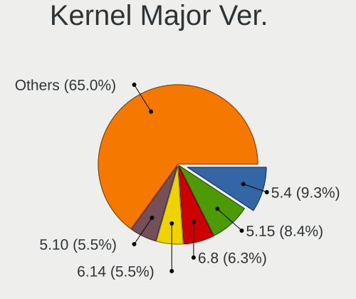

| Version | Desktops | Percent |
|---------|----------|---------|
| 5.4     | 112      | 9.26%   |
| 5.15    | 101      | 8.35%   |
| 6.8     | 76       | 6.29%   |
| 6.14    | 67       | 5.54%   |
| 5.10    | 67       | 5.54%   |
| 4.15    | 49       | 4.05%   |
| 5.8     | 46       | 3.8%    |
| 6.1     | 43       | 3.56%   |
| 6.2     | 42       | 3.47%   |
| 6.12    | 40       | 3.31%   |
| 5.16    | 40       | 3.31%   |
| 5.11    | 38       | 3.14%   |
| 5.19    | 35       | 2.89%   |
| 6.6     | 33       | 2.73%   |
| 6.5     | 32       | 2.65%   |
| 6.11    | 28       | 2.32%   |
| 4.18    | 27       | 2.23%   |
| 6.4     | 26       | 2.15%   |
| 5.0     | 26       | 2.15%   |
| 5.3     | 25       | 2.07%   |
| 5.13    | 25       | 2.07%   |
| 6.17    | 22       | 1.82%   |
| 6.3     | 20       | 1.65%   |
| 6.10    | 19       | 1.57%   |
| 6.9     | 18       | 1.49%   |
| 6.15    | 16       | 1.32%   |
| 6.0     | 13       | 1.08%   |
| 4.9     | 11       | 0.91%   |
| 6.7     | 10       | 0.83%   |
| 6.13    | 10       | 0.83%   |
| 5.14    | 10       | 0.83%   |
| 5.17    | 9        | 0.74%   |
| 6.16    | 8        | 0.66%   |
| 5.12    | 8        | 0.66%   |
| 4.19    | 8        | 0.66%   |
| 5.7     | 7        | 0.58%   |
| 5.6     | 7        | 0.58%   |
| 5.18    | 7        | 0.58%   |
| 5.9     | 6        | 0.5%    |
| 5.5     | 4        | 0.33%   |

Arch
----

OS architecture (x86_64, i586, etc.)

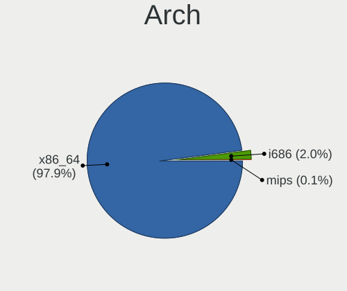

| Name   | Desktops | Percent |
|--------|----------|---------|
| x86_64 | 1042     | 97.93%  |
| i686   | 21       | 1.97%   |
| mips   | 1        | 0.09%   |

DE
--

Desktop Environment

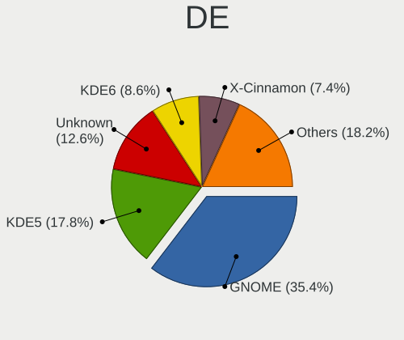

| Name              | Desktops | Percent |
|-------------------|----------|---------|
| GNOME             | 395      | 35.43%  |
| KDE5              | 198      | 17.76%  |
| Unknown           | 141      | 12.65%  |
| KDE6              | 96       | 8.61%   |
| X-Cinnamon        | 82       | 7.35%   |
| XFCE              | 71       | 6.37%   |
| KDE               | 26       | 2.33%   |
| MATE              | 23       | 2.06%   |
| Cinnamon          | 16       | 1.43%   |
| LXQt              | 12       | 1.08%   |
| KDE4              | 7        | 0.63%   |
| Hyprland          | 7        | 0.63%   |
| Pantheon          | 6        | 0.54%   |
| GNOME Flashback   | 6        | 0.54%   |
| Unity             | 5        | 0.45%   |
| LXDE              | 5        | 0.45%   |
| i3                | 5        | 0.45%   |
| Budgie            | 3        | 0.27%   |
| openbox           | 2        | 0.18%   |
| icewm             | 2        | 0.18%   |
| Yaru:ubuntu:GNOME | 1        | 0.09%   |
| sway              | 1        | 0.09%   |
| qtile             | 1        | 0.09%   |
| niri              | 1        | 0.09%   |
| Deepin            | 1        | 0.09%   |
| Core              | 1        | 0.09%   |
| bspwm             | 1        | 0.09%   |

Display Server
--------------

X11 or Wayland

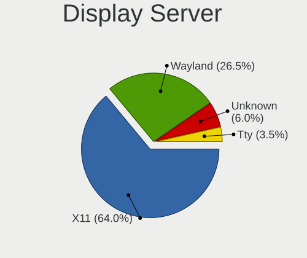

| Name    | Desktops | Percent |
|---------|----------|---------|
| X11     | 710      | 63.96%  |
| Wayland | 294      | 26.49%  |
| Unknown | 67       | 6.04%   |
| Tty     | 39       | 3.51%   |

Display Manager
---------------

SDDM, LightDM, etc.

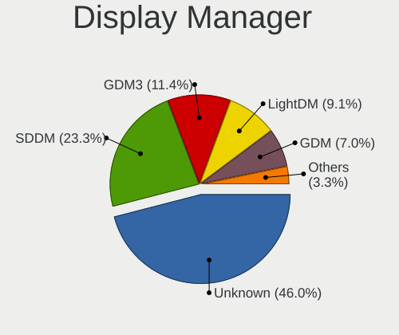

| Name    | Desktops | Percent |
|---------|----------|---------|
| Unknown | 508      | 45.97%  |
| SDDM    | 257      | 23.26%  |
| GDM3    | 126      | 11.4%   |
| LightDM | 101      | 9.14%   |
| GDM     | 77       | 6.97%   |
| TDM     | 26       | 2.35%   |
| KDM     | 5        | 0.45%   |
| XDM     | 2        | 0.18%   |
| SLIMSKI | 2        | 0.18%   |
| SLiM    | 1        | 0.09%   |

OS Lang
-------

Language

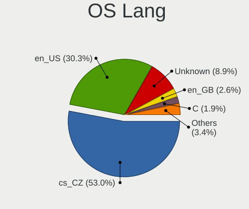

| Lang    | Desktops | Percent |
|---------|----------|---------|
| cs_CZ   | 579      | 52.97%  |
| en_US   | 331      | 30.28%  |
| Unknown | 97       | 8.87%   |
| en_GB   | 28       | 2.56%   |
| C       | 21       | 1.92%   |
| ru_RU   | 7        | 0.64%   |
| sk_SK   | 5        | 0.46%   |
| de_DE   | 5        | 0.46%   |
| pl_PL   | 4        | 0.37%   |
| C.UTF8  | 3        | 0.27%   |
| POSIX   | 2        | 0.18%   |
| it_IT   | 2        | 0.18%   |
| en_AU   | 2        | 0.18%   |
| pt_PT   | 1        | 0.09%   |
| nb_NO   | 1        | 0.09%   |
| fr_FR   | 1        | 0.09%   |
| fi_FI   | 1        | 0.09%   |
| en_CA   | 1        | 0.09%   |
| Czech   | 1        | 0.09%   |
| ca_ES   | 1        | 0.09%   |

Boot Mode
---------

EFI or BIOS

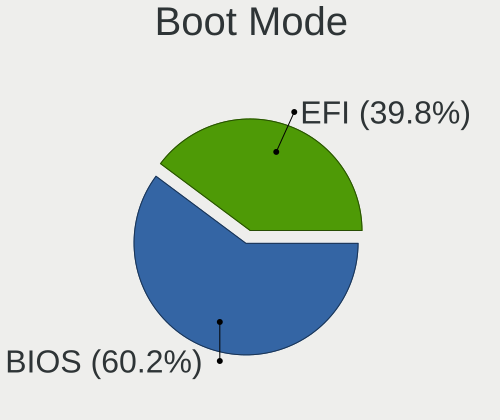

| Mode | Desktops | Percent |
|------|----------|---------|
| BIOS | 655      | 60.2%   |
| EFI  | 433      | 39.8%   |

Filesystem
----------

Type of filesystem

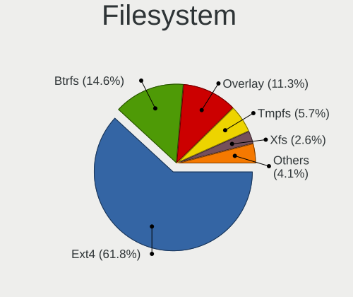

| Type     | Desktops | Percent |
|----------|----------|---------|
| Ext4     | 687      | 61.84%  |
| Btrfs    | 162      | 14.58%  |
| Overlay  | 125      | 11.25%  |
| Tmpfs    | 63       | 5.67%   |
| Xfs      | 29       | 2.61%   |
| Unknown  | 24       | 2.16%   |
| Zfs      | 10       | 0.9%    |
| F2fs     | 4        | 0.36%   |
| Bcachefs | 3        | 0.27%   |
| Ext2     | 2        | 0.18%   |
| Reiserfs | 1        | 0.09%   |
| Ext3     | 1        | 0.09%   |

Part. scheme
------------

Scheme of partitioning

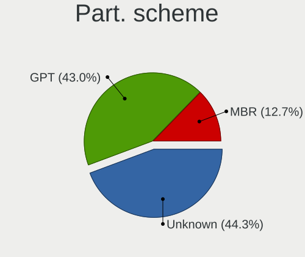

| Type    | Desktops | Percent |
|---------|----------|---------|
| Unknown | 485      | 44.33%  |
| GPT     | 470      | 42.96%  |
| MBR     | 139      | 12.71%  |

Dual Boot with Linux/BSD
------------------------

Hosting more than one Linux/BSD

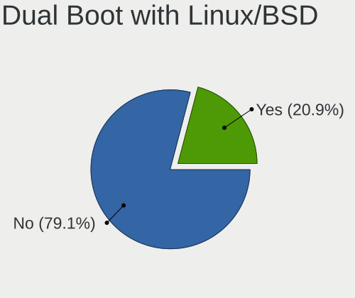

| Dual boot | Desktops | Percent |
|-----------|----------|---------|
| No        | 862      | 79.08%  |
| Yes       | 228      | 20.92%  |

Dual Boot (Win)
---------------

Hosting Linux and Windows

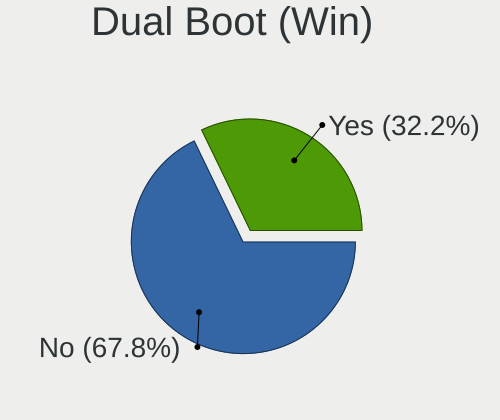

| Dual boot | Desktops | Percent |
|-----------|----------|---------|
| No        | 738      | 67.83%  |
| Yes       | 350      | 32.17%  |

Board
-----

Vendor
------

Motherboard manufacturer

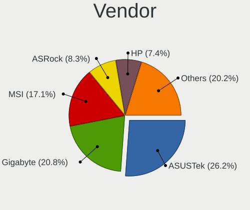

| Name                                 | Desktops | Percent |
|--------------------------------------|----------|---------|
| ASUSTek Computer                     | 278      | 26.15%  |
| Gigabyte Technology                  | 221      | 20.79%  |
| MSI                                  | 182      | 17.12%  |
| ASRock                               | 88       | 8.28%   |
| Hewlett-Packard                      | 79       | 7.43%   |
| Dell                                 | 68       | 6.4%    |
| Lenovo                               | 41       | 3.86%   |
| Intel                                | 18       | 1.69%   |
| Acer                                 | 15       | 1.41%   |
| Fujitsu                              | 12       | 1.13%   |
| Pegatron                             | 10       | 0.94%   |
| Unknown                              | 9        | 0.85%   |
| Fujitsu Siemens                      | 5        | 0.47%   |
| Foxconn                              | 5        | 0.47%   |
| Supermicro                           | 3        | 0.28%   |
| Clientron                            | 2        | 0.19%   |
| Biostar                              | 2        | 0.19%   |
| ASRockRack                           | 2        | 0.19%   |
| UMAX                                 | 1        | 0.09%   |
| SIEMENS                              | 1        | 0.09%   |
| Shuttle                              | 1        | 0.09%   |
| Shenzhen Meigao Electronic Equipment | 1        | 0.09%   |
| Seeed Studio                         | 1        | 0.09%   |
| Packard Bell                         | 1        | 0.09%   |
| Minix                                | 1        | 0.09%   |
| Maxtang                              | 1        | 0.09%   |
| MACHINIST                            | 1        | 0.09%   |
| Le Cube 1                            | 1        | 0.09%   |
| IP3 Tech                             | 1        | 0.09%   |
| IceWhale Technology                  | 1        | 0.09%   |
| Huanan                               | 1        | 0.09%   |
| HPE                                  | 1        | 0.09%   |
| Hardkernel                           | 1        | 0.09%   |
| Google                               | 1        | 0.09%   |
| EVGA                                 | 1        | 0.09%   |
| ELSKY                                | 1        | 0.09%   |
| ECS                                  | 1        | 0.09%   |
| AZW                                  | 1        | 0.09%   |
| AMD                                  | 1        | 0.09%   |
| Aiffro                               | 1        | 0.09%   |

Model
-----

Motherboard model

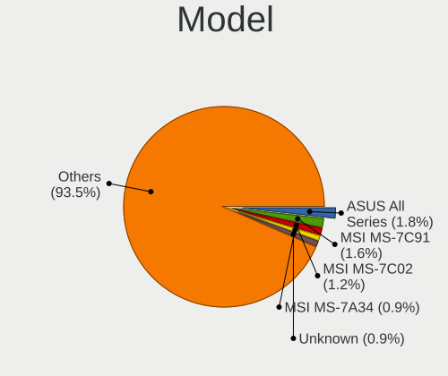

| Name                               | Desktops | Percent |
|------------------------------------|----------|---------|
| ASUS All Series                    | 19       | 1.79%   |
| MSI MS-7C91                        | 17       | 1.6%    |
| MSI MS-7C02                        | 13       | 1.22%   |
| MSI MS-7A34                        | 10       | 0.94%   |
| Unknown                            | 10       | 0.94%   |
| MSI MS-7693                        | 9        | 0.85%   |
| MSI MS-7592                        | 5        | 0.47%   |
| HP Compaq 8200 Elite SFF PC        | 5        | 0.47%   |
| Dell OptiPlex 7010                 | 5        | 0.47%   |
| ASUS TUF Gaming X570-PLUS          | 5        | 0.47%   |
| ASUS P5G41T-M LX                   | 5        | 0.47%   |
| MSI MS-7B07                        | 4        | 0.38%   |
| MSI MS-7817                        | 4        | 0.38%   |
| Gigabyte B450 AORUS M              | 4        | 0.38%   |
| Dell OptiPlex 790                  | 4        | 0.38%   |
| ASUS TUF Gaming B550M-PLUS WIFI II | 4        | 0.38%   |
| ASUS TUF Gaming B550M-PLUS         | 4        | 0.38%   |
| ASUS TUF Gaming B550-PLUS          | 4        | 0.38%   |
| ASUS ROG STRIX B550-I GAMING       | 4        | 0.38%   |
| ASUS ROG STRIX B550-F GAMING       | 4        | 0.38%   |
| ASRock AB350M Pro4                 | 4        | 0.38%   |
| ASRock AB350 Pro4                  | 4        | 0.38%   |
| Pegatron Elite 7300 Series MT      | 3        | 0.28%   |
| MSI MS-7B86                        | 3        | 0.28%   |
| MSI MS-7B79                        | 3        | 0.28%   |
| MSI MS-7A32                        | 3        | 0.28%   |
| MSI MS-7641                        | 3        | 0.28%   |
| MSI MS-7309                        | 3        | 0.28%   |
| HP EliteDesk 800 G1 SFF            | 3        | 0.28%   |
| Gigabyte X570 AORUS ELITE          | 3        | 0.28%   |
| Gigabyte H61M-S2PV                 | 3        | 0.28%   |
| Gigabyte B550M K                   | 3        | 0.28%   |
| Gigabyte B550I AORUS PRO AX        | 3        | 0.28%   |
| Gigabyte B550 AORUS ELITE V2       | 3        | 0.28%   |
| Gigabyte B450M DS3H                | 3        | 0.28%   |
| Gigabyte B450 AORUS ELITE          | 3        | 0.28%   |
| Gigabyte AB350-Gaming 3            | 3        | 0.28%   |
| Gigabyte 970A-DS3P                 | 3        | 0.28%   |
| Foxconn Pro 3500 Series            | 3        | 0.28%   |
| Dell OptiPlex 9020                 | 3        | 0.28%   |

Model Family
------------

Motherboard model prefix

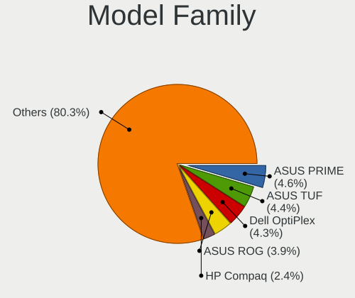

| Name               | Desktops | Percent |
|--------------------|----------|---------|
| ASUS PRIME         | 49       | 4.61%   |
| ASUS TUF           | 47       | 4.42%   |
| Dell OptiPlex      | 46       | 4.33%   |
| ASUS ROG           | 41       | 3.86%   |
| HP Compaq          | 26       | 2.45%   |
| Lenovo ThinkCentre | 24       | 2.26%   |
| ASUS All           | 19       | 1.79%   |
| MSI MS-7C91        | 17       | 1.6%    |
| MSI MS-7C02        | 13       | 1.22%   |
| Dell Precision     | 13       | 1.22%   |
| HP ProDesk         | 12       | 1.13%   |
| Acer Aspire        | 11       | 1.03%   |
| MSI MS-7A34        | 10       | 0.94%   |
| Gigabyte B450      | 10       | 0.94%   |
| Unknown            | 10       | 0.94%   |
| MSI MS-7693        | 9        | 0.85%   |
| HP EliteDesk       | 9        | 0.85%   |
| Fujitsu ESPRIMO    | 8        | 0.75%   |
| Gigabyte X570      | 7        | 0.66%   |
| Gigabyte B550M     | 7        | 0.66%   |
| Gigabyte B550      | 7        | 0.66%   |
| Gigabyte B450M     | 7        | 0.66%   |
| Gigabyte Z390      | 6        | 0.56%   |
| Dell Vostro        | 6        | 0.56%   |
| ASUS P5G41T-M      | 6        | 0.56%   |
| MSI MS-7592        | 5        | 0.47%   |
| ASUS M5A97         | 5        | 0.47%   |
| ASRock B450M       | 5        | 0.47%   |
| ASRock B450        | 5        | 0.47%   |
| Pegatron Elite     | 4        | 0.38%   |
| MSI MS-7B07        | 4        | 0.38%   |
| MSI MS-7817        | 4        | 0.38%   |
| HP Pavilion        | 4        | 0.38%   |
| Gigabyte COMFOR    | 4        | 0.38%   |
| Gigabyte B650      | 4        | 0.38%   |
| ASRock AB350M      | 4        | 0.38%   |
| ASRock AB350       | 4        | 0.38%   |
| MSI MS-7B86        | 3        | 0.28%   |
| MSI MS-7B79        | 3        | 0.28%   |
| MSI MS-7A32        | 3        | 0.28%   |

MFG Year
--------

Motherboard manufacture year

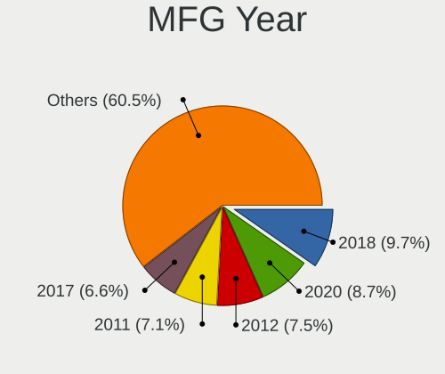

| Year    | Desktops | Percent |
|---------|----------|---------|
| 2018    | 103      | 9.69%   |
| 2020    | 92       | 8.65%   |
| 2012    | 80       | 7.53%   |
| 2011    | 75       | 7.06%   |
| 2017    | 70       | 6.59%   |
| 2019    | 66       | 6.21%   |
| 2014    | 64       | 6.02%   |
| 2013    | 62       | 5.83%   |
| 2009    | 56       | 5.27%   |
| 2015    | 48       | 4.52%   |
| 2010    | 47       | 4.42%   |
| 2008    | 47       | 4.42%   |
| 2016    | 46       | 4.33%   |
| 2021    | 43       | 4.05%   |
| 2023    | 42       | 3.95%   |
| 2007    | 37       | 3.48%   |
| 2022    | 34       | 3.2%    |
| 2006    | 17       | 1.6%    |
| 2024    | 16       | 1.51%   |
| 2005    | 8        | 0.75%   |
| 2025    | 4        | 0.38%   |
| 2004    | 3        | 0.28%   |
| Unknown | 2        | 0.19%   |
| 2000    | 1        | 0.09%   |

Form Factor
-----------

Physical design of the computer

| Name    | Desktops | Percent |
|---------|----------|---------|
| Desktop | 1063     | 100%    |

Secure Boot
-----------

Enabled or disabled

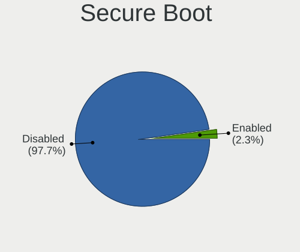

| State    | Desktops | Percent |
|----------|----------|---------|
| Disabled | 1040     | 97.74%  |
| Enabled  | 24       | 2.26%   |

Coreboot
--------

Have coreboot on board

| Used | Desktops | Percent |
|------|----------|---------|
| No   | 1062     | 99.91%  |
| Yes  | 1        | 0.09%   |

RAM Size
--------

Total RAM memory

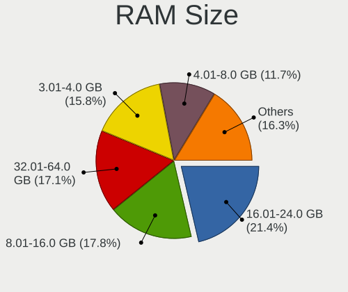

| Size in GB      | Desktops | Percent |
|-----------------|----------|---------|
| 16.01-24.0      | 233      | 21.38%  |
| 8.01-16.0       | 194      | 17.8%   |
| 32.01-64.0      | 186      | 17.06%  |
| 3.01-4.0        | 172      | 15.78%  |
| 4.01-8.0        | 127      | 11.65%  |
| 64.01-256.0     | 75       | 6.88%   |
| 24.01-32.0      | 44       | 4.04%   |
| 1.01-2.0        | 38       | 3.49%   |
| 2.01-3.0        | 15       | 1.38%   |
| More than 256.0 | 2        | 0.18%   |
| 0.51-1.0        | 2        | 0.18%   |
| 0.01-0.5        | 2        | 0.18%   |

RAM Used
--------

Used RAM memory

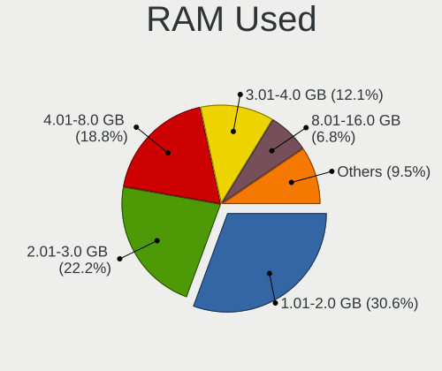

| Used GB    | Desktops | Percent |
|------------|----------|---------|
| 1.01-2.0   | 371      | 30.61%  |
| 2.01-3.0   | 269      | 22.19%  |
| 4.01-8.0   | 228      | 18.81%  |
| 3.01-4.0   | 147      | 12.13%  |
| 8.01-16.0  | 82       | 6.77%   |
| 0.51-1.0   | 72       | 5.94%   |
| 0.01-0.5   | 18       | 1.49%   |
| 16.01-24.0 | 13       | 1.07%   |
| 32.01-64.0 | 8        | 0.66%   |
| 24.01-32.0 | 3        | 0.25%   |
| Unknown    | 1        | 0.08%   |

Total Drives
------------

Number of drives on board

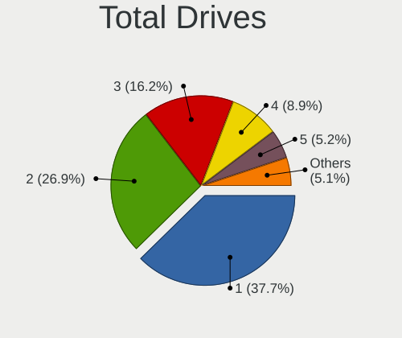

| Drives | Desktops | Percent |
|--------|----------|---------|
| 1      | 422      | 37.68%  |
| 2      | 301      | 26.88%  |
| 3      | 182      | 16.25%  |
| 4      | 100      | 8.93%   |
| 5      | 58       | 5.18%   |
| 6      | 26       | 2.32%   |
| 0      | 11       | 0.98%   |
| 7      | 10       | 0.89%   |
| 8      | 5        | 0.45%   |
| 11     | 2        | 0.18%   |
| 14     | 1        | 0.09%   |
| 12     | 1        | 0.09%   |
| 9      | 1        | 0.09%   |

Has CD-ROM
----------

Has CD-ROM on board

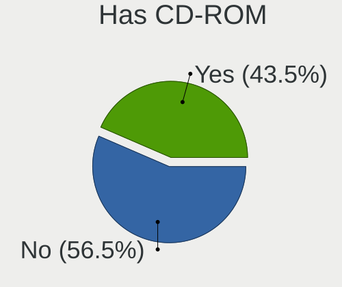

| Presented | Desktops | Percent |
|-----------|----------|---------|
| No        | 609      | 56.49%  |
| Yes       | 469      | 43.51%  |

Has Ethernet
------------

Has Ethernet on board

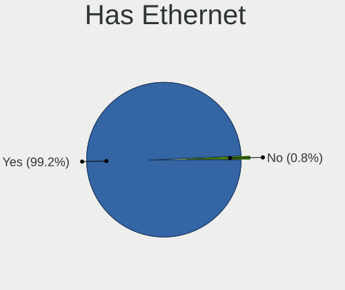

| Presented | Desktops | Percent |
|-----------|----------|---------|
| Yes       | 1055     | 99.25%  |
| No        | 8        | 0.75%   |

Has WiFi
--------

Has WiFi module

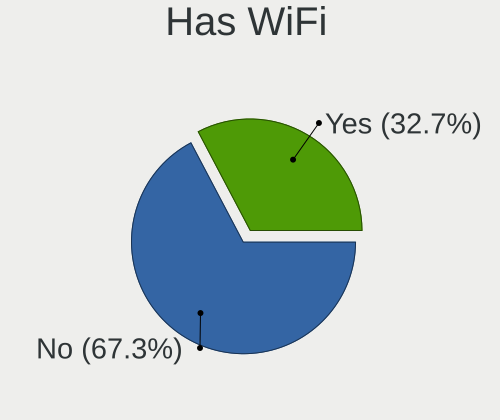

| Presented | Desktops | Percent |
|-----------|----------|---------|
| No        | 726      | 67.28%  |
| Yes       | 353      | 32.72%  |

Has Bluetooth
-------------

Has Bluetooth module

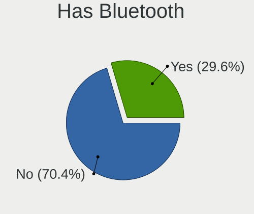

| Presented | Desktops | Percent |
|-----------|----------|---------|
| No        | 757      | 70.42%  |
| Yes       | 318      | 29.58%  |

Location
--------

Country
-------

Geographic location (country)

| Country | Desktops | Percent |
|---------|----------|---------|
| Czechia | 1063     | 100%    |

City
----

Geographic location (city)

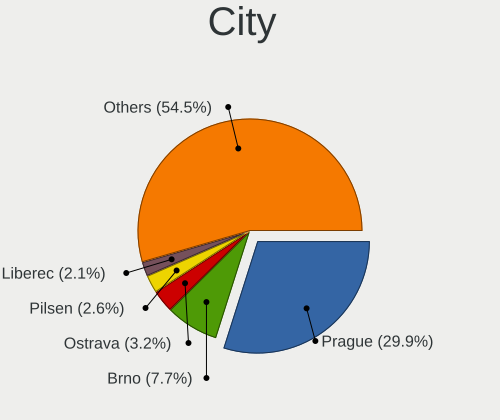

| City                   | Desktops | Percent |
|------------------------|----------|---------|
| Prague                 | 333      | 29.89%  |
| Brno                   | 86       | 7.72%   |
| Ostrava                | 36       | 3.23%   |
| Pilsen                 | 29       | 2.6%    |
| Liberec                | 23       | 2.06%   |
| Pardubice              | 21       | 1.89%   |
| Hradec Králové       | 20       | 1.8%    |
| Olomouc                | 15       | 1.35%   |
| České Budějovice    | 15       | 1.35%   |
| Zlín                  | 12       | 1.08%   |
| Mladá Boleslav        | 12       | 1.08%   |
| Ústí nad Labem       | 11       | 0.99%   |
| Šlapanice             | 11       | 0.99%   |
| Brdo                   | 11       | 0.99%   |
| Havířov              | 9        | 0.81%   |
| Litoměřice           | 7        | 0.63%   |
| Kladno                 | 7        | 0.63%   |
| Horice                 | 7        | 0.63%   |
| Uhersky Brod           | 6        | 0.54%   |
| Přerov                | 6        | 0.54%   |
| Cheb                   | 6        | 0.54%   |
| Český Těšín       | 6        | 0.54%   |
| Znojmo                 | 5        | 0.45%   |
| Vyškov                | 5        | 0.45%   |
| Vcelna                 | 5        | 0.45%   |
| Uherské Hradiště    | 5        | 0.45%   |
| Most                   | 5        | 0.45%   |
| Frýdek-Místek        | 5        | 0.45%   |
| Zdar                   | 4        | 0.36%   |
| Valasske Mezirici      | 4        | 0.36%   |
| Tábor                 | 4        | 0.36%   |
| Sokolov                | 4        | 0.36%   |
| Ponetovice             | 4        | 0.36%   |
| Opava                  | 4        | 0.36%   |
| Novy Jicin             | 4        | 0.36%   |
| Neratovice             | 4        | 0.36%   |
| Kralupy nad Vltavou    | 4        | 0.36%   |
| Dvur Kralove nad Labem | 4        | 0.36%   |
| Děčín               | 4        | 0.36%   |
| As                     | 4        | 0.36%   |

Drives
------

Drive Vendor
------------

Hard drive vendors

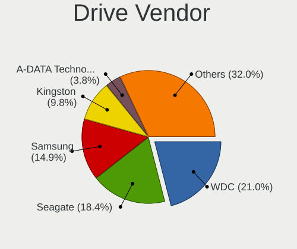

| Vendor                       | Desktops | Drives | Percent |
|------------------------------|----------|--------|---------|
| WDC                          | 412      | 789    | 21.01%  |
| Seagate                      | 361      | 606    | 18.41%  |
| Samsung Electronics          | 293      | 504    | 14.94%  |
| Kingston                     | 192      | 262    | 9.79%   |
| A-DATA Technology            | 75       | 103    | 3.82%   |
| Crucial                      | 64       | 79     | 3.26%   |
| Toshiba                      | 59       | 83     | 3.01%   |
| SanDisk                      | 52       | 71     | 2.65%   |
| Patriot                      | 46       | 60     | 2.35%   |
| Hitachi                      | 43       | 49     | 2.19%   |
| Intel                        | 40       | 54     | 2.04%   |
| Phison Electronics           | 21       | 31     | 1.07%   |
| Apacer                       | 21       | 28     | 1.07%   |
| Unknown                      | 18       | 47     | 0.92%   |
| Kingston Technology Company  | 18       | 21     | 0.92%   |
| Gigabyte Technology          | 16       | 31     | 0.82%   |
| Verbatim                     | 14       | 14     | 0.71%   |
| Micron/Crucial Technology    | 13       | 16     | 0.66%   |
| Silicon Motion               | 12       | 15     | 0.61%   |
| Micron Technology            | 12       | 16     | 0.61%   |
| Transcend                    | 11       | 19     | 0.56%   |
| OCZ                          | 11       | 31     | 0.56%   |
| HGST                         | 11       | 13     | 0.56%   |
| ADATA Technology             | 11       | 12     | 0.56%   |
| Maxtor                       | 10       | 14     | 0.51%   |
| Phison                       | 9        | 13     | 0.46%   |
| XPG                          | 8        | 15     | 0.41%   |
| SK hynix                     | 8        | 15     | 0.41%   |
| Realtek Semiconductor        | 7        | 15     | 0.36%   |
| MAXIO Technology (Hangzhou)  | 7        | 9      | 0.36%   |
| Unknown                      | 6        | 8      | 0.31%   |
| KIOXIA                       | 5        | 6      | 0.25%   |
| GOODRAM                      | 5        | 6      | 0.25%   |
| Corsair                      | 5        | 5      | 0.25%   |
| SPCC                         | 4        | 4      | 0.2%    |
| China                        | 4        | 5      | 0.2%    |
| HPE                          | 3        | 3      | 0.15%   |
| UMAX                         | 2        | 2      | 0.1%    |
| Shenzhen Longsys Electronics | 2        | 3      | 0.1%    |
| pqi                          | 2        | 2      | 0.1%    |

Drive Model
-----------

Hard drive models

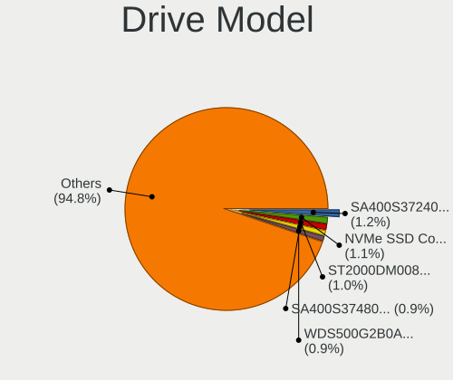

| Model                                              | Desktops | Percent |
|----------------------------------------------------|----------|---------|
| Kingston SA400S37240G 240GB SSD                    | 29       | 1.23%   |
| Samsung NVMe SSD Controller SM981/PM981/PM983 1TB  | 26       | 1.1%    |
| Seagate ST2000DM008-2FR102 2TB                     | 24       | 1.02%   |
| Kingston SA400S37480G 480GB SSD                    | 22       | 0.93%   |
| WDC WDS500G2B0A-00SM50 500GB                       | 21       | 0.89%   |
| Samsung SSD 860 EVO 500GB                          | 21       | 0.89%   |
| Seagate ST500DM002-1BD142 500GB                    | 19       | 0.81%   |
| Samsung SSD 850 EVO 250GB                          | 19       | 0.81%   |
| Samsung SSD 980 1TB                                | 18       | 0.76%   |
| WDC WD10EZEX-08WN4A0 1TB                           | 17       | 0.72%   |
| Seagate ST1000DM010-2EP102 1TB                     | 17       | 0.72%   |
| Samsung NVMe SSD Controller PM9A1/PM9A3/980PRO 1TB | 17       | 0.72%   |
| Kingston SA400S37120G 120GB SSD                    | 17       | 0.72%   |
| Seagate ST3500418AS 500GB                          | 16       | 0.68%   |
| WDC WD10EZEX-08M2NA0 1TB                           | 15       | 0.64%   |
| Seagate ST4000DM004-2CV104 4TB                     | 14       | 0.59%   |
| Kingston SV300S37A120G 120GB SSD                   | 14       | 0.59%   |
| Samsung NVMe SSD Drive 500GB                       | 13       | 0.55%   |
| Patriot Burst 120GB SSD                            | 13       | 0.55%   |
| Kingston SHFS37A120G 120GB SSD                     | 13       | 0.55%   |
| WDC WD30EFRX-68EUZN0 3TB                           | 12       | 0.51%   |
| Seagate ST2000DM006-2DM164 2TB                     | 12       | 0.51%   |
| Kingston SKC3000D2048G 2TB                         | 12       | 0.51%   |
| A-DATA SU650 120GB SSD                             | 12       | 0.51%   |
| WDC WDS240G2G0A-00JH30 240GB SSD                   | 11       | 0.47%   |
| Samsung SSD 860 EVO 1TB                            | 11       | 0.47%   |
| Crucial CT240BX500SSD1 240GB                       | 11       | 0.47%   |
| WDC WD5000AAKX-60U6AA0 500GB                       | 10       | 0.42%   |
| Seagate ST4000VN008-2DR166 4TB                     | 9        | 0.38%   |
| Seagate ST1000DM003-1ER162 1TB                     | 9        | 0.38%   |
| Seagate ST1000DM003-1CH162 1TB                     | 9        | 0.38%   |
| Samsung HD103SI 1TB                                | 9        | 0.38%   |
| Kingston Company A2000 NVMe SSD 250GB              | 9        | 0.38%   |
| WDC WD40EFRX-68N32N0 4TB                           | 8        | 0.34%   |
| Toshiba DT01ACA100 1TB                             | 8        | 0.34%   |
| Seagate ST2000DM001-1ER164 2TB                     | 8        | 0.34%   |
| Phison PS5013 E13 NVMe Controller 500GB            | 8        | 0.34%   |
| Kingston SKC3000S1024G 1TB                         | 8        | 0.34%   |
| Crucial CT500MX500SSD1 500GB                       | 8        | 0.34%   |
| WDC WD20EZRZ-00Z5HB0 2TB                           | 7        | 0.3%    |

HDD Vendor
----------

Hard disk drive vendors

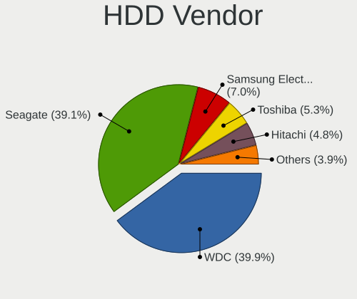

| Vendor              | Desktops | Drives | Percent |
|---------------------|----------|--------|---------|
| WDC                 | 358      | 678    | 39.87%  |
| Seagate             | 351      | 583    | 39.09%  |
| Samsung Electronics | 63       | 97     | 7.02%   |
| Toshiba             | 48       | 67     | 5.35%   |
| Hitachi             | 43       | 49     | 4.79%   |
| HGST                | 11       | 13     | 1.22%   |
| Maxtor              | 10       | 14     | 1.11%   |
| Unknown             | 4        | 6      | 0.45%   |
| pqi                 | 2        | 2      | 0.22%   |
| Fujitsu             | 2        | 4      | 0.22%   |
| SATAFIRM            | 1        | 1      | 0.11%   |
| JetFlash            | 1        | 1      | 0.11%   |
| Initio              | 1        | 1      | 0.11%   |
| IB                  | 1        | 2      | 0.11%   |
| HPE                 | 1        | 1      | 0.11%   |
| External            | 1        | 1      | 0.11%   |

SSD Vendor
----------

Solid state drive vendors

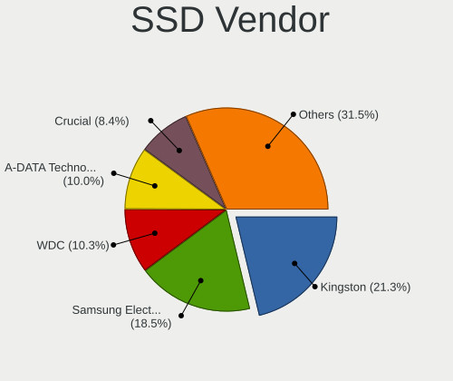

| Vendor              | Desktops | Drives | Percent |
|---------------------|----------|--------|---------|
| Kingston            | 147      | 195    | 21.27%  |
| Samsung Electronics | 128      | 175    | 18.52%  |
| WDC                 | 71       | 95     | 10.27%  |
| A-DATA Technology   | 69       | 94     | 9.99%   |
| Crucial             | 58       | 73     | 8.39%   |
| Patriot             | 44       | 58     | 6.37%   |
| Intel               | 24       | 32     | 3.47%   |
| SanDisk             | 20       | 24     | 2.89%   |
| Apacer              | 19       | 26     | 2.75%   |
| Verbatim            | 13       | 13     | 1.88%   |
| Transcend           | 10       | 18     | 1.45%   |
| OCZ                 | 9        | 13     | 1.3%    |
| Seagate             | 7        | 10     | 1.01%   |
| Micron Technology   | 7        | 8      | 1.01%   |
| Gigabyte Technology | 7        | 11     | 1.01%   |
| GOODRAM             | 5        | 6      | 0.72%   |
| Toshiba             | 4        | 7      | 0.58%   |
| SPCC                | 4        | 4      | 0.58%   |
| China               | 4        | 5      | 0.58%   |
| Unknown             | 4        | 5      | 0.58%   |
| SK hynix            | 3        | 3      | 0.43%   |
| UMAX                | 2        | 2      | 0.29%   |
| LITEONIT            | 2        | 2      | 0.29%   |
| LITEON              | 2        | 3      | 0.29%   |
| HPE                 | 2        | 2      | 0.29%   |
| Emtec               | 2        | 2      | 0.29%   |
| Corsair             | 2        | 2      | 0.29%   |
| WDC WDS1            | 1        | 1      | 0.14%   |
| Vi550               | 1        | 1      | 0.14%   |
| Unknown             | 1        | 7      | 0.14%   |
| TS256GSS            | 1        | 1      | 0.14%   |
| Team                | 1        | 1      | 0.14%   |
| TCSUNBOW            | 1        | 1      | 0.14%   |
| T-CREATE            | 1        | 1      | 0.14%   |
| Star                | 1        | 1      | 0.14%   |
| Phison              | 1        | 1      | 0.14%   |
| OSCOO               | 1        | 2      | 0.14%   |
| Netac               | 1        | 2      | 0.14%   |
| Neo                 | 1        | 1      | 0.14%   |
| KingSpec            | 1        | 2      | 0.14%   |

Drive Kind
----------

HDD or SSD

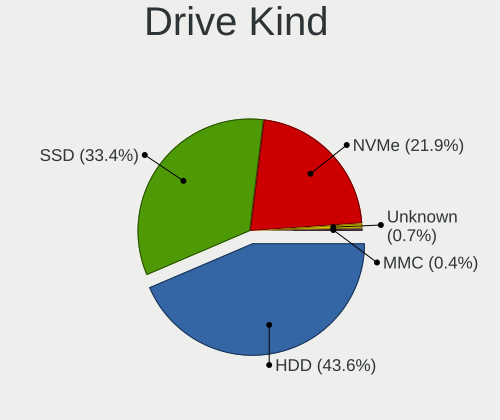

| Kind    | Desktops | Drives | Percent |
|---------|----------|--------|---------|
| HDD     | 719      | 1520   | 43.58%  |
| SSD     | 551      | 919    | 33.39%  |
| NVMe    | 362      | 658    | 21.94%  |
| Unknown | 12       | 32     | 0.73%   |
| MMC     | 6        | 9      | 0.36%   |

Drive Connector
---------------

SATA, SAS, NVMe, etc.

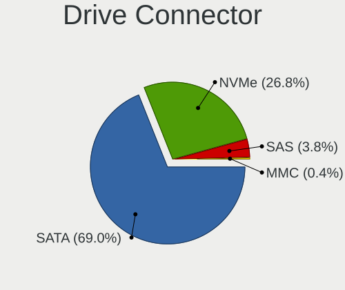

| Type | Desktops | Drives | Percent |
|------|----------|--------|---------|
| SATA | 933      | 2394   | 68.96%  |
| NVMe | 362      | 653    | 26.76%  |
| SAS  | 52       | 82     | 3.84%   |
| MMC  | 6        | 9      | 0.44%   |

Drive Size
----------

Size of hard drive

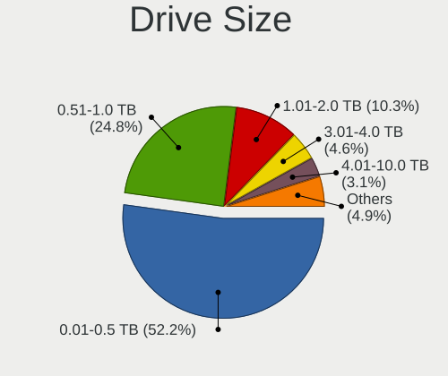

| Size in TB | Desktops | Drives | Percent |
|------------|----------|--------|---------|
| 0.01-0.5   | 730      | 1332   | 52.18%  |
| 0.51-1.0   | 347      | 556    | 24.8%   |
| 1.01-2.0   | 144      | 253    | 10.29%  |
| 3.01-4.0   | 65       | 98     | 4.65%   |
| 4.01-10.0  | 44       | 83     | 3.15%   |
| 2.01-3.0   | 40       | 61     | 2.86%   |
| 10.01-20.0 | 28       | 55     | 2%      |
| 20.01-50.0 | 1        | 1      | 0.07%   |

Space Total
-----------

Amount of disk space available on the file system

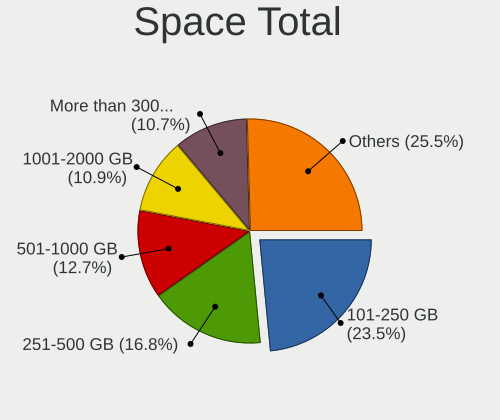

| Size in GB     | Desktops | Percent |
|----------------|----------|---------|
| 101-250        | 273      | 23.47%  |
| 251-500        | 195      | 16.77%  |
| 501-1000       | 148      | 12.73%  |
| 1001-2000      | 127      | 10.92%  |
| More than 3000 | 124      | 10.66%  |
| 1-20           | 93       | 8%      |
| 51-100         | 62       | 5.33%   |
| Unknown        | 56       | 4.82%   |
| 2001-3000      | 53       | 4.56%   |
| 21-50          | 31       | 2.67%   |
| 0              | 1        | 0.09%   |

Space Used
----------

Amount of used disk space

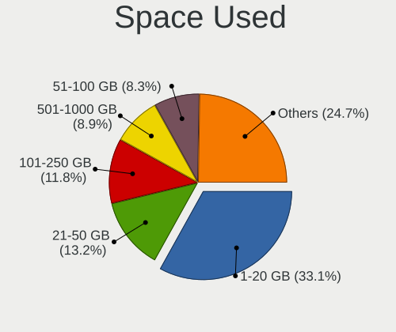

| Used GB        | Desktops | Percent |
|----------------|----------|---------|
| 1-20           | 394      | 33.05%  |
| 21-50          | 157      | 13.17%  |
| 101-250        | 141      | 11.83%  |
| 501-1000       | 106      | 8.89%   |
| 51-100         | 99       | 8.31%   |
| 251-500        | 89       | 7.47%   |
| 1001-2000      | 65       | 5.45%   |
| Unknown        | 56       | 4.7%    |
| More than 3000 | 53       | 4.45%   |
| 2001-3000      | 31       | 2.6%    |
| 0              | 1        | 0.08%   |

Malfunc. Drives
---------------

Drive models with a malfunction

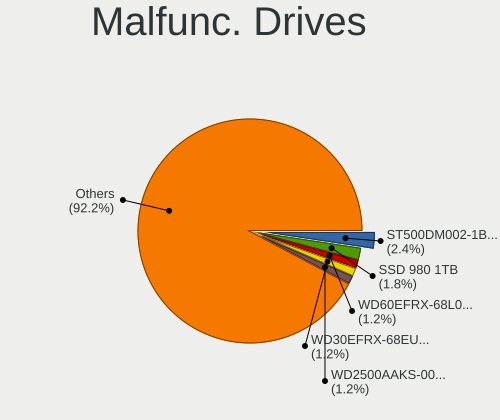

| Model                             | Desktops | Drives | Percent |
|-----------------------------------|----------|--------|---------|
| Seagate ST500DM002-1BD142 500GB   | 4        | 5      | 2.4%    |
| Samsung Electronics SSD 980 1TB   | 3        | 3      | 1.8%    |
| WDC WD60EFRX-68L0BN1 6TB          | 2        | 3      | 1.2%    |
| WDC WD30EFRX-68EUZN0 3TB          | 2        | 2      | 1.2%    |
| WDC WD2500AAKS-00VSA0 250GB       | 2        | 2      | 1.2%    |
| WDC WD10EADS-00M2B0 1TB           | 2        | 2      | 1.2%    |
| Seagate ST500LT012-9WS142 500GB   | 2        | 6      | 1.2%    |
| Seagate ST500LT0 12-1DG142 500GB  | 2        | 3      | 1.2%    |
| Seagate ST3500418AS 500GB         | 2        | 2      | 1.2%    |
| Seagate ST3250410AS 250GB         | 2        | 4      | 1.2%    |
| Seagate ST31000524AS 1TB          | 2        | 3      | 1.2%    |
| Seagate ST2000DM008-2FR102 2TB    | 2        | 3      | 1.2%    |
| Seagate ST2000DM006-2DM164 2TB    | 2        | 2      | 1.2%    |
| Seagate ST1000DM003-1CH162 1TB    | 2        | 4      | 1.2%    |
| Kingston SV300S37A120G 120GB SSD  | 2        | 2      | 1.2%    |
| A-DATA Technology SP900 256GB SSD | 2        | 2      | 1.2%    |
| XPG SPECTRIX S40G 1TB             | 1        | 1      | 0.6%    |
| WDC WDS240G2G0A-00JH30 240GB SSD  | 1        | 1      | 0.6%    |
| WDC WDS120G2G0B-00EPW0 120GB SSD  | 1        | 1      | 0.6%    |
| WDC WDS120G2G0A-00JH30 120GB SSD  | 1        | 1      | 0.6%    |
| WDC WDS100T2B0A-00SM50 1TB SSD    | 1        | 1      | 0.6%    |
| WDC WD800BB-00JHA0 80GB           | 1        | 1      | 0.6%    |
| WDC WD7500AADS-00M2B0 752GB       | 1        | 1      | 0.6%    |
| WDC WD6401AALS-00L3B2 640GB       | 1        | 1      | 0.6%    |
| WDC WD6400AAKS-22A7B2 640GB       | 1        | 1      | 0.6%    |
| WDC WD5000AZRX-00A8LB0 500GB      | 1        | 1      | 0.6%    |
| WDC WD5000AAKX-75U6AA0 500GB      | 1        | 2      | 0.6%    |
| WDC WD5000AAKS-00V0A0 500GB       | 1        | 1      | 0.6%    |
| WDC WD40EFZX-68AWUN0 4TB          | 1        | 1      | 0.6%    |
| WDC WD40EFRX-68WT0N0 4TB          | 1        | 1      | 0.6%    |
| WDC WD3200AAKS-22B3A0 320GB       | 1        | 1      | 0.6%    |
| WDC WD3200AAKS-00L9A0 320GB       | 1        | 1      | 0.6%    |
| WDC WD30EFRX-68AX9N0 3TB          | 1        | 1      | 0.6%    |
| WDC WD2502ABYS-02B7A0 256GB       | 1        | 1      | 0.6%    |
| WDC WD2500BEVS-22UST0 250GB       | 1        | 1      | 0.6%    |
| WDC WD2500AAKX-75U6AA0 250GB      | 1        | 1      | 0.6%    |
| WDC WD2500AAKX-60U6AA0 250GB      | 1        | 1      | 0.6%    |
| WDC WD2500AAKX-603CA0 250GB       | 1        | 1      | 0.6%    |
| WDC WD2500AAKX-083CA1 250GB       | 1        | 2      | 0.6%    |
| WDC WD2500AAJS-60Z0A0 250GB       | 1        | 1      | 0.6%    |

Malfunc. Drive Vendor
---------------------

Vendors of faulty drives

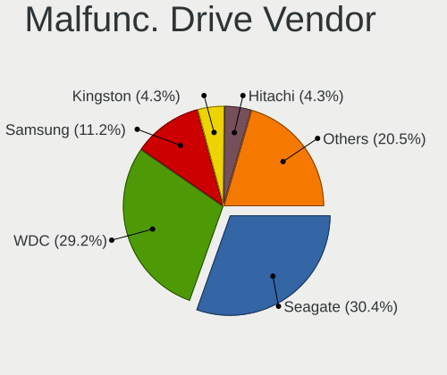

| Vendor                    | Desktops | Drives | Percent |
|---------------------------|----------|--------|---------|
| Seagate                   | 49       | 76     | 30.43%  |
| WDC                       | 47       | 60     | 29.19%  |
| Samsung Electronics       | 18       | 21     | 11.18%  |
| Kingston                  | 7        | 8      | 4.35%   |
| Hitachi                   | 7        | 7      | 4.35%   |
| Toshiba                   | 6        | 16     | 3.73%   |
| Micron Technology         | 4        | 5      | 2.48%   |
| A-DATA Technology         | 4        | 5      | 2.48%   |
| Intel                     | 2        | 2      | 1.24%   |
| HGST                      | 2        | 2      | 1.24%   |
| Crucial                   | 2        | 2      | 1.24%   |
| XPG                       | 1        | 1      | 0.62%   |
| SPCC                      | 1        | 1      | 0.62%   |
| SATAFIRM                  | 1        | 1      | 0.62%   |
| SanDisk                   | 1        | 2      | 0.62%   |
| Realtek Semiconductor     | 1        | 4      | 0.62%   |
| Patriot                   | 1        | 1      | 0.62%   |
| OCZ                       | 1        | 1      | 0.62%   |
| Neo                       | 1        | 1      | 0.62%   |
| Micron/Crucial Technology | 1        | 1      | 0.62%   |
| Maxtor                    | 1        | 1      | 0.62%   |
| HS-SSD-C100               | 1        | 1      | 0.62%   |
| Gigabyte Technology       | 1        | 1      | 0.62%   |
| ADATA Technology          | 1        | 1      | 0.62%   |

Malfunc. HDD Vendor
-------------------

Vendors of faulty HDD drives

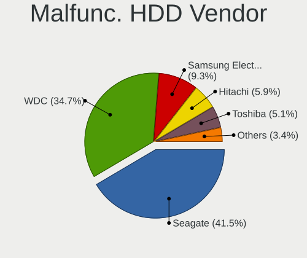

| Vendor              | Desktops | Drives | Percent |
|---------------------|----------|--------|---------|
| Seagate             | 49       | 76     | 41.53%  |
| WDC                 | 41       | 53     | 34.75%  |
| Samsung Electronics | 11       | 13     | 9.32%   |
| Hitachi             | 7        | 7      | 5.93%   |
| Toshiba             | 6        | 16     | 5.08%   |
| HGST                | 2        | 2      | 1.69%   |
| SATAFIRM            | 1        | 1      | 0.85%   |
| Maxtor              | 1        | 1      | 0.85%   |

Malfunc. Drive Kind
-------------------

Kinds of faulty drives

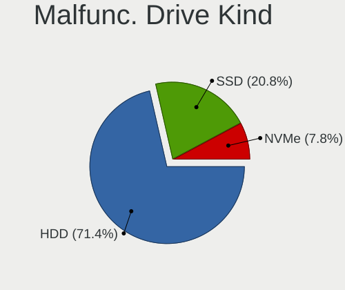

| Kind | Desktops | Drives | Percent |
|------|----------|--------|---------|
| HDD  | 110      | 169    | 71.43%  |
| SSD  | 32       | 36     | 20.78%  |
| NVMe | 12       | 16     | 7.79%   |

Failed Drives
-------------

Failed drive models

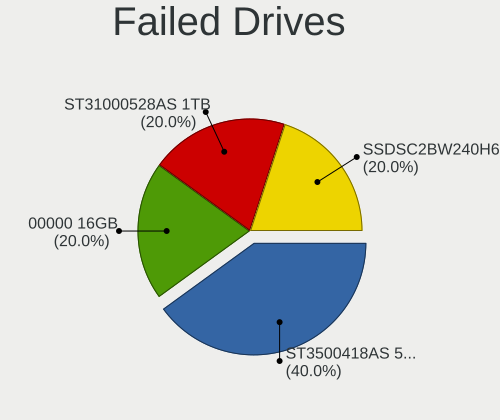

| Model                     | Desktops | Drives | Percent |
|---------------------------|----------|--------|---------|
| Seagate ST3500418AS 500GB | 2        | 4      | 40%     |
| Unknown 00000  16GB       | 1        | 1      | 20%     |
| Seagate ST31000528AS 1TB  | 1        | 1      | 20%     |
| Intel SSDSC2BW240H6 240GB | 1        | 1      | 20%     |

Failed Drive Vendor
-------------------

Failed drive vendors

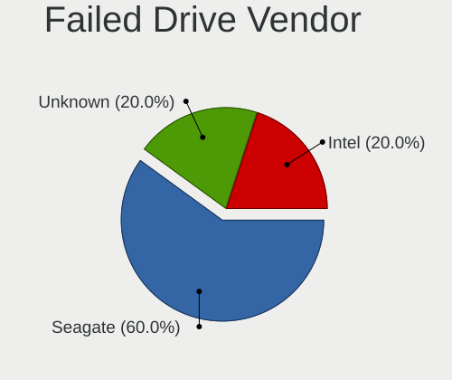

| Vendor  | Desktops | Drives | Percent |
|---------|----------|--------|---------|
| Seagate | 3        | 5      | 60%     |
| Unknown | 1        | 1      | 20%     |
| Intel   | 1        | 1      | 20%     |

Drive Status
------------

Number of failed and malfunc. drives

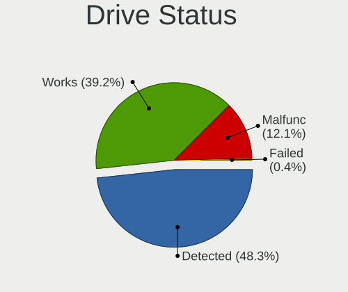

| Status   | Desktops | Drives | Percent |
|----------|----------|--------|---------|
| Detected | 587      | 1656   | 48.27%  |
| Works    | 477      | 1254   | 39.23%  |
| Malfunc  | 147      | 221    | 12.09%  |
| Failed   | 5        | 7      | 0.41%   |

Storage controller
------------------

Storage Vendor
--------------

Storage controller vendors

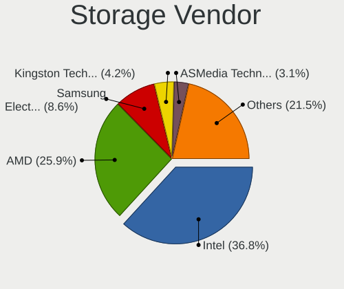

| Vendor                        | Desktops | Percent |
|-------------------------------|----------|---------|
| Intel                         | 602      | 36.8%   |
| AMD                           | 423      | 25.86%  |
| Samsung Electronics           | 141      | 8.62%   |
| Kingston Technology Company   | 68       | 4.16%   |
| ASMedia Technology            | 50       | 3.06%   |
| JMicron Technology            | 44       | 2.69%   |
| SanDisk                       | 42       | 2.57%   |
| Marvell Technology Group      | 41       | 2.51%   |
| Phison Electronics            | 37       | 2.26%   |
| Nvidia                        | 35       | 2.14%   |
| ADATA Technology              | 26       | 1.59%   |
| Micron/Crucial Technology     | 18       | 1.1%    |
| Silicon Motion                | 17       | 1.04%   |
| VIA Technologies              | 13       | 0.79%   |
| Toshiba America Info Systems  | 8        | 0.49%   |
| Realtek Semiconductor         | 8        | 0.49%   |
| MAXIO Technology (Hangzhou)   | 8        | 0.49%   |
| Seagate Technology            | 7        | 0.43%   |
| Silicon Image                 | 6        | 0.37%   |
| Micron Technology             | 6        | 0.37%   |
| SK hynix                      | 5        | 0.31%   |
| Broadcom / LSI                | 4        | 0.24%   |
| Shenzhen Longsys Electronics  | 3        | 0.18%   |
| OCZ Technology Group          | 3        | 0.18%   |
| LSI Logic / Symbios Logic     | 3        | 0.18%   |
| KIOXIA                        | 3        | 0.18%   |
| Integrated Technology Express | 3        | 0.18%   |
| Adaptec                       | 3        | 0.18%   |
| INNOGRIT                      | 2        | 0.12%   |
| Western Digital               | 1        | 0.06%   |
| TenaFe                        | 1        | 0.06%   |
| Solidigm                      | 1        | 0.06%   |
| Promise Technology            | 1        | 0.06%   |
| Hosin Global Electronics      | 1        | 0.06%   |
| Chelsio Communications        | 1        | 0.06%   |
| 3ware                         | 1        | 0.06%   |

Storage Model
-------------

Storage controller models

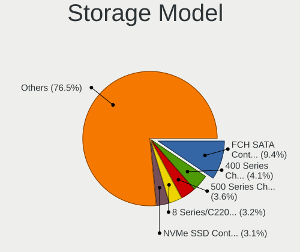

| Model                                                                                   | Desktops | Percent |
|-----------------------------------------------------------------------------------------|----------|---------|
| AMD FCH SATA Controller [AHCI mode]                                                     | 195      | 9.44%   |
| AMD 400 Series Chipset SATA Controller                                                  | 85       | 4.12%   |
| AMD 500 Series Chipset SATA Controller                                                  | 75       | 3.63%   |
| Intel 8 Series/C220 Series Chipset Family 6-port SATA Controller 1 [AHCI mode]          | 66       | 3.2%    |
| Samsung NVMe SSD Controller SM981/PM981/PM983                                           | 64       | 3.1%    |
| Intel 6 Series/C200 Series Chipset Family 6 port Desktop SATA AHCI Controller           | 58       | 2.81%   |
| Intel NM10/ICH7 Family SATA Controller [IDE mode]                                       | 57       | 2.76%   |
| AMD 600 Series Chipset SATA Controller                                                  | 48       | 2.32%   |
| Intel 200 Series PCH SATA controller [AHCI mode]                                        | 45       | 2.18%   |
| AMD SB7x0/SB8x0/SB9x0 IDE Controller                                                    | 44       | 2.13%   |
| Intel 82801G (ICH7 Family) IDE Controller                                               | 43       | 2.08%   |
| ASMedia ASM1061/ASM1062 Serial ATA Controller                                           | 43       | 2.08%   |
| AMD SB7x0/SB8x0/SB9x0 SATA Controller [AHCI mode]                                       | 38       | 1.84%   |
| Intel Q170/Q150/B150/H170/H110/Z170/CM236 Chipset SATA Controller [AHCI Mode]           | 37       | 1.79%   |
| AMD SB7x0/SB8x0/SB9x0 SATA Controller [IDE mode]                                        | 36       | 1.74%   |
| Intel SATA Controller [RAID mode]                                                       | 34       | 1.65%   |
| Kingston Company KC3000/FURY Renegade NVMe SSD [E18]                                    | 31       | 1.5%    |
| Intel Cannon Lake PCH SATA AHCI Controller                                              | 31       | 1.5%    |
| AMD 300 Series Chipset SATA Controller                                                  | 30       | 1.45%   |
| Samsung NVMe SSD Controller 980 (DRAM-less)                                             | 29       | 1.4%    |
| Intel 7 Series/C210 Series Chipset Family 6-port SATA Controller [AHCI mode]            | 29       | 1.4%    |
| Samsung NVMe SSD Controller PM9A1/PM9A3/980PRO                                          | 28       | 1.36%   |
| JMicron JMB363 SATA/IDE Controller                                                      | 28       | 1.36%   |
| Intel 82801I (ICH9 Family) 2 port SATA Controller [IDE mode]                            | 22       | 1.07%   |
| Intel Alder Lake-S PCH SATA Controller [AHCI Mode]                                      | 19       | 0.92%   |
| Kingston Company A2000 NVMe SSD [SM2263EN]                                              | 17       | 0.82%   |
| Intel 9 Series Chipset Family SATA Controller [AHCI Mode]                               | 17       | 0.82%   |
| Intel 82801JI (ICH10 Family) 4 port SATA IDE Controller #1                              | 17       | 0.82%   |
| Intel 82801JI (ICH10 Family) 2 port SATA IDE Controller #2                              | 17       | 0.82%   |
| ADATA XPG SX8200 Pro PCIe Gen3x4 M.2 2280 Solid State Drive                             | 16       | 0.77%   |
| Nvidia MCP61 SATA Controller                                                            | 15       | 0.73%   |
| Intel 6 Series/C200 Series Chipset Family Desktop SATA Controller (IDE mode, ports 4-5) | 15       | 0.73%   |
| Intel 6 Series/C200 Series Chipset Family Desktop SATA Controller (IDE mode, ports 0-3) | 15       | 0.73%   |
| AMD A320 Chipset SATA Controller [AHCI mode]                                            | 15       | 0.73%   |
| SanDisk Ultra 3D / WD PC SN530, IX SN530, Blue SN550 NVMe SSD (DRAM-less)               | 14       | 0.68%   |
| Samsung NVMe SSD Controller S4LV008[Pascal]                                             | 14       | 0.68%   |
| Phison PS5013-E13 PCIe3 NVMe Controller (DRAM-less)                                     | 14       | 0.68%   |
| Nvidia MCP61 IDE                                                                        | 14       | 0.68%   |
| Intel 82801IR/IO/IH (ICH9R/DO/DH) 4 port SATA Controller [IDE mode]                     | 13       | 0.63%   |
| Silicon Motion SM2263EN/SM2263XT (DRAM-less) NVMe SSD Controllers                       | 12       | 0.58%   |

Storage Kind
------------

Kind of storage controller (IDE, SATA, NVMe, SAS, ...)

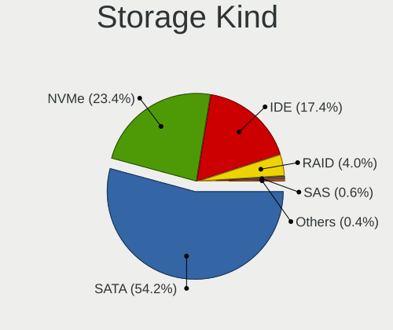

| Kind | Desktops | Percent |
|------|----------|---------|
| SATA | 849      | 54.21%  |
| NVMe | 366      | 23.37%  |
| IDE  | 273      | 17.43%  |
| RAID | 62       | 3.96%   |
| SAS  | 10       | 0.64%   |
| SCSI | 6        | 0.38%   |

Processor
---------

CPU Vendor
----------

Processor vendors

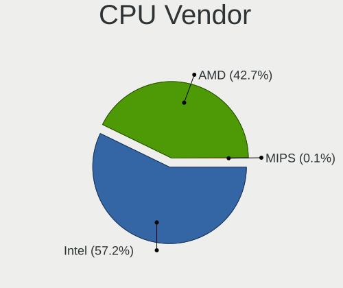

| Vendor | Desktops | Percent |
|--------|----------|---------|
| Intel  | 608      | 57.2%   |
| AMD    | 454      | 42.71%  |
| MIPS   | 1        | 0.09%   |

CPU Model
---------

Processor models

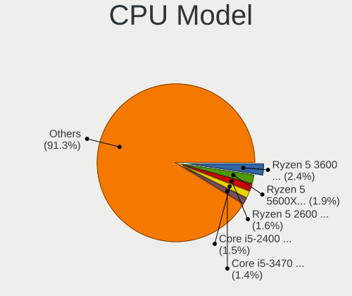

| Model                                       | Desktops | Percent |
|---------------------------------------------|----------|---------|
| AMD Ryzen 5 3600 6-Core Processor           | 26       | 2.42%   |
| AMD Ryzen 5 5600X 6-Core Processor          | 20       | 1.86%   |
| AMD Ryzen 5 2600 Six-Core Processor         | 17       | 1.58%   |
| Intel Core i5-2400 CPU @ 3.10GHz            | 16       | 1.49%   |
| Intel Core i5-3470 CPU @ 3.20GHz            | 15       | 1.39%   |
| Intel Core 2 Duo CPU E8400 @ 3.00GHz        | 15       | 1.39%   |
| AMD Ryzen 9 5900X 12-Core Processor         | 15       | 1.39%   |
| AMD Ryzen 7 3700X 8-Core Processor          | 12       | 1.12%   |
| AMD Ryzen 5 1600 Six-Core Processor         | 12       | 1.12%   |
| Intel Core i7-2600 CPU @ 3.40GHz            | 10       | 0.93%   |
| AMD Ryzen 9 3900X 12-Core Processor         | 10       | 0.93%   |
| AMD FX-6300 Six-Core Processor              | 10       | 0.93%   |
| Intel Core i5-7400 CPU @ 3.00GHz            | 9        | 0.84%   |
| Intel Core i5-6500 CPU @ 3.20GHz            | 9        | 0.84%   |
| AMD FX-8350 Eight-Core Processor            | 9        | 0.84%   |
| Intel Core i7-8700 CPU @ 3.20GHz            | 8        | 0.74%   |
| Intel Core i5-4460 CPU @ 3.20GHz            | 8        | 0.74%   |
| AMD Ryzen 7 5800X 8-Core Processor          | 8        | 0.74%   |
| AMD Ryzen 7 5700G with Radeon Graphics      | 8        | 0.74%   |
| AMD Ryzen 7 3800X 8-Core Processor          | 8        | 0.74%   |
| AMD Ryzen 7 2700X Eight-Core Processor      | 8        | 0.74%   |
| AMD Ryzen 5 2400G with Radeon Vega Graphics | 8        | 0.74%   |
| Intel Core i7-7700K CPU @ 4.20GHz           | 7        | 0.65%   |
| Intel Core i7-3770 CPU @ 3.40GHz            | 7        | 0.65%   |
| Intel Core i5-2500 CPU @ 3.30GHz            | 7        | 0.65%   |
| AMD Ryzen 7 1700 Eight-Core Processor       | 7        | 0.65%   |
| AMD Ryzen 5 7600X 6-Core Processor          | 7        | 0.65%   |
| AMD Ryzen 5 7600 6-Core Processor           | 7        | 0.65%   |
| AMD Ryzen 5 4600G with Radeon Graphics      | 7        | 0.65%   |
| Intel Pentium Dual-Core CPU E5700 @ 3.00GHz | 6        | 0.56%   |
| Intel Core i7-4790 CPU @ 3.60GHz            | 6        | 0.56%   |
| Intel Core i5-9400F CPU @ 2.90GHz           | 6        | 0.56%   |
| Intel Core i5-4590 CPU @ 3.30GHz            | 6        | 0.56%   |
| Intel Core i3-8100 CPU @ 3.60GHz            | 6        | 0.56%   |
| Intel Core i3-4130 CPU @ 3.40GHz            | 6        | 0.56%   |
| Intel Core 2 Duo CPU E8500 @ 3.16GHz        | 6        | 0.56%   |
| Intel Core 2 Duo CPU E7500 @ 2.93GHz        | 6        | 0.56%   |
| Intel Core 2 Duo CPU E6550 @ 2.33GHz        | 6        | 0.56%   |
| AMD Ryzen 9 7900X 12-Core Processor         | 6        | 0.56%   |
| AMD Ryzen 5 5600 6-Core Processor           | 6        | 0.56%   |

CPU Model Family
----------------

Processor model prefix

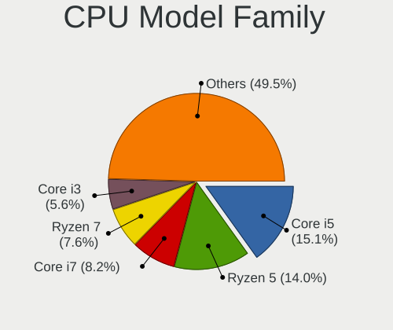

| Model                   | Desktops | Percent |
|-------------------------|----------|---------|
| Intel Core i5           | 162      | 15.11%  |
| AMD Ryzen 5             | 150      | 13.99%  |
| Intel Core i7           | 88       | 8.21%   |
| AMD Ryzen 7             | 81       | 7.56%   |
| Intel Core i3           | 60       | 5.6%    |
| Intel Core 2 Duo        | 50       | 4.66%   |
| AMD Ryzen 9             | 44       | 4.1%    |
| AMD FX                  | 42       | 3.92%   |
| Other                   | 41       | 3.82%   |
| Intel Xeon              | 39       | 3.64%   |
| Intel Pentium           | 38       | 3.54%   |
| Intel Celeron           | 37       | 3.45%   |
| Intel Pentium Dual-Core | 26       | 2.43%   |
| AMD Athlon 64 X2        | 16       | 1.49%   |
| AMD Ryzen 3             | 15       | 1.4%    |
| Intel Core 2 Quad       | 14       | 1.31%   |
| AMD Phenom II X4        | 12       | 1.12%   |
| AMD A8                  | 11       | 1.03%   |
| Intel Pentium Dual      | 10       | 0.93%   |
| Intel Atom              | 10       | 0.93%   |
| AMD Athlon              | 10       | 0.93%   |
| AMD A10                 | 10       | 0.93%   |
| Intel Core i9           | 9        | 0.84%   |
| AMD Athlon II X2        | 8        | 0.75%   |
| Intel Core 2            | 7        | 0.65%   |
| AMD A4                  | 7        | 0.65%   |
| Intel Pentium D         | 6        | 0.56%   |
| AMD Athlon 64           | 6        | 0.56%   |
| Intel Pentium 4         | 5        | 0.47%   |
| AMD Sempron             | 5        | 0.47%   |
| AMD Ryzen Threadripper  | 5        | 0.47%   |
| AMD Athlon II X4        | 5        | 0.47%   |
| Intel Pentium Silver    | 4        | 0.37%   |
| Intel Pentium Gold      | 4        | 0.37%   |
| AMD Athlon II X3        | 4        | 0.37%   |
| AMD Ryzen 7 PRO         | 3        | 0.28%   |
| AMD Ryzen 5 PRO         | 3        | 0.28%   |
| AMD Athlon Dual Core    | 3        | 0.28%   |
| AMD Ryzen 3 PRO         | 2        | 0.19%   |
| AMD Phenom II X2        | 2        | 0.19%   |

CPU Cores
---------

Number of processor cores

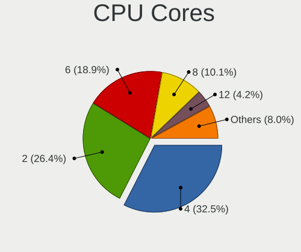

| Number  | Desktops | Percent |
|---------|----------|---------|
| 4       | 349      | 32.5%   |
| 2       | 283      | 26.35%  |
| 6       | 203      | 18.9%   |
| 8       | 108      | 10.06%  |
| 12      | 45       | 4.19%   |
| 1       | 32       | 2.98%   |
| 16      | 17       | 1.58%   |
| 3       | 15       | 1.4%    |
| 24      | 6        | 0.56%   |
| 20      | 5        | 0.47%   |
| 14      | 3        | 0.28%   |
| 10      | 3        | 0.28%   |
| Unknown | 3        | 0.28%   |
| 32      | 1        | 0.09%   |
| 18      | 1        | 0.09%   |

CPU Sockets
-----------

Number of sockets

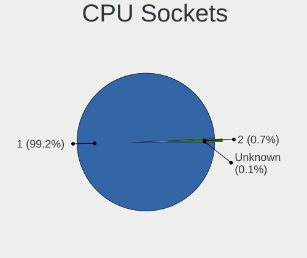

| Number  | Desktops | Percent |
|---------|----------|---------|
| 1       | 1055     | 99.25%  |
| 2       | 7        | 0.66%   |
| Unknown | 1        | 0.09%   |

CPU Threads
-----------

Threads per core (Hyper-Threading)

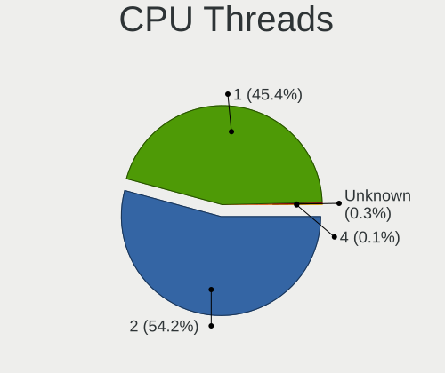

| Number  | Desktops | Percent |
|---------|----------|---------|
| 2       | 578      | 54.22%  |
| 1       | 484      | 45.4%   |
| Unknown | 3        | 0.28%   |
| 4       | 1        | 0.09%   |

CPU Op-Modes
------------

CPU Operation Modes (32-bit, 64-bit)

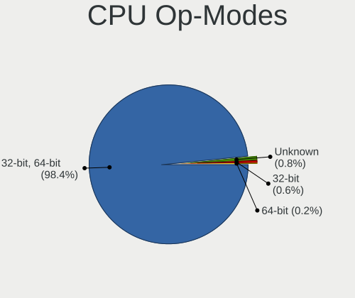

| Op mode        | Desktops | Percent |
|----------------|----------|---------|
| 32-bit, 64-bit | 1049     | 98.41%  |
| Unknown        | 9        | 0.84%   |
| 32-bit         | 6        | 0.56%   |
| 64-bit         | 2        | 0.19%   |

CPU Microcode
-------------

Microcode number

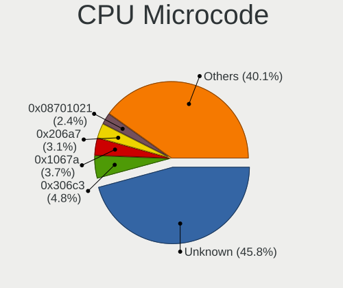

| Number     | Desktops | Percent |
|------------|----------|---------|
| Unknown    | 510      | 45.78%  |
| 0x306c3    | 54       | 4.85%   |
| 0x1067a    | 41       | 3.68%   |
| 0x206a7    | 35       | 3.14%   |
| 0x08701021 | 27       | 2.42%   |
| 0x306a9    | 21       | 1.89%   |
| 0x906ea    | 20       | 1.8%    |
| 0x506e3    | 19       | 1.71%   |
| 0x0800820d | 19       | 1.71%   |
| 0x06000852 | 19       | 1.71%   |
| 0x906e9    | 18       | 1.62%   |
| 0x6fb      | 15       | 1.35%   |
| 0x010000c8 | 15       | 1.35%   |
| 0x08701013 | 13       | 1.17%   |
| 0x08001138 | 12       | 1.08%   |
| 0x6fd      | 11       | 0.99%   |
| 0xa0653    | 9        | 0.81%   |
| 0x0a20120a | 9        | 0.81%   |
| 0x10676    | 8        | 0.72%   |
| 0x0a201016 | 8        | 0.72%   |
| 0x0a601203 | 7        | 0.63%   |
| 0x06003106 | 7        | 0.63%   |
| 0x06001119 | 7        | 0.63%   |
| 0x906eb    | 6        | 0.54%   |
| 0x0a201009 | 6        | 0.54%   |
| 0x08101016 | 6        | 0.54%   |
| 0xa0655    | 5        | 0.45%   |
| 0x0a50000c | 5        | 0.45%   |
| 0x0810100b | 5        | 0.45%   |
| 0x03000027 | 5        | 0.45%   |
| 0x010000db | 5        | 0.45%   |
| 0x906ed    | 4        | 0.36%   |
| 0x90672    | 4        | 0.36%   |
| 0x30678    | 4        | 0.36%   |
| 0x206d7    | 4        | 0.36%   |
| 0x106a5    | 4        | 0.36%   |
| 0x0a601206 | 4        | 0.36%   |
| 0x08701030 | 4        | 0.36%   |
| 0x08600106 | 4        | 0.36%   |
| 0xb0671    | 3        | 0.27%   |

CPU Microarch
-------------

Microarchitecture

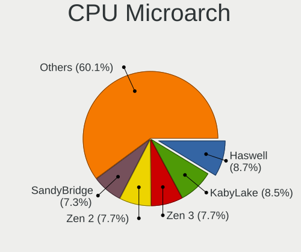

| Name             | Desktops | Percent |
|------------------|----------|---------|
| Haswell          | 93       | 8.7%    |
| KabyLake         | 91       | 8.51%   |
| Zen 3            | 82       | 7.67%   |
| Zen 2            | 82       | 7.67%   |
| SandyBridge      | 78       | 7.3%    |
| Penryn           | 76       | 7.11%   |
| Unknown          | 68       | 6.36%   |
| IvyBridge        | 52       | 4.86%   |
| Zen              | 49       | 4.58%   |
| Piledriver       | 47       | 4.4%    |
| Zen+             | 43       | 4.02%   |
| Core             | 39       | 3.65%   |
| K10              | 37       | 3.46%   |
| Skylake          | 36       | 3.37%   |
| K8 Hammer        | 28       | 2.62%   |
| CometLake        | 20       | 1.87%   |
| Alderlake Hybrid | 20       | 1.87%   |
| Westmere         | 15       | 1.4%    |
| Silvermont       | 13       | 1.22%   |
| NetBurst         | 13       | 1.22%   |
| Nehalem          | 13       | 1.22%   |
| Steamroller      | 10       | 0.94%   |
| Goldmont plus    | 8        | 0.75%   |
| Bonnell          | 8        | 0.75%   |
| Excavator        | 7        | 0.65%   |
| Bulldozer        | 6        | 0.56%   |
| Broadwell        | 6        | 0.56%   |
| K10 Llano        | 5        | 0.47%   |
| Jaguar           | 5        | 0.47%   |
| Gracemont        | 4        | 0.37%   |
| Goldmont         | 4        | 0.37%   |
| Icelake          | 3        | 0.28%   |
| Puma             | 2        | 0.19%   |
| Bobcat           | 2        | 0.19%   |
| Tremont          | 1        | 0.09%   |
| TigerLake        | 1        | 0.09%   |
| P6               | 1        | 0.09%   |
| K6               | 1        | 0.09%   |

Graphics
--------

GPU Vendor
----------

Vendors of graphics cards

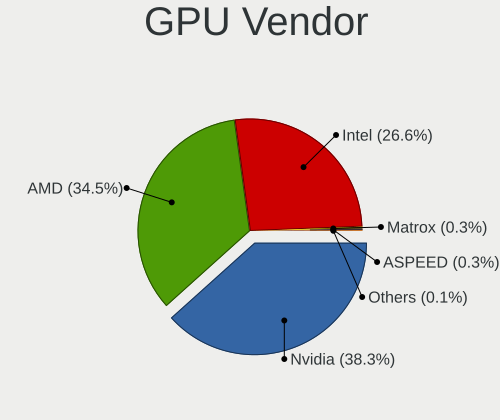

| Vendor                     | Desktops | Percent |
|----------------------------|----------|---------|
| Nvidia                     | 436      | 38.35%  |
| AMD                        | 392      | 34.48%  |
| Intel                      | 302      | 26.56%  |
| Matrox Electronics Systems | 3        | 0.26%   |
| ASPEED Technology          | 3        | 0.26%   |
| VIA Technologies           | 1        | 0.09%   |

GPU Model
---------

Graphics card models

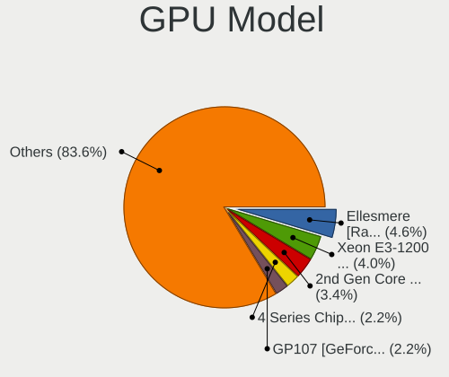

| Model                                                                       | Desktops | Percent |
|-----------------------------------------------------------------------------|----------|---------|
| AMD Ellesmere [Radeon RX 470/480/570/570X/580/580X/590]                     | 56       | 4.64%   |
| Intel Xeon E3-1200 v3/4th Gen Core Processor Integrated Graphics Controller | 48       | 3.98%   |
| Intel 2nd Generation Core Processor Family Integrated Graphics Controller   | 41       | 3.4%    |
| Intel 4 Series Chipset Integrated Graphics Controller                       | 27       | 2.24%   |
| Nvidia GP107 [GeForce GTX 1050 Ti]                                          | 26       | 2.15%   |
| AMD Raphael                                                                 | 26       | 2.15%   |
| Nvidia GP106 [GeForce GTX 1060 6GB]                                         | 20       | 1.66%   |
| Intel Xeon E3-1200 v2/3rd Gen Core processor Graphics Controller            | 20       | 1.66%   |
| Intel CoffeeLake-S GT2 [UHD Graphics 630]                                   | 20       | 1.66%   |
| Nvidia GP106 [GeForce GTX 1060 3GB]                                         | 18       | 1.49%   |
| Nvidia GK208B [GeForce GT 710]                                              | 18       | 1.49%   |
| Nvidia GP108 [GeForce GT 1030]                                              | 17       | 1.41%   |
| Intel Kaby Lake-S GT2 [HD Graphics 630]                                     | 17       | 1.41%   |
| AMD Navi 22 [Radeon RX 6700/6700 XT/6750 XT / 6800M/6850M XT]               | 17       | 1.41%   |
| Nvidia GK208B [GeForce GT 730]                                              | 16       | 1.33%   |
| Intel Skylake-S GT2 [HD Graphics 530]                                       | 16       | 1.33%   |
| Nvidia GP107 [GeForce GTX 1050]                                             | 14       | 1.16%   |
| AMD Raven Ridge [Radeon Vega Series / Radeon Vega Mobile Series]            | 13       | 1.08%   |
| AMD Baffin [Radeon RX 550 640SP / RX 560/560X]                              | 13       | 1.08%   |
| AMD Navi 31 [Radeon RX 7900 XT/7900 XTX/7900 GRE/7900M]                     | 12       | 0.99%   |
| AMD Lexa PRO [Radeon 540/540X/550/550X / RX 540X/550/550X]                  | 12       | 0.99%   |
| Nvidia GP104 [GeForce GTX 1070]                                             | 11       | 0.91%   |
| Nvidia GM107 [GeForce GTX 750 Ti]                                           | 11       | 0.91%   |
| AMD Cezanne [Radeon Vega Series / Radeon Vega Mobile Series]                | 11       | 0.91%   |
| AMD Baffin [Radeon RX 460/560D / Pro 450/455/460/555/555X/560/560X]         | 11       | 0.91%   |
| Nvidia GM206 [GeForce GTX 960]                                              | 10       | 0.83%   |
| Nvidia TU117 [GeForce GTX 1650]                                             | 9        | 0.75%   |
| Intel Atom Processor Z36xxx/Z37xxx Series Graphics & Display                | 9        | 0.75%   |
| Intel Alder Lake-S GT1 [UHD Graphics 770]                                   | 9        | 0.75%   |
| Intel 4th Generation Core Processor Family Integrated Graphics Controller   | 9        | 0.75%   |
| AMD Navi 23 [Radeon RX 6600/6600 XT/6600M]                                  | 9        | 0.75%   |
| AMD Navi 10 [Radeon RX 5600 OEM/5600 XT / 5700/5700 XT]                     | 9        | 0.75%   |
| AMD Caicos [Radeon HD 6450/7450/8450 / R5 230 OEM]                          | 9        | 0.75%   |
| Nvidia GT218 [GeForce 210]                                                  | 8        | 0.66%   |
| Nvidia GA106 [GeForce RTX 3060 Lite Hash Rate]                              | 8        | 0.66%   |
| Intel CometLake-S GT2 [UHD Graphics 630]                                    | 8        | 0.66%   |
| AMD Navi 32 [Radeon RX 7700 XT / 7800 XT]                                   | 8        | 0.66%   |
| AMD Granite Ridge [Radeon Graphics]                                         | 8        | 0.66%   |
| Nvidia GP104 [GeForce GTX 1080]                                             | 7        | 0.58%   |
| Nvidia GF119 [GeForce GT 610]                                               | 7        | 0.58%   |

GPU Combo
---------

Combinations of graphics cards

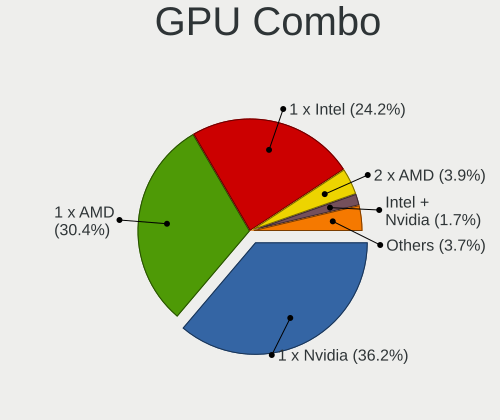

| Name           | Desktops | Percent |
|----------------|----------|---------|
| 1 x Nvidia     | 392      | 36.2%   |
| 1 x AMD        | 329      | 30.38%  |
| 1 x Intel      | 262      | 24.19%  |
| 2 x AMD        | 42       | 3.88%   |
| Intel + Nvidia | 18       | 1.66%   |
| AMD + Nvidia   | 15       | 1.39%   |
| Intel + AMD    | 7        | 0.65%   |
| 2 x Nvidia     | 6        | 0.55%   |
| 1 x Matrox     | 3        | 0.28%   |
| 1 x ASPEED     | 3        | 0.28%   |
| 3 x Nvidia     | 2        | 0.18%   |
| 2 x Intel      | 2        | 0.18%   |
| Other          | 1        | 0.09%   |
| 1 x VIA        | 1        | 0.09%   |

GPU Driver
----------

Free vs proprietary

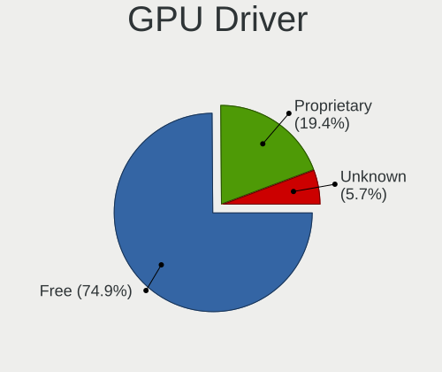

| Driver      | Desktops | Percent |
|-------------|----------|---------|
| Free        | 817      | 74.89%  |
| Proprietary | 212      | 19.43%  |
| Unknown     | 62       | 5.68%   |

GPU Memory
----------

Total video memory

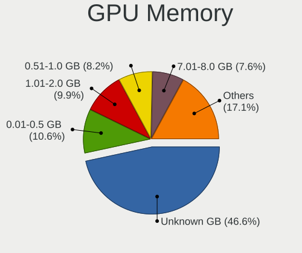

| Size in GB | Desktops | Percent |
|------------|----------|---------|
| Unknown    | 518      | 46.62%  |
| 0.01-0.5   | 118      | 10.62%  |
| 1.01-2.0   | 110      | 9.9%    |
| 0.51-1.0   | 91       | 8.19%   |
| 7.01-8.0   | 84       | 7.56%   |
| 3.01-4.0   | 83       | 7.47%   |
| 8.01-16.0  | 44       | 3.96%   |
| 5.01-6.0   | 28       | 2.52%   |
| 2.01-3.0   | 22       | 1.98%   |
| 16.01-24.0 | 11       | 0.99%   |
| 4.01-5.0   | 2        | 0.18%   |

Monitor
-------

Monitor Vendor
--------------

Monitor vendors

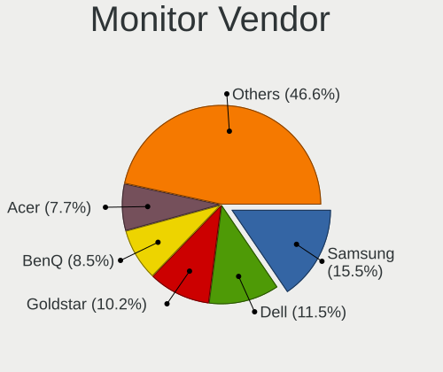

| Vendor               | Desktops | Percent |
|----------------------|----------|---------|
| Samsung Electronics  | 180      | 15.5%   |
| Dell                 | 134      | 11.54%  |
| Goldstar             | 118      | 10.16%  |
| BenQ                 | 99       | 8.53%   |
| Acer                 | 89       | 7.67%   |
| Hewlett-Packard      | 74       | 6.37%   |
| Philips              | 72       | 6.2%    |
| AOC                  | 71       | 6.12%   |
| Ancor Communications | 45       | 3.88%   |
| Iiyama               | 31       | 2.67%   |
| Eizo                 | 24       | 2.07%   |
| MSI                  | 23       | 1.98%   |
| Lenovo               | 20       | 1.72%   |
| Fujitsu Siemens      | 19       | 1.64%   |
| ASUSTek Computer     | 19       | 1.64%   |
| Sony                 | 16       | 1.38%   |
| Vestel Elektronik    | 11       | 0.95%   |
| NEC Computers        | 11       | 0.95%   |
| ViewSonic            | 10       | 0.86%   |
| Panasonic            | 10       | 0.86%   |
| Unknown              | 9        | 0.78%   |
| LG Electronics       | 6        | 0.52%   |
| Arnos Instruments    | 6        | 0.52%   |
| Gigabyte Technology  | 5        | 0.43%   |
| Belinea              | 4        | 0.34%   |
| Sharp                | 3        | 0.26%   |
| MiTAC                | 3        | 0.26%   |
| Lenovo Group Limited | 3        | 0.26%   |
| Unknown (XXX)        | 2        | 0.17%   |
| Packard Bell         | 2        | 0.17%   |
| Onkyo                | 2        | 0.17%   |
| MStar                | 2        | 0.17%   |
| Lanix                | 2        | 0.17%   |
| JVC                  | 2        | 0.17%   |
| CON                  | 2        | 0.17%   |
| CHR                  | 2        | 0.17%   |
| ___                  | 1        | 0.09%   |
| Wacom                | 1        | 0.09%   |
| VIZTA                | 1        | 0.09%   |
| Vestel               | 1        | 0.09%   |

Monitor Model
-------------

Monitor models

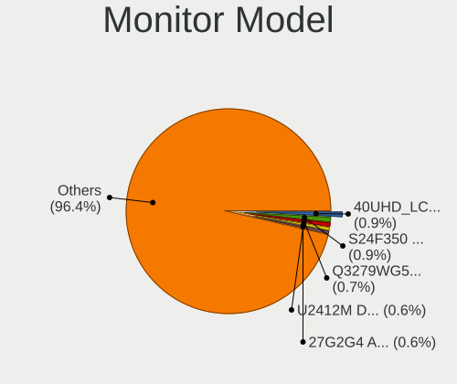

| Model                                                                | Desktops | Percent |
|----------------------------------------------------------------------|----------|---------|
| Vestel Elektronik 40UHD_LCD_TV VES3700 3840x2160 880x500mm 39.8-inch | 11       | 0.88%   |
| Samsung Electronics S24F350 SAM0D20 1920x1080 521x293mm 23.5-inch    | 11       | 0.88%   |
| AOC Q3279WG5B AOC3279 2560x1440 725x428mm 33.1-inch                  | 9        | 0.72%   |
| Dell U2412M DELA07A 1920x1200 518x324mm 24.1-inch                    | 7        | 0.56%   |
| AOC 27G2G4 AOC2702 1920x1080 598x336mm 27.0-inch                     | 7        | 0.56%   |
| Philips PHL 243V7 PHLC155 1920x1080 527x296mm 23.8-inch              | 6        | 0.48%   |
| BenQ GW2470 BNQ78D9 1920x1080 527x296mm 23.8-inch                    | 6        | 0.48%   |
| BenQ G2220HDA BNQ7820 1920x1080 477x268mm 21.5-inch                  | 6        | 0.48%   |
| BenQ G2220HD BNQ7821 1920x1080 477x268mm 21.5-inch                   | 6        | 0.48%   |
| Samsung Electronics C24F390 SAM0D2C 1920x1080 521x293mm 23.5-inch    | 5        | 0.4%    |
| Philips PHL 273V5 PHLC0D2 1920x1080 598x336mm 27.0-inch              | 5        | 0.4%    |
| Panasonic TV MEIA296 1920x1080 698x392mm 31.5-inch                   | 5        | 0.4%    |
| Goldstar L227W GSM566E 1680x1050 474x296mm 22.0-inch                 | 5        | 0.4%    |
| BenQ GL2460 BNQ78CE 1920x1080 531x299mm 24.0-inch                    | 5        | 0.4%    |
| Unknown LCD Monitor FFFF 2288x1287 2550x2550mm 142.0-inch            | 4        | 0.32%   |
| Samsung Electronics S22C450 SAM09C7 1680x1050 473x291mm 21.9-inch    | 4        | 0.32%   |
| Samsung Electronics LS27AG55x SAM71E1 2560x1440 597x336mm 27.0-inch  | 4        | 0.32%   |
| Samsung Electronics C27F390 SAM0D32 1920x1080 598x336mm 27.0-inch    | 4        | 0.32%   |
| Philips PHL 273V7 PHLC156 1920x1080 598x336mm 27.0-inch              | 4        | 0.32%   |
| Philips PHL 243V5 PHLC0D1 1920x1080 521x293mm 23.5-inch              | 4        | 0.32%   |
| Iiyama PL4840 IVM1065 1920x1080 1054x593mm 47.6-inch                 | 4        | 0.32%   |
| Dell P2419H DELD0D9 1920x1080 527x296mm 23.8-inch                    | 4        | 0.32%   |
| Dell P190S DEL405B 1280x1024 376x301mm 19.0-inch                     | 4        | 0.32%   |
| Dell G3223Q DEL428C 3840x2160 708x399mm 32.0-inch                    | 4        | 0.32%   |
| AOC Q2770 AOC2770 2560x1440 597x336mm 27.0-inch                      | 4        | 0.32%   |
| AOC 24G2W1G3 AOC2402 1920x1080 527x296mm 23.8-inch                   | 4        | 0.32%   |
| AOC 2460G5 AOC246A 1920x1080 531x299mm 24.0-inch                     | 4        | 0.32%   |
| Sony TV SNY7001 1920x1080                                            | 3        | 0.24%   |
| Samsung Electronics SyncMaster SAM05C8 1920x1080 521x293mm 23.5-inch | 3        | 0.24%   |
| Samsung Electronics SyncMaster SAM0420 1680x1050 474x296mm 22.0-inch | 3        | 0.24%   |
| Samsung Electronics SyncMaster SAM03D0 1440x900 410x257mm 19.1-inch  | 3        | 0.24%   |
| Samsung Electronics SyncMaster SAM0373 1680x1050 459x296mm 21.5-inch | 3        | 0.24%   |
| Philips PHL 276E8V PHLC18F 3840x2160 597x336mm 27.0-inch             | 3        | 0.24%   |
| Philips PHL 223V7 PHLC154 1920x1080 476x268mm 21.5-inch              | 3        | 0.24%   |
| Philips FTV PHL04C3 1920x1080 1440x810mm 65.0-inch                   | 3        | 0.24%   |
| Panasonic TV MEIC303 1920x1080 698x392mm 31.5-inch                   | 3        | 0.24%   |
| Lenovo LEN P27u-10 LEN61B0 3840x2160 597x336mm 27.0-inch             | 3        | 0.24%   |
| Lenovo LEN L220xwC LEN1151 1920x1200 474x296mm 22.0-inch             | 3        | 0.24%   |
| Iiyama PL2488H IVM611A 1920x1080 531x299mm 24.0-inch                 | 3        | 0.24%   |
| Hewlett-Packard LP2065 HWP0A72 1600x1200 408x306mm 20.1-inch         | 3        | 0.24%   |

Monitor Resolution
------------------

Monitor screen resolution

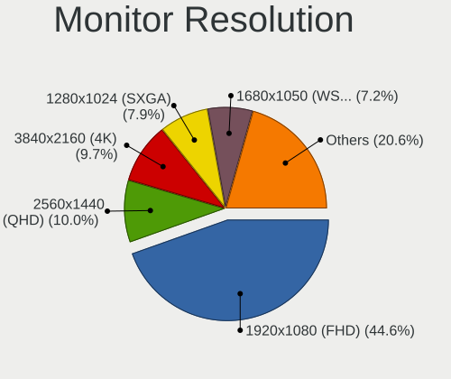

| Resolution         | Desktops | Percent |
|--------------------|----------|---------|
| 1920x1080 (FHD)    | 501      | 44.57%  |
| 2560x1440 (QHD)    | 112      | 9.96%   |
| 3840x2160 (4K)     | 109      | 9.7%    |
| 1280x1024 (SXGA)   | 89       | 7.92%   |
| 1680x1050 (WSXGA+) | 81       | 7.21%   |
| 1920x1200 (WUXGA)  | 48       | 4.27%   |
| 1440x900 (WXGA+)   | 26       | 2.31%   |
| 3440x1440          | 23       | 2.05%   |
| 1366x768 (WXGA)    | 16       | 1.42%   |
| Unknown            | 14       | 1.25%   |
| 3840x1080          | 13       | 1.16%   |
| 2560x1080          | 11       | 0.98%   |
| 1024x768 (XGA)     | 10       | 0.89%   |
| 1600x900 (HD+)     | 9        | 0.8%    |
| 1600x1200          | 9        | 0.8%    |
| 1360x768           | 8        | 0.71%   |
| 2288x1287          | 7        | 0.62%   |
| 1280x720 (HD)      | 6        | 0.53%   |
| 1920x540           | 5        | 0.44%   |
| 2560x1600          | 4        | 0.36%   |
| 1400x1050          | 4        | 0.36%   |
| 6400x2160          | 2        | 0.18%   |
| 3840x1600          | 2        | 0.18%   |
| 1280x768           | 2        | 0.18%   |
| 9600x2160          | 1        | 0.09%   |
| 7680x2160          | 1        | 0.09%   |
| 7680x1080          | 1        | 0.09%   |
| 640x480            | 1        | 0.09%   |
| 6400x1440          | 1        | 0.09%   |
| 6080x1440          | 1        | 0.09%   |
| 5840x1440          | 1        | 0.09%   |
| 5520x1080          | 1        | 0.09%   |
| 4240x1440          | 1        | 0.09%   |
| 3840x2560          | 1        | 0.09%   |
| 3286x1080          | 1        | 0.09%   |
| 2048x1152          | 1        | 0.09%   |
| 1024x600           | 1        | 0.09%   |

Monitor Diagonal
----------------

Diagonal size in inches

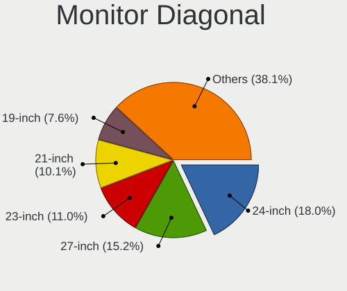

| Inches  | Desktops | Percent |
|---------|----------|---------|
| 24      | 210      | 17.99%  |
| 27      | 177      | 15.17%  |
| 23      | 128      | 10.97%  |
| 21      | 118      | 10.11%  |
| 19      | 89       | 7.63%   |
| Unknown | 71       | 6.08%   |
| 22      | 57       | 4.88%   |
| 31      | 56       | 4.8%    |
| 17      | 30       | 2.57%   |
| 34      | 29       | 2.49%   |
| 20      | 27       | 2.31%   |
| 84      | 23       | 1.97%   |
| 18      | 21       | 1.8%    |
| 32      | 15       | 1.29%   |
| 72      | 11       | 0.94%   |
| 33      | 10       | 0.86%   |
| 25      | 10       | 0.86%   |
| 15      | 10       | 0.86%   |
| 54      | 7        | 0.6%    |
| 40      | 7        | 0.6%    |
| 26      | 6        | 0.51%   |
| 65      | 5        | 0.43%   |
| 28      | 5        | 0.43%   |
| 142     | 4        | 0.34%   |
| 48      | 4        | 0.34%   |
| 47      | 4        | 0.34%   |
| 46      | 4        | 0.34%   |
| 42      | 4        | 0.34%   |
| 39      | 4        | 0.34%   |
| 29      | 4        | 0.34%   |
| 63      | 3        | 0.26%   |
| 52      | 3        | 0.26%   |
| 49      | 2        | 0.17%   |
| 37      | 2        | 0.17%   |
| 75      | 1        | 0.09%   |
| 74      | 1        | 0.09%   |
| 59      | 1        | 0.09%   |
| 43      | 1        | 0.09%   |
| 38      | 1        | 0.09%   |
| 13      | 1        | 0.09%   |

Monitor Width
-------------

Physical width

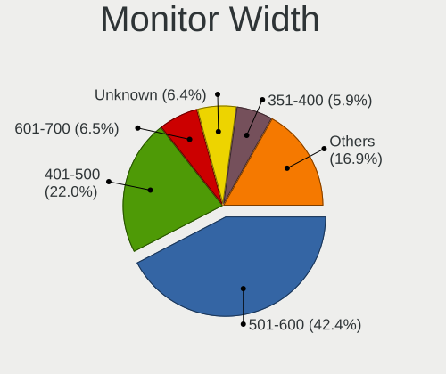

| Width in mm    | Desktops | Percent |
|----------------|----------|---------|
| 501-600        | 472      | 42.37%  |
| 401-500        | 245      | 21.99%  |
| 601-700        | 72       | 6.46%   |
| Unknown        | 71       | 6.37%   |
| 351-400        | 66       | 5.92%   |
| 701-800        | 52       | 4.67%   |
| 301-350        | 41       | 3.68%   |
| 1501-2000      | 36       | 3.23%   |
| 1001-1500      | 33       | 2.96%   |
| 801-900        | 16       | 1.44%   |
| 901-1000       | 5        | 0.45%   |
| More than 2000 | 4        | 0.36%   |
| 101-200        | 1        | 0.09%   |

Aspect Ratio
------------

Proportional relationship between the width and the height

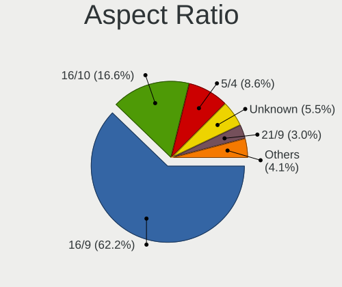

| Ratio   | Desktops | Percent |
|---------|----------|---------|
| 16/9    | 670      | 62.21%  |
| 16/10   | 179      | 16.62%  |
| 5/4     | 93       | 8.64%   |
| Unknown | 59       | 5.48%   |
| 21/9    | 32       | 2.97%   |
| 4/3     | 26       | 2.41%   |
| 32/9    | 7        | 0.65%   |
| 3/2     | 7        | 0.65%   |
| 1.00    | 4        | 0.37%   |

Monitor Area
------------

Area in inch²

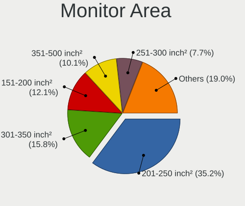

| Area in inch² | Desktops | Percent |
|----------------|----------|---------|
| 201-250        | 405      | 35.22%  |
| 301-350        | 182      | 15.83%  |
| 151-200        | 139      | 12.09%  |
| 351-500        | 116      | 10.09%  |
| 251-300        | 89       | 7.74%   |
| Unknown        | 71       | 6.17%   |
| More than 1000 | 59       | 5.13%   |
| 141-150        | 44       | 3.83%   |
| 501-1000       | 33       | 2.87%   |
| 101-110        | 9        | 0.78%   |
| 81-90          | 1        | 0.09%   |
| 41-50          | 1        | 0.09%   |
| 91-100         | 1        | 0.09%   |

Pixel Density
-------------

Pixels per inch

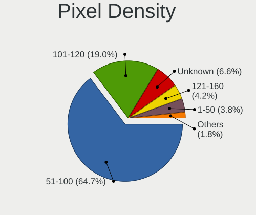

| Density | Desktops | Percent |
|---------|----------|---------|
| 51-100  | 698      | 64.69%  |
| 101-120 | 205      | 19%     |
| Unknown | 71       | 6.58%   |
| 121-160 | 45       | 4.17%   |
| 1-50    | 41       | 3.8%    |
| 161-240 | 19       | 1.76%   |

Multiple Monitors
-----------------

Total monitors connected

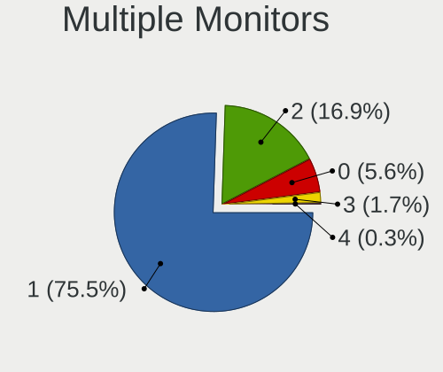

| Total | Desktops | Percent |
|-------|----------|---------|
| 1     | 824      | 75.53%  |
| 2     | 184      | 16.87%  |
| 0     | 61       | 5.59%   |
| 3     | 19       | 1.74%   |
| 4     | 3        | 0.27%   |

Network
-------

Net Controller Vendor
---------------------

Controller vendors

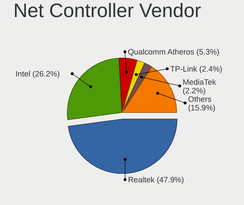

| Vendor                                 | Desktops | Percent |
|----------------------------------------|----------|---------|
| Realtek Semiconductor                  | 683      | 47.9%   |
| Intel                                  | 374      | 26.23%  |
| Qualcomm Atheros                       | 76       | 5.33%   |
| TP-Link                                | 34       | 2.38%   |
| MediaTek                               | 32       | 2.24%   |
| Nvidia                                 | 28       | 1.96%   |
| Broadcom                               | 28       | 1.96%   |
| Qualcomm Atheros Communications        | 21       | 1.47%   |
| Ralink Technology                      | 20       | 1.4%    |
| Marvell Technology Group               | 18       | 1.26%   |
| Microsoft                              | 9        | 0.63%   |
| Broadcom Limited                       | 9        | 0.63%   |
| Ralink                                 | 8        | 0.56%   |
| ASUSTek Computer                       | 8        | 0.56%   |
| Aquantia                               | 8        | 0.56%   |
| VIA Technologies                       | 5        | 0.35%   |
| Edimax Technology                      | 5        | 0.35%   |
| D-Link                                 | 5        | 0.35%   |
| Xiaomi                                 | 4        | 0.28%   |
| Samsung Electronics                    | 4        | 0.28%   |
| ZyDAS                                  | 3        | 0.21%   |
| Qualcomm                               | 3        | 0.21%   |
| OnePlus Technology (Shenzhen)          | 3        | 0.21%   |
| ASIX Electronics                       | 3        | 0.21%   |
| ZyXEL Communications                   | 2        | 0.14%   |
| NetGear                                | 2        | 0.14%   |
| Mercucys                               | 2        | 0.14%   |
| Huawei Technologies                    | 2        | 0.14%   |
| Google                                 | 2        | 0.14%   |
| DisplayLink                            | 2        | 0.14%   |
| D-Link System                          | 2        | 0.14%   |
| American Megatrends                    | 2        | 0.14%   |
| Texas Instruments                      | 1        | 0.07%   |
| Suzhou Motorcomm Electronic Technology | 1        | 0.07%   |
| Sundance Technology Inc / IC Plus      | 1        | 0.07%   |
| STMicroelectronics                     | 1        | 0.07%   |
| SIEMENS                                | 1        | 0.07%   |
| Seeed Technology                       | 1        | 0.07%   |
| Prusa                                  | 1        | 0.07%   |
| MICRORISC                              | 1        | 0.07%   |

Net Controller Model
--------------------

Controller models

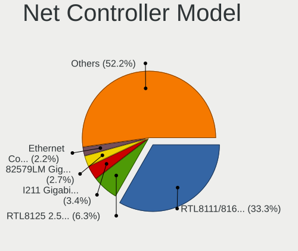

| Model                                                                  | Desktops | Percent |
|------------------------------------------------------------------------|----------|---------|
| Realtek RTL8111/8168/8211/8411 PCI Express Gigabit Ethernet Controller | 526      | 33.29%  |
| Realtek RTL8125 2.5GbE Controller                                      | 100      | 6.33%   |
| Intel I211 Gigabit Network Connection                                  | 54       | 3.42%   |
| Intel 82579LM Gigabit Network Connection (Lewisville)                  | 42       | 2.66%   |
| Intel Ethernet Connection (2) I219-V                                   | 34       | 2.15%   |
| Intel Wi-Fi 6 AX200                                                    | 32       | 2.03%   |
| Intel Ethernet Controller I225-V                                       | 30       | 1.9%    |
| Intel Ethernet Connection I217-LM                                      | 26       | 1.65%   |
| Intel Ethernet Connection (7) I219-V                                   | 19       | 1.2%    |
| Qualcomm Atheros AR9271 802.11n                                        | 18       | 1.14%   |
| Realtek RTL-8100/8101L/8139 PCI Fast Ethernet Adapter                  | 17       | 1.08%   |
| Realtek RTL810xE PCI Express Fast Ethernet controller                  | 15       | 0.95%   |
| Qualcomm Atheros Killer E220x Gigabit Ethernet Controller              | 15       | 0.95%   |
| TP-Link TL-WN722N v2/v3 [Realtek RTL8188EUS]                           | 14       | 0.89%   |
| Intel Wi-Fi 6E(802.11ax) AX210/AX1675* 2x2 [Typhoon Peak]              | 14       | 0.89%   |
| Realtek RTL8153 Gigabit Ethernet Adapter                               | 13       | 0.82%   |
| Intel 82567LM-3 Gigabit Network Connection                             | 13       | 0.82%   |
| MediaTek MT7922 802.11ax PCI Express Wireless Network Adapter          | 12       | 0.76%   |
| Intel 82579V Gigabit Network Connection                                | 12       | 0.76%   |
| Realtek RTL8188EUS 802.11n Wireless Network Adapter                    | 11       | 0.7%    |
| Intel Ethernet Connection (2) I218-V                                   | 11       | 0.7%    |
| Intel Wi-Fi 5(802.11ac) Wireless-AC 9x6x [Thunder Peak]                | 10       | 0.63%   |
| Intel 82566DM-2 Gigabit Network Connection                             | 10       | 0.63%   |
| Nvidia MCP61 Ethernet                                                  | 9        | 0.57%   |
| Marvell Group 88E8056 PCI-E Gigabit Ethernet Controller                | 9        | 0.57%   |
| Intel Dual Band Wireless-AC 3168NGW [Stone Peak]                       | 9        | 0.57%   |
| Ralink MT7601U Wireless Adapter                                        | 8        | 0.51%   |
| Qualcomm Atheros AR8131 Gigabit Ethernet                               | 8        | 0.51%   |
| Intel I210 Gigabit Network Connection                                  | 8        | 0.51%   |
| Realtek RTL8822BE 802.11a/b/g/n/ac WiFi adapter                        | 7        | 0.44%   |
| Ralink RT5370 Wireless Adapter                                         | 7        | 0.44%   |
| Qualcomm Atheros AR8161 Gigabit Ethernet                               | 7        | 0.44%   |
| Intel 82574L Gigabit Network Connection                                | 7        | 0.44%   |
| Realtek RTL8852BE PCIe 802.11ax Wireless Network Controller            | 6        | 0.38%   |
| Realtek RTL8192CE PCIe Wireless Network Adapter                        | 6        | 0.38%   |
| Realtek 802.11ac NIC                                                   | 6        | 0.38%   |
| Qualcomm Atheros AR8151 v2.0 Gigabit Ethernet                          | 6        | 0.38%   |
| Microsoft Xbox Wireless Adapter for Windows                            | 6        | 0.38%   |
| Marvell Group 88E8001 Gigabit Ethernet Controller                      | 6        | 0.38%   |
| Intel Ethernet Connection (2) I219-LM                                  | 6        | 0.38%   |

Wireless Vendor
---------------

Wireless vendors

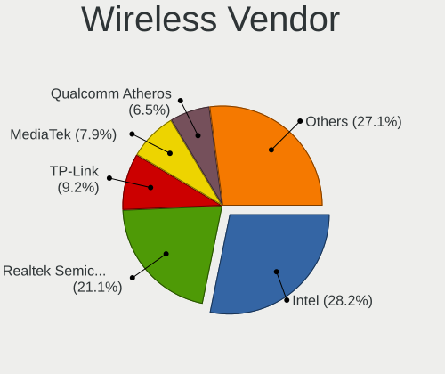

| Vendor                          | Desktops | Percent |
|---------------------------------|----------|---------|
| Intel                           | 104      | 28.18%  |
| Realtek Semiconductor           | 78       | 21.14%  |
| TP-Link                         | 34       | 9.21%   |
| MediaTek                        | 29       | 7.86%   |
| Qualcomm Atheros                | 24       | 6.5%    |
| Qualcomm Atheros Communications | 21       | 5.69%   |
| Ralink Technology               | 20       | 5.42%   |
| Microsoft                       | 9        | 2.44%   |
| Broadcom                        | 9        | 2.44%   |
| Ralink                          | 8        | 2.17%   |
| ASUSTek Computer                | 7        | 1.9%    |
| Edimax Technology               | 5        | 1.36%   |
| D-Link                          | 5        | 1.36%   |
| ZyDAS                           | 3        | 0.81%   |
| ZyXEL Communications            | 2        | 0.54%   |
| NetGear                         | 2        | 0.54%   |
| Mercucys                        | 2        | 0.54%   |
| Texas Instruments               | 1        | 0.27%   |
| Samsung Electronics             | 1        | 0.27%   |
| Marvell Technology Group        | 1        | 0.27%   |
| LG Electronics                  | 1        | 0.27%   |
| Intersil                        | 1        | 0.27%   |
| D-Link System                   | 1        | 0.27%   |
| Broadcom Limited                | 1        | 0.27%   |

Wireless Model
--------------

Wireless models

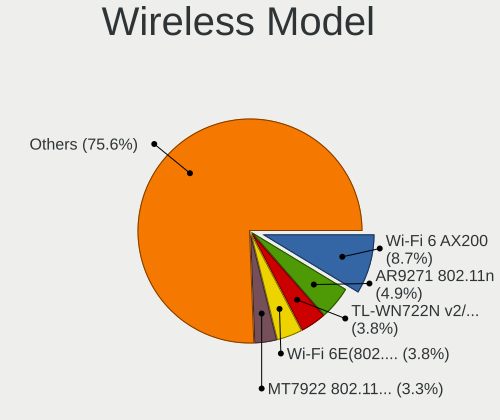

| Model                                                                         | Desktops | Percent |
|-------------------------------------------------------------------------------|----------|---------|
| Intel Wi-Fi 6 AX200                                                           | 32       | 8.67%   |
| Qualcomm Atheros AR9271 802.11n                                               | 18       | 4.88%   |
| TP-Link TL-WN722N v2/v3 [Realtek RTL8188EUS]                                  | 14       | 3.79%   |
| Intel Wi-Fi 6E(802.11ax) AX210/AX1675* 2x2 [Typhoon Peak]                     | 14       | 3.79%   |
| MediaTek MT7922 802.11ax PCI Express Wireless Network Adapter                 | 12       | 3.25%   |
| Realtek RTL8188EUS 802.11n Wireless Network Adapter                           | 11       | 2.98%   |
| Intel Wi-Fi 5(802.11ac) Wireless-AC 9x6x [Thunder Peak]                       | 10       | 2.71%   |
| Intel Dual Band Wireless-AC 3168NGW [Stone Peak]                              | 9        | 2.44%   |
| Ralink MT7601U Wireless Adapter                                               | 8        | 2.17%   |
| Realtek RTL8822BE 802.11a/b/g/n/ac WiFi adapter                               | 7        | 1.9%    |
| Ralink RT5370 Wireless Adapter                                                | 7        | 1.9%    |
| Realtek RTL8192CE PCIe Wireless Network Adapter                               | 6        | 1.63%   |
| Realtek 802.11ac NIC                                                          | 6        | 1.63%   |
| Microsoft Xbox Wireless Adapter for Windows                                   | 6        | 1.63%   |
| Intel Cannon Lake PCH CNVi WiFi                                               | 6        | 1.63%   |
| Intel 700 Series Chipset CNVi WiFi                                            | 6        | 1.63%   |
| TP-Link Archer T2U PLUS [RTL8821AU]                                           | 5        | 1.36%   |
| Realtek RTL8852CE PCIe 802.11ax Wireless Network Controller                   | 5        | 1.36%   |
| Realtek RTL8852BE PCIe 802.11ax Wireless Network Controller                   | 5        | 1.36%   |
| Realtek RTL8821CE 802.11ac PCIe Wireless Network Adapter                      | 5        | 1.36%   |
| Realtek RTL8192EE PCIe Wireless Network Adapter                               | 5        | 1.36%   |
| Realtek RTL8188EE Wireless Network Adapter                                    | 5        | 1.36%   |
| MediaTek MT7902 802.11ax PCIe Wireless Network Adapter [Filogic 310]          | 5        | 1.36%   |
| Intel Wireless 8260                                                           | 5        | 1.36%   |
| Intel Wireless 3165                                                           | 5        | 1.36%   |
| Qualcomm Atheros QCA9377 802.11ac Wireless Network Adapter                    | 4        | 1.08%   |
| MediaTek MT7921K (RZ608) Wi-Fi 6E 80MHz                                       | 4        | 1.08%   |
| Intel Wireless 7265                                                           | 4        | 1.08%   |
| ZyDAS ZD1211B 802.11g                                                         | 3        | 0.81%   |
| TP-Link TL-WN821N v5/v6 [RTL8192EU]                                           | 3        | 0.81%   |
| TP-Link AC600 wireless Realtek RTL8811AU [Archer T2U Nano]                    | 3        | 0.81%   |
| Realtek RTL88x2bu [AC1200 Techkey]                                            | 3        | 0.81%   |
| Realtek RTL8812AU 802.11a/b/g/n/ac 2T2R DB WLAN Adapter                       | 3        | 0.81%   |
| Realtek RTL8192CU 802.11n WLAN Adapter                                        | 3        | 0.81%   |
| Realtek RTL8188CE 802.11b/g/n WiFi Adapter                                    | 3        | 0.81%   |
| Realtek RTL8187 Wireless Adapter                                              | 3        | 0.81%   |
| Ralink RT2870/RT3070 Wireless Adapter                                         | 3        | 0.81%   |
| Ralink RT5390 Wireless 802.11n 1T/1R PCIe                                     | 3        | 0.81%   |
| Qualcomm Atheros QCA6174 802.11ac Wireless Network Adapter                    | 3        | 0.81%   |
| Qualcomm Atheros TP-Link TL-WN322G v3 / TL-WN422G v2 802.11g [Atheros AR9271] | 3        | 0.81%   |

Ethernet Vendor
---------------

Ethernet vendors

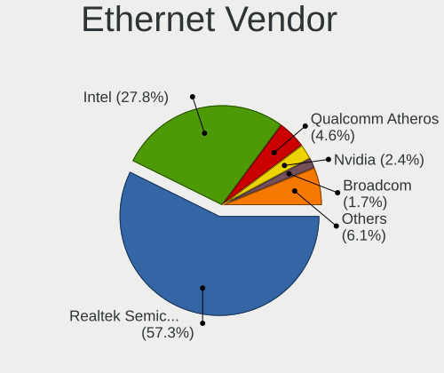

| Vendor                                 | Desktops | Percent |
|----------------------------------------|----------|---------|
| Realtek Semiconductor                  | 655      | 57.31%  |
| Intel                                  | 318      | 27.82%  |
| Qualcomm Atheros                       | 53       | 4.64%   |
| Nvidia                                 | 28       | 2.45%   |
| Broadcom                               | 19       | 1.66%   |
| Marvell Technology Group               | 18       | 1.57%   |
| Broadcom Limited                       | 8        | 0.7%    |
| Aquantia                               | 8        | 0.7%    |
| Xiaomi                                 | 4        | 0.35%   |
| VIA Technologies                       | 4        | 0.35%   |
| Samsung Electronics                    | 3        | 0.26%   |
| Qualcomm                               | 3        | 0.26%   |
| MediaTek                               | 3        | 0.26%   |
| ASIX Electronics                       | 3        | 0.26%   |
| Huawei Technologies                    | 2        | 0.17%   |
| Google                                 | 2        | 0.17%   |
| DisplayLink                            | 2        | 0.17%   |
| American Megatrends                    | 2        | 0.17%   |
| Suzhou Motorcomm Electronic Technology | 1        | 0.09%   |
| Sundance Technology Inc / IC Plus      | 1        | 0.09%   |
| Mellanox Technologies                  | 1        | 0.09%   |
| D-Link System                          | 1        | 0.09%   |
| Chelsio Communications                 | 1        | 0.09%   |
| ASUSTek Computer                       | 1        | 0.09%   |
| ADMtek                                 | 1        | 0.09%   |
| 3Com                                   | 1        | 0.09%   |

Ethernet Model
--------------

Ethernet models

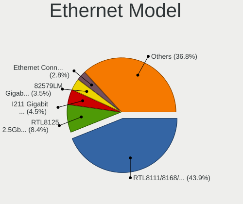

| Model                                                                  | Desktops | Percent |
|------------------------------------------------------------------------|----------|---------|
| Realtek RTL8111/8168/8211/8411 PCI Express Gigabit Ethernet Controller | 526      | 43.94%  |
| Realtek RTL8125 2.5GbE Controller                                      | 100      | 8.35%   |
| Intel I211 Gigabit Network Connection                                  | 54       | 4.51%   |
| Intel 82579LM Gigabit Network Connection (Lewisville)                  | 42       | 3.51%   |
| Intel Ethernet Connection (2) I219-V                                   | 34       | 2.84%   |
| Intel Ethernet Controller I225-V                                       | 30       | 2.51%   |
| Intel Ethernet Connection I217-LM                                      | 26       | 2.17%   |
| Intel Ethernet Connection (7) I219-V                                   | 19       | 1.59%   |
| Realtek RTL-8100/8101L/8139 PCI Fast Ethernet Adapter                  | 17       | 1.42%   |
| Realtek RTL810xE PCI Express Fast Ethernet controller                  | 15       | 1.25%   |
| Qualcomm Atheros Killer E220x Gigabit Ethernet Controller              | 15       | 1.25%   |
| Realtek RTL8153 Gigabit Ethernet Adapter                               | 13       | 1.09%   |
| Intel 82567LM-3 Gigabit Network Connection                             | 13       | 1.09%   |
| Intel 82579V Gigabit Network Connection                                | 12       | 1%      |
| Intel Ethernet Connection (2) I218-V                                   | 11       | 0.92%   |
| Intel 82566DM-2 Gigabit Network Connection                             | 10       | 0.84%   |
| Nvidia MCP61 Ethernet                                                  | 9        | 0.75%   |
| Marvell Group 88E8056 PCI-E Gigabit Ethernet Controller                | 9        | 0.75%   |
| Qualcomm Atheros AR8131 Gigabit Ethernet                               | 8        | 0.67%   |
| Intel I210 Gigabit Network Connection                                  | 8        | 0.67%   |
| Qualcomm Atheros AR8161 Gigabit Ethernet                               | 7        | 0.58%   |
| Intel 82574L Gigabit Network Connection                                | 7        | 0.58%   |
| Qualcomm Atheros AR8151 v2.0 Gigabit Ethernet                          | 6        | 0.5%    |
| Marvell Group 88E8001 Gigabit Ethernet Controller                      | 6        | 0.5%    |
| Intel Ethernet Connection (2) I219-LM                                  | 6        | 0.5%    |
| Intel Ethernet Connection I217-V                                       | 5        | 0.42%   |
| Intel Ethernet Connection (7) I219-LM                                  | 5        | 0.42%   |
| Broadcom NetXtreme BCM5761 Gigabit Ethernet PCIe                       | 5        | 0.42%   |
| Xiaomi Mi/Redmi series (RNDIS)                                         | 4        | 0.33%   |
| Realtek RTL8169 PCI Gigabit Ethernet Controller                        | 4        | 0.33%   |
| Realtek RTL8111/8168/8411 PCI Express Gigabit Ethernet Controller      | 4        | 0.33%   |
| Realtek RTL-8110SC/8169SC Gigabit Ethernet                             | 4        | 0.33%   |
| Qualcomm Atheros Killer E2400 Gigabit Ethernet Controller              | 4        | 0.33%   |
| Qualcomm Atheros Attansic L1 Gigabit Ethernet                          | 4        | 0.33%   |
| Qualcomm Atheros AR8121/AR8113/AR8114 Gigabit or Fast Ethernet         | 4        | 0.33%   |
| Nvidia MCP73 Ethernet                                                  | 4        | 0.33%   |
| Nvidia CK804 Ethernet Controller                                       | 4        | 0.33%   |
| VIA VT6102/VT6103 [Rhine-II]                                           | 3        | 0.25%   |
| Realtek Killer E3000 2.5GbE Controller                                 | 3        | 0.25%   |
| Qualcomm Atheros Killer E2500 Gigabit Ethernet Controller              | 3        | 0.25%   |

Net Controller Kind
-------------------

Ethernet, WiFi or modem

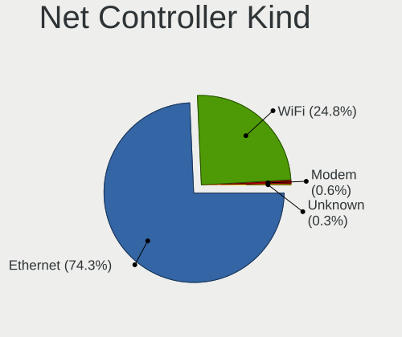

| Kind     | Desktops | Percent |
|----------|----------|---------|
| Ethernet | 1055     | 74.3%   |
| WiFi     | 352      | 24.79%  |
| Modem    | 9        | 0.63%   |
| Unknown  | 4        | 0.28%   |

Used Controller
---------------

Currently used network controller

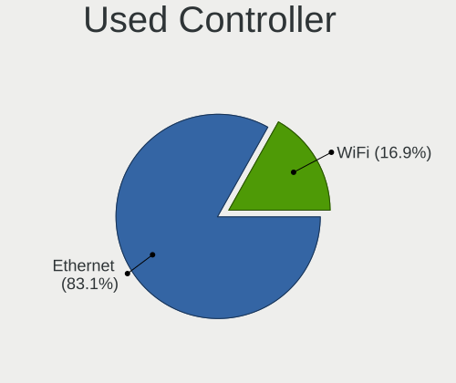

| Kind     | Desktops | Percent |
|----------|----------|---------|
| Ethernet | 903      | 83.15%  |
| WiFi     | 183      | 16.85%  |

NICs
----

Total network controllers on board

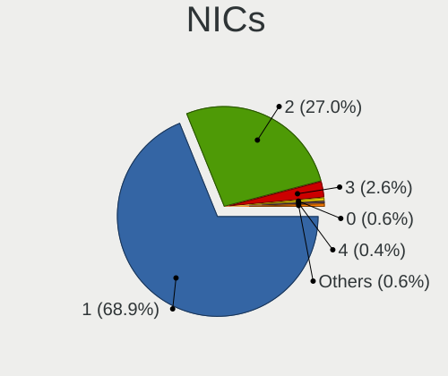

| Total | Desktops | Percent |
|-------|----------|---------|
| 1     | 739      | 68.87%  |
| 2     | 290      | 27.03%  |
| 3     | 28       | 2.61%   |
| 0     | 6        | 0.56%   |
| 4     | 4        | 0.37%   |
| 5     | 3        | 0.28%   |
| 9     | 1        | 0.09%   |
| 8     | 1        | 0.09%   |
| 6     | 1        | 0.09%   |

IPv6
----

IPv6 vs IPv4

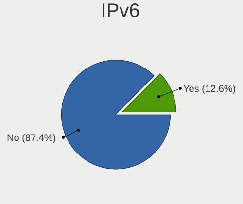

| Used | Desktops | Percent |
|------|----------|---------|
| No   | 946      | 87.43%  |
| Yes  | 136      | 12.57%  |

Bluetooth
---------

Bluetooth Vendor
----------------

Controller vendors

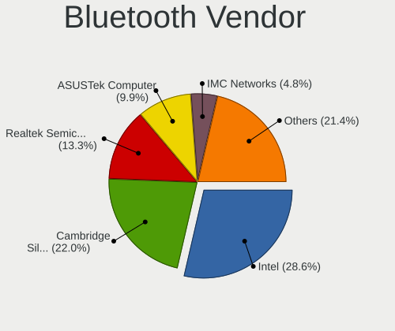

| Vendor                          | Desktops | Percent |
|---------------------------------|----------|---------|
| Intel                           | 95       | 28.61%  |
| Cambridge Silicon Radio         | 73       | 21.99%  |
| Realtek Semiconductor           | 44       | 13.25%  |
| ASUSTek Computer                | 33       | 9.94%   |
| IMC Networks                    | 16       | 4.82%   |
| MediaTek                        | 14       | 4.22%   |
| TP-Link                         | 12       | 3.61%   |
| Broadcom                        | 12       | 3.61%   |
| Qualcomm Atheros Communications | 6        | 1.81%   |
| Foxconn / Hon Hai               | 6        | 1.81%   |
| Lite-On Technology              | 5        | 1.51%   |
| Integrated System Solution      | 5        | 1.51%   |
| Edimax Technology               | 3        | 0.9%    |
| Mobile Action Technology        | 2        | 0.6%    |
| Creative Technology             | 2        | 0.6%    |
| Actions                         | 2        | 0.6%    |
| Micro Star International        | 1        | 0.3%    |
| Belkin Components               | 1        | 0.3%    |

Bluetooth Model
---------------

Controller models

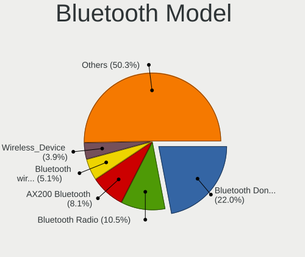

| Model                                                    | Desktops | Percent |
|----------------------------------------------------------|----------|---------|
| Cambridge Silicon Radio Bluetooth Dongle (HCI mode)      | 73       | 21.99%  |
| Realtek Bluetooth Radio                                  | 35       | 10.54%  |
| Intel AX200 Bluetooth                                    | 27       | 8.13%   |
| Intel Bluetooth wireless interface                       | 17       | 5.12%   |
| MediaTek Wireless_Device                                 | 13       | 3.92%   |
| Intel AX210 Bluetooth                                    | 13       | 3.92%   |
| ASUS Broadcom BCM20702A0 Bluetooth                       | 13       | 3.92%   |
| TP-Link TP-T@- UB500 Adapter                             | 12       | 3.61%   |
| ASUS ASUS USB-BT500                                      | 12       | 3.61%   |
| Intel Wireless-AC 3168 Bluetooth                         | 10       | 3.01%   |
| IMC Networks Wireless_Device                             | 9        | 2.71%   |
| Intel Wireless-AC 9260 Bluetooth Adapter                 | 8        | 2.41%   |
| Intel Bluetooth Device                                   | 7        | 2.11%   |
| IMC Networks Bluetooth Radio                             | 7        | 2.11%   |
| Intel Bluetooth 9460/9560 Jefferson Peak (JfP)           | 6        | 1.81%   |
| Foxconn / Hon Hai Wireless_Device                        | 6        | 1.81%   |
| Intel AX201 Bluetooth                                    | 5        | 1.51%   |
| Realtek  Bluetooth 4.2 Adapter                           | 4        | 1.2%    |
| ASUS Bluetooth Radio                                     | 4        | 1.2%    |
| Realtek Bluetooth 5.3 Radio                              | 3        | 0.9%    |
| Lite-On Qualcomm Atheros QCA9377 Bluetooth               | 3        | 0.9%    |
| Integrated System Solution KY-BT100 Bluetooth Adapter    | 3        | 0.9%    |
| Edimax Bluetooth Device                                  | 3        | 0.9%    |
| Broadcom BCM2045 Bluetooth                               | 3        | 0.9%    |
| Qualcomm Atheros QCA61x4 Bluetooth 4.0                   | 2        | 0.6%    |
| Qualcomm Atheros AR3011 Bluetooth                        | 2        | 0.6%    |
| Mobile Action MA-730/MA-730G Bluetooth Adapter           | 2        | 0.6%    |
| Lite-On Bluetooth Device                                 | 2        | 0.6%    |
| Intel Centrino Bluetooth Wireless Transceiver            | 2        | 0.6%    |
| Integrated System Solution Bluetooth Device              | 2        | 0.6%    |
| Creative Bluetooth Audio W2                              | 2        | 0.6%    |
| Broadcom HP Portable Bumble Bee                          | 2        | 0.6%    |
| Broadcom BCM20702A0 Bluetooth 4.0                        | 2        | 0.6%    |
| ASUS Bluetooth Adapter                                   | 2        | 0.6%    |
| Actions general adapter                                  | 2        | 0.6%    |
| Realtek Bluetooth 5.4 Radio                              | 1        | 0.3%    |
| Realtek 802.11ac WLAN Adapter                            | 1        | 0.3%    |
| Qualcomm Atheros  Bluetooth Device                       | 1        | 0.3%    |
| Qualcomm Atheros Bluetooth USB Host Controller           | 1        | 0.3%    |
| Micro Star International MS-6970 BToes Bluetooth adapter | 1        | 0.3%    |

Sound
-----

Sound Vendor
------------

Sound card vendors

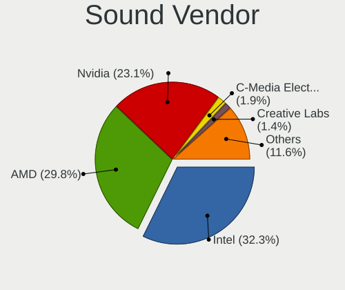

| Vendor                                       | Desktops | Percent |
|----------------------------------------------|----------|---------|
| Intel                                        | 574      | 32.3%   |
| AMD                                          | 529      | 29.77%  |
| Nvidia                                       | 410      | 23.07%  |
| C-Media Electronics                          | 34       | 1.91%   |
| Creative Labs                                | 24       | 1.35%   |
| Logitech                                     | 15       | 0.84%   |
| Kingston Technology                          | 15       | 0.84%   |
| Creative Technology                          | 15       | 0.84%   |
| VIA Technologies                             | 13       | 0.73%   |
| JMTek                                        | 12       | 0.68%   |
| Micro Star International                     | 8        | 0.45%   |
| ASUSTek Computer                             | 8        | 0.45%   |
| Razer USA                                    | 7        | 0.39%   |
| Hewlett-Packard                              | 7        | 0.39%   |
| Focusrite-Novation                           | 7        | 0.39%   |
| Texas Instruments                            | 6        | 0.34%   |
| Trust                                        | 5        | 0.28%   |
| SteelSeries ApS                              | 5        | 0.28%   |
| ASRock                                       | 4        | 0.23%   |
| Zoran Co. Personal Media Division (Nogatech) | 3        | 0.17%   |
| Yamaha                                       | 3        | 0.17%   |
| Thesycon Systemsoftware & Consulting         | 3        | 0.17%   |
| Realtek Semiconductor                        | 3        | 0.17%   |
| M-Audio                                      | 3        | 0.17%   |
| Lenovo                                       | 3        | 0.17%   |
| GYROCOM C&C                                  | 3        | 0.17%   |
| GN Netcom                                    | 3        | 0.17%   |
| fifinemicrophone.com                         | 3        | 0.17%   |
| Dell                                         | 3        | 0.17%   |
| BEHRINGER International                      | 3        | 0.17%   |
| Sony                                         | 2        | 0.11%   |
| Schiit Audio                                 | 2        | 0.11%   |
| Plantronics                                  | 2        | 0.11%   |
| Nordic Semiconductor ASA                     | 2        | 0.11%   |
| Generalplus Technology                       | 2        | 0.11%   |
| DSEA A/S                                     | 2        | 0.11%   |
| DigiTech                                     | 2        | 0.11%   |
| Corsair                                      | 2        | 0.11%   |
| AKAI Professional M.I.                       | 2        | 0.11%   |
| A4Tech                                       | 2        | 0.11%   |

Sound Model
-----------

Sound card models

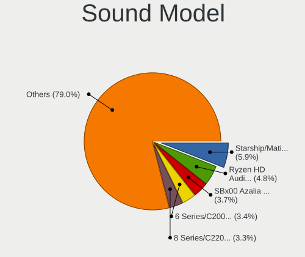

| Model                                                                             | Desktops | Percent |
|-----------------------------------------------------------------------------------|----------|---------|
| AMD Starship/Matisse HD Audio Controller                                          | 127      | 5.92%   |
| AMD Ryzen HD Audio Controller                                                     | 102      | 4.75%   |
| AMD SBx00 Azalia (Intel HDA)                                                      | 79       | 3.68%   |
| Intel 6 Series/C200 Series Chipset Family High Definition Audio Controller        | 72       | 3.36%   |
| Intel 8 Series/C220 Series Chipset High Definition Audio Controller               | 71       | 3.31%   |
| AMD Family 17h (Models 00h-0fh) HD Audio Controller                               | 65       | 3.03%   |
| AMD Ellesmere HDMI Audio [Radeon RX 470/480 / 570/580/590]                        | 56       | 2.61%   |
| Intel NM10/ICH7 Family High Definition Audio Controller                           | 55       | 2.56%   |
| Intel Xeon E3-1200 v3/4th Gen Core Processor HD Audio Controller                  | 49       | 2.28%   |
| Intel 200 Series PCH HD Audio                                                     | 45       | 2.1%    |
| Nvidia GP107GL High Definition Audio Controller                                   | 44       | 2.05%   |
| Intel 7 Series/C216 Chipset Family High Definition Audio Controller               | 42       | 1.96%   |
| Nvidia GP106 High Definition Audio Controller                                     | 40       | 1.86%   |
| Intel 100 Series/C230 Series Chipset Family HD Audio Controller                   | 39       | 1.82%   |
| AMD Radeon High Definition Audio Controller                                       | 39       | 1.82%   |
| Intel Cannon Lake PCH cAVS                                                        | 37       | 1.72%   |
| Nvidia GK208 HDMI/DP Audio Controller                                             | 36       | 1.68%   |
| AMD Navi 21/23 HDMI/DP Audio Controller                                           | 36       | 1.68%   |
| AMD Baffin HDMI/DP Audio [Radeon RX 550 640SP / RX 560/560X]                      | 36       | 1.68%   |
| AMD Renoir/Cezanne HDMI/DP Audio Controller                                       | 32       | 1.49%   |
| AMD FCH Azalia Controller                                                         | 31       | 1.44%   |
| Intel 82801I (ICH9 Family) HD Audio Controller                                    | 26       | 1.21%   |
| Nvidia GP104 High Definition Audio Controller                                     | 25       | 1.16%   |
| Intel 82801JI (ICH10 Family) HD Audio Controller                                  | 24       | 1.12%   |
| AMD Navi 31 HDMI/DP Audio                                                         | 24       | 1.12%   |
| Nvidia TU116 High Definition Audio Controller                                     | 19       | 0.89%   |
| AMD Raven/Raven2/Fenghuang HDMI/DP Audio Controller                               | 19       | 0.89%   |
| Intel Alder Lake-S HD Audio Controller                                            | 18       | 0.84%   |
| Nvidia GP108 High Definition Audio Controller                                     | 17       | 0.79%   |
| Nvidia GM107 High Definition Audio Controller [GeForce 940MX]                     | 17       | 0.79%   |
| Intel 9 Series Chipset Family HD Audio Controller                                 | 17       | 0.79%   |
| Nvidia GF108 High Definition Audio Controller                                     | 16       | 0.75%   |
| Intel 82801JD/DO (ICH10 Family) HD Audio Controller                               | 16       | 0.75%   |
| AMD Oland/Hainan/Cape Verde/Pitcairn HDMI Audio [Radeon HD 7000 Series]           | 16       | 0.75%   |
| Nvidia TU106 High Definition Audio Controller                                     | 15       | 0.7%    |
| Nvidia MCP61 High Definition Audio                                                | 15       | 0.7%    |
| Nvidia GA104 High Definition Audio Controller                                     | 15       | 0.7%    |
| Intel 5 Series/3400 Series Chipset High Definition Audio                          | 15       | 0.7%    |
| AMD Navi 10 HDMI Audio                                                            | 15       | 0.7%    |
| AMD Caicos HDMI Audio [Radeon HD 6450 / 7450/8450/8490 OEM / R5 230/235/235X OEM] | 14       | 0.65%   |

Memory
------

Memory Vendor
-------------

Memory module vendors

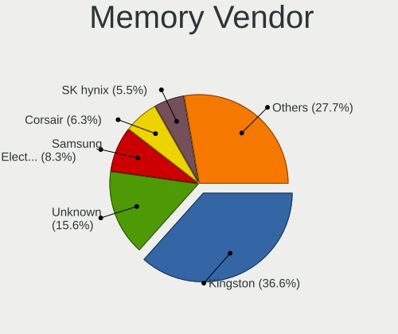

| Vendor                       | Desktops | Percent |
|------------------------------|----------|---------|
| Kingston                     | 239      | 36.6%   |
| Unknown                      | 102      | 15.62%  |
| Samsung Electronics          | 54       | 8.27%   |
| Corsair                      | 41       | 6.28%   |
| SK hynix                     | 36       | 5.51%   |
| Crucial                      | 35       | 5.36%   |
| Patriot                      | 28       | 4.29%   |
| Micron Technology            | 20       | 3.06%   |
| G.Skill                      | 20       | 3.06%   |
| A-DATA Technology            | 19       | 2.91%   |
| Ramaxel Technology           | 11       | 1.68%   |
| Nanya Technology             | 4        | 0.61%   |
| Unknown                      | 4        | 0.61%   |
| Unknown (ABCD)               | 3        | 0.46%   |
| KingSpec                     | 3        | 0.46%   |
| GOODRAM                      | 3        | 0.46%   |
| Elpida                       | 3        | 0.46%   |
| Apacer                       | 3        | 0.46%   |
| Transcend                    | 2        | 0.31%   |
| Team                         | 2        | 0.31%   |
| Patriot Memory (PDP Systems) | 2        | 0.31%   |
| Unknown (AB)                 | 1        | 0.15%   |
| Unknown (8A02)               | 1        | 0.15%   |
| Unknown (0x1636)             | 1        | 0.15%   |
| Unknown (0x0E9D)             | 1        | 0.15%   |
| Unknown (0x0CC7)             | 1        | 0.15%   |
| Unknown (0x0080)             | 1        | 0.15%   |
| Toshiba                      | 1        | 0.15%   |
| TakeMS                       | 1        | 0.15%   |
| Silicon Power                | 1        | 0.15%   |
| PDPSystems                   | 1        | 0.15%   |
| Patriot Memory               | 1        | 0.15%   |
| Lexar                        | 1        | 0.15%   |
| Kingmax                      | 1        | 0.15%   |
| Kimtigo                      | 1        | 0.15%   |
| H                            | 1        | 0.15%   |
| GSkill                       | 1        | 0.15%   |
| Gigabyte Technology          | 1        | 0.15%   |
| ASint Technology             | 1        | 0.15%   |
| AMD                          | 1        | 0.15%   |

Memory Model
------------

Memory module models

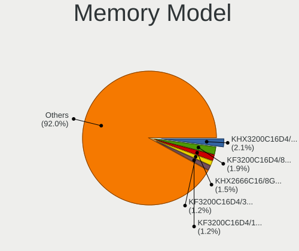

| Model                                                          | Desktops | Percent |
|----------------------------------------------------------------|----------|---------|
| Kingston RAM KHX3200C16D4/8GX 8GB DIMM DDR4 3733MT/s           | 15       | 2.07%   |
| Kingston RAM KF3200C16D4/8GX 8GiB DIMM DDR4 3600MT/s           | 14       | 1.93%   |
| Kingston RAM KHX2666C16/8G 8GiB DIMM DDR4 3466MT/s             | 11       | 1.52%   |
| Kingston RAM KF3200C16D4/32GX 32GB DIMM DDR4 3933MT/s          | 9        | 1.24%   |
| Kingston RAM KF3200C16D4/16GX 16GB DIMM DDR4 3733MT/s          | 9        | 1.24%   |
| Kingston RAM KHX1866C10D3/8G 8GB DIMM DDR3 1867MT/s            | 8        | 1.1%    |
| Patriot RAM 3200 C16 Series 8GB DIMM DDR4 3600MT/s             | 7        | 0.96%   |
| Kingston RAM KHX3200C16D4/16GX 16GB DIMM DDR4 3600MT/s         | 7        | 0.96%   |
| Unknown RAM Module 2GB DIMM DDR2 800MT/s                       | 6        | 0.83%   |
| Kingston RAM KHX2400C15/8G 8GB DIMM DDR4 3400MT/s              | 6        | 0.83%   |
| Kingston RAM KF3600C18D4/32GX 32GB DIMM DDR4 4000MT/s          | 6        | 0.83%   |
| Unknown RAM Module 4096MB DIMM 1333MT/s                        | 5        | 0.69%   |
| Unknown RAM Module 2GB DIMM SDRAM                              | 5        | 0.69%   |
| Unknown RAM Module 2GB DIMM 800MT/s                            | 5        | 0.69%   |
| Unknown RAM Module 2GB DIMM 1333MT/s                           | 5        | 0.69%   |
| Kingston RAM KHX1600C10D3/4G 4GB DIMM DDR3 1866MT/s            | 5        | 0.69%   |
| Corsair RAM CMK16GX4M2B3200C16 8GB DIMM DDR4 3600MT/s          | 5        | 0.69%   |
| Unknown RAM Module 4GB DIMM DDR3 1333MT/s                      | 4        | 0.55%   |
| Unknown RAM Module 4GB DIMM 1333MT/s                           | 4        | 0.55%   |
| Unknown RAM Module 2048MB DIMM 1333MT/s                        | 4        | 0.55%   |
| Kingston RAM KHX3600C17D4/16GX 16GB DIMM DDR4 3800MT/s         | 4        | 0.55%   |
| Kingston RAM KHX3200C18D4/8G 8GB DIMM DDR4 3333MT/s            | 4        | 0.55%   |
| Kingston RAM KHX3000C15D4/8GX 8GB DIMM DDR4 3400MT/s           | 4        | 0.55%   |
| Kingston RAM KHX2666C13/16GX 16GB DIMM DDR4 3200MT/s           | 4        | 0.55%   |
| Kingston RAM KHX2400C11D3/4GX 4GB DIMM DDR3 2400MT/s           | 4        | 0.55%   |
| Kingston RAM KHX1600C9D3/8GX 8GB DIMM DDR3 2133MT/s            | 4        | 0.55%   |
| Kingston RAM KF560C36-16 16GB DIMM DDR5 6000MT/s               | 4        | 0.55%   |
| Kingston RAM KF3600C16D4/16GX 16GB DIMM DDR4 3800MT/s          | 4        | 0.55%   |
| Crucial RAM BLS8G3D1609DS1S00. 8GB DIMM DDR3 1800MT/s          | 4        | 0.55%   |
| Corsair RAM CMK16GX4M2B3000C15 8GB DIMM DDR4 3600MT/s          | 4        | 0.55%   |
| Unknown                                                        | 4        | 0.55%   |
| Unknown RAM Module 4GB DIMM DDR3 1600MT/s                      | 3        | 0.41%   |
| Unknown RAM Module 4GB DIMM 400MT/s                            | 3        | 0.41%   |
| Unknown RAM Module 2GB DIMM 400MT/s                            | 3        | 0.41%   |
| Unknown RAM Module 2048MB DIMM DDR2 800MT/s                    | 3        | 0.41%   |
| Unknown RAM 3000 C16 Series 8192MB DIMM DDR4 2133MT/s          | 3        | 0.41%   |
| Unknown (ABCD) RAM 123456789012345678 2GB DIMM LPDDR4 2133MT/s | 3        | 0.41%   |
| Samsung RAM Module 8192MB DIMM DDR4 2666MT/s                   | 3        | 0.41%   |
| Samsung RAM M378B5673FH0-CH9 2GB DIMM DDR3 1600MT/s            | 3        | 0.41%   |
| Samsung RAM M378B5173BH0-CK0 4GB DIMM DDR3 1600MT/s            | 3        | 0.41%   |

Memory Kind
-----------

Memory module kinds

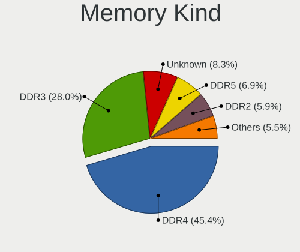

| Kind    | Desktops | Percent |
|---------|----------|---------|
| DDR4    | 263      | 45.42%  |
| DDR3    | 162      | 27.98%  |
| Unknown | 48       | 8.29%   |
| DDR5    | 40       | 6.91%   |
| DDR2    | 34       | 5.87%   |
| SDRAM   | 21       | 3.63%   |
| LPDDR4  | 4        | 0.69%   |
| DDR     | 4        | 0.69%   |
| DRAM    | 2        | 0.35%   |
| LPDDR5  | 1        | 0.17%   |

Memory Form Factor
------------------

Physical design of the memory module

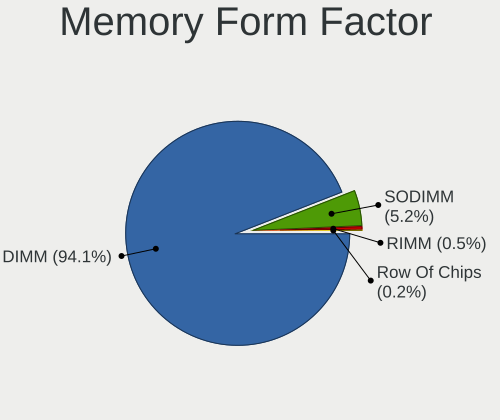

| Name         | Desktops | Percent |
|--------------|----------|---------|
| DIMM         | 539      | 94.07%  |
| SODIMM       | 30       | 5.24%   |
| RIMM         | 3        | 0.52%   |
| Row Of Chips | 1        | 0.17%   |

Memory Size
-----------

Memory module size

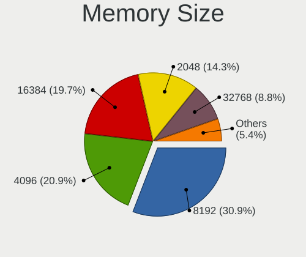

| Size  | Desktops | Percent |
|-------|----------|---------|
| 8192  | 196      | 30.87%  |
| 4096  | 133      | 20.94%  |
| 16384 | 125      | 19.69%  |
| 2048  | 91       | 14.33%  |
| 32768 | 56       | 8.82%   |
| 1024  | 27       | 4.25%   |
| 512   | 4        | 0.63%   |
| 49152 | 1        | 0.16%   |
| 24576 | 1        | 0.16%   |
| 256   | 1        | 0.16%   |

Memory Speed
------------

Memory module speed

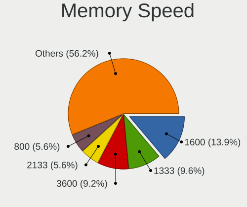

| Speed   | Desktops | Percent |
|---------|----------|---------|
| 1600    | 92       | 13.86%  |
| 1333    | 64       | 9.64%   |
| 3600    | 61       | 9.19%   |
| 2133    | 37       | 5.57%   |
| 800     | 37       | 5.57%   |
| 2400    | 36       | 5.42%   |
| 3200    | 32       | 4.82%   |
| 3733    | 29       | 4.37%   |
| 2667    | 28       | 4.22%   |
| 3800    | 17       | 2.56%   |
| 6000    | 16       | 2.41%   |
| 667     | 15       | 2.26%   |
| 3466    | 14       | 2.11%   |
| Unknown | 14       | 2.11%   |
| 3400    | 13       | 1.96%   |
| 3000    | 11       | 1.66%   |
| 2666    | 11       | 1.66%   |
| 1866    | 11       | 1.66%   |
| 4000    | 10       | 1.51%   |
| 3933    | 9        | 1.36%   |
| 1800    | 9        | 1.36%   |
| 3333    | 8        | 1.2%    |
| 5600    | 7        | 1.05%   |
| 1867    | 7        | 1.05%   |
| 400     | 7        | 1.05%   |
| 2800    | 6        | 0.9%    |
| 1067    | 6        | 0.9%    |
| 4800    | 5        | 0.75%   |
| 1334    | 5        | 0.75%   |
| 12800   | 4        | 0.6%    |
| 5200    | 4        | 0.6%    |
| 6400    | 3        | 0.45%   |
| 3334    | 3        | 0.45%   |
| 2933    | 3        | 0.45%   |
| 1066    | 3        | 0.45%   |
| 6200    | 2        | 0.3%    |
| 4133    | 2        | 0.3%    |
| 3666    | 2        | 0.3%    |
| 3266    | 2        | 0.3%    |
| 2200    | 2        | 0.3%    |

Printers & scanners
-------------------

Printer Vendor
--------------

Printer device vendors

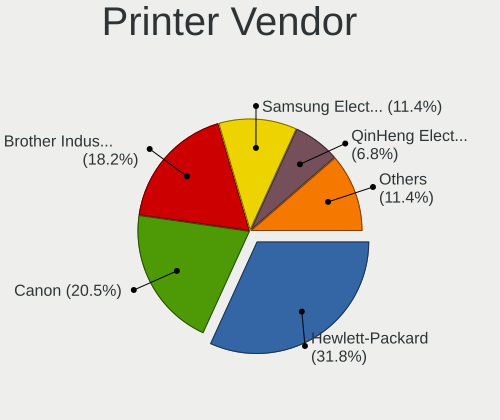

| Vendor              | Desktops | Percent |
|---------------------|----------|---------|
| Hewlett-Packard     | 14       | 31.82%  |
| Canon               | 9        | 20.45%  |
| Brother Industries  | 8        | 18.18%  |
| Samsung Electronics | 5        | 11.36%  |
| QinHeng Electronics | 3        | 6.82%   |
| Xerox               | 2        | 4.55%   |
| Seiko Epson         | 2        | 4.55%   |
| Pantum              | 1        | 2.27%   |

Printer Model
-------------

Printer device models

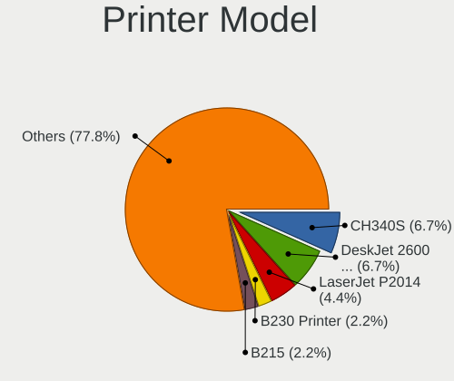

| Model                                   | Desktops | Percent |
|-----------------------------------------|----------|---------|
| QinHeng CH340S                          | 3        | 6.67%   |
| HP DeskJet 2600 series                  | 3        | 6.67%   |
| HP LaserJet P2014                       | 2        | 4.44%   |
| Xerox B230 Printer                      | 1        | 2.22%   |
| Xerox B215                              | 1        | 2.22%   |
| Seiko Epson L365 Series                 | 1        | 2.22%   |
| Seiko Epson L3560 Series                | 1        | 2.22%   |
| Samsung Xerox Phaser 3117 Laser Printer | 1        | 2.22%   |
| Samsung M267x 287x Series               | 1        | 2.22%   |
| Samsung M2070 Series                    | 1        | 2.22%   |
| Samsung M2020 Series                    | 1        | 2.22%   |
| Samsung C460 Series                     | 1        | 2.22%   |
| Pantum P2000                            | 1        | 2.22%   |
| HP Neverstop Laser 100x                 | 1        | 2.22%   |
| HP LaserJet CP1025nw                    | 1        | 2.22%   |
| HP LaserJet 1018                        | 1        | 2.22%   |
| HP DeskJet 6980 series                  | 1        | 2.22%   |
| HP DeskJet 4530 series                  | 1        | 2.22%   |
| HP Deskjet 3050 J610 series             | 1        | 2.22%   |
| HP DeskJet 2700 series                  | 1        | 2.22%   |
| HP DeskJet 2130 series                  | 1        | 2.22%   |
| HP Deskjet 1510                         | 1        | 2.22%   |
| Canon TS6300 series                     | 1        | 2.22%   |
| Canon PIXMA MX920 Series                | 1        | 2.22%   |
| Canon PIXMA MX720 Series                | 1        | 2.22%   |
| Canon PIXMA MP280                       | 1        | 2.22%   |
| Canon PIXMA MP210                       | 1        | 2.22%   |
| Canon PIXMA MG5600 Series               | 1        | 2.22%   |
| Canon PIXMA MG3500 Series               | 1        | 2.22%   |
| Canon PIXMA MG2500 Series               | 1        | 2.22%   |
| Canon iP7200 series                     | 1        | 2.22%   |
| Canon G3020 series                      | 1        | 2.22%   |
| Brother MFC-J3930DW                     | 1        | 2.22%   |
| Brother HL-3040CN series                | 1        | 2.22%   |
| Brother HL-2030 Laser Printer           | 1        | 2.22%   |
| Brother HL-1430 Laser Printer           | 1        | 2.22%   |
| Brother DCP-L2510D series               | 1        | 2.22%   |
| Brother DCP-J105                        | 1        | 2.22%   |
| Brother DCP-7055 scanner/printer        | 1        | 2.22%   |
| Brother DCP-1610W                       | 1        | 2.22%   |

Scanner Vendor
--------------

Scanner device vendors

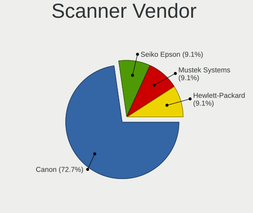

| Vendor          | Desktops | Percent |
|-----------------|----------|---------|
| Canon           | 8        | 72.73%  |
| Seiko Epson     | 1        | 9.09%   |
| Mustek Systems  | 1        | 9.09%   |
| Hewlett-Packard | 1        | 9.09%   |

Scanner Model
-------------

Scanner device models

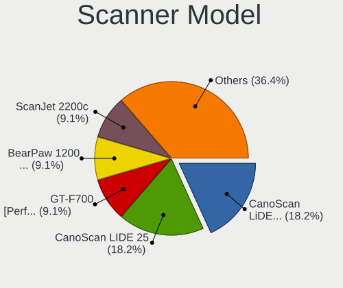

| Model                                 | Desktops | Percent |
|---------------------------------------|----------|---------|
| Canon CanoScan LIDE 25                | 2        | 18.18%  |
| Canon CanoScan LiDE 210               | 2        | 18.18%  |
| Seiko Epson GT-F700 [Perfection V350] | 1        | 9.09%   |
| Mustek Systems BearPaw 1200 CU Plus   | 1        | 9.09%   |
| HP ScanJet 2200c                      | 1        | 9.09%   |
| Canon CanoScan LiDE 90                | 1        | 9.09%   |
| Canon CanoScan LiDE 120               | 1        | 9.09%   |
| Canon CanoScan LiDE 110               | 1        | 9.09%   |
| Canon CanoScan LiDE 100               | 1        | 9.09%   |

Camera
------

Camera Vendor
-------------

Camera device vendors

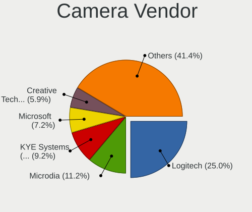

| Vendor                        | Desktops | Percent |
|-------------------------------|----------|---------|
| Logitech                      | 38       | 25%     |
| Microdia                      | 17       | 11.18%  |
| KYE Systems (Mouse Systems)   | 14       | 9.21%   |
| Microsoft                     | 11       | 7.24%   |
| Creative Technology           | 9        | 5.92%   |
| Sunplus Innovation Technology | 7        | 4.61%   |
| Samsung Electronics           | 6        | 3.95%   |
| Z-Star Microelectronics       | 5        | 3.29%   |
| Apple                         | 5        | 3.29%   |
| MacroSilicon                  | 4        | 2.63%   |
| SunplusIT                     | 3        | 1.97%   |
| Hopewin Electronic Material   | 3        | 1.97%   |
| Hewlett-Packard               | 3        | 1.97%   |
| Genesys Logic                 | 3        | 1.97%   |
| GEMBIRD                       | 3        | 1.97%   |
| Trust                         | 2        | 1.32%   |
| Lenovo                        | 2        | 1.32%   |
| Generalplus Technology        | 2        | 1.32%   |
| YGTek                         | 1        | 0.66%   |
| Xiaomi                        | 1        | 0.66%   |
| webcam                        | 1        | 0.66%   |
| WaveRider Communications      | 1        | 0.66%   |
| Unknown                       | 1        | 0.66%   |
| Smartronix                    | 1        | 0.66%   |
| SHENZHEN AONI ELECTRONIC      | 1        | 0.66%   |
| Realtek Semiconductor         | 1        | 0.66%   |
| Pixart Imaging                | 1        | 0.66%   |
| Novatek Microelectronics      | 1        | 0.66%   |
| Nokia Mobile Phones           | 1        | 0.66%   |
| icSpring                      | 1        | 0.66%   |
| Cubeternet                    | 1        | 0.66%   |
| Chicony Electronics           | 1        | 0.66%   |
| ARC International             | 1        | 0.66%   |

Camera Model
------------

Camera device models

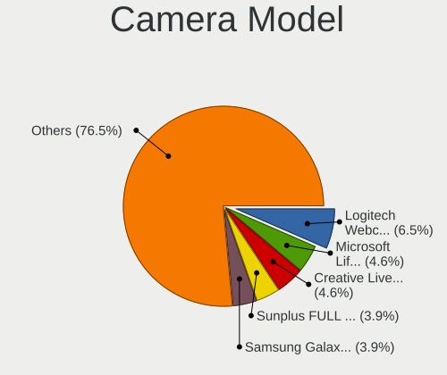

| Model                                                 | Desktops | Percent |
|-------------------------------------------------------|----------|---------|
| Logitech Webcam C270                                  | 10       | 6.54%   |
| Microsoft LifeCam HD-3000                             | 7        | 4.58%   |
| Creative Live! Cam Sync HD [VF0770]                   | 7        | 4.58%   |
| Sunplus FULL HD webcam                                | 6        | 3.92%   |
| Samsung Galaxy series, misc. (MTP mode)               | 6        | 3.92%   |
| Microdia USB 2.0 Camera                               | 5        | 3.27%   |
| Logitech HD Pro Webcam C920                           | 5        | 3.27%   |
| Apple iPhone 5/5C/5S/6/SE/7/8/X                       | 5        | 3.27%   |
| Microdia USB Camera                                   | 4        | 2.61%   |
| MacroSilicon USB Video                                | 4        | 2.61%   |
| Logitech Webcam C170                                  | 4        | 2.61%   |
| Logitech Logitech Webcam C925e                        | 3        | 1.96%   |
| Logitech C922 Pro Stream Webcam                       | 3        | 1.96%   |
| Logitech BRIO Ultra HD Webcam                         | 3        | 1.96%   |
| KYE Systems (Mouse Systems) USB 2.0 HD1080P PC Camera | 3        | 1.96%   |
| KYE Systems (Mouse Systems) FaceCam 1000X             | 3        | 1.96%   |
| Hopewin Electronic Material FULL HD 1080P Webcam      | 3        | 1.96%   |
| Z-Star Venus USB2.0 Camera                            | 2        | 1.31%   |
| Z-Star Vega USB 2.0 Camera                            | 2        | 1.31%   |
| SunplusIT Umax Webcam W5                              | 2        | 1.31%   |
| Microdia Webcam Vitade AF                             | 2        | 1.31%   |
| Microdia Sonix USB 2.0 Camera                         | 2        | 1.31%   |
| Microdia Camera                                       | 2        | 1.31%   |
| Logitech Webcam C310                                  | 2        | 1.31%   |
| Logitech HD Webcam C910                               | 2        | 1.31%   |
| Lenovo Lenovo FHD Webcam Audio                        | 2        | 1.31%   |
| KYE Systems (Mouse Systems) Genius Webcam             | 2        | 1.31%   |
| KYE Systems (Mouse Systems) Genius FaceCam 320        | 2        | 1.31%   |
| Genesys Logic Digital Microscope                      | 2        | 1.31%   |
| Generalplus 808 Camera #9 (web-cam mode)              | 2        | 1.31%   |
| GEMBIRD Generic UVC 1.00 camera [AppoTech AX2311]     | 2        | 1.31%   |
| Creative Live! Cam Chat HD [VF0700/VF0790]            | 2        | 1.31%   |
| Z-Star A4 TECH USB 2.0 Camera J                       | 1        | 0.65%   |
| YGTek Webcam                                          | 1        | 0.65%   |
| Xiaomi Redmi Note 10 Pro Max                          | 1        | 0.65%   |
| webcam webcam                                         | 1        | 0.65%   |
| WaveRider USB 2.0 Camera                              | 1        | 0.65%   |
| Unknown HD camera                                     | 1        | 0.65%   |
| Trust USB Camera                                      | 1        | 0.65%   |
| Trust 17676 Webcam                                    | 1        | 0.65%   |

Security
--------

Fingerprint Vendor
------------------

Fingerprint sensor vendors

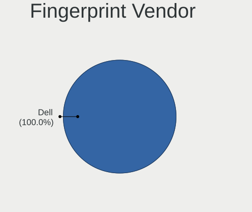

| Vendor | Desktops | Percent |
|--------|----------|---------|
| Dell   | 3        | 100%    |

Fingerprint Model
-----------------

Fingerprint sensor models

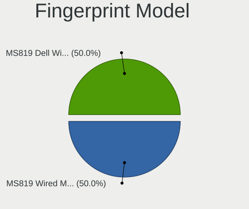

| Model                                          | Desktops | Percent |
|------------------------------------------------|----------|---------|
| Dell MS819 Wired Mouse With Fingerprint Reader | 3        | 100%    |

Chipcard Vendor
---------------

Chipcard module vendors

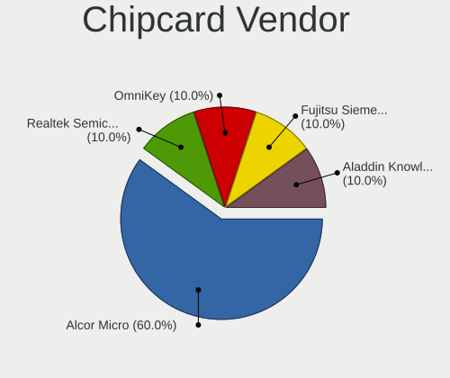

| Vendor                    | Desktops | Percent |
|---------------------------|----------|---------|
| Alcor Micro               | 6        | 60%     |
| Realtek Semiconductor     | 1        | 10%     |
| OmniKey                   | 1        | 10%     |
| Fujitsu Siemens Computers | 1        | 10%     |
| Aladdin Knowledge Systems | 1        | 10%     |

Chipcard Model
--------------

Chipcard module models

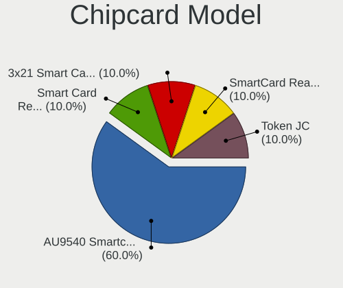

| Model                                             | Desktops | Percent |
|---------------------------------------------------|----------|---------|
| Alcor Micro AU9540 Smartcard Reader               | 6        | 60%     |
| Realtek Semiconductor Smart Card Reader Interface | 1        | 10%     |
| OmniKey 3x21 Smart Card Reader                    | 1        | 10%     |
| Fujitsu Siemens Computers SmartCard Reader 2A     | 1        | 10%     |
| Aladdin Knowledge Systems Token JC                | 1        | 10%     |

Unsupported
-----------

Unsupported Devices
-------------------

Total unsupported devices on board

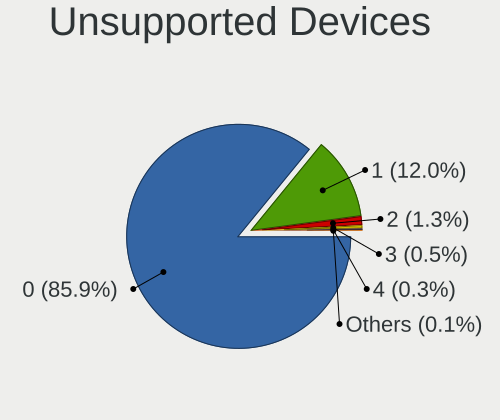

| Total | Desktops | Percent |
|-------|----------|---------|
| 0     | 927      | 85.91%  |
| 1     | 129      | 11.96%  |
| 2     | 14       | 1.3%    |
| 3     | 5        | 0.46%   |
| 4     | 3        | 0.28%   |
| 6     | 1        | 0.09%   |

Unsupported Device Types
------------------------

Types of unsupported devices

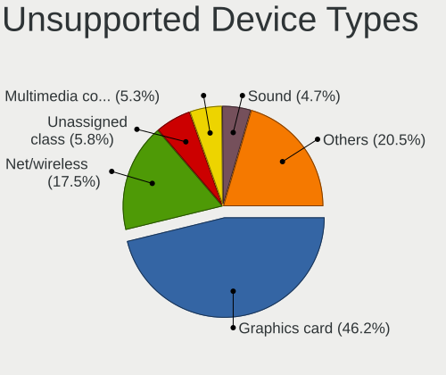

| Type                     | Desktops | Percent |
|--------------------------|----------|---------|
| Graphics card            | 79       | 46.2%   |
| Net/wireless             | 30       | 17.54%  |
| Unassigned class         | 10       | 5.85%   |
| Multimedia controller    | 9        | 5.26%   |
| Sound                    | 8        | 4.68%   |
| Communication controller | 8        | 4.68%   |
| Chipcard                 | 7        | 4.09%   |
| Bluetooth                | 5        | 2.92%   |
| Network                  | 4        | 2.34%   |
| Net/ethernet             | 3        | 1.75%   |
| Camera                   | 2        | 1.17%   |
| Storage/raid             | 1        | 0.58%   |
| Storage/ide              | 1        | 0.58%   |
| Storage                  | 1        | 0.58%   |
| Modem                    | 1        | 0.58%   |
| Dvb card                 | 1        | 0.58%   |
| Card reader              | 1        | 0.58%   |

