Linux in Czechia - Tested Hardware & Statistics (Notebooks)
-----------------------------------------------------------

A project to collect tested hardware configurations for Linux in Czechia.

Anyone can contribute to this report by the [hw-probe](https://github.com/linuxhw/hw-probe) tool:

    sudo -E hw-probe -all -upload

Please contribute! Especially if your hardware is rare.

Contents
--------

* [ Test Cases ](#test-cases)

* [ System ](#system)
  - [ OS                       ](#os)
  - [ OS Family                ](#os-family)
  - [ Kernel                   ](#kernel)
  - [ Kernel Family            ](#kernel-family)
  - [ Kernel Major Ver.        ](#kernel-major-ver)
  - [ Arch                     ](#arch)
  - [ DE                       ](#de)
  - [ Display Server           ](#display-server)
  - [ Display Manager          ](#display-manager)
  - [ OS Lang                  ](#os-lang)
  - [ Boot Mode                ](#boot-mode)
  - [ Filesystem               ](#filesystem)
  - [ Part. scheme             ](#part-scheme)
  - [ Dual Boot with Linux/BSD ](#dual-boot-with-linuxbsd)
  - [ Dual Boot (Win)          ](#dual-boot-win)

* [ Board ](#board)
  - [ Vendor                   ](#vendor)
  - [ Model                    ](#model)
  - [ Model Family             ](#model-family)
  - [ MFG Year                 ](#mfg-year)
  - [ Form Factor              ](#form-factor)
  - [ Secure Boot              ](#secure-boot)
  - [ Coreboot                 ](#coreboot)
  - [ RAM Size                 ](#ram-size)
  - [ RAM Used                 ](#ram-used)
  - [ Total Drives             ](#total-drives)
  - [ Has CD-ROM               ](#has-cd-rom)
  - [ Has Ethernet             ](#has-ethernet)
  - [ Has WiFi                 ](#has-wifi)
  - [ Has Bluetooth            ](#has-bluetooth)

* [ Location ](#location)
  - [ Country                  ](#country)
  - [ City                     ](#city)

* [ Drives ](#drives)
  - [ Drive Vendor             ](#drive-vendor)
  - [ Drive Model              ](#drive-model)
  - [ HDD Vendor               ](#hdd-vendor)
  - [ SSD Vendor               ](#ssd-vendor)
  - [ Drive Kind               ](#drive-kind)
  - [ Drive Connector          ](#drive-connector)
  - [ Drive Size               ](#drive-size)
  - [ Space Total              ](#space-total)
  - [ Space Used               ](#space-used)
  - [ Malfunc. Drives          ](#malfunc-drives)
  - [ Malfunc. Drive Vendor    ](#malfunc-drive-vendor)
  - [ Malfunc. HDD Vendor      ](#malfunc-hdd-vendor)
  - [ Malfunc. Drive Kind      ](#malfunc-drive-kind)
  - [ Failed Drives            ](#failed-drives)
  - [ Failed Drive Vendor      ](#failed-drive-vendor)
  - [ Drive Status             ](#drive-status)

* [ Storage controller ](#storage-controller)
  - [ Storage Vendor           ](#storage-vendor)
  - [ Storage Model            ](#storage-model)
  - [ Storage Kind             ](#storage-kind)

* [ Processor ](#processor)
  - [ CPU Vendor               ](#cpu-vendor)
  - [ CPU Model                ](#cpu-model)
  - [ CPU Model Family         ](#cpu-model-family)
  - [ CPU Cores                ](#cpu-cores)
  - [ CPU Sockets              ](#cpu-sockets)
  - [ CPU Threads              ](#cpu-threads)
  - [ CPU Op-Modes             ](#cpu-op-modes)
  - [ CPU Microcode            ](#cpu-microcode)
  - [ CPU Microarch            ](#cpu-microarch)

* [ Graphics ](#graphics)
  - [ GPU Vendor               ](#gpu-vendor)
  - [ GPU Model                ](#gpu-model)
  - [ GPU Combo                ](#gpu-combo)
  - [ GPU Driver               ](#gpu-driver)
  - [ GPU Memory               ](#gpu-memory)

* [ Monitor ](#monitor)
  - [ Monitor Vendor           ](#monitor-vendor)
  - [ Monitor Model            ](#monitor-model)
  - [ Monitor Resolution       ](#monitor-resolution)
  - [ Monitor Diagonal         ](#monitor-diagonal)
  - [ Monitor Width            ](#monitor-width)
  - [ Aspect Ratio             ](#aspect-ratio)
  - [ Monitor Area             ](#monitor-area)
  - [ Pixel Density            ](#pixel-density)
  - [ Multiple Monitors        ](#multiple-monitors)

* [ Network ](#network)
  - [ Net Controller Vendor    ](#net-controller-vendor)
  - [ Net Controller Model     ](#net-controller-model)
  - [ Wireless Vendor          ](#wireless-vendor)
  - [ Wireless Model           ](#wireless-model)
  - [ Ethernet Vendor          ](#ethernet-vendor)
  - [ Ethernet Model           ](#ethernet-model)
  - [ Net Controller Kind      ](#net-controller-kind)
  - [ Used Controller          ](#used-controller)
  - [ NICs                     ](#nics)
  - [ IPv6                     ](#ipv6)

* [ Bluetooth ](#bluetooth)
  - [ Bluetooth Vendor         ](#bluetooth-vendor)
  - [ Bluetooth Model          ](#bluetooth-model)

* [ Sound ](#sound)
  - [ Sound Vendor             ](#sound-vendor)
  - [ Sound Model              ](#sound-model)

* [ Memory ](#memory)
  - [ Memory Vendor            ](#memory-vendor)
  - [ Memory Model             ](#memory-model)
  - [ Memory Kind              ](#memory-kind)
  - [ Memory Form Factor       ](#memory-form-factor)
  - [ Memory Size              ](#memory-size)
  - [ Memory Speed             ](#memory-speed)

* [ Printers & scanners ](#printers--scanners)
  - [ Printer Vendor           ](#printer-vendor)
  - [ Printer Model            ](#printer-model)
  - [ Scanner Vendor           ](#scanner-vendor)
  - [ Scanner Model            ](#scanner-model)

* [ Camera ](#camera)
  - [ Camera Vendor            ](#camera-vendor)
  - [ Camera Model             ](#camera-model)

* [ Security ](#security)
  - [ Fingerprint Vendor       ](#fingerprint-vendor)
  - [ Fingerprint Model        ](#fingerprint-model)
  - [ Chipcard Vendor          ](#chipcard-vendor)
  - [ Chipcard Model           ](#chipcard-model)

* [ Unsupported ](#unsupported)
  - [ Unsupported Devices      ](#unsupported-devices)
  - [ Unsupported Device Types ](#unsupported-device-types)

Test Cases
----------

Total: 2390

| Vendor        | Model                       | Probe                                                      | Date         |
|---------------|-----------------------------|------------------------------------------------------------|--------------|
| Valve         | Galileo                     | [dff6a36e92](https://linux-hardware.org/?probe=dff6a36e92) | Jan 06, 2025 |
| HP            | Laptop 15-bw0xx             | [d4de478530](https://linux-hardware.org/?probe=d4de478530) | Jan 06, 2025 |
| MSI           | GE60 0NC\0ND                | [423eca6c8c](https://linux-hardware.org/?probe=423eca6c8c) | Jan 05, 2025 |
| Lenovo        | ThinkPad T60 2007WHH        | [12562aee82](https://linux-hardware.org/?probe=12562aee82) | Jan 04, 2025 |
| ASUSTek       | ASUS TUF Gaming A15 FA50... | [a0bbd6cf37](https://linux-hardware.org/?probe=a0bbd6cf37) | Jan 03, 2025 |
| Acer          | Extensa 5630                | [1bb020a4af](https://linux-hardware.org/?probe=1bb020a4af) | Jan 03, 2025 |
| ASUSTek       | ASUS TUF Gaming A15 FA50... | [ffdf653988](https://linux-hardware.org/?probe=ffdf653988) | Jan 03, 2025 |
| Fujitsu       | LIFEBOOK E751               | [d6240bc771](https://linux-hardware.org/?probe=d6240bc771) | Jan 02, 2025 |
| Lenovo        | ThinkPad L16 Gen 1 21L70... | [1295119c04](https://linux-hardware.org/?probe=1295119c04) | Jan 01, 2025 |
| HP            | Compaq 610                  | [af961e1650](https://linux-hardware.org/?probe=af961e1650) | Dec 29, 2024 |
| Dell          | Vostro 5620                 | [8d70ffd3a6](https://linux-hardware.org/?probe=8d70ffd3a6) | Dec 28, 2024 |
| Lenovo        | IdeaPad Pro 5 14AHP9 83D... | [b378ee4e63](https://linux-hardware.org/?probe=b378ee4e63) | Dec 27, 2024 |
| Dell          | Latitude E5540              | [0f0b366b45](https://linux-hardware.org/?probe=0f0b366b45) | Dec 26, 2024 |
| Lenovo        | ThinkBook 15 G4 ABA 21DL    | [e5724d5492](https://linux-hardware.org/?probe=e5724d5492) | Dec 26, 2024 |
| Lenovo        | IdeaPad 5 15ALC05 82LN      | [38333ea200](https://linux-hardware.org/?probe=38333ea200) | Dec 26, 2024 |
| Lenovo        | IdeaPad 5 15ALC05 82LN      | [3619de98bb](https://linux-hardware.org/?probe=3619de98bb) | Dec 26, 2024 |
| Acer          | Aspire V3-571G              | [1c7d970f58](https://linux-hardware.org/?probe=1c7d970f58) | Dec 26, 2024 |
| Toshiba       | Satellite C55-A             | [019825dc9f](https://linux-hardware.org/?probe=019825dc9f) | Dec 24, 2024 |
| TUXEDO        | Pulse 14 Gen1               | [d1fe4c6194](https://linux-hardware.org/?probe=d1fe4c6194) | Dec 21, 2024 |
| Dell          | System Vostro 3750          | [f765051029](https://linux-hardware.org/?probe=f765051029) | Dec 21, 2024 |
| Acer          | TravelMate B113             | [e4b7bfda97](https://linux-hardware.org/?probe=e4b7bfda97) | Dec 21, 2024 |
| Dell          | Inspiron 11 - 3148          | [d83af261a5](https://linux-hardware.org/?probe=d83af261a5) | Dec 21, 2024 |
| Dell          | XPS 17 9700                 | [a9eb169ad3](https://linux-hardware.org/?probe=a9eb169ad3) | Dec 21, 2024 |
| ASUSTek       | ASUS EXPERTBOOK B1502CVA... | [6107bb3e8d](https://linux-hardware.org/?probe=6107bb3e8d) | Dec 20, 2024 |
| Fujitsu       | LIFEBOOK E752               | [6299219a54](https://linux-hardware.org/?probe=6299219a54) | Dec 20, 2024 |
| Lenovo        | Y520-15IKBN 80WK            | [e21a2d89c6](https://linux-hardware.org/?probe=e21a2d89c6) | Dec 18, 2024 |
| HP            | 550                         | [c401aa1e31](https://linux-hardware.org/?probe=c401aa1e31) | Dec 17, 2024 |
| HP            | 550                         | [4890cb5e06](https://linux-hardware.org/?probe=4890cb5e06) | Dec 16, 2024 |
| Lenovo        | IdeaPad S145-15AST 81N3     | [5a45b1695a](https://linux-hardware.org/?probe=5a45b1695a) | Dec 16, 2024 |
| HP            | 250 G3                      | [33fd855839](https://linux-hardware.org/?probe=33fd855839) | Dec 15, 2024 |
| ASUSTek       | N73SV                       | [633d0b0190](https://linux-hardware.org/?probe=633d0b0190) | Dec 15, 2024 |
| Acer          | Swift SFX14-41G             | [b0a6e23086](https://linux-hardware.org/?probe=b0a6e23086) | Dec 14, 2024 |
| Lenovo        | Yoga Slim 7 Pro 14IHU5 8... | [4457d325cd](https://linux-hardware.org/?probe=4457d325cd) | Dec 13, 2024 |
| Dell          | Precision 3550              | [dd9f0d9ae3](https://linux-hardware.org/?probe=dd9f0d9ae3) | Dec 12, 2024 |
| Lenovo        | ThinkPad T14 Gen 5 21MDS... | [67cd429682](https://linux-hardware.org/?probe=67cd429682) | Dec 09, 2024 |
| UMAX          | VisionBook 14WRx            | [03c3fb91c0](https://linux-hardware.org/?probe=03c3fb91c0) | Dec 08, 2024 |
| Lenovo        | Legion 5 15IMH05H 81Y6      | [6a8446aa46](https://linux-hardware.org/?probe=6a8446aa46) | Dec 08, 2024 |
| Lenovo        | IdeaPad Slim 3 14IAH8 83... | [3cef41bf58](https://linux-hardware.org/?probe=3cef41bf58) | Dec 08, 2024 |
| HP            | ProBook 470 G3              | [f6ed449358](https://linux-hardware.org/?probe=f6ed449358) | Dec 08, 2024 |
| Lenovo        | ThinkPad E450 20DC007SMC    | [a6df288487](https://linux-hardware.org/?probe=a6df288487) | Dec 07, 2024 |
| Lenovo        | ThinkPad T410 2537K96       | [ae6d2e915b](https://linux-hardware.org/?probe=ae6d2e915b) | Dec 06, 2024 |
| Lenovo        | ThinkPad X230 23252CG       | [614068917c](https://linux-hardware.org/?probe=614068917c) | Dec 04, 2024 |
| ASUSTek       | K52JK                       | [1e978f8201](https://linux-hardware.org/?probe=1e978f8201) | Dec 03, 2024 |
| Toshiba       | Satellite L500              | [81df2f2b8e](https://linux-hardware.org/?probe=81df2f2b8e) | Nov 29, 2024 |
| Dell          | Latitude E5440              | [0177ef8c95](https://linux-hardware.org/?probe=0177ef8c95) | Nov 29, 2024 |
| ASUSTek       | X705UA                      | [8fb1e3980c](https://linux-hardware.org/?probe=8fb1e3980c) | Nov 27, 2024 |
| Lenovo        | Yoga Pro 7 14IMH9 83E2      | [028fe1f620](https://linux-hardware.org/?probe=028fe1f620) | Nov 24, 2024 |
| Notebook      | NV4xPZ                      | [96c89d3fef](https://linux-hardware.org/?probe=96c89d3fef) | Nov 22, 2024 |
| HP            | ZBook Firefly 14 inch G1... | [eae74be3bd](https://linux-hardware.org/?probe=eae74be3bd) | Nov 22, 2024 |
| Lenovo        | IdeaPad 110-15ISK 80UD      | [4b11bad4e2](https://linux-hardware.org/?probe=4b11bad4e2) | Nov 21, 2024 |
| HP            | ZBook Firefly 16 inch G1... | [515f77bdad](https://linux-hardware.org/?probe=515f77bdad) | Nov 20, 2024 |
| Lenovo        | ThinkPad E14 Gen 6 21M70... | [81b39da9fd](https://linux-hardware.org/?probe=81b39da9fd) | Nov 19, 2024 |
| ASUSTek       | ASUS TUF Gaming A15 FA50... | [cc9386b2dd](https://linux-hardware.org/?probe=cc9386b2dd) | Nov 19, 2024 |
| Lenovo        | ThinkPad Edge E530c 3366... | [06da77f5c0](https://linux-hardware.org/?probe=06da77f5c0) | Nov 16, 2024 |
| Lenovo        | IdeaPad 5 14ABA7 82SE       | [5f6a56e720](https://linux-hardware.org/?probe=5f6a56e720) | Nov 16, 2024 |
| Lenovo        | IdeaPad 5 14ABA7 82SE       | [1ff2d7429c](https://linux-hardware.org/?probe=1ff2d7429c) | Nov 15, 2024 |
| Lenovo        | ThinkPad P16s Gen 2 21K9... | [c8bf7ad9df](https://linux-hardware.org/?probe=c8bf7ad9df) | Nov 14, 2024 |
| Lenovo        | ThinkPad P1 Gen 6 21FWS9... | [741e754d50](https://linux-hardware.org/?probe=741e754d50) | Nov 14, 2024 |
| Dell          | Latitude 7400               | [44e1fbf742](https://linux-hardware.org/?probe=44e1fbf742) | Nov 14, 2024 |
| Lenovo        | ThinkPad T14 Gen 1 20UES... | [be79f50c9e](https://linux-hardware.org/?probe=be79f50c9e) | Nov 13, 2024 |
| Lenovo        | ThinkPad X1 Nano Gen 2 2... | [e5d1eddfaa](https://linux-hardware.org/?probe=e5d1eddfaa) | Nov 13, 2024 |
| Framework     | Laptop (13th Gen Intel C... | [3a61b52c42](https://linux-hardware.org/?probe=3a61b52c42) | Nov 13, 2024 |
| Dell          | Latitude 7400               | [e0b2bc0e77](https://linux-hardware.org/?probe=e0b2bc0e77) | Nov 12, 2024 |
| Lenovo        | IdeaPad Slim 5 16AHP9 83... | [14d794125a](https://linux-hardware.org/?probe=14d794125a) | Nov 12, 2024 |
| Lenovo        | ThinkPad L390 20NRCTO1WW    | [9365473cc4](https://linux-hardware.org/?probe=9365473cc4) | Nov 12, 2024 |
| Sony          | VGN-Z51MG_B                 | [704fd4df01](https://linux-hardware.org/?probe=704fd4df01) | Nov 10, 2024 |
| HP            | Pavilion Gaming Laptop 1... | [b5fbe784ce](https://linux-hardware.org/?probe=b5fbe784ce) | Nov 09, 2024 |
| HP            | ProBook 430 G2              | [ea645a6ae1](https://linux-hardware.org/?probe=ea645a6ae1) | Nov 08, 2024 |
| MSI           | P75 Creator 9SE             | [f37da1e270](https://linux-hardware.org/?probe=f37da1e270) | Nov 06, 2024 |
| Acer          | Extensa 7630EZ              | [5c48b2f063](https://linux-hardware.org/?probe=5c48b2f063) | Nov 02, 2024 |
| Lenovo        | IdeaPad L340-17IRH Gamin... | [67f2f24139](https://linux-hardware.org/?probe=67f2f24139) | Nov 02, 2024 |
| Dell          | Latitude 5410               | [7e4f2bc66a](https://linux-hardware.org/?probe=7e4f2bc66a) | Oct 30, 2024 |
| Dell          | Latitude 5410               | [4fdba8edb7](https://linux-hardware.org/?probe=4fdba8edb7) | Oct 30, 2024 |
| Dell          | Latitude 5410               | [a4cdab59be](https://linux-hardware.org/?probe=a4cdab59be) | Oct 30, 2024 |
| Dell          | Latitude E6510              | [6f5fdc54c6](https://linux-hardware.org/?probe=6f5fdc54c6) | Oct 28, 2024 |
| ASUSTek       | ASUS Zenbook S 16 UM5606... | [ee9023251f](https://linux-hardware.org/?probe=ee9023251f) | Oct 26, 2024 |
| Dell          | Latitude D820               | [e8052d5ecd](https://linux-hardware.org/?probe=e8052d5ecd) | Oct 26, 2024 |
| Dell          | Latitude D820               | [69777b44d3](https://linux-hardware.org/?probe=69777b44d3) | Oct 25, 2024 |
| Lenovo        | ThinkPad X1 Carbon 7th 2... | [51f11aa9f2](https://linux-hardware.org/?probe=51f11aa9f2) | Oct 25, 2024 |
| Acer          | Extensa 7630EZ              | [65c6658e55](https://linux-hardware.org/?probe=65c6658e55) | Oct 25, 2024 |
| ASUSTek       | ROG Zephyrus G15 GA503RM... | [730ef7c5f8](https://linux-hardware.org/?probe=730ef7c5f8) | Oct 24, 2024 |
| HP            | EliteBook 845 G8 Noteboo... | [82a1bda877](https://linux-hardware.org/?probe=82a1bda877) | Oct 24, 2024 |
| Dell          | Latitude 7370               | [355bbe7ecc](https://linux-hardware.org/?probe=355bbe7ecc) | Oct 24, 2024 |
| HP            | EliteBook 2540p             | [53c668190f](https://linux-hardware.org/?probe=53c668190f) | Oct 23, 2024 |
| Acer          | Swift SF14-71T              | [e190faa132](https://linux-hardware.org/?probe=e190faa132) | Oct 22, 2024 |
| Lenovo        | Z50-75 80EC                 | [6ff4eea4bd](https://linux-hardware.org/?probe=6ff4eea4bd) | Oct 21, 2024 |
| HP            | ENVY Laptop 16-h0xxx        | [d367026292](https://linux-hardware.org/?probe=d367026292) | Oct 21, 2024 |
| ASUSTek       | ASUS TUF Gaming A15 FA50... | [59e88e8f10](https://linux-hardware.org/?probe=59e88e8f10) | Oct 20, 2024 |
| ASUSTek       | ASUS TUF Gaming A15 FA50... | [049ff16565](https://linux-hardware.org/?probe=049ff16565) | Oct 19, 2024 |
| Lenovo        | IdeaPad 110-15ISK 80UD      | [5754b92f35](https://linux-hardware.org/?probe=5754b92f35) | Oct 19, 2024 |
| ASUSTek       | VivoBook_ASUSLaptop K360... | [eee2e39a57](https://linux-hardware.org/?probe=eee2e39a57) | Oct 19, 2024 |
| Acer          | Aspire E5-573               | [52f3006e15](https://linux-hardware.org/?probe=52f3006e15) | Oct 18, 2024 |
| Dell          | Latitude 5450               | [c5a078d239](https://linux-hardware.org/?probe=c5a078d239) | Oct 18, 2024 |
| Lenovo        | ThinkPad T14 Gen 5 21MDS... | [2d00c7ffe3](https://linux-hardware.org/?probe=2d00c7ffe3) | Oct 18, 2024 |
| Valve         | Jupiter                     | [c857c25534](https://linux-hardware.org/?probe=c857c25534) | Oct 18, 2024 |
| Toshiba       | Satellite A200              | [c480e14ad8](https://linux-hardware.org/?probe=c480e14ad8) | Oct 17, 2024 |
| Acer          | Nitro AN515-44              | [505d70884f](https://linux-hardware.org/?probe=505d70884f) | Oct 17, 2024 |
| HP            | EliteBook 840 G8 Noteboo... | [bd0906dab7](https://linux-hardware.org/?probe=bd0906dab7) | Oct 17, 2024 |
| Lenovo        | V110-15ISK 80TL             | [6cef126bcc](https://linux-hardware.org/?probe=6cef126bcc) | Oct 12, 2024 |
| HP            | EliteBook 840 G3            | [df0a50bafb](https://linux-hardware.org/?probe=df0a50bafb) | Oct 12, 2024 |
| HP            | 15                          | [812b65f0fe](https://linux-hardware.org/?probe=812b65f0fe) | Oct 11, 2024 |
| Lenovo        | ThinkPad T420 4236NVG       | [a76195d435](https://linux-hardware.org/?probe=a76195d435) | Oct 11, 2024 |
| Timi          | A35S                        | [2e925c5cd6](https://linux-hardware.org/?probe=2e925c5cd6) | Oct 11, 2024 |
| Lenovo        | ThinkPad S1 Yoga 12 20DL... | [05af8a3249](https://linux-hardware.org/?probe=05af8a3249) | Oct 10, 2024 |
| Dell          | Latitude 5440               | [71ee76b243](https://linux-hardware.org/?probe=71ee76b243) | Oct 10, 2024 |
| Lenovo        | ThinkBook 15 G2 ITL 20VE    | [11bd71149b](https://linux-hardware.org/?probe=11bd71149b) | Oct 10, 2024 |
| Lenovo        | ThinkBook 15 G2 ITL 20VE    | [b2a2d78933](https://linux-hardware.org/?probe=b2a2d78933) | Oct 10, 2024 |
| Lenovo        | U310                        | [bb887be5e7](https://linux-hardware.org/?probe=bb887be5e7) | Oct 09, 2024 |
| ASUSTek       | ASUS TUF Gaming A15 FA50... | [8428643c32](https://linux-hardware.org/?probe=8428643c32) | Oct 07, 2024 |
| ASUSTek       | ASUS TUF Gaming A15 FA50... | [d58ea9b2a0](https://linux-hardware.org/?probe=d58ea9b2a0) | Oct 07, 2024 |
| HP            | 250 G4                      | [c686ed18ff](https://linux-hardware.org/?probe=c686ed18ff) | Oct 06, 2024 |
| Lenovo        | ThinkPad L13 Gen 2 20VH0... | [c7823c9fd3](https://linux-hardware.org/?probe=c7823c9fd3) | Oct 05, 2024 |
| Dell          | Latitude 5440               | [15ad67d4bf](https://linux-hardware.org/?probe=15ad67d4bf) | Oct 05, 2024 |
| HP            | EliteBook 2540p             | [582f0a4f04](https://linux-hardware.org/?probe=582f0a4f04) | Oct 04, 2024 |
| Lenovo        | ThinkBook 16 G4+ IAP 21C... | [4b94f1e513](https://linux-hardware.org/?probe=4b94f1e513) | Oct 03, 2024 |
| ASUSTek       | X75VBP                      | [0c6a739c42](https://linux-hardware.org/?probe=0c6a739c42) | Oct 03, 2024 |
| ASUSTek       | X75VBP                      | [b34a212443](https://linux-hardware.org/?probe=b34a212443) | Oct 03, 2024 |
| Lenovo        | ThinkPad E14 Gen 6 21M70... | [d52e4fc3c0](https://linux-hardware.org/?probe=d52e4fc3c0) | Oct 02, 2024 |
| Lenovo        | ThinkPad T440s 20ARS0HB0... | [820ea26e25](https://linux-hardware.org/?probe=820ea26e25) | Sep 30, 2024 |
| HP            | EliteBook 840 G3            | [4d52b9b4ac](https://linux-hardware.org/?probe=4d52b9b4ac) | Sep 29, 2024 |
| HP            | Pavilion Laptop 14-ec1xx... | [0a0cbfcc0c](https://linux-hardware.org/?probe=0a0cbfcc0c) | Sep 27, 2024 |
| Lenovo        | ThinkPad T14s Gen 2a 20X... | [5daa956157](https://linux-hardware.org/?probe=5daa956157) | Sep 26, 2024 |
| Samsung       | RF511/RF411/RF711           | [da831230cc](https://linux-hardware.org/?probe=da831230cc) | Sep 25, 2024 |
| Dell          | Latitude 5530               | [bfba40b6f7](https://linux-hardware.org/?probe=bfba40b6f7) | Sep 24, 2024 |
| Valve         | Galileo                     | [c863bb9916](https://linux-hardware.org/?probe=c863bb9916) | Sep 24, 2024 |
| Lenovo        | Legion 5 17IMH05H 81Y8      | [20e79a1fff](https://linux-hardware.org/?probe=20e79a1fff) | Sep 23, 2024 |
| Apple         | MacBook9,1                  | [99bbe2dde8](https://linux-hardware.org/?probe=99bbe2dde8) | Sep 23, 2024 |
| Lenovo        | ThinkBook 15 G4 ABA 21DL    | [4e3912d4f2](https://linux-hardware.org/?probe=4e3912d4f2) | Sep 22, 2024 |
| HP            | EliteBook 8460p             | [6f4f22f0bc](https://linux-hardware.org/?probe=6f4f22f0bc) | Sep 19, 2024 |
| Dell          | Latitude E6520              | [fb6b6c04d3](https://linux-hardware.org/?probe=fb6b6c04d3) | Sep 19, 2024 |
| Dell          | Latitude E6520              | [b9cef5fd04](https://linux-hardware.org/?probe=b9cef5fd04) | Sep 18, 2024 |
| Dell          | Latitude E6420              | [de841c2a57](https://linux-hardware.org/?probe=de841c2a57) | Sep 18, 2024 |
| Lenovo        | ThinkPad E14 Gen 6 21M70... | [5e08e7f1f0](https://linux-hardware.org/?probe=5e08e7f1f0) | Sep 17, 2024 |
| Lenovo        | ThinkPad E14 Gen 6 21M70... | [048b958f3f](https://linux-hardware.org/?probe=048b958f3f) | Sep 17, 2024 |
| Lenovo        | U310                        | [f09c1c114b](https://linux-hardware.org/?probe=f09c1c114b) | Sep 11, 2024 |
| HP            | EliteBook 840 G6            | [9fe4170603](https://linux-hardware.org/?probe=9fe4170603) | Sep 10, 2024 |
| Apple         | MacBookAir6,2               | [c2a9e07bb5](https://linux-hardware.org/?probe=c2a9e07bb5) | Sep 09, 2024 |
| Fujitsu       | LIFEBOOK U7311              | [2565533bd4](https://linux-hardware.org/?probe=2565533bd4) | Sep 09, 2024 |
| Samsung       | RF511/RF411/RF711           | [ebf317a332](https://linux-hardware.org/?probe=ebf317a332) | Sep 07, 2024 |
| Dell          | Inspiron 3583               | [35acec26c2](https://linux-hardware.org/?probe=35acec26c2) | Sep 07, 2024 |
| Acer          | One S1002                   | [42601193da](https://linux-hardware.org/?probe=42601193da) | Sep 06, 2024 |
| Acer          | One S1002                   | [1730c8b423](https://linux-hardware.org/?probe=1730c8b423) | Sep 06, 2024 |
| Sony          | VPCSB2L1E                   | [40ae94a55a](https://linux-hardware.org/?probe=40ae94a55a) | Sep 06, 2024 |
| Sony          | VPCSB2L1E                   | [3155245cba](https://linux-hardware.org/?probe=3155245cba) | Sep 05, 2024 |
| HP            | ENVY dv7                    | [f06843f3fc](https://linux-hardware.org/?probe=f06843f3fc) | Sep 04, 2024 |
| HP            | Compaq 610                  | [878252e1da](https://linux-hardware.org/?probe=878252e1da) | Sep 02, 2024 |
| HP            | G72                         | [3e3c18c84c](https://linux-hardware.org/?probe=3e3c18c84c) | Sep 01, 2024 |
| HP            | G72                         | [26352c9d5a](https://linux-hardware.org/?probe=26352c9d5a) | Sep 01, 2024 |
| Lenovo        | ThinkBook 15 G2 ITL 20VE    | [0bb61612c1](https://linux-hardware.org/?probe=0bb61612c1) | Aug 31, 2024 |
| Unknown       | Unknown                     | [ce358de40a](https://linux-hardware.org/?probe=ce358de40a) | Aug 30, 2024 |
| HP            | Laptop 15-rb0xx             | [491800a55e](https://linux-hardware.org/?probe=491800a55e) | Aug 30, 2024 |
| Unknown       | Unknown                     | [fb7e560078](https://linux-hardware.org/?probe=fb7e560078) | Aug 28, 2024 |
| IBM           | ThinkPad T43 2668BU7        | [879c92e2cb](https://linux-hardware.org/?probe=879c92e2cb) | Aug 26, 2024 |
| Acer          | Swift SFX14-41G             | [4977e3c5f8](https://linux-hardware.org/?probe=4977e3c5f8) | Aug 26, 2024 |
| ASUSTek       | UX31E                       | [e909c7ac51](https://linux-hardware.org/?probe=e909c7ac51) | Aug 25, 2024 |
| HP            | ENVY Notebook               | [0374693fee](https://linux-hardware.org/?probe=0374693fee) | Aug 24, 2024 |
| ASUSTek       | ZenBook UX431DA_UM431DA     | [d7ddccb5f3](https://linux-hardware.org/?probe=d7ddccb5f3) | Aug 23, 2024 |
| HP            | 255 G8 Notebook PC          | [ac894331d2](https://linux-hardware.org/?probe=ac894331d2) | Aug 22, 2024 |
| HP            | ProBook 455 G8 Notebook ... | [5dd0130b6b](https://linux-hardware.org/?probe=5dd0130b6b) | Aug 21, 2024 |
| Lenovo        | ThinkPad T470 W10DG 20JN... | [cddf602a76](https://linux-hardware.org/?probe=cddf602a76) | Aug 20, 2024 |
| Lenovo        | 100e 2nd Gen 81M8           | [080d34db04](https://linux-hardware.org/?probe=080d34db04) | Aug 19, 2024 |
| Dell          | Inspiron 5537               | [e7e552b46c](https://linux-hardware.org/?probe=e7e552b46c) | Aug 18, 2024 |
| ASUSTek       | ASUS Vivobook S 16 S5606... | [7059aa165a](https://linux-hardware.org/?probe=7059aa165a) | Aug 17, 2024 |
| Dell          | Vostro 3520                 | [8dfe5a0087](https://linux-hardware.org/?probe=8dfe5a0087) | Aug 17, 2024 |
| Notebook      | NV4xPZ                      | [794eceb2ee](https://linux-hardware.org/?probe=794eceb2ee) | Aug 16, 2024 |
| Dell          | Latitude E6420              | [368fe1e67b](https://linux-hardware.org/?probe=368fe1e67b) | Aug 14, 2024 |
| Acer          | Aspire A715-42G             | [59afb561de](https://linux-hardware.org/?probe=59afb561de) | Aug 14, 2024 |
| HP            | EliteBook 840 G4            | [681b90e3e4](https://linux-hardware.org/?probe=681b90e3e4) | Aug 09, 2024 |
| HP            | EliteBook 650 15.6 inch ... | [a832b68002](https://linux-hardware.org/?probe=a832b68002) | Aug 09, 2024 |
| HP            | ProBook 455 G8 Notebook ... | [0e1b307171](https://linux-hardware.org/?probe=0e1b307171) | Aug 08, 2024 |
| Lenovo        | B590 20206                  | [28e0a61e11](https://linux-hardware.org/?probe=28e0a61e11) | Aug 07, 2024 |
| Lenovo        | IdeaPadFlex 3 11IGL05 82... | [5fd7b86069](https://linux-hardware.org/?probe=5fd7b86069) | Aug 06, 2024 |
| Lenovo        | G500 20236                  | [b2e258b73f](https://linux-hardware.org/?probe=b2e258b73f) | Aug 05, 2024 |
| ASUSTek       | Zenbook UX8402ZE_UX8402Z... | [0f8276d3d6](https://linux-hardware.org/?probe=0f8276d3d6) | Aug 04, 2024 |
| Lenovo        | IdeaPad 700-15ISK 80RU      | [8b221a21ce](https://linux-hardware.org/?probe=8b221a21ce) | Aug 02, 2024 |
| Dell          | Inspiron 7400               | [8e52b6d214](https://linux-hardware.org/?probe=8e52b6d214) | Jul 31, 2024 |
| Apple         | MacBookAir6,2               | [6848bfb011](https://linux-hardware.org/?probe=6848bfb011) | Jul 31, 2024 |
| Lenovo        | ThinkPad T470 W10DG 20JN... | [e2d5da8fc8](https://linux-hardware.org/?probe=e2d5da8fc8) | Jul 28, 2024 |
| Dell          | Latitude E6420              | [c941a3c642](https://linux-hardware.org/?probe=c941a3c642) | Jul 28, 2024 |
| HP            | Pavilion g6                 | [60b2ae433d](https://linux-hardware.org/?probe=60b2ae433d) | Jul 27, 2024 |
| Lenovo        | IdeaPad 5 14ABA7 82SE       | [2e002b034a](https://linux-hardware.org/?probe=2e002b034a) | Jul 26, 2024 |
| Apple         | MacBookAir6,2               | [4f305860f2](https://linux-hardware.org/?probe=4f305860f2) | Jul 25, 2024 |
| ASUSTek       | GL702VMK                    | [47b0561d4f](https://linux-hardware.org/?probe=47b0561d4f) | Jul 25, 2024 |
| ASUSTek       | Zenbook UM3402YA_UM3402Y... | [39620c0d06](https://linux-hardware.org/?probe=39620c0d06) | Jul 25, 2024 |
| ASUSTek       | GL702VMK                    | [9e3c872bf0](https://linux-hardware.org/?probe=9e3c872bf0) | Jul 24, 2024 |
| ASUSTek       | X550CA                      | [b166d93b76](https://linux-hardware.org/?probe=b166d93b76) | Jul 24, 2024 |
| Lenovo        | ThinkPad X13 Gen 4 21J30... | [bce04e30af](https://linux-hardware.org/?probe=bce04e30af) | Jul 24, 2024 |
| Dell          | Latitude 7440               | [661175db26](https://linux-hardware.org/?probe=661175db26) | Jul 24, 2024 |
| Dell          | XPS 15 9500                 | [6b10bded5b](https://linux-hardware.org/?probe=6b10bded5b) | Jul 23, 2024 |
| ASUSTek       | UX31E                       | [566e36f5b1](https://linux-hardware.org/?probe=566e36f5b1) | Jul 23, 2024 |
| Lenovo        | V15 G4 IRU 83A1             | [2a1301a1d4](https://linux-hardware.org/?probe=2a1301a1d4) | Jul 23, 2024 |
| Lenovo        | IdeaPad S145-15AST 81N3     | [4e3f61c287](https://linux-hardware.org/?probe=4e3f61c287) | Jul 23, 2024 |
| HP            | EliteBook 650 15.6 inch ... | [861a7296b1](https://linux-hardware.org/?probe=861a7296b1) | Jul 23, 2024 |
| HP            | EliteBook 840 G3            | [7d9330f136](https://linux-hardware.org/?probe=7d9330f136) | Jul 21, 2024 |
| Lenovo        | IdeaPad Gaming 3 15ACH6 ... | [f425651aeb](https://linux-hardware.org/?probe=f425651aeb) | Jul 19, 2024 |
| UMAX          | VisionBook 12WRx            | [4f3f84eb25](https://linux-hardware.org/?probe=4f3f84eb25) | Jul 19, 2024 |
| Dell          | Precision M4600             | [ae485ec60d](https://linux-hardware.org/?probe=ae485ec60d) | Jul 17, 2024 |
| ASUSTek       | ASUS TUF Gaming A15 FA50... | [3f307cc5dc](https://linux-hardware.org/?probe=3f307cc5dc) | Jul 16, 2024 |
| Lenovo        | ThinkPad T440 20B7S0W900    | [a98535cd6b](https://linux-hardware.org/?probe=a98535cd6b) | Jul 15, 2024 |
| Lenovo        | E50-80 80J2                 | [d8878401b4](https://linux-hardware.org/?probe=d8878401b4) | Jul 15, 2024 |
| ASUSTek       | VivoBook_ASUSLaptop K360... | [aed926371d](https://linux-hardware.org/?probe=aed926371d) | Jul 15, 2024 |
| HP            | Compaq 615                  | [13c2b97b62](https://linux-hardware.org/?probe=13c2b97b62) | Jul 14, 2024 |
| HP            | EliteBook 2170p             | [0e17ae5ff1](https://linux-hardware.org/?probe=0e17ae5ff1) | Jul 13, 2024 |
| Toshiba       | Satellite S70-B10U          | [723a473ae6](https://linux-hardware.org/?probe=723a473ae6) | Jul 12, 2024 |
| Acer          | Aspire 5310                 | [7639bd1fe6](https://linux-hardware.org/?probe=7639bd1fe6) | Jul 11, 2024 |
| Acer          | Aspire 5310                 | [002836bd98](https://linux-hardware.org/?probe=002836bd98) | Jul 11, 2024 |
| Dell          | Latitude E7440              | [4f8117eff3](https://linux-hardware.org/?probe=4f8117eff3) | Jul 10, 2024 |
| HP            | ZBook Power 15.6 inch G1... | [79dcba3221](https://linux-hardware.org/?probe=79dcba3221) | Jul 10, 2024 |
| HP            | Victus by Gaming Laptop ... | [8bc2731133](https://linux-hardware.org/?probe=8bc2731133) | Jul 10, 2024 |
| Dell          | Latitude 7480               | [5958b524e2](https://linux-hardware.org/?probe=5958b524e2) | Jul 08, 2024 |
| Lenovo        | ThinkPad X201 3680DE3       | [a62d6da87a](https://linux-hardware.org/?probe=a62d6da87a) | Jul 07, 2024 |
| ASUSTek       | K53E                        | [d3a0f69d1b](https://linux-hardware.org/?probe=d3a0f69d1b) | Jul 06, 2024 |
| MSI           | MS-168B                     | [5c73f01c7e](https://linux-hardware.org/?probe=5c73f01c7e) | Jul 06, 2024 |
| HP            | Compaq 615                  | [c5ed0bad98](https://linux-hardware.org/?probe=c5ed0bad98) | Jul 03, 2024 |
| Dell          | G5 5590                     | [2e3a79efec](https://linux-hardware.org/?probe=2e3a79efec) | Jul 02, 2024 |
| ASUSTek       | VivoBook_ASUSLaptop X150... | [a6e35dde0d](https://linux-hardware.org/?probe=a6e35dde0d) | Jun 29, 2024 |
| Lenovo        | ThinkPad Edge E540 20C60... | [e5eee1d663](https://linux-hardware.org/?probe=e5eee1d663) | Jun 28, 2024 |
| ASUSTek       | ASUS TUF Gaming F15 FX50... | [6024f234f9](https://linux-hardware.org/?probe=6024f234f9) | Jun 28, 2024 |
| Lenovo        | G500 20236                  | [26b7a44021](https://linux-hardware.org/?probe=26b7a44021) | Jun 28, 2024 |
| Dell          | XPS 15 9510                 | [b40878b68f](https://linux-hardware.org/?probe=b40878b68f) | Jun 24, 2024 |
| Samsung       | R530/R730                   | [02dfdcedc8](https://linux-hardware.org/?probe=02dfdcedc8) | Jun 22, 2024 |
| Samsung       | R530/R730                   | [d4f6ab2a15](https://linux-hardware.org/?probe=d4f6ab2a15) | Jun 22, 2024 |
| UMAX          | 13Wr                        | [a791c2a7dc](https://linux-hardware.org/?probe=a791c2a7dc) | Jun 22, 2024 |
| ASUSTek       | G71V                        | [ed6b8bb127](https://linux-hardware.org/?probe=ed6b8bb127) | Jun 21, 2024 |
| ASUSTek       | G71V                        | [5f136475b0](https://linux-hardware.org/?probe=5f136475b0) | Jun 21, 2024 |
| Lenovo        | ThinkPad E15 Gen 4 21ED0... | [e179a0e8f7](https://linux-hardware.org/?probe=e179a0e8f7) | Jun 20, 2024 |
| Schenker      | VIA 14 Pro (M24)            | [b85ceb17a8](https://linux-hardware.org/?probe=b85ceb17a8) | Jun 20, 2024 |
| ASUSTek       | GL702VMK                    | [53899b0651](https://linux-hardware.org/?probe=53899b0651) | Jun 18, 2024 |
| HP            | Laptop 15-fd0xxx            | [2a9b456b7b](https://linux-hardware.org/?probe=2a9b456b7b) | Jun 17, 2024 |
| Lenovo        | Yoga Slim 7 14ARE05 82A2    | [c026a2e07b](https://linux-hardware.org/?probe=c026a2e07b) | Jun 16, 2024 |
| Valve         | Jupiter                     | [1c05546f6c](https://linux-hardware.org/?probe=1c05546f6c) | Jun 16, 2024 |
| HP            | EliteBook 830 G7 Noteboo... | [f960ad3a70](https://linux-hardware.org/?probe=f960ad3a70) | Jun 14, 2024 |
| Acer          | Aspire E5-572G              | [1b882e8719](https://linux-hardware.org/?probe=1b882e8719) | Jun 14, 2024 |
| Lenovo        | ThinkPad T14s Gen 1 20T1... | [bcde5b5704](https://linux-hardware.org/?probe=bcde5b5704) | Jun 14, 2024 |
| Lenovo        | ThinkPad Edge E540 20C60... | [bdb772a648](https://linux-hardware.org/?probe=bdb772a648) | Jun 11, 2024 |
| Dell          | Latitude 5411               | [331d3257cf](https://linux-hardware.org/?probe=331d3257cf) | Jun 10, 2024 |
| Dell          | Inspiron 15 3525            | [20251eaa38](https://linux-hardware.org/?probe=20251eaa38) | Jun 09, 2024 |
| Lenovo        | B5400 80B6QB0               | [05953da264](https://linux-hardware.org/?probe=05953da264) | Jun 09, 2024 |
| Star Labs     | StarBook                    | [494a86a905](https://linux-hardware.org/?probe=494a86a905) | Jun 08, 2024 |
| HP            | Compaq 615                  | [77cb8453bc](https://linux-hardware.org/?probe=77cb8453bc) | Jun 03, 2024 |
| Lenovo        | E31-70 80KX                 | [3f7f65ab96](https://linux-hardware.org/?probe=3f7f65ab96) | Jun 03, 2024 |
| Lenovo        | E31-70 80KX                 | [e968029762](https://linux-hardware.org/?probe=e968029762) | Jun 03, 2024 |
| Acer          | Nitro AN517-41              | [541f9885c5](https://linux-hardware.org/?probe=541f9885c5) | Jun 03, 2024 |
| MSI           | GT628                       | [42403c8496](https://linux-hardware.org/?probe=42403c8496) | Jun 01, 2024 |
| MSI           | GT628                       | [b57f1b2e55](https://linux-hardware.org/?probe=b57f1b2e55) | Jun 01, 2024 |
| Lenovo        | Legion 5 15ARH05H 82B1      | [5e8bd6884b](https://linux-hardware.org/?probe=5e8bd6884b) | Jun 01, 2024 |
| Fujitsu       | LIFEBOOK U759               | [34f894fbbe](https://linux-hardware.org/?probe=34f894fbbe) | May 29, 2024 |
| Lenovo        | ThinkPad Edge E540 20C60... | [69597ed906](https://linux-hardware.org/?probe=69597ed906) | May 27, 2024 |
| ASUSTek       | 1201N                       | [6466d5ce59](https://linux-hardware.org/?probe=6466d5ce59) | May 27, 2024 |
| MSI           | Creator Z16P B12UGST        | [a37d290e30](https://linux-hardware.org/?probe=a37d290e30) | May 26, 2024 |
| Lenovo        | Y50-70 20378                | [c51c97df3a](https://linux-hardware.org/?probe=c51c97df3a) | May 26, 2024 |
| MSI           | Bravo 17 C7VF               | [0ececdc6c4](https://linux-hardware.org/?probe=0ececdc6c4) | May 25, 2024 |
| Acer          | Aspire one 1-132            | [1408efda14](https://linux-hardware.org/?probe=1408efda14) | May 24, 2024 |
| Lenovo        | ThinkPad X270 20HMS25S00    | [253d2e5692](https://linux-hardware.org/?probe=253d2e5692) | May 23, 2024 |
| ASUSTek       | UL50VT                      | [6754fc4692](https://linux-hardware.org/?probe=6754fc4692) | May 20, 2024 |
| Dell          | Latitude E6400              | [47b3359fb9](https://linux-hardware.org/?probe=47b3359fb9) | May 18, 2024 |
| ASUSTek       | UX31E                       | [0fd2dc51a9](https://linux-hardware.org/?probe=0fd2dc51a9) | May 18, 2024 |
| Lenovo        | G500 20236                  | [4f8fab1cb8](https://linux-hardware.org/?probe=4f8fab1cb8) | May 18, 2024 |
| Lenovo        | G500 20236                  | [df0de8a67c](https://linux-hardware.org/?probe=df0de8a67c) | May 18, 2024 |
| ASUSTek       | ASUS EXPERTBOOK B1402CVA... | [2aef52d6b3](https://linux-hardware.org/?probe=2aef52d6b3) | May 17, 2024 |
| HP            | Compaq 6730b (NN449ES#AK... | [b5c1e233fa](https://linux-hardware.org/?probe=b5c1e233fa) | May 15, 2024 |
| Lenovo        | ThinkBook 14 G2 ARE 20VF    | [10dff4042c](https://linux-hardware.org/?probe=10dff4042c) | May 14, 2024 |
| HP            | EliteBook 840 G3            | [8bd7819691](https://linux-hardware.org/?probe=8bd7819691) | May 13, 2024 |
| Lenovo        | IdeaPad 5 Pro 14ARH7 82S... | [e7a8669eac](https://linux-hardware.org/?probe=e7a8669eac) | May 13, 2024 |
| Dell          | Latitude E6400              | [f933cd0cfd](https://linux-hardware.org/?probe=f933cd0cfd) | May 13, 2024 |
| Sony          | VPCEH3S1E                   | [5bef66930b](https://linux-hardware.org/?probe=5bef66930b) | May 12, 2024 |
| Apple         | MacBookAir6,2               | [323d54a280](https://linux-hardware.org/?probe=323d54a280) | May 11, 2024 |
| Lenovo        | ThinkPad T480 20L6S29D0W    | [273a642213](https://linux-hardware.org/?probe=273a642213) | May 10, 2024 |
| ASUSTek       | X75VBP                      | [45dd9e0bea](https://linux-hardware.org/?probe=45dd9e0bea) | May 09, 2024 |
| ASUSTek       | ASUS EXPERTBOOK L2502CYA... | [03df260579](https://linux-hardware.org/?probe=03df260579) | May 09, 2024 |
| Sony          | VGN-Z51MG_B                 | [6e5ed9d5f6](https://linux-hardware.org/?probe=6e5ed9d5f6) | May 08, 2024 |
| Hetrix        | Unknown                     | [72a5c6fffe](https://linux-hardware.org/?probe=72a5c6fffe) | May 08, 2024 |
| Lenovo        | ThinkPad Edge E330 3354D... | [4f7e381c6f](https://linux-hardware.org/?probe=4f7e381c6f) | May 07, 2024 |
| Lenovo        | IdeaPad 310-15ISK 80SM      | [9122522638](https://linux-hardware.org/?probe=9122522638) | May 07, 2024 |
| Lenovo        | IdeaPad 310-15ISK 80SM      | [3064d4fb1f](https://linux-hardware.org/?probe=3064d4fb1f) | May 07, 2024 |
| Lenovo        | ThinkPad T430s 2355CL4      | [b90ab4a6e2](https://linux-hardware.org/?probe=b90ab4a6e2) | May 07, 2024 |
| ASUSTek       | ROG Strix G731GV_G731GV     | [00ceb2ea16](https://linux-hardware.org/?probe=00ceb2ea16) | May 06, 2024 |
| TUXEDO        | Sirius 16 Gen1              | [b093c73dcb](https://linux-hardware.org/?probe=b093c73dcb) | May 04, 2024 |
| Lenovo        | U310                        | [0ce2072c15](https://linux-hardware.org/?probe=0ce2072c15) | May 04, 2024 |
| HP            | EliteBook 8470p             | [2480bab346](https://linux-hardware.org/?probe=2480bab346) | May 02, 2024 |
| HP            | ProBook 4510s               | [a6f89b6485](https://linux-hardware.org/?probe=a6f89b6485) | May 02, 2024 |
| Lenovo        | U310                        | [48cb164f2f](https://linux-hardware.org/?probe=48cb164f2f) | May 01, 2024 |
| Lenovo        | ThinkPad SL510 2847Q7G      | [c2f435ff58](https://linux-hardware.org/?probe=c2f435ff58) | May 01, 2024 |
| ASUSTek       | UX430UNR                    | [5712b06d98](https://linux-hardware.org/?probe=5712b06d98) | Apr 30, 2024 |
| ASUSTek       | UX430UNR                    | [a032f50d3f](https://linux-hardware.org/?probe=a032f50d3f) | Apr 30, 2024 |
| Lenovo        | ThinkPad X250 20CLS75800    | [7626333cd6](https://linux-hardware.org/?probe=7626333cd6) | Apr 29, 2024 |
| Lenovo        | ThinkBook 16 G4+ IAP 21C... | [4060d6bdbe](https://linux-hardware.org/?probe=4060d6bdbe) | Apr 29, 2024 |
| Lenovo        | ThinkBook 16 G4+ IAP 21C... | [885d49a692](https://linux-hardware.org/?probe=885d49a692) | Apr 29, 2024 |
| Minix         | Z64 V1.2                    | [7c0143f3e4](https://linux-hardware.org/?probe=7c0143f3e4) | Apr 28, 2024 |
| Lenovo        | ThinkPad T420 4180D81       | [586b69e749](https://linux-hardware.org/?probe=586b69e749) | Apr 23, 2024 |
| Dell          | Precision 7510              | [23916f1909](https://linux-hardware.org/?probe=23916f1909) | Apr 22, 2024 |
| HP            | ProBook 650 G1              | [09883eb0c7](https://linux-hardware.org/?probe=09883eb0c7) | Apr 22, 2024 |
| HP            | Pavilion 15                 | [a0d3bcb2a0](https://linux-hardware.org/?probe=a0d3bcb2a0) | Apr 22, 2024 |
| HP            | Laptop 17-cn0xxx            | [739dd7b39e](https://linux-hardware.org/?probe=739dd7b39e) | Apr 21, 2024 |
| Lenovo        | ThinkPad E590 20NB0018MC    | [6b065854a6](https://linux-hardware.org/?probe=6b065854a6) | Apr 21, 2024 |
| HP            | Victus by Laptop 16-e0xx... | [5b3e452e53](https://linux-hardware.org/?probe=5b3e452e53) | Apr 20, 2024 |
| HP            | Laptop 17-cn0xxx            | [75a61ca2af](https://linux-hardware.org/?probe=75a61ca2af) | Apr 20, 2024 |
| MSI           | Modern 15 B12M              | [b1786f8a58](https://linux-hardware.org/?probe=b1786f8a58) | Apr 17, 2024 |
| Acer          | Swift SFG14-41              | [6fc0fc2e0c](https://linux-hardware.org/?probe=6fc0fc2e0c) | Apr 16, 2024 |
| Acer          | Aspire E1-531               | [7d6a4b8c41](https://linux-hardware.org/?probe=7d6a4b8c41) | Apr 15, 2024 |
| Acer          | Aspire E1-531               | [d38bfe837e](https://linux-hardware.org/?probe=d38bfe837e) | Apr 15, 2024 |
| HP            | OMEN Laptop 15-en1001np ... | [a9e386b4a8](https://linux-hardware.org/?probe=a9e386b4a8) | Apr 15, 2024 |
| Dell          | Latitude E6420              | [713c9b9514](https://linux-hardware.org/?probe=713c9b9514) | Apr 13, 2024 |
| HP            | Pavilion 15                 | [ba8c469ac5](https://linux-hardware.org/?probe=ba8c469ac5) | Apr 13, 2024 |
| HP            | EliteBook 8470p             | [47a86e797f](https://linux-hardware.org/?probe=47a86e797f) | Apr 11, 2024 |
| Lenovo        | ThinkPad T480 20L6S29D0W    | [7d55e2a84d](https://linux-hardware.org/?probe=7d55e2a84d) | Apr 11, 2024 |
| Dell          | Latitude E5430 non-vPro     | [e324b97ac4](https://linux-hardware.org/?probe=e324b97ac4) | Apr 10, 2024 |
| Dell          | Precision 3561              | [6bc6a2a9d9](https://linux-hardware.org/?probe=6bc6a2a9d9) | Apr 09, 2024 |
| ASUSTek       | ROG Strix G513QC_G513QC     | [e54693d43a](https://linux-hardware.org/?probe=e54693d43a) | Apr 08, 2024 |
| Dell          | Latitude E5430 non-vPro     | [f5ade4bf16](https://linux-hardware.org/?probe=f5ade4bf16) | Apr 07, 2024 |
| Lenovo        | ThinkPad X270 20HN0015GE    | [3446428450](https://linux-hardware.org/?probe=3446428450) | Apr 07, 2024 |
| Dell          | Latitude E5430 non-vPro     | [8fa8b6b410](https://linux-hardware.org/?probe=8fa8b6b410) | Apr 06, 2024 |
| Lenovo        | B5400 80B6QB0               | [a4b339c03e](https://linux-hardware.org/?probe=a4b339c03e) | Apr 05, 2024 |
| HP            | EliteBook 840 G4            | [fe41dd5efb](https://linux-hardware.org/?probe=fe41dd5efb) | Apr 05, 2024 |
| Dell          | Latitude 5430               | [2dcc20f886](https://linux-hardware.org/?probe=2dcc20f886) | Apr 05, 2024 |
| TUXEDO        | InfinityBook S 15/17 Gen... | [77e3ddbb44](https://linux-hardware.org/?probe=77e3ddbb44) | Apr 04, 2024 |
| Lenovo        | ThinkPad E15 Gen 3 20YG0... | [effac14d53](https://linux-hardware.org/?probe=effac14d53) | Apr 02, 2024 |
| ASUSTek       | ZenBook UX425UAZ_UM425UA... | [d7142dfd4d](https://linux-hardware.org/?probe=d7142dfd4d) | Apr 01, 2024 |
| HP            | Pavilion Gaming Laptop 1... | [971bc94dfd](https://linux-hardware.org/?probe=971bc94dfd) | Mar 31, 2024 |
| Lenovo        | Legion Pro 5 16ARX8 82WM    | [18e0911b3a](https://linux-hardware.org/?probe=18e0911b3a) | Mar 31, 2024 |
| Lenovo        | IdeaPad 5 Pro 16ACH6 82L... | [d15637af96](https://linux-hardware.org/?probe=d15637af96) | Mar 25, 2024 |
| Lenovo        | ThinkPad X270 20HMS40900    | [573dd9915e](https://linux-hardware.org/?probe=573dd9915e) | Mar 24, 2024 |
| Panasonic     | CF-NX2LDHTS                 | [0b94846d30](https://linux-hardware.org/?probe=0b94846d30) | Mar 23, 2024 |
| Panasonic     | CF-NX2LDHTS                 | [49f6028a20](https://linux-hardware.org/?probe=49f6028a20) | Mar 23, 2024 |
| ASUSTek       | N56JN                       | [2bc4f9eba7](https://linux-hardware.org/?probe=2bc4f9eba7) | Mar 22, 2024 |
| Acer          | Aspire 5830TG               | [5190665de2](https://linux-hardware.org/?probe=5190665de2) | Mar 22, 2024 |
| Dell          | Latitude E6230              | [78a94f507a](https://linux-hardware.org/?probe=78a94f507a) | Mar 21, 2024 |
| HP            | Pavilion Plus Laptop 14-... | [c4aa0ba90f](https://linux-hardware.org/?probe=c4aa0ba90f) | Mar 21, 2024 |
| Google        | Astronaut                   | [b2e117a773](https://linux-hardware.org/?probe=b2e117a773) | Mar 21, 2024 |
| HP            | Laptop 17-cn0xxx            | [105dbc74d2](https://linux-hardware.org/?probe=105dbc74d2) | Mar 18, 2024 |
| HP            | EliteBook 8470p             | [f28ca01e47](https://linux-hardware.org/?probe=f28ca01e47) | Mar 18, 2024 |
| Dell          | Latitude E6230              | [67bc6aae53](https://linux-hardware.org/?probe=67bc6aae53) | Mar 18, 2024 |
| ASUSTek       | ROG Zephyrus G14 GA401IV... | [030fe7cb7a](https://linux-hardware.org/?probe=030fe7cb7a) | Mar 17, 2024 |
| Lenovo        | ThinkPad X270 20HMS40900    | [b7babbc9ca](https://linux-hardware.org/?probe=b7babbc9ca) | Mar 17, 2024 |
| ASUSTek       | ZenBook UX425EA_UX425EA     | [fb730fc344](https://linux-hardware.org/?probe=fb730fc344) | Mar 16, 2024 |
| Dell          | Latitude E6540              | [bbc5613ffc](https://linux-hardware.org/?probe=bbc5613ffc) | Mar 15, 2024 |
| ASUSTek       | VivoBook_ASUSLaptop K360... | [5bad97c6ec](https://linux-hardware.org/?probe=5bad97c6ec) | Mar 15, 2024 |
| UMAX          | 13Wr                        | [88c71ba263](https://linux-hardware.org/?probe=88c71ba263) | Mar 14, 2024 |
| ASUSTek       | Zenbook 15 UM3504DA_UM35... | [b33165a798](https://linux-hardware.org/?probe=b33165a798) | Mar 13, 2024 |
| HP            | EliteBook 1050 G1           | [a0431bb3bc](https://linux-hardware.org/?probe=a0431bb3bc) | Mar 13, 2024 |
| Lenovo        | ThinkPad T430s 2355CL4      | [e680816d8a](https://linux-hardware.org/?probe=e680816d8a) | Mar 13, 2024 |
| Lenovo        | B71-80 80RJ                 | [7aa5c86b22](https://linux-hardware.org/?probe=7aa5c86b22) | Mar 12, 2024 |
| Lenovo        | IdeaPad 700-15ISK 80RU      | [77f28d5d35](https://linux-hardware.org/?probe=77f28d5d35) | Mar 12, 2024 |
| Google        | Cyan                        | [0cc944571a](https://linux-hardware.org/?probe=0cc944571a) | Mar 12, 2024 |
| HP            | Pavilion 15                 | [b2596c60dd](https://linux-hardware.org/?probe=b2596c60dd) | Mar 10, 2024 |
| Acer          | Aspire 5830TG               | [e09799794f](https://linux-hardware.org/?probe=e09799794f) | Mar 10, 2024 |
| ASUSTek       | ROG Strix G814JV_G814JV     | [10e971349c](https://linux-hardware.org/?probe=10e971349c) | Mar 08, 2024 |
| Dell          | Inspiron 15-5578            | [1989ba3a95](https://linux-hardware.org/?probe=1989ba3a95) | Mar 07, 2024 |
| HP            | EliteBook 840 G8 Noteboo... | [6f0e97edef](https://linux-hardware.org/?probe=6f0e97edef) | Mar 07, 2024 |
| Lenovo        | ThinkPad T14 Gen 4 21K4S... | [d8a1f42773](https://linux-hardware.org/?probe=d8a1f42773) | Mar 07, 2024 |
| HP            | ZBook Studio 15.6 Inch G... | [ecbd50f245](https://linux-hardware.org/?probe=ecbd50f245) | Mar 07, 2024 |
| Dell          | Latitude 5500               | [8c248216ac](https://linux-hardware.org/?probe=8c248216ac) | Mar 07, 2024 |
| ASUSTek       | N55SF                       | [9579229ce6](https://linux-hardware.org/?probe=9579229ce6) | Mar 06, 2024 |
| Lenovo        | ThinkPad T480 20L6S37W04    | [1278612ad9](https://linux-hardware.org/?probe=1278612ad9) | Mar 05, 2024 |
| HP            | EliteBook 840 G8 Noteboo... | [746fafeef2](https://linux-hardware.org/?probe=746fafeef2) | Mar 05, 2024 |
| Lenovo        | ThinkPad L14 Gen 4 21H50... | [6b1f0885d9](https://linux-hardware.org/?probe=6b1f0885d9) | Mar 04, 2024 |
| Lenovo        | Legion 5 Pro 16ACH6H 82J... | [230157b598](https://linux-hardware.org/?probe=230157b598) | Mar 03, 2024 |
| ASUSTek       | Zenbook UX425QA_UM425QA     | [21975edff4](https://linux-hardware.org/?probe=21975edff4) | Mar 03, 2024 |
| Acer          | Aspire V3-572P              | [bfdf32c8e1](https://linux-hardware.org/?probe=bfdf32c8e1) | Mar 02, 2024 |
| ASUSTek       | K53SV                       | [1043b72dee](https://linux-hardware.org/?probe=1043b72dee) | Feb 29, 2024 |
| Dell          | Latitude 5431               | [03544a6699](https://linux-hardware.org/?probe=03544a6699) | Feb 23, 2024 |
| Valve         | Galileo                     | [f4c12237df](https://linux-hardware.org/?probe=f4c12237df) | Feb 22, 2024 |
| Lenovo        | Legion Slim 5 14APH8 82Y... | [044616ab5e](https://linux-hardware.org/?probe=044616ab5e) | Feb 21, 2024 |
| HP            | 255 G8 Notebook PC          | [3185694845](https://linux-hardware.org/?probe=3185694845) | Feb 21, 2024 |
| HP            | EliteBook 840 G6            | [eacc26c850](https://linux-hardware.org/?probe=eacc26c850) | Feb 20, 2024 |
| Lenovo        | Legion Slim 5 14APH8 82Y... | [a6ee663daa](https://linux-hardware.org/?probe=a6ee663daa) | Feb 18, 2024 |
| HP            | Compaq 610                  | [e32de41ce7](https://linux-hardware.org/?probe=e32de41ce7) | Feb 18, 2024 |
| Dell          | Latitude E6540              | [b3d3fd2a6e](https://linux-hardware.org/?probe=b3d3fd2a6e) | Feb 18, 2024 |
| Lenovo        | Legion Slim 5 14APH8 82Y... | [2399729951](https://linux-hardware.org/?probe=2399729951) | Feb 16, 2024 |
| Lenovo        | IdeaPad 5 14ABA7 82SE       | [176496db32](https://linux-hardware.org/?probe=176496db32) | Feb 16, 2024 |
| HP            | EliteBook 850 G4            | [d380866ad3](https://linux-hardware.org/?probe=d380866ad3) | Feb 15, 2024 |
| Dell          | Latitude 7490               | [65ce0de8b5](https://linux-hardware.org/?probe=65ce0de8b5) | Feb 15, 2024 |
| HP            | Laptop 17-ca1xxx            | [9c0e3d1a1a](https://linux-hardware.org/?probe=9c0e3d1a1a) | Feb 14, 2024 |
| HP            | EliteBook 8470p             | [e0dbe8fe33](https://linux-hardware.org/?probe=e0dbe8fe33) | Feb 13, 2024 |
| Lenovo        | ThinkPad Edge E535 3260E... | [96f9c6c61c](https://linux-hardware.org/?probe=96f9c6c61c) | Feb 13, 2024 |
| Valve         | Jupiter                     | [71c7cf074b](https://linux-hardware.org/?probe=71c7cf074b) | Feb 12, 2024 |
| Dell          | Latitude D620               | [933222fc00](https://linux-hardware.org/?probe=933222fc00) | Feb 10, 2024 |
| Acer          | Aspire A515-41G             | [11ede91daf](https://linux-hardware.org/?probe=11ede91daf) | Feb 09, 2024 |
| TUXEDO        | InfinityBook S Gen8         | [8dddfa59a5](https://linux-hardware.org/?probe=8dddfa59a5) | Feb 09, 2024 |
| Dell          | Latitude 5411               | [2872c72934](https://linux-hardware.org/?probe=2872c72934) | Feb 06, 2024 |
| Lenovo        | Y50-70 20378                | [67951a8bdd](https://linux-hardware.org/?probe=67951a8bdd) | Feb 03, 2024 |
| Lenovo        | ThinkPad X230 2325SW9       | [e8681e8668](https://linux-hardware.org/?probe=e8681e8668) | Feb 03, 2024 |
| Lenovo        | ThinkPad T14s Gen 1 20UJ... | [a64852fe4a](https://linux-hardware.org/?probe=a64852fe4a) | Feb 02, 2024 |
| Dell          | Inspiron 7577               | [0155afe6f3](https://linux-hardware.org/?probe=0155afe6f3) | Feb 02, 2024 |
| Dell          | Inspiron 7566               | [e8f24dd8cf](https://linux-hardware.org/?probe=e8f24dd8cf) | Jan 31, 2024 |
| Acer          | Nitro AN515-42              | [9e4c4acd0d](https://linux-hardware.org/?probe=9e4c4acd0d) | Jan 30, 2024 |
| ASUSTek       | UX550VD                     | [3b742650db](https://linux-hardware.org/?probe=3b742650db) | Jan 29, 2024 |
| UMAX          | VisionBook 14Wr Plus        | [148a4486f3](https://linux-hardware.org/?probe=148a4486f3) | Jan 29, 2024 |
| HP            | ZBook Power 15.6 inch G1... | [6304caec55](https://linux-hardware.org/?probe=6304caec55) | Jan 29, 2024 |
| Samsung       | 300V3A                      | [53e3665790](https://linux-hardware.org/?probe=53e3665790) | Jan 27, 2024 |
| Lenovo        | ThinkPad P14s Gen 1 20Y1... | [4b4af4b9b4](https://linux-hardware.org/?probe=4b4af4b9b4) | Jan 26, 2024 |
| Dell          | XPS 9320                    | [ed6a1f51f5](https://linux-hardware.org/?probe=ed6a1f51f5) | Jan 26, 2024 |
| HP            | 2000                        | [f1e38c4df2](https://linux-hardware.org/?probe=f1e38c4df2) | Jan 25, 2024 |
| HP            | EliteBook 840 G2            | [9ad67b6f8d](https://linux-hardware.org/?probe=9ad67b6f8d) | Jan 23, 2024 |
| HP            | EliteBook 840 G2            | [04f0c2393d](https://linux-hardware.org/?probe=04f0c2393d) | Jan 23, 2024 |
| HP            | Laptop 15-db0xxx            | [79cf6e6101](https://linux-hardware.org/?probe=79cf6e6101) | Jan 22, 2024 |
| Dell          | Latitude 5440               | [4ac53b51b3](https://linux-hardware.org/?probe=4ac53b51b3) | Jan 22, 2024 |
| Lenovo        | Legion 5 15ACH6 82JW        | [5a444c3b35](https://linux-hardware.org/?probe=5a444c3b35) | Jan 22, 2024 |
| Lenovo        | G550 20023                  | [577e991c77](https://linux-hardware.org/?probe=577e991c77) | Jan 21, 2024 |
| Dell          | Latitude E6420              | [b0d535026a](https://linux-hardware.org/?probe=b0d535026a) | Jan 19, 2024 |
| Lenovo        | 100e 2nd Gen 81M8           | [a4aa40979a](https://linux-hardware.org/?probe=a4aa40979a) | Jan 18, 2024 |
| HP            | 530 Notebook PC(GU324AA#... | [785d324acb](https://linux-hardware.org/?probe=785d324acb) | Jan 18, 2024 |
| Dell          | Latitude 5591               | [b91323a39b](https://linux-hardware.org/?probe=b91323a39b) | Jan 17, 2024 |
| Acer          | Swift SFX14-41G             | [e3c95c6c18](https://linux-hardware.org/?probe=e3c95c6c18) | Jan 17, 2024 |
| TUXEDO        | InfinityBook Pro Gen7 (M... | [8e6afbe7c9](https://linux-hardware.org/?probe=8e6afbe7c9) | Jan 16, 2024 |
| Lenovo        | ThinkPad T14s Gen 1 20T1... | [09e866e5e9](https://linux-hardware.org/?probe=09e866e5e9) | Jan 15, 2024 |
| HP            | Laptop 15-db0xxx            | [cb2cda915a](https://linux-hardware.org/?probe=cb2cda915a) | Jan 15, 2024 |
| HP            | OMEN Laptop 15-en0xxx       | [60e35c48cf](https://linux-hardware.org/?probe=60e35c48cf) | Jan 14, 2024 |
| HP            | EliteBook 735 G5            | [53b86640e5](https://linux-hardware.org/?probe=53b86640e5) | Jan 12, 2024 |
| Apple         | MacBookPro9,2               | [696f5dd9e3](https://linux-hardware.org/?probe=696f5dd9e3) | Jan 12, 2024 |
| HP            | OMEN Laptop 15-en1xxx       | [2714705590](https://linux-hardware.org/?probe=2714705590) | Jan 12, 2024 |
| HP            | EliteBook 735 G5            | [c0282ee6a5](https://linux-hardware.org/?probe=c0282ee6a5) | Jan 11, 2024 |
| Lenovo        | B50-30 20382                | [0ca9774d55](https://linux-hardware.org/?probe=0ca9774d55) | Jan 11, 2024 |
| Lenovo        | B50-30 20382                | [a2ee63de30](https://linux-hardware.org/?probe=a2ee63de30) | Jan 11, 2024 |
| Acer          | Predator PH16-71            | [a2cae97378](https://linux-hardware.org/?probe=a2cae97378) | Jan 11, 2024 |
| Dell          | Inspiron 3793               | [60ded5e8e7](https://linux-hardware.org/?probe=60ded5e8e7) | Jan 11, 2024 |
| Dell          | Latitude 5440               | [61e99860d0](https://linux-hardware.org/?probe=61e99860d0) | Jan 10, 2024 |
| Lenovo        | ThinkPad T470 W10DG 20JN... | [10676b8682](https://linux-hardware.org/?probe=10676b8682) | Jan 10, 2024 |
| Lenovo        | ThinkPad S1 Yoga 12 20DK... | [2bb251ffbb](https://linux-hardware.org/?probe=2bb251ffbb) | Jan 09, 2024 |
| HP            | Compaq 610                  | [da1dd5ace4](https://linux-hardware.org/?probe=da1dd5ace4) | Jan 08, 2024 |
| Lenovo        | Y50-70 20378                | [1bd4e00b2a](https://linux-hardware.org/?probe=1bd4e00b2a) | Jan 08, 2024 |
| Fujitsu       | LIFEBOOK U938               | [b3dbded413](https://linux-hardware.org/?probe=b3dbded413) | Jan 07, 2024 |
| Lenovo        | ThinkPad T470 W10DG 20JN... | [6eaa268ce1](https://linux-hardware.org/?probe=6eaa268ce1) | Jan 07, 2024 |
| HP            | 250 G3                      | [259acacdb3](https://linux-hardware.org/?probe=259acacdb3) | Jan 06, 2024 |
| Acer          | Nitro AN515-44              | [4116ba8fb4](https://linux-hardware.org/?probe=4116ba8fb4) | Jan 05, 2024 |
| Acer          | Extensa 5230                | [2c36e88ef4](https://linux-hardware.org/?probe=2c36e88ef4) | Jan 03, 2024 |
| Lenovo        | IdeaPad Gaming 3 15IAH7 ... | [5e72d133f1](https://linux-hardware.org/?probe=5e72d133f1) | Jan 02, 2024 |
| Lenovo        | ThinkPad L15 Gen 4 21H70... | [5983998e46](https://linux-hardware.org/?probe=5983998e46) | Jan 02, 2024 |
| Apple         | MacBookPro9,2               | [7f113211a4](https://linux-hardware.org/?probe=7f113211a4) | Dec 31, 2023 |
| Lenovo        | IdeaPad Gaming 3 15IAH7 ... | [3185001cb4](https://linux-hardware.org/?probe=3185001cb4) | Dec 30, 2023 |
| HP            | Compaq 610                  | [d0849e0580](https://linux-hardware.org/?probe=d0849e0580) | Dec 30, 2023 |
| Dell          | XPS 13 9380                 | [1148fbe6b6](https://linux-hardware.org/?probe=1148fbe6b6) | Dec 29, 2023 |
| HP            | 2000                        | [eac2251c15](https://linux-hardware.org/?probe=eac2251c15) | Dec 28, 2023 |
| Lenovo        | IdeaPad Gaming 3 15IAH7 ... | [f2e13b11bd](https://linux-hardware.org/?probe=f2e13b11bd) | Dec 27, 2023 |
| Lenovo        | IdeaPad Gaming 3 15IAH7 ... | [d23b5553ca](https://linux-hardware.org/?probe=d23b5553ca) | Dec 27, 2023 |
| Dell          | Inspiron N5110              | [87efb02531](https://linux-hardware.org/?probe=87efb02531) | Dec 27, 2023 |
| Dell          | Latitude 5591               | [99b2702a06](https://linux-hardware.org/?probe=99b2702a06) | Dec 27, 2023 |
| Valve         | Jupiter                     | [eeac675274](https://linux-hardware.org/?probe=eeac675274) | Dec 27, 2023 |
| HP            | Victus by Laptop 16-e0xx... | [f91e53f3e0](https://linux-hardware.org/?probe=f91e53f3e0) | Dec 26, 2023 |
| HP            | 2000                        | [057698e1aa](https://linux-hardware.org/?probe=057698e1aa) | Dec 26, 2023 |
| Lenovo        | Yoga Pro 9 16IRP8 83BY      | [b08bd5ba2c](https://linux-hardware.org/?probe=b08bd5ba2c) | Dec 25, 2023 |
| Lenovo        | ThinkPad P14s Gen 4 21K5... | [d7b7e34741](https://linux-hardware.org/?probe=d7b7e34741) | Dec 24, 2023 |
| Lenovo        | IdeaPad Gaming 3 15IAH7 ... | [a79885417a](https://linux-hardware.org/?probe=a79885417a) | Dec 23, 2023 |
| HP            | ProBook 4540s               | [fbed208acc](https://linux-hardware.org/?probe=fbed208acc) | Dec 23, 2023 |
| Lenovo        | ThinkPad X270 20HMS25R00    | [91820391fd](https://linux-hardware.org/?probe=91820391fd) | Dec 23, 2023 |
| ASUSTek       | X555LA                      | [2f52e3fdc9](https://linux-hardware.org/?probe=2f52e3fdc9) | Dec 22, 2023 |
| HP            | ProBook 4540s               | [27155e8350](https://linux-hardware.org/?probe=27155e8350) | Dec 22, 2023 |
| Dell          | Latitude 7490               | [d0ea360540](https://linux-hardware.org/?probe=d0ea360540) | Dec 21, 2023 |
| Lenovo        | IdeaPad Gaming 3 15IAH7 ... | [ef2e756e7b](https://linux-hardware.org/?probe=ef2e756e7b) | Dec 21, 2023 |
| HP            | ZBook Fury 16 G9 Mobile ... | [a7044c8c2a](https://linux-hardware.org/?probe=a7044c8c2a) | Dec 19, 2023 |
| Dell          | Precision M2800             | [8800042fb5](https://linux-hardware.org/?probe=8800042fb5) | Dec 19, 2023 |
| HP            | EliteBook 840 G6            | [42706222be](https://linux-hardware.org/?probe=42706222be) | Dec 19, 2023 |
| Sony          | VGN-FW455J                  | [f16255f9d1](https://linux-hardware.org/?probe=f16255f9d1) | Dec 17, 2023 |
| Apple         | MacBookPro9,2               | [4c8c4e1c68](https://linux-hardware.org/?probe=4c8c4e1c68) | Dec 17, 2023 |
| Packard Be... | EasyNote TE11HC             | [a155267edc](https://linux-hardware.org/?probe=a155267edc) | Dec 17, 2023 |
| Dell          | Latitude 7490               | [a5431ec5e0](https://linux-hardware.org/?probe=a5431ec5e0) | Dec 15, 2023 |
| Lenovo        | IdeaPad Gaming 3 15IAH7 ... | [9e63ff66cb](https://linux-hardware.org/?probe=9e63ff66cb) | Dec 15, 2023 |
| Acer          | Aspire A515-57G             | [638a0b8c0c](https://linux-hardware.org/?probe=638a0b8c0c) | Dec 15, 2023 |
| HP            | ZBook 15u G6                | [4467debb1c](https://linux-hardware.org/?probe=4467debb1c) | Dec 15, 2023 |
| ASUSTek       | X550CA                      | [fe7ad66674](https://linux-hardware.org/?probe=fe7ad66674) | Dec 13, 2023 |
| HP            | 2000                        | [40929a84a0](https://linux-hardware.org/?probe=40929a84a0) | Dec 10, 2023 |
| HP            | Laptop 15-fc0xxx            | [e55319a16a](https://linux-hardware.org/?probe=e55319a16a) | Dec 09, 2023 |
| Lenovo        | ThinkBook 16p Gen 2 20YM    | [ba71538aed](https://linux-hardware.org/?probe=ba71538aed) | Dec 08, 2023 |
| TUXEDO        | InfinityBook S 15/17 Gen... | [01f7b97e5d](https://linux-hardware.org/?probe=01f7b97e5d) | Dec 08, 2023 |
| Dell          | Latitude 5591               | [1961ebb904](https://linux-hardware.org/?probe=1961ebb904) | Dec 07, 2023 |
| Dell          | Latitude 5591               | [b9f6d020e8](https://linux-hardware.org/?probe=b9f6d020e8) | Dec 07, 2023 |
| Dell          | Precision 3550              | [da173d0ccc](https://linux-hardware.org/?probe=da173d0ccc) | Dec 07, 2023 |
| Valve         | Jupiter                     | [93bf1ceeec](https://linux-hardware.org/?probe=93bf1ceeec) | Dec 05, 2023 |
| Sony          | VPCS13S9E                   | [0cd7cfa9de](https://linux-hardware.org/?probe=0cd7cfa9de) | Dec 02, 2023 |
| Dynabook      | PORTEGE X50-G               | [65a2f2f3d5](https://linux-hardware.org/?probe=65a2f2f3d5) | Dec 01, 2023 |
| Lenovo        | ThinkPad T430 2349AK2       | [53a55a0da2](https://linux-hardware.org/?probe=53a55a0da2) | Dec 01, 2023 |
| Dell          | XPS 15 9560                 | [17577fa161](https://linux-hardware.org/?probe=17577fa161) | Dec 01, 2023 |
| Dell          | Latitude E6420              | [ebd186f423](https://linux-hardware.org/?probe=ebd186f423) | Dec 01, 2023 |
| Lenovo        | G700 20251                  | [e4e63d5300](https://linux-hardware.org/?probe=e4e63d5300) | Nov 30, 2023 |
| Apple         | MacBookPro9,2               | [cfeac0b40f](https://linux-hardware.org/?probe=cfeac0b40f) | Nov 30, 2023 |
| ASUSTek       | VivoBook_ASUSLaptop K350... | [71cf2f0a79](https://linux-hardware.org/?probe=71cf2f0a79) | Nov 29, 2023 |
| Lenovo        | Legion 5 17ACH6H 82JY       | [685ce27fae](https://linux-hardware.org/?probe=685ce27fae) | Nov 29, 2023 |
| Acer          | Nitro AN515-58              | [c4a56c14f5](https://linux-hardware.org/?probe=c4a56c14f5) | Nov 29, 2023 |
| Fujitsu       | LIFEBOOK A3511              | [d1dc329e65](https://linux-hardware.org/?probe=d1dc329e65) | Nov 29, 2023 |
| Lenovo        | Legion 5 Pro 16ITH6H 82J... | [d0c3893980](https://linux-hardware.org/?probe=d0c3893980) | Nov 29, 2023 |
| Dell          | Latitude E6540              | [ae3c1282c2](https://linux-hardware.org/?probe=ae3c1282c2) | Nov 29, 2023 |
| UMAX          | VisionBook 14Wr Plus        | [a0d4963838](https://linux-hardware.org/?probe=a0d4963838) | Nov 28, 2023 |
| Lenovo        | ThinkPad Edge E330 3354A... | [8ef4fb91ac](https://linux-hardware.org/?probe=8ef4fb91ac) | Nov 27, 2023 |
| ASUSTek       | ASUS TUF Gaming F17 FX70... | [cb6d17a69a](https://linux-hardware.org/?probe=cb6d17a69a) | Nov 26, 2023 |
| UMAX          | VisionBook-N12R             | [e77e8d6999](https://linux-hardware.org/?probe=e77e8d6999) | Nov 26, 2023 |
| Acer          | Swift SF314-42              | [bebbc2f6c4](https://linux-hardware.org/?probe=bebbc2f6c4) | Nov 25, 2023 |
| Dell          | Latitude 5511               | [254abd404f](https://linux-hardware.org/?probe=254abd404f) | Nov 25, 2023 |
| HP            | EliteBook 840 G5            | [320763e400](https://linux-hardware.org/?probe=320763e400) | Nov 25, 2023 |
| HP            | Compaq 6730b (NB027EA#AK... | [3b3bf03eee](https://linux-hardware.org/?probe=3b3bf03eee) | Nov 25, 2023 |
| Lenovo        | ThinkPad E450 20DC008DMC    | [56fc21d585](https://linux-hardware.org/?probe=56fc21d585) | Nov 23, 2023 |
| ASUSTek       | K54LY                       | [4ebc53e69c](https://linux-hardware.org/?probe=4ebc53e69c) | Nov 23, 2023 |
| Lenovo        | ThinkPad X260 20F5S9GM01    | [9c8590e300](https://linux-hardware.org/?probe=9c8590e300) | Nov 23, 2023 |
| Lenovo        | ThinkPad E15 Gen 2 20TD0... | [0337023dbe](https://linux-hardware.org/?probe=0337023dbe) | Nov 22, 2023 |
| Lenovo        | ThinkPad Edge E330 3354A... | [b305b3da28](https://linux-hardware.org/?probe=b305b3da28) | Nov 22, 2023 |
| Acer          | Aspire A315-34              | [336fe65e03](https://linux-hardware.org/?probe=336fe65e03) | Nov 22, 2023 |
| ASUSTek       | ASUS TUF Gaming F17 FX70... | [af566d6f0c](https://linux-hardware.org/?probe=af566d6f0c) | Nov 22, 2023 |
| ASUSTek       | ROG Strix G513QC_G513QC     | [748ea9f21b](https://linux-hardware.org/?probe=748ea9f21b) | Nov 21, 2023 |
| Dell          | Latitude E6430              | [dc02cb2409](https://linux-hardware.org/?probe=dc02cb2409) | Nov 20, 2023 |
| UMAX          | VisionBook-N12R             | [89e41854be](https://linux-hardware.org/?probe=89e41854be) | Nov 19, 2023 |
| Lenovo        | ThinkPad X201 3680DE3       | [38290dc3e7](https://linux-hardware.org/?probe=38290dc3e7) | Nov 17, 2023 |
| Lenovo        | IdeaPad Y580 20132          | [ca7747546b](https://linux-hardware.org/?probe=ca7747546b) | Nov 17, 2023 |
| Dell          | Inspiron 7577               | [62e08b2285](https://linux-hardware.org/?probe=62e08b2285) | Nov 15, 2023 |
| Acer          | Aspire A315-34              | [8179414a49](https://linux-hardware.org/?probe=8179414a49) | Nov 14, 2023 |
| Lenovo        | Yoga Slim 7 Pro 14ITL5 8... | [2204427cc1](https://linux-hardware.org/?probe=2204427cc1) | Nov 13, 2023 |
| Lenovo        | IdeaPad Gaming 3 15IAH7 ... | [46cfd3f6bf](https://linux-hardware.org/?probe=46cfd3f6bf) | Nov 13, 2023 |
| Lenovo        | IdeaPad Gaming 3 15ARH05... | [001dd47e7d](https://linux-hardware.org/?probe=001dd47e7d) | Nov 12, 2023 |
| Acer          | Aspire E1-531               | [41e1f90785](https://linux-hardware.org/?probe=41e1f90785) | Nov 11, 2023 |
| Sony          | VPCEB4J0E                   | [c1e2a1a0da](https://linux-hardware.org/?probe=c1e2a1a0da) | Nov 11, 2023 |
| Dell          | Inspiron 14 Plus 7440       | [65a7263504](https://linux-hardware.org/?probe=65a7263504) | Nov 09, 2023 |
| Lenovo        | ThinkPad L390 20NRCTO1WW    | [47557dd574](https://linux-hardware.org/?probe=47557dd574) | Nov 09, 2023 |
| Lenovo        | Legion 5 15ACH6H 82JU       | [41fd02095e](https://linux-hardware.org/?probe=41fd02095e) | Nov 07, 2023 |
| Lenovo        | G505 20240                  | [ef019ff242](https://linux-hardware.org/?probe=ef019ff242) | Nov 06, 2023 |
| Dell          | Latitude E7440              | [5a151e929f](https://linux-hardware.org/?probe=5a151e929f) | Nov 05, 2023 |
| Lenovo        | ThinkPad W541 20EGS0QG1Z    | [ae8881b2b2](https://linux-hardware.org/?probe=ae8881b2b2) | Nov 04, 2023 |
| Lenovo        | ThinkPad W541 20EGS0QG1Z    | [a3d91609e9](https://linux-hardware.org/?probe=a3d91609e9) | Nov 04, 2023 |
| Lenovo        | ThinkPad T14 Gen 4 21K4S... | [60187ba0be](https://linux-hardware.org/?probe=60187ba0be) | Nov 04, 2023 |
| HP            | EliteBook 840 G5            | [a42017f05d](https://linux-hardware.org/?probe=a42017f05d) | Nov 02, 2023 |
| Dell          | Latitude 5480               | [567a2774f8](https://linux-hardware.org/?probe=567a2774f8) | Nov 01, 2023 |
| Dell          | Latitude E5470              | [b1be043dc0](https://linux-hardware.org/?probe=b1be043dc0) | Oct 31, 2023 |
| Lenovo        | IdeaPad 510-15ISK 80SR      | [15573e8d54](https://linux-hardware.org/?probe=15573e8d54) | Oct 30, 2023 |
| HP            | 250 G3                      | [784033212e](https://linux-hardware.org/?probe=784033212e) | Oct 29, 2023 |
| Lenovo        | IdeaPad L340-15API 81LW     | [a718d2e0ba](https://linux-hardware.org/?probe=a718d2e0ba) | Oct 28, 2023 |
| Lenovo        | IdeaPad L340-15API 81LW     | [c866e0068b](https://linux-hardware.org/?probe=c866e0068b) | Oct 28, 2023 |
| Lenovo        | IdeaPad 5 14ABA7 82SE       | [e08a8fa43b](https://linux-hardware.org/?probe=e08a8fa43b) | Oct 28, 2023 |
| ASUSTek       | ROG Strix G513QC_G513QC     | [bdf8012e05](https://linux-hardware.org/?probe=bdf8012e05) | Oct 27, 2023 |
| Dell          | Inspiron 5737               | [6ed0863a43](https://linux-hardware.org/?probe=6ed0863a43) | Oct 27, 2023 |
| ASUSTek       | X550CL                      | [a95ddd6798](https://linux-hardware.org/?probe=a95ddd6798) | Oct 26, 2023 |
| HP            | 250 G3                      | [43fbeb0886](https://linux-hardware.org/?probe=43fbeb0886) | Oct 26, 2023 |
| Lenovo        | IdeaPad 5 Pro 14ARH7 82S... | [819d596b2e](https://linux-hardware.org/?probe=819d596b2e) | Oct 24, 2023 |
| HP            | EliteBook 840 G4            | [a6d732c859](https://linux-hardware.org/?probe=a6d732c859) | Oct 24, 2023 |
| Lenovo        | Unknown                     | [21cf9c327a](https://linux-hardware.org/?probe=21cf9c327a) | Oct 22, 2023 |
| Dell          | Vostro 3560                 | [8f65236e52](https://linux-hardware.org/?probe=8f65236e52) | Oct 22, 2023 |
| Dell          | System Vostro 3750          | [33345af29b](https://linux-hardware.org/?probe=33345af29b) | Oct 22, 2023 |
| Dell          | Vostro 3560                 | [a523689a60](https://linux-hardware.org/?probe=a523689a60) | Oct 21, 2023 |
| Acer          | Swift SF314-42              | [e19b58f8be](https://linux-hardware.org/?probe=e19b58f8be) | Oct 21, 2023 |
| Acer          | Aspire R3-131T              | [f8d2d274e1](https://linux-hardware.org/?probe=f8d2d274e1) | Oct 21, 2023 |
| Lenovo        | ThinkPad E14 Gen 5 21JK0... | [f35c9d006e](https://linux-hardware.org/?probe=f35c9d006e) | Oct 20, 2023 |
| Lenovo        | Legion 5 Pro 16ITH6H 82J... | [79a2d6de1a](https://linux-hardware.org/?probe=79a2d6de1a) | Oct 19, 2023 |
| Dell          | XPS 13 9310                 | [3a6514e61a](https://linux-hardware.org/?probe=3a6514e61a) | Oct 19, 2023 |
| HP            | ZBook Firefly 14 inch G1... | [dd8ebeda53](https://linux-hardware.org/?probe=dd8ebeda53) | Oct 19, 2023 |
| Lenovo        | ThinkPad E14 Gen 4 21E30... | [52e7bc3407](https://linux-hardware.org/?probe=52e7bc3407) | Oct 18, 2023 |
| Lenovo        | Yoga Slim 7 Pro 16ARH7 8... | [6193aa3ed1](https://linux-hardware.org/?probe=6193aa3ed1) | Oct 17, 2023 |
| HP            | ZBook Firefly 14 inch G1... | [f53079d2c1](https://linux-hardware.org/?probe=f53079d2c1) | Oct 16, 2023 |
| HP            | ZBook Firefly 14 inch G1... | [dcb416db8f](https://linux-hardware.org/?probe=dcb416db8f) | Oct 16, 2023 |
| ASUSTek       | Zephyrus M GM501GS          | [ba4661ac35](https://linux-hardware.org/?probe=ba4661ac35) | Oct 15, 2023 |
| HP            | Pavilion dv7                | [feb4113e4e](https://linux-hardware.org/?probe=feb4113e4e) | Oct 15, 2023 |
| HP            | Pavilion dv7                | [6bb631736f](https://linux-hardware.org/?probe=6bb631736f) | Oct 15, 2023 |
| ASUSTek       | ASUS TUF Gaming A15 FA50... | [b2250f3c59](https://linux-hardware.org/?probe=b2250f3c59) | Oct 14, 2023 |
| HP            | EliteBook 845 G8 Noteboo... | [17b0ef31ee](https://linux-hardware.org/?probe=17b0ef31ee) | Oct 13, 2023 |
| Lenovo        | Y520-15IKBN 80WK            | [e38dfab96d](https://linux-hardware.org/?probe=e38dfab96d) | Oct 11, 2023 |
| Lenovo        | Y520-15IKBN 80WK            | [41d5ccfd3f](https://linux-hardware.org/?probe=41d5ccfd3f) | Oct 11, 2023 |
| Lenovo        | ThinkPad T14 Gen 2i 20W0... | [7d1fea3001](https://linux-hardware.org/?probe=7d1fea3001) | Oct 09, 2023 |
| ASUSTek       | ROG Zephyrus G14 GA401QM... | [749e1a7e28](https://linux-hardware.org/?probe=749e1a7e28) | Oct 09, 2023 |
| UMAX          | N14R                        | [4ac10723f5](https://linux-hardware.org/?probe=4ac10723f5) | Oct 07, 2023 |
| UMAX          | N14R                        | [9852750745](https://linux-hardware.org/?probe=9852750745) | Oct 07, 2023 |
| Dell          | Latitude 5431               | [a85fc8f829](https://linux-hardware.org/?probe=a85fc8f829) | Oct 06, 2023 |
| Lenovo        | IdeaPad S145-15AST 81N3     | [3b423be827](https://linux-hardware.org/?probe=3b423be827) | Oct 06, 2023 |
| HP            | EliteBook 655 15.6 inch ... | [7b888eeb58](https://linux-hardware.org/?probe=7b888eeb58) | Oct 05, 2023 |
| Lenovo        | IdeaPad Gaming 3 15IAH7 ... | [3b55566de3](https://linux-hardware.org/?probe=3b55566de3) | Oct 05, 2023 |
| HP            | Pavilion Notebook           | [59c0b6ce9c](https://linux-hardware.org/?probe=59c0b6ce9c) | Oct 04, 2023 |
| Samsung       | 550XBE/350XBE               | [442ef4b7be](https://linux-hardware.org/?probe=442ef4b7be) | Oct 04, 2023 |
| Dell          | Latitude E6420              | [55c45fb7cb](https://linux-hardware.org/?probe=55c45fb7cb) | Oct 01, 2023 |
| Lenovo        | IdeaPad S145-15AST 81N3     | [4575deef12](https://linux-hardware.org/?probe=4575deef12) | Sep 30, 2023 |
| Lenovo        | ThinkPad T440 20B7S1K400    | [fd03530876](https://linux-hardware.org/?probe=fd03530876) | Sep 30, 2023 |
| Lenovo        | ThinkPad T14 Gen 1 20UES... | [2d1ada9dbe](https://linux-hardware.org/?probe=2d1ada9dbe) | Sep 30, 2023 |
| Sony          | VPCEB4J0E                   | [05864978df](https://linux-hardware.org/?probe=05864978df) | Sep 29, 2023 |
| ASUSTek       | UX31E                       | [1b6440f722](https://linux-hardware.org/?probe=1b6440f722) | Sep 29, 2023 |
| Dell          | Precision 7710              | [89731f9b0e](https://linux-hardware.org/?probe=89731f9b0e) | Sep 29, 2023 |
| Dell          | Inspiron 5515               | [5889ba673d](https://linux-hardware.org/?probe=5889ba673d) | Sep 27, 2023 |
| Sony          | VPCEB4J0E                   | [354e2be55e](https://linux-hardware.org/?probe=354e2be55e) | Sep 27, 2023 |
| HP            | EliteBook 8470p             | [a1fa543905](https://linux-hardware.org/?probe=a1fa543905) | Sep 27, 2023 |
| Acer          | Swift SF14-71T              | [10b657bd75](https://linux-hardware.org/?probe=10b657bd75) | Sep 25, 2023 |
| Dell          | Precision 7720              | [8cae4c9a31](https://linux-hardware.org/?probe=8cae4c9a31) | Sep 25, 2023 |
| Lenovo        | ThinkPad T14 Gen 2a 20XL... | [336d5fe8c8](https://linux-hardware.org/?probe=336d5fe8c8) | Sep 25, 2023 |
| Dell          | Latitude 7400               | [f537b79d15](https://linux-hardware.org/?probe=f537b79d15) | Sep 24, 2023 |
| HP            | Pavilion Gaming Laptop 1... | [a6ff891fa1](https://linux-hardware.org/?probe=a6ff891fa1) | Sep 23, 2023 |
| HP            | ZBook Studio 16 inch G9 ... | [4bb581fb16](https://linux-hardware.org/?probe=4bb581fb16) | Sep 19, 2023 |
| Acer          | Aspire ES1-420              | [db308e1798](https://linux-hardware.org/?probe=db308e1798) | Sep 19, 2023 |
| Lenovo        | ThinkPad T480 20L6SCYF0P    | [c406bf7b56](https://linux-hardware.org/?probe=c406bf7b56) | Sep 18, 2023 |
| ASUSTek       | Zenbook UX5401ZAS_UX5401... | [bc597f4c0c](https://linux-hardware.org/?probe=bc597f4c0c) | Sep 14, 2023 |
| Lenovo        | IdeaPad 3 15ARE05 81W4      | [8f3c4bff98](https://linux-hardware.org/?probe=8f3c4bff98) | Sep 13, 2023 |
| Dell          | G3 3500                     | [293bbfe2d6](https://linux-hardware.org/?probe=293bbfe2d6) | Sep 12, 2023 |
| Acer          | Aspire E5-575G              | [ff31b68cf3](https://linux-hardware.org/?probe=ff31b68cf3) | Sep 12, 2023 |
| Lenovo        | IdeaPad 3 15ARE05 81W4      | [53139247c9](https://linux-hardware.org/?probe=53139247c9) | Sep 10, 2023 |
| Lenovo        | IdeaPad 5 14ABA7 82SE       | [a9caf49f0e](https://linux-hardware.org/?probe=a9caf49f0e) | Sep 09, 2023 |
| HP            | 240 G8 Notebook PC          | [62735c1cd9](https://linux-hardware.org/?probe=62735c1cd9) | Sep 07, 2023 |
| Dell          | Latitude 7400               | [e1ea4eb614](https://linux-hardware.org/?probe=e1ea4eb614) | Sep 05, 2023 |
| HP            | EliteBook 845 14 inch G9... | [30bf3f1f45](https://linux-hardware.org/?probe=30bf3f1f45) | Sep 05, 2023 |
| UMAX          | 13Wr                        | [574937c731](https://linux-hardware.org/?probe=574937c731) | Sep 02, 2023 |
| HP            | Unknown                     | [3809d7ad85](https://linux-hardware.org/?probe=3809d7ad85) | Sep 01, 2023 |
| Acer          | Aspire E5-551G              | [864a10779f](https://linux-hardware.org/?probe=864a10779f) | Sep 01, 2023 |
| Acer          | Aspire E5-551G              | [628d865373](https://linux-hardware.org/?probe=628d865373) | Aug 31, 2023 |
| UMAX          | VisionBook 15Wg Plus        | [e5a1a106cb](https://linux-hardware.org/?probe=e5a1a106cb) | Aug 31, 2023 |
| ASUSTek       | ROG Strix G814JI_G814JI     | [96d825f112](https://linux-hardware.org/?probe=96d825f112) | Aug 31, 2023 |
| Lenovo        | ThinkPad L450 20DSS0LR00    | [a85743e60e](https://linux-hardware.org/?probe=a85743e60e) | Aug 31, 2023 |
| Acer          | Swift SF314-42              | [80bebab849](https://linux-hardware.org/?probe=80bebab849) | Aug 31, 2023 |
| Lenovo        | IdeaPad Gaming 3 15IAH7 ... | [ba9dd7a62d](https://linux-hardware.org/?probe=ba9dd7a62d) | Aug 29, 2023 |
| Lenovo        | IdeaPad Gaming 3 15IAH7 ... | [d6bca74de6](https://linux-hardware.org/?probe=d6bca74de6) | Aug 29, 2023 |
| Fujitsu       | LIFEBOOK U9312              | [891b276812](https://linux-hardware.org/?probe=891b276812) | Aug 28, 2023 |
| ASUSTek       | K53E                        | [fa5eab9e81](https://linux-hardware.org/?probe=fa5eab9e81) | Aug 28, 2023 |
| Acer          | Aspire E1-532               | [037143c4fd](https://linux-hardware.org/?probe=037143c4fd) | Aug 27, 2023 |
| ASUSTek       | UX31E                       | [0557e95830](https://linux-hardware.org/?probe=0557e95830) | Aug 27, 2023 |
| Google        | Robo                        | [dfa74d0961](https://linux-hardware.org/?probe=dfa74d0961) | Aug 26, 2023 |
| HP            | EliteBook 845 G8 Noteboo... | [c288ff6b78](https://linux-hardware.org/?probe=c288ff6b78) | Aug 25, 2023 |
| HP            | ZBook 14 G2                 | [7fcd619af1](https://linux-hardware.org/?probe=7fcd619af1) | Aug 25, 2023 |
| HP            | Victus by Laptop 16-e0xx... | [6cf9db7da7](https://linux-hardware.org/?probe=6cf9db7da7) | Aug 24, 2023 |
| Lenovo        | IdeaPad Z580                | [b84eb0a6fa](https://linux-hardware.org/?probe=b84eb0a6fa) | Aug 24, 2023 |
| HP            | ZBook 14 G2                 | [fcbebfc95a](https://linux-hardware.org/?probe=fcbebfc95a) | Aug 23, 2023 |
| Valve         | Jupiter                     | [904e60e2d7](https://linux-hardware.org/?probe=904e60e2d7) | Aug 23, 2023 |
| Dell          | XPS 15 9560                 | [e751db6fd4](https://linux-hardware.org/?probe=e751db6fd4) | Aug 22, 2023 |
| Valve         | Jupiter                     | [57038f50cd](https://linux-hardware.org/?probe=57038f50cd) | Aug 20, 2023 |
| ASUSTek       | ZenBook UX425UAZ_UM425UA... | [681310709d](https://linux-hardware.org/?probe=681310709d) | Aug 19, 2023 |
| Lenovo        | Yoga Slim 7 ProX 14IAH7 ... | [b8e5fd59d3](https://linux-hardware.org/?probe=b8e5fd59d3) | Aug 18, 2023 |
| Dell          | Latitude 7440               | [aef57d5421](https://linux-hardware.org/?probe=aef57d5421) | Aug 17, 2023 |
| Lenovo        | IdeaPad Slim 5 14ABR8 82... | [1fcc89106f](https://linux-hardware.org/?probe=1fcc89106f) | Aug 15, 2023 |
| HP            | Laptop 17-cp0xxx            | [620d12291b](https://linux-hardware.org/?probe=620d12291b) | Aug 15, 2023 |
| Lenovo        | ThinkPad X250 20CM001RMC    | [618a7e3e29](https://linux-hardware.org/?probe=618a7e3e29) | Aug 14, 2023 |
| Dell          | XPS 13 7390                 | [f4e6886bd8](https://linux-hardware.org/?probe=f4e6886bd8) | Aug 13, 2023 |
| HP            | ZBook 17 G3                 | [475b07d2dc](https://linux-hardware.org/?probe=475b07d2dc) | Aug 12, 2023 |
| HP            | 250 G3                      | [6ba303bc6b](https://linux-hardware.org/?probe=6ba303bc6b) | Aug 11, 2023 |
| ASUSTek       | VivoBook_ASUSLaptop M350... | [ffa9b97bf7](https://linux-hardware.org/?probe=ffa9b97bf7) | Aug 10, 2023 |
| Lenovo        | ThinkBook 16p Gen 2 20YM    | [82dde7d058](https://linux-hardware.org/?probe=82dde7d058) | Aug 10, 2023 |
| HP            | ZBook Studio 16 inch G9 ... | [e1462f1e3a](https://linux-hardware.org/?probe=e1462f1e3a) | Aug 10, 2023 |
| Lenovo        | IdeaPad 5 14ABA7 82SE       | [6415840d5b](https://linux-hardware.org/?probe=6415840d5b) | Aug 09, 2023 |
| HP            | ProBook 455 G7              | [bd9f67ee72](https://linux-hardware.org/?probe=bd9f67ee72) | Aug 07, 2023 |
| Acer          | Swift SF514-53T             | [30d8fefda4](https://linux-hardware.org/?probe=30d8fefda4) | Aug 07, 2023 |
| Acer          | Swift SF514-53T             | [f1cef350fb](https://linux-hardware.org/?probe=f1cef350fb) | Aug 07, 2023 |
| Lenovo        | IdeaPad 510-15ISK 80SR      | [b69ff09aa4](https://linux-hardware.org/?probe=b69ff09aa4) | Aug 05, 2023 |
| Dell          | Latitude E6420              | [3636e69adb](https://linux-hardware.org/?probe=3636e69adb) | Aug 05, 2023 |
| Acer          | Aspire E5-572G              | [846dce7b1b](https://linux-hardware.org/?probe=846dce7b1b) | Aug 05, 2023 |
| Dell          | Latitude E5500              | [95ddcb321c](https://linux-hardware.org/?probe=95ddcb321c) | Aug 05, 2023 |
| Acer          | Swift SF514-54GT            | [12ee4ed8f6](https://linux-hardware.org/?probe=12ee4ed8f6) | Aug 05, 2023 |
| Acer          | Swift SF514-54GT            | [5a2ed78e49](https://linux-hardware.org/?probe=5a2ed78e49) | Aug 05, 2023 |
| Dell          | Latitude 7400               | [48e2858e56](https://linux-hardware.org/?probe=48e2858e56) | Aug 04, 2023 |
| Lenovo        | ThinkPad T480 20L50000MC    | [341698801e](https://linux-hardware.org/?probe=341698801e) | Aug 04, 2023 |
| Dell          | Latitude 7440               | [195716ccf3](https://linux-hardware.org/?probe=195716ccf3) | Aug 04, 2023 |
| Dell          | Latitude 7440               | [5a9a057759](https://linux-hardware.org/?probe=5a9a057759) | Aug 04, 2023 |
| Dell          | Latitude 7440               | [367f14eae6](https://linux-hardware.org/?probe=367f14eae6) | Aug 04, 2023 |
| Lenovo        | Yoga Pro 7 14ARP8 83AU      | [1317097350](https://linux-hardware.org/?probe=1317097350) | Aug 03, 2023 |
| Lenovo        | IdeaPad S130-11IGM 81J1     | [e5be227d11](https://linux-hardware.org/?probe=e5be227d11) | Aug 03, 2023 |
| Lenovo        | ThinkBook 15 G4 IAP 21DJ    | [589f0a8599](https://linux-hardware.org/?probe=589f0a8599) | Aug 01, 2023 |
| Acer          | Aspire 1810TZ               | [8cbec4eb45](https://linux-hardware.org/?probe=8cbec4eb45) | Jul 31, 2023 |
| ASUSTek       | ZenBook UX425IA_UM425IA     | [5ce91f2c11](https://linux-hardware.org/?probe=5ce91f2c11) | Jul 30, 2023 |
| Lenovo        | V15 G3 IAP 82TT             | [6ec734b217](https://linux-hardware.org/?probe=6ec734b217) | Jul 30, 2023 |
| Acer          | Aspire 5742                 | [37be5a1c80](https://linux-hardware.org/?probe=37be5a1c80) | Jul 30, 2023 |
| ASUSTek       | UX31E                       | [a7b390cdf4](https://linux-hardware.org/?probe=a7b390cdf4) | Jul 29, 2023 |
| Google        | Edgar                       | [7e19b1e507](https://linux-hardware.org/?probe=7e19b1e507) | Jul 28, 2023 |
| Lenovo        | ThinkPad E14 Gen 3 20Y70... | [f5497a92cf](https://linux-hardware.org/?probe=f5497a92cf) | Jul 28, 2023 |
| Acer          | Aspire A315-24P             | [6799c4be4a](https://linux-hardware.org/?probe=6799c4be4a) | Jul 27, 2023 |
| Toshiba       | Satellite A135              | [91f5602ed7](https://linux-hardware.org/?probe=91f5602ed7) | Jul 26, 2023 |
| Lenovo        | ThinkBook 15 G4 IAP 21DJ    | [74adf4cb3d](https://linux-hardware.org/?probe=74adf4cb3d) | Jul 26, 2023 |
| Lenovo        | IdeaPad 5 14ALC05 82LM      | [9f384d336d](https://linux-hardware.org/?probe=9f384d336d) | Jul 23, 2023 |
| Dell          | Latitude E7440              | [ffa2aad2b5](https://linux-hardware.org/?probe=ffa2aad2b5) | Jul 21, 2023 |
| Dell          | Latitude E5530 non-vPro     | [2c2c4bdcf2](https://linux-hardware.org/?probe=2c2c4bdcf2) | Jul 21, 2023 |
| Lenovo        | B5400 80B6QB0               | [7108435241](https://linux-hardware.org/?probe=7108435241) | Jul 15, 2023 |
| Lenovo        | ThinkPad X1 Carbon 6th 2... | [cf9bdab1ee](https://linux-hardware.org/?probe=cf9bdab1ee) | Jul 13, 2023 |
| Lenovo        | IdeaPad S130-11IGM 81J1     | [f742573138](https://linux-hardware.org/?probe=f742573138) | Jul 12, 2023 |
| Notebook      | NP5x_NP6x_NP7xRNJ_RNH       | [7663e77bff](https://linux-hardware.org/?probe=7663e77bff) | Jul 09, 2023 |
| Lenovo        | ThinkPad T14s Gen 2i 20W... | [d09af80a65](https://linux-hardware.org/?probe=d09af80a65) | Jul 07, 2023 |
| ASUSTek       | ASUS EXPERTBOOK B2502CBA... | [397adc6b70](https://linux-hardware.org/?probe=397adc6b70) | Jul 06, 2023 |
| Lenovo        | ThinkPad E570 20H50074MC    | [029e84bf8a](https://linux-hardware.org/?probe=029e84bf8a) | Jul 06, 2023 |
| HP            | ProBook 455 15.6 inch G9... | [bedadd4478](https://linux-hardware.org/?probe=bedadd4478) | Jul 05, 2023 |
| HP            | EliteBook 8770w             | [8f298fa9aa](https://linux-hardware.org/?probe=8f298fa9aa) | Jul 04, 2023 |
| Lenovo        | ThinkPad T14 Gen 2a 20XL... | [73e054c849](https://linux-hardware.org/?probe=73e054c849) | Jul 04, 2023 |
| Lenovo        | ThinkPad P1 Gen 4i 20Y4S... | [5d2bd9c3ce](https://linux-hardware.org/?probe=5d2bd9c3ce) | Jul 04, 2023 |
| AMI           | Intel                       | [65aafdb0b0](https://linux-hardware.org/?probe=65aafdb0b0) | Jul 02, 2023 |
| Lenovo        | ThinkPad E14 Gen 3 20Y70... | [05394ee8a5](https://linux-hardware.org/?probe=05394ee8a5) | Jul 02, 2023 |
| ASUSTek       | UX31E                       | [37a73c8939](https://linux-hardware.org/?probe=37a73c8939) | Jul 01, 2023 |
| Acer          | Swift SF314-42              | [c5820f8068](https://linux-hardware.org/?probe=c5820f8068) | Jul 01, 2023 |
| UMAX          | VisionBook-N12R             | [6144190349](https://linux-hardware.org/?probe=6144190349) | Jun 30, 2023 |
| Acer          | NC-A515-51G-59DM            | [a521f2cc60](https://linux-hardware.org/?probe=a521f2cc60) | Jun 29, 2023 |
| HP            | EliteBook 845 G8 Noteboo... | [8112f38f33](https://linux-hardware.org/?probe=8112f38f33) | Jun 27, 2023 |
| Lenovo        | Yoga Slim 7 14ARE05 82A2    | [223911e8f0](https://linux-hardware.org/?probe=223911e8f0) | Jun 25, 2023 |
| HP            | EliteBook 840 G3            | [234a73d6b0](https://linux-hardware.org/?probe=234a73d6b0) | Jun 23, 2023 |
| Lenovo        | G570 20079                  | [5879c3e9ad](https://linux-hardware.org/?probe=5879c3e9ad) | Jun 22, 2023 |
| ASUSTek       | GL552VX                     | [348e36123f](https://linux-hardware.org/?probe=348e36123f) | Jun 22, 2023 |
| ASUSTek       | UX31E                       | [51b4c8d9ef](https://linux-hardware.org/?probe=51b4c8d9ef) | Jun 22, 2023 |
| ASUSTek       | ZenBook UX425IA_UM425IA     | [61ba243843](https://linux-hardware.org/?probe=61ba243843) | Jun 21, 2023 |
| Acer          | Aspire ES1-420              | [76aab864d4](https://linux-hardware.org/?probe=76aab864d4) | Jun 19, 2023 |
| Dell          | Latitude E6540              | [3721b0046f](https://linux-hardware.org/?probe=3721b0046f) | Jun 19, 2023 |
| Lenovo        | ThinkPad E14 Gen 3 20Y70... | [0806a6be0a](https://linux-hardware.org/?probe=0806a6be0a) | Jun 19, 2023 |
| Lenovo        | ThinkPad T14s Gen 1 20UJ... | [d9e1222bc3](https://linux-hardware.org/?probe=d9e1222bc3) | Jun 17, 2023 |
| Dell          | Latitude 5420               | [d3327c76f1](https://linux-hardware.org/?probe=d3327c76f1) | Jun 15, 2023 |
| HP            | ZBook Fury 16 G9 Mobile ... | [17c4d68066](https://linux-hardware.org/?probe=17c4d68066) | Jun 14, 2023 |
| Acer          | Aspire ES1-420              | [5c3a2078ca](https://linux-hardware.org/?probe=5c3a2078ca) | Jun 14, 2023 |
| Dell          | XPS 15 9500                 | [77ce1af9f8](https://linux-hardware.org/?probe=77ce1af9f8) | Jun 13, 2023 |
| Lenovo        | ThinkPad X1 Nano Gen 2 2... | [edf817eef9](https://linux-hardware.org/?probe=edf817eef9) | Jun 12, 2023 |
| Lenovo        | ThinkPad X1 Nano Gen 2 2... | [5c98700539](https://linux-hardware.org/?probe=5c98700539) | Jun 12, 2023 |
| ASUSTek       | VivoBook_ASUSLaptop X415... | [f6e70e460f](https://linux-hardware.org/?probe=f6e70e460f) | Jun 11, 2023 |
| Dell          | Latitude 5420               | [956a995580](https://linux-hardware.org/?probe=956a995580) | Jun 09, 2023 |
| HP            | Laptop 15s-fq2xxx           | [09ba95bf3b](https://linux-hardware.org/?probe=09ba95bf3b) | Jun 08, 2023 |
| HP            | Laptop 15s-fq2xxx           | [9d0aa12b81](https://linux-hardware.org/?probe=9d0aa12b81) | Jun 06, 2023 |
| ASUSTek       | UX31E                       | [92d0de412b](https://linux-hardware.org/?probe=92d0de412b) | Jun 06, 2023 |
| Dell          | Latitude 7400               | [9968377d89](https://linux-hardware.org/?probe=9968377d89) | Jun 06, 2023 |
| Acer          | Nitro AN515-44              | [d7a2c59432](https://linux-hardware.org/?probe=d7a2c59432) | Jun 05, 2023 |
| Lenovo        | ThinkPad T420 4236WQD       | [69a63f31e1](https://linux-hardware.org/?probe=69a63f31e1) | Jun 03, 2023 |
| Timi          | A35S                        | [c9ce47a446](https://linux-hardware.org/?probe=c9ce47a446) | Jun 01, 2023 |
| Lenovo        | IdeaPad S340-15API 81NC     | [ad3464fd76](https://linux-hardware.org/?probe=ad3464fd76) | May 30, 2023 |
| HP            | EliteBook 845 G8 Noteboo... | [643710864a](https://linux-hardware.org/?probe=643710864a) | May 30, 2023 |
| Lenovo        | ThinkPad T480 20L6S42000    | [ea6330526c](https://linux-hardware.org/?probe=ea6330526c) | May 29, 2023 |
| Acer          | Aspire 7540                 | [82fcb3124c](https://linux-hardware.org/?probe=82fcb3124c) | May 28, 2023 |
| ASUSTek       | VivoBook_ASUSLaptop X415... | [56fca4583d](https://linux-hardware.org/?probe=56fca4583d) | May 28, 2023 |
| Lenovo        | ThinkPad P51 20HJS01Q04     | [520eb0074c](https://linux-hardware.org/?probe=520eb0074c) | May 26, 2023 |
| Lenovo        | ThinkPad T490 20N3S5DQ02    | [bb00a96df8](https://linux-hardware.org/?probe=bb00a96df8) | May 25, 2023 |
| Unknown       | Unknown                     | [cfaffcaa0a](https://linux-hardware.org/?probe=cfaffcaa0a) | May 25, 2023 |
| Dell          | G15 5511                    | [3876065a3e](https://linux-hardware.org/?probe=3876065a3e) | May 24, 2023 |
| Dell          | G5 5587                     | [18faf1497f](https://linux-hardware.org/?probe=18faf1497f) | May 23, 2023 |
| Lenovo        | ThinkPad T14 Gen 3 21AH0... | [2fffd70abb](https://linux-hardware.org/?probe=2fffd70abb) | May 23, 2023 |
| Dell          | Vostro 5620                 | [6e87c1ac87](https://linux-hardware.org/?probe=6e87c1ac87) | May 21, 2023 |
| Dell          | G15 5511                    | [ad4c2a0521](https://linux-hardware.org/?probe=ad4c2a0521) | May 21, 2023 |
| Lenovo        | IdeaPad Gaming 3 15ARH05... | [0f8329fecb](https://linux-hardware.org/?probe=0f8329fecb) | May 20, 2023 |
| HP            | ZBook Fury 16 G9 Mobile ... | [a74f787d52](https://linux-hardware.org/?probe=a74f787d52) | May 18, 2023 |
| HP            | ProBook 4540s               | [1ea4f5cce0](https://linux-hardware.org/?probe=1ea4f5cce0) | May 18, 2023 |
| Dell          | Latitude 5521               | [9f671f21c1](https://linux-hardware.org/?probe=9f671f21c1) | May 16, 2023 |
| ASUSTek       | VivoBook_ASUSLaptop X160... | [b4e8e5504e](https://linux-hardware.org/?probe=b4e8e5504e) | May 15, 2023 |
| HP            | 250 G8 Notebook PC          | [14aeaeafe8](https://linux-hardware.org/?probe=14aeaeafe8) | May 15, 2023 |
| ASUSTek       | UX31E                       | [53f535546a](https://linux-hardware.org/?probe=53f535546a) | May 12, 2023 |
| Dell          | Latitude 7400               | [14de9baf53](https://linux-hardware.org/?probe=14de9baf53) | May 12, 2023 |
| Dell          | Vostro 5620                 | [5248735c71](https://linux-hardware.org/?probe=5248735c71) | May 12, 2023 |
| Dell          | Vostro 5620                 | [daa5b232fc](https://linux-hardware.org/?probe=daa5b232fc) | May 12, 2023 |
| eMachines     | E620                        | [827a81facc](https://linux-hardware.org/?probe=827a81facc) | May 11, 2023 |
| TUXEDO        | Polaris 15 AMD Gen1         | [81e75bd6e7](https://linux-hardware.org/?probe=81e75bd6e7) | May 11, 2023 |
| HP            | EliteBook 8470p             | [c941da38cd](https://linux-hardware.org/?probe=c941da38cd) | May 08, 2023 |
| Dell          | Latitude E7450              | [0eff8f87c6](https://linux-hardware.org/?probe=0eff8f87c6) | May 08, 2023 |
| Fujitsu Si... | LIFEBOOK S6420              | [953d03df07](https://linux-hardware.org/?probe=953d03df07) | May 08, 2023 |
| Fujitsu Si... | LIFEBOOK S6420              | [ee52ca7ce5](https://linux-hardware.org/?probe=ee52ca7ce5) | May 08, 2023 |
| ASUSTek       | ROG Zephyrus G14 GA401IV... | [0767486bb6](https://linux-hardware.org/?probe=0767486bb6) | May 04, 2023 |
| ASUSTek       | ROG Zephyrus G14 GA401IV... | [3c6e20e260](https://linux-hardware.org/?probe=3c6e20e260) | May 04, 2023 |
| Valve         | Jupiter                     | [1f41754528](https://linux-hardware.org/?probe=1f41754528) | May 03, 2023 |
| Apple         | MacBookAir3,1               | [97d802a5d6](https://linux-hardware.org/?probe=97d802a5d6) | May 03, 2023 |
| Lenovo        | ThinkPad W541 20EGS0B010    | [3f87bce0eb](https://linux-hardware.org/?probe=3f87bce0eb) | May 01, 2023 |
| ASUSTek       | UX31E                       | [1fb0ca13ff](https://linux-hardware.org/?probe=1fb0ca13ff) | May 01, 2023 |
| Acer          | Extensa 5620                | [415396fa78](https://linux-hardware.org/?probe=415396fa78) | Apr 30, 2023 |
| ASUSTek       | UX31E                       | [e2c8068a7d](https://linux-hardware.org/?probe=e2c8068a7d) | Apr 28, 2023 |
| Acer          | Aspire E1-572G              | [6c35501215](https://linux-hardware.org/?probe=6c35501215) | Apr 27, 2023 |
| HP            | Victus by Gaming Laptop ... | [486535a4d3](https://linux-hardware.org/?probe=486535a4d3) | Apr 27, 2023 |
| TUXEDO        | Polaris AMD Gen3 (CZN)      | [ca568572da](https://linux-hardware.org/?probe=ca568572da) | Apr 26, 2023 |
| Dell          | Inspiron 3793               | [f9d337a0a1](https://linux-hardware.org/?probe=f9d337a0a1) | Apr 26, 2023 |
| ASUSTek       | G750JS                      | [fa228f68e4](https://linux-hardware.org/?probe=fa228f68e4) | Apr 26, 2023 |
| ASUSTek       | G750JS                      | [33bc801258](https://linux-hardware.org/?probe=33bc801258) | Apr 26, 2023 |
| HP            | ProBook 4540s               | [ac831756d0](https://linux-hardware.org/?probe=ac831756d0) | Apr 26, 2023 |
| Valve         | Jupiter                     | [9b44e9bc2c](https://linux-hardware.org/?probe=9b44e9bc2c) | Apr 25, 2023 |
| Valve         | Jupiter                     | [7c7421ffeb](https://linux-hardware.org/?probe=7c7421ffeb) | Apr 25, 2023 |
| Dell          | System XPS L502X            | [4fd4992d0f](https://linux-hardware.org/?probe=4fd4992d0f) | Apr 24, 2023 |
| HP            | ProBook 4540s               | [db866a1036](https://linux-hardware.org/?probe=db866a1036) | Apr 24, 2023 |
| Lenovo        | Yoga Slim 7 Pro 14ACH5 8... | [db069c8b89](https://linux-hardware.org/?probe=db069c8b89) | Apr 21, 2023 |
| Acer          | Nitro AN515-45              | [91f538e2ab](https://linux-hardware.org/?probe=91f538e2ab) | Apr 21, 2023 |
| UMAX          | VisionBook 14Wa Pro         | [525241657b](https://linux-hardware.org/?probe=525241657b) | Apr 20, 2023 |
| UMAX          | VisionBook 14Wa Pro         | [07e2728dfe](https://linux-hardware.org/?probe=07e2728dfe) | Apr 20, 2023 |
| Lenovo        | ThinkPad P52 20MAS5KM00     | [06ab19cc37](https://linux-hardware.org/?probe=06ab19cc37) | Apr 20, 2023 |
| HP            | Laptop 15-db1xxx            | [f158ac4161](https://linux-hardware.org/?probe=f158ac4161) | Apr 17, 2023 |
| Acer          | Aspire ES1-731G             | [1ef0f89c83](https://linux-hardware.org/?probe=1ef0f89c83) | Apr 15, 2023 |
| HP            | ProBook 455 G7              | [b6615d2b7b](https://linux-hardware.org/?probe=b6615d2b7b) | Apr 15, 2023 |
| UMAX          | VisionBook 15Wg Plus        | [59d15de09e](https://linux-hardware.org/?probe=59d15de09e) | Apr 15, 2023 |
| ASUSTek       | UX31E                       | [429e68a4ac](https://linux-hardware.org/?probe=429e68a4ac) | Apr 14, 2023 |
| HP            | ProBook 450 G6              | [3364cf411c](https://linux-hardware.org/?probe=3364cf411c) | Apr 13, 2023 |
| Acer          | Aspire one                  | [481024a7cb](https://linux-hardware.org/?probe=481024a7cb) | Apr 12, 2023 |
| Lenovo        | ThinkPad T14s Gen 2a 20X... | [9a592d3392](https://linux-hardware.org/?probe=9a592d3392) | Apr 11, 2023 |
| Acer          | Aspire A515-47              | [8a78c5b08f](https://linux-hardware.org/?probe=8a78c5b08f) | Apr 11, 2023 |
| ASUSTek       | ROG Zephyrus G14 GA401IH... | [bf531c6e34](https://linux-hardware.org/?probe=bf531c6e34) | Apr 09, 2023 |
| Lenovo        | IdeaPad S145-15AST 81N3     | [2652354b7a](https://linux-hardware.org/?probe=2652354b7a) | Apr 09, 2023 |
| Lenovo        | IdeaPad S145-15AST 81N3     | [e5393f2dd6](https://linux-hardware.org/?probe=e5393f2dd6) | Apr 07, 2023 |
| ASUSTek       | UX31E                       | [3a1b0cca6b](https://linux-hardware.org/?probe=3a1b0cca6b) | Apr 04, 2023 |
| Apple         | MacBookPro12,1              | [b1168b92c0](https://linux-hardware.org/?probe=b1168b92c0) | Apr 03, 2023 |
| ASUSTek       | Zenbook UX3402ZA_UX3402Z... | [f013c5ca48](https://linux-hardware.org/?probe=f013c5ca48) | Apr 03, 2023 |
| Notebook      | NJ50GU                      | [91e860cd94](https://linux-hardware.org/?probe=91e860cd94) | Apr 02, 2023 |
| ASUSTek       | ASUS TUF Dash F15 FX516P... | [e3078a63c3](https://linux-hardware.org/?probe=e3078a63c3) | Apr 02, 2023 |
| ASUSTek       | ASUS TUF Dash F15 FX516P... | [1c8c26f5c0](https://linux-hardware.org/?probe=1c8c26f5c0) | Apr 02, 2023 |
| HP            | 250 G3                      | [2030ba57b9](https://linux-hardware.org/?probe=2030ba57b9) | Apr 02, 2023 |
| Dell          | Latitude 5511               | [86b4fcff61](https://linux-hardware.org/?probe=86b4fcff61) | Apr 01, 2023 |
| Lenovo        | ThinkPad T420s 4173R44      | [84e9a5f3d9](https://linux-hardware.org/?probe=84e9a5f3d9) | Apr 01, 2023 |
| UMAX          | VisionBook 14Wa Plus        | [ea8016c4a5](https://linux-hardware.org/?probe=ea8016c4a5) | Apr 01, 2023 |
| HP            | Pavilion Gaming Laptop 1... | [0014e52bf3](https://linux-hardware.org/?probe=0014e52bf3) | Mar 31, 2023 |
| Lenovo        | ThinkPad T14s Gen 2a 20X... | [0ffc78eac6](https://linux-hardware.org/?probe=0ffc78eac6) | Mar 30, 2023 |
| ASUSTek       | F7L                         | [8d6f90f843](https://linux-hardware.org/?probe=8d6f90f843) | Mar 29, 2023 |
| ASUSTek       | F7L                         | [cdc5ab3b8a](https://linux-hardware.org/?probe=cdc5ab3b8a) | Mar 29, 2023 |
| HP            | ProBook 450 G2              | [6599d32d74](https://linux-hardware.org/?probe=6599d32d74) | Mar 29, 2023 |
| HP            | ProBook 450 G2              | [64bef0aff5](https://linux-hardware.org/?probe=64bef0aff5) | Mar 29, 2023 |
| Lenovo        | ThinkPad T580 20LAS4L216    | [9c3464baf9](https://linux-hardware.org/?probe=9c3464baf9) | Mar 27, 2023 |
| HP            | 250 G6 Notebook PC          | [eb82e949b2](https://linux-hardware.org/?probe=eb82e949b2) | Mar 27, 2023 |
| Lenovo        | G780                        | [1ad87e5add](https://linux-hardware.org/?probe=1ad87e5add) | Mar 23, 2023 |
| Lenovo        | Legion 5 15ACH6A 82NW       | [aa102c68bf](https://linux-hardware.org/?probe=aa102c68bf) | Mar 23, 2023 |
| HP            | ProBook 450 G2              | [47992266f4](https://linux-hardware.org/?probe=47992266f4) | Mar 22, 2023 |
| HP            | ProBook 450 G2              | [dc56e35adc](https://linux-hardware.org/?probe=dc56e35adc) | Mar 22, 2023 |
| Lenovo        | ThinkPad T440 20B7S3N304    | [af39e826be](https://linux-hardware.org/?probe=af39e826be) | Mar 22, 2023 |
| Lenovo        | ThinkPad T14s Gen 1 20UJ... | [de7c628210](https://linux-hardware.org/?probe=de7c628210) | Mar 22, 2023 |
| Dell          | Latitude 5590               | [49922a3223](https://linux-hardware.org/?probe=49922a3223) | Mar 19, 2023 |
| Acer          | TravelMate 2490             | [5a21a61bef](https://linux-hardware.org/?probe=5a21a61bef) | Mar 19, 2023 |
| ASUSTek       | UX31E                       | [b637fa75c8](https://linux-hardware.org/?probe=b637fa75c8) | Mar 18, 2023 |
| Acer          | TravelMate 7750ZG           | [5108cfe57c](https://linux-hardware.org/?probe=5108cfe57c) | Mar 16, 2023 |
| Lenovo        | ThinkPad T14s Gen 1 20T1... | [5bf235f5d3](https://linux-hardware.org/?probe=5bf235f5d3) | Mar 16, 2023 |
| Dell          | Inspiron 5767               | [b7c8484508](https://linux-hardware.org/?probe=b7c8484508) | Mar 14, 2023 |
| ASUSTek       | UX31E                       | [7f3525f6ef](https://linux-hardware.org/?probe=7f3525f6ef) | Mar 12, 2023 |
| Dell          | Inspiron 5748               | [ef020a54d0](https://linux-hardware.org/?probe=ef020a54d0) | Mar 12, 2023 |
| Lenovo        | ThinkPad Edge E330 3354A... | [b343b9ea49](https://linux-hardware.org/?probe=b343b9ea49) | Mar 11, 2023 |
| ASUSTek       | K54LY                       | [a846675d7f](https://linux-hardware.org/?probe=a846675d7f) | Mar 09, 2023 |
| Lenovo        | ThinkPad L440 20ASS29900    | [fda0cb7297](https://linux-hardware.org/?probe=fda0cb7297) | Mar 08, 2023 |
| Dell          | Latitude E6420              | [c3384b7787](https://linux-hardware.org/?probe=c3384b7787) | Mar 07, 2023 |
| Lenovo        | ThinkPad L440 20ASS29900    | [707155405b](https://linux-hardware.org/?probe=707155405b) | Mar 07, 2023 |
| MSI           | Modern 15 A5M               | [e88ffa7e1d](https://linux-hardware.org/?probe=e88ffa7e1d) | Mar 07, 2023 |
| HP            | ProBook 455 G7              | [0faa2cd96c](https://linux-hardware.org/?probe=0faa2cd96c) | Mar 06, 2023 |
| ASUSTek       | UX31E                       | [ba97297cf9](https://linux-hardware.org/?probe=ba97297cf9) | Mar 04, 2023 |
| ASUSTek       | ROG Strix G531GT            | [810e15295b](https://linux-hardware.org/?probe=810e15295b) | Mar 03, 2023 |
| Dell          | Latitude 5421               | [16d34b8b56](https://linux-hardware.org/?probe=16d34b8b56) | Mar 03, 2023 |
| ASUSTek       | 1016P                       | [739984c8cf](https://linux-hardware.org/?probe=739984c8cf) | Mar 03, 2023 |
| Lenovo        | ThinkPad P1 Gen 3 20TJS0... | [e73235d592](https://linux-hardware.org/?probe=e73235d592) | Mar 03, 2023 |
| Lenovo        | IdeaPad L340-15IRH Gamin... | [2c6ad91981](https://linux-hardware.org/?probe=2c6ad91981) | Mar 02, 2023 |
| Lenovo        | IdeaPad 3 14IGL05 81WH      | [ceb6fb20b2](https://linux-hardware.org/?probe=ceb6fb20b2) | Mar 02, 2023 |
| ASUSTek       | 1016P                       | [29798857a5](https://linux-hardware.org/?probe=29798857a5) | Mar 02, 2023 |
| ASUSTek       | X555LA                      | [5dbbffb04e](https://linux-hardware.org/?probe=5dbbffb04e) | Mar 02, 2023 |
| UMAX          | VisionBook-N12R             | [2477ae9a0e](https://linux-hardware.org/?probe=2477ae9a0e) | Feb 27, 2023 |
| Standard      | Unknown                     | [9d002e0593](https://linux-hardware.org/?probe=9d002e0593) | Feb 26, 2023 |
| HP            | ProBook 445 G7              | [f2671a0f62](https://linux-hardware.org/?probe=f2671a0f62) | Feb 25, 2023 |
| ASUSTek       | ZenBook UX425EA_UX425EA     | [f0fa613cd2](https://linux-hardware.org/?probe=f0fa613cd2) | Feb 25, 2023 |
| Lenovo        | ThinkPad T14s Gen 1 20T1... | [1c1e5c991f](https://linux-hardware.org/?probe=1c1e5c991f) | Feb 25, 2023 |
| Lenovo        | ThinkPad L15 Gen1 20U700... | [6829c25808](https://linux-hardware.org/?probe=6829c25808) | Feb 23, 2023 |
| Lenovo        | ThinkPad L15 Gen1 20U700... | [ca9a037662](https://linux-hardware.org/?probe=ca9a037662) | Feb 23, 2023 |
| Dell          | Latitude 5420               | [231c7534d3](https://linux-hardware.org/?probe=231c7534d3) | Feb 21, 2023 |
| HP            | Laptop 15-rb0xx             | [3dd7359a43](https://linux-hardware.org/?probe=3dd7359a43) | Feb 20, 2023 |
| HP            | Laptop 15-rb0xx             | [53ef54922c](https://linux-hardware.org/?probe=53ef54922c) | Feb 20, 2023 |
| Dell          | Inspiron N5110              | [4a77848908](https://linux-hardware.org/?probe=4a77848908) | Feb 20, 2023 |
| Toshiba       | Satellite L50D-B            | [689c37d3b7](https://linux-hardware.org/?probe=689c37d3b7) | Feb 19, 2023 |
| Dell          | Vostro1710                  | [91b1af7ed6](https://linux-hardware.org/?probe=91b1af7ed6) | Feb 19, 2023 |
| Standard      | Unknown                     | [149bdc4e40](https://linux-hardware.org/?probe=149bdc4e40) | Feb 19, 2023 |
| Lenovo        | ThinkBook 15 G2 ITL 20VE    | [82db23bd7f](https://linux-hardware.org/?probe=82db23bd7f) | Feb 19, 2023 |
| ASUSTek       | UX31E                       | [4c3c50a992](https://linux-hardware.org/?probe=4c3c50a992) | Feb 18, 2023 |
| ASUSTek       | UX31E                       | [e6391763b2](https://linux-hardware.org/?probe=e6391763b2) | Feb 17, 2023 |
| HP            | Laptop 17-cn0xxx            | [0e2199617b](https://linux-hardware.org/?probe=0e2199617b) | Feb 17, 2023 |
| HP            | EliteBook 845 G8 Noteboo... | [6c8bdf1f73](https://linux-hardware.org/?probe=6c8bdf1f73) | Feb 17, 2023 |
| HP            | EliteBook 845 G8 Noteboo... | [89f9d45c66](https://linux-hardware.org/?probe=89f9d45c66) | Feb 17, 2023 |
| Lenovo        | ThinkPad X270 20HN0015GE    | [f546833d76](https://linux-hardware.org/?probe=f546833d76) | Feb 17, 2023 |
| Lenovo        | ThinkPad X250 20CM001XMC    | [1026c10fa9](https://linux-hardware.org/?probe=1026c10fa9) | Feb 16, 2023 |
| ASUSTek       | UX31E                       | [0255141f61](https://linux-hardware.org/?probe=0255141f61) | Feb 15, 2023 |
| HP            | ProBook 470 G4              | [8730091665](https://linux-hardware.org/?probe=8730091665) | Feb 15, 2023 |
| HP            | Pavilion g6                 | [8a53743bd0](https://linux-hardware.org/?probe=8a53743bd0) | Feb 15, 2023 |
| HP            | OMEN by Laptop              | [849a50c7fd](https://linux-hardware.org/?probe=849a50c7fd) | Feb 15, 2023 |
| Lenovo        | IdeaPad S145-15AST 81N3     | [bc69f33fa2](https://linux-hardware.org/?probe=bc69f33fa2) | Feb 15, 2023 |
| Acer          | Swift SF314-42              | [938edcc32a](https://linux-hardware.org/?probe=938edcc32a) | Feb 15, 2023 |
| Lenovo        | IdeaPad U330p 20267         | [de30205f54](https://linux-hardware.org/?probe=de30205f54) | Feb 12, 2023 |
| Lenovo        | IdeaPad U330p 20267         | [19700ab1bd](https://linux-hardware.org/?probe=19700ab1bd) | Feb 12, 2023 |
| MSI           | GX700                       | [11154709fd](https://linux-hardware.org/?probe=11154709fd) | Feb 11, 2023 |
| Acer          | Aspire 5742G                | [1315dbeb6c](https://linux-hardware.org/?probe=1315dbeb6c) | Feb 11, 2023 |
| ASUSTek       | UX31E                       | [e8fdc1676a](https://linux-hardware.org/?probe=e8fdc1676a) | Feb 10, 2023 |
| HP            | Victus by Laptop 16-e0xx... | [16d6cdad97](https://linux-hardware.org/?probe=16d6cdad97) | Feb 09, 2023 |
| HP            | Compaq 6510b (KV178EC#AB... | [26f7ad82d9](https://linux-hardware.org/?probe=26f7ad82d9) | Feb 08, 2023 |
| HP            | Compaq 6510b (KV178EC#AB... | [d54546bce9](https://linux-hardware.org/?probe=d54546bce9) | Feb 08, 2023 |
| HP            | Compaq 6510b (KV178EC#AB... | [c0aab06a5c](https://linux-hardware.org/?probe=c0aab06a5c) | Feb 07, 2023 |
| HP            | Compaq 6510b (KV178EC#AB... | [830072137a](https://linux-hardware.org/?probe=830072137a) | Feb 07, 2023 |
| HP            | Laptop 15-db0xxx            | [8cb1801046](https://linux-hardware.org/?probe=8cb1801046) | Feb 07, 2023 |
| MSI           | GE620/GE620DX/FX620DX/FX... | [e9082b6ebf](https://linux-hardware.org/?probe=e9082b6ebf) | Feb 04, 2023 |
| HP            | OMEN by Laptop              | [330da24dc9](https://linux-hardware.org/?probe=330da24dc9) | Feb 04, 2023 |
| HP            | ProBook 4530s               | [9ff88cbe9a](https://linux-hardware.org/?probe=9ff88cbe9a) | Feb 03, 2023 |
| HP            | OMEN by Laptop              | [922ee5ede0](https://linux-hardware.org/?probe=922ee5ede0) | Feb 03, 2023 |
| Lenovo        | ThinkPad P1 Gen 3 20TJS2... | [0b73c3afe8](https://linux-hardware.org/?probe=0b73c3afe8) | Feb 03, 2023 |
| HP            | Stream Notebook PC 14       | [69628da41b](https://linux-hardware.org/?probe=69628da41b) | Feb 03, 2023 |
| HP            | OMEN by Laptop              | [3bcca39276](https://linux-hardware.org/?probe=3bcca39276) | Feb 02, 2023 |
| HP            | OMEN by Laptop              | [1651e1e5af](https://linux-hardware.org/?probe=1651e1e5af) | Feb 02, 2023 |
| ASUSTek       | GL702VT                     | [83abe24c59](https://linux-hardware.org/?probe=83abe24c59) | Feb 01, 2023 |
| Lenovo        | ThinkPad E520 1143JYG       | [87735dd3b0](https://linux-hardware.org/?probe=87735dd3b0) | Feb 01, 2023 |
| HP            | Laptop 15-bw0xx             | [b7fce61d74](https://linux-hardware.org/?probe=b7fce61d74) | Jan 31, 2023 |
| ASUSTek       | VivoBook_ASUSLaptop K350... | [1c798340db](https://linux-hardware.org/?probe=1c798340db) | Jan 31, 2023 |
| ASUSTek       | VivoBook_ASUSLaptop K350... | [3ecd91770e](https://linux-hardware.org/?probe=3ecd91770e) | Jan 30, 2023 |
| HP            | Compaq CQ58                 | [63dfd6ca48](https://linux-hardware.org/?probe=63dfd6ca48) | Jan 30, 2023 |
| Lenovo        | ThinkPad T580 20LA0025MX    | [c5e4274143](https://linux-hardware.org/?probe=c5e4274143) | Jan 29, 2023 |
| ASUSTek       | X200MA                      | [1c1f2d4d5b](https://linux-hardware.org/?probe=1c1f2d4d5b) | Jan 28, 2023 |
| Timi          | A35S                        | [b6611f9b22](https://linux-hardware.org/?probe=b6611f9b22) | Jan 28, 2023 |
| HP            | Pavilion dv6500             | [ec9bed5b5d](https://linux-hardware.org/?probe=ec9bed5b5d) | Jan 28, 2023 |
| HP            | Pavilion dv6500             | [e225ce26a1](https://linux-hardware.org/?probe=e225ce26a1) | Jan 28, 2023 |
| ASUSTek       | UX31E                       | [d87ac57c19](https://linux-hardware.org/?probe=d87ac57c19) | Jan 27, 2023 |
| HP            | EliteBook 8460p             | [bb83f545f7](https://linux-hardware.org/?probe=bb83f545f7) | Jan 24, 2023 |
| Dell          | Latitude 5530               | [b365359e5f](https://linux-hardware.org/?probe=b365359e5f) | Jan 24, 2023 |
| Dell          | Precision 3530              | [f0fa541c85](https://linux-hardware.org/?probe=f0fa541c85) | Jan 24, 2023 |
| ASUSTek       | VivoBook_ASUSLaptop K350... | [ae270718a7](https://linux-hardware.org/?probe=ae270718a7) | Jan 22, 2023 |
| ASUSTek       | UX303LN                     | [60f8946cdf](https://linux-hardware.org/?probe=60f8946cdf) | Jan 21, 2023 |
| Lenovo        | Yoga 700-14ISK 80QD         | [4e07ace043](https://linux-hardware.org/?probe=4e07ace043) | Jan 21, 2023 |
| ASUSTek       | UX303LN                     | [846e3df466](https://linux-hardware.org/?probe=846e3df466) | Jan 21, 2023 |
| HP            | EliteBook 8570p             | [66c806fbfe](https://linux-hardware.org/?probe=66c806fbfe) | Jan 21, 2023 |
| ASUSTek       | X555LF                      | [7220c25a3b](https://linux-hardware.org/?probe=7220c25a3b) | Jan 20, 2023 |
| UMAX          | VisionBook 12Wr             | [0707d617f7](https://linux-hardware.org/?probe=0707d617f7) | Jan 20, 2023 |
| ASUSTek       | VivoBook_ASUSLaptop X515... | [6c2dd878d0](https://linux-hardware.org/?probe=6c2dd878d0) | Jan 19, 2023 |
| ASUSTek       | VivoBook_ASUSLaptop X515... | [5f73278ca0](https://linux-hardware.org/?probe=5f73278ca0) | Jan 19, 2023 |
| Lenovo        | IdeaPad 5 15ALC05 82LN      | [f7fcfb7b18](https://linux-hardware.org/?probe=f7fcfb7b18) | Jan 19, 2023 |
| ASUSTek       | 1011PX                      | [4c7cc6f614](https://linux-hardware.org/?probe=4c7cc6f614) | Jan 19, 2023 |
| Lenovo        | ThinkPad E550 20DF0081MC    | [1b7e734f36](https://linux-hardware.org/?probe=1b7e734f36) | Jan 19, 2023 |
| Lenovo        | Yoga Slim 7 Pro 14IHU5 8... | [5b0e671bb8](https://linux-hardware.org/?probe=5b0e671bb8) | Jan 18, 2023 |
| Lenovo        | IdeaPad 330-15IKB 81DE      | [395a44652b](https://linux-hardware.org/?probe=395a44652b) | Jan 17, 2023 |
| Lenovo        | IdeaPad 100S-11IBY 80R2     | [5ebc1885c3](https://linux-hardware.org/?probe=5ebc1885c3) | Jan 17, 2023 |
| Lenovo        | IdeaPad 5 14ARE05 81YM      | [fa4fd9061f](https://linux-hardware.org/?probe=fa4fd9061f) | Jan 16, 2023 |
| Lenovo        | IdeaPad 5 15ALC05 82LN      | [6841633faf](https://linux-hardware.org/?probe=6841633faf) | Jan 16, 2023 |
| HP            | Pavilion dv6500             | [33985f088a](https://linux-hardware.org/?probe=33985f088a) | Jan 16, 2023 |
| HP            | 250 G3                      | [717fbc7972](https://linux-hardware.org/?probe=717fbc7972) | Jan 15, 2023 |
| Lenovo        | IdeaPad 5 15ALC05 82LN      | [32f2651aa1](https://linux-hardware.org/?probe=32f2651aa1) | Jan 14, 2023 |
| HP            | ProBook 6560b               | [a9eba68b79](https://linux-hardware.org/?probe=a9eba68b79) | Jan 14, 2023 |
| ASUSTek       | UX31E                       | [d60bab803e](https://linux-hardware.org/?probe=d60bab803e) | Jan 13, 2023 |
| HP            | EliteBook 855 G8 Noteboo... | [362d8c4594](https://linux-hardware.org/?probe=362d8c4594) | Jan 13, 2023 |
| Lenovo        | ThinkPad T450 20BUA0UG00    | [b0854ecbf8](https://linux-hardware.org/?probe=b0854ecbf8) | Jan 12, 2023 |
| Acer          | Extensa 2519                | [c044faaa05](https://linux-hardware.org/?probe=c044faaa05) | Jan 11, 2023 |
| Dell          | Precision 7710              | [fada5459cb](https://linux-hardware.org/?probe=fada5459cb) | Jan 11, 2023 |
| HP            | Laptop 15-rb0xx             | [fd8d969adb](https://linux-hardware.org/?probe=fd8d969adb) | Jan 11, 2023 |
| UMAX          | VisionBook 15Wg Plus        | [e4c19089b5](https://linux-hardware.org/?probe=e4c19089b5) | Jan 11, 2023 |
| Dell          | Precision 5510              | [22a344ddad](https://linux-hardware.org/?probe=22a344ddad) | Jan 09, 2023 |
| HP            | EliteBook 840 G1            | [42f10f6d45](https://linux-hardware.org/?probe=42f10f6d45) | Jan 09, 2023 |
| Dell          | Precision 7710              | [0e64a34c3e](https://linux-hardware.org/?probe=0e64a34c3e) | Jan 09, 2023 |
| Lenovo        | ThinkPad X230 2320JNG       | [29d3023af5](https://linux-hardware.org/?probe=29d3023af5) | Jan 08, 2023 |
| HP            | EliteBook 840 G3            | [667330c83f](https://linux-hardware.org/?probe=667330c83f) | Jan 07, 2023 |
| UMAX          | VisionBook N14G Plus        | [412180b4de](https://linux-hardware.org/?probe=412180b4de) | Jan 06, 2023 |
| Acer          | TravelMate B115-M           | [c39cf71ff8](https://linux-hardware.org/?probe=c39cf71ff8) | Jan 05, 2023 |
| ASUSTek       | X405UA                      | [c56206ea8a](https://linux-hardware.org/?probe=c56206ea8a) | Jan 05, 2023 |
| Acer          | Aspire E1-531G              | [9b5a0200df](https://linux-hardware.org/?probe=9b5a0200df) | Jan 04, 2023 |
| Acer          | Aspire E1-531G              | [47813fa627](https://linux-hardware.org/?probe=47813fa627) | Jan 03, 2023 |
| HP            | ProBook 635 Aero G8         | [f710248f3c](https://linux-hardware.org/?probe=f710248f3c) | Jan 02, 2023 |
| Google        | Chell                       | [02a0ae3bea](https://linux-hardware.org/?probe=02a0ae3bea) | Jan 02, 2023 |
| Valve         | Jupiter                     | [dc3612b4e1](https://linux-hardware.org/?probe=dc3612b4e1) | Jan 01, 2023 |
| Acer          | Aspire ES1-131              | [79d4fe0592](https://linux-hardware.org/?probe=79d4fe0592) | Jan 01, 2023 |
| Acer          | Aspire ES1-131              | [aeb6ecee74](https://linux-hardware.org/?probe=aeb6ecee74) | Jan 01, 2023 |
| Acer          | Aspire A515-47              | [aaf0830ffc](https://linux-hardware.org/?probe=aaf0830ffc) | Jan 01, 2023 |
| Lenovo        | IdeaPad Gaming 3 15ACH6 ... | [bd53b75b7b](https://linux-hardware.org/?probe=bd53b75b7b) | Dec 30, 2022 |
| Lenovo        | IdeaPad S130-11IGM 81J1     | [2b646304f0](https://linux-hardware.org/?probe=2b646304f0) | Dec 29, 2022 |
| Lenovo        | ThinkPad T15 Gen 1 20S7S... | [74f8dcfbb4](https://linux-hardware.org/?probe=74f8dcfbb4) | Dec 29, 2022 |
| Fujitsu       | LIFEBOOK E736               | [8d54484965](https://linux-hardware.org/?probe=8d54484965) | Dec 29, 2022 |
| Lenovo        | IdeaPad S145-15AST 81N3     | [9e6b5e5ebf](https://linux-hardware.org/?probe=9e6b5e5ebf) | Dec 27, 2022 |
| UMAX          | VisionBook 14Wa Pro         | [7eb49ce0ab](https://linux-hardware.org/?probe=7eb49ce0ab) | Dec 24, 2022 |
| UMAX          | VisionBook 14Wa Pro         | [4123115ef0](https://linux-hardware.org/?probe=4123115ef0) | Dec 24, 2022 |
| ASUSTek       | UX31E                       | [08a1ad1c63](https://linux-hardware.org/?probe=08a1ad1c63) | Dec 24, 2022 |
| Dell          | Inspiron 5570               | [1c7e7f8dd2](https://linux-hardware.org/?probe=1c7e7f8dd2) | Dec 24, 2022 |
| Lenovo        | XiaoXinPro 16ACH 2021 82... | [2b25ab8790](https://linux-hardware.org/?probe=2b25ab8790) | Dec 22, 2022 |
| Lenovo        | IdeaPad 3 15ARE05 81W4      | [af14f0c425](https://linux-hardware.org/?probe=af14f0c425) | Dec 20, 2022 |
| Lenovo        | IdeaPad 3 15ARE05 81W4      | [e7393fd2b7](https://linux-hardware.org/?probe=e7393fd2b7) | Dec 20, 2022 |
| Lenovo        | IdeaPad 5 14ARE05 81YM      | [c20be92503](https://linux-hardware.org/?probe=c20be92503) | Dec 19, 2022 |
| Lenovo        | Yoga Slim 7 ProX 14IAH7 ... | [3fe5be03b1](https://linux-hardware.org/?probe=3fe5be03b1) | Dec 18, 2022 |
| Lenovo        | Yoga Slim 7 ProX 14IAH7 ... | [b34d0f3a2c](https://linux-hardware.org/?probe=b34d0f3a2c) | Dec 18, 2022 |
| ASUSTek       | UX31E                       | [4f41f354cd](https://linux-hardware.org/?probe=4f41f354cd) | Dec 18, 2022 |
| ASUSTek       | UX31E                       | [651fa58fbd](https://linux-hardware.org/?probe=651fa58fbd) | Dec 12, 2022 |
| HP            | Pavilion TS 11              | [db2a3e8ebb](https://linux-hardware.org/?probe=db2a3e8ebb) | Dec 11, 2022 |
| Acer          | Predator PH315-52           | [b5d4116615](https://linux-hardware.org/?probe=b5d4116615) | Dec 11, 2022 |
| Acer          | Predator PH315-52           | [144f698515](https://linux-hardware.org/?probe=144f698515) | Dec 11, 2022 |
| ASUSTek       | ZenBook UX325EA_UX325EA     | [6e2cf6514a](https://linux-hardware.org/?probe=6e2cf6514a) | Dec 10, 2022 |
| ASUSTek       | ZenBook UX325EA_UX325EA     | [b9ea8b5b2b](https://linux-hardware.org/?probe=b9ea8b5b2b) | Dec 08, 2022 |
| ASUSTek       | X55A                        | [283ef64c76](https://linux-hardware.org/?probe=283ef64c76) | Dec 08, 2022 |
| ASUSTek       | UX31E                       | [e0de9de530](https://linux-hardware.org/?probe=e0de9de530) | Dec 07, 2022 |
| MSI           | Prestige 14 A11SCX          | [2b5a2c145c](https://linux-hardware.org/?probe=2b5a2c145c) | Dec 06, 2022 |
| Lenovo        | Yoga S740-15IRH 81NX        | [2f14f32399](https://linux-hardware.org/?probe=2f14f32399) | Dec 06, 2022 |
| Lenovo        | ThinkPad T460 20FMS2291X    | [312119ddbd](https://linux-hardware.org/?probe=312119ddbd) | Dec 06, 2022 |
| MSI           | Prestige 14 A11SCX          | [ca5bc5dfe6](https://linux-hardware.org/?probe=ca5bc5dfe6) | Dec 05, 2022 |
| ASUSTek       | UX31E                       | [7bde8b90c7](https://linux-hardware.org/?probe=7bde8b90c7) | Dec 04, 2022 |
| Lenovo        | ThinkPad E15 Gen 2 20TD0... | [e44ba4a41b](https://linux-hardware.org/?probe=e44ba4a41b) | Dec 03, 2022 |
| Lenovo        | ThinkPad T15 Gen 1 20S60... | [2b1a977b21](https://linux-hardware.org/?probe=2b1a977b21) | Dec 02, 2022 |
| Lenovo        | IdeaPad 5 Pro 14ACN6 82L... | [5955142015](https://linux-hardware.org/?probe=5955142015) | Dec 01, 2022 |
| HUAWEI        | KLVL-WXX9                   | [ea8b9066f6](https://linux-hardware.org/?probe=ea8b9066f6) | Nov 30, 2022 |
| HP            | 620                         | [5baeeace34](https://linux-hardware.org/?probe=5baeeace34) | Nov 28, 2022 |
| ASUSTek       | UX31E                       | [97c63f232d](https://linux-hardware.org/?probe=97c63f232d) | Nov 28, 2022 |
| Fujitsu       | LIFEBOOK E756               | [9e69bdbaff](https://linux-hardware.org/?probe=9e69bdbaff) | Nov 25, 2022 |
| HP            | OMEN Laptop 15-en1xxx       | [53b311f78c](https://linux-hardware.org/?probe=53b311f78c) | Nov 25, 2022 |
| Fujitsu       | LIFEBOOK E756               | [16acde36ab](https://linux-hardware.org/?probe=16acde36ab) | Nov 25, 2022 |
| HP            | 620                         | [a09882989c](https://linux-hardware.org/?probe=a09882989c) | Nov 23, 2022 |
| Lenovo        | V15 G2 ALC 82KD             | [be7a4a88a1](https://linux-hardware.org/?probe=be7a4a88a1) | Nov 23, 2022 |
| MSI           | Modern 14 B5M               | [2bd9abfe2c](https://linux-hardware.org/?probe=2bd9abfe2c) | Nov 20, 2022 |
| ASUSTek       | N73SV                       | [10840bac50](https://linux-hardware.org/?probe=10840bac50) | Nov 20, 2022 |
| ASUSTek       | K50IJ                       | [c57a9ae3d5](https://linux-hardware.org/?probe=c57a9ae3d5) | Nov 19, 2022 |
| ASUSTek       | K50IJ                       | [99ed91b58d](https://linux-hardware.org/?probe=99ed91b58d) | Nov 19, 2022 |
| Dell          | Precision 5510              | [a9467ec69d](https://linux-hardware.org/?probe=a9467ec69d) | Nov 18, 2022 |
| Lenovo        | Legion 5 15ACH6H 82JU       | [3050d57edc](https://linux-hardware.org/?probe=3050d57edc) | Nov 17, 2022 |
| Lenovo        | Legion 5 Pro 16ACH6H 82J... | [9c25ade74d](https://linux-hardware.org/?probe=9c25ade74d) | Nov 16, 2022 |
| Lenovo        | ThinkPad E14 Gen 3 20Y70... | [3eaa12ef7a](https://linux-hardware.org/?probe=3eaa12ef7a) | Nov 16, 2022 |
| ASUSTek       | K50IJ                       | [c7ac1636bc](https://linux-hardware.org/?probe=c7ac1636bc) | Nov 15, 2022 |
| ASUSTek       | N61Jv                       | [c8c143ccdd](https://linux-hardware.org/?probe=c8c143ccdd) | Nov 14, 2022 |
| ASUSTek       | N61Jv                       | [bc9518dbad](https://linux-hardware.org/?probe=bc9518dbad) | Nov 13, 2022 |
| ASUSTek       | N61Jv                       | [a7e35fd231](https://linux-hardware.org/?probe=a7e35fd231) | Nov 12, 2022 |
| Dell          | Latitude 7480               | [62d1e401a4](https://linux-hardware.org/?probe=62d1e401a4) | Nov 12, 2022 |
| HP            | Pavilion g6                 | [dc20b80b34](https://linux-hardware.org/?probe=dc20b80b34) | Nov 12, 2022 |
| Dell          | Latitude 7480               | [350e3f7ee2](https://linux-hardware.org/?probe=350e3f7ee2) | Nov 11, 2022 |
| ASUSTek       | UX31E                       | [fa27762189](https://linux-hardware.org/?probe=fa27762189) | Nov 11, 2022 |
| HP            | Pavilion dv7                | [5b01559647](https://linux-hardware.org/?probe=5b01559647) | Nov 11, 2022 |
| ASUSTek       | K54LY                       | [721020a0fe](https://linux-hardware.org/?probe=721020a0fe) | Nov 11, 2022 |
| ASUSTek       | X550VXK                     | [f752e7959c](https://linux-hardware.org/?probe=f752e7959c) | Nov 10, 2022 |
| HP            | Pavilion g6                 | [9fa4176934](https://linux-hardware.org/?probe=9fa4176934) | Nov 09, 2022 |
| Packard Be... | EasyNote TK85               | [8a4f5a2c29](https://linux-hardware.org/?probe=8a4f5a2c29) | Nov 07, 2022 |
| HP            | ProBook 4530s               | [afb0629ea9](https://linux-hardware.org/?probe=afb0629ea9) | Nov 07, 2022 |
| Dell          | Inspiron 5515               | [fcb59bae39](https://linux-hardware.org/?probe=fcb59bae39) | Nov 06, 2022 |
| HP            | ProBook 455 G7              | [4432a70f95](https://linux-hardware.org/?probe=4432a70f95) | Nov 06, 2022 |
| Dell          | Inspiron 5515               | [001308a248](https://linux-hardware.org/?probe=001308a248) | Nov 06, 2022 |
| HP            | Pavilion g6                 | [5ad3928a6d](https://linux-hardware.org/?probe=5ad3928a6d) | Nov 05, 2022 |
| HP            | Pavilion g6                 | [38b8d5a898](https://linux-hardware.org/?probe=38b8d5a898) | Nov 04, 2022 |
| Acer          | Aspire 5738                 | [f5ac63680f](https://linux-hardware.org/?probe=f5ac63680f) | Nov 04, 2022 |
| SLIMBOOK      | Executive                   | [cff86cc921](https://linux-hardware.org/?probe=cff86cc921) | Nov 04, 2022 |
| Sony          | VPCYB1S1E                   | [54d0a26de9](https://linux-hardware.org/?probe=54d0a26de9) | Nov 03, 2022 |
| UMAX          | VisionBook N15G Plus        | [eba9cd6286](https://linux-hardware.org/?probe=eba9cd6286) | Nov 03, 2022 |
| HUAWEI        | MACHC-WAX9                  | [e4f3828910](https://linux-hardware.org/?probe=e4f3828910) | Nov 01, 2022 |
| ASUSTek       | UX31E                       | [6e9cb9c0e0](https://linux-hardware.org/?probe=6e9cb9c0e0) | Oct 29, 2022 |
| Lenovo        | IdeaPad Y700-15ISK 80NV     | [eb22113dae](https://linux-hardware.org/?probe=eb22113dae) | Oct 29, 2022 |
| UMAX          | VisionBook 12Wi 64G         | [9fe98911c1](https://linux-hardware.org/?probe=9fe98911c1) | Oct 27, 2022 |
| Lenovo        | B590 20206                  | [8a8967999b](https://linux-hardware.org/?probe=8a8967999b) | Oct 27, 2022 |
| Lenovo        | IdeaPad 5 Pro 16ACH6 82L... | [d58a7c30a9](https://linux-hardware.org/?probe=d58a7c30a9) | Oct 26, 2022 |
| Dell          | Latitude E6440              | [307356784a](https://linux-hardware.org/?probe=307356784a) | Oct 26, 2022 |
| Apple         | MacBookPro10,1              | [212ce8900d](https://linux-hardware.org/?probe=212ce8900d) | Oct 26, 2022 |
| ASUSTek       | ASUS EXPERTBOOK L1500CDA... | [3d86f7ccac](https://linux-hardware.org/?probe=3d86f7ccac) | Oct 25, 2022 |
| Lenovo        | IdeaPad Y700-15ISK 80NV     | [025f4fa8ab](https://linux-hardware.org/?probe=025f4fa8ab) | Oct 22, 2022 |
| Lenovo        | ThinkPad T14s Gen 1 20T1... | [e3265d4cdc](https://linux-hardware.org/?probe=e3265d4cdc) | Oct 20, 2022 |
| HP            | Pavilion dv7                | [4c6edfec3e](https://linux-hardware.org/?probe=4c6edfec3e) | Oct 18, 2022 |
| HP            | Pavilion dv7                | [22031176a8](https://linux-hardware.org/?probe=22031176a8) | Oct 18, 2022 |
| ASUSTek       | UX31E                       | [bddc33ef5a](https://linux-hardware.org/?probe=bddc33ef5a) | Oct 14, 2022 |

...

See full list of test cases in the file [Test_Cases.md](</Location/Czechia/Notebook/Test_Cases.md>).

System
------

OS
--

Installed operating systems

| Name                         | Notebooks | Percent |
|------------------------------|-----------|---------|
| Ubuntu 20.04                 | 160       | 8.79%   |
| Ubuntu 22.04                 | 102       | 5.6%    |
| Ubuntu 18.04                 | 85        | 4.67%   |
| OpenMandriva 4.2             | 75        | 4.12%   |
| OpenMandriva 4.50            | 58        | 3.19%   |
| Arch Rolling                 | 45        | 2.47%   |
| OpenMandriva 4.3             | 43        | 2.36%   |
| Pop!_OS 22.04                | 35        | 1.92%   |
| Debian 12                    | 31        | 1.7%    |
| Ubuntu 21.10                 | 29        | 1.59%   |
| openSUSE Tumbleweed-XXXXXXXX | 29        | 1.59%   |
| Fedora 38                    | 28        | 1.54%   |
| Ubuntu 24.04                 | 25        | 1.37%   |
| Zorin 16                     | 22        | 1.21%   |
| Ubuntu 19.10                 | 22        | 1.21%   |
| Fedora 34                    | 22        | 1.21%   |
| Zorin 15                     | 21        | 1.15%   |
| Ubuntu 20.10                 | 21        | 1.15%   |
| OpenMandriva 23.01           | 21        | 1.15%   |
| Fedora 39                    | 21        | 1.15%   |
| Debian 11                    | 20        | 1.1%    |
| Linux Mint 21.1              | 19        | 1.04%   |
| Ubuntu 21.04                 | 18        | 0.99%   |
| Linux Mint 20                | 18        | 0.99%   |
| Manjaro                      | 17        | 0.93%   |
| Linux Mint 21.2              | 17        | 0.93%   |
| Arch                         | 17        | 0.93%   |
| OpenMandriva 23.08           | 16        | 0.88%   |
| Linux Mint 20.2              | 16        | 0.88%   |
| Linux Mint 19.3              | 16        | 0.88%   |
| Fedora 40                    | 16        | 0.88%   |
| OpenMandriva 23.03           | 15        | 0.82%   |
| Linux Mint 20.3              | 15        | 0.82%   |
| Linux Mint 20.1              | 14        | 0.77%   |
| Kubuntu 22.04                | 14        | 0.77%   |
| Fedora 35                    | 14        | 0.77%   |
| Fedora 33                    | 14        | 0.77%   |
| ArcoLinux Rolling            | 14        | 0.77%   |
| Linux Mint 21                | 13        | 0.71%   |
| Fedora 37                    | 13        | 0.71%   |

OS Family
---------

OS without a version

| Name             | Notebooks | Percent |
|------------------|-----------|---------|
| Ubuntu           | 477       | 27.99%  |
| OpenMandriva     | 258       | 15.14%  |
| Fedora           | 171       | 10.04%  |
| Linux Mint       | 136       | 7.98%   |
| Debian           | 71        | 4.17%   |
| Arch             | 62        | 3.64%   |
| Zorin            | 55        | 3.23%   |
| Pop!_OS          | 50        | 2.93%   |
| Manjaro          | 44        | 2.58%   |
| Kubuntu          | 44        | 2.58%   |
| Xubuntu          | 41        | 2.41%   |
| openSUSE         | 35        | 2.05%   |
| Gentoo           | 30        | 1.76%   |
| ROSA             | 21        | 1.23%   |
| KDE neon         | 18        | 1.06%   |
| Kali             | 18        | 1.06%   |
| Lubuntu          | 15        | 0.88%   |
| ArcoLinux        | 15        | 0.88%   |
| SteamOS          | 12        | 0.7%    |
| NixOS            | 11        | 0.65%   |
| Elementary       | 11        | 0.65%   |
| EndeavourOS      | 10        | 0.59%   |
| Endless          | 8         | 0.47%   |
| Ubuntu MATE      | 7         | 0.41%   |
| RHEL             | 7         | 0.41%   |
| Ubuntu Unity     | 6         | 0.35%   |
| Parrot           | 6         | 0.35%   |
| Ubuntu Budgie    | 5         | 0.29%   |
| MX               | 5         | 0.29%   |
| TUXEDO OS        | 4         | 0.23%   |
| Rocky Linux      | 4         | 0.23%   |
| Nobara           | 4         | 0.23%   |
| LMDE             | 4         | 0.23%   |
| Artix            | 4         | 0.23%   |
| Void Linux       | 3         | 0.18%   |
| BlackPanther     | 3         | 0.18%   |
| Slackware        | 2         | 0.12%   |
| org.kde.Platform | 2         | 0.12%   |
| LinuxFX          | 2         | 0.12%   |
| Garuda Linux     | 2         | 0.12%   |

Kernel
------

Version of the Linux kernel

| Version                  | Notebooks | Percent |
|--------------------------|-----------|---------|
| 5.10.14-desktop-1omv4002 | 74        | 3.76%   |
| 5.14.7-desktop-1omv4050  | 55        | 2.8%    |
| 5.16.7-desktop-1omv4003  | 42        | 2.14%   |
| 5.4.0-42-generic         | 23        | 1.17%   |
| 6.1.1-desktop-1omv2290   | 20        | 1.02%   |
| 5.4.0-52-generic         | 15        | 0.76%   |
| 5.15.0-46-generic        | 15        | 0.76%   |
| 6.4.11-desktop-1omv2390  | 14        | 0.71%   |
| 6.2.6-desktop-1omv2390   | 14        | 0.71%   |
| 5.4.0-26-generic         | 13        | 0.66%   |
| 6.6.2-desktop-1omv2390   | 12        | 0.61%   |
| 5.4.0-58-generic         | 12        | 0.61%   |
| 5.15.0-56-generic        | 12        | 0.61%   |
| 6.2.0-26-generic         | 11        | 0.56%   |
| 5.3.0-40-generic         | 11        | 0.56%   |
| 5.15.0-58-generic        | 11        | 0.56%   |
| 6.12.1-desktop-1omv2490  | 9         | 0.46%   |
| 5.4.0-65-generic         | 9         | 0.46%   |
| 5.15.0-48-generic        | 9         | 0.46%   |
| 5.0.0-37-generic         | 9         | 0.46%   |
| 6.8.0-31-generic         | 8         | 0.41%   |
| 6.2.0-39-generic         | 8         | 0.41%   |
| 6.10.0-desktop-1omv2490  | 8         | 0.41%   |
| 5.8.0-59-generic         | 8         | 0.41%   |
| 5.4.0-48-generic         | 8         | 0.41%   |
| 5.4.0-40-generic         | 8         | 0.41%   |
| 5.15.0-78-generic        | 8         | 0.41%   |
| 5.15.0-52-generic        | 8         | 0.41%   |
| 5.13.0-21-generic        | 8         | 0.41%   |
| 6.8.0-47-generic         | 7         | 0.36%   |
| 6.8.0-45-generic         | 7         | 0.36%   |
| 5.4.0-91-generic         | 7         | 0.36%   |
| 5.19.0-32-generic        | 7         | 0.36%   |
| 5.13.0-22-generic        | 7         | 0.36%   |
| 5.11.0-27-generic        | 7         | 0.36%   |
| 6.9.3-76060903-generic   | 6         | 0.31%   |
| 6.8.0-41-generic         | 6         | 0.31%   |
| 6.2.6-76060206-generic   | 6         | 0.31%   |
| 6.1.0-13-amd64           | 6         | 0.31%   |
| 5.8.0-53-generic         | 6         | 0.31%   |

Kernel Family
-------------

Linux kernel without a distro release

| Version | Notebooks | Percent |
|---------|-----------|---------|
| 5.4.0   | 200       | 10.74%  |
| 5.15.0  | 130       | 6.98%   |
| 5.10.14 | 74        | 3.97%   |
| 5.3.0   | 68        | 3.65%   |
| 5.13.0  | 67        | 3.6%    |
| 5.11.0  | 63        | 3.38%   |
| 6.5.0   | 60        | 3.22%   |
| 4.15.0  | 59        | 3.17%   |
| 5.8.0   | 58        | 3.11%   |
| 5.14.7  | 56        | 3.01%   |
| 6.8.0   | 49        | 2.63%   |
| 5.0.0   | 44        | 2.36%   |
| 6.2.0   | 43        | 2.31%   |
| 5.16.7  | 43        | 2.31%   |
| 6.1.0   | 39        | 2.09%   |
| 5.19.0  | 39        | 2.09%   |
| 5.10.0  | 29        | 1.56%   |
| 4.18.0  | 26        | 1.4%    |
| 6.1.1   | 23        | 1.24%   |
| 6.2.6   | 20        | 1.07%   |
| 6.6.2   | 14        | 0.75%   |
| 6.4.11  | 14        | 0.75%   |
| 6.5.6   | 12        | 0.64%   |
| 6.12.1  | 11        | 0.59%   |
| 6.10.0  | 9         | 0.48%   |
| 6.11.0  | 8         | 0.43%   |
| 5.14.0  | 8         | 0.43%   |
| 4.19.0  | 8         | 0.43%   |
| 6.9.3   | 7         | 0.38%   |
| 6.7.9   | 7         | 0.38%   |
| 6.8.8   | 6         | 0.32%   |
| 6.2.9   | 6         | 0.32%   |
| 6.11.2  | 6         | 0.32%   |
| 6.1.52  | 6         | 0.32%   |
| 6.0.0   | 6         | 0.32%   |
| 6.7.6   | 5         | 0.27%   |
| 6.3.8   | 5         | 0.27%   |
| 6.2.15  | 5         | 0.27%   |
| 6.12.6  | 5         | 0.27%   |
| 6.11.3  | 5         | 0.27%   |

Kernel Major Ver.
-----------------

Linux kernel major version

| Version | Notebooks | Percent |
|---------|-----------|---------|
| 5.4     | 216       | 11.72%  |
| 5.15    | 163       | 8.84%   |
| 5.10    | 130       | 7.05%   |
| 6.1     | 94        | 5.1%    |
| 6.5     | 86        | 4.67%   |
| 6.2     | 85        | 4.61%   |
| 5.11    | 84        | 4.56%   |
| 5.13    | 80        | 4.34%   |
| 5.14    | 78        | 4.23%   |
| 5.3     | 76        | 4.12%   |
| 5.8     | 74        | 4.02%   |
| 6.8     | 72        | 3.91%   |
| 4.15    | 61        | 3.31%   |
| 5.16    | 60        | 3.26%   |
| 5.19    | 54        | 2.93%   |
| 5.0     | 47        | 2.55%   |
| 6.6     | 46        | 2.5%    |
| 6.4     | 33        | 1.79%   |
| 6.11    | 31        | 1.68%   |
| 4.18    | 28        | 1.52%   |
| 6.10    | 27        | 1.47%   |
| 6.7     | 25        | 1.36%   |
| 6.9     | 24        | 1.3%    |
| 6.0     | 23        | 1.25%   |
| 5.17    | 20        | 1.09%   |
| 6.12    | 19        | 1.03%   |
| 5.9     | 15        | 0.81%   |
| 5.6     | 15        | 0.81%   |
| 5.18    | 15        | 0.81%   |
| 4.19    | 12        | 0.65%   |
| 6.3     | 9         | 0.49%   |
| 5.12    | 7         | 0.38%   |
| 4.9     | 7         | 0.38%   |
| 5.7     | 6         | 0.33%   |
| 5.5     | 6         | 0.33%   |
| 4.13    | 5         | 0.27%   |
| 4.4     | 4         | 0.22%   |
| 5.1     | 2         | 0.11%   |
| 4.8     | 1         | 0.05%   |
| 4.17    | 1         | 0.05%   |

Arch
----

OS architecture (x86_64, i586, etc.)

| Name    | Notebooks | Percent |
|---------|-----------|---------|
| x86_64  | 1619      | 97.18%  |
| i686    | 46        | 2.76%   |
| aarch64 | 1         | 0.06%   |

DE
--

Desktop Environment

| Name            | Notebooks | Percent |
|-----------------|-----------|---------|
| GNOME           | 703       | 40.57%  |
| KDE5            | 408       | 23.54%  |
| Unknown         | 163       | 9.41%   |
| XFCE            | 134       | 7.73%   |
| X-Cinnamon      | 87        | 5.02%   |
| MATE            | 43        | 2.48%   |
| KDE6            | 35        | 2.02%   |
| LXQt            | 26        | 1.5%    |
| KDE             | 26        | 1.5%    |
| Cinnamon        | 20        | 1.15%   |
| Hyprland        | 12        | 0.69%   |
| Pantheon        | 11        | 0.63%   |
| LXDE            | 9         | 0.52%   |
| Unity           | 7         | 0.4%    |
| KDE4            | 7         | 0.4%    |
| Budgie          | 7         | 0.4%    |
| GNOME Flashback | 6         | 0.35%   |
| awesome         | 6         | 0.35%   |
| i3              | 5         | 0.29%   |
| sway            | 4         | 0.23%   |
| openbox         | 3         | 0.17%   |
| qtile           | 2         | 0.12%   |
| XSession        | 1         | 0.06%   |
| xinitrc         | 1         | 0.06%   |
| xinit-compat    | 1         | 0.06%   |
| GNUstep         | 1         | 0.06%   |
| Enlightenment   | 1         | 0.06%   |
| DWM             | 1         | 0.06%   |
| Deepin          | 1         | 0.06%   |
| custom          | 1         | 0.06%   |
| bspwm           | 1         | 0.06%   |

Display Server
--------------

X11 or Wayland

| Name    | Notebooks | Percent |
|---------|-----------|---------|
| X11     | 1180      | 68.52%  |
| Wayland | 429       | 24.91%  |
| Unknown | 92        | 5.34%   |
| Tty     | 21        | 1.22%   |

Display Manager
---------------

SDDM, LightDM, etc.

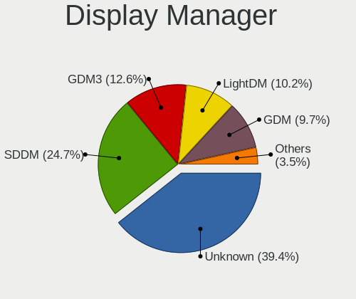

| Name    | Notebooks | Percent |
|---------|-----------|---------|
| Unknown | 680       | 39.35%  |
| SDDM    | 427       | 24.71%  |
| GDM3    | 218       | 12.62%  |
| LightDM | 176       | 10.19%  |
| GDM     | 167       | 9.66%   |
| TDM     | 39        | 2.26%   |
| SLiM    | 5         | 0.29%   |
| KDM     | 5         | 0.29%   |
| XDM     | 4         | 0.23%   |
| LXDM    | 3         | 0.17%   |
| GREETD  | 2         | 0.12%   |
| LY-DM   | 1         | 0.06%   |
| Ly      | 1         | 0.06%   |

OS Lang
-------

Language

| Lang    | Notebooks | Percent |
|---------|-----------|---------|
| cs_CZ   | 875       | 51.56%  |
| en_US   | 559       | 32.94%  |
| Unknown | 127       | 7.48%   |
| en_GB   | 39        | 2.3%    |
| C       | 36        | 2.12%   |
| ru_RU   | 20        | 1.18%   |
| pl_PL   | 6         | 0.35%   |
| sk_SK   | 5         | 0.29%   |
| uk_UA   | 4         | 0.24%   |
| POSIX   | 4         | 0.24%   |
| de_DE   | 3         | 0.18%   |
| it_IT   | 2         | 0.12%   |
| fr_FR   | 2         | 0.12%   |
| C.UTF8  | 2         | 0.12%   |
| tr_TR   | 1         | 0.06%   |
| ro_RO   | 1         | 0.06%   |
| pt_PT   | 1         | 0.06%   |
| pt_BR   | 1         | 0.06%   |
| hu_HU   | 1         | 0.06%   |
| es_ES   | 1         | 0.06%   |
| en_NG   | 1         | 0.06%   |
| en_DK   | 1         | 0.06%   |
| en_CA   | 1         | 0.06%   |
| en_150  | 1         | 0.06%   |
| el_GR   | 1         | 0.06%   |
| de_CH   | 1         | 0.06%   |
| bg_BG   | 1         | 0.06%   |

Boot Mode
---------

EFI or BIOS

| Mode | Notebooks | Percent |
|------|-----------|---------|
| EFI  | 864       | 50.56%  |
| BIOS | 845       | 49.44%  |

Filesystem
----------

Type of filesystem

| Type     | Notebooks | Percent |
|----------|-----------|---------|
| Ext4     | 1062      | 62.07%  |
| Overlay  | 252       | 14.73%  |
| Btrfs    | 217       | 12.68%  |
| Tmpfs    | 88        | 5.14%   |
| Unknown  | 33        | 1.93%   |
| Xfs      | 31        | 1.81%   |
| Zfs      | 13        | 0.76%   |
| Ext3     | 4         | 0.23%   |
| F2fs     | 2         | 0.12%   |
| Ext2     | 2         | 0.12%   |
| Bcachefs | 2         | 0.12%   |
| Aufs     | 2         | 0.12%   |
| Rootfs   | 1         | 0.06%   |
| Reiserfs | 1         | 0.06%   |
| Jfs      | 1         | 0.06%   |

Part. scheme
------------

Scheme of partitioning

| Type    | Notebooks | Percent |
|---------|-----------|---------|
| GPT     | 743       | 43.6%   |
| Unknown | 695       | 40.79%  |
| MBR     | 266       | 15.61%  |

Dual Boot with Linux/BSD
------------------------

Hosting more than one Linux/BSD

| Dual boot | Notebooks | Percent |
|-----------|-----------|---------|
| No        | 1527      | 90.62%  |
| Yes       | 158       | 9.38%   |

Dual Boot (Win)
---------------

Hosting Linux and Windows

| Dual boot | Notebooks | Percent |
|-----------|-----------|---------|
| No        | 1127      | 66.14%  |
| Yes       | 577       | 33.86%  |

Board
-----

Vendor
------

Motherboard manufacturer

| Name                           | Notebooks | Percent |
|--------------------------------|-----------|---------|
| Lenovo                         | 444       | 26.65%  |
| Hewlett-Packard                | 310       | 18.61%  |
| ASUSTek Computer               | 307       | 18.43%  |
| Dell                           | 241       | 14.47%  |
| Acer                           | 150       | 9%      |
| UMAX                           | 25        | 1.5%    |
| MSI                            | 25        | 1.5%    |
| Toshiba                        | 21        | 1.26%   |
| Sony                           | 20        | 1.2%    |
| Fujitsu                        | 16        | 0.96%   |
| Valve                          | 12        | 0.72%   |
| Apple                          | 10        | 0.6%    |
| TUXEDO                         | 9         | 0.54%   |
| HUAWEI                         | 7         | 0.42%   |
| Google                         | 7         | 0.42%   |
| Unknown                        | 7         | 0.42%   |
| Samsung Electronics            | 5         | 0.3%    |
| Notebook                       | 5         | 0.3%    |
| Timi                           | 4         | 0.24%   |
| Packard Bell                   | 4         | 0.24%   |
| Fujitsu Siemens                | 4         | 0.24%   |
| Insyde                         | 2         | 0.12%   |
| IBM                            | 2         | 0.12%   |
| Dynabook                       | 2         | 0.12%   |
| Chuwi                          | 2         | 0.12%   |
| Alienware                      | 2         | 0.12%   |
| Star Labs                      | 1         | 0.06%   |
| Standard                       | 1         | 0.06%   |
| SmbiosType1_SystemManufacturer | 1         | 0.06%   |
| SLIMBOOK                       | 1         | 0.06%   |
| Schenker                       | 1         | 0.06%   |
| Purism                         | 1         | 0.06%   |
| Prestigio                      | 1         | 0.06%   |
| Panasonic                      | 1         | 0.06%   |
| Minix                          | 1         | 0.06%   |
| Medion                         | 1         | 0.06%   |
| Jumper                         | 1         | 0.06%   |
| Intel                          | 1         | 0.06%   |
| INET                           | 1         | 0.06%   |
| In-Sing                        | 1         | 0.06%   |

Model
-----

Motherboard model

| Name                                  | Notebooks | Percent |
|---------------------------------------|-----------|---------|
| ASUS UX31E                            | 130       | 7.8%    |
| Unknown                               | 12        | 0.72%   |
| Valve Jupiter                         | 10        | 0.6%    |
| Dell Latitude E6420                   | 9         | 0.54%   |
| HP EliteBook 840 G3                   | 8         | 0.48%   |
| Lenovo IdeaPad S145-15AST 81N3        | 7         | 0.42%   |
| HP ProBook 455 G7                     | 7         | 0.42%   |
| HP EliteBook 840 G6                   | 7         | 0.42%   |
| Dell Latitude E6400                   | 7         | 0.42%   |
| HP ProBook 4540s                      | 6         | 0.36%   |
| HP EliteBook 845 G8 Notebook PC       | 6         | 0.36%   |
| Lenovo ThinkPad E14 20RA001LMC        | 5         | 0.3%    |
| HP ProBook 4530s                      | 5         | 0.3%    |
| HP ProBook 450 G5                     | 5         | 0.3%    |
| HP Pavilion dv7                       | 5         | 0.3%    |
| Dell XPS 15 9560                      | 5         | 0.3%    |
| Dell Latitude E7440                   | 5         | 0.3%    |
| Dell Latitude 5401                    | 5         | 0.3%    |
| Lenovo Z50-75 80EC                    | 4         | 0.24%   |
| Lenovo ThinkPad T14 Gen 1 20UES2WA00  | 4         | 0.24%   |
| Lenovo IdeaPad L340-17IRH Gaming 81LL | 4         | 0.24%   |
| HP Victus by Laptop 16-e0xxx          | 4         | 0.24%   |
| HP ProBook 4510s                      | 4         | 0.24%   |
| HP Notebook                           | 4         | 0.24%   |
| HP Laptop 15-bw0xx                    | 4         | 0.24%   |
| HP EliteBook 8470p                    | 4         | 0.24%   |
| HP 250 G6 Notebook PC                 | 4         | 0.24%   |
| HP 250 G3                             | 4         | 0.24%   |
| Dell XPS 15 7590                      | 4         | 0.24%   |
| Dell Precision M6500                  | 4         | 0.24%   |
| Dell Latitude E5470                   | 4         | 0.24%   |
| Dell Latitude 7490                    | 4         | 0.24%   |
| Dell Latitude 7480                    | 4         | 0.24%   |
| Dell Latitude 7400                    | 4         | 0.24%   |
| Dell Latitude 5480                    | 4         | 0.24%   |
| Acer Extensa 5620                     | 4         | 0.24%   |
| UMAX VisionBook-N12R                  | 3         | 0.18%   |
| UMAX VisionBook 15Wg Plus             | 3         | 0.18%   |
| Lenovo Y520-15IKBN 80WK               | 3         | 0.18%   |
| Lenovo Y50-70 20378                   | 3         | 0.18%   |

Model Family
------------

Motherboard model prefix

| Name                  | Notebooks | Percent |
|-----------------------|-----------|---------|
| Lenovo ThinkPad       | 234       | 14.05%  |
| ASUS UX31E            | 130       | 7.8%    |
| Dell Latitude         | 128       | 7.68%   |
| Lenovo IdeaPad        | 92        | 5.52%   |
| HP EliteBook          | 87        | 5.22%   |
| Acer Aspire           | 86        | 5.16%   |
| HP ProBook            | 70        | 4.2%    |
| HP Pavilion           | 32        | 1.92%   |
| Dell XPS              | 32        | 1.92%   |
| Dell Inspiron         | 31        | 1.86%   |
| Dell Precision        | 24        | 1.44%   |
| Lenovo Legion         | 23        | 1.38%   |
| HP ZBook              | 23        | 1.38%   |
| ASUS Zenbook          | 22        | 1.32%   |
| ASUS VivoBook         | 21        | 1.26%   |
| Toshiba Satellite     | 20        | 1.2%    |
| HP Laptop             | 20        | 1.2%    |
| HP Compaq             | 20        | 1.2%    |
| ASUS ASUS             | 19        | 1.14%   |
| Lenovo Yoga           | 18        | 1.08%   |
| UMAX VisionBook       | 17        | 1.02%   |
| Acer Extensa          | 17        | 1.02%   |
| Fujitsu LIFEBOOK      | 16        | 0.96%   |
| Acer Swift            | 16        | 0.96%   |
| Lenovo ThinkBook      | 13        | 0.78%   |
| HP 250                | 13        | 0.78%   |
| Acer TravelMate       | 13        | 0.78%   |
| Unknown               | 12        | 0.72%   |
| Dell Vostro           | 11        | 0.66%   |
| ASUS ROG              | 11        | 0.66%   |
| Valve Jupiter         | 10        | 0.6%    |
| Acer Nitro            | 9         | 0.54%   |
| HP Victus             | 6         | 0.36%   |
| HP OMEN               | 5         | 0.3%    |
| HP ENVY               | 5         | 0.3%    |
| Dell G5               | 5         | 0.3%    |
| TUXEDO InfinityBook   | 4         | 0.24%   |
| Packard Bell EasyNote | 4         | 0.24%   |
| Lenovo Z50-75         | 4         | 0.24%   |
| HP Notebook           | 4         | 0.24%   |

MFG Year
--------

Motherboard manufacture year

| Year    | Notebooks | Percent |
|---------|-----------|---------|
| 2011    | 226       | 13.57%  |
| 2020    | 155       | 9.3%    |
| 2021    | 152       | 9.12%   |
| 2019    | 132       | 7.92%   |
| 2018    | 101       | 6.06%   |
| 2012    | 100       | 6%      |
| 2013    | 94        | 5.64%   |
| 2017    | 92        | 5.52%   |
| 2014    | 82        | 4.92%   |
| 2015    | 80        | 4.8%    |
| 2022    | 77        | 4.62%   |
| 2008    | 71        | 4.26%   |
| 2016    | 70        | 4.2%    |
| 2010    | 57        | 3.42%   |
| 2023    | 56        | 3.36%   |
| 2009    | 42        | 2.52%   |
| 2007    | 35        | 2.1%    |
| 2024    | 19        | 1.14%   |
| 2006    | 16        | 0.96%   |
| 2005    | 4         | 0.24%   |
| Unknown | 3         | 0.18%   |
| 2004    | 2         | 0.12%   |

Form Factor
-----------

Physical design of the computer

| Name     | Notebooks | Percent |
|----------|-----------|---------|
| Notebook | 1666      | 100%    |

Secure Boot
-----------

Enabled or disabled

| State    | Notebooks | Percent |
|----------|-----------|---------|
| Disabled | 1486      | 87.98%  |
| Enabled  | 203       | 12.02%  |

Coreboot
--------

Have coreboot on board

| Used | Notebooks | Percent |
|------|-----------|---------|
| No   | 1656      | 99.4%   |
| Yes  | 10        | 0.6%    |

RAM Size
--------

Total RAM memory

| Size in GB  | Notebooks | Percent |
|-------------|-----------|---------|
| 3.01-4.0    | 428       | 25.24%  |
| 4.01-8.0    | 361       | 21.29%  |
| 8.01-16.0   | 303       | 17.87%  |
| 16.01-24.0  | 246       | 14.5%   |
| 32.01-64.0  | 164       | 9.67%   |
| 1.01-2.0    | 82        | 4.83%   |
| 24.01-32.0  | 38        | 2.24%   |
| 2.01-3.0    | 30        | 1.77%   |
| 64.01-256.0 | 28        | 1.65%   |
| 0.51-1.0    | 15        | 0.88%   |
| 0.01-0.5    | 1         | 0.06%   |

RAM Used
--------

Used RAM memory

| Used GB    | Notebooks | Percent |
|------------|-----------|---------|
| 1.01-2.0   | 627       | 33.89%  |
| 2.01-3.0   | 406       | 21.95%  |
| 4.01-8.0   | 307       | 16.59%  |
| 3.01-4.0   | 244       | 13.19%  |
| 8.01-16.0  | 117       | 6.32%   |
| 0.51-1.0   | 100       | 5.41%   |
| 16.01-24.0 | 23        | 1.24%   |
| 0.01-0.5   | 20        | 1.08%   |
| 32.01-64.0 | 3         | 0.16%   |
| 24.01-32.0 | 3         | 0.16%   |

Total Drives
------------

Number of drives on board

| Drives | Notebooks | Percent |
|--------|-----------|---------|
| 1      | 1330      | 78.05%  |
| 2      | 319       | 18.72%  |
| 3      | 36        | 2.11%   |
| 0      | 16        | 0.94%   |
| 4      | 2         | 0.12%   |
| 7      | 1         | 0.06%   |

Has CD-ROM
----------

Has CD-ROM on board

| Presented | Notebooks | Percent |
|-----------|-----------|---------|
| No        | 1198      | 71.48%  |
| Yes       | 478       | 28.52%  |

Has Ethernet
------------

Has Ethernet on board

| Presented | Notebooks | Percent |
|-----------|-----------|---------|
| Yes       | 1397      | 83.15%  |
| No        | 283       | 16.85%  |

Has WiFi
--------

Has WiFi module

| Presented | Notebooks | Percent |
|-----------|-----------|---------|
| Yes       | 1628      | 97.54%  |
| No        | 41        | 2.46%   |

Has Bluetooth
-------------

Has Bluetooth module

| Presented | Notebooks | Percent |
|-----------|-----------|---------|
| Yes       | 1271      | 75.3%   |
| No        | 417       | 24.7%   |

Location
--------

Country
-------

Geographic location (country)

| Country | Notebooks | Percent |
|---------|-----------|---------|
| Czechia | 1666      | 100%    |

City
----

Geographic location (city)

| City                 | Notebooks | Percent |
|----------------------|-----------|---------|
| Prague               | 705       | 40.4%   |
| Brno                 | 142       | 8.14%   |
| Ostrava              | 49        | 2.81%   |
| Pilsen               | 35        | 2.01%   |
| Olomouc              | 26        | 1.49%   |
| Brdo                 | 26        | 1.49%   |
| Pardubice            | 22        | 1.26%   |
| Hradec Krlov     | 20        | 1.15%   |
| Liberec              | 19        | 1.09%   |
| esk Budjovice  | 18        | 1.03%   |
| Chomutov             | 13        | 0.74%   |
| Havov            | 11        | 0.63%   |
| Zln                | 10        | 0.57%   |
| Most                 | 10        | 0.57%   |
| Karlovy Vary         | 10        | 0.57%   |
| Znojmo               | 9         | 0.52%   |
| Opava                | 9         | 0.52%   |
| Kladno               | 9         | 0.52%   |
| st nad Labem     | 8         | 0.46%   |
| Tbor               | 8         | 0.46%   |
| lapanice           | 8         | 0.46%   |
| Pbram            | 8         | 0.46%   |
| Jihlava              | 8         | 0.46%   |
| Roznov pod Radhostem | 6         | 0.34%   |
| Mlad Boleslav      | 6         | 0.34%   |
| Frdek-Mstek      | 6         | 0.34%   |
| Perov              | 5         | 0.29%   |
| Marinsk Lzn  | 5         | 0.29%   |
| Krnov                | 5         | 0.29%   |
| Karvina              | 5         | 0.29%   |
| Jedovnice            | 5         | 0.29%   |
| Ceska Kamenice       | 5         | 0.29%   |
| Celakovice           | 5         | 0.29%   |
| Veseli nad Luznici   | 4         | 0.23%   |
| Uhlirske Janovice    | 4         | 0.23%   |
| Uhersk Hradit  | 4         | 0.23%   |
| Turnov               | 4         | 0.23%   |
| Teb            | 4         | 0.23%   |
| Teplice              | 4         | 0.23%   |
| Straz pod Ralskem    | 4         | 0.23%   |

Drives
------

Drive Vendor
------------

Hard drive vendors

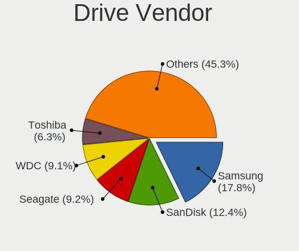

| Vendor                         | Notebooks | Drives | Percent |
|--------------------------------|-----------|--------|---------|
| Samsung Electronics            | 357       | 470    | 17.77%  |
| SanDisk                        | 249       | 273    | 12.39%  |
| Seagate                        | 184       | 245    | 9.16%   |
| WDC                            | 183       | 216    | 9.11%   |
| Toshiba                        | 126       | 155    | 6.27%   |
| Kingston                       | 109       | 124    | 5.43%   |
| SK hynix                       | 98        | 115    | 4.88%   |
| Unknown                        | 97        | 131    | 4.83%   |
| Micron Technology              | 77        | 96     | 3.83%   |
| Intel                          | 70        | 85     | 3.48%   |
| Hitachi                        | 62        | 72     | 3.09%   |
| HGST                           | 48        | 61     | 2.39%   |
| Patriot                        | 36        | 44     | 1.79%   |
| Crucial                        | 35        | 45     | 1.74%   |
| A-DATA Technology              | 33        | 36     | 1.64%   |
| KIOXIA                         | 31        | 47     | 1.54%   |
| Unknown                        | 17        | 20     | 0.85%   |
| Apacer                         | 15        | 20     | 0.75%   |
| LITEONIT                       | 12        | 16     | 0.6%    |
| Verbatim                       | 11        | 12     | 0.55%   |
| Transcend                      | 11        | 12     | 0.55%   |
| Phison Electronics             | 11        | 13     | 0.55%   |
| Apple                          | 10        | 17     | 0.5%    |
| Kingston Technology Company    | 8         | 8      | 0.4%    |
| Fujitsu                        | 8         | 8      | 0.4%    |
| Silicon Motion                 | 7         | 7      | 0.35%   |
| LITEON                         | 7         | 7      | 0.35%   |
| China                          | 7         | 8      | 0.35%   |
| Phison                         | 6         | 13     | 0.3%    |
| Micron/Crucial Technology      | 6         | 6      | 0.3%    |
| UMAX                           | 5         | 5      | 0.25%   |
| Lenovo                         | 4         | 5      | 0.2%    |
| JMicron Technology             | 4         | 4      | 0.2%    |
| GOODRAM                        | 4         | 5      | 0.2%    |
| Gigabyte Technology            | 4         | 9      | 0.2%    |
| ASMedia                        | 4         | 6      | 0.2%    |
| Team                           | 3         | 3      | 0.15%   |
| Solid State Storage Technology | 3         | 3      | 0.15%   |
| MAXIO Technology (Hangzhou)    | 3         | 3      | 0.15%   |
| XrayDisk                       | 2         | 2      | 0.1%    |

Drive Model
-----------

Hard drive models

| Model                                                | Notebooks | Percent |
|------------------------------------------------------|-----------|---------|
| SanDisk SSD U100 256GB                               | 129       | 6.16%   |
| Samsung NVMe SSD Controller SM981/PM981/PM983 512GB  | 30        | 1.43%   |
| Seagate ST1000LM035-1RK172 1TB                       | 20        | 0.95%   |
| Unknown MMC Card  32GB                               | 19        | 0.91%   |
| Samsung NVMe SSD Drive 512GB                         | 17        | 0.81%   |
| HGST HTS721010A9E630 1TB                             | 17        | 0.81%   |
| Unknown                                              | 17        | 0.81%   |
| Unknown MMC Card  64GB                               | 16        | 0.76%   |
| Samsung SSD 860 EVO 500GB                            | 16        | 0.76%   |
| Samsung NVMe SSD Controller PM9A1/PM9A3/980PRO 512GB | 16        | 0.76%   |
| Kingston SA400S37480G 480GB SSD                      | 15        | 0.72%   |
| WDC WDS240G2G0A-00JH30 240GB SSD                     | 12        | 0.57%   |
| SanDisk NVMe SSD Drive 512GB                         | 12        | 0.57%   |
| Unknown MMC Card  16GB                               | 11        | 0.53%   |
| Toshiba MQ01ABD100 1TB                               | 11        | 0.53%   |
| Seagate ST1000LM024 HN-M101MBB 1TB                   | 11        | 0.53%   |
| Samsung MZVLB1T0HBLR-000L2 1TB                       | 11        | 0.53%   |
| Kingston SA400S37240G 240GB SSD                      | 11        | 0.53%   |
| Seagate ST9500420AS 500GB                            | 10        | 0.48%   |
| Samsung SSD 850 EVO 250GB                            | 10        | 0.48%   |
| Patriot Burst 480GB SSD                              | 10        | 0.48%   |
| HGST HTS725050A7E630 500GB                           | 10        | 0.48%   |
| Toshiba MQ04ABF100 1TB                               | 9         | 0.43%   |
| Seagate ST500LT012-1DG142 500GB                      | 9         | 0.43%   |
| Phison PS5013 E13 NVMe Controller 512GB              | 9         | 0.43%   |
| Toshiba NVMe SSD Drive 256GB                         | 8         | 0.38%   |
| Toshiba MQ01ABF050 500GB                             | 8         | 0.38%   |
| SK hynix NVMe SSD Drive 512GB                        | 8         | 0.38%   |
| SanDisk NVMe SSD Drive 1TB                           | 8         | 0.38%   |
| Samsung SSD 980 1TB                                  | 8         | 0.38%   |
| Samsung SSD 860 EVO 250GB                            | 8         | 0.38%   |
| Samsung SSD 860 EVO 1TB                              | 8         | 0.38%   |
| WDC WDS500G2B0A-00SM50 500GB SSD                     | 7         | 0.33%   |
| Unknown MMC Card  128GB                              | 7         | 0.33%   |
| Sandisk WD Blue SN550 NVMe SSD 256GB                 | 7         | 0.33%   |
| Sandisk WD Black SN750 / PC SN730 NVMe SSD 512GB     | 7         | 0.33%   |
| SanDisk NVMe SSD Drive 1024GB                        | 7         | 0.33%   |
| SanDisk DF4032  32GB                                 | 7         | 0.33%   |
| Samsung SSD 850 EVO 500GB                            | 7         | 0.33%   |
| Samsung NVMe SSD Controller SM961/PM961/SM963 256GB  | 7         | 0.33%   |

HDD Vendor
----------

Hard disk drive vendors

| Vendor              | Notebooks | Drives | Percent |
|---------------------|-----------|--------|---------|
| Seagate             | 179       | 238    | 36.76%  |
| WDC                 | 102       | 119    | 20.94%  |
| Toshiba             | 74        | 86     | 15.2%   |
| Hitachi             | 62        | 72     | 12.73%  |
| HGST                | 48        | 61     | 9.86%   |
| Fujitsu             | 8         | 8      | 1.64%   |
| ASMedia             | 3         | 4      | 0.62%   |
| Samsung Electronics | 2         | 2      | 0.41%   |
| JMicron Technology  | 2         | 2      | 0.41%   |
| ASMT                | 2         | 2      | 0.41%   |
| Unknown             | 1         | 1      | 0.21%   |
| TO Exter            | 1         | 2      | 0.21%   |
| SABRENT             | 1         | 1      | 0.21%   |
| IBM/Hitachi         | 1         | 1      | 0.21%   |
| Apple               | 1         | 3      | 0.21%   |

SSD Vendor
----------

Solid state drive vendors

| Vendor              | Notebooks | Drives | Percent |
|---------------------|-----------|--------|---------|
| SanDisk             | 168       | 173    | 24.14%  |
| Samsung Electronics | 144       | 174    | 20.69%  |
| Kingston            | 79        | 90     | 11.35%  |
| WDC                 | 38        | 51     | 5.46%   |
| Patriot             | 33        | 39     | 4.74%   |
| Intel               | 31        | 38     | 4.45%   |
| A-DATA Technology   | 30        | 33     | 4.31%   |
| Crucial             | 28        | 38     | 4.02%   |
| Micron Technology   | 18        | 23     | 2.59%   |
| SK hynix            | 15        | 16     | 2.16%   |
| Apacer              | 14        | 19     | 2.01%   |
| LITEONIT            | 12        | 16     | 1.72%   |
| Verbatim            | 11        | 12     | 1.58%   |
| Transcend           | 11        | 12     | 1.58%   |
| Toshiba             | 11        | 13     | 1.58%   |
| China               | 7         | 8      | 1.01%   |
| Apple               | 6         | 8      | 0.86%   |
| UMAX                | 5         | 5      | 0.72%   |
| LITEON              | 5         | 5      | 0.72%   |
| GOODRAM             | 3         | 4      | 0.43%   |
| Gigabyte Technology | 3         | 7      | 0.43%   |
| Team                | 2         | 2      | 0.29%   |
| KingSpec            | 2         | 3      | 0.29%   |
| Hewlett-Packard     | 2         | 2      | 0.29%   |
| Unknown             | 2         | 2      | 0.29%   |
| WDC WDS             | 1         | 1      | 0.14%   |
| USB3.0              | 1         | 1      | 0.14%   |
| UMIS                | 1         | 1      | 0.14%   |
| StoreJet            | 1         | 1      | 0.14%   |
| ShanDianZhe         | 1         | 1      | 0.14%   |
| Seagate             | 1         | 1      | 0.14%   |
| OCZ                 | 1         | 4      | 0.14%   |
| Netac               | 1         | 1      | 0.14%   |
| Mushkin             | 1         | 1      | 0.14%   |
| MicroFrom           | 1         | 1      | 0.14%   |
| KIOXIA-EXCERIA      | 1         | 1      | 0.14%   |
| Intenso             | 1         | 1      | 0.14%   |
| HPE                 | 1         | 1      | 0.14%   |
| Dahua               | 1         | 1      | 0.14%   |
| CT500MX5            | 1         | 1      | 0.14%   |

Drive Kind
----------

HDD or SSD

| Kind    | Notebooks | Drives | Percent |
|---------|-----------|--------|---------|
| SSD     | 661       | 812    | 34.54%  |
| NVMe    | 652       | 894    | 34.06%  |
| HDD     | 472       | 602    | 24.66%  |
| MMC     | 117       | 153    | 6.11%   |
| Unknown | 12        | 18     | 0.63%   |

Drive Connector
---------------

SATA, SAS, NVMe, etc.

| Type | Notebooks | Drives | Percent |
|------|-----------|--------|---------|
| SATA | 1030      | 1366   | 55.65%  |
| NVMe | 650       | 891    | 35.12%  |
| MMC  | 117       | 153    | 6.32%   |
| SAS  | 54        | 69     | 2.92%   |

Drive Size
----------

Size of hard drive

| Size in TB | Notebooks | Drives | Percent |
|------------|-----------|--------|---------|
| 0.01-0.5   | 816       | 1016   | 73.05%  |
| 0.51-1.0   | 266       | 348    | 23.81%  |
| 1.01-2.0   | 30        | 44     | 2.69%   |
| 3.01-4.0   | 3         | 4      | 0.27%   |
| 10.01-20.0 | 1         | 1      | 0.09%   |
| 4.01-10.0  | 1         | 1      | 0.09%   |

Space Total
-----------

Amount of disk space available on the file system

| Size in GB     | Notebooks | Percent |
|----------------|-----------|---------|
| 101-250        | 409       | 23.41%  |
| 251-500        | 402       | 23.01%  |
| 1-20           | 274       | 15.68%  |
| 501-1000       | 254       | 14.54%  |
| 51-100         | 115       | 6.58%   |
| 1001-2000      | 107       | 6.12%   |
| 21-50          | 68        | 3.89%   |
| Unknown        | 61        | 3.49%   |
| More than 3000 | 37        | 2.12%   |
| 2001-3000      | 20        | 1.14%   |

Space Used
----------

Amount of used disk space

| Used GB        | Notebooks | Percent |
|----------------|-----------|---------|
| 1-20           | 781       | 42.94%  |
| 21-50          | 264       | 14.51%  |
| 101-250        | 230       | 12.64%  |
| 51-100         | 196       | 10.78%  |
| 251-500        | 159       | 8.74%   |
| 501-1000       | 75        | 4.12%   |
| Unknown        | 61        | 3.35%   |
| 1001-2000      | 31        | 1.7%    |
| More than 3000 | 12        | 0.66%   |
| 2001-3000      | 8         | 0.44%   |
| 0              | 2         | 0.11%   |

Malfunc. Drives
---------------

Drive models with a malfunction

| Model                                 | Notebooks | Drives | Percent |
|---------------------------------------|-----------|--------|---------|
| SanDisk SSD U100 256GB                | 129       | 130    | 57.59%  |
| HGST HTS725050A7E630 500GB            | 4         | 5      | 1.79%   |
| SK hynix BC711 HFM512GD3JX013N 512GB  | 3         | 4      | 1.34%   |
| Seagate ST9500420AS 500GB             | 3         | 4      | 1.34%   |
| WDC WDS240G2G0A-00JH30 240GB SSD      | 2         | 2      | 0.89%   |
| Toshiba MQ01ABD075 752GB              | 2         | 2      | 0.89%   |
| Toshiba MK1234GSX 120GB               | 2         | 2      | 0.89%   |
| Seagate ST9250315AS 250GB             | 2         | 2      | 0.89%   |
| Seagate ST1000LX015-1U7172 1TB        | 2         | 2      | 0.89%   |
| Seagate ST1000LM024 HN-M101MBB 1TB    | 2         | 2      | 0.89%   |
| Hitachi HTS541610J9SA00 100GB         | 2         | 2      | 0.89%   |
| HGST HTS721010A9E630 1TB              | 2         | 2      | 0.89%   |
| HGST HTS545050A7E380 500GB            | 2         | 2      | 0.89%   |
| WDC WD7500BPVT-22HXZT3 752GB          | 1         | 1      | 0.45%   |
| WDC WD7500BPKT-75PK4T0 752GB          | 1         | 1      | 0.45%   |
| WDC WD6400BPVT-60HXZT1 640GB          | 1         | 1      | 0.45%   |
| WDC WD5000LPCX-60VHAT0 500GB          | 1         | 1      | 0.45%   |
| WDC WD3200BEVT-60ZCT1 320GB           | 1         | 1      | 0.45%   |
| Toshiba MQ04ABF100 1TB                | 1         | 1      | 0.45%   |
| Toshiba MQ01ABD100 1TB                | 1         | 1      | 0.45%   |
| Toshiba MK8037GSX 80GB                | 1         | 1      | 0.45%   |
| Toshiba MK7559GSXP 752GB              | 1         | 1      | 0.45%   |
| Toshiba MK6465GSXN 640GB              | 1         | 1      | 0.45%   |
| Toshiba MK5056GSY 500GB               | 1         | 1      | 0.45%   |
| Toshiba MK2561GSYN 250GB              | 1         | 2      | 0.45%   |
| Toshiba MK2552GSX 250GB               | 1         | 1      | 0.45%   |
| SK hynix PC711 HFS512GDE9X073N 512GB  | 1         | 1      | 0.45%   |
| SK hynix HFS256G3BTND-N210A 256GB SSD | 1         | 1      | 0.45%   |
| SK hynix HFS128G39TND-N210A 128GB SSD | 1         | 1      | 0.45%   |
| Seagate ST980811AS 80GB               | 1         | 1      | 0.45%   |
| Seagate ST9750420AS 752GB             | 1         | 1      | 0.45%   |
| Seagate ST9500420ASG 500GB            | 1         | 1      | 0.45%   |
| Seagate ST9320423AS 320GB             | 1         | 1      | 0.45%   |
| Seagate ST9250827AS 250GB             | 1         | 1      | 0.45%   |
| Seagate ST9250410ASG 250GB            | 1         | 1      | 0.45%   |
| Seagate ST9200420ASG 200GB            | 1         | 1      | 0.45%   |
| Seagate ST910021AS 100GB              | 1         | 1      | 0.45%   |
| Seagate ST500LT012-1DG142 500GB       | 1         | 1      | 0.45%   |
| Seagate ST500LM000-SSHD-8GB           | 1         | 1      | 0.45%   |
| Seagate ST320LT007-9ZV142 320GB       | 1         | 1      | 0.45%   |

Malfunc. Drive Vendor
---------------------

Vendors of faulty drives

| Vendor              | Notebooks | Drives | Percent |
|---------------------|-----------|--------|---------|
| SanDisk             | 131       | 132    | 58.48%  |
| Seagate             | 22        | 23     | 9.82%   |
| Hitachi             | 15        | 16     | 6.7%    |
| Toshiba             | 12        | 13     | 5.36%   |
| HGST                | 9         | 10     | 4.02%   |
| WDC                 | 7         | 7      | 3.13%   |
| Samsung Electronics | 7         | 10     | 3.13%   |
| SK hynix            | 6         | 7      | 2.68%   |
| Intel               | 6         | 6      | 2.68%   |
| Fujitsu             | 2         | 2      | 0.89%   |
| A-DATA Technology   | 2         | 3      | 0.89%   |
| Micron Technology   | 1         | 1      | 0.45%   |
| LITEONIT            | 1         | 2      | 0.45%   |
| Kingston            | 1         | 1      | 0.45%   |
| IBM/Hitachi         | 1         | 1      | 0.45%   |
| Crucial             | 1         | 1      | 0.45%   |

Malfunc. HDD Vendor
-------------------

Vendors of faulty HDD drives

| Vendor      | Notebooks | Drives | Percent |
|-------------|-----------|--------|---------|
| Seagate     | 22        | 23     | 33.33%  |
| Hitachi     | 15        | 16     | 22.73%  |
| Toshiba     | 12        | 13     | 18.18%  |
| HGST        | 9         | 10     | 13.64%  |
| WDC         | 5         | 5      | 7.58%   |
| Fujitsu     | 2         | 2      | 3.03%   |
| IBM/Hitachi | 1         | 1      | 1.52%   |

Malfunc. Drive Kind
-------------------

Kinds of faulty drives

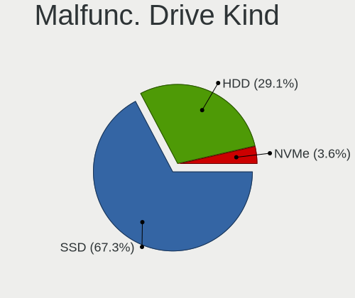

| Kind | Notebooks | Drives | Percent |
|------|-----------|--------|---------|
| SSD  | 150       | 154    | 67.26%  |
| HDD  | 65        | 70     | 29.15%  |
| NVMe | 8         | 11     | 3.59%   |

Failed Drives
-------------

Failed drive models

| Model                     | Notebooks | Drives | Percent |
|---------------------------|-----------|--------|---------|
| Intel SSDSC2BW120H6 120GB | 1         | 2      | 100%    |

Failed Drive Vendor
-------------------

Failed drive vendors

| Vendor | Notebooks | Drives | Percent |
|--------|-----------|--------|---------|
| Intel  | 1         | 2      | 100%    |

Drive Status
------------

Number of failed and malfunc. drives

| Status   | Notebooks | Drives | Percent |
|----------|-----------|--------|---------|
| Detected | 871       | 1383   | 49.52%  |
| Works    | 665       | 859    | 37.81%  |
| Malfunc  | 222       | 235    | 12.62%  |
| Failed   | 1         | 2      | 0.06%   |

Storage controller
------------------

Storage Vendor
--------------

Storage controller vendors

| Vendor                           | Notebooks | Percent |
|----------------------------------|-----------|---------|
| Intel                            | 1106      | 56.09%  |
| Samsung Electronics              | 223       | 11.31%  |
| AMD                              | 184       | 9.33%   |
| SanDisk                          | 114       | 5.78%   |
| SK hynix                         | 80        | 4.06%   |
| Micron Technology                | 59        | 2.99%   |
| Toshiba America Info Systems     | 41        | 2.08%   |
| Kingston Technology Company      | 39        | 1.98%   |
| KIOXIA                           | 33        | 1.67%   |
| Phison Electronics               | 21        | 1.06%   |
| Micron/Crucial Technology        | 12        | 0.61%   |
| Silicon Motion                   | 9         | 0.46%   |
| Union Memory (Shenzhen)          | 6         | 0.3%    |
| ADATA Technology                 | 5         | 0.25%   |
| Nvidia                           | 4         | 0.2%    |
| MAXIO Technology (Hangzhou)      | 4         | 0.2%    |
| Lite-On Technology               | 4         | 0.2%    |
| Lenovo                           | 4         | 0.2%    |
| Solid State Storage Technology   | 3         | 0.15%   |
| Silicon Integrated Systems [SiS] | 3         | 0.15%   |
| Hosin Global Electronics         | 3         | 0.15%   |
| Realtek Semiconductor            | 2         | 0.1%    |
| JMicron Technology               | 2         | 0.1%    |
| ASMedia Technology               | 2         | 0.1%    |
| Apple                            | 2         | 0.1%    |
| VIA Technologies                 | 1         | 0.05%   |
| Solidigm                         | 1         | 0.05%   |
| Seagate Technology               | 1         | 0.05%   |
| O2 Micro                         | 1         | 0.05%   |
| Marvell Technology Group         | 1         | 0.05%   |
| INNOGRIT                         | 1         | 0.05%   |
| Biwin Storage Technology         | 1         | 0.05%   |

Storage Model
-------------

Storage controller models

| Model                                                                            | Notebooks | Percent |
|----------------------------------------------------------------------------------|-----------|---------|
| Intel 6 Series/C200 Series Chipset Family 6 port Mobile SATA AHCI Controller     | 209       | 9.93%   |
| AMD FCH SATA Controller [AHCI mode]                                              | 157       | 7.46%   |
| Intel Sunrise Point-LP SATA Controller [AHCI mode]                               | 100       | 4.75%   |
| Intel 7 Series Chipset Family 6-port SATA Controller [AHCI mode]                 | 99        | 4.7%    |
| Samsung NVMe SSD Controller SM981/PM981/PM983                                    | 85        | 4.04%   |
| Intel 82801 Mobile SATA Controller [RAID mode]                                   | 74        | 3.52%   |
| Samsung NVMe SSD Controller 980 (DRAM-less)                                      | 67        | 3.18%   |
| Intel 82801IBM/IEM (ICH9M/ICH9M-E) 4 port SATA Controller [AHCI mode]            | 61        | 2.9%    |
| Intel Volume Management Device NVMe RAID Controller                              | 58        | 2.76%   |
| Intel 8 Series SATA Controller 1 [AHCI mode]                                     | 48        | 2.28%   |
| Intel Cannon Lake Mobile PCH SATA AHCI Controller                                | 43        | 2.04%   |
| Intel 8 Series/C220 Series Chipset Family 6-port SATA Controller 1 [AHCI mode]   | 42        | 2%      |
| Intel Wildcat Point-LP SATA Controller [AHCI Mode]                               | 37        | 1.76%   |
| SanDisk Extreme Pro / WD Black SN750 / PC SN730 / Red SN700 NVMe SSD             | 36        | 1.71%   |
| Intel 82801HM/HEM (ICH8M/ICH8M-E) IDE Controller                                 | 35        | 1.66%   |
| Intel Celeron/Pentium Silver Processor SATA Controller                           | 33        | 1.57%   |
| Intel HM170/QM170 Chipset SATA Controller [AHCI Mode]                            | 31        | 1.47%   |
| Samsung NVMe SSD Controller PM9A1/PM9A3/980PRO                                   | 30        | 1.43%   |
| SK hynix Gold P31/BC711/PC711 NVMe Solid State Drive                             | 28        | 1.33%   |
| Intel 82801HM/HEM (ICH8M/ICH8M-E) SATA Controller [AHCI mode]                    | 26        | 1.24%   |
| Intel 5 Series/3400 Series Chipset 4 port SATA AHCI Controller                   | 26        | 1.24%   |
| SanDisk Ultra 3D / WD PC SN530, IX SN530, Blue SN550 NVMe SSD (DRAM-less)        | 22        | 1.05%   |
| Intel Atom Processor E3800 Series SATA AHCI Controller                           | 22        | 1.05%   |
| KIOXIA NVMe SSD Controller BG4 (DRAM-less)                                       | 21        | 1%      |
| Samsung NVMe SSD Controller SM961/PM961/SM963                                    | 20        | 0.95%   |
| Intel Comet Lake SATA AHCI Controller                                            | 17        | 0.81%   |
| Toshiba America Info Systems XG6 NVMe SSD Controller                             | 16        | 0.76%   |
| Intel Atom/Celeron/Pentium Processor x5-E8000/J3xxx/N3xxx Series SATA Controller | 16        | 0.76%   |
| Intel 5 Series/3400 Series Chipset 6 port SATA AHCI Controller                   | 16        | 0.76%   |
| Intel 400 Series Chipset Family SATA AHCI Controller                             | 15        | 0.71%   |
| AMD SB7x0/SB8x0/SB9x0 SATA Controller [AHCI mode]                                | 15        | 0.71%   |
| Phison PS5013-E13 PCIe3 NVMe Controller (DRAM-less)                              | 14        | 0.67%   |
| Micron 2200S NVMe SSD [Cassandra]                                                | 14        | 0.67%   |
| Intel SSD 670p Series [Keystone Harbor]                                          | 14        | 0.67%   |
| Intel 82801GBM/GHM (ICH7-M Family) SATA Controller [IDE mode]                    | 14        | 0.67%   |
| Micron 2300 NVMe SSD [Santana]                                                   | 13        | 0.62%   |
| Intel SSD 660P Series                                                            | 13        | 0.62%   |
| SanDisk WD Black SN770 / PC SN740 256GB / PC SN560 (DRAM-less) NVMe SSD          | 12        | 0.57%   |
| Intel Tiger Lake-LP SATA Controller                                              | 12        | 0.57%   |
| Intel 82801HM/HEM (ICH8M/ICH8M-E) SATA Controller [IDE mode]                     | 12        | 0.57%   |

Storage Kind
------------

Kind of storage controller (IDE, SATA, NVMe, SAS, ...)

| Kind | Notebooks | Percent |
|------|-----------|---------|
| SATA | 1110      | 55.25%  |
| NVMe | 652       | 32.45%  |
| RAID | 143       | 7.12%   |
| IDE  | 104       | 5.18%   |

Processor
---------

CPU Vendor
----------

Processor vendors

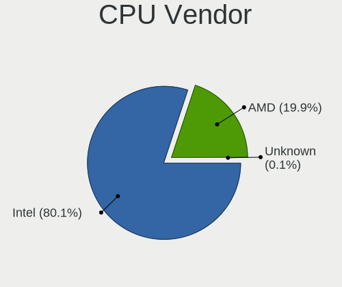

| Vendor  | Notebooks | Percent |
|---------|-----------|---------|
| Intel   | 1334      | 80.07%  |
| AMD     | 331       | 19.87%  |
| Unknown | 1         | 0.06%   |

CPU Model
---------

Processor models

| Model                                         | Notebooks | Percent |
|-----------------------------------------------|-----------|---------|
| Intel Core i7-2677M CPU @ 1.80GHz             | 130       | 7.79%   |
| Intel Core i5-2520M CPU @ 2.50GHz             | 24        | 1.44%   |
| Intel Core i5-8250U CPU @ 1.60GHz             | 22        | 1.32%   |
| Intel Core i5-7200U CPU @ 2.50GHz             | 19        | 1.14%   |
| Intel Core i7-7700HQ CPU @ 2.80GHz            | 17        | 1.02%   |
| Intel Core i5-6300U CPU @ 2.40GHz             | 17        | 1.02%   |
| AMD Ryzen 7 5800H with Radeon Graphics        | 17        | 1.02%   |
| Intel Core i7-8565U CPU @ 1.80GHz             | 16        | 0.96%   |
| Intel Core i7-8550U CPU @ 1.80GHz             | 16        | 0.96%   |
| Intel Core i5-8265U CPU @ 1.60GHz             | 16        | 0.96%   |
| Intel Core i5-6200U CPU @ 2.30GHz             | 16        | 0.96%   |
| AMD Ryzen 7 PRO 4750U with Radeon Graphics    | 16        | 0.96%   |
| Intel Core i7-10510U CPU @ 1.80GHz            | 15        | 0.9%    |
| Intel Core i5-3320M CPU @ 2.60GHz             | 15        | 0.9%    |
| Intel Core i5-3210M CPU @ 2.50GHz             | 15        | 0.9%    |
| Intel 11th Gen Core i5-1135G7 @ 2.40GHz       | 15        | 0.9%    |
| AMD Ryzen 7 4700U with Radeon Graphics        | 15        | 0.9%    |
| AMD Ryzen 5 5600H with Radeon Graphics        | 15        | 0.9%    |
| Intel Core i7-9750H CPU @ 2.60GHz             | 14        | 0.84%   |
| Intel Celeron N4020 CPU @ 1.10GHz             | 14        | 0.84%   |
| Intel Core i7-6700HQ CPU @ 2.60GHz            | 13        | 0.78%   |
| AMD Ryzen 5 5500U with Radeon Graphics        | 13        | 0.78%   |
| Intel Core i7-8650U CPU @ 1.90GHz             | 12        | 0.72%   |
| Intel Core i7-10850H CPU @ 2.70GHz            | 12        | 0.72%   |
| Intel Core i5-5200U CPU @ 2.20GHz             | 12        | 0.72%   |
| Intel 12th Gen Core i7-12700H                 | 12        | 0.72%   |
| Intel 11th Gen Core i7-1165G7 @ 2.80GHz       | 12        | 0.72%   |
| AMD Ryzen 5 4500U with Radeon Graphics        | 12        | 0.72%   |
| Intel Core i7-8750H CPU @ 2.20GHz             | 11        | 0.66%   |
| Intel Core i5-4300U CPU @ 1.90GHz             | 11        | 0.66%   |
| AMD Ryzen 5 3500U with Radeon Vega Mobile Gfx | 11        | 0.66%   |
| AMD Custom APU 0405                           | 11        | 0.66%   |
| Intel Celeron N4100 CPU @ 1.10GHz             | 10        | 0.6%    |
| AMD Ryzen 7 5700U with Radeon Graphics        | 10        | 0.6%    |
| Intel Core i7-6500U CPU @ 2.50GHz             | 9         | 0.54%   |
| Intel Core i7-10610U CPU @ 1.80GHz            | 9         | 0.54%   |
| Intel Core i5-3230M CPU @ 2.60GHz             | 9         | 0.54%   |
| Intel Core i5-2450M CPU @ 2.50GHz             | 9         | 0.54%   |
| Intel Core i5 CPU M 520 @ 2.40GHz             | 9         | 0.54%   |
| Intel Core i3-5005U CPU @ 2.00GHz             | 9         | 0.54%   |

CPU Model Family
----------------

Processor model prefix

| Model                   | Notebooks | Percent |
|-------------------------|-----------|---------|
| Intel Core i7           | 444       | 26.63%  |
| Intel Core i5           | 330       | 19.8%   |
| Other                   | 167       | 10.02%  |
| Intel Celeron           | 98        | 5.88%   |
| Intel Core 2 Duo        | 86        | 5.16%   |
| AMD Ryzen 5             | 85        | 5.1%    |
| Intel Core i3           | 83        | 4.98%   |
| AMD Ryzen 7             | 80        | 4.8%    |
| Intel Pentium           | 44        | 2.64%   |
| AMD Ryzen 7 PRO         | 38        | 2.28%   |
| Intel Atom              | 28        | 1.68%   |
| AMD A6                  | 15        | 0.9%    |
| AMD A4                  | 15        | 0.9%    |
| Intel Pentium Dual-Core | 10        | 0.6%    |
| Intel Genuine           | 10        | 0.6%    |
| AMD Ryzen 5 PRO         | 10        | 0.6%    |
| AMD Ryzen 3             | 10        | 0.6%    |
| Intel Celeron M         | 9         | 0.54%   |
| AMD A8                  | 9         | 0.54%   |
| Intel Core 2            | 8         | 0.48%   |
| Intel Core              | 6         | 0.36%   |
| AMD Ryzen 9             | 6         | 0.36%   |
| AMD E1                  | 6         | 0.36%   |
| Intel Pentium Silver    | 5         | 0.3%    |
| Intel Pentium M         | 5         | 0.3%    |
| Intel Pentium Dual      | 5         | 0.3%    |
| Intel Celeron Dual-Core | 5         | 0.3%    |
| Intel Core i9           | 4         | 0.24%   |
| AMD Turion II           | 4         | 0.24%   |
| AMD FX                  | 4         | 0.24%   |
| AMD E                   | 4         | 0.24%   |
| Intel Xeon              | 3         | 0.18%   |
| Intel Core m5           | 3         | 0.18%   |
| AMD Turion 64 X2 Mobile | 3         | 0.18%   |
| AMD Mobile Sempron      | 3         | 0.18%   |
| AMD E2                  | 3         | 0.18%   |
| AMD Athlon X2           | 3         | 0.18%   |
| AMD A12                 | 3         | 0.18%   |
| AMD A10                 | 3         | 0.18%   |
| AMD Athlon II Dual-Core | 2         | 0.12%   |

CPU Cores
---------

Number of processor cores

| Number  | Notebooks | Percent |
|---------|-----------|---------|
| 2       | 818       | 49.04%  |
| 4       | 460       | 27.58%  |
| 6       | 141       | 8.45%   |
| 8       | 135       | 8.09%   |
| 1       | 37        | 2.22%   |
| 14      | 23        | 1.38%   |
| 12      | 23        | 1.38%   |
| 10      | 19        | 1.14%   |
| 16      | 9         | 0.54%   |
| 24      | 2         | 0.12%   |
| Unknown | 1         | 0.06%   |

CPU Sockets
-----------

Number of sockets

| Number | Notebooks | Percent |
|--------|-----------|---------|
| 1      | 1665      | 99.94%  |
| 2      | 1         | 0.06%   |

CPU Threads
-----------

Threads per core (Hyper-Threading)

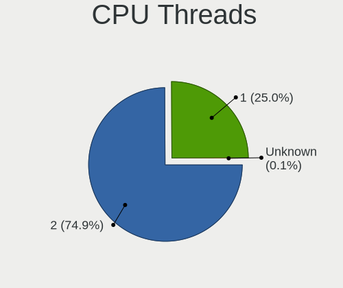

| Number  | Notebooks | Percent |
|---------|-----------|---------|
| 2       | 1249      | 74.93%  |
| 1       | 417       | 25.01%  |
| Unknown | 1         | 0.06%   |

CPU Op-Modes
------------

CPU Operation Modes (32-bit, 64-bit)

| Op mode        | Notebooks | Percent |
|----------------|-----------|---------|
| 32-bit, 64-bit | 1628      | 97.49%  |
| 32-bit         | 23        | 1.38%   |
| Unknown        | 17        | 1.02%   |
| 64-bit         | 2         | 0.12%   |

CPU Microcode
-------------

Microcode number

| Number     | Notebooks | Percent |
|------------|-----------|---------|
| Unknown    | 620       | 35.86%  |
| 0x206a7    | 189       | 10.93%  |
| 0x306a9    | 52        | 3.01%   |
| 0x806ec    | 43        | 2.49%   |
| 0x806ea    | 42        | 2.43%   |
| 0x1067a    | 41        | 2.37%   |
| 0x406e3    | 39        | 2.26%   |
| 0x806c1    | 35        | 2.02%   |
| 0x0a50000c | 35        | 2.02%   |
| 0x40651    | 33        | 1.91%   |
| 0x08600106 | 31        | 1.79%   |
| 0x906ea    | 30        | 1.74%   |
| 0x306c3    | 29        | 1.68%   |
| 0x806e9    | 27        | 1.56%   |
| 0x306d4    | 25        | 1.45%   |
| 0x6fd      | 21        | 1.21%   |
| 0x30678    | 19        | 1.1%    |
| 0xa0652    | 17        | 0.98%   |
| 0x506e3    | 16        | 0.93%   |
| 0x20655    | 16        | 0.93%   |
| 0x08608103 | 16        | 0.93%   |
| 0x706a1    | 14        | 0.81%   |
| 0x906e9    | 13        | 0.75%   |
| 0x10676    | 13        | 0.75%   |
| 0x08108102 | 13        | 0.75%   |
| 0x706e5    | 12        | 0.69%   |
| 0x406c3    | 12        | 0.69%   |
| 0x06006705 | 12        | 0.69%   |
| 0x906a3    | 11        | 0.64%   |
| 0x406c4    | 11        | 0.64%   |
| 0x0a50000d | 11        | 0.64%   |
| 0x906ed    | 10        | 0.58%   |
| 0x08600104 | 10        | 0.58%   |
| 0x6e8      | 9         | 0.52%   |
| 0x506c9    | 9         | 0.52%   |
| 0x806d1    | 8         | 0.46%   |
| 0x08600103 | 8         | 0.46%   |
| 0x07030105 | 8         | 0.46%   |
| 0x806eb    | 7         | 0.4%    |
| 0x20652    | 7         | 0.4%    |

CPU Microarch
-------------

Microarchitecture

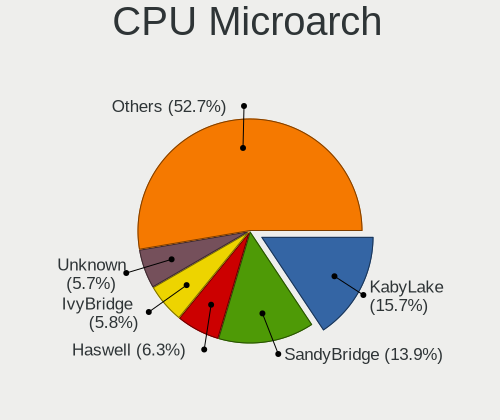

| Name              | Notebooks | Percent |
|-------------------|-----------|---------|
| KabyLake          | 261       | 15.66%  |
| SandyBridge       | 232       | 13.92%  |
| Haswell           | 105       | 6.3%    |
| IvyBridge         | 96        | 5.76%   |
| Unknown           | 95        | 5.7%    |
| Skylake           | 85        | 5.1%    |
| Zen 3             | 76        | 4.56%   |
| Penryn            | 75        | 4.5%    |
| Zen 2             | 69        | 4.14%   |
| Silvermont        | 60        | 3.6%    |
| Alderlake Hybrid  | 57        | 3.42%   |
| TigerLake         | 56        | 3.36%   |
| Core              | 55        | 3.3%    |
| Broadwell         | 42        | 2.52%   |
| Westmere          | 39        | 2.34%   |
| Goldmont plus     | 35        | 2.1%    |
| CometLake         | 30        | 1.8%    |
| Excavator         | 26        | 1.56%   |
| Icelake           | 24        | 1.44%   |
| Zen+              | 22        | 1.32%   |
| P6                | 15        | 0.9%    |
| Bonnell           | 13        | 0.78%   |
| Puma              | 12        | 0.72%   |
| Goldmont          | 12        | 0.72%   |
| Nehalem           | 9         | 0.54%   |
| Bobcat            | 9         | 0.54%   |
| Piledriver        | 8         | 0.48%   |
| K10               | 8         | 0.48%   |
| Zen               | 7         | 0.42%   |
| Steamroller       | 7         | 0.42%   |
| K8 Hammer         | 7         | 0.42%   |
| Jaguar            | 6         | 0.36%   |
| Meteorlake Hybrid | 5         | 0.3%    |
| Tremont           | 4         | 0.24%   |
| K8 & K10 hybrid   | 4         | 0.24%   |
| K10 Llano         | 1         | 0.06%   |

Graphics
--------

GPU Vendor
----------

Vendors of graphics cards

| Vendor                           | Notebooks | Percent |
|----------------------------------|-----------|---------|
| Intel                            | 1220      | 58.4%   |
| Nvidia                           | 434       | 20.78%  |
| AMD                              | 431       | 20.63%  |
| Silicon Integrated Systems [SiS] | 2         | 0.1%    |
| VIA Technologies                 | 1         | 0.05%   |
| ATI Technologies                 | 1         | 0.05%   |

GPU Model
---------

Graphics card models

| Model                                                                                    | Notebooks | Percent |
|------------------------------------------------------------------------------------------|-----------|---------|
| Intel 2nd Generation Core Processor Family Integrated Graphics Controller                | 222       | 10.26%  |
| Intel 3rd Gen Core processor Graphics Controller                                         | 90        | 4.16%   |
| AMD Renoir [Radeon Vega Series / Radeon Vega Mobile Series]                              | 67        | 3.1%    |
| Intel UHD Graphics 620                                                                   | 60        | 2.77%   |
| Intel Haswell-ULT Integrated Graphics Controller                                         | 57        | 2.63%   |
| Intel Skylake GT2 [HD Graphics 520]                                                      | 50        | 2.31%   |
| AMD Cezanne [Radeon Vega Series / Radeon Vega Mobile Series]                             | 50        | 2.31%   |
| Intel Mobile 4 Series Chipset Integrated Graphics Controller                             | 49        | 2.26%   |
| Intel WhiskeyLake-U GT2 [UHD Graphics 620]                                               | 47        | 2.17%   |
| Intel TigerLake-LP GT2 [Iris Xe Graphics]                                                | 47        | 2.17%   |
| Intel CoffeeLake-H GT2 [UHD Graphics 630]                                                | 46        | 2.13%   |
| Intel 4th Gen Core Processor Integrated Graphics Controller                              | 43        | 1.99%   |
| Intel HD Graphics 620                                                                    | 37        | 1.71%   |
| Intel HD Graphics 5500                                                                   | 37        | 1.71%   |
| Intel CometLake-U GT2 [UHD Graphics]                                                     | 35        | 1.62%   |
| Intel Atom Processor Z36xxx/Z37xxx Series Graphics & Display                             | 32        | 1.48%   |
| Intel Alder Lake-P GT2 [Iris Xe Graphics]                                                | 32        | 1.48%   |
| Intel GeminiLake [UHD Graphics 600]                                                      | 31        | 1.43%   |
| Intel Atom/Celeron/Pentium Processor x5-E8000/J3xxx/N3xxx Integrated Graphics Controller | 28        | 1.29%   |
| Intel CometLake-H GT2 [UHD Graphics]                                                     | 27        | 1.25%   |
| AMD Lucienne                                                                             | 26        | 1.2%    |
| Nvidia TU117M [GeForce GTX 1650 Mobile / Max-Q]                                          | 24        | 1.11%   |
| Intel Core Processor Integrated Graphics Controller                                      | 24        | 1.11%   |
| Nvidia GA106M [GeForce RTX 3060 Mobile / Max-Q]                                          | 23        | 1.06%   |
| AMD Stoney [Radeon R2/R3/R4/R5 Graphics]                                                 | 23        | 1.06%   |
| Intel Mobile GM965/GL960 Integrated Graphics Controller (secondary)                      | 22        | 1.02%   |
| Intel Mobile GM965/GL960 Integrated Graphics Controller (primary)                        | 22        | 1.02%   |
| AMD Picasso/Raven 2 [Radeon Vega Series / Radeon Vega Mobile Series]                     | 22        | 1.02%   |
| Intel HD Graphics 630                                                                    | 21        | 0.97%   |
| Intel HD Graphics 530                                                                    | 20        | 0.92%   |
| Intel Raptor Lake-P [Iris Xe Graphics]                                                   | 19        | 0.88%   |
| Intel Mobile 945GM/GMS/GME, 943/940GML Express Integrated Graphics Controller            | 19        | 0.88%   |
| AMD Barcelo                                                                              | 18        | 0.83%   |
| AMD Sun XT [Radeon HD 8670A/8670M/8690M / R5 M330 / M430 / Radeon 520 Mobile]            | 17        | 0.79%   |
| Nvidia GP107M [GeForce GTX 1050 Mobile]                                                  | 16        | 0.74%   |
| Nvidia GF117M [GeForce 610M/710M/810M/820M / GT 620M/625M/630M/720M]                     | 16        | 0.74%   |
| Intel Mobile 945GM/GMS, 943/940GML Express Integrated Graphics Controller                | 14        | 0.65%   |
| Intel TigerLake-H GT1 [UHD Graphics]                                                     | 13        | 0.6%    |
| Nvidia TU117M [GeForce GTX 1650 Ti Mobile]                                               | 12        | 0.55%   |
| Intel HD Graphics 500                                                                    | 12        | 0.55%   |

GPU Combo
---------

Combinations of graphics cards

| Name           | Notebooks | Percent |
|----------------|-----------|---------|
| 1 x Intel      | 836       | 50.09%  |
| Intel + Nvidia | 305       | 18.27%  |
| 1 x AMD        | 281       | 16.84%  |
| 1 x Nvidia     | 80        | 4.79%   |
| Intel + AMD    | 69        | 4.13%   |
| AMD + Nvidia   | 49        | 2.94%   |
| 2 x AMD        | 32        | 1.92%   |
| 2 x Intel      | 12        | 0.72%   |
| Other          | 2         | 0.12%   |
| 1 x SiS        | 2         | 0.12%   |
| 1 x VIA        | 1         | 0.06%   |

GPU Driver
----------

Free vs proprietary

| Driver      | Notebooks | Percent |
|-------------|-----------|---------|
| Free        | 1418      | 84.2%   |
| Proprietary | 207       | 12.29%  |
| Unknown     | 59        | 3.5%    |

GPU Memory
----------

Total video memory

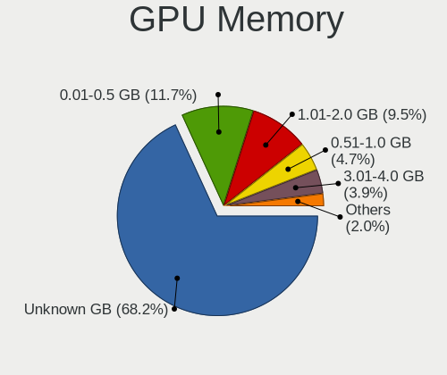

| Size in GB | Notebooks | Percent |
|------------|-----------|---------|
| Unknown    | 1167      | 68.17%  |
| 0.01-0.5   | 200       | 11.68%  |
| 1.01-2.0   | 163       | 9.52%   |
| 0.51-1.0   | 80        | 4.67%   |
| 3.01-4.0   | 67        | 3.91%   |
| 5.01-6.0   | 21        | 1.23%   |
| 7.01-8.0   | 9         | 0.53%   |
| 2.01-3.0   | 4         | 0.23%   |
| 8.01-16.0  | 1         | 0.06%   |

Monitor
-------

Monitor Vendor
--------------

Monitor vendors

| Vendor                  | Notebooks | Percent |
|-------------------------|-----------|---------|
| AU Optronics            | 384       | 18.9%   |
| LG Display              | 254       | 12.5%   |
| BOE                     | 208       | 10.24%  |
| Chimei Innolux          | 201       | 9.89%   |
| Samsung Electronics     | 190       | 9.35%   |
| CPT                     | 133       | 6.55%   |
| Dell                    | 86        | 4.23%   |
| Eizo                    | 66        | 3.25%   |
| Sharp                   | 47        | 2.31%   |
| Lenovo                  | 47        | 2.31%   |
| Hewlett-Packard         | 39        | 1.92%   |
| Chi Mei Optoelectronics | 39        | 1.92%   |
| Philips                 | 36        | 1.77%   |
| PANDA                   | 35        | 1.72%   |
| Goldstar                | 28        | 1.38%   |
| BenQ                    | 26        | 1.28%   |
| CSO                     | 21        | 1.03%   |
| AOC                     | 21        | 1.03%   |
| LG Philips              | 20        | 0.98%   |
| InfoVision              | 18        | 0.89%   |
| Acer                    | 16        | 0.79%   |
| Iiyama                  | 11        | 0.54%   |
| Ancor Communications    | 11        | 0.54%   |
| Valve                   | 10        | 0.49%   |
| Apple                   | 10        | 0.49%   |
| Sony                    | 8         | 0.39%   |
| Quanta Display          | 6         | 0.3%    |
| Panasonic               | 6         | 0.3%    |
| HannStar                | 6         | 0.3%    |
| ASUSTek Computer        | 6         | 0.3%    |
| Toshiba                 | 4         | 0.2%    |
| NEC Computers           | 4         | 0.2%    |
| Fujitsu Siemens         | 4         | 0.2%    |
| MSI                     | 3         | 0.15%   |
| Vestel Elektronik       | 2         | 0.1%    |
| Unknown                 | 2         | 0.1%    |
| OEM                     | 2         | 0.1%    |
| JDI                     | 2         | 0.1%    |
| Hitachi                 | 2         | 0.1%    |
| DENON                   | 2         | 0.1%    |

Monitor Model
-------------

Monitor models

| Model                                                                    | Notebooks | Percent |
|--------------------------------------------------------------------------|-----------|---------|
| CPT LCD Monitor COR17DB 1600x900 293x164mm 13.2-inch                     | 130       | 6.26%   |
| Eizo EV3285 ENC2979 3840x2160 698x393mm 31.5-inch                        | 59        | 2.84%   |
| AU Optronics LCD Monitor AUO38ED 1920x1080 344x193mm 15.5-inch           | 16        | 0.77%   |
| AU Optronics LCD Monitor AUO21ED 1920x1080 344x193mm 15.5-inch           | 15        | 0.72%   |
| AU Optronics LCD Monitor AUO403D 1920x1080 309x174mm 14.0-inch           | 14        | 0.67%   |
| Chimei Innolux LCD Monitor CMN14D4 1920x1080 309x173mm 13.9-inch         | 12        | 0.58%   |
| LG Display LCD Monitor LGD02DC 1366x768 344x194mm 15.5-inch              | 10        | 0.48%   |
| AU Optronics LCD Monitor AUO123D 1920x1080 309x173mm 13.9-inch           | 10        | 0.48%   |
| Samsung Electronics LCD Monitor SEC544B 1600x900 382x215mm 17.3-inch     | 9         | 0.43%   |
| LG Display LCD Monitor LGD033A 1366x768 340x190mm 15.3-inch              | 9         | 0.43%   |
| Valve ANX7530 U VLV3001 800x1280 100x150mm 7.1-inch                      | 8         | 0.39%   |
| PANDA LCD Monitor NCP004D 1920x1080 344x194mm 15.5-inch                  | 8         | 0.39%   |
| Chimei Innolux LCD Monitor CMN15E7 1920x1080 344x193mm 15.5-inch         | 8         | 0.39%   |
| Chimei Innolux LCD Monitor CMN14D5 1920x1080 309x173mm 13.9-inch         | 8         | 0.39%   |
| AU Optronics LCD Monitor AUO34ED 1920x1080 344x193mm 15.5-inch           | 8         | 0.39%   |
| Sharp LCD Monitor SHP1453 1920x1080 346x194mm 15.6-inch                  | 7         | 0.34%   |
| Philips PHL 243V7 PHLC155 1920x1080 527x296mm 23.8-inch                  | 7         | 0.34%   |
| LG Display LCD Monitor LGD046F 1920x1080 344x194mm 15.5-inch             | 7         | 0.34%   |
| LG Display LCD Monitor LGD02F1 1366x768 344x194mm 15.5-inch              | 7         | 0.34%   |
| Lenovo LCD Monitor LEN40BA 1920x1080 344x194mm 15.5-inch                 | 7         | 0.34%   |
| Chimei Innolux LCD Monitor CMN14C9 1920x1080 309x173mm 13.9-inch         | 7         | 0.34%   |
| Chi Mei Optoelectronics LCD Monitor CMO15A7 1366x768 344x193mm 15.5-inch | 7         | 0.34%   |
| BOE LCD Monitor BOE0700 1920x1080 344x194mm 15.5-inch                    | 7         | 0.34%   |
| AU Optronics LCD Monitor AUO26EC 1366x768 344x193mm 15.5-inch            | 7         | 0.34%   |
| AU Optronics LCD Monitor AUO213E 1600x900 309x174mm 14.0-inch            | 7         | 0.34%   |
| Samsung Electronics S24F350 SAM0D20 1920x1080 521x293mm 23.5-inch        | 6         | 0.29%   |
| Samsung Electronics LCD Monitor SEC324C 1600x900 310x174mm 14.0-inch     | 6         | 0.29%   |
| Dell U2412M DELA07A 1920x1200 518x324mm 24.1-inch                        | 6         | 0.29%   |
| Dell P2419H DELD0DA 1920x1080 527x296mm 23.8-inch                        | 6         | 0.29%   |
| Chimei Innolux LCD Monitor CMN15D5 1920x1080 344x193mm 15.5-inch         | 6         | 0.29%   |
| Chimei Innolux LCD Monitor CMN15C4 1920x1080 344x193mm 15.5-inch         | 6         | 0.29%   |
| Chimei Innolux LCD Monitor CMN14E7 1920x1080 309x173mm 13.9-inch         | 6         | 0.29%   |
| BOE LCD Monitor BOE07BB 1920x1080 309x173mm 13.9-inch                    | 6         | 0.29%   |
| BOE LCD Monitor BOE0757 1366x768 344x194mm 15.5-inch                     | 6         | 0.29%   |
| AU Optronics LCD Monitor AUO46EC 1366x768 344x193mm 15.5-inch            | 6         | 0.29%   |
| AU Optronics LCD Monitor AUO2E8D 1920x1080 344x194mm 15.5-inch           | 6         | 0.29%   |
| AU Optronics LCD Monitor AUO22EC 1366x768 344x193mm 15.5-inch            | 6         | 0.29%   |
| AU Optronics LCD Monitor AUO21EC 1366x768 344x193mm 15.5-inch            | 6         | 0.29%   |
| Sharp LCD Monitor SHP14BA 1920x1080 344x194mm 15.5-inch                  | 5         | 0.24%   |
| Samsung Electronics LCD Monitor SEC5441 1280x800 286x179mm 13.3-inch     | 5         | 0.24%   |

Monitor Resolution
------------------

Monitor screen resolution

| Resolution         | Notebooks | Percent |
|--------------------|-----------|---------|
| 1920x1080 (FHD)    | 816       | 43.13%  |
| 1366x768 (WXGA)    | 334       | 17.65%  |
| 1600x900 (HD+)     | 222       | 11.73%  |
| 3840x2160 (4K)     | 125       | 6.61%   |
| 1280x800 (WXGA)    | 73        | 3.86%   |
| 2560x1440 (QHD)    | 70        | 3.7%    |
| 1920x1200 (WUXGA)  | 63        | 3.33%   |
| 2560x1600          | 29        | 1.53%   |
| 1680x1050 (WSXGA+) | 26        | 1.37%   |
| 1440x900 (WXGA+)   | 21        | 1.11%   |
| 2880x1800          | 14        | 0.74%   |
| 800x1280           | 10        | 0.53%   |
| 3440x1440          | 8         | 0.42%   |
| 1280x1024 (SXGA)   | 8         | 0.42%   |
| 1024x600           | 8         | 0.42%   |
| 3840x2400          | 7         | 0.37%   |
| 1024x768 (XGA)     | 6         | 0.32%   |
| 3456x2160          | 4         | 0.21%   |
| 1360x768           | 4         | 0.21%   |
| 3000x2000          | 3         | 0.16%   |
| 2880x1620          | 3         | 0.16%   |
| 2160x1440          | 3         | 0.16%   |
| 2160x1350          | 3         | 0.16%   |
| 1920x540           | 3         | 0.16%   |
| Unknown            | 3         | 0.16%   |
| 3840x1200          | 2         | 0.11%   |
| 3200x2000          | 2         | 0.11%   |
| 3200x1800 (QHD+)   | 2         | 0.11%   |
| 3072x1920          | 2         | 0.11%   |
| 2256x1504          | 2         | 0.11%   |
| 1600x1200          | 2         | 0.11%   |
| 1400x1050          | 2         | 0.11%   |
| 8320x2160          | 1         | 0.05%   |
| 5760x2160          | 1         | 0.05%   |
| 3840x1600          | 1         | 0.05%   |
| 3840x1080          | 1         | 0.05%   |
| 2880x864           | 1         | 0.05%   |
| 2560x1080          | 1         | 0.05%   |
| 2304x1440          | 1         | 0.05%   |
| 2288x1287          | 1         | 0.05%   |

Monitor Diagonal
----------------

Diagonal size in inches

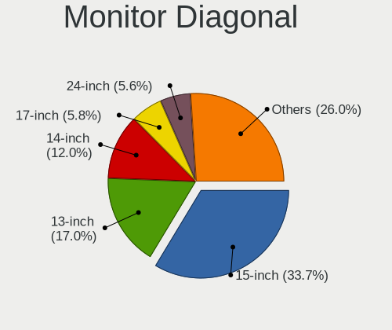

| Inches  | Notebooks | Percent |
|---------|-----------|---------|
| 15      | 687       | 33.66%  |
| 13      | 346       | 16.95%  |
| 14      | 244       | 11.95%  |
| 17      | 119       | 5.83%   |
| 24      | 114       | 5.59%   |
| 27      | 92        | 4.51%   |
| 31      | 82        | 4.02%   |
| 23      | 56        | 2.74%   |
| 16      | 48        | 2.35%   |
| 12      | 43        | 2.11%   |
| 11      | 41        | 2.01%   |
| 21      | 33        | 1.62%   |
| 22      | 15        | 0.73%   |
| Unknown | 15        | 0.73%   |
| 10      | 11        | 0.54%   |
| 7       | 10        | 0.49%   |
| 84      | 9         | 0.44%   |
| 34      | 9         | 0.44%   |
| 20      | 9         | 0.44%   |
| 18      | 9         | 0.44%   |
| 19      | 6         | 0.29%   |
| 33      | 5         | 0.24%   |
| 40      | 4         | 0.2%    |
| 32      | 4         | 0.2%    |
| 25      | 4         | 0.2%    |
| 72      | 3         | 0.15%   |
| 54      | 3         | 0.15%   |
| 43      | 3         | 0.15%   |
| 28      | 3         | 0.15%   |
| 26      | 3         | 0.15%   |
| 49      | 2         | 0.1%    |
| 142     | 1         | 0.05%   |
| 65      | 1         | 0.05%   |
| 60      | 1         | 0.05%   |
| 52      | 1         | 0.05%   |
| 48      | 1         | 0.05%   |
| 46      | 1         | 0.05%   |
| 38      | 1         | 0.05%   |
| 37      | 1         | 0.05%   |
| 29      | 1         | 0.05%   |

Monitor Width
-------------

Physical width

| Width in mm    | Notebooks | Percent |
|----------------|-----------|---------|
| 301-350        | 1075      | 53.51%  |
| 201-300        | 319       | 15.88%  |
| 501-600        | 234       | 11.65%  |
| 351-400        | 143       | 7.12%   |
| 601-700        | 97        | 4.83%   |
| 401-500        | 66        | 3.29%   |
| 701-800        | 18        | 0.9%    |
| Unknown        | 15        | 0.75%   |
| 1501-2000      | 12        | 0.6%    |
| 1001-1500      | 12        | 0.6%    |
| 1-100          | 10        | 0.5%    |
| 801-900        | 6         | 0.3%    |
| More than 2000 | 1         | 0.05%   |
| 901-1000       | 1         | 0.05%   |

Aspect Ratio
------------

Proportional relationship between the width and the height

| Ratio   | Notebooks | Percent |
|---------|-----------|---------|
| 16/9    | 1391      | 81.2%   |
| 16/10   | 257       | 15%     |
| 3/2     | 12        | 0.7%    |
| 4/3     | 10        | 0.58%   |
| 21/9    | 10        | 0.58%   |
| Unknown | 10        | 0.58%   |
| 5/4     | 8         | 0.47%   |
| 0.67    | 8         | 0.47%   |
| 3.20    | 2         | 0.12%   |
| 0.62    | 2         | 0.12%   |
| 3.73    | 1         | 0.06%   |
| 3.33    | 1         | 0.06%   |
| 1.00    | 1         | 0.06%   |

Monitor Area
------------

Area in inch

| Area in inch | Notebooks | Percent |
|----------------|-----------|---------|
| 101-110        | 684       | 33.73%  |
| 81-90          | 373       | 18.39%  |
| 71-80          | 209       | 10.31%  |
| 201-250        | 159       | 7.84%   |
| 351-500        | 102       | 5.03%   |
| 301-350        | 96        | 4.73%   |
| 121-130        | 95        | 4.68%   |
| 251-300        | 45        | 2.22%   |
| 111-120        | 44        | 2.17%   |
| 61-70          | 43        | 2.12%   |
| 51-60          | 41        | 2.02%   |
| 151-200        | 25        | 1.23%   |
| More than 1000 | 21        | 1.04%   |
| 131-140        | 20        | 0.99%   |
| Unknown        | 15        | 0.74%   |
| 91-100         | 13        | 0.64%   |
| 141-150        | 12        | 0.59%   |
| 41-50          | 11        | 0.54%   |
| 1-40           | 10        | 0.49%   |
| 501-1000       | 10        | 0.49%   |

Pixel Density
-------------

Pixels per inch

| Density       | Notebooks | Percent |
|---------------|-----------|---------|
| 121-160       | 937       | 48.57%  |
| 101-120       | 405       | 21%     |
| 51-100        | 352       | 18.25%  |
| 161-240       | 163       | 8.45%   |
| More than 240 | 42        | 2.18%   |
| 1-50          | 15        | 0.78%   |
| Unknown       | 15        | 0.78%   |

Multiple Monitors
-----------------

Total monitors connected

| Total | Notebooks | Percent |
|-------|-----------|---------|
| 1     | 1242      | 72.21%  |
| 2     | 376       | 21.86%  |
| 3     | 52        | 3.02%   |
| 0     | 47        | 2.73%   |
| 4     | 3         | 0.17%   |

Network
-------

Net Controller Vendor
---------------------

Controller vendors

| Vendor                                 | Notebooks | Percent |
|----------------------------------------|-----------|---------|
| Intel                                  | 898       | 33.28%  |
| Realtek Semiconductor                  | 734       | 27.21%  |
| Qualcomm Atheros                       | 424       | 15.72%  |
| Broadcom                               | 150       | 5.56%   |
| Samsung Electronics                    | 134       | 4.97%   |
| MediaTek                               | 72        | 2.67%   |
| Broadcom Limited                       | 54        | 2%      |
| Marvell Technology Group               | 28        | 1.04%   |
| Lenovo                                 | 28        | 1.04%   |
| ASIX Electronics                       | 20        | 0.74%   |
| Ralink                                 | 18        | 0.67%   |
| Dell                                   | 17        | 0.63%   |
| Sierra Wireless                        | 14        | 0.52%   |
| Qualcomm                               | 14        | 0.52%   |
| DisplayLink                            | 14        | 0.52%   |
| Ralink Technology                      | 11        | 0.41%   |
| TP-Link                                | 9         | 0.33%   |
| Qualcomm Atheros Communications        | 9         | 0.33%   |
| Xiaomi                                 | 6         | 0.22%   |
| Ericsson Business Mobile Networks      | 6         | 0.22%   |
| Hewlett-Packard                        | 5         | 0.19%   |
| Attansic Technology                    | 5         | 0.19%   |
| Fibocom                                | 4         | 0.15%   |
| D-Link                                 | 3         | 0.11%   |
| Spreadtrum Communications              | 2         | 0.07%   |
| Sony Ericsson Mobile Communications AB | 2         | 0.07%   |
| Silicon Integrated Systems [SiS]       | 2         | 0.07%   |
| Huawei Technologies                    | 2         | 0.07%   |
| VIA Technologies                       | 1         | 0.04%   |
| Qualcomm Technologies                  | 1         | 0.04%   |
| Prusa                                  | 1         | 0.04%   |
| Motorola PCS                           | 1         | 0.04%   |
| Microchip Technology                   | 1         | 0.04%   |
| JMicron Technology                     | 1         | 0.04%   |
| ICS Advent                             | 1         | 0.04%   |
| Google                                 | 1         | 0.04%   |
| Fujitsu Siemens Computers              | 1         | 0.04%   |
| Foxconn / Hon Hai                      | 1         | 0.04%   |
| ASUSTek Computer                       | 1         | 0.04%   |
| Arduino SA                             | 1         | 0.04%   |

Net Controller Model
--------------------

Controller models

| Model                                                                  | Notebooks | Percent |
|------------------------------------------------------------------------|-----------|---------|
| Realtek RTL8111/8168/8211/8411 PCI Express Gigabit Ethernet Controller | 463       | 14.26%  |
| Qualcomm Atheros AR9485 Wireless Network Adapter                       | 159       | 4.9%    |
| Samsung Galaxy series, misc. (tethering mode)                          | 131       | 4.04%   |
| Realtek RTL8153 Gigabit Ethernet Adapter                               | 107       | 3.3%    |
| Intel Wi-Fi 6 AX200                                                    | 98        | 3.02%   |
| Intel Wireless 8265 / 8275                                             | 77        | 2.37%   |
| Realtek RTL810xE PCI Express Fast Ethernet controller                  | 76        | 2.34%   |
| Intel 82579LM Gigabit Network Connection (Lewisville)                  | 66        | 2.03%   |
| Intel Wireless 7260                                                    | 60        | 1.85%   |
| Intel Centrino Advanced-N 6205 [Taylor Peak]                           | 50        | 1.54%   |
| Qualcomm Atheros QCA9377 802.11ac Wireless Network Adapter             | 47        | 1.45%   |
| Intel Wireless 8260                                                    | 44        | 1.36%   |
| Intel Wi-Fi 6 AX201                                                    | 44        | 1.36%   |
| Qualcomm Atheros AR9285 Wireless Network Adapter (PCI-Express)         | 42        | 1.29%   |
| Realtek RTL8822CE 802.11ac PCIe Wireless Network Adapter               | 41        | 1.26%   |
| Qualcomm Atheros QCA9565 / AR9565 Wireless Network Adapter             | 41        | 1.26%   |
| MediaTek MT7921 802.11ax PCI Express Wireless Network Adapter          | 38        | 1.17%   |
| Intel Wireless 7265                                                    | 38        | 1.17%   |
| Intel Alder Lake-P PCH CNVi WiFi                                       | 37        | 1.14%   |
| Intel Ethernet Connection (4) I219-LM                                  | 35        | 1.08%   |
| Intel Cannon Point-LP CNVi [Wireless-AC]                               | 35        | 1.08%   |
| Intel Comet Lake PCH-LP CNVi WiFi                                      | 33        | 1.02%   |
| Qualcomm Atheros QCA6174 802.11ac Wireless Network Adapter             | 29        | 0.89%   |
| Intel Wireless 3165                                                    | 29        | 0.89%   |
| Intel Cannon Lake PCH CNVi WiFi                                        | 29        | 0.89%   |
| Broadcom BCM4313 802.11bgn Wireless Network Adapter                    | 28        | 0.86%   |
| Realtek RTL8852AE 802.11ax PCIe Wireless Network Adapter               | 26        | 0.8%    |
| Realtek RTL8821CE 802.11ac PCIe Wireless Network Adapter               | 25        | 0.77%   |
| Intel Ethernet Connection I218-LM                                      | 22        | 0.68%   |
| Broadcom BCM43142 802.11b/g/n                                          | 22        | 0.68%   |
| Intel WiFi Link 5100                                                   | 21        | 0.65%   |
| Intel Comet Lake PCH CNVi WiFi                                         | 21        | 0.65%   |
| Intel 82567LM Gigabit Network Connection                               | 21        | 0.65%   |
| Realtek RTL8822BE 802.11a/b/g/n/ac WiFi adapter                        | 20        | 0.62%   |
| Intel PRO/Wireless 3945ABG [Golan] Network Connection                  | 20        | 0.62%   |
| Intel Wireless 3160                                                    | 19        | 0.59%   |
| Intel Ethernet Connection I219-LM                                      | 19        | 0.59%   |
| Intel Dual Band Wireless-AC 3165 Plus Bluetooth                        | 19        | 0.59%   |
| Qualcomm Atheros AR8151 v2.0 Gigabit Ethernet                          | 18        | 0.55%   |
| MediaTek MT7922 802.11ax PCI Express Wireless Network Adapter          | 18        | 0.55%   |

Wireless Vendor
---------------

Wireless vendors

| Vendor                          | Notebooks | Percent |
|---------------------------------|-----------|---------|
| Intel                           | 871       | 51.12%  |
| Qualcomm Atheros                | 369       | 21.65%  |
| Realtek Semiconductor           | 183       | 10.74%  |
| Broadcom                        | 97        | 5.69%   |
| MediaTek                        | 59        | 3.46%   |
| Broadcom Limited                | 30        | 1.76%   |
| Ralink                          | 18        | 1.06%   |
| Sierra Wireless                 | 14        | 0.82%   |
| Qualcomm                        | 13        | 0.76%   |
| Ralink Technology               | 11        | 0.65%   |
| Dell                            | 11        | 0.65%   |
| Qualcomm Atheros Communications | 9         | 0.53%   |
| TP-Link                         | 8         | 0.47%   |
| Fibocom                         | 4         | 0.23%   |
| Hewlett-Packard                 | 2         | 0.12%   |
| D-Link                          | 2         | 0.12%   |
| Qualcomm Technologies           | 1         | 0.06%   |
| Fujitsu Siemens Computers       | 1         | 0.06%   |
| ASUSTek Computer                | 1         | 0.06%   |

Wireless Model
--------------

Wireless models

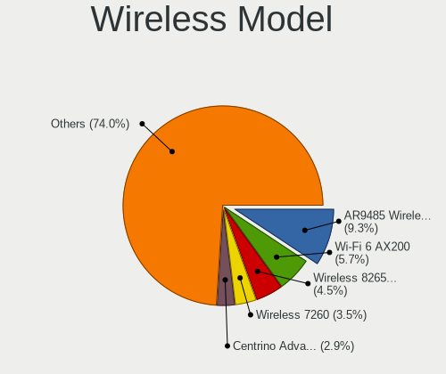

| Model                                                          | Notebooks | Percent |
|----------------------------------------------------------------|-----------|---------|
| Qualcomm Atheros AR9485 Wireless Network Adapter               | 159       | 9.31%   |
| Intel Wi-Fi 6 AX200                                            | 98        | 5.74%   |
| Intel Wireless 8265 / 8275                                     | 77        | 4.51%   |
| Intel Wireless 7260                                            | 60        | 3.51%   |
| Intel Centrino Advanced-N 6205 [Taylor Peak]                   | 50        | 2.93%   |
| Qualcomm Atheros QCA9377 802.11ac Wireless Network Adapter     | 47        | 2.75%   |
| Intel Wireless 8260                                            | 44        | 2.58%   |
| Intel Wi-Fi 6 AX201                                            | 44        | 2.58%   |
| Qualcomm Atheros AR9285 Wireless Network Adapter (PCI-Express) | 42        | 2.46%   |
| Realtek RTL8822CE 802.11ac PCIe Wireless Network Adapter       | 41        | 2.4%    |
| Qualcomm Atheros QCA9565 / AR9565 Wireless Network Adapter     | 41        | 2.4%    |
| MediaTek MT7921 802.11ax PCI Express Wireless Network Adapter  | 38        | 2.22%   |
| Intel Wireless 7265                                            | 38        | 2.22%   |
| Intel Alder Lake-P PCH CNVi WiFi                               | 37        | 2.17%   |
| Intel Cannon Point-LP CNVi [Wireless-AC]                       | 35        | 2.05%   |
| Intel Comet Lake PCH-LP CNVi WiFi                              | 33        | 1.93%   |
| Qualcomm Atheros QCA6174 802.11ac Wireless Network Adapter     | 29        | 1.7%    |
| Intel Wireless 3165                                            | 29        | 1.7%    |
| Intel Cannon Lake PCH CNVi WiFi                                | 29        | 1.7%    |
| Broadcom BCM4313 802.11bgn Wireless Network Adapter            | 28        | 1.64%   |
| Realtek RTL8852AE 802.11ax PCIe Wireless Network Adapter       | 26        | 1.52%   |
| Realtek RTL8821CE 802.11ac PCIe Wireless Network Adapter       | 25        | 1.46%   |
| Broadcom BCM43142 802.11b/g/n                                  | 22        | 1.29%   |
| Intel WiFi Link 5100                                           | 21        | 1.23%   |
| Intel Comet Lake PCH CNVi WiFi                                 | 21        | 1.23%   |
| Realtek RTL8822BE 802.11a/b/g/n/ac WiFi adapter                | 20        | 1.17%   |
| Intel PRO/Wireless 3945ABG [Golan] Network Connection          | 20        | 1.17%   |
| Intel Wireless 3160                                            | 19        | 1.11%   |
| Intel Dual Band Wireless-AC 3165 Plus Bluetooth                | 19        | 1.11%   |
| Intel Raptor Lake PCH CNVi WiFi                                | 16        | 0.94%   |
| Ralink RT3290 Wireless 802.11n 1T/1R PCIe                      | 13        | 0.76%   |
| Realtek RTL8852BE PCIe 802.11ax Wireless Network Controller    | 12        | 0.7%    |
| Qualcomm Atheros AR9462 Wireless Network Adapter               | 12        | 0.7%    |
| Intel Wi-Fi 6E(802.11ax) AX210/AX1675* 2x2 [Typhoon Peak]      | 12        | 0.7%    |
| Intel Ultimate N WiFi Link 5300                                | 12        | 0.7%    |
| Intel PRO/Wireless 5100 AGN [Shiloh] Network Connection        | 12        | 0.7%    |
| Intel PRO/Wireless 4965 AG or AGN [Kedron] Network Connection  | 12        | 0.7%    |
| Intel Centrino Wireless-N 1000 [Condor Peak]                   | 12        | 0.7%    |
| Intel Centrino Ultimate-N 6300                                 | 12        | 0.7%    |
| Intel Centrino Advanced-N 6235                                 | 12        | 0.7%    |

Ethernet Vendor
---------------

Ethernet vendors

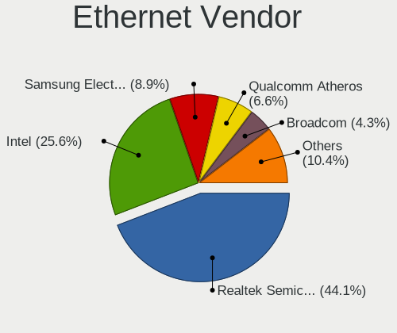

| Vendor                                 | Notebooks | Percent |
|----------------------------------------|-----------|---------|
| Realtek Semiconductor                  | 651       | 44.14%  |
| Intel                                  | 378       | 25.63%  |
| Samsung Electronics                    | 131       | 8.88%   |
| Qualcomm Atheros                       | 97        | 6.58%   |
| Broadcom                               | 64        | 4.34%   |
| Marvell Technology Group               | 28        | 1.9%    |
| Lenovo                                 | 28        | 1.9%    |
| Broadcom Limited                       | 24        | 1.63%   |
| ASIX Electronics                       | 20        | 1.36%   |
| DisplayLink                            | 14        | 0.95%   |
| MediaTek                               | 13        | 0.88%   |
| Xiaomi                                 | 6         | 0.41%   |
| Attansic Technology                    | 5         | 0.34%   |
| Spreadtrum Communications              | 2         | 0.14%   |
| Silicon Integrated Systems [SiS]       | 2         | 0.14%   |
| VIA Technologies                       | 1         | 0.07%   |
| TP-Link                                | 1         | 0.07%   |
| Sony Ericsson Mobile Communications AB | 1         | 0.07%   |
| Qualcomm                               | 1         | 0.07%   |
| Motorola PCS                           | 1         | 0.07%   |
| JMicron Technology                     | 1         | 0.07%   |
| ICS Advent                             | 1         | 0.07%   |
| Huawei Technologies                    | 1         | 0.07%   |
| Hewlett-Packard                        | 1         | 0.07%   |
| Google                                 | 1         | 0.07%   |
| Foxconn / Hon Hai                      | 1         | 0.07%   |
| D-Link                                 | 1         | 0.07%   |

Ethernet Model
--------------

Ethernet models

| Model                                                                  | Notebooks | Percent |
|------------------------------------------------------------------------|-----------|---------|
| Realtek RTL8111/8168/8211/8411 PCI Express Gigabit Ethernet Controller | 463       | 30.7%   |
| Samsung Galaxy series, misc. (tethering mode)                          | 131       | 8.69%   |
| Realtek RTL8153 Gigabit Ethernet Adapter                               | 107       | 7.1%    |
| Realtek RTL810xE PCI Express Fast Ethernet controller                  | 76        | 5.04%   |
| Intel 82579LM Gigabit Network Connection (Lewisville)                  | 66        | 4.38%   |
| Intel Ethernet Connection (4) I219-LM                                  | 35        | 2.32%   |
| Intel Ethernet Connection I218-LM                                      | 22        | 1.46%   |
| Intel 82567LM Gigabit Network Connection                               | 21        | 1.39%   |
| Intel Ethernet Connection I219-LM                                      | 19        | 1.26%   |
| Qualcomm Atheros AR8151 v2.0 Gigabit Ethernet                          | 18        | 1.19%   |
| Intel Ethernet Connection I217-LM                                      | 18        | 1.19%   |
| ASIX AX88179 Gigabit Ethernet                                          | 18        | 1.19%   |
| Intel Ethernet Connection (4) I219-V                                   | 17        | 1.13%   |
| Qualcomm Atheros AR8131 Gigabit Ethernet                               | 15        | 0.99%   |
| Intel Ethernet Connection (6) I219-V                                   | 14        | 0.93%   |
| Lenovo ThinkPad TBT 3 Dock                                             | 13        | 0.86%   |
| Intel Ethernet Connection (3) I218-LM                                  | 13        | 0.86%   |
| Intel Ethernet Connection (10) I219-LM                                 | 13        | 0.86%   |
| Broadcom NetLink BCM5787M Gigabit Ethernet PCI Express                 | 13        | 0.86%   |
| Realtek RTL8152 Fast Ethernet Adapter                                  | 12        | 0.8%    |
| Intel Ethernet Connection (7) I219-LM                                  | 12        | 0.8%    |
| Intel Ethernet Connection (6) I219-LM                                  | 12        | 0.8%    |
| Qualcomm Atheros QCA8172 Fast Ethernet                                 | 11        | 0.73%   |
| Intel 82577LM Gigabit Network Connection                               | 11        | 0.73%   |
| Broadcom Limited NetLink BCM5787M Gigabit Ethernet PCI Express         | 11        | 0.73%   |
| Qualcomm Atheros QCA8171 Gigabit Ethernet                              | 9         | 0.6%    |
| MediaTek MT7922 802.11ax PCI Express Wireless Network Adapter          | 9         | 0.6%    |
| Intel Ethernet Connection I219-V                                       | 9         | 0.6%    |
| Broadcom NetLink BCM57785 Gigabit Ethernet PCIe                        | 9         | 0.6%    |
| Realtek Killer E2600 GbE Controller                                    | 8         | 0.53%   |
| Qualcomm Atheros AR8161 Gigabit Ethernet                               | 8         | 0.53%   |
| Intel Ethernet Connection (16) I219-V                                  | 8         | 0.53%   |
| Intel Ethernet Connection (16) I219-LM                                 | 8         | 0.53%   |
| Intel Ethernet Connection (11) I219-LM                                 | 7         | 0.46%   |
| Intel 82579V Gigabit Network Connection                                | 7         | 0.46%   |
| Broadcom NetXtreme BCM5764M Gigabit Ethernet PCIe                      | 7         | 0.46%   |
| Broadcom NetXtreme BCM5761 Gigabit Ethernet PCIe                       | 7         | 0.46%   |
| Xiaomi Mi/Redmi series (RNDIS)                                         | 6         | 0.4%    |
| Realtek RTL-8100/8101L/8139 PCI Fast Ethernet Adapter                  | 6         | 0.4%    |
| Qualcomm Atheros Killer E2400 Gigabit Ethernet Controller              | 6         | 0.4%    |

Net Controller Kind
-------------------

Ethernet, WiFi or modem

| Kind     | Notebooks | Percent |
|----------|-----------|---------|
| WiFi     | 1628      | 53.41%  |
| Ethernet | 1390      | 45.6%   |
| Modem    | 28        | 0.92%   |
| Unknown  | 2         | 0.07%   |

Used Controller
---------------

Currently used network controller

| Kind     | Notebooks | Percent |
|----------|-----------|---------|
| WiFi     | 1232      | 69.33%  |
| Ethernet | 544       | 30.61%  |
| Modem    | 1         | 0.06%   |

NICs
----

Total network controllers on board

| Total | Notebooks | Percent |
|-------|-----------|---------|
| 2     | 1130      | 67.66%  |
| 1     | 491       | 29.4%   |
| 0     | 31        | 1.86%   |
| 3     | 18        | 1.08%   |

IPv6
----

IPv6 vs IPv4

| Used | Notebooks | Percent |
|------|-----------|---------|
| No   | 1416      | 83.54%  |
| Yes  | 279       | 16.46%  |

Bluetooth
---------

Bluetooth Vendor
----------------

Controller vendors

| Vendor                          | Notebooks | Percent |
|---------------------------------|-----------|---------|
| Intel                           | 642       | 50.2%   |
| Realtek Semiconductor           | 123       | 9.62%   |
| IMC Networks                    | 94        | 7.35%   |
| Qualcomm Atheros Communications | 82        | 6.41%   |
| Broadcom                        | 73        | 5.71%   |
| Foxconn / Hon Hai               | 71        | 5.55%   |
| Lite-On Technology              | 51        | 3.99%   |
| Hewlett-Packard                 | 33        | 2.58%   |
| Dell                            | 25        | 1.95%   |
| ASUSTek Computer                | 18        | 1.41%   |
| Ralink                          | 13        | 1.02%   |
| MediaTek                        | 8         | 0.63%   |
| Apple                           | 8         | 0.63%   |
| Cambridge Silicon Radio         | 6         | 0.47%   |
| Alps Electric                   | 6         | 0.47%   |
| USI                             | 5         | 0.39%   |
| Toshiba                         | 5         | 0.39%   |
| Foxconn International           | 5         | 0.39%   |
| Realtek                         | 4         | 0.31%   |
| Ralink Technology               | 3         | 0.23%   |
| Micro Star International        | 2         | 0.16%   |
| Fujitsu Siemens Computers       | 1         | 0.08%   |
| Askey Computer                  | 1         | 0.08%   |

Bluetooth Model
---------------

Controller models

| Model                                                                               | Notebooks | Percent |
|-------------------------------------------------------------------------------------|-----------|---------|
| Intel Bluetooth wireless interface                                                  | 253       | 19.78%  |
| Intel AX201 Bluetooth                                                               | 112       | 8.76%   |
| Intel AX200 Bluetooth                                                               | 98        | 7.66%   |
| Realtek Bluetooth Radio                                                             | 81        | 6.33%   |
| Intel Bluetooth 9460/9560 Jefferson Peak (JfP)                                      | 75        | 5.86%   |
| Intel AX211 Bluetooth                                                               | 49        | 3.83%   |
| Qualcomm Atheros  Bluetooth Device                                                  | 34        | 2.66%   |
| IMC Networks Atheros AR3012 Bluetooth 4.0 Adapter                                   | 26        | 2.03%   |
| IMC Networks Wireless_Device                                                        | 25        | 1.95%   |
| IMC Networks Bluetooth Radio                                                        | 23        | 1.8%    |
| Realtek  Bluetooth 4.2 Adapter                                                      | 21        | 1.64%   |
| Intel Centrino Bluetooth Wireless Transceiver                                       | 20        | 1.56%   |
| IMC Networks Bluetooth Device                                                       | 17        | 1.33%   |
| Qualcomm Atheros QCA61x4 Bluetooth 4.0                                              | 16        | 1.25%   |
| HP Broadcom 2070 Bluetooth Combo                                                    | 16        | 1.25%   |
| HP Bluetooth 2.0 Interface [Broadcom BCM2045]                                       | 16        | 1.25%   |
| Foxconn / Hon Hai MediaTek Bluetooth Adapter                                        | 15        | 1.17%   |
| Foxconn / Hon Hai Bluetooth Device                                                  | 15        | 1.17%   |
| Qualcomm Atheros AR3011 Bluetooth                                                   | 14        | 1.09%   |
| Lite-On Qualcomm Atheros QCA9377 Bluetooth                                          | 14        | 1.09%   |
| Dell DW375 Bluetooth Module                                                         | 14        | 1.09%   |
| Ralink RT3290 Bluetooth                                                             | 13        | 1.02%   |
| Foxconn / Hon Hai Wireless_Device                                                   | 13        | 1.02%   |
| Broadcom BCM2045B (BDC-2.1)                                                         | 12        | 0.94%   |
| Broadcom BCM2045 Bluetooth                                                          | 12        | 0.94%   |
| Lite-On Atheros AR3012 Bluetooth                                                    | 11        | 0.86%   |
| Intel AX210 Bluetooth                                                               | 11        | 0.86%   |
| Broadcom BCM20702 Bluetooth 4.0 [ThinkPad]                                          | 11        | 0.86%   |
| Qualcomm Atheros AR3012 Bluetooth 4.0                                               | 9         | 0.7%    |
| Intel Wireless-AC 3168 Bluetooth                                                    | 9         | 0.7%    |
| Broadcom HP Portable SoftSailing                                                    | 9         | 0.7%    |
| Realtek 802.11ac WLAN Adapter                                                       | 8         | 0.63%   |
| Lite-On Wireless_Device                                                             | 8         | 0.63%   |
| Intel Centrino Advanced-N 6230 Bluetooth adapter                                    | 8         | 0.63%   |
| ASUS BT-183 Bluetooth 2.0+EDR adapter                                               | 8         | 0.63%   |
| Intel Wireless-AC 9260 Bluetooth Adapter                                            | 7         | 0.55%   |
| Foxconn / Hon Hai Foxconn T77H114 BCM2070 [Single-Chip Bluetooth 2.1 + EDR Adapter] | 7         | 0.55%   |
| Broadcom BCM2070 Bluetooth 2.1 + EDR                                                | 7         | 0.55%   |
| Qualcomm Atheros Bluetooth                                                          | 6         | 0.47%   |
| Lite-On Bluetooth Device                                                            | 6         | 0.47%   |

Sound
-----

Sound Vendor
------------

Sound card vendors

| Vendor                               | Notebooks | Percent |
|--------------------------------------|-----------|---------|
| Intel                                | 1306      | 62.64%  |
| AMD                                  | 369       | 17.7%   |
| Nvidia                               | 212       | 10.17%  |
| Lenovo                               | 36        | 1.73%   |
| C-Media Electronics                  | 24        | 1.15%   |
| Realtek Semiconductor                | 23        | 1.1%    |
| GN Netcom                            | 21        | 1.01%   |
| Logitech                             | 12        | 0.58%   |
| Hewlett-Packard                      | 11        | 0.53%   |
| JMTek                                | 8         | 0.38%   |
| Creative Technology                  | 5         | 0.24%   |
| Plantronics                          | 4         | 0.19%   |
| Kingston Technology                  | 4         | 0.19%   |
| Silicon Integrated Systems [SiS]     | 3         | 0.14%   |
| DSEA A/S                             | 3         | 0.14%   |
| BEHRINGER International              | 3         | 0.14%   |
| Yamaha                               | 2         | 0.1%    |
| Texas Instruments                    | 2         | 0.1%    |
| RODE Microphones                     | 2         | 0.1%    |
| Razer USA                            | 2         | 0.1%    |
| Harman                               | 2         | 0.1%    |
| GYROCOM C&C                          | 2         | 0.1%    |
| Fujitsu                              | 2         | 0.1%    |
| Dell                                 | 2         | 0.1%    |
| Yealink Network Technology           | 1         | 0.05%   |
| VIA Technologies                     | 1         | 0.05%   |
| Trust                                | 1         | 0.05%   |
| Toshiba                              | 1         | 0.05%   |
| Thesycon Systemsoftware & Consulting | 1         | 0.05%   |
| Syntek                               | 1         | 0.05%   |
| Synaptics                            | 1         | 0.05%   |
| SteelSeries ApS                      | 1         | 0.05%   |
| SM950 Microphon                      | 1         | 0.05%   |
| Samson Technologies                  | 1         | 0.05%   |
| Orbbec 3D Technology International   | 1         | 0.05%   |
| Numark                               | 1         | 0.05%   |
| Mackie Designs                       | 1         | 0.05%   |
| M-Audio                              | 1         | 0.05%   |
| Generalplus Technology               | 1         | 0.05%   |
| Focusrite-Novation                   | 1         | 0.05%   |

Sound Model
-----------

Sound card models

| Model                                                                                             | Notebooks | Percent |
|---------------------------------------------------------------------------------------------------|-----------|---------|
| AMD Family 17h/19h/1ah HD Audio Controller                                                        | 229       | 9.14%   |
| Intel 6 Series/C200 Series Chipset Family High Definition Audio Controller                        | 217       | 8.66%   |
| Intel Sunrise Point-LP HD Audio                                                                   | 158       | 6.3%    |
| AMD Renoir Radeon High Definition Audio Controller                                                | 137       | 5.47%   |
| Intel 7 Series/C216 Chipset Family High Definition Audio Controller                               | 109       | 4.35%   |
| Intel 82801I (ICH9 Family) HD Audio Controller                                                    | 73        | 2.91%   |
| Intel Haswell-ULT HD Audio Controller                                                             | 57        | 2.27%   |
| Intel 8 Series HD Audio Controller                                                                | 57        | 2.27%   |
| Intel Tiger Lake-LP Smart Sound Technology Audio Controller                                       | 56        | 2.23%   |
| Intel Cannon Lake PCH cAVS                                                                        | 54        | 2.15%   |
| Intel Alder Lake PCH-P High Definition Audio Controller                                           | 51        | 2.04%   |
| Intel Cannon Point-LP High Definition Audio Controller                                            | 48        | 1.92%   |
| Intel 8 Series/C220 Series Chipset High Definition Audio Controller                               | 48        | 1.92%   |
| Intel 5 Series/3400 Series Chipset High Definition Audio                                          | 48        | 1.92%   |
| Intel Xeon E3-1200 v3/4th Gen Core Processor HD Audio Controller                                  | 44        | 1.76%   |
| Intel Wildcat Point-LP High Definition Audio Controller                                           | 42        | 1.68%   |
| Intel Broadwell-U Audio Controller                                                                | 42        | 1.68%   |
| AMD Rembrandt Radeon High Definition Audio Controller                                             | 42        | 1.68%   |
| AMD FCH Azalia Controller                                                                         | 39        | 1.56%   |
| Intel Comet Lake PCH-LP cAVS                                                                      | 38        | 1.52%   |
| Intel 82801H (ICH8 Family) HD Audio Controller                                                    | 38        | 1.52%   |
| Intel Celeron/Pentium Silver Processor High Definition Audio                                      | 35        | 1.4%    |
| Intel NM10/ICH7 Family High Definition Audio Controller                                           | 33        | 1.32%   |
| AMD Raven/Raven2/Fenghuang HDMI/DP Audio Controller                                               | 29        | 1.16%   |
| Nvidia GF108 High Definition Audio Controller                                                     | 27        | 1.08%   |
| Intel Comet Lake PCH cAVS                                                                         | 27        | 1.08%   |
| AMD Family 15h (Models 60h-6fh) Audio Controller                                                  | 26        | 1.04%   |
| Intel CM238 HD Audio Controller                                                                   | 24        | 0.96%   |
| Intel 100 Series/C230 Series Chipset Family HD Audio Controller                                   | 24        | 0.96%   |
| Realtek Semiconductor USB Audio                                                                   | 23        | 0.92%   |
| Nvidia GA106 High Definition Audio Controller                                                     | 23        | 0.92%   |
| Intel Atom/Celeron/Pentium Processor x5-E8000/J3xxx/N3xxx Series High Definition Audio Controller | 23        | 0.92%   |
| Intel Atom Processor Z36xxx/Z37xxx Series High Definition Audio Controller                        | 23        | 0.92%   |
| AMD High Definition Audio Controller                                                              | 23        | 0.92%   |
| Nvidia TU107 GeForce GTX 1650 High Definition Audio Controller                                    | 21        | 0.84%   |
| AMD SBx00 Azalia (Intel HDA)                                                                      | 21        | 0.84%   |
| AMD Kabini HDMI/DP Audio                                                                          | 21        | 0.84%   |
| Intel Raptor Lake-P/U/H cAVS                                                                      | 20        | 0.8%    |
| Nvidia GA107 High Definition Audio Controller                                                     | 15        | 0.6%    |
| Nvidia TU106 High Definition Audio Controller                                                     | 13        | 0.52%   |

Memory
------

Memory Vendor
-------------

Memory module vendors

| Vendor               | Notebooks | Percent |
|----------------------|-----------|---------|
| Samsung Electronics  | 287       | 24.51%  |
| SK hynix             | 250       | 21.35%  |
| Micron Technology    | 159       | 13.58%  |
| Elpida               | 147       | 12.55%  |
| Kingston             | 127       | 10.85%  |
| Unknown              | 48        | 4.1%    |
| Crucial              | 40        | 3.42%   |
| Ramaxel Technology   | 24        | 2.05%   |
| Unknown (ABCD)       | 17        | 1.45%   |
| A-DATA Technology    | 15        | 1.28%   |
| Corsair              | 13        | 1.11%   |
| Nanya Technology     | 12        | 1.02%   |
| Patriot              | 6         | 0.51%   |
| Unknown              | 5         | 0.43%   |
| Transcend            | 3         | 0.26%   |
| GOODRAM              | 2         | 0.17%   |
| fef5                 | 2         | 0.17%   |
| ASint Technology     | 2         | 0.17%   |
| Unknown (AB)         | 1         | 0.09%   |
| SHARETRONIC          | 1         | 0.09%   |
| RZX                  | 1         | 0.09%   |
| ProMos/Mosel Vitelic | 1         | 0.09%   |
| OnBoard              | 1         | 0.09%   |
| Nayna                | 1         | 0.09%   |
| Lexar Co Limited     | 1         | 0.09%   |
| GSkill               | 1         | 0.09%   |
| Golden Empire        | 1         | 0.09%   |
| G.Skill              | 1         | 0.09%   |
| Apacer               | 1         | 0.09%   |
| 48spaces             | 1         | 0.09%   |

Memory Model
------------

Memory module models

| Model                                                            | Notebooks | Percent |
|------------------------------------------------------------------|-----------|---------|
| Elpida RAM Module 2GB SODIMM DDR3 1333MT/s                       | 129       | 10.58%  |
| Samsung RAM M471A1G44AB0-CWE 8GB SODIMM DDR4 3200MT/s            | 21        | 1.72%   |
| Micron RAM 4ATF1G64HZ-3G2E1 8GB SODIMM DDR4 3200MT/s             | 18        | 1.48%   |
| Unknown (ABCD) RAM 123456789012345678 2GB SODIMM LPDDR3 2400MT/s | 15        | 1.23%   |
| Samsung RAM M471A5244CB0-CTD 4GB SODIMM DDR4 3266MT/s            | 13        | 1.07%   |
| Samsung RAM M471A1K43EB1-CWE 8GB SODIMM DDR4 3200MT/s            | 13        | 1.07%   |
| SK hynix RAM HMT41GS6BFR8A-PB 8GB SODIMM DDR3 1600MT/s           | 12        | 0.98%   |
| Samsung RAM M471A1G44BB0-CWE 8GB SODIMM DDR4 3200MT/s            | 12        | 0.98%   |
| Samsung RAM M471A2G44AM0-CWE 16GB SODIMM DDR4 3200MT/s           | 11        | 0.9%    |
| SK hynix RAM HMT351S6CFR8C-PB 4GB SODIMM DDR3 1600MT/s           | 10        | 0.82%   |
| Samsung RAM M471A1K43DB1-CWE 8GB SODIMM DDR4 3200MT/s            | 10        | 0.82%   |
| SK hynix RAM Module 8GB SODIMM DDR4 3200MT/s                     | 9         | 0.74%   |
| SK hynix RAM HMA81GS6AFR8N-UH 8GB SODIMM DDR4 2667MT/s           | 9         | 0.74%   |
| Samsung RAM M471B5273DH0-CH9 4GB SODIMM DDR3 1334MT/s            | 9         | 0.74%   |
| Samsung RAM M471B5273CH0-CH9 4GB SODIMM DDR3 1334MT/s            | 9         | 0.74%   |
| Samsung RAM M471A1K43CB1-CRC 8GB SODIMM DDR4 2667MT/s            | 9         | 0.74%   |
| SK hynix RAM HMAA1GS6CJR6N-XN 8GB SODIMM DDR4 3200MT/s           | 7         | 0.57%   |
| Samsung RAM M471B5173DB0-YK0 4GB SODIMM DDR3 1600MT/s            | 7         | 0.57%   |
| Samsung RAM M471B1G73DB0-YK0 8GB SODIMM DDR3 1600MT/s            | 7         | 0.57%   |
| Samsung RAM M471A1K43DB1-CTD 8GB SODIMM DDR4 2667MT/s            | 7         | 0.57%   |
| SK hynix RAM HMT451S6BFR8A-PB 4096MB SODIMM DDR3 1600MT/s        | 6         | 0.49%   |
| SK hynix RAM HMA82GS6JJR8N-VK 16GB SODIMM DDR4 2667MT/s          | 6         | 0.49%   |
| SK hynix RAM HMA82GS6DJR8N-XN 16GB SODIMM DDR4 3200MT/s          | 6         | 0.49%   |
| Samsung RAM M471B5173EB0-YK0 4GB SODIMM DDR3 1600MT/s            | 6         | 0.49%   |
| Samsung RAM M471B1G73QH0-YK0 8GB SODIMM DDR3 1600MT/s            | 6         | 0.49%   |
| Kingston RAM KHX1600C9S3L/8G 8192MB SODIMM DDR3 1600MT/s         | 6         | 0.49%   |
| Unknown RAM Module 2GB SODIMM DDR2 667MT/s                       | 5         | 0.41%   |
| SK hynix RAM HMT451S6AFR8A-PB 4GB SODIMM DDR3 1600MT/s           | 5         | 0.41%   |
| SK hynix RAM HMT41GS6AFR8A-PB 8GB SODIMM DDR3 2667MT/s           | 5         | 0.41%   |
| SK hynix RAM HMA81GS6JJR8N-VK 8GB SODIMM DDR4 2667MT/s           | 5         | 0.41%   |
| SK hynix RAM H9HCNNNCPMMLXR-NEE 8GB SODIMM LPDDR4 4266MT/s       | 5         | 0.41%   |
| Samsung RAM Module 16GB SODIMM DDR4 2667MT/s                     | 5         | 0.41%   |
| Samsung RAM M471A5244CB0-CRC 4GB SODIMM DDR4 2667MT/s            | 5         | 0.41%   |
| Samsung RAM M471A2K43DB1-CTD 16GB SODIMM DDR4 2667MT/s           | 5         | 0.41%   |
| Samsung RAM M471A2G43AB2-CWE 16GB SODIMM DDR4 3200MT/s           | 5         | 0.41%   |
| Samsung RAM M471A1K43CB1-CTD 8GB SODIMM DDR4 2667MT/s            | 5         | 0.41%   |
| Samsung RAM M471A1K43BB1-CRC 8GB SODIMM DDR4 2667MT/s            | 5         | 0.41%   |
| Nanya RAM NT4GC64B8HB0NS-CG 4GB SODIMM DDR3 1334MT/s             | 5         | 0.41%   |
| Micron RAM MT62F2G32D4DS-026 WT 8GB SODIMM LPDDR5 7500MT/s       | 5         | 0.41%   |
| Micron RAM Module 8GB SODIMM DDR4 3200MT/s                       | 5         | 0.41%   |

Memory Kind
-----------

Memory module kinds

| Kind    | Notebooks | Percent |
|---------|-----------|---------|
| DDR4    | 441       | 43.88%  |
| DDR3    | 363       | 36.12%  |
| LPDDR4  | 66        | 6.57%   |
| DDR2    | 34        | 3.38%   |
| LPDDR5  | 27        | 2.69%   |
| DDR5    | 24        | 2.39%   |
| LPDDR3  | 21        | 2.09%   |
| SDRAM   | 19        | 1.89%   |
| DDR     | 5         | 0.5%    |
| Unknown | 5         | 0.5%    |

Memory Form Factor
------------------

Physical design of the memory module

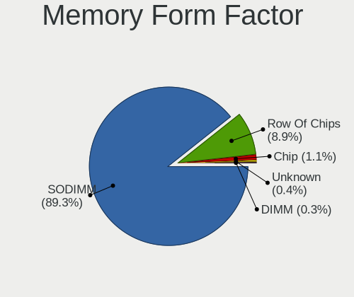

| Name         | Notebooks | Percent |
|--------------|-----------|---------|
| SODIMM       | 903       | 89.32%  |
| Row Of Chips | 90        | 8.9%    |
| Chip         | 11        | 1.09%   |
| Unknown      | 4         | 0.4%    |
| DIMM         | 3         | 0.3%    |

Memory Size
-----------

Memory module size

| Size  | Notebooks | Percent |
|-------|-----------|---------|
| 8192  | 379       | 35.09%  |
| 4096  | 218       | 20.19%  |
| 2048  | 217       | 20.09%  |
| 16384 | 191       | 17.69%  |
| 32768 | 42        | 3.89%   |
| 1024  | 27        | 2.5%    |
| 512   | 3         | 0.28%   |
| 6144  | 1         | 0.09%   |
| 3072  | 1         | 0.09%   |
| 256   | 1         | 0.09%   |

Memory Speed
------------

Memory module speed

| Speed   | Notebooks | Percent |
|---------|-----------|---------|
| 3200    | 236       | 22.18%  |
| 1600    | 157       | 14.76%  |
| 1333    | 153       | 14.38%  |
| 2667    | 149       | 14%     |
| 2400    | 76        | 7.14%   |
| 2133    | 42        | 3.95%   |
| 1334    | 39        | 3.67%   |
| 4267    | 22        | 2.07%   |
| 667     | 17        | 1.6%    |
| Unknown | 16        | 1.5%    |
| 6400    | 15        | 1.41%   |
| 1067    | 14        | 1.32%   |
| 5600    | 13        | 1.22%   |
| 4800    | 13        | 1.22%   |
| 3266    | 13        | 1.22%   |
| 4266    | 12        | 1.13%   |
| 1867    | 12        | 1.13%   |
| 2048    | 11        | 1.03%   |
| 800     | 9         | 0.85%   |
| 7500    | 8         | 0.75%   |
| 4199    | 6         | 0.56%   |
| 975     | 6         | 0.56%   |
| 533     | 6         | 0.56%   |
| 8400    | 4         | 0.38%   |
| 1066    | 4         | 0.38%   |
| 7467    | 3         | 0.28%   |
| 3733    | 3         | 0.28%   |
| 2933    | 2         | 0.19%   |
| 5500    | 1         | 0.09%   |
| 1639    | 1         | 0.09%   |
| 1400    | 1         | 0.09%   |

Printers & scanners
-------------------

Printer Vendor
--------------

Printer device vendors

| Vendor              | Notebooks | Percent |
|---------------------|-----------|---------|
| Canon               | 3         | 37.5%   |
| Xerox               | 1         | 12.5%   |
| Samsung Electronics | 1         | 12.5%   |
| QinHeng Electronics | 1         | 12.5%   |
| Prolific Technology | 1         | 12.5%   |
| Hewlett-Packard     | 1         | 12.5%   |

Printer Model
-------------

Printer device models

| Model                            | Notebooks | Percent |
|----------------------------------|-----------|---------|
| Xerox Phaser 3260                | 1         | 12.5%   |
| Samsung M2070 Series             | 1         | 12.5%   |
| QinHeng CH340S                   | 1         | 12.5%   |
| Prolific PL2305 Parallel Port    | 1         | 12.5%   |
| HP LaserJet Professional P 1102w | 1         | 12.5%   |
| Canon MF645C                     | 1         | 12.5%   |
| Canon LBP3010/LBP3018/LBP3050    | 1         | 12.5%   |
| Canon G2020 series               | 1         | 12.5%   |

Scanner Vendor
--------------

Scanner device vendors

| Vendor          | Notebooks | Percent |
|-----------------|-----------|---------|
| Hewlett-Packard | 1         | 100%    |

Scanner Model
-------------

Scanner device models

| Model                      | Notebooks | Percent |
|----------------------------|-----------|---------|
| HP ScanJet 4070 PhotoSmart | 1         | 100%    |

Camera
------

Camera Vendor
-------------

Camera device vendors

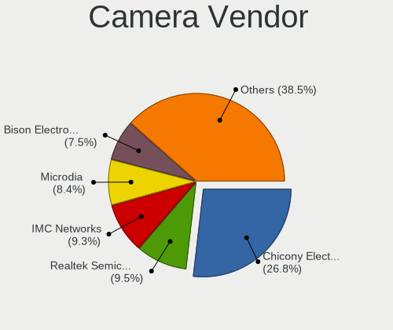

| Vendor                                 | Notebooks | Percent |
|----------------------------------------|-----------|---------|
| Chicony Electronics                    | 365       | 26.84%  |
| Realtek Semiconductor                  | 129       | 9.49%   |
| IMC Networks                           | 127       | 9.34%   |
| Microdia                               | 114       | 8.38%   |
| Bison Electronics                      | 102       | 7.5%    |
| Sunplus Innovation Technology          | 87        | 6.4%    |
| Quanta                                 | 60        | 4.41%   |
| Cheng Uei Precision Industry (Foxlink) | 49        | 3.6%    |
| Lite-On Technology                     | 48        | 3.53%   |
| Syntek                                 | 43        | 3.16%   |
| Suyin                                  | 40        | 2.94%   |
| Luxvisions Innotech Limited            | 32        | 2.35%   |
| Acer                                   | 29        | 2.13%   |
| Apple                                  | 17        | 1.25%   |
| Ricoh                                  | 15        | 1.1%    |
| Lenovo                                 | 13        | 0.96%   |
| Alcor Micro                            | 13        | 0.96%   |
| Sonix Technology                       | 12        | 0.88%   |
| Logitech                               | 9         | 0.66%   |
| Samsung Electronics                    | 8         | 0.59%   |
| Primax Electronics                     | 6         | 0.44%   |
| Shinetech                              | 5         | 0.37%   |
| icSpring                               | 5         | 0.37%   |
| Silicon Motion                         | 4         | 0.29%   |
| Microsoft                              | 2         | 0.15%   |
| Intel                                  | 2         | 0.15%   |
| Z-Star Microelectronics                | 1         | 0.07%   |
| vivo                                   | 1         | 0.07%   |
| Sunplus Technology                     | 1         | 0.07%   |
| Sony Ericsson Mobile Communications AB | 1         | 0.07%   |
| Shine-optics                           | 1         | 0.07%   |
| Ruision                                | 1         | 0.07%   |
| Pixart Imaging                         | 1         | 0.07%   |
| Orbbec 3D Technology International     | 1         | 0.07%   |
| OPPO Electronics                       | 1         | 0.07%   |
| lihappe8                               | 1         | 0.07%   |
| LeCroy                                 | 1         | 0.07%   |
| KYE Systems (Mouse Systems)            | 1         | 0.07%   |
| Hopewin Electronic Material            | 1         | 0.07%   |
| Goodong Industry                       | 1         | 0.07%   |

Camera Model
------------

Camera device models

| Model                                             | Notebooks | Percent |
|---------------------------------------------------|-----------|---------|
| Chicony Integrated Camera                         | 94        | 6.88%   |
| IMC Networks Integrated Camera                    | 54        | 3.95%   |
| Microdia Integrated_Webcam_HD                     | 51        | 3.73%   |
| Realtek Integrated_Webcam_HD                      | 43        | 3.15%   |
| Chicony HP HD Camera                              | 39        | 2.86%   |
| Bison Integrated Camera                           | 35        | 2.56%   |
| IMC Networks USB2.0 HD UVC WebCam                 | 32        | 2.34%   |
| Chicony HD Webcam                                 | 31        | 2.27%   |
| Syntek Integrated Camera                          | 24        | 1.76%   |
| Lite-On HP HD Camera                              | 22        | 1.61%   |
| Sunplus Integrated_Webcam_HD                      | 18        | 1.32%   |
| Chicony Integrated Camera (1280x720@30)           | 16        | 1.17%   |
| Quanta HP HD Camera                               | 15        | 1.1%    |
| Suyin Acer/HP Integrated Webcam [CN0314]          | 14        | 1.02%   |
| Quanta HD User Facing                             | 14        | 1.02%   |
| Microdia Integrated Webcam                        | 13        | 0.95%   |
| Lite-On Integrated Camera                         | 13        | 0.95%   |
| IMC Networks USB2.0 VGA UVC WebCam                | 13        | 0.95%   |
| Apple iPhone 5/5C/5S/6/SE/7/8/X/XR                | 13        | 0.95%   |
| Syntek Lenovo EasyCamera                          | 12        | 0.88%   |
| Sunplus HD WebCam                                 | 12        | 0.88%   |
| Bison SunplusIT Integrated Camera                 | 12        | 0.88%   |
| Bison Lenovo Integrated Webcam                    | 12        | 0.88%   |
| Chicony USB2.0 VGA UVC WebCam                     | 11        | 0.81%   |
| Bison Lenovo EasyCamera                           | 11        | 0.81%   |
| Realtek USB2.0 camera                             | 10        | 0.73%   |
| Chicony Lenovo EasyCamera                         | 10        | 0.73%   |
| Chicony FJ Camera                                 | 10        | 0.73%   |
| Acer Lenovo EasyCamera                            | 10        | 0.73%   |
| Sonix USB2.0 HD UVC WebCam                        | 9         | 0.66%   |
| Realtek Integrated Webcam HD                      | 9         | 0.66%   |
| Microdia Integrated_Webcam_FHD                    | 9         | 0.66%   |
| Chicony HP HD Webcam                              | 9         | 0.66%   |
| Sunplus Laptop Integrated Webcam HD               | 8         | 0.59%   |
| Sunplus Asus Webcam                               | 8         | 0.59%   |
| Samsung Galaxy series, misc. (MTP mode)           | 8         | 0.59%   |
| Luxvisions Innotech Limited Integrated RGB Camera | 8         | 0.59%   |
| Lenovo Integrated Webcam                          | 8         | 0.59%   |
| Chicony TOSHIBA Web Camera - HD                   | 8         | 0.59%   |
| Chicony EasyCamera                                | 8         | 0.59%   |

Security
--------

Fingerprint Vendor
------------------

Fingerprint sensor vendors

| Vendor                             | Notebooks | Percent |
|------------------------------------|-----------|---------|
| Validity Sensors                   | 122       | 34.46%  |
| Synaptics                          | 122       | 34.46%  |
| Shenzhen Goodix Technology         | 38        | 10.73%  |
| AuthenTec                          | 29        | 8.19%   |
| Upek                               | 17        | 4.8%    |
| Elan Microelectronics              | 13        | 3.67%   |
| LighTuning Technology              | 7         | 1.98%   |
| STMicroelectronics                 | 3         | 0.85%   |
| Realtek USB2.0 Finger Print Bridge | 2         | 0.56%   |
| Microsoft                          | 1         | 0.28%   |

Fingerprint Model
-----------------

Fingerprint sensor models

| Model                                                                      | Notebooks | Percent |
|----------------------------------------------------------------------------|-----------|---------|
| Validity Sensors VFS495 Fingerprint Reader                                 | 37        | 10.45%  |
| Synaptics Prometheus MIS Touch Fingerprint Reader                          | 34        | 9.6%    |
| Validity Sensors VFS5011 Fingerprint Reader                                | 24        | 6.78%   |
| Synaptics FS7604 Touch Fingerprint Sensor with PurePrint                   | 20        | 5.65%   |
| Synaptics  FS7604 Touch Fingerprint Sensor with PurePrint                  | 19        | 5.37%   |
| Shenzhen Goodix  FingerPrint Device                                        | 19        | 5.37%   |
| Upek Biometric Touchchip/Touchstrip Fingerprint Sensor                     | 16        | 4.52%   |
| Synaptics Fingerprint reader [HP G6]                                       | 15        | 4.24%   |
| Validity Sensors VFS491                                                    | 13        | 3.67%   |
| Synaptics Metallica MIS Touch Fingerprint Reader                           | 12        | 3.39%   |
| AuthenTec AES2810                                                          | 12        | 3.39%   |
| Validity Sensors VFS 5011 fingerprint sensor                               | 10        | 2.82%   |
| Shenzhen Goodix Fingerprint Reader                                         | 10        | 2.82%   |
| Shenzhen Goodix FingerPrint                                                | 9         | 2.54%   |
| AuthenTec AES2501 Fingerprint Sensor                                       | 9         | 2.54%   |
| Validity Sensors Synaptics WBDI                                            | 8         | 2.26%   |
| Elan ELAN:Fingerprint                                                      | 7         | 1.98%   |
| AuthenTec AES1600                                                          | 7         | 1.98%   |
| Validity Sensors VFS101 Fingerprint Reader                                 | 6         | 1.69%   |
| Synaptics Metallica MOH Touch Fingerprint Reader                           | 6         | 1.69%   |
| LighTuning EgisTec Touch Fingerprint Sensor                                | 6         | 1.69%   |
| Validity Sensors VFS451 Fingerprint Reader                                 | 5         | 1.41%   |
| Elan ELAN:ARM-M4                                                           | 5         | 1.41%   |
| Validity Sensors Swipe Fingerprint Sensor                                  | 4         | 1.13%   |
| Validity Sensors Fingerprint scanner                                       | 4         | 1.13%   |
| Synaptics WBDI Fingerprint Reader USB 086                                  | 4         | 1.13%   |
| Synaptics UWP WBDI Device                                                  | 4         | 1.13%   |
| Validity Sensors VFS471 Fingerprint Reader                                 | 3         | 0.85%   |
| Validity Sensors Synaptics VFS7552 Touch Fingerprint Sensor with PurePrint | 3         | 0.85%   |
| Synaptics  WBDI                                                            | 3         | 0.85%   |
| STMicroelectronics Fingerprint Reader                                      | 3         | 0.85%   |
| Validity Sensors VFS7552 Touch Fingerprint Sensor                          | 2         | 0.56%   |
| Validity Sensors VFS7500 Touch Fingerprint Sensor                          | 2         | 0.56%   |
| Synaptics WBDI                                                             | 2         | 0.56%   |
| Realtek USB2.0 Finger Print Bridge FocalTech Fingerprint Device            | 2         | 0.56%   |
| Validity Sensors VFS301 Fingerprint Reader                                 | 1         | 0.28%   |
| Upek TCS5B Fingerprint sensor                                              | 1         | 0.28%   |
| Synaptics WBDI Device                                                      | 1         | 0.28%   |
| Synaptics UWP WBDI                                                         | 1         | 0.28%   |
| Synaptics Prometheus Fingerprint Reader                                    | 1         | 0.28%   |

Chipcard Vendor
---------------

Chipcard module vendors

| Vendor                    | Notebooks | Percent |
|---------------------------|-----------|---------|
| Broadcom                  | 98        | 55.68%  |
| Alcor Micro               | 47        | 26.7%   |
| O2 Micro                  | 14        | 7.95%   |
| Lenovo                    | 7         | 3.98%   |
| Upek                      | 5         | 2.84%   |
| SCM Microsystems          | 2         | 1.14%   |
| Purism, SPC               | 1         | 0.57%   |
| Gemalto (was Gemplus)     | 1         | 0.57%   |
| Aladdin Knowledge Systems | 1         | 0.57%   |

Chipcard Model
--------------

Chipcard module models

| Model                                                                        | Notebooks | Percent |
|------------------------------------------------------------------------------|-----------|---------|
| Alcor Micro AU9540 Smartcard Reader                                          | 47        | 26.7%   |
| Broadcom 58200                                                               | 35        | 19.89%  |
| Broadcom BCM5880 Secure Applications Processor                               | 26        | 14.77%  |
| Broadcom 5880                                                                | 22        | 12.5%   |
| Broadcom BCM5880 Secure Applications Processor with fingerprint swipe sensor | 15        | 8.52%   |
| O2 Micro OZ776 CCID Smartcard Reader                                         | 11        | 6.25%   |
| Lenovo Integrated Smart Card Reader                                          | 7         | 3.98%   |
| Upek TouchChip Fingerprint Coprocessor (WBF advanced mode)                   | 5         | 2.84%   |
| O2 Micro Oz776 SmartCard Reader                                              | 3         | 1.7%    |
| SCM Microsystems SCR3340 - ExpressCard54 Smart Card Reader                   | 2         | 1.14%   |
| Purism, SPC Librem Key                                                       | 1         | 0.57%   |
| Gemalto (was Gemplus) GemPC Twin SmartCard Reader                            | 1         | 0.57%   |
| Aladdin Knowledge Systems Token JC                                           | 1         | 0.57%   |

Unsupported
-----------

Unsupported Devices
-------------------

Total unsupported devices on board

| Total | Notebooks | Percent |
|-------|-----------|---------|
| 0     | 959       | 56.18%  |
| 1     | 556       | 32.57%  |
| 2     | 161       | 9.43%   |
| 3     | 24        | 1.41%   |
| 4     | 5         | 0.29%   |
| 5     | 2         | 0.12%   |

Unsupported Device Types
------------------------

Types of unsupported devices

| Type                     | Notebooks | Percent |
|--------------------------|-----------|---------|
| Fingerprint reader       | 348       | 36.67%  |
| Graphics card            | 197       | 20.76%  |
| Chipcard                 | 153       | 16.12%  |
| Net/wireless             | 63        | 6.64%   |
| Multimedia controller    | 44        | 4.64%   |
| Camera                   | 30        | 3.16%   |
| Storage                  | 28        | 2.95%   |
| Bluetooth                | 26        | 2.74%   |
| Card reader              | 17        | 1.79%   |
| Communication controller | 15        | 1.58%   |
| Flash memory             | 8         | 0.84%   |
| Net/ethernet             | 7         | 0.74%   |
| Modem                    | 5         | 0.53%   |
| Sound                    | 4         | 0.42%   |
| Network                  | 2         | 0.21%   |
| Storage/ata              | 1         | 0.11%   |
| Firewire controller      | 1         | 0.11%   |

