Linux in Czechia - Tested Hardware & Statistics (Notebooks)
-----------------------------------------------------------

A project to collect tested hardware configurations for Linux in Czechia.

Anyone can contribute to this report by the [hw-probe](https://github.com/linuxhw/hw-probe) tool:

    sudo -E hw-probe -all -upload

Please contribute! Especially if your hardware is rare.

Contents
--------

* [ Test Cases ](#test-cases)

* [ System ](#system)
  - [ OS                       ](#os)
  - [ OS Family                ](#os-family)
  - [ Kernel                   ](#kernel)
  - [ Kernel Family            ](#kernel-family)
  - [ Kernel Major Ver.        ](#kernel-major-ver)
  - [ Arch                     ](#arch)
  - [ DE                       ](#de)
  - [ Display Server           ](#display-server)
  - [ Display Manager          ](#display-manager)
  - [ OS Lang                  ](#os-lang)
  - [ Boot Mode                ](#boot-mode)
  - [ Filesystem               ](#filesystem)
  - [ Part. scheme             ](#part-scheme)
  - [ Dual Boot with Linux/BSD ](#dual-boot-with-linuxbsd)
  - [ Dual Boot (Win)          ](#dual-boot-win)

* [ Board ](#board)
  - [ Vendor                   ](#vendor)
  - [ Model                    ](#model)
  - [ Model Family             ](#model-family)
  - [ MFG Year                 ](#mfg-year)
  - [ Form Factor              ](#form-factor)
  - [ Secure Boot              ](#secure-boot)
  - [ Coreboot                 ](#coreboot)
  - [ RAM Size                 ](#ram-size)
  - [ RAM Used                 ](#ram-used)
  - [ Total Drives             ](#total-drives)
  - [ Has CD-ROM               ](#has-cd-rom)
  - [ Has Ethernet             ](#has-ethernet)
  - [ Has WiFi                 ](#has-wifi)
  - [ Has Bluetooth            ](#has-bluetooth)

* [ Location ](#location)
  - [ Country                  ](#country)
  - [ City                     ](#city)

* [ Drives ](#drives)
  - [ Drive Vendor             ](#drive-vendor)
  - [ Drive Model              ](#drive-model)
  - [ HDD Vendor               ](#hdd-vendor)
  - [ SSD Vendor               ](#ssd-vendor)
  - [ Drive Kind               ](#drive-kind)
  - [ Drive Connector          ](#drive-connector)
  - [ Drive Size               ](#drive-size)
  - [ Space Total              ](#space-total)
  - [ Space Used               ](#space-used)
  - [ Malfunc. Drives          ](#malfunc-drives)
  - [ Malfunc. Drive Vendor    ](#malfunc-drive-vendor)
  - [ Malfunc. HDD Vendor      ](#malfunc-hdd-vendor)
  - [ Malfunc. Drive Kind      ](#malfunc-drive-kind)
  - [ Failed Drives            ](#failed-drives)
  - [ Failed Drive Vendor      ](#failed-drive-vendor)
  - [ Drive Status             ](#drive-status)

* [ Storage controller ](#storage-controller)
  - [ Storage Vendor           ](#storage-vendor)
  - [ Storage Model            ](#storage-model)
  - [ Storage Kind             ](#storage-kind)

* [ Processor ](#processor)
  - [ CPU Vendor               ](#cpu-vendor)
  - [ CPU Model                ](#cpu-model)
  - [ CPU Model Family         ](#cpu-model-family)
  - [ CPU Cores                ](#cpu-cores)
  - [ CPU Sockets              ](#cpu-sockets)
  - [ CPU Threads              ](#cpu-threads)
  - [ CPU Op-Modes             ](#cpu-op-modes)
  - [ CPU Microcode            ](#cpu-microcode)
  - [ CPU Microarch            ](#cpu-microarch)

* [ Graphics ](#graphics)
  - [ GPU Vendor               ](#gpu-vendor)
  - [ GPU Model                ](#gpu-model)
  - [ GPU Combo                ](#gpu-combo)
  - [ GPU Driver               ](#gpu-driver)
  - [ GPU Memory               ](#gpu-memory)

* [ Monitor ](#monitor)
  - [ Monitor Vendor           ](#monitor-vendor)
  - [ Monitor Model            ](#monitor-model)
  - [ Monitor Resolution       ](#monitor-resolution)
  - [ Monitor Diagonal         ](#monitor-diagonal)
  - [ Monitor Width            ](#monitor-width)
  - [ Aspect Ratio             ](#aspect-ratio)
  - [ Monitor Area             ](#monitor-area)
  - [ Pixel Density            ](#pixel-density)
  - [ Multiple Monitors        ](#multiple-monitors)

* [ Network ](#network)
  - [ Net Controller Vendor    ](#net-controller-vendor)
  - [ Net Controller Model     ](#net-controller-model)
  - [ Wireless Vendor          ](#wireless-vendor)
  - [ Wireless Model           ](#wireless-model)
  - [ Ethernet Vendor          ](#ethernet-vendor)
  - [ Ethernet Model           ](#ethernet-model)
  - [ Net Controller Kind      ](#net-controller-kind)
  - [ Used Controller          ](#used-controller)
  - [ NICs                     ](#nics)
  - [ IPv6                     ](#ipv6)

* [ Bluetooth ](#bluetooth)
  - [ Bluetooth Vendor         ](#bluetooth-vendor)
  - [ Bluetooth Model          ](#bluetooth-model)

* [ Sound ](#sound)
  - [ Sound Vendor             ](#sound-vendor)
  - [ Sound Model              ](#sound-model)

* [ Memory ](#memory)
  - [ Memory Vendor            ](#memory-vendor)
  - [ Memory Model             ](#memory-model)
  - [ Memory Kind              ](#memory-kind)
  - [ Memory Form Factor       ](#memory-form-factor)
  - [ Memory Size              ](#memory-size)
  - [ Memory Speed             ](#memory-speed)

* [ Printers & scanners ](#printers--scanners)
  - [ Printer Vendor           ](#printer-vendor)
  - [ Printer Model            ](#printer-model)
  - [ Scanner Vendor           ](#scanner-vendor)
  - [ Scanner Model            ](#scanner-model)

* [ Camera ](#camera)
  - [ Camera Vendor            ](#camera-vendor)
  - [ Camera Model             ](#camera-model)

* [ Security ](#security)
  - [ Fingerprint Vendor       ](#fingerprint-vendor)
  - [ Fingerprint Model        ](#fingerprint-model)
  - [ Chipcard Vendor          ](#chipcard-vendor)
  - [ Chipcard Model           ](#chipcard-model)

* [ Unsupported ](#unsupported)
  - [ Unsupported Devices      ](#unsupported-devices)
  - [ Unsupported Device Types ](#unsupported-device-types)

Test Cases
----------

Total: 1721

| Vendor        | Model                       | Probe                                                      | Date         |
|---------------|-----------------------------|------------------------------------------------------------|--------------|
| UMAX          | VisionBook-N12R             | [6144190349](https://linux-hardware.org/?probe=6144190349) | Jun 30, 2023 |
| Acer          | NC-A515-51G-59DM            | [a521f2cc60](https://linux-hardware.org/?probe=a521f2cc60) | Jun 29, 2023 |
| HP            | EliteBook 845 G8 Noteboo... | [8112f38f33](https://linux-hardware.org/?probe=8112f38f33) | Jun 27, 2023 |
| Lenovo        | Yoga Slim 7 14ARE05 82A2    | [223911e8f0](https://linux-hardware.org/?probe=223911e8f0) | Jun 25, 2023 |
| HP            | EliteBook 840 G3            | [234a73d6b0](https://linux-hardware.org/?probe=234a73d6b0) | Jun 23, 2023 |
| Lenovo        | G570 20079                  | [5879c3e9ad](https://linux-hardware.org/?probe=5879c3e9ad) | Jun 22, 2023 |
| ASUSTek       | GL552VX                     | [348e36123f](https://linux-hardware.org/?probe=348e36123f) | Jun 22, 2023 |
| ASUSTek       | UX31E                       | [51b4c8d9ef](https://linux-hardware.org/?probe=51b4c8d9ef) | Jun 22, 2023 |
| ASUSTek       | ZenBook UX425IA_UM425IA     | [61ba243843](https://linux-hardware.org/?probe=61ba243843) | Jun 21, 2023 |
| Acer          | Aspire ES1-420              | [76aab864d4](https://linux-hardware.org/?probe=76aab864d4) | Jun 19, 2023 |
| Dell          | Latitude E6540              | [3721b0046f](https://linux-hardware.org/?probe=3721b0046f) | Jun 19, 2023 |
| Lenovo        | ThinkPad E14 Gen 3 20Y70... | [0806a6be0a](https://linux-hardware.org/?probe=0806a6be0a) | Jun 19, 2023 |
| Lenovo        | ThinkPad T14s Gen 1 20UJ... | [d9e1222bc3](https://linux-hardware.org/?probe=d9e1222bc3) | Jun 17, 2023 |
| Dell          | Latitude 5420               | [d3327c76f1](https://linux-hardware.org/?probe=d3327c76f1) | Jun 15, 2023 |
| HP            | ZBook Fury 16 G9 Mobile ... | [17c4d68066](https://linux-hardware.org/?probe=17c4d68066) | Jun 14, 2023 |
| Acer          | Aspire ES1-420              | [5c3a2078ca](https://linux-hardware.org/?probe=5c3a2078ca) | Jun 14, 2023 |
| Dell          | XPS 15 9500                 | [77ce1af9f8](https://linux-hardware.org/?probe=77ce1af9f8) | Jun 13, 2023 |
| Lenovo        | ThinkPad X1 Nano Gen 2 2... | [edf817eef9](https://linux-hardware.org/?probe=edf817eef9) | Jun 12, 2023 |
| Lenovo        | ThinkPad X1 Nano Gen 2 2... | [5c98700539](https://linux-hardware.org/?probe=5c98700539) | Jun 12, 2023 |
| ASUSTek       | VivoBook_ASUSLaptop X415... | [f6e70e460f](https://linux-hardware.org/?probe=f6e70e460f) | Jun 11, 2023 |
| Dell          | Latitude 5420               | [956a995580](https://linux-hardware.org/?probe=956a995580) | Jun 09, 2023 |
| HP            | Laptop 15s-fq2xxx           | [09ba95bf3b](https://linux-hardware.org/?probe=09ba95bf3b) | Jun 08, 2023 |
| HP            | Laptop 15s-fq2xxx           | [9d0aa12b81](https://linux-hardware.org/?probe=9d0aa12b81) | Jun 06, 2023 |
| ASUSTek       | UX31E                       | [92d0de412b](https://linux-hardware.org/?probe=92d0de412b) | Jun 06, 2023 |
| Dell          | Latitude 7400               | [9968377d89](https://linux-hardware.org/?probe=9968377d89) | Jun 06, 2023 |
| Acer          | Nitro AN515-44              | [d7a2c59432](https://linux-hardware.org/?probe=d7a2c59432) | Jun 05, 2023 |
| Lenovo        | ThinkPad T420 4236WQD       | [69a63f31e1](https://linux-hardware.org/?probe=69a63f31e1) | Jun 03, 2023 |
| Timi          | A35S                        | [c9ce47a446](https://linux-hardware.org/?probe=c9ce47a446) | Jun 01, 2023 |
| Lenovo        | IdeaPad S340-15API 81NC     | [ad3464fd76](https://linux-hardware.org/?probe=ad3464fd76) | May 30, 2023 |
| HP            | EliteBook 845 G8 Noteboo... | [643710864a](https://linux-hardware.org/?probe=643710864a) | May 30, 2023 |
| Lenovo        | ThinkPad T480 20L6S42000    | [ea6330526c](https://linux-hardware.org/?probe=ea6330526c) | May 29, 2023 |
| Acer          | Aspire 7540                 | [82fcb3124c](https://linux-hardware.org/?probe=82fcb3124c) | May 28, 2023 |
| ASUSTek       | VivoBook_ASUSLaptop X415... | [56fca4583d](https://linux-hardware.org/?probe=56fca4583d) | May 28, 2023 |
| Lenovo        | ThinkPad P51 20HJS01Q04     | [520eb0074c](https://linux-hardware.org/?probe=520eb0074c) | May 26, 2023 |
| Lenovo        | ThinkPad T490 20N3S5DQ02    | [bb00a96df8](https://linux-hardware.org/?probe=bb00a96df8) | May 25, 2023 |
| Unknown       | Unknown                     | [cfaffcaa0a](https://linux-hardware.org/?probe=cfaffcaa0a) | May 25, 2023 |
| Dell          | G15 5511                    | [3876065a3e](https://linux-hardware.org/?probe=3876065a3e) | May 24, 2023 |
| Dell          | G5 5587                     | [18faf1497f](https://linux-hardware.org/?probe=18faf1497f) | May 23, 2023 |
| Lenovo        | ThinkPad T14 Gen 3 21AH0... | [2fffd70abb](https://linux-hardware.org/?probe=2fffd70abb) | May 23, 2023 |
| Dell          | Vostro 5620                 | [6e87c1ac87](https://linux-hardware.org/?probe=6e87c1ac87) | May 21, 2023 |
| Dell          | G15 5511                    | [ad4c2a0521](https://linux-hardware.org/?probe=ad4c2a0521) | May 21, 2023 |
| Lenovo        | IdeaPad Gaming 3 15ARH05... | [0f8329fecb](https://linux-hardware.org/?probe=0f8329fecb) | May 20, 2023 |
| HP            | ZBook Fury 16 G9 Mobile ... | [a74f787d52](https://linux-hardware.org/?probe=a74f787d52) | May 18, 2023 |
| HP            | ProBook 4540s               | [1ea4f5cce0](https://linux-hardware.org/?probe=1ea4f5cce0) | May 18, 2023 |
| Dell          | Latitude 5521               | [9f671f21c1](https://linux-hardware.org/?probe=9f671f21c1) | May 16, 2023 |
| ASUSTek       | VivoBook_ASUSLaptop X160... | [b4e8e5504e](https://linux-hardware.org/?probe=b4e8e5504e) | May 15, 2023 |
| HP            | 250 G8 Notebook PC          | [14aeaeafe8](https://linux-hardware.org/?probe=14aeaeafe8) | May 15, 2023 |
| ASUSTek       | UX31E                       | [53f535546a](https://linux-hardware.org/?probe=53f535546a) | May 12, 2023 |
| Dell          | Latitude 7400               | [14de9baf53](https://linux-hardware.org/?probe=14de9baf53) | May 12, 2023 |
| Dell          | Vostro 5620                 | [5248735c71](https://linux-hardware.org/?probe=5248735c71) | May 12, 2023 |
| Dell          | Vostro 5620                 | [daa5b232fc](https://linux-hardware.org/?probe=daa5b232fc) | May 12, 2023 |
| eMachines     | E620                        | [827a81facc](https://linux-hardware.org/?probe=827a81facc) | May 11, 2023 |
| TUXEDO        | Polaris 15 AMD Gen1         | [81e75bd6e7](https://linux-hardware.org/?probe=81e75bd6e7) | May 11, 2023 |
| HP            | EliteBook 8470p             | [c941da38cd](https://linux-hardware.org/?probe=c941da38cd) | May 08, 2023 |
| Dell          | Latitude E7450              | [0eff8f87c6](https://linux-hardware.org/?probe=0eff8f87c6) | May 08, 2023 |
| Fujitsu Si... | LIFEBOOK S6420              | [953d03df07](https://linux-hardware.org/?probe=953d03df07) | May 08, 2023 |
| Fujitsu Si... | LIFEBOOK S6420              | [ee52ca7ce5](https://linux-hardware.org/?probe=ee52ca7ce5) | May 08, 2023 |
| ASUSTek       | ROG Zephyrus G14 GA401IV... | [0767486bb6](https://linux-hardware.org/?probe=0767486bb6) | May 04, 2023 |
| ASUSTek       | ROG Zephyrus G14 GA401IV... | [3c6e20e260](https://linux-hardware.org/?probe=3c6e20e260) | May 04, 2023 |
| Valve         | Jupiter                     | [1f41754528](https://linux-hardware.org/?probe=1f41754528) | May 03, 2023 |
| Apple         | MacBookAir3,1               | [97d802a5d6](https://linux-hardware.org/?probe=97d802a5d6) | May 03, 2023 |
| Lenovo        | ThinkPad W541 20EGS0B010    | [3f87bce0eb](https://linux-hardware.org/?probe=3f87bce0eb) | May 01, 2023 |
| ASUSTek       | UX31E                       | [1fb0ca13ff](https://linux-hardware.org/?probe=1fb0ca13ff) | May 01, 2023 |
| Acer          | Extensa 5620                | [415396fa78](https://linux-hardware.org/?probe=415396fa78) | Apr 30, 2023 |
| ASUSTek       | UX31E                       | [e2c8068a7d](https://linux-hardware.org/?probe=e2c8068a7d) | Apr 28, 2023 |
| Acer          | Aspire E1-572G              | [6c35501215](https://linux-hardware.org/?probe=6c35501215) | Apr 27, 2023 |
| HP            | Victus by Gaming Laptop ... | [486535a4d3](https://linux-hardware.org/?probe=486535a4d3) | Apr 27, 2023 |
| TUXEDO        | Polaris AMD Gen3 (CZN)      | [ca568572da](https://linux-hardware.org/?probe=ca568572da) | Apr 26, 2023 |
| Dell          | Inspiron 3793               | [f9d337a0a1](https://linux-hardware.org/?probe=f9d337a0a1) | Apr 26, 2023 |
| ASUSTek       | G750JS                      | [fa228f68e4](https://linux-hardware.org/?probe=fa228f68e4) | Apr 26, 2023 |
| ASUSTek       | G750JS                      | [33bc801258](https://linux-hardware.org/?probe=33bc801258) | Apr 26, 2023 |
| HP            | ProBook 4540s               | [ac831756d0](https://linux-hardware.org/?probe=ac831756d0) | Apr 26, 2023 |
| Valve         | Jupiter                     | [9b44e9bc2c](https://linux-hardware.org/?probe=9b44e9bc2c) | Apr 25, 2023 |
| Valve         | Jupiter                     | [7c7421ffeb](https://linux-hardware.org/?probe=7c7421ffeb) | Apr 25, 2023 |
| Dell          | System XPS L502X            | [4fd4992d0f](https://linux-hardware.org/?probe=4fd4992d0f) | Apr 24, 2023 |
| HP            | ProBook 4540s               | [db866a1036](https://linux-hardware.org/?probe=db866a1036) | Apr 24, 2023 |
| Lenovo        | Yoga Slim 7 Pro 14ACH5 8... | [db069c8b89](https://linux-hardware.org/?probe=db069c8b89) | Apr 21, 2023 |
| Acer          | Nitro AN515-45              | [91f538e2ab](https://linux-hardware.org/?probe=91f538e2ab) | Apr 21, 2023 |
| UMAX          | VisionBook 14Wa Pro         | [525241657b](https://linux-hardware.org/?probe=525241657b) | Apr 20, 2023 |
| UMAX          | VisionBook 14Wa Pro         | [07e2728dfe](https://linux-hardware.org/?probe=07e2728dfe) | Apr 20, 2023 |
| Lenovo        | ThinkPad P52 20MAS5KM00     | [06ab19cc37](https://linux-hardware.org/?probe=06ab19cc37) | Apr 20, 2023 |
| HP            | Laptop 15-db1xxx            | [f158ac4161](https://linux-hardware.org/?probe=f158ac4161) | Apr 17, 2023 |
| Acer          | Aspire ES1-731G             | [1ef0f89c83](https://linux-hardware.org/?probe=1ef0f89c83) | Apr 15, 2023 |
| HP            | ProBook 455 G7              | [b6615d2b7b](https://linux-hardware.org/?probe=b6615d2b7b) | Apr 15, 2023 |
| UMAX          | VisionBook 15Wg Plus        | [59d15de09e](https://linux-hardware.org/?probe=59d15de09e) | Apr 15, 2023 |
| ASUSTek       | UX31E                       | [429e68a4ac](https://linux-hardware.org/?probe=429e68a4ac) | Apr 14, 2023 |
| HP            | ProBook 450 G6              | [3364cf411c](https://linux-hardware.org/?probe=3364cf411c) | Apr 13, 2023 |
| Acer          | Aspire one                  | [481024a7cb](https://linux-hardware.org/?probe=481024a7cb) | Apr 12, 2023 |
| Lenovo        | ThinkPad T14s Gen 2a 20X... | [9a592d3392](https://linux-hardware.org/?probe=9a592d3392) | Apr 11, 2023 |
| Acer          | Aspire A515-47              | [8a78c5b08f](https://linux-hardware.org/?probe=8a78c5b08f) | Apr 11, 2023 |
| ASUSTek       | ROG Zephyrus G14 GA401IH... | [bf531c6e34](https://linux-hardware.org/?probe=bf531c6e34) | Apr 09, 2023 |
| Lenovo        | IdeaPad S145-15AST 81N3     | [2652354b7a](https://linux-hardware.org/?probe=2652354b7a) | Apr 09, 2023 |
| Lenovo        | IdeaPad S145-15AST 81N3     | [e5393f2dd6](https://linux-hardware.org/?probe=e5393f2dd6) | Apr 07, 2023 |
| ASUSTek       | UX31E                       | [3a1b0cca6b](https://linux-hardware.org/?probe=3a1b0cca6b) | Apr 04, 2023 |
| Apple         | MacBookPro12,1              | [b1168b92c0](https://linux-hardware.org/?probe=b1168b92c0) | Apr 03, 2023 |
| ASUSTek       | Zenbook UX3402ZA_UX3402Z... | [f013c5ca48](https://linux-hardware.org/?probe=f013c5ca48) | Apr 03, 2023 |
| Notebook      | NJ50GU                      | [91e860cd94](https://linux-hardware.org/?probe=91e860cd94) | Apr 02, 2023 |
| ASUSTek       | ASUS TUF Dash F15 FX516P... | [e3078a63c3](https://linux-hardware.org/?probe=e3078a63c3) | Apr 02, 2023 |
| ASUSTek       | ASUS TUF Dash F15 FX516P... | [1c8c26f5c0](https://linux-hardware.org/?probe=1c8c26f5c0) | Apr 02, 2023 |
| HP            | 250 G3                      | [2030ba57b9](https://linux-hardware.org/?probe=2030ba57b9) | Apr 02, 2023 |
| Dell          | Latitude 5511               | [86b4fcff61](https://linux-hardware.org/?probe=86b4fcff61) | Apr 01, 2023 |
| Lenovo        | ThinkPad T420s 4173R44      | [84e9a5f3d9](https://linux-hardware.org/?probe=84e9a5f3d9) | Apr 01, 2023 |
| UMAX          | VisionBook 14Wa Plus        | [ea8016c4a5](https://linux-hardware.org/?probe=ea8016c4a5) | Apr 01, 2023 |
| HP            | Pavilion Gaming Laptop 1... | [0014e52bf3](https://linux-hardware.org/?probe=0014e52bf3) | Mar 31, 2023 |
| Lenovo        | ThinkPad T14s Gen 2a 20X... | [0ffc78eac6](https://linux-hardware.org/?probe=0ffc78eac6) | Mar 30, 2023 |
| ASUSTek       | F7L                         | [8d6f90f843](https://linux-hardware.org/?probe=8d6f90f843) | Mar 29, 2023 |
| ASUSTek       | F7L                         | [cdc5ab3b8a](https://linux-hardware.org/?probe=cdc5ab3b8a) | Mar 29, 2023 |
| HP            | ProBook 450 G2              | [6599d32d74](https://linux-hardware.org/?probe=6599d32d74) | Mar 29, 2023 |
| HP            | ProBook 450 G2              | [64bef0aff5](https://linux-hardware.org/?probe=64bef0aff5) | Mar 29, 2023 |
| Lenovo        | ThinkPad T580 20LAS4L216    | [9c3464baf9](https://linux-hardware.org/?probe=9c3464baf9) | Mar 27, 2023 |
| HP            | 250 G6 Notebook PC          | [eb82e949b2](https://linux-hardware.org/?probe=eb82e949b2) | Mar 27, 2023 |
| Lenovo        | G780                        | [1ad87e5add](https://linux-hardware.org/?probe=1ad87e5add) | Mar 23, 2023 |
| Lenovo        | Legion 5 15ACH6A 82NW       | [aa102c68bf](https://linux-hardware.org/?probe=aa102c68bf) | Mar 23, 2023 |
| HP            | ProBook 450 G2              | [47992266f4](https://linux-hardware.org/?probe=47992266f4) | Mar 22, 2023 |
| HP            | ProBook 450 G2              | [dc56e35adc](https://linux-hardware.org/?probe=dc56e35adc) | Mar 22, 2023 |
| Lenovo        | ThinkPad T440 20B7S3N304    | [af39e826be](https://linux-hardware.org/?probe=af39e826be) | Mar 22, 2023 |
| Lenovo        | ThinkPad T14s Gen 1 20UJ... | [de7c628210](https://linux-hardware.org/?probe=de7c628210) | Mar 22, 2023 |
| Dell          | Latitude 5590               | [49922a3223](https://linux-hardware.org/?probe=49922a3223) | Mar 19, 2023 |
| Acer          | TravelMate 2490             | [5a21a61bef](https://linux-hardware.org/?probe=5a21a61bef) | Mar 19, 2023 |
| ASUSTek       | UX31E                       | [b637fa75c8](https://linux-hardware.org/?probe=b637fa75c8) | Mar 18, 2023 |
| Acer          | TravelMate 7750ZG           | [5108cfe57c](https://linux-hardware.org/?probe=5108cfe57c) | Mar 16, 2023 |
| Lenovo        | ThinkPad T14s Gen 1 20T1... | [5bf235f5d3](https://linux-hardware.org/?probe=5bf235f5d3) | Mar 16, 2023 |
| Dell          | Inspiron 5767               | [b7c8484508](https://linux-hardware.org/?probe=b7c8484508) | Mar 14, 2023 |
| ASUSTek       | UX31E                       | [7f3525f6ef](https://linux-hardware.org/?probe=7f3525f6ef) | Mar 12, 2023 |
| Dell          | Inspiron 5748               | [ef020a54d0](https://linux-hardware.org/?probe=ef020a54d0) | Mar 12, 2023 |
| Lenovo        | ThinkPad Edge E330 3354A... | [b343b9ea49](https://linux-hardware.org/?probe=b343b9ea49) | Mar 11, 2023 |
| ASUSTek       | K54LY                       | [a846675d7f](https://linux-hardware.org/?probe=a846675d7f) | Mar 09, 2023 |
| Lenovo        | ThinkPad L440 20ASS29900    | [fda0cb7297](https://linux-hardware.org/?probe=fda0cb7297) | Mar 08, 2023 |
| Dell          | Latitude E6420              | [c3384b7787](https://linux-hardware.org/?probe=c3384b7787) | Mar 07, 2023 |
| Lenovo        | ThinkPad L440 20ASS29900    | [707155405b](https://linux-hardware.org/?probe=707155405b) | Mar 07, 2023 |
| MSI           | Modern 15 A5M               | [e88ffa7e1d](https://linux-hardware.org/?probe=e88ffa7e1d) | Mar 07, 2023 |
| HP            | ProBook 455 G7              | [0faa2cd96c](https://linux-hardware.org/?probe=0faa2cd96c) | Mar 06, 2023 |
| ASUSTek       | UX31E                       | [ba97297cf9](https://linux-hardware.org/?probe=ba97297cf9) | Mar 04, 2023 |
| ASUSTek       | ROG Strix G531GT            | [810e15295b](https://linux-hardware.org/?probe=810e15295b) | Mar 03, 2023 |
| Dell          | Latitude 5421               | [16d34b8b56](https://linux-hardware.org/?probe=16d34b8b56) | Mar 03, 2023 |
| ASUSTek       | 1016P                       | [739984c8cf](https://linux-hardware.org/?probe=739984c8cf) | Mar 03, 2023 |
| Lenovo        | ThinkPad P1 Gen 3 20TJS0... | [e73235d592](https://linux-hardware.org/?probe=e73235d592) | Mar 03, 2023 |
| Lenovo        | IdeaPad L340-15IRH Gamin... | [2c6ad91981](https://linux-hardware.org/?probe=2c6ad91981) | Mar 02, 2023 |
| Lenovo        | IdeaPad 3 14IGL05 81WH      | [ceb6fb20b2](https://linux-hardware.org/?probe=ceb6fb20b2) | Mar 02, 2023 |
| ASUSTek       | 1016P                       | [29798857a5](https://linux-hardware.org/?probe=29798857a5) | Mar 02, 2023 |
| ASUSTek       | X555LA                      | [5dbbffb04e](https://linux-hardware.org/?probe=5dbbffb04e) | Mar 02, 2023 |
| UMAX          | VisionBook-N12R             | [2477ae9a0e](https://linux-hardware.org/?probe=2477ae9a0e) | Feb 27, 2023 |
| Standard      | Unknown                     | [9d002e0593](https://linux-hardware.org/?probe=9d002e0593) | Feb 26, 2023 |
| HP            | ProBook 445 G7              | [f2671a0f62](https://linux-hardware.org/?probe=f2671a0f62) | Feb 25, 2023 |
| ASUSTek       | ZenBook UX425EA_UX425EA     | [f0fa613cd2](https://linux-hardware.org/?probe=f0fa613cd2) | Feb 25, 2023 |
| Lenovo        | ThinkPad T14s Gen 1 20T1... | [1c1e5c991f](https://linux-hardware.org/?probe=1c1e5c991f) | Feb 25, 2023 |
| Lenovo        | ThinkPad L15 Gen1 20U700... | [6829c25808](https://linux-hardware.org/?probe=6829c25808) | Feb 23, 2023 |
| Lenovo        | ThinkPad L15 Gen1 20U700... | [ca9a037662](https://linux-hardware.org/?probe=ca9a037662) | Feb 23, 2023 |
| Dell          | Latitude 5420               | [231c7534d3](https://linux-hardware.org/?probe=231c7534d3) | Feb 21, 2023 |
| HP            | Laptop 15-rb0xx             | [3dd7359a43](https://linux-hardware.org/?probe=3dd7359a43) | Feb 20, 2023 |
| HP            | Laptop 15-rb0xx             | [53ef54922c](https://linux-hardware.org/?probe=53ef54922c) | Feb 20, 2023 |
| Dell          | Inspiron N5110              | [4a77848908](https://linux-hardware.org/?probe=4a77848908) | Feb 20, 2023 |
| Toshiba       | Satellite L50D-B            | [689c37d3b7](https://linux-hardware.org/?probe=689c37d3b7) | Feb 19, 2023 |
| Dell          | Vostro1710                  | [91b1af7ed6](https://linux-hardware.org/?probe=91b1af7ed6) | Feb 19, 2023 |
| Standard      | Unknown                     | [149bdc4e40](https://linux-hardware.org/?probe=149bdc4e40) | Feb 19, 2023 |
| Lenovo        | ThinkBook 15 G2 ITL 20VE    | [82db23bd7f](https://linux-hardware.org/?probe=82db23bd7f) | Feb 19, 2023 |
| ASUSTek       | UX31E                       | [4c3c50a992](https://linux-hardware.org/?probe=4c3c50a992) | Feb 18, 2023 |
| ASUSTek       | UX31E                       | [e6391763b2](https://linux-hardware.org/?probe=e6391763b2) | Feb 17, 2023 |
| HP            | Laptop 17-cn0xxx            | [0e2199617b](https://linux-hardware.org/?probe=0e2199617b) | Feb 17, 2023 |
| HP            | EliteBook 845 G8 Noteboo... | [6c8bdf1f73](https://linux-hardware.org/?probe=6c8bdf1f73) | Feb 17, 2023 |
| HP            | EliteBook 845 G8 Noteboo... | [89f9d45c66](https://linux-hardware.org/?probe=89f9d45c66) | Feb 17, 2023 |
| Lenovo        | ThinkPad X270 20HN0015GE    | [f546833d76](https://linux-hardware.org/?probe=f546833d76) | Feb 17, 2023 |
| Lenovo        | ThinkPad X250 20CM001XMC    | [1026c10fa9](https://linux-hardware.org/?probe=1026c10fa9) | Feb 16, 2023 |
| ASUSTek       | UX31E                       | [0255141f61](https://linux-hardware.org/?probe=0255141f61) | Feb 15, 2023 |
| HP            | ProBook 470 G4              | [8730091665](https://linux-hardware.org/?probe=8730091665) | Feb 15, 2023 |
| HP            | Pavilion g6                 | [8a53743bd0](https://linux-hardware.org/?probe=8a53743bd0) | Feb 15, 2023 |
| HP            | OMEN by Laptop              | [849a50c7fd](https://linux-hardware.org/?probe=849a50c7fd) | Feb 15, 2023 |
| Lenovo        | IdeaPad S145-15AST 81N3     | [bc69f33fa2](https://linux-hardware.org/?probe=bc69f33fa2) | Feb 15, 2023 |
| Acer          | Swift SF314-42              | [938edcc32a](https://linux-hardware.org/?probe=938edcc32a) | Feb 15, 2023 |
| Lenovo        | IdeaPad U330p 20267         | [de30205f54](https://linux-hardware.org/?probe=de30205f54) | Feb 12, 2023 |
| Lenovo        | IdeaPad U330p 20267         | [19700ab1bd](https://linux-hardware.org/?probe=19700ab1bd) | Feb 12, 2023 |
| MSI           | GX700                       | [11154709fd](https://linux-hardware.org/?probe=11154709fd) | Feb 11, 2023 |
| Acer          | Aspire 5742G                | [1315dbeb6c](https://linux-hardware.org/?probe=1315dbeb6c) | Feb 11, 2023 |
| ASUSTek       | UX31E                       | [e8fdc1676a](https://linux-hardware.org/?probe=e8fdc1676a) | Feb 10, 2023 |
| HP            | Victus by Laptop 16-e0xx... | [16d6cdad97](https://linux-hardware.org/?probe=16d6cdad97) | Feb 09, 2023 |
| HP            | Compaq 6510b (KV178EC#AB... | [26f7ad82d9](https://linux-hardware.org/?probe=26f7ad82d9) | Feb 08, 2023 |
| HP            | Compaq 6510b (KV178EC#AB... | [d54546bce9](https://linux-hardware.org/?probe=d54546bce9) | Feb 08, 2023 |
| HP            | Compaq 6510b (KV178EC#AB... | [c0aab06a5c](https://linux-hardware.org/?probe=c0aab06a5c) | Feb 07, 2023 |
| HP            | Compaq 6510b (KV178EC#AB... | [830072137a](https://linux-hardware.org/?probe=830072137a) | Feb 07, 2023 |
| HP            | Laptop 15-db0xxx            | [8cb1801046](https://linux-hardware.org/?probe=8cb1801046) | Feb 07, 2023 |
| MSI           | GE620/GE620DX/FX620DX/FX... | [e9082b6ebf](https://linux-hardware.org/?probe=e9082b6ebf) | Feb 04, 2023 |
| HP            | OMEN by Laptop              | [330da24dc9](https://linux-hardware.org/?probe=330da24dc9) | Feb 04, 2023 |
| HP            | ProBook 4530s               | [9ff88cbe9a](https://linux-hardware.org/?probe=9ff88cbe9a) | Feb 03, 2023 |
| HP            | OMEN by Laptop              | [922ee5ede0](https://linux-hardware.org/?probe=922ee5ede0) | Feb 03, 2023 |
| Lenovo        | ThinkPad P1 Gen 3 20TJS2... | [0b73c3afe8](https://linux-hardware.org/?probe=0b73c3afe8) | Feb 03, 2023 |
| HP            | Stream Notebook PC 14       | [69628da41b](https://linux-hardware.org/?probe=69628da41b) | Feb 03, 2023 |
| HP            | OMEN by Laptop              | [3bcca39276](https://linux-hardware.org/?probe=3bcca39276) | Feb 02, 2023 |
| HP            | OMEN by Laptop              | [1651e1e5af](https://linux-hardware.org/?probe=1651e1e5af) | Feb 02, 2023 |
| ASUSTek       | GL702VT                     | [83abe24c59](https://linux-hardware.org/?probe=83abe24c59) | Feb 01, 2023 |
| Lenovo        | ThinkPad E520 1143JYG       | [87735dd3b0](https://linux-hardware.org/?probe=87735dd3b0) | Feb 01, 2023 |
| HP            | Laptop 15-bw0xx             | [b7fce61d74](https://linux-hardware.org/?probe=b7fce61d74) | Jan 31, 2023 |
| ASUSTek       | VivoBook_ASUSLaptop K350... | [1c798340db](https://linux-hardware.org/?probe=1c798340db) | Jan 31, 2023 |
| ASUSTek       | VivoBook_ASUSLaptop K350... | [3ecd91770e](https://linux-hardware.org/?probe=3ecd91770e) | Jan 30, 2023 |
| HP            | Compaq CQ58                 | [63dfd6ca48](https://linux-hardware.org/?probe=63dfd6ca48) | Jan 30, 2023 |
| Lenovo        | ThinkPad T580 20LA0025MX    | [c5e4274143](https://linux-hardware.org/?probe=c5e4274143) | Jan 29, 2023 |
| ASUSTek       | X200MA                      | [1c1f2d4d5b](https://linux-hardware.org/?probe=1c1f2d4d5b) | Jan 28, 2023 |
| Timi          | A35S                        | [b6611f9b22](https://linux-hardware.org/?probe=b6611f9b22) | Jan 28, 2023 |
| HP            | Pavilion dv6500             | [ec9bed5b5d](https://linux-hardware.org/?probe=ec9bed5b5d) | Jan 28, 2023 |
| HP            | Pavilion dv6500             | [e225ce26a1](https://linux-hardware.org/?probe=e225ce26a1) | Jan 28, 2023 |
| ASUSTek       | UX31E                       | [d87ac57c19](https://linux-hardware.org/?probe=d87ac57c19) | Jan 27, 2023 |
| HP            | EliteBook 8460p             | [bb83f545f7](https://linux-hardware.org/?probe=bb83f545f7) | Jan 24, 2023 |
| Dell          | Latitude 5530               | [b365359e5f](https://linux-hardware.org/?probe=b365359e5f) | Jan 24, 2023 |
| Dell          | Precision 3530              | [f0fa541c85](https://linux-hardware.org/?probe=f0fa541c85) | Jan 24, 2023 |
| ASUSTek       | VivoBook_ASUSLaptop K350... | [ae270718a7](https://linux-hardware.org/?probe=ae270718a7) | Jan 22, 2023 |
| ASUSTek       | UX303LN                     | [60f8946cdf](https://linux-hardware.org/?probe=60f8946cdf) | Jan 21, 2023 |
| Lenovo        | Yoga 700-14ISK 80QD         | [4e07ace043](https://linux-hardware.org/?probe=4e07ace043) | Jan 21, 2023 |
| ASUSTek       | UX303LN                     | [846e3df466](https://linux-hardware.org/?probe=846e3df466) | Jan 21, 2023 |
| HP            | EliteBook 8570p             | [66c806fbfe](https://linux-hardware.org/?probe=66c806fbfe) | Jan 21, 2023 |
| ASUSTek       | X555LF                      | [7220c25a3b](https://linux-hardware.org/?probe=7220c25a3b) | Jan 20, 2023 |
| UMAX          | VisionBook 12Wr             | [0707d617f7](https://linux-hardware.org/?probe=0707d617f7) | Jan 20, 2023 |
| ASUSTek       | VivoBook_ASUSLaptop X515... | [6c2dd878d0](https://linux-hardware.org/?probe=6c2dd878d0) | Jan 19, 2023 |
| ASUSTek       | VivoBook_ASUSLaptop X515... | [5f73278ca0](https://linux-hardware.org/?probe=5f73278ca0) | Jan 19, 2023 |
| Lenovo        | IdeaPad 5 15ALC05 82LN      | [f7fcfb7b18](https://linux-hardware.org/?probe=f7fcfb7b18) | Jan 19, 2023 |
| ASUSTek       | 1011PX                      | [4c7cc6f614](https://linux-hardware.org/?probe=4c7cc6f614) | Jan 19, 2023 |
| Lenovo        | ThinkPad E550 20DF0081MC    | [1b7e734f36](https://linux-hardware.org/?probe=1b7e734f36) | Jan 19, 2023 |
| Lenovo        | Yoga Slim 7 Pro 14IHU5 8... | [5b0e671bb8](https://linux-hardware.org/?probe=5b0e671bb8) | Jan 18, 2023 |
| Lenovo        | IdeaPad 330-15IKB 81DE      | [395a44652b](https://linux-hardware.org/?probe=395a44652b) | Jan 17, 2023 |
| Lenovo        | IdeaPad 100S-11IBY 80R2     | [5ebc1885c3](https://linux-hardware.org/?probe=5ebc1885c3) | Jan 17, 2023 |
| Lenovo        | IdeaPad 5 14ARE05 81YM      | [fa4fd9061f](https://linux-hardware.org/?probe=fa4fd9061f) | Jan 16, 2023 |
| Lenovo        | IdeaPad 5 15ALC05 82LN      | [6841633faf](https://linux-hardware.org/?probe=6841633faf) | Jan 16, 2023 |
| HP            | Pavilion dv6500             | [33985f088a](https://linux-hardware.org/?probe=33985f088a) | Jan 16, 2023 |
| HP            | 250 G3                      | [717fbc7972](https://linux-hardware.org/?probe=717fbc7972) | Jan 15, 2023 |
| Lenovo        | IdeaPad 5 15ALC05 82LN      | [32f2651aa1](https://linux-hardware.org/?probe=32f2651aa1) | Jan 14, 2023 |
| HP            | ProBook 6560b               | [a9eba68b79](https://linux-hardware.org/?probe=a9eba68b79) | Jan 14, 2023 |
| ASUSTek       | UX31E                       | [d60bab803e](https://linux-hardware.org/?probe=d60bab803e) | Jan 13, 2023 |
| HP            | EliteBook 855 G8 Noteboo... | [362d8c4594](https://linux-hardware.org/?probe=362d8c4594) | Jan 13, 2023 |
| Lenovo        | ThinkPad T450 20BUA0UG00    | [b0854ecbf8](https://linux-hardware.org/?probe=b0854ecbf8) | Jan 12, 2023 |
| Acer          | Extensa 2519                | [c044faaa05](https://linux-hardware.org/?probe=c044faaa05) | Jan 11, 2023 |
| Dell          | Precision 7710              | [fada5459cb](https://linux-hardware.org/?probe=fada5459cb) | Jan 11, 2023 |
| HP            | Laptop 15-rb0xx             | [fd8d969adb](https://linux-hardware.org/?probe=fd8d969adb) | Jan 11, 2023 |
| UMAX          | VisionBook 15Wg Plus        | [e4c19089b5](https://linux-hardware.org/?probe=e4c19089b5) | Jan 11, 2023 |
| Dell          | Precision 5510              | [22a344ddad](https://linux-hardware.org/?probe=22a344ddad) | Jan 09, 2023 |
| HP            | EliteBook 840 G1            | [42f10f6d45](https://linux-hardware.org/?probe=42f10f6d45) | Jan 09, 2023 |
| Dell          | Precision 7710              | [0e64a34c3e](https://linux-hardware.org/?probe=0e64a34c3e) | Jan 09, 2023 |
| Lenovo        | ThinkPad X230 2320JNG       | [29d3023af5](https://linux-hardware.org/?probe=29d3023af5) | Jan 08, 2023 |
| HP            | EliteBook 840 G3            | [667330c83f](https://linux-hardware.org/?probe=667330c83f) | Jan 07, 2023 |
| UMAX          | VisionBook N14G Plus        | [412180b4de](https://linux-hardware.org/?probe=412180b4de) | Jan 06, 2023 |
| Acer          | TravelMate B115-M           | [c39cf71ff8](https://linux-hardware.org/?probe=c39cf71ff8) | Jan 05, 2023 |
| ASUSTek       | X405UA                      | [c56206ea8a](https://linux-hardware.org/?probe=c56206ea8a) | Jan 05, 2023 |
| Acer          | Aspire E1-531G              | [9b5a0200df](https://linux-hardware.org/?probe=9b5a0200df) | Jan 04, 2023 |
| Acer          | Aspire E1-531G              | [47813fa627](https://linux-hardware.org/?probe=47813fa627) | Jan 03, 2023 |
| HP            | ProBook 635 Aero G8         | [f710248f3c](https://linux-hardware.org/?probe=f710248f3c) | Jan 02, 2023 |
| Google        | Chell                       | [02a0ae3bea](https://linux-hardware.org/?probe=02a0ae3bea) | Jan 02, 2023 |
| Valve         | Jupiter                     | [dc3612b4e1](https://linux-hardware.org/?probe=dc3612b4e1) | Jan 01, 2023 |
| Acer          | Aspire ES1-131              | [79d4fe0592](https://linux-hardware.org/?probe=79d4fe0592) | Jan 01, 2023 |
| Acer          | Aspire ES1-131              | [aeb6ecee74](https://linux-hardware.org/?probe=aeb6ecee74) | Jan 01, 2023 |
| Acer          | Aspire A515-47              | [aaf0830ffc](https://linux-hardware.org/?probe=aaf0830ffc) | Jan 01, 2023 |
| Lenovo        | IdeaPad Gaming 3 15ACH6 ... | [bd53b75b7b](https://linux-hardware.org/?probe=bd53b75b7b) | Dec 30, 2022 |
| Lenovo        | IdeaPad S130-11IGM 81J1     | [2b646304f0](https://linux-hardware.org/?probe=2b646304f0) | Dec 29, 2022 |
| Lenovo        | ThinkPad T15 Gen 1 20S7S... | [74f8dcfbb4](https://linux-hardware.org/?probe=74f8dcfbb4) | Dec 29, 2022 |
| Fujitsu       | LIFEBOOK E736               | [8d54484965](https://linux-hardware.org/?probe=8d54484965) | Dec 29, 2022 |
| Lenovo        | IdeaPad S145-15AST 81N3     | [9e6b5e5ebf](https://linux-hardware.org/?probe=9e6b5e5ebf) | Dec 27, 2022 |
| UMAX          | VisionBook 14Wa Pro         | [7eb49ce0ab](https://linux-hardware.org/?probe=7eb49ce0ab) | Dec 24, 2022 |
| UMAX          | VisionBook 14Wa Pro         | [4123115ef0](https://linux-hardware.org/?probe=4123115ef0) | Dec 24, 2022 |
| ASUSTek       | UX31E                       | [08a1ad1c63](https://linux-hardware.org/?probe=08a1ad1c63) | Dec 24, 2022 |
| Dell          | Inspiron 5570               | [1c7e7f8dd2](https://linux-hardware.org/?probe=1c7e7f8dd2) | Dec 24, 2022 |
| Lenovo        | XiaoXinPro 16ACH 2021 82... | [2b25ab8790](https://linux-hardware.org/?probe=2b25ab8790) | Dec 22, 2022 |
| Lenovo        | IdeaPad 3 15ARE05 81W4      | [af14f0c425](https://linux-hardware.org/?probe=af14f0c425) | Dec 20, 2022 |
| Lenovo        | IdeaPad 3 15ARE05 81W4      | [e7393fd2b7](https://linux-hardware.org/?probe=e7393fd2b7) | Dec 20, 2022 |
| Lenovo        | IdeaPad 5 14ARE05 81YM      | [c20be92503](https://linux-hardware.org/?probe=c20be92503) | Dec 19, 2022 |
| Lenovo        | Yoga Slim 7 ProX 14IAH7 ... | [3fe5be03b1](https://linux-hardware.org/?probe=3fe5be03b1) | Dec 18, 2022 |
| Lenovo        | Yoga Slim 7 ProX 14IAH7 ... | [b34d0f3a2c](https://linux-hardware.org/?probe=b34d0f3a2c) | Dec 18, 2022 |
| ASUSTek       | UX31E                       | [4f41f354cd](https://linux-hardware.org/?probe=4f41f354cd) | Dec 18, 2022 |
| ASUSTek       | UX31E                       | [651fa58fbd](https://linux-hardware.org/?probe=651fa58fbd) | Dec 12, 2022 |
| HP            | Pavilion TS 11              | [db2a3e8ebb](https://linux-hardware.org/?probe=db2a3e8ebb) | Dec 11, 2022 |
| Acer          | Predator PH315-52           | [b5d4116615](https://linux-hardware.org/?probe=b5d4116615) | Dec 11, 2022 |
| Acer          | Predator PH315-52           | [144f698515](https://linux-hardware.org/?probe=144f698515) | Dec 11, 2022 |
| ASUSTek       | ZenBook UX325EA_UX325EA     | [6e2cf6514a](https://linux-hardware.org/?probe=6e2cf6514a) | Dec 10, 2022 |
| ASUSTek       | ZenBook UX325EA_UX325EA     | [b9ea8b5b2b](https://linux-hardware.org/?probe=b9ea8b5b2b) | Dec 08, 2022 |
| ASUSTek       | X55A                        | [283ef64c76](https://linux-hardware.org/?probe=283ef64c76) | Dec 08, 2022 |
| ASUSTek       | UX31E                       | [e0de9de530](https://linux-hardware.org/?probe=e0de9de530) | Dec 07, 2022 |
| MSI           | Prestige 14 A11SCX          | [2b5a2c145c](https://linux-hardware.org/?probe=2b5a2c145c) | Dec 06, 2022 |
| Lenovo        | Yoga S740-15IRH 81NX        | [2f14f32399](https://linux-hardware.org/?probe=2f14f32399) | Dec 06, 2022 |
| Lenovo        | ThinkPad T460 20FMS2291X    | [312119ddbd](https://linux-hardware.org/?probe=312119ddbd) | Dec 06, 2022 |
| MSI           | Prestige 14 A11SCX          | [ca5bc5dfe6](https://linux-hardware.org/?probe=ca5bc5dfe6) | Dec 05, 2022 |
| ASUSTek       | UX31E                       | [7bde8b90c7](https://linux-hardware.org/?probe=7bde8b90c7) | Dec 04, 2022 |
| Lenovo        | ThinkPad E15 Gen 2 20TD0... | [e44ba4a41b](https://linux-hardware.org/?probe=e44ba4a41b) | Dec 03, 2022 |
| Lenovo        | ThinkPad T15 Gen 1 20S60... | [2b1a977b21](https://linux-hardware.org/?probe=2b1a977b21) | Dec 02, 2022 |
| Lenovo        | IdeaPad 5 Pro 14ACN6 82L... | [5955142015](https://linux-hardware.org/?probe=5955142015) | Dec 01, 2022 |
| HUAWEI        | KLVL-WXX9                   | [ea8b9066f6](https://linux-hardware.org/?probe=ea8b9066f6) | Nov 30, 2022 |
| HP            | 620                         | [5baeeace34](https://linux-hardware.org/?probe=5baeeace34) | Nov 28, 2022 |
| ASUSTek       | UX31E                       | [97c63f232d](https://linux-hardware.org/?probe=97c63f232d) | Nov 28, 2022 |
| Fujitsu       | LIFEBOOK E756               | [9e69bdbaff](https://linux-hardware.org/?probe=9e69bdbaff) | Nov 25, 2022 |
| HP            | OMEN Laptop 15-en1xxx       | [53b311f78c](https://linux-hardware.org/?probe=53b311f78c) | Nov 25, 2022 |
| Fujitsu       | LIFEBOOK E756               | [16acde36ab](https://linux-hardware.org/?probe=16acde36ab) | Nov 25, 2022 |
| HP            | 620                         | [a09882989c](https://linux-hardware.org/?probe=a09882989c) | Nov 23, 2022 |
| Lenovo        | V15 G2 ALC 82KD             | [be7a4a88a1](https://linux-hardware.org/?probe=be7a4a88a1) | Nov 23, 2022 |
| MSI           | Modern 14 B5M               | [2bd9abfe2c](https://linux-hardware.org/?probe=2bd9abfe2c) | Nov 20, 2022 |
| ASUSTek       | N73SV                       | [10840bac50](https://linux-hardware.org/?probe=10840bac50) | Nov 20, 2022 |
| ASUSTek       | K50IJ                       | [c57a9ae3d5](https://linux-hardware.org/?probe=c57a9ae3d5) | Nov 19, 2022 |
| ASUSTek       | K50IJ                       | [99ed91b58d](https://linux-hardware.org/?probe=99ed91b58d) | Nov 19, 2022 |
| Dell          | Precision 5510              | [a9467ec69d](https://linux-hardware.org/?probe=a9467ec69d) | Nov 18, 2022 |
| Lenovo        | Legion 5 15ACH6H 82JU       | [3050d57edc](https://linux-hardware.org/?probe=3050d57edc) | Nov 17, 2022 |
| Lenovo        | Legion 5 Pro 16ACH6H 82J... | [9c25ade74d](https://linux-hardware.org/?probe=9c25ade74d) | Nov 16, 2022 |
| Lenovo        | ThinkPad E14 Gen 3 20Y70... | [3eaa12ef7a](https://linux-hardware.org/?probe=3eaa12ef7a) | Nov 16, 2022 |
| ASUSTek       | K50IJ                       | [c7ac1636bc](https://linux-hardware.org/?probe=c7ac1636bc) | Nov 15, 2022 |
| ASUSTek       | N61Jv                       | [c8c143ccdd](https://linux-hardware.org/?probe=c8c143ccdd) | Nov 14, 2022 |
| ASUSTek       | N61Jv                       | [bc9518dbad](https://linux-hardware.org/?probe=bc9518dbad) | Nov 13, 2022 |
| ASUSTek       | N61Jv                       | [a7e35fd231](https://linux-hardware.org/?probe=a7e35fd231) | Nov 12, 2022 |
| Dell          | Latitude 7480               | [62d1e401a4](https://linux-hardware.org/?probe=62d1e401a4) | Nov 12, 2022 |
| HP            | Pavilion g6                 | [dc20b80b34](https://linux-hardware.org/?probe=dc20b80b34) | Nov 12, 2022 |
| Dell          | Latitude 7480               | [350e3f7ee2](https://linux-hardware.org/?probe=350e3f7ee2) | Nov 11, 2022 |
| ASUSTek       | UX31E                       | [fa27762189](https://linux-hardware.org/?probe=fa27762189) | Nov 11, 2022 |
| HP            | Pavilion dv7                | [5b01559647](https://linux-hardware.org/?probe=5b01559647) | Nov 11, 2022 |
| ASUSTek       | K54LY                       | [721020a0fe](https://linux-hardware.org/?probe=721020a0fe) | Nov 11, 2022 |
| ASUSTek       | X550VXK                     | [f752e7959c](https://linux-hardware.org/?probe=f752e7959c) | Nov 10, 2022 |
| HP            | Pavilion g6                 | [9fa4176934](https://linux-hardware.org/?probe=9fa4176934) | Nov 09, 2022 |
| Packard Be... | EasyNote TK85               | [8a4f5a2c29](https://linux-hardware.org/?probe=8a4f5a2c29) | Nov 07, 2022 |
| HP            | ProBook 4530s               | [afb0629ea9](https://linux-hardware.org/?probe=afb0629ea9) | Nov 07, 2022 |
| Dell          | Inspiron 5515               | [fcb59bae39](https://linux-hardware.org/?probe=fcb59bae39) | Nov 06, 2022 |
| HP            | ProBook 455 G7              | [4432a70f95](https://linux-hardware.org/?probe=4432a70f95) | Nov 06, 2022 |
| Dell          | Inspiron 5515               | [001308a248](https://linux-hardware.org/?probe=001308a248) | Nov 06, 2022 |
| HP            | Pavilion g6                 | [5ad3928a6d](https://linux-hardware.org/?probe=5ad3928a6d) | Nov 05, 2022 |
| HP            | Pavilion g6                 | [38b8d5a898](https://linux-hardware.org/?probe=38b8d5a898) | Nov 04, 2022 |
| Acer          | Aspire 5738                 | [f5ac63680f](https://linux-hardware.org/?probe=f5ac63680f) | Nov 04, 2022 |
| SLIMBOOK      | Executive                   | [cff86cc921](https://linux-hardware.org/?probe=cff86cc921) | Nov 04, 2022 |
| Sony          | VPCYB1S1E                   | [54d0a26de9](https://linux-hardware.org/?probe=54d0a26de9) | Nov 03, 2022 |
| UMAX          | VisionBook N15G Plus        | [eba9cd6286](https://linux-hardware.org/?probe=eba9cd6286) | Nov 03, 2022 |
| HUAWEI        | MACHC-WAX9                  | [e4f3828910](https://linux-hardware.org/?probe=e4f3828910) | Nov 01, 2022 |
| ASUSTek       | UX31E                       | [6e9cb9c0e0](https://linux-hardware.org/?probe=6e9cb9c0e0) | Oct 29, 2022 |
| Lenovo        | IdeaPad Y700-15ISK 80NV     | [eb22113dae](https://linux-hardware.org/?probe=eb22113dae) | Oct 29, 2022 |
| UMAX          | VisionBook 12Wi 64G         | [9fe98911c1](https://linux-hardware.org/?probe=9fe98911c1) | Oct 27, 2022 |
| Lenovo        | B590 20206                  | [8a8967999b](https://linux-hardware.org/?probe=8a8967999b) | Oct 27, 2022 |
| Lenovo        | IdeaPad 5 Pro 16ACH6 82L... | [d58a7c30a9](https://linux-hardware.org/?probe=d58a7c30a9) | Oct 26, 2022 |
| Dell          | Latitude E6440              | [307356784a](https://linux-hardware.org/?probe=307356784a) | Oct 26, 2022 |
| Apple         | MacBookPro10,1              | [212ce8900d](https://linux-hardware.org/?probe=212ce8900d) | Oct 26, 2022 |
| ASUSTek       | ASUS EXPERTBOOK L1500CDA... | [3d86f7ccac](https://linux-hardware.org/?probe=3d86f7ccac) | Oct 25, 2022 |
| Lenovo        | IdeaPad Y700-15ISK 80NV     | [025f4fa8ab](https://linux-hardware.org/?probe=025f4fa8ab) | Oct 22, 2022 |
| Lenovo        | ThinkPad T14s Gen 1 20T1... | [e3265d4cdc](https://linux-hardware.org/?probe=e3265d4cdc) | Oct 20, 2022 |
| HP            | Pavilion dv7                | [4c6edfec3e](https://linux-hardware.org/?probe=4c6edfec3e) | Oct 18, 2022 |
| HP            | Pavilion dv7                | [22031176a8](https://linux-hardware.org/?probe=22031176a8) | Oct 18, 2022 |
| ASUSTek       | UX31E                       | [bddc33ef5a](https://linux-hardware.org/?probe=bddc33ef5a) | Oct 14, 2022 |
| Dell          | XPS 15 9550                 | [00d5f7c4b1](https://linux-hardware.org/?probe=00d5f7c4b1) | Oct 13, 2022 |
| Lenovo        | IdeaPad Y700-15ISK 80NV     | [5074f8e471](https://linux-hardware.org/?probe=5074f8e471) | Oct 12, 2022 |
| Lenovo        | IdeaPad Y700-15ISK 80NV     | [fb97ad01eb](https://linux-hardware.org/?probe=fb97ad01eb) | Oct 12, 2022 |
| SmbiosType... | SmbiosType1_SystemProduc... | [d105b4c1f7](https://linux-hardware.org/?probe=d105b4c1f7) | Oct 11, 2022 |
| ASUSTek       | UX31E                       | [22cf469faa](https://linux-hardware.org/?probe=22cf469faa) | Oct 10, 2022 |
| Lenovo        | Z50-75 80EC                 | [3837291e33](https://linux-hardware.org/?probe=3837291e33) | Oct 10, 2022 |
| Dell          | Latitude E7250              | [5ecb7bbb6c](https://linux-hardware.org/?probe=5ecb7bbb6c) | Oct 07, 2022 |
| ASUSTek       | 1001PXD                     | [524e4ab046](https://linux-hardware.org/?probe=524e4ab046) | Oct 06, 2022 |
| HP            | EliteBook 1040 G4           | [8a19b834c8](https://linux-hardware.org/?probe=8a19b834c8) | Oct 04, 2022 |
| Timi          | A35S                        | [fe7ad0ac13](https://linux-hardware.org/?probe=fe7ad0ac13) | Oct 03, 2022 |
| ASUSTek       | K54LY                       | [230a36c236](https://linux-hardware.org/?probe=230a36c236) | Oct 03, 2022 |
| ASUSTek       | K54LY                       | [7c19c1f557](https://linux-hardware.org/?probe=7c19c1f557) | Oct 02, 2022 |
| Acer          | Aspire 7540                 | [8e80ccea19](https://linux-hardware.org/?probe=8e80ccea19) | Oct 01, 2022 |
| ASUSTek       | K54LY                       | [98197c818f](https://linux-hardware.org/?probe=98197c818f) | Oct 01, 2022 |
| Lenovo        | IdeaPad 3 15ITL6 82H8       | [92f9efe077](https://linux-hardware.org/?probe=92f9efe077) | Sep 30, 2022 |
| Notebook      | NJ50GU                      | [430d3b2873](https://linux-hardware.org/?probe=430d3b2873) | Sep 30, 2022 |
| Lenovo        | ThinkPad P15 Gen 2i 20YQ... | [9015ce1da8](https://linux-hardware.org/?probe=9015ce1da8) | Sep 30, 2022 |
| Lenovo        | IdeaPad 500-15ISK 80NT      | [9377d23abd](https://linux-hardware.org/?probe=9377d23abd) | Sep 28, 2022 |
| Timi          | A35S                        | [bdb2ba4eab](https://linux-hardware.org/?probe=bdb2ba4eab) | Sep 27, 2022 |
| ASUSTek       | K53SV                       | [d2801f9560](https://linux-hardware.org/?probe=d2801f9560) | Sep 26, 2022 |
| Lenovo        | 3000 V100 076346G           | [0575c1ea4f](https://linux-hardware.org/?probe=0575c1ea4f) | Sep 26, 2022 |
| Lenovo        | ThinkPad E15 Gen 3 20YG0... | [923985941d](https://linux-hardware.org/?probe=923985941d) | Sep 25, 2022 |
| Timi          | RedmiBook 16                | [0a65bab615](https://linux-hardware.org/?probe=0a65bab615) | Sep 25, 2022 |
| Acer          | Aspire VN7-592G             | [cfc28181e5](https://linux-hardware.org/?probe=cfc28181e5) | Sep 25, 2022 |
| HP            | ProBook 450 G5              | [262ff53f6a](https://linux-hardware.org/?probe=262ff53f6a) | Sep 25, 2022 |
| HP            | ProBook 450 15.6 inch G9... | [4f9ff1b402](https://linux-hardware.org/?probe=4f9ff1b402) | Sep 24, 2022 |
| Toshiba       | Satellite A305              | [d1ed6b20cf](https://linux-hardware.org/?probe=d1ed6b20cf) | Sep 24, 2022 |
| Toshiba       | Satellite A305              | [9e04fb330b](https://linux-hardware.org/?probe=9e04fb330b) | Sep 24, 2022 |
| Timi          | A35S                        | [d0f195a77a](https://linux-hardware.org/?probe=d0f195a77a) | Sep 23, 2022 |
| Valve         | Jupiter                     | [0b88f458d2](https://linux-hardware.org/?probe=0b88f458d2) | Sep 22, 2022 |
| Acer          | Nitro AN515-57              | [59219d6ded](https://linux-hardware.org/?probe=59219d6ded) | Sep 21, 2022 |
| Lenovo        | ThinkPad T410 2518Q6G       | [b0568eadf2](https://linux-hardware.org/?probe=b0568eadf2) | Sep 20, 2022 |
| Lenovo        | Legion S7 15ACH6 82K8       | [dce5b5917c](https://linux-hardware.org/?probe=dce5b5917c) | Sep 18, 2022 |
| Acer          | Swift SF314-511             | [914d532c78](https://linux-hardware.org/?probe=914d532c78) | Sep 17, 2022 |
| Acer          | Swift SF314-511             | [a171efb42c](https://linux-hardware.org/?probe=a171efb42c) | Sep 17, 2022 |
| Lenovo        | IdeaPad Y570 20091          | [5e2681360e](https://linux-hardware.org/?probe=5e2681360e) | Sep 15, 2022 |
| Dell          | Latitude 5430               | [617563f7a7](https://linux-hardware.org/?probe=617563f7a7) | Sep 14, 2022 |
| Lenovo        | ThinkPad T540p 20BF002CM... | [3343da6005](https://linux-hardware.org/?probe=3343da6005) | Sep 12, 2022 |
| ASUSTek       | UX31E                       | [910cdee832](https://linux-hardware.org/?probe=910cdee832) | Sep 11, 2022 |
| Lenovo        | ThinkPad T430 23444ZG       | [d83eee9752](https://linux-hardware.org/?probe=d83eee9752) | Sep 11, 2022 |
| UMAX          | VisionBook N14G Plus        | [6d05deca49](https://linux-hardware.org/?probe=6d05deca49) | Sep 11, 2022 |
| UMAX          | VisionBook N15G Plus        | [d17fb4f8f9](https://linux-hardware.org/?probe=d17fb4f8f9) | Sep 11, 2022 |
| Dell          | Latitude 5531               | [66eac260ef](https://linux-hardware.org/?probe=66eac260ef) | Sep 09, 2022 |
| Dell          | Precision 3551              | [78f7c77b35](https://linux-hardware.org/?probe=78f7c77b35) | Sep 09, 2022 |
| Lenovo        | B71-80 80RJ                 | [c16dc3a768](https://linux-hardware.org/?probe=c16dc3a768) | Sep 06, 2022 |
| Dell          | Latitude 5531               | [dff44a5e24](https://linux-hardware.org/?probe=dff44a5e24) | Sep 05, 2022 |
| Lenovo        | ThinkPad P15 Gen 2i 20YQ... | [459e11c8ba](https://linux-hardware.org/?probe=459e11c8ba) | Sep 05, 2022 |
| Google        | Coral                       | [af898f9be4](https://linux-hardware.org/?probe=af898f9be4) | Sep 05, 2022 |
| Lenovo        | ThinkPad T14 Gen 3 21AH0... | [88392a79f5](https://linux-hardware.org/?probe=88392a79f5) | Sep 04, 2022 |
| ASUSTek       | UX31E                       | [21183dcf00](https://linux-hardware.org/?probe=21183dcf00) | Sep 02, 2022 |
| Lenovo        | IdeaPad 5 14ITL05 82FE      | [60b4add0a0](https://linux-hardware.org/?probe=60b4add0a0) | Sep 02, 2022 |
| ASUSTek       | VivoBook_ASUSLaptop X350... | [2a3eb4b772](https://linux-hardware.org/?probe=2a3eb4b772) | Sep 02, 2022 |
| ASUSTek       | ZenBook UX431DA_UM431DA     | [cc30fbdce2](https://linux-hardware.org/?probe=cc30fbdce2) | Sep 01, 2022 |
| ASUSTek       | ZenBook UX425QA_UM425QA     | [c48154f5f4](https://linux-hardware.org/?probe=c48154f5f4) | Sep 01, 2022 |
| ASUSTek       | ASUS TUF Gaming F15 FX50... | [0ca693e2dd](https://linux-hardware.org/?probe=0ca693e2dd) | Aug 31, 2022 |
| HP            | EliteBook 650 15.6 inch ... | [918418e0fc](https://linux-hardware.org/?probe=918418e0fc) | Aug 29, 2022 |
| ASUSTek       | X553MA                      | [108e0c7803](https://linux-hardware.org/?probe=108e0c7803) | Aug 29, 2022 |
| ASUSTek       | VivoBook_ASUSLaptop X350... | [bddbedffed](https://linux-hardware.org/?probe=bddbedffed) | Aug 29, 2022 |
| Lenovo        | IdeaPad S130-14IGM 81J2     | [1ea46f19be](https://linux-hardware.org/?probe=1ea46f19be) | Aug 27, 2022 |
| Lenovo        | ThinkPad E15 Gen 3 20YG0... | [208be390fa](https://linux-hardware.org/?probe=208be390fa) | Aug 26, 2022 |
| Lenovo        | IdeaPad 5 Pro 16ARH7 82S... | [945109f9f8](https://linux-hardware.org/?probe=945109f9f8) | Aug 25, 2022 |
| Valve         | Jupiter                     | [fbef109b91](https://linux-hardware.org/?probe=fbef109b91) | Aug 24, 2022 |
| MSI           | GS73VR 6RF                  | [870534e620](https://linux-hardware.org/?probe=870534e620) | Aug 23, 2022 |
| Dell          | Latitude 5490               | [a37eabe03f](https://linux-hardware.org/?probe=a37eabe03f) | Aug 21, 2022 |
| Lenovo        | ThinkPad T500 2082BRG       | [29d7ac6ea6](https://linux-hardware.org/?probe=29d7ac6ea6) | Aug 21, 2022 |
| Lenovo        | ThinkPad T500 2082BRG       | [c8f76780a1](https://linux-hardware.org/?probe=c8f76780a1) | Aug 21, 2022 |
| ASUSTek       | ZenBook UX431DA_UM431DA     | [2e77015116](https://linux-hardware.org/?probe=2e77015116) | Aug 21, 2022 |
| ASUSTek       | UX31E                       | [84ed4c9d73](https://linux-hardware.org/?probe=84ed4c9d73) | Aug 20, 2022 |
| HP            | ElitePad 1000 G2            | [ed06ba603c](https://linux-hardware.org/?probe=ed06ba603c) | Aug 19, 2022 |
| Lenovo        | ThinkPad Edge E431 62774... | [b7d37d0c4c](https://linux-hardware.org/?probe=b7d37d0c4c) | Aug 18, 2022 |
| HP            | ProBook 450 G5              | [68697e720d](https://linux-hardware.org/?probe=68697e720d) | Aug 18, 2022 |
| HP            | ZBook 15 G3                 | [f89a185aa6](https://linux-hardware.org/?probe=f89a185aa6) | Aug 17, 2022 |
| ASUSTek       | X101CH                      | [174bc50211](https://linux-hardware.org/?probe=174bc50211) | Aug 14, 2022 |
| Acer          | Aspire 3100                 | [8ea61dbd3c](https://linux-hardware.org/?probe=8ea61dbd3c) | Aug 14, 2022 |
| Acer          | Aspire A515-56              | [e93f8de88b](https://linux-hardware.org/?probe=e93f8de88b) | Aug 13, 2022 |
| Acer          | Aspire A515-56              | [e429237c05](https://linux-hardware.org/?probe=e429237c05) | Aug 13, 2022 |
| Lenovo        | IdeaPad 330S-15AST 81F9     | [0f367345a0](https://linux-hardware.org/?probe=0f367345a0) | Aug 12, 2022 |
| Notebook      | NJ50GU                      | [59d1efda98](https://linux-hardware.org/?probe=59d1efda98) | Aug 12, 2022 |
| Dell          | XPS 13 9360                 | [a78c885366](https://linux-hardware.org/?probe=a78c885366) | Aug 12, 2022 |
| Lenovo        | ThinkPad E590 20NB0029MC    | [233b3cdd54](https://linux-hardware.org/?probe=233b3cdd54) | Aug 11, 2022 |
| ASUSTek       | ZenBook UX431DA_UM431DA     | [8b0ede5e40](https://linux-hardware.org/?probe=8b0ede5e40) | Aug 10, 2022 |
| HUAWEI        | BOHB-WAX9                   | [9d55b54de7](https://linux-hardware.org/?probe=9d55b54de7) | Aug 10, 2022 |
| Dell          | Latitude 5421               | [b088f6b599](https://linux-hardware.org/?probe=b088f6b599) | Aug 10, 2022 |
| Dell          | Latitude 5531               | [64998a7d5a](https://linux-hardware.org/?probe=64998a7d5a) | Aug 09, 2022 |
| Lenovo        | ThinkPad T430 2350B58       | [9c945add4e](https://linux-hardware.org/?probe=9c945add4e) | Aug 06, 2022 |
| Lenovo        | ThinkPad T430 2350B58       | [d1ab7d1d36](https://linux-hardware.org/?probe=d1ab7d1d36) | Aug 06, 2022 |
| Lenovo        | ThinkPad X270 20HN0015GE    | [2577ffae50](https://linux-hardware.org/?probe=2577ffae50) | Aug 06, 2022 |
| Dell          | Inspiron 5558               | [2dee8f9fb1](https://linux-hardware.org/?probe=2dee8f9fb1) | Jul 31, 2022 |
| HP            | 250 G5 Notebook PC          | [75477a4d7a](https://linux-hardware.org/?probe=75477a4d7a) | Jul 28, 2022 |
| Dell          | G5 5590                     | [20f75f2334](https://linux-hardware.org/?probe=20f75f2334) | Jul 27, 2022 |
| HP            | EliteBook 845 G8 Noteboo... | [45e79d015c](https://linux-hardware.org/?probe=45e79d015c) | Jul 23, 2022 |
| ASUSTek       | UX31E                       | [1ae28afad9](https://linux-hardware.org/?probe=1ae28afad9) | Jul 22, 2022 |
| HP            | EliteBook 855 G8 Noteboo... | [c000bcc566](https://linux-hardware.org/?probe=c000bcc566) | Jul 20, 2022 |
| HP            | ProBook 450 G5              | [47c85dbefd](https://linux-hardware.org/?probe=47c85dbefd) | Jul 18, 2022 |
| Lenovo        | IdeaPad Gaming 3 15IMH05... | [eb5b940f17](https://linux-hardware.org/?probe=eb5b940f17) | Jul 16, 2022 |
| Lenovo        | ThinkPad T14 Gen 2i 20W0... | [179267a713](https://linux-hardware.org/?probe=179267a713) | Jul 15, 2022 |
| Dell          | G3 3590                     | [86835e6c2b](https://linux-hardware.org/?probe=86835e6c2b) | Jul 15, 2022 |
| ASUSTek       | K54LY                       | [9b66e8ad0e](https://linux-hardware.org/?probe=9b66e8ad0e) | Jul 14, 2022 |
| ASUSTek       | UX31E                       | [004f74eaf4](https://linux-hardware.org/?probe=004f74eaf4) | Jul 13, 2022 |
| HP            | Compaq nx6310 (EY589ES#A... | [613395d2cf](https://linux-hardware.org/?probe=613395d2cf) | Jul 13, 2022 |
| HP            | ProBook 450 G5              | [e3962f34e4](https://linux-hardware.org/?probe=e3962f34e4) | Jul 11, 2022 |
| Lenovo        | ThinkPad T460 20FMS2292S    | [cd5635c63c](https://linux-hardware.org/?probe=cd5635c63c) | Jul 08, 2022 |
| HP            | ProBook 450 G5              | [90f45f2ebc](https://linux-hardware.org/?probe=90f45f2ebc) | Jul 08, 2022 |
| Dell          | XPS 15 9510                 | [d8f1865db2](https://linux-hardware.org/?probe=d8f1865db2) | Jul 08, 2022 |
| Dell          | Latitude E5530 non-vPro     | [6a78826e86](https://linux-hardware.org/?probe=6a78826e86) | Jul 07, 2022 |
| ASUSTek       | X542UQR                     | [04cc10b779](https://linux-hardware.org/?probe=04cc10b779) | Jul 07, 2022 |
| Dell          | Inspiron 3542               | [57fc50a4fb](https://linux-hardware.org/?probe=57fc50a4fb) | Jul 06, 2022 |
| HP            | ProBook 4530s               | [db207530bc](https://linux-hardware.org/?probe=db207530bc) | Jul 06, 2022 |
| HP            | Notebook                    | [9b87d6ee2d](https://linux-hardware.org/?probe=9b87d6ee2d) | Jul 06, 2022 |
| Dell          | Latitude 7520               | [531ccedcf2](https://linux-hardware.org/?probe=531ccedcf2) | Jul 04, 2022 |
| Sony          | VPCSA3M9E                   | [b36435a1fd](https://linux-hardware.org/?probe=b36435a1fd) | Jul 03, 2022 |
| HP            | 625                         | [0acc5581d4](https://linux-hardware.org/?probe=0acc5581d4) | Jul 03, 2022 |
| ASUSTek       | UX31E                       | [7504f06baa](https://linux-hardware.org/?probe=7504f06baa) | Jul 02, 2022 |
| Lenovo        | Z70-80 80FG                 | [eaf34443c7](https://linux-hardware.org/?probe=eaf34443c7) | Jul 01, 2022 |
| ASUSTek       | UX31E                       | [d3f27ab291](https://linux-hardware.org/?probe=d3f27ab291) | Jul 01, 2022 |
| Lenovo        | ThinkPad T460 20FMS2292S    | [cf313915ab](https://linux-hardware.org/?probe=cf313915ab) | Jun 30, 2022 |
| Lenovo        | ThinkPad T14s Gen 1 20T1... | [7e2ddf75e5](https://linux-hardware.org/?probe=7e2ddf75e5) | Jun 30, 2022 |
| Lenovo        | Z70-80 80FG                 | [bef849e3d1](https://linux-hardware.org/?probe=bef849e3d1) | Jun 29, 2022 |
| Lenovo        | ThinkPad S5-S540 20B3001... | [d5be9c4fca](https://linux-hardware.org/?probe=d5be9c4fca) | Jun 29, 2022 |
| Valve         | Jupiter                     | [e98c07bc79](https://linux-hardware.org/?probe=e98c07bc79) | Jun 29, 2022 |
| ASUSTek       | UX31E                       | [a346ece8f5](https://linux-hardware.org/?probe=a346ece8f5) | Jun 26, 2022 |
| ASUSTek       | VivoBook_ASUSLaptop X321... | [d2925f529c](https://linux-hardware.org/?probe=d2925f529c) | Jun 25, 2022 |
| Dell          | Precision 5550              | [0811e8c956](https://linux-hardware.org/?probe=0811e8c956) | Jun 23, 2022 |
| Lenovo        | Legion Y740-15IRHg 81UH     | [e0da282c48](https://linux-hardware.org/?probe=e0da282c48) | Jun 23, 2022 |
| Lenovo        | ThinkPad X1 Carbon 7th 2... | [86c0fc94e6](https://linux-hardware.org/?probe=86c0fc94e6) | Jun 23, 2022 |
| Dell          | Precision 5550              | [0ae65f654e](https://linux-hardware.org/?probe=0ae65f654e) | Jun 23, 2022 |
| Lenovo        | Legion S7 15IMH5 82BC       | [6ed235813a](https://linux-hardware.org/?probe=6ed235813a) | Jun 19, 2022 |
| Lenovo        | ThinkPad T14 Gen 2a 20XK... | [27fd147a80](https://linux-hardware.org/?probe=27fd147a80) | Jun 19, 2022 |
| Lenovo        | Legion S7 15IMH5 82BC       | [af51b1d9da](https://linux-hardware.org/?probe=af51b1d9da) | Jun 19, 2022 |
| Dell          | Latitude E5470              | [e18ba2b5d7](https://linux-hardware.org/?probe=e18ba2b5d7) | Jun 18, 2022 |
| HP            | Compaq nc6120 (PN936AV)     | [c1ecdd7b5a](https://linux-hardware.org/?probe=c1ecdd7b5a) | Jun 17, 2022 |
| ASUSTek       | Zenbook UM3402YA_UM3402Y... | [4a8b021e76](https://linux-hardware.org/?probe=4a8b021e76) | Jun 11, 2022 |
| Lenovo        | ThinkPad X200 7459V2R       | [565722f81e](https://linux-hardware.org/?probe=565722f81e) | Jun 09, 2022 |
| Lenovo        | ThinkPad X200 7459V2R       | [c36b6d8e2c](https://linux-hardware.org/?probe=c36b6d8e2c) | Jun 09, 2022 |
| Lenovo        | ThinkPad T460s 20FA003JM... | [417d162cab](https://linux-hardware.org/?probe=417d162cab) | Jun 09, 2022 |
| ASUSTek       | UX31E                       | [4abfa2a1d0](https://linux-hardware.org/?probe=4abfa2a1d0) | Jun 08, 2022 |
| HP            | ProBook 455 G7              | [81335c6978](https://linux-hardware.org/?probe=81335c6978) | Jun 08, 2022 |
| HP            | ProBook 455 G7              | [62d39f4677](https://linux-hardware.org/?probe=62d39f4677) | Jun 08, 2022 |
| ASUSTek       | K54LY                       | [39ad69783e](https://linux-hardware.org/?probe=39ad69783e) | Jun 08, 2022 |
| Lenovo        | IdeaPad S145-15AST 81N3     | [c6975f2914](https://linux-hardware.org/?probe=c6975f2914) | Jun 07, 2022 |
| Lenovo        | IdeaPad Gaming 3 15ARH05... | [0732a60437](https://linux-hardware.org/?probe=0732a60437) | Jun 06, 2022 |
| Lenovo        | Legion 5 15ARH05H 82B1      | [77b282aaaa](https://linux-hardware.org/?probe=77b282aaaa) | Jun 05, 2022 |
| Lenovo        | Legion 5 15ARH05H 82B1      | [b320ea6050](https://linux-hardware.org/?probe=b320ea6050) | Jun 05, 2022 |
| MSI           | GP72 7QF                    | [ad0e85dbf9](https://linux-hardware.org/?probe=ad0e85dbf9) | Jun 05, 2022 |
| ASUSTek       | UX31E                       | [250825e17e](https://linux-hardware.org/?probe=250825e17e) | Jun 03, 2022 |
| ASUSTek       | Zenbook UM3402YA_UM3402Y... | [ac88b5f927](https://linux-hardware.org/?probe=ac88b5f927) | Jun 03, 2022 |
| HP            | ProBook 450 G7              | [010b492184](https://linux-hardware.org/?probe=010b492184) | May 31, 2022 |
| ASUSTek       | UX31E                       | [201add5732](https://linux-hardware.org/?probe=201add5732) | May 29, 2022 |
| HP            | Pavilion dv6                | [3623a980f8](https://linux-hardware.org/?probe=3623a980f8) | May 28, 2022 |
| HP            | EliteBook 8760w             | [b4066f49b0](https://linux-hardware.org/?probe=b4066f49b0) | May 25, 2022 |
| ASUSTek       | UX31E                       | [3905de150e](https://linux-hardware.org/?probe=3905de150e) | May 24, 2022 |
| ASUSTek       | Zenbook UM3402YA_UM3402Y... | [9f202f07cd](https://linux-hardware.org/?probe=9f202f07cd) | May 24, 2022 |
| Lenovo        | ThinkPad T420 42362L0       | [3aa17b879d](https://linux-hardware.org/?probe=3aa17b879d) | May 22, 2022 |
| Toshiba       | Satellite L10W-C            | [a66d178a46](https://linux-hardware.org/?probe=a66d178a46) | May 21, 2022 |
| ASUSTek       | UX31E                       | [12407852be](https://linux-hardware.org/?probe=12407852be) | May 21, 2022 |
| HP            | Compaq nc6320 (RH374EA#A... | [baed2325d7](https://linux-hardware.org/?probe=baed2325d7) | May 20, 2022 |
| HP            | EliteBook 855 G8 Noteboo... | [2320338e52](https://linux-hardware.org/?probe=2320338e52) | May 19, 2022 |
| Acer          | Swift SF314-52              | [4c199417ea](https://linux-hardware.org/?probe=4c199417ea) | May 19, 2022 |
| Acer          | Aspire 3100                 | [47e42883f4](https://linux-hardware.org/?probe=47e42883f4) | May 18, 2022 |
| TUXEDO        | Polaris AMD Gen3 (CZN)      | [a49d97c9e6](https://linux-hardware.org/?probe=a49d97c9e6) | May 17, 2022 |
| Acer          | Swift SF314-52              | [a532101bbf](https://linux-hardware.org/?probe=a532101bbf) | May 17, 2022 |
| HP            | ProBook 455 G7              | [95daa19596](https://linux-hardware.org/?probe=95daa19596) | May 17, 2022 |
| HP            | ProBook 455 G7              | [a96c7163a5](https://linux-hardware.org/?probe=a96c7163a5) | May 17, 2022 |
| Dell          | Vostro 5568                 | [c7075dab69](https://linux-hardware.org/?probe=c7075dab69) | May 16, 2022 |
| ASUSTek       | X101CH                      | [544536b2d8](https://linux-hardware.org/?probe=544536b2d8) | May 16, 2022 |
| ASUSTek       | X101CH                      | [fbcf200ed5](https://linux-hardware.org/?probe=fbcf200ed5) | May 16, 2022 |
| ASUSTek       | X555LB                      | [2c2e8fcf67](https://linux-hardware.org/?probe=2c2e8fcf67) | May 15, 2022 |
| ASUSTek       | UX31E                       | [85613b8729](https://linux-hardware.org/?probe=85613b8729) | May 14, 2022 |
| Lenovo        | IdeaPad L340-17IRH Gamin... | [a3b1829dec](https://linux-hardware.org/?probe=a3b1829dec) | May 13, 2022 |
| Lenovo        | ThinkPad T14s Gen 1 20T1... | [0b0ffcbfee](https://linux-hardware.org/?probe=0b0ffcbfee) | May 13, 2022 |
| ASUSTek       | UX31E                       | [b83f4f894e](https://linux-hardware.org/?probe=b83f4f894e) | May 13, 2022 |
| HP            | EliteBook 855 G8 Noteboo... | [ea75711bf8](https://linux-hardware.org/?probe=ea75711bf8) | May 12, 2022 |
| Chuwi         | MiniBook X                  | [541609a32e](https://linux-hardware.org/?probe=541609a32e) | May 12, 2022 |
| Lenovo        | ThinkBook 14 G2 ITL 20VD    | [52fa4973d5](https://linux-hardware.org/?probe=52fa4973d5) | May 10, 2022 |
| Lenovo        | ThinkPad T495s 20QJ0012U... | [2add3d77c6](https://linux-hardware.org/?probe=2add3d77c6) | May 09, 2022 |
| HP            | 255 G6 Notebook PC          | [a70f694f0b](https://linux-hardware.org/?probe=a70f694f0b) | May 09, 2022 |
| HP            | EliteBook 855 G8 Noteboo... | [badd8c8562](https://linux-hardware.org/?probe=badd8c8562) | May 09, 2022 |
| HP            | 255 G6 Notebook PC          | [73714bdb43](https://linux-hardware.org/?probe=73714bdb43) | May 05, 2022 |
| ASUSTek       | ASUS EXPERTBOOK B1400CEA... | [dcff76e99c](https://linux-hardware.org/?probe=dcff76e99c) | May 02, 2022 |
| ASUSTek       | UX31E                       | [35c8958673](https://linux-hardware.org/?probe=35c8958673) | May 01, 2022 |
| Dell          | Latitude 3330               | [1843c62895](https://linux-hardware.org/?probe=1843c62895) | Apr 30, 2022 |
| Lenovo        | ThinkPad S3-S440 20AY00B... | [1ecbcb6b83](https://linux-hardware.org/?probe=1ecbcb6b83) | Apr 29, 2022 |
| Lenovo        | ThinkPad S3-S440 20AY00B... | [474e572043](https://linux-hardware.org/?probe=474e572043) | Apr 29, 2022 |
| ASUSTek       | UX31E                       | [8f165f54aa](https://linux-hardware.org/?probe=8f165f54aa) | Apr 29, 2022 |
| Lenovo        | ThinkPad T420 4180A21       | [6b5a6e89a2](https://linux-hardware.org/?probe=6b5a6e89a2) | Apr 29, 2022 |
| Lenovo        | ThinkPad T14 Gen 1 20S1S... | [a3ddc714b0](https://linux-hardware.org/?probe=a3ddc714b0) | Apr 28, 2022 |
| Acer          | Nitro AN515-45              | [aee7cca97f](https://linux-hardware.org/?probe=aee7cca97f) | Apr 28, 2022 |
| ASUSTek       | UX31E                       | [ef86b0396a](https://linux-hardware.org/?probe=ef86b0396a) | Apr 27, 2022 |
| Acer          | Aspire 5742G                | [313e7bcf23](https://linux-hardware.org/?probe=313e7bcf23) | Apr 27, 2022 |
| HP            | ZBook 17 G3                 | [133232a304](https://linux-hardware.org/?probe=133232a304) | Apr 26, 2022 |
| Dell          | Latitude 7390 2-in-1        | [8391ca514e](https://linux-hardware.org/?probe=8391ca514e) | Apr 23, 2022 |
| Lenovo        | Legion 5 15ACH6H 82JU       | [4e8b5f940a](https://linux-hardware.org/?probe=4e8b5f940a) | Apr 23, 2022 |
| Lenovo        | ThinkPad E15 20RD001EMC     | [d98ca42427](https://linux-hardware.org/?probe=d98ca42427) | Apr 20, 2022 |
| Dell          | Latitude 5480               | [811930e65e](https://linux-hardware.org/?probe=811930e65e) | Apr 20, 2022 |
| Lenovo        | B50-80 80EW                 | [2d1471986b](https://linux-hardware.org/?probe=2d1471986b) | Apr 19, 2022 |
| Acer          | Aspire V3-112P              | [c27219930e](https://linux-hardware.org/?probe=c27219930e) | Apr 17, 2022 |
| ASUSTek       | UX31E                       | [fa535559e0](https://linux-hardware.org/?probe=fa535559e0) | Apr 17, 2022 |
| Lenovo        | IdeaPad 320-15ABR 80XS      | [fccfb454e4](https://linux-hardware.org/?probe=fccfb454e4) | Apr 16, 2022 |
| Lenovo        | ThinkPad T400 6474AH2       | [f5e7108c33](https://linux-hardware.org/?probe=f5e7108c33) | Apr 15, 2022 |
| Lenovo        | E31-80 80MX                 | [ea96e85c49](https://linux-hardware.org/?probe=ea96e85c49) | Apr 14, 2022 |
| Lenovo        | B50-80 80EW                 | [d180d3831a](https://linux-hardware.org/?probe=d180d3831a) | Apr 10, 2022 |
| Acer          | TravelMate 4670             | [f5067e581b](https://linux-hardware.org/?probe=f5067e581b) | Apr 09, 2022 |
| ASUSTek       | UX31E                       | [7f4e9c9158](https://linux-hardware.org/?probe=7f4e9c9158) | Apr 09, 2022 |
| ASUSTek       | UX31E                       | [7249da837c](https://linux-hardware.org/?probe=7249da837c) | Apr 06, 2022 |
| Acer          | Extensa 5630                | [7ff131392d](https://linux-hardware.org/?probe=7ff131392d) | Apr 05, 2022 |
| HP            | EliteBook 855 G8 Noteboo... | [59eedbbc1b](https://linux-hardware.org/?probe=59eedbbc1b) | Apr 04, 2022 |
| Chuwi         | Hi10 Go                     | [cfa6610288](https://linux-hardware.org/?probe=cfa6610288) | Apr 04, 2022 |
| Dell          | XPS 15 9550                 | [487aa8af18](https://linux-hardware.org/?probe=487aa8af18) | Apr 03, 2022 |
| Acer          | Extensa 5630                | [4c6f7067bc](https://linux-hardware.org/?probe=4c6f7067bc) | Apr 02, 2022 |
| ASUSTek       | UX31E                       | [beb645df2c](https://linux-hardware.org/?probe=beb645df2c) | Apr 02, 2022 |
| Lenovo        | Yoga Slim 7 14ARE05 82A2    | [96e4eca691](https://linux-hardware.org/?probe=96e4eca691) | Apr 01, 2022 |
| ASUSTek       | UX31E                       | [54717b42d3](https://linux-hardware.org/?probe=54717b42d3) | Mar 31, 2022 |
| HP            | EliteBook 855 G8 Noteboo... | [e69dbda259](https://linux-hardware.org/?probe=e69dbda259) | Mar 31, 2022 |
| Acer          | Aspire E5-573G              | [39d3a3ac9d](https://linux-hardware.org/?probe=39d3a3ac9d) | Mar 30, 2022 |
| Acer          | Aspire P3-171               | [972861cbcc](https://linux-hardware.org/?probe=972861cbcc) | Mar 30, 2022 |
| Lenovo        | ThinkPad T440p 20AWA07B0... | [4e67f54e53](https://linux-hardware.org/?probe=4e67f54e53) | Mar 29, 2022 |
| ASUSTek       | UX31E                       | [d83c6588f2](https://linux-hardware.org/?probe=d83c6588f2) | Mar 29, 2022 |
| Lenovo        | ThinkBook 16p Gen 2 20YM    | [677a8dfae3](https://linux-hardware.org/?probe=677a8dfae3) | Mar 28, 2022 |
| Lenovo        | ThinkBook 16p Gen 2 20YM    | [2f7a9a8ab0](https://linux-hardware.org/?probe=2f7a9a8ab0) | Mar 28, 2022 |
| ASUSTek       | ZenBook UX482EAR_UX482EA... | [649bc1b13a](https://linux-hardware.org/?probe=649bc1b13a) | Mar 28, 2022 |
| ASUSTek       | ZenBook UX482EAR_UX482EA... | [d1638977bc](https://linux-hardware.org/?probe=d1638977bc) | Mar 28, 2022 |
| ASUSTek       | UX31E                       | [67c079dd83](https://linux-hardware.org/?probe=67c079dd83) | Mar 28, 2022 |
| HP            | Compaq 615                  | [77439caf8f](https://linux-hardware.org/?probe=77439caf8f) | Mar 28, 2022 |
| ASUSTek       | UX31E                       | [582d76d560](https://linux-hardware.org/?probe=582d76d560) | Mar 27, 2022 |
| Lenovo        | ThinkBook 16p Gen 2 20YM    | [ac055e5e8a](https://linux-hardware.org/?probe=ac055e5e8a) | Mar 27, 2022 |
| Acer          | Aspire 3000                 | [8f647a08f9](https://linux-hardware.org/?probe=8f647a08f9) | Mar 26, 2022 |
| ASUSTek       | UX31E                       | [6df7f8330c](https://linux-hardware.org/?probe=6df7f8330c) | Mar 25, 2022 |
| HP            | EliteBook 845 G8 Noteboo... | [c6ed527183](https://linux-hardware.org/?probe=c6ed527183) | Mar 25, 2022 |
| Lenovo        | ThinkPad X61s 7667CB5       | [05a3f6eba9](https://linux-hardware.org/?probe=05a3f6eba9) | Mar 25, 2022 |
| ASUSTek       | UX31E                       | [ad8feeb6a4](https://linux-hardware.org/?probe=ad8feeb6a4) | Mar 24, 2022 |
| HP            | Compaq 615                  | [c61f5e75c7](https://linux-hardware.org/?probe=c61f5e75c7) | Mar 24, 2022 |
| Dell          | Latitude E6430s             | [8ac18b3ae9](https://linux-hardware.org/?probe=8ac18b3ae9) | Mar 24, 2022 |
| Lenovo        | Legion 5 15ACH6A 82NW       | [26443633b7](https://linux-hardware.org/?probe=26443633b7) | Mar 23, 2022 |
| ASUSTek       | UX31E                       | [3f268da44f](https://linux-hardware.org/?probe=3f268da44f) | Mar 22, 2022 |
| HP            | EliteBook 855 G8 Noteboo... | [9fb46d3913](https://linux-hardware.org/?probe=9fb46d3913) | Mar 22, 2022 |
| HP            | ProBook 450 G6              | [e8072f850f](https://linux-hardware.org/?probe=e8072f850f) | Mar 22, 2022 |
| ASUSTek       | UX31E                       | [86242fab56](https://linux-hardware.org/?probe=86242fab56) | Mar 21, 2022 |
| Acer          | Aspire E5-521               | [ad4ffeb6d5](https://linux-hardware.org/?probe=ad4ffeb6d5) | Mar 20, 2022 |
| Acer          | Aspire E5-521               | [7f37d7148d](https://linux-hardware.org/?probe=7f37d7148d) | Mar 20, 2022 |
| HP            | Pavilion Notebook 15-dp0... | [4824a016cc](https://linux-hardware.org/?probe=4824a016cc) | Mar 18, 2022 |
| HP            | Pavilion Notebook 15-dp0... | [847871aa63](https://linux-hardware.org/?probe=847871aa63) | Mar 17, 2022 |
| Lenovo        | IdeaPad 3 15ALC6 82KU       | [12249482c6](https://linux-hardware.org/?probe=12249482c6) | Mar 17, 2022 |
| Dell          | Latitude E4200              | [7342f497b4](https://linux-hardware.org/?probe=7342f497b4) | Mar 16, 2022 |
| ASUSTek       | X550VXK                     | [9d51869d37](https://linux-hardware.org/?probe=9d51869d37) | Mar 15, 2022 |
| ASUSTek       | ZenBook UX325UAZ_UM325UA... | [d627d6a6a0](https://linux-hardware.org/?probe=d627d6a6a0) | Mar 14, 2022 |
| ASUSTek       | UX31E                       | [620772c443](https://linux-hardware.org/?probe=620772c443) | Mar 11, 2022 |
| Lenovo        | ThinkPad X1 Nano Gen 1 2... | [1f4fadbe2e](https://linux-hardware.org/?probe=1f4fadbe2e) | Mar 11, 2022 |
| Acer          | Aspire 3100                 | [0429db8c01](https://linux-hardware.org/?probe=0429db8c01) | Mar 11, 2022 |
| HP            | Laptop 15-db0xxx            | [1064e67665](https://linux-hardware.org/?probe=1064e67665) | Mar 10, 2022 |
| Toshiba       | Satellite L750D             | [84ccdf8375](https://linux-hardware.org/?probe=84ccdf8375) | Mar 10, 2022 |
| ASUSTek       | UX31E                       | [62f3b41d12](https://linux-hardware.org/?probe=62f3b41d12) | Mar 09, 2022 |
| Acer          | TP-SW5-012-16UW             | [1558c31a17](https://linux-hardware.org/?probe=1558c31a17) | Mar 09, 2022 |
| Toshiba       | Satellite L750D             | [71d5919c2d](https://linux-hardware.org/?probe=71d5919c2d) | Mar 08, 2022 |
| ASUSTek       | UX31E                       | [889c1ad7d2](https://linux-hardware.org/?probe=889c1ad7d2) | Mar 07, 2022 |
| Acer          | Aspire 5349                 | [cd3380a8b4](https://linux-hardware.org/?probe=cd3380a8b4) | Mar 07, 2022 |
| Lenovo        | ThinkPad X250 20CM001XMC    | [3667f5b9e9](https://linux-hardware.org/?probe=3667f5b9e9) | Mar 07, 2022 |
| Acer          | Extensa 5620                | [3104016080](https://linux-hardware.org/?probe=3104016080) | Mar 06, 2022 |
| ASUSTek       | UX31E                       | [885cc74a20](https://linux-hardware.org/?probe=885cc74a20) | Mar 05, 2022 |
| HP            | ProBook 455 G7              | [311c6da8e0](https://linux-hardware.org/?probe=311c6da8e0) | Mar 05, 2022 |
| Dell          | Latitude E5470              | [1ef8a55ede](https://linux-hardware.org/?probe=1ef8a55ede) | Mar 05, 2022 |
| Lenovo        | ThinkPad P14s Gen 1 20Y1... | [3333e54277](https://linux-hardware.org/?probe=3333e54277) | Mar 04, 2022 |
| Dell          | Latitude 7520               | [023fba74f0](https://linux-hardware.org/?probe=023fba74f0) | Mar 04, 2022 |
| ASUSTek       | UX31E                       | [c4106a59b1](https://linux-hardware.org/?probe=c4106a59b1) | Mar 03, 2022 |
| ASUSTek       | ZenBook UX325UAZ_UM325UA... | [6d96f7e645](https://linux-hardware.org/?probe=6d96f7e645) | Mar 02, 2022 |
| Lenovo        | ThinkPad X250 20CM001XMC    | [66cdff8786](https://linux-hardware.org/?probe=66cdff8786) | Mar 02, 2022 |
| Lenovo        | ThinkPad T490s 20NYS7K91... | [21b4f724b8](https://linux-hardware.org/?probe=21b4f724b8) | Mar 02, 2022 |
| Dell          | Latitude 7520               | [d31adbbcad](https://linux-hardware.org/?probe=d31adbbcad) | Mar 02, 2022 |
| ASUSTek       | UX31E                       | [36ea5044b6](https://linux-hardware.org/?probe=36ea5044b6) | Feb 28, 2022 |
| ASUSTek       | VivoBook_ASUSLaptop X350... | [cab4f22396](https://linux-hardware.org/?probe=cab4f22396) | Feb 28, 2022 |
| Lenovo        | IdeaPad Y700-17ISK 80Q0     | [55773feeee](https://linux-hardware.org/?probe=55773feeee) | Feb 27, 2022 |
| Lenovo        | Legion 5 15ACH6A 82NW       | [9ffeec636e](https://linux-hardware.org/?probe=9ffeec636e) | Feb 26, 2022 |
| ASUSTek       | UX31E                       | [477b323b68](https://linux-hardware.org/?probe=477b323b68) | Feb 25, 2022 |
| Lenovo        | IdeaPad S540-14API 81NH     | [4cb3686ee5](https://linux-hardware.org/?probe=4cb3686ee5) | Feb 24, 2022 |
| ASUSTek       | UX31E                       | [a6dae44349](https://linux-hardware.org/?probe=a6dae44349) | Feb 23, 2022 |
| ASUSTek       | VivoBook_ASUSLaptop X350... | [245600d3fd](https://linux-hardware.org/?probe=245600d3fd) | Feb 23, 2022 |
| Lenovo        | ThinkPad Edge E540 20C60... | [bedd29ee73](https://linux-hardware.org/?probe=bedd29ee73) | Feb 22, 2022 |
| Lenovo        | IdeaPad 5 14ALC05 82LM      | [56496468de](https://linux-hardware.org/?probe=56496468de) | Feb 21, 2022 |
| HP            | ZBook Firefly 15 inch G8... | [6cb1c24dd7](https://linux-hardware.org/?probe=6cb1c24dd7) | Feb 20, 2022 |
| ASUSTek       | X75A1                       | [232712babb](https://linux-hardware.org/?probe=232712babb) | Feb 19, 2022 |
| ASUSTek       | UX31E                       | [5651fbf2c8](https://linux-hardware.org/?probe=5651fbf2c8) | Feb 18, 2022 |
| Google        | Chell                       | [46b95ce3a4](https://linux-hardware.org/?probe=46b95ce3a4) | Feb 17, 2022 |
| Acer          | Aspire E5-573G              | [e162c17653](https://linux-hardware.org/?probe=e162c17653) | Feb 17, 2022 |
| Lenovo        | IdeaPad Z580                | [26e55e169b](https://linux-hardware.org/?probe=26e55e169b) | Feb 16, 2022 |
| Gigabyte      | GB-BSi7A-6500               | [9cfc09f66c](https://linux-hardware.org/?probe=9cfc09f66c) | Feb 16, 2022 |
| HUAWEI        | KLVL-WXX9                   | [881b6c0f83](https://linux-hardware.org/?probe=881b6c0f83) | Feb 15, 2022 |
| Lenovo        | ThinkPad E14 Gen 2 20T60... | [f199e025e3](https://linux-hardware.org/?probe=f199e025e3) | Feb 14, 2022 |
| Lenovo        | ThinkPad T480s 20L8S5JW0... | [df9633e08e](https://linux-hardware.org/?probe=df9633e08e) | Feb 13, 2022 |
| ASUSTek       | UX31E                       | [7b2a1e633f](https://linux-hardware.org/?probe=7b2a1e633f) | Feb 11, 2022 |
| Acer          | Swift SF314-43              | [b78e30f502](https://linux-hardware.org/?probe=b78e30f502) | Feb 11, 2022 |
| Dell          | Latitude 5480               | [eddd68780f](https://linux-hardware.org/?probe=eddd68780f) | Feb 09, 2022 |
| ASUSTek       | UX31E                       | [f70763fe0a](https://linux-hardware.org/?probe=f70763fe0a) | Feb 08, 2022 |
| HP            | Pavilion Laptop 14-dv0xx... | [3fa68165ea](https://linux-hardware.org/?probe=3fa68165ea) | Feb 07, 2022 |
| ASUSTek       | UX31E                       | [4346690bc8](https://linux-hardware.org/?probe=4346690bc8) | Feb 06, 2022 |
| Acer          | Aspire SW3-016              | [6375ec93db](https://linux-hardware.org/?probe=6375ec93db) | Feb 05, 2022 |
| ASUSTek       | UX31E                       | [1eceff18e2](https://linux-hardware.org/?probe=1eceff18e2) | Feb 05, 2022 |
| HP            | ProBook 450 G3              | [7b28e44b0e](https://linux-hardware.org/?probe=7b28e44b0e) | Feb 05, 2022 |
| Lenovo        | G710 20252                  | [ffc1b2ca5a](https://linux-hardware.org/?probe=ffc1b2ca5a) | Feb 04, 2022 |
| ASUSTek       | ZenBook S UX391UA           | [a19b0282f2](https://linux-hardware.org/?probe=a19b0282f2) | Feb 04, 2022 |
| HP            | Compaq nc6320 (RH374EA#A... | [9359d0a8af](https://linux-hardware.org/?probe=9359d0a8af) | Feb 04, 2022 |
| Lenovo        | G50-70 20351                | [c31d2c4893](https://linux-hardware.org/?probe=c31d2c4893) | Feb 04, 2022 |
| ASUSTek       | F5RL                        | [09497d2017](https://linux-hardware.org/?probe=09497d2017) | Feb 02, 2022 |
| ASUSTek       | F5RL                        | [77baf7aac1](https://linux-hardware.org/?probe=77baf7aac1) | Feb 02, 2022 |
| Lenovo        | ThinkPad T520 4243W4K       | [449f0842a4](https://linux-hardware.org/?probe=449f0842a4) | Feb 01, 2022 |
| Lenovo        | ThinkPad W530 2441B88       | [9c15c47f51](https://linux-hardware.org/?probe=9c15c47f51) | Feb 01, 2022 |
| Dell          | Latitude 7490               | [d3a6ac321f](https://linux-hardware.org/?probe=d3a6ac321f) | Jan 30, 2022 |
| Lenovo        | ThinkBook 15 G2 ITL 20VE    | [cd876e95b9](https://linux-hardware.org/?probe=cd876e95b9) | Jan 29, 2022 |
| ASUSTek       | X556UQ                      | [b9589b97a3](https://linux-hardware.org/?probe=b9589b97a3) | Jan 28, 2022 |
| HP            | ProBook 445 G7              | [a386252eaa](https://linux-hardware.org/?probe=a386252eaa) | Jan 28, 2022 |
| Unknown       | Unknown                     | [a6e928b122](https://linux-hardware.org/?probe=a6e928b122) | Jan 28, 2022 |
| Dell          | XPS 15 9560                 | [ee50dc0bb1](https://linux-hardware.org/?probe=ee50dc0bb1) | Jan 27, 2022 |
| ASUSTek       | K50ID                       | [fed48cd01d](https://linux-hardware.org/?probe=fed48cd01d) | Jan 27, 2022 |
| ASUSTek       | UX31E                       | [d6d51a7ce7](https://linux-hardware.org/?probe=d6d51a7ce7) | Jan 26, 2022 |
| HP            | ENVY Laptop 17-ch1xxx       | [e932911cde](https://linux-hardware.org/?probe=e932911cde) | Jan 25, 2022 |
| Lenovo        | ThinkPad T590 20N5S7D300    | [3fcdce23b5](https://linux-hardware.org/?probe=3fcdce23b5) | Jan 25, 2022 |
| Lenovo        | ThinkBook 15 G2 ITL 20VE    | [e9c2ec480a](https://linux-hardware.org/?probe=e9c2ec480a) | Jan 24, 2022 |
| Lenovo        | Y520-15IKBN 80WK            | [ab4eb272cb](https://linux-hardware.org/?probe=ab4eb272cb) | Jan 24, 2022 |
| Acer          | NC-E1-572-54208G            | [02d40169ec](https://linux-hardware.org/?probe=02d40169ec) | Jan 23, 2022 |
| UMAX          | MediaBook 14                | [87cb50f680](https://linux-hardware.org/?probe=87cb50f680) | Jan 23, 2022 |
| ASUSTek       | UX31E                       | [c64e8bdde9](https://linux-hardware.org/?probe=c64e8bdde9) | Jan 22, 2022 |
| Lenovo        | ThinkPad X395 20NL000HMC    | [6c07e3f92a](https://linux-hardware.org/?probe=6c07e3f92a) | Jan 21, 2022 |
| ASUSTek       | UX31E                       | [08320d55cd](https://linux-hardware.org/?probe=08320d55cd) | Jan 21, 2022 |
| Lenovo        | IdeaPad 5 14ARE05 81YM      | [3088724103](https://linux-hardware.org/?probe=3088724103) | Jan 19, 2022 |
| Toshiba       | Satellite NB10t-A-103       | [e5d8911653](https://linux-hardware.org/?probe=e5d8911653) | Jan 19, 2022 |
| HP            | EliteBook 8570w             | [3f0a902b2e](https://linux-hardware.org/?probe=3f0a902b2e) | Jan 18, 2022 |
| HP            | EliteBook 8570w             | [0b31274785](https://linux-hardware.org/?probe=0b31274785) | Jan 18, 2022 |
| Lenovo        | IdeaPad Y510P 20217         | [c76a20872b](https://linux-hardware.org/?probe=c76a20872b) | Jan 18, 2022 |
| Lenovo        | IdeaPad Y510P 20217         | [11d1f56125](https://linux-hardware.org/?probe=11d1f56125) | Jan 18, 2022 |
| Dell          | Latitude 5420               | [dd45d8465d](https://linux-hardware.org/?probe=dd45d8465d) | Jan 17, 2022 |
| HP            | EliteBook 840 G6            | [c6b20915de](https://linux-hardware.org/?probe=c6b20915de) | Jan 17, 2022 |
| Notebook      | NS50MU                      | [8527a3e637](https://linux-hardware.org/?probe=8527a3e637) | Jan 16, 2022 |
| ASUSTek       | UX31E                       | [77c7eedd86](https://linux-hardware.org/?probe=77c7eedd86) | Jan 15, 2022 |
| Toshiba       | Satellite C55-A-19N         | [b53c0c9b39](https://linux-hardware.org/?probe=b53c0c9b39) | Jan 14, 2022 |
| Lenovo        | IdeaPad Z500 20202          | [ba41989095](https://linux-hardware.org/?probe=ba41989095) | Jan 14, 2022 |
| Toshiba       | Satellite NB10t-A-103       | [9111c65725](https://linux-hardware.org/?probe=9111c65725) | Jan 12, 2022 |
| HP            | ZBook 17 G2                 | [232d1f1cb4](https://linux-hardware.org/?probe=232d1f1cb4) | Jan 12, 2022 |
| HP            | Laptop 15s-eq0xxx           | [94d85b9f5b](https://linux-hardware.org/?probe=94d85b9f5b) | Jan 12, 2022 |
| Dell          | Inspiron 13 5310            | [f45f45197a](https://linux-hardware.org/?probe=f45f45197a) | Jan 11, 2022 |
| HP            | ProBook 6450b               | [73b06fa964](https://linux-hardware.org/?probe=73b06fa964) | Jan 10, 2022 |
| Lenovo        | ThinkPad E590 20NB001WMC    | [f114fe6200](https://linux-hardware.org/?probe=f114fe6200) | Jan 08, 2022 |
| Toshiba       | Satellite C55-A-1NU         | [208f411c99](https://linux-hardware.org/?probe=208f411c99) | Jan 08, 2022 |
| HP            | EliteBook 8540p             | [20b9948e89](https://linux-hardware.org/?probe=20b9948e89) | Jan 08, 2022 |
| Lenovo        | ThinkBook 15 G2 ITL 20VE    | [13c6bafd04](https://linux-hardware.org/?probe=13c6bafd04) | Jan 08, 2022 |
| ASUSTek       | UX31E                       | [b976b5921e](https://linux-hardware.org/?probe=b976b5921e) | Jan 08, 2022 |
| Lenovo        | ThinkBook 15 G2 ITL 20VE    | [e50bae67a6](https://linux-hardware.org/?probe=e50bae67a6) | Jan 08, 2022 |
| Lenovo        | Yoga 2 13 20344             | [581a4abb8e](https://linux-hardware.org/?probe=581a4abb8e) | Jan 08, 2022 |
| Lenovo        | ThinkPad E14 Gen 2 20T60... | [945649c354](https://linux-hardware.org/?probe=945649c354) | Jan 07, 2022 |
| HP            | ProBook 4510s               | [50904e6b69](https://linux-hardware.org/?probe=50904e6b69) | Jan 06, 2022 |
| HP            | ProBook 4510s               | [cb983f7833](https://linux-hardware.org/?probe=cb983f7833) | Jan 06, 2022 |
| Dell          | Precision M4500             | [2504901038](https://linux-hardware.org/?probe=2504901038) | Jan 04, 2022 |
| Dell          | Latitude 3470               | [9e4742c283](https://linux-hardware.org/?probe=9e4742c283) | Jan 04, 2022 |
| ASUSTek       | ROG Zephyrus G14 GA401QM... | [d774f42123](https://linux-hardware.org/?probe=d774f42123) | Jan 04, 2022 |
| Lenovo        | ThinkBook 15 G2 ITL 20VE    | [7f5e49e07a](https://linux-hardware.org/?probe=7f5e49e07a) | Jan 04, 2022 |
| Dell          | Inspiron 5570               | [3e6d1befd6](https://linux-hardware.org/?probe=3e6d1befd6) | Jan 03, 2022 |
| Dell          | Latitude 7480               | [24244e5717](https://linux-hardware.org/?probe=24244e5717) | Jan 02, 2022 |
| Acer          | Swift SF114-34              | [94b665863b](https://linux-hardware.org/?probe=94b665863b) | Jan 02, 2022 |
| ASUSTek       | UX31E                       | [926c4f82d1](https://linux-hardware.org/?probe=926c4f82d1) | Jan 01, 2022 |
| HP            | EliteBook 820 G1            | [90deec9056](https://linux-hardware.org/?probe=90deec9056) | Dec 30, 2021 |
| Dell          | Inspiron 7559               | [12ba9454e7](https://linux-hardware.org/?probe=12ba9454e7) | Dec 29, 2021 |
| HP            | ProBook 4540s               | [20af449f2a](https://linux-hardware.org/?probe=20af449f2a) | Dec 29, 2021 |
| HP            | ProBook 4540s               | [99fb3303bb](https://linux-hardware.org/?probe=99fb3303bb) | Dec 29, 2021 |
| Acer          | Aspire ES1-571              | [ae601c56b8](https://linux-hardware.org/?probe=ae601c56b8) | Dec 28, 2021 |
| ASUSTek       | UX31E                       | [cd8cc790a0](https://linux-hardware.org/?probe=cd8cc790a0) | Dec 27, 2021 |
| HP            | Laptop 17-cp0xxx            | [596bdeff81](https://linux-hardware.org/?probe=596bdeff81) | Dec 27, 2021 |
| Lenovo        | ThinkPad X200 2024AY7       | [d3c8923c22](https://linux-hardware.org/?probe=d3c8923c22) | Dec 26, 2021 |
| HUAWEI        | HVY-WXX9                    | [2c33c2931e](https://linux-hardware.org/?probe=2c33c2931e) | Dec 26, 2021 |
| Lenovo        | G710 20252                  | [961341534c](https://linux-hardware.org/?probe=961341534c) | Dec 26, 2021 |
| Acer          | Swift SF315-41              | [92f264978e](https://linux-hardware.org/?probe=92f264978e) | Dec 25, 2021 |
| Acer          | Swift SF315-41              | [d94d38f29b](https://linux-hardware.org/?probe=d94d38f29b) | Dec 25, 2021 |
| ASUSTek       | X705NC                      | [c3cdc81bd8](https://linux-hardware.org/?probe=c3cdc81bd8) | Dec 25, 2021 |
| ASUSTek       | UX31E                       | [62488dea12](https://linux-hardware.org/?probe=62488dea12) | Dec 25, 2021 |
| Dell          | Latitude 5400               | [692bc521a6](https://linux-hardware.org/?probe=692bc521a6) | Dec 20, 2021 |
| Fujitsu Si... | AMILO PRO V8010             | [710a87fb41](https://linux-hardware.org/?probe=710a87fb41) | Dec 18, 2021 |
| HP            | EliteBook 850 G6            | [0f1c42ef5d](https://linux-hardware.org/?probe=0f1c42ef5d) | Dec 18, 2021 |
| ASUSTek       | UX31E                       | [8c6db8aa19](https://linux-hardware.org/?probe=8c6db8aa19) | Dec 17, 2021 |
| Acer          | Aspire A515-56              | [a50b285530](https://linux-hardware.org/?probe=a50b285530) | Dec 17, 2021 |
| Lenovo        | ThinkPad T440 20B7S1MW07    | [21baa9b1cc](https://linux-hardware.org/?probe=21baa9b1cc) | Dec 17, 2021 |
| Lenovo        | ThinkPad E14 20RA001LMC     | [a0ec890791](https://linux-hardware.org/?probe=a0ec890791) | Dec 15, 2021 |
| ASUSTek       | X751LN                      | [f7489ee0ae](https://linux-hardware.org/?probe=f7489ee0ae) | Dec 15, 2021 |
| ASUSTek       | UX31E                       | [f5d5138937](https://linux-hardware.org/?probe=f5d5138937) | Dec 13, 2021 |
| HP            | EliteBook 840 G6            | [a20ecb525c](https://linux-hardware.org/?probe=a20ecb525c) | Dec 13, 2021 |
| Acer          | Aspire E5-721               | [53ab8f6179](https://linux-hardware.org/?probe=53ab8f6179) | Dec 12, 2021 |
| HP            | Laptop 14-cf0xxx            | [2f4ec869f9](https://linux-hardware.org/?probe=2f4ec869f9) | Dec 12, 2021 |
| ASUSTek       | UX31E                       | [d48bfc96ce](https://linux-hardware.org/?probe=d48bfc96ce) | Dec 12, 2021 |
| ASUSTek       | ROG Zephyrus G14 GA401QM... | [3030cb05b9](https://linux-hardware.org/?probe=3030cb05b9) | Dec 11, 2021 |
| Dell          | Latitude E4300              | [3dd32ae25d](https://linux-hardware.org/?probe=3dd32ae25d) | Dec 10, 2021 |
| Acer          | Extensa 5220                | [2572d3336d](https://linux-hardware.org/?probe=2572d3336d) | Dec 09, 2021 |
| Acer          | Extensa 5220                | [524256971b](https://linux-hardware.org/?probe=524256971b) | Dec 09, 2021 |
| Lenovo        | ThinkPad E14 20RA001LMC     | [2694c27280](https://linux-hardware.org/?probe=2694c27280) | Dec 05, 2021 |
| ASUSTek       | ROG Zephyrus G14 GA401QM... | [826435e568](https://linux-hardware.org/?probe=826435e568) | Dec 04, 2021 |
| ASUSTek       | UX31E                       | [04c3a4b6c7](https://linux-hardware.org/?probe=04c3a4b6c7) | Dec 03, 2021 |
| Lenovo        | G770 20089                  | [6a4de555a2](https://linux-hardware.org/?probe=6a4de555a2) | Dec 03, 2021 |
| UMAX          | VisionBook N15G Plus        | [4b16e8ea9d](https://linux-hardware.org/?probe=4b16e8ea9d) | Dec 03, 2021 |
| HP            | EliteBook 820 G2            | [03bb5ecc6a](https://linux-hardware.org/?probe=03bb5ecc6a) | Dec 03, 2021 |
| Google        | Akemi                       | [0867d0658c](https://linux-hardware.org/?probe=0867d0658c) | Dec 01, 2021 |
| Google        | Akemi                       | [2344df2c6b](https://linux-hardware.org/?probe=2344df2c6b) | Nov 30, 2021 |
| Lenovo        | ThinkPad T14 Gen 1 20UES... | [ae6614d6fb](https://linux-hardware.org/?probe=ae6614d6fb) | Nov 29, 2021 |
| ASUSTek       | UX31E                       | [0af8133ca3](https://linux-hardware.org/?probe=0af8133ca3) | Nov 29, 2021 |
| Lenovo        | IdeaPad C340-14API 81N6     | [9dd7b3ad9b](https://linux-hardware.org/?probe=9dd7b3ad9b) | Nov 29, 2021 |
| Acer          | P4LJ0                       | [0f57f6b606](https://linux-hardware.org/?probe=0f57f6b606) | Nov 27, 2021 |
| HP            | ProBook 4540s               | [f047b9db0a](https://linux-hardware.org/?probe=f047b9db0a) | Nov 27, 2021 |
| HP            | ProBook 4540s               | [d8d17c1820](https://linux-hardware.org/?probe=d8d17c1820) | Nov 27, 2021 |
| Lenovo        | G780                        | [ffeaa607f9](https://linux-hardware.org/?probe=ffeaa607f9) | Nov 27, 2021 |
| Lenovo        | G780                        | [26ea5410e6](https://linux-hardware.org/?probe=26ea5410e6) | Nov 27, 2021 |
| Fujitsu       | LIFEBOOK T901               | [d9b8b1c304](https://linux-hardware.org/?probe=d9b8b1c304) | Nov 27, 2021 |
| ASUSTek       | X751LN                      | [2c8e1bfecd](https://linux-hardware.org/?probe=2c8e1bfecd) | Nov 25, 2021 |
| Dell          | Latitude E5470              | [1e35555998](https://linux-hardware.org/?probe=1e35555998) | Nov 24, 2021 |
| ASUSTek       | X751LN                      | [50d304e970](https://linux-hardware.org/?probe=50d304e970) | Nov 22, 2021 |
| Unknown       | Unknown                     | [81e2289408](https://linux-hardware.org/?probe=81e2289408) | Nov 21, 2021 |
| Lenovo        | ThinkPad P1 Gen 3 20TJS2... | [6b2b37cfc2](https://linux-hardware.org/?probe=6b2b37cfc2) | Nov 20, 2021 |
| HP            | Pavilion Laptop 15-eh1xx... | [c174aa242d](https://linux-hardware.org/?probe=c174aa242d) | Nov 20, 2021 |
| HP            | OMEN by Laptop              | [0b8f3a5da9](https://linux-hardware.org/?probe=0b8f3a5da9) | Nov 19, 2021 |
| ASUSTek       | UX31E                       | [27fde62ce2](https://linux-hardware.org/?probe=27fde62ce2) | Nov 18, 2021 |
| Lenovo        | ThinkBook 15-IML 20RW       | [f3bf7b971f](https://linux-hardware.org/?probe=f3bf7b971f) | Nov 18, 2021 |
| HP            | ProBook 4510s               | [46c61312c4](https://linux-hardware.org/?probe=46c61312c4) | Nov 18, 2021 |
| HP            | Pavilion Laptop 15-eh1xx... | [66fd774069](https://linux-hardware.org/?probe=66fd774069) | Nov 17, 2021 |
| HP            | ProBook 4510s               | [cf53b2e2db](https://linux-hardware.org/?probe=cf53b2e2db) | Nov 17, 2021 |
| Fujitsu       | LIFEBOOK E754               | [9569f15e49](https://linux-hardware.org/?probe=9569f15e49) | Nov 16, 2021 |
| Dell          | Latitude E6420              | [71905152a8](https://linux-hardware.org/?probe=71905152a8) | Nov 14, 2021 |
| HP            | ProBook 455 G6              | [2a37f0ed64](https://linux-hardware.org/?probe=2a37f0ed64) | Nov 14, 2021 |
| Lenovo        | IdeaPad 5 14ALC05 82LM      | [bf655cd438](https://linux-hardware.org/?probe=bf655cd438) | Nov 13, 2021 |
| HUAWEI        | HN-WX9X                     | [22c7f120ab](https://linux-hardware.org/?probe=22c7f120ab) | Nov 13, 2021 |
| Lenovo        | Yoga 500-15IBD 80N6         | [1fe63ecbee](https://linux-hardware.org/?probe=1fe63ecbee) | Nov 13, 2021 |
| HP            | ProBook 640 G1              | [72d5b9727b](https://linux-hardware.org/?probe=72d5b9727b) | Nov 12, 2021 |
| HP            | OMEN by Laptop              | [207d9a7985](https://linux-hardware.org/?probe=207d9a7985) | Nov 12, 2021 |
| HP            | Pavilion g6                 | [0332d112e9](https://linux-hardware.org/?probe=0332d112e9) | Nov 12, 2021 |
| HP            | ProBook 455 G6              | [6045aa2b3a](https://linux-hardware.org/?probe=6045aa2b3a) | Nov 12, 2021 |
| Dell          | Latitude E5440              | [310f365903](https://linux-hardware.org/?probe=310f365903) | Nov 10, 2021 |
| Timi          | A35                         | [f8818e4273](https://linux-hardware.org/?probe=f8818e4273) | Nov 10, 2021 |
| Lenovo        | ThinkPad Edge E431 62774... | [2af76d7459](https://linux-hardware.org/?probe=2af76d7459) | Nov 09, 2021 |
| HP            | Compaq nc6320 (RH374EA#A... | [a67ec35b48](https://linux-hardware.org/?probe=a67ec35b48) | Nov 08, 2021 |
| HP            | Pavilion dv6                | [12800ce664](https://linux-hardware.org/?probe=12800ce664) | Nov 06, 2021 |
| HP            | Pavilion dv6                | [9b00744856](https://linux-hardware.org/?probe=9b00744856) | Nov 06, 2021 |
| Dell          | XPS 15 9550                 | [1ae65e25ca](https://linux-hardware.org/?probe=1ae65e25ca) | Nov 06, 2021 |
| HP            | Compaq nc6320 (RH374EA#A... | [91c9beef79](https://linux-hardware.org/?probe=91c9beef79) | Nov 05, 2021 |
| Dell          | XPS 15 9550                 | [3cea241e9d](https://linux-hardware.org/?probe=3cea241e9d) | Nov 04, 2021 |
| ASUSTek       | X555BA                      | [99ef7179aa](https://linux-hardware.org/?probe=99ef7179aa) | Nov 04, 2021 |
| HP            | ProBook 650 G2              | [510bf1ba13](https://linux-hardware.org/?probe=510bf1ba13) | Nov 03, 2021 |
| HP            | OMEN by Laptop              | [d5eda0a4df](https://linux-hardware.org/?probe=d5eda0a4df) | Nov 01, 2021 |
| MSI           | GE76 Raider 11UG            | [cbbe604f22](https://linux-hardware.org/?probe=cbbe604f22) | Nov 01, 2021 |
| ASUSTek       | UX31E                       | [b089d44dc0](https://linux-hardware.org/?probe=b089d44dc0) | Nov 01, 2021 |
| Purism        | librem_15v4                 | [f3e5eba0c2](https://linux-hardware.org/?probe=f3e5eba0c2) | Oct 31, 2021 |
| Purism        | librem_15v4                 | [c74129a618](https://linux-hardware.org/?probe=c74129a618) | Oct 31, 2021 |
| HP            | OMEN by Laptop              | [d55ac505b9](https://linux-hardware.org/?probe=d55ac505b9) | Oct 31, 2021 |
| HP            | OMEN by Laptop              | [65a70acf15](https://linux-hardware.org/?probe=65a70acf15) | Oct 31, 2021 |
| ASUSTek       | F5RL                        | [7a2e7c66e9](https://linux-hardware.org/?probe=7a2e7c66e9) | Oct 31, 2021 |
| ASUSTek       | TUF Gaming FA506IU_FA506... | [3802a77d98](https://linux-hardware.org/?probe=3802a77d98) | Oct 29, 2021 |
| Lenovo        | IdeaPad Gaming 3 15ACH6 ... | [eadbbabab0](https://linux-hardware.org/?probe=eadbbabab0) | Oct 29, 2021 |
| Dell          | Latitude E7240              | [18213a2e29](https://linux-hardware.org/?probe=18213a2e29) | Oct 28, 2021 |
| Lenovo        | ThinkPad E590 20NB0018MC    | [3678e02e46](https://linux-hardware.org/?probe=3678e02e46) | Oct 27, 2021 |
| Lenovo        | ThinkPad E590 20NB0018MC    | [5a44640ff8](https://linux-hardware.org/?probe=5a44640ff8) | Oct 27, 2021 |
| Lenovo        | B50-80 80EW                 | [37a983c1e7](https://linux-hardware.org/?probe=37a983c1e7) | Oct 26, 2021 |
| Sony          | VPCZ13M9E                   | [2d1739dc58](https://linux-hardware.org/?probe=2d1739dc58) | Oct 26, 2021 |
| Lenovo        | ThinkPad P1 Gen 3 20TJS2... | [6105164e23](https://linux-hardware.org/?probe=6105164e23) | Oct 26, 2021 |
| ASUSTek       | UX31E                       | [62ce68edef](https://linux-hardware.org/?probe=62ce68edef) | Oct 26, 2021 |
| Lenovo        | B50-80 80EW                 | [ca3a74943a](https://linux-hardware.org/?probe=ca3a74943a) | Oct 25, 2021 |
| Alienware     | 15                          | [5a84b0e8e8](https://linux-hardware.org/?probe=5a84b0e8e8) | Oct 25, 2021 |
| ASUSTek       | UX31E                       | [3783b25b2a](https://linux-hardware.org/?probe=3783b25b2a) | Oct 24, 2021 |
| Acer          | Aspire E5-721               | [0b2ec748f2](https://linux-hardware.org/?probe=0b2ec748f2) | Oct 23, 2021 |
| Acer          | Aspire E5-721               | [46ae1c3c30](https://linux-hardware.org/?probe=46ae1c3c30) | Oct 23, 2021 |
| Sony          | VPCZ13M9E                   | [d727cf6e00](https://linux-hardware.org/?probe=d727cf6e00) | Oct 23, 2021 |
| Lenovo        | ThinkPad T470s W10DG 20J... | [fe4aa7e54d](https://linux-hardware.org/?probe=fe4aa7e54d) | Oct 23, 2021 |
| Sony          | VPCZ13M9E                   | [6ccc652e28](https://linux-hardware.org/?probe=6ccc652e28) | Oct 22, 2021 |
| Alienware     | 15                          | [8c4eaaa333](https://linux-hardware.org/?probe=8c4eaaa333) | Oct 21, 2021 |
| ASUSTek       | VivoBook 15_ASUS Laptop ... | [5c95c74b6c](https://linux-hardware.org/?probe=5c95c74b6c) | Oct 21, 2021 |
| ASUSTek       | VivoBook 15_ASUS Laptop ... | [f48a449c7a](https://linux-hardware.org/?probe=f48a449c7a) | Oct 21, 2021 |
| Lenovo        | ThinkPad T470s W10DG 20J... | [63c9d05f24](https://linux-hardware.org/?probe=63c9d05f24) | Oct 20, 2021 |
| Dell          | Latitude 5400               | [8a880e6565](https://linux-hardware.org/?probe=8a880e6565) | Oct 19, 2021 |
| Dell          | Latitude 5400               | [0a94130eb2](https://linux-hardware.org/?probe=0a94130eb2) | Oct 19, 2021 |
| HP            | Laptop 15-bw0xx             | [f60949a3cc](https://linux-hardware.org/?probe=f60949a3cc) | Oct 18, 2021 |
| Sony          | VPCEB1E1E                   | [1473b3d2ca](https://linux-hardware.org/?probe=1473b3d2ca) | Oct 18, 2021 |
| Acer          | Aspire A515-51G             | [43bfef3bcd](https://linux-hardware.org/?probe=43bfef3bcd) | Oct 17, 2021 |
| Dell          | Latitude E5420              | [a1027f938f](https://linux-hardware.org/?probe=a1027f938f) | Oct 16, 2021 |
| Medion        | E7218                       | [cca261a107](https://linux-hardware.org/?probe=cca261a107) | Oct 16, 2021 |
| Dell          | XPS 13 9310                 | [f04cc5e7a8](https://linux-hardware.org/?probe=f04cc5e7a8) | Oct 15, 2021 |
| Dell          | XPS 13 9300                 | [22029905ac](https://linux-hardware.org/?probe=22029905ac) | Oct 15, 2021 |
| ASUSTek       | UX31E                       | [a20549b1ee](https://linux-hardware.org/?probe=a20549b1ee) | Oct 14, 2021 |
| Lenovo        | IdeaPad L340-15IRH Gamin... | [fb676e6e3f](https://linux-hardware.org/?probe=fb676e6e3f) | Oct 14, 2021 |
| Dell          | XPS 15 9550                 | [2269836aab](https://linux-hardware.org/?probe=2269836aab) | Oct 13, 2021 |
| HP            | EliteBook 8570w             | [b703149715](https://linux-hardware.org/?probe=b703149715) | Oct 13, 2021 |
| ASUSTek       | UX31E                       | [33cb7873b3](https://linux-hardware.org/?probe=33cb7873b3) | Oct 11, 2021 |
| Lenovo        | Yoga S740-14IIL 81RS        | [fd09df16d9](https://linux-hardware.org/?probe=fd09df16d9) | Oct 10, 2021 |
| Lenovo        | ThinkPad T570 20H90000MC    | [51c709d90c](https://linux-hardware.org/?probe=51c709d90c) | Oct 09, 2021 |
| HP            | Compaq 6530b (GW688AV)      | [13444fc399](https://linux-hardware.org/?probe=13444fc399) | Oct 08, 2021 |
| ASUSTek       | E502SA                      | [7034e6708d](https://linux-hardware.org/?probe=7034e6708d) | Oct 07, 2021 |
| MSI           | GL63 8RD                    | [9f55f25caf](https://linux-hardware.org/?probe=9f55f25caf) | Oct 07, 2021 |
| ASUSTek       | UX31E                       | [3d656a59f6](https://linux-hardware.org/?probe=3d656a59f6) | Oct 06, 2021 |
| ASUSTek       | UX31E                       | [b24ee374eb](https://linux-hardware.org/?probe=b24ee374eb) | Oct 04, 2021 |
| HP            | ProBook 455 G1              | [43115b1585](https://linux-hardware.org/?probe=43115b1585) | Oct 04, 2021 |
| Acer          | Aspire A114-32              | [153c60004b](https://linux-hardware.org/?probe=153c60004b) | Oct 03, 2021 |
| Acer          | Aspire A114-32              | [0c7f8d9bc1](https://linux-hardware.org/?probe=0c7f8d9bc1) | Oct 03, 2021 |
| Lenovo        | IdeaPad 530S-14ARR 81H1     | [c3f376b088](https://linux-hardware.org/?probe=c3f376b088) | Oct 01, 2021 |
| ASUSTek       | UX31E                       | [634508203a](https://linux-hardware.org/?probe=634508203a) | Oct 01, 2021 |
| ASUSTek       | UX31E                       | [ae53a22db8](https://linux-hardware.org/?probe=ae53a22db8) | Sep 30, 2021 |
| ASUSTek       | E502SA                      | [7f17ddd3af](https://linux-hardware.org/?probe=7f17ddd3af) | Sep 30, 2021 |
| Acer          | Extensa 5235                | [aadc334520](https://linux-hardware.org/?probe=aadc334520) | Sep 29, 2021 |
| MSI           | GL72 6QD                    | [4a25280ba6](https://linux-hardware.org/?probe=4a25280ba6) | Sep 28, 2021 |
| ASUSTek       | UX31E                       | [1ce98669cc](https://linux-hardware.org/?probe=1ce98669cc) | Sep 27, 2021 |
| ASUSTek       | UX31E                       | [65594b31db](https://linux-hardware.org/?probe=65594b31db) | Sep 27, 2021 |
| Acer          | Aspire 5738                 | [3a72e534d3](https://linux-hardware.org/?probe=3a72e534d3) | Sep 26, 2021 |
| ASUSTek       | UX31E                       | [61a05f66ef](https://linux-hardware.org/?probe=61a05f66ef) | Sep 24, 2021 |
| Lenovo        | ThinkPad X13 Gen 1 20UF0... | [534a4c683f](https://linux-hardware.org/?probe=534a4c683f) | Sep 24, 2021 |
| ASUSTek       | 1015BXO                     | [0f2bd07e92](https://linux-hardware.org/?probe=0f2bd07e92) | Sep 23, 2021 |
| Lenovo        | ThinkPad T14s Gen 1 20UH... | [28cec81520](https://linux-hardware.org/?probe=28cec81520) | Sep 22, 2021 |
| Dell          | XPS 15 7590                 | [7e0c5640af](https://linux-hardware.org/?probe=7e0c5640af) | Sep 21, 2021 |
| HP            | 255 G4                      | [3385bd5e87](https://linux-hardware.org/?probe=3385bd5e87) | Sep 20, 2021 |
| HP            | OMEN by Laptop 15-dc0xxx    | [3c54753690](https://linux-hardware.org/?probe=3c54753690) | Sep 20, 2021 |
| ASUSTek       | UX31E                       | [02b242903b](https://linux-hardware.org/?probe=02b242903b) | Sep 20, 2021 |
| Acer          | Aspire 5738                 | [01bb66e2a1](https://linux-hardware.org/?probe=01bb66e2a1) | Sep 20, 2021 |
| Toshiba       | Satellite C850-19P          | [be0e0fc39c](https://linux-hardware.org/?probe=be0e0fc39c) | Sep 19, 2021 |
| ASUSTek       | N73SV                       | [4dae78bc6e](https://linux-hardware.org/?probe=4dae78bc6e) | Sep 19, 2021 |
| ASUSTek       | VivoBook_ASUSLaptop X570... | [caa2e90160](https://linux-hardware.org/?probe=caa2e90160) | Sep 18, 2021 |
| Lenovo        | B50-80 80EW                 | [493f8d65cb](https://linux-hardware.org/?probe=493f8d65cb) | Sep 18, 2021 |
| ASUSTek       | UX31E                       | [6d3c0cb595](https://linux-hardware.org/?probe=6d3c0cb595) | Sep 18, 2021 |
| ASUSTek       | UX31E                       | [4771fb2aab](https://linux-hardware.org/?probe=4771fb2aab) | Sep 17, 2021 |
| Lenovo        | B51-80 80LM                 | [320ab41cbb](https://linux-hardware.org/?probe=320ab41cbb) | Sep 17, 2021 |
| ASUSTek       | UX31E                       | [6c54ed5e3e](https://linux-hardware.org/?probe=6c54ed5e3e) | Sep 16, 2021 |
| Lenovo        | ThinkPad P14s Gen 1 20Y1... | [10c9991f0b](https://linux-hardware.org/?probe=10c9991f0b) | Sep 16, 2021 |
| ASUSTek       | UX31E                       | [aa60d02a7b](https://linux-hardware.org/?probe=aa60d02a7b) | Sep 15, 2021 |
| Dell          | Vostro 14 5410              | [8bd0f5b675](https://linux-hardware.org/?probe=8bd0f5b675) | Sep 15, 2021 |
| Dell          | Vostro 14 5410              | [e044b5770b](https://linux-hardware.org/?probe=e044b5770b) | Sep 15, 2021 |
| HP            | ProBook 455 G6              | [8c5aa4304c](https://linux-hardware.org/?probe=8c5aa4304c) | Sep 14, 2021 |
| HP            | ProBook 455 G6              | [49a26a21af](https://linux-hardware.org/?probe=49a26a21af) | Sep 14, 2021 |
| Lenovo        | ThinkPad X1 Carbon Gen 9... | [b1c5ad62b3](https://linux-hardware.org/?probe=b1c5ad62b3) | Sep 13, 2021 |
| ASUSTek       | UX31E                       | [e1b27b035e](https://linux-hardware.org/?probe=e1b27b035e) | Sep 13, 2021 |
| Dell          | Latitude 5400               | [1fed0bdd29](https://linux-hardware.org/?probe=1fed0bdd29) | Sep 13, 2021 |
| ASUSTek       | UX303LA                     | [1a67d956de](https://linux-hardware.org/?probe=1a67d956de) | Sep 11, 2021 |
| Dell          | XPS 15 9550                 | [5ef10e99fc](https://linux-hardware.org/?probe=5ef10e99fc) | Sep 11, 2021 |
| Unknown       | Unknown                     | [bbf81cb33e](https://linux-hardware.org/?probe=bbf81cb33e) | Sep 10, 2021 |
| Lenovo        | ThinkPad T470s W10DG 20J... | [53c03e65ce](https://linux-hardware.org/?probe=53c03e65ce) | Sep 09, 2021 |
| ASUSTek       | UX31E                       | [d137a3a584](https://linux-hardware.org/?probe=d137a3a584) | Sep 09, 2021 |
| ASUSTek       | UX31E                       | [4b97784aeb](https://linux-hardware.org/?probe=4b97784aeb) | Sep 08, 2021 |
| Dell          | Latitude 5511               | [75e4394ca1](https://linux-hardware.org/?probe=75e4394ca1) | Sep 07, 2021 |
| Lenovo        | ThinkPad T430 2350B58       | [7d28c4a737](https://linux-hardware.org/?probe=7d28c4a737) | Sep 07, 2021 |
| Lenovo        | ThinkPad T430 2350B58       | [c33f77f320](https://linux-hardware.org/?probe=c33f77f320) | Sep 07, 2021 |
| Lenovo        | B50-30 20382                | [f91b1f41fc](https://linux-hardware.org/?probe=f91b1f41fc) | Sep 06, 2021 |
| ASUSTek       | UX31E                       | [e0160c202c](https://linux-hardware.org/?probe=e0160c202c) | Sep 06, 2021 |
| ASUSTek       | ASUS TUF Gaming F15 FX50... | [96642dc49d](https://linux-hardware.org/?probe=96642dc49d) | Sep 02, 2021 |
| HP            | Pavilion g6                 | [7f23204904](https://linux-hardware.org/?probe=7f23204904) | Sep 02, 2021 |
| ASUSTek       | UX31E                       | [36e2960d9e](https://linux-hardware.org/?probe=36e2960d9e) | Sep 01, 2021 |
| MSI           | GP72MVR 7RFX                | [8bf96cd534](https://linux-hardware.org/?probe=8bf96cd534) | Sep 01, 2021 |
| ASUSTek       | UX31E                       | [f8455be078](https://linux-hardware.org/?probe=f8455be078) | Aug 31, 2021 |
| ASUSTek       | UX31E                       | [715882de9a](https://linux-hardware.org/?probe=715882de9a) | Aug 30, 2021 |
| Dell          | Inspiron 14 5410            | [9ac57ec075](https://linux-hardware.org/?probe=9ac57ec075) | Aug 29, 2021 |
| Dell          | Inspiron 5570               | [47c81ea7a3](https://linux-hardware.org/?probe=47c81ea7a3) | Aug 28, 2021 |
| HP            | ProBook 450 G2              | [8228226f9b](https://linux-hardware.org/?probe=8228226f9b) | Aug 28, 2021 |
| Lenovo        | ThinkPad X1 Carbon 4th 2... | [44d0412dd3](https://linux-hardware.org/?probe=44d0412dd3) | Aug 27, 2021 |
| ASUSTek       | UX31E                       | [a626915a9b](https://linux-hardware.org/?probe=a626915a9b) | Aug 27, 2021 |
| ASUSTek       | ZenBook UX431DA_UM431DA     | [b3185cd80d](https://linux-hardware.org/?probe=b3185cd80d) | Aug 26, 2021 |
| ASUSTek       | UX31E                       | [48a1496d43](https://linux-hardware.org/?probe=48a1496d43) | Aug 26, 2021 |
| HP            | Pavilion dv7                | [89e7202467](https://linux-hardware.org/?probe=89e7202467) | Aug 25, 2021 |
| HP            | ProBook 455 G7              | [56da4a55e4](https://linux-hardware.org/?probe=56da4a55e4) | Aug 25, 2021 |
| Lenovo        | ThinkPad X1 Carbon 6th 2... | [42c87d7154](https://linux-hardware.org/?probe=42c87d7154) | Aug 23, 2021 |
| Lenovo        | ThinkPad X1 Carbon 6th 2... | [b773fc8716](https://linux-hardware.org/?probe=b773fc8716) | Aug 23, 2021 |
| HP            | 250 G6 Notebook PC          | [d0d5aa4d58](https://linux-hardware.org/?probe=d0d5aa4d58) | Aug 23, 2021 |
| Lenovo        | IdeaPad S130-11IGM 81J1     | [7e6371d41f](https://linux-hardware.org/?probe=7e6371d41f) | Aug 22, 2021 |
| ASUSTek       | UX31E                       | [f11d89cc89](https://linux-hardware.org/?probe=f11d89cc89) | Aug 21, 2021 |
| ASUSTek       | UX31E                       | [36beb5b173](https://linux-hardware.org/?probe=36beb5b173) | Aug 19, 2021 |
| Dell          | Latitude 7320               | [33536a85d3](https://linux-hardware.org/?probe=33536a85d3) | Aug 19, 2021 |
| ASUSTek       | X556UQK                     | [7306b98101](https://linux-hardware.org/?probe=7306b98101) | Aug 18, 2021 |
| ASUSTek       | UX31E                       | [0816a877bd](https://linux-hardware.org/?probe=0816a877bd) | Aug 18, 2021 |
| TUXEDO        | InfinityBook S 14 Gen6      | [4f0fc1bae7](https://linux-hardware.org/?probe=4f0fc1bae7) | Aug 18, 2021 |
| ASUSTek       | UX31E                       | [7b007be9fd](https://linux-hardware.org/?probe=7b007be9fd) | Aug 16, 2021 |
| ASUSTek       | UX31E                       | [f9243be85f](https://linux-hardware.org/?probe=f9243be85f) | Aug 16, 2021 |
| Acer          | Extensa 5630                | [29a71214dd](https://linux-hardware.org/?probe=29a71214dd) | Aug 15, 2021 |
| Lenovo        | Legion 7 16ACHg6 82N6       | [465b8fec82](https://linux-hardware.org/?probe=465b8fec82) | Aug 15, 2021 |
| Lenovo        | B50-80 80EW                 | [bd70ed892a](https://linux-hardware.org/?probe=bd70ed892a) | Aug 14, 2021 |
| ASUSTek       | UX31E                       | [80cfc9b687](https://linux-hardware.org/?probe=80cfc9b687) | Aug 12, 2021 |
| Acer          | Extensa 5630                | [43a2f7646a](https://linux-hardware.org/?probe=43a2f7646a) | Aug 12, 2021 |
| Dell          | XPS 15 7590                 | [185cff6125](https://linux-hardware.org/?probe=185cff6125) | Aug 12, 2021 |
| ASUSTek       | X553SA                      | [58875de3c3](https://linux-hardware.org/?probe=58875de3c3) | Aug 12, 2021 |
| ASUSTek       | UX31E                       | [4651e027d9](https://linux-hardware.org/?probe=4651e027d9) | Aug 11, 2021 |
| Dell          | Latitude 5400               | [4f804f2046](https://linux-hardware.org/?probe=4f804f2046) | Aug 11, 2021 |
| Lenovo        | ThinkPad T14s Gen 1 20T1... | [01e55d6021](https://linux-hardware.org/?probe=01e55d6021) | Aug 09, 2021 |
| ASUSTek       | UX31E                       | [28897c5b5f](https://linux-hardware.org/?probe=28897c5b5f) | Aug 09, 2021 |
| HP            | Pavilion g6                 | [a52650a605](https://linux-hardware.org/?probe=a52650a605) | Aug 09, 2021 |
| Dell          | XPS 15 9550                 | [17e8358196](https://linux-hardware.org/?probe=17e8358196) | Aug 08, 2021 |
| ASUSTek       | UX31E                       | [5c64722433](https://linux-hardware.org/?probe=5c64722433) | Aug 07, 2021 |
| ASUSTek       | UX31E                       | [88c691e7f1](https://linux-hardware.org/?probe=88c691e7f1) | Aug 07, 2021 |
| Lenovo        | ThinkPad X1 Carbon 4th 2... | [5953bc46ad](https://linux-hardware.org/?probe=5953bc46ad) | Aug 06, 2021 |
| Lenovo        | ThinkPad X1 Carbon 4th 2... | [fafaeed466](https://linux-hardware.org/?probe=fafaeed466) | Aug 06, 2021 |
| Dell          | Latitude 7490               | [32c82c54b5](https://linux-hardware.org/?probe=32c82c54b5) | Aug 06, 2021 |
| HP            | Pavilion dv6500             | [983611f01f](https://linux-hardware.org/?probe=983611f01f) | Aug 05, 2021 |
| HP            | Pavilion dv6500             | [5e399cedc5](https://linux-hardware.org/?probe=5e399cedc5) | Aug 05, 2021 |
| Lenovo        | ThinkPad X1 Carbon Gen 9... | [30131c51fb](https://linux-hardware.org/?probe=30131c51fb) | Aug 05, 2021 |
| ASUSTek       | UX31E                       | [1e458b84be](https://linux-hardware.org/?probe=1e458b84be) | Aug 04, 2021 |
| ASUSTek       | UX31E                       | [8951f246ed](https://linux-hardware.org/?probe=8951f246ed) | Aug 04, 2021 |
| ASUSTek       | G55VW                       | [9e7dc8e8cf](https://linux-hardware.org/?probe=9e7dc8e8cf) | Aug 03, 2021 |
| Acer          | Swift SF514-54GT            | [bbe1d82ec7](https://linux-hardware.org/?probe=bbe1d82ec7) | Aug 02, 2021 |
| Lenovo        | ThinkPad E14 20RA001LMC     | [b16533813f](https://linux-hardware.org/?probe=b16533813f) | Jul 30, 2021 |
| Lenovo        | Legion 5 Pro 16ACH6H 82J... | [0e9fd822a6](https://linux-hardware.org/?probe=0e9fd822a6) | Jul 29, 2021 |
| Lenovo        | ThinkPad T14s Gen 1 20UH... | [1d638fd7ae](https://linux-hardware.org/?probe=1d638fd7ae) | Jul 29, 2021 |
| ASUSTek       | UX31E                       | [44b0620279](https://linux-hardware.org/?probe=44b0620279) | Jul 29, 2021 |
| HP            | ZBook 15 G6                 | [617fd327a3](https://linux-hardware.org/?probe=617fd327a3) | Jul 28, 2021 |
| HP            | Laptop 15-da2xxx            | [b90f06f2eb](https://linux-hardware.org/?probe=b90f06f2eb) | Jul 28, 2021 |
| ASUSTek       | X556UQ                      | [9dee8d2c07](https://linux-hardware.org/?probe=9dee8d2c07) | Jul 27, 2021 |
| ASUSTek       | X556UQ                      | [88b38f3c6b](https://linux-hardware.org/?probe=88b38f3c6b) | Jul 26, 2021 |
| Lenovo        | ThinkPad T14s Gen 1 20T1... | [cea7891e5a](https://linux-hardware.org/?probe=cea7891e5a) | Jul 26, 2021 |
| ASUSTek       | F5RL                        | [1ac5feaf25](https://linux-hardware.org/?probe=1ac5feaf25) | Jul 26, 2021 |
| ASUSTek       | F5RL                        | [3ca5d000c3](https://linux-hardware.org/?probe=3ca5d000c3) | Jul 26, 2021 |
| Dell          | Latitude E5520              | [0d74f57317](https://linux-hardware.org/?probe=0d74f57317) | Jul 25, 2021 |
| Dell          | Latitude E5520              | [5866765bab](https://linux-hardware.org/?probe=5866765bab) | Jul 25, 2021 |
| Lenovo        | ThinkPad X220 429137G       | [ab41516068](https://linux-hardware.org/?probe=ab41516068) | Jul 25, 2021 |
| Acer          | Aspire V3-111P              | [e3aca6b408](https://linux-hardware.org/?probe=e3aca6b408) | Jul 24, 2021 |
| Acer          | Swift SF514-55GT            | [bb95e7c75b](https://linux-hardware.org/?probe=bb95e7c75b) | Jul 24, 2021 |
| Lenovo        | ThinkPad E495 20NE000BMC    | [487f5a67bf](https://linux-hardware.org/?probe=487f5a67bf) | Jul 24, 2021 |
| Lenovo        | ThinkPad T480s 20L8S2N80... | [72cbbe92a0](https://linux-hardware.org/?probe=72cbbe92a0) | Jul 22, 2021 |
| HP            | EliteBook 850 G6            | [d0a8afe992](https://linux-hardware.org/?probe=d0a8afe992) | Jul 20, 2021 |
| Sony          | VPCEB1E1E                   | [b57d8d169b](https://linux-hardware.org/?probe=b57d8d169b) | Jul 20, 2021 |
| Lenovo        | ThinkPad Edge E540 20C60... | [db3e0c8073](https://linux-hardware.org/?probe=db3e0c8073) | Jul 17, 2021 |
| Dell          | XPS 15 9550                 | [594fbbbb38](https://linux-hardware.org/?probe=594fbbbb38) | Jul 17, 2021 |
| Lenovo        | ThinkPad T480 20L5000AMC    | [4b6bb5e980](https://linux-hardware.org/?probe=4b6bb5e980) | Jul 16, 2021 |
| Dell          | Vostro 5515                 | [f4ae054fc8](https://linux-hardware.org/?probe=f4ae054fc8) | Jul 15, 2021 |
| Lenovo        | IdeaPad S130-11IGM 81J1     | [d67f028892](https://linux-hardware.org/?probe=d67f028892) | Jul 15, 2021 |
| Toshiba       | Satellite L850              | [1697c7eaf6](https://linux-hardware.org/?probe=1697c7eaf6) | Jul 15, 2021 |
| Lenovo        | 0769BLG                     | [2d8e74d05c](https://linux-hardware.org/?probe=2d8e74d05c) | Jul 15, 2021 |
| Lenovo        | ThinkPad W540 20BHS2LM02    | [6d00312e5e](https://linux-hardware.org/?probe=6d00312e5e) | Jul 12, 2021 |
| Lenovo        | ThinkPad E14 20RA001LMC     | [96f87991b2](https://linux-hardware.org/?probe=96f87991b2) | Jul 12, 2021 |
| HP            | Compaq 6730b (GB988EA)      | [ca4426ce30](https://linux-hardware.org/?probe=ca4426ce30) | Jul 11, 2021 |
| Dell          | Inspiron 15 7000 Gaming     | [eb84cf8198](https://linux-hardware.org/?probe=eb84cf8198) | Jul 10, 2021 |
| HP            | EliteBook 855 G7 Noteboo... | [1cb0058b88](https://linux-hardware.org/?probe=1cb0058b88) | Jul 10, 2021 |
| HP            | EliteBook 840 G3            | [950a407dff](https://linux-hardware.org/?probe=950a407dff) | Jul 08, 2021 |
| Lenovo        | ThinkPad T590 20N5S2NC1V    | [048e092d2f](https://linux-hardware.org/?probe=048e092d2f) | Jul 08, 2021 |
| Apple         | MacBookAir7,2               | [a88a1df2f5](https://linux-hardware.org/?probe=a88a1df2f5) | Jul 07, 2021 |
| Apple         | MacBookAir7,2               | [77f6869d84](https://linux-hardware.org/?probe=77f6869d84) | Jul 07, 2021 |
| Lenovo        | IdeaPad 320-17ABR 80YN      | [dcad6f0184](https://linux-hardware.org/?probe=dcad6f0184) | Jul 06, 2021 |
| Packard Be... | EasyNote LS11HR             | [09dbdc286a](https://linux-hardware.org/?probe=09dbdc286a) | Jul 05, 2021 |
| HP            | Pavilion dv7                | [43afdddf0e](https://linux-hardware.org/?probe=43afdddf0e) | Jul 04, 2021 |
| HP            | EliteBook 850 G6            | [27b614c70e](https://linux-hardware.org/?probe=27b614c70e) | Jul 04, 2021 |
| HP            | ProBook 4720s               | [2112bd8af0](https://linux-hardware.org/?probe=2112bd8af0) | Jul 03, 2021 |
| HP            | ProBook 4720s               | [f6be4a39bb](https://linux-hardware.org/?probe=f6be4a39bb) | Jul 03, 2021 |
| Dell          | Latitude E6400              | [18d5b00f71](https://linux-hardware.org/?probe=18d5b00f71) | Jul 03, 2021 |
| HP            | EliteBook 845 G7 Noteboo... | [6e5f031c7a](https://linux-hardware.org/?probe=6e5f031c7a) | Jul 03, 2021 |
| HP            | Pavilion x2 Detachable P... | [d917cdea53](https://linux-hardware.org/?probe=d917cdea53) | Jul 02, 2021 |
| Dell          | Latitude E6430              | [43100da49e](https://linux-hardware.org/?probe=43100da49e) | Jul 02, 2021 |
| Dell          | Inspiron 1750               | [2ff81df67a](https://linux-hardware.org/?probe=2ff81df67a) | Jul 02, 2021 |
| Acer          | E1-510                      | [74ed9018a7](https://linux-hardware.org/?probe=74ed9018a7) | Jul 02, 2021 |
| ASUSTek       | TUF Gaming FX505DY_FX505... | [c19ad895a0](https://linux-hardware.org/?probe=c19ad895a0) | Jul 02, 2021 |
| Acer          | E1-510                      | [1f5fc816d2](https://linux-hardware.org/?probe=1f5fc816d2) | Jul 02, 2021 |
| Lenovo        | ThinkBook 14 G2 ARE 20VF    | [0260c559c1](https://linux-hardware.org/?probe=0260c559c1) | Jul 02, 2021 |
| HP            | Laptop 15s-eq0xxx           | [ee813e9b02](https://linux-hardware.org/?probe=ee813e9b02) | Jul 02, 2021 |
| Lenovo        | IdeaPad 320-15AST 80XV      | [d26e9b673d](https://linux-hardware.org/?probe=d26e9b673d) | Jul 01, 2021 |
| Lenovo        | IdeaPad 5 14ITL05 82FE      | [858ab16aee](https://linux-hardware.org/?probe=858ab16aee) | Jun 29, 2021 |
| Unknown       | Unknown                     | [4d4040c7bd](https://linux-hardware.org/?probe=4d4040c7bd) | Jun 27, 2021 |
| Lenovo        | ThinkPad T14s Gen 1 20T1... | [b1f8b4df82](https://linux-hardware.org/?probe=b1f8b4df82) | Jun 25, 2021 |
| Lenovo        | ThinkPad T480 20L5000AMC    | [e1fe98a9de](https://linux-hardware.org/?probe=e1fe98a9de) | Jun 23, 2021 |
| Lenovo        | V330-15IKB 81AX             | [e6e76d81ec](https://linux-hardware.org/?probe=e6e76d81ec) | Jun 19, 2021 |
| Acer          | Nitro AN515-54              | [cf48431ab4](https://linux-hardware.org/?probe=cf48431ab4) | Jun 18, 2021 |
| Acer          | Nitro AN515-54              | [0db05d1420](https://linux-hardware.org/?probe=0db05d1420) | Jun 18, 2021 |
| Dell          | XPS 15 9550                 | [8c980bf3ca](https://linux-hardware.org/?probe=8c980bf3ca) | Jun 17, 2021 |
| Lenovo        | Yoga 300-11IBR 80M1         | [4134764afd](https://linux-hardware.org/?probe=4134764afd) | Jun 09, 2021 |
| Dell          | XPS 15 7590                 | [03514539b0](https://linux-hardware.org/?probe=03514539b0) | Jun 09, 2021 |
| HP            | Pavilion dv5                | [a3ec72db59](https://linux-hardware.org/?probe=a3ec72db59) | Jun 08, 2021 |
| Dell          | Latitude E5510              | [648d4a58e1](https://linux-hardware.org/?probe=648d4a58e1) | Jun 06, 2021 |
| ASUSTek       | X55U                        | [4a44c680de](https://linux-hardware.org/?probe=4a44c680de) | Jun 05, 2021 |
| Lenovo        | Yoga Slim 7 15ITL05 82AC    | [da76c3ea04](https://linux-hardware.org/?probe=da76c3ea04) | Jun 05, 2021 |
| HP            | Pavilion g6                 | [ca0eb881c4](https://linux-hardware.org/?probe=ca0eb881c4) | Jun 04, 2021 |
| HP            | Pavilion g6                 | [1bbb6d6e34](https://linux-hardware.org/?probe=1bbb6d6e34) | Jun 03, 2021 |
| Lenovo        | IdeaPad L340-17IRH Gamin... | [e50e7e65b4](https://linux-hardware.org/?probe=e50e7e65b4) | May 28, 2021 |
| Insyde        | Braswell                    | [cedca78b3a](https://linux-hardware.org/?probe=cedca78b3a) | May 28, 2021 |
| HP            | ProBook 455 G7              | [fc1870a101](https://linux-hardware.org/?probe=fc1870a101) | May 28, 2021 |
| HP            | ProBook 455 G7              | [75f763a124](https://linux-hardware.org/?probe=75f763a124) | May 28, 2021 |
| HP            | Pavilion dv7                | [91d0ba53c9](https://linux-hardware.org/?probe=91d0ba53c9) | May 28, 2021 |
| ASUSTek       | K53SV                       | [a8fd68fccc](https://linux-hardware.org/?probe=a8fd68fccc) | May 26, 2021 |
| Dell          | G5 5587                     | [65c1600593](https://linux-hardware.org/?probe=65c1600593) | May 24, 2021 |
| Dell          | Latitude 7420               | [38380cec21](https://linux-hardware.org/?probe=38380cec21) | May 22, 2021 |
| Dell          | Latitude 5511               | [6fdc31e1e9](https://linux-hardware.org/?probe=6fdc31e1e9) | May 21, 2021 |
| MSI           | GE72 7RE                    | [a6a5258971](https://linux-hardware.org/?probe=a6a5258971) | May 20, 2021 |
| Lenovo        | V130-15IKB 81HN             | [3630dfb215](https://linux-hardware.org/?probe=3630dfb215) | May 17, 2021 |
| HP            | ProBook 450 G7              | [cbde33b709](https://linux-hardware.org/?probe=cbde33b709) | May 16, 2021 |

...

See full list of test cases in the file [Test_Cases.md](</Location/Czechia/Notebook/Test_Cases.md>).

System
------

OS
--

Installed operating systems

| Name                         | Notebooks | Percent |
|------------------------------|-----------|---------|
| Ubuntu 20.04                 | 157       | 12.11%  |
| Ubuntu 18.04                 | 83        | 6.4%    |
| OpenMandriva 4.2             | 74        | 5.71%   |
| OpenMandriva 4.50            | 57        | 4.4%    |
| Ubuntu 22.04                 | 53        | 4.09%   |
| OpenMandriva 4.3             | 39        | 3.01%   |
| Ubuntu 21.10                 | 28        | 2.16%   |
| Ubuntu 19.10                 | 22        | 1.7%    |
| Fedora 34                    | 22        | 1.7%    |
| Ubuntu 20.10                 | 21        | 1.62%   |
| Zorin 15                     | 20        | 1.54%   |
| Debian 11                    | 19        | 1.47%   |
| Zorin 16                     | 18        | 1.39%   |
| Ubuntu 21.04                 | 18        | 1.39%   |
| OpenMandriva 23.01           | 17        | 1.31%   |
| Linux Mint 20                | 17        | 1.31%   |
| Arch                         | 17        | 1.31%   |
| Linux Mint 21.1              | 16        | 1.23%   |
| Linux Mint 20.2              | 16        | 1.23%   |
| Linux Mint 19.3              | 16        | 1.23%   |
| Arch Rolling                 | 16        | 1.23%   |
| Linux Mint 20.3              | 15        | 1.16%   |
| Fedora 35                    | 14        | 1.08%   |
| Fedora 33                    | 14        | 1.08%   |
| Pop!_OS 22.04                | 13        | 1%      |
| openSUSE Tumbleweed-XXXXXXXX | 13        | 1%      |
| Manjaro                      | 13        | 1%      |
| Linux Mint 21                | 13        | 1%      |
| Linux Mint 20.1              | 13        | 1%      |
| Fedora 32                    | 13        | 1%      |
| Fedora 31                    | 13        | 1%      |
| Xubuntu 20.04                | 12        | 0.93%   |
| Ubuntu 19.04                 | 12        | 0.93%   |
| OpenMandriva 23.03           | 12        | 0.93%   |
| Fedora 37                    | 12        | 0.93%   |
| Fedora 36                    | 12        | 0.93%   |
| Fedora 38                    | 11        | 0.85%   |
| Xubuntu 18.04                | 10        | 0.77%   |
| Kubuntu 20.04                | 10        | 0.77%   |
| Ubuntu 22.10                 | 9         | 0.69%   |

OS Family
---------

OS without a version

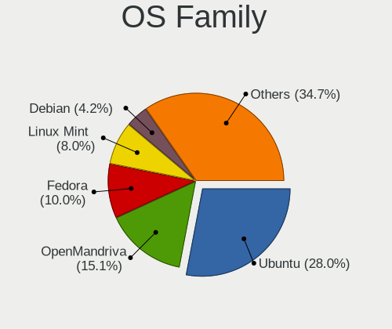

| Name          | Notebooks | Percent |
|---------------|-----------|---------|
| Ubuntu        | 386       | 31.77%  |
| OpenMandriva  | 200       | 16.46%  |
| Fedora        | 113       | 9.3%    |
| Linux Mint    | 107       | 8.81%   |
| Zorin         | 39        | 3.21%   |
| Debian        | 37        | 3.05%   |
| Xubuntu       | 35        | 2.88%   |
| Manjaro       | 33        | 2.72%   |
| Arch          | 33        | 2.72%   |
| Pop!_OS       | 28        | 2.3%    |
| Kubuntu       | 24        | 1.98%   |
| Gentoo        | 21        | 1.73%   |
| ROSA          | 18        | 1.48%   |
| openSUSE      | 18        | 1.48%   |
| Lubuntu       | 12        | 0.99%   |
| KDE neon      | 12        | 0.99%   |
| Kali          | 12        | 0.99%   |
| Endless       | 8         | 0.66%   |
| Elementary    | 8         | 0.66%   |
| Ubuntu MATE   | 7         | 0.58%   |
| ArcoLinux     | 6         | 0.49%   |
| Ubuntu Unity  | 5         | 0.41%   |
| SteamOS       | 5         | 0.41%   |
| RHEL          | 5         | 0.41%   |
| Parrot        | 4         | 0.33%   |
| MX            | 4         | 0.33%   |
| BlackPanther  | 3         | 0.25%   |
| Ubuntu Budgie | 2         | 0.16%   |
| Rocky Linux   | 2         | 0.16%   |
| LMDE          | 2         | 0.16%   |
| LinuxFX       | 2         | 0.16%   |
| EndeavourOS   | 2         | 0.16%   |
| Artix         | 2         | 0.16%   |
| Void Linux    | 1         | 0.08%   |
| TUXEDO OS     | 1         | 0.08%   |
| SystemRescue  | 1         | 0.08%   |
| Solus         | 1         | 0.08%   |
| Sabayon       | 1         | 0.08%   |
| Reborn OS     | 1         | 0.08%   |
| Peppermint    | 1         | 0.08%   |

Kernel
------

Version of the Linux kernel

| Version                  | Notebooks | Percent |
|--------------------------|-----------|---------|
| 5.10.14-desktop-1omv4002 | 73        | 5.21%   |
| 5.14.7-desktop-1omv4050  | 55        | 3.93%   |
| 5.16.7-desktop-1omv4003  | 38        | 2.71%   |
| 5.4.0-42-generic         | 23        | 1.64%   |
| 6.1.1-desktop-1omv2290   | 16        | 1.14%   |
| 5.4.0-52-generic         | 15        | 1.07%   |
| 5.15.0-46-generic        | 15        | 1.07%   |
| 5.4.0-26-generic         | 13        | 0.93%   |
| 5.15.0-56-generic        | 13        | 0.93%   |
| 5.4.0-58-generic         | 12        | 0.86%   |
| 6.2.6-desktop-1omv2390   | 11        | 0.79%   |
| 5.3.0-40-generic         | 11        | 0.79%   |
| 5.15.0-58-generic        | 10        | 0.71%   |
| 5.4.0-65-generic         | 9         | 0.64%   |
| 5.15.0-48-generic        | 9         | 0.64%   |
| 5.0.0-37-generic         | 9         | 0.64%   |
| 5.8.0-59-generic         | 8         | 0.57%   |
| 5.4.0-48-generic         | 8         | 0.57%   |
| 5.4.0-40-generic         | 8         | 0.57%   |
| 5.15.0-52-generic        | 8         | 0.57%   |
| 5.13.0-21-generic        | 8         | 0.57%   |
| 5.4.0-91-generic         | 7         | 0.5%    |
| 5.11.0-27-generic        | 7         | 0.5%    |
| 5.8.0-53-generic         | 6         | 0.43%   |
| 5.4.0-70-generic         | 6         | 0.43%   |
| 5.4.0-56-generic         | 6         | 0.43%   |
| 5.4.0-37-generic         | 6         | 0.43%   |
| 5.4.0-29-generic         | 6         | 0.43%   |
| 5.3.0-46-generic         | 6         | 0.43%   |
| 5.3.0-42-generic         | 6         | 0.43%   |
| 5.3.0-28-generic         | 6         | 0.43%   |
| 5.19.0-32-generic        | 6         | 0.43%   |
| 5.13.0-30-generic        | 6         | 0.43%   |
| 5.13.0-22-generic        | 6         | 0.43%   |
| 5.11.0-34-generic        | 6         | 0.43%   |
| 5.11.0-25-generic        | 6         | 0.43%   |
| 5.11.0-22-generic        | 6         | 0.43%   |
| 5.0.0-31-generic         | 6         | 0.43%   |
| 5.0.0-25-generic         | 6         | 0.43%   |
| 6.2.15-300.fc38.x86_64   | 5         | 0.36%   |

Kernel Family
-------------

Linux kernel without a distro release

| Version | Notebooks | Percent |
|---------|-----------|---------|
| 5.4.0   | 194       | 14.73%  |
| 5.15.0  | 96        | 7.29%   |
| 5.10.14 | 73        | 5.54%   |
| 5.3.0   | 68        | 5.16%   |
| 5.13.0  | 65        | 4.94%   |
| 5.11.0  | 63        | 4.78%   |
| 5.8.0   | 58        | 4.4%    |
| 4.15.0  | 58        | 4.4%    |
| 5.14.7  | 56        | 4.25%   |
| 5.0.0   | 44        | 3.34%   |
| 5.16.7  | 39        | 2.96%   |
| 5.19.0  | 31        | 2.35%   |
| 5.10.0  | 28        | 2.13%   |
| 4.18.0  | 26        | 1.97%   |
| 6.1.1   | 19        | 1.44%   |
| 6.2.6   | 15        | 1.14%   |
| 6.1.0   | 8         | 0.61%   |
| 4.19.0  | 8         | 0.61%   |
| 6.2.0   | 6         | 0.46%   |
| 6.0.0   | 6         | 0.46%   |
| 6.2.15  | 5         | 0.38%   |
| 5.15.12 | 5         | 0.38%   |
| 4.13.0  | 5         | 0.38%   |
| 5.9.0   | 4         | 0.3%    |
| 5.6.16  | 4         | 0.3%    |
| 5.3.18  | 4         | 0.3%    |
| 5.17.0  | 4         | 0.3%    |
| 5.16.11 | 4         | 0.3%    |
| 5.14.0  | 4         | 0.3%    |
| 5.11.12 | 4         | 0.3%    |
| 5.10.74 | 4         | 0.3%    |
| 4.4.0   | 4         | 0.3%    |
| 6.2.9   | 3         | 0.23%   |
| 6.2.10  | 3         | 0.23%   |
| 6.1.7   | 3         | 0.23%   |
| 6.0.2   | 3         | 0.23%   |
| 6.0.12  | 3         | 0.23%   |
| 5.9.16  | 3         | 0.23%   |
| 5.8.18  | 3         | 0.23%   |
| 5.18.12 | 3         | 0.23%   |

Kernel Major Ver.
-----------------

Linux kernel major version

| Version | Notebooks | Percent |
|---------|-----------|---------|
| 5.4     | 210       | 16.03%  |
| 5.10    | 128       | 9.77%   |
| 5.15    | 126       | 9.62%   |
| 5.11    | 84        | 6.41%   |
| 5.13    | 78        | 5.95%   |
| 5.3     | 76        | 5.8%    |
| 5.8     | 74        | 5.65%   |
| 5.14    | 72        | 5.5%    |
| 4.15    | 60        | 4.58%   |
| 5.16    | 56        | 4.27%   |
| 5.0     | 46        | 3.51%   |
| 5.19    | 45        | 3.44%   |
| 6.1     | 44        | 3.36%   |
| 6.2     | 39        | 2.98%   |
| 4.18    | 28        | 2.14%   |
| 6.0     | 23        | 1.76%   |
| 5.17    | 20        | 1.53%   |
| 5.9     | 15        | 1.15%   |
| 5.6     | 15        | 1.15%   |
| 5.18    | 15        | 1.15%   |
| 4.19    | 12        | 0.92%   |
| 5.12    | 7         | 0.53%   |
| 4.9     | 7         | 0.53%   |
| 5.7     | 6         | 0.46%   |
| 5.5     | 6         | 0.46%   |
| 4.13    | 5         | 0.38%   |
| 6.3     | 4         | 0.31%   |
| 4.4     | 4         | 0.31%   |
| 5.1     | 2         | 0.15%   |
| 4.8     | 1         | 0.08%   |
| 4.17    | 1         | 0.08%   |
| 4.14    | 1         | 0.08%   |

Arch
----

OS architecture (x86_64, i586, etc.)

| Name   | Notebooks | Percent |
|--------|-----------|---------|
| x86_64 | 1156      | 96.57%  |
| i686   | 41        | 3.43%   |

DE
--

Desktop Environment

| Name            | Notebooks | Percent |
|-----------------|-----------|---------|
| GNOME           | 493       | 39.92%  |
| KDE5            | 300       | 24.29%  |
| Unknown         | 138       | 11.17%  |
| XFCE            | 103       | 8.34%   |
| X-Cinnamon      | 60        | 4.86%   |
| MATE            | 32        | 2.59%   |
| KDE             | 23        | 1.86%   |
| Cinnamon        | 18        | 1.46%   |
| LXQt            | 13        | 1.05%   |
| Pantheon        | 8         | 0.65%   |
| Unity           | 6         | 0.49%   |
| LXDE            | 6         | 0.49%   |
| KDE4            | 6         | 0.49%   |
| GNOME Flashback | 6         | 0.49%   |
| awesome         | 4         | 0.32%   |
| i3              | 3         | 0.24%   |
| Budgie          | 3         | 0.24%   |
| sway            | 2         | 0.16%   |
| qtile           | 2         | 0.16%   |
| openbox         | 2         | 0.16%   |
| XSession        | 1         | 0.08%   |
| xinitrc         | 1         | 0.08%   |
| xinit-compat    | 1         | 0.08%   |
| GNUstep         | 1         | 0.08%   |
| Enlightenment   | 1         | 0.08%   |
| DWM             | 1         | 0.08%   |
| custom          | 1         | 0.08%   |

Display Server
--------------

X11 or Wayland

| Name    | Notebooks | Percent |
|---------|-----------|---------|
| X11     | 932       | 76.02%  |
| Wayland | 200       | 16.31%  |
| Unknown | 81        | 6.61%   |
| Tty     | 13        | 1.06%   |

Display Manager
---------------

SDDM, LightDM, etc.

| Name    | Notebooks | Percent |
|---------|-----------|---------|
| Unknown | 526       | 42.56%  |
| SDDM    | 292       | 23.62%  |
| GDM     | 133       | 10.76%  |
| GDM3    | 117       | 9.47%   |
| LightDM | 112       | 9.06%   |
| TDM     | 39        | 3.16%   |
| KDM     | 5         | 0.4%    |
| XDM     | 4         | 0.32%   |
| SLiM    | 3         | 0.24%   |
| LXDM    | 3         | 0.24%   |
| Ly      | 1         | 0.08%   |
| GREETD  | 1         | 0.08%   |

OS Lang
-------

Language

| Lang    | Notebooks | Percent |
|---------|-----------|---------|
| cs_CZ   | 656       | 53.9%   |
| en_US   | 356       | 29.25%  |
| Unknown | 122       | 10.02%  |
| en_GB   | 24        | 1.97%   |
| C       | 20        | 1.64%   |
| ru_RU   | 15        | 1.23%   |
| sk_SK   | 4         | 0.33%   |
| POSIX   | 3         | 0.25%   |
| pl_PL   | 3         | 0.25%   |
| de_DE   | 3         | 0.25%   |
| it_IT   | 2         | 0.16%   |
| fr_FR   | 2         | 0.16%   |
| uk_UA   | 1         | 0.08%   |
| ro_RO   | 1         | 0.08%   |
| es_ES   | 1         | 0.08%   |
| en_NG   | 1         | 0.08%   |
| en_150  | 1         | 0.08%   |
| el_GR   | 1         | 0.08%   |
| bg_BG   | 1         | 0.08%   |

Boot Mode
---------

EFI or BIOS

| Mode | Notebooks | Percent |
|------|-----------|---------|
| BIOS | 626       | 51.06%  |
| EFI  | 600       | 48.94%  |

Filesystem
----------

Type of filesystem

| Type     | Notebooks | Percent |
|----------|-----------|---------|
| Ext4     | 810       | 66.72%  |
| Overlay  | 212       | 17.46%  |
| Btrfs    | 109       | 8.98%   |
| Unknown  | 33        | 2.72%   |
| Xfs      | 24        | 1.98%   |
| Tmpfs    | 11        | 0.91%   |
| Zfs      | 6         | 0.49%   |
| Ext3     | 3         | 0.25%   |
| Ext2     | 2         | 0.16%   |
| Aufs     | 2         | 0.16%   |
| Reiserfs | 1         | 0.08%   |
| F2fs     | 1         | 0.08%   |

Part. scheme
------------

Scheme of partitioning

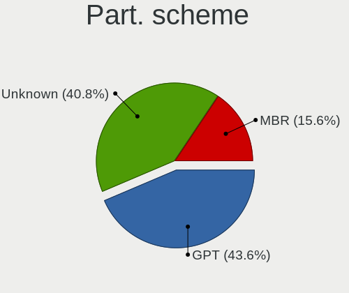

| Type    | Notebooks | Percent |
|---------|-----------|---------|
| Unknown | 559       | 46.05%  |
| GPT     | 428       | 35.26%  |
| MBR     | 227       | 18.7%   |

Dual Boot with Linux/BSD
------------------------

Hosting more than one Linux/BSD

| Dual boot | Notebooks | Percent |
|-----------|-----------|---------|
| No        | 1097      | 90.96%  |
| Yes       | 109       | 9.04%   |

Dual Boot (Win)
---------------

Hosting Linux and Windows

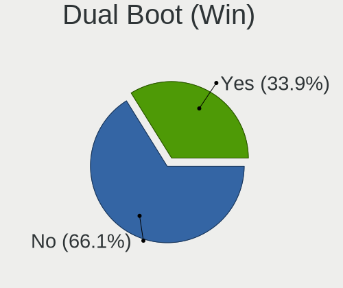

| Dual boot | Notebooks | Percent |
|-----------|-----------|---------|
| No        | 774       | 63.49%  |
| Yes       | 445       | 36.51%  |

Board
-----

Vendor
------

Motherboard manufacturer

| Name                           | Notebooks | Percent |
|--------------------------------|-----------|---------|
| Lenovo                         | 306       | 25.56%  |
| ASUSTek Computer               | 250       | 20.89%  |
| Hewlett-Packard                | 217       | 18.13%  |
| Dell                           | 165       | 13.78%  |
| Acer                           | 113       | 9.44%   |
| MSI                            | 18        | 1.5%    |
| UMAX                           | 17        | 1.42%   |
| Toshiba                        | 16        | 1.34%   |
| Sony                           | 14        | 1.17%   |
| Fujitsu                        | 9         | 0.75%   |
| HUAWEI                         | 7         | 0.58%   |
| Apple                          | 7         | 0.58%   |
| Unknown                        | 6         | 0.5%    |
| Valve                          | 5         | 0.42%   |
| TUXEDO                         | 4         | 0.33%   |
| Timi                           | 4         | 0.33%   |
| Fujitsu Siemens                | 4         | 0.33%   |
| Packard Bell                   | 3         | 0.25%   |
| Google                         | 3         | 0.25%   |
| Notebook                       | 2         | 0.17%   |
| Insyde                         | 2         | 0.17%   |
| Chuwi                          | 2         | 0.17%   |
| Alienware                      | 2         | 0.17%   |
| Standard                       | 1         | 0.08%   |
| SmbiosType1_SystemManufacturer | 1         | 0.08%   |
| SLIMBOOK                       | 1         | 0.08%   |
| Samsung Electronics            | 1         | 0.08%   |
| Purism                         | 1         | 0.08%   |
| Prestigio                      | 1         | 0.08%   |
| Panasonic                      | 1         | 0.08%   |
| Medion                         | 1         | 0.08%   |
| Jumper                         | 1         | 0.08%   |
| Intel                          | 1         | 0.08%   |
| INET                           | 1         | 0.08%   |
| In-Sing                        | 1         | 0.08%   |
| IBM                            | 1         | 0.08%   |
| Gigabyte Technology            | 1         | 0.08%   |
| EUROCOM                        | 1         | 0.08%   |
| eMachines                      | 1         | 0.08%   |
| Dynabook                       | 1         | 0.08%   |

Model
-----

Motherboard model

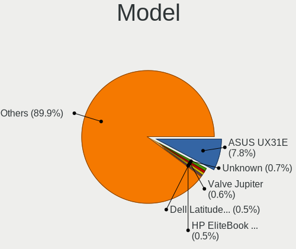

| Name                                  | Notebooks | Percent |
|---------------------------------------|-----------|---------|
| ASUS UX31E                            | 124       | 10.36%  |
| Unknown                               | 8         | 0.67%   |
| HP ProBook 455 G7                     | 6         | 0.5%    |
| Valve Jupiter                         | 5         | 0.42%   |
| Lenovo ThinkPad E14 20RA001LMC        | 5         | 0.42%   |
| HP ProBook 4540s                      | 5         | 0.42%   |
| HP ProBook 4530s                      | 5         | 0.42%   |
| HP ProBook 450 G5                     | 5         | 0.42%   |
| HP EliteBook 840 G3                   | 5         | 0.42%   |
| Dell Latitude E6400                   | 5         | 0.42%   |
| Dell Latitude 5401                    | 5         | 0.42%   |
| Lenovo IdeaPad S145-15AST 81N3        | 4         | 0.33%   |
| HP Pavilion dv7                       | 4         | 0.33%   |
| HP Notebook                           | 4         | 0.33%   |
| HP EliteBook 845 G8 Notebook PC       | 4         | 0.33%   |
| HP EliteBook 840 G6                   | 4         | 0.33%   |
| HP 250 G6 Notebook PC                 | 4         | 0.33%   |
| Dell XPS 15 7590                      | 4         | 0.33%   |
| Dell Precision M6500                  | 4         | 0.33%   |
| Dell Latitude E6420                   | 4         | 0.33%   |
| Acer Extensa 5620                     | 4         | 0.33%   |
| Lenovo Z50-75 80EC                    | 3         | 0.25%   |
| Lenovo ThinkPad T14 Gen 1 20UES2WA00  | 3         | 0.25%   |
| Lenovo IdeaPad S130-11IGM 81J1        | 3         | 0.25%   |
| Lenovo IdeaPad L340-17IRH Gaming 81LL | 3         | 0.25%   |
| Lenovo IdeaPad 5 14ARE05 81YM         | 3         | 0.25%   |
| HP ProBook 4510s                      | 3         | 0.25%   |
| HP Pavilion dv6                       | 3         | 0.25%   |
| HP Laptop 15-bw0xx                    | 3         | 0.25%   |
| HP EliteBook 855 G7 Notebook PC       | 3         | 0.25%   |
| HP EliteBook 850 G6                   | 3         | 0.25%   |
| Dell XPS 15 9560                      | 3         | 0.25%   |
| Dell XPS 13 9360                      | 3         | 0.25%   |
| Dell Precision 5510                   | 3         | 0.25%   |
| Dell Latitude E5520                   | 3         | 0.25%   |
| Dell Latitude E5470                   | 3         | 0.25%   |
| Dell Latitude 7480                    | 3         | 0.25%   |
| Dell Latitude 5511                    | 3         | 0.25%   |
| Dell Latitude 5480                    | 3         | 0.25%   |
| Dell G5 5587                          | 3         | 0.25%   |

Model Family
------------

Motherboard model prefix

| Name                  | Notebooks | Percent |
|-----------------------|-----------|---------|
| Lenovo ThinkPad       | 166       | 13.87%  |
| ASUS UX31E            | 124       | 10.36%  |
| Dell Latitude         | 84        | 7.02%   |
| Acer Aspire           | 66        | 5.51%   |
| Lenovo IdeaPad        | 64        | 5.35%   |
| HP ProBook            | 61        | 5.1%    |
| HP EliteBook          | 58        | 4.85%   |
| HP Pavilion           | 24        | 2.01%   |
| Dell XPS              | 23        | 1.92%   |
| Dell Inspiron         | 21        | 1.75%   |
| Dell Precision        | 18        | 1.5%    |
| Toshiba Satellite     | 15        | 1.25%   |
| ASUS VivoBook         | 15        | 1.25%   |
| HP Laptop             | 14        | 1.17%   |
| HP Compaq             | 14        | 1.17%   |
| Acer Extensa          | 14        | 1.17%   |
| UMAX VisionBook       | 13        | 1.09%   |
| Lenovo Yoga           | 13        | 1.09%   |
| Lenovo Legion         | 13        | 1.09%   |
| ASUS ZenBook          | 13        | 1.09%   |
| Acer TravelMate       | 12        | 1%      |
| HP ZBook              | 10        | 0.84%   |
| HP 250                | 9         | 0.75%   |
| Fujitsu LIFEBOOK      | 9         | 0.75%   |
| Acer Swift            | 9         | 0.75%   |
| Lenovo ThinkBook      | 8         | 0.67%   |
| Dell Vostro           | 8         | 0.67%   |
| Unknown               | 8         | 0.67%   |
| ASUS ROG              | 6         | 0.5%    |
| Valve Jupiter         | 5         | 0.42%   |
| ASUS ASUS             | 5         | 0.42%   |
| Acer Nitro            | 5         | 0.42%   |
| HP Notebook           | 4         | 0.33%   |
| Dell G5               | 4         | 0.33%   |
| Packard Bell EasyNote | 3         | 0.25%   |
| Lenovo Z50-75         | 3         | 0.25%   |
| Lenovo G780           | 3         | 0.25%   |
| HP OMEN               | 3         | 0.25%   |
| Fujitsu Siemens AMILO | 3         | 0.25%   |
| ASUS E502SA           | 3         | 0.25%   |

MFG Year
--------

Motherboard manufacture year

| Year    | Notebooks | Percent |
|---------|-----------|---------|
| 2011    | 196       | 16.37%  |
| 2020    | 117       | 9.77%   |
| 2019    | 109       | 9.11%   |
| 2021    | 99        | 8.27%   |
| 2018    | 86        | 7.18%   |
| 2012    | 74        | 6.18%   |
| 2014    | 67        | 5.6%    |
| 2015    | 66        | 5.51%   |
| 2017    | 63        | 5.26%   |
| 2013    | 60        | 5.01%   |
| 2008    | 58        | 4.85%   |
| 2016    | 54        | 4.51%   |
| 2010    | 46        | 3.84%   |
| 2007    | 31        | 2.59%   |
| 2022    | 27        | 2.26%   |
| 2009    | 25        | 2.09%   |
| 2006    | 12        | 1%      |
| 2005    | 3         | 0.25%   |
| 2004    | 2         | 0.17%   |
| Unknown | 2         | 0.17%   |

Form Factor
-----------

Physical design of the computer

| Name     | Notebooks | Percent |
|----------|-----------|---------|
| Notebook | 1197      | 100%    |

Secure Boot
-----------

Enabled or disabled

| State    | Notebooks | Percent |
|----------|-----------|---------|
| Disabled | 1058      | 87.29%  |
| Enabled  | 154       | 12.71%  |

Coreboot
--------

Have coreboot on board

| Used | Notebooks | Percent |
|------|-----------|---------|
| No   | 1193      | 99.67%  |
| Yes  | 4         | 0.33%   |

RAM Size
--------

Total RAM memory

| Size in GB  | Notebooks | Percent |
|-------------|-----------|---------|
| 3.01-4.0    | 356       | 29.32%  |
| 4.01-8.0    | 256       | 21.09%  |
| 8.01-16.0   | 201       | 16.56%  |
| 16.01-24.0  | 175       | 14.42%  |
| 32.01-64.0  | 94        | 7.74%   |
| 1.01-2.0    | 65        | 5.35%   |
| 2.01-3.0    | 22        | 1.81%   |
| 24.01-32.0  | 20        | 1.65%   |
| 0.51-1.0    | 14        | 1.15%   |
| 64.01-256.0 | 10        | 0.82%   |
| 0.01-0.5    | 1         | 0.08%   |

RAM Used
--------

Used RAM memory

| Used GB    | Notebooks | Percent |
|------------|-----------|---------|
| 1.01-2.0   | 501       | 38.13%  |
| 2.01-3.0   | 284       | 21.61%  |
| 4.01-8.0   | 188       | 14.31%  |
| 3.01-4.0   | 159       | 12.1%   |
| 0.51-1.0   | 76        | 5.78%   |
| 8.01-16.0  | 70        | 5.33%   |
| 0.01-0.5   | 18        | 1.37%   |
| 16.01-24.0 | 14        | 1.07%   |
| 32.01-64.0 | 2         | 0.15%   |
| 24.01-32.0 | 2         | 0.15%   |

Total Drives
------------

Number of drives on board

| Drives | Notebooks | Percent |
|--------|-----------|---------|
| 1      | 966       | 78.92%  |
| 2      | 214       | 17.48%  |
| 3      | 29        | 2.37%   |
| 0      | 13        | 1.06%   |
| 7      | 1         | 0.08%   |
| 4      | 1         | 0.08%   |

Has CD-ROM
----------

Has CD-ROM on board

| Presented | Notebooks | Percent |
|-----------|-----------|---------|
| No        | 842       | 69.99%  |
| Yes       | 361       | 30.01%  |

Has Ethernet
------------

Has Ethernet on board

| Presented | Notebooks | Percent |
|-----------|-----------|---------|
| Yes       | 1008      | 83.65%  |
| No        | 197       | 16.35%  |

Has WiFi
--------

Has WiFi module

| Presented | Notebooks | Percent |
|-----------|-----------|---------|
| Yes       | 1177      | 98.25%  |
| No        | 21        | 1.75%   |

Has Bluetooth
-------------

Has Bluetooth module

| Presented | Notebooks | Percent |
|-----------|-----------|---------|
| Yes       | 872       | 72.01%  |
| No        | 339       | 27.99%  |

Location
--------

Country
-------

Geographic location (country)

| Country | Notebooks | Percent |
|---------|-----------|---------|
| Czechia | 1197      | 100%    |

City
----

Geographic location (city)

| City                 | Notebooks | Percent |
|----------------------|-----------|---------|
| Prague               | 513       | 41.14%  |
| Brno                 | 109       | 8.74%   |
| Ostrava              | 36        | 2.89%   |
| Pilsen               | 24        | 1.92%   |
| Olomouc              | 20        | 1.6%    |
| Pardubice            | 16        | 1.28%   |
| Liberec              | 14        | 1.12%   |
| esk Budjovice  | 13        | 1.04%   |
| Hradec Krlov     | 12        | 0.96%   |
| Most                 | 10        | 0.8%    |
| Havov            | 10        | 0.8%    |
| Chomutov             | 10        | 0.8%    |
| Zln                | 7         | 0.56%   |
| Karlovy Vary         | 7         | 0.56%   |
| Jihlava              | 7         | 0.56%   |
| Znojmo               | 6         | 0.48%   |
| st nad Labem     | 6         | 0.48%   |
| Tbor               | 5         | 0.4%    |
| Roznov pod Radhostem | 5         | 0.4%    |
| Pbram            | 5         | 0.4%    |
| Perov              | 5         | 0.4%    |
| Marinsk Lzn  | 5         | 0.4%    |
| Kladno               | 5         | 0.4%    |
| Ceska Kamenice       | 5         | 0.4%    |
| Brdo                 | 5         | 0.4%    |
| Teplice              | 4         | 0.32%   |
| Prelouc              | 4         | 0.32%   |
| Opava                | 4         | 0.32%   |
| Mlad Boleslav      | 4         | 0.32%   |
| Milovice             | 4         | 0.32%   |
| esk Lpa        | 4         | 0.32%   |
| Uvaly                | 3         | 0.24%   |
| Uhlirske Janovice    | 3         | 0.24%   |
| Teb            | 3         | 0.24%   |
| Slavkov u Brna       | 3         | 0.24%   |
| lapanice           | 3         | 0.24%   |
| Rumburk              | 3         | 0.24%   |
| Praha 10             | 3         | 0.24%   |
| Pelhrimov            | 3         | 0.24%   |
| Odolena Voda         | 3         | 0.24%   |

Drives
------

Drive Vendor
------------

Hard drive vendors

| Vendor                         | Notebooks | Drives | Percent |
|--------------------------------|-----------|--------|---------|
| Samsung Electronics            | 238       | 312    | 16.73%  |
| SanDisk                        | 193       | 203    | 13.56%  |
| WDC                            | 144       | 173    | 10.12%  |
| Seagate                        | 140       | 192    | 9.84%   |
| Toshiba                        | 110       | 133    | 7.73%   |
| Kingston                       | 79        | 84     | 5.55%   |
| Unknown                        | 69        | 94     | 4.85%   |
| SK hynix                       | 65        | 80     | 4.57%   |
| Hitachi                        | 48        | 56     | 3.37%   |
| Intel                          | 42        | 50     | 2.95%   |
| HGST                           | 41        | 50     | 2.88%   |
| Micron Technology              | 39        | 48     | 2.74%   |
| A-DATA Technology              | 27        | 30     | 1.9%    |
| Crucial                        | 21        | 31     | 1.48%   |
| Patriot                        | 20        | 25     | 1.41%   |
| KIOXIA                         | 14        | 25     | 0.98%   |
| Unknown                        | 10        | 11     | 0.7%    |
| Transcend                      | 9         | 10     | 0.63%   |
| Apacer                         | 9         | 13     | 0.63%   |
| LITEONIT                       | 7         | 9      | 0.49%   |
| Fujitsu                        | 7         | 7      | 0.49%   |
| China                          | 7         | 8      | 0.49%   |
| Phison                         | 6         | 13     | 0.42%   |
| Apple                          | 6         | 6      | 0.42%   |
| Verbatim                       | 5         | 5      | 0.35%   |
| LITEON                         | 5         | 5      | 0.35%   |
| Phison Electronics             | 4         | 4      | 0.28%   |
| JMicron Technology             | 4         | 4      | 0.28%   |
| UMAX                           | 3         | 3      | 0.21%   |
| Solid State Storage Technology | 3         | 3      | 0.21%   |
| Silicon Motion                 | 3         | 3      | 0.21%   |
| GOODRAM                        | 3         | 4      | 0.21%   |
| Gigabyte Technology            | 3         | 8      | 0.21%   |
| ASMedia                        | 3         | 5      | 0.21%   |
| UMIS                           | 2         | 2      | 0.14%   |
| Team                           | 2         | 2      | 0.14%   |
| Micron/Crucial Technology      | 2         | 2      | 0.14%   |
| Lite-On                        | 2         | 4      | 0.14%   |
| Lenovo                         | 2         | 3      | 0.14%   |
| Corsair                        | 2         | 2      | 0.14%   |

Drive Model
-----------

Hard drive models

| Model                                               | Notebooks | Percent |
|-----------------------------------------------------|-----------|---------|
| SanDisk SSD U100 256GB                              | 123       | 8.28%   |
| Samsung NVMe SSD Drive 512GB                        | 17        | 1.14%   |
| HGST HTS721010A9E630 1TB                            | 16        | 1.08%   |
| Seagate ST1000LM035-1RK172 1TB                      | 15        | 1.01%   |
| Unknown MMC Card  32GB                              | 13        | 0.88%   |
| Samsung SSD 860 EVO 500GB                           | 13        | 0.88%   |
| Samsung MZVLB1T0HBLR-000L2 1TB                      | 11        | 0.74%   |
| Kingston SA400S37480G 480GB SSD                     | 11        | 0.74%   |
| Seagate ST1000LM024 HN-M101MBB 1TB                  | 10        | 0.67%   |
| SanDisk NVMe SSD Drive 512GB                        | 10        | 0.67%   |
| Unknown                                             | 10        | 0.67%   |
| Samsung NVMe SSD Controller SM981/PM981/PM983 250GB | 9         | 0.61%   |
| Kingston SA400S37240G 240GB SSD                     | 9         | 0.61%   |
| WDC WDS240G2G0A-00JH30 240GB SSD                    | 8         | 0.54%   |
| Unknown MMC Card  64GB                              | 8         | 0.54%   |
| Toshiba MQ01ABF050 500GB                            | 8         | 0.54%   |
| Toshiba MQ01ABD100 1TB                              | 8         | 0.54%   |
| Toshiba KBG30ZMS128G 128GB NVMe SSD                 | 8         | 0.54%   |
| SK hynix NVMe SSD Drive 512GB                       | 8         | 0.54%   |
| Seagate ST500LT012-1DG142 500GB                     | 8         | 0.54%   |
| Samsung SSD 850 EVO 250GB                           | 8         | 0.54%   |
| HGST HTS725050A7E630 500GB                          | 8         | 0.54%   |
| Unknown MMC Card  16GB                              | 7         | 0.47%   |
| Toshiba MQ04ABF100 1TB                              | 7         | 0.47%   |
| Seagate ST9500420AS 500GB                           | 7         | 0.47%   |
| SanDisk NVMe SSD Drive 1024GB                       | 7         | 0.47%   |
| Patriot Burst 480GB SSD                             | 7         | 0.47%   |
| Micron 1100_MTFDDAV256TBN 256GB SSD                 | 7         | 0.47%   |
| Kingston SA400S37120G 120GB SSD                     | 7         | 0.47%   |
| WDC PC SN730 SDBQNTY-512G-1001 512GB                | 6         | 0.4%    |
| Unknown MMC Card  128GB                             | 6         | 0.4%    |
| Toshiba NVMe SSD Drive 512GB                        | 6         | 0.4%    |
| Seagate ST500LM000-1EJ162 500GB                     | 6         | 0.4%    |
| Seagate ST2000LM007-1R8174 2TB                      | 6         | 0.4%    |
| Samsung SSD 970 EVO 1TB                             | 6         | 0.4%    |
| Samsung NVMe SSD Drive 256GB                        | 6         | 0.4%    |
| Samsung MZVLQ512HALU-000H1 512GB                    | 6         | 0.4%    |
| WDC WDS500G2B0A-00SM50 500GB SSD                    | 5         | 0.34%   |
| WDC WD10JPVX-22JC3T0 1TB                            | 5         | 0.34%   |
| Seagate ST500LM030-2E717D 500GB                     | 5         | 0.34%   |

HDD Vendor
----------

Hard disk drive vendors

| Vendor              | Notebooks | Drives | Percent |
|---------------------|-----------|--------|---------|
| Seagate             | 138       | 190    | 35.57%  |
| WDC                 | 84        | 100    | 21.65%  |
| Toshiba             | 63        | 71     | 16.24%  |
| Hitachi             | 48        | 56     | 12.37%  |
| HGST                | 41        | 50     | 10.57%  |
| Fujitsu             | 7         | 7      | 1.8%    |
| Samsung Electronics | 2         | 2      | 0.52%   |
| ASMedia             | 2         | 3      | 0.52%   |
| USB3.0              | 1         | 1      | 0.26%   |
| Unknown             | 1         | 1      | 0.26%   |
| IBM/Hitachi         | 1         | 1      | 0.26%   |

SSD Vendor
----------

Solid state drive vendors

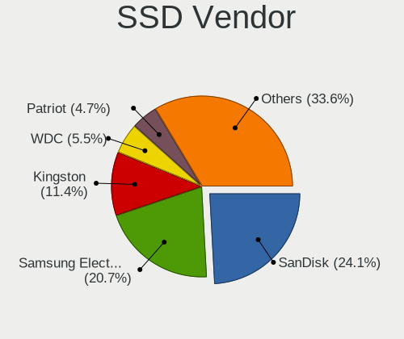

| Vendor              | Notebooks | Drives | Percent |
|---------------------|-----------|--------|---------|
| SanDisk             | 155       | 158    | 29.52%  |
| Samsung Electronics | 102       | 127    | 19.43%  |
| Kingston            | 59        | 64     | 11.24%  |
| WDC                 | 26        | 37     | 4.95%   |
| A-DATA Technology   | 25        | 28     | 4.76%   |
| Patriot             | 20        | 25     | 3.81%   |
| Crucial             | 20        | 30     | 3.81%   |
| Micron Technology   | 15        | 20     | 2.86%   |
| Intel               | 14        | 16     | 2.67%   |
| SK hynix            | 13        | 14     | 2.48%   |
| Toshiba             | 10        | 12     | 1.9%    |
| Transcend           | 9         | 10     | 1.71%   |
| Apacer              | 9         | 13     | 1.71%   |
| LITEONIT            | 7         | 9      | 1.33%   |
| China               | 7         | 8      | 1.33%   |
| Verbatim            | 5         | 5      | 0.95%   |
| Apple               | 5         | 5      | 0.95%   |
| LITEON              | 4         | 4      | 0.76%   |
| UMAX                | 3         | 3      | 0.57%   |
| GOODRAM             | 2         | 3      | 0.38%   |
| Gigabyte Technology | 2         | 6      | 0.38%   |
| ASMT                | 2         | 2      | 0.38%   |
| UMIS                | 1         | 1      | 0.19%   |
| TO Exter            | 1         | 2      | 0.19%   |
| Team                | 1         | 1      | 0.19%   |
| ShanDianZhe         | 1         | 1      | 0.19%   |
| Seagate             | 1         | 1      | 0.19%   |
| OCZ                 | 1         | 4      | 0.19%   |
| Netac               | 1         | 1      | 0.19%   |
| Mushkin             | 1         | 1      | 0.19%   |
| Hewlett-Packard     | 1         | 1      | 0.19%   |
| CT500MX5            | 1         | 1      | 0.19%   |
| ADATA SU            | 1         | 1      | 0.19%   |

Drive Kind
----------

HDD or SSD

| Kind    | Notebooks | Drives | Percent |
|---------|-----------|--------|---------|
| SSD     | 504       | 614    | 36.76%  |
| NVMe    | 399       | 534    | 29.1%   |
| HDD     | 376       | 482    | 27.43%  |
| MMC     | 83        | 109    | 6.05%   |
| Unknown | 9         | 13     | 0.66%   |

Drive Connector
---------------

SATA, SAS, NVMe, etc.

| Type | Notebooks | Drives | Percent |
|------|-----------|--------|---------|
| SATA | 805       | 1065   | 60.94%  |
| NVMe | 397       | 530    | 30.05%  |
| MMC  | 83        | 109    | 6.28%   |
| SAS  | 36        | 48     | 2.73%   |

Drive Size
----------

Size of hard drive

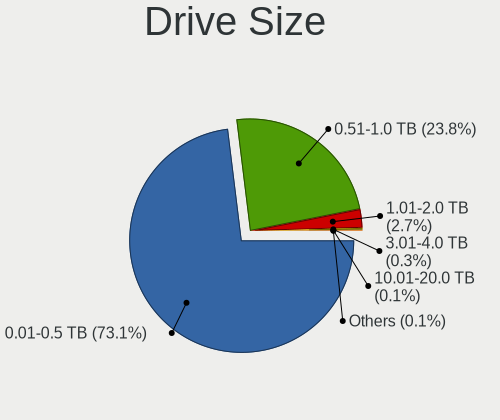

| Size in TB | Notebooks | Drives | Percent |
|------------|-----------|--------|---------|
| 0.01-0.5   | 649       | 803    | 75.2%   |
| 0.51-1.0   | 196       | 262    | 22.71%  |
| 1.01-2.0   | 17        | 29     | 1.97%   |
| 3.01-4.0   | 1         | 2      | 0.12%   |

Space Total
-----------

Amount of disk space available on the file system

| Size in GB     | Notebooks | Percent |
|----------------|-----------|---------|
| 101-250        | 305       | 24.5%   |
| 251-500        | 287       | 23.05%  |
| 1-20           | 215       | 17.27%  |
| 501-1000       | 171       | 13.73%  |
| 51-100         | 86        | 6.91%   |
| 1001-2000      | 58        | 4.66%   |
| 21-50          | 50        | 4.02%   |
| Unknown        | 45        | 3.61%   |
| More than 3000 | 19        | 1.53%   |
| 2001-3000      | 9         | 0.72%   |

Space Used
----------

Amount of used disk space

| Used GB        | Notebooks | Percent |
|----------------|-----------|---------|
| 1-20           | 598       | 46.25%  |
| 21-50          | 171       | 13.23%  |
| 101-250        | 163       | 12.61%  |
| 51-100         | 136       | 10.52%  |
| 251-500        | 106       | 8.2%    |
| 501-1000       | 46        | 3.56%   |
| Unknown        | 45        | 3.48%   |
| 1001-2000      | 18        | 1.39%   |
| More than 3000 | 6         | 0.46%   |
| 2001-3000      | 4         | 0.31%   |

Malfunc. Drives
---------------

Drive models with a malfunction

| Model                                            | Notebooks | Drives | Percent |
|--------------------------------------------------|-----------|--------|---------|
| SanDisk SSD U100 256GB                           | 123       | 123    | 64.06%  |
| HGST HTS725050A7E630 500GB                       | 4         | 4      | 2.08%   |
| SK hynix BC711 HFM512GD3JX013N 512GB             | 3         | 4      | 1.56%   |
| Toshiba MQ01ABD075 752GB                         | 2         | 2      | 1.04%   |
| Seagate ST9500420AS 500GB                        | 2         | 3      | 1.04%   |
| Seagate ST1000LX015-1U7172 1TB                   | 2         | 2      | 1.04%   |
| Seagate ST1000LM024 HN-M101MBB 1TB               | 2         | 2      | 1.04%   |
| HGST HTS721010A9E630 1TB                         | 2         | 2      | 1.04%   |
| WDC WDS240G2G0A-00JH30 240GB SSD                 | 1         | 1      | 0.52%   |
| WDC WD7500BPVT-22HXZT3 752GB                     | 1         | 1      | 0.52%   |
| WDC WD6400BPVT-60HXZT1 640GB                     | 1         | 1      | 0.52%   |
| WDC WD3200BEVT-60ZCT1 320GB                      | 1         | 1      | 0.52%   |
| Toshiba MQ01ABD100 1TB                           | 1         | 1      | 0.52%   |
| Toshiba MK8037GSX 80GB                           | 1         | 1      | 0.52%   |
| Toshiba MK6465GSXN 640GB                         | 1         | 1      | 0.52%   |
| Toshiba MK5056GSY 500GB                          | 1         | 1      | 0.52%   |
| Toshiba MK2552GSX 250GB                          | 1         | 1      | 0.52%   |
| Toshiba MK1234GSX 120GB                          | 1         | 1      | 0.52%   |
| SK hynix HFS256G3BTND-N210A 256GB SSD            | 1         | 1      | 0.52%   |
| SK hynix HFS128G39TND-N210A 128GB SSD            | 1         | 1      | 0.52%   |
| Seagate ST980811AS 80GB                          | 1         | 1      | 0.52%   |
| Seagate ST9500420ASG 500GB                       | 1         | 1      | 0.52%   |
| Seagate ST9320423AS 320GB                        | 1         | 1      | 0.52%   |
| Seagate ST9250827AS 250GB                        | 1         | 1      | 0.52%   |
| Seagate ST9250410ASG 250GB                       | 1         | 1      | 0.52%   |
| Seagate ST9250315AS 250GB                        | 1         | 1      | 0.52%   |
| Seagate ST9200420ASG 200GB                       | 1         | 1      | 0.52%   |
| Seagate ST500LM000-SSHD-8GB                      | 1         | 1      | 0.52%   |
| Seagate ST320LT007-9ZV142 320GB                  | 1         | 1      | 0.52%   |
| Seagate ST2000LM007-1R8174 2TB                   | 1         | 1      | 0.52%   |
| SanDisk SD8SBAT-032G-1006 32GB SSD               | 1         | 1      | 0.52%   |
| SanDisk SD7SB3Q256G1002 256GB SSD                | 1         | 1      | 0.52%   |
| Samsung Electronics SSD 870 EVO 1TB              | 1         | 1      | 0.52%   |
| Samsung Electronics SSD 850 EVO 1TB              | 1         | 1      | 0.52%   |
| Samsung Electronics MZVLB1T0HALR-000L2 1TB       | 1         | 1      | 0.52%   |
| Samsung Electronics MZVL21T0HCLR-00B00 1TB       | 1         | 1      | 0.52%   |
| Samsung Electronics MZ7TE256HMHP-000L7 256GB SSD | 1         | 1      | 0.52%   |
| Micron Technology 1100 SATA 256GB SSD            | 1         | 1      | 0.52%   |
| LITEONIT LAT-128M2S 128GB SSD                    | 1         | 1      | 0.52%   |
| Kingston SHFS37A120G 120GB SSD                   | 1         | 1      | 0.52%   |

Malfunc. Drive Vendor
---------------------

Vendors of faulty drives

| Vendor              | Notebooks | Drives | Percent |
|---------------------|-----------|--------|---------|
| SanDisk             | 125       | 125    | 65.1%   |
| Seagate             | 16        | 17     | 8.33%   |
| Hitachi             | 11        | 11     | 5.73%   |
| Toshiba             | 8         | 8      | 4.17%   |
| HGST                | 8         | 8      | 4.17%   |
| SK hynix            | 5         | 6      | 2.6%    |
| Samsung Electronics | 5         | 5      | 2.6%    |
| WDC                 | 4         | 4      | 2.08%   |
| Intel               | 2         | 2      | 1.04%   |
| A-DATA Technology   | 2         | 3      | 1.04%   |
| Micron Technology   | 1         | 1      | 0.52%   |
| LITEONIT            | 1         | 1      | 0.52%   |
| Kingston            | 1         | 1      | 0.52%   |
| IBM/Hitachi         | 1         | 1      | 0.52%   |
| Fujitsu             | 1         | 1      | 0.52%   |
| Crucial             | 1         | 1      | 0.52%   |

Malfunc. HDD Vendor
-------------------

Vendors of faulty HDD drives

| Vendor      | Notebooks | Drives | Percent |
|-------------|-----------|--------|---------|
| Seagate     | 16        | 17     | 33.33%  |
| Hitachi     | 11        | 11     | 22.92%  |
| Toshiba     | 8         | 8      | 16.67%  |
| HGST        | 8         | 8      | 16.67%  |
| WDC         | 3         | 3      | 6.25%   |
| IBM/Hitachi | 1         | 1      | 2.08%   |
| Fujitsu     | 1         | 1      | 2.08%   |

Malfunc. Drive Kind
-------------------

Kinds of faulty drives

| Kind | Notebooks | Drives | Percent |
|------|-----------|--------|---------|
| SSD  | 139       | 140    | 72.4%   |
| HDD  | 48        | 49     | 25%     |
| NVMe | 5         | 6      | 2.6%    |

Failed Drives
-------------

Failed drive models

Zero info for selected period =(

Failed Drive Vendor
-------------------

Failed drive vendors

Zero info for selected period =(

Drive Status
------------

Number of failed and malfunc. drives

| Status   | Notebooks | Drives | Percent |
|----------|-----------|--------|---------|
| Detected | 643       | 1027   | 51.36%  |
| Works    | 418       | 530    | 33.39%  |
| Malfunc  | 191       | 195    | 15.26%  |

Storage controller
------------------

Storage Vendor
--------------

Storage controller vendors

| Vendor                           | Notebooks | Percent |
|----------------------------------|-----------|---------|
| Intel                            | 841       | 60.68%  |
| Samsung Electronics              | 143       | 10.32%  |
| AMD                              | 137       | 9.88%   |
| SanDisk                          | 65        | 4.69%   |
| SK hynix                         | 49        | 3.54%   |
| Toshiba America Info Systems     | 37        | 2.67%   |
| Micron Technology                | 24        | 1.73%   |
| Kingston Technology Company      | 21        | 1.52%   |
| KIOXIA                           | 16        | 1.15%   |
| Phison Electronics               | 14        | 1.01%   |
| Union Memory (Shenzhen)          | 5         | 0.36%   |
| Silicon Motion                   | 5         | 0.36%   |
| ADATA Technology                 | 4         | 0.29%   |
| Solid State Storage Technology   | 3         | 0.22%   |
| Silicon Integrated Systems [SiS] | 3         | 0.22%   |
| Nvidia                           | 3         | 0.22%   |
| Micron/Crucial Technology        | 3         | 0.22%   |
| Lite-On Technology               | 3         | 0.22%   |
| Lenovo                           | 2         | 0.14%   |
| ASMedia Technology               | 2         | 0.14%   |
| VIA Technologies                 | 1         | 0.07%   |
| Realtek Semiconductor            | 1         | 0.07%   |
| Marvell Technology Group         | 1         | 0.07%   |
| JMicron Technology               | 1         | 0.07%   |
| Biwin Storage Technology         | 1         | 0.07%   |
| Apple                            | 1         | 0.07%   |

Storage Model
-------------

Storage controller models

| Model                                                                            | Notebooks | Percent |
|----------------------------------------------------------------------------------|-----------|---------|
| Intel 6 Series/C200 Series Chipset Family 6 port Mobile SATA AHCI Controller     | 185       | 12.42%  |
| AMD FCH SATA Controller [AHCI mode]                                              | 112       | 7.52%   |
| Intel Sunrise Point-LP SATA Controller [AHCI mode]                               | 77        | 5.17%   |
| Intel 7 Series Chipset Family 6-port SATA Controller [AHCI mode]                 | 69        | 4.63%   |
| Samsung NVMe SSD Controller SM981/PM981/PM983                                    | 62        | 4.16%   |
| Intel 82801 Mobile SATA Controller [RAID mode]                                   | 53        | 3.56%   |
| Samsung NVMe SSD Controller 980                                                  | 46        | 3.09%   |
| Intel 82801IBM/IEM (ICH9M/ICH9M-E) 4 port SATA Controller [AHCI mode]            | 45        | 3.02%   |
| Intel Volume Management Device NVMe RAID Controller                              | 38        | 2.55%   |
| Intel Cannon Lake Mobile PCH SATA AHCI Controller                                | 36        | 2.42%   |
| Intel 8 Series SATA Controller 1 [AHCI mode]                                     | 35        | 2.35%   |
| Intel 82801HM/HEM (ICH8M/ICH8M-E) IDE Controller                                 | 30        | 2.01%   |
| Intel 8 Series/C220 Series Chipset Family 6-port SATA Controller 1 [AHCI mode]   | 30        | 2.01%   |
| SanDisk WD Black SN750 / PC SN730 NVMe SSD                                       | 25        | 1.68%   |
| Intel Wildcat Point-LP SATA Controller [AHCI Mode]                               | 25        | 1.68%   |
| Intel Celeron/Pentium Silver Processor SATA Controller                           | 22        | 1.48%   |
| Intel HM170/QM170 Chipset SATA Controller [AHCI Mode]                            | 21        | 1.41%   |
| SK hynix Gold P31/BC711/PC711 NVMe Solid State Drive                             | 20        | 1.34%   |
| Intel 82801HM/HEM (ICH8M/ICH8M-E) SATA Controller [AHCI mode]                    | 20        | 1.34%   |
| Intel 5 Series/3400 Series Chipset 4 port SATA AHCI Controller                   | 20        | 1.34%   |
| Intel Atom Processor E3800 Series SATA AHCI Controller                           | 18        | 1.21%   |
| Toshiba America Info Systems XG6 NVMe SSD Controller                             | 15        | 1.01%   |
| SanDisk WD Blue SN550 NVMe SSD                                                   | 15        | 1.01%   |
| Samsung NVMe SSD Controller SM961/PM961/SM963                                    | 15        | 1.01%   |
| Samsung NVMe SSD Controller PM9A1/PM9A3/980PRO                                   | 15        | 1.01%   |
| Micron NVMe Storage Controller                                                   | 15        | 1.01%   |
| KIOXIA NVMe SSD Controller BG4                                                   | 15        | 1.01%   |
| Intel Comet Lake SATA AHCI Controller                                            | 15        | 1.01%   |
| Intel Atom/Celeron/Pentium Processor x5-E8000/J3xxx/N3xxx Series SATA Controller | 15        | 1.01%   |
| AMD SB7x0/SB8x0/SB9x0 SATA Controller [AHCI mode]                                | 13        | 0.87%   |
| Intel 82801HM/HEM (ICH8M/ICH8M-E) SATA Controller [IDE mode]                     | 12        | 0.81%   |
| Intel 5 Series/3400 Series Chipset 6 port SATA AHCI Controller                   | 12        | 0.81%   |
| Intel Tiger Lake-LP SATA Controller                                              | 11        | 0.74%   |
| Intel SSD 660P Series                                                            | 10        | 0.67%   |
| SK hynix BC511 NVMe SSD                                                          | 9         | 0.6%    |
| SanDisk WD Blue SN500 / PC SN520 NVMe SSD                                        | 9         | 0.6%    |
| Phison PS5013 E13 NVMe Controller                                                | 9         | 0.6%    |
| Micron 2200S NVMe SSD                                                            | 9         | 0.6%    |
| Intel Non-Volatile memory controller                                             | 9         | 0.6%    |
| Intel Celeron N3350/Pentium N4200/Atom E3900 Series SATA AHCI Controller         | 9         | 0.6%    |

Storage Kind
------------

Kind of storage controller (IDE, SATA, NVMe, SAS, ...)

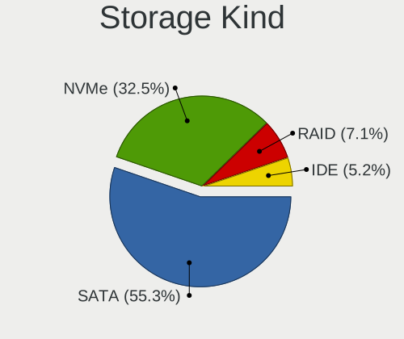

| Kind | Notebooks | Percent |
|------|-----------|---------|
| SATA | 856       | 59.73%  |
| NVMe | 400       | 27.91%  |
| RAID | 94        | 6.56%   |
| IDE  | 83        | 5.79%   |

Processor
---------

CPU Vendor
----------

Processor vendors

| Vendor | Notebooks | Percent |
|--------|-----------|---------|
| Intel  | 983       | 82.12%  |
| AMD    | 214       | 17.88%  |

CPU Model
---------

Processor models

| Model                                         | Notebooks | Percent |
|-----------------------------------------------|-----------|---------|
| Intel Core i7-2677M CPU @ 1.80GHz             | 124       | 10.35%  |
| Intel Core i5-8250U CPU @ 1.60GHz             | 18        | 1.5%    |
| Intel Core i5-2520M CPU @ 2.50GHz             | 18        | 1.5%    |
| Intel Core i7-8550U CPU @ 1.80GHz             | 15        | 1.25%   |
| Intel Core i7-10510U CPU @ 1.80GHz            | 14        | 1.17%   |
| AMD Ryzen 7 4700U with Radeon Graphics        | 14        | 1.17%   |
| Intel Core i5-8265U CPU @ 1.60GHz             | 13        | 1.09%   |
| Intel Core i5-7200U CPU @ 2.50GHz             | 13        | 1.09%   |
| AMD Ryzen 7 PRO 4750U with Radeon Graphics    | 13        | 1.09%   |
| Intel Core i7-9750H CPU @ 2.60GHz             | 12        | 1%      |
| Intel Core i7-8565U CPU @ 1.80GHz             | 12        | 1%      |
| AMD Ryzen 7 5800H with Radeon Graphics        | 12        | 1%      |
| Intel Core i7-10850H CPU @ 2.70GHz            | 11        | 0.92%   |
| Intel 11th Gen Core i5-1135G7 @ 2.40GHz       | 11        | 0.92%   |
| AMD Ryzen 5 4500U with Radeon Graphics        | 11        | 0.92%   |
| Intel Core i7-8750H CPU @ 2.20GHz             | 10        | 0.83%   |
| Intel Core i5-6300U CPU @ 2.40GHz             | 10        | 0.83%   |
| Intel Core i5-6200U CPU @ 2.30GHz             | 10        | 0.83%   |
| Intel Core i5-3320M CPU @ 2.60GHz             | 10        | 0.83%   |
| Intel Core i5-3210M CPU @ 2.50GHz             | 10        | 0.83%   |
| Intel Core i7-8650U CPU @ 1.90GHz             | 9         | 0.75%   |
| Intel Core i7-7700HQ CPU @ 2.80GHz            | 9         | 0.75%   |
| Intel Core i5-5200U CPU @ 2.20GHz             | 9         | 0.75%   |
| Intel Core 2 Duo CPU P8600 @ 2.40GHz          | 9         | 0.75%   |
| Intel Celeron N4100 CPU @ 1.10GHz             | 9         | 0.75%   |
| AMD Ryzen 5 3500U with Radeon Vega Mobile Gfx | 9         | 0.75%   |
| Intel 11th Gen Core i7-1165G7 @ 2.80GHz       | 8         | 0.67%   |
| AMD Ryzen 5 5500U with Radeon Graphics        | 8         | 0.67%   |
| Intel Core i7-6700HQ CPU @ 2.60GHz            | 7         | 0.58%   |
| Intel Core i7-6500U CPU @ 2.50GHz             | 7         | 0.58%   |
| Intel Core i7 CPU Q 720 @ 1.60GHz             | 7         | 0.58%   |
| Intel Core i5-4300U CPU @ 1.90GHz             | 7         | 0.58%   |
| Intel Core i5-3230M CPU @ 2.60GHz             | 7         | 0.58%   |
| Intel Core i5-2450M CPU @ 2.50GHz             | 7         | 0.58%   |
| Intel Core i3-5005U CPU @ 2.00GHz             | 7         | 0.58%   |
| AMD Ryzen 7 5700U with Radeon Graphics        | 7         | 0.58%   |
| Intel Core i7-8665U CPU @ 1.90GHz             | 6         | 0.5%    |
| Intel Core i7-4600U CPU @ 2.10GHz             | 6         | 0.5%    |
| Intel Core i7-4510U CPU @ 2.00GHz             | 6         | 0.5%    |
| Intel Core i7-1065G7 CPU @ 1.30GHz            | 6         | 0.5%    |

CPU Model Family
----------------

Processor model prefix

| Model                   | Notebooks | Percent |
|-------------------------|-----------|---------|
| Intel Core i7           | 372       | 31.05%  |
| Intel Core i5           | 230       | 19.2%   |
| Other                   | 80        | 6.68%   |
| Intel Core 2 Duo        | 73        | 6.09%   |
| Intel Celeron           | 73        | 6.09%   |
| Intel Core i3           | 66        | 5.51%   |
| AMD Ryzen 5             | 50        | 4.17%   |
| AMD Ryzen 7             | 45        | 3.76%   |
| Intel Pentium           | 30        | 2.5%    |
| Intel Atom              | 24        | 2%      |
| AMD Ryzen 7 PRO         | 23        | 1.92%   |
| AMD A6                  | 13        | 1.09%   |
| AMD A4                  | 11        | 0.92%   |
| Intel Celeron M         | 7         | 0.58%   |
| AMD A8                  | 7         | 0.58%   |
| Intel Pentium Dual-Core | 6         | 0.5%    |
| AMD Ryzen 5 PRO         | 6         | 0.5%    |
| Intel Pentium Silver    | 5         | 0.42%   |
| Intel Core 2            | 5         | 0.42%   |
| Intel Celeron Dual-Core | 5         | 0.42%   |
| AMD Ryzen 3             | 5         | 0.42%   |
| AMD E1                  | 5         | 0.42%   |
| Intel Pentium M         | 4         | 0.33%   |
| Intel Pentium Dual      | 4         | 0.33%   |
| AMD Turion II           | 4         | 0.33%   |
| AMD Ryzen 9             | 4         | 0.33%   |
| AMD E                   | 4         | 0.33%   |
| Intel Xeon              | 3         | 0.25%   |
| Intel Genuine           | 3         | 0.25%   |
| Intel Core i9           | 3         | 0.25%   |
| AMD Turion 64 X2 Mobile | 3         | 0.25%   |
| AMD Mobile Sempron      | 3         | 0.25%   |
| AMD FX                  | 3         | 0.25%   |
| AMD E2                  | 3         | 0.25%   |
| AMD A10                 | 3         | 0.25%   |
| AMD Athlon X2           | 2         | 0.17%   |
| AMD Athlon II Dual-Core | 2         | 0.17%   |
| AMD A12                 | 2         | 0.17%   |
| Intel Core m5           | 1         | 0.08%   |
| Intel Core Duo          | 1         | 0.08%   |

CPU Cores
---------

Number of processor cores

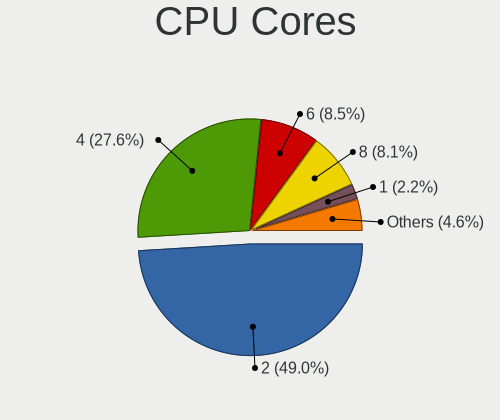

| Number  | Notebooks | Percent |
|---------|-----------|---------|
| 2       | 633       | 52.84%  |
| 4       | 349       | 29.13%  |
| 6       | 94        | 7.85%   |
| 8       | 74        | 6.18%   |
| 1       | 32        | 2.67%   |
| 12      | 6         | 0.5%    |
| 14      | 4         | 0.33%   |
| 10      | 4         | 0.33%   |
| 16      | 1         | 0.08%   |
| Unknown | 1         | 0.08%   |

CPU Sockets
-----------

Number of sockets

| Number | Notebooks | Percent |
|--------|-----------|---------|
| 1      | 1197      | 100%    |

CPU Threads
-----------

Threads per core (Hyper-Threading)

| Number  | Notebooks | Percent |
|---------|-----------|---------|
| 2       | 872       | 72.79%  |
| 1       | 325       | 27.13%  |
| Unknown | 1         | 0.08%   |

CPU Op-Modes
------------

CPU Operation Modes (32-bit, 64-bit)

| Op mode        | Notebooks | Percent |
|----------------|-----------|---------|
| 32-bit, 64-bit | 1163      | 96.84%  |
| 32-bit         | 20        | 1.67%   |
| Unknown        | 17        | 1.42%   |
| 64-bit         | 1         | 0.08%   |

CPU Microcode
-------------

Microcode number

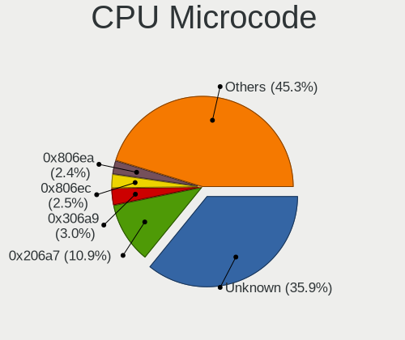

| Number     | Notebooks | Percent |
|------------|-----------|---------|
| Unknown    | 240       | 19.39%  |
| 0x206a7    | 180       | 14.54%  |
| 0x306a9    | 49        | 3.96%   |
| 0x806ec    | 42        | 3.39%   |
| 0x806ea    | 40        | 3.23%   |
| 0x1067a    | 37        | 2.99%   |
| 0x406e3    | 36        | 2.91%   |
| 0x806c1    | 32        | 2.58%   |
| 0x40651    | 31        | 2.5%    |
| 0x906ea    | 30        | 2.42%   |
| 0x08600106 | 28        | 2.26%   |
| 0x306c3    | 27        | 2.18%   |
| 0x806e9    | 25        | 2.02%   |
| 0x0a50000c | 25        | 2.02%   |
| 0x306d4    | 24        | 1.94%   |
| 0x6fd      | 20        | 1.62%   |
| 0x30678    | 18        | 1.45%   |
| 0xa0652    | 15        | 1.21%   |
| 0x706a1    | 14        | 1.13%   |
| 0x506e3    | 14        | 1.13%   |
| 0x20655    | 14        | 1.13%   |
| 0x906e9    | 12        | 0.97%   |
| 0x406c3    | 12        | 0.97%   |
| 0x10676    | 12        | 0.97%   |
| 0x08608103 | 12        | 0.97%   |
| 0x08108102 | 12        | 0.97%   |
| 0x06006705 | 11        | 0.89%   |
| 0x906ed    | 10        | 0.81%   |
| 0x706e5    | 10        | 0.81%   |
| 0x406c4    | 10        | 0.81%   |
| 0x08600104 | 10        | 0.81%   |
| 0x506c9    | 8         | 0.65%   |
| 0x08600103 | 8         | 0.65%   |
| 0x07030105 | 8         | 0.65%   |
| 0x806eb    | 7         | 0.57%   |
| 0x6e8      | 7         | 0.57%   |
| 0x20652    | 7         | 0.57%   |
| 0x106e5    | 7         | 0.57%   |
| 0x10661    | 7         | 0.57%   |
| 0x906a3    | 6         | 0.48%   |

CPU Microarch
-------------

Microarchitecture

| Name             | Notebooks | Percent |
|------------------|-----------|---------|
| KabyLake         | 204       | 17.04%  |
| SandyBridge      | 202       | 16.88%  |
| Haswell          | 76        | 6.35%   |
| IvyBridge        | 62        | 5.18%   |
| Penryn           | 60        | 5.01%   |
| Skylake          | 59        | 4.93%   |
| Zen 2            | 56        | 4.68%   |
| Silvermont       | 50        | 4.18%   |
| TigerLake        | 44        | 3.68%   |
| Core             | 41        | 3.43%   |
| Zen 3            | 36        | 3.01%   |
| Broadwell        | 30        | 2.51%   |
| Westmere         | 29        | 2.42%   |
| Unknown          | 29        | 2.42%   |
| Goldmont plus    | 23        | 1.92%   |
| CometLake        | 21        | 1.75%   |
| Excavator        | 20        | 1.67%   |
| Zen+             | 19        | 1.59%   |
| IceLake          | 17        | 1.42%   |
| Alderlake Hybrid | 13        | 1.09%   |
| P6               | 12        | 1%      |
| Puma             | 11        | 0.92%   |
| Bonnell          | 11        | 0.92%   |
| Goldmont         | 10        | 0.84%   |
| Nehalem          | 9         | 0.75%   |
| Piledriver       | 8         | 0.67%   |
| Bobcat           | 8         | 0.67%   |
| K8 Hammer        | 7         | 0.58%   |
| K10              | 7         | 0.58%   |
| Zen              | 5         | 0.42%   |
| Steamroller      | 5         | 0.42%   |
| Jaguar           | 5         | 0.42%   |
| Tremont          | 4         | 0.33%   |
| K8 & K10 hybrid  | 3         | 0.25%   |
| K10 Llano        | 1         | 0.08%   |

Graphics
--------

GPU Vendor
----------

Vendors of graphics cards

| Vendor                           | Notebooks | Percent |
|----------------------------------|-----------|---------|
| Intel                            | 889       | 59.83%  |
| Nvidia                           | 298       | 20.05%  |
| AMD                              | 295       | 19.85%  |
| Silicon Integrated Systems [SiS] | 2         | 0.13%   |
| VIA Technologies                 | 1         | 0.07%   |
| ATI Technologies                 | 1         | 0.07%   |

GPU Model
---------

Graphics card models

| Model                                                                                    | Notebooks | Percent |
|------------------------------------------------------------------------------------------|-----------|---------|
| Intel 2nd Generation Core Processor Family Integrated Graphics Controller                | 193       | 12.47%  |
| Intel 3rd Gen Core processor Graphics Controller                                         | 58        | 3.75%   |
| AMD Renoir                                                                               | 55        | 3.55%   |
| Intel UHD Graphics 620                                                                   | 49        | 3.17%   |
| Intel Haswell-ULT Integrated Graphics Controller                                         | 41        | 2.65%   |
| Intel CoffeeLake-H GT2 [UHD Graphics 630]                                                | 39        | 2.52%   |
| Intel TigerLake-LP GT2 [Iris Xe Graphics]                                                | 36        | 2.33%   |
| Intel WhiskeyLake-U GT2 [UHD Graphics 620]                                               | 35        | 2.26%   |
| Intel Skylake GT2 [HD Graphics 520]                                                      | 35        | 2.26%   |
| Intel Mobile 4 Series Chipset Integrated Graphics Controller                             | 34        | 2.2%    |
| Intel 4th Gen Core Processor Integrated Graphics Controller                              | 30        | 1.94%   |
| Intel HD Graphics 620                                                                    | 28        | 1.81%   |
| AMD Cezanne [Radeon Vega Series / Radeon Vega Mobile Series]                             | 28        | 1.81%   |
| Intel CometLake-U GT2 [UHD Graphics]                                                     | 27        | 1.74%   |
| Intel HD Graphics 5500                                                                   | 26        | 1.68%   |
| Intel Atom Processor Z36xxx/Z37xxx Series Graphics & Display                             | 26        | 1.68%   |
| Intel Atom/Celeron/Pentium Processor x5-E8000/J3xxx/N3xxx Integrated Graphics Controller | 24        | 1.55%   |
| Intel Mobile GM965/GL960 Integrated Graphics Controller (secondary)                      | 21        | 1.36%   |
| Intel Mobile GM965/GL960 Integrated Graphics Controller (primary)                        | 21        | 1.36%   |
| Intel GeminiLake [UHD Graphics 600]                                                      | 19        | 1.23%   |
| AMD Picasso/Raven 2 [Radeon Vega Series / Radeon Vega Mobile Series]                     | 19        | 1.23%   |
| Intel CometLake-H GT2 [UHD Graphics]                                                     | 18        | 1.16%   |
| AMD Stoney [Radeon R2/R3/R4/R5 Graphics]                                                 | 18        | 1.16%   |
| Intel Core Processor Integrated Graphics Controller                                      | 17        | 1.1%    |
| AMD Lucienne                                                                             | 17        | 1.1%    |
| Nvidia TU117M [GeForce GTX 1650 Mobile / Max-Q]                                          | 16        | 1.03%   |
| Intel Mobile 945GM/GMS/GME, 943/940GML Express Integrated Graphics Controller            | 16        | 1.03%   |
| Intel HD Graphics 630                                                                    | 14        | 0.9%    |
| Intel HD Graphics 530                                                                    | 14        | 0.9%    |
| Nvidia GA106M [GeForce RTX 3060 Mobile / Max-Q]                                          | 13        | 0.84%   |
| AMD Sun XT [Radeon HD 8670A/8670M/8690M / R5 M330 / M430 / Radeon 520 Mobile]            | 13        | 0.84%   |
| Nvidia GF117M [GeForce 610M/710M/810M/820M / GT 620M/625M/630M/720M]                     | 12        | 0.78%   |
| Intel Mobile 945GM/GMS, 943/940GML Express Integrated Graphics Controller                | 11        | 0.71%   |
| Nvidia GP107M [GeForce GTX 1050 Mobile]                                                  | 10        | 0.65%   |
| Intel HD Graphics 500                                                                    | 10        | 0.65%   |
| Intel Alder Lake-P Integrated Graphics Controller                                        | 10        | 0.65%   |
| AMD Seymour [Radeon HD 6400M/7400M Series]                                               | 10        | 0.65%   |
| Nvidia GP108M [GeForce MX150]                                                            | 9         | 0.58%   |
| Nvidia GP106M [GeForce GTX 1060 Mobile]                                                  | 9         | 0.58%   |
| Nvidia TU117M [GeForce MX450]                                                            | 8         | 0.52%   |

GPU Combo
---------

Combinations of graphics cards

| Name           | Notebooks | Percent |
|----------------|-----------|---------|
| 1 x Intel      | 620       | 51.8%   |
| Intel + Nvidia | 215       | 17.96%  |
| 1 x AMD        | 198       | 16.54%  |
| 1 x Nvidia     | 61        | 5.1%    |
| Intel + AMD    | 52        | 4.34%   |
| 2 x AMD        | 24        | 2.01%   |
| AMD + Nvidia   | 22        | 1.84%   |
| 2 x Intel      | 2         | 0.17%   |
| 1 x SiS        | 2         | 0.17%   |
| 1 x VIA        | 1         | 0.08%   |

GPU Driver
----------

Free vs proprietary

| Driver      | Notebooks | Percent |
|-------------|-----------|---------|
| Free        | 1039      | 86.3%   |
| Proprietary | 134       | 11.13%  |
| Unknown     | 31        | 2.57%   |

GPU Memory
----------

Total video memory

| Size in GB | Notebooks | Percent |
|------------|-----------|---------|
| Unknown    | 802       | 65.47%  |
| 0.01-0.5   | 153       | 12.49%  |
| 1.01-2.0   | 141       | 11.51%  |
| 0.51-1.0   | 58        | 4.73%   |
| 3.01-4.0   | 46        | 3.76%   |
| 5.01-6.0   | 15        | 1.22%   |
| 7.01-8.0   | 5         | 0.41%   |
| 2.01-3.0   | 4         | 0.33%   |
| 8.01-16.0  | 1         | 0.08%   |

Monitor
-------

Monitor Vendor
--------------

Monitor vendors

| Vendor                  | Notebooks | Percent |
|-------------------------|-----------|---------|
| AU Optronics            | 253       | 17.59%  |
| LG Display              | 185       | 12.87%  |
| Chimei Innolux          | 143       | 9.94%   |
| BOE                     | 138       | 9.6%    |
| Samsung Electronics     | 131       | 9.11%   |
| CPT                     | 126       | 8.76%   |
| Dell                    | 61        | 4.24%   |
| Eizo                    | 57        | 3.96%   |
| Sharp                   | 37        | 2.57%   |
| Lenovo                  | 34        | 2.36%   |
| Chi Mei Optoelectronics | 29        | 2.02%   |
| PANDA                   | 28        | 1.95%   |
| Hewlett-Packard         | 25        | 1.74%   |
| Philips                 | 19        | 1.32%   |
| Goldstar                | 19        | 1.32%   |
| LG Philips              | 16        | 1.11%   |
| BenQ                    | 16        | 1.11%   |
| AOC                     | 14        | 0.97%   |
| Acer                    | 12        | 0.83%   |
| CSO                     | 9         | 0.63%   |
| InfoVision              | 8         | 0.56%   |
| Apple                   | 7         | 0.49%   |
| Sony                    | 6         | 0.42%   |
| Quanta Display          | 6         | 0.42%   |
| Iiyama                  | 6         | 0.42%   |
| Ancor Communications    | 6         | 0.42%   |
| Panasonic               | 5         | 0.35%   |
| HannStar                | 5         | 0.35%   |
| Toshiba                 | 4         | 0.28%   |
| NEC Computers           | 3         | 0.21%   |
| Vestel Elektronik       | 2         | 0.14%   |
| Valve                   | 2         | 0.14%   |
| OEM                     | 2         | 0.14%   |
| JDI                     | 2         | 0.14%   |
| Hitachi                 | 2         | 0.14%   |
| Fujitsu Siemens         | 2         | 0.14%   |
| DENON                   | 2         | 0.14%   |
| ASUSTek Computer        | 2         | 0.14%   |
| ViewSonic               | 1         | 0.07%   |
| Unknown                 | 1         | 0.07%   |

Monitor Model
-------------

Monitor models

| Model                                                                    | Notebooks | Percent |
|--------------------------------------------------------------------------|-----------|---------|
| CPT LCD Monitor COR17DB 1600x900 293x164mm 13.2-inch                     | 124       | 8.41%   |
| Eizo EV3285 ENC2979 3840x2160 698x393mm 31.5-inch                        | 54        | 3.66%   |
| AU Optronics LCD Monitor AUO38ED 1920x1080 344x193mm 15.5-inch           | 14        | 0.95%   |
| Chimei Innolux LCD Monitor CMN14D4 1920x1080 309x173mm 13.9-inch         | 11        | 0.75%   |
| AU Optronics LCD Monitor AUO403D 1920x1080 309x174mm 14.0-inch           | 11        | 0.75%   |
| AU Optronics LCD Monitor AUO21ED 1920x1080 344x194mm 15.5-inch           | 9         | 0.61%   |
| LG Display LCD Monitor LGD02DC 1366x768 344x194mm 15.5-inch              | 8         | 0.54%   |
| PANDA LCD Monitor NCP004D 1920x1080 344x194mm 15.5-inch                  | 7         | 0.47%   |
| LG Display LCD Monitor LGD033A 1366x768 344x194mm 15.5-inch              | 7         | 0.47%   |
| Lenovo LCD Monitor LEN40BA 1920x1080 344x194mm 15.5-inch                 | 7         | 0.47%   |
| Chimei Innolux LCD Monitor CMN15E7 1920x1080 344x193mm 15.5-inch         | 7         | 0.47%   |
| Sharp LCD Monitor SHP1453 1920x1080 346x194mm 15.6-inch                  | 6         | 0.41%   |
| Samsung Electronics LCD Monitor SEC544B 1600x900 382x215mm 17.3-inch     | 6         | 0.41%   |
| LG Display LCD Monitor LGD046F 1920x1080 350x190mm 15.7-inch             | 6         | 0.41%   |
| LG Display LCD Monitor LGD02F1 1366x768 344x194mm 15.5-inch              | 6         | 0.41%   |
| Dell P2419H DELD0DA 1920x1080 530x300mm 24.0-inch                        | 6         | 0.41%   |
| Chimei Innolux LCD Monitor CMN14C9 1920x1080 309x173mm 13.9-inch         | 6         | 0.41%   |
| AU Optronics LCD Monitor AUO34ED 1920x1080 344x193mm 15.5-inch           | 6         | 0.41%   |
| Sharp LCD Monitor SHP14BA 1920x1080 344x194mm 15.5-inch                  | 5         | 0.34%   |
| Samsung Electronics S24F350 SAM0D20 1920x1080 521x293mm 23.5-inch        | 5         | 0.34%   |
| Samsung Electronics LCD Monitor SEC5441 1366x768 293x165mm 13.2-inch     | 5         | 0.34%   |
| Philips PHL 243V7 PHLC155 1920x1080 527x296mm 23.8-inch                  | 5         | 0.34%   |
| Dell U2412M DELA07A 1920x1200 518x324mm 24.1-inch                        | 5         | 0.34%   |
| Chimei Innolux LCD Monitor CMN15D5 1920x1080 344x193mm 15.5-inch         | 5         | 0.34%   |
| Chimei Innolux LCD Monitor CMN15C4 1920x1080 344x193mm 15.5-inch         | 5         | 0.34%   |
| Chi Mei Optoelectronics LCD Monitor CMO15A7 1366x768 344x193mm 15.5-inch | 5         | 0.34%   |
| BOE LCD Monitor BOE07BB 1920x1080 309x173mm 13.9-inch                    | 5         | 0.34%   |
| BOE LCD Monitor BOE0700 1920x1080 344x194mm 15.5-inch                    | 5         | 0.34%   |
| AU Optronics LCD Monitor AUO46EC 1366x768 344x193mm 15.5-inch            | 5         | 0.34%   |
| AU Optronics LCD Monitor AUO2E8D 1920x1080 344x194mm 15.5-inch           | 5         | 0.34%   |
| AU Optronics LCD Monitor AUO26EC 1366x768 344x193mm 15.5-inch            | 5         | 0.34%   |
| AU Optronics LCD Monitor AUO235C 1366x768 256x144mm 11.6-inch            | 5         | 0.34%   |
| AU Optronics LCD Monitor AUO21EC 1366x768 344x193mm 15.5-inch            | 5         | 0.34%   |
| AU Optronics LCD Monitor AUO213E 1600x900 309x174mm 14.0-inch            | 5         | 0.34%   |
| AU Optronics LCD Monitor AUO123D 1920x1080 309x173mm 13.9-inch           | 5         | 0.34%   |
| Samsung Electronics LCD Monitor SEC325A 1366x768 344x194mm 15.5-inch     | 4         | 0.27%   |
| Samsung Electronics LCD Monitor SEC324C 1600x900 310x174mm 14.0-inch     | 4         | 0.27%   |
| Samsung Electronics C24F390 SAM0D2C 1920x1080 521x293mm 23.5-inch        | 4         | 0.27%   |
| PANDA LM156LF1L03 NCP001C 1920x1080 344x194mm 15.5-inch                  | 4         | 0.27%   |
| LG Display LCD Monitor LGD062E 1920x1080 344x194mm 15.5-inch             | 4         | 0.27%   |

Monitor Resolution
------------------

Monitor screen resolution

| Resolution         | Notebooks | Percent |
|--------------------|-----------|---------|
| 1920x1080 (FHD)    | 562       | 41.82%  |
| 1366x768 (WXGA)    | 245       | 18.23%  |
| 1600x900 (HD+)     | 194       | 14.43%  |
| 3840x2160 (4K)     | 96        | 7.14%   |
| 1280x800 (WXGA)    | 62        | 4.61%   |
| 2560x1440 (QHD)    | 42        | 3.13%   |
| 1920x1200 (WUXGA)  | 31        | 2.31%   |
| 1440x900 (WXGA+)   | 16        | 1.19%   |
| 1680x1050 (WSXGA+) | 15        | 1.12%   |
| 2560x1600          | 11        | 0.82%   |
| 1280x1024 (SXGA)   | 8         | 0.6%    |
| 1024x600           | 8         | 0.6%    |
| 1024x768 (XGA)     | 5         | 0.37%   |
| 3840x2400          | 4         | 0.3%    |
| 2880x1800          | 4         | 0.3%    |
| 1360x768           | 4         | 0.3%    |
| 3456x2160          | 3         | 0.22%   |
| 3440x1440          | 3         | 0.22%   |
| 3000x2000          | 3         | 0.22%   |
| 2160x1440          | 3         | 0.22%   |
| 1920x540           | 3         | 0.22%   |
| Unknown            | 3         | 0.22%   |
| 800x1280           | 2         | 0.15%   |
| 3840x1200          | 2         | 0.15%   |
| 3200x1800 (QHD+)   | 2         | 0.15%   |
| 2160x1350          | 2         | 0.15%   |
| 1400x1050          | 2         | 0.15%   |
| 8320x2160          | 1         | 0.07%   |
| 5760x2160          | 1         | 0.07%   |
| 3840x1080          | 1         | 0.07%   |
| 3072x1920          | 1         | 0.07%   |
| 2880x1620          | 1         | 0.07%   |
| 2560x1080          | 1         | 0.07%   |
| 2256x1504          | 1         | 0.07%   |
| 2240x1400          | 1         | 0.07%   |
| 1920x515           | 1         | 0.07%   |

Monitor Diagonal
----------------

Diagonal size in inches

| Inches  | Notebooks | Percent |
|---------|-----------|---------|
| 15      | 498       | 34.49%  |
| 13      | 277       | 19.18%  |
| 14      | 160       | 11.08%  |
| 17      | 88        | 6.09%   |
| 24      | 75        | 5.19%   |
| 31      | 68        | 4.71%   |
| 27      | 51        | 3.53%   |
| 23      | 38        | 2.63%   |
| 11      | 29        | 2.01%   |
| 12      | 28        | 1.94%   |
| 21      | 24        | 1.66%   |
| 16      | 13        | 0.9%    |
| Unknown | 13        | 0.9%    |
| 22      | 10        | 0.69%   |
| 10      | 10        | 0.69%   |
| 84      | 7         | 0.48%   |
| 18      | 7         | 0.48%   |
| 20      | 6         | 0.42%   |
| 19      | 5         | 0.35%   |
| 40      | 4         | 0.28%   |
| 34      | 4         | 0.28%   |
| 25      | 4         | 0.28%   |
| 54      | 3         | 0.21%   |
| 33      | 3         | 0.21%   |
| 32      | 3         | 0.21%   |
| 26      | 3         | 0.21%   |
| 72      | 2         | 0.14%   |
| 49      | 2         | 0.14%   |
| 43      | 2         | 0.14%   |
| 7       | 2         | 0.14%   |
| 60      | 1         | 0.07%   |
| 52      | 1         | 0.07%   |
| 46      | 1         | 0.07%   |
| 38      | 1         | 0.07%   |
| 29      | 1         | 0.07%   |

Monitor Width
-------------

Physical width

| Width in mm | Notebooks | Percent |
|-------------|-----------|---------|
| 301-350     | 737       | 51.83%  |
| 201-300     | 261       | 18.35%  |
| 501-600     | 150       | 10.55%  |
| 351-400     | 104       | 7.31%   |
| 601-700     | 75        | 5.27%   |
| 401-500     | 46        | 3.23%   |
| Unknown     | 13        | 0.91%   |
| 701-800     | 10        | 0.7%    |
| 1001-1500   | 10        | 0.7%    |
| 1501-2000   | 9         | 0.63%   |
| 801-900     | 5         | 0.35%   |
| 1-100       | 2         | 0.14%   |

Aspect Ratio
------------

Proportional relationship between the width and the height

| Ratio   | Notebooks | Percent |
|---------|-----------|---------|
| 16/9    | 1006      | 83.42%  |
| 16/10   | 158       | 13.1%   |
| 3/2     | 9         | 0.75%   |
| Unknown | 9         | 0.75%   |
| 5/4     | 8         | 0.66%   |
| 4/3     | 7         | 0.58%   |
| 21/9    | 4         | 0.33%   |
| 3.20    | 2         | 0.17%   |
| 0.67    | 2         | 0.17%   |
| 3.73    | 1         | 0.08%   |

Monitor Area
------------

Area in inch

| Area in inch | Notebooks | Percent |
|----------------|-----------|---------|
| 101-110        | 491       | 34.17%  |
| 81-90          | 251       | 17.47%  |
| 71-80          | 184       | 12.8%   |
| 201-250        | 112       | 7.79%   |
| 351-500        | 79        | 5.5%    |
| 121-130        | 69        | 4.8%    |
| 301-350        | 54        | 3.76%   |
| 51-60          | 29        | 2.02%   |
| 61-70          | 28        | 1.95%   |
| 251-300        | 28        | 1.95%   |
| 151-200        | 17        | 1.18%   |
| More than 1000 | 15        | 1.04%   |
| 131-140        | 15        | 1.04%   |
| 111-120        | 15        | 1.04%   |
| Unknown        | 13        | 0.9%    |
| 41-50          | 10        | 0.7%    |
| 141-150        | 10        | 0.7%    |
| 501-1000       | 8         | 0.56%   |
| 91-100         | 7         | 0.49%   |
| 1-40           | 2         | 0.14%   |

Pixel Density
-------------

Pixels per inch

| Density       | Notebooks | Percent |
|---------------|-----------|---------|
| 121-160       | 677       | 49.96%  |
| 101-120       | 288       | 21.25%  |
| 51-100        | 255       | 18.82%  |
| 161-240       | 82        | 6.05%   |
| More than 240 | 29        | 2.14%   |
| Unknown       | 13        | 0.96%   |
| 1-50          | 11        | 0.81%   |

Multiple Monitors
-----------------

Total monitors connected

| Total | Notebooks | Percent |
|-------|-----------|---------|
| 1     | 897       | 72.63%  |
| 2     | 262       | 21.21%  |
| 3     | 39        | 3.16%   |
| 0     | 36        | 2.91%   |
| 4     | 1         | 0.08%   |

Network
-------

Net Controller Vendor
---------------------

Controller vendors

| Vendor                                 | Notebooks | Percent |
|----------------------------------------|-----------|---------|
| Intel                                  | 624       | 31.82%  |
| Realtek Semiconductor                  | 508       | 25.91%  |
| Qualcomm Atheros                       | 366       | 18.66%  |
| Samsung Electronics                    | 126       | 6.43%   |
| Broadcom                               | 107       | 5.46%   |
| Broadcom Limited                       | 44        | 2.24%   |
| MediaTek                               | 29        | 1.48%   |
| Lenovo                                 | 20        | 1.02%   |
| Marvell Technology Group               | 19        | 0.97%   |
| Dell                                   | 17        | 0.87%   |
| ASIX Electronics                       | 12        | 0.61%   |
| Ralink                                 | 11        | 0.56%   |
| TP-Link                                | 9         | 0.46%   |
| Sierra Wireless                        | 9         | 0.46%   |
| DisplayLink                            | 9         | 0.46%   |
| Ralink Technology                      | 8         | 0.41%   |
| Qualcomm Atheros Communications        | 8         | 0.41%   |
| Ericsson Business Mobile Networks      | 5         | 0.25%   |
| Attansic Technology                    | 5         | 0.25%   |
| Qualcomm                               | 3         | 0.15%   |
| Hewlett-Packard                        | 3         | 0.15%   |
| Spreadtrum Communications              | 2         | 0.1%    |
| Silicon Integrated Systems [SiS]       | 2         | 0.1%    |
| Huawei Technologies                    | 2         | 0.1%    |
| Fibocom                                | 2         | 0.1%    |
| D-Link                                 | 2         | 0.1%    |
| Xiaomi                                 | 1         | 0.05%   |
| VIA Technologies                       | 1         | 0.05%   |
| Sony Ericsson Mobile Communications AB | 1         | 0.05%   |
| ICS Advent                             | 1         | 0.05%   |
| Fujitsu Siemens Computers              | 1         | 0.05%   |
| Foxconn / Hon Hai                      | 1         | 0.05%   |
| ASUSTek Computer                       | 1         | 0.05%   |
| Arduino SA                             | 1         | 0.05%   |
| AMD                                    | 1         | 0.05%   |

Net Controller Model
--------------------

Controller models

| Model                                                             | Notebooks | Percent |
|-------------------------------------------------------------------|-----------|---------|
| Realtek RTL8111/8168/8411 PCI Express Gigabit Ethernet Controller | 319       | 13.65%  |
| Qualcomm Atheros AR9485 Wireless Network Adapter                  | 148       | 6.33%   |
| Samsung Galaxy series, misc. (tethering mode)                     | 124       | 5.31%   |
| Intel Wi-Fi 6 AX200                                               | 76        | 3.25%   |
| Realtek RTL8153 Gigabit Ethernet Adapter                          | 71        | 3.04%   |
| Realtek RTL810xE PCI Express Fast Ethernet controller             | 60        | 2.57%   |
| Intel Wireless 8265 / 8275                                        | 51        | 2.18%   |
| Intel 82579LM Gigabit Network Connection (Lewisville)             | 47        | 2.01%   |
| Intel Wireless 7260                                               | 45        | 1.93%   |
| Qualcomm Atheros AR9285 Wireless Network Adapter (PCI-Express)    | 40        | 1.71%   |
| Qualcomm Atheros QCA9377 802.11ac Wireless Network Adapter        | 38        | 1.63%   |
| Intel Centrino Advanced-N 6205 [Taylor Peak]                      | 36        | 1.54%   |
| Qualcomm Atheros QCA9565 / AR9565 Wireless Network Adapter        | 35        | 1.5%    |
| Intel Wireless 8260                                               | 33        | 1.41%   |
| Intel Wi-Fi 6 AX201                                               | 32        | 1.37%   |
| Realtek RTL8822CE 802.11ac PCIe Wireless Network Adapter          | 29        | 1.24%   |
| Intel Cannon Point-LP CNVi [Wireless-AC]                          | 27        | 1.16%   |
| Intel Comet Lake PCH-LP CNVi WiFi                                 | 26        | 1.11%   |
| Intel Wireless 3165                                               | 25        | 1.07%   |
| Intel Ethernet Connection (4) I219-LM                             | 25        | 1.07%   |
| Qualcomm Atheros QCA6174 802.11ac Wireless Network Adapter        | 24        | 1.03%   |
| Intel Cannon Lake PCH CNVi WiFi                                   | 24        | 1.03%   |
| Intel Wireless 7265                                               | 22        | 0.94%   |
| Broadcom BCM4313 802.11bgn Wireless Network Adapter               | 21        | 0.9%    |
| Realtek RTL8822BE 802.11a/b/g/n/ac WiFi adapter                   | 18        | 0.77%   |
| MediaTek MT7921 802.11ax PCI Express Wireless Network Adapter     | 18        | 0.77%   |
| Intel 82567LM Gigabit Network Connection                          | 18        | 0.77%   |
| Intel PRO/Wireless 3945ABG [Golan] Network Connection             | 17        | 0.73%   |
| Intel WiFi Link 5100                                              | 16        | 0.68%   |
| Realtek RTL8821CE 802.11ac PCIe Wireless Network Adapter          | 15        | 0.64%   |
| Qualcomm Atheros AR8151 v2.0 Gigabit Ethernet                     | 15        | 0.64%   |
| Intel Wireless 3160                                               | 15        | 0.64%   |
| Intel Ethernet Connection I217-LM                                 | 15        | 0.64%   |
| Intel Comet Lake PCH CNVi WiFi                                    | 15        | 0.64%   |
| Realtek RTL8852AE 802.11ax PCIe Wireless Network Adapter          | 14        | 0.6%    |
| Intel Ethernet Connection I219-LM                                 | 14        | 0.6%    |
| Intel Ethernet Connection I218-LM                                 | 14        | 0.6%    |
| Intel Dual Band Wireless-AC 3165 Plus Bluetooth                   | 14        | 0.6%    |
| Intel Alder Lake-P PCH CNVi WiFi                                  | 13        | 0.56%   |
| Broadcom NetLink BCM5787M Gigabit Ethernet PCI Express            | 13        | 0.56%   |

Wireless Vendor
---------------

Wireless vendors

| Vendor                          | Notebooks | Percent |
|---------------------------------|-----------|---------|
| Intel                           | 607       | 49.27%  |
| Qualcomm Atheros                | 325       | 26.38%  |
| Realtek Semiconductor           | 119       | 9.66%   |
| Broadcom                        | 66        | 5.36%   |
| MediaTek                        | 27        | 2.19%   |
| Broadcom Limited                | 25        | 2.03%   |
| Ralink                          | 11        | 0.89%   |
| Dell                            | 11        | 0.89%   |
| Sierra Wireless                 | 9         | 0.73%   |
| TP-Link                         | 8         | 0.65%   |
| Ralink Technology               | 8         | 0.65%   |
| Qualcomm Atheros Communications | 8         | 0.65%   |
| Qualcomm                        | 2         | 0.16%   |
| Fibocom                         | 2         | 0.16%   |
| Hewlett-Packard                 | 1         | 0.08%   |
| Fujitsu Siemens Computers       | 1         | 0.08%   |
| D-Link                          | 1         | 0.08%   |
| ASUSTek Computer                | 1         | 0.08%   |

Wireless Model
--------------

Wireless models

| Model                                                                   | Notebooks | Percent |
|-------------------------------------------------------------------------|-----------|---------|
| Qualcomm Atheros AR9485 Wireless Network Adapter                        | 148       | 11.97%  |
| Intel Wi-Fi 6 AX200                                                     | 76        | 6.15%   |
| Intel Wireless 8265 / 8275                                              | 51        | 4.13%   |
| Intel Wireless 7260                                                     | 45        | 3.64%   |
| Qualcomm Atheros AR9285 Wireless Network Adapter (PCI-Express)          | 40        | 3.24%   |
| Qualcomm Atheros QCA9377 802.11ac Wireless Network Adapter              | 38        | 3.07%   |
| Intel Centrino Advanced-N 6205 [Taylor Peak]                            | 36        | 2.91%   |
| Qualcomm Atheros QCA9565 / AR9565 Wireless Network Adapter              | 35        | 2.83%   |
| Intel Wireless 8260                                                     | 33        | 2.67%   |
| Intel Wi-Fi 6 AX201                                                     | 32        | 2.59%   |
| Realtek RTL8822CE 802.11ac PCIe Wireless Network Adapter                | 29        | 2.35%   |
| Intel Cannon Point-LP CNVi [Wireless-AC]                                | 27        | 2.18%   |
| Intel Comet Lake PCH-LP CNVi WiFi                                       | 26        | 2.1%    |
| Intel Wireless 3165                                                     | 25        | 2.02%   |
| Qualcomm Atheros QCA6174 802.11ac Wireless Network Adapter              | 24        | 1.94%   |
| Intel Cannon Lake PCH CNVi WiFi                                         | 24        | 1.94%   |
| Intel Wireless 7265                                                     | 22        | 1.78%   |
| Broadcom BCM4313 802.11bgn Wireless Network Adapter                     | 21        | 1.7%    |
| Realtek RTL8822BE 802.11a/b/g/n/ac WiFi adapter                         | 18        | 1.46%   |
| MediaTek MT7921 802.11ax PCI Express Wireless Network Adapter           | 18        | 1.46%   |
| Intel PRO/Wireless 3945ABG [Golan] Network Connection                   | 17        | 1.38%   |
| Intel WiFi Link 5100                                                    | 16        | 1.29%   |
| Realtek RTL8821CE 802.11ac PCIe Wireless Network Adapter                | 15        | 1.21%   |
| Intel Wireless 3160                                                     | 15        | 1.21%   |
| Intel Comet Lake PCH CNVi WiFi                                          | 15        | 1.21%   |
| Realtek RTL8852AE 802.11ax PCIe Wireless Network Adapter                | 14        | 1.13%   |
| Intel Dual Band Wireless-AC 3165 Plus Bluetooth                         | 14        | 1.13%   |
| Intel Alder Lake-P PCH CNVi WiFi                                        | 13        | 1.05%   |
| Broadcom BCM43142 802.11b/g/n                                           | 13        | 1.05%   |
| Intel PRO/Wireless 4965 AG or AGN [Kedron] Network Connection           | 11        | 0.89%   |
| Qualcomm Atheros AR9462 Wireless Network Adapter                        | 10        | 0.81%   |
| Intel Ultimate N WiFi Link 5300                                         | 10        | 0.81%   |
| Intel Centrino Wireless-N 2230                                          | 10        | 0.81%   |
| Realtek RTL8723BE PCIe Wireless Network Adapter                         | 9         | 0.73%   |
| Qualcomm Atheros AR9287 Wireless Network Adapter (PCI-Express)          | 9         | 0.73%   |
| Qualcomm Atheros AR242x / AR542x Wireless Network Adapter (PCI-Express) | 9         | 0.73%   |
| Ralink RT3290 Wireless 802.11n 1T/1R PCIe                               | 8         | 0.65%   |
| Intel Wireless-AC 9260                                                  | 8         | 0.65%   |
| Intel PRO/Wireless 5100 AGN [Shiloh] Network Connection                 | 8         | 0.65%   |
| Intel Dual Band Wireless-AC 3168NGW [Stone Peak]                        | 8         | 0.65%   |

Ethernet Vendor
---------------

Ethernet vendors

| Vendor                           | Notebooks | Percent |
|----------------------------------|-----------|---------|
| Realtek Semiconductor            | 454       | 42.87%  |
| Intel                            | 255       | 24.08%  |
| Samsung Electronics              | 124       | 11.71%  |
| Qualcomm Atheros                 | 80        | 7.55%   |
| Broadcom                         | 47        | 4.44%   |
| Lenovo                           | 20        | 1.89%   |
| Marvell Technology Group         | 19        | 1.79%   |
| Broadcom Limited                 | 19        | 1.79%   |
| ASIX Electronics                 | 12        | 1.13%   |
| DisplayLink                      | 9         | 0.85%   |
| Attansic Technology              | 5         | 0.47%   |
| Spreadtrum Communications        | 2         | 0.19%   |
| Silicon Integrated Systems [SiS] | 2         | 0.19%   |
| MediaTek                         | 2         | 0.19%   |
| Xiaomi                           | 1         | 0.09%   |
| VIA Technologies                 | 1         | 0.09%   |
| TP-Link                          | 1         | 0.09%   |
| Qualcomm                         | 1         | 0.09%   |
| ICS Advent                       | 1         | 0.09%   |
| Huawei Technologies              | 1         | 0.09%   |
| Hewlett-Packard                  | 1         | 0.09%   |
| Foxconn / Hon Hai                | 1         | 0.09%   |
| D-Link                           | 1         | 0.09%   |

Ethernet Model
--------------

Ethernet models

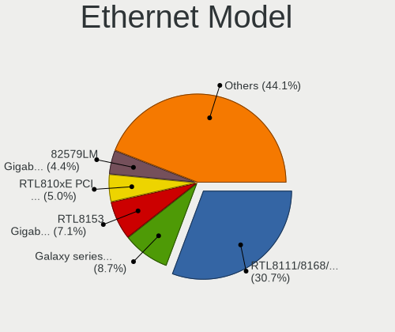

| Model                                                                          | Notebooks | Percent |
|--------------------------------------------------------------------------------|-----------|---------|
| Realtek RTL8111/8168/8411 PCI Express Gigabit Ethernet Controller              | 319       | 29.59%  |
| Samsung Galaxy series, misc. (tethering mode)                                  | 124       | 11.5%   |
| Realtek RTL8153 Gigabit Ethernet Adapter                                       | 71        | 6.59%   |
| Realtek RTL810xE PCI Express Fast Ethernet controller                          | 60        | 5.57%   |
| Intel 82579LM Gigabit Network Connection (Lewisville)                          | 47        | 4.36%   |
| Intel Ethernet Connection (4) I219-LM                                          | 25        | 2.32%   |
| Intel 82567LM Gigabit Network Connection                                       | 18        | 1.67%   |
| Qualcomm Atheros AR8151 v2.0 Gigabit Ethernet                                  | 15        | 1.39%   |
| Intel Ethernet Connection I217-LM                                              | 15        | 1.39%   |
| Intel Ethernet Connection I219-LM                                              | 14        | 1.3%    |
| Intel Ethernet Connection I218-LM                                              | 14        | 1.3%    |
| Broadcom NetLink BCM5787M Gigabit Ethernet PCI Express                         | 13        | 1.21%   |
| Qualcomm Atheros AR8131 Gigabit Ethernet                                       | 12        | 1.11%   |
| Lenovo ThinkPad TBT 3 Dock                                                     | 12        | 1.11%   |
| Intel Ethernet Connection (7) I219-LM                                          | 11        | 1.02%   |
| Intel Ethernet Connection (6) I219-V                                           | 11        | 1.02%   |
| ASIX AX88179 Gigabit Ethernet                                                  | 11        | 1.02%   |
| Intel Ethernet Connection (4) I219-V                                           | 9         | 0.83%   |
| Qualcomm Atheros QCA8171 Gigabit Ethernet                                      | 8         | 0.74%   |
| Intel Ethernet Connection (6) I219-LM                                          | 8         | 0.74%   |
| Intel Ethernet Connection (3) I218-LM                                          | 8         | 0.74%   |
| Intel Ethernet Connection (10) I219-LM                                         | 8         | 0.74%   |
| Broadcom Limited NetLink BCM5787M Gigabit Ethernet PCI Express                 | 8         | 0.74%   |
| Qualcomm Atheros QCA8172 Fast Ethernet                                         | 7         | 0.65%   |
| Intel Ethernet Connection I219-V                                               | 7         | 0.65%   |
| Intel 82577LM Gigabit Network Connection                                       | 7         | 0.65%   |
| Realtek RTL8152 Fast Ethernet Adapter                                          | 6         | 0.56%   |
| Realtek RTL-8100/8101L/8139 PCI Fast Ethernet Adapter                          | 6         | 0.56%   |
| Qualcomm Atheros Killer E2400 Gigabit Ethernet Controller                      | 6         | 0.56%   |
| Intel Ethernet Connection (11) I219-LM                                         | 6         | 0.56%   |
| Qualcomm Atheros AR8162 Fast Ethernet                                          | 5         | 0.46%   |
| Qualcomm Atheros AR8161 Gigabit Ethernet                                       | 5         | 0.46%   |
| Marvell Group Yukon Optima 88E8059 [PCIe Gigabit Ethernet Controller with AVB] | 5         | 0.46%   |
| Marvell Group 88E8055 PCI-E Gigabit Ethernet Controller                        | 5         | 0.46%   |
| Intel Ethernet Connection I217-V                                               | 5         | 0.46%   |
| Broadcom NetXtreme BCM5761e Gigabit Ethernet PCIe                              | 5         | 0.46%   |
| Broadcom NetXtreme BCM5761 Gigabit Ethernet PCIe                               | 5         | 0.46%   |
| Attansic AR8152 v2.0 Fast Ethernet                                             | 5         | 0.46%   |
| Realtek Killer E2600 Gigabit Ethernet Controller                               | 4         | 0.37%   |
| Qualcomm Atheros Killer E2500 Gigabit Ethernet Controller                      | 4         | 0.37%   |

Net Controller Kind
-------------------

Ethernet, WiFi or modem

| Kind     | Notebooks | Percent |
|----------|-----------|---------|
| WiFi     | 1177      | 53.4%   |
| Ethernet | 1004      | 45.55%  |
| Modem    | 22        | 1%      |
| Unknown  | 1         | 0.05%   |

Used Controller
---------------

Currently used network controller

| Kind     | Notebooks | Percent |
|----------|-----------|---------|
| WiFi     | 867       | 68.59%  |
| Ethernet | 396       | 31.33%  |
| Modem    | 1         | 0.08%   |

NICs
----

Total network controllers on board

| Total | Notebooks | Percent |
|-------|-----------|---------|
| 2     | 802       | 66.89%  |
| 1     | 363       | 30.28%  |
| 0     | 23        | 1.92%   |
| 3     | 11        | 0.92%   |

IPv6
----

IPv6 vs IPv4

| Used | Notebooks | Percent |
|------|-----------|---------|
| No   | 1042      | 85.76%  |
| Yes  | 173       | 14.24%  |

Bluetooth
---------

Bluetooth Vendor
----------------

Controller vendors

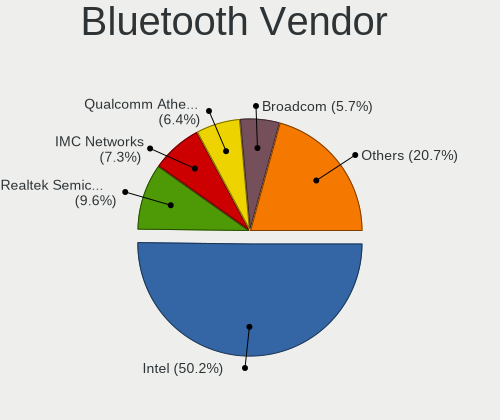

| Vendor                          | Notebooks | Percent |
|---------------------------------|-----------|---------|
| Intel                           | 438       | 49.94%  |
| Realtek Semiconductor           | 78        | 8.89%   |
| Qualcomm Atheros Communications | 69        | 7.87%   |
| IMC Networks                    | 65        | 7.41%   |
| Broadcom                        | 52        | 5.93%   |
| Foxconn / Hon Hai               | 40        | 4.56%   |
| Lite-On Technology              | 37        | 4.22%   |
| Hewlett-Packard                 | 25        | 2.85%   |
| Dell                            | 16        | 1.82%   |
| ASUSTek Computer                | 14        | 1.6%    |
| Ralink                          | 8         | 0.91%   |
| Apple                           | 6         | 0.68%   |
| MediaTek                        | 5         | 0.57%   |
| Cambridge Silicon Radio         | 5         | 0.57%   |
| Alps Electric                   | 5         | 0.57%   |
| Toshiba                         | 4         | 0.46%   |
| Realtek                         | 4         | 0.46%   |
| Ralink Technology               | 2         | 0.23%   |
| Micro Star International        | 1         | 0.11%   |
| Fujitsu Siemens Computers       | 1         | 0.11%   |
| Foxconn International           | 1         | 0.11%   |
| Askey Computer                  | 1         | 0.11%   |

Bluetooth Model
---------------

Controller models

| Model                                               | Notebooks | Percent |
|-----------------------------------------------------|-----------|---------|
| Intel Bluetooth wireless interface                  | 181       | 20.64%  |
| Intel AX201 Bluetooth                               | 78        | 8.89%   |
| Intel AX200 Bluetooth                               | 76        | 8.67%   |
| Intel Bluetooth 9460/9560 Jefferson Peak (JfP)      | 56        | 6.39%   |
| Realtek Bluetooth Radio                             | 50        | 5.7%    |
| Qualcomm Atheros  Bluetooth Device                  | 27        | 3.08%   |
| IMC Networks Atheros AR3012 Bluetooth 4.0 Adapter   | 23        | 2.62%   |
| Realtek  Bluetooth 4.2 Adapter                      | 17        | 1.94%   |
| IMC Networks Bluetooth Device                       | 16        | 1.82%   |
| Intel Centrino Bluetooth Wireless Transceiver       | 15        | 1.71%   |
| Qualcomm Atheros AR3011 Bluetooth                   | 14        | 1.6%    |
| IMC Networks Bluetooth Radio                        | 14        | 1.6%    |
| HP Bluetooth 2.0 Interface [Broadcom BCM2045]       | 14        | 1.6%    |
| Qualcomm Atheros QCA61x4 Bluetooth 4.0              | 13        | 1.48%   |
| Lite-On Qualcomm Atheros QCA9377 Bluetooth          | 11        | 1.25%   |
| Lite-On Atheros AR3012 Bluetooth                    | 10        | 1.14%   |
| Intel Bluetooth Device                              | 10        | 1.14%   |
| IMC Networks Wireless_Device                        | 10        | 1.14%   |
| HP Broadcom 2070 Bluetooth Combo                    | 10        | 1.14%   |
| Foxconn / Hon Hai Bluetooth Device                  | 10        | 1.14%   |
| Broadcom BCM2045 Bluetooth                          | 10        | 1.14%   |
| Dell DW375 Bluetooth Module                         | 9         | 1.03%   |
| Broadcom BCM2045B (BDC-2.1)                         | 9         | 1.03%   |
| Ralink RT3290 Bluetooth                             | 8         | 0.91%   |
| Qualcomm Atheros AR3012 Bluetooth 4.0               | 8         | 0.91%   |
| Intel Wireless-AC 3168 Bluetooth                    | 8         | 0.91%   |
| Foxconn / Hon Hai MediaTek Bluetooth Adapter        | 8         | 0.91%   |
| ASUS BT-183 Bluetooth 2.0+EDR adapter               | 8         | 0.91%   |
| Broadcom BCM20702 Bluetooth 4.0 [ThinkPad]          | 7         | 0.8%    |
| Qualcomm Atheros Bluetooth                          | 6         | 0.68%   |
| Intel Wireless-AC 9260 Bluetooth Adapter            | 6         | 0.68%   |
| Broadcom HP Portable SoftSailing                    | 6         | 0.68%   |
| Broadcom BCM2070 Bluetooth 2.1 + EDR                | 6         | 0.68%   |
| Realtek RTL8822BE Bluetooth 4.2 Adapter             | 5         | 0.57%   |
| Lite-On Bluetooth Device                            | 5         | 0.57%   |
| Cambridge Silicon Radio Bluetooth Dongle (HCI mode) | 5         | 0.57%   |
| Realtek Bluetooth Radio                             | 4         | 0.46%   |
| Lite-On Broadcom BCM43142A0 Bluetooth Device        | 4         | 0.46%   |
| Intel Centrino Advanced-N 6230 Bluetooth adapter    | 4         | 0.46%   |
| Intel AX210 Bluetooth                               | 4         | 0.46%   |

Sound
-----

Sound Vendor
------------

Sound card vendors

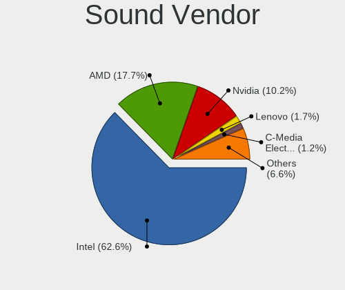

| Vendor                               | Notebooks | Percent |
|--------------------------------------|-----------|---------|
| Intel                                | 961       | 65.2%   |
| AMD                                  | 245       | 16.62%  |
| Nvidia                               | 137       | 9.29%   |
| Lenovo                               | 26        | 1.76%   |
| C-Media Electronics                  | 18        | 1.22%   |
| Realtek Semiconductor                | 17        | 1.15%   |
| GN Netcom                            | 8         | 0.54%   |
| Hewlett-Packard                      | 7         | 0.47%   |
| Logitech                             | 6         | 0.41%   |
| JMTek                                | 5         | 0.34%   |
| Plantronics                          | 4         | 0.27%   |
| Creative Technology                  | 4         | 0.27%   |
| Silicon Integrated Systems [SiS]     | 3         | 0.2%    |
| Sennheiser Communications            | 3         | 0.2%    |
| Kingston Technology                  | 3         | 0.2%    |
| RODE Microphones                     | 2         | 0.14%   |
| Harman                               | 2         | 0.14%   |
| Dell                                 | 2         | 0.14%   |
| BEHRINGER International              | 2         | 0.14%   |
| Yealink Network Technology           | 1         | 0.07%   |
| VIA Technologies                     | 1         | 0.07%   |
| Trust                                | 1         | 0.07%   |
| Toshiba                              | 1         | 0.07%   |
| Thesycon Systemsoftware & Consulting | 1         | 0.07%   |
| Syntek                               | 1         | 0.07%   |
| Samson Technologies                  | 1         | 0.07%   |
| Razer USA                            | 1         | 0.07%   |
| Orbbec 3D Technology International   | 1         | 0.07%   |
| M-Audio                              | 1         | 0.07%   |
| GYROCOM C&C                          | 1         | 0.07%   |
| Generalplus Technology               | 1         | 0.07%   |
| Focusrite-Novation                   | 1         | 0.07%   |
| ELMCU                                | 1         | 0.07%   |
| DigiTech                             | 1         | 0.07%   |
| Datelink Technology                  | 1         | 0.07%   |
| Conexant Systems                     | 1         | 0.07%   |
| AudioQuest                           | 1         | 0.07%   |
| Apple                                | 1         | 0.07%   |

Sound Model
-----------

Sound card models

| Model                                                                                             | Notebooks | Percent |
|---------------------------------------------------------------------------------------------------|-----------|---------|
| Intel 6 Series/C200 Series Chipset Family High Definition Audio Controller                        | 190       | 10.81%  |
| AMD Family 17h/19h HD Audio Controller                                                            | 131       | 7.46%   |
| Intel Sunrise Point-LP HD Audio                                                                   | 120       | 6.83%   |
| AMD Renoir Radeon High Definition Audio Controller                                                | 89        | 5.07%   |
| Intel 7 Series/C216 Chipset Family High Definition Audio Controller                               | 73        | 4.15%   |
| Intel 82801I (ICH9 Family) HD Audio Controller                                                    | 54        | 3.07%   |
| Intel Cannon Lake PCH cAVS                                                                        | 46        | 2.62%   |
| Intel Tiger Lake-LP Smart Sound Technology Audio Controller                                       | 44        | 2.5%    |
| Intel Haswell-ULT HD Audio Controller                                                             | 41        | 2.33%   |
| Intel 8 Series HD Audio Controller                                                                | 41        | 2.33%   |
| Intel 5 Series/3400 Series Chipset High Definition Audio                                          | 38        | 2.16%   |
| Intel Cannon Point-LP High Definition Audio Controller                                            | 36        | 2.05%   |
| Intel 8 Series/C220 Series Chipset High Definition Audio Controller                               | 35        | 1.99%   |
| AMD FCH Azalia Controller                                                                         | 34        | 1.94%   |
| Intel 82801H (ICH8 Family) HD Audio Controller                                                    | 32        | 1.82%   |
| Intel Xeon E3-1200 v3/4th Gen Core Processor HD Audio Controller                                  | 31        | 1.76%   |
| Intel Wildcat Point-LP High Definition Audio Controller                                           | 30        | 1.71%   |
| Intel Comet Lake PCH-LP cAVS                                                                      | 30        | 1.71%   |
| Intel Broadwell-U Audio Controller                                                                | 30        | 1.71%   |
| Intel NM10/ICH7 Family High Definition Audio Controller                                           | 26        | 1.48%   |
| AMD Raven/Raven2/Fenghuang HDMI/DP Audio Controller                                               | 24        | 1.37%   |
| Intel Celeron/Pentium Silver Processor High Definition Audio                                      | 23        | 1.31%   |
| Nvidia GF108 High Definition Audio Controller                                                     | 21        | 1.2%    |
| AMD Family 15h (Models 60h-6fh) Audio Controller                                                  | 20        | 1.14%   |
| Intel Atom/Celeron/Pentium Processor x5-E8000/J3xxx/N3xxx Series High Definition Audio Controller | 19        | 1.08%   |
| Intel Atom Processor Z36xxx/Z37xxx Series High Definition Audio Controller                        | 19        | 1.08%   |
| AMD SBx00 Azalia (Intel HDA)                                                                      | 19        | 1.08%   |
| Intel Comet Lake PCH cAVS                                                                         | 18        | 1.02%   |
| Intel 100 Series/C230 Series Chipset Family HD Audio Controller                                   | 18        | 1.02%   |
| AMD Kabini HDMI/DP Audio                                                                          | 18        | 1.02%   |
| AMD High Definition Audio Controller                                                              | 18        | 1.02%   |
| Realtek Semiconductor USB Audio                                                                   | 17        | 0.97%   |
| Nvidia TU107 GeForce GTX 1650 High Definition Audio Controller                                    | 15        | 0.85%   |
| Intel CM238 HD Audio Controller                                                                   | 15        | 0.85%   |
| Intel Alder Lake PCH-P High Definition Audio Controller                                           | 15        | 0.85%   |
| Nvidia GA106 High Definition Audio Controller                                                     | 13        | 0.74%   |
| Lenovo ThinkPad Thunderbolt 3 Dock USB Audio                                                      | 12        | 0.68%   |
| Nvidia GP107GL High Definition Audio Controller                                                   | 11        | 0.63%   |
| Intel Ice Lake-LP Smart Sound Technology Audio Controller                                         | 11        | 0.63%   |
| Nvidia GP106 High Definition Audio Controller                                                     | 10        | 0.57%   |

Memory
------

Memory Vendor
-------------

Memory module vendors

| Vendor               | Notebooks | Percent |
|----------------------|-----------|---------|
| Samsung Electronics  | 202       | 24.94%  |
| SK hynix             | 159       | 19.63%  |
| Elpida               | 138       | 17.04%  |
| Micron Technology    | 101       | 12.47%  |
| Kingston             | 78        | 9.63%   |
| Unknown              | 38        | 4.69%   |
| Crucial              | 24        | 2.96%   |
| Ramaxel Technology   | 20        | 2.47%   |
| Unknown (ABCD)       | 12        | 1.48%   |
| Corsair              | 11        | 1.36%   |
| A-DATA Technology    | 10        | 1.23%   |
| Nanya Technology     | 6         | 0.74%   |
| Patriot              | 4         | 0.49%   |
| Transcend            | 2         | 0.25%   |
| Unknown (AB)         | 1         | 0.12%   |
| ProMos/Mosel Vitelic | 1         | 0.12%   |
| OnBoard              | 1         | 0.12%   |
| Nayna                | 1         | 0.12%   |
| Golden Empire        | 1         | 0.12%   |

Memory Model
------------

Memory module models

| Model                                                            | Notebooks | Percent |
|------------------------------------------------------------------|-----------|---------|
| Elpida RAM Module 2GB SODIMM DDR3 1333MT/s                       | 123       | 14.52%  |
| Samsung RAM M471A1G44AB0-CWE 8GB SODIMM DDR4 3200MT/s            | 13        | 1.53%   |
| Micron RAM 4ATF1G64HZ-3G2E1 8GB SODIMM DDR4 3200MT/s             | 12        | 1.42%   |
| Unknown (ABCD) RAM 123456789012345678 3GB SODIMM LPDDR4 2400MT/s | 10        | 1.18%   |
| Samsung RAM M471A5244CB0-CTD 4GB SODIMM DDR4 3266MT/s            | 10        | 1.18%   |
| SK hynix RAM HMT41GS6BFR8A-PB 8GB SODIMM DDR3 1600MT/s           | 9         | 1.06%   |
| Samsung RAM M471B5273DH0-CH9 4GB SODIMM DDR3 1334MT/s            | 9         | 1.06%   |
| Samsung RAM M471A2G44AM0-CWE 16GB SODIMM DDR4 3200MT/s           | 9         | 1.06%   |
| SK hynix RAM HMA81GS6AFR8N-UH 8GB SODIMM DDR4 2667MT/s           | 8         | 0.94%   |
| Samsung RAM M471A1K43DB1-CWE 8GB SODIMM DDR4 3200MT/s            | 8         | 0.94%   |
| SK hynix RAM Module 8GB SODIMM DDR4 3200MT/s                     | 7         | 0.83%   |
| Samsung RAM M471B5273CH0-CH9 4GB SODIMM DDR3 1334MT/s            | 7         | 0.83%   |
| Samsung RAM M471A1K43DB1-CTD 8GB SODIMM DDR4 2667MT/s            | 7         | 0.83%   |
| Samsung RAM M471B5173EB0-YK0 4096MB SODIMM DDR3 1600MT/s         | 6         | 0.71%   |
| Samsung RAM M471B1G73DB0-YK0 8GB SODIMM DDR3 1600MT/s            | 6         | 0.71%   |
| Samsung RAM M471A1K43EB1-CWE 8GB SODIMM DDR4 3200MT/s            | 6         | 0.71%   |
| Samsung RAM M471A1K43CB1-CRC 8GB SODIMM DDR4 2667MT/s            | 6         | 0.71%   |
| Kingston RAM KHX1600C9S3L/8G 8GB SODIMM DDR3 1600MT/s            | 6         | 0.71%   |
| Unknown RAM Module 2GB SODIMM DDR2 667MT/s                       | 5         | 0.59%   |
| SK hynix RAM HMT451S6BFR8A-PB 4GB SODIMM DDR3 1600MT/s           | 5         | 0.59%   |
| SK hynix RAM HMT351S6CFR8C-PB 4GB SODIMM DDR3 1600MT/s           | 5         | 0.59%   |
| SK hynix RAM HMA82GS6JJR8N-VK 16GB SODIMM DDR4 2667MT/s          | 5         | 0.59%   |
| SK hynix RAM HMA81GS6JJR8N-VK 8GB SODIMM DDR4 2667MT/s           | 5         | 0.59%   |
| Samsung RAM M471A5244CB0-CRC 4GB SODIMM DDR4 2667MT/s            | 5         | 0.59%   |
| Samsung RAM M471A1K43CB1-CTD 8GB SODIMM DDR4 2667MT/s            | 5         | 0.59%   |
| Samsung RAM M471A1K43BB1-CRC 8GB SODIMM DDR4 2667MT/s            | 5         | 0.59%   |
| Samsung RAM M471A1G44BB0-CWE 8GB SODIMM DDR4 3200MT/s            | 5         | 0.59%   |
| SK hynix RAM HMAA1GS6CJR6N-XN 8GB SODIMM DDR4 3200MT/s           | 4         | 0.47%   |
| SK hynix RAM HCNNNCPMMLXR-NEE 2GB Row Of Chips LPDDR4 4267MT/s   | 4         | 0.47%   |
| Samsung RAM Module 16GB SODIMM DDR4 2667MT/s                     | 4         | 0.47%   |
| Samsung RAM M471B1G73EB0-YK0 8GB SODIMM DDR3 1600MT/s            | 4         | 0.47%   |
| Samsung RAM M471A2K43EB1-CWE 16GB SODIMM DDR4 3200MT/s           | 4         | 0.47%   |
| Samsung RAM M471A2K43DB1-CWE 16GB SODIMM DDR4 3200MT/s           | 4         | 0.47%   |
| Samsung RAM M471A2K43DB1-CTD 16GB SODIMM DDR4 2667MT/s           | 4         | 0.47%   |
| Samsung RAM M471A2G43AB2-CWE 16GB SODIMM DDR4 3200MT/s           | 4         | 0.47%   |
| Ramaxel RAM RMSA3300ME78HBF-2666 16GB SODIMM DDR4 2667MT/s       | 4         | 0.47%   |
| Micron RAM 4ATS2G64HZ-3G2B1 16GB SODIMM DDR4 3200MT/s            | 4         | 0.47%   |
| Micron RAM 4ATF51264HZ-3G2J1 4GB SODIMM DDR4 3200MT/s            | 4         | 0.47%   |
| Micron RAM 4ATF51264HZ-2G3B1 4GB SODIMM DDR4 2400MT/s            | 4         | 0.47%   |
| Micron RAM 4ATF1G64HZ-3G2E2 8GB SODIMM DDR4 3200MT/s             | 4         | 0.47%   |

Memory Kind
-----------

Memory module kinds

| Kind    | Notebooks | Percent |
|---------|-----------|---------|
| DDR4    | 306       | 43.53%  |
| DDR3    | 293       | 41.68%  |
| LPDDR4  | 44        | 6.26%   |
| DDR2    | 26        | 3.7%    |
| LPDDR3  | 17        | 2.42%   |
| SDRAM   | 9         | 1.28%   |
| LPDDR5  | 3         | 0.43%   |
| DDR     | 3         | 0.43%   |
| Unknown | 2         | 0.28%   |

Memory Form Factor
------------------

Physical design of the memory module

| Name         | Notebooks | Percent |
|--------------|-----------|---------|
| SODIMM       | 643       | 90.95%  |
| Row Of Chips | 51        | 7.21%   |
| Chip         | 10        | 1.41%   |
| DIMM         | 2         | 0.28%   |
| Unknown      | 1         | 0.14%   |

Memory Size
-----------

Memory module size

| Size  | Notebooks | Percent |
|-------|-----------|---------|
| 8192  | 246       | 32.71%  |
| 2048  | 187       | 24.87%  |
| 4096  | 163       | 21.68%  |
| 16384 | 121       | 16.09%  |
| 1024  | 16        | 2.13%   |
| 32768 | 14        | 1.86%   |
| 512   | 2         | 0.27%   |
| 6144  | 1         | 0.13%   |
| 3072  | 1         | 0.13%   |
| 256   | 1         | 0.13%   |

Memory Speed
------------

Memory module speed

| Speed   | Notebooks | Percent |
|---------|-----------|---------|
| 1333    | 141       | 18.98%  |
| 3200    | 138       | 18.57%  |
| 2667    | 119       | 16.02%  |
| 1600    | 115       | 15.48%  |
| 2400    | 59        | 7.94%   |
| 1334    | 31        | 4.17%   |
| 2133    | 29        | 3.9%    |
| 4267    | 16        | 2.15%   |
| Unknown | 12        | 1.62%   |
| 1867    | 11        | 1.48%   |
| 667     | 11        | 1.48%   |
| 3266    | 10        | 1.35%   |
| 1067    | 9         | 1.21%   |
| 800     | 6         | 0.81%   |
| 4266    | 5         | 0.67%   |
| 4199    | 5         | 0.67%   |
| 533     | 5         | 0.67%   |
| 1066    | 4         | 0.54%   |
| 975     | 4         | 0.54%   |
| 6400    | 3         | 0.4%    |
| 3733    | 3         | 0.4%    |
| 8400    | 2         | 0.27%   |
| 2048    | 2         | 0.27%   |
| 2933    | 1         | 0.13%   |
| 1639    | 1         | 0.13%   |
| 1400    | 1         | 0.13%   |

Printers & scanners
-------------------

Printer Vendor
--------------

Printer device vendors

| Vendor              | Notebooks | Percent |
|---------------------|-----------|---------|
| Xerox               | 1         | 20%     |
| Samsung Electronics | 1         | 20%     |
| Prolific Technology | 1         | 20%     |
| Hewlett-Packard     | 1         | 20%     |
| Canon               | 1         | 20%     |

Printer Model
-------------

Printer device models

| Model                            | Notebooks | Percent |
|----------------------------------|-----------|---------|
| Xerox Phaser 3260                | 1         | 20%     |
| Samsung M2070 Series             | 1         | 20%     |
| Prolific PL2305 Parallel Port    | 1         | 20%     |
| HP LaserJet Professional P 1102w | 1         | 20%     |
| Canon LBP3010/LBP3018/LBP3050    | 1         | 20%     |

Scanner Vendor
--------------

Scanner device vendors

Zero info for selected period =(

Scanner Model
-------------

Scanner device models

Zero info for selected period =(

Camera
------

Camera Vendor
-------------

Camera device vendors

| Vendor                                 | Notebooks | Percent |
|----------------------------------------|-----------|---------|
| Chicony Electronics                    | 251       | 26.59%  |
| Realtek Semiconductor                  | 99        | 10.49%  |
| IMC Networks                           | 96        | 10.17%  |
| Microdia                               | 73        | 7.73%   |
| Sunplus Innovation Technology          | 63        | 6.67%   |
| Bison Electronics                      | 59        | 6.25%   |
| Lite-On Technology                     | 41        | 4.34%   |
| Cheng Uei Precision Industry (Foxlink) | 38        | 4.03%   |
| Quanta                                 | 37        | 3.92%   |
| Acer                                   | 35        | 3.71%   |
| Suyin                                  | 32        | 3.39%   |
| Syntek                                 | 26        | 2.75%   |
| Apple                                  | 11        | 1.17%   |
| Ricoh                                  | 10        | 1.06%   |
| Lenovo                                 | 10        | 1.06%   |
| Alcor Micro                            | 10        | 1.06%   |
| Luxvisions Innotech Limited            | 9         | 0.95%   |
| Logitech                               | 7         | 0.74%   |
| Samsung Electronics                    | 6         | 0.64%   |
| Primax Electronics                     | 5         | 0.53%   |
| USB Camera                             | 3         | 0.32%   |
| Sonix Technology                       | 3         | 0.32%   |
| Intel                                  | 2         | 0.21%   |
| Z-Star Microelectronics                | 1         | 0.11%   |
| Sunplus Technology                     | 1         | 0.11%   |
| Silicon Motion                         | 1         | 0.11%   |
| Ruision                                | 1         | 0.11%   |
| Pixart Imaging                         | 1         | 0.11%   |
| Orbbec 3D Technology International     | 1         | 0.11%   |
| Microsoft                              | 1         | 0.11%   |
| lihappe8                               | 1         | 0.11%   |
| KYE Systems (Mouse Systems)            | 1         | 0.11%   |
| Hopewin Electronic Material            | 1         | 0.11%   |
| Goodong Industry                       | 1         | 0.11%   |
| Genesys Logic                          | 1         | 0.11%   |
| GEMBIRD                                | 1         | 0.11%   |
| eMPIA Technology                       | 1         | 0.11%   |
| Elecom                                 | 1         | 0.11%   |
| Creative Technology                    | 1         | 0.11%   |
| ALi                                    | 1         | 0.11%   |

Camera Model
------------

Camera device models

| Model                                         | Notebooks | Percent |
|-----------------------------------------------|-----------|---------|
| Chicony Integrated Camera                     | 65        | 6.85%   |
| IMC Networks Integrated Camera                | 44        | 4.64%   |
| Microdia Integrated_Webcam_HD                 | 35        | 3.69%   |
| Realtek Integrated_Webcam_HD                  | 32        | 3.37%   |
| Chicony HD Webcam                             | 26        | 2.74%   |
| Chicony HP HD Camera                          | 25        | 2.63%   |
| IMC Networks USB2.0 HD UVC WebCam             | 19        | 2%      |
| Lite-On HP HD Camera                          | 18        | 1.9%    |
| Bison Integrated Camera                       | 16        | 1.69%   |
| Sunplus Integrated_Webcam_HD                  | 15        | 1.58%   |
| Chicony Integrated Camera (1280x720@30)       | 14        | 1.48%   |
| Syntek Integrated Camera                      | 13        | 1.37%   |
| Acer Lenovo EasyCamera                        | 13        | 1.37%   |
| Lite-On Integrated Camera                     | 12        | 1.26%   |
| IMC Networks USB2.0 VGA UVC WebCam            | 12        | 1.26%   |
| Suyin Acer/HP Integrated Webcam [CN0314]      | 11        | 1.16%   |
| Acer Integrated Camera                        | 11        | 1.16%   |
| Chicony USB2.0 VGA UVC WebCam                 | 10        | 1.05%   |
| Quanta HD User Facing                         | 9         | 0.95%   |
| Microdia Integrated Webcam                    | 9         | 0.95%   |
| Bison SunplusIT Integrated Camera             | 9         | 0.95%   |
| Sunplus HD WebCam                             | 8         | 0.84%   |
| Realtek Integrated Webcam HD                  | 8         | 0.84%   |
| Quanta HP HD Camera                           | 8         | 0.84%   |
| Chicony Lenovo EasyCamera                     | 8         | 0.84%   |
| Apple iPhone 5/5C/5S/6/SE/7/8/X               | 8         | 0.84%   |
| Syntek Lenovo EasyCamera                      | 7         | 0.74%   |
| Sunplus Laptop Integrated Webcam HD           | 7         | 0.74%   |
| Sunplus Asus Webcam                           | 7         | 0.74%   |
| Realtek USB2.0 camera                         | 7         | 0.74%   |
| Lenovo Integrated Webcam                      | 7         | 0.74%   |
| Chicony HP HD Webcam                          | 7         | 0.74%   |
| Cheng Uei Precision Industry (Foxlink) Webcam | 7         | 0.74%   |
| Sunplus HP HD Webcam [Fixed]                  | 6         | 0.63%   |
| Samsung Galaxy A5 (MTP)                       | 6         | 0.63%   |
| Realtek USB2.0 VGA UVC WebCam                 | 6         | 0.63%   |
| Realtek USB Camera                            | 6         | 0.63%   |
| Realtek Acer 640 x 480 laptop camera          | 6         | 0.63%   |
| Chicony HD User Facing                        | 6         | 0.63%   |
| Bison Lenovo EasyCamera                       | 6         | 0.63%   |

Security
--------

Fingerprint Vendor
------------------

Fingerprint sensor vendors

| Vendor                             | Notebooks | Percent |
|------------------------------------|-----------|---------|
| Synaptics                          | 91        | 34.08%  |
| Validity Sensors                   | 88        | 32.96%  |
| Shenzhen Goodix Technology         | 32        | 11.99%  |
| AuthenTec                          | 28        | 10.49%  |
| Upek                               | 13        | 4.87%   |
| Elan Microelectronics              | 8         | 3%      |
| LighTuning Technology              | 5         | 1.87%   |
| Realtek USB2.0 Finger Print Bridge | 1         | 0.37%   |
| Microsoft                          | 1         | 0.37%   |

Fingerprint Model
-----------------

Fingerprint sensor models

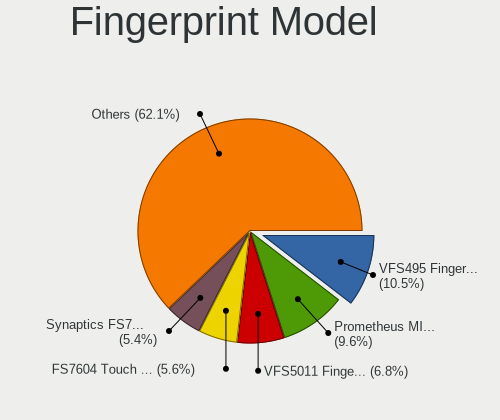

| Model                                                                      | Notebooks | Percent |
|----------------------------------------------------------------------------|-----------|---------|
| Synaptics Prometheus MIS Touch Fingerprint Reader                          | 30        | 11.24%  |
| Validity Sensors VFS495 Fingerprint Reader                                 | 25        | 9.36%   |
| Synaptics  FS7604 Touch Fingerprint Sensor with PurePrint                  | 18        | 6.74%   |
| Shenzhen Goodix  FingerPrint Device                                        | 18        | 6.74%   |
| Validity Sensors VFS5011 Fingerprint Reader                                | 14        | 5.24%   |
| Upek Biometric Touchchip/Touchstrip Fingerprint Sensor                     | 13        | 4.87%   |
| Synaptics  VFS7552 Touch Fingerprint Sensor with PurePrint                 | 12        | 4.49%   |
| AuthenTec AES2810                                                          | 11        | 4.12%   |
| Validity Sensors VFS491                                                    | 9         | 3.37%   |
| Validity Sensors VFS 5011 fingerprint sensor                               | 9         | 3.37%   |
| AuthenTec AES2501 Fingerprint Sensor                                       | 9         | 3.37%   |
| Synaptics Metallica MIS Touch Fingerprint Reader                           | 8         | 3%      |
| Synaptics FS7604 Touch Fingerprint Sensor with PurePrint                   | 8         | 3%      |
| Shenzhen Goodix Fingerprint Reader                                         | 8         | 3%      |
| Validity Sensors Synaptics WBDI                                            | 7         | 2.62%   |
| AuthenTec AES1600                                                          | 7         | 2.62%   |
| Shenzhen Goodix FingerPrint                                                | 6         | 2.25%   |
| Validity Sensors VFS451 Fingerprint Reader                                 | 5         | 1.87%   |
| Validity Sensors VFS101 Fingerprint Reader                                 | 5         | 1.87%   |
| Synaptics Metallica MOH Touch Fingerprint Reader                           | 5         | 1.87%   |
| Elan ELAN:Fingerprint                                                      | 5         | 1.87%   |
| LighTuning EgisTec Touch Fingerprint Sensor                                | 4         | 1.5%    |
| Validity Sensors Swipe Fingerprint Sensor                                  | 3         | 1.12%   |
| Validity Sensors Fingerprint scanner                                       | 3         | 1.12%   |
| Synaptics WBDI Fingerprint Reader USB 086                                  | 3         | 1.12%   |
| Synaptics  WBDI                                                            | 3         | 1.12%   |
| Elan ELAN:ARM-M4                                                           | 3         | 1.12%   |
| Validity Sensors VFS7500 Touch Fingerprint Sensor                          | 2         | 0.75%   |
| Validity Sensors VFS471 Fingerprint Reader                                 | 2         | 0.75%   |
| Validity Sensors Synaptics VFS7552 Touch Fingerprint Sensor with PurePrint | 2         | 0.75%   |
| Synaptics WBDI                                                             | 2         | 0.75%   |
| Validity Sensors VFS7552 Touch Fingerprint Sensor                          | 1         | 0.37%   |
| Validity Sensors VFS301 Fingerprint Reader                                 | 1         | 0.37%   |
| Synaptics WBDI Device                                                      | 1         | 0.37%   |
| Synaptics UWP WBDI                                                         | 1         | 0.37%   |
| Realtek USB2.0 Finger Print Bridge FocalTech Fingerprint Device            | 1         | 0.37%   |
| Microsoft Fingerprint Reader                                               | 1         | 0.37%   |
| LighTuning Fingerprint Sensor                                              | 1         | 0.37%   |
| AuthenTec AES1660 Fingerprint Sensor                                       | 1         | 0.37%   |

Chipcard Vendor
---------------

Chipcard module vendors

| Vendor                    | Notebooks | Percent |
|---------------------------|-----------|---------|
| Broadcom                  | 62        | 53.45%  |
| Alcor Micro               | 34        | 29.31%  |
| O2 Micro                  | 9         | 7.76%   |
| Lenovo                    | 5         | 4.31%   |
| Upek                      | 2         | 1.72%   |
| SCM Microsystems          | 2         | 1.72%   |
| Purism, SPC               | 1         | 0.86%   |
| Aladdin Knowledge Systems | 1         | 0.86%   |

Chipcard Model
--------------

Chipcard module models

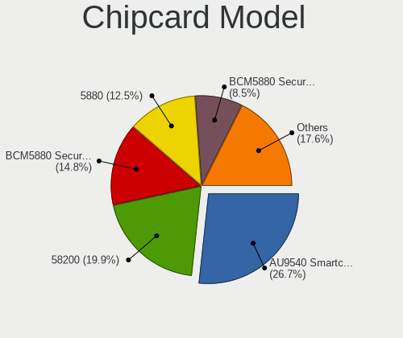

| Model                                                                        | Notebooks | Percent |
|------------------------------------------------------------------------------|-----------|---------|
| Alcor Micro AU9540 Smartcard Reader                                          | 34        | 29.31%  |
| Broadcom 58200                                                               | 21        | 18.1%   |
| Broadcom BCM5880 Secure Applications Processor                               | 15        | 12.93%  |
| Broadcom BCM5880 Secure Applications Processor with fingerprint swipe sensor | 13        | 11.21%  |
| Broadcom 5880                                                                | 13        | 11.21%  |
| O2 Micro OZ776 CCID Smartcard Reader                                         | 8         | 6.9%    |
| Lenovo Integrated Smart Card Reader                                          | 5         | 4.31%   |
| Upek TouchChip Fingerprint Coprocessor (WBF advanced mode)                   | 2         | 1.72%   |
| SCM Microsystems SCR3340 - ExpressCard54 Smart Card Reader                   | 2         | 1.72%   |
| Purism, SPC Librem Key                                                       | 1         | 0.86%   |
| O2 Micro Oz776 SmartCard Reader                                              | 1         | 0.86%   |
| Aladdin Knowledge Systems Token JC                                           | 1         | 0.86%   |

Unsupported
-----------

Unsupported Devices
-------------------

Total unsupported devices on board

| Total | Notebooks | Percent |
|-------|-----------|---------|
| 0     | 712       | 58.46%  |
| 1     | 374       | 30.71%  |
| 2     | 108       | 8.87%   |
| 3     | 19        | 1.56%   |
| 4     | 3         | 0.25%   |
| 5     | 2         | 0.16%   |

Unsupported Device Types
------------------------

Types of unsupported devices

| Type                     | Notebooks | Percent |
|--------------------------|-----------|---------|
| Fingerprint reader       | 262       | 40.31%  |
| Graphics card            | 115       | 17.69%  |
| Chipcard                 | 103       | 15.85%  |
| Net/wireless             | 42        | 6.46%   |
| Multimedia controller    | 27        | 4.15%   |
| Storage                  | 20        | 3.08%   |
| Camera                   | 20        | 3.08%   |
| Bluetooth                | 18        | 2.77%   |
| Communication controller | 11        | 1.69%   |
| Card reader              | 9         | 1.38%   |
| Flash memory             | 7         | 1.08%   |
| Net/ethernet             | 5         | 0.77%   |
| Modem                    | 5         | 0.77%   |
| Sound                    | 4         | 0.62%   |
| Storage/ata              | 1         | 0.15%   |
| Network                  | 1         | 0.15%   |

