Linux in Czechia - Tested Hardware & Statistics
-----------------------------------------------

A project to collect tested hardware configurations for Linux in Czechia.

Anyone can contribute to this report by the [hw-probe](https://github.com/linuxhw/hw-probe) tool:

    sudo -E hw-probe -all -upload

Please contribute! Especially if your hardware is rare.

This is a report for all computer types. See also reports for [desktops](/Location/Czechia/Desktop/README.md) and [notebooks](/Location/Czechia/Notebook/README.md).

Contents
--------

* [ Test Cases ](#test-cases)

* [ System ](#system)
  - [ OS                       ](#os)
  - [ OS Family                ](#os-family)
  - [ Kernel                   ](#kernel)
  - [ Kernel Family            ](#kernel-family)
  - [ Kernel Major Ver.        ](#kernel-major-ver)
  - [ Arch                     ](#arch)
  - [ DE                       ](#de)
  - [ Display Server           ](#display-server)
  - [ Display Manager          ](#display-manager)
  - [ OS Lang                  ](#os-lang)
  - [ Boot Mode                ](#boot-mode)
  - [ Filesystem               ](#filesystem)
  - [ Part. scheme             ](#part-scheme)
  - [ Dual Boot with Linux/BSD ](#dual-boot-with-linuxbsd)
  - [ Dual Boot (Win)          ](#dual-boot-win)

* [ Board ](#board)
  - [ Vendor                   ](#vendor)
  - [ Model                    ](#model)
  - [ Model Family             ](#model-family)
  - [ MFG Year                 ](#mfg-year)
  - [ Form Factor              ](#form-factor)
  - [ Secure Boot              ](#secure-boot)
  - [ Coreboot                 ](#coreboot)
  - [ RAM Size                 ](#ram-size)
  - [ RAM Used                 ](#ram-used)
  - [ Total Drives             ](#total-drives)
  - [ Has CD-ROM               ](#has-cd-rom)
  - [ Has Ethernet             ](#has-ethernet)
  - [ Has WiFi                 ](#has-wifi)
  - [ Has Bluetooth            ](#has-bluetooth)

* [ Location ](#location)
  - [ Country                  ](#country)
  - [ City                     ](#city)

* [ Drives ](#drives)
  - [ Drive Vendor             ](#drive-vendor)
  - [ Drive Model              ](#drive-model)
  - [ HDD Vendor               ](#hdd-vendor)
  - [ SSD Vendor               ](#ssd-vendor)
  - [ Drive Kind               ](#drive-kind)
  - [ Drive Connector          ](#drive-connector)
  - [ Drive Size               ](#drive-size)
  - [ Space Total              ](#space-total)
  - [ Space Used               ](#space-used)
  - [ Malfunc. Drives          ](#malfunc-drives)
  - [ Malfunc. Drive Vendor    ](#malfunc-drive-vendor)
  - [ Malfunc. HDD Vendor      ](#malfunc-hdd-vendor)
  - [ Malfunc. Drive Kind      ](#malfunc-drive-kind)
  - [ Failed Drives            ](#failed-drives)
  - [ Failed Drive Vendor      ](#failed-drive-vendor)
  - [ Drive Status             ](#drive-status)

* [ Storage controller ](#storage-controller)
  - [ Storage Vendor           ](#storage-vendor)
  - [ Storage Model            ](#storage-model)
  - [ Storage Kind             ](#storage-kind)

* [ Processor ](#processor)
  - [ CPU Vendor               ](#cpu-vendor)
  - [ CPU Model                ](#cpu-model)
  - [ CPU Model Family         ](#cpu-model-family)
  - [ CPU Cores                ](#cpu-cores)
  - [ CPU Sockets              ](#cpu-sockets)
  - [ CPU Threads              ](#cpu-threads)
  - [ CPU Op-Modes             ](#cpu-op-modes)
  - [ CPU Microcode            ](#cpu-microcode)
  - [ CPU Microarch            ](#cpu-microarch)

* [ Graphics ](#graphics)
  - [ GPU Vendor               ](#gpu-vendor)
  - [ GPU Model                ](#gpu-model)
  - [ GPU Combo                ](#gpu-combo)
  - [ GPU Driver               ](#gpu-driver)
  - [ GPU Memory               ](#gpu-memory)

* [ Monitor ](#monitor)
  - [ Monitor Vendor           ](#monitor-vendor)
  - [ Monitor Model            ](#monitor-model)
  - [ Monitor Resolution       ](#monitor-resolution)
  - [ Monitor Diagonal         ](#monitor-diagonal)
  - [ Monitor Width            ](#monitor-width)
  - [ Aspect Ratio             ](#aspect-ratio)
  - [ Monitor Area             ](#monitor-area)
  - [ Pixel Density            ](#pixel-density)
  - [ Multiple Monitors        ](#multiple-monitors)

* [ Network ](#network)
  - [ Net Controller Vendor    ](#net-controller-vendor)
  - [ Net Controller Model     ](#net-controller-model)
  - [ Wireless Vendor          ](#wireless-vendor)
  - [ Wireless Model           ](#wireless-model)
  - [ Ethernet Vendor          ](#ethernet-vendor)
  - [ Ethernet Model           ](#ethernet-model)
  - [ Net Controller Kind      ](#net-controller-kind)
  - [ Used Controller          ](#used-controller)
  - [ NICs                     ](#nics)
  - [ IPv6                     ](#ipv6)

* [ Bluetooth ](#bluetooth)
  - [ Bluetooth Vendor         ](#bluetooth-vendor)
  - [ Bluetooth Model          ](#bluetooth-model)

* [ Sound ](#sound)
  - [ Sound Vendor             ](#sound-vendor)
  - [ Sound Model              ](#sound-model)

* [ Memory ](#memory)
  - [ Memory Vendor            ](#memory-vendor)
  - [ Memory Model             ](#memory-model)
  - [ Memory Kind              ](#memory-kind)
  - [ Memory Form Factor       ](#memory-form-factor)
  - [ Memory Size              ](#memory-size)
  - [ Memory Speed             ](#memory-speed)

* [ Printers & scanners ](#printers--scanners)
  - [ Printer Vendor           ](#printer-vendor)
  - [ Printer Model            ](#printer-model)
  - [ Scanner Vendor           ](#scanner-vendor)
  - [ Scanner Model            ](#scanner-model)

* [ Camera ](#camera)
  - [ Camera Vendor            ](#camera-vendor)
  - [ Camera Model             ](#camera-model)

* [ Security ](#security)
  - [ Fingerprint Vendor       ](#fingerprint-vendor)
  - [ Fingerprint Model        ](#fingerprint-model)
  - [ Chipcard Vendor          ](#chipcard-vendor)
  - [ Chipcard Model           ](#chipcard-model)

* [ Unsupported ](#unsupported)
  - [ Unsupported Devices      ](#unsupported-devices)
  - [ Unsupported Device Types ](#unsupported-device-types)

Test Cases
----------

Total: 4773

| Vendor        | Model                       | Form-Factor | Probe                                                      | Date         |
|---------------|-----------------------------|-------------|------------------------------------------------------------|--------------|
| Lenovo        | Yoga Pro 7 14AKP10 83KG     | Notebook    | [edc589aee0](https://linux-hardware.org/?probe=edc589aee0) | Jan 03, 2026 |
| HP            | 22F8                        | Desktop     | [da8d4d86ff](https://linux-hardware.org/?probe=da8d4d86ff) | Jan 02, 2026 |
| Dell          | 0773VG A00                  | Desktop     | [e913d436ed](https://linux-hardware.org/?probe=e913d436ed) | Jan 02, 2026 |
| Dell          | Inspiron 7348               | Notebook    | [7270e26497](https://linux-hardware.org/?probe=7270e26497) | Jan 02, 2026 |
| ASUSTek       | VivoBook_ASUSLaptop X150... | Notebook    | [ddc22ba8c0](https://linux-hardware.org/?probe=ddc22ba8c0) | Jan 01, 2026 |
| Framework     | Laptop 13 (AMD Ryzen 704... | Notebook    | [524dd3caf6](https://linux-hardware.org/?probe=524dd3caf6) | Jan 01, 2026 |
| HP            | EliteBook 855 G8 Noteboo... | Notebook    | [d966eaa4db](https://linux-hardware.org/?probe=d966eaa4db) | Jan 01, 2026 |
| ASRock        | A620M-HDV/M.2+              | Desktop     | [085df30531](https://linux-hardware.org/?probe=085df30531) | Jan 01, 2026 |
| ASUSTek       | X556UB                      | Notebook    | [0686ecb473](https://linux-hardware.org/?probe=0686ecb473) | Jan 01, 2026 |
| Lenovo        | ThinkPad E16 Gen 2 21M50... | Notebook    | [60d7dc9a67](https://linux-hardware.org/?probe=60d7dc9a67) | Jan 01, 2026 |
| ASUSTek       | A8N-E                       | Desktop     | [e7d4feb0e5](https://linux-hardware.org/?probe=e7d4feb0e5) | Dec 31, 2025 |
| Gigabyte      | B550 AORUS ELITE V2         | Desktop     | [2b79bef4ec](https://linux-hardware.org/?probe=2b79bef4ec) | Dec 31, 2025 |
| Fujitsu Si... | D2811-A1 S26361-D2811-A1    | Desktop     | [1b91792792](https://linux-hardware.org/?probe=1b91792792) | Dec 30, 2025 |
| Gigabyte      | B365M HD3                   | Desktop     | [d3ccf18a7c](https://linux-hardware.org/?probe=d3ccf18a7c) | Dec 29, 2025 |
| ASUSTek       | TUF Gaming X570-PLUS        | Desktop     | [193f8d2ea8](https://linux-hardware.org/?probe=193f8d2ea8) | Dec 29, 2025 |
| HP            | EliteBook 840 G3            | Notebook    | [4afb089451](https://linux-hardware.org/?probe=4afb089451) | Dec 29, 2025 |
| HP            | Compaq 615                  | Notebook    | [96c7d029d2](https://linux-hardware.org/?probe=96c7d029d2) | Dec 28, 2025 |
| MSI           | MAG B550 TOMAHAWK           | Desktop     | [14f8b333c8](https://linux-hardware.org/?probe=14f8b333c8) | Dec 27, 2025 |
| ASUSTek       | SABERTOOTH P67              | Desktop     | [b2dda1e2cb](https://linux-hardware.org/?probe=b2dda1e2cb) | Dec 24, 2025 |
| Dell          | 0T7D40 A01                  | Desktop     | [adc1a2ad3d](https://linux-hardware.org/?probe=adc1a2ad3d) | Dec 23, 2025 |
| ASRock        | ALiveNF6G-VSTA              | Desktop     | [78c2fee771](https://linux-hardware.org/?probe=78c2fee771) | Dec 23, 2025 |
| HP            | ProBook 440 G8 Notebook ... | Notebook    | [6abbaf5eca](https://linux-hardware.org/?probe=6abbaf5eca) | Dec 22, 2025 |
| Lenovo        | E51-80 80QB                 | Notebook    | [3fce719dc1](https://linux-hardware.org/?probe=3fce719dc1) | Dec 22, 2025 |
| Lenovo        | Yoga 530-14IKB 81EK         | Convertible | [6dd881fa35](https://linux-hardware.org/?probe=6dd881fa35) | Dec 22, 2025 |
| HP            | OmniBook 7 Laptop 14-fr0... | Notebook    | [a6e44a31e0](https://linux-hardware.org/?probe=a6e44a31e0) | Dec 22, 2025 |
| Dell          | 0D6H9T A00                  | Desktop     | [aecd54e8ec](https://linux-hardware.org/?probe=aecd54e8ec) | Dec 21, 2025 |
| ASUSTek       | PRIME A620M-K               | Desktop     | [c36304065d](https://linux-hardware.org/?probe=c36304065d) | Dec 21, 2025 |
| HP            | EliteBook 845 14 inch G1... | Notebook    | [14ffce0530](https://linux-hardware.org/?probe=14ffce0530) | Dec 21, 2025 |
| HP            | 1495                        | Desktop     | [398a0e76d7](https://linux-hardware.org/?probe=398a0e76d7) | Dec 20, 2025 |
| Dell          | Inspiron 7348               | Notebook    | [725ff9e4d2](https://linux-hardware.org/?probe=725ff9e4d2) | Dec 19, 2025 |
| ASUSTek       | P8H61-M LE                  | Desktop     | [abe879fb9f](https://linux-hardware.org/?probe=abe879fb9f) | Dec 18, 2025 |
| Dell          | 0MF24N A03                  | Desktop     | [6f264b6775](https://linux-hardware.org/?probe=6f264b6775) | Dec 17, 2025 |
| Lenovo        | 313A SDK0J40697 WIN 3305... | Desktop     | [c599e94e88](https://linux-hardware.org/?probe=c599e94e88) | Dec 17, 2025 |
| ASRock        | B650E PG-ITX WiFi           | Desktop     | [bf76ceaf10](https://linux-hardware.org/?probe=bf76ceaf10) | Dec 17, 2025 |
| Lenovo        | V15 G5 IRL 83GW             | Notebook    | [2a032d96b5](https://linux-hardware.org/?probe=2a032d96b5) | Dec 16, 2025 |
| ASRock        | AMD BC-250                  | Desktop     | [5857189dba](https://linux-hardware.org/?probe=5857189dba) | Dec 14, 2025 |
| HP            | Unknown                     | Notebook    | [234707220d](https://linux-hardware.org/?probe=234707220d) | Dec 13, 2025 |
| Lenovo        | ThinkPad E16 Gen 2 21MA0... | Notebook    | [15d617b937](https://linux-hardware.org/?probe=15d617b937) | Dec 13, 2025 |
| Lenovo        | 36DA SDK0J40709 WIN 3259... | All in one  | [b2f57a6fad](https://linux-hardware.org/?probe=b2f57a6fad) | Dec 13, 2025 |
| Lenovo        | ThinkPad X13 Gen 1 20UF0... | Notebook    | [84400c7a3a](https://linux-hardware.org/?probe=84400c7a3a) | Dec 13, 2025 |
| HP            | Laptop 15-bw0xx             | Notebook    | [337a308d37](https://linux-hardware.org/?probe=337a308d37) | Dec 12, 2025 |
| Gigabyte      | B550M K                     | Desktop     | [758ea36ada](https://linux-hardware.org/?probe=758ea36ada) | Dec 12, 2025 |
| HP            | 8433 11                     | Desktop     | [f43153d7da](https://linux-hardware.org/?probe=f43153d7da) | Dec 11, 2025 |
| ASUSTek       | TUF Gaming A620M-PLUS WI... | Desktop     | [28825dc189](https://linux-hardware.org/?probe=28825dc189) | Dec 11, 2025 |
| ASUSTek       | H170-PRO                    | Desktop     | [3001810a89](https://linux-hardware.org/?probe=3001810a89) | Dec 11, 2025 |
| Acer          | TravelMate P216-41-TCO      | Notebook    | [3daa6db1d9](https://linux-hardware.org/?probe=3daa6db1d9) | Dec 11, 2025 |
| MSI           | B250M GAMING PRO            | Desktop     | [eccdef46b8](https://linux-hardware.org/?probe=eccdef46b8) | Dec 11, 2025 |
| Acer          | Nitro ANV15-51              | Notebook    | [72a6ee08bd](https://linux-hardware.org/?probe=72a6ee08bd) | Dec 09, 2025 |
| Unknown       | Unknown                     | Mini pc     | [7c370dcc8c](https://linux-hardware.org/?probe=7c370dcc8c) | Dec 09, 2025 |
| Dell          | XPS 15 9570                 | Notebook    | [8fe7b11dcd](https://linux-hardware.org/?probe=8fe7b11dcd) | Dec 08, 2025 |
| Lenovo        | ThinkPad X1 Carbon Gen 1... | Notebook    | [9215095e75](https://linux-hardware.org/?probe=9215095e75) | Dec 08, 2025 |
| ASRock        | C2750D4I                    | Desktop     | [0025a5cc7b](https://linux-hardware.org/?probe=0025a5cc7b) | Dec 08, 2025 |
| ASRock        | X570 Phantom Gaming 4       | Desktop     | [eb3c1ab9a7](https://linux-hardware.org/?probe=eb3c1ab9a7) | Dec 08, 2025 |
| ASUSTek       | H170-PRO                    | Desktop     | [2e48ff8e90](https://linux-hardware.org/?probe=2e48ff8e90) | Dec 07, 2025 |
| Gigabyte      | B650 AORUS ELITE AX V2      | Desktop     | [ccc7343e86](https://linux-hardware.org/?probe=ccc7343e86) | Dec 07, 2025 |
| HP            | ZBook 15 G5                 | Notebook    | [b00db81fe5](https://linux-hardware.org/?probe=b00db81fe5) | Dec 07, 2025 |
| ASUSTek       | ASUS Vivobook S 14 M5406... | Notebook    | [d9a553916d](https://linux-hardware.org/?probe=d9a553916d) | Dec 06, 2025 |
| Lenovo        | ThinkPad T470 W10DG 20JN... | Notebook    | [7dde4b6cec](https://linux-hardware.org/?probe=7dde4b6cec) | Dec 06, 2025 |
| MSI           | B250M GAMING PRO            | Desktop     | [23ee5a2066](https://linux-hardware.org/?probe=23ee5a2066) | Dec 06, 2025 |
| Dell          | Inspiron 7348               | Notebook    | [04a39b1221](https://linux-hardware.org/?probe=04a39b1221) | Dec 05, 2025 |
| ASRock        | AB350M Pro4                 | Desktop     | [6cd071662d](https://linux-hardware.org/?probe=6cd071662d) | Dec 04, 2025 |
| Lenovo        | V110-17IKB 80V2             | Notebook    | [354fd365db](https://linux-hardware.org/?probe=354fd365db) | Dec 04, 2025 |
| Dell          | Vostro 3491                 | Notebook    | [767986ee04](https://linux-hardware.org/?probe=767986ee04) | Dec 04, 2025 |
| ASRock        | A620AM Pro-A                | Desktop     | [5350fc4f22](https://linux-hardware.org/?probe=5350fc4f22) | Dec 03, 2025 |
| MSI           | MS-7309                     | Desktop     | [b31a5ee8e1](https://linux-hardware.org/?probe=b31a5ee8e1) | Dec 03, 2025 |
| MSI           | IONA                        | Desktop     | [59197c1910](https://linux-hardware.org/?probe=59197c1910) | Dec 03, 2025 |
| Lenovo        | Legion 5 16IRX9 83DG        | Notebook    | [6abb72667d](https://linux-hardware.org/?probe=6abb72667d) | Dec 02, 2025 |
| Samsung       | 530U3C/530U4C               | Notebook    | [3d8df2bfed](https://linux-hardware.org/?probe=3d8df2bfed) | Dec 01, 2025 |
| Framework     | Laptop 13 (AMD Ryzen 704... | Notebook    | [41463d6994](https://linux-hardware.org/?probe=41463d6994) | Dec 01, 2025 |
| Samsung       | R540/R580/R780/SA41/E452    | Notebook    | [ee211236f6](https://linux-hardware.org/?probe=ee211236f6) | Nov 30, 2025 |
| MSI           | MAG X570S TOMAHAWK MAX W... | Desktop     | [bc2933806f](https://linux-hardware.org/?probe=bc2933806f) | Nov 30, 2025 |
| HP            | 158B                        | Desktop     | [4749ea7988](https://linux-hardware.org/?probe=4749ea7988) | Nov 29, 2025 |
| Unknown       | Unknown                     | Desktop     | [6d3da2328f](https://linux-hardware.org/?probe=6d3da2328f) | Nov 29, 2025 |
| MSI           | IONA                        | Desktop     | [7e2e736181](https://linux-hardware.org/?probe=7e2e736181) | Nov 29, 2025 |
| HP            | ProBook 4740s               | Notebook    | [3926cbde61](https://linux-hardware.org/?probe=3926cbde61) | Nov 29, 2025 |
| Lenovo        | ThinkPad T490s 20NX000EM... | Notebook    | [2f2917e2dd](https://linux-hardware.org/?probe=2f2917e2dd) | Nov 29, 2025 |
| Lenovo        | ThinkPad T490s 20NX000EM... | Notebook    | [5b63ec026f](https://linux-hardware.org/?probe=5b63ec026f) | Nov 29, 2025 |
| ASUSTek       | A88XM-A/USB                 | Desktop     | [334a095a6a](https://linux-hardware.org/?probe=334a095a6a) | Nov 29, 2025 |
| MSI           | A320M PRO-VH PLUS           | Desktop     | [975e542cf0](https://linux-hardware.org/?probe=975e542cf0) | Nov 29, 2025 |
| Gigabyte      | H61M-S2PV                   | Desktop     | [f94841a146](https://linux-hardware.org/?probe=f94841a146) | Nov 29, 2025 |
| ASUSTek       | TUF Gaming B550M-PLUS WI... | Notebook    | [a2ebdc757d](https://linux-hardware.org/?probe=a2ebdc757d) | Nov 29, 2025 |
| HP            | 250 G3                      | Notebook    | [0e8e063408](https://linux-hardware.org/?probe=0e8e063408) | Nov 28, 2025 |
| ASUSTek       | X540LJ                      | Notebook    | [589ed32346](https://linux-hardware.org/?probe=589ed32346) | Nov 27, 2025 |
| ASUSTek       | X540LJ                      | Notebook    | [ae6c406062](https://linux-hardware.org/?probe=ae6c406062) | Nov 27, 2025 |
| HP            | EliteBook 855 G8 Noteboo... | Notebook    | [b2d488fa3f](https://linux-hardware.org/?probe=b2d488fa3f) | Nov 27, 2025 |
| ASUSTek       | TUF Gaming B650M-E WIFI     | Desktop     | [b8049474c7](https://linux-hardware.org/?probe=b8049474c7) | Nov 24, 2025 |
| Intel         | DQ67SW AAG12527-309         | Desktop     | [1bcb211456](https://linux-hardware.org/?probe=1bcb211456) | Nov 24, 2025 |
| MSI           | MPG B550I GAMING EDGE WI... | Desktop     | [a5202069f4](https://linux-hardware.org/?probe=a5202069f4) | Nov 23, 2025 |
| Foxconn       | 2A8C                        | Desktop     | [b9a2f08d89](https://linux-hardware.org/?probe=b9a2f08d89) | Nov 23, 2025 |
| Lenovo        | IdeaPad S145-15AST 81N3     | Notebook    | [022bbd1727](https://linux-hardware.org/?probe=022bbd1727) | Nov 22, 2025 |
| Lenovo        | ThinkPad P1 Gen 4i 20Y4S... | Notebook    | [11330f82f3](https://linux-hardware.org/?probe=11330f82f3) | Nov 22, 2025 |
| ASUSTek       | TUF Gaming A620M-PLUS WI... | Desktop     | [54434fbef6](https://linux-hardware.org/?probe=54434fbef6) | Nov 22, 2025 |
| Lenovo        | IdeaPad 5 15ARE05 81YQ      | Notebook    | [d7eb961be6](https://linux-hardware.org/?probe=d7eb961be6) | Nov 22, 2025 |
| HP            | ZBook 15                    | Notebook    | [1bfb421800](https://linux-hardware.org/?probe=1bfb421800) | Nov 21, 2025 |
| HP            | 255 G8 Notebook PC          | Notebook    | [4ac2b0c5e5](https://linux-hardware.org/?probe=4ac2b0c5e5) | Nov 19, 2025 |
| Acer          | Aspire TC-1760              | Desktop     | [807b31edc5](https://linux-hardware.org/?probe=807b31edc5) | Nov 19, 2025 |
| HP            | ProBook 4740s               | Notebook    | [1595f789c3](https://linux-hardware.org/?probe=1595f789c3) | Nov 19, 2025 |
| Gigabyte      | EP45-DS4                    | Desktop     | [8b52405c01](https://linux-hardware.org/?probe=8b52405c01) | Nov 18, 2025 |
| ASUSTek       | M5A99X EVO                  | Desktop     | [d7ff2e22ac](https://linux-hardware.org/?probe=d7ff2e22ac) | Nov 16, 2025 |
| Lenovo        | ThinkPad T470 W10DG 20JN... | Notebook    | [373bdce267](https://linux-hardware.org/?probe=373bdce267) | Nov 16, 2025 |
| HP            | EliteBook X G1a 14 inch ... | Notebook    | [970f71a294](https://linux-hardware.org/?probe=970f71a294) | Nov 15, 2025 |
| MSI           | IONA                        | Desktop     | [2ec6cc0628](https://linux-hardware.org/?probe=2ec6cc0628) | Nov 15, 2025 |
| ASUSTek       | TUF Z390-PLUS GAMING        | Desktop     | [c77f39c909](https://linux-hardware.org/?probe=c77f39c909) | Nov 15, 2025 |
| Lenovo        | ThinkPad X1 Extreme 2nd ... | Notebook    | [0ed10d37a1](https://linux-hardware.org/?probe=0ed10d37a1) | Nov 15, 2025 |
| Acer          | Aspire A514-54              | Notebook    | [31cdc29540](https://linux-hardware.org/?probe=31cdc29540) | Nov 15, 2025 |
| ASUSTek       | Zenbook UX425QA_UM425QA     | Notebook    | [405aa6abb6](https://linux-hardware.org/?probe=405aa6abb6) | Nov 14, 2025 |
| Dell          | Inspiron 5379               | Notebook    | [6e5abeb421](https://linux-hardware.org/?probe=6e5abeb421) | Nov 12, 2025 |
| Lenovo        | IdeaPad 100-15IBY 80MJ      | Notebook    | [dad9db710d](https://linux-hardware.org/?probe=dad9db710d) | Nov 11, 2025 |
| Dell          | Precision 7760              | Notebook    | [95bbbaca85](https://linux-hardware.org/?probe=95bbbaca85) | Nov 11, 2025 |
| Dell          | Inspiron 7537               | Notebook    | [4b203436fa](https://linux-hardware.org/?probe=4b203436fa) | Nov 10, 2025 |
| ASUSTek       | X550MD                      | Notebook    | [195db352d6](https://linux-hardware.org/?probe=195db352d6) | Nov 10, 2025 |
| ASUSTek       | VivoBook_ASUSLaptop X513... | Notebook    | [d354b8ffbd](https://linux-hardware.org/?probe=d354b8ffbd) | Nov 10, 2025 |
| UMAX          | VisionBook 15WJ Plus        | Notebook    | [0c8a25aed7](https://linux-hardware.org/?probe=0c8a25aed7) | Nov 10, 2025 |
| Samsung       | 950XDB/951XDB/950XDY        | Notebook    | [bde7a4b989](https://linux-hardware.org/?probe=bde7a4b989) | Nov 09, 2025 |
| Foxconn       | 2A8C                        | Desktop     | [1e2ee56a90](https://linux-hardware.org/?probe=1e2ee56a90) | Nov 09, 2025 |
| ASUSTek       | H81M-K                      | Desktop     | [537bbea8d3](https://linux-hardware.org/?probe=537bbea8d3) | Nov 08, 2025 |
| Lenovo        | V15 G5 IRL 83GW             | Notebook    | [3de3bb8def](https://linux-hardware.org/?probe=3de3bb8def) | Nov 07, 2025 |
| Lenovo        | V15 G5 IRL 83GW             | Notebook    | [63c32cd98f](https://linux-hardware.org/?probe=63c32cd98f) | Nov 07, 2025 |
| Dell          | Pro 14 Plus PB14250         | Notebook    | [4e1e077ab8](https://linux-hardware.org/?probe=4e1e077ab8) | Nov 07, 2025 |
| HP            | 250 G4 Notebook PC          | Notebook    | [50059fa851](https://linux-hardware.org/?probe=50059fa851) | Nov 07, 2025 |
| Gigabyte      | B450M DS3H-CF               | Desktop     | [7b2e8fe880](https://linux-hardware.org/?probe=7b2e8fe880) | Nov 06, 2025 |
| ASUSTek       | TUF Z390-PLUS GAMING        | Desktop     | [280bed0cd6](https://linux-hardware.org/?probe=280bed0cd6) | Nov 05, 2025 |
| Framework     | Laptop 12 (13th Gen Inte... | Convertible | [b5543b383b](https://linux-hardware.org/?probe=b5543b383b) | Nov 05, 2025 |
| Gigabyte      | EP35-DS3L                   | Desktop     | [feac77a9de](https://linux-hardware.org/?probe=feac77a9de) | Nov 05, 2025 |
| ASRock        | X470 Gaming K4              | Desktop     | [5d3478f689](https://linux-hardware.org/?probe=5d3478f689) | Nov 05, 2025 |
| Fujitsu Si... | ESPRIMO Mobile V6505        | Notebook    | [99e9ec1753](https://linux-hardware.org/?probe=99e9ec1753) | Nov 05, 2025 |
| HP            | Compaq 6730b (GB988ET#AB... | Notebook    | [4fb1bf2562](https://linux-hardware.org/?probe=4fb1bf2562) | Nov 03, 2025 |
| Dell          | 0T1D10 A01                  | Desktop     | [06b1d8ef38](https://linux-hardware.org/?probe=06b1d8ef38) | Nov 03, 2025 |
| Gigabyte      | GA-MA785G-UD3H              | Desktop     | [457a26885f](https://linux-hardware.org/?probe=457a26885f) | Nov 02, 2025 |
| Dell          | Latitude 7490               | Notebook    | [090a50d2b3](https://linux-hardware.org/?probe=090a50d2b3) | Nov 01, 2025 |
| HP            | Laptop 15s-eq2xxx           | Notebook    | [4f95cb040a](https://linux-hardware.org/?probe=4f95cb040a) | Nov 01, 2025 |
| Valve         | Galileo                     | Notebook    | [45f4f43de8](https://linux-hardware.org/?probe=45f4f43de8) | Nov 01, 2025 |
| MSI           | A320M PRO-VH PLUS           | Desktop     | [6f17f0a735](https://linux-hardware.org/?probe=6f17f0a735) | Nov 01, 2025 |
| Sony          | VPCEH1M1E                   | Notebook    | [83b707c913](https://linux-hardware.org/?probe=83b707c913) | Oct 31, 2025 |
| TUXEDO        | InfinityBook S 15/17 Gen... | Notebook    | [62da57245d](https://linux-hardware.org/?probe=62da57245d) | Oct 31, 2025 |
| TUXEDO        | InfinityBook S 15/17 Gen... | Notebook    | [dcfe661bc7](https://linux-hardware.org/?probe=dcfe661bc7) | Oct 30, 2025 |
| Acer          | Aspire 4820T                | Notebook    | [7d6ec94850](https://linux-hardware.org/?probe=7d6ec94850) | Oct 28, 2025 |
| Lenovo        | ThinkPad T480 20L6S29D0H    | Notebook    | [e580e83796](https://linux-hardware.org/?probe=e580e83796) | Oct 27, 2025 |
| Lenovo        | IdeaPad 320-15IKB 81BG      | Notebook    | [70b0413204](https://linux-hardware.org/?probe=70b0413204) | Oct 27, 2025 |
| MSI           | MS-7236                     | Desktop     | [af7e19f1e4](https://linux-hardware.org/?probe=af7e19f1e4) | Oct 26, 2025 |
| ASUSTek       | P6X58D-E                    | Desktop     | [65d3626093](https://linux-hardware.org/?probe=65d3626093) | Oct 25, 2025 |
| ASUSTek       | ROG Strix G16 G614PR_G61... | Notebook    | [37ca4c334d](https://linux-hardware.org/?probe=37ca4c334d) | Oct 24, 2025 |
| Dell          | Latitude E5270              | Notebook    | [9192d3641e](https://linux-hardware.org/?probe=9192d3641e) | Oct 23, 2025 |
| MSI           | 970A SLI Krait Edition      | Desktop     | [c2b15bfdb4](https://linux-hardware.org/?probe=c2b15bfdb4) | Oct 22, 2025 |
| MSI           | 970A SLI Krait Edition      | Desktop     | [86872009da](https://linux-hardware.org/?probe=86872009da) | Oct 22, 2025 |
| ASUSTek       | N53SV                       | Notebook    | [5e13ee1135](https://linux-hardware.org/?probe=5e13ee1135) | Oct 22, 2025 |
| ASUSTek       | NUC14MNB1 60AS00H0-MB1C0... | Mini pc     | [f363bca813](https://linux-hardware.org/?probe=f363bca813) | Oct 22, 2025 |
| Dell          | 09M8Y8 A01                  | Desktop     | [ec03956fca](https://linux-hardware.org/?probe=ec03956fca) | Oct 22, 2025 |
| Gigabyte      | A520M K V2                  | Desktop     | [172cf40949](https://linux-hardware.org/?probe=172cf40949) | Oct 22, 2025 |
| Gigabyte      | A520M K V2                  | Desktop     | [ec251888a2](https://linux-hardware.org/?probe=ec251888a2) | Oct 22, 2025 |
| HP            | EliteBook 855 G8 Noteboo... | Notebook    | [db50da4444](https://linux-hardware.org/?probe=db50da4444) | Oct 21, 2025 |
| Dell          | 09M8Y8 A01                  | Desktop     | [30c1936d88](https://linux-hardware.org/?probe=30c1936d88) | Oct 20, 2025 |
| Pegatron      | 2AED                        | All in one  | [16b1b4f051](https://linux-hardware.org/?probe=16b1b4f051) | Oct 20, 2025 |
| ASUSTek       | TUF B450M-PRO GAMING        | Desktop     | [00af2a560c](https://linux-hardware.org/?probe=00af2a560c) | Oct 19, 2025 |
| Lenovo        | ThinkPad T14 Gen 5 21MDS... | Notebook    | [1b3b06c36d](https://linux-hardware.org/?probe=1b3b06c36d) | Oct 19, 2025 |
| Acer          | Nitro AN515-55              | Notebook    | [f9d1fda8ed](https://linux-hardware.org/?probe=f9d1fda8ed) | Oct 18, 2025 |
| Lenovo        | ThinkPad T440p 20AWS11D1... | Notebook    | [6e480dedc8](https://linux-hardware.org/?probe=6e480dedc8) | Oct 18, 2025 |
| ASRock        | 985GM-GS3 FX                | Desktop     | [561fd827bb](https://linux-hardware.org/?probe=561fd827bb) | Oct 18, 2025 |
| MSI           | 970 GAMING                  | Desktop     | [d361422dea](https://linux-hardware.org/?probe=d361422dea) | Oct 17, 2025 |
| Lenovo        | IdeaPad Z500 20202          | Notebook    | [66a5eb229c](https://linux-hardware.org/?probe=66a5eb229c) | Oct 16, 2025 |
| Acer          | TravelMate Spin P414RN-4... | Convertible | [3a03041a7c](https://linux-hardware.org/?probe=3a03041a7c) | Oct 16, 2025 |
| ASUSTek       | ROG STRIX B550-F GAMING     | Desktop     | [1c0c5b8ebc](https://linux-hardware.org/?probe=1c0c5b8ebc) | Oct 15, 2025 |
| Dell          | 0TTDMJ A00                  | Desktop     | [d7291ac09e](https://linux-hardware.org/?probe=d7291ac09e) | Oct 15, 2025 |
| Lenovo        | Y520-15IKBN 80WK            | Notebook    | [16addd49b2](https://linux-hardware.org/?probe=16addd49b2) | Oct 14, 2025 |
| MSI           | B450 TOMAHAWK MAX           | Desktop     | [d6bfbe491e](https://linux-hardware.org/?probe=d6bfbe491e) | Oct 14, 2025 |
| Lenovo        | V15 G2 ITL 82KB             | Notebook    | [46c8431557](https://linux-hardware.org/?probe=46c8431557) | Oct 13, 2025 |
| Lenovo        | V15 G2 ITL 82KB             | Notebook    | [c9627056fa](https://linux-hardware.org/?probe=c9627056fa) | Oct 13, 2025 |
| ASUSTek       | SABERTOOTH X99              | Desktop     | [8e739c965d](https://linux-hardware.org/?probe=8e739c965d) | Oct 12, 2025 |
| Acer          | JM11-MS                     | Notebook    | [3637495bde](https://linux-hardware.org/?probe=3637495bde) | Oct 12, 2025 |
| Acer          | Aspire 5738                 | Notebook    | [b218fa91ee](https://linux-hardware.org/?probe=b218fa91ee) | Oct 11, 2025 |
| ASUSTek       | ROG Strix G513QM_G513QM     | Notebook    | [6caf7b5045](https://linux-hardware.org/?probe=6caf7b5045) | Oct 11, 2025 |
| Lenovo        | ThinkPad T16 Gen 1 21CJS... | Notebook    | [40cda73174](https://linux-hardware.org/?probe=40cda73174) | Oct 11, 2025 |
| Lenovo        | ThinkPad T16 Gen 1 21CJS... | Notebook    | [a57cfa0fa7](https://linux-hardware.org/?probe=a57cfa0fa7) | Oct 11, 2025 |
| Lenovo        | IdeaPad Gaming 3 15IHU6 ... | Notebook    | [fb82da8ece](https://linux-hardware.org/?probe=fb82da8ece) | Oct 10, 2025 |
| Lenovo        | G700 20251                  | Notebook    | [b3c7f985d7](https://linux-hardware.org/?probe=b3c7f985d7) | Oct 10, 2025 |
| Lenovo        | G700 20251                  | Notebook    | [8eca1ddf21](https://linux-hardware.org/?probe=8eca1ddf21) | Oct 10, 2025 |
| HP            | EliteBook 745 G4            | Notebook    | [e73a3bd14e](https://linux-hardware.org/?probe=e73a3bd14e) | Oct 09, 2025 |
| Gigabyte      | 8I945GZME-RH                | Desktop     | [ea6860d75f](https://linux-hardware.org/?probe=ea6860d75f) | Oct 09, 2025 |
| MSI           | Z370-A PRO                  | Desktop     | [e9c4dd84d4](https://linux-hardware.org/?probe=e9c4dd84d4) | Oct 09, 2025 |
| Lenovo        | IdeaPad Slim 5 16AKP10 8... | Notebook    | [48256c6580](https://linux-hardware.org/?probe=48256c6580) | Oct 08, 2025 |
| MSI           | MAG B550 TOMAHAWK           | Desktop     | [a06a88f604](https://linux-hardware.org/?probe=a06a88f604) | Oct 07, 2025 |
| ASUSTek       | VivoBook_ASUSLaptop TP41... | Convertible | [ae5d4a0de1](https://linux-hardware.org/?probe=ae5d4a0de1) | Oct 06, 2025 |
| Unknown       | Unknown                     | Desktop     | [b1f15206aa](https://linux-hardware.org/?probe=b1f15206aa) | Oct 06, 2025 |
| Acer          | Aspire 5750G                | Notebook    | [ce14a26867](https://linux-hardware.org/?probe=ce14a26867) | Oct 05, 2025 |
| Dell          | Latitude E6540              | Notebook    | [0fef688c80](https://linux-hardware.org/?probe=0fef688c80) | Oct 05, 2025 |
| Fujitsu       | LIFEBOOK U7410              | Notebook    | [f4a77dcb45](https://linux-hardware.org/?probe=f4a77dcb45) | Oct 05, 2025 |
| ASUSTek       | P8Z77-V LK                  | Desktop     | [a1f2ec2234](https://linux-hardware.org/?probe=a1f2ec2234) | Oct 04, 2025 |
| Unknown       | Unknown                     | Mini pc     | [c22cf391ed](https://linux-hardware.org/?probe=c22cf391ed) | Oct 04, 2025 |
| Lenovo        | IdeaPad S145-15AST 81N3     | Notebook    | [00c9e3a269](https://linux-hardware.org/?probe=00c9e3a269) | Oct 04, 2025 |
| Acer          | Aspire E1-532               | Notebook    | [bc3740361e](https://linux-hardware.org/?probe=bc3740361e) | Oct 04, 2025 |
| Lenovo        | ThinkPad P14s Gen 6 AMD ... | Notebook    | [58f60824e1](https://linux-hardware.org/?probe=58f60824e1) | Oct 03, 2025 |
| Lenovo        | Yoga Pro 7 14ASP9 83HN      | Notebook    | [b4eb6ca8c2](https://linux-hardware.org/?probe=b4eb6ca8c2) | Oct 03, 2025 |
| Unknown       | Unknown                     | Soc         | [fedcbbf9d4](https://linux-hardware.org/?probe=fedcbbf9d4) | Oct 03, 2025 |
| AMI           | Aptio CRB                   | Mini pc     | [06ce5ecc00](https://linux-hardware.org/?probe=06ce5ecc00) | Oct 03, 2025 |
| IP3 Tech      | GB3                         | Desktop     | [3ade6a9af1](https://linux-hardware.org/?probe=3ade6a9af1) | Oct 03, 2025 |
| Pegatron      | 2AB5                        | Desktop     | [6ccf973a3a](https://linux-hardware.org/?probe=6ccf973a3a) | Oct 02, 2025 |
| ASUSTek       | A8N-SLI                     | Desktop     | [537cecf354](https://linux-hardware.org/?probe=537cecf354) | Oct 02, 2025 |
| Lenovo        | LOQ 15IAX9 83GS             | Notebook    | [27f3b5ebfd](https://linux-hardware.org/?probe=27f3b5ebfd) | Oct 02, 2025 |
| Acer          | Nitro ANV15-51              | Notebook    | [30d3c55524](https://linux-hardware.org/?probe=30d3c55524) | Sep 29, 2025 |
| Acer          | Nitro ANV15-51              | Notebook    | [c4f2cb165f](https://linux-hardware.org/?probe=c4f2cb165f) | Sep 28, 2025 |
| ASUSTek       | PRIME B660M-A WIFI D4       | Desktop     | [8e85365936](https://linux-hardware.org/?probe=8e85365936) | Sep 27, 2025 |
| Fujitsu       | LIFEBOOK U7410              | Notebook    | [cd2c51f33d](https://linux-hardware.org/?probe=cd2c51f33d) | Sep 27, 2025 |
| ASUSTek       | PRIME B660M-A WIFI D4       | Desktop     | [63814defc0](https://linux-hardware.org/?probe=63814defc0) | Sep 27, 2025 |
| Dell          | Latitude 5440               | Notebook    | [d78704503b](https://linux-hardware.org/?probe=d78704503b) | Sep 27, 2025 |
| Dell          | Latitude 5440               | Notebook    | [781bd9afa0](https://linux-hardware.org/?probe=781bd9afa0) | Sep 27, 2025 |
| Dell          | Vostro 5568                 | Notebook    | [b8a13c4feb](https://linux-hardware.org/?probe=b8a13c4feb) | Sep 26, 2025 |
| Dell          | 05YDCW A02                  | Desktop     | [1422a30249](https://linux-hardware.org/?probe=1422a30249) | Sep 26, 2025 |
| ASUSTek       | PRIME B660M-A WIFI D4       | Desktop     | [fc96a3c782](https://linux-hardware.org/?probe=fc96a3c782) | Sep 25, 2025 |
| Acer          | Aspire 5750G                | Notebook    | [ebd8dff71c](https://linux-hardware.org/?probe=ebd8dff71c) | Sep 25, 2025 |
| Acer          | Aspire 5750G                | Notebook    | [f0a39e2811](https://linux-hardware.org/?probe=f0a39e2811) | Sep 25, 2025 |
| HP            | 895D                        | Desktop     | [de70a36a6c](https://linux-hardware.org/?probe=de70a36a6c) | Sep 24, 2025 |
| HP            | 8433 11                     | Desktop     | [5ace23976d](https://linux-hardware.org/?probe=5ace23976d) | Sep 23, 2025 |
| HP            | ProBook 6545b (NF047AV)     | Notebook    | [eb8b8e07ec](https://linux-hardware.org/?probe=eb8b8e07ec) | Sep 23, 2025 |
| Lenovo        | ThinkPad Yoga 260 20FE00... | Convertible | [6d7b41f78a](https://linux-hardware.org/?probe=6d7b41f78a) | Sep 23, 2025 |
| DATABOX       | BusinessTab A10             | Notebook    | [b9e07e1b8a](https://linux-hardware.org/?probe=b9e07e1b8a) | Sep 22, 2025 |
| Dell          | Inspiron 16 5625            | Notebook    | [160d9abf5d](https://linux-hardware.org/?probe=160d9abf5d) | Sep 22, 2025 |
| Framework     | Laptop 13 (AMD Ryzen 704... | Notebook    | [62f5fd7006](https://linux-hardware.org/?probe=62f5fd7006) | Sep 21, 2025 |
| MSI           | X470 GAMING PLUS MAX 202... | Desktop     | [57adb51aa6](https://linux-hardware.org/?probe=57adb51aa6) | Sep 21, 2025 |
| ASUSTek       | P5G41T-M LX3                | Desktop     | [cdc254dd9a](https://linux-hardware.org/?probe=cdc254dd9a) | Sep 21, 2025 |
| HP            | 8433 11                     | Desktop     | [83e1213afd](https://linux-hardware.org/?probe=83e1213afd) | Sep 20, 2025 |
| ASUSTek       | ROG STRIX B650E-F GAMING... | Desktop     | [a1353a78b7](https://linux-hardware.org/?probe=a1353a78b7) | Sep 20, 2025 |
| Dell          | Latitude E6430              | Notebook    | [119326d0ee](https://linux-hardware.org/?probe=119326d0ee) | Sep 19, 2025 |
| Lenovo        | ThinkPad Yoga 11e 3rd Ge... | Convertible | [19fcdc9208](https://linux-hardware.org/?probe=19fcdc9208) | Sep 18, 2025 |
| Dell          | Pro 14 Plus PB14250         | Notebook    | [0c9a5a7368](https://linux-hardware.org/?probe=0c9a5a7368) | Sep 17, 2025 |
| Lenovo        | IdeaPad 5 2-in-1 16AHP9 ... | Convertible | [6d90c22bb4](https://linux-hardware.org/?probe=6d90c22bb4) | Sep 16, 2025 |
| Acer          | Aspire A114-33              | Notebook    | [41f753f291](https://linux-hardware.org/?probe=41f753f291) | Sep 15, 2025 |
| Lenovo        | MAHOBAY Win8 Pro DPK TPG    | Desktop     | [2c69d07736](https://linux-hardware.org/?probe=2c69d07736) | Sep 14, 2025 |
| Lenovo        | IdeaPad Gaming 3 15IMH05... | Notebook    | [9f9bf80f26](https://linux-hardware.org/?probe=9f9bf80f26) | Sep 13, 2025 |
| ASUSTek       | PRIME B660M-A WIFI D4       | Desktop     | [dadc863425](https://linux-hardware.org/?probe=dadc863425) | Sep 13, 2025 |
| ASUSTek       | X411UA                      | Notebook    | [8b2065caa0](https://linux-hardware.org/?probe=8b2065caa0) | Sep 13, 2025 |
| Unknown       | Unknown                     | Desktop     | [e9d34a4276](https://linux-hardware.org/?probe=e9d34a4276) | Sep 12, 2025 |
| HP            | 18E9                        | Desktop     | [d78bbccfa2](https://linux-hardware.org/?probe=d78bbccfa2) | Sep 12, 2025 |
| Dell          | 0C27VV A01                  | Desktop     | [a9b45551cc](https://linux-hardware.org/?probe=a9b45551cc) | Sep 12, 2025 |
| Dell          | Pro 14 Plus PB14250         | Notebook    | [601e9f576e](https://linux-hardware.org/?probe=601e9f576e) | Sep 11, 2025 |
| Fujitsu       | D3431-A1 S26361-D3431-A1    | Desktop     | [afab0a89aa](https://linux-hardware.org/?probe=afab0a89aa) | Sep 11, 2025 |
| Lenovo        | ThinkPad P1 Gen 4i 20Y4S... | Notebook    | [ffabef7150](https://linux-hardware.org/?probe=ffabef7150) | Sep 10, 2025 |
| Lenovo        | ThinkPad T470 W10DG 20JN... | Notebook    | [3d1e62a3b6](https://linux-hardware.org/?probe=3d1e62a3b6) | Sep 10, 2025 |
| IceWhale T... | ZBB001-BK10032 ZMB          | Desktop     | [ad342756e0](https://linux-hardware.org/?probe=ad342756e0) | Sep 10, 2025 |
| Dell          | 05YDCW A02                  | Desktop     | [681f3937cb](https://linux-hardware.org/?probe=681f3937cb) | Sep 10, 2025 |
| Lenovo        | ThinkPad T16 Gen 1 21CJS... | Notebook    | [f1a9e7c054](https://linux-hardware.org/?probe=f1a9e7c054) | Sep 07, 2025 |
| Dell          | 0C27VV A01                  | Desktop     | [a773dcbad2](https://linux-hardware.org/?probe=a773dcbad2) | Sep 07, 2025 |
| Gigabyte      | B550M K                     | Desktop     | [3886909388](https://linux-hardware.org/?probe=3886909388) | Sep 07, 2025 |
| Lenovo        | IdeaPad Slim 3 14IAH8 83... | Notebook    | [6a61411eec](https://linux-hardware.org/?probe=6a61411eec) | Sep 07, 2025 |
| Lenovo        | IdeaPad Slim 5 16AHP9 83... | Notebook    | [3c0ce1d652](https://linux-hardware.org/?probe=3c0ce1d652) | Sep 06, 2025 |
| ASUSTek       | TUF Gaming B550-PLUS WIF... | Desktop     | [151645f676](https://linux-hardware.org/?probe=151645f676) | Sep 06, 2025 |
| Lenovo        | IdeaPad Slim 5 14AHP9 83... | Notebook    | [d98131c831](https://linux-hardware.org/?probe=d98131c831) | Sep 05, 2025 |
| ASUSTek       | TUF Gaming B550-PLUS        | Desktop     | [9eb05e0aea](https://linux-hardware.org/?probe=9eb05e0aea) | Sep 05, 2025 |
| HP            | Pavilion g6                 | Notebook    | [cfb7d78c9d](https://linux-hardware.org/?probe=cfb7d78c9d) | Sep 05, 2025 |
| Lenovo        | IdeaPad Slim 3 15ABR8 82... | Notebook    | [479a18d0ee](https://linux-hardware.org/?probe=479a18d0ee) | Sep 05, 2025 |
| Dell          | XPS 15 7590                 | Notebook    | [c370fe3b6f](https://linux-hardware.org/?probe=c370fe3b6f) | Sep 04, 2025 |
| HP            | EliteBook 840 G3            | Notebook    | [f1ce9242c5](https://linux-hardware.org/?probe=f1ce9242c5) | Sep 04, 2025 |
| Dell          | Pro 16 Plus PB16250         | Notebook    | [d5d5a5e7d4](https://linux-hardware.org/?probe=d5d5a5e7d4) | Sep 03, 2025 |
| Lenovo        | ThinkPad T500 224396G       | Notebook    | [48c5aceaac](https://linux-hardware.org/?probe=48c5aceaac) | Sep 03, 2025 |
| Lenovo        | ThinkPad X250 20CLS75800    | Notebook    | [0376d4ca5c](https://linux-hardware.org/?probe=0376d4ca5c) | Sep 03, 2025 |
| Dell          | 0C27VV A01                  | Desktop     | [47a7abf1a6](https://linux-hardware.org/?probe=47a7abf1a6) | Sep 03, 2025 |
| HP            | EliteBook 840 G3            | Notebook    | [2b9e8d287e](https://linux-hardware.org/?probe=2b9e8d287e) | Sep 03, 2025 |
| Dell          | 0C27VV A01                  | Desktop     | [a1ec75f085](https://linux-hardware.org/?probe=a1ec75f085) | Sep 02, 2025 |
| MSI           | B650 GAMING PLUS WIFI       | Desktop     | [e1ad1ffd10](https://linux-hardware.org/?probe=e1ad1ffd10) | Sep 01, 2025 |
| HP            | ZBook 15 G2                 | Notebook    | [63e2212f2b](https://linux-hardware.org/?probe=63e2212f2b) | Sep 01, 2025 |
| ASUSTek       | K5130                       | Desktop     | [8410b50b17](https://linux-hardware.org/?probe=8410b50b17) | Sep 01, 2025 |
| ASUSTek       | PRIME B650M-K               | Desktop     | [f5ff0d45f6](https://linux-hardware.org/?probe=f5ff0d45f6) | Sep 01, 2025 |
| HP            | 250 G6 Notebook PC          | Notebook    | [46415137f3](https://linux-hardware.org/?probe=46415137f3) | Aug 31, 2025 |
| HP            | Compaq 615                  | Notebook    | [1c2c12aff7](https://linux-hardware.org/?probe=1c2c12aff7) | Aug 31, 2025 |
| ASUSTek       | K5130                       | Desktop     | [7299a6ff86](https://linux-hardware.org/?probe=7299a6ff86) | Aug 31, 2025 |
| HP            | 158B                        | Desktop     | [9a09733fcf](https://linux-hardware.org/?probe=9a09733fcf) | Aug 30, 2025 |
| Lenovo        | ThinkPad E16 Gen 2 21MA0... | Notebook    | [4d016b7b5a](https://linux-hardware.org/?probe=4d016b7b5a) | Aug 30, 2025 |
| Lenovo        | ThinkPad E15 Gen 3 20YHS... | Notebook    | [296d2fffb5](https://linux-hardware.org/?probe=296d2fffb5) | Aug 29, 2025 |
| MSI           | Z77MA-G45                   | Desktop     | [41985dc81a](https://linux-hardware.org/?probe=41985dc81a) | Aug 29, 2025 |
| Lenovo        | IdeaPad Slim 5 16AHP9 83... | Notebook    | [12ff6b11bf](https://linux-hardware.org/?probe=12ff6b11bf) | Aug 29, 2025 |
| Lenovo        | IdeaPad Pro 5 14AKP10 83... | Notebook    | [38386a529a](https://linux-hardware.org/?probe=38386a529a) | Aug 28, 2025 |
| ASUSTek       | VivoBook_ASUSLaptop M150... | Notebook    | [ba7328c86d](https://linux-hardware.org/?probe=ba7328c86d) | Aug 28, 2025 |
| Lenovo        | YB1-X91L                    | Convertible | [57ca44a106](https://linux-hardware.org/?probe=57ca44a106) | Aug 27, 2025 |
| Lenovo        | YB1-X91L                    | Convertible | [b99917eb75](https://linux-hardware.org/?probe=b99917eb75) | Aug 27, 2025 |
| Acer          | Aspire E1-532               | Notebook    | [1939ed9393](https://linux-hardware.org/?probe=1939ed9393) | Aug 26, 2025 |
| Lenovo        | B50-70 20384                | Notebook    | [1abea8916c](https://linux-hardware.org/?probe=1abea8916c) | Aug 26, 2025 |
| Prestigio     | PSB141C03                   | Notebook    | [3c827fcce3](https://linux-hardware.org/?probe=3c827fcce3) | Aug 26, 2025 |
| MSI           | MAG X570S TOMAHAWK MAX W... | Desktop     | [4fba399d67](https://linux-hardware.org/?probe=4fba399d67) | Aug 26, 2025 |
| Lenovo        | ThinkPad T490s 20NX000EM... | Notebook    | [b31cbc77c1](https://linux-hardware.org/?probe=b31cbc77c1) | Aug 26, 2025 |
| ASUSTek       | N61Vg                       | Notebook    | [f080c92b4f](https://linux-hardware.org/?probe=f080c92b4f) | Aug 25, 2025 |
| Lenovo        | ThinkPad T480 20L6SAS100    | Notebook    | [13360a06ce](https://linux-hardware.org/?probe=13360a06ce) | Aug 25, 2025 |
| Fujitsu Si... | ESPRIMO Mobile V6505        | Notebook    | [0442d00027](https://linux-hardware.org/?probe=0442d00027) | Aug 24, 2025 |
| ASUSTek       | TUF B450M-PRO GAMING        | Desktop     | [3ddf646e6d](https://linux-hardware.org/?probe=3ddf646e6d) | Aug 24, 2025 |
| Gigabyte      | H61M-DS2                    | Desktop     | [05d28fba0d](https://linux-hardware.org/?probe=05d28fba0d) | Aug 22, 2025 |
| Acer          | Swift SF14-71T              | Notebook    | [065806f62e](https://linux-hardware.org/?probe=065806f62e) | Aug 21, 2025 |
| HP            | Spectre x360 Convertible... | Convertible | [17bee8583d](https://linux-hardware.org/?probe=17bee8583d) | Aug 20, 2025 |
| ASUSTek       | VivoBook_ASUSLaptop X509... | Notebook    | [d9344783c2](https://linux-hardware.org/?probe=d9344783c2) | Aug 20, 2025 |
| Lenovo        | IdeaPad 3 17ADA05 81W2      | Notebook    | [6fbea8da7b](https://linux-hardware.org/?probe=6fbea8da7b) | Aug 20, 2025 |
| Acer          | Aspire V3-772               | Notebook    | [62e4f6f38b](https://linux-hardware.org/?probe=62e4f6f38b) | Aug 19, 2025 |
| MSI           | IONA                        | Desktop     | [7bc41cccbf](https://linux-hardware.org/?probe=7bc41cccbf) | Aug 19, 2025 |
| MSI           | Z77A-G41                    | Desktop     | [a7a08a15ec](https://linux-hardware.org/?probe=a7a08a15ec) | Aug 18, 2025 |
| ASUSTek       | ROG STRIX X870-I GAMING ... | Desktop     | [f1e8928ba0](https://linux-hardware.org/?probe=f1e8928ba0) | Aug 17, 2025 |
| Lenovo        | ThinkPad T14s Gen 2a 20X... | Notebook    | [8e3e609787](https://linux-hardware.org/?probe=8e3e609787) | Aug 16, 2025 |
| HP            | 15                          | Notebook    | [bf8e6c7da6](https://linux-hardware.org/?probe=bf8e6c7da6) | Aug 15, 2025 |
| Fujitsu       | CELSIUS H770                | Notebook    | [435509fd03](https://linux-hardware.org/?probe=435509fd03) | Aug 15, 2025 |
| Lenovo        | Yoga 6 13ABR8 83B2          | Convertible | [90edadbb32](https://linux-hardware.org/?probe=90edadbb32) | Aug 14, 2025 |
| Gigabyte      | B365M DS3H                  | Desktop     | [56f5fff71b](https://linux-hardware.org/?probe=56f5fff71b) | Aug 13, 2025 |
| Gigabyte      | X470 AORUS GAMING 7 WIFI... | Desktop     | [5292c549d0](https://linux-hardware.org/?probe=5292c549d0) | Aug 11, 2025 |
| Gigabyte      | X470 AORUS GAMING 7 WIFI... | Desktop     | [5ae2f50c8f](https://linux-hardware.org/?probe=5ae2f50c8f) | Aug 11, 2025 |
| Dell          | System Inspiron 7720        | Notebook    | [4abdca85a1](https://linux-hardware.org/?probe=4abdca85a1) | Aug 11, 2025 |
| Dell          | System Inspiron 7720        | Notebook    | [9c0e309abf](https://linux-hardware.org/?probe=9c0e309abf) | Aug 11, 2025 |
| Dell          | 0WMJ54 A01                  | Desktop     | [b84eb31640](https://linux-hardware.org/?probe=b84eb31640) | Aug 11, 2025 |
| Dell          | 01TKCC A01                  | Desktop     | [cebec0c7aa](https://linux-hardware.org/?probe=cebec0c7aa) | Aug 10, 2025 |
| Fujitsu       | CELSIUS H770                | Notebook    | [eb9bb4723c](https://linux-hardware.org/?probe=eb9bb4723c) | Aug 10, 2025 |
| Acer          | Aspire E1-532               | Notebook    | [9673e381f3](https://linux-hardware.org/?probe=9673e381f3) | Aug 09, 2025 |
| HP            | 8534 MVB                    | Desktop     | [37a3db917f](https://linux-hardware.org/?probe=37a3db917f) | Aug 08, 2025 |
| ASUSTek       | ASUS EXPERTBOOK P5405CSA    | Notebook    | [e37377f73e](https://linux-hardware.org/?probe=e37377f73e) | Aug 07, 2025 |
| Lenovo        | ThinkPad T480s 20L8S2N80... | Notebook    | [f18a0b09c2](https://linux-hardware.org/?probe=f18a0b09c2) | Aug 07, 2025 |
| Lenovo        | G575 20081                  | Notebook    | [6791e4f4f7](https://linux-hardware.org/?probe=6791e4f4f7) | Aug 06, 2025 |
| HP            | 18EA                        | Desktop     | [695a17a741](https://linux-hardware.org/?probe=695a17a741) | Aug 05, 2025 |
| Lenovo        | ThinkPad L14 Gen 5 21L6S... | Notebook    | [726969a490](https://linux-hardware.org/?probe=726969a490) | Aug 05, 2025 |
| Gigabyte      | B650M AORUS ELITE AX ICE    | Desktop     | [0eed3e2b9f](https://linux-hardware.org/?probe=0eed3e2b9f) | Aug 05, 2025 |
| HP            | Notebook                    | Notebook    | [9da144efc8](https://linux-hardware.org/?probe=9da144efc8) | Aug 03, 2025 |
| Dell          | 0JP3NX A01                  | Desktop     | [12f8ef0dc1](https://linux-hardware.org/?probe=12f8ef0dc1) | Aug 03, 2025 |
| HP            | EliteBook 845 14 inch G1... | Notebook    | [5665c16a70](https://linux-hardware.org/?probe=5665c16a70) | Aug 03, 2025 |
| Dell          | Precision 3530              | Notebook    | [db9e4cdbf3](https://linux-hardware.org/?probe=db9e4cdbf3) | Aug 03, 2025 |
| Dell          | Precision 3530              | Notebook    | [6d90551997](https://linux-hardware.org/?probe=6d90551997) | Aug 03, 2025 |
| ASUSTek       | Zenbook UM3402YA_UM3402Y... | Notebook    | [612a693b87](https://linux-hardware.org/?probe=612a693b87) | Aug 02, 2025 |
| Unknown       | Unknown                     | Soc         | [3688284d91](https://linux-hardware.org/?probe=3688284d91) | Aug 01, 2025 |
| Lenovo        | B590 20206                  | Notebook    | [5e5cdb37af](https://linux-hardware.org/?probe=5e5cdb37af) | Jul 31, 2025 |
| Acer          | Nitro AN515-45              | Notebook    | [950a185fe1](https://linux-hardware.org/?probe=950a185fe1) | Jul 31, 2025 |
| Dell          | 0VD5HY A07                  | Desktop     | [cdfc4bb2df](https://linux-hardware.org/?probe=cdfc4bb2df) | Jul 30, 2025 |
| Acer          | Nitro AN515-52              | Notebook    | [8e5c36a028](https://linux-hardware.org/?probe=8e5c36a028) | Jul 30, 2025 |
| Gigabyte      | B550I AORUS PRO AX          | Desktop     | [83850e0faa](https://linux-hardware.org/?probe=83850e0faa) | Jul 30, 2025 |
| Dell          | Latitude 5300 2-in-1        | Convertible | [0927f9a07a](https://linux-hardware.org/?probe=0927f9a07a) | Jul 28, 2025 |
| MSI           | MPG B550 GAMING PLUS        | Desktop     | [3ff141ccc1](https://linux-hardware.org/?probe=3ff141ccc1) | Jul 28, 2025 |
| Dell          | Precision 5530              | Notebook    | [2b3c67d1c1](https://linux-hardware.org/?probe=2b3c67d1c1) | Jul 28, 2025 |
| AZW           | SER9                        | Desktop     | [b5e143c8ab](https://linux-hardware.org/?probe=b5e143c8ab) | Jul 21, 2025 |
| ASUSTek       | TUF B450M-PRO GAMING        | Desktop     | [ab022255d9](https://linux-hardware.org/?probe=ab022255d9) | Jul 21, 2025 |
| ASUSTek       | ProArt X670E-CREATOR WIF... | Desktop     | [d82f66168e](https://linux-hardware.org/?probe=d82f66168e) | Jul 20, 2025 |
| Gigabyte      | X870E AORUS ELITE WIFI7     | Desktop     | [a0d64c86ba](https://linux-hardware.org/?probe=a0d64c86ba) | Jul 20, 2025 |
| MSI           | MAG B550 TOMAHAWK           | Desktop     | [f39f4b7884](https://linux-hardware.org/?probe=f39f4b7884) | Jul 19, 2025 |
| Acer          | Aspire 5820TG               | Notebook    | [e2e68f6416](https://linux-hardware.org/?probe=e2e68f6416) | Jul 19, 2025 |
| MSI           | H81M-P33                    | Desktop     | [390a802b87](https://linux-hardware.org/?probe=390a802b87) | Jul 18, 2025 |
| Gigabyte      | EG41MFT-US2H                | Desktop     | [22c1e78cee](https://linux-hardware.org/?probe=22c1e78cee) | Jul 18, 2025 |
| Lenovo        | ThinkPad E15 Gen 3 20YG0... | Notebook    | [7eca490b49](https://linux-hardware.org/?probe=7eca490b49) | Jul 17, 2025 |
| Alienware     | m15 R7                      | Notebook    | [3770bf8c04](https://linux-hardware.org/?probe=3770bf8c04) | Jul 17, 2025 |
| HP            | ProBook 445 G7              | Notebook    | [0a9cd22479](https://linux-hardware.org/?probe=0a9cd22479) | Jul 17, 2025 |
| MSI           | Creator X299                | Desktop     | [db03a17ee6](https://linux-hardware.org/?probe=db03a17ee6) | Jul 16, 2025 |
| ASUSTek       | TUF Gaming B650M-E WIFI     | Desktop     | [fa9a76a235](https://linux-hardware.org/?probe=fa9a76a235) | Jul 15, 2025 |
| ASUSTek       | TUF Gaming X670E-PLUS       | Desktop     | [d734540749](https://linux-hardware.org/?probe=d734540749) | Jul 14, 2025 |
| Toshiba       | Satellite C650              | Notebook    | [d12a8a7d6d](https://linux-hardware.org/?probe=d12a8a7d6d) | Jul 14, 2025 |
| Intel         | NUC7i3BNB J22859-309        | Mini pc     | [a38fb52a4a](https://linux-hardware.org/?probe=a38fb52a4a) | Jul 13, 2025 |
| Unknown       | Unknown                     | Soc         | [1b56b5b26f](https://linux-hardware.org/?probe=1b56b5b26f) | Jul 11, 2025 |
| Unknown       | Unknown                     | Soc         | [304110d6b7](https://linux-hardware.org/?probe=304110d6b7) | Jul 11, 2025 |
| Dell          | 0D28YY A01                  | Desktop     | [6e61d38c12](https://linux-hardware.org/?probe=6e61d38c12) | Jul 11, 2025 |
| HP            | 1494                        | Desktop     | [7fec4cd53f](https://linux-hardware.org/?probe=7fec4cd53f) | Jul 11, 2025 |
| Acer          | Aspire TC-1760              | Desktop     | [5e2bbd8874](https://linux-hardware.org/?probe=5e2bbd8874) | Jul 11, 2025 |
| Lenovo        | SHARKBAY NOK                | Desktop     | [27cec7af9e](https://linux-hardware.org/?probe=27cec7af9e) | Jul 10, 2025 |
| HP            | 8433 11                     | Desktop     | [be9129f9ba](https://linux-hardware.org/?probe=be9129f9ba) | Jul 09, 2025 |
| Lenovo        | B50-70 20384                | Notebook    | [0f4359783b](https://linux-hardware.org/?probe=0f4359783b) | Jul 09, 2025 |
| Dell          | XPS 15 9570                 | Notebook    | [1a0d9f5577](https://linux-hardware.org/?probe=1a0d9f5577) | Jul 09, 2025 |
| MSI           | H81M-P33                    | Desktop     | [6474317183](https://linux-hardware.org/?probe=6474317183) | Jul 08, 2025 |
| ASUSTek       | VivoBook_ASUSLaptop X150... | Notebook    | [a65cbec217](https://linux-hardware.org/?probe=a65cbec217) | Jul 07, 2025 |
| MSI           | X470 GAMING PLUS MAX 202... | Desktop     | [4cd58864d9](https://linux-hardware.org/?probe=4cd58864d9) | Jul 07, 2025 |
| HP            | EliteBook 840 14 inch G9... | Notebook    | [0ada896f48](https://linux-hardware.org/?probe=0ada896f48) | Jul 07, 2025 |
| Lenovo        | Legion 5 Pro 16ACH6H 82J... | Notebook    | [fddf7462e2](https://linux-hardware.org/?probe=fddf7462e2) | Jul 06, 2025 |
| MSI           | GF615M-P33                  | Desktop     | [ce7d61a320](https://linux-hardware.org/?probe=ce7d61a320) | Jul 06, 2025 |
| Acer          | Extensa 5630                | Notebook    | [bad39c8b5a](https://linux-hardware.org/?probe=bad39c8b5a) | Jul 06, 2025 |
| ASUSTek       | ASUS Zenbook S 14 UX5406... | Notebook    | [db007d6732](https://linux-hardware.org/?probe=db007d6732) | Jul 06, 2025 |
| Lenovo        | IdeaPad Gaming 3 15ACH6 ... | Notebook    | [67a2a1fa10](https://linux-hardware.org/?probe=67a2a1fa10) | Jul 06, 2025 |
| Notebook      | X170SM                      | Notebook    | [1132e96681](https://linux-hardware.org/?probe=1132e96681) | Jul 05, 2025 |
| AMI           | Intel                       | Convertible | [27bd686d40](https://linux-hardware.org/?probe=27bd686d40) | Jul 05, 2025 |
| Dell          | XPS 15 7590                 | Notebook    | [f50b86c248](https://linux-hardware.org/?probe=f50b86c248) | Jul 04, 2025 |
| Lenovo        | ThinkPad X240 20AL007YFR    | Notebook    | [7bcdaee212](https://linux-hardware.org/?probe=7bcdaee212) | Jul 04, 2025 |
| Lenovo        | ThinkBook 15 G2 ITL 20VE    | Notebook    | [df3fe6cde6](https://linux-hardware.org/?probe=df3fe6cde6) | Jul 04, 2025 |
| Lenovo        | IdeaPad Gaming 3 15ARH05... | Notebook    | [e63e60488d](https://linux-hardware.org/?probe=e63e60488d) | Jul 04, 2025 |
| Lenovo        | Yoga 7 14ARP8 82YM          | Convertible | [a60b3d241a](https://linux-hardware.org/?probe=a60b3d241a) | Jul 04, 2025 |
| Lenovo        | ThinkPad T14s Gen 6 21M2... | Notebook    | [4e306d5d35](https://linux-hardware.org/?probe=4e306d5d35) | Jul 04, 2025 |
| Acer          | Nitro AN515-45              | Notebook    | [941cff9714](https://linux-hardware.org/?probe=941cff9714) | Jul 04, 2025 |
| Lenovo        | IdeaPad 330-15AST 81D6      | Notebook    | [509de1c517](https://linux-hardware.org/?probe=509de1c517) | Jul 03, 2025 |
| Lenovo        | IdeaPad 330-15AST 81D6      | Notebook    | [84f09ecc39](https://linux-hardware.org/?probe=84f09ecc39) | Jul 03, 2025 |
| ASUSTek       | X751MJ                      | Notebook    | [1b29ffc218](https://linux-hardware.org/?probe=1b29ffc218) | Jul 02, 2025 |
| ASUSTek       | X556UB                      | Notebook    | [d850b4b740](https://linux-hardware.org/?probe=d850b4b740) | Jul 01, 2025 |
| Lenovo        | MAHOBAY Win8 STD MM DPK ... | All in one  | [d74afdce68](https://linux-hardware.org/?probe=d74afdce68) | Jun 30, 2025 |
| HP            | ProBook 650 G4              | Notebook    | [47d9aef20e](https://linux-hardware.org/?probe=47d9aef20e) | Jun 30, 2025 |
| Fujitsu Si... | D2811-A1 S26361-D2811-A1    | Desktop     | [6c60a6895e](https://linux-hardware.org/?probe=6c60a6895e) | Jun 29, 2025 |
| MSI           | B350 PC MATE                | Desktop     | [24d2812d26](https://linux-hardware.org/?probe=24d2812d26) | Jun 29, 2025 |
| Acer          | Aspire 3100                 | Notebook    | [30818de15d](https://linux-hardware.org/?probe=30818de15d) | Jun 28, 2025 |
| Dell          | 02XMCT A03                  | All in one  | [ba0d2fe183](https://linux-hardware.org/?probe=ba0d2fe183) | Jun 26, 2025 |
| ASUSTek       | ROG Strix G513QC_G513QC     | Notebook    | [611f01c753](https://linux-hardware.org/?probe=611f01c753) | Jun 26, 2025 |
| Unknown       | Unknown                     | Notebook    | [e47aeb6a9a](https://linux-hardware.org/?probe=e47aeb6a9a) | Jun 26, 2025 |
| Gigabyte      | Z390 GAMING X-CF            | Desktop     | [5b1c8b9aad](https://linux-hardware.org/?probe=5b1c8b9aad) | Jun 26, 2025 |
| ASRock        | K10N78FullHD-hSLI           | Desktop     | [f223a7dc18](https://linux-hardware.org/?probe=f223a7dc18) | Jun 25, 2025 |
| HP            | 3033h                       | Desktop     | [be66226e3c](https://linux-hardware.org/?probe=be66226e3c) | Jun 25, 2025 |
| HP            | 3033h                       | Desktop     | [1bd612ad75](https://linux-hardware.org/?probe=1bd612ad75) | Jun 25, 2025 |
| Gigabyte      | X570S UD                    | Desktop     | [ace1bcf6ae](https://linux-hardware.org/?probe=ace1bcf6ae) | Jun 23, 2025 |
| MSI           | PRO X870-P WIFI             | Desktop     | [4f65faa626](https://linux-hardware.org/?probe=4f65faa626) | Jun 23, 2025 |
| Toshiba       | Satellite A200              | Notebook    | [cf73c20b01](https://linux-hardware.org/?probe=cf73c20b01) | Jun 23, 2025 |
| MSI           | PRO X870-P WIFI             | Desktop     | [15217bc467](https://linux-hardware.org/?probe=15217bc467) | Jun 23, 2025 |
| HP            | 805D                        | Desktop     | [bf4f36f4a3](https://linux-hardware.org/?probe=bf4f36f4a3) | Jun 22, 2025 |
| Intel         | JV10_CS                     | Notebook    | [fa91e09212](https://linux-hardware.org/?probe=fa91e09212) | Jun 22, 2025 |
| Dell          | 0D28YY A01                  | Desktop     | [0292226007](https://linux-hardware.org/?probe=0292226007) | Jun 22, 2025 |
| ASRock        | A620M-HDV/M.2+              | Desktop     | [7b5e929a80](https://linux-hardware.org/?probe=7b5e929a80) | Jun 22, 2025 |
| Acer          | Nitro AN515-45              | Notebook    | [607f186ade](https://linux-hardware.org/?probe=607f186ade) | Jun 22, 2025 |
| ASUSTek       | PRIME H610M-R D4            | Desktop     | [39613d91e1](https://linux-hardware.org/?probe=39613d91e1) | Jun 21, 2025 |
| ASUSTek       | ROG Ally RC71L_RC71L        | Tablet      | [aa9b421c80](https://linux-hardware.org/?probe=aa9b421c80) | Jun 21, 2025 |
| Lenovo        | G710 20252                  | Notebook    | [3b40c0e702](https://linux-hardware.org/?probe=3b40c0e702) | Jun 20, 2025 |
| MSI           | Z77MA-G45                   | Desktop     | [9ec4db7249](https://linux-hardware.org/?probe=9ec4db7249) | Jun 20, 2025 |
| Dell          | 0T1D10 A01                  | Desktop     | [2153096582](https://linux-hardware.org/?probe=2153096582) | Jun 20, 2025 |
| ASRock        | B650M-H/M.2+                | Desktop     | [7c7b18402d](https://linux-hardware.org/?probe=7c7b18402d) | Jun 18, 2025 |
| Dell          | Latitude E5430 non-vPro     | Notebook    | [23bf78848c](https://linux-hardware.org/?probe=23bf78848c) | Jun 16, 2025 |
| Dell          | Latitude 3340               | Notebook    | [c37406c476](https://linux-hardware.org/?probe=c37406c476) | Jun 16, 2025 |
| Dell          | Latitude 3340               | Notebook    | [88e3a2847d](https://linux-hardware.org/?probe=88e3a2847d) | Jun 16, 2025 |
| Gigabyte      | X470 AORUS ULTRA GAMING-... | Desktop     | [d3a0c2f6e7](https://linux-hardware.org/?probe=d3a0c2f6e7) | Jun 14, 2025 |
| Dell          | XPS 13 9305                 | Notebook    | [f545b6c3fc](https://linux-hardware.org/?probe=f545b6c3fc) | Jun 13, 2025 |
| Dell          | 0C27VV A01                  | Desktop     | [9f54a023a4](https://linux-hardware.org/?probe=9f54a023a4) | Jun 13, 2025 |
| Lenovo        | Yoga Slim 7 14AKP10 83JY    | Notebook    | [6cc189bf8e](https://linux-hardware.org/?probe=6cc189bf8e) | Jun 12, 2025 |
| Dell          | Latitude 5411               | Notebook    | [7a6f19513e](https://linux-hardware.org/?probe=7a6f19513e) | Jun 12, 2025 |
| Lenovo        | IdeaPad 3 15IGL05 81WQ      | Notebook    | [a59860c4a8](https://linux-hardware.org/?probe=a59860c4a8) | Jun 11, 2025 |
| UMAX          | N14R                        | Notebook    | [2772dc1e0d](https://linux-hardware.org/?probe=2772dc1e0d) | Jun 11, 2025 |
| MSI           | H81M-P33                    | Desktop     | [79421d6595](https://linux-hardware.org/?probe=79421d6595) | Jun 10, 2025 |
| Gigabyte      | X570 AORUS ELITE            | Desktop     | [bec4da8a0b](https://linux-hardware.org/?probe=bec4da8a0b) | Jun 09, 2025 |
| Dell          | Latitude 5430               | Notebook    | [9b2bffe7f3](https://linux-hardware.org/?probe=9b2bffe7f3) | Jun 09, 2025 |
| ASRock        | A320M-HDV R3.0              | Desktop     | [cecbead796](https://linux-hardware.org/?probe=cecbead796) | Jun 09, 2025 |
| ASUSTek       | ROG STRIX B450-F GAMING ... | Notebook    | [147154b2c6](https://linux-hardware.org/?probe=147154b2c6) | Jun 08, 2025 |
| ASRock        | A320M-HDV R3.0              | Desktop     | [0b75e7bcd0](https://linux-hardware.org/?probe=0b75e7bcd0) | Jun 08, 2025 |
| ASUSTek       | VivoBook 15_ASUS Laptop ... | Notebook    | [9a9ae97ef6](https://linux-hardware.org/?probe=9a9ae97ef6) | Jun 07, 2025 |
| Dell          | Latitude 7300               | Notebook    | [fc825913b0](https://linux-hardware.org/?probe=fc825913b0) | Jun 05, 2025 |
| ASUSTek       | H81M-PLUS                   | Desktop     | [79755fdd99](https://linux-hardware.org/?probe=79755fdd99) | Jun 05, 2025 |
| Dell          | 0KC9NP A01                  | Desktop     | [c131643c8e](https://linux-hardware.org/?probe=c131643c8e) | Jun 04, 2025 |
| ASUSTek       | PRIME B450-PLUS             | Desktop     | [9418c5a9f7](https://linux-hardware.org/?probe=9418c5a9f7) | Jun 03, 2025 |
| HP            | ZBook Firefly 14 inch G1... | Notebook    | [4b6ff6df30](https://linux-hardware.org/?probe=4b6ff6df30) | Jun 02, 2025 |
| HP            | EliteBook 855 G8 Noteboo... | Notebook    | [8bdcc494f3](https://linux-hardware.org/?probe=8bdcc494f3) | Jun 02, 2025 |
| Lenovo        | XiaoXin-15ARE 2020 81YR     | Notebook    | [2a2bb8f114](https://linux-hardware.org/?probe=2a2bb8f114) | Jun 01, 2025 |
| HP            | Pavilion Power Laptop 15... | Notebook    | [64df986a60](https://linux-hardware.org/?probe=64df986a60) | Jun 01, 2025 |
| Lenovo        | ThinkPad T470 W10DG 20JN... | Notebook    | [179b1beb26](https://linux-hardware.org/?probe=179b1beb26) | Jun 01, 2025 |
| HP            | 3397                        | Desktop     | [8085a6cf8c](https://linux-hardware.org/?probe=8085a6cf8c) | Jun 01, 2025 |
| HP            | Pavilion Power Laptop 15... | Notebook    | [c9a3a11d18](https://linux-hardware.org/?probe=c9a3a11d18) | Jun 01, 2025 |
| MSI           | A320M PRO-VH PLUS           | Desktop     | [cc872f30b6](https://linux-hardware.org/?probe=cc872f30b6) | Jun 01, 2025 |
| HP            | 3397                        | Desktop     | [ef67513061](https://linux-hardware.org/?probe=ef67513061) | Jun 01, 2025 |
| Gigabyte      | B75M-D3V                    | Desktop     | [504f49f67f](https://linux-hardware.org/?probe=504f49f67f) | Jun 01, 2025 |
| MSI           | MAG B550 TOMAHAWK           | Desktop     | [08f9104859](https://linux-hardware.org/?probe=08f9104859) | Jun 01, 2025 |
| Lenovo        | ThinkPad T490 20N2005SMX    | Notebook    | [f0a067f7c1](https://linux-hardware.org/?probe=f0a067f7c1) | May 31, 2025 |
| Fujitsu Si... | D2811-A1 S26361-D2811-A1    | Desktop     | [e11793091a](https://linux-hardware.org/?probe=e11793091a) | May 31, 2025 |
| Pegatron      | 2AB6                        | Desktop     | [a1682ea927](https://linux-hardware.org/?probe=a1682ea927) | May 30, 2025 |
| ASUSTek       | PRIME B550-PLUS             | Desktop     | [81caac9e57](https://linux-hardware.org/?probe=81caac9e57) | May 28, 2025 |
| Dell          | 01TN68 A00                  | Desktop     | [8285eeea96](https://linux-hardware.org/?probe=8285eeea96) | May 28, 2025 |
| HP            | EliteBook 855 G8 Noteboo... | Notebook    | [bc4dd911cd](https://linux-hardware.org/?probe=bc4dd911cd) | May 28, 2025 |
| ASUSTek       | PRIME B550-PLUS             | Desktop     | [3b68d8a7c8](https://linux-hardware.org/?probe=3b68d8a7c8) | May 27, 2025 |
| Dell          | Latitude 5350               | Convertible | [cd7444739b](https://linux-hardware.org/?probe=cd7444739b) | May 27, 2025 |
| Gigabyte      | N3050ND3H                   | Desktop     | [3745e66d2c](https://linux-hardware.org/?probe=3745e66d2c) | May 26, 2025 |
| ASUSTek       | PRIME A320M-K 2020-11-24    | Desktop     | [8115986dff](https://linux-hardware.org/?probe=8115986dff) | May 26, 2025 |
| ASRock        | A320M-HDV R3.0              | Desktop     | [0154aded8c](https://linux-hardware.org/?probe=0154aded8c) | May 26, 2025 |
| Gigabyte      | N3050ND3H                   | Desktop     | [2ef93a7f1c](https://linux-hardware.org/?probe=2ef93a7f1c) | May 25, 2025 |
| Lenovo        | Yoga Slim 6 14IRH8 83E0     | Notebook    | [3f8d4fdf12](https://linux-hardware.org/?probe=3f8d4fdf12) | May 25, 2025 |
| Valve         | Jupiter                     | Notebook    | [c99882037c](https://linux-hardware.org/?probe=c99882037c) | May 25, 2025 |
| Dell          | XPS 15 7590                 | Notebook    | [baebd3e0d2](https://linux-hardware.org/?probe=baebd3e0d2) | May 24, 2025 |
| Dell          | XPS 15 7590                 | Notebook    | [83bf6a8863](https://linux-hardware.org/?probe=83bf6a8863) | May 24, 2025 |
| HP            | Unknown                     | Notebook    | [dd7a21dc6a](https://linux-hardware.org/?probe=dd7a21dc6a) | May 24, 2025 |
| Lenovo        | IdeaPad S145-15AST 81N3     | Notebook    | [1e84caa6bd](https://linux-hardware.org/?probe=1e84caa6bd) | May 24, 2025 |
| Fujitsu       | LIFEBOOK E751               | Notebook    | [63862a05a4](https://linux-hardware.org/?probe=63862a05a4) | May 23, 2025 |
| ASRock        | A520M-ITX/ac                | Desktop     | [55c8eac0fe](https://linux-hardware.org/?probe=55c8eac0fe) | May 20, 2025 |
| ASUSTek       | X551CAP                     | Notebook    | [ac321e5877](https://linux-hardware.org/?probe=ac321e5877) | May 20, 2025 |
| ASUSTek       | X551CAP                     | Notebook    | [23471927af](https://linux-hardware.org/?probe=23471927af) | May 20, 2025 |
| Gigabyte      | EP35-DS3P                   | Desktop     | [b1c3f9f547](https://linux-hardware.org/?probe=b1c3f9f547) | May 20, 2025 |
| MSI           | B350 TOMAHAWK               | Desktop     | [1e6ffcc0d1](https://linux-hardware.org/?probe=1e6ffcc0d1) | May 20, 2025 |
| Unknown       | Unknown                     | Soc         | [0692a07e99](https://linux-hardware.org/?probe=0692a07e99) | May 18, 2025 |
| ASUSTek       | NUC14MNB2 60AS00H0-MB8A0... | Mini pc     | [7bf3726165](https://linux-hardware.org/?probe=7bf3726165) | May 18, 2025 |
| MSI           | Z270 TOMAHAWK               | Desktop     | [7766d995c2](https://linux-hardware.org/?probe=7766d995c2) | May 18, 2025 |
| Dell          | Latitude E5550              | Notebook    | [efb6ffe9b2](https://linux-hardware.org/?probe=efb6ffe9b2) | May 17, 2025 |
| Google        | Hana                        | Soc         | [6194aeb7f5](https://linux-hardware.org/?probe=6194aeb7f5) | May 16, 2025 |
| Intel         | DX58SO AAE29331-501         | Desktop     | [63ee1560f4](https://linux-hardware.org/?probe=63ee1560f4) | May 14, 2025 |
| Apple         | MacBook5,1                  | Notebook    | [9db620bae0](https://linux-hardware.org/?probe=9db620bae0) | May 14, 2025 |
| Lenovo        | IdeaPad 510-15ISK 80SR      | Notebook    | [9c4a36aa2e](https://linux-hardware.org/?probe=9c4a36aa2e) | May 13, 2025 |
| Lenovo        | ThinkPad P1 Gen 4 20Y4S3... | Notebook    | [12bc69c31e](https://linux-hardware.org/?probe=12bc69c31e) | May 13, 2025 |
| HP            | Pavilion Gaming Laptop 1... | Notebook    | [df0cfdaf43](https://linux-hardware.org/?probe=df0cfdaf43) | May 13, 2025 |
| UMAX          | VisionBook 12Wr             | Notebook    | [1a2429a27d](https://linux-hardware.org/?probe=1a2429a27d) | May 12, 2025 |
| Gigabyte      | B250M-DS3H-CF               | Desktop     | [4db92d0bbd](https://linux-hardware.org/?probe=4db92d0bbd) | May 12, 2025 |
| Dell          | 0R230R A00                  | Desktop     | [88f9e85419](https://linux-hardware.org/?probe=88f9e85419) | May 12, 2025 |
| Microsoft     | Surface Book 2              | Tablet      | [0e740af9f1](https://linux-hardware.org/?probe=0e740af9f1) | May 11, 2025 |
| Aiffro        | K100                        | Desktop     | [925adc9c86](https://linux-hardware.org/?probe=925adc9c86) | May 09, 2025 |
| Aiffro        | K100                        | Desktop     | [d6dbfec078](https://linux-hardware.org/?probe=d6dbfec078) | May 09, 2025 |
| ASUSTek       | ASUS Zenbook S 14 UX5406... | Notebook    | [f8885d856c](https://linux-hardware.org/?probe=f8885d856c) | May 09, 2025 |
| ASUSTek       | PRIME TRX40-PRO             | Desktop     | [e82d9cf782](https://linux-hardware.org/?probe=e82d9cf782) | May 09, 2025 |
| TUXEDO        | Aura 14 Gen3                | Notebook    | [6d0d969030](https://linux-hardware.org/?probe=6d0d969030) | May 07, 2025 |
| Acer          | NC-E1-772G-54204G1TMNSK     | Notebook    | [fba9a12ac8](https://linux-hardware.org/?probe=fba9a12ac8) | May 07, 2025 |
| HP            | EliteBook 855 G8 Noteboo... | Notebook    | [82b8d3a4ae](https://linux-hardware.org/?probe=82b8d3a4ae) | May 06, 2025 |
| Gigabyte      | B550 AORUS ELITE V2         | Desktop     | [3c1b2e8879](https://linux-hardware.org/?probe=3c1b2e8879) | May 05, 2025 |
| Lenovo        | NOK                         | Desktop     | [986942e518](https://linux-hardware.org/?probe=986942e518) | May 05, 2025 |
| Gigabyte      | B550 AORUS ELITE V2         | Desktop     | [4d071bbe00](https://linux-hardware.org/?probe=4d071bbe00) | May 05, 2025 |
| Lenovo        | ThinkPad L13 Yoga 20R500... | Convertible | [325a76f7c4](https://linux-hardware.org/?probe=325a76f7c4) | May 05, 2025 |
| Dell          | Vostro 3590                 | Notebook    | [bdb8517258](https://linux-hardware.org/?probe=bdb8517258) | May 04, 2025 |
| Fujitsu       | LIFEBOOK E752               | Notebook    | [103baeded8](https://linux-hardware.org/?probe=103baeded8) | May 04, 2025 |
| HP            | 8433 11                     | Desktop     | [53811a5126](https://linux-hardware.org/?probe=53811a5126) | May 04, 2025 |
| Acer          | Nitro AN515-51              | Notebook    | [d927f29277](https://linux-hardware.org/?probe=d927f29277) | May 03, 2025 |
| Acer          | Nitro AN515-51              | Notebook    | [79b467cf9a](https://linux-hardware.org/?probe=79b467cf9a) | May 03, 2025 |
| MSI           | Katana 15 B13VFK            | Notebook    | [d002135e86](https://linux-hardware.org/?probe=d002135e86) | May 03, 2025 |
| Lenovo        | ThinkPad X220 4291BB1       | Notebook    | [792542e8da](https://linux-hardware.org/?probe=792542e8da) | May 03, 2025 |
| UMAX          | N14R                        | Notebook    | [e6cd64315f](https://linux-hardware.org/?probe=e6cd64315f) | May 03, 2025 |
| UMAX          | N14R                        | Notebook    | [ba6b4544ce](https://linux-hardware.org/?probe=ba6b4544ce) | May 03, 2025 |
| Acer          | Nitro AN515-45              | Notebook    | [a42f4d595e](https://linux-hardware.org/?probe=a42f4d595e) | May 02, 2025 |
| Dell          | XPS 15 9570                 | Notebook    | [4e45d939ed](https://linux-hardware.org/?probe=4e45d939ed) | Apr 29, 2025 |
| ASRock        | X470 Gaming K4              | Desktop     | [8f9229bfd3](https://linux-hardware.org/?probe=8f9229bfd3) | Apr 29, 2025 |
| MSI           | A320M PRO-VH PLUS           | Desktop     | [0cafc3a244](https://linux-hardware.org/?probe=0cafc3a244) | Apr 29, 2025 |
| Gigabyte      | X470 AORUS ULTRA GAMING-... | Desktop     | [4b33656ca5](https://linux-hardware.org/?probe=4b33656ca5) | Apr 29, 2025 |
| HP            | ProLiant DL360 G5           | Server      | [41938f3136](https://linux-hardware.org/?probe=41938f3136) | Apr 28, 2025 |
| ASUSTek       | ASUS EXPERTBOOK B1400CEA... | Notebook    | [9f3aabe755](https://linux-hardware.org/?probe=9f3aabe755) | Apr 28, 2025 |
| ASUSTek       | ROG Zephyrus G14 GA401QM... | Notebook    | [e4549abb85](https://linux-hardware.org/?probe=e4549abb85) | Apr 28, 2025 |
| ASRock        | B550M-ITX/ac                | Desktop     | [34857bec8d](https://linux-hardware.org/?probe=34857bec8d) | Apr 27, 2025 |
| Dell          | Latitude 7490               | Notebook    | [abe13c1449](https://linux-hardware.org/?probe=abe13c1449) | Apr 27, 2025 |
| Acer          | Aspire E1-531               | Notebook    | [aff2312673](https://linux-hardware.org/?probe=aff2312673) | Apr 27, 2025 |
| ASUSTek       | TUF X470-PLUS GAMING        | Desktop     | [b536bb45e7](https://linux-hardware.org/?probe=b536bb45e7) | Apr 27, 2025 |
| Lenovo        | ThinkPad X1 Carbon 6th 2... | Notebook    | [04bc01fc05](https://linux-hardware.org/?probe=04bc01fc05) | Apr 27, 2025 |
| Gigabyte      | Z97X-UD7 TH-CF              | Desktop     | [a8b707ff9c](https://linux-hardware.org/?probe=a8b707ff9c) | Apr 27, 2025 |
| ASUSTek       | K75VJ                       | Notebook    | [b4d2c35632](https://linux-hardware.org/?probe=b4d2c35632) | Apr 27, 2025 |
| Fujitsu       | D3161-A1 S26361-D3161-A1    | Desktop     | [995fcaabda](https://linux-hardware.org/?probe=995fcaabda) | Apr 26, 2025 |
| MSI           | GF615M-P33                  | Desktop     | [f555d8fabc](https://linux-hardware.org/?probe=f555d8fabc) | Apr 26, 2025 |
| Dell          | Latitude 7490               | Notebook    | [60ce789eb0](https://linux-hardware.org/?probe=60ce789eb0) | Apr 25, 2025 |
| Dell          | Latitude 7490               | Notebook    | [7989edf21c](https://linux-hardware.org/?probe=7989edf21c) | Apr 25, 2025 |
| Shenzhen M... | F7BSI                       | Mini pc     | [44537f01e6](https://linux-hardware.org/?probe=44537f01e6) | Apr 25, 2025 |
| Lenovo        | 3722 SDK0J40700 WIN 3258... | All in one  | [f36bb62fdb](https://linux-hardware.org/?probe=f36bb62fdb) | Apr 24, 2025 |
| Lenovo        | ThinkPad 13 2nd Gen 20J2... | Notebook    | [e6c8926bc3](https://linux-hardware.org/?probe=e6c8926bc3) | Apr 23, 2025 |
| MSI           | MEG Z790 ACE                | Desktop     | [952dcad8b3](https://linux-hardware.org/?probe=952dcad8b3) | Apr 23, 2025 |
| Fujitsu       | LIFEBOOK U7311              | Notebook    | [c67ef08569](https://linux-hardware.org/?probe=c67ef08569) | Apr 23, 2025 |
| HP            | EliteBook 640 14 inch G1... | Notebook    | [9524aff992](https://linux-hardware.org/?probe=9524aff992) | Apr 22, 2025 |
| ASUSTek       | PRIME N100I-D D4            | Desktop     | [04d2643b9f](https://linux-hardware.org/?probe=04d2643b9f) | Apr 21, 2025 |
| Lenovo        | ThinkPad Edge E540 20C60... | Notebook    | [325a87db4b](https://linux-hardware.org/?probe=325a87db4b) | Apr 21, 2025 |
| ASUSTek       | PRIME B650M-K               | Desktop     | [957f2f7312](https://linux-hardware.org/?probe=957f2f7312) | Apr 19, 2025 |
| Raspberry ... | Raspberry Pi Zero W Rev ... | Soc         | [7e9e80ee32](https://linux-hardware.org/?probe=7e9e80ee32) | Apr 19, 2025 |
| Lenovo        | ThinkPad P52 20MAS72W00     | Notebook    | [dffb48cddc](https://linux-hardware.org/?probe=dffb48cddc) | Apr 18, 2025 |
| MSI           | Z390-A PRO                  | Desktop     | [61476bffd6](https://linux-hardware.org/?probe=61476bffd6) | Apr 18, 2025 |
| MSI           | PRO B650M-P                 | Desktop     | [794105efaf](https://linux-hardware.org/?probe=794105efaf) | Apr 18, 2025 |
| Lenovo        | ThinkPad Edge E540 20C60... | Notebook    | [22bd8fd9f8](https://linux-hardware.org/?probe=22bd8fd9f8) | Apr 17, 2025 |
| MSI           | 760GA-P43                   | Desktop     | [f73c19921a](https://linux-hardware.org/?probe=f73c19921a) | Apr 16, 2025 |
| Unknown       | X133                        | Notebook    | [0ba9aa593d](https://linux-hardware.org/?probe=0ba9aa593d) | Apr 16, 2025 |
| Pegatron      | 2AB6                        | Desktop     | [dc10e45914](https://linux-hardware.org/?probe=dc10e45914) | Apr 15, 2025 |
| Lenovo        | SHARKBAY NOK                | Desktop     | [1dd708c165](https://linux-hardware.org/?probe=1dd708c165) | Apr 13, 2025 |
| Gigabyte      | X470 AORUS ULTRA GAMING-... | Desktop     | [0f1f5c84af](https://linux-hardware.org/?probe=0f1f5c84af) | Apr 11, 2025 |
| Lenovo        | NOK                         | Desktop     | [aaed8fceac](https://linux-hardware.org/?probe=aaed8fceac) | Apr 11, 2025 |
| Lenovo        | NOK                         | Desktop     | [1b258ce552](https://linux-hardware.org/?probe=1b258ce552) | Apr 10, 2025 |
| Dell          | Vostro 3578                 | Notebook    | [8676cc815b](https://linux-hardware.org/?probe=8676cc815b) | Apr 10, 2025 |
| ASUSTek       | PRIME Z270-A                | Desktop     | [fa2d4b8a47](https://linux-hardware.org/?probe=fa2d4b8a47) | Apr 10, 2025 |
| Dell          | 0HN7XN A00                  | Desktop     | [1d485ecb23](https://linux-hardware.org/?probe=1d485ecb23) | Apr 10, 2025 |
| Unknown       | X133                        | Notebook    | [be33ecd36f](https://linux-hardware.org/?probe=be33ecd36f) | Apr 10, 2025 |
| Gigabyte      | H61M-S2PV                   | Desktop     | [e8ad37f94f](https://linux-hardware.org/?probe=e8ad37f94f) | Apr 10, 2025 |
| MSI           | X370 GAMING PRO CARBON      | Desktop     | [c46dc3dda1](https://linux-hardware.org/?probe=c46dc3dda1) | Apr 09, 2025 |
| Gigabyte      | EP45-DS3R                   | Desktop     | [3cbfccc09a](https://linux-hardware.org/?probe=3cbfccc09a) | Apr 09, 2025 |
| Gigabyte      | EP45-DS3R                   | Desktop     | [f7d87349d9](https://linux-hardware.org/?probe=f7d87349d9) | Apr 09, 2025 |
| Lenovo        | ThinkPad X13 Gen 1 20UGS... | Notebook    | [8f52c788f5](https://linux-hardware.org/?probe=8f52c788f5) | Apr 08, 2025 |
| Gigabyte      | B650E AORUS ELITE X AX I... | Desktop     | [ec649d0e41](https://linux-hardware.org/?probe=ec649d0e41) | Apr 07, 2025 |
| MSI           | FM2-A75MA-E35               | Desktop     | [eefe61b8a8](https://linux-hardware.org/?probe=eefe61b8a8) | Apr 07, 2025 |
| Valve         | Jupiter                     | Notebook    | [53ed05af57](https://linux-hardware.org/?probe=53ed05af57) | Apr 06, 2025 |
| Gigabyte      | GA-MA790XT-UD4P             | Desktop     | [7f688034cb](https://linux-hardware.org/?probe=7f688034cb) | Apr 06, 2025 |
| Dell          | Inspiron 1545               | Notebook    | [2cb0511c6e](https://linux-hardware.org/?probe=2cb0511c6e) | Apr 05, 2025 |
| ASUSTek       | P8P67 DELUXE                | Desktop     | [96233fe908](https://linux-hardware.org/?probe=96233fe908) | Apr 05, 2025 |
| HP            | 83EB                        | All in one  | [4e43c85c1e](https://linux-hardware.org/?probe=4e43c85c1e) | Apr 05, 2025 |
| ASUSTek       | ROG STRIX X570-F GAMING     | Desktop     | [ba46e9c49e](https://linux-hardware.org/?probe=ba46e9c49e) | Apr 05, 2025 |
| ASUSTek       | TUF Gaming X670E-PLUS       | Desktop     | [75e2c99d2c](https://linux-hardware.org/?probe=75e2c99d2c) | Apr 05, 2025 |
| ASUSTek       | TUF Gaming X670E-PLUS       | Desktop     | [fb2968e7a9](https://linux-hardware.org/?probe=fb2968e7a9) | Apr 05, 2025 |
| ASRock        | A88M-G                      | Desktop     | [3f19673840](https://linux-hardware.org/?probe=3f19673840) | Apr 05, 2025 |
| ASUSTek       | ROG CROSSHAIR VIII HERO     | Desktop     | [105da9ab85](https://linux-hardware.org/?probe=105da9ab85) | Apr 04, 2025 |
| HP            | ENVY x360 Convertible 13... | Convertible | [33d2d4ded9](https://linux-hardware.org/?probe=33d2d4ded9) | Apr 04, 2025 |
| MSI           | PRO A620M-E                 | Desktop     | [49a55a4dc6](https://linux-hardware.org/?probe=49a55a4dc6) | Apr 03, 2025 |
| win elemen... | MoreFine S500+              | Notebook    | [5f382f9235](https://linux-hardware.org/?probe=5f382f9235) | Apr 03, 2025 |
| win elemen... | MoreFine S500+              | Notebook    | [fa53166013](https://linux-hardware.org/?probe=fa53166013) | Apr 03, 2025 |
| Lenovo        | IdeaPad Slim 5 16AHP9 83... | Notebook    | [051f89d8ed](https://linux-hardware.org/?probe=051f89d8ed) | Apr 02, 2025 |
| Lenovo        | IdeaPad Slim 5 16AHP9 83... | Notebook    | [f3b9521850](https://linux-hardware.org/?probe=f3b9521850) | Mar 31, 2025 |
| Fujitsu       | LIFEBOOK U728               | Notebook    | [bf5f9d0bd7](https://linux-hardware.org/?probe=bf5f9d0bd7) | Mar 29, 2025 |
| ASUSTek       | PRIME B660M-A WIFI D4       | Desktop     | [64ee3723a2](https://linux-hardware.org/?probe=64ee3723a2) | Mar 28, 2025 |
| ASUSTek       | ASUS TUF Gaming A16 FA60... | Notebook    | [40c823cdc9](https://linux-hardware.org/?probe=40c823cdc9) | Mar 28, 2025 |
| Apple         | MacBookAir7,2               | Notebook    | [16e26753cb](https://linux-hardware.org/?probe=16e26753cb) | Mar 26, 2025 |
| Huanan        | X99-QD4 V0.1 693H           | Desktop     | [337ed81ec1](https://linux-hardware.org/?probe=337ed81ec1) | Mar 24, 2025 |
| UMAX          | VisionBook N14G Plus        | Notebook    | [8807fc5d1c](https://linux-hardware.org/?probe=8807fc5d1c) | Mar 23, 2025 |
| HP            | ProBook 465 16 inch G11 ... | Notebook    | [ae4179bfde](https://linux-hardware.org/?probe=ae4179bfde) | Mar 22, 2025 |
| Lenovo        | ThinkPad X260 20F5S02U00    | Notebook    | [6a118b80c1](https://linux-hardware.org/?probe=6a118b80c1) | Mar 21, 2025 |
| Gigabyte      | X570 AORUS ELITE            | Desktop     | [faf7b8082c](https://linux-hardware.org/?probe=faf7b8082c) | Mar 21, 2025 |
| Lenovo        | IdeaPad Gaming 3 15ACH6 ... | Notebook    | [5235f42d23](https://linux-hardware.org/?probe=5235f42d23) | Mar 21, 2025 |
| Lenovo        | G710 20252                  | Notebook    | [4487978361](https://linux-hardware.org/?probe=4487978361) | Mar 20, 2025 |
| Acer          | Swift SF14-71T              | Notebook    | [9853afba68](https://linux-hardware.org/?probe=9853afba68) | Mar 20, 2025 |
| ASUSTek       | PRIME B450-PLUS             | Desktop     | [d6b424f29d](https://linux-hardware.org/?probe=d6b424f29d) | Mar 19, 2025 |
| ASUSTek       | PRIME B450-PLUS             | Desktop     | [d62667d9be](https://linux-hardware.org/?probe=d62667d9be) | Mar 19, 2025 |
| ASUSTek       | TUF Gaming B550M-PLUS       | Desktop     | [b82c293036](https://linux-hardware.org/?probe=b82c293036) | Mar 18, 2025 |
| ASUSTek       | TUF Z270 MARK 1             | Desktop     | [8152a5a578](https://linux-hardware.org/?probe=8152a5a578) | Mar 17, 2025 |
| MSI           | Z170A GAMING M5             | Desktop     | [8c9ac9a3fe](https://linux-hardware.org/?probe=8c9ac9a3fe) | Mar 16, 2025 |
| Gigabyte      | X470 AORUS ULTRA GAMING-... | Desktop     | [c69c01b451](https://linux-hardware.org/?probe=c69c01b451) | Mar 16, 2025 |
| ASUSTek       | N73SV                       | Notebook    | [444f77ffd7](https://linux-hardware.org/?probe=444f77ffd7) | Mar 16, 2025 |
| Lenovo        | ThinkPad P53 20QQS0JD01     | Notebook    | [e0acd2ee1e](https://linux-hardware.org/?probe=e0acd2ee1e) | Mar 16, 2025 |
| Lenovo        | ThinkPad T430 2349N3G       | Notebook    | [0367e3341f](https://linux-hardware.org/?probe=0367e3341f) | Mar 15, 2025 |
| Lenovo        | ThinkPad T430 2349N3G       | Notebook    | [9c83c20e70](https://linux-hardware.org/?probe=9c83c20e70) | Mar 15, 2025 |
| MSI           | MAG B550 TOMAHAWK           | Desktop     | [528d1716bf](https://linux-hardware.org/?probe=528d1716bf) | Mar 15, 2025 |
| HP            | 1998                        | Desktop     | [62df145325](https://linux-hardware.org/?probe=62df145325) | Mar 15, 2025 |
| ASUSTek       | ASUS EXPERTBOOK P5405CSA    | Notebook    | [5a1b0927d4](https://linux-hardware.org/?probe=5a1b0927d4) | Mar 14, 2025 |
| HP            | 255 G8 Notebook PC          | Notebook    | [4909d1d2c6](https://linux-hardware.org/?probe=4909d1d2c6) | Mar 14, 2025 |
| Dell          | XPS 13 9310                 | Notebook    | [db811ce87d](https://linux-hardware.org/?probe=db811ce87d) | Mar 14, 2025 |
| Dell          | XPS 13 9310                 | Notebook    | [b6d7f1b22e](https://linux-hardware.org/?probe=b6d7f1b22e) | Mar 14, 2025 |
| ASRock        | B760M PG SONIC WiFi         | Desktop     | [c699416895](https://linux-hardware.org/?probe=c699416895) | Mar 14, 2025 |
| HP            | 8433 11                     | Desktop     | [da72eb3666](https://linux-hardware.org/?probe=da72eb3666) | Mar 13, 2025 |
| Dell          | Latitude E5570              | Notebook    | [a54b018322](https://linux-hardware.org/?probe=a54b018322) | Mar 12, 2025 |
| HP            | 8433 11                     | Desktop     | [7dd81eceb0](https://linux-hardware.org/?probe=7dd81eceb0) | Mar 12, 2025 |
| HP            | ENVY x360 2-in-1 Laptop ... | Convertible | [73e8c63365](https://linux-hardware.org/?probe=73e8c63365) | Mar 12, 2025 |
| Lenovo        | ThinkPad T470 W10DG 20JN... | Notebook    | [981392397f](https://linux-hardware.org/?probe=981392397f) | Mar 11, 2025 |
| Gigabyte      | Z890 UD WIFI6E              | Desktop     | [60af966468](https://linux-hardware.org/?probe=60af966468) | Mar 10, 2025 |
| Google        | Ultima                      | Notebook    | [a8d5b2f931](https://linux-hardware.org/?probe=a8d5b2f931) | Mar 10, 2025 |
| Gigabyte      | Z890 UD WIFI6E              | Desktop     | [070c16c5d6](https://linux-hardware.org/?probe=070c16c5d6) | Mar 10, 2025 |
| HP            | 82EB                        | Mini pc     | [e9b2a506ac](https://linux-hardware.org/?probe=e9b2a506ac) | Mar 09, 2025 |
| Lenovo        | ThinkPad P53 20QQS0JD01     | Notebook    | [2610793887](https://linux-hardware.org/?probe=2610793887) | Mar 08, 2025 |
| ASUSTek       | UX21E                       | Notebook    | [35cbd54797](https://linux-hardware.org/?probe=35cbd54797) | Mar 08, 2025 |
| ASUSTek       | X705NC                      | Notebook    | [1fe5e3f14d](https://linux-hardware.org/?probe=1fe5e3f14d) | Mar 08, 2025 |
| ASUSTek       | X705NC                      | Notebook    | [c6d2b94043](https://linux-hardware.org/?probe=c6d2b94043) | Mar 08, 2025 |
| Lenovo        | ThinkPad T480s 20L8A09BM... | Notebook    | [722364eee4](https://linux-hardware.org/?probe=722364eee4) | Mar 07, 2025 |
| HP            | 3033h                       | Desktop     | [1711bd8fe8](https://linux-hardware.org/?probe=1711bd8fe8) | Mar 07, 2025 |
| HP            | EliteBook 840 G8 Noteboo... | Notebook    | [fb564a410b](https://linux-hardware.org/?probe=fb564a410b) | Mar 06, 2025 |
| ASUSTek       | 901                         | Notebook    | [c7fb59cac2](https://linux-hardware.org/?probe=c7fb59cac2) | Mar 06, 2025 |
| HP            | 3033h                       | Desktop     | [9a18f4fb45](https://linux-hardware.org/?probe=9a18f4fb45) | Mar 06, 2025 |
| Lenovo        | IdeaPad 5 Pro 16ARH7 82S... | Notebook    | [a30ef94e00](https://linux-hardware.org/?probe=a30ef94e00) | Mar 05, 2025 |
| MSI           | Cyborg 15 A12VE             | Notebook    | [ea0a7f1f33](https://linux-hardware.org/?probe=ea0a7f1f33) | Mar 05, 2025 |
| ASUSTek       | 901                         | Notebook    | [fdafcbf1ec](https://linux-hardware.org/?probe=fdafcbf1ec) | Mar 05, 2025 |
| Dell          | Latitude E5570              | Notebook    | [ce345952d3](https://linux-hardware.org/?probe=ce345952d3) | Mar 04, 2025 |
| Lenovo        | IdeaPad Gaming 3 15ACH6 ... | Notebook    | [25f651a0de](https://linux-hardware.org/?probe=25f651a0de) | Mar 04, 2025 |
| Lenovo        | ThinkPad E14 Gen 6 21M70... | Notebook    | [a66b6dccb4](https://linux-hardware.org/?probe=a66b6dccb4) | Mar 04, 2025 |
| MSI           | X370 GAMING PRO CARBON      | Desktop     | [bd1beff6f9](https://linux-hardware.org/?probe=bd1beff6f9) | Mar 03, 2025 |
| HP            | 8953                        | Desktop     | [6188a1bdae](https://linux-hardware.org/?probe=6188a1bdae) | Mar 03, 2025 |
| Lenovo        | ThinkPad T14 Gen 5 21MC0... | Notebook    | [9c960d25c3](https://linux-hardware.org/?probe=9c960d25c3) | Mar 03, 2025 |
| ASUSTek       | PRIME B250-PRO              | Desktop     | [d26f186743](https://linux-hardware.org/?probe=d26f186743) | Mar 01, 2025 |
| Dell          | Inspiron 5570               | Notebook    | [642911970c](https://linux-hardware.org/?probe=642911970c) | Feb 28, 2025 |
| HP            | 250 G7 Notebook PC          | Notebook    | [38936d84ee](https://linux-hardware.org/?probe=38936d84ee) | Feb 28, 2025 |
| HP            | Pavilion 15                 | Notebook    | [b068474cd6](https://linux-hardware.org/?probe=b068474cd6) | Feb 27, 2025 |
| Lenovo        | ThinkBook 16 G6 ABP 21KK    | Notebook    | [94fd3420c0](https://linux-hardware.org/?probe=94fd3420c0) | Feb 27, 2025 |
| MSI           | Stealth 16 MercedesAMG A... | Notebook    | [ffe04c85c6](https://linux-hardware.org/?probe=ffe04c85c6) | Feb 27, 2025 |
| Dell          | 07HXY6 A01                  | Desktop     | [0650b4f05e](https://linux-hardware.org/?probe=0650b4f05e) | Feb 25, 2025 |
| Dell          | 07HXY6 A01                  | Desktop     | [89d6f7a4e2](https://linux-hardware.org/?probe=89d6f7a4e2) | Feb 25, 2025 |
| Acer          | TravelMate P214-54          | Notebook    | [dff8eee6b5](https://linux-hardware.org/?probe=dff8eee6b5) | Feb 25, 2025 |
| Dell          | 0KJCC5 A00                  | Desktop     | [4c531467d7](https://linux-hardware.org/?probe=4c531467d7) | Feb 25, 2025 |
| Gigabyte      | B450M DS3H-CF               | Desktop     | [8f0b15f37f](https://linux-hardware.org/?probe=8f0b15f37f) | Feb 25, 2025 |
| ASRock        | AB350M Pro4                 | Desktop     | [6162af4f4f](https://linux-hardware.org/?probe=6162af4f4f) | Feb 25, 2025 |
| Dell          | Vostro 3560                 | Notebook    | [1125137333](https://linux-hardware.org/?probe=1125137333) | Feb 24, 2025 |
| ZOTAC         | ZBOX-EN173080C/EN173070C... | Mini pc     | [ae868b2b73](https://linux-hardware.org/?probe=ae868b2b73) | Feb 24, 2025 |
| Lenovo        | 3333 SDK0T76530 WIN 3556... | Mini pc     | [b11af4b187](https://linux-hardware.org/?probe=b11af4b187) | Feb 24, 2025 |
| Lenovo        | ThinkPad P14s Gen 3 21AK... | Notebook    | [1cb9594d09](https://linux-hardware.org/?probe=1cb9594d09) | Feb 24, 2025 |
| Lenovo        | V330-15IKB 81AX             | Notebook    | [c399e48e48](https://linux-hardware.org/?probe=c399e48e48) | Feb 24, 2025 |
| Intel         | D945GCLF2D AAE59323-103     | Desktop     | [b448fbdae6](https://linux-hardware.org/?probe=b448fbdae6) | Feb 23, 2025 |
| Gigabyte      | B550I AORUS PRO AX          | Desktop     | [253c099acf](https://linux-hardware.org/?probe=253c099acf) | Feb 23, 2025 |
| Acer          | TravelMate 5760ZG           | Notebook    | [b850dab2ce](https://linux-hardware.org/?probe=b850dab2ce) | Feb 22, 2025 |
| Acer          | Aspire A317-54              | Notebook    | [3b50ce56ce](https://linux-hardware.org/?probe=3b50ce56ce) | Feb 22, 2025 |
| Dell          | Inspiron 11 - 3148          | Notebook    | [a3214bda64](https://linux-hardware.org/?probe=a3214bda64) | Feb 22, 2025 |
| Intel         | NUC11ATBC2 M53055-500       | Mini pc     | [5de154a027](https://linux-hardware.org/?probe=5de154a027) | Feb 22, 2025 |
| ASUSTek       | ROG CROSSHAIR VIII DARK ... | Desktop     | [fb1e769e76](https://linux-hardware.org/?probe=fb1e769e76) | Feb 21, 2025 |
| Acer          | Swift SF314-43              | Notebook    | [a48173572c](https://linux-hardware.org/?probe=a48173572c) | Feb 21, 2025 |
| Gigabyte      | H61M-DS2V                   | Desktop     | [83c1132ba9](https://linux-hardware.org/?probe=83c1132ba9) | Feb 17, 2025 |
| UMAX          | N14R                        | Notebook    | [ffd9e38b16](https://linux-hardware.org/?probe=ffd9e38b16) | Feb 17, 2025 |
| Lenovo        | ThinkPad T430 2349AK2       | Notebook    | [54c889a28d](https://linux-hardware.org/?probe=54c889a28d) | Feb 17, 2025 |
| Acer          | Nitro AN515-52              | Notebook    | [9ab40585de](https://linux-hardware.org/?probe=9ab40585de) | Feb 16, 2025 |
| Unknown       | Unknown                     | Notebook    | [8c1f6fc439](https://linux-hardware.org/?probe=8c1f6fc439) | Feb 16, 2025 |
| Lenovo        | ThinkPad T520 424049U       | Notebook    | [7bba198ee6](https://linux-hardware.org/?probe=7bba198ee6) | Feb 15, 2025 |
| Acer          | FMCP7A-ION-LE               | Desktop     | [349f9a260a](https://linux-hardware.org/?probe=349f9a260a) | Feb 15, 2025 |
| Gigabyte      | X670 AORUS ELITE AX         | Desktop     | [0c2091c472](https://linux-hardware.org/?probe=0c2091c472) | Feb 14, 2025 |
| Dell          | Precision M4800             | Notebook    | [1a5bccccff](https://linux-hardware.org/?probe=1a5bccccff) | Feb 14, 2025 |
| Dell          | Inspiron 5570               | Notebook    | [5e3fdaf9a8](https://linux-hardware.org/?probe=5e3fdaf9a8) | Feb 14, 2025 |
| Lenovo        | ThinkPad P52s 20LB000FMX    | Notebook    | [166c5e711a](https://linux-hardware.org/?probe=166c5e711a) | Feb 14, 2025 |
| Lenovo        | ThinkPad L14 Gen 1 20U50... | Notebook    | [f5b0d5c685](https://linux-hardware.org/?probe=f5b0d5c685) | Feb 13, 2025 |
| ASRock        | X870E Taichi Lite           | Desktop     | [3bbd0ab790](https://linux-hardware.org/?probe=3bbd0ab790) | Feb 11, 2025 |
| Lenovo        | IdeaPad 5 2-in-1 16AHP9 ... | Convertible | [24399d6087](https://linux-hardware.org/?probe=24399d6087) | Feb 11, 2025 |
| ASUSTek       | ASUS EXPERTBOOK P5405CSA    | Notebook    | [bf5ad68b7a](https://linux-hardware.org/?probe=bf5ad68b7a) | Feb 11, 2025 |
| Dell          | Vostro 3560                 | Notebook    | [085ff2e1d6](https://linux-hardware.org/?probe=085ff2e1d6) | Feb 10, 2025 |
| Gigabyte      | X570 GAMING X               | Desktop     | [918a0062a6](https://linux-hardware.org/?probe=918a0062a6) | Feb 09, 2025 |
| Lenovo        | IdeaPad S145-15AST 81N3     | Notebook    | [c1367a3f19](https://linux-hardware.org/?probe=c1367a3f19) | Feb 09, 2025 |
| Acer          | FMCP7A-ION-LE               | Desktop     | [101ec3780b](https://linux-hardware.org/?probe=101ec3780b) | Feb 08, 2025 |
| MSI           | E350IA-E45                  | Desktop     | [f21478cbb7](https://linux-hardware.org/?probe=f21478cbb7) | Feb 08, 2025 |
| ASUSTek       | ROG Ally RC71L_RC71L        | Tablet      | [d9ba111d57](https://linux-hardware.org/?probe=d9ba111d57) | Feb 08, 2025 |
| Lenovo        | ThinkPad X260 20F5S74Y00    | Notebook    | [26fcf9466e](https://linux-hardware.org/?probe=26fcf9466e) | Feb 07, 2025 |
| Lenovo        | ThinkPad T480s 20L8S2N80... | Notebook    | [de2f1e027f](https://linux-hardware.org/?probe=de2f1e027f) | Feb 07, 2025 |
| ASUSTek       | PRIME B660M-A WIFI D4       | Desktop     | [f1fc934621](https://linux-hardware.org/?probe=f1fc934621) | Feb 07, 2025 |
| Fujitsu       | D3061-A1 S26361-D3061-A1    | Desktop     | [e39eff2bb2](https://linux-hardware.org/?probe=e39eff2bb2) | Feb 07, 2025 |
| ASUSTek       | PRIME B660M-A WIFI D4       | Desktop     | [1226870a2e](https://linux-hardware.org/?probe=1226870a2e) | Feb 06, 2025 |
| ASRock        | AM1B-ITX                    | Desktop     | [cabf27f5b4](https://linux-hardware.org/?probe=cabf27f5b4) | Feb 05, 2025 |
| Fujitsu       | LIFEBOOK P771               | Notebook    | [65e2360d78](https://linux-hardware.org/?probe=65e2360d78) | Feb 05, 2025 |
| ASRock        | P67 Professional            | Desktop     | [aaf4f6d202](https://linux-hardware.org/?probe=aaf4f6d202) | Feb 05, 2025 |
| Fujitsu       | LIFEBOOK P771               | Notebook    | [8ef195ef00](https://linux-hardware.org/?probe=8ef195ef00) | Feb 05, 2025 |
| Dell          | Precision 3591              | Notebook    | [e94c66dabb](https://linux-hardware.org/?probe=e94c66dabb) | Feb 04, 2025 |
| ASUSTek       | X555UB                      | Notebook    | [19c7a90a71](https://linux-hardware.org/?probe=19c7a90a71) | Feb 03, 2025 |
| ASUSTek       | X555UB                      | Notebook    | [d808a04d61](https://linux-hardware.org/?probe=d808a04d61) | Feb 03, 2025 |
| HP            | ProBook 470 G3              | Notebook    | [ccb884d90f](https://linux-hardware.org/?probe=ccb884d90f) | Feb 03, 2025 |
| ASUSTek       | ASUS Vivobook S 14 M5406... | Notebook    | [d8cd238e34](https://linux-hardware.org/?probe=d8cd238e34) | Feb 03, 2025 |
| Lenovo        | IdeaPad Gaming 3 15IAH7 ... | Notebook    | [b13160d609](https://linux-hardware.org/?probe=b13160d609) | Feb 02, 2025 |
| Apple         | MacBookPro14,1              | Notebook    | [bbc2965aba](https://linux-hardware.org/?probe=bbc2965aba) | Feb 02, 2025 |
| ASUSTek       | VivoBook_ASUSLaptop X509... | Notebook    | [4b5724ce8b](https://linux-hardware.org/?probe=4b5724ce8b) | Feb 01, 2025 |
| Gigabyte      | H610M S2H DDR4              | Desktop     | [4b189f823e](https://linux-hardware.org/?probe=4b189f823e) | Feb 01, 2025 |
| HP            | EliteBook 840 14 inch G9... | Notebook    | [8a0909bbfa](https://linux-hardware.org/?probe=8a0909bbfa) | Feb 01, 2025 |
| Acer          | Aspire A114-33              | Notebook    | [57f901fa0a](https://linux-hardware.org/?probe=57f901fa0a) | Jan 31, 2025 |
| HP            | ProBook 455 15.6 inch G1... | Notebook    | [b88feb7fe5](https://linux-hardware.org/?probe=b88feb7fe5) | Jan 31, 2025 |
| HP            | ProBook 450 15.6 inch G9... | Notebook    | [73225a9c2c](https://linux-hardware.org/?probe=73225a9c2c) | Jan 31, 2025 |
| HP            | ProBook 450 15.6 inch G9... | Notebook    | [8e21371f8b](https://linux-hardware.org/?probe=8e21371f8b) | Jan 31, 2025 |
| ASUSTek       | H81-PLUS                    | Desktop     | [e81232b9ee](https://linux-hardware.org/?probe=e81232b9ee) | Jan 31, 2025 |
| HP            | Spectre x360 2-in-1 Lapt... | Convertible | [f490fa2c9d](https://linux-hardware.org/?probe=f490fa2c9d) | Jan 31, 2025 |
| Lenovo        | IdeaPad 110-15ISK 80UD      | Notebook    | [5440d3f272](https://linux-hardware.org/?probe=5440d3f272) | Jan 30, 2025 |
| Acer          | TravelMate P614P-53-TCO     | Notebook    | [5d8b75a234](https://linux-hardware.org/?probe=5d8b75a234) | Jan 29, 2025 |
| Lenovo        | 32E4 SDK0T76538 WIN 3556... | Mini pc     | [a359364e8c](https://linux-hardware.org/?probe=a359364e8c) | Jan 29, 2025 |
| ASUSTek       | UL50VT                      | Notebook    | [742036c5e8](https://linux-hardware.org/?probe=742036c5e8) | Jan 28, 2025 |
| ASUSTek       | UL50VT                      | Notebook    | [d713ea72a6](https://linux-hardware.org/?probe=d713ea72a6) | Jan 28, 2025 |
| Lenovo        | 30BB SDK0J40697 WIN 3305... | All in one  | [5ba97d6a87](https://linux-hardware.org/?probe=5ba97d6a87) | Jan 27, 2025 |
| Lenovo        | ThinkPad W530 244744G       | Notebook    | [a7ebeaee91](https://linux-hardware.org/?probe=a7ebeaee91) | Jan 27, 2025 |
| Lenovo        | ThinkPad Edge E540 20C60... | Notebook    | [ab66ef68ca](https://linux-hardware.org/?probe=ab66ef68ca) | Jan 27, 2025 |
| Dell          | Latitude 5480               | Notebook    | [c9af74f0ae](https://linux-hardware.org/?probe=c9af74f0ae) | Jan 27, 2025 |
| Gigabyte      | GA-880GM-USB3               | Desktop     | [24feba973f](https://linux-hardware.org/?probe=24feba973f) | Jan 26, 2025 |
| Gigabyte      | GA-880GM-USB3               | Desktop     | [9b22e505f7](https://linux-hardware.org/?probe=9b22e505f7) | Jan 26, 2025 |
| Lenovo        | ThinkPad E480 20KN001NXS    | Notebook    | [f4ead3e92c](https://linux-hardware.org/?probe=f4ead3e92c) | Jan 26, 2025 |
| Lenovo        | ThinkPad X250 20CLS75800    | Notebook    | [8df37ca058](https://linux-hardware.org/?probe=8df37ca058) | Jan 24, 2025 |
| Dell          | 0PM2CW A04                  | Server      | [fb0ce1be1e](https://linux-hardware.org/?probe=fb0ce1be1e) | Jan 23, 2025 |
| HP            | Presario CQ62               | Notebook    | [23ed2e6a9f](https://linux-hardware.org/?probe=23ed2e6a9f) | Jan 22, 2025 |
| Lenovo        | B51-80 80LM                 | Notebook    | [09c7f7ab60](https://linux-hardware.org/?probe=09c7f7ab60) | Jan 22, 2025 |
| Lenovo        | B51-80 80LM                 | Notebook    | [a84d27f4b3](https://linux-hardware.org/?probe=a84d27f4b3) | Jan 22, 2025 |
| Lenovo        | LOQ 15AHP9 83DX             | Notebook    | [c4001caa51](https://linux-hardware.org/?probe=c4001caa51) | Jan 22, 2025 |
| Lenovo        | ThinkPad P1 Gen 3 20TJS2... | Notebook    | [c3cb8eaf43](https://linux-hardware.org/?probe=c3cb8eaf43) | Jan 21, 2025 |
| ASUSTek       | VivoBook 15_ASUS Laptop ... | Notebook    | [964ba8e057](https://linux-hardware.org/?probe=964ba8e057) | Jan 19, 2025 |
| HP            | EliteBook 820 G3            | Notebook    | [75db49fa08](https://linux-hardware.org/?probe=75db49fa08) | Jan 19, 2025 |
| HP            | EliteBook 820 G3            | Notebook    | [ac8637b405](https://linux-hardware.org/?probe=ac8637b405) | Jan 19, 2025 |
| HP            | 82B4                        | Desktop     | [b97dc50326](https://linux-hardware.org/?probe=b97dc50326) | Jan 19, 2025 |
| Lenovo        | IdeaPad Pro 5 14AHP9 83D... | Notebook    | [0a32b0350f](https://linux-hardware.org/?probe=0a32b0350f) | Jan 18, 2025 |
| Dell          | Latitude 7490               | Notebook    | [66001fc217](https://linux-hardware.org/?probe=66001fc217) | Jan 17, 2025 |
| Panasonic     | CFMX4-1                     | Notebook    | [853afb53ec](https://linux-hardware.org/?probe=853afb53ec) | Jan 16, 2025 |
| HP            | Presario CQ62               | Notebook    | [8429a444bd](https://linux-hardware.org/?probe=8429a444bd) | Jan 16, 2025 |
| Lenovo        | IdeaPad S145-15AST 81N3     | Notebook    | [ae3ab09f71](https://linux-hardware.org/?probe=ae3ab09f71) | Jan 15, 2025 |
| ASUSTek       | ROG Ally RC71L_RC71L        | Tablet      | [848460b66b](https://linux-hardware.org/?probe=848460b66b) | Jan 15, 2025 |
| ASUSTek       | ROG Ally RC71L_RC71L        | Tablet      | [916c67e35b](https://linux-hardware.org/?probe=916c67e35b) | Jan 15, 2025 |
| MSI           | PRO B650-S WIFI             | Desktop     | [218bae8b2f](https://linux-hardware.org/?probe=218bae8b2f) | Jan 14, 2025 |
| MSI           | PRO B650-S WIFI             | Desktop     | [3a402b81f0](https://linux-hardware.org/?probe=3a402b81f0) | Jan 14, 2025 |
| Lenovo        | IdeaPad 3 15IGL05 81WQ      | Notebook    | [203a7bd128](https://linux-hardware.org/?probe=203a7bd128) | Jan 14, 2025 |
| HP            | 8396                        | Desktop     | [0bc6fb5b75](https://linux-hardware.org/?probe=0bc6fb5b75) | Jan 14, 2025 |
| HP            | ProBook 6465b               | Notebook    | [62bec1c566](https://linux-hardware.org/?probe=62bec1c566) | Jan 14, 2025 |
| Acer          | Aspire 5742G                | Notebook    | [c8a121a146](https://linux-hardware.org/?probe=c8a121a146) | Jan 14, 2025 |
| Lenovo        | IdeaPadFlex 5 14ABR8 82X... | Convertible | [5daece3955](https://linux-hardware.org/?probe=5daece3955) | Jan 13, 2025 |
| Lenovo        | ThinkPad E15 Gen 3 20YG0... | Notebook    | [7958e6ca89](https://linux-hardware.org/?probe=7958e6ca89) | Jan 13, 2025 |
| Lenovo        | ThinkPad E15 Gen 3 20YG0... | Notebook    | [f91658cd89](https://linux-hardware.org/?probe=f91658cd89) | Jan 13, 2025 |
| Dell          | Precision M4600             | Notebook    | [307eacfd84](https://linux-hardware.org/?probe=307eacfd84) | Jan 13, 2025 |
| Dell          | Precision M4600             | Notebook    | [ba8d6f15bb](https://linux-hardware.org/?probe=ba8d6f15bb) | Jan 12, 2025 |
| Valve         | Jupiter                     | Notebook    | [5b2fabbee0](https://linux-hardware.org/?probe=5b2fabbee0) | Jan 12, 2025 |
| ASUSTek       | TUF Gaming X670E-PLUS       | Desktop     | [299f7d12e8](https://linux-hardware.org/?probe=299f7d12e8) | Jan 11, 2025 |
| Apple         | MacBook5,1                  | Notebook    | [a62f53ae2c](https://linux-hardware.org/?probe=a62f53ae2c) | Jan 11, 2025 |
| ASUSTek       | UX410UAK                    | Notebook    | [8e1de7f882](https://linux-hardware.org/?probe=8e1de7f882) | Jan 11, 2025 |
| Gigabyte      | B650 GAMING X               | Desktop     | [a64ba93f94](https://linux-hardware.org/?probe=a64ba93f94) | Jan 10, 2025 |
| Unknown       | Unknown                     | Soc         | [89e21edbdc](https://linux-hardware.org/?probe=89e21edbdc) | Jan 07, 2025 |
| Fujitsu       | LIFEBOOK E752               | Notebook    | [cdcf4a1ca3](https://linux-hardware.org/?probe=cdcf4a1ca3) | Jan 07, 2025 |
| MSI           | Z790 GAMING PLUS WIFI       | Desktop     | [fb70ad20a0](https://linux-hardware.org/?probe=fb70ad20a0) | Jan 07, 2025 |
| ASUSTek       | TUF Gaming B560-PLUS WIF... | Desktop     | [a0f5e047b3](https://linux-hardware.org/?probe=a0f5e047b3) | Jan 06, 2025 |
| Valve         | Galileo                     | Notebook    | [dff6a36e92](https://linux-hardware.org/?probe=dff6a36e92) | Jan 06, 2025 |
| HP            | Laptop 15-bw0xx             | Notebook    | [d4de478530](https://linux-hardware.org/?probe=d4de478530) | Jan 06, 2025 |
| Lenovo        | SHARKBAY SDK0J40700 WIN     | Desktop     | [262450ac44](https://linux-hardware.org/?probe=262450ac44) | Jan 06, 2025 |
| MSI           | GE60 0NC\0ND                | Notebook    | [423eca6c8c](https://linux-hardware.org/?probe=423eca6c8c) | Jan 05, 2025 |
| Gigabyte      | X470 AORUS ULTRA GAMING-... | Desktop     | [99e9eae159](https://linux-hardware.org/?probe=99e9eae159) | Jan 05, 2025 |
| Lenovo        | ThinkPad T60 2007WHH        | Notebook    | [12562aee82](https://linux-hardware.org/?probe=12562aee82) | Jan 04, 2025 |
| ASUSTek       | ASUS TUF Gaming A15 FA50... | Notebook    | [a0bbd6cf37](https://linux-hardware.org/?probe=a0bbd6cf37) | Jan 03, 2025 |
| Dell          | 0GY6Y8 A03                  | Desktop     | [734e205226](https://linux-hardware.org/?probe=734e205226) | Jan 03, 2025 |
| Gigabyte      | G31M-S2L                    | Desktop     | [c04f5f8431](https://linux-hardware.org/?probe=c04f5f8431) | Jan 03, 2025 |
| Acer          | Extensa 5630                | Notebook    | [1bb020a4af](https://linux-hardware.org/?probe=1bb020a4af) | Jan 03, 2025 |
| ASUSTek       | ASUS TUF Gaming A15 FA50... | Notebook    | [ffdf653988](https://linux-hardware.org/?probe=ffdf653988) | Jan 03, 2025 |
| MSI           | MEG Z790 ACE                | Desktop     | [7479e71d41](https://linux-hardware.org/?probe=7479e71d41) | Jan 02, 2025 |
| Fujitsu       | LIFEBOOK E751               | Notebook    | [d6240bc771](https://linux-hardware.org/?probe=d6240bc771) | Jan 02, 2025 |
| Lenovo        | ThinkPad L16 Gen 1 21L70... | Notebook    | [1295119c04](https://linux-hardware.org/?probe=1295119c04) | Jan 01, 2025 |
| Gigabyte      | GA-MA790XT-UD4P             | Desktop     | [2e3ebfe841](https://linux-hardware.org/?probe=2e3ebfe841) | Jan 01, 2025 |
| Gigabyte      | B650 EAGLE AX               | Desktop     | [0524509879](https://linux-hardware.org/?probe=0524509879) | Dec 29, 2024 |
| HP            | Compaq 610                  | Notebook    | [af961e1650](https://linux-hardware.org/?probe=af961e1650) | Dec 29, 2024 |
| Dell          | Vostro 5620                 | Notebook    | [8d70ffd3a6](https://linux-hardware.org/?probe=8d70ffd3a6) | Dec 28, 2024 |
| ASRock        | J5040-ITX                   | Desktop     | [cfe9a3c37e](https://linux-hardware.org/?probe=cfe9a3c37e) | Dec 28, 2024 |
| Lenovo        | IdeaPad Pro 5 14AHP9 83D... | Notebook    | [b378ee4e63](https://linux-hardware.org/?probe=b378ee4e63) | Dec 27, 2024 |
| Dell          | Latitude E5540              | Notebook    | [0f0b366b45](https://linux-hardware.org/?probe=0f0b366b45) | Dec 26, 2024 |
| Lenovo        | ThinkBook 15 G4 ABA 21DL    | Notebook    | [e5724d5492](https://linux-hardware.org/?probe=e5724d5492) | Dec 26, 2024 |
| Lenovo        | IdeaPad 5 15ALC05 82LN      | Notebook    | [38333ea200](https://linux-hardware.org/?probe=38333ea200) | Dec 26, 2024 |
| Lenovo        | IdeaPad 5 15ALC05 82LN      | Notebook    | [3619de98bb](https://linux-hardware.org/?probe=3619de98bb) | Dec 26, 2024 |
| Acer          | Aspire V3-571G              | Notebook    | [1c7d970f58](https://linux-hardware.org/?probe=1c7d970f58) | Dec 26, 2024 |
| Toshiba       | Satellite C55-A             | Notebook    | [019825dc9f](https://linux-hardware.org/?probe=019825dc9f) | Dec 24, 2024 |
| Gigabyte      | B450M DS3H-CF               | Desktop     | [cf730d4359](https://linux-hardware.org/?probe=cf730d4359) | Dec 24, 2024 |
| ASUSTek       | Pro A620M-C                 | Desktop     | [9138796588](https://linux-hardware.org/?probe=9138796588) | Dec 23, 2024 |
| TUXEDO        | Pulse 14 Gen1               | Notebook    | [d1fe4c6194](https://linux-hardware.org/?probe=d1fe4c6194) | Dec 21, 2024 |
| Dell          | System Vostro 3750          | Notebook    | [f765051029](https://linux-hardware.org/?probe=f765051029) | Dec 21, 2024 |
| Acer          | TravelMate B113             | Notebook    | [e4b7bfda97](https://linux-hardware.org/?probe=e4b7bfda97) | Dec 21, 2024 |
| Raspberry ... | Raspberry Pi 4 Model B R... | Soc         | [48c1078969](https://linux-hardware.org/?probe=48c1078969) | Dec 21, 2024 |
| Dell          | Inspiron 11 - 3148          | Notebook    | [d83af261a5](https://linux-hardware.org/?probe=d83af261a5) | Dec 21, 2024 |
| Dell          | XPS 17 9700                 | Notebook    | [a9eb169ad3](https://linux-hardware.org/?probe=a9eb169ad3) | Dec 21, 2024 |
| ASUSTek       | ASUS EXPERTBOOK B1502CVA... | Notebook    | [6107bb3e8d](https://linux-hardware.org/?probe=6107bb3e8d) | Dec 20, 2024 |
| Lenovo        | MAHOBAY                     | Desktop     | [d526f3d692](https://linux-hardware.org/?probe=d526f3d692) | Dec 20, 2024 |
| Fujitsu       | LIFEBOOK E752               | Notebook    | [6299219a54](https://linux-hardware.org/?probe=6299219a54) | Dec 20, 2024 |
| ASRock        | 970 Extreme3 R2.0           | Desktop     | [cc8e8b062c](https://linux-hardware.org/?probe=cc8e8b062c) | Dec 19, 2024 |
| ASRock        | J5040-ITX                   | Desktop     | [30c96f3002](https://linux-hardware.org/?probe=30c96f3002) | Dec 19, 2024 |
| Lenovo        | Y520-15IKBN 80WK            | Notebook    | [e21a2d89c6](https://linux-hardware.org/?probe=e21a2d89c6) | Dec 18, 2024 |
| ASUSTek       | PRIME H410M-K               | Desktop     | [6de41c2f20](https://linux-hardware.org/?probe=6de41c2f20) | Dec 18, 2024 |
| MSI           | MS-7360                     | Desktop     | [d3638359ac](https://linux-hardware.org/?probe=d3638359ac) | Dec 17, 2024 |
| HP            | 550                         | Notebook    | [c401aa1e31](https://linux-hardware.org/?probe=c401aa1e31) | Dec 17, 2024 |
| ASUSTek       | TUF Gaming B550M-PLUS WI... | Desktop     | [c9737709d2](https://linux-hardware.org/?probe=c9737709d2) | Dec 17, 2024 |
| HP            | 550                         | Notebook    | [4890cb5e06](https://linux-hardware.org/?probe=4890cb5e06) | Dec 16, 2024 |
| Gigabyte      | Z390 AORUS PRO WIFI-CF      | Desktop     | [7e6d9bed21](https://linux-hardware.org/?probe=7e6d9bed21) | Dec 16, 2024 |
| ASRock        | H81 Pro BTC R2.0            | Desktop     | [2bb573bea0](https://linux-hardware.org/?probe=2bb573bea0) | Dec 16, 2024 |
| Lenovo        | IdeaPad S145-15AST 81N3     | Notebook    | [5a45b1695a](https://linux-hardware.org/?probe=5a45b1695a) | Dec 16, 2024 |
| HP            | 250 G3                      | Notebook    | [33fd855839](https://linux-hardware.org/?probe=33fd855839) | Dec 15, 2024 |
| HP            | 1494                        | Desktop     | [5f877b3923](https://linux-hardware.org/?probe=5f877b3923) | Dec 15, 2024 |
| Dell          | 042P49 A01                  | Desktop     | [7628da790c](https://linux-hardware.org/?probe=7628da790c) | Dec 15, 2024 |
| ASUSTek       | N73SV                       | Notebook    | [633d0b0190](https://linux-hardware.org/?probe=633d0b0190) | Dec 15, 2024 |
| Acer          | Swift SFX14-41G             | Notebook    | [b0a6e23086](https://linux-hardware.org/?probe=b0a6e23086) | Dec 14, 2024 |
| HP            | 87D6 SMVB                   | Desktop     | [41333823f1](https://linux-hardware.org/?probe=41333823f1) | Dec 14, 2024 |
| Lenovo        | Yoga Slim 7 Pro 14IHU5 8... | Notebook    | [4457d325cd](https://linux-hardware.org/?probe=4457d325cd) | Dec 13, 2024 |
| Intel         | NUC8BEB J72692-309          | Mini pc     | [12ad7893c3](https://linux-hardware.org/?probe=12ad7893c3) | Dec 13, 2024 |
| ASUSTek       | ROG STRIX X470-F GAMING     | Desktop     | [263df008c5](https://linux-hardware.org/?probe=263df008c5) | Dec 13, 2024 |
| Dell          | Precision 3550              | Notebook    | [dd9f0d9ae3](https://linux-hardware.org/?probe=dd9f0d9ae3) | Dec 12, 2024 |
| ASRock        | 970 Extreme3 R2.0           | Desktop     | [9fa51abc19](https://linux-hardware.org/?probe=9fa51abc19) | Dec 11, 2024 |
| Lenovo        | MAHOBAY NO DPK              | Desktop     | [c5d5aaca89](https://linux-hardware.org/?probe=c5d5aaca89) | Dec 11, 2024 |
| Lenovo        | ThinkPad T14 Gen 5 21MDS... | Notebook    | [67cd429682](https://linux-hardware.org/?probe=67cd429682) | Dec 09, 2024 |
| HP            | 87D6 SMVB                   | Desktop     | [39c13368a2](https://linux-hardware.org/?probe=39c13368a2) | Dec 09, 2024 |
| Intel         | NUC7i3BNB J22859-309        | Mini pc     | [9319560a05](https://linux-hardware.org/?probe=9319560a05) | Dec 09, 2024 |
| Pegatron      | 2AB6                        | Desktop     | [6ab7d72400](https://linux-hardware.org/?probe=6ab7d72400) | Dec 08, 2024 |
| UMAX          | VisionBook 14WRx            | Notebook    | [03c3fb91c0](https://linux-hardware.org/?probe=03c3fb91c0) | Dec 08, 2024 |
| Lenovo        | Legion 5 15IMH05H 81Y6      | Notebook    | [6a8446aa46](https://linux-hardware.org/?probe=6a8446aa46) | Dec 08, 2024 |
| Lenovo        | IdeaPad Slim 3 14IAH8 83... | Notebook    | [3cef41bf58](https://linux-hardware.org/?probe=3cef41bf58) | Dec 08, 2024 |
| HP            | ProBook 470 G3              | Notebook    | [f6ed449358](https://linux-hardware.org/?probe=f6ed449358) | Dec 08, 2024 |
| Lenovo        | Yoga 7 14ARP8 82YM          | Convertible | [6856415579](https://linux-hardware.org/?probe=6856415579) | Dec 08, 2024 |
| Gigabyte      | B650 GAMING X AX            | Desktop     | [29c0a11039](https://linux-hardware.org/?probe=29c0a11039) | Dec 07, 2024 |
| Lenovo        | ThinkPad E450 20DC007SMC    | Notebook    | [a6df288487](https://linux-hardware.org/?probe=a6df288487) | Dec 07, 2024 |
| Gigabyte      | X870 EAGLE WIFI7            | Desktop     | [b7f62c7b88](https://linux-hardware.org/?probe=b7f62c7b88) | Dec 06, 2024 |
| Lenovo        | ThinkPad T410 2537K96       | Notebook    | [ae6d2e915b](https://linux-hardware.org/?probe=ae6d2e915b) | Dec 06, 2024 |
| Gigabyte      | X870 EAGLE WIFI7            | Desktop     | [4178f34632](https://linux-hardware.org/?probe=4178f34632) | Dec 04, 2024 |
| Lenovo        | ThinkPad X230 23252CG       | Notebook    | [614068917c](https://linux-hardware.org/?probe=614068917c) | Dec 04, 2024 |
| ASUSTek       | K52JK                       | Notebook    | [1e978f8201](https://linux-hardware.org/?probe=1e978f8201) | Dec 03, 2024 |
| MSI           | MAG B650 TOMAHAWK WIFI      | Desktop     | [a5a7fb0be4](https://linux-hardware.org/?probe=a5a7fb0be4) | Dec 03, 2024 |
| ASUSTek       | STRIX H270F GAMING          | Desktop     | [2e9abd7b29](https://linux-hardware.org/?probe=2e9abd7b29) | Dec 02, 2024 |
| Toshiba       | Satellite L500              | Notebook    | [81df2f2b8e](https://linux-hardware.org/?probe=81df2f2b8e) | Nov 29, 2024 |
| Lenovo        | YB1-X91L                    | Convertible | [a263b9a39c](https://linux-hardware.org/?probe=a263b9a39c) | Nov 29, 2024 |
| Lenovo        | YB1-X91L                    | Convertible | [887954e693](https://linux-hardware.org/?probe=887954e693) | Nov 29, 2024 |
| MSI           | B550 GAMING GEN3            | Desktop     | [83ca89bebd](https://linux-hardware.org/?probe=83ca89bebd) | Nov 29, 2024 |
| MSI           | B550 GAMING GEN3            | Desktop     | [605841ff4d](https://linux-hardware.org/?probe=605841ff4d) | Nov 29, 2024 |
| Dell          | Latitude E5440              | Notebook    | [0177ef8c95](https://linux-hardware.org/?probe=0177ef8c95) | Nov 29, 2024 |
| ASUSTek       | X705UA                      | Notebook    | [8fb1e3980c](https://linux-hardware.org/?probe=8fb1e3980c) | Nov 27, 2024 |
| Gigabyte      | B650 EAGLE AX               | Desktop     | [a24ba9321a](https://linux-hardware.org/?probe=a24ba9321a) | Nov 26, 2024 |
| MSI           | MAG B550 TOMAHAWK           | Desktop     | [d62bf666bf](https://linux-hardware.org/?probe=d62bf666bf) | Nov 25, 2024 |
| MSI           | PRO Z690-A DDR4             | Desktop     | [f3239ec223](https://linux-hardware.org/?probe=f3239ec223) | Nov 25, 2024 |
| Lenovo        | Yoga Pro 7 14IMH9 83E2      | Notebook    | [028fe1f620](https://linux-hardware.org/?probe=028fe1f620) | Nov 24, 2024 |
| MSI           | MAG B550 TOMAHAWK           | Desktop     | [f3eb835176](https://linux-hardware.org/?probe=f3eb835176) | Nov 24, 2024 |
| Notebook      | NV4xPZ                      | Notebook    | [96c89d3fef](https://linux-hardware.org/?probe=96c89d3fef) | Nov 22, 2024 |
| HP            | ZBook Firefly 14 inch G1... | Notebook    | [eae74be3bd](https://linux-hardware.org/?probe=eae74be3bd) | Nov 22, 2024 |
| Unknown       | Orange Pi 5 Pro             | Soc         | [4dbb8c2182](https://linux-hardware.org/?probe=4dbb8c2182) | Nov 22, 2024 |
| Unknown       | Orange Pi 5 Pro             | Soc         | [d9fb554b64](https://linux-hardware.org/?probe=d9fb554b64) | Nov 22, 2024 |
| Lenovo        | IdeaPad 110-15ISK 80UD      | Notebook    | [4b11bad4e2](https://linux-hardware.org/?probe=4b11bad4e2) | Nov 21, 2024 |
| ASRock        | 970 Extreme3 R2.0           | Desktop     | [3c75cf4004](https://linux-hardware.org/?probe=3c75cf4004) | Nov 21, 2024 |
| AZW           | SER V2.0                    | Mini pc     | [c7ca315f7b](https://linux-hardware.org/?probe=c7ca315f7b) | Nov 21, 2024 |
| Gigabyte      | B75M-D3H                    | Desktop     | [f4e6dc4230](https://linux-hardware.org/?probe=f4e6dc4230) | Nov 21, 2024 |
| HP            | ZBook Firefly 16 inch G1... | Notebook    | [515f77bdad](https://linux-hardware.org/?probe=515f77bdad) | Nov 20, 2024 |
| MSI           | PRO Z690-A DDR4             | Desktop     | [111732e0e1](https://linux-hardware.org/?probe=111732e0e1) | Nov 20, 2024 |
| Lenovo        | ThinkPad E14 Gen 6 21M70... | Notebook    | [81b39da9fd](https://linux-hardware.org/?probe=81b39da9fd) | Nov 19, 2024 |
| ASUSTek       | ASUS TUF Gaming A15 FA50... | Notebook    | [cc9386b2dd](https://linux-hardware.org/?probe=cc9386b2dd) | Nov 19, 2024 |
| Gigabyte      | AB350-Gaming 3-CF           | Desktop     | [e643ae8c2a](https://linux-hardware.org/?probe=e643ae8c2a) | Nov 18, 2024 |
| Dell          | Inspiron 5406 2n1           | Convertible | [5d437a2b90](https://linux-hardware.org/?probe=5d437a2b90) | Nov 18, 2024 |
| Lenovo        | MAHOBAY Win8 STD MM DPK ... | All in one  | [dba1d52306](https://linux-hardware.org/?probe=dba1d52306) | Nov 17, 2024 |
| Lenovo        | ThinkPad Edge E530c 3366... | Notebook    | [06da77f5c0](https://linux-hardware.org/?probe=06da77f5c0) | Nov 16, 2024 |
| Lenovo        | IdeaPad 5 14ABA7 82SE       | Notebook    | [5f6a56e720](https://linux-hardware.org/?probe=5f6a56e720) | Nov 16, 2024 |
| ASUSTek       | PRIME B660M-A WIFI D4       | Desktop     | [01dd8a732f](https://linux-hardware.org/?probe=01dd8a732f) | Nov 16, 2024 |
| Gigabyte      | B650 EAGLE AX               | Desktop     | [81e58aee9c](https://linux-hardware.org/?probe=81e58aee9c) | Nov 15, 2024 |
| Lenovo        | IdeaPad 5 14ABA7 82SE       | Notebook    | [1ff2d7429c](https://linux-hardware.org/?probe=1ff2d7429c) | Nov 15, 2024 |
| Lenovo        | ThinkPad P16s Gen 2 21K9... | Notebook    | [c8bf7ad9df](https://linux-hardware.org/?probe=c8bf7ad9df) | Nov 14, 2024 |
| Lenovo        | ThinkPad P1 Gen 6 21FWS9... | Notebook    | [741e754d50](https://linux-hardware.org/?probe=741e754d50) | Nov 14, 2024 |
| Dell          | Latitude 7400               | Notebook    | [44e1fbf742](https://linux-hardware.org/?probe=44e1fbf742) | Nov 14, 2024 |
| Lenovo        | ThinkPad T14 Gen 1 20UES... | Notebook    | [be79f50c9e](https://linux-hardware.org/?probe=be79f50c9e) | Nov 13, 2024 |
| Lenovo        | ThinkPad X1 Nano Gen 2 2... | Notebook    | [e5d1eddfaa](https://linux-hardware.org/?probe=e5d1eddfaa) | Nov 13, 2024 |
| Framework     | Laptop (13th Gen Intel C... | Notebook    | [3a61b52c42](https://linux-hardware.org/?probe=3a61b52c42) | Nov 13, 2024 |
| Dell          | Latitude 7400               | Notebook    | [e0b2bc0e77](https://linux-hardware.org/?probe=e0b2bc0e77) | Nov 12, 2024 |
| Lenovo        | IdeaPad Slim 5 16AHP9 83... | Notebook    | [14d794125a](https://linux-hardware.org/?probe=14d794125a) | Nov 12, 2024 |
| HPE           | ProLiant MicroServer Gen... | Desktop     | [adb5565f6f](https://linux-hardware.org/?probe=adb5565f6f) | Nov 12, 2024 |
| Lenovo        | ThinkPad L390 20NRCTO1WW    | Notebook    | [9365473cc4](https://linux-hardware.org/?probe=9365473cc4) | Nov 12, 2024 |
| Sony          | VGN-Z51MG_B                 | Notebook    | [704fd4df01](https://linux-hardware.org/?probe=704fd4df01) | Nov 10, 2024 |
| HP            | Pavilion Gaming Laptop 1... | Notebook    | [b5fbe784ce](https://linux-hardware.org/?probe=b5fbe784ce) | Nov 09, 2024 |
| HP            | ProBook 430 G2              | Notebook    | [ea645a6ae1](https://linux-hardware.org/?probe=ea645a6ae1) | Nov 08, 2024 |
| Unknown       | Unknown                     | Desktop     | [0447d7aa55](https://linux-hardware.org/?probe=0447d7aa55) | Nov 06, 2024 |
| MSI           | P75 Creator 9SE             | Notebook    | [f37da1e270](https://linux-hardware.org/?probe=f37da1e270) | Nov 06, 2024 |
| ASRock        | A620I Lightning WiFi        | Desktop     | [ff91555feb](https://linux-hardware.org/?probe=ff91555feb) | Nov 02, 2024 |
| Acer          | Extensa 7630EZ              | Notebook    | [5c48b2f063](https://linux-hardware.org/?probe=5c48b2f063) | Nov 02, 2024 |
| Lenovo        | IdeaPad L340-17IRH Gamin... | Notebook    | [67f2f24139](https://linux-hardware.org/?probe=67f2f24139) | Nov 02, 2024 |
| MSI           | MAG B550 TOMAHAWK           | Desktop     | [be82de4944](https://linux-hardware.org/?probe=be82de4944) | Nov 01, 2024 |
| ASUSTek       | ROG CROSSHAIR X670E HERO    | Desktop     | [8e4d6535f4](https://linux-hardware.org/?probe=8e4d6535f4) | Oct 31, 2024 |
| ASRock        | A620I Lightning WiFi        | Desktop     | [5d7099a83b](https://linux-hardware.org/?probe=5d7099a83b) | Oct 31, 2024 |
| Dell          | Latitude 5410               | Notebook    | [7e4f2bc66a](https://linux-hardware.org/?probe=7e4f2bc66a) | Oct 30, 2024 |
| Dell          | Latitude 5410               | Notebook    | [4fdba8edb7](https://linux-hardware.org/?probe=4fdba8edb7) | Oct 30, 2024 |
| Dell          | Latitude 5410               | Notebook    | [a4cdab59be](https://linux-hardware.org/?probe=a4cdab59be) | Oct 30, 2024 |
| MSI           | B350 PC MATE                | Desktop     | [c3d9d79264](https://linux-hardware.org/?probe=c3d9d79264) | Oct 29, 2024 |
| Gigabyte      | H97-D3H-CF                  | Desktop     | [e84fc0d40a](https://linux-hardware.org/?probe=e84fc0d40a) | Oct 28, 2024 |
| Dell          | Latitude E6510              | Notebook    | [6f5fdc54c6](https://linux-hardware.org/?probe=6f5fdc54c6) | Oct 28, 2024 |
| Maxtang       | BYT30                       | Desktop     | [5891779efd](https://linux-hardware.org/?probe=5891779efd) | Oct 27, 2024 |
| Maxtang       | BYT30                       | Desktop     | [e76e2b7929](https://linux-hardware.org/?probe=e76e2b7929) | Oct 27, 2024 |
| ASUSTek       | ASUS Zenbook S 16 UM5606... | Notebook    | [ee9023251f](https://linux-hardware.org/?probe=ee9023251f) | Oct 26, 2024 |
| Lenovo        | SHARKBAY SDK0J40700 WIN     | Desktop     | [a7457422a3](https://linux-hardware.org/?probe=a7457422a3) | Oct 26, 2024 |
| Lenovo        | SHARKBAY SDK0J40700 WIN     | Desktop     | [a28a4f60ad](https://linux-hardware.org/?probe=a28a4f60ad) | Oct 26, 2024 |
| Dell          | Latitude D820               | Notebook    | [e8052d5ecd](https://linux-hardware.org/?probe=e8052d5ecd) | Oct 26, 2024 |
| Dell          | Latitude D820               | Notebook    | [69777b44d3](https://linux-hardware.org/?probe=69777b44d3) | Oct 25, 2024 |
| ASUSTek       | ROG STRIX B550-I GAMING     | Desktop     | [177aace39e](https://linux-hardware.org/?probe=177aace39e) | Oct 25, 2024 |
| HP            | EliteBook x360 1030 G2      | Convertible | [f500a67552](https://linux-hardware.org/?probe=f500a67552) | Oct 25, 2024 |
| Lenovo        | ThinkPad X1 Carbon 7th 2... | Notebook    | [51f11aa9f2](https://linux-hardware.org/?probe=51f11aa9f2) | Oct 25, 2024 |
| Acer          | Extensa 7630EZ              | Notebook    | [65c6658e55](https://linux-hardware.org/?probe=65c6658e55) | Oct 25, 2024 |
| ASUSTek       | ROG Zephyrus G15 GA503RM... | Notebook    | [730ef7c5f8](https://linux-hardware.org/?probe=730ef7c5f8) | Oct 24, 2024 |
| HP            | EliteBook 845 G8 Noteboo... | Notebook    | [82a1bda877](https://linux-hardware.org/?probe=82a1bda877) | Oct 24, 2024 |
| Dell          | Latitude 7370               | Notebook    | [355bbe7ecc](https://linux-hardware.org/?probe=355bbe7ecc) | Oct 24, 2024 |
| HP            | EliteBook 2540p             | Notebook    | [53c668190f](https://linux-hardware.org/?probe=53c668190f) | Oct 23, 2024 |
| Acer          | Swift SF14-71T              | Notebook    | [e190faa132](https://linux-hardware.org/?probe=e190faa132) | Oct 22, 2024 |
| Lenovo        | Yoga 7 16IRL8 82YN          | Convertible | [dd0993b9ed](https://linux-hardware.org/?probe=dd0993b9ed) | Oct 22, 2024 |
| Lenovo        | Z50-75 80EC                 | Notebook    | [6ff4eea4bd](https://linux-hardware.org/?probe=6ff4eea4bd) | Oct 21, 2024 |
| HP            | ENVY Laptop 16-h0xxx        | Notebook    | [d367026292](https://linux-hardware.org/?probe=d367026292) | Oct 21, 2024 |
| HP            | 872E                        | Mini pc     | [317da23303](https://linux-hardware.org/?probe=317da23303) | Oct 21, 2024 |
| ASRock        | 970 Extreme3 R2.0           | Desktop     | [1fcb0f751e](https://linux-hardware.org/?probe=1fcb0f751e) | Oct 21, 2024 |
| ASUSTek       | PRIME A320I-K               | Desktop     | [d7c1bb04df](https://linux-hardware.org/?probe=d7c1bb04df) | Oct 20, 2024 |
| ASUSTek       | ASUS TUF Gaming A15 FA50... | Notebook    | [59e88e8f10](https://linux-hardware.org/?probe=59e88e8f10) | Oct 20, 2024 |
| ASRock        | X300M-STX                   | Desktop     | [09910b6194](https://linux-hardware.org/?probe=09910b6194) | Oct 19, 2024 |
| ASUSTek       | ASUS TUF Gaming A15 FA50... | Notebook    | [049ff16565](https://linux-hardware.org/?probe=049ff16565) | Oct 19, 2024 |
| Lenovo        | IdeaPad 110-15ISK 80UD      | Notebook    | [5754b92f35](https://linux-hardware.org/?probe=5754b92f35) | Oct 19, 2024 |
| ASUSTek       | VivoBook_ASUSLaptop K360... | Notebook    | [eee2e39a57](https://linux-hardware.org/?probe=eee2e39a57) | Oct 19, 2024 |
| Acer          | Aspire E5-573               | Notebook    | [52f3006e15](https://linux-hardware.org/?probe=52f3006e15) | Oct 18, 2024 |
| Dell          | Latitude 5450               | Notebook    | [c5a078d239](https://linux-hardware.org/?probe=c5a078d239) | Oct 18, 2024 |
| Lenovo        | ThinkPad T14 Gen 5 21MDS... | Notebook    | [2d00c7ffe3](https://linux-hardware.org/?probe=2d00c7ffe3) | Oct 18, 2024 |
| Valve         | Jupiter                     | Notebook    | [c857c25534](https://linux-hardware.org/?probe=c857c25534) | Oct 18, 2024 |
| Toshiba       | Satellite A200              | Notebook    | [c480e14ad8](https://linux-hardware.org/?probe=c480e14ad8) | Oct 17, 2024 |
| Acer          | Nitro AN515-44              | Notebook    | [505d70884f](https://linux-hardware.org/?probe=505d70884f) | Oct 17, 2024 |
| HP            | EliteBook 840 G8 Noteboo... | Notebook    | [bd0906dab7](https://linux-hardware.org/?probe=bd0906dab7) | Oct 17, 2024 |
| Gigabyte      | B650 EAGLE AX               | Desktop     | [c3b6e7482d](https://linux-hardware.org/?probe=c3b6e7482d) | Oct 15, 2024 |
| ASUSTek       | PRIME B450-PLUS             | Desktop     | [60c0669298](https://linux-hardware.org/?probe=60c0669298) | Oct 14, 2024 |
| Lenovo        | Yoga 7 16IRL8 82YN          | Convertible | [1dd7fc6421](https://linux-hardware.org/?probe=1dd7fc6421) | Oct 13, 2024 |
| Dell          | 0N867P A01                  | Desktop     | [d710abc433](https://linux-hardware.org/?probe=d710abc433) | Oct 13, 2024 |
| Lenovo        | V110-15ISK 80TL             | Notebook    | [6cef126bcc](https://linux-hardware.org/?probe=6cef126bcc) | Oct 12, 2024 |
| Gigabyte      | X470 AORUS ULTRA GAMING-... | Desktop     | [903f8e6923](https://linux-hardware.org/?probe=903f8e6923) | Oct 12, 2024 |
| HP            | EliteBook 840 G3            | Notebook    | [df0a50bafb](https://linux-hardware.org/?probe=df0a50bafb) | Oct 12, 2024 |
| HP            | 15                          | Notebook    | [812b65f0fe](https://linux-hardware.org/?probe=812b65f0fe) | Oct 11, 2024 |
| Lenovo        | ThinkPad T420 4236NVG       | Notebook    | [a76195d435](https://linux-hardware.org/?probe=a76195d435) | Oct 11, 2024 |
| Timi          | A35S                        | Notebook    | [2e925c5cd6](https://linux-hardware.org/?probe=2e925c5cd6) | Oct 11, 2024 |
| Lenovo        | ThinkPad S1 Yoga 12 20DL... | Notebook    | [05af8a3249](https://linux-hardware.org/?probe=05af8a3249) | Oct 10, 2024 |
| Dell          | Latitude 5440               | Notebook    | [71ee76b243](https://linux-hardware.org/?probe=71ee76b243) | Oct 10, 2024 |
| Lenovo        | ThinkBook 15 G2 ITL 20VE    | Notebook    | [11bd71149b](https://linux-hardware.org/?probe=11bd71149b) | Oct 10, 2024 |
| Lenovo        | ThinkBook 15 G2 ITL 20VE    | Notebook    | [b2a2d78933](https://linux-hardware.org/?probe=b2a2d78933) | Oct 10, 2024 |
| Lenovo        | U310                        | Notebook    | [bb887be5e7](https://linux-hardware.org/?probe=bb887be5e7) | Oct 09, 2024 |
| ASUSTek       | ASUS TUF Gaming A15 FA50... | Notebook    | [8428643c32](https://linux-hardware.org/?probe=8428643c32) | Oct 07, 2024 |
| ASUSTek       | ASUS TUF Gaming A15 FA50... | Notebook    | [d58ea9b2a0](https://linux-hardware.org/?probe=d58ea9b2a0) | Oct 07, 2024 |
| HP            | 250 G4                      | Notebook    | [c686ed18ff](https://linux-hardware.org/?probe=c686ed18ff) | Oct 06, 2024 |
| Lenovo        | ThinkPad L13 Gen 2 20VH0... | Notebook    | [c7823c9fd3](https://linux-hardware.org/?probe=c7823c9fd3) | Oct 05, 2024 |
| Dell          | Latitude 5440               | Notebook    | [15ad67d4bf](https://linux-hardware.org/?probe=15ad67d4bf) | Oct 05, 2024 |
| HP            | EliteBook 2540p             | Notebook    | [582f0a4f04](https://linux-hardware.org/?probe=582f0a4f04) | Oct 04, 2024 |
| Pegatron      | 2AB6                        | Desktop     | [9e31ddb1af](https://linux-hardware.org/?probe=9e31ddb1af) | Oct 04, 2024 |
| Gigabyte      | B365 M AORUS ELITE-CF 20... | Desktop     | [d748225968](https://linux-hardware.org/?probe=d748225968) | Oct 04, 2024 |
| ASUSTek       | PRIME B450-PLUS             | Desktop     | [54d9a44aa3](https://linux-hardware.org/?probe=54d9a44aa3) | Oct 03, 2024 |
| Lenovo        | ThinkBook 16 G4+ IAP 21C... | Notebook    | [4b94f1e513](https://linux-hardware.org/?probe=4b94f1e513) | Oct 03, 2024 |
| Intel         | NUC13ANBi5 M89647-202       | Mini pc     | [3e1592f3ae](https://linux-hardware.org/?probe=3e1592f3ae) | Oct 03, 2024 |
| ASUSTek       | X75VBP                      | Notebook    | [0c6a739c42](https://linux-hardware.org/?probe=0c6a739c42) | Oct 03, 2024 |
| ASUSTek       | X75VBP                      | Notebook    | [b34a212443](https://linux-hardware.org/?probe=b34a212443) | Oct 03, 2024 |
| Lenovo        | ThinkPad E14 Gen 6 21M70... | Notebook    | [d52e4fc3c0](https://linux-hardware.org/?probe=d52e4fc3c0) | Oct 02, 2024 |
| ASRock        | 970 Extreme3 R2.0           | Desktop     | [234ffa3729](https://linux-hardware.org/?probe=234ffa3729) | Oct 02, 2024 |
| Gigabyte      | Z270-HD3P-CF                | Desktop     | [59741fca50](https://linux-hardware.org/?probe=59741fca50) | Oct 01, 2024 |
| Lenovo        | ThinkPad T440s 20ARS0HB0... | Notebook    | [820ea26e25](https://linux-hardware.org/?probe=820ea26e25) | Sep 30, 2024 |
| Gigabyte      | B450M DS3H V2               | Desktop     | [bc0c0c5232](https://linux-hardware.org/?probe=bc0c0c5232) | Sep 30, 2024 |
| ASUSTek       | P7P55D-E                    | Desktop     | [224d52d7c3](https://linux-hardware.org/?probe=224d52d7c3) | Sep 30, 2024 |
| Gigabyte      | B450M DS3H V2               | Desktop     | [c9bbe80c34](https://linux-hardware.org/?probe=c9bbe80c34) | Sep 30, 2024 |
| HP            | EliteBook 840 G3            | Notebook    | [4d52b9b4ac](https://linux-hardware.org/?probe=4d52b9b4ac) | Sep 29, 2024 |
| ASRock        | 970 Extreme3 R2.0           | Desktop     | [506731ea8d](https://linux-hardware.org/?probe=506731ea8d) | Sep 29, 2024 |
| ASRock        | AB350 Pro4                  | Desktop     | [4054bf629f](https://linux-hardware.org/?probe=4054bf629f) | Sep 29, 2024 |
| ASRock        | Z790 Pro RS                 | Desktop     | [aa8dd7285c](https://linux-hardware.org/?probe=aa8dd7285c) | Sep 28, 2024 |
| ASUSTek       | TUF Gaming B550M-PLUS WI... | Desktop     | [4b4ad854bf](https://linux-hardware.org/?probe=4b4ad854bf) | Sep 27, 2024 |
| HP            | Pavilion Laptop 14-ec1xx... | Notebook    | [0a0cbfcc0c](https://linux-hardware.org/?probe=0a0cbfcc0c) | Sep 27, 2024 |
| Lenovo        | MAHOBAY NOK                 | Desktop     | [fa91e595a0](https://linux-hardware.org/?probe=fa91e595a0) | Sep 26, 2024 |
| Lenovo        | ThinkPad T14s Gen 2a 20X... | Notebook    | [5daa956157](https://linux-hardware.org/?probe=5daa956157) | Sep 26, 2024 |
| Pegatron      | 2AB6                        | Desktop     | [621eefa747](https://linux-hardware.org/?probe=621eefa747) | Sep 26, 2024 |
| Samsung       | RF511/RF411/RF711           | Notebook    | [da831230cc](https://linux-hardware.org/?probe=da831230cc) | Sep 25, 2024 |
| Gigabyte      | H77M-D3H                    | Desktop     | [ce4c4fdfaa](https://linux-hardware.org/?probe=ce4c4fdfaa) | Sep 24, 2024 |
| HP            | 8433 11                     | Desktop     | [d679489f08](https://linux-hardware.org/?probe=d679489f08) | Sep 24, 2024 |
| Gigabyte      | H77M-D3H                    | Desktop     | [87658ad294](https://linux-hardware.org/?probe=87658ad294) | Sep 24, 2024 |
| Gigabyte      | H110M-S2H-CF                | Desktop     | [ccf5a7a24c](https://linux-hardware.org/?probe=ccf5a7a24c) | Sep 24, 2024 |
| Dell          | Latitude 5530               | Notebook    | [bfba40b6f7](https://linux-hardware.org/?probe=bfba40b6f7) | Sep 24, 2024 |
| Gigabyte      | H110M-S2H-CF                | Desktop     | [fc4bfbbef4](https://linux-hardware.org/?probe=fc4bfbbef4) | Sep 24, 2024 |
| Valve         | Galileo                     | Notebook    | [c863bb9916](https://linux-hardware.org/?probe=c863bb9916) | Sep 24, 2024 |
| Lenovo        | Legion 5 17IMH05H 81Y8      | Notebook    | [20e79a1fff](https://linux-hardware.org/?probe=20e79a1fff) | Sep 23, 2024 |
| Apple         | MacBook9,1                  | Notebook    | [99bbe2dde8](https://linux-hardware.org/?probe=99bbe2dde8) | Sep 23, 2024 |
| Foxconn       | 2ABF                        | Desktop     | [ae87bd81f4](https://linux-hardware.org/?probe=ae87bd81f4) | Sep 23, 2024 |
| Lenovo        | ThinkBook 15 G4 ABA 21DL    | Notebook    | [4e3912d4f2](https://linux-hardware.org/?probe=4e3912d4f2) | Sep 22, 2024 |
| Lenovo        | ThinkCentre M91p 7033AK8    | Desktop     | [bf80f25eda](https://linux-hardware.org/?probe=bf80f25eda) | Sep 21, 2024 |
| HP            | EliteBook 8460p             | Notebook    | [6f4f22f0bc](https://linux-hardware.org/?probe=6f4f22f0bc) | Sep 19, 2024 |
| Dell          | Latitude E6520              | Notebook    | [fb6b6c04d3](https://linux-hardware.org/?probe=fb6b6c04d3) | Sep 19, 2024 |
| Dell          | Latitude E6520              | Notebook    | [b9cef5fd04](https://linux-hardware.org/?probe=b9cef5fd04) | Sep 18, 2024 |
| Dell          | Latitude E6420              | Notebook    | [de841c2a57](https://linux-hardware.org/?probe=de841c2a57) | Sep 18, 2024 |
| Lenovo        | ThinkPad E14 Gen 6 21M70... | Notebook    | [5e08e7f1f0](https://linux-hardware.org/?probe=5e08e7f1f0) | Sep 17, 2024 |
| Lenovo        | ThinkPad E14 Gen 6 21M70... | Notebook    | [048b958f3f](https://linux-hardware.org/?probe=048b958f3f) | Sep 17, 2024 |
| MSI           | Z87-G45 GAMING              | Desktop     | [789f0a6fbf](https://linux-hardware.org/?probe=789f0a6fbf) | Sep 17, 2024 |
| MSI           | Z87-G45 GAMING              | Desktop     | [8a1c41d355](https://linux-hardware.org/?probe=8a1c41d355) | Sep 17, 2024 |
| ASUSTek       | ROG STRIX X570-F GAMING     | Desktop     | [3bbcc1fdfa](https://linux-hardware.org/?probe=3bbcc1fdfa) | Sep 16, 2024 |
| Dell          | 04G47W A00                  | All in one  | [d613941d95](https://linux-hardware.org/?probe=d613941d95) | Sep 16, 2024 |
| MSI           | 760GM-P23                   | Desktop     | [5c16d614d1](https://linux-hardware.org/?probe=5c16d614d1) | Sep 14, 2024 |
| MSI           | 760GM-P23                   | Desktop     | [eef1ade403](https://linux-hardware.org/?probe=eef1ade403) | Sep 14, 2024 |
| Unknown       | MIX-H310A2                  | Desktop     | [5b7bab2100](https://linux-hardware.org/?probe=5b7bab2100) | Sep 13, 2024 |
| Lenovo        | U310                        | Notebook    | [f09c1c114b](https://linux-hardware.org/?probe=f09c1c114b) | Sep 11, 2024 |
| Fujitsu       | D3220-A1 S26361-D3220-A1    | Desktop     | [6de4a86058](https://linux-hardware.org/?probe=6de4a86058) | Sep 10, 2024 |
| HP            | EliteBook 840 G6            | Notebook    | [9fe4170603](https://linux-hardware.org/?probe=9fe4170603) | Sep 10, 2024 |
| ASUSTek       | TUF Gaming Z690-PLUS D4     | Desktop     | [432b392c59](https://linux-hardware.org/?probe=432b392c59) | Sep 10, 2024 |
| Apple         | MacBookAir6,2               | Notebook    | [c2a9e07bb5](https://linux-hardware.org/?probe=c2a9e07bb5) | Sep 09, 2024 |
| ASUSTek       | PN53                        | Mini pc     | [96d774cd9c](https://linux-hardware.org/?probe=96d774cd9c) | Sep 09, 2024 |
| Fujitsu       | LIFEBOOK U7311              | Notebook    | [2565533bd4](https://linux-hardware.org/?probe=2565533bd4) | Sep 09, 2024 |
| Gigabyte      | B550M K                     | Desktop     | [f4a9d0add1](https://linux-hardware.org/?probe=f4a9d0add1) | Sep 08, 2024 |
| Samsung       | RF511/RF411/RF711           | Notebook    | [ebf317a332](https://linux-hardware.org/?probe=ebf317a332) | Sep 07, 2024 |
| Dell          | Inspiron 3583               | Notebook    | [35acec26c2](https://linux-hardware.org/?probe=35acec26c2) | Sep 07, 2024 |
| Acer          | One S1002                   | Notebook    | [42601193da](https://linux-hardware.org/?probe=42601193da) | Sep 06, 2024 |
| Acer          | One S1002                   | Notebook    | [1730c8b423](https://linux-hardware.org/?probe=1730c8b423) | Sep 06, 2024 |
| Sony          | VPCSB2L1E                   | Notebook    | [40ae94a55a](https://linux-hardware.org/?probe=40ae94a55a) | Sep 06, 2024 |
| Sony          | VPCSB2L1E                   | Notebook    | [3155245cba](https://linux-hardware.org/?probe=3155245cba) | Sep 05, 2024 |
| Gigabyte      | X470 AORUS ULTRA GAMING-... | Desktop     | [f896396077](https://linux-hardware.org/?probe=f896396077) | Sep 04, 2024 |
| HP            | ENVY dv7                    | Notebook    | [f06843f3fc](https://linux-hardware.org/?probe=f06843f3fc) | Sep 04, 2024 |
| Dell          | 0G214D A00                  | Desktop     | [14a759b600](https://linux-hardware.org/?probe=14a759b600) | Sep 03, 2024 |
| HP            | 0B54h D                     | Desktop     | [a1d7f9ad70](https://linux-hardware.org/?probe=a1d7f9ad70) | Sep 02, 2024 |
| Dell          | 0XPDFK A01                  | Desktop     | [1a28c32ab7](https://linux-hardware.org/?probe=1a28c32ab7) | Sep 02, 2024 |
| HP            | Compaq 610                  | Notebook    | [878252e1da](https://linux-hardware.org/?probe=878252e1da) | Sep 02, 2024 |
| HP            | G72                         | Notebook    | [3e3c18c84c](https://linux-hardware.org/?probe=3e3c18c84c) | Sep 01, 2024 |
| HP            | G72                         | Notebook    | [26352c9d5a](https://linux-hardware.org/?probe=26352c9d5a) | Sep 01, 2024 |
| Gigabyte      | G41MT-D3V                   | Desktop     | [e3dacdbfc2](https://linux-hardware.org/?probe=e3dacdbfc2) | Aug 31, 2024 |
| Gigabyte      | G41MT-D3V                   | Desktop     | [474a6ee7fc](https://linux-hardware.org/?probe=474a6ee7fc) | Aug 31, 2024 |
| Lenovo        | ThinkBook 15 G2 ITL 20VE    | Notebook    | [0bb61612c1](https://linux-hardware.org/?probe=0bb61612c1) | Aug 31, 2024 |
| Unknown       | Unknown                     | Notebook    | [ce358de40a](https://linux-hardware.org/?probe=ce358de40a) | Aug 30, 2024 |

...

See full list of test cases in the file [Test_Cases.md](</Location/Czechia/All/Test_Cases.md>).

System
------

OS
--

Installed operating systems

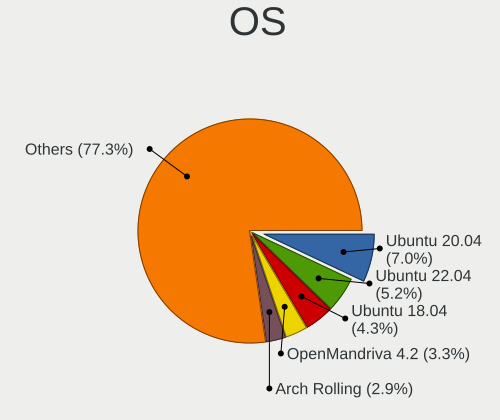

| Name                         | Computers | Percent |
|------------------------------|-----------|---------|
| Ubuntu 20.04                 | 252       | 7.02%   |
| Ubuntu 22.04                 | 187       | 5.21%   |
| Ubuntu 18.04                 | 154       | 4.29%   |
| OpenMandriva 4.2             | 118       | 3.29%   |
| Arch Rolling                 | 104       | 2.9%    |
| Ubuntu 24.04                 | 94        | 2.62%   |
| OpenMandriva 4.3             | 76        | 2.12%   |
| OpenMandriva 4.50            | 66        | 1.84%   |
| Pop!_OS 22.04                | 62        | 1.73%   |
| Debian 12                    | 60        | 1.67%   |
| Zorin 17                     | 46        | 1.28%   |
| Debian 11                    | 45        | 1.25%   |
| openSUSE Tumbleweed-XXXXXXXX | 42        | 1.17%   |
| Fedora 39                    | 42        | 1.17%   |
| Ubuntu 21.10                 | 39        | 1.09%   |
| Zorin 16                     | 38        | 1.06%   |
| Fedora 38                    | 37        | 1.03%   |
| Linux Mint 22.1              | 36        | 1%      |
| Linux Mint 21.1              | 36        | 1%      |
| Ubuntu 20.10                 | 35        | 0.98%   |
| OpenMandriva 25.90           | 35        | 0.98%   |
| Fedora 34                    | 35        | 0.98%   |
| OpenMandriva 23.01           | 32        | 0.89%   |
| Fedora 40                    | 32        | 0.89%   |
| OpenMandriva 24.12           | 31        | 0.86%   |
| OpenMandriva 23.08           | 31        | 0.86%   |
| Linux Mint 20.1              | 29        | 0.81%   |
| Ubuntu 19.10                 | 28        | 0.78%   |
| OpenMandriva 23.03           | 28        | 0.78%   |
| Ubuntu 21.04                 | 27        | 0.75%   |
| Linux Mint 20                | 27        | 0.75%   |
| Fedora 42                    | 27        | 0.75%   |
| Fedora 35                    | 27        | 0.75%   |
| Arch                         | 27        | 0.75%   |
| Ubuntu 22.10                 | 25        | 0.7%    |
| Linux Mint 21.2              | 25        | 0.7%    |
| Linux Mint 20.3              | 25        | 0.7%    |
| Linux Mint 20.2              | 25        | 0.7%    |
| Fedora 32                    | 25        | 0.7%    |
| Zorin 15                     | 24        | 0.67%   |

OS Family
---------

OS without a version

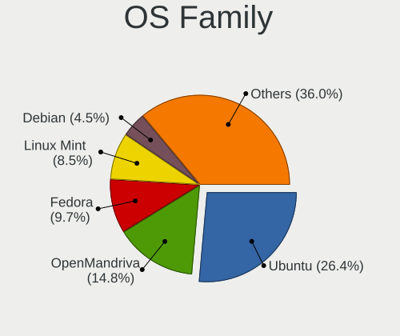

| Name          | Computers | Percent |
|---------------|-----------|---------|
| Ubuntu        | 884       | 26.42%  |
| OpenMandriva  | 496       | 14.82%  |
| Fedora        | 326       | 9.74%   |
| Linux Mint    | 284       | 8.49%   |
| Debian        | 150       | 4.48%   |
| Arch          | 131       | 3.92%   |
| Zorin         | 117       | 3.5%    |
| Pop!_OS       | 94        | 2.81%   |
| Kubuntu       | 85        | 2.54%   |
| Manjaro       | 77        | 2.3%    |
| Gentoo        | 73        | 2.18%   |
| Xubuntu       | 63        | 1.88%   |
| openSUSE      | 55        | 1.64%   |
| ROSA          | 47        | 1.4%    |
| KDE neon      | 38        | 1.14%   |
| Kali          | 31        | 0.93%   |
| Lubuntu       | 26        | 0.78%   |
| ArcoLinux     | 26        | 0.78%   |
| NixOS         | 22        | 0.66%   |
| Bazzite       | 22        | 0.66%   |
| EndeavourOS   | 21        | 0.63%   |
| Elementary    | 21        | 0.63%   |
| SteamOS       | 19        | 0.57%   |
| RHEL          | 16        | 0.48%   |
| Ubuntu MATE   | 15        | 0.45%   |
| LMDE          | 15        | 0.45%   |
| Endless       | 14        | 0.42%   |
| Ubuntu Unity  | 11        | 0.33%   |
| Nobara        | 11        | 0.33%   |
| Void Linux    | 10        | 0.3%    |
| CachyOS       | 10        | 0.3%    |
| TUXEDO OS     | 9         | 0.27%   |
| Parrot        | 9         | 0.27%   |
| CentOS        | 9         | 0.27%   |
| Garuda Linux  | 8         | 0.24%   |
| Ubuntu Budgie | 6         | 0.18%   |
| Rocky Linux   | 6         | 0.18%   |
| MX            | 5         | 0.15%   |
| Dts-distro    | 5         | 0.15%   |
| BlackPanther  | 5         | 0.15%   |

Kernel
------

Version of the Linux kernel

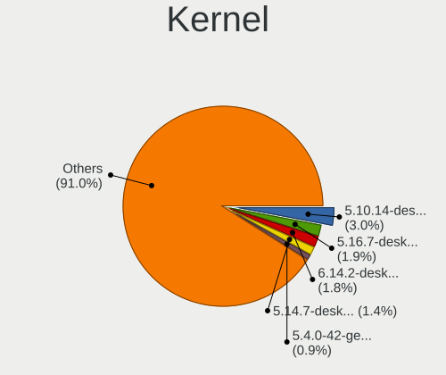

| Version                  | Computers | Percent |
|--------------------------|-----------|---------|
| 5.10.14-desktop-1omv4002 | 116       | 2.96%   |
| 5.16.7-desktop-1omv4003  | 74        | 1.89%   |
| 6.14.2-desktop-3omv2590  | 71        | 1.81%   |
| 5.14.7-desktop-1omv4050  | 55        | 1.4%    |
| 5.4.0-42-generic         | 35        | 0.89%   |
| 6.2.6-desktop-1omv2390   | 29        | 0.74%   |
| 6.1.1-desktop-1omv2290   | 29        | 0.74%   |
| 6.4.11-desktop-1omv2390  | 26        | 0.66%   |
| 6.12.1-desktop-1omv2490  | 26        | 0.66%   |
| 5.4.0-58-generic         | 23        | 0.59%   |
| 5.15.0-56-generic        | 23        | 0.59%   |
| 5.4.0-52-generic         | 22        | 0.56%   |
| 6.6.2-desktop-1omv2390   | 21        | 0.54%   |
| 5.15.0-46-generic        | 21        | 0.54%   |
| 5.4.0-26-generic         | 20        | 0.51%   |
| 5.15.0-58-generic        | 18        | 0.46%   |
| 6.8.0-52-generic         | 16        | 0.41%   |
| 5.15.0-52-generic        | 16        | 0.41%   |
| 5.11.0-27-generic        | 16        | 0.41%   |
| 6.8.0-51-generic         | 15        | 0.38%   |
| 6.2.0-26-generic         | 15        | 0.38%   |
| 6.10.0-desktop-1omv2490  | 15        | 0.38%   |
| 5.3.0-40-generic         | 15        | 0.38%   |
| 5.0.0-37-generic         | 15        | 0.38%   |
| 6.14.0-29-generic        | 14        | 0.36%   |
| 5.13.0-30-generic        | 14        | 0.36%   |
| 6.9.3-76060903-generic   | 13        | 0.33%   |
| 6.8.0-47-generic         | 13        | 0.33%   |
| 6.8.0-41-generic         | 13        | 0.33%   |
| 6.8.0-60-generic         | 12        | 0.31%   |
| 6.8.0-45-generic         | 12        | 0.31%   |
| 6.8.0-31-generic         | 12        | 0.31%   |
| 6.14.0-33-generic        | 12        | 0.31%   |
| 5.4.0-48-generic         | 12        | 0.31%   |
| 5.4.0-40-generic         | 12        | 0.31%   |
| 5.3.0-28-generic         | 12        | 0.31%   |
| 5.15.0-48-generic        | 12        | 0.31%   |
| 6.2.0-39-generic         | 11        | 0.28%   |
| 5.4.0-65-generic         | 11        | 0.28%   |
| 5.15.0-41-generic        | 11        | 0.28%   |

Kernel Family
-------------

Linux kernel without a distro release

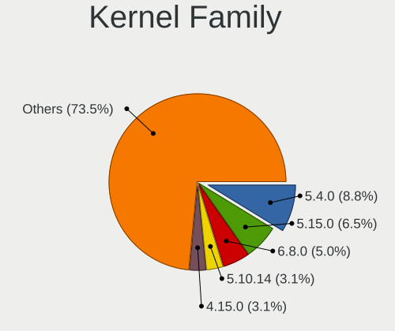

| Version | Computers | Percent |
|---------|-----------|---------|
| 5.4.0   | 324       | 8.77%   |
| 5.15.0  | 240       | 6.49%   |
| 6.8.0   | 186       | 5.03%   |
| 5.10.14 | 116       | 3.14%   |
| 4.15.0  | 114       | 3.08%   |
| 5.8.0   | 101       | 2.73%   |
| 5.11.0  | 96        | 2.6%    |
| 5.13.0  | 94        | 2.54%   |
| 6.5.0   | 92        | 2.49%   |
| 5.3.0   | 92        | 2.49%   |
| 6.14.2  | 77        | 2.08%   |
| 6.14.0  | 76        | 2.06%   |
| 5.16.7  | 75        | 2.03%   |
| 5.19.0  | 74        | 2%      |
| 6.1.0   | 72        | 1.95%   |
| 6.2.0   | 71        | 1.92%   |
| 5.0.0   | 71        | 1.92%   |
| 4.18.0  | 57        | 1.54%   |
| 5.14.7  | 56        | 1.52%   |
| 6.11.0  | 50        | 1.35%   |
| 5.10.0  | 46        | 1.24%   |
| 6.2.6   | 35        | 0.95%   |
| 6.1.1   | 35        | 0.95%   |
| 6.12.1  | 30        | 0.81%   |
| 6.4.11  | 27        | 0.73%   |
| 6.6.2   | 25        | 0.68%   |
| 6.9.3   | 17        | 0.46%   |
| 4.19.0  | 17        | 0.46%   |
| 6.10.0  | 16        | 0.43%   |
| 6.5.6   | 13        | 0.35%   |
| 6.17.0  | 13        | 0.35%   |
| 6.7.9   | 12        | 0.32%   |
| 6.12.10 | 12        | 0.32%   |
| 6.0.0   | 12        | 0.32%   |
| 3.10.0  | 12        | 0.32%   |
| 6.17.7  | 11        | 0.3%    |
| 5.14.0  | 11        | 0.3%    |
| 6.3.5   | 9         | 0.24%   |
| 6.16.3  | 9         | 0.24%   |
| 4.9.20  | 9         | 0.24%   |

Kernel Major Ver.
-----------------

Linux kernel major version

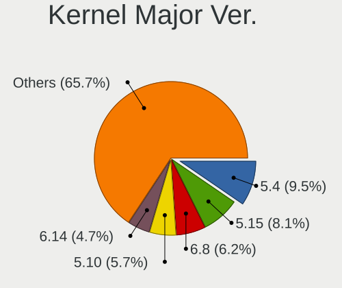

| Version | Computers | Percent |
|---------|-----------|---------|
| 5.4     | 348       | 9.53%   |
| 5.15    | 297       | 8.13%   |
| 6.8     | 228       | 6.24%   |
| 5.10    | 207       | 5.67%   |
| 6.14    | 173       | 4.74%   |
| 6.1     | 161       | 4.41%   |
| 6.2     | 137       | 3.75%   |
| 5.8     | 134       | 3.67%   |
| 6.5     | 130       | 3.56%   |
| 5.11    | 130       | 3.56%   |
| 6.12    | 124       | 3.39%   |
| 4.15    | 116       | 3.18%   |
| 5.13    | 112       | 3.07%   |
| 5.16    | 106       | 2.9%    |
| 5.3     | 103       | 2.82%   |
| 5.19    | 98        | 2.68%   |
| 6.11    | 92        | 2.52%   |
| 5.14    | 90        | 2.46%   |
| 6.6     | 89        | 2.44%   |
| 5.0     | 78        | 2.14%   |
| 6.4     | 62        | 1.7%    |
| 4.18    | 61        | 1.67%   |
| 6.10    | 47        | 1.29%   |
| 6.9     | 45        | 1.23%   |
| 6.17    | 45        | 1.23%   |
| 6.0     | 39        | 1.07%   |
| 6.7     | 37        | 1.01%   |
| 5.17    | 34        | 0.93%   |
| 6.3     | 32        | 0.88%   |
| 6.15    | 30        | 0.82%   |
| 6.16    | 26        | 0.71%   |
| 6.13    | 26        | 0.71%   |
| 5.9     | 25        | 0.68%   |
| 5.18    | 24        | 0.66%   |
| 5.6     | 23        | 0.63%   |
| 4.19    | 22        | 0.6%    |
| 5.12    | 21        | 0.57%   |
| 4.9     | 20        | 0.55%   |
| 5.7     | 14        | 0.38%   |
| 3.10    | 13        | 0.36%   |

Arch
----

OS architecture (x86_64, i586, etc.)

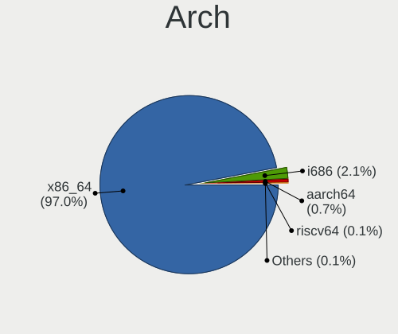

| Name    | Computers | Percent |
|---------|-----------|---------|
| x86_64  | 3157      | 96.99%  |
| i686    | 69        | 2.12%   |
| aarch64 | 22        | 0.68%   |
| riscv64 | 2         | 0.06%   |
| armv7l  | 2         | 0.06%   |
| mips    | 1         | 0.03%   |
| armv8l  | 1         | 0.03%   |
| armv6l  | 1         | 0.03%   |

DE
--

Desktop Environment

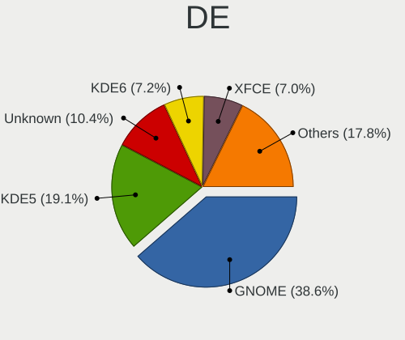

| Name              | Computers | Percent |
|-------------------|-----------|---------|
| GNOME             | 1312      | 38.6%   |
| KDE5              | 649       | 19.09%  |
| Unknown           | 353       | 10.39%  |
| KDE6              | 244       | 7.18%   |
| XFCE              | 237       | 6.97%   |
| X-Cinnamon        | 198       | 5.83%   |
| MATE              | 76        | 2.24%   |
| KDE               | 64        | 1.88%   |
| LXQt              | 49        | 1.44%   |
| Cinnamon          | 42        | 1.24%   |
| Hyprland          | 23        | 0.68%   |
| Pantheon          | 21        | 0.62%   |
| KDE4              | 18        | 0.53%   |
| LXDE              | 14        | 0.41%   |
| i3                | 13        | 0.38%   |
| GNOME Flashback   | 13        | 0.38%   |
| Budgie            | 13        | 0.38%   |
| Unity             | 12        | 0.35%   |
| sway              | 9         | 0.26%   |
| openbox           | 6         | 0.18%   |
| awesome           | 6         | 0.18%   |
| qtile             | 3         | 0.09%   |
| icewm             | 3         | 0.09%   |
| niri              | 2         | 0.06%   |
| Deepin            | 2         | 0.06%   |
| COSMIC            | 2         | 0.06%   |
| bspwm             | 2         | 0.06%   |
| Yaru:ubuntu:GNOME | 1         | 0.03%   |
| XSession          | 1         | 0.03%   |
| xinitrc           | 1         | 0.03%   |
| xinit-compat      | 1         | 0.03%   |
| sway:wlroots      | 1         | 0.03%   |
| Phosh:GNOME       | 1         | 0.03%   |
| labwc:wlroots     | 1         | 0.03%   |
| GNUstep           | 1         | 0.03%   |
| GNOME Classic     | 1         | 0.03%   |
| Enlightenment     | 1         | 0.03%   |
| DWM               | 1         | 0.03%   |
| custom            | 1         | 0.03%   |
| Core              | 1         | 0.03%   |

Display Server
--------------

X11 or Wayland

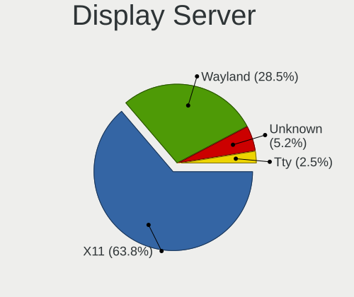

| Name    | Computers | Percent |
|---------|-----------|---------|
| X11     | 2152      | 63.76%  |
| Wayland | 963       | 28.53%  |
| Unknown | 175       | 5.19%   |
| Tty     | 85        | 2.52%   |

Display Manager
---------------

SDDM, LightDM, etc.

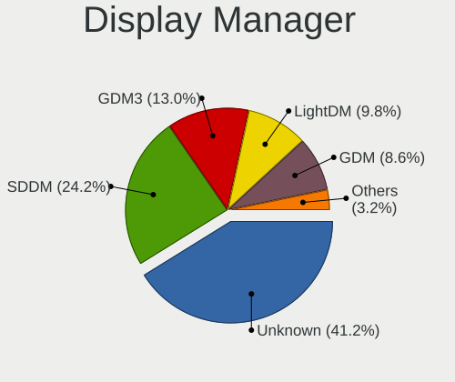

| Name           | Computers | Percent |
|----------------|-----------|---------|
| Unknown        | 1395      | 41.16%  |
| SDDM           | 821       | 24.23%  |
| GDM3           | 440       | 12.98%  |
| LightDM        | 331       | 9.77%   |
| GDM            | 292       | 8.62%   |
| TDM            | 72        | 2.12%   |
| KDM            | 12        | 0.35%   |
| XDM            | 6         | 0.18%   |
| SLiM           | 6         | 0.18%   |
| SLIMSKI        | 3         | 0.09%   |
| LY-DM          | 3         | 0.09%   |
| LXDM           | 3         | 0.09%   |
| GREETD         | 3         | 0.09%   |
| Ly             | 1         | 0.03%   |
| COSMIC-GREETER | 1         | 0.03%   |

OS Lang
-------

Language

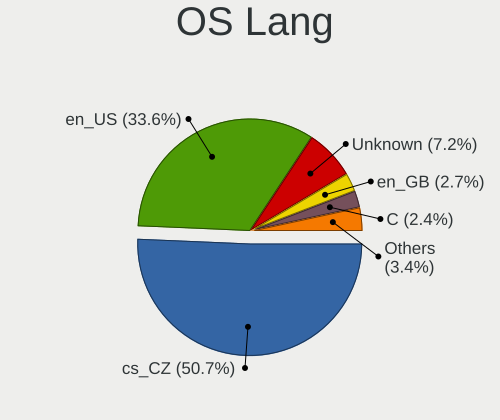

| Lang    | Computers | Percent |
|---------|-----------|---------|
| cs_CZ   | 1689      | 50.68%  |
| en_US   | 1120      | 33.6%   |
| Unknown | 241       | 7.23%   |
| en_GB   | 89        | 2.67%   |
| C       | 81        | 2.43%   |
| ru_RU   | 32        | 0.96%   |
| sk_SK   | 13        | 0.39%   |
| pl_PL   | 11        | 0.33%   |
| de_DE   | 9         | 0.27%   |
| POSIX   | 7         | 0.21%   |
| C.UTF8  | 7         | 0.21%   |
| uk_UA   | 4         | 0.12%   |
| it_IT   | 4         | 0.12%   |
| fr_FR   | 4         | 0.12%   |
| pt_PT   | 2         | 0.06%   |
| en_CA   | 2         | 0.06%   |
| en_AU   | 2         | 0.06%   |
| vi_VN   | 1         | 0.03%   |
| tr_TR   | 1         | 0.03%   |
| ro_RO   | 1         | 0.03%   |
| pt_BR   | 1         | 0.03%   |
| nb_NO   | 1         | 0.03%   |
| hu_HU   | 1         | 0.03%   |
| fi_FI   | 1         | 0.03%   |
| es_ES   | 1         | 0.03%   |
| en_NG   | 1         | 0.03%   |
| en_DK   | 1         | 0.03%   |
| en_150  | 1         | 0.03%   |
| el_GR   | 1         | 0.03%   |
| de_CH   | 1         | 0.03%   |
| Czech   | 1         | 0.03%   |
| ca_ES   | 1         | 0.03%   |
| bg_BG   | 1         | 0.03%   |

Boot Mode
---------

EFI or BIOS

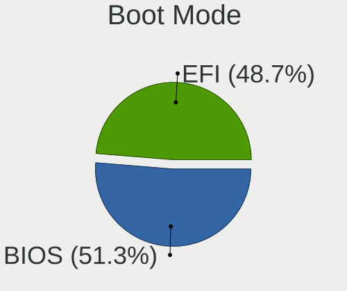

| Mode | Computers | Percent |
|------|-----------|---------|
| BIOS | 1715      | 51.29%  |
| EFI  | 1629      | 48.71%  |

Filesystem
----------

Type of filesystem

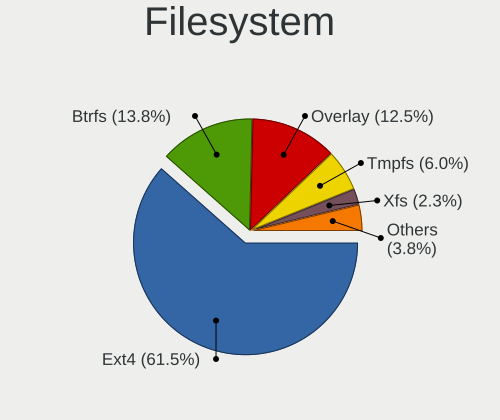

| Type     | Computers | Percent |
|----------|-----------|---------|
| Ext4     | 2075      | 61.54%  |
| Btrfs    | 466       | 13.82%  |
| Overlay  | 422       | 12.51%  |
| Tmpfs    | 203       | 6.02%   |
| Xfs      | 78        | 2.31%   |
| Unknown  | 64        | 1.9%    |
| Zfs      | 26        | 0.77%   |
| F2fs     | 11        | 0.33%   |
| Bcachefs | 11        | 0.33%   |
| Ext3     | 5         | 0.15%   |
| Ext2     | 5         | 0.15%   |
| Reiserfs | 2         | 0.06%   |
| Aufs     | 2         | 0.06%   |
| Rootfs   | 1         | 0.03%   |
| Jfs      | 1         | 0.03%   |

Part. scheme
------------

Scheme of partitioning

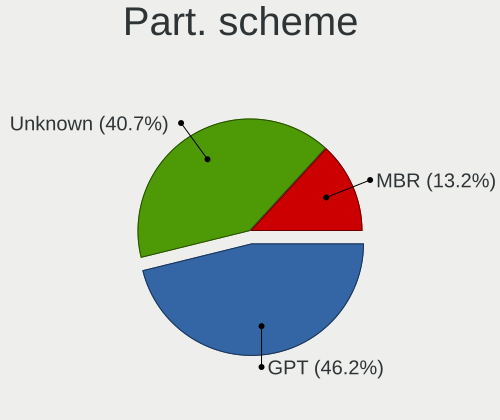

| Type    | Computers | Percent |
|---------|-----------|---------|
| GPT     | 1544      | 46.16%  |
| Unknown | 1360      | 40.66%  |
| MBR     | 441       | 13.18%  |

Dual Boot with Linux/BSD
------------------------

Hosting more than one Linux/BSD

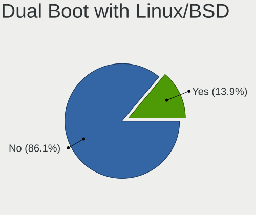

| Dual boot | Computers | Percent |
|-----------|-----------|---------|
| No        | 2855      | 86.1%   |
| Yes       | 461       | 13.9%   |

Dual Boot (Win)
---------------

Hosting Linux and Windows

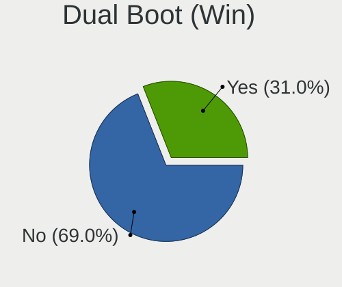

| Dual boot | Computers | Percent |
|-----------|-----------|---------|
| No        | 2295      | 69.02%  |
| Yes       | 1030      | 30.98%  |

Board
-----

Vendor
------

Motherboard manufacturer

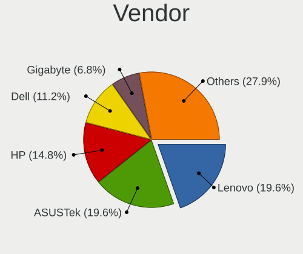

| Name                                 | Computers | Percent |
|--------------------------------------|-----------|---------|
| Lenovo                               | 639       | 19.64%  |
| ASUSTek Computer                     | 639       | 19.64%  |
| Hewlett-Packard                      | 482       | 14.81%  |
| Dell                                 | 363       | 11.16%  |
| Gigabyte Technology                  | 222       | 6.82%   |
| MSI                                  | 210       | 6.45%   |
| Acer                                 | 199       | 6.12%   |
| ASRock                               | 88        | 2.7%    |
| Intel                                | 42        | 1.29%   |
| UMAX                                 | 35        | 1.08%   |
| Fujitsu                              | 35        | 1.08%   |
| Unknown                              | 28        | 0.86%   |
| Toshiba                              | 22        | 0.68%   |
| Sony                                 | 21        | 0.65%   |
| Valve                                | 16        | 0.49%   |
| Raspberry Pi Foundation              | 16        | 0.49%   |
| Apple                                | 16        | 0.49%   |
| Google                               | 12        | 0.37%   |
| Pegatron                             | 11        | 0.34%   |
| TUXEDO                               | 10        | 0.31%   |
| Fujitsu Siemens                      | 10        | 0.31%   |
| Supermicro                           | 8         | 0.25%   |
| Samsung Electronics                  | 8         | 0.25%   |
| AMI                                  | 8         | 0.25%   |
| HUAWEI                               | 7         | 0.22%   |
| Notebook                             | 6         | 0.18%   |
| Microsoft                            | 6         | 0.18%   |
| Packard Bell                         | 5         | 0.15%   |
| Framework                            | 5         | 0.15%   |
| Foxconn                              | 5         | 0.15%   |
| ZOTAC                                | 4         | 0.12%   |
| Timi                                 | 4         | 0.12%   |
| IBM                                  | 3         | 0.09%   |
| Dynabook                             | 3         | 0.09%   |
| ASRockRack                           | 3         | 0.09%   |
| Alienware                            | 3         | 0.09%   |
| Shenzhen Meigao Electronic Equipment | 2         | 0.06%   |
| Prestigio                            | 2         | 0.06%   |
| Panasonic                            | 2         | 0.06%   |
| Minix                                | 2         | 0.06%   |

Model
-----

Motherboard model

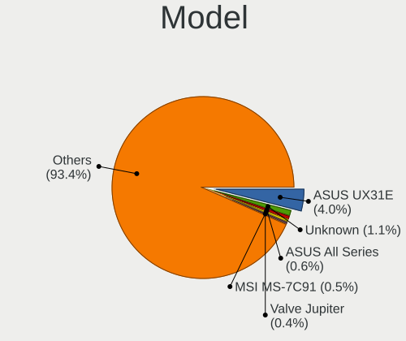

| Name                               | Computers | Percent |
|------------------------------------|-----------|---------|
| ASUS UX31E                         | 130       | 4%      |
| Unknown                            | 35        | 1.08%   |
| ASUS All Series                    | 19        | 0.58%   |
| MSI MS-7C91                        | 17        | 0.52%   |
| Valve Jupiter                      | 13        | 0.4%    |
| MSI MS-7C02                        | 13        | 0.4%    |
| Lenovo IdeaPad S145-15AST 81N3     | 12        | 0.37%   |
| MSI MS-7A34                        | 10        | 0.31%   |
| HP EliteBook 840 G3                | 10        | 0.31%   |
| MSI MS-7693                        | 9         | 0.28%   |
| Dell Latitude E6420                | 9         | 0.28%   |
| HP ProBook 455 G7                  | 7         | 0.22%   |
| HP EliteBook 840 G6                | 7         | 0.22%   |
| Dell Latitude E6400                | 7         | 0.22%   |
| Dell Latitude 7490                 | 7         | 0.22%   |
| HP ProLiant DL380e Gen8            | 6         | 0.18%   |
| HP ProBook 4540s                   | 6         | 0.18%   |
| HP EliteBook 855 G8 Notebook PC    | 6         | 0.18%   |
| HP EliteBook 845 G8 Notebook PC    | 6         | 0.18%   |
| Dell XPS 15 7590                   | 6         | 0.18%   |
| RPi Raspberry Pi                   | 5         | 0.15%   |
| MSI MS-7592                        | 5         | 0.15%   |
| Lenovo ThinkPad E14 20RA001LMC     | 5         | 0.15%   |
| HP ProBook 4530s                   | 5         | 0.15%   |
| HP ProBook 450 G5                  | 5         | 0.15%   |
| HP Pavilion dv7                    | 5         | 0.15%   |
| HP Notebook                        | 5         | 0.15%   |
| HP Laptop 15-bw0xx                 | 5         | 0.15%   |
| HP Compaq 8200 Elite SFF PC        | 5         | 0.15%   |
| HP 250 G6 Notebook PC              | 5         | 0.15%   |
| Dell XPS 15 9560                   | 5         | 0.15%   |
| Dell OptiPlex 7010                 | 5         | 0.15%   |
| Dell Latitude E7440                | 5         | 0.15%   |
| Dell Latitude 5480                 | 5         | 0.15%   |
| Dell Latitude 5401                 | 5         | 0.15%   |
| ASUS TUF Gaming X570-PLUS          | 5         | 0.15%   |
| ASUS TUF Gaming B550M-PLUS WIFI II | 5         | 0.15%   |
| ASUS P5G41T-M LX                   | 5         | 0.15%   |
| MSI MS-7B07                        | 4         | 0.12%   |
| MSI MS-7817                        | 4         | 0.12%   |

Model Family
------------

Motherboard model prefix

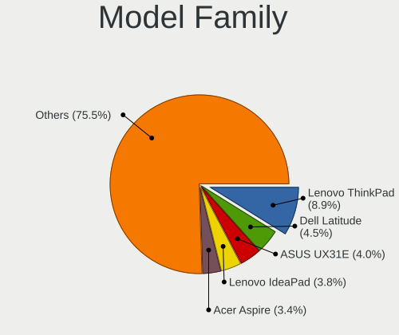

| Name               | Computers | Percent |
|--------------------|-----------|---------|
| Lenovo ThinkPad    | 288       | 8.85%   |
| Dell Latitude      | 146       | 4.49%   |
| ASUS UX31E         | 130       | 4%      |
| Lenovo IdeaPad     | 123       | 3.78%   |
| Acer Aspire        | 110       | 3.38%   |
| HP EliteBook       | 107       | 3.29%   |
| HP ProBook         | 80        | 2.46%   |
| ASUS ROG           | 57        | 1.75%   |
| ASUS TUF           | 50        | 1.54%   |
| ASUS PRIME         | 49        | 1.51%   |
| HP Compaq          | 47        | 1.44%   |
| Dell OptiPlex      | 47        | 1.44%   |
| HP Pavilion        | 46        | 1.41%   |
| Lenovo Yoga        | 43        | 1.32%   |
| Dell Precision     | 42        | 1.29%   |
| Dell Inspiron      | 42        | 1.29%   |
| Dell XPS           | 41        | 1.26%   |
| Unknown            | 35        | 1.08%   |
| Lenovo ThinkCentre | 29        | 0.89%   |
| ASUS VivoBook      | 29        | 0.89%   |
| ASUS ASUS          | 28        | 0.86%   |
| HP ZBook           | 27        | 0.83%   |
| Lenovo Legion      | 25        | 0.77%   |
| ASUS ZenBook       | 24        | 0.74%   |
| UMAX VisionBook    | 22        | 0.68%   |
| HP Laptop          | 22        | 0.68%   |
| Dell Vostro        | 22        | 0.68%   |
| Toshiba Satellite  | 21        | 0.65%   |
| Fujitsu LIFEBOOK   | 21        | 0.65%   |
| Acer TravelMate    | 20        | 0.61%   |
| HP ENVY            | 19        | 0.58%   |
| ASUS All           | 19        | 0.58%   |
| MSI MS-7C91        | 17        | 0.52%   |
| Acer Swift         | 17        | 0.52%   |
| Acer Nitro         | 17        | 0.52%   |
| Acer Extensa       | 17        | 0.52%   |
| RPi Raspberry      | 16        | 0.49%   |
| HP ProDesk         | 16        | 0.49%   |
| HP 250             | 16        | 0.49%   |
| Lenovo ThinkBook   | 14        | 0.43%   |

MFG Year
--------

Motherboard manufacture year

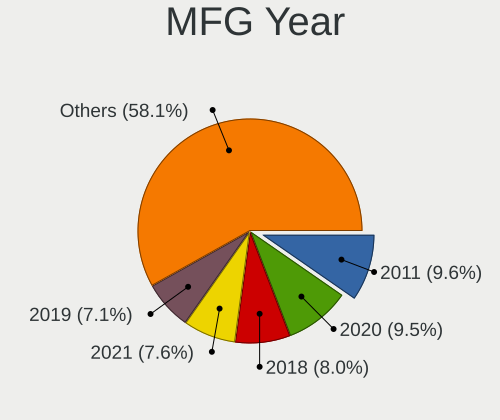

| Year    | Computers | Percent |
|---------|-----------|---------|
| 2011    | 314       | 9.65%   |
| 2020    | 310       | 9.53%   |
| 2018    | 259       | 7.96%   |
| 2021    | 248       | 7.62%   |
| 2019    | 232       | 7.13%   |
| 2017    | 207       | 6.36%   |
| 2012    | 206       | 6.33%   |
| 2013    | 173       | 5.32%   |
| 2014    | 159       | 4.89%   |
| 2022    | 143       | 4.39%   |
| 2015    | 142       | 4.36%   |
| 2016    | 135       | 4.15%   |
| 2023    | 130       | 4%      |
| 2008    | 124       | 3.81%   |
| 2010    | 115       | 3.53%   |
| 2009    | 105       | 3.23%   |
| 2024    | 78        | 2.4%    |
| 2007    | 73        | 2.24%   |
| 2006    | 35        | 1.08%   |
| Unknown | 28        | 0.86%   |
| 2025    | 19        | 0.58%   |
| 2005    | 13        | 0.4%    |
| 2004    | 5         | 0.15%   |
| 2000    | 1         | 0.03%   |

Form Factor
-----------

Physical design of the computer

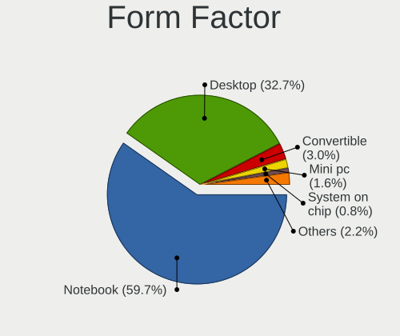

| Name           | Computers | Percent |
|----------------|-----------|---------|
| Notebook       | 1944      | 59.74%  |
| Desktop        | 1063      | 32.67%  |
| Convertible    | 96        | 2.95%   |
| Mini pc        | 53        | 1.63%   |
| System on chip | 26        | 0.8%    |
| Tablet         | 25        | 0.77%   |
| All in one     | 25        | 0.77%   |
| Server         | 21        | 0.65%   |
| Phone          | 1         | 0.03%   |

Secure Boot
-----------

Enabled or disabled

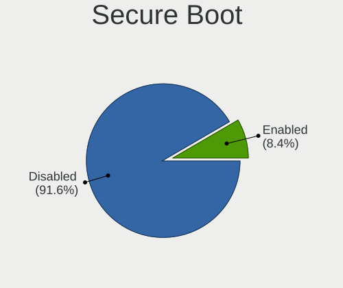

| State    | Computers | Percent |
|----------|-----------|---------|
| Disabled | 3010      | 91.6%   |
| Enabled  | 276       | 8.4%    |

Coreboot
--------

Have coreboot on board

| Used | Computers | Percent |
|------|-----------|---------|
| No   | 3241      | 99.6%   |
| Yes  | 13        | 0.4%    |

RAM Size
--------

Total RAM memory

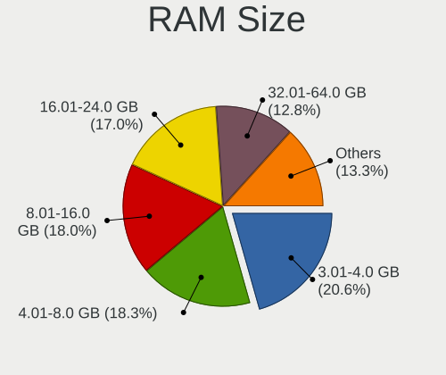

| Size in GB      | Computers | Percent |
|-----------------|-----------|---------|
| 3.01-4.0        | 685       | 20.61%  |
| 4.01-8.0        | 607       | 18.27%  |
| 8.01-16.0       | 597       | 17.97%  |
| 16.01-24.0      | 566       | 17.03%  |
| 32.01-64.0      | 426       | 12.82%  |
| 1.01-2.0        | 133       | 4%      |
| 64.01-256.0     | 126       | 3.79%   |
| 24.01-32.0      | 104       | 3.13%   |
| 2.01-3.0        | 50        | 1.5%    |
| 0.51-1.0        | 20        | 0.6%    |
| More than 256.0 | 5         | 0.15%   |
| 0.01-0.5        | 4         | 0.12%   |

RAM Used
--------

Used RAM memory

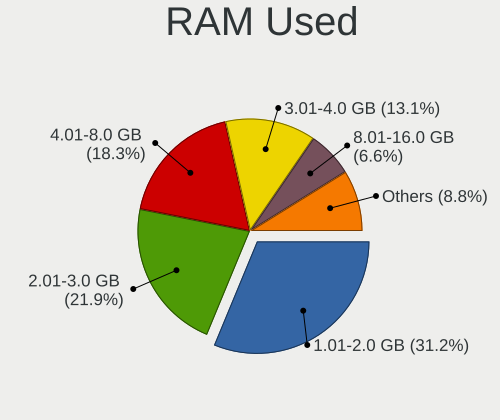

| Used GB     | Computers | Percent |
|-------------|-----------|---------|
| 1.01-2.0    | 1139      | 31.25%  |
| 2.01-3.0    | 798       | 21.89%  |
| 4.01-8.0    | 668       | 18.33%  |
| 3.01-4.0    | 477       | 13.09%  |
| 8.01-16.0   | 241       | 6.61%   |
| 0.51-1.0    | 200       | 5.49%   |
| 16.01-24.0  | 48        | 1.32%   |
| 0.01-0.5    | 48        | 1.32%   |
| 32.01-64.0  | 15        | 0.41%   |
| 24.01-32.0  | 8         | 0.22%   |
| 64.01-256.0 | 2         | 0.05%   |
| Unknown     | 1         | 0.03%   |

Total Drives
------------

Number of drives on board

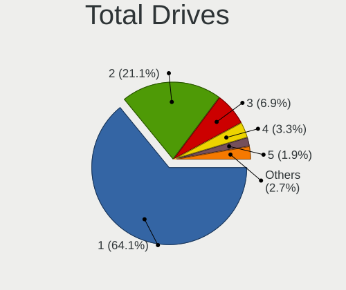

| Drives | Computers | Percent |
|--------|-----------|---------|
| 1      | 2159      | 64.12%  |
| 2      | 710       | 21.09%  |
| 3      | 233       | 6.92%   |
| 4      | 110       | 3.27%   |
| 5      | 63        | 1.87%   |
| 0      | 36        | 1.07%   |
| 6      | 32        | 0.95%   |
| 7      | 13        | 0.39%   |
| 8      | 5         | 0.15%   |
| 11     | 2         | 0.06%   |
| 15     | 1         | 0.03%   |
| 14     | 1         | 0.03%   |
| 12     | 1         | 0.03%   |
| 9      | 1         | 0.03%   |

Has CD-ROM
----------

Has CD-ROM on board

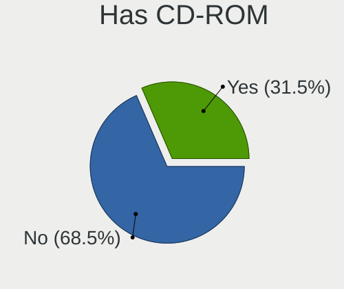

| Presented | Computers | Percent |
|-----------|-----------|---------|
| No        | 2247      | 68.53%  |
| Yes       | 1032      | 31.47%  |

Has Ethernet
------------

Has Ethernet on board

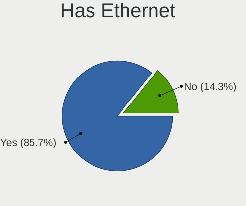

| Presented | Computers | Percent |
|-----------|-----------|---------|
| Yes       | 2806      | 85.73%  |
| No        | 467       | 14.27%  |

Has WiFi
--------

Has WiFi module

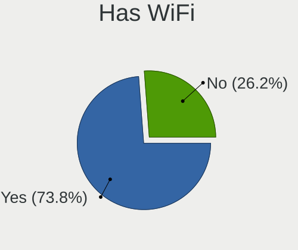

| Presented | Computers | Percent |
|-----------|-----------|---------|
| Yes       | 2417      | 73.8%   |
| No        | 858       | 26.2%   |

Has Bluetooth
-------------

Has Bluetooth module

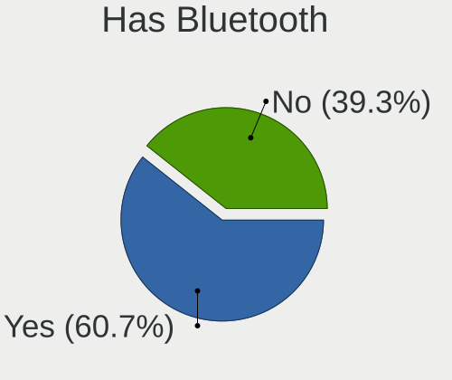

| Presented | Computers | Percent |
|-----------|-----------|---------|
| Yes       | 2000      | 60.66%  |
| No        | 1297      | 39.34%  |

Location
--------

Country
-------

Geographic location (country)

| Country | Computers | Percent |
|---------|-----------|---------|
| Czechia | 3254      | 100%    |

City
----

Geographic location (city)

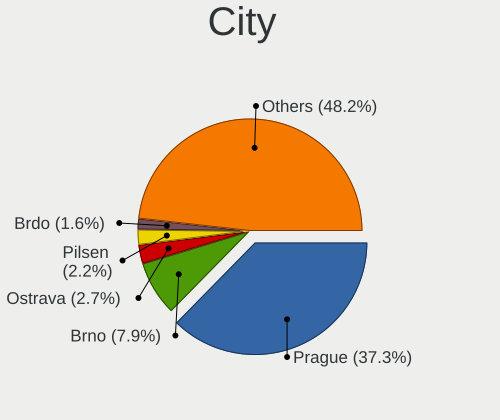

| City                 | Computers | Percent |
|----------------------|-----------|---------|
| Prague               | 1274      | 37.35%  |
| Brno                 | 271       | 7.94%   |
| Ostrava              | 93        | 2.73%   |
| Pilsen               | 75        | 2.2%    |
| Brdo                 | 53        | 1.55%   |
| Olomouc              | 49        | 1.44%   |
| Liberec              | 49        | 1.44%   |
| Pardubice            | 47        | 1.38%   |
| Hradec Králové     | 43        | 1.26%   |
| České Budějovice  | 37        | 1.08%   |
| Šlapanice           | 30        | 0.88%   |
| Zlín                | 27        | 0.79%   |
| Ústí nad Labem     | 26        | 0.76%   |
| Havířov            | 25        | 0.73%   |
| Znojmo               | 19        | 0.56%   |
| Mladá Boleslav      | 19        | 0.56%   |
| Chomutov             | 18        | 0.53%   |
| Kladno               | 17        | 0.5%    |
| Most                 | 16        | 0.47%   |
| Tábor               | 15        | 0.44%   |
| Frýdek-Místek      | 15        | 0.44%   |
| Opava                | 14        | 0.41%   |
| Jihlava              | 14        | 0.41%   |
| Karlovy Vary         | 13        | 0.38%   |
| Český Těšín     | 13        | 0.38%   |
| Přerov              | 12        | 0.35%   |
| Vcelna               | 11        | 0.32%   |
| Uhersky Brod         | 11        | 0.32%   |
| Kralupy nad Vltavou  | 11        | 0.32%   |
| Uherské Hradiště  | 10        | 0.29%   |
| Roznov pod Radhostem | 10        | 0.29%   |
| Litoměřice         | 10        | 0.29%   |
| Příbram            | 9         | 0.26%   |
| Celakovice           | 9         | 0.26%   |
| Vyškov              | 8         | 0.23%   |
| Valasske Mezirici    | 8         | 0.23%   |
| Třebíč            | 8         | 0.23%   |
| Teplice              | 8         | 0.23%   |
| Krnov                | 8         | 0.23%   |
| Jedovnice            | 8         | 0.23%   |

Drives
------

Drive Vendor
------------

Hard drive vendors

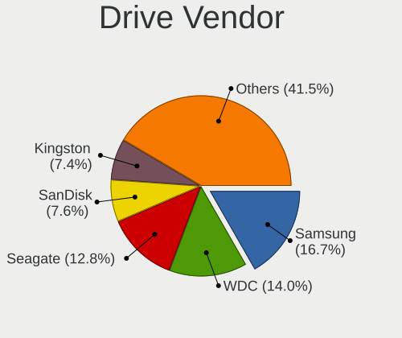

| Vendor                      | Computers | Drives | Percent |
|-----------------------------|-----------|--------|---------|
| Samsung Electronics         | 774       | 1126   | 16.71%  |
| WDC                         | 649       | 1078   | 14.01%  |
| Seagate                     | 594       | 919    | 12.83%  |
| SanDisk                     | 350       | 405    | 7.56%   |
| Kingston                    | 341       | 434    | 7.36%   |
| Toshiba                     | 213       | 275    | 4.6%    |
| Unknown                     | 177       | 266    | 3.82%   |
| SK hynix                    | 143       | 178    | 3.09%   |
| Intel                       | 134       | 166    | 2.89%   |
| Micron Technology           | 125       | 162    | 2.7%    |
| A-DATA Technology           | 119       | 151    | 2.57%   |
| Crucial                     | 110       | 136    | 2.38%   |
| Hitachi                     | 108       | 126    | 2.33%   |
| Patriot                     | 91        | 116    | 1.97%   |
| HGST                        | 64        | 81     | 1.38%   |
| KIOXIA                      | 51        | 71     | 1.1%    |
| Apacer                      | 45        | 60     | 0.97%   |
| Verbatim                    | 34        | 36     | 0.73%   |
| Phison Electronics          | 34        | 48     | 0.73%   |
| Kingston Technology Company | 32        | 36     | 0.69%   |
| Unknown                     | 27        | 32     | 0.58%   |
| Transcend                   | 25        | 36     | 0.54%   |
| Silicon Motion              | 23        | 29     | 0.5%    |
| Gigabyte Technology         | 23        | 43     | 0.5%    |
| Micron/Crucial Technology   | 19        | 23     | 0.41%   |
| Phison                      | 18        | 31     | 0.39%   |
| ADATA Technology            | 16        | 17     | 0.35%   |
| LITEONIT                    | 15        | 19     | 0.32%   |
| MAXIO Technology (Hangzhou) | 13        | 16     | 0.28%   |
| GOODRAM                     | 13        | 17     | 0.28%   |
| China                       | 13        | 15     | 0.28%   |
| Apple                       | 13        | 24     | 0.28%   |
| OCZ                         | 12        | 35     | 0.26%   |
| LITEON                      | 12        | 13     | 0.26%   |
| Fujitsu                     | 12        | 15     | 0.26%   |
| Maxtor                      | 10        | 14     | 0.22%   |
| XPG                         | 9         | 16     | 0.19%   |
| Realtek Semiconductor       | 9         | 18     | 0.19%   |
| JMicron Technology          | 8         | 9      | 0.17%   |
| Corsair                     | 8         | 8      | 0.17%   |

Drive Model
-----------

Hard drive models

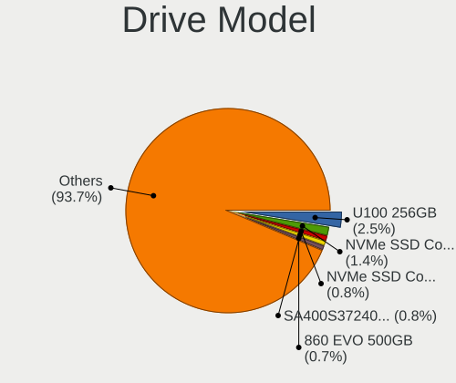

| Model                                              | Computers | Percent |
|----------------------------------------------------|-----------|---------|
| SanDisk SSD U100 256GB                             | 130       | 2.53%   |
| Samsung NVMe SSD Controller SM981/PM981/PM983 1TB  | 73        | 1.42%   |
| Samsung NVMe SSD Controller PM9A1/PM9A3/980PRO 1TB | 43        | 0.84%   |
| Kingston SA400S37240G 240GB SSD                    | 40        | 0.78%   |
| Samsung SSD 860 EVO 500GB                          | 38        | 0.74%   |
| Kingston SA400S37480G 480GB SSD                    | 38        | 0.74%   |
| Unknown MMC Card  64GB                             | 34        | 0.66%   |
| Unknown MMC Card  32GB                             | 30        | 0.58%   |
| Samsung SSD 850 EVO 250GB                          | 30        | 0.58%   |
| WDC WDS500G2B0A-00SM50 500GB                       | 29        | 0.56%   |
| Seagate ST1000LM035-1RK172 1TB                     | 29        | 0.56%   |
| Unknown                                            | 27        | 0.53%   |
| WDC WDS240G2G0A-00JH30 240GB SSD                   | 26        | 0.51%   |
| Samsung SSD 980 1TB                                | 26        | 0.51%   |
| Kingston SA400S37120G 120GB SSD                    | 26        | 0.51%   |
| Seagate ST2000DM008-2FR102 2TB                     | 24        | 0.47%   |
| Samsung NVMe SSD Drive 512GB                       | 24        | 0.47%   |
| Kingston SV300S37A120G 120GB SSD                   | 24        | 0.47%   |
| Seagate ST500DM002-1BD142 500GB                    | 21        | 0.41%   |
| Kingston SKC3000D2048G 2TB                         | 20        | 0.39%   |
| Samsung SSD 860 EVO 1TB                            | 19        | 0.37%   |
| Phison PS5013 E13 NVMe Controller 500GB            | 19        | 0.37%   |
| HGST HTS721010A9E630 1TB                           | 19        | 0.37%   |
| WDC WD10EZEX-08WN4A0 1TB                           | 18        | 0.35%   |
| SanDisk NVMe SSD Drive 1TB                         | 18        | 0.35%   |
| Kingston SHFS37A120G 120GB SSD                     | 18        | 0.35%   |
| Toshiba MQ01ABD100 1TB                             | 17        | 0.33%   |
| Seagate ST3500418AS 500GB                          | 17        | 0.33%   |
| Seagate ST1000LM024 HN-M101MBB 1TB                 | 17        | 0.33%   |
| Seagate ST1000DM010-2EP102 1TB                     | 17        | 0.33%   |
| Sandisk WD Blue SN550 NVMe SSD 1024GB              | 17        | 0.33%   |
| Patriot Burst 480GB SSD                            | 17        | 0.33%   |
| Patriot Burst 120GB SSD                            | 17        | 0.33%   |
| A-DATA SU650 120GB SSD                             | 17        | 0.33%   |
| Seagate ST4000DM004-2CV104 4TB                     | 16        | 0.31%   |
| SanDisk NVMe SSD Drive 512GB                       | 16        | 0.31%   |
| Samsung SSD 860 EVO 250GB                          | 16        | 0.31%   |
| Samsung NVMe SSD Drive 500GB                       | 16        | 0.31%   |
| WDC WD10EZEX-08M2NA0 1TB                           | 15        | 0.29%   |
| Verbatim Vi550 S3 1024GB                           | 15        | 0.29%   |

HDD Vendor
----------

Hard disk drive vendors

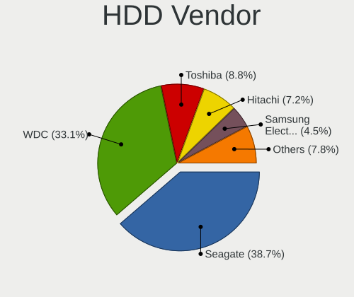

| Vendor              | Computers | Drives | Percent |
|---------------------|-----------|--------|---------|
| Seagate             | 578       | 888    | 38.66%  |
| WDC                 | 495       | 840    | 33.11%  |
| Toshiba             | 131       | 163    | 8.76%   |
| Hitachi             | 108       | 126    | 7.22%   |
| Samsung Electronics | 67        | 101    | 4.48%   |
| HGST                | 64        | 81     | 4.28%   |
| Fujitsu             | 12        | 15     | 0.8%    |
| Maxtor              | 10        | 14     | 0.67%   |
| Unknown             | 7         | 9      | 0.47%   |
| JMicron Technology  | 3         | 3      | 0.2%    |
| ASMedia             | 3         | 4      | 0.2%    |
| pqi                 | 2         | 2      | 0.13%   |
| Hewlett-Packard     | 2         | 11     | 0.13%   |
| External            | 2         | 2      | 0.13%   |
| Apple               | 2         | 7      | 0.13%   |
| USB3.0              | 1         | 1      | 0.07%   |
| TO Exter            | 1         | 2      | 0.07%   |
| SATAFIRM            | 1         | 1      | 0.07%   |
| JetFlash            | 1         | 1      | 0.07%   |
| Initio              | 1         | 1      | 0.07%   |
| IBM/Hitachi         | 1         | 1      | 0.07%   |
| IB                  | 1         | 2      | 0.07%   |
| HPE                 | 1         | 1      | 0.07%   |
| ASUSTOR             | 1         | 1      | 0.07%   |

SSD Vendor
----------

Solid state drive vendors

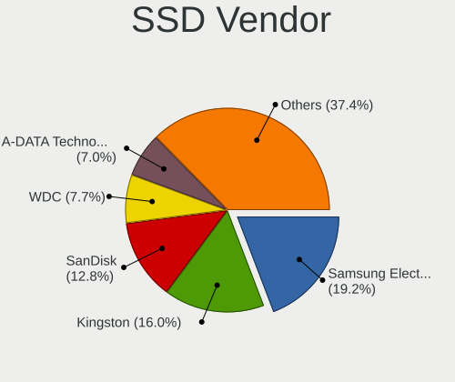

| Vendor              | Computers | Drives | Percent |
|---------------------|-----------|--------|---------|
| Samsung Electronics | 299       | 387    | 19.19%  |
| Kingston            | 249       | 311    | 15.98%  |
| SanDisk             | 199       | 208    | 12.77%  |
| WDC                 | 120       | 161    | 7.7%    |
| A-DATA Technology   | 109       | 138    | 7%      |
| Crucial             | 95        | 120    | 6.1%    |
| Patriot             | 84        | 107    | 5.39%   |
| Intel               | 60        | 75     | 3.85%   |
| Apacer              | 41        | 54     | 2.63%   |
| Micron Technology   | 34        | 48     | 2.18%   |
| Verbatim            | 33        | 35     | 2.12%   |
| Transcend           | 23        | 32     | 1.48%   |
| SK hynix            | 21        | 23     | 1.35%   |
| Toshiba             | 18        | 24     | 1.16%   |
| LITEONIT            | 15        | 19     | 0.96%   |
| GOODRAM             | 12        | 16     | 0.77%   |
| Gigabyte Technology | 12        | 20     | 0.77%   |
| China               | 12        | 14     | 0.77%   |
| OCZ                 | 10        | 17     | 0.64%   |
| LITEON              | 10        | 11     | 0.64%   |
| Seagate             | 8         | 11     | 0.51%   |
| UMAX                | 7         | 7      | 0.45%   |
| Apple               | 7         | 9      | 0.45%   |
| Unknown             | 6         | 7      | 0.39%   |
| Team                | 4         | 4      | 0.26%   |
| SPCC                | 4         | 4      | 0.26%   |
| HPE                 | 4         | 4      | 0.26%   |
| Hewlett-Packard     | 4         | 4      | 0.26%   |
| Netac               | 3         | 4      | 0.19%   |
| KingSpec            | 3         | 6      | 0.19%   |
| Emtec               | 3         | 5      | 0.19%   |
| WDC WDS             | 2         | 3      | 0.13%   |
| Vi550               | 2         | 2      | 0.13%   |
| Unknown             | 2         | 8      | 0.13%   |
| Phison              | 2         | 2      | 0.13%   |
| KIOXIA-EXCERIA      | 2         | 2      | 0.13%   |
| JMicron Technology  | 2         | 2      | 0.13%   |
| Intenso             | 2         | 2      | 0.13%   |
| HS-SSD-C100         | 2         | 2      | 0.13%   |
| FORESEE             | 2         | 2      | 0.13%   |

Drive Kind
----------

HDD or SSD

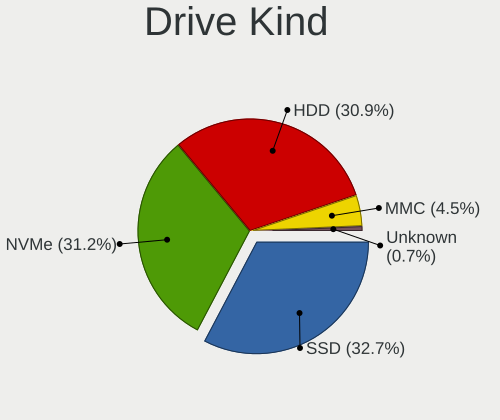

| Kind    | Computers | Drives | Percent |
|---------|-----------|--------|---------|
| SSD     | 1364      | 1943   | 32.71%  |
| NVMe    | 1303      | 1950   | 31.25%  |
| HDD     | 1287      | 2277   | 30.86%  |
| MMC     | 187       | 253    | 4.48%   |
| Unknown | 29        | 61     | 0.7%    |

Drive Connector
---------------

SATA, SAS, NVMe, etc.

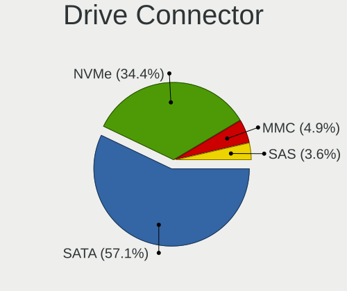

| Type | Computers | Drives | Percent |
|------|-----------|--------|---------|
| SATA | 2164      | 4087   | 57.1%   |
| NVMe | 1302      | 1942   | 34.35%  |
| MMC  | 187       | 253    | 4.93%   |
| SAS  | 137       | 202    | 3.61%   |

Drive Size
----------

Size of hard drive

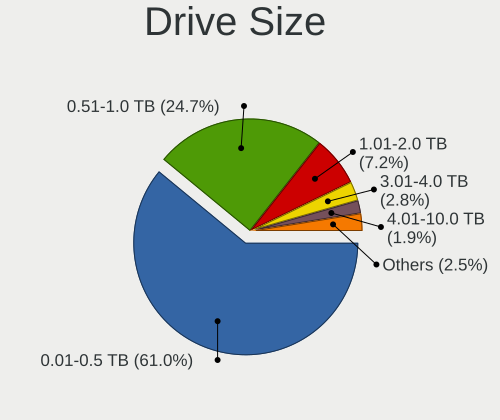

| Size in TB | Computers | Drives | Percent |
|------------|-----------|--------|---------|
| 0.01-0.5   | 1689      | 2563   | 60.97%  |
| 0.51-1.0   | 683       | 995    | 24.66%  |
| 1.01-2.0   | 199       | 332    | 7.18%   |
| 3.01-4.0   | 77        | 111    | 2.78%   |
| 4.01-10.0  | 52        | 101    | 1.88%   |
| 2.01-3.0   | 41        | 62     | 1.48%   |
| 10.01-20.0 | 28        | 55     | 1.01%   |
| 20.01-50.0 | 1         | 1      | 0.04%   |

Space Total
-----------

Amount of disk space available on the file system

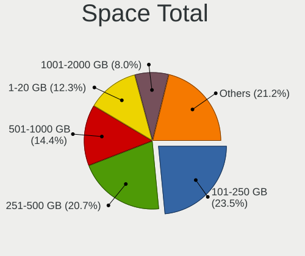

| Size in GB     | Computers | Percent |
|----------------|-----------|---------|
| 101-250        | 815       | 23.47%  |
| 251-500        | 717       | 20.65%  |
| 501-1000       | 501       | 14.43%  |
| 1-20           | 426       | 12.27%  |
| 1001-2000      | 278       | 8.01%   |
| 51-100         | 213       | 6.13%   |
| More than 3000 | 173       | 4.98%   |
| Unknown        | 145       | 4.18%   |
| 21-50          | 119       | 3.43%   |
| 2001-3000      | 84        | 2.42%   |
| 0              | 1         | 0.03%   |

Space Used
----------

Amount of used disk space

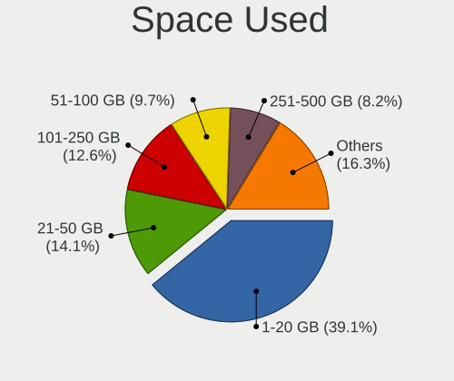

| Used GB        | Computers | Percent |
|----------------|-----------|---------|
| 1-20           | 1405      | 39.09%  |
| 21-50          | 507       | 14.11%  |
| 101-250        | 452       | 12.58%  |
| 51-100         | 350       | 9.74%   |
| 251-500        | 293       | 8.15%   |
| 501-1000       | 215       | 5.98%   |
| Unknown        | 145       | 4.03%   |
| 1001-2000      | 107       | 2.98%   |
| More than 3000 | 74        | 2.06%   |
| 2001-3000      | 41        | 1.14%   |
| 0              | 5         | 0.14%   |

Malfunc. Drives
---------------

Drive models with a malfunction

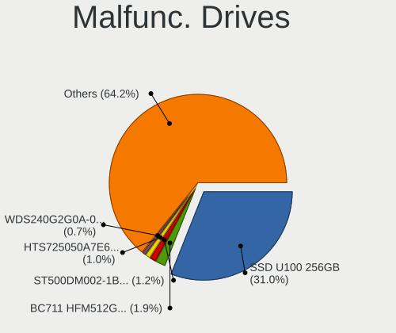

| Model                                 | Computers | Drives | Percent |
|---------------------------------------|-----------|--------|---------|
| SanDisk SSD U100 256GB                | 130       | 132    | 31.03%  |
| SK hynix BC711 HFM512GD3JX013N 512GB  | 8         | 11     | 1.91%   |
| Seagate ST500DM002-1BD142 500GB       | 5         | 6      | 1.19%   |
| HGST HTS725050A7E630 500GB            | 4         | 5      | 0.95%   |
| WDC WDS240G2G0A-00JH30 240GB SSD      | 3         | 3      | 0.72%   |
| Seagate ST9500420AS 500GB             | 3         | 4      | 0.72%   |
| Seagate ST500LT012-9WS142 500GB       | 3         | 7      | 0.72%   |
| Samsung Electronics SSD 980 1TB       | 3         | 3      | 0.72%   |
| Kingston SV300S37A120G 120GB SSD      | 3         | 3      | 0.72%   |
| A-DATA Technology SP900 256GB SSD     | 3         | 4      | 0.72%   |
| WDC WD60EFRX-68L0BN1 6TB              | 2         | 3      | 0.48%   |
| WDC WD30EFRX-68EUZN0 3TB              | 2         | 2      | 0.48%   |
| WDC WD2500AAKS-00VSA0 250GB           | 2         | 2      | 0.48%   |
| WDC WD10EADS-00M2B0 1TB               | 2         | 2      | 0.48%   |
| Toshiba MQ01ABD100 1TB                | 2         | 2      | 0.48%   |
| Toshiba MQ01ABD075 752GB              | 2         | 2      | 0.48%   |
| Toshiba MK1234GSX 120GB               | 2         | 2      | 0.48%   |
| Seagate ST9250315AS 250GB             | 2         | 4      | 0.48%   |
| Seagate ST500LT012-1DG142 500GB       | 2         | 3      | 0.48%   |
| Seagate ST500LT0 12-1DG142 500GB      | 2         | 3      | 0.48%   |
| Seagate ST3500418AS 500GB             | 2         | 2      | 0.48%   |
| Seagate ST3250410AS 250GB             | 2         | 4      | 0.48%   |
| Seagate ST3160318AS 160GB             | 2         | 2      | 0.48%   |
| Seagate ST31000524AS 1TB              | 2         | 3      | 0.48%   |
| Seagate ST2000DM008-2FR102 2TB        | 2         | 3      | 0.48%   |
| Seagate ST2000DM006-2DM164 2TB        | 2         | 2      | 0.48%   |
| Seagate ST1000LX015-1U7172 1TB        | 2         | 2      | 0.48%   |
| Seagate ST1000LM024 HN-M101MBB 1TB    | 2         | 2      | 0.48%   |
| Seagate ST1000DM003-1CH162 1TB        | 2         | 4      | 0.48%   |
| Samsung Electronics SSD 870 EVO 1TB   | 2         | 2      | 0.48%   |
| Micron Technology 1100 SATA 256GB SSD | 2         | 2      | 0.48%   |
| Kingston SHFS37A120G 120GB SSD        | 2         | 3      | 0.48%   |
| Hitachi HTS545050B9A300 500GB         | 2         | 2      | 0.48%   |
| Hitachi HTS541610J9SA00 100GB         | 2         | 2      | 0.48%   |
| HGST HTS721010A9E630 1TB              | 2         | 2      | 0.48%   |
| HGST HTS545050A7E380 500GB            | 2         | 2      | 0.48%   |
| Fujitsu MHZ2250BH G2 250GB            | 2         | 2      | 0.48%   |
| XPG SPECTRIX S40G 1TB                 | 1         | 1      | 0.24%   |
| WDC WDS120G2G0B-00EPW0 120GB SSD      | 1         | 1      | 0.24%   |
| WDC WDS120G2G0A-00JH30 120GB SSD      | 1         | 1      | 0.24%   |

Malfunc. Drive Vendor
---------------------

Vendors of faulty drives

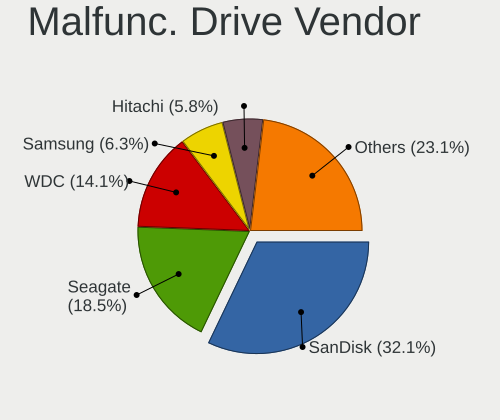

| Vendor                    | Computers | Drives | Percent |
|---------------------------|-----------|--------|---------|
| SanDisk                   | 132       | 134    | 32.12%  |
| Seagate                   | 76        | 108    | 18.49%  |
| WDC                       | 58        | 71     | 14.11%  |
| Samsung Electronics       | 26        | 33     | 6.33%   |
| Hitachi                   | 24        | 27     | 5.84%   |
| Toshiba                   | 21        | 32     | 5.11%   |
| SK hynix                  | 12        | 15     | 2.92%   |
| HGST                      | 11        | 12     | 2.68%   |
| Kingston                  | 10        | 11     | 2.43%   |
| Intel                     | 8         | 8      | 1.95%   |
| A-DATA Technology         | 6         | 8      | 1.46%   |
| Micron Technology         | 5         | 6      | 1.22%   |
| Crucial                   | 4         | 4      | 0.97%   |
| Fujitsu                   | 3         | 4      | 0.73%   |
| XPG                       | 1         | 1      | 0.24%   |
| SPCC                      | 1         | 1      | 0.24%   |
| SATAFIRM                  | 1         | 1      | 0.24%   |
| Realtek Semiconductor     | 1         | 4      | 0.24%   |
| Patriot                   | 1         | 1      | 0.24%   |
| OCZ                       | 1         | 1      | 0.24%   |
| Neo                       | 1         | 1      | 0.24%   |
| Micron/Crucial Technology | 1         | 1      | 0.24%   |
| Maxtor                    | 1         | 1      | 0.24%   |
| LITEONIT                  | 1         | 2      | 0.24%   |
| KIOXIA                    | 1         | 2      | 0.24%   |
| IBM/Hitachi               | 1         | 1      | 0.24%   |
| HS-SSD-C100               | 1         | 1      | 0.24%   |
| Gigabyte Technology       | 1         | 1      | 0.24%   |
| ADATA Technology          | 1         | 1      | 0.24%   |

Malfunc. HDD Vendor
-------------------

Vendors of faulty HDD drives

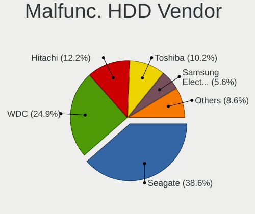

| Vendor              | Computers | Drives | Percent |
|---------------------|-----------|--------|---------|
| Seagate             | 76        | 108    | 38.58%  |
| WDC                 | 49        | 61     | 24.87%  |
| Hitachi             | 24        | 27     | 12.18%  |
| Toshiba             | 20        | 31     | 10.15%  |
| Samsung Electronics | 11        | 13     | 5.58%   |
| HGST                | 11        | 12     | 5.58%   |
| Fujitsu             | 3         | 4      | 1.52%   |
| SATAFIRM            | 1         | 1      | 0.51%   |
| Maxtor              | 1         | 1      | 0.51%   |
| IBM/Hitachi         | 1         | 1      | 0.51%   |

Malfunc. Drive Kind
-------------------

Kinds of faulty drives

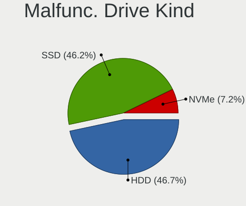

| Kind | Computers | Drives | Percent |
|------|-----------|--------|---------|
| HDD  | 188       | 259    | 46.65%  |
| SSD  | 186       | 194    | 46.15%  |
| NVMe | 29        | 40     | 7.2%    |

Failed Drives
-------------

Failed drive models

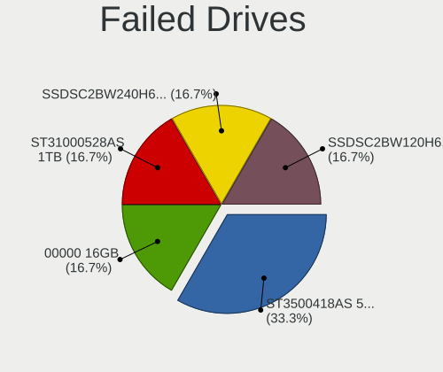

| Model                     | Computers | Drives | Percent |
|---------------------------|-----------|--------|---------|
| Seagate ST3500418AS 500GB | 2         | 4      | 33.33%  |
| Unknown 00000  16GB       | 1         | 1      | 16.67%  |
| Seagate ST31000528AS 1TB  | 1         | 1      | 16.67%  |
| Intel SSDSC2BW240H6 240GB | 1         | 1      | 16.67%  |
| Intel SSDSC2BW120H6 120GB | 1         | 2      | 16.67%  |

Failed Drive Vendor
-------------------

Failed drive vendors

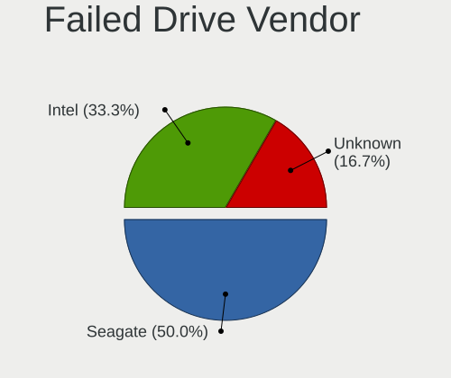

| Vendor  | Computers | Drives | Percent |
|---------|-----------|--------|---------|
| Seagate | 3         | 5      | 50%     |
| Intel   | 2         | 3      | 33.33%  |
| Unknown | 1         | 1      | 16.67%  |

Drive Status
------------

Number of failed and malfunc. drives

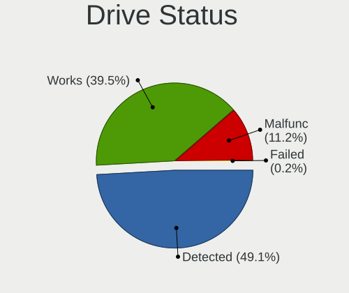

| Status   | Computers | Drives | Percent |
|----------|-----------|--------|---------|
| Detected | 1734      | 3487   | 49.11%  |
| Works    | 1396      | 2495   | 39.54%  |
| Malfunc  | 395       | 493    | 11.19%  |
| Failed   | 6         | 9      | 0.17%   |

Storage controller
------------------

Storage Vendor
--------------

Storage controller vendors

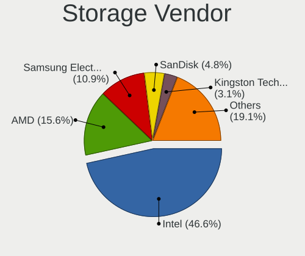

| Vendor                           | Computers | Percent |
|----------------------------------|-----------|---------|
| Intel                            | 1976      | 46.56%  |
| AMD                              | 660       | 15.55%  |
| Samsung Electronics              | 464       | 10.93%  |
| SanDisk                          | 203       | 4.78%   |
| Kingston Technology Company      | 131       | 3.09%   |
| SK hynix                         | 117       | 2.76%   |
| Micron Technology                | 92        | 2.17%   |
| Phison Electronics               | 64        | 1.51%   |
| Toshiba America Info Systems     | 63        | 1.48%   |
| KIOXIA                           | 53        | 1.25%   |
| ASMedia Technology               | 53        | 1.25%   |
| JMicron Technology               | 46        | 1.08%   |
| Marvell Technology Group         | 42        | 0.99%   |
| Nvidia                           | 41        | 0.97%   |
| ADATA Technology                 | 36        | 0.85%   |
| Micron/Crucial Technology        | 33        | 0.78%   |
| Silicon Motion                   | 30        | 0.71%   |
| MAXIO Technology (Hangzhou)      | 16        | 0.38%   |
| VIA Technologies                 | 14        | 0.33%   |
| Realtek Semiconductor            | 10        | 0.24%   |
| Seagate Technology               | 9         | 0.21%   |
| Broadcom / LSI                   | 8         | 0.19%   |
| Union Memory (Shenzhen)          | 7         | 0.16%   |
| Hewlett-Packard                  | 7         | 0.16%   |
| Solidigm                         | 6         | 0.14%   |
| Silicon Image                    | 6         | 0.14%   |
| Lenovo                           | 6         | 0.14%   |
| Hosin Global Electronics         | 6         | 0.14%   |
| LSI Logic / Symbios Logic        | 5         | 0.12%   |
| Solid State Storage Technology   | 4         | 0.09%   |
| Shenzhen Longsys Electronics     | 4         | 0.09%   |
| Lite-On Technology               | 4         | 0.09%   |
| Adaptec                          | 4         | 0.09%   |
| Silicon Integrated Systems [SiS] | 3         | 0.07%   |
| OCZ Technology Group             | 3         | 0.07%   |
| Integrated Technology Express    | 3         | 0.07%   |
| INNOGRIT                         | 3         | 0.07%   |
| Apple                            | 3         | 0.07%   |
| TenaFe                           | 2         | 0.05%   |
| Western Digital                  | 1         | 0.02%   |

Storage Model
-------------

Storage controller models

| Model                                                                          | Computers | Percent |
|--------------------------------------------------------------------------------|-----------|---------|
| AMD FCH SATA Controller [AHCI mode]                                            | 393       | 8.12%   |
| Intel 6 Series/C200 Series Chipset Family 6 port Mobile SATA AHCI Controller   | 218       | 4.51%   |
| Samsung NVMe SSD Controller SM981/PM981/PM983                                  | 183       | 3.78%   |
| Intel Sunrise Point-LP SATA Controller [AHCI mode]                             | 136       | 2.81%   |
| Intel 8 Series/C220 Series Chipset Family 6-port SATA Controller 1 [AHCI mode] | 122       | 2.52%   |
| Samsung NVMe SSD Controller 980 (DRAM-less)                                    | 118       | 2.44%   |
| Intel 7 Series Chipset Family 6-port SATA Controller [AHCI mode]               | 116       | 2.4%    |
| Intel 82801 Mobile SATA Controller [RAID mode]                                 | 88        | 1.82%   |
| AMD 400 Series Chipset SATA Controller                                         | 86        | 1.78%   |
| Intel Volume Management Device NVMe RAID Controller                            | 83        | 1.72%   |
| AMD 500 Series Chipset SATA Controller                                         | 80        | 1.65%   |
| Samsung NVMe SSD Controller PM9A1/PM9A3/980PRO                                 | 73        | 1.51%   |
| Intel 82801IBM/IEM (ICH9M/ICH9M-E) 4 port SATA Controller [AHCI mode]          | 70        | 1.45%   |
| Intel 6 Series/C200 Series Chipset Family 6 port Desktop SATA AHCI Controller  | 63        | 1.3%    |
| Intel Celeron/Pentium Silver Processor SATA Controller                         | 60        | 1.24%   |
| Intel NM10/ICH7 Family SATA Controller [IDE mode]                              | 58        | 1.2%    |
| AMD SB7x0/SB8x0/SB9x0 SATA Controller [AHCI mode]                              | 56        | 1.16%   |
| Intel 8 Series SATA Controller 1 [AHCI mode]                                   | 54        | 1.12%   |
| Kingston Company KC3000/FURY Renegade NVMe SSD [E18]                           | 53        | 1.1%    |
| Intel 82801G (ICH7 Family) IDE Controller                                      | 53        | 1.1%    |
| Intel Cannon Lake Mobile PCH SATA AHCI Controller                              | 52        | 1.07%   |
| Intel Q170/Q150/B150/H170/H110/Z170/CM236 Chipset SATA Controller [AHCI Mode]  | 49        | 1.01%   |
| AMD 600 Series Chipset SATA Controller                                         | 49        | 1.01%   |
| Intel 200 Series PCH SATA controller [AHCI mode]                               | 48        | 0.99%   |
| AMD SB7x0/SB8x0/SB9x0 IDE Controller                                           | 47        | 0.97%   |
| ASMedia ASM1061/ASM1062 Serial ATA Controller                                  | 46        | 0.95%   |
| SanDisk Extreme Pro / WD Black SN750 / PC SN730 / Red SN700 NVMe SSD           | 45        | 0.93%   |
| SanDisk Ultra 3D / WD PC SN530, IX SN530, Blue SN550 NVMe SSD (DRAM-less)      | 42        | 0.87%   |
| Intel Wildcat Point-LP SATA Controller [AHCI Mode]                             | 42        | 0.87%   |
| Samsung NVMe SSD Controller SM961/PM961/SM963                                  | 41        | 0.85%   |
| SK hynix Gold P31/BC711/PC711 NVMe Solid State Drive                           | 39        | 0.81%   |
| Intel SATA Controller [RAID mode]                                              | 38        | 0.79%   |
| Intel Atom Processor E3800 Series SATA AHCI Controller                         | 38        | 0.79%   |
| AMD SB7x0/SB8x0/SB9x0 SATA Controller [IDE mode]                               | 37        | 0.76%   |
| Intel 82801HM/HEM (ICH8M/ICH8M-E) IDE Controller                               | 35        | 0.72%   |
| Intel HM170/QM170 Chipset SATA Controller [AHCI Mode]                          | 34        | 0.7%    |
| Intel Cannon Lake PCH SATA AHCI Controller                                     | 34        | 0.7%    |
| Phison PS5013-E13 PCIe3 NVMe Controller (DRAM-less)                            | 32        | 0.66%   |
| Intel Comet Lake SATA AHCI Controller                                          | 31        | 0.64%   |
| Intel 5 Series/3400 Series Chipset 4 port SATA AHCI Controller                 | 31        | 0.64%   |

Storage Kind
------------

Kind of storage controller (IDE, SATA, NVMe, SAS, ...)

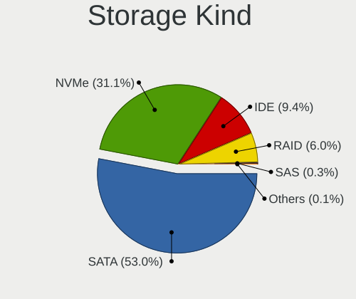

| Kind | Computers | Percent |
|------|-----------|---------|
| SATA | 2228      | 53.01%  |
| NVMe | 1309      | 31.14%  |
| IDE  | 394       | 9.37%   |
| RAID | 253       | 6.02%   |
| SAS  | 13        | 0.31%   |
| SCSI | 6         | 0.14%   |

Processor
---------

CPU Vendor
----------

Processor vendors

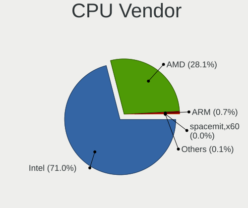

| Vendor       | Computers | Percent |
|--------------|-----------|---------|
| Intel        | 2311      | 71.02%  |
| AMD          | 914       | 28.09%  |
| ARM          | 24        | 0.74%   |
| spacemit,x60 | 1         | 0.03%   |
| QUALCOMM     | 1         | 0.03%   |
| MIPS         | 1         | 0.03%   |
| ky,x60       | 1         | 0.03%   |
| Unknown      | 1         | 0.03%   |

CPU Model
---------

Processor models

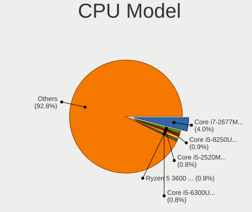

| Model                                      | Computers | Percent |
|--------------------------------------------|-----------|---------|
| Intel Core i7-2677M CPU @ 1.80GHz          | 130       | 3.98%   |
| Intel Core i5-8250U CPU @ 1.60GHz          | 30        | 0.92%   |
| Intel Core i5-2520M CPU @ 2.50GHz          | 26        | 0.8%    |
| AMD Ryzen 5 3600 6-Core Processor          | 26        | 0.8%    |
| Intel Core i5-6300U CPU @ 2.40GHz          | 25        | 0.76%   |
| Intel Celeron N4020 CPU @ 1.10GHz          | 24        | 0.73%   |
| Intel 11th Gen Core i5-1135G7 @ 2.40GHz    | 24        | 0.73%   |
| Intel Core i7-8550U CPU @ 1.80GHz          | 23        | 0.7%    |
| Intel Core i5-7200U CPU @ 2.50GHz          | 23        | 0.7%    |
| AMD Ryzen 7 5800H with Radeon Graphics     | 22        | 0.67%   |
| Intel Core i7-8650U CPU @ 1.90GHz          | 21        | 0.64%   |
| Intel Core i7-8565U CPU @ 1.80GHz          | 21        | 0.64%   |
| Intel Core i5-8265U CPU @ 1.60GHz          | 21        | 0.64%   |
| Intel 11th Gen Core i7-1165G7 @ 2.80GHz    | 20        | 0.61%   |
| AMD Ryzen 5 5600X 6-Core Processor         | 20        | 0.61%   |
| Intel Core i7-7700HQ CPU @ 2.80GHz         | 19        | 0.58%   |
| Intel Core i7-10510U CPU @ 1.80GHz         | 19        | 0.58%   |
| ARM Processor                              | 19        | 0.58%   |
| Intel Core i5-6200U CPU @ 2.30GHz          | 18        | 0.55%   |
| AMD Ryzen 7 PRO 4750U with Radeon Graphics | 18        | 0.55%   |
| AMD Ryzen 7 4700U with Radeon Graphics     | 18        | 0.55%   |
| Intel Core i5-3210M CPU @ 2.50GHz          | 17        | 0.52%   |
| AMD Ryzen 5 4500U with Radeon Graphics     | 17        | 0.52%   |
| AMD Ryzen 5 2600 Six-Core Processor        | 17        | 0.52%   |
| Intel Core i7-8750H CPU @ 2.20GHz          | 16        | 0.49%   |
| Intel Core i5-3320M CPU @ 2.60GHz          | 16        | 0.49%   |
| Intel Core i5-2400 CPU @ 3.10GHz           | 16        | 0.49%   |
| Intel Core i7-9750H CPU @ 2.60GHz          | 15        | 0.46%   |
| Intel Core i5-3470 CPU @ 3.20GHz           | 15        | 0.46%   |
| Intel Core 2 Duo CPU E8400 @ 3.00GHz       | 15        | 0.46%   |
| AMD Ryzen 9 5900X 12-Core Processor        | 15        | 0.46%   |
| AMD Ryzen 5 5600H with Radeon Graphics     | 15        | 0.46%   |
| Intel Core i7-10850H CPU @ 2.70GHz         | 14        | 0.43%   |
| Intel Core i5-5200U CPU @ 2.20GHz          | 14        | 0.43%   |
| Intel 12th Gen Core i7-12700H              | 14        | 0.43%   |
| AMD Ryzen 7 5700U with Radeon Graphics     | 14        | 0.43%   |
| AMD Ryzen 5 5500U with Radeon Graphics     | 14        | 0.43%   |
| AMD Custom APU 0405                        | 14        | 0.43%   |
| Intel Core i7-6700HQ CPU @ 2.60GHz         | 13        | 0.4%    |
| Intel Core i5-3230M CPU @ 2.60GHz          | 13        | 0.4%    |

CPU Model Family
----------------

Processor model prefix

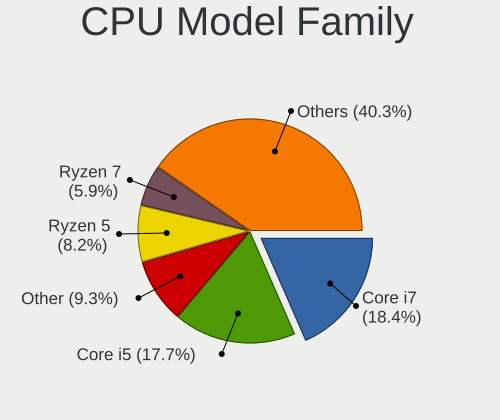

| Model                   | Computers | Percent |
|-------------------------|-----------|---------|
| Intel Core i7           | 602       | 18.44%  |
| Intel Core i5           | 579       | 17.74%  |
| Other                   | 305       | 9.34%   |
| AMD Ryzen 5             | 267       | 8.18%   |
| AMD Ryzen 7             | 194       | 5.94%   |
| Intel Celeron           | 176       | 5.39%   |
| Intel Core i3           | 163       | 4.99%   |
| Intel Core 2 Duo        | 145       | 4.44%   |
| Intel Pentium           | 97        | 2.97%   |
| Intel Xeon              | 62        | 1.9%    |
| AMD Ryzen 9             | 55        | 1.69%   |
| Intel Atom              | 54        | 1.65%   |
| AMD Ryzen 7 PRO         | 50        | 1.53%   |
| AMD FX                  | 46        | 1.41%   |
| Intel Pentium Dual-Core | 37        | 1.13%   |
| AMD Ryzen 3             | 29        | 0.89%   |
| AMD A4                  | 28        | 0.86%   |
| Intel Core              | 23        | 0.7%    |
| AMD Ryzen 5 PRO         | 22        | 0.67%   |
| AMD A8                  | 21        | 0.64%   |
| AMD A6                  | 20        | 0.61%   |
| Intel Core i9           | 16        | 0.49%   |
| Intel Core 2            | 16        | 0.49%   |
| AMD Athlon 64 X2        | 16        | 0.49%   |
| Intel Pentium Dual      | 15        | 0.46%   |
| Intel Core 2 Quad       | 15        | 0.46%   |
| Intel Pentium Silver    | 14        | 0.43%   |
| AMD A10                 | 13        | 0.4%    |
| Intel Genuine           | 12        | 0.37%   |
| AMD Phenom II X4        | 12        | 0.37%   |
| AMD Athlon              | 12        | 0.37%   |
| Intel Celeron M         | 9         | 0.28%   |
| AMD Athlon II X2        | 9         | 0.28%   |
| AMD E1                  | 7         | 0.21%   |
| Intel Pentium Gold      | 6         | 0.18%   |
| Intel Pentium D         | 6         | 0.18%   |
| AMD E                   | 6         | 0.18%   |
| AMD Athlon 64           | 6         | 0.18%   |
| Intel Pentium M         | 5         | 0.15%   |
| Intel Pentium 4         | 5         | 0.15%   |

CPU Cores
---------

Number of processor cores

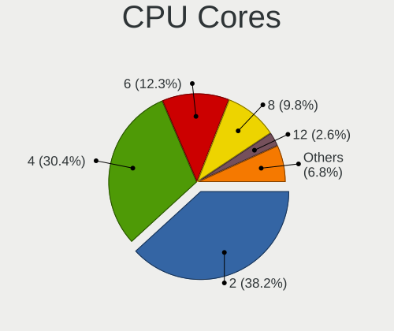

| Number  | Computers | Percent |
|---------|-----------|---------|
| 2       | 1248      | 38.2%   |
| 4       | 993       | 30.39%  |
| 6       | 402       | 12.3%   |
| 8       | 319       | 9.76%   |
| 12      | 84        | 2.57%   |
| 1       | 78        | 2.39%   |
| 10      | 37        | 1.13%   |
| 16      | 33        | 1.01%   |
| 14      | 33        | 1.01%   |
| 3       | 15        | 0.46%   |
| 24      | 8         | 0.24%   |
| 20      | 6         | 0.18%   |
| Unknown | 6         | 0.18%   |
| 32      | 3         | 0.09%   |
| 28      | 1         | 0.03%   |
| 18      | 1         | 0.03%   |

CPU Sockets
-----------

Number of sockets

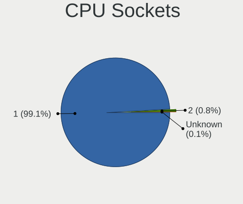

| Number  | Computers | Percent |
|---------|-----------|---------|
| 1       | 3225      | 99.11%  |
| 2       | 26        | 0.8%    |
| Unknown | 3         | 0.09%   |

CPU Threads
-----------

Threads per core (Hyper-Threading)

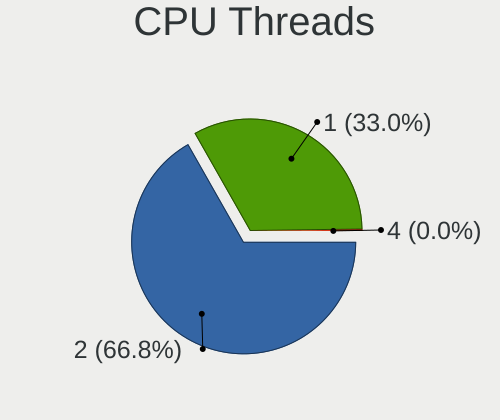

| Number  | Computers | Percent |
|---------|-----------|---------|
| 2       | 2177      | 66.78%  |
| 1       | 1076      | 33.01%  |
| Unknown | 6         | 0.18%   |
| 4       | 1         | 0.03%   |

CPU Op-Modes
------------

CPU Operation Modes (32-bit, 64-bit)

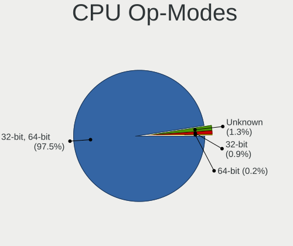

| Op mode        | Computers | Percent |
|----------------|-----------|---------|
| 32-bit, 64-bit | 3182      | 97.52%  |
| Unknown        | 43        | 1.32%   |
| 32-bit         | 30        | 0.92%   |
| 64-bit         | 8         | 0.25%   |

CPU Microcode
-------------

Microcode number

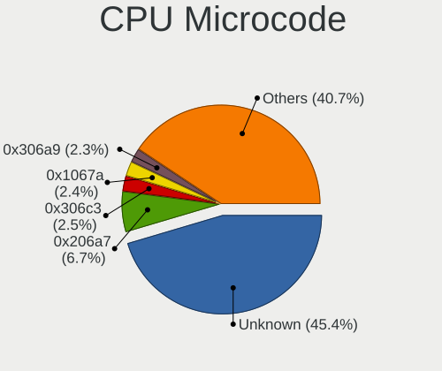

| Number     | Computers | Percent |
|------------|-----------|---------|
| Unknown    | 1540      | 45.41%  |
| 0x206a7    | 226       | 6.66%   |
| 0x306c3    | 86        | 2.54%   |
| 0x1067a    | 82        | 2.42%   |
| 0x306a9    | 78        | 2.3%    |
| 0x906ea    | 52        | 1.53%   |
| 0x806ec    | 52        | 1.53%   |
| 0x806ea    | 49        | 1.45%   |
| 0x806c1    | 42        | 1.24%   |
| 0x0a50000c | 42        | 1.24%   |
| 0x406e3    | 41        | 1.21%   |
| 0x08600106 | 37        | 1.09%   |
| 0x806e9    | 35        | 1.03%   |
| 0x506e3    | 35        | 1.03%   |
| 0x906e9    | 34        | 1%      |
| 0x40651    | 34        | 1%      |
| 0x6fd      | 32        | 0.94%   |
| 0x08701021 | 27        | 0.8%    |
| 0x306d4    | 26        | 0.77%   |
| 0x30678    | 25        | 0.74%   |
| 0x10676    | 23        | 0.68%   |
| 0x6fb      | 22        | 0.65%   |
| 0x406c4    | 20        | 0.59%   |
| 0x010000c8 | 20        | 0.59%   |
| 0x706a1    | 19        | 0.56%   |
| 0x20655    | 19        | 0.56%   |
| 0x08608103 | 19        | 0.56%   |
| 0x0800820d | 19        | 0.56%   |
| 0x06000852 | 19        | 0.56%   |
| 0x706a8    | 18        | 0.53%   |
| 0xa0652    | 17        | 0.5%    |
| 0x506c9    | 16        | 0.47%   |
| 0x0a50000d | 16        | 0.47%   |
| 0x08600104 | 16        | 0.47%   |
| 0x906ed    | 15        | 0.44%   |
| 0x706e5    | 15        | 0.44%   |
| 0x406c3    | 15        | 0.44%   |
| 0x08108102 | 15        | 0.44%   |
| 0x06006705 | 14        | 0.41%   |
| 0x08701013 | 13        | 0.38%   |

CPU Microarch
-------------

Microarchitecture

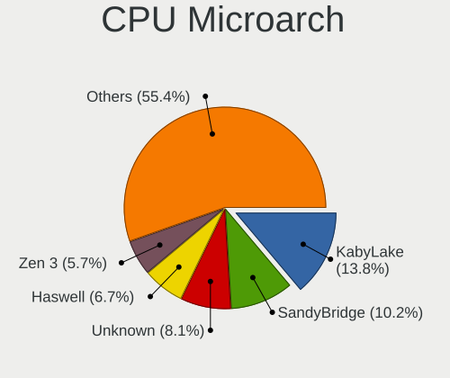

| Name              | Computers | Percent |
|-------------------|-----------|---------|
| KabyLake          | 452       | 13.85%  |
| SandyBridge       | 333       | 10.2%   |
| Unknown           | 265       | 8.12%   |
| Haswell           | 220       | 6.74%   |
| Zen 3             | 186       | 5.7%    |
| Zen 2             | 170       | 5.21%   |
| IvyBridge         | 167       | 5.12%   |
| Penryn            | 165       | 5.06%   |
| Skylake           | 140       | 4.29%   |
| Silvermont        | 98        | 3%      |
| Core              | 96        | 2.94%   |
| Alderlake Hybrid  | 95        | 2.91%   |
| TigerLake         | 82        | 2.51%   |
| Zen+              | 72        | 2.21%   |
| Goldmont plus     | 65        | 1.99%   |
| Zen               | 61        | 1.87%   |
| CometLake         | 61        | 1.87%   |
| Westmere          | 60        | 1.84%   |
| Piledriver        | 55        | 1.69%   |
| Broadwell         | 55        | 1.69%   |
| K10               | 47        | 1.44%   |
| Excavator         | 45        | 1.38%   |
| K8 Hammer         | 36        | 1.1%    |
| Icelake           | 35        | 1.07%   |
| Goldmont          | 24        | 0.74%   |
| Nehalem           | 23        | 0.7%    |
| Bonnell           | 23        | 0.7%    |
| Steamroller       | 17        | 0.52%   |
| P6                | 16        | 0.49%   |
| Puma              | 15        | 0.46%   |
| NetBurst          | 13        | 0.4%    |
| Bobcat            | 13        | 0.4%    |
| Meteorlake Hybrid | 12        | 0.37%   |
| Jaguar            | 11        | 0.34%   |
| Tremont           | 9         | 0.28%   |
| K10 Llano         | 7         | 0.21%   |
| Bulldozer         | 6         | 0.18%   |
| Gracemont         | 5         | 0.15%   |
| K8 & K10 hybrid   | 4         | 0.12%   |
| Lunarlake Hybrid  | 3         | 0.09%   |

Graphics
--------

GPU Vendor
----------

Vendors of graphics cards

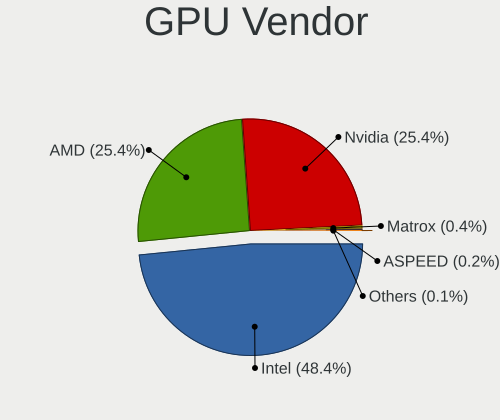

| Vendor                           | Computers | Percent |
|----------------------------------|-----------|---------|
| Intel                            | 1857      | 48.44%  |
| AMD                              | 975       | 25.43%  |
| Nvidia                           | 972       | 25.35%  |
| Matrox Electronics Systems       | 17        | 0.44%   |
| ASPEED Technology                | 8         | 0.21%   |
| VIA Technologies                 | 2         | 0.05%   |
| Silicon Integrated Systems [SiS] | 2         | 0.05%   |
| ATI Technologies                 | 1         | 0.03%   |

GPU Model
---------

Graphics card models

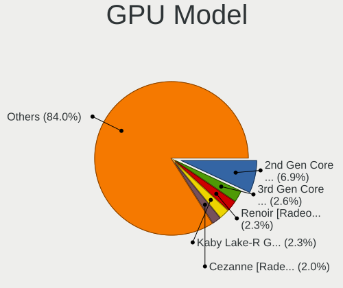

| Model                                                                                    | Computers | Percent |
|------------------------------------------------------------------------------------------|-----------|---------|
| Intel 2nd Generation Core Processor Family Integrated Graphics Controller                | 276       | 6.93%   |
| Intel 3rd Gen Core processor Graphics Controller                                         | 102       | 2.56%   |
| AMD Renoir [Radeon Vega Series / Radeon Vega Mobile Series]                              | 92        | 2.31%   |
| Intel Kaby Lake-R GT2 [UHD Graphics 620]                                                 | 90        | 2.26%   |
| AMD Cezanne [Radeon Vega Series / Radeon Vega Mobile Series]                             | 78        | 1.96%   |
| Intel TigerLake-LP GT2 [Iris Xe Graphics]                                                | 70        | 1.76%   |
| Intel Skylake-U GT2 [HD Graphics 520]                                                    | 65        | 1.63%   |
| Intel Haswell-ULT Integrated Graphics Controller                                         | 63        | 1.58%   |
| Intel WhiskeyLake-U GT2 [UHD Graphics 620]                                               | 60        | 1.51%   |
| Intel CoffeeLake-H GT2 [UHD Graphics 630]                                                | 59        | 1.48%   |
| AMD Ellesmere [Radeon RX 470/480/570/570X/580/580X/590]                                  | 57        | 1.43%   |
| Intel Mobile 4 Series Chipset Integrated Graphics Controller                             | 56        | 1.41%   |
| Intel Kaby Lake-U GT2 [HD Graphics 620]                                                  | 54        | 1.36%   |
| Intel GeminiLake [UHD Graphics 600]                                                      | 53        | 1.33%   |
| Intel Xeon E3-1200 v3/4th Gen Core Processor Integrated Graphics Controller              | 50        | 1.26%   |
| Intel 4th Gen Core Processor Integrated Graphics Controller                              | 50        | 1.26%   |
| Intel Atom Processor Z36xxx/Z37xxx Series Graphics & Display                             | 49        | 1.23%   |
| Intel Atom/Celeron/Pentium Processor x5-E8000/J3xxx/N3xxx Integrated Graphics Controller | 48        | 1.21%   |
| Intel CometLake-U GT2 [UHD Graphics]                                                     | 44        | 1.11%   |
| Intel Broadwell-U GT2 [HD Graphics 5500]                                                 | 42        | 1.06%   |
| Intel Alder Lake-P GT2 [Iris Xe Graphics]                                                | 37        | 0.93%   |
| AMD Picasso/Raven 2 [Radeon Vega Series / Radeon Vega Mobile Series]                     | 36        | 0.9%    |
| AMD Stoney [Radeon R2/R3/R4/R5 Graphics]                                                 | 34        | 0.85%   |
| Intel Core Processor Integrated Graphics Controller                                      | 31        | 0.78%   |
| Intel CometLake-H GT2 [UHD Graphics]                                                     | 31        | 0.78%   |
| AMD Lucienne                                                                             | 31        | 0.78%   |
| Nvidia TU117M [GeForce GTX 1650 Mobile / Max-Q]                                          | 29        | 0.73%   |
| AMD Raphael                                                                              | 29        | 0.73%   |
| Nvidia GA106M [GeForce RTX 3060 Mobile / Max-Q]                                          | 28        | 0.7%    |
| Intel 4 Series Chipset Integrated Graphics Controller                                    | 27        | 0.68%   |
| AMD Barcelo                                                                              | 27        | 0.68%   |
| Nvidia GP107 [GeForce GTX 1050 Ti]                                                       | 26        | 0.65%   |
| Intel Raptor Lake-P [Iris Xe Graphics]                                                   | 26        | 0.65%   |
| Intel Kaby Lake-H GT2 [HD Graphics 630]                                                  | 25        | 0.63%   |
| AMD Rembrandt [Radeon 680M]                                                              | 25        | 0.63%   |
| Intel Xeon E3-1200 v2/3rd Gen Core processor Graphics Controller                         | 24        | 0.6%    |
| Intel CoffeeLake-S GT2 [UHD Graphics 630]                                                | 24        | 0.6%    |
| AMD Raven Ridge [Radeon Vega Series / Radeon Vega Mobile Series]                         | 24        | 0.6%    |
| Intel Mobile 945GM/GMS/GME, 943/940GML Express Integrated Graphics Controller            | 23        | 0.58%   |
| Intel Mobile GM965/GL960 Integrated Graphics Controller (secondary)                      | 22        | 0.55%   |

GPU Combo
---------

Combinations of graphics cards

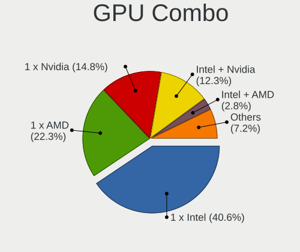

| Name           | Computers | Percent |
|----------------|-----------|---------|
| 1 x Intel      | 1331      | 40.6%   |
| 1 x AMD        | 731       | 22.3%   |
| 1 x Nvidia     | 485       | 14.8%   |
| Intel + Nvidia | 402       | 12.26%  |
| Intel + AMD    | 93        | 2.84%   |
| 2 x AMD        | 75        | 2.29%   |
| AMD + Nvidia   | 74        | 2.26%   |
| Other          | 30        | 0.92%   |
| 2 x Intel      | 20        | 0.61%   |
| 1 x Matrox     | 15        | 0.46%   |
| 1 x ASPEED     | 7         | 0.21%   |
| 2 x Nvidia     | 6         | 0.18%   |
| 3 x Nvidia     | 2         | 0.06%   |
| 1 x VIA        | 2         | 0.06%   |
| 1 x SiS        | 2         | 0.06%   |
| AMD + Matrox   | 2         | 0.06%   |
| AMD + ASPEED   | 1         | 0.03%   |

GPU Driver
----------

Free vs proprietary

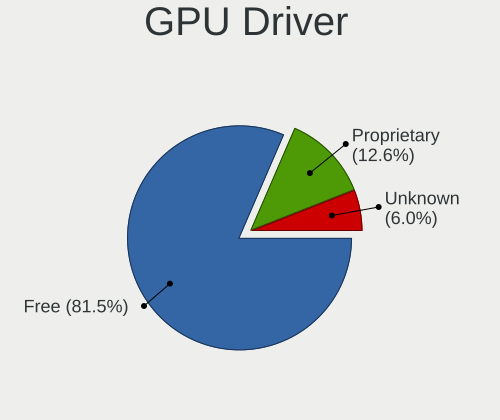

| Driver      | Computers | Percent |
|-------------|-----------|---------|
| Free        | 2694      | 81.49%  |
| Proprietary | 415       | 12.55%  |
| Unknown     | 197       | 5.96%   |

GPU Memory
----------

Total video memory

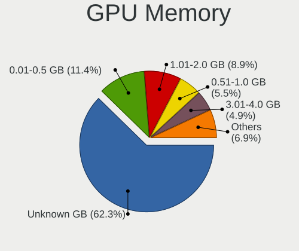

| Size in GB | Computers | Percent |
|------------|-----------|---------|
| Unknown    | 2093      | 62.31%  |
| 0.01-0.5   | 384       | 11.43%  |
| 1.01-2.0   | 300       | 8.93%   |
| 0.51-1.0   | 185       | 5.51%   |
| 3.01-4.0   | 164       | 4.88%   |
| 7.01-8.0   | 98        | 2.92%   |
| 5.01-6.0   | 50        | 1.49%   |
| 8.01-16.0  | 46        | 1.37%   |
| 2.01-3.0   | 26        | 0.77%   |
| 16.01-24.0 | 11        | 0.33%   |
| 4.01-5.0   | 2         | 0.06%   |

Monitor
-------

Monitor Vendor
--------------

Monitor vendors

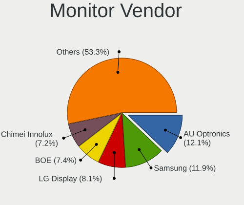

| Vendor                  | Computers | Percent |
|-------------------------|-----------|---------|
| AU Optronics            | 457       | 12.13%  |
| Samsung Electronics     | 447       | 11.86%  |
| LG Display              | 307       | 8.15%   |
| BOE                     | 278       | 7.38%   |
| Chimei Innolux          | 272       | 7.22%   |
| Dell                    | 255       | 6.77%   |
| Goldstar                | 159       | 4.22%   |
| CPT                     | 136       | 3.61%   |
| BenQ                    | 135       | 3.58%   |
| Philips                 | 121       | 3.21%   |
| Hewlett-Packard         | 120       | 3.18%   |
| Acer                    | 117       | 3.1%    |
| AOC                     | 103       | 2.73%   |
| Lenovo                  | 96        | 2.55%   |
| Eizo                    | 96        | 2.55%   |
| Ancor Communications    | 60        | 1.59%   |
| Sharp                   | 58        | 1.54%   |
| Iiyama                  | 46        | 1.22%   |
| Chi Mei Optoelectronics | 43        | 1.14%   |
| PANDA                   | 38        | 1.01%   |
| MSI                     | 30        | 0.8%    |
| Fujitsu Siemens         | 29        | 0.77%   |
| ASUSTek Computer        | 29        | 0.77%   |
| InfoVision              | 25        | 0.66%   |
| Sony                    | 24        | 0.64%   |
| CSO                     | 23        | 0.61%   |
| LG Philips              | 21        | 0.56%   |
| Panasonic               | 18        | 0.48%   |
| NEC Computers           | 16        | 0.42%   |
| Apple                   | 16        | 0.42%   |
| Vestel Elektronik       | 14        | 0.37%   |
| Valve                   | 14        | 0.37%   |
| ViewSonic               | 13        | 0.34%   |
| Unknown                 | 12        | 0.32%   |
| Quanta Display          | 7         | 0.19%   |
| HannStar                | 7         | 0.19%   |
| LG Electronics          | 6         | 0.16%   |
| Gigabyte Technology     | 6         | 0.16%   |
| Arnos Instruments       | 6         | 0.16%   |
| Toshiba                 | 5         | 0.13%   |

Monitor Model
-------------

Monitor models

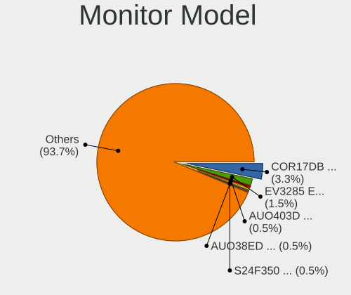

| Model                                                                    | Computers | Percent |
|--------------------------------------------------------------------------|-----------|---------|
| CPT LCD Monitor COR17DB 1600x900 293x164mm 13.2-inch                     | 130       | 3.32%   |
| Eizo EV3285 ENC2979 3840x2160 698x393mm 31.5-inch                        | 59        | 1.51%   |
| AU Optronics LCD Monitor AUO403D 1920x1080 309x174mm 14.0-inch           | 19        | 0.49%   |
| AU Optronics LCD Monitor AUO38ED 1920x1080 344x193mm 15.5-inch           | 19        | 0.49%   |
| Samsung Electronics S24F350 SAM0D20 1920x1080 521x293mm 23.5-inch        | 18        | 0.46%   |
| Chimei Innolux LCD Monitor CMN14D4 1920x1080 309x173mm 13.9-inch         | 18        | 0.46%   |
| AU Optronics LCD Monitor AUO21ED 1920x1080 344x193mm 15.5-inch           | 17        | 0.43%   |
| Dell U2412M DELA07A 1920x1200 518x324mm 24.1-inch                        | 16        | 0.41%   |
| AOC Q3279WG5B AOC3279 2560x1440 725x428mm 33.1-inch                      | 15        | 0.38%   |
| Vestel Elektronik 40UHD_LCD_TV VES3700 3840x2160 880x500mm 39.8-inch     | 14        | 0.36%   |
| Philips PHL 243V7 PHLC155 1920x1080 527x296mm 23.8-inch                  | 14        | 0.36%   |
| Valve ANX7530 U VLV3001 800x1280 100x150mm 7.1-inch                      | 11        | 0.28%   |
| LG Display LCD Monitor LGD02DC 1366x768 344x194mm 15.5-inch              | 11        | 0.28%   |
| AU Optronics LCD Monitor AUO123D 1920x1080 309x173mm 13.9-inch           | 11        | 0.28%   |
| BOE LCD Monitor BOE0757 1366x768 344x194mm 15.5-inch                     | 10        | 0.26%   |
| Samsung Electronics LCD Monitor SEC544B 1600x900 382x214mm 17.2-inch     | 9         | 0.23%   |
| Samsung Electronics C24F390 SAM0D2C 1920x1080 521x293mm 23.5-inch        | 9         | 0.23%   |
| Philips PHL 273V7 PHLC156 1920x1080 598x336mm 27.0-inch                  | 9         | 0.23%   |
| PANDA LCD Monitor NCP004D 1920x1080 344x194mm 15.5-inch                  | 9         | 0.23%   |
| LG Display LCD Monitor LGD033A 1366x768 344x194mm 15.5-inch              | 9         | 0.23%   |
| Chimei Innolux LCD Monitor CMN15E7 1920x1080 344x193mm 15.5-inch         | 9         | 0.23%   |
| Chimei Innolux LCD Monitor CMN14D5 1920x1080 309x173mm 13.9-inch         | 9         | 0.23%   |
| Chimei Innolux LCD Monitor CMN14C9 1920x1080 309x173mm 13.9-inch         | 9         | 0.23%   |
| Chi Mei Optoelectronics LCD Monitor CMO15A7 1366x768 344x193mm 15.5-inch | 9         | 0.23%   |
| Samsung Electronics LCD Monitor SDC4187 1920x1200 302x189mm 14.0-inch    | 8         | 0.2%    |
| Panasonic TV MEIA296 1920x1080 698x392mm 31.5-inch                       | 8         | 0.2%    |
| Lenovo LCD Monitor LEN40BA 1920x1080 344x194mm 15.5-inch                 | 8         | 0.2%    |
| Dell P2419H DELD0DA 1920x1080 527x296mm 23.8-inch                        | 8         | 0.2%    |
| Dell P2419H DELD0D9 1920x1080 527x296mm 23.8-inch                        | 8         | 0.2%    |
| Dell P2417H DELA0DB 1920x1080 527x296mm 23.8-inch                        | 8         | 0.2%    |
| Chimei Innolux LCD Monitor CMN15C4 1920x1080 344x193mm 15.5-inch         | 8         | 0.2%    |
| AU Optronics LCD Monitor AUO34ED 1920x1080 344x193mm 15.5-inch           | 8         | 0.2%    |
| AU Optronics LCD Monitor AUO26EC 1366x768 344x193mm 15.5-inch            | 8         | 0.2%    |
| AU Optronics LCD Monitor AUO22EC 1366x768 344x193mm 15.5-inch            | 8         | 0.2%    |
| AOC 27G2G4 AOC2702 1920x1080 598x336mm 27.0-inch                         | 8         | 0.2%    |
| Sharp LCD Monitor SHP1453 1920x1080 346x194mm 15.6-inch                  | 7         | 0.18%   |
| Samsung Electronics LCD Monitor SEC324C 1600x900 310x174mm 14.0-inch     | 7         | 0.18%   |
| Samsung Electronics LCD Monitor SDC4C48 1920x1080 293x165mm 13.2-inch    | 7         | 0.18%   |
| Samsung Electronics C27F390 SAM0D32 1920x1080 598x336mm 27.0-inch        | 7         | 0.18%   |
| LG Display LCD Monitor LGD046F 1920x1080 344x194mm 15.5-inch             | 7         | 0.18%   |

Monitor Resolution
------------------

Monitor screen resolution

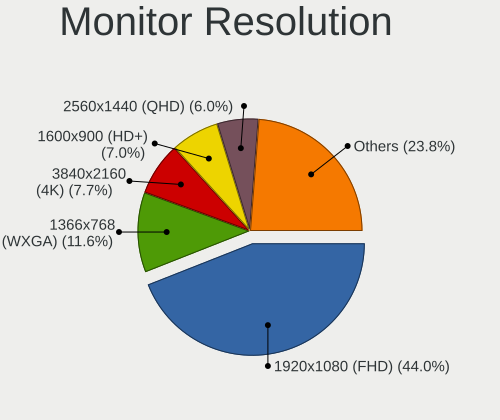

| Resolution         | Computers | Percent |
|--------------------|-----------|---------|
| 1920x1080 (FHD)    | 1568      | 44.02%  |
| 1366x768 (WXGA)    | 412       | 11.57%  |
| 3840x2160 (4K)     | 274       | 7.69%   |
| 1600x900 (HD+)     | 249       | 6.99%   |
| 2560x1440 (QHD)    | 212       | 5.95%   |
| 1920x1200 (WUXGA)  | 152       | 4.27%   |
| 1680x1050 (WSXGA+) | 114       | 3.2%    |
| 1280x1024 (SXGA)   | 105       | 2.95%   |
| 1280x800 (WXGA)    | 79        | 2.22%   |
| 1440x900 (WXGA+)   | 50        | 1.4%    |
| 2560x1600          | 48        | 1.35%   |
| 3440x1440          | 37        | 1.04%   |
| 2880x1800          | 31        | 0.87%   |
| Unknown            | 20        | 0.56%   |
| 2560x1080          | 19        | 0.53%   |
| 1024x768 (XGA)     | 17        | 0.48%   |
| 3840x1080          | 16        | 0.45%   |
| 800x1280           | 14        | 0.39%   |
| 1600x1200          | 13        | 0.36%   |
| 1360x768           | 12        | 0.34%   |
| 3840x2400          | 10        | 0.28%   |
| 1024x600           | 10        | 0.28%   |
| 2288x1287          | 9         | 0.25%   |
| 1920x540           | 8         | 0.22%   |
| 1280x720 (HD)      | 7         | 0.2%    |
| 2160x1350          | 6         | 0.17%   |
| 1400x1050          | 6         | 0.17%   |
| 2256x1504          | 5         | 0.14%   |
| 3840x1600          | 4         | 0.11%   |
| 3456x2160          | 4         | 0.11%   |
| 2880x1920          | 4         | 0.11%   |
| 2160x1440          | 4         | 0.11%   |
| 2048x1280          | 4         | 0.11%   |
| 3000x2000          | 3         | 0.08%   |
| 2880x1620          | 3         | 0.08%   |
| 6400x2160          | 2         | 0.06%   |
| 3840x1200          | 2         | 0.06%   |
| 3200x2000          | 2         | 0.06%   |
| 3200x1800 (QHD+)   | 2         | 0.06%   |
| 3072x1920          | 2         | 0.06%   |

Monitor Diagonal
----------------

Diagonal size in inches

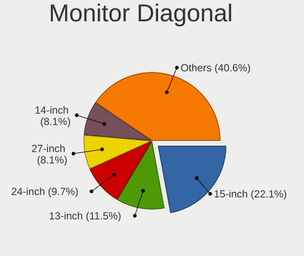

| Inches  | Computers | Percent |
|---------|-----------|---------|
| 15      | 836       | 22.08%  |
| 13      | 435       | 11.49%  |
| 24      | 367       | 9.69%   |
| 27      | 307       | 8.11%   |
| 14      | 306       | 8.08%   |
| 23      | 210       | 5.55%   |
| 17      | 167       | 4.41%   |
| 21      | 161       | 4.25%   |
| 31      | 150       | 3.96%   |
| 19      | 102       | 2.69%   |
| Unknown | 94        | 2.48%   |
| 16      | 79        | 2.09%   |
| 22      | 78        | 2.06%   |
| 12      | 59        | 1.56%   |
| 11      | 51        | 1.35%   |
| 34      | 44        | 1.16%   |
| 20      | 44        | 1.16%   |
| 84      | 37        | 0.98%   |
| 18      | 34        | 0.9%    |
| 32      | 21        | 0.55%   |
| 33      | 17        | 0.45%   |
| 26      | 17        | 0.45%   |
| 25      | 16        | 0.42%   |
| 54      | 15        | 0.4%    |
| 7       | 15        | 0.4%    |
| 72      | 14        | 0.37%   |
| 40      | 14        | 0.37%   |
| 10      | 11        | 0.29%   |
| 29      | 9         | 0.24%   |
| 28      | 9         | 0.24%   |
| 65      | 7         | 0.18%   |
| 142     | 6         | 0.16%   |
| 48      | 6         | 0.16%   |
| 52      | 5         | 0.13%   |
| 49      | 5         | 0.13%   |
| 46      | 5         | 0.13%   |
| 42      | 5         | 0.13%   |
| 47      | 4         | 0.11%   |
| 43      | 4         | 0.11%   |
| 39      | 4         | 0.11%   |

Monitor Width
-------------

Physical width

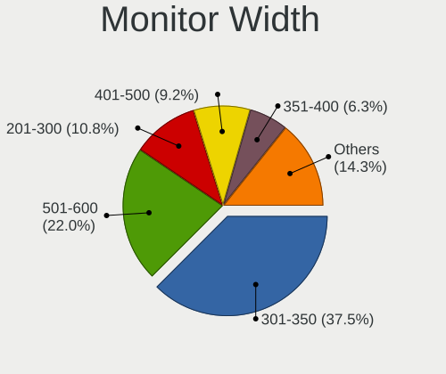

| Width in mm    | Computers | Percent |
|----------------|-----------|---------|
| 301-350        | 1384      | 37.49%  |
| 501-600        | 812       | 21.99%  |
| 201-300        | 397       | 10.75%  |
| 401-500        | 339       | 9.18%   |
| 351-400        | 233       | 6.31%   |
| 601-700        | 188       | 5.09%   |
| Unknown        | 94        | 2.55%   |
| 701-800        | 81        | 2.19%   |
| 1001-1500      | 54        | 1.46%   |
| 1501-2000      | 53        | 1.44%   |
| 801-900        | 27        | 0.73%   |
| 1-100          | 14        | 0.38%   |
| 901-1000       | 7         | 0.19%   |
| More than 2000 | 6         | 0.16%   |
| 101-200        | 3         | 0.08%   |

Aspect Ratio
------------

Proportional relationship between the width and the height

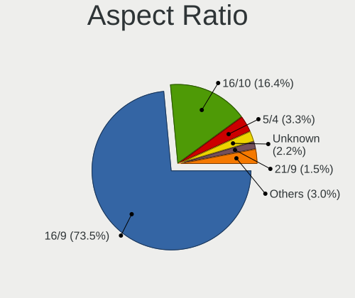

| Ratio   | Computers | Percent |
|---------|-----------|---------|
| 16/9    | 2434      | 73.51%  |
| 16/10   | 544       | 16.43%  |
| 5/4     | 110       | 3.32%   |
| Unknown | 72        | 2.17%   |
| 21/9    | 51        | 1.54%   |
| 4/3     | 39        | 1.18%   |
| 3/2     | 28        | 0.85%   |
| 0.67    | 11        | 0.33%   |
| 32/9    | 9         | 0.27%   |
| 1.00    | 6         | 0.18%   |
| 0.62    | 3         | 0.09%   |
| 3.20    | 2         | 0.06%   |
| 3.73    | 1         | 0.03%   |
| 3.33    | 1         | 0.03%   |

Monitor Area
------------

Area in inch²

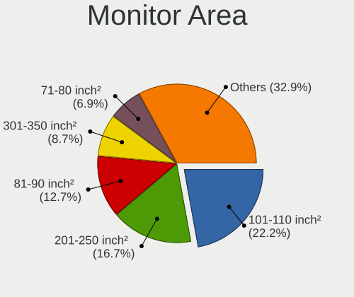

| Area in inch² | Computers | Percent |
|----------------|-----------|---------|
| 101-110        | 832       | 22.16%  |
| 201-250        | 626       | 16.67%  |
| 81-90          | 476       | 12.68%  |
| 301-350        | 325       | 8.66%   |
| 71-80          | 259       | 6.9%    |
| 351-500        | 245       | 6.52%   |
| 151-200        | 181       | 4.82%   |
| 251-300        | 155       | 4.13%   |
| 121-130        | 107       | 2.85%   |
| Unknown        | 94        | 2.5%    |
| More than 1000 | 93        | 2.48%   |
| 111-120        | 75        | 2%      |
| 141-150        | 63        | 1.68%   |
| 61-70          | 56        | 1.49%   |
| 51-60          | 51        | 1.36%   |
| 501-1000       | 51        | 1.36%   |
| 131-140        | 23        | 0.61%   |
| 1-40           | 16        | 0.43%   |
| 91-100         | 15        | 0.4%    |
| 41-50          | 12        | 0.32%   |

Pixel Density
-------------

Pixels per inch

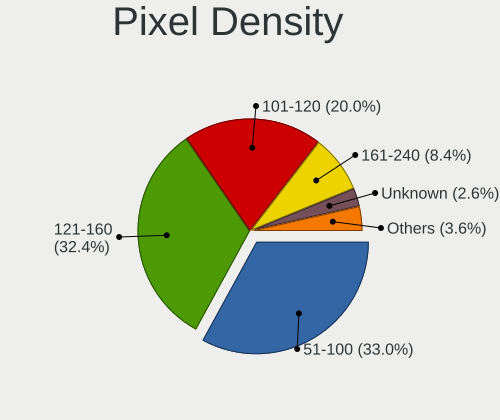

| Density       | Computers | Percent |
|---------------|-----------|---------|
| 51-100        | 1176      | 32.97%  |
| 121-160       | 1157      | 32.44%  |
| 101-120       | 715       | 20.04%  |
| 161-240       | 298       | 8.35%   |
| Unknown       | 94        | 2.64%   |
| More than 240 | 65        | 1.82%   |
| 1-50          | 62        | 1.74%   |

Multiple Monitors
-----------------

Total monitors connected

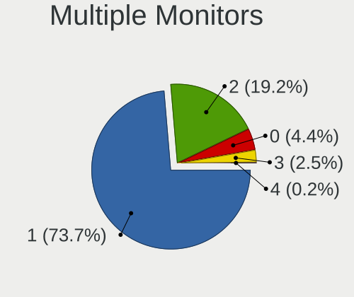

| Total | Computers | Percent |
|-------|-----------|---------|
| 1     | 2473      | 73.67%  |
| 2     | 644       | 19.18%  |
| 0     | 148       | 4.41%   |
| 3     | 85        | 2.53%   |
| 4     | 7         | 0.21%   |

Network
-------

Net Controller Vendor
---------------------

Controller vendors

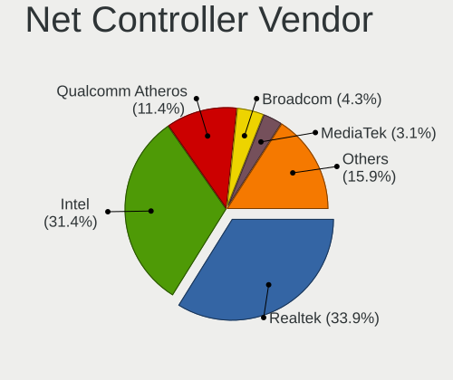

| Vendor                                 | Computers | Percent |
|----------------------------------------|-----------|---------|
| Realtek Semiconductor                  | 1654      | 33.85%  |
| Intel                                  | 1536      | 31.44%  |
| Qualcomm Atheros                       | 556       | 11.38%  |
| Broadcom                               | 211       | 4.32%   |
| MediaTek                               | 152       | 3.11%   |
| Samsung Electronics                    | 141       | 2.89%   |
| Broadcom Limited                       | 74        | 1.51%   |
| Marvell Technology Group               | 53        | 1.08%   |
| TP-Link                                | 49        | 1%      |
| Ralink Technology                      | 33        | 0.68%   |
| Ralink                                 | 31        | 0.63%   |
| Qualcomm Atheros Communications        | 31        | 0.63%   |
| Nvidia                                 | 30        | 0.61%   |
| Lenovo                                 | 30        | 0.61%   |
| ASIX Electronics                       | 28        | 0.57%   |
| Shenzhen Goodix Technology             | 24        | 0.49%   |
| Qualcomm                               | 22        | 0.45%   |
| DisplayLink                            | 22        | 0.45%   |
| Dell                                   | 20        | 0.41%   |
| Sierra Wireless                        | 19        | 0.39%   |
| Xiaomi                                 | 10        | 0.2%    |
| ASUSTek Computer                       | 10        | 0.2%    |
| Microsoft                              | 9         | 0.18%   |
| Hewlett-Packard                        | 9         | 0.18%   |
| Ericsson Business Mobile Networks      | 8         | 0.16%   |
| D-Link                                 | 8         | 0.16%   |
| Aquantia                               | 8         | 0.16%   |
| VIA Technologies                       | 6         | 0.12%   |
| Fibocom                                | 6         | 0.12%   |
| QLogic                                 | 5         | 0.1%    |
| Huawei Technologies                    | 5         | 0.1%    |
| Edimax Technology                      | 5         | 0.1%    |
| Attansic Technology                    | 5         | 0.1%    |
| Mellanox Technologies                  | 4         | 0.08%   |
| Google                                 | 4         | 0.08%   |
| ZyDAS                                  | 3         | 0.06%   |
| Sony Ericsson Mobile Communications AB | 3         | 0.06%   |
| Qualcomm Technologies                  | 3         | 0.06%   |
| OnePlus Technology (Shenzhen)          | 3         | 0.06%   |
| Microchip Technology                   | 3         | 0.06%   |

Net Controller Model
--------------------

Controller models

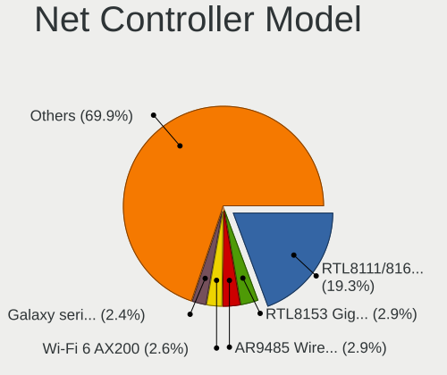

| Model                                                                  | Computers | Percent |
|------------------------------------------------------------------------|-----------|---------|
| Realtek RTL8111/8168/8211/8411 PCI Express Gigabit Ethernet Controller | 1109      | 19.35%  |
| Realtek RTL8153 Gigabit Ethernet Adapter                               | 168       | 2.93%   |
| Qualcomm Atheros AR9485 Wireless Network Adapter                       | 167       | 2.91%   |
| Intel Wi-Fi 6 AX200                                                    | 148       | 2.58%   |
| Samsung Galaxy series, misc. (tethering mode)                          | 135       | 2.36%   |
| Realtek RTL8125 2.5GbE Controller                                      | 115       | 2.01%   |
| Intel 82579LM Gigabit Network Connection (Lewisville)                  | 115       | 2.01%   |
| Intel Wireless 8265 / 8275                                             | 112       | 1.95%   |
| Realtek RTL810xE PCI Express Fast Ethernet controller                  | 105       | 1.83%   |
| Intel Wireless 7260                                                    | 66        | 1.15%   |
| Qualcomm Atheros QCA9377 802.11ac Wireless Network Adapter             | 65        | 1.13%   |
| Intel Wireless 8260                                                    | 64        | 1.12%   |
| Intel Wi-Fi 6 AX201                                                    | 62        | 1.08%   |
| Realtek RTL8822CE 802.11ac PCIe Wireless Network Adapter               | 60        | 1.05%   |
| MediaTek MT7921 802.11ax PCIe Wireless Network Adapter [Filogic 330]   | 58        | 1.01%   |
| Intel Wireless 7265                                                    | 57        | 0.99%   |
| Intel Centrino Advanced-N 6205 [Taylor Peak]                           | 56        | 0.98%   |
| Intel I211 Gigabit Network Connection                                  | 55        | 0.96%   |
| MediaTek MT7922 802.11ax PCI Express Wireless Network Adapter          | 54        | 0.94%   |
| Qualcomm Atheros QCA9565 / AR9565 Wireless Network Adapter             | 49        | 0.85%   |
| Qualcomm Atheros AR9285 Wireless Network Adapter (PCI-Express)         | 49        | 0.85%   |
| Intel Ethernet Connection I217-LM                                      | 48        | 0.84%   |
| Intel Ethernet Connection (4) I219-LM                                  | 48        | 0.84%   |
| Intel Alder Lake-P PCH CNVi WiFi                                       | 48        | 0.84%   |
| Realtek RTL8821CE 802.11ac PCIe Wireless Network Adapter               | 47        | 0.82%   |
| Intel Cannon Point-LP CNVi [Wireless-AC]                               | 45        | 0.79%   |
| Intel Comet Lake PCH-LP CNVi WiFi                                      | 43        | 0.75%   |
| Intel Cannon Lake PCH CNVi WiFi                                        | 43        | 0.75%   |
| Qualcomm Atheros QCA6174 802.11ac Wireless Network Adapter             | 39        | 0.68%   |
| Intel Wireless 3165                                                    | 39        | 0.68%   |
| Intel Wi-Fi 6E(802.11ax) AX210/AX1675* 2x2 [Typhoon Peak]              | 36        | 0.63%   |
| Intel Ethernet Connection (2) I219-V                                   | 35        | 0.61%   |
| Realtek RTL8822BE 802.11a/b/g/n/ac WiFi adapter                        | 34        | 0.59%   |
| Intel Ethernet Controller I225-V                                       | 33        | 0.58%   |
| Broadcom BCM4313 802.11bgn Wireless Network Adapter                    | 33        | 0.58%   |
| Realtek RTL8852AE 802.11ax PCIe Wireless Network Adapter               | 31        | 0.54%   |
| Intel Raptor Lake PCH CNVi WiFi                                        | 29        | 0.51%   |
| Intel Ethernet Connection I219-LM                                      | 29        | 0.51%   |
| Intel Comet Lake PCH CNVi WiFi                                         | 29        | 0.51%   |
| Broadcom BCM43142 802.11b/g/n                                          | 28        | 0.49%   |

Wireless Vendor
---------------

Wireless vendors

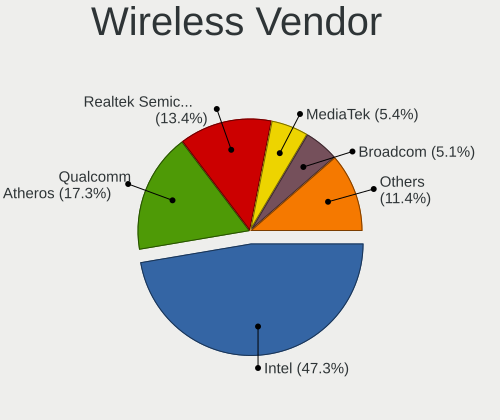

| Vendor                          | Computers | Percent |
|---------------------------------|-----------|---------|
| Intel                           | 1195      | 47.33%  |
| Qualcomm Atheros                | 438       | 17.35%  |
| Realtek Semiconductor           | 339       | 13.43%  |
| MediaTek                        | 137       | 5.43%   |
| Broadcom                        | 128       | 5.07%   |
| TP-Link                         | 46        | 1.82%   |
| Broadcom Limited                | 36        | 1.43%   |
| Ralink Technology               | 33        | 1.31%   |
| Ralink                          | 31        | 1.23%   |
| Qualcomm Atheros Communications | 31        | 1.23%   |
| Sierra Wireless                 | 19        | 0.75%   |
| Qualcomm                        | 18        | 0.71%   |
| Dell                            | 14        | 0.55%   |
| Microsoft                       | 9         | 0.36%   |
| ASUSTek Computer                | 9         | 0.36%   |
| D-Link                          | 7         | 0.28%   |
| Fibocom                         | 6         | 0.24%   |
| Edimax Technology               | 5         | 0.2%    |
| Marvell Technology Group        | 4         | 0.16%   |
| ZyDAS                           | 3         | 0.12%   |
| Qualcomm Technologies           | 3         | 0.12%   |
| ZyXEL Communications            | 2         | 0.08%   |
| NetGear                         | 2         | 0.08%   |
| Mercucys                        | 2         | 0.08%   |
| Hewlett-Packard                 | 2         | 0.08%   |
| Texas Instruments               | 1         | 0.04%   |
| Samsung Electronics             | 1         | 0.04%   |
| LG Electronics                  | 1         | 0.04%   |
| Intersil                        | 1         | 0.04%   |
| Fujitsu Siemens Computers       | 1         | 0.04%   |
| D-Link System                   | 1         | 0.04%   |

Wireless Model
--------------

Wireless models

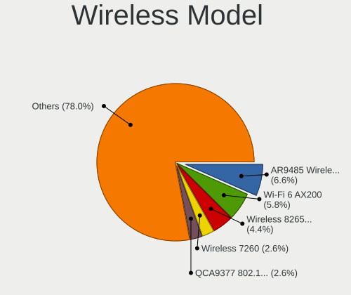

| Model                                                                | Computers | Percent |
|----------------------------------------------------------------------|-----------|---------|
| Qualcomm Atheros AR9485 Wireless Network Adapter                     | 167       | 6.6%    |
| Intel Wi-Fi 6 AX200                                                  | 148       | 5.85%   |
| Intel Wireless 8265 / 8275                                           | 112       | 4.42%   |
| Intel Wireless 7260                                                  | 66        | 2.61%   |
| Qualcomm Atheros QCA9377 802.11ac Wireless Network Adapter           | 65        | 2.57%   |
| Intel Wireless 8260                                                  | 64        | 2.53%   |
| Intel Wi-Fi 6 AX201                                                  | 62        | 2.45%   |
| Realtek RTL8822CE 802.11ac PCIe Wireless Network Adapter             | 60        | 2.37%   |
| MediaTek MT7921 802.11ax PCIe Wireless Network Adapter [Filogic 330] | 58        | 2.29%   |
| Intel Wireless 7265                                                  | 57        | 2.25%   |
| Intel Centrino Advanced-N 6205 [Taylor Peak]                         | 56        | 2.21%   |
| Qualcomm Atheros QCA9565 / AR9565 Wireless Network Adapter           | 49        | 1.94%   |
| Qualcomm Atheros AR9285 Wireless Network Adapter (PCI-Express)       | 49        | 1.94%   |
| MediaTek MT7922 802.11ax PCI Express Wireless Network Adapter        | 48        | 1.9%    |
| Realtek RTL8821CE 802.11ac PCIe Wireless Network Adapter             | 47        | 1.86%   |
| Intel Cannon Point-LP CNVi [Wireless-AC]                             | 45        | 1.78%   |
| Intel Comet Lake PCH-LP CNVi WiFi                                    | 43        | 1.7%    |
| Intel Cannon Lake PCH CNVi WiFi                                      | 43        | 1.7%    |
| Qualcomm Atheros QCA6174 802.11ac Wireless Network Adapter           | 39        | 1.54%   |
| Intel Wireless 3165                                                  | 39        | 1.54%   |
| Intel Wi-Fi 6E(802.11ax) AX210/AX1675* 2x2 [Typhoon Peak]            | 36        | 1.42%   |
| Realtek RTL8822BE 802.11a/b/g/n/ac WiFi adapter                      | 34        | 1.34%   |
| Broadcom BCM4313 802.11bgn Wireless Network Adapter                  | 33        | 1.3%    |
| Realtek RTL8852AE 802.11ax PCIe Wireless Network Adapter             | 31        | 1.22%   |
| Intel Alder Lake-P PCH CNVi WiFi                                     | 31        | 1.22%   |
| Intel Comet Lake PCH CNVi WiFi                                       | 29        | 1.15%   |
| Broadcom BCM43142 802.11b/g/n                                        | 28        | 1.11%   |
| Intel Raptor Lake PCH CNVi WiFi                                      | 27        | 1.07%   |
| Intel Dual Band Wireless-AC 3165 Plus Bluetooth                      | 26        | 1.03%   |
| Realtek RTL8852BE PCIe 802.11ax Wireless Network Controller          | 25        | 0.99%   |
| Qualcomm Atheros AR9271 802.11n                                      | 25        | 0.99%   |
| Intel WiFi Link 5100                                                 | 22        | 0.87%   |
| Intel Wireless 3160                                                  | 21        | 0.83%   |
| Intel Dual Band Wireless-AC 3168NGW [Stone Peak]                     | 21        | 0.83%   |
| Intel PRO/Wireless 3945ABG [Golan] Network Connection                | 20        | 0.79%   |
| Intel Gemini Lake PCH CNVi WiFi                                      | 20        | 0.79%   |
| TP-Link TL-WN722N v2/v3 [Realtek RTL8188EUS]                         | 19        | 0.75%   |
| Intel Wi-Fi 5(802.11ac) Wireless-AC 9x6x [Thunder Peak]              | 19        | 0.75%   |
| Realtek RTL8188EUS 802.11n Wireless Network Adapter                  | 16        | 0.63%   |
| Qualcomm Atheros AR9462 Wireless Network Adapter                     | 16        | 0.63%   |

Ethernet Vendor
---------------

Ethernet vendors

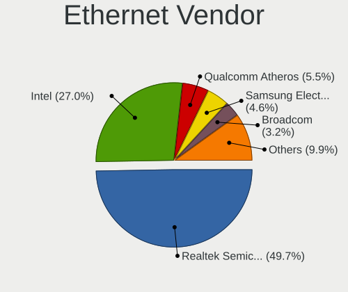

| Vendor                                 | Computers | Percent |
|----------------------------------------|-----------|---------|
| Realtek Semiconductor                  | 1500      | 49.72%  |
| Intel                                  | 816       | 27.05%  |
| Qualcomm Atheros                       | 165       | 5.47%   |
| Samsung Electronics                    | 140       | 4.64%   |
| Broadcom                               | 96        | 3.18%   |
| Marvell Technology Group               | 50        | 1.66%   |
| Broadcom Limited                       | 38        | 1.26%   |
| Nvidia                                 | 30        | 0.99%   |
| Lenovo                                 | 30        | 0.99%   |
| ASIX Electronics                       | 28        | 0.93%   |
| DisplayLink                            | 22        | 0.73%   |
| MediaTek                               | 15        | 0.5%    |
| Xiaomi                                 | 10        | 0.33%   |
| Aquantia                               | 8         | 0.27%   |
| VIA Technologies                       | 5         | 0.17%   |
| QLogic                                 | 5         | 0.17%   |
| Hewlett-Packard                        | 5         | 0.17%   |
| Attansic Technology                    | 5         | 0.17%   |
| Qualcomm                               | 4         | 0.13%   |
| Mellanox Technologies                  | 4         | 0.13%   |
| Huawei Technologies                    | 4         | 0.13%   |
| Google                                 | 4         | 0.13%   |
| TP-Link                                | 3         | 0.1%    |
| American Megatrends                    | 3         | 0.1%    |
| Suzhou Motorcomm Electronic Technology | 2         | 0.07%   |
| Spreadtrum Communications              | 2         | 0.07%   |
| Sony Ericsson Mobile Communications AB | 2         | 0.07%   |
| Silicon Integrated Systems [SiS]       | 2         | 0.07%   |
| Microchip Technology                   | 2         | 0.07%   |
| JMicron Technology                     | 2         | 0.07%   |
| IBM                                    | 2         | 0.07%   |
| Sundance Technology Inc / IC Plus      | 1         | 0.03%   |
| Motorola PCS                           | 1         | 0.03%   |
| MosChip Semiconductor                  | 1         | 0.03%   |
| Insyde Software                        | 1         | 0.03%   |
| ICS Advent                             | 1         | 0.03%   |
| Foxconn / Hon Hai                      | 1         | 0.03%   |
| Emulex                                 | 1         | 0.03%   |
| D-Link System                          | 1         | 0.03%   |
| D-Link                                 | 1         | 0.03%   |

Ethernet Model
--------------

Ethernet models

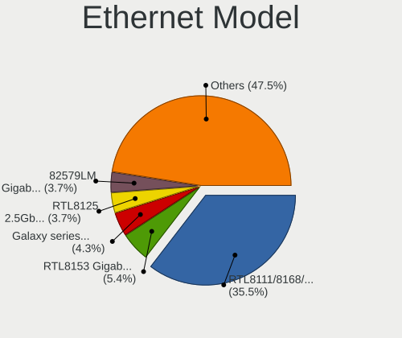

| Model                                                                  | Computers | Percent |
|------------------------------------------------------------------------|-----------|---------|
| Realtek RTL8111/8168/8211/8411 PCI Express Gigabit Ethernet Controller | 1109      | 35.45%  |
| Realtek RTL8153 Gigabit Ethernet Adapter                               | 168       | 5.37%   |
| Samsung Galaxy series, misc. (tethering mode)                          | 135       | 4.32%   |
| Realtek RTL8125 2.5GbE Controller                                      | 115       | 3.68%   |
| Intel 82579LM Gigabit Network Connection (Lewisville)                  | 115       | 3.68%   |
| Realtek RTL810xE PCI Express Fast Ethernet controller                  | 105       | 3.36%   |
| Intel I211 Gigabit Network Connection                                  | 55        | 1.76%   |
| Intel Ethernet Connection I217-LM                                      | 48        | 1.53%   |
| Intel Ethernet Connection (4) I219-LM                                  | 48        | 1.53%   |
| Intel Ethernet Connection (2) I219-V                                   | 35        | 1.12%   |
| Intel Ethernet Controller I225-V                                       | 33        | 1.05%   |
| Intel Ethernet Connection I219-LM                                      | 29        | 0.93%   |
| Qualcomm Atheros AR8131 Gigabit Ethernet                               | 26        | 0.83%   |
| Qualcomm Atheros AR8151 v2.0 Gigabit Ethernet                          | 25        | 0.8%    |
| Realtek RTL-8100/8101L/8139 PCI Fast Ethernet Adapter                  | 24        | 0.77%   |
| Intel Ethernet Connection I218-LM                                      | 23        | 0.74%   |
| Intel Ethernet Connection (7) I219-LM                                  | 23        | 0.74%   |
| ASIX AX88179 Gigabit Ethernet                                          | 23        | 0.74%   |
| Intel Ethernet Connection (4) I219-V                                   | 22        | 0.7%    |
| Intel 82567LM Gigabit Network Connection                               | 22        | 0.7%    |
| Intel Ethernet Connection (7) I219-V                                   | 21        | 0.67%   |
| Intel 82579V Gigabit Network Connection                                | 20        | 0.64%   |
| Intel Ethernet Connection (6) I219-V                                   | 19        | 0.61%   |
| Qualcomm Atheros Killer E220x Gigabit Ethernet Controller              | 18        | 0.58%   |
| Intel Alder Lake-P PCH CNVi WiFi                                       | 17        | 0.54%   |
| Realtek RTL8152 Fast Ethernet Adapter                                  | 16        | 0.51%   |
| Qualcomm Atheros AR8161 Gigabit Ethernet                               | 16        | 0.51%   |
| Intel Ethernet Connection (3) I218-LM                                  | 15        | 0.48%   |
| Intel Ethernet Connection (2) I219-LM                                  | 15        | 0.48%   |
| Qualcomm Atheros QCA8172 Fast Ethernet                                 | 14        | 0.45%   |
| Lenovo ThinkPad TBT 3 Dock                                             | 14        | 0.45%   |
| Intel I210 Gigabit Network Connection                                  | 14        | 0.45%   |
| Intel Ethernet Connection (10) I219-LM                                 | 14        | 0.45%   |
| Intel 82567LM-3 Gigabit Network Connection                             | 13        | 0.42%   |
| Broadcom NetXtreme BCM5761 Gigabit Ethernet PCIe                       | 13        | 0.42%   |
| Broadcom NetLink BCM5787M Gigabit Ethernet PCI Express                 | 13        | 0.42%   |
| Intel Ethernet Connection (6) I219-LM                                  | 12        | 0.38%   |
| Broadcom Limited NetLink BCM5787M Gigabit Ethernet PCI Express         | 12        | 0.38%   |
| Realtek Killer E2600 GbE Controller                                    | 11        | 0.35%   |
| Intel Ethernet Connection I217-V                                       | 11        | 0.35%   |

Net Controller Kind
-------------------

Ethernet, WiFi or modem

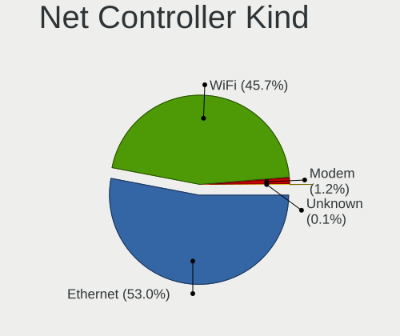

| Kind     | Computers | Percent |
|----------|-----------|---------|
| Ethernet | 2800      | 53%     |
| WiFi     | 2414      | 45.69%  |
| Modem    | 63        | 1.19%   |
| Unknown  | 6         | 0.11%   |

Used Controller
---------------

Currently used network controller

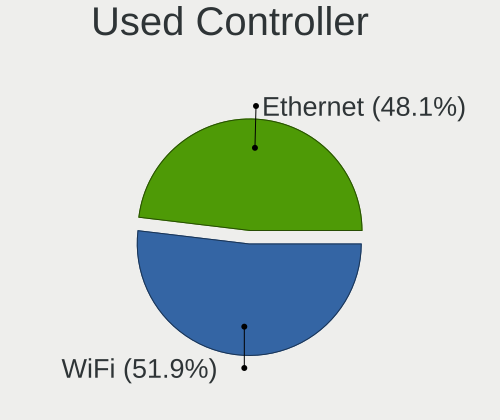

| Kind     | Computers | Percent |
|----------|-----------|---------|
| WiFi     | 1756      | 51.89%  |
| Ethernet | 1628      | 48.11%  |

NICs
----

Total network controllers on board

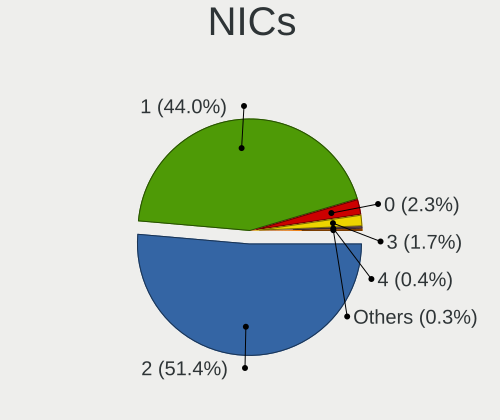

| Total | Computers | Percent |
|-------|-----------|---------|
| 2     | 1680      | 51.38%  |
| 1     | 1440      | 44.04%  |
| 0     | 74        | 2.26%   |
| 3     | 54        | 1.65%   |
| 4     | 12        | 0.37%   |
| 8     | 4         | 0.12%   |
| 5     | 3         | 0.09%   |
| 10    | 1         | 0.03%   |
| 9     | 1         | 0.03%   |
| 6     | 1         | 0.03%   |

IPv6
----

IPv6 vs IPv4

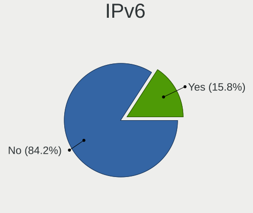

| Used | Computers | Percent |
|------|-----------|---------|
| No   | 2785      | 84.16%  |
| Yes  | 524       | 15.84%  |

Bluetooth
---------

Bluetooth Vendor
----------------

Controller vendors

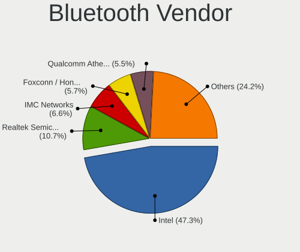

| Vendor                          | Computers | Percent |
|---------------------------------|-----------|---------|
| Intel                           | 958       | 47.26%  |
| Realtek Semiconductor           | 217       | 10.71%  |
| IMC Networks                    | 134       | 6.61%   |
| Foxconn / Hon Hai               | 116       | 5.72%   |
| Qualcomm Atheros Communications | 112       | 5.53%   |
| Broadcom                        | 95        | 4.69%   |
| Cambridge Silicon Radio         | 86        | 4.24%   |
| Lite-On Technology              | 64        | 3.16%   |
| ASUSTek Computer                | 54        | 2.66%   |
| Hewlett-Packard                 | 37        | 1.83%   |
| MediaTek                        | 29        | 1.43%   |
| Dell                            | 26        | 1.28%   |
| Ralink                          | 14        | 0.69%   |
| Apple                           | 13        | 0.64%   |
| TP-Link                         | 12        | 0.59%   |
| USI                             | 7         | 0.35%   |
| Foxconn International           | 7         | 0.35%   |
| Integrated System Solution      | 6         | 0.3%    |
| Alps Electric                   | 6         | 0.3%    |
| Toshiba                         | 5         | 0.25%   |
| Realtek                         | 4         | 0.2%    |
| Marvell Semiconductor           | 4         | 0.2%    |
| Ralink Technology               | 3         | 0.15%   |
| Micro Star International        | 3         | 0.15%   |
| Edimax Technology               | 3         | 0.15%   |
| Mobile Action Technology        | 2         | 0.1%    |
| Creative Technology             | 2         | 0.1%    |
| Actions                         | 2         | 0.1%    |
| Mercucys                        | 1         | 0.05%   |
| Fujitsu Siemens Computers       | 1         | 0.05%   |
| Chicony Electronics             | 1         | 0.05%   |
| Belkin Components               | 1         | 0.05%   |
| Askey Computer                  | 1         | 0.05%   |
| Unknown                         | 1         | 0.05%   |

Bluetooth Model
---------------

Controller models

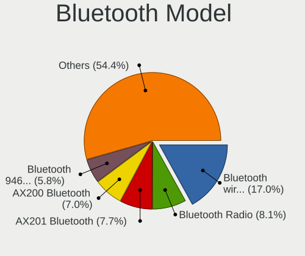

| Model                                               | Computers | Percent |
|-----------------------------------------------------|-----------|---------|
| Intel Bluetooth wireless interface                  | 344       | 16.96%  |
| Realtek Bluetooth Radio                             | 164       | 8.09%   |
| Intel AX201 Bluetooth                               | 157       | 7.74%   |
| Intel AX200 Bluetooth                               | 142       | 7%      |
| Intel Bluetooth 9460/9560 Jefferson Peak (JfP)      | 117       | 5.77%   |
| Intel Bluetooth Device                              | 89        | 4.39%   |
| Cambridge Silicon Radio Bluetooth Dongle (HCI mode) | 86        | 4.24%   |
| Qualcomm Atheros  Bluetooth Device                  | 48        | 2.37%   |
| IMC Networks Bluetooth Radio                        | 40        | 1.97%   |
| Foxconn / Hon Hai Wireless_Device                   | 40        | 1.97%   |
| IMC Networks Wireless_Device                        | 39        | 1.92%   |
| Intel AX210 Bluetooth                               | 34        | 1.68%   |
| Realtek  Bluetooth 4.2 Adapter                      | 33        | 1.63%   |
| IMC Networks Atheros AR3012 Bluetooth 4.0 Adapter   | 27        | 1.33%   |
| Intel Centrino Bluetooth Wireless Transceiver       | 26        | 1.28%   |
| IMC Networks Bluetooth Device                       | 26        | 1.28%   |
| MediaTek Wireless_Device                            | 25        | 1.23%   |
| Qualcomm Atheros QCA61x4 Bluetooth 4.0              | 23        | 1.13%   |
| Intel Wireless-AC 3168 Bluetooth                    | 23        | 1.13%   |
| Foxconn / Hon Hai MediaTek Bluetooth Adapter        | 23        | 1.13%   |
| HP Broadcom 2070 Bluetooth Combo                    | 19        | 0.94%   |
| Qualcomm Atheros AR3011 Bluetooth                   | 18        | 0.89%   |
| Lite-On Qualcomm Atheros QCA9377 Bluetooth          | 17        | 0.84%   |
| HP Bluetooth 2.0 Interface [Broadcom BCM2045]       | 17        | 0.84%   |
| Foxconn / Hon Hai Bluetooth Device                  | 17        | 0.84%   |
| Intel Wireless-AC 9260 Bluetooth Adapter            | 16        | 0.79%   |
| Broadcom BCM2045 Bluetooth                          | 15        | 0.74%   |
| Ralink RT3290 Bluetooth                             | 14        | 0.69%   |
| Dell DW375 Bluetooth Module                         | 14        | 0.69%   |
| ASUS Broadcom BCM20702A0 Bluetooth                  | 14        | 0.69%   |
| Lite-On Atheros AR3012 Bluetooth                    | 13        | 0.64%   |
| Broadcom BCM20702 Bluetooth 4.0 [ThinkPad]          | 13        | 0.64%   |
| Broadcom BCM2045B (BDC-2.1)                         | 13        | 0.64%   |
| ASUS ASUS USB-BT500                                 | 13        | 0.64%   |
| TP-Link TP-T@- UB500 Adapter                        | 12        | 0.59%   |
| Qualcomm Atheros AR3012 Bluetooth 4.0               | 12        | 0.59%   |
| Lite-On Wireless_Device                             | 11        | 0.54%   |
| Lite-On Bluetooth Device                            | 9         | 0.44%   |
| Intel Centrino Advanced-N 6230 Bluetooth adapter    | 9         | 0.44%   |
| Broadcom HP Portable SoftSailing                    | 9         | 0.44%   |

Sound
-----

Sound Vendor
------------

Sound card vendors

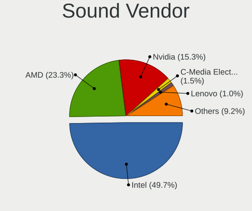

| Vendor                                       | Computers | Percent |
|----------------------------------------------|-----------|---------|
| Intel                                        | 2213      | 49.74%  |
| AMD                                          | 1035      | 23.26%  |
| Nvidia                                       | 682       | 15.33%  |
| C-Media Electronics                          | 68        | 1.53%   |
| Lenovo                                       | 43        | 0.97%   |
| Realtek Semiconductor                        | 36        | 0.81%   |
| Logitech                                     | 28        | 0.63%   |
| GN Netcom                                    | 26        | 0.58%   |
| Creative Labs                                | 24        | 0.54%   |
| Kingston Technology                          | 21        | 0.47%   |
| JMTek                                        | 21        | 0.47%   |
| Hewlett-Packard                              | 21        | 0.47%   |
| Creative Technology                          | 21        | 0.47%   |
| VIA Technologies                             | 14        | 0.31%   |
| Focusrite-Novation                           | 10        | 0.22%   |
| Razer USA                                    | 9         | 0.2%    |
| Texas Instruments                            | 8         | 0.18%   |
| Micro Star International                     | 8         | 0.18%   |
| ASUSTek Computer                             | 8         | 0.18%   |
| Yamaha                                       | 7         | 0.16%   |
| Trust                                        | 7         | 0.16%   |
| SteelSeries ApS                              | 6         | 0.13%   |
| Plantronics                                  | 6         | 0.13%   |
| BEHRINGER International                      | 6         | 0.13%   |
| Sony                                         | 5         | 0.11%   |
| GYROCOM C&C                                  | 5         | 0.11%   |
| DSEA A/S                                     | 5         | 0.11%   |
| Dell                                         | 5         | 0.11%   |
| Zoran Co. Personal Media Division (Nogatech) | 4         | 0.09%   |
| Thesycon Systemsoftware & Consulting         | 4         | 0.09%   |
| M-Audio                                      | 4         | 0.09%   |
| ASRock                                       | 4         | 0.09%   |
| Silicon Integrated Systems [SiS]             | 3         | 0.07%   |
| RODE Microphones                             | 3         | 0.07%   |
| Generalplus Technology                       | 3         | 0.07%   |
| fifinemicrophone.com                         | 3         | 0.07%   |
| DigiTech                                     | 3         | 0.07%   |
| SM950 Microphon                              | 2         | 0.04%   |
| Schiit Audio                                 | 2         | 0.04%   |
| Samson Technologies                          | 2         | 0.04%   |

Sound Model
-----------

Sound card models

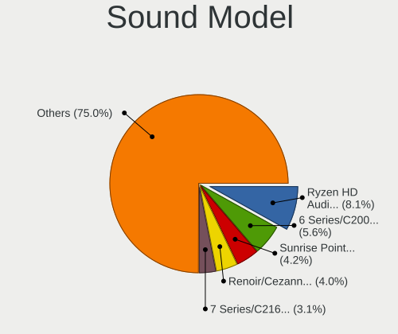

| Model                                                                      | Computers | Percent |
|----------------------------------------------------------------------------|-----------|---------|
| AMD Ryzen HD Audio Controller                                              | 435       | 8.09%   |
| Intel 6 Series/C200 Series Chipset Family High Definition Audio Controller | 303       | 5.64%   |
| Intel Sunrise Point-LP HD Audio                                            | 225       | 4.19%   |
| AMD Renoir/Cezanne HDMI/DP Audio Controller                                | 215       | 4%      |
| Intel 7 Series/C216 Chipset Family High Definition Audio Controller        | 168       | 3.13%   |
| Intel 8 Series/C220 Series Chipset High Definition Audio Controller        | 132       | 2.46%   |
| AMD Starship/Matisse HD Audio Controller                                   | 129       | 2.4%    |
| AMD Radeon High Definition Audio Controller                                | 125       | 2.33%   |
| Intel 82801I (ICH9 Family) HD Audio Controller                             | 109       | 2.03%   |
| Intel Cannon Lake PCH cAVS                                                 | 108       | 2.01%   |
| Intel Xeon E3-1200 v3/4th Gen Core Processor HD Audio Controller           | 103       | 1.92%   |
| AMD SBx00 Azalia (Intel HDA)                                               | 103       | 1.92%   |
| Intel NM10/ICH7 Family High Definition Audio Controller                    | 91        | 1.69%   |
| Intel Tiger Lake-LP Smart Sound Technology Audio Controller                | 82        | 1.53%   |
| AMD FCH Azalia Controller                                                  | 73        | 1.36%   |
| Intel 5 Series/3400 Series Chipset High Definition Audio                   | 68        | 1.27%   |
| Intel Alder Lake PCH-P High Definition Audio Controller                    | 66        | 1.23%   |
| Intel Celeron/Pentium Silver Processor High Definition Audio               | 65        | 1.21%   |
| Intel 100 Series/C230 Series Chipset Family HD Audio Controller            | 65        | 1.21%   |
| AMD Family 17h (Models 00h-0fh) HD Audio Controller                        | 65        | 1.21%   |
| Nvidia GP107GL High Definition Audio Controller                            | 63        | 1.17%   |
| Intel Haswell-ULT HD Audio Controller                                      | 63        | 1.17%   |
| Intel Cannon Point-LP High Definition Audio Controller                     | 63        | 1.17%   |
| Intel 8 Series HD Audio Controller                                         | 63        | 1.17%   |
| AMD Raven/Raven2/Fenghuang HDMI/DP Audio Controller                        | 60        | 1.12%   |
| AMD Ellesmere HDMI Audio [Radeon RX 470/480 / 570/580/590]                 | 57        | 1.06%   |
| Nvidia GP106 High Definition Audio Controller                              | 52        | 0.97%   |
| Nvidia GF108 High Definition Audio Controller                              | 51        | 0.95%   |
| Intel Comet Lake PCH-LP cAVS                                               | 49        | 0.91%   |
| Intel Broadwell-U Audio Controller                                         | 49        | 0.91%   |
| Intel Wildcat Point-LP High Definition Audio Controller                    | 48        | 0.89%   |
| Intel 200 Series PCH HD Audio                                              | 48        | 0.89%   |
| Nvidia GK208 HDMI/DP Audio Controller                                      | 47        | 0.87%   |
| AMD Family 15h (Models 60h-6fh) Audio Controller                           | 43        | 0.8%    |
| Intel Comet Lake PCH cAVS                                                  | 42        | 0.78%   |
| Intel 82801H (ICH8 Family) HD Audio Controller                             | 42        | 0.78%   |
| Intel Atom Processor Z36xxx/Z37xxx Series High Definition Audio Controller | 39        | 0.73%   |
| Nvidia TU107 GeForce GTX 1650 High Definition Audio Controller             | 38        | 0.71%   |
| AMD Navi 21/23 HDMI/DP Audio Controller                                    | 38        | 0.71%   |
| Nvidia GA106 High Definition Audio Controller                              | 37        | 0.69%   |

Memory
------

Memory Vendor
-------------

Memory module vendors

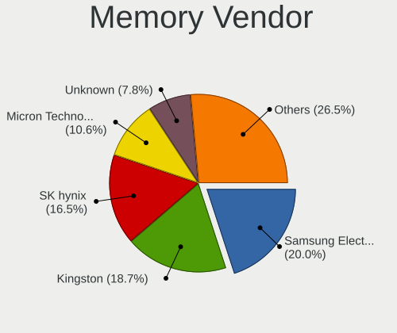

| Vendor                       | Computers | Percent |
|------------------------------|-----------|---------|
| Samsung Electronics          | 436       | 19.99%  |
| Kingston                     | 408       | 18.71%  |
| SK hynix                     | 359       | 16.46%  |
| Micron Technology            | 231       | 10.59%  |
| Unknown                      | 170       | 7.79%   |
| Elpida                       | 154       | 7.06%   |
| Crucial                      | 98        | 4.49%   |
| Corsair                      | 57        | 2.61%   |
| Ramaxel Technology           | 47        | 2.15%   |
| Patriot                      | 41        | 1.88%   |
| A-DATA Technology            | 37        | 1.7%    |
| Unknown (ABCD)               | 27        | 1.24%   |
| Nanya Technology             | 23        | 1.05%   |
| G.Skill                      | 22        | 1.01%   |
| Unknown                      | 12        | 0.55%   |
| Transcend                    | 7         | 0.32%   |
| GOODRAM                      | 5         | 0.23%   |
| Apacer                       | 4         | 0.18%   |
| KingSpec                     | 3         | 0.14%   |
| ASint Technology             | 3         | 0.14%   |
| Unknown (AB)                 | 2         | 0.09%   |
| Team                         | 2         | 0.09%   |
| Patriot Memory (PDP Systems) | 2         | 0.09%   |
| Lexar                        | 2         | 0.09%   |
| GSkill                       | 2         | 0.09%   |
| fef5                         | 2         | 0.09%   |
| Unknown (8A02)               | 1         | 0.05%   |
| Unknown (0x1636)             | 1         | 0.05%   |
| Unknown (0x0E9D)             | 1         | 0.05%   |
| Unknown (0x0CC7)             | 1         | 0.05%   |
| Unknown (0x0080)             | 1         | 0.05%   |
| Unifosa                      | 1         | 0.05%   |
| Toshiba                      | 1         | 0.05%   |
| TakeMS                       | 1         | 0.05%   |
| Silicon Power                | 1         | 0.05%   |
| SHARETRONIC                  | 1         | 0.05%   |
| RZX                          | 1         | 0.05%   |
| Qimonda                      | 1         | 0.05%   |
| ProMos/Mosel Vitelic         | 1         | 0.05%   |
| PDPSystems                   | 1         | 0.05%   |

Memory Model
------------

Memory module models

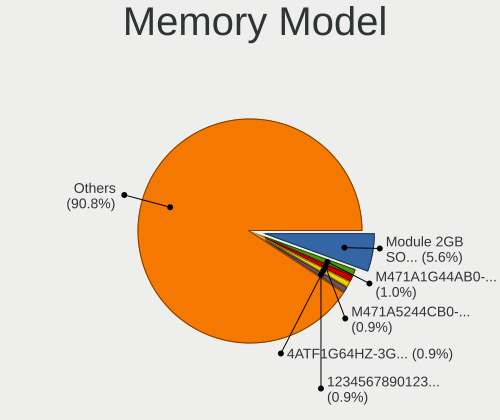

| Model                                                            | Computers | Percent |
|------------------------------------------------------------------|-----------|---------|
| Elpida RAM Module 2GB SODIMM DDR3 1333MT/s                       | 129       | 5.56%   |
| Samsung RAM M471A1G44AB0-CWE 8GiB SODIMM DDR4 3200MT/s           | 23        | 0.99%   |
| Samsung RAM M471A5244CB0-CTD 4GB SODIMM DDR4 3266MT/s            | 21        | 0.9%    |
| Micron RAM 4ATF1G64HZ-3G2E1 8GB SODIMM DDR4 3200MT/s             | 21        | 0.9%    |
| Unknown (ABCD) RAM 123456789012345678 2GB SODIMM LPDDR4 2400MT/s | 20        | 0.86%   |
| Samsung RAM M471A1K43EB1-CWE 8GB SODIMM DDR4 3200MT/s            | 16        | 0.69%   |
| Kingston RAM KHX3200C16D4/8GX 8GB DIMM DDR4 3733MT/s             | 15        | 0.65%   |
| Kingston RAM KF3200C16D4/8GX 8GiB DIMM DDR4 3600MT/s             | 14        | 0.6%    |
| SK hynix RAM HMT351S6CFR8C-PB 4GB SODIMM DDR3 1600MT/s           | 13        | 0.56%   |
| SK hynix RAM HMA81GS6AFR8N-UH 8GB SODIMM DDR4 2667MT/s           | 13        | 0.56%   |
| Samsung RAM M471A1G44BB0-CWE 8GB SODIMM DDR4 3200MT/s            | 13        | 0.56%   |
| SK hynix RAM HMT451S6BFR8A-PB 4GB SODIMM DDR3 1600MT/s           | 12        | 0.52%   |
| Samsung RAM M471A2G44AM0-CWE 16GB SODIMM DDR4 3200MT/s           | 12        | 0.52%   |
| Samsung RAM M471A1K43CB1-CRC 8GB SODIMM DDR4 8400MT/s            | 12        | 0.52%   |
| Unknown                                                          | 12        | 0.52%   |
| Samsung RAM M471A1K43DB1-CWE 8GB SODIMM DDR4 3200MT/s            | 11        | 0.47%   |
| Kingston RAM KHX2666C16/8G 8GiB DIMM DDR4 3466MT/s               | 11        | 0.47%   |
| SK hynix RAM Module 8GB SODIMM DDR4 3200MT/s                     | 9         | 0.39%   |
| SK hynix RAM HMT41GS6BFR8A-PB 8GB SODIMM DDR3 2667MT/s           | 9         | 0.39%   |
| Samsung RAM M471B5273DH0-CH9 4GB SODIMM DDR3 1600MT/s            | 9         | 0.39%   |
| Samsung RAM M471B5273CH0-CH9 4GB SODIMM DDR3 1334MT/s            | 9         | 0.39%   |
| Samsung RAM M471B5173DB0-YK0 4GB SODIMM DDR3 1600MT/s            | 9         | 0.39%   |
| Samsung RAM M471A1K43DB1-CTD 8GB SODIMM DDR4 2667MT/s            | 9         | 0.39%   |
| Kingston RAM KF3200C16D4/32GX 32GB DIMM DDR4 3933MT/s            | 9         | 0.39%   |
| Kingston RAM KF3200C16D4/16GX 16GB DIMM DDR4 3733MT/s            | 9         | 0.39%   |
| SK hynix RAM HMAA1GS6CJR6N-XN 8GB SODIMM DDR4 3200MT/s           | 8         | 0.34%   |
| SK hynix RAM HMA82GS6JJR8N-VK 16GB SODIMM DDR4 2667MT/s          | 8         | 0.34%   |
| SK hynix RAM HMA82GS6AFR8N-UH 16GB SODIMM DDR4 2667MT/s          | 8         | 0.34%   |
| Samsung RAM M471B1G73DB0-YK0 8GB SODIMM DDR3 1600MT/s            | 8         | 0.34%   |
| Samsung RAM M471A1K43BB1-CRC 8GB SODIMM DDR4 2667MT/s            | 8         | 0.34%   |
| Micron RAM 4ATF1G64HZ-3G2E1 8GB Row Of Chips DDR4 3200MT/s       | 8         | 0.34%   |
| Kingston RAM KHX1866C10D3/8G 8GB DIMM DDR3 1867MT/s              | 8         | 0.34%   |
| Unknown (ABCD) RAM 123456789012345678 2GB DIMM LPDDR4 2133MT/s   | 7         | 0.3%    |
| SK hynix RAM HMA82GS6DJR8N-XN 16GB SODIMM DDR4 3200MT/s          | 7         | 0.3%    |
| Samsung RAM M471A2K43DB1-CWE 16GB SODIMM DDR4 3200MT/s           | 7         | 0.3%    |
| Samsung RAM M471A2G43AB2-CWE 16GB SODIMM DDR4 3200MT/s           | 7         | 0.3%    |
| Patriot RAM 3200 C16 Series 8GB DIMM DDR4 3600MT/s               | 7         | 0.3%    |
| Micron RAM MT62F1G32D4DR-031 WT 4GB Row Of Chips LPDDR5 6400MT/s | 7         | 0.3%    |
| Kingston RAM KHX3200C16D4/16GX 16GB DIMM DDR4 3600MT/s           | 7         | 0.3%    |
| Kingston RAM KHX1600C9S3L/8G 8GB SODIMM DDR3 1600MT/s            | 7         | 0.3%    |

Memory Kind
-----------

Memory module kinds

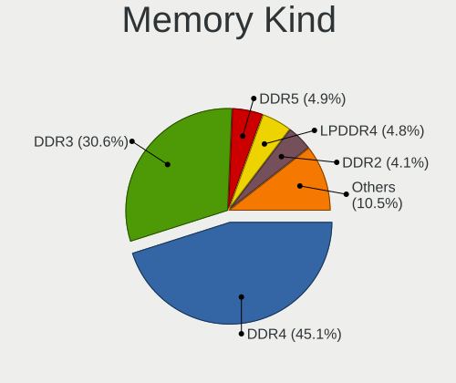

| Kind    | Computers | Percent |
|---------|-----------|---------|
| DDR4    | 860       | 45.1%   |
| DDR3    | 583       | 30.57%  |
| DDR5    | 93        | 4.88%   |
| LPDDR4  | 92        | 4.82%   |
| DDR2    | 78        | 4.09%   |
| LPDDR5  | 57        | 2.99%   |
| Unknown | 53        | 2.78%   |
| SDRAM   | 49        | 2.57%   |
| LPDDR3  | 30        | 1.57%   |
| DDR     | 9         | 0.47%   |
| DRAM    | 3         | 0.16%   |

Memory Form Factor
------------------

Physical design of the memory module

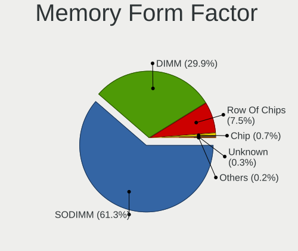

| Name         | Computers | Percent |
|--------------|-----------|---------|
| SODIMM       | 1166      | 61.34%  |
| DIMM         | 568       | 29.88%  |
| Row Of Chips | 143       | 7.52%   |
| Chip         | 14        | 0.74%   |
| Unknown      | 6         | 0.32%   |
| RIMM         | 3         | 0.16%   |
| FB-DIMM      | 1         | 0.05%   |

Memory Size
-----------

Memory module size

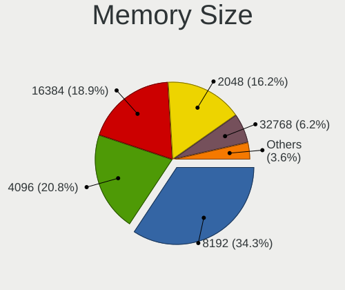

| Size  | Computers | Percent |
|-------|-----------|---------|
| 8192  | 705       | 34.31%  |
| 4096  | 428       | 20.83%  |
| 16384 | 389       | 18.93%  |
| 2048  | 333       | 16.2%   |
| 32768 | 127       | 6.18%   |
| 1024  | 59        | 2.87%   |
| 512   | 7         | 0.34%   |
| 256   | 2         | 0.1%    |
| 49152 | 1         | 0.05%   |
| 24576 | 1         | 0.05%   |
| 12288 | 1         | 0.05%   |
| 6144  | 1         | 0.05%   |
| 3072  | 1         | 0.05%   |

Memory Speed
------------

Memory module speed

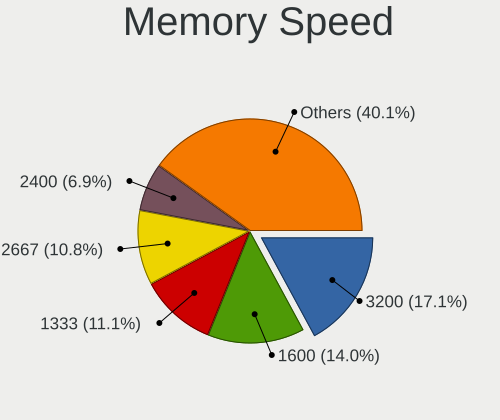

| Speed   | Computers | Percent |
|---------|-----------|---------|
| 3200    | 355       | 17.1%   |
| 1600    | 291       | 14.02%  |
| 1333    | 230       | 11.08%  |
| 2667    | 224       | 10.79%  |
| 2400    | 144       | 6.94%   |
| 2133    | 90        | 4.34%   |
| 3600    | 61        | 2.94%   |
| 800     | 49        | 2.36%   |
| 5600    | 41        | 1.97%   |
| 1334    | 41        | 1.97%   |
| 667     | 35        | 1.69%   |
| Unknown | 33        | 1.59%   |
| 3733    | 32        | 1.54%   |
| 4267    | 30        | 1.45%   |
| 6400    | 26        | 1.25%   |
| 4800    | 26        | 1.25%   |
| 1867    | 24        | 1.16%   |
| 3266    | 23        | 1.11%   |
| 1067    | 23        | 1.11%   |
| 7500    | 19        | 0.92%   |
| 3800    | 17        | 0.82%   |
| 8400    | 16        | 0.77%   |
| 6000    | 16        | 0.77%   |
| 2048    | 16        | 0.77%   |
| 4266    | 15        | 0.72%   |
| 3466    | 14        | 0.67%   |
| 3400    | 13        | 0.63%   |
| 1866    | 12        | 0.58%   |
| 3000    | 11        | 0.53%   |
| 2666    | 11        | 0.53%   |
| 4199    | 10        | 0.48%   |
| 4000    | 10        | 0.48%   |
| 3933    | 9         | 0.43%   |
| 1800    | 9         | 0.43%   |
| 8533    | 8         | 0.39%   |
| 3333    | 8         | 0.39%   |
| 1066    | 8         | 0.39%   |
| 533     | 8         | 0.39%   |
| 400     | 7         | 0.34%   |
| 2800    | 6         | 0.29%   |

Printers & scanners
-------------------

Printer Vendor
--------------

Printer device vendors

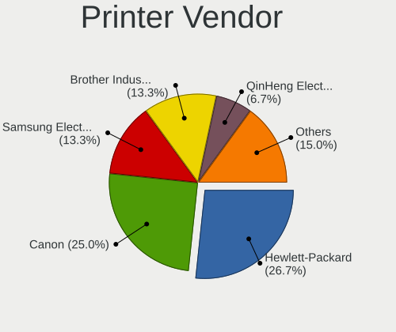

| Vendor              | Computers | Percent |
|---------------------|-----------|---------|
| Hewlett-Packard     | 16        | 26.67%  |
| Canon               | 15        | 25%     |
| Samsung Electronics | 8         | 13.33%  |
| Brother Industries  | 8         | 13.33%  |
| QinHeng Electronics | 4         | 6.67%   |
| Xerox               | 3         | 5%      |
| Seiko Epson         | 2         | 3.33%   |
| Prolific Technology | 1         | 1.67%   |
| Pantum              | 1         | 1.67%   |
| Minolta             | 1         | 1.67%   |
| ICS Advent          | 1         | 1.67%   |

Printer Model
-------------

Printer device models

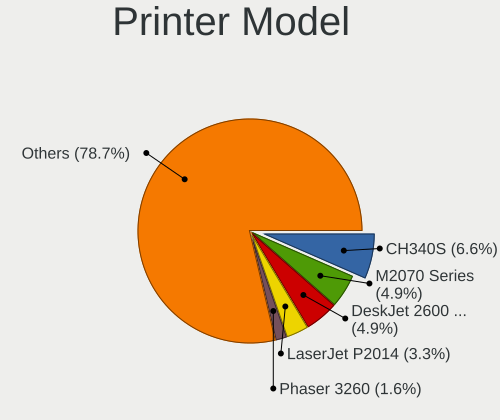

| Model                                   | Computers | Percent |
|-----------------------------------------|-----------|---------|
| QinHeng CH340S                          | 4         | 6.56%   |
| Samsung M2070 Series                    | 3         | 4.92%   |
| HP DeskJet 2600 series                  | 3         | 4.92%   |
| HP LaserJet P2014                       | 2         | 3.28%   |
| Xerox Phaser 3260                       | 1         | 1.64%   |
| Xerox B230 Printer                      | 1         | 1.64%   |
| Xerox B215                              | 1         | 1.64%   |
| Seiko Epson L365 Series                 | 1         | 1.64%   |
| Seiko Epson L3560 Series                | 1         | 1.64%   |
| Samsung Xerox Phaser 3117 Laser Printer | 1         | 1.64%   |
| Samsung SCX-3400 Series                 | 1         | 1.64%   |
| Samsung M267x 287x Series               | 1         | 1.64%   |
| Samsung M2020 Series                    | 1         | 1.64%   |
| Samsung C460 Series                     | 1         | 1.64%   |
| Prolific PL2305 Parallel Port           | 1         | 1.64%   |
| Pantum P2000                            | 1         | 1.64%   |
| Minolta PagePro 1300W                   | 1         | 1.64%   |
| ICS Advent Parallel Adapter             | 1         | 1.64%   |
| HP Officejet 4500 G510g-m               | 1         | 1.64%   |
| HP Neverstop Laser 100x                 | 1         | 1.64%   |
| HP LaserJet Professional P 1102w        | 1         | 1.64%   |
| HP LaserJet CP1025nw                    | 1         | 1.64%   |
| HP LaserJet 1018                        | 1         | 1.64%   |
| HP DeskJet 6980 series                  | 1         | 1.64%   |
| HP DeskJet 4530 series                  | 1         | 1.64%   |
| HP Deskjet 3050 J610 series             | 1         | 1.64%   |
| HP DeskJet 2700 series                  | 1         | 1.64%   |
| HP DeskJet 2130 series                  | 1         | 1.64%   |
| HP Deskjet 1510                         | 1         | 1.64%   |
| Canon TS6300 series                     | 1         | 1.64%   |
| Canon PIXMA MX920 Series                | 1         | 1.64%   |
| Canon PIXMA MX720 Series                | 1         | 1.64%   |
| Canon PIXMA MP280                       | 1         | 1.64%   |
| Canon PIXMA MP210                       | 1         | 1.64%   |
| Canon PIXMA MG5600 Series               | 1         | 1.64%   |
| Canon PIXMA MG3500 Series               | 1         | 1.64%   |
| Canon PIXMA MG2500 Series               | 1         | 1.64%   |
| Canon MF645C                            | 1         | 1.64%   |
| Canon MF4100 series                     | 1         | 1.64%   |
| Canon MB2100 series                     | 1         | 1.64%   |

Scanner Vendor
--------------

Scanner device vendors

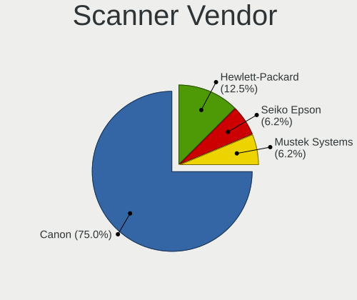

| Vendor          | Computers | Percent |
|-----------------|-----------|---------|
| Canon           | 12        | 75%     |
| Hewlett-Packard | 2         | 12.5%   |
| Seiko Epson     | 1         | 6.25%   |
| Mustek Systems  | 1         | 6.25%   |

Scanner Model
-------------

Scanner device models

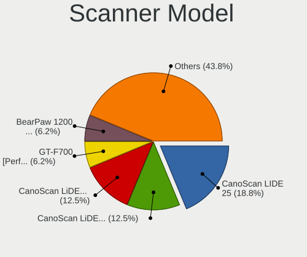

| Model                                 | Computers | Percent |
|---------------------------------------|-----------|---------|
| Canon CanoScan LIDE 25                | 3         | 18.75%  |
| Canon CanoScan LiDE 210               | 2         | 12.5%   |
| Canon CanoScan LiDE 110               | 2         | 12.5%   |
| Seiko Epson GT-F700 [Perfection V350] | 1         | 6.25%   |
| Mustek Systems BearPaw 1200 CU Plus   | 1         | 6.25%   |
| HP ScanJet 4070 PhotoSmart            | 1         | 6.25%   |
| HP ScanJet 2200c                      | 1         | 6.25%   |
| Canon CanoScan LiDE 90                | 1         | 6.25%   |
| Canon CanoScan LiDE 220               | 1         | 6.25%   |
| Canon CanoScan LiDE 200               | 1         | 6.25%   |
| Canon CanoScan LiDE 120               | 1         | 6.25%   |
| Canon CanoScan LiDE 100               | 1         | 6.25%   |

Camera
------

Camera Vendor
-------------

Camera device vendors

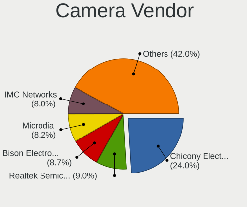

| Vendor                                 | Computers | Percent |
|----------------------------------------|-----------|---------|
| Chicony Electronics                    | 455       | 24.04%  |
| Realtek Semiconductor                  | 171       | 9.03%   |
| Bison Electronics                      | 164       | 8.66%   |
| Microdia                               | 156       | 8.24%   |
| IMC Networks                           | 151       | 7.98%   |
| Sunplus Innovation Technology          | 110       | 5.81%   |
| Quanta                                 | 83        | 4.38%   |
| Syntek                                 | 68        | 3.59%   |
| Cheng Uei Precision Industry (Foxlink) | 67        | 3.54%   |
| Lite-On Technology                     | 63        | 3.33%   |
| Logitech                               | 47        | 2.48%   |
| Luxvisions Innotech Limited            | 46        | 2.43%   |
| Suyin                                  | 45        | 2.38%   |
| Apple                                  | 25        | 1.32%   |
| KYE Systems (Mouse Systems)            | 18        | 0.95%   |
| Lenovo                                 | 16        | 0.85%   |
| Alcor Micro                            | 16        | 0.85%   |
| Ricoh                                  | 15        | 0.79%   |
| Sonix Technology                       | 14        | 0.74%   |
| Samsung Electronics                    | 14        | 0.74%   |
| Microsoft                              | 14        | 0.74%   |
| Z-Star Microelectronics                | 11        | 0.58%   |
| Creative Technology                    | 11        | 0.58%   |
| ShineTech                              | 9         | 0.48%   |
| icSpring                               | 8         | 0.42%   |
| Acer                                   | 8         | 0.42%   |
| Primax Electronics                     | 7         | 0.37%   |
| Silicon Motion                         | 5         | 0.26%   |
| Genesys Logic                          | 5         | 0.26%   |
| GEMBIRD                                | 5         | 0.26%   |
| MacroSilicon                           | 4         | 0.21%   |
| Hopewin Electronic Material            | 4         | 0.21%   |
| Hewlett-Packard                        | 4         | 0.21%   |
| SunplusIT                              | 3         | 0.16%   |
| Generalplus Technology                 | 3         | 0.16%   |
| BillionPixels                          | 3         | 0.16%   |
| AVerMedia Technologies                 | 3         | 0.16%   |
| Trust                                  | 2         | 0.11%   |
| Sunplus Technology                     | 2         | 0.11%   |
| Pixart Imaging                         | 2         | 0.11%   |

Camera Model
------------

Camera device models

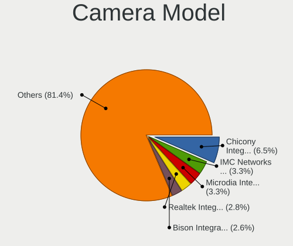

| Model                                               | Computers | Percent |
|-----------------------------------------------------|-----------|---------|
| Chicony Integrated Camera                           | 125       | 6.54%   |
| IMC Networks Integrated Camera                      | 64        | 3.35%   |
| Microdia Integrated_Webcam_HD                       | 63        | 3.3%    |
| Realtek Integrated_Webcam_HD                        | 53        | 2.77%   |
| Bison Integrated Camera                             | 50        | 2.62%   |
| Chicony HP HD Camera                                | 43        | 2.25%   |
| Syntek Integrated Camera                            | 41        | 2.15%   |
| Chicony HD WebCam                                   | 39        | 2.04%   |
| IMC Networks USB2.0 HD UVC WebCam                   | 38        | 1.99%   |
| Lite-On HP HD Camera                                | 28        | 1.47%   |
| Bison Lenovo EasyCamera                             | 24        | 1.26%   |
| Sunplus Integrated_Webcam_HD                        | 22        | 1.15%   |
| Chicony Integrated Camera (1280x720@30)             | 20        | 1.05%   |
| Quanta HD User Facing                               | 19        | 0.99%   |
| Bison SunplusIT Integrated Camera                   | 18        | 0.94%   |
| Apple iPhone 5/5C/5S/6/SE/7/8/X                     | 18        | 0.94%   |
| Quanta HP HD Camera                                 | 17        | 0.89%   |
| IMC Networks USB2.0 VGA UVC WebCam                  | 17        | 0.89%   |
| Syntek Lenovo EasyCamera                            | 16        | 0.84%   |
| Microdia Integrated Webcam                          | 16        | 0.84%   |
| Lite-On Integrated Camera                           | 16        | 0.84%   |
| Bison Lenovo Integrated Webcam                      | 16        | 0.84%   |
| Sunplus HD WebCam                                   | 15        | 0.78%   |
| Chicony USB2.0 VGA UVC WebCam                       | 15        | 0.78%   |
| Chicony FJ Camera                                   | 15        | 0.78%   |
| Suyin Acer/HP Integrated Webcam [CN0314]            | 14        | 0.73%   |
| Samsung Galaxy series, misc. (MTP mode)             | 14        | 0.73%   |
| Luxvisions Innotech Limited Integrated RGB Camera   | 13        | 0.68%   |
| Microdia Sonix USB 2.0 Camera                       | 12        | 0.63%   |
| Cheng Uei Precision Industry (Foxlink) HP HD Camera | 12        | 0.63%   |
| Realtek USB2.0 camera                               | 11        | 0.58%   |
| Logitech Webcam C270                                | 11        | 0.58%   |
| Bison Integrated RGB Camera                         | 11        | 0.58%   |
| Bison EasyCamera                                    | 11        | 0.58%   |
| Realtek USB Camera                                  | 10        | 0.52%   |
| Realtek Integrated Webcam HD                        | 10        | 0.52%   |
| Microdia Integrated_Webcam_FHD                      | 10        | 0.52%   |
| Luxvisions Innotech Limited Integrated Camera       | 10        | 0.52%   |
| Chicony Lenovo EasyCamera                           | 10        | 0.52%   |
| Sonix USB2.0 HD UVC WebCam                          | 9         | 0.47%   |

Security
--------

Fingerprint Vendor
------------------

Fingerprint sensor vendors

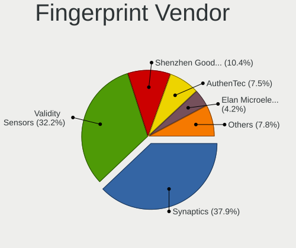

| Vendor                             | Computers | Percent |
|------------------------------------|-----------|---------|
| Synaptics                          | 171       | 37.92%  |
| Validity Sensors                   | 145       | 32.15%  |
| Shenzhen Goodix Technology         | 47        | 10.42%  |
| AuthenTec                          | 34        | 7.54%   |
| Elan Microelectronics              | 19        | 4.21%   |
| Upek                               | 18        | 3.99%   |
| LighTuning Technology              | 8         | 1.77%   |
| STMicroelectronics                 | 3         | 0.67%   |
| Dell                               | 3         | 0.67%   |
| Realtek USB2.0 Finger Print Bridge | 2         | 0.44%   |
| Microsoft                          | 1         | 0.22%   |

Fingerprint Model
-----------------

Fingerprint sensor models

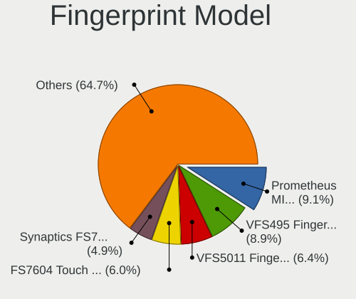

| Model                                                                      | Computers | Percent |
|----------------------------------------------------------------------------|-----------|---------|
| Synaptics Prometheus MIS Touch Fingerprint Reader                          | 41        | 9.09%   |
| Validity Sensors VFS495 Fingerprint Reader                                 | 40        | 8.87%   |
| Validity Sensors VFS5011 Fingerprint Reader                                | 29        | 6.43%   |
| Synaptics FS7604 Touch Fingerprint Sensor with PurePrint                   | 27        | 5.99%   |
| Synaptics  FS7604 Touch Fingerprint Sensor with PurePrint                  | 22        | 4.88%   |
| Shenzhen Goodix  Fingerprint Device                                        | 22        | 4.88%   |
| Upek Biometric Touchchip/Touchstrip Fingerprint Sensor                     | 17        | 3.77%   |
| Synaptics Metallica MIS Touch Fingerprint Reader                           | 17        | 3.77%   |
| Synaptics Fingerprint reader [HP G6]                                       | 17        | 3.77%   |
| Shenzhen Goodix Fingerprint Reader                                         | 15        | 3.33%   |
| AuthenTec AES2810                                                          | 15        | 3.33%   |
| Validity Sensors VFS491                                                    | 13        | 2.88%   |
| Validity Sensors VFS 5011 fingerprint sensor                               | 12        | 2.66%   |
| Elan ELAN:Fingerprint                                                      | 12        | 2.66%   |
| Validity Sensors Synaptics WBDI                                            | 11        | 2.44%   |
| Synaptics UWP WBDI Device                                                  | 10        | 2.22%   |
| Shenzhen Goodix FingerPrint                                                | 10        | 2.22%   |
| AuthenTec AES2501 Fingerprint Sensor                                       | 9         | 2%      |
| Synaptics Metallica MOH Touch Fingerprint Reader                           | 8         | 1.77%   |
| AuthenTec AES1600                                                          | 8         | 1.77%   |
| Validity Sensors Swipe Fingerprint Sensor                                  | 7         | 1.55%   |
| Synaptics WBDI                                                             | 7         | 1.55%   |
| Synaptics  WBDI                                                            | 7         | 1.55%   |
| Elan ELAN:ARM-M4                                                           | 7         | 1.55%   |
| Validity Sensors VFS101 Fingerprint Reader                                 | 6         | 1.33%   |
| Synaptics UWP WBDI                                                         | 6         | 1.33%   |
| LighTuning EgisTec Touch Fingerprint Sensor                                | 6         | 1.33%   |
| Validity Sensors VFS451 Fingerprint Reader                                 | 5         | 1.11%   |
| Validity Sensors VFS7500 Touch Fingerprint Sensor                          | 4         | 0.89%   |
| Validity Sensors Synaptics VFS7552 Touch Fingerprint Sensor with PurePrint | 4         | 0.89%   |
| Validity Sensors Synaptics VFS7552 Touch Fingerprint Sensor                | 4         | 0.89%   |
| Validity Sensors Fingerprint scanner                                       | 4         | 0.89%   |
| Synaptics WBDI Fingerprint Reader USB 086                                  | 4         | 0.89%   |
| Validity Sensors VFS471 Fingerprint Reader                                 | 3         | 0.67%   |
| STMicroelectronics Fingerprint Reader                                      | 3         | 0.67%   |
| Dell MS819 Wired Mouse With Fingerprint Reader                             | 3         | 0.67%   |
| Validity Sensors VFS7552 Touch Fingerprint Sensor                          | 2         | 0.44%   |
| Synaptics Prometheus Fingerprint Reader                                    | 2         | 0.44%   |
| Realtek USB2.0 Finger Print Bridge FocalTech Fingerprint Device            | 2         | 0.44%   |
| Validity Sensors VFS301 Fingerprint Reader                                 | 1         | 0.22%   |

Chipcard Vendor
---------------

Chipcard module vendors

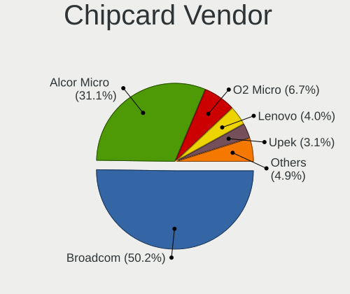

| Vendor                    | Computers | Percent |
|---------------------------|-----------|---------|
| Broadcom                  | 113       | 50.22%  |
| Alcor Micro               | 70        | 31.11%  |
| O2 Micro                  | 15        | 6.67%   |
| Lenovo                    | 9         | 4%      |
| Upek                      | 7         | 3.11%   |
| SCM Microsystems          | 2         | 0.89%   |
| Realtek Semiconductor     | 2         | 0.89%   |
| Aladdin Knowledge Systems | 2         | 0.89%   |
| Yubico.com                | 1         | 0.44%   |
| Purism, SPC               | 1         | 0.44%   |
| OmniKey                   | 1         | 0.44%   |
| Gemalto (was Gemplus)     | 1         | 0.44%   |
| Fujitsu Siemens Computers | 1         | 0.44%   |

Chipcard Model
--------------

Chipcard module models

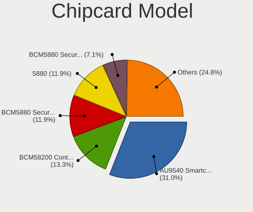

| Model                                                                        | Computers | Percent |
|------------------------------------------------------------------------------|-----------|---------|
| Alcor Micro AU9540 Smartcard Reader                                          | 70        | 30.97%  |
| Broadcom BCM58200 ControlVault 3 (FingerPrint sensor + Contacted SmartCard)  | 30        | 13.27%  |
| Broadcom BCM5880 Secure Applications Processor                               | 27        | 11.95%  |
| Broadcom 5880                                                                | 27        | 11.95%  |
| Broadcom BCM5880 Secure Applications Processor with fingerprint swipe sensor | 16        | 7.08%   |
| Broadcom 58200                                                               | 14        | 6.19%   |
| O2 Micro OZ776 CCID Smartcard Reader                                         | 12        | 5.31%   |
| Lenovo Integrated Smart Card Reader                                          | 9         | 3.98%   |
| Upek TouchChip Fingerprint Coprocessor (WBF advanced mode)                   | 7         | 3.1%    |
| O2 Micro Oz776 SmartCard Reader                                              | 3         | 1.33%   |
| SCM Microsystems SCR3340 - ExpressCard54 Smart Card Reader                   | 2         | 0.88%   |
| Realtek Semiconductor Smart Card Reader Interface                            | 2         | 0.88%   |
| Aladdin Knowledge Systems Token JC                                           | 2         | 0.88%   |
| Yubico.com Yubikey 4/5 U2F+CCID                                              | 1         | 0.44%   |
| Purism, SPC Librem Key                                                       | 1         | 0.44%   |
| OmniKey 3x21 Smart Card Reader                                               | 1         | 0.44%   |
| Gemalto (was Gemplus) GemPC Twin SmartCard Reader                            | 1         | 0.44%   |
| Fujitsu Siemens Computers SmartCard Reader 2A                                | 1         | 0.44%   |

Unsupported
-----------

Unsupported Devices
-------------------

Total unsupported devices on board

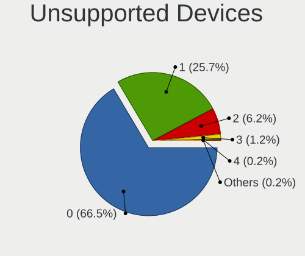

| Total | Computers | Percent |
|-------|-----------|---------|
| 0     | 2208      | 66.49%  |
| 1     | 855       | 25.75%  |
| 2     | 205       | 6.17%   |
| 3     | 39        | 1.17%   |
| 4     | 8         | 0.24%   |
| 5     | 4         | 0.12%   |
| 7     | 1         | 0.03%   |
| 6     | 1         | 0.03%   |

Unsupported Device Types
------------------------

Types of unsupported devices

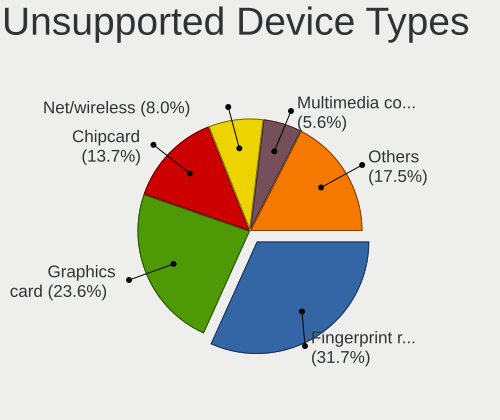

| Type                     | Computers | Percent |
|--------------------------|-----------|---------|
| Fingerprint reader       | 439       | 31.74%  |
| Graphics card            | 326       | 23.57%  |
| Chipcard                 | 189       | 13.67%  |
| Net/wireless             | 110       | 7.95%   |
| Multimedia controller    | 77        | 5.57%   |
| Communication controller | 42        | 3.04%   |
| Camera                   | 36        | 2.6%    |
| Bluetooth                | 33        | 2.39%   |
| Storage                  | 29        | 2.1%    |
| Card reader              | 23        | 1.66%   |
| Unassigned class         | 19        | 1.37%   |
| Sound                    | 15        | 1.08%   |
| Net/ethernet             | 12        | 0.87%   |
| Flash memory             | 9         | 0.65%   |
| Modem                    | 8         | 0.58%   |
| Network                  | 6         | 0.43%   |
| Dvb card                 | 3         | 0.22%   |
| Storage/raid             | 2         | 0.14%   |
| Storage/ata              | 2         | 0.14%   |
| Tv card                  | 1         | 0.07%   |
| Storage/ide              | 1         | 0.07%   |
| Firewire controller      | 1         | 0.07%   |

