Linux in Czechia - Tested Hardware & Statistics
-----------------------------------------------

A project to collect tested hardware configurations for Linux in Czechia.

Anyone can contribute to this report by the [hw-probe](https://github.com/linuxhw/hw-probe) tool:

    sudo -E hw-probe -all -upload

Please contribute! Especially if your hardware is rare.

This is a report for all computer types. See also reports for [desktops](/Location/Czechia/Desktop/README.md) and [notebooks](/Location/Czechia/Notebook/README.md).

Contents
--------

* [ Test Cases ](#test-cases)

* [ System ](#system)
  - [ OS                       ](#os)
  - [ OS Family                ](#os-family)
  - [ Kernel                   ](#kernel)
  - [ Kernel Family            ](#kernel-family)
  - [ Kernel Major Ver.        ](#kernel-major-ver)
  - [ Arch                     ](#arch)
  - [ DE                       ](#de)
  - [ Display Server           ](#display-server)
  - [ Display Manager          ](#display-manager)
  - [ OS Lang                  ](#os-lang)
  - [ Boot Mode                ](#boot-mode)
  - [ Filesystem               ](#filesystem)
  - [ Part. scheme             ](#part-scheme)
  - [ Dual Boot with Linux/BSD ](#dual-boot-with-linuxbsd)
  - [ Dual Boot (Win)          ](#dual-boot-win)

* [ Board ](#board)
  - [ Vendor                   ](#vendor)
  - [ Model                    ](#model)
  - [ Model Family             ](#model-family)
  - [ MFG Year                 ](#mfg-year)
  - [ Form Factor              ](#form-factor)
  - [ Secure Boot              ](#secure-boot)
  - [ Coreboot                 ](#coreboot)
  - [ RAM Size                 ](#ram-size)
  - [ RAM Used                 ](#ram-used)
  - [ Total Drives             ](#total-drives)
  - [ Has CD-ROM               ](#has-cd-rom)
  - [ Has Ethernet             ](#has-ethernet)
  - [ Has WiFi                 ](#has-wifi)
  - [ Has Bluetooth            ](#has-bluetooth)

* [ Location ](#location)
  - [ Country                  ](#country)
  - [ City                     ](#city)

* [ Drives ](#drives)
  - [ Drive Vendor             ](#drive-vendor)
  - [ Drive Model              ](#drive-model)
  - [ HDD Vendor               ](#hdd-vendor)
  - [ SSD Vendor               ](#ssd-vendor)
  - [ Drive Kind               ](#drive-kind)
  - [ Drive Connector          ](#drive-connector)
  - [ Drive Size               ](#drive-size)
  - [ Space Total              ](#space-total)
  - [ Space Used               ](#space-used)
  - [ Malfunc. Drives          ](#malfunc-drives)
  - [ Malfunc. Drive Vendor    ](#malfunc-drive-vendor)
  - [ Malfunc. HDD Vendor      ](#malfunc-hdd-vendor)
  - [ Malfunc. Drive Kind      ](#malfunc-drive-kind)
  - [ Failed Drives            ](#failed-drives)
  - [ Failed Drive Vendor      ](#failed-drive-vendor)
  - [ Drive Status             ](#drive-status)

* [ Storage controller ](#storage-controller)
  - [ Storage Vendor           ](#storage-vendor)
  - [ Storage Model            ](#storage-model)
  - [ Storage Kind             ](#storage-kind)

* [ Processor ](#processor)
  - [ CPU Vendor               ](#cpu-vendor)
  - [ CPU Model                ](#cpu-model)
  - [ CPU Model Family         ](#cpu-model-family)
  - [ CPU Cores                ](#cpu-cores)
  - [ CPU Sockets              ](#cpu-sockets)
  - [ CPU Threads              ](#cpu-threads)
  - [ CPU Op-Modes             ](#cpu-op-modes)
  - [ CPU Microcode            ](#cpu-microcode)
  - [ CPU Microarch            ](#cpu-microarch)

* [ Graphics ](#graphics)
  - [ GPU Vendor               ](#gpu-vendor)
  - [ GPU Model                ](#gpu-model)
  - [ GPU Combo                ](#gpu-combo)
  - [ GPU Driver               ](#gpu-driver)
  - [ GPU Memory               ](#gpu-memory)

* [ Monitor ](#monitor)
  - [ Monitor Vendor           ](#monitor-vendor)
  - [ Monitor Model            ](#monitor-model)
  - [ Monitor Resolution       ](#monitor-resolution)
  - [ Monitor Diagonal         ](#monitor-diagonal)
  - [ Monitor Width            ](#monitor-width)
  - [ Aspect Ratio             ](#aspect-ratio)
  - [ Monitor Area             ](#monitor-area)
  - [ Pixel Density            ](#pixel-density)
  - [ Multiple Monitors        ](#multiple-monitors)

* [ Network ](#network)
  - [ Net Controller Vendor    ](#net-controller-vendor)
  - [ Net Controller Model     ](#net-controller-model)
  - [ Wireless Vendor          ](#wireless-vendor)
  - [ Wireless Model           ](#wireless-model)
  - [ Ethernet Vendor          ](#ethernet-vendor)
  - [ Ethernet Model           ](#ethernet-model)
  - [ Net Controller Kind      ](#net-controller-kind)
  - [ Used Controller          ](#used-controller)
  - [ NICs                     ](#nics)
  - [ IPv6                     ](#ipv6)

* [ Bluetooth ](#bluetooth)
  - [ Bluetooth Vendor         ](#bluetooth-vendor)
  - [ Bluetooth Model          ](#bluetooth-model)

* [ Sound ](#sound)
  - [ Sound Vendor             ](#sound-vendor)
  - [ Sound Model              ](#sound-model)

* [ Memory ](#memory)
  - [ Memory Vendor            ](#memory-vendor)
  - [ Memory Model             ](#memory-model)
  - [ Memory Kind              ](#memory-kind)
  - [ Memory Form Factor       ](#memory-form-factor)
  - [ Memory Size              ](#memory-size)
  - [ Memory Speed             ](#memory-speed)

* [ Printers & scanners ](#printers--scanners)
  - [ Printer Vendor           ](#printer-vendor)
  - [ Printer Model            ](#printer-model)
  - [ Scanner Vendor           ](#scanner-vendor)
  - [ Scanner Model            ](#scanner-model)

* [ Camera ](#camera)
  - [ Camera Vendor            ](#camera-vendor)
  - [ Camera Model             ](#camera-model)

* [ Security ](#security)
  - [ Fingerprint Vendor       ](#fingerprint-vendor)
  - [ Fingerprint Model        ](#fingerprint-model)
  - [ Chipcard Vendor          ](#chipcard-vendor)
  - [ Chipcard Model           ](#chipcard-model)

* [ Unsupported ](#unsupported)
  - [ Unsupported Devices      ](#unsupported-devices)
  - [ Unsupported Device Types ](#unsupported-device-types)

Test Cases
----------

Total: 4039

| Vendor        | Model                       | Form-Factor | Probe                                                      | Date         |
|---------------|-----------------------------|-------------|------------------------------------------------------------|--------------|
| Valve         | Galileo                     | Notebook    | [dff6a36e92](https://linux-hardware.org/?probe=dff6a36e92) | Jan 06, 2025 |
| HP            | Laptop 15-bw0xx             | Notebook    | [d4de478530](https://linux-hardware.org/?probe=d4de478530) | Jan 06, 2025 |
| Lenovo        | SHARKBAY SDK0J40700 WIN     | Desktop     | [262450ac44](https://linux-hardware.org/?probe=262450ac44) | Jan 06, 2025 |
| MSI           | GE60 0NC\0ND                | Notebook    | [423eca6c8c](https://linux-hardware.org/?probe=423eca6c8c) | Jan 05, 2025 |
| Gigabyte      | X470 AORUS ULTRA GAMING-... | Desktop     | [99e9eae159](https://linux-hardware.org/?probe=99e9eae159) | Jan 05, 2025 |
| Lenovo        | ThinkPad T60 2007WHH        | Notebook    | [12562aee82](https://linux-hardware.org/?probe=12562aee82) | Jan 04, 2025 |
| ASUSTek       | ASUS TUF Gaming A15 FA50... | Notebook    | [a0bbd6cf37](https://linux-hardware.org/?probe=a0bbd6cf37) | Jan 03, 2025 |
| Dell          | 0GY6Y8 A03                  | Desktop     | [734e205226](https://linux-hardware.org/?probe=734e205226) | Jan 03, 2025 |
| Gigabyte      | G31M-S2L                    | Desktop     | [c04f5f8431](https://linux-hardware.org/?probe=c04f5f8431) | Jan 03, 2025 |
| Acer          | Extensa 5630                | Notebook    | [1bb020a4af](https://linux-hardware.org/?probe=1bb020a4af) | Jan 03, 2025 |
| ASUSTek       | ASUS TUF Gaming A15 FA50... | Notebook    | [ffdf653988](https://linux-hardware.org/?probe=ffdf653988) | Jan 03, 2025 |
| MSI           | MEG Z790 ACE                | Desktop     | [7479e71d41](https://linux-hardware.org/?probe=7479e71d41) | Jan 02, 2025 |
| Fujitsu       | LIFEBOOK E751               | Notebook    | [d6240bc771](https://linux-hardware.org/?probe=d6240bc771) | Jan 02, 2025 |
| Lenovo        | ThinkPad L16 Gen 1 21L70... | Notebook    | [1295119c04](https://linux-hardware.org/?probe=1295119c04) | Jan 01, 2025 |
| Gigabyte      | GA-MA790XT-UD4P             | Desktop     | [2e3ebfe841](https://linux-hardware.org/?probe=2e3ebfe841) | Jan 01, 2025 |
| Gigabyte      | B650 EAGLE AX               | Desktop     | [0524509879](https://linux-hardware.org/?probe=0524509879) | Dec 29, 2024 |
| HP            | Compaq 610                  | Notebook    | [af961e1650](https://linux-hardware.org/?probe=af961e1650) | Dec 29, 2024 |
| Dell          | Vostro 5620                 | Notebook    | [8d70ffd3a6](https://linux-hardware.org/?probe=8d70ffd3a6) | Dec 28, 2024 |
| ASRock        | J5040-ITX                   | Desktop     | [cfe9a3c37e](https://linux-hardware.org/?probe=cfe9a3c37e) | Dec 28, 2024 |
| Lenovo        | IdeaPad Pro 5 14AHP9 83D... | Notebook    | [b378ee4e63](https://linux-hardware.org/?probe=b378ee4e63) | Dec 27, 2024 |
| Dell          | Latitude E5540              | Notebook    | [0f0b366b45](https://linux-hardware.org/?probe=0f0b366b45) | Dec 26, 2024 |
| Lenovo        | ThinkBook 15 G4 ABA 21DL    | Notebook    | [e5724d5492](https://linux-hardware.org/?probe=e5724d5492) | Dec 26, 2024 |
| Lenovo        | IdeaPad 5 15ALC05 82LN      | Notebook    | [38333ea200](https://linux-hardware.org/?probe=38333ea200) | Dec 26, 2024 |
| Lenovo        | IdeaPad 5 15ALC05 82LN      | Notebook    | [3619de98bb](https://linux-hardware.org/?probe=3619de98bb) | Dec 26, 2024 |
| Acer          | Aspire V3-571G              | Notebook    | [1c7d970f58](https://linux-hardware.org/?probe=1c7d970f58) | Dec 26, 2024 |
| Toshiba       | Satellite C55-A             | Notebook    | [019825dc9f](https://linux-hardware.org/?probe=019825dc9f) | Dec 24, 2024 |
| Gigabyte      | B450M DS3H-CF               | Desktop     | [cf730d4359](https://linux-hardware.org/?probe=cf730d4359) | Dec 24, 2024 |
| ASUSTek       | Pro A620M-C                 | Desktop     | [9138796588](https://linux-hardware.org/?probe=9138796588) | Dec 23, 2024 |
| TUXEDO        | Pulse 14 Gen1               | Notebook    | [d1fe4c6194](https://linux-hardware.org/?probe=d1fe4c6194) | Dec 21, 2024 |
| Dell          | System Vostro 3750          | Notebook    | [f765051029](https://linux-hardware.org/?probe=f765051029) | Dec 21, 2024 |
| Acer          | TravelMate B113             | Notebook    | [e4b7bfda97](https://linux-hardware.org/?probe=e4b7bfda97) | Dec 21, 2024 |
| Raspberry ... | Raspberry Pi 4 Model B R... | Soc         | [48c1078969](https://linux-hardware.org/?probe=48c1078969) | Dec 21, 2024 |
| Dell          | Inspiron 11 - 3148          | Notebook    | [d83af261a5](https://linux-hardware.org/?probe=d83af261a5) | Dec 21, 2024 |
| Dell          | XPS 17 9700                 | Notebook    | [a9eb169ad3](https://linux-hardware.org/?probe=a9eb169ad3) | Dec 21, 2024 |
| ASUSTek       | ASUS EXPERTBOOK B1502CVA... | Notebook    | [6107bb3e8d](https://linux-hardware.org/?probe=6107bb3e8d) | Dec 20, 2024 |
| Lenovo        | MAHOBAY                     | Desktop     | [d526f3d692](https://linux-hardware.org/?probe=d526f3d692) | Dec 20, 2024 |
| Fujitsu       | LIFEBOOK E752               | Notebook    | [6299219a54](https://linux-hardware.org/?probe=6299219a54) | Dec 20, 2024 |
| ASRock        | 970 Extreme3 R2.0           | Desktop     | [cc8e8b062c](https://linux-hardware.org/?probe=cc8e8b062c) | Dec 19, 2024 |
| ASRock        | J5040-ITX                   | Desktop     | [30c96f3002](https://linux-hardware.org/?probe=30c96f3002) | Dec 19, 2024 |
| Lenovo        | Y520-15IKBN 80WK            | Notebook    | [e21a2d89c6](https://linux-hardware.org/?probe=e21a2d89c6) | Dec 18, 2024 |
| ASUSTek       | PRIME H410M-K               | Desktop     | [6de41c2f20](https://linux-hardware.org/?probe=6de41c2f20) | Dec 18, 2024 |
| MSI           | MS-7360                     | Desktop     | [d3638359ac](https://linux-hardware.org/?probe=d3638359ac) | Dec 17, 2024 |
| HP            | 550                         | Notebook    | [c401aa1e31](https://linux-hardware.org/?probe=c401aa1e31) | Dec 17, 2024 |
| ASUSTek       | TUF Gaming B550M-PLUS WI... | Desktop     | [c9737709d2](https://linux-hardware.org/?probe=c9737709d2) | Dec 17, 2024 |
| HP            | 550                         | Notebook    | [4890cb5e06](https://linux-hardware.org/?probe=4890cb5e06) | Dec 16, 2024 |
| Gigabyte      | Z390 AORUS PRO WIFI-CF      | Desktop     | [7e6d9bed21](https://linux-hardware.org/?probe=7e6d9bed21) | Dec 16, 2024 |
| ASRock        | H81 Pro BTC R2.0            | Desktop     | [2bb573bea0](https://linux-hardware.org/?probe=2bb573bea0) | Dec 16, 2024 |
| Lenovo        | IdeaPad S145-15AST 81N3     | Notebook    | [5a45b1695a](https://linux-hardware.org/?probe=5a45b1695a) | Dec 16, 2024 |
| HP            | 250 G3                      | Notebook    | [33fd855839](https://linux-hardware.org/?probe=33fd855839) | Dec 15, 2024 |
| HP            | 1494                        | Desktop     | [5f877b3923](https://linux-hardware.org/?probe=5f877b3923) | Dec 15, 2024 |
| Dell          | 042P49 A01                  | Desktop     | [7628da790c](https://linux-hardware.org/?probe=7628da790c) | Dec 15, 2024 |
| ASUSTek       | N73SV                       | Notebook    | [633d0b0190](https://linux-hardware.org/?probe=633d0b0190) | Dec 15, 2024 |
| Acer          | Swift SFX14-41G             | Notebook    | [b0a6e23086](https://linux-hardware.org/?probe=b0a6e23086) | Dec 14, 2024 |
| HP            | 87D6 SMVB                   | Desktop     | [41333823f1](https://linux-hardware.org/?probe=41333823f1) | Dec 14, 2024 |
| Lenovo        | Yoga Slim 7 Pro 14IHU5 8... | Notebook    | [4457d325cd](https://linux-hardware.org/?probe=4457d325cd) | Dec 13, 2024 |
| Intel         | NUC8BEB J72692-309          | Mini pc     | [12ad7893c3](https://linux-hardware.org/?probe=12ad7893c3) | Dec 13, 2024 |
| ASUSTek       | ROG STRIX X470-F GAMING     | Desktop     | [263df008c5](https://linux-hardware.org/?probe=263df008c5) | Dec 13, 2024 |
| Dell          | Precision 3550              | Notebook    | [dd9f0d9ae3](https://linux-hardware.org/?probe=dd9f0d9ae3) | Dec 12, 2024 |
| ASRock        | 970 Extreme3 R2.0           | Desktop     | [9fa51abc19](https://linux-hardware.org/?probe=9fa51abc19) | Dec 11, 2024 |
| Lenovo        | MAHOBAY NO DPK              | Desktop     | [c5d5aaca89](https://linux-hardware.org/?probe=c5d5aaca89) | Dec 11, 2024 |
| Lenovo        | ThinkPad T14 Gen 5 21MDS... | Notebook    | [67cd429682](https://linux-hardware.org/?probe=67cd429682) | Dec 09, 2024 |
| HP            | 87D6 SMVB                   | Desktop     | [39c13368a2](https://linux-hardware.org/?probe=39c13368a2) | Dec 09, 2024 |
| Intel         | NUC7i3BNB J22859-309        | Mini pc     | [9319560a05](https://linux-hardware.org/?probe=9319560a05) | Dec 09, 2024 |
| Pegatron      | 2AB6                        | Desktop     | [6ab7d72400](https://linux-hardware.org/?probe=6ab7d72400) | Dec 08, 2024 |
| UMAX          | VisionBook 14WRx            | Notebook    | [03c3fb91c0](https://linux-hardware.org/?probe=03c3fb91c0) | Dec 08, 2024 |
| Lenovo        | Legion 5 15IMH05H 81Y6      | Notebook    | [6a8446aa46](https://linux-hardware.org/?probe=6a8446aa46) | Dec 08, 2024 |
| Lenovo        | IdeaPad Slim 3 14IAH8 83... | Notebook    | [3cef41bf58](https://linux-hardware.org/?probe=3cef41bf58) | Dec 08, 2024 |
| HP            | ProBook 470 G3              | Notebook    | [f6ed449358](https://linux-hardware.org/?probe=f6ed449358) | Dec 08, 2024 |
| Lenovo        | Yoga 7 14ARP8 82YM          | Convertible | [6856415579](https://linux-hardware.org/?probe=6856415579) | Dec 08, 2024 |
| Gigabyte      | B650 GAMING X AX            | Desktop     | [29c0a11039](https://linux-hardware.org/?probe=29c0a11039) | Dec 07, 2024 |
| Lenovo        | ThinkPad E450 20DC007SMC    | Notebook    | [a6df288487](https://linux-hardware.org/?probe=a6df288487) | Dec 07, 2024 |
| Gigabyte      | X870 EAGLE WIFI7            | Desktop     | [b7f62c7b88](https://linux-hardware.org/?probe=b7f62c7b88) | Dec 06, 2024 |
| Lenovo        | ThinkPad T410 2537K96       | Notebook    | [ae6d2e915b](https://linux-hardware.org/?probe=ae6d2e915b) | Dec 06, 2024 |
| Gigabyte      | X870 EAGLE WIFI7            | Desktop     | [4178f34632](https://linux-hardware.org/?probe=4178f34632) | Dec 04, 2024 |
| Lenovo        | ThinkPad X230 23252CG       | Notebook    | [614068917c](https://linux-hardware.org/?probe=614068917c) | Dec 04, 2024 |
| ASUSTek       | K52JK                       | Notebook    | [1e978f8201](https://linux-hardware.org/?probe=1e978f8201) | Dec 03, 2024 |
| MSI           | MAG B650 TOMAHAWK WIFI      | Desktop     | [a5a7fb0be4](https://linux-hardware.org/?probe=a5a7fb0be4) | Dec 03, 2024 |
| ASUSTek       | STRIX H270F GAMING          | Desktop     | [2e9abd7b29](https://linux-hardware.org/?probe=2e9abd7b29) | Dec 02, 2024 |
| Toshiba       | Satellite L500              | Notebook    | [81df2f2b8e](https://linux-hardware.org/?probe=81df2f2b8e) | Nov 29, 2024 |
| Lenovo        | YB1-X91L                    | Convertible | [a263b9a39c](https://linux-hardware.org/?probe=a263b9a39c) | Nov 29, 2024 |
| Lenovo        | YB1-X91L                    | Convertible | [887954e693](https://linux-hardware.org/?probe=887954e693) | Nov 29, 2024 |
| MSI           | B550 GAMING GEN3            | Desktop     | [83ca89bebd](https://linux-hardware.org/?probe=83ca89bebd) | Nov 29, 2024 |
| MSI           | B550 GAMING GEN3            | Desktop     | [605841ff4d](https://linux-hardware.org/?probe=605841ff4d) | Nov 29, 2024 |
| Dell          | Latitude E5440              | Notebook    | [0177ef8c95](https://linux-hardware.org/?probe=0177ef8c95) | Nov 29, 2024 |
| ASUSTek       | X705UA                      | Notebook    | [8fb1e3980c](https://linux-hardware.org/?probe=8fb1e3980c) | Nov 27, 2024 |
| Gigabyte      | B650 EAGLE AX               | Desktop     | [a24ba9321a](https://linux-hardware.org/?probe=a24ba9321a) | Nov 26, 2024 |
| MSI           | MAG B550 TOMAHAWK           | Desktop     | [d62bf666bf](https://linux-hardware.org/?probe=d62bf666bf) | Nov 25, 2024 |
| MSI           | PRO Z690-A DDR4             | Desktop     | [f3239ec223](https://linux-hardware.org/?probe=f3239ec223) | Nov 25, 2024 |
| Lenovo        | Yoga Pro 7 14IMH9 83E2      | Notebook    | [028fe1f620](https://linux-hardware.org/?probe=028fe1f620) | Nov 24, 2024 |
| MSI           | MAG B550 TOMAHAWK           | Desktop     | [f3eb835176](https://linux-hardware.org/?probe=f3eb835176) | Nov 24, 2024 |
| Notebook      | NV4xPZ                      | Notebook    | [96c89d3fef](https://linux-hardware.org/?probe=96c89d3fef) | Nov 22, 2024 |
| HP            | ZBook Firefly 14 inch G1... | Notebook    | [eae74be3bd](https://linux-hardware.org/?probe=eae74be3bd) | Nov 22, 2024 |
| Unknown       | Orange Pi 5 Pro             | Soc         | [4dbb8c2182](https://linux-hardware.org/?probe=4dbb8c2182) | Nov 22, 2024 |
| Unknown       | Orange Pi 5 Pro             | Soc         | [d9fb554b64](https://linux-hardware.org/?probe=d9fb554b64) | Nov 22, 2024 |
| Lenovo        | IdeaPad 110-15ISK 80UD      | Notebook    | [4b11bad4e2](https://linux-hardware.org/?probe=4b11bad4e2) | Nov 21, 2024 |
| ASRock        | 970 Extreme3 R2.0           | Desktop     | [3c75cf4004](https://linux-hardware.org/?probe=3c75cf4004) | Nov 21, 2024 |
| AZW           | SER V2.0                    | Mini pc     | [c7ca315f7b](https://linux-hardware.org/?probe=c7ca315f7b) | Nov 21, 2024 |
| Gigabyte      | B75M-D3H                    | Desktop     | [f4e6dc4230](https://linux-hardware.org/?probe=f4e6dc4230) | Nov 21, 2024 |
| HP            | ZBook Firefly 16 inch G1... | Notebook    | [515f77bdad](https://linux-hardware.org/?probe=515f77bdad) | Nov 20, 2024 |
| MSI           | PRO Z690-A DDR4             | Desktop     | [111732e0e1](https://linux-hardware.org/?probe=111732e0e1) | Nov 20, 2024 |
| Lenovo        | ThinkPad E14 Gen 6 21M70... | Notebook    | [81b39da9fd](https://linux-hardware.org/?probe=81b39da9fd) | Nov 19, 2024 |
| ASUSTek       | ASUS TUF Gaming A15 FA50... | Notebook    | [cc9386b2dd](https://linux-hardware.org/?probe=cc9386b2dd) | Nov 19, 2024 |
| Gigabyte      | AB350-Gaming 3-CF           | Desktop     | [e643ae8c2a](https://linux-hardware.org/?probe=e643ae8c2a) | Nov 18, 2024 |
| Dell          | Inspiron 5406 2n1           | Convertible | [5d437a2b90](https://linux-hardware.org/?probe=5d437a2b90) | Nov 18, 2024 |
| Lenovo        | MAHOBAY Win8 STD MM DPK ... | All in one  | [dba1d52306](https://linux-hardware.org/?probe=dba1d52306) | Nov 17, 2024 |
| Lenovo        | ThinkPad Edge E530c 3366... | Notebook    | [06da77f5c0](https://linux-hardware.org/?probe=06da77f5c0) | Nov 16, 2024 |
| Lenovo        | IdeaPad 5 14ABA7 82SE       | Notebook    | [5f6a56e720](https://linux-hardware.org/?probe=5f6a56e720) | Nov 16, 2024 |
| ASUSTek       | PRIME B660M-A WIFI D4       | Desktop     | [01dd8a732f](https://linux-hardware.org/?probe=01dd8a732f) | Nov 16, 2024 |
| Gigabyte      | B650 EAGLE AX               | Desktop     | [81e58aee9c](https://linux-hardware.org/?probe=81e58aee9c) | Nov 15, 2024 |
| Lenovo        | IdeaPad 5 14ABA7 82SE       | Notebook    | [1ff2d7429c](https://linux-hardware.org/?probe=1ff2d7429c) | Nov 15, 2024 |
| Lenovo        | ThinkPad P16s Gen 2 21K9... | Notebook    | [c8bf7ad9df](https://linux-hardware.org/?probe=c8bf7ad9df) | Nov 14, 2024 |
| Lenovo        | ThinkPad P1 Gen 6 21FWS9... | Notebook    | [741e754d50](https://linux-hardware.org/?probe=741e754d50) | Nov 14, 2024 |
| Dell          | Latitude 7400               | Notebook    | [44e1fbf742](https://linux-hardware.org/?probe=44e1fbf742) | Nov 14, 2024 |
| Lenovo        | ThinkPad T14 Gen 1 20UES... | Notebook    | [be79f50c9e](https://linux-hardware.org/?probe=be79f50c9e) | Nov 13, 2024 |
| Lenovo        | ThinkPad X1 Nano Gen 2 2... | Notebook    | [e5d1eddfaa](https://linux-hardware.org/?probe=e5d1eddfaa) | Nov 13, 2024 |
| Framework     | Laptop (13th Gen Intel C... | Notebook    | [3a61b52c42](https://linux-hardware.org/?probe=3a61b52c42) | Nov 13, 2024 |
| Dell          | Latitude 7400               | Notebook    | [e0b2bc0e77](https://linux-hardware.org/?probe=e0b2bc0e77) | Nov 12, 2024 |
| Lenovo        | IdeaPad Slim 5 16AHP9 83... | Notebook    | [14d794125a](https://linux-hardware.org/?probe=14d794125a) | Nov 12, 2024 |
| HPE           | ProLiant MicroServer Gen... | Desktop     | [adb5565f6f](https://linux-hardware.org/?probe=adb5565f6f) | Nov 12, 2024 |
| Lenovo        | ThinkPad L390 20NRCTO1WW    | Notebook    | [9365473cc4](https://linux-hardware.org/?probe=9365473cc4) | Nov 12, 2024 |
| Sony          | VGN-Z51MG_B                 | Notebook    | [704fd4df01](https://linux-hardware.org/?probe=704fd4df01) | Nov 10, 2024 |
| HP            | Pavilion Gaming Laptop 1... | Notebook    | [b5fbe784ce](https://linux-hardware.org/?probe=b5fbe784ce) | Nov 09, 2024 |
| HP            | ProBook 430 G2              | Notebook    | [ea645a6ae1](https://linux-hardware.org/?probe=ea645a6ae1) | Nov 08, 2024 |
| Unknown       | Unknown                     | Desktop     | [0447d7aa55](https://linux-hardware.org/?probe=0447d7aa55) | Nov 06, 2024 |
| MSI           | P75 Creator 9SE             | Notebook    | [f37da1e270](https://linux-hardware.org/?probe=f37da1e270) | Nov 06, 2024 |
| ASRock        | A620I Lightning WiFi        | Desktop     | [ff91555feb](https://linux-hardware.org/?probe=ff91555feb) | Nov 02, 2024 |
| Acer          | Extensa 7630EZ              | Notebook    | [5c48b2f063](https://linux-hardware.org/?probe=5c48b2f063) | Nov 02, 2024 |
| Lenovo        | IdeaPad L340-17IRH Gamin... | Notebook    | [67f2f24139](https://linux-hardware.org/?probe=67f2f24139) | Nov 02, 2024 |
| MSI           | MAG B550 TOMAHAWK           | Desktop     | [be82de4944](https://linux-hardware.org/?probe=be82de4944) | Nov 01, 2024 |
| ASUSTek       | ROG CROSSHAIR X670E HERO    | Desktop     | [8e4d6535f4](https://linux-hardware.org/?probe=8e4d6535f4) | Oct 31, 2024 |
| ASRock        | A620I Lightning WiFi        | Desktop     | [5d7099a83b](https://linux-hardware.org/?probe=5d7099a83b) | Oct 31, 2024 |
| Dell          | Latitude 5410               | Notebook    | [7e4f2bc66a](https://linux-hardware.org/?probe=7e4f2bc66a) | Oct 30, 2024 |
| Dell          | Latitude 5410               | Notebook    | [4fdba8edb7](https://linux-hardware.org/?probe=4fdba8edb7) | Oct 30, 2024 |
| Dell          | Latitude 5410               | Notebook    | [a4cdab59be](https://linux-hardware.org/?probe=a4cdab59be) | Oct 30, 2024 |
| MSI           | B350 PC MATE                | Desktop     | [c3d9d79264](https://linux-hardware.org/?probe=c3d9d79264) | Oct 29, 2024 |
| Gigabyte      | H97-D3H-CF                  | Desktop     | [e84fc0d40a](https://linux-hardware.org/?probe=e84fc0d40a) | Oct 28, 2024 |
| Dell          | Latitude E6510              | Notebook    | [6f5fdc54c6](https://linux-hardware.org/?probe=6f5fdc54c6) | Oct 28, 2024 |
| Maxtang       | BYT30                       | Desktop     | [5891779efd](https://linux-hardware.org/?probe=5891779efd) | Oct 27, 2024 |
| Maxtang       | BYT30                       | Desktop     | [e76e2b7929](https://linux-hardware.org/?probe=e76e2b7929) | Oct 27, 2024 |
| ASUSTek       | ASUS Zenbook S 16 UM5606... | Notebook    | [ee9023251f](https://linux-hardware.org/?probe=ee9023251f) | Oct 26, 2024 |
| Lenovo        | SHARKBAY SDK0J40700 WIN     | Desktop     | [a7457422a3](https://linux-hardware.org/?probe=a7457422a3) | Oct 26, 2024 |
| Lenovo        | SHARKBAY SDK0J40700 WIN     | Desktop     | [a28a4f60ad](https://linux-hardware.org/?probe=a28a4f60ad) | Oct 26, 2024 |
| Dell          | Latitude D820               | Notebook    | [e8052d5ecd](https://linux-hardware.org/?probe=e8052d5ecd) | Oct 26, 2024 |
| Dell          | Latitude D820               | Notebook    | [69777b44d3](https://linux-hardware.org/?probe=69777b44d3) | Oct 25, 2024 |
| ASUSTek       | ROG STRIX B550-I GAMING     | Desktop     | [177aace39e](https://linux-hardware.org/?probe=177aace39e) | Oct 25, 2024 |
| HP            | EliteBook x360 1030 G2      | Convertible | [f500a67552](https://linux-hardware.org/?probe=f500a67552) | Oct 25, 2024 |
| Lenovo        | ThinkPad X1 Carbon 7th 2... | Notebook    | [51f11aa9f2](https://linux-hardware.org/?probe=51f11aa9f2) | Oct 25, 2024 |
| Acer          | Extensa 7630EZ              | Notebook    | [65c6658e55](https://linux-hardware.org/?probe=65c6658e55) | Oct 25, 2024 |
| ASUSTek       | ROG Zephyrus G15 GA503RM... | Notebook    | [730ef7c5f8](https://linux-hardware.org/?probe=730ef7c5f8) | Oct 24, 2024 |
| HP            | EliteBook 845 G8 Noteboo... | Notebook    | [82a1bda877](https://linux-hardware.org/?probe=82a1bda877) | Oct 24, 2024 |
| Dell          | Latitude 7370               | Notebook    | [355bbe7ecc](https://linux-hardware.org/?probe=355bbe7ecc) | Oct 24, 2024 |
| HP            | EliteBook 2540p             | Notebook    | [53c668190f](https://linux-hardware.org/?probe=53c668190f) | Oct 23, 2024 |
| Acer          | Swift SF14-71T              | Notebook    | [e190faa132](https://linux-hardware.org/?probe=e190faa132) | Oct 22, 2024 |
| Lenovo        | Yoga 7 16IRL8 82YN          | Convertible | [dd0993b9ed](https://linux-hardware.org/?probe=dd0993b9ed) | Oct 22, 2024 |
| Lenovo        | Z50-75 80EC                 | Notebook    | [6ff4eea4bd](https://linux-hardware.org/?probe=6ff4eea4bd) | Oct 21, 2024 |
| HP            | ENVY Laptop 16-h0xxx        | Notebook    | [d367026292](https://linux-hardware.org/?probe=d367026292) | Oct 21, 2024 |
| HP            | 872E                        | Mini pc     | [317da23303](https://linux-hardware.org/?probe=317da23303) | Oct 21, 2024 |
| ASRock        | 970 Extreme3 R2.0           | Desktop     | [1fcb0f751e](https://linux-hardware.org/?probe=1fcb0f751e) | Oct 21, 2024 |
| ASUSTek       | PRIME A320I-K               | Desktop     | [d7c1bb04df](https://linux-hardware.org/?probe=d7c1bb04df) | Oct 20, 2024 |
| ASUSTek       | ASUS TUF Gaming A15 FA50... | Notebook    | [59e88e8f10](https://linux-hardware.org/?probe=59e88e8f10) | Oct 20, 2024 |
| ASRock        | X300M-STX                   | Desktop     | [09910b6194](https://linux-hardware.org/?probe=09910b6194) | Oct 19, 2024 |
| ASUSTek       | ASUS TUF Gaming A15 FA50... | Notebook    | [049ff16565](https://linux-hardware.org/?probe=049ff16565) | Oct 19, 2024 |
| Lenovo        | IdeaPad 110-15ISK 80UD      | Notebook    | [5754b92f35](https://linux-hardware.org/?probe=5754b92f35) | Oct 19, 2024 |
| ASUSTek       | VivoBook_ASUSLaptop K360... | Notebook    | [eee2e39a57](https://linux-hardware.org/?probe=eee2e39a57) | Oct 19, 2024 |
| Acer          | Aspire E5-573               | Notebook    | [52f3006e15](https://linux-hardware.org/?probe=52f3006e15) | Oct 18, 2024 |
| Dell          | Latitude 5450               | Notebook    | [c5a078d239](https://linux-hardware.org/?probe=c5a078d239) | Oct 18, 2024 |
| Lenovo        | ThinkPad T14 Gen 5 21MDS... | Notebook    | [2d00c7ffe3](https://linux-hardware.org/?probe=2d00c7ffe3) | Oct 18, 2024 |
| Valve         | Jupiter                     | Notebook    | [c857c25534](https://linux-hardware.org/?probe=c857c25534) | Oct 18, 2024 |
| Toshiba       | Satellite A200              | Notebook    | [c480e14ad8](https://linux-hardware.org/?probe=c480e14ad8) | Oct 17, 2024 |
| Acer          | Nitro AN515-44              | Notebook    | [505d70884f](https://linux-hardware.org/?probe=505d70884f) | Oct 17, 2024 |
| HP            | EliteBook 840 G8 Noteboo... | Notebook    | [bd0906dab7](https://linux-hardware.org/?probe=bd0906dab7) | Oct 17, 2024 |
| Gigabyte      | B650 EAGLE AX               | Desktop     | [c3b6e7482d](https://linux-hardware.org/?probe=c3b6e7482d) | Oct 15, 2024 |
| ASUSTek       | PRIME B450-PLUS             | Desktop     | [60c0669298](https://linux-hardware.org/?probe=60c0669298) | Oct 14, 2024 |
| Lenovo        | Yoga 7 16IRL8 82YN          | Convertible | [1dd7fc6421](https://linux-hardware.org/?probe=1dd7fc6421) | Oct 13, 2024 |
| Dell          | 0N867P A01                  | Desktop     | [d710abc433](https://linux-hardware.org/?probe=d710abc433) | Oct 13, 2024 |
| Lenovo        | V110-15ISK 80TL             | Notebook    | [6cef126bcc](https://linux-hardware.org/?probe=6cef126bcc) | Oct 12, 2024 |
| Gigabyte      | X470 AORUS ULTRA GAMING-... | Desktop     | [903f8e6923](https://linux-hardware.org/?probe=903f8e6923) | Oct 12, 2024 |
| HP            | EliteBook 840 G3            | Notebook    | [df0a50bafb](https://linux-hardware.org/?probe=df0a50bafb) | Oct 12, 2024 |
| HP            | 15                          | Notebook    | [812b65f0fe](https://linux-hardware.org/?probe=812b65f0fe) | Oct 11, 2024 |
| Lenovo        | ThinkPad T420 4236NVG       | Notebook    | [a76195d435](https://linux-hardware.org/?probe=a76195d435) | Oct 11, 2024 |
| Timi          | A35S                        | Notebook    | [2e925c5cd6](https://linux-hardware.org/?probe=2e925c5cd6) | Oct 11, 2024 |
| Lenovo        | ThinkPad S1 Yoga 12 20DL... | Notebook    | [05af8a3249](https://linux-hardware.org/?probe=05af8a3249) | Oct 10, 2024 |
| Dell          | Latitude 5440               | Notebook    | [71ee76b243](https://linux-hardware.org/?probe=71ee76b243) | Oct 10, 2024 |
| Lenovo        | ThinkBook 15 G2 ITL 20VE    | Notebook    | [11bd71149b](https://linux-hardware.org/?probe=11bd71149b) | Oct 10, 2024 |
| Lenovo        | ThinkBook 15 G2 ITL 20VE    | Notebook    | [b2a2d78933](https://linux-hardware.org/?probe=b2a2d78933) | Oct 10, 2024 |
| Lenovo        | U310                        | Notebook    | [bb887be5e7](https://linux-hardware.org/?probe=bb887be5e7) | Oct 09, 2024 |
| ASUSTek       | ASUS TUF Gaming A15 FA50... | Notebook    | [8428643c32](https://linux-hardware.org/?probe=8428643c32) | Oct 07, 2024 |
| ASUSTek       | ASUS TUF Gaming A15 FA50... | Notebook    | [d58ea9b2a0](https://linux-hardware.org/?probe=d58ea9b2a0) | Oct 07, 2024 |
| HP            | 250 G4                      | Notebook    | [c686ed18ff](https://linux-hardware.org/?probe=c686ed18ff) | Oct 06, 2024 |
| Lenovo        | ThinkPad L13 Gen 2 20VH0... | Notebook    | [c7823c9fd3](https://linux-hardware.org/?probe=c7823c9fd3) | Oct 05, 2024 |
| Dell          | Latitude 5440               | Notebook    | [15ad67d4bf](https://linux-hardware.org/?probe=15ad67d4bf) | Oct 05, 2024 |
| HP            | EliteBook 2540p             | Notebook    | [582f0a4f04](https://linux-hardware.org/?probe=582f0a4f04) | Oct 04, 2024 |
| Pegatron      | 2AB6                        | Desktop     | [9e31ddb1af](https://linux-hardware.org/?probe=9e31ddb1af) | Oct 04, 2024 |
| Gigabyte      | B365 M AORUS ELITE-CF 20... | Desktop     | [d748225968](https://linux-hardware.org/?probe=d748225968) | Oct 04, 2024 |
| ASUSTek       | PRIME B450-PLUS             | Desktop     | [54d9a44aa3](https://linux-hardware.org/?probe=54d9a44aa3) | Oct 03, 2024 |
| Lenovo        | ThinkBook 16 G4+ IAP 21C... | Notebook    | [4b94f1e513](https://linux-hardware.org/?probe=4b94f1e513) | Oct 03, 2024 |
| Intel         | NUC13ANBi5 M89647-202       | Mini pc     | [3e1592f3ae](https://linux-hardware.org/?probe=3e1592f3ae) | Oct 03, 2024 |
| ASUSTek       | X75VBP                      | Notebook    | [0c6a739c42](https://linux-hardware.org/?probe=0c6a739c42) | Oct 03, 2024 |
| ASUSTek       | X75VBP                      | Notebook    | [b34a212443](https://linux-hardware.org/?probe=b34a212443) | Oct 03, 2024 |
| Lenovo        | ThinkPad E14 Gen 6 21M70... | Notebook    | [d52e4fc3c0](https://linux-hardware.org/?probe=d52e4fc3c0) | Oct 02, 2024 |
| ASRock        | 970 Extreme3 R2.0           | Desktop     | [234ffa3729](https://linux-hardware.org/?probe=234ffa3729) | Oct 02, 2024 |
| Gigabyte      | Z270-HD3P-CF                | Desktop     | [59741fca50](https://linux-hardware.org/?probe=59741fca50) | Oct 01, 2024 |
| Lenovo        | ThinkPad T440s 20ARS0HB0... | Notebook    | [820ea26e25](https://linux-hardware.org/?probe=820ea26e25) | Sep 30, 2024 |
| Gigabyte      | B450M DS3H V2               | Desktop     | [bc0c0c5232](https://linux-hardware.org/?probe=bc0c0c5232) | Sep 30, 2024 |
| ASUSTek       | P7P55D-E                    | Desktop     | [224d52d7c3](https://linux-hardware.org/?probe=224d52d7c3) | Sep 30, 2024 |
| Gigabyte      | B450M DS3H V2               | Desktop     | [c9bbe80c34](https://linux-hardware.org/?probe=c9bbe80c34) | Sep 30, 2024 |
| HP            | EliteBook 840 G3            | Notebook    | [4d52b9b4ac](https://linux-hardware.org/?probe=4d52b9b4ac) | Sep 29, 2024 |
| ASRock        | 970 Extreme3 R2.0           | Desktop     | [506731ea8d](https://linux-hardware.org/?probe=506731ea8d) | Sep 29, 2024 |
| ASRock        | AB350 Pro4                  | Desktop     | [4054bf629f](https://linux-hardware.org/?probe=4054bf629f) | Sep 29, 2024 |
| ASRock        | Z790 Pro RS                 | Desktop     | [aa8dd7285c](https://linux-hardware.org/?probe=aa8dd7285c) | Sep 28, 2024 |
| ASUSTek       | TUF Gaming B550M-PLUS WI... | Desktop     | [4b4ad854bf](https://linux-hardware.org/?probe=4b4ad854bf) | Sep 27, 2024 |
| HP            | Pavilion Laptop 14-ec1xx... | Notebook    | [0a0cbfcc0c](https://linux-hardware.org/?probe=0a0cbfcc0c) | Sep 27, 2024 |
| Lenovo        | MAHOBAY NOK                 | Desktop     | [fa91e595a0](https://linux-hardware.org/?probe=fa91e595a0) | Sep 26, 2024 |
| Lenovo        | ThinkPad T14s Gen 2a 20X... | Notebook    | [5daa956157](https://linux-hardware.org/?probe=5daa956157) | Sep 26, 2024 |
| Pegatron      | 2AB6                        | Desktop     | [621eefa747](https://linux-hardware.org/?probe=621eefa747) | Sep 26, 2024 |
| Samsung       | RF511/RF411/RF711           | Notebook    | [da831230cc](https://linux-hardware.org/?probe=da831230cc) | Sep 25, 2024 |
| Gigabyte      | H77M-D3H                    | Desktop     | [ce4c4fdfaa](https://linux-hardware.org/?probe=ce4c4fdfaa) | Sep 24, 2024 |
| HP            | 8433 11                     | Desktop     | [d679489f08](https://linux-hardware.org/?probe=d679489f08) | Sep 24, 2024 |
| Gigabyte      | H77M-D3H                    | Desktop     | [87658ad294](https://linux-hardware.org/?probe=87658ad294) | Sep 24, 2024 |
| Gigabyte      | H110M-S2H-CF                | Desktop     | [ccf5a7a24c](https://linux-hardware.org/?probe=ccf5a7a24c) | Sep 24, 2024 |
| Dell          | Latitude 5530               | Notebook    | [bfba40b6f7](https://linux-hardware.org/?probe=bfba40b6f7) | Sep 24, 2024 |
| Gigabyte      | H110M-S2H-CF                | Desktop     | [fc4bfbbef4](https://linux-hardware.org/?probe=fc4bfbbef4) | Sep 24, 2024 |
| Valve         | Galileo                     | Notebook    | [c863bb9916](https://linux-hardware.org/?probe=c863bb9916) | Sep 24, 2024 |
| Lenovo        | Legion 5 17IMH05H 81Y8      | Notebook    | [20e79a1fff](https://linux-hardware.org/?probe=20e79a1fff) | Sep 23, 2024 |
| Apple         | MacBook9,1                  | Notebook    | [99bbe2dde8](https://linux-hardware.org/?probe=99bbe2dde8) | Sep 23, 2024 |
| Foxconn       | 2ABF                        | Desktop     | [ae87bd81f4](https://linux-hardware.org/?probe=ae87bd81f4) | Sep 23, 2024 |
| Lenovo        | ThinkBook 15 G4 ABA 21DL    | Notebook    | [4e3912d4f2](https://linux-hardware.org/?probe=4e3912d4f2) | Sep 22, 2024 |
| Lenovo        | ThinkCentre M91p 7033AK8    | Desktop     | [bf80f25eda](https://linux-hardware.org/?probe=bf80f25eda) | Sep 21, 2024 |
| HP            | EliteBook 8460p             | Notebook    | [6f4f22f0bc](https://linux-hardware.org/?probe=6f4f22f0bc) | Sep 19, 2024 |
| Dell          | Latitude E6520              | Notebook    | [fb6b6c04d3](https://linux-hardware.org/?probe=fb6b6c04d3) | Sep 19, 2024 |
| Dell          | Latitude E6520              | Notebook    | [b9cef5fd04](https://linux-hardware.org/?probe=b9cef5fd04) | Sep 18, 2024 |
| Dell          | Latitude E6420              | Notebook    | [de841c2a57](https://linux-hardware.org/?probe=de841c2a57) | Sep 18, 2024 |
| Lenovo        | ThinkPad E14 Gen 6 21M70... | Notebook    | [5e08e7f1f0](https://linux-hardware.org/?probe=5e08e7f1f0) | Sep 17, 2024 |
| Lenovo        | ThinkPad E14 Gen 6 21M70... | Notebook    | [048b958f3f](https://linux-hardware.org/?probe=048b958f3f) | Sep 17, 2024 |
| MSI           | Z87-G45 GAMING              | Desktop     | [789f0a6fbf](https://linux-hardware.org/?probe=789f0a6fbf) | Sep 17, 2024 |
| MSI           | Z87-G45 GAMING              | Desktop     | [8a1c41d355](https://linux-hardware.org/?probe=8a1c41d355) | Sep 17, 2024 |
| ASUSTek       | ROG STRIX X570-F GAMING     | Desktop     | [3bbcc1fdfa](https://linux-hardware.org/?probe=3bbcc1fdfa) | Sep 16, 2024 |
| Dell          | 04G47W A00                  | All in one  | [d613941d95](https://linux-hardware.org/?probe=d613941d95) | Sep 16, 2024 |
| MSI           | 760GM-P23                   | Desktop     | [5c16d614d1](https://linux-hardware.org/?probe=5c16d614d1) | Sep 14, 2024 |
| MSI           | 760GM-P23                   | Desktop     | [eef1ade403](https://linux-hardware.org/?probe=eef1ade403) | Sep 14, 2024 |
| Unknown       | MIX-H310A2                  | Desktop     | [5b7bab2100](https://linux-hardware.org/?probe=5b7bab2100) | Sep 13, 2024 |
| Lenovo        | U310                        | Notebook    | [f09c1c114b](https://linux-hardware.org/?probe=f09c1c114b) | Sep 11, 2024 |
| Fujitsu       | D3220-A1 S26361-D3220-A1    | Desktop     | [6de4a86058](https://linux-hardware.org/?probe=6de4a86058) | Sep 10, 2024 |
| HP            | EliteBook 840 G6            | Notebook    | [9fe4170603](https://linux-hardware.org/?probe=9fe4170603) | Sep 10, 2024 |
| ASUSTek       | TUF Gaming Z690-PLUS D4     | Desktop     | [432b392c59](https://linux-hardware.org/?probe=432b392c59) | Sep 10, 2024 |
| Apple         | MacBookAir6,2               | Notebook    | [c2a9e07bb5](https://linux-hardware.org/?probe=c2a9e07bb5) | Sep 09, 2024 |
| ASUSTek       | PN53                        | Mini pc     | [96d774cd9c](https://linux-hardware.org/?probe=96d774cd9c) | Sep 09, 2024 |
| Fujitsu       | LIFEBOOK U7311              | Notebook    | [2565533bd4](https://linux-hardware.org/?probe=2565533bd4) | Sep 09, 2024 |
| Gigabyte      | B550M K                     | Desktop     | [f4a9d0add1](https://linux-hardware.org/?probe=f4a9d0add1) | Sep 08, 2024 |
| Samsung       | RF511/RF411/RF711           | Notebook    | [ebf317a332](https://linux-hardware.org/?probe=ebf317a332) | Sep 07, 2024 |
| Dell          | Inspiron 3583               | Notebook    | [35acec26c2](https://linux-hardware.org/?probe=35acec26c2) | Sep 07, 2024 |
| Acer          | One S1002                   | Notebook    | [42601193da](https://linux-hardware.org/?probe=42601193da) | Sep 06, 2024 |
| Acer          | One S1002                   | Notebook    | [1730c8b423](https://linux-hardware.org/?probe=1730c8b423) | Sep 06, 2024 |
| Sony          | VPCSB2L1E                   | Notebook    | [40ae94a55a](https://linux-hardware.org/?probe=40ae94a55a) | Sep 06, 2024 |
| Sony          | VPCSB2L1E                   | Notebook    | [3155245cba](https://linux-hardware.org/?probe=3155245cba) | Sep 05, 2024 |
| Gigabyte      | X470 AORUS ULTRA GAMING-... | Desktop     | [f896396077](https://linux-hardware.org/?probe=f896396077) | Sep 04, 2024 |
| HP            | ENVY dv7                    | Notebook    | [f06843f3fc](https://linux-hardware.org/?probe=f06843f3fc) | Sep 04, 2024 |
| Dell          | 0G214D A00                  | Desktop     | [14a759b600](https://linux-hardware.org/?probe=14a759b600) | Sep 03, 2024 |
| HP            | 0B54h D                     | Desktop     | [a1d7f9ad70](https://linux-hardware.org/?probe=a1d7f9ad70) | Sep 02, 2024 |
| Dell          | 0XPDFK A01                  | Desktop     | [1a28c32ab7](https://linux-hardware.org/?probe=1a28c32ab7) | Sep 02, 2024 |
| HP            | Compaq 610                  | Notebook    | [878252e1da](https://linux-hardware.org/?probe=878252e1da) | Sep 02, 2024 |
| HP            | G72                         | Notebook    | [3e3c18c84c](https://linux-hardware.org/?probe=3e3c18c84c) | Sep 01, 2024 |
| HP            | G72                         | Notebook    | [26352c9d5a](https://linux-hardware.org/?probe=26352c9d5a) | Sep 01, 2024 |
| Gigabyte      | G41MT-D3V                   | Desktop     | [e3dacdbfc2](https://linux-hardware.org/?probe=e3dacdbfc2) | Aug 31, 2024 |
| Gigabyte      | G41MT-D3V                   | Desktop     | [474a6ee7fc](https://linux-hardware.org/?probe=474a6ee7fc) | Aug 31, 2024 |
| Lenovo        | ThinkBook 15 G2 ITL 20VE    | Notebook    | [0bb61612c1](https://linux-hardware.org/?probe=0bb61612c1) | Aug 31, 2024 |
| Unknown       | Unknown                     | Notebook    | [ce358de40a](https://linux-hardware.org/?probe=ce358de40a) | Aug 30, 2024 |
| HP            | Laptop 15-rb0xx             | Notebook    | [491800a55e](https://linux-hardware.org/?probe=491800a55e) | Aug 30, 2024 |
| ASUSTek       | PRIME B660M-A WIFI D4       | Desktop     | [70de36840c](https://linux-hardware.org/?probe=70de36840c) | Aug 29, 2024 |
| ASRock        | H110M-DVS R3.0              | Desktop     | [a121c5dce4](https://linux-hardware.org/?probe=a121c5dce4) | Aug 28, 2024 |
| Dell          | 0WR7PY A02                  | Desktop     | [866dddf14b](https://linux-hardware.org/?probe=866dddf14b) | Aug 28, 2024 |
| Unknown       | Unknown                     | Notebook    | [fb7e560078](https://linux-hardware.org/?probe=fb7e560078) | Aug 28, 2024 |
| Microsoft     | Surface Pro                 | Tablet      | [397c1e5730](https://linux-hardware.org/?probe=397c1e5730) | Aug 27, 2024 |
| Lenovo        | SHARKBAY SDK0J40700 WIN     | Desktop     | [70a151d0ad](https://linux-hardware.org/?probe=70a151d0ad) | Aug 27, 2024 |
| ASUSTek       | TUF Gaming B550-PLUS        | Desktop     | [48260f04cb](https://linux-hardware.org/?probe=48260f04cb) | Aug 27, 2024 |
| IBM           | ThinkPad T43 2668BU7        | Notebook    | [879c92e2cb](https://linux-hardware.org/?probe=879c92e2cb) | Aug 26, 2024 |
| Lenovo        | SHARKBAY SDK0J40700 WIN     | Desktop     | [9fda904107](https://linux-hardware.org/?probe=9fda904107) | Aug 26, 2024 |
| Acer          | Swift SFX14-41G             | Notebook    | [4977e3c5f8](https://linux-hardware.org/?probe=4977e3c5f8) | Aug 26, 2024 |
| ASUSTek       | UX31E                       | Notebook    | [e909c7ac51](https://linux-hardware.org/?probe=e909c7ac51) | Aug 25, 2024 |
| MSI           | H67MA-E35                   | Desktop     | [7b15665f68](https://linux-hardware.org/?probe=7b15665f68) | Aug 24, 2024 |
| Acer          | One S1003                   | Tablet      | [a36a4cfa96](https://linux-hardware.org/?probe=a36a4cfa96) | Aug 24, 2024 |
| HP            | ENVY Notebook               | Notebook    | [0374693fee](https://linux-hardware.org/?probe=0374693fee) | Aug 24, 2024 |
| ASUSTek       | ZenBook UX431DA_UM431DA     | Notebook    | [d7ddccb5f3](https://linux-hardware.org/?probe=d7ddccb5f3) | Aug 23, 2024 |
| HP            | 255 G8 Notebook PC          | Notebook    | [ac894331d2](https://linux-hardware.org/?probe=ac894331d2) | Aug 22, 2024 |
| ASRock        | B450 Gaming-ITX/ac          | Desktop     | [94cd7c3d5a](https://linux-hardware.org/?probe=94cd7c3d5a) | Aug 21, 2024 |
| HP            | ProBook 455 G8 Notebook ... | Notebook    | [5dd0130b6b](https://linux-hardware.org/?probe=5dd0130b6b) | Aug 21, 2024 |
| Lenovo        | ThinkPad T470 W10DG 20JN... | Notebook    | [cddf602a76](https://linux-hardware.org/?probe=cddf602a76) | Aug 20, 2024 |
| ASUSTek       | PRIME B360M-A               | Desktop     | [6f1b3926ff](https://linux-hardware.org/?probe=6f1b3926ff) | Aug 19, 2024 |
| MSI           | B450 TOMAHAWK MAX           | Desktop     | [bd0e0e631d](https://linux-hardware.org/?probe=bd0e0e631d) | Aug 19, 2024 |
| Lenovo        | 100e 2nd Gen 81M8           | Notebook    | [080d34db04](https://linux-hardware.org/?probe=080d34db04) | Aug 19, 2024 |
| Dell          | Inspiron 5537               | Notebook    | [e7e552b46c](https://linux-hardware.org/?probe=e7e552b46c) | Aug 18, 2024 |
| ASUSTek       | ROG STRIX B650E-F GAMING... | Desktop     | [6ad4f248fb](https://linux-hardware.org/?probe=6ad4f248fb) | Aug 18, 2024 |
| ASUSTek       | TUF Gaming X570-PLUS        | Desktop     | [ca58993e0b](https://linux-hardware.org/?probe=ca58993e0b) | Aug 18, 2024 |
| ASUSTek       | TUF Gaming B550-PLUS        | Desktop     | [205287f7bd](https://linux-hardware.org/?probe=205287f7bd) | Aug 17, 2024 |
| ASUSTek       | ASUS Vivobook S 16 S5606... | Notebook    | [7059aa165a](https://linux-hardware.org/?probe=7059aa165a) | Aug 17, 2024 |
| Dell          | Vostro 3520                 | Notebook    | [8dfe5a0087](https://linux-hardware.org/?probe=8dfe5a0087) | Aug 17, 2024 |
| ASUSTek       | ProArt X670E-CREATOR WIF... | Desktop     | [02426e639f](https://linux-hardware.org/?probe=02426e639f) | Aug 17, 2024 |
| Notebook      | NV4xPZ                      | Notebook    | [794eceb2ee](https://linux-hardware.org/?probe=794eceb2ee) | Aug 16, 2024 |
| Dell          | Latitude E6420              | Notebook    | [368fe1e67b](https://linux-hardware.org/?probe=368fe1e67b) | Aug 14, 2024 |
| Acer          | Aspire A715-42G             | Notebook    | [59afb561de](https://linux-hardware.org/?probe=59afb561de) | Aug 14, 2024 |
| MACHINIST     | X99 PR9                     | Desktop     | [fd08f80e3b](https://linux-hardware.org/?probe=fd08f80e3b) | Aug 10, 2024 |
| HP            | EliteBook 840 G4            | Notebook    | [681b90e3e4](https://linux-hardware.org/?probe=681b90e3e4) | Aug 09, 2024 |
| Lenovo        | Yoga 7 2-in-1 14AHP9 83D... | Convertible | [3a10f0df91](https://linux-hardware.org/?probe=3a10f0df91) | Aug 09, 2024 |
| HP            | EliteBook 650 15.6 inch ... | Notebook    | [a832b68002](https://linux-hardware.org/?probe=a832b68002) | Aug 09, 2024 |
| HP            | ProBook 455 G8 Notebook ... | Notebook    | [0e1b307171](https://linux-hardware.org/?probe=0e1b307171) | Aug 08, 2024 |
| Lenovo        | B590 20206                  | Notebook    | [28e0a61e11](https://linux-hardware.org/?probe=28e0a61e11) | Aug 07, 2024 |
| Lenovo        | IdeaPadFlex 3 11IGL05 82... | Notebook    | [5fd7b86069](https://linux-hardware.org/?probe=5fd7b86069) | Aug 06, 2024 |
| Gigabyte      | B550 AORUS ELITE V2         | Desktop     | [69f6392035](https://linux-hardware.org/?probe=69f6392035) | Aug 05, 2024 |
| Lenovo        | G500 20236                  | Notebook    | [b2e258b73f](https://linux-hardware.org/?probe=b2e258b73f) | Aug 05, 2024 |
| Gigabyte      | N4120IH-CF                  | Desktop     | [3f98461152](https://linux-hardware.org/?probe=3f98461152) | Aug 05, 2024 |
| Gigabyte      | N4120IH-CF                  | Desktop     | [078e5a9850](https://linux-hardware.org/?probe=078e5a9850) | Aug 05, 2024 |
| ASUSTek       | Zenbook UX8402ZE_UX8402Z... | Notebook    | [0f8276d3d6](https://linux-hardware.org/?probe=0f8276d3d6) | Aug 04, 2024 |
| Intel         | Thurley                     | Desktop     | [9b879619e7](https://linux-hardware.org/?probe=9b879619e7) | Aug 03, 2024 |
| Gigabyte      | A520M H                     | Desktop     | [441b66da67](https://linux-hardware.org/?probe=441b66da67) | Aug 02, 2024 |
| Gigabyte      | A520M H                     | Desktop     | [95da2bb780](https://linux-hardware.org/?probe=95da2bb780) | Aug 02, 2024 |
| MSI           | J1800I                      | Desktop     | [2d0100f3d6](https://linux-hardware.org/?probe=2d0100f3d6) | Aug 02, 2024 |
| Lenovo        | IdeaPad 700-15ISK 80RU      | Notebook    | [8b221a21ce](https://linux-hardware.org/?probe=8b221a21ce) | Aug 02, 2024 |
| HP            | 87D6 SMVB                   | Desktop     | [0fd2fb1e27](https://linux-hardware.org/?probe=0fd2fb1e27) | Aug 01, 2024 |
| Dell          | Inspiron 7400               | Notebook    | [8e52b6d214](https://linux-hardware.org/?probe=8e52b6d214) | Jul 31, 2024 |
| Fujitsu       | D2679-B1 S26361-D2679-Bx... | Desktop     | [8fa3c3f741](https://linux-hardware.org/?probe=8fa3c3f741) | Jul 31, 2024 |
| Apple         | MacBookAir6,2               | Notebook    | [6848bfb011](https://linux-hardware.org/?probe=6848bfb011) | Jul 31, 2024 |
| Lenovo        | ThinkPad T470 W10DG 20JN... | Notebook    | [e2d5da8fc8](https://linux-hardware.org/?probe=e2d5da8fc8) | Jul 28, 2024 |
| Dell          | Latitude E6420              | Notebook    | [c941a3c642](https://linux-hardware.org/?probe=c941a3c642) | Jul 28, 2024 |
| HP            | 22F8                        | Desktop     | [a0d6163df8](https://linux-hardware.org/?probe=a0d6163df8) | Jul 27, 2024 |
| HP            | Pavilion g6                 | Notebook    | [60b2ae433d](https://linux-hardware.org/?probe=60b2ae433d) | Jul 27, 2024 |
| Lenovo        | IdeaPad 5 14ABA7 82SE       | Notebook    | [2e002b034a](https://linux-hardware.org/?probe=2e002b034a) | Jul 26, 2024 |
| ASUSTek       | ASUS BR1100FKA BR1100FKA... | Convertible | [57488c4d90](https://linux-hardware.org/?probe=57488c4d90) | Jul 25, 2024 |
| Apple         | MacBookAir6,2               | Notebook    | [4f305860f2](https://linux-hardware.org/?probe=4f305860f2) | Jul 25, 2024 |
| ASUSTek       | GL702VMK                    | Notebook    | [47b0561d4f](https://linux-hardware.org/?probe=47b0561d4f) | Jul 25, 2024 |
| ASUSTek       | Zenbook UM3402YA_UM3402Y... | Notebook    | [39620c0d06](https://linux-hardware.org/?probe=39620c0d06) | Jul 25, 2024 |
| ASUSTek       | GL702VMK                    | Notebook    | [9e3c872bf0](https://linux-hardware.org/?probe=9e3c872bf0) | Jul 24, 2024 |
| ASUSTek       | X550CA                      | Notebook    | [b166d93b76](https://linux-hardware.org/?probe=b166d93b76) | Jul 24, 2024 |
| Lenovo        | ThinkPad X13 Gen 4 21J30... | Notebook    | [bce04e30af](https://linux-hardware.org/?probe=bce04e30af) | Jul 24, 2024 |
| Dell          | Latitude 7440               | Notebook    | [661175db26](https://linux-hardware.org/?probe=661175db26) | Jul 24, 2024 |
| Dell          | XPS 15 9500                 | Notebook    | [6b10bded5b](https://linux-hardware.org/?probe=6b10bded5b) | Jul 23, 2024 |
| ASUSTek       | UX31E                       | Notebook    | [566e36f5b1](https://linux-hardware.org/?probe=566e36f5b1) | Jul 23, 2024 |
| ASUSTek       | PRIME H610M-D D4            | Desktop     | [5952505694](https://linux-hardware.org/?probe=5952505694) | Jul 23, 2024 |
| Lenovo        | V15 G4 IRU 83A1             | Notebook    | [2a1301a1d4](https://linux-hardware.org/?probe=2a1301a1d4) | Jul 23, 2024 |
| Lenovo        | IdeaPad S145-15AST 81N3     | Notebook    | [4e3f61c287](https://linux-hardware.org/?probe=4e3f61c287) | Jul 23, 2024 |
| HP            | EliteBook 650 15.6 inch ... | Notebook    | [861a7296b1](https://linux-hardware.org/?probe=861a7296b1) | Jul 23, 2024 |
| ASUSTek       | H81M-R 2016-11-08           | Desktop     | [db8577580d](https://linux-hardware.org/?probe=db8577580d) | Jul 22, 2024 |
| ASUSTek       | P8P67-M PRO                 | Desktop     | [c5cf5cc4fc](https://linux-hardware.org/?probe=c5cf5cc4fc) | Jul 22, 2024 |
| HP            | EliteBook 840 G3            | Notebook    | [7d9330f136](https://linux-hardware.org/?probe=7d9330f136) | Jul 21, 2024 |
| ASUSTek       | A88XM-PLUS                  | Desktop     | [2b0ba480f8](https://linux-hardware.org/?probe=2b0ba480f8) | Jul 21, 2024 |
| Lenovo        | IdeaPad Gaming 3 15ACH6 ... | Notebook    | [f425651aeb](https://linux-hardware.org/?probe=f425651aeb) | Jul 19, 2024 |
| UMAX          | VisionBook 12WRx            | Notebook    | [4f3f84eb25](https://linux-hardware.org/?probe=4f3f84eb25) | Jul 19, 2024 |
| Dell          | Precision M4600             | Notebook    | [ae485ec60d](https://linux-hardware.org/?probe=ae485ec60d) | Jul 17, 2024 |
| ASUSTek       | ASUS TUF Gaming A15 FA50... | Notebook    | [3f307cc5dc](https://linux-hardware.org/?probe=3f307cc5dc) | Jul 16, 2024 |
| Advantech     | UNO-127                     | Desktop     | [be9cb1f823](https://linux-hardware.org/?probe=be9cb1f823) | Jul 16, 2024 |
| Gigabyte      | B450 I AORUS PRO WIFI-CF    | Desktop     | [2a8bf9e8a0](https://linux-hardware.org/?probe=2a8bf9e8a0) | Jul 16, 2024 |
| ASUSTek       | P6X58D-E                    | Desktop     | [b4230fd990](https://linux-hardware.org/?probe=b4230fd990) | Jul 16, 2024 |
| Lenovo        | ThinkPad T440 20B7S0W900    | Notebook    | [a98535cd6b](https://linux-hardware.org/?probe=a98535cd6b) | Jul 15, 2024 |
| Lenovo        | E50-80 80J2                 | Notebook    | [d8878401b4](https://linux-hardware.org/?probe=d8878401b4) | Jul 15, 2024 |
| ASUSTek       | VivoBook_ASUSLaptop K360... | Notebook    | [aed926371d](https://linux-hardware.org/?probe=aed926371d) | Jul 15, 2024 |
| HP            | Compaq 615                  | Notebook    | [13c2b97b62](https://linux-hardware.org/?probe=13c2b97b62) | Jul 14, 2024 |
| HP            | EliteBook 2170p             | Notebook    | [0e17ae5ff1](https://linux-hardware.org/?probe=0e17ae5ff1) | Jul 13, 2024 |
| Acer          | TravelMate Spin P414RN-4... | Convertible | [13dcd70045](https://linux-hardware.org/?probe=13dcd70045) | Jul 12, 2024 |
| Toshiba       | Satellite S70-B10U          | Notebook    | [723a473ae6](https://linux-hardware.org/?probe=723a473ae6) | Jul 12, 2024 |
| MSI           | B450 TOMAHAWK MAX           | Desktop     | [4ff3034bf8](https://linux-hardware.org/?probe=4ff3034bf8) | Jul 12, 2024 |
| Gigabyte      | B450 AORUS M                | Desktop     | [741e243eb8](https://linux-hardware.org/?probe=741e243eb8) | Jul 11, 2024 |
| Acer          | Aspire 5310                 | Notebook    | [7639bd1fe6](https://linux-hardware.org/?probe=7639bd1fe6) | Jul 11, 2024 |
| Acer          | Aspire 5310                 | Notebook    | [002836bd98](https://linux-hardware.org/?probe=002836bd98) | Jul 11, 2024 |
| HP            | Spectre x360 2-in-1 Lapt... | Convertible | [52f52564b9](https://linux-hardware.org/?probe=52f52564b9) | Jul 10, 2024 |
| Dell          | Latitude E7440              | Notebook    | [4f8117eff3](https://linux-hardware.org/?probe=4f8117eff3) | Jul 10, 2024 |
| HP            | ZBook Power 15.6 inch G1... | Notebook    | [79dcba3221](https://linux-hardware.org/?probe=79dcba3221) | Jul 10, 2024 |
| HP            | Victus by Gaming Laptop ... | Notebook    | [8bc2731133](https://linux-hardware.org/?probe=8bc2731133) | Jul 10, 2024 |
| HP            | 8594                        | Desktop     | [422cea7949](https://linux-hardware.org/?probe=422cea7949) | Jul 09, 2024 |
| Dell          | Latitude 7480               | Notebook    | [5958b524e2](https://linux-hardware.org/?probe=5958b524e2) | Jul 08, 2024 |
| Lenovo        | ThinkPad X201 3680DE3       | Notebook    | [a62d6da87a](https://linux-hardware.org/?probe=a62d6da87a) | Jul 07, 2024 |
| Lenovo        | 3102 SDK0J40697 WIN 3305... | Desktop     | [bbd165776b](https://linux-hardware.org/?probe=bbd165776b) | Jul 07, 2024 |
| Gigabyte      | P67A-UD3P-B3                | Desktop     | [626f3d11a6](https://linux-hardware.org/?probe=626f3d11a6) | Jul 06, 2024 |
| Dell          | Inspiron 5406 2n1           | Convertible | [ef444307db](https://linux-hardware.org/?probe=ef444307db) | Jul 06, 2024 |
| ASUSTek       | K53E                        | Notebook    | [d3a0f69d1b](https://linux-hardware.org/?probe=d3a0f69d1b) | Jul 06, 2024 |
| MSI           | MS-168B                     | Notebook    | [5c73f01c7e](https://linux-hardware.org/?probe=5c73f01c7e) | Jul 06, 2024 |
| Lenovo        | 31900058 STD                | Desktop     | [1982b33154](https://linux-hardware.org/?probe=1982b33154) | Jul 04, 2024 |
| HP            | Compaq 615                  | Notebook    | [c5ed0bad98](https://linux-hardware.org/?probe=c5ed0bad98) | Jul 03, 2024 |
| HP            | Pavilion x360 Convertibl... | Convertible | [752c7cf15a](https://linux-hardware.org/?probe=752c7cf15a) | Jul 02, 2024 |
| Gigabyte      | B550 AORUS PRO AC           | Desktop     | [d3561bc7bb](https://linux-hardware.org/?probe=d3561bc7bb) | Jul 02, 2024 |
| Dell          | G5 5590                     | Notebook    | [2e3a79efec](https://linux-hardware.org/?probe=2e3a79efec) | Jul 02, 2024 |
| ASUSTek       | PRIME B360M-A               | Desktop     | [3f534ac81b](https://linux-hardware.org/?probe=3f534ac81b) | Jun 30, 2024 |
| MSI           | MS-7392                     | Desktop     | [fbfd1ecd6e](https://linux-hardware.org/?probe=fbfd1ecd6e) | Jun 29, 2024 |
| ASUSTek       | VivoBook_ASUSLaptop X150... | Notebook    | [a6e35dde0d](https://linux-hardware.org/?probe=a6e35dde0d) | Jun 29, 2024 |
| Lenovo        | ThinkPad Edge E540 20C60... | Notebook    | [e5eee1d663](https://linux-hardware.org/?probe=e5eee1d663) | Jun 28, 2024 |
| ASUSTek       | ASUS TUF Gaming F15 FX50... | Notebook    | [6024f234f9](https://linux-hardware.org/?probe=6024f234f9) | Jun 28, 2024 |
| MSI           | B450 TOMAHAWK               | Desktop     | [c42856353c](https://linux-hardware.org/?probe=c42856353c) | Jun 28, 2024 |
| Lenovo        | G500 20236                  | Notebook    | [26b7a44021](https://linux-hardware.org/?probe=26b7a44021) | Jun 28, 2024 |
| Lenovo        | Yoga 7 15ITL5 82BJ          | Convertible | [7b1f97009b](https://linux-hardware.org/?probe=7b1f97009b) | Jun 28, 2024 |
| ASRockRack    | B650D4U                     | Server      | [66c055251e](https://linux-hardware.org/?probe=66c055251e) | Jun 25, 2024 |
| ASUSTek       | P7H55-USB3                  | Desktop     | [feb18e84bb](https://linux-hardware.org/?probe=feb18e84bb) | Jun 25, 2024 |
| Dell          | XPS 15 9510                 | Notebook    | [b40878b68f](https://linux-hardware.org/?probe=b40878b68f) | Jun 24, 2024 |
| Samsung       | R530/R730                   | Notebook    | [02dfdcedc8](https://linux-hardware.org/?probe=02dfdcedc8) | Jun 22, 2024 |
| Samsung       | R530/R730                   | Notebook    | [d4f6ab2a15](https://linux-hardware.org/?probe=d4f6ab2a15) | Jun 22, 2024 |
| UMAX          | 13Wr                        | Notebook    | [a791c2a7dc](https://linux-hardware.org/?probe=a791c2a7dc) | Jun 22, 2024 |
| ASUSTek       | G71V                        | Notebook    | [ed6b8bb127](https://linux-hardware.org/?probe=ed6b8bb127) | Jun 21, 2024 |
| ASUSTek       | G71V                        | Notebook    | [5f136475b0](https://linux-hardware.org/?probe=5f136475b0) | Jun 21, 2024 |
| Lenovo        | ThinkPad E15 Gen 4 21ED0... | Notebook    | [e179a0e8f7](https://linux-hardware.org/?probe=e179a0e8f7) | Jun 20, 2024 |
| ASUSTek       | PRIME Z490-P                | Desktop     | [07987832f6](https://linux-hardware.org/?probe=07987832f6) | Jun 20, 2024 |
| ASRock        | B650E Taichi Lite           | Desktop     | [83677646c3](https://linux-hardware.org/?probe=83677646c3) | Jun 20, 2024 |
| Schenker      | VIA 14 Pro (M24)            | Notebook    | [b85ceb17a8](https://linux-hardware.org/?probe=b85ceb17a8) | Jun 20, 2024 |
| ASUSTek       | GL702VMK                    | Notebook    | [53899b0651](https://linux-hardware.org/?probe=53899b0651) | Jun 18, 2024 |
| HP            | Laptop 15-fd0xxx            | Notebook    | [2a9b456b7b](https://linux-hardware.org/?probe=2a9b456b7b) | Jun 17, 2024 |
| Lenovo        | Yoga Slim 7 14ARE05 82A2    | Notebook    | [c026a2e07b](https://linux-hardware.org/?probe=c026a2e07b) | Jun 16, 2024 |
| Valve         | Jupiter                     | Notebook    | [1c05546f6c](https://linux-hardware.org/?probe=1c05546f6c) | Jun 16, 2024 |
| MSI           | MS-7309                     | Desktop     | [706db3e6ba](https://linux-hardware.org/?probe=706db3e6ba) | Jun 16, 2024 |
| HP            | 212B                        | Desktop     | [2b58d96653](https://linux-hardware.org/?probe=2b58d96653) | Jun 16, 2024 |
| HP            | 8054                        | Desktop     | [9beee67f9c](https://linux-hardware.org/?probe=9beee67f9c) | Jun 15, 2024 |
| HP            | 212B                        | Desktop     | [d8743bc674](https://linux-hardware.org/?probe=d8743bc674) | Jun 15, 2024 |
| HP            | EliteBook 830 G7 Noteboo... | Notebook    | [f960ad3a70](https://linux-hardware.org/?probe=f960ad3a70) | Jun 14, 2024 |
| Acer          | Aspire E5-572G              | Notebook    | [1b882e8719](https://linux-hardware.org/?probe=1b882e8719) | Jun 14, 2024 |
| Lenovo        | ThinkPad T14s Gen 1 20T1... | Notebook    | [bcde5b5704](https://linux-hardware.org/?probe=bcde5b5704) | Jun 14, 2024 |
| ASUSTek       | ROG STRIX B360-F GAMING     | Desktop     | [f1be01dd26](https://linux-hardware.org/?probe=f1be01dd26) | Jun 13, 2024 |
| Lenovo        | ThinkPad Edge E540 20C60... | Notebook    | [bdb772a648](https://linux-hardware.org/?probe=bdb772a648) | Jun 11, 2024 |
| ASUSTek       | TUF Gaming B450-PLUS II     | Desktop     | [433a3215e8](https://linux-hardware.org/?probe=433a3215e8) | Jun 10, 2024 |
| Dell          | Latitude 5411               | Notebook    | [331d3257cf](https://linux-hardware.org/?probe=331d3257cf) | Jun 10, 2024 |
| ASRock        | Z270M Pro4                  | Desktop     | [5e30fab9b5](https://linux-hardware.org/?probe=5e30fab9b5) | Jun 10, 2024 |
| Dell          | Inspiron 15 3525            | Notebook    | [20251eaa38](https://linux-hardware.org/?probe=20251eaa38) | Jun 09, 2024 |
| MSI           | MS-7309                     | Desktop     | [30c2582d83](https://linux-hardware.org/?probe=30c2582d83) | Jun 09, 2024 |
| Lenovo        | B5400 80B6QB0               | Notebook    | [05953da264](https://linux-hardware.org/?probe=05953da264) | Jun 09, 2024 |
| Intel         | NUC8BEB J72688-306          | Mini pc     | [c1142c4ac4](https://linux-hardware.org/?probe=c1142c4ac4) | Jun 09, 2024 |
| ASUSTek       | TUF Gaming B550-PLUS        | Desktop     | [d9c950aebb](https://linux-hardware.org/?probe=d9c950aebb) | Jun 09, 2024 |
| Star Labs     | StarBook                    | Notebook    | [494a86a905](https://linux-hardware.org/?probe=494a86a905) | Jun 08, 2024 |
| Gigabyte      | H410M H V2                  | Desktop     | [20465abb0a](https://linux-hardware.org/?probe=20465abb0a) | Jun 07, 2024 |
| ASUSTek       | TUF Gaming B560-PLUS WIF... | Desktop     | [7d71b82a4b](https://linux-hardware.org/?probe=7d71b82a4b) | Jun 06, 2024 |
| ASUSTek       | P7H55-USB3                  | Desktop     | [76d63bde87](https://linux-hardware.org/?probe=76d63bde87) | Jun 04, 2024 |
| Lenovo        | 3102 SDK0J40697 WIN 3305... | Desktop     | [746f7d0436](https://linux-hardware.org/?probe=746f7d0436) | Jun 04, 2024 |
| HP            | Compaq 615                  | Notebook    | [77cb8453bc](https://linux-hardware.org/?probe=77cb8453bc) | Jun 03, 2024 |
| Lenovo        | E31-70 80KX                 | Notebook    | [3f7f65ab96](https://linux-hardware.org/?probe=3f7f65ab96) | Jun 03, 2024 |
| Lenovo        | E31-70 80KX                 | Notebook    | [e968029762](https://linux-hardware.org/?probe=e968029762) | Jun 03, 2024 |
| Acer          | Nitro AN517-41              | Notebook    | [541f9885c5](https://linux-hardware.org/?probe=541f9885c5) | Jun 03, 2024 |
| MSI           | GT628                       | Notebook    | [42403c8496](https://linux-hardware.org/?probe=42403c8496) | Jun 01, 2024 |
| MSI           | GT628                       | Notebook    | [b57f1b2e55](https://linux-hardware.org/?probe=b57f1b2e55) | Jun 01, 2024 |
| Lenovo        | Legion 5 15ARH05H 82B1      | Notebook    | [5e8bd6884b](https://linux-hardware.org/?probe=5e8bd6884b) | Jun 01, 2024 |
| MSI           | K9N6PGM2-V2                 | Desktop     | [eed93354a4](https://linux-hardware.org/?probe=eed93354a4) | May 31, 2024 |
| ASUSTek       | ROG STRIX B450-F GAMING     | Desktop     | [779625280a](https://linux-hardware.org/?probe=779625280a) | May 31, 2024 |
| Fujitsu       | LIFEBOOK U759               | Notebook    | [34f894fbbe](https://linux-hardware.org/?probe=34f894fbbe) | May 29, 2024 |
| Lenovo        | SHARKBAY NOK                | Desktop     | [682d9af576](https://linux-hardware.org/?probe=682d9af576) | May 27, 2024 |
| Lenovo        | ThinkPad Edge E540 20C60... | Notebook    | [69597ed906](https://linux-hardware.org/?probe=69597ed906) | May 27, 2024 |
| ASUSTek       | 1201N                       | Notebook    | [6466d5ce59](https://linux-hardware.org/?probe=6466d5ce59) | May 27, 2024 |
| ASUSTek       | SABERTOOTH X79              | Desktop     | [f677738e4f](https://linux-hardware.org/?probe=f677738e4f) | May 26, 2024 |
| ASUSTek       | SABERTOOTH X79              | Desktop     | [95cb8ec60f](https://linux-hardware.org/?probe=95cb8ec60f) | May 26, 2024 |
| MSI           | Creator Z16P B12UGST        | Notebook    | [a37d290e30](https://linux-hardware.org/?probe=a37d290e30) | May 26, 2024 |
| Lenovo        | Y50-70 20378                | Notebook    | [c51c97df3a](https://linux-hardware.org/?probe=c51c97df3a) | May 26, 2024 |
| MSI           | Bravo 17 C7VF               | Notebook    | [0ececdc6c4](https://linux-hardware.org/?probe=0ececdc6c4) | May 25, 2024 |
| Acer          | Aspire one 1-132            | Notebook    | [1408efda14](https://linux-hardware.org/?probe=1408efda14) | May 24, 2024 |
| Dell          | 00CV7F A00                  | Desktop     | [9abbcb9ee1](https://linux-hardware.org/?probe=9abbcb9ee1) | May 23, 2024 |
| Lenovo        | ThinkPad X270 20HMS25S00    | Notebook    | [253d2e5692](https://linux-hardware.org/?probe=253d2e5692) | May 23, 2024 |
| HP            | 22F8                        | Desktop     | [2e2b7deed7](https://linux-hardware.org/?probe=2e2b7deed7) | May 22, 2024 |
| HP            | 8062                        | Desktop     | [831b25d55b](https://linux-hardware.org/?probe=831b25d55b) | May 22, 2024 |
| HP            | 8062                        | Desktop     | [e481c11e4a](https://linux-hardware.org/?probe=e481c11e4a) | May 22, 2024 |
| HP            | ENVY x360 2-in-1 Laptop ... | Convertible | [60d9c62b5a](https://linux-hardware.org/?probe=60d9c62b5a) | May 22, 2024 |
| HP            | 2ADC                        | Desktop     | [66f5e8294a](https://linux-hardware.org/?probe=66f5e8294a) | May 21, 2024 |
| Lenovo        | IdeaPadFlex 3 11ADA05 82... | Convertible | [41d19e4004](https://linux-hardware.org/?probe=41d19e4004) | May 20, 2024 |
| Dell          | 00CV7F A00                  | Desktop     | [42e2b3e59e](https://linux-hardware.org/?probe=42e2b3e59e) | May 20, 2024 |
| ASUSTek       | UL50VT                      | Notebook    | [6754fc4692](https://linux-hardware.org/?probe=6754fc4692) | May 20, 2024 |
| Acer          | Aspire Z3-615               | All in one  | [013ec2fab1](https://linux-hardware.org/?probe=013ec2fab1) | May 19, 2024 |
| Acer          | Aspire Z3-615               | All in one  | [f87dc1b220](https://linux-hardware.org/?probe=f87dc1b220) | May 19, 2024 |
| Dell          | Latitude E6400              | Notebook    | [47b3359fb9](https://linux-hardware.org/?probe=47b3359fb9) | May 18, 2024 |
| ASUSTek       | UX31E                       | Notebook    | [0fd2dc51a9](https://linux-hardware.org/?probe=0fd2dc51a9) | May 18, 2024 |
| Lenovo        | G500 20236                  | Notebook    | [4f8fab1cb8](https://linux-hardware.org/?probe=4f8fab1cb8) | May 18, 2024 |
| Lenovo        | G500 20236                  | Notebook    | [df0de8a67c](https://linux-hardware.org/?probe=df0de8a67c) | May 18, 2024 |
| Supermicro    | X13DEI                      | Server      | [adc9050b3f](https://linux-hardware.org/?probe=adc9050b3f) | May 17, 2024 |
| ASUSTek       | ASUS EXPERTBOOK B1402CVA... | Notebook    | [2aef52d6b3](https://linux-hardware.org/?probe=2aef52d6b3) | May 17, 2024 |
| ASUSTek       | TUF B450-PRO GAMING         | Desktop     | [96b544eefe](https://linux-hardware.org/?probe=96b544eefe) | May 17, 2024 |
| HP            | Compaq 6730b (NN449ES#AK... | Notebook    | [b5c1e233fa](https://linux-hardware.org/?probe=b5c1e233fa) | May 15, 2024 |
| Acer          | ConceptD CC715-72G          | Convertible | [061429c11e](https://linux-hardware.org/?probe=061429c11e) | May 15, 2024 |
| Lenovo        | Yoga 7 14ARP8 82YM          | Convertible | [ba77f95819](https://linux-hardware.org/?probe=ba77f95819) | May 14, 2024 |
| Lenovo        | ThinkBook 14 G2 ARE 20VF    | Notebook    | [10dff4042c](https://linux-hardware.org/?probe=10dff4042c) | May 14, 2024 |
| HP            | EliteBook 840 G3            | Notebook    | [8bd7819691](https://linux-hardware.org/?probe=8bd7819691) | May 13, 2024 |
| Lenovo        | IdeaPad 5 Pro 14ARH7 82S... | Notebook    | [e7a8669eac](https://linux-hardware.org/?probe=e7a8669eac) | May 13, 2024 |
| Dell          | Latitude E6400              | Notebook    | [f933cd0cfd](https://linux-hardware.org/?probe=f933cd0cfd) | May 13, 2024 |
| MSI           | PRO Z790-A WIFI             | Desktop     | [c0fd89c090](https://linux-hardware.org/?probe=c0fd89c090) | May 12, 2024 |
| Sony          | VPCEH3S1E                   | Notebook    | [5bef66930b](https://linux-hardware.org/?probe=5bef66930b) | May 12, 2024 |
| Apple         | MacBookAir6,2               | Notebook    | [323d54a280](https://linux-hardware.org/?probe=323d54a280) | May 11, 2024 |
| Lenovo        | ThinkPad T480 20L6S29D0W    | Notebook    | [273a642213](https://linux-hardware.org/?probe=273a642213) | May 10, 2024 |
| MSI           | PRO Z790-P WIFI             | Desktop     | [3a2f87105d](https://linux-hardware.org/?probe=3a2f87105d) | May 09, 2024 |
| ASUSTek       | X75VBP                      | Notebook    | [45dd9e0bea](https://linux-hardware.org/?probe=45dd9e0bea) | May 09, 2024 |
| ASUSTek       | ASUS EXPERTBOOK L2502CYA... | Notebook    | [03df260579](https://linux-hardware.org/?probe=03df260579) | May 09, 2024 |
| Sony          | VGN-Z51MG_B                 | Notebook    | [6e5ed9d5f6](https://linux-hardware.org/?probe=6e5ed9d5f6) | May 08, 2024 |
| ASUSTek       | ROG STRIX Z490-G GAMING     | Desktop     | [3514a63f05](https://linux-hardware.org/?probe=3514a63f05) | May 08, 2024 |
| Hetrix        | Unknown                     | Notebook    | [72a5c6fffe](https://linux-hardware.org/?probe=72a5c6fffe) | May 08, 2024 |
| Lenovo        | ThinkPad Edge E330 3354D... | Notebook    | [4f7e381c6f](https://linux-hardware.org/?probe=4f7e381c6f) | May 07, 2024 |
| Lenovo        | IdeaPad 310-15ISK 80SM      | Notebook    | [9122522638](https://linux-hardware.org/?probe=9122522638) | May 07, 2024 |
| Lenovo        | IdeaPad 310-15ISK 80SM      | Notebook    | [3064d4fb1f](https://linux-hardware.org/?probe=3064d4fb1f) | May 07, 2024 |
| Lenovo        | ThinkPad T430s 2355CL4      | Notebook    | [b90ab4a6e2](https://linux-hardware.org/?probe=b90ab4a6e2) | May 07, 2024 |
| Dell          | 00CV7F A00                  | Desktop     | [83dce373d6](https://linux-hardware.org/?probe=83dce373d6) | May 06, 2024 |
| ASUSTek       | ROG Strix G731GV_G731GV     | Notebook    | [00ceb2ea16](https://linux-hardware.org/?probe=00ceb2ea16) | May 06, 2024 |
| TUXEDO        | Sirius 16 Gen1              | Notebook    | [b093c73dcb](https://linux-hardware.org/?probe=b093c73dcb) | May 04, 2024 |
| Hardkernel    | ODROID-H3                   | Desktop     | [e9ea8670f9](https://linux-hardware.org/?probe=e9ea8670f9) | May 04, 2024 |
| Lenovo        | U310                        | Notebook    | [0ce2072c15](https://linux-hardware.org/?probe=0ce2072c15) | May 04, 2024 |
| Dell          | 00CV7F A00                  | Desktop     | [0e00dd8ed3](https://linux-hardware.org/?probe=0e00dd8ed3) | May 03, 2024 |
| ASUSTek       | TUF Gaming B560-PLUS WIF... | Desktop     | [026737408a](https://linux-hardware.org/?probe=026737408a) | May 03, 2024 |
| Gigabyte      | B450 AORUS M                | Desktop     | [931e4419fa](https://linux-hardware.org/?probe=931e4419fa) | May 03, 2024 |
| HP            | EliteBook 8470p             | Notebook    | [2480bab346](https://linux-hardware.org/?probe=2480bab346) | May 02, 2024 |
| HP            | ProBook 4510s               | Notebook    | [a6f89b6485](https://linux-hardware.org/?probe=a6f89b6485) | May 02, 2024 |
| Gigabyte      | Q87M-D2H                    | Desktop     | [f163dcd97e](https://linux-hardware.org/?probe=f163dcd97e) | May 02, 2024 |
| Gigabyte      | Z390 AORUS PRO WIFI-CF      | Desktop     | [1902c0eeab](https://linux-hardware.org/?probe=1902c0eeab) | May 02, 2024 |
| Lenovo        | U310                        | Notebook    | [48cb164f2f](https://linux-hardware.org/?probe=48cb164f2f) | May 01, 2024 |
| Lenovo        | ThinkPad SL510 2847Q7G      | Notebook    | [c2f435ff58](https://linux-hardware.org/?probe=c2f435ff58) | May 01, 2024 |
| Lenovo        | Yoga 7 14ARP8 82YM          | Convertible | [59903b4ade](https://linux-hardware.org/?probe=59903b4ade) | Apr 30, 2024 |
| ASUSTek       | UX430UNR                    | Notebook    | [5712b06d98](https://linux-hardware.org/?probe=5712b06d98) | Apr 30, 2024 |
| ASUSTek       | UX430UNR                    | Notebook    | [a032f50d3f](https://linux-hardware.org/?probe=a032f50d3f) | Apr 30, 2024 |
| Lenovo        | ThinkPad X250 20CLS75800    | Notebook    | [7626333cd6](https://linux-hardware.org/?probe=7626333cd6) | Apr 29, 2024 |
| Lenovo        | ThinkBook 16 G4+ IAP 21C... | Notebook    | [4060d6bdbe](https://linux-hardware.org/?probe=4060d6bdbe) | Apr 29, 2024 |
| Lenovo        | ThinkBook 16 G4+ IAP 21C... | Notebook    | [885d49a692](https://linux-hardware.org/?probe=885d49a692) | Apr 29, 2024 |
| ASUSTek       | Pro A620M-C                 | Desktop     | [124b68b5bf](https://linux-hardware.org/?probe=124b68b5bf) | Apr 29, 2024 |
| ASUSTek       | TUF Gaming B550M-PLUS       | Desktop     | [74c797eef3](https://linux-hardware.org/?probe=74c797eef3) | Apr 29, 2024 |
| Minix         | Z64 V1.2                    | Notebook    | [7c0143f3e4](https://linux-hardware.org/?probe=7c0143f3e4) | Apr 28, 2024 |
| ASUSTek       | TUF B450-PRO GAMING         | Desktop     | [29c763baa8](https://linux-hardware.org/?probe=29c763baa8) | Apr 27, 2024 |
| Lenovo        | YB1-X91L                    | Tablet      | [1d5955bbb4](https://linux-hardware.org/?probe=1d5955bbb4) | Apr 26, 2024 |
| ASUSTek       | M2N-SLI DELUXE              | Desktop     | [e74da3b338](https://linux-hardware.org/?probe=e74da3b338) | Apr 24, 2024 |
| HP            | 8433 11                     | Desktop     | [ab3e30a8ee](https://linux-hardware.org/?probe=ab3e30a8ee) | Apr 24, 2024 |
| Lenovo        | ThinkPad T420 4180D81       | Notebook    | [586b69e749](https://linux-hardware.org/?probe=586b69e749) | Apr 23, 2024 |
| Unknown       | HU-MNPC05                   | Mini pc     | [a3339b59ad](https://linux-hardware.org/?probe=a3339b59ad) | Apr 23, 2024 |
| Dell          | Precision 7510              | Notebook    | [23916f1909](https://linux-hardware.org/?probe=23916f1909) | Apr 22, 2024 |
| HP            | ProBook 650 G1              | Notebook    | [09883eb0c7](https://linux-hardware.org/?probe=09883eb0c7) | Apr 22, 2024 |
| HP            | Pavilion 15                 | Notebook    | [a0d3bcb2a0](https://linux-hardware.org/?probe=a0d3bcb2a0) | Apr 22, 2024 |
| HP            | 802F                        | Desktop     | [8a38f4d001](https://linux-hardware.org/?probe=8a38f4d001) | Apr 21, 2024 |
| ASRock        | B450M-HDV R4.0              | Desktop     | [c5eedce567](https://linux-hardware.org/?probe=c5eedce567) | Apr 21, 2024 |
| HP            | Laptop 17-cn0xxx            | Notebook    | [739dd7b39e](https://linux-hardware.org/?probe=739dd7b39e) | Apr 21, 2024 |
| Lenovo        | ThinkPad E590 20NB0018MC    | Notebook    | [6b065854a6](https://linux-hardware.org/?probe=6b065854a6) | Apr 21, 2024 |
| HP            | 802F                        | Desktop     | [cb7a0fabc8](https://linux-hardware.org/?probe=cb7a0fabc8) | Apr 21, 2024 |
| HP            | Victus by Laptop 16-e0xx... | Notebook    | [5b3e452e53](https://linux-hardware.org/?probe=5b3e452e53) | Apr 20, 2024 |
| HP            | Laptop 17-cn0xxx            | Notebook    | [75a61ca2af](https://linux-hardware.org/?probe=75a61ca2af) | Apr 20, 2024 |
| ASUSTek       | TUF Gaming B650M-E WIFI     | Desktop     | [6190a14941](https://linux-hardware.org/?probe=6190a14941) | Apr 19, 2024 |
| Dell          | 0Y2MRG A00                  | Desktop     | [6abe6d21fc](https://linux-hardware.org/?probe=6abe6d21fc) | Apr 19, 2024 |
| MSI           | Z270 GAMING PLUS            | Desktop     | [4e997cc9d3](https://linux-hardware.org/?probe=4e997cc9d3) | Apr 18, 2024 |
| MSI           | Modern 15 B12M              | Notebook    | [b1786f8a58](https://linux-hardware.org/?probe=b1786f8a58) | Apr 17, 2024 |
| Acer          | Swift SFG14-41              | Notebook    | [6fc0fc2e0c](https://linux-hardware.org/?probe=6fc0fc2e0c) | Apr 16, 2024 |
| Dell          | 0Y2MRG A00                  | Desktop     | [693ad9a009](https://linux-hardware.org/?probe=693ad9a009) | Apr 16, 2024 |
| Acer          | Aspire E1-531               | Notebook    | [7d6a4b8c41](https://linux-hardware.org/?probe=7d6a4b8c41) | Apr 15, 2024 |
| Unknown       | RK3588 OPi 5 Plus           | Soc         | [c74a284aaf](https://linux-hardware.org/?probe=c74a284aaf) | Apr 15, 2024 |
| Acer          | Aspire E1-531               | Notebook    | [d38bfe837e](https://linux-hardware.org/?probe=d38bfe837e) | Apr 15, 2024 |
| HP            | OMEN Laptop 15-en1001np ... | Notebook    | [a9e386b4a8](https://linux-hardware.org/?probe=a9e386b4a8) | Apr 15, 2024 |
| Lenovo        | Yoga 530-14ARR 81H9         | Convertible | [6bc6df98ec](https://linux-hardware.org/?probe=6bc6df98ec) | Apr 15, 2024 |
| ASUSTek       | ROG STRIX B550-I GAMING     | Desktop     | [4fb5756438](https://linux-hardware.org/?probe=4fb5756438) | Apr 14, 2024 |
| Lenovo        | Yoga 7 14ARP8 82YM          | Convertible | [09d6d5fc6e](https://linux-hardware.org/?probe=09d6d5fc6e) | Apr 14, 2024 |
| Dell          | Latitude E6420              | Notebook    | [713c9b9514](https://linux-hardware.org/?probe=713c9b9514) | Apr 13, 2024 |
| Gigabyte      | A520M H                     | Desktop     | [cdb5335b20](https://linux-hardware.org/?probe=cdb5335b20) | Apr 13, 2024 |
| HP            | Pavilion 15                 | Notebook    | [ba8c469ac5](https://linux-hardware.org/?probe=ba8c469ac5) | Apr 13, 2024 |
| MSI           | B450 TOMAHAWK MAX           | Desktop     | [00f8d60e91](https://linux-hardware.org/?probe=00f8d60e91) | Apr 12, 2024 |
| HP            | EliteBook 8470p             | Notebook    | [47a86e797f](https://linux-hardware.org/?probe=47a86e797f) | Apr 11, 2024 |
| MSI           | MEG Z590 UNIFY              | Desktop     | [88f634c670](https://linux-hardware.org/?probe=88f634c670) | Apr 11, 2024 |
| MSI           | MEG Z590 UNIFY              | Desktop     | [2336b3cd38](https://linux-hardware.org/?probe=2336b3cd38) | Apr 11, 2024 |
| Lenovo        | ThinkPad T480 20L6S29D0W    | Notebook    | [7d55e2a84d](https://linux-hardware.org/?probe=7d55e2a84d) | Apr 11, 2024 |
| Dell          | Latitude E5430 non-vPro     | Notebook    | [e324b97ac4](https://linux-hardware.org/?probe=e324b97ac4) | Apr 10, 2024 |
| Dell          | Precision 3561              | Notebook    | [6bc6a2a9d9](https://linux-hardware.org/?probe=6bc6a2a9d9) | Apr 09, 2024 |
| ASUSTek       | ROG Strix G513QC_G513QC     | Notebook    | [e54693d43a](https://linux-hardware.org/?probe=e54693d43a) | Apr 08, 2024 |
| ASUSTek       | H81M-R 2016-11-08           | Desktop     | [7ecfc5dbec](https://linux-hardware.org/?probe=7ecfc5dbec) | Apr 07, 2024 |
| Dell          | Latitude E5430 non-vPro     | Notebook    | [f5ade4bf16](https://linux-hardware.org/?probe=f5ade4bf16) | Apr 07, 2024 |
| Lenovo        | ThinkPad X270 20HN0015GE    | Notebook    | [3446428450](https://linux-hardware.org/?probe=3446428450) | Apr 07, 2024 |
| MSI           | Z97 GAMING 5                | Desktop     | [52f07d74f3](https://linux-hardware.org/?probe=52f07d74f3) | Apr 07, 2024 |
| Dell          | Latitude E5430 non-vPro     | Notebook    | [8fa8b6b410](https://linux-hardware.org/?probe=8fa8b6b410) | Apr 06, 2024 |
| Gigabyte      | H110M-S2-CF                 | Desktop     | [b2e584528d](https://linux-hardware.org/?probe=b2e584528d) | Apr 06, 2024 |
| Lenovo        | B5400 80B6QB0               | Notebook    | [a4b339c03e](https://linux-hardware.org/?probe=a4b339c03e) | Apr 05, 2024 |
| HP            | EliteBook 840 G4            | Notebook    | [fe41dd5efb](https://linux-hardware.org/?probe=fe41dd5efb) | Apr 05, 2024 |
| Dell          | Latitude 5430               | Notebook    | [2dcc20f886](https://linux-hardware.org/?probe=2dcc20f886) | Apr 05, 2024 |
| TUXEDO        | InfinityBook S 15/17 Gen... | Notebook    | [77e3ddbb44](https://linux-hardware.org/?probe=77e3ddbb44) | Apr 04, 2024 |
| ASUSTek       | TUF Gaming X570-PLUS        | Desktop     | [4eb39c2cf0](https://linux-hardware.org/?probe=4eb39c2cf0) | Apr 03, 2024 |
| ASUSTek       | X99-E                       | Desktop     | [f9f01b1a69](https://linux-hardware.org/?probe=f9f01b1a69) | Apr 03, 2024 |
| ASUSTek       | X99-E                       | Desktop     | [e87752dc61](https://linux-hardware.org/?probe=e87752dc61) | Apr 03, 2024 |
| Lenovo        | ThinkPad E15 Gen 3 20YG0... | Notebook    | [effac14d53](https://linux-hardware.org/?probe=effac14d53) | Apr 02, 2024 |
| ASUSTek       | ZenBook UX425UAZ_UM425UA... | Notebook    | [d7142dfd4d](https://linux-hardware.org/?probe=d7142dfd4d) | Apr 01, 2024 |
| Gigabyte      | B450M S2H                   | Desktop     | [1d0e019001](https://linux-hardware.org/?probe=1d0e019001) | Apr 01, 2024 |
| ASUSTek       | PRIME A320I-K               | Desktop     | [463d13b7df](https://linux-hardware.org/?probe=463d13b7df) | Apr 01, 2024 |
| MSI           | Z370 PC PRO                 | Desktop     | [5d7f434e4e](https://linux-hardware.org/?probe=5d7f434e4e) | Mar 31, 2024 |
| HP            | Pavilion Gaming Laptop 1... | Notebook    | [971bc94dfd](https://linux-hardware.org/?probe=971bc94dfd) | Mar 31, 2024 |
| Lenovo        | Legion Pro 5 16ARX8 82WM    | Notebook    | [18e0911b3a](https://linux-hardware.org/?probe=18e0911b3a) | Mar 31, 2024 |
| ASUSTek       | P8P67                       | Desktop     | [6ab2d189e5](https://linux-hardware.org/?probe=6ab2d189e5) | Mar 28, 2024 |
| ASUSTek       | P8P67                       | Desktop     | [eae7373113](https://linux-hardware.org/?probe=eae7373113) | Mar 28, 2024 |
| Pegatron      | 2ADC                        | Desktop     | [9f9c35e7b5](https://linux-hardware.org/?probe=9f9c35e7b5) | Mar 27, 2024 |
| Lenovo        | ThinkCentre Edge91 1895B... | Desktop     | [991944129e](https://linux-hardware.org/?probe=991944129e) | Mar 26, 2024 |
| Lenovo        | IdeaPad 5 Pro 16ACH6 82L... | Notebook    | [d15637af96](https://linux-hardware.org/?probe=d15637af96) | Mar 25, 2024 |
| Lenovo        | ThinkPad X270 20HMS40900    | Notebook    | [573dd9915e](https://linux-hardware.org/?probe=573dd9915e) | Mar 24, 2024 |
| ASRock        | AB350 Pro4                  | Desktop     | [98053d03fb](https://linux-hardware.org/?probe=98053d03fb) | Mar 23, 2024 |
| ASRock        | AB350 Pro4                  | Desktop     | [6a4491e402](https://linux-hardware.org/?probe=6a4491e402) | Mar 23, 2024 |
| Panasonic     | CF-NX2LDHTS                 | Notebook    | [0b94846d30](https://linux-hardware.org/?probe=0b94846d30) | Mar 23, 2024 |
| Panasonic     | CF-NX2LDHTS                 | Notebook    | [49f6028a20](https://linux-hardware.org/?probe=49f6028a20) | Mar 23, 2024 |
| Intel         | NUC11PABi3 M68269-400       | Mini pc     | [ffb06dd581](https://linux-hardware.org/?probe=ffb06dd581) | Mar 23, 2024 |
| ASUSTek       | N56JN                       | Notebook    | [2bc4f9eba7](https://linux-hardware.org/?probe=2bc4f9eba7) | Mar 22, 2024 |
| Acer          | Aspire 5830TG               | Notebook    | [5190665de2](https://linux-hardware.org/?probe=5190665de2) | Mar 22, 2024 |
| Dell          | Latitude E6230              | Notebook    | [78a94f507a](https://linux-hardware.org/?probe=78a94f507a) | Mar 21, 2024 |
| HP            | Pavilion Plus Laptop 14-... | Notebook    | [c4aa0ba90f](https://linux-hardware.org/?probe=c4aa0ba90f) | Mar 21, 2024 |
| Google        | Astronaut                   | Notebook    | [b2e117a773](https://linux-hardware.org/?probe=b2e117a773) | Mar 21, 2024 |
| ASUSTek       | TUF Gaming X570-PLUS        | Desktop     | [5a3211374f](https://linux-hardware.org/?probe=5a3211374f) | Mar 20, 2024 |
| Gigabyte      | X470 AORUS ULTRA GAMING-... | Desktop     | [9df4721239](https://linux-hardware.org/?probe=9df4721239) | Mar 20, 2024 |
| HP            | Laptop 17-cn0xxx            | Notebook    | [105dbc74d2](https://linux-hardware.org/?probe=105dbc74d2) | Mar 18, 2024 |
| HP            | EliteBook 8470p             | Notebook    | [f28ca01e47](https://linux-hardware.org/?probe=f28ca01e47) | Mar 18, 2024 |
| Dell          | Latitude E6230              | Notebook    | [67bc6aae53](https://linux-hardware.org/?probe=67bc6aae53) | Mar 18, 2024 |
| ASUSTek       | ROG Zephyrus G14 GA401IV... | Notebook    | [030fe7cb7a](https://linux-hardware.org/?probe=030fe7cb7a) | Mar 17, 2024 |
| Lenovo        | ThinkPad X270 20HMS40900    | Notebook    | [b7babbc9ca](https://linux-hardware.org/?probe=b7babbc9ca) | Mar 17, 2024 |
| Gigabyte      | A620M GAMING X AX           | Desktop     | [95dabe0b93](https://linux-hardware.org/?probe=95dabe0b93) | Mar 17, 2024 |
| Gigabyte      | B450M S2H                   | Desktop     | [c1dbd5edb2](https://linux-hardware.org/?probe=c1dbd5edb2) | Mar 17, 2024 |
| Gigabyte      | A620M GAMING X AX           | Desktop     | [ac8a1cf30d](https://linux-hardware.org/?probe=ac8a1cf30d) | Mar 16, 2024 |
| ASUSTek       | ZenBook UX425EA_UX425EA     | Notebook    | [fb730fc344](https://linux-hardware.org/?probe=fb730fc344) | Mar 16, 2024 |
| Dell          | Latitude E6540              | Notebook    | [bbc5613ffc](https://linux-hardware.org/?probe=bbc5613ffc) | Mar 15, 2024 |
| Gigabyte      | X470 AORUS ULTRA GAMING-... | Desktop     | [8f589013b1](https://linux-hardware.org/?probe=8f589013b1) | Mar 15, 2024 |
| MSI           | B450-A PRO                  | Desktop     | [fbea84b6b4](https://linux-hardware.org/?probe=fbea84b6b4) | Mar 15, 2024 |
| ASUSTek       | VivoBook_ASUSLaptop K360... | Notebook    | [5bad97c6ec](https://linux-hardware.org/?probe=5bad97c6ec) | Mar 15, 2024 |
| UMAX          | 13Wr                        | Notebook    | [88c71ba263](https://linux-hardware.org/?probe=88c71ba263) | Mar 14, 2024 |
| ASUSTek       | Zenbook 15 UM3504DA_UM35... | Notebook    | [b33165a798](https://linux-hardware.org/?probe=b33165a798) | Mar 13, 2024 |
| HP            | EliteBook 1050 G1           | Notebook    | [a0431bb3bc](https://linux-hardware.org/?probe=a0431bb3bc) | Mar 13, 2024 |
| Lenovo        | ThinkPad T430s 2355CL4      | Notebook    | [e680816d8a](https://linux-hardware.org/?probe=e680816d8a) | Mar 13, 2024 |
| Gigabyte      | Z97X-UD7 TH-CF              | Desktop     | [3f20fe5386](https://linux-hardware.org/?probe=3f20fe5386) | Mar 13, 2024 |
| Lenovo        | B71-80 80RJ                 | Notebook    | [7aa5c86b22](https://linux-hardware.org/?probe=7aa5c86b22) | Mar 12, 2024 |
| Lenovo        | IdeaPad 700-15ISK 80RU      | Notebook    | [77f28d5d35](https://linux-hardware.org/?probe=77f28d5d35) | Mar 12, 2024 |
| Google        | Cyan                        | Notebook    | [0cc944571a](https://linux-hardware.org/?probe=0cc944571a) | Mar 12, 2024 |
| MSI           | Z370 PC PRO                 | Desktop     | [a731101036](https://linux-hardware.org/?probe=a731101036) | Mar 11, 2024 |
| Lenovo        | ThinkPad L390 Yoga 20NT0... | Convertible | [4c224edb1a](https://linux-hardware.org/?probe=4c224edb1a) | Mar 11, 2024 |
| Lenovo        | ThinkPad L390 Yoga 20NT0... | Convertible | [f18cdf7cd0](https://linux-hardware.org/?probe=f18cdf7cd0) | Mar 11, 2024 |
| HP            | Pavilion 15                 | Notebook    | [b2596c60dd](https://linux-hardware.org/?probe=b2596c60dd) | Mar 10, 2024 |
| Acer          | Aspire 5830TG               | Notebook    | [e09799794f](https://linux-hardware.org/?probe=e09799794f) | Mar 10, 2024 |
| MSI           | GF615M-P33                  | Desktop     | [e90ec20e06](https://linux-hardware.org/?probe=e90ec20e06) | Mar 09, 2024 |
| Dell          | 0PJDGF A02                  | Desktop     | [6b66f42f95](https://linux-hardware.org/?probe=6b66f42f95) | Mar 08, 2024 |
| MSI           | B450 TOMAHAWK               | Desktop     | [40d64c8f25](https://linux-hardware.org/?probe=40d64c8f25) | Mar 08, 2024 |
| ASUSTek       | ROG Strix G814JV_G814JV     | Notebook    | [10e971349c](https://linux-hardware.org/?probe=10e971349c) | Mar 08, 2024 |
| Dell          | Inspiron 15-5578            | Notebook    | [1989ba3a95](https://linux-hardware.org/?probe=1989ba3a95) | Mar 07, 2024 |
| HP            | EliteBook 840 G8 Noteboo... | Notebook    | [6f0e97edef](https://linux-hardware.org/?probe=6f0e97edef) | Mar 07, 2024 |
| Lenovo        | ThinkPad T14 Gen 4 21K4S... | Notebook    | [d8a1f42773](https://linux-hardware.org/?probe=d8a1f42773) | Mar 07, 2024 |
| HP            | ZBook Studio 15.6 Inch G... | Notebook    | [ecbd50f245](https://linux-hardware.org/?probe=ecbd50f245) | Mar 07, 2024 |
| HP            | 2129                        | Desktop     | [c06e16031f](https://linux-hardware.org/?probe=c06e16031f) | Mar 07, 2024 |
| Dell          | Latitude 5500               | Notebook    | [8c248216ac](https://linux-hardware.org/?probe=8c248216ac) | Mar 07, 2024 |
| Supermicro    | X9SRE/X9SRE-3F/X9SRi/X9S... | Server      | [e377adda5e](https://linux-hardware.org/?probe=e377adda5e) | Mar 07, 2024 |
| HP            | 2129                        | Desktop     | [5f2414ecf8](https://linux-hardware.org/?probe=5f2414ecf8) | Mar 07, 2024 |
| ASUSTek       | N55SF                       | Notebook    | [9579229ce6](https://linux-hardware.org/?probe=9579229ce6) | Mar 06, 2024 |
| Unknown       | Unknown                     | Desktop     | [b272a2d828](https://linux-hardware.org/?probe=b272a2d828) | Mar 05, 2024 |
| HP            | ProLiant ML310e Gen8 v2     | Desktop     | [3b6afc68c7](https://linux-hardware.org/?probe=3b6afc68c7) | Mar 05, 2024 |
| Lenovo        | ThinkPad T480 20L6S37W04    | Notebook    | [1278612ad9](https://linux-hardware.org/?probe=1278612ad9) | Mar 05, 2024 |
| HP            | EliteBook 840 G8 Noteboo... | Notebook    | [746fafeef2](https://linux-hardware.org/?probe=746fafeef2) | Mar 05, 2024 |
| Lenovo        | ThinkPad L14 Gen 4 21H50... | Notebook    | [6b1f0885d9](https://linux-hardware.org/?probe=6b1f0885d9) | Mar 04, 2024 |
| HP            | 8434 11                     | Desktop     | [842df97252](https://linux-hardware.org/?probe=842df97252) | Mar 03, 2024 |
| Lenovo        | Legion 5 Pro 16ACH6H 82J... | Notebook    | [230157b598](https://linux-hardware.org/?probe=230157b598) | Mar 03, 2024 |
| Gigabyte      | G41MT-S2PT                  | Desktop     | [740b57ea8c](https://linux-hardware.org/?probe=740b57ea8c) | Mar 03, 2024 |
| ASUSTek       | Zenbook UX425QA_UM425QA     | Notebook    | [21975edff4](https://linux-hardware.org/?probe=21975edff4) | Mar 03, 2024 |
| Acer          | Aspire V3-572P              | Notebook    | [bfdf32c8e1](https://linux-hardware.org/?probe=bfdf32c8e1) | Mar 02, 2024 |
| ASUSTek       | K53SV                       | Notebook    | [1043b72dee](https://linux-hardware.org/?probe=1043b72dee) | Feb 29, 2024 |
| ASUSTek       | PRIME B250M-A               | Desktop     | [9755250230](https://linux-hardware.org/?probe=9755250230) | Feb 27, 2024 |
| Gigabyte      | B550M DS3H AC               | Desktop     | [86575e9e0c](https://linux-hardware.org/?probe=86575e9e0c) | Feb 26, 2024 |
| MSI           | Z97 GAMING 5                | Desktop     | [6ff44e118d](https://linux-hardware.org/?probe=6ff44e118d) | Feb 25, 2024 |
| Dell          | Latitude 5431               | Notebook    | [03544a6699](https://linux-hardware.org/?probe=03544a6699) | Feb 23, 2024 |
| HP            | 1496                        | Desktop     | [1cc3bd19db](https://linux-hardware.org/?probe=1cc3bd19db) | Feb 23, 2024 |
| Gigabyte      | B550I AORUS PRO AX          | Desktop     | [3ee0f278e6](https://linux-hardware.org/?probe=3ee0f278e6) | Feb 22, 2024 |
| Gigabyte      | B550I AORUS PRO AX          | Desktop     | [9a1eb808e3](https://linux-hardware.org/?probe=9a1eb808e3) | Feb 22, 2024 |
| Valve         | Galileo                     | Notebook    | [f4c12237df](https://linux-hardware.org/?probe=f4c12237df) | Feb 22, 2024 |
| HP            | Pavilion x360 Convertibl... | Convertible | [8ea3715087](https://linux-hardware.org/?probe=8ea3715087) | Feb 22, 2024 |
| Lenovo        | Legion Slim 5 14APH8 82Y... | Notebook    | [044616ab5e](https://linux-hardware.org/?probe=044616ab5e) | Feb 21, 2024 |
| HP            | 255 G8 Notebook PC          | Notebook    | [3185694845](https://linux-hardware.org/?probe=3185694845) | Feb 21, 2024 |
| HP            | EliteBook 840 G6            | Notebook    | [eacc26c850](https://linux-hardware.org/?probe=eacc26c850) | Feb 20, 2024 |
| Lenovo        | Legion Slim 5 14APH8 82Y... | Notebook    | [a6ee663daa](https://linux-hardware.org/?probe=a6ee663daa) | Feb 18, 2024 |
| HP            | Compaq 610                  | Notebook    | [e32de41ce7](https://linux-hardware.org/?probe=e32de41ce7) | Feb 18, 2024 |
| Dell          | Latitude E6540              | Notebook    | [b3d3fd2a6e](https://linux-hardware.org/?probe=b3d3fd2a6e) | Feb 18, 2024 |
| Lenovo        | Legion Slim 5 14APH8 82Y... | Notebook    | [2399729951](https://linux-hardware.org/?probe=2399729951) | Feb 16, 2024 |
| Lenovo        | IdeaPad 5 14ABA7 82SE       | Notebook    | [176496db32](https://linux-hardware.org/?probe=176496db32) | Feb 16, 2024 |
| HP            | EliteBook 850 G4            | Notebook    | [d380866ad3](https://linux-hardware.org/?probe=d380866ad3) | Feb 15, 2024 |
| Dell          | Latitude 7490               | Notebook    | [65ce0de8b5](https://linux-hardware.org/?probe=65ce0de8b5) | Feb 15, 2024 |
| HP            | Laptop 17-ca1xxx            | Notebook    | [9c0e3d1a1a](https://linux-hardware.org/?probe=9c0e3d1a1a) | Feb 14, 2024 |
| HP            | EliteBook 8470p             | Notebook    | [e0dbe8fe33](https://linux-hardware.org/?probe=e0dbe8fe33) | Feb 13, 2024 |
| Lenovo        | ThinkPad Edge E535 3260E... | Notebook    | [96f9c6c61c](https://linux-hardware.org/?probe=96f9c6c61c) | Feb 13, 2024 |
| HP            | 2215                        | Desktop     | [0baf673b54](https://linux-hardware.org/?probe=0baf673b54) | Feb 12, 2024 |
| Valve         | Jupiter                     | Notebook    | [71c7cf074b](https://linux-hardware.org/?probe=71c7cf074b) | Feb 12, 2024 |
| ASUSTek       | CROSSHAIR VI HERO           | Desktop     | [9f43349b7d](https://linux-hardware.org/?probe=9f43349b7d) | Feb 10, 2024 |
| Dell          | Latitude D620               | Notebook    | [933222fc00](https://linux-hardware.org/?probe=933222fc00) | Feb 10, 2024 |
| Acer          | Aspire A515-41G             | Notebook    | [11ede91daf](https://linux-hardware.org/?probe=11ede91daf) | Feb 09, 2024 |
| TUXEDO        | InfinityBook S Gen8         | Notebook    | [8dddfa59a5](https://linux-hardware.org/?probe=8dddfa59a5) | Feb 09, 2024 |
| ASUSTek       | M5A99FX PRO R2.0            | Desktop     | [894a9128d0](https://linux-hardware.org/?probe=894a9128d0) | Feb 07, 2024 |
| Dell          | Latitude 5411               | Notebook    | [2872c72934](https://linux-hardware.org/?probe=2872c72934) | Feb 06, 2024 |
| Gigabyte      | AX370-Gaming K7 se3         | Desktop     | [ab6aee51a0](https://linux-hardware.org/?probe=ab6aee51a0) | Feb 03, 2024 |
| Lenovo        | Y50-70 20378                | Notebook    | [67951a8bdd](https://linux-hardware.org/?probe=67951a8bdd) | Feb 03, 2024 |
| Gigabyte      | AX370-Gaming K7 se3         | Desktop     | [e2f3e78a6a](https://linux-hardware.org/?probe=e2f3e78a6a) | Feb 03, 2024 |
| Lenovo        | ThinkPad X230 2325SW9       | Notebook    | [e8681e8668](https://linux-hardware.org/?probe=e8681e8668) | Feb 03, 2024 |
| Lenovo        | ThinkPad T14s Gen 1 20UJ... | Notebook    | [a64852fe4a](https://linux-hardware.org/?probe=a64852fe4a) | Feb 02, 2024 |
| Dell          | Inspiron 7577               | Notebook    | [0155afe6f3](https://linux-hardware.org/?probe=0155afe6f3) | Feb 02, 2024 |
| Dell          | Inspiron 7566               | Notebook    | [e8f24dd8cf](https://linux-hardware.org/?probe=e8f24dd8cf) | Jan 31, 2024 |
| ASUSTek       | TUF Gaming B550M-PLUS       | Desktop     | [a3277bc7da](https://linux-hardware.org/?probe=a3277bc7da) | Jan 31, 2024 |
| HP            | 802F                        | Desktop     | [7d597a977d](https://linux-hardware.org/?probe=7d597a977d) | Jan 30, 2024 |
| Acer          | Nitro AN515-42              | Notebook    | [9e4c4acd0d](https://linux-hardware.org/?probe=9e4c4acd0d) | Jan 30, 2024 |
| ASUSTek       | UX550VD                     | Notebook    | [3b742650db](https://linux-hardware.org/?probe=3b742650db) | Jan 29, 2024 |
| UMAX          | VisionBook 14Wr Plus        | Notebook    | [148a4486f3](https://linux-hardware.org/?probe=148a4486f3) | Jan 29, 2024 |
| Lenovo        | 318E SDK0J40697 WIN 3305... | Desktop     | [856669283d](https://linux-hardware.org/?probe=856669283d) | Jan 29, 2024 |
| HP            | ZBook Power 15.6 inch G1... | Notebook    | [6304caec55](https://linux-hardware.org/?probe=6304caec55) | Jan 29, 2024 |
| MSI           | 880GMS-E35                  | Desktop     | [0216fb4b4f](https://linux-hardware.org/?probe=0216fb4b4f) | Jan 28, 2024 |
| Samsung       | 300V3A                      | Notebook    | [53e3665790](https://linux-hardware.org/?probe=53e3665790) | Jan 27, 2024 |
| ASRock        | B450 Gaming K4              | Desktop     | [9cee6b0a5b](https://linux-hardware.org/?probe=9cee6b0a5b) | Jan 27, 2024 |
| Lenovo        | ThinkPad P14s Gen 1 20Y1... | Notebook    | [4b4af4b9b4](https://linux-hardware.org/?probe=4b4af4b9b4) | Jan 26, 2024 |
| Dell          | XPS 9320                    | Notebook    | [ed6a1f51f5](https://linux-hardware.org/?probe=ed6a1f51f5) | Jan 26, 2024 |
| HP            | 2000                        | Notebook    | [f1e38c4df2](https://linux-hardware.org/?probe=f1e38c4df2) | Jan 25, 2024 |
| HP            | EliteBook 840 G2            | Notebook    | [9ad67b6f8d](https://linux-hardware.org/?probe=9ad67b6f8d) | Jan 23, 2024 |
| HP            | EliteBook 840 G2            | Notebook    | [04f0c2393d](https://linux-hardware.org/?probe=04f0c2393d) | Jan 23, 2024 |
| HP            | 89D8 SMVB                   | Desktop     | [61f8c8c9e0](https://linux-hardware.org/?probe=61f8c8c9e0) | Jan 22, 2024 |
| HP            | 89D8 SMVB                   | Desktop     | [3c8308af97](https://linux-hardware.org/?probe=3c8308af97) | Jan 22, 2024 |
| HP            | Laptop 15-db0xxx            | Notebook    | [79cf6e6101](https://linux-hardware.org/?probe=79cf6e6101) | Jan 22, 2024 |
| Dell          | Latitude 5440               | Notebook    | [4ac53b51b3](https://linux-hardware.org/?probe=4ac53b51b3) | Jan 22, 2024 |
| Lenovo        | Legion 5 15ACH6 82JW        | Notebook    | [5a444c3b35](https://linux-hardware.org/?probe=5a444c3b35) | Jan 22, 2024 |
| ASUSTek       | P7P55D                      | Desktop     | [8d8fab9b27](https://linux-hardware.org/?probe=8d8fab9b27) | Jan 21, 2024 |
| ASUSTek       | ROG STRIX B560-I GAMING ... | Desktop     | [d248b6e5a9](https://linux-hardware.org/?probe=d248b6e5a9) | Jan 21, 2024 |
| Lenovo        | G550 20023                  | Notebook    | [577e991c77](https://linux-hardware.org/?probe=577e991c77) | Jan 21, 2024 |
| Lenovo        | MAHOBAY                     | Desktop     | [77a68d33db](https://linux-hardware.org/?probe=77a68d33db) | Jan 20, 2024 |
| Dell          | Latitude E6420              | Notebook    | [b0d535026a](https://linux-hardware.org/?probe=b0d535026a) | Jan 19, 2024 |
| ASUSTek       | TUF Gaming X670E-PLUS WI... | Desktop     | [008c387c2b](https://linux-hardware.org/?probe=008c387c2b) | Jan 19, 2024 |
| Lenovo        | 100e 2nd Gen 81M8           | Notebook    | [a4aa40979a](https://linux-hardware.org/?probe=a4aa40979a) | Jan 18, 2024 |
| HP            | 530 Notebook PC(GU324AA#... | Notebook    | [785d324acb](https://linux-hardware.org/?probe=785d324acb) | Jan 18, 2024 |
| Dell          | Latitude 5591               | Notebook    | [b91323a39b](https://linux-hardware.org/?probe=b91323a39b) | Jan 17, 2024 |
| Acer          | Swift SFX14-41G             | Notebook    | [e3c95c6c18](https://linux-hardware.org/?probe=e3c95c6c18) | Jan 17, 2024 |
| Gigabyte      | EP35-DS3                    | Desktop     | [18f8b43855](https://linux-hardware.org/?probe=18f8b43855) | Jan 16, 2024 |
| TUXEDO        | InfinityBook Pro Gen7 (M... | Notebook    | [8e6afbe7c9](https://linux-hardware.org/?probe=8e6afbe7c9) | Jan 16, 2024 |
| ASUSTek       | PRIME Z270-P                | Desktop     | [ae035d3e35](https://linux-hardware.org/?probe=ae035d3e35) | Jan 16, 2024 |
| ASUSTek       | P7P55D-E                    | Desktop     | [bb8785aa08](https://linux-hardware.org/?probe=bb8785aa08) | Jan 15, 2024 |
| Lenovo        | ThinkPad T14s Gen 1 20T1... | Notebook    | [09e866e5e9](https://linux-hardware.org/?probe=09e866e5e9) | Jan 15, 2024 |
| HP            | Laptop 15-db0xxx            | Notebook    | [cb2cda915a](https://linux-hardware.org/?probe=cb2cda915a) | Jan 15, 2024 |
| HP            | OMEN Laptop 15-en0xxx       | Notebook    | [60e35c48cf](https://linux-hardware.org/?probe=60e35c48cf) | Jan 14, 2024 |
| ASUSTek       | TUF Gaming B560-PLUS WIF... | Desktop     | [0d4e6f7e0b](https://linux-hardware.org/?probe=0d4e6f7e0b) | Jan 13, 2024 |
| HP            | 802F                        | Desktop     | [c1c2cf68cf](https://linux-hardware.org/?probe=c1c2cf68cf) | Jan 13, 2024 |
| HP            | EliteBook 735 G5            | Notebook    | [53b86640e5](https://linux-hardware.org/?probe=53b86640e5) | Jan 12, 2024 |
| Apple         | MacBookPro9,2               | Notebook    | [696f5dd9e3](https://linux-hardware.org/?probe=696f5dd9e3) | Jan 12, 2024 |
| HP            | OMEN Laptop 15-en1xxx       | Notebook    | [2714705590](https://linux-hardware.org/?probe=2714705590) | Jan 12, 2024 |
| HP            | EliteBook 735 G5            | Notebook    | [c0282ee6a5](https://linux-hardware.org/?probe=c0282ee6a5) | Jan 11, 2024 |
| Lenovo        | B50-30 20382                | Notebook    | [0ca9774d55](https://linux-hardware.org/?probe=0ca9774d55) | Jan 11, 2024 |
| Lenovo        | B50-30 20382                | Notebook    | [a2ee63de30](https://linux-hardware.org/?probe=a2ee63de30) | Jan 11, 2024 |
| Acer          | Predator PH16-71            | Notebook    | [a2cae97378](https://linux-hardware.org/?probe=a2cae97378) | Jan 11, 2024 |
| Dell          | Inspiron 3793               | Notebook    | [60ded5e8e7](https://linux-hardware.org/?probe=60ded5e8e7) | Jan 11, 2024 |
| HP            | 198E                        | Desktop     | [15f15e41f1](https://linux-hardware.org/?probe=15f15e41f1) | Jan 11, 2024 |
| ASUSTek       | H81T R2.0                   | Desktop     | [23cc8eb053](https://linux-hardware.org/?probe=23cc8eb053) | Jan 10, 2024 |
| Dell          | Latitude 5440               | Notebook    | [61e99860d0](https://linux-hardware.org/?probe=61e99860d0) | Jan 10, 2024 |
| Lenovo        | ThinkPad T470 W10DG 20JN... | Notebook    | [10676b8682](https://linux-hardware.org/?probe=10676b8682) | Jan 10, 2024 |
| Lenovo        | ThinkPad S1 Yoga 12 20DK... | Notebook    | [2bb251ffbb](https://linux-hardware.org/?probe=2bb251ffbb) | Jan 09, 2024 |
| HP            | Compaq 610                  | Notebook    | [da1dd5ace4](https://linux-hardware.org/?probe=da1dd5ace4) | Jan 08, 2024 |
| Gigabyte      | A320M-S2H-CF                | Desktop     | [88c9ecb793](https://linux-hardware.org/?probe=88c9ecb793) | Jan 08, 2024 |
| Lenovo        | Y50-70 20378                | Notebook    | [1bd4e00b2a](https://linux-hardware.org/?probe=1bd4e00b2a) | Jan 08, 2024 |
| Fujitsu       | LIFEBOOK U938               | Notebook    | [b3dbded413](https://linux-hardware.org/?probe=b3dbded413) | Jan 07, 2024 |
| Gigabyte      | B650 GAMING X               | Desktop     | [33c147e1f3](https://linux-hardware.org/?probe=33c147e1f3) | Jan 07, 2024 |
| Lenovo        | ThinkPad T470 W10DG 20JN... | Notebook    | [6eaa268ce1](https://linux-hardware.org/?probe=6eaa268ce1) | Jan 07, 2024 |
| HP            | 250 G3                      | Notebook    | [259acacdb3](https://linux-hardware.org/?probe=259acacdb3) | Jan 06, 2024 |
| Google        | Teemo                       | Desktop     | [c763bd20f9](https://linux-hardware.org/?probe=c763bd20f9) | Jan 06, 2024 |
| Acer          | Nitro AN515-44              | Notebook    | [4116ba8fb4](https://linux-hardware.org/?probe=4116ba8fb4) | Jan 05, 2024 |
| ASUSTek       | TUF Gaming B550M-PLUS       | Desktop     | [345ae1cb3d](https://linux-hardware.org/?probe=345ae1cb3d) | Jan 05, 2024 |
| ASUSTek       | TUF Gaming B550M-PLUS       | Desktop     | [280d389295](https://linux-hardware.org/?probe=280d389295) | Jan 05, 2024 |
| Acer          | Extensa 5230                | Notebook    | [2c36e88ef4](https://linux-hardware.org/?probe=2c36e88ef4) | Jan 03, 2024 |
| Lenovo        | IdeaPad Gaming 3 15IAH7 ... | Notebook    | [5e72d133f1](https://linux-hardware.org/?probe=5e72d133f1) | Jan 02, 2024 |
| Lenovo        | ThinkPad L15 Gen 4 21H70... | Notebook    | [5983998e46](https://linux-hardware.org/?probe=5983998e46) | Jan 02, 2024 |
| Apple         | MacBookPro9,2               | Notebook    | [7f113211a4](https://linux-hardware.org/?probe=7f113211a4) | Dec 31, 2023 |
| Lenovo        | IdeaPad Gaming 3 15IAH7 ... | Notebook    | [3185001cb4](https://linux-hardware.org/?probe=3185001cb4) | Dec 30, 2023 |
| HP            | Compaq 610                  | Notebook    | [d0849e0580](https://linux-hardware.org/?probe=d0849e0580) | Dec 30, 2023 |
| Intel         | Thurley                     | Desktop     | [2ad7d27607](https://linux-hardware.org/?probe=2ad7d27607) | Dec 29, 2023 |
| Acer          | Aspire XC-330               | Desktop     | [1b2d301d07](https://linux-hardware.org/?probe=1b2d301d07) | Dec 29, 2023 |
| Dell          | XPS 13 9380                 | Notebook    | [1148fbe6b6](https://linux-hardware.org/?probe=1148fbe6b6) | Dec 29, 2023 |
| HP            | 2000                        | Notebook    | [eac2251c15](https://linux-hardware.org/?probe=eac2251c15) | Dec 28, 2023 |
| MSI           | MS-7390                     | Desktop     | [ca9f0bde00](https://linux-hardware.org/?probe=ca9f0bde00) | Dec 28, 2023 |
| Lenovo        | IdeaPad Gaming 3 15IAH7 ... | Notebook    | [f2e13b11bd](https://linux-hardware.org/?probe=f2e13b11bd) | Dec 27, 2023 |
| Lenovo        | IdeaPad Gaming 3 15IAH7 ... | Notebook    | [d23b5553ca](https://linux-hardware.org/?probe=d23b5553ca) | Dec 27, 2023 |
| Dell          | Inspiron N5110              | Notebook    | [87efb02531](https://linux-hardware.org/?probe=87efb02531) | Dec 27, 2023 |
| Dell          | Latitude 5591               | Notebook    | [99b2702a06](https://linux-hardware.org/?probe=99b2702a06) | Dec 27, 2023 |
| Valve         | Jupiter                     | Notebook    | [eeac675274](https://linux-hardware.org/?probe=eeac675274) | Dec 27, 2023 |
| HP            | Victus by Laptop 16-e0xx... | Notebook    | [f91e53f3e0](https://linux-hardware.org/?probe=f91e53f3e0) | Dec 26, 2023 |
| HP            | 2000                        | Notebook    | [057698e1aa](https://linux-hardware.org/?probe=057698e1aa) | Dec 26, 2023 |
| Lenovo        | Yoga Pro 9 16IRP8 83BY      | Notebook    | [b08bd5ba2c](https://linux-hardware.org/?probe=b08bd5ba2c) | Dec 25, 2023 |
| MSI           | GF615M-P33                  | Desktop     | [9e99d63708](https://linux-hardware.org/?probe=9e99d63708) | Dec 25, 2023 |
| Lenovo        | 3098 0B98417 PRO            | Desktop     | [770682ab90](https://linux-hardware.org/?probe=770682ab90) | Dec 24, 2023 |
| Lenovo        | ThinkPad P14s Gen 4 21K5... | Notebook    | [d7b7e34741](https://linux-hardware.org/?probe=d7b7e34741) | Dec 24, 2023 |
| Lenovo        | IdeaPad Gaming 3 15IAH7 ... | Notebook    | [a79885417a](https://linux-hardware.org/?probe=a79885417a) | Dec 23, 2023 |
| HP            | ProBook 4540s               | Notebook    | [fbed208acc](https://linux-hardware.org/?probe=fbed208acc) | Dec 23, 2023 |
| Lenovo        | ThinkPad X270 20HMS25R00    | Notebook    | [91820391fd](https://linux-hardware.org/?probe=91820391fd) | Dec 23, 2023 |
| ASUSTek       | P8H61 EVO                   | Desktop     | [a123efbb84](https://linux-hardware.org/?probe=a123efbb84) | Dec 22, 2023 |
| ASUSTek       | X555LA                      | Notebook    | [2f52e3fdc9](https://linux-hardware.org/?probe=2f52e3fdc9) | Dec 22, 2023 |
| HP            | ProBook 4540s               | Notebook    | [27155e8350](https://linux-hardware.org/?probe=27155e8350) | Dec 22, 2023 |
| Dell          | Latitude 7490               | Notebook    | [d0ea360540](https://linux-hardware.org/?probe=d0ea360540) | Dec 21, 2023 |
| Lenovo        | IdeaPad Gaming 3 15IAH7 ... | Notebook    | [ef2e756e7b](https://linux-hardware.org/?probe=ef2e756e7b) | Dec 21, 2023 |
| Lenovo        | 318E SDK0J40697 WIN 3305... | Desktop     | [191d4913cd](https://linux-hardware.org/?probe=191d4913cd) | Dec 21, 2023 |
| Pegatron      | 2AB6                        | Desktop     | [fc2beada0a](https://linux-hardware.org/?probe=fc2beada0a) | Dec 21, 2023 |
| HP            | ZBook Fury 16 G9 Mobile ... | Notebook    | [a7044c8c2a](https://linux-hardware.org/?probe=a7044c8c2a) | Dec 19, 2023 |
| MSI           | MAG B550 TOMAHAWK           | Desktop     | [35272a3d20](https://linux-hardware.org/?probe=35272a3d20) | Dec 19, 2023 |
| Dell          | Precision M2800             | Notebook    | [8800042fb5](https://linux-hardware.org/?probe=8800042fb5) | Dec 19, 2023 |
| HP            | EliteBook 840 G6            | Notebook    | [42706222be](https://linux-hardware.org/?probe=42706222be) | Dec 19, 2023 |
| MSI           | Z87-G45 GAMING              | Desktop     | [e728e078f2](https://linux-hardware.org/?probe=e728e078f2) | Dec 18, 2023 |
| Sony          | VGN-FW455J                  | Notebook    | [f16255f9d1](https://linux-hardware.org/?probe=f16255f9d1) | Dec 17, 2023 |
| Apple         | MacBookPro9,2               | Notebook    | [4c8c4e1c68](https://linux-hardware.org/?probe=4c8c4e1c68) | Dec 17, 2023 |
| Packard Be... | EasyNote TE11HC             | Notebook    | [a155267edc](https://linux-hardware.org/?probe=a155267edc) | Dec 17, 2023 |
| Dell          | Latitude 7490               | Notebook    | [a5431ec5e0](https://linux-hardware.org/?probe=a5431ec5e0) | Dec 15, 2023 |
| Lenovo        | IdeaPad Gaming 3 15IAH7 ... | Notebook    | [9e63ff66cb](https://linux-hardware.org/?probe=9e63ff66cb) | Dec 15, 2023 |
| Acer          | Aspire A515-57G             | Notebook    | [638a0b8c0c](https://linux-hardware.org/?probe=638a0b8c0c) | Dec 15, 2023 |
| HP            | 09CCh                       | Desktop     | [e966e2bb97](https://linux-hardware.org/?probe=e966e2bb97) | Dec 15, 2023 |
| HP            | ZBook 15u G6                | Notebook    | [4467debb1c](https://linux-hardware.org/?probe=4467debb1c) | Dec 15, 2023 |
| Lenovo        | SHARKBAY 0B98401 WIN        | Desktop     | [8939c99ccb](https://linux-hardware.org/?probe=8939c99ccb) | Dec 15, 2023 |
| ASUSTek       | X550CA                      | Notebook    | [fe7ad66674](https://linux-hardware.org/?probe=fe7ad66674) | Dec 13, 2023 |
| ASUSTek       | ROG STRIX X670E-F GAMING... | Desktop     | [25b995fdda](https://linux-hardware.org/?probe=25b995fdda) | Dec 12, 2023 |
| ASUSTek       | ROG STRIX X670E-F GAMING... | Desktop     | [52ffec69ce](https://linux-hardware.org/?probe=52ffec69ce) | Dec 12, 2023 |
| ASUSTek       | M4N68T-M-LE-V2              | Desktop     | [785864b944](https://linux-hardware.org/?probe=785864b944) | Dec 11, 2023 |
| ASUSTek       | M4N68T-M-LE-V2              | Desktop     | [a00282d994](https://linux-hardware.org/?probe=a00282d994) | Dec 11, 2023 |
| Gigabyte      | Z270-Gaming K3 2017-06-1... | Desktop     | [5292573e8d](https://linux-hardware.org/?probe=5292573e8d) | Dec 11, 2023 |
| HP            | 09CCh                       | Desktop     | [3ef7653874](https://linux-hardware.org/?probe=3ef7653874) | Dec 10, 2023 |
| HP            | 2000                        | Notebook    | [40929a84a0](https://linux-hardware.org/?probe=40929a84a0) | Dec 10, 2023 |
| HP            | Laptop 15-fc0xxx            | Notebook    | [e55319a16a](https://linux-hardware.org/?probe=e55319a16a) | Dec 09, 2023 |
| HP            | 212B                        | Desktop     | [9a48a7f9bc](https://linux-hardware.org/?probe=9a48a7f9bc) | Dec 09, 2023 |
| Lenovo        | ThinkBook 16p Gen 2 20YM    | Notebook    | [ba71538aed](https://linux-hardware.org/?probe=ba71538aed) | Dec 08, 2023 |
| ASUSTek       | ROG STRIX B550-F GAMING ... | Desktop     | [70f37dae85](https://linux-hardware.org/?probe=70f37dae85) | Dec 08, 2023 |
| TUXEDO        | InfinityBook S 15/17 Gen... | Notebook    | [01f7b97e5d](https://linux-hardware.org/?probe=01f7b97e5d) | Dec 08, 2023 |
| Dell          | Latitude 5591               | Notebook    | [1961ebb904](https://linux-hardware.org/?probe=1961ebb904) | Dec 07, 2023 |
| Dell          | Latitude 5591               | Notebook    | [b9f6d020e8](https://linux-hardware.org/?probe=b9f6d020e8) | Dec 07, 2023 |
| Dell          | Precision 3550              | Notebook    | [da173d0ccc](https://linux-hardware.org/?probe=da173d0ccc) | Dec 07, 2023 |
| Valve         | Jupiter                     | Notebook    | [93bf1ceeec](https://linux-hardware.org/?probe=93bf1ceeec) | Dec 05, 2023 |
| Lenovo        | IdeaPad Duet 5 12IAU7 82... | Tablet      | [a9c38d3c16](https://linux-hardware.org/?probe=a9c38d3c16) | Dec 04, 2023 |
| MSI           | Z370 PC PRO                 | Desktop     | [9b92fedd68](https://linux-hardware.org/?probe=9b92fedd68) | Dec 03, 2023 |
| MSI           | Z370 PC PRO                 | Desktop     | [debba6a511](https://linux-hardware.org/?probe=debba6a511) | Dec 03, 2023 |
| Lenovo        | YB1-X91L                    | Convertible | [e4f6d008cc](https://linux-hardware.org/?probe=e4f6d008cc) | Dec 03, 2023 |
| MSI           | B360-A PRO                  | Desktop     | [7df9fbb107](https://linux-hardware.org/?probe=7df9fbb107) | Dec 03, 2023 |
| MSI           | B360-A PRO                  | Desktop     | [f9da2a7d45](https://linux-hardware.org/?probe=f9da2a7d45) | Dec 03, 2023 |
| Sony          | VPCS13S9E                   | Notebook    | [0cd7cfa9de](https://linux-hardware.org/?probe=0cd7cfa9de) | Dec 02, 2023 |
| Dynabook      | PORTEGE X50-G               | Notebook    | [65a2f2f3d5](https://linux-hardware.org/?probe=65a2f2f3d5) | Dec 01, 2023 |
| Lenovo        | ThinkPad T430 2349AK2       | Notebook    | [53a55a0da2](https://linux-hardware.org/?probe=53a55a0da2) | Dec 01, 2023 |
| Dell          | XPS 15 9560                 | Notebook    | [17577fa161](https://linux-hardware.org/?probe=17577fa161) | Dec 01, 2023 |
| Dell          | Latitude E6420              | Notebook    | [ebd186f423](https://linux-hardware.org/?probe=ebd186f423) | Dec 01, 2023 |
| Lenovo        | G700 20251                  | Notebook    | [e4e63d5300](https://linux-hardware.org/?probe=e4e63d5300) | Nov 30, 2023 |
| Lenovo        | Win8 STD MM DPK IPG         | Desktop     | [59610f075c](https://linux-hardware.org/?probe=59610f075c) | Nov 30, 2023 |
| Lenovo        | Win8 STD MM DPK IPG         | Desktop     | [1959f30d83](https://linux-hardware.org/?probe=1959f30d83) | Nov 30, 2023 |
| Gigabyte      | B550M DS3H                  | Desktop     | [86519a17c4](https://linux-hardware.org/?probe=86519a17c4) | Nov 30, 2023 |
| ASUSTek       | TUF Gaming Z690-PLUS D4     | Desktop     | [cc47b08289](https://linux-hardware.org/?probe=cc47b08289) | Nov 30, 2023 |
| Apple         | MacBookPro9,2               | Notebook    | [cfeac0b40f](https://linux-hardware.org/?probe=cfeac0b40f) | Nov 30, 2023 |
| ASUSTek       | VivoBook_ASUSLaptop K350... | Notebook    | [71cf2f0a79](https://linux-hardware.org/?probe=71cf2f0a79) | Nov 29, 2023 |
| Lenovo        | Legion 5 17ACH6H 82JY       | Notebook    | [685ce27fae](https://linux-hardware.org/?probe=685ce27fae) | Nov 29, 2023 |
| Acer          | Nitro AN515-58              | Notebook    | [c4a56c14f5](https://linux-hardware.org/?probe=c4a56c14f5) | Nov 29, 2023 |
| Fujitsu       | LIFEBOOK A3511              | Notebook    | [d1dc329e65](https://linux-hardware.org/?probe=d1dc329e65) | Nov 29, 2023 |
| Lenovo        | Legion 5 Pro 16ITH6H 82J... | Notebook    | [d0c3893980](https://linux-hardware.org/?probe=d0c3893980) | Nov 29, 2023 |
| Dell          | Latitude E6540              | Notebook    | [ae3c1282c2](https://linux-hardware.org/?probe=ae3c1282c2) | Nov 29, 2023 |
| Dell          | 0KV62T A00                  | Desktop     | [7c57d31cc7](https://linux-hardware.org/?probe=7c57d31cc7) | Nov 28, 2023 |
| UMAX          | VisionBook 14Wr Plus        | Notebook    | [a0d4963838](https://linux-hardware.org/?probe=a0d4963838) | Nov 28, 2023 |
| Lenovo        | ThinkPad Edge E330 3354A... | Notebook    | [8ef4fb91ac](https://linux-hardware.org/?probe=8ef4fb91ac) | Nov 27, 2023 |
| ASUSTek       | ASUS TUF Gaming F17 FX70... | Notebook    | [cb6d17a69a](https://linux-hardware.org/?probe=cb6d17a69a) | Nov 26, 2023 |
| ASUSTek       | PN64                        | Mini pc     | [a39cb80b48](https://linux-hardware.org/?probe=a39cb80b48) | Nov 26, 2023 |
| UMAX          | VisionBook-N12R             | Notebook    | [e77e8d6999](https://linux-hardware.org/?probe=e77e8d6999) | Nov 26, 2023 |
| Acer          | Swift SF314-42              | Notebook    | [bebbc2f6c4](https://linux-hardware.org/?probe=bebbc2f6c4) | Nov 25, 2023 |
| Dell          | Latitude 5511               | Notebook    | [254abd404f](https://linux-hardware.org/?probe=254abd404f) | Nov 25, 2023 |
| HP            | EliteBook 840 G5            | Notebook    | [320763e400](https://linux-hardware.org/?probe=320763e400) | Nov 25, 2023 |
| HP            | Compaq 6730b (NB027EA#AK... | Notebook    | [3b3bf03eee](https://linux-hardware.org/?probe=3b3bf03eee) | Nov 25, 2023 |
| Lenovo        | ThinkPad E450 20DC008DMC    | Notebook    | [56fc21d585](https://linux-hardware.org/?probe=56fc21d585) | Nov 23, 2023 |
| Lenovo        | IdeaPadFlex 5 15ITL05 82... | Convertible | [3c0651cb41](https://linux-hardware.org/?probe=3c0651cb41) | Nov 23, 2023 |
| ASUSTek       | K54LY                       | Notebook    | [4ebc53e69c](https://linux-hardware.org/?probe=4ebc53e69c) | Nov 23, 2023 |
| Lenovo        | ThinkPad X260 20F5S9GM01    | Notebook    | [9c8590e300](https://linux-hardware.org/?probe=9c8590e300) | Nov 23, 2023 |
| Lenovo        | ThinkPad E15 Gen 2 20TD0... | Notebook    | [0337023dbe](https://linux-hardware.org/?probe=0337023dbe) | Nov 22, 2023 |
| Lenovo        | ThinkPad Edge E330 3354A... | Notebook    | [b305b3da28](https://linux-hardware.org/?probe=b305b3da28) | Nov 22, 2023 |
| Acer          | Aspire A315-34              | Notebook    | [336fe65e03](https://linux-hardware.org/?probe=336fe65e03) | Nov 22, 2023 |
| ASUSTek       | ASUS TUF Gaming F17 FX70... | Notebook    | [af566d6f0c](https://linux-hardware.org/?probe=af566d6f0c) | Nov 22, 2023 |
| Gigabyte      | B550M DS3H                  | Desktop     | [47105264f8](https://linux-hardware.org/?probe=47105264f8) | Nov 22, 2023 |
| ASUSTek       | ROG Strix G513QC_G513QC     | Notebook    | [748ea9f21b](https://linux-hardware.org/?probe=748ea9f21b) | Nov 21, 2023 |
| Dell          | Latitude E6430              | Notebook    | [dc02cb2409](https://linux-hardware.org/?probe=dc02cb2409) | Nov 20, 2023 |
| HP            | ProLiant DL380e Gen8        | Server      | [221dcda3ae](https://linux-hardware.org/?probe=221dcda3ae) | Nov 19, 2023 |
| UMAX          | VisionBook-N12R             | Notebook    | [89e41854be](https://linux-hardware.org/?probe=89e41854be) | Nov 19, 2023 |
| UMAX          | VisionBook 9Wi Pro          | Tablet      | [816a26352f](https://linux-hardware.org/?probe=816a26352f) | Nov 19, 2023 |
| Lenovo        | ThinkPad X201 3680DE3       | Notebook    | [38290dc3e7](https://linux-hardware.org/?probe=38290dc3e7) | Nov 17, 2023 |
| Lenovo        | IdeaPad Y580 20132          | Notebook    | [ca7747546b](https://linux-hardware.org/?probe=ca7747546b) | Nov 17, 2023 |
| Dell          | Inspiron 7577               | Notebook    | [62e08b2285](https://linux-hardware.org/?probe=62e08b2285) | Nov 15, 2023 |
| Acer          | Aspire A315-34              | Notebook    | [8179414a49](https://linux-hardware.org/?probe=8179414a49) | Nov 14, 2023 |
| Lenovo        | Yoga Slim 7 Pro 14ITL5 8... | Notebook    | [2204427cc1](https://linux-hardware.org/?probe=2204427cc1) | Nov 13, 2023 |
| Lenovo        | IdeaPad Gaming 3 15IAH7 ... | Notebook    | [46cfd3f6bf](https://linux-hardware.org/?probe=46cfd3f6bf) | Nov 13, 2023 |
| Lenovo        | IdeaPad Gaming 3 15ARH05... | Notebook    | [001dd47e7d](https://linux-hardware.org/?probe=001dd47e7d) | Nov 12, 2023 |
| Acer          | Aspire E1-531               | Notebook    | [41e1f90785](https://linux-hardware.org/?probe=41e1f90785) | Nov 11, 2023 |
| Sony          | VPCEB4J0E                   | Notebook    | [c1e2a1a0da](https://linux-hardware.org/?probe=c1e2a1a0da) | Nov 11, 2023 |
| Dell          | Inspiron 14 Plus 7440       | Notebook    | [65a7263504](https://linux-hardware.org/?probe=65a7263504) | Nov 09, 2023 |
| HP            | 83E2                        | Mini pc     | [565701f119](https://linux-hardware.org/?probe=565701f119) | Nov 09, 2023 |
| Lenovo        | ThinkPad L390 20NRCTO1WW    | Notebook    | [47557dd574](https://linux-hardware.org/?probe=47557dd574) | Nov 09, 2023 |
| Lenovo        | ThinkPad X1 Tablet Gen 2... | Tablet      | [154324f43d](https://linux-hardware.org/?probe=154324f43d) | Nov 08, 2023 |
| Lenovo        | Legion 5 15ACH6H 82JU       | Notebook    | [41fd02095e](https://linux-hardware.org/?probe=41fd02095e) | Nov 07, 2023 |
| Lenovo        | G505 20240                  | Notebook    | [ef019ff242](https://linux-hardware.org/?probe=ef019ff242) | Nov 06, 2023 |
| Gigabyte      | AB350-Gaming 3-CF           | Desktop     | [2710dfedf4](https://linux-hardware.org/?probe=2710dfedf4) | Nov 05, 2023 |
| Dell          | Latitude E7440              | Notebook    | [5a151e929f](https://linux-hardware.org/?probe=5a151e929f) | Nov 05, 2023 |
| Lenovo        | ThinkPad W541 20EGS0QG1Z    | Notebook    | [ae8881b2b2](https://linux-hardware.org/?probe=ae8881b2b2) | Nov 04, 2023 |
| MSI           | MAG B650 TOMAHAWK WIFI      | Desktop     | [5832913981](https://linux-hardware.org/?probe=5832913981) | Nov 04, 2023 |
| Lenovo        | ThinkPad W541 20EGS0QG1Z    | Notebook    | [a3d91609e9](https://linux-hardware.org/?probe=a3d91609e9) | Nov 04, 2023 |
| MSI           | MAG B650 TOMAHAWK WIFI      | Desktop     | [4f6d5932fa](https://linux-hardware.org/?probe=4f6d5932fa) | Nov 04, 2023 |
| Lenovo        | ThinkPad T14 Gen 4 21K4S... | Notebook    | [60187ba0be](https://linux-hardware.org/?probe=60187ba0be) | Nov 04, 2023 |
| Rockchip      | Orange Pi 5 Plus            | Soc         | [9c30c8c8b4](https://linux-hardware.org/?probe=9c30c8c8b4) | Nov 03, 2023 |
| ASUSTek       | TUF Gaming Z690-PLUS        | Desktop     | [99b1ce4372](https://linux-hardware.org/?probe=99b1ce4372) | Nov 02, 2023 |
| Intel         | NUC7JYB J67969-403          | Mini pc     | [a7afcdcef2](https://linux-hardware.org/?probe=a7afcdcef2) | Nov 02, 2023 |
| HP            | EliteBook 840 G5            | Notebook    | [a42017f05d](https://linux-hardware.org/?probe=a42017f05d) | Nov 02, 2023 |
| MSI           | IONA                        | Desktop     | [579757d1cf](https://linux-hardware.org/?probe=579757d1cf) | Nov 02, 2023 |
| ASUSTek       | ROG STRIX B450-F GAMING ... | Desktop     | [1fd433ec1e](https://linux-hardware.org/?probe=1fd433ec1e) | Nov 02, 2023 |
| Dell          | Latitude 5480               | Notebook    | [567a2774f8](https://linux-hardware.org/?probe=567a2774f8) | Nov 01, 2023 |
| Dell          | Latitude E5470              | Notebook    | [b1be043dc0](https://linux-hardware.org/?probe=b1be043dc0) | Oct 31, 2023 |
| Gigabyte      | GA-970A-UD3                 | Desktop     | [98b1bd5970](https://linux-hardware.org/?probe=98b1bd5970) | Oct 31, 2023 |
| Lenovo        | IdeaPad 510-15ISK 80SR      | Notebook    | [15573e8d54](https://linux-hardware.org/?probe=15573e8d54) | Oct 30, 2023 |
| HP            | 250 G3                      | Notebook    | [784033212e](https://linux-hardware.org/?probe=784033212e) | Oct 29, 2023 |
| Lenovo        | IdeaPad L340-15API 81LW     | Notebook    | [a718d2e0ba](https://linux-hardware.org/?probe=a718d2e0ba) | Oct 28, 2023 |
| Dell          | 06X1TJ A00                  | Desktop     | [c2bc73c67b](https://linux-hardware.org/?probe=c2bc73c67b) | Oct 28, 2023 |
| Radxa         | ROCK 5B (DT)                | Soc         | [b1c2a699a9](https://linux-hardware.org/?probe=b1c2a699a9) | Oct 28, 2023 |
| Lenovo        | IdeaPad L340-15API 81LW     | Notebook    | [c866e0068b](https://linux-hardware.org/?probe=c866e0068b) | Oct 28, 2023 |
| MSI           | GF615M-P33                  | Desktop     | [10af2377c2](https://linux-hardware.org/?probe=10af2377c2) | Oct 28, 2023 |
| Lenovo        | IdeaPad 5 14ABA7 82SE       | Notebook    | [e08a8fa43b](https://linux-hardware.org/?probe=e08a8fa43b) | Oct 28, 2023 |
| ASUSTek       | ROG Strix G513QC_G513QC     | Notebook    | [bdf8012e05](https://linux-hardware.org/?probe=bdf8012e05) | Oct 27, 2023 |
| Dell          | Inspiron 5737               | Notebook    | [6ed0863a43](https://linux-hardware.org/?probe=6ed0863a43) | Oct 27, 2023 |
| ASUSTek       | X550CL                      | Notebook    | [a95ddd6798](https://linux-hardware.org/?probe=a95ddd6798) | Oct 26, 2023 |
| Gigabyte      | B450M DS3H V2               | Desktop     | [3279dc82a1](https://linux-hardware.org/?probe=3279dc82a1) | Oct 26, 2023 |
| HP            | 250 G3                      | Notebook    | [43fbeb0886](https://linux-hardware.org/?probe=43fbeb0886) | Oct 26, 2023 |
| ASRock        | J4125-ITX                   | Desktop     | [b124e800d6](https://linux-hardware.org/?probe=b124e800d6) | Oct 25, 2023 |
| ASUSTek       | PRIME B650M-A WIFI          | Desktop     | [d22fc67d1d](https://linux-hardware.org/?probe=d22fc67d1d) | Oct 25, 2023 |
| Lenovo        | IdeaPad 5 Pro 14ARH7 82S... | Notebook    | [819d596b2e](https://linux-hardware.org/?probe=819d596b2e) | Oct 24, 2023 |
| HP            | EliteBook 840 G4            | Notebook    | [a6d732c859](https://linux-hardware.org/?probe=a6d732c859) | Oct 24, 2023 |
| Gigabyte      | EX38-DS5                    | Desktop     | [79e9d5669a](https://linux-hardware.org/?probe=79e9d5669a) | Oct 23, 2023 |
| MSI           | IONA                        | Desktop     | [e444708510](https://linux-hardware.org/?probe=e444708510) | Oct 22, 2023 |
| Lenovo        | Unknown                     | Notebook    | [21cf9c327a](https://linux-hardware.org/?probe=21cf9c327a) | Oct 22, 2023 |
| Dell          | Vostro 3560                 | Notebook    | [8f65236e52](https://linux-hardware.org/?probe=8f65236e52) | Oct 22, 2023 |
| Dell          | System Vostro 3750          | Notebook    | [33345af29b](https://linux-hardware.org/?probe=33345af29b) | Oct 22, 2023 |
| Dell          | Vostro 3560                 | Notebook    | [a523689a60](https://linux-hardware.org/?probe=a523689a60) | Oct 21, 2023 |
| Acer          | Swift SF314-42              | Notebook    | [e19b58f8be](https://linux-hardware.org/?probe=e19b58f8be) | Oct 21, 2023 |
| Acer          | Aspire R3-131T              | Notebook    | [f8d2d274e1](https://linux-hardware.org/?probe=f8d2d274e1) | Oct 21, 2023 |
| Gigabyte      | Z77M-D3H                    | Desktop     | [0dcc624a0d](https://linux-hardware.org/?probe=0dcc624a0d) | Oct 21, 2023 |
| Lenovo        | ThinkPad E14 Gen 5 21JK0... | Notebook    | [f35c9d006e](https://linux-hardware.org/?probe=f35c9d006e) | Oct 20, 2023 |
| Lenovo        | Legion 5 Pro 16ITH6H 82J... | Notebook    | [79a2d6de1a](https://linux-hardware.org/?probe=79a2d6de1a) | Oct 19, 2023 |
| Dell          | XPS 13 9310                 | Notebook    | [3a6514e61a](https://linux-hardware.org/?probe=3a6514e61a) | Oct 19, 2023 |
| HP            | ZBook Firefly 14 inch G1... | Notebook    | [dd8ebeda53](https://linux-hardware.org/?probe=dd8ebeda53) | Oct 19, 2023 |
| Lenovo        | ThinkPad E14 Gen 4 21E30... | Notebook    | [52e7bc3407](https://linux-hardware.org/?probe=52e7bc3407) | Oct 18, 2023 |
| Lenovo        | Yoga Slim 7 Pro 16ARH7 8... | Notebook    | [6193aa3ed1](https://linux-hardware.org/?probe=6193aa3ed1) | Oct 17, 2023 |
| ASUSTek       | PRIME H410M-R               | Desktop     | [aa10d84f78](https://linux-hardware.org/?probe=aa10d84f78) | Oct 17, 2023 |
| HP            | ZBook Firefly 14 inch G1... | Notebook    | [f53079d2c1](https://linux-hardware.org/?probe=f53079d2c1) | Oct 16, 2023 |
| HP            | ZBook Firefly 14 inch G1... | Notebook    | [dcb416db8f](https://linux-hardware.org/?probe=dcb416db8f) | Oct 16, 2023 |
| ASUSTek       | Zephyrus M GM501GS          | Notebook    | [ba4661ac35](https://linux-hardware.org/?probe=ba4661ac35) | Oct 15, 2023 |
| Intel         | NUC10i7FNB M38062-307       | Mini pc     | [51e04c2a8a](https://linux-hardware.org/?probe=51e04c2a8a) | Oct 15, 2023 |
| HP            | Pavilion dv7                | Notebook    | [feb4113e4e](https://linux-hardware.org/?probe=feb4113e4e) | Oct 15, 2023 |
| HP            | Pavilion dv7                | Notebook    | [6bb631736f](https://linux-hardware.org/?probe=6bb631736f) | Oct 15, 2023 |
| ASRock        | A320M-HDV R4.0              | Desktop     | [70c2a81f9f](https://linux-hardware.org/?probe=70c2a81f9f) | Oct 14, 2023 |
| ASUSTek       | ASUS TUF Gaming A15 FA50... | Notebook    | [b2250f3c59](https://linux-hardware.org/?probe=b2250f3c59) | Oct 14, 2023 |
| HP            | EliteBook 845 G8 Noteboo... | Notebook    | [17b0ef31ee](https://linux-hardware.org/?probe=17b0ef31ee) | Oct 13, 2023 |
| ASUSTek       | TUF Gaming B550-PLUS        | Desktop     | [9972c1fc42](https://linux-hardware.org/?probe=9972c1fc42) | Oct 11, 2023 |
| ASRock        | H61M-DGS                    | Desktop     | [b16ee3559a](https://linux-hardware.org/?probe=b16ee3559a) | Oct 11, 2023 |
| Lenovo        | Y520-15IKBN 80WK            | Notebook    | [e38dfab96d](https://linux-hardware.org/?probe=e38dfab96d) | Oct 11, 2023 |
| Lenovo        | Y520-15IKBN 80WK            | Notebook    | [41d5ccfd3f](https://linux-hardware.org/?probe=41d5ccfd3f) | Oct 11, 2023 |
| Lenovo        | ThinkPad T14 Gen 2i 20W0... | Notebook    | [7d1fea3001](https://linux-hardware.org/?probe=7d1fea3001) | Oct 09, 2023 |
| ASUSTek       | ROG Zephyrus G14 GA401QM... | Notebook    | [749e1a7e28](https://linux-hardware.org/?probe=749e1a7e28) | Oct 09, 2023 |
| Lenovo        | ThinkCentre M90p 5536W67    | Desktop     | [3e075f72d8](https://linux-hardware.org/?probe=3e075f72d8) | Oct 09, 2023 |
| MSI           | G41M-P33 Combo              | Desktop     | [b82e5d0718](https://linux-hardware.org/?probe=b82e5d0718) | Oct 07, 2023 |
| UMAX          | N14R                        | Notebook    | [4ac10723f5](https://linux-hardware.org/?probe=4ac10723f5) | Oct 07, 2023 |
| UMAX          | N14R                        | Notebook    | [9852750745](https://linux-hardware.org/?probe=9852750745) | Oct 07, 2023 |
| MSI           | G41M-P33 Combo              | Desktop     | [299eee42c7](https://linux-hardware.org/?probe=299eee42c7) | Oct 07, 2023 |
| Dell          | Latitude 5431               | Notebook    | [a85fc8f829](https://linux-hardware.org/?probe=a85fc8f829) | Oct 06, 2023 |
| HP            | EliteBook x360 1030 G4      | Convertible | [3c7f490b86](https://linux-hardware.org/?probe=3c7f490b86) | Oct 06, 2023 |
| Lenovo        | IdeaPad S145-15AST 81N3     | Notebook    | [3b423be827](https://linux-hardware.org/?probe=3b423be827) | Oct 06, 2023 |
| HP            | EliteBook 655 15.6 inch ... | Notebook    | [7b888eeb58](https://linux-hardware.org/?probe=7b888eeb58) | Oct 05, 2023 |
| Lenovo        | IdeaPad Gaming 3 15IAH7 ... | Notebook    | [3b55566de3](https://linux-hardware.org/?probe=3b55566de3) | Oct 05, 2023 |
| HP            | Pavilion Notebook           | Notebook    | [59c0b6ce9c](https://linux-hardware.org/?probe=59c0b6ce9c) | Oct 04, 2023 |
| Samsung       | 550XBE/350XBE               | Notebook    | [442ef4b7be](https://linux-hardware.org/?probe=442ef4b7be) | Oct 04, 2023 |
| MSI           | Z370 PC PRO                 | Desktop     | [ec51b8fd0c](https://linux-hardware.org/?probe=ec51b8fd0c) | Oct 02, 2023 |
| ASUSTek       | A88XM-A/USB                 | Desktop     | [5a154d10af](https://linux-hardware.org/?probe=5a154d10af) | Oct 01, 2023 |
| Dell          | Latitude E6420              | Notebook    | [55c45fb7cb](https://linux-hardware.org/?probe=55c45fb7cb) | Oct 01, 2023 |
| Lenovo        | IdeaPad S145-15AST 81N3     | Notebook    | [4575deef12](https://linux-hardware.org/?probe=4575deef12) | Sep 30, 2023 |
| Lenovo        | ThinkPad T440 20B7S1K400    | Notebook    | [fd03530876](https://linux-hardware.org/?probe=fd03530876) | Sep 30, 2023 |
| Lenovo        | ThinkPad T14 Gen 1 20UES... | Notebook    | [2d1ada9dbe](https://linux-hardware.org/?probe=2d1ada9dbe) | Sep 30, 2023 |
| Sony          | VPCEB4J0E                   | Notebook    | [05864978df](https://linux-hardware.org/?probe=05864978df) | Sep 29, 2023 |
| ASUSTek       | UX31E                       | Notebook    | [1b6440f722](https://linux-hardware.org/?probe=1b6440f722) | Sep 29, 2023 |
| Dell          | Precision 7710              | Notebook    | [89731f9b0e](https://linux-hardware.org/?probe=89731f9b0e) | Sep 29, 2023 |
| Dell          | Inspiron 5515               | Notebook    | [5889ba673d](https://linux-hardware.org/?probe=5889ba673d) | Sep 27, 2023 |
| Sony          | VPCEB4J0E                   | Notebook    | [354e2be55e](https://linux-hardware.org/?probe=354e2be55e) | Sep 27, 2023 |
| HP            | EliteBook 8470p             | Notebook    | [a1fa543905](https://linux-hardware.org/?probe=a1fa543905) | Sep 27, 2023 |
| MSI           | X299 RAIDER 2018-10-08      | Desktop     | [8bccf1be8d](https://linux-hardware.org/?probe=8bccf1be8d) | Sep 26, 2023 |
| Acer          | Swift SF14-71T              | Notebook    | [10b657bd75](https://linux-hardware.org/?probe=10b657bd75) | Sep 25, 2023 |
| Dell          | Precision 7720              | Notebook    | [8cae4c9a31](https://linux-hardware.org/?probe=8cae4c9a31) | Sep 25, 2023 |
| Lenovo        | ThinkPad T14 Gen 2a 20XL... | Notebook    | [336d5fe8c8](https://linux-hardware.org/?probe=336d5fe8c8) | Sep 25, 2023 |
| Dell          | Latitude 7400               | Notebook    | [f537b79d15](https://linux-hardware.org/?probe=f537b79d15) | Sep 24, 2023 |
| MSI           | B450M MORTAR MAX            | Desktop     | [fa3021d826](https://linux-hardware.org/?probe=fa3021d826) | Sep 23, 2023 |
| HP            | Pavilion Gaming Laptop 1... | Notebook    | [a6ff891fa1](https://linux-hardware.org/?probe=a6ff891fa1) | Sep 23, 2023 |
| MSI           | B450M MORTAR MAX            | Desktop     | [3b9bbcebb0](https://linux-hardware.org/?probe=3b9bbcebb0) | Sep 23, 2023 |
| ASUSTek       | P9X79 PRO                   | Desktop     | [b58de0bed0](https://linux-hardware.org/?probe=b58de0bed0) | Sep 21, 2023 |
| Gigabyte      | B550 AORUS PRO              | Desktop     | [81d1af1a96](https://linux-hardware.org/?probe=81d1af1a96) | Sep 20, 2023 |
| HP            | ZBook Studio 16 inch G9 ... | Notebook    | [4bb581fb16](https://linux-hardware.org/?probe=4bb581fb16) | Sep 19, 2023 |
| Acer          | Aspire ES1-420              | Notebook    | [db308e1798](https://linux-hardware.org/?probe=db308e1798) | Sep 19, 2023 |
| Lenovo        | ThinkPad T480 20L6SCYF0P    | Notebook    | [c406bf7b56](https://linux-hardware.org/?probe=c406bf7b56) | Sep 18, 2023 |
| HP            | 158B                        | Desktop     | [d56ff45f03](https://linux-hardware.org/?probe=d56ff45f03) | Sep 17, 2023 |
| ASUSTek       | TUF Gaming B650-PLUS WIF... | Desktop     | [c323f31788](https://linux-hardware.org/?probe=c323f31788) | Sep 17, 2023 |
| Lenovo        | NOK                         | Desktop     | [ead85a1003](https://linux-hardware.org/?probe=ead85a1003) | Sep 16, 2023 |
| ASUSTek       | Zenbook UX5401ZAS_UX5401... | Notebook    | [bc597f4c0c](https://linux-hardware.org/?probe=bc597f4c0c) | Sep 14, 2023 |
| Lenovo        | IdeaPad 3 15ARE05 81W4      | Notebook    | [8f3c4bff98](https://linux-hardware.org/?probe=8f3c4bff98) | Sep 13, 2023 |
| Dell          | G3 3500                     | Notebook    | [293bbfe2d6](https://linux-hardware.org/?probe=293bbfe2d6) | Sep 12, 2023 |
| Acer          | Aspire E5-575G              | Notebook    | [ff31b68cf3](https://linux-hardware.org/?probe=ff31b68cf3) | Sep 12, 2023 |
| Gigabyte      | Z790 UD                     | Desktop     | [bcfc38f6da](https://linux-hardware.org/?probe=bcfc38f6da) | Sep 11, 2023 |
| Lenovo        | IdeaPad 3 15ARE05 81W4      | Notebook    | [53139247c9](https://linux-hardware.org/?probe=53139247c9) | Sep 10, 2023 |
| Intel         | NUC10i7FNB M38062-307       | Mini pc     | [1b79da7f45](https://linux-hardware.org/?probe=1b79da7f45) | Sep 10, 2023 |
| Lenovo        | IdeaPad 5 14ABA7 82SE       | Notebook    | [a9caf49f0e](https://linux-hardware.org/?probe=a9caf49f0e) | Sep 09, 2023 |
| MSI           | B350 TOMAHAWK               | Desktop     | [2a7d4dfb14](https://linux-hardware.org/?probe=2a7d4dfb14) | Sep 09, 2023 |
| HP            | EliteBook x360 1030 G2      | Convertible | [db1e55d494](https://linux-hardware.org/?probe=db1e55d494) | Sep 08, 2023 |
| Lenovo        | IdeaPadFlex 5 14ABR8 82X... | Convertible | [e3152ede03](https://linux-hardware.org/?probe=e3152ede03) | Sep 08, 2023 |
| Lenovo        | IdeaPadFlex 5 14ABR8 82X... | Convertible | [04b9d6891a](https://linux-hardware.org/?probe=04b9d6891a) | Sep 08, 2023 |
| HP            | 240 G8 Notebook PC          | Notebook    | [62735c1cd9](https://linux-hardware.org/?probe=62735c1cd9) | Sep 07, 2023 |
| Lenovo        | 32E4 SDK0T76538 WIN 3556... | Mini pc     | [ac035f8420](https://linux-hardware.org/?probe=ac035f8420) | Sep 07, 2023 |
| Pegatron      | 2AB6                        | Desktop     | [40b17904fa](https://linux-hardware.org/?probe=40b17904fa) | Sep 06, 2023 |
| Dell          | Latitude 7400               | Notebook    | [e1ea4eb614](https://linux-hardware.org/?probe=e1ea4eb614) | Sep 05, 2023 |
| HP            | EliteBook 845 14 inch G9... | Notebook    | [30bf3f1f45](https://linux-hardware.org/?probe=30bf3f1f45) | Sep 05, 2023 |
| UMAX          | 13Wr                        | Notebook    | [574937c731](https://linux-hardware.org/?probe=574937c731) | Sep 02, 2023 |
| Lenovo        | IdeaPadFlex 5 14ABR8 82X... | Convertible | [61a10ef907](https://linux-hardware.org/?probe=61a10ef907) | Sep 02, 2023 |
| HP            | Unknown                     | Notebook    | [3809d7ad85](https://linux-hardware.org/?probe=3809d7ad85) | Sep 01, 2023 |
| Acer          | Aspire E5-551G              | Notebook    | [864a10779f](https://linux-hardware.org/?probe=864a10779f) | Sep 01, 2023 |
| HP            | 3032h                       | Desktop     | [7dfc9fa7a0](https://linux-hardware.org/?probe=7dfc9fa7a0) | Sep 01, 2023 |
| ASUSTek       | PRIME B450M-K               | Desktop     | [8cc90dd6b0](https://linux-hardware.org/?probe=8cc90dd6b0) | Sep 01, 2023 |
| Acer          | Aspire E5-551G              | Notebook    | [628d865373](https://linux-hardware.org/?probe=628d865373) | Aug 31, 2023 |
| UMAX          | VisionBook 15Wg Plus        | Notebook    | [e5a1a106cb](https://linux-hardware.org/?probe=e5a1a106cb) | Aug 31, 2023 |
| ASUSTek       | ROG Strix G814JI_G814JI     | Notebook    | [96d825f112](https://linux-hardware.org/?probe=96d825f112) | Aug 31, 2023 |
| Lenovo        | ThinkPad L450 20DSS0LR00    | Notebook    | [a85743e60e](https://linux-hardware.org/?probe=a85743e60e) | Aug 31, 2023 |
| Fujitsu       | D2679-B1 S26361-D2679-Bx... | Desktop     | [81ae698cf8](https://linux-hardware.org/?probe=81ae698cf8) | Aug 31, 2023 |
| Acer          | Swift SF314-42              | Notebook    | [80bebab849](https://linux-hardware.org/?probe=80bebab849) | Aug 31, 2023 |
| HP            | 0B4Ch D                     | Desktop     | [362ee070d7](https://linux-hardware.org/?probe=362ee070d7) | Aug 30, 2023 |
| Gigabyte      | H410M H V2                  | Desktop     | [3240f39404](https://linux-hardware.org/?probe=3240f39404) | Aug 30, 2023 |
| Gigabyte      | H410M H V2                  | Desktop     | [14fce9ff7f](https://linux-hardware.org/?probe=14fce9ff7f) | Aug 30, 2023 |
| Lenovo        | IdeaPad Gaming 3 15IAH7 ... | Notebook    | [ba9dd7a62d](https://linux-hardware.org/?probe=ba9dd7a62d) | Aug 29, 2023 |
| Lenovo        | IdeaPad Gaming 3 15IAH7 ... | Notebook    | [d6bca74de6](https://linux-hardware.org/?probe=d6bca74de6) | Aug 29, 2023 |
| Fujitsu       | LIFEBOOK U9312              | Notebook    | [891b276812](https://linux-hardware.org/?probe=891b276812) | Aug 28, 2023 |
| ASUSTek       | K53E                        | Notebook    | [fa5eab9e81](https://linux-hardware.org/?probe=fa5eab9e81) | Aug 28, 2023 |
| ASRock        | AB350M Pro4                 | Desktop     | [e3ca221ba9](https://linux-hardware.org/?probe=e3ca221ba9) | Aug 28, 2023 |

...

See full list of test cases in the file [Test_Cases.md](</Location/Czechia/All/Test_Cases.md>).

System
------

OS
--

Installed operating systems

| Name                         | Computers | Percent |
|------------------------------|-----------|---------|
| Ubuntu 20.04                 | 251       | 8.34%   |
| Ubuntu 22.04                 | 174       | 5.78%   |
| Ubuntu 18.04                 | 153       | 5.08%   |
| OpenMandriva 4.2             | 118       | 3.92%   |
| OpenMandriva 4.3             | 76        | 2.52%   |
| Arch Rolling                 | 74        | 2.46%   |
| OpenMandriva 4.50            | 66        | 2.19%   |
| Debian 12                    | 53        | 1.76%   |
| Ubuntu 24.04                 | 48        | 1.59%   |
| Pop!_OS 22.04                | 48        | 1.59%   |
| Debian 11                    | 45        | 1.49%   |
| Fedora 39                    | 42        | 1.39%   |
| Ubuntu 21.10                 | 39        | 1.3%    |
| openSUSE Tumbleweed-XXXXXXXX | 39        | 1.3%    |
| Zorin 16                     | 37        | 1.23%   |
| Fedora 38                    | 37        | 1.23%   |
| Ubuntu 20.10                 | 35        | 1.16%   |
| Fedora 34                    | 35        | 1.16%   |
| Linux Mint 21.1              | 34        | 1.13%   |
| OpenMandriva 23.01           | 32        | 1.06%   |
| Fedora 40                    | 31        | 1.03%   |
| OpenMandriva 23.08           | 30        | 1%      |
| Linux Mint 20.1              | 29        | 0.96%   |
| Ubuntu 19.10                 | 28        | 0.93%   |
| OpenMandriva 23.03           | 28        | 0.93%   |
| Ubuntu 21.04                 | 27        | 0.9%    |
| Linux Mint 20                | 27        | 0.9%    |
| Fedora 35                    | 27        | 0.9%    |
| Arch                         | 27        | 0.9%    |
| Linux Mint 21.2              | 25        | 0.83%   |
| Linux Mint 20.2              | 25        | 0.83%   |
| Fedora 32                    | 25        | 0.83%   |
| Zorin 15                     | 24        | 0.8%    |
| Ubuntu 22.10                 | 24        | 0.8%    |
| Ubuntu 19.04                 | 24        | 0.8%    |
| Linux Mint 20.3              | 24        | 0.8%    |
| Zorin 17                     | 23        | 0.76%   |
| Manjaro                      | 23        | 0.76%   |
| Linux Mint 19.3              | 23        | 0.76%   |
| Fedora 33                    | 23        | 0.76%   |

OS Family
---------

OS without a version

| Name          | Computers | Percent |
|---------------|-----------|---------|
| Ubuntu        | 801       | 28.53%  |
| OpenMandriva  | 397       | 14.14%  |
| Fedora        | 279       | 9.94%   |
| Linux Mint    | 227       | 8.08%   |
| Debian        | 131       | 4.67%   |
| Arch          | 101       | 3.6%    |
| Zorin         | 87        | 3.1%    |
| Pop!_OS       | 77        | 2.74%   |
| Manjaro       | 70        | 2.49%   |
| Kubuntu       | 68        | 2.42%   |
| Xubuntu       | 55        | 1.96%   |
| Gentoo        | 52        | 1.85%   |
| openSUSE      | 46        | 1.64%   |
| ROSA          | 45        | 1.6%    |
| KDE neon      | 33        | 1.18%   |
| Kali          | 26        | 0.93%   |
| ArcoLinux     | 25        | 0.89%   |
| Lubuntu       | 24        | 0.85%   |
| Elementary    | 20        | 0.71%   |
| NixOS         | 16        | 0.57%   |
| EndeavourOS   | 16        | 0.57%   |
| RHEL          | 15        | 0.53%   |
| Ubuntu MATE   | 14        | 0.5%    |
| Endless       | 14        | 0.5%    |
| SteamOS       | 13        | 0.46%   |
| Ubuntu Unity  | 11        | 0.39%   |
| LMDE          | 10        | 0.36%   |
| Void Linux    | 9         | 0.32%   |
| CentOS        | 9         | 0.32%   |
| Parrot        | 8         | 0.28%   |
| TUXEDO OS     | 7         | 0.25%   |
| Ubuntu Budgie | 6         | 0.21%   |
| Rocky Linux   | 6         | 0.21%   |
| Nobara        | 6         | 0.21%   |
| MX            | 5         | 0.18%   |
| Garuda Linux  | 5         | 0.18%   |
| Dts-distro    | 5         | 0.18%   |
| ACI           | 5         | 0.18%   |
| Neptune OS    | 4         | 0.14%   |
| CachyOS       | 4         | 0.14%   |

Kernel
------

Version of the Linux kernel

| Version                  | Computers | Percent |
|--------------------------|-----------|---------|
| 5.10.14-desktop-1omv4002 | 116       | 3.53%   |
| 5.16.7-desktop-1omv4003  | 74        | 2.25%   |
| 5.14.7-desktop-1omv4050  | 55        | 1.67%   |
| 5.4.0-42-generic         | 34        | 1.03%   |
| 6.2.6-desktop-1omv2390   | 29        | 0.88%   |
| 6.1.1-desktop-1omv2290   | 29        | 0.88%   |
| 6.4.11-desktop-1omv2390  | 26        | 0.79%   |
| 5.4.0-58-generic         | 23        | 0.7%    |
| 5.15.0-56-generic        | 23        | 0.7%    |
| 5.4.0-52-generic         | 22        | 0.67%   |
| 5.15.0-46-generic        | 21        | 0.64%   |
| 5.4.0-26-generic         | 20        | 0.61%   |
| 6.6.2-desktop-1omv2390   | 18        | 0.55%   |
| 5.15.0-58-generic        | 18        | 0.55%   |
| 5.15.0-52-generic        | 16        | 0.49%   |
| 5.11.0-27-generic        | 16        | 0.49%   |
| 6.2.0-26-generic         | 15        | 0.46%   |
| 6.12.1-desktop-1omv2490  | 15        | 0.46%   |
| 5.3.0-40-generic         | 15        | 0.46%   |
| 5.0.0-37-generic         | 15        | 0.46%   |
| 6.10.0-desktop-1omv2490  | 14        | 0.43%   |
| 5.13.0-30-generic        | 14        | 0.43%   |
| 6.8.0-47-generic         | 12        | 0.36%   |
| 6.8.0-45-generic         | 12        | 0.36%   |
| 6.8.0-31-generic         | 12        | 0.36%   |
| 5.4.0-48-generic         | 12        | 0.36%   |
| 5.4.0-40-generic         | 12        | 0.36%   |
| 5.3.0-28-generic         | 12        | 0.36%   |
| 5.15.0-48-generic        | 12        | 0.36%   |
| 6.2.0-39-generic         | 11        | 0.33%   |
| 5.4.0-65-generic         | 11        | 0.33%   |
| 5.15.0-41-generic        | 11        | 0.33%   |
| 6.9.3-76060903-generic   | 10        | 0.3%    |
| 6.8.0-41-generic         | 10        | 0.3%    |
| 5.4.0-29-generic         | 10        | 0.3%    |
| 5.11.0-37-generic        | 10        | 0.3%    |
| 5.8.0-53-generic         | 9         | 0.27%   |
| 5.4.0-91-generic         | 9         | 0.27%   |
| 5.4.0-37-generic         | 9         | 0.27%   |
| 5.19.0-32-generic        | 9         | 0.27%   |

Kernel Family
-------------

Linux kernel without a distro release

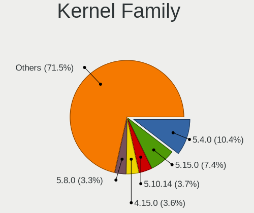

| Version | Computers | Percent |
|---------|-----------|---------|
| 5.4.0   | 323       | 10.41%  |
| 5.15.0  | 231       | 7.44%   |
| 5.10.14 | 116       | 3.74%   |
| 4.15.0  | 113       | 3.64%   |
| 5.8.0   | 101       | 3.25%   |
| 5.11.0  | 96        | 3.09%   |
| 5.13.0  | 94        | 3.03%   |
| 6.8.0   | 92        | 2.96%   |
| 5.3.0   | 92        | 2.96%   |
| 6.5.0   | 90        | 2.9%    |
| 5.16.7  | 75        | 2.42%   |
| 5.19.0  | 73        | 2.35%   |
| 6.2.0   | 71        | 2.29%   |
| 5.0.0   | 71        | 2.29%   |
| 6.1.0   | 63        | 2.03%   |
| 4.18.0  | 57        | 1.84%   |
| 5.14.7  | 56        | 1.8%    |
| 5.10.0  | 46        | 1.48%   |
| 6.2.6   | 35        | 1.13%   |
| 6.1.1   | 35        | 1.13%   |
| 6.4.11  | 27        | 0.87%   |
| 6.6.2   | 22        | 0.71%   |
| 6.12.1  | 18        | 0.58%   |
| 4.19.0  | 17        | 0.55%   |
| 6.10.0  | 15        | 0.48%   |
| 6.9.3   | 14        | 0.45%   |
| 6.5.6   | 13        | 0.42%   |
| 6.11.0  | 13        | 0.42%   |
| 6.7.9   | 12        | 0.39%   |
| 6.0.0   | 12        | 0.39%   |
| 3.10.0  | 12        | 0.39%   |
| 5.14.0  | 11        | 0.35%   |
| 6.3.5   | 9         | 0.29%   |
| 4.9.20  | 9         | 0.29%   |
| 6.9.7   | 8         | 0.26%   |
| 6.6.9   | 8         | 0.26%   |
| 6.11.10 | 8         | 0.26%   |
| 6.0.12  | 8         | 0.26%   |
| 5.16.11 | 8         | 0.26%   |
| 5.11.12 | 8         | 0.26%   |

Kernel Major Ver.
-----------------

Linux kernel major version

| Version | Computers | Percent |
|---------|-----------|---------|
| 5.4     | 347       | 11.31%  |
| 5.15    | 288       | 9.38%   |
| 5.10    | 206       | 6.71%   |
| 6.1     | 152       | 4.95%   |
| 6.2     | 137       | 4.46%   |
| 5.8     | 134       | 4.37%   |
| 6.8     | 132       | 4.3%    |
| 5.11    | 130       | 4.24%   |
| 6.5     | 128       | 4.17%   |
| 4.15    | 115       | 3.75%   |
| 5.13    | 112       | 3.65%   |
| 5.16    | 106       | 3.45%   |
| 5.3     | 103       | 3.36%   |
| 5.19    | 97        | 3.16%   |
| 5.14    | 89        | 2.9%    |
| 6.6     | 83        | 2.7%    |
| 5.0     | 78        | 2.54%   |
| 4.18    | 60        | 1.96%   |
| 6.4     | 59        | 1.92%   |
| 6.11    | 48        | 1.56%   |
| 6.10    | 45        | 1.47%   |
| 6.9     | 42        | 1.37%   |
| 6.0     | 39        | 1.27%   |
| 6.7     | 36        | 1.17%   |
| 5.17    | 34        | 1.11%   |
| 6.3     | 32        | 1.04%   |
| 6.12    | 30        | 0.98%   |
| 5.9     | 25        | 0.81%   |
| 5.18    | 24        | 0.78%   |
| 5.6     | 23        | 0.75%   |
| 4.19    | 22        | 0.72%   |
| 5.12    | 21        | 0.68%   |
| 4.9     | 20        | 0.65%   |
| 5.7     | 14        | 0.46%   |
| 3.10    | 13        | 0.42%   |
| 5.5     | 11        | 0.36%   |
| 4.4     | 6         | 0.2%    |
| 4.13    | 6         | 0.2%    |
| 5.1     | 4         | 0.13%   |
| 5.2     | 3         | 0.1%    |

Arch
----

OS architecture (x86_64, i586, etc.)

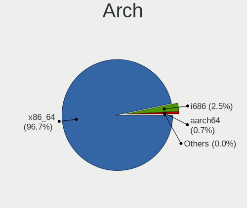

| Name    | Computers | Percent |
|---------|-----------|---------|
| x86_64  | 2652      | 96.68%  |
| i686    | 68        | 2.48%   |
| aarch64 | 19        | 0.69%   |
| armv7l  | 2         | 0.07%   |
| mips    | 1         | 0.04%   |
| armv8l  | 1         | 0.04%   |

DE
--

Desktop Environment

| Name              | Computers | Percent |
|-------------------|-----------|---------|
| GNOME             | 1134      | 39.68%  |
| KDE5              | 625       | 21.87%  |
| Unknown           | 335       | 11.72%  |
| XFCE              | 204       | 7.14%   |
| X-Cinnamon        | 155       | 5.42%   |
| MATE              | 64        | 2.24%   |
| KDE6              | 62        | 2.17%   |
| KDE               | 51        | 1.78%   |
| LXQt              | 42        | 1.47%   |
| Cinnamon          | 39        | 1.36%   |
| Pantheon          | 20        | 0.7%    |
| Hyprland          | 17        | 0.59%   |
| KDE4              | 15        | 0.52%   |
| LXDE              | 13        | 0.45%   |
| Unity             | 12        | 0.42%   |
| GNOME Flashback   | 12        | 0.42%   |
| Budgie            | 11        | 0.38%   |
| i3                | 9         | 0.31%   |
| sway              | 6         | 0.21%   |
| openbox           | 6         | 0.21%   |
| awesome           | 6         | 0.21%   |
| qtile             | 3         | 0.1%    |
| icewm             | 2         | 0.07%   |
| Deepin            | 2         | 0.07%   |
| bspwm             | 2         | 0.07%   |
| Yaru:ubuntu:GNOME | 1         | 0.03%   |
| XSession          | 1         | 0.03%   |
| xinitrc           | 1         | 0.03%   |
| xinit-compat      | 1         | 0.03%   |
| labwc:wlroots     | 1         | 0.03%   |
| GNUstep           | 1         | 0.03%   |
| GNOME Classic     | 1         | 0.03%   |
| Enlightenment     | 1         | 0.03%   |
| DWM               | 1         | 0.03%   |
| custom            | 1         | 0.03%   |
| Core              | 1         | 0.03%   |

Display Server
--------------

X11 or Wayland

| Name    | Computers | Percent |
|---------|-----------|---------|
| X11     | 1906      | 67.09%  |
| Wayland | 707       | 24.89%  |
| Unknown | 166       | 5.84%   |
| Tty     | 62        | 2.18%   |

Display Manager
---------------

SDDM, LightDM, etc.

| Name    | Computers | Percent |
|---------|-----------|---------|
| Unknown | 1199      | 42.13%  |
| SDDM    | 658       | 23.12%  |
| GDM3    | 348       | 12.23%  |
| LightDM | 271       | 9.52%   |
| GDM     | 266       | 9.35%   |
| TDM     | 72        | 2.53%   |
| KDM     | 12        | 0.42%   |
| SLiM    | 6         | 0.21%   |
| XDM     | 5         | 0.18%   |
| LXDM    | 3         | 0.11%   |
| SLIMSKI | 2         | 0.07%   |
| GREETD  | 2         | 0.07%   |
| LY-DM   | 1         | 0.04%   |
| Ly      | 1         | 0.04%   |

OS Lang
-------

Language

| Lang    | Computers | Percent |
|---------|-----------|---------|
| cs_CZ   | 1422      | 50.71%  |
| en_US   | 914       | 32.6%   |
| Unknown | 239       | 8.52%   |
| en_GB   | 73        | 2.6%    |
| C       | 58        | 2.07%   |
| ru_RU   | 28        | 1%      |
| sk_SK   | 12        | 0.43%   |
| pl_PL   | 11        | 0.39%   |
| de_DE   | 7         | 0.25%   |
| POSIX   | 6         | 0.21%   |
| C.UTF8  | 6         | 0.21%   |
| uk_UA   | 4         | 0.14%   |
| it_IT   | 3         | 0.11%   |
| fr_FR   | 3         | 0.11%   |
| pt_PT   | 2         | 0.07%   |
| en_CA   | 2         | 0.07%   |
| tr_TR   | 1         | 0.04%   |
| ro_RO   | 1         | 0.04%   |
| pt_BR   | 1         | 0.04%   |
| nb_NO   | 1         | 0.04%   |
| hu_HU   | 1         | 0.04%   |
| fi_FI   | 1         | 0.04%   |
| es_ES   | 1         | 0.04%   |
| en_NG   | 1         | 0.04%   |
| en_DK   | 1         | 0.04%   |
| en_AU   | 1         | 0.04%   |
| en_150  | 1         | 0.04%   |
| el_GR   | 1         | 0.04%   |
| de_CH   | 1         | 0.04%   |
| bg_BG   | 1         | 0.04%   |

Boot Mode
---------

EFI or BIOS

| Mode | Computers | Percent |
|------|-----------|---------|
| BIOS | 1454      | 51.69%  |
| EFI  | 1359      | 48.31%  |

Filesystem
----------

Type of filesystem

| Type     | Computers | Percent |
|----------|-----------|---------|
| Ext4     | 1798      | 63.38%  |
| Overlay  | 371       | 13.08%  |
| Btrfs    | 356       | 12.55%  |
| Tmpfs    | 136       | 4.79%   |
| Xfs      | 64        | 2.26%   |
| Unknown  | 64        | 2.26%   |
| Zfs      | 24        | 0.85%   |
| F2fs     | 6         | 0.21%   |
| Ext3     | 5         | 0.18%   |
| Ext2     | 5         | 0.18%   |
| Reiserfs | 2         | 0.07%   |
| Bcachefs | 2         | 0.07%   |
| Aufs     | 2         | 0.07%   |
| Rootfs   | 1         | 0.04%   |
| Jfs      | 1         | 0.04%   |

Part. scheme
------------

Scheme of partitioning

| Type    | Computers | Percent |
|---------|-----------|---------|
| GPT     | 1216      | 43.26%  |
| Unknown | 1188      | 42.26%  |
| MBR     | 407       | 14.48%  |

Dual Boot with Linux/BSD
------------------------

Hosting more than one Linux/BSD

| Dual boot | Computers | Percent |
|-----------|-----------|---------|
| No        | 2412      | 86.61%  |
| Yes       | 373       | 13.39%  |

Dual Boot (Win)
---------------

Hosting Linux and Windows

| Dual boot | Computers | Percent |
|-----------|-----------|---------|
| No        | 1888      | 67.38%  |
| Yes       | 914       | 32.62%  |

Board
-----

Vendor
------

Motherboard manufacturer

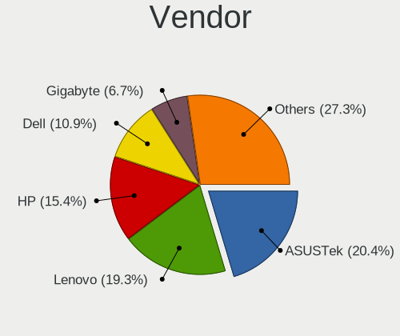

| Name                    | Computers | Percent |
|-------------------------|-----------|---------|
| ASUSTek Computer        | 559       | 20.39%  |
| Lenovo                  | 530       | 19.33%  |
| Hewlett-Packard         | 422       | 15.39%  |
| Dell                    | 298       | 10.87%  |
| Gigabyte Technology     | 185       | 6.75%   |
| Acer                    | 171       | 6.24%   |
| MSI                     | 170       | 6.2%    |
| ASRock                  | 67        | 2.44%   |
| Intel                   | 37        | 1.35%   |
| UMAX                    | 31        | 1.13%   |
| Fujitsu                 | 25        | 0.91%   |
| Toshiba                 | 21        | 0.77%   |
| Sony                    | 20        | 0.73%   |
| Unknown                 | 17        | 0.62%   |
| Raspberry Pi Foundation | 15        | 0.55%   |
| Valve                   | 12        | 0.44%   |
| Apple                   | 12        | 0.44%   |
| Google                  | 10        | 0.36%   |
| TUXEDO                  | 9         | 0.33%   |
| Pegatron                | 9         | 0.33%   |
| Supermicro              | 8         | 0.29%   |
| Fujitsu Siemens         | 8         | 0.29%   |
| HUAWEI                  | 7         | 0.26%   |
| AMI                     | 6         | 0.22%   |
| Samsung Electronics     | 5         | 0.18%   |
| Packard Bell            | 5         | 0.18%   |
| Notebook                | 5         | 0.18%   |
| Microsoft               | 5         | 0.18%   |
| Timi                    | 4         | 0.15%   |
| Foxconn                 | 4         | 0.15%   |
| ZOTAC                   | 3         | 0.11%   |
| IBM                     | 3         | 0.11%   |
| Dynabook                | 3         | 0.11%   |
| ASRockRack              | 3         | 0.11%   |
| Minix                   | 2         | 0.07%   |
| Insyde                  | 2         | 0.07%   |
| Clientron               | 2         | 0.07%   |
| Chuwi                   | 2         | 0.07%   |
| Biostar                 | 2         | 0.07%   |
| Alienware               | 2         | 0.07%   |

Model
-----

Motherboard model

| Name                                  | Computers | Percent |
|---------------------------------------|-----------|---------|
| ASUS UX31E                            | 130       | 4.74%   |
| Unknown                               | 23        | 0.84%   |
| ASUS All Series                       | 15        | 0.55%   |
| MSI MS-7C91                           | 13        | 0.47%   |
| MSI MS-7C02                           | 12        | 0.44%   |
| Valve Jupiter                         | 10        | 0.36%   |
| Dell Latitude E6420                   | 9         | 0.33%   |
| MSI MS-7A34                           | 8         | 0.29%   |
| HP EliteBook 840 G3                   | 8         | 0.29%   |
| MSI MS-7693                           | 7         | 0.26%   |
| Lenovo IdeaPad S145-15AST 81N3        | 7         | 0.26%   |
| HP ProBook 455 G7                     | 7         | 0.26%   |
| HP EliteBook 840 G6                   | 7         | 0.26%   |
| Dell Latitude E6400                   | 7         | 0.26%   |
| HP ProLiant DL380e Gen8               | 6         | 0.22%   |
| HP ProBook 4540s                      | 6         | 0.22%   |
| HP EliteBook 845 G8 Notebook PC       | 6         | 0.22%   |
| RPi Raspberry Pi                      | 5         | 0.18%   |
| MSI MS-7592                           | 5         | 0.18%   |
| Lenovo ThinkPad E14 20RA001LMC        | 5         | 0.18%   |
| HP ProBook 4530s                      | 5         | 0.18%   |
| HP ProBook 450 G5                     | 5         | 0.18%   |
| HP Pavilion dv7                       | 5         | 0.18%   |
| Dell XPS 15 9560                      | 5         | 0.18%   |
| Dell Latitude E7440                   | 5         | 0.18%   |
| Dell Latitude 5401                    | 5         | 0.18%   |
| ASUS P5G41T-M LX                      | 5         | 0.18%   |
| Lenovo Z50-75 80EC                    | 4         | 0.15%   |
| Lenovo ThinkPad T14 Gen 1 20UES2WA00  | 4         | 0.15%   |
| Lenovo IdeaPad L340-17IRH Gaming 81LL | 4         | 0.15%   |
| HP Victus by Laptop 16-e0xxx          | 4         | 0.15%   |
| HP ProDesk 405 G6 Desktop Mini PC     | 4         | 0.15%   |
| HP ProBook 4510s                      | 4         | 0.15%   |
| HP Notebook                           | 4         | 0.15%   |
| HP Laptop 15-bw0xx                    | 4         | 0.15%   |
| HP EliteBook x360 1030 G2             | 4         | 0.15%   |
| HP EliteBook 8470p                    | 4         | 0.15%   |
| HP Compaq 8200 Elite SFF PC           | 4         | 0.15%   |
| HP 250 G6 Notebook PC                 | 4         | 0.15%   |
| HP 250 G3                             | 4         | 0.15%   |

Model Family
------------

Motherboard model prefix

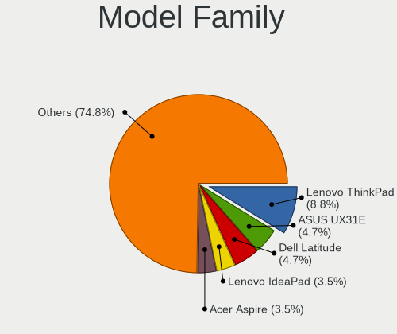

| Name               | Computers | Percent |
|--------------------|-----------|---------|
| Lenovo ThinkPad    | 241       | 8.79%   |
| ASUS UX31E         | 130       | 4.74%   |
| Dell Latitude      | 129       | 4.7%    |
| Lenovo IdeaPad     | 96        | 3.5%    |
| Acer Aspire        | 96        | 3.5%    |
| HP EliteBook       | 94        | 3.43%   |
| HP ProBook         | 72        | 2.63%   |
| ASUS ROG           | 48        | 1.75%   |
| HP Pavilion        | 43        | 1.57%   |
| HP Compaq          | 43        | 1.57%   |
| ASUS PRIME         | 39        | 1.42%   |
| ASUS TUF           | 37        | 1.35%   |
| Lenovo Yoga        | 36        | 1.31%   |
| Dell Inspiron      | 36        | 1.31%   |
| Dell XPS           | 33        | 1.2%    |
| Dell Precision     | 33        | 1.2%    |
| Dell OptiPlex      | 33        | 1.2%    |
| Lenovo ThinkCentre | 25        | 0.91%   |
| ASUS ZenBook       | 24        | 0.88%   |
| Lenovo Legion      | 23        | 0.84%   |
| HP ZBook           | 23        | 0.84%   |
| Unknown            | 23        | 0.84%   |
| ASUS VivoBook      | 21        | 0.77%   |
| ASUS ASUS          | 21        | 0.77%   |
| UMAX VisionBook    | 20        | 0.73%   |
| Toshiba Satellite  | 20        | 0.73%   |
| HP Laptop          | 20        | 0.73%   |
| HP ENVY            | 17        | 0.62%   |
| Acer Extensa       | 17        | 0.62%   |
| Fujitsu LIFEBOOK   | 16        | 0.58%   |
| Dell Vostro        | 16        | 0.58%   |
| Acer TravelMate    | 16        | 0.58%   |
| Acer Swift         | 16        | 0.58%   |
| RPi Raspberry      | 15        | 0.55%   |
| ASUS All           | 15        | 0.55%   |
| MSI MS-7C91        | 13        | 0.47%   |
| Lenovo ThinkBook   | 13        | 0.47%   |
| HP ProDesk         | 13        | 0.47%   |
| HP 250             | 13        | 0.47%   |
| MSI MS-7C02        | 12        | 0.44%   |

MFG Year
--------

Motherboard manufacture year

| Year    | Computers | Percent |
|---------|-----------|---------|
| 2011    | 290       | 10.58%  |
| 2020    | 273       | 9.96%   |
| 2021    | 214       | 7.8%    |
| 2018    | 213       | 7.77%   |
| 2019    | 205       | 7.48%   |
| 2012    | 177       | 6.46%   |
| 2017    | 175       | 6.38%   |
| 2013    | 149       | 5.43%   |
| 2014    | 145       | 5.29%   |
| 2015    | 120       | 4.38%   |
| 2022    | 116       | 4.23%   |
| 2008    | 112       | 4.08%   |
| 2016    | 110       | 4.01%   |
| 2010    | 100       | 3.65%   |
| 2009    | 91        | 3.32%   |
| 2023    | 86        | 3.14%   |
| 2007    | 73        | 2.66%   |
| 2006    | 31        | 1.13%   |
| 2024    | 25        | 0.91%   |
| Unknown | 22        | 0.8%    |
| 2005    | 10        | 0.36%   |
| 2004    | 4         | 0.15%   |
| 2000    | 1         | 0.04%   |

Form Factor
-----------

Physical design of the computer

| Name           | Computers | Percent |
|----------------|-----------|---------|
| Notebook       | 1666      | 60.76%  |
| Desktop        | 870       | 31.73%  |
| Convertible    | 79        | 2.88%   |
| Mini pc        | 44        | 1.6%    |
| Tablet         | 23        | 0.84%   |
| System on chip | 20        | 0.73%   |
| Server         | 20        | 0.73%   |
| All in one     | 19        | 0.69%   |
| Phone          | 1         | 0.04%   |

Secure Boot
-----------

Enabled or disabled

| State    | Computers | Percent |
|----------|-----------|---------|
| Disabled | 2524      | 91.15%  |
| Enabled  | 245       | 8.85%   |

Coreboot
--------

Have coreboot on board

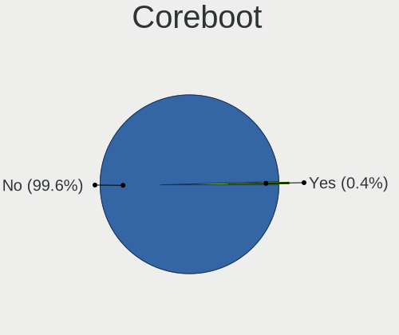

| Used | Computers | Percent |
|------|-----------|---------|
| No   | 2730      | 99.56%  |
| Yes  | 12        | 0.44%   |

RAM Size
--------

Total RAM memory

| Size in GB      | Computers | Percent |
|-----------------|-----------|---------|
| 3.01-4.0        | 617       | 22.05%  |
| 4.01-8.0        | 508       | 18.16%  |
| 8.01-16.0       | 503       | 17.98%  |
| 16.01-24.0      | 485       | 17.33%  |
| 32.01-64.0      | 325       | 11.62%  |
| 1.01-2.0        | 124       | 4.43%   |
| 64.01-256.0     | 96        | 3.43%   |
| 24.01-32.0      | 70        | 2.5%    |
| 2.01-3.0        | 43        | 1.54%   |
| 0.51-1.0        | 20        | 0.71%   |
| More than 256.0 | 4         | 0.14%   |
| 0.01-0.5        | 3         | 0.11%   |

RAM Used
--------

Used RAM memory

| Used GB     | Computers | Percent |
|-------------|-----------|---------|
| 1.01-2.0    | 1012      | 33.02%  |
| 2.01-3.0    | 664       | 21.66%  |
| 4.01-8.0    | 531       | 17.32%  |
| 3.01-4.0    | 389       | 12.69%  |
| 8.01-16.0   | 193       | 6.3%    |
| 0.51-1.0    | 174       | 5.68%   |
| 0.01-0.5    | 43        | 1.4%    |
| 16.01-24.0  | 37        | 1.21%   |
| 32.01-64.0  | 12        | 0.39%   |
| 24.01-32.0  | 7         | 0.23%   |
| 64.01-256.0 | 2         | 0.07%   |
| Unknown     | 1         | 0.03%   |

Total Drives
------------

Number of drives on board

| Drives | Computers | Percent |
|--------|-----------|---------|
| 1      | 1825      | 64.31%  |
| 2      | 611       | 21.53%  |
| 3      | 191       | 6.73%   |
| 4      | 85        | 3%      |
| 5      | 51        | 1.8%    |
| 0      | 32        | 1.13%   |
| 6      | 24        | 0.85%   |
| 7      | 13        | 0.46%   |
| 8      | 5         | 0.18%   |
| 9      | 1         | 0.04%   |

Has CD-ROM
----------

Has CD-ROM on board

| Presented | Computers | Percent |
|-----------|-----------|---------|
| No        | 1862      | 67.32%  |
| Yes       | 904       | 32.68%  |

Has Ethernet
------------

Has Ethernet on board

| Presented | Computers | Percent |
|-----------|-----------|---------|
| Yes       | 2383      | 86.4%   |
| No        | 375       | 13.6%   |

Has WiFi
--------

Has WiFi module

| Presented | Computers | Percent |
|-----------|-----------|---------|
| Yes       | 2046      | 74.13%  |
| No        | 714       | 25.87%  |

Has Bluetooth
-------------

Has Bluetooth module

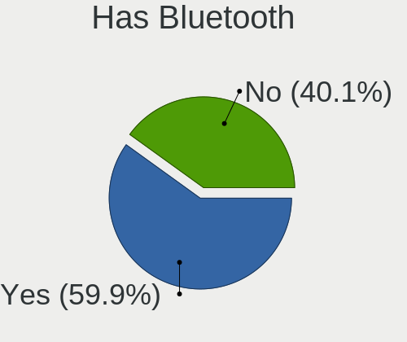

| Presented | Computers | Percent |
|-----------|-----------|---------|
| Yes       | 1664      | 59.94%  |
| No        | 1112      | 40.06%  |

Location
--------

Country
-------

Geographic location (country)

| Country | Computers | Percent |
|---------|-----------|---------|
| Czechia | 2742      | 100%    |

City
----

Geographic location (city)

| City                 | Computers | Percent |
|----------------------|-----------|---------|
| Prague               | 1085      | 37.73%  |
| Brno                 | 224       | 7.79%   |
| Ostrava              | 82        | 2.85%   |
| Pilsen               | 63        | 2.19%   |
| Liberec              | 42        | 1.46%   |
| Pardubice            | 40        | 1.39%   |
| Olomouc              | 40        | 1.39%   |
| Hradec Krlov     | 39        | 1.36%   |
| Brdo                 | 35        | 1.22%   |
| esk Budjovice  | 31        | 1.08%   |
| Zln                | 23        | 0.8%    |
| Havov            | 21        | 0.73%   |
| Znojmo               | 18        | 0.63%   |
| Chomutov             | 17        | 0.59%   |
| lapanice           | 15        | 0.52%   |
| Mlad Boleslav      | 15        | 0.52%   |
| Kladno               | 15        | 0.52%   |
| st nad Labem     | 14        | 0.49%   |
| Opava                | 14        | 0.49%   |
| Most                 | 14        | 0.49%   |
| Frdek-Mstek      | 13        | 0.45%   |
| Tbor               | 12        | 0.42%   |
| Karlovy Vary         | 12        | 0.42%   |
| Jihlava              | 12        | 0.42%   |
| Uhersk Hradit  | 9         | 0.31%   |
| Pbram            | 9         | 0.31%   |
| Perov              | 9         | 0.31%   |
| Litomice         | 9         | 0.31%   |
| esk Tn     | 9         | 0.31%   |
| Teplice              | 8         | 0.28%   |
| Roznov pod Radhostem | 8         | 0.28%   |
| Kralupy nad Vltavou  | 8         | 0.28%   |
| Celakovice           | 8         | 0.28%   |
| Teb            | 7         | 0.24%   |
| Prelouc              | 7         | 0.24%   |
| Praha 10             | 7         | 0.24%   |
| Krnov                | 7         | 0.24%   |
| Jedovnice            | 7         | 0.24%   |
| Ivancice             | 7         | 0.24%   |
| Horice               | 7         | 0.24%   |

Drives
------

Drive Vendor
------------

Hard drive vendors

| Vendor                      | Computers | Drives | Percent |
|-----------------------------|-----------|--------|---------|
| Samsung Electronics         | 638       | 922    | 16.5%   |
| WDC                         | 570       | 935    | 14.74%  |
| Seagate                     | 507       | 776    | 13.11%  |
| SanDisk                     | 295       | 334    | 7.63%   |
| Kingston                    | 275       | 348    | 7.11%   |
| Toshiba                     | 191       | 241    | 4.94%   |
| Unknown                     | 153       | 220    | 3.96%   |
| SK hynix                    | 117       | 139    | 3.03%   |
| Intel                       | 117       | 146    | 3.03%   |
| Hitachi                     | 101       | 117    | 2.61%   |
| Crucial                     | 98        | 122    | 2.53%   |
| A-DATA Technology           | 94        | 112    | 2.43%   |
| Micron Technology           | 93        | 121    | 2.4%    |
| Patriot                     | 73        | 93     | 1.89%   |
| HGST                        | 61        | 76     | 1.58%   |
| KIOXIA                      | 37        | 54     | 0.96%   |
| Apacer                      | 35        | 47     | 0.91%   |
| Verbatim                    | 23        | 24     | 0.59%   |
| Transcend                   | 23        | 33     | 0.59%   |
| Phison Electronics          | 23        | 29     | 0.59%   |
| Unknown                     | 22        | 25     | 0.57%   |
| Silicon Motion              | 19        | 24     | 0.49%   |
| Kingston Technology Company | 19        | 21     | 0.49%   |
| Gigabyte Technology         | 18        | 34     | 0.47%   |
| Phison                      | 17        | 30     | 0.44%   |
| Micron/Crucial Technology   | 15        | 18     | 0.39%   |
| LITEONIT                    | 15        | 19     | 0.39%   |
| OCZ                         | 12        | 35     | 0.31%   |
| Fujitsu                     | 11        | 13     | 0.28%   |
| Apple                       | 11        | 21     | 0.28%   |
| China                       | 10        | 11     | 0.26%   |
| Maxtor                      | 9         | 13     | 0.23%   |
| LITEON                      | 9         | 10     | 0.23%   |
| GOODRAM                     | 9         | 13     | 0.23%   |
| XPG                         | 8         | 15     | 0.21%   |
| UMAX                        | 7         | 7      | 0.18%   |
| Realtek Semiconductor       | 7         | 16     | 0.18%   |
| MAXIO Technology (Hangzhou) | 6         | 6      | 0.16%   |
| JMicron Technology          | 6         | 7      | 0.16%   |
| Corsair                     | 6         | 6      | 0.16%   |

Drive Model
-----------

Hard drive models

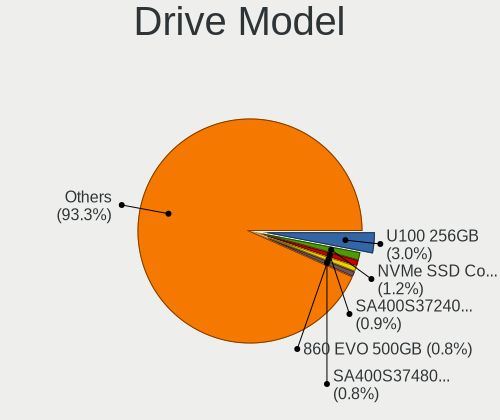

| Model                                                | Computers | Percent |
|------------------------------------------------------|-----------|---------|
| SanDisk SSD U100 256GB                               | 130       | 3.04%   |
| Samsung NVMe SSD Controller SM981/PM981/PM983 512GB  | 50        | 1.17%   |
| Kingston SA400S37240G 240GB SSD                      | 37        | 0.86%   |
| Samsung SSD 860 EVO 500GB                            | 35        | 0.82%   |
| Kingston SA400S37480G 480GB SSD                      | 33        | 0.77%   |
| Samsung NVMe SSD Controller PM9A1/PM9A3/980PRO 512GB | 31        | 0.72%   |
| Unknown MMC Card  64GB                               | 30        | 0.7%    |
| Unknown MMC Card  32GB                               | 27        | 0.63%   |
| WDC WDS500G2B0A-00SM50 500GB SSD                     | 25        | 0.58%   |
| WDC WDS240G2G0A-00JH30 240GB SSD                     | 24        | 0.56%   |
| Seagate ST1000LM035-1RK172 1TB                       | 24        | 0.56%   |
| Samsung SSD 850 EVO 250GB                            | 24        | 0.56%   |
| Samsung NVMe SSD Drive 512GB                         | 24        | 0.56%   |
| Kingston SA400S37120G 120GB SSD                      | 23        | 0.54%   |
| Samsung SSD 980 1TB                                  | 22        | 0.51%   |
| Unknown                                              | 22        | 0.51%   |
| Seagate ST2000DM008-2FR102 2TB                       | 21        | 0.49%   |
| Kingston SV300S37A120G 120GB SSD                     | 18        | 0.42%   |
| HGST HTS721010A9E630 1TB                             | 18        | 0.42%   |
| WDC WD10EZEX-08WN4A0 1TB                             | 16        | 0.37%   |
| Samsung SSD 860 EVO 1TB                              | 16        | 0.37%   |
| Samsung NVMe SSD Drive 500GB                         | 16        | 0.37%   |
| Phison PS5013 E13 NVMe Controller 512GB              | 16        | 0.37%   |
| Seagate ST500DM002-1BD142 500GB                      | 15        | 0.35%   |
| Seagate ST3500418AS 500GB                            | 15        | 0.35%   |
| Seagate ST1000LM024 HN-M101MBB 1TB                   | 15        | 0.35%   |
| Seagate ST1000DM010-2EP102 1TB                       | 15        | 0.35%   |
| SanDisk NVMe SSD Drive 1TB                           | 15        | 0.35%   |
| Patriot Burst 480GB SSD                              | 15        | 0.35%   |
| Kingston SKC3000D2048G 2TB                           | 15        | 0.35%   |
| Toshiba MQ01ABD100 1TB                               | 14        | 0.33%   |
| Seagate ST4000DM004-2CV104 4TB                       | 14        | 0.33%   |
| SanDisk NVMe SSD Drive 512GB                         | 14        | 0.33%   |
| Crucial CT500MX500SSD1 500GB                         | 14        | 0.33%   |
| A-DATA SU650 120GB SSD                               | 14        | 0.33%   |
| Unknown MMC Card  16GB                               | 13        | 0.3%    |
| Toshiba NVMe SSD Drive 256GB                         | 13        | 0.3%    |
| Patriot Burst 120GB SSD                              | 13        | 0.3%    |
| Crucial CT240BX500SSD1 240GB                         | 13        | 0.3%    |
| WDC WD10EZEX-08M2NA0 1TB                             | 12        | 0.28%   |

HDD Vendor
----------

Hard disk drive vendors

| Vendor              | Computers | Drives | Percent |
|---------------------|-----------|--------|---------|
| Seagate             | 492       | 747    | 37.73%  |
| WDC                 | 429       | 724    | 32.9%   |
| Toshiba             | 119       | 142    | 9.13%   |
| Hitachi             | 101       | 117    | 7.75%   |
| HGST                | 61        | 76     | 4.68%   |
| Samsung Electronics | 58        | 88     | 4.45%   |
| Fujitsu             | 11        | 13     | 0.84%   |
| Maxtor              | 9         | 13     | 0.69%   |
| Unknown             | 5         | 5      | 0.38%   |
| JMicron Technology  | 3         | 3      | 0.23%   |
| ASMedia             | 3         | 4      | 0.23%   |
| pqi                 | 2         | 2      | 0.15%   |
| External            | 2         | 2      | 0.15%   |
| ASMT                | 2         | 2      | 0.15%   |
| Apple               | 2         | 7      | 0.15%   |
| TO Exter            | 1         | 2      | 0.08%   |
| SABRENT             | 1         | 1      | 0.08%   |
| IBM/Hitachi         | 1         | 1      | 0.08%   |
| Hewlett-Packard     | 1         | 2      | 0.08%   |
| ASUSTOR             | 1         | 1      | 0.08%   |

SSD Vendor
----------

Solid state drive vendors

| Vendor              | Computers | Drives | Percent |
|---------------------|-----------|--------|---------|
| Samsung Electronics | 255       | 326    | 19.3%   |
| Kingston            | 208       | 262    | 15.75%  |
| SanDisk             | 185       | 193    | 14%     |
| WDC                 | 108       | 141    | 8.18%   |
| A-DATA Technology   | 87        | 103    | 6.59%   |
| Crucial             | 83        | 106    | 6.28%   |
| Patriot             | 68        | 86     | 5.15%   |
| Intel               | 56        | 70     | 4.24%   |
| Apacer              | 31        | 41     | 2.35%   |
| Micron Technology   | 28        | 41     | 2.12%   |
| Verbatim            | 22        | 23     | 1.67%   |
| Transcend           | 21        | 29     | 1.59%   |
| SK hynix            | 18        | 19     | 1.36%   |
| Toshiba             | 15        | 19     | 1.14%   |
| LITEONIT            | 15        | 19     | 1.14%   |
| OCZ                 | 10        | 17     | 0.76%   |
| China               | 10        | 11     | 0.76%   |
| Seagate             | 8         | 10     | 0.61%   |
| GOODRAM             | 8         | 12     | 0.61%   |
| Gigabyte Technology | 8         | 16     | 0.61%   |
| UMAX                | 7         | 7      | 0.53%   |
| LITEON              | 7         | 8      | 0.53%   |
| Apple               | 6         | 8      | 0.45%   |
| HPE                 | 4         | 4      | 0.3%    |
| Hewlett-Packard     | 4         | 4      | 0.3%    |
| Unknown             | 4         | 4      | 0.3%    |
| Team                | 3         | 3      | 0.23%   |
| SPCC                | 3         | 3      | 0.23%   |
| KingSpec            | 3         | 5      | 0.23%   |
| Unknown             | 2         | 8      | 0.15%   |
| HS-SSD-C100         | 2         | 2      | 0.15%   |
| FORESEE             | 2         | 2      | 0.15%   |
| Emtec               | 2         | 2      | 0.15%   |
| ADATA SU            | 2         | 2      | 0.15%   |
| WDC WDS1            | 1         | 1      | 0.08%   |
| WDC WDS             | 1         | 1      | 0.08%   |
| USB3.0              | 1         | 1      | 0.08%   |
| UMIS                | 1         | 1      | 0.08%   |
| TCSUNBOW            | 1         | 1      | 0.08%   |
| T-CREATE            | 1         | 1      | 0.08%   |

Drive Kind
----------

HDD or SSD

| Kind    | Computers | Drives | Percent |
|---------|-----------|--------|---------|
| SSD     | 1172      | 1632   | 33.52%  |
| HDD     | 1113      | 1952   | 31.84%  |
| NVMe    | 1019      | 1505   | 29.15%  |
| MMC     | 167       | 227    | 4.78%   |
| Unknown | 25        | 41     | 0.72%   |

Drive Connector
---------------

SATA, SAS, NVMe, etc.

| Type | Computers | Drives | Percent |
|------|-----------|--------|---------|
| SATA | 1882      | 3478   | 59.18%  |
| NVMe | 1017      | 1501   | 31.98%  |
| MMC  | 167       | 227    | 5.25%   |
| SAS  | 114       | 151    | 3.58%   |

Drive Size
----------

Size of hard drive

| Size in TB | Computers | Drives | Percent |
|------------|-----------|--------|---------|
| 0.01-0.5   | 1492      | 2231   | 62.58%  |
| 0.51-1.0   | 583       | 833    | 24.45%  |
| 1.01-2.0   | 149       | 263    | 6.25%   |
| 3.01-4.0   | 58        | 83     | 2.43%   |
| 4.01-10.0  | 41        | 75     | 1.72%   |
| 2.01-3.0   | 38        | 59     | 1.59%   |
| 10.01-20.0 | 23        | 40     | 0.96%   |

Space Total
-----------

Amount of disk space available on the file system

| Size in GB     | Computers | Percent |
|----------------|-----------|---------|
| 101-250        | 698       | 23.95%  |
| 251-500        | 601       | 20.62%  |
| 501-1000       | 395       | 13.56%  |
| 1-20           | 382       | 13.11%  |
| 1001-2000      | 217       | 7.45%   |
| 51-100         | 193       | 6.62%   |
| More than 3000 | 138       | 4.74%   |
| Unknown        | 117       | 4.02%   |
| 21-50          | 105       | 3.6%    |
| 2001-3000      | 67        | 2.3%    |
| 0              | 1         | 0.03%   |

Space Used
----------

Amount of used disk space

| Used GB        | Computers | Percent |
|----------------|-----------|---------|
| 1-20           | 1220      | 40.45%  |
| 21-50          | 417       | 13.83%  |
| 101-250        | 370       | 12.27%  |
| 51-100         | 301       | 9.98%   |
| 251-500        | 242       | 8.02%   |
| 501-1000       | 163       | 5.4%    |
| Unknown        | 117       | 3.88%   |
| 1001-2000      | 84        | 2.79%   |
| More than 3000 | 63        | 2.09%   |
| 2001-3000      | 36        | 1.19%   |
| 0              | 3         | 0.1%    |

Malfunc. Drives
---------------

Drive models with a malfunction

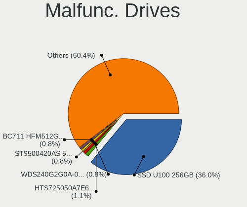

| Model                                 | Computers | Drives | Percent |
|---------------------------------------|-----------|--------|---------|
| SanDisk SSD U100 256GB                | 130       | 131    | 36.01%  |
| HGST HTS725050A7E630 500GB            | 4         | 5      | 1.11%   |
| WDC WDS240G2G0A-00JH30 240GB SSD      | 3         | 3      | 0.83%   |
| SK hynix BC711 HFM512GD3JX013N 512GB  | 3         | 4      | 0.83%   |
| Seagate ST9500420AS 500GB             | 3         | 4      | 0.83%   |
| WDC WD60EFRX-68L0BN1 6TB              | 2         | 3      | 0.55%   |
| WDC WD2500AAKS-00VSA0 250GB           | 2         | 2      | 0.55%   |
| WDC WD10EADS-00M2B0 1TB               | 2         | 2      | 0.55%   |
| Toshiba MQ01ABD075 752GB              | 2         | 2      | 0.55%   |
| Toshiba MK1234GSX 120GB               | 2         | 2      | 0.55%   |
| Seagate ST9250315AS 250GB             | 2         | 2      | 0.55%   |
| Seagate ST500LT012-9WS142 500GB       | 2         | 5      | 0.55%   |
| Seagate ST500LT0 12-1DG142 500GB      | 2         | 3      | 0.55%   |
| Seagate ST500DM002-1BD142 500GB       | 2         | 2      | 0.55%   |
| Seagate ST3250410AS 250GB             | 2         | 4      | 0.55%   |
| Seagate ST3160318AS 160GB             | 2         | 2      | 0.55%   |
| Seagate ST2000DM008-2FR102 2TB        | 2         | 3      | 0.55%   |
| Seagate ST1000LX015-1U7172 1TB        | 2         | 2      | 0.55%   |
| Seagate ST1000LM024 HN-M101MBB 1TB    | 2         | 2      | 0.55%   |
| Samsung Electronics SSD 980 1TB       | 2         | 2      | 0.55%   |
| Micron Technology 1100 SATA 256GB SSD | 2         | 2      | 0.55%   |
| Kingston SV300S37A120G 120GB SSD      | 2         | 2      | 0.55%   |
| Hitachi HTS541610J9SA00 100GB         | 2         | 2      | 0.55%   |
| HGST HTS721010A9E630 1TB              | 2         | 2      | 0.55%   |
| HGST HTS545050A7E380 500GB            | 2         | 2      | 0.55%   |
| WDC WDS120G2G0B-00EPW0 120GB SSD      | 1         | 1      | 0.28%   |
| WDC WDS120G2G0A-00JH30 120GB SSD      | 1         | 1      | 0.28%   |
| WDC WDS100T2B0A-00SM50 1TB SSD        | 1         | 1      | 0.28%   |
| WDC WD800BB-00JHA0 80GB               | 1         | 1      | 0.28%   |
| WDC WD7500BPVT-22HXZT3 752GB          | 1         | 1      | 0.28%   |
| WDC WD7500BPKT-75PK4T0 752GB          | 1         | 1      | 0.28%   |
| WDC WD7500AADS-00M2B0 752GB           | 1         | 1      | 0.28%   |
| WDC WD6400BPVT-60HXZT1 640GB          | 1         | 1      | 0.28%   |
| WDC WD6400AAKS-22A7B2 640GB           | 1         | 1      | 0.28%   |
| WDC WD5000LPCX-60VHAT0 500GB          | 1         | 1      | 0.28%   |
| WDC WD5000AZRX-00A8LB0 500GB          | 1         | 1      | 0.28%   |
| WDC WD5000AAKX-75U6AA0 500GB          | 1         | 2      | 0.28%   |
| WDC WD5000AAKS-00V0A0 500GB           | 1         | 1      | 0.28%   |
| WDC WD3200BEVT-60ZCT1 320GB           | 1         | 1      | 0.28%   |
| WDC WD3200AAKS-00L9A0 320GB           | 1         | 1      | 0.28%   |

Malfunc. Drive Vendor
---------------------

Vendors of faulty drives

| Vendor                | Computers | Drives | Percent |
|-----------------------|-----------|--------|---------|
| SanDisk               | 132       | 133    | 37.18%  |
| Seagate               | 58        | 77     | 16.34%  |
| WDC                   | 48        | 60     | 13.52%  |
| Hitachi               | 22        | 23     | 6.2%    |
| Samsung Electronics   | 21        | 27     | 5.92%   |
| Toshiba               | 17        | 22     | 4.79%   |
| HGST                  | 11        | 12     | 3.1%    |
| Intel                 | 8         | 8      | 2.25%   |
| Kingston              | 7         | 7      | 1.97%   |
| SK hynix              | 6         | 7      | 1.69%   |
| Micron Technology     | 4         | 4      | 1.13%   |
| Crucial               | 4         | 4      | 1.13%   |
| A-DATA Technology     | 3         | 5      | 0.85%   |
| Fujitsu               | 2         | 2      | 0.56%   |
| SPCC                  | 1         | 1      | 0.28%   |
| SATAFIRM              | 1         | 1      | 0.28%   |
| Realtek Semiconductor | 1         | 4      | 0.28%   |
| Patriot               | 1         | 1      | 0.28%   |
| OCZ                   | 1         | 1      | 0.28%   |
| Neo                   | 1         | 1      | 0.28%   |
| Maxtor                | 1         | 1      | 0.28%   |
| LITEONIT              | 1         | 2      | 0.28%   |
| IBM/Hitachi           | 1         | 1      | 0.28%   |
| HS-SSD-C100           | 1         | 1      | 0.28%   |
| Gigabyte Technology   | 1         | 1      | 0.28%   |
| ADATA Technology      | 1         | 1      | 0.28%   |

Malfunc. HDD Vendor
-------------------

Vendors of faulty HDD drives

| Vendor              | Computers | Drives | Percent |
|---------------------|-----------|--------|---------|
| Seagate             | 58        | 77     | 36.02%  |
| WDC                 | 40        | 51     | 24.84%  |
| Hitachi             | 22        | 23     | 13.66%  |
| Toshiba             | 17        | 22     | 10.56%  |
| HGST                | 11        | 12     | 6.83%   |
| Samsung Electronics | 9         | 11     | 5.59%   |
| Fujitsu             | 2         | 2      | 1.24%   |
| Maxtor              | 1         | 1      | 0.62%   |
| IBM/Hitachi         | 1         | 1      | 0.62%   |

Malfunc. Drive Kind
-------------------

Kinds of faulty drives

| Kind | Computers | Drives | Percent |
|------|-----------|--------|---------|
| SSD  | 177       | 182    | 50.86%  |
| HDD  | 153       | 200    | 43.97%  |
| NVMe | 18        | 25     | 5.17%   |

Failed Drives
-------------

Failed drive models

| Model                     | Computers | Drives | Percent |
|---------------------------|-----------|--------|---------|
| Seagate ST3500418AS 500GB | 2         | 4      | 40%     |
| Unknown 00000  16GB       | 1         | 1      | 20%     |
| Intel SSDSC2BW240H6 240GB | 1         | 1      | 20%     |
| Intel SSDSC2BW120H6 120GB | 1         | 2      | 20%     |

Failed Drive Vendor
-------------------

Failed drive vendors

| Vendor  | Computers | Drives | Percent |
|---------|-----------|--------|---------|
| Seagate | 2         | 4      | 40%     |
| Intel   | 2         | 3      | 40%     |
| Unknown | 1         | 1      | 20%     |

Drive Status
------------

Number of failed and malfunc. drives

| Status   | Computers | Drives | Percent |
|----------|-----------|--------|---------|
| Detected | 1483      | 2937   | 49.88%  |
| Works    | 1143      | 2005   | 38.45%  |
| Malfunc  | 342       | 407    | 11.5%   |
| Failed   | 5         | 8      | 0.17%   |

Storage controller
------------------

Storage Vendor
--------------

Storage controller vendors

| Vendor                                  | Computers | Percent |
|-----------------------------------------|-----------|---------|
| Intel                                   | 1711      | 48.66%  |
| AMD                                     | 541       | 15.39%  |
| Samsung Electronics                     | 373       | 10.61%  |
| SanDisk                                 | 157       | 4.47%   |
| SK hynix                                | 94        | 2.67%   |
| Kingston Technology Company             | 92        | 2.62%   |
| Micron Technology                       | 65        | 1.85%   |
| Toshiba America Info Systems            | 58        | 1.65%   |
| Phison Electronics                      | 51        | 1.45%   |
| ASMedia Technology                      | 44        | 1.25%   |
| JMicron Technology                      | 40        | 1.14%   |
| KIOXIA                                  | 38        | 1.08%   |
| Marvell Technology Group                | 35        | 1%      |
| Nvidia                                  | 34        | 0.97%   |
| Micron/Crucial Technology               | 29        | 0.82%   |
| Silicon Motion                          | 26        | 0.74%   |
| ADATA Technology                        | 22        | 0.63%   |
| VIA Technologies                        | 13        | 0.37%   |
| MAXIO Technology (Hangzhou)             | 9         | 0.26%   |
| Seagate Technology                      | 8         | 0.23%   |
| Realtek Semiconductor                   | 8         | 0.23%   |
| Broadcom / LSI                          | 7         | 0.2%    |
| Union Memory (Shenzhen)                 | 6         | 0.17%   |
| Hewlett-Packard                         | 6         | 0.17%   |
| LSI Logic / Symbios Logic               | 5         | 0.14%   |
| Solid State Storage Technology          | 4         | 0.11%   |
| Silicon Image                           | 4         | 0.11%   |
| Lite-On Technology                      | 4         | 0.11%   |
| Lenovo                                  | 4         | 0.11%   |
| Hosin Global Electronics                | 4         | 0.11%   |
| Adaptec                                 | 4         | 0.11%   |
| Silicon Integrated Systems [SiS]        | 3         | 0.09%   |
| Solidigm                                | 2         | 0.06%   |
| OCZ Technology Group                    | 2         | 0.06%   |
| Integrated Technology Express           | 2         | 0.06%   |
| INNOGRIT                                | 2         | 0.06%   |
| Apple                                   | 2         | 0.06%   |
| Western Digital                         | 1         | 0.03%   |
| Shenzhen Unionmemory Information System | 1         | 0.03%   |
| Promise Technology                      | 1         | 0.03%   |

Storage Model
-------------

Storage controller models

| Model                                                                          | Computers | Percent |
|--------------------------------------------------------------------------------|-----------|---------|
| AMD FCH SATA Controller [AHCI mode]                                            | 337       | 8.35%   |
| Intel 6 Series/C200 Series Chipset Family 6 port Mobile SATA AHCI Controller   | 209       | 5.18%   |
| Samsung NVMe SSD Controller SM981/PM981/PM983                                  | 154       | 3.82%   |
| Intel Sunrise Point-LP SATA Controller [AHCI mode]                             | 114       | 2.83%   |
| Intel 7 Series Chipset Family 6-port SATA Controller [AHCI mode]               | 102       | 2.53%   |
| Intel 8 Series/C220 Series Chipset Family 6-port SATA Controller 1 [AHCI mode] | 100       | 2.48%   |
| Samsung NVMe SSD Controller 980 (DRAM-less)                                    | 99        | 2.45%   |
| Intel 82801 Mobile SATA Controller [RAID mode]                                 | 77        | 1.91%   |
| AMD 400 Series Chipset SATA Controller                                         | 76        | 1.88%   |
| Intel Volume Management Device NVMe RAID Controller                            | 74        | 1.83%   |
| Intel 82801IBM/IEM (ICH9M/ICH9M-E) 4 port SATA Controller [AHCI mode]          | 61        | 1.51%   |
| AMD 500 Series Chipset SATA Controller                                         | 59        | 1.46%   |
| Samsung NVMe SSD Controller PM9A1/PM9A3/980PRO                                 | 55        | 1.36%   |
| Intel Celeron/Pentium Silver Processor SATA Controller                         | 51        | 1.26%   |
| Intel NM10/ICH7 Family SATA Controller [IDE mode]                              | 50        | 1.24%   |
| AMD SB7x0/SB8x0/SB9x0 SATA Controller [AHCI mode]                              | 50        | 1.24%   |
| Intel 8 Series SATA Controller 1 [AHCI mode]                                   | 49        | 1.21%   |
| Intel 6 Series/C200 Series Chipset Family 6 port Desktop SATA AHCI Controller  | 49        | 1.21%   |
| Intel 82801G (ICH7 Family) IDE Controller                                      | 47        | 1.16%   |
| Intel Cannon Lake Mobile PCH SATA AHCI Controller                              | 43        | 1.07%   |
| AMD SB7x0/SB8x0/SB9x0 IDE Controller                                           | 42        | 1.04%   |
| ASMedia ASM1061/ASM1062 Serial ATA Controller                                  | 41        | 1.02%   |
| SanDisk Extreme Pro / WD Black SN750 / PC SN730 / Red SN700 NVMe SSD           | 40        | 0.99%   |
| Intel Q170/Q150/B150/H170/H110/Z170/CM236 Chipset SATA Controller [AHCI Mode]  | 40        | 0.99%   |
| Samsung NVMe SSD Controller SM961/PM961/SM963                                  | 38        | 0.94%   |
| Intel Wildcat Point-LP SATA Controller [AHCI Mode]                             | 38        | 0.94%   |
| Intel 200 Series PCH SATA controller [AHCI mode]                               | 38        | 0.94%   |
| Intel 82801HM/HEM (ICH8M/ICH8M-E) IDE Controller                               | 35        | 0.87%   |
| SanDisk Ultra 3D / WD PC SN530, IX SN530, Blue SN550 NVMe SSD (DRAM-less)      | 34        | 0.84%   |
| Kingston Company KC3000/FURY Renegade NVMe SSD [E18]                           | 34        | 0.84%   |
| Intel Atom Processor E3800 Series SATA AHCI Controller                         | 33        | 0.82%   |
| AMD SB7x0/SB8x0/SB9x0 SATA Controller [IDE mode]                               | 33        | 0.82%   |
| Intel HM170/QM170 Chipset SATA Controller [AHCI Mode]                          | 32        | 0.79%   |
| SK hynix Gold P31/BC711/PC711 NVMe Solid State Drive                           | 30        | 0.74%   |
| Intel Comet Lake SATA AHCI Controller                                          | 29        | 0.72%   |
| Phison PS5013-E13 PCIe3 NVMe Controller (DRAM-less)                            | 28        | 0.69%   |
| Intel SATA Controller [RAID mode]                                              | 28        | 0.69%   |
| Intel Cannon Lake PCH SATA AHCI Controller                                     | 28        | 0.69%   |
| JMicron JMB363 SATA/IDE Controller                                             | 27        | 0.67%   |
| Intel 82801HM/HEM (ICH8M/ICH8M-E) SATA Controller [AHCI mode]                  | 26        | 0.64%   |

Storage Kind
------------

Kind of storage controller (IDE, SATA, NVMe, SAS, ...)

| Kind | Computers | Percent |
|------|-----------|---------|
| SATA | 1893      | 53.98%  |
| NVMe | 1024      | 29.2%   |
| IDE  | 356       | 10.15%  |
| RAID | 217       | 6.19%   |
| SAS  | 11        | 0.31%   |
| SCSI | 6         | 0.17%   |

Processor
---------

CPU Vendor
----------

Processor vendors

| Vendor   | Computers | Percent |
|----------|-----------|---------|
| Intel    | 1986      | 72.43%  |
| AMD      | 733       | 26.73%  |
| ARM      | 20        | 0.73%   |
| QUALCOMM | 1         | 0.04%   |
| MIPS     | 1         | 0.04%   |
| Unknown  | 1         | 0.04%   |

CPU Model
---------

Processor models

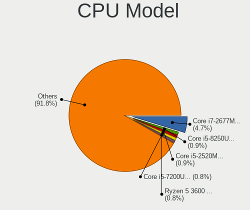

| Model                                      | Computers | Percent |
|--------------------------------------------|-----------|---------|
| Intel Core i7-2677M CPU @ 1.80GHz          | 130       | 4.72%   |
| Intel Core i5-8250U CPU @ 1.60GHz          | 26        | 0.94%   |
| Intel Core i5-2520M CPU @ 2.50GHz          | 24        | 0.87%   |
| Intel Core i5-7200U CPU @ 2.50GHz          | 23        | 0.83%   |
| AMD Ryzen 5 3600 6-Core Processor          | 23        | 0.83%   |
| Intel Core i5-8265U CPU @ 1.60GHz          | 20        | 0.73%   |
| Intel 11th Gen Core i5-1135G7 @ 2.40GHz    | 20        | 0.73%   |
| Intel Core i7-8565U CPU @ 1.80GHz          | 19        | 0.69%   |
| Intel Celeron N4020 CPU @ 1.10GHz          | 19        | 0.69%   |
| AMD Ryzen 5 5600X 6-Core Processor         | 19        | 0.69%   |
| Intel Core i7-10510U CPU @ 1.80GHz         | 18        | 0.65%   |
| AMD Ryzen 7 5800H with Radeon Graphics     | 18        | 0.65%   |
| AMD Ryzen 7 4700U with Radeon Graphics     | 18        | 0.65%   |
| Intel Core i7-8550U CPU @ 1.80GHz          | 17        | 0.62%   |
| Intel Core i7-7700HQ CPU @ 2.80GHz         | 17        | 0.62%   |
| Intel Core i5-6300U CPU @ 2.40GHz          | 17        | 0.62%   |
| Intel 11th Gen Core i7-1165G7 @ 2.80GHz    | 17        | 0.62%   |
| Intel Core i5-6200U CPU @ 2.30GHz          | 16        | 0.58%   |
| ARM Processor                              | 16        | 0.58%   |
| AMD Ryzen 7 PRO 4750U with Radeon Graphics | 16        | 0.58%   |
| AMD Ryzen 5 2600 Six-Core Processor        | 16        | 0.58%   |
| Intel Core i5-3320M CPU @ 2.60GHz          | 15        | 0.54%   |
| Intel Core i5-3210M CPU @ 2.50GHz          | 15        | 0.54%   |
| Intel Core i5-2400 CPU @ 3.10GHz           | 15        | 0.54%   |
| AMD Ryzen 5 5600H with Radeon Graphics     | 15        | 0.54%   |
| Intel Core i7-9750H CPU @ 2.60GHz          | 14        | 0.51%   |
| Intel Core i7-8650U CPU @ 1.90GHz          | 14        | 0.51%   |
| AMD Ryzen 5 5500U with Radeon Graphics     | 14        | 0.51%   |
| AMD Ryzen 5 4500U with Radeon Graphics     | 14        | 0.51%   |
| Intel Core i7-6700HQ CPU @ 2.60GHz         | 13        | 0.47%   |
| AMD Ryzen 9 5900X 12-Core Processor        | 13        | 0.47%   |
| Intel Core i7-10850H CPU @ 2.70GHz         | 12        | 0.44%   |
| Intel Core i5-5200U CPU @ 2.20GHz          | 12        | 0.44%   |
| Intel Core i5-4300U CPU @ 1.90GHz          | 12        | 0.44%   |
| Intel 12th Gen Core i7-12700H              | 12        | 0.44%   |
| AMD Ryzen 5 1600 Six-Core Processor        | 12        | 0.44%   |
| Intel Core i7-8750H CPU @ 2.20GHz          | 11        | 0.4%    |
| Intel Core i5-3470 CPU @ 3.20GHz           | 11        | 0.4%    |
| Intel Core 2 Duo CPU E8400 @ 3.00GHz       | 11        | 0.4%    |
| AMD Ryzen 7 5700U with Radeon Graphics     | 11        | 0.4%    |

CPU Model Family
----------------

Processor model prefix

| Model                   | Computers | Percent |
|-------------------------|-----------|---------|
| Intel Core i7           | 537       | 19.51%  |
| Intel Core i5           | 499       | 18.13%  |
| Other                   | 233       | 8.47%   |
| AMD Ryzen 5             | 216       | 7.85%   |
| Intel Celeron           | 152       | 5.52%   |
| AMD Ryzen 7             | 144       | 5.23%   |
| Intel Core i3           | 136       | 4.94%   |
| Intel Core 2 Duo        | 131       | 4.76%   |
| Intel Pentium           | 82        | 2.98%   |
| Intel Xeon              | 52        | 1.89%   |
| Intel Atom              | 47        | 1.71%   |
| AMD Ryzen 7 PRO         | 45        | 1.64%   |
| AMD Ryzen 9             | 42        | 1.53%   |
| AMD FX                  | 41        | 1.49%   |
| Intel Pentium Dual-Core | 32        | 1.16%   |
| AMD Ryzen 3             | 25        | 0.91%   |
| AMD A4                  | 22        | 0.8%    |
| AMD A8                  | 20        | 0.73%   |
| AMD A6                  | 17        | 0.62%   |
| Intel Core 2            | 16        | 0.58%   |
| AMD Ryzen 5 PRO         | 16        | 0.58%   |
| AMD Athlon 64 X2        | 15        | 0.55%   |
| Intel Core 2 Quad       | 14        | 0.51%   |
| Intel Pentium Silver    | 13        | 0.47%   |
| Intel Pentium Dual      | 13        | 0.47%   |
| Intel Core i9           | 12        | 0.44%   |
| Intel Genuine           | 11        | 0.4%    |
| AMD Phenom II X4        | 11        | 0.4%    |
| AMD A10                 | 11        | 0.4%    |
| Intel Celeron M         | 9         | 0.33%   |
| AMD Athlon II X2        | 9         | 0.33%   |
| AMD Athlon              | 9         | 0.33%   |
| AMD E1                  | 7         | 0.25%   |
| Intel Pentium Gold      | 6         | 0.22%   |
| Intel Core              | 6         | 0.22%   |
| Intel Pentium M         | 5         | 0.18%   |
| Intel Pentium 4         | 5         | 0.18%   |
| Intel Celeron Dual-Core | 5         | 0.18%   |
| AMD Sempron             | 5         | 0.18%   |
| Intel Pentium D         | 4         | 0.15%   |

CPU Cores
---------

Number of processor cores

| Number  | Computers | Percent |
|---------|-----------|---------|
| 2       | 1109      | 40.27%  |
| 4       | 849       | 30.83%  |
| 6       | 328       | 11.91%  |
| 8       | 231       | 8.39%   |
| 1       | 68        | 2.47%   |
| 12      | 65        | 2.36%   |
| 16      | 25        | 0.91%   |
| 14      | 24        | 0.87%   |
| 10      | 24        | 0.87%   |
| 3       | 14        | 0.51%   |
| 24      | 6         | 0.22%   |
| Unknown | 5         | 0.18%   |
| 20      | 3         | 0.11%   |
| 32      | 2         | 0.07%   |
| 28      | 1         | 0.04%   |

CPU Sockets
-----------

Number of sockets

| Number  | Computers | Percent |
|---------|-----------|---------|
| 1       | 2720      | 99.2%   |
| 2       | 20        | 0.73%   |
| Unknown | 2         | 0.07%   |

CPU Threads
-----------

Threads per core (Hyper-Threading)

| Number  | Computers | Percent |
|---------|-----------|---------|
| 2       | 1834      | 66.76%  |
| 1       | 907       | 33.02%  |
| Unknown | 5         | 0.18%   |
| 4       | 1         | 0.04%   |

CPU Op-Modes
------------

CPU Operation Modes (32-bit, 64-bit)

| Op mode        | Computers | Percent |
|----------------|-----------|---------|
| 32-bit, 64-bit | 2678      | 97.35%  |
| Unknown        | 39        | 1.42%   |
| 32-bit         | 29        | 1.05%   |
| 64-bit         | 5         | 0.18%   |

CPU Microcode
-------------

Microcode number

| Number     | Computers | Percent |
|------------|-----------|---------|
| Unknown    | 1035      | 36.11%  |
| 0x206a7    | 225       | 7.85%   |
| 0x306c3    | 85        | 2.97%   |
| 0x1067a    | 81        | 2.83%   |
| 0x306a9    | 76        | 2.65%   |
| 0x906ea    | 52        | 1.81%   |
| 0x806ec    | 52        | 1.81%   |
| 0x806ea    | 48        | 1.67%   |
| 0x806c1    | 42        | 1.47%   |
| 0x0a50000c | 42        | 1.47%   |
| 0x406e3    | 40        | 1.4%    |
| 0x08600106 | 37        | 1.29%   |
| 0x806e9    | 35        | 1.22%   |
| 0x506e3    | 35        | 1.22%   |
| 0x40651    | 34        | 1.19%   |
| 0x906e9    | 33        | 1.15%   |
| 0x6fd      | 32        | 1.12%   |
| 0x08701021 | 27        | 0.94%   |
| 0x306d4    | 26        | 0.91%   |
| 0x30678    | 25        | 0.87%   |
| 0x6fb      | 22        | 0.77%   |
| 0x10676    | 22        | 0.77%   |
| 0x406c4    | 20        | 0.7%    |
| 0x010000c8 | 20        | 0.7%    |
| 0x20655    | 19        | 0.66%   |
| 0x0800820d | 19        | 0.66%   |
| 0x06000852 | 19        | 0.66%   |
| 0x706a1    | 18        | 0.63%   |
| 0x08608103 | 18        | 0.63%   |
| 0xa0652    | 17        | 0.59%   |
| 0x706a8    | 17        | 0.59%   |
| 0x506c9    | 16        | 0.56%   |
| 0x0a50000d | 16        | 0.56%   |
| 0x08600104 | 16        | 0.56%   |
| 0x906ed    | 15        | 0.52%   |
| 0x706e5    | 15        | 0.52%   |
| 0x08108102 | 15        | 0.52%   |
| 0x06006705 | 14        | 0.49%   |
| 0x406c3    | 13        | 0.45%   |
| 0x08701013 | 13        | 0.45%   |

CPU Microarch
-------------

Microarchitecture

| Name              | Computers | Percent |
|-------------------|-----------|---------|
| KabyLake          | 379       | 13.8%   |
| SandyBridge       | 306       | 11.14%  |
| Haswell           | 191       | 6.95%   |
| Unknown           | 164       | 5.97%   |
| Zen 2             | 151       | 5.5%    |
| Penryn            | 142       | 5.17%   |
| IvyBridge         | 142       | 5.17%   |
| Zen 3             | 140       | 5.1%    |
| Skylake           | 118       | 4.3%    |
| Core              | 93        | 3.39%   |
| Silvermont        | 87        | 3.17%   |
| Alderlake Hybrid  | 76        | 2.77%   |
| TigerLake         | 72        | 2.62%   |
| Zen+              | 62        | 2.26%   |
| Goldmont plus     | 56        | 2.04%   |
| Westmere          | 55        | 2%      |
| CometLake         | 55        | 2%      |
| Zen               | 53        | 1.93%   |
| Piledriver        | 50        | 1.82%   |
| Broadwell         | 47        | 1.71%   |
| K10               | 43        | 1.57%   |
| Excavator         | 34        | 1.24%   |
| K8 Hammer         | 32        | 1.16%   |
| IceLake           | 30        | 1.09%   |
| Nehalem           | 21        | 0.76%   |
| Goldmont          | 20        | 0.73%   |
| Bonnell           | 20        | 0.73%   |
| Steamroller       | 16        | 0.58%   |
| P6                | 16        | 0.58%   |
| Puma              | 14        | 0.51%   |
| NetBurst          | 11        | 0.4%    |
| Bobcat            | 11        | 0.4%    |
| Jaguar            | 10        | 0.36%   |
| Tremont           | 8         | 0.29%   |
| K10 Llano         | 6         | 0.22%   |
| Meteorlake Hybrid | 5         | 0.18%   |
| Bulldozer         | 5         | 0.18%   |
| K8 & K10 hybrid   | 4         | 0.15%   |
| Sapphire Rapids   | 1         | 0.04%   |
| K6                | 1         | 0.04%   |

Graphics
--------

GPU Vendor
----------

Vendors of graphics cards

| Vendor                           | Computers | Percent |
|----------------------------------|-----------|---------|
| Intel                            | 1594      | 49.44%  |
| Nvidia                           | 813       | 25.22%  |
| AMD                              | 788       | 24.44%  |
| Matrox Electronics Systems       | 17        | 0.53%   |
| ASPEED Technology                | 7         | 0.22%   |
| VIA Technologies                 | 2         | 0.06%   |
| Silicon Integrated Systems [SiS] | 2         | 0.06%   |
| ATI Technologies                 | 1         | 0.03%   |

GPU Model
---------

Graphics card models

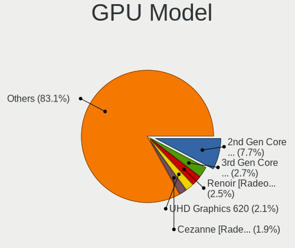

| Model                                                                                    | Computers | Percent |
|------------------------------------------------------------------------------------------|-----------|---------|
| Intel 2nd Generation Core Processor Family Integrated Graphics Controller                | 259       | 7.74%   |
| Intel 3rd Gen Core processor Graphics Controller                                         | 90        | 2.69%   |
| AMD Renoir [Radeon Vega Series / Radeon Vega Mobile Series]                              | 85        | 2.54%   |
| Intel UHD Graphics 620                                                                   | 69        | 2.06%   |
| AMD Cezanne [Radeon Vega Series / Radeon Vega Mobile Series]                             | 63        | 1.88%   |
| Intel TigerLake-LP GT2 [Iris Xe Graphics]                                                | 61        | 1.82%   |
| Intel Haswell-ULT Integrated Graphics Controller                                         | 58        | 1.73%   |
| Intel WhiskeyLake-U GT2 [UHD Graphics 620]                                               | 55        | 1.64%   |
| Intel Skylake GT2 [HD Graphics 520]                                                      | 51        | 1.52%   |
| AMD Ellesmere [Radeon RX 470/480/570/570X/580/580X/590]                                  | 51        | 1.52%   |
| Intel Mobile 4 Series Chipset Integrated Graphics Controller                             | 49        | 1.46%   |
| Intel HD Graphics 620                                                                    | 49        | 1.46%   |
| Intel CoffeeLake-H GT2 [UHD Graphics 630]                                                | 46        | 1.37%   |
| Intel Xeon E3-1200 v3/4th Gen Core Processor Integrated Graphics Controller              | 45        | 1.34%   |
| Intel GeminiLake [UHD Graphics 600]                                                      | 45        | 1.34%   |
| Intel Atom Processor Z36xxx/Z37xxx Series Graphics & Display                             | 44        | 1.31%   |
| Intel Atom/Celeron/Pentium Processor x5-E8000/J3xxx/N3xxx Integrated Graphics Controller | 43        | 1.28%   |
| Intel 4th Gen Core Processor Integrated Graphics Controller                              | 43        | 1.28%   |
| Intel CometLake-U GT2 [UHD Graphics]                                                     | 40        | 1.19%   |
| Intel HD Graphics 630                                                                    | 37        | 1.11%   |
| Intel HD Graphics 5500                                                                   | 37        | 1.11%   |
| Intel HD Graphics 530                                                                    | 33        | 0.99%   |
| Intel Alder Lake-P GT2 [Iris Xe Graphics]                                                | 33        | 0.99%   |
| AMD Picasso/Raven 2 [Radeon Vega Series / Radeon Vega Mobile Series]                     | 29        | 0.87%   |
| AMD Lucienne                                                                             | 28        | 0.84%   |
| Intel Core Processor Integrated Graphics Controller                                      | 27        | 0.81%   |
| Intel CometLake-H GT2 [UHD Graphics]                                                     | 27        | 0.81%   |
| AMD Stoney [Radeon R2/R3/R4/R5 Graphics]                                                 | 26        | 0.78%   |
| Nvidia TU117M [GeForce GTX 1650 Mobile / Max-Q]                                          | 24        | 0.72%   |
| Nvidia GA106M [GeForce RTX 3060 Mobile / Max-Q]                                          | 23        | 0.69%   |
| Intel 4 Series Chipset Integrated Graphics Controller                                    | 23        | 0.69%   |
| Nvidia GP107 [GeForce GTX 1050 Ti]                                                       | 22        | 0.66%   |
| Intel Raptor Lake-P [Iris Xe Graphics]                                                   | 22        | 0.66%   |
| Intel Mobile GM965/GL960 Integrated Graphics Controller (secondary)                      | 22        | 0.66%   |
| Intel Mobile GM965/GL960 Integrated Graphics Controller (primary)                        | 22        | 0.66%   |
| Intel Mobile 945GM/GMS/GME, 943/940GML Express Integrated Graphics Controller            | 22        | 0.66%   |
| AMD Barcelo                                                                              | 20        | 0.6%    |
| Nvidia GP106 [GeForce GTX 1060 6GB]                                                      | 19        | 0.57%   |
| Intel HD Graphics 500                                                                    | 18        | 0.54%   |
| Intel CoffeeLake-S GT2 [UHD Graphics 630]                                                | 18        | 0.54%   |

GPU Combo
---------

Combinations of graphics cards

| Name           | Computers | Percent |
|----------------|-----------|---------|
| 1 x Intel      | 1160      | 41.98%  |
| 1 x AMD        | 590       | 21.35%  |
| 1 x Nvidia     | 414       | 14.98%  |
| Intel + Nvidia | 331       | 11.98%  |
| Intel + AMD    | 79        | 2.86%   |
| AMD + Nvidia   | 59        | 2.14%   |
| 2 x AMD        | 58        | 2.1%    |
| Other          | 24        | 0.87%   |
| 1 x Matrox     | 15        | 0.54%   |
| 2 x Intel      | 13        | 0.47%   |
| 1 x ASPEED     | 6         | 0.22%   |
| 2 x Nvidia     | 5         | 0.18%   |
| 3 x Nvidia     | 2         | 0.07%   |
| 1 x VIA        | 2         | 0.07%   |
| 1 x SiS        | 2         | 0.07%   |
| AMD + Matrox   | 2         | 0.07%   |
| AMD + ASPEED   | 1         | 0.04%   |

GPU Driver
----------

Free vs proprietary

| Driver      | Computers | Percent |
|-------------|-----------|---------|
| Free        | 2247      | 80.65%  |
| Proprietary | 401       | 14.39%  |
| Unknown     | 138       | 4.95%   |

GPU Memory
----------

Total video memory

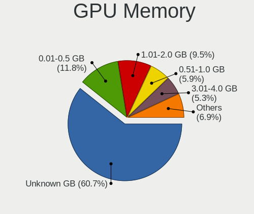

| Size in GB | Computers | Percent |
|------------|-----------|---------|
| Unknown    | 1720      | 60.67%  |
| 0.01-0.5   | 334       | 11.78%  |
| 1.01-2.0   | 269       | 9.49%   |
| 0.51-1.0   | 167       | 5.89%   |
| 3.01-4.0   | 149       | 5.26%   |
| 7.01-8.0   | 82        | 2.89%   |
| 5.01-6.0   | 49        | 1.73%   |
| 8.01-16.0  | 31        | 1.09%   |
| 2.01-3.0   | 24        | 0.85%   |
| 16.01-24.0 | 8         | 0.28%   |
| 4.01-5.0   | 2         | 0.07%   |

Monitor
-------

Monitor Vendor
--------------

Monitor vendors

| Vendor                  | Computers | Percent |
|-------------------------|-----------|---------|
| AU Optronics            | 403       | 12.68%  |
| Samsung Electronics     | 366       | 11.52%  |
| LG Display              | 265       | 8.34%   |
| BOE                     | 226       | 7.11%   |
| Chimei Innolux          | 224       | 7.05%   |
| Dell                    | 205       | 6.45%   |
| CPT                     | 133       | 4.19%   |
| Goldstar                | 127       | 4%      |
| BenQ                    | 118       | 3.71%   |
| Acer                    | 107       | 3.37%   |
| Philips                 | 105       | 3.31%   |
| Hewlett-Packard         | 100       | 3.15%   |
| Eizo                    | 89        | 2.8%    |
| AOC                     | 81        | 2.55%   |
| Lenovo                  | 73        | 2.3%    |
| Ancor Communications    | 58        | 1.83%   |
| Sharp                   | 51        | 1.61%   |
| Iiyama                  | 42        | 1.32%   |
| Chi Mei Optoelectronics | 39        | 1.23%   |
| PANDA                   | 36        | 1.13%   |
| InfoVision              | 23        | 0.72%   |
| CSO                     | 23        | 0.72%   |
| ASUSTek Computer        | 23        | 0.72%   |
| Sony                    | 22        | 0.69%   |
| LG Philips              | 20        | 0.63%   |
| Fujitsu Siemens         | 18        | 0.57%   |
| MSI                     | 16        | 0.5%    |
| Panasonic               | 15        | 0.47%   |
| NEC Computers           | 13        | 0.41%   |
| Apple                   | 12        | 0.38%   |
| ViewSonic               | 11        | 0.35%   |
| Valve                   | 10        | 0.31%   |
| Vestel Elektronik       | 9         | 0.28%   |
| Unknown                 | 9         | 0.28%   |
| HannStar                | 7         | 0.22%   |
| Quanta Display          | 6         | 0.19%   |
| LG Electronics          | 6         | 0.19%   |
| Toshiba                 | 4         | 0.13%   |
| Lenovo Group Limited    | 4         | 0.13%   |
| Hitachi                 | 4         | 0.13%   |

Monitor Model
-------------

Monitor models

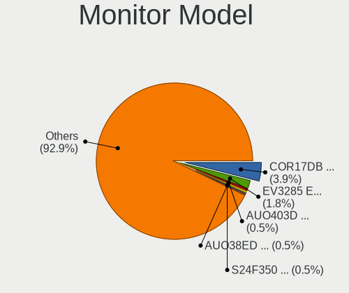

| Model                                                                    | Computers | Percent |
|--------------------------------------------------------------------------|-----------|---------|
| CPT LCD Monitor COR17DB 1600x900 293x164mm 13.2-inch                     | 130       | 3.93%   |
| Eizo EV3285 ENC2979 3840x2160 698x393mm 31.5-inch                        | 59        | 1.79%   |
| AU Optronics LCD Monitor AUO403D 1920x1080 309x174mm 14.0-inch           | 16        | 0.48%   |
| AU Optronics LCD Monitor AUO38ED 1920x1080 344x193mm 15.5-inch           | 16        | 0.48%   |
| Samsung Electronics S24F350 SAM0D20 1920x1080 521x293mm 23.5-inch        | 15        | 0.45%   |
| AU Optronics LCD Monitor AUO21ED 1920x1080 344x193mm 15.5-inch           | 15        | 0.45%   |
| Dell U2412M DELA07A 1920x1200 518x324mm 24.1-inch                        | 14        | 0.42%   |
| Chimei Innolux LCD Monitor CMN14D4 1920x1080 309x173mm 13.9-inch         | 14        | 0.42%   |
| AOC Q3279WG5B AOC3279 2560x1440 725x428mm 33.1-inch                      | 14        | 0.42%   |
| Philips PHL 243V7 PHLC155 1920x1080 527x296mm 23.8-inch                  | 13        | 0.39%   |
| LG Display LCD Monitor LGD02DC 1366x768 344x194mm 15.5-inch              | 10        | 0.3%    |
| AU Optronics LCD Monitor AUO123D 1920x1080 309x173mm 13.9-inch           | 10        | 0.3%    |
| Vestel Elektronik 49FHD_LCD_TV VES3700 1920x1080 1280x720mm 57.8-inch    | 9         | 0.27%   |
| Samsung Electronics LCD Monitor SEC544B 1600x900 382x215mm 17.3-inch     | 9         | 0.27%   |
| LG Display LCD Monitor LGD033A 1366x768 340x190mm 15.3-inch              | 9         | 0.27%   |
| Valve ANX7530 U VLV3001 800x1280 100x150mm 7.1-inch                      | 8         | 0.24%   |
| Samsung Electronics C24F390 SAM0D2C 1920x1080 521x293mm 23.5-inch        | 8         | 0.24%   |
| Philips PHL 273V7 PHLC156 1920x1080 598x336mm 27.0-inch                  | 8         | 0.24%   |
| PANDA LCD Monitor NCP004D 1920x1080 344x194mm 15.5-inch                  | 8         | 0.24%   |
| Panasonic TV MEIA296 1920x1080 698x392mm 31.5-inch                       | 8         | 0.24%   |
| Dell P2419H DELD0DA 1920x1080 527x296mm 23.8-inch                        | 8         | 0.24%   |
| Chimei Innolux LCD Monitor CMN15E7 1920x1080 344x193mm 15.5-inch         | 8         | 0.24%   |
| Chimei Innolux LCD Monitor CMN14D5 1920x1080 309x173mm 13.9-inch         | 8         | 0.24%   |
| AU Optronics LCD Monitor AUO34ED 1920x1080 344x193mm 15.5-inch           | 8         | 0.24%   |
| Sharp LCD Monitor SHP1453 1920x1080 346x194mm 15.6-inch                  | 7         | 0.21%   |
| Samsung Electronics C27F390 SAM0D32 1920x1080 600x340mm 27.2-inch        | 7         | 0.21%   |
| LG Display LCD Monitor LGD046F 1920x1080 344x194mm 15.5-inch             | 7         | 0.21%   |
| LG Display LCD Monitor LGD02F1 1366x768 344x194mm 15.5-inch              | 7         | 0.21%   |
| Lenovo LCD Monitor LEN40BA 1920x1080 344x194mm 15.5-inch                 | 7         | 0.21%   |
| Dell P2419H DELD0D9 1920x1080 527x296mm 23.8-inch                        | 7         | 0.21%   |
| Dell P2417H DELA0DB 1920x1080 527x296mm 23.8-inch                        | 7         | 0.21%   |
| Chimei Innolux LCD Monitor CMN14C9 1920x1080 309x173mm 13.9-inch         | 7         | 0.21%   |
| Chi Mei Optoelectronics LCD Monitor CMO15A7 1366x768 344x193mm 15.5-inch | 7         | 0.21%   |
| BOE LCD Monitor BOE0700 1920x1080 344x194mm 15.5-inch                    | 7         | 0.21%   |
| BenQ GW2470 BNQ78D9 1920x1080 527x296mm 23.8-inch                        | 7         | 0.21%   |
| AU Optronics LCD Monitor AUO26EC 1366x768 344x193mm 15.5-inch            | 7         | 0.21%   |
| AU Optronics LCD Monitor AUO213E 1600x900 309x174mm 14.0-inch            | 7         | 0.21%   |
| AOC Q27G2WG4 AOC2702 2560x1440 597x336mm 27.0-inch                       | 7         | 0.21%   |
| Samsung Electronics LCD Monitor SEC324C 1600x900 310x174mm 14.0-inch     | 6         | 0.18%   |
| Dell U2412M DELA07B 1920x1200 518x324mm 24.1-inch                        | 6         | 0.18%   |

Monitor Resolution
------------------

Monitor screen resolution

| Resolution         | Computers | Percent |
|--------------------|-----------|---------|
| 1920x1080 (FHD)    | 1333      | 44.51%  |
| 1366x768 (WXGA)    | 353       | 11.79%  |
| 1600x900 (HD+)     | 230       | 7.68%   |
| 3840x2160 (4K)     | 224       | 7.48%   |
| 2560x1440 (QHD)    | 167       | 5.58%   |
| 1920x1200 (WUXGA)  | 116       | 3.87%   |
| 1280x1024 (SXGA)   | 95        | 3.17%   |
| 1680x1050 (WSXGA+) | 92        | 3.07%   |
| 1280x800 (WXGA)    | 73        | 2.44%   |
| 1440x900 (WXGA+)   | 42        | 1.4%    |
| 2560x1600          | 33        | 1.1%    |
| 3440x1440          | 26        | 0.87%   |
| 2880x1800          | 20        | 0.67%   |
| Unknown            | 17        | 0.57%   |
| 2560x1080          | 16        | 0.53%   |
| 1024x768 (XGA)     | 14        | 0.47%   |
| 1600x1200          | 12        | 0.4%    |
| 3840x1080          | 11        | 0.37%   |
| 1360x768           | 11        | 0.37%   |
| 800x1280           | 10        | 0.33%   |
| 1024x600           | 9         | 0.3%    |
| 3840x2400          | 8         | 0.27%   |
| 1920x540           | 7         | 0.23%   |
| 2288x1287          | 6         | 0.2%    |
| 2160x1350          | 6         | 0.2%    |
| 1280x720 (HD)      | 6         | 0.2%    |
| 3456x2160          | 4         | 0.13%   |
| 2880x1920          | 4         | 0.13%   |
| 2160x1440          | 4         | 0.13%   |
| 1400x1050          | 4         | 0.13%   |
| 3000x2000          | 3         | 0.1%    |
| 2880x1620          | 3         | 0.1%    |
| 6400x2160          | 2         | 0.07%   |
| 3840x1600          | 2         | 0.07%   |
| 3840x1200          | 2         | 0.07%   |
| 3200x2000          | 2         | 0.07%   |
| 3200x1800 (QHD+)   | 2         | 0.07%   |
| 3072x1920          | 2         | 0.07%   |
| 2256x1504          | 2         | 0.07%   |
| 1280x768           | 2         | 0.07%   |

Monitor Diagonal
----------------

Diagonal size in inches

| Inches  | Computers | Percent |
|---------|-----------|---------|
| 15      | 710       | 22.23%  |
| 13      | 389       | 12.18%  |
| 24      | 319       | 9.99%   |
| 14      | 262       | 8.2%    |
| 27      | 243       | 7.61%   |
| 23      | 176       | 5.51%   |
| 17      | 150       | 4.7%    |
| 21      | 142       | 4.45%   |
| 31      | 127       | 3.98%   |
| 19      | 84        | 2.63%   |
| Unknown | 82        | 2.57%   |
| 22      | 60        | 1.88%   |
| 16      | 55        | 1.72%   |
| 12      | 48        | 1.5%    |
| 11      | 46        | 1.44%   |
| 20      | 39        | 1.22%   |
| 34      | 36        | 1.13%   |
| 84      | 28        | 0.88%   |
| 18      | 26        | 0.81%   |
| 33      | 15        | 0.47%   |
| 32      | 15        | 0.47%   |
| 26      | 15        | 0.47%   |
| 72      | 12        | 0.38%   |
| 54      | 12        | 0.38%   |
| 40      | 12        | 0.38%   |
| 25      | 12        | 0.38%   |
| 10      | 11        | 0.34%   |
| 7       | 10        | 0.31%   |
| 28      | 7         | 0.22%   |
| 65      | 6         | 0.19%   |
| 52      | 5         | 0.16%   |
| 48      | 4         | 0.13%   |
| 47      | 4         | 0.13%   |
| 46      | 4         | 0.13%   |
| 43      | 4         | 0.13%   |
| 39      | 4         | 0.13%   |
| 142     | 3         | 0.09%   |
| 49      | 3         | 0.09%   |
| 42      | 3         | 0.09%   |
| 29      | 3         | 0.09%   |

Monitor Width
-------------

Physical width

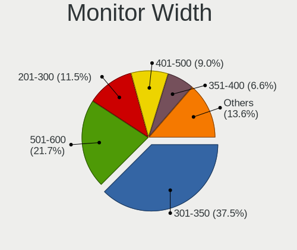

| Width in mm    | Computers | Percent |
|----------------|-----------|---------|
| 301-350        | 1167      | 37.51%  |
| 501-600        | 675       | 21.7%   |
| 201-300        | 359       | 11.54%  |
| 401-500        | 281       | 9.03%   |
| 351-400        | 205       | 6.59%   |
| 601-700        | 154       | 4.95%   |
| Unknown        | 82        | 2.64%   |
| 701-800        | 64        | 2.06%   |
| 1001-1500      | 43        | 1.38%   |
| 1501-2000      | 40        | 1.29%   |
| 801-900        | 22        | 0.71%   |
| 1-100          | 10        | 0.32%   |
| 901-1000       | 5         | 0.16%   |
| More than 2000 | 3         | 0.1%    |
| 101-200        | 1         | 0.03%   |

Aspect Ratio
------------

Proportional relationship between the width and the height

| Ratio   | Computers | Percent |
|---------|-----------|---------|
| 16/9    | 2060      | 74.21%  |
| 16/10   | 430       | 15.49%  |
| 5/4     | 101       | 3.64%   |
| Unknown | 67        | 2.41%   |
| 21/9    | 38        | 1.37%   |
| 4/3     | 34        | 1.22%   |
| 3/2     | 24        | 0.86%   |
| 0.67    | 8         | 0.29%   |
| 32/9    | 5         | 0.18%   |
| 1.00    | 3         | 0.11%   |
| 3.20    | 2         | 0.07%   |
| 0.62    | 2         | 0.07%   |
| 3.73    | 1         | 0.04%   |
| 3.33    | 1         | 0.04%   |

Monitor Area
------------

Area in inch

| Area in inch | Computers | Percent |
|----------------|-----------|---------|
| 101-110        | 706       | 22.33%  |
| 201-250        | 531       | 16.8%   |
| 81-90          | 404       | 12.78%  |
| 301-350        | 258       | 8.16%   |
| 71-80          | 241       | 7.62%   |
| 351-500        | 198       | 6.26%   |
| 151-200        | 156       | 4.94%   |
| 251-300        | 126       | 3.99%   |
| 121-130        | 95        | 3.01%   |
| Unknown        | 82        | 2.59%   |
| More than 1000 | 71        | 2.25%   |
| 141-150        | 54        | 1.71%   |
| 111-120        | 51        | 1.61%   |
| 61-70          | 46        | 1.46%   |
| 51-60          | 46        | 1.46%   |
| 501-1000       | 40        | 1.27%   |
| 131-140        | 20        | 0.63%   |
| 91-100         | 14        | 0.44%   |
| 41-50          | 12        | 0.38%   |
| 1-40           | 10        | 0.32%   |

Pixel Density
-------------

Pixels per inch

| Density       | Computers | Percent |
|---------------|-----------|---------|
| 121-160       | 1011      | 33.71%  |
| 51-100        | 984       | 32.81%  |
| 101-120       | 595       | 19.84%  |
| 161-240       | 225       | 7.5%    |
| Unknown       | 82        | 2.73%   |
| More than 240 | 53        | 1.77%   |
| 1-50          | 49        | 1.63%   |

Multiple Monitors
-----------------

Total monitors connected

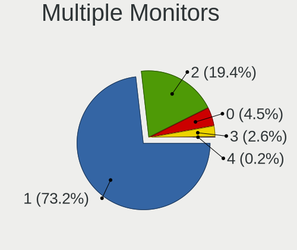

| Total | Computers | Percent |
|-------|-----------|---------|
| 1     | 2071      | 73.21%  |
| 2     | 550       | 19.44%  |
| 0     | 128       | 4.52%   |
| 3     | 74        | 2.62%   |
| 4     | 6         | 0.21%   |

Network
-------

Net Controller Vendor
---------------------

Controller vendors

| Vendor                                 | Computers | Percent |
|----------------------------------------|-----------|---------|
| Realtek Semiconductor                  | 1360      | 33.07%  |
| Intel                                  | 1312      | 31.91%  |
| Qualcomm Atheros                       | 504       | 12.26%  |
| Broadcom                               | 182       | 4.43%   |
| Samsung Electronics                    | 138       | 3.36%   |
| MediaTek                               | 104       | 2.53%   |
| Broadcom Limited                       | 65        | 1.58%   |
| Marvell Technology Group               | 47        | 1.14%   |
| TP-Link                                | 37        | 0.9%    |
| Lenovo                                 | 29        | 0.71%   |
| Ralink Technology                      | 28        | 0.68%   |
| Qualcomm Atheros Communications        | 28        | 0.68%   |
| Ralink                                 | 26        | 0.63%   |
| Nvidia                                 | 23        | 0.56%   |
| ASIX Electronics                       | 23        | 0.56%   |
| DisplayLink                            | 18        | 0.44%   |
| Sierra Wireless                        | 17        | 0.41%   |
| Dell                                   | 17        | 0.41%   |
| Qualcomm                               | 16        | 0.39%   |
| Xiaomi                                 | 10        | 0.24%   |
| ASUSTek Computer                       | 10        | 0.24%   |
| D-Link                                 | 7         | 0.17%   |
| VIA Technologies                       | 6         | 0.15%   |
| Microsoft                              | 6         | 0.15%   |
| Hewlett-Packard                        | 6         | 0.15%   |
| Ericsson Business Mobile Networks      | 6         | 0.15%   |
| QLogic                                 | 5         | 0.12%   |
| Attansic Technology                    | 5         | 0.12%   |
| Mellanox Technologies                  | 4         | 0.1%    |
| Fibocom                                | 4         | 0.1%    |
| Aquantia                               | 4         | 0.1%    |
| ZyDAS                                  | 3         | 0.07%   |
| Sony Ericsson Mobile Communications AB | 3         | 0.07%   |
| OnePlus Technology (Shenzhen)          | 3         | 0.07%   |
| Microchip Technology                   | 3         | 0.07%   |
| Huawei Technologies                    | 3         | 0.07%   |
| Google                                 | 3         | 0.07%   |
| Edimax Technology                      | 3         | 0.07%   |
| American Megatrends                    | 3         | 0.07%   |
| Spreadtrum Communications              | 2         | 0.05%   |

Net Controller Model
--------------------

Controller models

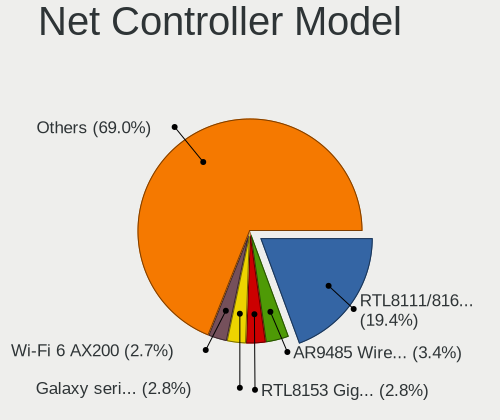

| Model                                                                  | Computers | Percent |
|------------------------------------------------------------------------|-----------|---------|
| Realtek RTL8111/8168/8211/8411 PCI Express Gigabit Ethernet Controller | 935       | 19.39%  |
| Qualcomm Atheros AR9485 Wireless Network Adapter                       | 162       | 3.36%   |
| Realtek RTL8153 Gigabit Ethernet Adapter                               | 136       | 2.82%   |
| Samsung Galaxy series, misc. (tethering mode)                          | 133       | 2.76%   |
| Intel Wi-Fi 6 AX200                                                    | 131       | 2.72%   |
| Intel 82579LM Gigabit Network Connection (Lewisville)                  | 98        | 2.03%   |
| Intel Wireless 8265 / 8275                                             | 97        | 2.01%   |
| Realtek RTL810xE PCI Express Fast Ethernet controller                  | 90        | 1.87%   |
| Realtek RTL8125 2.5GbE Controller                                      | 72        | 1.49%   |
| Intel Wireless 7260                                                    | 60        | 1.24%   |
| Intel Wi-Fi 6 AX201                                                    | 56        | 1.16%   |
| Qualcomm Atheros QCA9377 802.11ac Wireless Network Adapter             | 55        | 1.14%   |
| Intel Centrino Advanced-N 6205 [Taylor Peak]                           | 50        | 1.04%   |
| Realtek RTL8822CE 802.11ac PCIe Wireless Network Adapter               | 49        | 1.02%   |
| Intel Wireless 8260                                                    | 49        | 1.02%   |
| Intel Wireless 7265                                                    | 48        | 1%      |
| MediaTek MT7921 802.11ax PCI Express Wireless Network Adapter          | 44        | 0.91%   |
| Intel I211 Gigabit Network Connection                                  | 44        | 0.91%   |
| Qualcomm Atheros QCA9565 / AR9565 Wireless Network Adapter             | 43        | 0.89%   |
| Qualcomm Atheros AR9285 Wireless Network Adapter (PCI-Express)         | 43        | 0.89%   |
| Intel Cannon Point-LP CNVi [Wireless-AC]                               | 41        | 0.85%   |
| Intel Comet Lake PCH-LP CNVi WiFi                                      | 40        | 0.83%   |
| Intel Ethernet Connection I217-LM                                      | 39        | 0.81%   |
| Intel Alder Lake-P PCH CNVi WiFi                                       | 39        | 0.81%   |
| Intel Ethernet Connection (4) I219-LM                                  | 38        | 0.79%   |
| Intel Cannon Lake PCH CNVi WiFi                                        | 36        | 0.75%   |
| MediaTek MT7922 802.11ax PCI Express Wireless Network Adapter          | 35        | 0.73%   |
| Intel Wireless 3165                                                    | 35        | 0.73%   |
| Realtek RTL8822BE 802.11a/b/g/n/ac WiFi adapter                        | 33        | 0.68%   |
| Qualcomm Atheros QCA6174 802.11ac Wireless Network Adapter             | 32        | 0.66%   |
| Intel Ethernet Controller I225-V                                       | 31        | 0.64%   |
| Realtek RTL8852AE 802.11ax PCIe Wireless Network Adapter               | 30        | 0.62%   |
| Realtek RTL8821CE 802.11ac PCIe Wireless Network Adapter               | 30        | 0.62%   |
| Intel Ethernet Connection (2) I219-V                                   | 28        | 0.58%   |
| Broadcom BCM4313 802.11bgn Wireless Network Adapter                    | 28        | 0.58%   |
| Intel Wi-Fi 6E(802.11ax) AX210/AX1675* 2x2 [Typhoon Peak]              | 26        | 0.54%   |
| Intel Comet Lake PCH CNVi WiFi                                         | 25        | 0.52%   |
| Qualcomm Atheros AR9271 802.11n                                        | 24        | 0.5%    |
| Qualcomm Atheros AR8151 v2.0 Gigabit Ethernet                          | 23        | 0.48%   |
| Qualcomm Atheros AR8131 Gigabit Ethernet                               | 23        | 0.48%   |

Wireless Vendor
---------------

Wireless vendors

| Vendor                          | Computers | Percent |
|---------------------------------|-----------|---------|
| Intel                           | 1046      | 48.95%  |
| Qualcomm Atheros                | 400       | 18.72%  |
| Realtek Semiconductor           | 268       | 12.54%  |
| Broadcom                        | 106       | 4.96%   |
| MediaTek                        | 80        | 3.74%   |
| TP-Link                         | 35        | 1.64%   |
| Broadcom Limited                | 34        | 1.59%   |
| Ralink Technology               | 28        | 1.31%   |
| Qualcomm Atheros Communications | 28        | 1.31%   |
| Ralink                          | 26        | 1.22%   |
| Sierra Wireless                 | 17        | 0.8%    |
| Qualcomm                        | 13        | 0.61%   |
| Dell                            | 11        | 0.51%   |
| ASUSTek Computer                | 9         | 0.42%   |
| Microsoft                       | 6         | 0.28%   |
| D-Link                          | 6         | 0.28%   |
| Fibocom                         | 4         | 0.19%   |
| ZyDAS                           | 3         | 0.14%   |
| Marvell Technology Group        | 3         | 0.14%   |
| Edimax Technology               | 3         | 0.14%   |
| NetGear                         | 2         | 0.09%   |
| Hewlett-Packard                 | 2         | 0.09%   |
| ZyXEL Communications            | 1         | 0.05%   |
| Texas Instruments               | 1         | 0.05%   |
| Qualcomm Technologies           | 1         | 0.05%   |
| Mercucys                        | 1         | 0.05%   |
| Intersil                        | 1         | 0.05%   |
| Fujitsu Siemens Computers       | 1         | 0.05%   |
| D-Link System                   | 1         | 0.05%   |

Wireless Model
--------------

Wireless models

| Model                                                          | Computers | Percent |
|----------------------------------------------------------------|-----------|---------|
| Qualcomm Atheros AR9485 Wireless Network Adapter               | 162       | 7.57%   |
| Intel Wi-Fi 6 AX200                                            | 131       | 6.12%   |
| Intel Wireless 8265 / 8275                                     | 97        | 4.53%   |
| Intel Wireless 7260                                            | 60        | 2.8%    |
| Intel Wi-Fi 6 AX201                                            | 56        | 2.62%   |
| Qualcomm Atheros QCA9377 802.11ac Wireless Network Adapter     | 55        | 2.57%   |
| Intel Centrino Advanced-N 6205 [Taylor Peak]                   | 50        | 2.34%   |
| Realtek RTL8822CE 802.11ac PCIe Wireless Network Adapter       | 49        | 2.29%   |
| Intel Wireless 8260                                            | 49        | 2.29%   |
| Intel Wireless 7265                                            | 48        | 2.24%   |
| MediaTek MT7921 802.11ax PCI Express Wireless Network Adapter  | 44        | 2.06%   |
| Qualcomm Atheros QCA9565 / AR9565 Wireless Network Adapter     | 43        | 2.01%   |
| Qualcomm Atheros AR9285 Wireless Network Adapter (PCI-Express) | 43        | 2.01%   |
| Intel Cannon Point-LP CNVi [Wireless-AC]                       | 41        | 1.91%   |
| Intel Comet Lake PCH-LP CNVi WiFi                              | 40        | 1.87%   |
| Intel Alder Lake-P PCH CNVi WiFi                               | 39        | 1.82%   |
| Intel Cannon Lake PCH CNVi WiFi                                | 36        | 1.68%   |
| Intel Wireless 3165                                            | 35        | 1.63%   |
| Realtek RTL8822BE 802.11a/b/g/n/ac WiFi adapter                | 33        | 1.54%   |
| Qualcomm Atheros QCA6174 802.11ac Wireless Network Adapter     | 32        | 1.49%   |
| Realtek RTL8852AE 802.11ax PCIe Wireless Network Adapter       | 30        | 1.4%    |
| Realtek RTL8821CE 802.11ac PCIe Wireless Network Adapter       | 30        | 1.4%    |
| Broadcom BCM4313 802.11bgn Wireless Network Adapter            | 28        | 1.31%   |
| Intel Wi-Fi 6E(802.11ax) AX210/AX1675* 2x2 [Typhoon Peak]      | 26        | 1.21%   |
| Intel Comet Lake PCH CNVi WiFi                                 | 25        | 1.17%   |
| Qualcomm Atheros AR9271 802.11n                                | 24        | 1.12%   |
| Broadcom BCM43142 802.11b/g/n                                  | 22        | 1.03%   |
| Intel Wireless 3160                                            | 21        | 0.98%   |
| Intel WiFi Link 5100                                           | 21        | 0.98%   |
| Intel PRO/Wireless 3945ABG [Golan] Network Connection          | 20        | 0.93%   |
| Intel Dual Band Wireless-AC 3165 Plus Bluetooth                | 20        | 0.93%   |
| Intel Raptor Lake PCH CNVi WiFi                                | 19        | 0.89%   |
| Intel Dual Band Wireless-AC 3168NGW [Stone Peak]               | 19        | 0.89%   |
| MediaTek MT7922 802.11ax PCI Express Wireless Network Adapter  | 17        | 0.79%   |
| Intel Gemini Lake PCH CNVi WiFi                                | 17        | 0.79%   |
| Realtek RTL8188EUS 802.11n Wireless Network Adapter            | 16        | 0.75%   |
| Intel Wi-Fi 5(802.11ac) Wireless-AC 9x6x [Thunder Peak]        | 16        | 0.75%   |
| TP-Link TL-WN722N v2/v3 [Realtek RTL8188EUS]                   | 15        | 0.7%    |
| Intel Centrino Wireless-N 2230                                 | 14        | 0.65%   |
| Ralink MT7601U Wireless Adapter                                | 13        | 0.61%   |

Ethernet Vendor
---------------

Ethernet vendors

| Vendor                                 | Computers | Percent |
|----------------------------------------|-----------|---------|
| Realtek Semiconductor                  | 1236      | 48.45%  |
| Intel                                  | 681       | 26.7%   |
| Qualcomm Atheros                       | 147       | 5.76%   |
| Samsung Electronics                    | 133       | 5.21%   |
| Broadcom                               | 88        | 3.45%   |
| Marvell Technology Group               | 45        | 1.76%   |
| Broadcom Limited                       | 31        | 1.22%   |
| Lenovo                                 | 29        | 1.14%   |
| MediaTek                               | 24        | 0.94%   |
| Nvidia                                 | 23        | 0.9%    |
| ASIX Electronics                       | 23        | 0.9%    |
| DisplayLink                            | 18        | 0.71%   |
| Xiaomi                                 | 10        | 0.39%   |
| VIA Technologies                       | 5         | 0.2%    |
| QLogic                                 | 5         | 0.2%    |
| Attansic Technology                    | 5         | 0.2%    |
| Mellanox Technologies                  | 4         | 0.16%   |
| Aquantia                               | 4         | 0.16%   |
| Qualcomm                               | 3         | 0.12%   |
| American Megatrends                    | 3         | 0.12%   |
| TP-Link                                | 2         | 0.08%   |
| Spreadtrum Communications              | 2         | 0.08%   |
| Sony Ericsson Mobile Communications AB | 2         | 0.08%   |
| Silicon Integrated Systems [SiS]       | 2         | 0.08%   |
| Microchip Technology                   | 2         | 0.08%   |
| JMicron Technology                     | 2         | 0.08%   |
| IBM                                    | 2         | 0.08%   |
| Huawei Technologies                    | 2         | 0.08%   |
| Hewlett-Packard                        | 2         | 0.08%   |
| Google                                 | 2         | 0.08%   |
| Suzhou Motorcomm Electronic Technology | 1         | 0.04%   |
| Sundance Technology Inc / IC Plus      | 1         | 0.04%   |
| Motorola PCS                           | 1         | 0.04%   |
| MosChip Semiconductor                  | 1         | 0.04%   |
| Insyde Software                        | 1         | 0.04%   |
| ICS Advent                             | 1         | 0.04%   |
| Foxconn / Hon Hai                      | 1         | 0.04%   |
| Emulex                                 | 1         | 0.04%   |
| D-Link System                          | 1         | 0.04%   |
| D-Link                                 | 1         | 0.04%   |

Ethernet Model
--------------

Ethernet models

| Model                                                                  | Computers | Percent |
|------------------------------------------------------------------------|-----------|---------|
| Realtek RTL8111/8168/8211/8411 PCI Express Gigabit Ethernet Controller | 935       | 35.47%  |
| Realtek RTL8153 Gigabit Ethernet Adapter                               | 136       | 5.16%   |
| Samsung Galaxy series, misc. (tethering mode)                          | 133       | 5.05%   |
| Intel 82579LM Gigabit Network Connection (Lewisville)                  | 98        | 3.72%   |
| Realtek RTL810xE PCI Express Fast Ethernet controller                  | 90        | 3.41%   |
| Realtek RTL8125 2.5GbE Controller                                      | 72        | 2.73%   |
| Intel I211 Gigabit Network Connection                                  | 44        | 1.67%   |
| Intel Ethernet Connection I217-LM                                      | 39        | 1.48%   |
| Intel Ethernet Connection (4) I219-LM                                  | 38        | 1.44%   |
| Intel Ethernet Controller I225-V                                       | 31        | 1.18%   |
| Intel Ethernet Connection (2) I219-V                                   | 28        | 1.06%   |
| Qualcomm Atheros AR8151 v2.0 Gigabit Ethernet                          | 23        | 0.87%   |
| Qualcomm Atheros AR8131 Gigabit Ethernet                               | 23        | 0.87%   |
| Intel Ethernet Connection I218-LM                                      | 22        | 0.83%   |
| Realtek RTL-8100/8101L/8139 PCI Fast Ethernet Adapter                  | 21        | 0.8%    |
| Intel Ethernet Connection I219-LM                                      | 21        | 0.8%    |
| Intel 82567LM Gigabit Network Connection                               | 21        | 0.8%    |
| Intel Ethernet Connection (4) I219-V                                   | 20        | 0.76%   |
| ASIX AX88179 Gigabit Ethernet                                          | 20        | 0.76%   |
| MediaTek MT7922 802.11ax PCI Express Wireless Network Adapter          | 18        | 0.68%   |
| Qualcomm Atheros Killer E220x Gigabit Ethernet Controller              | 17        | 0.64%   |
| Intel Ethernet Connection (7) I219-V                                   | 17        | 0.64%   |
| Intel Ethernet Connection (7) I219-LM                                  | 17        | 0.64%   |
| Intel Ethernet Connection (6) I219-V                                   | 17        | 0.64%   |
| Qualcomm Atheros AR8161 Gigabit Ethernet                               | 15        | 0.57%   |
| Intel 82579V Gigabit Network Connection                                | 15        | 0.57%   |
| Realtek RTL8152 Fast Ethernet Adapter                                  | 13        | 0.49%   |
| Lenovo ThinkPad TBT 3 Dock                                             | 13        | 0.49%   |
| Intel Ethernet Connection (3) I218-LM                                  | 13        | 0.49%   |
| Intel Ethernet Connection (10) I219-LM                                 | 13        | 0.49%   |
| Broadcom NetLink BCM5787M Gigabit Ethernet PCI Express                 | 13        | 0.49%   |
| Intel Ethernet Connection (6) I219-LM                                  | 12        | 0.46%   |
| Intel Ethernet Connection (2) I219-LM                                  | 12        | 0.46%   |
| Broadcom NetXtreme BCM5761 Gigabit Ethernet PCIe                       | 12        | 0.46%   |
| Qualcomm Atheros QCA8172 Fast Ethernet                                 | 11        | 0.42%   |
| Intel I210 Gigabit Network Connection                                  | 11        | 0.42%   |
| Intel Ethernet Connection I217-V                                       | 11        | 0.42%   |
| Intel 82577LM Gigabit Network Connection                               | 11        | 0.42%   |
| Intel 82566DM-2 Gigabit Network Connection                             | 11        | 0.42%   |
| Broadcom Limited NetLink BCM5787M Gigabit Ethernet PCI Express         | 11        | 0.42%   |

Net Controller Kind
-------------------

Ethernet, WiFi or modem

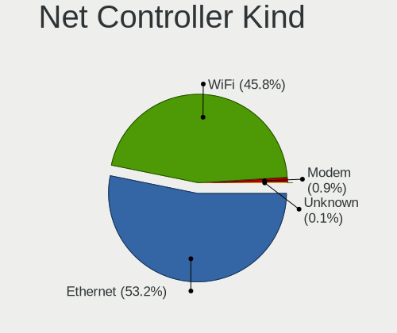

| Kind     | Computers | Percent |
|----------|-----------|---------|
| Ethernet | 2376      | 53.19%  |
| WiFi     | 2046      | 45.8%   |
| Modem    | 39        | 0.87%   |
| Unknown  | 6         | 0.13%   |

Used Controller
---------------

Currently used network controller

| Kind     | Computers | Percent |
|----------|-----------|---------|
| WiFi     | 1485      | 51.83%  |
| Ethernet | 1378      | 48.1%   |
| Modem    | 2         | 0.07%   |

NICs
----

Total network controllers on board

| Total | Computers | Percent |
|-------|-----------|---------|
| 2     | 1423      | 51.65%  |
| 1     | 1203      | 43.67%  |
| 0     | 62        | 2.25%   |
| 3     | 46        | 1.67%   |
| 4     | 11        | 0.4%    |
| 8     | 4         | 0.15%   |
| 5     | 3         | 0.11%   |
| 10    | 1         | 0.04%   |
| 9     | 1         | 0.04%   |
| 6     | 1         | 0.04%   |

IPv6
----

IPv6 vs IPv4

| Used | Computers | Percent |
|------|-----------|---------|
| No   | 2379      | 85.3%   |
| Yes  | 410       | 14.7%   |

Bluetooth
---------

Bluetooth Vendor
----------------

Controller vendors

| Vendor                          | Computers | Percent |
|---------------------------------|-----------|---------|
| Intel                           | 808       | 47.98%  |
| Realtek Semiconductor           | 170       | 10.1%   |
| IMC Networks                    | 110       | 6.53%   |
| Qualcomm Atheros Communications | 91        | 5.4%    |
| Foxconn / Hon Hai               | 86        | 5.11%   |
| Broadcom                        | 84        | 4.99%   |
| Cambridge Silicon Radio         | 78        | 4.63%   |
| Lite-On Technology              | 55        | 3.27%   |
| ASUSTek Computer                | 47        | 2.79%   |
| Hewlett-Packard                 | 33        | 1.96%   |
| Dell                            | 25        | 1.48%   |
| MediaTek                        | 18        | 1.07%   |
| Ralink                          | 13        | 0.77%   |
| Apple                           | 10        | 0.59%   |
| TP-Link                         | 6         | 0.36%   |
| Integrated System Solution      | 6         | 0.36%   |
| Alps Electric                   | 6         | 0.36%   |
| USI                             | 5         | 0.3%    |
| Toshiba                         | 5         | 0.3%    |
| Foxconn International           | 5         | 0.3%    |
| Realtek                         | 4         | 0.24%   |
| Ralink Technology               | 3         | 0.18%   |
| Micro Star International        | 3         | 0.18%   |
| Marvell Semiconductor           | 3         | 0.18%   |
| Mobile Action Technology        | 2         | 0.12%   |
| Creative Technology             | 2         | 0.12%   |
| Fujitsu Siemens Computers       | 1         | 0.06%   |
| Edimax Technology               | 1         | 0.06%   |
| Belkin Components               | 1         | 0.06%   |
| Askey Computer                  | 1         | 0.06%   |
| Actions                         | 1         | 0.06%   |
| Unknown                         | 1         | 0.06%   |

Bluetooth Model
---------------

Controller models

| Model                                               | Computers | Percent |
|-----------------------------------------------------|-----------|---------|
| Intel Bluetooth wireless interface                  | 296       | 17.58%  |
| Intel AX201 Bluetooth                               | 140       | 8.31%   |
| Intel AX200 Bluetooth                               | 127       | 7.54%   |
| Realtek Bluetooth Radio                             | 113       | 6.71%   |
| Intel Bluetooth 9460/9560 Jefferson Peak (JfP)      | 100       | 5.94%   |
| Cambridge Silicon Radio Bluetooth Dongle (HCI mode) | 78        | 4.63%   |
| Intel AX211 Bluetooth                               | 57        | 3.38%   |
| Qualcomm Atheros  Bluetooth Device                  | 37        | 2.2%    |
| Realtek  Bluetooth 4.2 Adapter                      | 31        | 1.84%   |
| IMC Networks Wireless_Device                        | 31        | 1.84%   |
| IMC Networks Bluetooth Radio                        | 30        | 1.78%   |
| IMC Networks Atheros AR3012 Bluetooth 4.0 Adapter   | 26        | 1.54%   |
| Foxconn / Hon Hai Wireless_Device                   | 26        | 1.54%   |
| Intel AX210 Bluetooth                               | 24        | 1.43%   |
| Intel Centrino Bluetooth Wireless Transceiver       | 23        | 1.37%   |
| Intel Wireless-AC 3168 Bluetooth                    | 20        | 1.19%   |
| IMC Networks Bluetooth Device                       | 20        | 1.19%   |
| Qualcomm Atheros QCA61x4 Bluetooth 4.0              | 18        | 1.07%   |
| Foxconn / Hon Hai MediaTek Bluetooth Adapter        | 17        | 1.01%   |
| Qualcomm Atheros AR3011 Bluetooth                   | 16        | 0.95%   |
| Lite-On Qualcomm Atheros QCA9377 Bluetooth          | 16        | 0.95%   |
| HP Broadcom 2070 Bluetooth Combo                    | 16        | 0.95%   |
| HP Bluetooth 2.0 Interface [Broadcom BCM2045]       | 16        | 0.95%   |
| Foxconn / Hon Hai Bluetooth Device                  | 15        | 0.89%   |
| Broadcom BCM2045 Bluetooth                          | 15        | 0.89%   |
| MediaTek Wireless_Device                            | 14        | 0.83%   |
| Dell DW375 Bluetooth Module                         | 14        | 0.83%   |
| Ralink RT3290 Bluetooth                             | 13        | 0.77%   |
| Intel Wireless-AC 9260 Bluetooth Adapter            | 13        | 0.77%   |
| ASUS Broadcom BCM20702A0 Bluetooth                  | 13        | 0.77%   |
| Realtek 802.11ac WLAN Adapter                       | 12        | 0.71%   |
| Lite-On Atheros AR3012 Bluetooth                    | 12        | 0.71%   |
| Broadcom BCM2045B (BDC-2.1)                         | 12        | 0.71%   |
| Broadcom BCM20702 Bluetooth 4.0 [ThinkPad]          | 11        | 0.65%   |
| Qualcomm Atheros AR3012 Bluetooth 4.0               | 10        | 0.59%   |
| ASUS ASUS USB-BT500                                 | 10        | 0.59%   |
| Broadcom HP Portable SoftSailing                    | 9         | 0.53%   |
| Lite-On Wireless_Device                             | 8         | 0.48%   |
| Intel Centrino Advanced-N 6230 Bluetooth adapter    | 8         | 0.48%   |
| ASUS BT-183 Bluetooth 2.0+EDR adapter               | 8         | 0.48%   |

Sound
-----

Sound Vendor
------------

Sound card vendors

| Vendor                               | Computers | Percent |
|--------------------------------------|-----------|---------|
| Intel                                | 1900      | 51.14%  |
| AMD                                  | 842       | 22.66%  |
| Nvidia                               | 554       | 14.91%  |
| C-Media Electronics                  | 62        | 1.67%   |
| Lenovo                               | 40        | 1.08%   |
| Realtek Semiconductor                | 30        | 0.81%   |
| Logitech                             | 24        | 0.65%   |
| GN Netcom                            | 24        | 0.65%   |
| Hewlett-Packard                      | 18        | 0.48%   |
| Creative Labs                        | 17        | 0.46%   |
| JMTek                                | 16        | 0.43%   |
| Kingston Technology                  | 15        | 0.4%    |
| Creative Technology                  | 15        | 0.4%    |
| VIA Technologies                     | 14        | 0.38%   |
| Razer USA                            | 8         | 0.22%   |
| Micro Star International             | 7         | 0.19%   |
| Focusrite-Novation                   | 7         | 0.19%   |
| Trust                                | 6         | 0.16%   |
| Plantronics                          | 6         | 0.16%   |
| BEHRINGER International              | 6         | 0.16%   |
| ASUSTek Computer                     | 6         | 0.16%   |
| Texas Instruments                    | 5         | 0.13%   |
| GYROCOM C&C                          | 5         | 0.13%   |
| DSEA A/S                             | 5         | 0.13%   |
| Dell                                 | 5         | 0.13%   |
| SteelSeries ApS                      | 4         | 0.11%   |
| M-Audio                              | 4         | 0.11%   |
| Yamaha                               | 3         | 0.08%   |
| Thesycon Systemsoftware & Consulting | 3         | 0.08%   |
| Silicon Integrated Systems [SiS]     | 3         | 0.08%   |
| DigiTech                             | 3         | 0.08%   |
| ASRock                               | 3         | 0.08%   |
| SM950 Microphon                      | 2         | 0.05%   |
| Schiit Audio                         | 2         | 0.05%   |
| Samson Technologies                  | 2         | 0.05%   |
| RODE Microphones                     | 2         | 0.05%   |
| Harman                               | 2         | 0.05%   |
| Fujitsu                              | 2         | 0.05%   |
| Conexant Systems                     | 2         | 0.05%   |
| Cambridge Silicon Radio              | 2         | 0.05%   |

Sound Model
-----------

Sound card models

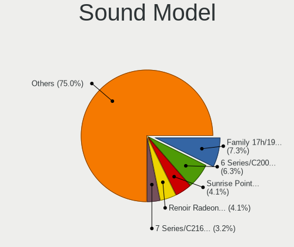

| Model                                                                      | Computers | Percent |
|----------------------------------------------------------------------------|-----------|---------|
| AMD Family 17h/19h/1ah HD Audio Controller                                 | 326       | 7.33%   |
| Intel 6 Series/C200 Series Chipset Family High Definition Audio Controller | 279       | 6.27%   |
| Intel Sunrise Point-LP HD Audio                                            | 184       | 4.14%   |
| AMD Renoir Radeon High Definition Audio Controller                         | 181       | 4.07%   |
| Intel 7 Series/C216 Chipset Family High Definition Audio Controller        | 144       | 3.24%   |
| Intel 8 Series/C220 Series Chipset High Definition Audio Controller        | 108       | 2.43%   |
| AMD Starship/Matisse HD Audio Controller                                   | 100       | 2.25%   |
| Intel 82801I (ICH9 Family) HD Audio Controller                             | 97        | 2.18%   |
| AMD SBx00 Azalia (Intel HDA)                                               | 93        | 2.09%   |
| Intel Xeon E3-1200 v3/4th Gen Core Processor HD Audio Controller           | 90        | 2.02%   |
| Intel Cannon Lake PCH cAVS                                                 | 87        | 1.96%   |
| Intel NM10/ICH7 Family High Definition Audio Controller                    | 83        | 1.87%   |
| Intel Tiger Lake-LP Smart Sound Technology Audio Controller                | 72        | 1.62%   |
| AMD Rembrandt Radeon High Definition Audio Controller                      | 68        | 1.53%   |
| AMD FCH Azalia Controller                                                  | 68        | 1.53%   |
| Intel 5 Series/3400 Series Chipset High Definition Audio                   | 63        | 1.42%   |
| AMD Family 17h (Models 00h-0fh) HD Audio Controller                        | 60        | 1.35%   |
| Intel Haswell-ULT HD Audio Controller                                      | 58        | 1.3%    |
| Intel Cannon Point-LP High Definition Audio Controller                     | 58        | 1.3%    |
| Intel 8 Series HD Audio Controller                                         | 58        | 1.3%    |
| Intel 100 Series/C230 Series Chipset Family HD Audio Controller            | 57        | 1.28%   |
| Intel Celeron/Pentium Silver Processor High Definition Audio               | 56        | 1.26%   |
| Intel Alder Lake PCH-P High Definition Audio Controller                    | 54        | 1.21%   |
| AMD Ellesmere HDMI Audio [Radeon RX 470/480 / 570/580/590]                 | 51        | 1.15%   |
| Nvidia GP106 High Definition Audio Controller                              | 48        | 1.08%   |
| Nvidia GP107GL High Definition Audio Controller                            | 47        | 1.06%   |
| AMD Raven/Raven2/Fenghuang HDMI/DP Audio Controller                        | 47        | 1.06%   |
| Intel Comet Lake PCH-LP cAVS                                               | 45        | 1.01%   |
| Nvidia GF108 High Definition Audio Controller                              | 43        | 0.97%   |
| Intel Broadwell-U Audio Controller                                         | 43        | 0.97%   |
| Intel Wildcat Point-LP High Definition Audio Controller                    | 42        | 0.94%   |
| Intel 82801H (ICH8 Family) HD Audio Controller                             | 42        | 0.94%   |
| Nvidia GK208 HDMI/DP Audio Controller                                      | 40        | 0.9%    |
| Intel 200 Series PCH HD Audio                                              | 38        | 0.85%   |
| Intel Comet Lake PCH cAVS                                                  | 37        | 0.83%   |
| Intel Atom Processor Z36xxx/Z37xxx Series High Definition Audio Controller | 34        | 0.76%   |
| Nvidia TU107 GeForce GTX 1650 High Definition Audio Controller             | 32        | 0.72%   |
| Nvidia GA106 High Definition Audio Controller                              | 32        | 0.72%   |
| AMD Family 15h (Models 60h-6fh) Audio Controller                           | 32        | 0.72%   |
| AMD Baffin HDMI/DP Audio [Radeon RX 550 640SP / RX 560/560X]               | 30        | 0.67%   |

Memory
------

Memory Vendor
-------------

Memory module vendors

| Vendor                       | Computers | Percent |
|------------------------------|-----------|---------|
| Samsung Electronics          | 364       | 19.83%  |
| Kingston                     | 334       | 18.19%  |
| SK hynix                     | 303       | 16.5%   |
| Micron Technology            | 191       | 10.4%   |
| Unknown                      | 151       | 8.22%   |
| Elpida                       | 151       | 8.22%   |
| Crucial                      | 83        | 4.52%   |
| Corsair                      | 49        | 2.67%   |
| Ramaxel Technology           | 37        | 2.02%   |
| Patriot                      | 35        | 1.91%   |
| A-DATA Technology            | 33        | 1.8%    |
| Unknown (ABCD)               | 22        | 1.2%    |
| G.Skill                      | 18        | 0.98%   |
| Nanya Technology             | 15        | 0.82%   |
| Transcend                    | 6         | 0.33%   |
| Unknown                      | 6         | 0.33%   |
| GOODRAM                      | 5         | 0.27%   |
| Apacer                       | 3         | 0.16%   |
| Patriot Memory (PDP Systems) | 2         | 0.11%   |
| GSkill                       | 2         | 0.11%   |
| fef5                         | 2         | 0.11%   |
| ASint Technology             | 2         | 0.11%   |
| Unknown (AB)                 | 1         | 0.05%   |
| Unknown (0x1636)             | 1         | 0.05%   |
| Unknown (0x0080)             | 1         | 0.05%   |
| Toshiba                      | 1         | 0.05%   |
| Team                         | 1         | 0.05%   |
| TakeMS                       | 1         | 0.05%   |
| Silicon Power                | 1         | 0.05%   |
| SHARETRONIC                  | 1         | 0.05%   |
| RZX                          | 1         | 0.05%   |
| ProMos/Mosel Vitelic         | 1         | 0.05%   |
| PDPSystems                   | 1         | 0.05%   |
| Patriot Memory               | 1         | 0.05%   |
| OnBoard                      | 1         | 0.05%   |
| Nayna                        | 1         | 0.05%   |
| Lexar Co Limited             | 1         | 0.05%   |
| Kingmax                      | 1         | 0.05%   |
| Kimtigo                      | 1         | 0.05%   |
| H                            | 1         | 0.05%   |

Memory Model
------------

Memory module models

| Model                                                            | Computers | Percent |
|------------------------------------------------------------------|-----------|---------|
| Elpida RAM Module 2GB SODIMM DDR3 1333MT/s                       | 129       | 6.6%    |
| Samsung RAM M471A1G44AB0-CWE 8GB SODIMM DDR4 3200MT/s            | 22        | 1.13%   |
| Micron RAM 4ATF1G64HZ-3G2E1 8GB SODIMM DDR4 3200MT/s             | 19        | 0.97%   |
| Unknown (ABCD) RAM 123456789012345678 2GB SODIMM LPDDR3 2400MT/s | 17        | 0.87%   |
| Samsung RAM M471A5244CB0-CTD 4GB SODIMM DDR4 3266MT/s            | 14        | 0.72%   |
| Kingston RAM KHX3200C16D4/8GX 8GB DIMM DDR4 3733MT/s             | 14        | 0.72%   |
| Samsung RAM M471A1K43EB1-CWE 8GB SODIMM DDR4 3200MT/s            | 13        | 0.66%   |
| SK hynix RAM HMT41GS6BFR8A-PB 8GB SODIMM DDR3 1600MT/s           | 12        | 0.61%   |
| Samsung RAM M471A1G44BB0-CWE 8GB SODIMM DDR4 3200MT/s            | 12        | 0.61%   |
| SK hynix RAM HMT351S6CFR8C-PB 4GB SODIMM DDR3 1600MT/s           | 11        | 0.56%   |
| Samsung RAM M471A2G44AM0-CWE 16GB SODIMM DDR4 3200MT/s           | 11        | 0.56%   |
| Samsung RAM M471A1K43DB1-CWE 8GB SODIMM DDR4 3200MT/s            | 11        | 0.56%   |
| Kingston RAM KF3200C16D4/8GX 8GB DIMM DDR4 3600MT/s              | 11        | 0.56%   |
| Samsung RAM M471A1K43CB1-CRC 8GB SODIMM DDR4 2667MT/s            | 10        | 0.51%   |
| SK hynix RAM Module 8GB SODIMM DDR4 3200MT/s                     | 9         | 0.46%   |
| SK hynix RAM HMA81GS6AFR8N-UH 8GB SODIMM DDR4 2667MT/s           | 9         | 0.46%   |
| Samsung RAM M471B5273DH0-CH9 4GB SODIMM DDR3 1334MT/s            | 9         | 0.46%   |
| Samsung RAM M471B5273CH0-CH9 4GB SODIMM DDR3 1334MT/s            | 9         | 0.46%   |
| Samsung RAM M471B5173DB0-YK0 4GB SODIMM DDR3 1600MT/s            | 9         | 0.46%   |
| Kingston RAM KHX2666C16/8G 8GB DIMM DDR4 3466MT/s                | 9         | 0.46%   |
| Samsung RAM M471B1G73DB0-YK0 8GB SODIMM DDR3 1600MT/s            | 8         | 0.41%   |
| Samsung RAM M471A1K43DB1-CTD 8GB SODIMM DDR4 2667MT/s            | 8         | 0.41%   |
| Kingston RAM KF3200C16D4/32GX 32GB DIMM DDR4 3933MT/s            | 8         | 0.41%   |
| SK hynix RAM HMAA1GS6CJR6N-XN 8GB SODIMM DDR4 3200MT/s           | 7         | 0.36%   |
| SK hynix RAM HMA82GS6JJR8N-VK 16GB SODIMM DDR4 2667MT/s          | 7         | 0.36%   |
| Kingston RAM KHX1866C10D3/8G 8GB DIMM DDR3 2133MT/s              | 7         | 0.36%   |
| Kingston RAM KF3200C16D4/16GX 16GB DIMM DDR4 3200MT/s            | 7         | 0.36%   |
| Unknown RAM Module 2GB DIMM DDR2 800MT/s                         | 6         | 0.31%   |
| SK hynix RAM HMT451S6BFR8A-PB 4096MB SODIMM DDR3 1600MT/s        | 6         | 0.31%   |
| SK hynix RAM HMT451S6AFR8A-PB 4GB SODIMM DDR3 1600MT/s           | 6         | 0.31%   |
| SK hynix RAM HMA82GS6DJR8N-XN 16GB SODIMM DDR4 3200MT/s          | 6         | 0.31%   |
| Samsung RAM M471B5173EB0-YK0 4GB SODIMM DDR3 1600MT/s            | 6         | 0.31%   |
| Samsung RAM M471B1G73QH0-YK0 8GB SODIMM DDR3 1600MT/s            | 6         | 0.31%   |
| Samsung RAM M471A1G44AB0-CWE 8GB Row Of Chips DDR4 3200MT/s      | 6         | 0.31%   |
| Patriot RAM 3200 C16 Series 4GB DIMM DDR4 3600MT/s               | 6         | 0.31%   |
| Micron RAM MT62F1G32D4DR-031 WT 4GB Row Of Chips LPDDR5 6400MT/s | 6         | 0.31%   |
| Micron RAM 4ATF1G64HZ-3G2E1 8GB Row Of Chips DDR4 3200MT/s       | 6         | 0.31%   |
| Kingston RAM KHX3200C16D4/16GX 16GB DIMM DDR4 3600MT/s           | 6         | 0.31%   |
| Kingston RAM KHX2400C15/8G 8GB DIMM DDR4 3400MT/s                | 6         | 0.31%   |
| Kingston RAM KHX1600C9S3L/8G 8192MB SODIMM DDR3 1600MT/s         | 6         | 0.31%   |

Memory Kind
-----------

Memory module kinds

| Kind    | Computers | Percent |
|---------|-----------|---------|
| DDR4    | 720       | 45.06%  |
| DDR3    | 528       | 33.04%  |
| LPDDR4  | 78        | 4.88%   |
| DDR2    | 69        | 4.32%   |
| DDR5    | 53        | 3.32%   |
| Unknown | 44        | 2.75%   |
| SDRAM   | 36        | 2.25%   |
| LPDDR5  | 32        | 2%      |
| LPDDR3  | 26        | 1.63%   |
| DDR     | 9         | 0.56%   |
| DRAM    | 3         | 0.19%   |

Memory Form Factor
------------------

Physical design of the memory module

| Name         | Computers | Percent |
|--------------|-----------|---------|
| SODIMM       | 998       | 62.41%  |
| DIMM         | 467       | 29.21%  |
| Row Of Chips | 114       | 7.13%   |
| Chip         | 13        | 0.81%   |
| Unknown      | 5         | 0.31%   |
| RIMM         | 2         | 0.13%   |

Memory Size
-----------

Memory module size

| Size  | Computers | Percent |
|-------|-----------|---------|
| 8192  | 600       | 34.82%  |
| 4096  | 366       | 21.24%  |
| 16384 | 304       | 17.64%  |
| 2048  | 297       | 17.24%  |
| 32768 | 95        | 5.51%   |
| 1024  | 51        | 2.96%   |
| 512   | 5         | 0.29%   |
| 256   | 2         | 0.12%   |
| 24576 | 1         | 0.06%   |
| 6144  | 1         | 0.06%   |
| 3072  | 1         | 0.06%   |

Memory Speed
------------

Memory module speed

| Speed   | Computers | Percent |
|---------|-----------|---------|
| 3200    | 303       | 17.51%  |
| 1600    | 252       | 14.57%  |
| 1333    | 216       | 12.49%  |
| 2667    | 187       | 10.81%  |
| 2400    | 117       | 6.76%   |
| 2133    | 81        | 4.68%   |
| 3600    | 50        | 2.89%   |
| 800     | 43        | 2.49%   |
| 1334    | 42        | 2.43%   |
| 667     | 31        | 1.79%   |
| Unknown | 29        | 1.68%   |
| 4267    | 26        | 1.5%    |
| 1867    | 23        | 1.33%   |
| 4800    | 22        | 1.27%   |
| 3733    | 21        | 1.21%   |
| 6400    | 20        | 1.16%   |
| 5600    | 18        | 1.04%   |
| 1067    | 18        | 1.04%   |
| 3266    | 15        | 0.87%   |
| 4266    | 14        | 0.81%   |
| 3400    | 13        | 0.75%   |
| 2048    | 13        | 0.75%   |
| 2666    | 12        | 0.69%   |
| 3800    | 11        | 0.64%   |
| 3466    | 10        | 0.58%   |
| 7500    | 9         | 0.52%   |
| 3000    | 9         | 0.52%   |
| 1866    | 9         | 0.52%   |
| 4000    | 8         | 0.46%   |
| 3933    | 8         | 0.46%   |
| 1066    | 8         | 0.46%   |
| 6000    | 7         | 0.4%    |
| 2933    | 7         | 0.4%    |
| 1800    | 7         | 0.4%    |
| 533     | 7         | 0.4%    |
| 4199    | 6         | 0.35%   |
| 2800    | 6         | 0.35%   |
| 975     | 6         | 0.35%   |
| 400     | 6         | 0.35%   |
| 8400    | 4         | 0.23%   |

Printers & scanners
-------------------

Printer Vendor
--------------

Printer device vendors

| Vendor              | Computers | Percent |
|---------------------|-----------|---------|
| Canon               | 14        | 27.45%  |
| Hewlett-Packard     | 12        | 23.53%  |
| Samsung Electronics | 7         | 13.73%  |
| Brother Industries  | 7         | 13.73%  |
| QinHeng Electronics | 4         | 7.84%   |
| Xerox               | 2         | 3.92%   |
| Seiko Epson         | 1         | 1.96%   |
| Prolific Technology | 1         | 1.96%   |
| Pantum              | 1         | 1.96%   |
| Minolta             | 1         | 1.96%   |
| ICS Advent          | 1         | 1.96%   |

Printer Model
-------------

Printer device models

| Model                                   | Computers | Percent |
|-----------------------------------------|-----------|---------|
| QinHeng CH340S                          | 4         | 7.69%   |
| Samsung M2070 Series                    | 3         | 5.77%   |
| HP DeskJet 2620 All-in-One Printer      | 3         | 5.77%   |
| HP LaserJet P2014                       | 2         | 3.85%   |
| Xerox Phaser 3260                       | 1         | 1.92%   |
| Xerox B215                              | 1         | 1.92%   |
| Seiko Epson L365 Series                 | 1         | 1.92%   |
| Samsung Xerox Phaser 3117 Laser Printer | 1         | 1.92%   |
| Samsung M267x 287x Series               | 1         | 1.92%   |
| Samsung M2020 Series                    | 1         | 1.92%   |
| Samsung C460 Series                     | 1         | 1.92%   |
| Prolific PL2305 Parallel Port           | 1         | 1.92%   |
| Pantum P2000                            | 1         | 1.92%   |
| Minolta PagePro 1300W                   | 1         | 1.92%   |
| ICS Advent Parallel Adapter             | 1         | 1.92%   |
| HP Officejet 4500 G510g-m               | 1         | 1.92%   |
| HP Neverstop Laser 100x                 | 1         | 1.92%   |
| HP LaserJet Professional P 1102w        | 1         | 1.92%   |
| HP LaserJet 1018                        | 1         | 1.92%   |
| HP DeskJet 4530 series                  | 1         | 1.92%   |
| HP Deskjet 3050 J610 series             | 1         | 1.92%   |
| HP DeskJet 2130 series                  | 1         | 1.92%   |
| Canon TS6300 series                     | 1         | 1.92%   |
| Canon PIXMA MX920 Series                | 1         | 1.92%   |
| Canon PIXMA MX720 Series                | 1         | 1.92%   |
| Canon PIXMA MP280                       | 1         | 1.92%   |
| Canon PIXMA MP210                       | 1         | 1.92%   |
| Canon PIXMA MG5600 Series               | 1         | 1.92%   |
| Canon PIXMA MG3500 Series               | 1         | 1.92%   |
| Canon PIXMA MG2500 Series               | 1         | 1.92%   |
| Canon MF645C                            | 1         | 1.92%   |
| Canon MF4100 series                     | 1         | 1.92%   |
| Canon LBP3010/LBP3018/LBP3050           | 1         | 1.92%   |
| Canon iP7200 series                     | 1         | 1.92%   |
| Canon G3020 series                      | 1         | 1.92%   |
| Canon G2020 series                      | 1         | 1.92%   |
| Canon CanoScan LiDE 300                 | 1         | 1.92%   |
| Brother MFC-J3930DW                     | 1         | 1.92%   |
| Brother HL-3040CN series                | 1         | 1.92%   |
| Brother HL-2030 Laser Printer           | 1         | 1.92%   |

Scanner Vendor
--------------

Scanner device vendors

| Vendor          | Computers | Percent |
|-----------------|-----------|---------|
| Canon           | 8         | 66.67%  |
| Hewlett-Packard | 2         | 16.67%  |
| Seiko Epson     | 1         | 8.33%   |
| Mustek Systems  | 1         | 8.33%   |

Scanner Model
-------------

Scanner device models

| Model                                 | Computers | Percent |
|---------------------------------------|-----------|---------|
| Canon CanoScan LIDE 25                | 2         | 16.67%  |
| Canon CanoScan LiDE 210               | 2         | 16.67%  |
| Seiko Epson GT-F700 [Perfection V350] | 1         | 8.33%   |
| Mustek Systems BearPaw 1200 CU Plus   | 1         | 8.33%   |
| HP ScanJet 4070 PhotoSmart            | 1         | 8.33%   |
| HP ScanJet 2200c                      | 1         | 8.33%   |
| Canon CanoScan LiDE 90                | 1         | 8.33%   |
| Canon CanoScan LiDE 200               | 1         | 8.33%   |
| Canon CanoScan LiDE 120               | 1         | 8.33%   |
| Canon CanoScan LiDE 100               | 1         | 8.33%   |

Camera
------

Camera Vendor
-------------

Camera device vendors

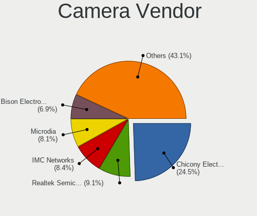

| Vendor                                 | Computers | Percent |
|----------------------------------------|-----------|---------|
| Chicony Electronics                    | 389       | 24.47%  |
| Realtek Semiconductor                  | 144       | 9.06%   |
| IMC Networks                           | 134       | 8.43%   |
| Microdia                               | 128       | 8.05%   |
| Bison Electronics                      | 110       | 6.92%   |
| Sunplus Innovation Technology          | 96        | 6.04%   |
| Quanta                                 | 67        | 4.21%   |
| Cheng Uei Precision Industry (Foxlink) | 61        | 3.84%   |
| Syntek                                 | 51        | 3.21%   |
| Lite-On Technology                     | 51        | 3.21%   |
| Suyin                                  | 40        | 2.52%   |
| Logitech                               | 39        | 2.45%   |
| Luxvisions Innotech Limited            | 35        | 2.2%    |
| Acer                                   | 29        | 1.82%   |
| Apple                                  | 23        | 1.45%   |
| KYE Systems (Mouse Systems)            | 17        | 1.07%   |
| Ricoh                                  | 15        | 0.94%   |
| Samsung Electronics                    | 14        | 0.88%   |
| Lenovo                                 | 14        | 0.88%   |
| Alcor Micro                            | 14        | 0.88%   |
| Sonix Technology                       | 13        | 0.82%   |
| Microsoft                              | 12        | 0.75%   |
| Z-Star Microelectronics                | 11        | 0.69%   |
| Creative Technology                    | 9         | 0.57%   |
| Primax Electronics                     | 6         | 0.38%   |
| Shinetech                              | 5         | 0.31%   |
| icSpring                               | 5         | 0.31%   |
| GEMBIRD                                | 5         | 0.31%   |
| Silicon Motion                         | 4         | 0.25%   |
| MacroSilicon                           | 4         | 0.25%   |
| Hopewin Electronic Material            | 4         | 0.25%   |
| Generalplus Technology                 | 3         | 0.19%   |
| SunplusIT                              | 2         | 0.13%   |
| Pixart Imaging                         | 2         | 0.13%   |
| Intel                                  | 2         | 0.13%   |
| Hewlett-Packard                        | 2         | 0.13%   |
| Genesys Logic                          | 2         | 0.13%   |
| YGTek                                  | 1         | 0.06%   |
| Xiaomi                                 | 1         | 0.06%   |
| WaveRider Communications               | 1         | 0.06%   |

Camera Model
------------

Camera device models

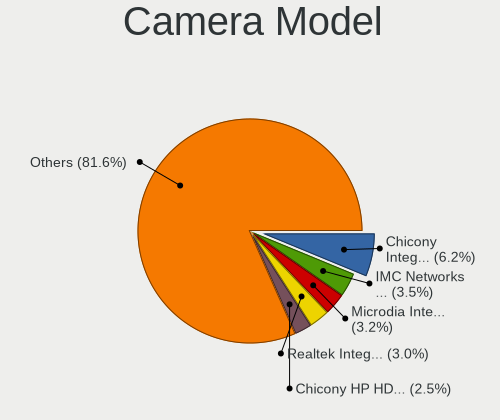

| Model                                               | Computers | Percent |
|-----------------------------------------------------|-----------|---------|
| Chicony Integrated Camera                           | 100       | 6.23%   |
| IMC Networks Integrated Camera                      | 56        | 3.49%   |
| Microdia Integrated_Webcam_HD                       | 51        | 3.18%   |
| Realtek Integrated_Webcam_HD                        | 48        | 2.99%   |
| Chicony HP HD Camera                                | 40        | 2.49%   |
| Bison Integrated Camera                             | 38        | 2.37%   |
| IMC Networks USB2.0 HD UVC WebCam                   | 36        | 2.24%   |
| Chicony HD Webcam                                   | 32        | 1.99%   |
| Syntek Integrated Camera                            | 30        | 1.87%   |
| Lite-On HP HD Camera                                | 23        | 1.43%   |
| Sunplus Integrated_Webcam_HD                        | 19        | 1.18%   |
| Apple iPhone 5/5C/5S/6/SE/7/8/X/XR                  | 18        | 1.12%   |
| Chicony Integrated Camera (1280x720@30)             | 17        | 1.06%   |
| Quanta HP HD Camera                                 | 15        | 0.93%   |
| Suyin Acer/HP Integrated Webcam [CN0314]            | 14        | 0.87%   |
| Samsung Galaxy series, misc. (MTP mode)             | 14        | 0.87%   |
| Quanta HD User Facing                               | 14        | 0.87%   |
| Syntek Lenovo EasyCamera                            | 13        | 0.81%   |
| Microdia Integrated Webcam                          | 13        | 0.81%   |
| Lite-On Integrated Camera                           | 13        | 0.81%   |
| IMC Networks USB2.0 VGA UVC WebCam                  | 13        | 0.81%   |
| Bison SunplusIT Integrated Camera                   | 13        | 0.81%   |
| Sunplus HD WebCam                                   | 12        | 0.75%   |
| Bison Lenovo Integrated Webcam                      | 12        | 0.75%   |
| Realtek USB2.0 camera                               | 11        | 0.68%   |
| Chicony USB2.0 VGA UVC WebCam                       | 11        | 0.68%   |
| Cheng Uei Precision Industry (Foxlink) HP HD Camera | 11        | 0.68%   |
| Bison Lenovo EasyCamera                             | 11        | 0.68%   |
| Luxvisions Innotech Limited Integrated RGB Camera   | 10        | 0.62%   |
| Chicony Lenovo EasyCamera                           | 10        | 0.62%   |
| Chicony FJ Camera                                   | 10        | 0.62%   |
| Bison EasyCamera                                    | 10        | 0.62%   |
| Acer Lenovo EasyCamera                              | 10        | 0.62%   |
| Sonix USB2.0 HD UVC WebCam                          | 9         | 0.56%   |
| Realtek Integrated Webcam HD                        | 9         | 0.56%   |
| Quanta HP Wide Vision HD Camera                     | 9         | 0.56%   |
| Microdia USB 2.0 Camera                             | 9         | 0.56%   |
| Microdia Sonix USB 2.0 Camera                       | 9         | 0.56%   |
| Microdia Integrated_Webcam_FHD                      | 9         | 0.56%   |
| Chicony HP HD Webcam                                | 9         | 0.56%   |

Security
--------

Fingerprint Vendor
------------------

Fingerprint sensor vendors

| Vendor                             | Computers | Percent |
|------------------------------------|-----------|---------|
| Synaptics                          | 139       | 35.55%  |
| Validity Sensors                   | 130       | 33.25%  |
| Shenzhen Goodix Technology         | 42        | 10.74%  |
| AuthenTec                          | 29        | 7.42%   |
| Elan Microelectronics              | 19        | 4.86%   |
| Upek                               | 17        | 4.35%   |
| LighTuning Technology              | 7         | 1.79%   |
| STMicroelectronics                 | 3         | 0.77%   |
| Realtek USB2.0 Finger Print Bridge | 2         | 0.51%   |
| Dell                               | 2         | 0.51%   |
| Microsoft                          | 1         | 0.26%   |

Fingerprint Model
-----------------

Fingerprint sensor models

| Model                                                                      | Computers | Percent |
|----------------------------------------------------------------------------|-----------|---------|
| Validity Sensors VFS495 Fingerprint Reader                                 | 37        | 9.46%   |
| Synaptics Prometheus MIS Touch Fingerprint Reader                          | 34        | 8.7%    |
| Validity Sensors VFS5011 Fingerprint Reader                                | 24        | 6.14%   |
| Synaptics  FS7604 Touch Fingerprint Sensor with PurePrint                  | 21        | 5.37%   |
| Synaptics FS7604 Touch Fingerprint Sensor with PurePrint                   | 21        | 5.37%   |
| Shenzhen Goodix  FingerPrint Device                                        | 19        | 4.86%   |
| Synaptics Fingerprint reader [HP G6]                                       | 17        | 4.35%   |
| Upek Biometric Touchchip/Touchstrip Fingerprint Sensor                     | 16        | 4.09%   |
| Shenzhen Goodix Fingerprint Reader                                         | 14        | 3.58%   |
| Validity Sensors VFS491                                                    | 13        | 3.32%   |
| Synaptics Metallica MIS Touch Fingerprint Reader                           | 12        | 3.07%   |
| AuthenTec AES2810                                                          | 12        | 3.07%   |
| Validity Sensors Synaptics WBDI                                            | 11        | 2.81%   |
| Elan ELAN:Fingerprint                                                      | 11        | 2.81%   |
| Validity Sensors VFS 5011 fingerprint sensor                               | 10        | 2.56%   |
| Shenzhen Goodix FingerPrint                                                | 9         | 2.3%    |
| AuthenTec AES2501 Fingerprint Sensor                                       | 9         | 2.3%    |
| Synaptics Metallica MOH Touch Fingerprint Reader                           | 7         | 1.79%   |
| Elan ELAN:ARM-M4                                                           | 7         | 1.79%   |
| AuthenTec AES1600                                                          | 7         | 1.79%   |
| Validity Sensors VFS101 Fingerprint Reader                                 | 6         | 1.53%   |
| Synaptics UWP WBDI                                                         | 6         | 1.53%   |
| LighTuning EgisTec Touch Fingerprint Sensor                                | 6         | 1.53%   |
| Validity Sensors VFS451 Fingerprint Reader                                 | 5         | 1.28%   |
| Synaptics WBDI                                                             | 5         | 1.28%   |
| Synaptics  WBDI                                                            | 5         | 1.28%   |
| Validity Sensors Synaptics VFS7552 Touch Fingerprint Sensor                | 4         | 1.02%   |
| Validity Sensors Swipe Fingerprint Sensor                                  | 4         | 1.02%   |
| Validity Sensors Fingerprint scanner                                       | 4         | 1.02%   |
| Synaptics WBDI Fingerprint Reader USB 086                                  | 4         | 1.02%   |
| Synaptics UWP WBDI Device                                                  | 4         | 1.02%   |
| Validity Sensors VFS7500 Touch Fingerprint Sensor                          | 3         | 0.77%   |
| Validity Sensors VFS471 Fingerprint Reader                                 | 3         | 0.77%   |
| Validity Sensors Synaptics VFS7552 Touch Fingerprint Sensor with PurePrint | 3         | 0.77%   |
| STMicroelectronics Fingerprint Reader                                      | 3         | 0.77%   |
| Validity Sensors VFS7552 Touch Fingerprint Sensor                          | 2         | 0.51%   |
| Realtek USB2.0 Finger Print Bridge FocalTech Fingerprint Device            | 2         | 0.51%   |
| Dell MS819 Wired Mouse With Fingerprint Reader                             | 2         | 0.51%   |
| Validity Sensors VFS301 Fingerprint Reader                                 | 1         | 0.26%   |
| Upek TCS5B Fingerprint sensor                                              | 1         | 0.26%   |

Chipcard Vendor
---------------

Chipcard module vendors

| Vendor                    | Computers | Percent |
|---------------------------|-----------|---------|
| Broadcom                  | 98        | 52.69%  |
| Alcor Micro               | 52        | 27.96%  |
| O2 Micro                  | 14        | 7.53%   |
| Lenovo                    | 7         | 3.76%   |
| Upek                      | 5         | 2.69%   |
| SCM Microsystems          | 2         | 1.08%   |
| Realtek Semiconductor     | 2         | 1.08%   |
| Aladdin Knowledge Systems | 2         | 1.08%   |
| Purism, SPC               | 1         | 0.54%   |
| OmniKey                   | 1         | 0.54%   |
| Gemalto (was Gemplus)     | 1         | 0.54%   |
| Fujitsu Siemens Computers | 1         | 0.54%   |

Chipcard Model
--------------

Chipcard module models

| Model                                                                        | Computers | Percent |
|------------------------------------------------------------------------------|-----------|---------|
| Alcor Micro AU9540 Smartcard Reader                                          | 52        | 27.96%  |
| Broadcom 58200                                                               | 35        | 18.82%  |
| Broadcom BCM5880 Secure Applications Processor                               | 26        | 13.98%  |
| Broadcom 5880                                                                | 22        | 11.83%  |
| Broadcom BCM5880 Secure Applications Processor with fingerprint swipe sensor | 15        | 8.06%   |
| O2 Micro OZ776 CCID Smartcard Reader                                         | 11        | 5.91%   |
| Lenovo Integrated Smart Card Reader                                          | 7         | 3.76%   |
| Upek TouchChip Fingerprint Coprocessor (WBF advanced mode)                   | 5         | 2.69%   |
| O2 Micro Oz776 SmartCard Reader                                              | 3         | 1.61%   |
| SCM Microsystems SCR3340 - ExpressCard54 Smart Card Reader                   | 2         | 1.08%   |
| Realtek Semiconductor Smart Card Reader Interface                            | 2         | 1.08%   |
| Aladdin Knowledge Systems Token JC                                           | 2         | 1.08%   |
| Purism, SPC Librem Key                                                       | 1         | 0.54%   |
| OmniKey 3x21 Smart Card Reader                                               | 1         | 0.54%   |
| Gemalto (was Gemplus) GemPC Twin SmartCard Reader                            | 1         | 0.54%   |
| Fujitsu Siemens Computers SmartCard Reader 2A                                | 1         | 0.54%   |

Unsupported
-----------

Unsupported Devices
-------------------

Total unsupported devices on board

| Total | Computers | Percent |
|-------|-----------|---------|
| 0     | 1850      | 66.12%  |
| 1     | 716       | 25.59%  |
| 2     | 189       | 6.75%   |
| 3     | 31        | 1.11%   |
| 4     | 8         | 0.29%   |
| 5     | 3         | 0.11%   |
| 6     | 1         | 0.04%   |

Unsupported Device Types
------------------------

Types of unsupported devices

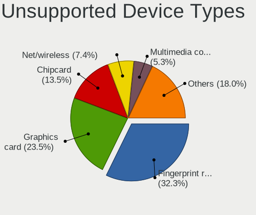

| Type                     | Computers | Percent |
|--------------------------|-----------|---------|
| Fingerprint reader       | 383       | 32.27%  |
| Graphics card            | 279       | 23.5%   |
| Chipcard                 | 160       | 13.48%  |
| Net/wireless             | 88        | 7.41%   |
| Multimedia controller    | 63        | 5.31%   |
| Communication controller | 33        | 2.78%   |
| Camera                   | 33        | 2.78%   |
| Bluetooth                | 31        | 2.61%   |
| Storage                  | 29        | 2.44%   |
| Card reader              | 18        | 1.52%   |
| Unassigned class         | 17        | 1.43%   |
| Sound                    | 12        | 1.01%   |
| Net/ethernet             | 12        | 1.01%   |
| Flash memory             | 8         | 0.67%   |
| Network                  | 6         | 0.51%   |
| Modem                    | 6         | 0.51%   |
| Storage/raid             | 2         | 0.17%   |
| Storage/ata              | 2         | 0.17%   |
| Dvb card                 | 2         | 0.17%   |
| Tv card                  | 1         | 0.08%   |
| Storage/ide              | 1         | 0.08%   |
| Firewire controller      | 1         | 0.08%   |

