Linux in Czechia - Tested Hardware & Statistics
-----------------------------------------------

A project to collect tested hardware configurations for Linux in Czechia.

Anyone can contribute to this report by the [hw-probe](https://github.com/linuxhw/hw-probe) tool:

    sudo -E hw-probe -all -upload

Please contribute! Especially if your hardware is rare.

This is a report for all computer types. See also reports for [desktops](/Location/Czechia/Desktop/README.md) and [notebooks](/Location/Czechia/Notebook/README.md).

Contents
--------

* [ Test Cases ](#test-cases)

* [ System ](#system)
  - [ OS                       ](#os)
  - [ OS Family                ](#os-family)
  - [ Kernel                   ](#kernel)
  - [ Kernel Family            ](#kernel-family)
  - [ Kernel Major Ver.        ](#kernel-major-ver)
  - [ Arch                     ](#arch)
  - [ DE                       ](#de)
  - [ Display Server           ](#display-server)
  - [ Display Manager          ](#display-manager)
  - [ OS Lang                  ](#os-lang)
  - [ Boot Mode                ](#boot-mode)
  - [ Filesystem               ](#filesystem)
  - [ Part. scheme             ](#part-scheme)
  - [ Dual Boot with Linux/BSD ](#dual-boot-with-linuxbsd)
  - [ Dual Boot (Win)          ](#dual-boot-win)

* [ Board ](#board)
  - [ Vendor                   ](#vendor)
  - [ Model                    ](#model)
  - [ Model Family             ](#model-family)
  - [ MFG Year                 ](#mfg-year)
  - [ Form Factor              ](#form-factor)
  - [ Secure Boot              ](#secure-boot)
  - [ Coreboot                 ](#coreboot)
  - [ RAM Size                 ](#ram-size)
  - [ RAM Used                 ](#ram-used)
  - [ Total Drives             ](#total-drives)
  - [ Has CD-ROM               ](#has-cd-rom)
  - [ Has Ethernet             ](#has-ethernet)
  - [ Has WiFi                 ](#has-wifi)
  - [ Has Bluetooth            ](#has-bluetooth)

* [ Location ](#location)
  - [ Country                  ](#country)
  - [ City                     ](#city)

* [ Drives ](#drives)
  - [ Drive Vendor             ](#drive-vendor)
  - [ Drive Model              ](#drive-model)
  - [ HDD Vendor               ](#hdd-vendor)
  - [ SSD Vendor               ](#ssd-vendor)
  - [ Drive Kind               ](#drive-kind)
  - [ Drive Connector          ](#drive-connector)
  - [ Drive Size               ](#drive-size)
  - [ Space Total              ](#space-total)
  - [ Space Used               ](#space-used)
  - [ Malfunc. Drives          ](#malfunc-drives)
  - [ Malfunc. Drive Vendor    ](#malfunc-drive-vendor)
  - [ Malfunc. HDD Vendor      ](#malfunc-hdd-vendor)
  - [ Malfunc. Drive Kind      ](#malfunc-drive-kind)
  - [ Failed Drives            ](#failed-drives)
  - [ Failed Drive Vendor      ](#failed-drive-vendor)
  - [ Drive Status             ](#drive-status)

* [ Storage controller ](#storage-controller)
  - [ Storage Vendor           ](#storage-vendor)
  - [ Storage Model            ](#storage-model)
  - [ Storage Kind             ](#storage-kind)

* [ Processor ](#processor)
  - [ CPU Vendor               ](#cpu-vendor)
  - [ CPU Model                ](#cpu-model)
  - [ CPU Model Family         ](#cpu-model-family)
  - [ CPU Cores                ](#cpu-cores)
  - [ CPU Sockets              ](#cpu-sockets)
  - [ CPU Threads              ](#cpu-threads)
  - [ CPU Op-Modes             ](#cpu-op-modes)
  - [ CPU Microcode            ](#cpu-microcode)
  - [ CPU Microarch            ](#cpu-microarch)

* [ Graphics ](#graphics)
  - [ GPU Vendor               ](#gpu-vendor)
  - [ GPU Model                ](#gpu-model)
  - [ GPU Combo                ](#gpu-combo)
  - [ GPU Driver               ](#gpu-driver)
  - [ GPU Memory               ](#gpu-memory)

* [ Monitor ](#monitor)
  - [ Monitor Vendor           ](#monitor-vendor)
  - [ Monitor Model            ](#monitor-model)
  - [ Monitor Resolution       ](#monitor-resolution)
  - [ Monitor Diagonal         ](#monitor-diagonal)
  - [ Monitor Width            ](#monitor-width)
  - [ Aspect Ratio             ](#aspect-ratio)
  - [ Monitor Area             ](#monitor-area)
  - [ Pixel Density            ](#pixel-density)
  - [ Multiple Monitors        ](#multiple-monitors)

* [ Network ](#network)
  - [ Net Controller Vendor    ](#net-controller-vendor)
  - [ Net Controller Model     ](#net-controller-model)
  - [ Wireless Vendor          ](#wireless-vendor)
  - [ Wireless Model           ](#wireless-model)
  - [ Ethernet Vendor          ](#ethernet-vendor)
  - [ Ethernet Model           ](#ethernet-model)
  - [ Net Controller Kind      ](#net-controller-kind)
  - [ Used Controller          ](#used-controller)
  - [ NICs                     ](#nics)
  - [ IPv6                     ](#ipv6)

* [ Bluetooth ](#bluetooth)
  - [ Bluetooth Vendor         ](#bluetooth-vendor)
  - [ Bluetooth Model          ](#bluetooth-model)

* [ Sound ](#sound)
  - [ Sound Vendor             ](#sound-vendor)
  - [ Sound Model              ](#sound-model)

* [ Memory ](#memory)
  - [ Memory Vendor            ](#memory-vendor)
  - [ Memory Model             ](#memory-model)
  - [ Memory Kind              ](#memory-kind)
  - [ Memory Form Factor       ](#memory-form-factor)
  - [ Memory Size              ](#memory-size)
  - [ Memory Speed             ](#memory-speed)

* [ Printers & scanners ](#printers--scanners)
  - [ Printer Vendor           ](#printer-vendor)
  - [ Printer Model            ](#printer-model)
  - [ Scanner Vendor           ](#scanner-vendor)
  - [ Scanner Model            ](#scanner-model)

* [ Camera ](#camera)
  - [ Camera Vendor            ](#camera-vendor)
  - [ Camera Model             ](#camera-model)

* [ Security ](#security)
  - [ Fingerprint Vendor       ](#fingerprint-vendor)
  - [ Fingerprint Model        ](#fingerprint-model)
  - [ Chipcard Vendor          ](#chipcard-vendor)
  - [ Chipcard Model           ](#chipcard-model)

* [ Unsupported ](#unsupported)
  - [ Unsupported Devices      ](#unsupported-devices)
  - [ Unsupported Device Types ](#unsupported-device-types)

Test Cases
----------

Total: 2363

| Vendor        | Model                       | Form-Factor | Probe                                                      | Date         |
|---------------|-----------------------------|-------------|------------------------------------------------------------|--------------|
| HUAWEI        | MACHC-WAX9                  | Notebook    | [e4f3828910](https://linux-hardware.org/?probe=e4f3828910) | Nov 01, 2022 |
| ASUSTek       | PRIME Z690-P D4             | Desktop     | [21213fdeec](https://linux-hardware.org/?probe=21213fdeec) | Oct 31, 2022 |
| ASUSTek       | TUF Gaming B550M-PLUS       | Desktop     | [919fad100f](https://linux-hardware.org/?probe=919fad100f) | Oct 31, 2022 |
| ASUSTek       | UX31E                       | Notebook    | [6e9cb9c0e0](https://linux-hardware.org/?probe=6e9cb9c0e0) | Oct 29, 2022 |
| Lenovo        | IdeaPad Y700-15ISK 80NV     | Notebook    | [eb22113dae](https://linux-hardware.org/?probe=eb22113dae) | Oct 29, 2022 |
| MSI           | MAG B550 TOMAHAWK           | Desktop     | [f45ab957da](https://linux-hardware.org/?probe=f45ab957da) | Oct 28, 2022 |
| UMAX          | VisionBook 12Wi 64G         | Notebook    | [9fe98911c1](https://linux-hardware.org/?probe=9fe98911c1) | Oct 27, 2022 |
| Lenovo        | B590 20206                  | Notebook    | [8a8967999b](https://linux-hardware.org/?probe=8a8967999b) | Oct 27, 2022 |
| Lenovo        | IdeaPad 5 Pro 16ACH6 82L... | Notebook    | [d58a7c30a9](https://linux-hardware.org/?probe=d58a7c30a9) | Oct 26, 2022 |
| HP            | 3029h                       | Desktop     | [46c9e39101](https://linux-hardware.org/?probe=46c9e39101) | Oct 26, 2022 |
| Dell          | Latitude E6440              | Notebook    | [307356784a](https://linux-hardware.org/?probe=307356784a) | Oct 26, 2022 |
| ASUSTek       | PRIME Z690-P D4             | Desktop     | [5bc9d4bdc8](https://linux-hardware.org/?probe=5bc9d4bdc8) | Oct 26, 2022 |
| Apple         | MacBookPro10,1              | Notebook    | [212ce8900d](https://linux-hardware.org/?probe=212ce8900d) | Oct 26, 2022 |
| Acer          | Veriton NBU                 | Desktop     | [7be04cd3ed](https://linux-hardware.org/?probe=7be04cd3ed) | Oct 25, 2022 |
| ASUSTek       | ASUS EXPERTBOOK L1500CDA... | Notebook    | [3d86f7ccac](https://linux-hardware.org/?probe=3d86f7ccac) | Oct 25, 2022 |
| Gigabyte      | X58A-UD7                    | Desktop     | [6d3bf37ff3](https://linux-hardware.org/?probe=6d3bf37ff3) | Oct 25, 2022 |
| Lenovo        | IdeaPad Y700-15ISK 80NV     | Notebook    | [025f4fa8ab](https://linux-hardware.org/?probe=025f4fa8ab) | Oct 22, 2022 |
| Dell          | 0J3C2F A00                  | Desktop     | [c97e42e738](https://linux-hardware.org/?probe=c97e42e738) | Oct 20, 2022 |
| Lenovo        | ThinkPad T14s Gen 1 20T1... | Notebook    | [e3265d4cdc](https://linux-hardware.org/?probe=e3265d4cdc) | Oct 20, 2022 |
| ASRock        | H81 Pro BTC R2.0            | Desktop     | [2ead6c088f](https://linux-hardware.org/?probe=2ead6c088f) | Oct 20, 2022 |
| HP            | Pavilion dv7                | Notebook    | [4c6edfec3e](https://linux-hardware.org/?probe=4c6edfec3e) | Oct 18, 2022 |
| HP            | Pavilion dv7                | Notebook    | [22031176a8](https://linux-hardware.org/?probe=22031176a8) | Oct 18, 2022 |
| ASUSTek       | ROG STRIX B550-I GAMING     | Desktop     | [5335a66143](https://linux-hardware.org/?probe=5335a66143) | Oct 17, 2022 |
| ASRock        | X300M-STX                   | Desktop     | [40c27af11f](https://linux-hardware.org/?probe=40c27af11f) | Oct 17, 2022 |
| ASRock        | X300M-STX                   | Desktop     | [25fdbfba33](https://linux-hardware.org/?probe=25fdbfba33) | Oct 17, 2022 |
| MSI           | 970 GAMING                  | Desktop     | [a6e072bc6b](https://linux-hardware.org/?probe=a6e072bc6b) | Oct 15, 2022 |
| MSI           | 970 GAMING                  | Desktop     | [6bc730181f](https://linux-hardware.org/?probe=6bc730181f) | Oct 15, 2022 |
| MSI           | MAG B550 TOMAHAWK           | Desktop     | [4e66c25e04](https://linux-hardware.org/?probe=4e66c25e04) | Oct 15, 2022 |
| ASUSTek       | UX31E                       | Notebook    | [bddc33ef5a](https://linux-hardware.org/?probe=bddc33ef5a) | Oct 14, 2022 |
| ASUSTek       | ROG STRIX B550-I GAMING     | Desktop     | [da04425205](https://linux-hardware.org/?probe=da04425205) | Oct 14, 2022 |
| Dell          | XPS 15 9550                 | Notebook    | [00d5f7c4b1](https://linux-hardware.org/?probe=00d5f7c4b1) | Oct 13, 2022 |
| Lenovo        | IdeaPad Y700-15ISK 80NV     | Notebook    | [5074f8e471](https://linux-hardware.org/?probe=5074f8e471) | Oct 12, 2022 |
| Lenovo        | IdeaPad Y700-15ISK 80NV     | Notebook    | [fb97ad01eb](https://linux-hardware.org/?probe=fb97ad01eb) | Oct 12, 2022 |
| ASUSTek       | PRIME A320M-E               | Desktop     | [ff58ea3dc1](https://linux-hardware.org/?probe=ff58ea3dc1) | Oct 12, 2022 |
| SmbiosType... | SmbiosType1_SystemProduc... | Notebook    | [d105b4c1f7](https://linux-hardware.org/?probe=d105b4c1f7) | Oct 11, 2022 |
| ASUSTek       | ROG STRIX B450-F GAMING     | Desktop     | [e2d9db1022](https://linux-hardware.org/?probe=e2d9db1022) | Oct 10, 2022 |
| ASUSTek       | UX31E                       | Notebook    | [22cf469faa](https://linux-hardware.org/?probe=22cf469faa) | Oct 10, 2022 |
| Lenovo        | Z50-75 80EC                 | Notebook    | [3837291e33](https://linux-hardware.org/?probe=3837291e33) | Oct 10, 2022 |
| ASUSTek       | PRIME Z590-P                | Desktop     | [cf3661bb7c](https://linux-hardware.org/?probe=cf3661bb7c) | Oct 09, 2022 |
| Lenovo        | ThinkPad Helix 2nd 20CHS... | Tablet      | [18ac5ede65](https://linux-hardware.org/?probe=18ac5ede65) | Oct 08, 2022 |
| Dell          | Latitude E7250              | Notebook    | [5ecb7bbb6c](https://linux-hardware.org/?probe=5ecb7bbb6c) | Oct 07, 2022 |
| Gigabyte      | B550I AORUS PRO AX          | Desktop     | [704da5b600](https://linux-hardware.org/?probe=704da5b600) | Oct 07, 2022 |
| Lenovo        | ThinkPad X380 Yoga 20LJS... | Convertible | [829a14598f](https://linux-hardware.org/?probe=829a14598f) | Oct 07, 2022 |
| ASUSTek       | 1001PXD                     | Notebook    | [524e4ab046](https://linux-hardware.org/?probe=524e4ab046) | Oct 06, 2022 |
| HP            | EliteBook 1040 G4           | Notebook    | [8a19b834c8](https://linux-hardware.org/?probe=8a19b834c8) | Oct 04, 2022 |
| Dell          | 0D28YY A01                  | Desktop     | [5c85c7623a](https://linux-hardware.org/?probe=5c85c7623a) | Oct 04, 2022 |
| Timi          | A35S                        | Notebook    | [fe7ad0ac13](https://linux-hardware.org/?probe=fe7ad0ac13) | Oct 03, 2022 |
| ASUSTek       | ROG STRIX B550-I GAMING     | Desktop     | [13f60e066f](https://linux-hardware.org/?probe=13f60e066f) | Oct 03, 2022 |
| ASUSTek       | K54LY                       | Notebook    | [230a36c236](https://linux-hardware.org/?probe=230a36c236) | Oct 03, 2022 |
| ASUSTek       | ROG STRIX B550-I GAMING     | Desktop     | [e3eb4cd95f](https://linux-hardware.org/?probe=e3eb4cd95f) | Oct 02, 2022 |
| MSI           | B350 PC MATE                | Desktop     | [a4c73b484e](https://linux-hardware.org/?probe=a4c73b484e) | Oct 02, 2022 |
| MSI           | B450 TOMAHAWK MAX           | Desktop     | [ff11bc4efb](https://linux-hardware.org/?probe=ff11bc4efb) | Oct 02, 2022 |
| ASUSTek       | K54LY                       | Notebook    | [7c19c1f557](https://linux-hardware.org/?probe=7c19c1f557) | Oct 02, 2022 |
| Acer          | Aspire 7540                 | Notebook    | [8e80ccea19](https://linux-hardware.org/?probe=8e80ccea19) | Oct 01, 2022 |
| ASUSTek       | K54LY                       | Notebook    | [98197c818f](https://linux-hardware.org/?probe=98197c818f) | Oct 01, 2022 |
| Lenovo        | IdeaPad 3 15ITL6 82H8       | Notebook    | [92f9efe077](https://linux-hardware.org/?probe=92f9efe077) | Sep 30, 2022 |
| Notebook      | NJ50GU                      | Notebook    | [430d3b2873](https://linux-hardware.org/?probe=430d3b2873) | Sep 30, 2022 |
| Lenovo        | ThinkPad P15 Gen 2i 20YQ... | Notebook    | [9015ce1da8](https://linux-hardware.org/?probe=9015ce1da8) | Sep 30, 2022 |
| Lenovo        | IdeaPad 500-15ISK 80NT      | Notebook    | [9377d23abd](https://linux-hardware.org/?probe=9377d23abd) | Sep 28, 2022 |
| Timi          | A35S                        | Notebook    | [bdb2ba4eab](https://linux-hardware.org/?probe=bdb2ba4eab) | Sep 27, 2022 |
| ASUSTek       | K53SV                       | Notebook    | [d2801f9560](https://linux-hardware.org/?probe=d2801f9560) | Sep 26, 2022 |
| Lenovo        | 3000 V100 076346G           | Notebook    | [0575c1ea4f](https://linux-hardware.org/?probe=0575c1ea4f) | Sep 26, 2022 |
| Lenovo        | ThinkPad E15 Gen 3 20YG0... | Notebook    | [923985941d](https://linux-hardware.org/?probe=923985941d) | Sep 25, 2022 |
| Timi          | RedmiBook 16                | Notebook    | [0a65bab615](https://linux-hardware.org/?probe=0a65bab615) | Sep 25, 2022 |
| Acer          | Aspire VN7-592G             | Notebook    | [cfc28181e5](https://linux-hardware.org/?probe=cfc28181e5) | Sep 25, 2022 |
| HP            | ProBook 450 G5              | Notebook    | [262ff53f6a](https://linux-hardware.org/?probe=262ff53f6a) | Sep 25, 2022 |
| HP            | ProBook 450 15.6 inch G9... | Notebook    | [4f9ff1b402](https://linux-hardware.org/?probe=4f9ff1b402) | Sep 24, 2022 |
| Toshiba       | Satellite A305              | Notebook    | [d1ed6b20cf](https://linux-hardware.org/?probe=d1ed6b20cf) | Sep 24, 2022 |
| Toshiba       | Satellite A305              | Notebook    | [9e04fb330b](https://linux-hardware.org/?probe=9e04fb330b) | Sep 24, 2022 |
| Timi          | A35S                        | Notebook    | [d0f195a77a](https://linux-hardware.org/?probe=d0f195a77a) | Sep 23, 2022 |
| Lenovo        | ThinkCentre Edge71 1578D... | Desktop     | [95dded89b8](https://linux-hardware.org/?probe=95dded89b8) | Sep 23, 2022 |
| Valve         | Jupiter                     | Notebook    | [0b88f458d2](https://linux-hardware.org/?probe=0b88f458d2) | Sep 22, 2022 |
| Acer          | Nitro AN515-57              | Notebook    | [59219d6ded](https://linux-hardware.org/?probe=59219d6ded) | Sep 21, 2022 |
| Gigabyte      | Z77-DS3H                    | Desktop     | [ea8ea96269](https://linux-hardware.org/?probe=ea8ea96269) | Sep 21, 2022 |
| Lenovo        | IdeaPadFlex 5 14ALC05 82... | Convertible | [ea0ab53cac](https://linux-hardware.org/?probe=ea0ab53cac) | Sep 21, 2022 |
| Lenovo        | ThinkPad T410 2518Q6G       | Notebook    | [b0568eadf2](https://linux-hardware.org/?probe=b0568eadf2) | Sep 20, 2022 |
| ASUSTek       | AM1M-A                      | Desktop     | [a6e61a9993](https://linux-hardware.org/?probe=a6e61a9993) | Sep 19, 2022 |
| Gigabyte      | X58A-UD7                    | Desktop     | [b7f881a109](https://linux-hardware.org/?probe=b7f881a109) | Sep 19, 2022 |
| Gigabyte      | X58A-UD7                    | Desktop     | [59e7485a11](https://linux-hardware.org/?probe=59e7485a11) | Sep 19, 2022 |
| Lenovo        | Legion S7 15ACH6 82K8       | Notebook    | [dce5b5917c](https://linux-hardware.org/?probe=dce5b5917c) | Sep 18, 2022 |
| Acer          | Swift SF314-511             | Notebook    | [914d532c78](https://linux-hardware.org/?probe=914d532c78) | Sep 17, 2022 |
| Acer          | Swift SF314-511             | Notebook    | [a171efb42c](https://linux-hardware.org/?probe=a171efb42c) | Sep 17, 2022 |
| ASUSTek       | PRIME H310-PLUS             | Desktop     | [b9693eaf7c](https://linux-hardware.org/?probe=b9693eaf7c) | Sep 17, 2022 |
| Gigabyte      | Z77-DS3H                    | Desktop     | [b5a0c6309d](https://linux-hardware.org/?probe=b5a0c6309d) | Sep 17, 2022 |
| Lenovo        | IdeaPad Y570 20091          | Notebook    | [5e2681360e](https://linux-hardware.org/?probe=5e2681360e) | Sep 15, 2022 |
| Dell          | Latitude 5430               | Notebook    | [617563f7a7](https://linux-hardware.org/?probe=617563f7a7) | Sep 14, 2022 |
| Lenovo        | SHARKBAY NOK                | Desktop     | [bfd4a6b00a](https://linux-hardware.org/?probe=bfd4a6b00a) | Sep 13, 2022 |
| Lenovo        | ThinkPad T540p 20BF002CM... | Notebook    | [3343da6005](https://linux-hardware.org/?probe=3343da6005) | Sep 12, 2022 |
| ASUSTek       | UX31E                       | Notebook    | [910cdee832](https://linux-hardware.org/?probe=910cdee832) | Sep 11, 2022 |
| Lenovo        | ThinkPad T430 23444ZG       | Notebook    | [d83eee9752](https://linux-hardware.org/?probe=d83eee9752) | Sep 11, 2022 |
| UMAX          | VisionBook N14G Plus        | Notebook    | [6d05deca49](https://linux-hardware.org/?probe=6d05deca49) | Sep 11, 2022 |
| UMAX          | VisionBook N15G Plus        | Notebook    | [d17fb4f8f9](https://linux-hardware.org/?probe=d17fb4f8f9) | Sep 11, 2022 |
| ASUSTek       | PN41                        | Mini pc     | [be7516b088](https://linux-hardware.org/?probe=be7516b088) | Sep 10, 2022 |
| Dell          | Latitude 5531               | Notebook    | [66eac260ef](https://linux-hardware.org/?probe=66eac260ef) | Sep 09, 2022 |
| Dell          | Precision 3551              | Notebook    | [78f7c77b35](https://linux-hardware.org/?probe=78f7c77b35) | Sep 09, 2022 |
| Lenovo        | B71-80 80RJ                 | Notebook    | [c16dc3a768](https://linux-hardware.org/?probe=c16dc3a768) | Sep 06, 2022 |
| Dell          | Latitude 5531               | Notebook    | [dff44a5e24](https://linux-hardware.org/?probe=dff44a5e24) | Sep 05, 2022 |
| Lenovo        | ThinkPad P15 Gen 2i 20YQ... | Notebook    | [459e11c8ba](https://linux-hardware.org/?probe=459e11c8ba) | Sep 05, 2022 |
| Google        | Coral                       | Notebook    | [af898f9be4](https://linux-hardware.org/?probe=af898f9be4) | Sep 05, 2022 |
| Lenovo        | ThinkPad T14 Gen 3 21AH0... | Notebook    | [88392a79f5](https://linux-hardware.org/?probe=88392a79f5) | Sep 04, 2022 |
| ASUSTek       | UX31E                       | Notebook    | [21183dcf00](https://linux-hardware.org/?probe=21183dcf00) | Sep 02, 2022 |
| Lenovo        | IdeaPad 5 14ITL05 82FE      | Notebook    | [60b4add0a0](https://linux-hardware.org/?probe=60b4add0a0) | Sep 02, 2022 |
| ASUSTek       | VivoBook_ASUSLaptop X350... | Notebook    | [2a3eb4b772](https://linux-hardware.org/?probe=2a3eb4b772) | Sep 02, 2022 |
| ASUSTek       | ZenBook UX431DA_UM431DA     | Notebook    | [cc30fbdce2](https://linux-hardware.org/?probe=cc30fbdce2) | Sep 01, 2022 |
| ASUSTek       | ZenBook UX425QA_UM425QA     | Notebook    | [c48154f5f4](https://linux-hardware.org/?probe=c48154f5f4) | Sep 01, 2022 |
| Raspberry ... | Raspberry Pi 400 Rev 1.0    | Soc         | [4d1339ef49](https://linux-hardware.org/?probe=4d1339ef49) | Aug 31, 2022 |
| ASUSTek       | ASUS TUF Gaming F15 FX50... | Notebook    | [0ca693e2dd](https://linux-hardware.org/?probe=0ca693e2dd) | Aug 31, 2022 |
| ASUSTek       | ROG STRIX X299-E GAMING     | Desktop     | [fc3200b967](https://linux-hardware.org/?probe=fc3200b967) | Aug 31, 2022 |
| ASUSTek       | PRIME B450-PLUS             | Desktop     | [a01239fd83](https://linux-hardware.org/?probe=a01239fd83) | Aug 29, 2022 |
| HP            | EliteBook 650 15.6 inch ... | Notebook    | [918418e0fc](https://linux-hardware.org/?probe=918418e0fc) | Aug 29, 2022 |
| ASUSTek       | X553MA                      | Notebook    | [108e0c7803](https://linux-hardware.org/?probe=108e0c7803) | Aug 29, 2022 |
| ASUSTek       | VivoBook_ASUSLaptop X350... | Notebook    | [bddbedffed](https://linux-hardware.org/?probe=bddbedffed) | Aug 29, 2022 |
| Lenovo        | IdeaPad S130-14IGM 81J2     | Notebook    | [1ea46f19be](https://linux-hardware.org/?probe=1ea46f19be) | Aug 27, 2022 |
| Lenovo        | ThinkPad E15 Gen 3 20YG0... | Notebook    | [208be390fa](https://linux-hardware.org/?probe=208be390fa) | Aug 26, 2022 |
| HP            | 8509                        | Desktop     | [0656e40cba](https://linux-hardware.org/?probe=0656e40cba) | Aug 26, 2022 |
| Lenovo        | IdeaPad 5 Pro 16ARH7 82S... | Notebook    | [945109f9f8](https://linux-hardware.org/?probe=945109f9f8) | Aug 25, 2022 |
| Valve         | Jupiter                     | Notebook    | [fbef109b91](https://linux-hardware.org/?probe=fbef109b91) | Aug 24, 2022 |
| MSI           | GS73VR 6RF                  | Notebook    | [870534e620](https://linux-hardware.org/?probe=870534e620) | Aug 23, 2022 |
| ASUSTek       | TUF Gaming B550M-PLUS       | Desktop     | [595bf9c8a7](https://linux-hardware.org/?probe=595bf9c8a7) | Aug 23, 2022 |
| Dell          | Latitude 5490               | Notebook    | [a37eabe03f](https://linux-hardware.org/?probe=a37eabe03f) | Aug 21, 2022 |
| Lenovo        | ThinkPad T500 2082BRG       | Notebook    | [29d7ac6ea6](https://linux-hardware.org/?probe=29d7ac6ea6) | Aug 21, 2022 |
| Lenovo        | ThinkPad T500 2082BRG       | Notebook    | [c8f76780a1](https://linux-hardware.org/?probe=c8f76780a1) | Aug 21, 2022 |
| ASUSTek       | ZenBook UX431DA_UM431DA     | Notebook    | [2e77015116](https://linux-hardware.org/?probe=2e77015116) | Aug 21, 2022 |
| ASRock        | N68C-S UCC                  | Desktop     | [bb19c0586c](https://linux-hardware.org/?probe=bb19c0586c) | Aug 20, 2022 |
| ASUSTek       | P5KPL-SE                    | Desktop     | [2925e63a87](https://linux-hardware.org/?probe=2925e63a87) | Aug 20, 2022 |
| ASUSTek       | UX31E                       | Notebook    | [84ed4c9d73](https://linux-hardware.org/?probe=84ed4c9d73) | Aug 20, 2022 |
| HP            | Stream 7 Tablet             | Tablet      | [9d4dabb130](https://linux-hardware.org/?probe=9d4dabb130) | Aug 19, 2022 |
| HP            | ElitePad 1000 G2            | Notebook    | [ed06ba603c](https://linux-hardware.org/?probe=ed06ba603c) | Aug 19, 2022 |
| MSI           | MAG B550 TOMAHAWK           | Desktop     | [6865f5ed0b](https://linux-hardware.org/?probe=6865f5ed0b) | Aug 19, 2022 |
| Lenovo        | ThinkPad Edge E431 62774... | Notebook    | [b7d37d0c4c](https://linux-hardware.org/?probe=b7d37d0c4c) | Aug 18, 2022 |
| HP            | ProBook 450 G5              | Notebook    | [68697e720d](https://linux-hardware.org/?probe=68697e720d) | Aug 18, 2022 |
| HP            | ZBook 15 G3                 | Notebook    | [f89a185aa6](https://linux-hardware.org/?probe=f89a185aa6) | Aug 17, 2022 |
| Gigabyte      | B450 GAMING X               | Desktop     | [80760b8e4b](https://linux-hardware.org/?probe=80760b8e4b) | Aug 16, 2022 |
| ASUSTek       | X101CH                      | Notebook    | [174bc50211](https://linux-hardware.org/?probe=174bc50211) | Aug 14, 2022 |
| Acer          | Aspire 3100                 | Notebook    | [8ea61dbd3c](https://linux-hardware.org/?probe=8ea61dbd3c) | Aug 14, 2022 |
| Lenovo        | Yoga Duet 7 13ITL6 82MA     | Tablet      | [acf8952e47](https://linux-hardware.org/?probe=acf8952e47) | Aug 13, 2022 |
| HP            | 805B                        | Desktop     | [188fdd3a56](https://linux-hardware.org/?probe=188fdd3a56) | Aug 13, 2022 |
| Acer          | Aspire A515-56              | Notebook    | [e93f8de88b](https://linux-hardware.org/?probe=e93f8de88b) | Aug 13, 2022 |
| Acer          | Aspire A515-56              | Notebook    | [e429237c05](https://linux-hardware.org/?probe=e429237c05) | Aug 13, 2022 |
| Lenovo        | IdeaPad 330S-15AST 81F9     | Notebook    | [0f367345a0](https://linux-hardware.org/?probe=0f367345a0) | Aug 12, 2022 |
| Notebook      | NJ50GU                      | Notebook    | [59d1efda98](https://linux-hardware.org/?probe=59d1efda98) | Aug 12, 2022 |
| Dell          | XPS 13 9360                 | Notebook    | [a78c885366](https://linux-hardware.org/?probe=a78c885366) | Aug 12, 2022 |
| Lenovo        | ThinkPad E590 20NB0029MC    | Notebook    | [233b3cdd54](https://linux-hardware.org/?probe=233b3cdd54) | Aug 11, 2022 |
| ASUSTek       | ZenBook UX431DA_UM431DA     | Notebook    | [8b0ede5e40](https://linux-hardware.org/?probe=8b0ede5e40) | Aug 10, 2022 |
| HUAWEI        | BOHB-WAX9                   | Notebook    | [9d55b54de7](https://linux-hardware.org/?probe=9d55b54de7) | Aug 10, 2022 |
| ASRock        | 990FX Killer                | Desktop     | [cba7d360f1](https://linux-hardware.org/?probe=cba7d360f1) | Aug 10, 2022 |
| Dell          | Latitude 5421               | Notebook    | [b088f6b599](https://linux-hardware.org/?probe=b088f6b599) | Aug 10, 2022 |
| Gigabyte      | Z87-HD3                     | Desktop     | [ee1bdd9333](https://linux-hardware.org/?probe=ee1bdd9333) | Aug 09, 2022 |
| Gigabyte      | Z87-HD3                     | Desktop     | [a0243ce6f0](https://linux-hardware.org/?probe=a0243ce6f0) | Aug 09, 2022 |
| Dell          | Latitude 5531               | Notebook    | [64998a7d5a](https://linux-hardware.org/?probe=64998a7d5a) | Aug 09, 2022 |
| Gigabyte      | EP35-DS3P                   | Desktop     | [5c29aee903](https://linux-hardware.org/?probe=5c29aee903) | Aug 08, 2022 |
| MSI           | MAG X570S TOMAHAWK MAX W... | Desktop     | [61e317887a](https://linux-hardware.org/?probe=61e317887a) | Aug 07, 2022 |
| Lenovo        | ThinkPad T430 2350B58       | Notebook    | [9c945add4e](https://linux-hardware.org/?probe=9c945add4e) | Aug 06, 2022 |
| Lenovo        | ThinkPad T430 2350B58       | Notebook    | [d1ab7d1d36](https://linux-hardware.org/?probe=d1ab7d1d36) | Aug 06, 2022 |
| Lenovo        | ThinkPad X270 20HN0015GE    | Notebook    | [2577ffae50](https://linux-hardware.org/?probe=2577ffae50) | Aug 06, 2022 |
| Dell          | 0VHWTR A02                  | Desktop     | [61b30cfde0](https://linux-hardware.org/?probe=61b30cfde0) | Aug 06, 2022 |
| Gigabyte      | B450 GAMING X               | Desktop     | [b875ef6dbf](https://linux-hardware.org/?probe=b875ef6dbf) | Aug 04, 2022 |
| ASUSTek       | H110M-K                     | Desktop     | [8c6442a868](https://linux-hardware.org/?probe=8c6442a868) | Aug 04, 2022 |
| Gigabyte      | Z87-HD3                     | Desktop     | [01430753da](https://linux-hardware.org/?probe=01430753da) | Aug 02, 2022 |
| MSI           | MAG B550 TOMAHAWK           | Desktop     | [cc8b9aa8f6](https://linux-hardware.org/?probe=cc8b9aa8f6) | Aug 01, 2022 |
| Dell          | Inspiron 5558               | Notebook    | [2dee8f9fb1](https://linux-hardware.org/?probe=2dee8f9fb1) | Jul 31, 2022 |
| HP            | ENVY x360 Convertible 13... | Convertible | [d704ff7364](https://linux-hardware.org/?probe=d704ff7364) | Jul 30, 2022 |
| MSI           | MAG X570S TOMAHAWK MAX W... | Desktop     | [82d0a7ace6](https://linux-hardware.org/?probe=82d0a7ace6) | Jul 29, 2022 |
| MSI           | G31TM-P35                   | Desktop     | [1bc8def241](https://linux-hardware.org/?probe=1bc8def241) | Jul 28, 2022 |
| HP            | 250 G5 Notebook PC          | Notebook    | [75477a4d7a](https://linux-hardware.org/?probe=75477a4d7a) | Jul 28, 2022 |
| HP            | 1494                        | Desktop     | [6805afe809](https://linux-hardware.org/?probe=6805afe809) | Jul 27, 2022 |
| ASUSTek       | V161GAR                     | All in one  | [55e2c27aaa](https://linux-hardware.org/?probe=55e2c27aaa) | Jul 27, 2022 |
| Dell          | G5 5590                     | Notebook    | [20f75f2334](https://linux-hardware.org/?probe=20f75f2334) | Jul 27, 2022 |
| Minix         | NEO Z83-4 V1.1              | Desktop     | [e8c6448552](https://linux-hardware.org/?probe=e8c6448552) | Jul 23, 2022 |
| HP            | EliteBook 845 G8 Noteboo... | Notebook    | [45e79d015c](https://linux-hardware.org/?probe=45e79d015c) | Jul 23, 2022 |
| ASUSTek       | UX31E                       | Notebook    | [1ae28afad9](https://linux-hardware.org/?probe=1ae28afad9) | Jul 22, 2022 |
| ASUSTek       | ROG STRIX X570-E GAMING ... | Desktop     | [2986a26253](https://linux-hardware.org/?probe=2986a26253) | Jul 22, 2022 |
| ASUSTek       | TUF Gaming B550M-PLUS WI... | Desktop     | [7e6502be7c](https://linux-hardware.org/?probe=7e6502be7c) | Jul 20, 2022 |
| HP            | EliteBook 855 G8 Noteboo... | Notebook    | [c000bcc566](https://linux-hardware.org/?probe=c000bcc566) | Jul 20, 2022 |
| HP            | ProBook 450 G5              | Notebook    | [47c85dbefd](https://linux-hardware.org/?probe=47c85dbefd) | Jul 18, 2022 |
| Lenovo        | YB1-X91L                    | Convertible | [c6888145e7](https://linux-hardware.org/?probe=c6888145e7) | Jul 18, 2022 |
| Dell          | 0PM2CW A04                  | Server      | [8162a1a915](https://linux-hardware.org/?probe=8162a1a915) | Jul 17, 2022 |
| Foxconn       | 2ABF                        | Desktop     | [2349372af2](https://linux-hardware.org/?probe=2349372af2) | Jul 16, 2022 |
| Lenovo        | IdeaPad Gaming 3 15IMH05... | Notebook    | [eb5b940f17](https://linux-hardware.org/?probe=eb5b940f17) | Jul 16, 2022 |
| ASUSTek       | PRIME Z690-P D4             | Desktop     | [e5fed36e22](https://linux-hardware.org/?probe=e5fed36e22) | Jul 15, 2022 |
| MSI           | MAG B550 TOMAHAWK           | Desktop     | [9c06bd996b](https://linux-hardware.org/?probe=9c06bd996b) | Jul 15, 2022 |
| MSI           | MAG B550 TOMAHAWK           | Desktop     | [9e71693839](https://linux-hardware.org/?probe=9e71693839) | Jul 15, 2022 |
| Lenovo        | ThinkPad T14 Gen 2i 20W0... | Notebook    | [179267a713](https://linux-hardware.org/?probe=179267a713) | Jul 15, 2022 |
| Dell          | G3 3590                     | Notebook    | [86835e6c2b](https://linux-hardware.org/?probe=86835e6c2b) | Jul 15, 2022 |
| ASUSTek       | K54LY                       | Notebook    | [9b66e8ad0e](https://linux-hardware.org/?probe=9b66e8ad0e) | Jul 14, 2022 |
| ASUSTek       | UX31E                       | Notebook    | [004f74eaf4](https://linux-hardware.org/?probe=004f74eaf4) | Jul 13, 2022 |
| HP            | Compaq nx6310 (EY589ES#A... | Notebook    | [613395d2cf](https://linux-hardware.org/?probe=613395d2cf) | Jul 13, 2022 |
| HP            | ProBook 450 G5              | Notebook    | [e3962f34e4](https://linux-hardware.org/?probe=e3962f34e4) | Jul 11, 2022 |
| ASUSTek       | TUF Gaming Z690-PLUS WIF... | Desktop     | [e5316b7d72](https://linux-hardware.org/?probe=e5316b7d72) | Jul 09, 2022 |
| ASUSTek       | TUF Gaming Z690-PLUS WIF... | Desktop     | [3df269fec9](https://linux-hardware.org/?probe=3df269fec9) | Jul 09, 2022 |
| Lenovo        | ThinkPad T460 20FMS2292S    | Notebook    | [cd5635c63c](https://linux-hardware.org/?probe=cd5635c63c) | Jul 08, 2022 |
| HP            | ProBook 450 G5              | Notebook    | [90f45f2ebc](https://linux-hardware.org/?probe=90f45f2ebc) | Jul 08, 2022 |
| Dell          | XPS 15 9510                 | Notebook    | [d8f1865db2](https://linux-hardware.org/?probe=d8f1865db2) | Jul 08, 2022 |
| ASUSTek       | T102HA                      | Tablet      | [02a8803d9a](https://linux-hardware.org/?probe=02a8803d9a) | Jul 07, 2022 |
| Dell          | Latitude E5530 non-vPro     | Notebook    | [6a78826e86](https://linux-hardware.org/?probe=6a78826e86) | Jul 07, 2022 |
| ASUSTek       | X542UQR                     | Notebook    | [04cc10b779](https://linux-hardware.org/?probe=04cc10b779) | Jul 07, 2022 |
| MSI           | X470 GAMING PRO             | Desktop     | [b94f3f8031](https://linux-hardware.org/?probe=b94f3f8031) | Jul 07, 2022 |
| Dell          | Inspiron 3542               | Notebook    | [57fc50a4fb](https://linux-hardware.org/?probe=57fc50a4fb) | Jul 06, 2022 |
| HP            | ProBook 4530s               | Notebook    | [db207530bc](https://linux-hardware.org/?probe=db207530bc) | Jul 06, 2022 |
| HP            | Notebook                    | Notebook    | [9b87d6ee2d](https://linux-hardware.org/?probe=9b87d6ee2d) | Jul 06, 2022 |
| ASUSTek       | P5B                         | Desktop     | [149ab02b84](https://linux-hardware.org/?probe=149ab02b84) | Jul 06, 2022 |
| Dell          | Latitude 7520               | Notebook    | [531ccedcf2](https://linux-hardware.org/?probe=531ccedcf2) | Jul 04, 2022 |
| Sony          | VPCSA3M9E                   | Notebook    | [b36435a1fd](https://linux-hardware.org/?probe=b36435a1fd) | Jul 03, 2022 |
| HP            | 625                         | Notebook    | [0acc5581d4](https://linux-hardware.org/?probe=0acc5581d4) | Jul 03, 2022 |
| ASUSTek       | T102HA                      | Tablet      | [38b91d59e7](https://linux-hardware.org/?probe=38b91d59e7) | Jul 02, 2022 |
| ASUSTek       | UX31E                       | Notebook    | [7504f06baa](https://linux-hardware.org/?probe=7504f06baa) | Jul 02, 2022 |
| MSI           | 880GMA-E35                  | Desktop     | [8bcc34797b](https://linux-hardware.org/?probe=8bcc34797b) | Jul 02, 2022 |
| Lenovo        | Z70-80 80FG                 | Notebook    | [eaf34443c7](https://linux-hardware.org/?probe=eaf34443c7) | Jul 01, 2022 |
| ASUSTek       | UX31E                       | Notebook    | [d3f27ab291](https://linux-hardware.org/?probe=d3f27ab291) | Jul 01, 2022 |
| ASUSTek       | A88XM-A/USB                 | Desktop     | [01fb492b9d](https://linux-hardware.org/?probe=01fb492b9d) | Jul 01, 2022 |
| ASUSTek       | A88XM-A/USB                 | Desktop     | [b4b8457bd9](https://linux-hardware.org/?probe=b4b8457bd9) | Jul 01, 2022 |
| Lenovo        | ThinkPad T460 20FMS2292S    | Notebook    | [cf313915ab](https://linux-hardware.org/?probe=cf313915ab) | Jun 30, 2022 |
| Lenovo        | ThinkPad T14s Gen 1 20T1... | Notebook    | [7e2ddf75e5](https://linux-hardware.org/?probe=7e2ddf75e5) | Jun 30, 2022 |
| Lenovo        | Z70-80 80FG                 | Notebook    | [bef849e3d1](https://linux-hardware.org/?probe=bef849e3d1) | Jun 29, 2022 |
| Lenovo        | ThinkPad S5-S540 20B3001... | Notebook    | [d5be9c4fca](https://linux-hardware.org/?probe=d5be9c4fca) | Jun 29, 2022 |
| Gigabyte      | GA-870A-UD3                 | Desktop     | [7b07f30b17](https://linux-hardware.org/?probe=7b07f30b17) | Jun 29, 2022 |
| Valve         | Jupiter                     | Notebook    | [e98c07bc79](https://linux-hardware.org/?probe=e98c07bc79) | Jun 29, 2022 |
| Gigabyte      | Z170-Gaming K3              | Desktop     | [70dc9ba605](https://linux-hardware.org/?probe=70dc9ba605) | Jun 28, 2022 |
| ASUSTek       | UX31E                       | Notebook    | [a346ece8f5](https://linux-hardware.org/?probe=a346ece8f5) | Jun 26, 2022 |
| Gigabyte      | Z690 UD                     | Desktop     | [2c21dadeed](https://linux-hardware.org/?probe=2c21dadeed) | Jun 25, 2022 |
| ASUSTek       | H81M-R 2016-11-08           | Desktop     | [f9ac4d3e81](https://linux-hardware.org/?probe=f9ac4d3e81) | Jun 25, 2022 |
| ASUSTek       | VivoBook_ASUSLaptop X321... | Notebook    | [d2925f529c](https://linux-hardware.org/?probe=d2925f529c) | Jun 25, 2022 |
| Dell          | Precision 5550              | Notebook    | [0811e8c956](https://linux-hardware.org/?probe=0811e8c956) | Jun 23, 2022 |
| Lenovo        | Legion Y740-15IRHg 81UH     | Notebook    | [e0da282c48](https://linux-hardware.org/?probe=e0da282c48) | Jun 23, 2022 |
| ASUSTek       | ROG STRIX B550-I GAMING     | Desktop     | [cf76d2d9a4](https://linux-hardware.org/?probe=cf76d2d9a4) | Jun 23, 2022 |
| Lenovo        | ThinkPad X1 Carbon 7th 2... | Notebook    | [86c0fc94e6](https://linux-hardware.org/?probe=86c0fc94e6) | Jun 23, 2022 |
| Dell          | Precision 5550              | Notebook    | [0ae65f654e](https://linux-hardware.org/?probe=0ae65f654e) | Jun 23, 2022 |
| Gigabyte      | B660M GAMING DDR4           | Desktop     | [80ecbe8684](https://linux-hardware.org/?probe=80ecbe8684) | Jun 21, 2022 |
| Lenovo        | Legion S7 15IMH5 82BC       | Notebook    | [6ed235813a](https://linux-hardware.org/?probe=6ed235813a) | Jun 19, 2022 |
| Lenovo        | ThinkPad T14 Gen 2a 20XK... | Notebook    | [27fd147a80](https://linux-hardware.org/?probe=27fd147a80) | Jun 19, 2022 |
| Lenovo        | Legion S7 15IMH5 82BC       | Notebook    | [af51b1d9da](https://linux-hardware.org/?probe=af51b1d9da) | Jun 19, 2022 |
| Dell          | Latitude E5470              | Notebook    | [e18ba2b5d7](https://linux-hardware.org/?probe=e18ba2b5d7) | Jun 18, 2022 |
| HP            | Compaq nc6120 (PN936AV)     | Notebook    | [c1ecdd7b5a](https://linux-hardware.org/?probe=c1ecdd7b5a) | Jun 17, 2022 |
| HP            | 8711                        | Mini pc     | [6ceafddb10](https://linux-hardware.org/?probe=6ceafddb10) | Jun 13, 2022 |
| Gigabyte      | Z390 GAMING X-CF            | Desktop     | [bbba4fae4b](https://linux-hardware.org/?probe=bbba4fae4b) | Jun 12, 2022 |
| ASUSTek       | Zenbook UM3402YA_UM3402Y... | Notebook    | [4a8b021e76](https://linux-hardware.org/?probe=4a8b021e76) | Jun 11, 2022 |
| Raspberry ... | Raspberry Pi                | Soc         | [8b02f3e420](https://linux-hardware.org/?probe=8b02f3e420) | Jun 10, 2022 |
| Lenovo        | ThinkPad X200 7459V2R       | Notebook    | [565722f81e](https://linux-hardware.org/?probe=565722f81e) | Jun 09, 2022 |
| Lenovo        | ThinkPad X200 7459V2R       | Notebook    | [c36b6d8e2c](https://linux-hardware.org/?probe=c36b6d8e2c) | Jun 09, 2022 |
| Lenovo        | ThinkPad T460s 20FA003JM... | Notebook    | [417d162cab](https://linux-hardware.org/?probe=417d162cab) | Jun 09, 2022 |
| ASUSTek       | UX31E                       | Notebook    | [4abfa2a1d0](https://linux-hardware.org/?probe=4abfa2a1d0) | Jun 08, 2022 |
| HP            | ProBook 455 G7              | Notebook    | [81335c6978](https://linux-hardware.org/?probe=81335c6978) | Jun 08, 2022 |
| HP            | ProBook 455 G7              | Notebook    | [62d39f4677](https://linux-hardware.org/?probe=62d39f4677) | Jun 08, 2022 |
| ASUSTek       | K54LY                       | Notebook    | [39ad69783e](https://linux-hardware.org/?probe=39ad69783e) | Jun 08, 2022 |
| ASUSTek       | M4A78 PRO                   | Desktop     | [805f88e697](https://linux-hardware.org/?probe=805f88e697) | Jun 08, 2022 |
| Lenovo        | IdeaPad S145-15AST 81N3     | Notebook    | [c6975f2914](https://linux-hardware.org/?probe=c6975f2914) | Jun 07, 2022 |
| Lenovo        | IdeaPad Gaming 3 15ARH05... | Notebook    | [0732a60437](https://linux-hardware.org/?probe=0732a60437) | Jun 06, 2022 |
| Lenovo        | Legion 5 15ARH05H 82B1      | Notebook    | [77b282aaaa](https://linux-hardware.org/?probe=77b282aaaa) | Jun 05, 2022 |
| Lenovo        | Legion 5 15ARH05H 82B1      | Notebook    | [b320ea6050](https://linux-hardware.org/?probe=b320ea6050) | Jun 05, 2022 |
| MSI           | GP72 7QF                    | Notebook    | [ad0e85dbf9](https://linux-hardware.org/?probe=ad0e85dbf9) | Jun 05, 2022 |
| MSI           | B85M-G43                    | Desktop     | [097b308b60](https://linux-hardware.org/?probe=097b308b60) | Jun 04, 2022 |
| ASUSTek       | UX31E                       | Notebook    | [250825e17e](https://linux-hardware.org/?probe=250825e17e) | Jun 03, 2022 |
| ASUSTek       | Zenbook UM3402YA_UM3402Y... | Notebook    | [ac88b5f927](https://linux-hardware.org/?probe=ac88b5f927) | Jun 03, 2022 |
| ASUSTek       | P5E-VM DO                   | Desktop     | [935c03cd63](https://linux-hardware.org/?probe=935c03cd63) | Jun 03, 2022 |
| HP            | ProBook 450 G7              | Notebook    | [010b492184](https://linux-hardware.org/?probe=010b492184) | May 31, 2022 |
| Lenovo        | ThinkCentre M57 00P4496     | Desktop     | [07ba75838a](https://linux-hardware.org/?probe=07ba75838a) | May 31, 2022 |
| ASUSTek       | UX31E                       | Notebook    | [201add5732](https://linux-hardware.org/?probe=201add5732) | May 29, 2022 |
| ASUSTek       | M4A78 PRO                   | Desktop     | [276f8565dc](https://linux-hardware.org/?probe=276f8565dc) | May 29, 2022 |
| HP            | Pavilion dv6                | Notebook    | [3623a980f8](https://linux-hardware.org/?probe=3623a980f8) | May 28, 2022 |
| ASUSTek       | TUF X299 MARK 2             | Desktop     | [8409764263](https://linux-hardware.org/?probe=8409764263) | May 27, 2022 |
| HP            | EliteBook 8760w             | Notebook    | [b4066f49b0](https://linux-hardware.org/?probe=b4066f49b0) | May 25, 2022 |
| Gigabyte      | Z77X-UD3H                   | Desktop     | [0d439f9812](https://linux-hardware.org/?probe=0d439f9812) | May 25, 2022 |
| ASUSTek       | UX31E                       | Notebook    | [3905de150e](https://linux-hardware.org/?probe=3905de150e) | May 24, 2022 |
| ASUSTek       | Zenbook UM3402YA_UM3402Y... | Notebook    | [9f202f07cd](https://linux-hardware.org/?probe=9f202f07cd) | May 24, 2022 |
| SIEMENS       | A5E02122237 ES010           | Desktop     | [3d7173e7a3](https://linux-hardware.org/?probe=3d7173e7a3) | May 24, 2022 |
| Lenovo        | ThinkPad T420 42362L0       | Notebook    | [3aa17b879d](https://linux-hardware.org/?probe=3aa17b879d) | May 22, 2022 |
| Lenovo        | Yoga C740-14IML 81TC        | Convertible | [e7c21e067a](https://linux-hardware.org/?probe=e7c21e067a) | May 22, 2022 |
| Lenovo        | Yoga C740-14IML 81TC        | Convertible | [8ed772fb1d](https://linux-hardware.org/?probe=8ed772fb1d) | May 22, 2022 |
| Toshiba       | Satellite L10W-C            | Notebook    | [a66d178a46](https://linux-hardware.org/?probe=a66d178a46) | May 21, 2022 |
| ASUSTek       | UX31E                       | Notebook    | [12407852be](https://linux-hardware.org/?probe=12407852be) | May 21, 2022 |
| MSI           | MAG X570S TOMAHAWK MAX W... | Desktop     | [5f03a4b52d](https://linux-hardware.org/?probe=5f03a4b52d) | May 21, 2022 |
| Acer          | Z2621G                      | All in one  | [139c780029](https://linux-hardware.org/?probe=139c780029) | May 20, 2022 |
| HP            | Compaq nc6320 (RH374EA#A... | Notebook    | [baed2325d7](https://linux-hardware.org/?probe=baed2325d7) | May 20, 2022 |
| HP            | EliteBook 855 G8 Noteboo... | Notebook    | [2320338e52](https://linux-hardware.org/?probe=2320338e52) | May 19, 2022 |
| Acer          | Swift SF314-52              | Notebook    | [4c199417ea](https://linux-hardware.org/?probe=4c199417ea) | May 19, 2022 |
| MSI           | B85M-G43                    | Desktop     | [ef33bf347c](https://linux-hardware.org/?probe=ef33bf347c) | May 18, 2022 |
| ASRock        | 970M Pro3                   | Desktop     | [d39e962536](https://linux-hardware.org/?probe=d39e962536) | May 18, 2022 |
| ASUSTek       | M5A88-V EVO                 | Desktop     | [ab5a307891](https://linux-hardware.org/?probe=ab5a307891) | May 18, 2022 |
| Acer          | Aspire 3100                 | Notebook    | [47e42883f4](https://linux-hardware.org/?probe=47e42883f4) | May 18, 2022 |
| MSI           | X470 GAMING PLUS MAX        | Desktop     | [77c7c34b9e](https://linux-hardware.org/?probe=77c7c34b9e) | May 18, 2022 |
| ASRock        | 970M Pro3                   | Desktop     | [6f48a71a87](https://linux-hardware.org/?probe=6f48a71a87) | May 17, 2022 |
| TUXEDO        | Polaris AMD Gen3 (CZN)      | Notebook    | [a49d97c9e6](https://linux-hardware.org/?probe=a49d97c9e6) | May 17, 2022 |
| HP            | Pavilion x360 Convertibl... | Convertible | [798bcbfce3](https://linux-hardware.org/?probe=798bcbfce3) | May 17, 2022 |
| Acer          | Swift SF314-52              | Notebook    | [a532101bbf](https://linux-hardware.org/?probe=a532101bbf) | May 17, 2022 |
| HP            | ProBook 455 G7              | Notebook    | [95daa19596](https://linux-hardware.org/?probe=95daa19596) | May 17, 2022 |
| HP            | ProBook 455 G7              | Notebook    | [a96c7163a5](https://linux-hardware.org/?probe=a96c7163a5) | May 17, 2022 |
| Dell          | Vostro 5568                 | Notebook    | [c7075dab69](https://linux-hardware.org/?probe=c7075dab69) | May 16, 2022 |
| HP            | 22F8                        | Desktop     | [70f6561c5c](https://linux-hardware.org/?probe=70f6561c5c) | May 16, 2022 |
| ASUSTek       | X101CH                      | Notebook    | [544536b2d8](https://linux-hardware.org/?probe=544536b2d8) | May 16, 2022 |
| ASUSTek       | X101CH                      | Notebook    | [fbcf200ed5](https://linux-hardware.org/?probe=fbcf200ed5) | May 16, 2022 |
| Clientron     | Sunshine Valley             | Desktop     | [e8915a5023](https://linux-hardware.org/?probe=e8915a5023) | May 15, 2022 |
| ASUSTek       | X555LB                      | Notebook    | [2c2e8fcf67](https://linux-hardware.org/?probe=2c2e8fcf67) | May 15, 2022 |
| Clientron     | Sunshine Valley             | Desktop     | [5f148de534](https://linux-hardware.org/?probe=5f148de534) | May 15, 2022 |
| MSI           | AM1I                        | Desktop     | [f22b398676](https://linux-hardware.org/?probe=f22b398676) | May 15, 2022 |
| ASUSTek       | ROG STRIX B550-I GAMING     | Desktop     | [0ec606b729](https://linux-hardware.org/?probe=0ec606b729) | May 14, 2022 |
| ASUSTek       | ROG STRIX B550-I GAMING     | Desktop     | [6fdf1cd28c](https://linux-hardware.org/?probe=6fdf1cd28c) | May 14, 2022 |
| ASUSTek       | UX31E                       | Notebook    | [85613b8729](https://linux-hardware.org/?probe=85613b8729) | May 14, 2022 |
| Pegatron      | 2AB5                        | Desktop     | [14905c8ec7](https://linux-hardware.org/?probe=14905c8ec7) | May 14, 2022 |
| Lenovo        | IdeaPad L340-17IRH Gamin... | Notebook    | [a3b1829dec](https://linux-hardware.org/?probe=a3b1829dec) | May 13, 2022 |
| Lenovo        | ThinkPad T14s Gen 1 20T1... | Notebook    | [0b0ffcbfee](https://linux-hardware.org/?probe=0b0ffcbfee) | May 13, 2022 |
| ASUSTek       | UX31E                       | Notebook    | [b83f4f894e](https://linux-hardware.org/?probe=b83f4f894e) | May 13, 2022 |
| HP            | EliteBook 855 G8 Noteboo... | Notebook    | [ea75711bf8](https://linux-hardware.org/?probe=ea75711bf8) | May 12, 2022 |
| Chuwi         | MiniBook X                  | Notebook    | [541609a32e](https://linux-hardware.org/?probe=541609a32e) | May 12, 2022 |
| Lenovo        | ThinkBook 14 G2 ITL 20VD    | Notebook    | [52fa4973d5](https://linux-hardware.org/?probe=52fa4973d5) | May 10, 2022 |
| Lenovo        | ThinkPad T495s 20QJ0012U... | Notebook    | [2add3d77c6](https://linux-hardware.org/?probe=2add3d77c6) | May 09, 2022 |
| HP            | 255 G6 Notebook PC          | Notebook    | [a70f694f0b](https://linux-hardware.org/?probe=a70f694f0b) | May 09, 2022 |
| HP            | EliteBook 855 G8 Noteboo... | Notebook    | [badd8c8562](https://linux-hardware.org/?probe=badd8c8562) | May 09, 2022 |
| SIEMENS       | A5E02122237 ES010           | Desktop     | [cc728f6c38](https://linux-hardware.org/?probe=cc728f6c38) | May 09, 2022 |
| Clientron     | Sunshine Valley             | Desktop     | [d2deff798c](https://linux-hardware.org/?probe=d2deff798c) | May 08, 2022 |
| ASUSTek       | ROG STRIX X470-F GAMING     | Desktop     | [a3e95474a0](https://linux-hardware.org/?probe=a3e95474a0) | May 08, 2022 |
| ASRock        | 970M Pro3                   | Desktop     | [1983ed1d48](https://linux-hardware.org/?probe=1983ed1d48) | May 07, 2022 |
| ASRock        | 970M Pro3                   | Desktop     | [2853128cd0](https://linux-hardware.org/?probe=2853128cd0) | May 05, 2022 |
| ASRock        | 970M Pro3                   | Desktop     | [5f51fd4cf8](https://linux-hardware.org/?probe=5f51fd4cf8) | May 05, 2022 |
| HP            | 255 G6 Notebook PC          | Notebook    | [73714bdb43](https://linux-hardware.org/?probe=73714bdb43) | May 05, 2022 |
| Clientron     | Sunshine Valley             | Desktop     | [97a95fa1af](https://linux-hardware.org/?probe=97a95fa1af) | May 05, 2022 |
| MSI           | B85M-G43                    | Desktop     | [f5deeb2d19](https://linux-hardware.org/?probe=f5deeb2d19) | May 04, 2022 |
| Dell          | 0P301D A02                  | Desktop     | [ab9edfbc39](https://linux-hardware.org/?probe=ab9edfbc39) | May 03, 2022 |
| ASRock        | 970M Pro3                   | Desktop     | [f20f31b107](https://linux-hardware.org/?probe=f20f31b107) | May 03, 2022 |
| ASRock        | 970M Pro3                   | Desktop     | [73a563257a](https://linux-hardware.org/?probe=73a563257a) | May 03, 2022 |
| ASUSTek       | ASUS EXPERTBOOK B1400CEA... | Notebook    | [dcff76e99c](https://linux-hardware.org/?probe=dcff76e99c) | May 02, 2022 |
| ASUSTek       | UX31E                       | Notebook    | [35c8958673](https://linux-hardware.org/?probe=35c8958673) | May 01, 2022 |
| Lenovo        | Yoga Duet 7 13IML05 82AS    | Tablet      | [09944d29bf](https://linux-hardware.org/?probe=09944d29bf) | May 01, 2022 |
| MSI           | X570-A PRO                  | Desktop     | [ff568c874c](https://linux-hardware.org/?probe=ff568c874c) | Apr 30, 2022 |
| Dell          | Latitude 3330               | Notebook    | [1843c62895](https://linux-hardware.org/?probe=1843c62895) | Apr 30, 2022 |
| Gigabyte      | M68MT-S2                    | Desktop     | [f3b89e43d4](https://linux-hardware.org/?probe=f3b89e43d4) | Apr 30, 2022 |
| Gigabyte      | H310N x.x                   | Desktop     | [d0daa33c07](https://linux-hardware.org/?probe=d0daa33c07) | Apr 30, 2022 |
| ASUSTek       | ROG STRIX B550-F GAMING     | Desktop     | [f4a6777382](https://linux-hardware.org/?probe=f4a6777382) | Apr 30, 2022 |
| Gigabyte      | H170-HD3 DDR3-CF            | Desktop     | [b23594dfa0](https://linux-hardware.org/?probe=b23594dfa0) | Apr 29, 2022 |
| Lenovo        | ThinkPad S3-S440 20AY00B... | Notebook    | [1ecbcb6b83](https://linux-hardware.org/?probe=1ecbcb6b83) | Apr 29, 2022 |
| Lenovo        | ThinkPad S3-S440 20AY00B... | Notebook    | [474e572043](https://linux-hardware.org/?probe=474e572043) | Apr 29, 2022 |
| ASUSTek       | UX31E                       | Notebook    | [8f165f54aa](https://linux-hardware.org/?probe=8f165f54aa) | Apr 29, 2022 |
| Lenovo        | ThinkPad T420 4180A21       | Notebook    | [6b5a6e89a2](https://linux-hardware.org/?probe=6b5a6e89a2) | Apr 29, 2022 |
| ASUSTek       | ROG STRIX B450-F GAMING     | Desktop     | [ffdfb3a578](https://linux-hardware.org/?probe=ffdfb3a578) | Apr 29, 2022 |
| Cisco Syst... | 0T38HV A02                  | Server      | [abc0c5402d](https://linux-hardware.org/?probe=abc0c5402d) | Apr 29, 2022 |
| ASUSTek       | ROG STRIX B450-F GAMING     | Desktop     | [55c0ec3653](https://linux-hardware.org/?probe=55c0ec3653) | Apr 29, 2022 |
| Cisco Syst... | 0T38HV A02                  | Server      | [9389a4bd1e](https://linux-hardware.org/?probe=9389a4bd1e) | Apr 29, 2022 |
| Lenovo        | ThinkPad T14 Gen 1 20S1S... | Notebook    | [a3ddc714b0](https://linux-hardware.org/?probe=a3ddc714b0) | Apr 28, 2022 |
| Acer          | Nitro AN515-45              | Notebook    | [aee7cca97f](https://linux-hardware.org/?probe=aee7cca97f) | Apr 28, 2022 |
| Intel         | NUC6CAYB J23203-409         | Mini pc     | [3b927afe90](https://linux-hardware.org/?probe=3b927afe90) | Apr 28, 2022 |
| Intel         | NUC6CAYB J23203-409         | Mini pc     | [97c0bfb76c](https://linux-hardware.org/?probe=97c0bfb76c) | Apr 28, 2022 |
| ASUSTek       | UX31E                       | Notebook    | [ef86b0396a](https://linux-hardware.org/?probe=ef86b0396a) | Apr 27, 2022 |
| ASUSTek       | TUF B450-PRO GAMING         | Desktop     | [4185312ca8](https://linux-hardware.org/?probe=4185312ca8) | Apr 27, 2022 |
| ASUSTek       | TUF B450-PRO GAMING         | Desktop     | [88248eb2e6](https://linux-hardware.org/?probe=88248eb2e6) | Apr 27, 2022 |
| HP            | 22F8                        | Desktop     | [eb4d49a17b](https://linux-hardware.org/?probe=eb4d49a17b) | Apr 27, 2022 |
| Acer          | Aspire 5742G                | Notebook    | [313e7bcf23](https://linux-hardware.org/?probe=313e7bcf23) | Apr 27, 2022 |
| HP            | ZBook 17 G3                 | Notebook    | [133232a304](https://linux-hardware.org/?probe=133232a304) | Apr 26, 2022 |
| Dell          | Latitude 7390 2-in-1        | Notebook    | [8391ca514e](https://linux-hardware.org/?probe=8391ca514e) | Apr 23, 2022 |
| Lenovo        | Yoga Duet 7 13ITL6 82MA     | Tablet      | [ab5986371d](https://linux-hardware.org/?probe=ab5986371d) | Apr 23, 2022 |
| HP            | 22F8                        | Desktop     | [67dc13d1ad](https://linux-hardware.org/?probe=67dc13d1ad) | Apr 23, 2022 |
| Lenovo        | Legion 5 15ACH6H 82JU       | Notebook    | [4e8b5f940a](https://linux-hardware.org/?probe=4e8b5f940a) | Apr 23, 2022 |
| Lenovo        | ThinkPad E15 20RD001EMC     | Notebook    | [d98ca42427](https://linux-hardware.org/?probe=d98ca42427) | Apr 20, 2022 |
| Dell          | Latitude 5480               | Notebook    | [811930e65e](https://linux-hardware.org/?probe=811930e65e) | Apr 20, 2022 |
| ASRock        | B450M Pro4-F                | Desktop     | [68d9ef89c7](https://linux-hardware.org/?probe=68d9ef89c7) | Apr 19, 2022 |
| MSI           | B150 PC MATE                | Desktop     | [34c7fe45bc](https://linux-hardware.org/?probe=34c7fe45bc) | Apr 19, 2022 |
| Lenovo        | B50-80 80EW                 | Notebook    | [2d1471986b](https://linux-hardware.org/?probe=2d1471986b) | Apr 19, 2022 |
| Intel         | X79G V2.x                   | Desktop     | [497807c732](https://linux-hardware.org/?probe=497807c732) | Apr 18, 2022 |
| Gigabyte      | B450 AORUS PRO-CF           | Desktop     | [874e39c8ef](https://linux-hardware.org/?probe=874e39c8ef) | Apr 18, 2022 |
| Lenovo        | Yoga Duet 7 13ITL6 82MA     | Tablet      | [a2b841241d](https://linux-hardware.org/?probe=a2b841241d) | Apr 17, 2022 |
| ASRockRack    | X470D4U                     | Desktop     | [1b9b990e65](https://linux-hardware.org/?probe=1b9b990e65) | Apr 17, 2022 |
| Acer          | Aspire V3-112P              | Notebook    | [c27219930e](https://linux-hardware.org/?probe=c27219930e) | Apr 17, 2022 |
| ASUSTek       | UX31E                       | Notebook    | [fa535559e0](https://linux-hardware.org/?probe=fa535559e0) | Apr 17, 2022 |
| ASUSTek       | B85M-E                      | Desktop     | [b68f986aaf](https://linux-hardware.org/?probe=b68f986aaf) | Apr 17, 2022 |
| ASUSTek       | B85M-E                      | Desktop     | [93306ff9ee](https://linux-hardware.org/?probe=93306ff9ee) | Apr 17, 2022 |
| Lenovo        | IdeaPad 320-15ABR 80XS      | Notebook    | [fccfb454e4](https://linux-hardware.org/?probe=fccfb454e4) | Apr 16, 2022 |
| Lenovo        | 3132 SDK0K17763 WIN 1801... | Desktop     | [a6e43346ba](https://linux-hardware.org/?probe=a6e43346ba) | Apr 16, 2022 |
| Gigabyte      | G41MT-D3V                   | Desktop     | [b1944bf89e](https://linux-hardware.org/?probe=b1944bf89e) | Apr 15, 2022 |
| Gigabyte      | G41MT-D3V                   | Desktop     | [19b11d696f](https://linux-hardware.org/?probe=19b11d696f) | Apr 15, 2022 |
| Lenovo        | ThinkPad T400 6474AH2       | Notebook    | [f5e7108c33](https://linux-hardware.org/?probe=f5e7108c33) | Apr 15, 2022 |
| MSI           | MAG X570S TOMAHAWK MAX W... | Desktop     | [cf9feaf8ec](https://linux-hardware.org/?probe=cf9feaf8ec) | Apr 15, 2022 |
| Lenovo        | E31-80 80MX                 | Notebook    | [ea96e85c49](https://linux-hardware.org/?probe=ea96e85c49) | Apr 14, 2022 |
| Gigabyte      | Z590 VISION D               | Desktop     | [4bde7cc5cd](https://linux-hardware.org/?probe=4bde7cc5cd) | Apr 13, 2022 |
| ASUSTek       | ROG STRIX B550-F GAMING     | Desktop     | [8a5920ae1a](https://linux-hardware.org/?probe=8a5920ae1a) | Apr 13, 2022 |
| Gigabyte      | B85M-D3H-A                  | Desktop     | [46dc99c237](https://linux-hardware.org/?probe=46dc99c237) | Apr 13, 2022 |
| Dell          | 0GWHMW A03                  | Desktop     | [ff312c5929](https://linux-hardware.org/?probe=ff312c5929) | Apr 13, 2022 |
| MSI           | X370 GAMING PRO CARBON A... | Desktop     | [e4ea2782f9](https://linux-hardware.org/?probe=e4ea2782f9) | Apr 10, 2022 |
| Lenovo        | B50-80 80EW                 | Notebook    | [d180d3831a](https://linux-hardware.org/?probe=d180d3831a) | Apr 10, 2022 |
| MSI           | H110M ECO                   | Desktop     | [c01d51d1f5](https://linux-hardware.org/?probe=c01d51d1f5) | Apr 09, 2022 |
| Acer          | TravelMate 4670             | Notebook    | [f5067e581b](https://linux-hardware.org/?probe=f5067e581b) | Apr 09, 2022 |
| ASUSTek       | UX31E                       | Notebook    | [7f4e9c9158](https://linux-hardware.org/?probe=7f4e9c9158) | Apr 09, 2022 |
| HP            | 1495                        | Desktop     | [36ea4763de](https://linux-hardware.org/?probe=36ea4763de) | Apr 08, 2022 |
| Dell          | 0VD5HY A04                  | Desktop     | [8672ef6c18](https://linux-hardware.org/?probe=8672ef6c18) | Apr 07, 2022 |
| ASUSTek       | A88XM-A                     | Desktop     | [0f8ce13fb9](https://linux-hardware.org/?probe=0f8ce13fb9) | Apr 06, 2022 |
| ASUSTek       | UX31E                       | Notebook    | [7249da837c](https://linux-hardware.org/?probe=7249da837c) | Apr 06, 2022 |
| ASRock        | B450 Pro4                   | Desktop     | [65e855a6a5](https://linux-hardware.org/?probe=65e855a6a5) | Apr 05, 2022 |
| Gigabyte      | B450M S2H                   | Desktop     | [046d0eb6c8](https://linux-hardware.org/?probe=046d0eb6c8) | Apr 05, 2022 |
| Acer          | Extensa 5630                | Notebook    | [7ff131392d](https://linux-hardware.org/?probe=7ff131392d) | Apr 05, 2022 |
| HP            | EliteBook 855 G8 Noteboo... | Notebook    | [59eedbbc1b](https://linux-hardware.org/?probe=59eedbbc1b) | Apr 04, 2022 |
| Chuwi         | Hi10 Go                     | Notebook    | [cfa6610288](https://linux-hardware.org/?probe=cfa6610288) | Apr 04, 2022 |
| Gigabyte      | H61M-D2-B3                  | Desktop     | [d95c37955a](https://linux-hardware.org/?probe=d95c37955a) | Apr 03, 2022 |
| Dell          | XPS 15 9550                 | Notebook    | [487aa8af18](https://linux-hardware.org/?probe=487aa8af18) | Apr 03, 2022 |
| Acer          | Extensa 5630                | Notebook    | [4c6f7067bc](https://linux-hardware.org/?probe=4c6f7067bc) | Apr 02, 2022 |
| ASUSTek       | UX31E                       | Notebook    | [beb645df2c](https://linux-hardware.org/?probe=beb645df2c) | Apr 02, 2022 |
| Intel         | DG45ID AAE27729-310         | Desktop     | [4a15651672](https://linux-hardware.org/?probe=4a15651672) | Apr 01, 2022 |
| Lenovo        | Yoga Slim 7 14ARE05 82A2    | Notebook    | [96e4eca691](https://linux-hardware.org/?probe=96e4eca691) | Apr 01, 2022 |
| MSI           | X370 GAMING PRO CARBON A... | Desktop     | [ce2e9f743d](https://linux-hardware.org/?probe=ce2e9f743d) | Mar 31, 2022 |
| ASUSTek       | UX31E                       | Notebook    | [54717b42d3](https://linux-hardware.org/?probe=54717b42d3) | Mar 31, 2022 |
| HP            | EliteBook 855 G8 Noteboo... | Notebook    | [e69dbda259](https://linux-hardware.org/?probe=e69dbda259) | Mar 31, 2022 |
| Dell          | OptiPlex 7010               | Desktop     | [f1167c797e](https://linux-hardware.org/?probe=f1167c797e) | Mar 31, 2022 |
| Acer          | Veriton M4610G              | Desktop     | [34ac41051e](https://linux-hardware.org/?probe=34ac41051e) | Mar 30, 2022 |
| Acer          | Aspire E5-573G              | Notebook    | [39d3a3ac9d](https://linux-hardware.org/?probe=39d3a3ac9d) | Mar 30, 2022 |
| Acer          | Aspire P3-171               | Notebook    | [972861cbcc](https://linux-hardware.org/?probe=972861cbcc) | Mar 30, 2022 |
| ASRock        | B75M-GL R2.0                | Desktop     | [b951c3cc48](https://linux-hardware.org/?probe=b951c3cc48) | Mar 29, 2022 |
| Lenovo        | ThinkPad T440p 20AWA07B0... | Notebook    | [4e67f54e53](https://linux-hardware.org/?probe=4e67f54e53) | Mar 29, 2022 |
| ASUSTek       | UX31E                       | Notebook    | [d83c6588f2](https://linux-hardware.org/?probe=d83c6588f2) | Mar 29, 2022 |
| Lenovo        | ThinkBook 16p Gen 2 20YM    | Notebook    | [677a8dfae3](https://linux-hardware.org/?probe=677a8dfae3) | Mar 28, 2022 |
| Lenovo        | ThinkBook 16p Gen 2 20YM    | Notebook    | [2f7a9a8ab0](https://linux-hardware.org/?probe=2f7a9a8ab0) | Mar 28, 2022 |
| ASUSTek       | ZenBook UX482EAR_UX482EA... | Notebook    | [649bc1b13a](https://linux-hardware.org/?probe=649bc1b13a) | Mar 28, 2022 |
| ASUSTek       | ZenBook UX482EAR_UX482EA... | Notebook    | [d1638977bc](https://linux-hardware.org/?probe=d1638977bc) | Mar 28, 2022 |
| ASUSTek       | UX31E                       | Notebook    | [67c079dd83](https://linux-hardware.org/?probe=67c079dd83) | Mar 28, 2022 |
| HP            | Compaq 615                  | Notebook    | [77439caf8f](https://linux-hardware.org/?probe=77439caf8f) | Mar 28, 2022 |
| ASUSTek       | UX31E                       | Notebook    | [582d76d560](https://linux-hardware.org/?probe=582d76d560) | Mar 27, 2022 |
| Lenovo        | ThinkBook 16p Gen 2 20YM    | Notebook    | [ac055e5e8a](https://linux-hardware.org/?probe=ac055e5e8a) | Mar 27, 2022 |
| MSI           | B450 TOMAHAWK MAX           | Desktop     | [b02c880a8a](https://linux-hardware.org/?probe=b02c880a8a) | Mar 26, 2022 |
| Le Cube 1     | Unknown                     | Desktop     | [a881cc0397](https://linux-hardware.org/?probe=a881cc0397) | Mar 26, 2022 |
| Acer          | Aspire 3000                 | Notebook    | [8f647a08f9](https://linux-hardware.org/?probe=8f647a08f9) | Mar 26, 2022 |
| ASUSTek       | UX31E                       | Notebook    | [6df7f8330c](https://linux-hardware.org/?probe=6df7f8330c) | Mar 25, 2022 |
| HP            | EliteBook 845 G8 Noteboo... | Notebook    | [c6ed527183](https://linux-hardware.org/?probe=c6ed527183) | Mar 25, 2022 |
| Lenovo        | ThinkPad X61s 7667CB5       | Notebook    | [05a3f6eba9](https://linux-hardware.org/?probe=05a3f6eba9) | Mar 25, 2022 |
| ASUSTek       | UX31E                       | Notebook    | [ad8feeb6a4](https://linux-hardware.org/?probe=ad8feeb6a4) | Mar 24, 2022 |
| HP            | Compaq 615                  | Notebook    | [c61f5e75c7](https://linux-hardware.org/?probe=c61f5e75c7) | Mar 24, 2022 |
| HP            | Spectre x360 Convertible... | Convertible | [4ee969ac04](https://linux-hardware.org/?probe=4ee969ac04) | Mar 24, 2022 |
| Dell          | Latitude E6430s             | Notebook    | [8ac18b3ae9](https://linux-hardware.org/?probe=8ac18b3ae9) | Mar 24, 2022 |
| Lenovo        | Legion 5 15ACH6A 82NW       | Notebook    | [26443633b7](https://linux-hardware.org/?probe=26443633b7) | Mar 23, 2022 |
| HP            | EliteBook x360 1030 G2      | Convertible | [3193e91c83](https://linux-hardware.org/?probe=3193e91c83) | Mar 23, 2022 |
| ASUSTek       | UX31E                       | Notebook    | [3f268da44f](https://linux-hardware.org/?probe=3f268da44f) | Mar 22, 2022 |
| HP            | EliteBook 855 G8 Noteboo... | Notebook    | [9fb46d3913](https://linux-hardware.org/?probe=9fb46d3913) | Mar 22, 2022 |
| HP            | ProBook 450 G6              | Notebook    | [e8072f850f](https://linux-hardware.org/?probe=e8072f850f) | Mar 22, 2022 |
| ASUSTek       | UX31E                       | Notebook    | [86242fab56](https://linux-hardware.org/?probe=86242fab56) | Mar 21, 2022 |
| Acer          | Aspire E5-521               | Notebook    | [ad4ffeb6d5](https://linux-hardware.org/?probe=ad4ffeb6d5) | Mar 20, 2022 |
| Acer          | Aspire E5-521               | Notebook    | [7f37d7148d](https://linux-hardware.org/?probe=7f37d7148d) | Mar 20, 2022 |
| ASUSTek       | B85M-E                      | Desktop     | [b0769dffdd](https://linux-hardware.org/?probe=b0769dffdd) | Mar 19, 2022 |
| ASUSTek       | ROG STRIX X470-F GAMING     | Desktop     | [a5d1f1ec32](https://linux-hardware.org/?probe=a5d1f1ec32) | Mar 18, 2022 |
| HP            | Pavilion Notebook 15-dp0... | Notebook    | [4824a016cc](https://linux-hardware.org/?probe=4824a016cc) | Mar 18, 2022 |
| HP            | Pavilion Notebook 15-dp0... | Notebook    | [847871aa63](https://linux-hardware.org/?probe=847871aa63) | Mar 17, 2022 |
| Lenovo        | IdeaPad 3 15ALC6 82KU       | Notebook    | [12249482c6](https://linux-hardware.org/?probe=12249482c6) | Mar 17, 2022 |
| Dell          | Latitude E4200              | Notebook    | [7342f497b4](https://linux-hardware.org/?probe=7342f497b4) | Mar 16, 2022 |
| ASUSTek       | X550VXK                     | Notebook    | [9d51869d37](https://linux-hardware.org/?probe=9d51869d37) | Mar 15, 2022 |
| ASUSTek       | ZenBook UX325UAZ_UM325UA... | Notebook    | [d627d6a6a0](https://linux-hardware.org/?probe=d627d6a6a0) | Mar 14, 2022 |
| MSI           | B85M-G43                    | Desktop     | [3869d4fdc0](https://linux-hardware.org/?probe=3869d4fdc0) | Mar 14, 2022 |
| MSI           | B85M-E45 2015-08-19         | Desktop     | [90f5d4247e](https://linux-hardware.org/?probe=90f5d4247e) | Mar 13, 2022 |
| ASUSTek       | UX31E                       | Notebook    | [620772c443](https://linux-hardware.org/?probe=620772c443) | Mar 11, 2022 |
| Lenovo        | ThinkPad X1 Nano Gen 1 2... | Notebook    | [1f4fadbe2e](https://linux-hardware.org/?probe=1f4fadbe2e) | Mar 11, 2022 |
| Acer          | Aspire 3100                 | Notebook    | [0429db8c01](https://linux-hardware.org/?probe=0429db8c01) | Mar 11, 2022 |
| HP            | Laptop 15-db0xxx            | Notebook    | [1064e67665](https://linux-hardware.org/?probe=1064e67665) | Mar 10, 2022 |
| Toshiba       | Satellite L750D             | Notebook    | [84ccdf8375](https://linux-hardware.org/?probe=84ccdf8375) | Mar 10, 2022 |
| ASUSTek       | B85M-E                      | Desktop     | [161eda858b](https://linux-hardware.org/?probe=161eda858b) | Mar 10, 2022 |
| ASUSTek       | UX31E                       | Notebook    | [62f3b41d12](https://linux-hardware.org/?probe=62f3b41d12) | Mar 09, 2022 |
| Acer          | TP-SW5-012-16UW             | Notebook    | [1558c31a17](https://linux-hardware.org/?probe=1558c31a17) | Mar 09, 2022 |
| Unknown       | Unknown                     | Desktop     | [c9ba6eb4ae](https://linux-hardware.org/?probe=c9ba6eb4ae) | Mar 09, 2022 |
| ASUSTek       | P5E-VM DO                   | Desktop     | [876e876df1](https://linux-hardware.org/?probe=876e876df1) | Mar 09, 2022 |
| ASUSTek       | B85M-E                      | Desktop     | [36bada67c8](https://linux-hardware.org/?probe=36bada67c8) | Mar 08, 2022 |
| ASUSTek       | PRIME B360M-A               | Desktop     | [038e9b79ef](https://linux-hardware.org/?probe=038e9b79ef) | Mar 08, 2022 |
| ASUSTek       | A88XM-A                     | Desktop     | [ce5f22f97a](https://linux-hardware.org/?probe=ce5f22f97a) | Mar 08, 2022 |
| Toshiba       | Satellite L750D             | Notebook    | [71d5919c2d](https://linux-hardware.org/?probe=71d5919c2d) | Mar 08, 2022 |
| ASUSTek       | UX31E                       | Notebook    | [889c1ad7d2](https://linux-hardware.org/?probe=889c1ad7d2) | Mar 07, 2022 |
| Acer          | Aspire 5349                 | Notebook    | [cd3380a8b4](https://linux-hardware.org/?probe=cd3380a8b4) | Mar 07, 2022 |
| Lenovo        | ThinkPad X250 20CM001XMC    | Notebook    | [3667f5b9e9](https://linux-hardware.org/?probe=3667f5b9e9) | Mar 07, 2022 |
| ASUSTek       | M5A78L-M LX3                | Desktop     | [ae9c8e47e2](https://linux-hardware.org/?probe=ae9c8e47e2) | Mar 07, 2022 |
| Acer          | Extensa 5620                | Notebook    | [3104016080](https://linux-hardware.org/?probe=3104016080) | Mar 06, 2022 |
| MSI           | X370 GAMING PRO CARBON A... | Desktop     | [1fb25ad2c3](https://linux-hardware.org/?probe=1fb25ad2c3) | Mar 05, 2022 |
| ASUSTek       | UX31E                       | Notebook    | [885cc74a20](https://linux-hardware.org/?probe=885cc74a20) | Mar 05, 2022 |
| HP            | ProBook 455 G7              | Notebook    | [311c6da8e0](https://linux-hardware.org/?probe=311c6da8e0) | Mar 05, 2022 |
| Dell          | Latitude E5470              | Notebook    | [1ef8a55ede](https://linux-hardware.org/?probe=1ef8a55ede) | Mar 05, 2022 |
| Lenovo        | ThinkPad P14s Gen 1 20Y1... | Notebook    | [3333e54277](https://linux-hardware.org/?probe=3333e54277) | Mar 04, 2022 |
| Lenovo        | Yoga Duet 7 13ITL6 82MA     | Tablet      | [047ff4ad80](https://linux-hardware.org/?probe=047ff4ad80) | Mar 04, 2022 |
| MSI           | B85M-G43                    | Desktop     | [d5e3087569](https://linux-hardware.org/?probe=d5e3087569) | Mar 04, 2022 |
| Dell          | Latitude 7520               | Notebook    | [023fba74f0](https://linux-hardware.org/?probe=023fba74f0) | Mar 04, 2022 |
| HP            | 3031h                       | Desktop     | [52a519941d](https://linux-hardware.org/?probe=52a519941d) | Mar 03, 2022 |
| ASUSTek       | UX31E                       | Notebook    | [c4106a59b1](https://linux-hardware.org/?probe=c4106a59b1) | Mar 03, 2022 |
| ASUSTek       | ZenBook UX325UAZ_UM325UA... | Notebook    | [6d96f7e645](https://linux-hardware.org/?probe=6d96f7e645) | Mar 02, 2022 |
| Lenovo        | ThinkPad X250 20CM001XMC    | Notebook    | [66cdff8786](https://linux-hardware.org/?probe=66cdff8786) | Mar 02, 2022 |
| Lenovo        | ThinkPad T490s 20NYS7K91... | Notebook    | [21b4f724b8](https://linux-hardware.org/?probe=21b4f724b8) | Mar 02, 2022 |
| Dell          | Latitude 7520               | Notebook    | [d31adbbcad](https://linux-hardware.org/?probe=d31adbbcad) | Mar 02, 2022 |
| Gigabyte      | G1.Sniper                   | Desktop     | [59b1ae56dd](https://linux-hardware.org/?probe=59b1ae56dd) | Mar 01, 2022 |
| Dell          | 0M858N A01                  | Desktop     | [02b86c4d66](https://linux-hardware.org/?probe=02b86c4d66) | Mar 01, 2022 |
| HP            | 821D                        | Desktop     | [fdfcbe172a](https://linux-hardware.org/?probe=fdfcbe172a) | Feb 28, 2022 |
| ASUSTek       | P8Q67-M DO/TPM              | Desktop     | [ee784c0a7e](https://linux-hardware.org/?probe=ee784c0a7e) | Feb 28, 2022 |
| ASUSTek       | UX31E                       | Notebook    | [36ea5044b6](https://linux-hardware.org/?probe=36ea5044b6) | Feb 28, 2022 |
| ASUSTek       | VivoBook_ASUSLaptop X350... | Notebook    | [cab4f22396](https://linux-hardware.org/?probe=cab4f22396) | Feb 28, 2022 |
| ASRock        | Z370M Pro4                  | Desktop     | [8e08f3846b](https://linux-hardware.org/?probe=8e08f3846b) | Feb 27, 2022 |
| Lenovo        | IdeaPad Y700-17ISK 80Q0     | Notebook    | [55773feeee](https://linux-hardware.org/?probe=55773feeee) | Feb 27, 2022 |
| Lenovo        | Legion 5 15ACH6A 82NW       | Notebook    | [9ffeec636e](https://linux-hardware.org/?probe=9ffeec636e) | Feb 26, 2022 |
| ASUSTek       | ROG STRIX B360-G GAMING     | Desktop     | [b2e75d51bb](https://linux-hardware.org/?probe=b2e75d51bb) | Feb 26, 2022 |
| ASUSTek       | UX31E                       | Notebook    | [477b323b68](https://linux-hardware.org/?probe=477b323b68) | Feb 25, 2022 |
| Lenovo        | IdeaPad S540-14API 81NH     | Notebook    | [4cb3686ee5](https://linux-hardware.org/?probe=4cb3686ee5) | Feb 24, 2022 |
| ASUSTek       | UX31E                       | Notebook    | [a6dae44349](https://linux-hardware.org/?probe=a6dae44349) | Feb 23, 2022 |
| ASUSTek       | VivoBook_ASUSLaptop X350... | Notebook    | [245600d3fd](https://linux-hardware.org/?probe=245600d3fd) | Feb 23, 2022 |
| Microsoft     | Surface Pro                 | Tablet      | [1a4f0d32ab](https://linux-hardware.org/?probe=1a4f0d32ab) | Feb 22, 2022 |
| Gigabyte      | G1.Sniper                   | Desktop     | [615669f693](https://linux-hardware.org/?probe=615669f693) | Feb 22, 2022 |
| MSI           | MAG X570 TOMAHAWK WIFI      | Desktop     | [d32c812d2b](https://linux-hardware.org/?probe=d32c812d2b) | Feb 22, 2022 |
| Lenovo        | ThinkPad Edge E540 20C60... | Notebook    | [bedd29ee73](https://linux-hardware.org/?probe=bedd29ee73) | Feb 22, 2022 |
| Lenovo        | IdeaPad 5 14ALC05 82LM      | Notebook    | [56496468de](https://linux-hardware.org/?probe=56496468de) | Feb 21, 2022 |
| HP            | ZBook Firefly 15 inch G8... | Notebook    | [6cb1c24dd7](https://linux-hardware.org/?probe=6cb1c24dd7) | Feb 20, 2022 |
| Unknown       | Unknown                     | Desktop     | [de7189b0d4](https://linux-hardware.org/?probe=de7189b0d4) | Feb 20, 2022 |
| MSI           | A55M-P33                    | Desktop     | [d891e34be9](https://linux-hardware.org/?probe=d891e34be9) | Feb 20, 2022 |
| MSI           | Boston                      | Desktop     | [0f7a7dd744](https://linux-hardware.org/?probe=0f7a7dd744) | Feb 19, 2022 |
| ASUSTek       | X75A1                       | Notebook    | [232712babb](https://linux-hardware.org/?probe=232712babb) | Feb 19, 2022 |
| ASUSTek       | UX31E                       | Notebook    | [5651fbf2c8](https://linux-hardware.org/?probe=5651fbf2c8) | Feb 18, 2022 |
| ASUSTek       | P5E-VM DO                   | Desktop     | [c204579cc4](https://linux-hardware.org/?probe=c204579cc4) | Feb 18, 2022 |
| Google        | Chell                       | Notebook    | [46b95ce3a4](https://linux-hardware.org/?probe=46b95ce3a4) | Feb 17, 2022 |
| MSI           | Z370-A PRO                  | Desktop     | [51dfd147ef](https://linux-hardware.org/?probe=51dfd147ef) | Feb 17, 2022 |
| Acer          | Aspire E5-573G              | Notebook    | [e162c17653](https://linux-hardware.org/?probe=e162c17653) | Feb 17, 2022 |
| Lenovo        | IdeaPad Z580                | Notebook    | [26e55e169b](https://linux-hardware.org/?probe=26e55e169b) | Feb 16, 2022 |
| Gigabyte      | GB-BSi7A-6500               | Notebook    | [9cfc09f66c](https://linux-hardware.org/?probe=9cfc09f66c) | Feb 16, 2022 |
| HUAWEI        | KLVL-WXX9                   | Notebook    | [881b6c0f83](https://linux-hardware.org/?probe=881b6c0f83) | Feb 15, 2022 |
| Lenovo        | ThinkPad E14 Gen 2 20T60... | Notebook    | [f199e025e3](https://linux-hardware.org/?probe=f199e025e3) | Feb 14, 2022 |
| Dell          | 073MMW A02                  | Desktop     | [ab6cd0396d](https://linux-hardware.org/?probe=ab6cd0396d) | Feb 14, 2022 |
| MSI           | X370 GAMING PRO CARBON A... | Desktop     | [fa5ed1f68b](https://linux-hardware.org/?probe=fa5ed1f68b) | Feb 13, 2022 |
| Lenovo        | ThinkPad T480s 20L8S5JW0... | Notebook    | [df9633e08e](https://linux-hardware.org/?probe=df9633e08e) | Feb 13, 2022 |
| Gigabyte      | EP45-DS3L                   | Desktop     | [bec0b9ac1e](https://linux-hardware.org/?probe=bec0b9ac1e) | Feb 13, 2022 |
| Google        | Homestar (rev3)             | Soc         | [313894dec8](https://linux-hardware.org/?probe=313894dec8) | Feb 12, 2022 |
| ASUSTek       | UX31E                       | Notebook    | [7b2a1e633f](https://linux-hardware.org/?probe=7b2a1e633f) | Feb 11, 2022 |
| Acer          | Swift SF314-43              | Notebook    | [b78e30f502](https://linux-hardware.org/?probe=b78e30f502) | Feb 11, 2022 |
| ASUSTek       | M4A77T/USB3                 | Desktop     | [b5dd380b9a](https://linux-hardware.org/?probe=b5dd380b9a) | Feb 10, 2022 |
| Dell          | Latitude 5480               | Notebook    | [eddd68780f](https://linux-hardware.org/?probe=eddd68780f) | Feb 09, 2022 |
| HP            | 18E7                        | Desktop     | [11c3f1c67f](https://linux-hardware.org/?probe=11c3f1c67f) | Feb 09, 2022 |
| ASUSTek       | UX31E                       | Notebook    | [f70763fe0a](https://linux-hardware.org/?probe=f70763fe0a) | Feb 08, 2022 |
| HP            | Pavilion Laptop 14-dv0xx... | Notebook    | [3fa68165ea](https://linux-hardware.org/?probe=3fa68165ea) | Feb 07, 2022 |
| ASUSTek       | UX31E                       | Notebook    | [4346690bc8](https://linux-hardware.org/?probe=4346690bc8) | Feb 06, 2022 |
| Acer          | Aspire SW3-016              | Notebook    | [6375ec93db](https://linux-hardware.org/?probe=6375ec93db) | Feb 05, 2022 |
| ASUSTek       | UX31E                       | Notebook    | [1eceff18e2](https://linux-hardware.org/?probe=1eceff18e2) | Feb 05, 2022 |
| HP            | ProBook 450 G3              | Notebook    | [7b28e44b0e](https://linux-hardware.org/?probe=7b28e44b0e) | Feb 05, 2022 |
| Google        | Homestar (rev3)             | Soc         | [58d09ccbf3](https://linux-hardware.org/?probe=58d09ccbf3) | Feb 04, 2022 |
| Lenovo        | G710 20252                  | Notebook    | [ffc1b2ca5a](https://linux-hardware.org/?probe=ffc1b2ca5a) | Feb 04, 2022 |
| ASUSTek       | ZenBook S UX391UA           | Notebook    | [a19b0282f2](https://linux-hardware.org/?probe=a19b0282f2) | Feb 04, 2022 |
| HP            | Compaq nc6320 (RH374EA#A... | Notebook    | [9359d0a8af](https://linux-hardware.org/?probe=9359d0a8af) | Feb 04, 2022 |
| Lenovo        | G50-70 20351                | Notebook    | [c31d2c4893](https://linux-hardware.org/?probe=c31d2c4893) | Feb 04, 2022 |
| Gigabyte      | H81M-S2PV                   | Desktop     | [4aece000f1](https://linux-hardware.org/?probe=4aece000f1) | Feb 03, 2022 |
| ASUSTek       | F5RL                        | Notebook    | [09497d2017](https://linux-hardware.org/?probe=09497d2017) | Feb 02, 2022 |
| ASUSTek       | F5RL                        | Notebook    | [77baf7aac1](https://linux-hardware.org/?probe=77baf7aac1) | Feb 02, 2022 |
| ASRock        | B75M-GL R2.0                | Desktop     | [4cf4045deb](https://linux-hardware.org/?probe=4cf4045deb) | Feb 01, 2022 |
| Lenovo        | ThinkPad T520 4243W4K       | Notebook    | [449f0842a4](https://linux-hardware.org/?probe=449f0842a4) | Feb 01, 2022 |
| Acer          | Aspire XC-830               | Desktop     | [182ad67187](https://linux-hardware.org/?probe=182ad67187) | Feb 01, 2022 |
| ASRock        | B75M-GL R2.0                | Desktop     | [6afebcc975](https://linux-hardware.org/?probe=6afebcc975) | Feb 01, 2022 |
| ASUSTek       | H81M-A                      | Desktop     | [8fba4698c9](https://linux-hardware.org/?probe=8fba4698c9) | Feb 01, 2022 |
| Lenovo        | ThinkPad W530 2441B88       | Notebook    | [9c15c47f51](https://linux-hardware.org/?probe=9c15c47f51) | Feb 01, 2022 |
| Dell          | Latitude 7490               | Notebook    | [d3a6ac321f](https://linux-hardware.org/?probe=d3a6ac321f) | Jan 30, 2022 |
| ASUSTek       | ROG STRIX X570-F GAMING     | Desktop     | [dcc55138d2](https://linux-hardware.org/?probe=dcc55138d2) | Jan 29, 2022 |
| Lenovo        | ThinkBook 15 G2 ITL 20VE    | Notebook    | [cd876e95b9](https://linux-hardware.org/?probe=cd876e95b9) | Jan 29, 2022 |
| ASUSTek       | X556UQ                      | Notebook    | [b9589b97a3](https://linux-hardware.org/?probe=b9589b97a3) | Jan 28, 2022 |
| HP            | ProBook 445 G7              | Notebook    | [a386252eaa](https://linux-hardware.org/?probe=a386252eaa) | Jan 28, 2022 |
| Unknown       | Unknown                     | Notebook    | [a6e928b122](https://linux-hardware.org/?probe=a6e928b122) | Jan 28, 2022 |
| Dell          | XPS 15 9560                 | Notebook    | [ee50dc0bb1](https://linux-hardware.org/?probe=ee50dc0bb1) | Jan 27, 2022 |
| ASRock        | AB350M Pro4                 | Desktop     | [6b7cf2d570](https://linux-hardware.org/?probe=6b7cf2d570) | Jan 27, 2022 |
| ASUSTek       | K50ID                       | Notebook    | [fed48cd01d](https://linux-hardware.org/?probe=fed48cd01d) | Jan 27, 2022 |
| HP            | Pavilion x360 Convertibl... | Convertible | [0977601aad](https://linux-hardware.org/?probe=0977601aad) | Jan 27, 2022 |
| Gigabyte      | F2A68HM-DS2                 | Desktop     | [267ee0e693](https://linux-hardware.org/?probe=267ee0e693) | Jan 26, 2022 |
| Gigabyte      | AB350-Gaming 3-CF           | Desktop     | [a72f036b05](https://linux-hardware.org/?probe=a72f036b05) | Jan 26, 2022 |
| ASUSTek       | UX31E                       | Notebook    | [d6d51a7ce7](https://linux-hardware.org/?probe=d6d51a7ce7) | Jan 26, 2022 |
| HP            | ENVY Laptop 17-ch1xxx       | Notebook    | [e932911cde](https://linux-hardware.org/?probe=e932911cde) | Jan 25, 2022 |
| Lenovo        | ThinkPad T590 20N5S7D300    | Notebook    | [3fcdce23b5](https://linux-hardware.org/?probe=3fcdce23b5) | Jan 25, 2022 |
| Lenovo        | ThinkBook 15 G2 ITL 20VE    | Notebook    | [e9c2ec480a](https://linux-hardware.org/?probe=e9c2ec480a) | Jan 24, 2022 |
| Lenovo        | Y520-15IKBN 80WK            | Notebook    | [ab4eb272cb](https://linux-hardware.org/?probe=ab4eb272cb) | Jan 24, 2022 |
| Acer          | NC-E1-572-54208G            | Notebook    | [02d40169ec](https://linux-hardware.org/?probe=02d40169ec) | Jan 23, 2022 |
| UMAX          | MediaBook 14                | Notebook    | [87cb50f680](https://linux-hardware.org/?probe=87cb50f680) | Jan 23, 2022 |
| ASUSTek       | A88XM-PLUS                  | Desktop     | [a920db9f29](https://linux-hardware.org/?probe=a920db9f29) | Jan 23, 2022 |
| ASUSTek       | UX31E                       | Notebook    | [c64e8bdde9](https://linux-hardware.org/?probe=c64e8bdde9) | Jan 22, 2022 |
| Lenovo        | ThinkPad X395 20NL000HMC    | Notebook    | [6c07e3f92a](https://linux-hardware.org/?probe=6c07e3f92a) | Jan 21, 2022 |
| ASUSTek       | UX31E                       | Notebook    | [08320d55cd](https://linux-hardware.org/?probe=08320d55cd) | Jan 21, 2022 |
| ASUSTek       | TUF Gaming B550M-PLUS       | Desktop     | [7a14d864d4](https://linux-hardware.org/?probe=7a14d864d4) | Jan 20, 2022 |
| Lenovo        | IdeaPad 5 14ARE05 81YM      | Notebook    | [3088724103](https://linux-hardware.org/?probe=3088724103) | Jan 19, 2022 |
| Toshiba       | Satellite NB10t-A-103       | Notebook    | [e5d8911653](https://linux-hardware.org/?probe=e5d8911653) | Jan 19, 2022 |
| HP            | EliteBook 8570w             | Notebook    | [3f0a902b2e](https://linux-hardware.org/?probe=3f0a902b2e) | Jan 18, 2022 |
| HP            | EliteBook 8570w             | Notebook    | [0b31274785](https://linux-hardware.org/?probe=0b31274785) | Jan 18, 2022 |
| Lenovo        | IdeaPad Y510P 20217         | Notebook    | [c76a20872b](https://linux-hardware.org/?probe=c76a20872b) | Jan 18, 2022 |
| Lenovo        | IdeaPad Y510P 20217         | Notebook    | [11d1f56125](https://linux-hardware.org/?probe=11d1f56125) | Jan 18, 2022 |
| Dell          | Latitude 5420               | Notebook    | [dd45d8465d](https://linux-hardware.org/?probe=dd45d8465d) | Jan 17, 2022 |
| HP            | EliteBook 840 G6            | Notebook    | [c6b20915de](https://linux-hardware.org/?probe=c6b20915de) | Jan 17, 2022 |
| Notebook      | NS50MU                      | Notebook    | [8527a3e637](https://linux-hardware.org/?probe=8527a3e637) | Jan 16, 2022 |
| ASUSTek       | UX31E                       | Notebook    | [77c7eedd86](https://linux-hardware.org/?probe=77c7eedd86) | Jan 15, 2022 |
| Toshiba       | Satellite C55-A-19N         | Notebook    | [b53c0c9b39](https://linux-hardware.org/?probe=b53c0c9b39) | Jan 14, 2022 |
| Lenovo        | IdeaPad Z500 20202          | Notebook    | [ba41989095](https://linux-hardware.org/?probe=ba41989095) | Jan 14, 2022 |
| Toshiba       | Satellite NB10t-A-103       | Notebook    | [9111c65725](https://linux-hardware.org/?probe=9111c65725) | Jan 12, 2022 |
| HP            | ZBook 17 G2                 | Notebook    | [232d1f1cb4](https://linux-hardware.org/?probe=232d1f1cb4) | Jan 12, 2022 |
| HP            | Laptop 15s-eq0xxx           | Notebook    | [94d85b9f5b](https://linux-hardware.org/?probe=94d85b9f5b) | Jan 12, 2022 |
| Dell          | Inspiron 13 5310            | Notebook    | [f45f45197a](https://linux-hardware.org/?probe=f45f45197a) | Jan 11, 2022 |
| HP            | ProBook 6450b               | Notebook    | [73b06fa964](https://linux-hardware.org/?probe=73b06fa964) | Jan 10, 2022 |
| Gigabyte      | X58A-UD7                    | Desktop     | [c0039193bb](https://linux-hardware.org/?probe=c0039193bb) | Jan 09, 2022 |
| HP            | 18E7                        | Desktop     | [2598720ae1](https://linux-hardware.org/?probe=2598720ae1) | Jan 08, 2022 |
| ASUSTek       | ROG STRIX X470-F GAMING     | Desktop     | [b4f5f6f8da](https://linux-hardware.org/?probe=b4f5f6f8da) | Jan 08, 2022 |
| Lenovo        | ThinkPad E590 20NB001WMC    | Notebook    | [f114fe6200](https://linux-hardware.org/?probe=f114fe6200) | Jan 08, 2022 |
| Toshiba       | Satellite C55-A-1NU         | Notebook    | [208f411c99](https://linux-hardware.org/?probe=208f411c99) | Jan 08, 2022 |
| Lenovo        | 369A SDK0F82993 WIN         | Desktop     | [e1141045bf](https://linux-hardware.org/?probe=e1141045bf) | Jan 08, 2022 |
| Gigabyte      | Q87M-D2H                    | Desktop     | [5107953369](https://linux-hardware.org/?probe=5107953369) | Jan 08, 2022 |
| HP            | EliteBook 8540p             | Notebook    | [20b9948e89](https://linux-hardware.org/?probe=20b9948e89) | Jan 08, 2022 |
| Lenovo        | ThinkBook 15 G2 ITL 20VE    | Notebook    | [13c6bafd04](https://linux-hardware.org/?probe=13c6bafd04) | Jan 08, 2022 |
| ASUSTek       | UX31E                       | Notebook    | [b976b5921e](https://linux-hardware.org/?probe=b976b5921e) | Jan 08, 2022 |
| Lenovo        | ThinkBook 15 G2 ITL 20VE    | Notebook    | [e50bae67a6](https://linux-hardware.org/?probe=e50bae67a6) | Jan 08, 2022 |
| Lenovo        | Yoga 2 13 20344             | Notebook    | [581a4abb8e](https://linux-hardware.org/?probe=581a4abb8e) | Jan 08, 2022 |
| Lenovo        | ThinkPad E14 Gen 2 20T60... | Notebook    | [945649c354](https://linux-hardware.org/?probe=945649c354) | Jan 07, 2022 |
| HP            | ProBook 4510s               | Notebook    | [50904e6b69](https://linux-hardware.org/?probe=50904e6b69) | Jan 06, 2022 |
| HP            | ProBook 4510s               | Notebook    | [cb983f7833](https://linux-hardware.org/?probe=cb983f7833) | Jan 06, 2022 |
| Dell          | Precision M4500             | Notebook    | [2504901038](https://linux-hardware.org/?probe=2504901038) | Jan 04, 2022 |
| Dell          | Latitude 3470               | Notebook    | [9e4742c283](https://linux-hardware.org/?probe=9e4742c283) | Jan 04, 2022 |
| ASUSTek       | ROG Zephyrus G14 GA401QM... | Notebook    | [d774f42123](https://linux-hardware.org/?probe=d774f42123) | Jan 04, 2022 |
| Lenovo        | ThinkBook 15 G2 ITL 20VE    | Notebook    | [7f5e49e07a](https://linux-hardware.org/?probe=7f5e49e07a) | Jan 04, 2022 |
| MSI           | B350 PC MATE                | Desktop     | [c5c108c138](https://linux-hardware.org/?probe=c5c108c138) | Jan 03, 2022 |
| Dell          | Inspiron 5570               | Notebook    | [3e6d1befd6](https://linux-hardware.org/?probe=3e6d1befd6) | Jan 03, 2022 |
| Dell          | Latitude 7480               | Notebook    | [24244e5717](https://linux-hardware.org/?probe=24244e5717) | Jan 02, 2022 |
| Acer          | Swift SF114-34              | Notebook    | [94b665863b](https://linux-hardware.org/?probe=94b665863b) | Jan 02, 2022 |
| Lenovo        | Yoga 520-14IKB 80X8         | Convertible | [5d1e83c959](https://linux-hardware.org/?probe=5d1e83c959) | Jan 01, 2022 |
| ASUSTek       | UX31E                       | Notebook    | [926c4f82d1](https://linux-hardware.org/?probe=926c4f82d1) | Jan 01, 2022 |
| ASUSTek       | UX360UAK                    | Convertible | [1ba0b3e854](https://linux-hardware.org/?probe=1ba0b3e854) | Jan 01, 2022 |
| HP            | EliteBook 820 G1            | Notebook    | [90deec9056](https://linux-hardware.org/?probe=90deec9056) | Dec 30, 2021 |
| Dell          | Inspiron 7559               | Notebook    | [12ba9454e7](https://linux-hardware.org/?probe=12ba9454e7) | Dec 29, 2021 |
| HP            | ProBook 4540s               | Notebook    | [20af449f2a](https://linux-hardware.org/?probe=20af449f2a) | Dec 29, 2021 |
| HP            | ProBook 4540s               | Notebook    | [99fb3303bb](https://linux-hardware.org/?probe=99fb3303bb) | Dec 29, 2021 |
| Acer          | Aspire ES1-571              | Notebook    | [ae601c56b8](https://linux-hardware.org/?probe=ae601c56b8) | Dec 28, 2021 |
| HP            | 18E7                        | Desktop     | [8fe0391d59](https://linux-hardware.org/?probe=8fe0391d59) | Dec 28, 2021 |
| HP            | ProLiant DL380e Gen8        | Server      | [a28b637049](https://linux-hardware.org/?probe=a28b637049) | Dec 28, 2021 |
| ASUSTek       | UX31E                       | Notebook    | [cd8cc790a0](https://linux-hardware.org/?probe=cd8cc790a0) | Dec 27, 2021 |
| HP            | Laptop 17-cp0xxx            | Notebook    | [596bdeff81](https://linux-hardware.org/?probe=596bdeff81) | Dec 27, 2021 |
| Lenovo        | ThinkPad X200 2024AY7       | Notebook    | [d3c8923c22](https://linux-hardware.org/?probe=d3c8923c22) | Dec 26, 2021 |
| HUAWEI        | HVY-WXX9                    | Notebook    | [2c33c2931e](https://linux-hardware.org/?probe=2c33c2931e) | Dec 26, 2021 |
| Lenovo        | G710 20252                  | Notebook    | [961341534c](https://linux-hardware.org/?probe=961341534c) | Dec 26, 2021 |
| Acer          | Swift SF315-41              | Notebook    | [92f264978e](https://linux-hardware.org/?probe=92f264978e) | Dec 25, 2021 |
| Acer          | Swift SF315-41              | Notebook    | [d94d38f29b](https://linux-hardware.org/?probe=d94d38f29b) | Dec 25, 2021 |
| ASUSTek       | X705NC                      | Notebook    | [c3cdc81bd8](https://linux-hardware.org/?probe=c3cdc81bd8) | Dec 25, 2021 |
| MSI           | B450 TOMAHAWK               | Desktop     | [dc6fd4bfc7](https://linux-hardware.org/?probe=dc6fd4bfc7) | Dec 25, 2021 |
| HP            | 872E                        | Mini pc     | [84eb03ce6d](https://linux-hardware.org/?probe=84eb03ce6d) | Dec 25, 2021 |
| HP            | 872E                        | Mini pc     | [c2eff247c6](https://linux-hardware.org/?probe=c2eff247c6) | Dec 25, 2021 |
| ASUSTek       | UX31E                       | Notebook    | [62488dea12](https://linux-hardware.org/?probe=62488dea12) | Dec 25, 2021 |
| HP            | 1905                        | Desktop     | [9e2637fa00](https://linux-hardware.org/?probe=9e2637fa00) | Dec 23, 2021 |
| ASUSTek       | ROG STRIX X470-F GAMING     | Desktop     | [180954acf2](https://linux-hardware.org/?probe=180954acf2) | Dec 23, 2021 |
| ASUSTek       | P5G41-M                     | Desktop     | [09352ecc24](https://linux-hardware.org/?probe=09352ecc24) | Dec 21, 2021 |
| Dell          | Latitude 5400               | Notebook    | [692bc521a6](https://linux-hardware.org/?probe=692bc521a6) | Dec 20, 2021 |
| UMAX          | VisionBook 10Wi-S 64G       | Tablet      | [5143e2a3fe](https://linux-hardware.org/?probe=5143e2a3fe) | Dec 18, 2021 |
| Dell          | 0478VN A00                  | Desktop     | [67955910cb](https://linux-hardware.org/?probe=67955910cb) | Dec 18, 2021 |
| Fujitsu Si... | AMILO PRO V8010             | Notebook    | [710a87fb41](https://linux-hardware.org/?probe=710a87fb41) | Dec 18, 2021 |
| HP            | EliteBook 850 G6            | Notebook    | [0f1c42ef5d](https://linux-hardware.org/?probe=0f1c42ef5d) | Dec 18, 2021 |
| ASUSTek       | P5G41-M                     | Desktop     | [c073d4a4e9](https://linux-hardware.org/?probe=c073d4a4e9) | Dec 17, 2021 |
| ASUSTek       | UX31E                       | Notebook    | [8c6db8aa19](https://linux-hardware.org/?probe=8c6db8aa19) | Dec 17, 2021 |
| Acer          | Aspire A515-56              | Notebook    | [a50b285530](https://linux-hardware.org/?probe=a50b285530) | Dec 17, 2021 |
| Lenovo        | ThinkPad T440 20B7S1MW07    | Notebook    | [21baa9b1cc](https://linux-hardware.org/?probe=21baa9b1cc) | Dec 17, 2021 |
| Lenovo        | ThinkPad E14 20RA001LMC     | Notebook    | [a0ec890791](https://linux-hardware.org/?probe=a0ec890791) | Dec 15, 2021 |
| Gigabyte      | B75M-D3H                    | Desktop     | [86aff395eb](https://linux-hardware.org/?probe=86aff395eb) | Dec 15, 2021 |
| Gigabyte      | B75M-D3H                    | Desktop     | [6b3727344c](https://linux-hardware.org/?probe=6b3727344c) | Dec 15, 2021 |
| ASUSTek       | X751LN                      | Notebook    | [f7489ee0ae](https://linux-hardware.org/?probe=f7489ee0ae) | Dec 15, 2021 |
| ASUSTek       | UX31E                       | Notebook    | [f5d5138937](https://linux-hardware.org/?probe=f5d5138937) | Dec 13, 2021 |
| HP            | EliteBook 840 G6            | Notebook    | [a20ecb525c](https://linux-hardware.org/?probe=a20ecb525c) | Dec 13, 2021 |
| Acer          | Aspire E5-721               | Notebook    | [53ab8f6179](https://linux-hardware.org/?probe=53ab8f6179) | Dec 12, 2021 |
| HP            | Laptop 14-cf0xxx            | Notebook    | [2f4ec869f9](https://linux-hardware.org/?probe=2f4ec869f9) | Dec 12, 2021 |
| ASUSTek       | UX31E                       | Notebook    | [d48bfc96ce](https://linux-hardware.org/?probe=d48bfc96ce) | Dec 12, 2021 |
| Gigabyte      | Z97X-Gaming GT              | Desktop     | [efb6380716](https://linux-hardware.org/?probe=efb6380716) | Dec 11, 2021 |
| ASUSTek       | ROG Zephyrus G14 GA401QM... | Notebook    | [3030cb05b9](https://linux-hardware.org/?probe=3030cb05b9) | Dec 11, 2021 |
| Dell          | Latitude E4300              | Notebook    | [3dd32ae25d](https://linux-hardware.org/?probe=3dd32ae25d) | Dec 10, 2021 |
| Gigabyte      | 990FXA-UD3                  | Desktop     | [b76ef07c59](https://linux-hardware.org/?probe=b76ef07c59) | Dec 10, 2021 |
| Acer          | Extensa 5220                | Notebook    | [2572d3336d](https://linux-hardware.org/?probe=2572d3336d) | Dec 09, 2021 |
| Acer          | Extensa 5220                | Notebook    | [524256971b](https://linux-hardware.org/?probe=524256971b) | Dec 09, 2021 |
| Fujitsu       | D3003-A1 S26361-D3003-A1    | Desktop     | [e96b1f7f6b](https://linux-hardware.org/?probe=e96b1f7f6b) | Dec 07, 2021 |
| Dell          | 0PTTT9 A01                  | Desktop     | [fb7c5092e9](https://linux-hardware.org/?probe=fb7c5092e9) | Dec 07, 2021 |
| HP            | 1905                        | Desktop     | [e16a65e786](https://linux-hardware.org/?probe=e16a65e786) | Dec 06, 2021 |
| HP            | 1905                        | Desktop     | [d58c2f29a4](https://linux-hardware.org/?probe=d58c2f29a4) | Dec 06, 2021 |
| Lenovo        | ThinkPad E14 20RA001LMC     | Notebook    | [2694c27280](https://linux-hardware.org/?probe=2694c27280) | Dec 05, 2021 |
| Acer          | Nitro N50-600 V:1.1         | Desktop     | [63319937d0](https://linux-hardware.org/?probe=63319937d0) | Dec 04, 2021 |
| ASUSTek       | ROG Zephyrus G14 GA401QM... | Notebook    | [826435e568](https://linux-hardware.org/?probe=826435e568) | Dec 04, 2021 |
| ASUSTek       | UX31E                       | Notebook    | [04c3a4b6c7](https://linux-hardware.org/?probe=04c3a4b6c7) | Dec 03, 2021 |
| Lenovo        | G770 20089                  | Notebook    | [6a4de555a2](https://linux-hardware.org/?probe=6a4de555a2) | Dec 03, 2021 |
| UMAX          | VisionBook N15G Plus        | Notebook    | [4b16e8ea9d](https://linux-hardware.org/?probe=4b16e8ea9d) | Dec 03, 2021 |
| HP            | EliteBook 820 G2            | Notebook    | [03bb5ecc6a](https://linux-hardware.org/?probe=03bb5ecc6a) | Dec 03, 2021 |
| Google        | Akemi                       | Notebook    | [0867d0658c](https://linux-hardware.org/?probe=0867d0658c) | Dec 01, 2021 |
| Lenovo        | Yoga 510-14IKB 80VB         | Convertible | [24800d20ac](https://linux-hardware.org/?probe=24800d20ac) | Dec 01, 2021 |
| Google        | Akemi                       | Notebook    | [2344df2c6b](https://linux-hardware.org/?probe=2344df2c6b) | Nov 30, 2021 |
| Lenovo        | ThinkPad T14 Gen 1 20UES... | Notebook    | [ae6614d6fb](https://linux-hardware.org/?probe=ae6614d6fb) | Nov 29, 2021 |
| ASUSTek       | UX31E                       | Notebook    | [0af8133ca3](https://linux-hardware.org/?probe=0af8133ca3) | Nov 29, 2021 |
| Lenovo        | IdeaPad C340-14API 81N6     | Notebook    | [9dd7b3ad9b](https://linux-hardware.org/?probe=9dd7b3ad9b) | Nov 29, 2021 |
| Acer          | P4LJ0                       | Notebook    | [0f57f6b606](https://linux-hardware.org/?probe=0f57f6b606) | Nov 27, 2021 |
| HP            | ProBook 4540s               | Notebook    | [f047b9db0a](https://linux-hardware.org/?probe=f047b9db0a) | Nov 27, 2021 |
| HP            | ProBook 4540s               | Notebook    | [d8d17c1820](https://linux-hardware.org/?probe=d8d17c1820) | Nov 27, 2021 |
| Lenovo        | G780                        | Notebook    | [ffeaa607f9](https://linux-hardware.org/?probe=ffeaa607f9) | Nov 27, 2021 |
| Lenovo        | G780                        | Notebook    | [26ea5410e6](https://linux-hardware.org/?probe=26ea5410e6) | Nov 27, 2021 |
| Fujitsu       | LIFEBOOK T901               | Notebook    | [d9b8b1c304](https://linux-hardware.org/?probe=d9b8b1c304) | Nov 27, 2021 |
| ASUSTek       | X751LN                      | Notebook    | [2c8e1bfecd](https://linux-hardware.org/?probe=2c8e1bfecd) | Nov 25, 2021 |
| Dell          | Latitude E5470              | Notebook    | [1e35555998](https://linux-hardware.org/?probe=1e35555998) | Nov 24, 2021 |
| EVGA          | 142-SS-E178                 | Desktop     | [8ad978bbf2](https://linux-hardware.org/?probe=8ad978bbf2) | Nov 23, 2021 |
| Lenovo        | 3731 SDK0J40697 WIN 3305... | Desktop     | [c50601fb76](https://linux-hardware.org/?probe=c50601fb76) | Nov 23, 2021 |
| ASUSTek       | X751LN                      | Notebook    | [50d304e970](https://linux-hardware.org/?probe=50d304e970) | Nov 22, 2021 |
| Unknown       | Unknown                     | Notebook    | [81e2289408](https://linux-hardware.org/?probe=81e2289408) | Nov 21, 2021 |
| Apple         | Mac-031B6874CF7F642A iMa... | All in one  | [6d6e422cfc](https://linux-hardware.org/?probe=6d6e422cfc) | Nov 20, 2021 |
| Lenovo        | ThinkPad P1 Gen 3 20TJS2... | Notebook    | [6b2b37cfc2](https://linux-hardware.org/?probe=6b2b37cfc2) | Nov 20, 2021 |
| HP            | Pavilion Laptop 15-eh1xx... | Notebook    | [c174aa242d](https://linux-hardware.org/?probe=c174aa242d) | Nov 20, 2021 |
| HP            | OMEN by Laptop              | Notebook    | [0b8f3a5da9](https://linux-hardware.org/?probe=0b8f3a5da9) | Nov 19, 2021 |
| ASUSTek       | ROG Maximus XI HERO         | Desktop     | [021a54d6d2](https://linux-hardware.org/?probe=021a54d6d2) | Nov 18, 2021 |
| ASUSTek       | UX31E                       | Notebook    | [27fde62ce2](https://linux-hardware.org/?probe=27fde62ce2) | Nov 18, 2021 |
| ASUSTek       | PRIME X399-A                | Desktop     | [5edbaed472](https://linux-hardware.org/?probe=5edbaed472) | Nov 18, 2021 |
| Supermicro    | X10SLL-F                    | Server      | [f9e64483fd](https://linux-hardware.org/?probe=f9e64483fd) | Nov 18, 2021 |
| Lenovo        | ThinkBook 15-IML 20RW       | Notebook    | [f3bf7b971f](https://linux-hardware.org/?probe=f3bf7b971f) | Nov 18, 2021 |
| HP            | ProBook 4510s               | Notebook    | [46c61312c4](https://linux-hardware.org/?probe=46c61312c4) | Nov 18, 2021 |
| HP            | Pavilion Laptop 15-eh1xx... | Notebook    | [66fd774069](https://linux-hardware.org/?probe=66fd774069) | Nov 17, 2021 |
| Intel         | DP55WB AAE64798-204         | Desktop     | [19a21ae965](https://linux-hardware.org/?probe=19a21ae965) | Nov 17, 2021 |
| Biostar       | TH67B                       | Desktop     | [5d655fd2bd](https://linux-hardware.org/?probe=5d655fd2bd) | Nov 17, 2021 |
| HP            | ProBook 4510s               | Notebook    | [cf53b2e2db](https://linux-hardware.org/?probe=cf53b2e2db) | Nov 17, 2021 |
| Fujitsu       | LIFEBOOK E754               | Notebook    | [9569f15e49](https://linux-hardware.org/?probe=9569f15e49) | Nov 16, 2021 |
| MSI           | A88X-G43                    | Desktop     | [c546efdb47](https://linux-hardware.org/?probe=c546efdb47) | Nov 16, 2021 |
| MSI           | A88X-G43                    | Desktop     | [3cb4a9134c](https://linux-hardware.org/?probe=3cb4a9134c) | Nov 16, 2021 |
| ASUSTek       | P5KPL                       | Desktop     | [6e52b269ee](https://linux-hardware.org/?probe=6e52b269ee) | Nov 15, 2021 |
| Lenovo        | ThinkPad X380 Yoga 20LJS... | Convertible | [89c5a1af70](https://linux-hardware.org/?probe=89c5a1af70) | Nov 15, 2021 |
| Dell          | Latitude E6420              | Notebook    | [71905152a8](https://linux-hardware.org/?probe=71905152a8) | Nov 14, 2021 |
| Raspberry ... | Raspberry Pi 4 Model B R... | Soc         | [b6bc1b40b7](https://linux-hardware.org/?probe=b6bc1b40b7) | Nov 14, 2021 |
| Seeed Stud... | ODYSSEY-TGL-A               | Desktop     | [b05c5533b0](https://linux-hardware.org/?probe=b05c5533b0) | Nov 14, 2021 |
| HP            | ProBook 455 G6              | Notebook    | [2a37f0ed64](https://linux-hardware.org/?probe=2a37f0ed64) | Nov 14, 2021 |
| HP            | 1998                        | Desktop     | [2e830badd5](https://linux-hardware.org/?probe=2e830badd5) | Nov 14, 2021 |
| Lenovo        | IdeaPad 5 14ALC05 82LM      | Notebook    | [bf655cd438](https://linux-hardware.org/?probe=bf655cd438) | Nov 13, 2021 |
| HUAWEI        | HN-WX9X                     | Notebook    | [22c7f120ab](https://linux-hardware.org/?probe=22c7f120ab) | Nov 13, 2021 |
| Lenovo        | Yoga 500-15IBD 80N6         | Notebook    | [1fe63ecbee](https://linux-hardware.org/?probe=1fe63ecbee) | Nov 13, 2021 |
| MSI           | 970A-G43                    | Desktop     | [da61ca8b52](https://linux-hardware.org/?probe=da61ca8b52) | Nov 13, 2021 |
| MSI           | 970A-G43                    | Desktop     | [d27f131cce](https://linux-hardware.org/?probe=d27f131cce) | Nov 13, 2021 |
| ASRock        | Z97 Anniversary             | Desktop     | [59ca43cb01](https://linux-hardware.org/?probe=59ca43cb01) | Nov 12, 2021 |
| HP            | ProBook 640 G1              | Notebook    | [72d5b9727b](https://linux-hardware.org/?probe=72d5b9727b) | Nov 12, 2021 |
| HP            | OMEN by Laptop              | Notebook    | [207d9a7985](https://linux-hardware.org/?probe=207d9a7985) | Nov 12, 2021 |
| HP            | Pavilion g6                 | Notebook    | [0332d112e9](https://linux-hardware.org/?probe=0332d112e9) | Nov 12, 2021 |
| HP            | ProBook 455 G6              | Notebook    | [6045aa2b3a](https://linux-hardware.org/?probe=6045aa2b3a) | Nov 12, 2021 |
| ASUSTek       | TUF B450-PLUS GAMING        | Desktop     | [0f4ebd720e](https://linux-hardware.org/?probe=0f4ebd720e) | Nov 11, 2021 |
| Dell          | Latitude E5440              | Notebook    | [310f365903](https://linux-hardware.org/?probe=310f365903) | Nov 10, 2021 |
| Timi          | A35                         | Notebook    | [f8818e4273](https://linux-hardware.org/?probe=f8818e4273) | Nov 10, 2021 |
| Lenovo        | ThinkPad Edge E431 62774... | Notebook    | [2af76d7459](https://linux-hardware.org/?probe=2af76d7459) | Nov 09, 2021 |
| ASUSTek       | PRIME B360M-C               | Desktop     | [ecf35bff43](https://linux-hardware.org/?probe=ecf35bff43) | Nov 09, 2021 |
| HP            | Compaq nc6320 (RH374EA#A... | Notebook    | [a67ec35b48](https://linux-hardware.org/?probe=a67ec35b48) | Nov 08, 2021 |
| HP            | 1998                        | Desktop     | [c2ab98c42f](https://linux-hardware.org/?probe=c2ab98c42f) | Nov 07, 2021 |
| ASUSTek       | PRIME A320M-K               | Desktop     | [68d7274a99](https://linux-hardware.org/?probe=68d7274a99) | Nov 07, 2021 |
| HP            | Pavilion dv6                | Notebook    | [12800ce664](https://linux-hardware.org/?probe=12800ce664) | Nov 06, 2021 |
| HP            | Pavilion dv6                | Notebook    | [9b00744856](https://linux-hardware.org/?probe=9b00744856) | Nov 06, 2021 |
| Dell          | XPS 15 9550                 | Notebook    | [1ae65e25ca](https://linux-hardware.org/?probe=1ae65e25ca) | Nov 06, 2021 |
| HP            | Compaq nc6320 (RH374EA#A... | Notebook    | [91c9beef79](https://linux-hardware.org/?probe=91c9beef79) | Nov 05, 2021 |
| Dell          | XPS 15 9550                 | Notebook    | [3cea241e9d](https://linux-hardware.org/?probe=3cea241e9d) | Nov 04, 2021 |
| ASUSTek       | X555BA                      | Notebook    | [99ef7179aa](https://linux-hardware.org/?probe=99ef7179aa) | Nov 04, 2021 |
| HP            | ProBook 650 G2              | Notebook    | [510bf1ba13](https://linux-hardware.org/?probe=510bf1ba13) | Nov 03, 2021 |
| MSI           | A320M PRO-VH PLUS           | Desktop     | [7295833004](https://linux-hardware.org/?probe=7295833004) | Nov 03, 2021 |
| HP            | OMEN by Laptop              | Notebook    | [d5eda0a4df](https://linux-hardware.org/?probe=d5eda0a4df) | Nov 01, 2021 |
| MSI           | GE76 Raider 11UG            | Notebook    | [cbbe604f22](https://linux-hardware.org/?probe=cbbe604f22) | Nov 01, 2021 |
| ASUSTek       | UX31E                       | Notebook    | [b089d44dc0](https://linux-hardware.org/?probe=b089d44dc0) | Nov 01, 2021 |
| Purism        | librem_15v4                 | Notebook    | [f3e5eba0c2](https://linux-hardware.org/?probe=f3e5eba0c2) | Oct 31, 2021 |
| Purism        | librem_15v4                 | Notebook    | [c74129a618](https://linux-hardware.org/?probe=c74129a618) | Oct 31, 2021 |
| HP            | OMEN by Laptop              | Notebook    | [d55ac505b9](https://linux-hardware.org/?probe=d55ac505b9) | Oct 31, 2021 |
| HP            | OMEN by Laptop              | Notebook    | [65a70acf15](https://linux-hardware.org/?probe=65a70acf15) | Oct 31, 2021 |
| ASUSTek       | F5RL                        | Notebook    | [7a2e7c66e9](https://linux-hardware.org/?probe=7a2e7c66e9) | Oct 31, 2021 |
| ASUSTek       | TUF Gaming FA506IU_FA506... | Notebook    | [3802a77d98](https://linux-hardware.org/?probe=3802a77d98) | Oct 29, 2021 |
| Lenovo        | IdeaPad Gaming 3 15ACH6 ... | Notebook    | [eadbbabab0](https://linux-hardware.org/?probe=eadbbabab0) | Oct 29, 2021 |
| Gigabyte      | X470 AORUS ULTRA GAMING-... | Desktop     | [164b215164](https://linux-hardware.org/?probe=164b215164) | Oct 29, 2021 |
| Dell          | Latitude E7240              | Notebook    | [18213a2e29](https://linux-hardware.org/?probe=18213a2e29) | Oct 28, 2021 |
| Lenovo        | ThinkPad E590 20NB0018MC    | Notebook    | [3678e02e46](https://linux-hardware.org/?probe=3678e02e46) | Oct 27, 2021 |
| Lenovo        | ThinkPad E590 20NB0018MC    | Notebook    | [5a44640ff8](https://linux-hardware.org/?probe=5a44640ff8) | Oct 27, 2021 |
| Lenovo        | B50-80 80EW                 | Notebook    | [37a983c1e7](https://linux-hardware.org/?probe=37a983c1e7) | Oct 26, 2021 |
| Sony          | VPCZ13M9E                   | Notebook    | [2d1739dc58](https://linux-hardware.org/?probe=2d1739dc58) | Oct 26, 2021 |
| Lenovo        | ThinkPad P1 Gen 3 20TJS2... | Notebook    | [6105164e23](https://linux-hardware.org/?probe=6105164e23) | Oct 26, 2021 |
| ASUSTek       | UX31E                       | Notebook    | [62ce68edef](https://linux-hardware.org/?probe=62ce68edef) | Oct 26, 2021 |
| Lenovo        | B50-80 80EW                 | Notebook    | [ca3a74943a](https://linux-hardware.org/?probe=ca3a74943a) | Oct 25, 2021 |
| Alienware     | 15                          | Notebook    | [5a84b0e8e8](https://linux-hardware.org/?probe=5a84b0e8e8) | Oct 25, 2021 |
| ASUSTek       | UX31E                       | Notebook    | [3783b25b2a](https://linux-hardware.org/?probe=3783b25b2a) | Oct 24, 2021 |
| Acer          | Aspire E5-721               | Notebook    | [0b2ec748f2](https://linux-hardware.org/?probe=0b2ec748f2) | Oct 23, 2021 |
| Acer          | Aspire E5-721               | Notebook    | [46ae1c3c30](https://linux-hardware.org/?probe=46ae1c3c30) | Oct 23, 2021 |
| Sony          | VPCZ13M9E                   | Notebook    | [d727cf6e00](https://linux-hardware.org/?probe=d727cf6e00) | Oct 23, 2021 |
| Lenovo        | ThinkPad T470s W10DG 20J... | Notebook    | [fe4aa7e54d](https://linux-hardware.org/?probe=fe4aa7e54d) | Oct 23, 2021 |
| Sony          | VPCZ13M9E                   | Notebook    | [6ccc652e28](https://linux-hardware.org/?probe=6ccc652e28) | Oct 22, 2021 |
| Alienware     | 15                          | Notebook    | [8c4eaaa333](https://linux-hardware.org/?probe=8c4eaaa333) | Oct 21, 2021 |
| ASUSTek       | VivoBook 15_ASUS Laptop ... | Notebook    | [5c95c74b6c](https://linux-hardware.org/?probe=5c95c74b6c) | Oct 21, 2021 |
| ASUSTek       | VivoBook 15_ASUS Laptop ... | Notebook    | [f48a449c7a](https://linux-hardware.org/?probe=f48a449c7a) | Oct 21, 2021 |
| Lenovo        | ThinkPad T470s W10DG 20J... | Notebook    | [63c9d05f24](https://linux-hardware.org/?probe=63c9d05f24) | Oct 20, 2021 |
| Dell          | Latitude 5400               | Notebook    | [8a880e6565](https://linux-hardware.org/?probe=8a880e6565) | Oct 19, 2021 |
| Dell          | Latitude 5400               | Notebook    | [0a94130eb2](https://linux-hardware.org/?probe=0a94130eb2) | Oct 19, 2021 |
| HP            | Laptop 15-bw0xx             | Notebook    | [f60949a3cc](https://linux-hardware.org/?probe=f60949a3cc) | Oct 18, 2021 |
| MSI           | H310M PRO-VDH PLUS          | Desktop     | [9f21330313](https://linux-hardware.org/?probe=9f21330313) | Oct 18, 2021 |
| Sony          | VPCEB1E1E                   | Notebook    | [1473b3d2ca](https://linux-hardware.org/?probe=1473b3d2ca) | Oct 18, 2021 |
| Acer          | Aspire A515-51G             | Notebook    | [43bfef3bcd](https://linux-hardware.org/?probe=43bfef3bcd) | Oct 17, 2021 |
| Dell          | Latitude E5420              | Notebook    | [a1027f938f](https://linux-hardware.org/?probe=a1027f938f) | Oct 16, 2021 |
| Medion        | E7218                       | Notebook    | [cca261a107](https://linux-hardware.org/?probe=cca261a107) | Oct 16, 2021 |
| ASUSTek       | ROG STRIX X470-F GAMING     | Desktop     | [d890edb314](https://linux-hardware.org/?probe=d890edb314) | Oct 16, 2021 |
| ASRock        | B550M Pro4                  | Desktop     | [ae854c2ff2](https://linux-hardware.org/?probe=ae854c2ff2) | Oct 16, 2021 |
| Dell          | XPS 13 9310                 | Notebook    | [f04cc5e7a8](https://linux-hardware.org/?probe=f04cc5e7a8) | Oct 15, 2021 |
| Gigabyte      | H61M-D2-B3                  | Desktop     | [138df954cb](https://linux-hardware.org/?probe=138df954cb) | Oct 15, 2021 |
| Gigabyte      | H61M-D2-B3                  | Desktop     | [dabe5d459a](https://linux-hardware.org/?probe=dabe5d459a) | Oct 15, 2021 |
| Dell          | XPS 13 9300                 | Notebook    | [22029905ac](https://linux-hardware.org/?probe=22029905ac) | Oct 15, 2021 |
| ASUSTek       | UX31E                       | Notebook    | [a20549b1ee](https://linux-hardware.org/?probe=a20549b1ee) | Oct 14, 2021 |
| Lenovo        | IdeaPad L340-15IRH Gamin... | Notebook    | [fb676e6e3f](https://linux-hardware.org/?probe=fb676e6e3f) | Oct 14, 2021 |
| MSI           | MS-7309                     | Desktop     | [33faf5dbef](https://linux-hardware.org/?probe=33faf5dbef) | Oct 14, 2021 |
| Dell          | 0GY6Y8 A00                  | Desktop     | [878347dd71](https://linux-hardware.org/?probe=878347dd71) | Oct 13, 2021 |
| Dell          | XPS 15 9550                 | Notebook    | [2269836aab](https://linux-hardware.org/?probe=2269836aab) | Oct 13, 2021 |
| HP            | EliteBook 8570w             | Notebook    | [b703149715](https://linux-hardware.org/?probe=b703149715) | Oct 13, 2021 |
| MSI           | MS-7309                     | Desktop     | [b0ddfaaa86](https://linux-hardware.org/?probe=b0ddfaaa86) | Oct 12, 2021 |
| Dell          | Inspiron 5406 2n1           | Convertible | [928665d302](https://linux-hardware.org/?probe=928665d302) | Oct 12, 2021 |
| ASUSTek       | UX31E                       | Notebook    | [33cb7873b3](https://linux-hardware.org/?probe=33cb7873b3) | Oct 11, 2021 |
| ASUSTek       | AM1I-A                      | Desktop     | [b624e54271](https://linux-hardware.org/?probe=b624e54271) | Oct 10, 2021 |
| Lenovo        | Yoga S740-14IIL 81RS        | Notebook    | [fd09df16d9](https://linux-hardware.org/?probe=fd09df16d9) | Oct 10, 2021 |
| Lenovo        | ThinkPad T570 20H90000MC    | Notebook    | [51c709d90c](https://linux-hardware.org/?probe=51c709d90c) | Oct 09, 2021 |
| UMAX          | J42 Nano                    | Desktop     | [fd40a94769](https://linux-hardware.org/?probe=fd40a94769) | Oct 09, 2021 |
| HP            | ENVY x360 Convertible 15... | Convertible | [5174e188c0](https://linux-hardware.org/?probe=5174e188c0) | Oct 09, 2021 |
| Gigabyte      | Z390 AORUS PRO-CF           | Desktop     | [81c36c3a21](https://linux-hardware.org/?probe=81c36c3a21) | Oct 09, 2021 |
| Microsoft     | Surface Laptop Go           | Tablet      | [b3a9a2c025](https://linux-hardware.org/?probe=b3a9a2c025) | Oct 08, 2021 |
| HP            | Compaq 6530b (GW688AV)      | Notebook    | [13444fc399](https://linux-hardware.org/?probe=13444fc399) | Oct 08, 2021 |
| ASUSTek       | E502SA                      | Notebook    | [7034e6708d](https://linux-hardware.org/?probe=7034e6708d) | Oct 07, 2021 |
| MSI           | GL63 8RD                    | Notebook    | [9f55f25caf](https://linux-hardware.org/?probe=9f55f25caf) | Oct 07, 2021 |
| ASUSTek       | UX31E                       | Notebook    | [3d656a59f6](https://linux-hardware.org/?probe=3d656a59f6) | Oct 06, 2021 |
| ASUSTek       | Crosshair IV Formula        | Desktop     | [3cab016500](https://linux-hardware.org/?probe=3cab016500) | Oct 06, 2021 |
| ASUSTek       | ET2010AG                    | All in one  | [86cd4a72d1](https://linux-hardware.org/?probe=86cd4a72d1) | Oct 05, 2021 |
| ASUSTek       | ET2010AG                    | All in one  | [a96edf35cd](https://linux-hardware.org/?probe=a96edf35cd) | Oct 05, 2021 |
| ASUSTek       | P8B75-V                     | Desktop     | [2615e61a63](https://linux-hardware.org/?probe=2615e61a63) | Oct 05, 2021 |
| Acer          | Aspire M1930                | Desktop     | [0f21c5864a](https://linux-hardware.org/?probe=0f21c5864a) | Oct 05, 2021 |
| ASUSTek       | UX31E                       | Notebook    | [b24ee374eb](https://linux-hardware.org/?probe=b24ee374eb) | Oct 04, 2021 |
| Lenovo        | ThinkCentre M58p 6234A1G    | Desktop     | [f6518ea548](https://linux-hardware.org/?probe=f6518ea548) | Oct 04, 2021 |
| HP            | ProBook 455 G1              | Notebook    | [43115b1585](https://linux-hardware.org/?probe=43115b1585) | Oct 04, 2021 |
| HP            | 3047h                       | Desktop     | [15f4144ba7](https://linux-hardware.org/?probe=15f4144ba7) | Oct 03, 2021 |
| Acer          | Aspire A114-32              | Notebook    | [153c60004b](https://linux-hardware.org/?probe=153c60004b) | Oct 03, 2021 |
| Acer          | Aspire A114-32              | Notebook    | [0c7f8d9bc1](https://linux-hardware.org/?probe=0c7f8d9bc1) | Oct 03, 2021 |
| ASUSTek       | ROG STRIX Z370-G GAMING     | Desktop     | [38422d16b5](https://linux-hardware.org/?probe=38422d16b5) | Oct 02, 2021 |
| Pegatron      | 2AB5                        | Desktop     | [21453a290c](https://linux-hardware.org/?probe=21453a290c) | Oct 02, 2021 |
| Lenovo        | IdeaPad 530S-14ARR 81H1     | Notebook    | [c3f376b088](https://linux-hardware.org/?probe=c3f376b088) | Oct 01, 2021 |
| MSI           | X370 GAMING PRO CARBON A... | Desktop     | [26fb963760](https://linux-hardware.org/?probe=26fb963760) | Oct 01, 2021 |
| ASUSTek       | UX31E                       | Notebook    | [634508203a](https://linux-hardware.org/?probe=634508203a) | Oct 01, 2021 |
| ASUSTek       | UX31E                       | Notebook    | [ae53a22db8](https://linux-hardware.org/?probe=ae53a22db8) | Sep 30, 2021 |
| ASUSTek       | E502SA                      | Notebook    | [7f17ddd3af](https://linux-hardware.org/?probe=7f17ddd3af) | Sep 30, 2021 |
| Acer          | Extensa 5235                | Notebook    | [aadc334520](https://linux-hardware.org/?probe=aadc334520) | Sep 29, 2021 |
| MSI           | GL72 6QD                    | Notebook    | [4a25280ba6](https://linux-hardware.org/?probe=4a25280ba6) | Sep 28, 2021 |
| ASUSTek       | UX31E                       | Notebook    | [1ce98669cc](https://linux-hardware.org/?probe=1ce98669cc) | Sep 27, 2021 |
| ASUSTek       | UX31E                       | Notebook    | [65594b31db](https://linux-hardware.org/?probe=65594b31db) | Sep 27, 2021 |
| Acer          | Aspire 5738                 | Notebook    | [3a72e534d3](https://linux-hardware.org/?probe=3a72e534d3) | Sep 26, 2021 |
| ASUSTek       | ROG STRIX Z370-G GAMING     | Desktop     | [7e82dd3e6d](https://linux-hardware.org/?probe=7e82dd3e6d) | Sep 25, 2021 |
| ASUSTek       | ROG STRIX Z370-G GAMING     | Desktop     | [f64736711c](https://linux-hardware.org/?probe=f64736711c) | Sep 25, 2021 |
| ASUSTek       | UX31E                       | Notebook    | [61a05f66ef](https://linux-hardware.org/?probe=61a05f66ef) | Sep 24, 2021 |
| Foxconn       | Priv                        | Desktop     | [78997c0b10](https://linux-hardware.org/?probe=78997c0b10) | Sep 24, 2021 |
| Lenovo        | ThinkPad X13 Gen 1 20UF0... | Notebook    | [534a4c683f](https://linux-hardware.org/?probe=534a4c683f) | Sep 24, 2021 |
| ASUSTek       | 1015BXO                     | Notebook    | [0f2bd07e92](https://linux-hardware.org/?probe=0f2bd07e92) | Sep 23, 2021 |
| ASUSTek       | PRIME B360M-A               | Desktop     | [b39008d274](https://linux-hardware.org/?probe=b39008d274) | Sep 22, 2021 |
| Lenovo        | ThinkPad T14s Gen 1 20UH... | Notebook    | [28cec81520](https://linux-hardware.org/?probe=28cec81520) | Sep 22, 2021 |
| ASUSTek       | AM1I-A                      | Desktop     | [0f57a946c9](https://linux-hardware.org/?probe=0f57a946c9) | Sep 22, 2021 |
| Dell          | XPS 15 7590                 | Notebook    | [7e0c5640af](https://linux-hardware.org/?probe=7e0c5640af) | Sep 21, 2021 |
| MSI           | MPG Z490 GAMING PLUS        | Desktop     | [5422161d82](https://linux-hardware.org/?probe=5422161d82) | Sep 21, 2021 |
| Lenovo        | C200 10040                  | All in one  | [0c9232361d](https://linux-hardware.org/?probe=0c9232361d) | Sep 21, 2021 |
| HP            | 255 G4                      | Notebook    | [3385bd5e87](https://linux-hardware.org/?probe=3385bd5e87) | Sep 20, 2021 |
| HP            | OMEN by Laptop 15-dc0xxx    | Notebook    | [3c54753690](https://linux-hardware.org/?probe=3c54753690) | Sep 20, 2021 |
| ASUSTek       | UX31E                       | Notebook    | [02b242903b](https://linux-hardware.org/?probe=02b242903b) | Sep 20, 2021 |
| Acer          | Aspire 5738                 | Notebook    | [01bb66e2a1](https://linux-hardware.org/?probe=01bb66e2a1) | Sep 20, 2021 |
| Toshiba       | Satellite C850-19P          | Notebook    | [be0e0fc39c](https://linux-hardware.org/?probe=be0e0fc39c) | Sep 19, 2021 |
| ASUSTek       | N73SV                       | Notebook    | [4dae78bc6e](https://linux-hardware.org/?probe=4dae78bc6e) | Sep 19, 2021 |
| ASUSTek       | VivoBook_ASUSLaptop X570... | Notebook    | [caa2e90160](https://linux-hardware.org/?probe=caa2e90160) | Sep 18, 2021 |
| Lenovo        | B50-80 80EW                 | Notebook    | [493f8d65cb](https://linux-hardware.org/?probe=493f8d65cb) | Sep 18, 2021 |
| ASUSTek       | UX31E                       | Notebook    | [6d3c0cb595](https://linux-hardware.org/?probe=6d3c0cb595) | Sep 18, 2021 |
| ASUSTek       | UX31E                       | Notebook    | [4771fb2aab](https://linux-hardware.org/?probe=4771fb2aab) | Sep 17, 2021 |
| Lenovo        | B51-80 80LM                 | Notebook    | [320ab41cbb](https://linux-hardware.org/?probe=320ab41cbb) | Sep 17, 2021 |
| ASUSTek       | UX31E                       | Notebook    | [6c54ed5e3e](https://linux-hardware.org/?probe=6c54ed5e3e) | Sep 16, 2021 |
| Intel         | NUC8i7HVB J68196-602        | Mini pc     | [507fbfc464](https://linux-hardware.org/?probe=507fbfc464) | Sep 16, 2021 |
| Lenovo        | ThinkPad P14s Gen 1 20Y1... | Notebook    | [10c9991f0b](https://linux-hardware.org/?probe=10c9991f0b) | Sep 16, 2021 |
| ASUSTek       | UX31E                       | Notebook    | [aa60d02a7b](https://linux-hardware.org/?probe=aa60d02a7b) | Sep 15, 2021 |
| Dell          | Vostro 14 5410              | Notebook    | [8bd0f5b675](https://linux-hardware.org/?probe=8bd0f5b675) | Sep 15, 2021 |
| Dell          | Vostro 14 5410              | Notebook    | [e044b5770b](https://linux-hardware.org/?probe=e044b5770b) | Sep 15, 2021 |
| Gigabyte      | GA-990FX-GAMING             | Desktop     | [61c16353ce](https://linux-hardware.org/?probe=61c16353ce) | Sep 14, 2021 |
| Intel         | S2600WFT H48104-850         | Server      | [36c4acac2d](https://linux-hardware.org/?probe=36c4acac2d) | Sep 14, 2021 |
| HP            | ProBook 455 G6              | Notebook    | [8c5aa4304c](https://linux-hardware.org/?probe=8c5aa4304c) | Sep 14, 2021 |
| HP            | ProBook 455 G6              | Notebook    | [49a26a21af](https://linux-hardware.org/?probe=49a26a21af) | Sep 14, 2021 |
| Lenovo        | ThinkPad X1 Carbon Gen 9... | Notebook    | [b1c5ad62b3](https://linux-hardware.org/?probe=b1c5ad62b3) | Sep 13, 2021 |
| ASUSTek       | UX31E                       | Notebook    | [e1b27b035e](https://linux-hardware.org/?probe=e1b27b035e) | Sep 13, 2021 |
| Dell          | Latitude 5400               | Notebook    | [1fed0bdd29](https://linux-hardware.org/?probe=1fed0bdd29) | Sep 13, 2021 |
| ASUSTek       | UX303LA                     | Notebook    | [1a67d956de](https://linux-hardware.org/?probe=1a67d956de) | Sep 11, 2021 |
| Dell          | XPS 15 9550                 | Notebook    | [5ef10e99fc](https://linux-hardware.org/?probe=5ef10e99fc) | Sep 11, 2021 |
| Unknown       | Unknown                     | Notebook    | [bbf81cb33e](https://linux-hardware.org/?probe=bbf81cb33e) | Sep 10, 2021 |
| ASRock        | B450M Steel Legend          | Desktop     | [d069d8c301](https://linux-hardware.org/?probe=d069d8c301) | Sep 10, 2021 |
| Lenovo        | ThinkPad T470s W10DG 20J... | Notebook    | [53c03e65ce](https://linux-hardware.org/?probe=53c03e65ce) | Sep 09, 2021 |
| ASUSTek       | UX31E                       | Notebook    | [d137a3a584](https://linux-hardware.org/?probe=d137a3a584) | Sep 09, 2021 |
| ASRock        | B75M-GL R2.0                | Desktop     | [4078ccd6f6](https://linux-hardware.org/?probe=4078ccd6f6) | Sep 08, 2021 |
| ASUSTek       | UX31E                       | Notebook    | [4b97784aeb](https://linux-hardware.org/?probe=4b97784aeb) | Sep 08, 2021 |
| Gigabyte      | H110M-S2PV-CF               | Desktop     | [fb3c4b683c](https://linux-hardware.org/?probe=fb3c4b683c) | Sep 08, 2021 |
| Dell          | Latitude 5511               | Notebook    | [75e4394ca1](https://linux-hardware.org/?probe=75e4394ca1) | Sep 07, 2021 |
| Lenovo        | ThinkPad T430 2350B58       | Notebook    | [7d28c4a737](https://linux-hardware.org/?probe=7d28c4a737) | Sep 07, 2021 |
| Lenovo        | ThinkPad T430 2350B58       | Notebook    | [c33f77f320](https://linux-hardware.org/?probe=c33f77f320) | Sep 07, 2021 |
| ASRock        | B75M-GL R2.0                | Desktop     | [9e43cd58cd](https://linux-hardware.org/?probe=9e43cd58cd) | Sep 07, 2021 |
| Lenovo        | B50-30 20382                | Notebook    | [f91b1f41fc](https://linux-hardware.org/?probe=f91b1f41fc) | Sep 06, 2021 |
| ASUSTek       | UX31E                       | Notebook    | [e0160c202c](https://linux-hardware.org/?probe=e0160c202c) | Sep 06, 2021 |
| Raspberry ... | Raspberry Pi                | Soc         | [6db0aec69b](https://linux-hardware.org/?probe=6db0aec69b) | Sep 06, 2021 |
| Raspberry ... | Raspberry Pi                | Soc         | [eb43b257f2](https://linux-hardware.org/?probe=eb43b257f2) | Sep 05, 2021 |
| Acer          | Spin SP111-33               | Convertible | [2a5ddf7be8](https://linux-hardware.org/?probe=2a5ddf7be8) | Sep 05, 2021 |
| ASUSTek       | P5KPL                       | Desktop     | [5abf2f2b22](https://linux-hardware.org/?probe=5abf2f2b22) | Sep 05, 2021 |
| ASUSTek       | PRIME X370-PRO              | Desktop     | [d0d9c89285](https://linux-hardware.org/?probe=d0d9c89285) | Sep 04, 2021 |
| Gigabyte      | Z77MX-D3H                   | Desktop     | [e9741b1baf](https://linux-hardware.org/?probe=e9741b1baf) | Sep 02, 2021 |
| ASUSTek       | ASUS TUF Gaming F15 FX50... | Notebook    | [96642dc49d](https://linux-hardware.org/?probe=96642dc49d) | Sep 02, 2021 |
| Gigabyte      | GA-MA78G-DS3H               | Desktop     | [c31af0c00d](https://linux-hardware.org/?probe=c31af0c00d) | Sep 02, 2021 |
| HP            | Pavilion g6                 | Notebook    | [7f23204904](https://linux-hardware.org/?probe=7f23204904) | Sep 02, 2021 |
| ASUSTek       | UX31E                       | Notebook    | [36e2960d9e](https://linux-hardware.org/?probe=36e2960d9e) | Sep 01, 2021 |
| MSI           | GP72MVR 7RFX                | Notebook    | [8bf96cd534](https://linux-hardware.org/?probe=8bf96cd534) | Sep 01, 2021 |
| ASUSTek       | UX31E                       | Notebook    | [f8455be078](https://linux-hardware.org/?probe=f8455be078) | Aug 31, 2021 |
| Gigabyte      | B460M DS3H                  | Desktop     | [ef23780b19](https://linux-hardware.org/?probe=ef23780b19) | Aug 31, 2021 |
| ASUSTek       | UX31E                       | Notebook    | [715882de9a](https://linux-hardware.org/?probe=715882de9a) | Aug 30, 2021 |
| Dell          | Inspiron 14 5410            | Notebook    | [9ac57ec075](https://linux-hardware.org/?probe=9ac57ec075) | Aug 29, 2021 |
| Dell          | Inspiron 5570               | Notebook    | [47c81ea7a3](https://linux-hardware.org/?probe=47c81ea7a3) | Aug 28, 2021 |
| HP            | ProBook 450 G2              | Notebook    | [8228226f9b](https://linux-hardware.org/?probe=8228226f9b) | Aug 28, 2021 |
| ASRock        | B450M Steel Legend          | Desktop     | [d744798f8c](https://linux-hardware.org/?probe=d744798f8c) | Aug 28, 2021 |
| Lenovo        | ThinkPad X1 Carbon 4th 2... | Notebook    | [44d0412dd3](https://linux-hardware.org/?probe=44d0412dd3) | Aug 27, 2021 |
| ASUSTek       | UX31E                       | Notebook    | [a626915a9b](https://linux-hardware.org/?probe=a626915a9b) | Aug 27, 2021 |
| ASUSTek       | ZenBook UX431DA_UM431DA     | Notebook    | [b3185cd80d](https://linux-hardware.org/?probe=b3185cd80d) | Aug 26, 2021 |
| ASUSTek       | UX31E                       | Notebook    | [48a1496d43](https://linux-hardware.org/?probe=48a1496d43) | Aug 26, 2021 |
| HP            | Pavilion dv7                | Notebook    | [89e7202467](https://linux-hardware.org/?probe=89e7202467) | Aug 25, 2021 |
| HP            | ProBook 455 G7              | Notebook    | [56da4a55e4](https://linux-hardware.org/?probe=56da4a55e4) | Aug 25, 2021 |
| Gigabyte      | GA-78LMT-USB3 R2 sex        | Desktop     | [2a6bfff91f](https://linux-hardware.org/?probe=2a6bfff91f) | Aug 24, 2021 |
| Lenovo        | ThinkPad X1 Carbon 6th 2... | Notebook    | [42c87d7154](https://linux-hardware.org/?probe=42c87d7154) | Aug 23, 2021 |
| Supermicro    | X10DRi                      | Server      | [c04f902b93](https://linux-hardware.org/?probe=c04f902b93) | Aug 23, 2021 |
| Lenovo        | ThinkPad X1 Carbon 6th 2... | Notebook    | [b773fc8716](https://linux-hardware.org/?probe=b773fc8716) | Aug 23, 2021 |
| ASRock        | FM2A68M-DG3+                | Desktop     | [157d6655d0](https://linux-hardware.org/?probe=157d6655d0) | Aug 23, 2021 |
| MSI           | MPG Z390 GAMING PRO CARB... | Desktop     | [413934fef3](https://linux-hardware.org/?probe=413934fef3) | Aug 23, 2021 |
| HP            | 250 G6 Notebook PC          | Notebook    | [d0d5aa4d58](https://linux-hardware.org/?probe=d0d5aa4d58) | Aug 23, 2021 |
| Lenovo        | IdeaPad S130-11IGM 81J1     | Notebook    | [7e6371d41f](https://linux-hardware.org/?probe=7e6371d41f) | Aug 22, 2021 |
| ASUSTek       | Pro WS X570-ACE             | Desktop     | [a253cd3e21](https://linux-hardware.org/?probe=a253cd3e21) | Aug 21, 2021 |
| ASUSTek       | UX31E                       | Notebook    | [f11d89cc89](https://linux-hardware.org/?probe=f11d89cc89) | Aug 21, 2021 |
| ASUSTek       | UX31E                       | Notebook    | [36beb5b173](https://linux-hardware.org/?probe=36beb5b173) | Aug 19, 2021 |
| Dell          | Latitude 7320               | Notebook    | [33536a85d3](https://linux-hardware.org/?probe=33536a85d3) | Aug 19, 2021 |
| ASUSTek       | X556UQK                     | Notebook    | [7306b98101](https://linux-hardware.org/?probe=7306b98101) | Aug 18, 2021 |
| ASUSTek       | UX31E                       | Notebook    | [0816a877bd](https://linux-hardware.org/?probe=0816a877bd) | Aug 18, 2021 |
| Lenovo        | 3176 NOK                    | Desktop     | [ed11430a97](https://linux-hardware.org/?probe=ed11430a97) | Aug 18, 2021 |
| TUXEDO        | InfinityBook S 14 Gen6      | Notebook    | [4f0fc1bae7](https://linux-hardware.org/?probe=4f0fc1bae7) | Aug 18, 2021 |
| ASRock        | B460M-ITX/ac                | Desktop     | [2eb3e6f3f6](https://linux-hardware.org/?probe=2eb3e6f3f6) | Aug 17, 2021 |
| Dell          | 02YYK5 A00                  | Desktop     | [2918bafc50](https://linux-hardware.org/?probe=2918bafc50) | Aug 16, 2021 |
| ASUSTek       | UX31E                       | Notebook    | [7b007be9fd](https://linux-hardware.org/?probe=7b007be9fd) | Aug 16, 2021 |
| ASUSTek       | UX31E                       | Notebook    | [f9243be85f](https://linux-hardware.org/?probe=f9243be85f) | Aug 16, 2021 |
| Acer          | Extensa 5630                | Notebook    | [29a71214dd](https://linux-hardware.org/?probe=29a71214dd) | Aug 15, 2021 |
| AMI           | Intel                       | Convertible | [c96146f531](https://linux-hardware.org/?probe=c96146f531) | Aug 15, 2021 |
| Lenovo        | Legion 7 16ACHg6 82N6       | Notebook    | [465b8fec82](https://linux-hardware.org/?probe=465b8fec82) | Aug 15, 2021 |
| Lenovo        | B50-80 80EW                 | Notebook    | [bd70ed892a](https://linux-hardware.org/?probe=bd70ed892a) | Aug 14, 2021 |
| ASUSTek       | UX31E                       | Notebook    | [80cfc9b687](https://linux-hardware.org/?probe=80cfc9b687) | Aug 12, 2021 |
| ASUSTek       | Z97-A                       | Desktop     | [5e65f099db](https://linux-hardware.org/?probe=5e65f099db) | Aug 12, 2021 |
| Acer          | Extensa 5630                | Notebook    | [43a2f7646a](https://linux-hardware.org/?probe=43a2f7646a) | Aug 12, 2021 |
| Dell          | XPS 15 7590                 | Notebook    | [185cff6125](https://linux-hardware.org/?probe=185cff6125) | Aug 12, 2021 |
| ASUSTek       | X553SA                      | Notebook    | [58875de3c3](https://linux-hardware.org/?probe=58875de3c3) | Aug 12, 2021 |
| ASUSTek       | UX31E                       | Notebook    | [4651e027d9](https://linux-hardware.org/?probe=4651e027d9) | Aug 11, 2021 |
| Dell          | Latitude 5400               | Notebook    | [4f804f2046](https://linux-hardware.org/?probe=4f804f2046) | Aug 11, 2021 |
| Lenovo        | ThinkPad T14s Gen 1 20T1... | Notebook    | [01e55d6021](https://linux-hardware.org/?probe=01e55d6021) | Aug 09, 2021 |
| ASUSTek       | UX31E                       | Notebook    | [28897c5b5f](https://linux-hardware.org/?probe=28897c5b5f) | Aug 09, 2021 |
| HP            | Pavilion g6                 | Notebook    | [a52650a605](https://linux-hardware.org/?probe=a52650a605) | Aug 09, 2021 |
| Dell          | XPS 15 9550                 | Notebook    | [17e8358196](https://linux-hardware.org/?probe=17e8358196) | Aug 08, 2021 |
| ASUSTek       | UX31E                       | Notebook    | [5c64722433](https://linux-hardware.org/?probe=5c64722433) | Aug 07, 2021 |
| Gigabyte      | Z77-D3H                     | Desktop     | [9dafe47483](https://linux-hardware.org/?probe=9dafe47483) | Aug 07, 2021 |
| ASUSTek       | UX31E                       | Notebook    | [88c691e7f1](https://linux-hardware.org/?probe=88c691e7f1) | Aug 07, 2021 |
| Lenovo        | ThinkPad X1 Carbon 4th 2... | Notebook    | [5953bc46ad](https://linux-hardware.org/?probe=5953bc46ad) | Aug 06, 2021 |
| Lenovo        | ThinkPad X1 Carbon 4th 2... | Notebook    | [fafaeed466](https://linux-hardware.org/?probe=fafaeed466) | Aug 06, 2021 |
| Dell          | Latitude 7490               | Notebook    | [32c82c54b5](https://linux-hardware.org/?probe=32c82c54b5) | Aug 06, 2021 |
| HP            | Pavilion dv6500             | Notebook    | [983611f01f](https://linux-hardware.org/?probe=983611f01f) | Aug 05, 2021 |
| HP            | Pavilion dv6500             | Notebook    | [5e399cedc5](https://linux-hardware.org/?probe=5e399cedc5) | Aug 05, 2021 |
| Lenovo        | ThinkPad X1 Carbon Gen 9... | Notebook    | [30131c51fb](https://linux-hardware.org/?probe=30131c51fb) | Aug 05, 2021 |
| MSI           | MPG Z390 GAMING PRO CARB... | Desktop     | [c861e28d21](https://linux-hardware.org/?probe=c861e28d21) | Aug 05, 2021 |
| ASUSTek       | UX31E                       | Notebook    | [1e458b84be](https://linux-hardware.org/?probe=1e458b84be) | Aug 04, 2021 |
| ASUSTek       | UX31E                       | Notebook    | [8951f246ed](https://linux-hardware.org/?probe=8951f246ed) | Aug 04, 2021 |
| ASUSTek       | G55VW                       | Notebook    | [9e7dc8e8cf](https://linux-hardware.org/?probe=9e7dc8e8cf) | Aug 03, 2021 |
| ASUSTek       | ROG STRIX Z390-H GAMING     | Desktop     | [ffee1e0026](https://linux-hardware.org/?probe=ffee1e0026) | Aug 03, 2021 |
| Dell          | 0J3C2F A00                  | Desktop     | [f557538404](https://linux-hardware.org/?probe=f557538404) | Aug 03, 2021 |
| Dell          | 0J3C2F A00                  | Desktop     | [54a72c496f](https://linux-hardware.org/?probe=54a72c496f) | Aug 03, 2021 |
| Pegatron      | 2AB5                        | Desktop     | [752c8e7000](https://linux-hardware.org/?probe=752c8e7000) | Aug 03, 2021 |
| Acer          | Swift SF514-54GT            | Notebook    | [bbe1d82ec7](https://linux-hardware.org/?probe=bbe1d82ec7) | Aug 02, 2021 |
| ASUSTek       | P5QL-E                      | Desktop     | [2894e88095](https://linux-hardware.org/?probe=2894e88095) | Aug 02, 2021 |
| Lenovo        | ThinkPad E14 20RA001LMC     | Notebook    | [b16533813f](https://linux-hardware.org/?probe=b16533813f) | Jul 30, 2021 |
| Lenovo        | Legion 5 Pro 16ACH6H 82J... | Notebook    | [0e9fd822a6](https://linux-hardware.org/?probe=0e9fd822a6) | Jul 29, 2021 |
| Lenovo        | ThinkPad T14s Gen 1 20UH... | Notebook    | [1d638fd7ae](https://linux-hardware.org/?probe=1d638fd7ae) | Jul 29, 2021 |
| ASUSTek       | UX31E                       | Notebook    | [44b0620279](https://linux-hardware.org/?probe=44b0620279) | Jul 29, 2021 |
| HP            | ZBook 15 G6                 | Notebook    | [617fd327a3](https://linux-hardware.org/?probe=617fd327a3) | Jul 28, 2021 |
| HP            | Laptop 15-da2xxx            | Notebook    | [b90f06f2eb](https://linux-hardware.org/?probe=b90f06f2eb) | Jul 28, 2021 |
| AMI           | Aptio CRB                   | Mini pc     | [d27d622754](https://linux-hardware.org/?probe=d27d622754) | Jul 27, 2021 |
| ASUSTek       | X556UQ                      | Notebook    | [9dee8d2c07](https://linux-hardware.org/?probe=9dee8d2c07) | Jul 27, 2021 |
| ASUSTek       | X556UQ                      | Notebook    | [88b38f3c6b](https://linux-hardware.org/?probe=88b38f3c6b) | Jul 26, 2021 |
| Lenovo        | ThinkPad T14s Gen 1 20T1... | Notebook    | [cea7891e5a](https://linux-hardware.org/?probe=cea7891e5a) | Jul 26, 2021 |
| ASUSTek       | F5RL                        | Notebook    | [1ac5feaf25](https://linux-hardware.org/?probe=1ac5feaf25) | Jul 26, 2021 |
| ASUSTek       | F5RL                        | Notebook    | [3ca5d000c3](https://linux-hardware.org/?probe=3ca5d000c3) | Jul 26, 2021 |
| HP            | Pavilion x360 Convertibl... | Convertible | [1e2b68b7d8](https://linux-hardware.org/?probe=1e2b68b7d8) | Jul 25, 2021 |
| Dell          | Latitude E5520              | Notebook    | [0d74f57317](https://linux-hardware.org/?probe=0d74f57317) | Jul 25, 2021 |
| Dell          | Latitude E5520              | Notebook    | [5866765bab](https://linux-hardware.org/?probe=5866765bab) | Jul 25, 2021 |
| Lenovo        | ThinkPad X220 429137G       | Notebook    | [ab41516068](https://linux-hardware.org/?probe=ab41516068) | Jul 25, 2021 |
| MSI           | MAG B550M MORTAR            | Desktop     | [b5e7cb3f3d](https://linux-hardware.org/?probe=b5e7cb3f3d) | Jul 25, 2021 |
| Acer          | Aspire V3-111P              | Notebook    | [e3aca6b408](https://linux-hardware.org/?probe=e3aca6b408) | Jul 24, 2021 |
| Acer          | Swift SF514-55GT            | Notebook    | [bb95e7c75b](https://linux-hardware.org/?probe=bb95e7c75b) | Jul 24, 2021 |
| ASUSTek       | P7H55                       | Desktop     | [44103309b6](https://linux-hardware.org/?probe=44103309b6) | Jul 24, 2021 |
| Lenovo        | ThinkPad E495 20NE000BMC    | Notebook    | [487f5a67bf](https://linux-hardware.org/?probe=487f5a67bf) | Jul 24, 2021 |
| ASUSTek       | PN50                        | Mini pc     | [54f44d70c5](https://linux-hardware.org/?probe=54f44d70c5) | Jul 24, 2021 |
| Dell          | Inspiron 7391 2n1           | Convertible | [f632a64d73](https://linux-hardware.org/?probe=f632a64d73) | Jul 22, 2021 |
| Lenovo        | ThinkPad T480s 20L8S2N80... | Notebook    | [72cbbe92a0](https://linux-hardware.org/?probe=72cbbe92a0) | Jul 22, 2021 |
| ASUSTek       | PRIME A320M-K               | Desktop     | [62a0cf7f70](https://linux-hardware.org/?probe=62a0cf7f70) | Jul 21, 2021 |
| HP            | EliteBook 850 G6            | Notebook    | [d0a8afe992](https://linux-hardware.org/?probe=d0a8afe992) | Jul 20, 2021 |
| Sony          | VPCEB1E1E                   | Notebook    | [b57d8d169b](https://linux-hardware.org/?probe=b57d8d169b) | Jul 20, 2021 |
| Lenovo        | ThinkCentre M58p 3285A1G    | Desktop     | [214c59a169](https://linux-hardware.org/?probe=214c59a169) | Jul 19, 2021 |
| Gigabyte      | GA-890GPA-UD3H              | Desktop     | [3b293f18b7](https://linux-hardware.org/?probe=3b293f18b7) | Jul 18, 2021 |
| Lenovo        | ThinkPad Edge E540 20C60... | Notebook    | [db3e0c8073](https://linux-hardware.org/?probe=db3e0c8073) | Jul 17, 2021 |
| Dell          | XPS 15 9550                 | Notebook    | [594fbbbb38](https://linux-hardware.org/?probe=594fbbbb38) | Jul 17, 2021 |
| ASUSTek       | K30BF_M32BF                 | Desktop     | [c6fa7a1e42](https://linux-hardware.org/?probe=c6fa7a1e42) | Jul 16, 2021 |
| Lenovo        | ThinkPad T480 20L5000AMC    | Notebook    | [4b6bb5e980](https://linux-hardware.org/?probe=4b6bb5e980) | Jul 16, 2021 |
| Dell          | Vostro 5515                 | Notebook    | [f4ae054fc8](https://linux-hardware.org/?probe=f4ae054fc8) | Jul 15, 2021 |
| Lenovo        | IdeaPad S130-11IGM 81J1     | Notebook    | [d67f028892](https://linux-hardware.org/?probe=d67f028892) | Jul 15, 2021 |
| Toshiba       | Satellite L850              | Notebook    | [1697c7eaf6](https://linux-hardware.org/?probe=1697c7eaf6) | Jul 15, 2021 |
| HP            | 3047h                       | Desktop     | [9e162f2640](https://linux-hardware.org/?probe=9e162f2640) | Jul 15, 2021 |
| Lenovo        | 0769BLG                     | Notebook    | [2d8e74d05c](https://linux-hardware.org/?probe=2d8e74d05c) | Jul 15, 2021 |
| Intel         | NUC8i7HVB J68196-602        | Mini pc     | [8834700cd9](https://linux-hardware.org/?probe=8834700cd9) | Jul 14, 2021 |
| HP            | 872E                        | Mini pc     | [dfca28cc5f](https://linux-hardware.org/?probe=dfca28cc5f) | Jul 14, 2021 |
| Lenovo        | ThinkPad W540 20BHS2LM02    | Notebook    | [6d00312e5e](https://linux-hardware.org/?probe=6d00312e5e) | Jul 12, 2021 |
| Lenovo        | ThinkPad E14 20RA001LMC     | Notebook    | [96f87991b2](https://linux-hardware.org/?probe=96f87991b2) | Jul 12, 2021 |
| ASUSTek       | EX-B250-V7                  | Desktop     | [32e09fdf66](https://linux-hardware.org/?probe=32e09fdf66) | Jul 11, 2021 |
| HP            | Compaq 6730b (GB988EA)      | Notebook    | [ca4426ce30](https://linux-hardware.org/?probe=ca4426ce30) | Jul 11, 2021 |
| ASUSTek       | PRIME B450M-K II            | Desktop     | [ac44464839](https://linux-hardware.org/?probe=ac44464839) | Jul 10, 2021 |
| Dell          | Inspiron 15 7000 Gaming     | Notebook    | [eb84cf8198](https://linux-hardware.org/?probe=eb84cf8198) | Jul 10, 2021 |
| HP            | EliteBook 855 G7 Noteboo... | Notebook    | [1cb0058b88](https://linux-hardware.org/?probe=1cb0058b88) | Jul 10, 2021 |
| HP            | EliteBook 840 G3            | Notebook    | [950a407dff](https://linux-hardware.org/?probe=950a407dff) | Jul 08, 2021 |
| Lenovo        | ThinkPad T590 20N5S2NC1V    | Notebook    | [048e092d2f](https://linux-hardware.org/?probe=048e092d2f) | Jul 08, 2021 |
| Intel         | NUC10i7FNB K61360-306       | Mini pc     | [e661874cb2](https://linux-hardware.org/?probe=e661874cb2) | Jul 07, 2021 |
| Apple         | MacBookAir7,2               | Notebook    | [a88a1df2f5](https://linux-hardware.org/?probe=a88a1df2f5) | Jul 07, 2021 |
| Apple         | MacBookAir7,2               | Notebook    | [77f6869d84](https://linux-hardware.org/?probe=77f6869d84) | Jul 07, 2021 |
| Lenovo        | IdeaPad 320-17ABR 80YN      | Notebook    | [dcad6f0184](https://linux-hardware.org/?probe=dcad6f0184) | Jul 06, 2021 |
| Packard Be... | EasyNote LS11HR             | Notebook    | [09dbdc286a](https://linux-hardware.org/?probe=09dbdc286a) | Jul 05, 2021 |
| HP            | Pavilion dv7                | Notebook    | [43afdddf0e](https://linux-hardware.org/?probe=43afdddf0e) | Jul 04, 2021 |
| HP            | EliteBook 850 G6            | Notebook    | [27b614c70e](https://linux-hardware.org/?probe=27b614c70e) | Jul 04, 2021 |
| ASUSTek       | M3A78-CM                    | Desktop     | [f751fa4ae6](https://linux-hardware.org/?probe=f751fa4ae6) | Jul 04, 2021 |

...

See full list of test cases in the file [Test_Cases.md](</Location/Czechia/All/Test_Cases.md>).

System
------

OS
--

Installed operating systems

| Name                         | Computers | Percent |
|------------------------------|-----------|---------|
| Ubuntu 20.04                 | 241       | 13.9%   |
| Ubuntu 18.04                 | 151       | 8.71%   |
| OpenMandriva 4.2             | 115       | 6.63%   |
| OpenMandriva 4.50            | 60        | 3.46%   |
| Ubuntu 22.04                 | 52        | 3%      |
| OpenMandriva 4.3             | 47        | 2.71%   |
| Ubuntu 21.10                 | 38        | 2.19%   |
| Ubuntu 20.10                 | 35        | 2.02%   |
| Fedora 34                    | 35        | 2.02%   |
| Ubuntu 19.10                 | 28        | 1.61%   |
| Linux Mint 20.1              | 28        | 1.61%   |
| Ubuntu 21.04                 | 27        | 1.56%   |
| Arch                         | 27        | 1.56%   |
| Linux Mint 20                | 26        | 1.5%    |
| Fedora 35                    | 26        | 1.5%    |
| Debian 11                    | 26        | 1.5%    |
| Fedora 32                    | 25        | 1.44%   |
| Ubuntu 19.04                 | 24        | 1.38%   |
| Linux Mint 20.2              | 23        | 1.33%   |
| Fedora 33                    | 23        | 1.33%   |
| Zorin 16                     | 22        | 1.27%   |
| Linux Mint 19.3              | 21        | 1.21%   |
| Linux Mint 20.3              | 20        | 1.15%   |
| Arch Rolling                 | 20        | 1.15%   |
| Zorin 15                     | 18        | 1.04%   |
| Fedora 31                    | 18        | 1.04%   |
| Kubuntu 20.04                | 17        | 0.98%   |
| Fedora 36                    | 17        | 0.98%   |
| Xubuntu 20.04                | 15        | 0.87%   |
| Pop!_OS 20.04                | 15        | 0.87%   |
| Xubuntu 18.04                | 14        | 0.81%   |
| openSUSE Tumbleweed-XXXXXXXX | 14        | 0.81%   |
| Debian 10                    | 14        | 0.81%   |
| Manjaro                      | 13        | 0.75%   |
| KDE neon 20.04               | 13        | 0.75%   |
| Ubuntu 18.10                 | 11        | 0.63%   |
| RHEL 8                       | 11        | 0.63%   |
| Linux Mint 21                | 10        | 0.58%   |
| Gentoo 2.6                   | 10        | 0.58%   |
| Ubuntu 16.04                 | 9         | 0.52%   |

OS Family
---------

OS without a version

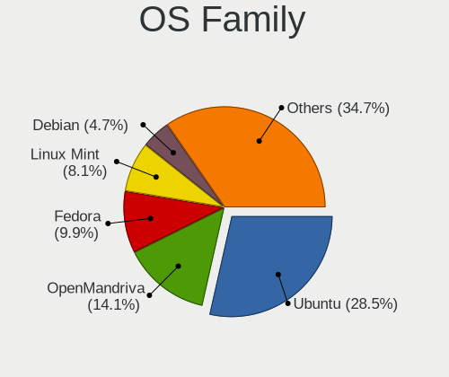

| Name         | Computers | Percent |
|--------------|-----------|---------|
| Ubuntu       | 578       | 35.2%   |
| OpenMandriva | 226       | 13.76%  |
| Fedora       | 148       | 9.01%   |
| Linux Mint   | 137       | 8.34%   |
| Debian       | 50        | 3.05%   |
| Arch         | 47        | 2.86%   |
| Manjaro      | 46        | 2.8%    |
| Zorin        | 44        | 2.68%   |
| Xubuntu      | 39        | 2.38%   |
| Pop!_OS      | 35        | 2.13%   |
| ROSA         | 34        | 2.07%   |
| Kubuntu      | 33        | 2.01%   |
| Gentoo       | 22        | 1.34%   |
| openSUSE     | 19        | 1.16%   |
| KDE neon     | 16        | 0.97%   |
| Lubuntu      | 14        | 0.85%   |
| RHEL         | 13        | 0.79%   |
| Endless      | 13        | 0.79%   |
| Ubuntu MATE  | 11        | 0.67%   |
| Kali         | 11        | 0.67%   |
| Elementary   | 11        | 0.67%   |
| Ubuntu Unity | 9         | 0.55%   |
| CentOS       | 9         | 0.55%   |
| ArcoLinux    | 8         | 0.49%   |
| Void Linux   | 6         | 0.37%   |
| EndeavourOS  | 5         | 0.3%    |
| ACI          | 5         | 0.3%    |
| Rocky Linux  | 4         | 0.24%   |
| Parrot       | 4         | 0.24%   |
| LMDE         | 4         | 0.24%   |
| BlackPanther | 4         | 0.24%   |
| SteamOS      | 3         | 0.18%   |
| MX           | 3         | 0.18%   |
| LinuxFX      | 3         | 0.18%   |
| Nobara       | 2         | 0.12%   |
| NixOS        | 2         | 0.12%   |
| Artix        | 2         | 0.12%   |
| SystemRescue | 1         | 0.06%   |
| Sparky       | 1         | 0.06%   |
| Sabayon      | 1         | 0.06%   |

Kernel
------

Version of the Linux kernel

| Version                  | Computers | Percent |
|--------------------------|-----------|---------|
| 5.10.14-desktop-1omv4002 | 113       | 5.93%   |
| 5.14.7-desktop-1omv4050  | 52        | 2.73%   |
| 5.16.7-desktop-1omv4003  | 47        | 2.46%   |
| 5.4.0-42-generic         | 34        | 1.78%   |
| 5.4.0-58-generic         | 22        | 1.15%   |
| 5.4.0-52-generic         | 22        | 1.15%   |
| 5.15.0-46-generic        | 21        | 1.1%    |
| 5.4.0-26-generic         | 20        | 1.05%   |
| 5.11.0-27-generic        | 16        | 0.84%   |
| 5.3.0-40-generic         | 15        | 0.79%   |
| 5.0.0-37-generic         | 15        | 0.79%   |
| 5.13.0-30-generic        | 14        | 0.73%   |
| 5.4.0-48-generic         | 12        | 0.63%   |
| 5.4.0-40-generic         | 12        | 0.63%   |
| 5.3.0-28-generic         | 12        | 0.63%   |
| 5.15.0-48-generic        | 12        | 0.63%   |
| 5.4.0-65-generic         | 11        | 0.58%   |
| 5.4.0-29-generic         | 10        | 0.52%   |
| 5.11.0-37-generic        | 10        | 0.52%   |
| 5.8.0-53-generic         | 9         | 0.47%   |
| 5.4.0-91-generic         | 9         | 0.47%   |
| 5.4.0-37-generic         | 9         | 0.47%   |
| 5.10.0-8-amd64           | 9         | 0.47%   |
| 4.15.0-43-generic        | 9         | 0.47%   |
| 5.8.0-59-generic         | 8         | 0.42%   |
| 5.8.0-50-generic         | 8         | 0.42%   |
| 5.4.0-72-generic         | 8         | 0.42%   |
| 5.4.0-56-generic         | 8         | 0.42%   |
| 5.4.0-33-generic         | 8         | 0.42%   |
| 5.3.0-42-generic         | 8         | 0.42%   |
| 5.13.0-22-generic        | 8         | 0.42%   |
| 5.13.0-21-generic        | 8         | 0.42%   |
| 5.0.0-32-generic         | 8         | 0.42%   |
| 5.0.0-31-generic         | 8         | 0.42%   |
| 5.0.0-29-generic         | 8         | 0.42%   |
| 5.0.0-25-generic         | 8         | 0.42%   |
| 5.8.0-48-generic         | 7         | 0.37%   |
| 5.8.0-43-generic         | 7         | 0.37%   |
| 5.8.0-41-generic         | 7         | 0.37%   |
| 5.4.0-88-generic         | 7         | 0.37%   |

Kernel Family
-------------

Linux kernel without a distro release

| Version | Computers | Percent |
|---------|-----------|---------|
| 5.4.0   | 302       | 17.01%  |
| 5.10.14 | 113       | 6.37%   |
| 4.15.0  | 109       | 6.14%   |
| 5.8.0   | 101       | 5.69%   |
| 5.11.0  | 96        | 5.41%   |
| 5.3.0   | 92        | 5.18%   |
| 5.13.0  | 90        | 5.07%   |
| 5.15.0  | 82        | 4.62%   |
| 5.0.0   | 71        | 4%      |
| 4.18.0  | 55        | 3.1%    |
| 5.14.7  | 53        | 2.99%   |
| 5.16.7  | 48        | 2.7%    |
| 5.10.0  | 34        | 1.92%   |
| 4.19.0  | 17        | 0.96%   |
| 3.10.0  | 11        | 0.62%   |
| 4.9.20  | 9         | 0.51%   |
| 5.16.11 | 8         | 0.45%   |
| 5.15.12 | 7         | 0.39%   |
| 5.11.12 | 7         | 0.39%   |
| 5.9.16  | 6         | 0.34%   |
| 5.9.0   | 6         | 0.34%   |
| 5.14.0  | 6         | 0.34%   |
| 5.12.4  | 6         | 0.34%   |
| 5.10.74 | 6         | 0.34%   |
| 4.4.0   | 6         | 0.34%   |
| 4.13.0  | 6         | 0.34%   |
| 5.8.18  | 5         | 0.28%   |
| 5.18.12 | 5         | 0.28%   |
| 5.17.5  | 5         | 0.28%   |
| 5.14.10 | 5         | 0.28%   |
| 5.7.0   | 4         | 0.23%   |
| 5.6.6   | 4         | 0.23%   |
| 5.6.16  | 4         | 0.23%   |
| 5.6.0   | 4         | 0.23%   |
| 5.3.18  | 4         | 0.23%   |
| 5.19.0  | 4         | 0.23%   |
| 5.17.1  | 4         | 0.23%   |
| 5.16.0  | 4         | 0.23%   |
| 5.13.4  | 4         | 0.23%   |
| 5.13.19 | 4         | 0.23%   |

Kernel Major Ver.
-----------------

Linux kernel major version

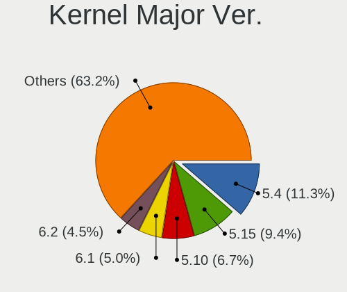

| Version | Computers | Percent |
|---------|-----------|---------|
| 5.4     | 326       | 18.48%  |
| 5.10    | 187       | 10.6%   |
| 5.8     | 134       | 7.6%    |
| 5.11    | 129       | 7.31%   |
| 5.15    | 121       | 6.86%   |
| 4.15    | 111       | 6.29%   |
| 5.13    | 107       | 6.07%   |
| 5.3     | 103       | 5.84%   |
| 5.14    | 78        | 4.42%   |
| 5.16    | 77        | 4.37%   |
| 5.0     | 77        | 4.37%   |
| 4.18    | 58        | 3.29%   |
| 5.17    | 28        | 1.59%   |
| 5.9     | 25        | 1.42%   |
| 5.6     | 23        | 1.3%    |
| 5.19    | 23        | 1.3%    |
| 5.18    | 22        | 1.25%   |
| 4.19    | 22        | 1.25%   |
| 5.12    | 21        | 1.19%   |
| 4.9     | 20        | 1.13%   |
| 5.7     | 14        | 0.79%   |
| 3.10    | 12        | 0.68%   |
| 5.5     | 11        | 0.62%   |
| 4.4     | 6         | 0.34%   |
| 4.13    | 6         | 0.34%   |
| 6.0     | 4         | 0.23%   |
| 5.1     | 4         | 0.23%   |
| 5.2     | 3         | 0.17%   |
| 4.17    | 3         | 0.17%   |
| 4.14    | 3         | 0.17%   |
| 4.1     | 2         | 0.11%   |
| 4.8     | 1         | 0.06%   |
| 4.20    | 1         | 0.06%   |
| 4.10    | 1         | 0.06%   |
| 2.6     | 1         | 0.06%   |

Arch
----

OS architecture (x86_64, i586, etc.)

| Name    | Computers | Percent |
|---------|-----------|---------|
| x86_64  | 1548      | 95.91%  |
| i686    | 54        | 3.35%   |
| aarch64 | 10        | 0.62%   |
| armv8l  | 1         | 0.06%   |
| armv7l  | 1         | 0.06%   |

DE
--

Desktop Environment

| Name            | Computers | Percent |
|-----------------|-----------|---------|
| GNOME           | 664       | 39.81%  |
| KDE5            | 354       | 21.22%  |
| Unknown         | 251       | 15.05%  |
| XFCE            | 120       | 7.19%   |
| X-Cinnamon      | 77        | 4.62%   |
| KDE             | 46        | 2.76%   |
| MATE            | 38        | 2.28%   |
| Cinnamon        | 30        | 1.8%    |
| KDE4            | 13        | 0.78%   |
| Pantheon        | 11        | 0.66%   |
| Unity           | 10        | 0.6%    |
| LXQt            | 10        | 0.6%    |
| LXDE            | 9         | 0.54%   |
| GNOME Flashback | 9         | 0.54%   |
| openbox         | 5         | 0.3%    |
| i3              | 5         | 0.3%    |
| awesome         | 4         | 0.24%   |
| qtile           | 2         | 0.12%   |
| XSession        | 1         | 0.06%   |
| xinitrc         | 1         | 0.06%   |
| sway            | 1         | 0.06%   |
| GNUstep         | 1         | 0.06%   |
| GNOME Classic   | 1         | 0.06%   |
| Enlightenment   | 1         | 0.06%   |
| DWM             | 1         | 0.06%   |
| custom          | 1         | 0.06%   |
| Core            | 1         | 0.06%   |
| Budgie          | 1         | 0.06%   |

Display Server
--------------

X11 or Wayland

| Name    | Computers | Percent |
|---------|-----------|---------|
| X11     | 1280      | 77.39%  |
| Wayland | 215       | 13%     |
| Unknown | 136       | 8.22%   |
| Tty     | 23        | 1.39%   |

Display Manager
---------------

SDDM, LightDM, etc.

| Name    | Computers | Percent |
|---------|-----------|---------|
| Unknown | 829       | 49.73%  |
| SDDM    | 336       | 20.16%  |
| GDM     | 193       | 11.58%  |
| GDM3    | 114       | 6.84%   |
| LightDM | 104       | 6.24%   |
| TDM     | 71        | 4.26%   |
| KDM     | 12        | 0.72%   |
| XDM     | 4         | 0.24%   |
| LXDM    | 2         | 0.12%   |
| SLiM    | 1         | 0.06%   |
| Ly      | 1         | 0.06%   |

OS Lang
-------

Language

| Lang    | Computers | Percent |
|---------|-----------|---------|
| cs_CZ   | 851       | 51.7%   |
| en_US   | 460       | 27.95%  |
| Unknown | 225       | 13.67%  |
| en_GB   | 39        | 2.37%   |
| C       | 27        | 1.64%   |
| ru_RU   | 13        | 0.79%   |
| sk_SK   | 8         | 0.49%   |
| POSIX   | 4         | 0.24%   |
| pl_PL   | 3         | 0.18%   |
| it_IT   | 2         | 0.12%   |
| fr_FR   | 2         | 0.12%   |
| de_DE   | 2         | 0.12%   |
| uk_UA   | 1         | 0.06%   |
| ro_RO   | 1         | 0.06%   |
| pt_PT   | 1         | 0.06%   |
| fi_FI   | 1         | 0.06%   |
| es_ES   | 1         | 0.06%   |
| en_NG   | 1         | 0.06%   |
| en_CA   | 1         | 0.06%   |
| en_AU   | 1         | 0.06%   |
| en_150  | 1         | 0.06%   |
| el_GR   | 1         | 0.06%   |

Boot Mode
---------

EFI or BIOS

| Mode | Computers | Percent |
|------|-----------|---------|
| BIOS | 908       | 55%     |
| EFI  | 743       | 45%     |

Filesystem
----------

Type of filesystem

| Type     | Computers | Percent |
|----------|-----------|---------|
| Ext4     | 1132      | 68.86%  |
| Overlay  | 248       | 15.09%  |
| Btrfs    | 130       | 7.91%   |
| Unknown  | 64        | 3.89%   |
| Xfs      | 45        | 2.74%   |
| Zfs      | 9         | 0.55%   |
| Ext3     | 4         | 0.24%   |
| Ext2     | 4         | 0.24%   |
| Tmpfs    | 2         | 0.12%   |
| Reiserfs | 2         | 0.12%   |
| F2fs     | 2         | 0.12%   |
| Aufs     | 2         | 0.12%   |

Part. scheme
------------

Scheme of partitioning

| Type    | Computers | Percent |
|---------|-----------|---------|
| Unknown | 871       | 53.17%  |
| GPT     | 490       | 29.91%  |
| MBR     | 277       | 16.91%  |

Dual Boot with Linux/BSD
------------------------

Hosting more than one Linux/BSD

| Dual boot | Computers | Percent |
|-----------|-----------|---------|
| No        | 1431      | 87.58%  |
| Yes       | 203       | 12.42%  |

Dual Boot (Win)
---------------

Hosting Linux and Windows

| Dual boot | Computers | Percent |
|-----------|-----------|---------|
| No        | 1079      | 65.67%  |
| Yes       | 564       | 34.33%  |

Board
-----

Vendor
------

Motherboard manufacturer

| Name                           | Computers | Percent |
|--------------------------------|-----------|---------|
| ASUSTek Computer               | 351       | 21.76%  |
| Lenovo                         | 287       | 17.79%  |
| Hewlett-Packard                | 250       | 15.5%   |
| Dell                           | 170       | 10.54%  |
| Gigabyte Technology            | 121       | 7.5%    |
| Acer                           | 107       | 6.63%   |
| MSI                            | 96        | 5.95%   |
| ASRock                         | 37        | 2.29%   |
| Intel                          | 25        | 1.55%   |
| Toshiba                        | 15        | 0.93%   |
| Sony                           | 13        | 0.81%   |
| UMAX                           | 12        | 0.74%   |
| Fujitsu                        | 12        | 0.74%   |
| Raspberry Pi Foundation        | 10        | 0.62%   |
| Unknown                        | 9         | 0.56%   |
| Apple                          | 7         | 0.43%   |
| HUAWEI                         | 6         | 0.37%   |
| Fujitsu Siemens                | 6         | 0.37%   |
| Google                         | 5         | 0.31%   |
| AMI                            | 5         | 0.31%   |
| Timi                           | 4         | 0.25%   |
| Supermicro                     | 4         | 0.25%   |
| Pegatron                       | 4         | 0.25%   |
| ZOTAC                          | 3         | 0.19%   |
| Valve                          | 3         | 0.19%   |
| TUXEDO                         | 3         | 0.19%   |
| Packard Bell                   | 3         | 0.19%   |
| Microsoft                      | 3         | 0.19%   |
| Notebook                       | 2         | 0.12%   |
| Insyde                         | 2         | 0.12%   |
| IBM                            | 2         | 0.12%   |
| Foxconn                        | 2         | 0.12%   |
| Clientron                      | 2         | 0.12%   |
| Chuwi                          | 2         | 0.12%   |
| Biostar                        | 2         | 0.12%   |
| Alienware                      | 2         | 0.12%   |
| Wortmann AG                    | 1         | 0.06%   |
| SmbiosType1_SystemManufacturer | 1         | 0.06%   |
| SIEMENS                        | 1         | 0.06%   |
| Seeed Studio                   | 1         | 0.06%   |

Model
-----

Motherboard model

| Name                                  | Computers | Percent |
|---------------------------------------|-----------|---------|
| ASUS UX31E                            | 101       | 6.26%   |
| Unknown                               | 11        | 0.68%   |
| ASUS All Series                       | 8         | 0.5%    |
| MSI MS-7A34                           | 6         | 0.37%   |
| MSI MS-7693                           | 6         | 0.37%   |
| HP ProBook 455 G7                     | 6         | 0.37%   |
| RPi Raspberry Pi                      | 5         | 0.31%   |
| MSI MS-7C02                           | 5         | 0.31%   |
| Lenovo ThinkPad E14 20RA001LMC        | 5         | 0.31%   |
| HP ProLiant DL380e Gen8               | 5         | 0.31%   |
| HP ProBook 450 G5                     | 5         | 0.31%   |
| Dell Latitude E6400                   | 5         | 0.31%   |
| Dell Latitude 5401                    | 5         | 0.31%   |
| MSI MS-7C91                           | 4         | 0.25%   |
| HP ProDesk 405 G6 Desktop Mini PC     | 4         | 0.25%   |
| HP ProBook 4540s                      | 4         | 0.25%   |
| HP ProBook 4530s                      | 4         | 0.25%   |
| HP Pavilion dv7                       | 4         | 0.25%   |
| HP Notebook                           | 4         | 0.25%   |
| HP EliteBook 840 G6                   | 4         | 0.25%   |
| Dell XPS 15 7590                      | 4         | 0.25%   |
| Dell Precision M6500                  | 4         | 0.25%   |
| Acer Extensa 5620                     | 4         | 0.25%   |
| Valve Jupiter                         | 3         | 0.19%   |
| MSI MS-7592                           | 3         | 0.19%   |
| Lenovo Z50-75 80EC                    | 3         | 0.19%   |
| Lenovo ThinkPad T14 Gen 1 20UES2WA00  | 3         | 0.19%   |
| Lenovo IdeaPad L340-17IRH Gaming 81LL | 3         | 0.19%   |
| HP ProBook 4510s                      | 3         | 0.19%   |
| HP Pavilion dv6                       | 3         | 0.19%   |
| HP ENVY x360 Convertible 15-cn0xxx    | 3         | 0.19%   |
| HP EliteBook 855 G7 Notebook PC       | 3         | 0.19%   |
| HP EliteBook 850 G6                   | 3         | 0.19%   |
| HP EliteBook 840 G3                   | 3         | 0.19%   |
| HP Compaq 8200 Elite SFF PC           | 3         | 0.19%   |
| HP 250 G6 Notebook PC                 | 3         | 0.19%   |
| Gigabyte B450 AORUS ELITE             | 3         | 0.19%   |
| Gigabyte 970A-DS3P                    | 3         | 0.19%   |
| Dell XPS 15 9560                      | 3         | 0.19%   |
| Dell XPS 13 9360                      | 3         | 0.19%   |

Model Family
------------

Motherboard model prefix

| Name               | Computers | Percent |
|--------------------|-----------|---------|
| Lenovo ThinkPad    | 140       | 8.68%   |
| ASUS UX31E         | 101       | 6.26%   |
| Dell Latitude      | 74        | 4.59%   |
| Acer Aspire        | 64        | 3.97%   |
| HP ProBook         | 55        | 3.41%   |
| HP EliteBook       | 54        | 3.35%   |
| Lenovo IdeaPad     | 48        | 2.98%   |
| HP Compaq          | 28        | 1.74%   |
| HP Pavilion        | 26        | 1.61%   |
| ASUS ROG           | 24        | 1.49%   |
| Dell XPS           | 23        | 1.43%   |
| ASUS PRIME         | 23        | 1.43%   |
| Dell Precision     | 20        | 1.24%   |
| Dell Inspiron      | 19        | 1.18%   |
| Lenovo Yoga        | 17        | 1.05%   |
| Dell OptiPlex      | 15        | 0.93%   |
| Toshiba Satellite  | 14        | 0.87%   |
| Acer Extensa       | 13        | 0.81%   |
| Lenovo ThinkCentre | 12        | 0.74%   |
| ASUS TUF           | 12        | 0.74%   |
| HP ENVY            | 11        | 0.68%   |
| Unknown            | 11        | 0.68%   |
| RPi Raspberry      | 10        | 0.62%   |
| Lenovo Legion      | 10        | 0.62%   |
| ASUS VivoBook      | 10        | 0.62%   |
| UMAX VisionBook    | 9         | 0.56%   |
| HP ZBook           | 9         | 0.56%   |
| HP ProDesk         | 9         | 0.56%   |
| Dell Vostro        | 9         | 0.56%   |
| ASUS ZenBook       | 9         | 0.56%   |
| Acer TravelMate    | 9         | 0.56%   |
| Lenovo ThinkBook   | 8         | 0.5%    |
| HP Laptop          | 8         | 0.5%    |
| ASUS All           | 8         | 0.5%    |
| Acer Swift         | 8         | 0.5%    |
| Gigabyte B450      | 7         | 0.43%   |
| Fujitsu LIFEBOOK   | 7         | 0.43%   |
| MSI MS-7A34        | 6         | 0.37%   |
| MSI MS-7693        | 6         | 0.37%   |
| HP ProLiant        | 6         | 0.37%   |

MFG Year
--------

Motherboard manufacture year

| Year    | Computers | Percent |
|---------|-----------|---------|
| 2011    | 197       | 12.21%  |
| 2018    | 151       | 9.36%   |
| 2020    | 150       | 9.3%    |
| 2019    | 142       | 8.8%    |
| 2017    | 115       | 7.13%   |
| 2012    | 115       | 7.13%   |
| 2014    | 94        | 5.83%   |
| 2013    | 88        | 5.46%   |
| 2008    | 85        | 5.27%   |
| 2021    | 84        | 5.21%   |
| 2015    | 83        | 5.15%   |
| 2016    | 70        | 4.34%   |
| 2010    | 63        | 3.91%   |
| 2009    | 60        | 3.72%   |
| 2007    | 59        | 3.66%   |
| 2006    | 22        | 1.36%   |
| 2022    | 12        | 0.74%   |
| Unknown | 12        | 0.74%   |
| 2005    | 6         | 0.37%   |
| 2004    | 4         | 0.25%   |
| 2000    | 1         | 0.06%   |

Form Factor
-----------

Physical design of the computer

| Name           | Computers | Percent |
|----------------|-----------|---------|
| Notebook       | 980       | 60.76%  |
| Desktop        | 515       | 31.93%  |
| Convertible    | 42        | 2.6%    |
| Mini pc        | 23        | 1.43%   |
| Server         | 15        | 0.93%   |
| Tablet         | 14        | 0.87%   |
| All in one     | 12        | 0.74%   |
| System on chip | 11        | 0.68%   |
| Phone          | 1         | 0.06%   |

Secure Boot
-----------

Enabled or disabled

| State    | Computers | Percent |
|----------|-----------|---------|
| Disabled | 1475      | 90.66%  |
| Enabled  | 152       | 9.34%   |

Coreboot
--------

Have coreboot on board

| Used | Computers | Percent |
|------|-----------|---------|
| No   | 1608      | 99.69%  |
| Yes  | 5         | 0.31%   |

RAM Size
--------

Total RAM memory

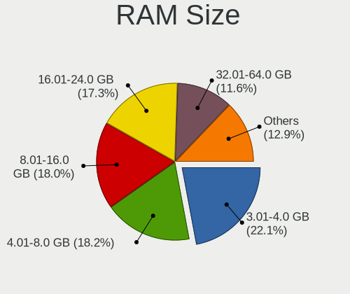

| Size in GB      | Computers | Percent |
|-----------------|-----------|---------|
| 3.01-4.0        | 428       | 26.05%  |
| 4.01-8.0        | 298       | 18.14%  |
| 8.01-16.0       | 285       | 17.35%  |
| 16.01-24.0      | 281       | 17.1%   |
| 32.01-64.0      | 158       | 9.62%   |
| 1.01-2.0        | 90        | 5.48%   |
| 64.01-256.0     | 30        | 1.83%   |
| 24.01-32.0      | 27        | 1.64%   |
| 2.01-3.0        | 26        | 1.58%   |
| 0.51-1.0        | 16        | 0.97%   |
| More than 256.0 | 2         | 0.12%   |
| 0.01-0.5        | 2         | 0.12%   |

RAM Used
--------

Used RAM memory

| Used GB    | Computers | Percent |
|------------|-----------|---------|
| 1.01-2.0   | 682       | 38.31%  |
| 2.01-3.0   | 373       | 20.96%  |
| 4.01-8.0   | 259       | 14.55%  |
| 3.01-4.0   | 200       | 11.24%  |
| 0.51-1.0   | 123       | 6.91%   |
| 8.01-16.0  | 96        | 5.39%   |
| 0.01-0.5   | 22        | 1.24%   |
| 16.01-24.0 | 14        | 0.79%   |
| 32.01-64.0 | 6         | 0.34%   |
| 24.01-32.0 | 4         | 0.22%   |
| Unknown    | 1         | 0.06%   |

Total Drives
------------

Number of drives on board

| Drives | Computers | Percent |
|--------|-----------|---------|
| 1      | 1087      | 65.36%  |
| 2      | 351       | 21.11%  |
| 3      | 105       | 6.31%   |
| 4      | 45        | 2.71%   |
| 5      | 25        | 1.5%    |
| 0      | 23        | 1.38%   |
| 6      | 13        | 0.78%   |
| 7      | 9         | 0.54%   |
| 8      | 4         | 0.24%   |
| 9      | 1         | 0.06%   |

Has CD-ROM
----------

Has CD-ROM on board

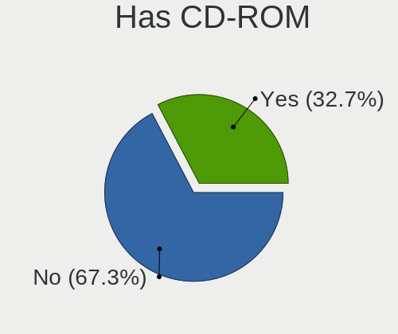

| Presented | Computers | Percent |
|-----------|-----------|---------|
| No        | 1028      | 63.11%  |
| Yes       | 601       | 36.89%  |

Has Ethernet
------------

Has Ethernet on board

| Presented | Computers | Percent |
|-----------|-----------|---------|
| Yes       | 1414      | 87.23%  |
| No        | 207       | 12.77%  |

Has WiFi
--------

Has WiFi module

| Presented | Computers | Percent |
|-----------|-----------|---------|
| Yes       | 1188      | 73.38%  |
| No        | 431       | 26.62%  |

Has Bluetooth
-------------

Has Bluetooth module

| Presented | Computers | Percent |
|-----------|-----------|---------|
| Yes       | 894       | 54.71%  |
| No        | 740       | 45.29%  |

Location
--------

Country
-------

Geographic location (country)

| Country | Computers | Percent |
|---------|-----------|---------|
| Czechia | 1613      | 100%    |

City
----

Geographic location (city)

| City                 | Computers | Percent |
|----------------------|-----------|---------|
| Prague               | 635       | 38.16%  |
| Brno                 | 151       | 9.07%   |
| Ostrava              | 43        | 2.58%   |
| Pilsen               | 33        | 1.98%   |
| Hradec Krlov     | 26        | 1.56%   |
| Liberec              | 22        | 1.32%   |
| Pardubice            | 21        | 1.26%   |
| Olomouc              | 21        | 1.26%   |
| esk Budjovice  | 20        | 1.2%    |
| Zln                | 16        | 0.96%   |
| Havov            | 15        | 0.9%    |
| Znojmo               | 10        | 0.6%    |
| Most                 | 10        | 0.6%    |
| Chomutov             | 10        | 0.6%    |
| Jihlava              | 9         | 0.54%   |
| st nad Labem     | 8         | 0.48%   |
| Frdek-Mstek      | 8         | 0.48%   |
| Uhersk Hradit  | 7         | 0.42%   |
| Perov              | 7         | 0.42%   |
| Karlovy Vary         | 7         | 0.42%   |
| Praha 10             | 6         | 0.36%   |
| Opava                | 6         | 0.36%   |
| Litomice         | 6         | 0.36%   |
| Kralupy nad Vltavou  | 6         | 0.36%   |
| Kladno               | 6         | 0.36%   |
| esk Lpa        | 6         | 0.36%   |
| As                   | 6         | 0.36%   |
| Uvaly                | 5         | 0.3%    |
| Teb            | 5         | 0.3%    |
| Teplice              | 5         | 0.3%    |
| Rumburk              | 5         | 0.3%    |
| Roznov pod Radhostem | 5         | 0.3%    |
| Pbram            | 5         | 0.3%    |
| Odolena Voda         | 5         | 0.3%    |
| Marinsk Lzn  | 5         | 0.3%    |
| Bohumin              | 5         | 0.3%    |
| Vykov              | 4         | 0.24%   |
| Vsetin               | 4         | 0.24%   |
| Uhlirske Janovice    | 4         | 0.24%   |
| Trinec               | 4         | 0.24%   |

Drives
------

Drive Vendor
------------

Hard drive vendors

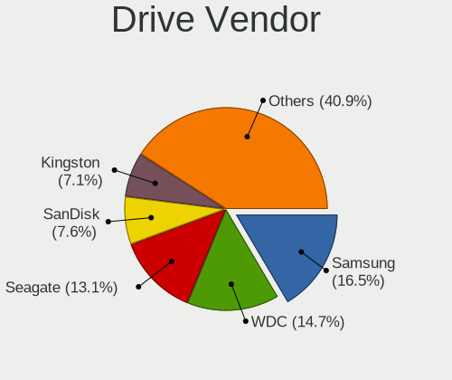

| Vendor                         | Computers | Drives | Percent |
|--------------------------------|-----------|--------|---------|
| WDC                            | 372       | 599    | 16.72%  |
| Samsung Electronics            | 347       | 487    | 15.6%   |
| Seagate                        | 315       | 477    | 14.16%  |
| SanDisk                        | 166       | 175    | 7.46%   |
| Kingston                       | 156       | 190    | 7.01%   |
| Toshiba                        | 133       | 163    | 5.98%   |
| Unknown                        | 96        | 129    | 4.31%   |
| Hitachi                        | 74        | 86     | 3.33%   |
| SK hynix                       | 63        | 73     | 2.83%   |
| A-DATA Technology              | 57        | 70     | 2.56%   |
| Intel                          | 56        | 65     | 2.52%   |
| Crucial                        | 52        | 66     | 2.34%   |
| HGST                           | 44        | 54     | 1.98%   |
| Micron Technology              | 42        | 58     | 1.89%   |
| Patriot                        | 38        | 48     | 1.71%   |
| Transcend                      | 16        | 24     | 0.72%   |
| Phison                         | 14        | 26     | 0.63%   |
| KIOXIA                         | 12        | 17     | 0.54%   |
| Apacer                         | 11        | 15     | 0.49%   |
| OCZ                            | 10        | 33     | 0.45%   |
| Gigabyte Technology            | 10        | 16     | 0.45%   |
| Maxtor                         | 9         | 13     | 0.4%    |
| LITEONIT                       | 9         | 11     | 0.4%    |
| Fujitsu                        | 9         | 10     | 0.4%    |
| Verbatim                       | 7         | 7      | 0.31%   |
| Silicon Motion                 | 7         | 7      | 0.31%   |
| LITEON                         | 7         | 8      | 0.31%   |
| China                          | 7         | 8      | 0.31%   |
| XPG                            | 6         | 8      | 0.27%   |
| JMicron Technology             | 6         | 7      | 0.27%   |
| GOODRAM                        | 5         | 8      | 0.22%   |
| Corsair                        | 5         | 5      | 0.22%   |
| Apple                          | 5         | 8      | 0.22%   |
| ASMedia                        | 4         | 6      | 0.18%   |
| Unknown                        | 4         | 4      | 0.18%   |
| UMAX                           | 3         | 3      | 0.13%   |
| Team                           | 3         | 3      | 0.13%   |
| Micron/Crucial Technology      | 3         | 3      | 0.13%   |
| SPCC                           | 2         | 2      | 0.09%   |
| Solid State Storage Technology | 2         | 2      | 0.09%   |

Drive Model
-----------

Hard drive models

| Model                                  | Computers | Percent |
|----------------------------------------|-----------|---------|
| SanDisk SSD U100 256GB                 | 101       | 4.13%   |
| Samsung SSD 860 EVO 500GB              | 28        | 1.15%   |
| Kingston SA400S37240G 240GB SSD        | 25        | 1.02%   |
| Samsung NVMe SSD Drive 512GB           | 24        | 0.98%   |
| Unknown MMC Card  64GB                 | 18        | 0.74%   |
| Kingston SA400S37120G 120GB SSD        | 18        | 0.74%   |
| Samsung SSD 850 EVO 250GB              | 17        | 0.7%    |
| Kingston SA400S37480G 480GB SSD        | 17        | 0.7%    |
| Seagate ST1000LM035-1RK172 1TB         | 15        | 0.61%   |
| Samsung NVMe SSD Drive 500GB           | 15        | 0.61%   |
| HGST HTS721010A9E630 1TB               | 15        | 0.61%   |
| WDC WDS500G2B0A-00SM50 500GB SSD       | 14        | 0.57%   |
| Unknown MMC Card  32GB                 | 14        | 0.57%   |
| WDC WDS240G2G0A-00JH30 240GB SSD       | 13        | 0.53%   |
| Toshiba NVMe SSD Drive 256GB           | 13        | 0.53%   |
| Seagate ST2000DM008-2FR102 2TB         | 12        | 0.49%   |
| Seagate ST1000DM010-2EP102 1TB         | 12        | 0.49%   |
| Samsung SM963 2.5" NVMe PCIe SSD 256GB | 12        | 0.49%   |
| Seagate ST3500418AS 500GB              | 11        | 0.45%   |
| Samsung SSD 860 EVO 1TB                | 11        | 0.45%   |
| Patriot Burst 480GB SSD                | 11        | 0.45%   |
| Patriot Burst 120GB SSD                | 11        | 0.45%   |
| Kingston SV300S37A120G 120GB SSD       | 11        | 0.45%   |
| Seagate ST1000LM024 HN-M101MBB 1TB     | 10        | 0.41%   |
| Samsung SSD 850 EVO 500GB              | 10        | 0.41%   |
| WDC WD30EFRX-68EUZN0 3TB               | 9         | 0.37%   |
| Toshiba MQ01ABD100 1TB                 | 9         | 0.37%   |
| SK hynix NVMe SSD Drive 512GB          | 9         | 0.37%   |
| Seagate ST500DM002-1BD142 500GB        | 9         | 0.37%   |
| Samsung MZVLB1T0HBLR-000L2 1TB         | 9         | 0.37%   |
| Kingston SHFS37A120G 120GB SSD         | 9         | 0.37%   |
| WDC WDS100T2B0A-00SM50 1TB SSD         | 8         | 0.33%   |
| WDC WD10EZEX-08WN4A0 1TB               | 8         | 0.33%   |
| WDC WD10EZEX-08M2NA0 1TB               | 8         | 0.33%   |
| Unknown MMC Card  128GB                | 8         | 0.33%   |
| Seagate ST500LT012-1DG142 500GB        | 8         | 0.33%   |
| SanDisk NVMe SSD Drive 512GB           | 8         | 0.33%   |
| Samsung SSD 970 EVO 1TB                | 8         | 0.33%   |
| Intel NVMe SSD Drive 512GB             | 8         | 0.33%   |
| HGST HTS725050A7E630 500GB             | 8         | 0.33%   |

HDD Vendor
----------

Hard disk drive vendors

| Vendor              | Computers | Drives | Percent |
|---------------------|-----------|--------|---------|
| Seagate             | 308       | 468    | 35.57%  |
| WDC                 | 290       | 475    | 33.49%  |
| Toshiba             | 77        | 85     | 8.89%   |
| Hitachi             | 74        | 86     | 8.55%   |
| HGST                | 44        | 54     | 5.08%   |
| Samsung Electronics | 42        | 61     | 4.85%   |
| Maxtor              | 9         | 13     | 1.04%   |
| Fujitsu             | 9         | 10     | 1.04%   |
| Unknown             | 4         | 4      | 0.46%   |
| pqi                 | 2         | 2      | 0.23%   |
| ASMedia             | 2         | 3      | 0.23%   |
| SABRENT             | 1         | 1      | 0.12%   |
| IBM/Hitachi         | 1         | 1      | 0.12%   |
| External            | 1         | 1      | 0.12%   |
| ASUSTOR             | 1         | 1      | 0.12%   |
| Apple               | 1         | 4      | 0.12%   |

SSD Vendor
----------

Solid state drive vendors

| Vendor              | Computers | Drives | Percent |
|---------------------|-----------|--------|---------|
| Samsung Electronics | 152       | 195    | 19.36%  |
| SanDisk             | 132       | 137    | 16.82%  |
| Kingston            | 128       | 159    | 16.31%  |
| WDC                 | 63        | 82     | 8.03%   |
| A-DATA Technology   | 52        | 63     | 6.62%   |
| Crucial             | 49        | 63     | 6.24%   |
| Patriot             | 37        | 47     | 4.71%   |
| Intel               | 22        | 25     | 2.8%    |
| Micron Technology   | 21        | 33     | 2.68%   |
| Transcend           | 15        | 22     | 1.91%   |
| Toshiba             | 12        | 14     | 1.53%   |
| SK hynix            | 12        | 12     | 1.53%   |
| Apacer              | 11        | 15     | 1.4%    |
| LITEONIT            | 9         | 11     | 1.15%   |
| OCZ                 | 8         | 15     | 1.02%   |
| Verbatim            | 7         | 7      | 0.89%   |
| China               | 7         | 8      | 0.89%   |
| LITEON              | 6         | 7      | 0.76%   |
| GOODRAM             | 5         | 8      | 0.64%   |
| Gigabyte Technology | 4         | 8      | 0.51%   |
| UMAX                | 3         | 3      | 0.38%   |
| Seagate             | 3         | 3      | 0.38%   |
| Apple               | 3         | 3      | 0.38%   |
| Unknown             | 2         | 2      | 0.25%   |
| Team                | 2         | 2      | 0.25%   |
| SPCC                | 2         | 2      | 0.25%   |
| ASMT                | 2         | 2      | 0.25%   |
| WDC WDS1            | 1         | 1      | 0.13%   |
| UMIS                | 1         | 1      | 0.13%   |
| TO Exter            | 1         | 2      | 0.13%   |
| TCSUNBOW            | 1         | 1      | 0.13%   |
| ShanDianZhe         | 1         | 1      | 0.13%   |
| Phison              | 1         | 1      | 0.13%   |
| Netac               | 1         | 1      | 0.13%   |
| Mushkin             | 1         | 1      | 0.13%   |
| Linux               | 1         | 1      | 0.13%   |
| Innodisk            | 1         | 1      | 0.13%   |
| Hewlett-Packard     | 1         | 1      | 0.13%   |
| FORESEE             | 1         | 1      | 0.13%   |
| CT500MX5            | 1         | 1      | 0.13%   |

Drive Kind
----------

HDD or SSD

| Kind    | Computers | Drives | Percent |
|---------|-----------|--------|---------|
| HDD     | 739       | 1269   | 36.51%  |
| SSD     | 709       | 965    | 35.03%  |
| NVMe    | 466       | 653    | 23.02%  |
| MMC     | 98        | 134    | 4.84%   |
| Unknown | 12        | 16     | 0.59%   |

Drive Connector
---------------

SATA, SAS, NVMe, etc.

| Type | Computers | Drives | Percent |
|------|-----------|--------|---------|
| SATA | 1202      | 2175   | 65.75%  |
| NVMe | 464       | 650    | 25.38%  |
| MMC  | 98        | 134    | 5.36%   |
| SAS  | 64        | 78     | 3.5%    |

Drive Size
----------

Size of hard drive

| Size in TB | Computers | Drives | Percent |
|------------|-----------|--------|---------|
| 0.01-0.5   | 985       | 1429   | 65.32%  |
| 0.51-1.0   | 361       | 503    | 23.94%  |
| 1.01-2.0   | 81        | 166    | 5.37%   |
| 3.01-4.0   | 26        | 38     | 1.72%   |
| 2.01-3.0   | 26        | 39     | 1.72%   |
| 4.01-10.0  | 20        | 45     | 1.33%   |
| 10.01-20.0 | 9         | 14     | 0.6%    |

Space Total
-----------

Amount of disk space available on the file system

| Size in GB     | Computers | Percent |
|----------------|-----------|---------|
| 101-250        | 435       | 25.79%  |
| 251-500        | 340       | 20.15%  |
| 1-20           | 238       | 14.11%  |
| 501-1000       | 205       | 12.15%  |
| 51-100         | 127       | 7.53%   |
| 1001-2000      | 110       | 6.52%   |
| 21-50          | 71        | 4.21%   |
| Unknown        | 69        | 4.09%   |
| More than 3000 | 65        | 3.85%   |
| 2001-3000      | 27        | 1.6%    |

Space Used
----------

Amount of used disk space

| Used GB        | Computers | Percent |
|----------------|-----------|---------|
| 1-20           | 771       | 44.11%  |
| 21-50          | 223       | 12.76%  |
| 101-250        | 205       | 11.73%  |
| 51-100         | 172       | 9.84%   |
| 251-500        | 132       | 7.55%   |
| 501-1000       | 82        | 4.69%   |
| Unknown        | 69        | 3.95%   |
| 1001-2000      | 45        | 2.57%   |
| More than 3000 | 33        | 1.89%   |
| 2001-3000      | 16        | 0.92%   |

Malfunc. Drives
---------------

Drive models with a malfunction

| Model                                 | Computers | Drives | Percent |
|---------------------------------------|-----------|--------|---------|
| SanDisk SSD U100 256GB                | 101       | 101    | 45.09%  |
| HGST HTS725050A7E630 500GB            | 3         | 3      | 1.34%   |
| WDC WD60EFRX-68L0BN1 6TB              | 2         | 3      | 0.89%   |
| Toshiba MQ01ABD075 752GB              | 2         | 2      | 0.89%   |
| SK hynix BC711 HFM512GD3JX013N 512GB  | 2         | 2      | 0.89%   |
| Seagate ST9500420AS 500GB             | 2         | 3      | 0.89%   |
| Seagate ST3160318AS 160GB             | 2         | 2      | 0.89%   |
| Seagate ST2000DM008-2FR102 2TB        | 2         | 2      | 0.89%   |
| Seagate ST1000LX015-1U7172 1TB        | 2         | 2      | 0.89%   |
| Seagate ST1000LM024 HN-M101MBB 1TB    | 2         | 2      | 0.89%   |
| Micron Technology 1100 SATA 256GB SSD | 2         | 2      | 0.89%   |
| WDC WDS120G2G0A-00JH30 120GB SSD      | 1         | 1      | 0.45%   |
| WDC WDS100T2B0A-00SM50 1TB SSD        | 1         | 1      | 0.45%   |
| WDC WD800BB-00JHA0 80GB               | 1         | 1      | 0.45%   |
| WDC WD7500BPVT-22HXZT3 752GB          | 1         | 1      | 0.45%   |
| WDC WD7500AADS-00M2B0 752GB           | 1         | 1      | 0.45%   |
| WDC WD6400BPVT-60HXZT1 640GB          | 1         | 1      | 0.45%   |
| WDC WD6400AAKS-22A7B2 640GB           | 1         | 1      | 0.45%   |
| WDC WD5000AAKS-00V0A0 500GB           | 1         | 1      | 0.45%   |
| WDC WD3200BEVT-60ZCT1 320GB           | 1         | 1      | 0.45%   |
| WDC WD30EFRX-68EUZN0 3TB              | 1         | 1      | 0.45%   |
| WDC WD2502ABYS-02B7A0 256GB           | 1         | 1      | 0.45%   |
| WDC WD2500BPVT-22JJ5T0 250GB          | 1         | 1      | 0.45%   |
| WDC WD2500BEVS-22UST0 250GB           | 1         | 1      | 0.45%   |
| WDC WD2500AAKX-75U6AA0 250GB          | 1         | 1      | 0.45%   |
| WDC WD2500AAKX-60U6AA0 250GB          | 1         | 1      | 0.45%   |
| WDC WD2500AAKX-603CA0 250GB           | 1         | 1      | 0.45%   |
| WDC WD2500AAKX-083CA1 250GB           | 1         | 1      | 0.45%   |
| WDC WD2500AAJS-08L7A0 250GB           | 1         | 2      | 0.45%   |
| WDC WD20EARX-008FB0 2TB               | 1         | 2      | 0.45%   |
| WDC WD10JPCX-24UE4T0 1TB              | 1         | 1      | 0.45%   |
| WDC WD10EZRX-00L4HB0 1TB              | 1         | 1      | 0.45%   |
| WDC WD10EZEX-75M2NA0 1TB              | 1         | 1      | 0.45%   |
| WDC WD10EZEX-35M2NA0 1TB              | 1         | 1      | 0.45%   |
| WDC WD10EZEX-08WN4A0 1TB              | 1         | 1      | 0.45%   |
| WDC WD1001FALS-40K1B0 1TB             | 1         | 1      | 0.45%   |
| Toshiba MQ01ABD100 1TB                | 1         | 1      | 0.45%   |
| Toshiba MK8037GSX 80GB                | 1         | 1      | 0.45%   |
| Toshiba MK6465GSXN 640GB              | 1         | 1      | 0.45%   |
| Toshiba MK5056GSY 500GB               | 1         | 1      | 0.45%   |

Malfunc. Drive Vendor
---------------------

Vendors of faulty drives

| Vendor              | Computers | Drives | Percent |
|---------------------|-----------|--------|---------|
| SanDisk             | 103       | 103    | 46.61%  |
| Seagate             | 36        | 44     | 16.29%  |
| WDC                 | 25        | 30     | 11.31%  |
| Hitachi             | 12        | 12     | 5.43%   |
| Toshiba             | 8         | 8      | 3.62%   |
| Samsung Electronics | 8         | 8      | 3.62%   |
| HGST                | 6         | 6      | 2.71%   |
| Kingston            | 5         | 5      | 2.26%   |
| SK hynix            | 4         | 4      | 1.81%   |
| Micron Technology   | 3         | 3      | 1.36%   |
| A-DATA Technology   | 3         | 5      | 1.36%   |
| Intel               | 2         | 2      | 0.9%    |
| Crucial             | 2         | 2      | 0.9%    |
| Maxtor              | 1         | 1      | 0.45%   |
| LITEONIT            | 1         | 1      | 0.45%   |
| IBM/Hitachi         | 1         | 1      | 0.45%   |
| Fujitsu             | 1         | 1      | 0.45%   |

Malfunc. HDD Vendor
-------------------

Vendors of faulty HDD drives

| Vendor              | Computers | Drives | Percent |
|---------------------|-----------|--------|---------|
| Seagate             | 36        | 44     | 38.3%   |
| WDC                 | 24        | 28     | 25.53%  |
| Hitachi             | 12        | 12     | 12.77%  |
| Toshiba             | 8         | 8      | 8.51%   |
| HGST                | 6         | 6      | 6.38%   |
| Samsung Electronics | 5         | 5      | 5.32%   |
| Maxtor              | 1         | 1      | 1.06%   |
| IBM/Hitachi         | 1         | 1      | 1.06%   |
| Fujitsu             | 1         | 1      | 1.06%   |

Malfunc. Drive Kind
-------------------

Kinds of faulty drives

| Kind | Computers | Drives | Percent |
|------|-----------|--------|---------|
| SSD  | 125       | 127    | 56.82%  |
| HDD  | 92        | 106    | 41.82%  |
| NVMe | 3         | 3      | 1.36%   |

Failed Drives
-------------

Failed drive models

| Model                     | Computers | Drives | Percent |
|---------------------------|-----------|--------|---------|
| Seagate ST3500418AS 500GB | 2         | 3      | 66.67%  |
| Unknown 00000  16GB       | 1         | 1      | 33.33%  |

Failed Drive Vendor
-------------------

Failed drive vendors

| Vendor  | Computers | Drives | Percent |
|---------|-----------|--------|---------|
| Seagate | 2         | 3      | 66.67%  |
| Unknown | 1         | 1      | 33.33%  |

Drive Status
------------

Number of failed and malfunc. drives

| Status   | Computers | Drives | Percent |
|----------|-----------|--------|---------|
| Detected | 924       | 1855   | 53.88%  |
| Works    | 570       | 942    | 33.24%  |
| Malfunc  | 218       | 236    | 12.71%  |
| Failed   | 3         | 4      | 0.17%   |

Storage controller
------------------

Storage Vendor
--------------

Storage controller vendors

| Vendor                           | Computers | Percent |
|----------------------------------|-----------|---------|
| Intel                            | 1068      | 54.13%  |
| AMD                              | 310       | 15.71%  |
| Samsung Electronics              | 176       | 8.92%   |
| SanDisk                          | 62        | 3.14%   |
| SK hynix                         | 46        | 2.33%   |
| Toshiba America Info Systems     | 43        | 2.18%   |
| JMicron Technology               | 31        | 1.57%   |
| Kingston Technology Company      | 29        | 1.47%   |
| Phison Electronics               | 24        | 1.22%   |
| Nvidia                           | 23        | 1.17%   |
| Marvell Technology Group         | 22        | 1.12%   |
| ASMedia Technology               | 22        | 1.12%   |
| Micron Technology                | 21        | 1.06%   |
| KIOXIA                           | 15        | 0.76%   |
| ADATA Technology                 | 13        | 0.66%   |
| Silicon Motion                   | 12        | 0.61%   |
| VIA Technologies                 | 8         | 0.41%   |
| Micron/Crucial Technology        | 6         | 0.3%    |
| Hewlett-Packard                  | 6         | 0.3%    |
| Seagate Technology               | 5         | 0.25%   |
| Union Memory (Shenzhen)          | 3         | 0.15%   |
| Silicon Integrated Systems [SiS] | 3         | 0.15%   |
| LSI Logic / Symbios Logic        | 3         | 0.15%   |
| Lite-On Technology               | 3         | 0.15%   |
| Adaptec                          | 3         | 0.15%   |
| Solid State Storage Technology   | 2         | 0.1%    |
| Silicon Image                    | 2         | 0.1%    |
| OCZ Technology Group             | 2         | 0.1%    |
| Lenovo                           | 2         | 0.1%    |
| Integrated Technology Express    | 2         | 0.1%    |
| Western Digital                  | 1         | 0.05%   |
| Promise Technology               | 1         | 0.05%   |
| Chelsio Communications           | 1         | 0.05%   |
| Broadcom / LSI                   | 1         | 0.05%   |
| Apple                            | 1         | 0.05%   |
| 3ware                            | 1         | 0.05%   |

Storage Model
-------------

Storage controller models

| Model                                                                            | Computers | Percent |
|----------------------------------------------------------------------------------|-----------|---------|
| AMD FCH SATA Controller [AHCI mode]                                              | 192       | 8.3%    |
| Intel 6 Series/C200 Series Chipset Family 6 port Mobile SATA AHCI Controller     | 151       | 6.53%   |
| Samsung NVMe SSD Controller SM981/PM981/PM983                                    | 93        | 4.02%   |
| Intel Sunrise Point-LP SATA Controller [AHCI mode]                               | 75        | 3.24%   |
| Intel 8 Series/C220 Series Chipset Family 6-port SATA Controller 1 [AHCI mode]   | 66        | 2.85%   |
| Intel 7 Series Chipset Family 6-port SATA Controller [AHCI mode]                 | 62        | 2.68%   |
| Intel 82801 Mobile SATA Controller [RAID mode]                                   | 50        | 2.16%   |
| AMD SB7x0/SB8x0/SB9x0 SATA Controller [AHCI mode]                                | 42        | 1.82%   |
| Intel 82801IBM/IEM (ICH9M/ICH9M-E) 4 port SATA Controller [AHCI mode]            | 41        | 1.77%   |
| AMD 400 Series Chipset SATA Controller                                           | 41        | 1.77%   |
| Samsung NVMe SSD Controller 980                                                  | 40        | 1.73%   |
| AMD SB7x0/SB8x0/SB9x0 IDE Controller                                             | 37        | 1.6%    |
| Intel NM10/ICH7 Family SATA Controller [IDE mode]                                | 36        | 1.56%   |
| Intel 82801G (ICH7 Family) IDE Controller                                        | 35        | 1.51%   |
| Intel Cannon Lake Mobile PCH SATA AHCI Controller                                | 31        | 1.34%   |
| Intel Volume Management Device NVMe RAID Controller                              | 28        | 1.21%   |
| Intel 8 Series SATA Controller 1 [AHCI mode]                                     | 28        | 1.21%   |
| AMD SB7x0/SB8x0/SB9x0 SATA Controller [IDE mode]                                 | 28        | 1.21%   |
| Samsung NVMe SSD Controller SM961/PM961/SM963                                    | 26        | 1.12%   |
| Intel Q170/Q150/B150/H170/H110/Z170/CM236 Chipset SATA Controller [AHCI Mode]    | 25        | 1.08%   |
| Intel 82801HM/HEM (ICH8M/ICH8M-E) IDE Controller                                 | 25        | 1.08%   |
| Intel Comet Lake SATA AHCI Controller                                            | 24        | 1.04%   |
| Intel 6 Series/C200 Series Chipset Family 6 port Desktop SATA AHCI Controller    | 24        | 1.04%   |
| AMD 500 Series Chipset SATA Controller                                           | 24        | 1.04%   |
| Intel Celeron/Pentium Silver Processor SATA Controller                           | 23        | 0.99%   |
| Intel Atom Processor E3800 Series SATA AHCI Controller                           | 23        | 0.99%   |
| SanDisk WD Black SN750 / PC SN730 NVMe SSD                                       | 22        | 0.95%   |
| Intel Wildcat Point-LP SATA Controller [AHCI Mode]                               | 22        | 0.95%   |
| Micron Non-Volatile memory controller                                            | 21        | 0.91%   |
| Intel 200 Series PCH SATA controller [AHCI mode]                                 | 21        | 0.91%   |
| ASMedia ASM1062 Serial ATA Controller                                            | 21        | 0.91%   |
| JMicron JMB363 SATA/IDE Controller                                               | 20        | 0.86%   |
| Intel HM170/QM170 Chipset SATA Controller [AHCI Mode]                            | 20        | 0.86%   |
| Intel Cannon Lake PCH SATA AHCI Controller                                       | 20        | 0.86%   |
| SanDisk WD Blue SN550 NVMe SSD                                                   | 19        | 0.82%   |
| SK hynix Gold P31 SSD                                                            | 17        | 0.73%   |
| Intel 5 Series/3400 Series Chipset 4 port SATA AHCI Controller                   | 17        | 0.73%   |
| Intel Atom/Celeron/Pentium Processor x5-E8000/J3xxx/N3xxx Series SATA Controller | 16        | 0.69%   |
| Intel 82801I (ICH9 Family) 2 port SATA Controller [IDE mode]                     | 16        | 0.69%   |
| Intel 82801HM/HEM (ICH8M/ICH8M-E) SATA Controller [AHCI mode]                    | 16        | 0.69%   |

Storage Kind
------------

Kind of storage controller (IDE, SATA, NVMe, SAS, ...)

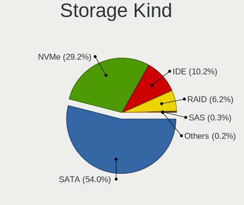

| Kind | Computers | Percent |
|------|-----------|---------|
| SATA | 1156      | 57.43%  |
| NVMe | 472       | 23.45%  |
| IDE  | 266       | 13.21%  |
| RAID | 111       | 5.51%   |
| SAS  | 4         | 0.2%    |
| SCSI | 4         | 0.2%    |

Processor
---------

CPU Vendor
----------

Processor vendors

| Vendor   | Computers | Percent |
|----------|-----------|---------|
| Intel    | 1214      | 75.26%  |
| AMD      | 387       | 23.99%  |
| ARM      | 11        | 0.68%   |
| QUALCOMM | 1         | 0.06%   |

CPU Model
---------

Processor models

| Model                                         | Computers | Percent |
|-----------------------------------------------|-----------|---------|
| Intel Core i7-2677M CPU @ 1.80GHz             | 101       | 6.23%   |
| Intel Core i5-8250U CPU @ 1.60GHz             | 19        | 1.17%   |
| Intel Core i7-8550U CPU @ 1.80GHz             | 16        | 0.99%   |
| Intel Core i5-2520M CPU @ 2.50GHz             | 16        | 0.99%   |
| Intel Core i7-10510U CPU @ 1.80GHz            | 15        | 0.93%   |
| Intel Core i5-8265U CPU @ 1.60GHz             | 15        | 0.93%   |
| Intel Core i7-8565U CPU @ 1.80GHz             | 14        | 0.86%   |
| Intel Core i5-7200U CPU @ 2.50GHz             | 14        | 0.86%   |
| AMD Ryzen 5 3600 6-Core Processor             | 14        | 0.86%   |
| AMD Ryzen 7 PRO 4750U with Radeon Graphics    | 13        | 0.8%    |
| AMD Ryzen 7 4700U with Radeon Graphics        | 12        | 0.74%   |
| Intel 11th Gen Core i5-1135G7 @ 2.40GHz       | 11        | 0.68%   |
| Intel Core i7-9750H CPU @ 2.60GHz             | 10        | 0.62%   |
| Intel Core i5-3210M CPU @ 2.50GHz             | 10        | 0.62%   |
| Intel Core 2 Duo CPU E8400 @ 3.00GHz          | 10        | 0.62%   |
| Intel Core i7-8650U CPU @ 1.90GHz             | 9         | 0.56%   |
| Intel Core i7-7700HQ CPU @ 2.80GHz            | 9         | 0.56%   |
| Intel Core i7-10850H CPU @ 2.70GHz            | 9         | 0.56%   |
| Intel Core i5-3320M CPU @ 2.60GHz             | 9         | 0.56%   |
| Intel Core i5-2400 CPU @ 3.10GHz              | 9         | 0.56%   |
| Intel Core 2 Duo CPU P8600 @ 2.40GHz          | 9         | 0.56%   |
| Intel 11th Gen Core i7-1165G7 @ 2.80GHz       | 9         | 0.56%   |
| ARM Processor                                 | 9         | 0.56%   |
| Intel Core i7-8750H CPU @ 2.20GHz             | 8         | 0.49%   |
| Intel Core i5-6300U CPU @ 2.40GHz             | 8         | 0.49%   |
| Intel Core i5-6200U CPU @ 2.30GHz             | 8         | 0.49%   |
| Intel Core i5-5200U CPU @ 2.20GHz             | 8         | 0.49%   |
| Intel Atom x5-Z8350 CPU @ 1.44GHz             | 8         | 0.49%   |
| AMD Ryzen 7 3700X 8-Core Processor            | 8         | 0.49%   |
| AMD Ryzen 5 5600X 6-Core Processor            | 8         | 0.49%   |
| AMD Ryzen 5 4500U with Radeon Graphics        | 8         | 0.49%   |
| AMD Ryzen 5 3500U with Radeon Vega Mobile Gfx | 8         | 0.49%   |
| AMD Ryzen 5 2600 Six-Core Processor           | 8         | 0.49%   |
| Intel Core i7 CPU Q 720 @ 1.60GHz             | 7         | 0.43%   |
| Intel Core i5-10210U CPU @ 1.60GHz            | 7         | 0.43%   |
| Intel Core i3-5005U CPU @ 2.00GHz             | 7         | 0.43%   |
| AMD Ryzen 9 3900X 12-Core Processor           | 7         | 0.43%   |
| AMD Ryzen 5 5500U with Radeon Graphics        | 7         | 0.43%   |
| AMD Ryzen 5 1600 Six-Core Processor           | 7         | 0.43%   |
| AMD FX-8350 Eight-Core Processor              | 7         | 0.43%   |

CPU Model Family
----------------

Processor model prefix

| Model                   | Computers | Percent |
|-------------------------|-----------|---------|
| Intel Core i7           | 368       | 22.7%   |
| Intel Core i5           | 300       | 18.51%  |
| Intel Core 2 Duo        | 105       | 6.48%   |
| AMD Ryzen 5             | 91        | 5.61%   |
| Intel Celeron           | 90        | 5.55%   |
| Intel Core i3           | 86        | 5.31%   |
| Other                   | 74        | 4.57%   |
| AMD Ryzen 7             | 59        | 3.64%   |
| Intel Pentium           | 47        | 2.9%    |
| Intel Atom              | 34        | 2.1%    |
| AMD FX                  | 33        | 2.04%   |
| Intel Xeon              | 31        | 1.91%   |
| AMD Ryzen 7 PRO         | 24        | 1.48%   |
| AMD Ryzen 9             | 19        | 1.17%   |
| Intel Pentium Dual-Core | 18        | 1.11%   |
| AMD A8                  | 14        | 0.86%   |
| Intel Core 2            | 13        | 0.8%    |
| AMD A4                  | 13        | 0.8%    |
| AMD Athlon 64 X2        | 12        | 0.74%   |
| AMD A6                  | 12        | 0.74%   |
| Intel Core 2 Quad       | 11        | 0.68%   |
| Intel Pentium Dual      | 10        | 0.62%   |
| AMD Ryzen 3             | 10        | 0.62%   |
| AMD A10                 | 10        | 0.62%   |
| AMD Phenom II X4        | 9         | 0.56%   |
| Intel Pentium Silver    | 8         | 0.49%   |
| AMD Athlon              | 8         | 0.49%   |
| Intel Core i9           | 7         | 0.43%   |
| AMD Ryzen 5 PRO         | 7         | 0.43%   |
| Intel Pentium Gold      | 6         | 0.37%   |
| Intel Celeron M         | 6         | 0.37%   |
| AMD Athlon II X2        | 6         | 0.37%   |
| Intel Pentium M         | 4         | 0.25%   |
| Intel Pentium 4         | 4         | 0.25%   |
| Intel Genuine           | 4         | 0.25%   |
| AMD Turion II           | 4         | 0.25%   |
| AMD E1                  | 4         | 0.25%   |
| AMD Athlon II X4        | 4         | 0.25%   |
| Intel Celeron Dual-Core | 3         | 0.19%   |
| AMD Turion 64 X2 Mobile | 3         | 0.19%   |

CPU Cores
---------

Number of processor cores

| Number  | Computers | Percent |
|---------|-----------|---------|
| 2       | 739       | 45.59%  |
| 4       | 532       | 32.82%  |
| 6       | 151       | 9.32%   |
| 8       | 104       | 6.42%   |
| 1       | 52        | 3.21%   |
| 12      | 18        | 1.11%   |
| 3       | 11        | 0.68%   |
| 16      | 6         | 0.37%   |
| Unknown | 3         | 0.19%   |
| 10      | 2         | 0.12%   |
| 32      | 1         | 0.06%   |
| 20      | 1         | 0.06%   |
| 14      | 1         | 0.06%   |

CPU Sockets
-----------

Number of sockets

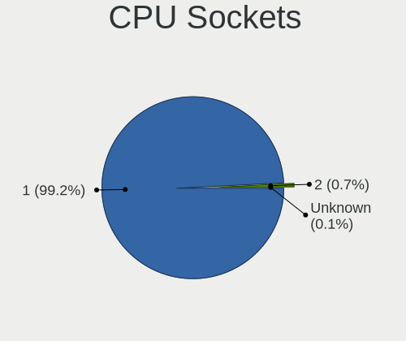

| Number | Computers | Percent |
|--------|-----------|---------|
| 1      | 1600      | 99.19%  |
| 2      | 13        | 0.81%   |

CPU Threads
-----------

Threads per core (Hyper-Threading)

| Number  | Computers | Percent |
|---------|-----------|---------|
| 2       | 1021      | 63.14%  |
| 1       | 592       | 36.61%  |
| Unknown | 3         | 0.19%   |
| 4       | 1         | 0.06%   |

CPU Op-Modes
------------

CPU Operation Modes (32-bit, 64-bit)

| Op mode        | Computers | Percent |
|----------------|-----------|---------|
| 32-bit, 64-bit | 1558      | 96.11%  |
| Unknown        | 36        | 2.22%   |
| 32-bit         | 24        | 1.48%   |
| 64-bit         | 3         | 0.19%   |

CPU Microcode
-------------

Microcode number

| Number     | Computers | Percent |
|------------|-----------|---------|
| Unknown    | 284       | 17.03%  |
| 0x206a7    | 179       | 10.73%  |
| 0x306c3    | 69        | 4.14%   |
| 0x1067a    | 66        | 3.96%   |
| 0x306a9    | 65        | 3.9%    |
| 0x906ea    | 46        | 2.76%   |
| 0x806ec    | 45        | 2.7%    |
| 0x806ea    | 43        | 2.58%   |
| 0x806c1    | 33        | 1.98%   |
| 0x406e3    | 32        | 1.92%   |
| 0x806e9    | 30        | 1.8%    |
| 0x6fd      | 29        | 1.74%   |
| 0x40651    | 28        | 1.68%   |
| 0x906e9    | 27        | 1.62%   |
| 0x506e3    | 26        | 1.56%   |
| 0x08600106 | 25        | 1.5%    |
| 0x306d4    | 21        | 1.26%   |
| 0x30678    | 20        | 1.2%    |
| 0x6fb      | 19        | 1.14%   |
| 0x010000c8 | 19        | 1.14%   |
| 0x10676    | 18        | 1.08%   |
| 0x06000852 | 18        | 1.08%   |
| 0x406c4    | 17        | 1.02%   |
| 0x08701021 | 17        | 1.02%   |
| 0x0a50000c | 16        | 0.96%   |
| 0x706a1    | 15        | 0.9%    |
| 0x20655    | 15        | 0.9%    |
| 0x0800820d | 15        | 0.9%    |
| 0x906ed    | 14        | 0.84%   |
| 0xa0652    | 13        | 0.78%   |
| 0x506c9    | 13        | 0.78%   |
| 0x06001119 | 13        | 0.78%   |
| 0x08701013 | 12        | 0.72%   |
| 0x08600104 | 12        | 0.72%   |
| 0x08108102 | 12        | 0.72%   |
| 0x406c3    | 11        | 0.66%   |
| 0x20652    | 10        | 0.6%    |
| 0x706e5    | 9         | 0.54%   |
| 0x6f6      | 9         | 0.54%   |
| 0x106e5    | 9         | 0.54%   |

CPU Microarch
-------------

Microarchitecture

| Name             | Computers | Percent |
|------------------|-----------|---------|
| KabyLake         | 259       | 16.04%  |
| SandyBridge      | 203       | 12.57%  |
| Haswell          | 120       | 7.43%   |
| Penryn           | 102       | 6.32%   |
| Zen 2            | 88        | 5.45%   |
| IvyBridge        | 84        | 5.2%    |
| Core             | 70        | 4.33%   |
| Skylake          | 68        | 4.21%   |
| Silvermont       | 63        | 3.9%    |
| Piledriver       | 43        | 2.66%   |
| Zen 3            | 40        | 2.48%   |
| TigerLake        | 39        | 2.41%   |
| Zen+             | 38        | 2.35%   |
| Zen              | 37        | 2.29%   |
| K10              | 35        | 2.17%   |
| Westmere         | 33        | 2.04%   |
| Unknown          | 31        | 1.92%   |
| CometLake        | 29        | 1.8%    |
| Broadwell        | 26        | 1.61%   |
| K8 Hammer        | 25        | 1.55%   |
| Goldmont plus    | 25        | 1.55%   |
| Excavator        | 18        | 1.11%   |
| Nehalem          | 15        | 0.93%   |
| IceLake          | 15        | 0.93%   |
| Goldmont         | 15        | 0.93%   |
| Bonnell          | 14        | 0.87%   |
| Steamroller      | 13        | 0.8%    |
| P6               | 12        | 0.74%   |
| Puma             | 11        | 0.68%   |
| NetBurst         | 7         | 0.43%   |
| Bobcat           | 7         | 0.43%   |
| Alderlake Hybrid | 7         | 0.43%   |
| Jaguar           | 6         | 0.37%   |
| Tremont          | 5         | 0.31%   |
| K10 Llano        | 5         | 0.31%   |
| K8 & K10 hybrid  | 3         | 0.19%   |
| Bulldozer        | 3         | 0.19%   |
| K6               | 1         | 0.06%   |

Graphics
--------

GPU Vendor
----------

Vendors of graphics cards

| Vendor                           | Computers | Percent |
|----------------------------------|-----------|---------|
| Intel                            | 959       | 51.15%  |
| Nvidia                           | 468       | 24.96%  |
| AMD                              | 429       | 22.88%  |
| Matrox Electronics Systems       | 11        | 0.59%   |
| ASPEED Technology                | 4         | 0.21%   |
| Silicon Integrated Systems [SiS] | 2         | 0.11%   |
| VIA Technologies                 | 1         | 0.05%   |
| ATI Technologies                 | 1         | 0.05%   |

GPU Model
---------

Graphics card models

| Model                                                                                    | Computers | Percent |
|------------------------------------------------------------------------------------------|-----------|---------|
| Intel 2nd Generation Core Processor Family Integrated Graphics Controller                | 175       | 8.94%   |
| Intel 3rd Gen Core processor Graphics Controller                                         | 55        | 2.81%   |
| Intel UHD Graphics 620                                                                   | 53        | 2.71%   |
| AMD Renoir                                                                               | 49        | 2.5%    |
| Intel WhiskeyLake-U GT2 [UHD Graphics 620]                                               | 37        | 1.89%   |
| Intel TigerLake-LP GT2 [Iris Xe Graphics]                                                | 34        | 1.74%   |
| Intel Haswell-ULT Integrated Graphics Controller                                         | 34        | 1.74%   |
| Intel CoffeeLake-H GT2 [UHD Graphics 630]                                                | 33        | 1.69%   |
| Intel HD Graphics 620                                                                    | 32        | 1.64%   |
| Intel Atom/Celeron/Pentium Processor x5-E8000/J3xxx/N3xxx Integrated Graphics Controller | 32        | 1.64%   |
| Intel Mobile 4 Series Chipset Integrated Graphics Controller                             | 31        | 1.58%   |
| Intel Atom Processor Z36xxx/Z37xxx Series Graphics & Display                             | 31        | 1.58%   |
| AMD Ellesmere [Radeon RX 470/480/570/570X/580/580X/590]                                  | 30        | 1.53%   |
| Intel Xeon E3-1200 v3/4th Gen Core Processor Integrated Graphics Controller              | 29        | 1.48%   |
| Intel Skylake GT2 [HD Graphics 520]                                                      | 28        | 1.43%   |
| Intel CometLake-U GT2 [UHD Graphics]                                                     | 28        | 1.43%   |
| Intel 4th Gen Core Processor Integrated Graphics Controller                              | 27        | 1.38%   |
| Intel HD Graphics 5500                                                                   | 22        | 1.12%   |
| Intel HD Graphics 630                                                                    | 21        | 1.07%   |
| AMD Picasso/Raven 2 [Radeon Vega Series / Radeon Vega Mobile Series]                     | 21        | 1.07%   |
| Intel Mobile GM965/GL960 Integrated Graphics Controller (secondary)                      | 19        | 0.97%   |
| Intel Mobile GM965/GL960 Integrated Graphics Controller (primary)                        | 19        | 0.97%   |
| Intel GeminiLake [UHD Graphics 600]                                                      | 18        | 0.92%   |
| AMD Cezanne                                                                              | 18        | 0.92%   |
| Intel Mobile 945GM/GMS/GME, 943/940GML Express Integrated Graphics Controller            | 17        | 0.87%   |
| Intel HD Graphics 530                                                                    | 17        | 0.87%   |
| Nvidia GP107 [GeForce GTX 1050 Ti]                                                       | 16        | 0.82%   |
| Intel Core Processor Integrated Graphics Controller                                      | 16        | 0.82%   |
| Intel 4 Series Chipset Integrated Graphics Controller                                    | 16        | 0.82%   |
| Intel HD Graphics 500                                                                    | 15        | 0.77%   |
| Intel CometLake-H GT2 [UHD Graphics]                                                     | 14        | 0.72%   |
| Nvidia GP108M [GeForce MX150]                                                            | 13        | 0.66%   |
| Intel CoffeeLake-S GT2 [UHD Graphics 630]                                                | 13        | 0.66%   |
| AMD Sun XT [Radeon HD 8670A/8670M/8690M / R5 M330 / M430 / Radeon 520 Mobile]            | 13        | 0.66%   |
| AMD Stoney [Radeon R2/R3/R4/R5 Graphics]                                                 | 13        | 0.66%   |
| AMD Raven Ridge [Radeon Vega Series / Radeon Vega Mobile Series]                         | 13        | 0.66%   |
| AMD Lexa PRO [Radeon 540/540X/550/550X / RX 540X/550/550X]                               | 13        | 0.66%   |
| Nvidia TU117M [GeForce GTX 1650 Mobile / Max-Q]                                          | 12        | 0.61%   |
| Nvidia GP107M [GeForce GTX 1050 Mobile]                                                  | 11        | 0.56%   |
| Nvidia GK208B [GeForce GT 710]                                                           | 11        | 0.56%   |

GPU Combo
---------

Combinations of graphics cards

| Name           | Computers | Percent |
|----------------|-----------|---------|
| 1 x Intel      | 711       | 43.89%  |
| 1 x AMD        | 333       | 20.56%  |
| 1 x Nvidia     | 255       | 15.74%  |
| Intel + Nvidia | 191       | 11.79%  |
| Intel + AMD    | 50        | 3.09%   |
| 2 x AMD        | 31        | 1.91%   |
| AMD + Nvidia   | 15        | 0.93%   |
| Other          | 12        | 0.74%   |
| 1 x Matrox     | 10        | 0.62%   |
| 1 x ASPEED     | 4         | 0.25%   |
| 3 x Nvidia     | 2         | 0.12%   |
| 2 x Nvidia     | 2         | 0.12%   |
| 1 x SiS        | 2         | 0.12%   |
| 1 x VIA        | 1         | 0.06%   |
| AMD + Matrox   | 1         | 0.06%   |

GPU Driver
----------

Free vs proprietary

| Driver      | Computers | Percent |
|-------------|-----------|---------|
| Free        | 1349      | 82.61%  |
| Proprietary | 222       | 13.59%  |
| Unknown     | 62        | 3.8%    |

GPU Memory
----------

Total video memory

| Size in GB | Computers | Percent |
|------------|-----------|---------|
| Unknown    | 935       | 56.29%  |
| 0.01-0.5   | 215       | 12.94%  |
| 1.01-2.0   | 201       | 12.1%   |
| 0.51-1.0   | 121       | 7.28%   |
| 3.01-4.0   | 91        | 5.48%   |
| 7.01-8.0   | 45        | 2.71%   |
| 5.01-6.0   | 24        | 1.44%   |
| 2.01-3.0   | 18        | 1.08%   |
| 8.01-16.0  | 10        | 0.6%    |
| 16.01-24.0 | 1         | 0.06%   |

Monitor
-------

Monitor Vendor
--------------

Monitor vendors

| Vendor                  | Computers | Percent |
|-------------------------|-----------|---------|
| AU Optronics            | 219       | 11.79%  |
| Samsung Electronics     | 214       | 11.52%  |
| LG Display              | 155       | 8.34%   |
| Chimei Innolux          | 139       | 7.48%   |
| Dell                    | 118       | 6.35%   |
| BOE                     | 108       | 5.81%   |
| CPT                     | 103       | 5.54%   |
| Goldstar                | 77        | 4.14%   |
| BenQ                    | 74        | 3.98%   |
| Acer                    | 71        | 3.82%   |
| Hewlett-Packard         | 56        | 3.01%   |
| Eizo                    | 54        | 2.91%   |
| Philips                 | 52        | 2.8%    |
| Lenovo                  | 44        | 2.37%   |
| AOC                     | 43        | 2.31%   |
| Sharp                   | 37        | 1.99%   |
| Ancor Communications    | 37        | 1.99%   |
| Chi Mei Optoelectronics | 28        | 1.51%   |
| Iiyama                  | 22        | 1.18%   |
| PANDA                   | 20        | 1.08%   |
| LG Philips              | 15        | 0.81%   |
| Sony                    | 14        | 0.75%   |
| Fujitsu Siemens         | 11        | 0.59%   |
| Panasonic               | 10        | 0.54%   |
| NEC Computers           | 10        | 0.54%   |
| InfoVision              | 9         | 0.48%   |
| ASUSTek Computer        | 8         | 0.43%   |
| CSO                     | 7         | 0.38%   |
| Apple                   | 7         | 0.38%   |
| ViewSonic               | 6         | 0.32%   |
| Vestel Elektronik       | 6         | 0.32%   |
| Quanta Display          | 6         | 0.32%   |
| LG Electronics          | 5         | 0.27%   |
| Unknown                 | 4         | 0.22%   |
| Toshiba                 | 4         | 0.22%   |
| Lenovo Group Limited    | 4         | 0.22%   |
| Hitachi                 | 4         | 0.22%   |
| HannStar                | 4         | 0.22%   |
| OEM                     | 3         | 0.16%   |
| MStar                   | 3         | 0.16%   |

Monitor Model
-------------

Monitor models

| Model                                                                    | Computers | Percent |
|--------------------------------------------------------------------------|-----------|---------|
| CPT LCD Monitor COR17DB 1600x900 293x164mm 13.2-inch                     | 101       | 5.19%   |
| Eizo EV3285 ENC2979 3840x2160 698x393mm 31.5-inch                        | 36        | 1.85%   |
| Dell U2412M DELA07A 1920x1200 518x324mm 24.1-inch                        | 12        | 0.62%   |
| Chimei Innolux LCD Monitor CMN14D4 1920x1080 309x173mm 13.9-inch         | 11        | 0.57%   |
| AU Optronics LCD Monitor AUO38ED 1920x1080 344x193mm 15.5-inch           | 11        | 0.57%   |
| AU Optronics LCD Monitor AUO403D 1920x1080 309x173mm 13.9-inch           | 10        | 0.51%   |
| Samsung Electronics S24F350 SAM0D20 1920x1080 521x293mm 23.5-inch        | 9         | 0.46%   |
| AU Optronics LCD Monitor AUO21ED 1920x1080 344x193mm 15.5-inch           | 8         | 0.41%   |
| LG Display LCD Monitor LGD033A 1366x768 344x194mm 15.5-inch              | 7         | 0.36%   |
| Dell P2419H DELD0DA 1920x1080 527x296mm 23.8-inch                        | 7         | 0.36%   |
| Vestel Elektronik 50UHD_LCD_TV VES3700 3840x2160 1872x1053mm 84.6-inch   | 6         | 0.31%   |
| Samsung Electronics LCD Monitor SEC544B 1600x900 344x194mm 15.5-inch     | 6         | 0.31%   |
| Philips PHL 243V7 PHLC155 1920x1080 530x300mm 24.0-inch                  | 6         | 0.31%   |
| LG Display LCD Monitor LGD02DC 1366x768 344x194mm 15.5-inch              | 6         | 0.31%   |
| Dell U2412M DELA07B 1920x1200 518x324mm 24.1-inch                        | 6         | 0.31%   |
| Chimei Innolux LCD Monitor CMN14C9 1920x1080 309x173mm 13.9-inch         | 6         | 0.31%   |
| Sharp LCD Monitor SHP14BA 1920x1080 344x194mm 15.5-inch                  | 5         | 0.26%   |
| Sharp LCD Monitor SHP1453 1920x1080 346x194mm 15.6-inch                  | 5         | 0.26%   |
| Samsung Electronics LCD Monitor SEC5441 1366x768 344x194mm 15.5-inch     | 5         | 0.26%   |
| Samsung Electronics C24F390 SAM0D2C 1920x1080 520x290mm 23.4-inch        | 5         | 0.26%   |
| Lenovo LCD Monitor LEN40BA 1920x1080 344x194mm 15.5-inch                 | 5         | 0.26%   |
| Chimei Innolux LCD Monitor CMN15C4 1920x1080 344x193mm 15.5-inch         | 5         | 0.26%   |
| Chi Mei Optoelectronics LCD Monitor CMO15A7 1366x768 344x193mm 15.5-inch | 5         | 0.26%   |
| BOE LCD Monitor BOE07BB 1920x1080 309x173mm 13.9-inch                    | 5         | 0.26%   |
| BOE LCD Monitor BOE0700 1920x1080 344x194mm 15.5-inch                    | 5         | 0.26%   |
| AU Optronics LCD Monitor AUO34ED 1920x1080 344x193mm 15.5-inch           | 5         | 0.26%   |
| AU Optronics LCD Monitor AUO21EC 1366x768 344x193mm 15.5-inch            | 5         | 0.26%   |
| AU Optronics LCD Monitor AUO213E 1600x900 309x174mm 14.0-inch            | 5         | 0.26%   |
| AOC Q3279WG5B AOC3279 2560x1440 725x428mm 33.1-inch                      | 5         | 0.26%   |
| Samsung Electronics C27F390 SAM0D32 1920x1080 598x336mm 27.0-inch        | 4         | 0.21%   |
| PANDA LM156LF1L03 NCP001C 1920x1080 344x194mm 15.5-inch                  | 4         | 0.21%   |
| PANDA LCD Monitor NCP004D 1920x1080 344x194mm 15.5-inch                  | 4         | 0.21%   |
| Panasonic TV MEIA296 3840x2160 698x392mm 31.5-inch                       | 4         | 0.21%   |
| LG Display LCD Monitor LGD062E 1920x1080 344x194mm 15.5-inch             | 4         | 0.21%   |
| LG Display LCD Monitor LGD046F 1920x1080 345x194mm 15.6-inch             | 4         | 0.21%   |
| Lenovo LEN P27u-10 LEN61B0 3840x2160 600x340mm 27.2-inch                 | 4         | 0.21%   |
| Iiyama PL4840 IVM1065 1920x1080 1054x593mm 47.6-inch                     | 4         | 0.21%   |
| Dell P2419H DELD0D9 1920x1080 527x296mm 23.8-inch                        | 4         | 0.21%   |
| Chimei Innolux LCD Monitor CMN15E7 1920x1080 344x193mm 15.5-inch         | 4         | 0.21%   |
| Chimei Innolux LCD Monitor CMN15D5 1920x1080 344x193mm 15.5-inch         | 4         | 0.21%   |

Monitor Resolution
------------------

Monitor screen resolution

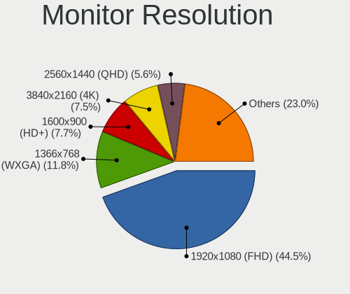

| Resolution         | Computers | Percent |
|--------------------|-----------|---------|
| 1920x1080 (FHD)    | 769       | 43.74%  |
| 1366x768 (WXGA)    | 212       | 12.06%  |
| 1600x900 (HD+)     | 166       | 9.44%   |
| 3840x2160 (4K)     | 121       | 6.88%   |
| 2560x1440 (QHD)    | 76        | 4.32%   |
| 1280x1024 (SXGA)   | 68        | 3.87%   |
| 1920x1200 (WUXGA)  | 67        | 3.81%   |
| 1680x1050 (WSXGA+) | 67        | 3.81%   |
| 1280x800 (WXGA)    | 58        | 3.3%    |
| 1440x900 (WXGA+)   | 30        | 1.71%   |
| 1024x768 (XGA)     | 11        | 0.63%   |
| Unknown            | 11        | 0.63%   |
| 3840x1080          | 7         | 0.4%    |
| 3440x1440          | 7         | 0.4%    |
| 2560x1600          | 7         | 0.4%    |
| 1600x1200          | 7         | 0.4%    |
| 1360x768           | 7         | 0.4%    |
| 2560x1080          | 6         | 0.34%   |
| 1920x540           | 5         | 0.28%   |
| 1024x600           | 5         | 0.28%   |
| 2160x1350          | 4         | 0.23%   |
| 1280x720 (HD)      | 4         | 0.23%   |
| 800x1280           | 3         | 0.17%   |
| 3840x2400          | 3         | 0.17%   |
| 3456x2160          | 3         | 0.17%   |
| 3000x2000          | 3         | 0.17%   |
| 2288x1287          | 3         | 0.17%   |
| 1400x1050          | 3         | 0.17%   |
| 3840x1200          | 2         | 0.11%   |
| 3200x1800 (QHD+)   | 2         | 0.11%   |
| 2880x1800          | 2         | 0.11%   |
| 2736x1824          | 2         | 0.11%   |
| 2160x1440          | 2         | 0.11%   |
| 1280x768           | 2         | 0.11%   |
| 9600x2160          | 1         | 0.06%   |
| 8320x2160          | 1         | 0.06%   |
| 7680x2160          | 1         | 0.06%   |
| 640x480            | 1         | 0.06%   |
| 6400x2160          | 1         | 0.06%   |
| 6080x1440          | 1         | 0.06%   |

Monitor Diagonal
----------------

Diagonal size in inches

| Inches  | Computers | Percent |
|---------|-----------|---------|
| 15      | 423       | 22.54%  |
| 13      | 259       | 13.8%   |
| 24      | 188       | 10.02%  |
| 14      | 134       | 7.14%   |
| 27      | 122       | 6.5%    |
| 23      | 109       | 5.81%   |
| 17      | 98        | 5.22%   |
| 21      | 85        | 4.53%   |
| 31      | 67        | 3.57%   |
| 19      | 64        | 3.41%   |
| Unknown | 64        | 3.41%   |
| 22      | 42        | 2.24%   |
| 12      | 33        | 1.76%   |
| 20      | 29        | 1.55%   |
| 11      | 23        | 1.23%   |
| 18      | 20        | 1.07%   |
| 84      | 14        | 0.75%   |
| 34      | 11        | 0.59%   |
| 25      | 10        | 0.53%   |
| 72      | 7         | 0.37%   |
| 54      | 7         | 0.37%   |
| 32      | 7         | 0.37%   |
| 26      | 7         | 0.37%   |
| 10      | 7         | 0.37%   |
| 33      | 6         | 0.32%   |
| 16      | 6         | 0.32%   |
| 65      | 4         | 0.21%   |
| 52      | 4         | 0.21%   |
| 47      | 4         | 0.21%   |
| 46      | 4         | 0.21%   |
| 39      | 4         | 0.21%   |
| 49      | 3         | 0.16%   |
| 43      | 3         | 0.16%   |
| 40      | 2         | 0.11%   |
| 60      | 1         | 0.05%   |
| 59      | 1         | 0.05%   |
| 55      | 1         | 0.05%   |
| 48      | 1         | 0.05%   |
| 42      | 1         | 0.05%   |
| 29      | 1         | 0.05%   |

Monitor Width
-------------

Physical width

| Width in mm | Computers | Percent |
|-------------|-----------|---------|
| 301-350     | 651       | 35.59%  |
| 501-600     | 385       | 21.05%  |
| 201-300     | 241       | 13.18%  |
| 401-500     | 188       | 10.28%  |
| 351-400     | 136       | 7.44%   |
| 601-700     | 79        | 4.32%   |
| Unknown     | 64        | 3.5%    |
| 1001-1500   | 32        | 1.75%   |
| 701-800     | 23        | 1.26%   |
| 1501-2000   | 21        | 1.15%   |
| 801-900     | 7         | 0.38%   |
| 901-1000    | 2         | 0.11%   |

Aspect Ratio
------------

Proportional relationship between the width and the height

| Ratio   | Computers | Percent |
|---------|-----------|---------|
| 16/9    | 1187      | 73%     |
| 16/10   | 256       | 15.74%  |
| 5/4     | 73        | 4.49%   |
| Unknown | 54        | 3.32%   |
| 4/3     | 24        | 1.48%   |
| 3/2     | 14        | 0.86%   |
| 21/9    | 10        | 0.62%   |
| 0.62    | 3         | 0.18%   |
| 32/9    | 2         | 0.12%   |
| 3.20    | 2         | 0.12%   |
| 3.73    | 1         | 0.06%   |

Monitor Area
------------

Area in inch

| Area in inch | Computers | Percent |
|----------------|-----------|---------|
| 101-110        | 417       | 22.41%  |
| 201-250        | 325       | 17.46%  |
| 81-90          | 220       | 11.82%  |
| 71-80          | 176       | 9.46%   |
| 301-350        | 128       | 6.88%   |
| 151-200        | 110       | 5.91%   |
| 351-500        | 92        | 4.94%   |
| 251-300        | 83        | 4.46%   |
| Unknown        | 64        | 3.44%   |
| 121-130        | 60        | 3.22%   |
| More than 1000 | 40        | 2.15%   |
| 141-150        | 40        | 2.15%   |
| 61-70          | 29        | 1.56%   |
| 51-60          | 23        | 1.24%   |
| 501-1000       | 21        | 1.13%   |
| 131-140        | 13        | 0.7%    |
| 41-50          | 7         | 0.38%   |
| 111-120        | 7         | 0.38%   |
| 91-100         | 6         | 0.32%   |

Pixel Density
-------------

Pixels per inch

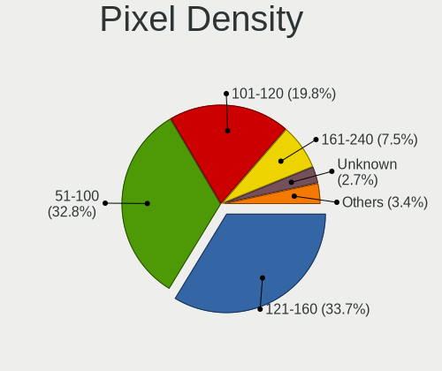

| Density       | Computers | Percent |
|---------------|-----------|---------|
| 51-100        | 614       | 34.81%  |
| 121-160       | 594       | 33.67%  |
| 101-120       | 331       | 18.76%  |
| 161-240       | 101       | 5.73%   |
| Unknown       | 64        | 3.63%   |
| 1-50          | 34        | 1.93%   |
| More than 240 | 26        | 1.47%   |

Multiple Monitors
-----------------

Total monitors connected

| Total | Computers | Percent |
|-------|-----------|---------|
| 1     | 1234      | 74.16%  |
| 2     | 308       | 18.51%  |
| 0     | 72        | 4.33%   |
| 3     | 48        | 2.88%   |
| 4     | 2         | 0.12%   |

Network
-------

Net Controller Vendor
---------------------

Controller vendors

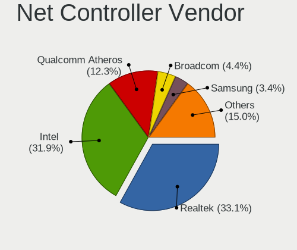

| Vendor                                 | Computers | Percent |
|----------------------------------------|-----------|---------|
| Intel                                  | 762       | 31.47%  |
| Realtek Semiconductor                  | 759       | 31.35%  |
| Qualcomm Atheros                       | 364       | 15.04%  |
| Broadcom                               | 107       | 4.42%   |
| Samsung Electronics                    | 104       | 4.3%    |
| Broadcom Limited                       | 44        | 1.82%   |
| Marvell Technology Group               | 33        | 1.36%   |
| TP-Link                                | 24        | 0.99%   |
| MediaTek                               | 21        | 0.87%   |
| Lenovo                                 | 21        | 0.87%   |
| Nvidia                                 | 18        | 0.74%   |
| Qualcomm Atheros Communications        | 14        | 0.58%   |
| Ralink Technology                      | 13        | 0.54%   |
| Dell                                   | 13        | 0.54%   |
| Ralink                                 | 12        | 0.5%    |
| DisplayLink                            | 11        | 0.45%   |
| Sierra Wireless                        | 10        | 0.41%   |
| ASIX Electronics                       | 9         | 0.37%   |
| ASUSTek Computer                       | 8         | 0.33%   |
| Microsoft                              | 6         | 0.25%   |
| QLogic                                 | 5         | 0.21%   |
| VIA Technologies                       | 4         | 0.17%   |
| D-Link                                 | 4         | 0.17%   |
| Attansic Technology                    | 4         | 0.17%   |
| ZyDAS                                  | 3         | 0.12%   |
| OnePlus Technology (Shenzhen)          | 3         | 0.12%   |
| Huawei Technologies                    | 3         | 0.12%   |
| Hewlett-Packard                        | 3         | 0.12%   |
| Ericsson Business Mobile Networks      | 3         | 0.12%   |
| Edimax Technology                      | 3         | 0.12%   |
| Xiaomi                                 | 2         | 0.08%   |
| Silicon Integrated Systems [SiS]       | 2         | 0.08%   |
| Mellanox Technologies                  | 2         | 0.08%   |
| Arduino SA                             | 2         | 0.08%   |
| ZyXEL Communications                   | 1         | 0.04%   |
| Spreadtrum Communications              | 1         | 0.04%   |
| Sony Ericsson Mobile Communications AB | 1         | 0.04%   |
| SIEMENS                                | 1         | 0.04%   |
| Seeed Technology                       | 1         | 0.04%   |
| Qualcomm                               | 1         | 0.04%   |

Net Controller Model
--------------------

Controller models

| Model                                                             | Computers | Percent |
|-------------------------------------------------------------------|-----------|---------|
| Realtek RTL8111/8168/8411 PCI Express Gigabit Ethernet Controller | 548       | 19.49%  |
| Qualcomm Atheros AR9485 Wireless Network Adapter                  | 124       | 4.41%   |
| Samsung Galaxy series, misc. (tethering mode)                     | 102       | 3.63%   |
| Intel Wi-Fi 6 AX200                                               | 85        | 3.02%   |
| Realtek RTL8153 Gigabit Ethernet Adapter                          | 70        | 2.49%   |
| Intel 82579LM Gigabit Network Connection (Lewisville)             | 57        | 2.03%   |
| Realtek RTL810xE PCI Express Fast Ethernet controller             | 56        | 1.99%   |
| Intel Wireless 8265 / 8275                                        | 56        | 1.99%   |
| Intel Wireless 7260                                               | 39        | 1.39%   |
| Qualcomm Atheros QCA9377 802.11ac Wireless Network Adapter        | 38        | 1.35%   |
| Qualcomm Atheros AR9285 Wireless Network Adapter (PCI-Express)    | 36        | 1.28%   |
| Intel Centrino Advanced-N 6205 [Taylor Peak]                      | 31        | 1.1%    |
| Intel Ethernet Connection I217-LM                                 | 30        | 1.07%   |
| Qualcomm Atheros QCA9565 / AR9565 Wireless Network Adapter        | 29        | 1.03%   |
| Intel Wi-Fi 6 AX201                                               | 29        | 1.03%   |
| Intel I211 Gigabit Network Connection                             | 29        | 1.03%   |
| Intel Wireless 8260                                               | 28        | 1%      |
| Intel Comet Lake PCH-LP CNVi WiFi                                 | 28        | 1%      |
| Intel Wireless 7265                                               | 27        | 0.96%   |
| Intel Cannon Point-LP CNVi [Wireless-AC]                          | 26        | 0.92%   |
| Realtek RTL8822BE 802.11a/b/g/n/ac WiFi adapter                   | 25        | 0.89%   |
| Intel Wireless 3165                                               | 25        | 0.89%   |
| Intel Ethernet Connection (4) I219-LM                             | 25        | 0.89%   |
| Intel Cannon Lake PCH CNVi WiFi                                   | 23        | 0.82%   |
| Realtek RTL8125 2.5GbE Controller                                 | 22        | 0.78%   |
| Qualcomm Atheros QCA6174 802.11ac Wireless Network Adapter        | 22        | 0.78%   |
| Realtek RTL8822CE 802.11ac PCIe Wireless Network Adapter          | 19        | 0.68%   |
| Realtek RTL-8100/8101L/8139 PCI Fast Ethernet Adapter             | 19        | 0.68%   |
| Qualcomm Atheros AR8151 v2.0 Gigabit Ethernet                     | 18        | 0.64%   |
| Intel Ethernet Connection (2) I219-V                              | 18        | 0.64%   |
| Intel 82567LM Gigabit Network Connection                          | 18        | 0.64%   |
| Broadcom BCM4313 802.11bgn Wireless Network Adapter               | 18        | 0.64%   |
| Intel WiFi Link 5100                                              | 16        | 0.57%   |
| Intel PRO/Wireless 3945ABG [Golan] Network Connection             | 16        | 0.57%   |
| Intel Dual Band Wireless-AC 3168NGW [Stone Peak]                  | 16        | 0.57%   |
| Qualcomm Atheros AR8131 Gigabit Ethernet                          | 15        | 0.53%   |
| Intel Wireless 3160                                               | 15        | 0.53%   |
| Intel Comet Lake PCH CNVi WiFi                                    | 15        | 0.53%   |
| MediaTek MT7921 802.11ax PCI Express Wireless Network Adapter     | 14        | 0.5%    |
| Intel Ethernet Connection I219-LM                                 | 14        | 0.5%    |

Wireless Vendor
---------------

Wireless vendors

| Vendor                          | Computers | Percent |
|---------------------------------|-----------|---------|
| Intel                           | 609       | 49.23%  |
| Qualcomm Atheros                | 294       | 23.77%  |
| Realtek Semiconductor           | 124       | 10.02%  |
| Broadcom                        | 59        | 4.77%   |
| Broadcom Limited                | 23        | 1.86%   |
| TP-Link                         | 22        | 1.78%   |
| MediaTek                        | 20        | 1.62%   |
| Qualcomm Atheros Communications | 14        | 1.13%   |
| Ralink Technology               | 13        | 1.05%   |
| Ralink                          | 12        | 0.97%   |
| Sierra Wireless                 | 10        | 0.81%   |
| Dell                            | 7         | 0.57%   |
| ASUSTek Computer                | 7         | 0.57%   |
| Microsoft                       | 6         | 0.49%   |
| ZyDAS                           | 3         | 0.24%   |
| Edimax Technology               | 3         | 0.24%   |
| D-Link                          | 3         | 0.24%   |
| Marvell Technology Group        | 2         | 0.16%   |
| ZyXEL Communications            | 1         | 0.08%   |
| Qualcomm                        | 1         | 0.08%   |
| Intersil                        | 1         | 0.08%   |
| Hewlett-Packard                 | 1         | 0.08%   |
| Fujitsu Siemens Computers       | 1         | 0.08%   |
| FIBOCOM                         | 1         | 0.08%   |

Wireless Model
--------------

Wireless models

| Model                                                                   | Computers | Percent |
|-------------------------------------------------------------------------|-----------|---------|
| Qualcomm Atheros AR9485 Wireless Network Adapter                        | 124       | 10%     |
| Intel Wi-Fi 6 AX200                                                     | 85        | 6.85%   |
| Intel Wireless 8265 / 8275                                              | 56        | 4.52%   |
| Intel Wireless 7260                                                     | 39        | 3.15%   |
| Qualcomm Atheros QCA9377 802.11ac Wireless Network Adapter              | 38        | 3.06%   |
| Qualcomm Atheros AR9285 Wireless Network Adapter (PCI-Express)          | 36        | 2.9%    |
| Intel Centrino Advanced-N 6205 [Taylor Peak]                            | 31        | 2.5%    |
| Qualcomm Atheros QCA9565 / AR9565 Wireless Network Adapter              | 29        | 2.34%   |
| Intel Wi-Fi 6 AX201                                                     | 29        | 2.34%   |
| Intel Wireless 8260                                                     | 28        | 2.26%   |
| Intel Comet Lake PCH-LP CNVi WiFi                                       | 28        | 2.26%   |
| Intel Wireless 7265                                                     | 27        | 2.18%   |
| Intel Cannon Point-LP CNVi [Wireless-AC]                                | 26        | 2.1%    |
| Realtek RTL8822BE 802.11a/b/g/n/ac WiFi adapter                         | 25        | 2.02%   |
| Intel Wireless 3165                                                     | 25        | 2.02%   |
| Intel Cannon Lake PCH CNVi WiFi                                         | 23        | 1.85%   |
| Qualcomm Atheros QCA6174 802.11ac Wireless Network Adapter              | 22        | 1.77%   |
| Realtek RTL8822CE 802.11ac PCIe Wireless Network Adapter                | 19        | 1.53%   |
| Broadcom BCM4313 802.11bgn Wireless Network Adapter                     | 18        | 1.45%   |
| Intel WiFi Link 5100                                                    | 16        | 1.29%   |
| Intel PRO/Wireless 3945ABG [Golan] Network Connection                   | 16        | 1.29%   |
| Intel Dual Band Wireless-AC 3168NGW [Stone Peak]                        | 16        | 1.29%   |
| Intel Wireless 3160                                                     | 15        | 1.21%   |
| Intel Comet Lake PCH CNVi WiFi                                          | 15        | 1.21%   |
| MediaTek MT7921 802.11ax PCI Express Wireless Network Adapter           | 14        | 1.13%   |
| Intel Dual Band Wireless-AC 3165 Plus Bluetooth                         | 13        | 1.05%   |
| Intel Centrino Wireless-N 2230                                          | 12        | 0.97%   |
| Qualcomm Atheros AR9271 802.11n                                         | 11        | 0.89%   |
| Realtek RTL8821CE 802.11ac PCIe Wireless Network Adapter                | 10        | 0.81%   |
| Realtek RTL8723BE PCIe Wireless Network Adapter                         | 10        | 0.81%   |
| Intel Wireless-AC 9260                                                  | 10        | 0.81%   |
| Intel Ultimate N WiFi Link 5300                                         | 10        | 0.81%   |
| Intel PRO/Wireless 4965 AG or AGN [Kedron] Network Connection           | 10        | 0.81%   |
| Broadcom BCM43142 802.11b/g/n                                           | 10        | 0.81%   |
| Realtek RTL8852AE 802.11ax PCIe Wireless Network Adapter                | 9         | 0.73%   |
| Qualcomm Atheros AR9462 Wireless Network Adapter                        | 9         | 0.73%   |
| TP-Link TL-WN722N v2/v3 [Realtek RTL8188EUS]                            | 8         | 0.65%   |
| Qualcomm Atheros AR928X Wireless Network Adapter (PCI-Express)          | 8         | 0.65%   |
| Qualcomm Atheros AR242x / AR542x Wireless Network Adapter (PCI-Express) | 8         | 0.65%   |
| Intel PRO/Wireless 5100 AGN [Shiloh] Network Connection                 | 8         | 0.65%   |

Ethernet Vendor
---------------

Ethernet vendors

| Vendor                           | Computers | Percent |
|----------------------------------|-----------|---------|
| Realtek Semiconductor            | 700       | 46.57%  |
| Intel                            | 387       | 25.75%  |
| Qualcomm Atheros                 | 106       | 7.05%   |
| Samsung Electronics              | 104       | 6.92%   |
| Broadcom                         | 55        | 3.66%   |
| Marvell Technology Group         | 32        | 2.13%   |
| Lenovo                           | 21        | 1.4%    |
| Broadcom Limited                 | 21        | 1.4%    |
| Nvidia                           | 18        | 1.2%    |
| DisplayLink                      | 11        | 0.73%   |
| ASIX Electronics                 | 9         | 0.6%    |
| QLogic                           | 5         | 0.33%   |
| Attansic Technology              | 4         | 0.27%   |
| VIA Technologies                 | 3         | 0.2%    |
| Xiaomi                           | 2         | 0.13%   |
| TP-Link                          | 2         | 0.13%   |
| Silicon Integrated Systems [SiS] | 2         | 0.13%   |
| Huawei Technologies              | 2         | 0.13%   |
| Spreadtrum Communications        | 1         | 0.07%   |
| MosChip Semiconductor            | 1         | 0.07%   |
| Microchip Technology             | 1         | 0.07%   |
| Mellanox Technologies            | 1         | 0.07%   |
| MediaTek                         | 1         | 0.07%   |
| JMicron Technology               | 1         | 0.07%   |
| ICS Advent                       | 1         | 0.07%   |
| IBM                              | 1         | 0.07%   |
| Hewlett-Packard                  | 1         | 0.07%   |
| Google                           | 1         | 0.07%   |
| Foxconn / Hon Hai                | 1         | 0.07%   |
| Emulex                           | 1         | 0.07%   |
| D-Link System                    | 1         | 0.07%   |
| D-Link                           | 1         | 0.07%   |
| Chelsio Communications           | 1         | 0.07%   |
| ASUSTek Computer                 | 1         | 0.07%   |
| Aquantia                         | 1         | 0.07%   |
| American Megatrends              | 1         | 0.07%   |
| 3Com                             | 1         | 0.07%   |

Ethernet Model
--------------

Ethernet models

| Model                                                                          | Computers | Percent |
|--------------------------------------------------------------------------------|-----------|---------|
| Realtek RTL8111/8168/8411 PCI Express Gigabit Ethernet Controller              | 548       | 35.52%  |
| Samsung Galaxy series, misc. (tethering mode)                                  | 102       | 6.61%   |
| Realtek RTL8153 Gigabit Ethernet Adapter                                       | 70        | 4.54%   |
| Intel 82579LM Gigabit Network Connection (Lewisville)                          | 57        | 3.69%   |
| Realtek RTL810xE PCI Express Fast Ethernet controller                          | 56        | 3.63%   |
| Intel Ethernet Connection I217-LM                                              | 30        | 1.94%   |
| Intel I211 Gigabit Network Connection                                          | 29        | 1.88%   |
| Intel Ethernet Connection (4) I219-LM                                          | 25        | 1.62%   |
| Realtek RTL8125 2.5GbE Controller                                              | 22        | 1.43%   |
| Realtek RTL-8100/8101L/8139 PCI Fast Ethernet Adapter                          | 19        | 1.23%   |
| Qualcomm Atheros AR8151 v2.0 Gigabit Ethernet                                  | 18        | 1.17%   |
| Intel Ethernet Connection (2) I219-V                                           | 18        | 1.17%   |
| Intel 82567LM Gigabit Network Connection                                       | 18        | 1.17%   |
| Qualcomm Atheros AR8131 Gigabit Ethernet                                       | 15        | 0.97%   |
| Intel Ethernet Connection I219-LM                                              | 14        | 0.91%   |
| Broadcom NetLink BCM5787M Gigabit Ethernet PCI Express                         | 13        | 0.84%   |
| Lenovo ThinkPad TBT 3 Dock                                                     | 12        | 0.78%   |
| Intel Ethernet Connection I218-LM                                              | 12        | 0.78%   |
| Intel Ethernet Connection (7) I219-LM                                          | 12        | 0.78%   |
| Intel Ethernet Controller I225-V                                               | 11        | 0.71%   |
| Intel Ethernet Connection (7) I219-V                                           | 11        | 0.71%   |
| Intel Ethernet Connection (6) I219-V                                           | 11        | 0.71%   |
| Qualcomm Atheros Killer E220x Gigabit Ethernet Controller                      | 10        | 0.65%   |
| Qualcomm Atheros AR8161 Gigabit Ethernet                                       | 9         | 0.58%   |
| Qualcomm Atheros QCA8171 Gigabit Ethernet                                      | 8         | 0.52%   |
| Qualcomm Atheros Killer E2400 Gigabit Ethernet Controller                      | 8         | 0.52%   |
| Qualcomm Atheros AR8121/AR8113/AR8114 Gigabit or Fast Ethernet                 | 8         | 0.52%   |
| Intel Ethernet Connection (4) I219-V                                           | 8         | 0.52%   |
| Intel 82566DM-2 Gigabit Network Connection                                     | 8         | 0.52%   |
| Broadcom NetXtreme BCM5761 Gigabit Ethernet PCIe                               | 8         | 0.52%   |
| ASIX AX88179 Gigabit Ethernet                                                  | 8         | 0.52%   |
| Qualcomm Atheros QCA8172 Fast Ethernet                                         | 7         | 0.45%   |
| Marvell Group Yukon Optima 88E8059 [PCIe Gigabit Ethernet Controller with AVB] | 7         | 0.45%   |
| Intel Ethernet Connection (6) I219-LM                                          | 7         | 0.45%   |
| Intel Ethernet Connection (3) I218-LM                                          | 7         | 0.45%   |
| Intel 82579V Gigabit Network Connection                                        | 7         | 0.45%   |
| Intel 82577LM Gigabit Network Connection                                       | 7         | 0.45%   |
| Intel 82567LM-3 Gigabit Network Connection                                     | 7         | 0.45%   |
| Broadcom Limited NetLink BCM5787M Gigabit Ethernet PCI Express                 | 7         | 0.45%   |
| Realtek RTL8169 PCI Gigabit Ethernet Controller                                | 6         | 0.39%   |

Net Controller Kind
-------------------

Ethernet, WiFi or modem

| Kind     | Computers | Percent |
|----------|-----------|---------|
| Ethernet | 1410      | 53.69%  |
| WiFi     | 1188      | 45.24%  |
| Modem    | 22        | 0.84%   |
| Unknown  | 6         | 0.23%   |

Used Controller
---------------

Currently used network controller

| Kind     | Computers | Percent |
|----------|-----------|---------|
| WiFi     | 856       | 51.26%  |
| Ethernet | 813       | 48.68%  |
| Unknown  | 1         | 0.06%   |

NICs
----

Total network controllers on board

| Total | Computers | Percent |
|-------|-----------|---------|
| 2     | 824       | 50.9%   |
| 1     | 714       | 44.1%   |
| 0     | 41        | 2.53%   |
| 3     | 28        | 1.73%   |
| 4     | 5         | 0.31%   |
| 8     | 4         | 0.25%   |
| 5     | 2         | 0.12%   |
| 10    | 1         | 0.06%   |

IPv6
----

IPv6 vs IPv4

| Used | Computers | Percent |
|------|-----------|---------|
| No   | 1463      | 89.43%  |
| Yes  | 173       | 10.57%  |

Bluetooth
---------

Bluetooth Vendor
----------------

Controller vendors

| Vendor                          | Computers | Percent |
|---------------------------------|-----------|---------|
| Intel                           | 450       | 49.89%  |
| Realtek Semiconductor           | 69        | 7.65%   |
| Qualcomm Atheros Communications | 61        | 6.76%   |
| IMC Networks                    | 55        | 6.1%    |
| Broadcom                        | 55        | 6.1%    |
| Cambridge Silicon Radio         | 46        | 5.1%    |
| Lite-On Technology              | 33        | 3.66%   |
| Foxconn / Hon Hai               | 31        | 3.44%   |
| ASUSTek Computer                | 30        | 3.33%   |
| Hewlett-Packard                 | 21        | 2.33%   |
| Dell                            | 14        | 1.55%   |
| Apple                           | 6         | 0.67%   |
| Alps Electric                   | 5         | 0.55%   |
| MediaTek                        | 4         | 0.44%   |
| Toshiba                         | 3         | 0.33%   |
| Realtek                         | 3         | 0.33%   |
| Ralink                          | 3         | 0.33%   |
| Ralink Technology               | 2         | 0.22%   |
| Micro Star International        | 2         | 0.22%   |
| Marvell Semiconductor           | 2         | 0.22%   |
| Integrated System Solution      | 2         | 0.22%   |
| TP-Link                         | 1         | 0.11%   |
| Mobile Action Technology        | 1         | 0.11%   |
| Fujitsu Siemens Computers       | 1         | 0.11%   |
| Foxconn International           | 1         | 0.11%   |
| Askey Computer                  | 1         | 0.11%   |

Bluetooth Model
---------------

Controller models

| Model                                               | Computers | Percent |
|-----------------------------------------------------|-----------|---------|
| Intel Bluetooth wireless interface                  | 182       | 20.18%  |
| Intel AX200 Bluetooth                               | 82        | 9.09%   |
| Intel AX201 Bluetooth                               | 73        | 8.09%   |
| Intel Bluetooth 9460/9560 Jefferson Peak (JfP)      | 59        | 6.54%   |
| Cambridge Silicon Radio Bluetooth Dongle (HCI mode) | 46        | 5.1%    |
| Realtek Bluetooth Radio                             | 37        | 4.1%    |
| Qualcomm Atheros  Bluetooth Device                  | 22        | 2.44%   |
| Realtek  Bluetooth 4.2 Adapter                      | 21        | 2.33%   |
| Intel Centrino Bluetooth Wireless Transceiver       | 17        | 1.88%   |
| IMC Networks Bluetooth Device                       | 17        | 1.88%   |
| IMC Networks Atheros AR3012 Bluetooth 4.0 Adapter   | 17        | 1.88%   |
| Intel Wireless-AC 3168 Bluetooth                    | 16        | 1.77%   |
| Qualcomm Atheros QCA61x4 Bluetooth 4.0              | 12        | 1.33%   |
| Qualcomm Atheros AR3011 Bluetooth                   | 12        | 1.33%   |
| HP Bluetooth 2.0 Interface [Broadcom BCM2045]       | 12        | 1.33%   |
| Lite-On Qualcomm Atheros QCA9377 Bluetooth          | 11        | 1.22%   |
| Broadcom BCM2045 Bluetooth                          | 11        | 1.22%   |
| IMC Networks Wireless_Device                        | 10        | 1.11%   |
| IMC Networks Bluetooth Radio                        | 10        | 1.11%   |
| Foxconn / Hon Hai Bluetooth Device                  | 10        | 1.11%   |
| Lite-On Atheros AR3012 Bluetooth                    | 8         | 0.89%   |
| HP Broadcom 2070 Bluetooth Combo                    | 8         | 0.89%   |
| Dell DW375 Bluetooth Module                         | 8         | 0.89%   |
| Broadcom BCM2045B (BDC-2.1)                         | 8         | 0.89%   |
| ASUS Broadcom BCM20702A0 Bluetooth                  | 8         | 0.89%   |
| Qualcomm Atheros AR3012 Bluetooth 4.0               | 7         | 0.78%   |
| Intel Wireless-AC 9260 Bluetooth Adapter            | 7         | 0.78%   |
| Intel AX210 Bluetooth                               | 7         | 0.78%   |
| Broadcom BCM20702 Bluetooth 4.0 [ThinkPad]          | 7         | 0.78%   |
| Qualcomm Atheros Bluetooth                          | 6         | 0.67%   |
| Broadcom BCM2070 Bluetooth 2.1 + EDR                | 6         | 0.67%   |
| ASUS BT-183 Bluetooth 2.0+EDR adapter               | 6         | 0.67%   |
| ASUS ASUS USB-BT500                                 | 6         | 0.67%   |
| Realtek RTL8822BE Bluetooth 4.2 Adapter             | 5         | 0.55%   |
| Lite-On Broadcom BCM43142A0 Bluetooth Device        | 4         | 0.44%   |
| Lite-On Bluetooth Device                            | 4         | 0.44%   |
| Intel Centrino Advanced-N 6230 Bluetooth adapter    | 4         | 0.44%   |
| Foxconn / Hon Hai Wireless_Device                   | 4         | 0.44%   |
| Broadcom HP Portable SoftSailing                    | 4         | 0.44%   |
| Broadcom BCM2045B (BDC-2.1) [Bluetooth Controller]  | 4         | 0.44%   |

Sound
-----

Sound Vendor
------------

Sound card vendors

| Vendor                               | Computers | Percent |
|--------------------------------------|-----------|---------|
| Intel                                | 1154      | 53.87%  |
| AMD                                  | 460       | 21.48%  |
| Nvidia                               | 298       | 13.91%  |
| C-Media Electronics                  | 45        | 2.1%    |
| Lenovo                               | 25        | 1.17%   |
| Realtek Semiconductor                | 21        | 0.98%   |
| Logitech                             | 13        | 0.61%   |
| Creative Technology                  | 13        | 0.61%   |
| Creative Labs                        | 13        | 0.61%   |
| VIA Technologies                     | 9         | 0.42%   |
| GN Netcom                            | 8         | 0.37%   |
| Hewlett-Packard                      | 7         | 0.33%   |
| Plantronics                          | 6         | 0.28%   |
| JMTek                                | 6         | 0.28%   |
| Dell                                 | 5         | 0.23%   |
| Razer USA                            | 4         | 0.19%   |
| Kingston Technology                  | 4         | 0.19%   |
| GYROCOM C&C                          | 4         | 0.19%   |
| Silicon Integrated Systems [SiS]     | 3         | 0.14%   |
| Focusrite-Novation                   | 3         | 0.14%   |
| BEHRINGER International              | 3         | 0.14%   |
| ASUSTek Computer                     | 3         | 0.14%   |
| Trust                                | 2         | 0.09%   |
| RODE Microphones                     | 2         | 0.09%   |
| M-Audio                              | 2         | 0.09%   |
| DSEA A/S                             | 2         | 0.09%   |
| DigiTech                             | 2         | 0.09%   |
| Conexant Systems                     | 2         | 0.09%   |
| Yealink Network Technology           | 1         | 0.05%   |
| Toshiba                              | 1         | 0.05%   |
| Thesycon Systemsoftware & Consulting | 1         | 0.05%   |
| Texas Instruments                    | 1         | 0.05%   |
| Tenx Technology                      | 1         | 0.05%   |
| Syntek                               | 1         | 0.05%   |
| SteelSeries ApS                      | 1         | 0.05%   |
| Sony                                 | 1         | 0.05%   |
| Samson Technologies                  | 1         | 0.05%   |
| Orbbec 3D Technology International   | 1         | 0.05%   |
| Microsoft                            | 1         | 0.05%   |
| Micro Star International             | 1         | 0.05%   |

Sound Model
-----------

Sound card models

| Model                                                                                             | Computers | Percent |
|---------------------------------------------------------------------------------------------------|-----------|---------|
| Intel 6 Series/C200 Series Chipset Family High Definition Audio Controller                        | 187       | 7.39%   |
| AMD Family 17h/19h HD Audio Controller                                                            | 124       | 4.9%    |
| Intel Sunrise Point-LP HD Audio                                                                   | 122       | 4.82%   |
| Intel 7 Series/C216 Chipset Family High Definition Audio Controller                               | 85        | 3.36%   |
| AMD SBx00 Azalia (Intel HDA)                                                                      | 77        | 3.04%   |
| AMD Renoir Radeon High Definition Audio Controller                                                | 75        | 2.96%   |
| Intel 8 Series/C220 Series Chipset High Definition Audio Controller                               | 71        | 2.81%   |
| Intel 82801I (ICH9 Family) HD Audio Controller                                                    | 70        | 2.77%   |
| Intel Cannon Lake PCH cAVS                                                                        | 62        | 2.45%   |
| Intel Xeon E3-1200 v3/4th Gen Core Processor HD Audio Controller                                  | 58        | 2.29%   |
| Intel NM10/ICH7 Family High Definition Audio Controller                                           | 58        | 2.29%   |
| AMD FCH Azalia Controller                                                                         | 53        | 2.09%   |
| AMD Starship/Matisse HD Audio Controller                                                          | 52        | 2.05%   |
| Intel 5 Series/3400 Series Chipset High Definition Audio                                          | 41        | 1.62%   |
| Intel Tiger Lake-LP Smart Sound Technology Audio Controller                                       | 39        | 1.54%   |
| Intel Cannon Point-LP High Definition Audio Controller                                            | 38        | 1.5%    |
| Intel 100 Series/C230 Series Chipset Family HD Audio Controller                                   | 36        | 1.42%   |
| AMD Family 17h (Models 00h-0fh) HD Audio Controller                                               | 35        | 1.38%   |
| Intel Haswell-ULT HD Audio Controller                                                             | 34        | 1.34%   |
| Intel 8 Series HD Audio Controller                                                                | 34        | 1.34%   |
| AMD Raven/Raven2/Fenghuang HDMI/DP Audio Controller                                               | 34        | 1.34%   |
| Nvidia GP107GL High Definition Audio Controller                                                   | 32        | 1.26%   |
| Intel Comet Lake PCH-LP cAVS                                                                      | 32        | 1.26%   |
| Intel 82801H (ICH8 Family) HD Audio Controller                                                    | 31        | 1.22%   |
| AMD Ellesmere HDMI Audio [Radeon RX 470/480 / 570/580/590]                                        | 30        | 1.19%   |
| Nvidia GK208 HDMI/DP Audio Controller                                                             | 29        | 1.15%   |
| Nvidia GP106 High Definition Audio Controller                                                     | 27        | 1.07%   |
| Nvidia GF108 High Definition Audio Controller                                                     | 27        | 1.07%   |
| Intel Broadwell-U Audio Controller                                                                | 26        | 1.03%   |
| Intel Wildcat Point-LP High Definition Audio Controller                                           | 25        | 0.99%   |
| Intel Celeron/Pentium Silver Processor High Definition Audio                                      | 25        | 0.99%   |
| Intel Atom Processor Z36xxx/Z37xxx Series High Definition Audio Controller                        | 24        | 0.95%   |
| Intel 200 Series PCH HD Audio                                                                     | 21        | 0.83%   |
| AMD Kabini HDMI/DP Audio                                                                          | 21        | 0.83%   |
| Intel Atom/Celeron/Pentium Processor x5-E8000/J3xxx/N3xxx Series High Definition Audio Controller | 20        | 0.79%   |
| AMD Baffin HDMI/DP Audio [Radeon RX 550 640SP / RX 560/560X]                                      | 20        | 0.79%   |
| Realtek Semiconductor USB Audio                                                                   | 19        | 0.75%   |
| Nvidia GK107 HDMI Audio Controller                                                                | 18        | 0.71%   |
| Intel Comet Lake PCH cAVS                                                                         | 18        | 0.71%   |
| Intel CM238 HD Audio Controller                                                                   | 17        | 0.67%   |

Memory
------

Memory Vendor
-------------

Memory module vendors

| Vendor              | Computers | Percent |
|---------------------|-----------|---------|
| Samsung Electronics | 192       | 19.01%  |
| Kingston            | 169       | 16.73%  |
| SK hynix            | 160       | 15.84%  |
| Elpida              | 115       | 11.39%  |
| Unknown             | 111       | 10.99%  |
| Micron Technology   | 101       | 10%     |
| Crucial             | 42        | 4.16%   |
| Corsair             | 26        | 2.57%   |
| Ramaxel Technology  | 21        | 2.08%   |
| A-DATA Technology   | 19        | 1.88%   |
| Patriot             | 18        | 1.78%   |
| Unknown (ABCD)      | 9         | 0.89%   |
| Nanya Technology    | 6         | 0.59%   |
| Transcend           | 5         | 0.5%    |
| G.Skill             | 5         | 0.5%    |
| Unknown (AB)        | 1         | 0.1%    |
| Toshiba             | 1         | 0.1%    |
| PDPSystems          | 1         | 0.1%    |
| OnBoard             | 1         | 0.1%    |
| Nayna               | 1         | 0.1%    |
| Kingmax             | 1         | 0.1%    |
| Kimtigo             | 1         | 0.1%    |
| H                   | 1         | 0.1%    |
| Goodram             | 1         | 0.1%    |
| Golden Empire       | 1         | 0.1%    |
| AMD                 | 1         | 0.1%    |

Memory Model
------------

Memory module models

| Model                                                            | Computers | Percent |
|------------------------------------------------------------------|-----------|---------|
| Elpida RAM Module 2GB SODIMM DDR3 1333MT/s                       | 101       | 9.33%   |
| Samsung RAM M471A1G44AB0-CWE 8GB SODIMM DDR4 3200MT/s            | 9         | 0.83%   |
| SK hynix RAM HMT41GS6BFR8A-PB 8GB SODIMM DDR3 1600MT/s           | 8         | 0.74%   |
| Samsung RAM M471A1K43DB1-CWE 8GB SODIMM DDR4 3200MT/s            | 8         | 0.74%   |
| Micron RAM 4ATF1G64HZ-3G2E1 8GB SODIMM DDR4 3200MT/s             | 8         | 0.74%   |
| SK hynix RAM HMA81GS6AFR8N-UH 8GB SODIMM DDR4 2667MT/s           | 7         | 0.65%   |
| Samsung RAM M471B5273DH0-CH9 4GB SODIMM DDR3 1334MT/s            | 7         | 0.65%   |
| Samsung RAM M471A5244CB0-CTD 4GB SODIMM DDR4 3266MT/s            | 7         | 0.65%   |
| Unknown RAM Module 2GB DIMM DDR2 800MT/s                         | 6         | 0.55%   |
| Samsung RAM M471B5273CH0-CH9 4GB SODIMM DDR3 1334MT/s            | 6         | 0.55%   |
| Samsung RAM M471A2G44AM0-CWE 16384MB SODIMM DDR4 3200MT/s        | 6         | 0.55%   |
| Samsung RAM M471A1K43DB1-CTD 8GB SODIMM DDR4 2667MT/s            | 6         | 0.55%   |
| Samsung RAM M471A1K43CB1-CRC 8GB SODIMM DDR4 2667MT/s            | 6         | 0.55%   |
| Kingston RAM KHX1866C10D3/8G 8GB DIMM DDR3 2133MT/s              | 6         | 0.55%   |
| Unknown RAM Module 4096MB DIMM 1333MT/s                          | 5         | 0.46%   |
| Unknown (ABCD) RAM 123456789012345678 2GB SODIMM LPDDR4 2400MT/s | 5         | 0.46%   |
| SK hynix RAM Module 8GB SODIMM DDR4 3200MT/s                     | 5         | 0.46%   |
| SK hynix RAM HMT451S6BFR8A-PB 4GB SODIMM DDR3 1600MT/s           | 5         | 0.46%   |
| SK hynix RAM HMA82GS6JJR8N-VK 16GB SODIMM DDR4 2667MT/s          | 5         | 0.46%   |
| SK hynix RAM HMA81GS6JJR8N-VK 8GB SODIMM DDR4 2667MT/s           | 5         | 0.46%   |
| Samsung RAM Module 8GB SODIMM DDR4 3200MT/s                      | 5         | 0.46%   |
| Samsung RAM M471B5173EB0-YK0 4GB SODIMM DDR3 1600MT/s            | 5         | 0.46%   |
| Kingston RAM KHX3200C16D4/8GX 8GB DIMM DDR4 3600MT/s             | 5         | 0.46%   |
| Kingston RAM KHX3200C16D4/16GX 16GB DIMM DDR4 3600MT/s           | 5         | 0.46%   |
| Kingston RAM KHX2400C15/8G 8GB DIMM DDR4 3400MT/s                | 5         | 0.46%   |
| Kingston RAM KHX1600C9S3L/8G 8GB SODIMM DDR3 1600MT/s            | 5         | 0.46%   |
| Unknown RAM Module 2GB SODIMM DDR2 667MT/s                       | 4         | 0.37%   |
| Unknown RAM Module 2048MB DIMM 1333MT/s                          | 4         | 0.37%   |
| Unknown (ABCD) RAM 123456789012345678 8GB DIMM DDR4 2400MT/s     | 4         | 0.37%   |
| SK hynix RAM Module 8192MB SODIMM DDR4 3200MT/s                  | 4         | 0.37%   |
| SK hynix RAM HMT351S6CFR8C-PB 4GB SODIMM DDR3 1600MT/s           | 4         | 0.37%   |
| SK hynix RAM HCNNNCPMMLXR-NEE 2GB Row Of Chips LPDDR4 4267MT/s   | 4         | 0.37%   |
| Samsung RAM M471A2K43DB1-CTD 16GB SODIMM DDR4 2667MT/s           | 4         | 0.37%   |
| Samsung RAM M471A2G43AB2-CWE 16GB SODIMM DDR4 3200MT/s           | 4         | 0.37%   |
| Samsung RAM M471A1K43EB1-CWE 8GB SODIMM DDR4 3200MT/s            | 4         | 0.37%   |
| Samsung RAM M471A1K43CB1-CTD 8GB SODIMM DDR4 2667MT/s            | 4         | 0.37%   |
| Samsung RAM M471A1K43BB1-CRC 8GB SODIMM DDR4 2667MT/s            | 4         | 0.37%   |
| Samsung RAM M471A1G44AB0-CWE 8GB Row Of Chips DDR4 3200MT/s      | 4         | 0.37%   |
| Ramaxel RAM RMSA3300ME78HBF-2666 16GB SODIMM DDR4 2667MT/s       | 4         | 0.37%   |
| Micron RAM 4ATS2G64HZ-3G2B1 16GB SODIMM DDR4 3200MT/s            | 4         | 0.37%   |

Memory Kind
-----------

Memory module kinds

| Kind    | Computers | Percent |
|---------|-----------|---------|
| DDR4    | 377       | 42.6%   |
| DDR3    | 351       | 39.66%  |
| DDR2    | 49        | 5.54%   |
| LPDDR4  | 37        | 4.18%   |
| Unknown | 29        | 3.28%   |
| LPDDR3  | 21        | 2.37%   |
| SDRAM   | 15        | 1.69%   |
| DDR     | 4         | 0.45%   |
| LPDDR5  | 1         | 0.11%   |
| DRAM    | 1         | 0.11%   |

Memory Form Factor
------------------

Physical design of the memory module

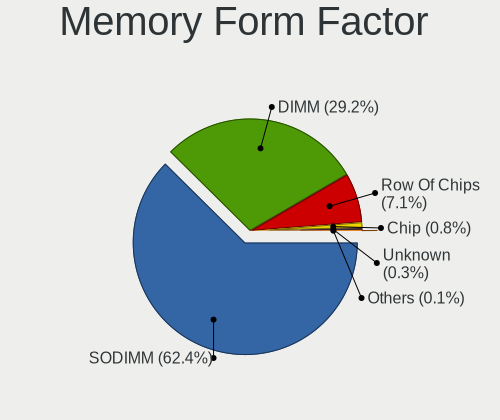

| Name         | Computers | Percent |
|--------------|-----------|---------|
| SODIMM       | 564       | 63.44%  |
| DIMM         | 259       | 29.13%  |
| Row Of Chips | 51        | 5.74%   |
| Chip         | 12        | 1.35%   |
| RIMM         | 2         | 0.22%   |
| Unknown      | 1         | 0.11%   |

Memory Size
-----------

Memory module size

| Size  | Computers | Percent |
|-------|-----------|---------|
| 8192  | 306       | 32.04%  |
| 4096  | 227       | 23.77%  |
| 2048  | 207       | 21.68%  |
| 16384 | 142       | 14.87%  |
| 1024  | 35        | 3.66%   |
| 32768 | 30        | 3.14%   |
| 512   | 4         | 0.42%   |
| 256   | 2         | 0.21%   |
| 6144  | 1         | 0.1%    |
| 3072  | 1         | 0.1%    |

Memory Speed
------------

Memory module speed

| Speed   | Computers | Percent |
|---------|-----------|---------|
| 1333    | 157       | 16.49%  |
| 1600    | 153       | 16.07%  |
| 3200    | 131       | 13.76%  |
| 2667    | 121       | 12.71%  |
| 2400    | 76        | 7.98%   |
| 2133    | 50        | 5.25%   |
| 800     | 32        | 3.36%   |
| 1334    | 28        | 2.94%   |
| 3600    | 22        | 2.31%   |
| Unknown | 20        | 2.1%    |
| 667     | 17        | 1.79%   |
| 1867    | 15        | 1.58%   |
| 4267    | 13        | 1.37%   |
| 1067    | 11        | 1.16%   |
| 3400    | 9         | 0.95%   |
| 3266    | 7         | 0.74%   |
| 2666    | 7         | 0.74%   |
| 1866    | 7         | 0.74%   |
| 1066    | 6         | 0.63%   |
| 3733    | 5         | 0.53%   |
| 3466    | 5         | 0.53%   |
| 3000    | 5         | 0.53%   |
| 4266    | 4         | 0.42%   |
| 4199    | 4         | 0.42%   |
| 3800    | 4         | 0.42%   |
| 975     | 4         | 0.42%   |
| 533     | 4         | 0.42%   |
| 400     | 4         | 0.42%   |
| 3333    | 3         | 0.32%   |
| 2933    | 3         | 0.32%   |
| 8400    | 2         | 0.21%   |
| 4133    | 2         | 0.21%   |
| 3666    | 2         | 0.21%   |
| 3334    | 2         | 0.21%   |
| 2800    | 2         | 0.21%   |
| 2048    | 2         | 0.21%   |
| 1400    | 2         | 0.21%   |
| 6400    | 1         | 0.11%   |
| 4800    | 1         | 0.11%   |
| 3151    | 1         | 0.11%   |

Printers & scanners
-------------------

Printer Vendor
--------------

Printer device vendors

| Vendor              | Computers | Percent |
|---------------------|-----------|---------|
| Canon               | 9         | 29.03%  |
| Hewlett-Packard     | 7         | 22.58%  |
| Samsung Electronics | 5         | 16.13%  |
| Brother Industries  | 5         | 16.13%  |
| Seiko Epson         | 1         | 3.23%   |
| QinHeng Electronics | 1         | 3.23%   |
| Prolific Technology | 1         | 3.23%   |
| Minolta             | 1         | 3.23%   |
| ICS Advent          | 1         | 3.23%   |

Printer Model
-------------

Printer device models

| Model                                   | Computers | Percent |
|-----------------------------------------|-----------|---------|
| HP DeskJet 2620 All-in-One Printer      | 3         | 9.38%   |
| Samsung M2070 Series                    | 2         | 6.25%   |
| Seiko Epson L365 Series                 | 1         | 3.13%   |
| Samsung Xerox Phaser 3117 Laser Printer | 1         | 3.13%   |
| Samsung M267x 287x Series               | 1         | 3.13%   |
| Samsung C460 Series                     | 1         | 3.13%   |
| QinHeng CH340S                          | 1         | 3.13%   |
| Prolific PL2305 Parallel Port           | 1         | 3.13%   |
| Minolta PagePro 1300W                   | 1         | 3.13%   |
| ICS Advent Parallel Adapter             | 1         | 3.13%   |
| HP Officejet 4500 G510g-m               | 1         | 3.13%   |
| HP Neverstop Laser 100x                 | 1         | 3.13%   |
| HP LaserJet P2014                       | 1         | 3.13%   |
| HP Deskjet 3050 J610 series             | 1         | 3.13%   |
| Canon TS6300 series                     | 1         | 3.13%   |
| Canon PIXMA MX920 Series                | 1         | 3.13%   |
| Canon PIXMA MX720 Series                | 1         | 3.13%   |
| Canon PIXMA MP280                       | 1         | 3.13%   |
| Canon PIXMA MG3500 Series               | 1         | 3.13%   |
| Canon PIXMA MG2500 Series               | 1         | 3.13%   |
| Canon MG5600 series                     | 1         | 3.13%   |
| Canon MF4100 series                     | 1         | 3.13%   |
| Canon LBP3010/LBP3018/LBP3050           | 1         | 3.13%   |
| Canon iP7200 series                     | 1         | 3.13%   |
| Brother MFC-J3930DW                     | 1         | 3.13%   |
| Brother HL-2030 Laser Printer           | 1         | 3.13%   |
| Brother HL-1430 Laser Printer           | 1         | 3.13%   |
| Brother DCP-J105                        | 1         | 3.13%   |
| Brother DCP-1610W                       | 1         | 3.13%   |

Scanner Vendor
--------------

Scanner device vendors

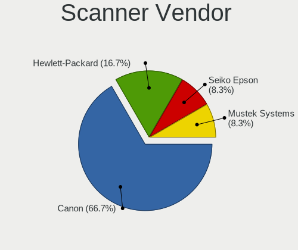

| Vendor         | Computers | Percent |
|----------------|-----------|---------|
| Canon          | 6         | 85.71%  |
| Mustek Systems | 1         | 14.29%  |

Scanner Model
-------------

Scanner device models

| Model                               | Computers | Percent |
|-------------------------------------|-----------|---------|
| Canon CanoScan LIDE 25              | 2         | 28.57%  |
| Canon CanoScan LiDE 210             | 2         | 28.57%  |
| Mustek Systems BearPaw 1200 CU Plus | 1         | 14.29%  |
| Canon CanoScan LiDE 200             | 1         | 14.29%  |
| Canon CanoScan LiDE 100             | 1         | 14.29%  |

Camera
------

Camera Vendor
-------------

Camera device vendors

| Vendor                                 | Computers | Percent |
|----------------------------------------|-----------|---------|
| Chicony Electronics                    | 228       | 25.33%  |
| Realtek Semiconductor                  | 93        | 10.33%  |
| Acer                                   | 80        | 8.89%   |
| IMC Networks                           | 74        | 8.22%   |
| Microdia                               | 69        | 7.67%   |
| Sunplus Innovation Technology          | 50        | 5.56%   |
| Lite-On Technology                     | 41        | 4.56%   |
| Cheng Uei Precision Industry (Foxlink) | 37        | 4.11%   |
| Quanta                                 | 34        | 3.78%   |
| Suyin                                  | 26        | 2.89%   |
| Syntek                                 | 23        | 2.56%   |
| Logitech                               | 22        | 2.44%   |
| Apple                                  | 12        | 1.33%   |
| Lenovo                                 | 11        | 1.22%   |
| Alcor Micro                            | 11        | 1.22%   |
| Samsung Electronics                    | 10        | 1.11%   |
| Ricoh                                  | 10        | 1.11%   |
| KYE Systems (Mouse Systems)            | 10        | 1.11%   |
| Creative Technology                    | 8         | 0.89%   |
| Microsoft                              | 7         | 0.78%   |
| Z-Star Microelectronics                | 6         | 0.67%   |
| GEMBIRD                                | 5         | 0.56%   |
| Unknown                                | 4         | 0.44%   |
| Primax Electronics                     | 3         | 0.33%   |
| Luxvisions Innotech Limited            | 3         | 0.33%   |
| Generalplus Technology                 | 3         | 0.33%   |
| Sonix Technology                       | 2         | 0.22%   |
| Intel                                  | 2         | 0.22%   |
| Hewlett-Packard                        | 2         | 0.22%   |
| Sunplus Technology                     | 1         | 0.11%   |
| Silicon Motion                         | 1         | 0.11%   |
| Ruision                                | 1         | 0.11%   |
| Pixart Imaging                         | 1         | 0.11%   |
| Orbbec 3D Technology International     | 1         | 0.11%   |
| Nokia Mobile Phones                    | 1         | 0.11%   |
| MacroSilicon                           | 1         | 0.11%   |
| Goodong Industry                       | 1         | 0.11%   |
| Genesys Logic                          | 1         | 0.11%   |
| eMPIA Technology                       | 1         | 0.11%   |
| Elecom                                 | 1         | 0.11%   |

Camera Model
------------

Camera device models

| Model                                               | Computers | Percent |
|-----------------------------------------------------|-----------|---------|
| Chicony Integrated Camera                           | 59        | 6.48%   |
| Realtek Integrated_Webcam_HD                        | 33        | 3.63%   |
| IMC Networks Integrated Camera                      | 32        | 3.52%   |
| Microdia Integrated_Webcam_HD                       | 30        | 3.3%    |
| Chicony HP HD Camera                                | 23        | 2.53%   |
| Chicony HD WebCam                                   | 23        | 2.53%   |
| Acer Lenovo EasyCamera                              | 20        | 2.2%    |
| Lite-On HP HD Camera                                | 18        | 1.98%   |
| Acer Integrated Camera                              | 17        | 1.87%   |
| IMC Networks USB2.0 HD UVC WebCam                   | 15        | 1.65%   |
| Chicony Integrated Camera (1280x720@30)             | 13        | 1.43%   |
| Lite-On Integrated Camera                           | 11        | 1.21%   |
| Suyin Acer/HP Integrated Webcam [CN0314]            | 10        | 1.1%    |
| Sunplus Integrated_Webcam_HD                        | 10        | 1.1%    |
| Samsung Galaxy series, misc. (MTP mode)             | 10        | 1.1%    |
| Chicony USB2.0 VGA UVC WebCam                       | 9         | 0.99%   |
| Apple iPhone 5/5C/5S/6/SE                           | 9         | 0.99%   |
| Syntek Lenovo EasyCamera                            | 8         | 0.88%   |
| Syntek Integrated Camera                            | 8         | 0.88%   |
| Realtek Integrated Webcam HD                        | 8         | 0.88%   |
| Quanta HP HD Camera                                 | 8         | 0.88%   |
| Quanta HD User Facing                               | 8         | 0.88%   |
| Microdia Integrated Webcam                          | 8         | 0.88%   |
| IMC Networks USB2.0 VGA UVC WebCam                  | 8         | 0.88%   |
| Acer SunplusIT Integrated Camera                    | 8         | 0.88%   |
| Logitech Webcam C270                                | 7         | 0.77%   |
| Lenovo Integrated Webcam                            | 7         | 0.77%   |
| Chicony Lenovo EasyCamera                           | 7         | 0.77%   |
| Acer EasyCamera                                     | 7         | 0.77%   |
| Sunplus Laptop Integrated WebCam HD                 | 6         | 0.66%   |
| Sunplus HD WebCam                                   | 6         | 0.66%   |
| Sunplus Asus Webcam                                 | 6         | 0.66%   |
| Realtek USB2.0 VGA UVC WebCam                       | 6         | 0.66%   |
| Quanta HP Wide Vision HD Camera                     | 6         | 0.66%   |
| Creative Live! Cam Sync HD [VF0770]                 | 6         | 0.66%   |
| Chicony HP HD Webcam                                | 6         | 0.66%   |
| Cheng Uei Precision Industry (Foxlink) Webcam       | 6         | 0.66%   |
| Cheng Uei Precision Industry (Foxlink) HP HD Camera | 6         | 0.66%   |
| Alcor Micro USB 2.0 WebCamera                       | 6         | 0.66%   |
| Realtek USB2.0 HD UVC WebCam                        | 5         | 0.55%   |

Security
--------

Fingerprint Vendor
------------------

Fingerprint sensor vendors

| Vendor                     | Computers | Percent |
|----------------------------|-----------|---------|
| Synaptics                  | 87        | 33.46%  |
| Validity Sensors           | 86        | 33.08%  |
| Shenzhen Goodix Technology | 29        | 11.15%  |
| AuthenTec                  | 26        | 10%     |
| Elan Microelectronics      | 13        | 5%      |
| Upek                       | 12        | 4.62%   |
| LighTuning Technology      | 5         | 1.92%   |
| Microsoft                  | 1         | 0.38%   |
| Dell                       | 1         | 0.38%   |

Fingerprint Model
-----------------

Fingerprint sensor models

| Model                                                                      | Computers | Percent |
|----------------------------------------------------------------------------|-----------|---------|
| Synaptics Prometheus MIS Touch Fingerprint Reader                          | 24        | 9.23%   |
| Validity Sensors VFS495 Fingerprint Reader                                 | 22        | 8.46%   |
| Synaptics  FS7604 Touch Fingerprint Sensor with PurePrint                  | 18        | 6.92%   |
| Unknown                                                                    | 18        | 6.92%   |
| Shenzhen Goodix  FingerPrint Device                                        | 15        | 5.77%   |
| Validity Sensors VFS5011 Fingerprint Reader                                | 13        | 5%      |
| Upek Biometric Touchchip/Touchstrip Fingerprint Sensor                     | 12        | 4.62%   |
| Synaptics  VFS7552 Touch Fingerprint Sensor with PurePrint                 | 12        | 4.62%   |
| AuthenTec AES2810                                                          | 11        | 4.23%   |
| Validity Sensors Synaptics WBDI                                            | 9         | 3.46%   |
| Shenzhen Goodix Fingerprint Reader                                         | 9         | 3.46%   |
| Elan ELAN:Fingerprint                                                      | 9         | 3.46%   |
| Validity Sensors VFS491                                                    | 8         | 3.08%   |
| Validity Sensors VFS 5011 fingerprint sensor                               | 8         | 3.08%   |
| AuthenTec AES2501 Fingerprint Sensor                                       | 7         | 2.69%   |
| AuthenTec AES1600                                                          | 7         | 2.69%   |
| Validity Sensors VFS451 Fingerprint Reader                                 | 5         | 1.92%   |
| Validity Sensors VFS101 Fingerprint Reader                                 | 5         | 1.92%   |
| Synaptics Metallica MOH Touch Fingerprint Reader                           | 5         | 1.92%   |
| Synaptics Metallica MIS Touch Fingerprint Reader                           | 5         | 1.92%   |
| Shenzhen Goodix FingerPrint                                                | 5         | 1.92%   |
| Synaptics  WBDI                                                            | 4         | 1.54%   |
| LighTuning EgisTec Touch Fingerprint Sensor                                | 4         | 1.54%   |
| Elan ELAN:ARM-M4                                                           | 4         | 1.54%   |
| Validity Sensors VFS7500 Touch Fingerprint Sensor                          | 3         | 1.15%   |
| Validity Sensors Fingerprint scanner                                       | 3         | 1.15%   |
| Validity Sensors VFS471 Fingerprint Reader                                 | 2         | 0.77%   |
| Validity Sensors Synaptics VFS7552 Touch Fingerprint Sensor with PurePrint | 2         | 0.77%   |
| Validity Sensors Synaptics VFS7552 Touch Fingerprint Sensor                | 2         | 0.77%   |
| Validity Sensors Swipe Fingerprint Sensor                                  | 2         | 0.77%   |
| Validity Sensors VFS7552 Touch Fingerprint Sensor                          | 1         | 0.38%   |
| Validity Sensors VFS301 Fingerprint Reader                                 | 1         | 0.38%   |
| Synaptics WBDI Device                                                      | 1         | 0.38%   |
| Microsoft Fingerprint Reader                                               | 1         | 0.38%   |
| LighTuning Fingerprint Sensor                                              | 1         | 0.38%   |
| Dell MS819 Wired Mouse With Fingerprint Reader                             | 1         | 0.38%   |
| AuthenTec AES1660 Fingerprint Sensor                                       | 1         | 0.38%   |

Chipcard Vendor
---------------

Chipcard module vendors

| Vendor                    | Computers | Percent |
|---------------------------|-----------|---------|
| Broadcom                  | 52        | 50.98%  |
| Alcor Micro               | 29        | 28.43%  |
| O2 Micro                  | 8         | 7.84%   |
| Lenovo                    | 5         | 4.9%    |
| SCM Microsystems          | 2         | 1.96%   |
| Aladdin Knowledge Systems | 2         | 1.96%   |
| Upek                      | 1         | 0.98%   |
| Purism, SPC               | 1         | 0.98%   |
| OmniKey                   | 1         | 0.98%   |
| Fujitsu Siemens Computers | 1         | 0.98%   |

Chipcard Model
--------------

Chipcard module models

| Model                                                                        | Computers | Percent |
|------------------------------------------------------------------------------|-----------|---------|
| Alcor Micro AU9540 Smartcard Reader                                          | 29        | 28.43%  |
| Broadcom 58200                                                               | 16        | 15.69%  |
| Broadcom BCM5880 Secure Applications Processor                               | 14        | 13.73%  |
| Broadcom BCM5880 Secure Applications Processor with fingerprint swipe sensor | 11        | 10.78%  |
| Broadcom 5880                                                                | 11        | 10.78%  |
| O2 Micro OZ776 CCID Smartcard Reader                                         | 7         | 6.86%   |
| Lenovo Integrated Smart Card Reader                                          | 5         | 4.9%    |
| SCM Microsystems SCR3340 - ExpressCard54 Smart Card Reader                   | 2         | 1.96%   |
| Aladdin Knowledge Systems Token JC                                           | 2         | 1.96%   |
| Upek TouchChip Fingerprint Coprocessor (WBF advanced mode)                   | 1         | 0.98%   |
| Purism, SPC Librem Key                                                       | 1         | 0.98%   |
| OmniKey 3x21 Smart Card Reader                                               | 1         | 0.98%   |
| O2 Micro Oz776 SmartCard Reader                                              | 1         | 0.98%   |
| Fujitsu Siemens Computers SmartCard Reader 2A                                | 1         | 0.98%   |

Unsupported
-----------

Unsupported Devices
-------------------

Total unsupported devices on board

| Total | Computers | Percent |
|-------|-----------|---------|
| 0     | 1113      | 67.91%  |
| 1     | 403       | 24.59%  |
| 2     | 95        | 5.8%    |
| 3     | 20        | 1.22%   |
| 4     | 5         | 0.31%   |
| 5     | 3         | 0.18%   |

Unsupported Device Types
------------------------

Types of unsupported devices

| Type                     | Computers | Percent |
|--------------------------|-----------|---------|
| Fingerprint reader       | 255       | 38.69%  |
| Graphics card            | 121       | 18.36%  |
| Chipcard                 | 88        | 13.35%  |
| Net/wireless             | 48        | 7.28%   |
| Multimedia controller    | 33        | 5.01%   |
| Communication controller | 19        | 2.88%   |
| Storage                  | 16        | 2.43%   |
| Camera                   | 14        | 2.12%   |
| Bluetooth                | 13        | 1.97%   |
| Unassigned class         | 9         | 1.37%   |
| Net/ethernet             | 9         | 1.37%   |
| Sound                    | 8         | 1.21%   |
| Card reader              | 7         | 1.06%   |
| Modem                    | 6         | 0.91%   |
| Flash memory             | 6         | 0.91%   |
| Network                  | 3         | 0.46%   |
| Storage/raid             | 1         | 0.15%   |
| Storage/ide              | 1         | 0.15%   |
| Storage/ata              | 1         | 0.15%   |
| Dvb card                 | 1         | 0.15%   |

