Linux in Czechia - Tested Hardware & Statistics
-----------------------------------------------

A project to collect tested hardware configurations for Linux in Czechia.

Anyone can contribute to this report by the [hw-probe](https://github.com/linuxhw/hw-probe) tool:

    sudo -E hw-probe -all -upload

Please contribute! Especially if your hardware is rare.

This is a report for all computer types. See also reports for [desktops](/Location/Czechia/Desktop/README.md) and [notebooks](/Location/Czechia/Notebook/README.md).

Contents
--------

* [ Test Cases ](#test-cases)

* [ System ](#system)
  - [ OS                       ](#os)
  - [ OS Family                ](#os-family)
  - [ Kernel                   ](#kernel)
  - [ Kernel Family            ](#kernel-family)
  - [ Kernel Major Ver.        ](#kernel-major-ver)
  - [ Arch                     ](#arch)
  - [ DE                       ](#de)
  - [ Display Server           ](#display-server)
  - [ Display Manager          ](#display-manager)
  - [ OS Lang                  ](#os-lang)
  - [ Boot Mode                ](#boot-mode)
  - [ Filesystem               ](#filesystem)
  - [ Part. scheme             ](#part-scheme)
  - [ Dual Boot with Linux/BSD ](#dual-boot-with-linuxbsd)
  - [ Dual Boot (Win)          ](#dual-boot-win)

* [ Board ](#board)
  - [ Vendor                   ](#vendor)
  - [ Model                    ](#model)
  - [ Model Family             ](#model-family)
  - [ MFG Year                 ](#mfg-year)
  - [ Form Factor              ](#form-factor)
  - [ Secure Boot              ](#secure-boot)
  - [ Coreboot                 ](#coreboot)
  - [ RAM Size                 ](#ram-size)
  - [ RAM Used                 ](#ram-used)
  - [ Total Drives             ](#total-drives)
  - [ Has CD-ROM               ](#has-cd-rom)
  - [ Has Ethernet             ](#has-ethernet)
  - [ Has WiFi                 ](#has-wifi)
  - [ Has Bluetooth            ](#has-bluetooth)

* [ Location ](#location)
  - [ Country                  ](#country)
  - [ City                     ](#city)

* [ Drives ](#drives)
  - [ Drive Vendor             ](#drive-vendor)
  - [ Drive Model              ](#drive-model)
  - [ HDD Vendor               ](#hdd-vendor)
  - [ SSD Vendor               ](#ssd-vendor)
  - [ Drive Kind               ](#drive-kind)
  - [ Drive Connector          ](#drive-connector)
  - [ Drive Size               ](#drive-size)
  - [ Space Total              ](#space-total)
  - [ Space Used               ](#space-used)
  - [ Malfunc. Drives          ](#malfunc-drives)
  - [ Malfunc. Drive Vendor    ](#malfunc-drive-vendor)
  - [ Malfunc. HDD Vendor      ](#malfunc-hdd-vendor)
  - [ Malfunc. Drive Kind      ](#malfunc-drive-kind)
  - [ Failed Drives            ](#failed-drives)
  - [ Failed Drive Vendor      ](#failed-drive-vendor)
  - [ Drive Status             ](#drive-status)

* [ Storage controller ](#storage-controller)
  - [ Storage Vendor           ](#storage-vendor)
  - [ Storage Model            ](#storage-model)
  - [ Storage Kind             ](#storage-kind)

* [ Processor ](#processor)
  - [ CPU Vendor               ](#cpu-vendor)
  - [ CPU Model                ](#cpu-model)
  - [ CPU Model Family         ](#cpu-model-family)
  - [ CPU Cores                ](#cpu-cores)
  - [ CPU Sockets              ](#cpu-sockets)
  - [ CPU Threads              ](#cpu-threads)
  - [ CPU Op-Modes             ](#cpu-op-modes)
  - [ CPU Microcode            ](#cpu-microcode)
  - [ CPU Microarch            ](#cpu-microarch)

* [ Graphics ](#graphics)
  - [ GPU Vendor               ](#gpu-vendor)
  - [ GPU Model                ](#gpu-model)
  - [ GPU Combo                ](#gpu-combo)
  - [ GPU Driver               ](#gpu-driver)
  - [ GPU Memory               ](#gpu-memory)

* [ Monitor ](#monitor)
  - [ Monitor Vendor           ](#monitor-vendor)
  - [ Monitor Model            ](#monitor-model)
  - [ Monitor Resolution       ](#monitor-resolution)
  - [ Monitor Diagonal         ](#monitor-diagonal)
  - [ Monitor Width            ](#monitor-width)
  - [ Aspect Ratio             ](#aspect-ratio)
  - [ Monitor Area             ](#monitor-area)
  - [ Pixel Density            ](#pixel-density)
  - [ Multiple Monitors        ](#multiple-monitors)

* [ Network ](#network)
  - [ Net Controller Vendor    ](#net-controller-vendor)
  - [ Net Controller Model     ](#net-controller-model)
  - [ Wireless Vendor          ](#wireless-vendor)
  - [ Wireless Model           ](#wireless-model)
  - [ Ethernet Vendor          ](#ethernet-vendor)
  - [ Ethernet Model           ](#ethernet-model)
  - [ Net Controller Kind      ](#net-controller-kind)
  - [ Used Controller          ](#used-controller)
  - [ NICs                     ](#nics)
  - [ IPv6                     ](#ipv6)

* [ Bluetooth ](#bluetooth)
  - [ Bluetooth Vendor         ](#bluetooth-vendor)
  - [ Bluetooth Model          ](#bluetooth-model)

* [ Sound ](#sound)
  - [ Sound Vendor             ](#sound-vendor)
  - [ Sound Model              ](#sound-model)

* [ Memory ](#memory)
  - [ Memory Vendor            ](#memory-vendor)
  - [ Memory Model             ](#memory-model)
  - [ Memory Kind              ](#memory-kind)
  - [ Memory Form Factor       ](#memory-form-factor)
  - [ Memory Size              ](#memory-size)
  - [ Memory Speed             ](#memory-speed)

* [ Printers & scanners ](#printers--scanners)
  - [ Printer Vendor           ](#printer-vendor)
  - [ Printer Model            ](#printer-model)
  - [ Scanner Vendor           ](#scanner-vendor)
  - [ Scanner Model            ](#scanner-model)

* [ Camera ](#camera)
  - [ Camera Vendor            ](#camera-vendor)
  - [ Camera Model             ](#camera-model)

* [ Security ](#security)
  - [ Fingerprint Vendor       ](#fingerprint-vendor)
  - [ Fingerprint Model        ](#fingerprint-model)
  - [ Chipcard Vendor          ](#chipcard-vendor)
  - [ Chipcard Model           ](#chipcard-model)

* [ Unsupported ](#unsupported)
  - [ Unsupported Devices      ](#unsupported-devices)
  - [ Unsupported Device Types ](#unsupported-device-types)

Test Cases
----------

Total: 3180

| Vendor        | Model                       | Form-Factor | Probe                                                      | Date         |
|---------------|-----------------------------|-------------|------------------------------------------------------------|--------------|
| Lenovo        | G505 20240                  | Notebook    | [ef019ff242](https://linux-hardware.org/?probe=ef019ff242) | Nov 06, 2023 |
| Gigabyte      | AB350-Gaming 3-CF           | Desktop     | [2710dfedf4](https://linux-hardware.org/?probe=2710dfedf4) | Nov 05, 2023 |
| Dell          | Latitude E7440              | Notebook    | [5a151e929f](https://linux-hardware.org/?probe=5a151e929f) | Nov 05, 2023 |
| Lenovo        | ThinkPad W541 20EGS0QG1Z    | Notebook    | [ae8881b2b2](https://linux-hardware.org/?probe=ae8881b2b2) | Nov 04, 2023 |
| MSI           | MAG B650 TOMAHAWK WIFI      | Desktop     | [5832913981](https://linux-hardware.org/?probe=5832913981) | Nov 04, 2023 |
| Lenovo        | ThinkPad W541 20EGS0QG1Z    | Notebook    | [a3d91609e9](https://linux-hardware.org/?probe=a3d91609e9) | Nov 04, 2023 |
| MSI           | MAG B650 TOMAHAWK WIFI      | Desktop     | [4f6d5932fa](https://linux-hardware.org/?probe=4f6d5932fa) | Nov 04, 2023 |
| Lenovo        | ThinkPad T14 Gen 4 21K4S... | Notebook    | [60187ba0be](https://linux-hardware.org/?probe=60187ba0be) | Nov 04, 2023 |
| Rockchip      | Orange Pi 5 Plus            | Soc         | [9c30c8c8b4](https://linux-hardware.org/?probe=9c30c8c8b4) | Nov 03, 2023 |
| ASUSTek       | TUF Gaming Z690-PLUS        | Desktop     | [99b1ce4372](https://linux-hardware.org/?probe=99b1ce4372) | Nov 02, 2023 |
| Intel         | NUC7JYB J67969-403          | Mini pc     | [a7afcdcef2](https://linux-hardware.org/?probe=a7afcdcef2) | Nov 02, 2023 |
| HP            | EliteBook 840 G5            | Notebook    | [a42017f05d](https://linux-hardware.org/?probe=a42017f05d) | Nov 02, 2023 |
| MSI           | IONA                        | Desktop     | [579757d1cf](https://linux-hardware.org/?probe=579757d1cf) | Nov 02, 2023 |
| ASUSTek       | ROG STRIX B450-F GAMING ... | Desktop     | [1fd433ec1e](https://linux-hardware.org/?probe=1fd433ec1e) | Nov 02, 2023 |
| Dell          | Latitude 5480               | Notebook    | [567a2774f8](https://linux-hardware.org/?probe=567a2774f8) | Nov 01, 2023 |
| Dell          | Latitude E5470              | Notebook    | [b1be043dc0](https://linux-hardware.org/?probe=b1be043dc0) | Oct 31, 2023 |
| Gigabyte      | GA-970A-UD3                 | Desktop     | [98b1bd5970](https://linux-hardware.org/?probe=98b1bd5970) | Oct 31, 2023 |
| Lenovo        | IdeaPad 510-15ISK 80SR      | Notebook    | [15573e8d54](https://linux-hardware.org/?probe=15573e8d54) | Oct 30, 2023 |
| HP            | 250 G3                      | Notebook    | [784033212e](https://linux-hardware.org/?probe=784033212e) | Oct 29, 2023 |
| Lenovo        | IdeaPad L340-15API 81LW     | Notebook    | [a718d2e0ba](https://linux-hardware.org/?probe=a718d2e0ba) | Oct 28, 2023 |
| Dell          | 06X1TJ A00                  | Desktop     | [c2bc73c67b](https://linux-hardware.org/?probe=c2bc73c67b) | Oct 28, 2023 |
| Radxa         | ROCK 5B (DT)                | Soc         | [b1c2a699a9](https://linux-hardware.org/?probe=b1c2a699a9) | Oct 28, 2023 |
| Lenovo        | IdeaPad L340-15API 81LW     | Notebook    | [c866e0068b](https://linux-hardware.org/?probe=c866e0068b) | Oct 28, 2023 |
| MSI           | GF615M-P33                  | Desktop     | [10af2377c2](https://linux-hardware.org/?probe=10af2377c2) | Oct 28, 2023 |
| Lenovo        | IdeaPad 5 14ABA7 82SE       | Notebook    | [e08a8fa43b](https://linux-hardware.org/?probe=e08a8fa43b) | Oct 28, 2023 |
| ASUSTek       | ROG Strix G513QC_G513QC     | Notebook    | [bdf8012e05](https://linux-hardware.org/?probe=bdf8012e05) | Oct 27, 2023 |
| Dell          | Inspiron 5737               | Notebook    | [6ed0863a43](https://linux-hardware.org/?probe=6ed0863a43) | Oct 27, 2023 |
| ASUSTek       | X550CL                      | Notebook    | [a95ddd6798](https://linux-hardware.org/?probe=a95ddd6798) | Oct 26, 2023 |
| Gigabyte      | B450M DS3H V2               | Desktop     | [3279dc82a1](https://linux-hardware.org/?probe=3279dc82a1) | Oct 26, 2023 |
| HP            | 250 G3                      | Notebook    | [43fbeb0886](https://linux-hardware.org/?probe=43fbeb0886) | Oct 26, 2023 |
| ASRock        | J4125-ITX                   | Desktop     | [b124e800d6](https://linux-hardware.org/?probe=b124e800d6) | Oct 25, 2023 |
| ASUSTek       | PRIME B650M-A WIFI          | Desktop     | [d22fc67d1d](https://linux-hardware.org/?probe=d22fc67d1d) | Oct 25, 2023 |
| Lenovo        | IdeaPad 5 Pro 14ARH7 82S... | Notebook    | [819d596b2e](https://linux-hardware.org/?probe=819d596b2e) | Oct 24, 2023 |
| HP            | EliteBook 840 G4            | Notebook    | [a6d732c859](https://linux-hardware.org/?probe=a6d732c859) | Oct 24, 2023 |
| Gigabyte      | EX38-DS5                    | Desktop     | [79e9d5669a](https://linux-hardware.org/?probe=79e9d5669a) | Oct 23, 2023 |
| MSI           | IONA                        | Desktop     | [e444708510](https://linux-hardware.org/?probe=e444708510) | Oct 22, 2023 |
| Lenovo        | Unknown                     | Notebook    | [21cf9c327a](https://linux-hardware.org/?probe=21cf9c327a) | Oct 22, 2023 |
| Dell          | Vostro 3560                 | Notebook    | [8f65236e52](https://linux-hardware.org/?probe=8f65236e52) | Oct 22, 2023 |
| Dell          | System Vostro 3750          | Notebook    | [33345af29b](https://linux-hardware.org/?probe=33345af29b) | Oct 22, 2023 |
| Dell          | Vostro 3560                 | Notebook    | [a523689a60](https://linux-hardware.org/?probe=a523689a60) | Oct 21, 2023 |
| Acer          | Swift SF314-42              | Notebook    | [e19b58f8be](https://linux-hardware.org/?probe=e19b58f8be) | Oct 21, 2023 |
| Acer          | Aspire R3-131T              | Notebook    | [f8d2d274e1](https://linux-hardware.org/?probe=f8d2d274e1) | Oct 21, 2023 |
| Gigabyte      | Z77M-D3H                    | Desktop     | [0dcc624a0d](https://linux-hardware.org/?probe=0dcc624a0d) | Oct 21, 2023 |
| Lenovo        | ThinkPad E14 Gen 5 21JK0... | Notebook    | [f35c9d006e](https://linux-hardware.org/?probe=f35c9d006e) | Oct 20, 2023 |
| Lenovo        | Legion 5 Pro 16ITH6H 82J... | Notebook    | [79a2d6de1a](https://linux-hardware.org/?probe=79a2d6de1a) | Oct 19, 2023 |
| Dell          | XPS 13 9310                 | Notebook    | [3a6514e61a](https://linux-hardware.org/?probe=3a6514e61a) | Oct 19, 2023 |
| HP            | ZBook Firefly 14 inch G1... | Notebook    | [dd8ebeda53](https://linux-hardware.org/?probe=dd8ebeda53) | Oct 19, 2023 |
| Lenovo        | ThinkPad E14 Gen 4 21E30... | Notebook    | [52e7bc3407](https://linux-hardware.org/?probe=52e7bc3407) | Oct 18, 2023 |
| Lenovo        | Yoga Slim 7 Pro 16ARH7 8... | Notebook    | [6193aa3ed1](https://linux-hardware.org/?probe=6193aa3ed1) | Oct 17, 2023 |
| ASUSTek       | PRIME H410M-R               | Desktop     | [aa10d84f78](https://linux-hardware.org/?probe=aa10d84f78) | Oct 17, 2023 |
| HP            | ZBook Firefly 14 inch G1... | Notebook    | [f53079d2c1](https://linux-hardware.org/?probe=f53079d2c1) | Oct 16, 2023 |
| HP            | ZBook Firefly 14 inch G1... | Notebook    | [dcb416db8f](https://linux-hardware.org/?probe=dcb416db8f) | Oct 16, 2023 |
| ASUSTek       | Zephyrus M GM501GS          | Notebook    | [ba4661ac35](https://linux-hardware.org/?probe=ba4661ac35) | Oct 15, 2023 |
| Intel         | NUC10i7FNB M38062-307       | Mini pc     | [51e04c2a8a](https://linux-hardware.org/?probe=51e04c2a8a) | Oct 15, 2023 |
| HP            | Pavilion dv7                | Notebook    | [feb4113e4e](https://linux-hardware.org/?probe=feb4113e4e) | Oct 15, 2023 |
| HP            | Pavilion dv7                | Notebook    | [6bb631736f](https://linux-hardware.org/?probe=6bb631736f) | Oct 15, 2023 |
| ASRock        | A320M-HDV R4.0              | Desktop     | [70c2a81f9f](https://linux-hardware.org/?probe=70c2a81f9f) | Oct 14, 2023 |
| ASUSTek       | ASUS TUF Gaming A15 FA50... | Notebook    | [b2250f3c59](https://linux-hardware.org/?probe=b2250f3c59) | Oct 14, 2023 |
| HP            | EliteBook 845 G8 Noteboo... | Notebook    | [17b0ef31ee](https://linux-hardware.org/?probe=17b0ef31ee) | Oct 13, 2023 |
| ASUSTek       | TUF Gaming B550-PLUS        | Desktop     | [9972c1fc42](https://linux-hardware.org/?probe=9972c1fc42) | Oct 11, 2023 |
| ASRock        | H61M-DGS                    | Desktop     | [b16ee3559a](https://linux-hardware.org/?probe=b16ee3559a) | Oct 11, 2023 |
| Lenovo        | Y520-15IKBN 80WK            | Notebook    | [e38dfab96d](https://linux-hardware.org/?probe=e38dfab96d) | Oct 11, 2023 |
| Lenovo        | Y520-15IKBN 80WK            | Notebook    | [41d5ccfd3f](https://linux-hardware.org/?probe=41d5ccfd3f) | Oct 11, 2023 |
| Lenovo        | ThinkPad T14 Gen 2i 20W0... | Notebook    | [7d1fea3001](https://linux-hardware.org/?probe=7d1fea3001) | Oct 09, 2023 |
| ASUSTek       | ROG Zephyrus G14 GA401QM... | Notebook    | [749e1a7e28](https://linux-hardware.org/?probe=749e1a7e28) | Oct 09, 2023 |
| Lenovo        | ThinkCentre M90p 5536W67    | Desktop     | [3e075f72d8](https://linux-hardware.org/?probe=3e075f72d8) | Oct 09, 2023 |
| MSI           | G41M-P33 Combo              | Desktop     | [b82e5d0718](https://linux-hardware.org/?probe=b82e5d0718) | Oct 07, 2023 |
| UMAX          | N14R                        | Notebook    | [4ac10723f5](https://linux-hardware.org/?probe=4ac10723f5) | Oct 07, 2023 |
| UMAX          | N14R                        | Notebook    | [9852750745](https://linux-hardware.org/?probe=9852750745) | Oct 07, 2023 |
| MSI           | G41M-P33 Combo              | Desktop     | [299eee42c7](https://linux-hardware.org/?probe=299eee42c7) | Oct 07, 2023 |
| Dell          | Latitude 5431               | Notebook    | [a85fc8f829](https://linux-hardware.org/?probe=a85fc8f829) | Oct 06, 2023 |
| HP            | EliteBook x360 1030 G4      | Convertible | [3c7f490b86](https://linux-hardware.org/?probe=3c7f490b86) | Oct 06, 2023 |
| Lenovo        | IdeaPad S145-15AST 81N3     | Notebook    | [3b423be827](https://linux-hardware.org/?probe=3b423be827) | Oct 06, 2023 |
| HP            | EliteBook 655 15.6 inch ... | Notebook    | [7b888eeb58](https://linux-hardware.org/?probe=7b888eeb58) | Oct 05, 2023 |
| Lenovo        | IdeaPad Gaming 3 15IAH7 ... | Notebook    | [3b55566de3](https://linux-hardware.org/?probe=3b55566de3) | Oct 05, 2023 |
| HP            | Pavilion Notebook           | Notebook    | [59c0b6ce9c](https://linux-hardware.org/?probe=59c0b6ce9c) | Oct 04, 2023 |
| Samsung       | 550XBE/350XBE               | Notebook    | [442ef4b7be](https://linux-hardware.org/?probe=442ef4b7be) | Oct 04, 2023 |
| MSI           | Z370 PC PRO                 | Desktop     | [ec51b8fd0c](https://linux-hardware.org/?probe=ec51b8fd0c) | Oct 02, 2023 |
| ASUSTek       | A88XM-A/USB                 | Desktop     | [5a154d10af](https://linux-hardware.org/?probe=5a154d10af) | Oct 01, 2023 |
| Dell          | Latitude E6420              | Notebook    | [55c45fb7cb](https://linux-hardware.org/?probe=55c45fb7cb) | Oct 01, 2023 |
| Lenovo        | IdeaPad S145-15AST 81N3     | Notebook    | [4575deef12](https://linux-hardware.org/?probe=4575deef12) | Sep 30, 2023 |
| Lenovo        | ThinkPad T440 20B7S1K400    | Notebook    | [fd03530876](https://linux-hardware.org/?probe=fd03530876) | Sep 30, 2023 |
| Lenovo        | ThinkPad T14 Gen 1 20UES... | Notebook    | [2d1ada9dbe](https://linux-hardware.org/?probe=2d1ada9dbe) | Sep 30, 2023 |
| Sony          | VPCEB4J0E                   | Notebook    | [05864978df](https://linux-hardware.org/?probe=05864978df) | Sep 29, 2023 |
| ASUSTek       | UX31E                       | Notebook    | [1b6440f722](https://linux-hardware.org/?probe=1b6440f722) | Sep 29, 2023 |
| Dell          | Precision 7710              | Notebook    | [89731f9b0e](https://linux-hardware.org/?probe=89731f9b0e) | Sep 29, 2023 |
| Dell          | Inspiron 5515               | Notebook    | [5889ba673d](https://linux-hardware.org/?probe=5889ba673d) | Sep 27, 2023 |
| Sony          | VPCEB4J0E                   | Notebook    | [354e2be55e](https://linux-hardware.org/?probe=354e2be55e) | Sep 27, 2023 |
| HP            | EliteBook 8470p             | Notebook    | [a1fa543905](https://linux-hardware.org/?probe=a1fa543905) | Sep 27, 2023 |
| MSI           | X299 RAIDER 2018-10-08      | Desktop     | [8bccf1be8d](https://linux-hardware.org/?probe=8bccf1be8d) | Sep 26, 2023 |
| Acer          | Swift SF14-71T              | Notebook    | [10b657bd75](https://linux-hardware.org/?probe=10b657bd75) | Sep 25, 2023 |
| Dell          | Precision 7720              | Notebook    | [8cae4c9a31](https://linux-hardware.org/?probe=8cae4c9a31) | Sep 25, 2023 |
| Lenovo        | ThinkPad T14 Gen 2a 20XL... | Notebook    | [336d5fe8c8](https://linux-hardware.org/?probe=336d5fe8c8) | Sep 25, 2023 |
| Dell          | Latitude 7400               | Notebook    | [f537b79d15](https://linux-hardware.org/?probe=f537b79d15) | Sep 24, 2023 |
| MSI           | B450M MORTAR MAX            | Desktop     | [fa3021d826](https://linux-hardware.org/?probe=fa3021d826) | Sep 23, 2023 |
| HP            | Pavilion Gaming Laptop 1... | Notebook    | [a6ff891fa1](https://linux-hardware.org/?probe=a6ff891fa1) | Sep 23, 2023 |
| MSI           | B450M MORTAR MAX            | Desktop     | [3b9bbcebb0](https://linux-hardware.org/?probe=3b9bbcebb0) | Sep 23, 2023 |
| ASUSTek       | P9X79 PRO                   | Desktop     | [b58de0bed0](https://linux-hardware.org/?probe=b58de0bed0) | Sep 21, 2023 |
| Gigabyte      | B550 AORUS PRO              | Desktop     | [81d1af1a96](https://linux-hardware.org/?probe=81d1af1a96) | Sep 20, 2023 |
| HP            | ZBook Studio 16 inch G9 ... | Notebook    | [4bb581fb16](https://linux-hardware.org/?probe=4bb581fb16) | Sep 19, 2023 |
| Acer          | Aspire ES1-420              | Notebook    | [db308e1798](https://linux-hardware.org/?probe=db308e1798) | Sep 19, 2023 |
| Lenovo        | ThinkPad T480 20L6SCYF0P    | Notebook    | [c406bf7b56](https://linux-hardware.org/?probe=c406bf7b56) | Sep 18, 2023 |
| HP            | 158B                        | Desktop     | [d56ff45f03](https://linux-hardware.org/?probe=d56ff45f03) | Sep 17, 2023 |
| ASUSTek       | TUF Gaming B650-PLUS WIF... | Desktop     | [c323f31788](https://linux-hardware.org/?probe=c323f31788) | Sep 17, 2023 |
| Lenovo        | NOK                         | Desktop     | [ead85a1003](https://linux-hardware.org/?probe=ead85a1003) | Sep 16, 2023 |
| ASUSTek       | Zenbook UX5401ZAS_UX5401... | Notebook    | [bc597f4c0c](https://linux-hardware.org/?probe=bc597f4c0c) | Sep 14, 2023 |
| Lenovo        | IdeaPad 3 15ARE05 81W4      | Notebook    | [8f3c4bff98](https://linux-hardware.org/?probe=8f3c4bff98) | Sep 13, 2023 |
| Dell          | G3 3500                     | Notebook    | [293bbfe2d6](https://linux-hardware.org/?probe=293bbfe2d6) | Sep 12, 2023 |
| Acer          | Aspire E5-575G              | Notebook    | [ff31b68cf3](https://linux-hardware.org/?probe=ff31b68cf3) | Sep 12, 2023 |
| Gigabyte      | Z790 UD                     | Desktop     | [bcfc38f6da](https://linux-hardware.org/?probe=bcfc38f6da) | Sep 11, 2023 |
| Lenovo        | IdeaPad 3 15ARE05 81W4      | Notebook    | [53139247c9](https://linux-hardware.org/?probe=53139247c9) | Sep 10, 2023 |
| Intel         | NUC10i7FNB M38062-307       | Mini pc     | [1b79da7f45](https://linux-hardware.org/?probe=1b79da7f45) | Sep 10, 2023 |
| Lenovo        | IdeaPad 5 14ABA7 82SE       | Notebook    | [a9caf49f0e](https://linux-hardware.org/?probe=a9caf49f0e) | Sep 09, 2023 |
| MSI           | B350 TOMAHAWK               | Desktop     | [2a7d4dfb14](https://linux-hardware.org/?probe=2a7d4dfb14) | Sep 09, 2023 |
| HP            | EliteBook x360 1030 G2      | Convertible | [db1e55d494](https://linux-hardware.org/?probe=db1e55d494) | Sep 08, 2023 |
| Lenovo        | IdeaPadFlex 5 14ABR8 82X... | Convertible | [e3152ede03](https://linux-hardware.org/?probe=e3152ede03) | Sep 08, 2023 |
| Lenovo        | IdeaPadFlex 5 14ABR8 82X... | Convertible | [04b9d6891a](https://linux-hardware.org/?probe=04b9d6891a) | Sep 08, 2023 |
| HP            | 240 G8 Notebook PC          | Notebook    | [62735c1cd9](https://linux-hardware.org/?probe=62735c1cd9) | Sep 07, 2023 |
| Lenovo        | 32E4 SDK0T76538 WIN 3556... | Mini pc     | [ac035f8420](https://linux-hardware.org/?probe=ac035f8420) | Sep 07, 2023 |
| Pegatron      | 2AB6                        | Desktop     | [40b17904fa](https://linux-hardware.org/?probe=40b17904fa) | Sep 06, 2023 |
| Dell          | Latitude 7400               | Notebook    | [e1ea4eb614](https://linux-hardware.org/?probe=e1ea4eb614) | Sep 05, 2023 |
| HP            | EliteBook 845 14 inch G9... | Notebook    | [30bf3f1f45](https://linux-hardware.org/?probe=30bf3f1f45) | Sep 05, 2023 |
| UMAX          | 13Wr                        | Notebook    | [574937c731](https://linux-hardware.org/?probe=574937c731) | Sep 02, 2023 |
| Lenovo        | IdeaPadFlex 5 14ABR8 82X... | Convertible | [61a10ef907](https://linux-hardware.org/?probe=61a10ef907) | Sep 02, 2023 |
| HP            | Unknown                     | Notebook    | [3809d7ad85](https://linux-hardware.org/?probe=3809d7ad85) | Sep 01, 2023 |
| Acer          | Aspire E5-551G              | Notebook    | [864a10779f](https://linux-hardware.org/?probe=864a10779f) | Sep 01, 2023 |
| HP            | 3032h                       | Desktop     | [7dfc9fa7a0](https://linux-hardware.org/?probe=7dfc9fa7a0) | Sep 01, 2023 |
| ASUSTek       | PRIME B450M-K               | Desktop     | [8cc90dd6b0](https://linux-hardware.org/?probe=8cc90dd6b0) | Sep 01, 2023 |
| Acer          | Aspire E5-551G              | Notebook    | [628d865373](https://linux-hardware.org/?probe=628d865373) | Aug 31, 2023 |
| UMAX          | VisionBook 15Wg Plus        | Notebook    | [e5a1a106cb](https://linux-hardware.org/?probe=e5a1a106cb) | Aug 31, 2023 |
| ASUSTek       | ROG Strix G814JI_G814JI     | Notebook    | [96d825f112](https://linux-hardware.org/?probe=96d825f112) | Aug 31, 2023 |
| Lenovo        | ThinkPad L450 20DSS0LR00    | Notebook    | [a85743e60e](https://linux-hardware.org/?probe=a85743e60e) | Aug 31, 2023 |
| Fujitsu       | D2679-B1 S26361-D2679-Bx... | Desktop     | [81ae698cf8](https://linux-hardware.org/?probe=81ae698cf8) | Aug 31, 2023 |
| Acer          | Swift SF314-42              | Notebook    | [80bebab849](https://linux-hardware.org/?probe=80bebab849) | Aug 31, 2023 |
| HP            | 0B4Ch D                     | Desktop     | [362ee070d7](https://linux-hardware.org/?probe=362ee070d7) | Aug 30, 2023 |
| Gigabyte      | H410M H V2                  | Desktop     | [3240f39404](https://linux-hardware.org/?probe=3240f39404) | Aug 30, 2023 |
| Gigabyte      | H410M H V2                  | Desktop     | [14fce9ff7f](https://linux-hardware.org/?probe=14fce9ff7f) | Aug 30, 2023 |
| Lenovo        | IdeaPad Gaming 3 15IAH7 ... | Notebook    | [ba9dd7a62d](https://linux-hardware.org/?probe=ba9dd7a62d) | Aug 29, 2023 |
| Lenovo        | IdeaPad Gaming 3 15IAH7 ... | Notebook    | [d6bca74de6](https://linux-hardware.org/?probe=d6bca74de6) | Aug 29, 2023 |
| Fujitsu       | LIFEBOOK U9312              | Notebook    | [891b276812](https://linux-hardware.org/?probe=891b276812) | Aug 28, 2023 |
| ASUSTek       | K53E                        | Notebook    | [fa5eab9e81](https://linux-hardware.org/?probe=fa5eab9e81) | Aug 28, 2023 |
| ASRock        | AB350M Pro4                 | Desktop     | [e3ca221ba9](https://linux-hardware.org/?probe=e3ca221ba9) | Aug 28, 2023 |
| Acer          | Aspire E1-532               | Notebook    | [037143c4fd](https://linux-hardware.org/?probe=037143c4fd) | Aug 27, 2023 |
| ASUSTek       | UX31E                       | Notebook    | [0557e95830](https://linux-hardware.org/?probe=0557e95830) | Aug 27, 2023 |
| HP            | ProBook x360 435 G7         | Convertible | [127d78aea0](https://linux-hardware.org/?probe=127d78aea0) | Aug 26, 2023 |
| Google        | Robo                        | Notebook    | [dfa74d0961](https://linux-hardware.org/?probe=dfa74d0961) | Aug 26, 2023 |
| HP            | 802F                        | Desktop     | [6759058353](https://linux-hardware.org/?probe=6759058353) | Aug 25, 2023 |
| HP            | EliteBook 845 G8 Noteboo... | Notebook    | [c288ff6b78](https://linux-hardware.org/?probe=c288ff6b78) | Aug 25, 2023 |
| Raspberry ... | Raspberry Pi 4 Model B R... | Soc         | [ae2d6ab9fd](https://linux-hardware.org/?probe=ae2d6ab9fd) | Aug 25, 2023 |
| HP            | ZBook 14 G2                 | Notebook    | [7fcd619af1](https://linux-hardware.org/?probe=7fcd619af1) | Aug 25, 2023 |
| HP            | Victus by Laptop 16-e0xx... | Notebook    | [6cf9db7da7](https://linux-hardware.org/?probe=6cf9db7da7) | Aug 24, 2023 |
| Lenovo        | IdeaPad Z580                | Notebook    | [b84eb0a6fa](https://linux-hardware.org/?probe=b84eb0a6fa) | Aug 24, 2023 |
| HP            | ZBook 14 G2                 | Notebook    | [fcbebfc95a](https://linux-hardware.org/?probe=fcbebfc95a) | Aug 23, 2023 |
| Valve         | Jupiter                     | Notebook    | [904e60e2d7](https://linux-hardware.org/?probe=904e60e2d7) | Aug 23, 2023 |
| Lenovo        | 313C SDK0J40697 WIN 3305... | Desktop     | [536f3c29b6](https://linux-hardware.org/?probe=536f3c29b6) | Aug 23, 2023 |
| ASRock        | TRX40 Creator               | Desktop     | [6c3b3d9727](https://linux-hardware.org/?probe=6c3b3d9727) | Aug 23, 2023 |
| Raspberry ... | Raspberry Pi 2 Model B R... | Soc         | [98669adc64](https://linux-hardware.org/?probe=98669adc64) | Aug 23, 2023 |
| Dell          | XPS 15 9560                 | Notebook    | [e751db6fd4](https://linux-hardware.org/?probe=e751db6fd4) | Aug 22, 2023 |
| Lenovo        | 3190 SDK0J40697 WIN 3305... | Mini pc     | [4945bd0d6d](https://linux-hardware.org/?probe=4945bd0d6d) | Aug 22, 2023 |
| Valve         | Jupiter                     | Notebook    | [57038f50cd](https://linux-hardware.org/?probe=57038f50cd) | Aug 20, 2023 |
| ASUSTek       | ZenBook UX425UAZ_UM425UA... | Notebook    | [681310709d](https://linux-hardware.org/?probe=681310709d) | Aug 19, 2023 |
| ECS           | 7AT-3LB                     | Desktop     | [fe545a2a23](https://linux-hardware.org/?probe=fe545a2a23) | Aug 19, 2023 |
| Intel         | NUC10i7FNB M38062-307       | Mini pc     | [9c749716e8](https://linux-hardware.org/?probe=9c749716e8) | Aug 18, 2023 |
| Gigabyte      | B450M H                     | Desktop     | [722707e986](https://linux-hardware.org/?probe=722707e986) | Aug 18, 2023 |
| Gigabyte      | B450M H                     | Desktop     | [73867661a3](https://linux-hardware.org/?probe=73867661a3) | Aug 18, 2023 |
| Lenovo        | Yoga Slim 7 ProX 14IAH7 ... | Notebook    | [b8e5fd59d3](https://linux-hardware.org/?probe=b8e5fd59d3) | Aug 18, 2023 |
| MSI           | B250M MORTAR                | Desktop     | [fc97ccab18](https://linux-hardware.org/?probe=fc97ccab18) | Aug 17, 2023 |
| Dell          | Latitude 7440               | Notebook    | [aef57d5421](https://linux-hardware.org/?probe=aef57d5421) | Aug 17, 2023 |
| Gigabyte      | X570S AERO G                | Desktop     | [e5618417ed](https://linux-hardware.org/?probe=e5618417ed) | Aug 16, 2023 |
| Lenovo        | IdeaPad Slim 5 14ABR8 82... | Notebook    | [1fcc89106f](https://linux-hardware.org/?probe=1fcc89106f) | Aug 15, 2023 |
| HP            | Laptop 17-cp0xxx            | Notebook    | [620d12291b](https://linux-hardware.org/?probe=620d12291b) | Aug 15, 2023 |
| HP            | 09CCh                       | Desktop     | [947fb1edcb](https://linux-hardware.org/?probe=947fb1edcb) | Aug 15, 2023 |
| Lenovo        | ThinkPad X250 20CM001RMC    | Notebook    | [618a7e3e29](https://linux-hardware.org/?probe=618a7e3e29) | Aug 14, 2023 |
| Dell          | XPS 13 7390                 | Notebook    | [f4e6886bd8](https://linux-hardware.org/?probe=f4e6886bd8) | Aug 13, 2023 |
| ASUSTek       | TUF B450M-PRO GAMING        | Desktop     | [4775c7e602](https://linux-hardware.org/?probe=4775c7e602) | Aug 13, 2023 |
| AMD           | A690G M2+                   | Desktop     | [4179510c0b](https://linux-hardware.org/?probe=4179510c0b) | Aug 13, 2023 |
| HP            | 09CCh                       | Desktop     | [15bfdf7213](https://linux-hardware.org/?probe=15bfdf7213) | Aug 12, 2023 |
| HP            | ZBook 17 G3                 | Notebook    | [475b07d2dc](https://linux-hardware.org/?probe=475b07d2dc) | Aug 12, 2023 |
| HP            | 250 G3                      | Notebook    | [6ba303bc6b](https://linux-hardware.org/?probe=6ba303bc6b) | Aug 11, 2023 |
| ASUSTek       | VivoBook_ASUSLaptop M350... | Notebook    | [ffa9b97bf7](https://linux-hardware.org/?probe=ffa9b97bf7) | Aug 10, 2023 |
| Lenovo        | ThinkBook 16p Gen 2 20YM    | Notebook    | [82dde7d058](https://linux-hardware.org/?probe=82dde7d058) | Aug 10, 2023 |
| HP            | ZBook Studio 16 inch G9 ... | Notebook    | [e1462f1e3a](https://linux-hardware.org/?probe=e1462f1e3a) | Aug 10, 2023 |
| Lenovo        | IdeaPad 5 14ABA7 82SE       | Notebook    | [6415840d5b](https://linux-hardware.org/?probe=6415840d5b) | Aug 09, 2023 |
| HP            | ProBook 455 G7              | Notebook    | [bd9f67ee72](https://linux-hardware.org/?probe=bd9f67ee72) | Aug 07, 2023 |
| Acer          | Swift SF514-53T             | Notebook    | [30d8fefda4](https://linux-hardware.org/?probe=30d8fefda4) | Aug 07, 2023 |
| Acer          | Swift SF514-53T             | Notebook    | [f1cef350fb](https://linux-hardware.org/?probe=f1cef350fb) | Aug 07, 2023 |
| Lenovo        | IdeaPad 510-15ISK 80SR      | Notebook    | [b69ff09aa4](https://linux-hardware.org/?probe=b69ff09aa4) | Aug 05, 2023 |
| ASUSTek       | ROG STRIX B450-E GAMING     | Desktop     | [401fdc46ef](https://linux-hardware.org/?probe=401fdc46ef) | Aug 05, 2023 |
| Dell          | Latitude E6420              | Notebook    | [3636e69adb](https://linux-hardware.org/?probe=3636e69adb) | Aug 05, 2023 |
| Acer          | Aspire E5-572G              | Notebook    | [846dce7b1b](https://linux-hardware.org/?probe=846dce7b1b) | Aug 05, 2023 |
| Dell          | Latitude E5500              | Notebook    | [95ddcb321c](https://linux-hardware.org/?probe=95ddcb321c) | Aug 05, 2023 |
| Acer          | Swift SF514-54GT            | Notebook    | [12ee4ed8f6](https://linux-hardware.org/?probe=12ee4ed8f6) | Aug 05, 2023 |
| Acer          | Swift SF514-54GT            | Notebook    | [5a2ed78e49](https://linux-hardware.org/?probe=5a2ed78e49) | Aug 05, 2023 |
| Dell          | Latitude 7400               | Notebook    | [48e2858e56](https://linux-hardware.org/?probe=48e2858e56) | Aug 04, 2023 |
| Lenovo        | ThinkPad T480 20L50000MC    | Notebook    | [341698801e](https://linux-hardware.org/?probe=341698801e) | Aug 04, 2023 |
| Dell          | Latitude 7440               | Notebook    | [195716ccf3](https://linux-hardware.org/?probe=195716ccf3) | Aug 04, 2023 |
| ASRock        | 4CoreDual-SATA2             | Desktop     | [6495cadf19](https://linux-hardware.org/?probe=6495cadf19) | Aug 04, 2023 |
| Dell          | Latitude 7440               | Notebook    | [5a9a057759](https://linux-hardware.org/?probe=5a9a057759) | Aug 04, 2023 |
| Dell          | Latitude 7440               | Notebook    | [367f14eae6](https://linux-hardware.org/?probe=367f14eae6) | Aug 04, 2023 |
| Lenovo        | Yoga Pro 7 14ARP8 83AU      | Notebook    | [1317097350](https://linux-hardware.org/?probe=1317097350) | Aug 03, 2023 |
| Lenovo        | IdeaPad S130-11IGM 81J1     | Notebook    | [e5be227d11](https://linux-hardware.org/?probe=e5be227d11) | Aug 03, 2023 |
| Dell          | 0CRH6C A02                  | Desktop     | [141928d8e2](https://linux-hardware.org/?probe=141928d8e2) | Aug 02, 2023 |
| Gigabyte      | H410M H V3                  | Desktop     | [2d1e78ec7e](https://linux-hardware.org/?probe=2d1e78ec7e) | Aug 02, 2023 |
| Lenovo        | ThinkBook 15 G4 IAP 21DJ    | Notebook    | [589f0a8599](https://linux-hardware.org/?probe=589f0a8599) | Aug 01, 2023 |
| Acer          | Aspire 1810TZ               | Notebook    | [8cbec4eb45](https://linux-hardware.org/?probe=8cbec4eb45) | Jul 31, 2023 |
| ASUSTek       | ZenBook UX425IA_UM425IA     | Notebook    | [5ce91f2c11](https://linux-hardware.org/?probe=5ce91f2c11) | Jul 30, 2023 |
| Lenovo        | V15 G3 IAP 82TT             | Notebook    | [6ec734b217](https://linux-hardware.org/?probe=6ec734b217) | Jul 30, 2023 |
| Acer          | Aspire 5742                 | Notebook    | [37be5a1c80](https://linux-hardware.org/?probe=37be5a1c80) | Jul 30, 2023 |
| ASRock        | 4CoreDual-SATA2             | Desktop     | [44438ab71e](https://linux-hardware.org/?probe=44438ab71e) | Jul 30, 2023 |
| HP            | 843B                        | Desktop     | [c570a7c5f2](https://linux-hardware.org/?probe=c570a7c5f2) | Jul 29, 2023 |
| ASUSTek       | UX31E                       | Notebook    | [a7b390cdf4](https://linux-hardware.org/?probe=a7b390cdf4) | Jul 29, 2023 |
| Lenovo        | Yoga 7 14ARP8 82YM          | Convertible | [4baa3fe63b](https://linux-hardware.org/?probe=4baa3fe63b) | Jul 29, 2023 |
| Lenovo        | Yoga 7 14ARP8 82YM          | Convertible | [254354d9aa](https://linux-hardware.org/?probe=254354d9aa) | Jul 29, 2023 |
| Gigabyte      | X570S AERO G                | Desktop     | [d500093891](https://linux-hardware.org/?probe=d500093891) | Jul 28, 2023 |
| Google        | Edgar                       | Notebook    | [7e19b1e507](https://linux-hardware.org/?probe=7e19b1e507) | Jul 28, 2023 |
| Lenovo        | ThinkPad E14 Gen 3 20Y70... | Notebook    | [f5497a92cf](https://linux-hardware.org/?probe=f5497a92cf) | Jul 28, 2023 |
| ASUSTek       | PRIME X570-P                | Desktop     | [fd41467554](https://linux-hardware.org/?probe=fd41467554) | Jul 28, 2023 |
| ASUSTek       | PRIME B450-PLUS             | Desktop     | [ccfe4b2234](https://linux-hardware.org/?probe=ccfe4b2234) | Jul 27, 2023 |
| Acer          | Aspire A315-24P             | Notebook    | [6799c4be4a](https://linux-hardware.org/?probe=6799c4be4a) | Jul 27, 2023 |
| Toshiba       | Satellite A135              | Notebook    | [91f5602ed7](https://linux-hardware.org/?probe=91f5602ed7) | Jul 26, 2023 |
| HP            | 8169                        | Desktop     | [f2885ba2de](https://linux-hardware.org/?probe=f2885ba2de) | Jul 26, 2023 |
| Lenovo        | ThinkBook 15 G4 IAP 21DJ    | Notebook    | [74adf4cb3d](https://linux-hardware.org/?probe=74adf4cb3d) | Jul 26, 2023 |
| Lenovo        | IdeaPad 5 14ALC05 82LM      | Notebook    | [9f384d336d](https://linux-hardware.org/?probe=9f384d336d) | Jul 23, 2023 |
| Gigabyte      | X570S AERO G                | Desktop     | [8e3dbf7ff9](https://linux-hardware.org/?probe=8e3dbf7ff9) | Jul 23, 2023 |
| Dell          | Latitude E7440              | Notebook    | [ffa2aad2b5](https://linux-hardware.org/?probe=ffa2aad2b5) | Jul 21, 2023 |
| Dell          | Latitude E5530 non-vPro     | Notebook    | [2c2c4bdcf2](https://linux-hardware.org/?probe=2c2c4bdcf2) | Jul 21, 2023 |
| MSI           | B450 TOMAHAWK MAX           | Desktop     | [4f00ba88de](https://linux-hardware.org/?probe=4f00ba88de) | Jul 21, 2023 |
| Foxconn       | 2ABF                        | Desktop     | [6a048ba2cc](https://linux-hardware.org/?probe=6a048ba2cc) | Jul 21, 2023 |
| Lenovo        | SHARKBAY 0B98401 WIN        | Desktop     | [0d5bd8b2f2](https://linux-hardware.org/?probe=0d5bd8b2f2) | Jul 20, 2023 |
| AMI           | Intel                       | Convertible | [896ed95f63](https://linux-hardware.org/?probe=896ed95f63) | Jul 19, 2023 |
| MSI           | IONA                        | Desktop     | [7b8b6c38e1](https://linux-hardware.org/?probe=7b8b6c38e1) | Jul 18, 2023 |
| Dell          | 02YYK5 A01                  | Desktop     | [4ad55cf9da](https://linux-hardware.org/?probe=4ad55cf9da) | Jul 16, 2023 |
| Lenovo        | B5400 80B6QB0               | Notebook    | [7108435241](https://linux-hardware.org/?probe=7108435241) | Jul 15, 2023 |
| ASUSTek       | J1800I-A                    | Desktop     | [ce7f031b0a](https://linux-hardware.org/?probe=ce7f031b0a) | Jul 14, 2023 |
| Lenovo        | ThinkPad X1 Carbon 6th 2... | Notebook    | [cf9bdab1ee](https://linux-hardware.org/?probe=cf9bdab1ee) | Jul 13, 2023 |
| Lenovo        | IdeaPad S130-11IGM 81J1     | Notebook    | [f742573138](https://linux-hardware.org/?probe=f742573138) | Jul 12, 2023 |
| Dell          | 0J3C2F A00                  | Desktop     | [b3770db2e8](https://linux-hardware.org/?probe=b3770db2e8) | Jul 12, 2023 |
| Dell          | 0J3C2F A00                  | Desktop     | [d7d8d93ac1](https://linux-hardware.org/?probe=d7d8d93ac1) | Jul 10, 2023 |
| ASUSTek       | P7P55D DELUXE               | Desktop     | [ecba1dae0a](https://linux-hardware.org/?probe=ecba1dae0a) | Jul 09, 2023 |
| Notebook      | NP5x_NP6x_NP7xRNJ_RNH       | Notebook    | [7663e77bff](https://linux-hardware.org/?probe=7663e77bff) | Jul 09, 2023 |
| ASUSTek       | M4A88TD-V EVO/USB3          | Desktop     | [003c30f690](https://linux-hardware.org/?probe=003c30f690) | Jul 09, 2023 |
| Lenovo        | SHARKBAY 0B98401 WIN        | Desktop     | [76a4853c56](https://linux-hardware.org/?probe=76a4853c56) | Jul 08, 2023 |
| ASUSTek       | M5A97 R2.0                  | Desktop     | [624fca7465](https://linux-hardware.org/?probe=624fca7465) | Jul 07, 2023 |
| Lenovo        | ThinkPad T14s Gen 2i 20W... | Notebook    | [d09af80a65](https://linux-hardware.org/?probe=d09af80a65) | Jul 07, 2023 |
| ASUSTek       | ASUS EXPERTBOOK B2502CBA... | Notebook    | [397adc6b70](https://linux-hardware.org/?probe=397adc6b70) | Jul 06, 2023 |
| Lenovo        | ThinkPad E570 20H50074MC    | Notebook    | [029e84bf8a](https://linux-hardware.org/?probe=029e84bf8a) | Jul 06, 2023 |
| Dell          | 05XGC8 A01                  | Desktop     | [ef4d169d77](https://linux-hardware.org/?probe=ef4d169d77) | Jul 05, 2023 |
| ASUSTek       | TUF B450-PRO GAMING         | Desktop     | [33e4bac631](https://linux-hardware.org/?probe=33e4bac631) | Jul 05, 2023 |
| Dell          | 08NPPY A00                  | Desktop     | [b0432f19ba](https://linux-hardware.org/?probe=b0432f19ba) | Jul 05, 2023 |
| HP            | ProBook 455 15.6 inch G9... | Notebook    | [bedadd4478](https://linux-hardware.org/?probe=bedadd4478) | Jul 05, 2023 |
| Raspberry ... | Raspberry Pi 4 Model B R... | Soc         | [1e57d7c40d](https://linux-hardware.org/?probe=1e57d7c40d) | Jul 05, 2023 |
| HP            | EliteBook 8770w             | Notebook    | [8f298fa9aa](https://linux-hardware.org/?probe=8f298fa9aa) | Jul 04, 2023 |
| Lenovo        | ThinkPad T14 Gen 2a 20XL... | Notebook    | [73e054c849](https://linux-hardware.org/?probe=73e054c849) | Jul 04, 2023 |
| Lenovo        | ThinkPad P1 Gen 4i 20Y4S... | Notebook    | [5d2bd9c3ce](https://linux-hardware.org/?probe=5d2bd9c3ce) | Jul 04, 2023 |
| Dell          | 05XGC8 A01                  | Desktop     | [eada4fe260](https://linux-hardware.org/?probe=eada4fe260) | Jul 02, 2023 |
| AMI           | Intel                       | Notebook    | [65aafdb0b0](https://linux-hardware.org/?probe=65aafdb0b0) | Jul 02, 2023 |
| MSI           | PRO X670-P WIFI             | Desktop     | [7beeaf657d](https://linux-hardware.org/?probe=7beeaf657d) | Jul 02, 2023 |
| Dell          | 0T656F A02                  | Desktop     | [e9b879f3ff](https://linux-hardware.org/?probe=e9b879f3ff) | Jul 02, 2023 |
| MSI           | A320M GAMING PRO            | Desktop     | [7bdc183ddc](https://linux-hardware.org/?probe=7bdc183ddc) | Jul 02, 2023 |
| Lenovo        | ThinkPad E14 Gen 3 20Y70... | Notebook    | [05394ee8a5](https://linux-hardware.org/?probe=05394ee8a5) | Jul 02, 2023 |
| ASUSTek       | UX31E                       | Notebook    | [37a73c8939](https://linux-hardware.org/?probe=37a73c8939) | Jul 01, 2023 |
| Acer          | Swift SF314-42              | Notebook    | [c5820f8068](https://linux-hardware.org/?probe=c5820f8068) | Jul 01, 2023 |
| ASUSTek       | PRIME B350-PLUS             | Desktop     | [f22f547276](https://linux-hardware.org/?probe=f22f547276) | Jul 01, 2023 |
| MSI           | G41M-P33 Combo              | Desktop     | [07ab83bef1](https://linux-hardware.org/?probe=07ab83bef1) | Jun 30, 2023 |
| MSI           | G41M-P33 Combo              | Desktop     | [fcf9a0fd47](https://linux-hardware.org/?probe=fcf9a0fd47) | Jun 30, 2023 |
| UMAX          | VisionBook-N12R             | Notebook    | [6144190349](https://linux-hardware.org/?probe=6144190349) | Jun 30, 2023 |
| Acer          | NC-A515-51G-59DM            | Notebook    | [a521f2cc60](https://linux-hardware.org/?probe=a521f2cc60) | Jun 29, 2023 |
| ASUSTek       | H87M-E                      | Desktop     | [7e7af2948c](https://linux-hardware.org/?probe=7e7af2948c) | Jun 29, 2023 |
| Gigabyte      | H410M H V3                  | Desktop     | [5496b9130e](https://linux-hardware.org/?probe=5496b9130e) | Jun 29, 2023 |
| MSI           | MAG B550 TOMAHAWK           | Desktop     | [607da926f3](https://linux-hardware.org/?probe=607da926f3) | Jun 28, 2023 |
| HP            | EliteBook 845 G8 Noteboo... | Notebook    | [8112f38f33](https://linux-hardware.org/?probe=8112f38f33) | Jun 27, 2023 |
| Lenovo        | ThinkCentre M58p 3285A1G    | Desktop     | [d5e4ce2efa](https://linux-hardware.org/?probe=d5e4ce2efa) | Jun 25, 2023 |
| Lenovo        | Yoga Slim 7 14ARE05 82A2    | Notebook    | [223911e8f0](https://linux-hardware.org/?probe=223911e8f0) | Jun 25, 2023 |
| HP            | EliteBook 840 G3            | Notebook    | [234a73d6b0](https://linux-hardware.org/?probe=234a73d6b0) | Jun 23, 2023 |
| MSI           | A320M GAMING PRO            | Desktop     | [70b7839ea8](https://linux-hardware.org/?probe=70b7839ea8) | Jun 23, 2023 |
| Lenovo        | G570 20079                  | Notebook    | [5879c3e9ad](https://linux-hardware.org/?probe=5879c3e9ad) | Jun 22, 2023 |
| ASUSTek       | GL552VX                     | Notebook    | [348e36123f](https://linux-hardware.org/?probe=348e36123f) | Jun 22, 2023 |
| ASUSTek       | UX31E                       | Notebook    | [51b4c8d9ef](https://linux-hardware.org/?probe=51b4c8d9ef) | Jun 22, 2023 |
| ASUSTek       | ZenBook UX425IA_UM425IA     | Notebook    | [61ba243843](https://linux-hardware.org/?probe=61ba243843) | Jun 21, 2023 |
| Lenovo        | 01GR176                     | Server      | [6d28cbec97](https://linux-hardware.org/?probe=6d28cbec97) | Jun 21, 2023 |
| ASRockRack    | X470D4U                     | Desktop     | [9e0ba5032b](https://linux-hardware.org/?probe=9e0ba5032b) | Jun 21, 2023 |
| Lenovo        | 310C SDK0J40697 WIN 3305... | Mini pc     | [0aa3b8d433](https://linux-hardware.org/?probe=0aa3b8d433) | Jun 21, 2023 |
| ASRock        | X570 Extreme4               | Desktop     | [3ff2c9e4cc](https://linux-hardware.org/?probe=3ff2c9e4cc) | Jun 21, 2023 |
| Shuttle       | FX21V10                     | Desktop     | [d77f55da92](https://linux-hardware.org/?probe=d77f55da92) | Jun 19, 2023 |
| Shuttle       | FX21V10                     | Desktop     | [71a0effa3a](https://linux-hardware.org/?probe=71a0effa3a) | Jun 19, 2023 |
| Acer          | Aspire ES1-420              | Notebook    | [76aab864d4](https://linux-hardware.org/?probe=76aab864d4) | Jun 19, 2023 |
| Dell          | Latitude E6540              | Notebook    | [3721b0046f](https://linux-hardware.org/?probe=3721b0046f) | Jun 19, 2023 |
| Lenovo        | ThinkPad E14 Gen 3 20Y70... | Notebook    | [0806a6be0a](https://linux-hardware.org/?probe=0806a6be0a) | Jun 19, 2023 |
| Gigabyte      | H61M-S2PV                   | Desktop     | [0054d0c92e](https://linux-hardware.org/?probe=0054d0c92e) | Jun 18, 2023 |
| ASUSTek       | A55BM-E                     | Desktop     | [98b3d14b06](https://linux-hardware.org/?probe=98b3d14b06) | Jun 17, 2023 |
| Lenovo        | ThinkPad T14s Gen 1 20UJ... | Notebook    | [d9e1222bc3](https://linux-hardware.org/?probe=d9e1222bc3) | Jun 17, 2023 |
| Gigabyte      | H61M-S2PV                   | Desktop     | [706eeef80f](https://linux-hardware.org/?probe=706eeef80f) | Jun 15, 2023 |
| Dell          | Latitude 5420               | Notebook    | [d3327c76f1](https://linux-hardware.org/?probe=d3327c76f1) | Jun 15, 2023 |
| HP            | ZBook Fury 16 G9 Mobile ... | Notebook    | [17c4d68066](https://linux-hardware.org/?probe=17c4d68066) | Jun 14, 2023 |
| Acer          | Aspire ES1-420              | Notebook    | [5c3a2078ca](https://linux-hardware.org/?probe=5c3a2078ca) | Jun 14, 2023 |
| ASUSTek       | P5G41T-M LX                 | Desktop     | [c74f83bbea](https://linux-hardware.org/?probe=c74f83bbea) | Jun 13, 2023 |
| Dell          | XPS 15 9500                 | Notebook    | [77ce1af9f8](https://linux-hardware.org/?probe=77ce1af9f8) | Jun 13, 2023 |
| MSI           | IONA                        | Desktop     | [86535af79b](https://linux-hardware.org/?probe=86535af79b) | Jun 13, 2023 |
| Dell          | 0PTTT9 A01                  | Desktop     | [4d019c4a6f](https://linux-hardware.org/?probe=4d019c4a6f) | Jun 13, 2023 |
| Lenovo        | ThinkPad X1 Nano Gen 2 2... | Notebook    | [edf817eef9](https://linux-hardware.org/?probe=edf817eef9) | Jun 12, 2023 |
| Lenovo        | ThinkPad X1 Nano Gen 2 2... | Notebook    | [5c98700539](https://linux-hardware.org/?probe=5c98700539) | Jun 12, 2023 |
| ASUSTek       | VivoBook_ASUSLaptop X415... | Notebook    | [f6e70e460f](https://linux-hardware.org/?probe=f6e70e460f) | Jun 11, 2023 |
| Dell          | Latitude 5420               | Notebook    | [956a995580](https://linux-hardware.org/?probe=956a995580) | Jun 09, 2023 |
| HP            | Laptop 15s-fq2xxx           | Notebook    | [09ba95bf3b](https://linux-hardware.org/?probe=09ba95bf3b) | Jun 08, 2023 |
| Gigabyte      | X99-UD4-CF                  | Desktop     | [a2c63b86b0](https://linux-hardware.org/?probe=a2c63b86b0) | Jun 08, 2023 |
| ASUSTek       | PN51-E1                     | Mini pc     | [0f41ab04b6](https://linux-hardware.org/?probe=0f41ab04b6) | Jun 07, 2023 |
| HP            | Laptop 15s-fq2xxx           | Notebook    | [9d0aa12b81](https://linux-hardware.org/?probe=9d0aa12b81) | Jun 06, 2023 |
| ASUSTek       | UX31E                       | Notebook    | [92d0de412b](https://linux-hardware.org/?probe=92d0de412b) | Jun 06, 2023 |
| Dell          | Latitude 7400               | Notebook    | [9968377d89](https://linux-hardware.org/?probe=9968377d89) | Jun 06, 2023 |
| MSI           | H110M ECO                   | Desktop     | [4215fc5993](https://linux-hardware.org/?probe=4215fc5993) | Jun 05, 2023 |
| Acer          | Nitro AN515-44              | Notebook    | [d7a2c59432](https://linux-hardware.org/?probe=d7a2c59432) | Jun 05, 2023 |
| Gigabyte      | B360M HD3                   | Desktop     | [fcb1b60578](https://linux-hardware.org/?probe=fcb1b60578) | Jun 04, 2023 |
| MSI           | GF615M-P33                  | Desktop     | [84f237f434](https://linux-hardware.org/?probe=84f237f434) | Jun 04, 2023 |
| Acer          | Veriton M2631 V:1.0         | Desktop     | [e64369d2ec](https://linux-hardware.org/?probe=e64369d2ec) | Jun 03, 2023 |
| Gigabyte      | H67MA-USB3-B3               | Desktop     | [1908e7e6f5](https://linux-hardware.org/?probe=1908e7e6f5) | Jun 03, 2023 |
| Lenovo        | ThinkPad T420 4236WQD       | Notebook    | [69a63f31e1](https://linux-hardware.org/?probe=69a63f31e1) | Jun 03, 2023 |
| Lenovo        | Yoga 720-15IKB 80X7         | Convertible | [7ae3c54a4c](https://linux-hardware.org/?probe=7ae3c54a4c) | Jun 03, 2023 |
| Timi          | A35S                        | Notebook    | [c9ce47a446](https://linux-hardware.org/?probe=c9ce47a446) | Jun 01, 2023 |
| HP            | 158A                        | Desktop     | [39d4ab7307](https://linux-hardware.org/?probe=39d4ab7307) | May 31, 2023 |
| ASRock        | B550M Steel Legend          | Desktop     | [ab97cb7f09](https://linux-hardware.org/?probe=ab97cb7f09) | May 30, 2023 |
| Intel         | NUC11TNBi5 M11904-404       | Mini pc     | [b706fad8dc](https://linux-hardware.org/?probe=b706fad8dc) | May 30, 2023 |
| Gigabyte      | X399 AORUS PRO-CF           | Desktop     | [b00cd1c84e](https://linux-hardware.org/?probe=b00cd1c84e) | May 30, 2023 |
| Lenovo        | Yoga 720-15IKB 80X7         | Convertible | [b3966a1d81](https://linux-hardware.org/?probe=b3966a1d81) | May 30, 2023 |
| Lenovo        | IdeaPad S340-15API 81NC     | Notebook    | [ad3464fd76](https://linux-hardware.org/?probe=ad3464fd76) | May 30, 2023 |
| HP            | EliteBook 845 G8 Noteboo... | Notebook    | [643710864a](https://linux-hardware.org/?probe=643710864a) | May 30, 2023 |
| Lenovo        | ThinkPad T480 20L6S42000    | Notebook    | [ea6330526c](https://linux-hardware.org/?probe=ea6330526c) | May 29, 2023 |
| Gigabyte      | Z690 UD                     | Desktop     | [feab206ef4](https://linux-hardware.org/?probe=feab206ef4) | May 29, 2023 |
| ASRock        | X670E Taichi Carrara        | Desktop     | [7b001db11a](https://linux-hardware.org/?probe=7b001db11a) | May 29, 2023 |
| Acer          | Aspire 7540                 | Notebook    | [82fcb3124c](https://linux-hardware.org/?probe=82fcb3124c) | May 28, 2023 |
| ASUSTek       | VivoBook_ASUSLaptop X415... | Notebook    | [56fca4583d](https://linux-hardware.org/?probe=56fca4583d) | May 28, 2023 |
| Lenovo        | ThinkPad P51 20HJS01Q04     | Notebook    | [520eb0074c](https://linux-hardware.org/?probe=520eb0074c) | May 26, 2023 |
| Lenovo        | ThinkPad T490 20N3S5DQ02    | Notebook    | [bb00a96df8](https://linux-hardware.org/?probe=bb00a96df8) | May 25, 2023 |
| Unknown       | Unknown                     | Notebook    | [cfaffcaa0a](https://linux-hardware.org/?probe=cfaffcaa0a) | May 25, 2023 |
| Dell          | G15 5511                    | Notebook    | [3876065a3e](https://linux-hardware.org/?probe=3876065a3e) | May 24, 2023 |
| ASUSTek       | ASUS BR1100FKA BR1100FKA... | Convertible | [84b7538837](https://linux-hardware.org/?probe=84b7538837) | May 23, 2023 |
| Dell          | G5 5587                     | Notebook    | [18faf1497f](https://linux-hardware.org/?probe=18faf1497f) | May 23, 2023 |
| Lenovo        | ThinkPad T14 Gen 3 21AH0... | Notebook    | [2fffd70abb](https://linux-hardware.org/?probe=2fffd70abb) | May 23, 2023 |
| HP            | 1495                        | Desktop     | [200cab3da9](https://linux-hardware.org/?probe=200cab3da9) | May 23, 2023 |
| Lenovo        | 36C8 SDK0J40700 WIN 3258... | Desktop     | [7e8b42ab5f](https://linux-hardware.org/?probe=7e8b42ab5f) | May 22, 2023 |
| Dell          | Vostro 5620                 | Notebook    | [6e87c1ac87](https://linux-hardware.org/?probe=6e87c1ac87) | May 21, 2023 |
| Acer          | TravelMate Spin P414RN-4... | Convertible | [cb8bc926b8](https://linux-hardware.org/?probe=cb8bc926b8) | May 21, 2023 |
| HP            | 2B5E                        | Desktop     | [a221629f4d](https://linux-hardware.org/?probe=a221629f4d) | May 21, 2023 |
| Dell          | G15 5511                    | Notebook    | [ad4c2a0521](https://linux-hardware.org/?probe=ad4c2a0521) | May 21, 2023 |
| Lenovo        | IdeaPad Gaming 3 15ARH05... | Notebook    | [0f8329fecb](https://linux-hardware.org/?probe=0f8329fecb) | May 20, 2023 |
| ASUSTek       | PRIME B660M-A WIFI D4       | Desktop     | [5da7add39a](https://linux-hardware.org/?probe=5da7add39a) | May 20, 2023 |
| MSI           | GF615M-P33                  | Desktop     | [09ae9aca26](https://linux-hardware.org/?probe=09ae9aca26) | May 19, 2023 |
| Acer          | TravelMate Spin P414RN-4... | Convertible | [69d4abb6e4](https://linux-hardware.org/?probe=69d4abb6e4) | May 18, 2023 |
| HP            | ZBook Fury 16 G9 Mobile ... | Notebook    | [a74f787d52](https://linux-hardware.org/?probe=a74f787d52) | May 18, 2023 |
| ASUSTek       | PRIME B660M-A WIFI D4       | Desktop     | [c3626b71ae](https://linux-hardware.org/?probe=c3626b71ae) | May 18, 2023 |
| Lenovo        | 36C8 SDK0J40700 WIN 3258... | Desktop     | [166ec29ce0](https://linux-hardware.org/?probe=166ec29ce0) | May 18, 2023 |
| HP            | ProBook 4540s               | Notebook    | [1ea4f5cce0](https://linux-hardware.org/?probe=1ea4f5cce0) | May 18, 2023 |
| MSI           | MAG B760M MORTAR WIFI       | Desktop     | [f7c208d0f0](https://linux-hardware.org/?probe=f7c208d0f0) | May 16, 2023 |
| Dell          | Latitude 5521               | Notebook    | [9f671f21c1](https://linux-hardware.org/?probe=9f671f21c1) | May 16, 2023 |
| ASUSTek       | VivoBook_ASUSLaptop X160... | Notebook    | [b4e8e5504e](https://linux-hardware.org/?probe=b4e8e5504e) | May 15, 2023 |
| Gigabyte      | H410M H V2                  | Desktop     | [1effa68567](https://linux-hardware.org/?probe=1effa68567) | May 15, 2023 |
| HP            | ENVY x360 Convertible 13... | Convertible | [c12ae2e393](https://linux-hardware.org/?probe=c12ae2e393) | May 15, 2023 |
| HP            | 250 G8 Notebook PC          | Notebook    | [14aeaeafe8](https://linux-hardware.org/?probe=14aeaeafe8) | May 15, 2023 |
| Lenovo        | NOK                         | Desktop     | [9c6f0bae8f](https://linux-hardware.org/?probe=9c6f0bae8f) | May 14, 2023 |
| ASUSTek       | UX31E                       | Notebook    | [53f535546a](https://linux-hardware.org/?probe=53f535546a) | May 12, 2023 |
| Dell          | Latitude 7400               | Notebook    | [14de9baf53](https://linux-hardware.org/?probe=14de9baf53) | May 12, 2023 |
| Dell          | Vostro 5620                 | Notebook    | [5248735c71](https://linux-hardware.org/?probe=5248735c71) | May 12, 2023 |
| Dell          | Vostro 5620                 | Notebook    | [daa5b232fc](https://linux-hardware.org/?probe=daa5b232fc) | May 12, 2023 |
| eMachines     | E620                        | Notebook    | [827a81facc](https://linux-hardware.org/?probe=827a81facc) | May 11, 2023 |
| TUXEDO        | Polaris 15 AMD Gen1         | Notebook    | [81e75bd6e7](https://linux-hardware.org/?probe=81e75bd6e7) | May 11, 2023 |
| Lenovo        | IdeaPad Duet 3 10IGL5 82... | Tablet      | [e63410f299](https://linux-hardware.org/?probe=e63410f299) | May 09, 2023 |
| HP            | EliteBook 8470p             | Notebook    | [c941da38cd](https://linux-hardware.org/?probe=c941da38cd) | May 08, 2023 |
| MSI           | H81M-P33                    | Desktop     | [b5c0679341](https://linux-hardware.org/?probe=b5c0679341) | May 08, 2023 |
| Dell          | Latitude E7450              | Notebook    | [0eff8f87c6](https://linux-hardware.org/?probe=0eff8f87c6) | May 08, 2023 |
| Fujitsu Si... | LIFEBOOK S6420              | Notebook    | [953d03df07](https://linux-hardware.org/?probe=953d03df07) | May 08, 2023 |
| Fujitsu Si... | LIFEBOOK S6420              | Notebook    | [ee52ca7ce5](https://linux-hardware.org/?probe=ee52ca7ce5) | May 08, 2023 |
| ASUSTek       | ROG STRIX B550-I GAMING     | Desktop     | [b979325eea](https://linux-hardware.org/?probe=b979325eea) | May 07, 2023 |
| Supermicro    | X9DRi-LN4+/X9DR3-LN4+       | Desktop     | [701907636a](https://linux-hardware.org/?probe=701907636a) | May 06, 2023 |
| ASUSTek       | P8Z68 DELUXE/GEN3           | Desktop     | [288e495c16](https://linux-hardware.org/?probe=288e495c16) | May 06, 2023 |
| Raspberry ... | Raspberry Pi 4 Model B R... | Soc         | [61a2726a1d](https://linux-hardware.org/?probe=61a2726a1d) | May 04, 2023 |
| ASUSTek       | ROG Zephyrus G14 GA401IV... | Notebook    | [0767486bb6](https://linux-hardware.org/?probe=0767486bb6) | May 04, 2023 |
| ASUSTek       | ROG Zephyrus G14 GA401IV... | Notebook    | [3c6e20e260](https://linux-hardware.org/?probe=3c6e20e260) | May 04, 2023 |
| Valve         | Jupiter                     | Notebook    | [1f41754528](https://linux-hardware.org/?probe=1f41754528) | May 03, 2023 |
| Apple         | MacBookAir3,1               | Notebook    | [97d802a5d6](https://linux-hardware.org/?probe=97d802a5d6) | May 03, 2023 |
| Lenovo        | ThinkPad W541 20EGS0B010    | Notebook    | [3f87bce0eb](https://linux-hardware.org/?probe=3f87bce0eb) | May 01, 2023 |
| Gigabyte      | B660M DS3H DDR4             | Desktop     | [ab48e66c38](https://linux-hardware.org/?probe=ab48e66c38) | May 01, 2023 |
| ASUSTek       | UX31E                       | Notebook    | [1fb0ca13ff](https://linux-hardware.org/?probe=1fb0ca13ff) | May 01, 2023 |
| Gigabyte      | B660M DS3H DDR4             | Desktop     | [0e035d415e](https://linux-hardware.org/?probe=0e035d415e) | May 01, 2023 |
| Acer          | Extensa 5620                | Notebook    | [415396fa78](https://linux-hardware.org/?probe=415396fa78) | Apr 30, 2023 |
| MSI           | B550M PRO-VDH WIFI          | Desktop     | [e0367e684f](https://linux-hardware.org/?probe=e0367e684f) | Apr 28, 2023 |
| MSI           | B550M PRO-VDH WIFI          | Desktop     | [fed0a1a719](https://linux-hardware.org/?probe=fed0a1a719) | Apr 28, 2023 |
| ASUSTek       | UX31E                       | Notebook    | [e2c8068a7d](https://linux-hardware.org/?probe=e2c8068a7d) | Apr 28, 2023 |
| Lenovo        | NOK                         | Desktop     | [cf3db26781](https://linux-hardware.org/?probe=cf3db26781) | Apr 28, 2023 |
| ASUSTek       | ROG STRIX B550-F GAMING     | Desktop     | [92be2563a8](https://linux-hardware.org/?probe=92be2563a8) | Apr 28, 2023 |
| Acer          | Aspire E1-572G              | Notebook    | [6c35501215](https://linux-hardware.org/?probe=6c35501215) | Apr 27, 2023 |
| HP            | Victus by Gaming Laptop ... | Notebook    | [486535a4d3](https://linux-hardware.org/?probe=486535a4d3) | Apr 27, 2023 |
| TUXEDO        | Polaris AMD Gen3 (CZN)      | Notebook    | [ca568572da](https://linux-hardware.org/?probe=ca568572da) | Apr 26, 2023 |
| Dell          | Inspiron 3793               | Notebook    | [f9d337a0a1](https://linux-hardware.org/?probe=f9d337a0a1) | Apr 26, 2023 |
| ASUSTek       | G750JS                      | Notebook    | [fa228f68e4](https://linux-hardware.org/?probe=fa228f68e4) | Apr 26, 2023 |
| ASUSTek       | G750JS                      | Notebook    | [33bc801258](https://linux-hardware.org/?probe=33bc801258) | Apr 26, 2023 |
| HP            | ProBook 4540s               | Notebook    | [ac831756d0](https://linux-hardware.org/?probe=ac831756d0) | Apr 26, 2023 |
| Valve         | Jupiter                     | Notebook    | [9b44e9bc2c](https://linux-hardware.org/?probe=9b44e9bc2c) | Apr 25, 2023 |
| Valve         | Jupiter                     | Notebook    | [7c7421ffeb](https://linux-hardware.org/?probe=7c7421ffeb) | Apr 25, 2023 |
| Dell          | System XPS L502X            | Notebook    | [4fd4992d0f](https://linux-hardware.org/?probe=4fd4992d0f) | Apr 24, 2023 |
| HP            | ProBook 4540s               | Notebook    | [db866a1036](https://linux-hardware.org/?probe=db866a1036) | Apr 24, 2023 |
| ASUSTek       | P5G41T-M LX                 | Desktop     | [68d1859c93](https://linux-hardware.org/?probe=68d1859c93) | Apr 23, 2023 |
| ASUSTek       | ROG STRIX B450-I GAMING     | Desktop     | [1cc955413f](https://linux-hardware.org/?probe=1cc955413f) | Apr 23, 2023 |
| Pegatron      | 2AB5                        | Desktop     | [5f771d8ee5](https://linux-hardware.org/?probe=5f771d8ee5) | Apr 23, 2023 |
| Lenovo        | Yoga Slim 7 Pro 14ACH5 8... | Notebook    | [db069c8b89](https://linux-hardware.org/?probe=db069c8b89) | Apr 21, 2023 |
| Acer          | Nitro AN515-45              | Notebook    | [91f538e2ab](https://linux-hardware.org/?probe=91f538e2ab) | Apr 21, 2023 |
| Gigabyte      | Z97X-Gaming 3               | Desktop     | [085b87dc27](https://linux-hardware.org/?probe=085b87dc27) | Apr 21, 2023 |
| UMAX          | VisionBook 14Wa Pro         | Notebook    | [525241657b](https://linux-hardware.org/?probe=525241657b) | Apr 20, 2023 |
| UMAX          | VisionBook 14Wa Pro         | Notebook    | [07e2728dfe](https://linux-hardware.org/?probe=07e2728dfe) | Apr 20, 2023 |
| ASUSTek       | TUF Gaming B560M-PLUS       | Desktop     | [42ca23ca64](https://linux-hardware.org/?probe=42ca23ca64) | Apr 20, 2023 |
| ASUSTek       | TUF Gaming B560M-PLUS       | Desktop     | [e315ba7088](https://linux-hardware.org/?probe=e315ba7088) | Apr 20, 2023 |
| Lenovo        | ThinkPad P52 20MAS5KM00     | Notebook    | [06ab19cc37](https://linux-hardware.org/?probe=06ab19cc37) | Apr 20, 2023 |
| ASUSTek       | PRIME B350-PLUS             | Desktop     | [ec0b554256](https://linux-hardware.org/?probe=ec0b554256) | Apr 19, 2023 |
| HP            | Laptop 15-db1xxx            | Notebook    | [f158ac4161](https://linux-hardware.org/?probe=f158ac4161) | Apr 17, 2023 |
| MSI           | MAG B550 TOMAHAWK           | Desktop     | [980c6d63d6](https://linux-hardware.org/?probe=980c6d63d6) | Apr 16, 2023 |
| Acer          | Aspire ES1-731G             | Notebook    | [1ef0f89c83](https://linux-hardware.org/?probe=1ef0f89c83) | Apr 15, 2023 |
| HP            | ProBook 455 G7              | Notebook    | [b6615d2b7b](https://linux-hardware.org/?probe=b6615d2b7b) | Apr 15, 2023 |
| UMAX          | VisionBook 15Wg Plus        | Notebook    | [59d15de09e](https://linux-hardware.org/?probe=59d15de09e) | Apr 15, 2023 |
| Gigabyte      | AX370-Gaming K7 se3         | Desktop     | [5439790362](https://linux-hardware.org/?probe=5439790362) | Apr 15, 2023 |
| ASUSTek       | UX31E                       | Notebook    | [429e68a4ac](https://linux-hardware.org/?probe=429e68a4ac) | Apr 14, 2023 |
| ASUSTek       | TUF Gaming X670E-PLUS       | Desktop     | [9518f3e6d8](https://linux-hardware.org/?probe=9518f3e6d8) | Apr 13, 2023 |
| HP            | ProBook 450 G6              | Notebook    | [3364cf411c](https://linux-hardware.org/?probe=3364cf411c) | Apr 13, 2023 |
| Acer          | Aspire one                  | Notebook    | [481024a7cb](https://linux-hardware.org/?probe=481024a7cb) | Apr 12, 2023 |
| Gigabyte      | AX370-Gaming K7 se3         | Desktop     | [ef5cbba147](https://linux-hardware.org/?probe=ef5cbba147) | Apr 12, 2023 |
| Lenovo        | ThinkPad T14s Gen 2a 20X... | Notebook    | [9a592d3392](https://linux-hardware.org/?probe=9a592d3392) | Apr 11, 2023 |
| Acer          | Aspire A515-47              | Notebook    | [8a78c5b08f](https://linux-hardware.org/?probe=8a78c5b08f) | Apr 11, 2023 |
| Lenovo        | Dory CRB                    | Desktop     | [cab4258e1b](https://linux-hardware.org/?probe=cab4258e1b) | Apr 11, 2023 |
| MSI           | B450 TOMAHAWK MAX           | Desktop     | [fff8cbca92](https://linux-hardware.org/?probe=fff8cbca92) | Apr 10, 2023 |
| Lenovo        | ThinkCentre M90p 5536W67    | Desktop     | [f67448dd99](https://linux-hardware.org/?probe=f67448dd99) | Apr 09, 2023 |
| ASUSTek       | ROG Zephyrus G14 GA401IH... | Notebook    | [bf531c6e34](https://linux-hardware.org/?probe=bf531c6e34) | Apr 09, 2023 |
| Lenovo        | IdeaPad S145-15AST 81N3     | Notebook    | [2652354b7a](https://linux-hardware.org/?probe=2652354b7a) | Apr 09, 2023 |
| Lenovo        | IdeaPad S145-15AST 81N3     | Notebook    | [e5393f2dd6](https://linux-hardware.org/?probe=e5393f2dd6) | Apr 07, 2023 |
| Dell          | 0J3C2F A00                  | Desktop     | [e2c3600e8b](https://linux-hardware.org/?probe=e2c3600e8b) | Apr 07, 2023 |
| MSI           | J1800I                      | Desktop     | [983e4f18d4](https://linux-hardware.org/?probe=983e4f18d4) | Apr 06, 2023 |
| MSI           | B150 PC MATE                | Desktop     | [da2d2d3d5c](https://linux-hardware.org/?probe=da2d2d3d5c) | Apr 05, 2023 |
| ASRock        | Z87 Killer                  | Desktop     | [ec627dea03](https://linux-hardware.org/?probe=ec627dea03) | Apr 05, 2023 |
| ASUSTek       | UX31E                       | Notebook    | [3a1b0cca6b](https://linux-hardware.org/?probe=3a1b0cca6b) | Apr 04, 2023 |
| Apple         | MacBookPro12,1              | Notebook    | [b1168b92c0](https://linux-hardware.org/?probe=b1168b92c0) | Apr 03, 2023 |
| ASUSTek       | Zenbook UX3402ZA_UX3402Z... | Notebook    | [f013c5ca48](https://linux-hardware.org/?probe=f013c5ca48) | Apr 03, 2023 |
| Gigabyte      | Z77X-UD3H                   | Desktop     | [5499373552](https://linux-hardware.org/?probe=5499373552) | Apr 03, 2023 |
| HP            | ENVY x360 Convertible 13... | Convertible | [70ed012fb4](https://linux-hardware.org/?probe=70ed012fb4) | Apr 03, 2023 |
| Notebook      | NJ50GU                      | Notebook    | [91e860cd94](https://linux-hardware.org/?probe=91e860cd94) | Apr 02, 2023 |
| ASUSTek       | ASUS TUF Dash F15 FX516P... | Notebook    | [e3078a63c3](https://linux-hardware.org/?probe=e3078a63c3) | Apr 02, 2023 |
| ASUSTek       | ASUS TUF Dash F15 FX516P... | Notebook    | [1c8c26f5c0](https://linux-hardware.org/?probe=1c8c26f5c0) | Apr 02, 2023 |
| MSI           | GF615M-P33                  | Desktop     | [022324033e](https://linux-hardware.org/?probe=022324033e) | Apr 02, 2023 |
| HP            | 250 G3                      | Notebook    | [2030ba57b9](https://linux-hardware.org/?probe=2030ba57b9) | Apr 02, 2023 |
| Pegatron      | 2ACF                        | Desktop     | [c015b7fd50](https://linux-hardware.org/?probe=c015b7fd50) | Apr 01, 2023 |
| Dell          | Latitude 5511               | Notebook    | [86b4fcff61](https://linux-hardware.org/?probe=86b4fcff61) | Apr 01, 2023 |
| Lenovo        | ThinkPad T420s 4173R44      | Notebook    | [84e9a5f3d9](https://linux-hardware.org/?probe=84e9a5f3d9) | Apr 01, 2023 |
| UMAX          | VisionBook 14Wa Plus        | Notebook    | [ea8016c4a5](https://linux-hardware.org/?probe=ea8016c4a5) | Apr 01, 2023 |
| HP            | Pavilion Gaming Laptop 1... | Notebook    | [0014e52bf3](https://linux-hardware.org/?probe=0014e52bf3) | Mar 31, 2023 |
| Apple         | Mac-031B6874CF7F642A iMa... | All in one  | [2b23ce3fed](https://linux-hardware.org/?probe=2b23ce3fed) | Mar 31, 2023 |
| ASUSTek       | Zenbook UN5401QAB_UN5401... | Convertible | [448d1a491c](https://linux-hardware.org/?probe=448d1a491c) | Mar 31, 2023 |
| Lenovo        | ThinkPad T14s Gen 2a 20X... | Notebook    | [0ffc78eac6](https://linux-hardware.org/?probe=0ffc78eac6) | Mar 30, 2023 |
| ASUSTek       | F7L                         | Notebook    | [8d6f90f843](https://linux-hardware.org/?probe=8d6f90f843) | Mar 29, 2023 |
| ASUSTek       | F7L                         | Notebook    | [cdc5ab3b8a](https://linux-hardware.org/?probe=cdc5ab3b8a) | Mar 29, 2023 |
| HP            | ProBook 450 G2              | Notebook    | [6599d32d74](https://linux-hardware.org/?probe=6599d32d74) | Mar 29, 2023 |
| HP            | ProBook 450 G2              | Notebook    | [64bef0aff5](https://linux-hardware.org/?probe=64bef0aff5) | Mar 29, 2023 |
| ASUSTek       | PN41-S1                     | Mini pc     | [95da0c6b8a](https://linux-hardware.org/?probe=95da0c6b8a) | Mar 28, 2023 |
| Lenovo        | ThinkPad T580 20LAS4L216    | Notebook    | [9c3464baf9](https://linux-hardware.org/?probe=9c3464baf9) | Mar 27, 2023 |
| HP            | 250 G6 Notebook PC          | Notebook    | [eb82e949b2](https://linux-hardware.org/?probe=eb82e949b2) | Mar 27, 2023 |
| MSI           | B250M PRO-VDH 2018-05-07    | Desktop     | [6f7e481d06](https://linux-hardware.org/?probe=6f7e481d06) | Mar 27, 2023 |
| ASRock        | Z87 Killer                  | Desktop     | [53ec55f5ae](https://linux-hardware.org/?probe=53ec55f5ae) | Mar 27, 2023 |
| Shenzhen M... | HX90G                       | Desktop     | [b6bd6cab94](https://linux-hardware.org/?probe=b6bd6cab94) | Mar 26, 2023 |
| MSI           | GF615M-P33                  | Desktop     | [51276a5f00](https://linux-hardware.org/?probe=51276a5f00) | Mar 25, 2023 |
| Lenovo        | SHARKBAY NOK                | Desktop     | [df8f872445](https://linux-hardware.org/?probe=df8f872445) | Mar 25, 2023 |
| Lenovo        | G780                        | Notebook    | [1ad87e5add](https://linux-hardware.org/?probe=1ad87e5add) | Mar 23, 2023 |
| Lenovo        | Legion 5 15ACH6A 82NW       | Notebook    | [aa102c68bf](https://linux-hardware.org/?probe=aa102c68bf) | Mar 23, 2023 |
| HP            | ProBook 450 G2              | Notebook    | [47992266f4](https://linux-hardware.org/?probe=47992266f4) | Mar 22, 2023 |
| HP            | ProBook 450 G2              | Notebook    | [dc56e35adc](https://linux-hardware.org/?probe=dc56e35adc) | Mar 22, 2023 |
| Lenovo        | ThinkPad T440 20B7S3N304    | Notebook    | [af39e826be](https://linux-hardware.org/?probe=af39e826be) | Mar 22, 2023 |
| Lenovo        | ThinkPad T14s Gen 1 20UJ... | Notebook    | [de7c628210](https://linux-hardware.org/?probe=de7c628210) | Mar 22, 2023 |
| Gigabyte      | GA-990FX-GAMING             | Desktop     | [7f1e3cf271](https://linux-hardware.org/?probe=7f1e3cf271) | Mar 20, 2023 |
| ASUSTek       | ROG STRIX B550-I GAMING     | Desktop     | [9b2ff390f6](https://linux-hardware.org/?probe=9b2ff390f6) | Mar 20, 2023 |
| Dell          | Latitude 5590               | Notebook    | [49922a3223](https://linux-hardware.org/?probe=49922a3223) | Mar 19, 2023 |
| Acer          | TravelMate 2490             | Notebook    | [5a21a61bef](https://linux-hardware.org/?probe=5a21a61bef) | Mar 19, 2023 |
| ASUSTek       | UX31E                       | Notebook    | [b637fa75c8](https://linux-hardware.org/?probe=b637fa75c8) | Mar 18, 2023 |
| MSI           | B365M PRO-VDH               | Desktop     | [3332cb54e5](https://linux-hardware.org/?probe=3332cb54e5) | Mar 18, 2023 |
| Acer          | TravelMate 7750ZG           | Notebook    | [5108cfe57c](https://linux-hardware.org/?probe=5108cfe57c) | Mar 16, 2023 |
| Lenovo        | ThinkPad T14s Gen 1 20T1... | Notebook    | [5bf235f5d3](https://linux-hardware.org/?probe=5bf235f5d3) | Mar 16, 2023 |
| Dell          | Inspiron 5767               | Notebook    | [b7c8484508](https://linux-hardware.org/?probe=b7c8484508) | Mar 14, 2023 |
| Lenovo        | Yoga 510-14AST 80S9         | Convertible | [31c28e071b](https://linux-hardware.org/?probe=31c28e071b) | Mar 13, 2023 |
| ASUSTek       | UX31E                       | Notebook    | [7f3525f6ef](https://linux-hardware.org/?probe=7f3525f6ef) | Mar 12, 2023 |
| HP            | EliteBook x360 1030 G2      | Convertible | [e82b110a76](https://linux-hardware.org/?probe=e82b110a76) | Mar 12, 2023 |
| HP            | 09CCh                       | Desktop     | [e122b11e42](https://linux-hardware.org/?probe=e122b11e42) | Mar 12, 2023 |
| Dell          | Inspiron 5748               | Notebook    | [ef020a54d0](https://linux-hardware.org/?probe=ef020a54d0) | Mar 12, 2023 |
| Lenovo        | Yoga 510-14AST 80S9         | Convertible | [e51e1c905c](https://linux-hardware.org/?probe=e51e1c905c) | Mar 11, 2023 |
| Lenovo        | ThinkPad Edge E330 3354A... | Notebook    | [b343b9ea49](https://linux-hardware.org/?probe=b343b9ea49) | Mar 11, 2023 |
| HP            | 09CCh                       | Desktop     | [9421be2c59](https://linux-hardware.org/?probe=9421be2c59) | Mar 11, 2023 |
| ASUSTek       | K54LY                       | Notebook    | [a846675d7f](https://linux-hardware.org/?probe=a846675d7f) | Mar 09, 2023 |
| Lenovo        | ThinkPad L440 20ASS29900    | Notebook    | [fda0cb7297](https://linux-hardware.org/?probe=fda0cb7297) | Mar 08, 2023 |
| Dell          | Latitude E6420              | Notebook    | [c3384b7787](https://linux-hardware.org/?probe=c3384b7787) | Mar 07, 2023 |
| Lenovo        | ThinkPad L440 20ASS29900    | Notebook    | [707155405b](https://linux-hardware.org/?probe=707155405b) | Mar 07, 2023 |
| MSI           | Modern 15 A5M               | Notebook    | [e88ffa7e1d](https://linux-hardware.org/?probe=e88ffa7e1d) | Mar 07, 2023 |
| HP            | ProBook 455 G7              | Notebook    | [0faa2cd96c](https://linux-hardware.org/?probe=0faa2cd96c) | Mar 06, 2023 |
| Dell          | Inspiron 5406 2n1           | Convertible | [70d063d399](https://linux-hardware.org/?probe=70d063d399) | Mar 05, 2023 |
| ASUSTek       | UX31E                       | Notebook    | [ba97297cf9](https://linux-hardware.org/?probe=ba97297cf9) | Mar 04, 2023 |
| ASUSTek       | ROG Strix G531GT            | Notebook    | [810e15295b](https://linux-hardware.org/?probe=810e15295b) | Mar 03, 2023 |
| Dell          | Latitude 5421               | Notebook    | [16d34b8b56](https://linux-hardware.org/?probe=16d34b8b56) | Mar 03, 2023 |
| ASUSTek       | 1016P                       | Notebook    | [739984c8cf](https://linux-hardware.org/?probe=739984c8cf) | Mar 03, 2023 |
| Lenovo        | ThinkPad P1 Gen 3 20TJS0... | Notebook    | [e73235d592](https://linux-hardware.org/?probe=e73235d592) | Mar 03, 2023 |
| ASRock        | Z170 Extreme4               | Desktop     | [428377b153](https://linux-hardware.org/?probe=428377b153) | Mar 03, 2023 |
| Lenovo        | IdeaPad L340-15IRH Gamin... | Notebook    | [2c6ad91981](https://linux-hardware.org/?probe=2c6ad91981) | Mar 02, 2023 |
| Lenovo        | IdeaPad 3 14IGL05 81WH      | Notebook    | [ceb6fb20b2](https://linux-hardware.org/?probe=ceb6fb20b2) | Mar 02, 2023 |
| ASUSTek       | 1016P                       | Notebook    | [29798857a5](https://linux-hardware.org/?probe=29798857a5) | Mar 02, 2023 |
| ASUSTek       | X555LA                      | Notebook    | [5dbbffb04e](https://linux-hardware.org/?probe=5dbbffb04e) | Mar 02, 2023 |
| Foxconn       | 2ABF                        | Desktop     | [9e63190b6f](https://linux-hardware.org/?probe=9e63190b6f) | Mar 01, 2023 |
| ASUSTek       | TUF B450M-PRO GAMING        | Desktop     | [10f864cbb0](https://linux-hardware.org/?probe=10f864cbb0) | Mar 01, 2023 |
| Acer          | TravelMate Spin P614RN-5... | Convertible | [8c36af11ab](https://linux-hardware.org/?probe=8c36af11ab) | Mar 01, 2023 |
| ASUSTek       | AM1I-A                      | Desktop     | [b5fe605f8b](https://linux-hardware.org/?probe=b5fe605f8b) | Feb 27, 2023 |
| Gigabyte      | Z77X-UD5H                   | Desktop     | [2071bc50ce](https://linux-hardware.org/?probe=2071bc50ce) | Feb 27, 2023 |
| Gigabyte      | Z77X-UD5H                   | Desktop     | [472c035387](https://linux-hardware.org/?probe=472c035387) | Feb 27, 2023 |
| Dell          | 0MH651                      | Desktop     | [7921e9f8bc](https://linux-hardware.org/?probe=7921e9f8bc) | Feb 27, 2023 |
| UMAX          | VisionBook-N12R             | Notebook    | [2477ae9a0e](https://linux-hardware.org/?probe=2477ae9a0e) | Feb 27, 2023 |
| Lenovo        | Yoga 510-14AST 80S9         | Convertible | [0ea2a54b39](https://linux-hardware.org/?probe=0ea2a54b39) | Feb 26, 2023 |
| ASUSTek       | TUF Gaming B550M-PLUS WI... | Desktop     | [9b2a57b7d2](https://linux-hardware.org/?probe=9b2a57b7d2) | Feb 26, 2023 |
| Standard      | Unknown                     | Notebook    | [9d002e0593](https://linux-hardware.org/?probe=9d002e0593) | Feb 26, 2023 |
| HP            | ProBook 445 G7              | Notebook    | [f2671a0f62](https://linux-hardware.org/?probe=f2671a0f62) | Feb 25, 2023 |
| ASUSTek       | ZenBook UX425EA_UX425EA     | Notebook    | [f0fa613cd2](https://linux-hardware.org/?probe=f0fa613cd2) | Feb 25, 2023 |
| Lenovo        | ThinkPad T14s Gen 1 20T1... | Notebook    | [1c1e5c991f](https://linux-hardware.org/?probe=1c1e5c991f) | Feb 25, 2023 |
| ASRock        | B550M Phantom Gaming 4      | Desktop     | [8bfeed43ef](https://linux-hardware.org/?probe=8bfeed43ef) | Feb 24, 2023 |
| MSI           | C847MS-E33                  | Desktop     | [698d950f05](https://linux-hardware.org/?probe=698d950f05) | Feb 24, 2023 |
| Lenovo        | ThinkPad L15 Gen1 20U700... | Notebook    | [6829c25808](https://linux-hardware.org/?probe=6829c25808) | Feb 23, 2023 |
| Lenovo        | ThinkPad L15 Gen1 20U700... | Notebook    | [ca9a037662](https://linux-hardware.org/?probe=ca9a037662) | Feb 23, 2023 |
| Dell          | Latitude 5420               | Notebook    | [231c7534d3](https://linux-hardware.org/?probe=231c7534d3) | Feb 21, 2023 |
| Dell          | 02YYK5 A00                  | Desktop     | [cff33d0b1e](https://linux-hardware.org/?probe=cff33d0b1e) | Feb 20, 2023 |
| MSI           | MAG B550 TOMAHAWK           | Desktop     | [503fe663b4](https://linux-hardware.org/?probe=503fe663b4) | Feb 20, 2023 |
| HP            | Laptop 15-rb0xx             | Notebook    | [3dd7359a43](https://linux-hardware.org/?probe=3dd7359a43) | Feb 20, 2023 |
| HP            | Laptop 15-rb0xx             | Notebook    | [53ef54922c](https://linux-hardware.org/?probe=53ef54922c) | Feb 20, 2023 |
| Dell          | Inspiron N5110              | Notebook    | [4a77848908](https://linux-hardware.org/?probe=4a77848908) | Feb 20, 2023 |
| Toshiba       | Satellite L50D-B            | Notebook    | [689c37d3b7](https://linux-hardware.org/?probe=689c37d3b7) | Feb 19, 2023 |
| Dell          | Vostro1710                  | Notebook    | [91b1af7ed6](https://linux-hardware.org/?probe=91b1af7ed6) | Feb 19, 2023 |
| Standard      | Unknown                     | Notebook    | [149bdc4e40](https://linux-hardware.org/?probe=149bdc4e40) | Feb 19, 2023 |
| ASUSTek       | PRIME H570M-PLUS            | Desktop     | [4fac3ddf27](https://linux-hardware.org/?probe=4fac3ddf27) | Feb 19, 2023 |
| ASUSTek       | TUF Gaming Z690-PLUS D4     | Desktop     | [e2facdc650](https://linux-hardware.org/?probe=e2facdc650) | Feb 19, 2023 |
| Lenovo        | ThinkBook 15 G2 ITL 20VE    | Notebook    | [82db23bd7f](https://linux-hardware.org/?probe=82db23bd7f) | Feb 19, 2023 |
| ASUSTek       | UX31E                       | Notebook    | [4c3c50a992](https://linux-hardware.org/?probe=4c3c50a992) | Feb 18, 2023 |
| ASUSTek       | UX31E                       | Notebook    | [e6391763b2](https://linux-hardware.org/?probe=e6391763b2) | Feb 17, 2023 |
| HP            | Laptop 17-cn0xxx            | Notebook    | [0e2199617b](https://linux-hardware.org/?probe=0e2199617b) | Feb 17, 2023 |
| ASRock        | B550M-HDV                   | Desktop     | [755006e226](https://linux-hardware.org/?probe=755006e226) | Feb 17, 2023 |
| HP            | EliteBook 845 G8 Noteboo... | Notebook    | [6c8bdf1f73](https://linux-hardware.org/?probe=6c8bdf1f73) | Feb 17, 2023 |
| HP            | EliteBook 845 G8 Noteboo... | Notebook    | [89f9d45c66](https://linux-hardware.org/?probe=89f9d45c66) | Feb 17, 2023 |
| Lenovo        | ThinkPad X270 20HN0015GE    | Notebook    | [f546833d76](https://linux-hardware.org/?probe=f546833d76) | Feb 17, 2023 |
| Lenovo        | ThinkPad X250 20CM001XMC    | Notebook    | [1026c10fa9](https://linux-hardware.org/?probe=1026c10fa9) | Feb 16, 2023 |
| Dell          | 03NVJ6 A00                  | Desktop     | [d118fe4ba2](https://linux-hardware.org/?probe=d118fe4ba2) | Feb 16, 2023 |
| ASUSTek       | UX31E                       | Notebook    | [0255141f61](https://linux-hardware.org/?probe=0255141f61) | Feb 15, 2023 |
| HP            | ProBook 470 G4              | Notebook    | [8730091665](https://linux-hardware.org/?probe=8730091665) | Feb 15, 2023 |
| HP            | Pavilion g6                 | Notebook    | [8a53743bd0](https://linux-hardware.org/?probe=8a53743bd0) | Feb 15, 2023 |
| HP            | OMEN by Laptop              | Notebook    | [849a50c7fd](https://linux-hardware.org/?probe=849a50c7fd) | Feb 15, 2023 |
| Lenovo        | IdeaPad S145-15AST 81N3     | Notebook    | [bc69f33fa2](https://linux-hardware.org/?probe=bc69f33fa2) | Feb 15, 2023 |
| Acer          | Swift SF314-42              | Notebook    | [938edcc32a](https://linux-hardware.org/?probe=938edcc32a) | Feb 15, 2023 |
| ASUSTek       | Maximus VII HERO            | Desktop     | [ef3ee2ebf2](https://linux-hardware.org/?probe=ef3ee2ebf2) | Feb 14, 2023 |
| ASUSTek       | Maximus VII HERO            | Desktop     | [cdd9011e76](https://linux-hardware.org/?probe=cdd9011e76) | Feb 13, 2023 |
| Lenovo        | IdeaPad U330p 20267         | Notebook    | [de30205f54](https://linux-hardware.org/?probe=de30205f54) | Feb 12, 2023 |
| Pegatron      | 2AB6                        | Desktop     | [65b3bb622e](https://linux-hardware.org/?probe=65b3bb622e) | Feb 12, 2023 |
| Lenovo        | IdeaPad U330p 20267         | Notebook    | [19700ab1bd](https://linux-hardware.org/?probe=19700ab1bd) | Feb 12, 2023 |
| MSI           | 2A9Ch                       | Desktop     | [934ca9b130](https://linux-hardware.org/?probe=934ca9b130) | Feb 12, 2023 |
| MSI           | 2A9Ch                       | Desktop     | [1a76baff0f](https://linux-hardware.org/?probe=1a76baff0f) | Feb 12, 2023 |
| ASUSTek       | Z97-PRO GAMER               | Desktop     | [19547b9a43](https://linux-hardware.org/?probe=19547b9a43) | Feb 12, 2023 |
| MSI           | GX700                       | Notebook    | [11154709fd](https://linux-hardware.org/?probe=11154709fd) | Feb 11, 2023 |
| Pegatron      | 2AB6                        | Desktop     | [1f727ee133](https://linux-hardware.org/?probe=1f727ee133) | Feb 11, 2023 |
| Acer          | Aspire 5742G                | Notebook    | [1315dbeb6c](https://linux-hardware.org/?probe=1315dbeb6c) | Feb 11, 2023 |
| Fujitsu       | D3041-A1 S26361-D3041-A1    | Desktop     | [2b4f9e9f21](https://linux-hardware.org/?probe=2b4f9e9f21) | Feb 11, 2023 |
| ASUSTek       | UX31E                       | Notebook    | [e8fdc1676a](https://linux-hardware.org/?probe=e8fdc1676a) | Feb 10, 2023 |
| HP            | Victus by Laptop 16-e0xx... | Notebook    | [16d6cdad97](https://linux-hardware.org/?probe=16d6cdad97) | Feb 09, 2023 |
| HP            | Compaq 6510b (KV178EC#AB... | Notebook    | [26f7ad82d9](https://linux-hardware.org/?probe=26f7ad82d9) | Feb 08, 2023 |
| HP            | Compaq 6510b (KV178EC#AB... | Notebook    | [d54546bce9](https://linux-hardware.org/?probe=d54546bce9) | Feb 08, 2023 |
| HP            | 0B4Ch D                     | Desktop     | [731d910d0c](https://linux-hardware.org/?probe=731d910d0c) | Feb 08, 2023 |
| ASUSTek       | TUF B450M-PRO GAMING        | Desktop     | [d7157a7862](https://linux-hardware.org/?probe=d7157a7862) | Feb 07, 2023 |
| HP            | Compaq 6510b (KV178EC#AB... | Notebook    | [c0aab06a5c](https://linux-hardware.org/?probe=c0aab06a5c) | Feb 07, 2023 |
| HP            | Compaq 6510b (KV178EC#AB... | Notebook    | [830072137a](https://linux-hardware.org/?probe=830072137a) | Feb 07, 2023 |
| HP            | Laptop 15-db0xxx            | Notebook    | [8cb1801046](https://linux-hardware.org/?probe=8cb1801046) | Feb 07, 2023 |
| Intel         | NUC5PPYB H76558-109         | Mini pc     | [a3384bd952](https://linux-hardware.org/?probe=a3384bd952) | Feb 06, 2023 |
| Lenovo        | Yoga 720-15IKB 80X7         | Convertible | [6490f4cb92](https://linux-hardware.org/?probe=6490f4cb92) | Feb 05, 2023 |
| MSI           | GE620/GE620DX/FX620DX/FX... | Notebook    | [e9082b6ebf](https://linux-hardware.org/?probe=e9082b6ebf) | Feb 04, 2023 |
| ASUSTek       | ROG STRIX B550-I GAMING     | Desktop     | [4214ad8f29](https://linux-hardware.org/?probe=4214ad8f29) | Feb 04, 2023 |
| HP            | OMEN by Laptop              | Notebook    | [330da24dc9](https://linux-hardware.org/?probe=330da24dc9) | Feb 04, 2023 |
| HP            | ProBook 4530s               | Notebook    | [9ff88cbe9a](https://linux-hardware.org/?probe=9ff88cbe9a) | Feb 03, 2023 |
| HP            | OMEN by Laptop              | Notebook    | [922ee5ede0](https://linux-hardware.org/?probe=922ee5ede0) | Feb 03, 2023 |
| Intel         | X79M-S                      | Desktop     | [91ab5e33ed](https://linux-hardware.org/?probe=91ab5e33ed) | Feb 03, 2023 |
| Lenovo        | ThinkPad P1 Gen 3 20TJS2... | Notebook    | [0b73c3afe8](https://linux-hardware.org/?probe=0b73c3afe8) | Feb 03, 2023 |
| MSI           | MAG B550 TOMAHAWK           | Desktop     | [8ae0d42e1a](https://linux-hardware.org/?probe=8ae0d42e1a) | Feb 03, 2023 |
| HP            | Stream Notebook PC 14       | Notebook    | [69628da41b](https://linux-hardware.org/?probe=69628da41b) | Feb 03, 2023 |
| HP            | OMEN by Laptop              | Notebook    | [3bcca39276](https://linux-hardware.org/?probe=3bcca39276) | Feb 02, 2023 |
| HP            | OMEN by Laptop              | Notebook    | [1651e1e5af](https://linux-hardware.org/?probe=1651e1e5af) | Feb 02, 2023 |
| Intel         | NUC7i5BNB J31144-310        | Mini pc     | [87fe173b18](https://linux-hardware.org/?probe=87fe173b18) | Feb 02, 2023 |
| ASUSTek       | G10DK                       | Desktop     | [80e1fa4ed8](https://linux-hardware.org/?probe=80e1fa4ed8) | Feb 01, 2023 |
| ASUSTek       | GL702VT                     | Notebook    | [83abe24c59](https://linux-hardware.org/?probe=83abe24c59) | Feb 01, 2023 |
| Lenovo        | ThinkPad E520 1143JYG       | Notebook    | [87735dd3b0](https://linux-hardware.org/?probe=87735dd3b0) | Feb 01, 2023 |
| HP            | Laptop 15-bw0xx             | Notebook    | [b7fce61d74](https://linux-hardware.org/?probe=b7fce61d74) | Jan 31, 2023 |
| ASUSTek       | VivoBook_ASUSLaptop K350... | Notebook    | [1c798340db](https://linux-hardware.org/?probe=1c798340db) | Jan 31, 2023 |
| ASUSTek       | VivoBook_ASUSLaptop K350... | Notebook    | [3ecd91770e](https://linux-hardware.org/?probe=3ecd91770e) | Jan 30, 2023 |
| HP            | Compaq CQ58                 | Notebook    | [63dfd6ca48](https://linux-hardware.org/?probe=63dfd6ca48) | Jan 30, 2023 |
| Dell          | Inspiron 14 5410 2-in-1     | Convertible | [36caf406ce](https://linux-hardware.org/?probe=36caf406ce) | Jan 29, 2023 |
| Lenovo        | ThinkPad T580 20LA0025MX    | Notebook    | [c5e4274143](https://linux-hardware.org/?probe=c5e4274143) | Jan 29, 2023 |
| Gigabyte      | X470 AORUS ULTRA GAMING-... | Desktop     | [6444a93633](https://linux-hardware.org/?probe=6444a93633) | Jan 29, 2023 |
| ASUSTek       | V241DA                      | All in one  | [72df681f16](https://linux-hardware.org/?probe=72df681f16) | Jan 28, 2023 |
| ASUSTek       | X200MA                      | Notebook    | [1c1f2d4d5b](https://linux-hardware.org/?probe=1c1f2d4d5b) | Jan 28, 2023 |
| Timi          | A35S                        | Notebook    | [b6611f9b22](https://linux-hardware.org/?probe=b6611f9b22) | Jan 28, 2023 |
| HP            | Pavilion dv6500             | Notebook    | [ec9bed5b5d](https://linux-hardware.org/?probe=ec9bed5b5d) | Jan 28, 2023 |
| HP            | Pavilion dv6500             | Notebook    | [e225ce26a1](https://linux-hardware.org/?probe=e225ce26a1) | Jan 28, 2023 |
| ASUSTek       | UX31E                       | Notebook    | [d87ac57c19](https://linux-hardware.org/?probe=d87ac57c19) | Jan 27, 2023 |
| Lenovo        | MAHOBAY 31900003 STD        | All in one  | [d75e472005](https://linux-hardware.org/?probe=d75e472005) | Jan 26, 2023 |
| UMAX          | VisionBook 10Wr Tab         | Convertible | [6d747e3841](https://linux-hardware.org/?probe=6d747e3841) | Jan 26, 2023 |
| HP            | EliteBook 8460p             | Notebook    | [bb83f545f7](https://linux-hardware.org/?probe=bb83f545f7) | Jan 24, 2023 |
| Dell          | Latitude 5530               | Notebook    | [b365359e5f](https://linux-hardware.org/?probe=b365359e5f) | Jan 24, 2023 |
| Dell          | Precision 3530              | Notebook    | [f0fa541c85](https://linux-hardware.org/?probe=f0fa541c85) | Jan 24, 2023 |
| HP            | 8750                        | Desktop     | [e8b02ffbb5](https://linux-hardware.org/?probe=e8b02ffbb5) | Jan 23, 2023 |
| Intel         | X79M-S                      | Desktop     | [ccad523936](https://linux-hardware.org/?probe=ccad523936) | Jan 22, 2023 |
| ASUSTek       | VivoBook_ASUSLaptop K350... | Notebook    | [ae270718a7](https://linux-hardware.org/?probe=ae270718a7) | Jan 22, 2023 |
| ASUSTek       | UX303LN                     | Notebook    | [60f8946cdf](https://linux-hardware.org/?probe=60f8946cdf) | Jan 21, 2023 |
| Lenovo        | Yoga 700-14ISK 80QD         | Notebook    | [4e07ace043](https://linux-hardware.org/?probe=4e07ace043) | Jan 21, 2023 |
| ASUSTek       | UX303LN                     | Notebook    | [846e3df466](https://linux-hardware.org/?probe=846e3df466) | Jan 21, 2023 |
| ASUSTek       | H81M-C                      | Desktop     | [ec12d33bd7](https://linux-hardware.org/?probe=ec12d33bd7) | Jan 21, 2023 |
| Lenovo        | Yoga 7 14ACN6 82N7          | Convertible | [5a32ba3cd1](https://linux-hardware.org/?probe=5a32ba3cd1) | Jan 21, 2023 |
| HP            | EliteBook 8570p             | Notebook    | [66c806fbfe](https://linux-hardware.org/?probe=66c806fbfe) | Jan 21, 2023 |
| ASUSTek       | X555LF                      | Notebook    | [7220c25a3b](https://linux-hardware.org/?probe=7220c25a3b) | Jan 20, 2023 |
| HP            | ENVY x360 Convertible 13... | Convertible | [d77bf1f32b](https://linux-hardware.org/?probe=d77bf1f32b) | Jan 20, 2023 |
| UMAX          | VisionBook 12Wr             | Notebook    | [0707d617f7](https://linux-hardware.org/?probe=0707d617f7) | Jan 20, 2023 |
| ASUSTek       | VivoBook_ASUSLaptop X515... | Notebook    | [6c2dd878d0](https://linux-hardware.org/?probe=6c2dd878d0) | Jan 19, 2023 |
| ASRock        | X99 Taichi                  | Desktop     | [793777c14e](https://linux-hardware.org/?probe=793777c14e) | Jan 19, 2023 |
| ASUSTek       | ROG Maximus XIII HERO       | Desktop     | [0e8d25f649](https://linux-hardware.org/?probe=0e8d25f649) | Jan 19, 2023 |
| ASUSTek       | PRIME H570M-PLUS            | Desktop     | [4932579d3e](https://linux-hardware.org/?probe=4932579d3e) | Jan 19, 2023 |
| ASUSTek       | VivoBook_ASUSLaptop X515... | Notebook    | [5f73278ca0](https://linux-hardware.org/?probe=5f73278ca0) | Jan 19, 2023 |
| ASUSTek       | ROG Maximus XIII HERO       | Desktop     | [a1b3ac9ccc](https://linux-hardware.org/?probe=a1b3ac9ccc) | Jan 19, 2023 |
| Lenovo        | IdeaPad 5 15ALC05 82LN      | Notebook    | [f7fcfb7b18](https://linux-hardware.org/?probe=f7fcfb7b18) | Jan 19, 2023 |
| ASUSTek       | TUF Gaming Z690-PLUS D4     | Desktop     | [b11a63e25d](https://linux-hardware.org/?probe=b11a63e25d) | Jan 19, 2023 |
| ASUSTek       | 1011PX                      | Notebook    | [4c7cc6f614](https://linux-hardware.org/?probe=4c7cc6f614) | Jan 19, 2023 |
| Lenovo        | ThinkPad E550 20DF0081MC    | Notebook    | [1b7e734f36](https://linux-hardware.org/?probe=1b7e734f36) | Jan 19, 2023 |
| ASRock        | AM1H-ITX                    | Desktop     | [7427c997d7](https://linux-hardware.org/?probe=7427c997d7) | Jan 18, 2023 |
| Lenovo        | Yoga Slim 7 Pro 14IHU5 8... | Notebook    | [5b0e671bb8](https://linux-hardware.org/?probe=5b0e671bb8) | Jan 18, 2023 |
| Lenovo        | IdeaPad 330-15IKB 81DE      | Notebook    | [395a44652b](https://linux-hardware.org/?probe=395a44652b) | Jan 17, 2023 |
| Dynabook      | PORTEGE X30W-K              | Convertible | [5c3d7c049e](https://linux-hardware.org/?probe=5c3d7c049e) | Jan 17, 2023 |
| Lenovo        | IdeaPad 100S-11IBY 80R2     | Notebook    | [5ebc1885c3](https://linux-hardware.org/?probe=5ebc1885c3) | Jan 17, 2023 |
| Dell          | 0PM2CW A04                  | Server      | [5f3e7922cd](https://linux-hardware.org/?probe=5f3e7922cd) | Jan 16, 2023 |
| Lenovo        | IdeaPad 5 14ARE05 81YM      | Notebook    | [fa4fd9061f](https://linux-hardware.org/?probe=fa4fd9061f) | Jan 16, 2023 |
| Lenovo        | IdeaPad 5 15ALC05 82LN      | Notebook    | [6841633faf](https://linux-hardware.org/?probe=6841633faf) | Jan 16, 2023 |
| HP            | Pavilion dv6500             | Notebook    | [33985f088a](https://linux-hardware.org/?probe=33985f088a) | Jan 16, 2023 |
| MSI           | X370 GAMING PRO CARBON      | Desktop     | [3677d8f4e7](https://linux-hardware.org/?probe=3677d8f4e7) | Jan 15, 2023 |
| Dell          | 0PM2CW A04                  | Server      | [b4bc427969](https://linux-hardware.org/?probe=b4bc427969) | Jan 15, 2023 |
| HP            | 250 G3                      | Notebook    | [717fbc7972](https://linux-hardware.org/?probe=717fbc7972) | Jan 15, 2023 |
| UMAX          | U-Box N42                   | Mini pc     | [4f778e38f0](https://linux-hardware.org/?probe=4f778e38f0) | Jan 14, 2023 |
| MSI           | MAG B550 TOMAHAWK           | Desktop     | [291dceb273](https://linux-hardware.org/?probe=291dceb273) | Jan 14, 2023 |
| ASUSTek       | P5KPL-AM                    | Desktop     | [9d4f877d3d](https://linux-hardware.org/?probe=9d4f877d3d) | Jan 14, 2023 |
| Lenovo        | IdeaPad 5 15ALC05 82LN      | Notebook    | [32f2651aa1](https://linux-hardware.org/?probe=32f2651aa1) | Jan 14, 2023 |
| MSI           | 970 GAMING                  | Desktop     | [bd4516127b](https://linux-hardware.org/?probe=bd4516127b) | Jan 14, 2023 |
| HP            | ProBook 6560b               | Notebook    | [a9eba68b79](https://linux-hardware.org/?probe=a9eba68b79) | Jan 14, 2023 |
| MSI           | 970 GAMING                  | Desktop     | [3c475bc193](https://linux-hardware.org/?probe=3c475bc193) | Jan 14, 2023 |
| Gigabyte      | B75M-D2V                    | Desktop     | [8f9d1f85ee](https://linux-hardware.org/?probe=8f9d1f85ee) | Jan 14, 2023 |
| ASUSTek       | UX31E                       | Notebook    | [d60bab803e](https://linux-hardware.org/?probe=d60bab803e) | Jan 13, 2023 |
| HP            | EliteBook 855 G8 Noteboo... | Notebook    | [362d8c4594](https://linux-hardware.org/?probe=362d8c4594) | Jan 13, 2023 |
| Lenovo        | ThinkPad T450 20BUA0UG00    | Notebook    | [b0854ecbf8](https://linux-hardware.org/?probe=b0854ecbf8) | Jan 12, 2023 |
| MSI           | PRO H610M-B DDR4            | Desktop     | [1d6a667a5b](https://linux-hardware.org/?probe=1d6a667a5b) | Jan 11, 2023 |
| HP            | 304Ah                       | Desktop     | [c79a932800](https://linux-hardware.org/?probe=c79a932800) | Jan 11, 2023 |
| Raspberry ... | Raspberry Pi 3 Model B R... | Soc         | [a02943108d](https://linux-hardware.org/?probe=a02943108d) | Jan 11, 2023 |
| Raspberry ... | Raspberry Pi 3 Model B R... | Soc         | [88ffbf550c](https://linux-hardware.org/?probe=88ffbf550c) | Jan 11, 2023 |
| Acer          | Extensa 2519                | Notebook    | [c044faaa05](https://linux-hardware.org/?probe=c044faaa05) | Jan 11, 2023 |
| Dell          | Precision 7710              | Notebook    | [fada5459cb](https://linux-hardware.org/?probe=fada5459cb) | Jan 11, 2023 |
| Dell          | 0PTTT9 A01                  | Desktop     | [fa17d61c80](https://linux-hardware.org/?probe=fa17d61c80) | Jan 11, 2023 |
| HP            | Laptop 15-rb0xx             | Notebook    | [fd8d969adb](https://linux-hardware.org/?probe=fd8d969adb) | Jan 11, 2023 |
| UMAX          | VisionBook 15Wg Plus        | Notebook    | [e4c19089b5](https://linux-hardware.org/?probe=e4c19089b5) | Jan 11, 2023 |
| Gigabyte      | H170-D3H-CF                 | Desktop     | [8064745798](https://linux-hardware.org/?probe=8064745798) | Jan 10, 2023 |
| Dell          | Precision 5510              | Notebook    | [22a344ddad](https://linux-hardware.org/?probe=22a344ddad) | Jan 09, 2023 |
| HP            | EliteBook 840 G1            | Notebook    | [42f10f6d45](https://linux-hardware.org/?probe=42f10f6d45) | Jan 09, 2023 |
| Dell          | Precision 7710              | Notebook    | [0e64a34c3e](https://linux-hardware.org/?probe=0e64a34c3e) | Jan 09, 2023 |
| Gigabyte      | B550M DS3H                  | Desktop     | [3e39bca3ed](https://linux-hardware.org/?probe=3e39bca3ed) | Jan 09, 2023 |
| ASUSTek       | ROG STRIX B550-I GAMING     | Desktop     | [2f03fd41c1](https://linux-hardware.org/?probe=2f03fd41c1) | Jan 09, 2023 |
| ASUSTek       | TUF Gaming X570-PRO         | Desktop     | [92205d303f](https://linux-hardware.org/?probe=92205d303f) | Jan 08, 2023 |
| ASRock        | B450M Pro4-F                | Desktop     | [182a43f2b4](https://linux-hardware.org/?probe=182a43f2b4) | Jan 08, 2023 |
| Lenovo        | SHARKBAY 0B98401 WIN        | Desktop     | [b808a6be1a](https://linux-hardware.org/?probe=b808a6be1a) | Jan 08, 2023 |
| Lenovo        | ThinkPad X230 2320JNG       | Notebook    | [29d3023af5](https://linux-hardware.org/?probe=29d3023af5) | Jan 08, 2023 |
| HP            | EliteBook 840 G3            | Notebook    | [667330c83f](https://linux-hardware.org/?probe=667330c83f) | Jan 07, 2023 |
| Dell          | 0C27VV A00                  | Desktop     | [317f136007](https://linux-hardware.org/?probe=317f136007) | Jan 07, 2023 |
| UMAX          | VisionBook N14G Plus        | Notebook    | [412180b4de](https://linux-hardware.org/?probe=412180b4de) | Jan 06, 2023 |
| Acer          | TravelMate B115-M           | Notebook    | [c39cf71ff8](https://linux-hardware.org/?probe=c39cf71ff8) | Jan 05, 2023 |
| ASUSTek       | X405UA                      | Notebook    | [c56206ea8a](https://linux-hardware.org/?probe=c56206ea8a) | Jan 05, 2023 |
| Acer          | Aspire E1-531G              | Notebook    | [9b5a0200df](https://linux-hardware.org/?probe=9b5a0200df) | Jan 04, 2023 |
| Gigabyte      | H410M H V3                  | Desktop     | [abdf0ab0b9](https://linux-hardware.org/?probe=abdf0ab0b9) | Jan 03, 2023 |
| Gigabyte      | H410M H V3                  | Desktop     | [5c14d6ea96](https://linux-hardware.org/?probe=5c14d6ea96) | Jan 03, 2023 |
| ASRock        | AM1H-ITX                    | Desktop     | [3b32e784a3](https://linux-hardware.org/?probe=3b32e784a3) | Jan 03, 2023 |
| Intel         | X79M-S                      | Desktop     | [3b38d8023e](https://linux-hardware.org/?probe=3b38d8023e) | Jan 03, 2023 |
| Acer          | Aspire E1-531G              | Notebook    | [47813fa627](https://linux-hardware.org/?probe=47813fa627) | Jan 03, 2023 |
| HP            | ProBook 635 Aero G8         | Notebook    | [f710248f3c](https://linux-hardware.org/?probe=f710248f3c) | Jan 02, 2023 |
| Google        | Chell                       | Notebook    | [02a0ae3bea](https://linux-hardware.org/?probe=02a0ae3bea) | Jan 02, 2023 |
| Valve         | Jupiter                     | Notebook    | [dc3612b4e1](https://linux-hardware.org/?probe=dc3612b4e1) | Jan 01, 2023 |
| Acer          | Aspire ES1-131              | Notebook    | [79d4fe0592](https://linux-hardware.org/?probe=79d4fe0592) | Jan 01, 2023 |
| Acer          | Aspire ES1-131              | Notebook    | [aeb6ecee74](https://linux-hardware.org/?probe=aeb6ecee74) | Jan 01, 2023 |
| Acer          | Aspire A515-47              | Notebook    | [aaf0830ffc](https://linux-hardware.org/?probe=aaf0830ffc) | Jan 01, 2023 |
| Intel         | X79M-S                      | Desktop     | [5c97a3976d](https://linux-hardware.org/?probe=5c97a3976d) | Jan 01, 2023 |
| Fujitsu Si... | D2420 S26361-D2420          | Desktop     | [9e8c937daa](https://linux-hardware.org/?probe=9e8c937daa) | Dec 31, 2022 |
| Gigabyte      | B75M-D3V                    | Desktop     | [ce23d2f7cd](https://linux-hardware.org/?probe=ce23d2f7cd) | Dec 31, 2022 |
| ASUSTek       | PRIME X670-P WIFI           | Desktop     | [cecef0575d](https://linux-hardware.org/?probe=cecef0575d) | Dec 30, 2022 |
| Lenovo        | IdeaPad Gaming 3 15ACH6 ... | Notebook    | [bd53b75b7b](https://linux-hardware.org/?probe=bd53b75b7b) | Dec 30, 2022 |
| ASUSTek       | PRIME X670-P WIFI           | Desktop     | [498c8c83e2](https://linux-hardware.org/?probe=498c8c83e2) | Dec 30, 2022 |
| Lenovo        | 31900003 STD                | All in one  | [4cc2e8cadd](https://linux-hardware.org/?probe=4cc2e8cadd) | Dec 30, 2022 |
| Fujitsu Si... | D2420 S26361-D2420          | Desktop     | [019236854d](https://linux-hardware.org/?probe=019236854d) | Dec 30, 2022 |
| Fujitsu Si... | D2420 S26361-D2420          | Desktop     | [d6f064e643](https://linux-hardware.org/?probe=d6f064e643) | Dec 30, 2022 |
| MSI           | B75MA-P45                   | Desktop     | [f0b4df8849](https://linux-hardware.org/?probe=f0b4df8849) | Dec 29, 2022 |
| MSI           | Z97 PC Mate                 | Desktop     | [1b7e70ab6e](https://linux-hardware.org/?probe=1b7e70ab6e) | Dec 29, 2022 |
| Lenovo        | IdeaPad S130-11IGM 81J1     | Notebook    | [2b646304f0](https://linux-hardware.org/?probe=2b646304f0) | Dec 29, 2022 |
| Lenovo        | ThinkPad T15 Gen 1 20S7S... | Notebook    | [74f8dcfbb4](https://linux-hardware.org/?probe=74f8dcfbb4) | Dec 29, 2022 |
| Fujitsu       | LIFEBOOK E736               | Notebook    | [8d54484965](https://linux-hardware.org/?probe=8d54484965) | Dec 29, 2022 |
| Lenovo        | IdeaPad S145-15AST 81N3     | Notebook    | [9e6b5e5ebf](https://linux-hardware.org/?probe=9e6b5e5ebf) | Dec 27, 2022 |
| Gigabyte      | M61SME-S2                   | Desktop     | [5d0485ba40](https://linux-hardware.org/?probe=5d0485ba40) | Dec 26, 2022 |
| Gigabyte      | M61SME-S2                   | Desktop     | [d68451099d](https://linux-hardware.org/?probe=d68451099d) | Dec 26, 2022 |
| UMAX          | VisionBook 14Wa Pro         | Notebook    | [7eb49ce0ab](https://linux-hardware.org/?probe=7eb49ce0ab) | Dec 24, 2022 |
| UMAX          | VisionBook 14Wa Pro         | Notebook    | [4123115ef0](https://linux-hardware.org/?probe=4123115ef0) | Dec 24, 2022 |
| ASUSTek       | UX31E                       | Notebook    | [08a1ad1c63](https://linux-hardware.org/?probe=08a1ad1c63) | Dec 24, 2022 |
| Dell          | Inspiron 5570               | Notebook    | [1c7e7f8dd2](https://linux-hardware.org/?probe=1c7e7f8dd2) | Dec 24, 2022 |
| Dell          | 0T656F A02                  | Desktop     | [35aa2eee2a](https://linux-hardware.org/?probe=35aa2eee2a) | Dec 23, 2022 |
| ASUSTek       | M5A78L-M LE/USB3            | Desktop     | [c5cc33f2c6](https://linux-hardware.org/?probe=c5cc33f2c6) | Dec 23, 2022 |
| ASUSTek       | M5A78L-M LE/USB3            | Desktop     | [ffbf35fd33](https://linux-hardware.org/?probe=ffbf35fd33) | Dec 23, 2022 |
| ASRock        | X300M-STX                   | Desktop     | [3d90b10b72](https://linux-hardware.org/?probe=3d90b10b72) | Dec 22, 2022 |
| Lenovo        | XiaoXinPro 16ACH 2021 82... | Notebook    | [2b25ab8790](https://linux-hardware.org/?probe=2b25ab8790) | Dec 22, 2022 |
| ASUSTek       | ROG STRIX B450-F GAMING     | Desktop     | [64f6471e58](https://linux-hardware.org/?probe=64f6471e58) | Dec 21, 2022 |
| ASUSTek       | ROG STRIX B450-F GAMING     | Desktop     | [b01c41faa0](https://linux-hardware.org/?probe=b01c41faa0) | Dec 21, 2022 |
| HP            | 09CCh                       | Desktop     | [60d8cc87c7](https://linux-hardware.org/?probe=60d8cc87c7) | Dec 20, 2022 |
| Lenovo        | IdeaPad 3 15ARE05 81W4      | Notebook    | [af14f0c425](https://linux-hardware.org/?probe=af14f0c425) | Dec 20, 2022 |
| Lenovo        | IdeaPad 3 15ARE05 81W4      | Notebook    | [e7393fd2b7](https://linux-hardware.org/?probe=e7393fd2b7) | Dec 20, 2022 |
| HP            | ENVY x360 Convertible 13... | Convertible | [cf62b1c520](https://linux-hardware.org/?probe=cf62b1c520) | Dec 20, 2022 |
| Dell          | 0M5DCD A00                  | Desktop     | [2a2f618c62](https://linux-hardware.org/?probe=2a2f618c62) | Dec 19, 2022 |
| Lenovo        | IdeaPad 5 14ARE05 81YM      | Notebook    | [c20be92503](https://linux-hardware.org/?probe=c20be92503) | Dec 19, 2022 |
| UMAX          | 13Wr-Flex                   | Convertible | [487bef515a](https://linux-hardware.org/?probe=487bef515a) | Dec 18, 2022 |
| UMAX          | 13Wr-Flex                   | Convertible | [669c43b4f3](https://linux-hardware.org/?probe=669c43b4f3) | Dec 18, 2022 |
| Lenovo        | Yoga Slim 7 ProX 14IAH7 ... | Notebook    | [3fe5be03b1](https://linux-hardware.org/?probe=3fe5be03b1) | Dec 18, 2022 |
| Lenovo        | Yoga Slim 7 ProX 14IAH7 ... | Notebook    | [b34d0f3a2c](https://linux-hardware.org/?probe=b34d0f3a2c) | Dec 18, 2022 |
| ASUSTek       | UX31E                       | Notebook    | [4f41f354cd](https://linux-hardware.org/?probe=4f41f354cd) | Dec 18, 2022 |
| ASUSTek       | P8Z77-V LK                  | Desktop     | [c106327357](https://linux-hardware.org/?probe=c106327357) | Dec 18, 2022 |
| Dell          | 0Y2MRG A00                  | Desktop     | [e5525b45b5](https://linux-hardware.org/?probe=e5525b45b5) | Dec 18, 2022 |
| ASUSTek       | ROG STRIX B550-I GAMING     | Desktop     | [00cc810cfc](https://linux-hardware.org/?probe=00cc810cfc) | Dec 17, 2022 |
| ASUSTek       | PRIME B450M-K               | Desktop     | [a6dfbac9f9](https://linux-hardware.org/?probe=a6dfbac9f9) | Dec 15, 2022 |
| ASUSTek       | UX31E                       | Notebook    | [651fa58fbd](https://linux-hardware.org/?probe=651fa58fbd) | Dec 12, 2022 |
| Lenovo        | IdeaPad Duet 3 10IGL5 82... | Tablet      | [4471c4a012](https://linux-hardware.org/?probe=4471c4a012) | Dec 11, 2022 |
| HP            | Pavilion TS 11              | Notebook    | [db2a3e8ebb](https://linux-hardware.org/?probe=db2a3e8ebb) | Dec 11, 2022 |
| Acer          | Predator PH315-52           | Notebook    | [b5d4116615](https://linux-hardware.org/?probe=b5d4116615) | Dec 11, 2022 |
| Acer          | Predator PH315-52           | Notebook    | [144f698515](https://linux-hardware.org/?probe=144f698515) | Dec 11, 2022 |
| ASUSTek       | ZenBook UX325EA_UX325EA     | Notebook    | [6e2cf6514a](https://linux-hardware.org/?probe=6e2cf6514a) | Dec 10, 2022 |
| ASUSTek       | Zenbook UP5401EA_UP5401E... | Convertible | [6b999f972f](https://linux-hardware.org/?probe=6b999f972f) | Dec 10, 2022 |
| ASUSTek       | Zenbook UP5401EA_UP5401E... | Convertible | [c415ea37d7](https://linux-hardware.org/?probe=c415ea37d7) | Dec 10, 2022 |
| ASUSTek       | ZenBook UX325EA_UX325EA     | Notebook    | [b9ea8b5b2b](https://linux-hardware.org/?probe=b9ea8b5b2b) | Dec 08, 2022 |
| ASUSTek       | X55A                        | Notebook    | [283ef64c76](https://linux-hardware.org/?probe=283ef64c76) | Dec 08, 2022 |
| ASUSTek       | UX31E                       | Notebook    | [e0de9de530](https://linux-hardware.org/?probe=e0de9de530) | Dec 07, 2022 |
| MSI           | Prestige 14 A11SCX          | Notebook    | [2b5a2c145c](https://linux-hardware.org/?probe=2b5a2c145c) | Dec 06, 2022 |
| Lenovo        | Yoga S740-15IRH 81NX        | Notebook    | [2f14f32399](https://linux-hardware.org/?probe=2f14f32399) | Dec 06, 2022 |
| Lenovo        | ThinkPad T460 20FMS2291X    | Notebook    | [312119ddbd](https://linux-hardware.org/?probe=312119ddbd) | Dec 06, 2022 |
| MSI           | MAG B550 TOMAHAWK           | Desktop     | [57b6a24933](https://linux-hardware.org/?probe=57b6a24933) | Dec 05, 2022 |
| MSI           | Prestige 14 A11SCX          | Notebook    | [ca5bc5dfe6](https://linux-hardware.org/?probe=ca5bc5dfe6) | Dec 05, 2022 |
| HP            | ENVY x360 Convertible 15... | Convertible | [2e39eb3e3b](https://linux-hardware.org/?probe=2e39eb3e3b) | Dec 04, 2022 |
| ASUSTek       | UX31E                       | Notebook    | [7bde8b90c7](https://linux-hardware.org/?probe=7bde8b90c7) | Dec 04, 2022 |
| ASUSTek       | TUF Gaming X570-PLUS        | Desktop     | [059ed32da0](https://linux-hardware.org/?probe=059ed32da0) | Dec 03, 2022 |
| Lenovo        | ThinkPad E15 Gen 2 20TD0... | Notebook    | [e44ba4a41b](https://linux-hardware.org/?probe=e44ba4a41b) | Dec 03, 2022 |
| Lenovo        | ThinkPad T15 Gen 1 20S60... | Notebook    | [2b1a977b21](https://linux-hardware.org/?probe=2b1a977b21) | Dec 02, 2022 |
| ASUSTek       | A88XM-A/USB                 | Desktop     | [012f2dccba](https://linux-hardware.org/?probe=012f2dccba) | Dec 01, 2022 |
| Lenovo        | IdeaPad 5 Pro 14ACN6 82L... | Notebook    | [5955142015](https://linux-hardware.org/?probe=5955142015) | Dec 01, 2022 |
| HUAWEI        | KLVL-WXX9                   | Notebook    | [ea8b9066f6](https://linux-hardware.org/?probe=ea8b9066f6) | Nov 30, 2022 |
| ASUSTek       | ROG STRIX B550-I GAMING     | Desktop     | [4e6ae396d9](https://linux-hardware.org/?probe=4e6ae396d9) | Nov 30, 2022 |
| UMAX          | U-Box N42                   | Mini pc     | [44170ddf90](https://linux-hardware.org/?probe=44170ddf90) | Nov 29, 2022 |
| UMAX          | U-Box N42                   | Mini pc     | [5953c13736](https://linux-hardware.org/?probe=5953c13736) | Nov 29, 2022 |
| HP            | 620                         | Notebook    | [5baeeace34](https://linux-hardware.org/?probe=5baeeace34) | Nov 28, 2022 |
| ASUSTek       | UX31E                       | Notebook    | [97c63f232d](https://linux-hardware.org/?probe=97c63f232d) | Nov 28, 2022 |
| ASUSTek       | P5WD2-Premium               | Desktop     | [aad7343998](https://linux-hardware.org/?probe=aad7343998) | Nov 25, 2022 |
| Fujitsu       | LIFEBOOK E756               | Notebook    | [9e69bdbaff](https://linux-hardware.org/?probe=9e69bdbaff) | Nov 25, 2022 |
| HP            | OMEN Laptop 15-en1xxx       | Notebook    | [53b311f78c](https://linux-hardware.org/?probe=53b311f78c) | Nov 25, 2022 |
| Fujitsu       | LIFEBOOK E756               | Notebook    | [16acde36ab](https://linux-hardware.org/?probe=16acde36ab) | Nov 25, 2022 |
| ASRock        | X570 Pro4                   | Desktop     | [dad186aa07](https://linux-hardware.org/?probe=dad186aa07) | Nov 24, 2022 |
| HP            | 8750                        | Desktop     | [b1ac308187](https://linux-hardware.org/?probe=b1ac308187) | Nov 24, 2022 |
| ASRock        | X670E Taichi Carrara        | Desktop     | [7e844d7172](https://linux-hardware.org/?probe=7e844d7172) | Nov 24, 2022 |
| HP            | 0AACh                       | Desktop     | [9e37ad4151](https://linux-hardware.org/?probe=9e37ad4151) | Nov 23, 2022 |
| HP            | 620                         | Notebook    | [a09882989c](https://linux-hardware.org/?probe=a09882989c) | Nov 23, 2022 |
| Lenovo        | V15 G2 ALC 82KD             | Notebook    | [be7a4a88a1](https://linux-hardware.org/?probe=be7a4a88a1) | Nov 23, 2022 |
| Gigabyte      | Z87-HD3                     | Desktop     | [00faab62d7](https://linux-hardware.org/?probe=00faab62d7) | Nov 22, 2022 |
| HP            | 82B4                        | Desktop     | [c56604f389](https://linux-hardware.org/?probe=c56604f389) | Nov 21, 2022 |
| MSI           | Modern 14 B5M               | Notebook    | [2bd9abfe2c](https://linux-hardware.org/?probe=2bd9abfe2c) | Nov 20, 2022 |
| Microsoft     | Surface Laptop Go           | Tablet      | [1502b216b8](https://linux-hardware.org/?probe=1502b216b8) | Nov 20, 2022 |
| ASUSTek       | N73SV                       | Notebook    | [10840bac50](https://linux-hardware.org/?probe=10840bac50) | Nov 20, 2022 |
| ASUSTek       | K50IJ                       | Notebook    | [c57a9ae3d5](https://linux-hardware.org/?probe=c57a9ae3d5) | Nov 19, 2022 |
| ASUSTek       | K50IJ                       | Notebook    | [99ed91b58d](https://linux-hardware.org/?probe=99ed91b58d) | Nov 19, 2022 |
| Microsoft     | Surface Laptop Go           | Tablet      | [73c9daf454](https://linux-hardware.org/?probe=73c9daf454) | Nov 19, 2022 |
| Dell          | Precision 5510              | Notebook    | [a9467ec69d](https://linux-hardware.org/?probe=a9467ec69d) | Nov 18, 2022 |
| Lenovo        | Legion 5 15ACH6H 82JU       | Notebook    | [3050d57edc](https://linux-hardware.org/?probe=3050d57edc) | Nov 17, 2022 |
| Lenovo        | Legion 5 Pro 16ACH6H 82J... | Notebook    | [9c25ade74d](https://linux-hardware.org/?probe=9c25ade74d) | Nov 16, 2022 |
| Lenovo        | ThinkPad E14 Gen 3 20Y70... | Notebook    | [3eaa12ef7a](https://linux-hardware.org/?probe=3eaa12ef7a) | Nov 16, 2022 |
| ASUSTek       | A55BM-E                     | Desktop     | [9ed6d8ee1e](https://linux-hardware.org/?probe=9ed6d8ee1e) | Nov 16, 2022 |
| ASUSTek       | K50IJ                       | Notebook    | [c7ac1636bc](https://linux-hardware.org/?probe=c7ac1636bc) | Nov 15, 2022 |
| ASUSTek       | N61Jv                       | Notebook    | [c8c143ccdd](https://linux-hardware.org/?probe=c8c143ccdd) | Nov 14, 2022 |
| Fujitsu       | D2679-B1 S26361-D2679-Bx... | Desktop     | [b8da32bca0](https://linux-hardware.org/?probe=b8da32bca0) | Nov 14, 2022 |
| Lenovo        | 0x36C4 SDK0K17763 WIN 18... | All in one  | [7a3f735fc0](https://linux-hardware.org/?probe=7a3f735fc0) | Nov 13, 2022 |
| ASUSTek       | N61Jv                       | Notebook    | [bc9518dbad](https://linux-hardware.org/?probe=bc9518dbad) | Nov 13, 2022 |
| Supermicro    | X9DAL                       | Desktop     | [56d4bd9f26](https://linux-hardware.org/?probe=56d4bd9f26) | Nov 13, 2022 |
| ASUSTek       | N61Jv                       | Notebook    | [a7e35fd231](https://linux-hardware.org/?probe=a7e35fd231) | Nov 12, 2022 |
| Dell          | Latitude 7480               | Notebook    | [62d1e401a4](https://linux-hardware.org/?probe=62d1e401a4) | Nov 12, 2022 |
| ASRock        | B450 Steel Legend           | Desktop     | [48572e207b](https://linux-hardware.org/?probe=48572e207b) | Nov 12, 2022 |
| HP            | Pavilion g6                 | Notebook    | [dc20b80b34](https://linux-hardware.org/?probe=dc20b80b34) | Nov 12, 2022 |
| Dell          | Latitude 7480               | Notebook    | [350e3f7ee2](https://linux-hardware.org/?probe=350e3f7ee2) | Nov 11, 2022 |
| ASUSTek       | UX31E                       | Notebook    | [fa27762189](https://linux-hardware.org/?probe=fa27762189) | Nov 11, 2022 |
| HP            | 872E                        | Mini pc     | [b2e72a139e](https://linux-hardware.org/?probe=b2e72a139e) | Nov 11, 2022 |
| HP            | Pavilion dv7                | Notebook    | [5b01559647](https://linux-hardware.org/?probe=5b01559647) | Nov 11, 2022 |
| ASUSTek       | K54LY                       | Notebook    | [721020a0fe](https://linux-hardware.org/?probe=721020a0fe) | Nov 11, 2022 |
| ASUSTek       | X550VXK                     | Notebook    | [f752e7959c](https://linux-hardware.org/?probe=f752e7959c) | Nov 10, 2022 |
| HP            | Pavilion g6                 | Notebook    | [9fa4176934](https://linux-hardware.org/?probe=9fa4176934) | Nov 09, 2022 |
| ASUSTek       | ROG STRIX B550-I GAMING     | Desktop     | [558d46bf81](https://linux-hardware.org/?probe=558d46bf81) | Nov 08, 2022 |
| Packard Be... | EasyNote TK85               | Notebook    | [8a4f5a2c29](https://linux-hardware.org/?probe=8a4f5a2c29) | Nov 07, 2022 |
| ASUSTek       | PRIME X670-P WIFI           | Desktop     | [9f586bafd4](https://linux-hardware.org/?probe=9f586bafd4) | Nov 07, 2022 |
| ASUSTek       | PRIME X670-P WIFI           | Desktop     | [1d9cb16e2f](https://linux-hardware.org/?probe=1d9cb16e2f) | Nov 07, 2022 |
| HP            | ProBook 4530s               | Notebook    | [afb0629ea9](https://linux-hardware.org/?probe=afb0629ea9) | Nov 07, 2022 |
| ASUSTek       | P5Q DELUXE                  | Desktop     | [82bf0e80f0](https://linux-hardware.org/?probe=82bf0e80f0) | Nov 06, 2022 |
| ASUSTek       | P5Q DELUXE                  | Desktop     | [28af0c9803](https://linux-hardware.org/?probe=28af0c9803) | Nov 06, 2022 |
| Dell          | Inspiron 5515               | Notebook    | [fcb59bae39](https://linux-hardware.org/?probe=fcb59bae39) | Nov 06, 2022 |
| HP            | ProBook 455 G7              | Notebook    | [4432a70f95](https://linux-hardware.org/?probe=4432a70f95) | Nov 06, 2022 |
| Dell          | Inspiron 5515               | Notebook    | [001308a248](https://linux-hardware.org/?probe=001308a248) | Nov 06, 2022 |
| ASRock        | AB350M Pro4                 | Desktop     | [96bd39af33](https://linux-hardware.org/?probe=96bd39af33) | Nov 05, 2022 |
| HP            | Pavilion g6                 | Notebook    | [5ad3928a6d](https://linux-hardware.org/?probe=5ad3928a6d) | Nov 05, 2022 |
| Lenovo        | IdeaPadFlex 5 14ARE05 81... | Convertible | [bd1833650d](https://linux-hardware.org/?probe=bd1833650d) | Nov 04, 2022 |
| HP            | Pavilion g6                 | Notebook    | [38b8d5a898](https://linux-hardware.org/?probe=38b8d5a898) | Nov 04, 2022 |
| Acer          | Aspire 5738                 | Notebook    | [f5ac63680f](https://linux-hardware.org/?probe=f5ac63680f) | Nov 04, 2022 |
| HP            | 3029h                       | Desktop     | [2acf620628](https://linux-hardware.org/?probe=2acf620628) | Nov 04, 2022 |
| SLIMBOOK      | Executive                   | Notebook    | [cff86cc921](https://linux-hardware.org/?probe=cff86cc921) | Nov 04, 2022 |
| Sony          | VPCYB1S1E                   | Notebook    | [54d0a26de9](https://linux-hardware.org/?probe=54d0a26de9) | Nov 03, 2022 |
| UMAX          | VisionBook N15G Plus        | Notebook    | [eba9cd6286](https://linux-hardware.org/?probe=eba9cd6286) | Nov 03, 2022 |
| HUAWEI        | MACHC-WAX9                  | Notebook    | [e4f3828910](https://linux-hardware.org/?probe=e4f3828910) | Nov 01, 2022 |
| ASUSTek       | PRIME Z690-P D4             | Desktop     | [21213fdeec](https://linux-hardware.org/?probe=21213fdeec) | Oct 31, 2022 |
| ASUSTek       | TUF Gaming B550M-PLUS       | Desktop     | [919fad100f](https://linux-hardware.org/?probe=919fad100f) | Oct 31, 2022 |
| ASUSTek       | UX31E                       | Notebook    | [6e9cb9c0e0](https://linux-hardware.org/?probe=6e9cb9c0e0) | Oct 29, 2022 |
| Lenovo        | IdeaPad Y700-15ISK 80NV     | Notebook    | [eb22113dae](https://linux-hardware.org/?probe=eb22113dae) | Oct 29, 2022 |
| MSI           | MAG B550 TOMAHAWK           | Desktop     | [f45ab957da](https://linux-hardware.org/?probe=f45ab957da) | Oct 28, 2022 |
| UMAX          | VisionBook 12Wi 64G         | Notebook    | [9fe98911c1](https://linux-hardware.org/?probe=9fe98911c1) | Oct 27, 2022 |
| Lenovo        | B590 20206                  | Notebook    | [8a8967999b](https://linux-hardware.org/?probe=8a8967999b) | Oct 27, 2022 |
| Lenovo        | IdeaPad 5 Pro 16ACH6 82L... | Notebook    | [d58a7c30a9](https://linux-hardware.org/?probe=d58a7c30a9) | Oct 26, 2022 |
| HP            | 3029h                       | Desktop     | [46c9e39101](https://linux-hardware.org/?probe=46c9e39101) | Oct 26, 2022 |
| Dell          | Latitude E6440              | Notebook    | [307356784a](https://linux-hardware.org/?probe=307356784a) | Oct 26, 2022 |
| ASUSTek       | PRIME Z690-P D4             | Desktop     | [5bc9d4bdc8](https://linux-hardware.org/?probe=5bc9d4bdc8) | Oct 26, 2022 |
| Apple         | MacBookPro10,1              | Notebook    | [212ce8900d](https://linux-hardware.org/?probe=212ce8900d) | Oct 26, 2022 |
| Acer          | Veriton NBU                 | Desktop     | [7be04cd3ed](https://linux-hardware.org/?probe=7be04cd3ed) | Oct 25, 2022 |
| ASUSTek       | ASUS EXPERTBOOK L1500CDA... | Notebook    | [3d86f7ccac](https://linux-hardware.org/?probe=3d86f7ccac) | Oct 25, 2022 |
| Gigabyte      | X58A-UD7                    | Desktop     | [6d3bf37ff3](https://linux-hardware.org/?probe=6d3bf37ff3) | Oct 25, 2022 |
| Lenovo        | IdeaPad Y700-15ISK 80NV     | Notebook    | [025f4fa8ab](https://linux-hardware.org/?probe=025f4fa8ab) | Oct 22, 2022 |
| Dell          | 0J3C2F A00                  | Desktop     | [c97e42e738](https://linux-hardware.org/?probe=c97e42e738) | Oct 20, 2022 |
| Lenovo        | ThinkPad T14s Gen 1 20T1... | Notebook    | [e3265d4cdc](https://linux-hardware.org/?probe=e3265d4cdc) | Oct 20, 2022 |
| ASRock        | H81 Pro BTC R2.0            | Desktop     | [2ead6c088f](https://linux-hardware.org/?probe=2ead6c088f) | Oct 20, 2022 |
| HP            | Pavilion dv7                | Notebook    | [4c6edfec3e](https://linux-hardware.org/?probe=4c6edfec3e) | Oct 18, 2022 |
| HP            | Pavilion dv7                | Notebook    | [22031176a8](https://linux-hardware.org/?probe=22031176a8) | Oct 18, 2022 |
| ASUSTek       | ROG STRIX B550-I GAMING     | Desktop     | [5335a66143](https://linux-hardware.org/?probe=5335a66143) | Oct 17, 2022 |
| ASRock        | X300M-STX                   | Desktop     | [40c27af11f](https://linux-hardware.org/?probe=40c27af11f) | Oct 17, 2022 |
| ASRock        | X300M-STX                   | Desktop     | [25fdbfba33](https://linux-hardware.org/?probe=25fdbfba33) | Oct 17, 2022 |
| MSI           | 970 GAMING                  | Desktop     | [a6e072bc6b](https://linux-hardware.org/?probe=a6e072bc6b) | Oct 15, 2022 |
| MSI           | 970 GAMING                  | Desktop     | [6bc730181f](https://linux-hardware.org/?probe=6bc730181f) | Oct 15, 2022 |
| MSI           | MAG B550 TOMAHAWK           | Desktop     | [4e66c25e04](https://linux-hardware.org/?probe=4e66c25e04) | Oct 15, 2022 |
| ASUSTek       | UX31E                       | Notebook    | [bddc33ef5a](https://linux-hardware.org/?probe=bddc33ef5a) | Oct 14, 2022 |
| ASUSTek       | ROG STRIX B550-I GAMING     | Desktop     | [da04425205](https://linux-hardware.org/?probe=da04425205) | Oct 14, 2022 |
| Dell          | XPS 15 9550                 | Notebook    | [00d5f7c4b1](https://linux-hardware.org/?probe=00d5f7c4b1) | Oct 13, 2022 |
| Lenovo        | IdeaPad Y700-15ISK 80NV     | Notebook    | [5074f8e471](https://linux-hardware.org/?probe=5074f8e471) | Oct 12, 2022 |
| Lenovo        | IdeaPad Y700-15ISK 80NV     | Notebook    | [fb97ad01eb](https://linux-hardware.org/?probe=fb97ad01eb) | Oct 12, 2022 |
| ASUSTek       | PRIME A320M-E               | Desktop     | [ff58ea3dc1](https://linux-hardware.org/?probe=ff58ea3dc1) | Oct 12, 2022 |
| SmbiosType... | SmbiosType1_SystemProduc... | Notebook    | [d105b4c1f7](https://linux-hardware.org/?probe=d105b4c1f7) | Oct 11, 2022 |
| ASUSTek       | ROG STRIX B450-F GAMING     | Desktop     | [e2d9db1022](https://linux-hardware.org/?probe=e2d9db1022) | Oct 10, 2022 |
| ASUSTek       | UX31E                       | Notebook    | [22cf469faa](https://linux-hardware.org/?probe=22cf469faa) | Oct 10, 2022 |
| Lenovo        | Z50-75 80EC                 | Notebook    | [3837291e33](https://linux-hardware.org/?probe=3837291e33) | Oct 10, 2022 |
| ASUSTek       | PRIME Z590-P                | Desktop     | [cf3661bb7c](https://linux-hardware.org/?probe=cf3661bb7c) | Oct 09, 2022 |
| Lenovo        | ThinkPad Helix 2nd 20CHS... | Tablet      | [18ac5ede65](https://linux-hardware.org/?probe=18ac5ede65) | Oct 08, 2022 |
| Dell          | Latitude E7250              | Notebook    | [5ecb7bbb6c](https://linux-hardware.org/?probe=5ecb7bbb6c) | Oct 07, 2022 |
| Gigabyte      | B550I AORUS PRO AX          | Desktop     | [704da5b600](https://linux-hardware.org/?probe=704da5b600) | Oct 07, 2022 |
| Lenovo        | ThinkPad X380 Yoga 20LJS... | Convertible | [829a14598f](https://linux-hardware.org/?probe=829a14598f) | Oct 07, 2022 |
| ASUSTek       | 1001PXD                     | Notebook    | [524e4ab046](https://linux-hardware.org/?probe=524e4ab046) | Oct 06, 2022 |
| HP            | EliteBook 1040 G4           | Notebook    | [8a19b834c8](https://linux-hardware.org/?probe=8a19b834c8) | Oct 04, 2022 |
| Dell          | 0D28YY A01                  | Desktop     | [5c85c7623a](https://linux-hardware.org/?probe=5c85c7623a) | Oct 04, 2022 |
| Timi          | A35S                        | Notebook    | [fe7ad0ac13](https://linux-hardware.org/?probe=fe7ad0ac13) | Oct 03, 2022 |
| ASUSTek       | ROG STRIX B550-I GAMING     | Desktop     | [13f60e066f](https://linux-hardware.org/?probe=13f60e066f) | Oct 03, 2022 |
| ASUSTek       | K54LY                       | Notebook    | [230a36c236](https://linux-hardware.org/?probe=230a36c236) | Oct 03, 2022 |
| ASUSTek       | ROG STRIX B550-I GAMING     | Desktop     | [e3eb4cd95f](https://linux-hardware.org/?probe=e3eb4cd95f) | Oct 02, 2022 |
| MSI           | B350 PC MATE                | Desktop     | [a4c73b484e](https://linux-hardware.org/?probe=a4c73b484e) | Oct 02, 2022 |
| MSI           | B450 TOMAHAWK MAX           | Desktop     | [ff11bc4efb](https://linux-hardware.org/?probe=ff11bc4efb) | Oct 02, 2022 |
| ASUSTek       | K54LY                       | Notebook    | [7c19c1f557](https://linux-hardware.org/?probe=7c19c1f557) | Oct 02, 2022 |
| Acer          | Aspire 7540                 | Notebook    | [8e80ccea19](https://linux-hardware.org/?probe=8e80ccea19) | Oct 01, 2022 |
| ASUSTek       | K54LY                       | Notebook    | [98197c818f](https://linux-hardware.org/?probe=98197c818f) | Oct 01, 2022 |
| Lenovo        | IdeaPad 3 15ITL6 82H8       | Notebook    | [92f9efe077](https://linux-hardware.org/?probe=92f9efe077) | Sep 30, 2022 |
| Notebook      | NJ50GU                      | Notebook    | [430d3b2873](https://linux-hardware.org/?probe=430d3b2873) | Sep 30, 2022 |
| Lenovo        | ThinkPad P15 Gen 2i 20YQ... | Notebook    | [9015ce1da8](https://linux-hardware.org/?probe=9015ce1da8) | Sep 30, 2022 |
| Lenovo        | IdeaPad 500-15ISK 80NT      | Notebook    | [9377d23abd](https://linux-hardware.org/?probe=9377d23abd) | Sep 28, 2022 |
| Timi          | A35S                        | Notebook    | [bdb2ba4eab](https://linux-hardware.org/?probe=bdb2ba4eab) | Sep 27, 2022 |
| ASUSTek       | K53SV                       | Notebook    | [d2801f9560](https://linux-hardware.org/?probe=d2801f9560) | Sep 26, 2022 |
| Lenovo        | 3000 V100 076346G           | Notebook    | [0575c1ea4f](https://linux-hardware.org/?probe=0575c1ea4f) | Sep 26, 2022 |
| Lenovo        | ThinkPad E15 Gen 3 20YG0... | Notebook    | [923985941d](https://linux-hardware.org/?probe=923985941d) | Sep 25, 2022 |
| Timi          | RedmiBook 16                | Notebook    | [0a65bab615](https://linux-hardware.org/?probe=0a65bab615) | Sep 25, 2022 |
| Acer          | Aspire VN7-592G             | Notebook    | [cfc28181e5](https://linux-hardware.org/?probe=cfc28181e5) | Sep 25, 2022 |
| HP            | ProBook 450 G5              | Notebook    | [262ff53f6a](https://linux-hardware.org/?probe=262ff53f6a) | Sep 25, 2022 |
| HP            | ProBook 450 15.6 inch G9... | Notebook    | [4f9ff1b402](https://linux-hardware.org/?probe=4f9ff1b402) | Sep 24, 2022 |
| Toshiba       | Satellite A305              | Notebook    | [d1ed6b20cf](https://linux-hardware.org/?probe=d1ed6b20cf) | Sep 24, 2022 |
| Toshiba       | Satellite A305              | Notebook    | [9e04fb330b](https://linux-hardware.org/?probe=9e04fb330b) | Sep 24, 2022 |
| Timi          | A35S                        | Notebook    | [d0f195a77a](https://linux-hardware.org/?probe=d0f195a77a) | Sep 23, 2022 |
| Lenovo        | ThinkCentre Edge71 1578D... | Desktop     | [95dded89b8](https://linux-hardware.org/?probe=95dded89b8) | Sep 23, 2022 |
| Valve         | Jupiter                     | Notebook    | [0b88f458d2](https://linux-hardware.org/?probe=0b88f458d2) | Sep 22, 2022 |
| Acer          | Nitro AN515-57              | Notebook    | [59219d6ded](https://linux-hardware.org/?probe=59219d6ded) | Sep 21, 2022 |
| Gigabyte      | Z77-DS3H                    | Desktop     | [ea8ea96269](https://linux-hardware.org/?probe=ea8ea96269) | Sep 21, 2022 |
| Lenovo        | IdeaPadFlex 5 14ALC05 82... | Convertible | [ea0ab53cac](https://linux-hardware.org/?probe=ea0ab53cac) | Sep 21, 2022 |
| Lenovo        | ThinkPad T410 2518Q6G       | Notebook    | [b0568eadf2](https://linux-hardware.org/?probe=b0568eadf2) | Sep 20, 2022 |
| ASUSTek       | AM1M-A                      | Desktop     | [a6e61a9993](https://linux-hardware.org/?probe=a6e61a9993) | Sep 19, 2022 |
| Gigabyte      | X58A-UD7                    | Desktop     | [b7f881a109](https://linux-hardware.org/?probe=b7f881a109) | Sep 19, 2022 |
| Gigabyte      | X58A-UD7                    | Desktop     | [59e7485a11](https://linux-hardware.org/?probe=59e7485a11) | Sep 19, 2022 |
| Lenovo        | Legion S7 15ACH6 82K8       | Notebook    | [dce5b5917c](https://linux-hardware.org/?probe=dce5b5917c) | Sep 18, 2022 |
| Acer          | Swift SF314-511             | Notebook    | [914d532c78](https://linux-hardware.org/?probe=914d532c78) | Sep 17, 2022 |
| Acer          | Swift SF314-511             | Notebook    | [a171efb42c](https://linux-hardware.org/?probe=a171efb42c) | Sep 17, 2022 |
| ASUSTek       | PRIME H310-PLUS             | Desktop     | [b9693eaf7c](https://linux-hardware.org/?probe=b9693eaf7c) | Sep 17, 2022 |
| Gigabyte      | Z77-DS3H                    | Desktop     | [b5a0c6309d](https://linux-hardware.org/?probe=b5a0c6309d) | Sep 17, 2022 |
| Lenovo        | IdeaPad Y570 20091          | Notebook    | [5e2681360e](https://linux-hardware.org/?probe=5e2681360e) | Sep 15, 2022 |
| Dell          | Latitude 5430               | Notebook    | [617563f7a7](https://linux-hardware.org/?probe=617563f7a7) | Sep 14, 2022 |
| Lenovo        | SHARKBAY NOK                | Desktop     | [bfd4a6b00a](https://linux-hardware.org/?probe=bfd4a6b00a) | Sep 13, 2022 |
| Lenovo        | ThinkPad T540p 20BF002CM... | Notebook    | [3343da6005](https://linux-hardware.org/?probe=3343da6005) | Sep 12, 2022 |
| ASUSTek       | UX31E                       | Notebook    | [910cdee832](https://linux-hardware.org/?probe=910cdee832) | Sep 11, 2022 |
| Lenovo        | ThinkPad T430 23444ZG       | Notebook    | [d83eee9752](https://linux-hardware.org/?probe=d83eee9752) | Sep 11, 2022 |
| UMAX          | VisionBook N14G Plus        | Notebook    | [6d05deca49](https://linux-hardware.org/?probe=6d05deca49) | Sep 11, 2022 |
| UMAX          | VisionBook N15G Plus        | Notebook    | [d17fb4f8f9](https://linux-hardware.org/?probe=d17fb4f8f9) | Sep 11, 2022 |
| ASUSTek       | PN41                        | Mini pc     | [be7516b088](https://linux-hardware.org/?probe=be7516b088) | Sep 10, 2022 |
| Dell          | Latitude 5531               | Notebook    | [66eac260ef](https://linux-hardware.org/?probe=66eac260ef) | Sep 09, 2022 |
| Dell          | Precision 3551              | Notebook    | [78f7c77b35](https://linux-hardware.org/?probe=78f7c77b35) | Sep 09, 2022 |
| Lenovo        | B71-80 80RJ                 | Notebook    | [c16dc3a768](https://linux-hardware.org/?probe=c16dc3a768) | Sep 06, 2022 |
| Dell          | Latitude 5531               | Notebook    | [dff44a5e24](https://linux-hardware.org/?probe=dff44a5e24) | Sep 05, 2022 |
| Lenovo        | ThinkPad P15 Gen 2i 20YQ... | Notebook    | [459e11c8ba](https://linux-hardware.org/?probe=459e11c8ba) | Sep 05, 2022 |
| Google        | Coral                       | Notebook    | [af898f9be4](https://linux-hardware.org/?probe=af898f9be4) | Sep 05, 2022 |
| Lenovo        | ThinkPad T14 Gen 3 21AH0... | Notebook    | [88392a79f5](https://linux-hardware.org/?probe=88392a79f5) | Sep 04, 2022 |
| ASUSTek       | UX31E                       | Notebook    | [21183dcf00](https://linux-hardware.org/?probe=21183dcf00) | Sep 02, 2022 |
| Lenovo        | IdeaPad 5 14ITL05 82FE      | Notebook    | [60b4add0a0](https://linux-hardware.org/?probe=60b4add0a0) | Sep 02, 2022 |
| ASUSTek       | VivoBook_ASUSLaptop X350... | Notebook    | [2a3eb4b772](https://linux-hardware.org/?probe=2a3eb4b772) | Sep 02, 2022 |
| ASUSTek       | ZenBook UX431DA_UM431DA     | Notebook    | [cc30fbdce2](https://linux-hardware.org/?probe=cc30fbdce2) | Sep 01, 2022 |
| ASUSTek       | ZenBook UX425QA_UM425QA     | Notebook    | [c48154f5f4](https://linux-hardware.org/?probe=c48154f5f4) | Sep 01, 2022 |
| Raspberry ... | Raspberry Pi 400 Rev 1.0    | Soc         | [4d1339ef49](https://linux-hardware.org/?probe=4d1339ef49) | Aug 31, 2022 |
| ASUSTek       | ASUS TUF Gaming F15 FX50... | Notebook    | [0ca693e2dd](https://linux-hardware.org/?probe=0ca693e2dd) | Aug 31, 2022 |
| ASUSTek       | ROG STRIX X299-E GAMING     | Desktop     | [fc3200b967](https://linux-hardware.org/?probe=fc3200b967) | Aug 31, 2022 |
| ASUSTek       | PRIME B450-PLUS             | Desktop     | [a01239fd83](https://linux-hardware.org/?probe=a01239fd83) | Aug 29, 2022 |
| HP            | EliteBook 650 15.6 inch ... | Notebook    | [918418e0fc](https://linux-hardware.org/?probe=918418e0fc) | Aug 29, 2022 |
| ASUSTek       | X553MA                      | Notebook    | [108e0c7803](https://linux-hardware.org/?probe=108e0c7803) | Aug 29, 2022 |
| ASUSTek       | VivoBook_ASUSLaptop X350... | Notebook    | [bddbedffed](https://linux-hardware.org/?probe=bddbedffed) | Aug 29, 2022 |
| Lenovo        | IdeaPad S130-14IGM 81J2     | Notebook    | [1ea46f19be](https://linux-hardware.org/?probe=1ea46f19be) | Aug 27, 2022 |
| Lenovo        | ThinkPad E15 Gen 3 20YG0... | Notebook    | [208be390fa](https://linux-hardware.org/?probe=208be390fa) | Aug 26, 2022 |
| HP            | 8509                        | Desktop     | [0656e40cba](https://linux-hardware.org/?probe=0656e40cba) | Aug 26, 2022 |
| Lenovo        | IdeaPad 5 Pro 16ARH7 82S... | Notebook    | [945109f9f8](https://linux-hardware.org/?probe=945109f9f8) | Aug 25, 2022 |
| Valve         | Jupiter                     | Notebook    | [fbef109b91](https://linux-hardware.org/?probe=fbef109b91) | Aug 24, 2022 |
| MSI           | GS73VR 6RF                  | Notebook    | [870534e620](https://linux-hardware.org/?probe=870534e620) | Aug 23, 2022 |
| ASUSTek       | TUF Gaming B550M-PLUS       | Desktop     | [595bf9c8a7](https://linux-hardware.org/?probe=595bf9c8a7) | Aug 23, 2022 |
| Dell          | Latitude 5490               | Notebook    | [a37eabe03f](https://linux-hardware.org/?probe=a37eabe03f) | Aug 21, 2022 |
| Lenovo        | ThinkPad T500 2082BRG       | Notebook    | [29d7ac6ea6](https://linux-hardware.org/?probe=29d7ac6ea6) | Aug 21, 2022 |
| Lenovo        | ThinkPad T500 2082BRG       | Notebook    | [c8f76780a1](https://linux-hardware.org/?probe=c8f76780a1) | Aug 21, 2022 |
| ASUSTek       | ZenBook UX431DA_UM431DA     | Notebook    | [2e77015116](https://linux-hardware.org/?probe=2e77015116) | Aug 21, 2022 |
| ASRock        | N68C-S UCC                  | Desktop     | [bb19c0586c](https://linux-hardware.org/?probe=bb19c0586c) | Aug 20, 2022 |
| ASUSTek       | P5KPL-SE                    | Desktop     | [2925e63a87](https://linux-hardware.org/?probe=2925e63a87) | Aug 20, 2022 |
| ASUSTek       | UX31E                       | Notebook    | [84ed4c9d73](https://linux-hardware.org/?probe=84ed4c9d73) | Aug 20, 2022 |
| HP            | Stream 7 Tablet             | Tablet      | [9d4dabb130](https://linux-hardware.org/?probe=9d4dabb130) | Aug 19, 2022 |
| HP            | ElitePad 1000 G2            | Notebook    | [ed06ba603c](https://linux-hardware.org/?probe=ed06ba603c) | Aug 19, 2022 |
| MSI           | MAG B550 TOMAHAWK           | Desktop     | [6865f5ed0b](https://linux-hardware.org/?probe=6865f5ed0b) | Aug 19, 2022 |
| Lenovo        | ThinkPad Edge E431 62774... | Notebook    | [b7d37d0c4c](https://linux-hardware.org/?probe=b7d37d0c4c) | Aug 18, 2022 |
| HP            | ProBook 450 G5              | Notebook    | [68697e720d](https://linux-hardware.org/?probe=68697e720d) | Aug 18, 2022 |
| HP            | ZBook 15 G3                 | Notebook    | [f89a185aa6](https://linux-hardware.org/?probe=f89a185aa6) | Aug 17, 2022 |
| Gigabyte      | B450 GAMING X               | Desktop     | [80760b8e4b](https://linux-hardware.org/?probe=80760b8e4b) | Aug 16, 2022 |
| ASUSTek       | X101CH                      | Notebook    | [174bc50211](https://linux-hardware.org/?probe=174bc50211) | Aug 14, 2022 |
| Acer          | Aspire 3100                 | Notebook    | [8ea61dbd3c](https://linux-hardware.org/?probe=8ea61dbd3c) | Aug 14, 2022 |
| Lenovo        | Yoga Duet 7 13ITL6 82MA     | Tablet      | [acf8952e47](https://linux-hardware.org/?probe=acf8952e47) | Aug 13, 2022 |
| HP            | 805B                        | Desktop     | [188fdd3a56](https://linux-hardware.org/?probe=188fdd3a56) | Aug 13, 2022 |
| Acer          | Aspire A515-56              | Notebook    | [e93f8de88b](https://linux-hardware.org/?probe=e93f8de88b) | Aug 13, 2022 |
| Acer          | Aspire A515-56              | Notebook    | [e429237c05](https://linux-hardware.org/?probe=e429237c05) | Aug 13, 2022 |
| Lenovo        | IdeaPad 330S-15AST 81F9     | Notebook    | [0f367345a0](https://linux-hardware.org/?probe=0f367345a0) | Aug 12, 2022 |
| Notebook      | NJ50GU                      | Notebook    | [59d1efda98](https://linux-hardware.org/?probe=59d1efda98) | Aug 12, 2022 |
| Dell          | XPS 13 9360                 | Notebook    | [a78c885366](https://linux-hardware.org/?probe=a78c885366) | Aug 12, 2022 |
| Lenovo        | ThinkPad E590 20NB0029MC    | Notebook    | [233b3cdd54](https://linux-hardware.org/?probe=233b3cdd54) | Aug 11, 2022 |
| ASUSTek       | ZenBook UX431DA_UM431DA     | Notebook    | [8b0ede5e40](https://linux-hardware.org/?probe=8b0ede5e40) | Aug 10, 2022 |
| HUAWEI        | BOHB-WAX9                   | Notebook    | [9d55b54de7](https://linux-hardware.org/?probe=9d55b54de7) | Aug 10, 2022 |
| ASRock        | 990FX Killer                | Desktop     | [cba7d360f1](https://linux-hardware.org/?probe=cba7d360f1) | Aug 10, 2022 |
| Dell          | Latitude 5421               | Notebook    | [b088f6b599](https://linux-hardware.org/?probe=b088f6b599) | Aug 10, 2022 |
| Gigabyte      | Z87-HD3                     | Desktop     | [ee1bdd9333](https://linux-hardware.org/?probe=ee1bdd9333) | Aug 09, 2022 |
| Gigabyte      | Z87-HD3                     | Desktop     | [a0243ce6f0](https://linux-hardware.org/?probe=a0243ce6f0) | Aug 09, 2022 |
| Dell          | Latitude 5531               | Notebook    | [64998a7d5a](https://linux-hardware.org/?probe=64998a7d5a) | Aug 09, 2022 |
| Gigabyte      | EP35-DS3P                   | Desktop     | [5c29aee903](https://linux-hardware.org/?probe=5c29aee903) | Aug 08, 2022 |
| MSI           | MAG X570S TOMAHAWK MAX W... | Desktop     | [61e317887a](https://linux-hardware.org/?probe=61e317887a) | Aug 07, 2022 |
| Lenovo        | ThinkPad T430 2350B58       | Notebook    | [9c945add4e](https://linux-hardware.org/?probe=9c945add4e) | Aug 06, 2022 |
| Lenovo        | ThinkPad T430 2350B58       | Notebook    | [d1ab7d1d36](https://linux-hardware.org/?probe=d1ab7d1d36) | Aug 06, 2022 |
| Lenovo        | ThinkPad X270 20HN0015GE    | Notebook    | [2577ffae50](https://linux-hardware.org/?probe=2577ffae50) | Aug 06, 2022 |
| Dell          | 0VHWTR A02                  | Desktop     | [61b30cfde0](https://linux-hardware.org/?probe=61b30cfde0) | Aug 06, 2022 |
| Gigabyte      | B450 GAMING X               | Desktop     | [b875ef6dbf](https://linux-hardware.org/?probe=b875ef6dbf) | Aug 04, 2022 |
| ASUSTek       | H110M-K                     | Desktop     | [8c6442a868](https://linux-hardware.org/?probe=8c6442a868) | Aug 04, 2022 |
| Gigabyte      | Z87-HD3                     | Desktop     | [01430753da](https://linux-hardware.org/?probe=01430753da) | Aug 02, 2022 |
| MSI           | MAG B550 TOMAHAWK           | Desktop     | [cc8b9aa8f6](https://linux-hardware.org/?probe=cc8b9aa8f6) | Aug 01, 2022 |
| Dell          | Inspiron 5558               | Notebook    | [2dee8f9fb1](https://linux-hardware.org/?probe=2dee8f9fb1) | Jul 31, 2022 |
| HP            | ENVY x360 Convertible 13... | Convertible | [d704ff7364](https://linux-hardware.org/?probe=d704ff7364) | Jul 30, 2022 |
| MSI           | MAG X570S TOMAHAWK MAX W... | Desktop     | [82d0a7ace6](https://linux-hardware.org/?probe=82d0a7ace6) | Jul 29, 2022 |
| MSI           | G31TM-P35                   | Desktop     | [1bc8def241](https://linux-hardware.org/?probe=1bc8def241) | Jul 28, 2022 |
| HP            | 250 G5 Notebook PC          | Notebook    | [75477a4d7a](https://linux-hardware.org/?probe=75477a4d7a) | Jul 28, 2022 |
| HP            | 1494                        | Desktop     | [6805afe809](https://linux-hardware.org/?probe=6805afe809) | Jul 27, 2022 |
| ASUSTek       | V161GAR                     | All in one  | [55e2c27aaa](https://linux-hardware.org/?probe=55e2c27aaa) | Jul 27, 2022 |
| Dell          | G5 5590                     | Notebook    | [20f75f2334](https://linux-hardware.org/?probe=20f75f2334) | Jul 27, 2022 |
| Minix         | NEO Z83-4 V1.1              | Desktop     | [e8c6448552](https://linux-hardware.org/?probe=e8c6448552) | Jul 23, 2022 |
| HP            | EliteBook 845 G8 Noteboo... | Notebook    | [45e79d015c](https://linux-hardware.org/?probe=45e79d015c) | Jul 23, 2022 |
| ASUSTek       | UX31E                       | Notebook    | [1ae28afad9](https://linux-hardware.org/?probe=1ae28afad9) | Jul 22, 2022 |
| ASUSTek       | ROG STRIX X570-E GAMING ... | Desktop     | [2986a26253](https://linux-hardware.org/?probe=2986a26253) | Jul 22, 2022 |
| ASUSTek       | TUF Gaming B550M-PLUS WI... | Desktop     | [7e6502be7c](https://linux-hardware.org/?probe=7e6502be7c) | Jul 20, 2022 |
| HP            | EliteBook 855 G8 Noteboo... | Notebook    | [c000bcc566](https://linux-hardware.org/?probe=c000bcc566) | Jul 20, 2022 |
| HP            | ProBook 450 G5              | Notebook    | [47c85dbefd](https://linux-hardware.org/?probe=47c85dbefd) | Jul 18, 2022 |
| Lenovo        | YB1-X91L                    | Convertible | [c6888145e7](https://linux-hardware.org/?probe=c6888145e7) | Jul 18, 2022 |
| Dell          | 0PM2CW A04                  | Server      | [8162a1a915](https://linux-hardware.org/?probe=8162a1a915) | Jul 17, 2022 |
| Foxconn       | 2ABF                        | Desktop     | [2349372af2](https://linux-hardware.org/?probe=2349372af2) | Jul 16, 2022 |
| Lenovo        | IdeaPad Gaming 3 15IMH05... | Notebook    | [eb5b940f17](https://linux-hardware.org/?probe=eb5b940f17) | Jul 16, 2022 |
| ASUSTek       | PRIME Z690-P D4             | Desktop     | [e5fed36e22](https://linux-hardware.org/?probe=e5fed36e22) | Jul 15, 2022 |
| MSI           | MAG B550 TOMAHAWK           | Desktop     | [9c06bd996b](https://linux-hardware.org/?probe=9c06bd996b) | Jul 15, 2022 |
| MSI           | MAG B550 TOMAHAWK           | Desktop     | [9e71693839](https://linux-hardware.org/?probe=9e71693839) | Jul 15, 2022 |
| Lenovo        | ThinkPad T14 Gen 2i 20W0... | Notebook    | [179267a713](https://linux-hardware.org/?probe=179267a713) | Jul 15, 2022 |
| Dell          | G3 3590                     | Notebook    | [86835e6c2b](https://linux-hardware.org/?probe=86835e6c2b) | Jul 15, 2022 |

...

See full list of test cases in the file [Test_Cases.md](</Location/Czechia/All/Test_Cases.md>).

System
------

OS
--

Installed operating systems

| Name                         | Computers | Percent |
|------------------------------|-----------|---------|
| Ubuntu 20.04                 | 248       | 10.55%  |
| Ubuntu 18.04                 | 151       | 6.43%   |
| Ubuntu 22.04                 | 132       | 5.62%   |
| OpenMandriva 4.2             | 117       | 4.98%   |
| OpenMandriva 4.3             | 71        | 3.02%   |
| OpenMandriva 4.50            | 66        | 2.81%   |
| Debian 11                    | 43        | 1.83%   |
| Ubuntu 21.10                 | 38        | 1.62%   |
| Arch Rolling                 | 37        | 1.57%   |
| Fedora 38                    | 36        | 1.53%   |
| Zorin 16                     | 35        | 1.49%   |
| Ubuntu 20.10                 | 35        | 1.49%   |
| Fedora 34                    | 35        | 1.49%   |
| Linux Mint 21.1              | 33        | 1.4%    |
| OpenMandriva 23.01           | 31        | 1.32%   |
| Ubuntu 19.10                 | 28        | 1.19%   |
| Linux Mint 20.1              | 28        | 1.19%   |
| Ubuntu 21.04                 | 27        | 1.15%   |
| Arch                         | 27        | 1.15%   |
| Linux Mint 20                | 26        | 1.11%   |
| Fedora 35                    | 26        | 1.11%   |
| Pop!_OS 22.04                | 25        | 1.06%   |
| OpenMandriva 23.03           | 25        | 1.06%   |
| Linux Mint 20.2              | 25        | 1.06%   |
| Fedora 32                    | 25        | 1.06%   |
| Ubuntu 19.04                 | 24        | 1.02%   |
| openSUSE Tumbleweed-XXXXXXXX | 24        | 1.02%   |
| Linux Mint 20.3              | 24        | 1.02%   |
| Zorin 15                     | 23        | 0.98%   |
| Linux Mint 19.3              | 23        | 0.98%   |
| Fedora 33                    | 23        | 0.98%   |
| Ubuntu 22.10                 | 22        | 0.94%   |
| Fedora 37                    | 21        | 0.89%   |
| Fedora 36                    | 20        | 0.85%   |
| Linux Mint 21                | 19        | 0.81%   |
| Ubuntu 23.04                 | 18        | 0.77%   |
| Manjaro                      | 18        | 0.77%   |
| Kubuntu 20.04                | 18        | 0.77%   |
| Fedora 31                    | 18        | 0.77%   |
| Xubuntu 20.04                | 16        | 0.68%   |

OS Family
---------

OS without a version

| Name          | Computers | Percent |
|---------------|-----------|---------|
| Ubuntu        | 697       | 31.65%  |
| OpenMandriva  | 323       | 14.67%  |
| Linux Mint    | 201       | 9.13%   |
| Fedora        | 198       | 8.99%   |
| Debian        | 85        | 3.86%   |
| Arch          | 64        | 2.91%   |
| Zorin         | 62        | 2.82%   |
| Manjaro       | 57        | 2.59%   |
| Pop!_OS       | 54        | 2.45%   |
| Xubuntu       | 49        | 2.23%   |
| Kubuntu       | 46        | 2.09%   |
| ROSA          | 41        | 1.86%   |
| Gentoo        | 37        | 1.68%   |
| openSUSE      | 30        | 1.36%   |
| KDE neon      | 23        | 1.04%   |
| Lubuntu       | 21        | 0.95%   |
| Kali          | 18        | 0.82%   |
| ArcoLinux     | 17        | 0.77%   |
| Ubuntu MATE   | 14        | 0.64%   |
| RHEL          | 14        | 0.64%   |
| Endless       | 14        | 0.64%   |
| Elementary    | 14        | 0.64%   |
| Ubuntu Unity  | 10        | 0.45%   |
| CentOS        | 9         | 0.41%   |
| EndeavourOS   | 7         | 0.32%   |
| Void Linux    | 6         | 0.27%   |
| SteamOS       | 6         | 0.27%   |
| Parrot        | 6         | 0.27%   |
| NixOS         | 6         | 0.27%   |
| LMDE          | 6         | 0.27%   |
| ACI           | 5         | 0.23%   |
| Ubuntu Budgie | 4         | 0.18%   |
| Rocky Linux   | 4         | 0.18%   |
| MX            | 4         | 0.18%   |
| BlackPanther  | 4         | 0.18%   |
| Nobara        | 3         | 0.14%   |
| Neptune OS    | 3         | 0.14%   |
| LinuxFX       | 3         | 0.14%   |
| Garuda Linux  | 3         | 0.14%   |
| Xero          | 2         | 0.09%   |

Kernel
------

Version of the Linux kernel

| Version                  | Computers | Percent |
|--------------------------|-----------|---------|
| 5.10.14-desktop-1omv4002 | 115       | 4.47%   |
| 5.16.7-desktop-1omv4003  | 69        | 2.68%   |
| 5.14.7-desktop-1omv4050  | 55        | 2.14%   |
| 5.4.0-42-generic         | 34        | 1.32%   |
| 6.1.1-desktop-1omv2290   | 28        | 1.09%   |
| 6.2.6-desktop-1omv2390   | 26        | 1.01%   |
| 5.15.0-56-generic        | 24        | 0.93%   |
| 5.4.0-58-generic         | 23        | 0.89%   |
| 5.4.0-52-generic         | 22        | 0.86%   |
| 5.15.0-46-generic        | 21        | 0.82%   |
| 5.4.0-26-generic         | 20        | 0.78%   |
| 5.15.0-58-generic        | 17        | 0.66%   |
| 5.15.0-52-generic        | 16        | 0.62%   |
| 5.11.0-27-generic        | 16        | 0.62%   |
| 5.3.0-40-generic         | 15        | 0.58%   |
| 5.0.0-37-generic         | 15        | 0.58%   |
| 5.13.0-30-generic        | 14        | 0.54%   |
| 6.2.0-26-generic         | 12        | 0.47%   |
| 5.4.0-48-generic         | 12        | 0.47%   |
| 5.4.0-40-generic         | 12        | 0.47%   |
| 5.3.0-28-generic         | 12        | 0.47%   |
| 5.15.0-48-generic        | 12        | 0.47%   |
| 5.4.0-65-generic         | 11        | 0.43%   |
| 5.15.0-41-generic        | 11        | 0.43%   |
| 6.4.11-desktop-1omv2390  | 10        | 0.39%   |
| 5.4.0-29-generic         | 10        | 0.39%   |
| 5.11.0-37-generic        | 10        | 0.39%   |
| 5.8.0-53-generic         | 9         | 0.35%   |
| 5.4.0-91-generic         | 9         | 0.35%   |
| 5.4.0-37-generic         | 9         | 0.35%   |
| 5.19.0-32-generic        | 9         | 0.35%   |
| 5.15.0-78-generic        | 9         | 0.35%   |
| 5.15.0-43-generic        | 9         | 0.35%   |
| 5.10.0-8-amd64           | 9         | 0.35%   |
| 4.15.0-43-generic        | 9         | 0.35%   |
| 6.2.0-33-generic         | 8         | 0.31%   |
| 5.8.0-59-generic         | 8         | 0.31%   |
| 5.8.0-50-generic         | 8         | 0.31%   |
| 5.4.0-72-generic         | 8         | 0.31%   |
| 5.4.0-56-generic         | 8         | 0.31%   |

Kernel Family
-------------

Linux kernel without a distro release

| Version | Computers | Percent |
|---------|-----------|---------|
| 5.4.0   | 317       | 13.09%  |
| 5.15.0  | 202       | 8.34%   |
| 5.10.14 | 115       | 4.75%   |
| 4.15.0  | 112       | 4.63%   |
| 5.8.0   | 101       | 4.17%   |
| 5.11.0  | 96        | 3.97%   |
| 5.13.0  | 93        | 3.84%   |
| 5.3.0   | 92        | 3.8%    |
| 5.19.0  | 72        | 2.97%   |
| 5.0.0   | 71        | 2.93%   |
| 5.16.7  | 70        | 2.89%   |
| 4.18.0  | 57        | 2.35%   |
| 5.14.7  | 56        | 2.31%   |
| 6.2.0   | 49        | 2.02%   |
| 5.10.0  | 44        | 1.82%   |
| 6.1.1   | 34        | 1.4%    |
| 6.2.6   | 33        | 1.36%   |
| 6.1.0   | 28        | 1.16%   |
| 4.19.0  | 17        | 0.7%    |
| 6.0.0   | 12        | 0.5%    |
| 6.4.11  | 11        | 0.45%   |
| 3.10.0  | 11        | 0.45%   |
| 6.3.5   | 9         | 0.37%   |
| 4.9.20  | 9         | 0.37%   |
| 5.16.11 | 8         | 0.33%   |
| 5.11.12 | 8         | 0.33%   |
| 6.2.9   | 7         | 0.29%   |
| 5.17.0  | 7         | 0.29%   |
| 5.15.12 | 7         | 0.29%   |
| 5.14.0  | 7         | 0.29%   |
| 6.5.5   | 6         | 0.25%   |
| 6.5.0   | 6         | 0.25%   |
| 6.4.6   | 6         | 0.25%   |
| 6.2.15  | 6         | 0.25%   |
| 6.0.12  | 6         | 0.25%   |
| 5.9.16  | 6         | 0.25%   |
| 5.9.0   | 6         | 0.25%   |
| 5.18.12 | 6         | 0.25%   |
| 5.12.4  | 6         | 0.25%   |
| 5.10.74 | 6         | 0.25%   |

Kernel Major Ver.
-----------------

Linux kernel major version

| Version  | Computers | Percent |
|----------|-----------|---------|
| 5.4      | 341       | 14.21%  |
| 5.15     | 254       | 10.59%  |
| 5.10     | 203       | 8.46%   |
| 5.8      | 134       | 5.59%   |
| 5.11     | 130       | 5.42%   |
| 6.2      | 114       | 4.75%   |
| 4.15     | 114       | 4.75%   |
| 5.13     | 111       | 4.63%   |
| 5.3      | 103       | 4.29%   |
| 5.16     | 101       | 4.21%   |
| 6.1      | 100       | 4.17%   |
| 5.19     | 96        | 4%      |
| 5.14     | 83        | 3.46%   |
| 5.0      | 77        | 3.21%   |
| 4.18     | 60        | 2.5%    |
| 6.4      | 41        | 1.71%   |
| 6.0      | 38        | 1.58%   |
| 5.17     | 34        | 1.42%   |
| 6.5      | 29        | 1.21%   |
| 6.3      | 29        | 1.21%   |
| 5.9      | 25        | 1.04%   |
| 5.18     | 24        | 1%      |
| 5.6      | 23        | 0.96%   |
| 4.19     | 22        | 0.92%   |
| 5.12     | 21        | 0.88%   |
| 4.9      | 20        | 0.83%   |
| 5.7      | 14        | 0.58%   |
| 3.10     | 12        | 0.5%    |
| 5.5      | 11        | 0.46%   |
| 4.4      | 6         | 0.25%   |
| 4.13     | 6         | 0.25%   |
| 5.1      | 4         | 0.17%   |
| 5.2      | 3         | 0.13%   |
| 4.17     | 3         | 0.13%   |
| 4.14     | 3         | 0.13%   |
| 6.6      | 2         | 0.08%   |
| 4.1      | 2         | 0.08%   |
| 5.10.164 | 1         | 0.04%   |
| 4.8      | 1         | 0.04%   |
| 4.20     | 1         | 0.04%   |

Arch
----

OS architecture (x86_64, i586, etc.)

| Name    | Computers | Percent |
|---------|-----------|---------|
| x86_64  | 2080      | 96.25%  |
| i686    | 63        | 2.92%   |
| aarch64 | 15        | 0.69%   |
| armv7l  | 2         | 0.09%   |
| armv8l  | 1         | 0.05%   |

DE
--

Desktop Environment

| Name              | Computers | Percent |
|-------------------|-----------|---------|
| GNOME             | 881       | 39.42%  |
| KDE5              | 519       | 23.22%  |
| Unknown           | 279       | 12.48%  |
| XFCE              | 163       | 7.29%   |
| X-Cinnamon        | 128       | 5.73%   |
| MATE              | 55        | 2.46%   |
| KDE               | 47        | 2.1%    |
| Cinnamon          | 35        | 1.57%   |
| LXQt              | 25        | 1.12%   |
| Pantheon          | 14        | 0.63%   |
| KDE4              | 13        | 0.58%   |
| GNOME Flashback   | 12        | 0.54%   |
| Unity             | 11        | 0.49%   |
| LXDE              | 10        | 0.45%   |
| i3                | 7         | 0.31%   |
| Budgie            | 7         | 0.31%   |
| openbox           | 5         | 0.22%   |
| awesome           | 4         | 0.18%   |
| sway              | 3         | 0.13%   |
| qtile             | 3         | 0.13%   |
| Hyprland          | 2         | 0.09%   |
| Yaru:ubuntu:GNOME | 1         | 0.04%   |
| XSession          | 1         | 0.04%   |
| xinitrc           | 1         | 0.04%   |
| xinit-compat      | 1         | 0.04%   |
| GNUstep           | 1         | 0.04%   |
| GNOME Classic     | 1         | 0.04%   |
| Enlightenment     | 1         | 0.04%   |
| DWM               | 1         | 0.04%   |
| Deepin            | 1         | 0.04%   |
| custom            | 1         | 0.04%   |
| Core              | 1         | 0.04%   |
| bspwm             | 1         | 0.04%   |

Display Server
--------------

X11 or Wayland

| Name    | Computers | Percent |
|---------|-----------|---------|
| X11     | 1641      | 73.89%  |
| Wayland | 389       | 17.51%  |
| Unknown | 146       | 6.57%   |
| Tty     | 45        | 2.03%   |

Display Manager
---------------

SDDM, LightDM, etc.

| Name    | Computers | Percent |
|---------|-----------|---------|
| Unknown | 983       | 43.9%   |
| SDDM    | 502       | 22.42%  |
| GDM3    | 233       | 10.41%  |
| GDM     | 229       | 10.23%  |
| LightDM | 194       | 8.66%   |
| TDM     | 71        | 3.17%   |
| KDM     | 12        | 0.54%   |
| XDM     | 5         | 0.22%   |
| SLiM    | 5         | 0.22%   |
| LXDM    | 3         | 0.13%   |
| Ly      | 1         | 0.04%   |
| GREETD  | 1         | 0.04%   |

OS Lang
-------

Language

| Lang    | Computers | Percent |
|---------|-----------|---------|
| cs_CZ   | 1150      | 52.15%  |
| en_US   | 664       | 30.11%  |
| Unknown | 229       | 10.39%  |
| en_GB   | 52        | 2.36%   |
| C       | 37        | 1.68%   |
| ru_RU   | 24        | 1.09%   |
| sk_SK   | 12        | 0.54%   |
| pl_PL   | 6         | 0.27%   |
| POSIX   | 5         | 0.23%   |
| de_DE   | 4         | 0.18%   |
| it_IT   | 3         | 0.14%   |
| fr_FR   | 3         | 0.14%   |
| uk_UA   | 2         | 0.09%   |
| pt_PT   | 2         | 0.09%   |
| en_CA   | 2         | 0.09%   |
| tr_TR   | 1         | 0.05%   |
| ro_RO   | 1         | 0.05%   |
| fi_FI   | 1         | 0.05%   |
| es_ES   | 1         | 0.05%   |
| en_NG   | 1         | 0.05%   |
| en_AU   | 1         | 0.05%   |
| en_150  | 1         | 0.05%   |
| el_GR   | 1         | 0.05%   |
| C.UTF8  | 1         | 0.05%   |
| bg_BG   | 1         | 0.05%   |

Boot Mode
---------

EFI or BIOS

| Mode | Computers | Percent |
|------|-----------|---------|
| BIOS | 1155      | 52.24%  |
| EFI  | 1056      | 47.76%  |

Filesystem
----------

Type of filesystem

| Type     | Computers | Percent |
|----------|-----------|---------|
| Ext4     | 1476      | 66.46%  |
| Overlay  | 325       | 14.63%  |
| Btrfs    | 220       | 9.91%   |
| Unknown  | 64        | 2.88%   |
| Xfs      | 54        | 2.43%   |
| Tmpfs    | 48        | 2.16%   |
| Zfs      | 18        | 0.81%   |
| Ext2     | 5         | 0.23%   |
| Ext3     | 4         | 0.18%   |
| F2fs     | 3         | 0.14%   |
| Reiserfs | 2         | 0.09%   |
| Aufs     | 2         | 0.09%   |

Part. scheme
------------

Scheme of partitioning

| Type    | Computers | Percent |
|---------|-----------|---------|
| Unknown | 1004      | 45.53%  |
| GPT     | 848       | 38.46%  |
| MBR     | 353       | 16.01%  |

Dual Boot with Linux/BSD
------------------------

Hosting more than one Linux/BSD

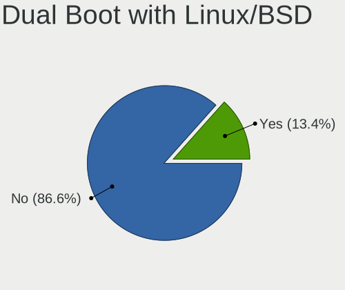

| Dual boot | Computers | Percent |
|-----------|-----------|---------|
| No        | 1898      | 86.79%  |
| Yes       | 289       | 13.21%  |

Dual Boot (Win)
---------------

Hosting Linux and Windows

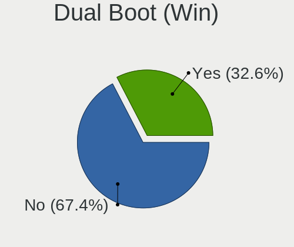

| Dual boot | Computers | Percent |
|-----------|-----------|---------|
| No        | 1460      | 66.21%  |
| Yes       | 745       | 33.79%  |

Board
-----

Vendor
------

Motherboard manufacturer

| Name                    | Computers | Percent |
|-------------------------|-----------|---------|
| ASUSTek Computer        | 460       | 21.3%   |
| Lenovo                  | 404       | 18.7%   |
| Hewlett-Packard         | 331       | 15.32%  |
| Dell                    | 230       | 10.65%  |
| Gigabyte Technology     | 147       | 6.81%   |
| Acer                    | 140       | 6.48%   |
| MSI                     | 133       | 6.16%   |
| ASRock                  | 55        | 2.55%   |
| Intel                   | 31        | 1.44%   |
| UMAX                    | 25        | 1.16%   |
| Fujitsu                 | 18        | 0.83%   |
| Toshiba                 | 17        | 0.79%   |
| Sony                    | 15        | 0.69%   |
| Raspberry Pi Foundation | 14        | 0.65%   |
| Unknown                 | 10        | 0.46%   |
| Apple                   | 9         | 0.42%   |
| Fujitsu Siemens         | 8         | 0.37%   |
| Pegatron                | 7         | 0.32%   |
| HUAWEI                  | 7         | 0.32%   |
| Google                  | 7         | 0.32%   |
| Valve                   | 6         | 0.28%   |
| Supermicro              | 6         | 0.28%   |
| AMI                     | 6         | 0.28%   |
| TUXEDO                  | 4         | 0.19%   |
| Timi                    | 4         | 0.19%   |
| Packard Bell            | 4         | 0.19%   |
| Microsoft               | 4         | 0.19%   |
| ZOTAC                   | 3         | 0.14%   |
| Notebook                | 3         | 0.14%   |
| Foxconn                 | 3         | 0.14%   |
| Insyde                  | 2         | 0.09%   |
| IBM                     | 2         | 0.09%   |
| Dynabook                | 2         | 0.09%   |
| Clientron               | 2         | 0.09%   |
| Chuwi                   | 2         | 0.09%   |
| Biostar                 | 2         | 0.09%   |
| ASRockRack              | 2         | 0.09%   |
| Alienware               | 2         | 0.09%   |
| Wortmann AG             | 1         | 0.05%   |
| Standard                | 1         | 0.05%   |

Model
-----

Motherboard model

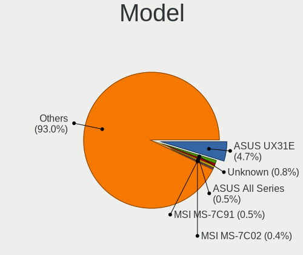

| Name                                 | Computers | Percent |
|--------------------------------------|-----------|---------|
| ASUS UX31E                           | 127       | 5.88%   |
| Unknown                              | 15        | 0.69%   |
| ASUS All Series                      | 13        | 0.6%    |
| MSI MS-7C91                          | 10        | 0.46%   |
| MSI MS-7C02                          | 7         | 0.32%   |
| MSI MS-7A34                          | 7         | 0.32%   |
| MSI MS-7693                          | 7         | 0.32%   |
| HP ProBook 455 G7                    | 7         | 0.32%   |
| Valve Jupiter                        | 6         | 0.28%   |
| HP EliteBook 845 G8 Notebook PC      | 6         | 0.28%   |
| Dell Latitude E6420                  | 6         | 0.28%   |
| RPi Raspberry Pi                     | 5         | 0.23%   |
| MSI MS-7592                          | 5         | 0.23%   |
| Lenovo ThinkPad E14 20RA001LMC       | 5         | 0.23%   |
| Lenovo IdeaPad S145-15AST 81N3       | 5         | 0.23%   |
| HP ProLiant DL380e Gen8              | 5         | 0.23%   |
| HP ProBook 4540s                     | 5         | 0.23%   |
| HP ProBook 4530s                     | 5         | 0.23%   |
| HP ProBook 450 G5                    | 5         | 0.23%   |
| HP Pavilion dv7                      | 5         | 0.23%   |
| HP EliteBook 840 G3                  | 5         | 0.23%   |
| Dell Latitude E6400                  | 5         | 0.23%   |
| Dell Latitude 5401                   | 5         | 0.23%   |
| ASUS P5G41T-M LX                     | 5         | 0.23%   |
| HP ProDesk 405 G6 Desktop Mini PC    | 4         | 0.19%   |
| HP Notebook                          | 4         | 0.19%   |
| HP EliteBook 840 G6                  | 4         | 0.19%   |
| HP Compaq 8200 Elite SFF PC          | 4         | 0.19%   |
| HP 250 G6 Notebook PC                | 4         | 0.19%   |
| Dell XPS 15 9560                     | 4         | 0.19%   |
| Dell XPS 15 7590                     | 4         | 0.19%   |
| Dell Precision M6500                 | 4         | 0.19%   |
| Dell Latitude E7440                  | 4         | 0.19%   |
| Dell Latitude E5470                  | 4         | 0.19%   |
| Dell Latitude 5480                   | 4         | 0.19%   |
| Acer Extensa 5620                    | 4         | 0.19%   |
| UMAX VisionBook 15Wg Plus            | 3         | 0.14%   |
| MSI MS-7817                          | 3         | 0.14%   |
| Lenovo Z50-75 80EC                   | 3         | 0.14%   |
| Lenovo ThinkPad T14 Gen 1 20UES2WA00 | 3         | 0.14%   |

Model Family
------------

Motherboard model prefix

| Name               | Computers | Percent |
|--------------------|-----------|---------|
| Lenovo ThinkPad    | 186       | 8.61%   |
| ASUS UX31E         | 127       | 5.88%   |
| Dell Latitude      | 96        | 4.44%   |
| Acer Aspire        | 82        | 3.8%    |
| Lenovo IdeaPad     | 80        | 3.7%    |
| HP EliteBook       | 72        | 3.33%   |
| HP ProBook         | 65        | 3.01%   |
| HP Compaq          | 35        | 1.62%   |
| HP Pavilion        | 34        | 1.57%   |
| ASUS ROG           | 34        | 1.57%   |
| ASUS PRIME         | 33        | 1.53%   |
| Dell XPS           | 27        | 1.25%   |
| Dell Inspiron      | 27        | 1.25%   |
| Lenovo Yoga        | 26        | 1.2%    |
| Dell Precision     | 26        | 1.2%    |
| Dell OptiPlex      | 26        | 1.2%    |
| ASUS TUF           | 22        | 1.02%   |
| Lenovo ThinkCentre | 20        | 0.93%   |
| ASUS ZenBook       | 17        | 0.79%   |
| UMAX VisionBook    | 16        | 0.74%   |
| Toshiba Satellite  | 16        | 0.74%   |
| HP ZBook           | 16        | 0.74%   |
| ASUS VivoBook      | 16        | 0.74%   |
| HP Laptop          | 15        | 0.69%   |
| Unknown            | 15        | 0.69%   |
| RPi Raspberry      | 14        | 0.65%   |
| Lenovo Legion      | 14        | 0.65%   |
| Acer TravelMate    | 14        | 0.65%   |
| Acer Extensa       | 14        | 0.65%   |
| HP ENVY            | 13        | 0.6%    |
| ASUS All           | 13        | 0.6%    |
| Dell Vostro        | 12        | 0.56%   |
| Acer Swift         | 12        | 0.56%   |
| HP ProDesk         | 11        | 0.51%   |
| HP 250             | 11        | 0.51%   |
| MSI MS-7C91        | 10        | 0.46%   |
| Lenovo ThinkBook   | 10        | 0.46%   |
| Fujitsu LIFEBOOK   | 10        | 0.46%   |
| ASUS ASUS          | 9         | 0.42%   |
| MSI MS-7C02        | 7         | 0.32%   |

MFG Year
--------

Motherboard manufacture year

| Year    | Computers | Percent |
|---------|-----------|---------|
| 2011    | 256       | 11.85%  |
| 2020    | 213       | 9.86%   |
| 2018    | 181       | 8.38%   |
| 2019    | 176       | 8.15%   |
| 2021    | 164       | 7.59%   |
| 2017    | 142       | 6.57%   |
| 2012    | 142       | 6.57%   |
| 2014    | 122       | 5.65%   |
| 2013    | 113       | 5.23%   |
| 2015    | 105       | 4.86%   |
| 2008    | 99        | 4.58%   |
| 2016    | 88        | 4.07%   |
| 2010    | 81        | 3.75%   |
| 2009    | 71        | 3.29%   |
| 2022    | 69        | 3.19%   |
| 2007    | 65        | 3.01%   |
| 2006    | 26        | 1.2%    |
| Unknown | 18        | 0.83%   |
| 2023    | 15        | 0.69%   |
| 2005    | 9         | 0.42%   |
| 2004    | 4         | 0.19%   |
| 2000    | 1         | 0.05%   |

Form Factor
-----------

Physical design of the computer

| Name           | Computers | Percent |
|----------------|-----------|---------|
| Notebook       | 1313      | 60.79%  |
| Desktop        | 684       | 31.67%  |
| Convertible    | 62        | 2.87%   |
| Mini pc        | 34        | 1.57%   |
| System on chip | 17        | 0.79%   |
| Tablet         | 17        | 0.79%   |
| All in one     | 16        | 0.74%   |
| Server         | 16        | 0.74%   |
| Phone          | 1         | 0.05%   |

Secure Boot
-----------

Enabled or disabled

| State    | Computers | Percent |
|----------|-----------|---------|
| Disabled | 1973      | 90.42%  |
| Enabled  | 209       | 9.58%   |

Coreboot
--------

Have coreboot on board

| Used | Computers | Percent |
|------|-----------|---------|
| No   | 2153      | 99.68%  |
| Yes  | 7         | 0.32%   |

RAM Size
--------

Total RAM memory

| Size in GB      | Computers | Percent |
|-----------------|-----------|---------|
| 3.01-4.0        | 536       | 24.34%  |
| 4.01-8.0        | 408       | 18.53%  |
| 8.01-16.0       | 391       | 17.76%  |
| 16.01-24.0      | 366       | 16.62%  |
| 32.01-64.0      | 231       | 10.49%  |
| 1.01-2.0        | 106       | 4.81%   |
| 64.01-256.0     | 56        | 2.54%   |
| 24.01-32.0      | 45        | 2.04%   |
| 2.01-3.0        | 40        | 1.82%   |
| 0.51-1.0        | 19        | 0.86%   |
| More than 256.0 | 2         | 0.09%   |
| 0.01-0.5        | 2         | 0.09%   |

RAM Used
--------

Used RAM memory

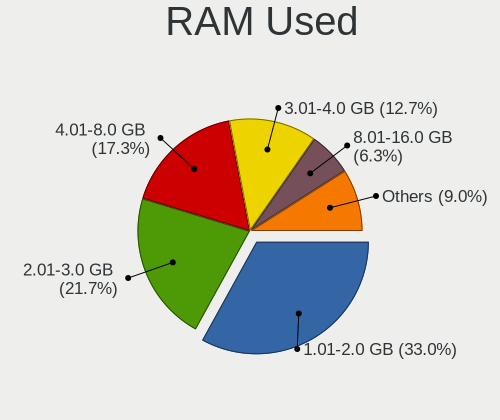

| Used GB     | Computers | Percent |
|-------------|-----------|---------|
| 1.01-2.0    | 860       | 35.89%  |
| 2.01-3.0    | 519       | 21.66%  |
| 4.01-8.0    | 378       | 15.78%  |
| 3.01-4.0    | 284       | 11.85%  |
| 0.51-1.0    | 147       | 6.14%   |
| 8.01-16.0   | 133       | 5.55%   |
| 0.01-0.5    | 34        | 1.42%   |
| 16.01-24.0  | 24        | 1%      |
| 32.01-64.0  | 9         | 0.38%   |
| 24.01-32.0  | 6         | 0.25%   |
| 64.01-256.0 | 1         | 0.04%   |
| Unknown     | 1         | 0.04%   |

Total Drives
------------

Number of drives on board

| Drives | Computers | Percent |
|--------|-----------|---------|
| 1      | 1451      | 64.92%  |
| 2      | 474       | 21.21%  |
| 3      | 149       | 6.67%   |
| 4      | 62        | 2.77%   |
| 5      | 39        | 1.74%   |
| 0      | 27        | 1.21%   |
| 6      | 17        | 0.76%   |
| 7      | 11        | 0.49%   |
| 8      | 4         | 0.18%   |
| 9      | 1         | 0.04%   |

Has CD-ROM
----------

Has CD-ROM on board

| Presented | Computers | Percent |
|-----------|-----------|---------|
| No        | 1442      | 66.3%   |
| Yes       | 733       | 33.7%   |

Has Ethernet
------------

Has Ethernet on board

| Presented | Computers | Percent |
|-----------|-----------|---------|
| Yes       | 1870      | 86.1%   |
| No        | 302       | 13.9%   |

Has WiFi
--------

Has WiFi module

| Presented | Computers | Percent |
|-----------|-----------|---------|
| Yes       | 1610      | 74.13%  |
| No        | 562       | 25.87%  |

Has Bluetooth
-------------

Has Bluetooth module

| Presented | Computers | Percent |
|-----------|-----------|---------|
| Yes       | 1253      | 57.29%  |
| No        | 934       | 42.71%  |

Location
--------

Country
-------

Geographic location (country)

| Country | Computers | Percent |
|---------|-----------|---------|
| Czechia | 2160      | 100%    |

City
----

Geographic location (city)

| City                 | Computers | Percent |
|----------------------|-----------|---------|
| Prague               | 845       | 37.47%  |
| Brno                 | 177       | 7.85%   |
| Ostrava              | 70        | 3.1%    |
| Pilsen               | 50        | 2.22%   |
| Liberec              | 35        | 1.55%   |
| Olomouc              | 32        | 1.42%   |
| Pardubice            | 30        | 1.33%   |
| Hradec Krlov     | 30        | 1.33%   |
| esk Budjovice  | 26        | 1.15%   |
| Zln                | 19        | 0.84%   |
| Havov            | 18        | 0.8%    |
| Znojmo               | 16        | 0.71%   |
| Brdo                 | 16        | 0.71%   |
| Most                 | 14        | 0.62%   |
| Chomutov             | 13        | 0.58%   |
| Jihlava              | 12        | 0.53%   |
| Frdek-Mstek      | 11        | 0.49%   |
| st nad Labem     | 10        | 0.44%   |
| Perov              | 9         | 0.4%    |
| Opava                | 9         | 0.4%    |
| Mlad Boleslav      | 9         | 0.4%    |
| Kladno               | 9         | 0.4%    |
| Tbor               | 8         | 0.35%   |
| Litomice         | 8         | 0.35%   |
| Karlovy Vary         | 8         | 0.35%   |
| Uhersk Hradit  | 7         | 0.31%   |
| Teb            | 7         | 0.31%   |
| Teplice              | 7         | 0.31%   |
| Roznov pod Radhostem | 7         | 0.31%   |
| Prelouc              | 7         | 0.31%   |
| Praha 10             | 7         | 0.31%   |
| Horice               | 7         | 0.31%   |
| esk Tn     | 7         | 0.31%   |
| esk Lpa        | 7         | 0.31%   |
| As                   | 7         | 0.31%   |
| Vitkov               | 6         | 0.27%   |
| Rumburk              | 6         | 0.27%   |
| Pbram            | 6         | 0.27%   |
| Marinsk Lzn  | 6         | 0.27%   |
| Kralupy nad Vltavou  | 6         | 0.27%   |

Drives
------

Drive Vendor
------------

Hard drive vendors

| Vendor                      | Computers | Drives | Percent |
|-----------------------------|-----------|--------|---------|
| Samsung Electronics         | 503       | 701    | 16.69%  |
| WDC                         | 470       | 771    | 15.59%  |
| Seagate                     | 418       | 639    | 13.87%  |
| SanDisk                     | 232       | 253    | 7.7%    |
| Kingston                    | 208       | 257    | 6.9%    |
| Toshiba                     | 169       | 209    | 5.61%   |
| Unknown                     | 121       | 176    | 4.01%   |
| SK hynix                    | 87        | 103    | 2.89%   |
| Hitachi                     | 87        | 101    | 2.89%   |
| Intel                       | 81        | 99     | 2.69%   |
| A-DATA Technology           | 74        | 88     | 2.46%   |
| Crucial                     | 68        | 84     | 2.26%   |
| Micron Technology           | 60        | 82     | 1.99%   |
| HGST                        | 53        | 65     | 1.76%   |
| Patriot                     | 49        | 60     | 1.63%   |
| KIOXIA                      | 26        | 39     | 0.86%   |
| Apacer                      | 24        | 34     | 0.8%    |
| Transcend                   | 18        | 28     | 0.6%    |
| Phison                      | 16        | 28     | 0.53%   |
| Verbatim                    | 14        | 14     | 0.46%   |
| Unknown                     | 14        | 15     | 0.46%   |
| Gigabyte Technology         | 13        | 24     | 0.43%   |
| Silicon Motion              | 11        | 13     | 0.36%   |
| OCZ                         | 10        | 33     | 0.33%   |
| LITEONIT                    | 10        | 12     | 0.33%   |
| Fujitsu                     | 10        | 11     | 0.33%   |
| China                       | 10        | 11     | 0.33%   |
| Maxtor                      | 9         | 13     | 0.3%    |
| Phison Electronics          | 8         | 9      | 0.27%   |
| LITEON                      | 8         | 9      | 0.27%   |
| Kingston Technology Company | 8         | 9      | 0.27%   |
| XPG                         | 7         | 14     | 0.23%   |
| GOODRAM                     | 7         | 10     | 0.23%   |
| Apple                       | 7         | 10     | 0.23%   |
| UMAX                        | 6         | 6      | 0.2%    |
| Realtek Semiconductor       | 6         | 11     | 0.2%    |
| JMicron Technology          | 6         | 7      | 0.2%    |
| Micron/Crucial Technology   | 5         | 5      | 0.17%   |
| Corsair                     | 5         | 5      | 0.17%   |
| ASMedia                     | 5         | 7      | 0.17%   |

Drive Model
-----------

Hard drive models

| Model                                              | Computers | Percent |
|----------------------------------------------------|-----------|---------|
| SanDisk SSD U100 256GB                             | 126       | 3.8%    |
| Kingston SA400S37240G 240GB SSD                    | 30        | 0.9%    |
| Samsung SSD 860 EVO 500GB                          | 28        | 0.84%   |
| Samsung NVMe SSD Controller SM981/PM981/PM983 1TB  | 28        | 0.84%   |
| Kingston SA400S37480G 480GB SSD                    | 25        | 0.75%   |
| Samsung NVMe SSD Drive 512GB                       | 24        | 0.72%   |
| Unknown MMC Card  64GB                             | 22        | 0.66%   |
| Unknown MMC Card  32GB                             | 22        | 0.66%   |
| Kingston SA400S37120G 120GB SSD                    | 22        | 0.66%   |
| WDC WDS500G2B0A-00SM50 500GB SSD                   | 21        | 0.63%   |
| Samsung SSD 850 EVO 250GB                          | 19        | 0.57%   |
| WDC WDS240G2G0A-00JH30 240GB SSD                   | 18        | 0.54%   |
| Seagate ST1000LM035-1RK172 1TB                     | 18        | 0.54%   |
| HGST HTS721010A9E630 1TB                           | 17        | 0.51%   |
| Samsung NVMe SSD Drive 500GB                       | 16        | 0.48%   |
| Seagate ST2000DM008-2FR102 2TB                     | 15        | 0.45%   |
| Samsung NVMe SSD Controller PM9A1/PM9A3/980PRO 1TB | 15        | 0.45%   |
| Seagate ST1000LM024 HN-M101MBB 1TB                 | 14        | 0.42%   |
| Seagate ST1000DM010-2EP102 1TB                     | 14        | 0.42%   |
| Samsung SSD 980 1TB                                | 14        | 0.42%   |
| Unknown                                            | 14        | 0.42%   |
| Toshiba NVMe SSD Drive 256GB                       | 13        | 0.39%   |
| Seagate ST3500418AS 500GB                          | 13        | 0.39%   |
| Samsung SSD 860 EVO 1TB                            | 12        | 0.36%   |
| Samsung PM963 2.5" NVMe PCIe SSD 256GB             | 12        | 0.36%   |
| Patriot Burst 120GB SSD                            | 12        | 0.36%   |
| Kingston SV300S37A120G 120GB SSD                   | 12        | 0.36%   |
| WDC WD30EFRX-68EUZN0 3TB                           | 11        | 0.33%   |
| Toshiba MQ01ABD100 1TB                             | 11        | 0.33%   |
| Seagate ST500LT012-1DG142 500GB                    | 11        | 0.33%   |
| SanDisk NVMe SSD Drive 512GB                       | 11        | 0.33%   |
| Samsung MZVLB1T0HBLR-000L2 1TB                     | 11        | 0.33%   |
| Patriot Burst 480GB SSD                            | 11        | 0.33%   |
| WDC WD10EZEX-08WN4A0 1TB                           | 10        | 0.3%    |
| Unknown MMC Card  128GB                            | 10        | 0.3%    |
| Seagate ST500DM002-1BD142 500GB                    | 10        | 0.3%    |
| Samsung SSD 850 EVO 500GB                          | 10        | 0.3%    |
| Kingston SHFS37A120G 120GB SSD                     | 10        | 0.3%    |
| A-DATA SU650 120GB SSD                             | 10        | 0.3%    |
| WDC WD10EZEX-08M2NA0 1TB                           | 9         | 0.27%   |

HDD Vendor
----------

Hard disk drive vendors

| Vendor              | Computers | Drives | Percent |
|---------------------|-----------|--------|---------|
| Seagate             | 408       | 620    | 37.4%   |
| WDC                 | 359       | 597    | 32.91%  |
| Toshiba             | 104       | 119    | 9.53%   |
| Hitachi             | 87        | 101    | 7.97%   |
| HGST                | 53        | 65     | 4.86%   |
| Samsung Electronics | 50        | 76     | 4.58%   |
| Fujitsu             | 10        | 11     | 0.92%   |
| Maxtor              | 9         | 13     | 0.82%   |
| Unknown             | 4         | 4      | 0.37%   |
| pqi                 | 2         | 2      | 0.18%   |
| USB3.0              | 1         | 1      | 0.09%   |
| IBM/Hitachi         | 1         | 1      | 0.09%   |
| External            | 1         | 1      | 0.09%   |
| ASUSTOR             | 1         | 1      | 0.09%   |
| Apple               | 1         | 4      | 0.09%   |

SSD Vendor
----------

Solid state drive vendors

| Vendor              | Computers | Drives | Percent |
|---------------------|-----------|--------|---------|
| Samsung Electronics | 203       | 254    | 19.5%   |
| SanDisk             | 169       | 176    | 16.23%  |
| Kingston            | 160       | 201    | 15.37%  |
| WDC                 | 84        | 115    | 8.07%   |
| A-DATA Technology   | 69        | 81     | 6.63%   |
| Crucial             | 62        | 78     | 5.96%   |
| Patriot             | 48        | 59     | 4.61%   |
| Intel               | 35        | 43     | 3.36%   |
| Micron Technology   | 25        | 38     | 2.4%    |
| Apacer              | 22        | 30     | 2.11%   |
| Transcend           | 17        | 25     | 1.63%   |
| SK hynix            | 15        | 16     | 1.44%   |
| Verbatim            | 14        | 14     | 1.34%   |
| Toshiba             | 14        | 18     | 1.34%   |
| LITEONIT            | 10        | 12     | 0.96%   |
| China               | 10        | 11     | 0.96%   |
| OCZ                 | 8         | 15     | 0.77%   |
| UMAX                | 6         | 6      | 0.58%   |
| LITEON              | 6         | 7      | 0.58%   |
| GOODRAM             | 6         | 9      | 0.58%   |
| Gigabyte Technology | 6         | 13     | 0.58%   |
| Seagate             | 5         | 5      | 0.48%   |
| Apple               | 5         | 5      | 0.48%   |
| Team                | 3         | 3      | 0.29%   |
| SPCC                | 3         | 3      | 0.29%   |
| HPE                 | 3         | 3      | 0.29%   |
| ASMedia             | 3         | 4      | 0.29%   |
| Unknown             | 2         | 8      | 0.19%   |
| HS-SSD-C100         | 2         | 2      | 0.19%   |
| Hewlett-Packard     | 2         | 2      | 0.19%   |
| FORESEE             | 2         | 2      | 0.19%   |
| ASMT                | 2         | 2      | 0.19%   |
| WDC WDS1            | 1         | 1      | 0.1%    |
| UMIS                | 1         | 1      | 0.1%    |
| TO Exter            | 1         | 2      | 0.1%    |
| TCSUNBOW            | 1         | 1      | 0.1%    |
| T-CREATE            | 1         | 1      | 0.1%    |
| ShanDianZhe         | 1         | 1      | 0.1%    |
| SATAFIRM            | 1         | 1      | 0.1%    |
| SABRENT             | 1         | 1      | 0.1%    |

Drive Kind
----------

HDD or SSD

| Kind    | Computers | Drives | Percent |
|---------|-----------|--------|---------|
| SSD     | 938       | 1281   | 34.28%  |
| HDD     | 925       | 1616   | 33.81%  |
| NVMe    | 724       | 1041   | 26.46%  |
| MMC     | 132       | 182    | 4.82%   |
| Unknown | 17        | 22     | 0.62%   |

Drive Connector
---------------

SATA, SAS, NVMe, etc.

| Type | Computers | Drives | Percent |
|------|-----------|--------|---------|
| SATA | 1543      | 2823   | 62.24%  |
| NVMe | 720       | 1035   | 29.04%  |
| MMC  | 132       | 182    | 5.32%   |
| SAS  | 84        | 102    | 3.39%   |

Drive Size
----------

Size of hard drive

| Size in TB | Computers | Drives | Percent |
|------------|-----------|--------|---------|
| 0.01-0.5   | 1243      | 1814   | 63.97%  |
| 0.51-1.0   | 465       | 664    | 23.93%  |
| 1.01-2.0   | 109       | 209    | 5.61%   |
| 3.01-4.0   | 40        | 57     | 2.06%   |
| 2.01-3.0   | 35        | 56     | 1.8%    |
| 4.01-10.0  | 32        | 65     | 1.65%   |
| 10.01-20.0 | 19        | 32     | 0.98%   |

Space Total
-----------

Amount of disk space available on the file system

| Size in GB     | Computers | Percent |
|----------------|-----------|---------|
| 101-250        | 566       | 24.8%   |
| 251-500        | 473       | 20.73%  |
| 1-20           | 327       | 14.33%  |
| 501-1000       | 285       | 12.49%  |
| 51-100         | 157       | 6.88%   |
| 1001-2000      | 154       | 6.75%   |
| More than 3000 | 97        | 4.25%   |
| Unknown        | 94        | 4.12%   |
| 21-50          | 86        | 3.77%   |
| 2001-3000      | 43        | 1.88%   |

Space Used
----------

Amount of used disk space

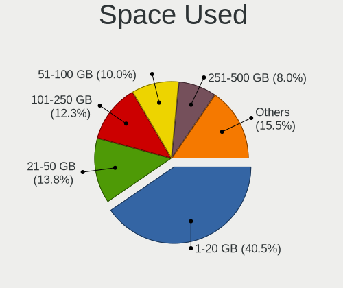

| Used GB        | Computers | Percent |
|----------------|-----------|---------|
| 1-20           | 1006      | 42.63%  |
| 21-50          | 309       | 13.09%  |
| 101-250        | 282       | 11.95%  |
| 51-100         | 231       | 9.79%   |
| 251-500        | 187       | 7.92%   |
| 501-1000       | 119       | 5.04%   |
| Unknown        | 94        | 3.98%   |
| 1001-2000      | 60        | 2.54%   |
| More than 3000 | 47        | 1.99%   |
| 2001-3000      | 25        | 1.06%   |

Malfunc. Drives
---------------

Drive models with a malfunction

| Model                                 | Computers | Drives | Percent |
|---------------------------------------|-----------|--------|---------|
| SanDisk SSD U100 256GB                | 126       | 127    | 41.18%  |
| HGST HTS725050A7E630 500GB            | 4         | 4      | 1.31%   |
| SK hynix BC711 HFM512GD3JX013N 512GB  | 3         | 4      | 0.98%   |
| WDC WD60EFRX-68L0BN1 6TB              | 2         | 3      | 0.65%   |
| Toshiba MQ01ABD075 752GB              | 2         | 2      | 0.65%   |
| Toshiba MK1234GSX 120GB               | 2         | 2      | 0.65%   |
| Seagate ST9500420AS 500GB             | 2         | 3      | 0.65%   |
| Seagate ST3250410AS 250GB             | 2         | 4      | 0.65%   |
| Seagate ST3160318AS 160GB             | 2         | 2      | 0.65%   |
| Seagate ST2000DM008-2FR102 2TB        | 2         | 3      | 0.65%   |
| Seagate ST1000LX015-1U7172 1TB        | 2         | 2      | 0.65%   |
| Seagate ST1000LM024 HN-M101MBB 1TB    | 2         | 2      | 0.65%   |
| Micron Technology 1100 SATA 256GB SSD | 2         | 2      | 0.65%   |
| Kingston SV300S37A120G 120GB SSD      | 2         | 2      | 0.65%   |
| Hitachi HTS541610J9SA00 100GB         | 2         | 2      | 0.65%   |
| HGST HTS721010A9E630 1TB              | 2         | 2      | 0.65%   |
| WDC WDS240G2G0A-00JH30 240GB SSD      | 1         | 1      | 0.33%   |
| WDC WDS120G2G0B-00EPW0 120GB SSD      | 1         | 1      | 0.33%   |
| WDC WDS120G2G0A-00JH30 120GB SSD      | 1         | 1      | 0.33%   |
| WDC WDS100T2B0A-00SM50 1TB SSD        | 1         | 1      | 0.33%   |
| WDC WD800BB-00JHA0 80GB               | 1         | 1      | 0.33%   |
| WDC WD7500BPVT-22HXZT3 752GB          | 1         | 1      | 0.33%   |
| WDC WD7500BPKT-75PK4T0 752GB          | 1         | 1      | 0.33%   |
| WDC WD7500AADS-00M2B0 752GB           | 1         | 1      | 0.33%   |
| WDC WD6400BPVT-60HXZT1 640GB          | 1         | 1      | 0.33%   |
| WDC WD6400AAKS-22A7B2 640GB           | 1         | 1      | 0.33%   |
| WDC WD5000AAKX-75U6AA0 500GB          | 1         | 1      | 0.33%   |
| WDC WD5000AAKS-00V0A0 500GB           | 1         | 1      | 0.33%   |
| WDC WD3200BEVT-60ZCT1 320GB           | 1         | 1      | 0.33%   |
| WDC WD3200AAKS-00L9A0 320GB           | 1         | 1      | 0.33%   |
| WDC WD30EFRX-68EUZN0 3TB              | 1         | 1      | 0.33%   |
| WDC WD2502ABYS-02B7A0 256GB           | 1         | 1      | 0.33%   |
| WDC WD2500BPVT-22JJ5T0 250GB          | 1         | 1      | 0.33%   |
| WDC WD2500BEVS-22UST0 250GB           | 1         | 1      | 0.33%   |
| WDC WD2500AAKX-75U6AA0 250GB          | 1         | 1      | 0.33%   |
| WDC WD2500AAKX-60U6AA0 250GB          | 1         | 1      | 0.33%   |
| WDC WD2500AAKX-603CA0 250GB           | 1         | 1      | 0.33%   |
| WDC WD2500AAKX-083CA1 250GB           | 1         | 2      | 0.33%   |
| WDC WD2500AAKS-00VSA0 250GB           | 1         | 1      | 0.33%   |
| WDC WD2500AAJS-08L7A0 250GB           | 1         | 2      | 0.33%   |

Malfunc. Drive Vendor
---------------------

Vendors of faulty drives

| Vendor                | Computers | Drives | Percent |
|-----------------------|-----------|--------|---------|
| SanDisk               | 128       | 129    | 42.38%  |
| Seagate               | 45        | 57     | 14.9%   |
| WDC                   | 36        | 45     | 11.92%  |
| Samsung Electronics   | 18        | 20     | 5.96%   |
| Hitachi               | 18        | 18     | 5.96%   |
| Toshiba               | 13        | 16     | 4.3%    |
| HGST                  | 10        | 10     | 3.31%   |
| Kingston              | 7         | 7      | 2.32%   |
| SK hynix              | 6         | 7      | 1.99%   |
| Micron Technology     | 4         | 4      | 1.32%   |
| Crucial               | 3         | 3      | 0.99%   |
| A-DATA Technology     | 3         | 5      | 0.99%   |
| Intel                 | 2         | 2      | 0.66%   |
| SPCC                  | 1         | 1      | 0.33%   |
| SATAFIRM              | 1         | 1      | 0.33%   |
| Realtek Semiconductor | 1         | 4      | 0.33%   |
| Maxtor                | 1         | 1      | 0.33%   |
| LITEONIT              | 1         | 1      | 0.33%   |
| IBM/Hitachi           | 1         | 1      | 0.33%   |
| HS-SSD-C100           | 1         | 1      | 0.33%   |
| Gigabyte Technology   | 1         | 1      | 0.33%   |
| Fujitsu               | 1         | 1      | 0.33%   |

Malfunc. HDD Vendor
-------------------

Vendors of faulty HDD drives

| Vendor              | Computers | Drives | Percent |
|---------------------|-----------|--------|---------|
| Seagate             | 45        | 57     | 35.16%  |
| WDC                 | 31        | 39     | 24.22%  |
| Hitachi             | 18        | 18     | 14.06%  |
| Toshiba             | 13        | 16     | 10.16%  |
| HGST                | 10        | 10     | 7.81%   |
| Samsung Electronics | 8         | 9      | 6.25%   |
| Maxtor              | 1         | 1      | 0.78%   |
| IBM/Hitachi         | 1         | 1      | 0.78%   |
| Fujitsu             | 1         | 1      | 0.78%   |

Malfunc. Drive Kind
-------------------

Kinds of faulty drives

| Kind | Computers | Drives | Percent |
|------|-----------|--------|---------|
| SSD  | 163       | 166    | 54.52%  |
| HDD  | 124       | 152    | 41.47%  |
| NVMe | 12        | 17     | 4.01%   |

Failed Drives
-------------

Failed drive models

| Model                     | Computers | Drives | Percent |
|---------------------------|-----------|--------|---------|
| Seagate ST3500418AS 500GB | 2         | 4      | 66.67%  |
| Unknown 00000  16GB       | 1         | 1      | 33.33%  |

Failed Drive Vendor
-------------------

Failed drive vendors

| Vendor  | Computers | Drives | Percent |
|---------|-----------|--------|---------|
| Seagate | 2         | 4      | 66.67%  |
| Unknown | 1         | 1      | 33.33%  |

Drive Status
------------

Number of failed and malfunc. drives

| Status   | Computers | Drives | Percent |
|----------|-----------|--------|---------|
| Detected | 1181      | 2328   | 50.84%  |
| Works    | 844       | 1474   | 36.33%  |
| Malfunc  | 295       | 335    | 12.7%   |
| Failed   | 3         | 5      | 0.13%   |

Storage controller
------------------

Storage Vendor
--------------

Storage controller vendors

| Vendor                           | Computers | Percent |
|----------------------------------|-----------|---------|
| Intel                            | 1387      | 51.24%  |
| AMD                              | 425       | 15.7%   |
| Samsung Electronics              | 281       | 10.38%  |
| SanDisk                          | 101       | 3.73%   |
| SK hynix                         | 67        | 2.48%   |
| Kingston Technology Company      | 59        | 2.18%   |
| Toshiba America Info Systems     | 50        | 1.85%   |
| Micron Technology                | 35        | 1.29%   |
| JMicron Technology               | 34        | 1.26%   |
| Phison Electronics               | 33        | 1.22%   |
| ASMedia Technology               | 32        | 1.18%   |
| KIOXIA                           | 29        | 1.07%   |
| Nvidia                           | 28        | 1.03%   |
| Marvell Technology Group         | 26        | 0.96%   |
| Silicon Motion                   | 17        | 0.63%   |
| ADATA Technology                 | 15        | 0.55%   |
| VIA Technologies                 | 11        | 0.41%   |
| Micron/Crucial Technology        | 10        | 0.37%   |
| Seagate Technology               | 7         | 0.26%   |
| Realtek Semiconductor            | 7         | 0.26%   |
| Hewlett-Packard                  | 6         | 0.22%   |
| Union Memory (Shenzhen)          | 5         | 0.18%   |
| Solid State Storage Technology   | 4         | 0.15%   |
| Silicon Image                    | 4         | 0.15%   |
| Lite-On Technology               | 4         | 0.15%   |
| Silicon Integrated Systems [SiS] | 3         | 0.11%   |
| LSI Logic / Symbios Logic        | 3         | 0.11%   |
| Lenovo                           | 3         | 0.11%   |
| Broadcom / LSI                   | 3         | 0.11%   |
| Adaptec                          | 3         | 0.11%   |
| OCZ Technology Group             | 2         | 0.07%   |
| MAXIO Technology (Hangzhou)      | 2         | 0.07%   |
| Integrated Technology Express    | 2         | 0.07%   |
| Western Digital                  | 1         | 0.04%   |
| Solidigm                         | 1         | 0.04%   |
| Promise Technology               | 1         | 0.04%   |
| O2 Micro                         | 1         | 0.04%   |
| INNOGRIT                         | 1         | 0.04%   |
| Chelsio Communications           | 1         | 0.04%   |
| Biwin Storage Technology         | 1         | 0.04%   |

Storage Model
-------------

Storage controller models

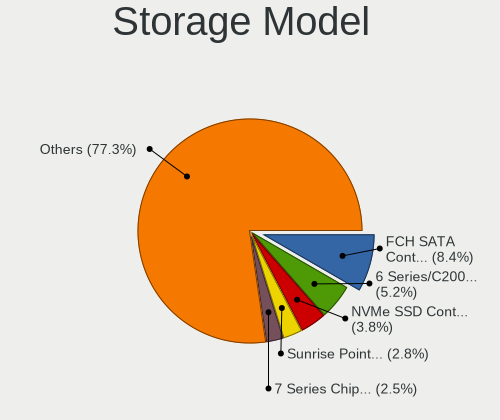

| Model                                                                            | Computers | Percent |
|----------------------------------------------------------------------------------|-----------|---------|
| AMD FCH SATA Controller [AHCI mode]                                              | 278       | 8.84%   |
| Intel 6 Series/C200 Series Chipset Family 6 port Mobile SATA AHCI Controller     | 191       | 6.08%   |
| Samsung NVMe SSD Controller SM981/PM981/PM983                                    | 128       | 4.07%   |
| Intel Sunrise Point-LP SATA Controller [AHCI mode]                               | 93        | 2.96%   |
| Intel 8 Series/C220 Series Chipset Family 6-port SATA Controller 1 [AHCI mode]   | 81        | 2.58%   |
| Samsung NVMe SSD Controller 980 (DRAM-less)                                      | 76        | 2.42%   |
| Intel 7 Series Chipset Family 6-port SATA Controller [AHCI mode]                 | 75        | 2.39%   |
| Intel 82801 Mobile SATA Controller [RAID mode]                                   | 65        | 2.07%   |
| AMD 400 Series Chipset SATA Controller                                           | 56        | 1.78%   |
| Intel Volume Management Device NVMe RAID Controller                              | 51        | 1.62%   |
| Intel 82801IBM/IEM (ICH9M/ICH9M-E) 4 port SATA Controller [AHCI mode]            | 48        | 1.53%   |
| AMD SB7x0/SB8x0/SB9x0 SATA Controller [AHCI mode]                                | 46        | 1.46%   |
| Intel NM10/ICH7 Family SATA Controller [IDE mode]                                | 45        | 1.43%   |
| Intel 82801G (ICH7 Family) IDE Controller                                        | 44        | 1.4%    |
| Intel Celeron/Pentium Silver Processor SATA Controller                           | 40        | 1.27%   |
| Intel 8 Series SATA Controller 1 [AHCI mode]                                     | 39        | 1.24%   |
| AMD SB7x0/SB8x0/SB9x0 IDE Controller                                             | 39        | 1.24%   |
| AMD 500 Series Chipset SATA Controller                                           | 38        | 1.21%   |
| Samsung NVMe SSD Controller PM9A1/PM9A3/980PRO                                   | 37        | 1.18%   |
| Intel Cannon Lake Mobile PCH SATA AHCI Controller                                | 37        | 1.18%   |
| Intel Q170/Q150/B150/H170/H110/Z170/CM236 Chipset SATA Controller [AHCI Mode]    | 35        | 1.11%   |
| Intel 6 Series/C200 Series Chipset Family 6 port Desktop SATA AHCI Controller    | 33        | 1.05%   |
| Samsung NVMe SSD Controller SM961/PM961/SM963                                    | 32        | 1.02%   |
| Intel 82801HM/HEM (ICH8M/ICH8M-E) IDE Controller                                 | 31        | 0.99%   |
| Intel Atom Processor E3800 Series SATA AHCI Controller                           | 30        | 0.95%   |
| AMD SB7x0/SB8x0/SB9x0 SATA Controller [IDE mode]                                 | 30        | 0.95%   |
| Intel Wildcat Point-LP SATA Controller [AHCI Mode]                               | 29        | 0.92%   |
| Intel 200 Series PCH SATA controller [AHCI mode]                                 | 29        | 0.92%   |
| ASMedia ASM1062 Serial ATA Controller                                            | 29        | 0.92%   |
| SanDisk Extreme Pro / WD Black SN750 / PC SN730 / Red SN700 NVMe SSD             | 27        | 0.86%   |
| SanDisk Ultra 3D / WD Blue SN550 NVMe SSD                                        | 26        | 0.83%   |
| Intel Comet Lake SATA AHCI Controller                                            | 26        | 0.83%   |
| SK hynix Gold P31/BC711/PC711 NVMe Solid State Drive                             | 25        | 0.8%    |
| Intel HM170/QM170 Chipset SATA Controller [AHCI Mode]                            | 23        | 0.73%   |
| KIOXIA NVMe SSD Controller BG4 (DRAM-less)                                       | 22        | 0.7%    |
| Intel Cannon Lake PCH SATA AHCI Controller                                       | 22        | 0.7%    |
| Intel 5 Series/3400 Series Chipset 4 port SATA AHCI Controller                   | 22        | 0.7%    |
| JMicron JMB363 SATA/IDE Controller                                               | 21        | 0.67%   |
| Intel SATA Controller [RAID mode]                                                | 21        | 0.67%   |
| Intel Atom/Celeron/Pentium Processor x5-E8000/J3xxx/N3xxx Series SATA Controller | 21        | 0.67%   |

Storage Kind
------------

Kind of storage controller (IDE, SATA, NVMe, SAS, ...)

| Kind | Computers | Percent |
|------|-----------|---------|
| SATA | 1520      | 55.54%  |
| NVMe | 727       | 26.56%  |
| IDE  | 313       | 11.44%  |
| RAID | 164       | 5.99%   |
| SAS  | 9         | 0.33%   |
| SCSI | 4         | 0.15%   |

Processor
---------

CPU Vendor
----------

Processor vendors

| Vendor   | Computers | Percent |
|----------|-----------|---------|
| Intel    | 1587      | 73.47%  |
| AMD      | 555       | 25.69%  |
| ARM      | 17        | 0.79%   |
| QUALCOMM | 1         | 0.05%   |

CPU Model
---------

Processor models

| Model                                         | Computers | Percent |
|-----------------------------------------------|-----------|---------|
| Intel Core i7-2677M CPU @ 1.80GHz             | 127       | 5.85%   |
| Intel Core i5-8250U CPU @ 1.60GHz             | 24        | 1.11%   |
| Intel Core i5-2520M CPU @ 2.50GHz             | 19        | 0.88%   |
| AMD Ryzen 5 3600 6-Core Processor             | 19        | 0.88%   |
| Intel Core i7-10510U CPU @ 1.80GHz            | 18        | 0.83%   |
| Intel Core i5-7200U CPU @ 2.50GHz             | 18        | 0.83%   |
| AMD Ryzen 7 4700U with Radeon Graphics        | 18        | 0.83%   |
| Intel Core i7-8550U CPU @ 1.80GHz             | 17        | 0.78%   |
| Intel Core i7-8565U CPU @ 1.80GHz             | 16        | 0.74%   |
| Intel Core i5-8265U CPU @ 1.60GHz             | 16        | 0.74%   |
| Intel 11th Gen Core i5-1135G7 @ 2.40GHz       | 16        | 0.74%   |
| AMD Ryzen 5 5600X 6-Core Processor            | 14        | 0.64%   |
| AMD Ryzen 5 4500U with Radeon Graphics        | 14        | 0.64%   |
| Intel Core i5-2400 CPU @ 3.10GHz              | 13        | 0.6%    |
| ARM Processor                                 | 13        | 0.6%    |
| AMD Ryzen 7 PRO 4750U with Radeon Graphics    | 13        | 0.6%    |
| AMD Ryzen 7 5800H with Radeon Graphics        | 13        | 0.6%    |
| Intel Core i7-9750H CPU @ 2.60GHz             | 12        | 0.55%   |
| Intel Core i5-6300U CPU @ 2.40GHz             | 12        | 0.55%   |
| Intel Core i5-6200U CPU @ 2.30GHz             | 12        | 0.55%   |
| Intel Core i5-3210M CPU @ 2.50GHz             | 12        | 0.55%   |
| Intel 11th Gen Core i7-1165G7 @ 2.80GHz       | 12        | 0.55%   |
| Intel Core i7-8750H CPU @ 2.20GHz             | 11        | 0.51%   |
| Intel Core i7-8650U CPU @ 1.90GHz             | 11        | 0.51%   |
| Intel Core i7-7700HQ CPU @ 2.80GHz            | 11        | 0.51%   |
| Intel Core i7-10850H CPU @ 2.70GHz            | 11        | 0.51%   |
| Intel Core 2 Duo CPU E8400 @ 3.00GHz          | 11        | 0.51%   |
| AMD Ryzen 5 5500U with Radeon Graphics        | 11        | 0.51%   |
| Intel Core i5-3320M CPU @ 2.60GHz             | 10        | 0.46%   |
| Intel Celeron N4100 CPU @ 1.10GHz             | 10        | 0.46%   |
| Intel Celeron N4020 CPU @ 1.10GHz             | 10        | 0.46%   |
| AMD Ryzen 7 3700X 8-Core Processor            | 10        | 0.46%   |
| AMD Ryzen 5 1600 Six-Core Processor           | 10        | 0.46%   |
| Intel Core i7-6700HQ CPU @ 2.60GHz            | 9         | 0.41%   |
| Intel Core i5-5200U CPU @ 2.20GHz             | 9         | 0.41%   |
| Intel Core i5-4300U CPU @ 1.90GHz             | 9         | 0.41%   |
| Intel Core 2 Duo CPU P8600 @ 2.40GHz          | 9         | 0.41%   |
| AMD Ryzen 7 5700U with Radeon Graphics        | 9         | 0.41%   |
| AMD Ryzen 5 5600H with Radeon Graphics        | 9         | 0.41%   |
| AMD Ryzen 5 3500U with Radeon Vega Mobile Gfx | 9         | 0.41%   |

CPU Model Family
----------------

Processor model prefix

| Model                   | Computers | Percent |
|-------------------------|-----------|---------|
| Intel Core i7           | 467       | 21.52%  |
| Intel Core i5           | 382       | 17.6%   |
| AMD Ryzen 5             | 153       | 7.05%   |
| Other                   | 141       | 6.5%    |
| Intel Celeron           | 127       | 5.85%   |
| Intel Core 2 Duo        | 118       | 5.44%   |
| Intel Core i3           | 110       | 5.07%   |
| AMD Ryzen 7             | 98        | 4.52%   |
| Intel Pentium           | 64        | 2.95%   |
| Intel Xeon              | 42        | 1.94%   |
| Intel Atom              | 40        | 1.84%   |
| AMD FX                  | 37        | 1.71%   |
| AMD Ryzen 7 PRO         | 29        | 1.34%   |
| AMD Ryzen 9             | 27        | 1.24%   |
| Intel Pentium Dual-Core | 25        | 1.15%   |
| AMD Ryzen 3             | 21        | 0.97%   |
| AMD A4                  | 19        | 0.88%   |
| AMD A8                  | 17        | 0.78%   |
| AMD Ryzen 5 PRO         | 16        | 0.74%   |
| AMD A6                  | 15        | 0.69%   |
| Intel Core 2            | 14        | 0.65%   |
| Intel Pentium Dual      | 12        | 0.55%   |
| AMD Athlon 64 X2        | 12        | 0.55%   |
| Intel Pentium Silver    | 11        | 0.51%   |
| Intel Core 2 Quad       | 11        | 0.51%   |
| Intel Core i9           | 10        | 0.46%   |
| AMD Phenom II X4        | 10        | 0.46%   |
| AMD A10                 | 10        | 0.46%   |
| AMD Athlon              | 9         | 0.41%   |
| AMD Athlon II X2        | 8         | 0.37%   |
| Intel Celeron M         | 7         | 0.32%   |
| Intel Pentium Gold      | 6         | 0.28%   |
| AMD E1                  | 6         | 0.28%   |
| Intel Pentium 4         | 5         | 0.23%   |
| Intel Genuine           | 5         | 0.23%   |
| Intel Celeron Dual-Core | 5         | 0.23%   |
| AMD Sempron             | 5         | 0.23%   |
| Intel Pentium M         | 4         | 0.18%   |
| Intel Pentium D         | 4         | 0.18%   |
| AMD Turion II           | 4         | 0.18%   |

CPU Cores
---------

Number of processor cores

| Number  | Computers | Percent |
|---------|-----------|---------|
| 2       | 926       | 42.65%  |
| 4       | 692       | 31.87%  |
| 6       | 245       | 11.29%  |
| 8       | 157       | 7.23%   |
| 1       | 63        | 2.9%    |
| 12      | 35        | 1.61%   |
| 3       | 13        | 0.6%    |
| 16      | 12        | 0.55%   |
| 10      | 10        | 0.46%   |
| 14      | 9         | 0.41%   |
| 24      | 3         | 0.14%   |
| Unknown | 3         | 0.14%   |
| 32      | 1         | 0.05%   |
| 28      | 1         | 0.05%   |
| 20      | 1         | 0.05%   |

CPU Sockets
-----------

Number of sockets

| Number | Computers | Percent |
|--------|-----------|---------|
| 1      | 2144      | 99.26%  |
| 2      | 16        | 0.74%   |

CPU Threads
-----------

Threads per core (Hyper-Threading)

| Number  | Computers | Percent |
|---------|-----------|---------|
| 2       | 1404      | 64.85%  |
| 1       | 757       | 34.97%  |
| Unknown | 3         | 0.14%   |
| 4       | 1         | 0.05%   |

CPU Op-Modes
------------

CPU Operation Modes (32-bit, 64-bit)

| Op mode        | Computers | Percent |
|----------------|-----------|---------|
| 32-bit, 64-bit | 2100      | 96.86%  |
| Unknown        | 38        | 1.75%   |
| 32-bit         | 26        | 1.2%    |
| 64-bit         | 4         | 0.18%   |

CPU Microcode
-------------

Microcode number

| Number     | Computers | Percent |
|------------|-----------|---------|
| Unknown    | 533       | 23.67%  |
| 0x206a7    | 218       | 9.68%   |
| 0x306c3    | 79        | 3.51%   |
| 0x1067a    | 75        | 3.33%   |
| 0x306a9    | 71        | 3.15%   |
| 0x806ec    | 51        | 2.26%   |
| 0x906ea    | 50        | 2.22%   |
| 0x806ea    | 47        | 2.09%   |
| 0x806c1    | 40        | 1.78%   |
| 0x406e3    | 38        | 1.69%   |
| 0x0a50000c | 35        | 1.55%   |
| 0x806e9    | 34        | 1.51%   |
| 0x506e3    | 34        | 1.51%   |
| 0x08600106 | 34        | 1.51%   |
| 0x40651    | 33        | 1.47%   |
| 0x6fd      | 32        | 1.42%   |
| 0x906e9    | 30        | 1.33%   |
| 0x306d4    | 26        | 1.15%   |
| 0x08701021 | 26        | 1.15%   |
| 0x30678    | 24        | 1.07%   |
| 0x10676    | 22        | 0.98%   |
| 0x6fb      | 21        | 0.93%   |
| 0x406c4    | 19        | 0.84%   |
| 0x06000852 | 19        | 0.84%   |
| 0x010000c8 | 19        | 0.84%   |
| 0x706a1    | 18        | 0.8%    |
| 0x20655    | 17        | 0.75%   |
| 0x0800820d | 17        | 0.75%   |
| 0xa0652    | 16        | 0.71%   |
| 0x706a8    | 16        | 0.71%   |
| 0x08608103 | 16        | 0.71%   |
| 0x08600104 | 16        | 0.71%   |
| 0x906ed    | 15        | 0.67%   |
| 0x706e5    | 15        | 0.67%   |
| 0x506c9    | 15        | 0.67%   |
| 0x08108102 | 15        | 0.67%   |
| 0x406c3    | 13        | 0.58%   |
| 0x08701013 | 13        | 0.58%   |
| 0x06006705 | 13        | 0.58%   |
| 0x06001119 | 13        | 0.58%   |

CPU Microarch
-------------

Microarchitecture

| Name             | Computers | Percent |
|------------------|-----------|---------|
| KabyLake         | 307       | 14.19%  |
| SandyBridge      | 265       | 12.25%  |
| Haswell          | 156       | 7.21%   |
| Zen 2            | 127       | 5.87%   |
| Penryn           | 123       | 5.68%   |
| IvyBridge        | 103       | 4.76%   |
| Skylake          | 97        | 4.48%   |
| Zen 3            | 92        | 4.25%   |
| Core             | 80        | 3.7%    |
| Silvermont       | 77        | 3.56%   |
| Unknown          | 77        | 3.56%   |
| TigerLake        | 57        | 2.63%   |
| Zen+             | 49        | 2.26%   |
| Piledriver       | 46        | 2.13%   |
| Goldmont plus    | 44        | 2.03%   |
| Zen              | 42        | 1.94%   |
| Westmere         | 42        | 1.94%   |
| CometLake        | 41        | 1.89%   |
| K10              | 38        | 1.76%   |
| Alderlake Hybrid | 36        | 1.66%   |
| Broadwell        | 35        | 1.62%   |
| K8 Hammer        | 29        | 1.34%   |
| Icelake          | 27        | 1.25%   |
| Excavator        | 27        | 1.25%   |
| Goldmont         | 19        | 0.88%   |
| Bonnell          | 19        | 0.88%   |
| Nehalem          | 17        | 0.79%   |
| Steamroller      | 14        | 0.65%   |
| Puma             | 13        | 0.6%    |
| P6               | 13        | 0.6%    |
| NetBurst         | 11        | 0.51%   |
| Jaguar           | 10        | 0.46%   |
| Bobcat           | 10        | 0.46%   |
| Tremont          | 7         | 0.32%   |
| K10 Llano        | 6         | 0.28%   |
| Bulldozer        | 4         | 0.18%   |
| K8 & K10 hybrid  | 3         | 0.14%   |
| K6               | 1         | 0.05%   |

Graphics
--------

GPU Vendor
----------

Vendors of graphics cards

| Vendor                           | Computers | Percent |
|----------------------------------|-----------|---------|
| Intel                            | 1269      | 50.32%  |
| Nvidia                           | 626       | 24.82%  |
| AMD                              | 604       | 23.95%  |
| Matrox Electronics Systems       | 13        | 0.52%   |
| ASPEED Technology                | 5         | 0.2%    |
| VIA Technologies                 | 2         | 0.08%   |
| Silicon Integrated Systems [SiS] | 2         | 0.08%   |
| ATI Technologies                 | 1         | 0.04%   |

GPU Model
---------

Graphics card models

| Model                                                                                    | Computers | Percent |
|------------------------------------------------------------------------------------------|-----------|---------|
| Intel 2nd Generation Core Processor Family Integrated Graphics Controller                | 227       | 8.66%   |
| AMD Renoir [Radeon RX Vega 6 (Ryzen 4000/5000 Mobile Series)]                            | 74        | 2.82%   |
| Intel 3rd Gen Core processor Graphics Controller                                         | 63        | 2.4%    |
| Intel UHD Graphics 620                                                                   | 62        | 2.37%   |
| Intel TigerLake-LP GT2 [Iris Xe Graphics]                                                | 48        | 1.83%   |
| Intel Haswell-ULT Integrated Graphics Controller                                         | 47        | 1.79%   |
| AMD Cezanne [Radeon Vega Series / Radeon Vega Mobile Series]                             | 45        | 1.72%   |
| Intel WhiskeyLake-U GT2 [UHD Graphics 620]                                               | 44        | 1.68%   |
| AMD Ellesmere [Radeon RX 470/480/570/570X/580/580X/590]                                  | 43        | 1.64%   |
| Intel Skylake GT2 [HD Graphics 520]                                                      | 41        | 1.56%   |
| Intel CoffeeLake-H GT2 [UHD Graphics 630]                                                | 40        | 1.53%   |
| Intel Atom Processor Z36xxx/Z37xxx Series Graphics & Display                             | 39        | 1.49%   |
| Intel Xeon E3-1200 v3/4th Gen Core Processor Integrated Graphics Controller              | 38        | 1.45%   |
| Intel HD Graphics 620                                                                    | 38        | 1.45%   |
| Intel Atom/Celeron/Pentium Processor x5-E8000/J3xxx/N3xxx Integrated Graphics Controller | 38        | 1.45%   |
| Intel Mobile 4 Series Chipset Integrated Graphics Controller                             | 36        | 1.37%   |
| Intel GeminiLake [UHD Graphics 600]                                                      | 34        | 1.3%    |
| Intel CometLake-U GT2 [UHD Graphics]                                                     | 33        | 1.26%   |
| Intel 4th Gen Core Processor Integrated Graphics Controller                              | 33        | 1.26%   |
| Intel HD Graphics 5500                                                                   | 29        | 1.11%   |
| Intel HD Graphics 630                                                                    | 28        | 1.07%   |
| Intel HD Graphics 530                                                                    | 27        | 1.03%   |
| AMD Picasso/Raven 2 [Radeon Vega Series / Radeon Vega Mobile Series]                     | 26        | 0.99%   |
| Intel Core Processor Integrated Graphics Controller                                      | 22        | 0.84%   |
| AMD Lucienne                                                                             | 22        | 0.84%   |
| Intel Mobile GM965/GL960 Integrated Graphics Controller (secondary)                      | 21        | 0.8%    |
| Intel Mobile GM965/GL960 Integrated Graphics Controller (primary)                        | 21        | 0.8%    |
| AMD Stoney [Radeon R2/R3/R4/R5 Graphics]                                                 | 21        | 0.8%    |
| Nvidia TU117M [GeForce GTX 1650 Mobile / Max-Q]                                          | 20        | 0.76%   |
| Nvidia GP107 [GeForce GTX 1050 Ti]                                                       | 20        | 0.76%   |
| Intel Mobile 945GM/GMS/GME, 943/940GML Express Integrated Graphics Controller            | 20        | 0.76%   |
| Intel 4 Series Chipset Integrated Graphics Controller                                    | 20        | 0.76%   |
| Intel CometLake-H GT2 [UHD Graphics]                                                     | 19        | 0.73%   |
| Nvidia GA106M [GeForce RTX 3060 Mobile / Max-Q]                                          | 17        | 0.65%   |
| Intel HD Graphics 500                                                                    | 17        | 0.65%   |
| Nvidia GP106 [GeForce GTX 1060 6GB]                                                      | 16        | 0.61%   |
| Intel Alder Lake-P GT2 [Iris Xe Graphics]                                                | 16        | 0.61%   |
| Nvidia GK208B [GeForce GT 710]                                                           | 14        | 0.53%   |
| Nvidia GF117M [GeForce 610M/710M/810M/820M / GT 620M/625M/630M/720M]                     | 14        | 0.53%   |
| Intel CoffeeLake-S GT2 [UHD Graphics 630]                                                | 14        | 0.53%   |

GPU Combo
---------

Combinations of graphics cards

| Name           | Computers | Percent |
|----------------|-----------|---------|
| 1 x Intel      | 934       | 42.98%  |
| 1 x AMD        | 465       | 21.4%   |
| 1 x Nvidia     | 330       | 15.19%  |
| Intel + Nvidia | 256       | 11.78%  |
| Intel + AMD    | 64        | 2.95%   |
| 2 x AMD        | 40        | 1.84%   |
| AMD + Nvidia   | 35        | 1.61%   |
| Other          | 19        | 0.87%   |
| 1 x Matrox     | 12        | 0.55%   |
| 1 x ASPEED     | 5         | 0.23%   |
| 2 x Intel      | 4         | 0.18%   |
| 3 x Nvidia     | 2         | 0.09%   |
| 2 x Nvidia     | 2         | 0.09%   |
| 1 x VIA        | 2         | 0.09%   |
| 1 x SiS        | 2         | 0.09%   |
| AMD + Matrox   | 1         | 0.05%   |

GPU Driver
----------

Free vs proprietary

| Driver      | Computers | Percent |
|-------------|-----------|---------|
| Free        | 1800      | 82.19%  |
| Proprietary | 303       | 13.84%  |
| Unknown     | 87        | 3.97%   |

GPU Memory
----------

Total video memory

| Size in GB | Computers | Percent |
|------------|-----------|---------|
| Unknown    | 1300      | 58.27%  |
| 0.01-0.5   | 280       | 12.55%  |
| 1.01-2.0   | 242       | 10.85%  |
| 0.51-1.0   | 144       | 6.45%   |
| 3.01-4.0   | 119       | 5.33%   |
| 7.01-8.0   | 62        | 2.78%   |
| 5.01-6.0   | 39        | 1.75%   |
| 2.01-3.0   | 20        | 0.9%    |
| 8.01-16.0  | 20        | 0.9%    |
| 16.01-24.0 | 4         | 0.18%   |
| 4.01-5.0   | 1         | 0.04%   |

Monitor
-------

Monitor Vendor
--------------

Monitor vendors

| Vendor                  | Computers | Percent |
|-------------------------|-----------|---------|
| AU Optronics            | 306       | 12.27%  |
| Samsung Electronics     | 281       | 11.27%  |
| LG Display              | 207       | 8.3%    |
| Chimei Innolux          | 178       | 7.14%   |
| BOE                     | 171       | 6.86%   |
| Dell                    | 152       | 6.09%   |
| CPT                     | 129       | 5.17%   |
| Goldstar                | 96        | 3.85%   |
| BenQ                    | 94        | 3.77%   |
| Acer                    | 88        | 3.53%   |
| Eizo                    | 80        | 3.21%   |
| Hewlett-Packard         | 78        | 3.13%   |
| Philips                 | 74        | 2.97%   |
| AOC                     | 65        | 2.61%   |
| Lenovo                  | 59        | 2.37%   |
| Ancor Communications    | 46        | 1.84%   |
| Sharp                   | 44        | 1.76%   |
| Iiyama                  | 32        | 1.28%   |
| Chi Mei Optoelectronics | 32        | 1.28%   |
| PANDA                   | 31        | 1.24%   |
| Sony                    | 18        | 0.72%   |
| LG Philips              | 17        | 0.68%   |
| ASUSTek Computer        | 16        | 0.64%   |
| Fujitsu Siemens         | 15        | 0.6%    |
| CSO                     | 15        | 0.6%    |
| InfoVision              | 14        | 0.56%   |
| Panasonic               | 12        | 0.48%   |
| NEC Computers           | 12        | 0.48%   |
| ViewSonic               | 9         | 0.36%   |
| Apple                   | 9         | 0.36%   |
| Vestel Elektronik       | 8         | 0.32%   |
| MSI                     | 8         | 0.32%   |
| Unknown                 | 7         | 0.28%   |
| Quanta Display          | 6         | 0.24%   |
| LG Electronics          | 6         | 0.24%   |
| HannStar                | 6         | 0.24%   |
| Toshiba                 | 4         | 0.16%   |
| Lenovo Group Limited    | 4         | 0.16%   |
| Hitachi                 | 4         | 0.16%   |
| Valve                   | 3         | 0.12%   |

Monitor Model
-------------

Monitor models

| Model                                                                     | Computers | Percent |
|---------------------------------------------------------------------------|-----------|---------|
| CPT LCD Monitor COR17DB 1600x900 293x164mm 13.2-inch                      | 127       | 4.89%   |
| Eizo EV3285 ENC2979 3840x2160 698x393mm 31.5-inch                         | 57        | 2.2%    |
| Samsung Electronics S24F350 SAM0D20 1920x1080 521x293mm 23.5-inch         | 14        | 0.54%   |
| Chimei Innolux LCD Monitor CMN14D4 1920x1080 309x173mm 13.9-inch          | 14        | 0.54%   |
| AU Optronics LCD Monitor AUO38ED 1920x1080 344x193mm 15.5-inch            | 14        | 0.54%   |
| Dell U2412M DELA07A 1920x1200 518x324mm 24.1-inch                         | 12        | 0.46%   |
| AU Optronics LCD Monitor AUO403D 1920x1080 309x173mm 13.9-inch            | 12        | 0.46%   |
| AOC Q3279WG5B AOC3279 2560x1440 725x428mm 33.1-inch                       | 12        | 0.46%   |
| Philips PHL 243V7 PHLC155 1920x1080 530x300mm 24.0-inch                   | 10        | 0.39%   |
| AU Optronics LCD Monitor AUO21ED 1920x1080 344x194mm 15.5-inch            | 10        | 0.39%   |
| LG Display LCD Monitor LGD02DC 1366x768 344x194mm 15.5-inch               | 9         | 0.35%   |
| Vestel Elektronik 42 FHD_LCD-TV VES3700 1920x540                          | 8         | 0.31%   |
| LG Display LCD Monitor LGD033A 1366x768 344x194mm 15.5-inch               | 8         | 0.31%   |
| Sharp LCD Monitor SHP1453 1920x1080 346x194mm 15.6-inch                   | 7         | 0.27%   |
| Samsung Electronics LCD Monitor SEC544B 1600x900 382x214mm 17.2-inch      | 7         | 0.27%   |
| Samsung Electronics C27F390 SAM0D32 1920x1080 598x336mm 27.0-inch         | 7         | 0.27%   |
| Samsung Electronics C24F390 SAM0D2C 1920x1080 521x293mm 23.5-inch         | 7         | 0.27%   |
| PANDA LCD Monitor NCP004D 1920x1080 344x194mm 15.5-inch                   | 7         | 0.27%   |
| Lenovo LCD Monitor LEN40BA 1920x1080 344x194mm 15.5-inch                  | 7         | 0.27%   |
| Dell P2419H DELD0DA 1920x1080 527x296mm 23.8-inch                         | 7         | 0.27%   |
| Chimei Innolux LCD Monitor CMN15E7 1920x1080 344x193mm 15.5-inch          | 7         | 0.27%   |
| AU Optronics LCD Monitor AUO34ED 1920x1080 340x190mm 15.3-inch            | 7         | 0.27%   |
| Panasonic TV MEIA296 1920x1080 698x392mm 31.5-inch                        | 6         | 0.23%   |
| LG Display LCD Monitor LGD046F 1920x1080 345x194mm 15.6-inch              | 6         | 0.23%   |
| LG Display LCD Monitor LGD02F1 1366x768 344x194mm 15.5-inch               | 6         | 0.23%   |
| Chimei Innolux LCD Monitor CMN15D5 1920x1080 344x193mm 15.5-inch          | 6         | 0.23%   |
| Chimei Innolux LCD Monitor CMN14C9 1920x1080 309x173mm 13.9-inch          | 6         | 0.23%   |
| Chi Mei Optoelectronics LCD Monitor CMO15A7 1366x768 344x193mm 15.5-inch  | 6         | 0.23%   |
| BOE LCD Monitor BOE0700 1920x1080 344x194mm 15.5-inch                     | 6         | 0.23%   |
| BenQ GW2470 BNQ78D9 1920x1080 527x296mm 23.8-inch                         | 6         | 0.23%   |
| AU Optronics LCD Monitor AUO26EC 1366x768 344x193mm 15.5-inch             | 6         | 0.23%   |
| AU Optronics LCD Monitor AUO21EC 1366x768 344x193mm 15.5-inch             | 6         | 0.23%   |
| AU Optronics LCD Monitor AUO123D 1920x1080 309x173mm 13.9-inch            | 6         | 0.23%   |
| Sharp LCD Monitor SHP14BA 1920x1080 340x190mm 15.3-inch                   | 5         | 0.19%   |
| Samsung Electronics LCD Monitor SEC5441 1366x768 309x174mm 14.0-inch      | 5         | 0.19%   |
| Hewlett-Packard Z24n HWP320E 1920x1200 518x324mm 24.1-inch                | 5         | 0.19%   |
| Dell P2419H DELD0D9 1920x1080 527x296mm 23.8-inch                         | 5         | 0.19%   |
| Chimei Innolux LCD Monitor CMN15C4 1920x1080 344x193mm 15.5-inch          | 5         | 0.19%   |
| Chi Mei Optoelectronics LCD Monitor CMO1520 1680x1050 331x207mm 15.4-inch | 5         | 0.19%   |
| BOE LCD Monitor BOE07BB 1920x1080 309x173mm 13.9-inch                     | 5         | 0.19%   |

Monitor Resolution
------------------

Monitor screen resolution

| Resolution         | Computers | Percent |
|--------------------|-----------|---------|
| 1920x1080 (FHD)    | 1046      | 44.49%  |
| 1366x768 (WXGA)    | 283       | 12.04%  |
| 1600x900 (HD+)     | 204       | 8.68%   |
| 3840x2160 (4K)     | 169       | 7.19%   |
| 2560x1440 (QHD)    | 118       | 5.02%   |
| 1920x1200 (WUXGA)  | 86        | 3.66%   |
| 1280x1024 (SXGA)   | 80        | 3.4%    |
| 1680x1050 (WSXGA+) | 78        | 3.32%   |
| 1280x800 (WXGA)    | 63        | 2.68%   |
| 1440x900 (WXGA+)   | 38        | 1.62%   |
| 2560x1600          | 21        | 0.89%   |
| Unknown            | 14        | 0.6%    |
| 3440x1440          | 13        | 0.55%   |
| 2560x1080          | 13        | 0.55%   |
| 1024x768 (XGA)     | 11        | 0.47%   |
| 3840x1080          | 9         | 0.38%   |
| 1360x768           | 9         | 0.38%   |
| 1024x600           | 9         | 0.38%   |
| 2880x1800          | 8         | 0.34%   |
| 1600x1200          | 8         | 0.34%   |
| 1920x540           | 6         | 0.26%   |
| 1280x720 (HD)      | 6         | 0.26%   |
| 2288x1287          | 5         | 0.21%   |
| 2160x1350          | 5         | 0.21%   |
| 3840x2400          | 4         | 0.17%   |
| 1400x1050          | 4         | 0.17%   |
| 800x1280           | 3         | 0.13%   |
| 3456x2160          | 3         | 0.13%   |
| 3000x2000          | 3         | 0.13%   |
| 2736x1824          | 3         | 0.13%   |
| 2160x1440          | 3         | 0.13%   |
| 3840x1200          | 2         | 0.09%   |
| 3200x1800 (QHD+)   | 2         | 0.09%   |
| 1280x768           | 2         | 0.09%   |
| 9600x2160          | 1         | 0.04%   |
| 8320x2160          | 1         | 0.04%   |
| 7680x2160          | 1         | 0.04%   |
| 640x480            | 1         | 0.04%   |
| 6400x2160          | 1         | 0.04%   |
| 6400x1440          | 1         | 0.04%   |

Monitor Diagonal
----------------

Diagonal size in inches

| Inches  | Computers | Percent |
|---------|-----------|---------|
| 15      | 557       | 22.19%  |
| 13      | 330       | 13.15%  |
| 24      | 249       | 9.92%   |
| 14      | 208       | 8.29%   |
| 27      | 174       | 6.93%   |
| 23      | 143       | 5.7%    |
| 17      | 121       | 4.82%   |
| 21      | 114       | 4.54%   |
| 31      | 102       | 4.06%   |
| Unknown | 74        | 2.95%   |
| 19      | 72        | 2.87%   |
| 22      | 50        | 1.99%   |
| 12      | 36        | 1.43%   |
| 11      | 35        | 1.39%   |
| 20      | 33        | 1.31%   |
| 18      | 22        | 0.88%   |
| 34      | 21        | 0.84%   |
| 16      | 21        | 0.84%   |
| 84      | 19        | 0.76%   |
| 33      | 13        | 0.52%   |
| 32      | 11        | 0.44%   |
| 25      | 11        | 0.44%   |
| 10      | 11        | 0.44%   |
| 40      | 10        | 0.4%    |
| 26      | 10        | 0.4%    |
| 72      | 8         | 0.32%   |
| 54      | 8         | 0.32%   |
| 52      | 5         | 0.2%    |
| 65      | 4         | 0.16%   |
| 47      | 4         | 0.16%   |
| 46      | 4         | 0.16%   |
| 39      | 4         | 0.16%   |
| 49      | 3         | 0.12%   |
| 43      | 3         | 0.12%   |
| 29      | 3         | 0.12%   |
| 28      | 3         | 0.12%   |
| 7       | 3         | 0.12%   |
| 142     | 2         | 0.08%   |
| 48      | 2         | 0.08%   |
| 60      | 1         | 0.04%   |

Monitor Width
-------------

Physical width

| Width in mm    | Computers | Percent |
|----------------|-----------|---------|
| 301-350        | 899       | 36.77%  |
| 501-600        | 518       | 21.19%  |
| 201-300        | 307       | 12.56%  |
| 401-500        | 232       | 9.49%   |
| 351-400        | 164       | 6.71%   |
| 601-700        | 120       | 4.91%   |
| Unknown        | 74        | 3.03%   |
| 701-800        | 44        | 1.8%    |
| 1001-1500      | 35        | 1.43%   |
| 1501-2000      | 27        | 1.1%    |
| 801-900        | 17        | 0.7%    |
| 1-100          | 3         | 0.12%   |
| More than 2000 | 2         | 0.08%   |
| 901-1000       | 2         | 0.08%   |
| 101-200        | 1         | 0.04%   |

Aspect Ratio
------------

Proportional relationship between the width and the height

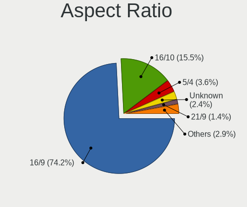

| Ratio   | Computers | Percent |
|---------|-----------|---------|
| 16/9    | 1618      | 74.39%  |
| 16/10   | 330       | 15.17%  |
| 5/4     | 86        | 3.95%   |
| Unknown | 61        | 2.8%    |
| 4/3     | 27        | 1.24%   |
| 21/9    | 22        | 1.01%   |
| 3/2     | 19        | 0.87%   |
| 32/9    | 4         | 0.18%   |
| 0.67    | 3         | 0.14%   |
| 3.20    | 2         | 0.09%   |
| 1.00    | 2         | 0.09%   |
| 3.73    | 1         | 0.05%   |

Monitor Area
------------

Area in inch

| Area in inch | Computers | Percent |
|----------------|-----------|---------|
| 101-110        | 551       | 22.16%  |
| 201-250        | 424       | 17.05%  |
| 81-90          | 320       | 12.87%  |
| 71-80          | 220       | 8.85%   |
| 301-350        | 184       | 7.4%    |
| 351-500        | 150       | 6.03%   |
| 151-200        | 134       | 5.39%   |
| 251-300        | 101       | 4.06%   |
| 121-130        | 75        | 3.02%   |
| Unknown        | 74        | 2.98%   |
| More than 1000 | 50        | 2.01%   |
| 141-150        | 46        | 1.85%   |
| 51-60          | 35        | 1.41%   |
| 501-1000       | 32        | 1.29%   |
| 61-70          | 31        | 1.25%   |
| 111-120        | 21        | 0.84%   |
| 131-140        | 16        | 0.64%   |
| 41-50          | 12        | 0.48%   |
| 91-100         | 8         | 0.32%   |
| 1-40           | 3         | 0.12%   |

Pixel Density
-------------

Pixels per inch

| Density       | Computers | Percent |
|---------------|-----------|---------|
| 121-160       | 801       | 34.16%  |
| 51-100        | 788       | 33.6%   |
| 101-120       | 455       | 19.4%   |
| 161-240       | 151       | 6.44%   |
| Unknown       | 74        | 3.16%   |
| 1-50          | 40        | 1.71%   |
| More than 240 | 36        | 1.54%   |

Multiple Monitors
-----------------

Total monitors connected

| Total | Computers | Percent |
|-------|-----------|---------|
| 1     | 1642      | 73.6%   |
| 2     | 430       | 19.27%  |
| 0     | 96        | 4.3%    |
| 3     | 61        | 2.73%   |
| 4     | 2         | 0.09%   |

Network
-------

Net Controller Vendor
---------------------

Controller vendors

| Vendor                                 | Computers | Percent |
|----------------------------------------|-----------|---------|
| Realtek Semiconductor                  | 1050      | 32.4%   |
| Intel                                  | 1013      | 31.26%  |
| Qualcomm Atheros                       | 450       | 13.88%  |
| Broadcom                               | 138       | 4.26%   |
| Samsung Electronics                    | 133       | 4.1%    |
| Broadcom Limited                       | 55        | 1.7%    |
| MediaTek                               | 52        | 1.6%    |
| Marvell Technology Group               | 38        | 1.17%   |
| TP-Link                                | 31        | 0.96%   |
| Lenovo                                 | 25        | 0.77%   |
| Ralink Technology                      | 22        | 0.68%   |
| Qualcomm Atheros Communications        | 21        | 0.65%   |
| Ralink                                 | 19        | 0.59%   |
| Nvidia                                 | 19        | 0.59%   |
| Dell                                   | 17        | 0.52%   |
| ASIX Electronics                       | 15        | 0.46%   |
| Sierra Wireless                        | 13        | 0.4%    |
| DisplayLink                            | 13        | 0.4%    |
| ASUSTek Computer                       | 8         | 0.25%   |
| Qualcomm                               | 7         | 0.22%   |
| Xiaomi                                 | 6         | 0.19%   |
| VIA Technologies                       | 6         | 0.19%   |
| Microsoft                              | 6         | 0.19%   |
| D-Link                                 | 6         | 0.19%   |
| QLogic                                 | 5         | 0.15%   |
| Ericsson Business Mobile Networks      | 5         | 0.15%   |
| Attansic Technology                    | 5         | 0.15%   |
| Hewlett-Packard                        | 4         | 0.12%   |
| ZyDAS                                  | 3         | 0.09%   |
| OnePlus Technology (Shenzhen)          | 3         | 0.09%   |
| Mellanox Technologies                  | 3         | 0.09%   |
| Huawei Technologies                    | 3         | 0.09%   |
| Edimax Technology                      | 3         | 0.09%   |
| Spreadtrum Communications              | 2         | 0.06%   |
| Sony Ericsson Mobile Communications AB | 2         | 0.06%   |
| Silicon Integrated Systems [SiS]       | 2         | 0.06%   |
| Microchip Technology                   | 2         | 0.06%   |
| IBM                                    | 2         | 0.06%   |
| Google                                 | 2         | 0.06%   |
| Fibocom                                | 2         | 0.06%   |

Net Controller Model
--------------------

Controller models

| Model                                                             | Computers | Percent |
|-------------------------------------------------------------------|-----------|---------|
| Realtek RTL8111/8168/8411 PCI Express Gigabit Ethernet Controller | 725       | 19.21%  |
| Qualcomm Atheros AR9485 Wireless Network Adapter                  | 154       | 4.08%   |
| Samsung Galaxy series, misc. (tethering mode)                     | 129       | 3.42%   |
| Intel Wi-Fi 6 AX200                                               | 110       | 2.91%   |
| Realtek RTL8153 Gigabit Ethernet Adapter                          | 101       | 2.68%   |
| Realtek RTL810xE PCI Express Fast Ethernet controller             | 77        | 2.04%   |
| Intel Wireless 8265 / 8275                                        | 74        | 1.96%   |
| Intel 82579LM Gigabit Network Connection (Lewisville)             | 73        | 1.93%   |
| Intel Wireless 7260                                               | 49        | 1.3%    |
| Qualcomm Atheros QCA9377 802.11ac Wireless Network Adapter        | 48        | 1.27%   |
| Realtek RTL8125 2.5GbE Controller                                 | 47        | 1.25%   |
| Intel Wi-Fi 6 AX201                                               | 43        | 1.14%   |
| Qualcomm Atheros AR9285 Wireless Network Adapter (PCI-Express)    | 41        | 1.09%   |
| Intel Wireless 8260                                               | 40        | 1.06%   |
| Intel Centrino Advanced-N 6205 [Taylor Peak]                      | 39        | 1.03%   |
| Realtek RTL8822CE 802.11ac PCIe Wireless Network Adapter          | 37        | 0.98%   |
| Qualcomm Atheros QCA9565 / AR9565 Wireless Network Adapter        | 37        | 0.98%   |
| Intel Wireless 7265                                               | 37        | 0.98%   |
| Intel I211 Gigabit Network Connection                             | 37        | 0.98%   |
| Intel Ethernet Connection I217-LM                                 | 36        | 0.95%   |
| Intel Wireless 3165                                               | 33        | 0.87%   |
| Intel Comet Lake PCH-LP CNVi WiFi                                 | 33        | 0.87%   |
| Intel Cannon Point-LP CNVi [Wireless-AC]                          | 32        | 0.85%   |
| Realtek RTL8822BE 802.11a/b/g/n/ac WiFi adapter                   | 30        | 0.79%   |
| Intel Ethernet Connection (4) I219-LM                             | 30        | 0.79%   |
| MediaTek MT7921 802.11ax PCI Express Wireless Network Adapter     | 29        | 0.77%   |
| Intel Cannon Lake PCH CNVi WiFi                                   | 29        | 0.77%   |
| Qualcomm Atheros QCA6174 802.11ac Wireless Network Adapter        | 28        | 0.74%   |
| Intel Ethernet Connection (2) I219-V                              | 23        | 0.61%   |
| Broadcom BCM4313 802.11bgn Wireless Network Adapter               | 23        | 0.61%   |
| Realtek RTL-8100/8101L/8139 PCI Fast Ethernet Adapter             | 21        | 0.56%   |
| Qualcomm Atheros AR8151 v2.0 Gigabit Ethernet                     | 21        | 0.56%   |
| Qualcomm Atheros AR8131 Gigabit Ethernet                          | 21        | 0.56%   |
| Realtek RTL8852AE 802.11ax PCIe Wireless Network Adapter          | 20        | 0.53%   |
| Realtek RTL8821CE 802.11ac PCIe Wireless Network Adapter          | 20        | 0.53%   |
| Intel Alder Lake-P PCH CNVi WiFi                                  | 20        | 0.53%   |
| Qualcomm Atheros AR9271 802.11n                                   | 18        | 0.48%   |
| Intel PRO/Wireless 3945ABG [Golan] Network Connection             | 18        | 0.48%   |
| Intel Comet Lake PCH CNVi WiFi                                    | 18        | 0.48%   |
| Intel 82567LM Gigabit Network Connection                          | 18        | 0.48%   |

Wireless Vendor
---------------

Wireless vendors

| Vendor                            | Computers | Percent |
|-----------------------------------|-----------|---------|
| Intel                             | 802       | 47.68%  |
| Qualcomm Atheros                  | 362       | 21.52%  |
| Realtek Semiconductor             | 205       | 12.19%  |
| Broadcom                          | 80        | 4.76%   |
| MediaTek                          | 48        | 2.85%   |
| TP-Link                           | 29        | 1.72%   |
| Broadcom Limited                  | 27        | 1.61%   |
| Ralink Technology                 | 22        | 1.31%   |
| Qualcomm Atheros Communications   | 21        | 1.25%   |
| Ralink                            | 19        | 1.13%   |
| Sierra Wireless                   | 13        | 0.77%   |
| Dell                              | 11        | 0.65%   |
| ASUSTek Computer                  | 7         | 0.42%   |
| Microsoft                         | 6         | 0.36%   |
| Qualcomm                          | 5         | 0.3%    |
| D-Link                            | 5         | 0.3%    |
| ZyDAS                             | 3         | 0.18%   |
| Edimax Technology                 | 3         | 0.18%   |
| Marvell Technology Group          | 2         | 0.12%   |
| Hewlett-Packard                   | 2         | 0.12%   |
| Fibocom                           | 2         | 0.12%   |
| ZyXEL Communications              | 1         | 0.06%   |
| Texas Instruments                 | 1         | 0.06%   |
| NetGear                           | 1         | 0.06%   |
| Mercucys                          | 1         | 0.06%   |
| Intersil                          | 1         | 0.06%   |
| Fujitsu Siemens Computers         | 1         | 0.06%   |
| Ericsson Business Mobile Networks | 1         | 0.06%   |
| D-Link System                     | 1         | 0.06%   |

Wireless Model
--------------

Wireless models

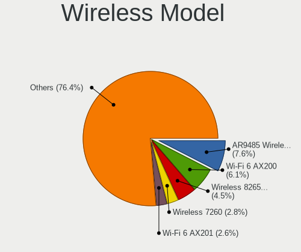

| Model                                                          | Computers | Percent |
|----------------------------------------------------------------|-----------|---------|
| Qualcomm Atheros AR9485 Wireless Network Adapter               | 154       | 9.13%   |
| Intel Wi-Fi 6 AX200                                            | 110       | 6.52%   |
| Intel Wireless 8265 / 8275                                     | 74        | 4.39%   |
| Intel Wireless 7260                                            | 49        | 2.91%   |
| Qualcomm Atheros QCA9377 802.11ac Wireless Network Adapter     | 48        | 2.85%   |
| Intel Wi-Fi 6 AX201                                            | 43        | 2.55%   |
| Qualcomm Atheros AR9285 Wireless Network Adapter (PCI-Express) | 41        | 2.43%   |
| Intel Wireless 8260                                            | 40        | 2.37%   |
| Intel Centrino Advanced-N 6205 [Taylor Peak]                   | 39        | 2.31%   |
| Realtek RTL8822CE 802.11ac PCIe Wireless Network Adapter       | 37        | 2.19%   |
| Qualcomm Atheros QCA9565 / AR9565 Wireless Network Adapter     | 37        | 2.19%   |
| Intel Wireless 7265                                            | 37        | 2.19%   |
| Intel Wireless 3165                                            | 33        | 1.96%   |
| Intel Comet Lake PCH-LP CNVi WiFi                              | 33        | 1.96%   |
| Intel Cannon Point-LP CNVi [Wireless-AC]                       | 32        | 1.9%    |
| Realtek RTL8822BE 802.11a/b/g/n/ac WiFi adapter                | 30        | 1.78%   |
| MediaTek MT7921 802.11ax PCI Express Wireless Network Adapter  | 29        | 1.72%   |
| Intel Cannon Lake PCH CNVi WiFi                                | 29        | 1.72%   |
| Qualcomm Atheros QCA6174 802.11ac Wireless Network Adapter     | 28        | 1.66%   |
| Broadcom BCM4313 802.11bgn Wireless Network Adapter            | 23        | 1.36%   |
| Realtek RTL8852AE 802.11ax PCIe Wireless Network Adapter       | 20        | 1.19%   |
| Realtek RTL8821CE 802.11ac PCIe Wireless Network Adapter       | 20        | 1.19%   |
| Intel Alder Lake-P PCH CNVi WiFi                               | 19        | 1.13%   |
| Qualcomm Atheros AR9271 802.11n                                | 18        | 1.07%   |
| Intel PRO/Wireless 3945ABG [Golan] Network Connection          | 18        | 1.07%   |
| Intel Comet Lake PCH CNVi WiFi                                 | 18        | 1.07%   |
| Intel Wireless 3160                                            | 17        | 1.01%   |
| Intel WiFi Link 5100                                           | 17        | 1.01%   |
| Intel Dual Band Wireless-AC 3168NGW [Stone Peak]               | 17        | 1.01%   |
| Intel Dual Band Wireless-AC 3165 Plus Bluetooth                | 17        | 1.01%   |
| Broadcom BCM43142 802.11b/g/n                                  | 16        | 0.95%   |
| Realtek RTL8852BE PCIe 802.11ax Wireless Network Controller    | 14        | 0.83%   |
| Intel Wi-Fi 6 AX210/AX211/AX411 160MHz                         | 14        | 0.83%   |
| Intel Gemini Lake PCH CNVi WiFi                                | 14        | 0.83%   |
| Intel Centrino Wireless-N 2230                                 | 13        | 0.77%   |
| TP-Link TL-WN722N v2/v3 [Realtek RTL8188EUS]                   | 11        | 0.65%   |
| Realtek RTL8723BE PCIe Wireless Network Adapter                | 11        | 0.65%   |
| Realtek RTL8188EUS 802.11n Wireless Network Adapter            | 11        | 0.65%   |
| Qualcomm Atheros AR9462 Wireless Network Adapter               | 11        | 0.65%   |
| Intel Wireless-AC 9260                                         | 11        | 0.65%   |

Ethernet Vendor
---------------

Ethernet vendors

| Vendor                            | Computers | Percent |
|-----------------------------------|-----------|---------|
| Realtek Semiconductor             | 955       | 47.8%   |
| Intel                             | 518       | 25.93%  |
| Samsung Electronics               | 133       | 6.66%   |
| Qualcomm Atheros                  | 128       | 6.41%   |
| Broadcom                          | 67        | 3.35%   |
| Marvell Technology Group          | 37        | 1.85%   |
| Broadcom Limited                  | 28        | 1.4%    |
| Lenovo                            | 25        | 1.25%   |
| Nvidia                            | 19        | 0.95%   |
| ASIX Electronics                  | 15        | 0.75%   |
| DisplayLink                       | 13        | 0.65%   |
| Xiaomi                            | 6         | 0.3%    |
| VIA Technologies                  | 5         | 0.25%   |
| QLogic                            | 5         | 0.25%   |
| Attansic Technology               | 5         | 0.25%   |
| MediaTek                          | 4         | 0.2%    |
| Mellanox Technologies             | 3         | 0.15%   |
| TP-Link                           | 2         | 0.1%    |
| Spreadtrum Communications         | 2         | 0.1%    |
| Silicon Integrated Systems [SiS]  | 2         | 0.1%    |
| Qualcomm                          | 2         | 0.1%    |
| Microchip Technology              | 2         | 0.1%    |
| IBM                               | 2         | 0.1%    |
| Huawei Technologies               | 2         | 0.1%    |
| Google                            | 2         | 0.1%    |
| Aquantia                          | 2         | 0.1%    |
| American Megatrends               | 2         | 0.1%    |
| Sundance Technology Inc / IC Plus | 1         | 0.05%   |
| MosChip Semiconductor             | 1         | 0.05%   |
| JMicron Technology                | 1         | 0.05%   |
| ICS Advent                        | 1         | 0.05%   |
| Hewlett-Packard                   | 1         | 0.05%   |
| Foxconn / Hon Hai                 | 1         | 0.05%   |
| Emulex                            | 1         | 0.05%   |
| D-Link System                     | 1         | 0.05%   |
| D-Link                            | 1         | 0.05%   |
| Chelsio Communications            | 1         | 0.05%   |
| ASUSTek Computer                  | 1         | 0.05%   |
| 3Com                              | 1         | 0.05%   |

Ethernet Model
--------------

Ethernet models

| Model                                                                          | Computers | Percent |
|--------------------------------------------------------------------------------|-----------|---------|
| Realtek RTL8111/8168/8411 PCI Express Gigabit Ethernet Controller              | 725       | 35.26%  |
| Samsung Galaxy series, misc. (tethering mode)                                  | 129       | 6.27%   |
| Realtek RTL8153 Gigabit Ethernet Adapter                                       | 101       | 4.91%   |
| Realtek RTL810xE PCI Express Fast Ethernet controller                          | 77        | 3.75%   |
| Intel 82579LM Gigabit Network Connection (Lewisville)                          | 73        | 3.55%   |
| Realtek RTL8125 2.5GbE Controller                                              | 47        | 2.29%   |
| Intel I211 Gigabit Network Connection                                          | 37        | 1.8%    |
| Intel Ethernet Connection I217-LM                                              | 36        | 1.75%   |
| Intel Ethernet Connection (4) I219-LM                                          | 30        | 1.46%   |
| Intel Ethernet Connection (2) I219-V                                           | 23        | 1.12%   |
| Realtek RTL-8100/8101L/8139 PCI Fast Ethernet Adapter                          | 21        | 1.02%   |
| Qualcomm Atheros AR8151 v2.0 Gigabit Ethernet                                  | 21        | 1.02%   |
| Qualcomm Atheros AR8131 Gigabit Ethernet                                       | 21        | 1.02%   |
| Intel 82567LM Gigabit Network Connection                                       | 18        | 0.88%   |
| Intel Ethernet Controller I225-V                                               | 17        | 0.83%   |
| Intel Ethernet Connection I219-LM                                              | 17        | 0.83%   |
| Intel Ethernet Connection I218-LM                                              | 17        | 0.83%   |
| Intel Ethernet Connection (4) I219-V                                           | 15        | 0.73%   |
| Qualcomm Atheros Killer E220x Gigabit Ethernet Controller                      | 13        | 0.63%   |
| Intel Ethernet Connection (7) I219-LM                                          | 13        | 0.63%   |
| Broadcom NetLink BCM5787M Gigabit Ethernet PCI Express                         | 13        | 0.63%   |
| ASIX AX88179 Gigabit Ethernet                                                  | 13        | 0.63%   |
| Lenovo ThinkPad TBT 3 Dock                                                     | 12        | 0.58%   |
| Intel Ethernet Connection (7) I219-V                                           | 12        | 0.58%   |
| Qualcomm Atheros AR8161 Gigabit Ethernet                                       | 11        | 0.54%   |
| Intel Ethernet Connection (6) I219-V                                           | 11        | 0.54%   |
| Intel Ethernet Connection (3) I218-LM                                          | 11        | 0.54%   |
| Intel 82579V Gigabit Network Connection                                        | 11        | 0.54%   |
| Intel 82566DM-2 Gigabit Network Connection                                     | 11        | 0.54%   |
| Intel Ethernet Connection (2) I219-LM                                          | 10        | 0.49%   |
| Broadcom NetXtreme BCM5761 Gigabit Ethernet PCIe                               | 10        | 0.49%   |
| Qualcomm Atheros QCA8171 Gigabit Ethernet                                      | 9         | 0.44%   |
| Qualcomm Atheros Killer E2400 Gigabit Ethernet Controller                      | 9         | 0.44%   |
| Intel Ethernet Connection (2) I218-V                                           | 9         | 0.44%   |
| Intel 82567LM-3 Gigabit Network Connection                                     | 9         | 0.44%   |
| Realtek RTL8152 Fast Ethernet Adapter                                          | 8         | 0.39%   |
| Qualcomm Atheros QCA8172 Fast Ethernet                                         | 8         | 0.39%   |
| Qualcomm Atheros AR8121/AR8113/AR8114 Gigabit or Fast Ethernet                 | 8         | 0.39%   |
| Marvell Group Yukon Optima 88E8059 [PCIe Gigabit Ethernet Controller with AVB] | 8         | 0.39%   |
| Intel Ethernet Connection (6) I219-LM                                          | 8         | 0.39%   |

Net Controller Kind
-------------------

Ethernet, WiFi or modem

| Kind     | Computers | Percent |
|----------|-----------|---------|
| Ethernet | 1865      | 53.18%  |
| WiFi     | 1610      | 45.91%  |
| Modem    | 26        | 0.74%   |
| Unknown  | 6         | 0.17%   |

Used Controller
---------------

Currently used network controller

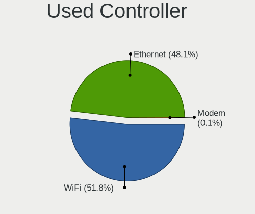

| Kind     | Computers | Percent |
|----------|-----------|---------|
| WiFi     | 1150      | 51.41%  |
| Ethernet | 1087      | 48.59%  |

NICs
----

Total network controllers on board

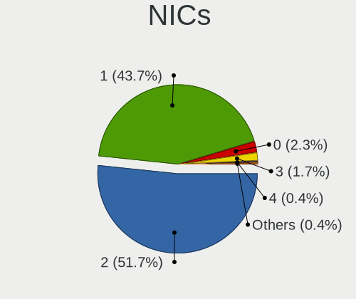

| Total | Computers | Percent |
|-------|-----------|---------|
| 2     | 1090      | 50.21%  |
| 1     | 977       | 45%     |
| 0     | 52        | 2.4%    |
| 3     | 35        | 1.61%   |
| 4     | 7         | 0.32%   |
| 8     | 4         | 0.18%   |
| 5     | 3         | 0.14%   |
| 10    | 1         | 0.05%   |
| 9     | 1         | 0.05%   |
| 6     | 1         | 0.05%   |

IPv6
----

IPv6 vs IPv4

| Used | Computers | Percent |
|------|-----------|---------|
| No   | 1905      | 86.71%  |
| Yes  | 292       | 13.29%  |

Bluetooth
---------

Bluetooth Vendor
----------------

Controller vendors

| Vendor                          | Computers | Percent |
|---------------------------------|-----------|---------|
| Intel                           | 609       | 48.14%  |
| Realtek Semiconductor           | 125       | 9.88%   |
| IMC Networks                    | 81        | 6.4%    |
| Qualcomm Atheros Communications | 80        | 6.32%   |
| Broadcom                        | 63        | 4.98%   |
| Cambridge Silicon Radio         | 59        | 4.66%   |
| Foxconn / Hon Hai               | 53        | 4.19%   |
| Lite-On Technology              | 45        | 3.56%   |
| ASUSTek Computer                | 43        | 3.4%    |
| Hewlett-Packard                 | 26        | 2.06%   |
| Dell                            | 17        | 1.34%   |
| MediaTek                        | 10        | 0.79%   |
| Ralink                          | 9         | 0.71%   |
| Apple                           | 8         | 0.63%   |
| Alps Electric                   | 5         | 0.4%    |
| Toshiba                         | 4         | 0.32%   |
| Realtek                         | 4         | 0.32%   |
| Integrated System Solution      | 4         | 0.32%   |
| TP-Link                         | 3         | 0.24%   |
| Ralink Technology               | 2         | 0.16%   |
| Mobile Action Technology        | 2         | 0.16%   |
| Micro Star International        | 2         | 0.16%   |
| Marvell Semiconductor           | 2         | 0.16%   |
| Foxconn International           | 2         | 0.16%   |
| Creative Technology             | 2         | 0.16%   |
| USI                             | 1         | 0.08%   |
| Fujitsu Siemens Computers       | 1         | 0.08%   |
| Belkin Components               | 1         | 0.08%   |
| Askey Computer                  | 1         | 0.08%   |
| Unknown                         | 1         | 0.08%   |

Bluetooth Model
---------------

Controller models

| Model                                               | Computers | Percent |
|-----------------------------------------------------|-----------|---------|
| Intel Bluetooth wireless interface                  | 238       | 18.81%  |
| Intel AX200 Bluetooth                               | 107       | 8.46%   |
| Intel AX201 Bluetooth                               | 103       | 8.14%   |
| Realtek Bluetooth Radio                             | 85        | 6.72%   |
| Intel Bluetooth 9460/9560 Jefferson Peak (JfP)      | 80        | 6.32%   |
| Cambridge Silicon Radio Bluetooth Dongle (HCI mode) | 59        | 4.66%   |
| Qualcomm Atheros  Bluetooth Device                  | 32        | 2.53%   |
| Realtek  Bluetooth 4.2 Adapter                      | 27        | 2.13%   |
| Intel Bluetooth Device                              | 25        | 1.98%   |
| IMC Networks Atheros AR3012 Bluetooth 4.0 Adapter   | 23        | 1.82%   |
| IMC Networks Bluetooth Radio                        | 20        | 1.58%   |
| Intel Centrino Bluetooth Wireless Transceiver       | 19        | 1.5%    |
| IMC Networks Bluetooth Device                       | 19        | 1.5%    |
| Foxconn / Hon Hai Wireless_Device                   | 19        | 1.5%    |
| Intel Wireless-AC 3168 Bluetooth                    | 17        | 1.34%   |
| IMC Networks Wireless_Device                        | 17        | 1.34%   |
| Qualcomm Atheros QCA61x4 Bluetooth 4.0              | 16        | 1.26%   |
| Qualcomm Atheros AR3011 Bluetooth                   | 15        | 1.19%   |
| HP Bluetooth 2.0 Interface [Broadcom BCM2045]       | 14        | 1.11%   |
| Lite-On Qualcomm Atheros QCA9377 Bluetooth          | 13        | 1.03%   |
| Intel AX210 Bluetooth                               | 12        | 0.95%   |
| Foxconn / Hon Hai Bluetooth Device                  | 12        | 0.95%   |
| Broadcom BCM2045 Bluetooth                          | 12        | 0.95%   |
| ASUS Broadcom BCM20702A0 Bluetooth                  | 12        | 0.95%   |
| Lite-On Atheros AR3012 Bluetooth                    | 11        | 0.87%   |
| HP Broadcom 2070 Bluetooth Combo                    | 11        | 0.87%   |
| ASUS ASUS USB-BT500                                 | 10        | 0.79%   |
| Ralink RT3290 Bluetooth                             | 9         | 0.71%   |
| Qualcomm Atheros AR3012 Bluetooth 4.0               | 9         | 0.71%   |
| Dell DW375 Bluetooth Module                         | 9         | 0.71%   |
| Broadcom BCM2045B (BDC-2.1)                         | 9         | 0.71%   |
| Intel Wireless-AC 9260 Bluetooth Adapter            | 8         | 0.63%   |
| Broadcom HP Portable SoftSailing                    | 8         | 0.63%   |
| ASUS BT-183 Bluetooth 2.0+EDR adapter               | 8         | 0.63%   |
| MediaTek Wireless_Device                            | 7         | 0.55%   |
| Broadcom BCM20702 Bluetooth 4.0 [ThinkPad]          | 7         | 0.55%   |
| Qualcomm Atheros Bluetooth                          | 6         | 0.47%   |
| Lite-On Bluetooth Device                            | 6         | 0.47%   |
| Broadcom BCM2070 Bluetooth 2.1 + EDR                | 6         | 0.47%   |
| Realtek RTL8822BE Bluetooth 4.2 Adapter             | 5         | 0.4%    |

Sound
-----

Sound Vendor
------------

Sound card vendors

| Vendor                               | Computers | Percent |
|--------------------------------------|-----------|---------|
| Intel                                | 1514      | 52.79%  |
| AMD                                  | 639       | 22.28%  |
| Nvidia                               | 416       | 14.5%   |
| C-Media Electronics                  | 53        | 1.85%   |
| Lenovo                               | 35        | 1.22%   |
| Realtek Semiconductor                | 24        | 0.84%   |
| GN Netcom                            | 16        | 0.56%   |
| Creative Labs                        | 16        | 0.56%   |
| Logitech                             | 14        | 0.49%   |
| VIA Technologies                     | 13        | 0.45%   |
| Creative Technology                  | 13        | 0.45%   |
| JMTek                                | 10        | 0.35%   |
| Hewlett-Packard                      | 10        | 0.35%   |
| Kingston Technology                  | 8         | 0.28%   |
| Plantronics                          | 6         | 0.21%   |
| GYROCOM C&C                          | 5         | 0.17%   |
| Focusrite-Novation                   | 5         | 0.17%   |
| Dell                                 | 5         | 0.17%   |
| Trust                                | 4         | 0.14%   |
| Razer USA                            | 4         | 0.14%   |
| DSEA A/S                             | 4         | 0.14%   |
| Texas Instruments                    | 3         | 0.1%    |
| Silicon Integrated Systems [SiS]     | 3         | 0.1%    |
| Micro Star International             | 3         | 0.1%    |
| BEHRINGER International              | 3         | 0.1%    |
| ASUSTek Computer                     | 3         | 0.1%    |
| SteelSeries ApS                      | 2         | 0.07%   |
| Samson Technologies                  | 2         | 0.07%   |
| RODE Microphones                     | 2         | 0.07%   |
| M-Audio                              | 2         | 0.07%   |
| Harman                               | 2         | 0.07%   |
| DigiTech                             | 2         | 0.07%   |
| Conexant Systems                     | 2         | 0.07%   |
| ASRock                               | 2         | 0.07%   |
| Yealink Network Technology           | 1         | 0.03%   |
| Yamaha                               | 1         | 0.03%   |
| Toshiba                              | 1         | 0.03%   |
| Thesycon Systemsoftware & Consulting | 1         | 0.03%   |
| Tenx Technology                      | 1         | 0.03%   |
| Syntek                               | 1         | 0.03%   |

Sound Model
-----------

Sound card models

| Model                                                                                             | Computers | Percent |
|---------------------------------------------------------------------------------------------------|-----------|---------|
| Intel 6 Series/C200 Series Chipset Family High Definition Audio Controller                        | 242       | 7.06%   |
| AMD Family 17h/19h HD Audio Controller                                                            | 222       | 6.47%   |
| Intel Sunrise Point-LP HD Audio                                                                   | 151       | 4.4%    |
| AMD Renoir Radeon High Definition Audio Controller                                                | 139       | 4.05%   |
| Intel 7 Series/C216 Chipset Family High Definition Audio Controller                               | 105       | 3.06%   |
| Intel 8 Series/C220 Series Chipset High Definition Audio Controller                               | 88        | 2.57%   |
| AMD SBx00 Azalia (Intel HDA)                                                                      | 86        | 2.51%   |
| Intel 82801I (ICH9 Family) HD Audio Controller                                                    | 79        | 2.3%    |
| AMD Starship/Matisse HD Audio Controller                                                          | 76        | 2.22%   |
| Intel Xeon E3-1200 v3/4th Gen Core Processor HD Audio Controller                                  | 73        | 2.13%   |
| Intel NM10/ICH7 Family High Definition Audio Controller                                           | 73        | 2.13%   |
| Intel Cannon Lake PCH cAVS                                                                        | 72        | 2.1%    |
| AMD FCH Azalia Controller                                                                         | 62        | 1.81%   |
| Intel Tiger Lake-LP Smart Sound Technology Audio Controller                                       | 57        | 1.66%   |
| Intel 5 Series/3400 Series Chipset High Definition Audio                                          | 50        | 1.46%   |
| Intel 100 Series/C230 Series Chipset Family HD Audio Controller                                   | 49        | 1.43%   |
| Intel Haswell-ULT HD Audio Controller                                                             | 47        | 1.37%   |
| Intel 8 Series HD Audio Controller                                                                | 47        | 1.37%   |
| Intel Cannon Point-LP High Definition Audio Controller                                            | 45        | 1.31%   |
| Intel Celeron/Pentium Silver Processor High Definition Audio                                      | 44        | 1.28%   |
| AMD Family 17h (Models 00h-0fh) HD Audio Controller                                               | 44        | 1.28%   |
| AMD Ellesmere HDMI Audio [Radeon RX 470/480 / 570/580/590]                                        | 43        | 1.25%   |
| Nvidia GP107GL High Definition Audio Controller                                                   | 41        | 1.2%    |
| AMD Raven/Raven2/Fenghuang HDMI/DP Audio Controller                                               | 39        | 1.14%   |
| Intel Comet Lake PCH-LP cAVS                                                                      | 38        | 1.11%   |
| Nvidia GP106 High Definition Audio Controller                                                     | 37        | 1.08%   |
| Intel 82801H (ICH8 Family) HD Audio Controller                                                    | 37        | 1.08%   |
| Nvidia GK208 HDMI/DP Audio Controller                                                             | 36        | 1.05%   |
| Nvidia GF108 High Definition Audio Controller                                                     | 34        | 0.99%   |
| Intel Broadwell-U Audio Controller                                                                | 34        | 0.99%   |
| Intel Wildcat Point-LP High Definition Audio Controller                                           | 33        | 0.96%   |
| Intel Atom Processor Z36xxx/Z37xxx Series High Definition Audio Controller                        | 31        | 0.9%    |
| Intel 200 Series PCH HD Audio                                                                     | 29        | 0.85%   |
| AMD Kabini HDMI/DP Audio                                                                          | 27        | 0.79%   |
| Intel Comet Lake PCH cAVS                                                                         | 26        | 0.76%   |
| Intel Atom/Celeron/Pentium Processor x5-E8000/J3xxx/N3xxx Series High Definition Audio Controller | 26        | 0.76%   |
| Intel Alder Lake PCH-P High Definition Audio Controller                                           | 26        | 0.76%   |
| AMD Family 15h (Models 60h-6fh) Audio Controller                                                  | 26        | 0.76%   |
| Nvidia TU107 GeForce GTX 1650 High Definition Audio Controller                                    | 23        | 0.67%   |
| Nvidia GA106 High Definition Audio Controller                                                     | 23        | 0.67%   |

Memory
------

Memory Vendor
-------------

Memory module vendors

| Vendor                       | Computers | Percent |
|------------------------------|-----------|---------|
| Samsung Electronics          | 280       | 19.8%   |
| Kingston                     | 254       | 17.96%  |
| SK hynix                     | 223       | 15.77%  |
| Elpida                       | 145       | 10.25%  |
| Micron Technology            | 142       | 10.04%  |
| Unknown                      | 129       | 9.12%   |
| Crucial                      | 53        | 3.75%   |
| Corsair                      | 38        | 2.69%   |
| Ramaxel Technology           | 31        | 2.19%   |
| Patriot                      | 26        | 1.84%   |
| A-DATA Technology            | 22        | 1.56%   |
| Unknown (ABCD)               | 18        | 1.27%   |
| G.Skill                      | 12        | 0.85%   |
| Nanya Technology             | 11        | 0.78%   |
| Transcend                    | 6         | 0.42%   |
| GOODRAM                      | 2         | 0.14%   |
| Unknown                      | 2         | 0.14%   |
| Unknown (AB)                 | 1         | 0.07%   |
| Toshiba                      | 1         | 0.07%   |
| Team                         | 1         | 0.07%   |
| TakeMS                       | 1         | 0.07%   |
| Silicon Power                | 1         | 0.07%   |
| ProMos/Mosel Vitelic         | 1         | 0.07%   |
| PDPSystems                   | 1         | 0.07%   |
| Patriot Memory (PDP Systems) | 1         | 0.07%   |
| Patriot Memory               | 1         | 0.07%   |
| OnBoard                      | 1         | 0.07%   |
| Nayna                        | 1         | 0.07%   |
| Kingmax                      | 1         | 0.07%   |
| Kimtigo                      | 1         | 0.07%   |
| H                            | 1         | 0.07%   |
| Golden Empire                | 1         | 0.07%   |
| fef5                         | 1         | 0.07%   |
| ASint Technology             | 1         | 0.07%   |
| Apacer                       | 1         | 0.07%   |
| AMD                          | 1         | 0.07%   |
| 48spaces                     | 1         | 0.07%   |

Memory Model
------------

Memory module models

| Model                                                            | Computers | Percent |
|------------------------------------------------------------------|-----------|---------|
| Elpida RAM Module 2GB SODIMM DDR3 1333MT/s                       | 126       | 8.33%   |
| Samsung RAM M471A1G44AB0-CWE 8GB SODIMM DDR4 3200MT/s            | 16        | 1.06%   |
| Unknown (ABCD) RAM 123456789012345678 2GB SODIMM LPDDR4 2400MT/s | 14        | 0.93%   |
| Micron RAM 4ATF1G64HZ-3G2E1 8GB SODIMM DDR4 3200MT/s             | 13        | 0.86%   |
| Samsung RAM M471A5244CB0-CTD 4GB SODIMM DDR4 3266MT/s            | 11        | 0.73%   |
| SK hynix RAM HMT41GS6BFR8A-PB 8192MB SODIMM DDR3 1600MT/s        | 9         | 0.6%    |
| SK hynix RAM HMA81GS6AFR8N-UH 8GB SODIMM DDR4 2667MT/s           | 9         | 0.6%    |
| Samsung RAM M471B5273DH0-CH9 4GB SODIMM DDR3 1334MT/s            | 9         | 0.6%    |
| Samsung RAM M471A2G44AM0-CWE 16384MB SODIMM DDR4 3200MT/s        | 9         | 0.6%    |
| Samsung RAM M471A1K43DB1-CWE 8GB SODIMM DDR4 3200MT/s            | 9         | 0.6%    |
| Kingston RAM KHX3200C16D4/8GX 8GB DIMM DDR4 3733MT/s             | 9         | 0.6%    |
| SK hynix RAM HMT351S6CFR8C-PB 4GB SODIMM DDR3 1600MT/s           | 8         | 0.53%   |
| Samsung RAM M471B1G73DB0-YK0 8GB SODIMM DDR3 1600MT/s            | 8         | 0.53%   |
| Samsung RAM M471A1K43DB1-CTD 8GB SODIMM DDR4 2667MT/s            | 8         | 0.53%   |
| Samsung RAM M471A1K43CB1-CRC 8GB SODIMM DDR4 2667MT/s            | 8         | 0.53%   |
| Kingston RAM KHX2666C16/8G 8GB DIMM DDR4 3466MT/s                | 8         | 0.53%   |
| SK hynix RAM Module 8GB SODIMM DDR4 3200MT/s                     | 7         | 0.46%   |
| Samsung RAM M471B5273CH0-CH9 4GB SODIMM DDR3 1334MT/s            | 7         | 0.46%   |
| Samsung RAM M471A1G44BB0-CWE 8GB SODIMM DDR4 3200MT/s            | 7         | 0.46%   |
| Kingston RAM KHX1866C10D3/8G 8GB DIMM DDR3 2133MT/s              | 7         | 0.46%   |
| Kingston RAM KHX1600C9S3L/8G 8GB SODIMM DDR3 1600MT/s            | 7         | 0.46%   |
| Unknown RAM Module 2GB DIMM DDR2 800MT/s                         | 6         | 0.4%    |
| SK hynix RAM HMA82GS6JJR8N-VK 16GB SODIMM DDR4 2667MT/s          | 6         | 0.4%    |
| Samsung RAM M471B5173EB0-YK0 4GB SODIMM DDR3 1600MT/s            | 6         | 0.4%    |
| Samsung RAM M471B5173DB0-YK0 4GB SODIMM DDR3 1600MT/s            | 6         | 0.4%    |
| Samsung RAM M471A1K43EB1-CWE 8GB SODIMM DDR4 3200MT/s            | 6         | 0.4%    |
| Kingston RAM KHX3200C16D4/16GX 16GB DIMM DDR4 3600MT/s           | 6         | 0.4%    |
| Unknown RAM Module 4096MB DIMM 1333MT/s                          | 5         | 0.33%   |
| Unknown RAM Module 2GB SODIMM DDR2 667MT/s                       | 5         | 0.33%   |
| SK hynix RAM HMT451S6AFR8A-PB 4GB SODIMM DDR3 1600MT/s           | 5         | 0.33%   |
| SK hynix RAM HMT41GS6AFR8A-PB 8GB SODIMM DDR3 1600MT/s           | 5         | 0.33%   |
| SK hynix RAM HMA81GS6JJR8N-VK 8GB SODIMM DDR4 2667MT/s           | 5         | 0.33%   |
| SK hynix RAM HMA81GS6CJR8N-VK 8GB SODIMM DDR4 2667MT/s           | 5         | 0.33%   |
| Samsung RAM Module 8GB SODIMM DDR4 3200MT/s                      | 5         | 0.33%   |
| Samsung RAM M471A5244CB0-CRC 4GB SODIMM DDR4 2667MT/s            | 5         | 0.33%   |
| Samsung RAM M471A2K43DB1-CWE 16GB SODIMM DDR4 3200MT/s           | 5         | 0.33%   |
| Samsung RAM M471A2G43AB2-CWE 16GB SODIMM DDR4 3200MT/s           | 5         | 0.33%   |
| Samsung RAM M471A1K43CB1-CTD 8GB SODIMM DDR4 2667MT/s            | 5         | 0.33%   |
| Samsung RAM M471A1K43BB1-CRC 8GB SODIMM DDR4 2667MT/s            | 5         | 0.33%   |
| Samsung RAM M471A1G44AB0-CWE 8GB Row Of Chips DDR4 3200MT/s      | 5         | 0.33%   |

Memory Kind
-----------

Memory module kinds

| Kind    | Computers | Percent |
|---------|-----------|---------|
| DDR4    | 546       | 44%     |
| DDR3    | 450       | 36.26%  |
| LPDDR4  | 61        | 4.92%   |
| DDR2    | 60        | 4.83%   |
| Unknown | 36        | 2.9%    |
| SDRAM   | 25        | 2.01%   |
| LPDDR3  | 24        | 1.93%   |
| DDR5    | 17        | 1.37%   |
| LPDDR5  | 12        | 0.97%   |
| DDR     | 8         | 0.64%   |
| DRAM    | 2         | 0.16%   |

Memory Form Factor
------------------

Physical design of the memory module

| Name         | Computers | Percent |
|--------------|-----------|---------|
| SODIMM       | 775       | 62.4%   |
| DIMM         | 364       | 29.31%  |
| Row Of Chips | 87        | 7%      |
| Chip         | 12        | 0.97%   |
| RIMM         | 2         | 0.16%   |
| Unknown      | 2         | 0.16%   |

Memory Size
-----------

Memory module size

| Size  | Computers | Percent |
|-------|-----------|---------|
| 8192  | 465       | 34.68%  |
| 4096  | 290       | 21.63%  |
| 2048  | 268       | 19.99%  |
| 16384 | 210       | 15.66%  |
| 32768 | 59        | 4.4%    |
| 1024  | 41        | 3.06%   |
| 512   | 4         | 0.3%    |
| 256   | 2         | 0.15%   |
| 6144  | 1         | 0.07%   |
| 3072  | 1         | 0.07%   |

Memory Speed
------------

Memory module speed

| Speed   | Computers | Percent |
|---------|-----------|---------|
| 3200    | 218       | 16.27%  |
| 1600    | 203       | 15.15%  |
| 1333    | 200       | 14.93%  |
| 2667    | 156       | 11.64%  |
| 2400    | 93        | 6.94%   |
| 2133    | 67        | 5%      |
| 800     | 38        | 2.84%   |
| 1334    | 36        | 2.69%   |
| 3600    | 33        | 2.46%   |
| 667     | 26        | 1.94%   |
| 4267    | 23        | 1.72%   |
| Unknown | 23        | 1.72%   |
| 1867    | 18        | 1.34%   |
| 3733    | 15        | 1.12%   |
| 3266    | 15        | 1.12%   |
| 1067    | 15        | 1.12%   |
| 6400    | 13        | 0.97%   |
| 2666    | 11        | 0.82%   |
| 3400    | 9         | 0.67%   |
| 3466    | 8         | 0.6%    |
| 1866    | 8         | 0.6%    |
| 4800    | 7         | 0.52%   |
| 3000    | 7         | 0.52%   |
| 1066    | 7         | 0.52%   |
| 4266    | 6         | 0.45%   |
| 4199    | 6         | 0.45%   |
| 533     | 6         | 0.45%   |
| 5600    | 5         | 0.37%   |
| 2933    | 5         | 0.37%   |
| 2048    | 5         | 0.37%   |
| 1800    | 5         | 0.37%   |
| 975     | 5         | 0.37%   |
| 3933    | 4         | 0.3%    |
| 3800    | 4         | 0.3%    |
| 2800    | 4         | 0.3%    |
| 400     | 4         | 0.3%    |
| 8400    | 3         | 0.22%   |
| 3533    | 3         | 0.22%   |
| 3333    | 3         | 0.22%   |
| 6000    | 2         | 0.15%   |

Printers & scanners
-------------------

Printer Vendor
--------------

Printer device vendors

| Vendor              | Computers | Percent |
|---------------------|-----------|---------|
| Canon               | 11        | 25.58%  |
| Hewlett-Packard     | 10        | 23.26%  |
| Samsung Electronics | 6         | 13.95%  |
| Brother Industries  | 6         | 13.95%  |
| QinHeng Electronics | 3         | 6.98%   |
| Xerox               | 2         | 4.65%   |
| Seiko Epson         | 1         | 2.33%   |
| Prolific Technology | 1         | 2.33%   |
| Pantum              | 1         | 2.33%   |
| Minolta             | 1         | 2.33%   |
| ICS Advent          | 1         | 2.33%   |

Printer Model
-------------

Printer device models

| Model                                   | Computers | Percent |
|-----------------------------------------|-----------|---------|
| QinHeng CH340S                          | 3         | 6.82%   |
| HP DeskJet 2600 series                  | 3         | 6.82%   |
| Samsung M2070 Series                    | 2         | 4.55%   |
| HP LaserJet P2014                       | 2         | 4.55%   |
| Xerox Phaser 3260                       | 1         | 2.27%   |
| Xerox B215                              | 1         | 2.27%   |
| Seiko Epson L365 Series                 | 1         | 2.27%   |
| Samsung Xerox Phaser 3117 Laser Printer | 1         | 2.27%   |
| Samsung M267x 287x Series               | 1         | 2.27%   |
| Samsung M2020 Series                    | 1         | 2.27%   |
| Samsung C460 Series                     | 1         | 2.27%   |
| Prolific PL2305 Parallel Port           | 1         | 2.27%   |
| Pantum P2000                            | 1         | 2.27%   |
| Minolta PagePro 1300W                   | 1         | 2.27%   |
| ICS Advent Parallel Adapter             | 1         | 2.27%   |
| HP Officejet 4500 G510g-m               | 1         | 2.27%   |
| HP Neverstop Laser 100x                 | 1         | 2.27%   |
| HP LaserJet Professional P 1102w        | 1         | 2.27%   |
| HP LaserJet 1018                        | 1         | 2.27%   |
| HP Deskjet 3050 J610 series             | 1         | 2.27%   |
| Canon TS6300 series                     | 1         | 2.27%   |
| Canon PIXMA MX920 Series                | 1         | 2.27%   |
| Canon PIXMA MX720 Series                | 1         | 2.27%   |
| Canon PIXMA MP280                       | 1         | 2.27%   |
| Canon PIXMA MG5600 Series               | 1         | 2.27%   |
| Canon PIXMA MG3500 Series               | 1         | 2.27%   |
| Canon PIXMA MG2500 Series               | 1         | 2.27%   |
| Canon MF4100 series                     | 1         | 2.27%   |
| Canon LiDE 300                          | 1         | 2.27%   |
| Canon LBP3010/LBP3018/LBP3050           | 1         | 2.27%   |
| Canon iP7200 series                     | 1         | 2.27%   |
| Canon G2020 series                      | 1         | 2.27%   |
| Brother MFC-J3930DW                     | 1         | 2.27%   |
| Brother HL-2030 Laser Printer           | 1         | 2.27%   |
| Brother HL-1430 Laser Printer           | 1         | 2.27%   |
| Brother DCP-L2510D series               | 1         | 2.27%   |
| Brother DCP-J105                        | 1         | 2.27%   |
| Brother DCP-1610W                       | 1         | 2.27%   |

Scanner Vendor
--------------

Scanner device vendors

| Vendor          | Computers | Percent |
|-----------------|-----------|---------|
| Canon           | 8         | 72.73%  |
| Seiko Epson     | 1         | 9.09%   |
| Mustek Systems  | 1         | 9.09%   |
| Hewlett-Packard | 1         | 9.09%   |

Scanner Model
-------------

Scanner device models

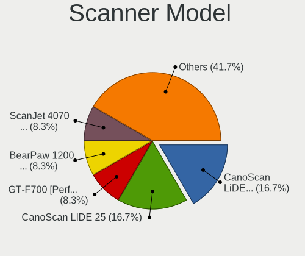

| Model                                 | Computers | Percent |
|---------------------------------------|-----------|---------|
| Canon CanoScan LIDE 25                | 2         | 18.18%  |
| Canon CanoScan LiDE 210               | 2         | 18.18%  |
| Seiko Epson GT-F700 [Perfection V350] | 1         | 9.09%   |
| Mustek Systems BearPaw 1200 CU Plus   | 1         | 9.09%   |
| HP ScanJet 2200c                      | 1         | 9.09%   |
| Canon CanoScan LiDE 90                | 1         | 9.09%   |
| Canon CanoScan LiDE 200               | 1         | 9.09%   |
| Canon CanoScan LiDE 120               | 1         | 9.09%   |
| Canon CanoScan LiDE 100               | 1         | 9.09%   |

Camera
------

Camera Vendor
-------------

Camera device vendors

| Vendor                                 | Computers | Percent |
|----------------------------------------|-----------|---------|
| Chicony Electronics                    | 297       | 24.21%  |
| Realtek Semiconductor                  | 121       | 9.86%   |
| IMC Networks                           | 109       | 8.88%   |
| Microdia                               | 94        | 7.66%   |
| Bison Electronics                      | 83        | 6.76%   |
| Sunplus Innovation Technology          | 75        | 6.11%   |
| Quanta                                 | 52        | 4.24%   |
| Cheng Uei Precision Industry (Foxlink) | 51        | 4.16%   |
| Lite-On Technology                     | 47        | 3.83%   |
| Syntek                                 | 35        | 2.85%   |
| Suyin                                  | 35        | 2.85%   |
| Logitech                               | 33        | 2.69%   |
| Acer                                   | 28        | 2.28%   |
| Apple                                  | 19        | 1.55%   |
| Samsung Electronics                    | 12        | 0.98%   |
| KYE Systems (Mouse Systems)            | 12        | 0.98%   |
| Alcor Micro                            | 12        | 0.98%   |
| Lenovo                                 | 11        | 0.9%    |
| Ricoh                                  | 10        | 0.81%   |
| Luxvisions Innotech Limited            | 10        | 0.81%   |
| Z-Star Microelectronics                | 9         | 0.73%   |
| Microsoft                              | 8         | 0.65%   |
| Creative Technology                    | 8         | 0.65%   |
| Sonix Technology                       | 5         | 0.41%   |
| Primax Electronics                     | 5         | 0.41%   |
| GEMBIRD                                | 5         | 0.41%   |
| Hopewin Electronic Material            | 4         | 0.33%   |
| icSpring                               | 3         | 0.24%   |
| Generalplus Technology                 | 3         | 0.24%   |
| Intel                                  | 2         | 0.16%   |
| Hewlett-Packard                        | 2         | 0.16%   |
| Genesys Logic                          | 2         | 0.16%   |
| DLTDC0A9II090N                         | 2         | 0.16%   |
| YGTek                                  | 1         | 0.08%   |
| WaveRider Communications               | 1         | 0.08%   |
| Unknown                                | 1         | 0.08%   |
| SunplusIT                              | 1         | 0.08%   |
| Sunplus Technology                     | 1         | 0.08%   |
| Smartronix                             | 1         | 0.08%   |
| Silicon Motion                         | 1         | 0.08%   |

Camera Model
------------

Camera device models

| Model                                               | Computers | Percent |
|-----------------------------------------------------|-----------|---------|
| Chicony Integrated Camera                           | 79        | 6.37%   |
| IMC Networks Integrated Camera                      | 47        | 3.79%   |
| Realtek Integrated_Webcam_HD                        | 39        | 3.14%   |
| Microdia Integrated_Webcam_HD                       | 38        | 3.06%   |
| Chicony HP HD Camera                                | 30        | 2.42%   |
| IMC Networks USB2.0 HD UVC WebCam                   | 26        | 2.1%    |
| Chicony HD WebCam                                   | 25        | 2.01%   |
| Syntek Integrated Camera                            | 20        | 1.61%   |
| Lite-On HP HD Camera                                | 20        | 1.61%   |
| Bison Integrated Camera                             | 20        | 1.61%   |
| Sunplus Integrated_Webcam_HD                        | 17        | 1.37%   |
| Chicony Integrated Camera (1280x720@30)             | 15        | 1.21%   |
| Bison Lenovo EasyCamera                             | 15        | 1.21%   |
| Apple iPhone 5/5C/5S/6/SE/7/8/X                     | 15        | 1.21%   |
| Samsung Galaxy series, misc. (MTP mode)             | 12        | 0.97%   |
| Lite-On Integrated Camera                           | 12        | 0.97%   |
| IMC Networks USB2.0 VGA UVC WebCam                  | 12        | 0.97%   |
| Acer Integrated Camera                              | 12        | 0.97%   |
| Suyin Acer/HP Integrated Webcam [CN0314]            | 11        | 0.89%   |
| Sunplus HD WebCam                                   | 11        | 0.89%   |
| Quanta HP HD Camera                                 | 11        | 0.89%   |
| Bison SunplusIT Integrated Camera                   | 11        | 0.89%   |
| Microdia Integrated Webcam                          | 10        | 0.81%   |
| Chicony USB2.0 VGA UVC WebCam                       | 10        | 0.81%   |
| Cheng Uei Precision Industry (Foxlink) HP HD Camera | 10        | 0.81%   |
| Realtek USB2.0 camera                               | 9         | 0.73%   |
| Quanta HP Wide Vision HD Camera                     | 9         | 0.73%   |
| Quanta HD User Facing                               | 9         | 0.73%   |
| Chicony Lenovo EasyCamera                           | 9         | 0.73%   |
| Bison Lenovo Integrated Webcam                      | 9         | 0.73%   |
| Syntek Lenovo EasyCamera                            | 8         | 0.64%   |
| Realtek Integrated Webcam HD                        | 8         | 0.64%   |
| Logitech Webcam C270                                | 8         | 0.64%   |
| Chicony HP HD Webcam                                | 8         | 0.64%   |
| Sunplus Asus Webcam                                 | 7         | 0.56%   |
| Lenovo Integrated Webcam                            | 7         | 0.56%   |
| Cheng Uei Precision Industry (Foxlink) Webcam       | 7         | 0.56%   |
| Bison EasyCamera                                    | 7         | 0.56%   |
| Alcor Micro USB 2.0 Camera                          | 7         | 0.56%   |
| Sunplus Laptop_Integrated_Webcam_FHD                | 6         | 0.48%   |

Security
--------

Fingerprint Vendor
------------------

Fingerprint sensor vendors

| Vendor                             | Computers | Percent |
|------------------------------------|-----------|---------|
| Synaptics                          | 116       | 35.69%  |
| Validity Sensors                   | 105       | 32.31%  |
| Shenzhen Goodix Technology         | 38        | 11.69%  |
| AuthenTec                          | 28        | 8.62%   |
| Elan Microelectronics              | 14        | 4.31%   |
| Upek                               | 13        | 4%      |
| LighTuning Technology              | 7         | 2.15%   |
| STMicroelectronics                 | 1         | 0.31%   |
| Realtek USB2.0 Finger Print Bridge | 1         | 0.31%   |
| Microsoft                          | 1         | 0.31%   |
| Dell                               | 1         | 0.31%   |

Fingerprint Model
-----------------

Fingerprint sensor models

| Model                                                                      | Computers | Percent |
|----------------------------------------------------------------------------|-----------|---------|
| Synaptics Prometheus MIS Touch Fingerprint Reader                          | 30        | 9.23%   |
| Validity Sensors VFS495 Fingerprint Reader                                 | 28        | 8.62%   |
| Synaptics  FS7604 Touch Fingerprint Sensor with PurePrint                  | 21        | 6.46%   |
| Shenzhen Goodix  FingerPrint Device                                        | 18        | 5.54%   |
| Validity Sensors VFS5011 Fingerprint Reader                                | 17        | 5.23%   |
| Synaptics FS7604 Touch Fingerprint Sensor with PurePrint                   | 15        | 4.62%   |
| Synaptics Fingerprint reader [HP G6]                                       | 14        | 4.31%   |
| Upek Biometric Touchchip/Touchstrip Fingerprint Sensor                     | 13        | 4%      |
| Shenzhen Goodix Fingerprint Reader                                         | 13        | 4%      |
| Validity Sensors VFS491                                                    | 11        | 3.38%   |
| AuthenTec AES2810                                                          | 11        | 3.38%   |
| Validity Sensors VFS 5011 fingerprint sensor                               | 10        | 3.08%   |
| Validity Sensors Synaptics WBDI                                            | 10        | 3.08%   |
| Synaptics Metallica MIS Touch Fingerprint Reader                           | 10        | 3.08%   |
| Elan ELAN:Fingerprint                                                      | 9         | 2.77%   |
| AuthenTec AES2501 Fingerprint Sensor                                       | 9         | 2.77%   |
| Shenzhen Goodix FingerPrint                                                | 7         | 2.15%   |
| AuthenTec AES1600                                                          | 7         | 2.15%   |
| Validity Sensors VFS101 Fingerprint Reader                                 | 6         | 1.85%   |
| Synaptics UWP WBDI                                                         | 6         | 1.85%   |
| LighTuning EgisTec Touch Fingerprint Sensor                                | 6         | 1.85%   |
| Validity Sensors VFS451 Fingerprint Reader                                 | 5         | 1.54%   |
| Synaptics Metallica MOH Touch Fingerprint Reader                           | 5         | 1.54%   |
| Elan ELAN:ARM-M4                                                           | 5         | 1.54%   |
| Synaptics WBDI                                                             | 4         | 1.23%   |
| Synaptics  WBDI                                                            | 4         | 1.23%   |
| Validity Sensors VFS7500 Touch Fingerprint Sensor                          | 3         | 0.92%   |
| Validity Sensors Synaptics VFS7552 Touch Fingerprint Sensor                | 3         | 0.92%   |
| Validity Sensors Swipe Fingerprint Sensor                                  | 3         | 0.92%   |
| Validity Sensors Fingerprint scanner                                       | 3         | 0.92%   |
| Synaptics WBDI Fingerprint Reader USB 086                                  | 3         | 0.92%   |
| Validity Sensors VFS471 Fingerprint Reader                                 | 2         | 0.62%   |
| Validity Sensors Synaptics VFS7552 Touch Fingerprint Sensor with PurePrint | 2         | 0.62%   |
| Synaptics UWP WBDI Device                                                  | 2         | 0.62%   |
| Validity Sensors VFS7552 Touch Fingerprint Sensor                          | 1         | 0.31%   |
| Validity Sensors VFS301 Fingerprint Reader                                 | 1         | 0.31%   |
| Synaptics WBDI Fingerprint Reader USB 102                                  | 1         | 0.31%   |
| Synaptics WBDI Device                                                      | 1         | 0.31%   |
| STMicroelectronics Fingerprint Reader                                      | 1         | 0.31%   |
| Realtek USB2.0 Finger Print Bridge FocalTech Fingerprint Device            | 1         | 0.31%   |

Chipcard Vendor
---------------

Chipcard module vendors

| Vendor                    | Computers | Percent |
|---------------------------|-----------|---------|
| Broadcom                  | 70        | 50.36%  |
| Alcor Micro               | 44        | 31.65%  |
| O2 Micro                  | 9         | 6.47%   |
| Lenovo                    | 5         | 3.6%    |
| Upek                      | 2         | 1.44%   |
| SCM Microsystems          | 2         | 1.44%   |
| Realtek Semiconductor     | 2         | 1.44%   |
| Aladdin Knowledge Systems | 2         | 1.44%   |
| Purism, SPC               | 1         | 0.72%   |
| OmniKey                   | 1         | 0.72%   |
| Fujitsu Siemens Computers | 1         | 0.72%   |

Chipcard Model
--------------

Chipcard module models

| Model                                                                        | Computers | Percent |
|------------------------------------------------------------------------------|-----------|---------|
| Alcor Micro AU9540 Smartcard Reader                                          | 44        | 31.65%  |
| Broadcom 58200                                                               | 23        | 16.55%  |
| Broadcom BCM5880 Secure Applications Processor                               | 17        | 12.23%  |
| Broadcom 5880                                                                | 16        | 11.51%  |
| Broadcom BCM5880 Secure Applications Processor with fingerprint swipe sensor | 14        | 10.07%  |
| O2 Micro OZ776 CCID Smartcard Reader                                         | 8         | 5.76%   |
| Lenovo Integrated Smart Card Reader                                          | 5         | 3.6%    |
| Upek TouchChip Fingerprint Coprocessor (WBF advanced mode)                   | 2         | 1.44%   |
| SCM Microsystems SCR3340 - ExpressCard54 Smart Card Reader                   | 2         | 1.44%   |
| Realtek Semiconductor Smart Card Reader Interface                            | 2         | 1.44%   |
| Aladdin Knowledge Systems Token JC                                           | 2         | 1.44%   |
| Purism, SPC Librem Key                                                       | 1         | 0.72%   |
| OmniKey 3x21 Smart Card Reader                                               | 1         | 0.72%   |
| O2 Micro Oz776 SmartCard Reader                                              | 1         | 0.72%   |
| Fujitsu Siemens Computers SmartCard Reader 2A                                | 1         | 0.72%   |

Unsupported
-----------

Unsupported Devices
-------------------

Total unsupported devices on board

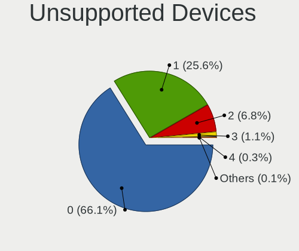

| Total | Computers | Percent |
|-------|-----------|---------|
| 0     | 1476      | 67.18%  |
| 1     | 547       | 24.9%   |
| 2     | 139       | 6.33%   |
| 3     | 26        | 1.18%   |
| 4     | 5         | 0.23%   |
| 5     | 4         | 0.18%   |

Unsupported Device Types
------------------------

Types of unsupported devices

| Type                     | Computers | Percent |
|--------------------------|-----------|---------|
| Fingerprint reader       | 319       | 35.29%  |
| Graphics card            | 187       | 20.69%  |
| Chipcard                 | 119       | 13.16%  |
| Net/wireless             | 67        | 7.41%   |
| Multimedia controller    | 50        | 5.53%   |
| Camera                   | 27        | 2.99%   |
| Communication controller | 24        | 2.65%   |
| Bluetooth                | 23        | 2.54%   |
| Storage                  | 22        | 2.43%   |
| Unassigned class         | 14        | 1.55%   |
| Card reader              | 11        | 1.22%   |
| Net/ethernet             | 9         | 1%      |
| Sound                    | 8         | 0.88%   |
| Flash memory             | 7         | 0.77%   |
| Modem                    | 6         | 0.66%   |
| Network                  | 4         | 0.44%   |
| Storage/ata              | 2         | 0.22%   |
| Dvb card                 | 2         | 0.22%   |
| Tv card                  | 1         | 0.11%   |
| Storage/raid             | 1         | 0.11%   |
| Storage/ide              | 1         | 0.11%   |

