Linux in Denmark - Tested Hardware & Statistics
-----------------------------------------------

A project to collect tested hardware configurations for Linux in Denmark.

Anyone can contribute to this report by the [hw-probe](https://github.com/linuxhw/hw-probe) tool:

    sudo -E hw-probe -all -upload

Please contribute! Especially if your hardware is rare.

This is a report for all computer types. See also reports for [desktops](/Location/Denmark/Desktop/README.md) and [notebooks](/Location/Denmark/Notebook/README.md).

Contents
--------

* [ Test Cases ](#test-cases)

* [ System ](#system)
  - [ OS                       ](#os)
  - [ OS Family                ](#os-family)
  - [ Kernel                   ](#kernel)
  - [ Kernel Family            ](#kernel-family)
  - [ Kernel Major Ver.        ](#kernel-major-ver)
  - [ Arch                     ](#arch)
  - [ DE                       ](#de)
  - [ Display Server           ](#display-server)
  - [ Display Manager          ](#display-manager)
  - [ OS Lang                  ](#os-lang)
  - [ Boot Mode                ](#boot-mode)
  - [ Filesystem               ](#filesystem)
  - [ Part. scheme             ](#part-scheme)
  - [ Dual Boot with Linux/BSD ](#dual-boot-with-linuxbsd)
  - [ Dual Boot (Win)          ](#dual-boot-win)

* [ Board ](#board)
  - [ Vendor                   ](#vendor)
  - [ Model                    ](#model)
  - [ Model Family             ](#model-family)
  - [ MFG Year                 ](#mfg-year)
  - [ Form Factor              ](#form-factor)
  - [ Secure Boot              ](#secure-boot)
  - [ Coreboot                 ](#coreboot)
  - [ RAM Size                 ](#ram-size)
  - [ RAM Used                 ](#ram-used)
  - [ Total Drives             ](#total-drives)
  - [ Has CD-ROM               ](#has-cd-rom)
  - [ Has Ethernet             ](#has-ethernet)
  - [ Has WiFi                 ](#has-wifi)
  - [ Has Bluetooth            ](#has-bluetooth)

* [ Location ](#location)
  - [ Country                  ](#country)
  - [ City                     ](#city)

* [ Drives ](#drives)
  - [ Drive Vendor             ](#drive-vendor)
  - [ Drive Model              ](#drive-model)
  - [ HDD Vendor               ](#hdd-vendor)
  - [ SSD Vendor               ](#ssd-vendor)
  - [ Drive Kind               ](#drive-kind)
  - [ Drive Connector          ](#drive-connector)
  - [ Drive Size               ](#drive-size)
  - [ Space Total              ](#space-total)
  - [ Space Used               ](#space-used)
  - [ Malfunc. Drives          ](#malfunc-drives)
  - [ Malfunc. Drive Vendor    ](#malfunc-drive-vendor)
  - [ Malfunc. HDD Vendor      ](#malfunc-hdd-vendor)
  - [ Malfunc. Drive Kind      ](#malfunc-drive-kind)
  - [ Failed Drives            ](#failed-drives)
  - [ Failed Drive Vendor      ](#failed-drive-vendor)
  - [ Drive Status             ](#drive-status)

* [ Storage controller ](#storage-controller)
  - [ Storage Vendor           ](#storage-vendor)
  - [ Storage Model            ](#storage-model)
  - [ Storage Kind             ](#storage-kind)

* [ Processor ](#processor)
  - [ CPU Vendor               ](#cpu-vendor)
  - [ CPU Model                ](#cpu-model)
  - [ CPU Model Family         ](#cpu-model-family)
  - [ CPU Cores                ](#cpu-cores)
  - [ CPU Sockets              ](#cpu-sockets)
  - [ CPU Threads              ](#cpu-threads)
  - [ CPU Op-Modes             ](#cpu-op-modes)
  - [ CPU Microcode            ](#cpu-microcode)
  - [ CPU Microarch            ](#cpu-microarch)

* [ Graphics ](#graphics)
  - [ GPU Vendor               ](#gpu-vendor)
  - [ GPU Model                ](#gpu-model)
  - [ GPU Combo                ](#gpu-combo)
  - [ GPU Driver               ](#gpu-driver)
  - [ GPU Memory               ](#gpu-memory)

* [ Monitor ](#monitor)
  - [ Monitor Vendor           ](#monitor-vendor)
  - [ Monitor Model            ](#monitor-model)
  - [ Monitor Resolution       ](#monitor-resolution)
  - [ Monitor Diagonal         ](#monitor-diagonal)
  - [ Monitor Width            ](#monitor-width)
  - [ Aspect Ratio             ](#aspect-ratio)
  - [ Monitor Area             ](#monitor-area)
  - [ Pixel Density            ](#pixel-density)
  - [ Multiple Monitors        ](#multiple-monitors)

* [ Network ](#network)
  - [ Net Controller Vendor    ](#net-controller-vendor)
  - [ Net Controller Model     ](#net-controller-model)
  - [ Wireless Vendor          ](#wireless-vendor)
  - [ Wireless Model           ](#wireless-model)
  - [ Ethernet Vendor          ](#ethernet-vendor)
  - [ Ethernet Model           ](#ethernet-model)
  - [ Net Controller Kind      ](#net-controller-kind)
  - [ Used Controller          ](#used-controller)
  - [ NICs                     ](#nics)
  - [ IPv6                     ](#ipv6)

* [ Bluetooth ](#bluetooth)
  - [ Bluetooth Vendor         ](#bluetooth-vendor)
  - [ Bluetooth Model          ](#bluetooth-model)

* [ Sound ](#sound)
  - [ Sound Vendor             ](#sound-vendor)
  - [ Sound Model              ](#sound-model)

* [ Memory ](#memory)
  - [ Memory Vendor            ](#memory-vendor)
  - [ Memory Model             ](#memory-model)
  - [ Memory Kind              ](#memory-kind)
  - [ Memory Form Factor       ](#memory-form-factor)
  - [ Memory Size              ](#memory-size)
  - [ Memory Speed             ](#memory-speed)

* [ Printers & scanners ](#printers--scanners)
  - [ Printer Vendor           ](#printer-vendor)
  - [ Printer Model            ](#printer-model)
  - [ Scanner Vendor           ](#scanner-vendor)
  - [ Scanner Model            ](#scanner-model)

* [ Camera ](#camera)
  - [ Camera Vendor            ](#camera-vendor)
  - [ Camera Model             ](#camera-model)

* [ Security ](#security)
  - [ Fingerprint Vendor       ](#fingerprint-vendor)
  - [ Fingerprint Model        ](#fingerprint-model)
  - [ Chipcard Vendor          ](#chipcard-vendor)
  - [ Chipcard Model           ](#chipcard-model)

* [ Unsupported ](#unsupported)
  - [ Unsupported Devices      ](#unsupported-devices)
  - [ Unsupported Device Types ](#unsupported-device-types)

Test Cases
----------

Total: 2364

| Vendor        | Model                       | Form-Factor | Probe                                                      | Date         |
|---------------|-----------------------------|-------------|------------------------------------------------------------|--------------|
| Lenovo        | ThinkPad L480 20LTSAUK00    | Notebook    | [8d2896f397](https://linux-hardware.org/?probe=8d2896f397) | Dec 31, 2025 |
| Apple         | MacBookPro11,4              | Notebook    | [0eca91043d](https://linux-hardware.org/?probe=0eca91043d) | Dec 28, 2025 |
| Apple         | MacBookPro14,1              | Notebook    | [3a9e095e67](https://linux-hardware.org/?probe=3a9e095e67) | Dec 28, 2025 |
| MSI           | B450 TOMAHAWK MAX           | Desktop     | [2c80d94d55](https://linux-hardware.org/?probe=2c80d94d55) | Dec 26, 2025 |
| Lenovo        | ThinkPad T14 Gen 1 20UES... | Notebook    | [d0d35377e6](https://linux-hardware.org/?probe=d0d35377e6) | Dec 26, 2025 |
| Apple         | Mac-BE088AF8C5EB4FA2 iMa... | All in one  | [8aa7bc6d5a](https://linux-hardware.org/?probe=8aa7bc6d5a) | Dec 26, 2025 |
| ASUSTek       | PRIME X570-P                | Desktop     | [2642ebd588](https://linux-hardware.org/?probe=2642ebd588) | Dec 25, 2025 |
| Dell          | 0773VG A00                  | Desktop     | [04673177d3](https://linux-hardware.org/?probe=04673177d3) | Dec 24, 2025 |
| Lenovo        | ThinkPad X260 20F5S3D000    | Notebook    | [f77202bf2c](https://linux-hardware.org/?probe=f77202bf2c) | Dec 23, 2025 |
| ASUSTek       | ZenBook 13 UX331FN_UX331... | Notebook    | [940a302db4](https://linux-hardware.org/?probe=940a302db4) | Dec 23, 2025 |
| Dell          | 0J32FG A05                  | Desktop     | [c49a287cd5](https://linux-hardware.org/?probe=c49a287cd5) | Dec 22, 2025 |
| HP            | Notebook                    | Notebook    | [0c7a4b028f](https://linux-hardware.org/?probe=0c7a4b028f) | Dec 22, 2025 |
| Lenovo        | 314F SDK0T08861 WIN 3305... | Desktop     | [ac0a321800](https://linux-hardware.org/?probe=ac0a321800) | Dec 22, 2025 |
| TUXEDO        | InfinityBook Pro Gen8 (M... | Notebook    | [0fd613b4d2](https://linux-hardware.org/?probe=0fd613b4d2) | Dec 22, 2025 |
| Lenovo        | ThinkPad X13 Gen 4 21J3C... | Notebook    | [9a30fd4d1d](https://linux-hardware.org/?probe=9a30fd4d1d) | Dec 22, 2025 |
| Notebook      | N14xWU                      | Notebook    | [398b6fec45](https://linux-hardware.org/?probe=398b6fec45) | Dec 22, 2025 |
| Lenovo        | 1046 SDK0K17763 WIN 5051... | Desktop     | [bc141820b2](https://linux-hardware.org/?probe=bc141820b2) | Dec 22, 2025 |
| Apple         | MacBookPro14,1              | Notebook    | [9fa2478c38](https://linux-hardware.org/?probe=9fa2478c38) | Dec 20, 2025 |
| ASUSTek       | X751LAB                     | Notebook    | [6cb38a35a5](https://linux-hardware.org/?probe=6cb38a35a5) | Dec 19, 2025 |
| ASUSTek       | ROG STRIX Z390-F GAMING     | Desktop     | [d52f70228a](https://linux-hardware.org/?probe=d52f70228a) | Dec 19, 2025 |
| HP            | ZBook Power G7 Mobile Wo... | Notebook    | [bb4aa90012](https://linux-hardware.org/?probe=bb4aa90012) | Dec 18, 2025 |
| Lenovo        | ThinkPad P53 20QN0034MX     | Notebook    | [dc9c833ae5](https://linux-hardware.org/?probe=dc9c833ae5) | Dec 18, 2025 |
| Samsung       | 960XGK                      | Notebook    | [b7677eb62c](https://linux-hardware.org/?probe=b7677eb62c) | Dec 18, 2025 |
| Medion        | H61H2-TI2                   | All in one  | [34b2fb45aa](https://linux-hardware.org/?probe=34b2fb45aa) | Dec 17, 2025 |
| Lenovo        | ThinkPad X13 Gen 6 21RMC... | Notebook    | [e138712e74](https://linux-hardware.org/?probe=e138712e74) | Dec 17, 2025 |
| Lenovo        | ThinkPad L14 Gen 2a 20X6... | Notebook    | [6083b1da2c](https://linux-hardware.org/?probe=6083b1da2c) | Dec 16, 2025 |
| Gigabyte      | Z87-D3HP-CF                 | Desktop     | [8c389a0a14](https://linux-hardware.org/?probe=8c389a0a14) | Dec 15, 2025 |
| Dell          | Precision 3591              | Notebook    | [7a39272292](https://linux-hardware.org/?probe=7a39272292) | Dec 15, 2025 |
| Gigabyte      | H77N-WIFI                   | Desktop     | [6b3fe254d3](https://linux-hardware.org/?probe=6b3fe254d3) | Dec 14, 2025 |
| Gigabyte      | H77N-WIFI                   | Desktop     | [7fe8596672](https://linux-hardware.org/?probe=7fe8596672) | Dec 14, 2025 |
| ASUSTek       | TUF Gaming B850-PLUS WIF... | Desktop     | [23652e1a91](https://linux-hardware.org/?probe=23652e1a91) | Dec 13, 2025 |
| Lenovo        | IdeaPad L340-17IRH Gamin... | Notebook    | [443526b2d1](https://linux-hardware.org/?probe=443526b2d1) | Dec 12, 2025 |
| Lenovo        | IdeaPad L340-17IRH Gamin... | Notebook    | [7ecd167b6f](https://linux-hardware.org/?probe=7ecd167b6f) | Dec 12, 2025 |
| MARIUS        | 2016 Mainframe 4000MHz 1... | Desktop     | [276c9090ac](https://linux-hardware.org/?probe=276c9090ac) | Dec 10, 2025 |
| MSI           | B350M PRO-VDH               | Desktop     | [743906caf5](https://linux-hardware.org/?probe=743906caf5) | Dec 10, 2025 |
| HP            | OMEN Laptop 15-en1xxx       | Notebook    | [e3b8f3f35c](https://linux-hardware.org/?probe=e3b8f3f35c) | Dec 08, 2025 |
| HP            | OMEN Laptop 15-en1xxx       | Notebook    | [6e49656c1a](https://linux-hardware.org/?probe=6e49656c1a) | Dec 08, 2025 |
| Gigabyte      | X570 AORUS ELITE            | Desktop     | [b5a91c4f78](https://linux-hardware.org/?probe=b5a91c4f78) | Dec 08, 2025 |
| Apple         | MacBookAir9,1               | Notebook    | [850efc3c46](https://linux-hardware.org/?probe=850efc3c46) | Dec 07, 2025 |
| MARIUS        | 2016 Mainframe 4000MHz 1... | Desktop     | [680d12614b](https://linux-hardware.org/?probe=680d12614b) | Dec 07, 2025 |
| Lenovo        | ThinkPad X250 20CLS78N00    | Notebook    | [11106583c4](https://linux-hardware.org/?probe=11106583c4) | Dec 07, 2025 |
| Lenovo        | ThinkPad X13 Gen 1 20UGS... | Notebook    | [4aeedaa65f](https://linux-hardware.org/?probe=4aeedaa65f) | Dec 07, 2025 |
| ASUSTek       | ROG STRIX B650E-E GAMING... | Desktop     | [56a78b5ff8](https://linux-hardware.org/?probe=56a78b5ff8) | Dec 07, 2025 |
| ASUSTek       | PRIME X570-P                | Desktop     | [5ff57cb432](https://linux-hardware.org/?probe=5ff57cb432) | Dec 07, 2025 |
| ASUSTek       | ASUS TUF Gaming F15 FX50... | Notebook    | [1237be4244](https://linux-hardware.org/?probe=1237be4244) | Dec 06, 2025 |
| ASUSTek       | PRIME B250M-K               | Desktop     | [87e5aeef2b](https://linux-hardware.org/?probe=87e5aeef2b) | Dec 06, 2025 |
| Apple         | MacBookPro9,1               | Notebook    | [06c80aa808](https://linux-hardware.org/?probe=06c80aa808) | Dec 06, 2025 |
| ASUSTek       | ROG STRIX B650E-E GAMING... | Desktop     | [5d4ee6b8d3](https://linux-hardware.org/?probe=5d4ee6b8d3) | Dec 06, 2025 |
| Dell          | XPS 13 9305                 | Notebook    | [3a2249f776](https://linux-hardware.org/?probe=3a2249f776) | Dec 05, 2025 |
| ASRock        | H110M-HDV R3.0              | Desktop     | [1c5b6b5d0b](https://linux-hardware.org/?probe=1c5b6b5d0b) | Dec 04, 2025 |
| Microsoft     | Surface Pro                 | Tablet      | [2e9392deb5](https://linux-hardware.org/?probe=2e9392deb5) | Dec 04, 2025 |
| HP            | 8777 01011                  | Mini pc     | [66ef6e86d0](https://linux-hardware.org/?probe=66ef6e86d0) | Dec 03, 2025 |
| HP            | 8777 01011                  | Mini pc     | [2329e8d9e4](https://linux-hardware.org/?probe=2329e8d9e4) | Dec 03, 2025 |
| Lenovo        | ThinkPad T480s 20L7001PM... | Notebook    | [6d88cbdf32](https://linux-hardware.org/?probe=6d88cbdf32) | Dec 02, 2025 |
| HP            | EliteBook x360 1030 G7 N... | Convertible | [d40514c547](https://linux-hardware.org/?probe=d40514c547) | Nov 28, 2025 |
| ASUSTek       | K95VJ                       | Notebook    | [27ee88318f](https://linux-hardware.org/?probe=27ee88318f) | Nov 27, 2025 |
| ASUSTek       | K95VJ                       | Notebook    | [16cdcd0e3f](https://linux-hardware.org/?probe=16cdcd0e3f) | Nov 27, 2025 |
| Lenovo        | ThinkPad W510 4391WMM       | Notebook    | [540b39357c](https://linux-hardware.org/?probe=540b39357c) | Nov 26, 2025 |
| ASUSTek       | ROG Zephyrus G14 GA403UI... | Notebook    | [6cffbcba26](https://linux-hardware.org/?probe=6cffbcba26) | Nov 26, 2025 |
| ASUSTek       | Z87-K                       | Desktop     | [ece2477f2d](https://linux-hardware.org/?probe=ece2477f2d) | Nov 23, 2025 |
| Apple         | MacBookPro13,1              | Notebook    | [e28aed36f2](https://linux-hardware.org/?probe=e28aed36f2) | Nov 23, 2025 |
| HP            | Notebook                    | Notebook    | [78aeb060b1](https://linux-hardware.org/?probe=78aeb060b1) | Nov 21, 2025 |
| Lenovo        | ThinkPad T480s 20L7001PM... | Notebook    | [debccd0b6d](https://linux-hardware.org/?probe=debccd0b6d) | Nov 21, 2025 |
| Apple         | MacBookPro13,3              | Notebook    | [5729bdd432](https://linux-hardware.org/?probe=5729bdd432) | Nov 21, 2025 |
| HP            | Spectre Pro G1              | Notebook    | [aac96429c7](https://linux-hardware.org/?probe=aac96429c7) | Nov 21, 2025 |
| Lenovo        | Yoga S730-13IWL 81J0        | Notebook    | [04bea5cb24](https://linux-hardware.org/?probe=04bea5cb24) | Nov 21, 2025 |
| Lenovo        | ThinkPad P15 Gen 1 20SUS... | Notebook    | [7785d53587](https://linux-hardware.org/?probe=7785d53587) | Nov 20, 2025 |
| Lenovo        | Yoga Slim 6 14IAP8 82WU     | Notebook    | [961ba86d3f](https://linux-hardware.org/?probe=961ba86d3f) | Nov 19, 2025 |
| Lenovo        | ThinkPad T14 Gen 3 21AJS... | Notebook    | [a5b1a0231f](https://linux-hardware.org/?probe=a5b1a0231f) | Nov 19, 2025 |
| Apple         | MacBookAir7,2               | Notebook    | [7e8b7f9dba](https://linux-hardware.org/?probe=7e8b7f9dba) | Nov 18, 2025 |
| TUXEDO        | Pulse 14 Gen4               | Notebook    | [293e9fd05d](https://linux-hardware.org/?probe=293e9fd05d) | Nov 17, 2025 |
| ASRock        | Z370 Pro4                   | Desktop     | [37edd9561a](https://linux-hardware.org/?probe=37edd9561a) | Nov 16, 2025 |
| HP            | Unknown                     | Notebook    | [3235e911e2](https://linux-hardware.org/?probe=3235e911e2) | Nov 14, 2025 |
| Apple         | MacBookAir6,2               | Notebook    | [994a8d0bbf](https://linux-hardware.org/?probe=994a8d0bbf) | Nov 14, 2025 |
| HP            | OmniBook X Flip Laptop 1... | Convertible | [48eafdbf51](https://linux-hardware.org/?probe=48eafdbf51) | Nov 14, 2025 |
| Acer          | Aspire E1-571               | Notebook    | [28819ae72f](https://linux-hardware.org/?probe=28819ae72f) | Nov 14, 2025 |
| Apple         | MacBookAir7,2               | Notebook    | [e5db1bc483](https://linux-hardware.org/?probe=e5db1bc483) | Nov 12, 2025 |
| ASRock        | X399 Taichi                 | Desktop     | [34959de723](https://linux-hardware.org/?probe=34959de723) | Nov 10, 2025 |
| Toshiba       | PORTEGE X30T-E              | Tablet      | [bb07ec724d](https://linux-hardware.org/?probe=bb07ec724d) | Nov 09, 2025 |
| ASUSTek       | ROG Maximus XI EXTREME      | Desktop     | [9a595b085b](https://linux-hardware.org/?probe=9a595b085b) | Nov 08, 2025 |
| Acer          | Aspire E5-721               | Notebook    | [808b61961a](https://linux-hardware.org/?probe=808b61961a) | Nov 07, 2025 |
| ASRock        | 970 Pro3 R2.0               | Desktop     | [39d87f7038](https://linux-hardware.org/?probe=39d87f7038) | Nov 06, 2025 |
| Apple         | MacBookAir6,2               | Notebook    | [c62b773a32](https://linux-hardware.org/?probe=c62b773a32) | Nov 05, 2025 |
| MSI           | MEG X570 UNIFY              | Desktop     | [47b55af258](https://linux-hardware.org/?probe=47b55af258) | Nov 03, 2025 |
| Dell          | Pro Max 16 Plus MB16250     | Notebook    | [0d7457d56d](https://linux-hardware.org/?probe=0d7457d56d) | Nov 03, 2025 |
| HP            | EliteBook 820 G1            | Notebook    | [df95e959c2](https://linux-hardware.org/?probe=df95e959c2) | Nov 03, 2025 |
| HP            | ZBook 15 G2                 | Notebook    | [defa953e3b](https://linux-hardware.org/?probe=defa953e3b) | Nov 02, 2025 |
| HP            | Unknown                     | Notebook    | [7d353bf782](https://linux-hardware.org/?probe=7d353bf782) | Nov 02, 2025 |
| DukaPC        | Notebook                    | Notebook    | [d6ab864b10](https://linux-hardware.org/?probe=d6ab864b10) | Nov 01, 2025 |
| Dell          | Latitude 5424 Rugged        | Notebook    | [5406d3f618](https://linux-hardware.org/?probe=5406d3f618) | Nov 01, 2025 |
| Dell          | Latitude 5424 Rugged        | Notebook    | [8c115fa660](https://linux-hardware.org/?probe=8c115fa660) | Nov 01, 2025 |
| MSI           | B450 TOMAHAWK MAX           | Desktop     | [9e0de36481](https://linux-hardware.org/?probe=9e0de36481) | Oct 31, 2025 |
| Apple         | Mac-031B6874CF7F642A iMa... | All in one  | [3b648088e3](https://linux-hardware.org/?probe=3b648088e3) | Oct 30, 2025 |
| Apple         | Mac-031B6874CF7F642A iMa... | All in one  | [0154f80ccd](https://linux-hardware.org/?probe=0154f80ccd) | Oct 29, 2025 |
| ASUSTek       | X750JB                      | Notebook    | [f9fcacc64a](https://linux-hardware.org/?probe=f9fcacc64a) | Oct 29, 2025 |
| ASUSTek       | P9X79                       | Desktop     | [6ada81f7e9](https://linux-hardware.org/?probe=6ada81f7e9) | Oct 29, 2025 |
| Samsung       | 750XED                      | Notebook    | [fffd3a1489](https://linux-hardware.org/?probe=fffd3a1489) | Oct 26, 2025 |
| Lenovo        | ThinkPad T14 Gen 2i 20W1... | Notebook    | [b38c86716c](https://linux-hardware.org/?probe=b38c86716c) | Oct 25, 2025 |
| Lenovo        | ThinkPad L530 2479AK8       | Notebook    | [6384182c3e](https://linux-hardware.org/?probe=6384182c3e) | Oct 25, 2025 |
| Lenovo        | ThinkPad L530 2479AK8       | Notebook    | [0ddab8d0d3](https://linux-hardware.org/?probe=0ddab8d0d3) | Oct 25, 2025 |
| Lenovo        | ThinkPad P15 Gen 1 20ST0... | Notebook    | [54701bba3d](https://linux-hardware.org/?probe=54701bba3d) | Oct 25, 2025 |
| Framework     | Laptop 13 (AMD Ryzen 704... | Notebook    | [d29eed1f5b](https://linux-hardware.org/?probe=d29eed1f5b) | Oct 25, 2025 |
| Dell          | Latitude E5570              | Notebook    | [06b7dd9773](https://linux-hardware.org/?probe=06b7dd9773) | Oct 22, 2025 |
| Apple         | MacBookPro6,2               | Notebook    | [d385761c08](https://linux-hardware.org/?probe=d385761c08) | Oct 19, 2025 |
| Toshiba       | PORTEGE Z930                | Notebook    | [6bf21cd46c](https://linux-hardware.org/?probe=6bf21cd46c) | Oct 18, 2025 |
| Lenovo        | V15 G2 IJL 82QY             | Notebook    | [f99bf36d26](https://linux-hardware.org/?probe=f99bf36d26) | Oct 18, 2025 |
| ASUSTek       | PRIME X570-P                | Desktop     | [6a8da4d459](https://linux-hardware.org/?probe=6a8da4d459) | Oct 18, 2025 |
| Lenovo        | ThinkPad X1 Yoga Gen 5 2... | Convertible | [17744da735](https://linux-hardware.org/?probe=17744da735) | Oct 17, 2025 |
| ASUSTek       | ZenBook UX462DA             | Convertible | [9bf069e341](https://linux-hardware.org/?probe=9bf069e341) | Oct 17, 2025 |
| ASUSTek       | VivoBook_ASUSLaptop X421... | Notebook    | [f5b0b8e135](https://linux-hardware.org/?probe=f5b0b8e135) | Oct 15, 2025 |
| ASUSTek       | ZenBook UX462DA             | Convertible | [b827ddeb75](https://linux-hardware.org/?probe=b827ddeb75) | Oct 15, 2025 |
| Medion        | MS-7748                     | Desktop     | [84f68bb7b5](https://linux-hardware.org/?probe=84f68bb7b5) | Oct 15, 2025 |
| Lenovo        | ThinkPad T470s W10DG 20J... | Notebook    | [5551501dac](https://linux-hardware.org/?probe=5551501dac) | Oct 14, 2025 |
| Lenovo        | ThinkPad T470s W10DG 20J... | Notebook    | [d6dbf314ea](https://linux-hardware.org/?probe=d6dbf314ea) | Oct 14, 2025 |
| Dell          | 00V62H A00                  | Desktop     | [1ab3435749](https://linux-hardware.org/?probe=1ab3435749) | Oct 14, 2025 |
| HP            | Unknown                     | Notebook    | [142b058af0](https://linux-hardware.org/?probe=142b058af0) | Oct 12, 2025 |
| Lenovo        | ThinkPad T510 4384FF3       | Notebook    | [124f3d3389](https://linux-hardware.org/?probe=124f3d3389) | Oct 11, 2025 |
| Packard Be... | EasyNote TE11HC             | Notebook    | [86f2e3004d](https://linux-hardware.org/?probe=86f2e3004d) | Oct 11, 2025 |
| MSI           | B450 TOMAHAWK MAX           | Desktop     | [04f602b560](https://linux-hardware.org/?probe=04f602b560) | Oct 06, 2025 |
| Lenovo        | NOK                         | Desktop     | [41118a80ad](https://linux-hardware.org/?probe=41118a80ad) | Oct 06, 2025 |
| Lenovo        | IdeaPad 720S-14IKB 81BD     | Notebook    | [1ea3b0eaf5](https://linux-hardware.org/?probe=1ea3b0eaf5) | Oct 06, 2025 |
| Gigabyte      | Z170XP-SLI-CF               | Desktop     | [d2d621525a](https://linux-hardware.org/?probe=d2d621525a) | Oct 05, 2025 |
| Apple         | MacBookAir7,2               | Notebook    | [3749a648e8](https://linux-hardware.org/?probe=3749a648e8) | Oct 04, 2025 |
| Acer          | Aspire ES1-332              | Notebook    | [15b074fbac](https://linux-hardware.org/?probe=15b074fbac) | Oct 04, 2025 |
| HP            | OmniBook X Flip Laptop 1... | Convertible | [9208cac443](https://linux-hardware.org/?probe=9208cac443) | Oct 03, 2025 |
| Lenovo        | IdeaPad 720S-14IKB 81BD     | Notebook    | [d8fda2532c](https://linux-hardware.org/?probe=d8fda2532c) | Oct 02, 2025 |
| Dell          | Inspiron 5770               | Notebook    | [5392348de7](https://linux-hardware.org/?probe=5392348de7) | Oct 01, 2025 |
| Dell          | Inspiron 5770               | Notebook    | [e39f357fcc](https://linux-hardware.org/?probe=e39f357fcc) | Oct 01, 2025 |
| ASRock        | Z77 Extreme4                | Desktop     | [45b4355661](https://linux-hardware.org/?probe=45b4355661) | Oct 01, 2025 |
| HP            | OmniBook X Flip Laptop 1... | Convertible | [62d8125dd8](https://linux-hardware.org/?probe=62d8125dd8) | Sep 25, 2025 |
| Lenovo        | Yoga 3 Pro-1370 80HE        | Notebook    | [35b579c962](https://linux-hardware.org/?probe=35b579c962) | Sep 25, 2025 |
| Lenovo        | ThinkPad X390 20Q1S7PD01    | Notebook    | [d9074bbec5](https://linux-hardware.org/?probe=d9074bbec5) | Sep 24, 2025 |
| Unknown       | Fairphone 4                 | Soc         | [35da5b83f4](https://linux-hardware.org/?probe=35da5b83f4) | Sep 24, 2025 |
| ASUSTek       | ROG Maximus XI HERO         | Desktop     | [993025ba4b](https://linux-hardware.org/?probe=993025ba4b) | Sep 24, 2025 |
| Samsung       | 960XGK                      | Notebook    | [4594659dc5](https://linux-hardware.org/?probe=4594659dc5) | Sep 23, 2025 |
| Samsung       | 960XGK                      | Notebook    | [fa7ad01822](https://linux-hardware.org/?probe=fa7ad01822) | Sep 22, 2025 |
| ASUSTek       | TUF Z390-PRO GAMING         | Desktop     | [ffe3bb72ff](https://linux-hardware.org/?probe=ffe3bb72ff) | Sep 21, 2025 |
| System76      | Darter UltraThin            | Notebook    | [0785123b62](https://linux-hardware.org/?probe=0785123b62) | Sep 20, 2025 |
| ASUSTek       | ROG STRIX B450-F GAMING     | Desktop     | [08092bbedf](https://linux-hardware.org/?probe=08092bbedf) | Sep 17, 2025 |
| HP            | EliteBook 840 14 inch G1... | Notebook    | [c5eea07765](https://linux-hardware.org/?probe=c5eea07765) | Sep 17, 2025 |
| ASUSTek       | PRIME Z890-P                | Desktop     | [718b5cc3ac](https://linux-hardware.org/?probe=718b5cc3ac) | Sep 17, 2025 |
| ASUSTek       | TUF Z390-PRO GAMING         | Desktop     | [f354185259](https://linux-hardware.org/?probe=f354185259) | Sep 16, 2025 |
| Gigabyte      | Z87MX-D3H-CF                | Desktop     | [acfad37386](https://linux-hardware.org/?probe=acfad37386) | Sep 15, 2025 |
| ASUSTek       | ROG STRIX X870E-E GAMING... | Desktop     | [673315b571](https://linux-hardware.org/?probe=673315b571) | Sep 15, 2025 |
| ASUSTek       | ASUS TUF Gaming F17 FX70... | Notebook    | [30d8fc0563](https://linux-hardware.org/?probe=30d8fc0563) | Sep 13, 2025 |
| ASUSTek       | ROG Zephyrus G14 GA402RK... | Notebook    | [5be6665596](https://linux-hardware.org/?probe=5be6665596) | Sep 12, 2025 |
| ASUSTek       | ROG Zephyrus G14 GA402RK... | Notebook    | [f6c7a8404f](https://linux-hardware.org/?probe=f6c7a8404f) | Sep 12, 2025 |
| HP            | Pavilion 13 x360 PC         | Notebook    | [98cb219e9b](https://linux-hardware.org/?probe=98cb219e9b) | Sep 12, 2025 |
| ASUSTek       | ROG STRIX B550-F GAMING     | Desktop     | [6f84fd2e43](https://linux-hardware.org/?probe=6f84fd2e43) | Sep 11, 2025 |
| ASUSTek       | ROG STRIX B450-F GAMING     | Desktop     | [c09a9a7ba0](https://linux-hardware.org/?probe=c09a9a7ba0) | Sep 10, 2025 |
| MSI           | B550-A PRO                  | Desktop     | [9a251bbc0e](https://linux-hardware.org/?probe=9a251bbc0e) | Sep 07, 2025 |
| MSI           | H310M PRO-VDH PLUS          | Desktop     | [f8bf8d85f0](https://linux-hardware.org/?probe=f8bf8d85f0) | Sep 06, 2025 |
| ASUSTek       | PRIME A620M-K               | Desktop     | [c59bc6a26b](https://linux-hardware.org/?probe=c59bc6a26b) | Sep 06, 2025 |
| Lenovo        | G560 0679                   | Notebook    | [d33f10a585](https://linux-hardware.org/?probe=d33f10a585) | Sep 06, 2025 |
| MSI           | X570-A PRO                  | Desktop     | [41c92c4e93](https://linux-hardware.org/?probe=41c92c4e93) | Sep 05, 2025 |
| ASRock        | B650M PG Lightning          | Desktop     | [9a48dfd158](https://linux-hardware.org/?probe=9a48dfd158) | Sep 03, 2025 |
| MSI           | B450M-A PRO MAX             | Desktop     | [e6146e6714](https://linux-hardware.org/?probe=e6146e6714) | Sep 03, 2025 |
| ASUSTek       | Z97-AR                      | Desktop     | [97ef9ca9ea](https://linux-hardware.org/?probe=97ef9ca9ea) | Sep 01, 2025 |
| Lenovo        | ThinkPad L15 Gen 1 20U70... | Notebook    | [93cfbd1d1d](https://linux-hardware.org/?probe=93cfbd1d1d) | Aug 31, 2025 |
| HP            | Unknown                     | Notebook    | [0602a9e00f](https://linux-hardware.org/?probe=0602a9e00f) | Aug 28, 2025 |
| ASUSTek       | ROG STRIX Z390-F GAMING     | Desktop     | [fee7313986](https://linux-hardware.org/?probe=fee7313986) | Aug 28, 2025 |
| MSI           | B550-A PRO                  | Desktop     | [a6cb94dcf6](https://linux-hardware.org/?probe=a6cb94dcf6) | Aug 27, 2025 |
| ASRock        | X870 Pro RS                 | Desktop     | [63971bd54d](https://linux-hardware.org/?probe=63971bd54d) | Aug 27, 2025 |
| MSI           | B550-A PRO                  | Desktop     | [9993d7cc40](https://linux-hardware.org/?probe=9993d7cc40) | Aug 25, 2025 |
| Gigabyte      | EX58-UD4P                   | Desktop     | [a1d6a85d21](https://linux-hardware.org/?probe=a1d6a85d21) | Aug 24, 2025 |
| MSI           | GP62MVR 7RF                 | Notebook    | [d65b4ddc4f](https://linux-hardware.org/?probe=d65b4ddc4f) | Aug 24, 2025 |
| NZXT          | N5 Z690                     | Desktop     | [8497fb9611](https://linux-hardware.org/?probe=8497fb9611) | Aug 24, 2025 |
| Apple         | MacBookPro9,2               | Notebook    | [40b5f87d6b](https://linux-hardware.org/?probe=40b5f87d6b) | Aug 22, 2025 |
| Apple         | Mac-942B5BF58194151B        | All in one  | [aabeec9d4c](https://linux-hardware.org/?probe=aabeec9d4c) | Aug 19, 2025 |
| HP            | Compaq 8510p                | Notebook    | [d6befbc8da](https://linux-hardware.org/?probe=d6befbc8da) | Aug 19, 2025 |
| HP            | EliteBook 820 G3            | Notebook    | [f2264c09b2](https://linux-hardware.org/?probe=f2264c09b2) | Aug 19, 2025 |
| ASUSTek       | CM6330_CM6630_CM6730_CM6... | Desktop     | [cfa54546cb](https://linux-hardware.org/?probe=cfa54546cb) | Aug 18, 2025 |
| ASUSTek       | CM6330_CM6630_CM6730_CM6... | Desktop     | [33bcf92a25](https://linux-hardware.org/?probe=33bcf92a25) | Aug 18, 2025 |
| ASUSTek       | TUF Gaming A520M-PLUS       | Desktop     | [0dcef76531](https://linux-hardware.org/?probe=0dcef76531) | Aug 18, 2025 |
| Dell          | 00V62H A00                  | Desktop     | [13718892e7](https://linux-hardware.org/?probe=13718892e7) | Aug 18, 2025 |
| Acer          | Nitro ANV17-41              | Notebook    | [eeb6686ff5](https://linux-hardware.org/?probe=eeb6686ff5) | Aug 18, 2025 |
| Acer          | Nitro ANV17-41              | Notebook    | [e5dbcadeda](https://linux-hardware.org/?probe=e5dbcadeda) | Aug 17, 2025 |
| HP            | EliteBook 820 G3            | Notebook    | [c6c4efb726](https://linux-hardware.org/?probe=c6c4efb726) | Aug 17, 2025 |
| HP            | ProBook x360 11 G3 EE       | Convertible | [dba4cbece7](https://linux-hardware.org/?probe=dba4cbece7) | Aug 16, 2025 |
| HP            | 1998                        | Desktop     | [13577f923d](https://linux-hardware.org/?probe=13577f923d) | Aug 15, 2025 |
| Lenovo        | 3111 SDK0J40697 WIN 3305... | Desktop     | [6b7020524d](https://linux-hardware.org/?probe=6b7020524d) | Aug 15, 2025 |
| Intel         | NUC5i3RYB H41000-503        | Mini pc     | [505a6b8049](https://linux-hardware.org/?probe=505a6b8049) | Aug 15, 2025 |
| HP            | 8595                        | Desktop     | [737937e079](https://linux-hardware.org/?probe=737937e079) | Aug 13, 2025 |
| ASUSTek       | B150-PLUS                   | Desktop     | [77e331f33a](https://linux-hardware.org/?probe=77e331f33a) | Aug 11, 2025 |
| Gigabyte      | B650 GAMING X AX            | Desktop     | [f231e0113d](https://linux-hardware.org/?probe=f231e0113d) | Aug 10, 2025 |
| HP            | Laptop 14-bp0xx             | Notebook    | [300185dfd4](https://linux-hardware.org/?probe=300185dfd4) | Aug 10, 2025 |
| Lenovo        | ThinkPad X280 20KES3HE00    | Notebook    | [fc5c548eec](https://linux-hardware.org/?probe=fc5c548eec) | Aug 10, 2025 |
| ASUSTek       | ROG STRIX X870E-E GAMING... | Desktop     | [aab1ade995](https://linux-hardware.org/?probe=aab1ade995) | Aug 07, 2025 |
| ASUSTek       | ROG STRIX X870E-E GAMING... | Desktop     | [0983b0957f](https://linux-hardware.org/?probe=0983b0957f) | Aug 07, 2025 |
| ASUSTek       | ROG STRIX B550-I GAMING     | Desktop     | [e0f2631fce](https://linux-hardware.org/?probe=e0f2631fce) | Aug 06, 2025 |
| Star Labs     | StarBook                    | Notebook    | [51364a25e3](https://linux-hardware.org/?probe=51364a25e3) | Aug 06, 2025 |
| Lenovo        | ThinkPad T420 4236PA8       | Notebook    | [d7225dfd56](https://linux-hardware.org/?probe=d7225dfd56) | Aug 06, 2025 |
| Lenovo        | ThinkPad T590 20N5S3FA00    | Notebook    | [e3e58b963d](https://linux-hardware.org/?probe=e3e58b963d) | Aug 06, 2025 |
| Lenovo        | ThinkPad T14s Gen 1 20T0... | Notebook    | [942f859bbe](https://linux-hardware.org/?probe=942f859bbe) | Aug 05, 2025 |
| Dell          | 00V62H A00                  | Desktop     | [026c47bff7](https://linux-hardware.org/?probe=026c47bff7) | Aug 04, 2025 |
| ASUSTek       | H170I-PRO                   | Desktop     | [e2514ce3fc](https://linux-hardware.org/?probe=e2514ce3fc) | Aug 03, 2025 |
| ASUSTek       | ROG STRIX X570-E GAMING ... | Desktop     | [c9b5794630](https://linux-hardware.org/?probe=c9b5794630) | Aug 03, 2025 |
| ASUSTek       | ROG STRIX X570-E GAMING ... | Desktop     | [bc1357d5b2](https://linux-hardware.org/?probe=bc1357d5b2) | Aug 02, 2025 |
| ASRock        | Z690 Phantom Gaming 4/D5    | Desktop     | [76f7babeb1](https://linux-hardware.org/?probe=76f7babeb1) | Aug 01, 2025 |
| ASUSTek       | ROG STRIX Z590-A GAMING ... | Desktop     | [baa2d4e73c](https://linux-hardware.org/?probe=baa2d4e73c) | Aug 01, 2025 |
| MSI           | X570-A PRO                  | Desktop     | [51bfced40e](https://linux-hardware.org/?probe=51bfced40e) | Aug 01, 2025 |
| Intel         | NUC11PABi5 M68265-500       | Mini pc     | [2a396c3356](https://linux-hardware.org/?probe=2a396c3356) | Jul 30, 2025 |
| Apple         | Mac-7BA5B2D9E42DDD94 iMa... | Desktop     | [07ffc28338](https://linux-hardware.org/?probe=07ffc28338) | Jul 29, 2025 |
| MSI           | MAG X570 TOMAHAWK WIFI      | Desktop     | [2112268268](https://linux-hardware.org/?probe=2112268268) | Jul 29, 2025 |
| Lenovo        | Legion 5 Pro 16ACH6H 82J... | Notebook    | [2310ac2bf6](https://linux-hardware.org/?probe=2310ac2bf6) | Jul 29, 2025 |
| Dell          | Latitude 14 Rugged (5404... | Notebook    | [fe5ed7bfab](https://linux-hardware.org/?probe=fe5ed7bfab) | Jul 28, 2025 |
| HP            | ProBook x360 11 G3 EE       | Convertible | [ef32c3769e](https://linux-hardware.org/?probe=ef32c3769e) | Jul 28, 2025 |
| Lenovo        | ThinkPad E595 20NF001HMX    | Notebook    | [a62a6e5f84](https://linux-hardware.org/?probe=a62a6e5f84) | Jul 27, 2025 |
| MSI           | B450 TOMAHAWK MAX           | Desktop     | [9eb53a16d7](https://linux-hardware.org/?probe=9eb53a16d7) | Jul 26, 2025 |
| Lenovo        | ThinkPad T440 20B7S41N06    | Notebook    | [8cbae8b7c1](https://linux-hardware.org/?probe=8cbae8b7c1) | Jul 24, 2025 |
| ASUSTek       | ROG STRIX Z490-E GAMING     | Desktop     | [fdad841a71](https://linux-hardware.org/?probe=fdad841a71) | Jul 22, 2025 |
| Dell          | Inspiron 3737               | Notebook    | [2f05af028c](https://linux-hardware.org/?probe=2f05af028c) | Jul 21, 2025 |
| Dell          | Inspiron 3737               | Notebook    | [2e396a0d88](https://linux-hardware.org/?probe=2e396a0d88) | Jul 21, 2025 |
| MSI           | B450 TOMAHAWK MAX           | Desktop     | [12253a97e3](https://linux-hardware.org/?probe=12253a97e3) | Jul 20, 2025 |
| MSI           | MS-7A59                     | Desktop     | [8aa75a2b12](https://linux-hardware.org/?probe=8aa75a2b12) | Jul 20, 2025 |
| Lenovo        | ThinkPad X250 20CLS69S00    | Notebook    | [601e123879](https://linux-hardware.org/?probe=601e123879) | Jul 20, 2025 |
| ASRock        | C2750D4I                    | Desktop     | [b4f79d2539](https://linux-hardware.org/?probe=b4f79d2539) | Jul 20, 2025 |
| ASRock        | C2750D4I                    | Desktop     | [78f261bfd6](https://linux-hardware.org/?probe=78f261bfd6) | Jul 20, 2025 |
| HP            | 8245 001                    | All in one  | [f7c91093ae](https://linux-hardware.org/?probe=f7c91093ae) | Jul 18, 2025 |
| MSI           | MPG B760I EDGE WIFI DDR4    | Desktop     | [a0336e0d60](https://linux-hardware.org/?probe=a0336e0d60) | Jul 16, 2025 |
| ASUSTek       | ROG CROSSHAIR VIII HERO     | Desktop     | [cef7892654](https://linux-hardware.org/?probe=cef7892654) | Jul 16, 2025 |
| Lenovo        | IdeaPad 300-15ISK 80Q7      | Notebook    | [f4886e4f6c](https://linux-hardware.org/?probe=f4886e4f6c) | Jul 15, 2025 |
| ASUSTek       | M5A78L-M/USB3               | Desktop     | [93908da3a9](https://linux-hardware.org/?probe=93908da3a9) | Jul 14, 2025 |
| Gigabyte      | X570 AORUS MASTER           | Desktop     | [f66bcf38fa](https://linux-hardware.org/?probe=f66bcf38fa) | Jul 14, 2025 |
| Lenovo        | Legion 5 15IMH05 82AU       | Notebook    | [f0ea99968a](https://linux-hardware.org/?probe=f0ea99968a) | Jul 14, 2025 |
| ASRock        | X870E Taichi Lite           | Desktop     | [8ef3d20c4d](https://linux-hardware.org/?probe=8ef3d20c4d) | Jul 14, 2025 |
| ASRock        | X870E Taichi Lite           | Desktop     | [6ee32c026c](https://linux-hardware.org/?probe=6ee32c026c) | Jul 14, 2025 |
| Lenovo        | ThinkPad T420 4236PA8       | Notebook    | [8fd0cfa873](https://linux-hardware.org/?probe=8fd0cfa873) | Jul 14, 2025 |
| Star Labs     | StarBook                    | Notebook    | [7e78b23577](https://linux-hardware.org/?probe=7e78b23577) | Jul 14, 2025 |
| MSI           | B550-A PRO                  | Desktop     | [6551611eb6](https://linux-hardware.org/?probe=6551611eb6) | Jul 14, 2025 |
| ASUSTek       | ASUS Zenbook S 16 UM5606... | Notebook    | [2665a3813a](https://linux-hardware.org/?probe=2665a3813a) | Jul 13, 2025 |
| Lenovo        | Yoga 7 14ITL5 82BH          | Convertible | [6b59cce6ed](https://linux-hardware.org/?probe=6b59cce6ed) | Jul 13, 2025 |
| Lenovo        | IdeaPad S145-14IWL 81MU     | Notebook    | [d2857a919e](https://linux-hardware.org/?probe=d2857a919e) | Jul 11, 2025 |
| Unknown       | Unknown                     | Desktop     | [36e593ff29](https://linux-hardware.org/?probe=36e593ff29) | Jul 09, 2025 |
| ASUSTek       | NUC14MNB2 60AS00H0-MB6A0... | Mini pc     | [91531bd80e](https://linux-hardware.org/?probe=91531bd80e) | Jul 09, 2025 |
| Gigabyte      | X670E AORUS MASTER          | Desktop     | [fe50d3215c](https://linux-hardware.org/?probe=fe50d3215c) | Jul 09, 2025 |
| Lenovo        | Yoga Slim 7 Pro 14ACH5 8... | Notebook    | [a3a920b937](https://linux-hardware.org/?probe=a3a920b937) | Jul 09, 2025 |
| HP            | 1998                        | Desktop     | [80b3ae5a5f](https://linux-hardware.org/?probe=80b3ae5a5f) | Jul 08, 2025 |
| HP            | 0B4Ch D                     | Desktop     | [1d6ab3b7f9](https://linux-hardware.org/?probe=1d6ab3b7f9) | Jul 08, 2025 |
| Lenovo        | Yoga Slim 7 ProX 14ARH7 ... | Notebook    | [fa085cc9f6](https://linux-hardware.org/?probe=fa085cc9f6) | Jul 06, 2025 |
| Lenovo        | Yoga Slim 7 ProX 14ARH7 ... | Notebook    | [b468202d5b](https://linux-hardware.org/?probe=b468202d5b) | Jul 06, 2025 |
| Lenovo        | ThinkPad T420 4236W1K       | Notebook    | [342076592d](https://linux-hardware.org/?probe=342076592d) | Jul 04, 2025 |
| Medion        | WIM2150                     | Notebook    | [21e3dadc91](https://linux-hardware.org/?probe=21e3dadc91) | Jul 03, 2025 |
| MSI           | MPG B760I EDGE WIFI DDR4    | Desktop     | [9e9ff8fa9b](https://linux-hardware.org/?probe=9e9ff8fa9b) | Jul 03, 2025 |
| MSI           | B550-A PRO                  | Desktop     | [634f505427](https://linux-hardware.org/?probe=634f505427) | Jul 02, 2025 |
| ASUSTek       | ROG STRIX B650E-I GAMING... | Desktop     | [7fa08e70e1](https://linux-hardware.org/?probe=7fa08e70e1) | Jun 30, 2025 |
| HP            | 1906                        | Desktop     | [28782768a2](https://linux-hardware.org/?probe=28782768a2) | Jun 29, 2025 |
| Lenovo        | 373A SDK0J40709 WIN 3259... | All in one  | [c02e8e20af](https://linux-hardware.org/?probe=c02e8e20af) | Jun 28, 2025 |
| Lenovo        | ThinkPad W510 4876A18       | Notebook    | [b6678150a9](https://linux-hardware.org/?probe=b6678150a9) | Jun 27, 2025 |
| HP            | EliteBook x360 1030 G2      | Convertible | [e2e87ff86c](https://linux-hardware.org/?probe=e2e87ff86c) | Jun 19, 2025 |
| HP            | EliteBook x360 1030 G2      | Convertible | [6920334053](https://linux-hardware.org/?probe=6920334053) | Jun 19, 2025 |
| Apple         | Mac-F2268DC8                | All in one  | [8d46e971a6](https://linux-hardware.org/?probe=8d46e971a6) | Jun 19, 2025 |
| Lenovo        | ThinkPad T470s 20HF0047U... | Notebook    | [519b3eaec8](https://linux-hardware.org/?probe=519b3eaec8) | Jun 18, 2025 |
| ASRock        | 980DE3/U3S3                 | Desktop     | [f35c3f0d97](https://linux-hardware.org/?probe=f35c3f0d97) | Jun 18, 2025 |
| ASUSTek       | Maximus VII RANGER          | Desktop     | [4f24a28fa2](https://linux-hardware.org/?probe=4f24a28fa2) | Jun 17, 2025 |
| Lenovo        | IdeaPad 3 14ITL6 82H7       | Notebook    | [5e5c9eb1d4](https://linux-hardware.org/?probe=5e5c9eb1d4) | Jun 16, 2025 |
| HP            | Pavilion Gaming Laptop 1... | Notebook    | [0ddb6daba2](https://linux-hardware.org/?probe=0ddb6daba2) | Jun 16, 2025 |
| MSI           | MPG B760I EDGE WIFI DDR4    | Desktop     | [9c4475b53b](https://linux-hardware.org/?probe=9c4475b53b) | Jun 16, 2025 |
| ASUSTek       | ROG STRIX Z390-F GAMING     | Desktop     | [f8cc585af9](https://linux-hardware.org/?probe=f8cc585af9) | Jun 16, 2025 |
| MSI           | B550-A PRO                  | Desktop     | [d5d981ac4f](https://linux-hardware.org/?probe=d5d981ac4f) | Jun 15, 2025 |
| ASRock        | Z690 Phantom Gaming 4/D5    | Desktop     | [0aeec37aa0](https://linux-hardware.org/?probe=0aeec37aa0) | Jun 15, 2025 |
| MSI           | GF63 Thin 11SC              | Notebook    | [4b592c58ad](https://linux-hardware.org/?probe=4b592c58ad) | Jun 14, 2025 |
| MSI           | B450 GAMING PLUS            | Desktop     | [1304cbac1c](https://linux-hardware.org/?probe=1304cbac1c) | Jun 10, 2025 |
| Fujitsu       | D2618-C1 S26361-D2618-C1    | Desktop     | [f496b6d3cd](https://linux-hardware.org/?probe=f496b6d3cd) | Jun 09, 2025 |
| Dell          | 09KPNV A00                  | Desktop     | [6d6a8413ec](https://linux-hardware.org/?probe=6d6a8413ec) | Jun 08, 2025 |
| Lenovo        | 3746 WIN SDK0T76463 3422... | All in one  | [d8eef73995](https://linux-hardware.org/?probe=d8eef73995) | Jun 07, 2025 |
| Acer          | Swift SF14-71T              | Notebook    | [469c0a0cec](https://linux-hardware.org/?probe=469c0a0cec) | Jun 06, 2025 |
| ASUSTek       | ROG CROSSHAIR VIII HERO     | Desktop     | [9858918c6d](https://linux-hardware.org/?probe=9858918c6d) | Jun 05, 2025 |
| ASUSTek       | ROG CROSSHAIR VIII HERO     | Desktop     | [cfcccf75e6](https://linux-hardware.org/?probe=cfcccf75e6) | Jun 05, 2025 |
| Lenovo        | ThinkPad X270 20HMS5R700    | Notebook    | [1ff561893e](https://linux-hardware.org/?probe=1ff561893e) | Jun 04, 2025 |
| Samsung       | RV411/RV511/E3511/S3511     | Notebook    | [3c75c333b7](https://linux-hardware.org/?probe=3c75c333b7) | Jun 04, 2025 |
| Samsung       | RV411/RV511/E3511/S3511     | Notebook    | [0af80d5dbd](https://linux-hardware.org/?probe=0af80d5dbd) | Jun 03, 2025 |
| HP            | 1998                        | Desktop     | [7a5b00422b](https://linux-hardware.org/?probe=7a5b00422b) | Jun 02, 2025 |
| Gigabyte      | B550 GAMING X               | Desktop     | [b1b086c9b3](https://linux-hardware.org/?probe=b1b086c9b3) | Jun 01, 2025 |
| ASRock        | Z890 Riptide WiFi           | Desktop     | [7470857218](https://linux-hardware.org/?probe=7470857218) | May 30, 2025 |
| Lenovo        | ThinkPad X280 20KES8D200    | Notebook    | [8c3eb26920](https://linux-hardware.org/?probe=8c3eb26920) | May 27, 2025 |
| Gigabyte      | A320M-S2H V2-CF             | Desktop     | [2c8b40b0ad](https://linux-hardware.org/?probe=2c8b40b0ad) | May 26, 2025 |
| Lenovo        | Z70-80 80FG                 | Notebook    | [26191d7bc6](https://linux-hardware.org/?probe=26191d7bc6) | May 25, 2025 |
| Lenovo        | ThinkPad T460s 20F9S0GW0... | Notebook    | [9a0aa3c971](https://linux-hardware.org/?probe=9a0aa3c971) | May 25, 2025 |
| Lenovo        | ThinkPad X280 20KF001RMD    | Notebook    | [9551456a7d](https://linux-hardware.org/?probe=9551456a7d) | May 25, 2025 |
| Lenovo        | ThinkPad T470 20HES6GS00    | Notebook    | [503b5a1302](https://linux-hardware.org/?probe=503b5a1302) | May 23, 2025 |
| ASUSTek       | Z170-P                      | Desktop     | [b157e6485e](https://linux-hardware.org/?probe=b157e6485e) | May 23, 2025 |
| Gigabyte      | Z390 AORUS ULTRA-CF         | Desktop     | [7ebe73de37](https://linux-hardware.org/?probe=7ebe73de37) | May 22, 2025 |
| Dell          | 00V62H A00                  | Desktop     | [9c012bed69](https://linux-hardware.org/?probe=9c012bed69) | May 22, 2025 |
| MSI           | MPG B760I EDGE WIFI DDR4    | Desktop     | [45bf367f04](https://linux-hardware.org/?probe=45bf367f04) | May 18, 2025 |
| Lenovo        | ThinkPad T16 Gen 1 21CH0... | Notebook    | [f6c9c32762](https://linux-hardware.org/?probe=f6c9c32762) | May 16, 2025 |
| HP            | EliteBook 850 G6            | Notebook    | [bc8bbba9b3](https://linux-hardware.org/?probe=bc8bbba9b3) | May 13, 2025 |
| HP            | EliteBook 850 G6            | Notebook    | [eed3cd5c80](https://linux-hardware.org/?probe=eed3cd5c80) | May 13, 2025 |
| ASUSTek       | A4320A6420                  | Desktop     | [c2043c7d54](https://linux-hardware.org/?probe=c2043c7d54) | May 12, 2025 |
| Lenovo        | ThinkPad P14s Gen 4 21HG... | Notebook    | [1b2ec7edd1](https://linux-hardware.org/?probe=1b2ec7edd1) | May 12, 2025 |
| Lenovo        | ThinkPad P14s Gen 4 21HG... | Notebook    | [dffae320b0](https://linux-hardware.org/?probe=dffae320b0) | May 12, 2025 |
| HP            | 1495                        | Desktop     | [7a8e19df5c](https://linux-hardware.org/?probe=7a8e19df5c) | May 11, 2025 |
| ASUSTek       | ZenBook 13 UX331FN_UX331... | Notebook    | [ed9a687be1](https://linux-hardware.org/?probe=ed9a687be1) | May 11, 2025 |
| ASUSTek       | ROG STRIX X670E-E GAMING... | Desktop     | [751c070479](https://linux-hardware.org/?probe=751c070479) | May 11, 2025 |
| ASUSTek       | ZenBook 13 UX331FN_UX331... | Notebook    | [d9091f206c](https://linux-hardware.org/?probe=d9091f206c) | May 11, 2025 |
| Apple         | Mac-031AEE4D24BFF0B1 Mac... | Mini pc     | [1e13b22c5d](https://linux-hardware.org/?probe=1e13b22c5d) | May 10, 2025 |
| HP            | 8949 11                     | Desktop     | [acd7f356d2](https://linux-hardware.org/?probe=acd7f356d2) | May 08, 2025 |
| Lenovo        | ThinkPad T440p 20AWS1200... | Notebook    | [b9b8c76741](https://linux-hardware.org/?probe=b9b8c76741) | May 06, 2025 |
| Lenovo        | ThinkPad T16 Gen 1 21CH0... | Notebook    | [59a4c072be](https://linux-hardware.org/?probe=59a4c072be) | May 05, 2025 |
| ASRock        | Z690 Phantom Gaming 4/D5    | Desktop     | [8c7b8e24fc](https://linux-hardware.org/?probe=8c7b8e24fc) | May 03, 2025 |
| HP            | Unknown                     | Notebook    | [aa333c8686](https://linux-hardware.org/?probe=aa333c8686) | May 01, 2025 |
| Lenovo        | ThinkPad L430 24686FG       | Notebook    | [fe91ba62f0](https://linux-hardware.org/?probe=fe91ba62f0) | Apr 30, 2025 |
| HP            | Unknown                     | Notebook    | [857ff16fef](https://linux-hardware.org/?probe=857ff16fef) | Apr 29, 2025 |
| Lenovo        | LOQ 15IAX9 83GS             | Notebook    | [7997230bd4](https://linux-hardware.org/?probe=7997230bd4) | Apr 29, 2025 |
| MSI           | MEG X570 UNIFY              | Desktop     | [4fc305ffd5](https://linux-hardware.org/?probe=4fc305ffd5) | Apr 29, 2025 |
| HP            | 0B4Ch D                     | Desktop     | [2526f6cc91](https://linux-hardware.org/?probe=2526f6cc91) | Apr 29, 2025 |
| ASUSTek       | ProArt P16 H7606WI_H7606... | Notebook    | [6c1d38754d](https://linux-hardware.org/?probe=6c1d38754d) | Apr 29, 2025 |
| MSI           | MAG X570 TOMAHAWK WIFI      | Desktop     | [67a2a79273](https://linux-hardware.org/?probe=67a2a79273) | Apr 29, 2025 |
| ASUSTek       | TUF Gaming B650-PLUS WIF... | Desktop     | [54b0f05f22](https://linux-hardware.org/?probe=54b0f05f22) | Apr 29, 2025 |
| Dell          | Precision M4800             | Notebook    | [0d82d03100](https://linux-hardware.org/?probe=0d82d03100) | Apr 28, 2025 |
| ASUSTek       | P8Z77-V                     | Desktop     | [597f8ff9e3](https://linux-hardware.org/?probe=597f8ff9e3) | Apr 28, 2025 |
| Lenovo        | 0x36A017AA SDK0J40700 WI... | Desktop     | [0c7f0a18cb](https://linux-hardware.org/?probe=0c7f0a18cb) | Apr 28, 2025 |
| Lenovo        | 7D2VCTO1WW                  | Server      | [e7c96538c7](https://linux-hardware.org/?probe=e7c96538c7) | Apr 25, 2025 |
| Dell          | Precision 7680              | Notebook    | [8ac41c07f6](https://linux-hardware.org/?probe=8ac41c07f6) | Apr 24, 2025 |
| Acer          | Aspire 7741                 | Notebook    | [2af5d6fd28](https://linux-hardware.org/?probe=2af5d6fd28) | Apr 23, 2025 |
| ASRock        | B650M Pro RS                | Desktop     | [1c60bb8c9c](https://linux-hardware.org/?probe=1c60bb8c9c) | Apr 22, 2025 |
| Gigabyte      | GA-890FXA-UD5               | Desktop     | [337e11d223](https://linux-hardware.org/?probe=337e11d223) | Apr 22, 2025 |
| ASUSTek       | ROG STRIX B450-F GAMING     | Desktop     | [a820252d8e](https://linux-hardware.org/?probe=a820252d8e) | Apr 22, 2025 |
| Apple         | Mac-27ADBB7B4CEE8E61 iMa... | All in one  | [94b280708b](https://linux-hardware.org/?probe=94b280708b) | Apr 21, 2025 |
| Dell          | Latitude E7240              | Notebook    | [56aa5cf98c](https://linux-hardware.org/?probe=56aa5cf98c) | Apr 20, 2025 |
| Acer          | Aspire 5750                 | Notebook    | [fd8f750cc6](https://linux-hardware.org/?probe=fd8f750cc6) | Apr 19, 2025 |
| Apple         | MacBookPro12,1              | Notebook    | [5a8ab3612c](https://linux-hardware.org/?probe=5a8ab3612c) | Apr 19, 2025 |
| Lenovo        | ThinkPad X1 Carbon 5th 2... | Notebook    | [191b3af943](https://linux-hardware.org/?probe=191b3af943) | Apr 18, 2025 |
| Lenovo        | ThinkPad T500 22439SG       | Notebook    | [208575c1bb](https://linux-hardware.org/?probe=208575c1bb) | Apr 17, 2025 |
| Lenovo        | ThinkPad W510 4391WMM       | Notebook    | [9d92f683bf](https://linux-hardware.org/?probe=9d92f683bf) | Apr 16, 2025 |
| ASUSTek       | PRIME X470-PRO              | Desktop     | [c36c509f15](https://linux-hardware.org/?probe=c36c509f15) | Apr 14, 2025 |
| ASUSTek       | PRIME X470-PRO              | Desktop     | [aadd8fb92a](https://linux-hardware.org/?probe=aadd8fb92a) | Apr 14, 2025 |
| Apple         | Mac-35C5E08120C7EEAF Mac... | Mini pc     | [d8c6977ebb](https://linux-hardware.org/?probe=d8c6977ebb) | Apr 14, 2025 |
| Lenovo        | ThinkPad T61 64665WG        | Notebook    | [8152f3cea3](https://linux-hardware.org/?probe=8152f3cea3) | Apr 14, 2025 |
| ASUSTek       | PRIME Z390-P                | Desktop     | [b00a1b4c75](https://linux-hardware.org/?probe=b00a1b4c75) | Apr 10, 2025 |
| ASUSTek       | PRIME Z390-P                | Desktop     | [900f23c326](https://linux-hardware.org/?probe=900f23c326) | Apr 10, 2025 |
| Lenovo        | ThinkPad T440 20B7S0VA05    | Notebook    | [8d0eac10ba](https://linux-hardware.org/?probe=8d0eac10ba) | Apr 09, 2025 |
| Dell          | 00V62H A00                  | Desktop     | [1ea80a0db0](https://linux-hardware.org/?probe=1ea80a0db0) | Apr 08, 2025 |
| Lenovo        | ThinkPad P15v Gen 1 20TQ... | Notebook    | [b3e7852b01](https://linux-hardware.org/?probe=b3e7852b01) | Apr 07, 2025 |
| Lenovo        | ThinkPad P15v Gen 1 20TQ... | Notebook    | [1e16cd6bdc](https://linux-hardware.org/?probe=1e16cd6bdc) | Apr 07, 2025 |
| Notebook      | NS50_70MU                   | Notebook    | [d6af3232dd](https://linux-hardware.org/?probe=d6af3232dd) | Apr 07, 2025 |
| Acer          | Swift SFG14-63              | Notebook    | [6ef105a91a](https://linux-hardware.org/?probe=6ef105a91a) | Apr 05, 2025 |
| Lenovo        | ThinkPad X1 Carbon 6th 2... | Notebook    | [8bcbfb84fe](https://linux-hardware.org/?probe=8bcbfb84fe) | Apr 01, 2025 |
| Lenovo        | IdeaPad 3 14ALC6 82KT       | Notebook    | [0ed8b76f7b](https://linux-hardware.org/?probe=0ed8b76f7b) | Mar 31, 2025 |
| Lenovo        | IdeaPad 3 14ALC6 82KT       | Notebook    | [62104baab8](https://linux-hardware.org/?probe=62104baab8) | Mar 31, 2025 |
| Lenovo        | 312D SDK0J40697 WIN 3305... | Mini pc     | [0c70955b56](https://linux-hardware.org/?probe=0c70955b56) | Mar 30, 2025 |
| ASUSTek       | Maximus VII HERO            | Desktop     | [1928bd94fd](https://linux-hardware.org/?probe=1928bd94fd) | Mar 29, 2025 |
| Lenovo        | NOK                         | Desktop     | [79336c8b2f](https://linux-hardware.org/?probe=79336c8b2f) | Mar 29, 2025 |
| Lenovo        | ThinkPad P14s Gen 5 AMD ... | Notebook    | [8b27168fef](https://linux-hardware.org/?probe=8b27168fef) | Mar 29, 2025 |
| ASRock        | X870E Taichi Lite           | Desktop     | [ea99924bb8](https://linux-hardware.org/?probe=ea99924bb8) | Mar 29, 2025 |
| Gigabyte      | X570 AORUS PRO              | Desktop     | [fd68884cce](https://linux-hardware.org/?probe=fd68884cce) | Mar 29, 2025 |
| ASUSTek       | ROG STRIX X870E-E GAMING... | Desktop     | [ce7e1bf202](https://linux-hardware.org/?probe=ce7e1bf202) | Mar 28, 2025 |
| ASUSTek       | ROG STRIX Z390-F GAMING     | Desktop     | [9eb7a76930](https://linux-hardware.org/?probe=9eb7a76930) | Mar 26, 2025 |
| Apple         | MacBookPro11,1              | Notebook    | [6fb4ab957c](https://linux-hardware.org/?probe=6fb4ab957c) | Mar 25, 2025 |
| ASUSTek       | VivoBook_ASUSLaptop X150... | Notebook    | [0f442223ae](https://linux-hardware.org/?probe=0f442223ae) | Mar 25, 2025 |
| ASUSTek       | ZenBook UX533FD_UX533FD     | Notebook    | [d037bdf983](https://linux-hardware.org/?probe=d037bdf983) | Mar 25, 2025 |
| ASUSTek       | PRIME Z390-P                | Desktop     | [b1666c0a55](https://linux-hardware.org/?probe=b1666c0a55) | Mar 25, 2025 |
| Apple         | MacBookPro11,1              | Notebook    | [3ccda42c81](https://linux-hardware.org/?probe=3ccda42c81) | Mar 24, 2025 |
| Lenovo        | ThinkPad T440 20B7S0N104    | Notebook    | [c137b713d4](https://linux-hardware.org/?probe=c137b713d4) | Mar 24, 2025 |
| HP            | 89B4 A                      | Desktop     | [479fa32037](https://linux-hardware.org/?probe=479fa32037) | Mar 23, 2025 |
| ASUSTek       | ROG STRIX X370-F GAMING     | Desktop     | [ff8cb48219](https://linux-hardware.org/?probe=ff8cb48219) | Mar 23, 2025 |
| Lenovo        | IdeaPad 320-15IKB 81BG      | Notebook    | [3e1f028f45](https://linux-hardware.org/?probe=3e1f028f45) | Mar 23, 2025 |
| Huanan        | X99-TF V2.0                 | Desktop     | [965c04e31b](https://linux-hardware.org/?probe=965c04e31b) | Mar 23, 2025 |
| Lenovo        | ThinkPad X240 20AMS39B00    | Notebook    | [4aab63fce3](https://linux-hardware.org/?probe=4aab63fce3) | Mar 23, 2025 |
| Huanan        | X99-TF V2.0                 | Desktop     | [9cd74eacc4](https://linux-hardware.org/?probe=9cd74eacc4) | Mar 23, 2025 |
| Sony          | VPCEH3S1E                   | Notebook    | [554a1d424c](https://linux-hardware.org/?probe=554a1d424c) | Mar 23, 2025 |
| Gigabyte      | Z170XP-SLI-CF               | Desktop     | [9cf63a5fce](https://linux-hardware.org/?probe=9cf63a5fce) | Mar 22, 2025 |
| ASUSTek       | PRIME Z390-P                | Desktop     | [94aafd523d](https://linux-hardware.org/?probe=94aafd523d) | Mar 17, 2025 |
| Sony          | VPCEH3S1E                   | Notebook    | [0fc988e0f5](https://linux-hardware.org/?probe=0fc988e0f5) | Mar 15, 2025 |
| Dell          | 00V62H A00                  | Desktop     | [c890dea273](https://linux-hardware.org/?probe=c890dea273) | Mar 14, 2025 |
| MSI           | Z68A-G43                    | Desktop     | [14b11c6e9a](https://linux-hardware.org/?probe=14b11c6e9a) | Mar 14, 2025 |
| Lenovo        | ThinkPad P15v Gen 1 20TQ... | Notebook    | [5c00045e9d](https://linux-hardware.org/?probe=5c00045e9d) | Mar 14, 2025 |
| ASUSTek       | ROG STRIX Z390-F GAMING     | Desktop     | [a534fa7f2a](https://linux-hardware.org/?probe=a534fa7f2a) | Mar 13, 2025 |
| MSI           | B75A-G41                    | Desktop     | [fff34b8720](https://linux-hardware.org/?probe=fff34b8720) | Mar 12, 2025 |
| Lenovo        | ThinkPad P14s Gen 5 AMD ... | Notebook    | [3a035c6f85](https://linux-hardware.org/?probe=3a035c6f85) | Mar 12, 2025 |
| HP            | EliteBook 660 16 inch G1... | Notebook    | [223debf3f6](https://linux-hardware.org/?probe=223debf3f6) | Mar 12, 2025 |
| MSI           | Z68A-G43                    | Desktop     | [6aa2ccdb71](https://linux-hardware.org/?probe=6aa2ccdb71) | Mar 10, 2025 |
| Lenovo        | ThinkPad T430 2349GZG       | Notebook    | [49d2237d68](https://linux-hardware.org/?probe=49d2237d68) | Mar 10, 2025 |
| Fujitsu       | D3502-A1 S26361-D3502-A1    | Desktop     | [bca153430b](https://linux-hardware.org/?probe=bca153430b) | Mar 08, 2025 |
| HP            | EliteBook 645 14 inch G9... | Notebook    | [f26b67d5b2](https://linux-hardware.org/?probe=f26b67d5b2) | Mar 06, 2025 |
| Lenovo        | IdeaPad Pro 5 16AHP9 83D... | Notebook    | [4d6b585d83](https://linux-hardware.org/?probe=4d6b585d83) | Mar 03, 2025 |
| MSI           | B450 TOMAHAWK MAX           | Desktop     | [9b2e69a01a](https://linux-hardware.org/?probe=9b2e69a01a) | Mar 02, 2025 |
| Microsoft     | Surface Laptop, 7th Edit... | Tablet      | [02eeaa262b](https://linux-hardware.org/?probe=02eeaa262b) | Mar 02, 2025 |
| Microsoft     | Surface Laptop, 7th Edit... | Tablet      | [f107b6b480](https://linux-hardware.org/?probe=f107b6b480) | Mar 01, 2025 |
| Alienware     | 13 R3                       | Notebook    | [76bc931f74](https://linux-hardware.org/?probe=76bc931f74) | Mar 01, 2025 |
| Apple         | MacBookPro11,1              | Notebook    | [0092782ae8](https://linux-hardware.org/?probe=0092782ae8) | Mar 01, 2025 |
| Lenovo        | ThinkPad X1 Carbon 6th 2... | Notebook    | [e4743be95b](https://linux-hardware.org/?probe=e4743be95b) | Feb 28, 2025 |
| Biostar       | B650EGTQ                    | Desktop     | [82a166e46d](https://linux-hardware.org/?probe=82a166e46d) | Feb 28, 2025 |
| Microsoft     | Surface Laptop, 7th Edit... | Tablet      | [f33bf057c9](https://linux-hardware.org/?probe=f33bf057c9) | Feb 27, 2025 |
| MSI           | GF63 Thin 10SC              | Notebook    | [bba5319cc4](https://linux-hardware.org/?probe=bba5319cc4) | Feb 27, 2025 |
| Lenovo        | IdeaPad Pro 5 16AHP9 83D... | Notebook    | [e17b975e2b](https://linux-hardware.org/?probe=e17b975e2b) | Feb 25, 2025 |
| Toshiba       | PORTEGE R830                | Notebook    | [378cf94ac9](https://linux-hardware.org/?probe=378cf94ac9) | Feb 24, 2025 |
| ASUSTek       | TUF Gaming B650M-PLUS       | Desktop     | [961838d275](https://linux-hardware.org/?probe=961838d275) | Feb 23, 2025 |
| Apple         | Mac-031AEE4D24BFF0B1 Mac... | Mini pc     | [40358ecb17](https://linux-hardware.org/?probe=40358ecb17) | Feb 23, 2025 |
| Apple         | MacBookPro11,1              | Notebook    | [a76395c032](https://linux-hardware.org/?probe=a76395c032) | Feb 18, 2025 |
| HP            | ProBook 445 G7              | Notebook    | [91d0749d98](https://linux-hardware.org/?probe=91d0749d98) | Feb 17, 2025 |
| Dell          | 0VRWRC A00                  | Desktop     | [5651a4566c](https://linux-hardware.org/?probe=5651a4566c) | Feb 17, 2025 |
| Lenovo        | IdeaPad 300-15ISK 80Q7      | Notebook    | [3d817f3ad1](https://linux-hardware.org/?probe=3d817f3ad1) | Feb 14, 2025 |
| Dell          | Precision M4800             | Notebook    | [6c3fa666cf](https://linux-hardware.org/?probe=6c3fa666cf) | Feb 13, 2025 |
| ASUSTek       | PRIME A620M-K               | Desktop     | [b5c3430bf5](https://linux-hardware.org/?probe=b5c3430bf5) | Feb 13, 2025 |
| Apple         | Mac-031AEE4D24BFF0B1 Mac... | Mini pc     | [51336fd7e0](https://linux-hardware.org/?probe=51336fd7e0) | Feb 13, 2025 |
| Lenovo        | IdeaPad 300-15ISK 80Q7      | Notebook    | [61bcbf365c](https://linux-hardware.org/?probe=61bcbf365c) | Feb 13, 2025 |
| Apple         | MacBookPro11,1              | Notebook    | [d7b49029ed](https://linux-hardware.org/?probe=d7b49029ed) | Feb 12, 2025 |
| Apple         | MacBookPro11,1              | Notebook    | [a30f3c45db](https://linux-hardware.org/?probe=a30f3c45db) | Feb 12, 2025 |
| ASRock        | X300-ITX                    | Desktop     | [c1908f9eb2](https://linux-hardware.org/?probe=c1908f9eb2) | Feb 12, 2025 |
| ASRock        | X300M-STX                   | Desktop     | [c2bf24c94a](https://linux-hardware.org/?probe=c2bf24c94a) | Feb 12, 2025 |
| Acer          | Swift SF16-51               | Notebook    | [48ed14c8d8](https://linux-hardware.org/?probe=48ed14c8d8) | Feb 12, 2025 |
| Lenovo        | ThinkPad P52 20M9001GMX     | Notebook    | [444aae5b7f](https://linux-hardware.org/?probe=444aae5b7f) | Feb 11, 2025 |
| Gigabyte      | X570 AORUS XTREME           | Desktop     | [2e25462991](https://linux-hardware.org/?probe=2e25462991) | Feb 10, 2025 |
| Dell          | 0VRWRC A00                  | Desktop     | [b49209aa3a](https://linux-hardware.org/?probe=b49209aa3a) | Feb 09, 2025 |
| Lenovo        | ThinkPad X270 20HMS4N100    | Notebook    | [8066d23dee](https://linux-hardware.org/?probe=8066d23dee) | Feb 09, 2025 |
| ASUSTek       | Z97M-PLUS                   | Desktop     | [96421669ea](https://linux-hardware.org/?probe=96421669ea) | Feb 08, 2025 |
| MSI           | B550-A PRO                  | Desktop     | [80840fd0f1](https://linux-hardware.org/?probe=80840fd0f1) | Feb 08, 2025 |
| Gigabyte      | X670E AORUS MASTER          | Desktop     | [dd16c0c2aa](https://linux-hardware.org/?probe=dd16c0c2aa) | Feb 08, 2025 |
| MSI           | MPG B760I EDGE WIFI DDR4    | Desktop     | [e37003ba8d](https://linux-hardware.org/?probe=e37003ba8d) | Feb 06, 2025 |
| Gigabyte      | A520M K V2                  | Desktop     | [e80f830e5f](https://linux-hardware.org/?probe=e80f830e5f) | Feb 05, 2025 |
| MSI           | MPG B760I EDGE WIFI DDR4    | Desktop     | [37a8e28106](https://linux-hardware.org/?probe=37a8e28106) | Feb 03, 2025 |
| HP            | Pavilion Laptop 14-bf0xx    | Notebook    | [67ee4fb9c1](https://linux-hardware.org/?probe=67ee4fb9c1) | Feb 01, 2025 |
| Dell          | Latitude 3540               | Notebook    | [126af0048b](https://linux-hardware.org/?probe=126af0048b) | Jan 31, 2025 |
| ASUSTek       | ROG STRIX X470-F GAMING     | Desktop     | [0b18277c2c](https://linux-hardware.org/?probe=0b18277c2c) | Jan 31, 2025 |
| Dell          | Latitude 3540               | Notebook    | [cae477a9c7](https://linux-hardware.org/?probe=cae477a9c7) | Jan 28, 2025 |
| Lenovo        | ThinkPad P53 20QN002PMX     | Notebook    | [13d3285f29](https://linux-hardware.org/?probe=13d3285f29) | Jan 28, 2025 |
| MSI           | Z77A-GD80                   | Desktop     | [4a39e0856c](https://linux-hardware.org/?probe=4a39e0856c) | Jan 27, 2025 |
| HP            | Spectre x360 Convertible... | Convertible | [d6e3404333](https://linux-hardware.org/?probe=d6e3404333) | Jan 27, 2025 |
| HP            | Pavilion Laptop 14-bf0xx    | Notebook    | [c3a1e9b71c](https://linux-hardware.org/?probe=c3a1e9b71c) | Jan 27, 2025 |
| Lenovo        | IdeaPad Y700-17ISK 80Q0     | Notebook    | [03f4192a6b](https://linux-hardware.org/?probe=03f4192a6b) | Jan 26, 2025 |
| Lenovo        | ThinkPad X1 Carbon Gen 1... | Notebook    | [59b0dadd9e](https://linux-hardware.org/?probe=59b0dadd9e) | Jan 26, 2025 |
| Lenovo        | ThinkPad X1 Carbon Gen 1... | Notebook    | [0b8d80807b](https://linux-hardware.org/?probe=0b8d80807b) | Jan 25, 2025 |
| HP            | Victus by Gaming Laptop ... | Notebook    | [0a48d7d79f](https://linux-hardware.org/?probe=0a48d7d79f) | Jan 25, 2025 |
| HP            | Pavilion Notebook           | Notebook    | [e567f7c769](https://linux-hardware.org/?probe=e567f7c769) | Jan 24, 2025 |
| Fujitsu       | D3513-A1 S26361-D3513-A1    | Desktop     | [9726aa245b](https://linux-hardware.org/?probe=9726aa245b) | Jan 24, 2025 |
| Apple         | MacBookPro11,1              | Notebook    | [daa6286316](https://linux-hardware.org/?probe=daa6286316) | Jan 23, 2025 |
| HP            | 3397                        | Desktop     | [6d7f1c2e54](https://linux-hardware.org/?probe=6d7f1c2e54) | Jan 21, 2025 |
| HP            | Unknown                     | Notebook    | [d607eead64](https://linux-hardware.org/?probe=d607eead64) | Jan 21, 2025 |
| ASUSTek       | PRIME Z790-P                | Desktop     | [a00896cd0a](https://linux-hardware.org/?probe=a00896cd0a) | Jan 21, 2025 |
| HP            | 845A                        | Desktop     | [624a6b9b8a](https://linux-hardware.org/?probe=624a6b9b8a) | Jan 20, 2025 |
| Lenovo        | G560 0679                   | Notebook    | [4fceb732dc](https://linux-hardware.org/?probe=4fceb732dc) | Jan 20, 2025 |
| Lenovo        | Yoga C740-14IML 81TC        | Convertible | [5ae4cf9268](https://linux-hardware.org/?probe=5ae4cf9268) | Jan 19, 2025 |
| MSI           | GP62MVR 7RF                 | Notebook    | [80e631d481](https://linux-hardware.org/?probe=80e631d481) | Jan 19, 2025 |
| Apple         | Mac-942B5BF58194151B        | All in one  | [84ecd4fdd9](https://linux-hardware.org/?probe=84ecd4fdd9) | Jan 18, 2025 |
| ASUSTek       | CM6731_CM6431_CM6331        | Desktop     | [4ab98c5cdf](https://linux-hardware.org/?probe=4ab98c5cdf) | Jan 18, 2025 |
| ASUSTek       | ROG STRIX B550-F GAMING ... | Desktop     | [a2f188a7cd](https://linux-hardware.org/?probe=a2f188a7cd) | Jan 18, 2025 |
| Gigabyte      | B550 AORUS PRO V2           | Desktop     | [a263233708](https://linux-hardware.org/?probe=a263233708) | Jan 18, 2025 |
| HP            | 845A                        | Desktop     | [cd3bf7ae75](https://linux-hardware.org/?probe=cd3bf7ae75) | Jan 16, 2025 |
| MSI           | B450M MORTAR TITANIUM       | Desktop     | [8805553ff5](https://linux-hardware.org/?probe=8805553ff5) | Jan 12, 2025 |
| Acer          | Aspire C24-1600             | All in one  | [9287ce6e03](https://linux-hardware.org/?probe=9287ce6e03) | Jan 11, 2025 |
| Lenovo        | ThinkPad X201 Tablet 309... | Notebook    | [b1e93d4473](https://linux-hardware.org/?probe=b1e93d4473) | Jan 11, 2025 |
| Lenovo        | ThinkPad X240 20AMA1H1MD    | Notebook    | [6f418b2ef6](https://linux-hardware.org/?probe=6f418b2ef6) | Jan 11, 2025 |
| Lenovo        | G50-70 20351                | Notebook    | [9eacf1d16e](https://linux-hardware.org/?probe=9eacf1d16e) | Jan 10, 2025 |
| Lenovo        | ThinkPad X270 W10DG 20K5... | Notebook    | [91a08fd20b](https://linux-hardware.org/?probe=91a08fd20b) | Jan 09, 2025 |
| HP            | EliteBook 8470p             | Notebook    | [ed9f3f709e](https://linux-hardware.org/?probe=ed9f3f709e) | Jan 08, 2025 |
| HP            | 829E                        | Mini pc     | [27e97c4256](https://linux-hardware.org/?probe=27e97c4256) | Jan 07, 2025 |
| HP            | Laptop 14-dk0xxx            | Notebook    | [989d9bf8b8](https://linux-hardware.org/?probe=989d9bf8b8) | Jan 07, 2025 |
| Lenovo        | Yoga Pro 7 14IRH8 82Y7      | Notebook    | [098df8310d](https://linux-hardware.org/?probe=098df8310d) | Jan 07, 2025 |
| Lenovo        | Yoga Pro 7 14IRH8 82Y7      | Notebook    | [0f1a375c56](https://linux-hardware.org/?probe=0f1a375c56) | Jan 07, 2025 |
| ASUSTek       | ROG STRIX X570-F GAMING     | Desktop     | [5d94b3d5ba](https://linux-hardware.org/?probe=5d94b3d5ba) | Jan 07, 2025 |
| Apple         | MacBookPro8,1               | Notebook    | [59c0c94ddf](https://linux-hardware.org/?probe=59c0c94ddf) | Jan 07, 2025 |
| ASUSTek       | Z97M-PLUS                   | Desktop     | [92c4bf7d7e](https://linux-hardware.org/?probe=92c4bf7d7e) | Jan 04, 2025 |
| MSI           | B550-A PRO                  | Desktop     | [b689309781](https://linux-hardware.org/?probe=b689309781) | Jan 04, 2025 |
| Gigabyte      | X670E AORUS MASTER          | Desktop     | [30d29839dc](https://linux-hardware.org/?probe=30d29839dc) | Jan 04, 2025 |
| Apple         | MacBookPro14,3              | Notebook    | [f0fd4c6916](https://linux-hardware.org/?probe=f0fd4c6916) | Jan 04, 2025 |
| Apple         | MacBookPro14,3              | Notebook    | [bb8ec4a124](https://linux-hardware.org/?probe=bb8ec4a124) | Jan 04, 2025 |
| Lenovo        | ThinkPad T460s 20FAS14F0... | Notebook    | [f72b380ee6](https://linux-hardware.org/?probe=f72b380ee6) | Jan 02, 2025 |
| Gigabyte      | X670E AORUS MASTER          | Desktop     | [ea5e598ed5](https://linux-hardware.org/?probe=ea5e598ed5) | Jan 01, 2025 |
| Acer          | Aspire A317-52              | Notebook    | [8a5d9221e7](https://linux-hardware.org/?probe=8a5d9221e7) | Dec 31, 2024 |
| HP            | 845A                        | Desktop     | [6dd10c7e63](https://linux-hardware.org/?probe=6dd10c7e63) | Dec 30, 2024 |
| Lenovo        | 312D SDK0J40697 WIN 3305... | Mini pc     | [05de1b24e3](https://linux-hardware.org/?probe=05de1b24e3) | Dec 30, 2024 |
| ASUSTek       | ROG STRIX B450-F GAMING     | Desktop     | [90cec85bd7](https://linux-hardware.org/?probe=90cec85bd7) | Dec 30, 2024 |
| ASUSTek       | ROG STRIX B450-F GAMING     | Desktop     | [9e7734f37f](https://linux-hardware.org/?probe=9e7734f37f) | Dec 30, 2024 |
| Shenzhen M... | F7BSD                       | Mini pc     | [62c313072f](https://linux-hardware.org/?probe=62c313072f) | Dec 30, 2024 |
| HP            | Laptop 14-bp0xx             | Notebook    | [cb99b9c4f9](https://linux-hardware.org/?probe=cb99b9c4f9) | Dec 29, 2024 |
| ASUSTek       | P5E-VM HDMI                 | Desktop     | [241c643172](https://linux-hardware.org/?probe=241c643172) | Dec 29, 2024 |
| HP            | 845A                        | Desktop     | [d529dc1efc](https://linux-hardware.org/?probe=d529dc1efc) | Dec 24, 2024 |
| MSI           | X470 GAMING PRO CARBON      | Desktop     | [976a838d5e](https://linux-hardware.org/?probe=976a838d5e) | Dec 22, 2024 |
| Gigabyte      | X670 AORUS ELITE AX         | Desktop     | [c64e9ff809](https://linux-hardware.org/?probe=c64e9ff809) | Dec 22, 2024 |
| Lenovo        | ThinkPad X250 20CLS21F00    | Notebook    | [bb120a943a](https://linux-hardware.org/?probe=bb120a943a) | Dec 21, 2024 |
| Gigabyte      | B550 GAMING X               | Desktop     | [5e7733d216](https://linux-hardware.org/?probe=5e7733d216) | Dec 19, 2024 |
| Lenovo        | ThinkPad X13 Gen 4 21J3C... | Notebook    | [d2c83af14f](https://linux-hardware.org/?probe=d2c83af14f) | Dec 17, 2024 |
| Lenovo        | ThinkPad X250 20CLS64200    | Notebook    | [d92935db90](https://linux-hardware.org/?probe=d92935db90) | Dec 17, 2024 |
| Lenovo        | G570 PIWG1                  | Notebook    | [b41ab58347](https://linux-hardware.org/?probe=b41ab58347) | Dec 17, 2024 |
| HP            | x2 Detachable 10-p0XX       | Tablet      | [878a94ca7f](https://linux-hardware.org/?probe=878a94ca7f) | Dec 16, 2024 |
| Lenovo        | ThinkPad P14s Gen 1 20S4... | Notebook    | [6f50478831](https://linux-hardware.org/?probe=6f50478831) | Dec 16, 2024 |
| Dell          | 0KC9NP A01                  | Desktop     | [40ceb358f9](https://linux-hardware.org/?probe=40ceb358f9) | Dec 12, 2024 |
| Gigabyte      | A520M S2H                   | Desktop     | [f9989a915e](https://linux-hardware.org/?probe=f9989a915e) | Dec 11, 2024 |
| Acer          | Aspire A317-52              | Notebook    | [9523b85250](https://linux-hardware.org/?probe=9523b85250) | Dec 10, 2024 |
| Lenovo        | ThinkPad X270 W10DG 20K5... | Notebook    | [a477748a96](https://linux-hardware.org/?probe=a477748a96) | Dec 10, 2024 |
| HP            | 1905                        | Desktop     | [925e9c6a14](https://linux-hardware.org/?probe=925e9c6a14) | Dec 03, 2024 |
| Acer          | Aspire A315-41              | Notebook    | [629a42a94d](https://linux-hardware.org/?probe=629a42a94d) | Dec 03, 2024 |
| Acer          | Aspire A315-41              | Notebook    | [dff6e368e4](https://linux-hardware.org/?probe=dff6e368e4) | Dec 02, 2024 |
| ASUSTek       | ROG STRIX X470-F GAMING     | Desktop     | [283e9a8b40](https://linux-hardware.org/?probe=283e9a8b40) | Dec 01, 2024 |
| HP            | 1905                        | Desktop     | [a3ed3e5797](https://linux-hardware.org/?probe=a3ed3e5797) | Dec 01, 2024 |
| Lenovo        | ThinkPad L430 24686FG       | Notebook    | [4e8a8081b5](https://linux-hardware.org/?probe=4e8a8081b5) | Nov 27, 2024 |
| Apple         | Mac-77EB7D7DAF985301 iMa... | All in one  | [7ace1cc760](https://linux-hardware.org/?probe=7ace1cc760) | Nov 25, 2024 |
| Dell          | XPS 13 9350                 | Notebook    | [e26379b5f0](https://linux-hardware.org/?probe=e26379b5f0) | Nov 24, 2024 |
| Lenovo        | ThinkPad T14 Gen 4 21HDC... | Notebook    | [54831941d8](https://linux-hardware.org/?probe=54831941d8) | Nov 23, 2024 |
| Dell          | XPS 13 9350                 | Notebook    | [e508f9977c](https://linux-hardware.org/?probe=e508f9977c) | Nov 20, 2024 |
| Dell          | XPS 13 9350                 | Notebook    | [e616b2e3b6](https://linux-hardware.org/?probe=e616b2e3b6) | Nov 20, 2024 |
| ASUSTek       | PRIME Z690-A                | Desktop     | [bd4c200cbb](https://linux-hardware.org/?probe=bd4c200cbb) | Nov 15, 2024 |
| Lenovo        | ThinkPad E14 Gen 6 21M3C... | Notebook    | [3651cea5f4](https://linux-hardware.org/?probe=3651cea5f4) | Nov 10, 2024 |
| Lenovo        | ThinkBook 13x G2 IAP 21A... | Notebook    | [6370e4afbb](https://linux-hardware.org/?probe=6370e4afbb) | Nov 10, 2024 |
| Lenovo        | ThinkPad T510 4349WDB       | Notebook    | [096b262747](https://linux-hardware.org/?probe=096b262747) | Nov 10, 2024 |
| ASUSTek       | TUF Gaming X570-PLUS        | Desktop     | [01063d0f9e](https://linux-hardware.org/?probe=01063d0f9e) | Nov 08, 2024 |
| PC Special... | Lafite Pro IV 14M           | Notebook    | [401560b9d8](https://linux-hardware.org/?probe=401560b9d8) | Nov 08, 2024 |
| Lenovo        | ThinkPad L430 24686FG       | Notebook    | [ad1f01a426](https://linux-hardware.org/?probe=ad1f01a426) | Nov 07, 2024 |
| ASUSTek       | PRIME B450-PLUS             | Desktop     | [eeaba99859](https://linux-hardware.org/?probe=eeaba99859) | Nov 05, 2024 |
| ASRock        | Z370 Pro4                   | Desktop     | [176e8e71c8](https://linux-hardware.org/?probe=176e8e71c8) | Nov 04, 2024 |
| Dell          | Precision 3590              | Notebook    | [bc82f6333a](https://linux-hardware.org/?probe=bc82f6333a) | Nov 02, 2024 |
| HUAWEI        | NBD-WXX9                    | Notebook    | [3f98ffc684](https://linux-hardware.org/?probe=3f98ffc684) | Oct 31, 2024 |
| ASUSTek       | TUF Gaming B550-PLUS        | Desktop     | [2d99ad254b](https://linux-hardware.org/?probe=2d99ad254b) | Oct 31, 2024 |
| Gigabyte      | Z390 AORUS ULTRA-CF         | Desktop     | [d549dd1d0b](https://linux-hardware.org/?probe=d549dd1d0b) | Oct 31, 2024 |
| ASUSTek       | PRIME B650M-A II            | Desktop     | [84cfce45dd](https://linux-hardware.org/?probe=84cfce45dd) | Oct 30, 2024 |
| Lenovo        | ThinkPad T495 20NKS02N00    | Notebook    | [ab02b5d5f4](https://linux-hardware.org/?probe=ab02b5d5f4) | Oct 29, 2024 |
| HP            | EliteBook 845 G8 Noteboo... | Notebook    | [4408314643](https://linux-hardware.org/?probe=4408314643) | Oct 29, 2024 |
| HP            | 829E                        | Mini pc     | [d2abb5c970](https://linux-hardware.org/?probe=d2abb5c970) | Oct 28, 2024 |
| HP            | 829E                        | Mini pc     | [06788c5fb3](https://linux-hardware.org/?probe=06788c5fb3) | Oct 27, 2024 |
| Gigabyte      | B650 GAMING X AX            | Desktop     | [d0efe8b27c](https://linux-hardware.org/?probe=d0efe8b27c) | Oct 27, 2024 |
| ASUSTek       | PRIME X470-PRO              | Desktop     | [6001ee3845](https://linux-hardware.org/?probe=6001ee3845) | Oct 26, 2024 |
| Apple         | MacBookPro11,1              | Notebook    | [95fc0bceda](https://linux-hardware.org/?probe=95fc0bceda) | Oct 26, 2024 |
| Apple         | MacBookPro11,1              | Notebook    | [dbd73dea03](https://linux-hardware.org/?probe=dbd73dea03) | Oct 26, 2024 |
| Gigabyte      | B650 GAMING X AX            | Desktop     | [502ef34bb8](https://linux-hardware.org/?probe=502ef34bb8) | Oct 26, 2024 |
| Pegatron      | 2A9A                        | Desktop     | [24640d55b1](https://linux-hardware.org/?probe=24640d55b1) | Oct 25, 2024 |
| HP            | 1495                        | Desktop     | [5f83604bb5](https://linux-hardware.org/?probe=5f83604bb5) | Oct 24, 2024 |
| ASUSTek       | ASUS Zenbook S 16 UM5606... | Notebook    | [f697805e66](https://linux-hardware.org/?probe=f697805e66) | Oct 24, 2024 |
| Lenovo        | ThinkPad T440s 20ARS06C0... | Notebook    | [a915ce3cad](https://linux-hardware.org/?probe=a915ce3cad) | Oct 22, 2024 |
| Lenovo        | IdeaPad 720S-14IKB 81BD     | Notebook    | [1b0f12acd4](https://linux-hardware.org/?probe=1b0f12acd4) | Oct 22, 2024 |
| Lenovo        | ThinkPad L430 24686FG       | Notebook    | [6d653f02e9](https://linux-hardware.org/?probe=6d653f02e9) | Oct 21, 2024 |
| HP            | 829E                        | Mini pc     | [2fb7c558e5](https://linux-hardware.org/?probe=2fb7c558e5) | Oct 20, 2024 |
| HP            | 829E                        | Mini pc     | [ef76753471](https://linux-hardware.org/?probe=ef76753471) | Oct 20, 2024 |
| MSI           | GT72S 6QE                   | Notebook    | [0cfe32ce18](https://linux-hardware.org/?probe=0cfe32ce18) | Oct 20, 2024 |
| HP            | EliteBook x360 1040 G5      | Convertible | [53b1e19267](https://linux-hardware.org/?probe=53b1e19267) | Oct 18, 2024 |
| Shenzhen M... | MTBSD                       | Desktop     | [6420cd8647](https://linux-hardware.org/?probe=6420cd8647) | Oct 18, 2024 |
| ASUSTek       | TUF Gaming B650M-PLUS WI... | Desktop     | [817f8a9799](https://linux-hardware.org/?probe=817f8a9799) | Oct 17, 2024 |
| Lenovo        | ThinkPad X13 Gen 1 20UGS... | Notebook    | [8132169207](https://linux-hardware.org/?probe=8132169207) | Oct 17, 2024 |
| Gigabyte      | X570S AORUS MASTER          | Desktop     | [30fd511ed4](https://linux-hardware.org/?probe=30fd511ed4) | Oct 15, 2024 |
| Dell          | XPS 15 9560                 | Notebook    | [cac6b26403](https://linux-hardware.org/?probe=cac6b26403) | Oct 15, 2024 |
| Lenovo        | ThinkPad T440s 20ARS06C0... | Notebook    | [3daad6b7aa](https://linux-hardware.org/?probe=3daad6b7aa) | Oct 14, 2024 |
| MSI           | GT72S 6QE                   | Notebook    | [dd761bfc6f](https://linux-hardware.org/?probe=dd761bfc6f) | Oct 13, 2024 |
| ASRock        | X300-ITX                    | Desktop     | [b824ddb718](https://linux-hardware.org/?probe=b824ddb718) | Oct 13, 2024 |
| ASUSTek       | TUF Gaming B660M-PLUS WI... | Desktop     | [5e90b0c4ed](https://linux-hardware.org/?probe=5e90b0c4ed) | Oct 11, 2024 |
| Lenovo        | ThinkPad X13 Gen 1 20UGS... | Notebook    | [d875e5f8df](https://linux-hardware.org/?probe=d875e5f8df) | Oct 11, 2024 |
| Dell          | 09KPNV A00                  | Desktop     | [87a6011b62](https://linux-hardware.org/?probe=87a6011b62) | Oct 09, 2024 |
| Apple         | MacBookPro11,1              | Notebook    | [7d61f2702c](https://linux-hardware.org/?probe=7d61f2702c) | Oct 08, 2024 |
| Gigabyte      | Z270X-Gaming K5             | Desktop     | [77b29b3523](https://linux-hardware.org/?probe=77b29b3523) | Oct 06, 2024 |
| HP            | 1495                        | Desktop     | [b374728264](https://linux-hardware.org/?probe=b374728264) | Oct 05, 2024 |
| ASUSTek       | ZenBook UX482EGR_UX482EG... | Notebook    | [3ebec0e8f3](https://linux-hardware.org/?probe=3ebec0e8f3) | Oct 04, 2024 |
| MSI           | MS-7318                     | Desktop     | [94581471da](https://linux-hardware.org/?probe=94581471da) | Oct 03, 2024 |
| Gigabyte      | G5 KC                       | Notebook    | [b342b2a6f1](https://linux-hardware.org/?probe=b342b2a6f1) | Sep 30, 2024 |
| HP            | Laptop 15-fd0xxx            | Notebook    | [a61ba00701](https://linux-hardware.org/?probe=a61ba00701) | Sep 30, 2024 |
| HP            | Laptop 14-bw0xx             | Notebook    | [5be8d95c83](https://linux-hardware.org/?probe=5be8d95c83) | Sep 29, 2024 |
| Gigabyte      | AORUS 15G XC                | Notebook    | [e713caaf0f](https://linux-hardware.org/?probe=e713caaf0f) | Sep 26, 2024 |
| Lenovo        | ThinkPad X13 Gen 1 20UGS... | Notebook    | [2fa674eb00](https://linux-hardware.org/?probe=2fa674eb00) | Sep 26, 2024 |
| Dell          | 0D24M8 A01                  | Desktop     | [f4d0cccdf1](https://linux-hardware.org/?probe=f4d0cccdf1) | Sep 26, 2024 |
| Dell          | 0D24M8 A01                  | Desktop     | [93b881282f](https://linux-hardware.org/?probe=93b881282f) | Sep 26, 2024 |
| ASRock        | Z77 Extreme4-M              | Desktop     | [db437433af](https://linux-hardware.org/?probe=db437433af) | Sep 25, 2024 |
| Lenovo        | ThinkPad T520 42404CG       | Notebook    | [696d5cd6ec](https://linux-hardware.org/?probe=696d5cd6ec) | Sep 25, 2024 |
| ASUSTek       | ROG Zephyrus G14 GA402RK... | Notebook    | [34bb43620b](https://linux-hardware.org/?probe=34bb43620b) | Sep 24, 2024 |
| Packard Be... | EasyNote TE69BM             | Notebook    | [6990e9cba3](https://linux-hardware.org/?probe=6990e9cba3) | Sep 23, 2024 |
| Sugon         | X9DR3-FA                    | Desktop     | [637613a6fd](https://linux-hardware.org/?probe=637613a6fd) | Sep 23, 2024 |
| Insyde        | CherryTrail                 | Notebook    | [aa218e8eef](https://linux-hardware.org/?probe=aa218e8eef) | Sep 22, 2024 |
| Insyde        | CherryTrail                 | Notebook    | [c314b95caf](https://linux-hardware.org/?probe=c314b95caf) | Sep 22, 2024 |
| Lenovo        | ThinkPad L430 24686FG       | Notebook    | [4b56e663e1](https://linux-hardware.org/?probe=4b56e663e1) | Sep 19, 2024 |
| Lenovo        | ThinkPad T14 Gen 3 21CFC... | Notebook    | [dfca2e65f8](https://linux-hardware.org/?probe=dfca2e65f8) | Sep 19, 2024 |
| Apple         | MacBookPro14,1              | Notebook    | [004786a4d3](https://linux-hardware.org/?probe=004786a4d3) | Sep 18, 2024 |
| Lenovo        | ThinkPad T480s 20L8S9JE0... | Notebook    | [9ef5814db9](https://linux-hardware.org/?probe=9ef5814db9) | Sep 17, 2024 |
| Lenovo        | ThinkPad T420 4236Y19       | Notebook    | [13fbdbca13](https://linux-hardware.org/?probe=13fbdbca13) | Sep 15, 2024 |
| Lenovo        | G505s 20255                 | Notebook    | [929b9ceeda](https://linux-hardware.org/?probe=929b9ceeda) | Sep 14, 2024 |
| ASRock        | ION3D-HT                    | Desktop     | [0904b2ade3](https://linux-hardware.org/?probe=0904b2ade3) | Sep 14, 2024 |
| Lenovo        | IdeaPad S540-14API 81NH     | Notebook    | [a1593b5f7c](https://linux-hardware.org/?probe=a1593b5f7c) | Sep 14, 2024 |
| ASUSTek       | P6T DELUXE V2               | Desktop     | [8d1d2d8b47](https://linux-hardware.org/?probe=8d1d2d8b47) | Sep 13, 2024 |
| Acer          | Aspire 8943G                | Notebook    | [281d735bda](https://linux-hardware.org/?probe=281d735bda) | Sep 12, 2024 |
| ASUSTek       | ASUS TUF Gaming A15 FA50... | Notebook    | [3dee7cffac](https://linux-hardware.org/?probe=3dee7cffac) | Sep 11, 2024 |
| ASUSTek       | PRIME X570-P                | Desktop     | [9a0e29b5dd](https://linux-hardware.org/?probe=9a0e29b5dd) | Sep 09, 2024 |
| ASUSTek       | ROG Maximus XII HERO        | Desktop     | [547ecee59b](https://linux-hardware.org/?probe=547ecee59b) | Sep 09, 2024 |
| Apple         | MacBookPro9,2               | Notebook    | [8062c8c6db](https://linux-hardware.org/?probe=8062c8c6db) | Sep 07, 2024 |
| ASUSTek       | TUF Gaming B550-PLUS        | Desktop     | [4ca41527c4](https://linux-hardware.org/?probe=4ca41527c4) | Sep 07, 2024 |
| ASUSTek       | PRIME B650M-A II            | Desktop     | [f6a7476614](https://linux-hardware.org/?probe=f6a7476614) | Sep 05, 2024 |
| Lenovo        | ThinkPad X1 Carbon 6th 2... | Notebook    | [682b1cad5b](https://linux-hardware.org/?probe=682b1cad5b) | Sep 02, 2024 |
| ASUSTek       | PRIME X570-P                | Desktop     | [70ddee6281](https://linux-hardware.org/?probe=70ddee6281) | Sep 02, 2024 |
| Apple         | MacBookPro8,1               | Notebook    | [3de9cb3d60](https://linux-hardware.org/?probe=3de9cb3d60) | Sep 01, 2024 |
| HP            | EliteBook 865 16 inch G9... | Notebook    | [8f52a83d6b](https://linux-hardware.org/?probe=8f52a83d6b) | Aug 30, 2024 |
| Acer          | Aspire 5755G                | Notebook    | [0482183a93](https://linux-hardware.org/?probe=0482183a93) | Aug 26, 2024 |
| KaiTian       | N80z G1d                    | Notebook    | [58db0eb2b0](https://linux-hardware.org/?probe=58db0eb2b0) | Aug 26, 2024 |
| ASUSTek       | PRIME A520M-R               | Desktop     | [e989d74788](https://linux-hardware.org/?probe=e989d74788) | Aug 25, 2024 |
| Lenovo        | Legion 5 17ACH6 82K0        | Notebook    | [fa9e63db04](https://linux-hardware.org/?probe=fa9e63db04) | Aug 25, 2024 |
| Lenovo        | ThinkPad X1 Carbon 5th 2... | Notebook    | [43e253bc17](https://linux-hardware.org/?probe=43e253bc17) | Aug 24, 2024 |
| Lenovo        | ThinkPad T490s 20NX001KM... | Notebook    | [83f3da5e32](https://linux-hardware.org/?probe=83f3da5e32) | Aug 22, 2024 |
| Pegatron      | 2AD5                        | Desktop     | [d57e937e5c](https://linux-hardware.org/?probe=d57e937e5c) | Aug 20, 2024 |
| ASUSTek       | ZenBook UX482EGR_UX482EG... | Notebook    | [6d91f09db2](https://linux-hardware.org/?probe=6d91f09db2) | Aug 19, 2024 |
| HP            | EliteBook x360 1030 G2      | Convertible | [a7297c4dd2](https://linux-hardware.org/?probe=a7297c4dd2) | Aug 19, 2024 |
| HP            | EliteBook 865 16 inch G1... | Notebook    | [32e5b4ca60](https://linux-hardware.org/?probe=32e5b4ca60) | Aug 17, 2024 |
| Lenovo        | ThinkPad T460 20FMS5DX00    | Notebook    | [fab5ffbd76](https://linux-hardware.org/?probe=fab5ffbd76) | Aug 15, 2024 |
| Gigabyte      | Z390 AORUS ULTRA-CF         | Desktop     | [8fbb0e280b](https://linux-hardware.org/?probe=8fbb0e280b) | Aug 15, 2024 |
| ASUSTek       | PRIME B650M-A II            | Desktop     | [e9650bcedb](https://linux-hardware.org/?probe=e9650bcedb) | Aug 14, 2024 |
| HP            | EliteBook 820 G1            | Notebook    | [78dbe2d953](https://linux-hardware.org/?probe=78dbe2d953) | Aug 12, 2024 |
| Valve         | Jupiter                     | Notebook    | [548d0048d4](https://linux-hardware.org/?probe=548d0048d4) | Aug 10, 2024 |
| Apple         | Mac-F65AE981FFA204ED Mac... | Mini pc     | [b451656b4e](https://linux-hardware.org/?probe=b451656b4e) | Aug 09, 2024 |
| Samsung       | 530U3C/530U4C               | Notebook    | [eed67edfb9](https://linux-hardware.org/?probe=eed67edfb9) | Aug 09, 2024 |
| ASUSTek       | K56CB                       | Notebook    | [729ed18903](https://linux-hardware.org/?probe=729ed18903) | Aug 09, 2024 |
| MSI           | MEG X570 ACE                | Desktop     | [90b92d4581](https://linux-hardware.org/?probe=90b92d4581) | Aug 08, 2024 |
| ASRock        | X570 Phantom Gaming 4       | Desktop     | [30943d6c8b](https://linux-hardware.org/?probe=30943d6c8b) | Aug 07, 2024 |
| ASUSTek       | PRIME Z370-P                | Desktop     | [f1b1c8064f](https://linux-hardware.org/?probe=f1b1c8064f) | Aug 07, 2024 |
| Dell          | 01W23F A00                  | Server      | [25eaebdf47](https://linux-hardware.org/?probe=25eaebdf47) | Aug 07, 2024 |
| HP            | 1495                        | Desktop     | [09892140b3](https://linux-hardware.org/?probe=09892140b3) | Aug 06, 2024 |
| Apple         | MacBookPro6,2               | Notebook    | [6abef655ee](https://linux-hardware.org/?probe=6abef655ee) | Aug 05, 2024 |
| HP            | Pavilion Notebook           | Notebook    | [5762943352](https://linux-hardware.org/?probe=5762943352) | Aug 04, 2024 |
| Toshiba       | Satellite L50-B             | Notebook    | [00b4917faf](https://linux-hardware.org/?probe=00b4917faf) | Aug 02, 2024 |
| Acer          | Predator PO3-640            | Desktop     | [efe0a9a9ec](https://linux-hardware.org/?probe=efe0a9a9ec) | Aug 01, 2024 |
| Lenovo        | ThinkPad T450 20BUS04U00    | Notebook    | [720b525240](https://linux-hardware.org/?probe=720b525240) | Jul 31, 2024 |
| Lenovo        | 3716 SDK0T76463 WIN 3422... | Desktop     | [c87538bad4](https://linux-hardware.org/?probe=c87538bad4) | Jul 31, 2024 |
| HP            | Laptop 14-cf3xxx            | Notebook    | [b09688c182](https://linux-hardware.org/?probe=b09688c182) | Jul 30, 2024 |
| HP            | ProLiant ML350p Gen8        | Desktop     | [b489c928ed](https://linux-hardware.org/?probe=b489c928ed) | Jul 30, 2024 |
| Lenovo        | IdeaPad 1 14ADA7 82R0       | Notebook    | [6332bb4a7c](https://linux-hardware.org/?probe=6332bb4a7c) | Jul 29, 2024 |
| Microsoft     | Surface Pro                 | Tablet      | [6d2eae62bf](https://linux-hardware.org/?probe=6d2eae62bf) | Jul 29, 2024 |
| Microsoft     | Surface Pro                 | Tablet      | [104201a2e5](https://linux-hardware.org/?probe=104201a2e5) | Jul 28, 2024 |
| Lenovo        | SHARKBAY NOK                | Desktop     | [30bb835251](https://linux-hardware.org/?probe=30bb835251) | Jul 28, 2024 |
| Dell          | XPS 15 9560                 | Notebook    | [25ebe75076](https://linux-hardware.org/?probe=25ebe75076) | Jul 27, 2024 |
| Gigabyte      | Z68X-UD4-B3                 | Desktop     | [007a26742b](https://linux-hardware.org/?probe=007a26742b) | Jul 27, 2024 |
| HP            | 8767 A                      | Desktop     | [d377d98814](https://linux-hardware.org/?probe=d377d98814) | Jul 26, 2024 |
| ASUSTek       | X555LN                      | Notebook    | [1af7465509](https://linux-hardware.org/?probe=1af7465509) | Jul 25, 2024 |
| ASUSTek       | TUF Gaming A520M-PLUS       | Desktop     | [4e32c4d0df](https://linux-hardware.org/?probe=4e32c4d0df) | Jul 25, 2024 |
| Apple         | MacBookPro12,1              | Notebook    | [21a780bb08](https://linux-hardware.org/?probe=21a780bb08) | Jul 25, 2024 |
| Lenovo        | ThinkPad R500 2718Y21       | Notebook    | [527c6d0299](https://linux-hardware.org/?probe=527c6d0299) | Jul 23, 2024 |
| Lenovo        | ThinkPad X13 Gen 4 21J3C... | Notebook    | [9ee15286f8](https://linux-hardware.org/?probe=9ee15286f8) | Jul 23, 2024 |
| MSI           | MAG X570 TOMAHAWK WIFI      | Desktop     | [d222ae3b6b](https://linux-hardware.org/?probe=d222ae3b6b) | Jul 23, 2024 |
| ASUSTek       | X555LN                      | Notebook    | [f80f9105c0](https://linux-hardware.org/?probe=f80f9105c0) | Jul 22, 2024 |
| Dell          | Latitude E5570              | Notebook    | [0165747ee0](https://linux-hardware.org/?probe=0165747ee0) | Jul 22, 2024 |
| Lenovo        | IdeaPad 720S-14IKB 81BD     | Notebook    | [604f304877](https://linux-hardware.org/?probe=604f304877) | Jul 20, 2024 |
| Lenovo        | Legion 5 17ACH6 82K0        | Notebook    | [b2785d195d](https://linux-hardware.org/?probe=b2785d195d) | Jul 19, 2024 |
| MSI           | GE60 0NC\0ND                | Notebook    | [1ed51b449b](https://linux-hardware.org/?probe=1ed51b449b) | Jul 17, 2024 |
| ASRock        | Z370M-ITX/ac                | Desktop     | [aa41a92ff7](https://linux-hardware.org/?probe=aa41a92ff7) | Jul 16, 2024 |
| Apple         | MacBookAir7,2               | Notebook    | [fb2b18385d](https://linux-hardware.org/?probe=fb2b18385d) | Jul 16, 2024 |
| Apple         | MacBookAir7,2               | Notebook    | [a4156a8d93](https://linux-hardware.org/?probe=a4156a8d93) | Jul 15, 2024 |
| Lenovo        | ThinkPad P50 20EQS0SS02     | Notebook    | [d40bef0611](https://linux-hardware.org/?probe=d40bef0611) | Jul 15, 2024 |
| HP            | Laptop 14-bp0xx             | Notebook    | [b937727b2f](https://linux-hardware.org/?probe=b937727b2f) | Jul 14, 2024 |
| Lenovo        | IdeaPad 1 14ADA7 82R0       | Notebook    | [4da9ebe6b5](https://linux-hardware.org/?probe=4da9ebe6b5) | Jul 13, 2024 |
| ASUSTek       | N61Ja                       | Notebook    | [d84f30b1ac](https://linux-hardware.org/?probe=d84f30b1ac) | Jul 11, 2024 |
| ASUSTek       | TUF Gaming B650-PLUS        | Desktop     | [be094b7023](https://linux-hardware.org/?probe=be094b7023) | Jul 09, 2024 |
| Dell          | XPS 15 9560                 | Notebook    | [25ede9dd80](https://linux-hardware.org/?probe=25ede9dd80) | Jul 08, 2024 |
| MSI           | IONA                        | Desktop     | [7cd2bb087a](https://linux-hardware.org/?probe=7cd2bb087a) | Jul 07, 2024 |
| Lenovo        | ThinkPad X13 Gen 1 20UGS... | Notebook    | [fa8f1445c6](https://linux-hardware.org/?probe=fa8f1445c6) | Jul 07, 2024 |
| Gigabyte      | Z68X-UD4-B3                 | Desktop     | [deca980aa2](https://linux-hardware.org/?probe=deca980aa2) | Jul 07, 2024 |
| DukaPC        | Notebook                    | Notebook    | [663f76e509](https://linux-hardware.org/?probe=663f76e509) | Jul 06, 2024 |
| DukaPC        | Notebook                    | Notebook    | [92320431fc](https://linux-hardware.org/?probe=92320431fc) | Jul 06, 2024 |
| ASUSTek       | ROG Zephyrus G14 GA402RK... | Notebook    | [f846e6d9a0](https://linux-hardware.org/?probe=f846e6d9a0) | Jul 05, 2024 |
| Dell          | Latitude E5530 vPro         | Notebook    | [0aee03627c](https://linux-hardware.org/?probe=0aee03627c) | Jul 05, 2024 |
| Lenovo        | ThinkPad W520 42844DG       | Notebook    | [dbf9675b6f](https://linux-hardware.org/?probe=dbf9675b6f) | Jul 03, 2024 |
| Shenzhen M... | F7BFD                       | Desktop     | [84568865fd](https://linux-hardware.org/?probe=84568865fd) | Jul 03, 2024 |
| HUAWEI        | VLT-WX0                     | Notebook    | [f81bb40cb8](https://linux-hardware.org/?probe=f81bb40cb8) | Jul 03, 2024 |
| ASUSTek       | PRIME B250M-K               | Desktop     | [a8c85afdc3](https://linux-hardware.org/?probe=a8c85afdc3) | Jul 01, 2024 |
| ASUSTek       | G20CB                       | Desktop     | [f9758121e7](https://linux-hardware.org/?probe=f9758121e7) | Jun 28, 2024 |
| ASUSTek       | VivoBook_ASUSLaptop X513... | Notebook    | [4ace4ec7d7](https://linux-hardware.org/?probe=4ace4ec7d7) | Jun 26, 2024 |
| Lenovo        | IdeaPad 1 14ADA7 82R0       | Notebook    | [c8bce44bed](https://linux-hardware.org/?probe=c8bce44bed) | Jun 26, 2024 |
| ASRock        | B450 Gaming-ITX/ac          | Desktop     | [397a4095b5](https://linux-hardware.org/?probe=397a4095b5) | Jun 25, 2024 |
| Pegatron      | 2AD5                        | Desktop     | [aa9dbd9aef](https://linux-hardware.org/?probe=aa9dbd9aef) | Jun 24, 2024 |
| Dell          | XPS 15 9560                 | Notebook    | [94420d4e41](https://linux-hardware.org/?probe=94420d4e41) | Jun 22, 2024 |
| Lenovo        | ThinkPad P50 20EQS4WE00     | Notebook    | [848e7fb28d](https://linux-hardware.org/?probe=848e7fb28d) | Jun 22, 2024 |
| ASUSTek       | ROG STRIX X570-E GAMING     | Desktop     | [500ecbdf4d](https://linux-hardware.org/?probe=500ecbdf4d) | Jun 22, 2024 |
| Lenovo        | ThinkPad E14 Gen 6 21M3C... | Notebook    | [2439930306](https://linux-hardware.org/?probe=2439930306) | Jun 21, 2024 |
| ASUSTek       | ASUS TUF Gaming F15 FX50... | Notebook    | [1559ed1fe8](https://linux-hardware.org/?probe=1559ed1fe8) | Jun 21, 2024 |
| ASUSTek       | PRIME B450M-A II            | Desktop     | [b66ab73d20](https://linux-hardware.org/?probe=b66ab73d20) | Jun 21, 2024 |
| Lenovo        | ThinkPad T14 Gen 4 21HES... | Notebook    | [640bc2625d](https://linux-hardware.org/?probe=640bc2625d) | Jun 20, 2024 |
| ASRock        | 980DE3/U3S3 R2.0            | Desktop     | [f336a3694c](https://linux-hardware.org/?probe=f336a3694c) | Jun 18, 2024 |
| Supermicro    | X13DAI-T                    | Server      | [7a000004a8](https://linux-hardware.org/?probe=7a000004a8) | Jun 18, 2024 |
| Apple         | MacBookPro9,2               | Notebook    | [1e749ba1db](https://linux-hardware.org/?probe=1e749ba1db) | Jun 16, 2024 |
| Apple         | MacBookPro9,2               | Notebook    | [3320dec817](https://linux-hardware.org/?probe=3320dec817) | Jun 16, 2024 |
| MSI           | MAG X570 TOMAHAWK WIFI      | Desktop     | [627864177d](https://linux-hardware.org/?probe=627864177d) | Jun 15, 2024 |
| ASUSTek       | M5A78L-M LE/USB3            | Desktop     | [de724a5157](https://linux-hardware.org/?probe=de724a5157) | Jun 13, 2024 |
| HP            | EliteBook 835 G7 Noteboo... | Notebook    | [b61a1876ce](https://linux-hardware.org/?probe=b61a1876ce) | Jun 10, 2024 |
| Dell          | Latitude E6540              | Notebook    | [2ee4199956](https://linux-hardware.org/?probe=2ee4199956) | Jun 08, 2024 |
| Acer          | Swift SF314-71              | Notebook    | [abf6fd0327](https://linux-hardware.org/?probe=abf6fd0327) | Jun 06, 2024 |
| Apple         | MacBookPro11,1              | Notebook    | [84e47689d9](https://linux-hardware.org/?probe=84e47689d9) | Jun 05, 2024 |
| Samsung       | 930XCJ/931XCJ/930XCR        | Notebook    | [695c57972e](https://linux-hardware.org/?probe=695c57972e) | Jun 03, 2024 |
| HP            | 8B3B A                      | Desktop     | [4113887db5](https://linux-hardware.org/?probe=4113887db5) | Jun 01, 2024 |
| HP            | EliteBook 840 G4            | Notebook    | [48160903f4](https://linux-hardware.org/?probe=48160903f4) | May 31, 2024 |
| HP            | ProBook 650 G5              | Notebook    | [a16d697703](https://linux-hardware.org/?probe=a16d697703) | May 31, 2024 |
| ASUSTek       | N61Ja                       | Notebook    | [7c18215693](https://linux-hardware.org/?probe=7c18215693) | May 30, 2024 |
| ASUSTek       | N61Ja                       | Notebook    | [e19c4ee418](https://linux-hardware.org/?probe=e19c4ee418) | May 29, 2024 |
| Lenovo        | IdeaPad 1 14ADA7 82R0       | Notebook    | [e013c89601](https://linux-hardware.org/?probe=e013c89601) | May 29, 2024 |
| Lenovo        | 36EB SDK0J40700 WIN 3258... | Desktop     | [7dc90447a3](https://linux-hardware.org/?probe=7dc90447a3) | May 28, 2024 |
| Apple         | Mac-35C5E08120C7EEAF Mac... | Mini pc     | [b8c702c05d](https://linux-hardware.org/?probe=b8c702c05d) | May 28, 2024 |
| Apple         | Mac-F2218FA9                | All in one  | [ff9e6da9f9](https://linux-hardware.org/?probe=ff9e6da9f9) | May 27, 2024 |
| Lenovo        | ThinkPad X270 W10DG 20K5... | Notebook    | [0be687bb2b](https://linux-hardware.org/?probe=0be687bb2b) | May 24, 2024 |
| ASUSTek       | ROG STRIX Z590-F GAMING ... | Desktop     | [0664d5b66b](https://linux-hardware.org/?probe=0664d5b66b) | May 22, 2024 |
| Apple         | Mac-F2238AC8                | All in one  | [3041554d27](https://linux-hardware.org/?probe=3041554d27) | May 20, 2024 |
| ASUSTek       | ROG STRIX Z590-F GAMING ... | Desktop     | [ac7c8fc84c](https://linux-hardware.org/?probe=ac7c8fc84c) | May 20, 2024 |
| Acer          | Predator PH517-61           | Notebook    | [73fa0da6ff](https://linux-hardware.org/?probe=73fa0da6ff) | May 19, 2024 |
| Lenovo        | ThinkPad T430 2347GU8       | Notebook    | [54d8293b03](https://linux-hardware.org/?probe=54d8293b03) | May 18, 2024 |
| Lenovo        | ThinkPad P52 20M9001GMX     | Notebook    | [66fffdafc4](https://linux-hardware.org/?probe=66fffdafc4) | May 18, 2024 |
| Dell          | 00V62H A00                  | Desktop     | [a2ede20616](https://linux-hardware.org/?probe=a2ede20616) | May 18, 2024 |
| Lenovo        | ThinkPad X1 Yoga Gen 6 2... | Convertible | [8558aafcdc](https://linux-hardware.org/?probe=8558aafcdc) | May 17, 2024 |
| ASUSTek       | PRIME Z790-P                | Desktop     | [cdc3686d63](https://linux-hardware.org/?probe=cdc3686d63) | May 17, 2024 |
| ASUSTek       | PRIME Z790-P                | Desktop     | [0429d68cf1](https://linux-hardware.org/?probe=0429d68cf1) | May 16, 2024 |
| CompuLab      | SBC-ATCFL                   | Mini pc     | [1643c675cc](https://linux-hardware.org/?probe=1643c675cc) | May 14, 2024 |
| MSI           | MPG Z390M GAMING EDGE AC    | Desktop     | [d0a537372c](https://linux-hardware.org/?probe=d0a537372c) | May 12, 2024 |
| ASUSTek       | ROG STRIX X570-E GAMING     | Desktop     | [9c65ad705b](https://linux-hardware.org/?probe=9c65ad705b) | May 12, 2024 |
| Intel         | X79G-A V2.0                 | Desktop     | [b4f5becaad](https://linux-hardware.org/?probe=b4f5becaad) | May 10, 2024 |
| Acer          | Aspire A315-58              | Notebook    | [c91df0ad77](https://linux-hardware.org/?probe=c91df0ad77) | May 10, 2024 |
| Dell          | XPS 13 9370                 | Notebook    | [f0b2a52c24](https://linux-hardware.org/?probe=f0b2a52c24) | May 09, 2024 |
| Apple         | MacBookPro9,1               | Notebook    | [6d6aee3150](https://linux-hardware.org/?probe=6d6aee3150) | May 09, 2024 |
| Apple         | MacBookPro9,1               | Notebook    | [2c63121414](https://linux-hardware.org/?probe=2c63121414) | May 09, 2024 |
| Lenovo        | Z50-75 80EC                 | Notebook    | [1a1e8edc3b](https://linux-hardware.org/?probe=1a1e8edc3b) | May 08, 2024 |
| AMI           | Aptio CRB                   | Mini pc     | [c87a91f892](https://linux-hardware.org/?probe=c87a91f892) | May 07, 2024 |
| MSI           | X570-A PRO                  | Desktop     | [6ee8d65521](https://linux-hardware.org/?probe=6ee8d65521) | May 05, 2024 |
| MSI           | X570-A PRO                  | Desktop     | [2fdf2caa36](https://linux-hardware.org/?probe=2fdf2caa36) | May 05, 2024 |
| HP            | OMEN Laptop 15-en0xxx       | Notebook    | [9c6cf56bbb](https://linux-hardware.org/?probe=9c6cf56bbb) | May 05, 2024 |
| Lenovo        | ThinkPad E15 Gen 2 20T80... | Notebook    | [5975b5df1b](https://linux-hardware.org/?probe=5975b5df1b) | May 04, 2024 |
| Lenovo        | ThinkPad T450 20BUS2SS00    | Notebook    | [5d764e707b](https://linux-hardware.org/?probe=5d764e707b) | May 04, 2024 |
| Supermicro    | X13DAI-T                    | Server      | [a261fe87ad](https://linux-hardware.org/?probe=a261fe87ad) | May 03, 2024 |
| Intel         | DP45SG AAE27733-405         | Desktop     | [a255bc14ce](https://linux-hardware.org/?probe=a255bc14ce) | May 03, 2024 |
| TUXEDO        | InfinityBook Pro 14 Gen6    | Notebook    | [ad5d8cbdf2](https://linux-hardware.org/?probe=ad5d8cbdf2) | May 03, 2024 |
| Lenovo        | ThinkPad T480S 20L7001PM... | Notebook    | [4baef88334](https://linux-hardware.org/?probe=4baef88334) | May 03, 2024 |
| ASUSTek       | PRO H410T                   | Desktop     | [88ac4bb06e](https://linux-hardware.org/?probe=88ac4bb06e) | May 01, 2024 |
| Lenovo        | ThinkPad T430 2347GU8       | Notebook    | [901ee2545c](https://linux-hardware.org/?probe=901ee2545c) | Apr 30, 2024 |
| Acer          | Aspire 7741                 | Notebook    | [69f109864f](https://linux-hardware.org/?probe=69f109864f) | Apr 28, 2024 |
| ASUSTek       | ASUS TUF Gaming F15 FX50... | Notebook    | [3f5beab74c](https://linux-hardware.org/?probe=3f5beab74c) | Apr 28, 2024 |
| Apple         | MacBookPro11,3              | Notebook    | [923b49223a](https://linux-hardware.org/?probe=923b49223a) | Apr 28, 2024 |
| Lenovo        | ThinkPad X1 Carbon 7th 2... | Notebook    | [66f95f549d](https://linux-hardware.org/?probe=66f95f549d) | Apr 27, 2024 |
| ASUSTek       | PRIME X570-P                | Desktop     | [7011148205](https://linux-hardware.org/?probe=7011148205) | Apr 27, 2024 |
| ASUSTek       | PRO H410T                   | Desktop     | [9111d77eb9](https://linux-hardware.org/?probe=9111d77eb9) | Apr 26, 2024 |
| Gigabyte      | Z68X-UD7-B3                 | Desktop     | [6d342ea232](https://linux-hardware.org/?probe=6d342ea232) | Apr 26, 2024 |
| ASRock        | X399 Taichi                 | Desktop     | [0aeb871159](https://linux-hardware.org/?probe=0aeb871159) | Apr 22, 2024 |
| ASUSTek       | ZenBook Pro Duo UX582LR_... | Notebook    | [967c710a95](https://linux-hardware.org/?probe=967c710a95) | Apr 19, 2024 |
| ASUSTek       | ZenBook Pro Duo UX582LR_... | Notebook    | [ab7744c990](https://linux-hardware.org/?probe=ab7744c990) | Apr 19, 2024 |
| ASUSTek       | Pro WS WRX80E-SAGE SE WI... | Desktop     | [f2d598a8a4](https://linux-hardware.org/?probe=f2d598a8a4) | Apr 19, 2024 |
| ASUSTek       | ProArt Z690-CREATOR WIFI    | Desktop     | [58afd7824e](https://linux-hardware.org/?probe=58afd7824e) | Apr 19, 2024 |
| Dell          | 0VD5HY A07                  | Desktop     | [2ebf9fa814](https://linux-hardware.org/?probe=2ebf9fa814) | Apr 18, 2024 |
| Apple         | MacBookPro8,1               | Notebook    | [8c7365ffeb](https://linux-hardware.org/?probe=8c7365ffeb) | Apr 17, 2024 |
| Apple         | MacBookPro8,1               | Notebook    | [3b4a5c61ff](https://linux-hardware.org/?probe=3b4a5c61ff) | Apr 17, 2024 |
| Dell          | XPS 15 9560                 | Notebook    | [5e92237577](https://linux-hardware.org/?probe=5e92237577) | Apr 16, 2024 |
| Lenovo        | ThinkPad X250 20CLS21F00    | Notebook    | [a00d0bb1b4](https://linux-hardware.org/?probe=a00d0bb1b4) | Apr 16, 2024 |
| ASUSTek       | TUF Gaming B450-PLUS II     | Desktop     | [31768a3251](https://linux-hardware.org/?probe=31768a3251) | Apr 13, 2024 |
| ASUSTek       | P6X58D-E                    | Desktop     | [143efb64e8](https://linux-hardware.org/?probe=143efb64e8) | Apr 12, 2024 |
| ASUSTek       | EB1503                      | Notebook    | [21afa9fbb5](https://linux-hardware.org/?probe=21afa9fbb5) | Apr 10, 2024 |
| Samsung       | 930XCJ/931XCJ/930XCR        | Notebook    | [c08adc1120](https://linux-hardware.org/?probe=c08adc1120) | Apr 09, 2024 |
| Lenovo        | ThinkPad X250 20CLS21F00    | Notebook    | [9868b5573c](https://linux-hardware.org/?probe=9868b5573c) | Apr 07, 2024 |
| Lenovo        | ThinkPad X13 Gen 4 21J3C... | Notebook    | [1658229b9a](https://linux-hardware.org/?probe=1658229b9a) | Apr 07, 2024 |
| Lenovo        | ThinkPad X1 Carbon 6th 2... | Notebook    | [a93a4109d7](https://linux-hardware.org/?probe=a93a4109d7) | Apr 07, 2024 |
| Lenovo        | ThinkPad X1 Carbon 6th 2... | Notebook    | [b51e077a23](https://linux-hardware.org/?probe=b51e077a23) | Apr 07, 2024 |
| ASUSTek       | Maximus IX FORMULA          | Desktop     | [0bb98b6d5d](https://linux-hardware.org/?probe=0bb98b6d5d) | Apr 06, 2024 |
| Dell          | Latitude E7440              | Notebook    | [dbc6236ae1](https://linux-hardware.org/?probe=dbc6236ae1) | Apr 06, 2024 |
| Razer         | Blade 15 Base Model (Ear... | Notebook    | [a2838e8dc8](https://linux-hardware.org/?probe=a2838e8dc8) | Apr 06, 2024 |
| Unknown       | TK23D                       | Notebook    | [47ffc66996](https://linux-hardware.org/?probe=47ffc66996) | Apr 05, 2024 |
| ASUSTek       | Maximus IX FORMULA          | Desktop     | [a7245399da](https://linux-hardware.org/?probe=a7245399da) | Apr 05, 2024 |
| Lenovo        | Legion Pro 5 16IRX8 82WK    | Notebook    | [09a8421999](https://linux-hardware.org/?probe=09a8421999) | Apr 04, 2024 |
| Gigabyte      | Z370 AORUS Gaming 7         | Desktop     | [63429edd54](https://linux-hardware.org/?probe=63429edd54) | Apr 01, 2024 |
| ASUSTek       | ROG STRIX B450-I GAMING     | Desktop     | [10b376d6b8](https://linux-hardware.org/?probe=10b376d6b8) | Apr 01, 2024 |
| Lenovo        | ThinkPad T14 Gen 2i 20W1... | Notebook    | [77d2d8ef3e](https://linux-hardware.org/?probe=77d2d8ef3e) | Mar 31, 2024 |
| HP            | 1495                        | Desktop     | [dd31afc968](https://linux-hardware.org/?probe=dd31afc968) | Mar 29, 2024 |
| Lenovo        | ThinkPad X250 20CLS21F00    | Notebook    | [070fdbee15](https://linux-hardware.org/?probe=070fdbee15) | Mar 29, 2024 |
| Lenovo        | ThinkPad T530 24295L4       | Notebook    | [bc2f245e57](https://linux-hardware.org/?probe=bc2f245e57) | Mar 28, 2024 |
| HP            | 829A                        | Mini pc     | [7a40583e00](https://linux-hardware.org/?probe=7a40583e00) | Mar 26, 2024 |
| HP            | 829A                        | Mini pc     | [20b59f532b](https://linux-hardware.org/?probe=20b59f532b) | Mar 26, 2024 |
| Acer          | Aspire 5755G                | Notebook    | [4aa12cd64e](https://linux-hardware.org/?probe=4aa12cd64e) | Mar 24, 2024 |
| HP            | 1495                        | Desktop     | [36d31b0971](https://linux-hardware.org/?probe=36d31b0971) | Mar 24, 2024 |
| ASUSTek       | TUF Z390M-PRO GAMING        | Desktop     | [45e2102834](https://linux-hardware.org/?probe=45e2102834) | Mar 23, 2024 |
| HP            | Pavilion dv9700             | Notebook    | [6851f7a21a](https://linux-hardware.org/?probe=6851f7a21a) | Mar 22, 2024 |
| ASUSTek       | P9X79                       | Desktop     | [3764bad531](https://linux-hardware.org/?probe=3764bad531) | Mar 21, 2024 |
| Razer         | Blade Stealth               | Notebook    | [427d6b97d0](https://linux-hardware.org/?probe=427d6b97d0) | Mar 20, 2024 |
| Lenovo        | IdeaPad Pro 5 16ARP8 83A... | Notebook    | [a72ccae833](https://linux-hardware.org/?probe=a72ccae833) | Mar 19, 2024 |
| ASUSTek       | VivoBook_ASUSLaptop X515... | Notebook    | [5bfcaa91cf](https://linux-hardware.org/?probe=5bfcaa91cf) | Mar 19, 2024 |
| Lenovo        | ThinkPad T480s 20L8S9DL0... | Notebook    | [0df7e53a5b](https://linux-hardware.org/?probe=0df7e53a5b) | Mar 19, 2024 |
| Gigabyte      | B550 GAMING X V2            | Desktop     | [fc818b5a1b](https://linux-hardware.org/?probe=fc818b5a1b) | Mar 18, 2024 |
| Lenovo        | ThinkPad T410 2537PW4       | Notebook    | [29306b301d](https://linux-hardware.org/?probe=29306b301d) | Mar 15, 2024 |
| Dell          | Precision 7530              | Notebook    | [d78921804c](https://linux-hardware.org/?probe=d78921804c) | Mar 15, 2024 |
| Radxa         | ROCK 5B                     | Soc         | [196e6ef733](https://linux-hardware.org/?probe=196e6ef733) | Mar 13, 2024 |
| Intel         | X79G-A V2.0                 | Desktop     | [87e5ff547d](https://linux-hardware.org/?probe=87e5ff547d) | Mar 12, 2024 |
| Apple         | MacBookAir6,2               | Notebook    | [f18604dfcc](https://linux-hardware.org/?probe=f18604dfcc) | Mar 12, 2024 |
| Lenovo        | ThinkPad T14 Gen 2i 20W1... | Notebook    | [66ebc0d790](https://linux-hardware.org/?probe=66ebc0d790) | Mar 11, 2024 |
| ASRock        | Z170 Gaming-ITX/ac          | Desktop     | [7531c7cfa0](https://linux-hardware.org/?probe=7531c7cfa0) | Mar 09, 2024 |
| Lenovo        | IdeaPad 1 14ADA7 82R0       | Notebook    | [2e420dae7e](https://linux-hardware.org/?probe=2e420dae7e) | Mar 09, 2024 |
| Dell          | 0D24M8 A01                  | Desktop     | [cdf2cddb43](https://linux-hardware.org/?probe=cdf2cddb43) | Mar 08, 2024 |
| Lenovo        | IdeaPad 1 14ADA7 82R0       | Notebook    | [321f40d2d0](https://linux-hardware.org/?probe=321f40d2d0) | Mar 08, 2024 |
| Fujitsu       | D3233-A1 S26361-D3233-A1    | Desktop     | [16b3359307](https://linux-hardware.org/?probe=16b3359307) | Mar 07, 2024 |
| Fujitsu       | D3233-A1 S26361-D3233-A1    | Desktop     | [4d569e557d](https://linux-hardware.org/?probe=4d569e557d) | Mar 07, 2024 |
| ASUSTek       | EP121                       | Notebook    | [6f48afbbb5](https://linux-hardware.org/?probe=6f48afbbb5) | Mar 04, 2024 |
| ASRock        | B760M Steel Legend WiFi     | Desktop     | [3a49dcc141](https://linux-hardware.org/?probe=3a49dcc141) | Mar 02, 2024 |
| Dell          | 0WMJ54 A01                  | Desktop     | [6678e6f966](https://linux-hardware.org/?probe=6678e6f966) | Mar 01, 2024 |
| ASRock        | Z170 Gaming-ITX/ac          | Desktop     | [0e48c7f78f](https://linux-hardware.org/?probe=0e48c7f78f) | Mar 01, 2024 |
| Dell          | 0D24M8 A01                  | Desktop     | [6573368c36](https://linux-hardware.org/?probe=6573368c36) | Mar 01, 2024 |
| ASRock        | H97M Pro4                   | Desktop     | [a23d199357](https://linux-hardware.org/?probe=a23d199357) | Feb 29, 2024 |
| Lenovo        | ThinkPad S1 Yoga 20CD003... | Notebook    | [e64f4ad280](https://linux-hardware.org/?probe=e64f4ad280) | Feb 29, 2024 |
| ASUSTek       | TUF Gaming Z790-PLUS WIF... | Desktop     | [d8df626171](https://linux-hardware.org/?probe=d8df626171) | Feb 25, 2024 |
| ASUSTek       | VivoBook_ASUSLaptop X712... | Notebook    | [c011a124eb](https://linux-hardware.org/?probe=c011a124eb) | Feb 24, 2024 |
| MSI           | MS-6657                     | All in one  | [5ee9e014c8](https://linux-hardware.org/?probe=5ee9e014c8) | Feb 24, 2024 |
| Lenovo        | ThinkPad X250 20CLS21F00    | Notebook    | [63323ac7cf](https://linux-hardware.org/?probe=63323ac7cf) | Feb 23, 2024 |
| Lenovo        | 1046 SBB1C50523 WIN 3556... | Desktop     | [5f1e566662](https://linux-hardware.org/?probe=5f1e566662) | Feb 22, 2024 |
| Lenovo        | ThinkPad T570 20H9001EMD    | Notebook    | [0841df80ee](https://linux-hardware.org/?probe=0841df80ee) | Feb 21, 2024 |
| Lenovo        | ThinkPad T460 20FMS4E900    | Notebook    | [c8b5b2db19](https://linux-hardware.org/?probe=c8b5b2db19) | Feb 20, 2024 |
| Gigabyte      | EP45T-UD3R                  | Desktop     | [e79901c3be](https://linux-hardware.org/?probe=e79901c3be) | Feb 19, 2024 |
| HP            | Pro x2 612 G2               | Tablet      | [52b073c49b](https://linux-hardware.org/?probe=52b073c49b) | Feb 19, 2024 |
| Lenovo        | ThinkPad L14 Gen 1 20U10... | Notebook    | [bf621b6156](https://linux-hardware.org/?probe=bf621b6156) | Feb 18, 2024 |
| AMI           | Aptio CRB                   | Mini pc     | [0e347d9f9e](https://linux-hardware.org/?probe=0e347d9f9e) | Feb 17, 2024 |
| ASRock        | B650 PG Lightning           | Desktop     | [a3c86997db](https://linux-hardware.org/?probe=a3c86997db) | Feb 11, 2024 |
| Shenzhen M... | F7BSC                       | Desktop     | [ea6f15d115](https://linux-hardware.org/?probe=ea6f15d115) | Feb 10, 2024 |
| Lenovo        | ThinkPad E15 Gen 4 21E60... | Notebook    | [2d7a44f48a](https://linux-hardware.org/?probe=2d7a44f48a) | Feb 09, 2024 |
| Lenovo        | ThinkPad E15 Gen 4 21E60... | Notebook    | [26118c8441](https://linux-hardware.org/?probe=26118c8441) | Feb 09, 2024 |
| Lenovo        | ThinkPad L440 20AT0020US    | Notebook    | [1b7b76a553](https://linux-hardware.org/?probe=1b7b76a553) | Feb 09, 2024 |
| Lenovo        | ThinkPad T470 20HES20V02    | Notebook    | [58ebcebabd](https://linux-hardware.org/?probe=58ebcebabd) | Feb 08, 2024 |
| Lenovo        | IdeaPad 5 Pro 14ACN6 82L... | Notebook    | [86d506e6eb](https://linux-hardware.org/?probe=86d506e6eb) | Feb 08, 2024 |
| Lenovo        | IdeaPad 5 Pro 14ACN6 82L... | Notebook    | [49de677b38](https://linux-hardware.org/?probe=49de677b38) | Feb 08, 2024 |
| HP            | EliteBook 845 G7 Noteboo... | Notebook    | [521842d39b](https://linux-hardware.org/?probe=521842d39b) | Feb 07, 2024 |
| Lenovo        | ThinkPad L440 20AT0020US    | Notebook    | [31fe816ba8](https://linux-hardware.org/?probe=31fe816ba8) | Feb 05, 2024 |
| HP            | 8876 11                     | Desktop     | [79f1a90d1b](https://linux-hardware.org/?probe=79f1a90d1b) | Feb 04, 2024 |
| Apple         | MacBookPro11,1              | Notebook    | [a52e3353f6](https://linux-hardware.org/?probe=a52e3353f6) | Feb 03, 2024 |
| Lenovo        | ThinkPad T440 20B7A0B7MN    | Notebook    | [74173e2c0a](https://linux-hardware.org/?probe=74173e2c0a) | Feb 01, 2024 |
| ASUSTek       | K54C                        | Notebook    | [59e4e733f0](https://linux-hardware.org/?probe=59e4e733f0) | Feb 01, 2024 |
| ASUSTek       | T-P5G31A                    | Desktop     | [ca450a3a63](https://linux-hardware.org/?probe=ca450a3a63) | Jan 28, 2024 |
| ASUSTek       | Vivobook Go E1504FA_E150... | Notebook    | [d8ab9529f3](https://linux-hardware.org/?probe=d8ab9529f3) | Jan 27, 2024 |
| Lenovo        | ThinkPad L440 20AT0030MD    | Notebook    | [1c0f2e8a2f](https://linux-hardware.org/?probe=1c0f2e8a2f) | Jan 26, 2024 |
| Lenovo        | ThinkPad T14 Gen 3 21AH0... | Notebook    | [789bbeb50a](https://linux-hardware.org/?probe=789bbeb50a) | Jan 24, 2024 |
| MSI           | Z170A TOMAHAWK AC           | Desktop     | [bd66397010](https://linux-hardware.org/?probe=bd66397010) | Jan 23, 2024 |
| Apple         | MacBookPro11,1              | Notebook    | [e9bc4f9199](https://linux-hardware.org/?probe=e9bc4f9199) | Jan 22, 2024 |
| ASUSTek       | K56CB                       | Notebook    | [5cc6df781d](https://linux-hardware.org/?probe=5cc6df781d) | Jan 20, 2024 |
| HP            | 829A                        | Mini pc     | [e2d69ba528](https://linux-hardware.org/?probe=e2d69ba528) | Jan 19, 2024 |
| HP            | 829A                        | Mini pc     | [ee6750b80c](https://linux-hardware.org/?probe=ee6750b80c) | Jan 19, 2024 |
| Toshiba       | Satellite C855D-11X         | Notebook    | [d047649166](https://linux-hardware.org/?probe=d047649166) | Jan 14, 2024 |
| ASRock        | B760M Steel Legend WiFi     | Desktop     | [a3bc588c07](https://linux-hardware.org/?probe=a3bc588c07) | Jan 13, 2024 |
| ASRock        | B450M-HDV R4.0              | Desktop     | [b98e94bfb3](https://linux-hardware.org/?probe=b98e94bfb3) | Jan 13, 2024 |
| Apple         | Mac-F2208EC8                | Mini pc     | [f26cc3860a](https://linux-hardware.org/?probe=f26cc3860a) | Jan 12, 2024 |
| Lenovo        | ThinkPad T430 2347GU8       | Notebook    | [b521a115f8](https://linux-hardware.org/?probe=b521a115f8) | Jan 12, 2024 |
| Lenovo        | ThinkPad T430 2347GU8       | Notebook    | [7d95af598c](https://linux-hardware.org/?probe=7d95af598c) | Jan 12, 2024 |
| Lenovo        | 3730 SDK0T76465 WIN 3422... | Desktop     | [7049dd3f9a](https://linux-hardware.org/?probe=7049dd3f9a) | Jan 12, 2024 |
| Lenovo        | NO DPK                      | Desktop     | [739397b2fd](https://linux-hardware.org/?probe=739397b2fd) | Jan 10, 2024 |
| Lenovo        | ThinkPad T560 20FH001BMD    | Notebook    | [aefb2eccb9](https://linux-hardware.org/?probe=aefb2eccb9) | Jan 09, 2024 |
| Lenovo        | Z50-70 20354                | Notebook    | [052f307ab5](https://linux-hardware.org/?probe=052f307ab5) | Jan 09, 2024 |
| Lenovo        | ThinkPad T440 20B7A0B7MN    | Notebook    | [70681bd4a7](https://linux-hardware.org/?probe=70681bd4a7) | Jan 09, 2024 |
| Lenovo        | ThinkPad T440 20B7A0B7MN    | Notebook    | [bbe152d4f5](https://linux-hardware.org/?probe=bbe152d4f5) | Jan 07, 2024 |
| Apple         | MacBookPro13,2              | Notebook    | [c7e8eb2475](https://linux-hardware.org/?probe=c7e8eb2475) | Jan 07, 2024 |
| ASUSTek       | ROG STRIX X670E-E GAMING... | Desktop     | [af48a525ff](https://linux-hardware.org/?probe=af48a525ff) | Jan 06, 2024 |
| HP            | 1495                        | Desktop     | [90db2bac77](https://linux-hardware.org/?probe=90db2bac77) | Jan 05, 2024 |
| HP            | 18E4                        | Desktop     | [e89784f165](https://linux-hardware.org/?probe=e89784f165) | Jan 05, 2024 |
| HP            | 8158 A01                    | Mini pc     | [c9978d8ea8](https://linux-hardware.org/?probe=c9978d8ea8) | Jan 04, 2024 |
| ASUSTek       | A4320A6420                  | Desktop     | [5df0f2025e](https://linux-hardware.org/?probe=5df0f2025e) | Jan 04, 2024 |
| Notebook      | N14xWU                      | Notebook    | [0460984dea](https://linux-hardware.org/?probe=0460984dea) | Jan 02, 2024 |
| Lenovo        | ThinkPad L440 20AT0030MD    | Notebook    | [095d9cbf7e](https://linux-hardware.org/?probe=095d9cbf7e) | Jan 01, 2024 |
| Lenovo        | 1046 SBB1C50523 WIN 3556... | Desktop     | [080172526c](https://linux-hardware.org/?probe=080172526c) | Dec 31, 2023 |
| Lenovo        | ThinkPad T440 20B7A0B7MN    | Notebook    | [e456132635](https://linux-hardware.org/?probe=e456132635) | Dec 28, 2023 |
| HP            | Compaq 2510p                | Notebook    | [b7b88f9c1c](https://linux-hardware.org/?probe=b7b88f9c1c) | Dec 27, 2023 |
| Apple         | MacBookPro11,1              | Notebook    | [344f1c919a](https://linux-hardware.org/?probe=344f1c919a) | Dec 27, 2023 |
| Raspberry ... | Raspberry Pi 2 Model B R... | Soc         | [c55e7a4304](https://linux-hardware.org/?probe=c55e7a4304) | Dec 26, 2023 |
| Raspberry ... | Raspberry Pi 2 Model B R... | Soc         | [fa299ed27d](https://linux-hardware.org/?probe=fa299ed27d) | Dec 26, 2023 |
| MSI           | MS-B090                     | All in one  | [0f3dce1bfb](https://linux-hardware.org/?probe=0f3dce1bfb) | Dec 26, 2023 |
| Lenovo        | ThinkPad T440 20B7A0B7MN    | Notebook    | [fb78f052e1](https://linux-hardware.org/?probe=fb78f052e1) | Dec 25, 2023 |
| Toshiba       | Satellite P850              | Notebook    | [e16f04d074](https://linux-hardware.org/?probe=e16f04d074) | Dec 23, 2023 |
| Lenovo        | 3111 SDK0J40697 WIN 3305... | Mini pc     | [2feb704b34](https://linux-hardware.org/?probe=2feb704b34) | Dec 19, 2023 |
| Lenovo        | 3111 SDK0J40697 WIN 3305... | Mini pc     | [31b0444771](https://linux-hardware.org/?probe=31b0444771) | Dec 18, 2023 |
| Lenovo        | ThinkPad T440 20B7A0B7MN    | Notebook    | [987ab63f96](https://linux-hardware.org/?probe=987ab63f96) | Dec 17, 2023 |
| HP            | 829A                        | Mini pc     | [f7866b4175](https://linux-hardware.org/?probe=f7866b4175) | Dec 16, 2023 |
| Lenovo        | ThinkPad T440 20B7A0B7MN    | Notebook    | [2167a2f148](https://linux-hardware.org/?probe=2167a2f148) | Dec 16, 2023 |
| Acer          | Nitro AN715-51              | Notebook    | [279ade4fb0](https://linux-hardware.org/?probe=279ade4fb0) | Dec 16, 2023 |
| Medion        | P7624                       | Notebook    | [4828985ec0](https://linux-hardware.org/?probe=4828985ec0) | Dec 15, 2023 |
| Medion        | P7624                       | Notebook    | [050fbbd613](https://linux-hardware.org/?probe=050fbbd613) | Dec 15, 2023 |
| ASUSTek       | TUF Gaming Z490-PLUS        | Desktop     | [a80537094f](https://linux-hardware.org/?probe=a80537094f) | Dec 15, 2023 |
| HP            | 1497                        | Desktop     | [f2951d81c8](https://linux-hardware.org/?probe=f2951d81c8) | Dec 12, 2023 |
| Apple         | MacBookPro13,2              | Notebook    | [9200b90a95](https://linux-hardware.org/?probe=9200b90a95) | Dec 12, 2023 |
| Apple         | MacBookPro13,2              | Notebook    | [917471b136](https://linux-hardware.org/?probe=917471b136) | Dec 12, 2023 |
| Apple         | MacBookPro13,2              | Notebook    | [6c3498a025](https://linux-hardware.org/?probe=6c3498a025) | Dec 12, 2023 |
| Dell          | Latitude E6540              | Notebook    | [0d56fcda0e](https://linux-hardware.org/?probe=0d56fcda0e) | Dec 11, 2023 |
| Lenovo        | ThinkPad T440s 20ARS06C0... | Notebook    | [332492b0c4](https://linux-hardware.org/?probe=332492b0c4) | Dec 11, 2023 |
| Unknown       | TK23D                       | Notebook    | [27c0f3c1f6](https://linux-hardware.org/?probe=27c0f3c1f6) | Dec 07, 2023 |
| MSI           | B350 TOMAHAWK ARCTIC        | Desktop     | [f47146cdb9](https://linux-hardware.org/?probe=f47146cdb9) | Dec 07, 2023 |
| Lenovo        | V110-15IAP 80TG             | Notebook    | [ff40966f37](https://linux-hardware.org/?probe=ff40966f37) | Dec 04, 2023 |
| Lenovo        | ThinkPad S3-S440 20AYCTO... | Notebook    | [151a3ceaf0](https://linux-hardware.org/?probe=151a3ceaf0) | Dec 03, 2023 |
| IceWhale T... | ZimaBoard 832 ZMB           | Desktop     | [a24f117537](https://linux-hardware.org/?probe=a24f117537) | Dec 02, 2023 |
| ASUSTek       | Z97-P                       | Desktop     | [109cecbcba](https://linux-hardware.org/?probe=109cecbcba) | Dec 01, 2023 |
| Acer          | Aspire V5-573               | Notebook    | [8a76c8baac](https://linux-hardware.org/?probe=8a76c8baac) | Nov 30, 2023 |
| Lenovo        | ThinkPad W540 20BHS0BE09    | Notebook    | [33b3b8ed10](https://linux-hardware.org/?probe=33b3b8ed10) | Nov 29, 2023 |
| Gigabyte      | B550 GAMING X V2            | Desktop     | [4c55de5adb](https://linux-hardware.org/?probe=4c55de5adb) | Nov 28, 2023 |
| Inventec      | DQ Class A02                | Desktop     | [760cc39516](https://linux-hardware.org/?probe=760cc39516) | Nov 27, 2023 |
| Apple         | MacBookPro8,1               | Notebook    | [b305057bc5](https://linux-hardware.org/?probe=b305057bc5) | Nov 27, 2023 |
| ASUSTek       | ROG Maximus X HERO          | Desktop     | [c166853e23](https://linux-hardware.org/?probe=c166853e23) | Nov 26, 2023 |
| ASUSTek       | PRIME Z690M-PLUS D4         | Desktop     | [a8e3339ba9](https://linux-hardware.org/?probe=a8e3339ba9) | Nov 26, 2023 |
| MSI           | PRO H610M-G DDR4            | Desktop     | [5c10f3d5a1](https://linux-hardware.org/?probe=5c10f3d5a1) | Nov 25, 2023 |
| MSI           | PRO H610M-G DDR4            | Desktop     | [05ba5178cb](https://linux-hardware.org/?probe=05ba5178cb) | Nov 25, 2023 |
| Acer          | Aspire 7741                 | Notebook    | [d1e2c905e1](https://linux-hardware.org/?probe=d1e2c905e1) | Nov 25, 2023 |
| Dell          | Studio XPS 1640             | Notebook    | [3b9a32eb3f](https://linux-hardware.org/?probe=3b9a32eb3f) | Nov 24, 2023 |
| Lenovo        | ThinkPad T430 2347GU8       | Notebook    | [3b995f6b47](https://linux-hardware.org/?probe=3b995f6b47) | Nov 23, 2023 |
| Lenovo        | ThinkPad T440 20B7S0VA05    | Notebook    | [37a1e3b979](https://linux-hardware.org/?probe=37a1e3b979) | Nov 23, 2023 |
| Gigabyte      | B650M DS3H                  | Notebook    | [dfcb329b5a](https://linux-hardware.org/?probe=dfcb329b5a) | Nov 23, 2023 |
| MSI           | IONA                        | Desktop     | [ccadf6afaf](https://linux-hardware.org/?probe=ccadf6afaf) | Nov 21, 2023 |
| ADLINK Tec... | MXE5400                     | Desktop     | [ae09533003](https://linux-hardware.org/?probe=ae09533003) | Nov 20, 2023 |
| MSI           | PRO H610M-G DDR4            | Desktop     | [0d4fe4c2b9](https://linux-hardware.org/?probe=0d4fe4c2b9) | Nov 19, 2023 |
| Sony          | SVE14A2M6EW                 | Notebook    | [9f444d1508](https://linux-hardware.org/?probe=9f444d1508) | Nov 15, 2023 |
| Lenovo        | ThinkPad X1 Carbon 7th 2... | Notebook    | [049356e4bc](https://linux-hardware.org/?probe=049356e4bc) | Nov 15, 2023 |
| HP            | EliteBook 840 G2            | Notebook    | [64cfcced5b](https://linux-hardware.org/?probe=64cfcced5b) | Nov 14, 2023 |
| Intel         | STK2MV64CC H89290-502       | Desktop     | [041670b7d8](https://linux-hardware.org/?probe=041670b7d8) | Nov 13, 2023 |
| HP            | 829A                        | Mini pc     | [54421db755](https://linux-hardware.org/?probe=54421db755) | Nov 12, 2023 |
| Microsoft     | Surface with Windows 8 P... | Tablet      | [bdba8f221d](https://linux-hardware.org/?probe=bdba8f221d) | Nov 12, 2023 |
| Lenovo        | ThinkPad T61 6460D6G        | Notebook    | [f5f9243038](https://linux-hardware.org/?probe=f5f9243038) | Nov 11, 2023 |
| HP            | Pavilion g7                 | Notebook    | [f963761c30](https://linux-hardware.org/?probe=f963761c30) | Nov 10, 2023 |
| Microsoft     | Surface with Windows 8 P... | Tablet      | [5d950043f1](https://linux-hardware.org/?probe=5d950043f1) | Nov 10, 2023 |
| Gigabyte      | EP45T-UD3R                  | Desktop     | [0940fc528f](https://linux-hardware.org/?probe=0940fc528f) | Nov 09, 2023 |
| Dell          | Precision M4600             | Notebook    | [0aabbcfa0b](https://linux-hardware.org/?probe=0aabbcfa0b) | Nov 06, 2023 |
| HP            | 1495                        | Desktop     | [fe18b89530](https://linux-hardware.org/?probe=fe18b89530) | Nov 05, 2023 |
| Acer          | Aspire A315-58              | Notebook    | [95f3002643](https://linux-hardware.org/?probe=95f3002643) | Nov 05, 2023 |
| ASUSTek       | ROG STRIX X570-F GAMING     | Desktop     | [17acb71f9d](https://linux-hardware.org/?probe=17acb71f9d) | Nov 05, 2023 |
| Lenovo        | ThinkPad W550s 20E2000PM... | Notebook    | [1294d54c1a](https://linux-hardware.org/?probe=1294d54c1a) | Nov 04, 2023 |
| Lenovo        | ThinkPad T61 6460D6G        | Notebook    | [1d51aba71e](https://linux-hardware.org/?probe=1d51aba71e) | Nov 04, 2023 |
| Lenovo        | ThinkPad T61 6460D6G        | Notebook    | [585906fa27](https://linux-hardware.org/?probe=585906fa27) | Nov 04, 2023 |
| ASUSTek       | ROG STRIX X570-E GAMING     | Desktop     | [bc3444ed2f](https://linux-hardware.org/?probe=bc3444ed2f) | Nov 04, 2023 |
| ASUSTek       | ROG STRIX X570-E GAMING     | Desktop     | [3c1e4ea8bf](https://linux-hardware.org/?probe=3c1e4ea8bf) | Nov 04, 2023 |
| Dell          | Precision 5750              | Notebook    | [00e8468779](https://linux-hardware.org/?probe=00e8468779) | Nov 03, 2023 |
| Lenovo        | ThinkPad T470s 20HF0047U... | Notebook    | [00a8b74f46](https://linux-hardware.org/?probe=00a8b74f46) | Nov 03, 2023 |
| ASUSTek       | PRIME X570-P                | Desktop     | [f54d8e7dea](https://linux-hardware.org/?probe=f54d8e7dea) | Nov 01, 2023 |
| ASUSTek       | PRIME X570-P                | Desktop     | [9a2f1f7750](https://linux-hardware.org/?probe=9a2f1f7750) | Nov 01, 2023 |
| Intel         | NUC11ATBPE M49844-400       | Mini pc     | [78fabfef55](https://linux-hardware.org/?probe=78fabfef55) | Oct 31, 2023 |
| Intel         | NUC11ATBPE M49844-400       | Mini pc     | [623c5e86d7](https://linux-hardware.org/?probe=623c5e86d7) | Oct 31, 2023 |
| Acer          | Aspire A515-45              | Notebook    | [b367027f2a](https://linux-hardware.org/?probe=b367027f2a) | Oct 30, 2023 |
| Gigabyte      | B650 AORUS ELITE AX         | Desktop     | [949a1ab2bb](https://linux-hardware.org/?probe=949a1ab2bb) | Oct 30, 2023 |
| HP            | Pavilion Laptop 13-bb0xx... | Notebook    | [e8252549f4](https://linux-hardware.org/?probe=e8252549f4) | Oct 29, 2023 |
| ASUSTek       | X555LN                      | Notebook    | [783a3b6555](https://linux-hardware.org/?probe=783a3b6555) | Oct 24, 2023 |
| ASUSTek       | ROG STRIX B550-F GAMING     | Desktop     | [3b8a5a44c7](https://linux-hardware.org/?probe=3b8a5a44c7) | Oct 21, 2023 |
| HP            | Laptop 15s-eq1xxx           | Notebook    | [5795100325](https://linux-hardware.org/?probe=5795100325) | Oct 21, 2023 |
| ASUSTek       | ASUS TUF Gaming F15 FX50... | Notebook    | [a2756e1d2b](https://linux-hardware.org/?probe=a2756e1d2b) | Oct 21, 2023 |
| Packard Be... | IMEDIA S2380                | Desktop     | [905b7ea7f0](https://linux-hardware.org/?probe=905b7ea7f0) | Oct 20, 2023 |
| Lenovo        | 1046 SBB1C50523 WIN 3556... | Desktop     | [f824921cbb](https://linux-hardware.org/?probe=f824921cbb) | Oct 17, 2023 |
| Lenovo        | IdeaPad Y500 9541           | Notebook    | [999de2ca37](https://linux-hardware.org/?probe=999de2ca37) | Oct 16, 2023 |
| Lenovo        | Yoga 3 Pro-1370 80HE        | Notebook    | [1215db6b88](https://linux-hardware.org/?probe=1215db6b88) | Oct 13, 2023 |
| ASUSTek       | PRIME B365M-K               | Desktop     | [e5e897e96a](https://linux-hardware.org/?probe=e5e897e96a) | Oct 09, 2023 |
| ASUSTek       | Strix 15 GL503GE            | Notebook    | [95ef83d6fd](https://linux-hardware.org/?probe=95ef83d6fd) | Oct 08, 2023 |
| Lenovo        | IdeaPad Y700-15ISK 80NV     | Notebook    | [69383bf7da](https://linux-hardware.org/?probe=69383bf7da) | Oct 08, 2023 |
| Lenovo        | ThinkPad T14 Gen 1 20UES... | Notebook    | [81ece14527](https://linux-hardware.org/?probe=81ece14527) | Oct 08, 2023 |
| MSI           | B450 TOMAHAWK MAX           | Desktop     | [b04266e656](https://linux-hardware.org/?probe=b04266e656) | Oct 08, 2023 |
| Lenovo        | IdeaPad Y700-15ISK 80NV     | Notebook    | [c9d4efa819](https://linux-hardware.org/?probe=c9d4efa819) | Oct 07, 2023 |
| Apple         | MacBookPro12,1              | Notebook    | [50fc69b25f](https://linux-hardware.org/?probe=50fc69b25f) | Oct 06, 2023 |
| MSI           | MPG B760I EDGE WIFI DDR4    | Desktop     | [f68374e7cd](https://linux-hardware.org/?probe=f68374e7cd) | Oct 05, 2023 |
| ASRock        | B450 Gaming K4              | Desktop     | [8311d775a9](https://linux-hardware.org/?probe=8311d775a9) | Oct 01, 2023 |
| Valve         | Jupiter                     | Notebook    | [1323f200dd](https://linux-hardware.org/?probe=1323f200dd) | Oct 01, 2023 |
| Dell          | XPS 13 9380                 | Notebook    | [9c2ba935b9](https://linux-hardware.org/?probe=9c2ba935b9) | Sep 29, 2023 |
| Google        | Lindar                      | Notebook    | [f8f947a025](https://linux-hardware.org/?probe=f8f947a025) | Sep 28, 2023 |
| Google        | Lindar                      | Notebook    | [9ddbc21f0d](https://linux-hardware.org/?probe=9ddbc21f0d) | Sep 28, 2023 |
| Dell          | Latitude 5480               | Notebook    | [8dd1695b2c](https://linux-hardware.org/?probe=8dd1695b2c) | Sep 27, 2023 |
| Google        | Droid                       | Notebook    | [fa5f650f3a](https://linux-hardware.org/?probe=fa5f650f3a) | Sep 26, 2023 |
| Apple         | MacBookAir7,2               | Notebook    | [f9f08875e1](https://linux-hardware.org/?probe=f9f08875e1) | Sep 26, 2023 |
| HP            | ENVY x360 Convertible 13... | Convertible | [cf4e6d50dd](https://linux-hardware.org/?probe=cf4e6d50dd) | Sep 26, 2023 |
| Lenovo        | ThinkPad T470s 20HGS0YE0... | Notebook    | [20c9a90aca](https://linux-hardware.org/?probe=20c9a90aca) | Sep 24, 2023 |
| Lenovo        | Legion Slim 5 16APH8 82Y... | Notebook    | [726a5f4cf5](https://linux-hardware.org/?probe=726a5f4cf5) | Sep 22, 2023 |
| ASUSTek       | P9X79                       | Desktop     | [d663285ae0](https://linux-hardware.org/?probe=d663285ae0) | Sep 19, 2023 |
| ASRock        | B450 Gaming K4              | Desktop     | [ad66bafcae](https://linux-hardware.org/?probe=ad66bafcae) | Sep 17, 2023 |
| Lenovo        | ThinkPad T14 Gen 3 21CF0... | Notebook    | [72c4bdf239](https://linux-hardware.org/?probe=72c4bdf239) | Sep 15, 2023 |
| Lenovo        | Legion 5 Pro 16ACH6H 82J... | Notebook    | [fd9d93d90d](https://linux-hardware.org/?probe=fd9d93d90d) | Sep 14, 2023 |
| Lenovo        | Legion 5 Pro 16ACH6H 82J... | Notebook    | [72fe934225](https://linux-hardware.org/?probe=72fe934225) | Sep 13, 2023 |
| Lenovo        | ThinkPad X1 Carbon Gen 1... | Notebook    | [0918609cf3](https://linux-hardware.org/?probe=0918609cf3) | Sep 13, 2023 |
| Valve         | Jupiter                     | Notebook    | [f6467570d4](https://linux-hardware.org/?probe=f6467570d4) | Sep 11, 2023 |
| ASUSTek       | S550CB                      | Notebook    | [dbf2770e09](https://linux-hardware.org/?probe=dbf2770e09) | Sep 10, 2023 |
| ASUSTek       | Strix GL504GM_GL504GM       | Notebook    | [3297d8f0aa](https://linux-hardware.org/?probe=3297d8f0aa) | Sep 10, 2023 |
| Acer          | Aspire X1470                | Desktop     | [d136074365](https://linux-hardware.org/?probe=d136074365) | Sep 07, 2023 |
| Acer          | Aspire X1470                | Desktop     | [a965ab170a](https://linux-hardware.org/?probe=a965ab170a) | Sep 07, 2023 |
| Pegatron      | 2AD5                        | Desktop     | [fe02bb3d71](https://linux-hardware.org/?probe=fe02bb3d71) | Sep 07, 2023 |
| Lenovo        | ThinkPad T16 Gen 2 21HH0... | Notebook    | [94c99c8274](https://linux-hardware.org/?probe=94c99c8274) | Sep 06, 2023 |
| Lenovo        | Legion Slim 5 16APH8 82Y... | Notebook    | [27575898fe](https://linux-hardware.org/?probe=27575898fe) | Sep 05, 2023 |
| ASUSTek       | TUF Gaming B660-PLUS WIF... | Desktop     | [0874ee1444](https://linux-hardware.org/?probe=0874ee1444) | Sep 05, 2023 |
| ASUSTek       | N73SV                       | Notebook    | [1e0b979775](https://linux-hardware.org/?probe=1e0b979775) | Sep 04, 2023 |
| HP            | Pavilion dv9500             | Notebook    | [653fbbb509](https://linux-hardware.org/?probe=653fbbb509) | Sep 04, 2023 |
| ASUSTek       | P5GC-MX                     | Desktop     | [7d13cd846d](https://linux-hardware.org/?probe=7d13cd846d) | Sep 04, 2023 |
| HP            | ProBook 650 G2              | Notebook    | [64026d5e6d](https://linux-hardware.org/?probe=64026d5e6d) | Sep 04, 2023 |
| ASUSTek       | Maximus VIII RANGER         | Desktop     | [0faa734044](https://linux-hardware.org/?probe=0faa734044) | Sep 04, 2023 |
| Dell          | XPS 15 7590                 | Notebook    | [b423b914f7](https://linux-hardware.org/?probe=b423b914f7) | Aug 30, 2023 |
| Acer          | Aspire A315-58              | Notebook    | [75ef08524c](https://linux-hardware.org/?probe=75ef08524c) | Aug 30, 2023 |
| Acidanther... | Mac-4B682C642B45593E iMa... | All in one  | [8bd315f814](https://linux-hardware.org/?probe=8bd315f814) | Aug 30, 2023 |
| Raspberry ... | Raspberry Pi 3 Model B P... | Soc         | [52306fce15](https://linux-hardware.org/?probe=52306fce15) | Aug 29, 2023 |
| Raspberry ... | Raspberry Pi 4 Model B R... | Soc         | [8b3456ba84](https://linux-hardware.org/?probe=8b3456ba84) | Aug 28, 2023 |
| Lenovo        | IdeaPadFlex 5 14ALC05 82... | Convertible | [484e6e6997](https://linux-hardware.org/?probe=484e6e6997) | Aug 27, 2023 |
| ASUSTek       | Zenbook UM3402YAR_UM3402... | Notebook    | [3f7455be45](https://linux-hardware.org/?probe=3f7455be45) | Aug 27, 2023 |
| Lenovo        | 36D5 SDK0J40700 WIN 3258... | Desktop     | [595afb8cf0](https://linux-hardware.org/?probe=595afb8cf0) | Aug 27, 2023 |
| ASRock        | B450 Gaming K4              | Desktop     | [569d6b6121](https://linux-hardware.org/?probe=569d6b6121) | Aug 27, 2023 |
| HP            | 1905                        | Desktop     | [f680d1c561](https://linux-hardware.org/?probe=f680d1c561) | Aug 27, 2023 |
| ASRock        | B450 Gaming K4              | Desktop     | [a0c3124b6a](https://linux-hardware.org/?probe=a0c3124b6a) | Aug 27, 2023 |
| Dell          | 0XCR8D A02                  | Desktop     | [1f5f734faa](https://linux-hardware.org/?probe=1f5f734faa) | Aug 26, 2023 |
| Lenovo        | 36D5 SDK0J40700 WIN 3258... | Desktop     | [7a89f9b5a7](https://linux-hardware.org/?probe=7a89f9b5a7) | Aug 26, 2023 |
| MSI           | GE60 2OC\2OD\2OE            | Notebook    | [e2e304c9eb](https://linux-hardware.org/?probe=e2e304c9eb) | Aug 25, 2023 |
| Lenovo        | ThinkPad Yoga 11e 3rd Ge... | Convertible | [c2e1396370](https://linux-hardware.org/?probe=c2e1396370) | Aug 23, 2023 |
| Lenovo        | ThinkPad T460s 20F9003VM... | Notebook    | [e6e076d380](https://linux-hardware.org/?probe=e6e076d380) | Aug 23, 2023 |
| Lenovo        | IdeaPad 3 14ITL6 82H7       | Notebook    | [d68939adcf](https://linux-hardware.org/?probe=d68939adcf) | Aug 23, 2023 |
| MSI           | GE60 2OC\2OD\2OE            | Notebook    | [50f079ae44](https://linux-hardware.org/?probe=50f079ae44) | Aug 23, 2023 |
| HP            | Pavilion dv9500             | Notebook    | [d5cc7639c3](https://linux-hardware.org/?probe=d5cc7639c3) | Aug 21, 2023 |
| Dell          | Latitude E6410              | Notebook    | [5ae66b0d4a](https://linux-hardware.org/?probe=5ae66b0d4a) | Aug 18, 2023 |
| Dell          | Latitude 5540               | Notebook    | [d1f00897b3](https://linux-hardware.org/?probe=d1f00897b3) | Aug 18, 2023 |
| Lenovo        | ThinkPad P1 Gen 2 20QTCT... | Notebook    | [0c47627604](https://linux-hardware.org/?probe=0c47627604) | Aug 18, 2023 |
| Apple         | Mac-27ADBB7B4CEE8E61 iMa... | All in one  | [70eda3a12d](https://linux-hardware.org/?probe=70eda3a12d) | Aug 18, 2023 |
| Apple         | Mac-27ADBB7B4CEE8E61 iMa... | All in one  | [a77f908bb5](https://linux-hardware.org/?probe=a77f908bb5) | Aug 18, 2023 |
| Lenovo        | ThinkPad T14 Gen 3 21AJS... | Notebook    | [2cd51b6fce](https://linux-hardware.org/?probe=2cd51b6fce) | Aug 17, 2023 |
| Lenovo        | ThinkPad X1 Carbon Gen 1... | Notebook    | [b326fccb63](https://linux-hardware.org/?probe=b326fccb63) | Aug 16, 2023 |
| Valve         | Jupiter                     | Notebook    | [508611b16c](https://linux-hardware.org/?probe=508611b16c) | Aug 16, 2023 |
| Apple         | MacBookPro12,1              | Notebook    | [12e0dbd72c](https://linux-hardware.org/?probe=12e0dbd72c) | Aug 09, 2023 |
| ASRock        | AB350 Pro4                  | Desktop     | [1aa926149a](https://linux-hardware.org/?probe=1aa926149a) | Aug 09, 2023 |
| Acer          | Swift SF114-32              | Notebook    | [3474fa639e](https://linux-hardware.org/?probe=3474fa639e) | Aug 08, 2023 |
| MSI           | MPG B760I EDGE WIFI DDR4    | Desktop     | [150d68269d](https://linux-hardware.org/?probe=150d68269d) | Aug 08, 2023 |
| ASUSTek       | TUF Z390M-PRO GAMING        | Desktop     | [a5eb82b4f9](https://linux-hardware.org/?probe=a5eb82b4f9) | Aug 06, 2023 |
| ASUSTek       | ROG STRIX X570-E GAMING     | Desktop     | [eb92759c2a](https://linux-hardware.org/?probe=eb92759c2a) | Aug 05, 2023 |
| Dell          | G3 3590                     | Notebook    | [56d5cdc390](https://linux-hardware.org/?probe=56d5cdc390) | Aug 04, 2023 |
| Sony          | SVF1521G1EW                 | Notebook    | [b46b664a9e](https://linux-hardware.org/?probe=b46b664a9e) | Aug 03, 2023 |
| HP            | 844C                        | Desktop     | [36185008dc](https://linux-hardware.org/?probe=36185008dc) | Aug 03, 2023 |
| ASUSTek       | K95VM                       | Notebook    | [1ec08c4cf9](https://linux-hardware.org/?probe=1ec08c4cf9) | Jul 30, 2023 |
| ASUSTek       | Pro WS X570-ACE             | Desktop     | [3f09ac4cae](https://linux-hardware.org/?probe=3f09ac4cae) | Jul 29, 2023 |
| MSI           | Raider GE78HX 13VI          | Notebook    | [0b179ca997](https://linux-hardware.org/?probe=0b179ca997) | Jul 28, 2023 |
| Lenovo        | ThinkPad T460 20FMS22905    | Notebook    | [f95fe4ced5](https://linux-hardware.org/?probe=f95fe4ced5) | Jul 28, 2023 |
| Dell          | XPS 13 9370                 | Notebook    | [8cf3728f9b](https://linux-hardware.org/?probe=8cf3728f9b) | Jul 25, 2023 |
| Lenovo        | ThinkPad T61 7659WCN        | Notebook    | [f447bc27b2](https://linux-hardware.org/?probe=f447bc27b2) | Jul 25, 2023 |
| Gigabyte      | B550 GAMING X V2            | Desktop     | [0a3cc7970c](https://linux-hardware.org/?probe=0a3cc7970c) | Jul 23, 2023 |
| MSI           | Z170A SLI PLUS              | Desktop     | [a3ccd7aece](https://linux-hardware.org/?probe=a3ccd7aece) | Jul 23, 2023 |
| ASRock        | X670E Steel Legend          | Desktop     | [8744428bf6](https://linux-hardware.org/?probe=8744428bf6) | Jul 23, 2023 |
| Lenovo        | ThinkCentre M58 7360W1J     | Desktop     | [1e1e565ac4](https://linux-hardware.org/?probe=1e1e565ac4) | Jul 23, 2023 |
| Acer          | Aspire E5-553               | Notebook    | [1321d9a034](https://linux-hardware.org/?probe=1321d9a034) | Jul 21, 2023 |
| Acer          | Aspire E5-553               | Notebook    | [7ef01e963d](https://linux-hardware.org/?probe=7ef01e963d) | Jul 21, 2023 |
| Dell          | Precision 7530              | Notebook    | [0d2e753768](https://linux-hardware.org/?probe=0d2e753768) | Jul 20, 2023 |

...

See full list of test cases in the file [Test_Cases.md](</Location/Denmark/All/Test_Cases.md>).

System
------

OS
--

Installed operating systems

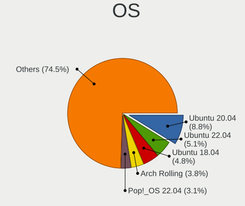

| Name                         | Computers | Percent |
|------------------------------|-----------|---------|
| Ubuntu 20.04                 | 156       | 8.82%   |
| Ubuntu 22.04                 | 90        | 5.09%   |
| Ubuntu 18.04                 | 84        | 4.75%   |
| Arch Rolling                 | 67        | 3.79%   |
| Pop!_OS 22.04                | 54        | 3.05%   |
| Ubuntu 24.04                 | 53        | 3%      |
| Debian 12                    | 46        | 2.6%    |
| Fedora 40                    | 36        | 2.04%   |
| Zorin 17                     | 33        | 1.87%   |
| Zorin 16                     | 26        | 1.47%   |
| Ubuntu 21.10                 | 25        | 1.41%   |
| OpenMandriva 4.2             | 25        | 1.41%   |
| Fedora 38                    | 25        | 1.41%   |
| Fedora 42                    | 24        | 1.36%   |
| Debian 11                    | 24        | 1.36%   |
| Manjaro                      | 23        | 1.3%    |
| Linux Mint 22.1              | 21        | 1.19%   |
| ArcoLinux Rolling            | 21        | 1.19%   |
| Linux Mint 21.2              | 18        | 1.02%   |
| openSUSE Tumbleweed-XXXXXXXX | 17        | 0.96%   |
| OpenMandriva 24.12           | 17        | 0.96%   |
| Linux Mint 22.2              | 16        | 0.9%    |
| Linux Mint 21.1              | 16        | 0.9%    |
| Fedora 39                    | 16        | 0.9%    |
| Fedora 34                    | 16        | 0.9%    |
| Ubuntu 20.10                 | 15        | 0.85%   |
| Ubuntu 19.04                 | 14        | 0.79%   |
| Pop!_OS 21.04                | 14        | 0.79%   |
| OpenMandriva 23.03           | 14        | 0.79%   |
| Linux Mint 20.2              | 14        | 0.79%   |
| OpenMandriva 4.3             | 13        | 0.74%   |
| Linux Mint 20.3              | 13        | 0.74%   |
| Linux Mint 20.1              | 13        | 0.74%   |
| KDE neon 22.04               | 13        | 0.74%   |
| Arch                         | 13        | 0.74%   |
| Ubuntu 22.10                 | 12        | 0.68%   |
| Fedora 41                    | 12        | 0.68%   |
| Fedora 36                    | 12        | 0.68%   |
| Fedora 32                    | 12        | 0.68%   |
| Zorin 15                     | 11        | 0.62%   |

OS Family
---------

OS without a version

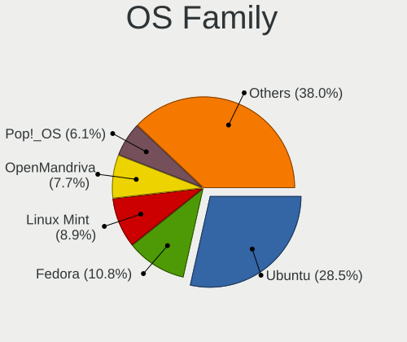

| Name         | Computers | Percent |
|--------------|-----------|---------|
| Ubuntu       | 471       | 28.51%  |
| Fedora       | 178       | 10.77%  |
| Linux Mint   | 147       | 8.9%    |
| OpenMandriva | 128       | 7.75%   |
| Pop!_OS      | 101       | 6.11%   |
| Debian       | 91        | 5.51%   |
| Arch         | 78        | 4.72%   |
| Zorin        | 73        | 4.42%   |
| Manjaro      | 53        | 3.21%   |
| Kubuntu      | 40        | 2.42%   |
| KDE neon     | 29        | 1.76%   |
| ArcoLinux    | 25        | 1.51%   |
| openSUSE     | 20        | 1.21%   |
| Xubuntu      | 16        | 0.97%   |
| Bazzite      | 14        | 0.85%   |
| EndeavourOS  | 13        | 0.79%   |
| Elementary   | 12        | 0.73%   |
| Ubuntu MATE  | 11        | 0.67%   |
| NixOS        | 11        | 0.67%   |
| Ubuntu Unity | 10        | 0.61%   |
| SteamOS      | 10        | 0.61%   |
| ROSA         | 10        | 0.61%   |
| Kali         | 10        | 0.61%   |
| Garuda Linux | 9         | 0.54%   |
| Nobara       | 8         | 0.48%   |
| Void Linux   | 7         | 0.42%   |
| LMDE         | 7         | 0.42%   |
| Gentoo       | 7         | 0.42%   |
| Parrot       | 5         | 0.3%    |
| MX           | 5         | 0.3%    |
| Lubuntu      | 5         | 0.3%    |
| Endless      | 4         | 0.24%   |
| Clear Linux  | 4         | 0.24%   |
| Xero         | 3         | 0.18%   |
| Raspbian     | 3         | 0.18%   |
| CachyOS      | 3         | 0.18%   |
| BlackPanther | 3         | 0.18%   |
| TUXEDO OS    | 2         | 0.12%   |
| Aurora       | 2         | 0.12%   |
| antiX        | 2         | 0.12%   |

Kernel
------

Version of the Linux kernel

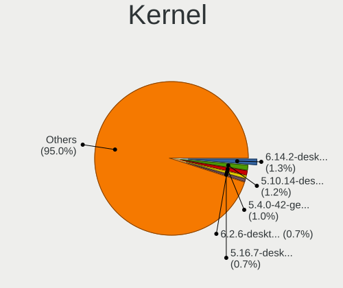

| Version                  | Computers | Percent |
|--------------------------|-----------|---------|
| 6.14.2-desktop-3omv2590  | 26        | 1.34%   |
| 5.10.14-desktop-1omv4002 | 23        | 1.19%   |
| 5.4.0-42-generic         | 20        | 1.03%   |
| 6.2.6-desktop-1omv2390   | 14        | 0.72%   |
| 5.16.7-desktop-1omv4003  | 13        | 0.67%   |
| 5.4.0-52-generic         | 12        | 0.62%   |
| 5.15.0-56-generic        | 12        | 0.62%   |
| 6.8.0-45-generic         | 11        | 0.57%   |
| 5.4.0-26-generic         | 10        | 0.52%   |
| 6.9.3-76060903-generic   | 9         | 0.46%   |
| 6.6.2-desktop-1omv2390   | 9         | 0.46%   |
| 6.2.6-76060206-generic   | 9         | 0.46%   |
| 6.12.9-desktop-1omv2490  | 9         | 0.46%   |
| 6.12.1-desktop-1omv2490  | 9         | 0.46%   |
| 6.8.0-52-generic         | 8         | 0.41%   |
| 6.8.0-40-generic         | 8         | 0.41%   |
| 6.12.10-76061203-generic | 8         | 0.41%   |
| 5.4.0-58-generic         | 8         | 0.41%   |
| 5.4.0-48-generic         | 8         | 0.41%   |
| 5.3.0-28-generic         | 8         | 0.41%   |
| 5.19.0-35-generic        | 8         | 0.41%   |
| 5.15.0-58-generic        | 8         | 0.41%   |
| 6.8.0-51-generic         | 7         | 0.36%   |
| 6.8.0-31-generic         | 7         | 0.36%   |
| 6.4.11-desktop-1omv2390  | 7         | 0.36%   |
| 6.14.0-33-generic        | 7         | 0.36%   |
| 6.1.0-18-amd64           | 7         | 0.36%   |
| 5.8.0-43-generic         | 7         | 0.36%   |
| 5.4.0-29-generic         | 7         | 0.36%   |
| 5.19.0-38-generic        | 7         | 0.36%   |
| 5.15.0-46-generic        | 7         | 0.36%   |
| 5.15.0-43-generic        | 7         | 0.36%   |
| 5.11.0-41-generic        | 7         | 0.36%   |
| 5.11.0-27-generic        | 7         | 0.36%   |
| 6.5.0-41-generic         | 6         | 0.31%   |
| 6.14.0-36-generic        | 6         | 0.31%   |
| 6.14.0-35-generic        | 6         | 0.31%   |
| 6.12.6-desktop-1omv2490  | 6         | 0.31%   |
| 6.11.0-17-generic        | 6         | 0.31%   |
| 6.1.0-37-amd64           | 6         | 0.31%   |

Kernel Family
-------------

Linux kernel without a distro release

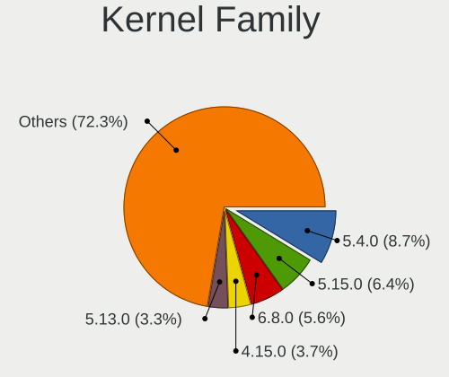

| Version | Computers | Percent |
|---------|-----------|---------|
| 5.4.0   | 160       | 8.73%   |
| 5.15.0  | 118       | 6.44%   |
| 6.8.0   | 102       | 5.57%   |
| 4.15.0  | 67        | 3.66%   |
| 5.13.0  | 60        | 3.28%   |
| 5.11.0  | 59        | 3.22%   |
| 6.5.0   | 56        | 3.06%   |
| 5.8.0   | 56        | 3.06%   |
| 6.1.0   | 47        | 2.57%   |
| 5.19.0  | 47        | 2.57%   |
| 6.14.0  | 39        | 2.13%   |
| 5.3.0   | 37        | 2.02%   |
| 6.2.0   | 29        | 1.58%   |
| 6.14.2  | 29        | 1.58%   |
| 6.2.6   | 27        | 1.47%   |
| 5.0.0   | 27        | 1.47%   |
| 5.10.0  | 24        | 1.31%   |
| 5.10.14 | 23        | 1.26%   |
| 6.11.0  | 22        | 1.2%    |
| 4.18.0  | 18        | 0.98%   |
| 5.16.7  | 13        | 0.71%   |
| 6.9.3   | 12        | 0.66%   |
| 6.6.2   | 11        | 0.6%    |
| 6.12.9  | 11        | 0.6%    |
| 6.12.10 | 11        | 0.6%    |
| 4.19.0  | 11        | 0.6%    |
| 6.12.1  | 10        | 0.55%   |
| 6.17.7  | 8         | 0.44%   |
| 6.4.8   | 7         | 0.38%   |
| 6.4.11  | 7         | 0.38%   |
| 6.14.6  | 7         | 0.38%   |
| 6.12.6  | 7         | 0.38%   |
| 6.10.0  | 7         | 0.38%   |
| 6.5.5   | 6         | 0.33%   |
| 6.4.6   | 6         | 0.33%   |
| 6.10.6  | 6         | 0.33%   |
| 6.1.1   | 6         | 0.33%   |
| 6.9.7   | 5         | 0.27%   |
| 6.8.9   | 5         | 0.27%   |
| 6.8.7   | 5         | 0.27%   |

Kernel Major Ver.
-----------------

Linux kernel major version

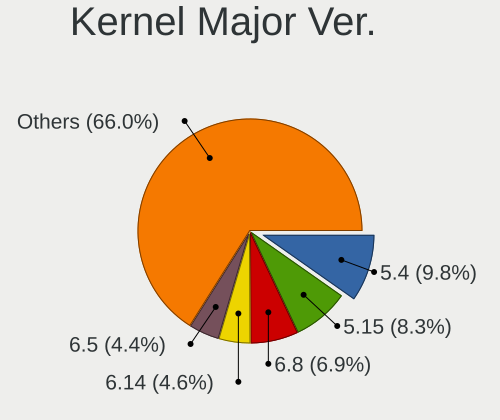

| Version | Computers | Percent |
|---------|-----------|---------|
| 5.4     | 176       | 9.75%   |
| 5.15    | 149       | 8.25%   |
| 6.8     | 125       | 6.93%   |
| 6.14    | 83        | 4.6%    |
| 6.5     | 80        | 4.43%   |
| 6.1     | 79        | 4.38%   |
| 5.8     | 77        | 4.27%   |
| 6.12    | 72        | 3.99%   |
| 5.11    | 72        | 3.99%   |
| 5.13    | 70        | 3.88%   |
| 4.15    | 67        | 3.71%   |
| 6.2     | 64        | 3.55%   |
| 5.19    | 62        | 3.43%   |
| 5.10    | 59        | 3.27%   |
| 6.11    | 40        | 2.22%   |
| 6.6     | 39        | 2.16%   |
| 5.3     | 37        | 2.05%   |
| 5.16    | 34        | 1.88%   |
| 6.9     | 31        | 1.72%   |
| 6.15    | 30        | 1.66%   |
| 6.10    | 30        | 1.66%   |
| 6.17    | 29        | 1.61%   |
| 6.4     | 28        | 1.55%   |
| 5.0     | 28        | 1.55%   |
| 6.16    | 21        | 1.16%   |
| 6.0     | 20        | 1.11%   |
| 4.18    | 20        | 1.11%   |
| 6.3     | 18        | 1%      |
| 6.13    | 17        | 0.94%   |
| 5.6     | 17        | 0.94%   |
| 5.14    | 17        | 0.94%   |
| 6.7     | 16        | 0.89%   |
| 5.17    | 13        | 0.72%   |
| 4.19    | 13        | 0.72%   |
| 5.9     | 12        | 0.66%   |
| 5.7     | 12        | 0.66%   |
| 5.18    | 9         | 0.5%    |
| 5.12    | 9         | 0.5%    |
| 6.18    | 6         | 0.33%   |
| 5.1     | 6         | 0.33%   |

Arch
----

OS architecture (x86_64, i586, etc.)

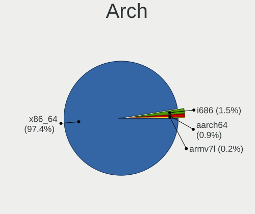

| Name    | Computers | Percent |
|---------|-----------|---------|
| x86_64  | 1544      | 97.35%  |
| i686    | 24        | 1.51%   |
| aarch64 | 15        | 0.95%   |
| armv7l  | 3         | 0.19%   |

DE
--

Desktop Environment

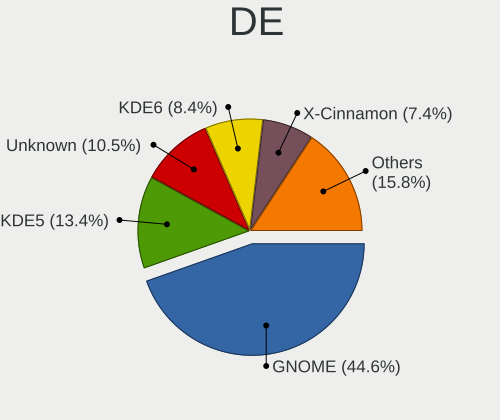

| Name            | Computers | Percent |
|-----------------|-----------|---------|
| GNOME           | 750       | 44.59%  |
| KDE5            | 225       | 13.38%  |
| Unknown         | 177       | 10.52%  |
| KDE6            | 141       | 8.38%   |
| X-Cinnamon      | 124       | 7.37%   |
| XFCE            | 96        | 5.71%   |
| MATE            | 37        | 2.2%    |
| KDE             | 28        | 1.66%   |
| LXQt            | 13        | 0.77%   |
| i3              | 13        | 0.77%   |
| Pantheon        | 11        | 0.65%   |
| Unity           | 10        | 0.59%   |
| Cinnamon        | 10        | 0.59%   |
| sway            | 6         | 0.36%   |
| Hyprland        | 6         | 0.36%   |
| COSMIC          | 6         | 0.36%   |
| KDE4            | 4         | 0.24%   |
| GNOME Flashback | 3         | 0.18%   |
| Deepin          | 3         | 0.18%   |
| LXDE            | 2         | 0.12%   |
| icewm           | 2         | 0.12%   |
| Budgie          | 2         | 0.12%   |
| UKUI            | 1         | 0.06%   |
| ubuntu          | 1         | 0.06%   |
| qtile-default   | 1         | 0.06%   |
| openbox         | 1         | 0.06%   |
| none+xsession   | 1         | 0.06%   |
| none+awesome    | 1         | 0.06%   |
| LeftWM          | 1         | 0.06%   |
| gtk             | 1         | 0.06%   |
| fluxbox         | 1         | 0.06%   |
| enlightenment   | 1         | 0.06%   |
| Endless:GNOME   | 1         | 0.06%   |
| bspwm           | 1         | 0.06%   |
| awesome         | 1         | 0.06%   |

Display Server
--------------

X11 or Wayland

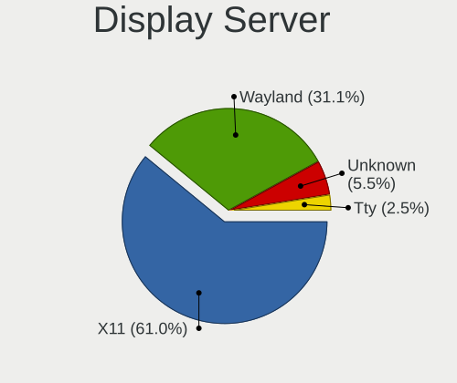

| Name    | Computers | Percent |
|---------|-----------|---------|
| X11     | 1017      | 60.97%  |
| Wayland | 518       | 31.06%  |
| Unknown | 91        | 5.46%   |
| Tty     | 42        | 2.52%   |

Display Manager
---------------

SDDM, LightDM, etc.

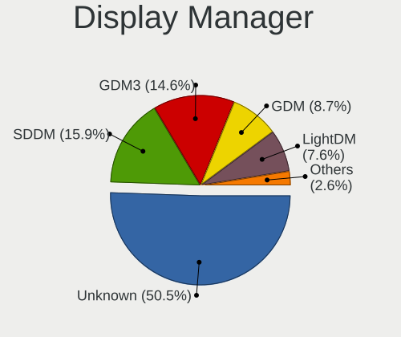

| Name    | Computers | Percent |
|---------|-----------|---------|
| Unknown | 832       | 50.55%  |
| SDDM    | 262       | 15.92%  |
| GDM3    | 241       | 14.64%  |
| GDM     | 144       | 8.75%   |
| LightDM | 125       | 7.59%   |
| TDM     | 29        | 1.76%   |
| GREETD  | 3         | 0.18%   |
| SLiM    | 2         | 0.12%   |
| LY-DM   | 2         | 0.12%   |
| KDM     | 2         | 0.12%   |
| XDM     | 1         | 0.06%   |
| SLIMSKI | 1         | 0.06%   |
| Ly      | 1         | 0.06%   |
| LXDM    | 1         | 0.06%   |

OS Lang
-------

Language

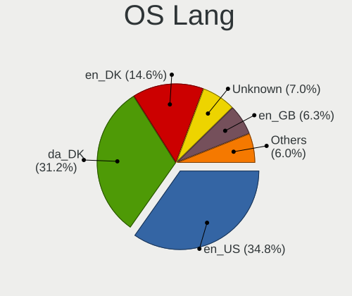

| Lang       | Computers | Percent |
|------------|-----------|---------|
| en_US      | 570       | 34.78%  |
| da_DK      | 512       | 31.24%  |
| en_DK      | 240       | 14.64%  |
| Unknown    | 115       | 7.02%   |
| en_GB      | 103       | 6.28%   |
| C          | 34        | 2.07%   |
| de_DE      | 27        | 1.65%   |
| pl_PL      | 5         | 0.31%   |
| it_IT      | 3         | 0.18%   |
| fr_FR      | 3         | 0.18%   |
| en_AG      | 3         | 0.18%   |
| sv_SE      | 2         | 0.12%   |
| ru_RU      | 2         | 0.12%   |
| pt_BR      | 2         | 0.12%   |
| es_ES      | 2         | 0.12%   |
| en_CA      | 2         | 0.12%   |
| de_CH      | 2         | 0.12%   |
| zh_TW      | 1         | 0.06%   |
| UTF-8      | 1         | 0.06%   |
| uk_UA      | 1         | 0.06%   |
| nl_NL      | 1         | 0.06%   |
| is_IS      | 1         | 0.06%   |
| io_001     | 1         | 0.06%   |
| en_US.UTF8 | 1         | 0.06%   |
| en_IE      | 1         | 0.06%   |
| en_AU      | 1         | 0.06%   |
| el_GR      | 1         | 0.06%   |
| de_AT      | 1         | 0.06%   |
| cs_CZ      | 1         | 0.06%   |

Boot Mode
---------

EFI or BIOS

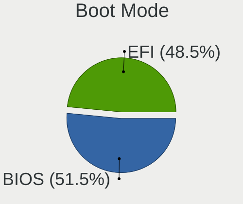

| Mode | Computers | Percent |
|------|-----------|---------|
| BIOS | 838       | 51.54%  |
| EFI  | 788       | 48.46%  |

Filesystem
----------

Type of filesystem

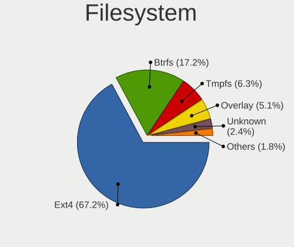

| Type    | Computers | Percent |
|---------|-----------|---------|
| Ext4    | 1105      | 67.17%  |
| Btrfs   | 283       | 17.2%   |
| Tmpfs   | 104       | 6.32%   |
| Overlay | 84        | 5.11%   |
| Unknown | 39        | 2.37%   |
| Zfs     | 13        | 0.79%   |
| Xfs     | 11        | 0.67%   |
| Ext2    | 4         | 0.24%   |
| F2fs    | 2         | 0.12%   |

Part. scheme
------------

Scheme of partitioning

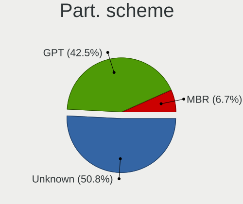

| Type    | Computers | Percent |
|---------|-----------|---------|
| Unknown | 829       | 50.8%   |
| GPT     | 694       | 42.52%  |
| MBR     | 109       | 6.68%   |

Dual Boot with Linux/BSD
------------------------

Hosting more than one Linux/BSD

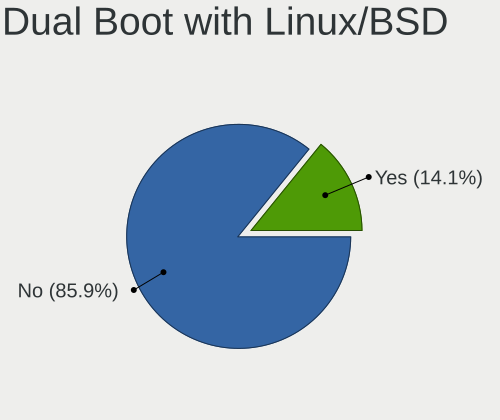

| Dual boot | Computers | Percent |
|-----------|-----------|---------|
| No        | 1390      | 85.86%  |
| Yes       | 229       | 14.14%  |

Dual Boot (Win)
---------------

Hosting Linux and Windows

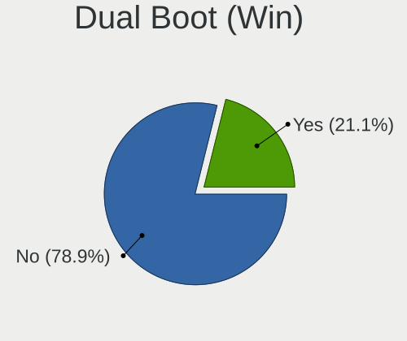

| Dual boot | Computers | Percent |
|-----------|-----------|---------|
| No        | 1273      | 78.87%  |
| Yes       | 341       | 21.13%  |

Board
-----

Vendor
------

Motherboard manufacturer

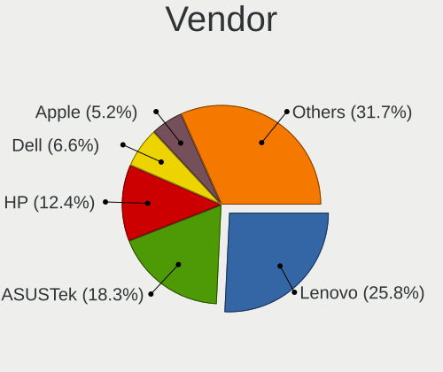

| Name                                 | Computers | Percent |
|--------------------------------------|-----------|---------|
| Lenovo                               | 408       | 25.76%  |
| ASUSTek Computer                     | 290       | 18.31%  |
| Hewlett-Packard                      | 197       | 12.44%  |
| Dell                                 | 104       | 6.57%   |
| Apple                                | 83        | 5.24%   |
| MSI                                  | 78        | 4.92%   |
| Gigabyte Technology                  | 74        | 4.67%   |
| Acer                                 | 72        | 4.55%   |
| ASRock                               | 61        | 3.85%   |
| Medion                               | 20        | 1.26%   |
| Intel                                | 17        | 1.07%   |
| Toshiba                              | 16        | 1.01%   |
| Raspberry Pi Foundation              | 12        | 0.76%   |
| Notebook                             | 10        | 0.63%   |
| Samsung Electronics                  | 9         | 0.57%   |
| Microsoft                            | 8         | 0.51%   |
| HUAWEI                               | 8         | 0.51%   |
| Fujitsu                              | 8         | 0.51%   |
| Unknown                              | 7         | 0.44%   |
| Valve                                | 6         | 0.38%   |
| Google                               | 6         | 0.38%   |
| AMI                                  | 6         | 0.38%   |
| TUXEDO                               | 5         | 0.32%   |
| Pegatron                             | 5         | 0.32%   |
| Packard Bell                         | 5         | 0.32%   |
| Shuttle                              | 4         | 0.25%   |
| Shenzhen Meigao Electronic Equipment | 4         | 0.25%   |
| Razer                                | 4         | 0.25%   |
| Sony                                 | 3         | 0.19%   |
| eMachines                            | 3         | 0.19%   |
| DukaPC                               | 3         | 0.19%   |
| Alienware                            | 3         | 0.19%   |
| Timi                                 | 2         | 0.13%   |
| Supermicro                           | 2         | 0.13%   |
| Quanta                               | 2         | 0.13%   |
| GPD                                  | 2         | 0.13%   |
| Fujitsu Siemens                      | 2         | 0.13%   |
| Framework                            | 2         | 0.13%   |
| BESSTAR Tech                         | 2         | 0.13%   |
| Tactus                               | 1         | 0.06%   |

Model
-----

Motherboard model

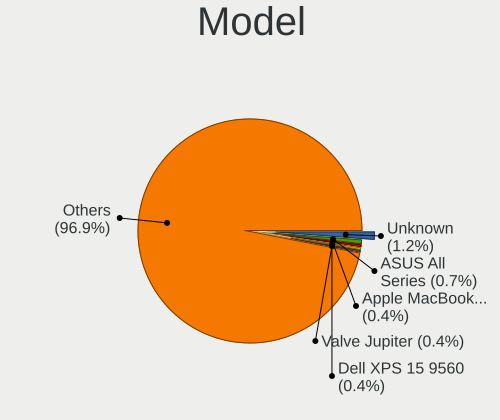

| Name                               | Computers | Percent |
|------------------------------------|-----------|---------|
| Unknown                            | 19        | 1.2%    |
| ASUS All Series                    | 11        | 0.69%   |
| Apple MacBookPro11,1               | 7         | 0.44%   |
| Valve Jupiter                      | 6         | 0.38%   |
| Dell XPS 15 9560                   | 6         | 0.38%   |
| ASUS PRIME X570-P                  | 6         | 0.38%   |
| Apple MacBookPro9,2                | 6         | 0.38%   |
| Apple MacBookAir7,2                | 6         | 0.38%   |
| RPi Raspberry Pi                   | 5         | 0.32%   |
| MSI MS-7C37                        | 5         | 0.32%   |
| MSI MS-7C02                        | 5         | 0.32%   |
| HP Pavilion dv7                    | 5         | 0.32%   |
| HP Notebook                        | 5         | 0.32%   |
| Dell OptiPlex 9020                 | 5         | 0.32%   |
| ASUS TUF Gaming X570-PLUS          | 5         | 0.32%   |
| ASUS ROG STRIX X570-E GAMING       | 5         | 0.32%   |
| ASUS ROG STRIX B550-F GAMING       | 5         | 0.32%   |
| ASUS ROG STRIX B450-E GAMING       | 5         | 0.32%   |
| Apple iMac12,1                     | 5         | 0.32%   |
| RPi Raspberry Pi 4 Model B Rev 1.1 | 4         | 0.25%   |
| MSI MS-7C84                        | 4         | 0.25%   |
| MSI MS-7C56                        | 4         | 0.25%   |
| HP Pavilion Notebook               | 4         | 0.25%   |
| HP EliteBook 820 G3                | 4         | 0.25%   |
| Gigabyte X570 AORUS MASTER         | 4         | 0.25%   |
| Dell XPS 15 9570                   | 4         | 0.25%   |
| Dell XPS 13 9370                   | 4         | 0.25%   |
| ASUS Z170 PRO GAMING               | 4         | 0.25%   |
| Apple Macmini7,1                   | 4         | 0.25%   |
| Apple MacBookPro8,1                | 4         | 0.25%   |
| Apple MacBookPro14,1               | 4         | 0.25%   |
| Apple MacBookPro12,1               | 4         | 0.25%   |
| Lenovo ThinkPad T530 24295L4       | 3         | 0.19%   |
| Lenovo ThinkPad P52 20M9001GMX     | 3         | 0.19%   |
| HP Pavilion g7                     | 3         | 0.19%   |
| HP OMEN by Laptop                  | 3         | 0.19%   |
| DukaPC Notebook                    | 3         | 0.19%   |
| Dell Latitude E7440                | 3         | 0.19%   |
| Dell Latitude E6540                | 3         | 0.19%   |
| Dell Latitude 7480                 | 3         | 0.19%   |

Model Family
------------

Motherboard model prefix

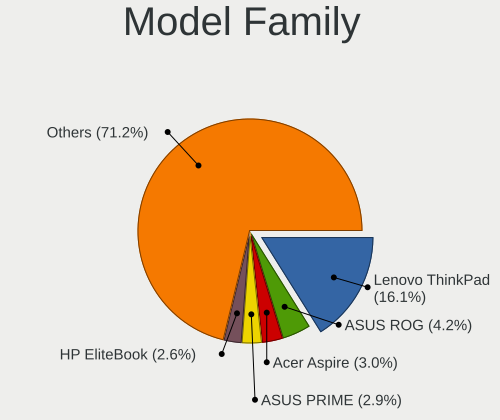

| Name                | Computers | Percent |
|---------------------|-----------|---------|
| Lenovo ThinkPad     | 255       | 16.1%   |
| ASUS ROG            | 66        | 4.17%   |
| Acer Aspire         | 48        | 3.03%   |
| ASUS PRIME          | 46        | 2.9%    |
| HP EliteBook        | 41        | 2.59%   |
| HP Pavilion         | 35        | 2.21%   |
| Lenovo IdeaPad      | 34        | 2.15%   |
| Dell Latitude       | 33        | 2.08%   |
| ASUS TUF            | 27        | 1.7%    |
| Lenovo Yoga         | 23        | 1.45%   |
| Dell XPS            | 22        | 1.39%   |
| Lenovo ThinkCentre  | 21        | 1.33%   |
| Unknown             | 19        | 1.2%    |
| HP Compaq           | 18        | 1.14%   |
| HP ProBook          | 15        | 0.95%   |
| HP Laptop           | 15        | 0.95%   |
| Dell OptiPlex       | 14        | 0.88%   |
| ASUS ZenBook        | 14        | 0.88%   |
| Toshiba Satellite   | 13        | 0.82%   |
| RPi Raspberry       | 12        | 0.76%   |
| Gigabyte X570       | 12        | 0.76%   |
| Dell Precision      | 12        | 0.76%   |
| Dell Inspiron       | 12        | 0.76%   |
| Lenovo Legion       | 11        | 0.69%   |
| ASUS All            | 11        | 0.69%   |
| Apple MacBookPro11  | 11        | 0.69%   |
| ASUS VivoBook       | 10        | 0.63%   |
| HP OMEN             | 9         | 0.57%   |
| Acer Swift          | 9         | 0.57%   |
| Microsoft Surface   | 8         | 0.51%   |
| Lenovo ThinkStation | 8         | 0.51%   |
| Lenovo IdeaCentre   | 8         | 0.51%   |
| ASUS ASUS           | 8         | 0.51%   |
| Apple MacBookPro9   | 8         | 0.51%   |
| HP EliteDesk        | 7         | 0.44%   |
| Valve Jupiter       | 6         | 0.38%   |
| Lenovo ThinkBook    | 6         | 0.38%   |
| ASUS M5A78L-M       | 6         | 0.38%   |
| Apple MacBookAir7   | 6         | 0.38%   |
| Apple iMac12        | 6         | 0.38%   |

MFG Year
--------

Motherboard manufacture year

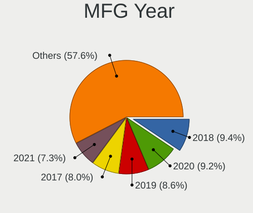

| Year    | Computers | Percent |
|---------|-----------|---------|
| 2018    | 149       | 9.41%   |
| 2020    | 146       | 9.22%   |
| 2019    | 136       | 8.59%   |
| 2017    | 126       | 7.95%   |
| 2021    | 115       | 7.26%   |
| 2013    | 110       | 6.94%   |
| 2012    | 108       | 6.82%   |
| 2015    | 101       | 6.38%   |
| 2016    | 89        | 5.62%   |
| 2011    | 88        | 5.56%   |
| 2022    | 69        | 4.36%   |
| 2014    | 68        | 4.29%   |
| 2010    | 57        | 3.6%    |
| 2023    | 42        | 2.65%   |
| 2009    | 42        | 2.65%   |
| 2008    | 38        | 2.4%    |
| 2024    | 34        | 2.15%   |
| 2007    | 30        | 1.89%   |
| 2006    | 13        | 0.82%   |
| Unknown | 13        | 0.82%   |
| 2025    | 9         | 0.57%   |
| 2003    | 1         | 0.06%   |

Form Factor
-----------

Physical design of the computer

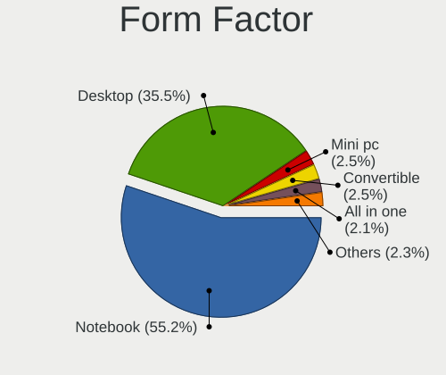

| Name           | Computers | Percent |
|----------------|-----------|---------|
| Notebook       | 874       | 55.18%  |
| Desktop        | 562       | 35.48%  |
| Convertible    | 39        | 2.46%   |
| Mini pc        | 39        | 2.46%   |
| All in one     | 34        | 2.15%   |
| System on chip | 14        | 0.88%   |
| Tablet         | 14        | 0.88%   |
| Server         | 6         | 0.38%   |
| Phone          | 2         | 0.13%   |

Secure Boot
-----------

Enabled or disabled

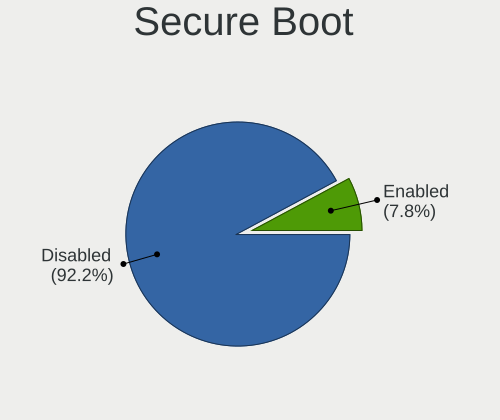

| State    | Computers | Percent |
|----------|-----------|---------|
| Disabled | 1471      | 92.17%  |
| Enabled  | 125       | 7.83%   |

Coreboot
--------

Have coreboot on board

| Used | Computers | Percent |
|------|-----------|---------|
| No   | 1576      | 99.49%  |
| Yes  | 8         | 0.51%   |

RAM Size
--------

Total RAM memory

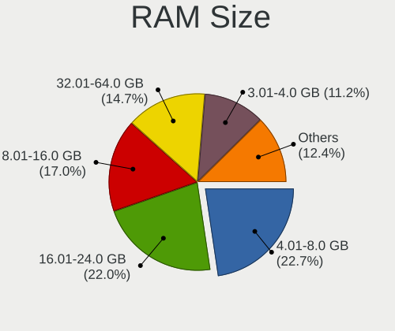

| Size in GB      | Computers | Percent |
|-----------------|-----------|---------|
| 4.01-8.0        | 367       | 22.67%  |
| 16.01-24.0      | 356       | 21.99%  |
| 8.01-16.0       | 275       | 16.99%  |
| 32.01-64.0      | 238       | 14.7%   |
| 3.01-4.0        | 182       | 11.24%  |
| 64.01-256.0     | 77        | 4.76%   |
| 24.01-32.0      | 70        | 4.32%   |
| 1.01-2.0        | 27        | 1.67%   |
| 2.01-3.0        | 15        | 0.93%   |
| 0.51-1.0        | 7         | 0.43%   |
| More than 256.0 | 4         | 0.25%   |
| 0.01-0.5        | 1         | 0.06%   |

RAM Used
--------

Used RAM memory

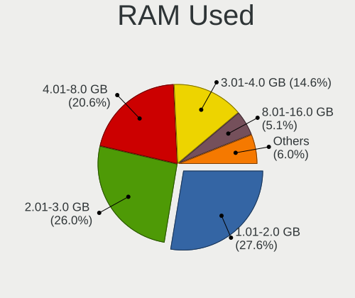

| Used GB     | Computers | Percent |
|-------------|-----------|---------|
| 1.01-2.0    | 491       | 27.6%   |
| 2.01-3.0    | 463       | 26.03%  |
| 4.01-8.0    | 367       | 20.63%  |
| 3.01-4.0    | 260       | 14.61%  |
| 8.01-16.0   | 91        | 5.12%   |
| 0.51-1.0    | 60        | 3.37%   |
| 0.01-0.5    | 18        | 1.01%   |
| 16.01-24.0  | 14        | 0.79%   |
| 24.01-32.0  | 11        | 0.62%   |
| 32.01-64.0  | 3         | 0.17%   |
| 64.01-256.0 | 1         | 0.06%   |

Total Drives
------------

Number of drives on board

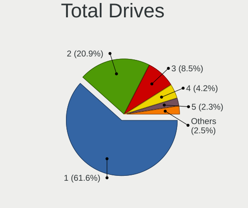

| Drives | Computers | Percent |
|--------|-----------|---------|
| 1      | 1009      | 61.64%  |
| 2      | 342       | 20.89%  |
| 3      | 139       | 8.49%   |
| 4      | 69        | 4.22%   |
| 5      | 37        | 2.26%   |
| 6      | 15        | 0.92%   |
| 0      | 12        | 0.73%   |
| 7      | 7         | 0.43%   |
| 8      | 4         | 0.24%   |
| 9      | 2         | 0.12%   |
| 10     | 1         | 0.06%   |

Has CD-ROM
----------

Has CD-ROM on board

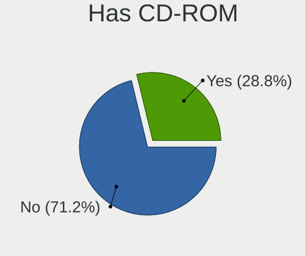

| Presented | Computers | Percent |
|-----------|-----------|---------|
| No        | 1136      | 71.22%  |
| Yes       | 459       | 28.78%  |

Has Ethernet
------------

Has Ethernet on board

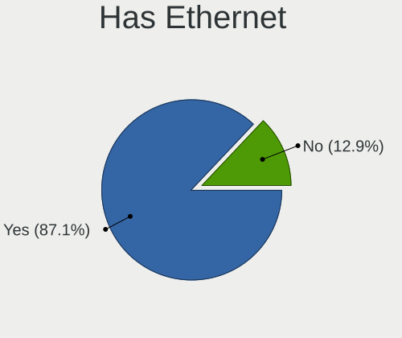

| Presented | Computers | Percent |
|-----------|-----------|---------|
| Yes       | 1387      | 87.07%  |
| No        | 206       | 12.93%  |

Has WiFi
--------

Has WiFi module

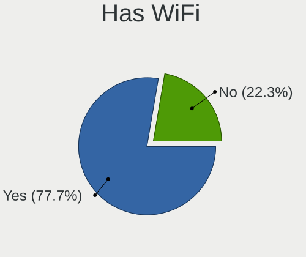

| Presented | Computers | Percent |
|-----------|-----------|---------|
| Yes       | 1239      | 77.68%  |
| No        | 356       | 22.32%  |

Has Bluetooth
-------------

Has Bluetooth module

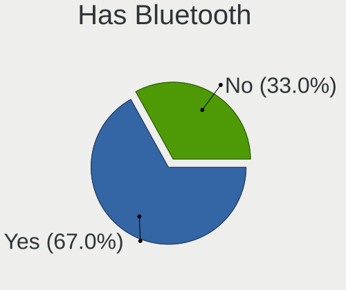

| Presented | Computers | Percent |
|-----------|-----------|---------|
| Yes       | 1076      | 66.96%  |
| No        | 531       | 33.04%  |

Location
--------

Country
-------

Geographic location (country)

| Country | Computers | Percent |
|---------|-----------|---------|
| Denmark | 1584      | 100%    |

City
----

Geographic location (city)

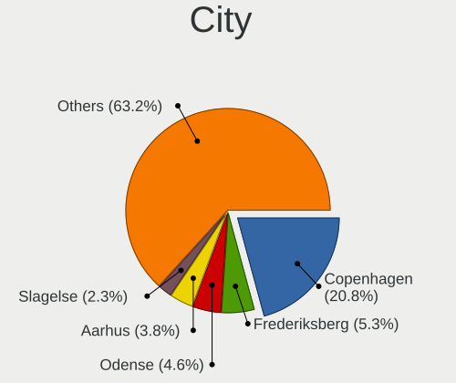

| City                  | Computers | Percent |
|-----------------------|-----------|---------|
| Copenhagen            | 354       | 20.79%  |
| Frederiksberg         | 90        | 5.28%   |
| Odense                | 78        | 4.58%   |
| Aarhus                | 65        | 3.82%   |
| Slagelse              | 39        | 2.29%   |
| Aalborg               | 39        | 2.29%   |
| Valby                 | 35        | 2.06%   |
| Silkeborg             | 30        | 1.76%   |
| Bronshoj              | 30        | 1.76%   |
| Horsens               | 29        | 1.7%    |
| Esbjerg               | 26        | 1.53%   |
| Glostrup Municipality | 23        | 1.35%   |
| Kongens Lyngby        | 21        | 1.23%   |
| Taastrup              | 18        | 1.06%   |
| Kolding               | 17        | 1%      |
| Viborg                | 16        | 0.94%   |
| Roskilde              | 16        | 0.94%   |
| Herlev                | 15        | 0.88%   |
| Aabenraa              | 15        | 0.88%   |
| Holstebro             | 14        | 0.82%   |
| Køge                 | 13        | 0.76%   |
| Norresundby           | 12        | 0.7%    |
| Hammel                | 12        | 0.7%    |
| Viby J                | 11        | 0.65%   |
| Skanderborg           | 11        | 0.65%   |
| Risskov               | 11        | 0.65%   |
| Naestved              | 11        | 0.65%   |
| Hvidovre              | 11        | 0.65%   |
| Gentofte Municipality | 11        | 0.65%   |
| Fredericia            | 11        | 0.65%   |
| Albertslund           | 11        | 0.65%   |
| Rødovre Municipality | 10        | 0.59%   |
| Nykobing Mors         | 10        | 0.59%   |
| Nyborg                | 10        | 0.59%   |
| Greve                 | 10        | 0.59%   |
| Vanlose               | 9         | 0.53%   |
| Tilst                 | 9         | 0.53%   |
| Ishøj                | 9         | 0.53%   |
| Haderslev             | 9         | 0.53%   |
| Vejle                 | 8         | 0.47%   |

Drives
------

Drive Vendor
------------

Hard drive vendors

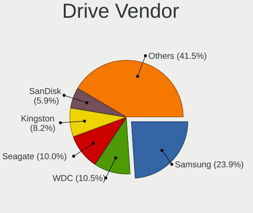

| Vendor                      | Computers | Drives | Percent |
|-----------------------------|-----------|--------|---------|
| Samsung Electronics         | 558       | 890    | 23.92%  |
| WDC                         | 244       | 367    | 10.46%  |
| Seagate                     | 234       | 345    | 10.03%  |
| Kingston                    | 191       | 292    | 8.19%   |
| SanDisk                     | 137       | 178    | 5.87%   |
| Toshiba                     | 118       | 158    | 5.06%   |
| SK hynix                    | 81        | 100    | 3.47%   |
| Unknown                     | 79        | 96     | 3.39%   |
| Intel                       | 77        | 93     | 3.3%    |
| Crucial                     | 62        | 88     | 2.66%   |
| Micron Technology           | 58        | 73     | 2.49%   |
| Hitachi                     | 48        | 69     | 2.06%   |
| Apple                       | 41        | 57     | 1.76%   |
| Kingston Technology Company | 36        | 40     | 1.54%   |
| HGST                        | 31        | 43     | 1.33%   |
| Intenso                     | 28        | 34     | 1.2%    |
| PNY                         | 24        | 33     | 1.03%   |
| Phison Electronics          | 21        | 31     | 0.9%    |
| A-DATA Technology           | 21        | 24     | 0.9%    |
| LITEON                      | 18        | 36     | 0.77%   |
| Corsair                     | 15        | 18     | 0.64%   |
| OCZ                         | 14        | 14     | 0.6%    |
| Phison                      | 12        | 17     | 0.51%   |
| Verbatim                    | 11        | 19     | 0.47%   |
| Micron/Crucial Technology   | 11        | 11     | 0.47%   |
| KIOXIA                      | 10        | 13     | 0.43%   |
| LITEONIT                    | 8         | 10     | 0.34%   |
| China                       | 8         | 9      | 0.34%   |
| JMicron Technology          | 7         | 7      | 0.3%    |
| Patriot                     | 6         | 7      | 0.26%   |
| Lenovo                      | 6         | 7      | 0.26%   |
| Team                        | 5         | 5      | 0.21%   |
| Realtek Semiconductor       | 5         | 7      | 0.21%   |
| Fujitsu                     | 5         | 10     | 0.21%   |
| ADATA Technology            | 5         | 7      | 0.21%   |
| Silicon Motion              | 4         | 4      | 0.17%   |
| Hewlett-Packard             | 4         | 14     | 0.17%   |
| XPG                         | 3         | 3      | 0.13%   |
| USB3.0                      | 3         | 3      | 0.13%   |
| Transcend                   | 3         | 3      | 0.13%   |

Drive Model
-----------

Hard drive models

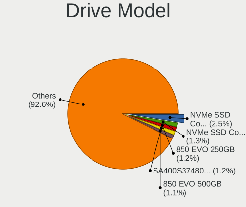

| Model                                                | Computers | Percent |
|------------------------------------------------------|-----------|---------|
| Samsung NVMe SSD Controller SM981/PM981/PM983 1TB    | 66        | 2.53%   |
| Samsung NVMe SSD Controller PM9A1/PM9A3/980PRO 1TB   | 35        | 1.34%   |
| Samsung SSD 850 EVO 250GB                            | 32        | 1.23%   |
| Kingston SA400S37480G 480GB SSD                      | 31        | 1.19%   |
| Samsung SSD 850 EVO 500GB                            | 28        | 1.07%   |
| Kingston SA400S37240G 240GB SSD                      | 23        | 0.88%   |
| Samsung SSD 860 EVO 1TB                              | 20        | 0.77%   |
| Samsung SSD 860 EVO 500GB                            | 18        | 0.69%   |
| Samsung SSD 860 QVO 1TB                              | 17        | 0.65%   |
| Kingston SV300S37A120G 120GB SSD                     | 17        | 0.65%   |
| Samsung SSD 840 EVO 250GB                            | 16        | 0.61%   |
| Samsung NVMe SSD Controller SM961/PM961/SM963 1024GB | 16        | 0.61%   |
| Unknown MMC Card  32GB                               | 14        | 0.54%   |
| Seagate ST2000DM001-1ER164 2TB                       | 14        | 0.54%   |
| Sandisk WD Black SN750 / PC SN730 NVMe SSD 500GB     | 14        | 0.54%   |
| Samsung NVMe SSD Drive 256GB                         | 13        | 0.5%    |
| Kingston SA400S37960G 960GB SSD                      | 13        | 0.5%    |
| Unknown MMC Card  64GB                               | 12        | 0.46%   |
| Kingston SA400S37120G 120GB SSD                      | 11        | 0.42%   |
| Crucial CT1000MX500SSD1 1TB                          | 11        | 0.42%   |
| Samsung NVMe SSD Drive 512GB                         | 10        | 0.38%   |
| Samsung NVMe SSD Drive 500GB                         | 10        | 0.38%   |
| Samsung NVMe SSD Drive 1TB                           | 10        | 0.38%   |
| Phison E16 PCIe4 NVMe Controller 1TB                 | 10        | 0.38%   |
| Kingston SV300S37A240G 240GB SSD                     | 10        | 0.38%   |
| HGST HTS721010A9E630 1TB                             | 10        | 0.38%   |
| PNY CS900 120GB SSD                                  | 9         | 0.34%   |
| Micron/Crucial P2 NVMe PCIe SSD 2TB                  | 9         | 0.34%   |
| Kingston SKC3000D2048G 2TB                           | 9         | 0.34%   |
| Unknown MMC Card  128GB                              | 8         | 0.31%   |
| Seagate ST500DM002-1BD142 500GB                      | 8         | 0.31%   |
| Seagate ST1000DM010-2EP102 1TB                       | 8         | 0.31%   |
| Samsung SSD 870 EVO 500GB                            | 8         | 0.31%   |
| Kingston Company SNV2S2000G 2TB                      | 8         | 0.31%   |
| Kingston Company SNV2S1000G 1TB                      | 8         | 0.31%   |
| Kingston SUV400S37120G 120GB SSD                     | 8         | 0.31%   |
| Apple SSD SD0128F 121GB                              | 8         | 0.31%   |
| Unknown SD/MMC/MS PRO 2GB                            | 7         | 0.27%   |
| Toshiba XG6 NVMe SSD Controller 1024GB               | 7         | 0.27%   |
| Toshiba NVMe SSD Drive 256GB                         | 7         | 0.27%   |

HDD Vendor
----------

Hard disk drive vendors

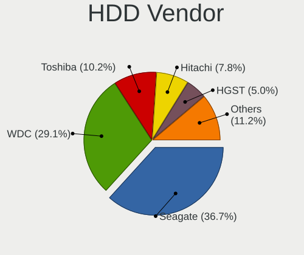

| Vendor              | Computers | Drives | Percent |
|---------------------|-----------|--------|---------|
| Seagate             | 227       | 334    | 36.73%  |
| WDC                 | 180       | 290    | 29.13%  |
| Toshiba             | 63        | 81     | 10.19%  |
| Hitachi             | 48        | 69     | 7.77%   |
| HGST                | 31        | 43     | 5.02%   |
| Samsung Electronics | 22        | 31     | 3.56%   |
| Apple               | 8         | 12     | 1.29%   |
| Unknown             | 7         | 8      | 1.13%   |
| JMicron Technology  | 5         | 5      | 0.81%   |
| Fujitsu             | 5         | 10     | 0.81%   |
| Intenso             | 4         | 6      | 0.65%   |
| USB3.0              | 3         | 3      | 0.49%   |
| Hewlett-Packard     | 3         | 13     | 0.49%   |
| Maxtor              | 2         | 2      | 0.32%   |
| ASMT                | 2         | 2      | 0.32%   |
| Unknown             | 2         | 4      | 0.32%   |
| USB                 | 1         | 1      | 0.16%   |
| TO Exter            | 1         | 1      | 0.16%   |
| Space ke            | 1         | 1      | 0.16%   |
| ASMT109x            | 1         | 1      | 0.16%   |
| ASMedia             | 1         | 1      | 0.16%   |
| Apricorn            | 1         | 2      | 0.16%   |

SSD Vendor
----------

Solid state drive vendors

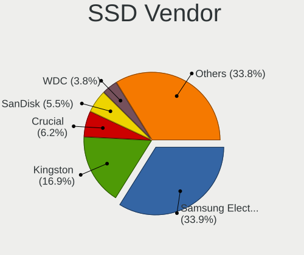

| Vendor              | Computers | Drives | Percent |
|---------------------|-----------|--------|---------|
| Samsung Electronics | 297       | 441    | 33.9%   |
| Kingston            | 148       | 219    | 16.89%  |
| Crucial             | 54        | 78     | 6.16%   |
| SanDisk             | 48        | 57     | 5.48%   |
| WDC                 | 33        | 39     | 3.77%   |
| Intel               | 30        | 39     | 3.42%   |
| Apple               | 26        | 29     | 2.97%   |
| PNY                 | 24        | 33     | 2.74%   |
| Intenso             | 23        | 26     | 2.63%   |
| Toshiba             | 21        | 23     | 2.4%    |
| Micron Technology   | 21        | 24     | 2.4%    |
| A-DATA Technology   | 18        | 20     | 2.05%   |
| LITEON              | 17        | 35     | 1.94%   |
| SK hynix            | 16        | 18     | 1.83%   |
| OCZ                 | 14        | 14     | 1.6%    |
| Verbatim            | 11        | 19     | 1.26%   |
| Corsair             | 9         | 10     | 1.03%   |
| LITEONIT            | 8         | 10     | 0.91%   |
| China               | 8         | 9      | 0.91%   |
| Team                | 5         | 5      | 0.57%   |
| Patriot             | 4         | 5      | 0.46%   |
| Vi550               | 2         | 3      | 0.23%   |
| Transcend           | 2         | 2      | 0.23%   |
| Leven               | 2         | 2      | 0.23%   |
| KODAK               | 2         | 2      | 0.23%   |
| KingFast            | 2         | 2      | 0.23%   |
| KingDian            | 2         | 2      | 0.23%   |
| GOODRAM             | 2         | 6      | 0.23%   |
| AFOX                | 2         | 2      | 0.23%   |
| ADATA SU            | 2         | 2      | 0.23%   |
| Vaseky              | 1         | 1      | 0.11%   |
| Unknown (CF)        | 1         | 1      | 0.11%   |
| Teclast             | 1         | 1      | 0.11%   |
| T-FORCE             | 1         | 1      | 0.11%   |
| Supersonic          | 1         | 1      | 0.11%   |
| SPCC                | 1         | 1      | 0.11%   |
| Shark               | 1         | 1      | 0.11%   |
| Ramaxel Technology  | 1         | 1      | 0.11%   |
| Plextor             | 1         | 1      | 0.11%   |
| OCZ-VERTEX3         | 1         | 3      | 0.11%   |

Drive Kind
----------

HDD or SSD

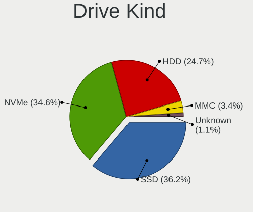

| Kind    | Computers | Drives | Percent |
|---------|-----------|--------|---------|
| SSD     | 753       | 1203   | 36.2%   |
| NVMe    | 719       | 1108   | 34.57%  |
| HDD     | 514       | 920    | 24.71%  |
| MMC     | 71        | 81     | 3.41%   |
| Unknown | 23        | 25     | 1.11%   |

Drive Connector
---------------

SATA, SAS, NVMe, etc.

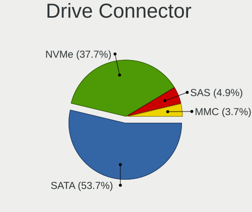

| Type | Computers | Drives | Percent |
|------|-----------|--------|---------|
| SATA | 1024      | 2015   | 53.73%  |
| NVMe | 718       | 1099   | 37.67%  |
| SAS  | 93        | 142    | 4.88%   |
| MMC  | 71        | 81     | 3.73%   |

Drive Size
----------

Size of hard drive

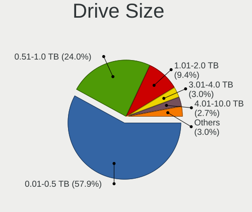

| Size in TB | Computers | Drives | Percent |
|------------|-----------|--------|---------|
| 0.01-0.5   | 784       | 1248   | 57.95%  |
| 0.51-1.0   | 325       | 459    | 24.02%  |
| 1.01-2.0   | 127       | 205    | 9.39%   |
| 3.01-4.0   | 41        | 79     | 3.03%   |
| 4.01-10.0  | 36        | 70     | 2.66%   |
| 2.01-3.0   | 30        | 46     | 2.22%   |
| 10.01-20.0 | 10        | 16     | 0.74%   |

Space Total
-----------

Amount of disk space available on the file system

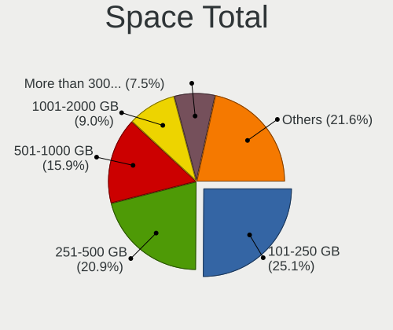

| Size in GB     | Computers | Percent |
|----------------|-----------|---------|
| 101-250        | 427       | 25.1%   |
| 251-500        | 356       | 20.93%  |
| 501-1000       | 270       | 15.87%  |
| 1001-2000      | 153       | 8.99%   |
| More than 3000 | 128       | 7.52%   |
| 1-20           | 109       | 6.41%   |
| 51-100         | 76        | 4.47%   |
| Unknown        | 66        | 3.88%   |
| 2001-3000      | 60        | 3.53%   |
| 21-50          | 56        | 3.29%   |

Space Used
----------

Amount of used disk space

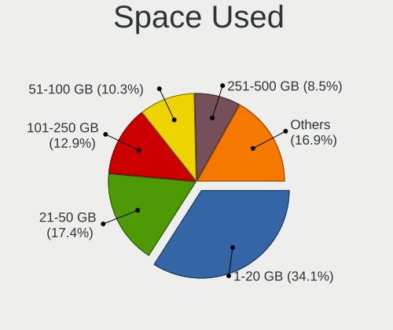

| Used GB        | Computers | Percent |
|----------------|-----------|---------|
| 1-20           | 597       | 34.06%  |
| 21-50          | 305       | 17.4%   |
| 101-250        | 226       | 12.89%  |
| 51-100         | 180       | 10.27%  |
| 251-500        | 149       | 8.5%    |
| 501-1000       | 109       | 6.22%   |
| Unknown        | 66        | 3.76%   |
| 1001-2000      | 56        | 3.19%   |
| More than 3000 | 41        | 2.34%   |
| 2001-3000      | 23        | 1.31%   |
| 0              | 1         | 0.06%   |

Malfunc. Drives
---------------

Drive models with a malfunction

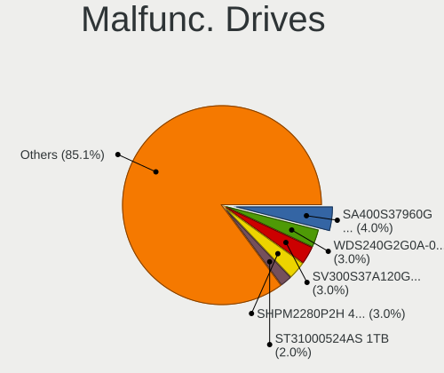

| Model                                 | Computers | Drives | Percent |
|---------------------------------------|-----------|--------|---------|
| Kingston SA400S37960G 960GB SSD       | 4         | 5      | 3.96%   |
| WDC WDS240G2G0A-00JH30 240GB SSD      | 3         | 3      | 2.97%   |
| Kingston SV300S37A120G 120GB SSD      | 3         | 5      | 2.97%   |
| Kingston SHPM2280P2H 480G SSD         | 3         | 3      | 2.97%   |
| Seagate ST31000524AS 1TB              | 2         | 2      | 1.98%   |
| Seagate ST1000LM035-1RK172 1TB        | 2         | 2      | 1.98%   |
| Samsung Electronics HD103SJ 1TB       | 2         | 2      | 1.98%   |
| Kingston SA400S37480G 480GB SSD       | 2         | 2      | 1.98%   |
| Kingston SA400S37240G 240GB SSD       | 2         | 2      | 1.98%   |
| HGST HTS541010A9E680 1TB              | 2         | 2      | 1.98%   |
| WDC WD5000BPVT-80HXZT3 500GB          | 1         | 1      | 0.99%   |
| WDC WD5000BEVT-60ZAT0 500GB           | 1         | 1      | 0.99%   |
| WDC WD5000BEVT-35ZAT0 500GB           | 1         | 1      | 0.99%   |
| WDC WD5000AAKX-001CA0 500GB           | 1         | 1      | 0.99%   |
| WDC WD5000AADS-00S9B0 500GB           | 1         | 1      | 0.99%   |
| WDC WD30PURZ-85AKKY0 3TB              | 1         | 1      | 0.99%   |
| WDC WD30EFRX-68EUZN0 3TB              | 1         | 1      | 0.99%   |
| WDC WD1600BEVT-00M9YT0 160GB          | 1         | 2      | 0.99%   |
| WDC WD10JPVT-75A1YT0 1TB              | 1         | 1      | 0.99%   |
| WDC WD10EZRX-00A8LB0 1TB              | 1         | 1      | 0.99%   |
| WDC WD10EZEX-60WN4A0 1TB              | 1         | 1      | 0.99%   |
| WDC WD10EURX-73FH1Y0 1TB              | 1         | 1      | 0.99%   |
| WDC WD10EFRX-68PJCN0 1TB              | 1         | 2      | 0.99%   |
| WDC WD10EARS-00Y5B1 1TB               | 1         | 1      | 0.99%   |
| Toshiba THNSNF128GCSS 128GB SSD       | 1         | 1      | 0.99%   |
| Toshiba MQ02ABD100H 1TB               | 1         | 1      | 0.99%   |
| Toshiba MQ01ABD100 1TB                | 1         | 1      | 0.99%   |
| Toshiba MK6475GSX 640GB               | 1         | 1      | 0.99%   |
| Toshiba KSG60ZSE256G SATA 256GB SSD   | 1         | 1      | 0.99%   |
| Toshiba DT01ACA050 500GB              | 1         | 1      | 0.99%   |
| SK hynix SC308 SATA 256GB SSD         | 1         | 1      | 0.99%   |
| SK hynix HFS128G3BTND-N210A 128GB SSD | 1         | 1      | 0.99%   |
| SK hynix BC711 HFM512GD3JX013N 512GB  | 1         | 1      | 0.99%   |
| Seagate ST9500420AS 500GB             | 1         | 1      | 0.99%   |
| Seagate ST9500325AS 500GB             | 1         | 1      | 0.99%   |
| Seagate ST500LT012-9WS142 500GB       | 1         | 1      | 0.99%   |
| Seagate ST500LT012-1DG142 500GB       | 1         | 1      | 0.99%   |
| Seagate ST4000LM QNAP 4TB             | 1         | 1      | 0.99%   |
| Seagate ST380013AS 80GB               | 1         | 1      | 0.99%   |
| Seagate ST3400633AS 400GB             | 1         | 1      | 0.99%   |

Malfunc. Drive Vendor
---------------------

Vendors of faulty drives

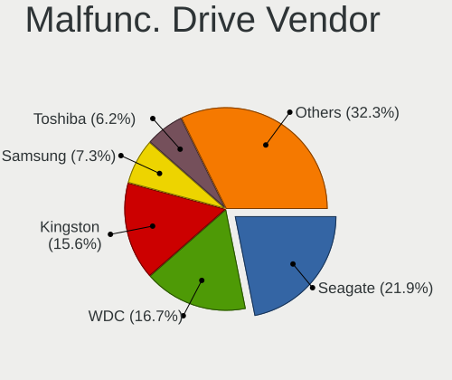

| Vendor              | Computers | Drives | Percent |
|---------------------|-----------|--------|---------|
| Seagate             | 21        | 24     | 21.88%  |
| WDC                 | 16        | 19     | 16.67%  |
| Kingston            | 15        | 18     | 15.63%  |
| Samsung Electronics | 7         | 8      | 7.29%   |
| Toshiba             | 6         | 6      | 6.25%   |
| Intel               | 6         | 6      | 6.25%   |
| HGST                | 5         | 5      | 5.21%   |
| Hitachi             | 4         | 8      | 4.17%   |
| SK hynix            | 3         | 3      | 3.13%   |
| SanDisk             | 3         | 3      | 3.13%   |
| OCZ                 | 2         | 2      | 2.08%   |
| Micron Technology   | 2         | 2      | 2.08%   |
| Crucial             | 2         | 2      | 2.08%   |
| Apple               | 2         | 2      | 2.08%   |
| Leven               | 1         | 1      | 1.04%   |
| Unknown             | 1         | 2      | 1.04%   |

Malfunc. HDD Vendor
-------------------

Vendors of faulty HDD drives

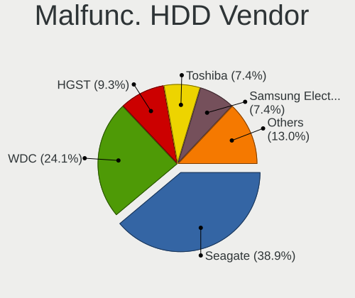

| Vendor              | Computers | Drives | Percent |
|---------------------|-----------|--------|---------|
| Seagate             | 21        | 24     | 38.89%  |
| WDC                 | 13        | 16     | 24.07%  |
| HGST                | 5         | 5      | 9.26%   |
| Toshiba             | 4         | 4      | 7.41%   |
| Samsung Electronics | 4         | 5      | 7.41%   |
| Hitachi             | 4         | 8      | 7.41%   |
| Apple               | 2         | 2      | 3.7%    |
| Unknown             | 1         | 2      | 1.85%   |

Malfunc. Drive Kind
-------------------

Kinds of faulty drives

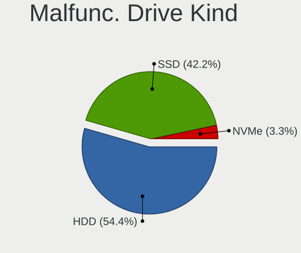

| Kind | Computers | Drives | Percent |
|------|-----------|--------|---------|
| HDD  | 49        | 66     | 54.44%  |
| SSD  | 38        | 42     | 42.22%  |
| NVMe | 3         | 3      | 3.33%   |

Failed Drives
-------------

Failed drive models

| Model                 | Computers | Drives | Percent |
|-----------------------|-----------|--------|---------|
| SanDisk SSD i100 24GB | 1         | 1      | 100%    |

Failed Drive Vendor
-------------------

Failed drive vendors

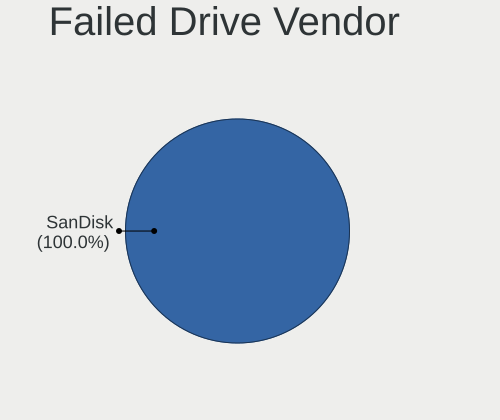

| Vendor  | Computers | Drives | Percent |
|---------|-----------|--------|---------|
| SanDisk | 1         | 1      | 100%    |

Drive Status
------------

Number of failed and malfunc. drives

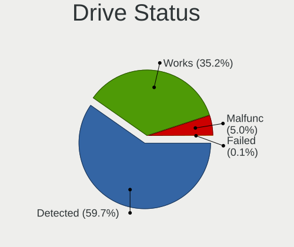

| Status   | Computers | Drives | Percent |
|----------|-----------|--------|---------|
| Detected | 1026      | 2023   | 59.72%  |
| Works    | 605       | 1202   | 35.22%  |
| Malfunc  | 86        | 111    | 5.01%   |
| Failed   | 1         | 1      | 0.06%   |

Storage controller
------------------

Storage Vendor
--------------

Storage controller vendors

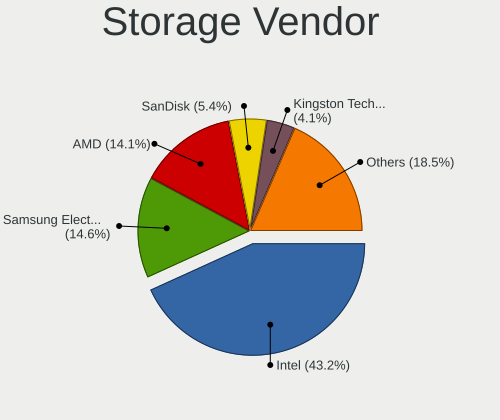

| Vendor                                  | Computers | Percent |
|-----------------------------------------|-----------|---------|
| Intel                                   | 920       | 43.21%  |
| Samsung Electronics                     | 311       | 14.61%  |
| AMD                                     | 301       | 14.14%  |
| SanDisk                                 | 116       | 5.45%   |
| Kingston Technology Company             | 87        | 4.09%   |
| SK hynix                                | 64        | 3.01%   |
| ASMedia Technology                      | 43        | 2.02%   |
| Phison Electronics                      | 39        | 1.83%   |
| Micron Technology                       | 37        | 1.74%   |
| Toshiba America Info Systems            | 33        | 1.55%   |
| Marvell Technology Group                | 26        | 1.22%   |
| Nvidia                                  | 25        | 1.17%   |
| Micron/Crucial Technology               | 18        | 0.85%   |
| JMicron Technology                      | 18        | 0.85%   |
| KIOXIA                                  | 11        | 0.52%   |
| ADATA Technology                        | 10        | 0.47%   |
| Silicon Motion                          | 9         | 0.42%   |
| Seagate Technology                      | 7         | 0.33%   |
| Apple                                   | 7         | 0.33%   |
| Lenovo                                  | 6         | 0.28%   |
| Realtek Semiconductor                   | 5         | 0.23%   |
| Silicon Image                           | 4         | 0.19%   |
| Shenzhen Longsys Electronics            | 4         | 0.19%   |
| VIA Technologies                        | 3         | 0.14%   |
| Union Memory (Shenzhen)                 | 3         | 0.14%   |
| MAXIO Technology (Hangzhou)             | 3         | 0.14%   |
| Lite-On Technology                      | 3         | 0.14%   |
| Hewlett-Packard                         | 3         | 0.14%   |
| Solid State Storage Technology          | 2         | 0.09%   |
| LSI Logic / Symbios Logic               | 2         | 0.09%   |
| Hosin Global Electronics                | 2         | 0.09%   |
| Broadcom / LSI                          | 2         | 0.09%   |
| Silicon Integrated Systems [SiS]        | 1         | 0.05%   |
| Shenzhen Unionmemory Information System | 1         | 0.05%   |
| Netac Technology                        | 1         | 0.05%   |
| HighPoint Technologies                  | 1         | 0.05%   |
| Biwin Storage Technology                | 1         | 0.05%   |

Storage Model
-------------

Storage controller models

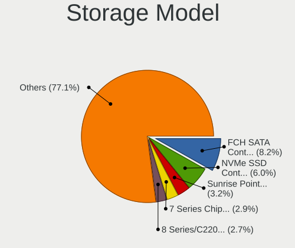

| Model                                                                          | Computers | Percent |
|--------------------------------------------------------------------------------|-----------|---------|
| AMD FCH SATA Controller [AHCI mode]                                            | 194       | 8.15%   |
| Samsung NVMe SSD Controller SM981/PM981/PM983                                  | 143       | 6.01%   |
| Intel Sunrise Point-LP SATA Controller [AHCI mode]                             | 75        | 3.15%   |
| Intel 7 Series Chipset Family 6-port SATA Controller [AHCI mode]               | 69        | 2.9%    |
| Intel 8 Series/C220 Series Chipset Family 6-port SATA Controller 1 [AHCI mode] | 64        | 2.69%   |
| Intel 8 Series SATA Controller 1 [AHCI mode]                                   | 55        | 2.31%   |
| Intel 6 Series/C200 Series Chipset Family 6 port Mobile SATA AHCI Controller   | 48        | 2.02%   |
| Samsung NVMe SSD Controller PM9A1/PM9A3/980PRO                                 | 47        | 1.98%   |
| AMD 400 Series Chipset SATA Controller                                         | 46        | 1.93%   |
| Intel 200 Series PCH SATA controller [AHCI mode]                               | 43        | 1.81%   |
| Samsung NVMe SSD Controller SM961/PM961/SM963                                  | 42        | 1.77%   |
| Intel Q170/Q150/B150/H170/H110/Z170/CM236 Chipset SATA Controller [AHCI Mode]  | 39        | 1.64%   |
| ASMedia ASM1061/ASM1062 Serial ATA Controller                                  | 37        | 1.56%   |
| Intel Volume Management Device NVMe RAID Controller                            | 36        | 1.51%   |
| AMD 600 Series Chipset SATA Controller                                         | 33        | 1.39%   |
| Samsung NVMe SSD Controller 980 (DRAM-less)                                    | 31        | 1.3%    |
| SanDisk Extreme Pro / WD Black SN750 / PC SN730 / Red SN700 NVMe SSD           | 30        | 1.26%   |
| AMD 500 Series Chipset SATA Controller                                         | 29        | 1.22%   |
| Intel Cannon Lake PCH SATA AHCI Controller                                     | 28        | 1.18%   |
| Intel SATA Controller [RAID mode]                                              | 27        | 1.13%   |
| Intel 82801 Mobile SATA Controller [RAID mode]                                 | 27        | 1.13%   |
| Intel 7 Series/C210 Series Chipset Family 6-port SATA Controller [AHCI mode]   | 27        | 1.13%   |
| Intel 6 Series/C200 Series Chipset Family 6 port Desktop SATA AHCI Controller  | 27        | 1.13%   |
| Intel Cannon Lake Mobile PCH SATA AHCI Controller                              | 26        | 1.09%   |
| Intel HM170/QM170 Chipset SATA Controller [AHCI Mode]                          | 24        | 1.01%   |
| Intel 5 Series/3400 Series Chipset 6 port SATA AHCI Controller                 | 24        | 1.01%   |
| AMD SB7x0/SB8x0/SB9x0 IDE Controller                                           | 23        | 0.97%   |
| SK hynix Gold P31/BC711/PC711 NVMe Solid State Drive                           | 22        | 0.92%   |
| Kingston Company KC3000/FURY Renegade NVMe SSD [E18]                           | 21        | 0.88%   |
| Intel Wildcat Point-LP SATA Controller [AHCI Mode]                             | 20        | 0.84%   |
| Intel Alder Lake-S PCH SATA Controller [AHCI Mode]                             | 20        | 0.84%   |
| Intel 82801IBM/IEM (ICH9M/ICH9M-E) 4 port SATA Controller [AHCI mode]          | 20        | 0.84%   |
| AMD SB7x0/SB8x0/SB9x0 SATA Controller [AHCI mode]                              | 19        | 0.8%    |
| Intel 82801HM/HEM (ICH8M/ICH8M-E) IDE Controller                               | 18        | 0.76%   |
| Phison E16 PCIe4 NVMe Controller                                               | 16        | 0.67%   |
| SanDisk Ultra 3D / WD PC SN530, IX SN530, Blue SN550 NVMe SSD (DRAM-less)      | 15        | 0.63%   |
| Phison E12 NVMe Controller                                                     | 15        | 0.63%   |
| Intel SSD 660P Series                                                          | 15        | 0.63%   |
| Intel 82801HM/HEM (ICH8M/ICH8M-E) SATA Controller [AHCI mode]                  | 15        | 0.63%   |
| Toshiba America Info Systems XG6 NVMe SSD Controller                           | 14        | 0.59%   |

Storage Kind
------------

Kind of storage controller (IDE, SATA, NVMe, SAS, ...)

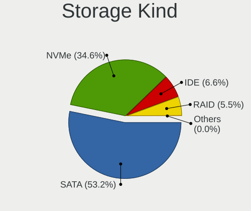

| Kind | Computers | Percent |
|------|-----------|---------|
| SATA | 1108      | 53.19%  |
| NVMe | 721       | 34.61%  |
| IDE  | 137       | 6.58%   |
| RAID | 115       | 5.52%   |
| SAS  | 1         | 0.05%   |
| SCSI | 1         | 0.05%   |

Processor
---------

CPU Vendor
----------

Processor vendors

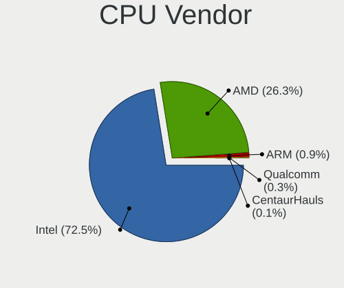

| Vendor       | Computers | Percent |
|--------------|-----------|---------|
| Intel        | 1148      | 72.47%  |
| AMD          | 417       | 26.33%  |
| ARM          | 14        | 0.88%   |
| Qualcomm     | 4         | 0.25%   |
| CentaurHauls | 1         | 0.06%   |

CPU Model
---------

Processor models

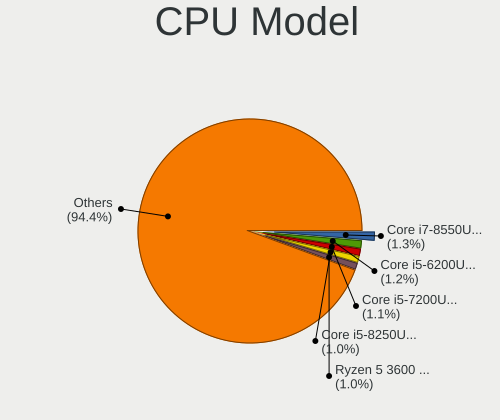

| Model                                   | Computers | Percent |
|-----------------------------------------|-----------|---------|
| Intel Core i7-8550U CPU @ 1.80GHz       | 21        | 1.32%   |
| Intel Core i5-6200U CPU @ 2.30GHz       | 19        | 1.2%    |
| Intel Core i5-7200U CPU @ 2.50GHz       | 17        | 1.07%   |
| Intel Core i5-8250U CPU @ 1.60GHz       | 16        | 1.01%   |
| AMD Ryzen 5 3600 6-Core Processor       | 16        | 1.01%   |
| Intel Core i5-4300U CPU @ 1.90GHz       | 14        | 0.88%   |
| Intel Core i7-8565U CPU @ 1.80GHz       | 13        | 0.82%   |
| Intel Core i7-7700HQ CPU @ 2.80GHz      | 13        | 0.82%   |
| Intel Core i5-3320M CPU @ 2.60GHz       | 13        | 0.82%   |
| Intel Core i5-3210M CPU @ 2.50GHz       | 13        | 0.82%   |
| Intel Core i5-2520M CPU @ 2.50GHz       | 13        | 0.82%   |
| Intel 11th Gen Core i7-1165G7 @ 2.80GHz | 12        | 0.76%   |
| Intel 11th Gen Core i5-1135G7 @ 2.40GHz | 12        | 0.76%   |
| Intel Core i7-6700K CPU @ 4.00GHz       | 11        | 0.69%   |
| Intel Core i5-6300U CPU @ 2.40GHz       | 11        | 0.69%   |
| AMD Ryzen 9 3900X 12-Core Processor     | 11        | 0.69%   |
| Intel Core i7-8750H CPU @ 2.20GHz       | 10        | 0.63%   |
| Intel Core i5-4200U CPU @ 1.60GHz       | 10        | 0.63%   |
| ARM Processor                           | 10        | 0.63%   |
| AMD Ryzen 7 5800X 8-Core Processor      | 10        | 0.63%   |
| AMD Ryzen 7 3700X 8-Core Processor      | 10        | 0.63%   |
| Intel Core i9-9900K CPU @ 3.60GHz       | 9         | 0.57%   |
| Intel Core i7-9750H CPU @ 2.60GHz       | 9         | 0.57%   |
| Intel Core i7-6600U CPU @ 2.60GHz       | 9         | 0.57%   |
| Intel Core i5-7500 CPU @ 3.40GHz        | 9         | 0.57%   |
| Intel Core i5-4210U CPU @ 1.70GHz       | 9         | 0.57%   |
| AMD Ryzen 9 5950X 16-Core Processor     | 9         | 0.57%   |
| AMD Ryzen 7 5700U with Radeon Graphics  | 9         | 0.57%   |
| AMD Ryzen 7 2700X Eight-Core Processor  | 9         | 0.57%   |
| Intel Core i7-8650U CPU @ 1.90GHz       | 8         | 0.5%    |
| Intel Core i7-10510U CPU @ 1.80GHz      | 8         | 0.5%    |
| Intel Core i5-5200U CPU @ 2.20GHz       | 8         | 0.5%    |
| AMD Ryzen 9 5900X 12-Core Processor     | 8         | 0.5%    |
| AMD Ryzen 5 5600X 6-Core Processor      | 8         | 0.5%    |
| Intel Core i7-8700K CPU @ 3.70GHz       | 7         | 0.44%   |
| Intel Core i7-8665U CPU @ 1.90GHz       | 7         | 0.44%   |
| Intel Core i7-7600U CPU @ 2.80GHz       | 7         | 0.44%   |
| Intel Core i7-6700HQ CPU @ 2.60GHz      | 7         | 0.44%   |
| Intel Core i5-8300H CPU @ 2.30GHz       | 7         | 0.44%   |
| Intel Core i5-7300U CPU @ 2.60GHz       | 7         | 0.44%   |

CPU Model Family
----------------

Processor model prefix

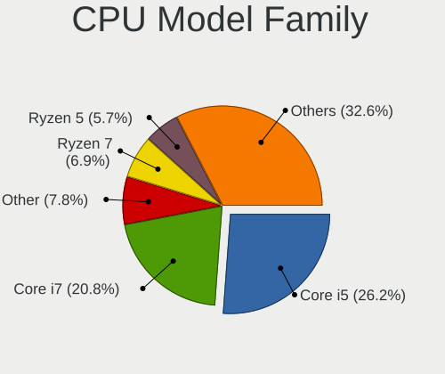

| Model                   | Computers | Percent |
|-------------------------|-----------|---------|
| Intel Core i5           | 415       | 26.17%  |
| Intel Core i7           | 330       | 20.81%  |
| Other                   | 123       | 7.76%   |
| AMD Ryzen 7             | 110       | 6.94%   |
| AMD Ryzen 5             | 91        | 5.74%   |
| Intel Core i3           | 72        | 4.54%   |
| AMD Ryzen 9             | 61        | 3.85%   |
| Intel Core 2 Duo        | 51        | 3.22%   |
| Intel Celeron           | 36        | 2.27%   |
| Intel Xeon              | 29        | 1.83%   |
| Intel Core i9           | 21        | 1.32%   |
| AMD Ryzen 7 PRO         | 21        | 1.32%   |
| Intel Pentium           | 20        | 1.26%   |
| Intel Atom              | 16        | 1.01%   |
| AMD Ryzen 3             | 15        | 0.95%   |
| AMD A6                  | 14        | 0.88%   |
| Intel Core              | 13        | 0.82%   |
| AMD FX                  | 13        | 0.82%   |
| AMD A8                  | 11        | 0.69%   |
| AMD Ryzen 5 PRO         | 10        | 0.63%   |
| Intel Pentium Dual-Core | 9         | 0.57%   |
| AMD Ryzen Threadripper  | 8         | 0.5%    |
| Intel Pentium Silver    | 7         | 0.44%   |
| AMD Phenom II X4        | 6         | 0.38%   |
| AMD A10                 | 6         | 0.38%   |
| Intel Core 2 Quad       | 5         | 0.32%   |
| Intel Core 2            | 5         | 0.32%   |
| AMD A4                  | 5         | 0.32%   |
| Intel Pentium Dual      | 4         | 0.25%   |
| ARM BCM                 | 4         | 0.25%   |
| AMD Turion 64 X2 Mobile | 4         | 0.25%   |
| AMD E1                  | 4         | 0.25%   |
| AMD E                   | 4         | 0.25%   |
| AMD Athlon 64 X2        | 4         | 0.25%   |
| Intel Pentium M         | 3         | 0.19%   |
| Intel Core m5           | 3         | 0.19%   |
| AMD Athlon II X4        | 3         | 0.19%   |
| AMD Athlon              | 3         | 0.19%   |
| Intel Genuine           | 2         | 0.13%   |
| Intel Core m3           | 2         | 0.13%   |

CPU Cores
---------

Number of processor cores

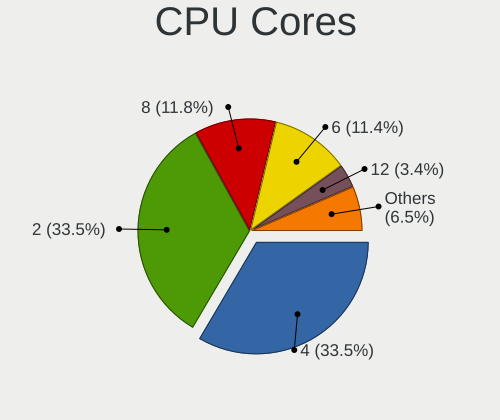

| Number  | Computers | Percent |
|---------|-----------|---------|
| 4       | 532       | 33.48%  |
| 2       | 532       | 33.48%  |
| 8       | 187       | 11.77%  |
| 6       | 181       | 11.39%  |
| 12      | 54        | 3.4%    |
| 16      | 36        | 2.27%   |
| 1       | 21        | 1.32%   |
| 10      | 16        | 1.01%   |
| 14      | 9         | 0.57%   |
| 24      | 6         | 0.38%   |
| 20      | 3         | 0.19%   |
| 3       | 3         | 0.19%   |
| Unknown | 3         | 0.19%   |
| 64      | 2         | 0.13%   |
| 32      | 2         | 0.13%   |
| 18      | 1         | 0.06%   |
| 5       | 1         | 0.06%   |

CPU Sockets
-----------

Number of sockets

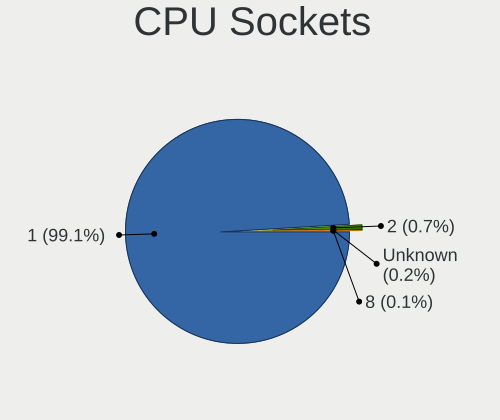

| Number  | Computers | Percent |
|---------|-----------|---------|
| 1       | 1569      | 99.05%  |
| 2       | 11        | 0.69%   |
| Unknown | 3         | 0.19%   |
| 8       | 1         | 0.06%   |

CPU Threads
-----------

Threads per core (Hyper-Threading)

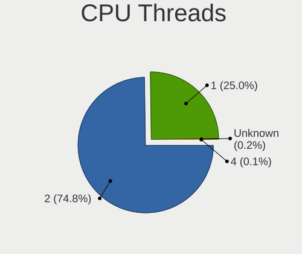

| Number  | Computers | Percent |
|---------|-----------|---------|
| 2       | 1186      | 74.78%  |
| 1       | 396       | 24.97%  |
| Unknown | 3         | 0.19%   |
| 4       | 1         | 0.06%   |

CPU Op-Modes
------------

CPU Operation Modes (32-bit, 64-bit)

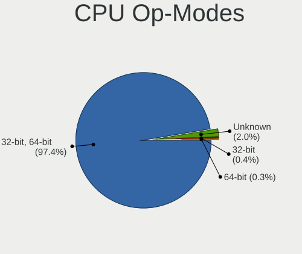

| Op mode        | Computers | Percent |
|----------------|-----------|---------|
| 32-bit, 64-bit | 1547      | 97.36%  |
| Unknown        | 31        | 1.95%   |
| 32-bit         | 6         | 0.38%   |
| 64-bit         | 5         | 0.31%   |

CPU Microcode
-------------

Microcode number

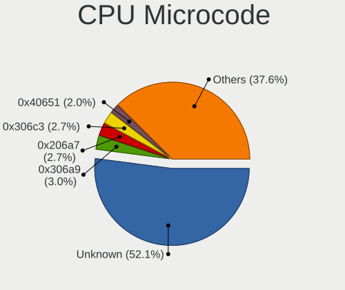

| Number     | Computers | Percent |
|------------|-----------|---------|
| Unknown    | 862       | 52.05%  |
| 0x306a9    | 50        | 3.02%   |
| 0x206a7    | 45        | 2.72%   |
| 0x306c3    | 44        | 2.66%   |
| 0x40651    | 33        | 1.99%   |
| 0x1067a    | 30        | 1.81%   |
| 0x906ea    | 28        | 1.69%   |
| 0x406e3    | 28        | 1.69%   |
| 0x506e3    | 26        | 1.57%   |
| 0x806e9    | 25        | 1.51%   |
| 0x806ea    | 24        | 1.45%   |
| 0x806ec    | 19        | 1.15%   |
| 0x906e9    | 18        | 1.09%   |
| 0x20655    | 16        | 0.97%   |
| 0x08600106 | 16        | 0.97%   |
| 0x0a50000c | 14        | 0.85%   |
| 0x08701021 | 13        | 0.79%   |
| 0x0800820d | 13        | 0.79%   |
| 0x806c1    | 12        | 0.72%   |
| 0x906ed    | 11        | 0.66%   |
| 0x6fd      | 11        | 0.66%   |
| 0x08001138 | 9         | 0.54%   |
| 0x90672    | 8         | 0.48%   |
| 0x806eb    | 8         | 0.48%   |
| 0x20652    | 8         | 0.48%   |
| 0x08701013 | 8         | 0.48%   |
| 0x010000c8 | 8         | 0.48%   |
| 0x706e5    | 7         | 0.42%   |
| 0x406c3    | 7         | 0.42%   |
| 0x306d4    | 7         | 0.42%   |
| 0x10676    | 7         | 0.42%   |
| 0x0a601203 | 7         | 0.42%   |
| 0x0a404102 | 7         | 0.42%   |
| 0x0a201009 | 7         | 0.42%   |
| 0x0810100b | 7         | 0.42%   |
| 0x08608103 | 6         | 0.36%   |
| 0x08600104 | 6         | 0.36%   |
| 0x08108109 | 6         | 0.36%   |
| 0x07030105 | 6         | 0.36%   |
| 0x06000852 | 6         | 0.36%   |

CPU Microarch
-------------

Microarchitecture

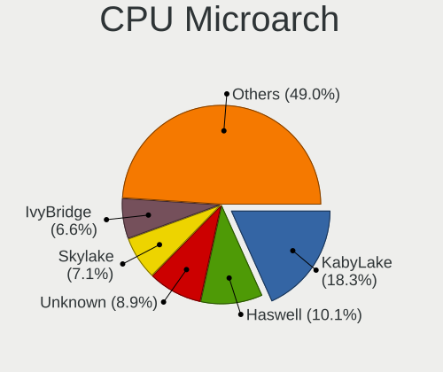

| Name              | Computers | Percent |
|-------------------|-----------|---------|
| KabyLake          | 290       | 18.27%  |
| Haswell           | 161       | 10.14%  |
| Unknown           | 141       | 8.88%   |
| Skylake           | 113       | 7.12%   |
| IvyBridge         | 105       | 6.62%   |
| Zen 2             | 91        | 5.73%   |
| SandyBridge       | 90        | 5.67%   |
| Zen 3             | 86        | 5.42%   |
| Penryn            | 55        | 3.47%   |
| Westmere          | 44        | 2.77%   |
| Zen+              | 39        | 2.46%   |
| Broadwell         | 37        | 2.33%   |
| Alderlake Hybrid  | 37        | 2.33%   |
| TigerLake         | 33        | 2.08%   |
| CometLake         | 32        | 2.02%   |
| Core              | 28        | 1.76%   |
| Zen               | 24        | 1.51%   |
| Silvermont        | 22        | 1.39%   |
| Piledriver        | 16        | 1.01%   |
| K10               | 15        | 0.95%   |
| IceLake           | 15        | 0.95%   |
| Puma              | 13        | 0.82%   |
| Nehalem           | 13        | 0.82%   |
| Goldmont plus     | 10        | 0.63%   |
| K8 Hammer         | 9         | 0.57%   |
| Excavator         | 9         | 0.57%   |
| Goldmont          | 7         | 0.44%   |
| Bonnell           | 7         | 0.44%   |
| Steamroller       | 6         | 0.38%   |
| Bobcat            | 6         | 0.38%   |
| P6                | 5         | 0.32%   |
| Meteorlake Hybrid | 5         | 0.32%   |
| Lunarlake Hybrid  | 5         | 0.32%   |
| Jaguar            | 5         | 0.32%   |
| K10 Llano         | 4         | 0.25%   |
| K8 & K10 hybrid   | 3         | 0.19%   |
| Bulldozer         | 3         | 0.19%   |
| Tremont           | 1         | 0.06%   |
| Sapphire Rapids   | 1         | 0.06%   |
| Gracemont         | 1         | 0.06%   |

Graphics
--------

GPU Vendor
----------

Vendors of graphics cards

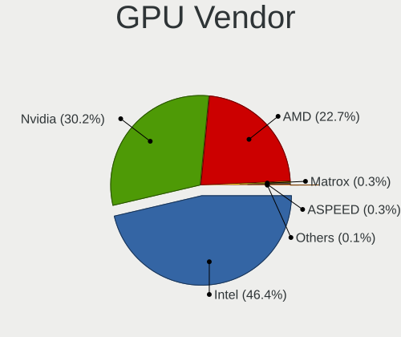

| Vendor                           | Computers | Percent |
|----------------------------------|-----------|---------|
| Intel                            | 858       | 46.35%  |
| Nvidia                           | 559       | 30.2%   |
| AMD                              | 421       | 22.74%  |
| Matrox Electronics Systems       | 6         | 0.32%   |
| ASPEED Technology                | 5         | 0.27%   |
| Zhaoxin                          | 1         | 0.05%   |
| Silicon Integrated Systems [SiS] | 1         | 0.05%   |

GPU Model
---------

Graphics card models

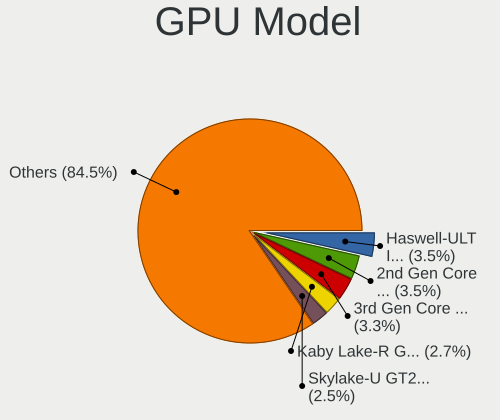

| Model                                                                                    | Computers | Percent |
|------------------------------------------------------------------------------------------|-----------|---------|
| Intel Haswell-ULT Integrated Graphics Controller                                         | 67        | 3.51%   |
| Intel 2nd Generation Core Processor Family Integrated Graphics Controller                | 67        | 3.51%   |
| Intel 3rd Gen Core processor Graphics Controller                                         | 63        | 3.3%    |
| Intel Kaby Lake-R GT2 [UHD Graphics 620]                                                 | 51        | 2.67%   |
| Intel Skylake-U GT2 [HD Graphics 520]                                                    | 47        | 2.46%   |
| Intel Kaby Lake-U GT2 [HD Graphics 620]                                                  | 42        | 2.2%    |
| Intel CoffeeLake-H GT2 [UHD Graphics 630]                                                | 36        | 1.89%   |
| AMD Renoir [Radeon Vega Series / Radeon Vega Mobile Series]                              | 35        | 1.84%   |
| AMD Cezanne [Radeon Vega Series / Radeon Vega Mobile Series]                             | 34        | 1.78%   |
| Intel TigerLake-LP GT2 [Iris Xe Graphics]                                                | 31        | 1.63%   |
| Intel WhiskeyLake-U GT2 [UHD Graphics 620]                                               | 30        | 1.57%   |
| Intel 4th Gen Core Processor Integrated Graphics Controller                              | 29        | 1.52%   |
| Intel Xeon E3-1200 v3/4th Gen Core Processor Integrated Graphics Controller              | 23        | 1.21%   |
| Intel Core Processor Integrated Graphics Controller                                      | 21        | 1.1%    |
| Intel CoffeeLake-S GT2 [UHD Graphics 630]                                                | 21        | 1.1%    |
| AMD Raphael                                                                              | 20        | 1.05%   |
| AMD Navi 10 [Radeon RX 5600 OEM/5600 XT / 5700/5700 XT]                                  | 20        | 1.05%   |
| AMD Ellesmere [Radeon RX 470/480/570/570X/580/580X/590]                                  | 20        | 1.05%   |
| AMD Picasso/Raven 2 [Radeon Vega Series / Radeon Vega Mobile Series]                     | 19        | 1%      |
| Intel Broadwell-U GT2 [HD Graphics 5500]                                                 | 18        | 0.94%   |
| Intel Kaby Lake-H GT2 [HD Graphics 630]                                                  | 17        | 0.89%   |
| Nvidia GP107M [GeForce GTX 1050 Mobile]                                                  | 16        | 0.84%   |
| Intel Mobile 4 Series Chipset Integrated Graphics Controller                             | 16        | 0.84%   |
| Intel CometLake-U GT2 [UHD Graphics]                                                     | 16        | 0.84%   |
| Intel CometLake-H GT2 [UHD Graphics]                                                     | 16        | 0.84%   |
| AMD Rembrandt [Radeon 680M]                                                              | 16        | 0.84%   |
| Intel Kaby Lake-S GT2 [HD Graphics 630]                                                  | 15        | 0.79%   |
| AMD Navi 31 [Radeon RX 7900 XT/7900 XTX/7900 GRE/7900M]                                  | 14        | 0.73%   |
| Nvidia GP107 [GeForce GTX 1050 Ti]                                                       | 13        | 0.68%   |
| Intel Skylake-S GT2 [HD Graphics 530]                                                    | 13        | 0.68%   |
| Intel Skylake-H GT2 [HD Graphics 530]                                                    | 13        | 0.68%   |
| Intel Atom/Celeron/Pentium Processor x5-E8000/J3xxx/N3xxx Integrated Graphics Controller | 13        | 0.68%   |
| AMD Lucienne                                                                             | 13        | 0.68%   |
| Nvidia GP106 [GeForce GTX 1060 6GB]                                                      | 12        | 0.63%   |
| Nvidia GP104 [GeForce GTX 1080]                                                          | 12        | 0.63%   |
| Nvidia TU117M [GeForce GTX 1650 Mobile / Max-Q]                                          | 10        | 0.52%   |
| Nvidia GP108M [GeForce MX150]                                                            | 10        | 0.52%   |
| Nvidia GP107 [GeForce GTX 1050]                                                          | 10        | 0.52%   |
| Intel Mobile GM965/GL960 Integrated Graphics Controller (secondary)                      | 10        | 0.52%   |
| Intel Mobile GM965/GL960 Integrated Graphics Controller (primary)                        | 10        | 0.52%   |

GPU Combo
---------

Combinations of graphics cards

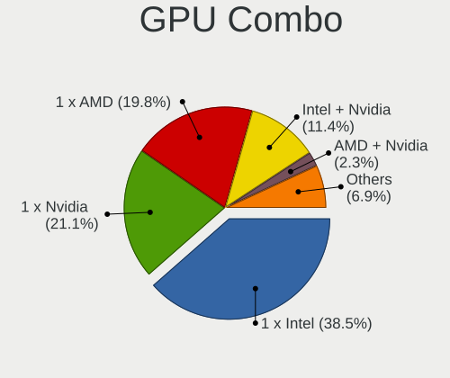

| Name            | Computers | Percent |
|-----------------|-----------|---------|
| 1 x Intel       | 616       | 38.52%  |
| 1 x Nvidia      | 337       | 21.08%  |
| 1 x AMD         | 316       | 19.76%  |
| Intel + Nvidia  | 183       | 11.44%  |
| AMD + Nvidia    | 37        | 2.31%   |
| 2 x AMD         | 35        | 2.19%   |
| Intel + AMD     | 31        | 1.94%   |
| Other           | 20        | 1.25%   |
| 2 x Intel       | 8         | 0.5%    |
| 1 x Matrox      | 5         | 0.31%   |
| Nvidia + ASPEED | 3         | 0.19%   |
| 2 x Nvidia      | 2         | 0.13%   |
| 1 x ASPEED      | 2         | 0.13%   |
| 3 x AMD         | 1         | 0.06%   |
| 1 x Zhaoxin     | 1         | 0.06%   |
| 1 x SiS         | 1         | 0.06%   |
| Nvidia + Matrox | 1         | 0.06%   |

GPU Driver
----------

Free vs proprietary

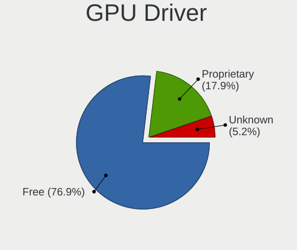

| Driver      | Computers | Percent |
|-------------|-----------|---------|
| Free        | 1241      | 76.89%  |
| Proprietary | 289       | 17.91%  |
| Unknown     | 84        | 5.2%    |

GPU Memory
----------

Total video memory

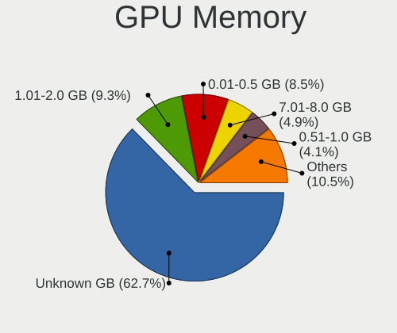

| Size in GB | Computers | Percent |
|------------|-----------|---------|
| Unknown    | 1020      | 62.69%  |
| 1.01-2.0   | 151       | 9.28%   |
| 0.01-0.5   | 138       | 8.48%   |
| 7.01-8.0   | 80        | 4.92%   |
| 0.51-1.0   | 67        | 4.12%   |
| 3.01-4.0   | 64        | 3.93%   |
| 8.01-16.0  | 43        | 2.64%   |
| 5.01-6.0   | 40        | 2.46%   |
| 16.01-24.0 | 14        | 0.86%   |
| 2.01-3.0   | 8         | 0.49%   |
| 4.01-5.0   | 1         | 0.06%   |
| 24.01-32.0 | 1         | 0.06%   |

Monitor
-------

Monitor Vendor
--------------

Monitor vendors

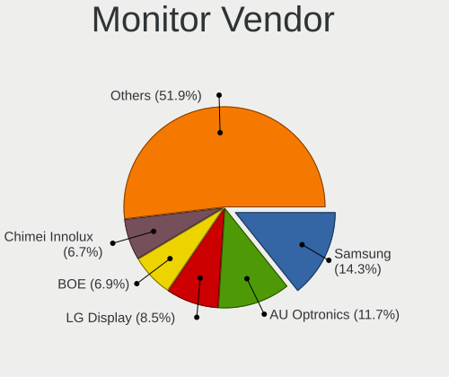

| Vendor                  | Computers | Percent |
|-------------------------|-----------|---------|
| Samsung Electronics     | 259       | 14.28%  |
| AU Optronics            | 213       | 11.74%  |
| LG Display              | 154       | 8.49%   |
| BOE                     | 126       | 6.95%   |
| Chimei Innolux          | 121       | 6.67%   |
| Dell                    | 104       | 5.73%   |
| Lenovo                  | 100       | 5.51%   |
| Apple                   | 77        | 4.24%   |
| Philips                 | 62        | 3.42%   |
| AOC                     | 62        | 3.42%   |
| Hewlett-Packard         | 56        | 3.09%   |
| Goldstar                | 43        | 2.37%   |
| Ancor Communications    | 42        | 2.32%   |
| Acer                    | 42        | 2.32%   |
| BenQ                    | 40        | 2.21%   |
| ASUSTek Computer        | 38        | 2.09%   |
| Sharp                   | 29        | 1.6%    |
| Sony                    | 18        | 0.99%   |
| Chi Mei Optoelectronics | 18        | 0.99%   |
| InfoVision              | 16        | 0.88%   |
| MSI                     | 15        | 0.83%   |
| PANDA                   | 11        | 0.61%   |
| Unknown                 | 10        | 0.55%   |
| Panasonic               | 9         | 0.5%    |
| Medion                  | 9         | 0.5%    |
| Lenovo Group Limited    | 7         | 0.39%   |
| Fujitsu Siemens         | 7         | 0.39%   |
| CSO                     | 7         | 0.39%   |
| Valve                   | 6         | 0.33%   |
| Packard Bell            | 6         | 0.33%   |
| Gigabyte Technology     | 6         | 0.33%   |
| ViewSonic               | 5         | 0.28%   |
| IBM                     | 5         | 0.28%   |
| Vestel Elektronik       | 4         | 0.22%   |
| LG Philips              | 4         | 0.22%   |
| LG Electronics          | 4         | 0.22%   |
| Denver                  | 4         | 0.22%   |
| RTK                     | 3         | 0.17%   |
| NEC Computers           | 3         | 0.17%   |
| Iiyama                  | 3         | 0.17%   |

Monitor Model
-------------

Monitor models

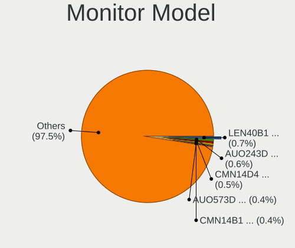

| Model                                                                 | Computers | Percent |
|-----------------------------------------------------------------------|-----------|---------|
| Lenovo LCD Monitor LEN40B1 1600x900 345x194mm 15.6-inch               | 13        | 0.68%   |
| AU Optronics LCD Monitor AUO243D 1920x1080 309x173mm 13.9-inch        | 11        | 0.57%   |
| Chimei Innolux LCD Monitor CMN14D4 1920x1080 309x173mm 13.9-inch      | 9         | 0.47%   |
| AU Optronics LCD Monitor AUO573D 1920x1080 309x174mm 14.0-inch        | 8         | 0.42%   |
| Chimei Innolux LCD Monitor CMN14B1 1920x1080 308x173mm 13.9-inch      | 7         | 0.37%   |
| AU Optronics LCD Monitor AUO38ED 1920x1080 344x193mm 15.5-inch        | 7         | 0.37%   |
| Samsung Electronics S24F350 SAM0D20 1920x1080 521x293mm 23.5-inch     | 6         | 0.31%   |
| AU Optronics LCD Monitor AUO2E8D 1920x1080 344x194mm 15.5-inch        | 6         | 0.31%   |
| ASUSTek Computer VA326 AUS32FA 1920x1080 698x393mm 31.5-inch          | 6         | 0.31%   |
| Apple Color LCD APPA034 2880x1800 286x179mm 13.3-inch                 | 6         | 0.31%   |
| Apple Color LCD APP9CF0 1440x900 290x180mm 13.4-inch                  | 6         | 0.31%   |
| Valve ANX7530 U VLV3001 800x1280 100x150mm 7.1-inch                   | 5         | 0.26%   |
| Samsung Electronics SyncMaster SAM05CD 1920x1080                      | 5         | 0.26%   |
| Samsung Electronics LCD Monitor S24F350 1920x1080                     | 5         | 0.26%   |
| Panasonic VVX11F009G00 MEI96A2 1920x1080 344x193mm 15.5-inch          | 5         | 0.26%   |
| LG Display LCD Monitor LGD0521 1920x1080 309x174mm 14.0-inch          | 5         | 0.26%   |
| Goldstar 27GL850 GSM5B7F 2560x1440 597x336mm 27.0-inch                | 5         | 0.26%   |
| Chimei Innolux LCD Monitor CMN15C3 1920x1080 344x193mm 15.5-inch      | 5         | 0.26%   |
| Chimei Innolux LCD Monitor CMN14F2 1920x1080 309x173mm 13.9-inch      | 5         | 0.26%   |
| AU Optronics LCD Monitor AUOD291 1920x1200 301x188mm 14.0-inch        | 5         | 0.26%   |
| AU Optronics LCD Monitor AUO213E 1600x900 309x174mm 14.0-inch         | 5         | 0.26%   |
| AOC G2460 AOC2460 1920x1080 531x299mm 24.0-inch                       | 5         | 0.26%   |
| AOC 2470W AOC2470 1920x1080 521x293mm 23.5-inch                       | 5         | 0.26%   |
| Ancor Communications ROG PG279Q ACI27EC 2560x1440 598x336mm 27.0-inch | 5         | 0.26%   |
| Vestel Elektronik 40UHD_LCD_TV VES3700 3840x2160 880x500mm 39.8-inch  | 4         | 0.21%   |
| Samsung Electronics U28E590 SAM0C4D 3840x2160 607x345mm 27.5-inch     | 4         | 0.21%   |
| Samsung Electronics S24A31x SAM7115 1920x1080 527x296mm 23.8-inch     | 4         | 0.21%   |
| Samsung Electronics LCD Monitor SEC3152 1366x768 344x194mm 15.5-inch  | 4         | 0.21%   |
| Samsung Electronics LCD Monitor SAM0F13 3840x2160 950x540mm 43.0-inch | 4         | 0.21%   |
| LG Display LCD Monitor LGD04A7 1920x1080 344x194mm 15.5-inch          | 4         | 0.21%   |
| LG Display LCD Monitor LGD0469 1920x1080 382x215mm 17.3-inch          | 4         | 0.21%   |
| LG Display LCD Monitor LGD02DC 1366x768 344x194mm 15.5-inch           | 4         | 0.21%   |
| Lenovo LCD Monitor LEN4011 1280x800 261x163mm 12.1-inch               | 4         | 0.21%   |
| Lenovo G27q-20 LEN66C3 2560x1440 597x336mm 27.0-inch                  | 4         | 0.21%   |
| InfoVision LCD Monitor IVO04E3 1366x768 277x156mm 12.5-inch           | 4         | 0.21%   |
| Goldstar LG TV SSCR2 GSMC0C8 3840x2160                                | 4         | 0.21%   |
| Denver MO-HHS-32C LHCFFFF 1920x1080 699x393mm 31.6-inch               | 4         | 0.21%   |
| Chimei Innolux LCD Monitor CMN15D5 1920x1080 344x193mm 15.5-inch      | 4         | 0.21%   |
| Chimei Innolux LCD Monitor CMN150C 1920x1080 344x193mm 15.5-inch      | 4         | 0.21%   |
| AU Optronics LCD Monitor AUO403D 1920x1080 309x174mm 14.0-inch        | 4         | 0.21%   |

Monitor Resolution
------------------

Monitor screen resolution

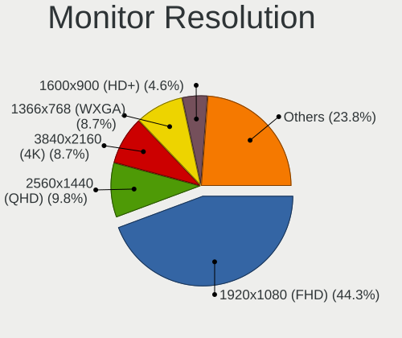

| Resolution         | Computers | Percent |
|--------------------|-----------|---------|
| 1920x1080 (FHD)    | 767       | 44.34%  |
| 2560x1440 (QHD)    | 170       | 9.83%   |
| 3840x2160 (4K)     | 151       | 8.73%   |
| 1366x768 (WXGA)    | 151       | 8.73%   |
| 1600x900 (HD+)     | 79        | 4.57%   |
| 1920x1200 (WUXGA)  | 53        | 3.06%   |
| 1680x1050 (WSXGA+) | 51        | 2.95%   |
| 3440x1440          | 38        | 2.2%    |
| 1280x800 (WXGA)    | 34        | 1.97%   |
| 1440x900 (WXGA+)   | 30        | 1.73%   |
| 2560x1600          | 29        | 1.68%   |
| 2880x1800          | 28        | 1.62%   |
| 1280x1024 (SXGA)   | 28        | 1.62%   |
| Unknown            | 19        | 1.1%    |
| 3840x1080          | 16        | 0.92%   |
| 800x1280           | 6         | 0.35%   |
| 3840x1200          | 6         | 0.35%   |
| 1360x768           | 6         | 0.35%   |
| 3200x1800 (QHD+)   | 5         | 0.29%   |
| 2880x1920          | 5         | 0.29%   |
| 3840x2400          | 4         | 0.23%   |
| 2560x1080          | 4         | 0.23%   |
| 2288x1287          | 4         | 0.23%   |
| 2240x1400          | 4         | 0.23%   |
| 1920x540           | 4         | 0.23%   |
| 2160x1440          | 3         | 0.17%   |
| 1400x1050          | 3         | 0.17%   |
| 3840x1600          | 2         | 0.12%   |
| 3840x1100          | 2         | 0.12%   |
| 3072x1920          | 2         | 0.12%   |
| 3000x2000          | 2         | 0.12%   |
| 2304x1536          | 2         | 0.12%   |
| 2256x1504          | 2         | 0.12%   |
| 1920x1280          | 2         | 0.12%   |
| 1600x1200          | 2         | 0.12%   |
| 1024x600           | 2         | 0.12%   |
| 9840x3840          | 1         | 0.06%   |
| 6400x2160          | 1         | 0.06%   |
| 5760x1440          | 1         | 0.06%   |
| 5760x1080          | 1         | 0.06%   |

Monitor Diagonal
----------------

Diagonal size in inches

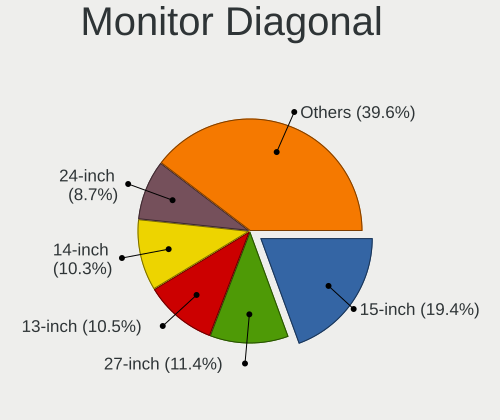

| Inches  | Computers | Percent |
|---------|-----------|---------|
| 15      | 353       | 19.43%  |
| 27      | 207       | 11.39%  |
| 13      | 191       | 10.51%  |
| 14      | 188       | 10.35%  |
| 24      | 158       | 8.7%    |
| 23      | 93        | 5.12%   |
| Unknown | 82        | 4.51%   |
| 31      | 74        | 4.07%   |
| 17      | 70        | 3.85%   |
| 21      | 57        | 3.14%   |
| 12      | 47        | 2.59%   |
| 34      | 35        | 1.93%   |
| 22      | 34        | 1.87%   |
| 19      | 28        | 1.54%   |
| 20      | 23        | 1.27%   |
| 84      | 20        | 1.1%    |
| 16      | 19        | 1.05%   |
| 72      | 16        | 0.88%   |
| 32      | 12        | 0.66%   |
| 48      | 11        | 0.61%   |
| 11      | 9         | 0.5%    |
| 40      | 8         | 0.44%   |
| 18      | 8         | 0.44%   |
| 25      | 6         | 0.33%   |
| 7       | 5         | 0.28%   |
| 65      | 4         | 0.22%   |
| 49      | 4         | 0.22%   |
| 43      | 4         | 0.22%   |
| 35      | 4         | 0.22%   |
| 26      | 4         | 0.22%   |
| 10      | 4         | 0.22%   |
| 142     | 3         | 0.17%   |
| 63      | 3         | 0.17%   |
| 33      | 3         | 0.17%   |
| 29      | 3         | 0.17%   |
| 28      | 3         | 0.17%   |
| 75      | 2         | 0.11%   |
| 74      | 2         | 0.11%   |
| 54      | 2         | 0.11%   |
| 47      | 2         | 0.11%   |

Monitor Width
-------------

Physical width

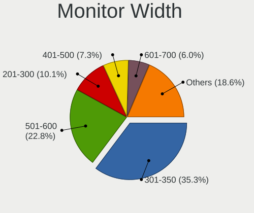

| Width in mm    | Computers | Percent |
|----------------|-----------|---------|
| 301-350        | 624       | 35.25%  |
| 501-600        | 403       | 22.77%  |
| 201-300        | 179       | 10.11%  |
| 401-500        | 129       | 7.29%   |
| 601-700        | 106       | 5.99%   |
| 351-400        | 94        | 5.31%   |
| Unknown        | 82        | 4.63%   |
| 701-800        | 49        | 2.77%   |
| 1501-2000      | 42        | 2.37%   |
| 1001-1500      | 33        | 1.86%   |
| 801-900        | 18        | 1.02%   |
| 1-100          | 6         | 0.34%   |
| More than 2000 | 3         | 0.17%   |
| 901-1000       | 2         | 0.11%   |

Aspect Ratio
------------

Proportional relationship between the width and the height

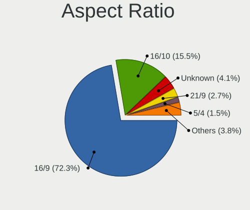

| Ratio   | Computers | Percent |
|---------|-----------|---------|
| 16/9    | 1174      | 72.34%  |
| 16/10   | 252       | 15.53%  |
| Unknown | 66        | 4.07%   |
| 21/9    | 44        | 2.71%   |
| 5/4     | 25        | 1.54%   |
| 3/2     | 21        | 1.29%   |
| 32/9    | 16        | 0.99%   |
| 4/3     | 7         | 0.43%   |
| 0.67    | 5         | 0.31%   |
| 3.20    | 4         | 0.25%   |
| 6/5     | 3         | 0.18%   |
| 1.00    | 3         | 0.18%   |
| 3.40    | 2         | 0.12%   |
| 3.73    | 1         | 0.06%   |

Monitor Area
------------

Area in inch²

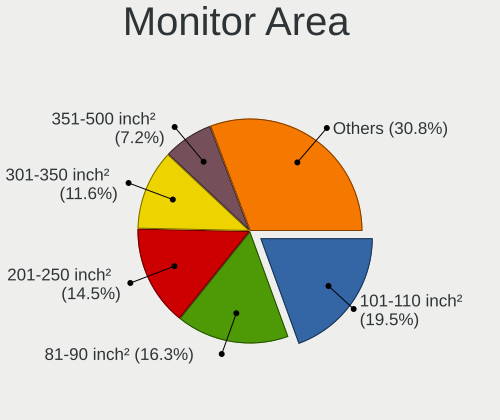

| Area in inch² | Computers | Percent |
|----------------|-----------|---------|
| 101-110        | 349       | 19.45%  |
| 81-90          | 293       | 16.33%  |
| 201-250        | 261       | 14.55%  |
| 301-350        | 209       | 11.65%  |
| 351-500        | 130       | 7.25%   |
| 71-80          | 82        | 4.57%   |
| Unknown        | 82        | 4.57%   |
| 251-300        | 66        | 3.68%   |
| 151-200        | 60        | 3.34%   |
| More than 1000 | 58        | 3.23%   |
| 121-130        | 51        | 2.84%   |
| 61-70          | 44        | 2.45%   |
| 501-1000       | 35        | 1.95%   |
| 111-120        | 21        | 1.17%   |
| 131-140        | 14        | 0.78%   |
| 141-150        | 13        | 0.72%   |
| 51-60          | 11        | 0.61%   |
| 1-40           | 6         | 0.33%   |
| 91-100         | 5         | 0.28%   |
| 41-50          | 4         | 0.22%   |

Pixel Density
-------------

Pixels per inch

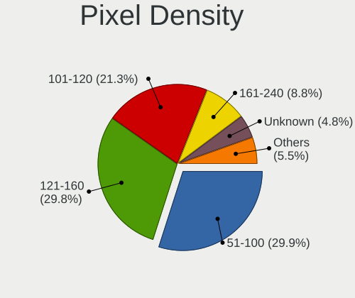

| Density       | Computers | Percent |
|---------------|-----------|---------|
| 51-100        | 516       | 29.93%  |
| 121-160       | 514       | 29.81%  |
| 101-120       | 367       | 21.29%  |
| 161-240       | 151       | 8.76%   |
| Unknown       | 82        | 4.76%   |
| More than 240 | 62        | 3.6%    |
| 1-50          | 32        | 1.86%   |

Multiple Monitors
-----------------

Total monitors connected

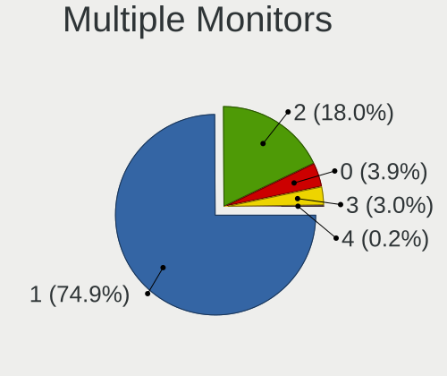

| Total | Computers | Percent |
|-------|-----------|---------|
| 1     | 1222      | 74.92%  |
| 2     | 293       | 17.96%  |
| 0     | 63        | 3.86%   |
| 3     | 49        | 3%      |
| 4     | 4         | 0.25%   |

Network
-------

Net Controller Vendor
---------------------

Controller vendors

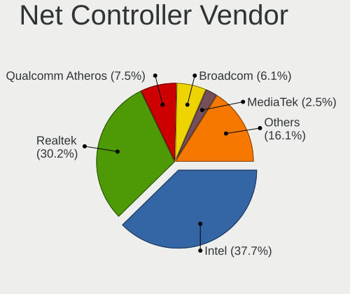

| Vendor                            | Computers | Percent |
|-----------------------------------|-----------|---------|
| Intel                             | 891       | 37.67%  |
| Realtek Semiconductor             | 714       | 30.19%  |
| Qualcomm Atheros                  | 177       | 7.48%   |
| Broadcom                          | 145       | 6.13%   |
| MediaTek                          | 58        | 2.45%   |
| Broadcom Limited                  | 36        | 1.52%   |
| Lenovo                            | 25        | 1.06%   |
| Sierra Wireless                   | 23        | 0.97%   |
| Ralink                            | 22        | 0.93%   |
| Nvidia                            | 21        | 0.89%   |
| Ralink Technology                 | 18        | 0.76%   |
| TP-Link                           | 17        | 0.72%   |
| Aquantia                          | 17        | 0.72%   |
| Ericsson Business Mobile Networks | 15        | 0.63%   |
| Samsung Electronics               | 13        | 0.55%   |
| Marvell Technology Group          | 13        | 0.55%   |
| ASIX Electronics                  | 12        | 0.51%   |
| Qualcomm                          | 11        | 0.47%   |
| Shenzhen Goodix Technology        | 10        | 0.42%   |
| Microsoft                         | 10        | 0.42%   |
| DisplayLink                       | 9         | 0.38%   |
| ASUSTek Computer                  | 8         | 0.34%   |
| Dell                              | 7         | 0.3%    |
| Xiaomi                            | 6         | 0.25%   |
| NetGear                           | 6         | 0.25%   |
| Microchip Technology              | 6         | 0.25%   |
| Huawei Technologies               | 6         | 0.25%   |
| IMC Networks                      | 5         | 0.21%   |
| Qualcomm Atheros Communications   | 4         | 0.17%   |
| OnePlus Technology (Shenzhen)     | 4         | 0.17%   |
| Hewlett-Packard                   | 4         | 0.17%   |
| Edimax Technology                 | 4         | 0.17%   |
| D-Link System                     | 4         | 0.17%   |
| D-Link                            | 4         | 0.17%   |
| ZyXEL Communications              | 3         | 0.13%   |
| OPPO Electronics                  | 3         | 0.13%   |
| ICS Advent                        | 3         | 0.13%   |
| Qualcomm Technologies             | 2         | 0.08%   |
| Linksys                           | 2         | 0.08%   |
| HMD Global                        | 2         | 0.08%   |

Net Controller Model
--------------------

Controller models

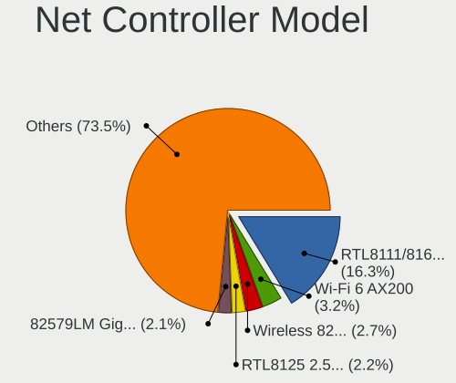

| Model                                                                  | Computers | Percent |
|------------------------------------------------------------------------|-----------|---------|
| Realtek RTL8111/8168/8211/8411 PCI Express Gigabit Ethernet Controller | 473       | 16.27%  |
| Intel Wi-Fi 6 AX200                                                    | 94        | 3.23%   |
| Intel Wireless 8265 / 8275                                             | 79        | 2.72%   |
| Realtek RTL8125 2.5GbE Controller                                      | 64        | 2.2%    |
| Intel 82579LM Gigabit Network Connection (Lewisville)                  | 62        | 2.13%   |
| Realtek RTL8153 Gigabit Ethernet Adapter                               | 55        | 1.89%   |
| Intel I211 Gigabit Network Connection                                  | 52        | 1.79%   |
| Realtek RTL810xE PCI Express Fast Ethernet controller                  | 48        | 1.65%   |
| Intel Wireless 8260                                                    | 48        | 1.65%   |
| Intel Wireless 7260                                                    | 48        | 1.65%   |
| Intel Centrino Advanced-N 6205 [Taylor Peak]                           | 37        | 1.27%   |
| Intel Ethernet Connection (2) I219-V                                   | 35        | 1.2%    |
| Intel Ethernet Connection I217-LM                                      | 33        | 1.13%   |
| Qualcomm Atheros QCA6174 802.11ac Wireless Network Adapter             | 32        | 1.1%    |
| Intel Wireless 7265                                                    | 31        | 1.07%   |
| Intel Ethernet Controller I225-V                                       | 28        | 0.96%   |
| Intel Ethernet Connection (7) I219-V                                   | 28        | 0.96%   |
| Intel Ethernet Connection (4) I219-LM                                  | 28        | 0.96%   |
| Intel Wi-Fi 6E(802.11ax) AX210/AX1675* 2x2 [Typhoon Peak]              | 26        | 0.89%   |
| Intel Ethernet Connection I218-LM                                      | 26        | 0.89%   |
| Intel Wi-Fi 6 AX201                                                    | 25        | 0.86%   |
| Intel Cannon Point-LP CNVi [Wireless-AC]                               | 24        | 0.83%   |
| Qualcomm Atheros QCA9377 802.11ac Wireless Network Adapter             | 23        | 0.79%   |
| Intel Ethernet Connection (4) I219-V                                   | 23        | 0.79%   |
| Intel Dual Band Wireless-AC 3168NGW [Stone Peak]                       | 22        | 0.76%   |
| Realtek RTL8822CE 802.11ac PCIe Wireless Network Adapter               | 21        | 0.72%   |
| Intel Wi-Fi 5(802.11ac) Wireless-AC 9x6x [Thunder Peak]                | 21        | 0.72%   |
| Intel Ethernet Connection I219-LM                                      | 20        | 0.69%   |
| Broadcom Limited BCM4360 802.11ac Dual Band Wireless Network Adapter   | 20        | 0.69%   |
| Qualcomm Atheros QCA9565 / AR9565 Wireless Network Adapter             | 19        | 0.65%   |
| Broadcom NetXtreme BCM57765 Gigabit Ethernet PCIe                      | 19        | 0.65%   |
| MediaTek MT7922 802.11ax PCI Express Wireless Network Adapter          | 18        | 0.62%   |
| MediaTek MT7921 802.11ax PCIe Wireless Network Adapter [Filogic 330]   | 18        | 0.62%   |
| Intel Cannon Lake PCH CNVi WiFi                                        | 18        | 0.62%   |
| Broadcom BCM4360 802.11ac Dual Band Wireless Network Adapter           | 18        | 0.62%   |
| Intel Dual Band Wireless-AC 3165 Plus Bluetooth                        | 17        | 0.58%   |
| Intel Comet Lake PCH CNVi WiFi                                         | 17        | 0.58%   |
| Intel 82577LM Gigabit Network Connection                               | 17        | 0.58%   |
| Qualcomm Atheros AR9485 Wireless Network Adapter                       | 16        | 0.55%   |
| Intel Ethernet Connection (7) I219-LM                                  | 16        | 0.55%   |

Wireless Vendor
---------------

Wireless vendors

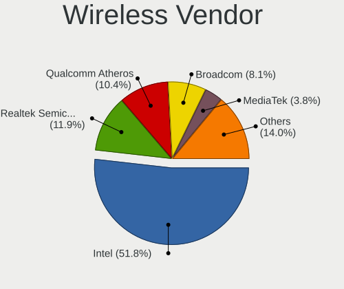

| Vendor                          | Computers | Percent |
|---------------------------------|-----------|---------|
| Intel                           | 681       | 51.79%  |
| Realtek Semiconductor           | 157       | 11.94%  |
| Qualcomm Atheros                | 137       | 10.42%  |
| Broadcom                        | 106       | 8.06%   |
| MediaTek                        | 50        | 3.8%    |
| Broadcom Limited                | 30        | 2.28%   |
| Sierra Wireless                 | 23        | 1.75%   |
| Ralink                          | 22        | 1.67%   |
| Ralink Technology               | 18        | 1.37%   |
| TP-Link                         | 17        | 1.29%   |
| Qualcomm                        | 10        | 0.76%   |
| Microsoft                       | 10        | 0.76%   |
| ASUSTek Computer                | 8         | 0.61%   |
| NetGear                         | 6         | 0.46%   |
| IMC Networks                    | 5         | 0.38%   |
| Dell                            | 5         | 0.38%   |
| Qualcomm Atheros Communications | 4         | 0.3%    |
| Marvell Technology Group        | 4         | 0.3%    |
| Edimax Technology               | 4         | 0.3%    |
| D-Link System                   | 4         | 0.3%    |
| D-Link                          | 4         | 0.3%    |
| ZyXEL Communications            | 3         | 0.23%   |
| Qualcomm Technologies           | 2         | 0.15%   |
| Fibocom                         | 2         | 0.15%   |
| Philips (or NXP)                | 1         | 0.08%   |
| Linksys                         | 1         | 0.08%   |
| BUFFALO                         | 1         | 0.08%   |

Wireless Model
--------------

Wireless models

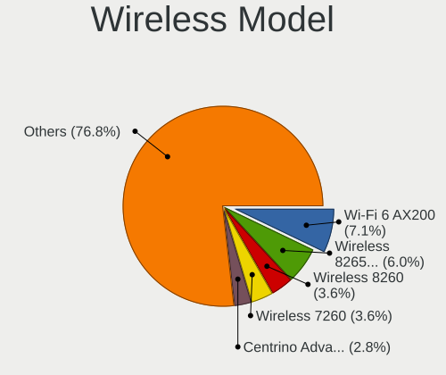

| Model                                                                | Computers | Percent |
|----------------------------------------------------------------------|-----------|---------|
| Intel Wi-Fi 6 AX200                                                  | 94        | 7.13%   |
| Intel Wireless 8265 / 8275                                           | 79        | 5.99%   |
| Intel Wireless 8260                                                  | 48        | 3.64%   |
| Intel Wireless 7260                                                  | 48        | 3.64%   |
| Intel Centrino Advanced-N 6205 [Taylor Peak]                         | 37        | 2.81%   |
| Qualcomm Atheros QCA6174 802.11ac Wireless Network Adapter           | 32        | 2.43%   |
| Intel Wireless 7265                                                  | 31        | 2.35%   |
| Intel Wi-Fi 6E(802.11ax) AX210/AX1675* 2x2 [Typhoon Peak]            | 26        | 1.97%   |
| Intel Wi-Fi 6 AX201                                                  | 25        | 1.9%    |
| Intel Cannon Point-LP CNVi [Wireless-AC]                             | 24        | 1.82%   |
| Qualcomm Atheros QCA9377 802.11ac Wireless Network Adapter           | 23        | 1.74%   |
| Intel Dual Band Wireless-AC 3168NGW [Stone Peak]                     | 22        | 1.67%   |
| Realtek RTL8822CE 802.11ac PCIe Wireless Network Adapter             | 21        | 1.59%   |
| Intel Wi-Fi 5(802.11ac) Wireless-AC 9x6x [Thunder Peak]              | 21        | 1.59%   |
| Broadcom Limited BCM4360 802.11ac Dual Band Wireless Network Adapter | 20        | 1.52%   |
| Qualcomm Atheros QCA9565 / AR9565 Wireless Network Adapter           | 19        | 1.44%   |
| MediaTek MT7921 802.11ax PCIe Wireless Network Adapter [Filogic 330] | 18        | 1.36%   |
| Intel Cannon Lake PCH CNVi WiFi                                      | 18        | 1.36%   |
| Broadcom BCM4360 802.11ac Dual Band Wireless Network Adapter         | 18        | 1.36%   |
| Intel Dual Band Wireless-AC 3165 Plus Bluetooth                      | 17        | 1.29%   |
| Intel Comet Lake PCH CNVi WiFi                                       | 17        | 1.29%   |
| Qualcomm Atheros AR9485 Wireless Network Adapter                     | 16        | 1.21%   |
| Intel Comet Lake PCH-LP CNVi WiFi                                    | 16        | 1.21%   |
| Broadcom BCM4331 802.11a/b/g/n                                       | 16        | 1.21%   |
| Realtek RTL8822BE 802.11a/b/g/n/ac WiFi adapter                      | 15        | 1.14%   |
| Intel Centrino Wireless-N 2230                                       | 15        | 1.14%   |
| Intel Centrino Ultimate-N 6300                                       | 15        | 1.14%   |
| Broadcom BCM4313 802.11bgn Wireless Network Adapter                  | 14        | 1.06%   |
| Sierra Wireless EM7455                                               | 13        | 0.99%   |
| Realtek RTL8821CE 802.11ac PCIe Wireless Network Adapter             | 13        | 0.99%   |
| Qualcomm Atheros AR9285 Wireless Network Adapter (PCI-Express)       | 13        | 0.99%   |
| MediaTek MT7922 802.11ax PCI Express Wireless Network Adapter        | 13        | 0.99%   |
| Realtek RTL8852BE PCIe 802.11ax Wireless Network Controller          | 12        | 0.91%   |
| Realtek RTL8852AE 802.11ax PCIe Wireless Network Adapter             | 12        | 0.91%   |
| Realtek RTL8723BE PCIe Wireless Network Adapter                      | 11        | 0.83%   |
| Realtek 802.11ac NIC                                                 | 11        | 0.83%   |
| Intel Centrino Advanced-N 6200                                       | 11        | 0.83%   |
| Broadcom BCM43602 802.11ac Wireless LAN SoC                          | 11        | 0.83%   |
| Qualcomm Atheros AR928X Wireless Network Adapter (PCI-Express)       | 10        | 0.76%   |
| Intel Wireless 3165                                                  | 10        | 0.76%   |

Ethernet Vendor
---------------

Ethernet vendors

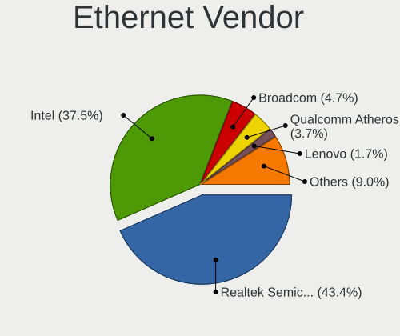

| Vendor                                 | Computers | Percent |
|----------------------------------------|-----------|---------|
| Realtek Semiconductor                  | 653       | 43.45%  |
| Intel                                  | 563       | 37.46%  |
| Broadcom                               | 70        | 4.66%   |
| Qualcomm Atheros                       | 56        | 3.73%   |
| Lenovo                                 | 25        | 1.66%   |
| Nvidia                                 | 21        | 1.4%    |
| Aquantia                               | 17        | 1.13%   |
| Samsung Electronics                    | 13        | 0.86%   |
| ASIX Electronics                       | 12        | 0.8%    |
| Marvell Technology Group               | 9         | 0.6%    |
| DisplayLink                            | 9         | 0.6%    |
| MediaTek                               | 8         | 0.53%   |
| Xiaomi                                 | 6         | 0.4%    |
| Broadcom Limited                       | 6         | 0.4%    |
| Microchip Technology                   | 4         | 0.27%   |
| OPPO Electronics                       | 3         | 0.2%    |
| OnePlus Technology (Shenzhen)          | 3         | 0.2%    |
| ICS Advent                             | 3         | 0.2%    |
| Hewlett-Packard                        | 3         | 0.2%    |
| Huawei Technologies                    | 2         | 0.13%   |
| HMD Global                             | 2         | 0.13%   |
| VIA Technologies                       | 1         | 0.07%   |
| Toshiba                                | 1         | 0.07%   |
| Suzhou Motorcomm Electronic Technology | 1         | 0.07%   |
| Sony Ericsson Mobile Communications AB | 1         | 0.07%   |
| Solarflare Communications              | 1         | 0.07%   |
| Silicon Integrated Systems [SiS]       | 1         | 0.07%   |
| Qualcomm                               | 1         | 0.07%   |
| Motorola PCS                           | 1         | 0.07%   |
| Mellanox Technologies                  | 1         | 0.07%   |
| Linksys                                | 1         | 0.07%   |
| JMicron Technology                     | 1         | 0.07%   |
| Insyde Software                        | 1         | 0.07%   |
| IBM                                    | 1         | 0.07%   |
| Google                                 | 1         | 0.07%   |
| Apple                                  | 1         | 0.07%   |

Ethernet Model
--------------

Ethernet models

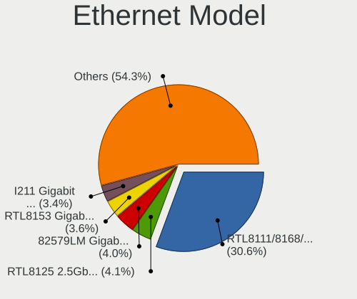

| Model                                                                          | Computers | Percent |
|--------------------------------------------------------------------------------|-----------|---------|
| Realtek RTL8111/8168/8211/8411 PCI Express Gigabit Ethernet Controller         | 473       | 30.63%  |
| Realtek RTL8125 2.5GbE Controller                                              | 64        | 4.15%   |
| Intel 82579LM Gigabit Network Connection (Lewisville)                          | 62        | 4.02%   |
| Realtek RTL8153 Gigabit Ethernet Adapter                                       | 55        | 3.56%   |
| Intel I211 Gigabit Network Connection                                          | 52        | 3.37%   |
| Realtek RTL810xE PCI Express Fast Ethernet controller                          | 48        | 3.11%   |
| Intel Ethernet Connection (2) I219-V                                           | 35        | 2.27%   |
| Intel Ethernet Connection I217-LM                                              | 33        | 2.14%   |
| Intel Ethernet Controller I225-V                                               | 28        | 1.81%   |
| Intel Ethernet Connection (7) I219-V                                           | 28        | 1.81%   |
| Intel Ethernet Connection (4) I219-LM                                          | 28        | 1.81%   |
| Intel Ethernet Connection I218-LM                                              | 26        | 1.68%   |
| Intel Ethernet Connection (4) I219-V                                           | 23        | 1.49%   |
| Intel Ethernet Connection I219-LM                                              | 20        | 1.3%    |
| Broadcom NetXtreme BCM57765 Gigabit Ethernet PCIe                              | 19        | 1.23%   |
| Intel 82577LM Gigabit Network Connection                                       | 17        | 1.1%    |
| Intel Ethernet Connection (7) I219-LM                                          | 16        | 1.04%   |
| Intel Ethernet Connection I219-V                                               | 13        | 0.84%   |
| Broadcom NetXtreme BCM57766 Gigabit Ethernet PCIe                              | 13        | 0.84%   |
| Intel Ethernet Connection (2) I219-LM                                          | 12        | 0.78%   |
| Intel 82579V Gigabit Network Connection                                        | 12        | 0.78%   |
| Intel I210 Gigabit Network Connection                                          | 10        | 0.65%   |
| Intel Ethernet Connection (6) I219-V                                           | 10        | 0.65%   |
| Intel Ethernet Connection (5) I219-LM                                          | 10        | 0.65%   |
| Intel Ethernet Connection (2) I218-V                                           | 10        | 0.65%   |
| ASIX AX88179 Gigabit Ethernet                                                  | 10        | 0.65%   |
| Aquantia AQtion AQC107 NBase-T/IEEE 802.3an Ethernet Controller [Atlantic 10G] | 10        | 0.65%   |
| Qualcomm Atheros AR8161 Gigabit Ethernet                                       | 9         | 0.58%   |
| Intel Ethernet Connection (6) I219-LM                                          | 9         | 0.58%   |
| Samsung Galaxy series, misc. (tethering mode)                                  | 8         | 0.52%   |
| Nvidia MCP79 Ethernet                                                          | 8         | 0.52%   |
| Intel Ethernet Connection I217-V                                               | 8         | 0.52%   |
| Intel Ethernet Connection (3) I218-LM                                          | 8         | 0.52%   |
| Intel Ethernet Connection (10) I219-V                                          | 8         | 0.52%   |
| Broadcom NetXtreme BCM5764M Gigabit Ethernet PCIe                              | 8         | 0.52%   |
| Qualcomm Atheros AR8151 v2.0 Gigabit Ethernet                                  | 7         | 0.45%   |
| Lenovo USB-C Dock Ethernet                                                     | 7         | 0.45%   |
| Lenovo ThinkPad Lan                                                            | 7         | 0.45%   |
| Intel 82566MM Gigabit Network Connection                                       | 7         | 0.45%   |
| Realtek RTL8152 Fast Ethernet Adapter                                          | 6         | 0.39%   |

Net Controller Kind
-------------------

Ethernet, WiFi or modem

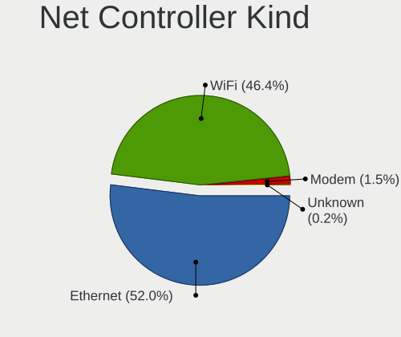

| Kind     | Computers | Percent |
|----------|-----------|---------|
| Ethernet | 1383      | 51.95%  |
| WiFi     | 1235      | 46.39%  |
| Modem    | 39        | 1.47%   |
| Unknown  | 5         | 0.19%   |

Used Controller
---------------

Currently used network controller

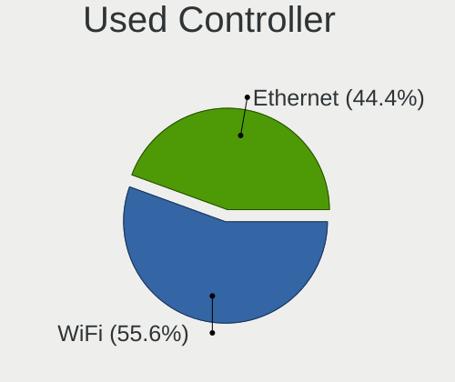

| Kind     | Computers | Percent |
|----------|-----------|---------|
| WiFi     | 925       | 55.56%  |
| Ethernet | 740       | 44.44%  |

NICs
----

Total network controllers on board

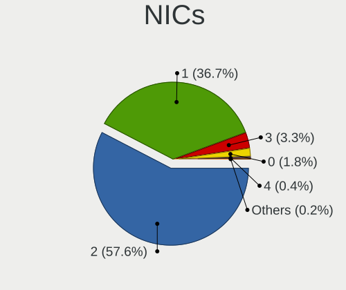

| Total | Computers | Percent |
|-------|-----------|---------|
| 2     | 918       | 57.63%  |
| 1     | 585       | 36.72%  |
| 3     | 52        | 3.26%   |
| 0     | 28        | 1.76%   |
| 4     | 7         | 0.44%   |
| 5     | 2         | 0.13%   |
| 6     | 1         | 0.06%   |

IPv6
----

IPv6 vs IPv4

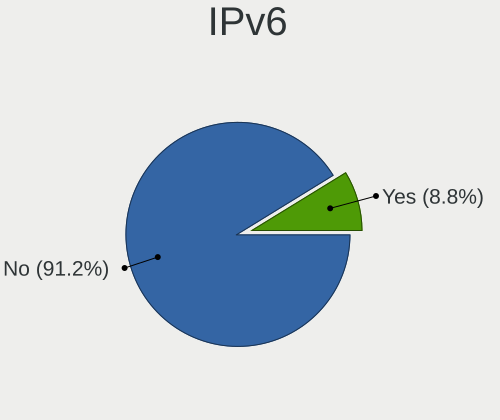

| Used | Computers | Percent |
|------|-----------|---------|
| No   | 1456      | 91.23%  |
| Yes  | 140       | 8.77%   |

Bluetooth
---------

Bluetooth Vendor
----------------

Controller vendors

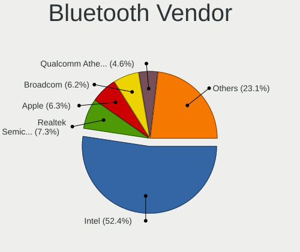

| Vendor                          | Computers | Percent |
|---------------------------------|-----------|---------|
| Intel                           | 571       | 52.39%  |
| Realtek Semiconductor           | 80        | 7.34%   |
| Apple                           | 69        | 6.33%   |
| Broadcom                        | 68        | 6.24%   |
| Qualcomm Atheros Communications | 50        | 4.59%   |
| IMC Networks                    | 50        | 4.59%   |
| Cambridge Silicon Radio         | 46        | 4.22%   |
| Foxconn / Hon Hai               | 36        | 3.3%    |
| Lite-On Technology              | 26        | 2.39%   |
| ASUSTek Computer                | 22        | 2.02%   |
| MediaTek                        | 15        | 1.38%   |
| Hewlett-Packard                 | 13        | 1.19%   |
| USI                             | 8         | 0.73%   |
| TP-Link                         | 5         | 0.46%   |
| Marvell Semiconductor           | 5         | 0.46%   |
| Dell                            | 4         | 0.37%   |
| Ralink                          | 3         | 0.28%   |
| Edimax Technology               | 3         | 0.28%   |
| Belkin Components               | 3         | 0.28%   |
| Realtek                         | 2         | 0.18%   |
| Ralink Technology               | 2         | 0.18%   |
| HTC (High Tech Computer)        | 2         | 0.18%   |
| Toshiba                         | 1         | 0.09%   |
| Taiyo Yuden                     | 1         | 0.09%   |
| Integrated System Solution      | 1         | 0.09%   |
| Foxconn International           | 1         | 0.09%   |
| D-Link System                   | 1         | 0.09%   |
| Chicony Electronics             | 1         | 0.09%   |
| Actions                         | 1         | 0.09%   |

Bluetooth Model
---------------

Controller models

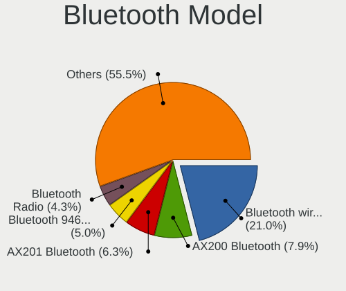

| Model                                               | Computers | Percent |
|-----------------------------------------------------|-----------|---------|
| Intel Bluetooth wireless interface                  | 229       | 21.01%  |
| Intel AX200 Bluetooth                               | 86        | 7.89%   |
| Intel AX201 Bluetooth                               | 69        | 6.33%   |
| Intel Bluetooth 9460/9560 Jefferson Peak (JfP)      | 54        | 4.95%   |
| Realtek Bluetooth Radio                             | 47        | 4.31%   |
| Cambridge Silicon Radio Bluetooth Dongle (HCI mode) | 46        | 4.22%   |
| Intel Bluetooth Device                              | 35        | 3.21%   |
| Apple Bluetooth Host Controller                     | 35        | 3.21%   |
| Intel AX210 Bluetooth                               | 26        | 2.39%   |
| Broadcom BCM2045B (BDC-2.1)                         | 26        | 2.39%   |
| Intel Wireless-AC 3168 Bluetooth                    | 22        | 2.02%   |
| Intel Centrino Bluetooth Wireless Transceiver       | 22        | 2.02%   |
| IMC Networks Wireless_Device                        | 21        | 1.93%   |
| Apple Bluetooth USB Host Controller                 | 21        | 1.93%   |
| Intel Wireless-AC 9260 Bluetooth Adapter            | 20        | 1.83%   |
| IMC Networks Bluetooth Radio                        | 19        | 1.74%   |
| Qualcomm Atheros  Bluetooth Device                  | 17        | 1.56%   |
| Qualcomm Atheros QCA61x4 Bluetooth 4.0              | 17        | 1.56%   |
| Realtek  Bluetooth 4.2 Adapter                      | 15        | 1.38%   |
| MediaTek Wireless_Device                            | 15        | 1.38%   |
| Apple Built-in Bluetooth 2.0+EDR HCI                | 12        | 1.1%    |
| Foxconn / Hon Hai Bluetooth Device                  | 11        | 1.01%   |
| ASUS ASUS USB-BT500                                 | 11        | 1.01%   |
| Broadcom BCM20702 Bluetooth 4.0 [ThinkPad]          | 10        | 0.92%   |
| Foxconn / Hon Hai Wireless_Device                   | 9         | 0.83%   |
| Lite-On Qualcomm Atheros QCA9377 Bluetooth          | 8         | 0.73%   |
| USI Bluetooth Device                                | 7         | 0.64%   |
| HP Bluetooth 2.0 Interface [Broadcom BCM2045]       | 7         | 0.64%   |
| Qualcomm Atheros AR3011 Bluetooth                   | 6         | 0.55%   |
| Lite-On Atheros AR3012 Bluetooth                    | 6         | 0.55%   |
| HP Broadcom 2070 Bluetooth Combo                    | 6         | 0.55%   |
| Broadcom HP Portable Bumble Bee                     | 6         | 0.55%   |
| TP-Link TP-T@- UB500 Adapter                        | 5         | 0.46%   |
| Qualcomm Atheros AR3012 Bluetooth 4.0               | 5         | 0.46%   |
| Lite-On Bluetooth Device                            | 5         | 0.46%   |
| Intel Centrino Advanced-N 6230 Bluetooth adapter    | 5         | 0.46%   |
| Foxconn / Hon Hai MediaTek Bluetooth Adapter        | 5         | 0.46%   |
| Broadcom BCM2045B (BDC-2) [Bluetooth Controller]    | 5         | 0.46%   |
| Realtek RTL8822BE Bluetooth 4.2 Adapter             | 4         | 0.37%   |
| Realtek RTL8821A Bluetooth                          | 4         | 0.37%   |

Sound
-----

Sound Vendor
------------

Sound card vendors

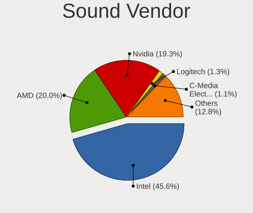

| Vendor                   | Computers | Percent |
|--------------------------|-----------|---------|
| Intel                    | 1093      | 45.58%  |
| AMD                      | 479       | 19.97%  |
| Nvidia                   | 462       | 19.27%  |
| Logitech                 | 30        | 1.25%   |
| C-Media Electronics      | 26        | 1.08%   |
| SteelSeries ApS          | 25        | 1.04%   |
| Kingston Technology      | 25        | 1.04%   |
| Lenovo                   | 24        | 1%      |
| Creative Technology      | 17        | 0.71%   |
| GN Netcom                | 16        | 0.67%   |
| ASUSTek Computer         | 16        | 0.67%   |
| Creative Labs            | 13        | 0.54%   |
| Texas Instruments        | 11        | 0.46%   |
| Focusrite-Novation       | 11        | 0.46%   |
| Realtek Semiconductor    | 10        | 0.42%   |
| Razer USA                | 10        | 0.42%   |
| Hewlett-Packard          | 8         | 0.33%   |
| Corsair                  | 8         | 0.33%   |
| XMOS                     | 7         | 0.29%   |
| RODE Microphones         | 6         | 0.25%   |
| DSEA A/S                 | 5         | 0.21%   |
| VIA Technologies         | 4         | 0.17%   |
| Sony                     | 4         | 0.17%   |
| Plantronics              | 4         | 0.17%   |
| JMTek                    | 4         | 0.17%   |
| Generalplus Technology   | 4         | 0.17%   |
| Blue Microphones         | 4         | 0.17%   |
| BEHRINGER International  | 4         | 0.17%   |
| Apple                    | 4         | 0.17%   |
| Yamaha                   | 3         | 0.13%   |
| Trust                    | 3         | 0.13%   |
| GYROCOM C&C              | 3         | 0.13%   |
| Astro Gaming             | 3         | 0.13%   |
| ASRock                   | 3         | 0.13%   |
| Valve Software           | 2         | 0.08%   |
| Tenx Technology          | 2         | 0.08%   |
| Setek Elektronik         | 2         | 0.08%   |
| SAVITECH                 | 2         | 0.08%   |
| Samson Technologies      | 2         | 0.08%   |
| Nordic Semiconductor ASA | 2         | 0.08%   |

Sound Model
-----------

Sound card models

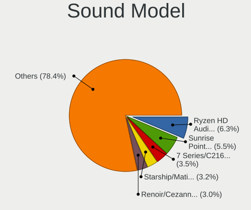

| Model                                                                      | Computers | Percent |
|----------------------------------------------------------------------------|-----------|---------|
| AMD Ryzen HD Audio Controller                                              | 183       | 6.35%   |
| Intel Sunrise Point-LP HD Audio                                            | 160       | 5.55%   |
| Intel 7 Series/C216 Chipset Family High Definition Audio Controller        | 102       | 3.54%   |
| AMD Starship/Matisse HD Audio Controller                                   | 91        | 3.16%   |
| AMD Renoir/Cezanne HDMI/DP Audio Controller                                | 87        | 3.02%   |
| Intel 6 Series/C200 Series Chipset Family High Definition Audio Controller | 83        | 2.88%   |
| Intel 8 Series/C220 Series Chipset High Definition Audio Controller        | 77        | 2.67%   |
| Intel Cannon Lake PCH cAVS                                                 | 70        | 2.43%   |
| Intel 8 Series HD Audio Controller                                         | 66        | 2.29%   |
| AMD Radeon High Definition Audio Controller                                | 66        | 2.29%   |
| Intel Haswell-ULT HD Audio Controller                                      | 65        | 2.25%   |
| Intel 100 Series/C230 Series Chipset Family HD Audio Controller            | 53        | 1.84%   |
| Intel Xeon E3-1200 v3/4th Gen Core Processor HD Audio Controller           | 52        | 1.8%    |
| Intel 5 Series/3400 Series Chipset High Definition Audio                   | 46        | 1.6%    |
| Intel 200 Series PCH HD Audio                                              | 42        | 1.46%   |
| Nvidia GP107GL High Definition Audio Controller                            | 36        | 1.25%   |
| AMD FCH Azalia Controller                                                  | 36        | 1.25%   |
| AMD Family 17h (Models 00h-0fh) HD Audio Controller                        | 34        | 1.18%   |
| Intel Tiger Lake-LP Smart Sound Technology Audio Controller                | 33        | 1.14%   |
| Intel Cannon Point-LP High Definition Audio Controller                     | 33        | 1.14%   |
| Intel Broadwell-U Audio Controller                                         | 33        | 1.14%   |
| Intel Wildcat Point-LP High Definition Audio Controller                    | 32        | 1.11%   |
| AMD SBx00 Azalia (Intel HDA)                                               | 30        | 1.04%   |
| AMD Navi 21/23 HDMI/DP Audio Controller                                    | 30        | 1.04%   |
| Intel 82801I (ICH9 Family) HD Audio Controller                             | 28        | 0.97%   |
| Nvidia TU106 High Definition Audio Controller                              | 27        | 0.94%   |
| Nvidia GP106 High Definition Audio Controller                              | 27        | 0.94%   |
| Nvidia GP104 High Definition Audio Controller                              | 26        | 0.9%    |
| Nvidia GA104 High Definition Audio Controller                              | 26        | 0.9%    |
| AMD Raven/Raven2/Fenghuang HDMI/DP Audio Controller                        | 26        | 0.9%    |
| Intel Comet Lake PCH cAVS                                                  | 25        | 0.87%   |
| Nvidia TU116 High Definition Audio Controller                              | 23        | 0.8%    |
| Nvidia GK107 HDMI Audio Controller                                         | 23        | 0.8%    |
| AMD Navi 10 HDMI Audio                                                     | 23        | 0.8%    |
| AMD Ellesmere HDMI Audio [Radeon RX 470/480 / 570/580/590]                 | 23        | 0.8%    |
| AMD Navi 31 HDMI/DP Audio                                                  | 22        | 0.76%   |
| AMD Kabini HDMI/DP Audio                                                   | 22        | 0.76%   |
| Intel Alder Lake-S HD Audio Controller                                     | 21        | 0.73%   |
| Intel 82801H (ICH8 Family) HD Audio Controller                             | 20        | 0.69%   |
| Intel Comet Lake PCH-LP cAVS                                               | 19        | 0.66%   |

Memory
------

Memory Vendor
-------------

Memory module vendors

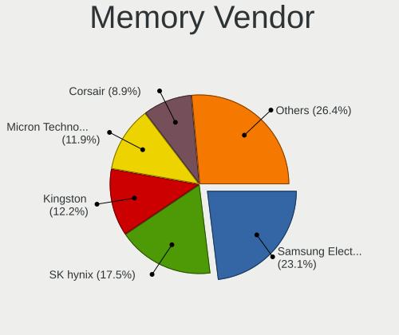

| Vendor              | Computers | Percent |
|---------------------|-----------|---------|
| Samsung Electronics | 204       | 23.05%  |
| SK hynix            | 155       | 17.51%  |
| Kingston            | 108       | 12.2%   |
| Micron Technology   | 105       | 11.86%  |
| Corsair             | 79        | 8.93%   |
| G.Skill             | 63        | 7.12%   |
| Unknown             | 52        | 5.88%   |
| Crucial             | 40        | 4.52%   |
| Elpida              | 20        | 2.26%   |
| Ramaxel Technology  | 16        | 1.81%   |
| Nanya Technology    | 9         | 1.02%   |
| Unknown             | 8         | 0.9%    |
| A-DATA Technology   | 5         | 0.56%   |
| Team                | 4         | 0.45%   |
| Unknown (ABCD)      | 2         | 0.23%   |
| Patriot             | 2         | 0.23%   |
| ff                  | 2         | 0.23%   |
| 4ea5                | 2         | 0.23%   |
| Unifosa             | 1         | 0.11%   |
| Transcend           | 1         | 0.11%   |
| SHARETRONIC         | 1         | 0.11%   |
| Neo Forza           | 1         | 0.11%   |
| GOODRAM             | 1         | 0.11%   |
| fef5                | 1         | 0.11%   |
| Avant               | 1         | 0.11%   |
| ASint Technology    | 1         | 0.11%   |
| Apacer              | 1         | 0.11%   |

Memory Model
------------

Memory module models

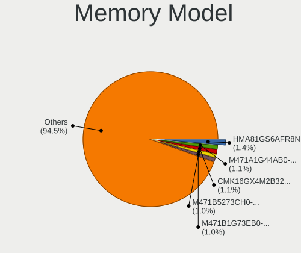

| Model                                                        | Computers | Percent |
|--------------------------------------------------------------|-----------|---------|
| SK hynix RAM HMA81GS6AFR8N-UH 8GB SODIMM DDR4 2667MT/s       | 13        | 1.39%   |
| Samsung RAM M471A1G44AB0-CWE 8GiB SODIMM DDR4 3200MT/s       | 10        | 1.07%   |
| Corsair RAM CMK16GX4M2B3200C16 8GB DIMM DDR4 3600MT/s        | 10        | 1.07%   |
| Samsung RAM M471B5273CH0-CH9 4GB SODIMM DDR3 1334MT/s        | 9         | 0.97%   |
| Samsung RAM M471B1G73EB0-YK0 8192MB SODIMM DDR3 1600MT/s     | 9         | 0.97%   |
| Micron RAM 4ATF1G64HZ-3G2E1 8GB SODIMM DDR4 3200MT/s         | 9         | 0.97%   |
| Samsung RAM M471B1G73DB0-YK0 8GB SODIMM DDR3 1600MT/s        | 8         | 0.86%   |
| Unknown                                                      | 8         | 0.86%   |
| Samsung RAM M471A5244CB0-CRC 4GB SODIMM DDR4 2667MT/s        | 7         | 0.75%   |
| SK hynix RAM HMT41GS6AFR8A-PB 8GiB SODIMM DDR3 2667MT/s      | 6         | 0.64%   |
| Samsung RAM M471B5273DH0-CH9 4GB SODIMM DDR3 1600MT/s        | 6         | 0.64%   |
| Samsung RAM M471B5173QH0-YK0 4GB SODIMM DDR3 1600MT/s        | 6         | 0.64%   |
| Samsung RAM M471A2K43DB1-CTD 16GB SODIMM DDR4 2667MT/s       | 6         | 0.64%   |
| Samsung RAM M471A1K43EB1-CWE 8GB SODIMM DDR4 3200MT/s        | 6         | 0.64%   |
| Samsung RAM M471A1K43BB1-CRC 8GB SODIMM DDR4 2667MT/s        | 6         | 0.64%   |
| SK hynix RAM Module 8GB SODIMM DDR4 2133MT/s                 | 5         | 0.54%   |
| SK hynix RAM HMT41GS6BFR8A-PB 8GB SODIMM DDR3 2667MT/s       | 5         | 0.54%   |
| Samsung RAM M471A1K43DB1-CWE 8GB SODIMM DDR4 3200MT/s        | 5         | 0.54%   |
| Corsair RAM CMK32GX4M2B3200C16 16GB DIMM DDR4 3800MT/s       | 5         | 0.54%   |
| Unknown RAM Module 4GB SODIMM DDR4 2400MT/s                  | 4         | 0.43%   |
| SK hynix RAM HMT451S6BFR8A-PB 4GB SODIMM DDR3 1600MT/s       | 4         | 0.43%   |
| SK hynix RAM HMAB2GS6AMR6N-XN 16GB SODIMM DDR4 3200MT/s      | 4         | 0.43%   |
| Samsung RAM Module 8GB Row Of Chips LPDDR3 2133MT/s          | 4         | 0.43%   |
| Samsung RAM Module 4GB SODIMM DDR3 1600MT/s                  | 4         | 0.43%   |
| Samsung RAM M471B5173EB0-YK0 4GB SODIMM DDR3 1600MT/s        | 4         | 0.43%   |
| Samsung RAM M471B1G73QH0-YK0 8GB SODIMM DDR3 1600MT/s        | 4         | 0.43%   |
| Samsung RAM M471A5244CB0-CTD 4GB SODIMM DDR4 3266MT/s        | 4         | 0.43%   |
| Samsung RAM M471A2G44AM0-CWE 16GB SODIMM DDR4 3200MT/s       | 4         | 0.43%   |
| Samsung RAM M471A1K43CB1-CTD 8GB SODIMM DDR4 3200MT/s        | 4         | 0.43%   |
| Samsung RAM M471A1K43CB1-CRC 8GB SODIMM DDR4 8400MT/s        | 4         | 0.43%   |
| Samsung RAM M471A1K43BB1-CTD 8GB SODIMM DDR4 2667MT/s        | 4         | 0.43%   |
| Samsung RAM K4E6E304EB-EGCF 4GB Row Of Chips LPDDR3 1867MT/s | 4         | 0.43%   |
| Micron RAM 4ATS2G64HZ-3G2B1 16GB SODIMM DDR4 3200MT/s        | 4         | 0.43%   |
| G.Skill RAM F4-3600C16-16GTZNC 16GiB DIMM DDR4 3600MT/s      | 4         | 0.43%   |
| G.Skill RAM F4-3000C16-8GISB 8GB DIMM DDR4 3200MT/s          | 4         | 0.43%   |
| Elpida RAM Module 4GB SODIMM DDR3 1600MT/s                   | 4         | 0.43%   |
| Elpida RAM EBJ41UF8BCS0-DJ-F 4GB SODIMM DDR3 1334MT/s        | 4         | 0.43%   |
| Corsair RAM CMK32GX4M2E3200C16 16GB DIMM DDR4 3600MT/s       | 4         | 0.43%   |
| Corsair RAM CMK32GX4M2D3600C18 16GB DIMM DDR4 3800MT/s       | 4         | 0.43%   |
| Corsair RAM CMK16GX4M2B3000C15 8GB DIMM DDR4 3600MT/s        | 4         | 0.43%   |

Memory Kind
-----------

Memory module kinds

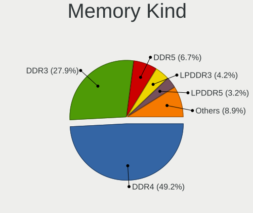

| Kind    | Computers | Percent |
|---------|-----------|---------|
| DDR4    | 388       | 49.18%  |
| DDR3    | 220       | 27.88%  |
| DDR5    | 53        | 6.72%   |
| LPDDR3  | 33        | 4.18%   |
| LPDDR5  | 25        | 3.17%   |
| LPDDR4  | 24        | 3.04%   |
| DDR2    | 15        | 1.9%    |
| Unknown | 14        | 1.77%   |
| SDRAM   | 13        | 1.65%   |
| DDR     | 3         | 0.38%   |
| DRAM    | 1         | 0.13%   |

Memory Form Factor
------------------

Physical design of the memory module

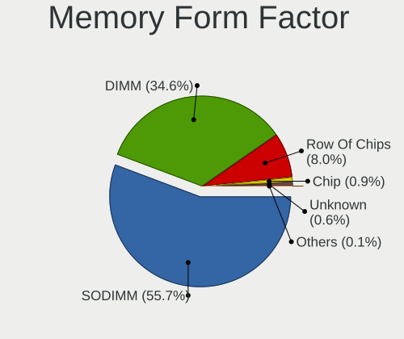

| Name         | Computers | Percent |
|--------------|-----------|---------|
| SODIMM       | 438       | 55.73%  |
| DIMM         | 272       | 34.61%  |
| Row Of Chips | 63        | 8.02%   |
| Chip         | 7         | 0.89%   |
| Unknown      | 5         | 0.64%   |
| FB-DIMM      | 1         | 0.13%   |

Memory Size
-----------

Memory module size

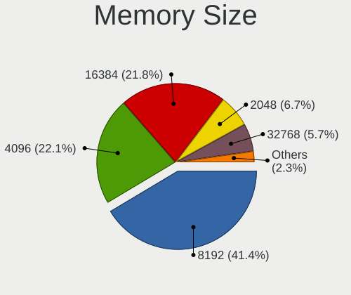

| Size   | Computers | Percent |
|--------|-----------|---------|
| 8192   | 348       | 41.43%  |
| 4096   | 186       | 22.14%  |
| 16384  | 183       | 21.79%  |
| 2048   | 56        | 6.67%   |
| 32768  | 48        | 5.71%   |
| 1024   | 11        | 1.31%   |
| 512    | 3         | 0.36%   |
| 65536  | 2         | 0.24%   |
| 131072 | 1         | 0.12%   |
| 24576  | 1         | 0.12%   |
| 12288  | 1         | 0.12%   |

Memory Speed
------------

Memory module speed

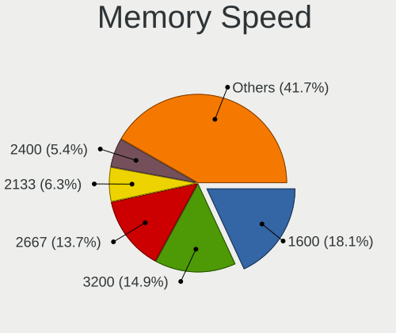

| Speed   | Computers | Percent |
|---------|-----------|---------|
| 1600    | 152       | 18.07%  |
| 3200    | 125       | 14.86%  |
| 2667    | 115       | 13.67%  |
| 2133    | 53        | 6.3%    |
| 2400    | 45        | 5.35%   |
| 3600    | 43        | 5.11%   |
| 1333    | 32        | 3.8%    |
| 1867    | 19        | 2.26%   |
| 6400    | 17        | 2.02%   |
| 5600    | 17        | 2.02%   |
| 3800    | 17        | 2.02%   |
| 1334    | 16        | 1.9%    |
| 1067    | 14        | 1.66%   |
| 667     | 14        | 1.66%   |
| 6000    | 11        | 1.31%   |
| 4800    | 11        | 1.31%   |
| 4267    | 11        | 1.31%   |
| 3733    | 9         | 1.07%   |
| 3866    | 8         | 0.95%   |
| 4000    | 7         | 0.83%   |
| 3400    | 7         | 0.83%   |
| Unknown | 7         | 0.83%   |
| 7500    | 6         | 0.71%   |
| 3266    | 6         | 0.71%   |
| 2933    | 6         | 0.71%   |
| 1800    | 6         | 0.71%   |
| 8400    | 5         | 0.59%   |
| 6200    | 5         | 0.59%   |
| 12800   | 4         | 0.48%   |
| 4266    | 4         | 0.48%   |
| 3466    | 4         | 0.48%   |
| 1866    | 4         | 0.48%   |
| 8533    | 3         | 0.36%   |
| 3000    | 3         | 0.36%   |
| 2666    | 3         | 0.36%   |
| 5400    | 2         | 0.24%   |
| 3666    | 2         | 0.24%   |
| 3500    | 2         | 0.24%   |
| 3100    | 2         | 0.24%   |
| 2800    | 2         | 0.24%   |

Printers & scanners
-------------------

Printer Vendor
--------------

Printer device vendors

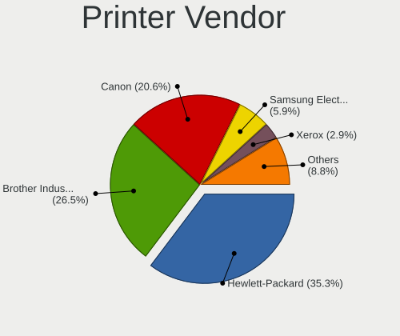

| Vendor              | Computers | Percent |
|---------------------|-----------|---------|
| Hewlett-Packard     | 12        | 35.29%  |
| Brother Industries  | 9         | 26.47%  |
| Canon               | 7         | 20.59%  |
| Samsung Electronics | 2         | 5.88%   |
| Xerox               | 1         | 2.94%   |
| STMicroelectronics  | 1         | 2.94%   |
| Seiko Epson         | 1         | 2.94%   |
| Prolific Technology | 1         | 2.94%   |

Printer Model
-------------

Printer device models

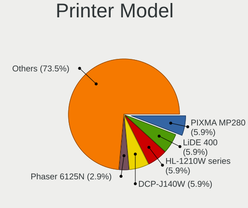

| Model                                                     | Computers | Percent |
|-----------------------------------------------------------|-----------|---------|
| Canon PIXMA MP280                                         | 2         | 5.88%   |
| Canon LiDE 400                                            | 2         | 5.88%   |
| Brother HL-1210W series                                   | 2         | 5.88%   |
| Brother DCP-J140W                                         | 2         | 5.88%   |
| Xerox Phaser 6125N                                        | 1         | 2.94%   |
| STMicroelectronics LED badge -- mini LED display -- 11x44 | 1         | 2.94%   |
| Seiko Epson ET-2850 Series                                | 1         | 2.94%   |
| Samsung ML-1630 Series                                    | 1         | 2.94%   |
| Samsung M2020 Series                                      | 1         | 2.94%   |
| Prolific PL2305 Parallel Port                             | 1         | 2.94%   |
| HP Smart Tank 7000 series                                 | 1         | 2.94%   |
| HP Officejet Pro 6230                                     | 1         | 2.94%   |
| HP LaserJet 1020                                          | 1         | 2.94%   |
| HP ENVY Photo 6200 series                                 | 1         | 2.94%   |
| HP ENVY 4520 series                                       | 1         | 2.94%   |
| HP Deskjet D4300 series                                   | 1         | 2.94%   |
| HP DeskJet 990c                                           | 1         | 2.94%   |
| HP DeskJet 5940                                           | 1         | 2.94%   |
| HP DeskJet 5550                                           | 1         | 2.94%   |
| HP DeskJet 3700 series                                    | 1         | 2.94%   |
| HP DeskJet 2700 series                                    | 1         | 2.94%   |
| HP DeskJet 2600 series                                    | 1         | 2.94%   |
| Canon PIXMA MX370 Series                                  | 1         | 2.94%   |
| Canon LiDE 300                                            | 1         | 2.94%   |
| Canon iP7200 series                                       | 1         | 2.94%   |
| Brother MFC-J5740DW                                       | 1         | 2.94%   |
| Brother HL-5250DN Printer                                 | 1         | 2.94%   |
| Brother HL-2240D series                                   | 1         | 2.94%   |
| Brother HL-2030 Laser Printer                             | 1         | 2.94%   |
| Brother HL-1110 series                                    | 1         | 2.94%   |

Scanner Vendor
--------------

Scanner device vendors

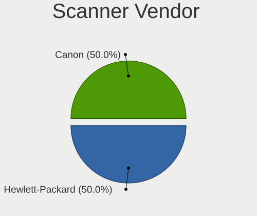

| Vendor          | Computers | Percent |
|-----------------|-----------|---------|
| Seiko Epson     | 5         | 55.56%  |
| Hewlett-Packard | 2         | 22.22%  |
| Canon           | 2         | 22.22%  |

Scanner Model
-------------

Scanner device models

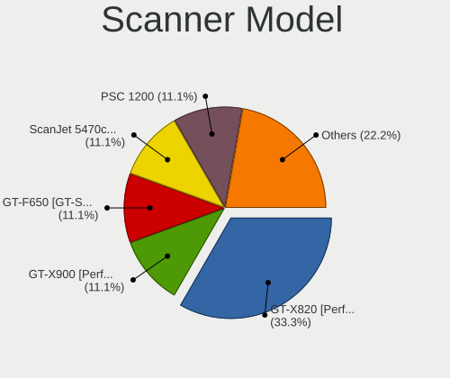

| Model                                             | Computers | Percent |
|---------------------------------------------------|-----------|---------|
| Seiko Epson GT-X820 [Perfection V600 Photo]       | 3         | 33.33%  |
| Seiko Epson GT-X900 [Perfection V700/V750 Photo]  | 1         | 11.11%  |
| Seiko Epson GT-F650 [GT-S600/Perfection V10/V100] | 1         | 11.11%  |
| HP ScanJet 5470c/5490c                            | 1         | 11.11%  |
| HP PSC 1200                                       | 1         | 11.11%  |
| Canon CanoScan LiDE 600F                          | 1         | 11.11%  |
| Canon CanoScan LiDE 60                            | 1         | 11.11%  |

Camera
------

Camera Vendor
-------------

Camera device vendors

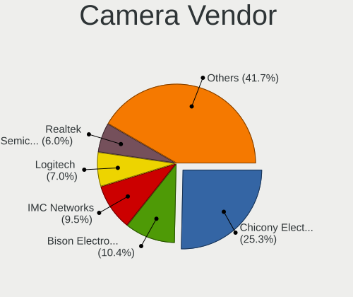

| Vendor                                 | Computers | Percent |
|----------------------------------------|-----------|---------|
| Chicony Electronics                    | 239       | 25.34%  |
| Bison Electronics                      | 98        | 10.39%  |
| IMC Networks                           | 90        | 9.54%   |
| Logitech                               | 66        | 7%      |
| Realtek Semiconductor                  | 57        | 6.04%   |
| Apple                                  | 50        | 5.3%    |
| Microdia                               | 40        | 4.24%   |
| Quanta                                 | 34        | 3.61%   |
| Lite-On Technology                     | 31        | 3.29%   |
| Syntek                                 | 30        | 3.18%   |
| Cheng Uei Precision Industry (Foxlink) | 30        | 3.18%   |
| Sunplus Innovation Technology          | 29        | 3.08%   |
| Suyin                                  | 25        | 2.65%   |
| Luxvisions Innotech Limited            | 17        | 1.8%    |
| Lenovo                                 | 13        | 1.38%   |
| Microsoft                              | 8         | 0.85%   |
| Silicon Motion                         | 7         | 0.74%   |
| Samsung Electronics                    | 7         | 0.74%   |
| Trust                                  | 6         | 0.64%   |
| Sonix Technology                       | 6         | 0.64%   |
| Acer                                   | 6         | 0.64%   |
| Shinetech                              | 5         | 0.53%   |
| Creative Technology                    | 4         | 0.42%   |
| SunplusIT                              | 3         | 0.32%   |
| Primax Electronics                     | 3         | 0.32%   |
| MacroSilicon                           | 3         | 0.32%   |
| Hewlett-Packard                        | 3         | 0.32%   |
| Generalplus Technology                 | 3         | 0.32%   |
| Alcor Micro                            | 3         | 0.32%   |
| Valve Software                         | 2         | 0.21%   |
| Jieli Technology                       | 2         | 0.21%   |
| GEMBIRD                                | 2         | 0.21%   |
| Z-Star Microelectronics                | 1         | 0.11%   |
| YLX-231212-H                           | 1         | 0.11%   |
| Y Media                                | 1         | 0.11%   |
| webcam                                 | 1         | 0.11%   |
| vivo                                   | 1         | 0.11%   |
| Tripath Technology                     | 1         | 0.11%   |
| Sunplus Technology                     | 1         | 0.11%   |
| Shenzhen Kingcome Optoelectronic       | 1         | 0.11%   |

Camera Model
------------

Camera device models

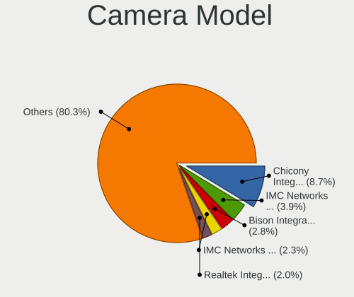

| Model                                                          | Computers | Percent |
|----------------------------------------------------------------|-----------|---------|
| Chicony Integrated Camera                                      | 83        | 8.71%   |
| IMC Networks Integrated Camera                                 | 37        | 3.88%   |
| Bison Integrated Camera                                        | 27        | 2.83%   |
| IMC Networks USB2.0 HD UVC WebCam                              | 22        | 2.31%   |
| Realtek Integrated_Webcam_HD                                   | 19        | 1.99%   |
| Lite-On Integrated Camera                                      | 19        | 1.99%   |
| Chicony HD WebCam                                              | 18        | 1.89%   |
| Microdia Integrated_Webcam_HD                                  | 17        | 1.78%   |
| Syntek Integrated Camera                                       | 16        | 1.68%   |
| Apple FaceTime HD Camera (Built-in)                            | 15        | 1.57%   |
| Apple Built-in iSight                                          | 14        | 1.47%   |
| Chicony Lenovo Integrated Camera (0.3MP)                       | 12        | 1.26%   |
| Chicony Integrated Camera (1280x720@30)                        | 12        | 1.26%   |
| Chicony HP HD Camera                                           | 12        | 1.26%   |
| Bison SunplusIT Integrated Camera                              | 12        | 1.26%   |
| Apple FaceTime HD Camera                                       | 12        | 1.26%   |
| Bison Lenovo EasyCamera                                        | 10        | 1.05%   |
| Syntek Lenovo EasyCamera                                       | 9         | 0.94%   |
| Logitech HD Pro Webcam C920                                    | 9         | 0.94%   |
| Apple iPhone 5/5C/5S/6/SE/7/8/X                                | 8         | 0.84%   |
| Samsung Galaxy series, misc. (MTP mode)                        | 7         | 0.73%   |
| Logitech C922 Pro Stream Webcam                                | 7         | 0.73%   |
| Chicony EasyCamera                                             | 7         | 0.73%   |
| Bison ThinkPad P50 Integrated Camera                           | 7         | 0.73%   |
| Trust USB Camera                                               | 6         | 0.63%   |
| Quanta HD User Facing                                          | 6         | 0.63%   |
| Luxvisions Innotech Limited Integrated Camera                  | 6         | 0.63%   |
| Luxvisions Innotech Limited HP HD Camera                       | 6         | 0.63%   |
| Lenovo Integrated Webcam                                       | 6         | 0.63%   |
| Chicony USB 2.0 Camera                                         | 6         | 0.63%   |
| Chicony Lenovo EasyCamera                                      | 6         | 0.63%   |
| Chicony Integrated Camera [ThinkPad]                           | 6         | 0.63%   |
| Chicony HP TrueVision HD                                       | 6         | 0.63%   |
| Cheng Uei Precision Industry (Foxlink) HP TrueVision HD Camera | 6         | 0.63%   |
| Suyin Acer/HP Integrated Webcam [CN0314]                       | 5         | 0.52%   |
| Sunplus Integrated_Webcam_HD                                   | 5         | 0.52%   |
| Sonix USB2.0 HD UVC WebCam                                     | 5         | 0.52%   |
| Realtek USB Camera                                             | 5         | 0.52%   |
| Realtek Integrated Webcam HD                                   | 5         | 0.52%   |
| Quanta USB2.0 HD UVC WebCam                                    | 5         | 0.52%   |

Security
--------

Fingerprint Vendor
------------------

Fingerprint sensor vendors

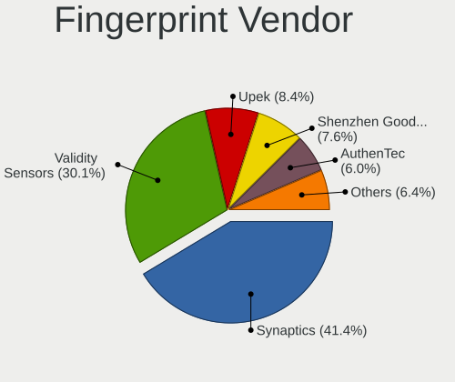

| Vendor                     | Computers | Percent |
|----------------------------|-----------|---------|
| Synaptics                  | 103       | 41.37%  |
| Validity Sensors           | 75        | 30.12%  |
| Upek                       | 21        | 8.43%   |
| Shenzhen Goodix Technology | 19        | 7.63%   |
| AuthenTec                  | 15        | 6.02%   |
| Elan Microelectronics      | 7         | 2.81%   |
| STMicroelectronics         | 4         | 1.61%   |
| LighTuning Technology      | 4         | 1.61%   |
| Samsung Electronics        | 1         | 0.4%    |

Fingerprint Model
-----------------

Fingerprint sensor models

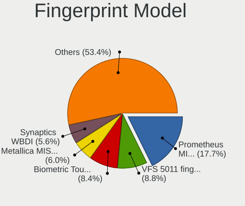

| Model                                                                      | Computers | Percent |
|----------------------------------------------------------------------------|-----------|---------|
| Synaptics Prometheus MIS Touch Fingerprint Reader                          | 44        | 17.67%  |
| Validity Sensors VFS 5011 fingerprint sensor                               | 22        | 8.84%   |
| Upek Biometric Touchchip/Touchstrip Fingerprint Sensor                     | 21        | 8.43%   |
| Synaptics Metallica MIS Touch Fingerprint Reader                           | 15        | 6.02%   |
| Validity Sensors Synaptics WBDI                                            | 14        | 5.62%   |
| Shenzhen Goodix  Fingerprint Device                                        | 11        | 4.42%   |
| Synaptics UWP WBDI Device                                                  | 10        | 4.02%   |
| AuthenTec AES2501 Fingerprint Sensor                                       | 8         | 3.21%   |
| Validity Sensors VFS7500 Touch Fingerprint Sensor                          | 6         | 2.41%   |
| Validity Sensors VFS5011 Fingerprint Reader                                | 6         | 2.41%   |
| Validity Sensors VFS495 Fingerprint Reader                                 | 6         | 2.41%   |
| Synaptics  WBDI                                                            | 6         | 2.41%   |
| Shenzhen Goodix Fingerprint Reader                                         | 6         | 2.41%   |
| Validity Sensors VFS451 Fingerprint Reader                                 | 5         | 2.01%   |
| Synaptics WBDI                                                             | 5         | 2.01%   |
| Synaptics  FS7604 Touch Fingerprint Sensor with PurePrint                  | 5         | 2.01%   |
| Synaptics FS7604 Touch Fingerprint Sensor with PurePrint                   | 4         | 1.61%   |
| Synaptics Fingerprint reader [HP G6]                                       | 4         | 1.61%   |
| STMicroelectronics Fingerprint Reader                                      | 4         | 1.61%   |
| Elan ELAN:ARM-M4                                                           | 4         | 1.61%   |
| AuthenTec AES2810                                                          | 4         | 1.61%   |
| Validity Sensors Synaptics VFS7552 Touch Fingerprint Sensor with PurePrint | 3         | 1.2%    |
| Validity Sensors Synaptics VFS7552 Touch Fingerprint Sensor                | 3         | 1.2%    |
| Synaptics UWP WBDI                                                         | 3         | 1.2%    |
| Synaptics Prometheus Fingerprint Reader                                    | 3         | 1.2%    |
| Elan ELAN:Fingerprint                                                      | 3         | 1.2%    |
| Validity Sensors VFS491                                                    | 2         | 0.8%    |
| Validity Sensors VFS471 Fingerprint Reader                                 | 2         | 0.8%    |
| Validity Sensors Fingerprint scanner                                       | 2         | 0.8%    |
| Shenzhen Goodix FingerPrint                                                | 2         | 0.8%    |
| LighTuning EgisTec Touch Fingerprint Sensor                                | 2         | 0.8%    |
| AuthenTec Fingerprint Sensor                                               | 2         | 0.8%    |
| Validity Sensors VFS7552 Touch Fingerprint Sensor                          | 1         | 0.4%    |
| Validity Sensors VFS101 Fingerprint Reader                                 | 1         | 0.4%    |
| Validity Sensors VFS Fingerprint sensor                                    | 1         | 0.4%    |
| Validity Sensors Swipe Fingerprint Sensor                                  | 1         | 0.4%    |
| Synaptics WBDI Fingerprint Reader USB 102                                  | 1         | 0.4%    |
| Synaptics WBDI Fingerprint Reader USB 086                                  | 1         | 0.4%    |
| Synaptics TouchPad                                                         | 1         | 0.4%    |
| Synaptics Metallica MOH Touch Fingerprint Reader                           | 1         | 0.4%    |

Chipcard Vendor
---------------

Chipcard module vendors

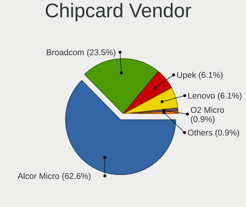

| Vendor                | Computers | Percent |
|-----------------------|-----------|---------|
| Alcor Micro           | 72        | 62.61%  |
| Broadcom              | 27        | 23.48%  |
| Upek                  | 7         | 6.09%   |
| Lenovo                | 7         | 6.09%   |
| O2 Micro              | 1         | 0.87%   |
| Advanced Card Systems | 1         | 0.87%   |

Chipcard Model
--------------

Chipcard module models

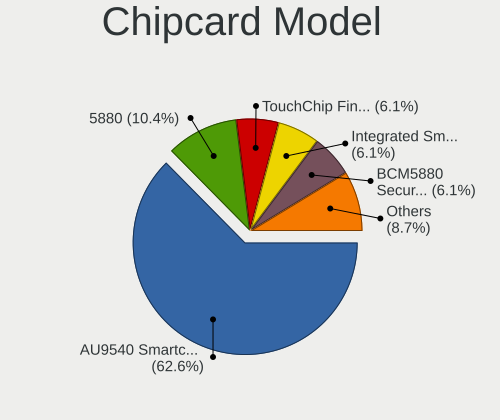

| Model                                                                        | Computers | Percent |
|------------------------------------------------------------------------------|-----------|---------|
| Alcor Micro AU9540 Smartcard Reader                                          | 72        | 62.61%  |
| Broadcom 5880                                                                | 12        | 10.43%  |
| Upek TouchChip Fingerprint Coprocessor (WBF advanced mode)                   | 7         | 6.09%   |
| Lenovo Integrated Smart Card Reader                                          | 7         | 6.09%   |
| Broadcom BCM5880 Secure Applications Processor                               | 7         | 6.09%   |
| Broadcom BCM5880 Secure Applications Processor with fingerprint swipe sensor | 5         | 4.35%   |
| Broadcom 58200                                                               | 2         | 1.74%   |
| O2 Micro OZ776 CCID Smartcard Reader                                         | 1         | 0.87%   |
| Broadcom BCM58200 ControlVault 3 (FingerPrint sensor + Contacted SmartCard)  | 1         | 0.87%   |
| Advanced Card Systems ACR1252 Dual Reader                                    | 1         | 0.87%   |

Unsupported
-----------

Unsupported Devices
-------------------

Total unsupported devices on board

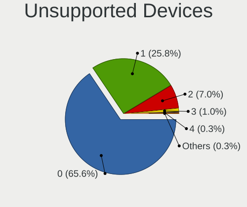

| Total | Computers | Percent |
|-------|-----------|---------|
| 0     | 1063      | 65.58%  |
| 1     | 418       | 25.79%  |
| 2     | 113       | 6.97%   |
| 3     | 17        | 1.05%   |
| 4     | 5         | 0.31%   |
| 6     | 3         | 0.19%   |
| 10    | 1         | 0.06%   |
| 5     | 1         | 0.06%   |

Unsupported Device Types
------------------------

Types of unsupported devices

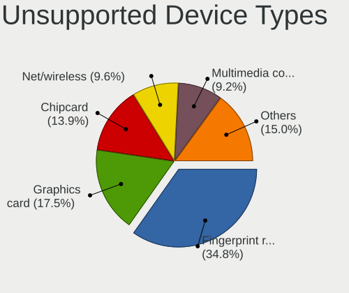

| Type                     | Computers | Percent |
|--------------------------|-----------|---------|
| Fingerprint reader       | 246       | 34.79%  |
| Graphics card            | 124       | 17.54%  |
| Chipcard                 | 98        | 13.86%  |
| Net/wireless             | 68        | 9.62%   |
| Multimedia controller    | 65        | 9.19%   |
| Communication controller | 22        | 3.11%   |
| Card reader              | 16        | 2.26%   |
| Camera                   | 16        | 2.26%   |
| Sound                    | 13        | 1.84%   |
| Bluetooth                | 11        | 1.56%   |
| Unassigned class         | 9         | 1.27%   |
| Net/ethernet             | 7         | 0.99%   |
| Storage                  | 6         | 0.85%   |
| Storage/raid             | 3         | 0.42%   |
| Wireless                 | 1         | 0.14%   |
| Network                  | 1         | 0.14%   |
| Modem                    | 1         | 0.14%   |

