Linux in Denmark - Tested Hardware & Statistics
-----------------------------------------------

A project to collect tested hardware configurations for Linux in Denmark.

Anyone can contribute to this report by the [hw-probe](https://github.com/linuxhw/hw-probe) tool:

    sudo -E hw-probe -all -upload

Please contribute! Especially if your hardware is rare.

This is a report for all computer types. See also reports for [desktops](/Location/Denmark/Desktop/README.md) and [notebooks](/Location/Denmark/Notebook/README.md).

Contents
--------

* [ Test Cases ](#test-cases)

* [ System ](#system)
  - [ OS                       ](#os)
  - [ OS Family                ](#os-family)
  - [ Kernel                   ](#kernel)
  - [ Kernel Family            ](#kernel-family)
  - [ Kernel Major Ver.        ](#kernel-major-ver)
  - [ Arch                     ](#arch)
  - [ DE                       ](#de)
  - [ Display Server           ](#display-server)
  - [ Display Manager          ](#display-manager)
  - [ OS Lang                  ](#os-lang)
  - [ Boot Mode                ](#boot-mode)
  - [ Filesystem               ](#filesystem)
  - [ Part. scheme             ](#part-scheme)
  - [ Dual Boot with Linux/BSD ](#dual-boot-with-linuxbsd)
  - [ Dual Boot (Win)          ](#dual-boot-win)

* [ Board ](#board)
  - [ Vendor                   ](#vendor)
  - [ Model                    ](#model)
  - [ Model Family             ](#model-family)
  - [ MFG Year                 ](#mfg-year)
  - [ Form Factor              ](#form-factor)
  - [ Secure Boot              ](#secure-boot)
  - [ Coreboot                 ](#coreboot)
  - [ RAM Size                 ](#ram-size)
  - [ RAM Used                 ](#ram-used)
  - [ Total Drives             ](#total-drives)
  - [ Has CD-ROM               ](#has-cd-rom)
  - [ Has Ethernet             ](#has-ethernet)
  - [ Has WiFi                 ](#has-wifi)
  - [ Has Bluetooth            ](#has-bluetooth)

* [ Location ](#location)
  - [ Country                  ](#country)
  - [ City                     ](#city)

* [ Drives ](#drives)
  - [ Drive Vendor             ](#drive-vendor)
  - [ Drive Model              ](#drive-model)
  - [ HDD Vendor               ](#hdd-vendor)
  - [ SSD Vendor               ](#ssd-vendor)
  - [ Drive Kind               ](#drive-kind)
  - [ Drive Connector          ](#drive-connector)
  - [ Drive Size               ](#drive-size)
  - [ Space Total              ](#space-total)
  - [ Space Used               ](#space-used)
  - [ Malfunc. Drives          ](#malfunc-drives)
  - [ Malfunc. Drive Vendor    ](#malfunc-drive-vendor)
  - [ Malfunc. HDD Vendor      ](#malfunc-hdd-vendor)
  - [ Malfunc. Drive Kind      ](#malfunc-drive-kind)
  - [ Failed Drives            ](#failed-drives)
  - [ Failed Drive Vendor      ](#failed-drive-vendor)
  - [ Drive Status             ](#drive-status)

* [ Storage controller ](#storage-controller)
  - [ Storage Vendor           ](#storage-vendor)
  - [ Storage Model            ](#storage-model)
  - [ Storage Kind             ](#storage-kind)

* [ Processor ](#processor)
  - [ CPU Vendor               ](#cpu-vendor)
  - [ CPU Model                ](#cpu-model)
  - [ CPU Model Family         ](#cpu-model-family)
  - [ CPU Cores                ](#cpu-cores)
  - [ CPU Sockets              ](#cpu-sockets)
  - [ CPU Threads              ](#cpu-threads)
  - [ CPU Op-Modes             ](#cpu-op-modes)
  - [ CPU Microcode            ](#cpu-microcode)
  - [ CPU Microarch            ](#cpu-microarch)

* [ Graphics ](#graphics)
  - [ GPU Vendor               ](#gpu-vendor)
  - [ GPU Model                ](#gpu-model)
  - [ GPU Combo                ](#gpu-combo)
  - [ GPU Driver               ](#gpu-driver)
  - [ GPU Memory               ](#gpu-memory)

* [ Monitor ](#monitor)
  - [ Monitor Vendor           ](#monitor-vendor)
  - [ Monitor Model            ](#monitor-model)
  - [ Monitor Resolution       ](#monitor-resolution)
  - [ Monitor Diagonal         ](#monitor-diagonal)
  - [ Monitor Width            ](#monitor-width)
  - [ Aspect Ratio             ](#aspect-ratio)
  - [ Monitor Area             ](#monitor-area)
  - [ Pixel Density            ](#pixel-density)
  - [ Multiple Monitors        ](#multiple-monitors)

* [ Network ](#network)
  - [ Net Controller Vendor    ](#net-controller-vendor)
  - [ Net Controller Model     ](#net-controller-model)
  - [ Wireless Vendor          ](#wireless-vendor)
  - [ Wireless Model           ](#wireless-model)
  - [ Ethernet Vendor          ](#ethernet-vendor)
  - [ Ethernet Model           ](#ethernet-model)
  - [ Net Controller Kind      ](#net-controller-kind)
  - [ Used Controller          ](#used-controller)
  - [ NICs                     ](#nics)
  - [ IPv6                     ](#ipv6)

* [ Bluetooth ](#bluetooth)
  - [ Bluetooth Vendor         ](#bluetooth-vendor)
  - [ Bluetooth Model          ](#bluetooth-model)

* [ Sound ](#sound)
  - [ Sound Vendor             ](#sound-vendor)
  - [ Sound Model              ](#sound-model)

* [ Memory ](#memory)
  - [ Memory Vendor            ](#memory-vendor)
  - [ Memory Model             ](#memory-model)
  - [ Memory Kind              ](#memory-kind)
  - [ Memory Form Factor       ](#memory-form-factor)
  - [ Memory Size              ](#memory-size)
  - [ Memory Speed             ](#memory-speed)

* [ Printers & scanners ](#printers--scanners)
  - [ Printer Vendor           ](#printer-vendor)
  - [ Printer Model            ](#printer-model)
  - [ Scanner Vendor           ](#scanner-vendor)
  - [ Scanner Model            ](#scanner-model)

* [ Camera ](#camera)
  - [ Camera Vendor            ](#camera-vendor)
  - [ Camera Model             ](#camera-model)

* [ Security ](#security)
  - [ Fingerprint Vendor       ](#fingerprint-vendor)
  - [ Fingerprint Model        ](#fingerprint-model)
  - [ Chipcard Vendor          ](#chipcard-vendor)
  - [ Chipcard Model           ](#chipcard-model)

* [ Unsupported ](#unsupported)
  - [ Unsupported Devices      ](#unsupported-devices)
  - [ Unsupported Device Types ](#unsupported-device-types)

Test Cases
----------

Total: 1051

| Vendor        | Model                       | Form-Factor | Probe                                                      | Date         |
|---------------|-----------------------------|-------------|------------------------------------------------------------|--------------|
| MSI           | MAG Z490 TOMAHAWK           | Desktop     | [7221bbf8e7](https://linux-hardware.org/?probe=7221bbf8e7) | Oct 01, 2022 |
| Unknown       | Unknown                     | Notebook    | [b9486c47c1](https://linux-hardware.org/?probe=b9486c47c1) | Oct 01, 2022 |
| Dell          | XPS 15 9570                 | Notebook    | [0d466bc2f7](https://linux-hardware.org/?probe=0d466bc2f7) | Sep 30, 2022 |
| Apple         | MacBookPro9,2               | Notebook    | [87c9436154](https://linux-hardware.org/?probe=87c9436154) | Sep 30, 2022 |
| ASUSTek       | VivoBook_ASUSLaptop X412... | Notebook    | [d3047f6963](https://linux-hardware.org/?probe=d3047f6963) | Sep 30, 2022 |
| Apple         | MacBookPro9,2               | Notebook    | [6ea648bc51](https://linux-hardware.org/?probe=6ea648bc51) | Sep 28, 2022 |
| ASUSTek       | ROG STRIX B550-F GAMING     | Desktop     | [2c52de3e56](https://linux-hardware.org/?probe=2c52de3e56) | Sep 27, 2022 |
| ASUSTek       | ROG Strix G733QS_G733QS     | Notebook    | [67040d9a5e](https://linux-hardware.org/?probe=67040d9a5e) | Sep 25, 2022 |
| Acer          | Aspire V5-573G              | Notebook    | [50792d0ac6](https://linux-hardware.org/?probe=50792d0ac6) | Sep 25, 2022 |
| Gigabyte      | 990FXA-UD5                  | Desktop     | [7c8d5609e0](https://linux-hardware.org/?probe=7c8d5609e0) | Sep 22, 2022 |
| ASUSTek       | ROG Strix G512LV_G512LV     | Notebook    | [0be5b29760](https://linux-hardware.org/?probe=0be5b29760) | Sep 21, 2022 |
| Gigabyte      | EX58-UD4P                   | Desktop     | [394aad4be9](https://linux-hardware.org/?probe=394aad4be9) | Sep 20, 2022 |
| Acer          | Aspire E5-553               | Notebook    | [5db637f345](https://linux-hardware.org/?probe=5db637f345) | Sep 19, 2022 |
| Acer          | Aspire E5-553               | Notebook    | [f0bbe89fe8](https://linux-hardware.org/?probe=f0bbe89fe8) | Sep 19, 2022 |
| ASUSTek       | ROG Zephyrus G14 GA402RK... | Notebook    | [82fc38716c](https://linux-hardware.org/?probe=82fc38716c) | Sep 19, 2022 |
| Dell          | XPS 13 9360                 | Notebook    | [af2f12093c](https://linux-hardware.org/?probe=af2f12093c) | Sep 17, 2022 |
| MSI           | MAG B550 TOMAHAWK           | Desktop     | [e55484acd4](https://linux-hardware.org/?probe=e55484acd4) | Sep 17, 2022 |
| ASUSTek       | ASUS TUF Gaming F15 FX50... | Notebook    | [ed284e43fb](https://linux-hardware.org/?probe=ed284e43fb) | Sep 14, 2022 |
| MSI           | Katana GF66 12UE            | Notebook    | [955b9787eb](https://linux-hardware.org/?probe=955b9787eb) | Sep 14, 2022 |
| Lenovo        | ThinkPad X1 Carbon Gen 1... | Notebook    | [224ecd9fa7](https://linux-hardware.org/?probe=224ecd9fa7) | Sep 13, 2022 |
| Lenovo        | SDK0J40700 WIN              | Desktop     | [b8f3a58a03](https://linux-hardware.org/?probe=b8f3a58a03) | Sep 11, 2022 |
| Valve         | Jupiter                     | Notebook    | [17ddfcd578](https://linux-hardware.org/?probe=17ddfcd578) | Sep 11, 2022 |
| MSI           | MPG Z390M GAMING EDGE AC    | Desktop     | [20ead11e02](https://linux-hardware.org/?probe=20ead11e02) | Sep 10, 2022 |
| Lenovo        | ThinkPad T15 Gen 2i 20W4... | Notebook    | [cc40453955](https://linux-hardware.org/?probe=cc40453955) | Sep 06, 2022 |
| ASUSTek       | ASUS TUF Gaming F15 FX50... | Notebook    | [11b9de78b5](https://linux-hardware.org/?probe=11b9de78b5) | Sep 06, 2022 |
| HP            | OMEN by Laptop 15-ce0xx     | Notebook    | [865455aae7](https://linux-hardware.org/?probe=865455aae7) | Sep 05, 2022 |
| Acer          | Aspire E5-553               | Notebook    | [de2cfb43d7](https://linux-hardware.org/?probe=de2cfb43d7) | Sep 03, 2022 |
| MSI           | X570-A PRO                  | Desktop     | [4a7d6a9276](https://linux-hardware.org/?probe=4a7d6a9276) | Sep 01, 2022 |
| Gigabyte      | 990FXA-UD5                  | Desktop     | [e5364d8761](https://linux-hardware.org/?probe=e5364d8761) | Sep 01, 2022 |
| Apple         | MacBookPro9,2               | Notebook    | [3662302886](https://linux-hardware.org/?probe=3662302886) | Aug 31, 2022 |
| ASUSTek       | ROG Zephyrus G14 GA402RK... | Notebook    | [c2d66050b5](https://linux-hardware.org/?probe=c2d66050b5) | Aug 30, 2022 |
| Unknown       | TB-4000                     | Desktop     | [8f7f2e486a](https://linux-hardware.org/?probe=8f7f2e486a) | Aug 30, 2022 |
| HP            | ProBook 6550b               | Notebook    | [662065bfe2](https://linux-hardware.org/?probe=662065bfe2) | Aug 29, 2022 |
| ASUSTek       | SABERTOOTH X58              | Desktop     | [efb40be4e1](https://linux-hardware.org/?probe=efb40be4e1) | Aug 28, 2022 |
| ASUSTek       | ROG Strix G733QS_G733QS     | Notebook    | [589154a65e](https://linux-hardware.org/?probe=589154a65e) | Aug 28, 2022 |
| ASUSTek       | ROG Strix G733QS_G733QS     | Notebook    | [8d17bfec23](https://linux-hardware.org/?probe=8d17bfec23) | Aug 28, 2022 |
| Gigabyte      | P85-D3                      | Desktop     | [06b934d14f](https://linux-hardware.org/?probe=06b934d14f) | Aug 26, 2022 |
| Unknown       | TB-4000                     | Desktop     | [a3cfbd4659](https://linux-hardware.org/?probe=a3cfbd4659) | Aug 25, 2022 |
| Lenovo        | B50-50 80S2                 | Notebook    | [45f5a72c59](https://linux-hardware.org/?probe=45f5a72c59) | Aug 24, 2022 |
| Acer          | Swift SF114-33              | Notebook    | [115ca42bb8](https://linux-hardware.org/?probe=115ca42bb8) | Aug 24, 2022 |
| Acer          | Swift SF114-33              | Notebook    | [0ab380f8ac](https://linux-hardware.org/?probe=0ab380f8ac) | Aug 23, 2022 |
| Gigabyte      | B460M DS3H V2               | Desktop     | [e5e74eea07](https://linux-hardware.org/?probe=e5e74eea07) | Aug 19, 2022 |
| Lenovo        | B50-50 80S2                 | Notebook    | [5163e0015e](https://linux-hardware.org/?probe=5163e0015e) | Aug 17, 2022 |
| Lenovo        | ThinkPad T440p 20AWS1AY0... | Notebook    | [fcda79b03d](https://linux-hardware.org/?probe=fcda79b03d) | Aug 17, 2022 |
| MSI           | X470 GAMING PRO             | Desktop     | [52b08fd4ba](https://linux-hardware.org/?probe=52b08fd4ba) | Aug 16, 2022 |
| Gigabyte      | M4HM87P-00                  | Desktop     | [5bb7e42eae](https://linux-hardware.org/?probe=5bb7e42eae) | Aug 16, 2022 |
| Unknown       | TB-4000                     | Desktop     | [906699e408](https://linux-hardware.org/?probe=906699e408) | Aug 14, 2022 |
| Gigabyte      | B550 AORUS MASTER           | Desktop     | [0009de2dbb](https://linux-hardware.org/?probe=0009de2dbb) | Aug 11, 2022 |
| Dell          | XPS 13 9370                 | Notebook    | [53efca63c3](https://linux-hardware.org/?probe=53efca63c3) | Aug 10, 2022 |
| Lenovo        | ThinkPad L14 Gen 2a 20X5... | Notebook    | [1d97fa15fb](https://linux-hardware.org/?probe=1d97fa15fb) | Aug 08, 2022 |
| Lenovo        | ThinkCentre M57 6087YD2     | Desktop     | [9ad2c07771](https://linux-hardware.org/?probe=9ad2c07771) | Aug 06, 2022 |
| Acer          | Aspire M3-581TG             | Notebook    | [5c73e4c75b](https://linux-hardware.org/?probe=5c73e4c75b) | Aug 05, 2022 |
| Dell          | 0V0D45 A01                  | All in one  | [7d2f0e045d](https://linux-hardware.org/?probe=7d2f0e045d) | Aug 05, 2022 |
| Lenovo        | SDK0J40700 WIN              | Desktop     | [299ac7a8ff](https://linux-hardware.org/?probe=299ac7a8ff) | Aug 03, 2022 |
| ASUSTek       | ROG Zephyrus G14 GA402RK... | Notebook    | [41189cd175](https://linux-hardware.org/?probe=41189cd175) | Aug 03, 2022 |
| Notebook      | NS50_70MU                   | Notebook    | [35cb4f8526](https://linux-hardware.org/?probe=35cb4f8526) | Aug 02, 2022 |
| HP            | Laptop 15s-eq2xxx           | Notebook    | [e6ccfdf23c](https://linux-hardware.org/?probe=e6ccfdf23c) | Jul 31, 2022 |
| Lenovo        | SDK0J40700 WIN              | Desktop     | [f50872e350](https://linux-hardware.org/?probe=f50872e350) | Jul 29, 2022 |
| Packard Be... | H57M01                      | Desktop     | [55e1536ab6](https://linux-hardware.org/?probe=55e1536ab6) | Jul 29, 2022 |
| Packard Be... | H57M01                      | Desktop     | [4789405230](https://linux-hardware.org/?probe=4789405230) | Jul 29, 2022 |
| Lenovo        | SDK0J40700 WIN              | Desktop     | [6d95a05ee7](https://linux-hardware.org/?probe=6d95a05ee7) | Jul 28, 2022 |
| Lenovo        | SDK0J40700 WIN              | Desktop     | [96d6480781](https://linux-hardware.org/?probe=96d6480781) | Jul 25, 2022 |
| ASUSTek       | ROG Zephyrus G14 GA402RK... | Notebook    | [83e5824a05](https://linux-hardware.org/?probe=83e5824a05) | Jul 24, 2022 |
| Gigabyte      | MJPLNAB-00                  | Desktop     | [d414e51a0c](https://linux-hardware.org/?probe=d414e51a0c) | Jul 23, 2022 |
| Gigabyte      | MJPLNAB-00                  | Desktop     | [9dcb499f3e](https://linux-hardware.org/?probe=9dcb499f3e) | Jul 23, 2022 |
| MSI           | Z170A KRAIT GAMING 3X       | Desktop     | [1fef57c873](https://linux-hardware.org/?probe=1fef57c873) | Jul 22, 2022 |
| Lenovo        | ThinkPad X1 Carbon Gen 1... | Notebook    | [3c346ed8da](https://linux-hardware.org/?probe=3c346ed8da) | Jul 20, 2022 |
| ASUSTek       | ROG Zephyrus G14 GA402RK... | Notebook    | [23f16d1cac](https://linux-hardware.org/?probe=23f16d1cac) | Jul 18, 2022 |
| ASUSTek       | ROG Zephyrus G14 GA402RK... | Notebook    | [d83a4d5121](https://linux-hardware.org/?probe=d83a4d5121) | Jul 18, 2022 |
| HP            | EliteBook 845 G7 Noteboo... | Notebook    | [03839f9fef](https://linux-hardware.org/?probe=03839f9fef) | Jul 17, 2022 |
| HP            | Laptop 15-gw0xxx            | Notebook    | [a7f15d1696](https://linux-hardware.org/?probe=a7f15d1696) | Jul 16, 2022 |
| MSI           | X470 GAMING PRO             | Desktop     | [716dd72eeb](https://linux-hardware.org/?probe=716dd72eeb) | Jul 13, 2022 |
| Lenovo        | ThinkPad P15v Gen 1 20TQ... | Notebook    | [4d9388058d](https://linux-hardware.org/?probe=4d9388058d) | Jul 12, 2022 |
| Acer          | Aspire E5-553               | Notebook    | [e7cdc97a90](https://linux-hardware.org/?probe=e7cdc97a90) | Jul 11, 2022 |
| MSI           | MS-AF151 100                | All in one  | [cd5a32135a](https://linux-hardware.org/?probe=cd5a32135a) | Jul 07, 2022 |
| MSI           | MS-AF151 100                | All in one  | [55deb5fb81](https://linux-hardware.org/?probe=55deb5fb81) | Jul 07, 2022 |
| Medion        | Iron238KR                   | All in one  | [ff6bf1bc47](https://linux-hardware.org/?probe=ff6bf1bc47) | Jul 07, 2022 |
| Dell          | Latitude 7490               | Notebook    | [b456bca385](https://linux-hardware.org/?probe=b456bca385) | Jul 06, 2022 |
| ASUSTek       | ROG Maximus Z690 HERO       | Desktop     | [a74834b383](https://linux-hardware.org/?probe=a74834b383) | Jul 04, 2022 |
| Lenovo        | ThinkPad P15s Gen 1 20T4... | Notebook    | [0e23c1fc2b](https://linux-hardware.org/?probe=0e23c1fc2b) | Jul 02, 2022 |
| HP            | 805D                        | Desktop     | [3610332b9c](https://linux-hardware.org/?probe=3610332b9c) | Jul 01, 2022 |
| ASUSTek       | M5A78L-M LX V2              | Desktop     | [c12aa3088a](https://linux-hardware.org/?probe=c12aa3088a) | Jun 30, 2022 |
| Lenovo        | ThinkPad T530 24295L4       | Notebook    | [1bdf25550e](https://linux-hardware.org/?probe=1bdf25550e) | Jun 29, 2022 |
| ASUSTek       | ROG Zephyrus G14 GA402RK... | Notebook    | [0c1cbe6fd7](https://linux-hardware.org/?probe=0c1cbe6fd7) | Jun 28, 2022 |
| Lenovo        | 3102 SDK0J40697 WIN 3305... | Desktop     | [b0c272ff93](https://linux-hardware.org/?probe=b0c272ff93) | Jun 26, 2022 |
| Lenovo        | 3102 SDK0J40697 WIN 3305... | Desktop     | [eb7445dbdf](https://linux-hardware.org/?probe=eb7445dbdf) | Jun 25, 2022 |
| Lenovo        | ThinkPad X1 Carbon Gen 1... | Notebook    | [66283ad8cd](https://linux-hardware.org/?probe=66283ad8cd) | Jun 24, 2022 |
| Lenovo        | ThinkPad P15v Gen 1 20TQ... | Notebook    | [6dfa236f76](https://linux-hardware.org/?probe=6dfa236f76) | Jun 18, 2022 |
| Lenovo        | SDK0J40700 WIN              | Desktop     | [82be38e941](https://linux-hardware.org/?probe=82be38e941) | Jun 17, 2022 |
| Notebook      | PB50_70DFx,DDx              | Notebook    | [21206dd6bf](https://linux-hardware.org/?probe=21206dd6bf) | Jun 14, 2022 |
| ASUSTek       | ROG Zephyrus G15 GA503QS... | Notebook    | [527587d2b9](https://linux-hardware.org/?probe=527587d2b9) | Jun 14, 2022 |
| Lenovo        | ThinkPad T550 20CK003HMD    | Notebook    | [ea8155f580](https://linux-hardware.org/?probe=ea8155f580) | Jun 14, 2022 |
| Dell          | Latitude E7440              | Notebook    | [6bbb1944af](https://linux-hardware.org/?probe=6bbb1944af) | Jun 12, 2022 |
| Google        | Babytiger                   | Notebook    | [18f6f97122](https://linux-hardware.org/?probe=18f6f97122) | Jun 12, 2022 |
| ASUSTek       | H110I-PLUS                  | Desktop     | [36389b33b6](https://linux-hardware.org/?probe=36389b33b6) | Jun 12, 2022 |
| Lenovo        | 3102 SDK0J40697 WIN 3305... | Desktop     | [d3fdbc7413](https://linux-hardware.org/?probe=d3fdbc7413) | Jun 12, 2022 |
| Lenovo        | SKYBAY SDK0J40697 WIN 33... | Desktop     | [9c7b2faf2c](https://linux-hardware.org/?probe=9c7b2faf2c) | Jun 10, 2022 |
| HP            | EliteBook 2560p             | Notebook    | [5f1e0dfee7](https://linux-hardware.org/?probe=5f1e0dfee7) | Jun 09, 2022 |
| HP            | EliteBook 8570p             | Notebook    | [bd545aec1b](https://linux-hardware.org/?probe=bd545aec1b) | Jun 09, 2022 |
| Acer          | Aspire ES1-523              | Notebook    | [242fc61e3a](https://linux-hardware.org/?probe=242fc61e3a) | Jun 08, 2022 |
| Acer          | Aspire 5732Z                | Notebook    | [b9a30cba65](https://linux-hardware.org/?probe=b9a30cba65) | Jun 08, 2022 |
| Lenovo        | SHARKBAY SDK0E50510 WIN     | Desktop     | [a307c95089](https://linux-hardware.org/?probe=a307c95089) | Jun 08, 2022 |
| Acer          | Aspire 5732Z                | Notebook    | [3c14a5bf10](https://linux-hardware.org/?probe=3c14a5bf10) | Jun 08, 2022 |
| Unknown       | TB-4000                     | Desktop     | [c268e7111b](https://linux-hardware.org/?probe=c268e7111b) | Jun 07, 2022 |
| Lenovo        | ThinkPad P15v Gen 1 20TQ... | Notebook    | [d16eb6886f](https://linux-hardware.org/?probe=d16eb6886f) | Jun 04, 2022 |
| BESSTAR Te... | HM90                        | Desktop     | [5272429aa9](https://linux-hardware.org/?probe=5272429aa9) | Jun 04, 2022 |
| ASUSTek       | ZenBook UX425QA_UM425QA     | Notebook    | [0b2aab3dc7](https://linux-hardware.org/?probe=0b2aab3dc7) | Jun 04, 2022 |
| Lenovo        | V330-14ARR 81B1             | Notebook    | [dad2acbf49](https://linux-hardware.org/?probe=dad2acbf49) | Jun 02, 2022 |
| ASUSTek       | TUF Gaming FX505DY_FX505... | Notebook    | [af42d8d0b4](https://linux-hardware.org/?probe=af42d8d0b4) | May 27, 2022 |
| Dell          | 09CGW2 A11                  | Server      | [27b873f279](https://linux-hardware.org/?probe=27b873f279) | May 27, 2022 |
| Lenovo        | ThinkPad P15v Gen 1 20TQ... | Notebook    | [a53ea69c8e](https://linux-hardware.org/?probe=a53ea69c8e) | May 27, 2022 |
| HP            | ProBook 6450b               | Notebook    | [8c35a4c278](https://linux-hardware.org/?probe=8c35a4c278) | May 26, 2022 |
| Dell          | Latitude E7440              | Notebook    | [975715a96b](https://linux-hardware.org/?probe=975715a96b) | May 26, 2022 |
| HP            | ProBook 6450b               | Notebook    | [863987eb13](https://linux-hardware.org/?probe=863987eb13) | May 26, 2022 |
| Intel         | NUC8BEB J72692-303          | Mini pc     | [94796b9e96](https://linux-hardware.org/?probe=94796b9e96) | May 26, 2022 |
| ASUSTek       | PN50                        | Mini pc     | [60a16a0a17](https://linux-hardware.org/?probe=60a16a0a17) | May 26, 2022 |
| Gigabyte      | 970A-DS3P                   | Desktop     | [8e0addf4d3](https://linux-hardware.org/?probe=8e0addf4d3) | May 24, 2022 |
| MSI           | X470 GAMING PRO             | Desktop     | [8409fe7eab](https://linux-hardware.org/?probe=8409fe7eab) | May 24, 2022 |
| MSI           | 970A-G43                    | Desktop     | [92dd93dd78](https://linux-hardware.org/?probe=92dd93dd78) | May 24, 2022 |
| HP            | ProBook 650 G1              | Notebook    | [d3f5e5aa45](https://linux-hardware.org/?probe=d3f5e5aa45) | May 22, 2022 |
| Lenovo        | ThinkPad X1 Carbon Gen 9... | Notebook    | [62486fe8d6](https://linux-hardware.org/?probe=62486fe8d6) | May 21, 2022 |
| Lenovo        | ThinkPad X1 Carbon Gen 9... | Notebook    | [f0f481f187](https://linux-hardware.org/?probe=f0f481f187) | May 21, 2022 |
| Microsoft     | Surface Pro 3               | Tablet      | [49df794b0b](https://linux-hardware.org/?probe=49df794b0b) | May 20, 2022 |
| SLIMBOOK      | PROX14-10                   | Notebook    | [b0d5e9b290](https://linux-hardware.org/?probe=b0d5e9b290) | May 19, 2022 |
| Dell          | XPS 13 9370                 | Notebook    | [c7f7168362](https://linux-hardware.org/?probe=c7f7168362) | May 18, 2022 |
| HP            | Pavilion Aero Laptop 13-... | Notebook    | [6efbcdabfc](https://linux-hardware.org/?probe=6efbcdabfc) | May 17, 2022 |
| Lenovo        | ThinkPad T480 20L6S14Y01    | Notebook    | [d3f3fff089](https://linux-hardware.org/?probe=d3f3fff089) | May 16, 2022 |
| ASUSTek       | ROG ZENITH II EXTREME AL... | Desktop     | [bc9270aeff](https://linux-hardware.org/?probe=bc9270aeff) | May 13, 2022 |
| ASUSTek       | ROG ZENITH II EXTREME AL... | Desktop     | [f0e5f896a4](https://linux-hardware.org/?probe=f0e5f896a4) | May 11, 2022 |
| Dell          | Precision 5750              | Notebook    | [11e888b7d9](https://linux-hardware.org/?probe=11e888b7d9) | May 10, 2022 |
| ASUSTek       | ROG STRIX B450-F GAMING ... | Desktop     | [21486c437b](https://linux-hardware.org/?probe=21486c437b) | May 08, 2022 |
| Lenovo        | ThinkPad T15 Gen 2i 20W4... | Notebook    | [591d3fa922](https://linux-hardware.org/?probe=591d3fa922) | May 07, 2022 |
| Packard Be... | EasyNote TE69BM             | Notebook    | [ed538d5b79](https://linux-hardware.org/?probe=ed538d5b79) | May 07, 2022 |
| Gigabyte      | G41M-Combo                  | Desktop     | [9940073216](https://linux-hardware.org/?probe=9940073216) | May 05, 2022 |
| Dell          | Inspiron 7786               | Convertible | [0ef12447d9](https://linux-hardware.org/?probe=0ef12447d9) | May 02, 2022 |
| Lenovo        | ThinkPad P15v Gen 1 20TQ... | Notebook    | [ac5b1123ad](https://linux-hardware.org/?probe=ac5b1123ad) | Apr 30, 2022 |
| Unknown       | TB-4000                     | Desktop     | [99911022e9](https://linux-hardware.org/?probe=99911022e9) | Apr 26, 2022 |
| HP            | OMEN by Laptop 15-ce0xx     | Notebook    | [8694f28b60](https://linux-hardware.org/?probe=8694f28b60) | Apr 25, 2022 |
| MSI           | MS-1T11                     | Desktop     | [9c16a631ef](https://linux-hardware.org/?probe=9c16a631ef) | Apr 23, 2022 |
| MSI           | MS-1T11                     | Desktop     | [e263cd80f5](https://linux-hardware.org/?probe=e263cd80f5) | Apr 23, 2022 |
| ASUSTek       | ZenBook Pro Duo UX581GV_... | Notebook    | [0cd6fe25ec](https://linux-hardware.org/?probe=0cd6fe25ec) | Apr 22, 2022 |
| Acer          | Aspire E5-553               | Notebook    | [1c736596fa](https://linux-hardware.org/?probe=1c736596fa) | Apr 21, 2022 |
| Lenovo        | SHARKBAY SDK0J40705 WIN ... | Desktop     | [91aa85fff9](https://linux-hardware.org/?probe=91aa85fff9) | Apr 21, 2022 |
| Lenovo        | B575e 36852EG               | Notebook    | [8f5e5f427a](https://linux-hardware.org/?probe=8f5e5f427a) | Apr 18, 2022 |
| Lenovo        | B575e 36852EG               | Notebook    | [4731516b58](https://linux-hardware.org/?probe=4731516b58) | Apr 18, 2022 |
| Lenovo        | ThinkPad T440 20B7S1EV00    | Notebook    | [b035e7ae3e](https://linux-hardware.org/?probe=b035e7ae3e) | Apr 16, 2022 |
| HP            | EliteBook 820 G3            | Notebook    | [a587867d2e](https://linux-hardware.org/?probe=a587867d2e) | Apr 15, 2022 |
| MSI           | GF63 Thin 10SC              | Notebook    | [e5e0f208d9](https://linux-hardware.org/?probe=e5e0f208d9) | Apr 14, 2022 |
| MSI           | GF63 Thin 10SC              | Notebook    | [b5beb1add9](https://linux-hardware.org/?probe=b5beb1add9) | Apr 14, 2022 |
| Apple         | Mac-27ADBB7B4CEE8E61 iMa... | All in one  | [5e48e9d93d](https://linux-hardware.org/?probe=5e48e9d93d) | Apr 12, 2022 |
| ASUSTek       | TUF Gaming X570-PRO         | Desktop     | [27825828c9](https://linux-hardware.org/?probe=27825828c9) | Apr 05, 2022 |
| Acer          | Aspire V5-573G              | Notebook    | [2b608bcde8](https://linux-hardware.org/?probe=2b608bcde8) | Apr 04, 2022 |
| ASUSTek       | M5A78L-M/USB3               | Desktop     | [ddc3550f6b](https://linux-hardware.org/?probe=ddc3550f6b) | Apr 04, 2022 |
| ASRock        | X99 Extreme4                | Desktop     | [e29b4c30f1](https://linux-hardware.org/?probe=e29b4c30f1) | Apr 04, 2022 |
| Lenovo        | Yoga 6 13ALC6 82ND          | Convertible | [67b9d43387](https://linux-hardware.org/?probe=67b9d43387) | Apr 03, 2022 |
| Lenovo        | ThinkPad X390 20Q0002LMX    | Notebook    | [22aaabe433](https://linux-hardware.org/?probe=22aaabe433) | Apr 03, 2022 |
| ASUSTek       | ROG STRIX B450-E GAMING     | Desktop     | [a5c5028fde](https://linux-hardware.org/?probe=a5c5028fde) | Apr 03, 2022 |
| ASUSTek       | ROG STRIX B450-E GAMING     | Desktop     | [d978436f5f](https://linux-hardware.org/?probe=d978436f5f) | Apr 03, 2022 |
| HP            | Laptop 14-dk1xxx            | Notebook    | [0ba5fd01fa](https://linux-hardware.org/?probe=0ba5fd01fa) | Mar 30, 2022 |
| HP            | Laptop 15-bw0xx             | Notebook    | [b9a21aea35](https://linux-hardware.org/?probe=b9a21aea35) | Mar 29, 2022 |
| ASUSTek       | PRIME Z370-P                | Desktop     | [f3cd1a314c](https://linux-hardware.org/?probe=f3cd1a314c) | Mar 25, 2022 |
| Lenovo        | E31-80 80MX                 | Notebook    | [8dc93e34e9](https://linux-hardware.org/?probe=8dc93e34e9) | Mar 25, 2022 |
| ASUSTek       | PRIME Z690-P WIFI D4        | Desktop     | [4ce05dd1e2](https://linux-hardware.org/?probe=4ce05dd1e2) | Mar 24, 2022 |
| HP            | Pavilion Notebook           | Notebook    | [3bf42ed5a6](https://linux-hardware.org/?probe=3bf42ed5a6) | Mar 24, 2022 |
| Lenovo        | ThinkPad P14s Gen 2a 21A... | Notebook    | [72da14a2b2](https://linux-hardware.org/?probe=72da14a2b2) | Mar 23, 2022 |
| MSI           | Modern 15 A5M               | Notebook    | [72245fe662](https://linux-hardware.org/?probe=72245fe662) | Mar 22, 2022 |
| Lenovo        | ThinkPad X260 20F60086MD    | Notebook    | [828cc46772](https://linux-hardware.org/?probe=828cc46772) | Mar 22, 2022 |
| MSI           | MPG X570 GAMING PLUS        | Desktop     | [f3b52d9201](https://linux-hardware.org/?probe=f3b52d9201) | Mar 21, 2022 |
| MSI           | MPG X570 GAMING PLUS        | Desktop     | [5c40bf9192](https://linux-hardware.org/?probe=5c40bf9192) | Mar 21, 2022 |
| ASUSTek       | PRIME B250M-A               | Desktop     | [8be4c394f1](https://linux-hardware.org/?probe=8be4c394f1) | Mar 18, 2022 |
| Gigabyte      | MFLP7IP-00                  | Desktop     | [304c5939e7](https://linux-hardware.org/?probe=304c5939e7) | Mar 18, 2022 |
| Apple         | MacBookPro11,5              | Notebook    | [abc4597fe1](https://linux-hardware.org/?probe=abc4597fe1) | Mar 18, 2022 |
| Notebook      | P65xHP                      | Notebook    | [3222aab43a](https://linux-hardware.org/?probe=3222aab43a) | Mar 16, 2022 |
| Shuttle       | X50V2PLUS V1.00             | Desktop     | [0bd650dfff](https://linux-hardware.org/?probe=0bd650dfff) | Mar 16, 2022 |
| Acer          | Aspire 3830T                | Notebook    | [bad3a5c2d7](https://linux-hardware.org/?probe=bad3a5c2d7) | Mar 15, 2022 |
| HP            | EliteBook 850 G5            | Notebook    | [ab88a095ac](https://linux-hardware.org/?probe=ab88a095ac) | Mar 10, 2022 |
| Dell          | Latitude E6410              | Notebook    | [d4fa7879a4](https://linux-hardware.org/?probe=d4fa7879a4) | Mar 09, 2022 |
| Dell          | Precision M4800             | Notebook    | [6bca1ea21f](https://linux-hardware.org/?probe=6bca1ea21f) | Mar 06, 2022 |
| Acer          | Swift SF314-42              | Notebook    | [e7d10ddac0](https://linux-hardware.org/?probe=e7d10ddac0) | Mar 04, 2022 |
| Dell          | Latitude E6410              | Notebook    | [6748e5a7aa](https://linux-hardware.org/?probe=6748e5a7aa) | Feb 27, 2022 |
| Lenovo        | ThinkBook 15 G2 ARE 20VG    | Notebook    | [30879c05cc](https://linux-hardware.org/?probe=30879c05cc) | Feb 24, 2022 |
| ASUSTek       | PRIME A320M-K               | Desktop     | [500a30847d](https://linux-hardware.org/?probe=500a30847d) | Feb 23, 2022 |
| MSI           | MPG B550 GAMING PLUS        | Desktop     | [04e8e7704e](https://linux-hardware.org/?probe=04e8e7704e) | Feb 23, 2022 |
| Lenovo        | ThinkPad X1 Carbon 7th 2... | Notebook    | [505e1dc8cc](https://linux-hardware.org/?probe=505e1dc8cc) | Feb 21, 2022 |
| MSI           | MPG B550 GAMING PLUS        | Desktop     | [c1929d8540](https://linux-hardware.org/?probe=c1929d8540) | Feb 21, 2022 |
| MSI           | MPG B550 GAMING PLUS        | Desktop     | [bdc86d995a](https://linux-hardware.org/?probe=bdc86d995a) | Feb 21, 2022 |
| Lenovo        | ThinkPad L530 24812SG       | Notebook    | [6eb3e0ed53](https://linux-hardware.org/?probe=6eb3e0ed53) | Feb 19, 2022 |
| Dell          | 0KC9NP A01                  | Desktop     | [f9a0fa24f8](https://linux-hardware.org/?probe=f9a0fa24f8) | Feb 18, 2022 |
| ASRock        | FM2A55M-DGS                 | Desktop     | [efe38992bd](https://linux-hardware.org/?probe=efe38992bd) | Feb 15, 2022 |
| Dell          | 0GTK4K A02                  | Desktop     | [466029e620](https://linux-hardware.org/?probe=466029e620) | Feb 13, 2022 |
| HP            | Pavilion g6                 | Notebook    | [3971fd709d](https://linux-hardware.org/?probe=3971fd709d) | Feb 13, 2022 |
| Acer          | Aspire E5-575               | Notebook    | [3e75911df8](https://linux-hardware.org/?probe=3e75911df8) | Feb 12, 2022 |
| Apple         | MacBookPro7,1               | Notebook    | [b059819620](https://linux-hardware.org/?probe=b059819620) | Feb 11, 2022 |
| Apple         | MacBookPro7,1               | Notebook    | [87f4740598](https://linux-hardware.org/?probe=87f4740598) | Feb 11, 2022 |
| Toshiba       | Satellite L40               | Notebook    | [ba6d18935b](https://linux-hardware.org/?probe=ba6d18935b) | Feb 08, 2022 |
| ASUSTek       | ROG STRIX B550-F GAMING     | Desktop     | [e63f72d407](https://linux-hardware.org/?probe=e63f72d407) | Feb 07, 2022 |
| Medion        | MS-7800                     | Desktop     | [9693a4d35c](https://linux-hardware.org/?probe=9693a4d35c) | Feb 05, 2022 |
| Lenovo        | ThinkPad L480 20LS001AMD    | Notebook    | [801aa8fb1e](https://linux-hardware.org/?probe=801aa8fb1e) | Feb 05, 2022 |
| ASUSTek       | VivoBook_ASUSLaptop X521... | Notebook    | [23c6243856](https://linux-hardware.org/?probe=23c6243856) | Feb 05, 2022 |
| ASUSTek       | ROG STRIX B550-F GAMING     | Desktop     | [40ed6ce0c5](https://linux-hardware.org/?probe=40ed6ce0c5) | Feb 04, 2022 |
| Unknown       | TB-4000                     | Desktop     | [225e399fc1](https://linux-hardware.org/?probe=225e399fc1) | Feb 03, 2022 |
| Medion        | P7612                       | Notebook    | [e1c076ee06](https://linux-hardware.org/?probe=e1c076ee06) | Feb 03, 2022 |
| HP            | Compaq Presario CQ71        | Notebook    | [436407f045](https://linux-hardware.org/?probe=436407f045) | Feb 01, 2022 |
| Lenovo        | B50-50 80S2                 | Notebook    | [7602963c65](https://linux-hardware.org/?probe=7602963c65) | Feb 01, 2022 |
| Dell          | Latitude E6540              | Notebook    | [fe6720f0de](https://linux-hardware.org/?probe=fe6720f0de) | Jan 30, 2022 |
| Dell          | Latitude E6540              | Notebook    | [7c972de545](https://linux-hardware.org/?probe=7c972de545) | Jan 30, 2022 |
| HP            | Pavilion Aero Laptop 13-... | Notebook    | [478d5281bd](https://linux-hardware.org/?probe=478d5281bd) | Jan 29, 2022 |
| HP            | Pavilion dv7                | Notebook    | [e6ec9b5f6a](https://linux-hardware.org/?probe=e6ec9b5f6a) | Jan 26, 2022 |
| ASUSTek       | M5A78L-M/USB3               | Desktop     | [b8f4a15736](https://linux-hardware.org/?probe=b8f4a15736) | Jan 25, 2022 |
| Medion        | P7612                       | Notebook    | [50be4d531e](https://linux-hardware.org/?probe=50be4d531e) | Jan 25, 2022 |
| Notebook      | NV4XMB,ME,MZ                | Notebook    | [298ddd1139](https://linux-hardware.org/?probe=298ddd1139) | Jan 24, 2022 |
| HP            | EliteBook 840 G3            | Notebook    | [82cce77f87](https://linux-hardware.org/?probe=82cce77f87) | Jan 22, 2022 |
| HP            | EliteBook 840 G3            | Notebook    | [4ef203e4a1](https://linux-hardware.org/?probe=4ef203e4a1) | Jan 22, 2022 |
| DukaPC        | Notebook                    | Notebook    | [21b4827b4b](https://linux-hardware.org/?probe=21b4827b4b) | Jan 21, 2022 |
| ASUSTek       | P8H67-M                     | Desktop     | [a69dd56657](https://linux-hardware.org/?probe=a69dd56657) | Jan 21, 2022 |
| Acer          | Aspire F5-572G              | Notebook    | [221a91f679](https://linux-hardware.org/?probe=221a91f679) | Jan 19, 2022 |
| Lenovo        | ThinkPad E595 20NFCTO1WW    | Notebook    | [80906dc02b](https://linux-hardware.org/?probe=80906dc02b) | Jan 19, 2022 |
| Gigabyte      | B460M AORUS PRO             | Desktop     | [1e301a4129](https://linux-hardware.org/?probe=1e301a4129) | Jan 19, 2022 |
| ASUSTek       | ZenBook Pro Duo UX581GV_... | Notebook    | [cc39f1fd96](https://linux-hardware.org/?probe=cc39f1fd96) | Jan 18, 2022 |
| Acer          | Predator G6-710             | Desktop     | [29bdcc72c9](https://linux-hardware.org/?probe=29bdcc72c9) | Jan 18, 2022 |
| ASUSTek       | P8H67-M                     | Desktop     | [1568252a07](https://linux-hardware.org/?probe=1568252a07) | Jan 17, 2022 |
| IBM           | ThinkPad T40 237342G        | Notebook    | [2c96b391e2](https://linux-hardware.org/?probe=2c96b391e2) | Jan 16, 2022 |
| IBM           | ThinkPad T40 237342G        | Notebook    | [5c4e8748ef](https://linux-hardware.org/?probe=5c4e8748ef) | Jan 16, 2022 |
| Lenovo        | ThinkPad E14 Gen 3 20Y7C... | Notebook    | [4ebb815948](https://linux-hardware.org/?probe=4ebb815948) | Jan 15, 2022 |
| HP            | Pavilion g7                 | Notebook    | [6efd331acf](https://linux-hardware.org/?probe=6efd331acf) | Jan 14, 2022 |
| Lenovo        | ThinkPad P15s Gen 1 20T4... | Notebook    | [4cefa23802](https://linux-hardware.org/?probe=4cefa23802) | Jan 14, 2022 |
| Acer          | Aspire E5-553               | Notebook    | [149c0538ca](https://linux-hardware.org/?probe=149c0538ca) | Jan 13, 2022 |
| Lenovo        | M30-70 80H8                 | Notebook    | [2f61d772a4](https://linux-hardware.org/?probe=2f61d772a4) | Jan 12, 2022 |
| Lenovo        | Y50-70 20378                | Notebook    | [ab93bc517a](https://linux-hardware.org/?probe=ab93bc517a) | Jan 12, 2022 |
| Razer         | Blade                       | Notebook    | [afad6aaa95](https://linux-hardware.org/?probe=afad6aaa95) | Jan 08, 2022 |
| Gigabyte      | Z68X-UD3-B3                 | Desktop     | [46932917d4](https://linux-hardware.org/?probe=46932917d4) | Jan 08, 2022 |
| Apple         | Mac-942B5BF58194151B        | All in one  | [39affa759d](https://linux-hardware.org/?probe=39affa759d) | Jan 06, 2022 |
| ASUSTek       | VivoBook_ASUSLaptop X421... | Notebook    | [1f327abc43](https://linux-hardware.org/?probe=1f327abc43) | Jan 05, 2022 |
| Lenovo        | ThinkPad T14 Gen 2i 20W0... | Notebook    | [53a3989606](https://linux-hardware.org/?probe=53a3989606) | Jan 03, 2022 |
| Acer          | Aspire V5-573G              | Notebook    | [a7e3940936](https://linux-hardware.org/?probe=a7e3940936) | Jan 02, 2022 |
| Dell          | Inspiron 7720               | Notebook    | [4e1ebc00ff](https://linux-hardware.org/?probe=4e1ebc00ff) | Jan 02, 2022 |
| Lenovo        | Yoga 720-15IKB 80X7         | Convertible | [8ff352de01](https://linux-hardware.org/?probe=8ff352de01) | Dec 31, 2021 |
| Apple         | MacBookAir7,2               | Notebook    | [6246bb8ef6](https://linux-hardware.org/?probe=6246bb8ef6) | Dec 31, 2021 |
| Lenovo        | V330-14ARR 81B1             | Notebook    | [290d6b4ad5](https://linux-hardware.org/?probe=290d6b4ad5) | Dec 29, 2021 |
| Raspberry ... | Raspberry Pi                | Soc         | [c38d256cab](https://linux-hardware.org/?probe=c38d256cab) | Dec 29, 2021 |
| Pegatron      | 2AD5                        | Desktop     | [efc0a3875a](https://linux-hardware.org/?probe=efc0a3875a) | Dec 29, 2021 |
| MSI           | A68HM GRENADE               | Desktop     | [18ca0bdd91](https://linux-hardware.org/?probe=18ca0bdd91) | Dec 27, 2021 |
| Lenovo        | IdeaPad 5 14ALC05 82LM      | Notebook    | [13f35d1d12](https://linux-hardware.org/?probe=13f35d1d12) | Dec 26, 2021 |
| HP            | ENVY Laptop 13-ad1xx        | Notebook    | [369d18645c](https://linux-hardware.org/?probe=369d18645c) | Dec 25, 2021 |
| Lenovo        | ThinkPad X1 Carbon 2nd 2... | Notebook    | [e68ec90909](https://linux-hardware.org/?probe=e68ec90909) | Dec 24, 2021 |
| Medion        | P6630                       | Notebook    | [de245dfdb6](https://linux-hardware.org/?probe=de245dfdb6) | Dec 23, 2021 |
| MSI           | X470 GAMING PRO             | Desktop     | [d683987eea](https://linux-hardware.org/?probe=d683987eea) | Dec 23, 2021 |
| ASUSTek       | TUF Gaming B560M-PLUS       | Desktop     | [32e8c7ccb2](https://linux-hardware.org/?probe=32e8c7ccb2) | Dec 22, 2021 |
| Notebook      | N24_25JU                    | Notebook    | [8ac7d4890e](https://linux-hardware.org/?probe=8ac7d4890e) | Dec 20, 2021 |
| ASUSTek       | SABERTOOTH Z77              | Desktop     | [1e14543dfd](https://linux-hardware.org/?probe=1e14543dfd) | Dec 18, 2021 |
| Quanta        | MW1/HW1                     | Notebook    | [06bcb3603d](https://linux-hardware.org/?probe=06bcb3603d) | Dec 17, 2021 |
| ASUSTek       | K53SV                       | Notebook    | [be7844ea44](https://linux-hardware.org/?probe=be7844ea44) | Dec 17, 2021 |
| HP            | 3031h                       | Desktop     | [8a8888c824](https://linux-hardware.org/?probe=8a8888c824) | Dec 17, 2021 |
| ABIT          | I-G31                       | Desktop     | [048b7bcf6a](https://linux-hardware.org/?probe=048b7bcf6a) | Dec 13, 2021 |
| Lenovo        | ThinkPad T460s 20FAS05Q0... | Notebook    | [3a4b9beb1d](https://linux-hardware.org/?probe=3a4b9beb1d) | Dec 12, 2021 |
| Dell          | 0YXT71 A01                  | Desktop     | [fbe4f7fdb9](https://linux-hardware.org/?probe=fbe4f7fdb9) | Dec 12, 2021 |
| Apple         | Mac-F2268DC8                | All in one  | [99c299c85b](https://linux-hardware.org/?probe=99c299c85b) | Dec 11, 2021 |
| Toshiba       | Satellite P850              | Notebook    | [bfc37f531a](https://linux-hardware.org/?probe=bfc37f531a) | Dec 11, 2021 |
| ASUSTek       | Z170-P                      | Desktop     | [6e857bc210](https://linux-hardware.org/?probe=6e857bc210) | Dec 09, 2021 |
| Lenovo        | IdeaPad 320S-14IKB 81BN     | Notebook    | [d6be9fac19](https://linux-hardware.org/?probe=d6be9fac19) | Dec 09, 2021 |
| Lenovo        | ThinkPad T470s 20HF004UM... | Notebook    | [e7144e5f86](https://linux-hardware.org/?probe=e7144e5f86) | Dec 09, 2021 |
| Gigabyte      | Z370 AORUS Gaming 5-CF      | Desktop     | [ac173fd5ba](https://linux-hardware.org/?probe=ac173fd5ba) | Dec 09, 2021 |
| ASUSTek       | PRIME Z390-A                | Desktop     | [e884cd44db](https://linux-hardware.org/?probe=e884cd44db) | Dec 08, 2021 |
| Fujitsu Si... | LIFEBOOK E8420              | Notebook    | [7ff3493cfe](https://linux-hardware.org/?probe=7ff3493cfe) | Dec 08, 2021 |
| ASUSTek       | ROG Zephyrus G15 GA503QM... | Notebook    | [0dc0958719](https://linux-hardware.org/?probe=0dc0958719) | Dec 06, 2021 |
| Apple         | Mac-942B59F58194171B iMa... | All in one  | [22f7fc3dbe](https://linux-hardware.org/?probe=22f7fc3dbe) | Dec 04, 2021 |
| Apple         | Mac-942B59F58194171B iMa... | All in one  | [26541caf1e](https://linux-hardware.org/?probe=26541caf1e) | Dec 03, 2021 |
| HP            | 3031h                       | Desktop     | [68cf960e7f](https://linux-hardware.org/?probe=68cf960e7f) | Dec 02, 2021 |
| HP            | 3031h                       | Desktop     | [1c49cd6404](https://linux-hardware.org/?probe=1c49cd6404) | Dec 02, 2021 |
| DukaPC        | Notebook                    | Notebook    | [cfb399153a](https://linux-hardware.org/?probe=cfb399153a) | Dec 01, 2021 |
| HP            | 8299                        | Desktop     | [6eb5c6d54a](https://linux-hardware.org/?probe=6eb5c6d54a) | Nov 30, 2021 |
| HP            | 8299                        | Desktop     | [7bd1df0e4d](https://linux-hardware.org/?probe=7bd1df0e4d) | Nov 29, 2021 |
| Lenovo        | Yoga 530-14ARR 81H9         | Convertible | [0574fefb71](https://linux-hardware.org/?probe=0574fefb71) | Nov 29, 2021 |
| ASUSTek       | ROG STRIX X570-E GAMING     | Desktop     | [6071fde7dd](https://linux-hardware.org/?probe=6071fde7dd) | Nov 28, 2021 |
| Razer         | Blade Stealth               | Notebook    | [54acf9844b](https://linux-hardware.org/?probe=54acf9844b) | Nov 28, 2021 |
| Apple         | MacBookPro11,2              | Notebook    | [07931c8e7b](https://linux-hardware.org/?probe=07931c8e7b) | Nov 24, 2021 |
| Lenovo        | ThinkPad P1 Gen 2 20QT00... | Notebook    | [c224ffa45a](https://linux-hardware.org/?probe=c224ffa45a) | Nov 23, 2021 |
| Acer          | Aspire X3995                | Desktop     | [cde003006d](https://linux-hardware.org/?probe=cde003006d) | Nov 22, 2021 |
| Acer          | Aspire X3995                | Desktop     | [2e97d6ef1c](https://linux-hardware.org/?probe=2e97d6ef1c) | Nov 22, 2021 |
| Toshiba       | Satellite U300              | Notebook    | [827ec6ed62](https://linux-hardware.org/?probe=827ec6ed62) | Nov 21, 2021 |
| ASUSTek       | ROG Maximus XI HERO         | Desktop     | [ea4842466c](https://linux-hardware.org/?probe=ea4842466c) | Nov 20, 2021 |
| ASUSTek       | ROG Maximus XI HERO         | Desktop     | [faf9e68f7a](https://linux-hardware.org/?probe=faf9e68f7a) | Nov 20, 2021 |
| ASUSTek       | PRIME Z390-A                | Desktop     | [2b2ea53377](https://linux-hardware.org/?probe=2b2ea53377) | Nov 20, 2021 |
| Dell          | Inspiron 7572               | Notebook    | [0953d49db6](https://linux-hardware.org/?probe=0953d49db6) | Nov 18, 2021 |
| ASUSTek       | PRIME Z390-A                | Desktop     | [b4512f4b54](https://linux-hardware.org/?probe=b4512f4b54) | Nov 18, 2021 |
| HUAWEI        | KLVL-WXX9                   | Notebook    | [c80aeaf7b0](https://linux-hardware.org/?probe=c80aeaf7b0) | Nov 17, 2021 |
| ASRock        | Z170 Gaming K4              | Desktop     | [53281d6c95](https://linux-hardware.org/?probe=53281d6c95) | Nov 17, 2021 |
| ASUSTek       | ZenBook Pro Duo UX581GV_... | Notebook    | [52eef25506](https://linux-hardware.org/?probe=52eef25506) | Nov 15, 2021 |
| ASUSTek       | ZenBook Pro Duo UX581GV_... | Notebook    | [7252f23e5f](https://linux-hardware.org/?probe=7252f23e5f) | Nov 15, 2021 |
| ASUSTek       | ZenBook Pro Duo UX581GV_... | Notebook    | [1a20afde4b](https://linux-hardware.org/?probe=1a20afde4b) | Nov 15, 2021 |
| Acer          | Aspire 5810T                | Notebook    | [c41d1671bc](https://linux-hardware.org/?probe=c41d1671bc) | Nov 14, 2021 |
| Lenovo        | ThinkPad R61 8935W7T        | Notebook    | [bef030b1ef](https://linux-hardware.org/?probe=bef030b1ef) | Nov 11, 2021 |
| HP            | EliteBook 850 G5            | Notebook    | [7df8bf1476](https://linux-hardware.org/?probe=7df8bf1476) | Nov 11, 2021 |
| HP            | EliteBook 850 G5            | Notebook    | [1def8c2d0b](https://linux-hardware.org/?probe=1def8c2d0b) | Nov 11, 2021 |
| Lenovo        | ThinkPad P14s Gen 2a 21A... | Notebook    | [e03bf03f1d](https://linux-hardware.org/?probe=e03bf03f1d) | Nov 10, 2021 |
| Lenovo        | ThinkPad L15 Gen 2a 20X7... | Notebook    | [1def6bd5d8](https://linux-hardware.org/?probe=1def6bd5d8) | Nov 10, 2021 |
| Apple         | Mac-F2268CC8                | All in one  | [10262b5305](https://linux-hardware.org/?probe=10262b5305) | Nov 10, 2021 |
| Lenovo        | ThinkPad X1 Yoga 2nd 20J... | Convertible | [2d7b8c665b](https://linux-hardware.org/?probe=2d7b8c665b) | Nov 09, 2021 |
| Lenovo        | ThinkPad X1 Yoga 2nd 20J... | Convertible | [47d8931073](https://linux-hardware.org/?probe=47d8931073) | Nov 09, 2021 |
| Lenovo        | ThinkPad P14s Gen 2a 21A... | Notebook    | [d2a33ad9d9](https://linux-hardware.org/?probe=d2a33ad9d9) | Nov 07, 2021 |
| HP            | Pavilion g7                 | Notebook    | [c1b5449516](https://linux-hardware.org/?probe=c1b5449516) | Nov 05, 2021 |
| Dell          | 0YXT71 A01                  | Desktop     | [6f599a0889](https://linux-hardware.org/?probe=6f599a0889) | Nov 03, 2021 |
| T-bao         | MINI PC V1.0                | Desktop     | [72ce248d0c](https://linux-hardware.org/?probe=72ce248d0c) | Oct 28, 2021 |
| Apple         | MacBookPro14,1              | Notebook    | [68ebc1af79](https://linux-hardware.org/?probe=68ebc1af79) | Oct 28, 2021 |
| ASUSTek       | TUF Gaming Z590-PLUS WIF... | Desktop     | [be8c7e44de](https://linux-hardware.org/?probe=be8c7e44de) | Oct 23, 2021 |
| MSI           | Z77A-G45                    | Desktop     | [7a31ca9e22](https://linux-hardware.org/?probe=7a31ca9e22) | Oct 23, 2021 |
| Lenovo        | ThinkPad T430s 23561R0      | Notebook    | [bef1593d06](https://linux-hardware.org/?probe=bef1593d06) | Oct 22, 2021 |
| HP            | 1589                        | Desktop     | [49c747efad](https://linux-hardware.org/?probe=49c747efad) | Oct 21, 2021 |
| Gigabyte      | Z68X-UD3-B3                 | Desktop     | [e1ddc26c5e](https://linux-hardware.org/?probe=e1ddc26c5e) | Oct 20, 2021 |
| ASUSTek       | ROG Zephyrus G14 GA401QC... | Notebook    | [14d159c564](https://linux-hardware.org/?probe=14d159c564) | Oct 20, 2021 |
| Unknown       | Unknown                     | Notebook    | [a6e5e7b6ef](https://linux-hardware.org/?probe=a6e5e7b6ef) | Oct 18, 2021 |
| ASUSTek       | PRIME Z390-A                | Desktop     | [c0c2de7d52](https://linux-hardware.org/?probe=c0c2de7d52) | Oct 17, 2021 |
| ASUSTek       | ROG STRIX X470-I GAMING     | Desktop     | [56f27fef6e](https://linux-hardware.org/?probe=56f27fef6e) | Oct 16, 2021 |
| Intel         | NUC10i7FNB M38062-307       | Mini pc     | [8add857c1a](https://linux-hardware.org/?probe=8add857c1a) | Oct 15, 2021 |
| Lenovo        | ThinkPad X240 20AMS5FJ00    | Notebook    | [a7fa6a8110](https://linux-hardware.org/?probe=a7fa6a8110) | Oct 14, 2021 |
| Gigabyte      | X570 AORUS ULTRA            | Desktop     | [cef9098008](https://linux-hardware.org/?probe=cef9098008) | Oct 14, 2021 |
| Gigabyte      | X570 AORUS ULTRA            | Desktop     | [718bd26737](https://linux-hardware.org/?probe=718bd26737) | Oct 14, 2021 |
| Lenovo        | ThinkPad T14s Gen 1 20T0... | Notebook    | [df32df0b62](https://linux-hardware.org/?probe=df32df0b62) | Oct 13, 2021 |
| Lenovo        | ThinkPad T14s Gen 1 20T0... | Notebook    | [c7239a1379](https://linux-hardware.org/?probe=c7239a1379) | Oct 13, 2021 |
| Toshiba       | Satellite P55W-C            | Notebook    | [f16be2ec1b](https://linux-hardware.org/?probe=f16be2ec1b) | Oct 13, 2021 |
| HP            | Pavilion g7                 | Notebook    | [7e80ec4599](https://linux-hardware.org/?probe=7e80ec4599) | Oct 11, 2021 |
| ASUSTek       | ROG Maximus X HERO          | Desktop     | [70d8ac443f](https://linux-hardware.org/?probe=70d8ac443f) | Oct 11, 2021 |
| HP            | Pavilion g7                 | Notebook    | [cd8ce3be30](https://linux-hardware.org/?probe=cd8ce3be30) | Oct 10, 2021 |
| HP            | Pavilion g7                 | Notebook    | [dd3f8159e0](https://linux-hardware.org/?probe=dd3f8159e0) | Oct 10, 2021 |
| Acer          | Aspire A315-41              | Notebook    | [3d5d3ddf84](https://linux-hardware.org/?probe=3d5d3ddf84) | Oct 09, 2021 |
| Lenovo        | ThinkPad X201T 3113CC7      | Notebook    | [47f63d40d5](https://linux-hardware.org/?probe=47f63d40d5) | Oct 09, 2021 |
| Lenovo        | ThinkPad P15s Gen 1 20T4... | Notebook    | [93c695e5ba](https://linux-hardware.org/?probe=93c695e5ba) | Oct 08, 2021 |
| Microsoft     | Surface Book 3              | Tablet      | [5fdb7aebb9](https://linux-hardware.org/?probe=5fdb7aebb9) | Oct 08, 2021 |
| Lenovo        | ThinkPad T480s 20L8S4T80... | Notebook    | [85a242883c](https://linux-hardware.org/?probe=85a242883c) | Oct 05, 2021 |
| MSI           | B450 GAMING PLUS MAX        | Desktop     | [a36474b9ff](https://linux-hardware.org/?probe=a36474b9ff) | Oct 04, 2021 |
| ASUSTek       | ROG Zephyrus G14 GA401QC... | Notebook    | [56ce2c44cb](https://linux-hardware.org/?probe=56ce2c44cb) | Oct 04, 2021 |
| ASUSTek       | ROG Zephyrus G14 GA401QC... | Notebook    | [4d0eb4ccf2](https://linux-hardware.org/?probe=4d0eb4ccf2) | Oct 04, 2021 |
| Lenovo        | V330-14ARR 81B1             | Notebook    | [c8a0e5de69](https://linux-hardware.org/?probe=c8a0e5de69) | Oct 04, 2021 |
| Gigabyte      | B560M AORUS ELITE           | Desktop     | [2c73a09463](https://linux-hardware.org/?probe=2c73a09463) | Oct 03, 2021 |
| MSI           | B460M PRO-VDH WIFI          | Desktop     | [05711b548f](https://linux-hardware.org/?probe=05711b548f) | Oct 03, 2021 |
| HUAWEI        | EUL-WX9                     | Notebook    | [dfc5c12fbf](https://linux-hardware.org/?probe=dfc5c12fbf) | Oct 01, 2021 |
| ASRock        | H470M-ITX/ac                | Desktop     | [ad42fa5d08](https://linux-hardware.org/?probe=ad42fa5d08) | Oct 01, 2021 |
| Lenovo        | ThinkPad X260 20F5S31G00    | Notebook    | [575dd64064](https://linux-hardware.org/?probe=575dd64064) | Oct 01, 2021 |
| HP            | Pavilion dv7                | Notebook    | [31b035faec](https://linux-hardware.org/?probe=31b035faec) | Sep 28, 2021 |
| Acer          | Aspire 5810T                | Notebook    | [be3f4d5a01](https://linux-hardware.org/?probe=be3f4d5a01) | Sep 26, 2021 |
| ASUSTek       | ROG Zephyrus G15 GA503QM... | Notebook    | [edfae5b796](https://linux-hardware.org/?probe=edfae5b796) | Sep 25, 2021 |
| HUAWEI        | MACHC-WAX9                  | Notebook    | [e2fc9d2585](https://linux-hardware.org/?probe=e2fc9d2585) | Sep 23, 2021 |
| Dell          | XPS 13 9370                 | Notebook    | [5df047615c](https://linux-hardware.org/?probe=5df047615c) | Sep 22, 2021 |
| HP            | ProBook 650 G1              | Notebook    | [d7ccece3d4](https://linux-hardware.org/?probe=d7ccece3d4) | Sep 22, 2021 |
| HP            | ProBook 650 G1              | Notebook    | [466841a201](https://linux-hardware.org/?probe=466841a201) | Sep 22, 2021 |
| ASUSTek       | PRIME H310M-K R2.0          | Desktop     | [201176552b](https://linux-hardware.org/?probe=201176552b) | Sep 21, 2021 |
| HP            | ZBook 15                    | Notebook    | [206882306c](https://linux-hardware.org/?probe=206882306c) | Sep 20, 2021 |
| Medion        | B360H4-EM V1.0              | Desktop     | [1985156471](https://linux-hardware.org/?probe=1985156471) | Sep 19, 2021 |
| Lenovo        | V130-15IKB 81HN             | Notebook    | [f427b869d9](https://linux-hardware.org/?probe=f427b869d9) | Sep 17, 2021 |
| Lenovo        | ThinkPad X220 4291WAY       | Notebook    | [ca0ab89977](https://linux-hardware.org/?probe=ca0ab89977) | Sep 16, 2021 |
| Lenovo        | ThinkPad W541 20EFS01B09    | Notebook    | [8dd2c7497e](https://linux-hardware.org/?probe=8dd2c7497e) | Sep 13, 2021 |
| Dell          | Inspiron 3583               | Notebook    | [49b4db94c6](https://linux-hardware.org/?probe=49b4db94c6) | Sep 12, 2021 |
| HP            | Pavilion dv7                | Notebook    | [2fd3b811f6](https://linux-hardware.org/?probe=2fd3b811f6) | Sep 12, 2021 |
| Dell          | 0XCR8D A02                  | Desktop     | [9cb5ea4f4a](https://linux-hardware.org/?probe=9cb5ea4f4a) | Sep 11, 2021 |
| Dell          | XPS 15 9510                 | Notebook    | [1b80533734](https://linux-hardware.org/?probe=1b80533734) | Sep 11, 2021 |
| Dell          | XPS 15 9510                 | Notebook    | [4befd2306c](https://linux-hardware.org/?probe=4befd2306c) | Sep 11, 2021 |
| Apple         | Mac-F226BEC8 PVT            | All in one  | [5d7c3904aa](https://linux-hardware.org/?probe=5d7c3904aa) | Sep 09, 2021 |
| ASRock        | P55M Pro                    | Desktop     | [b6408718ee](https://linux-hardware.org/?probe=b6408718ee) | Sep 02, 2021 |
| ASUSTek       | TUF Gaming FX505DV_FX505... | Notebook    | [5cf3ed1411](https://linux-hardware.org/?probe=5cf3ed1411) | Aug 31, 2021 |
| Samsung       | 530U3C/530U4C/532U3C        | Notebook    | [70585e2360](https://linux-hardware.org/?probe=70585e2360) | Aug 30, 2021 |
| Lenovo        | ThinkPad X1 Carbon Gen 8... | Notebook    | [9c0457479f](https://linux-hardware.org/?probe=9c0457479f) | Aug 29, 2021 |
| Lenovo        | ThinkPad X1 Carbon Gen 8... | Notebook    | [23b7937411](https://linux-hardware.org/?probe=23b7937411) | Aug 29, 2021 |
| Lenovo        | ThinkPad X240 20AMS5FJ00    | Notebook    | [9382443dc7](https://linux-hardware.org/?probe=9382443dc7) | Aug 27, 2021 |
| Google        | Relm                        | Notebook    | [12475037ed](https://linux-hardware.org/?probe=12475037ed) | Aug 27, 2021 |
| Google        | Relm                        | Notebook    | [36e7a1d7a1](https://linux-hardware.org/?probe=36e7a1d7a1) | Aug 26, 2021 |
| HP            | ProBook 650 G1              | Notebook    | [61f6289d2c](https://linux-hardware.org/?probe=61f6289d2c) | Aug 26, 2021 |
| Lenovo        | ThinkPad X230 2325AN3       | Notebook    | [d6b5ef49af](https://linux-hardware.org/?probe=d6b5ef49af) | Aug 24, 2021 |
| Lenovo        | ThinkPad T470s 20HF0047U... | Notebook    | [900b0ce643](https://linux-hardware.org/?probe=900b0ce643) | Aug 24, 2021 |
| ASRock        | 980DE3/U3S3                 | Desktop     | [e8aadc0af0](https://linux-hardware.org/?probe=e8aadc0af0) | Aug 24, 2021 |
| HP            | ZBook 15 G6                 | Notebook    | [93ec0ceb52](https://linux-hardware.org/?probe=93ec0ceb52) | Aug 23, 2021 |
| Medion        | MS-7616                     | Desktop     | [cbd20c24d8](https://linux-hardware.org/?probe=cbd20c24d8) | Aug 20, 2021 |
| Lenovo        | ThinkPad E595 20NF001HMX    | Notebook    | [8e75269d33](https://linux-hardware.org/?probe=8e75269d33) | Aug 20, 2021 |
| Lenovo        | G550 2958                   | Notebook    | [5207c5584c](https://linux-hardware.org/?probe=5207c5584c) | Aug 16, 2021 |
| Lenovo        | G550 2958                   | Notebook    | [b7b363db20](https://linux-hardware.org/?probe=b7b363db20) | Aug 15, 2021 |
| HP            | ProBook 445 G7              | Notebook    | [e42e169a72](https://linux-hardware.org/?probe=e42e169a72) | Aug 15, 2021 |
| HP            | Notebook                    | Notebook    | [be1a21a391](https://linux-hardware.org/?probe=be1a21a391) | Aug 14, 2021 |
| HP            | 212B                        | Desktop     | [ee483c7463](https://linux-hardware.org/?probe=ee483c7463) | Aug 08, 2021 |
| ASUSTek       | P8B75-M                     | Desktop     | [4d29ffa0f7](https://linux-hardware.org/?probe=4d29ffa0f7) | Aug 03, 2021 |
| Lenovo        | 314F SDK0T08861 WIN 3305... | Desktop     | [4135f29492](https://linux-hardware.org/?probe=4135f29492) | Aug 02, 2021 |
| Intel         | X79 (INTEL Xeon E5/Corei... | Desktop     | [59cd9e3edd](https://linux-hardware.org/?probe=59cd9e3edd) | Aug 01, 2021 |
| Pegatron      | 2AB6                        | Desktop     | [79dffb5346](https://linux-hardware.org/?probe=79dffb5346) | Jul 31, 2021 |
| GPD           | P2 MAX                      | Notebook    | [78f79b2790](https://linux-hardware.org/?probe=78f79b2790) | Jul 31, 2021 |
| Gigabyte      | P85-D3                      | Desktop     | [51f83ebd4a](https://linux-hardware.org/?probe=51f83ebd4a) | Jul 30, 2021 |
| Gigabyte      | H61M-USB3-B3                | Desktop     | [3c2020fbb6](https://linux-hardware.org/?probe=3c2020fbb6) | Jul 30, 2021 |
| Gigabyte      | H61M-USB3-B3                | Desktop     | [b3bbc6d937](https://linux-hardware.org/?probe=b3bbc6d937) | Jul 30, 2021 |
| ASUSTek       | GL702VM                     | Notebook    | [bb9d228646](https://linux-hardware.org/?probe=bb9d228646) | Jul 29, 2021 |
| Lenovo        | ThinkCentre Edge71 1577G... | Desktop     | [cf7f13e31c](https://linux-hardware.org/?probe=cf7f13e31c) | Jul 29, 2021 |
| ASRock        | H310CM-DVS                  | Desktop     | [5ae2994458](https://linux-hardware.org/?probe=5ae2994458) | Jul 28, 2021 |
| Lenovo        | Yoga 7 14ITL5 82BH          | Convertible | [c94593c3bd](https://linux-hardware.org/?probe=c94593c3bd) | Jul 25, 2021 |
| Medion        | Z370H4-EM                   | Desktop     | [f19570a630](https://linux-hardware.org/?probe=f19570a630) | Jul 24, 2021 |
| ASUSTek       | ROG Zephyrus G15 GA503QM... | Notebook    | [a02dac8dff](https://linux-hardware.org/?probe=a02dac8dff) | Jul 23, 2021 |
| Shuttle       | FH67                        | Desktop     | [611a7c28dc](https://linux-hardware.org/?probe=611a7c28dc) | Jul 22, 2021 |
| Shuttle       | FH67                        | Desktop     | [3d3fb6c381](https://linux-hardware.org/?probe=3d3fb6c381) | Jul 22, 2021 |
| Lenovo        | ThinkPad X240 20AMS4P300    | Notebook    | [e52365f866](https://linux-hardware.org/?probe=e52365f866) | Jul 21, 2021 |
| ASRock        | 980DE3/U3S3                 | Desktop     | [9ca97016e0](https://linux-hardware.org/?probe=9ca97016e0) | Jul 21, 2021 |
| Lenovo        | ThinkPad X240 20AMS4P300    | Notebook    | [704fb2e1d1](https://linux-hardware.org/?probe=704fb2e1d1) | Jul 21, 2021 |
| Gigabyte      | A320M-S2H V2-CF             | Desktop     | [5fcfefa75a](https://linux-hardware.org/?probe=5fcfefa75a) | Jul 19, 2021 |
| Dell          | Latitude 7370               | Notebook    | [b10d4c18f2](https://linux-hardware.org/?probe=b10d4c18f2) | Jul 19, 2021 |
| Lenovo        | ThinkPad T460s 20F9003UM... | Notebook    | [7a03dbd869](https://linux-hardware.org/?probe=7a03dbd869) | Jul 17, 2021 |
| Lenovo        | ThinkPad T460s 20F9003UM... | Notebook    | [ce58f3f770](https://linux-hardware.org/?probe=ce58f3f770) | Jul 16, 2021 |
| Apple         | Mac-F226BEC8 PVT            | All in one  | [f0241430cc](https://linux-hardware.org/?probe=f0241430cc) | Jul 16, 2021 |
| Gigabyte      | Z68X-UD3-B3                 | Desktop     | [0c0d9cc784](https://linux-hardware.org/?probe=0c0d9cc784) | Jul 15, 2021 |
| Lenovo        | ThinkPad P15s Gen 1 20T4... | Notebook    | [a56195f1f1](https://linux-hardware.org/?probe=a56195f1f1) | Jul 13, 2021 |
| Lenovo        | ThinkPad L14 Gen 1 20U10... | Notebook    | [440841d04a](https://linux-hardware.org/?probe=440841d04a) | Jul 12, 2021 |
| Lenovo        | IdeaPad S145-14IWL 81MU     | Notebook    | [3b106f1da0](https://linux-hardware.org/?probe=3b106f1da0) | Jul 07, 2021 |
| Lenovo        | ThinkPad X240 20AMS5FJ00    | Notebook    | [f8872c9e84](https://linux-hardware.org/?probe=f8872c9e84) | Jul 05, 2021 |
| AMI           | Cherry Trail CR             | Notebook    | [4e6f9ccc6c](https://linux-hardware.org/?probe=4e6f9ccc6c) | Jul 05, 2021 |
| DukaPC        | Notebook                    | Notebook    | [6d87054512](https://linux-hardware.org/?probe=6d87054512) | Jul 02, 2021 |
| HP            | Spectre x360 Convertible... | Convertible | [cca3e863f7](https://linux-hardware.org/?probe=cca3e863f7) | Jul 01, 2021 |
| HP            | ProBook 640 G3              | Notebook    | [c56b8f3ff1](https://linux-hardware.org/?probe=c56b8f3ff1) | Jun 29, 2021 |
| Timi          | TM1703                      | Notebook    | [bd3756811d](https://linux-hardware.org/?probe=bd3756811d) | Jun 26, 2021 |
| Lenovo        | Yoga 7 14ITL5 82BH          | Convertible | [2c4a16ea24](https://linux-hardware.org/?probe=2c4a16ea24) | Jun 25, 2021 |
| DukaPC        | Notebook                    | Notebook    | [c29d208cdf](https://linux-hardware.org/?probe=c29d208cdf) | Jun 24, 2021 |
| ASUSTek       | PRIME Z370-A                | Desktop     | [208a9ee715](https://linux-hardware.org/?probe=208a9ee715) | Jun 23, 2021 |
| ASUSTek       | PRIME Z370-A                | Desktop     | [86fce52939](https://linux-hardware.org/?probe=86fce52939) | Jun 23, 2021 |
| Lenovo        | ThinkPad T420 4236Y19       | Notebook    | [48927432b4](https://linux-hardware.org/?probe=48927432b4) | Jun 20, 2021 |
| Lenovo        | 3714 SDK0J40700 WIN 3258... | Desktop     | [ca43a33e1d](https://linux-hardware.org/?probe=ca43a33e1d) | Jun 18, 2021 |
| ASUSTek       | ASUS TUF Gaming A15 FA50... | Notebook    | [d8ad69d368](https://linux-hardware.org/?probe=d8ad69d368) | Jun 15, 2021 |
| Lenovo        | Bantry CRB SDK0J40697 WI... | Desktop     | [4a0a83693b](https://linux-hardware.org/?probe=4a0a83693b) | Jun 14, 2021 |
| ASRock        | P55M Pro                    | Desktop     | [cac3198045](https://linux-hardware.org/?probe=cac3198045) | Jun 14, 2021 |
| Lenovo        | ThinkPad T440s 20ARS0Y70... | Notebook    | [5e57af6782](https://linux-hardware.org/?probe=5e57af6782) | Jun 11, 2021 |
| HP            | 212B                        | Desktop     | [b72ab2aea5](https://linux-hardware.org/?probe=b72ab2aea5) | Jun 09, 2021 |
| Lenovo        | ThinkPad T420 4236PFG       | Notebook    | [fa5abfccf8](https://linux-hardware.org/?probe=fa5abfccf8) | Jun 04, 2021 |
| ASUSTek       | PN50                        | Mini pc     | [2927765712](https://linux-hardware.org/?probe=2927765712) | Jun 04, 2021 |
| ASRock        | P55M Pro                    | Desktop     | [b994c1917a](https://linux-hardware.org/?probe=b994c1917a) | Jun 03, 2021 |
| HP            | Compaq Presario CQ71        | Notebook    | [d4deb2b08d](https://linux-hardware.org/?probe=d4deb2b08d) | Jun 01, 2021 |
| ASRock        | B450 Gaming-ITX/ac          | Desktop     | [6056eac50c](https://linux-hardware.org/?probe=6056eac50c) | May 31, 2021 |
| ASRock        | B450 Gaming-ITX/ac          | Desktop     | [bd9fb4818b](https://linux-hardware.org/?probe=bd9fb4818b) | May 31, 2021 |
| ASRock        | B450 Gaming-ITX/ac          | Desktop     | [12fa3ffea5](https://linux-hardware.org/?probe=12fa3ffea5) | May 31, 2021 |
| Dell          | Latitude E6520              | Notebook    | [d1d0976880](https://linux-hardware.org/?probe=d1d0976880) | May 31, 2021 |
| Lenovo        | ThinkPad T400 647358G       | Notebook    | [b4f44d7932](https://linux-hardware.org/?probe=b4f44d7932) | May 29, 2021 |
| MSI           | Z87 MPOWER                  | Desktop     | [848def4822](https://linux-hardware.org/?probe=848def4822) | May 29, 2021 |
| Toshiba       | Satellite C660              | Notebook    | [58d3740c30](https://linux-hardware.org/?probe=58d3740c30) | May 28, 2021 |
| ASUSTek       | PRIME B450M-A               | Desktop     | [e0217f85a6](https://linux-hardware.org/?probe=e0217f85a6) | May 28, 2021 |
| Acer          | Aspire E5-553               | Notebook    | [70037bddcb](https://linux-hardware.org/?probe=70037bddcb) | May 27, 2021 |
| ASUSTek       | ROG Maximus X HERO          | Desktop     | [f9358acedf](https://linux-hardware.org/?probe=f9358acedf) | May 27, 2021 |
| ASUSTek       | PRIME B450M-A               | Desktop     | [787c1b3a8c](https://linux-hardware.org/?probe=787c1b3a8c) | May 26, 2021 |
| ASUSTek       | B85M-G                      | Desktop     | [92f19ca1e6](https://linux-hardware.org/?probe=92f19ca1e6) | May 25, 2021 |
| LAMINA        | T-1012B NORD                | Notebook    | [71e70e946a](https://linux-hardware.org/?probe=71e70e946a) | May 25, 2021 |
| ASUSTek       | NARRA2                      | Desktop     | [0b2cf24d70](https://linux-hardware.org/?probe=0b2cf24d70) | May 25, 2021 |
| LAMINA        | T-1012B NORD                | Notebook    | [9dc2932064](https://linux-hardware.org/?probe=9dc2932064) | May 24, 2021 |
| ASUSTek       | X553SA                      | Notebook    | [c470382d2a](https://linux-hardware.org/?probe=c470382d2a) | May 24, 2021 |
| ASUSTek       | X553SA                      | Notebook    | [31d6a914fd](https://linux-hardware.org/?probe=31d6a914fd) | May 24, 2021 |
| Acer          | Aspire E5-511               | Notebook    | [9edec55620](https://linux-hardware.org/?probe=9edec55620) | May 23, 2021 |
| Acer          | Aspire E5-511               | Notebook    | [e20c93a2c1](https://linux-hardware.org/?probe=e20c93a2c1) | May 23, 2021 |
| Lenovo        | ThinkPad X240 20AMS5FJ00    | Notebook    | [a9e4c7793b](https://linux-hardware.org/?probe=a9e4c7793b) | May 18, 2021 |
| Apple         | Mac-F2238AC8                | All in one  | [c5621d630d](https://linux-hardware.org/?probe=c5621d630d) | May 15, 2021 |
| Apple         | Mac-F2238AC8                | All in one  | [53e6447416](https://linux-hardware.org/?probe=53e6447416) | May 15, 2021 |
| eMachines     | E725                        | Notebook    | [329f8f580e](https://linux-hardware.org/?probe=329f8f580e) | May 14, 2021 |
| Medion        | MS-7646                     | Desktop     | [799be90f9c](https://linux-hardware.org/?probe=799be90f9c) | May 11, 2021 |
| ASUSTek       | K95VM                       | Notebook    | [58d4ed3c2b](https://linux-hardware.org/?probe=58d4ed3c2b) | May 10, 2021 |
| HP            | 15                          | Notebook    | [a13c097d59](https://linux-hardware.org/?probe=a13c097d59) | May 09, 2021 |
| HP            | 15                          | Notebook    | [c3cdcdab60](https://linux-hardware.org/?probe=c3cdcdab60) | May 09, 2021 |
| ASRock        | J4105-ITX                   | Desktop     | [2cb8135a58](https://linux-hardware.org/?probe=2cb8135a58) | May 08, 2021 |
| Alienware     | 17 R2                       | Notebook    | [a8470edc65](https://linux-hardware.org/?probe=a8470edc65) | May 06, 2021 |
| Intel         | NUC8i5INB K29935-404        | Mini pc     | [45b14891d4](https://linux-hardware.org/?probe=45b14891d4) | May 06, 2021 |
| ASUSTek       | PRIME B450M-K               | Desktop     | [a8271c73ee](https://linux-hardware.org/?probe=a8271c73ee) | May 02, 2021 |
| ASUSTek       | G74Sx                       | Notebook    | [73c1eaa647](https://linux-hardware.org/?probe=73c1eaa647) | Apr 29, 2021 |
| Lenovo        | ThinkPad T520 4243PC2       | Notebook    | [915d41f361](https://linux-hardware.org/?probe=915d41f361) | Apr 29, 2021 |
| HP            | EliteBook 845 G7 Noteboo... | Notebook    | [e259d34a4c](https://linux-hardware.org/?probe=e259d34a4c) | Apr 28, 2021 |
| Gigabyte      | GA-78LMT-USB3 R2 sex        | Desktop     | [9e0202e76a](https://linux-hardware.org/?probe=9e0202e76a) | Apr 27, 2021 |
| Lenovo        | ThinkPad T530 24295L4       | Notebook    | [e2f8b2beda](https://linux-hardware.org/?probe=e2f8b2beda) | Apr 25, 2021 |
| Lenovo        | ThinkPad T530 24295L4       | Notebook    | [684f1471b1](https://linux-hardware.org/?probe=684f1471b1) | Apr 23, 2021 |
| MiTAC         | PH10SI AAPH11SI-CI-700      | All in one  | [f27aee762c](https://linux-hardware.org/?probe=f27aee762c) | Apr 21, 2021 |
| Lenovo        | E31-80 80MX                 | Notebook    | [8aedfd9f4c](https://linux-hardware.org/?probe=8aedfd9f4c) | Apr 21, 2021 |
| HP            | EliteBook 845 G7 Noteboo... | Notebook    | [bd14a696eb](https://linux-hardware.org/?probe=bd14a696eb) | Apr 20, 2021 |
| Lenovo        | Yoga C740-14IML 81TC        | Convertible | [c0bd3fe537](https://linux-hardware.org/?probe=c0bd3fe537) | Apr 20, 2021 |
| Lenovo        | SHARKBAY 31900058 STD       | Desktop     | [31cb6e83ed](https://linux-hardware.org/?probe=31cb6e83ed) | Apr 19, 2021 |
| Acer          | Veriton M275                | Desktop     | [246a662951](https://linux-hardware.org/?probe=246a662951) | Apr 17, 2021 |
| Lenovo        | ThinkPad T520 42434YG       | Notebook    | [8e0b4ee3a1](https://linux-hardware.org/?probe=8e0b4ee3a1) | Apr 17, 2021 |
| Lenovo        | ThinkPad X220 4291SVC       | Notebook    | [49e1959064](https://linux-hardware.org/?probe=49e1959064) | Apr 16, 2021 |
| Lenovo        | ThinkPad X220 4291SVC       | Notebook    | [b2853266e8](https://linux-hardware.org/?probe=b2853266e8) | Apr 15, 2021 |
| Gigabyte      | B75M-D3H                    | Desktop     | [cd772af567](https://linux-hardware.org/?probe=cd772af567) | Apr 14, 2021 |
| Gigabyte      | EP35-DS4                    | Desktop     | [e37cf6fc8d](https://linux-hardware.org/?probe=e37cf6fc8d) | Apr 12, 2021 |
| HUAWEI        | NBLK-WAX9X                  | Notebook    | [4b127c0ba4](https://linux-hardware.org/?probe=4b127c0ba4) | Apr 11, 2021 |
| HP            | Laptop 15-da1xxx            | Notebook    | [a844e710cc](https://linux-hardware.org/?probe=a844e710cc) | Apr 09, 2021 |
| Lenovo        | ThinkPad T60 20076RG        | Notebook    | [aa3ea77acf](https://linux-hardware.org/?probe=aa3ea77acf) | Apr 08, 2021 |
| MSI           | Z87 MPOWER                  | Desktop     | [ff6aa3811c](https://linux-hardware.org/?probe=ff6aa3811c) | Apr 08, 2021 |
| ASUSTek       | TUF Gaming X570-PLUS        | Desktop     | [09cf1ed052](https://linux-hardware.org/?probe=09cf1ed052) | Apr 08, 2021 |
| HP            | G72                         | Notebook    | [2ab4eb5fcd](https://linux-hardware.org/?probe=2ab4eb5fcd) | Apr 05, 2021 |
| Dell          | Latitude 5175               | Tablet      | [36ce9ad0c9](https://linux-hardware.org/?probe=36ce9ad0c9) | Apr 02, 2021 |
| Dell          | Latitude 5175               | Tablet      | [4fa01ccee6](https://linux-hardware.org/?probe=4fa01ccee6) | Apr 02, 2021 |
| ASRock        | Z270 Pro4                   | Desktop     | [b90dd1b4d2](https://linux-hardware.org/?probe=b90dd1b4d2) | Apr 02, 2021 |
| Medion        | MS-7797                     | Desktop     | [947bc894eb](https://linux-hardware.org/?probe=947bc894eb) | Apr 01, 2021 |
| ASUSTek       | PRIME Z370-A                | Desktop     | [757d1d0707](https://linux-hardware.org/?probe=757d1d0707) | Mar 31, 2021 |
| ASUSTek       | PRIME Z370-A                | Desktop     | [eb1782ad49](https://linux-hardware.org/?probe=eb1782ad49) | Mar 31, 2021 |
| Lenovo        | HASWELLREFRESHDT NO DPK     | All in one  | [4c3dd6a28b](https://linux-hardware.org/?probe=4c3dd6a28b) | Mar 25, 2021 |
| Lenovo        | HASWELLREFRESHDT NO DPK     | All in one  | [344f718da0](https://linux-hardware.org/?probe=344f718da0) | Mar 25, 2021 |
| ASUSTek       | K95VM                       | Notebook    | [81a01884d2](https://linux-hardware.org/?probe=81a01884d2) | Mar 24, 2021 |
| Dell          | 0CU409                      | Desktop     | [53a8c28aed](https://linux-hardware.org/?probe=53a8c28aed) | Mar 24, 2021 |
| Lenovo        | ThinkPad W520 4284Y54       | Notebook    | [8d564e495b](https://linux-hardware.org/?probe=8d564e495b) | Mar 23, 2021 |
| Toshiba       | Satellite L350D             | Notebook    | [b083513b72](https://linux-hardware.org/?probe=b083513b72) | Mar 23, 2021 |
| Acer          | Aspire E5-553               | Notebook    | [0c21dc1b96](https://linux-hardware.org/?probe=0c21dc1b96) | Mar 19, 2021 |
| Acer          | Aspire XC-605               | Desktop     | [f8ad366bd9](https://linux-hardware.org/?probe=f8ad366bd9) | Mar 19, 2021 |
| HP            | Pavilion dm1                | Notebook    | [438cf03315](https://linux-hardware.org/?probe=438cf03315) | Mar 18, 2021 |
| Lenovo        | Yoga 700-14ISK 80QD         | Notebook    | [7e7a4bc992](https://linux-hardware.org/?probe=7e7a4bc992) | Mar 18, 2021 |
| ASUSTek       | PRIME X470-PRO              | Desktop     | [54288c23c9](https://linux-hardware.org/?probe=54288c23c9) | Mar 18, 2021 |
| ECS           | Nettle3                     | Desktop     | [f7ec16d7e7](https://linux-hardware.org/?probe=f7ec16d7e7) | Mar 16, 2021 |
| Lenovo        | ThinkPad T480s 20L8S4T80... | Notebook    | [1b8a078a19](https://linux-hardware.org/?probe=1b8a078a19) | Mar 16, 2021 |
| HP            | EliteBook 830 G5            | Notebook    | [248eb896a0](https://linux-hardware.org/?probe=248eb896a0) | Mar 15, 2021 |
| HP            | 3032h                       | Desktop     | [79b0bf2416](https://linux-hardware.org/?probe=79b0bf2416) | Mar 15, 2021 |
| HP            | Compaq Presario CQ60        | Notebook    | [e4613a6f75](https://linux-hardware.org/?probe=e4613a6f75) | Mar 15, 2021 |
| Dell          | Latitude E5250              | Notebook    | [22067e0909](https://linux-hardware.org/?probe=22067e0909) | Mar 13, 2021 |
| Dell          | Latitude E5250              | Notebook    | [df9d913f0f](https://linux-hardware.org/?probe=df9d913f0f) | Mar 13, 2021 |
| HP            | Pavilion dv9700             | Notebook    | [f55ec4dd18](https://linux-hardware.org/?probe=f55ec4dd18) | Mar 11, 2021 |
| Dell          | XPS 13 9370                 | Notebook    | [865e070587](https://linux-hardware.org/?probe=865e070587) | Mar 10, 2021 |
| Dell          | Latitude E5250              | Notebook    | [78f0a24d9a](https://linux-hardware.org/?probe=78f0a24d9a) | Mar 07, 2021 |
| Acer          | Aspire E5-575G              | Notebook    | [18240d24d8](https://linux-hardware.org/?probe=18240d24d8) | Mar 06, 2021 |
| Gigabyte      | A320M-S2H V2-CF             | Desktop     | [9ebf280981](https://linux-hardware.org/?probe=9ebf280981) | Mar 05, 2021 |
| Gigabyte      | A320M-S2H-CF                | Desktop     | [efa91095ab](https://linux-hardware.org/?probe=efa91095ab) | Mar 05, 2021 |
| Toshiba       | Satellite L350D             | Notebook    | [ef8a29af20](https://linux-hardware.org/?probe=ef8a29af20) | Mar 05, 2021 |
| ASUSTek       | M4N75TD                     | Desktop     | [9daf1b6529](https://linux-hardware.org/?probe=9daf1b6529) | Feb 28, 2021 |
| Acer          | Aspire E5-553               | Notebook    | [74e6da0017](https://linux-hardware.org/?probe=74e6da0017) | Feb 27, 2021 |
| ASUSTek       | P5P43TD                     | Desktop     | [3a2604a18a](https://linux-hardware.org/?probe=3a2604a18a) | Feb 27, 2021 |
| HP            | 1998                        | Desktop     | [43bd925171](https://linux-hardware.org/?probe=43bd925171) | Feb 27, 2021 |
| ASUSTek       | PRIME Z270-A                | Desktop     | [66ce820cff](https://linux-hardware.org/?probe=66ce820cff) | Feb 25, 2021 |
| HP            | 630                         | Notebook    | [6803747e34](https://linux-hardware.org/?probe=6803747e34) | Feb 22, 2021 |
| HP            | 630                         | Notebook    | [8b04fe81aa](https://linux-hardware.org/?probe=8b04fe81aa) | Feb 22, 2021 |
| ASRock        | QC5000-ITX/WiFi             | Desktop     | [d321b1eb90](https://linux-hardware.org/?probe=d321b1eb90) | Feb 21, 2021 |
| ASRock        | Z270 Pro4                   | Desktop     | [7114de29ed](https://linux-hardware.org/?probe=7114de29ed) | Feb 20, 2021 |
| Medion        | MS-7797                     | Desktop     | [3c4d9332e4](https://linux-hardware.org/?probe=3c4d9332e4) | Feb 19, 2021 |
| Lenovo        | ThinkPad T61 7661W1D        | Notebook    | [6db91fdd34](https://linux-hardware.org/?probe=6db91fdd34) | Feb 17, 2021 |
| Lenovo        | 3000 G530 444622G           | Notebook    | [3ef99e25df](https://linux-hardware.org/?probe=3ef99e25df) | Feb 16, 2021 |
| Supermicro    | C9X299-PG300F               | Server      | [43a2d3f891](https://linux-hardware.org/?probe=43a2d3f891) | Feb 15, 2021 |
| MSI           | B150M PRO-VH                | Desktop     | [255e61b850](https://linux-hardware.org/?probe=255e61b850) | Feb 13, 2021 |
| Lenovo        | ThinkPad X240 20AMA2AE00    | Notebook    | [2730f6215a](https://linux-hardware.org/?probe=2730f6215a) | Feb 12, 2021 |
| Medion        | MS-7797                     | Desktop     | [7e6811c842](https://linux-hardware.org/?probe=7e6811c842) | Feb 10, 2021 |
| Dell          | XPS 13 9360                 | Notebook    | [564f71d6f3](https://linux-hardware.org/?probe=564f71d6f3) | Feb 10, 2021 |
| Medion        | MS-7797                     | Desktop     | [394c3c87f4](https://linux-hardware.org/?probe=394c3c87f4) | Feb 10, 2021 |
| Lenovo        | Yoga 720-13IKB 81C3         | Convertible | [944524204c](https://linux-hardware.org/?probe=944524204c) | Feb 09, 2021 |
| ASRock        | B550M-ITX/ac                | Desktop     | [909d040ae4](https://linux-hardware.org/?probe=909d040ae4) | Feb 07, 2021 |
| Acer          | Aspire E5-553               | Notebook    | [ab7532985d](https://linux-hardware.org/?probe=ab7532985d) | Feb 05, 2021 |
| Lenovo        | ThinkBook 14-IIL 20SL       | Notebook    | [ed806c00b2](https://linux-hardware.org/?probe=ed806c00b2) | Feb 04, 2021 |
| HP            | EliteBook 2560p             | Notebook    | [f741035d0d](https://linux-hardware.org/?probe=f741035d0d) | Feb 02, 2021 |
| Medion        | MS-7708                     | Desktop     | [53ba901c28](https://linux-hardware.org/?probe=53ba901c28) | Feb 01, 2021 |
| Medion        | MS-7708                     | Desktop     | [8ef1638192](https://linux-hardware.org/?probe=8ef1638192) | Feb 01, 2021 |
| Raspberry ... | Raspberry Pi                | Soc         | [4e1301a818](https://linux-hardware.org/?probe=4e1301a818) | Feb 01, 2021 |
| Lenovo        | ThinkServer TS140           | Desktop     | [8f911a91ca](https://linux-hardware.org/?probe=8f911a91ca) | Jan 29, 2021 |
| HP            | EliteBook 840 G5            | Notebook    | [19ef5f3adb](https://linux-hardware.org/?probe=19ef5f3adb) | Jan 29, 2021 |
| ASUSTek       | ROG STRIX B550-F GAMING     | Desktop     | [34257c05a5](https://linux-hardware.org/?probe=34257c05a5) | Jan 27, 2021 |
| Dell          | Latitude E7440              | Notebook    | [ee2c17a895](https://linux-hardware.org/?probe=ee2c17a895) | Jan 26, 2021 |
| MiTAC         | PH10SI AAPH11SI-CI-700      | All in one  | [d67180ce56](https://linux-hardware.org/?probe=d67180ce56) | Jan 25, 2021 |
| TUXEDO        | Pulse 15 Gen1               | Notebook    | [964b7c1b1f](https://linux-hardware.org/?probe=964b7c1b1f) | Jan 23, 2021 |
| Lenovo        | ThinkPad X1 Carbon 4th 2... | Notebook    | [82da77953a](https://linux-hardware.org/?probe=82da77953a) | Jan 19, 2021 |
| Dell          | Latitude 5500               | Notebook    | [d7e06bd87b](https://linux-hardware.org/?probe=d7e06bd87b) | Jan 18, 2021 |
| Gigabyte      | GA-780T-D3L                 | Desktop     | [2f2ede94cb](https://linux-hardware.org/?probe=2f2ede94cb) | Jan 17, 2021 |
| Dell          | Latitude 5500               | Notebook    | [f40a2d50bc](https://linux-hardware.org/?probe=f40a2d50bc) | Jan 16, 2021 |
| Raspberry ... | Raspberry Pi 4 Model B R... | Soc         | [8fabd80d9e](https://linux-hardware.org/?probe=8fabd80d9e) | Jan 16, 2021 |
| Quanta        | MW1/HW1                     | Notebook    | [ebab0a47f8](https://linux-hardware.org/?probe=ebab0a47f8) | Jan 16, 2021 |
| ASUSTek       | CROSSHAIR VI HERO           | Desktop     | [fc3f785613](https://linux-hardware.org/?probe=fc3f785613) | Jan 15, 2021 |
| Raspberry ... | Raspberry Pi 4 Model B R... | Soc         | [16e0cedde4](https://linux-hardware.org/?probe=16e0cedde4) | Jan 12, 2021 |
| Raspberry ... | Raspberry Pi 4 Model B R... | Soc         | [beb8fbc5b4](https://linux-hardware.org/?probe=beb8fbc5b4) | Jan 12, 2021 |
| Lenovo        | ThinkPad P52 20M9001GMX     | Notebook    | [ffdee2c6e0](https://linux-hardware.org/?probe=ffdee2c6e0) | Jan 11, 2021 |
| Dell          | XPS 13 9300                 | Notebook    | [229b46a693](https://linux-hardware.org/?probe=229b46a693) | Jan 10, 2021 |
| Lenovo        | ThinkPad P53 20QNCTO1WW     | Notebook    | [fa963386d8](https://linux-hardware.org/?probe=fa963386d8) | Jan 07, 2021 |
| NEXCOM        | NDIS B322                   | Desktop     | [c2789ca746](https://linux-hardware.org/?probe=c2789ca746) | Jan 06, 2021 |
| Toshiba       | Satellite L40               | Notebook    | [bd26bbbe43](https://linux-hardware.org/?probe=bd26bbbe43) | Jan 06, 2021 |
| Raspberry ... | Raspberry Pi                | Soc         | [ba97feecf2](https://linux-hardware.org/?probe=ba97feecf2) | Jan 05, 2021 |
| Lenovo        | G570 4334                   | Notebook    | [c643363b80](https://linux-hardware.org/?probe=c643363b80) | Jan 03, 2021 |
| Intel         | NUC6i7KYB H90766-408        | Mini pc     | [400efe971d](https://linux-hardware.org/?probe=400efe971d) | Jan 02, 2021 |
| Lenovo        | ThinkPad X1 Carbon 5th 2... | Notebook    | [2ed1a3283e](https://linux-hardware.org/?probe=2ed1a3283e) | Jan 02, 2021 |
| Lenovo        | ThinkPad X1 Carbon Gen 8... | Notebook    | [c0c38c5aee](https://linux-hardware.org/?probe=c0c38c5aee) | Dec 30, 2020 |
| Gigabyte      | B550M DS3H                  | Desktop     | [16d30d3356](https://linux-hardware.org/?probe=16d30d3356) | Dec 30, 2020 |
| Gigabyte      | B550M DS3H                  | Desktop     | [944fc761f4](https://linux-hardware.org/?probe=944fc761f4) | Dec 30, 2020 |
| ASUSTek       | TUF Gaming FX505DY_FX505... | Notebook    | [65fe7eb049](https://linux-hardware.org/?probe=65fe7eb049) | Dec 30, 2020 |
| Lenovo        | IdeaPad 310-15IKB 80TV      | Notebook    | [c3f9fc25d4](https://linux-hardware.org/?probe=c3f9fc25d4) | Dec 29, 2020 |
| Lenovo        | IdeaPad 310-15IKB 80TV      | Notebook    | [dbc2669fc0](https://linux-hardware.org/?probe=dbc2669fc0) | Dec 28, 2020 |
| ASUSTek       | Z97-K                       | Desktop     | [3eacdc5965](https://linux-hardware.org/?probe=3eacdc5965) | Dec 28, 2020 |
| Lenovo        | ThinkPad T14s Gen 1 20UJ... | Notebook    | [f514e54057](https://linux-hardware.org/?probe=f514e54057) | Dec 28, 2020 |
| ASUSTek       | PU401LAC                    | Notebook    | [c5bf49eabf](https://linux-hardware.org/?probe=c5bf49eabf) | Dec 26, 2020 |
| MSI           | B150M PRO-VH                | Desktop     | [f225de5ed7](https://linux-hardware.org/?probe=f225de5ed7) | Dec 25, 2020 |
| MSI           | B150M PRO-VH                | Desktop     | [6971a673ec](https://linux-hardware.org/?probe=6971a673ec) | Dec 25, 2020 |
| HP            | EliteBook 850 G5            | Notebook    | [ce2a32dd24](https://linux-hardware.org/?probe=ce2a32dd24) | Dec 22, 2020 |
| Lenovo        | ThinkBook 14-IIL 20SL       | Notebook    | [3e419467e2](https://linux-hardware.org/?probe=3e419467e2) | Dec 22, 2020 |
| HP            | EliteBook 845 G7 Noteboo... | Notebook    | [87c08ecbb6](https://linux-hardware.org/?probe=87c08ecbb6) | Dec 22, 2020 |
| Notebook      | W54_55SU1,SUW               | Notebook    | [52e86fd2a9](https://linux-hardware.org/?probe=52e86fd2a9) | Dec 20, 2020 |
| Lenovo        | ThinkPad T490s 20NX001PM... | Notebook    | [af7d2d4eb5](https://linux-hardware.org/?probe=af7d2d4eb5) | Dec 20, 2020 |
| HP            | EliteBook 845 G7 Noteboo... | Notebook    | [14a84d3948](https://linux-hardware.org/?probe=14a84d3948) | Dec 20, 2020 |
| Lenovo        | ThinkPad T520 4243W54       | Notebook    | [15862aca5c](https://linux-hardware.org/?probe=15862aca5c) | Dec 20, 2020 |
| Lenovo        | ThinkPad X260 20F5S31G00    | Notebook    | [01b87f6602](https://linux-hardware.org/?probe=01b87f6602) | Dec 18, 2020 |
| Lenovo        | Unknown                     | Notebook    | [92b19a0db9](https://linux-hardware.org/?probe=92b19a0db9) | Dec 18, 2020 |
| Dell          | Latitude E7270              | Notebook    | [bac2c2820f](https://linux-hardware.org/?probe=bac2c2820f) | Dec 17, 2020 |
| Acer          | Aspire Z5710                | All in one  | [96c29c6c68](https://linux-hardware.org/?probe=96c29c6c68) | Dec 16, 2020 |
| Lenovo        | ThinkPad X220 4291SVC       | Notebook    | [5dfa78d268](https://linux-hardware.org/?probe=5dfa78d268) | Dec 15, 2020 |
| Gigabyte      | Z390 I AORUS PRO WIFI-CF    | Desktop     | [13d6a7172d](https://linux-hardware.org/?probe=13d6a7172d) | Dec 15, 2020 |
| Gigabyte      | J3455N-D3H                  | Desktop     | [a9a1ba9727](https://linux-hardware.org/?probe=a9a1ba9727) | Dec 13, 2020 |
| HP            | ProBook 650 G5              | Notebook    | [56c46edc3f](https://linux-hardware.org/?probe=56c46edc3f) | Dec 13, 2020 |
| HP            | ProBook 650 G5              | Notebook    | [a035f76fcb](https://linux-hardware.org/?probe=a035f76fcb) | Dec 12, 2020 |
| Acer          | Extensa 2519                | Notebook    | [17bdd3b68f](https://linux-hardware.org/?probe=17bdd3b68f) | Dec 10, 2020 |
| ASUSTek       | ROG STRIX X470-I GAMING     | Desktop     | [968983910f](https://linux-hardware.org/?probe=968983910f) | Dec 08, 2020 |
| Gigabyte      | B550 AORUS PRO AC           | Desktop     | [b3c78e0e70](https://linux-hardware.org/?probe=b3c78e0e70) | Dec 07, 2020 |
| Gigabyte      | B550 AORUS PRO AC           | Desktop     | [1a5eee726d](https://linux-hardware.org/?probe=1a5eee726d) | Dec 05, 2020 |
| Raspberry ... | Raspberry Pi                | Soc         | [f677339c7a](https://linux-hardware.org/?probe=f677339c7a) | Dec 04, 2020 |
| MSI           | MPG Z490 GAMING PLUS        | Desktop     | [95b94bfe02](https://linux-hardware.org/?probe=95b94bfe02) | Dec 04, 2020 |
| Lenovo        | ThinkPad X220 4291SVC       | Notebook    | [e9f3972862](https://linux-hardware.org/?probe=e9f3972862) | Dec 04, 2020 |
| Lenovo        | ThinkPad P14s Gen 1 20S4... | Notebook    | [f98c566bb6](https://linux-hardware.org/?probe=f98c566bb6) | Dec 03, 2020 |
| MSI           | X570-A PRO                  | Desktop     | [0c57860179](https://linux-hardware.org/?probe=0c57860179) | Dec 02, 2020 |
| Medion        | B360H4-EM V1.0              | Desktop     | [718acb9fc0](https://linux-hardware.org/?probe=718acb9fc0) | Dec 02, 2020 |
| Lenovo        | ThinkPad X220 4291SVC       | Notebook    | [ff051ee214](https://linux-hardware.org/?probe=ff051ee214) | Dec 01, 2020 |
| MSI           | B150M PRO-VH                | Desktop     | [ed280391f2](https://linux-hardware.org/?probe=ed280391f2) | Nov 30, 2020 |
| Dell          | Latitude E6540              | Notebook    | [5a0fbaa262](https://linux-hardware.org/?probe=5a0fbaa262) | Nov 28, 2020 |
| ASUSTek       | Z170 PRO GAMING             | Desktop     | [f49b6c5048](https://linux-hardware.org/?probe=f49b6c5048) | Nov 27, 2020 |
| Lenovo        | ThinkPad T14 Gen 1 20UD0... | Notebook    | [8b31225bd7](https://linux-hardware.org/?probe=8b31225bd7) | Nov 27, 2020 |
| Raspberry ... | Raspberry Pi 4 Model B R... | Soc         | [7fd7e42e53](https://linux-hardware.org/?probe=7fd7e42e53) | Nov 25, 2020 |
| MSI           | X470 GAMING PLUS MAX        | Desktop     | [ce4048d43f](https://linux-hardware.org/?probe=ce4048d43f) | Nov 24, 2020 |
| Apple         | MacBookPro7,1               | Notebook    | [ad6bb1f253](https://linux-hardware.org/?probe=ad6bb1f253) | Nov 24, 2020 |
| Lenovo        | ThinkPad P52 20M9001MMD     | Notebook    | [72ba2ae6cb](https://linux-hardware.org/?probe=72ba2ae6cb) | Nov 19, 2020 |
| Acer          | Aspire V3-575G              | Notebook    | [56c2638b77](https://linux-hardware.org/?probe=56c2638b77) | Nov 18, 2020 |
| Raspberry ... | Raspberry Pi 3 Model B P... | Soc         | [f31d348678](https://linux-hardware.org/?probe=f31d348678) | Nov 18, 2020 |
| Dell          | System XPS L321X            | Notebook    | [3fb9a4373c](https://linux-hardware.org/?probe=3fb9a4373c) | Nov 18, 2020 |
| Lenovo        | ThinkPad T530 24292VG       | Notebook    | [3460614c7f](https://linux-hardware.org/?probe=3460614c7f) | Nov 15, 2020 |
| ASUSTek       | ROG STRIX X470-I GAMING     | Desktop     | [9845e5eb1e](https://linux-hardware.org/?probe=9845e5eb1e) | Nov 15, 2020 |
| ASUSTek       | ROG STRIX X470-I GAMING     | Desktop     | [91207c72e3](https://linux-hardware.org/?probe=91207c72e3) | Nov 15, 2020 |
| Dell          | Inspiron 5400 2n1           | Convertible | [2758011d5e](https://linux-hardware.org/?probe=2758011d5e) | Nov 12, 2020 |
| Acer          | MCP73VE NVIDIA MCP73        | Desktop     | [d2afbbe9f9](https://linux-hardware.org/?probe=d2afbbe9f9) | Nov 10, 2020 |
| Lenovo        | ThinkPad W541 20EFS01B09    | Notebook    | [ee5da1d9b0](https://linux-hardware.org/?probe=ee5da1d9b0) | Nov 10, 2020 |
| Lenovo        | ThinkPad X301 2776LEG       | Notebook    | [2c4aa61663](https://linux-hardware.org/?probe=2c4aa61663) | Nov 09, 2020 |
| Dell          | XPS 13 9370                 | Notebook    | [b75b281fee](https://linux-hardware.org/?probe=b75b281fee) | Nov 08, 2020 |
| Lenovo        | ThinkPad T14s Gen 1 20UJ... | Notebook    | [de9ea1422c](https://linux-hardware.org/?probe=de9ea1422c) | Nov 08, 2020 |
| Lenovo        | ThinkCentre Edge72 3484F... | Desktop     | [8864ed7825](https://linux-hardware.org/?probe=8864ed7825) | Nov 08, 2020 |
| HP            | Pavilion Notebook           | Notebook    | [1698bf3366](https://linux-hardware.org/?probe=1698bf3366) | Nov 07, 2020 |
| HP            | EliteBook 820 G3            | Notebook    | [e34831e959](https://linux-hardware.org/?probe=e34831e959) | Nov 07, 2020 |
| Dell          | XPS 15 9570                 | Notebook    | [bb40872a6b](https://linux-hardware.org/?probe=bb40872a6b) | Nov 05, 2020 |
| HP            | ProBook 4720s               | Notebook    | [acb46376ad](https://linux-hardware.org/?probe=acb46376ad) | Nov 04, 2020 |
| Apple         | Mac-942B5BF58194151B        | All in one  | [3c1cda3225](https://linux-hardware.org/?probe=3c1cda3225) | Nov 03, 2020 |
| Lenovo        | ThinkPad T14 Gen 1 20UDS... | Notebook    | [d65f8070e0](https://linux-hardware.org/?probe=d65f8070e0) | Nov 03, 2020 |
| ASUSTek       | Z170 PRO GAMING             | Desktop     | [54f14d0d27](https://linux-hardware.org/?probe=54f14d0d27) | Nov 02, 2020 |
| HP            | Compaq 8510p                | Notebook    | [587f5db4a7](https://linux-hardware.org/?probe=587f5db4a7) | Nov 02, 2020 |
| Dell          | XPS 15 9560                 | Notebook    | [5e06a37540](https://linux-hardware.org/?probe=5e06a37540) | Nov 01, 2020 |
| Lenovo        | ThinkBook 14-IIL 20SL       | Notebook    | [1213098826](https://linux-hardware.org/?probe=1213098826) | Oct 30, 2020 |
| ASRock        | Z170 OC Formula             | Desktop     | [067d0719a1](https://linux-hardware.org/?probe=067d0719a1) | Oct 30, 2020 |
| ASRock        | TRX40 Creator               | Desktop     | [3b1961ec14](https://linux-hardware.org/?probe=3b1961ec14) | Oct 30, 2020 |
| ASUSTek       | ZenBook UX431DA_UM431DA     | Notebook    | [de02478ef0](https://linux-hardware.org/?probe=de02478ef0) | Oct 29, 2020 |
| Lenovo        | E31-80 80MX                 | Notebook    | [d56dacea36](https://linux-hardware.org/?probe=d56dacea36) | Oct 29, 2020 |
| Gigabyte      | X570 AORUS MASTER           | Desktop     | [2e111f0b77](https://linux-hardware.org/?probe=2e111f0b77) | Oct 29, 2020 |
| Razer         | Blade                       | Notebook    | [7aef75c2c6](https://linux-hardware.org/?probe=7aef75c2c6) | Oct 28, 2020 |
| Dell          | Vostro 3558                 | Notebook    | [eda9a94c60](https://linux-hardware.org/?probe=eda9a94c60) | Oct 28, 2020 |
| Dell          | 0CT017                      | Desktop     | [4f36a920b3](https://linux-hardware.org/?probe=4f36a920b3) | Oct 26, 2020 |
| ASRock        | B450M Pro4                  | Desktop     | [375a230939](https://linux-hardware.org/?probe=375a230939) | Oct 26, 2020 |
| Acer          | Nitro AN515-53              | Notebook    | [08235cd1ad](https://linux-hardware.org/?probe=08235cd1ad) | Oct 25, 2020 |
| Acer          | Nitro AN515-53              | Notebook    | [80a32fe04b](https://linux-hardware.org/?probe=80a32fe04b) | Oct 24, 2020 |
| Dell          | Vostro 3558                 | Notebook    | [e22529c904](https://linux-hardware.org/?probe=e22529c904) | Oct 23, 2020 |
| Apple         | MacBookPro5,5               | Notebook    | [b7c6f0c157](https://linux-hardware.org/?probe=b7c6f0c157) | Oct 22, 2020 |
| Lenovo        | Legion Y530-15ICH 81FV      | Notebook    | [cbd374b1d9](https://linux-hardware.org/?probe=cbd374b1d9) | Oct 22, 2020 |
| Toshiba       | Satellite L40               | Notebook    | [3d02e46571](https://linux-hardware.org/?probe=3d02e46571) | Oct 22, 2020 |
| HP            | EliteBook 850 G5            | Notebook    | [1a2d14ded4](https://linux-hardware.org/?probe=1a2d14ded4) | Oct 20, 2020 |
| ASUSTek       | Z170 PRO GAMING             | Desktop     | [b7a16467ac](https://linux-hardware.org/?probe=b7a16467ac) | Oct 19, 2020 |
| HP            | Pavilion dv6                | Notebook    | [6fd2a79436](https://linux-hardware.org/?probe=6fd2a79436) | Oct 18, 2020 |
| ASUSTek       | P5QL-VM EPU                 | Desktop     | [97ae9ff8fd](https://linux-hardware.org/?probe=97ae9ff8fd) | Oct 16, 2020 |
| Toshiba       | Satellite P50-A-11J         | Notebook    | [720f19d566](https://linux-hardware.org/?probe=720f19d566) | Oct 15, 2020 |
| ASUSTek       | PRIME B250M-A               | Desktop     | [afee01c14d](https://linux-hardware.org/?probe=afee01c14d) | Oct 11, 2020 |
| Lenovo        | ThinkPad T420s 4174W2P      | Notebook    | [c8eacff838](https://linux-hardware.org/?probe=c8eacff838) | Oct 10, 2020 |
| Acer          | Aspire V5-573               | Notebook    | [20453e8620](https://linux-hardware.org/?probe=20453e8620) | Oct 10, 2020 |
| Acer          | Aspire V5-573               | Notebook    | [eee8f03871](https://linux-hardware.org/?probe=eee8f03871) | Oct 10, 2020 |
| Lenovo        | ThinkPad T14 Gen 1 20UDS... | Notebook    | [4ffeac234f](https://linux-hardware.org/?probe=4ffeac234f) | Oct 09, 2020 |
| Acer          | Nitro AN515-53              | Notebook    | [fe2889ef02](https://linux-hardware.org/?probe=fe2889ef02) | Oct 08, 2020 |
| Gigabyte      | Z390 AORUS MASTER-CF        | Desktop     | [734e996f73](https://linux-hardware.org/?probe=734e996f73) | Oct 07, 2020 |
| Gigabyte      | Z390 AORUS MASTER-CF        | Desktop     | [ce1874a3be](https://linux-hardware.org/?probe=ce1874a3be) | Oct 07, 2020 |
| ASRock        | Z170 Extreme4               | Desktop     | [39a631ad3c](https://linux-hardware.org/?probe=39a631ad3c) | Oct 06, 2020 |
| Pegatron      | 2AD5                        | Desktop     | [4d341edca9](https://linux-hardware.org/?probe=4d341edca9) | Oct 05, 2020 |
| Lenovo        | ThinkPad T430s 23564H3      | Notebook    | [bea20b3463](https://linux-hardware.org/?probe=bea20b3463) | Oct 04, 2020 |
| Acer          | Aspire 7551                 | Notebook    | [0524a7f258](https://linux-hardware.org/?probe=0524a7f258) | Oct 04, 2020 |
| Acer          | Aspire VN7-792G             | Notebook    | [908eea39dd](https://linux-hardware.org/?probe=908eea39dd) | Oct 04, 2020 |
| Acer          | Nitro AN515-53              | Notebook    | [a1d00d9bc3](https://linux-hardware.org/?probe=a1d00d9bc3) | Oct 03, 2020 |
| Acer          | Nitro AN515-53              | Notebook    | [be2aafbbae](https://linux-hardware.org/?probe=be2aafbbae) | Oct 03, 2020 |
| HP            | ProBook 650 G2              | Notebook    | [f04b6dbdc5](https://linux-hardware.org/?probe=f04b6dbdc5) | Oct 02, 2020 |
| HP            | ProBook 650 G2              | Notebook    | [7b826236e8](https://linux-hardware.org/?probe=7b826236e8) | Oct 02, 2020 |
| Lenovo        | Yoga C740-15IML 81TD        | Convertible | [018b5f5ee7](https://linux-hardware.org/?probe=018b5f5ee7) | Oct 02, 2020 |
| MSI           | Z87 MPOWER                  | Desktop     | [c361400ba5](https://linux-hardware.org/?probe=c361400ba5) | Oct 02, 2020 |
| Lenovo        | ThinkPad P51 20HH001QMD     | Notebook    | [9a69eca48e](https://linux-hardware.org/?probe=9a69eca48e) | Oct 01, 2020 |
| HP            | 3398                        | Desktop     | [95d758781c](https://linux-hardware.org/?probe=95d758781c) | Oct 01, 2020 |
| Acer          | AOD270                      | Notebook    | [4d7f40e97b](https://linux-hardware.org/?probe=4d7f40e97b) | Sep 30, 2020 |
| Lenovo        | 3000 N200 0769B6G           | Notebook    | [7e9967fb0e](https://linux-hardware.org/?probe=7e9967fb0e) | Sep 30, 2020 |
| ASUSTek       | Z170-DELUXE                 | Desktop     | [619ac1f764](https://linux-hardware.org/?probe=619ac1f764) | Sep 30, 2020 |
| ASUSTek       | TUF Gaming X570-PLUS        | Desktop     | [09b275ac93](https://linux-hardware.org/?probe=09b275ac93) | Sep 30, 2020 |
| Lenovo        | ThinkPad P51 20HH001QMD     | Notebook    | [3b51f51354](https://linux-hardware.org/?probe=3b51f51354) | Sep 29, 2020 |
| Notebook      | W54_55SU1,SUW               | Notebook    | [8616e28654](https://linux-hardware.org/?probe=8616e28654) | Sep 29, 2020 |
| Gigabyte      | X570 AORUS PRO              | Desktop     | [1fd3e30c8e](https://linux-hardware.org/?probe=1fd3e30c8e) | Sep 28, 2020 |
| ASUSTek       | ZenBook UX434IQ_UM433IQ     | Notebook    | [a3846db026](https://linux-hardware.org/?probe=a3846db026) | Sep 26, 2020 |
| Lenovo        | G710 20252                  | Notebook    | [6d3ef693db](https://linux-hardware.org/?probe=6d3ef693db) | Sep 23, 2020 |
| Lenovo        | ThinkCentre M81 5032W3M     | Desktop     | [b6dc69bcc6](https://linux-hardware.org/?probe=b6dc69bcc6) | Sep 23, 2020 |
| HP            | Pavilion Sleekbook 15       | Notebook    | [d5217dd737](https://linux-hardware.org/?probe=d5217dd737) | Sep 20, 2020 |
| Google        | Liara                       | Notebook    | [e6434b38e5](https://linux-hardware.org/?probe=e6434b38e5) | Sep 16, 2020 |
| HP            | 620                         | Notebook    | [3cd40bde20](https://linux-hardware.org/?probe=3cd40bde20) | Sep 11, 2020 |
| MSI           | PS42 8RB                    | Notebook    | [1f2fba4e2e](https://linux-hardware.org/?probe=1f2fba4e2e) | Sep 11, 2020 |
| MSI           | PS42 8RB                    | Notebook    | [46f7d12d9e](https://linux-hardware.org/?probe=46f7d12d9e) | Sep 11, 2020 |
| HP            | EliteBook 850 G5            | Notebook    | [826772015a](https://linux-hardware.org/?probe=826772015a) | Sep 09, 2020 |
| LG Electro... | 17Z90N-V.AA77G              | Notebook    | [eaeb99f180](https://linux-hardware.org/?probe=eaeb99f180) | Sep 06, 2020 |
| Apple         | MacBookPro10,1              | Notebook    | [3d676f563d](https://linux-hardware.org/?probe=3d676f563d) | Sep 06, 2020 |
| Lenovo        | ThinkPad X230 2325W3J       | Notebook    | [b076277c46](https://linux-hardware.org/?probe=b076277c46) | Sep 05, 2020 |
| Lenovo        | ThinkPad X240 20AMS39B00    | Notebook    | [b2f7ace5e9](https://linux-hardware.org/?probe=b2f7ace5e9) | Sep 05, 2020 |
| ASUSTek       | ROG STRIX X370-F GAMING     | Desktop     | [4298ad10c2](https://linux-hardware.org/?probe=4298ad10c2) | Sep 05, 2020 |
| ASUSTek       | ROG STRIX X370-F GAMING     | Desktop     | [d98e57a21a](https://linux-hardware.org/?probe=d98e57a21a) | Sep 05, 2020 |
| Notebook      | W35xSTQ_370ST               | Notebook    | [69960189a7](https://linux-hardware.org/?probe=69960189a7) | Sep 04, 2020 |
| Gigabyte      | X570 GAMING X               | Desktop     | [9cd1bda591](https://linux-hardware.org/?probe=9cd1bda591) | Sep 04, 2020 |
| Lenovo        | ThinkPad X220 42912XG       | Notebook    | [392b8d8877](https://linux-hardware.org/?probe=392b8d8877) | Sep 04, 2020 |
| Lenovo        | V110-15IAP 80TG             | Notebook    | [74a552046a](https://linux-hardware.org/?probe=74a552046a) | Sep 02, 2020 |
| Toshiba       | Satellite L755D             | Notebook    | [e3aa57d80d](https://linux-hardware.org/?probe=e3aa57d80d) | Aug 30, 2020 |
| HP            | Spectre x360 Convertible... | Convertible | [742d3f49f0](https://linux-hardware.org/?probe=742d3f49f0) | Aug 30, 2020 |
| HP            | 620                         | Notebook    | [2abb876aa3](https://linux-hardware.org/?probe=2abb876aa3) | Aug 27, 2020 |
| Purism        | Librem 13 v2                | Notebook    | [23cd34d2f6](https://linux-hardware.org/?probe=23cd34d2f6) | Aug 27, 2020 |
| HP            | Pavilion dm1                | Notebook    | [39154c83b0](https://linux-hardware.org/?probe=39154c83b0) | Aug 27, 2020 |
| Acer          | NC-SF314-51-56Y4            | Notebook    | [0627a672e7](https://linux-hardware.org/?probe=0627a672e7) | Aug 27, 2020 |
| Medion        | MS-7366                     | Desktop     | [ff7271711d](https://linux-hardware.org/?probe=ff7271711d) | Aug 25, 2020 |
| Lenovo        | Unknown                     | Notebook    | [74313d4eb1](https://linux-hardware.org/?probe=74313d4eb1) | Aug 24, 2020 |
| Lenovo        | ThinkPad P50s 20FLS02200    | Notebook    | [68d5ec0716](https://linux-hardware.org/?probe=68d5ec0716) | Aug 24, 2020 |
| HP            | 2AFA                        | Desktop     | [b60453f85a](https://linux-hardware.org/?probe=b60453f85a) | Aug 23, 2020 |
| HP            | 2AFA                        | Desktop     | [4c206cac6d](https://linux-hardware.org/?probe=4c206cac6d) | Aug 22, 2020 |
| HP            | ProBook 650 G2              | Notebook    | [4a91b4b21f](https://linux-hardware.org/?probe=4a91b4b21f) | Aug 18, 2020 |
| Razer         | Blade                       | Notebook    | [b8e7f44d4a](https://linux-hardware.org/?probe=b8e7f44d4a) | Aug 17, 2020 |
| HP            | EliteBook 820 G3            | Notebook    | [0d1ad99429](https://linux-hardware.org/?probe=0d1ad99429) | Aug 13, 2020 |
| Toshiba       | Satellite L40               | Notebook    | [33ec17e21b](https://linux-hardware.org/?probe=33ec17e21b) | Aug 13, 2020 |
| ASUSTek       | Z170-PRO                    | Desktop     | [7a14a06010](https://linux-hardware.org/?probe=7a14a06010) | Aug 11, 2020 |
| ASUSTek       | ROG STRIX B450-E GAMING     | Desktop     | [9ac43f513b](https://linux-hardware.org/?probe=9ac43f513b) | Aug 10, 2020 |
| ASUSTek       | SABERTOOTH 990FX R2.0       | Desktop     | [5c7a68d981](https://linux-hardware.org/?probe=5c7a68d981) | Aug 07, 2020 |
| Lenovo        | ThinkPad P53 20QN002VMX     | Notebook    | [8e3eee2d07](https://linux-hardware.org/?probe=8e3eee2d07) | Aug 06, 2020 |
| Lenovo        | ThinkPad P53 20QN002VMX     | Notebook    | [6b9f38754c](https://linux-hardware.org/?probe=6b9f38754c) | Aug 06, 2020 |
| Gigabyte      | Z77P-D3                     | Desktop     | [ce15c17648](https://linux-hardware.org/?probe=ce15c17648) | Aug 05, 2020 |
| Lenovo        | ThinkPad W540 20BG001BMD    | Notebook    | [72a1412fb1](https://linux-hardware.org/?probe=72a1412fb1) | Aug 04, 2020 |
| Lenovo        | ThinkPad W540 20BG001BMD    | Notebook    | [133bc3dd52](https://linux-hardware.org/?probe=133bc3dd52) | Aug 04, 2020 |
| Lenovo        | IdeaPad Y700-17ISK 80Q0     | Notebook    | [6d4445f122](https://linux-hardware.org/?probe=6d4445f122) | Aug 02, 2020 |
| Lenovo        | IdeaPad Y550 20017          | Notebook    | [c535bd5654](https://linux-hardware.org/?probe=c535bd5654) | Jul 29, 2020 |
| HP            | Pavilion Laptop 15-cs0xx... | Notebook    | [fa42e14984](https://linux-hardware.org/?probe=fa42e14984) | Jul 28, 2020 |
| Lenovo        | IdeaPad Y550 20017          | Notebook    | [e748a3510c](https://linux-hardware.org/?probe=e748a3510c) | Jul 27, 2020 |
| MSI           | B450 TOMAHAWK               | Desktop     | [c44d7421b8](https://linux-hardware.org/?probe=c44d7421b8) | Jul 24, 2020 |
| Lenovo        | IdeaPad Y550 20017          | Notebook    | [3122f02f2c](https://linux-hardware.org/?probe=3122f02f2c) | Jul 23, 2020 |
| MSI           | X470 GAMING PRO             | Desktop     | [c12505e247](https://linux-hardware.org/?probe=c12505e247) | Jul 21, 2020 |
| MSI           | X470 GAMING PRO             | Desktop     | [ca1dac6b45](https://linux-hardware.org/?probe=ca1dac6b45) | Jul 21, 2020 |
| Packard Be... | EasyNote LJ73               | Notebook    | [b7cb387fea](https://linux-hardware.org/?probe=b7cb387fea) | Jul 21, 2020 |
| Dell          | Latitude E6420              | Notebook    | [e9238dcfff](https://linux-hardware.org/?probe=e9238dcfff) | Jul 19, 2020 |
| Dell          | Latitude E6420              | Notebook    | [231cadfc4a](https://linux-hardware.org/?probe=231cadfc4a) | Jul 19, 2020 |
| Gigabyte      | X570 AORUS ELITE            | Desktop     | [861ca18aab](https://linux-hardware.org/?probe=861ca18aab) | Jul 16, 2020 |
| Gigabyte      | X570 AORUS MASTER           | Desktop     | [ce07e0a768](https://linux-hardware.org/?probe=ce07e0a768) | Jul 14, 2020 |
| Toshiba       | Satellite L755D             | Notebook    | [a0cdb2f0bf](https://linux-hardware.org/?probe=a0cdb2f0bf) | Jul 12, 2020 |
| Toshiba       | Satellite L755D             | Notebook    | [f4ab460d93](https://linux-hardware.org/?probe=f4ab460d93) | Jul 12, 2020 |
| Dell          | Latitude 7480               | Notebook    | [c265940ec9](https://linux-hardware.org/?probe=c265940ec9) | Jul 11, 2020 |
| Lenovo        | ThinkCentre M58 7359WQR     | Desktop     | [73e0df5013](https://linux-hardware.org/?probe=73e0df5013) | Jul 09, 2020 |
| Gigabyte      | X570 UD                     | Desktop     | [ab1e04310e](https://linux-hardware.org/?probe=ab1e04310e) | Jul 07, 2020 |
| Gigabyte      | X570 UD                     | Desktop     | [319bbe63a2](https://linux-hardware.org/?probe=319bbe63a2) | Jul 07, 2020 |
| Apple         | MacBookPro6,1               | Notebook    | [432c9e6acf](https://linux-hardware.org/?probe=432c9e6acf) | Jul 05, 2020 |
| Apple         | MacBookPro14,1              | Notebook    | [b1b965bcfa](https://linux-hardware.org/?probe=b1b965bcfa) | Jul 03, 2020 |
| Gigabyte      | X570 AORUS MASTER           | Desktop     | [1fa9af511a](https://linux-hardware.org/?probe=1fa9af511a) | Jul 03, 2020 |
| Lenovo        | 3130 SDK0J40697 WIN 3305... | Mini pc     | [0b009e8179](https://linux-hardware.org/?probe=0b009e8179) | Jul 01, 2020 |
| Lenovo        | ThinkPad X1 Carbon 2nd 2... | Notebook    | [26dfef89d5](https://linux-hardware.org/?probe=26dfef89d5) | Jun 30, 2020 |
| ASUSTek       | Z170 PRO GAMING             | Desktop     | [57643353ce](https://linux-hardware.org/?probe=57643353ce) | Jun 29, 2020 |
| ASUSTek       | Z170 PRO GAMING             | Desktop     | [9546ca8c2a](https://linux-hardware.org/?probe=9546ca8c2a) | Jun 29, 2020 |
| Lenovo        | ThinkPad W540 20BG001BMD    | Notebook    | [3f43b86780](https://linux-hardware.org/?probe=3f43b86780) | Jun 29, 2020 |
| Fujitsu       | LIFEBOOK U938               | Notebook    | [445cfe436d](https://linux-hardware.org/?probe=445cfe436d) | Jun 28, 2020 |
| Gigabyte      | X570 AORUS MASTER           | Desktop     | [b92d2bdb9d](https://linux-hardware.org/?probe=b92d2bdb9d) | Jun 28, 2020 |
| ASUSTek       | K56CB                       | Notebook    | [bbdd76a080](https://linux-hardware.org/?probe=bbdd76a080) | Jun 21, 2020 |
| Fujitsu       | LIFEBOOK U938               | Notebook    | [6fab40c5c2](https://linux-hardware.org/?probe=6fab40c5c2) | Jun 20, 2020 |
| Gigabyte      | Z87X-UD4H-CF                | Desktop     | [8f5fc60880](https://linux-hardware.org/?probe=8f5fc60880) | Jun 20, 2020 |
| ASUSTek       | ROG STRIX B450-E GAMING     | Desktop     | [fdabb9483a](https://linux-hardware.org/?probe=fdabb9483a) | Jun 19, 2020 |
| Acer          | Mantasta                    | Notebook    | [fae9194978](https://linux-hardware.org/?probe=fae9194978) | Jun 19, 2020 |
| Gigabyte      | Z87X-UD4H-CF                | Desktop     | [bef7a799cc](https://linux-hardware.org/?probe=bef7a799cc) | Jun 18, 2020 |
| HP            | SpectreXT Pro 13-b000 PC    | Notebook    | [12d9fce39b](https://linux-hardware.org/?probe=12d9fce39b) | Jun 18, 2020 |
| Gigabyte      | X570 AORUS MASTER           | Desktop     | [415c3a4a20](https://linux-hardware.org/?probe=415c3a4a20) | Jun 18, 2020 |
| Lenovo        | ThinkPad T495 20NJCTO1WW    | Notebook    | [8307e528e0](https://linux-hardware.org/?probe=8307e528e0) | Jun 17, 2020 |
| HP            | Pavilion 15                 | Notebook    | [6d0c4b8b4f](https://linux-hardware.org/?probe=6d0c4b8b4f) | Jun 16, 2020 |
| Lenovo        | ThinkPad W540 20BG001BMD    | Notebook    | [c9de665933](https://linux-hardware.org/?probe=c9de665933) | Jun 14, 2020 |
| Dell          | Latitude 7480               | Notebook    | [f1120b6914](https://linux-hardware.org/?probe=f1120b6914) | Jun 14, 2020 |
| ASUSTek       | ROG STRIX B450-E GAMING     | Desktop     | [1bd41519c5](https://linux-hardware.org/?probe=1bd41519c5) | Jun 13, 2020 |
| Dell          | XPS 15 9560                 | Notebook    | [68f8b211cb](https://linux-hardware.org/?probe=68f8b211cb) | Jun 13, 2020 |
| Dell          | XPS 15 9560                 | Notebook    | [5e9c9bd030](https://linux-hardware.org/?probe=5e9c9bd030) | Jun 13, 2020 |
| Razer         | Blade                       | Notebook    | [5ed51b12b4](https://linux-hardware.org/?probe=5ed51b12b4) | Jun 12, 2020 |
| HP            | SpectreXT Pro 13-b000 PC    | Notebook    | [6e1571661e](https://linux-hardware.org/?probe=6e1571661e) | Jun 12, 2020 |
| Lenovo        | ThinkPad W520 4284Y19       | Notebook    | [ac2ade7339](https://linux-hardware.org/?probe=ac2ade7339) | Jun 07, 2020 |
| ASUSTek       | Maximus VIII HERO           | Desktop     | [3e632a857d](https://linux-hardware.org/?probe=3e632a857d) | Jun 06, 2020 |
| ASUSTek       | ROG STRIX B450-E GAMING     | Desktop     | [c83816398c](https://linux-hardware.org/?probe=c83816398c) | Jun 05, 2020 |
| Lenovo        | IdeaPad U430p 20269         | Notebook    | [1431224dcf](https://linux-hardware.org/?probe=1431224dcf) | Jun 03, 2020 |
| ASUSTek       | ROG STRIX B450-E GAMING     | Desktop     | [82591ffa30](https://linux-hardware.org/?probe=82591ffa30) | Jun 01, 2020 |
| ASUSTek       | ROG STRIX B450-E GAMING     | Desktop     | [637d3d6ccc](https://linux-hardware.org/?probe=637d3d6ccc) | Jun 01, 2020 |
| ASUSTek       | ROG STRIX B450-E GAMING     | Desktop     | [bde3e045ca](https://linux-hardware.org/?probe=bde3e045ca) | May 31, 2020 |
| Intel         | NUC6i7KYB H90766-406        | Mini pc     | [1e87b772ca](https://linux-hardware.org/?probe=1e87b772ca) | May 29, 2020 |
| ASUSTek       | E45M1-I DELUXE              | Desktop     | [58f57667ee](https://linux-hardware.org/?probe=58f57667ee) | May 25, 2020 |
| Dell          | XPS 15 7590                 | Notebook    | [386ef00203](https://linux-hardware.org/?probe=386ef00203) | May 25, 2020 |
| Lenovo        | ThinkPad X1 Yoga 1st 20F... | Convertible | [df82f94fa1](https://linux-hardware.org/?probe=df82f94fa1) | May 23, 2020 |
| Raspberry ... | Raspberry Pi 4 Model B R... | Soc         | [aafa3a16ab](https://linux-hardware.org/?probe=aafa3a16ab) | May 22, 2020 |
| ASUSTek       | ROG STRIX B450-E GAMING     | Desktop     | [8ab04c0e95](https://linux-hardware.org/?probe=8ab04c0e95) | May 22, 2020 |
| Dell          | XPS 15 7590                 | Notebook    | [544670327d](https://linux-hardware.org/?probe=544670327d) | May 21, 2020 |
| ASUSTek       | ROG STRIX B450-E GAMING     | Desktop     | [a1a244d013](https://linux-hardware.org/?probe=a1a244d013) | May 21, 2020 |
| AMI           | Cherry Trail FFD            | Desktop     | [2646be2c9b](https://linux-hardware.org/?probe=2646be2c9b) | May 17, 2020 |
| AMI           | Cherry Trail FFD            | Desktop     | [1abe48ca91](https://linux-hardware.org/?probe=1abe48ca91) | May 17, 2020 |
| Gigabyte      | GA-870A-UD3                 | Desktop     | [aa8b123cdd](https://linux-hardware.org/?probe=aa8b123cdd) | May 17, 2020 |
| Acer          | TravelMate 6592             | Notebook    | [9bb4619272](https://linux-hardware.org/?probe=9bb4619272) | May 17, 2020 |
| Acer          | TravelMate 6592             | Notebook    | [e4e54de319](https://linux-hardware.org/?probe=e4e54de319) | May 17, 2020 |
| Gigabyte      | GA-870A-UD3                 | Desktop     | [c6f0fde0d2](https://linux-hardware.org/?probe=c6f0fde0d2) | May 16, 2020 |
| Lenovo        | ThinkPad X1 Extreme 2nd ... | Notebook    | [788a18932c](https://linux-hardware.org/?probe=788a18932c) | May 16, 2020 |
| Gigabyte      | GA-870A-UD3                 | Desktop     | [9d150cc443](https://linux-hardware.org/?probe=9d150cc443) | May 16, 2020 |
| Acer          | Swift SF514-52T             | Notebook    | [93ede38f81](https://linux-hardware.org/?probe=93ede38f81) | May 16, 2020 |
| Lenovo        | ThinkBook 15-IIL 20SM       | Notebook    | [b47983a36a](https://linux-hardware.org/?probe=b47983a36a) | May 13, 2020 |
| Lenovo        | ThinkBook 15-IIL 20SM       | Notebook    | [5fbd9385df](https://linux-hardware.org/?probe=5fbd9385df) | May 13, 2020 |
| Intel         | NUC5i5RYB H40999-503        | Mini pc     | [49f8fc7ad4](https://linux-hardware.org/?probe=49f8fc7ad4) | May 13, 2020 |
| Lenovo        | Yoga 720-15IKB 80X7         | Convertible | [c6ead14954](https://linux-hardware.org/?probe=c6ead14954) | May 11, 2020 |
| Lenovo        | ThinkPad T410 2522WPH       | Notebook    | [236d1e64eb](https://linux-hardware.org/?probe=236d1e64eb) | May 10, 2020 |
| ASUSTek       | B85M-G                      | Desktop     | [f575cb11cb](https://linux-hardware.org/?probe=f575cb11cb) | May 08, 2020 |
| ASUSTek       | ZenBook UX431DA_UM431DA     | Notebook    | [a54bb2200a](https://linux-hardware.org/?probe=a54bb2200a) | May 06, 2020 |
| HP            | 255 G7 Notebook PC          | Notebook    | [0a904bfe70](https://linux-hardware.org/?probe=0a904bfe70) | May 05, 2020 |
| TUXEDO        | Unknown                     | Notebook    | [3f23947dd8](https://linux-hardware.org/?probe=3f23947dd8) | May 04, 2020 |
| MiTAC         | PH10SI AAPH11SI-CI-700      | All in one  | [e77fca8789](https://linux-hardware.org/?probe=e77fca8789) | May 04, 2020 |
| HP            | 255 G7 Notebook PC          | Notebook    | [b85ac004b3](https://linux-hardware.org/?probe=b85ac004b3) | May 04, 2020 |
| Lenovo        | ThinkPad T480s 20L8S5U50... | Notebook    | [d295ec1834](https://linux-hardware.org/?probe=d295ec1834) | May 03, 2020 |
| Dell          | Latitude E7450              | Notebook    | [0f14ff60e1](https://linux-hardware.org/?probe=0f14ff60e1) | May 02, 2020 |
| ASRock        | B450 Gaming K4              | Desktop     | [d82dc4eb4f](https://linux-hardware.org/?probe=d82dc4eb4f) | May 01, 2020 |
| ASRock        | B450 Gaming K4              | Desktop     | [c08ec23742](https://linux-hardware.org/?probe=c08ec23742) | May 01, 2020 |
| HP            | EliteBook 840 G1            | Notebook    | [9c6700839f](https://linux-hardware.org/?probe=9c6700839f) | May 01, 2020 |
| Lenovo        | Yoga C740-14IML 81TC        | Convertible | [f4f59aa7bc](https://linux-hardware.org/?probe=f4f59aa7bc) | May 01, 2020 |
| Medion        | P2212T                      | Tablet      | [49b59f34f4](https://linux-hardware.org/?probe=49b59f34f4) | May 01, 2020 |
| Lenovo        | IdeaPad U430p 20269         | Notebook    | [689865b9bf](https://linux-hardware.org/?probe=689865b9bf) | Apr 30, 2020 |
| Acer          | Aspire A715-72G             | Notebook    | [db52ab416a](https://linux-hardware.org/?probe=db52ab416a) | Apr 29, 2020 |
| Intel         | NUC5i5RYB H40999-503        | Mini pc     | [c37c94062c](https://linux-hardware.org/?probe=c37c94062c) | Apr 28, 2020 |
| ASUSTek       | ROG STRIX B360-F GAMING     | Desktop     | [3d3bc60c59](https://linux-hardware.org/?probe=3d3bc60c59) | Apr 28, 2020 |
| HP            | EliteBook 840 G1            | Notebook    | [b77a2c1bdc](https://linux-hardware.org/?probe=b77a2c1bdc) | Apr 27, 2020 |
| Lenovo        | ThinkPad T470p 20J7S0MS0... | Notebook    | [2ea2bebae7](https://linux-hardware.org/?probe=2ea2bebae7) | Apr 25, 2020 |
| Lenovo        | ThinkPad T470p 20J7S0MS0... | Notebook    | [47ae6712b9](https://linux-hardware.org/?probe=47ae6712b9) | Apr 25, 2020 |
| Lenovo        | Yoga C930-13IKB 81C4        | Convertible | [07c0857487](https://linux-hardware.org/?probe=07c0857487) | Apr 24, 2020 |
| ASUSTek       | STRIX B250G GAMING          | Desktop     | [ed1abce019](https://linux-hardware.org/?probe=ed1abce019) | Apr 23, 2020 |
| ASUSTek       | P8Z77-V LE PLUS             | Desktop     | [0cbe6fdb9b](https://linux-hardware.org/?probe=0cbe6fdb9b) | Apr 21, 2020 |
| HP            | Unknown                     | Notebook    | [7da32c9344](https://linux-hardware.org/?probe=7da32c9344) | Apr 21, 2020 |
| Dell          | Latitude E5510              | Notebook    | [a70ec059cf](https://linux-hardware.org/?probe=a70ec059cf) | Apr 13, 2020 |
| HP            | Pavilion dv9700             | Notebook    | [6096eebeb4](https://linux-hardware.org/?probe=6096eebeb4) | Apr 11, 2020 |
| ASUSTek       | P8Z77-V LE PLUS             | Desktop     | [61d4286e96](https://linux-hardware.org/?probe=61d4286e96) | Apr 06, 2020 |
| Apple         | MacBookPro5,5               | Notebook    | [9f7081cc76](https://linux-hardware.org/?probe=9f7081cc76) | Apr 04, 2020 |
| Lenovo        | Yoga 710-14IKB 80V4         | Convertible | [0b5886cdd6](https://linux-hardware.org/?probe=0b5886cdd6) | Apr 04, 2020 |
| ECS           | Nettle3                     | Desktop     | [51538f1902](https://linux-hardware.org/?probe=51538f1902) | Apr 02, 2020 |
| ECS           | Nettle3                     | Desktop     | [5a8f6b27a0](https://linux-hardware.org/?probe=5a8f6b27a0) | Apr 02, 2020 |
| HP            | Pavilion x360 Convertibl... | Convertible | [efa9153f5a](https://linux-hardware.org/?probe=efa9153f5a) | Apr 02, 2020 |
| ASRock        | Z77 Pro4-M                  | Desktop     | [fee80882b4](https://linux-hardware.org/?probe=fee80882b4) | Apr 02, 2020 |
| ASRock        | Z77 Pro4-M                  | Desktop     | [309423fc5a](https://linux-hardware.org/?probe=309423fc5a) | Apr 02, 2020 |
| ASRock        | Z77 Pro4-M                  | Desktop     | [cc7be1cc44](https://linux-hardware.org/?probe=cc7be1cc44) | Apr 02, 2020 |
| Lenovo        | B50-10 80QR                 | Notebook    | [587fb80750](https://linux-hardware.org/?probe=587fb80750) | Apr 01, 2020 |
| Dixonsxp      | Unknown                     | Notebook    | [bfb0ade0c7](https://linux-hardware.org/?probe=bfb0ade0c7) | Apr 01, 2020 |
| Dixonsxp      | Unknown                     | Notebook    | [26154d1d2c](https://linux-hardware.org/?probe=26154d1d2c) | Apr 01, 2020 |
| HP            | Pavilion x360 Convertibl... | Convertible | [9ddd365ccc](https://linux-hardware.org/?probe=9ddd365ccc) | Mar 28, 2020 |
| Shuttle       | FS35V5                      | Mini pc     | [b31e28e55f](https://linux-hardware.org/?probe=b31e28e55f) | Mar 28, 2020 |
| Dell          | 0F373D A00                  | Desktop     | [2155b32aa1](https://linux-hardware.org/?probe=2155b32aa1) | Mar 25, 2020 |
| ASUSTek       | N76VB                       | Notebook    | [a771ac7748](https://linux-hardware.org/?probe=a771ac7748) | Mar 24, 2020 |
| Lenovo        | Yoga C740-14IML 81TC        | Convertible | [d67be379b0](https://linux-hardware.org/?probe=d67be379b0) | Mar 24, 2020 |
| ASUSTek       | ROG STRIX B450-E GAMING     | Desktop     | [fbc59a267b](https://linux-hardware.org/?probe=fbc59a267b) | Mar 23, 2020 |
| ASUSTek       | ROG STRIX B450-E GAMING     | Desktop     | [548b742928](https://linux-hardware.org/?probe=548b742928) | Mar 22, 2020 |
| Unknown       | Unknown                     | Phone       | [d7628d22aa](https://linux-hardware.org/?probe=d7628d22aa) | Mar 22, 2020 |
| ASUSTek       | Strix 15 GL503GE            | Notebook    | [069d575f4a](https://linux-hardware.org/?probe=069d575f4a) | Mar 21, 2020 |
| HP            | ProLiant MicroServer        | Desktop     | [b8fc545d86](https://linux-hardware.org/?probe=b8fc545d86) | Mar 19, 2020 |
| HP            | Pavilion dv7                | Notebook    | [64000a6ec8](https://linux-hardware.org/?probe=64000a6ec8) | Mar 19, 2020 |
| Lenovo        | ThinkPad X1 Carbon 7th 2... | Notebook    | [69559fb5ce](https://linux-hardware.org/?probe=69559fb5ce) | Mar 18, 2020 |
| Toshiba       | Satellite C670D-10C         | Notebook    | [bdcd7e9b36](https://linux-hardware.org/?probe=bdcd7e9b36) | Mar 17, 2020 |
| Toshiba       | Satellite C670D-10C         | Notebook    | [ab2ea68be0](https://linux-hardware.org/?probe=ab2ea68be0) | Mar 17, 2020 |
| Lenovo        | ThinkPad S3-S440 20AY00B... | Notebook    | [86e1d115b9](https://linux-hardware.org/?probe=86e1d115b9) | Mar 15, 2020 |
| HP            | ProBook 4720s               | Notebook    | [a32d5c092c](https://linux-hardware.org/?probe=a32d5c092c) | Mar 15, 2020 |
| Unknown       | Unknown                     | Phone       | [bc4300dca6](https://linux-hardware.org/?probe=bc4300dca6) | Mar 13, 2020 |
| Toshiba       | Satellite L40               | Notebook    | [467c320928](https://linux-hardware.org/?probe=467c320928) | Mar 11, 2020 |
| ASUSTek       | P5QL-VM EPU                 | Desktop     | [73276b8f74](https://linux-hardware.org/?probe=73276b8f74) | Mar 09, 2020 |
| HP            | ProLiant DL380 G5           | Server      | [5d93d067d7](https://linux-hardware.org/?probe=5d93d067d7) | Mar 08, 2020 |
| ASUSTek       | P5QL-VM EPU                 | Desktop     | [da8bd96ca5](https://linux-hardware.org/?probe=da8bd96ca5) | Mar 07, 2020 |
| ASUSTek       | Z97-A-USB31                 | Desktop     | [63b94ee87e](https://linux-hardware.org/?probe=63b94ee87e) | Mar 06, 2020 |
| Lenovo        | ThinkPad Edge E530 3259C... | Notebook    | [7e0acb9bed](https://linux-hardware.org/?probe=7e0acb9bed) | Mar 06, 2020 |
| HP            | ProBook 4720s               | Notebook    | [823553cfbd](https://linux-hardware.org/?probe=823553cfbd) | Mar 03, 2020 |
| HP            | ProLiant DL380 G5           | Server      | [b6cb6a7704](https://linux-hardware.org/?probe=b6cb6a7704) | Mar 02, 2020 |
| MiTAC         | PH10SI AAPH11SI-CI-700      | All in one  | [f1ab819dad](https://linux-hardware.org/?probe=f1ab819dad) | Mar 02, 2020 |
| Lenovo        | IdeaPad S130-14IGM 81J2     | Notebook    | [de25ec2891](https://linux-hardware.org/?probe=de25ec2891) | Feb 28, 2020 |
| Lenovo        | IdeaPad S130-14IGM 81J2     | Notebook    | [b333f7015a](https://linux-hardware.org/?probe=b333f7015a) | Feb 28, 2020 |
| HP            | ZBook 14u G5                | Notebook    | [03871e6b83](https://linux-hardware.org/?probe=03871e6b83) | Feb 25, 2020 |
| ASUSTek       | PRIME X370-PRO              | Desktop     | [da2608360d](https://linux-hardware.org/?probe=da2608360d) | Feb 23, 2020 |
| Lenovo        | ThinkPad P1 Gen 2 20QT00... | Notebook    | [0937d2a588](https://linux-hardware.org/?probe=0937d2a588) | Feb 20, 2020 |
| Dell          | Inspiron 3542               | Notebook    | [5e00c1766c](https://linux-hardware.org/?probe=5e00c1766c) | Feb 19, 2020 |
| ASUSTek       | ZenBook UX433FN_UX433FN     | Notebook    | [7f8aef2f6b](https://linux-hardware.org/?probe=7f8aef2f6b) | Feb 19, 2020 |
| Gigabyte      | Z68X-UD7-B3                 | Desktop     | [078b188645](https://linux-hardware.org/?probe=078b188645) | Feb 16, 2020 |
| Gigabyte      | Z68X-UD7-B3                 | Desktop     | [700eabb523](https://linux-hardware.org/?probe=700eabb523) | Feb 15, 2020 |
| HP            | 86D3                        | Desktop     | [83613548dc](https://linux-hardware.org/?probe=83613548dc) | Feb 13, 2020 |
| MSI           | MS-1738                     | Notebook    | [0cbf139f1d](https://linux-hardware.org/?probe=0cbf139f1d) | Feb 11, 2020 |
| Alienware     | 06G6JW A00                  | Desktop     | [f3eab06bb2](https://linux-hardware.org/?probe=f3eab06bb2) | Feb 10, 2020 |
| Lenovo        | ThinkPad T490s 20NX000EM... | Notebook    | [7773f702ab](https://linux-hardware.org/?probe=7773f702ab) | Feb 10, 2020 |
| ASUSTek       | UX331UA                     | Notebook    | [62bdf0c233](https://linux-hardware.org/?probe=62bdf0c233) | Feb 10, 2020 |
| HP            | EliteBook 850 G5            | Notebook    | [fc9101307a](https://linux-hardware.org/?probe=fc9101307a) | Feb 07, 2020 |
| Dell          | Precision 7530              | Notebook    | [bb59dc45d2](https://linux-hardware.org/?probe=bb59dc45d2) | Feb 06, 2020 |
| AMI           | Aptio CRB                   | Mini pc     | [d5e6feb702](https://linux-hardware.org/?probe=d5e6feb702) | Feb 04, 2020 |
| MSI           | MS-1738                     | Notebook    | [1f7c3ccb75](https://linux-hardware.org/?probe=1f7c3ccb75) | Jan 29, 2020 |
| Lenovo        | IdeaPad Y500 9541           | Notebook    | [1435e47012](https://linux-hardware.org/?probe=1435e47012) | Jan 27, 2020 |
| MSI           | Z97-G43                     | Desktop     | [01c2993ade](https://linux-hardware.org/?probe=01c2993ade) | Jan 25, 2020 |
| ASUSTek       | X555UJ                      | Notebook    | [261f8ada0a](https://linux-hardware.org/?probe=261f8ada0a) | Jan 24, 2020 |
| HP            | EliteBook Folio 1040 G3     | Notebook    | [44ad91d4da](https://linux-hardware.org/?probe=44ad91d4da) | Jan 24, 2020 |
| Dell          | Latitude 5590               | Notebook    | [206a367d42](https://linux-hardware.org/?probe=206a367d42) | Jan 24, 2020 |
| HP            | EliteBook 850 G5            | Notebook    | [bcc6422548](https://linux-hardware.org/?probe=bcc6422548) | Jan 18, 2020 |
| HP            | ProLiant ML350 G6           | Desktop     | [3472820868](https://linux-hardware.org/?probe=3472820868) | Jan 17, 2020 |
| Samsung       | N150/N210/N220              | Notebook    | [91718b856a](https://linux-hardware.org/?probe=91718b856a) | Jan 16, 2020 |
| HP            | EliteBook 840 G6            | Notebook    | [79936056dd](https://linux-hardware.org/?probe=79936056dd) | Jan 16, 2020 |
| HP            | ProLiant ML350 G6           | Desktop     | [86fb31ed72](https://linux-hardware.org/?probe=86fb31ed72) | Jan 16, 2020 |
| HP            | Laptop 15-bw0xx             | Notebook    | [2aff706ca4](https://linux-hardware.org/?probe=2aff706ca4) | Jan 15, 2020 |
| ASUSTek       | M4A88T-M                    | Desktop     | [643a92956a](https://linux-hardware.org/?probe=643a92956a) | Jan 13, 2020 |
| Lenovo        | ThinkPad T430s 2356W1L      | Notebook    | [42b6186198](https://linux-hardware.org/?probe=42b6186198) | Jan 13, 2020 |
| Gigabyte      | EG41M-US2H                  | Desktop     | [697f2f05e2](https://linux-hardware.org/?probe=697f2f05e2) | Jan 12, 2020 |
| HP            | ProBook 4710s               | Notebook    | [d6124de12a](https://linux-hardware.org/?probe=d6124de12a) | Jan 01, 2020 |
| HP            | ProBook 4710s               | Notebook    | [7eb0b2437d](https://linux-hardware.org/?probe=7eb0b2437d) | Jan 01, 2020 |
| Lenovo        | ThinkPad T440s 20AQ007SM... | Notebook    | [14015a6cde](https://linux-hardware.org/?probe=14015a6cde) | Dec 24, 2019 |
| eMachines     | ET1850                      | Desktop     | [7c1a93e022](https://linux-hardware.org/?probe=7c1a93e022) | Dec 23, 2019 |
| Lenovo        | Y520-15IKBN 80WK            | Notebook    | [c7b13e4ba2](https://linux-hardware.org/?probe=c7b13e4ba2) | Dec 23, 2019 |
| Shuttle       | FS35V5                      | Mini pc     | [9634e8ecaf](https://linux-hardware.org/?probe=9634e8ecaf) | Dec 21, 2019 |
| Gigabyte      | Z77P-D3                     | Desktop     | [3de82df337](https://linux-hardware.org/?probe=3de82df337) | Dec 17, 2019 |
| Gigabyte      | H61N-USB3                   | Desktop     | [ee74c9e54c](https://linux-hardware.org/?probe=ee74c9e54c) | Dec 12, 2019 |
| Medion        | P2212T                      | Tablet      | [6907b8cc78](https://linux-hardware.org/?probe=6907b8cc78) | Dec 11, 2019 |
| Dell          | Inspiron 1545               | Notebook    | [adaa5b6d54](https://linux-hardware.org/?probe=adaa5b6d54) | Dec 10, 2019 |
| ASUSTek       | M2N-SLI DELUXE              | Desktop     | [44e3d900f5](https://linux-hardware.org/?probe=44e3d900f5) | Dec 02, 2019 |
| Lenovo        | ThinkPad P51 20HH001RMD     | Notebook    | [7ab81dbd28](https://linux-hardware.org/?probe=7ab81dbd28) | Nov 30, 2019 |
| HP            | Pavilion dv6                | Notebook    | [fdc46ce1cd](https://linux-hardware.org/?probe=fdc46ce1cd) | Nov 26, 2019 |
| ASUSTek       | TUF B450M-PLUS GAMING       | Desktop     | [ed930b473b](https://linux-hardware.org/?probe=ed930b473b) | Nov 24, 2019 |
| Gigabyte      | Z77P-D3                     | Desktop     | [e2bc0cfec5](https://linux-hardware.org/?probe=e2bc0cfec5) | Nov 24, 2019 |
| Gigabyte      | Z77P-D3                     | Desktop     | [53e0ab44e0](https://linux-hardware.org/?probe=53e0ab44e0) | Nov 23, 2019 |
| Gigabyte      | Z77P-D3                     | Desktop     | [9a1e3d5db9](https://linux-hardware.org/?probe=9a1e3d5db9) | Nov 23, 2019 |
| Packard Be... | IMEDIA L4880                | Desktop     | [a9a53bf7f4](https://linux-hardware.org/?probe=a9a53bf7f4) | Nov 18, 2019 |
| HUAWEI        | MateBook HZ-W19             | Tablet      | [a76e9d9514](https://linux-hardware.org/?probe=a76e9d9514) | Nov 14, 2019 |
| Lenovo        | ThinkPad S5-S540 20B3005... | Notebook    | [e84f3912be](https://linux-hardware.org/?probe=e84f3912be) | Nov 10, 2019 |
| ASUSTek       | TUF B450M-PLUS GAMING       | Desktop     | [0029decba2](https://linux-hardware.org/?probe=0029decba2) | Nov 08, 2019 |
| MiTAC         | PH10SI AAPH11SI-CI-700      | All in one  | [3bdfb07582](https://linux-hardware.org/?probe=3bdfb07582) | Nov 04, 2019 |
| eMachines     | E725                        | Notebook    | [599a7f6c54](https://linux-hardware.org/?probe=599a7f6c54) | Nov 03, 2019 |
| Lenovo        | ThinkPad T510 4384VZB       | Notebook    | [9607f525a8](https://linux-hardware.org/?probe=9607f525a8) | Oct 29, 2019 |
| ASUSTek       | TUF B450M-PLUS GAMING       | Desktop     | [6b013738c6](https://linux-hardware.org/?probe=6b013738c6) | Oct 24, 2019 |
| Apple         | MacBookPro9,2               | Notebook    | [99702307ab](https://linux-hardware.org/?probe=99702307ab) | Oct 21, 2019 |
| HP            | OMEN by Laptop              | Notebook    | [90ef6677b7](https://linux-hardware.org/?probe=90ef6677b7) | Oct 15, 2019 |
| Dell          | XPS 15 9570                 | Notebook    | [6cdbd762c1](https://linux-hardware.org/?probe=6cdbd762c1) | Oct 13, 2019 |
| Lenovo        | IdeaPad U430p 20269         | Notebook    | [acd2d7dfad](https://linux-hardware.org/?probe=acd2d7dfad) | Oct 12, 2019 |
| Lenovo        | IdeaPad S130-14IGM 81J2     | Notebook    | [98855b1409](https://linux-hardware.org/?probe=98855b1409) | Oct 09, 2019 |
| Lenovo        | ThinkPad E480 20KN001NMX    | Notebook    | [4f055c0cf5](https://linux-hardware.org/?probe=4f055c0cf5) | Oct 08, 2019 |
| Dell          | Latitude 7480               | Notebook    | [b6627cc113](https://linux-hardware.org/?probe=b6627cc113) | Oct 08, 2019 |
| Lenovo        | ThinkPad P51 20HH001RMD     | Notebook    | [14671c29e5](https://linux-hardware.org/?probe=14671c29e5) | Oct 07, 2019 |
| Lenovo        | IdeaPad 310-15IKB 80TV      | Notebook    | [402c3e5e59](https://linux-hardware.org/?probe=402c3e5e59) | Oct 05, 2019 |
| HP            | 3397                        | Desktop     | [27d2857bca](https://linux-hardware.org/?probe=27d2857bca) | Sep 30, 2019 |
| Gigabyte      | EG41M-US2H                  | Desktop     | [9717827455](https://linux-hardware.org/?probe=9717827455) | Sep 27, 2019 |
| Acer          | Aspire ES1-311              | Notebook    | [d9d6c865ef](https://linux-hardware.org/?probe=d9d6c865ef) | Sep 26, 2019 |
| ASUSTek       | M5A78L-M/USB3               | Desktop     | [6298b19758](https://linux-hardware.org/?probe=6298b19758) | Sep 25, 2019 |
| ASUSTek       | PRIME Z370-A                | Desktop     | [6d7e7fdc51](https://linux-hardware.org/?probe=6d7e7fdc51) | Sep 23, 2019 |
| Lenovo        | IdeaPad U430p 20269         | Notebook    | [98ed6c18c5](https://linux-hardware.org/?probe=98ed6c18c5) | Sep 21, 2019 |
| Lenovo        | IdeaPad U430p 20269         | Notebook    | [fd17c2893e](https://linux-hardware.org/?probe=fd17c2893e) | Sep 19, 2019 |
| HP            | EliteBook 850 G5            | Notebook    | [b355ce68ad](https://linux-hardware.org/?probe=b355ce68ad) | Sep 15, 2019 |
| ASUSTek       | Z10PA-D8 Series             | Desktop     | [7436c74dcb](https://linux-hardware.org/?probe=7436c74dcb) | Sep 11, 2019 |
| Lenovo        | ThinkPad T430s 2356W1L      | Notebook    | [01545dc8fb](https://linux-hardware.org/?probe=01545dc8fb) | Sep 11, 2019 |
| HP            | EliteBook 850 G5            | Notebook    | [f0c27f436e](https://linux-hardware.org/?probe=f0c27f436e) | Sep 10, 2019 |
| HP            | Pavilion dv2                | Notebook    | [b9b30ae45c](https://linux-hardware.org/?probe=b9b30ae45c) | Sep 10, 2019 |
| Lenovo        | ThinkPad T510 4384VZB       | Notebook    | [121e1a0f7a](https://linux-hardware.org/?probe=121e1a0f7a) | Aug 27, 2019 |
| Samsung       | 940X3G/930X3G               | Notebook    | [73a88e2c94](https://linux-hardware.org/?probe=73a88e2c94) | Aug 23, 2019 |
| Gigabyte      | PA65-UD3-B3                 | Desktop     | [340c34926f](https://linux-hardware.org/?probe=340c34926f) | Aug 22, 2019 |
| Gigabyte      | PA65-UD3-B3                 | Desktop     | [d1e5249043](https://linux-hardware.org/?probe=d1e5249043) | Aug 19, 2019 |
| Dell          | XPS 15 9570                 | Notebook    | [85fc7259b6](https://linux-hardware.org/?probe=85fc7259b6) | Aug 15, 2019 |
| Fujitsu       | LIFEBOOK U772               | Notebook    | [0f7c7fe35a](https://linux-hardware.org/?probe=0f7c7fe35a) | Aug 15, 2019 |
| ASRock        | HM65-MXM                    | Desktop     | [0d687e29cb](https://linux-hardware.org/?probe=0d687e29cb) | Aug 12, 2019 |
| MSI           | B350M MORTAR ARCTIC         | Desktop     | [fbdbd66417](https://linux-hardware.org/?probe=fbdbd66417) | Aug 11, 2019 |
| HP            | Pavilion x2 Detachable      | Notebook    | [923cbd5735](https://linux-hardware.org/?probe=923cbd5735) | Aug 06, 2019 |
| Dell          | 06X1TJ A01                  | Desktop     | [faf781dda9](https://linux-hardware.org/?probe=faf781dda9) | Aug 05, 2019 |
| Lenovo        | IdeaPad Y700-14ISK 80NU     | Notebook    | [0aaee3cc4f](https://linux-hardware.org/?probe=0aaee3cc4f) | Aug 02, 2019 |
| Lenovo        | ThinkPad T430s 2356W1L      | Notebook    | [61e8e08336](https://linux-hardware.org/?probe=61e8e08336) | Jul 31, 2019 |
| Lenovo        | ThinkPad T430s 2356W1L      | Notebook    | [41e069ab47](https://linux-hardware.org/?probe=41e069ab47) | Jul 31, 2019 |
| Lenovo        | IdeaPad 110-15ISK 80UD      | Notebook    | [3e47232411](https://linux-hardware.org/?probe=3e47232411) | Jul 26, 2019 |
| Dell          | Latitude E7470              | Notebook    | [90e9f8dfad](https://linux-hardware.org/?probe=90e9f8dfad) | Jul 26, 2019 |
| Lenovo        | ThinkPad S430 33642NG       | Notebook    | [7c0cd24986](https://linux-hardware.org/?probe=7c0cd24986) | Jul 25, 2019 |
| HP            | Pavilion dv9700             | Notebook    | [bfebe8555b](https://linux-hardware.org/?probe=bfebe8555b) | Jul 25, 2019 |
| Microsoft     | Surface Pro 4               | Tablet      | [329795002b](https://linux-hardware.org/?probe=329795002b) | Jul 21, 2019 |
| HP            | Compaq CQ58                 | Notebook    | [0c02dfd17b](https://linux-hardware.org/?probe=0c02dfd17b) | Jul 21, 2019 |
| MSI           | B350M MORTAR ARCTIC         | Desktop     | [2ed5b5afc5](https://linux-hardware.org/?probe=2ed5b5afc5) | Jul 21, 2019 |
| MSI           | B350M MORTAR ARCTIC         | Desktop     | [aa7226b798](https://linux-hardware.org/?probe=aa7226b798) | Jul 21, 2019 |
| HP            | Compaq nx7400 (RU429ET#A... | Notebook    | [37b1d8aa7d](https://linux-hardware.org/?probe=37b1d8aa7d) | Jul 19, 2019 |
| Lenovo        | G580 2189                   | Notebook    | [f3d7e4e13d](https://linux-hardware.org/?probe=f3d7e4e13d) | Jul 19, 2019 |
| Lenovo        | G580 2189                   | Notebook    | [a75a2e9dae](https://linux-hardware.org/?probe=a75a2e9dae) | Jul 19, 2019 |
| Lenovo        | ThinkCentre M81 5032W3M     | Desktop     | [cb4983baf6](https://linux-hardware.org/?probe=cb4983baf6) | Jul 18, 2019 |
| HUAWEI        | MateBook HZ-W19             | Tablet      | [3dd5aae701](https://linux-hardware.org/?probe=3dd5aae701) | Jul 15, 2019 |
| HP            | Pavilion dv7                | Notebook    | [dda054b15d](https://linux-hardware.org/?probe=dda054b15d) | Jul 15, 2019 |
| ASRock        | FM2A78M-HD+                 | Desktop     | [4c45eb1803](https://linux-hardware.org/?probe=4c45eb1803) | Jul 10, 2019 |
| Intel         | DH77EB AAG39073-304         | Desktop     | [08b86f6f4c](https://linux-hardware.org/?probe=08b86f6f4c) | Jul 08, 2019 |
| ASUSTek       | 900                         | Notebook    | [db34e96f60](https://linux-hardware.org/?probe=db34e96f60) | Jul 06, 2019 |
| Gigabyte      | PA65-UD3-B3                 | Desktop     | [706e1e0baf](https://linux-hardware.org/?probe=706e1e0baf) | Jun 30, 2019 |
| Gigabyte      | PA65-UD3-B3                 | Desktop     | [11a091fb81](https://linux-hardware.org/?probe=11a091fb81) | Jun 22, 2019 |
| Gigabyte      | PA65-UD3-B3                 | Desktop     | [8fc47ce184](https://linux-hardware.org/?probe=8fc47ce184) | Jun 15, 2019 |
| HP            | EliteBook 8740w (SK430UP... | Notebook    | [5bc72880ea](https://linux-hardware.org/?probe=5bc72880ea) | Jun 15, 2019 |
| HP            | EliteBook 8740w (SK430UP... | Notebook    | [25522cad27](https://linux-hardware.org/?probe=25522cad27) | Jun 13, 2019 |
| Gigabyte      | PA65-UD3-B3                 | Desktop     | [7ba347026e](https://linux-hardware.org/?probe=7ba347026e) | Jun 13, 2019 |
| Gigabyte      | PA65-UD3-B3                 | Desktop     | [3f7e0702b6](https://linux-hardware.org/?probe=3f7e0702b6) | Jun 12, 2019 |
| Dell          | 088DT1 A01                  | Desktop     | [5ea359299f](https://linux-hardware.org/?probe=5ea359299f) | Jun 11, 2019 |
| ASUSTek       | X99-A/USB                   | Desktop     | [d1e49be03d](https://linux-hardware.org/?probe=d1e49be03d) | Jun 11, 2019 |
| Gigabyte      | P85-D3                      | Desktop     | [16a7890585](https://linux-hardware.org/?probe=16a7890585) | Jun 09, 2019 |
| Gigabyte      | PA65-UD3-B3                 | Desktop     | [9f8322e22a](https://linux-hardware.org/?probe=9f8322e22a) | Jun 08, 2019 |
| Gigabyte      | PA65-UD3-B3                 | Desktop     | [0c0c2eca20](https://linux-hardware.org/?probe=0c0c2eca20) | Jun 08, 2019 |
| HP            | EliteBook 8740w (SK430UP... | Notebook    | [4ed2a6de0d](https://linux-hardware.org/?probe=4ed2a6de0d) | Jun 08, 2019 |
| Acer          | Nitro AN515-42              | Notebook    | [5d176e185c](https://linux-hardware.org/?probe=5d176e185c) | Jun 06, 2019 |
| Lenovo        | ThinkPad T510 4384VZB       | Notebook    | [945dd2aedf](https://linux-hardware.org/?probe=945dd2aedf) | Jun 04, 2019 |
| ASUSTek       | X55SV                       | Notebook    | [4137ac8f54](https://linux-hardware.org/?probe=4137ac8f54) | May 31, 2019 |
| HP            | EliteBook 8440p             | Notebook    | [e1a6c35a36](https://linux-hardware.org/?probe=e1a6c35a36) | May 27, 2019 |
| HP            | EliteBook 8440p             | Notebook    | [cfcb01f30c](https://linux-hardware.org/?probe=cfcb01f30c) | May 27, 2019 |
| HP            | EliteBook 8760w             | Notebook    | [13780fae80](https://linux-hardware.org/?probe=13780fae80) | May 25, 2019 |
| HP            | EliteBook 8760w             | Notebook    | [93d7fd3de9](https://linux-hardware.org/?probe=93d7fd3de9) | May 25, 2019 |
| Gigabyte      | PA65-UD3-B3                 | Desktop     | [3608798d1a](https://linux-hardware.org/?probe=3608798d1a) | May 24, 2019 |
| Gigabyte      | PA65-UD3-B3                 | Desktop     | [e50d4d260b](https://linux-hardware.org/?probe=e50d4d260b) | May 23, 2019 |
| Gigabyte      | PA65-UD3-B3                 | Desktop     | [1cbc7d5be7](https://linux-hardware.org/?probe=1cbc7d5be7) | May 16, 2019 |
| Gigabyte      | PA65-UD3-B3                 | Desktop     | [cb3502a316](https://linux-hardware.org/?probe=cb3502a316) | May 09, 2019 |
| MSI           | B350 TOMAHAWK               | Desktop     | [3db9496e05](https://linux-hardware.org/?probe=3db9496e05) | May 08, 2019 |
| MSI           | B450 TOMAHAWK               | Desktop     | [0f966d6a2d](https://linux-hardware.org/?probe=0f966d6a2d) | May 08, 2019 |
| ASUSTek       | UX331UA                     | Notebook    | [5b86d530bf](https://linux-hardware.org/?probe=5b86d530bf) | May 07, 2019 |
| MSI           | GV62 8RE                    | Notebook    | [4c00b9e457](https://linux-hardware.org/?probe=4c00b9e457) | May 05, 2019 |
| ASUSTek       | CROSSHAIR VI HERO           | Desktop     | [7653740066](https://linux-hardware.org/?probe=7653740066) | May 04, 2019 |
| Lenovo        | Unknown                     | Notebook    | [fd7bf6fb44](https://linux-hardware.org/?probe=fd7bf6fb44) | May 04, 2019 |
| Lenovo        | Unknown                     | Notebook    | [abcb8328f0](https://linux-hardware.org/?probe=abcb8328f0) | May 03, 2019 |
| HP            | 0A58h                       | Desktop     | [ec6b93d879](https://linux-hardware.org/?probe=ec6b93d879) | May 02, 2019 |
| ASUSTek       | UX331UA                     | Notebook    | [4e74668f09](https://linux-hardware.org/?probe=4e74668f09) | Apr 30, 2019 |
| Gigabyte      | PA65-UD3-B3                 | Desktop     | [ca0ce2b4fc](https://linux-hardware.org/?probe=ca0ce2b4fc) | Apr 26, 2019 |

...

See full list of test cases in the file [Test_Cases.md](</Location/Denmark/All/Test_Cases.md>).

System
------

OS
--

Installed operating systems

| Name               | Computers | Percent |
|--------------------|-----------|---------|
| Ubuntu 20.04       | 138       | 18.04%  |
| Ubuntu 18.04       | 82        | 10.72%  |
| Ubuntu 21.10       | 25        | 3.27%   |
| OpenMandriva 4.2   | 25        | 3.27%   |
| Ubuntu 22.04       | 19        | 2.48%   |
| Fedora 34          | 16        | 2.09%   |
| Ubuntu 20.10       | 15        | 1.96%   |
| Ubuntu 19.04       | 14        | 1.83%   |
| Pop!_OS 21.04      | 14        | 1.83%   |
| Zorin 16           | 13        | 1.7%    |
| Manjaro            | 13        | 1.7%    |
| Linux Mint 20.2    | 13        | 1.7%    |
| Arch Rolling       | 13        | 1.7%    |
| Arch               | 13        | 1.7%    |
| Linux Mint 20.3    | 12        | 1.57%   |
| Linux Mint 20.1    | 12        | 1.57%   |
| Fedora 32          | 12        | 1.57%   |
| Zorin 15           | 11        | 1.44%   |
| Ubuntu 19.10       | 10        | 1.31%   |
| Pop!_OS 20.04      | 10        | 1.31%   |
| KDE neon 20.04     | 10        | 1.31%   |
| Debian 10          | 10        | 1.31%   |
| Pop!_OS 21.10      | 9         | 1.18%   |
| Pop!_OS 20.10      | 9         | 1.18%   |
| Debian 11          | 9         | 1.18%   |
| OpenMandriva 4.3   | 8         | 1.05%   |
| Linux Mint 20      | 8         | 1.05%   |
| Fedora 35          | 8         | 1.05%   |
| Fedora 33          | 8         | 1.05%   |
| Ubuntu 21.04       | 7         | 0.92%   |
| Pop!_OS 22.04      | 7         | 0.92%   |
| Linux Mint 19.2    | 7         | 0.92%   |
| Fedora 36          | 7         | 0.92%   |
| Fedora 31          | 7         | 0.92%   |
| Xubuntu 20.04      | 6         | 0.78%   |
| Ubuntu 18.10       | 6         | 0.78%   |
| Kubuntu 20.04      | 6         | 0.78%   |
| Linux Mint 19.3    | 5         | 0.65%   |
| ArcoLinux Rolling  | 5         | 0.65%   |
| Void Linux Rolling | 4         | 0.52%   |

OS Family
---------

OS without a version

| Name         | Computers | Percent |
|--------------|-----------|---------|
| Ubuntu       | 300       | 41.49%  |
| Linux Mint   | 61        | 8.44%   |
| Fedora       | 53        | 7.33%   |
| Pop!_OS      | 48        | 6.64%   |
| OpenMandriva | 36        | 4.98%   |
| Manjaro      | 32        | 4.43%   |
| Zorin        | 26        | 3.6%    |
| Arch         | 26        | 3.6%    |
| Debian       | 23        | 3.18%   |
| Kubuntu      | 15        | 2.07%   |
| KDE neon     | 12        | 1.66%   |
| Xubuntu      | 10        | 1.38%   |
| ROSA         | 8         | 1.11%   |
| ArcoLinux    | 8         | 1.11%   |
| EndeavourOS  | 6         | 0.83%   |
| Elementary   | 6         | 0.83%   |
| Void Linux   | 5         | 0.69%   |
| Ubuntu Unity | 5         | 0.69%   |
| Ubuntu MATE  | 5         | 0.69%   |
| Parrot       | 4         | 0.55%   |
| Garuda Linux | 3         | 0.41%   |
| Clear Linux  | 3         | 0.41%   |
| BlackPanther | 3         | 0.41%   |
| Raspbian     | 2         | 0.28%   |
| openSUSE     | 2         | 0.28%   |
| MX           | 2         | 0.28%   |
| Lubuntu      | 2         | 0.28%   |
| LMDE         | 2         | 0.28%   |
| Kali         | 2         | 0.28%   |
| Gentoo       | 2         | 0.28%   |
| Endless      | 2         | 0.28%   |
| Xero         | 1         | 0.14%   |
| SteamOS      | 1         | 0.14%   |
| Solus        | 1         | 0.14%   |
| NixOS        | 1         | 0.14%   |
| LinuxFX      | 1         | 0.14%   |
| GalliumOS    | 1         | 0.14%   |
| antiX        | 1         | 0.14%   |
| Android      | 1         | 0.14%   |
| Anarchy      | 1         | 0.14%   |

Kernel
------

Version of the Linux kernel

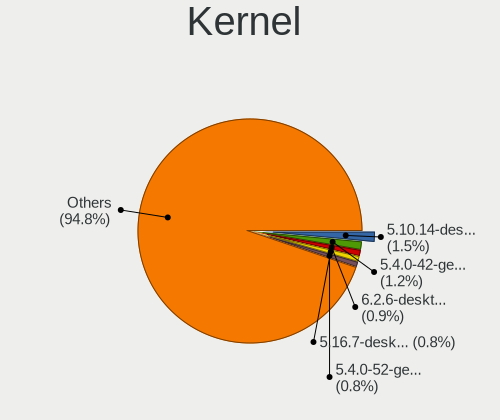

| Version                  | Computers | Percent |
|--------------------------|-----------|---------|
| 5.10.14-desktop-1omv4002 | 23        | 2.73%   |
| 5.4.0-42-generic         | 19        | 2.26%   |
| 5.4.0-52-generic         | 12        | 1.43%   |
| 5.4.0-26-generic         | 10        | 1.19%   |
| 5.16.7-desktop-1omv4003  | 9         | 1.07%   |
| 5.4.0-58-generic         | 8         | 0.95%   |
| 5.4.0-48-generic         | 8         | 0.95%   |
| 5.3.0-28-generic         | 8         | 0.95%   |
| 5.8.0-43-generic         | 7         | 0.83%   |
| 5.4.0-29-generic         | 7         | 0.83%   |
| 5.11.0-27-generic        | 7         | 0.83%   |
| 5.4.0-91-generic         | 6         | 0.71%   |
| 5.4.0-7634-generic       | 6         | 0.71%   |
| 5.3.0-40-generic         | 6         | 0.71%   |
| 5.15.0-46-generic        | 6         | 0.71%   |
| 5.11.0-7620-generic      | 6         | 0.71%   |
| 5.11.0-41-generic        | 6         | 0.71%   |
| 5.8.0-41-generic         | 5         | 0.59%   |
| 5.4.0-47-generic         | 5         | 0.59%   |
| 5.19.0-76051900-generic  | 5         | 0.59%   |
| 5.15.0-43-generic        | 5         | 0.59%   |
| 5.13.12-200.fc34.x86_64  | 5         | 0.59%   |
| 5.11.0-40-generic        | 5         | 0.59%   |
| 5.11.0-37-generic        | 5         | 0.59%   |
| 5.0.0-23-generic         | 5         | 0.59%   |
| 5.0.0-13-generic         | 5         | 0.59%   |
| 4.15.0-55-generic        | 5         | 0.59%   |
| 4.15.0-45-generic        | 5         | 0.59%   |
| 5.8.5-arch1-1            | 4         | 0.48%   |
| 5.8.0-7642-generic       | 4         | 0.48%   |
| 5.8.0-59-generic         | 4         | 0.48%   |
| 5.8.0-45-generic         | 4         | 0.48%   |
| 5.8.0-29-generic         | 4         | 0.48%   |
| 5.4.0-88-generic         | 4         | 0.48%   |
| 5.4.0-77-generic         | 4         | 0.48%   |
| 5.4.0-73-generic         | 4         | 0.48%   |
| 5.4.0-70-generic         | 4         | 0.48%   |
| 5.4.0-62-generic         | 4         | 0.48%   |
| 5.4.0-54-generic         | 4         | 0.48%   |
| 5.4.0-40-generic         | 4         | 0.48%   |

Kernel Family
-------------

Linux kernel without a distro release

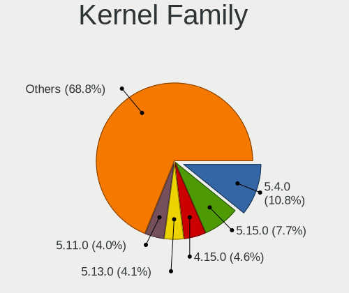

| Version | Computers | Percent |
|---------|-----------|---------|
| 5.4.0   | 151       | 19.11%  |
| 4.15.0  | 64        | 8.1%    |
| 5.8.0   | 56        | 7.09%   |
| 5.11.0  | 56        | 7.09%   |
| 5.13.0  | 50        | 6.33%   |
| 5.3.0   | 37        | 4.68%   |
| 5.15.0  | 27        | 3.42%   |
| 5.0.0   | 27        | 3.42%   |
| 5.10.14 | 23        | 2.91%   |
| 4.18.0  | 18        | 2.28%   |
| 5.10.0  | 11        | 1.39%   |
| 4.19.0  | 11        | 1.39%   |
| 5.16.7  | 9         | 1.14%   |
| 5.19.0  | 6         | 0.76%   |
| 5.4.18  | 5         | 0.63%   |
| 5.16.0  | 5         | 0.63%   |
| 5.13.12 | 5         | 0.63%   |
| 5.9.0   | 4         | 0.51%   |
| 5.8.5   | 4         | 0.51%   |
| 5.7.15  | 4         | 0.51%   |
| 5.6.7   | 4         | 0.51%   |
| 5.16.18 | 4         | 0.51%   |
| 5.14.0  | 4         | 0.51%   |
| 5.8.15  | 3         | 0.38%   |
| 5.6.15  | 3         | 0.38%   |
| 5.16.11 | 3         | 0.38%   |
| 5.15.6  | 3         | 0.38%   |
| 5.11.12 | 3         | 0.38%   |
| 5.11.11 | 3         | 0.38%   |
| 4.9.60  | 3         | 0.38%   |
| 5.9.16  | 2         | 0.25%   |
| 5.9.14  | 2         | 0.25%   |
| 5.9.1   | 2         | 0.25%   |
| 5.8.6   | 2         | 0.25%   |
| 5.8.18  | 2         | 0.25%   |
| 5.8.16  | 2         | 0.25%   |
| 5.8.11  | 2         | 0.25%   |
| 5.7.0   | 2         | 0.25%   |
| 5.6.8   | 2         | 0.25%   |
| 5.6.14  | 2         | 0.25%   |

Kernel Major Ver.
-----------------

Linux kernel major version

| Version | Computers | Percent |
|---------|-----------|---------|
| 5.4     | 166       | 21.31%  |
| 5.8     | 76        | 9.76%   |
| 5.11    | 68        | 8.73%   |
| 4.15    | 64        | 8.22%   |
| 5.13    | 60        | 7.7%    |
| 5.15    | 50        | 6.42%   |
| 5.10    | 43        | 5.52%   |
| 5.3     | 37        | 4.75%   |
| 5.16    | 29        | 3.72%   |
| 5.0     | 28        | 3.59%   |
| 4.18    | 20        | 2.57%   |
| 5.6     | 17        | 2.18%   |
| 5.14    | 16        | 2.05%   |
| 5.19    | 15        | 1.93%   |
| 4.19    | 13        | 1.67%   |
| 5.9     | 12        | 1.54%   |
| 5.7     | 12        | 1.54%   |
| 5.17    | 11        | 1.41%   |
| 5.12    | 9         | 1.16%   |
| 5.18    | 8         | 1.03%   |
| 5.1     | 6         | 0.77%   |
| 4.9     | 6         | 0.77%   |
| 4.4     | 3         | 0.39%   |
| 5.2     | 2         | 0.26%   |
| 4.14    | 2         | 0.26%   |
| 6.0     | 1         | 0.13%   |
| 4.17    | 1         | 0.13%   |
| 4.16    | 1         | 0.13%   |
| 4.13    | 1         | 0.13%   |
| 4.10    | 1         | 0.13%   |
| Unknown | 1         | 0.13%   |

Arch
----

OS architecture (x86_64, i586, etc.)

| Name    | Computers | Percent |
|---------|-----------|---------|
| x86_64  | 666       | 95.69%  |
| i686    | 21        | 3.02%   |
| aarch64 | 8         | 1.15%   |
| armv7l  | 1         | 0.14%   |

DE
--

Desktop Environment

| Name            | Computers | Percent |
|-----------------|-----------|---------|
| GNOME           | 355       | 48.37%  |
| Unknown         | 130       | 17.71%  |
| KDE5            | 96        | 13.08%  |
| XFCE            | 42        | 5.72%   |
| X-Cinnamon      | 41        | 5.59%   |
| KDE             | 20        | 2.72%   |
| MATE            | 13        | 1.77%   |
| Cinnamon        | 7         | 0.95%   |
| Unity           | 5         | 0.68%   |
| Pantheon        | 5         | 0.68%   |
| i3              | 4         | 0.54%   |
| LXQt            | 2         | 0.27%   |
| KDE4            | 2         | 0.27%   |
| GNOME Flashback | 2         | 0.27%   |
| sway            | 1         | 0.14%   |
| qtile-default   | 1         | 0.14%   |
| openbox         | 1         | 0.14%   |
| LXDE            | 1         | 0.14%   |
| LeftWM          | 1         | 0.14%   |
| icewm           | 1         | 0.14%   |
| enlightenment   | 1         | 0.14%   |
| Deepin          | 1         | 0.14%   |
| bspwm           | 1         | 0.14%   |
| awesome         | 1         | 0.14%   |

Display Server
--------------

X11 or Wayland

| Name    | Computers | Percent |
|---------|-----------|---------|
| X11     | 560       | 77.35%  |
| Wayland | 93        | 12.85%  |
| Unknown | 60        | 8.29%   |
| Tty     | 11        | 1.52%   |

Display Manager
---------------

SDDM, LightDM, etc.

| Name    | Computers | Percent |
|---------|-----------|---------|
| Unknown | 426       | 59.17%  |
| GDM     | 90        | 12.5%   |
| SDDM    | 80        | 11.11%  |
| GDM3    | 65        | 9.03%   |
| TDM     | 29        | 4.03%   |
| LightDM | 24        | 3.33%   |
| KDM     | 2         | 0.28%   |
| XDM     | 1         | 0.14%   |
| SLiM    | 1         | 0.14%   |
| LXDM    | 1         | 0.14%   |
| GREETD  | 1         | 0.14%   |

OS Lang
-------

Language

| Lang       | Computers | Percent |
|------------|-----------|---------|
| en_US      | 242       | 33.56%  |
| da_DK      | 224       | 31.07%  |
| Unknown    | 108       | 14.98%  |
| en_DK      | 83        | 11.51%  |
| en_GB      | 30        | 4.16%   |
| de_DE      | 9         | 1.25%   |
| C          | 7         | 0.97%   |
| pl_PL      | 3         | 0.42%   |
| ru_RU      | 2         | 0.28%   |
| it_IT      | 2         | 0.28%   |
| en_AG      | 2         | 0.28%   |
| sv_SE      | 1         | 0.14%   |
| pt_BR      | 1         | 0.14%   |
| is_IS      | 1         | 0.14%   |
| io_001     | 1         | 0.14%   |
| fr_FR      | 1         | 0.14%   |
| en_US.UTF8 | 1         | 0.14%   |
| en_IE      | 1         | 0.14%   |
| en_CA      | 1         | 0.14%   |
| de_AT      | 1         | 0.14%   |

Boot Mode
---------

EFI or BIOS

| Mode | Computers | Percent |
|------|-----------|---------|
| BIOS | 373       | 52.68%  |
| EFI  | 335       | 47.32%  |

Filesystem
----------

Type of filesystem

| Type    | Computers | Percent |
|---------|-----------|---------|
| Ext4    | 568       | 79.55%  |
| Btrfs   | 54        | 7.56%   |
| Overlay | 44        | 6.16%   |
| Unknown | 36        | 5.04%   |
| Zfs     | 6         | 0.84%   |
| Xfs     | 3         | 0.42%   |
| Ext2    | 3         | 0.42%   |

Part. scheme
------------

Scheme of partitioning

| Type    | Computers | Percent |
|---------|-----------|---------|
| Unknown | 467       | 65.59%  |
| GPT     | 189       | 26.54%  |
| MBR     | 56        | 7.87%   |

Dual Boot with Linux/BSD
------------------------

Hosting more than one Linux/BSD

| Dual boot | Computers | Percent |
|-----------|-----------|---------|
| No        | 605       | 85.21%  |
| Yes       | 105       | 14.79%  |

Dual Boot (Win)
---------------

Hosting Linux and Windows

| Dual boot | Computers | Percent |
|-----------|-----------|---------|
| No        | 535       | 75.78%  |
| Yes       | 171       | 24.22%  |

Board
-----

Vendor
------

Motherboard manufacturer

| Name                    | Computers | Percent |
|-------------------------|-----------|---------|
| Lenovo                  | 170       | 24.46%  |
| ASUSTek Computer        | 113       | 16.26%  |
| Hewlett-Packard         | 94        | 13.53%  |
| Dell                    | 54        | 7.77%   |
| Gigabyte Technology     | 41        | 5.9%    |
| Acer                    | 38        | 5.47%   |
| MSI                     | 31        | 4.46%   |
| ASRock                  | 22        | 3.17%   |
| Apple                   | 20        | 2.88%   |
| Medion                  | 15        | 2.16%   |
| Toshiba                 | 10        | 1.44%   |
| Raspberry Pi Foundation | 8         | 1.15%   |
| Notebook                | 8         | 1.15%   |
| Intel                   | 8         | 1.15%   |
| HUAWEI                  | 5         | 0.72%   |
| Shuttle                 | 4         | 0.58%   |
| AMI                     | 4         | 0.58%   |
| Unknown                 | 4         | 0.58%   |
| Samsung Electronics     | 3         | 0.43%   |
| Pegatron                | 3         | 0.43%   |
| Packard Bell            | 3         | 0.43%   |
| Microsoft               | 3         | 0.43%   |
| Google                  | 3         | 0.43%   |
| eMachines               | 3         | 0.43%   |
| TUXEDO                  | 2         | 0.29%   |
| Razer                   | 2         | 0.29%   |
| Quanta                  | 2         | 0.29%   |
| Fujitsu                 | 2         | 0.29%   |
| Alienware               | 2         | 0.29%   |
| Valve                   | 1         | 0.14%   |
| Timi                    | 1         | 0.14%   |
| T-bao                   | 1         | 0.14%   |
| Supermicro              | 1         | 0.14%   |
| SLIMBOOK                | 1         | 0.14%   |
| Purism                  | 1         | 0.14%   |
| NEXCOM                  | 1         | 0.14%   |
| MiTAC                   | 1         | 0.14%   |
| LG Electronics          | 1         | 0.14%   |
| LAMINA                  | 1         | 0.14%   |
| IBM                     | 1         | 0.14%   |

Model
-----

Motherboard model

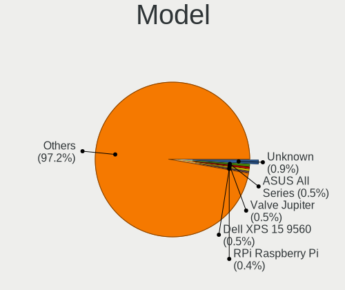

| Name                                  | Computers | Percent |
|---------------------------------------|-----------|---------|
| Unknown                               | 10        | 1.44%   |
| ASUS ROG STRIX B450-E GAMING          | 5         | 0.72%   |
| ASUS All Series                       | 5         | 0.72%   |
| RPi Raspberry Pi                      | 4         | 0.58%   |
| HP Pavilion dv7                       | 4         | 0.58%   |
| Dell XPS 15 9570                      | 4         | 0.58%   |
| RPi Raspberry Pi 4 Model B Rev 1.1    | 3         | 0.43%   |
| MSI MS-7C37                           | 3         | 0.43%   |
| HP EliteBook 820 G3                   | 3         | 0.43%   |
| Dell OptiPlex 9020                    | 3         | 0.43%   |
| ASUS Z170 PRO GAMING                  | 3         | 0.43%   |
| ASUS ROG STRIX B550-F GAMING          | 3         | 0.43%   |
| Toshiba Satellite L40                 | 2         | 0.29%   |
| Quanta MW1/HW1                        | 2         | 0.29%   |
| Notebook W54_55SU1,SUW                | 2         | 0.29%   |
| MSI MS-7B79                           | 2         | 0.29%   |
| Medion MS-7797                        | 2         | 0.29%   |
| Medion MS-7646                        | 2         | 0.29%   |
| Lenovo Yoga C740-14IML 81TC           | 2         | 0.29%   |
| Lenovo ThinkPad T530 24295L4          | 2         | 0.29%   |
| Lenovo IdeaPad S130-14IGM 81J2        | 2         | 0.29%   |
| Lenovo IdeaPad 310-15IKB 80TV         | 2         | 0.29%   |
| Lenovo H30-05 90BJ00CNMT              | 2         | 0.29%   |
| Lenovo E31-80 80MX                    | 2         | 0.29%   |
| HP ProBook 650 G1                     | 2         | 0.29%   |
| HP Pavilion x360 Convertible 14-ba0xx | 2         | 0.29%   |
| HP Pavilion Notebook                  | 2         | 0.29%   |
| HP Pavilion g7                        | 2         | 0.29%   |
| HP Laptop 15-bw0xx                    | 2         | 0.29%   |
| HP EliteBook 845 G7 Notebook PC       | 2         | 0.29%   |
| HP EliteBook 840 G1                   | 2         | 0.29%   |
| HP Compaq Presario CQ71               | 2         | 0.29%   |
| Gigabyte X570 AORUS MASTER            | 2         | 0.29%   |
| Gigabyte P85-D3                       | 2         | 0.29%   |
| eMachines E725                        | 2         | 0.29%   |
| Dell XPS 15 9560                      | 2         | 0.29%   |
| Dell XPS 13 9370                      | 2         | 0.29%   |
| Dell Latitude E7440                   | 2         | 0.29%   |
| Dell Latitude 7480                    | 2         | 0.29%   |
| ASUS TUF Gaming X570-PLUS             | 2         | 0.29%   |

Model Family
------------

Motherboard model prefix

| Name                | Computers | Percent |
|---------------------|-----------|---------|
| Lenovo ThinkPad     | 102       | 14.68%  |
| ASUS ROG            | 25        | 3.6%    |
| Acer Aspire         | 25        | 3.6%    |
| HP Pavilion         | 21        | 3.02%   |
| HP EliteBook        | 18        | 2.59%   |
| Dell Latitude       | 18        | 2.59%   |
| ASUS PRIME          | 16        | 2.3%    |
| Lenovo IdeaPad      | 14        | 2.01%   |
| Dell XPS            | 12        | 1.73%   |
| Lenovo Yoga         | 11        | 1.58%   |
| HP Compaq           | 11        | 1.58%   |
| Toshiba Satellite   | 10        | 1.44%   |
| HP ProBook          | 10        | 1.44%   |
| Unknown             | 10        | 1.44%   |
| Lenovo ThinkCentre  | 9         | 1.29%   |
| RPi Raspberry       | 8         | 1.15%   |
| Dell Inspiron       | 8         | 1.15%   |
| ASUS TUF            | 8         | 1.15%   |
| HP Laptop           | 7         | 1.01%   |
| Gigabyte X570       | 7         | 1.01%   |
| Dell OptiPlex       | 6         | 0.86%   |
| ASUS ZenBook        | 5         | 0.72%   |
| ASUS All            | 5         | 0.72%   |
| Dell Precision      | 4         | 0.58%   |
| MSI MS-7C37         | 3         | 0.43%   |
| Microsoft Surface   | 3         | 0.43%   |
| Lenovo ThinkStation | 3         | 0.43%   |
| Lenovo ThinkBook    | 3         | 0.43%   |
| HP ZBook            | 3         | 0.43%   |
| HP ProLiant         | 3         | 0.43%   |
| HP OMEN             | 3         | 0.43%   |
| ASUS Z170           | 3         | 0.43%   |
| ASUS VivoBook       | 3         | 0.43%   |
| ASUS SABERTOOTH     | 3         | 0.43%   |
| ASUS M5A78L-M       | 3         | 0.43%   |
| ASRock Z170         | 3         | 0.43%   |
| Apple iMac12        | 3         | 0.43%   |
| Acer Swift          | 3         | 0.43%   |
| Razer Blade         | 2         | 0.29%   |
| Quanta MW1          | 2         | 0.29%   |

MFG Year
--------

Motherboard manufacture year

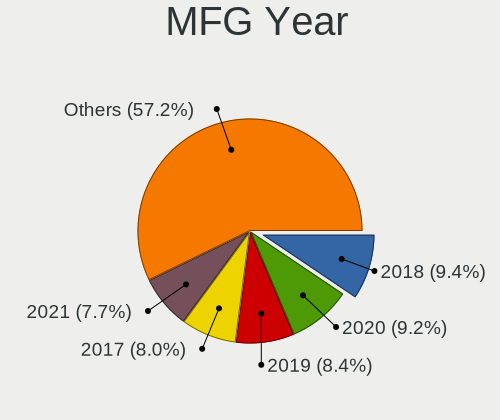

| Year    | Computers | Percent |
|---------|-----------|---------|
| 2018    | 70        | 10.07%  |
| 2019    | 68        | 9.78%   |
| 2020    | 62        | 8.92%   |
| 2017    | 58        | 8.35%   |
| 2012    | 57        | 8.2%    |
| 2016    | 50        | 7.19%   |
| 2013    | 50        | 7.19%   |
| 2011    | 44        | 6.33%   |
| 2015    | 42        | 6.04%   |
| 2021    | 38        | 5.47%   |
| 2010    | 32        | 4.6%    |
| 2009    | 32        | 4.6%    |
| 2014    | 28        | 4.03%   |
| 2008    | 25        | 3.6%    |
| 2007    | 18        | 2.59%   |
| 2022    | 7         | 1.01%   |
| Unknown | 7         | 1.01%   |
| 2006    | 6         | 0.86%   |
| 2003    | 1         | 0.14%   |

Form Factor
-----------

Physical design of the computer

| Name           | Computers | Percent |
|----------------|-----------|---------|
| Notebook       | 394       | 56.69%  |
| Desktop        | 241       | 34.68%  |
| Convertible    | 18        | 2.59%   |
| All in one     | 13        | 1.87%   |
| Mini pc        | 11        | 1.58%   |
| System on chip | 8         | 1.15%   |
| Tablet         | 6         | 0.86%   |
| Server         | 3         | 0.43%   |
| Phone          | 1         | 0.14%   |

Secure Boot
-----------

Enabled or disabled

| State    | Computers | Percent |
|----------|-----------|---------|
| Disabled | 647       | 92.56%  |
| Enabled  | 52        | 7.44%   |

Coreboot
--------

Have coreboot on board

| Used | Computers | Percent |
|------|-----------|---------|
| No   | 691       | 99.42%  |
| Yes  | 4         | 0.58%   |

RAM Size
--------

Total RAM memory

| Size in GB      | Computers | Percent |
|-----------------|-----------|---------|
| 4.01-8.0        | 159       | 22.33%  |
| 16.01-24.0      | 159       | 22.33%  |
| 8.01-16.0       | 137       | 19.24%  |
| 3.01-4.0        | 105       | 14.75%  |
| 32.01-64.0      | 81        | 11.38%  |
| 64.01-256.0     | 22        | 3.09%   |
| 1.01-2.0        | 20        | 2.81%   |
| 24.01-32.0      | 14        | 1.97%   |
| 2.01-3.0        | 11        | 1.54%   |
| 0.51-1.0        | 2         | 0.28%   |
| More than 256.0 | 1         | 0.14%   |
| 0.01-0.5        | 1         | 0.14%   |

RAM Used
--------

Used RAM memory

| Used GB    | Computers | Percent |
|------------|-----------|---------|
| 1.01-2.0   | 264       | 33.98%  |
| 2.01-3.0   | 200       | 25.74%  |
| 4.01-8.0   | 123       | 15.83%  |
| 3.01-4.0   | 113       | 14.54%  |
| 0.51-1.0   | 38        | 4.89%   |
| 8.01-16.0  | 25        | 3.22%   |
| 0.01-0.5   | 7         | 0.9%    |
| 16.01-24.0 | 3         | 0.39%   |
| 32.01-64.0 | 2         | 0.26%   |
| 24.01-32.0 | 2         | 0.26%   |

Total Drives
------------

Number of drives on board

| Drives | Computers | Percent |
|--------|-----------|---------|
| 1      | 450       | 63.2%   |
| 2      | 146       | 20.51%  |
| 3      | 60        | 8.43%   |
| 4      | 24        | 3.37%   |
| 5      | 14        | 1.97%   |
| 0      | 10        | 1.4%    |
| 6      | 5         | 0.7%    |
| 9      | 1         | 0.14%   |
| 8      | 1         | 0.14%   |
| 7      | 1         | 0.14%   |

Has CD-ROM
----------

Has CD-ROM on board

| Presented | Computers | Percent |
|-----------|-----------|---------|
| No        | 440       | 62.77%  |
| Yes       | 261       | 37.23%  |

Has Ethernet
------------

Has Ethernet on board

| Presented | Computers | Percent |
|-----------|-----------|---------|
| Yes       | 616       | 88%     |
| No        | 84        | 12%     |

Has WiFi
--------

Has WiFi module

| Presented | Computers | Percent |
|-----------|-----------|---------|
| Yes       | 548       | 78.4%   |
| No        | 151       | 21.6%   |

Has Bluetooth
-------------

Has Bluetooth module

| Presented | Computers | Percent |
|-----------|-----------|---------|
| Yes       | 445       | 63.03%  |
| No        | 261       | 36.97%  |

Location
--------

Country
-------

Geographic location (country)

| Country | Computers | Percent |
|---------|-----------|---------|
| Denmark | 695       | 100%    |

City
----

Geographic location (city)

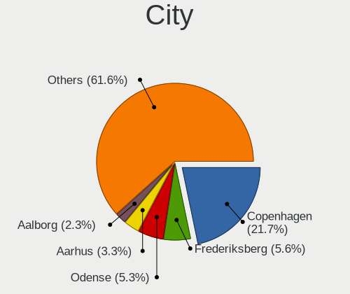

| City                     | Computers | Percent |
|--------------------------|-----------|---------|
| Copenhagen               | 157       | 21.51%  |
| Odense                   | 50        | 6.85%   |
| Frederiksberg            | 50        | 6.85%   |
| Aarhus                   | 24        | 3.29%   |
| Bronshoj                 | 21        | 2.88%   |
| Silkeborg                | 20        | 2.74%   |
| Aalborg                  | 17        | 2.33%   |
| Aabenraa                 | 14        | 1.92%   |
| Slagelse                 | 12        | 1.64%   |
| Horsens                  | 12        | 1.64%   |
| Roskilde                 | 11        | 1.51%   |
| Valby                    | 10        | 1.37%   |
| Glostrup Municipality    | 10        | 1.37%   |
| Nyborg                   | 9         | 1.23%   |
| Esbjerg                  | 9         | 1.23%   |
| Hvidovre                 | 8         | 1.1%    |
| Holstebro                | 8         | 1.1%    |
| Herlev                   | 8         | 1.1%    |
| Gentofte Municipality    | 8         | 1.1%    |
| Risskov                  | 7         | 0.96%   |
| Norresundby              | 7         | 0.96%   |
| Vaerlose                 | 6         | 0.82%   |
| Taastrup                 | 6         | 0.82%   |
| Naestved                 | 6         | 0.82%   |
| Kongens Lyngby           | 6         | 0.82%   |
| Kastrup                  | 6         | 0.82%   |
| Vejle                    | 5         | 0.68%   |
| Skanderborg              | 5         | 0.68%   |
| Sindal                   | 5         | 0.68%   |
| Albertslund Municipality | 5         | 0.68%   |
| Svendborg                | 4         | 0.55%   |
| Kolding                  | 4         | 0.55%   |
| Elsinore                 | 4         | 0.55%   |
| Aabybro                  | 4         | 0.55%   |
| Viby J                   | 3         | 0.41%   |
| Viborg                   | 3         | 0.41%   |
| Vanlose                  | 3         | 0.41%   |
| Thisted                  | 3         | 0.41%   |
| Skive                    | 3         | 0.41%   |
| Rnne                   | 3         | 0.41%   |

Drives
------

Drive Vendor
------------

Hard drive vendors

| Vendor                    | Computers | Drives | Percent |
|---------------------------|-----------|--------|---------|
| Samsung Electronics       | 216       | 328    | 22.13%  |
| WDC                       | 133       | 198    | 13.63%  |
| Seagate                   | 124       | 170    | 12.7%   |
| Kingston                  | 84        | 119    | 8.61%   |
| Toshiba                   | 57        | 79     | 5.84%   |
| SanDisk                   | 39        | 53     | 4%      |
| SK hynix                  | 37        | 50     | 3.79%   |
| Intel                     | 33        | 42     | 3.38%   |
| Unknown                   | 30        | 34     | 3.07%   |
| Hitachi                   | 30        | 38     | 3.07%   |
| Crucial                   | 25        | 34     | 2.56%   |
| Micron Technology         | 16        | 20     | 1.64%   |
| HGST                      | 14        | 23     | 1.43%   |
| LITEON                    | 13        | 19     | 1.33%   |
| PNY                       | 12        | 12     | 1.23%   |
| Intenso                   | 10        | 15     | 1.02%   |
| Phison                    | 9         | 13     | 0.92%   |
| OCZ                       | 9         | 9      | 0.92%   |
| A-DATA Technology         | 9         | 9      | 0.92%   |
| Corsair                   | 8         | 11     | 0.82%   |
| Apple                     | 8         | 13     | 0.82%   |
| LITEONIT                  | 5         | 6      | 0.51%   |
| Fujitsu                   | 4         | 5      | 0.41%   |
| Transcend                 | 3         | 3      | 0.31%   |
| Lenovo                    | 3         | 4      | 0.31%   |
| JMicron Technology        | 3         | 3      | 0.31%   |
| Unknown                   | 3         | 5      | 0.31%   |
| XPG                       | 2         | 2      | 0.2%    |
| Verbatim                  | 2         | 5      | 0.2%    |
| Silicon Motion            | 2         | 2      | 0.2%    |
| Micron/Crucial Technology | 2         | 2      | 0.2%    |
| Maxtor                    | 2         | 2      | 0.2%    |
| KIOXIA                    | 2         | 3      | 0.2%    |
| HUAWEI                    | 2         | 2      | 0.2%    |
| Hewlett-Packard           | 2         | 3      | 0.2%    |
| China                     | 2         | 2      | 0.2%    |
| USB3.0                    | 1         | 1      | 0.1%    |
| Unknown (CF)              | 1         | 1      | 0.1%    |
| Union Memory              | 1         | 2      | 0.1%    |
| Teclast                   | 1         | 1      | 0.1%    |

Drive Model
-----------

Hard drive models

| Model                                 | Computers | Percent |
|---------------------------------------|-----------|---------|
| Samsung SSD 850 EVO 250GB             | 13        | 1.2%    |
| Samsung NVMe SSD Drive 256GB          | 13        | 1.2%    |
| Kingston SA400S37240G 240GB SSD       | 13        | 1.2%    |
| Samsung SSD 850 EVO 500GB             | 12        | 1.11%   |
| Kingston SV300S37A120G 120GB SSD      | 11        | 1.02%   |
| Kingston SA400S37480G 480GB SSD       | 11        | 1.02%   |
| Samsung NVMe SSD Drive 512GB          | 10        | 0.92%   |
| Samsung NVMe SSD Drive 500GB          | 10        | 0.92%   |
| Samsung NVMe SSD Drive 1TB            | 10        | 0.92%   |
| Samsung SSD 860 EVO 1TB               | 8         | 0.74%   |
| Kingston SA400S37120G 120GB SSD       | 8         | 0.74%   |
| Toshiba NVMe SSD Drive 256GB          | 7         | 0.65%   |
| SK hynix NVMe SSD Drive 512GB         | 7         | 0.65%   |
| Samsung SSD 860 EVO 500GB             | 7         | 0.65%   |
| Samsung SSD 840 EVO 250GB             | 7         | 0.65%   |
| PNY CS900 120GB SSD                   | 7         | 0.65%   |
| Unknown MMC Card  64GB                | 6         | 0.55%   |
| Unknown MMC Card  32GB                | 6         | 0.55%   |
| Toshiba NVMe SSD Drive 512GB          | 6         | 0.55%   |
| Seagate ST2000DM001-1ER164 2TB        | 6         | 0.55%   |
| Samsung SSD 860 QVO 1TB               | 6         | 0.55%   |
| Crucial CT1000MX500SSD1 1TB           | 6         | 0.55%   |
| Seagate ST1000DM010-2EP102 1TB        | 5         | 0.46%   |
| Samsung SSD 970 EVO Plus 1TB          | 5         | 0.46%   |
| Samsung NVMe SSD Drive 1024GB         | 5         | 0.46%   |
| Kingston SV300S37A240G 240GB SSD      | 5         | 0.46%   |
| Kingston SUV400S37240G 240GB SSD      | 5         | 0.46%   |
| Intel NVMe SSD Drive 512GB            | 5         | 0.46%   |
| Unknown SD/MMC/MS PRO 2GB             | 4         | 0.37%   |
| SK hynix NVMe SSD Drive 256GB         | 4         | 0.37%   |
| SK hynix HFS256G39TND-N210A 256GB SSD | 4         | 0.37%   |
| Seagate ST2000DM001-1CH164 2TB        | 4         | 0.37%   |
| Seagate ST1000DM003-1SB10C 1TB        | 4         | 0.37%   |
| Seagate ST1000DM003-1SB102 1TB        | 4         | 0.37%   |
| SanDisk NVMe SSD Drive 1024GB         | 4         | 0.37%   |
| Samsung SSD 970 EVO Plus 500GB        | 4         | 0.37%   |
| Samsung SSD 970 EVO 1TB               | 4         | 0.37%   |
| Samsung NVMe SSD Drive 250GB          | 4         | 0.37%   |
| Samsung MZVLB512HAJQ-000L7 512GB      | 4         | 0.37%   |
| Samsung HD103SJ 1TB                   | 4         | 0.37%   |

HDD Vendor
----------

Hard disk drive vendors

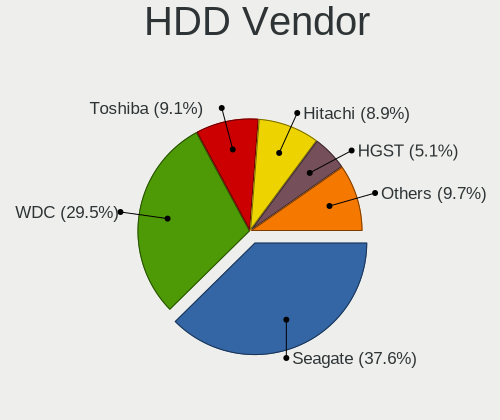

| Vendor              | Computers | Drives | Percent |
|---------------------|-----------|--------|---------|
| Seagate             | 119       | 164    | 36.73%  |
| WDC                 | 100       | 159    | 30.86%  |
| Toshiba             | 30        | 37     | 9.26%   |
| Hitachi             | 30        | 38     | 9.26%   |
| HGST                | 14        | 23     | 4.32%   |
| Samsung Electronics | 11        | 17     | 3.4%    |
| Unknown             | 4         | 5      | 1.23%   |
| Fujitsu             | 4         | 5      | 1.23%   |
| Apple               | 3         | 7      | 0.93%   |
| Maxtor              | 2         | 2      | 0.62%   |
| Unknown             | 2         | 4      | 0.62%   |
| USB3.0              | 1         | 1      | 0.31%   |
| Intenso             | 1         | 2      | 0.31%   |
| Hewlett-Packard     | 1         | 2      | 0.31%   |
| ASMT109x            | 1         | 1      | 0.31%   |
| Apricorn            | 1         | 2      | 0.31%   |

SSD Vendor
----------

Solid state drive vendors

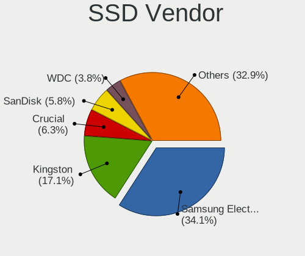

| Vendor              | Computers | Drives | Percent |
|---------------------|-----------|--------|---------|
| Samsung Electronics | 116       | 174    | 31.78%  |
| Kingston            | 73        | 101    | 20%     |
| SanDisk             | 23        | 27     | 6.3%    |
| Crucial             | 22        | 31     | 6.03%   |
| WDC                 | 15        | 18     | 4.11%   |
| PNY                 | 12        | 12     | 3.29%   |
| LITEON              | 12        | 18     | 3.29%   |
| Intel               | 12        | 18     | 3.29%   |
| SK hynix            | 9         | 11     | 2.47%   |
| OCZ                 | 9         | 9      | 2.47%   |
| Toshiba             | 8         | 10     | 2.19%   |
| Micron Technology   | 8         | 9      | 2.19%   |
| Intenso             | 7         | 9      | 1.92%   |
| A-DATA Technology   | 7         | 7      | 1.92%   |
| LITEONIT            | 5         | 6      | 1.37%   |
| Corsair             | 4         | 5      | 1.1%    |
| Apple               | 4         | 4      | 1.1%    |
| Verbatim            | 2         | 5      | 0.55%   |
| Transcend           | 2         | 2      | 0.55%   |
| China               | 2         | 2      | 0.55%   |
| Unknown (CF)        | 1         | 1      | 0.27%   |
| Teclast             | 1         | 1      | 0.27%   |
| Team                | 1         | 1      | 0.27%   |
| Shark               | 1         | 1      | 0.27%   |
| Leven               | 1         | 1      | 0.27%   |
| KingFast            | 1         | 1      | 0.27%   |
| INDMEM              | 1         | 1      | 0.27%   |
| FORESEE             | 1         | 1      | 0.27%   |
| ASUS-PHISON         | 1         | 1      | 0.27%   |
| AFOX                | 1         | 1      | 0.27%   |
| ADATA SU            | 1         | 1      | 0.27%   |
| 2-Power             | 1         | 2      | 0.27%   |
| Unknown             | 1         | 1      | 0.27%   |

Drive Kind
----------

HDD or SSD

| Kind    | Computers | Drives | Percent |
|---------|-----------|--------|---------|
| SSD     | 326       | 492    | 37.13%  |
| HDD     | 267       | 469    | 30.41%  |
| NVMe    | 246       | 360    | 28.02%  |
| MMC     | 28        | 31     | 3.19%   |
| Unknown | 11        | 13     | 1.25%   |

Drive Connector
---------------

SATA, SAS, NVMe, etc.

| Type | Computers | Drives | Percent |
|------|-----------|--------|---------|
| SATA | 498       | 931    | 61.86%  |
| NVMe | 243       | 357    | 30.19%  |
| SAS  | 36        | 46     | 4.47%   |
| MMC  | 28        | 31     | 3.48%   |

Drive Size
----------

Size of hard drive

| Size in TB | Computers | Drives | Percent |
|------------|-----------|--------|---------|
| 0.01-0.5   | 380       | 580    | 60.41%  |
| 0.51-1.0   | 151       | 202    | 24.01%  |
| 1.01-2.0   | 52        | 90     | 8.27%   |
| 4.01-10.0  | 18        | 40     | 2.86%   |
| 2.01-3.0   | 15        | 26     | 2.38%   |
| 3.01-4.0   | 10        | 15     | 1.59%   |
| 10.01-20.0 | 3         | 8      | 0.48%   |

Space Total
-----------

Amount of disk space available on the file system

| Size in GB     | Computers | Percent |
|----------------|-----------|---------|
| 101-250        | 190       | 25.64%  |
| 251-500        | 149       | 20.11%  |
| 501-1000       | 116       | 15.65%  |
| 1001-2000      | 60        | 8.1%    |
| 1-20           | 54        | 7.29%   |
| 51-100         | 45        | 6.07%   |
| More than 3000 | 38        | 5.13%   |
| Unknown        | 33        | 4.45%   |
| 21-50          | 30        | 4.05%   |
| 2001-3000      | 26        | 3.51%   |

Space Used
----------

Amount of used disk space

| Used GB        | Computers | Percent |
|----------------|-----------|---------|
| 1-20           | 297       | 39.13%  |
| 21-50          | 121       | 15.94%  |
| 101-250        | 88        | 11.59%  |
| 51-100         | 80        | 10.54%  |
| 251-500        | 57        | 7.51%   |
| 501-1000       | 40        | 5.27%   |
| Unknown        | 33        | 4.35%   |
| 1001-2000      | 22        | 2.9%    |
| More than 3000 | 15        | 1.98%   |
| 2001-3000      | 6         | 0.79%   |

Malfunc. Drives
---------------

Drive models with a malfunction

| Model                                 | Computers | Drives | Percent |
|---------------------------------------|-----------|--------|---------|
| Seagate ST1000LM035-1RK172 1TB        | 2         | 2      | 4.65%   |
| Kingston SHPM2280P2H 480G SSD         | 2         | 2      | 4.65%   |
| Kingston SA400S37480G 480GB SSD       | 2         | 2      | 4.65%   |
| WDC WD5000BPVT-80HXZT3 500GB          | 1         | 1      | 2.33%   |
| WDC WD5000BEVT-35ZAT0 500GB           | 1         | 1      | 2.33%   |
| WDC WD5000AAKX-001CA0 500GB           | 1         | 1      | 2.33%   |
| WDC WD5000AADS-00S9B0 500GB           | 1         | 1      | 2.33%   |
| WDC WD10EZRX-00A8LB0 1TB              | 1         | 1      | 2.33%   |
| WDC WD10EZEX-60WN4A0 1TB              | 1         | 1      | 2.33%   |
| WDC WD10EURX-73FH1Y0 1TB              | 1         | 1      | 2.33%   |
| WDC WD10EARS-00Y5B1 1TB               | 1         | 1      | 2.33%   |
| Toshiba MQ02ABD100H 1TB               | 1         | 1      | 2.33%   |
| Toshiba KSG60ZSE256G SATA 256GB SSD   | 1         | 1      | 2.33%   |
| SK hynix SC308 SATA 256GB SSD         | 1         | 1      | 2.33%   |
| Seagate ST9500420AS 500GB             | 1         | 1      | 2.33%   |
| Seagate ST380013AS 80GB               | 1         | 1      | 2.33%   |
| Seagate ST3400633AS 400GB             | 1         | 1      | 2.33%   |
| Seagate ST3250318AS 250GB             | 1         | 1      | 2.33%   |
| Seagate ST320LT020-9YG142 320GB       | 1         | 1      | 2.33%   |
| Seagate ST3200822AS 200GB             | 1         | 1      | 2.33%   |
| Seagate ST31000524AS 1TB              | 1         | 1      | 2.33%   |
| Seagate ST2000DX002-2DV164 2TB        | 1         | 1      | 2.33%   |
| Seagate ST2000DM008-2FR102 2TB        | 1         | 1      | 2.33%   |
| Seagate ST1000DM010-2EP102 1TB        | 1         | 1      | 2.33%   |
| SanDisk SDSSDX240GG25 240GB           | 1         | 1      | 2.33%   |
| Samsung Electronics SSD 870 EVO 500GB | 1         | 1      | 2.33%   |
| Samsung Electronics SP0812C 80GB      | 1         | 1      | 2.33%   |
| Samsung Electronics HD753LJ 752GB     | 1         | 1      | 2.33%   |
| Samsung Electronics HD103SJ 1TB       | 1         | 1      | 2.33%   |
| OCZ AGILITY3 240GB SSD                | 1         | 1      | 2.33%   |
| OCZ AGILITY3 120GB SSD                | 1         | 1      | 2.33%   |
| Micron Technology 1100 SATA 512GB SSD | 1         | 1      | 2.33%   |
| Leven JAJS300M480C 480GB SSD          | 1         | 1      | 2.33%   |
| Kingston SV300S37A120G 120GB SSD      | 1         | 3      | 2.33%   |
| Intel SSDSC2BW480H6 480GB             | 1         | 1      | 2.33%   |
| Hitachi HDP725032GLA360 320GB         | 1         | 2      | 2.33%   |
| HGST HTS545050A7E380 500GB            | 1         | 1      | 2.33%   |
| HGST HTS541010A9E680 1TB              | 1         | 1      | 2.33%   |
| Apple HDD HTS547550A9E384 500GB       | 1         | 1      | 2.33%   |
| Unknown                               | 1         | 2      | 2.33%   |

Malfunc. Drive Vendor
---------------------

Vendors of faulty drives

| Vendor              | Computers | Drives | Percent |
|---------------------|-----------|--------|---------|
| Seagate             | 11        | 12     | 27.5%   |
| WDC                 | 7         | 8      | 17.5%   |
| Kingston            | 5         | 7      | 12.5%   |
| Samsung Electronics | 3         | 4      | 7.5%    |
| Toshiba             | 2         | 2      | 5%      |
| OCZ                 | 2         | 2      | 5%      |
| HGST                | 2         | 2      | 5%      |
| SK hynix            | 1         | 1      | 2.5%    |
| SanDisk             | 1         | 1      | 2.5%    |
| Micron Technology   | 1         | 1      | 2.5%    |
| Leven               | 1         | 1      | 2.5%    |
| Intel               | 1         | 1      | 2.5%    |
| Hitachi             | 1         | 2      | 2.5%    |
| Apple               | 1         | 1      | 2.5%    |
| Unknown             | 1         | 2      | 2.5%    |

Malfunc. HDD Vendor
-------------------

Vendors of faulty HDD drives

| Vendor              | Computers | Drives | Percent |
|---------------------|-----------|--------|---------|
| Seagate             | 11        | 12     | 42.31%  |
| WDC                 | 7         | 8      | 26.92%  |
| Samsung Electronics | 2         | 3      | 7.69%   |
| HGST                | 2         | 2      | 7.69%   |
| Toshiba             | 1         | 1      | 3.85%   |
| Hitachi             | 1         | 2      | 3.85%   |
| Apple               | 1         | 1      | 3.85%   |
| Unknown             | 1         | 2      | 3.85%   |

Malfunc. Drive Kind
-------------------

Kinds of faulty drives

| Kind | Computers | Drives | Percent |
|------|-----------|--------|---------|
| HDD  | 22        | 31     | 62.86%  |
| SSD  | 13        | 16     | 37.14%  |

Failed Drives
-------------

Failed drive models

Zero info for selected period =(

Failed Drive Vendor
-------------------

Failed drive vendors

Zero info for selected period =(

Drive Status
------------

Number of failed and malfunc. drives

| Status   | Computers | Drives | Percent |
|----------|-----------|--------|---------|
| Detected | 485       | 936    | 65.01%  |
| Works    | 226       | 382    | 30.29%  |
| Malfunc  | 35        | 47     | 4.69%   |

Storage controller
------------------

Storage Vendor
--------------

Storage controller vendors

| Vendor                           | Computers | Percent |
|----------------------------------|-----------|---------|
| Intel                            | 443       | 50.46%  |
| AMD                              | 123       | 14.01%  |
| Samsung Electronics              | 108       | 12.3%   |
| SanDisk                          | 30        | 3.42%   |
| SK hynix                         | 27        | 3.08%   |
| ASMedia Technology               | 20        | 2.28%   |
| Toshiba America Info Systems     | 19        | 2.16%   |
| Nvidia                           | 17        | 1.94%   |
| Kingston Technology Company      | 17        | 1.94%   |
| Phison Electronics               | 14        | 1.59%   |
| JMicron Technology               | 11        | 1.25%   |
| Micron Technology                | 8         | 0.91%   |
| Marvell Technology Group         | 8         | 0.91%   |
| Silicon Motion                   | 5         | 0.57%   |
| Micron/Crucial Technology        | 5         | 0.57%   |
| Lenovo                           | 3         | 0.34%   |
| ADATA Technology                 | 3         | 0.34%   |
| VIA Technologies                 | 2         | 0.23%   |
| Seagate Technology               | 2         | 0.23%   |
| KIOXIA                           | 2         | 0.23%   |
| Hewlett-Packard                  | 2         | 0.23%   |
| Union Memory (Shenzhen)          | 1         | 0.11%   |
| Solid State Storage Technology   | 1         | 0.11%   |
| Silicon Integrated Systems [SiS] | 1         | 0.11%   |
| Realtek Semiconductor            | 1         | 0.11%   |
| LSI Logic / Symbios Logic        | 1         | 0.11%   |
| Lite-On Technology               | 1         | 0.11%   |
| HighPoint Technologies           | 1         | 0.11%   |
| Broadcom / LSI                   | 1         | 0.11%   |
| Apple                            | 1         | 0.11%   |

Storage Model
-------------

Storage controller models

| Model                                                                            | Computers | Percent |
|----------------------------------------------------------------------------------|-----------|---------|
| AMD FCH SATA Controller [AHCI mode]                                              | 87        | 8.66%   |
| Samsung NVMe SSD Controller SM981/PM981/PM983                                    | 66        | 6.57%   |
| Intel Sunrise Point-LP SATA Controller [AHCI mode]                               | 40        | 3.98%   |
| Intel 8 Series/C220 Series Chipset Family 6-port SATA Controller 1 [AHCI mode]   | 33        | 3.28%   |
| Intel 7 Series Chipset Family 6-port SATA Controller [AHCI mode]                 | 31        | 3.08%   |
| Intel 8 Series SATA Controller 1 [AHCI mode]                                     | 25        | 2.49%   |
| Intel 6 Series/C200 Series Chipset Family 6 port Mobile SATA AHCI Controller     | 25        | 2.49%   |
| Samsung NVMe SSD Controller SM961/PM961/SM963                                    | 22        | 2.19%   |
| Intel 82801 Mobile SATA Controller [RAID mode]                                   | 20        | 1.99%   |
| AMD 400 Series Chipset SATA Controller                                           | 20        | 1.99%   |
| Intel 200 Series PCH SATA controller [AHCI mode]                                 | 19        | 1.89%   |
| ASMedia ASM1062 Serial ATA Controller                                            | 19        | 1.89%   |
| Intel 82801IBM/IEM (ICH9M/ICH9M-E) 4 port SATA Controller [AHCI mode]            | 18        | 1.79%   |
| AMD SB7x0/SB8x0/SB9x0 IDE Controller                                             | 18        | 1.79%   |
| Intel Q170/Q150/B150/H170/H110/Z170/CM236 Chipset SATA Controller [AHCI Mode]    | 17        | 1.69%   |
| Intel 7 Series/C210 Series Chipset Family 6-port SATA Controller [AHCI mode]     | 15        | 1.49%   |
| Intel Cannon Lake Mobile PCH SATA AHCI Controller                                | 14        | 1.39%   |
| Intel 6 Series/C200 Series Chipset Family 6 port Desktop SATA AHCI Controller    | 14        | 1.39%   |
| AMD SB7x0/SB8x0/SB9x0 SATA Controller [AHCI mode]                                | 13        | 1.29%   |
| SanDisk WD Black SN750 / PC SN730 NVMe SSD                                       | 12        | 1.19%   |
| Intel HM170/QM170 Chipset SATA Controller [AHCI Mode]                            | 12        | 1.19%   |
| Intel 5 Series/3400 Series Chipset 6 port SATA AHCI Controller                   | 12        | 1.19%   |
| Intel 82801HM/HEM (ICH8M/ICH8M-E) SATA Controller [AHCI mode]                    | 11        | 1.09%   |
| Intel 82801HM/HEM (ICH8M/ICH8M-E) IDE Controller                                 | 11        | 1.09%   |
| AMD SB7x0/SB8x0/SB9x0 SATA Controller [IDE mode]                                 | 11        | 1.09%   |
| Intel SSD 660P Series                                                            | 10        | 1%      |
| SK hynix Gold P31 SSD                                                            | 9         | 0.9%    |
| Phison E12 NVMe Controller                                                       | 9         | 0.9%    |
| Kingston Company A2000 NVMe SSD                                                  | 9         | 0.9%    |
| Intel Comet Lake SATA AHCI Controller                                            | 9         | 0.9%    |
| AMD 500 Series Chipset SATA Controller                                           | 9         | 0.9%    |
| SK hynix Non-Volatile memory controller                                          | 8         | 0.8%    |
| Micron Non-Volatile memory controller                                            | 8         | 0.8%    |
| Intel Cannon Lake PCH SATA AHCI Controller                                       | 8         | 0.8%    |
| Toshiba America Info Systems XG6 NVMe SSD Controller                             | 7         | 0.7%    |
| Toshiba America Info Systems Toshiba America Info Non-Volatile memory controller | 7         | 0.7%    |
| Samsung NVMe SSD Controller PM9A1/PM9A3/980PRO                                   | 7         | 0.7%    |
| SanDisk WD Blue SN550 NVMe SSD                                                   | 6         | 0.6%    |
| Samsung NVMe SSD Controller SM951/PM951                                          | 6         | 0.6%    |
| JMicron JMB363 SATA/IDE Controller                                               | 6         | 0.6%    |

Storage Kind
------------

Kind of storage controller (IDE, SATA, NVMe, SAS, ...)

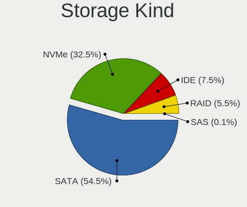

| Kind | Computers | Percent |
|------|-----------|---------|
| SATA | 499       | 56.83%  |
| NVMe | 246       | 28.02%  |
| IDE  | 91        | 10.36%  |
| RAID | 41        | 4.67%   |
| SAS  | 1         | 0.11%   |

Processor
---------

CPU Vendor
----------

Processor vendors

| Vendor   | Computers | Percent |
|----------|-----------|---------|
| Intel    | 526       | 75.68%  |
| AMD      | 160       | 23.02%  |
| ARM      | 8         | 1.15%   |
| QUALCOMM | 1         | 0.14%   |

CPU Model
---------

Processor models

| Model                                         | Computers | Percent |
|-----------------------------------------------|-----------|---------|
| Intel Core i7-8550U CPU @ 1.80GHz             | 11        | 1.58%   |
| Intel Core i5-6200U CPU @ 2.30GHz             | 11        | 1.58%   |
| Intel Core i5-7200U CPU @ 2.50GHz             | 10        | 1.44%   |
| Intel Core i7-8565U CPU @ 1.80GHz             | 8         | 1.15%   |
| Intel Core i7-8750H CPU @ 2.20GHz             | 7         | 1.01%   |
| Intel Core i7-6700K CPU @ 4.00GHz             | 7         | 1.01%   |
| Intel Core i5-8250U CPU @ 1.60GHz             | 7         | 1.01%   |
| Intel Core i5-4300U CPU @ 1.90GHz             | 7         | 1.01%   |
| AMD Ryzen 5 3600 6-Core Processor             | 7         | 1.01%   |
| Intel Core i7-7700HQ CPU @ 2.80GHz            | 6         | 0.86%   |
| Intel Core i5-6600K CPU @ 3.50GHz             | 6         | 0.86%   |
| Intel Core i5-4200U CPU @ 1.60GHz             | 6         | 0.86%   |
| Intel Core i5-2520M CPU @ 2.50GHz             | 6         | 0.86%   |
| ARM Processor                                 | 6         | 0.86%   |
| AMD Ryzen 7 3700X 8-Core Processor            | 6         | 0.86%   |
| AMD Ryzen 7 2700X Eight-Core Processor        | 6         | 0.86%   |
| Intel Core i7-8700K CPU @ 3.70GHz             | 5         | 0.72%   |
| Intel Core i7-6600U CPU @ 2.60GHz             | 5         | 0.72%   |
| Intel Core i7-10510U CPU @ 1.80GHz            | 5         | 0.72%   |
| Intel Core i5-7500 CPU @ 3.40GHz              | 5         | 0.72%   |
| Intel Core i5-4210U CPU @ 1.70GHz             | 5         | 0.72%   |
| Intel Core i5-3320M CPU @ 2.60GHz             | 5         | 0.72%   |
| Intel 11th Gen Core i7-1165G7 @ 2.80GHz       | 5         | 0.72%   |
| AMD Ryzen 9 3900X 12-Core Processor           | 5         | 0.72%   |
| AMD Ryzen 7 PRO 4750U with Radeon Graphics    | 5         | 0.72%   |
| AMD Ryzen 5 2500U with Radeon Vega Mobile Gfx | 5         | 0.72%   |
| Intel Pentium Dual-Core CPU T4200 @ 2.00GHz   | 4         | 0.57%   |
| Intel Core i7-9750H CPU @ 2.60GHz             | 4         | 0.57%   |
| Intel Core i7-8665U CPU @ 1.90GHz             | 4         | 0.57%   |
| Intel Core i7-8650U CPU @ 1.90GHz             | 4         | 0.57%   |
| Intel Core i7-7600U CPU @ 2.80GHz             | 4         | 0.57%   |
| Intel Core i7-4790K CPU @ 4.00GHz             | 4         | 0.57%   |
| Intel Core i7-3630QM CPU @ 2.40GHz            | 4         | 0.57%   |
| Intel Core i7-3610QM CPU @ 2.30GHz            | 4         | 0.57%   |
| Intel Core i7-1065G7 CPU @ 1.30GHz            | 4         | 0.57%   |
| Intel Core i5-6300U CPU @ 2.40GHz             | 4         | 0.57%   |
| Intel Core i5-5200U CPU @ 2.20GHz             | 4         | 0.57%   |
| Intel Core i5-3350P CPU @ 3.10GHz             | 4         | 0.57%   |
| Intel Core i5-3210M CPU @ 2.50GHz             | 4         | 0.57%   |
| Intel Core i5-10210U CPU @ 1.60GHz            | 4         | 0.57%   |

CPU Model Family
----------------

Processor model prefix

| Model                   | Computers | Percent |
|-------------------------|-----------|---------|
| Intel Core i5           | 175       | 25.14%  |
| Intel Core i7           | 174       | 25%     |
| AMD Ryzen 7             | 39        | 5.6%    |
| Intel Core i3           | 35        | 5.03%   |
| Intel Core 2 Duo        | 33        | 4.74%   |
| AMD Ryzen 5             | 29        | 4.17%   |
| Other                   | 25        | 3.59%   |
| Intel Celeron           | 23        | 3.3%    |
| AMD Ryzen 9             | 18        | 2.59%   |
| Intel Xeon              | 13        | 1.87%   |
| Intel Pentium Dual-Core | 9         | 1.29%   |
| Intel Core i9           | 9         | 1.29%   |
| Intel Atom              | 9         | 1.29%   |
| AMD Ryzen 7 PRO         | 8         | 1.15%   |
| AMD FX                  | 8         | 1.15%   |
| Intel Pentium           | 7         | 1.01%   |
| AMD A6                  | 7         | 1.01%   |
| AMD Ryzen 3             | 6         | 0.86%   |
| AMD A8                  | 5         | 0.72%   |
| Intel Core 2 Quad       | 4         | 0.57%   |
| Intel Core 2            | 4         | 0.57%   |
| AMD Phenom II X4        | 4         | 0.57%   |
| AMD Athlon 64 X2        | 4         | 0.57%   |
| AMD A10                 | 4         | 0.57%   |
| Intel Pentium Silver    | 3         | 0.43%   |
| Intel Pentium M         | 3         | 0.43%   |
| Intel Pentium Dual      | 3         | 0.43%   |
| AMD E                   | 3         | 0.43%   |
| AMD Athlon II X4        | 3         | 0.43%   |
| AMD A4                  | 3         | 0.43%   |
| Intel Core m5           | 2         | 0.29%   |
| ARM BCM                 | 2         | 0.29%   |
| AMD Turion 64 X2 Mobile | 2         | 0.29%   |
| AMD Ryzen Threadripper  | 2         | 0.29%   |
| AMD Ryzen 5 PRO         | 2         | 0.29%   |
| AMD Athlon II Neo       | 2         | 0.29%   |
| AMD Athlon              | 2         | 0.29%   |
| QUALCOMM AArch64        | 1         | 0.14%   |
| Intel Genuine           | 1         | 0.14%   |
| Intel Core m7           | 1         | 0.14%   |

CPU Cores
---------

Number of processor cores

| Number | Computers | Percent |
|--------|-----------|---------|
| 2      | 267       | 38.36%  |
| 4      | 262       | 37.64%  |
| 6      | 66        | 9.48%   |
| 8      | 64        | 9.2%    |
| 1      | 16        | 2.3%    |
| 12     | 11        | 1.58%   |
| 16     | 7         | 1.01%   |
| 64     | 1         | 0.14%   |
| 24     | 1         | 0.14%   |
| 14     | 1         | 0.14%   |

CPU Sockets
-----------

Number of sockets

| Number | Computers | Percent |
|--------|-----------|---------|
| 1      | 691       | 99.42%  |
| 2      | 4         | 0.58%   |

CPU Threads
-----------

Threads per core (Hyper-Threading)

| Number | Computers | Percent |
|--------|-----------|---------|
| 2      | 483       | 69.5%   |
| 1      | 212       | 30.5%   |

CPU Op-Modes
------------

CPU Operation Modes (32-bit, 64-bit)

| Op mode        | Computers | Percent |
|----------------|-----------|---------|
| 32-bit, 64-bit | 668       | 95.43%  |
| Unknown        | 28        | 4%      |
| 32-bit         | 4         | 0.57%   |

CPU Microcode
-------------

Microcode number

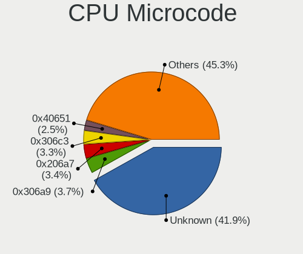

| Number     | Computers | Percent |
|------------|-----------|---------|
| Unknown    | 154       | 21.48%  |
| 0x306a9    | 38        | 5.3%    |
| 0x206a7    | 36        | 5.02%   |
| 0x306c3    | 33        | 4.6%    |
| 0x1067a    | 28        | 3.91%   |
| 0x40651    | 26        | 3.63%   |
| 0x406e3    | 23        | 3.21%   |
| 0x906ea    | 21        | 2.93%   |
| 0x506e3    | 20        | 2.79%   |
| 0x806ea    | 19        | 2.65%   |
| 0x806e9    | 18        | 2.51%   |
| 0x806ec    | 16        | 2.23%   |
| 0x906e9    | 15        | 2.09%   |
| 0x20655    | 12        | 1.67%   |
| 0x0800820d | 10        | 1.39%   |
| 0x906ed    | 9         | 1.26%   |
| 0x806eb    | 8         | 1.12%   |
| 0x20652    | 8         | 1.12%   |
| 0x08600106 | 8         | 1.12%   |
| 0x6fd      | 7         | 0.98%   |
| 0x0a50000c | 7         | 0.98%   |
| 0x08701021 | 7         | 0.98%   |
| 0x08701013 | 7         | 0.98%   |
| 0x010000c8 | 7         | 0.98%   |
| 0x706e5    | 6         | 0.84%   |
| 0x406c3    | 6         | 0.84%   |
| 0x10676    | 6         | 0.84%   |
| 0x08600104 | 6         | 0.84%   |
| 0x0810100b | 6         | 0.84%   |
| 0x08001138 | 6         | 0.84%   |
| 0x806c1    | 5         | 0.7%    |
| 0x306d4    | 5         | 0.7%    |
| 0x0a201009 | 5         | 0.7%    |
| 0x08108102 | 5         | 0.7%    |
| 0x06000852 | 5         | 0.7%    |
| 0xa0653    | 4         | 0.56%   |
| 0x6f6      | 4         | 0.56%   |
| 0x30678    | 4         | 0.56%   |
| 0x08108109 | 4         | 0.56%   |
| 0x07030105 | 4         | 0.56%   |

CPU Microarch
-------------

Microarchitecture

| Name             | Computers | Percent |
|------------------|-----------|---------|
| KabyLake         | 137       | 19.68%  |
| Haswell          | 72        | 10.34%  |
| Skylake          | 55        | 7.9%    |
| SandyBridge      | 48        | 6.9%    |
| IvyBridge        | 47        | 6.75%   |
| Penryn           | 42        | 6.03%   |
| Zen 2            | 40        | 5.75%   |
| Westmere         | 24        | 3.45%   |
| Zen+             | 23        | 3.3%    |
| Unknown          | 21        | 3.02%   |
| Zen 3            | 19        | 2.73%   |
| Core             | 18        | 2.59%   |
| Zen              | 16        | 2.3%    |
| Silvermont       | 16        | 2.3%    |
| CometLake        | 13        | 1.87%   |
| K10              | 12        | 1.72%   |
| Piledriver       | 10        | 1.44%   |
| Broadwell        | 10        | 1.44%   |
| Icelake          | 9         | 1.29%   |
| TigerLake        | 8         | 1.15%   |
| K8 Hammer        | 7         | 1.01%   |
| Excavator        | 7         | 1.01%   |
| Puma             | 5         | 0.72%   |
| Nehalem          | 5         | 0.72%   |
| Bobcat           | 5         | 0.72%   |
| P6               | 4         | 0.57%   |
| Goldmont plus    | 4         | 0.57%   |
| Bonnell          | 4         | 0.57%   |
| K8 & K10 hybrid  | 3         | 0.43%   |
| Goldmont         | 3         | 0.43%   |
| Alderlake Hybrid | 3         | 0.43%   |
| Steamroller      | 2         | 0.29%   |
| Bulldozer        | 2         | 0.29%   |
| K10 Llano        | 1         | 0.14%   |
| Jaguar           | 1         | 0.14%   |

Graphics
--------

GPU Vendor
----------

Vendors of graphics cards

| Vendor                           | Computers | Percent |
|----------------------------------|-----------|---------|
| Intel                            | 386       | 46.84%  |
| Nvidia                           | 268       | 32.52%  |
| AMD                              | 166       | 20.15%  |
| ASPEED Technology                | 2         | 0.24%   |
| Silicon Integrated Systems [SiS] | 1         | 0.12%   |
| Matrox Electronics Systems       | 1         | 0.12%   |

GPU Model
---------

Graphics card models

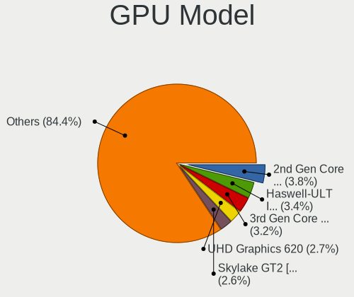

| Model                                                                                    | Computers | Percent |
|------------------------------------------------------------------------------------------|-----------|---------|
| Intel 2nd Generation Core Processor Family Integrated Graphics Controller                | 35        | 4.14%   |
| Intel Haswell-ULT Integrated Graphics Controller                                         | 27        | 3.19%   |
| Intel UHD Graphics 620                                                                   | 26        | 3.07%   |
| Intel 3rd Gen Core processor Graphics Controller                                         | 26        | 3.07%   |
| Intel Skylake GT2 [HD Graphics 520]                                                      | 25        | 2.96%   |
| Intel HD Graphics 620                                                                    | 20        | 2.36%   |
| Intel CoffeeLake-H GT2 [UHD Graphics 630]                                                | 20        | 2.36%   |
| AMD Renoir                                                                               | 17        | 2.01%   |
| Intel WhiskeyLake-U GT2 [UHD Graphics 620]                                               | 16        | 1.89%   |
| Intel 4th Gen Core Processor Integrated Graphics Controller                              | 15        | 1.77%   |
| Intel Mobile 4 Series Chipset Integrated Graphics Controller                             | 14        | 1.65%   |
| Intel HD Graphics 630                                                                    | 14        | 1.65%   |
| Intel Core Processor Integrated Graphics Controller                                      | 11        | 1.3%    |
| AMD Picasso/Raven 2 [Radeon Vega Series / Radeon Vega Mobile Series]                     | 11        | 1.3%    |
| AMD Navi 10 [Radeon RX 5600 OEM/5600 XT / 5700/5700 XT]                                  | 11        | 1.3%    |
| AMD Ellesmere [Radeon RX 470/480/570/570X/580/580X/590]                                  | 11        | 1.3%    |
| AMD Cezanne                                                                              | 11        | 1.3%    |
| Intel Xeon E3-1200 v3/4th Gen Core Processor Integrated Graphics Controller              | 10        | 1.18%   |
| Intel HD Graphics 530                                                                    | 10        | 1.18%   |
| Intel CometLake-U GT2 [UHD Graphics]                                                     | 10        | 1.18%   |
| Intel Atom/Celeron/Pentium Processor x5-E8000/J3xxx/N3xxx Integrated Graphics Controller | 10        | 1.18%   |
| Nvidia GP107M [GeForce GTX 1050 Mobile]                                                  | 8         | 0.95%   |
| Intel TigerLake-LP GT2 [Iris Xe Graphics]                                                | 8         | 0.95%   |
| Nvidia GP107 [GeForce GTX 1050]                                                          | 7         | 0.83%   |
| Nvidia GP108M [GeForce MX150]                                                            | 6         | 0.71%   |
| Nvidia GP108 [GeForce GT 1030]                                                           | 6         | 0.71%   |
| Nvidia GP107M [GeForce GTX 1050 Ti Mobile]                                               | 6         | 0.71%   |
| Intel Xeon E3-1200 v2/3rd Gen Core processor Graphics Controller                         | 6         | 0.71%   |
| Intel Mobile GM965/GL960 Integrated Graphics Controller (secondary)                      | 6         | 0.71%   |
| Intel Mobile GM965/GL960 Integrated Graphics Controller (primary)                        | 6         | 0.71%   |
| Intel HD Graphics 5500                                                                   | 6         | 0.71%   |
| Intel CoffeeLake-S GT2 [UHD Graphics 630]                                                | 6         | 0.71%   |
| Intel Atom Processor Z36xxx/Z37xxx Series Graphics & Display                             | 6         | 0.71%   |
| AMD Raven Ridge [Radeon Vega Series / Radeon Vega Mobile Series]                         | 6         | 0.71%   |
| Nvidia TU116 [GeForce GTX 1660 SUPER]                                                    | 5         | 0.59%   |
| Nvidia GP107 [GeForce GTX 1050 Ti]                                                       | 5         | 0.59%   |
| Nvidia GP102 [GeForce GTX 1080 Ti]                                                       | 5         | 0.59%   |
| Intel CometLake-H GT2 [UHD Graphics]                                                     | 5         | 0.59%   |
| Intel 4 Series Chipset Integrated Graphics Controller                                    | 5         | 0.59%   |
| AMD Mullins [Radeon R4/R5 Graphics]                                                      | 5         | 0.59%   |

GPU Combo
---------

Combinations of graphics cards

| Name            | Computers | Percent |
|-----------------|-----------|---------|
| 1 x Intel       | 263       | 37.73%  |
| 1 x Nvidia      | 161       | 23.1%   |
| 1 x AMD         | 123       | 17.65%  |
| Intel + Nvidia  | 92        | 13.2%   |
| Intel + AMD     | 18        | 2.58%   |
| 2 x AMD         | 13        | 1.87%   |
| AMD + Nvidia    | 11        | 1.58%   |
| Other           | 10        | 1.43%   |
| 2 x Nvidia      | 2         | 0.29%   |
| 1 x SiS         | 1         | 0.14%   |
| Nvidia + ASPEED | 1         | 0.14%   |
| 1 x Matrox      | 1         | 0.14%   |
| 1 x ASPEED      | 1         | 0.14%   |

GPU Driver
----------

Free vs proprietary

| Driver      | Computers | Percent |
|-------------|-----------|---------|
| Free        | 536       | 75.49%  |
| Proprietary | 148       | 20.85%  |
| Unknown     | 26        | 3.66%   |

GPU Memory
----------

Total video memory

| Size in GB | Computers | Percent |
|------------|-----------|---------|
| Unknown    | 366       | 51.62%  |
| 1.01-2.0   | 109       | 15.37%  |
| 0.01-0.5   | 81        | 11.42%  |
| 3.01-4.0   | 40        | 5.64%   |
| 7.01-8.0   | 37        | 5.22%   |
| 0.51-1.0   | 37        | 5.22%   |
| 5.01-6.0   | 26        | 3.67%   |
| 8.01-16.0  | 10        | 1.41%   |
| 2.01-3.0   | 2         | 0.28%   |
| 4.01-5.0   | 1         | 0.14%   |

Monitor
-------

Monitor Vendor
--------------

Monitor vendors

| Vendor                  | Computers | Percent |
|-------------------------|-----------|---------|
| Samsung Electronics     | 113       | 14.05%  |
| AU Optronics            | 105       | 13.06%  |
| LG Display              | 71        | 8.83%   |
| Chimei Innolux          | 52        | 6.47%   |
| BOE                     | 50        | 6.22%   |
| Dell                    | 46        | 5.72%   |
| Lenovo                  | 38        | 4.73%   |
| Philips                 | 27        | 3.36%   |
| AOC                     | 27        | 3.36%   |
| Hewlett-Packard         | 24        | 2.99%   |
| Ancor Communications    | 22        | 2.74%   |
| Apple                   | 20        | 2.49%   |
| Sharp                   | 18        | 2.24%   |
| Goldstar                | 18        | 2.24%   |
| Acer                    | 18        | 2.24%   |
| BenQ                    | 17        | 2.11%   |
| ASUSTek Computer        | 15        | 1.87%   |
| Sony                    | 13        | 1.62%   |
| Chi Mei Optoelectronics | 10        | 1.24%   |
| PANDA                   | 7         | 0.87%   |
| Unknown                 | 6         | 0.75%   |
| Panasonic               | 6         | 0.75%   |
| InfoVision              | 6         | 0.75%   |
| Medion                  | 5         | 0.62%   |
| Lenovo Group Limited    | 5         | 0.62%   |
| Packard Bell            | 4         | 0.5%    |
| MSI                     | 4         | 0.5%    |
| LG Electronics          | 4         | 0.5%    |
| ViewSonic               | 3         | 0.37%   |
| Vestel Elektronik       | 3         | 0.37%   |
| LG Philips              | 3         | 0.37%   |
| Fujitsu Siemens         | 3         | 0.37%   |
| Tech Concepts           | 2         | 0.25%   |
| Seiko/Epson             | 2         | 0.25%   |
| LGD                     | 2         | 0.25%   |
| Idek Iiyama             | 2         | 0.25%   |
| IBM                     | 2         | 0.25%   |
| Gigabyte Technology     | 2         | 0.25%   |
| CSO                     | 2         | 0.25%   |
| CPT                     | 2         | 0.25%   |

Monitor Model
-------------

Monitor models

| Model                                                                    | Computers | Percent |
|--------------------------------------------------------------------------|-----------|---------|
| Lenovo LCD Monitor LEN40B1 1600x900 345x194mm 15.6-inch                  | 6         | 0.71%   |
| ASUSTek Computer VA326 AUS32FA 1920x1080 698x393mm 31.5-inch             | 6         | 0.71%   |
| Chimei Innolux LCD Monitor CMN14D4 1920x1080 309x173mm 13.9-inch         | 5         | 0.59%   |
| AU Optronics LCD Monitor AUO573D 1920x1080 309x174mm 14.0-inch           | 5         | 0.59%   |
| AU Optronics LCD Monitor AUO38ED 1920x1080 344x193mm 15.5-inch           | 5         | 0.59%   |
| Samsung Electronics SyncMaster SAM05CD 1920x1080                         | 4         | 0.47%   |
| LG Display LCD Monitor LGD0521 1920x1080 309x174mm 14.0-inch             | 4         | 0.47%   |
| AU Optronics LCD Monitor AUO123D 1920x1080 309x173mm 13.9-inch           | 4         | 0.47%   |
| Vestel Elektronik 24W_LCD_TV VES3700 1920x1080 706x398mm 31.9-inch       | 3         | 0.35%   |
| Sony TV SNYEE01 1920x1080                                                | 3         | 0.35%   |
| Samsung Electronics S24F350 SAM0D20 1920x1080 521x293mm 23.5-inch        | 3         | 0.35%   |
| Samsung Electronics LCD Monitor SEC544B 1600x900 382x215mm 17.3-inch     | 3         | 0.35%   |
| Panasonic TDM13O56 MEI96A2 3000x2000 285x190mm 13.5-inch                 | 3         | 0.35%   |
| Packard Bell Maestro223DXL PKB01B2 1920x1080 477x268mm 21.5-inch         | 3         | 0.35%   |
| Chimei Innolux LCD Monitor CMN15D5 1920x1080 344x193mm 15.5-inch         | 3         | 0.35%   |
| Chimei Innolux LCD Monitor CMN14D5 1920x1080 309x173mm 13.9-inch         | 3         | 0.35%   |
| Chi Mei Optoelectronics LCD Monitor CMO1719 1600x900 382x215mm 17.3-inch | 3         | 0.35%   |
| AU Optronics LCD Monitor AUO2E8D 1920x1080 344x194mm 15.5-inch           | 3         | 0.35%   |
| AU Optronics LCD Monitor AUO243D 1920x1080 309x173mm 13.9-inch           | 3         | 0.35%   |
| AU Optronics LCD Monitor AUO213E 1600x900 309x174mm 14.0-inch            | 3         | 0.35%   |
| AU Optronics LCD Monitor AUO203D 1920x1080 309x174mm 14.0-inch           | 3         | 0.35%   |
| AU Optronics LCD Monitor AUO109E 1600x900 382x214mm 17.2-inch            | 3         | 0.35%   |
| AOC Q32G1WG4 AOC3201 2560x1440 697x393mm 31.5-inch                       | 3         | 0.35%   |
| AOC 2460G5 AOC2460 1920x1080 531x299mm 24.0-inch                         | 3         | 0.35%   |
| Ancor Communications MX279 ACI27C3 1920x1080 598x336mm 27.0-inch         | 3         | 0.35%   |
| Acer KG241Q ACR0604 1920x1080 521x293mm 23.5-inch                        | 3         | 0.35%   |
| Tech Concepts LCD Monitor TCL SMART TV 3840x2160                         | 2         | 0.24%   |
| Sharp LCD Monitor SHP149A 1920x1080 344x194mm 15.5-inch                  | 2         | 0.24%   |
| Sharp LCD Monitor SHP148D 3840x2160 344x194mm 15.5-inch                  | 2         | 0.24%   |
| Sharp LCD Monitor SHP1476 3840x2160 346x194mm 15.6-inch                  | 2         | 0.24%   |
| Samsung Electronics U32R59x SAM0F94 3840x2160 697x392mm 31.5-inch        | 2         | 0.24%   |
| Samsung Electronics U28E590 SAM0C4C 3840x2160 608x345mm 27.5-inch        | 2         | 0.24%   |
| Samsung Electronics SyncMaster SAM055E 1920x1080 510x290mm 23.1-inch     | 2         | 0.24%   |
| Samsung Electronics S27F350 SAM0D22 1920x1080 598x336mm 27.0-inch        | 2         | 0.24%   |
| Samsung Electronics LCD Monitor SEC5441 1366x768 353x198mm 15.9-inch     | 2         | 0.24%   |
| Samsung Electronics LCD Monitor SEC3641 1366x768 353x198mm 15.9-inch     | 2         | 0.24%   |
| Samsung Electronics LCD Monitor SEC3152 1366x768 344x194mm 15.5-inch     | 2         | 0.24%   |
| Samsung Electronics LCD Monitor SDC4A42 1366x768 309x174mm 14.0-inch     | 2         | 0.24%   |
| Samsung Electronics LCD Monitor S24F350 1920x1080                        | 2         | 0.24%   |
| Philips PHL 272B8Q PHL0918 2560x1440 597x336mm 27.0-inch                 | 2         | 0.24%   |

Monitor Resolution
------------------

Monitor screen resolution

| Resolution         | Computers | Percent |
|--------------------|-----------|---------|
| 1920x1080 (FHD)    | 359       | 46.5%   |
| 1366x768 (WXGA)    | 88        | 11.4%   |
| 3840x2160 (4K)     | 70        | 9.07%   |
| 2560x1440 (QHD)    | 53        | 6.87%   |
| 1600x900 (HD+)     | 38        | 4.92%   |
| 1680x1050 (WSXGA+) | 22        | 2.85%   |
| 1280x800 (WXGA)    | 17        | 2.2%    |
| Unknown            | 17        | 2.2%    |
| 1920x1200 (WUXGA)  | 14        | 1.81%   |
| 1280x1024 (SXGA)   | 14        | 1.81%   |
| 1440x900 (WXGA+)   | 13        | 1.68%   |
| 3440x1440          | 8         | 1.04%   |
| 3840x1080          | 7         | 0.91%   |
| 2880x1800          | 5         | 0.65%   |
| 2560x1600          | 5         | 0.65%   |
| 1360x768           | 4         | 0.52%   |
| 2160x1440          | 3         | 0.39%   |
| 1920x540           | 3         | 0.39%   |
| 1400x1050          | 3         | 0.39%   |
| 3840x2400          | 2         | 0.26%   |
| 3840x1600          | 2         | 0.26%   |
| 3840x1200          | 2         | 0.26%   |
| 3200x1800 (QHD+)   | 2         | 0.26%   |
| 3000x2000          | 2         | 0.26%   |
| 1024x600           | 2         | 0.26%   |
| 9840x3840          | 1         | 0.13%   |
| 800x1280           | 1         | 0.13%   |
| 6400x2160          | 1         | 0.13%   |
| 5760x1440          | 1         | 0.13%   |
| 5760x1080          | 1         | 0.13%   |
| 5120x1440          | 1         | 0.13%   |
| 4608x1440          | 1         | 0.13%   |
| 4480x1440          | 1         | 0.13%   |
| 3840x1100          | 1         | 0.13%   |
| 3200x1200          | 1         | 0.13%   |
| 3200x1080          | 1         | 0.13%   |
| 2736x1824          | 1         | 0.13%   |
| 2560x1080          | 1         | 0.13%   |
| 2560x1024          | 1         | 0.13%   |
| 2048x1152          | 1         | 0.13%   |

Monitor Diagonal
----------------

Diagonal size in inches

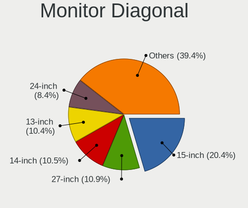

| Inches  | Computers | Percent |
|---------|-----------|---------|
| 15      | 180       | 22.36%  |
| 27      | 85        | 10.56%  |
| 14      | 75        | 9.32%   |
| 13      | 75        | 9.32%   |
| 24      | 67        | 8.32%   |
| Unknown | 59        | 7.33%   |
| 23      | 45        | 5.59%   |
| 17      | 39        | 4.84%   |
| 21      | 29        | 3.6%    |
| 31      | 26        | 3.23%   |
| 12      | 21        | 2.61%   |
| 22      | 14        | 1.74%   |
| 19      | 14        | 1.74%   |
| 20      | 11        | 1.37%   |
| 84      | 10        | 1.24%   |
| 72      | 10        | 1.24%   |
| 34      | 8         | 0.99%   |
| 11      | 5         | 0.62%   |
| 18      | 4         | 0.5%    |
| 25      | 3         | 0.37%   |
| 10      | 3         | 0.37%   |
| 65      | 2         | 0.25%   |
| 55      | 2         | 0.25%   |
| 54      | 2         | 0.25%   |
| 37      | 2         | 0.25%   |
| 29      | 2         | 0.25%   |
| 28      | 2         | 0.25%   |
| 60      | 1         | 0.12%   |
| 48      | 1         | 0.12%   |
| 46      | 1         | 0.12%   |
| 40      | 1         | 0.12%   |
| 39      | 1         | 0.12%   |
| 38      | 1         | 0.12%   |
| 33      | 1         | 0.12%   |
| 32      | 1         | 0.12%   |
| 30      | 1         | 0.12%   |
| 16      | 1         | 0.12%   |

Monitor Width
-------------

Physical width

| Width in mm | Computers | Percent |
|-------------|-----------|---------|
| 301-350     | 287       | 36.65%  |
| 501-600     | 168       | 21.46%  |
| 201-300     | 67        | 8.56%   |
| 401-500     | 62        | 7.92%   |
| Unknown     | 59        | 7.54%   |
| 351-400     | 52        | 6.64%   |
| 601-700     | 44        | 5.62%   |
| 1501-2000   | 20        | 2.55%   |
| 701-800     | 10        | 1.28%   |
| 1001-1500   | 9         | 1.15%   |
| 801-900     | 5         | 0.64%   |

Aspect Ratio
------------

Proportional relationship between the width and the height

| Ratio   | Computers | Percent |
|---------|-----------|---------|
| 16/9    | 529       | 75.14%  |
| 16/10   | 85        | 12.07%  |
| Unknown | 49        | 6.96%   |
| 5/4     | 12        | 1.7%    |
| 21/9    | 11        | 1.56%   |
| 3/2     | 9         | 1.28%   |
| 4/3     | 5         | 0.71%   |
| 32/9    | 2         | 0.28%   |
| 3.40    | 1         | 0.14%   |
| 0.62    | 1         | 0.14%   |

Monitor Area
------------

Area in inch

| Area in inch | Computers | Percent |
|----------------|-----------|---------|
| 101-110        | 179       | 22.46%  |
| 201-250        | 121       | 15.18%  |
| 81-90          | 118       | 14.81%  |
| 301-350        | 85        | 10.66%  |
| Unknown        | 59        | 7.4%    |
| 351-500        | 39        | 4.89%   |
| 71-80          | 33        | 4.14%   |
| 151-200        | 31        | 3.89%   |
| 121-130        | 28        | 3.51%   |
| More than 1000 | 27        | 3.39%   |
| 251-300        | 26        | 3.26%   |
| 61-70          | 18        | 2.26%   |
| 131-140        | 8         | 1%      |
| 501-1000       | 7         | 0.88%   |
| 51-60          | 6         | 0.75%   |
| 141-150        | 6         | 0.75%   |
| 41-50          | 3         | 0.38%   |
| 91-100         | 2         | 0.25%   |
| 111-120        | 1         | 0.13%   |

Pixel Density
-------------

Pixels per inch

| Density       | Computers | Percent |
|---------------|-----------|---------|
| 51-100        | 229       | 29.86%  |
| 121-160       | 226       | 29.47%  |
| 101-120       | 169       | 22.03%  |
| Unknown       | 59        | 7.69%   |
| 161-240       | 41        | 5.35%   |
| More than 240 | 26        | 3.39%   |
| 1-50          | 17        | 2.22%   |

Multiple Monitors
-----------------

Total monitors connected

| Total | Computers | Percent |
|-------|-----------|---------|
| 1     | 538       | 75.46%  |
| 2     | 132       | 18.51%  |
| 0     | 24        | 3.37%   |
| 3     | 17        | 2.38%   |
| 4     | 2         | 0.28%   |

Network
-------

Net Controller Vendor
---------------------

Controller vendors

| Vendor                            | Computers | Percent |
|-----------------------------------|-----------|---------|
| Intel                             | 383       | 36.58%  |
| Realtek Semiconductor             | 328       | 31.33%  |
| Qualcomm Atheros                  | 98        | 9.36%   |
| Broadcom                          | 55        | 5.25%   |
| Nvidia                            | 15        | 1.43%   |
| Lenovo                            | 14        | 1.34%   |
| Broadcom Limited                  | 13        | 1.24%   |
| Ralink                            | 12        | 1.15%   |
| Sierra Wireless                   | 11        | 1.05%   |
| MediaTek                          | 11        | 1.05%   |
| Ralink Technology                 | 10        | 0.96%   |
| Ericsson Business Mobile Networks | 9         | 0.86%   |
| Marvell Technology Group          | 8         | 0.76%   |
| TP-Link                           | 6         | 0.57%   |
| ASUSTek Computer                  | 6         | 0.57%   |
| DisplayLink                       | 5         | 0.48%   |
| ASIX Electronics                  | 5         | 0.48%   |
| Aquantia                          | 5         | 0.48%   |
| Qualcomm Atheros Communications   | 4         | 0.38%   |
| OnePlus Technology (Shenzhen)     | 4         | 0.38%   |
| IMC Networks                      | 4         | 0.38%   |
| Huawei Technologies               | 4         | 0.38%   |
| Dell                              | 4         | 0.38%   |
| Samsung Electronics               | 3         | 0.29%   |
| Edimax Technology                 | 3         | 0.29%   |
| Qualcomm                          | 2         | 0.19%   |
| NetGear                           | 2         | 0.19%   |
| Microsoft                         | 2         | 0.19%   |
| Linksys                           | 2         | 0.19%   |
| ICS Advent                        | 2         | 0.19%   |
| D-Link System                     | 2         | 0.19%   |
| D-Link                            | 2         | 0.19%   |
| ZyXEL Communications              | 1         | 0.1%    |
| Xiaomi                            | 1         | 0.1%    |
| Texas Instruments                 | 1         | 0.1%    |
| Standard Microsystems             | 1         | 0.1%    |
| Solarflare Communications         | 1         | 0.1%    |
| Silicon Integrated Systems [SiS]  | 1         | 0.1%    |
| Philips (or NXP)                  | 1         | 0.1%    |
| JMicron Technology                | 1         | 0.1%    |

Net Controller Model
--------------------

Controller models

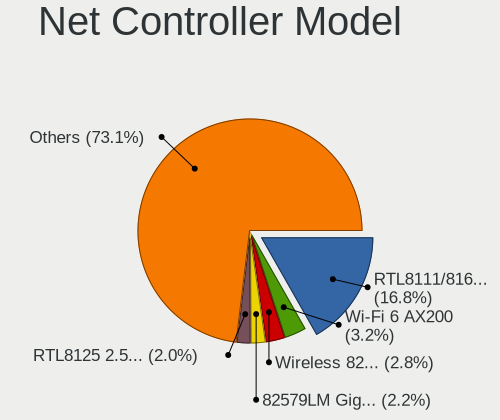

| Model                                                             | Computers | Percent |
|-------------------------------------------------------------------|-----------|---------|
| Realtek RTL8111/8168/8411 PCI Express Gigabit Ethernet Controller | 235       | 18.42%  |
| Intel Wi-Fi 6 AX200                                               | 36        | 2.82%   |
| Intel 82579LM Gigabit Network Connection (Lewisville)             | 33        | 2.59%   |
| Realtek RTL810xE PCI Express Fast Ethernet controller             | 32        | 2.51%   |
| Intel Wireless 8265 / 8275                                        | 30        | 2.35%   |
| Intel Wireless 7260                                               | 25        | 1.96%   |
| Intel I211 Gigabit Network Connection                             | 23        | 1.8%    |
| Intel Centrino Advanced-N 6205 [Taylor Peak]                      | 23        | 1.8%    |
| Qualcomm Atheros QCA6174 802.11ac Wireless Network Adapter        | 19        | 1.49%   |
| Intel Wireless 8260                                               | 19        | 1.49%   |
| Realtek RTL8153 Gigabit Ethernet Adapter                          | 16        | 1.25%   |
| Intel Wireless 7265                                               | 16        | 1.25%   |
| Intel Ethernet Connection (2) I219-V                              | 16        | 1.25%   |
| Intel Wireless-AC 9260                                            | 14        | 1.1%    |
| Intel Cannon Point-LP CNVi [Wireless-AC]                          | 14        | 1.1%    |
| Realtek RTL8125 2.5GbE Controller                                 | 13        | 1.02%   |
| Intel Ethernet Connection I217-LM                                 | 13        | 1.02%   |
| Intel Ethernet Connection (4) I219-LM                             | 13        | 1.02%   |
| Qualcomm Atheros QCA9377 802.11ac Wireless Network Adapter        | 12        | 0.94%   |
| Intel Ethernet Connection I218-LM                                 | 12        | 0.94%   |
| Intel Dual Band Wireless-AC 3168NGW [Stone Peak]                  | 11        | 0.86%   |
| Intel Comet Lake PCH-LP CNVi WiFi                                 | 11        | 0.86%   |
| Qualcomm Atheros QCA9565 / AR9565 Wireless Network Adapter        | 10        | 0.78%   |
| Intel Ethernet Connection (7) I219-V                              | 10        | 0.78%   |
| Intel Dual Band Wireless-AC 3165 Plus Bluetooth                   | 10        | 0.78%   |
| Realtek RTL8821CE 802.11ac PCIe Wireless Network Adapter          | 9         | 0.71%   |
| Qualcomm Atheros AR9285 Wireless Network Adapter (PCI-Express)    | 9         | 0.71%   |
| Intel Ethernet Connection I219-LM                                 | 9         | 0.71%   |
| Intel Centrino Wireless-N 2230                                    | 9         | 0.71%   |
| Intel Cannon Lake PCH CNVi WiFi                                   | 9         | 0.71%   |
| Realtek RTL8822BE 802.11a/b/g/n/ac WiFi adapter                   | 8         | 0.63%   |
| Qualcomm Atheros AR928X Wireless Network Adapter (PCI-Express)    | 8         | 0.63%   |
| Broadcom BCM4360 802.11ac Wireless Network Adapter                | 8         | 0.63%   |
| Broadcom BCM4313 802.11bgn Wireless Network Adapter               | 8         | 0.63%   |
| Qualcomm Atheros AR9485 Wireless Network Adapter                  | 7         | 0.55%   |
| MediaTek MT7921 802.11ax PCI Express Wireless Network Adapter     | 7         | 0.55%   |
| Intel Ethernet Controller I225-V                                  | 7         | 0.55%   |
| Intel Ethernet Connection I219-V                                  | 7         | 0.55%   |
| Intel Ethernet Connection (7) I219-LM                             | 7         | 0.55%   |
| Intel Ethernet Connection (4) I219-V                              | 7         | 0.55%   |

Wireless Vendor
---------------

Wireless vendors

| Vendor                            | Computers | Percent |
|-----------------------------------|-----------|---------|
| Intel                             | 299       | 51.29%  |
| Qualcomm Atheros                  | 81        | 13.89%  |
| Realtek Semiconductor             | 72        | 12.35%  |
| Broadcom                          | 37        | 6.35%   |
| Ralink                            | 12        | 2.06%   |
| Sierra Wireless                   | 11        | 1.89%   |
| Ralink Technology                 | 10        | 1.72%   |
| MediaTek                          | 10        | 1.72%   |
| Broadcom Limited                  | 8         | 1.37%   |
| TP-Link                           | 6         | 1.03%   |
| ASUSTek Computer                  | 6         | 1.03%   |
| Qualcomm Atheros Communications   | 4         | 0.69%   |
| IMC Networks                      | 4         | 0.69%   |
| Edimax Technology                 | 3         | 0.51%   |
| Dell                              | 3         | 0.51%   |
| NetGear                           | 2         | 0.34%   |
| Microsoft                         | 2         | 0.34%   |
| Marvell Technology Group          | 2         | 0.34%   |
| Ericsson Business Mobile Networks | 2         | 0.34%   |
| D-Link System                     | 2         | 0.34%   |
| D-Link                            | 2         | 0.34%   |
| ZyXEL Communications              | 1         | 0.17%   |
| Qualcomm                          | 1         | 0.17%   |
| Philips (or NXP)                  | 1         | 0.17%   |
| Linksys                           | 1         | 0.17%   |
| FIBOCOM                           | 1         | 0.17%   |

Wireless Model
--------------

Wireless models

| Model                                                                   | Computers | Percent |
|-------------------------------------------------------------------------|-----------|---------|
| Intel Wi-Fi 6 AX200                                                     | 36        | 6.13%   |
| Intel Wireless 8265 / 8275                                              | 30        | 5.11%   |
| Intel Wireless 7260                                                     | 25        | 4.26%   |
| Intel Centrino Advanced-N 6205 [Taylor Peak]                            | 23        | 3.92%   |
| Qualcomm Atheros QCA6174 802.11ac Wireless Network Adapter              | 19        | 3.24%   |
| Intel Wireless 8260                                                     | 19        | 3.24%   |
| Intel Wireless 7265                                                     | 16        | 2.73%   |
| Intel Wireless-AC 9260                                                  | 14        | 2.39%   |
| Intel Cannon Point-LP CNVi [Wireless-AC]                                | 14        | 2.39%   |
| Qualcomm Atheros QCA9377 802.11ac Wireless Network Adapter              | 12        | 2.04%   |
| Intel Dual Band Wireless-AC 3168NGW [Stone Peak]                        | 11        | 1.87%   |
| Intel Comet Lake PCH-LP CNVi WiFi                                       | 11        | 1.87%   |
| Qualcomm Atheros QCA9565 / AR9565 Wireless Network Adapter              | 10        | 1.7%    |
| Intel Dual Band Wireless-AC 3165 Plus Bluetooth                         | 10        | 1.7%    |
| Realtek RTL8821CE 802.11ac PCIe Wireless Network Adapter                | 9         | 1.53%   |
| Qualcomm Atheros AR9285 Wireless Network Adapter (PCI-Express)          | 9         | 1.53%   |
| Intel Centrino Wireless-N 2230                                          | 9         | 1.53%   |
| Intel Cannon Lake PCH CNVi WiFi                                         | 9         | 1.53%   |
| Realtek RTL8822BE 802.11a/b/g/n/ac WiFi adapter                         | 8         | 1.36%   |
| Qualcomm Atheros AR928X Wireless Network Adapter (PCI-Express)          | 8         | 1.36%   |
| Broadcom BCM4360 802.11ac Wireless Network Adapter                      | 8         | 1.36%   |
| Broadcom BCM4313 802.11bgn Wireless Network Adapter                     | 8         | 1.36%   |
| Qualcomm Atheros AR9485 Wireless Network Adapter                        | 7         | 1.19%   |
| MediaTek MT7921 802.11ax PCI Express Wireless Network Adapter           | 7         | 1.19%   |
| Realtek RTL8723BE PCIe Wireless Network Adapter                         | 6         | 1.02%   |
| Qualcomm Atheros AR242x / AR542x Wireless Network Adapter (PCI-Express) | 6         | 1.02%   |
| Intel PRO/Wireless 5100 AGN [Shiloh] Network Connection                 | 6         | 1.02%   |
| Intel Ice Lake-LP PCH CNVi WiFi                                         | 6         | 1.02%   |
| Intel Centrino Ultimate-N 6300                                          | 6         | 1.02%   |
| Sierra Wireless EM7455                                                  | 5         | 0.85%   |
| Sierra Wireless EM7345 4G LTE                                           | 5         | 0.85%   |
| Realtek RTL8822CE 802.11ac PCIe Wireless Network Adapter                | 5         | 0.85%   |
| Realtek RTL8188CE 802.11b/g/n WiFi Adapter                              | 5         | 0.85%   |
| Realtek 802.11ac NIC                                                    | 5         | 0.85%   |
| Intel Wireless 3165                                                     | 5         | 0.85%   |
| Intel Wireless 3160                                                     | 5         | 0.85%   |
| Intel Wi-Fi 6 AX210/AX211/AX411 160MHz                                  | 5         | 0.85%   |
| Intel Wi-Fi 6 AX201                                                     | 5         | 0.85%   |
| Intel Comet Lake PCH CNVi WiFi                                          | 5         | 0.85%   |
| Intel Centrino Advanced-N 6200                                          | 5         | 0.85%   |

Ethernet Vendor
---------------

Ethernet vendors

| Vendor                           | Computers | Percent |
|----------------------------------|-----------|---------|
| Realtek Semiconductor            | 302       | 45.55%  |
| Intel                            | 238       | 35.9%   |
| Qualcomm Atheros                 | 25        | 3.77%   |
| Broadcom                         | 23        | 3.47%   |
| Nvidia                           | 15        | 2.26%   |
| Lenovo                           | 14        | 2.11%   |
| Marvell Technology Group         | 6         | 0.9%    |
| DisplayLink                      | 5         | 0.75%   |
| Broadcom Limited                 | 5         | 0.75%   |
| ASIX Electronics                 | 5         | 0.75%   |
| Aquantia                         | 5         | 0.75%   |
| Samsung Electronics              | 3         | 0.45%   |
| OnePlus Technology (Shenzhen)    | 3         | 0.45%   |
| ICS Advent                       | 2         | 0.3%    |
| Huawei Technologies              | 2         | 0.3%    |
| Xiaomi                           | 1         | 0.15%   |
| Standard Microsystems            | 1         | 0.15%   |
| Solarflare Communications        | 1         | 0.15%   |
| Silicon Integrated Systems [SiS] | 1         | 0.15%   |
| Qualcomm                         | 1         | 0.15%   |
| MediaTek                         | 1         | 0.15%   |
| Linksys                          | 1         | 0.15%   |
| JMicron Technology               | 1         | 0.15%   |
| HMD Global                       | 1         | 0.15%   |
| Google                           | 1         | 0.15%   |

Ethernet Model
--------------

Ethernet models

| Model                                                             | Computers | Percent |
|-------------------------------------------------------------------|-----------|---------|
| Realtek RTL8111/8168/8411 PCI Express Gigabit Ethernet Controller | 235       | 34.87%  |
| Intel 82579LM Gigabit Network Connection (Lewisville)             | 33        | 4.9%    |
| Realtek RTL810xE PCI Express Fast Ethernet controller             | 32        | 4.75%   |
| Intel I211 Gigabit Network Connection                             | 23        | 3.41%   |
| Realtek RTL8153 Gigabit Ethernet Adapter                          | 16        | 2.37%   |
| Intel Ethernet Connection (2) I219-V                              | 16        | 2.37%   |
| Realtek RTL8125 2.5GbE Controller                                 | 13        | 1.93%   |
| Intel Ethernet Connection I217-LM                                 | 13        | 1.93%   |
| Intel Ethernet Connection (4) I219-LM                             | 13        | 1.93%   |
| Intel Ethernet Connection I218-LM                                 | 12        | 1.78%   |
| Intel Ethernet Connection (7) I219-V                              | 10        | 1.48%   |
| Intel Ethernet Connection I219-LM                                 | 9         | 1.34%   |
| Intel Ethernet Controller I225-V                                  | 7         | 1.04%   |
| Intel Ethernet Connection I219-V                                  | 7         | 1.04%   |
| Intel Ethernet Connection (7) I219-LM                             | 7         | 1.04%   |
| Intel Ethernet Connection (4) I219-V                              | 7         | 1.04%   |
| Intel 82577LM Gigabit Network Connection                          | 7         | 1.04%   |
| Nvidia MCP79 Ethernet                                             | 5         | 0.74%   |
| Lenovo USB-C Dock Ethernet                                        | 5         | 0.74%   |
| Intel I210 Gigabit Network Connection                             | 5         | 0.74%   |
| Intel Ethernet Connection (6) I219-V                              | 5         | 0.74%   |
| Intel Ethernet Connection (10) I219-V                             | 5         | 0.74%   |
| Broadcom NetXtreme BCM57765 Gigabit Ethernet PCIe                 | 5         | 0.74%   |
| Aquantia AQC107 NBase-T/IEEE 802.3bz Ethernet Controller [AQtion] | 5         | 0.74%   |
| Realtek RTL-8100/8101L/8139 PCI Fast Ethernet Adapter             | 4         | 0.59%   |
| Qualcomm Atheros AR8161 Gigabit Ethernet                          | 4         | 0.59%   |
| Intel Ethernet Connection I217-V                                  | 4         | 0.59%   |
| Intel Ethernet Connection (6) I219-LM                             | 4         | 0.59%   |
| Intel Ethernet Connection (5) I219-LM                             | 4         | 0.59%   |
| Intel Ethernet Connection (2) I219-LM                             | 4         | 0.59%   |
| Intel Ethernet Connection (2) I218-V                              | 4         | 0.59%   |
| Intel 82567LM-3 Gigabit Network Connection                        | 4         | 0.59%   |
| Broadcom NetXtreme BCM5764M Gigabit Ethernet PCIe                 | 4         | 0.59%   |
| Samsung Galaxy series, misc. (tethering mode)                     | 3         | 0.45%   |
| Realtek RTL8169 PCI Gigabit Ethernet Controller                   | 3         | 0.45%   |
| Qualcomm Atheros QCA8171 Gigabit Ethernet                         | 3         | 0.45%   |
| Qualcomm Atheros AR8132 Fast Ethernet                             | 3         | 0.45%   |
| OnePlus (Shenzhen) OnePlus                                        | 3         | 0.45%   |
| Lenovo ThinkPad TBT 3 Dock                                        | 3         | 0.45%   |
| Intel Ethernet Connection (13) I219-V                             | 3         | 0.45%   |

Net Controller Kind
-------------------

Ethernet, WiFi or modem

| Kind     | Computers | Percent |
|----------|-----------|---------|
| Ethernet | 615       | 52.21%  |
| WiFi     | 548       | 46.52%  |
| Modem    | 14        | 1.19%   |
| Unknown  | 1         | 0.08%   |

Used Controller
---------------

Currently used network controller

| Kind     | Computers | Percent |
|----------|-----------|---------|
| WiFi     | 423       | 57.87%  |
| Ethernet | 308       | 42.13%  |

NICs
----

Total network controllers on board

| Total | Computers | Percent |
|-------|-----------|---------|
| 2     | 418       | 60.06%  |
| 1     | 243       | 34.91%  |
| 3     | 18        | 2.59%   |
| 0     | 15        | 2.16%   |
| 4     | 2         | 0.29%   |

IPv6
----

IPv6 vs IPv4

| Used | Computers | Percent |
|------|-----------|---------|
| No   | 672       | 96.28%  |
| Yes  | 26        | 3.72%   |

Bluetooth
---------

Bluetooth Vendor
----------------

Controller vendors

| Vendor                          | Computers | Percent |
|---------------------------------|-----------|---------|
| Intel                           | 234       | 51.88%  |
| Broadcom                        | 41        | 9.09%   |
| Qualcomm Atheros Communications | 26        | 5.76%   |
| Cambridge Silicon Radio         | 26        | 5.76%   |
| Realtek Semiconductor           | 24        | 5.32%   |
| IMC Networks                    | 18        | 3.99%   |
| Apple                           | 18        | 3.99%   |
| Lite-On Technology              | 16        | 3.55%   |
| Foxconn / Hon Hai               | 12        | 2.66%   |
| Hewlett-Packard                 | 9         | 2%      |
| ASUSTek Computer                | 7         | 1.55%   |
| Dell                            | 3         | 0.67%   |
| Realtek                         | 2         | 0.44%   |
| Ralink Technology               | 2         | 0.44%   |
| MediaTek                        | 2         | 0.44%   |
| Marvell Semiconductor           | 2         | 0.44%   |
| Belkin Components               | 2         | 0.44%   |
| Toshiba                         | 1         | 0.22%   |
| Taiyo Yuden                     | 1         | 0.22%   |
| Ralink                          | 1         | 0.22%   |
| HTC (High Tech Computer)        | 1         | 0.22%   |
| Edimax Technology               | 1         | 0.22%   |
| D-Link System                   | 1         | 0.22%   |
| Chicony Electronics             | 1         | 0.22%   |

Bluetooth Model
---------------

Controller models

| Model                                               | Computers | Percent |
|-----------------------------------------------------|-----------|---------|
| Intel Bluetooth wireless interface                  | 104       | 23.06%  |
| Intel AX200 Bluetooth                               | 34        | 7.54%   |
| Intel AX201 Bluetooth                               | 27        | 5.99%   |
| Intel Bluetooth 9460/9560 Jefferson Peak (JfP)      | 26        | 5.76%   |
| Cambridge Silicon Radio Bluetooth Dongle (HCI mode) | 26        | 5.76%   |
| Broadcom BCM2045B (BDC-2.1)                         | 14        | 3.1%    |
| Intel Wireless-AC 9260 Bluetooth Adapter            | 13        | 2.88%   |
| Realtek Bluetooth Radio                             | 12        | 2.66%   |
| Intel Wireless-AC 3168 Bluetooth                    | 11        | 2.44%   |
| Intel Centrino Bluetooth Wireless Transceiver       | 11        | 2.44%   |
| Qualcomm Atheros QCA61x4 Bluetooth 4.0              | 10        | 2.22%   |
| Qualcomm Atheros  Bluetooth Device                  | 8         | 1.77%   |
| Apple Bluetooth Host Controller                     | 8         | 1.77%   |
| IMC Networks Bluetooth Radio                        | 7         | 1.55%   |
| Foxconn / Hon Hai Bluetooth Device                  | 7         | 1.55%   |
| Realtek  Bluetooth 4.2 Adapter                      | 6         | 1.33%   |
| IMC Networks Wireless_Device                        | 6         | 1.33%   |
| HP Broadcom 2070 Bluetooth Combo                    | 6         | 1.33%   |
| Broadcom BCM20702 Bluetooth 4.0 [ThinkPad]          | 6         | 1.33%   |
| Apple Built-in Bluetooth 2.0+EDR HCI                | 6         | 1.33%   |
| Lite-On Qualcomm Atheros QCA9377 Bluetooth          | 5         | 1.11%   |
| Lite-On Atheros AR3012 Bluetooth                    | 5         | 1.11%   |
| Intel AX210 Bluetooth                               | 5         | 1.11%   |
| Lite-On Bluetooth Device                            | 4         | 0.89%   |
| Broadcom HP Portable Bumble Bee                     | 4         | 0.89%   |
| Realtek RTL8822BE Bluetooth 4.2 Adapter             | 3         | 0.67%   |
| Qualcomm Atheros AR3012 Bluetooth 4.0               | 3         | 0.67%   |
| Qualcomm Atheros AR3011 Bluetooth                   | 3         | 0.67%   |
| HP Bluetooth 2.0 Interface [Broadcom BCM2045]       | 3         | 0.67%   |
| Dell DW375 Bluetooth Module                         | 3         | 0.67%   |
| Broadcom BCM2045B (BDC-2) [Bluetooth Controller]    | 3         | 0.67%   |
| Apple Bluetooth USB Host Controller                 | 3         | 0.67%   |
| Realtek RTL8723B Bluetooth                          | 2         | 0.44%   |
| Realtek Bluetooth Radio                             | 2         | 0.44%   |
| Qualcomm Atheros AR9462 Bluetooth                   | 2         | 0.44%   |
| MediaTek Wireless_Device                            | 2         | 0.44%   |
| Intel Centrino Advanced-N 6230 Bluetooth adapter    | 2         | 0.44%   |
| IMC Networks Atheros AR3012 Bluetooth 4.0 Adapter   | 2         | 0.44%   |
| Broadcom BCM20702A0 Bluetooth 4.0                   | 2         | 0.44%   |
| Broadcom BCM2070 Bluetooth 2.1 + EDR                | 2         | 0.44%   |

Sound
-----

Sound Vendor
------------

Sound card vendors

| Vendor                           | Computers | Percent |
|----------------------------------|-----------|---------|
| Intel                            | 498       | 48.87%  |
| Nvidia                           | 208       | 20.41%  |
| AMD                              | 188       | 18.45%  |
| SteelSeries ApS                  | 14        | 1.37%   |
| Lenovo                           | 12        | 1.18%   |
| GN Netcom                        | 11        | 1.08%   |
| C-Media Electronics              | 11        | 1.08%   |
| Kingston Technology              | 10        | 0.98%   |
| Creative Technology              | 6         | 0.59%   |
| Creative Labs                    | 6         | 0.59%   |
| Logitech                         | 5         | 0.49%   |
| Realtek Semiconductor            | 4         | 0.39%   |
| Razer USA                        | 4         | 0.39%   |
| ASUSTek Computer                 | 4         | 0.39%   |
| VIA Technologies                 | 3         | 0.29%   |
| Texas Instruments                | 3         | 0.29%   |
| Plantronics                      | 3         | 0.29%   |
| Hewlett-Packard                  | 3         | 0.29%   |
| Corsair                          | 3         | 0.29%   |
| Yamaha                           | 2         | 0.2%    |
| Focusrite-Novation               | 2         | 0.2%    |
| Unknown                          | 1         | 0.1%    |
| Turtle Beach                     | 1         | 0.1%    |
| Tenx Technology                  | 1         | 0.1%    |
| Syntek                           | 1         | 0.1%    |
| Silicon Integrated Systems [SiS] | 1         | 0.1%    |
| Shure                            | 1         | 0.1%    |
| Sennheiser Communications        | 1         | 0.1%    |
| Samson Technologies              | 1         | 0.1%    |
| RODE Microphones                 | 1         | 0.1%    |
| ROCCAT                           | 1         | 0.1%    |
| NAD Electronics                  | 1         | 0.1%    |
| JMTek                            | 1         | 0.1%    |
| DSEA A/S                         | 1         | 0.1%    |
| BR25                             | 1         | 0.1%    |
| Blue Microphones                 | 1         | 0.1%    |
| BEHRINGER International          | 1         | 0.1%    |
| Audio-Technica                   | 1         | 0.1%    |
| Astro Gaming                     | 1         | 0.1%    |
| Afatech                          | 1         | 0.1%    |

Sound Model
-----------

Sound card models

| Model                                                                      | Computers | Percent |
|----------------------------------------------------------------------------|-----------|---------|
| Intel Sunrise Point-LP HD Audio                                            | 78        | 6.55%   |
| AMD Family 17h/19h HD Audio Controller                                     | 53        | 4.45%   |
| Intel 7 Series/C216 Chipset Family High Definition Audio Controller        | 49        | 4.11%   |
| Intel 6 Series/C200 Series Chipset Family High Definition Audio Controller | 43        | 3.61%   |
| Intel 8 Series/C220 Series Chipset High Definition Audio Controller        | 38        | 3.19%   |
| AMD Renoir Radeon High Definition Audio Controller                         | 33        | 2.77%   |
| Intel Cannon Lake PCH cAVS                                                 | 31        | 2.6%    |
| AMD Starship/Matisse HD Audio Controller                                   | 30        | 2.52%   |
| Intel Xeon E3-1200 v3/4th Gen Core Processor HD Audio Controller           | 27        | 2.27%   |
| Intel 8 Series HD Audio Controller                                         | 27        | 2.27%   |
| Intel Haswell-ULT HD Audio Controller                                      | 26        | 2.18%   |
| Intel 82801I (ICH9 Family) HD Audio Controller                             | 24        | 2.02%   |
| Intel 5 Series/3400 Series Chipset High Definition Audio                   | 24        | 2.02%   |
| Intel 100 Series/C230 Series Chipset Family HD Audio Controller            | 24        | 2.02%   |
| AMD SBx00 Azalia (Intel HDA)                                               | 22        | 1.85%   |
| AMD Family 17h (Models 00h-0fh) HD Audio Controller                        | 20        | 1.68%   |
| Nvidia GP107GL High Definition Audio Controller                            | 18        | 1.51%   |
| Intel Cannon Point-LP High Definition Audio Controller                     | 18        | 1.51%   |
| Intel 200 Series PCH HD Audio                                              | 18        | 1.51%   |
| AMD Raven/Raven2/Fenghuang HDMI/DP Audio Controller                        | 16        | 1.34%   |
| AMD FCH Azalia Controller                                                  | 15        | 1.26%   |
| Nvidia TU116 High Definition Audio Controller                              | 14        | 1.18%   |
| Nvidia TU106 High Definition Audio Controller                              | 14        | 1.18%   |
| Nvidia TU104 HD Audio Controller                                           | 13        | 1.09%   |
| Intel Comet Lake PCH-LP cAVS                                               | 12        | 1.01%   |
| Intel 82801H (ICH8 Family) HD Audio Controller                             | 12        | 1.01%   |
| AMD Navi 10 HDMI Audio                                                     | 12        | 1.01%   |
| AMD Ellesmere HDMI Audio [Radeon RX 470/480 / 570/580/590]                 | 12        | 1.01%   |
| Nvidia GP104 High Definition Audio Controller                              | 11        | 0.92%   |
| Nvidia GK107 HDMI Audio Controller                                         | 11        | 0.92%   |
| Nvidia GF108 High Definition Audio Controller                              | 11        | 0.92%   |
| Intel CM238 HD Audio Controller                                            | 11        | 0.92%   |
| Intel NM10/ICH7 Family High Definition Audio Controller                    | 10        | 0.84%   |
| Nvidia GP106 High Definition Audio Controller                              | 9         | 0.76%   |
| Nvidia GM107 High Definition Audio Controller [GeForce 940MX]              | 9         | 0.76%   |
| Kingston Technology HyperX 7.1 Audio                                       | 9         | 0.76%   |
| Intel Comet Lake PCH cAVS                                                  | 9         | 0.76%   |
| AMD Kabini HDMI/DP Audio                                                   | 9         | 0.76%   |
| Nvidia High Definition Audio Controller                                    | 8         | 0.67%   |
| Nvidia GK208 HDMI/DP Audio Controller                                      | 8         | 0.67%   |

Memory
------

Memory Vendor
-------------

Memory module vendors

| Vendor              | Computers | Percent |
|---------------------|-----------|---------|
| Samsung Electronics | 87        | 23.58%  |
| SK hynix            | 67        | 18.16%  |
| Kingston            | 44        | 11.92%  |
| Micron Technology   | 40        | 10.84%  |
| Corsair             | 36        | 9.76%   |
| Unknown             | 30        | 8.13%   |
| G.Skill             | 21        | 5.69%   |
| Crucial             | 17        | 4.61%   |
| Elpida              | 7         | 1.9%    |
| Ramaxel Technology  | 5         | 1.36%   |
| Nanya Technology    | 5         | 1.36%   |
| A-DATA Technology   | 3         | 0.81%   |
| Unknown             | 2         | 0.54%   |
| Unifosa             | 1         | 0.27%   |
| Transcend           | 1         | 0.27%   |
| fef5                | 1         | 0.27%   |
| Avant               | 1         | 0.27%   |
| Apacer              | 1         | 0.27%   |

Memory Model
------------

Memory module models

| Model                                                            | Computers | Percent |
|------------------------------------------------------------------|-----------|---------|
| SK hynix RAM HMA81GS6AFR8N-UH 8192MB SODIMM DDR4 2667MT/s        | 8         | 2.05%   |
| Corsair RAM CMK16GX4M2B3200C16 8GB DIMM DDR4 3600MT/s            | 7         | 1.79%   |
| Samsung RAM M471B5173QH0-YK0 4GB SODIMM DDR3 1600MT/s            | 5         | 1.28%   |
| Samsung RAM M471B1G73DB0-YK0 8GB SODIMM DDR3 1600MT/s            | 5         | 1.28%   |
| Samsung RAM M471B5273DH0-CH9 4GB SODIMM DDR3 1334MT/s            | 4         | 1.02%   |
| Samsung RAM M471B5273CH0-CH9 4GB SODIMM DDR3 1334MT/s            | 4         | 1.02%   |
| Samsung RAM M471A1K43BB1-CRC 8GB SODIMM DDR4 2667MT/s            | 4         | 1.02%   |
| Samsung RAM M471A1G44AB0-CWE 8GB SODIMM DDR4 3200MT/s            | 4         | 1.02%   |
| Corsair RAM CMK16GX4M2B3000C15 8GB DIMM DDR4 3200MT/s            | 4         | 1.02%   |
| SK hynix RAM Module 8GB SODIMM DDR4 2133MT/s                     | 3         | 0.77%   |
| SK hynix RAM HMA82GS6JJR8N-VK 16GB SODIMM DDR4 2667MT/s          | 3         | 0.77%   |
| Samsung RAM M471A2K43DB1-CTD 16GB SODIMM DDR4 2667MT/s           | 3         | 0.77%   |
| Micron RAM 8ATF1G64HZ-3G2J1 8GB SODIMM DDR4 3200MT/s             | 3         | 0.77%   |
| Corsair RAM CMK32GX4M2B3200C16 16GB DIMM DDR4 3400MT/s           | 3         | 0.77%   |
| Unknown RAM Module 8192MB DIMM 1333MT/s                          | 2         | 0.51%   |
| Unknown RAM Module 4096MB DIMM 1333MT/s                          | 2         | 0.51%   |
| Unknown RAM Module 2GB SODIMM DDR3 1600MT/s                      | 2         | 0.51%   |
| Unknown RAM Module 2GB SODIMM DDR2 667MT/s                       | 2         | 0.51%   |
| Unknown RAM Module 2GB SODIMM DDR2                               | 2         | 0.51%   |
| SK hynix RAM Module 16GB SODIMM DDR4 2667MT/s                    | 2         | 0.51%   |
| SK hynix RAM HMT351S6CFR8C-PB 4GB SODIMM DDR3 1600MT/s           | 2         | 0.51%   |
| SK hynix RAM HMT351S6CFR8C-H9 4096MB SODIMM DDR3 1333MT/s        | 2         | 0.51%   |
| SK hynix RAM HMAB2GS6AMR6N-XN 16GB SODIMM DDR4 3200MT/s          | 2         | 0.51%   |
| SK hynix RAM HMA851S6AFR6N-UH 4GB SODIMM DDR4 2667MT/s           | 2         | 0.51%   |
| SK hynix RAM HMA82GS6DJR8N-VK 16GB SODIMM DDR4 2667MT/s          | 2         | 0.51%   |
| SK hynix RAM HMA81GS6DJR8N-XN 8GB SODIMM DDR4 3200MT/s           | 2         | 0.51%   |
| SK hynix RAM HMA41GS6AFR8N-TF 8GB SODIMM DDR4 2667MT/s           | 2         | 0.51%   |
| SK hynix RAM H9CCNNNCLGALAR-NVD 8GB Row Of Chips LPDDR3 2133MT/s | 2         | 0.51%   |
| Samsung RAM M471B5273DH0-CK0 4096MB SODIMM DDR3 1600MT/s         | 2         | 0.51%   |
| Samsung RAM M471B1G73EB0-YK0 8GB SODIMM DDR3 1600MT/s            | 2         | 0.51%   |
| Samsung RAM M471A2K43CB1-CRC 16GB SODIMM DDR4 2667MT/s           | 2         | 0.51%   |
| Samsung RAM M471A2K43BB1-CPB 16GB SODIMM DDR4 2133MT/s           | 2         | 0.51%   |
| Samsung RAM M471A1K43CB1-CTD 8GB SODIMM DDR4 2667MT/s            | 2         | 0.51%   |
| Samsung RAM M471A1K43CB1-CRC 8GB SODIMM DDR4 2667MT/s            | 2         | 0.51%   |
| Samsung RAM M471A1K43BB1-CTD 8GB SODIMM DDR4 2667MT/s            | 2         | 0.51%   |
| Samsung RAM M378A1K43CB2-CRC 8GB DIMM DDR4 3500MT/s              | 2         | 0.51%   |
| Samsung RAM M3 78T5663EH3-CF7 2GB DIMM DDR2 800MT/s              | 2         | 0.51%   |
| Samsung RAM K4EBE304EB-EGCG 8GB Row Of Chips LPDDR3 2133MT/s     | 2         | 0.51%   |
| Samsung RAM K4E6E304EB-EGCF 4096MB Row Of Chips LPDDR3 1867MT/s  | 2         | 0.51%   |
| Samsung RAM K4A8G165WC-BCTD 4GB SODIMM DDR4 2667MT/s             | 2         | 0.51%   |

Memory Kind
-----------

Memory module kinds

| Kind    | Computers | Percent |
|---------|-----------|---------|
| DDR4    | 166       | 51.08%  |
| DDR3    | 99        | 30.46%  |
| LPDDR3  | 18        | 5.54%   |
| Unknown | 13        | 4%      |
| DDR2    | 9         | 2.77%   |
| LPDDR4  | 8         | 2.46%   |
| SDRAM   | 7         | 2.15%   |
| DDR     | 3         | 0.92%   |
| LPDDR5  | 1         | 0.31%   |
| DRAM    | 1         | 0.31%   |

Memory Form Factor
------------------

Physical design of the memory module

| Name         | Computers | Percent |
|--------------|-----------|---------|
| SODIMM       | 181       | 55.69%  |
| DIMM         | 113       | 34.77%  |
| Row Of Chips | 22        | 6.77%   |
| Chip         | 5         | 1.54%   |
| Unknown      | 3         | 0.92%   |
| FB-DIMM      | 1         | 0.31%   |

Memory Size
-----------

Memory module size

| Size  | Computers | Percent |
|-------|-----------|---------|
| 8192  | 150       | 43.99%  |
| 4096  | 78        | 22.87%  |
| 16384 | 60        | 17.6%   |
| 2048  | 38        | 11.14%  |
| 32768 | 9         | 2.64%   |
| 1024  | 4         | 1.17%   |
| 512   | 2         | 0.59%   |

Memory Speed
------------

Memory module speed

| Speed   | Computers | Percent |
|---------|-----------|---------|
| 1600    | 73        | 20.86%  |
| 2667    | 60        | 17.14%  |
| 3200    | 42        | 12%     |
| 2133    | 27        | 7.71%   |
| 1333    | 23        | 6.57%   |
| 2400    | 22        | 6.29%   |
| 3600    | 14        | 4%      |
| 1334    | 11        | 3.14%   |
| 667     | 11        | 3.14%   |
| 1867    | 10        | 2.86%   |
| 3466    | 6         | 1.71%   |
| 2933    | 5         | 1.43%   |
| Unknown | 5         | 1.43%   |
| 3400    | 4         | 1.14%   |
| 1067    | 4         | 1.14%   |
| 4267    | 3         | 0.86%   |
| 4266    | 3         | 0.86%   |
| 3666    | 2         | 0.57%   |
| 3500    | 2         | 0.57%   |
| 3000    | 2         | 0.57%   |
| 2048    | 2         | 0.57%   |
| 20306   | 1         | 0.29%   |
| 8400    | 1         | 0.29%   |
| 4800    | 1         | 0.29%   |
| 4400    | 1         | 0.29%   |
| 4199    | 1         | 0.29%   |
| 4000    | 1         | 0.29%   |
| 3866    | 1         | 0.29%   |
| 3800    | 1         | 0.29%   |
| 3533    | 1         | 0.29%   |
| 3333    | 1         | 0.29%   |
| 3266    | 1         | 0.29%   |
| 3100    | 1         | 0.29%   |
| 2733    | 1         | 0.29%   |
| 1866    | 1         | 0.29%   |
| 1800    | 1         | 0.29%   |
| 1639    | 1         | 0.29%   |
| 1066    | 1         | 0.29%   |
| 800     | 1         | 0.29%   |
| 533     | 1         | 0.29%   |

Printers & scanners
-------------------

Printer Vendor
--------------

Printer device vendors

| Vendor              | Computers | Percent |
|---------------------|-----------|---------|
| Hewlett-Packard     | 9         | 47.37%  |
| Brother Industries  | 5         | 26.32%  |
| Canon               | 3         | 15.79%  |
| Samsung Electronics | 1         | 5.26%   |
| Prolific Technology | 1         | 5.26%   |

Printer Model
-------------

Printer device models

| Model                              | Computers | Percent |
|------------------------------------|-----------|---------|
| Samsung M2020 Series               | 1         | 5.26%   |
| Prolific PL2305 Parallel Port      | 1         | 5.26%   |
| HP LaserJet 1020                   | 1         | 5.26%   |
| HP ENVY Photo 6200 series          | 1         | 5.26%   |
| HP ENVY 4520 series                | 1         | 5.26%   |
| HP Deskjet D4300 series            | 1         | 5.26%   |
| HP DeskJet 990c                    | 1         | 5.26%   |
| HP DeskJet 5940                    | 1         | 5.26%   |
| HP DeskJet 5550                    | 1         | 5.26%   |
| HP DeskJet 3700 series             | 1         | 5.26%   |
| HP DeskJet 2620 All-in-One Printer | 1         | 5.26%   |
| Canon PIXMA MX370 Series           | 1         | 5.26%   |
| Canon PIXMA MP280                  | 1         | 5.26%   |
| Canon iP7200 series                | 1         | 5.26%   |
| Brother HL-5250DN Printer          | 1         | 5.26%   |
| Brother HL-2240D series            | 1         | 5.26%   |
| Brother HL-2030 Laser Printer      | 1         | 5.26%   |
| Brother HL-1210W series            | 1         | 5.26%   |
| Brother DCP-J140W                  | 1         | 5.26%   |

Scanner Vendor
--------------

Scanner device vendors

| Vendor          | Computers | Percent |
|-----------------|-----------|---------|
| Hewlett-Packard | 2         | 66.67%  |
| Canon           | 1         | 33.33%  |

Scanner Model
-------------

Scanner device models

| Model                  | Computers | Percent |
|------------------------|-----------|---------|
| HP ScanJet 5470c/5490c | 1         | 33.33%  |
| HP PSC 1200            | 1         | 33.33%  |
| Canon CanoScan LiDE 60 | 1         | 33.33%  |

Camera
------

Camera Vendor
-------------

Camera device vendors

| Vendor                                 | Computers | Percent |
|----------------------------------------|-----------|---------|
| Chicony Electronics                    | 116       | 27.62%  |
| Acer                                   | 47        | 11.19%  |
| IMC Networks                           | 38        | 9.05%   |
| Realtek Semiconductor                  | 31        | 7.38%   |
| Logitech                               | 31        | 7.38%   |
| Microdia                               | 19        | 4.52%   |
| Suyin                                  | 16        | 3.81%   |
| Apple                                  | 16        | 3.81%   |
| Quanta                                 | 15        | 3.57%   |
| Lite-On Technology                     | 15        | 3.57%   |
| Sunplus Innovation Technology          | 14        | 3.33%   |
| Cheng Uei Precision Industry (Foxlink) | 13        | 3.1%    |
| Syntek                                 | 11        | 2.62%   |
| Silicon Motion                         | 4         | 0.95%   |
| Samsung Electronics                    | 4         | 0.95%   |
| Lenovo                                 | 4         | 0.95%   |
| Trust                                  | 3         | 0.71%   |
| Microsoft                              | 3         | 0.71%   |
| Luxvisions Innotech Limited            | 3         | 0.71%   |
| Primax Electronics                     | 2         | 0.48%   |
| Alcor Micro                            | 2         | 0.48%   |
| Z-Star Microelectronics                | 1         | 0.24%   |
| Sonix Technology                       | 1         | 0.24%   |
| Ricoh                                  | 1         | 0.24%   |
| Oculus VR                              | 1         | 0.24%   |
| MacroSilicon                           | 1         | 0.24%   |
| Jieli Technology                       | 1         | 0.24%   |
| Intel                                  | 1         | 0.24%   |
| Hewlett-Packard                        | 1         | 0.24%   |
| Genesys Logic                          | 1         | 0.24%   |
| GEMBIRD                                | 1         | 0.24%   |
| Cubeternet                             | 1         | 0.24%   |
| Creative Technology                    | 1         | 0.24%   |
| ALi                                    | 1         | 0.24%   |

Camera Model
------------

Camera device models

| Model                                    | Computers | Percent |
|------------------------------------------|-----------|---------|
| Chicony Integrated Camera                | 31        | 7.31%   |
| IMC Networks Integrated Camera           | 16        | 3.77%   |
| Realtek Integrated_Webcam_HD             | 13        | 3.07%   |
| Chicony HD WebCam                        | 12        | 2.83%   |
| Acer Integrated Camera                   | 10        | 2.36%   |
| Microdia Integrated_Webcam_HD            | 9         | 2.12%   |
| IMC Networks USB2.0 HD UVC WebCam        | 9         | 2.12%   |
| Apple Built-in iSight                    | 9         | 2.12%   |
| Lite-On Integrated Camera                | 8         | 1.89%   |
| Chicony Lenovo Integrated Camera (0.3MP) | 7         | 1.65%   |
| Chicony USB 2.0 Camera                   | 6         | 1.42%   |
| Chicony HP HD Camera                     | 6         | 1.42%   |
| Syntek Integrated Camera                 | 5         | 1.18%   |
| Suyin Acer/HP Integrated Webcam [CN0314] | 5         | 1.18%   |
| Acer SunplusIT Integrated Camera         | 5         | 1.18%   |
| Acer Lenovo EasyCamera                   | 5         | 1.18%   |
| Acer EasyCamera                          | 5         | 1.18%   |
| Syntek Lenovo EasyCamera                 | 4         | 0.94%   |
| Samsung Galaxy A5 (MTP)                  | 4         | 0.94%   |
| Microdia Integrated Webcam               | 4         | 0.94%   |
| Logitech Webcam C270                     | 4         | 0.94%   |
| Logitech HD Pro Webcam C920              | 4         | 0.94%   |
| Chicony Integrated Camera (1280x720@30)  | 4         | 0.94%   |
| Chicony EasyCamera                       | 4         | 0.94%   |
| Apple FaceTime HD Camera (Built-in)      | 4         | 0.94%   |
| Acer ThinkPad Integrated Camera          | 4         | 0.94%   |
| Acer HD Webcam                           | 4         | 0.94%   |
| Trust USB Camera                         | 3         | 0.71%   |
| Suyin HP Truevision HD                   | 3         | 0.71%   |
| Realtek HP Wide Vision HD Camera         | 3         | 0.71%   |
| Quanta USB2.0 HD UVC WebCam              | 3         | 0.71%   |
| Quanta HP Webcam                         | 3         | 0.71%   |
| Quanta HD Webcam                         | 3         | 0.71%   |
| Logitech StreamCam                       | 3         | 0.71%   |
| Logitech HD Webcam C525                  | 3         | 0.71%   |
| Lite-On HP HD Webcam                     | 3         | 0.71%   |
| Lenovo Integrated Webcam                 | 3         | 0.71%   |
| IMC Networks USB2.0 HD IR UVC WebCam     | 3         | 0.71%   |
| IMC Networks USB Camera                  | 3         | 0.71%   |
| Chicony USB2.0 Camera                    | 3         | 0.71%   |

Security
--------

Fingerprint Vendor
------------------

Fingerprint sensor vendors

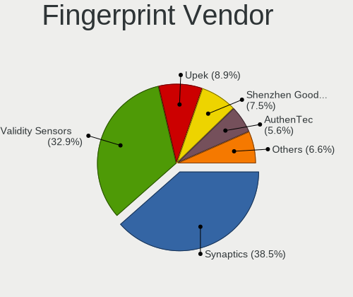

| Vendor                     | Computers | Percent |
|----------------------------|-----------|---------|
| Validity Sensors           | 44        | 36.36%  |
| Synaptics                  | 41        | 33.88%  |
| Upek                       | 11        | 9.09%   |
| Shenzhen Goodix Technology | 10        | 8.26%   |
| AuthenTec                  | 9         | 7.44%   |
| Elan Microelectronics      | 4         | 3.31%   |
| STMicroelectronics         | 1         | 0.83%   |
| LighTuning Technology      | 1         | 0.83%   |

Fingerprint Model
-----------------

Fingerprint sensor models

| Model                                                                      | Computers | Percent |
|----------------------------------------------------------------------------|-----------|---------|
| Synaptics Prometheus MIS Touch Fingerprint Reader                          | 23        | 19.01%  |
| Upek Biometric Touchchip/Touchstrip Fingerprint Sensor                     | 11        | 9.09%   |
| Validity Sensors VFS 5011 fingerprint sensor                               | 10        | 8.26%   |
| Validity Sensors Synaptics WBDI                                            | 9         | 7.44%   |
| Unknown                                                                    | 6         | 4.96%   |
| Validity Sensors VFS451 Fingerprint Reader                                 | 5         | 4.13%   |
| Shenzhen Goodix  FingerPrint Device                                        | 5         | 4.13%   |
| Validity Sensors VFS5011 Fingerprint Reader                                | 4         | 3.31%   |
| Validity Sensors VFS495 Fingerprint Reader                                 | 4         | 3.31%   |
| Synaptics  WBDI                                                            | 4         | 3.31%   |
| Synaptics Metallica MIS Touch Fingerprint Reader                           | 4         | 3.31%   |
| AuthenTec AES2810                                                          | 4         | 3.31%   |
| AuthenTec AES2501 Fingerprint Sensor                                       | 4         | 3.31%   |
| Shenzhen Goodix Fingerprint Reader                                         | 3         | 2.48%   |
| Validity Sensors VFS471 Fingerprint Reader                                 | 2         | 1.65%   |
| Validity Sensors Synaptics VFS7552 Touch Fingerprint Sensor with PurePrint | 2         | 1.65%   |
| Validity Sensors Fingerprint scanner                                       | 2         | 1.65%   |
| Synaptics  VFS7552 Touch Fingerprint Sensor with PurePrint                 | 2         | 1.65%   |
| Synaptics  FS7604 Touch Fingerprint Sensor with PurePrint                  | 2         | 1.65%   |
| Shenzhen Goodix FingerPrint                                                | 2         | 1.65%   |
| Elan ELAN:Fingerprint                                                      | 2         | 1.65%   |
| Elan ELAN:ARM-M4                                                           | 2         | 1.65%   |
| Validity Sensors VFS7552 Touch Fingerprint Sensor                          | 1         | 0.83%   |
| Validity Sensors VFS7500 Touch Fingerprint Sensor                          | 1         | 0.83%   |
| Validity Sensors VFS491                                                    | 1         | 0.83%   |
| Validity Sensors VFS101 Fingerprint Reader                                 | 1         | 0.83%   |
| Validity Sensors VFS Fingerprint sensor                                    | 1         | 0.83%   |
| Validity Sensors Swipe Fingerprint Sensor                                  | 1         | 0.83%   |
| STMicroelectronics Fingerprint Reader                                      | 1         | 0.83%   |
| LighTuning EgisTec Touch Fingerprint Sensor                                | 1         | 0.83%   |
| AuthenTec Fingerprint Sensor                                               | 1         | 0.83%   |

Chipcard Vendor
---------------

Chipcard module vendors

| Vendor                | Computers | Percent |
|-----------------------|-----------|---------|
| Alcor Micro           | 35        | 59.32%  |
| Broadcom              | 15        | 25.42%  |
| Upek                  | 6         | 10.17%  |
| Lenovo                | 2         | 3.39%   |
| Advanced Card Systems | 1         | 1.69%   |

Chipcard Model
--------------

Chipcard module models

| Model                                                                        | Computers | Percent |
|------------------------------------------------------------------------------|-----------|---------|
| Alcor Micro AU9540 Smartcard Reader                                          | 35        | 59.32%  |
| Broadcom 5880                                                                | 7         | 11.86%  |
| Upek TouchChip Fingerprint Coprocessor (WBF advanced mode)                   | 6         | 10.17%  |
| Broadcom BCM5880 Secure Applications Processor                               | 5         | 8.47%   |
| Lenovo Integrated Smart Card Reader                                          | 2         | 3.39%   |
| Broadcom BCM5880 Secure Applications Processor with fingerprint swipe sensor | 2         | 3.39%   |
| Broadcom 58200                                                               | 1         | 1.69%   |
| Advanced Card Systems ACR1252 Dual Reader                                    | 1         | 1.69%   |

Unsupported
-----------

Unsupported Devices
-------------------

Total unsupported devices on board

| Total | Computers | Percent |
|-------|-----------|---------|
| 0     | 465       | 65.22%  |
| 1     | 182       | 25.53%  |
| 2     | 50        | 7.01%   |
| 3     | 10        | 1.4%    |
| 4     | 3         | 0.42%   |
| 6     | 2         | 0.28%   |
| 10    | 1         | 0.14%   |

Unsupported Device Types
------------------------

Types of unsupported devices

| Type                     | Computers | Percent |
|--------------------------|-----------|---------|
| Fingerprint reader       | 120       | 37.15%  |
| Chipcard                 | 56        | 17.34%  |
| Graphics card            | 48        | 14.86%  |
| Net/wireless             | 28        | 8.67%   |
| Multimedia controller    | 23        | 7.12%   |
| Card reader              | 9         | 2.79%   |
| Communication controller | 8         | 2.48%   |
| Sound                    | 7         | 2.17%   |
| Camera                   | 7         | 2.17%   |
| Unassigned class         | 4         | 1.24%   |
| Storage                  | 4         | 1.24%   |
| Net/ethernet             | 3         | 0.93%   |
| Storage/raid             | 2         | 0.62%   |
| Bluetooth                | 2         | 0.62%   |
| Unclassified device      | 1         | 0.31%   |
| Modem                    | 1         | 0.31%   |

