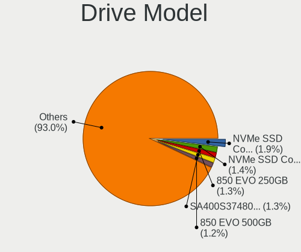
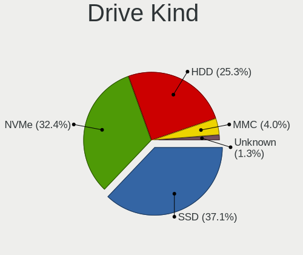
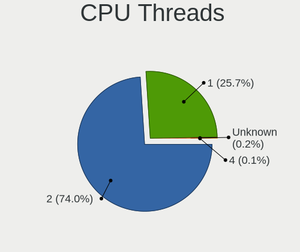
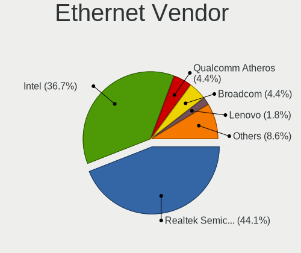
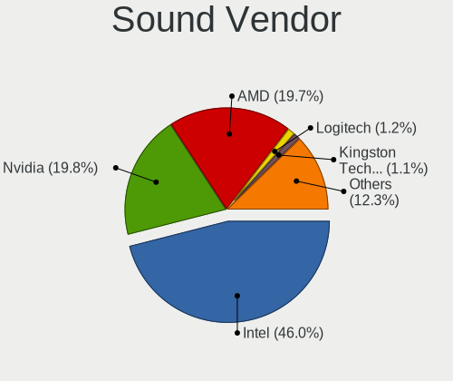
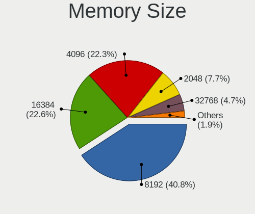
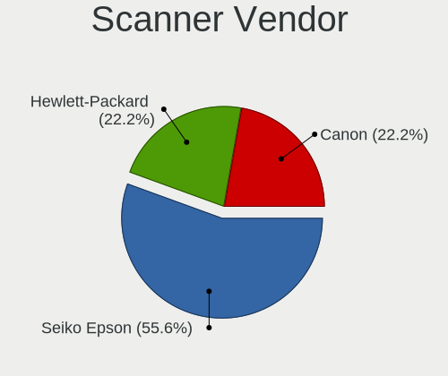

Linux in Denmark - Tested Hardware & Statistics
-----------------------------------------------

A project to collect tested hardware configurations for Linux in Denmark.

Anyone can contribute to this report by the [hw-probe](https://github.com/linuxhw/hw-probe) tool:

    sudo -E hw-probe -all -upload

Please contribute! Especially if your hardware is rare.

This is a report for all computer types. See also reports for [desktops](/Location/Denmark/Desktop/README.md) and [notebooks](/Location/Denmark/Notebook/README.md).

Contents
--------

* [ Test Cases ](#test-cases)

* [ System ](#system)
  - [ OS                       ](#os)
  - [ OS Family                ](#os-family)
  - [ Kernel                   ](#kernel)
  - [ Kernel Family            ](#kernel-family)
  - [ Kernel Major Ver.        ](#kernel-major-ver)
  - [ Arch                     ](#arch)
  - [ DE                       ](#de)
  - [ Display Server           ](#display-server)
  - [ Display Manager          ](#display-manager)
  - [ OS Lang                  ](#os-lang)
  - [ Boot Mode                ](#boot-mode)
  - [ Filesystem               ](#filesystem)
  - [ Part. scheme             ](#part-scheme)
  - [ Dual Boot with Linux/BSD ](#dual-boot-with-linuxbsd)
  - [ Dual Boot (Win)          ](#dual-boot-win)

* [ Board ](#board)
  - [ Vendor                   ](#vendor)
  - [ Model                    ](#model)
  - [ Model Family             ](#model-family)
  - [ MFG Year                 ](#mfg-year)
  - [ Form Factor              ](#form-factor)
  - [ Secure Boot              ](#secure-boot)
  - [ Coreboot                 ](#coreboot)
  - [ RAM Size                 ](#ram-size)
  - [ RAM Used                 ](#ram-used)
  - [ Total Drives             ](#total-drives)
  - [ Has CD-ROM               ](#has-cd-rom)
  - [ Has Ethernet             ](#has-ethernet)
  - [ Has WiFi                 ](#has-wifi)
  - [ Has Bluetooth            ](#has-bluetooth)

* [ Location ](#location)
  - [ Country                  ](#country)
  - [ City                     ](#city)

* [ Drives ](#drives)
  - [ Drive Vendor             ](#drive-vendor)
  - [ Drive Model              ](#drive-model)
  - [ HDD Vendor               ](#hdd-vendor)
  - [ SSD Vendor               ](#ssd-vendor)
  - [ Drive Kind               ](#drive-kind)
  - [ Drive Connector          ](#drive-connector)
  - [ Drive Size               ](#drive-size)
  - [ Space Total              ](#space-total)
  - [ Space Used               ](#space-used)
  - [ Malfunc. Drives          ](#malfunc-drives)
  - [ Malfunc. Drive Vendor    ](#malfunc-drive-vendor)
  - [ Malfunc. HDD Vendor      ](#malfunc-hdd-vendor)
  - [ Malfunc. Drive Kind      ](#malfunc-drive-kind)
  - [ Failed Drives            ](#failed-drives)
  - [ Failed Drive Vendor      ](#failed-drive-vendor)
  - [ Drive Status             ](#drive-status)

* [ Storage controller ](#storage-controller)
  - [ Storage Vendor           ](#storage-vendor)
  - [ Storage Model            ](#storage-model)
  - [ Storage Kind             ](#storage-kind)

* [ Processor ](#processor)
  - [ CPU Vendor               ](#cpu-vendor)
  - [ CPU Model                ](#cpu-model)
  - [ CPU Model Family         ](#cpu-model-family)
  - [ CPU Cores                ](#cpu-cores)
  - [ CPU Sockets              ](#cpu-sockets)
  - [ CPU Threads              ](#cpu-threads)
  - [ CPU Op-Modes             ](#cpu-op-modes)
  - [ CPU Microcode            ](#cpu-microcode)
  - [ CPU Microarch            ](#cpu-microarch)

* [ Graphics ](#graphics)
  - [ GPU Vendor               ](#gpu-vendor)
  - [ GPU Model                ](#gpu-model)
  - [ GPU Combo                ](#gpu-combo)
  - [ GPU Driver               ](#gpu-driver)
  - [ GPU Memory               ](#gpu-memory)

* [ Monitor ](#monitor)
  - [ Monitor Vendor           ](#monitor-vendor)
  - [ Monitor Model            ](#monitor-model)
  - [ Monitor Resolution       ](#monitor-resolution)
  - [ Monitor Diagonal         ](#monitor-diagonal)
  - [ Monitor Width            ](#monitor-width)
  - [ Aspect Ratio             ](#aspect-ratio)
  - [ Monitor Area             ](#monitor-area)
  - [ Pixel Density            ](#pixel-density)
  - [ Multiple Monitors        ](#multiple-monitors)

* [ Network ](#network)
  - [ Net Controller Vendor    ](#net-controller-vendor)
  - [ Net Controller Model     ](#net-controller-model)
  - [ Wireless Vendor          ](#wireless-vendor)
  - [ Wireless Model           ](#wireless-model)
  - [ Ethernet Vendor          ](#ethernet-vendor)
  - [ Ethernet Model           ](#ethernet-model)
  - [ Net Controller Kind      ](#net-controller-kind)
  - [ Used Controller          ](#used-controller)
  - [ NICs                     ](#nics)
  - [ IPv6                     ](#ipv6)

* [ Bluetooth ](#bluetooth)
  - [ Bluetooth Vendor         ](#bluetooth-vendor)
  - [ Bluetooth Model          ](#bluetooth-model)

* [ Sound ](#sound)
  - [ Sound Vendor             ](#sound-vendor)
  - [ Sound Model              ](#sound-model)

* [ Memory ](#memory)
  - [ Memory Vendor            ](#memory-vendor)
  - [ Memory Model             ](#memory-model)
  - [ Memory Kind              ](#memory-kind)
  - [ Memory Form Factor       ](#memory-form-factor)
  - [ Memory Size              ](#memory-size)
  - [ Memory Speed             ](#memory-speed)

* [ Printers & scanners ](#printers--scanners)
  - [ Printer Vendor           ](#printer-vendor)
  - [ Printer Model            ](#printer-model)
  - [ Scanner Vendor           ](#scanner-vendor)
  - [ Scanner Model            ](#scanner-model)

* [ Camera ](#camera)
  - [ Camera Vendor            ](#camera-vendor)
  - [ Camera Model             ](#camera-model)

* [ Security ](#security)
  - [ Fingerprint Vendor       ](#fingerprint-vendor)
  - [ Fingerprint Model        ](#fingerprint-model)
  - [ Chipcard Vendor          ](#chipcard-vendor)
  - [ Chipcard Model           ](#chipcard-model)

* [ Unsupported ](#unsupported)
  - [ Unsupported Devices      ](#unsupported-devices)
  - [ Unsupported Device Types ](#unsupported-device-types)

Test Cases
----------

Total: 1912

| Vendor        | Model                       | Form-Factor | Probe                                                      | Date         |
|---------------|-----------------------------|-------------|------------------------------------------------------------|--------------|
| ASUSTek       | Z97M-PLUS                   | Desktop     | [92c4bf7d7e](https://linux-hardware.org/?probe=92c4bf7d7e) | Jan 04, 2025 |
| MSI           | B550-A PRO                  | Desktop     | [b689309781](https://linux-hardware.org/?probe=b689309781) | Jan 04, 2025 |
| Gigabyte      | X670E AORUS MASTER          | Desktop     | [30d29839dc](https://linux-hardware.org/?probe=30d29839dc) | Jan 04, 2025 |
| Apple         | MacBookPro14,3              | Notebook    | [f0fd4c6916](https://linux-hardware.org/?probe=f0fd4c6916) | Jan 04, 2025 |
| Apple         | MacBookPro14,3              | Notebook    | [bb8ec4a124](https://linux-hardware.org/?probe=bb8ec4a124) | Jan 04, 2025 |
| Lenovo        | ThinkPad T460s 20FAS14F0... | Notebook    | [f72b380ee6](https://linux-hardware.org/?probe=f72b380ee6) | Jan 02, 2025 |
| Gigabyte      | X670E AORUS MASTER          | Desktop     | [ea5e598ed5](https://linux-hardware.org/?probe=ea5e598ed5) | Jan 01, 2025 |
| Acer          | Aspire A317-52              | Notebook    | [8a5d9221e7](https://linux-hardware.org/?probe=8a5d9221e7) | Dec 31, 2024 |
| HP            | 845A                        | Desktop     | [6dd10c7e63](https://linux-hardware.org/?probe=6dd10c7e63) | Dec 30, 2024 |
| Lenovo        | 312D SDK0J40697 WIN 3305... | Mini pc     | [05de1b24e3](https://linux-hardware.org/?probe=05de1b24e3) | Dec 30, 2024 |
| ASUSTek       | ROG STRIX B450-F GAMING     | Desktop     | [90cec85bd7](https://linux-hardware.org/?probe=90cec85bd7) | Dec 30, 2024 |
| ASUSTek       | ROG STRIX B450-F GAMING     | Desktop     | [9e7734f37f](https://linux-hardware.org/?probe=9e7734f37f) | Dec 30, 2024 |
| Shenzhen M... | F7BSD                       | Mini pc     | [62c313072f](https://linux-hardware.org/?probe=62c313072f) | Dec 30, 2024 |
| HP            | Laptop 14-bp0xx             | Notebook    | [cb99b9c4f9](https://linux-hardware.org/?probe=cb99b9c4f9) | Dec 29, 2024 |
| ASUSTek       | P5E-VM HDMI                 | Desktop     | [241c643172](https://linux-hardware.org/?probe=241c643172) | Dec 29, 2024 |
| HP            | 845A                        | Desktop     | [d529dc1efc](https://linux-hardware.org/?probe=d529dc1efc) | Dec 24, 2024 |
| MSI           | X470 GAMING PRO CARBON      | Desktop     | [976a838d5e](https://linux-hardware.org/?probe=976a838d5e) | Dec 22, 2024 |
| Gigabyte      | X670 AORUS ELITE AX         | Desktop     | [c64e9ff809](https://linux-hardware.org/?probe=c64e9ff809) | Dec 22, 2024 |
| Lenovo        | ThinkPad X250 20CLS21F00    | Notebook    | [bb120a943a](https://linux-hardware.org/?probe=bb120a943a) | Dec 21, 2024 |
| Gigabyte      | B550 GAMING X               | Desktop     | [5e7733d216](https://linux-hardware.org/?probe=5e7733d216) | Dec 19, 2024 |
| Lenovo        | ThinkPad X13 Gen 4 21J3C... | Notebook    | [d2c83af14f](https://linux-hardware.org/?probe=d2c83af14f) | Dec 17, 2024 |
| Lenovo        | ThinkPad X250 20CLS64200    | Notebook    | [d92935db90](https://linux-hardware.org/?probe=d92935db90) | Dec 17, 2024 |
| Lenovo        | G570 PIWG1                  | Notebook    | [b41ab58347](https://linux-hardware.org/?probe=b41ab58347) | Dec 17, 2024 |
| HP            | x2 Detachable 10-p0XX       | Tablet      | [878a94ca7f](https://linux-hardware.org/?probe=878a94ca7f) | Dec 16, 2024 |
| Lenovo        | ThinkPad P14s Gen 1 20S4... | Notebook    | [6f50478831](https://linux-hardware.org/?probe=6f50478831) | Dec 16, 2024 |
| Dell          | 0KC9NP A01                  | Desktop     | [40ceb358f9](https://linux-hardware.org/?probe=40ceb358f9) | Dec 12, 2024 |
| Gigabyte      | A520M S2H                   | Desktop     | [f9989a915e](https://linux-hardware.org/?probe=f9989a915e) | Dec 11, 2024 |
| Acer          | Aspire A317-52              | Notebook    | [9523b85250](https://linux-hardware.org/?probe=9523b85250) | Dec 10, 2024 |
| Lenovo        | ThinkPad X270 W10DG 20K5... | Notebook    | [a477748a96](https://linux-hardware.org/?probe=a477748a96) | Dec 10, 2024 |
| HP            | 1905                        | Desktop     | [925e9c6a14](https://linux-hardware.org/?probe=925e9c6a14) | Dec 03, 2024 |
| Acer          | Aspire A315-41              | Notebook    | [629a42a94d](https://linux-hardware.org/?probe=629a42a94d) | Dec 03, 2024 |
| Acer          | Aspire A315-41              | Notebook    | [dff6e368e4](https://linux-hardware.org/?probe=dff6e368e4) | Dec 02, 2024 |
| ASUSTek       | ROG STRIX X470-F GAMING     | Desktop     | [283e9a8b40](https://linux-hardware.org/?probe=283e9a8b40) | Dec 01, 2024 |
| HP            | 1905                        | Desktop     | [a3ed3e5797](https://linux-hardware.org/?probe=a3ed3e5797) | Dec 01, 2024 |
| Lenovo        | ThinkPad L430 24686FG       | Notebook    | [4e8a8081b5](https://linux-hardware.org/?probe=4e8a8081b5) | Nov 27, 2024 |
| Apple         | Mac-77EB7D7DAF985301 iMa... | All in one  | [7ace1cc760](https://linux-hardware.org/?probe=7ace1cc760) | Nov 25, 2024 |
| Dell          | XPS 13 9350                 | Notebook    | [e26379b5f0](https://linux-hardware.org/?probe=e26379b5f0) | Nov 24, 2024 |
| Lenovo        | ThinkPad T14 Gen 4 21HDC... | Notebook    | [54831941d8](https://linux-hardware.org/?probe=54831941d8) | Nov 23, 2024 |
| Dell          | XPS 13 9350                 | Notebook    | [e508f9977c](https://linux-hardware.org/?probe=e508f9977c) | Nov 20, 2024 |
| Dell          | XPS 13 9350                 | Notebook    | [e616b2e3b6](https://linux-hardware.org/?probe=e616b2e3b6) | Nov 20, 2024 |
| ASUSTek       | PRIME Z690-A                | Desktop     | [bd4c200cbb](https://linux-hardware.org/?probe=bd4c200cbb) | Nov 15, 2024 |
| Lenovo        | ThinkPad E14 Gen 6 21M3C... | Notebook    | [3651cea5f4](https://linux-hardware.org/?probe=3651cea5f4) | Nov 10, 2024 |
| Lenovo        | ThinkBook 13x G2 IAP 21A... | Notebook    | [6370e4afbb](https://linux-hardware.org/?probe=6370e4afbb) | Nov 10, 2024 |
| Lenovo        | ThinkPad T510 4349WDB       | Notebook    | [096b262747](https://linux-hardware.org/?probe=096b262747) | Nov 10, 2024 |
| ASUSTek       | TUF Gaming X570-PLUS        | Desktop     | [01063d0f9e](https://linux-hardware.org/?probe=01063d0f9e) | Nov 08, 2024 |
| PC Special... | Lafite Pro IV 14M           | Notebook    | [401560b9d8](https://linux-hardware.org/?probe=401560b9d8) | Nov 08, 2024 |
| Lenovo        | ThinkPad L430 24686FG       | Notebook    | [ad1f01a426](https://linux-hardware.org/?probe=ad1f01a426) | Nov 07, 2024 |
| ASUSTek       | PRIME B450-PLUS             | Desktop     | [eeaba99859](https://linux-hardware.org/?probe=eeaba99859) | Nov 05, 2024 |
| ASRock        | Z370 Pro4                   | Desktop     | [176e8e71c8](https://linux-hardware.org/?probe=176e8e71c8) | Nov 04, 2024 |
| Dell          | Precision 3590              | Notebook    | [bc82f6333a](https://linux-hardware.org/?probe=bc82f6333a) | Nov 02, 2024 |
| HUAWEI        | NBD-WXX9                    | Notebook    | [3f98ffc684](https://linux-hardware.org/?probe=3f98ffc684) | Oct 31, 2024 |
| ASUSTek       | TUF Gaming B550-PLUS        | Desktop     | [2d99ad254b](https://linux-hardware.org/?probe=2d99ad254b) | Oct 31, 2024 |
| Gigabyte      | Z390 AORUS ULTRA-CF         | Desktop     | [d549dd1d0b](https://linux-hardware.org/?probe=d549dd1d0b) | Oct 31, 2024 |
| ASUSTek       | PRIME B650M-A II            | Desktop     | [84cfce45dd](https://linux-hardware.org/?probe=84cfce45dd) | Oct 30, 2024 |
| Lenovo        | ThinkPad T495 20NKS02N00    | Notebook    | [ab02b5d5f4](https://linux-hardware.org/?probe=ab02b5d5f4) | Oct 29, 2024 |
| HP            | EliteBook 845 G8 Noteboo... | Notebook    | [4408314643](https://linux-hardware.org/?probe=4408314643) | Oct 29, 2024 |
| HP            | 829E                        | Mini pc     | [d2abb5c970](https://linux-hardware.org/?probe=d2abb5c970) | Oct 28, 2024 |
| HP            | 829E                        | Mini pc     | [06788c5fb3](https://linux-hardware.org/?probe=06788c5fb3) | Oct 27, 2024 |
| Gigabyte      | B650 GAMING X AX            | Desktop     | [d0efe8b27c](https://linux-hardware.org/?probe=d0efe8b27c) | Oct 27, 2024 |
| ASUSTek       | PRIME X470-PRO              | Desktop     | [6001ee3845](https://linux-hardware.org/?probe=6001ee3845) | Oct 26, 2024 |
| Apple         | MacBookPro11,1              | Notebook    | [95fc0bceda](https://linux-hardware.org/?probe=95fc0bceda) | Oct 26, 2024 |
| Apple         | MacBookPro11,1              | Notebook    | [dbd73dea03](https://linux-hardware.org/?probe=dbd73dea03) | Oct 26, 2024 |
| Gigabyte      | B650 GAMING X AX            | Desktop     | [502ef34bb8](https://linux-hardware.org/?probe=502ef34bb8) | Oct 26, 2024 |
| Pegatron      | 2A9A                        | Desktop     | [24640d55b1](https://linux-hardware.org/?probe=24640d55b1) | Oct 25, 2024 |
| HP            | 1495                        | Desktop     | [5f83604bb5](https://linux-hardware.org/?probe=5f83604bb5) | Oct 24, 2024 |
| ASUSTek       | ASUS Zenbook S 16 UM5606... | Notebook    | [f697805e66](https://linux-hardware.org/?probe=f697805e66) | Oct 24, 2024 |
| Lenovo        | ThinkPad T440s 20ARS06C0... | Notebook    | [a915ce3cad](https://linux-hardware.org/?probe=a915ce3cad) | Oct 22, 2024 |
| Lenovo        | IdeaPad 720S-14IKB 81BD     | Notebook    | [1b0f12acd4](https://linux-hardware.org/?probe=1b0f12acd4) | Oct 22, 2024 |
| Lenovo        | ThinkPad L430 24686FG       | Notebook    | [6d653f02e9](https://linux-hardware.org/?probe=6d653f02e9) | Oct 21, 2024 |
| HP            | 829E                        | Mini pc     | [2fb7c558e5](https://linux-hardware.org/?probe=2fb7c558e5) | Oct 20, 2024 |
| HP            | 829E                        | Mini pc     | [ef76753471](https://linux-hardware.org/?probe=ef76753471) | Oct 20, 2024 |
| MSI           | GT72S 6QE                   | Notebook    | [0cfe32ce18](https://linux-hardware.org/?probe=0cfe32ce18) | Oct 20, 2024 |
| HP            | EliteBook x360 1040 G5      | Convertible | [53b1e19267](https://linux-hardware.org/?probe=53b1e19267) | Oct 18, 2024 |
| Shenzhen M... | MTBSD                       | Desktop     | [6420cd8647](https://linux-hardware.org/?probe=6420cd8647) | Oct 18, 2024 |
| ASUSTek       | TUF Gaming B650M-PLUS WI... | Desktop     | [817f8a9799](https://linux-hardware.org/?probe=817f8a9799) | Oct 17, 2024 |
| Lenovo        | ThinkPad X13 Gen 1 20UGS... | Notebook    | [8132169207](https://linux-hardware.org/?probe=8132169207) | Oct 17, 2024 |
| Gigabyte      | X570S AORUS MASTER          | Desktop     | [30fd511ed4](https://linux-hardware.org/?probe=30fd511ed4) | Oct 15, 2024 |
| Dell          | XPS 15 9560                 | Notebook    | [cac6b26403](https://linux-hardware.org/?probe=cac6b26403) | Oct 15, 2024 |
| Lenovo        | ThinkPad T440s 20ARS06C0... | Notebook    | [3daad6b7aa](https://linux-hardware.org/?probe=3daad6b7aa) | Oct 14, 2024 |
| MSI           | GT72S 6QE                   | Notebook    | [dd761bfc6f](https://linux-hardware.org/?probe=dd761bfc6f) | Oct 13, 2024 |
| ASRock        | X300-ITX                    | Desktop     | [b824ddb718](https://linux-hardware.org/?probe=b824ddb718) | Oct 13, 2024 |
| ASUSTek       | TUF Gaming B660M-PLUS WI... | Desktop     | [5e90b0c4ed](https://linux-hardware.org/?probe=5e90b0c4ed) | Oct 11, 2024 |
| Lenovo        | ThinkPad X13 Gen 1 20UGS... | Notebook    | [d875e5f8df](https://linux-hardware.org/?probe=d875e5f8df) | Oct 11, 2024 |
| Dell          | 09KPNV A00                  | Desktop     | [87a6011b62](https://linux-hardware.org/?probe=87a6011b62) | Oct 09, 2024 |
| Apple         | MacBookPro11,1              | Notebook    | [7d61f2702c](https://linux-hardware.org/?probe=7d61f2702c) | Oct 08, 2024 |
| Gigabyte      | Z270X-Gaming K5             | Desktop     | [77b29b3523](https://linux-hardware.org/?probe=77b29b3523) | Oct 06, 2024 |
| HP            | 1495                        | Desktop     | [b374728264](https://linux-hardware.org/?probe=b374728264) | Oct 05, 2024 |
| ASUSTek       | ZenBook UX482EGR_UX482EG... | Notebook    | [3ebec0e8f3](https://linux-hardware.org/?probe=3ebec0e8f3) | Oct 04, 2024 |
| MSI           | MS-7318                     | Desktop     | [94581471da](https://linux-hardware.org/?probe=94581471da) | Oct 03, 2024 |
| Gigabyte      | G5 KC                       | Notebook    | [b342b2a6f1](https://linux-hardware.org/?probe=b342b2a6f1) | Sep 30, 2024 |
| HP            | Laptop 15-fd0xxx            | Notebook    | [a61ba00701](https://linux-hardware.org/?probe=a61ba00701) | Sep 30, 2024 |
| HP            | Laptop 14-bw0xx             | Notebook    | [5be8d95c83](https://linux-hardware.org/?probe=5be8d95c83) | Sep 29, 2024 |
| Gigabyte      | AORUS 15G XC                | Notebook    | [e713caaf0f](https://linux-hardware.org/?probe=e713caaf0f) | Sep 26, 2024 |
| Lenovo        | ThinkPad X13 Gen 1 20UGS... | Notebook    | [2fa674eb00](https://linux-hardware.org/?probe=2fa674eb00) | Sep 26, 2024 |
| Dell          | 0D24M8 A01                  | Desktop     | [f4d0cccdf1](https://linux-hardware.org/?probe=f4d0cccdf1) | Sep 26, 2024 |
| Dell          | 0D24M8 A01                  | Desktop     | [93b881282f](https://linux-hardware.org/?probe=93b881282f) | Sep 26, 2024 |
| ASRock        | Z77 Extreme4-M              | Desktop     | [db437433af](https://linux-hardware.org/?probe=db437433af) | Sep 25, 2024 |
| Lenovo        | ThinkPad T520 42404CG       | Notebook    | [696d5cd6ec](https://linux-hardware.org/?probe=696d5cd6ec) | Sep 25, 2024 |
| ASUSTek       | ROG Zephyrus G14 GA402RK... | Notebook    | [34bb43620b](https://linux-hardware.org/?probe=34bb43620b) | Sep 24, 2024 |
| Packard Be... | EasyNote TE69BM             | Notebook    | [6990e9cba3](https://linux-hardware.org/?probe=6990e9cba3) | Sep 23, 2024 |
| Sugon         | X9DR3-FA                    | Desktop     | [637613a6fd](https://linux-hardware.org/?probe=637613a6fd) | Sep 23, 2024 |
| Insyde        | CherryTrail                 | Notebook    | [aa218e8eef](https://linux-hardware.org/?probe=aa218e8eef) | Sep 22, 2024 |
| Insyde        | CherryTrail                 | Notebook    | [c314b95caf](https://linux-hardware.org/?probe=c314b95caf) | Sep 22, 2024 |
| Lenovo        | ThinkPad L430 24686FG       | Notebook    | [4b56e663e1](https://linux-hardware.org/?probe=4b56e663e1) | Sep 19, 2024 |
| Lenovo        | ThinkPad T14 Gen 3 21CFC... | Notebook    | [dfca2e65f8](https://linux-hardware.org/?probe=dfca2e65f8) | Sep 19, 2024 |
| Apple         | MacBookPro14,1              | Notebook    | [004786a4d3](https://linux-hardware.org/?probe=004786a4d3) | Sep 18, 2024 |
| Lenovo        | ThinkPad T480s 20L8S9JE0... | Notebook    | [9ef5814db9](https://linux-hardware.org/?probe=9ef5814db9) | Sep 17, 2024 |
| Lenovo        | ThinkPad T420 4236Y19       | Notebook    | [13fbdbca13](https://linux-hardware.org/?probe=13fbdbca13) | Sep 15, 2024 |
| Lenovo        | G505s 20255                 | Notebook    | [929b9ceeda](https://linux-hardware.org/?probe=929b9ceeda) | Sep 14, 2024 |
| ASRock        | ION3D-HT                    | Desktop     | [0904b2ade3](https://linux-hardware.org/?probe=0904b2ade3) | Sep 14, 2024 |
| Lenovo        | IdeaPad S540-14API 81NH     | Notebook    | [a1593b5f7c](https://linux-hardware.org/?probe=a1593b5f7c) | Sep 14, 2024 |
| ASUSTek       | P6T DELUXE V2               | Desktop     | [8d1d2d8b47](https://linux-hardware.org/?probe=8d1d2d8b47) | Sep 13, 2024 |
| Acer          | Aspire 8943G                | Notebook    | [281d735bda](https://linux-hardware.org/?probe=281d735bda) | Sep 12, 2024 |
| ASUSTek       | ASUS TUF Gaming A15 FA50... | Notebook    | [3dee7cffac](https://linux-hardware.org/?probe=3dee7cffac) | Sep 11, 2024 |
| ASUSTek       | PRIME X570-P                | Desktop     | [9a0e29b5dd](https://linux-hardware.org/?probe=9a0e29b5dd) | Sep 09, 2024 |
| ASUSTek       | ROG Maximus XII HERO        | Desktop     | [547ecee59b](https://linux-hardware.org/?probe=547ecee59b) | Sep 09, 2024 |
| Apple         | MacBookPro9,2               | Notebook    | [8062c8c6db](https://linux-hardware.org/?probe=8062c8c6db) | Sep 07, 2024 |
| ASUSTek       | TUF Gaming B550-PLUS        | Desktop     | [4ca41527c4](https://linux-hardware.org/?probe=4ca41527c4) | Sep 07, 2024 |
| ASUSTek       | PRIME B650M-A II            | Desktop     | [f6a7476614](https://linux-hardware.org/?probe=f6a7476614) | Sep 05, 2024 |
| Lenovo        | ThinkPad X1 Carbon 6th 2... | Notebook    | [682b1cad5b](https://linux-hardware.org/?probe=682b1cad5b) | Sep 02, 2024 |
| ASUSTek       | PRIME X570-P                | Desktop     | [70ddee6281](https://linux-hardware.org/?probe=70ddee6281) | Sep 02, 2024 |
| Apple         | MacBookPro8,1               | Notebook    | [3de9cb3d60](https://linux-hardware.org/?probe=3de9cb3d60) | Sep 01, 2024 |
| HP            | EliteBook 865 16 inch G9... | Notebook    | [8f52a83d6b](https://linux-hardware.org/?probe=8f52a83d6b) | Aug 30, 2024 |
| Acer          | Aspire 5755G                | Notebook    | [0482183a93](https://linux-hardware.org/?probe=0482183a93) | Aug 26, 2024 |
| KaiTian       | N80z G1d                    | Notebook    | [58db0eb2b0](https://linux-hardware.org/?probe=58db0eb2b0) | Aug 26, 2024 |
| ASUSTek       | PRIME A520M-R               | Desktop     | [e989d74788](https://linux-hardware.org/?probe=e989d74788) | Aug 25, 2024 |
| Lenovo        | Legion 5 17ACH6 82K0        | Notebook    | [fa9e63db04](https://linux-hardware.org/?probe=fa9e63db04) | Aug 25, 2024 |
| Lenovo        | ThinkPad X1 Carbon 5th 2... | Notebook    | [43e253bc17](https://linux-hardware.org/?probe=43e253bc17) | Aug 24, 2024 |
| Lenovo        | ThinkPad T490s 20NX001KM... | Notebook    | [83f3da5e32](https://linux-hardware.org/?probe=83f3da5e32) | Aug 22, 2024 |
| Pegatron      | 2AD5                        | Desktop     | [d57e937e5c](https://linux-hardware.org/?probe=d57e937e5c) | Aug 20, 2024 |
| ASUSTek       | ZenBook UX482EGR_UX482EG... | Notebook    | [6d91f09db2](https://linux-hardware.org/?probe=6d91f09db2) | Aug 19, 2024 |
| HP            | EliteBook x360 1030 G2      | Convertible | [a7297c4dd2](https://linux-hardware.org/?probe=a7297c4dd2) | Aug 19, 2024 |
| HP            | EliteBook 865 16 inch G1... | Notebook    | [32e5b4ca60](https://linux-hardware.org/?probe=32e5b4ca60) | Aug 17, 2024 |
| Lenovo        | ThinkPad T460 20FMS5DX00    | Notebook    | [fab5ffbd76](https://linux-hardware.org/?probe=fab5ffbd76) | Aug 15, 2024 |
| Gigabyte      | Z390 AORUS ULTRA-CF         | Desktop     | [8fbb0e280b](https://linux-hardware.org/?probe=8fbb0e280b) | Aug 15, 2024 |
| ASUSTek       | PRIME B650M-A II            | Desktop     | [e9650bcedb](https://linux-hardware.org/?probe=e9650bcedb) | Aug 14, 2024 |
| HP            | EliteBook 820 G1            | Notebook    | [78dbe2d953](https://linux-hardware.org/?probe=78dbe2d953) | Aug 12, 2024 |
| Valve         | Jupiter                     | Notebook    | [548d0048d4](https://linux-hardware.org/?probe=548d0048d4) | Aug 10, 2024 |
| Apple         | Mac-F65AE981FFA204ED Mac... | Mini pc     | [b451656b4e](https://linux-hardware.org/?probe=b451656b4e) | Aug 09, 2024 |
| Samsung       | 530U3C/530U4C               | Notebook    | [eed67edfb9](https://linux-hardware.org/?probe=eed67edfb9) | Aug 09, 2024 |
| ASUSTek       | K56CB                       | Notebook    | [729ed18903](https://linux-hardware.org/?probe=729ed18903) | Aug 09, 2024 |
| MSI           | MEG X570 ACE                | Desktop     | [90b92d4581](https://linux-hardware.org/?probe=90b92d4581) | Aug 08, 2024 |
| ASRock        | X570 Phantom Gaming 4       | Desktop     | [30943d6c8b](https://linux-hardware.org/?probe=30943d6c8b) | Aug 07, 2024 |
| ASUSTek       | PRIME Z370-P                | Desktop     | [f1b1c8064f](https://linux-hardware.org/?probe=f1b1c8064f) | Aug 07, 2024 |
| Dell          | 01W23F A00                  | Server      | [25eaebdf47](https://linux-hardware.org/?probe=25eaebdf47) | Aug 07, 2024 |
| HP            | 1495                        | Desktop     | [09892140b3](https://linux-hardware.org/?probe=09892140b3) | Aug 06, 2024 |
| Apple         | MacBookPro6,2               | Notebook    | [6abef655ee](https://linux-hardware.org/?probe=6abef655ee) | Aug 05, 2024 |
| HP            | Pavilion Notebook           | Notebook    | [5762943352](https://linux-hardware.org/?probe=5762943352) | Aug 04, 2024 |
| Toshiba       | Satellite L50-B             | Notebook    | [00b4917faf](https://linux-hardware.org/?probe=00b4917faf) | Aug 02, 2024 |
| Acer          | Predator PO3-640            | Desktop     | [efe0a9a9ec](https://linux-hardware.org/?probe=efe0a9a9ec) | Aug 01, 2024 |
| Lenovo        | ThinkPad T450 20BUS04U00    | Notebook    | [720b525240](https://linux-hardware.org/?probe=720b525240) | Jul 31, 2024 |
| Lenovo        | 3716 SDK0T76463 WIN 3422... | Desktop     | [c87538bad4](https://linux-hardware.org/?probe=c87538bad4) | Jul 31, 2024 |
| HP            | Laptop 14-cf3xxx            | Notebook    | [b09688c182](https://linux-hardware.org/?probe=b09688c182) | Jul 30, 2024 |
| HP            | ProLiant ML350p Gen8        | Desktop     | [b489c928ed](https://linux-hardware.org/?probe=b489c928ed) | Jul 30, 2024 |
| Lenovo        | IdeaPad 1 14ADA7 82R0       | Notebook    | [6332bb4a7c](https://linux-hardware.org/?probe=6332bb4a7c) | Jul 29, 2024 |
| Microsoft     | Surface Pro                 | Tablet      | [6d2eae62bf](https://linux-hardware.org/?probe=6d2eae62bf) | Jul 29, 2024 |
| Microsoft     | Surface Pro                 | Tablet      | [104201a2e5](https://linux-hardware.org/?probe=104201a2e5) | Jul 28, 2024 |
| Lenovo        | SHARKBAY NOK                | Desktop     | [30bb835251](https://linux-hardware.org/?probe=30bb835251) | Jul 28, 2024 |
| Dell          | XPS 15 9560                 | Notebook    | [25ebe75076](https://linux-hardware.org/?probe=25ebe75076) | Jul 27, 2024 |
| Gigabyte      | Z68X-UD4-B3                 | Desktop     | [007a26742b](https://linux-hardware.org/?probe=007a26742b) | Jul 27, 2024 |
| HP            | 8767 A                      | Desktop     | [d377d98814](https://linux-hardware.org/?probe=d377d98814) | Jul 26, 2024 |
| ASUSTek       | X555LN                      | Notebook    | [1af7465509](https://linux-hardware.org/?probe=1af7465509) | Jul 25, 2024 |
| ASUSTek       | TUF Gaming A520M-PLUS       | Desktop     | [4e32c4d0df](https://linux-hardware.org/?probe=4e32c4d0df) | Jul 25, 2024 |
| Apple         | MacBookPro12,1              | Notebook    | [21a780bb08](https://linux-hardware.org/?probe=21a780bb08) | Jul 25, 2024 |
| Lenovo        | ThinkPad R500 2718Y21       | Notebook    | [527c6d0299](https://linux-hardware.org/?probe=527c6d0299) | Jul 23, 2024 |
| Lenovo        | ThinkPad X13 Gen 4 21J3C... | Notebook    | [9ee15286f8](https://linux-hardware.org/?probe=9ee15286f8) | Jul 23, 2024 |
| MSI           | MAG X570 TOMAHAWK WIFI      | Desktop     | [d222ae3b6b](https://linux-hardware.org/?probe=d222ae3b6b) | Jul 23, 2024 |
| ASUSTek       | X555LN                      | Notebook    | [f80f9105c0](https://linux-hardware.org/?probe=f80f9105c0) | Jul 22, 2024 |
| Dell          | Latitude E5570              | Notebook    | [0165747ee0](https://linux-hardware.org/?probe=0165747ee0) | Jul 22, 2024 |
| Lenovo        | IdeaPad 720S-14IKB 81BD     | Notebook    | [604f304877](https://linux-hardware.org/?probe=604f304877) | Jul 20, 2024 |
| Lenovo        | Legion 5 17ACH6 82K0        | Notebook    | [b2785d195d](https://linux-hardware.org/?probe=b2785d195d) | Jul 19, 2024 |
| MSI           | GE60 0NC\0ND                | Notebook    | [1ed51b449b](https://linux-hardware.org/?probe=1ed51b449b) | Jul 17, 2024 |
| ASRock        | Z370M-ITX/ac                | Desktop     | [aa41a92ff7](https://linux-hardware.org/?probe=aa41a92ff7) | Jul 16, 2024 |
| Apple         | MacBookAir7,2               | Notebook    | [fb2b18385d](https://linux-hardware.org/?probe=fb2b18385d) | Jul 16, 2024 |
| Apple         | MacBookAir7,2               | Notebook    | [a4156a8d93](https://linux-hardware.org/?probe=a4156a8d93) | Jul 15, 2024 |
| Lenovo        | ThinkPad P50 20EQS0SS02     | Notebook    | [d40bef0611](https://linux-hardware.org/?probe=d40bef0611) | Jul 15, 2024 |
| HP            | Laptop 14-bp0xx             | Notebook    | [b937727b2f](https://linux-hardware.org/?probe=b937727b2f) | Jul 14, 2024 |
| Lenovo        | IdeaPad 1 14ADA7 82R0       | Notebook    | [4da9ebe6b5](https://linux-hardware.org/?probe=4da9ebe6b5) | Jul 13, 2024 |
| ASUSTek       | N61Ja                       | Notebook    | [d84f30b1ac](https://linux-hardware.org/?probe=d84f30b1ac) | Jul 11, 2024 |
| ASUSTek       | TUF Gaming B650-PLUS        | Desktop     | [be094b7023](https://linux-hardware.org/?probe=be094b7023) | Jul 09, 2024 |
| Dell          | XPS 15 9560                 | Notebook    | [25ede9dd80](https://linux-hardware.org/?probe=25ede9dd80) | Jul 08, 2024 |
| MSI           | IONA                        | Desktop     | [7cd2bb087a](https://linux-hardware.org/?probe=7cd2bb087a) | Jul 07, 2024 |
| Lenovo        | ThinkPad X13 Gen 1 20UGS... | Notebook    | [fa8f1445c6](https://linux-hardware.org/?probe=fa8f1445c6) | Jul 07, 2024 |
| Gigabyte      | Z68X-UD4-B3                 | Desktop     | [deca980aa2](https://linux-hardware.org/?probe=deca980aa2) | Jul 07, 2024 |
| DukaPC        | Notebook                    | Notebook    | [663f76e509](https://linux-hardware.org/?probe=663f76e509) | Jul 06, 2024 |
| DukaPC        | Notebook                    | Notebook    | [92320431fc](https://linux-hardware.org/?probe=92320431fc) | Jul 06, 2024 |
| ASUSTek       | ROG Zephyrus G14 GA402RK... | Notebook    | [f846e6d9a0](https://linux-hardware.org/?probe=f846e6d9a0) | Jul 05, 2024 |
| Dell          | Latitude E5530 vPro         | Notebook    | [0aee03627c](https://linux-hardware.org/?probe=0aee03627c) | Jul 05, 2024 |
| Lenovo        | ThinkPad W520 42844DG       | Notebook    | [dbf9675b6f](https://linux-hardware.org/?probe=dbf9675b6f) | Jul 03, 2024 |
| Shenzhen M... | F7BFD                       | Desktop     | [84568865fd](https://linux-hardware.org/?probe=84568865fd) | Jul 03, 2024 |
| HUAWEI        | VLT-WX0                     | Notebook    | [f81bb40cb8](https://linux-hardware.org/?probe=f81bb40cb8) | Jul 03, 2024 |
| ASUSTek       | PRIME B250M-K               | Desktop     | [a8c85afdc3](https://linux-hardware.org/?probe=a8c85afdc3) | Jul 01, 2024 |
| ASUSTek       | G20CB                       | Desktop     | [f9758121e7](https://linux-hardware.org/?probe=f9758121e7) | Jun 28, 2024 |
| ASUSTek       | VivoBook_ASUSLaptop X513... | Notebook    | [4ace4ec7d7](https://linux-hardware.org/?probe=4ace4ec7d7) | Jun 26, 2024 |
| Lenovo        | IdeaPad 1 14ADA7 82R0       | Notebook    | [c8bce44bed](https://linux-hardware.org/?probe=c8bce44bed) | Jun 26, 2024 |
| ASRock        | B450 Gaming-ITX/ac          | Desktop     | [397a4095b5](https://linux-hardware.org/?probe=397a4095b5) | Jun 25, 2024 |
| Pegatron      | 2AD5                        | Desktop     | [aa9dbd9aef](https://linux-hardware.org/?probe=aa9dbd9aef) | Jun 24, 2024 |
| Dell          | XPS 15 9560                 | Notebook    | [94420d4e41](https://linux-hardware.org/?probe=94420d4e41) | Jun 22, 2024 |
| Lenovo        | ThinkPad P50 20EQS4WE00     | Notebook    | [848e7fb28d](https://linux-hardware.org/?probe=848e7fb28d) | Jun 22, 2024 |
| ASUSTek       | ROG STRIX X570-E GAMING     | Desktop     | [500ecbdf4d](https://linux-hardware.org/?probe=500ecbdf4d) | Jun 22, 2024 |
| Lenovo        | ThinkPad E14 Gen 6 21M3C... | Notebook    | [2439930306](https://linux-hardware.org/?probe=2439930306) | Jun 21, 2024 |
| ASUSTek       | ASUS TUF Gaming F15 FX50... | Notebook    | [1559ed1fe8](https://linux-hardware.org/?probe=1559ed1fe8) | Jun 21, 2024 |
| ASUSTek       | PRIME B450M-A II            | Desktop     | [b66ab73d20](https://linux-hardware.org/?probe=b66ab73d20) | Jun 21, 2024 |
| Lenovo        | ThinkPad T14 Gen 4 21HES... | Notebook    | [640bc2625d](https://linux-hardware.org/?probe=640bc2625d) | Jun 20, 2024 |
| ASRock        | 980DE3/U3S3 R2.0            | Desktop     | [f336a3694c](https://linux-hardware.org/?probe=f336a3694c) | Jun 18, 2024 |
| Supermicro    | X13DAI-T                    | Server      | [7a000004a8](https://linux-hardware.org/?probe=7a000004a8) | Jun 18, 2024 |
| Apple         | MacBookPro9,2               | Notebook    | [1e749ba1db](https://linux-hardware.org/?probe=1e749ba1db) | Jun 16, 2024 |
| Apple         | MacBookPro9,2               | Notebook    | [3320dec817](https://linux-hardware.org/?probe=3320dec817) | Jun 16, 2024 |
| MSI           | MAG X570 TOMAHAWK WIFI      | Desktop     | [627864177d](https://linux-hardware.org/?probe=627864177d) | Jun 15, 2024 |
| ASUSTek       | M5A78L-M LE/USB3            | Desktop     | [de724a5157](https://linux-hardware.org/?probe=de724a5157) | Jun 13, 2024 |
| HP            | EliteBook 835 G7 Noteboo... | Notebook    | [b61a1876ce](https://linux-hardware.org/?probe=b61a1876ce) | Jun 10, 2024 |
| Dell          | Latitude E6540              | Notebook    | [2ee4199956](https://linux-hardware.org/?probe=2ee4199956) | Jun 08, 2024 |
| Acer          | Swift SF314-71              | Notebook    | [abf6fd0327](https://linux-hardware.org/?probe=abf6fd0327) | Jun 06, 2024 |
| Apple         | MacBookPro11,1              | Notebook    | [84e47689d9](https://linux-hardware.org/?probe=84e47689d9) | Jun 05, 2024 |
| Samsung       | 930XCJ/931XCJ/930XCR        | Notebook    | [695c57972e](https://linux-hardware.org/?probe=695c57972e) | Jun 03, 2024 |
| HP            | 8B3B A                      | Desktop     | [4113887db5](https://linux-hardware.org/?probe=4113887db5) | Jun 01, 2024 |
| HP            | EliteBook 840 G4            | Notebook    | [48160903f4](https://linux-hardware.org/?probe=48160903f4) | May 31, 2024 |
| HP            | ProBook 650 G5              | Notebook    | [a16d697703](https://linux-hardware.org/?probe=a16d697703) | May 31, 2024 |
| ASUSTek       | N61Ja                       | Notebook    | [7c18215693](https://linux-hardware.org/?probe=7c18215693) | May 30, 2024 |
| ASUSTek       | N61Ja                       | Notebook    | [e19c4ee418](https://linux-hardware.org/?probe=e19c4ee418) | May 29, 2024 |
| Lenovo        | IdeaPad 1 14ADA7 82R0       | Notebook    | [e013c89601](https://linux-hardware.org/?probe=e013c89601) | May 29, 2024 |
| Lenovo        | 36EB SDK0J40700 WIN 3258... | Desktop     | [7dc90447a3](https://linux-hardware.org/?probe=7dc90447a3) | May 28, 2024 |
| Apple         | Mac-35C5E08120C7EEAF Mac... | Mini pc     | [b8c702c05d](https://linux-hardware.org/?probe=b8c702c05d) | May 28, 2024 |
| Apple         | Mac-F2218FA9                | All in one  | [ff9e6da9f9](https://linux-hardware.org/?probe=ff9e6da9f9) | May 27, 2024 |
| Lenovo        | ThinkPad X270 W10DG 20K5... | Notebook    | [0be687bb2b](https://linux-hardware.org/?probe=0be687bb2b) | May 24, 2024 |
| ASUSTek       | ROG STRIX Z590-F GAMING ... | Desktop     | [0664d5b66b](https://linux-hardware.org/?probe=0664d5b66b) | May 22, 2024 |
| Apple         | Mac-F2238AC8                | All in one  | [3041554d27](https://linux-hardware.org/?probe=3041554d27) | May 20, 2024 |
| ASUSTek       | ROG STRIX Z590-F GAMING ... | Desktop     | [ac7c8fc84c](https://linux-hardware.org/?probe=ac7c8fc84c) | May 20, 2024 |
| Acer          | Predator PH517-61           | Notebook    | [73fa0da6ff](https://linux-hardware.org/?probe=73fa0da6ff) | May 19, 2024 |
| Lenovo        | ThinkPad T430 2347GU8       | Notebook    | [54d8293b03](https://linux-hardware.org/?probe=54d8293b03) | May 18, 2024 |
| Lenovo        | ThinkPad P52 20M9001GMX     | Notebook    | [66fffdafc4](https://linux-hardware.org/?probe=66fffdafc4) | May 18, 2024 |
| Dell          | 00V62H A00                  | Desktop     | [a2ede20616](https://linux-hardware.org/?probe=a2ede20616) | May 18, 2024 |
| Lenovo        | ThinkPad X1 Yoga Gen 6 2... | Convertible | [8558aafcdc](https://linux-hardware.org/?probe=8558aafcdc) | May 17, 2024 |
| ASUSTek       | PRIME Z790-P                | Desktop     | [cdc3686d63](https://linux-hardware.org/?probe=cdc3686d63) | May 17, 2024 |
| ASUSTek       | PRIME Z790-P                | Desktop     | [0429d68cf1](https://linux-hardware.org/?probe=0429d68cf1) | May 16, 2024 |
| CompuLab      | SBC-ATCFL                   | Mini pc     | [1643c675cc](https://linux-hardware.org/?probe=1643c675cc) | May 14, 2024 |
| MSI           | MPG Z390M GAMING EDGE AC    | Desktop     | [d0a537372c](https://linux-hardware.org/?probe=d0a537372c) | May 12, 2024 |
| ASUSTek       | ROG STRIX X570-E GAMING     | Desktop     | [9c65ad705b](https://linux-hardware.org/?probe=9c65ad705b) | May 12, 2024 |
| Intel         | X79G-A V2.0                 | Desktop     | [b4f5becaad](https://linux-hardware.org/?probe=b4f5becaad) | May 10, 2024 |
| Acer          | Aspire A315-58              | Notebook    | [c91df0ad77](https://linux-hardware.org/?probe=c91df0ad77) | May 10, 2024 |
| Dell          | XPS 13 9370                 | Notebook    | [f0b2a52c24](https://linux-hardware.org/?probe=f0b2a52c24) | May 09, 2024 |
| Apple         | MacBookPro9,1               | Notebook    | [6d6aee3150](https://linux-hardware.org/?probe=6d6aee3150) | May 09, 2024 |
| Apple         | MacBookPro9,1               | Notebook    | [2c63121414](https://linux-hardware.org/?probe=2c63121414) | May 09, 2024 |
| Lenovo        | Z50-75 80EC                 | Notebook    | [1a1e8edc3b](https://linux-hardware.org/?probe=1a1e8edc3b) | May 08, 2024 |
| AMI           | Aptio CRB                   | Mini pc     | [c87a91f892](https://linux-hardware.org/?probe=c87a91f892) | May 07, 2024 |
| MSI           | X570-A PRO                  | Desktop     | [6ee8d65521](https://linux-hardware.org/?probe=6ee8d65521) | May 05, 2024 |
| MSI           | X570-A PRO                  | Desktop     | [2fdf2caa36](https://linux-hardware.org/?probe=2fdf2caa36) | May 05, 2024 |
| HP            | OMEN Laptop 15-en0xxx       | Notebook    | [9c6cf56bbb](https://linux-hardware.org/?probe=9c6cf56bbb) | May 05, 2024 |
| Lenovo        | ThinkPad E15 Gen 2 20T80... | Notebook    | [5975b5df1b](https://linux-hardware.org/?probe=5975b5df1b) | May 04, 2024 |
| Lenovo        | ThinkPad T450 20BUS2SS00    | Notebook    | [5d764e707b](https://linux-hardware.org/?probe=5d764e707b) | May 04, 2024 |
| Supermicro    | X13DAI-T                    | Server      | [a261fe87ad](https://linux-hardware.org/?probe=a261fe87ad) | May 03, 2024 |
| Intel         | DP45SG AAE27733-405         | Desktop     | [a255bc14ce](https://linux-hardware.org/?probe=a255bc14ce) | May 03, 2024 |
| TUXEDO        | InfinityBook Pro 14 Gen6    | Notebook    | [ad5d8cbdf2](https://linux-hardware.org/?probe=ad5d8cbdf2) | May 03, 2024 |
| Lenovo        | ThinkPad T480S 20L7001PM... | Notebook    | [4baef88334](https://linux-hardware.org/?probe=4baef88334) | May 03, 2024 |
| ASUSTek       | PRO H410T                   | Desktop     | [88ac4bb06e](https://linux-hardware.org/?probe=88ac4bb06e) | May 01, 2024 |
| Lenovo        | ThinkPad T430 2347GU8       | Notebook    | [901ee2545c](https://linux-hardware.org/?probe=901ee2545c) | Apr 30, 2024 |
| Acer          | Aspire 7741                 | Notebook    | [69f109864f](https://linux-hardware.org/?probe=69f109864f) | Apr 28, 2024 |
| ASUSTek       | ASUS TUF Gaming F15 FX50... | Notebook    | [3f5beab74c](https://linux-hardware.org/?probe=3f5beab74c) | Apr 28, 2024 |
| Apple         | MacBookPro11,3              | Notebook    | [923b49223a](https://linux-hardware.org/?probe=923b49223a) | Apr 28, 2024 |
| Lenovo        | ThinkPad X1 Carbon 7th 2... | Notebook    | [66f95f549d](https://linux-hardware.org/?probe=66f95f549d) | Apr 27, 2024 |
| ASUSTek       | PRIME X570-P                | Desktop     | [7011148205](https://linux-hardware.org/?probe=7011148205) | Apr 27, 2024 |
| ASUSTek       | PRO H410T                   | Desktop     | [9111d77eb9](https://linux-hardware.org/?probe=9111d77eb9) | Apr 26, 2024 |
| Gigabyte      | Z68X-UD7-B3                 | Desktop     | [6d342ea232](https://linux-hardware.org/?probe=6d342ea232) | Apr 26, 2024 |
| ASRock        | X399 Taichi                 | Desktop     | [0aeb871159](https://linux-hardware.org/?probe=0aeb871159) | Apr 22, 2024 |
| ASUSTek       | ZenBook Pro Duo UX582LR_... | Notebook    | [967c710a95](https://linux-hardware.org/?probe=967c710a95) | Apr 19, 2024 |
| ASUSTek       | ZenBook Pro Duo UX582LR_... | Notebook    | [ab7744c990](https://linux-hardware.org/?probe=ab7744c990) | Apr 19, 2024 |
| ASUSTek       | Pro WS WRX80E-SAGE SE WI... | Desktop     | [f2d598a8a4](https://linux-hardware.org/?probe=f2d598a8a4) | Apr 19, 2024 |
| ASUSTek       | ProArt Z690-CREATOR WIFI    | Desktop     | [58afd7824e](https://linux-hardware.org/?probe=58afd7824e) | Apr 19, 2024 |
| Dell          | 0VD5HY A07                  | Desktop     | [2ebf9fa814](https://linux-hardware.org/?probe=2ebf9fa814) | Apr 18, 2024 |
| Apple         | MacBookPro8,1               | Notebook    | [8c7365ffeb](https://linux-hardware.org/?probe=8c7365ffeb) | Apr 17, 2024 |
| Apple         | MacBookPro8,1               | Notebook    | [3b4a5c61ff](https://linux-hardware.org/?probe=3b4a5c61ff) | Apr 17, 2024 |
| Dell          | XPS 15 9560                 | Notebook    | [5e92237577](https://linux-hardware.org/?probe=5e92237577) | Apr 16, 2024 |
| Lenovo        | ThinkPad X250 20CLS21F00    | Notebook    | [a00d0bb1b4](https://linux-hardware.org/?probe=a00d0bb1b4) | Apr 16, 2024 |
| ASUSTek       | TUF Gaming B450-PLUS II     | Desktop     | [31768a3251](https://linux-hardware.org/?probe=31768a3251) | Apr 13, 2024 |
| ASUSTek       | P6X58D-E                    | Desktop     | [143efb64e8](https://linux-hardware.org/?probe=143efb64e8) | Apr 12, 2024 |
| ASUSTek       | EB1503                      | Notebook    | [21afa9fbb5](https://linux-hardware.org/?probe=21afa9fbb5) | Apr 10, 2024 |
| Samsung       | 930XCJ/931XCJ/930XCR        | Notebook    | [c08adc1120](https://linux-hardware.org/?probe=c08adc1120) | Apr 09, 2024 |
| Lenovo        | ThinkPad X250 20CLS21F00    | Notebook    | [9868b5573c](https://linux-hardware.org/?probe=9868b5573c) | Apr 07, 2024 |
| Lenovo        | ThinkPad X13 Gen 4 21J3C... | Notebook    | [1658229b9a](https://linux-hardware.org/?probe=1658229b9a) | Apr 07, 2024 |
| Lenovo        | ThinkPad X1 Carbon 6th 2... | Notebook    | [a93a4109d7](https://linux-hardware.org/?probe=a93a4109d7) | Apr 07, 2024 |
| Lenovo        | ThinkPad X1 Carbon 6th 2... | Notebook    | [b51e077a23](https://linux-hardware.org/?probe=b51e077a23) | Apr 07, 2024 |
| ASUSTek       | Maximus IX FORMULA          | Desktop     | [0bb98b6d5d](https://linux-hardware.org/?probe=0bb98b6d5d) | Apr 06, 2024 |
| Dell          | Latitude E7440              | Notebook    | [dbc6236ae1](https://linux-hardware.org/?probe=dbc6236ae1) | Apr 06, 2024 |
| Razer         | Blade 15 Base Model (Ear... | Notebook    | [a2838e8dc8](https://linux-hardware.org/?probe=a2838e8dc8) | Apr 06, 2024 |
| Unknown       | TK23D                       | Notebook    | [47ffc66996](https://linux-hardware.org/?probe=47ffc66996) | Apr 05, 2024 |
| ASUSTek       | Maximus IX FORMULA          | Desktop     | [a7245399da](https://linux-hardware.org/?probe=a7245399da) | Apr 05, 2024 |
| Lenovo        | Legion Pro 5 16IRX8 82WK    | Notebook    | [09a8421999](https://linux-hardware.org/?probe=09a8421999) | Apr 04, 2024 |
| Gigabyte      | Z370 AORUS Gaming 7         | Desktop     | [63429edd54](https://linux-hardware.org/?probe=63429edd54) | Apr 01, 2024 |
| ASUSTek       | ROG STRIX B450-I GAMING     | Desktop     | [10b376d6b8](https://linux-hardware.org/?probe=10b376d6b8) | Apr 01, 2024 |
| Lenovo        | ThinkPad T14 Gen 2i 20W1... | Notebook    | [77d2d8ef3e](https://linux-hardware.org/?probe=77d2d8ef3e) | Mar 31, 2024 |
| HP            | 1495                        | Desktop     | [dd31afc968](https://linux-hardware.org/?probe=dd31afc968) | Mar 29, 2024 |
| Lenovo        | ThinkPad X250 20CLS21F00    | Notebook    | [070fdbee15](https://linux-hardware.org/?probe=070fdbee15) | Mar 29, 2024 |
| Lenovo        | ThinkPad T530 24295L4       | Notebook    | [bc2f245e57](https://linux-hardware.org/?probe=bc2f245e57) | Mar 28, 2024 |
| HP            | 829A                        | Mini pc     | [7a40583e00](https://linux-hardware.org/?probe=7a40583e00) | Mar 26, 2024 |
| HP            | 829A                        | Mini pc     | [20b59f532b](https://linux-hardware.org/?probe=20b59f532b) | Mar 26, 2024 |
| Acer          | Aspire 5755G                | Notebook    | [4aa12cd64e](https://linux-hardware.org/?probe=4aa12cd64e) | Mar 24, 2024 |
| HP            | 1495                        | Desktop     | [36d31b0971](https://linux-hardware.org/?probe=36d31b0971) | Mar 24, 2024 |
| ASUSTek       | TUF Z390M-PRO GAMING        | Desktop     | [45e2102834](https://linux-hardware.org/?probe=45e2102834) | Mar 23, 2024 |
| HP            | Pavilion dv9700             | Notebook    | [6851f7a21a](https://linux-hardware.org/?probe=6851f7a21a) | Mar 22, 2024 |
| ASUSTek       | P9X79                       | Desktop     | [3764bad531](https://linux-hardware.org/?probe=3764bad531) | Mar 21, 2024 |
| Razer         | Blade Stealth               | Notebook    | [427d6b97d0](https://linux-hardware.org/?probe=427d6b97d0) | Mar 20, 2024 |
| Lenovo        | IdeaPad Pro 5 16ARP8 83A... | Notebook    | [a72ccae833](https://linux-hardware.org/?probe=a72ccae833) | Mar 19, 2024 |
| ASUSTek       | VivoBook_ASUSLaptop X515... | Notebook    | [5bfcaa91cf](https://linux-hardware.org/?probe=5bfcaa91cf) | Mar 19, 2024 |
| Lenovo        | ThinkPad T480s 20L8S9DL0... | Notebook    | [0df7e53a5b](https://linux-hardware.org/?probe=0df7e53a5b) | Mar 19, 2024 |
| Gigabyte      | B550 GAMING X V2            | Desktop     | [fc818b5a1b](https://linux-hardware.org/?probe=fc818b5a1b) | Mar 18, 2024 |
| Lenovo        | ThinkPad T410 2537PW4       | Notebook    | [29306b301d](https://linux-hardware.org/?probe=29306b301d) | Mar 15, 2024 |
| Dell          | Precision 7530              | Notebook    | [d78921804c](https://linux-hardware.org/?probe=d78921804c) | Mar 15, 2024 |
| Radxa         | ROCK 5B                     | Soc         | [196e6ef733](https://linux-hardware.org/?probe=196e6ef733) | Mar 13, 2024 |
| Intel         | X79G-A V2.0                 | Desktop     | [87e5ff547d](https://linux-hardware.org/?probe=87e5ff547d) | Mar 12, 2024 |
| Apple         | MacBookAir6,2               | Notebook    | [f18604dfcc](https://linux-hardware.org/?probe=f18604dfcc) | Mar 12, 2024 |
| Lenovo        | ThinkPad T14 Gen 2i 20W1... | Notebook    | [66ebc0d790](https://linux-hardware.org/?probe=66ebc0d790) | Mar 11, 2024 |
| ASRock        | Z170 Gaming-ITX/ac          | Desktop     | [7531c7cfa0](https://linux-hardware.org/?probe=7531c7cfa0) | Mar 09, 2024 |
| Lenovo        | IdeaPad 1 14ADA7 82R0       | Notebook    | [2e420dae7e](https://linux-hardware.org/?probe=2e420dae7e) | Mar 09, 2024 |
| Dell          | 0D24M8 A01                  | Desktop     | [cdf2cddb43](https://linux-hardware.org/?probe=cdf2cddb43) | Mar 08, 2024 |
| Lenovo        | IdeaPad 1 14ADA7 82R0       | Notebook    | [321f40d2d0](https://linux-hardware.org/?probe=321f40d2d0) | Mar 08, 2024 |
| Fujitsu       | D3233-A1 S26361-D3233-A1    | Desktop     | [16b3359307](https://linux-hardware.org/?probe=16b3359307) | Mar 07, 2024 |
| Fujitsu       | D3233-A1 S26361-D3233-A1    | Desktop     | [4d569e557d](https://linux-hardware.org/?probe=4d569e557d) | Mar 07, 2024 |
| ASUSTek       | EP121                       | Notebook    | [6f48afbbb5](https://linux-hardware.org/?probe=6f48afbbb5) | Mar 04, 2024 |
| ASRock        | B760M Steel Legend WiFi     | Desktop     | [3a49dcc141](https://linux-hardware.org/?probe=3a49dcc141) | Mar 02, 2024 |
| Dell          | 0WMJ54 A01                  | Desktop     | [6678e6f966](https://linux-hardware.org/?probe=6678e6f966) | Mar 01, 2024 |
| ASRock        | Z170 Gaming-ITX/ac          | Desktop     | [0e48c7f78f](https://linux-hardware.org/?probe=0e48c7f78f) | Mar 01, 2024 |
| Dell          | 0D24M8 A01                  | Desktop     | [6573368c36](https://linux-hardware.org/?probe=6573368c36) | Mar 01, 2024 |
| ASRock        | H97M Pro4                   | Desktop     | [a23d199357](https://linux-hardware.org/?probe=a23d199357) | Feb 29, 2024 |
| Lenovo        | ThinkPad S1 Yoga 20CD003... | Notebook    | [e64f4ad280](https://linux-hardware.org/?probe=e64f4ad280) | Feb 29, 2024 |
| ASUSTek       | TUF Gaming Z790-PLUS WIF... | Desktop     | [d8df626171](https://linux-hardware.org/?probe=d8df626171) | Feb 25, 2024 |
| ASUSTek       | VivoBook_ASUSLaptop X712... | Notebook    | [c011a124eb](https://linux-hardware.org/?probe=c011a124eb) | Feb 24, 2024 |
| MSI           | MS-6657                     | All in one  | [5ee9e014c8](https://linux-hardware.org/?probe=5ee9e014c8) | Feb 24, 2024 |
| Lenovo        | ThinkPad X250 20CLS21F00    | Notebook    | [63323ac7cf](https://linux-hardware.org/?probe=63323ac7cf) | Feb 23, 2024 |
| Lenovo        | 1046 SBB1C50523 WIN 3556... | Desktop     | [5f1e566662](https://linux-hardware.org/?probe=5f1e566662) | Feb 22, 2024 |
| Lenovo        | ThinkPad T570 20H9001EMD    | Notebook    | [0841df80ee](https://linux-hardware.org/?probe=0841df80ee) | Feb 21, 2024 |
| Lenovo        | ThinkPad T460 20FMS4E900    | Notebook    | [c8b5b2db19](https://linux-hardware.org/?probe=c8b5b2db19) | Feb 20, 2024 |
| Gigabyte      | EP45T-UD3R                  | Desktop     | [e79901c3be](https://linux-hardware.org/?probe=e79901c3be) | Feb 19, 2024 |
| HP            | Pro x2 612 G2               | Tablet      | [52b073c49b](https://linux-hardware.org/?probe=52b073c49b) | Feb 19, 2024 |
| Lenovo        | ThinkPad L14 Gen 1 20U10... | Notebook    | [bf621b6156](https://linux-hardware.org/?probe=bf621b6156) | Feb 18, 2024 |
| AMI           | Aptio CRB                   | Mini pc     | [0e347d9f9e](https://linux-hardware.org/?probe=0e347d9f9e) | Feb 17, 2024 |
| ASRock        | B650 PG Lightning           | Desktop     | [a3c86997db](https://linux-hardware.org/?probe=a3c86997db) | Feb 11, 2024 |
| Shenzhen M... | F7BSC                       | Desktop     | [ea6f15d115](https://linux-hardware.org/?probe=ea6f15d115) | Feb 10, 2024 |
| Lenovo        | ThinkPad E15 Gen 4 21E60... | Notebook    | [2d7a44f48a](https://linux-hardware.org/?probe=2d7a44f48a) | Feb 09, 2024 |
| Lenovo        | ThinkPad E15 Gen 4 21E60... | Notebook    | [26118c8441](https://linux-hardware.org/?probe=26118c8441) | Feb 09, 2024 |
| Lenovo        | ThinkPad L440 20AT0020US    | Notebook    | [1b7b76a553](https://linux-hardware.org/?probe=1b7b76a553) | Feb 09, 2024 |
| Lenovo        | ThinkPad T470 20HES20V02    | Notebook    | [58ebcebabd](https://linux-hardware.org/?probe=58ebcebabd) | Feb 08, 2024 |
| Lenovo        | IdeaPad 5 Pro 14ACN6 82L... | Notebook    | [86d506e6eb](https://linux-hardware.org/?probe=86d506e6eb) | Feb 08, 2024 |
| Lenovo        | IdeaPad 5 Pro 14ACN6 82L... | Notebook    | [49de677b38](https://linux-hardware.org/?probe=49de677b38) | Feb 08, 2024 |
| HP            | EliteBook 845 G7 Noteboo... | Notebook    | [521842d39b](https://linux-hardware.org/?probe=521842d39b) | Feb 07, 2024 |
| Lenovo        | ThinkPad L440 20AT0020US    | Notebook    | [31fe816ba8](https://linux-hardware.org/?probe=31fe816ba8) | Feb 05, 2024 |
| HP            | 8876 11                     | Desktop     | [79f1a90d1b](https://linux-hardware.org/?probe=79f1a90d1b) | Feb 04, 2024 |
| Apple         | MacBookPro11,1              | Notebook    | [a52e3353f6](https://linux-hardware.org/?probe=a52e3353f6) | Feb 03, 2024 |
| Lenovo        | ThinkPad T440 20B7A0B7MN    | Notebook    | [74173e2c0a](https://linux-hardware.org/?probe=74173e2c0a) | Feb 01, 2024 |
| ASUSTek       | K54C                        | Notebook    | [59e4e733f0](https://linux-hardware.org/?probe=59e4e733f0) | Feb 01, 2024 |
| ASUSTek       | T-P5G31A                    | Desktop     | [ca450a3a63](https://linux-hardware.org/?probe=ca450a3a63) | Jan 28, 2024 |
| ASUSTek       | Vivobook Go E1504FA_E150... | Notebook    | [d8ab9529f3](https://linux-hardware.org/?probe=d8ab9529f3) | Jan 27, 2024 |
| Lenovo        | ThinkPad L440 20AT0030MD    | Notebook    | [1c0f2e8a2f](https://linux-hardware.org/?probe=1c0f2e8a2f) | Jan 26, 2024 |
| Lenovo        | ThinkPad T14 Gen 3 21AH0... | Notebook    | [789bbeb50a](https://linux-hardware.org/?probe=789bbeb50a) | Jan 24, 2024 |
| MSI           | Z170A TOMAHAWK AC           | Desktop     | [bd66397010](https://linux-hardware.org/?probe=bd66397010) | Jan 23, 2024 |
| Apple         | MacBookPro11,1              | Notebook    | [e9bc4f9199](https://linux-hardware.org/?probe=e9bc4f9199) | Jan 22, 2024 |
| ASUSTek       | K56CB                       | Notebook    | [5cc6df781d](https://linux-hardware.org/?probe=5cc6df781d) | Jan 20, 2024 |
| HP            | 829A                        | Mini pc     | [e2d69ba528](https://linux-hardware.org/?probe=e2d69ba528) | Jan 19, 2024 |
| HP            | 829A                        | Mini pc     | [ee6750b80c](https://linux-hardware.org/?probe=ee6750b80c) | Jan 19, 2024 |
| Toshiba       | Satellite C855D-11X         | Notebook    | [d047649166](https://linux-hardware.org/?probe=d047649166) | Jan 14, 2024 |
| ASRock        | B760M Steel Legend WiFi     | Desktop     | [a3bc588c07](https://linux-hardware.org/?probe=a3bc588c07) | Jan 13, 2024 |
| ASRock        | B450M-HDV R4.0              | Desktop     | [b98e94bfb3](https://linux-hardware.org/?probe=b98e94bfb3) | Jan 13, 2024 |
| Apple         | Mac-F2208EC8                | Mini pc     | [f26cc3860a](https://linux-hardware.org/?probe=f26cc3860a) | Jan 12, 2024 |
| Lenovo        | ThinkPad T430 2347GU8       | Notebook    | [b521a115f8](https://linux-hardware.org/?probe=b521a115f8) | Jan 12, 2024 |
| Lenovo        | ThinkPad T430 2347GU8       | Notebook    | [7d95af598c](https://linux-hardware.org/?probe=7d95af598c) | Jan 12, 2024 |
| Lenovo        | 3730 SDK0T76465 WIN 3422... | Desktop     | [7049dd3f9a](https://linux-hardware.org/?probe=7049dd3f9a) | Jan 12, 2024 |
| Lenovo        | NO DPK                      | Desktop     | [739397b2fd](https://linux-hardware.org/?probe=739397b2fd) | Jan 10, 2024 |
| Lenovo        | ThinkPad T560 20FH001BMD    | Notebook    | [aefb2eccb9](https://linux-hardware.org/?probe=aefb2eccb9) | Jan 09, 2024 |
| Lenovo        | Z50-70 20354                | Notebook    | [052f307ab5](https://linux-hardware.org/?probe=052f307ab5) | Jan 09, 2024 |
| Lenovo        | ThinkPad T440 20B7A0B7MN    | Notebook    | [70681bd4a7](https://linux-hardware.org/?probe=70681bd4a7) | Jan 09, 2024 |
| Lenovo        | ThinkPad T440 20B7A0B7MN    | Notebook    | [bbe152d4f5](https://linux-hardware.org/?probe=bbe152d4f5) | Jan 07, 2024 |
| Apple         | MacBookPro13,2              | Notebook    | [c7e8eb2475](https://linux-hardware.org/?probe=c7e8eb2475) | Jan 07, 2024 |
| ASUSTek       | ROG STRIX X670E-E GAMING... | Desktop     | [af48a525ff](https://linux-hardware.org/?probe=af48a525ff) | Jan 06, 2024 |
| HP            | 1495                        | Desktop     | [90db2bac77](https://linux-hardware.org/?probe=90db2bac77) | Jan 05, 2024 |
| HP            | 18E4                        | Desktop     | [e89784f165](https://linux-hardware.org/?probe=e89784f165) | Jan 05, 2024 |
| HP            | 8158 A01                    | Mini pc     | [c9978d8ea8](https://linux-hardware.org/?probe=c9978d8ea8) | Jan 04, 2024 |
| ASUSTek       | A4320A6420                  | Desktop     | [5df0f2025e](https://linux-hardware.org/?probe=5df0f2025e) | Jan 04, 2024 |
| Notebook      | N14xWU                      | Notebook    | [0460984dea](https://linux-hardware.org/?probe=0460984dea) | Jan 02, 2024 |
| Lenovo        | ThinkPad L440 20AT0030MD    | Notebook    | [095d9cbf7e](https://linux-hardware.org/?probe=095d9cbf7e) | Jan 01, 2024 |
| Lenovo        | 1046 SBB1C50523 WIN 3556... | Desktop     | [080172526c](https://linux-hardware.org/?probe=080172526c) | Dec 31, 2023 |
| Lenovo        | ThinkPad T440 20B7A0B7MN    | Notebook    | [e456132635](https://linux-hardware.org/?probe=e456132635) | Dec 28, 2023 |
| HP            | Compaq 2510p                | Notebook    | [b7b88f9c1c](https://linux-hardware.org/?probe=b7b88f9c1c) | Dec 27, 2023 |
| Apple         | MacBookPro11,1              | Notebook    | [344f1c919a](https://linux-hardware.org/?probe=344f1c919a) | Dec 27, 2023 |
| Raspberry ... | Raspberry Pi 2 Model B R... | Soc         | [c55e7a4304](https://linux-hardware.org/?probe=c55e7a4304) | Dec 26, 2023 |
| Raspberry ... | Raspberry Pi 2 Model B R... | Soc         | [fa299ed27d](https://linux-hardware.org/?probe=fa299ed27d) | Dec 26, 2023 |
| MSI           | MS-B090                     | All in one  | [0f3dce1bfb](https://linux-hardware.org/?probe=0f3dce1bfb) | Dec 26, 2023 |
| Lenovo        | ThinkPad T440 20B7A0B7MN    | Notebook    | [fb78f052e1](https://linux-hardware.org/?probe=fb78f052e1) | Dec 25, 2023 |
| Toshiba       | Satellite P850              | Notebook    | [e16f04d074](https://linux-hardware.org/?probe=e16f04d074) | Dec 23, 2023 |
| Lenovo        | 3111 SDK0J40697 WIN 3305... | Mini pc     | [2feb704b34](https://linux-hardware.org/?probe=2feb704b34) | Dec 19, 2023 |
| Lenovo        | 3111 SDK0J40697 WIN 3305... | Mini pc     | [31b0444771](https://linux-hardware.org/?probe=31b0444771) | Dec 18, 2023 |
| Lenovo        | ThinkPad T440 20B7A0B7MN    | Notebook    | [987ab63f96](https://linux-hardware.org/?probe=987ab63f96) | Dec 17, 2023 |
| HP            | 829A                        | Mini pc     | [f7866b4175](https://linux-hardware.org/?probe=f7866b4175) | Dec 16, 2023 |
| Lenovo        | ThinkPad T440 20B7A0B7MN    | Notebook    | [2167a2f148](https://linux-hardware.org/?probe=2167a2f148) | Dec 16, 2023 |
| Acer          | Nitro AN715-51              | Notebook    | [279ade4fb0](https://linux-hardware.org/?probe=279ade4fb0) | Dec 16, 2023 |
| Medion        | P7624                       | Notebook    | [4828985ec0](https://linux-hardware.org/?probe=4828985ec0) | Dec 15, 2023 |
| Medion        | P7624                       | Notebook    | [050fbbd613](https://linux-hardware.org/?probe=050fbbd613) | Dec 15, 2023 |
| ASUSTek       | TUF Gaming Z490-PLUS        | Desktop     | [a80537094f](https://linux-hardware.org/?probe=a80537094f) | Dec 15, 2023 |
| HP            | 1497                        | Desktop     | [f2951d81c8](https://linux-hardware.org/?probe=f2951d81c8) | Dec 12, 2023 |
| Apple         | MacBookPro13,2              | Notebook    | [9200b90a95](https://linux-hardware.org/?probe=9200b90a95) | Dec 12, 2023 |
| Apple         | MacBookPro13,2              | Notebook    | [917471b136](https://linux-hardware.org/?probe=917471b136) | Dec 12, 2023 |
| Apple         | MacBookPro13,2              | Notebook    | [6c3498a025](https://linux-hardware.org/?probe=6c3498a025) | Dec 12, 2023 |
| Dell          | Latitude E6540              | Notebook    | [0d56fcda0e](https://linux-hardware.org/?probe=0d56fcda0e) | Dec 11, 2023 |
| Lenovo        | ThinkPad T440s 20ARS06C0... | Notebook    | [332492b0c4](https://linux-hardware.org/?probe=332492b0c4) | Dec 11, 2023 |
| Unknown       | TK23D                       | Notebook    | [27c0f3c1f6](https://linux-hardware.org/?probe=27c0f3c1f6) | Dec 07, 2023 |
| MSI           | B350 TOMAHAWK ARCTIC        | Desktop     | [f47146cdb9](https://linux-hardware.org/?probe=f47146cdb9) | Dec 07, 2023 |
| Lenovo        | V110-15IAP 80TG             | Notebook    | [ff40966f37](https://linux-hardware.org/?probe=ff40966f37) | Dec 04, 2023 |
| Lenovo        | ThinkPad S3-S440 20AYCTO... | Notebook    | [151a3ceaf0](https://linux-hardware.org/?probe=151a3ceaf0) | Dec 03, 2023 |
| IceWhale T... | ZimaBoard 832 ZMB           | Desktop     | [a24f117537](https://linux-hardware.org/?probe=a24f117537) | Dec 02, 2023 |
| ASUSTek       | Z97-P                       | Desktop     | [109cecbcba](https://linux-hardware.org/?probe=109cecbcba) | Dec 01, 2023 |
| Acer          | Aspire V5-573               | Notebook    | [8a76c8baac](https://linux-hardware.org/?probe=8a76c8baac) | Nov 30, 2023 |
| Lenovo        | ThinkPad W540 20BHS0BE09    | Notebook    | [33b3b8ed10](https://linux-hardware.org/?probe=33b3b8ed10) | Nov 29, 2023 |
| Gigabyte      | B550 GAMING X V2            | Desktop     | [4c55de5adb](https://linux-hardware.org/?probe=4c55de5adb) | Nov 28, 2023 |
| Inventec      | DQ Class A02                | Desktop     | [760cc39516](https://linux-hardware.org/?probe=760cc39516) | Nov 27, 2023 |
| Apple         | MacBookPro8,1               | Notebook    | [b305057bc5](https://linux-hardware.org/?probe=b305057bc5) | Nov 27, 2023 |
| ASUSTek       | ROG Maximus X HERO          | Desktop     | [c166853e23](https://linux-hardware.org/?probe=c166853e23) | Nov 26, 2023 |
| ASUSTek       | PRIME Z690M-PLUS D4         | Desktop     | [a8e3339ba9](https://linux-hardware.org/?probe=a8e3339ba9) | Nov 26, 2023 |
| MSI           | PRO H610M-G DDR4            | Desktop     | [5c10f3d5a1](https://linux-hardware.org/?probe=5c10f3d5a1) | Nov 25, 2023 |
| MSI           | PRO H610M-G DDR4            | Desktop     | [05ba5178cb](https://linux-hardware.org/?probe=05ba5178cb) | Nov 25, 2023 |
| Acer          | Aspire 7741                 | Notebook    | [d1e2c905e1](https://linux-hardware.org/?probe=d1e2c905e1) | Nov 25, 2023 |
| Dell          | Studio XPS 1640             | Notebook    | [3b9a32eb3f](https://linux-hardware.org/?probe=3b9a32eb3f) | Nov 24, 2023 |
| Lenovo        | ThinkPad T430 2347GU8       | Notebook    | [3b995f6b47](https://linux-hardware.org/?probe=3b995f6b47) | Nov 23, 2023 |
| Lenovo        | ThinkPad T440 20B7S0VA05    | Notebook    | [37a1e3b979](https://linux-hardware.org/?probe=37a1e3b979) | Nov 23, 2023 |
| Gigabyte      | B650M DS3H                  | Notebook    | [dfcb329b5a](https://linux-hardware.org/?probe=dfcb329b5a) | Nov 23, 2023 |
| MSI           | IONA                        | Desktop     | [ccadf6afaf](https://linux-hardware.org/?probe=ccadf6afaf) | Nov 21, 2023 |
| ADLINK Tec... | MXE5400                     | Desktop     | [ae09533003](https://linux-hardware.org/?probe=ae09533003) | Nov 20, 2023 |
| MSI           | PRO H610M-G DDR4            | Desktop     | [0d4fe4c2b9](https://linux-hardware.org/?probe=0d4fe4c2b9) | Nov 19, 2023 |
| Sony          | SVE14A2M6EW                 | Notebook    | [9f444d1508](https://linux-hardware.org/?probe=9f444d1508) | Nov 15, 2023 |
| Lenovo        | ThinkPad X1 Carbon 7th 2... | Notebook    | [049356e4bc](https://linux-hardware.org/?probe=049356e4bc) | Nov 15, 2023 |
| HP            | EliteBook 840 G2            | Notebook    | [64cfcced5b](https://linux-hardware.org/?probe=64cfcced5b) | Nov 14, 2023 |
| Intel         | STK2MV64CC H89290-502       | Desktop     | [041670b7d8](https://linux-hardware.org/?probe=041670b7d8) | Nov 13, 2023 |
| HP            | 829A                        | Mini pc     | [54421db755](https://linux-hardware.org/?probe=54421db755) | Nov 12, 2023 |
| Microsoft     | Surface with Windows 8 P... | Tablet      | [bdba8f221d](https://linux-hardware.org/?probe=bdba8f221d) | Nov 12, 2023 |
| Lenovo        | ThinkPad T61 6460D6G        | Notebook    | [f5f9243038](https://linux-hardware.org/?probe=f5f9243038) | Nov 11, 2023 |
| HP            | Pavilion g7                 | Notebook    | [f963761c30](https://linux-hardware.org/?probe=f963761c30) | Nov 10, 2023 |
| Microsoft     | Surface with Windows 8 P... | Tablet      | [5d950043f1](https://linux-hardware.org/?probe=5d950043f1) | Nov 10, 2023 |
| Gigabyte      | EP45T-UD3R                  | Desktop     | [0940fc528f](https://linux-hardware.org/?probe=0940fc528f) | Nov 09, 2023 |
| Dell          | Precision M4600             | Notebook    | [0aabbcfa0b](https://linux-hardware.org/?probe=0aabbcfa0b) | Nov 06, 2023 |
| HP            | 1495                        | Desktop     | [fe18b89530](https://linux-hardware.org/?probe=fe18b89530) | Nov 05, 2023 |
| Acer          | Aspire A315-58              | Notebook    | [95f3002643](https://linux-hardware.org/?probe=95f3002643) | Nov 05, 2023 |
| ASUSTek       | ROG STRIX X570-F GAMING     | Desktop     | [17acb71f9d](https://linux-hardware.org/?probe=17acb71f9d) | Nov 05, 2023 |
| Lenovo        | ThinkPad W550s 20E2000PM... | Notebook    | [1294d54c1a](https://linux-hardware.org/?probe=1294d54c1a) | Nov 04, 2023 |
| Lenovo        | ThinkPad T61 6460D6G        | Notebook    | [1d51aba71e](https://linux-hardware.org/?probe=1d51aba71e) | Nov 04, 2023 |
| Lenovo        | ThinkPad T61 6460D6G        | Notebook    | [585906fa27](https://linux-hardware.org/?probe=585906fa27) | Nov 04, 2023 |
| ASUSTek       | ROG STRIX X570-E GAMING     | Desktop     | [bc3444ed2f](https://linux-hardware.org/?probe=bc3444ed2f) | Nov 04, 2023 |
| ASUSTek       | ROG STRIX X570-E GAMING     | Desktop     | [3c1e4ea8bf](https://linux-hardware.org/?probe=3c1e4ea8bf) | Nov 04, 2023 |
| Dell          | Precision 5750              | Notebook    | [00e8468779](https://linux-hardware.org/?probe=00e8468779) | Nov 03, 2023 |
| Lenovo        | ThinkPad T470s 20HF0047U... | Notebook    | [00a8b74f46](https://linux-hardware.org/?probe=00a8b74f46) | Nov 03, 2023 |
| ASUSTek       | PRIME X570-P                | Desktop     | [f54d8e7dea](https://linux-hardware.org/?probe=f54d8e7dea) | Nov 01, 2023 |
| ASUSTek       | PRIME X570-P                | Desktop     | [9a2f1f7750](https://linux-hardware.org/?probe=9a2f1f7750) | Nov 01, 2023 |
| Intel         | NUC11ATBPE M49844-400       | Mini pc     | [78fabfef55](https://linux-hardware.org/?probe=78fabfef55) | Oct 31, 2023 |
| Intel         | NUC11ATBPE M49844-400       | Mini pc     | [623c5e86d7](https://linux-hardware.org/?probe=623c5e86d7) | Oct 31, 2023 |
| Acer          | Aspire A515-45              | Notebook    | [b367027f2a](https://linux-hardware.org/?probe=b367027f2a) | Oct 30, 2023 |
| Gigabyte      | B650 AORUS ELITE AX         | Desktop     | [949a1ab2bb](https://linux-hardware.org/?probe=949a1ab2bb) | Oct 30, 2023 |
| HP            | Pavilion Laptop 13-bb0xx... | Notebook    | [e8252549f4](https://linux-hardware.org/?probe=e8252549f4) | Oct 29, 2023 |
| ASUSTek       | X555LN                      | Notebook    | [783a3b6555](https://linux-hardware.org/?probe=783a3b6555) | Oct 24, 2023 |
| ASUSTek       | ROG STRIX B550-F GAMING     | Desktop     | [3b8a5a44c7](https://linux-hardware.org/?probe=3b8a5a44c7) | Oct 21, 2023 |
| HP            | Laptop 15s-eq1xxx           | Notebook    | [5795100325](https://linux-hardware.org/?probe=5795100325) | Oct 21, 2023 |
| ASUSTek       | ASUS TUF Gaming F15 FX50... | Notebook    | [a2756e1d2b](https://linux-hardware.org/?probe=a2756e1d2b) | Oct 21, 2023 |
| Packard Be... | IMEDIA S2380                | Desktop     | [905b7ea7f0](https://linux-hardware.org/?probe=905b7ea7f0) | Oct 20, 2023 |
| Lenovo        | 1046 SBB1C50523 WIN 3556... | Desktop     | [f824921cbb](https://linux-hardware.org/?probe=f824921cbb) | Oct 17, 2023 |
| Lenovo        | IdeaPad Y500 9541           | Notebook    | [999de2ca37](https://linux-hardware.org/?probe=999de2ca37) | Oct 16, 2023 |
| Lenovo        | Yoga 3 Pro-1370 80HE        | Notebook    | [1215db6b88](https://linux-hardware.org/?probe=1215db6b88) | Oct 13, 2023 |
| ASUSTek       | PRIME B365M-K               | Desktop     | [e5e897e96a](https://linux-hardware.org/?probe=e5e897e96a) | Oct 09, 2023 |
| ASUSTek       | Strix 15 GL503GE            | Notebook    | [95ef83d6fd](https://linux-hardware.org/?probe=95ef83d6fd) | Oct 08, 2023 |
| Lenovo        | IdeaPad Y700-15ISK 80NV     | Notebook    | [69383bf7da](https://linux-hardware.org/?probe=69383bf7da) | Oct 08, 2023 |
| Lenovo        | ThinkPad T14 Gen 1 20UES... | Notebook    | [81ece14527](https://linux-hardware.org/?probe=81ece14527) | Oct 08, 2023 |
| MSI           | B450 TOMAHAWK MAX           | Desktop     | [b04266e656](https://linux-hardware.org/?probe=b04266e656) | Oct 08, 2023 |
| Lenovo        | IdeaPad Y700-15ISK 80NV     | Notebook    | [c9d4efa819](https://linux-hardware.org/?probe=c9d4efa819) | Oct 07, 2023 |
| Apple         | MacBookPro12,1              | Notebook    | [50fc69b25f](https://linux-hardware.org/?probe=50fc69b25f) | Oct 06, 2023 |
| MSI           | MPG B760I EDGE WIFI DDR4    | Desktop     | [f68374e7cd](https://linux-hardware.org/?probe=f68374e7cd) | Oct 05, 2023 |
| ASRock        | B450 Gaming K4              | Desktop     | [8311d775a9](https://linux-hardware.org/?probe=8311d775a9) | Oct 01, 2023 |
| Valve         | Jupiter                     | Notebook    | [1323f200dd](https://linux-hardware.org/?probe=1323f200dd) | Oct 01, 2023 |
| Dell          | XPS 13 9380                 | Notebook    | [9c2ba935b9](https://linux-hardware.org/?probe=9c2ba935b9) | Sep 29, 2023 |
| Google        | Lindar                      | Notebook    | [f8f947a025](https://linux-hardware.org/?probe=f8f947a025) | Sep 28, 2023 |
| Google        | Lindar                      | Notebook    | [9ddbc21f0d](https://linux-hardware.org/?probe=9ddbc21f0d) | Sep 28, 2023 |
| Dell          | Latitude 5480               | Notebook    | [8dd1695b2c](https://linux-hardware.org/?probe=8dd1695b2c) | Sep 27, 2023 |
| Google        | Droid                       | Notebook    | [fa5f650f3a](https://linux-hardware.org/?probe=fa5f650f3a) | Sep 26, 2023 |
| Apple         | MacBookAir7,2               | Notebook    | [f9f08875e1](https://linux-hardware.org/?probe=f9f08875e1) | Sep 26, 2023 |
| HP            | ENVY x360 Convertible 13... | Convertible | [cf4e6d50dd](https://linux-hardware.org/?probe=cf4e6d50dd) | Sep 26, 2023 |
| Lenovo        | ThinkPad T470s 20HGS0YE0... | Notebook    | [20c9a90aca](https://linux-hardware.org/?probe=20c9a90aca) | Sep 24, 2023 |
| Lenovo        | Legion Slim 5 16APH8 82Y... | Notebook    | [726a5f4cf5](https://linux-hardware.org/?probe=726a5f4cf5) | Sep 22, 2023 |
| ASUSTek       | P9X79                       | Desktop     | [d663285ae0](https://linux-hardware.org/?probe=d663285ae0) | Sep 19, 2023 |
| ASRock        | B450 Gaming K4              | Desktop     | [ad66bafcae](https://linux-hardware.org/?probe=ad66bafcae) | Sep 17, 2023 |
| Lenovo        | ThinkPad T14 Gen 3 21CF0... | Notebook    | [72c4bdf239](https://linux-hardware.org/?probe=72c4bdf239) | Sep 15, 2023 |
| Lenovo        | Legion 5 Pro 16ACH6H 82J... | Notebook    | [fd9d93d90d](https://linux-hardware.org/?probe=fd9d93d90d) | Sep 14, 2023 |
| Lenovo        | Legion 5 Pro 16ACH6H 82J... | Notebook    | [72fe934225](https://linux-hardware.org/?probe=72fe934225) | Sep 13, 2023 |
| Lenovo        | ThinkPad X1 Carbon Gen 1... | Notebook    | [0918609cf3](https://linux-hardware.org/?probe=0918609cf3) | Sep 13, 2023 |
| Valve         | Jupiter                     | Notebook    | [f6467570d4](https://linux-hardware.org/?probe=f6467570d4) | Sep 11, 2023 |
| ASUSTek       | S550CB                      | Notebook    | [dbf2770e09](https://linux-hardware.org/?probe=dbf2770e09) | Sep 10, 2023 |
| ASUSTek       | Strix GL504GM_GL504GM       | Notebook    | [3297d8f0aa](https://linux-hardware.org/?probe=3297d8f0aa) | Sep 10, 2023 |
| Acer          | Aspire X1470                | Desktop     | [d136074365](https://linux-hardware.org/?probe=d136074365) | Sep 07, 2023 |
| Acer          | Aspire X1470                | Desktop     | [a965ab170a](https://linux-hardware.org/?probe=a965ab170a) | Sep 07, 2023 |
| Pegatron      | 2AD5                        | Desktop     | [fe02bb3d71](https://linux-hardware.org/?probe=fe02bb3d71) | Sep 07, 2023 |
| Lenovo        | ThinkPad T16 Gen 2 21HH0... | Notebook    | [94c99c8274](https://linux-hardware.org/?probe=94c99c8274) | Sep 06, 2023 |
| Lenovo        | Legion Slim 5 16APH8 82Y... | Notebook    | [27575898fe](https://linux-hardware.org/?probe=27575898fe) | Sep 05, 2023 |
| ASUSTek       | TUF Gaming B660-PLUS WIF... | Desktop     | [0874ee1444](https://linux-hardware.org/?probe=0874ee1444) | Sep 05, 2023 |
| ASUSTek       | N73SV                       | Notebook    | [1e0b979775](https://linux-hardware.org/?probe=1e0b979775) | Sep 04, 2023 |
| HP            | Pavilion dv9500             | Notebook    | [653fbbb509](https://linux-hardware.org/?probe=653fbbb509) | Sep 04, 2023 |
| ASUSTek       | P5GC-MX                     | Desktop     | [7d13cd846d](https://linux-hardware.org/?probe=7d13cd846d) | Sep 04, 2023 |
| HP            | ProBook 650 G2              | Notebook    | [64026d5e6d](https://linux-hardware.org/?probe=64026d5e6d) | Sep 04, 2023 |
| ASUSTek       | Maximus VIII RANGER         | Desktop     | [0faa734044](https://linux-hardware.org/?probe=0faa734044) | Sep 04, 2023 |
| Dell          | XPS 15 7590                 | Notebook    | [b423b914f7](https://linux-hardware.org/?probe=b423b914f7) | Aug 30, 2023 |
| Acer          | Aspire A315-58              | Notebook    | [75ef08524c](https://linux-hardware.org/?probe=75ef08524c) | Aug 30, 2023 |
| Acidanther... | Mac-4B682C642B45593E iMa... | All in one  | [8bd315f814](https://linux-hardware.org/?probe=8bd315f814) | Aug 30, 2023 |
| Raspberry ... | Raspberry Pi 3 Model B P... | Soc         | [52306fce15](https://linux-hardware.org/?probe=52306fce15) | Aug 29, 2023 |
| Raspberry ... | Raspberry Pi 4 Model B R... | Soc         | [8b3456ba84](https://linux-hardware.org/?probe=8b3456ba84) | Aug 28, 2023 |
| Lenovo        | IdeaPadFlex 5 14ALC05 82... | Convertible | [484e6e6997](https://linux-hardware.org/?probe=484e6e6997) | Aug 27, 2023 |
| ASUSTek       | Zenbook UM3402YAR_UM3402... | Notebook    | [3f7455be45](https://linux-hardware.org/?probe=3f7455be45) | Aug 27, 2023 |
| Lenovo        | 36D5 SDK0J40700 WIN 3258... | Desktop     | [595afb8cf0](https://linux-hardware.org/?probe=595afb8cf0) | Aug 27, 2023 |
| ASRock        | B450 Gaming K4              | Desktop     | [569d6b6121](https://linux-hardware.org/?probe=569d6b6121) | Aug 27, 2023 |
| HP            | 1905                        | Desktop     | [f680d1c561](https://linux-hardware.org/?probe=f680d1c561) | Aug 27, 2023 |
| ASRock        | B450 Gaming K4              | Desktop     | [a0c3124b6a](https://linux-hardware.org/?probe=a0c3124b6a) | Aug 27, 2023 |
| Dell          | 0XCR8D A02                  | Desktop     | [1f5f734faa](https://linux-hardware.org/?probe=1f5f734faa) | Aug 26, 2023 |
| Lenovo        | 36D5 SDK0J40700 WIN 3258... | Desktop     | [7a89f9b5a7](https://linux-hardware.org/?probe=7a89f9b5a7) | Aug 26, 2023 |
| MSI           | GE60 2OC\2OD\2OE            | Notebook    | [e2e304c9eb](https://linux-hardware.org/?probe=e2e304c9eb) | Aug 25, 2023 |
| Lenovo        | ThinkPad Yoga 11e 3rd Ge... | Convertible | [c2e1396370](https://linux-hardware.org/?probe=c2e1396370) | Aug 23, 2023 |
| Lenovo        | ThinkPad T460s 20F9003VM... | Notebook    | [e6e076d380](https://linux-hardware.org/?probe=e6e076d380) | Aug 23, 2023 |
| Lenovo        | IdeaPad 3 14ITL6 82H7       | Notebook    | [d68939adcf](https://linux-hardware.org/?probe=d68939adcf) | Aug 23, 2023 |
| MSI           | GE60 2OC\2OD\2OE            | Notebook    | [50f079ae44](https://linux-hardware.org/?probe=50f079ae44) | Aug 23, 2023 |
| HP            | Pavilion dv9500             | Notebook    | [d5cc7639c3](https://linux-hardware.org/?probe=d5cc7639c3) | Aug 21, 2023 |
| Dell          | Latitude E6410              | Notebook    | [5ae66b0d4a](https://linux-hardware.org/?probe=5ae66b0d4a) | Aug 18, 2023 |
| Dell          | Latitude 5540               | Notebook    | [d1f00897b3](https://linux-hardware.org/?probe=d1f00897b3) | Aug 18, 2023 |
| Lenovo        | ThinkPad P1 Gen 2 20QTCT... | Notebook    | [0c47627604](https://linux-hardware.org/?probe=0c47627604) | Aug 18, 2023 |
| Apple         | Mac-27ADBB7B4CEE8E61 iMa... | All in one  | [70eda3a12d](https://linux-hardware.org/?probe=70eda3a12d) | Aug 18, 2023 |
| Apple         | Mac-27ADBB7B4CEE8E61 iMa... | All in one  | [a77f908bb5](https://linux-hardware.org/?probe=a77f908bb5) | Aug 18, 2023 |
| Lenovo        | ThinkPad T14 Gen 3 21AJS... | Notebook    | [2cd51b6fce](https://linux-hardware.org/?probe=2cd51b6fce) | Aug 17, 2023 |
| Lenovo        | ThinkPad X1 Carbon Gen 1... | Notebook    | [b326fccb63](https://linux-hardware.org/?probe=b326fccb63) | Aug 16, 2023 |
| Valve         | Jupiter                     | Notebook    | [508611b16c](https://linux-hardware.org/?probe=508611b16c) | Aug 16, 2023 |
| Apple         | MacBookPro12,1              | Notebook    | [12e0dbd72c](https://linux-hardware.org/?probe=12e0dbd72c) | Aug 09, 2023 |
| ASRock        | AB350 Pro4                  | Desktop     | [1aa926149a](https://linux-hardware.org/?probe=1aa926149a) | Aug 09, 2023 |
| Acer          | Swift SF114-32              | Notebook    | [3474fa639e](https://linux-hardware.org/?probe=3474fa639e) | Aug 08, 2023 |
| MSI           | MPG B760I EDGE WIFI DDR4    | Desktop     | [150d68269d](https://linux-hardware.org/?probe=150d68269d) | Aug 08, 2023 |
| ASUSTek       | TUF Z390M-PRO GAMING        | Desktop     | [a5eb82b4f9](https://linux-hardware.org/?probe=a5eb82b4f9) | Aug 06, 2023 |
| ASUSTek       | ROG STRIX X570-E GAMING     | Desktop     | [eb92759c2a](https://linux-hardware.org/?probe=eb92759c2a) | Aug 05, 2023 |
| Dell          | G3 3590                     | Notebook    | [56d5cdc390](https://linux-hardware.org/?probe=56d5cdc390) | Aug 04, 2023 |
| Sony          | SVF1521G1EW                 | Notebook    | [b46b664a9e](https://linux-hardware.org/?probe=b46b664a9e) | Aug 03, 2023 |
| HP            | 844C                        | Desktop     | [36185008dc](https://linux-hardware.org/?probe=36185008dc) | Aug 03, 2023 |
| ASUSTek       | K95VM                       | Notebook    | [1ec08c4cf9](https://linux-hardware.org/?probe=1ec08c4cf9) | Jul 30, 2023 |
| ASUSTek       | Pro WS X570-ACE             | Desktop     | [3f09ac4cae](https://linux-hardware.org/?probe=3f09ac4cae) | Jul 29, 2023 |
| MSI           | Raider GE78HX 13VI          | Notebook    | [0b179ca997](https://linux-hardware.org/?probe=0b179ca997) | Jul 28, 2023 |
| Lenovo        | ThinkPad T460 20FMS22905    | Notebook    | [f95fe4ced5](https://linux-hardware.org/?probe=f95fe4ced5) | Jul 28, 2023 |
| Dell          | XPS 13 9370                 | Notebook    | [8cf3728f9b](https://linux-hardware.org/?probe=8cf3728f9b) | Jul 25, 2023 |
| Lenovo        | ThinkPad T61 7659WCN        | Notebook    | [f447bc27b2](https://linux-hardware.org/?probe=f447bc27b2) | Jul 25, 2023 |
| Gigabyte      | B550 GAMING X V2            | Desktop     | [0a3cc7970c](https://linux-hardware.org/?probe=0a3cc7970c) | Jul 23, 2023 |
| MSI           | Z170A SLI PLUS              | Desktop     | [a3ccd7aece](https://linux-hardware.org/?probe=a3ccd7aece) | Jul 23, 2023 |
| ASRock        | X670E Steel Legend          | Desktop     | [8744428bf6](https://linux-hardware.org/?probe=8744428bf6) | Jul 23, 2023 |
| Lenovo        | ThinkCentre M58 7360W1J     | Desktop     | [1e1e565ac4](https://linux-hardware.org/?probe=1e1e565ac4) | Jul 23, 2023 |
| Acer          | Aspire E5-553               | Notebook    | [1321d9a034](https://linux-hardware.org/?probe=1321d9a034) | Jul 21, 2023 |
| Acer          | Aspire E5-553               | Notebook    | [7ef01e963d](https://linux-hardware.org/?probe=7ef01e963d) | Jul 21, 2023 |
| Dell          | Precision 7530              | Notebook    | [0d2e753768](https://linux-hardware.org/?probe=0d2e753768) | Jul 20, 2023 |
| Lenovo        | ThinkPad E15 Gen 3 20YG0... | Notebook    | [26a2238069](https://linux-hardware.org/?probe=26a2238069) | Jul 19, 2023 |
| ASUSTek       | ZenBook Pro Duo UX581GV_... | Notebook    | [9672a393c9](https://linux-hardware.org/?probe=9672a393c9) | Jul 19, 2023 |
| Dell          | XPS 13 9370                 | Notebook    | [ea47e53a45](https://linux-hardware.org/?probe=ea47e53a45) | Jul 18, 2023 |
| ASUSTek       | ROG Zephyrus G15 GA503QS... | Notebook    | [14defb538e](https://linux-hardware.org/?probe=14defb538e) | Jul 17, 2023 |
| ASRock        | B450 Gaming K4              | Desktop     | [ad2c07dc8e](https://linux-hardware.org/?probe=ad2c07dc8e) | Jul 17, 2023 |
| Acer          | Aspire A315-43              | Notebook    | [f440759b5b](https://linux-hardware.org/?probe=f440759b5b) | Jul 17, 2023 |
| Acer          | Aspire A315-43              | Notebook    | [2e7199aa1a](https://linux-hardware.org/?probe=2e7199aa1a) | Jul 17, 2023 |
| Acer          | Aspire A315-43              | Notebook    | [9a14a53c9c](https://linux-hardware.org/?probe=9a14a53c9c) | Jul 16, 2023 |
| Lenovo        | MAHOBAY                     | Desktop     | [ded2ed05d8](https://linux-hardware.org/?probe=ded2ed05d8) | Jul 15, 2023 |
| Lenovo        | ThinkPad T440p 20AWS1200... | Notebook    | [0c4b8e49f8](https://linux-hardware.org/?probe=0c4b8e49f8) | Jul 15, 2023 |
| ASRock        | B450 Gaming K4              | Desktop     | [1c43d30f02](https://linux-hardware.org/?probe=1c43d30f02) | Jul 13, 2023 |
| ASUSTek       | ROG STRIX X570-E GAMING ... | Desktop     | [7573efcc6c](https://linux-hardware.org/?probe=7573efcc6c) | Jul 12, 2023 |
| ASUSTek       | TUF Gaming X570-PLUS        | Desktop     | [30d6b8bfde](https://linux-hardware.org/?probe=30d6b8bfde) | Jul 11, 2023 |
| Lenovo        | ThinkPad T14s Gen 3 21CQ... | Notebook    | [72af2d01c0](https://linux-hardware.org/?probe=72af2d01c0) | Jul 08, 2023 |
| Lenovo        | ThinkPad X250 20CLS21F00    | Notebook    | [e87ea192ea](https://linux-hardware.org/?probe=e87ea192ea) | Jul 08, 2023 |
| Lenovo        | ThinkPad X250 20CLS21F00    | Notebook    | [4e47f48ca8](https://linux-hardware.org/?probe=4e47f48ca8) | Jul 07, 2023 |
| Lenovo        | Yoga Slim 7 ProX 14ARH7 ... | Notebook    | [382fff8a04](https://linux-hardware.org/?probe=382fff8a04) | Jul 06, 2023 |
| Intel         | NUC7JYB J67969-405          | Mini pc     | [a8c3d57d88](https://linux-hardware.org/?probe=a8c3d57d88) | Jul 05, 2023 |
| ASUSTek       | ROG STRIX X570-E GAMING ... | Desktop     | [4b2cf13c22](https://linux-hardware.org/?probe=4b2cf13c22) | Jul 03, 2023 |
| Dell          | XPS 15 7590                 | Notebook    | [81a034858f](https://linux-hardware.org/?probe=81a034858f) | Jul 02, 2023 |
| ASUSTek       | TUF Gaming B550-PLUS        | Desktop     | [07c8a86c16](https://linux-hardware.org/?probe=07c8a86c16) | Jul 02, 2023 |
| HP            | Spectre x360 Convertible... | Convertible | [a3c2f0155c](https://linux-hardware.org/?probe=a3c2f0155c) | Jun 30, 2023 |
| Gigabyte      | Z170XP-SLI-CF               | Desktop     | [ed171ca808](https://linux-hardware.org/?probe=ed171ca808) | Jun 30, 2023 |
| Lenovo        | ThinkPad X1 Carbon 5th 2... | Notebook    | [c9cbb8f947](https://linux-hardware.org/?probe=c9cbb8f947) | Jun 27, 2023 |
| Lenovo        | ThinkPad 13 2nd Gen 20J2... | Notebook    | [46e3ea33a3](https://linux-hardware.org/?probe=46e3ea33a3) | Jun 27, 2023 |
| Lenovo        | ThinkPad P53 20QQS34C04     | Notebook    | [3019d7a733](https://linux-hardware.org/?probe=3019d7a733) | Jun 26, 2023 |
| HP            | OMEN by Laptop              | Notebook    | [07d9cc6d71](https://linux-hardware.org/?probe=07d9cc6d71) | Jun 26, 2023 |
| ASUSTek       | ROG STRIX X570-E GAMING ... | Desktop     | [62dd78e250](https://linux-hardware.org/?probe=62dd78e250) | Jun 25, 2023 |
| ASUSTek       | ZenBook Pro Duo UX581GV_... | Notebook    | [5298e132fc](https://linux-hardware.org/?probe=5298e132fc) | Jun 23, 2023 |
| Lenovo        | ThinkPad L480 20LS002YMX    | Notebook    | [9c9702483c](https://linux-hardware.org/?probe=9c9702483c) | Jun 22, 2023 |
| ASUSTek       | TUF Gaming X570-PLUS        | Desktop     | [fd367d0725](https://linux-hardware.org/?probe=fd367d0725) | Jun 21, 2023 |
| ASRock        | B450 Gaming K4              | Desktop     | [edf3326608](https://linux-hardware.org/?probe=edf3326608) | Jun 21, 2023 |
| Lenovo        | Legion 5 Pro 16ARH7H 82R... | Notebook    | [5314aeb7e0](https://linux-hardware.org/?probe=5314aeb7e0) | Jun 21, 2023 |
| Lenovo        | Legion 5 Pro 16ARH7H 82R... | Notebook    | [fc06bc7209](https://linux-hardware.org/?probe=fc06bc7209) | Jun 20, 2023 |
| ASUSTek       | ROG Zephyrus G14 GA402RK... | Notebook    | [5bd2521f5c](https://linux-hardware.org/?probe=5bd2521f5c) | Jun 19, 2023 |
| Lenovo        | ThinkPad T440 20B7S0VA05    | Notebook    | [307c8a76ab](https://linux-hardware.org/?probe=307c8a76ab) | Jun 19, 2023 |
| Dell          | Inspiron 15-7568            | Notebook    | [4d0efefd7c](https://linux-hardware.org/?probe=4d0efefd7c) | Jun 17, 2023 |
| ASRock        | B450 Gaming K4              | Desktop     | [9ef5114c59](https://linux-hardware.org/?probe=9ef5114c59) | Jun 14, 2023 |
| ASUSTek       | ROG STRIX X570-E GAMING ... | Desktop     | [859f1b3a88](https://linux-hardware.org/?probe=859f1b3a88) | Jun 13, 2023 |
| ASUSTek       | ROG Zephyrus G14 GA402RK... | Notebook    | [2aaa4324d0](https://linux-hardware.org/?probe=2aaa4324d0) | Jun 12, 2023 |
| Lenovo        | ThinkPad T470 20HDS14L00    | Notebook    | [a62438daef](https://linux-hardware.org/?probe=a62438daef) | Jun 10, 2023 |
| Lenovo        | ThinkPad T470 20HDS14L00    | Notebook    | [fab548c31e](https://linux-hardware.org/?probe=fab548c31e) | Jun 10, 2023 |
| Acer          | Aspire XC600 v1.0           | Desktop     | [754d228b9b](https://linux-hardware.org/?probe=754d228b9b) | Jun 09, 2023 |
| Acer          | Aspire E5-553               | Notebook    | [76ca69b8cc](https://linux-hardware.org/?probe=76ca69b8cc) | Jun 07, 2023 |
| Acer          | Aspire E5-553               | Notebook    | [3932ac5190](https://linux-hardware.org/?probe=3932ac5190) | Jun 07, 2023 |
| Razer         | Blade 15 Advanced Model ... | Notebook    | [8f55e469c8](https://linux-hardware.org/?probe=8f55e469c8) | Jun 06, 2023 |
| ASUSTek       | PRIME Z590-P                | Desktop     | [933aa24820](https://linux-hardware.org/?probe=933aa24820) | Jun 05, 2023 |
| ASUSTek       | VivoBook_ASUSLaptop X712... | Notebook    | [525601c31e](https://linux-hardware.org/?probe=525601c31e) | Jun 04, 2023 |
| ASUSTek       | ROG STRIX B650E-F GAMING... | Desktop     | [72fc2eea56](https://linux-hardware.org/?probe=72fc2eea56) | Jun 03, 2023 |
| Lenovo        | ThinkPad T460 20FN004BMN    | Notebook    | [dafbbaeb0f](https://linux-hardware.org/?probe=dafbbaeb0f) | Jun 02, 2023 |
| Apple         | Mac-942B5BF58194151B        | All in one  | [b27125a1e2](https://linux-hardware.org/?probe=b27125a1e2) | Jun 02, 2023 |
| ASRock        | B450 Gaming K4              | Desktop     | [24ccc7665f](https://linux-hardware.org/?probe=24ccc7665f) | Jun 01, 2023 |
| ASRock        | B450 Gaming K4              | Desktop     | [af6c8f3355](https://linux-hardware.org/?probe=af6c8f3355) | Jun 01, 2023 |
| ASUSTek       | 1225B                       | Notebook    | [769a6736f1](https://linux-hardware.org/?probe=769a6736f1) | May 31, 2023 |
| ASUSTek       | PRIME Z390-A                | Desktop     | [9131b2b568](https://linux-hardware.org/?probe=9131b2b568) | May 31, 2023 |
| Lenovo        | ThinkPad X1 Carbon 7th 2... | Notebook    | [742ae62ba6](https://linux-hardware.org/?probe=742ae62ba6) | May 30, 2023 |
| Framework     | Laptop (12th Gen Intel C... | Notebook    | [c507b25480](https://linux-hardware.org/?probe=c507b25480) | May 30, 2023 |
| Dell          | Inspiron 15-7568            | Notebook    | [227930e25d](https://linux-hardware.org/?probe=227930e25d) | May 29, 2023 |
| Gigabyte      | B660 DS3H DDR4              | Desktop     | [807dd44df4](https://linux-hardware.org/?probe=807dd44df4) | May 28, 2023 |
| Lenovo        | ThinkPad X240 20AMS1UB1H    | Notebook    | [4147fc8cb7](https://linux-hardware.org/?probe=4147fc8cb7) | May 27, 2023 |
| Lenovo        | ThinkPad X240 20AMS1UB1H    | Notebook    | [d9295f37bc](https://linux-hardware.org/?probe=d9295f37bc) | May 27, 2023 |
| MSI           | B150M MORTAR                | Desktop     | [c2b6ba6654](https://linux-hardware.org/?probe=c2b6ba6654) | May 23, 2023 |
| Acer          | Aspire E5-553               | Notebook    | [3740264eb0](https://linux-hardware.org/?probe=3740264eb0) | May 23, 2023 |
| BESSTAR Te... | HM90                        | Desktop     | [bc2b7d421d](https://linux-hardware.org/?probe=bc2b7d421d) | May 22, 2023 |
| ASUSTek       | ROG Zephyrus G14 GA402RK... | Notebook    | [97687a73c3](https://linux-hardware.org/?probe=97687a73c3) | May 22, 2023 |
| Gigabyte      | EP45T-UD3R                  | Desktop     | [848d0db1b2](https://linux-hardware.org/?probe=848d0db1b2) | May 19, 2023 |
| MSI           | MPG B760I EDGE WIFI DDR4    | Desktop     | [9419d4d25c](https://linux-hardware.org/?probe=9419d4d25c) | May 19, 2023 |
| MSI           | MPG B760I EDGE WIFI DDR4    | Desktop     | [f48dba1e04](https://linux-hardware.org/?probe=f48dba1e04) | May 16, 2023 |
| Apple         | Mac-35C5E08120C7EEAF Mac... | Mini pc     | [72ba449391](https://linux-hardware.org/?probe=72ba449391) | May 13, 2023 |
| Apple         | Mac-35C5E08120C7EEAF Mac... | Mini pc     | [a712c6b44a](https://linux-hardware.org/?probe=a712c6b44a) | May 13, 2023 |
| Lenovo        | ThinkPad P50 20EN0037MD     | Notebook    | [f1a58d3a7f](https://linux-hardware.org/?probe=f1a58d3a7f) | May 11, 2023 |
| Acer          | Aspire 5810T                | Notebook    | [d21ea25d7a](https://linux-hardware.org/?probe=d21ea25d7a) | May 10, 2023 |
| Lenovo        | ThinkPad T550 20CJS0AP00    | Notebook    | [f628b12917](https://linux-hardware.org/?probe=f628b12917) | May 10, 2023 |
| Fujitsu       | D3600-A1 S26361-D3600-A1    | Desktop     | [b65333ae05](https://linux-hardware.org/?probe=b65333ae05) | May 10, 2023 |
| MSI           | B350M PRO-VDH               | Desktop     | [9caca8f4cc](https://linux-hardware.org/?probe=9caca8f4cc) | May 10, 2023 |
| ASUSTek       | ROG STRIX Z590-F GAMING ... | Desktop     | [c8ab230418](https://linux-hardware.org/?probe=c8ab230418) | May 08, 2023 |
| Acer          | Aspire 5810T                | Notebook    | [d4b401ef3f](https://linux-hardware.org/?probe=d4b401ef3f) | May 06, 2023 |
| HP            | ProBook 6570b               | Notebook    | [d240b443c4](https://linux-hardware.org/?probe=d240b443c4) | May 06, 2023 |
| Acer          | Aspire 5810T                | Notebook    | [ecdd99c704](https://linux-hardware.org/?probe=ecdd99c704) | May 05, 2023 |
| Lenovo        | ThinkPad T520 4242A25       | Notebook    | [6290e7f2fb](https://linux-hardware.org/?probe=6290e7f2fb) | May 05, 2023 |
| Acidanther... | Mac-4B682C642B45593E iMa... | All in one  | [5ff8444666](https://linux-hardware.org/?probe=5ff8444666) | May 04, 2023 |
| Lenovo        | ThinkPad X201 3680MG1       | Notebook    | [3e433a7cfa](https://linux-hardware.org/?probe=3e433a7cfa) | May 03, 2023 |
| Lenovo        | IdeaPad Y510P 20217         | Notebook    | [6cb7429ec6](https://linux-hardware.org/?probe=6cb7429ec6) | May 02, 2023 |
| Dell          | 0NW6H5 A00                  | Desktop     | [11e8fb1ecd](https://linux-hardware.org/?probe=11e8fb1ecd) | May 02, 2023 |
| Dell          | 0NW6H5 A00                  | Desktop     | [2675aa56c4](https://linux-hardware.org/?probe=2675aa56c4) | May 02, 2023 |
| ASUSTek       | ProArt X670E-CREATOR WIF... | Desktop     | [d85b7a2592](https://linux-hardware.org/?probe=d85b7a2592) | Apr 30, 2023 |
| Acer          | Aspire E5-553               | Notebook    | [ff448e32c3](https://linux-hardware.org/?probe=ff448e32c3) | Apr 29, 2023 |
| HUAWEI        | BOD-WXX9                    | Notebook    | [0f8543fc85](https://linux-hardware.org/?probe=0f8543fc85) | Apr 27, 2023 |
| ASUSTek       | ROG Zephyrus G14 GA402RK... | Notebook    | [f810923e5f](https://linux-hardware.org/?probe=f810923e5f) | Apr 27, 2023 |
| Lenovo        | ThinkPad X250 20CLA003TA    | Notebook    | [ea8109c2a7](https://linux-hardware.org/?probe=ea8109c2a7) | Apr 26, 2023 |
| Lenovo        | ThinkPad T430 2347GU8       | Notebook    | [c40de2e155](https://linux-hardware.org/?probe=c40de2e155) | Apr 26, 2023 |
| Lenovo        | ThinkPad L570 20J80021MD    | Notebook    | [26e9a466cd](https://linux-hardware.org/?probe=26e9a466cd) | Apr 26, 2023 |
| Lenovo        | ThinkPad T430 2347GU8       | Notebook    | [7abd61de30](https://linux-hardware.org/?probe=7abd61de30) | Apr 25, 2023 |
| Lenovo        | ThinkPad T520 4243W4L       | Notebook    | [bcdd9e5f74](https://linux-hardware.org/?probe=bcdd9e5f74) | Apr 25, 2023 |
| Lenovo        | ThinkPad T430 2347GU8       | Notebook    | [927c9a0377](https://linux-hardware.org/?probe=927c9a0377) | Apr 25, 2023 |
| Lenovo        | ThinkPad T420 4236PA8       | Notebook    | [f45e2448aa](https://linux-hardware.org/?probe=f45e2448aa) | Apr 24, 2023 |
| ASUSTek       | Z170-P                      | Desktop     | [b003b5c775](https://linux-hardware.org/?probe=b003b5c775) | Apr 22, 2023 |
| HP            | 339A                        | Desktop     | [1be48a395d](https://linux-hardware.org/?probe=1be48a395d) | Apr 21, 2023 |
| Acer          | Aspire XC-230               | Desktop     | [d31e8d7c7d](https://linux-hardware.org/?probe=d31e8d7c7d) | Apr 21, 2023 |
| ASUSTek       | PRIME A320M-K               | Desktop     | [ebdd0f2a6a](https://linux-hardware.org/?probe=ebdd0f2a6a) | Apr 20, 2023 |
| ASUSTek       | M5A78L-M LX V2              | Desktop     | [1e8a2bbf1d](https://linux-hardware.org/?probe=1e8a2bbf1d) | Apr 19, 2023 |
| Lenovo        | ThinkPad E15 Gen 4 21ED0... | Notebook    | [0ec2388253](https://linux-hardware.org/?probe=0ec2388253) | Apr 18, 2023 |
| Lenovo        | 3106 SDK0J40709 WIN 3259... | Desktop     | [878d249691](https://linux-hardware.org/?probe=878d249691) | Apr 18, 2023 |
| Pegatron      | 2AD5                        | Desktop     | [245db62c73](https://linux-hardware.org/?probe=245db62c73) | Apr 18, 2023 |
| Lenovo        | ThinkPad E15 Gen 4 21ED0... | Notebook    | [a196246f09](https://linux-hardware.org/?probe=a196246f09) | Apr 17, 2023 |
| Pegatron      | 2AD5                        | Desktop     | [ad23efbf03](https://linux-hardware.org/?probe=ad23efbf03) | Apr 14, 2023 |
| HP            | 339A                        | Desktop     | [57e1af32cd](https://linux-hardware.org/?probe=57e1af32cd) | Apr 13, 2023 |
| ASUSTek       | PRIME A320M-K               | Desktop     | [1bf207dfca](https://linux-hardware.org/?probe=1bf207dfca) | Apr 13, 2023 |
| Lenovo        | NO DPK                      | Desktop     | [4d84f3549a](https://linux-hardware.org/?probe=4d84f3549a) | Apr 13, 2023 |
| Lenovo        | ThinkPad W541 20EGS03800    | Notebook    | [4be9d98954](https://linux-hardware.org/?probe=4be9d98954) | Apr 11, 2023 |
| HP            | ENVY x360 Convertible 13... | Convertible | [51b13ad2b6](https://linux-hardware.org/?probe=51b13ad2b6) | Apr 11, 2023 |
| eMachines     | E725                        | Notebook    | [758d0c86b2](https://linux-hardware.org/?probe=758d0c86b2) | Apr 06, 2023 |
| Acer          | Aspire E5-771               | Notebook    | [2ef87c5f77](https://linux-hardware.org/?probe=2ef87c5f77) | Apr 06, 2023 |
| Acer          | Swift SF314-59              | Notebook    | [d12cbc4044](https://linux-hardware.org/?probe=d12cbc4044) | Apr 06, 2023 |
| MSI           | 970 GAMING                  | Desktop     | [87b536f504](https://linux-hardware.org/?probe=87b536f504) | Apr 05, 2023 |
| HUAWEI        | BOD-WXX9                    | Notebook    | [3f9238067d](https://linux-hardware.org/?probe=3f9238067d) | Apr 04, 2023 |
| Dell          | Latitude 7480               | Notebook    | [f1ca485181](https://linux-hardware.org/?probe=f1ca485181) | Apr 02, 2023 |
| Lenovo        | G505 20240                  | Notebook    | [d873632b2b](https://linux-hardware.org/?probe=d873632b2b) | Apr 01, 2023 |
| Fujitsu Si... | MS-7504VP-PV                | Desktop     | [32c138c982](https://linux-hardware.org/?probe=32c138c982) | Mar 31, 2023 |
| HP            | 3398                        | Desktop     | [ed9f84a231](https://linux-hardware.org/?probe=ed9f84a231) | Mar 28, 2023 |
| ASUSTek       | ROG STRIX X670E-E GAMING... | Desktop     | [d1e1b40549](https://linux-hardware.org/?probe=d1e1b40549) | Mar 28, 2023 |
| Intel         | NUC8BEB J72693-307          | Mini pc     | [21cf1ad0bb](https://linux-hardware.org/?probe=21cf1ad0bb) | Mar 28, 2023 |
| Lenovo        | ThinkPad T420 4236W1K       | Notebook    | [e093aace6e](https://linux-hardware.org/?probe=e093aace6e) | Mar 27, 2023 |
| ASUSTek       | ROG STRIX B450-F GAMING     | Desktop     | [bcd49e85cb](https://linux-hardware.org/?probe=bcd49e85cb) | Mar 27, 2023 |
| Lenovo        | ThinkPad L530 24812SG       | Notebook    | [163d4e376e](https://linux-hardware.org/?probe=163d4e376e) | Mar 26, 2023 |
| Lenovo        | CRESCENTBAY SDK0J40677 W... | Desktop     | [479aff4877](https://linux-hardware.org/?probe=479aff4877) | Mar 26, 2023 |
| MSI           | GT72 2QE                    | Notebook    | [438f4cb9d9](https://linux-hardware.org/?probe=438f4cb9d9) | Mar 26, 2023 |
| Lenovo        | CRESCENTBAY SDK0J40677 W... | Desktop     | [67ddc813cf](https://linux-hardware.org/?probe=67ddc813cf) | Mar 26, 2023 |
| ASUSTek       | PRIME Z690-P WIFI           | Desktop     | [c722a5f7b2](https://linux-hardware.org/?probe=c722a5f7b2) | Mar 26, 2023 |
| ASUSTek       | PRIME Z690-P WIFI           | Desktop     | [9e318501f5](https://linux-hardware.org/?probe=9e318501f5) | Mar 25, 2023 |
| Gigabyte      | X570 AORUS MASTER           | Desktop     | [56854770ba](https://linux-hardware.org/?probe=56854770ba) | Mar 24, 2023 |
| Gigabyte      | X570 AORUS MASTER           | Desktop     | [62a95efc48](https://linux-hardware.org/?probe=62a95efc48) | Mar 23, 2023 |
| Acer          | Aspire E5-553               | Notebook    | [3d591cd190](https://linux-hardware.org/?probe=3d591cd190) | Mar 21, 2023 |
| ASUSTek       | PRIME X299-DELUXE II        | Desktop     | [b133c68356](https://linux-hardware.org/?probe=b133c68356) | Mar 20, 2023 |
| ASRock        | X570 Taichi                 | Desktop     | [a6fa212cf2](https://linux-hardware.org/?probe=a6fa212cf2) | Mar 19, 2023 |
| Acer          | Extensa 7620                | Notebook    | [59bb9967c2](https://linux-hardware.org/?probe=59bb9967c2) | Mar 19, 2023 |
| ASUSTek       | PRIME X570-P                | Desktop     | [8681f176da](https://linux-hardware.org/?probe=8681f176da) | Mar 17, 2023 |
| Lenovo        | ThinkBook 15 G2 ARE 20VG    | Notebook    | [ccfa4fb30e](https://linux-hardware.org/?probe=ccfa4fb30e) | Mar 17, 2023 |
| Lenovo        | ThinkPad W510 43892AG       | Notebook    | [4012d2fb1f](https://linux-hardware.org/?probe=4012d2fb1f) | Mar 16, 2023 |
| Gigabyte      | X570 AORUS MASTER           | Desktop     | [f3bb3c5ef1](https://linux-hardware.org/?probe=f3bb3c5ef1) | Mar 16, 2023 |
| Gigabyte      | X570 AORUS MASTER           | Desktop     | [fc7d8aee1f](https://linux-hardware.org/?probe=fc7d8aee1f) | Mar 16, 2023 |
| Lenovo        | ThinkPad W510 43892AG       | Notebook    | [f2f8796262](https://linux-hardware.org/?probe=f2f8796262) | Mar 16, 2023 |
| Lenovo        | ThinkPad P52s 20LBS0AF00    | Notebook    | [fe02ac3290](https://linux-hardware.org/?probe=fe02ac3290) | Mar 15, 2023 |
| HP            | Spectre x360 Convertible... | Convertible | [b3ac863457](https://linux-hardware.org/?probe=b3ac863457) | Mar 15, 2023 |
| ASUSTek       | PRIME Z690M-PLUS D4         | Desktop     | [e41f3ed4ab](https://linux-hardware.org/?probe=e41f3ed4ab) | Mar 13, 2023 |
| Samsung       | NP770                       | Notebook    | [ab2677e28e](https://linux-hardware.org/?probe=ab2677e28e) | Mar 12, 2023 |
| Acer          | Aspire X1935                | Desktop     | [6846ecd490](https://linux-hardware.org/?probe=6846ecd490) | Mar 11, 2023 |
| ASUSTek       | ROG Zephyrus G14 GA402RK... | Notebook    | [e5f5d4a3d5](https://linux-hardware.org/?probe=e5f5d4a3d5) | Mar 11, 2023 |
| ASRock        | X570M Pro4                  | Desktop     | [d3ac8dd45f](https://linux-hardware.org/?probe=d3ac8dd45f) | Mar 11, 2023 |
| HP            | OMEN by Laptop              | Notebook    | [a3a369de93](https://linux-hardware.org/?probe=a3a369de93) | Mar 08, 2023 |
| Apple         | MacBookPro9,2               | Notebook    | [8995f4a3b0](https://linux-hardware.org/?probe=8995f4a3b0) | Mar 08, 2023 |
| ASUSTek       | PRIME X670-P WIFI           | Desktop     | [fd33b65218](https://linux-hardware.org/?probe=fd33b65218) | Mar 04, 2023 |
| ASUSTek       | SABERTOOTH P67              | Desktop     | [80720d46a2](https://linux-hardware.org/?probe=80720d46a2) | Mar 03, 2023 |
| ASUSTek       | SABERTOOTH P67              | Desktop     | [dd01af3afe](https://linux-hardware.org/?probe=dd01af3afe) | Mar 03, 2023 |
| Lenovo        | ThinkPad P1 Gen 2 20QTCT... | Notebook    | [38623506fd](https://linux-hardware.org/?probe=38623506fd) | Mar 03, 2023 |
| Lenovo        | ThinkPad E15 Gen 3 20YG0... | Notebook    | [05e7af9004](https://linux-hardware.org/?probe=05e7af9004) | Mar 02, 2023 |
| HP            | Pavilion x360 Convertibl... | Convertible | [63863d9f0c](https://linux-hardware.org/?probe=63863d9f0c) | Feb 27, 2023 |
| HP            | Pavilion dv7                | Notebook    | [3d8c3db030](https://linux-hardware.org/?probe=3d8c3db030) | Feb 26, 2023 |
| HP            | 3032h                       | Desktop     | [007bbeffa0](https://linux-hardware.org/?probe=007bbeffa0) | Feb 26, 2023 |
| HP            | EliteBook 840 G6            | Notebook    | [ea6777bf2d](https://linux-hardware.org/?probe=ea6777bf2d) | Feb 23, 2023 |
| Lenovo        | Legion 5 15ACH6H 82JU       | Notebook    | [7380033a44](https://linux-hardware.org/?probe=7380033a44) | Feb 22, 2023 |
| Dell          | 01TN68 A02                  | Desktop     | [ce7bdb1ddf](https://linux-hardware.org/?probe=ce7bdb1ddf) | Feb 21, 2023 |
| Dell          | 01TN68 A02                  | Desktop     | [0dd1f15a92](https://linux-hardware.org/?probe=0dd1f15a92) | Feb 21, 2023 |
| HP            | 1497                        | Desktop     | [47ffeac7cf](https://linux-hardware.org/?probe=47ffeac7cf) | Feb 20, 2023 |
| ASUSTek       | PRIME Z690-P D4             | Desktop     | [9f6834d4a9](https://linux-hardware.org/?probe=9f6834d4a9) | Feb 17, 2023 |
| ASUSTek       | PRIME Z690-P D4             | Desktop     | [131f8f99a2](https://linux-hardware.org/?probe=131f8f99a2) | Feb 17, 2023 |
| HP            | Pavilion dv7                | Notebook    | [5fd9a2f9c5](https://linux-hardware.org/?probe=5fd9a2f9c5) | Feb 17, 2023 |
| ASUSTek       | TUF B360-PLUS GAMING        | Desktop     | [01355a0714](https://linux-hardware.org/?probe=01355a0714) | Feb 17, 2023 |
| HP            | Notebook                    | Notebook    | [682935bcda](https://linux-hardware.org/?probe=682935bcda) | Feb 16, 2023 |
| HP            | Notebook                    | Notebook    | [1ea98ae976](https://linux-hardware.org/?probe=1ea98ae976) | Feb 16, 2023 |
| HP            | EliteBook 850 G8 Noteboo... | Notebook    | [aa3655a17e](https://linux-hardware.org/?probe=aa3655a17e) | Feb 15, 2023 |
| Lenovo        | IdeaPad 530S-14ARR 81H1     | Notebook    | [36f57d56f8](https://linux-hardware.org/?probe=36f57d56f8) | Feb 15, 2023 |
| ASRock        | H81M-HDS                    | Desktop     | [b744809cc2](https://linux-hardware.org/?probe=b744809cc2) | Feb 14, 2023 |
| Intel         | NUC7JYB J67969-405          | Mini pc     | [20c0b96948](https://linux-hardware.org/?probe=20c0b96948) | Feb 12, 2023 |
| Gigabyte      | B560 HD3                    | Desktop     | [498c449a46](https://linux-hardware.org/?probe=498c449a46) | Feb 12, 2023 |
| ASUSTek       | ZenBook UX325UA_UM325UA     | Notebook    | [92cbb2e876](https://linux-hardware.org/?probe=92cbb2e876) | Feb 11, 2023 |
| Pine Micro... | Pine64 PinePhone (1.2)      | Phone       | [dea7831935](https://linux-hardware.org/?probe=dea7831935) | Feb 10, 2023 |
| Lenovo        | ThinkBook 14 G2 ITL 20VD    | Notebook    | [a55211363f](https://linux-hardware.org/?probe=a55211363f) | Feb 09, 2023 |
| Gigabyte      | B560 HD3                    | Desktop     | [628151aedd](https://linux-hardware.org/?probe=628151aedd) | Feb 09, 2023 |
| HP            | Notebook                    | Notebook    | [eb0699bb89](https://linux-hardware.org/?probe=eb0699bb89) | Feb 07, 2023 |
| Lenovo        | 0x36A017AA SDK0J40700 WI... | Desktop     | [a527005a2a](https://linux-hardware.org/?probe=a527005a2a) | Feb 06, 2023 |
| HP            | Pavilion g7                 | Notebook    | [e64e08ebd4](https://linux-hardware.org/?probe=e64e08ebd4) | Feb 05, 2023 |
| ASUSTek       | PRIME Z690-P WIFI           | Desktop     | [4d007a868e](https://linux-hardware.org/?probe=4d007a868e) | Feb 04, 2023 |
| ASUSTek       | ROG STRIX X670E-E GAMING... | Desktop     | [29dc75351d](https://linux-hardware.org/?probe=29dc75351d) | Feb 03, 2023 |
| ASUSTek       | ROG STRIX X670E-E GAMING... | Desktop     | [54d35f2b7f](https://linux-hardware.org/?probe=54d35f2b7f) | Feb 03, 2023 |
| Lenovo        | ThinkPad L380 20M5S09Y00    | Notebook    | [5a7e90c12d](https://linux-hardware.org/?probe=5a7e90c12d) | Feb 03, 2023 |
| HP            | 1905                        | Desktop     | [9ddf75323e](https://linux-hardware.org/?probe=9ddf75323e) | Feb 03, 2023 |
| ASRock        | X300M-STX                   | Desktop     | [5ce1aa97c6](https://linux-hardware.org/?probe=5ce1aa97c6) | Feb 02, 2023 |
| ASRock        | B450M Pro4 R2.0             | Desktop     | [28f4fb8e15](https://linux-hardware.org/?probe=28f4fb8e15) | Feb 01, 2023 |
| Lenovo        | ThinkPad T14s Gen 2i 20W... | Notebook    | [ab57658c86](https://linux-hardware.org/?probe=ab57658c86) | Jan 31, 2023 |
| Lenovo        | ThinkPad L380 20M5S09Y00    | Notebook    | [2326ffc032](https://linux-hardware.org/?probe=2326ffc032) | Jan 31, 2023 |
| Fujitsu       | D3222-A1 S26361-D3222-A1    | Desktop     | [ef9c1299e6](https://linux-hardware.org/?probe=ef9c1299e6) | Jan 30, 2023 |
| HP            | Laptop 14-bp0xx             | Notebook    | [68d8a60823](https://linux-hardware.org/?probe=68d8a60823) | Jan 27, 2023 |
| Standard      | Unknown                     | Notebook    | [d9a5e68741](https://linux-hardware.org/?probe=d9a5e68741) | Jan 25, 2023 |
| ASUSTek       | ROG STRIX X670E-E GAMING... | Desktop     | [78b817b650](https://linux-hardware.org/?probe=78b817b650) | Jan 24, 2023 |
| HP            | ProBook 650 G1              | Notebook    | [f9882955cb](https://linux-hardware.org/?probe=f9882955cb) | Jan 24, 2023 |
| Lenovo        | ThinkPad W541 20EF0020MD    | Notebook    | [fca73ad2a9](https://linux-hardware.org/?probe=fca73ad2a9) | Jan 24, 2023 |
| Lenovo        | Legion Y540-15IRH 81SX      | Notebook    | [96a5ca6b92](https://linux-hardware.org/?probe=96a5ca6b92) | Jan 23, 2023 |
| System76      | Darter UltraThin            | Notebook    | [47f56a1f2d](https://linux-hardware.org/?probe=47f56a1f2d) | Jan 23, 2023 |
| Google        | Phaser                      | Notebook    | [557e69c5f1](https://linux-hardware.org/?probe=557e69c5f1) | Jan 21, 2023 |
| Lenovo        | ThinkPad X230 2325AS7       | Notebook    | [71a521018d](https://linux-hardware.org/?probe=71a521018d) | Jan 19, 2023 |
| Gigabyte      | B550 GAMING X V2            | Desktop     | [4f24524e7d](https://linux-hardware.org/?probe=4f24524e7d) | Jan 19, 2023 |
| ASRock        | B550M-ITX/ac                | Desktop     | [a7ac9067b0](https://linux-hardware.org/?probe=a7ac9067b0) | Jan 18, 2023 |
| ASUSTek       | TUF Gaming B550-PLUS        | Desktop     | [fd99b07929](https://linux-hardware.org/?probe=fd99b07929) | Jan 18, 2023 |
| ASUSTek       | S301LA                      | Notebook    | [c45b4758ed](https://linux-hardware.org/?probe=c45b4758ed) | Jan 18, 2023 |
| Lenovo        | 32E9 SDK0T76461 WIN 3422... | Desktop     | [5480333c5b](https://linux-hardware.org/?probe=5480333c5b) | Jan 16, 2023 |
| Lenovo        | G505 20240                  | Notebook    | [ef2fdd351c](https://linux-hardware.org/?probe=ef2fdd351c) | Jan 16, 2023 |
| Lenovo        | ThinkPad P15s Gen 1 20T4... | Notebook    | [138f888e23](https://linux-hardware.org/?probe=138f888e23) | Jan 15, 2023 |
| Lenovo        | 30D2 SDK0J40697 WIN 3305... | Desktop     | [286de51ef8](https://linux-hardware.org/?probe=286de51ef8) | Jan 13, 2023 |
| HP            | ProLiant MicroServer Gen... | Desktop     | [8a79dd9e27](https://linux-hardware.org/?probe=8a79dd9e27) | Jan 13, 2023 |
| ASUSTek       | ROG STRIX X370-F GAMING     | Desktop     | [fcda893618](https://linux-hardware.org/?probe=fcda893618) | Jan 13, 2023 |
| Acer          | Aspire 5810T                | Notebook    | [a39184ad9b](https://linux-hardware.org/?probe=a39184ad9b) | Jan 13, 2023 |
| Acer          | Aspire 5810T                | Notebook    | [ccc420a65a](https://linux-hardware.org/?probe=ccc420a65a) | Jan 13, 2023 |
| Acer          | Aspire A515-56              | Notebook    | [2f95543d62](https://linux-hardware.org/?probe=2f95543d62) | Jan 11, 2023 |
| Lenovo        | 1059 SDK0T76538 WIN 3556... | Desktop     | [a2660dcbfb](https://linux-hardware.org/?probe=a2660dcbfb) | Jan 09, 2023 |
| Acer          | Aspire E5-553               | Notebook    | [e68c76cbee](https://linux-hardware.org/?probe=e68c76cbee) | Jan 07, 2023 |
| Lenovo        | 32E9 SDK0T76461 WIN 3422... | Desktop     | [fcc2d12f0d](https://linux-hardware.org/?probe=fcc2d12f0d) | Jan 06, 2023 |
| ASUSTek       | ZenBook UX425IA_UM425IA     | Notebook    | [aae608e132](https://linux-hardware.org/?probe=aae608e132) | Jan 06, 2023 |
| ASUSTek       | PRIME B360M-C               | Desktop     | [7685480bf0](https://linux-hardware.org/?probe=7685480bf0) | Jan 05, 2023 |
| HP            | EliteBook 845 14 inch G9... | Notebook    | [26826e3c23](https://linux-hardware.org/?probe=26826e3c23) | Jan 04, 2023 |
| HP            | EliteBook 855 G8 Noteboo... | Notebook    | [bc17e3a0f4](https://linux-hardware.org/?probe=bc17e3a0f4) | Jan 04, 2023 |
| Medion        | P7621                       | Notebook    | [6ce2ef1abc](https://linux-hardware.org/?probe=6ce2ef1abc) | Jan 03, 2023 |
| HP            | EliteBook 845 14 inch G9... | Notebook    | [65c34944ec](https://linux-hardware.org/?probe=65c34944ec) | Jan 03, 2023 |
| ASRock        | B450M-HDV R4.0              | Desktop     | [df9ca70fa3](https://linux-hardware.org/?probe=df9ca70fa3) | Jan 02, 2023 |
| Gigabyte      | P85-D3                      | Desktop     | [8d017ea6af](https://linux-hardware.org/?probe=8d017ea6af) | Jan 01, 2023 |
| Gigabyte      | P85-D3                      | Desktop     | [aebeaf8b5e](https://linux-hardware.org/?probe=aebeaf8b5e) | Jan 01, 2023 |
| Notebook      | P17SM                       | Notebook    | [18605208b6](https://linux-hardware.org/?probe=18605208b6) | Dec 30, 2022 |
| Apple         | MacBookPro10,2              | Notebook    | [a01c19a34d](https://linux-hardware.org/?probe=a01c19a34d) | Dec 29, 2022 |
| GPD           | WIN2                        | Notebook    | [d7d31b67d0](https://linux-hardware.org/?probe=d7d31b67d0) | Dec 28, 2022 |
| HP            | Laptop 15s-eq2xxx           | Notebook    | [6a2f859c67](https://linux-hardware.org/?probe=6a2f859c67) | Dec 27, 2022 |
| ASUSTek       | X75A1                       | Notebook    | [5a5ee8db71](https://linux-hardware.org/?probe=5a5ee8db71) | Dec 26, 2022 |
| ASUSTek       | ROG Zephyrus G14 GA401QM... | Notebook    | [196d570869](https://linux-hardware.org/?probe=196d570869) | Dec 26, 2022 |
| ASUSTek       | ROG Zephyrus G14 GA402RK... | Notebook    | [6cc10dd6de](https://linux-hardware.org/?probe=6cc10dd6de) | Dec 25, 2022 |
| Apple         | Mac-FFE5EF870D7BA81A iMa... | All in one  | [148add29a4](https://linux-hardware.org/?probe=148add29a4) | Dec 24, 2022 |
| ASUSTek       | PRIME Z390-A                | Desktop     | [da48bed048](https://linux-hardware.org/?probe=da48bed048) | Dec 24, 2022 |
| Valve         | Jupiter                     | Notebook    | [5c07d82410](https://linux-hardware.org/?probe=5c07d82410) | Dec 23, 2022 |
| MSI           | GP65 Leopard 9SE            | Notebook    | [7b980fbd8f](https://linux-hardware.org/?probe=7b980fbd8f) | Dec 21, 2022 |
| Lenovo        | IdeaPad 510S-14ISK 80TK     | Notebook    | [97d8552a67](https://linux-hardware.org/?probe=97d8552a67) | Dec 21, 2022 |
| Fujitsu       | D3222-A1 S26361-D3222-A1    | Desktop     | [c4719bd0ac](https://linux-hardware.org/?probe=c4719bd0ac) | Dec 21, 2022 |
| Medion        | P7621                       | Notebook    | [eced009b2a](https://linux-hardware.org/?probe=eced009b2a) | Dec 20, 2022 |
| Lenovo        | ThinkPad W510 4318CTO       | Notebook    | [215feb2d5e](https://linux-hardware.org/?probe=215feb2d5e) | Dec 20, 2022 |
| ASUSTek       | Z170 PRO GAMING             | Desktop     | [e964534175](https://linux-hardware.org/?probe=e964534175) | Dec 19, 2022 |
| ASUSTek       | Z170 PRO GAMING             | Desktop     | [d367461182](https://linux-hardware.org/?probe=d367461182) | Dec 19, 2022 |
| Lenovo        | ThinkPad E15 Gen 2 20T80... | Notebook    | [95aca2679a](https://linux-hardware.org/?probe=95aca2679a) | Dec 14, 2022 |
| ASUSTek       | PRIME Z270-A                | Desktop     | [ea3dbee733](https://linux-hardware.org/?probe=ea3dbee733) | Dec 13, 2022 |
| ASUSTek       | PRIME Z270-A                | Desktop     | [441dc6d8a0](https://linux-hardware.org/?probe=441dc6d8a0) | Dec 13, 2022 |
| ASUSTek       | VivoBook_ASUSLaptop X421... | Notebook    | [be36edb132](https://linux-hardware.org/?probe=be36edb132) | Dec 11, 2022 |
| ASUSTek       | VivoBook_ASUSLaptop X421... | Notebook    | [491b8d0b8f](https://linux-hardware.org/?probe=491b8d0b8f) | Dec 11, 2022 |
| Lenovo        | ThinkPad Z61m 94503HG       | Notebook    | [4131ed9268](https://linux-hardware.org/?probe=4131ed9268) | Dec 11, 2022 |
| ASUSTek       | ZenBook Pro Duo UX581GV_... | Notebook    | [4686ea3469](https://linux-hardware.org/?probe=4686ea3469) | Dec 11, 2022 |
| Lenovo        | ThinkPad T520 4243W19       | Notebook    | [86064a54c0](https://linux-hardware.org/?probe=86064a54c0) | Dec 10, 2022 |
| Gigabyte      | B650 GAMING X AX            | Desktop     | [2473215632](https://linux-hardware.org/?probe=2473215632) | Dec 10, 2022 |
| ASUSTek       | M80CJ-O                     | Desktop     | [2375dfe19f](https://linux-hardware.org/?probe=2375dfe19f) | Dec 10, 2022 |
| ASUSTek       | PRIME Z690M-PLUS D4         | Desktop     | [7abcfecd34](https://linux-hardware.org/?probe=7abcfecd34) | Dec 07, 2022 |
| Dell          | XPS 13 9370                 | Notebook    | [e5291ae74e](https://linux-hardware.org/?probe=e5291ae74e) | Dec 06, 2022 |
| Lenovo        | Legion 5 Pro 16ARH7H 82R... | Notebook    | [a4bdd8b19d](https://linux-hardware.org/?probe=a4bdd8b19d) | Dec 05, 2022 |
| Lenovo        | ThinkPad T14 Gen 1 20UES... | Notebook    | [7a802a74b7](https://linux-hardware.org/?probe=7a802a74b7) | Dec 04, 2022 |
| Intel         | NUC7i5BNB J31144-304        | Mini pc     | [cc6834a359](https://linux-hardware.org/?probe=cc6834a359) | Dec 04, 2022 |
| Lenovo        | SHARKBAY NOK                | Desktop     | [ef7a013f9b](https://linux-hardware.org/?probe=ef7a013f9b) | Dec 04, 2022 |
| ASUSTek       | ROG STRIX Z690-G GAMING ... | Desktop     | [6b2389329d](https://linux-hardware.org/?probe=6b2389329d) | Dec 04, 2022 |
| ASUSTek       | ROG STRIX X570-E GAMING ... | Desktop     | [8de52c0ea7](https://linux-hardware.org/?probe=8de52c0ea7) | Dec 04, 2022 |
| MSI           | B450I GAMING PLUS AC        | Desktop     | [366f9ae2aa](https://linux-hardware.org/?probe=366f9ae2aa) | Dec 03, 2022 |
| Acer          | Aspire E5-575G              | Notebook    | [dddc2b5f29](https://linux-hardware.org/?probe=dddc2b5f29) | Dec 03, 2022 |
| Lenovo        | Legion 5 Pro 16ARH7H 82R... | Notebook    | [50c8de6edf](https://linux-hardware.org/?probe=50c8de6edf) | Dec 02, 2022 |
| Standard      | Unknown                     | Notebook    | [43891b2653](https://linux-hardware.org/?probe=43891b2653) | Dec 02, 2022 |
| ASUSTek       | ROG STRIX X570-E GAMING ... | Desktop     | [c469225241](https://linux-hardware.org/?probe=c469225241) | Dec 01, 2022 |
| ASUSTek       | TUF Gaming X670E-PLUS WI... | Desktop     | [9282404406](https://linux-hardware.org/?probe=9282404406) | Nov 30, 2022 |
| Lenovo        | IdeaPad 510S-14ISK 80TK     | Notebook    | [687d4d78a4](https://linux-hardware.org/?probe=687d4d78a4) | Nov 29, 2022 |
| Dell          | Inspiron 15 3520            | Notebook    | [7c53fcc73b](https://linux-hardware.org/?probe=7c53fcc73b) | Nov 24, 2022 |
| Lenovo        | ThinkPad X250 20CLS21F00    | Notebook    | [dee6d2a740](https://linux-hardware.org/?probe=dee6d2a740) | Nov 23, 2022 |
| Raspberry ... | Raspberry Pi                | Soc         | [ec837e35d6](https://linux-hardware.org/?probe=ec837e35d6) | Nov 22, 2022 |
| ASUSTek       | PRIME TRX40-PRO             | Desktop     | [ecafbb7acb](https://linux-hardware.org/?probe=ecafbb7acb) | Nov 20, 2022 |
| ASUSTek       | PRIME B450-PLUS             | Desktop     | [9b0f3f926d](https://linux-hardware.org/?probe=9b0f3f926d) | Nov 20, 2022 |
| Lenovo        | ThinkPad T460 20FN004CMD    | Notebook    | [1b7140151d](https://linux-hardware.org/?probe=1b7140151d) | Nov 20, 2022 |
| MSI           | B450 TOMAHAWK MAX           | Desktop     | [1cc37489d5](https://linux-hardware.org/?probe=1cc37489d5) | Nov 19, 2022 |
| ASUSTek       | ROG Maximus XI HERO         | Desktop     | [ea05374336](https://linux-hardware.org/?probe=ea05374336) | Nov 19, 2022 |
| Acer          | Aspire 5810T                | Notebook    | [2c671f2494](https://linux-hardware.org/?probe=2c671f2494) | Nov 18, 2022 |
| Timi          | TM1607                      | Notebook    | [a93d1611bb](https://linux-hardware.org/?probe=a93d1611bb) | Nov 18, 2022 |
| ASUSTek       | M5A78L-M LX V2              | Desktop     | [de3eac26e1](https://linux-hardware.org/?probe=de3eac26e1) | Nov 18, 2022 |
| TUXEDO        | Pulse 15 Gen1               | Notebook    | [7352c1f1ed](https://linux-hardware.org/?probe=7352c1f1ed) | Nov 17, 2022 |
| Lenovo        | 3102 SDK0J40697 WIN 3305... | Desktop     | [07b8a83017](https://linux-hardware.org/?probe=07b8a83017) | Nov 17, 2022 |
| ASUSTek       | Zenbook UX3402ZA_UX3402Z... | Convertible | [e4401c7591](https://linux-hardware.org/?probe=e4401c7591) | Nov 17, 2022 |
| HP            | Pavilion 15                 | Notebook    | [fbef42d1dc](https://linux-hardware.org/?probe=fbef42d1dc) | Nov 16, 2022 |
| HP            | Laptop 15s-eq2xxx           | Notebook    | [6af7c2ad85](https://linux-hardware.org/?probe=6af7c2ad85) | Nov 15, 2022 |
| Acer          | Aspire E5-553               | Notebook    | [4c031f5f3b](https://linux-hardware.org/?probe=4c031f5f3b) | Nov 15, 2022 |
| Apple         | MacBookPro5,5               | Notebook    | [a35952fc68](https://linux-hardware.org/?probe=a35952fc68) | Nov 14, 2022 |
| Lenovo        | 3135 SDK0J40697 WIN 3305... | Mini pc     | [48916ecbfa](https://linux-hardware.org/?probe=48916ecbfa) | Nov 14, 2022 |
| Lenovo        | Yoga Slim 7 Pro 14ACH5 O... | Notebook    | [270045ffa3](https://linux-hardware.org/?probe=270045ffa3) | Nov 11, 2022 |
| ASUSTek       | TUF Gaming X670E-PLUS WI... | Desktop     | [75ffcfaf88](https://linux-hardware.org/?probe=75ffcfaf88) | Nov 11, 2022 |
| Komplett      | LAPQC71B                    | Notebook    | [b5ee8960c6](https://linux-hardware.org/?probe=b5ee8960c6) | Nov 11, 2022 |
| Lenovo        | Yoga 720-13IKB 80X6         | Convertible | [38763f3628](https://linux-hardware.org/?probe=38763f3628) | Nov 11, 2022 |
| MSI           | GV62 8RC                    | Notebook    | [859227b2bb](https://linux-hardware.org/?probe=859227b2bb) | Nov 10, 2022 |
| HP            | ENVY x360 Convertible 13... | Convertible | [7afd10a1a7](https://linux-hardware.org/?probe=7afd10a1a7) | Nov 09, 2022 |
| HP            | EliteBook 840 G8 Noteboo... | Notebook    | [a62bf9ed3b](https://linux-hardware.org/?probe=a62bf9ed3b) | Nov 08, 2022 |
| HP            | Notebook                    | Notebook    | [0868a7d110](https://linux-hardware.org/?probe=0868a7d110) | Nov 08, 2022 |
| Lenovo        | 3135 SDK0J40697 WIN 3305... | Mini pc     | [de347eb300](https://linux-hardware.org/?probe=de347eb300) | Nov 06, 2022 |
| Lenovo        | ThinkPad T460s 20FAS3CF0... | Notebook    | [2c52a84e7c](https://linux-hardware.org/?probe=2c52a84e7c) | Nov 06, 2022 |
| ASUSTek       | ROG Maximus XI HERO         | Desktop     | [9a7d0e6d37](https://linux-hardware.org/?probe=9a7d0e6d37) | Nov 03, 2022 |
| ASUSTek       | ROG Maximus XI HERO         | Desktop     | [81a04d40a3](https://linux-hardware.org/?probe=81a04d40a3) | Nov 03, 2022 |
| ASUSTek       | N55SF                       | Notebook    | [02af74ebb6](https://linux-hardware.org/?probe=02af74ebb6) | Nov 02, 2022 |
| Dell          | Latitude 5280               | Notebook    | [368f237efe](https://linux-hardware.org/?probe=368f237efe) | Oct 28, 2022 |
| Unknown       | Unknown                     | Notebook    | [fcffee84e4](https://linux-hardware.org/?probe=fcffee84e4) | Oct 27, 2022 |
| Lenovo        | ThinkPad T470s 20HF0047U... | Notebook    | [3b9a4fb8f4](https://linux-hardware.org/?probe=3b9a4fb8f4) | Oct 26, 2022 |
| Lenovo        | Legion 5 15ACH6H 82JU       | Notebook    | [251892471f](https://linux-hardware.org/?probe=251892471f) | Oct 26, 2022 |
| Lenovo        | ThinkPad X260 20F600A4MD    | Notebook    | [50cce404c7](https://linux-hardware.org/?probe=50cce404c7) | Oct 25, 2022 |
| Inventec      | DQ Class A02                | Desktop     | [f64d3223c5](https://linux-hardware.org/?probe=f64d3223c5) | Oct 24, 2022 |
| Inventec      | DQ Class A02                | Desktop     | [c4fddde4b6](https://linux-hardware.org/?probe=c4fddde4b6) | Oct 24, 2022 |
| ASUSTek       | ROG Zephyrus G14 GA401QE... | Notebook    | [e21d202e50](https://linux-hardware.org/?probe=e21d202e50) | Oct 22, 2022 |
| ASUSTek       | ZenBook Pro Duo UX581GV_... | Notebook    | [35d4f4cf0e](https://linux-hardware.org/?probe=35d4f4cf0e) | Oct 20, 2022 |
| Tactus        | GeoFlex 110                 | Convertible | [42fb435775](https://linux-hardware.org/?probe=42fb435775) | Oct 18, 2022 |
| Acer          | Aspire E5-551               | Notebook    | [9d281c015c](https://linux-hardware.org/?probe=9d281c015c) | Oct 11, 2022 |
| Acer          | Aspire E5-551               | Notebook    | [6c351b94ff](https://linux-hardware.org/?probe=6c351b94ff) | Oct 11, 2022 |
| Dell          | XPS 13 9370                 | Notebook    | [17f73f4f28](https://linux-hardware.org/?probe=17f73f4f28) | Oct 09, 2022 |
| Lenovo        | Yoga Slim 7 Pro 14ACH5 O... | Notebook    | [d7379a41e9](https://linux-hardware.org/?probe=d7379a41e9) | Oct 08, 2022 |
| Lenovo        | Z50-75 80EC                 | Notebook    | [e3f9c7a4f1](https://linux-hardware.org/?probe=e3f9c7a4f1) | Oct 07, 2022 |
| Lenovo        | ThinkPad T14 Gen 3 21CFC... | Notebook    | [f913d9cde2](https://linux-hardware.org/?probe=f913d9cde2) | Oct 04, 2022 |
| Lenovo        | Yoga 510-14ISK 80S7         | Notebook    | [8731307ce6](https://linux-hardware.org/?probe=8731307ce6) | Oct 02, 2022 |
| MSI           | MAG Z490 TOMAHAWK           | Desktop     | [7221bbf8e7](https://linux-hardware.org/?probe=7221bbf8e7) | Oct 01, 2022 |
| Unknown       | Unknown                     | Notebook    | [b9486c47c1](https://linux-hardware.org/?probe=b9486c47c1) | Oct 01, 2022 |
| Dell          | XPS 15 9570                 | Notebook    | [0d466bc2f7](https://linux-hardware.org/?probe=0d466bc2f7) | Sep 30, 2022 |
| Apple         | MacBookPro9,2               | Notebook    | [87c9436154](https://linux-hardware.org/?probe=87c9436154) | Sep 30, 2022 |
| ASUSTek       | VivoBook_ASUSLaptop X412... | Notebook    | [d3047f6963](https://linux-hardware.org/?probe=d3047f6963) | Sep 30, 2022 |
| Apple         | MacBookPro9,2               | Notebook    | [6ea648bc51](https://linux-hardware.org/?probe=6ea648bc51) | Sep 28, 2022 |
| ASUSTek       | ROG STRIX B550-F GAMING     | Desktop     | [2c52de3e56](https://linux-hardware.org/?probe=2c52de3e56) | Sep 27, 2022 |
| ASUSTek       | ROG Strix G733QS_G733QS     | Notebook    | [67040d9a5e](https://linux-hardware.org/?probe=67040d9a5e) | Sep 25, 2022 |
| Acer          | Aspire V5-573G              | Notebook    | [50792d0ac6](https://linux-hardware.org/?probe=50792d0ac6) | Sep 25, 2022 |
| Gigabyte      | 990FXA-UD5                  | Desktop     | [7c8d5609e0](https://linux-hardware.org/?probe=7c8d5609e0) | Sep 22, 2022 |
| ASUSTek       | ROG Strix G512LV_G512LV     | Notebook    | [0be5b29760](https://linux-hardware.org/?probe=0be5b29760) | Sep 21, 2022 |
| Gigabyte      | EX58-UD4P                   | Desktop     | [394aad4be9](https://linux-hardware.org/?probe=394aad4be9) | Sep 20, 2022 |
| Acer          | Aspire E5-553               | Notebook    | [5db637f345](https://linux-hardware.org/?probe=5db637f345) | Sep 19, 2022 |
| Acer          | Aspire E5-553               | Notebook    | [f0bbe89fe8](https://linux-hardware.org/?probe=f0bbe89fe8) | Sep 19, 2022 |
| ASUSTek       | ROG Zephyrus G14 GA402RK... | Notebook    | [82fc38716c](https://linux-hardware.org/?probe=82fc38716c) | Sep 19, 2022 |
| Dell          | XPS 13 9360                 | Notebook    | [af2f12093c](https://linux-hardware.org/?probe=af2f12093c) | Sep 17, 2022 |
| MSI           | MAG B550 TOMAHAWK           | Desktop     | [e55484acd4](https://linux-hardware.org/?probe=e55484acd4) | Sep 17, 2022 |
| ASUSTek       | ASUS TUF Gaming F15 FX50... | Notebook    | [ed284e43fb](https://linux-hardware.org/?probe=ed284e43fb) | Sep 14, 2022 |
| MSI           | Katana GF66 12UE            | Notebook    | [955b9787eb](https://linux-hardware.org/?probe=955b9787eb) | Sep 14, 2022 |
| Lenovo        | ThinkPad X1 Carbon Gen 1... | Notebook    | [224ecd9fa7](https://linux-hardware.org/?probe=224ecd9fa7) | Sep 13, 2022 |
| Lenovo        | SDK0J40700 WIN              | Desktop     | [b8f3a58a03](https://linux-hardware.org/?probe=b8f3a58a03) | Sep 11, 2022 |
| Valve         | Jupiter                     | Notebook    | [17ddfcd578](https://linux-hardware.org/?probe=17ddfcd578) | Sep 11, 2022 |
| MSI           | MPG Z390M GAMING EDGE AC    | Desktop     | [20ead11e02](https://linux-hardware.org/?probe=20ead11e02) | Sep 10, 2022 |
| Lenovo        | ThinkPad T15 Gen 2i 20W4... | Notebook    | [cc40453955](https://linux-hardware.org/?probe=cc40453955) | Sep 06, 2022 |
| ASUSTek       | ASUS TUF Gaming F15 FX50... | Notebook    | [11b9de78b5](https://linux-hardware.org/?probe=11b9de78b5) | Sep 06, 2022 |
| HP            | OMEN by Laptop 15-ce0xx     | Notebook    | [865455aae7](https://linux-hardware.org/?probe=865455aae7) | Sep 05, 2022 |
| Acer          | Aspire E5-553               | Notebook    | [de2cfb43d7](https://linux-hardware.org/?probe=de2cfb43d7) | Sep 03, 2022 |
| MSI           | X570-A PRO                  | Desktop     | [4a7d6a9276](https://linux-hardware.org/?probe=4a7d6a9276) | Sep 01, 2022 |
| Gigabyte      | 990FXA-UD5                  | Desktop     | [e5364d8761](https://linux-hardware.org/?probe=e5364d8761) | Sep 01, 2022 |
| Apple         | MacBookPro9,2               | Notebook    | [3662302886](https://linux-hardware.org/?probe=3662302886) | Aug 31, 2022 |
| ASUSTek       | ROG Zephyrus G14 GA402RK... | Notebook    | [c2d66050b5](https://linux-hardware.org/?probe=c2d66050b5) | Aug 30, 2022 |
| Unknown       | TB-4000                     | Desktop     | [8f7f2e486a](https://linux-hardware.org/?probe=8f7f2e486a) | Aug 30, 2022 |
| HP            | ProBook 6550b               | Notebook    | [662065bfe2](https://linux-hardware.org/?probe=662065bfe2) | Aug 29, 2022 |
| ASUSTek       | SABERTOOTH X58              | Desktop     | [efb40be4e1](https://linux-hardware.org/?probe=efb40be4e1) | Aug 28, 2022 |
| ASUSTek       | ROG Strix G733QS_G733QS     | Notebook    | [8d17bfec23](https://linux-hardware.org/?probe=8d17bfec23) | Aug 28, 2022 |
| Gigabyte      | P85-D3                      | Desktop     | [06b934d14f](https://linux-hardware.org/?probe=06b934d14f) | Aug 26, 2022 |
| Unknown       | TB-4000                     | Desktop     | [a3cfbd4659](https://linux-hardware.org/?probe=a3cfbd4659) | Aug 25, 2022 |
| Lenovo        | B50-50 80S2                 | Notebook    | [45f5a72c59](https://linux-hardware.org/?probe=45f5a72c59) | Aug 24, 2022 |
| Acer          | Swift SF114-33              | Notebook    | [115ca42bb8](https://linux-hardware.org/?probe=115ca42bb8) | Aug 24, 2022 |
| Acer          | Swift SF114-33              | Notebook    | [0ab380f8ac](https://linux-hardware.org/?probe=0ab380f8ac) | Aug 23, 2022 |
| Gigabyte      | B460M DS3H V2               | Desktop     | [e5e74eea07](https://linux-hardware.org/?probe=e5e74eea07) | Aug 19, 2022 |
| Lenovo        | ThinkPad T440p 20AWS1AY0... | Notebook    | [fcda79b03d](https://linux-hardware.org/?probe=fcda79b03d) | Aug 17, 2022 |
| MSI           | X470 GAMING PRO             | Desktop     | [52b08fd4ba](https://linux-hardware.org/?probe=52b08fd4ba) | Aug 16, 2022 |
| Gigabyte      | M4HM87P-00                  | Desktop     | [5bb7e42eae](https://linux-hardware.org/?probe=5bb7e42eae) | Aug 16, 2022 |
| Unknown       | TB-4000                     | Desktop     | [906699e408](https://linux-hardware.org/?probe=906699e408) | Aug 14, 2022 |
| Gigabyte      | B550 AORUS MASTER           | Desktop     | [0009de2dbb](https://linux-hardware.org/?probe=0009de2dbb) | Aug 11, 2022 |
| Dell          | XPS 13 9370                 | Notebook    | [53efca63c3](https://linux-hardware.org/?probe=53efca63c3) | Aug 10, 2022 |
| Lenovo        | ThinkPad L14 Gen 2a 20X5... | Notebook    | [1d97fa15fb](https://linux-hardware.org/?probe=1d97fa15fb) | Aug 08, 2022 |
| Lenovo        | ThinkCentre M57 6087YD2     | Desktop     | [9ad2c07771](https://linux-hardware.org/?probe=9ad2c07771) | Aug 06, 2022 |
| Acer          | Aspire M3-581TG             | Notebook    | [5c73e4c75b](https://linux-hardware.org/?probe=5c73e4c75b) | Aug 05, 2022 |
| Dell          | 0V0D45 A01                  | All in one  | [7d2f0e045d](https://linux-hardware.org/?probe=7d2f0e045d) | Aug 05, 2022 |
| Lenovo        | SDK0J40700 WIN              | Desktop     | [299ac7a8ff](https://linux-hardware.org/?probe=299ac7a8ff) | Aug 03, 2022 |
| ASUSTek       | ROG Zephyrus G14 GA402RK... | Notebook    | [41189cd175](https://linux-hardware.org/?probe=41189cd175) | Aug 03, 2022 |
| Notebook      | NS50_70MU                   | Notebook    | [35cb4f8526](https://linux-hardware.org/?probe=35cb4f8526) | Aug 02, 2022 |
| HP            | Laptop 15s-eq2xxx           | Notebook    | [e6ccfdf23c](https://linux-hardware.org/?probe=e6ccfdf23c) | Jul 31, 2022 |
| Lenovo        | SDK0J40700 WIN              | Desktop     | [f50872e350](https://linux-hardware.org/?probe=f50872e350) | Jul 29, 2022 |
| Packard Be... | H57M01                      | Desktop     | [55e1536ab6](https://linux-hardware.org/?probe=55e1536ab6) | Jul 29, 2022 |
| Packard Be... | H57M01                      | Desktop     | [4789405230](https://linux-hardware.org/?probe=4789405230) | Jul 29, 2022 |
| Lenovo        | SDK0J40700 WIN              | Desktop     | [6d95a05ee7](https://linux-hardware.org/?probe=6d95a05ee7) | Jul 28, 2022 |
| Lenovo        | SDK0J40700 WIN              | Desktop     | [96d6480781](https://linux-hardware.org/?probe=96d6480781) | Jul 25, 2022 |
| ASUSTek       | ROG Zephyrus G14 GA402RK... | Notebook    | [83e5824a05](https://linux-hardware.org/?probe=83e5824a05) | Jul 24, 2022 |
| Gigabyte      | MJPLNAB-00                  | Desktop     | [d414e51a0c](https://linux-hardware.org/?probe=d414e51a0c) | Jul 23, 2022 |
| Gigabyte      | MJPLNAB-00                  | Desktop     | [9dcb499f3e](https://linux-hardware.org/?probe=9dcb499f3e) | Jul 23, 2022 |
| MSI           | Z170A KRAIT GAMING 3X       | Desktop     | [1fef57c873](https://linux-hardware.org/?probe=1fef57c873) | Jul 22, 2022 |
| Lenovo        | ThinkPad X1 Carbon Gen 1... | Notebook    | [3c346ed8da](https://linux-hardware.org/?probe=3c346ed8da) | Jul 20, 2022 |
| ASUSTek       | ROG Zephyrus G14 GA402RK... | Notebook    | [23f16d1cac](https://linux-hardware.org/?probe=23f16d1cac) | Jul 18, 2022 |
| ASUSTek       | ROG Zephyrus G14 GA402RK... | Notebook    | [d83a4d5121](https://linux-hardware.org/?probe=d83a4d5121) | Jul 18, 2022 |
| HP            | EliteBook 845 G7 Noteboo... | Notebook    | [03839f9fef](https://linux-hardware.org/?probe=03839f9fef) | Jul 17, 2022 |
| HP            | Laptop 15-gw0xxx            | Notebook    | [a7f15d1696](https://linux-hardware.org/?probe=a7f15d1696) | Jul 16, 2022 |
| MSI           | X470 GAMING PRO             | Desktop     | [716dd72eeb](https://linux-hardware.org/?probe=716dd72eeb) | Jul 13, 2022 |
| Lenovo        | ThinkPad P15v Gen 1 20TQ... | Notebook    | [4d9388058d](https://linux-hardware.org/?probe=4d9388058d) | Jul 12, 2022 |
| Acer          | Aspire E5-553               | Notebook    | [e7cdc97a90](https://linux-hardware.org/?probe=e7cdc97a90) | Jul 11, 2022 |
| MSI           | MS-AF151 100                | All in one  | [cd5a32135a](https://linux-hardware.org/?probe=cd5a32135a) | Jul 07, 2022 |
| MSI           | MS-AF151 100                | All in one  | [55deb5fb81](https://linux-hardware.org/?probe=55deb5fb81) | Jul 07, 2022 |
| Medion        | Iron238KR                   | All in one  | [ff6bf1bc47](https://linux-hardware.org/?probe=ff6bf1bc47) | Jul 07, 2022 |
| Dell          | Latitude 7490               | Notebook    | [b456bca385](https://linux-hardware.org/?probe=b456bca385) | Jul 06, 2022 |
| ASUSTek       | ROG Maximus Z690 HERO       | Desktop     | [a74834b383](https://linux-hardware.org/?probe=a74834b383) | Jul 04, 2022 |
| Lenovo        | ThinkPad P15s Gen 1 20T4... | Notebook    | [0e23c1fc2b](https://linux-hardware.org/?probe=0e23c1fc2b) | Jul 02, 2022 |
| HP            | 805D                        | Desktop     | [3610332b9c](https://linux-hardware.org/?probe=3610332b9c) | Jul 01, 2022 |
| ASUSTek       | M5A78L-M LX V2              | Desktop     | [c12aa3088a](https://linux-hardware.org/?probe=c12aa3088a) | Jun 30, 2022 |
| Lenovo        | ThinkPad T530 24295L4       | Notebook    | [1bdf25550e](https://linux-hardware.org/?probe=1bdf25550e) | Jun 29, 2022 |
| ASUSTek       | ROG Zephyrus G14 GA402RK... | Notebook    | [0c1cbe6fd7](https://linux-hardware.org/?probe=0c1cbe6fd7) | Jun 28, 2022 |
| Lenovo        | 3102 SDK0J40697 WIN 3305... | Desktop     | [b0c272ff93](https://linux-hardware.org/?probe=b0c272ff93) | Jun 26, 2022 |
| Lenovo        | ThinkPad X1 Carbon Gen 1... | Notebook    | [66283ad8cd](https://linux-hardware.org/?probe=66283ad8cd) | Jun 24, 2022 |
| Lenovo        | ThinkPad P15v Gen 1 20TQ... | Notebook    | [6dfa236f76](https://linux-hardware.org/?probe=6dfa236f76) | Jun 18, 2022 |
| Lenovo        | SDK0J40700 WIN              | Desktop     | [82be38e941](https://linux-hardware.org/?probe=82be38e941) | Jun 17, 2022 |
| Notebook      | PB50_70DFx,DDx              | Notebook    | [21206dd6bf](https://linux-hardware.org/?probe=21206dd6bf) | Jun 14, 2022 |
| ASUSTek       | ROG Zephyrus G15 GA503QS... | Notebook    | [527587d2b9](https://linux-hardware.org/?probe=527587d2b9) | Jun 14, 2022 |
| Lenovo        | ThinkPad T550 20CK003HMD    | Notebook    | [ea8155f580](https://linux-hardware.org/?probe=ea8155f580) | Jun 14, 2022 |
| Dell          | Latitude E7440              | Notebook    | [6bbb1944af](https://linux-hardware.org/?probe=6bbb1944af) | Jun 12, 2022 |
| Google        | Babytiger                   | Notebook    | [18f6f97122](https://linux-hardware.org/?probe=18f6f97122) | Jun 12, 2022 |
| ASUSTek       | H110I-PLUS                  | Desktop     | [36389b33b6](https://linux-hardware.org/?probe=36389b33b6) | Jun 12, 2022 |
| Lenovo        | 3102 SDK0J40697 WIN 3305... | Desktop     | [d3fdbc7413](https://linux-hardware.org/?probe=d3fdbc7413) | Jun 12, 2022 |
| Lenovo        | SKYBAY SDK0J40697 WIN 33... | Desktop     | [9c7b2faf2c](https://linux-hardware.org/?probe=9c7b2faf2c) | Jun 10, 2022 |
| HP            | EliteBook 2560p             | Notebook    | [5f1e0dfee7](https://linux-hardware.org/?probe=5f1e0dfee7) | Jun 09, 2022 |
| HP            | EliteBook 8570p             | Notebook    | [bd545aec1b](https://linux-hardware.org/?probe=bd545aec1b) | Jun 09, 2022 |
| Acer          | Aspire ES1-523              | Notebook    | [242fc61e3a](https://linux-hardware.org/?probe=242fc61e3a) | Jun 08, 2022 |
| Acer          | Aspire 5732Z                | Notebook    | [b9a30cba65](https://linux-hardware.org/?probe=b9a30cba65) | Jun 08, 2022 |
| Lenovo        | SHARKBAY SDK0E50510 WIN     | Desktop     | [a307c95089](https://linux-hardware.org/?probe=a307c95089) | Jun 08, 2022 |
| Acer          | Aspire 5732Z                | Notebook    | [3c14a5bf10](https://linux-hardware.org/?probe=3c14a5bf10) | Jun 08, 2022 |
| Unknown       | TB-4000                     | Desktop     | [c268e7111b](https://linux-hardware.org/?probe=c268e7111b) | Jun 07, 2022 |
| BESSTAR Te... | HM90                        | Desktop     | [5272429aa9](https://linux-hardware.org/?probe=5272429aa9) | Jun 04, 2022 |
| ASUSTek       | ZenBook UX425QA_UM425QA     | Notebook    | [0b2aab3dc7](https://linux-hardware.org/?probe=0b2aab3dc7) | Jun 04, 2022 |
| Lenovo        | V330-14ARR 81B1             | Notebook    | [dad2acbf49](https://linux-hardware.org/?probe=dad2acbf49) | Jun 02, 2022 |
| ASUSTek       | TUF Gaming FX505DY_FX505... | Notebook    | [af42d8d0b4](https://linux-hardware.org/?probe=af42d8d0b4) | May 27, 2022 |
| Dell          | 09CGW2 A11                  | Server      | [27b873f279](https://linux-hardware.org/?probe=27b873f279) | May 27, 2022 |
| HP            | ProBook 6450b               | Notebook    | [8c35a4c278](https://linux-hardware.org/?probe=8c35a4c278) | May 26, 2022 |
| Dell          | Latitude E7440              | Notebook    | [975715a96b](https://linux-hardware.org/?probe=975715a96b) | May 26, 2022 |
| HP            | ProBook 6450b               | Notebook    | [863987eb13](https://linux-hardware.org/?probe=863987eb13) | May 26, 2022 |
| Intel         | NUC8BEB J72692-303          | Mini pc     | [94796b9e96](https://linux-hardware.org/?probe=94796b9e96) | May 26, 2022 |
| ASUSTek       | PN50                        | Mini pc     | [60a16a0a17](https://linux-hardware.org/?probe=60a16a0a17) | May 26, 2022 |
| Gigabyte      | 970A-DS3P                   | Desktop     | [8e0addf4d3](https://linux-hardware.org/?probe=8e0addf4d3) | May 24, 2022 |
| MSI           | X470 GAMING PRO             | Desktop     | [8409fe7eab](https://linux-hardware.org/?probe=8409fe7eab) | May 24, 2022 |
| MSI           | 970A-G43                    | Desktop     | [92dd93dd78](https://linux-hardware.org/?probe=92dd93dd78) | May 24, 2022 |
| HP            | ProBook 650 G1              | Notebook    | [d3f5e5aa45](https://linux-hardware.org/?probe=d3f5e5aa45) | May 22, 2022 |
| Lenovo        | ThinkPad X1 Carbon Gen 9... | Notebook    | [62486fe8d6](https://linux-hardware.org/?probe=62486fe8d6) | May 21, 2022 |
| Lenovo        | ThinkPad X1 Carbon Gen 9... | Notebook    | [f0f481f187](https://linux-hardware.org/?probe=f0f481f187) | May 21, 2022 |
| Microsoft     | Surface Pro 3               | Tablet      | [49df794b0b](https://linux-hardware.org/?probe=49df794b0b) | May 20, 2022 |
| SLIMBOOK      | PROX14-10                   | Notebook    | [b0d5e9b290](https://linux-hardware.org/?probe=b0d5e9b290) | May 19, 2022 |
| Dell          | XPS 13 9370                 | Notebook    | [c7f7168362](https://linux-hardware.org/?probe=c7f7168362) | May 18, 2022 |
| HP            | Pavilion Aero Laptop 13-... | Notebook    | [6efbcdabfc](https://linux-hardware.org/?probe=6efbcdabfc) | May 17, 2022 |
| Lenovo        | ThinkPad T480 20L6S14Y01    | Notebook    | [d3f3fff089](https://linux-hardware.org/?probe=d3f3fff089) | May 16, 2022 |
| ASUSTek       | ROG ZENITH II EXTREME AL... | Desktop     | [bc9270aeff](https://linux-hardware.org/?probe=bc9270aeff) | May 13, 2022 |
| ASUSTek       | ROG ZENITH II EXTREME AL... | Desktop     | [f0e5f896a4](https://linux-hardware.org/?probe=f0e5f896a4) | May 11, 2022 |
| Dell          | Precision 5750              | Notebook    | [11e888b7d9](https://linux-hardware.org/?probe=11e888b7d9) | May 10, 2022 |
| ASUSTek       | ROG STRIX B450-F GAMING ... | Desktop     | [21486c437b](https://linux-hardware.org/?probe=21486c437b) | May 08, 2022 |
| Lenovo        | ThinkPad T15 Gen 2i 20W4... | Notebook    | [591d3fa922](https://linux-hardware.org/?probe=591d3fa922) | May 07, 2022 |
| Packard Be... | EasyNote TE69BM             | Notebook    | [ed538d5b79](https://linux-hardware.org/?probe=ed538d5b79) | May 07, 2022 |
| Gigabyte      | G41M-Combo                  | Desktop     | [9940073216](https://linux-hardware.org/?probe=9940073216) | May 05, 2022 |
| Dell          | Inspiron 7786               | Convertible | [0ef12447d9](https://linux-hardware.org/?probe=0ef12447d9) | May 02, 2022 |
| Lenovo        | ThinkPad P15v Gen 1 20TQ... | Notebook    | [ac5b1123ad](https://linux-hardware.org/?probe=ac5b1123ad) | Apr 30, 2022 |
| Unknown       | TB-4000                     | Desktop     | [99911022e9](https://linux-hardware.org/?probe=99911022e9) | Apr 26, 2022 |
| HP            | OMEN by Laptop 15-ce0xx     | Notebook    | [8694f28b60](https://linux-hardware.org/?probe=8694f28b60) | Apr 25, 2022 |
| MSI           | MS-1T11                     | Desktop     | [9c16a631ef](https://linux-hardware.org/?probe=9c16a631ef) | Apr 23, 2022 |
| MSI           | MS-1T11                     | Desktop     | [e263cd80f5](https://linux-hardware.org/?probe=e263cd80f5) | Apr 23, 2022 |

...

See full list of test cases in the file [Test_Cases.md](</Location/Denmark/All/Test_Cases.md>).

System
------

OS
--

Installed operating systems

| Name                         | Computers | Percent |
|------------------------------|-----------|---------|
| Ubuntu 20.04                 | 154       | 10.79%  |
| Ubuntu 22.04                 | 87        | 6.1%    |
| Ubuntu 18.04                 | 84        | 5.89%   |
| Arch Rolling                 | 54        | 3.78%   |
| Pop!_OS 22.04                | 42        | 2.94%   |
| Fedora 40                    | 35        | 2.45%   |
| Debian 12                    | 30        | 2.1%    |
| Zorin 16                     | 26        | 1.82%   |
| Ubuntu 24.04                 | 26        | 1.82%   |
| Ubuntu 21.10                 | 25        | 1.75%   |
| OpenMandriva 4.2             | 25        | 1.75%   |
| Fedora 38                    | 25        | 1.75%   |
| Debian 11                    | 24        | 1.68%   |
| Manjaro                      | 21        | 1.47%   |
| ArcoLinux Rolling            | 18        | 1.26%   |
| Linux Mint 21.2              | 17        | 1.19%   |
| Zorin 17                     | 16        | 1.12%   |
| Fedora 34                    | 16        | 1.12%   |
| Ubuntu 20.10                 | 15        | 1.05%   |
| Linux Mint 21.1              | 15        | 1.05%   |
| Fedora 39                    | 15        | 1.05%   |
| Ubuntu 19.04                 | 14        | 0.98%   |
| Pop!_OS 21.04                | 14        | 0.98%   |
| OpenMandriva 23.03           | 14        | 0.98%   |
| Linux Mint 20.2              | 14        | 0.98%   |
| OpenMandriva 4.3             | 13        | 0.91%   |
| Linux Mint 20.3              | 13        | 0.91%   |
| Linux Mint 20.1              | 13        | 0.91%   |
| KDE neon 22.04               | 13        | 0.91%   |
| Arch                         | 13        | 0.91%   |
| Ubuntu 22.10                 | 12        | 0.84%   |
| Fedora 36                    | 12        | 0.84%   |
| Fedora 32                    | 12        | 0.84%   |
| Zorin 15                     | 11        | 0.77%   |
| KDE neon 20.04               | 11        | 0.77%   |
| Ubuntu 19.10                 | 10        | 0.7%    |
| Pop!_OS 20.04                | 10        | 0.7%    |
| openSUSE Tumbleweed-XXXXXXXX | 10        | 0.7%    |
| Debian 10                    | 10        | 0.7%    |
| Pop!_OS 21.10                | 9         | 0.63%   |

OS Family
---------

OS without a version

| Name          | Computers | Percent |
|---------------|-----------|---------|
| Ubuntu        | 432       | 32.26%  |
| Fedora        | 141       | 10.53%  |
| Linux Mint    | 110       | 8.22%   |
| Pop!_OS       | 85        | 6.35%   |
| OpenMandriva  | 77        | 5.75%   |
| Debian        | 72        | 5.38%   |
| Arch          | 65        | 4.85%   |
| Zorin         | 52        | 3.88%   |
| Manjaro       | 48        | 3.58%   |
| Kubuntu       | 31        | 2.32%   |
| KDE neon      | 28        | 2.09%   |
| ArcoLinux     | 22        | 1.64%   |
| Xubuntu       | 15        | 1.12%   |
| openSUSE      | 11        | 0.82%   |
| Ubuntu MATE   | 10        | 0.75%   |
| Elementary    | 10        | 0.75%   |
| Ubuntu Unity  | 9         | 0.67%   |
| SteamOS       | 9         | 0.67%   |
| ROSA          | 9         | 0.67%   |
| EndeavourOS   | 9         | 0.67%   |
| NixOS         | 8         | 0.6%    |
| Kali          | 7         | 0.52%   |
| Garuda Linux  | 7         | 0.52%   |
| Void Linux    | 6         | 0.45%   |
| Nobara        | 6         | 0.45%   |
| Gentoo        | 6         | 0.45%   |
| Parrot        | 5         | 0.37%   |
| LMDE          | 5         | 0.37%   |
| MX            | 4         | 0.3%    |
| Lubuntu       | 4         | 0.3%    |
| Endless       | 4         | 0.3%    |
| Clear Linux   | 4         | 0.3%    |
| Xero          | 3         | 0.22%   |
| Raspbian      | 3         | 0.22%   |
| BlackPanther  | 3         | 0.22%   |
| TUXEDO OS     | 2         | 0.15%   |
| antiX         | 2         | 0.15%   |
| Vanilla       | 1         | 0.07%   |
| Ubuntu Studio | 1         | 0.07%   |
| Ubuntu Kylin  | 1         | 0.07%   |

Kernel
------

Version of the Linux kernel

| Version                  | Computers | Percent |
|--------------------------|-----------|---------|
| 5.10.14-desktop-1omv4002 | 23        | 1.48%   |
| 5.4.0-42-generic         | 19        | 1.22%   |
| 6.2.6-desktop-1omv2390   | 14        | 0.9%    |
| 5.16.7-desktop-1omv4003  | 13        | 0.83%   |
| 5.4.0-52-generic         | 12        | 0.77%   |
| 5.15.0-56-generic        | 12        | 0.77%   |
| 6.8.0-45-generic         | 11        | 0.71%   |
| 5.4.0-26-generic         | 10        | 0.64%   |
| 6.9.3-76060903-generic   | 9         | 0.58%   |
| 6.2.6-76060206-generic   | 9         | 0.58%   |
| 6.8.0-40-generic         | 8         | 0.51%   |
| 5.4.0-58-generic         | 8         | 0.51%   |
| 5.4.0-48-generic         | 8         | 0.51%   |
| 5.3.0-28-generic         | 8         | 0.51%   |
| 5.19.0-35-generic        | 8         | 0.51%   |
| 5.15.0-58-generic        | 8         | 0.51%   |
| 6.8.0-31-generic         | 7         | 0.45%   |
| 6.4.11-desktop-1omv2390  | 7         | 0.45%   |
| 6.1.0-18-amd64           | 7         | 0.45%   |
| 5.8.0-43-generic         | 7         | 0.45%   |
| 5.4.0-29-generic         | 7         | 0.45%   |
| 5.19.0-38-generic        | 7         | 0.45%   |
| 5.15.0-46-generic        | 7         | 0.45%   |
| 5.15.0-43-generic        | 7         | 0.45%   |
| 5.11.0-41-generic        | 7         | 0.45%   |
| 5.11.0-27-generic        | 7         | 0.45%   |
| 6.5.0-41-generic         | 6         | 0.39%   |
| 5.4.0-91-generic         | 6         | 0.39%   |
| 5.4.0-7634-generic       | 6         | 0.39%   |
| 5.3.0-40-generic         | 6         | 0.39%   |
| 5.19.0-76051900-generic  | 6         | 0.39%   |
| 5.15.0-88-generic        | 6         | 0.39%   |
| 5.15.0-53-generic        | 6         | 0.39%   |
| 5.13.0-39-generic        | 6         | 0.39%   |
| 5.11.0-7620-generic      | 6         | 0.39%   |
| 5.11.0-40-generic        | 6         | 0.39%   |
| 4.15.0-45-generic        | 6         | 0.39%   |
| 6.8.0-51-generic         | 5         | 0.32%   |
| 6.8.0-47-generic         | 5         | 0.32%   |
| 6.8.0-35-generic         | 5         | 0.32%   |

Kernel Family
-------------

Linux kernel without a distro release

| Version | Computers | Percent |
|---------|-----------|---------|
| 5.4.0   | 159       | 10.82%  |
| 5.15.0  | 113       | 7.69%   |
| 4.15.0  | 67        | 4.56%   |
| 5.13.0  | 60        | 4.08%   |
| 5.11.0  | 59        | 4.01%   |
| 6.5.0   | 56        | 3.81%   |
| 5.8.0   | 56        | 3.81%   |
| 6.8.0   | 50        | 3.4%    |
| 5.19.0  | 47        | 3.2%    |
| 5.3.0   | 37        | 2.52%   |
| 6.1.0   | 33        | 2.24%   |
| 6.2.0   | 29        | 1.97%   |
| 6.2.6   | 27        | 1.84%   |
| 5.0.0   | 27        | 1.84%   |
| 5.10.0  | 24        | 1.63%   |
| 5.10.14 | 23        | 1.56%   |
| 4.18.0  | 18        | 1.22%   |
| 5.16.7  | 13        | 0.88%   |
| 6.9.3   | 12        | 0.82%   |
| 4.19.0  | 11        | 0.75%   |
| 6.4.11  | 7         | 0.48%   |
| 6.10.0  | 7         | 0.48%   |
| 6.6.2   | 6         | 0.41%   |
| 6.5.5   | 6         | 0.41%   |
| 6.4.8   | 6         | 0.41%   |
| 6.4.6   | 6         | 0.41%   |
| 6.10.6  | 6         | 0.41%   |
| 6.1.1   | 6         | 0.41%   |
| 6.9.7   | 5         | 0.34%   |
| 6.8.7   | 5         | 0.34%   |
| 6.3.8   | 5         | 0.34%   |
| 5.4.18  | 5         | 0.34%   |
| 5.16.0  | 5         | 0.34%   |
| 5.13.12 | 5         | 0.34%   |
| 6.8.9   | 4         | 0.27%   |
| 6.7.9   | 4         | 0.27%   |
| 6.6.8   | 4         | 0.27%   |
| 6.6.7   | 4         | 0.27%   |
| 6.6.10  | 4         | 0.27%   |
| 6.5.9   | 4         | 0.27%   |

Kernel Major Ver.
-----------------

Linux kernel major version

| Version | Computers | Percent |
|---------|-----------|---------|
| 5.4     | 175       | 12.08%  |
| 5.15    | 144       | 9.94%   |
| 6.5     | 80        | 5.52%   |
| 5.8     | 77        | 5.31%   |
| 5.11    | 72        | 4.97%   |
| 6.8     | 70        | 4.83%   |
| 5.13    | 70        | 4.83%   |
| 4.15    | 67        | 4.62%   |
| 6.1     | 65        | 4.49%   |
| 6.2     | 64        | 4.42%   |
| 5.19    | 62        | 4.28%   |
| 5.10    | 59        | 4.07%   |
| 5.3     | 37        | 2.55%   |
| 6.6     | 34        | 2.35%   |
| 5.16    | 34        | 2.35%   |
| 6.9     | 30        | 2.07%   |
| 6.10    | 29        | 2%      |
| 5.0     | 28        | 1.93%   |
| 6.4     | 26        | 1.79%   |
| 6.0     | 20        | 1.38%   |
| 4.18    | 20        | 1.38%   |
| 6.3     | 18        | 1.24%   |
| 6.11    | 18        | 1.24%   |
| 5.6     | 17        | 1.17%   |
| 5.14    | 17        | 1.17%   |
| 6.7     | 16        | 1.1%    |
| 5.17    | 13        | 0.9%    |
| 4.19    | 13        | 0.9%    |
| 5.9     | 12        | 0.83%   |
| 5.7     | 12        | 0.83%   |
| 5.18    | 9         | 0.62%   |
| 5.12    | 9         | 0.62%   |
| 6.12    | 7         | 0.48%   |
| 5.1     | 6         | 0.41%   |
| 4.9     | 6         | 0.41%   |
| 4.4     | 3         | 0.21%   |
| 5.2     | 2         | 0.14%   |
| 4.14    | 2         | 0.14%   |
| 6.13    | 1         | 0.07%   |
| 4.17    | 1         | 0.07%   |

Arch
----

OS architecture (x86_64, i586, etc.)

| Name    | Computers | Percent |
|---------|-----------|---------|
| x86_64  | 1245      | 96.96%  |
| i686    | 24        | 1.87%   |
| aarch64 | 12        | 0.93%   |
| armv7l  | 3         | 0.23%   |

DE
--

Desktop Environment

| Name            | Computers | Percent |
|-----------------|-----------|---------|
| GNOME           | 638       | 47.08%  |
| KDE5            | 209       | 15.42%  |
| Unknown         | 165       | 12.18%  |
| X-Cinnamon      | 92        | 6.79%   |
| XFCE            | 83        | 6.13%   |
| KDE6            | 35        | 2.58%   |
| MATE            | 27        | 1.99%   |
| KDE             | 23        | 1.7%    |
| i3              | 12        | 0.89%   |
| Cinnamon        | 10        | 0.74%   |
| Unity           | 9         | 0.66%   |
| Pantheon        | 9         | 0.66%   |
| LXQt            | 9         | 0.66%   |
| sway            | 3         | 0.22%   |
| KDE4            | 3         | 0.22%   |
| Hyprland        | 3         | 0.22%   |
| GNOME Flashback | 3         | 0.22%   |
| LXDE            | 2         | 0.15%   |
| icewm           | 2         | 0.15%   |
| Deepin          | 2         | 0.15%   |
| COSMIC          | 2         | 0.15%   |
| UKUI            | 1         | 0.07%   |
| ubuntu          | 1         | 0.07%   |
| qtile-default   | 1         | 0.07%   |
| openbox         | 1         | 0.07%   |
| none+xsession   | 1         | 0.07%   |
| none+awesome    | 1         | 0.07%   |
| LeftWM          | 1         | 0.07%   |
| gtk             | 1         | 0.07%   |
| fluxbox         | 1         | 0.07%   |
| enlightenment   | 1         | 0.07%   |
| Endless:GNOME   | 1         | 0.07%   |
| Budgie          | 1         | 0.07%   |
| bspwm           | 1         | 0.07%   |
| awesome         | 1         | 0.07%   |

Display Server
--------------

X11 or Wayland

| Name    | Computers | Percent |
|---------|-----------|---------|
| X11     | 885       | 65.85%  |
| Wayland | 347       | 25.82%  |
| Unknown | 78        | 5.8%    |
| Tty     | 34        | 2.53%   |

Display Manager
---------------

SDDM, LightDM, etc.

| Name    | Computers | Percent |
|---------|-----------|---------|
| Unknown | 688       | 51.69%  |
| GDM3    | 195       | 14.65%  |
| SDDM    | 181       | 13.6%   |
| GDM     | 128       | 9.62%   |
| LightDM | 99        | 7.44%   |
| TDM     | 29        | 2.18%   |
| SLiM    | 2         | 0.15%   |
| KDM     | 2         | 0.15%   |
| GREETD  | 2         | 0.15%   |
| XDM     | 1         | 0.08%   |
| SLIMSKI | 1         | 0.08%   |
| LY-DM   | 1         | 0.08%   |
| Ly      | 1         | 0.08%   |
| LXDM    | 1         | 0.08%   |

OS Lang
-------

Language

| Lang       | Computers | Percent |
|------------|-----------|---------|
| en_US      | 470       | 35.39%  |
| da_DK      | 414       | 31.17%  |
| en_DK      | 173       | 13.03%  |
| Unknown    | 114       | 8.58%   |
| en_GB      | 79        | 5.95%   |
| C          | 23        | 1.73%   |
| de_DE      | 20        | 1.51%   |
| pl_PL      | 5         | 0.38%   |
| it_IT      | 3         | 0.23%   |
| fr_FR      | 3         | 0.23%   |
| en_AG      | 3         | 0.23%   |
| sv_SE      | 2         | 0.15%   |
| ru_RU      | 2         | 0.15%   |
| es_ES      | 2         | 0.15%   |
| en_CA      | 2         | 0.15%   |
| de_CH      | 2         | 0.15%   |
| zh_TW      | 1         | 0.08%   |
| UTF-8      | 1         | 0.08%   |
| pt_BR      | 1         | 0.08%   |
| nl_NL      | 1         | 0.08%   |
| is_IS      | 1         | 0.08%   |
| io_001     | 1         | 0.08%   |
| en_US.UTF8 | 1         | 0.08%   |
| en_IE      | 1         | 0.08%   |
| en_AU      | 1         | 0.08%   |
| el_GR      | 1         | 0.08%   |
| de_AT      | 1         | 0.08%   |

Boot Mode
---------

EFI or BIOS

| Mode | Computers | Percent |
|------|-----------|---------|
| BIOS | 674       | 51.37%  |
| EFI  | 638       | 48.63%  |

Filesystem
----------

Type of filesystem

| Type    | Computers | Percent |
|---------|-----------|---------|
| Ext4    | 935       | 70.09%  |
| Btrfs   | 198       | 14.84%  |
| Tmpfs   | 73        | 5.47%   |
| Overlay | 66        | 4.95%   |
| Unknown | 38        | 2.85%   |
| Zfs     | 13        | 0.97%   |
| Xfs     | 6         | 0.45%   |
| Ext2    | 3         | 0.22%   |
| F2fs    | 2         | 0.15%   |

Part. scheme
------------

Scheme of partitioning

| Type    | Computers | Percent |
|---------|-----------|---------|
| Unknown | 699       | 52.79%  |
| GPT     | 524       | 39.58%  |
| MBR     | 101       | 7.63%   |

Dual Boot with Linux/BSD
------------------------

Hosting more than one Linux/BSD

| Dual boot | Computers | Percent |
|-----------|-----------|---------|
| No        | 1127      | 85.9%   |
| Yes       | 185       | 14.1%   |

Dual Boot (Win)
---------------

Hosting Linux and Windows

| Dual boot | Computers | Percent |
|-----------|-----------|---------|
| No        | 1015      | 77.6%   |
| Yes       | 293       | 22.4%   |

Board
-----

Vendor
------

Motherboard manufacturer

| Name                                 | Computers | Percent |
|--------------------------------------|-----------|---------|
| Lenovo                               | 329       | 25.64%  |
| ASUSTek Computer                     | 234       | 18.24%  |
| Hewlett-Packard                      | 158       | 12.31%  |
| Dell                                 | 88        | 6.86%   |
| Gigabyte Technology                  | 63        | 4.91%   |
| Acer                                 | 63        | 4.91%   |
| MSI                                  | 59        | 4.6%    |
| Apple                                | 57        | 4.44%   |
| ASRock                               | 46        | 3.59%   |
| Medion                               | 17        | 1.33%   |
| Intel                                | 15        | 1.17%   |
| Toshiba                              | 13        | 1.01%   |
| Raspberry Pi Foundation              | 12        | 0.94%   |
| Notebook                             | 10        | 0.78%   |
| HUAWEI                               | 8         | 0.62%   |
| Valve                                | 6         | 0.47%   |
| Samsung Electronics                  | 6         | 0.47%   |
| Google                               | 6         | 0.47%   |
| AMI                                  | 6         | 0.47%   |
| Pegatron                             | 5         | 0.39%   |
| Microsoft                            | 5         | 0.39%   |
| Fujitsu                              | 5         | 0.39%   |
| Unknown                              | 5         | 0.39%   |
| Shuttle                              | 4         | 0.31%   |
| Shenzhen Meigao Electronic Equipment | 4         | 0.31%   |
| Razer                                | 4         | 0.31%   |
| Packard Bell                         | 4         | 0.31%   |
| TUXEDO                               | 3         | 0.23%   |
| eMachines                            | 3         | 0.23%   |
| Timi                                 | 2         | 0.16%   |
| Supermicro                           | 2         | 0.16%   |
| Sony                                 | 2         | 0.16%   |
| Quanta                               | 2         | 0.16%   |
| GPD                                  | 2         | 0.16%   |
| Fujitsu Siemens                      | 2         | 0.16%   |
| DukaPC                               | 2         | 0.16%   |
| BESSTAR Tech                         | 2         | 0.16%   |
| Alienware                            | 2         | 0.16%   |
| Tactus                               | 1         | 0.08%   |
| T-bao                                | 1         | 0.08%   |

Model
-----

Motherboard model

| Name                                  | Computers | Percent |
|---------------------------------------|-----------|---------|
| Unknown                               | 12        | 0.94%   |
| ASUS All Series                       | 7         | 0.55%   |
| Valve Jupiter                         | 6         | 0.47%   |
| Dell XPS 15 9560                      | 6         | 0.47%   |
| RPi Raspberry Pi                      | 5         | 0.39%   |
| HP Pavilion dv7                       | 5         | 0.39%   |
| ASUS TUF Gaming X570-PLUS             | 5         | 0.39%   |
| ASUS ROG STRIX X570-E GAMING          | 5         | 0.39%   |
| ASUS ROG STRIX B450-E GAMING          | 5         | 0.39%   |
| Apple MacBookPro9,2                   | 5         | 0.39%   |
| Apple MacBookPro11,1                  | 5         | 0.39%   |
| RPi Raspberry Pi 4 Model B Rev 1.1    | 4         | 0.31%   |
| MSI MS-7C37                           | 4         | 0.31%   |
| Dell XPS 15 9570                      | 4         | 0.31%   |
| Dell XPS 13 9370                      | 4         | 0.31%   |
| Dell OptiPlex 9020                    | 4         | 0.31%   |
| ASUS Z170 PRO GAMING                  | 4         | 0.31%   |
| ASUS ROG STRIX B550-F GAMING          | 4         | 0.31%   |
| ASUS PRIME X570-P                     | 4         | 0.31%   |
| MSI MS-7C02                           | 3         | 0.23%   |
| Lenovo ThinkPad T530 24295L4          | 3         | 0.23%   |
| HP Pavilion Notebook                  | 3         | 0.23%   |
| HP Pavilion g7                        | 3         | 0.23%   |
| HP OMEN by Laptop                     | 3         | 0.23%   |
| HP Notebook                           | 3         | 0.23%   |
| HP EliteBook 820 G3                   | 3         | 0.23%   |
| Gigabyte X570 AORUS MASTER            | 3         | 0.23%   |
| Dell Latitude E7440                   | 3         | 0.23%   |
| Dell Latitude E6540                   | 3         | 0.23%   |
| Dell Latitude 7480                    | 3         | 0.23%   |
| ASUS TUF Gaming B550-PLUS             | 3         | 0.23%   |
| ASUS ROG Zephyrus G14 GA402RK_GA402RK | 3         | 0.23%   |
| ASUS PRIME Z390-A                     | 3         | 0.23%   |
| ASUS PRIME Z370-P                     | 3         | 0.23%   |
| Apple Macmini7,1                      | 3         | 0.23%   |
| Apple MacBookPro8,1                   | 3         | 0.23%   |
| Apple MacBookPro5,5                   | 3         | 0.23%   |
| Apple MacBookPro14,1                  | 3         | 0.23%   |
| Apple MacBookPro12,1                  | 3         | 0.23%   |
| Apple MacBookAir7,2                   | 3         | 0.23%   |

Model Family
------------

Motherboard model prefix

| Name                | Computers | Percent |
|---------------------|-----------|---------|
| Lenovo ThinkPad     | 204       | 15.9%   |
| ASUS ROG            | 48        | 3.74%   |
| Acer Aspire         | 43        | 3.35%   |
| ASUS PRIME          | 40        | 3.12%   |
| HP EliteBook        | 32        | 2.49%   |
| HP Pavilion         | 31        | 2.42%   |
| Dell Latitude       | 28        | 2.18%   |
| Lenovo IdeaPad      | 26        | 2.03%   |
| ASUS TUF            | 23        | 1.79%   |
| Dell XPS            | 21        | 1.64%   |
| Lenovo ThinkCentre  | 18        | 1.4%    |
| HP Compaq           | 17        | 1.33%   |
| Lenovo Yoga         | 16        | 1.25%   |
| HP Laptop           | 14        | 1.09%   |
| Toshiba Satellite   | 13        | 1.01%   |
| HP ProBook          | 13        | 1.01%   |
| RPi Raspberry       | 12        | 0.94%   |
| Unknown             | 12        | 0.94%   |
| ASUS ZenBook        | 11        | 0.86%   |
| Lenovo Legion       | 10        | 0.78%   |
| Dell OptiPlex       | 10        | 0.78%   |
| Dell Inspiron       | 10        | 0.78%   |
| Dell Precision      | 9         | 0.7%    |
| Gigabyte X570       | 8         | 0.62%   |
| ASUS VivoBook       | 8         | 0.62%   |
| Apple MacBookPro11  | 8         | 0.62%   |
| Lenovo ThinkStation | 7         | 0.55%   |
| HP OMEN             | 7         | 0.55%   |
| ASUS All            | 7         | 0.55%   |
| Valve Jupiter       | 6         | 0.47%   |
| Lenovo ThinkBook    | 6         | 0.47%   |
| Lenovo IdeaCentre   | 6         | 0.47%   |
| Apple MacBookPro9   | 6         | 0.47%   |
| Acer Swift          | 6         | 0.47%   |
| Microsoft Surface   | 5         | 0.39%   |
| HP ProLiant         | 5         | 0.39%   |
| HP ENVY             | 5         | 0.39%   |
| HP EliteDesk        | 5         | 0.39%   |
| ASUS M5A78L-M       | 5         | 0.39%   |
| ASUS ASUS           | 5         | 0.39%   |

MFG Year
--------

Motherboard manufacture year

| Year    | Computers | Percent |
|---------|-----------|---------|
| 2018    | 121       | 9.43%   |
| 2020    | 118       | 9.2%    |
| 2019    | 108       | 8.42%   |
| 2017    | 103       | 8.03%   |
| 2021    | 99        | 7.72%   |
| 2013    | 88        | 6.86%   |
| 2015    | 82        | 6.39%   |
| 2012    | 82        | 6.39%   |
| 2016    | 78        | 6.08%   |
| 2011    | 77        | 6%      |
| 2014    | 59        | 4.6%    |
| 2022    | 54        | 4.21%   |
| 2010    | 49        | 3.82%   |
| 2009    | 39        | 3.04%   |
| 2008    | 35        | 2.73%   |
| 2023    | 31        | 2.42%   |
| 2007    | 30        | 2.34%   |
| Unknown | 13        | 1.01%   |
| 2024    | 9         | 0.7%    |
| 2006    | 7         | 0.55%   |
| 2003    | 1         | 0.08%   |

Form Factor
-----------

Physical design of the computer

| Name           | Computers | Percent |
|----------------|-----------|---------|
| Notebook       | 715       | 55.73%  |
| Desktop        | 452       | 35.23%  |
| Convertible    | 32        | 2.49%   |
| Mini pc        | 31        | 2.42%   |
| All in one     | 23        | 1.79%   |
| System on chip | 13        | 1.01%   |
| Tablet         | 10        | 0.78%   |
| Server         | 5         | 0.39%   |
| Phone          | 2         | 0.16%   |

Secure Boot
-----------

Enabled or disabled

| State    | Computers | Percent |
|----------|-----------|---------|
| Disabled | 1183      | 91.71%  |
| Enabled  | 107       | 8.29%   |

Coreboot
--------

Have coreboot on board

| Used | Computers | Percent |
|------|-----------|---------|
| No   | 1276      | 99.45%  |
| Yes  | 7         | 0.55%   |

RAM Size
--------

Total RAM memory

| Size in GB      | Computers | Percent |
|-----------------|-----------|---------|
| 4.01-8.0        | 296       | 22.63%  |
| 16.01-24.0      | 290       | 22.17%  |
| 8.01-16.0       | 229       | 17.51%  |
| 32.01-64.0      | 176       | 13.46%  |
| 3.01-4.0        | 162       | 12.39%  |
| 64.01-256.0     | 55        | 4.2%    |
| 24.01-32.0      | 48        | 3.67%   |
| 1.01-2.0        | 26        | 1.99%   |
| 2.01-3.0        | 15        | 1.15%   |
| 0.51-1.0        | 7         | 0.54%   |
| More than 256.0 | 3         | 0.23%   |
| 0.01-0.5        | 1         | 0.08%   |

RAM Used
--------

Used RAM memory

| Used GB     | Computers | Percent |
|-------------|-----------|---------|
| 1.01-2.0    | 413       | 28.8%   |
| 2.01-3.0    | 378       | 26.36%  |
| 4.01-8.0    | 280       | 19.53%  |
| 3.01-4.0    | 208       | 14.5%   |
| 8.01-16.0   | 63        | 4.39%   |
| 0.51-1.0    | 51        | 3.56%   |
| 0.01-0.5    | 18        | 1.26%   |
| 24.01-32.0  | 10        | 0.7%    |
| 16.01-24.0  | 9         | 0.63%   |
| 32.01-64.0  | 3         | 0.21%   |
| 64.01-256.0 | 1         | 0.07%   |

Total Drives
------------

Number of drives on board

| Drives | Computers | Percent |
|--------|-----------|---------|
| 1      | 822       | 62.32%  |
| 2      | 279       | 21.15%  |
| 3      | 107       | 8.11%   |
| 4      | 50        | 3.79%   |
| 5      | 28        | 2.12%   |
| 0      | 11        | 0.83%   |
| 6      | 10        | 0.76%   |
| 7      | 6         | 0.45%   |
| 8      | 3         | 0.23%   |
| 9      | 2         | 0.15%   |
| 10     | 1         | 0.08%   |

Has CD-ROM
----------

Has CD-ROM on board

| Presented | Computers | Percent |
|-----------|-----------|---------|
| No        | 891       | 69.07%  |
| Yes       | 399       | 30.93%  |

Has Ethernet
------------

Has Ethernet on board

| Presented | Computers | Percent |
|-----------|-----------|---------|
| Yes       | 1119      | 86.74%  |
| No        | 171       | 13.26%  |

Has WiFi
--------

Has WiFi module

| Presented | Computers | Percent |
|-----------|-----------|---------|
| Yes       | 1017      | 78.72%  |
| No        | 275       | 21.28%  |

Has Bluetooth
-------------

Has Bluetooth module

| Presented | Computers | Percent |
|-----------|-----------|---------|
| Yes       | 868       | 66.82%  |
| No        | 431       | 33.18%  |

Location
--------

Country
-------

Geographic location (country)

| Country | Computers | Percent |
|---------|-----------|---------|
| Denmark | 1283      | 100%    |

City
----

Geographic location (city)

| City                  | Computers | Percent |
|-----------------------|-----------|---------|
| Copenhagen            | 297       | 21.74%  |
| Frederiksberg         | 77        | 5.64%   |
| Odense                | 73        | 5.34%   |
| Aarhus                | 45        | 3.29%   |
| Aalborg               | 32        | 2.34%   |
| Slagelse              | 31        | 2.27%   |
| Bronshoj              | 28        | 2.05%   |
| Silkeborg             | 26        | 1.9%    |
| Valby                 | 25        | 1.83%   |
| Horsens               | 24        | 1.76%   |
| Esbjerg               | 21        | 1.54%   |
| Glostrup Municipality | 17        | 1.24%   |
| Taastrup              | 16        | 1.17%   |
| Kongens Lyngby        | 15        | 1.1%    |
| Aabenraa              | 15        | 1.1%    |
| Holstebro             | 14        | 1.02%   |
| Kolding               | 13        | 0.95%   |
| Viborg                | 12        | 0.88%   |
| Roskilde              | 12        | 0.88%   |
| Norresundby           | 12        | 0.88%   |
| Skanderborg           | 11        | 0.81%   |
| Risskov               | 10        | 0.73%   |
| Nyborg                | 10        | 0.73%   |
| Naestved              | 10        | 0.73%   |
| Hvidovre              | 10        | 0.73%   |
| Herlev                | 10        | 0.73%   |
| Gentofte Municipality | 10        | 0.73%   |
| Tilst                 | 9         | 0.66%   |
| Fredericia            | 9         | 0.66%   |
| Viby J                | 8         | 0.59%   |
| Vejle                 | 8         | 0.59%   |
| Rdovre Municipality | 8         | 0.59%   |
| Kastrup               | 8         | 0.59%   |
| Albertslund           | 8         | 0.59%   |
| Vanlose               | 7         | 0.51%   |
| Kge                 | 7         | 0.51%   |
| Ishj                | 7         | 0.51%   |
| Hjrring             | 7         | 0.51%   |
| Vaerlose              | 6         | 0.44%   |
| Svendborg             | 6         | 0.44%   |

Drives
------

Drive Vendor
------------

Hard drive vendors

| Vendor                      | Computers | Drives | Percent |
|-----------------------------|-----------|--------|---------|
| Samsung Electronics         | 444       | 691    | 23.87%  |
| WDC                         | 206       | 300    | 11.08%  |
| Seagate                     | 196       | 279    | 10.54%  |
| Kingston                    | 155       | 230    | 8.33%   |
| SanDisk                     | 95        | 124    | 5.11%   |
| Toshiba                     | 93        | 126    | 5%      |
| Unknown                     | 71        | 85     | 3.82%   |
| SK hynix                    | 63        | 80     | 3.39%   |
| Intel                       | 62        | 75     | 3.33%   |
| Crucial                     | 52        | 66     | 2.8%    |
| Hitachi                     | 45        | 60     | 2.42%   |
| Micron Technology           | 41        | 50     | 2.2%    |
| HGST                        | 26        | 35     | 1.4%    |
| Apple                       | 26        | 37     | 1.4%    |
| Kingston Technology Company | 22        | 23     | 1.18%   |
| Intenso                     | 22        | 27     | 1.18%   |
| Phison Electronics          | 17        | 25     | 0.91%   |
| LITEON                      | 17        | 35     | 0.91%   |
| A-DATA Technology           | 17        | 19     | 0.91%   |
| PNY                         | 16        | 19     | 0.86%   |
| Corsair                     | 13        | 16     | 0.7%    |
| Phison                      | 11        | 15     | 0.59%   |
| OCZ                         | 11        | 11     | 0.59%   |
| KIOXIA                      | 10        | 12     | 0.54%   |
| Verbatim                    | 8         | 15     | 0.43%   |
| LITEONIT                    | 7         | 9      | 0.38%   |
| Micron/Crucial Technology   | 6         | 6      | 0.32%   |
| China                       | 6         | 7      | 0.32%   |
| Lenovo                      | 5         | 6      | 0.27%   |
| Fujitsu                     | 5         | 10     | 0.27%   |
| Silicon Motion              | 4         | 4      | 0.22%   |
| Patriot                     | 4         | 5      | 0.22%   |
| JMicron Technology          | 4         | 4      | 0.22%   |
| Hewlett-Packard             | 4         | 14     | 0.22%   |
| XPG                         | 3         | 3      | 0.16%   |
| USB3.0                      | 3         | 3      | 0.16%   |
| Transcend                   | 3         | 3      | 0.16%   |
| Team                        | 3         | 3      | 0.16%   |
| Realtek Semiconductor       | 3         | 4      | 0.16%   |
| ADATA Technology            | 3         | 4      | 0.16%   |

Drive Model
-----------

Hard drive models

| Model                                                | Computers | Percent |
|------------------------------------------------------|-----------|---------|
| Samsung NVMe SSD Controller SM981/PM981/PM983 512GB  | 39        | 1.88%   |
| Samsung NVMe SSD Controller PM9A1/PM9A3/980PRO 512GB | 30        | 1.45%   |
| Samsung SSD 850 EVO 250GB                            | 27        | 1.3%    |
| Kingston SA400S37480G 480GB SSD                      | 26        | 1.25%   |
| Samsung SSD 850 EVO 500GB                            | 24        | 1.16%   |
| Kingston SA400S37240G 240GB SSD                      | 17        | 0.82%   |
| Samsung SSD 860 EVO 500GB                            | 16        | 0.77%   |
| Samsung SSD 860 QVO 1TB                              | 15        | 0.72%   |
| Kingston SV300S37A120G 120GB SSD                     | 15        | 0.72%   |
| Unknown MMC Card  32GB                               | 13        | 0.63%   |
| Samsung SSD 860 EVO 1TB                              | 13        | 0.63%   |
| Samsung SSD 840 EVO 250GB                            | 13        | 0.63%   |
| Samsung NVMe SSD Drive 256GB                         | 13        | 0.63%   |
| Samsung NVMe SSD Controller SM961/PM961/SM963 256GB  | 12        | 0.58%   |
| Unknown MMC Card  64GB                               | 11        | 0.53%   |
| Seagate ST2000DM001-1ER164 2TB                       | 10        | 0.48%   |
| Samsung NVMe SSD Drive 512GB                         | 10        | 0.48%   |
| Samsung NVMe SSD Drive 500GB                         | 10        | 0.48%   |
| Samsung NVMe SSD Drive 1TB                           | 10        | 0.48%   |
| Kingston SA400S37120G 120GB SSD                      | 10        | 0.48%   |
| Kingston SV300S37A240G 240GB SSD                     | 9         | 0.43%   |
| Unknown MMC Card  128GB                              | 8         | 0.39%   |
| Seagate ST500DM002-1BD142 500GB                      | 8         | 0.39%   |
| Kingston SUV400S37120G 120GB SSD                     | 8         | 0.39%   |
| HGST HTS721010A9E630 1TB                             | 8         | 0.39%   |
| Crucial CT1000MX500SSD1 1TB                          | 8         | 0.39%   |
| Toshiba NVMe SSD Drive 256GB                         | 7         | 0.34%   |
| SK hynix NVMe SSD Drive 512GB                        | 7         | 0.34%   |
| Seagate ST1000DM010-2EP102 1TB                       | 7         | 0.34%   |
| PNY CS900 120GB SSD                                  | 7         | 0.34%   |
| Phison E12 NVMe Controller 480GB                     | 7         | 0.34%   |
| Kingston Company SNV2S2000G 2TB                      | 7         | 0.34%   |
| Kingston SKC3000D2048G 2TB                           | 7         | 0.34%   |
| Kingston SA400S37960G 960GB SSD                      | 7         | 0.34%   |
| WDC WDS240G2G0A-00JH30 240GB SSD                     | 6         | 0.29%   |
| Toshiba XG6 NVMe SSD Controller 1024GB               | 6         | 0.29%   |
| Toshiba NVMe SSD Drive 512GB                         | 6         | 0.29%   |
| SK hynix HFS256G39TND-N210A 256GB SSD                | 6         | 0.29%   |
| Seagate ST1000DM003-1SB10C 1TB                       | 6         | 0.29%   |
| Sandisk WD Black SN750 / PC SN730 NVMe SSD 512GB     | 6         | 0.29%   |

HDD Vendor
----------

Hard disk drive vendors

| Vendor              | Computers | Drives | Percent |
|---------------------|-----------|--------|---------|
| Seagate             | 190       | 270    | 37.62%  |
| WDC                 | 149       | 232    | 29.5%   |
| Toshiba             | 46        | 58     | 9.11%   |
| Hitachi             | 45        | 60     | 8.91%   |
| HGST                | 26        | 35     | 5.15%   |
| Samsung Electronics | 16        | 24     | 3.17%   |
| Apple               | 6         | 10     | 1.19%   |
| Fujitsu             | 5         | 10     | 0.99%   |
| Unknown             | 4         | 5      | 0.79%   |
| JMicron Technology  | 4         | 4      | 0.79%   |
| Hewlett-Packard     | 3         | 13     | 0.59%   |
| Maxtor              | 2         | 2      | 0.4%    |
| Unknown             | 2         | 4      | 0.4%    |
| USB                 | 1         | 1      | 0.2%    |
| Unknown (CF)        | 1         | 1      | 0.2%    |
| TO Exter            | 1         | 1      | 0.2%    |
| Intenso             | 1         | 2      | 0.2%    |
| ASMT109x            | 1         | 1      | 0.2%    |
| ASMT                | 1         | 1      | 0.2%    |
| Apricorn            | 1         | 2      | 0.2%    |

SSD Vendor
----------

Solid state drive vendors

| Vendor              | Computers | Drives | Percent |
|---------------------|-----------|--------|---------|
| Samsung Electronics | 242       | 357    | 34.13%  |
| Kingston            | 121       | 173    | 17.07%  |
| Crucial             | 45        | 59     | 6.35%   |
| SanDisk             | 41        | 47     | 5.78%   |
| WDC                 | 27        | 31     | 3.81%   |
| Intel               | 26        | 34     | 3.67%   |
| Toshiba             | 17        | 19     | 2.4%    |
| Intenso             | 17        | 19     | 2.4%    |
| Apple               | 17        | 18     | 2.4%    |
| PNY                 | 16        | 19     | 2.26%   |
| Micron Technology   | 16        | 18     | 2.26%   |
| LITEON              | 16        | 34     | 2.26%   |
| SK hynix            | 15        | 17     | 2.12%   |
| A-DATA Technology   | 14        | 15     | 1.97%   |
| OCZ                 | 11        | 11     | 1.55%   |
| Verbatim            | 8         | 15     | 1.13%   |
| LITEONIT            | 7         | 9      | 0.99%   |
| Corsair             | 7         | 8      | 0.99%   |
| China               | 6         | 7      | 0.85%   |
| Patriot             | 4         | 5      | 0.56%   |
| USB3.0              | 3         | 3      | 0.42%   |
| Team                | 3         | 3      | 0.42%   |
| Transcend           | 2         | 2      | 0.28%   |
| Leven               | 2         | 2      | 0.28%   |
| KingDian            | 2         | 2      | 0.28%   |
| GOODRAM             | 2         | 6      | 0.28%   |
| AFOX                | 2         | 2      | 0.28%   |
| Vaseky              | 1         | 1      | 0.14%   |
| Teclast             | 1         | 1      | 0.14%   |
| Supersonic          | 1         | 1      | 0.14%   |
| SPCC                | 1         | 1      | 0.14%   |
| Shark               | 1         | 1      | 0.14%   |
| Ramaxel Technology  | 1         | 1      | 0.14%   |
| Plextor             | 1         | 1      | 0.14%   |
| OCZ-VERTEX3         | 1         | 3      | 0.14%   |
| Netac               | 1         | 1      | 0.14%   |
| KIOXIA-EXCERIA      | 1         | 1      | 0.14%   |
| KingFast            | 1         | 1      | 0.14%   |
| Kingchuxing         | 1         | 1      | 0.14%   |
| KING                | 1         | 1      | 0.14%   |

Drive Kind
----------

HDD or SSD

| Kind    | Computers | Drives | Percent |
|---------|-----------|--------|---------|
| SSD     | 618       | 958    | 37.12%  |
| NVMe    | 539       | 821    | 32.37%  |
| HDD     | 421       | 736    | 25.29%  |
| MMC     | 66        | 75     | 3.96%   |
| Unknown | 21        | 23     | 1.26%   |

Drive Connector
---------------

SATA, SAS, NVMe, etc.

| Type | Computers | Drives | Percent |
|------|-----------|--------|---------|
| SATA | 854       | 1618   | 55.78%  |
| NVMe | 539       | 816    | 35.21%  |
| SAS  | 72        | 104    | 4.7%    |
| MMC  | 66        | 75     | 4.31%   |

Drive Size
----------

Size of hard drive

| Size in TB | Computers | Drives | Percent |
|------------|-----------|--------|---------|
| 0.01-0.5   | 661       | 1028   | 59.6%   |
| 0.51-1.0   | 263       | 367    | 23.72%  |
| 1.01-2.0   | 93        | 149    | 8.39%   |
| 3.01-4.0   | 34        | 48     | 3.07%   |
| 4.01-10.0  | 25        | 50     | 2.25%   |
| 2.01-3.0   | 24        | 37     | 2.16%   |
| 10.01-20.0 | 9         | 15     | 0.81%   |

Space Total
-----------

Amount of disk space available on the file system

| Size in GB     | Computers | Percent |
|----------------|-----------|---------|
| 101-250        | 353       | 25.82%  |
| 251-500        | 285       | 20.85%  |
| 501-1000       | 215       | 15.73%  |
| 1001-2000      | 116       | 8.49%   |
| More than 3000 | 88        | 6.44%   |
| 1-20           | 87        | 6.36%   |
| 51-100         | 66        | 4.83%   |
| Unknown        | 57        | 4.17%   |
| 21-50          | 51        | 3.73%   |
| 2001-3000      | 49        | 3.58%   |

Space Used
----------

Amount of used disk space

| Used GB        | Computers | Percent |
|----------------|-----------|---------|
| 1-20           | 503       | 35.85%  |
| 21-50          | 238       | 16.96%  |
| 101-250        | 171       | 12.19%  |
| 51-100         | 142       | 10.12%  |
| 251-500        | 121       | 8.62%   |
| 501-1000       | 87        | 6.2%    |
| Unknown        | 57        | 4.06%   |
| 1001-2000      | 42        | 2.99%   |
| More than 3000 | 27        | 1.92%   |
| 2001-3000      | 15        | 1.07%   |

Malfunc. Drives
---------------

Drive models with a malfunction

| Model                                 | Computers | Drives | Percent |
|---------------------------------------|-----------|--------|---------|
| WDC WDS240G2G0A-00JH30 240GB SSD      | 3         | 3      | 3.75%   |
| Kingston SV300S37A120G 120GB SSD      | 3         | 5      | 3.75%   |
| Kingston SHPM2280P2H 480G SSD         | 3         | 3      | 3.75%   |
| Seagate ST1000LM035-1RK172 1TB        | 2         | 2      | 2.5%    |
| Kingston SA400S37480G 480GB SSD       | 2         | 2      | 2.5%    |
| HGST HTS541010A9E680 1TB              | 2         | 2      | 2.5%    |
| WDC WD5000BPVT-80HXZT3 500GB          | 1         | 1      | 1.25%   |
| WDC WD5000BEVT-35ZAT0 500GB           | 1         | 1      | 1.25%   |
| WDC WD5000AAKX-001CA0 500GB           | 1         | 1      | 1.25%   |
| WDC WD5000AADS-00S9B0 500GB           | 1         | 1      | 1.25%   |
| WDC WD1600BEVT-00M9YT0 160GB          | 1         | 2      | 1.25%   |
| WDC WD10JPVT-75A1YT0 1TB              | 1         | 1      | 1.25%   |
| WDC WD10EZRX-00A8LB0 1TB              | 1         | 1      | 1.25%   |
| WDC WD10EZEX-60WN4A0 1TB              | 1         | 1      | 1.25%   |
| WDC WD10EURX-73FH1Y0 1TB              | 1         | 1      | 1.25%   |
| WDC WD10EARS-00Y5B1 1TB               | 1         | 1      | 1.25%   |
| Toshiba THNSNF128GCSS 128GB SSD       | 1         | 1      | 1.25%   |
| Toshiba MQ02ABD100H 1TB               | 1         | 1      | 1.25%   |
| Toshiba MQ01ABD100 1TB                | 1         | 1      | 1.25%   |
| Toshiba MK6475GSX 640GB               | 1         | 1      | 1.25%   |
| Toshiba KSG60ZSE256G SATA 256GB SSD   | 1         | 1      | 1.25%   |
| Toshiba DT01ACA050 500GB              | 1         | 1      | 1.25%   |
| SK hynix SC308 SATA 256GB SSD         | 1         | 1      | 1.25%   |
| SK hynix HFS128G3BTND-N210A 128GB SSD | 1         | 1      | 1.25%   |
| SK hynix BC711 HFM512GD3JX013N 512GB  | 1         | 1      | 1.25%   |
| Seagate ST9500420AS 500GB             | 1         | 1      | 1.25%   |
| Seagate ST500LT012-9WS142 500GB       | 1         | 1      | 1.25%   |
| Seagate ST500LT012-1DG142 500GB       | 1         | 1      | 1.25%   |
| Seagate ST380013AS 80GB               | 1         | 1      | 1.25%   |
| Seagate ST3400633AS 400GB             | 1         | 1      | 1.25%   |
| Seagate ST3250318AS 250GB             | 1         | 1      | 1.25%   |
| Seagate ST320LT020-9YG142 320GB       | 1         | 1      | 1.25%   |
| Seagate ST320LT007-9ZV142 320GB       | 1         | 1      | 1.25%   |
| Seagate ST3200822AS 200GB             | 1         | 1      | 1.25%   |
| Seagate ST31500341AS 1TB              | 1         | 1      | 1.25%   |
| Seagate ST31000524AS 1TB              | 1         | 1      | 1.25%   |
| Seagate ST2000DX002-2DV164 2TB        | 1         | 1      | 1.25%   |
| Seagate ST2000DM008-2FR102 2TB        | 1         | 1      | 1.25%   |
| Seagate ST2000DL003-9VT166 2TB        | 1         | 2      | 1.25%   |
| Seagate ST1000DM010-2EP102 1TB        | 1         | 1      | 1.25%   |

Malfunc. Drive Vendor
---------------------

Vendors of faulty drives

| Vendor              | Computers | Drives | Percent |
|---------------------|-----------|--------|---------|
| Seagate             | 15        | 18     | 20%     |
| WDC                 | 12        | 14     | 16%     |
| Kingston            | 10        | 12     | 13.33%  |
| Toshiba             | 6         | 6      | 8%      |
| Samsung Electronics | 5         | 6      | 6.67%   |
| HGST                | 5         | 5      | 6.67%   |
| Hitachi             | 4         | 6      | 5.33%   |
| SK hynix            | 3         | 3      | 4%      |
| SanDisk             | 3         | 3      | 4%      |
| Intel               | 3         | 3      | 4%      |
| OCZ                 | 2         | 2      | 2.67%   |
| Micron Technology   | 2         | 2      | 2.67%   |
| Apple               | 2         | 2      | 2.67%   |
| Leven               | 1         | 1      | 1.33%   |
| Crucial             | 1         | 1      | 1.33%   |
| Unknown             | 1         | 2      | 1.33%   |

Malfunc. HDD Vendor
-------------------

Vendors of faulty HDD drives

| Vendor              | Computers | Drives | Percent |
|---------------------|-----------|--------|---------|
| Seagate             | 15        | 18     | 35.71%  |
| WDC                 | 9         | 11     | 21.43%  |
| HGST                | 5         | 5      | 11.9%   |
| Toshiba             | 4         | 4      | 9.52%   |
| Hitachi             | 4         | 6      | 9.52%   |
| Samsung Electronics | 2         | 3      | 4.76%   |
| Apple               | 2         | 2      | 4.76%   |
| Unknown             | 1         | 2      | 2.38%   |

Malfunc. Drive Kind
-------------------

Kinds of faulty drives

| Kind | Computers | Drives | Percent |
|------|-----------|--------|---------|
| HDD  | 38        | 51     | 54.29%  |
| SSD  | 29        | 32     | 41.43%  |
| NVMe | 3         | 3      | 4.29%   |

Failed Drives
-------------

Failed drive models

| Model                 | Computers | Drives | Percent |
|-----------------------|-----------|--------|---------|
| SanDisk SSD i100 24GB | 1         | 1      | 100%    |

Failed Drive Vendor
-------------------

Failed drive vendors

| Vendor  | Computers | Drives | Percent |
|---------|-----------|--------|---------|
| SanDisk | 1         | 1      | 100%    |

Drive Status
------------

Number of failed and malfunc. drives

| Status   | Computers | Drives | Percent |
|----------|-----------|--------|---------|
| Detected | 852       | 1652   | 61.03%  |
| Works    | 475       | 874    | 34.03%  |
| Malfunc  | 68        | 86     | 4.87%   |
| Failed   | 1         | 1      | 0.07%   |

Storage controller
------------------

Storage Vendor
--------------

Storage controller vendors

| Vendor                           | Computers | Percent |
|----------------------------------|-----------|---------|
| Intel                            | 769       | 45.53%  |
| AMD                              | 239       | 14.15%  |
| Samsung Electronics              | 237       | 14.03%  |
| SanDisk                          | 80        | 4.74%   |
| Kingston Technology Company      | 62        | 3.67%   |
| SK hynix                         | 47        | 2.78%   |
| Phison Electronics               | 34        | 2.01%   |
| ASMedia Technology               | 31        | 1.84%   |
| Toshiba America Info Systems     | 29        | 1.72%   |
| Micron Technology                | 25        | 1.48%   |
| Nvidia                           | 24        | 1.42%   |
| Marvell Technology Group         | 18        | 1.07%   |
| JMicron Technology               | 16        | 0.95%   |
| Micron/Crucial Technology        | 12        | 0.71%   |
| KIOXIA                           | 10        | 0.59%   |
| Silicon Motion                   | 8         | 0.47%   |
| ADATA Technology                 | 8         | 0.47%   |
| Seagate Technology               | 6         | 0.36%   |
| Lenovo                           | 5         | 0.3%    |
| VIA Technologies                 | 3         | 0.18%   |
| Union Memory (Shenzhen)          | 3         | 0.18%   |
| Realtek Semiconductor            | 3         | 0.18%   |
| Hewlett-Packard                  | 3         | 0.18%   |
| Apple                            | 3         | 0.18%   |
| Solid State Storage Technology   | 2         | 0.12%   |
| MAXIO Technology (Hangzhou)      | 2         | 0.12%   |
| LSI Logic / Symbios Logic        | 2         | 0.12%   |
| Lite-On Technology               | 2         | 0.12%   |
| Silicon Integrated Systems [SiS] | 1         | 0.06%   |
| Silicon Image                    | 1         | 0.06%   |
| Shenzhen Longsys Electronics     | 1         | 0.06%   |
| HighPoint Technologies           | 1         | 0.06%   |
| Broadcom / LSI                   | 1         | 0.06%   |
| Biwin Storage Technology         | 1         | 0.06%   |

Storage Model
-------------

Storage controller models

| Model                                                                          | Computers | Percent |
|--------------------------------------------------------------------------------|-----------|---------|
| AMD FCH SATA Controller [AHCI mode]                                            | 162       | 8.48%   |
| Samsung NVMe SSD Controller SM981/PM981/PM983                                  | 117       | 6.13%   |
| Intel Sunrise Point-LP SATA Controller [AHCI mode]                             | 67        | 3.51%   |
| Intel 8 Series/C220 Series Chipset Family 6-port SATA Controller 1 [AHCI mode] | 53        | 2.77%   |
| Intel 7 Series Chipset Family 6-port SATA Controller [AHCI mode]               | 53        | 2.77%   |
| Intel 8 Series SATA Controller 1 [AHCI mode]                                   | 44        | 2.3%    |
| Intel 6 Series/C200 Series Chipset Family 6 port Mobile SATA AHCI Controller   | 43        | 2.25%   |
| Samsung NVMe SSD Controller PM9A1/PM9A3/980PRO                                 | 41        | 2.15%   |
| AMD 400 Series Chipset SATA Controller                                         | 39        | 2.04%   |
| Samsung NVMe SSD Controller SM961/PM961/SM963                                  | 37        | 1.94%   |
| Intel 200 Series PCH SATA controller [AHCI mode]                               | 36        | 1.88%   |
| Intel Q170/Q150/B150/H170/H110/Z170/CM236 Chipset SATA Controller [AHCI Mode]  | 33        | 1.73%   |
| Intel Volume Management Device NVMe RAID Controller                            | 30        | 1.57%   |
| ASMedia ASM1061/ASM1062 Serial ATA Controller                                  | 28        | 1.47%   |
| Intel 82801 Mobile SATA Controller [RAID mode]                                 | 25        | 1.31%   |
| Samsung NVMe SSD Controller 980 (DRAM-less)                                    | 24        | 1.26%   |
| Intel Cannon Lake Mobile PCH SATA AHCI Controller                              | 24        | 1.26%   |
| Intel HM170/QM170 Chipset SATA Controller [AHCI Mode]                          | 22        | 1.15%   |
| Intel 6 Series/C200 Series Chipset Family 6 port Desktop SATA AHCI Controller  | 22        | 1.15%   |
| AMD 500 Series Chipset SATA Controller                                         | 22        | 1.15%   |
| SanDisk Extreme Pro / WD Black SN750 / PC SN730 / Red SN700 NVMe SSD           | 21        | 1.1%    |
| Intel SATA Controller [RAID mode]                                              | 21        | 1.1%    |
| Intel Cannon Lake PCH SATA AHCI Controller                                     | 21        | 1.1%    |
| AMD SB7x0/SB8x0/SB9x0 IDE Controller                                           | 21        | 1.1%    |
| SK hynix Gold P31/BC711/PC711 NVMe Solid State Drive                           | 20        | 1.05%   |
| Intel 82801IBM/IEM (ICH9M/ICH9M-E) 4 port SATA Controller [AHCI mode]          | 20        | 1.05%   |
| Intel 7 Series/C210 Series Chipset Family 6-port SATA Controller [AHCI mode]   | 20        | 1.05%   |
| Intel 5 Series/3400 Series Chipset 6 port SATA AHCI Controller                 | 20        | 1.05%   |
| AMD 600 Series Chipset SATA Controller                                         | 18        | 0.94%   |
| Intel Alder Lake-S PCH SATA Controller [AHCI Mode]                             | 17        | 0.89%   |
| AMD SB7x0/SB8x0/SB9x0 SATA Controller [AHCI mode]                              | 17        | 0.89%   |
| Phison E12 NVMe Controller                                                     | 15        | 0.79%   |
| Intel Wildcat Point-LP SATA Controller [AHCI Mode]                             | 15        | 0.79%   |
| Intel 82801HM/HEM (ICH8M/ICH8M-E) IDE Controller                               | 15        | 0.79%   |
| Intel SSD 660P Series                                                          | 14        | 0.73%   |
| Kingston Company KC3000/FURY Renegade NVMe SSD [E18]                           | 13        | 0.68%   |
| Toshiba America Info Systems XG6 NVMe SSD Controller                           | 12        | 0.63%   |
| Phison E16 PCIe4 NVMe Controller                                               | 12        | 0.63%   |
| Kingston Company A2000 NVMe SSD [SM2263EN]                                     | 12        | 0.63%   |
| Intel 82801HM/HEM (ICH8M/ICH8M-E) SATA Controller [AHCI mode]                  | 12        | 0.63%   |

Storage Kind
------------

Kind of storage controller (IDE, SATA, NVMe, SAS, ...)

| Kind | Computers | Percent |
|------|-----------|---------|
| SATA | 909       | 54.46%  |
| NVMe | 542       | 32.47%  |
| IDE  | 126       | 7.55%   |
| RAID | 91        | 5.45%   |
| SAS  | 1         | 0.06%   |

Processor
---------

CPU Vendor
----------

Processor vendors

| Vendor       | Computers | Percent |
|--------------|-----------|---------|
| Intel        | 935       | 72.88%  |
| AMD          | 332       | 25.88%  |
| ARM          | 14        | 1.09%   |
| QUALCOMM     | 1         | 0.08%   |
| CentaurHauls | 1         | 0.08%   |

CPU Model
---------

Processor models

| Model                                      | Computers | Percent |
|--------------------------------------------|-----------|---------|
| Intel Core i7-8550U CPU @ 1.80GHz          | 19        | 1.48%   |
| Intel Core i5-6200U CPU @ 2.30GHz          | 17        | 1.32%   |
| Intel Core i5-7200U CPU @ 2.50GHz          | 15        | 1.17%   |
| AMD Ryzen 5 3600 6-Core Processor          | 14        | 1.09%   |
| Intel Core i7-7700HQ CPU @ 2.80GHz         | 12        | 0.93%   |
| Intel Core i5-8250U CPU @ 1.60GHz          | 12        | 0.93%   |
| Intel Core i7-8565U CPU @ 1.80GHz          | 11        | 0.86%   |
| Intel Core i5-4300U CPU @ 1.90GHz          | 11        | 0.86%   |
| Intel Core i5-2520M CPU @ 2.50GHz          | 11        | 0.86%   |
| Intel 11th Gen Core i7-1165G7 @ 2.80GHz    | 11        | 0.86%   |
| Intel Core i7-6700K CPU @ 4.00GHz          | 10        | 0.78%   |
| ARM Processor                              | 10        | 0.78%   |
| AMD Ryzen 9 3900X 12-Core Processor        | 10        | 0.78%   |
| Intel Core i7-9750H CPU @ 2.60GHz          | 9         | 0.7%    |
| Intel Core i7-8750H CPU @ 2.20GHz          | 9         | 0.7%    |
| Intel Core i5-6300U CPU @ 2.40GHz          | 9         | 0.7%    |
| Intel Core i5-4210U CPU @ 1.70GHz          | 9         | 0.7%    |
| Intel 11th Gen Core i5-1135G7 @ 2.40GHz    | 9         | 0.7%    |
| AMD Ryzen 7 5800X 8-Core Processor         | 9         | 0.7%    |
| AMD Ryzen 7 3700X 8-Core Processor         | 9         | 0.7%    |
| Intel Core i5-4200U CPU @ 1.60GHz          | 8         | 0.62%   |
| Intel Core i5-3210M CPU @ 2.50GHz          | 8         | 0.62%   |
| AMD Ryzen 7 5700U with Radeon Graphics     | 8         | 0.62%   |
| AMD Ryzen 7 2700X Eight-Core Processor     | 8         | 0.62%   |
| Intel Core i7-6600U CPU @ 2.60GHz          | 7         | 0.54%   |
| Intel Core i7-10510U CPU @ 1.80GHz         | 7         | 0.54%   |
| Intel Core i5-7500 CPU @ 3.40GHz           | 7         | 0.54%   |
| Intel Core i5-7300U CPU @ 2.60GHz          | 7         | 0.54%   |
| Intel Core i5-5200U CPU @ 2.20GHz          | 7         | 0.54%   |
| Intel Core i5-3320M CPU @ 2.60GHz          | 7         | 0.54%   |
| AMD Ryzen 7 PRO 4750U with Radeon Graphics | 7         | 0.54%   |
| Intel Core i9-9900K CPU @ 3.60GHz          | 6         | 0.47%   |
| Intel Core i7-8665U CPU @ 1.90GHz          | 6         | 0.47%   |
| Intel Core i7-8650U CPU @ 1.90GHz          | 6         | 0.47%   |
| Intel Core i7-7600U CPU @ 2.80GHz          | 6         | 0.47%   |
| Intel Core i7-6700HQ CPU @ 2.60GHz         | 6         | 0.47%   |
| Intel Core i7-3610QM CPU @ 2.30GHz         | 6         | 0.47%   |
| Intel Core i5-6600K CPU @ 3.50GHz          | 6         | 0.47%   |
| Intel Core i5-3230M CPU @ 2.60GHz          | 6         | 0.47%   |
| Intel Core i5 CPU M 520 @ 2.40GHz          | 6         | 0.47%   |

CPU Model Family
----------------

Processor model prefix

| Model                   | Computers | Percent |
|-------------------------|-----------|---------|
| Intel Core i5           | 326       | 25.39%  |
| Intel Core i7           | 279       | 21.73%  |
| Other                   | 92        | 7.17%   |
| AMD Ryzen 7             | 88        | 6.85%   |
| AMD Ryzen 5             | 69        | 5.37%   |
| Intel Core i3           | 59        | 4.6%    |
| Intel Core 2 Duo        | 47        | 3.66%   |
| AMD Ryzen 9             | 43        | 3.35%   |
| Intel Celeron           | 32        | 2.49%   |
| Intel Xeon              | 24        | 1.87%   |
| Intel Pentium           | 18        | 1.4%    |
| AMD Ryzen 7 PRO         | 18        | 1.4%    |
| Intel Core i9           | 16        | 1.25%   |
| Intel Atom              | 15        | 1.17%   |
| AMD Ryzen 3             | 12        | 0.93%   |
| AMD FX                  | 12        | 0.93%   |
| AMD A6                  | 11        | 0.86%   |
| Intel Pentium Dual-Core | 9         | 0.7%    |
| AMD A8                  | 9         | 0.7%    |
| AMD Ryzen 5 PRO         | 7         | 0.55%   |
| Intel Pentium Silver    | 6         | 0.47%   |
| AMD Ryzen Threadripper  | 6         | 0.47%   |
| AMD A10                 | 6         | 0.47%   |
| Intel Core 2 Quad       | 5         | 0.39%   |
| Intel Core 2            | 5         | 0.39%   |
| AMD Phenom II X4        | 5         | 0.39%   |
| AMD A4                  | 5         | 0.39%   |
| ARM BCM                 | 4         | 0.31%   |
| AMD Turion 64 X2 Mobile | 4         | 0.31%   |
| AMD E1                  | 4         | 0.31%   |
| AMD E                   | 4         | 0.31%   |
| AMD Athlon 64 X2        | 4         | 0.31%   |
| Intel Pentium M         | 3         | 0.23%   |
| Intel Pentium Dual      | 3         | 0.23%   |
| Intel Core m5           | 3         | 0.23%   |
| Intel Core              | 3         | 0.23%   |
| AMD Athlon II X4        | 3         | 0.23%   |
| AMD Athlon              | 3         | 0.23%   |
| Intel Genuine           | 2         | 0.16%   |
| Intel Core m3           | 2         | 0.16%   |

CPU Cores
---------

Number of processor cores

| Number  | Computers | Percent |
|---------|-----------|---------|
| 2       | 453       | 35.23%  |
| 4       | 439       | 34.14%  |
| 8       | 146       | 11.35%  |
| 6       | 137       | 10.65%  |
| 12      | 35        | 2.72%   |
| 16      | 25        | 1.94%   |
| 1       | 20        | 1.56%   |
| 10      | 13        | 1.01%   |
| 14      | 5         | 0.39%   |
| 24      | 4         | 0.31%   |
| Unknown | 3         | 0.23%   |
| 32      | 2         | 0.16%   |
| 3       | 2         | 0.16%   |
| 64      | 1         | 0.08%   |
| 20      | 1         | 0.08%   |

CPU Sockets
-----------

Number of sockets

| Number  | Computers | Percent |
|---------|-----------|---------|
| 1       | 1271      | 99.06%  |
| 2       | 9         | 0.7%    |
| Unknown | 3         | 0.23%   |

CPU Threads
-----------

Threads per core (Hyper-Threading)

| Number  | Computers | Percent |
|---------|-----------|---------|
| 2       | 949       | 73.97%  |
| 1       | 330       | 25.72%  |
| Unknown | 3         | 0.23%   |
| 4       | 1         | 0.08%   |

CPU Op-Modes
------------

CPU Operation Modes (32-bit, 64-bit)

| Op mode        | Computers | Percent |
|----------------|-----------|---------|
| 32-bit, 64-bit | 1250      | 97.05%  |
| Unknown        | 30        | 2.33%   |
| 32-bit         | 6         | 0.47%   |
| 64-bit         | 2         | 0.16%   |

CPU Microcode
-------------

Microcode number

| Number     | Computers | Percent |
|------------|-----------|---------|
| Unknown    | 560       | 41.88%  |
| 0x306a9    | 49        | 3.66%   |
| 0x206a7    | 45        | 3.37%   |
| 0x306c3    | 44        | 3.29%   |
| 0x40651    | 33        | 2.47%   |
| 0x1067a    | 30        | 2.24%   |
| 0x906ea    | 28        | 2.09%   |
| 0x406e3    | 28        | 2.09%   |
| 0x806e9    | 25        | 1.87%   |
| 0x806ea    | 24        | 1.8%    |
| 0x506e3    | 24        | 1.8%    |
| 0x906e9    | 18        | 1.35%   |
| 0x806ec    | 18        | 1.35%   |
| 0x20655    | 16        | 1.2%    |
| 0x08600106 | 16        | 1.2%    |
| 0x0a50000c | 14        | 1.05%   |
| 0x08701021 | 13        | 0.97%   |
| 0x0800820d | 13        | 0.97%   |
| 0x806c1    | 12        | 0.9%    |
| 0x906ed    | 11        | 0.82%   |
| 0x6fd      | 10        | 0.75%   |
| 0x08001138 | 9         | 0.67%   |
| 0x90672    | 8         | 0.6%    |
| 0x806eb    | 8         | 0.6%    |
| 0x20652    | 8         | 0.6%    |
| 0x08701013 | 8         | 0.6%    |
| 0x706e5    | 7         | 0.52%   |
| 0x406c3    | 7         | 0.52%   |
| 0x306d4    | 7         | 0.52%   |
| 0x10676    | 7         | 0.52%   |
| 0x0a601203 | 7         | 0.52%   |
| 0x0a404102 | 7         | 0.52%   |
| 0x0a201009 | 7         | 0.52%   |
| 0x0810100b | 7         | 0.52%   |
| 0x010000c8 | 7         | 0.52%   |
| 0x08608103 | 6         | 0.45%   |
| 0x08600104 | 6         | 0.45%   |
| 0x08108109 | 6         | 0.45%   |
| 0x07030105 | 6         | 0.45%   |
| 0x30678    | 5         | 0.37%   |

CPU Microarch
-------------

Microarchitecture

| Name              | Computers | Percent |
|-------------------|-----------|---------|
| KabyLake          | 239       | 18.6%   |
| Haswell           | 129       | 10.04%  |
| Skylake           | 95        | 7.39%   |
| Unknown           | 95        | 7.39%   |
| SandyBridge       | 79        | 6.15%   |
| IvyBridge         | 79        | 6.15%   |
| Zen 2             | 77        | 5.99%   |
| Zen 3             | 60        | 4.67%   |
| Penryn            | 53        | 4.12%   |
| Westmere          | 37        | 2.88%   |
| Zen+              | 35        | 2.72%   |
| TigerLake         | 28        | 2.18%   |
| Broadwell         | 27        | 2.1%    |
| Core              | 25        | 1.95%   |
| Alderlake Hybrid  | 25        | 1.95%   |
| CometLake         | 24        | 1.87%   |
| Zen               | 21        | 1.63%   |
| Silvermont        | 21        | 1.63%   |
| Piledriver        | 15        | 1.17%   |
| Icelake           | 14        | 1.09%   |
| K10               | 13        | 1.01%   |
| Nehalem           | 11        | 0.86%   |
| Puma              | 9         | 0.7%    |
| K8 Hammer         | 9         | 0.7%    |
| Goldmont plus     | 9         | 0.7%    |
| Excavator         | 9         | 0.7%    |
| Bonnell           | 7         | 0.54%   |
| Steamroller       | 6         | 0.47%   |
| Goldmont          | 6         | 0.47%   |
| Bobcat            | 6         | 0.47%   |
| P6                | 5         | 0.39%   |
| Jaguar            | 4         | 0.31%   |
| K8 & K10 hybrid   | 3         | 0.23%   |
| K10 Llano         | 3         | 0.23%   |
| Bulldozer         | 3         | 0.23%   |
| Meteorlake Hybrid | 2         | 0.16%   |
| Sapphire Rapids   | 1         | 0.08%   |
| Lunarlake Hybrid  | 1         | 0.08%   |

Graphics
--------

GPU Vendor
----------

Vendors of graphics cards

| Vendor                           | Computers | Percent |
|----------------------------------|-----------|---------|
| Intel                            | 691       | 46.1%   |
| Nvidia                           | 468       | 31.22%  |
| AMD                              | 329       | 21.95%  |
| Matrox Electronics Systems       | 5         | 0.33%   |
| ASPEED Technology                | 4         | 0.27%   |
| Zhaoxin                          | 1         | 0.07%   |
| Silicon Integrated Systems [SiS] | 1         | 0.07%   |

GPU Model
---------

Graphics card models

| Model                                                                                    | Computers | Percent |
|------------------------------------------------------------------------------------------|-----------|---------|
| Intel 2nd Generation Core Processor Family Integrated Graphics Controller                | 59        | 3.83%   |
| Intel Haswell-ULT Integrated Graphics Controller                                         | 52        | 3.37%   |
| Intel 3rd Gen Core processor Graphics Controller                                         | 49        | 3.18%   |
| Intel UHD Graphics 620                                                                   | 41        | 2.66%   |
| Intel Skylake GT2 [HD Graphics 520]                                                      | 40        | 2.6%    |
| Intel HD Graphics 620                                                                    | 36        | 2.34%   |
| Intel CoffeeLake-H GT2 [UHD Graphics 630]                                                | 31        | 2.01%   |
| Intel HD Graphics 630                                                                    | 29        | 1.88%   |
| AMD Renoir [Radeon Vega Series / Radeon Vega Mobile Series]                              | 29        | 1.88%   |
| AMD Cezanne [Radeon Vega Series / Radeon Vega Mobile Series]                             | 27        | 1.75%   |
| Intel TigerLake-LP GT2 [Iris Xe Graphics]                                                | 26        | 1.69%   |
| Intel 4th Gen Core Processor Integrated Graphics Controller                              | 26        | 1.69%   |
| Intel WhiskeyLake-U GT2 [UHD Graphics 620]                                               | 23        | 1.49%   |
| Intel HD Graphics 530                                                                    | 20        | 1.3%    |
| Intel Core Processor Integrated Graphics Controller                                      | 19        | 1.23%   |
| AMD Navi 10 [Radeon RX 5600 OEM/5600 XT / 5700/5700 XT]                                  | 19        | 1.23%   |
| Intel Xeon E3-1200 v3/4th Gen Core Processor Integrated Graphics Controller              | 18        | 1.17%   |
| AMD Picasso/Raven 2 [Radeon Vega Series / Radeon Vega Mobile Series]                     | 16        | 1.04%   |
| AMD Ellesmere [Radeon RX 470/480/570/570X/580/580X/590]                                  | 16        | 1.04%   |
| Intel Mobile 4 Series Chipset Integrated Graphics Controller                             | 15        | 0.97%   |
| Intel CoffeeLake-S GT2 [UHD Graphics 630]                                                | 15        | 0.97%   |
| Intel HD Graphics 5500                                                                   | 14        | 0.91%   |
| AMD Rembrandt [Radeon 680M]                                                              | 14        | 0.91%   |
| Nvidia GP107M [GeForce GTX 1050 Mobile]                                                  | 13        | 0.84%   |
| Intel CometLake-U GT2 [UHD Graphics]                                                     | 13        | 0.84%   |
| Intel Atom/Celeron/Pentium Processor x5-E8000/J3xxx/N3xxx Integrated Graphics Controller | 13        | 0.84%   |
| AMD Raphael                                                                              | 13        | 0.84%   |
| Nvidia GP107 [GeForce GTX 1050 Ti]                                                       | 12        | 0.78%   |
| Nvidia GP104 [GeForce GTX 1080]                                                          | 11        | 0.71%   |
| AMD Lucienne                                                                             | 11        | 0.71%   |
| Nvidia GP107 [GeForce GTX 1050]                                                          | 10        | 0.65%   |
| Intel CometLake-H GT2 [UHD Graphics]                                                     | 10        | 0.65%   |
| AMD Navi 31 [Radeon RX 7900 XT/7900 XTX/7900 GRE/7900M]                                  | 10        | 0.65%   |
| Nvidia GP108M [GeForce MX150]                                                            | 9         | 0.58%   |
| Nvidia TU116 [GeForce GTX 1660 SUPER]                                                    | 8         | 0.52%   |
| Nvidia GP107M [GeForce GTX 1050 Ti Mobile]                                               | 8         | 0.52%   |
| Nvidia GP106 [GeForce GTX 1060 3GB]                                                      | 8         | 0.52%   |
| Nvidia GM204 [GeForce GTX 970]                                                           | 8         | 0.52%   |
| Intel Mobile GM965/GL960 Integrated Graphics Controller (secondary)                      | 8         | 0.52%   |
| Intel Mobile GM965/GL960 Integrated Graphics Controller (primary)                        | 8         | 0.52%   |

GPU Combo
---------

Combinations of graphics cards

| Name            | Computers | Percent |
|-----------------|-----------|---------|
| 1 x Intel       | 493       | 38.16%  |
| 1 x Nvidia      | 283       | 21.9%   |
| 1 x AMD         | 248       | 19.2%   |
| Intel + Nvidia  | 152       | 11.76%  |
| AMD + Nvidia    | 28        | 2.17%   |
| 2 x AMD         | 27        | 2.09%   |
| Intel + AMD     | 26        | 2.01%   |
| Other           | 17        | 1.32%   |
| 2 x Intel       | 5         | 0.39%   |
| 1 x Matrox      | 4         | 0.31%   |
| Nvidia + ASPEED | 3         | 0.23%   |
| 2 x Nvidia      | 2         | 0.15%   |
| 1 x Zhaoxin     | 1         | 0.08%   |
| 1 x SiS         | 1         | 0.08%   |
| Nvidia + Matrox | 1         | 0.08%   |
| 1 x ASPEED      | 1         | 0.08%   |

GPU Driver
----------

Free vs proprietary

| Driver      | Computers | Percent |
|-------------|-----------|---------|
| Free        | 984       | 75.29%  |
| Proprietary | 266       | 20.35%  |
| Unknown     | 57        | 4.36%   |

GPU Memory
----------

Total video memory

| Size in GB | Computers | Percent |
|------------|-----------|---------|
| Unknown    | 783       | 59.73%  |
| 1.01-2.0   | 142       | 10.83%  |
| 0.01-0.5   | 123       | 9.38%   |
| 7.01-8.0   | 67        | 5.11%   |
| 3.01-4.0   | 57        | 4.35%   |
| 0.51-1.0   | 56        | 4.27%   |
| 5.01-6.0   | 36        | 2.75%   |
| 8.01-16.0  | 29        | 2.21%   |
| 16.01-24.0 | 10        | 0.76%   |
| 2.01-3.0   | 7         | 0.53%   |
| 4.01-5.0   | 1         | 0.08%   |

Monitor
-------

Monitor Vendor
--------------

Monitor vendors

| Vendor                  | Computers | Percent |
|-------------------------|-----------|---------|
| Samsung Electronics     | 209       | 14.3%   |
| AU Optronics            | 175       | 11.97%  |
| LG Display              | 132       | 9.03%   |
| BOE                     | 104       | 7.11%   |
| Chimei Innolux          | 96        | 6.57%   |
| Dell                    | 81        | 5.54%   |
| Lenovo                  | 73        | 4.99%   |
| Apple                   | 55        | 3.76%   |
| AOC                     | 51        | 3.49%   |
| Philips                 | 47        | 3.21%   |
| Hewlett-Packard         | 46        | 3.15%   |
| Acer                    | 36        | 2.46%   |
| Goldstar                | 34        | 2.33%   |
| Ancor Communications    | 34        | 2.33%   |
| BenQ                    | 31        | 2.12%   |
| ASUSTek Computer        | 28        | 1.92%   |
| Sharp                   | 26        | 1.78%   |
| Chi Mei Optoelectronics | 16        | 1.09%   |
| Sony                    | 15        | 1.03%   |
| InfoVision              | 12        | 0.82%   |
| PANDA                   | 11        | 0.75%   |
| MSI                     | 10        | 0.68%   |
| Medion                  | 9         | 0.62%   |
| Unknown                 | 8         | 0.55%   |
| Panasonic               | 8         | 0.55%   |
| CSO                     | 7         | 0.48%   |
| Valve                   | 6         | 0.41%   |
| Lenovo Group Limited    | 6         | 0.41%   |
| Packard Bell            | 5         | 0.34%   |
| IBM                     | 5         | 0.34%   |
| Fujitsu Siemens         | 5         | 0.34%   |
| ViewSonic               | 4         | 0.27%   |
| Vestel Elektronik       | 4         | 0.27%   |
| LG Philips              | 4         | 0.27%   |
| LG Electronics          | 4         | 0.27%   |
| Gigabyte Technology     | 4         | 0.27%   |
| RTK                     | 3         | 0.21%   |
| DENON                   | 3         | 0.21%   |
| Unknown                 | 3         | 0.21%   |
| TMX                     | 2         | 0.14%   |

Monitor Model
-------------

Monitor models

| Model                                                                 | Computers | Percent |
|-----------------------------------------------------------------------|-----------|---------|
| Lenovo LCD Monitor LEN40B1 1600x900 344x193mm 15.5-inch               | 11        | 0.71%   |
| AU Optronics LCD Monitor AUO243D 1920x1080 309x173mm 13.9-inch        | 10        | 0.65%   |
| Chimei Innolux LCD Monitor CMN14D4 1920x1080 309x173mm 13.9-inch      | 9         | 0.58%   |
| Chimei Innolux LCD Monitor CMN14B1 1920x1080 308x173mm 13.9-inch      | 7         | 0.45%   |
| AU Optronics LCD Monitor AUO573D 1920x1080 309x174mm 14.0-inch        | 7         | 0.45%   |
| Samsung Electronics S24F350 SAM0D20 1920x1080 521x293mm 23.5-inch     | 6         | 0.39%   |
| AU Optronics LCD Monitor AUO38ED 1920x1080 344x193mm 15.5-inch        | 6         | 0.39%   |
| AU Optronics LCD Monitor AUO2E8D 1920x1080 344x194mm 15.5-inch        | 6         | 0.39%   |
| ASUSTek Computer VA326 AUS32FA 1920x1080 698x393mm 31.5-inch          | 6         | 0.39%   |
| Valve ANX7530 U VLV3001 800x1280 100x150mm 7.1-inch                   | 5         | 0.32%   |
| Samsung Electronics LCD Monitor S24F350 1920x1080                     | 5         | 0.32%   |
| Panasonic LCD Monitor MEI96A2 2560x1440 309x173mm 13.9-inch           | 5         | 0.32%   |
| Chimei Innolux LCD Monitor CMN15C3 1920x1080 344x193mm 15.5-inch      | 5         | 0.32%   |
| AOC 2460G4 AOC2460 1920x1080 531x299mm 24.0-inch                      | 5         | 0.32%   |
| Ancor Communications ROG PG279Q ACI27EC 2560x1440 598x336mm 27.0-inch | 5         | 0.32%   |
| Vestel Elektronik 49FHD_LCD_TV VES3700 1920x1080 1280x720mm 57.8-inch | 4         | 0.26%   |
| Samsung Electronics SyncMaster SAM05CD 1920x1080                      | 4         | 0.26%   |
| Samsung Electronics LCD Monitor SAM0F13 3840x2160 950x540mm 43.0-inch | 4         | 0.26%   |
| LG Display LCD Monitor LGD0521 1920x1080 309x174mm 14.0-inch          | 4         | 0.26%   |
| LG Display LCD Monitor LGD04A7 1920x1080 344x194mm 15.5-inch          | 4         | 0.26%   |
| Goldstar LG TV SSCR2 GSMC0C8 3840x2160                                | 4         | 0.26%   |
| Chimei Innolux LCD Monitor CMN15D5 1920x1080 344x193mm 15.5-inch      | 4         | 0.26%   |
| AU Optronics LCD Monitor AUOD291 1920x1200 301x188mm 14.0-inch        | 4         | 0.26%   |
| AU Optronics LCD Monitor AUO403D 1920x1080 309x174mm 14.0-inch        | 4         | 0.26%   |
| AU Optronics LCD Monitor AUO213E 1600x900 309x174mm 14.0-inch         | 4         | 0.26%   |
| AU Optronics LCD Monitor AUO123D 1920x1080 309x173mm 13.9-inch        | 4         | 0.26%   |
| AU Optronics LCD Monitor AUO113D 1920x1080 309x173mm 13.9-inch        | 4         | 0.26%   |
| Apple Color LCD APPA034 2880x1800 286x179mm 13.3-inch                 | 4         | 0.26%   |
| AOC U2790B AOC2790 3840x2160 597x336mm 27.0-inch                      | 4         | 0.26%   |
| AOC Q32G1WG4 AOC3201 2560x1440 697x393mm 31.5-inch                    | 4         | 0.26%   |
| AOC Q27G2WG4 AOC2702 2560x1440 597x336mm 27.0-inch                    | 4         | 0.26%   |
| AOC 2470W AOC2470 1920x1080 521x293mm 23.5-inch                       | 4         | 0.26%   |
| Acer KG241Q ACR0604 1920x1080 521x293mm 23.5-inch                     | 4         | 0.26%   |
| Sony TV SNYEE01 1920x1080                                             | 3         | 0.19%   |
| Sharp LCD Monitor SHP1476 3840x2160 346x194mm 15.6-inch               | 3         | 0.19%   |
| Sharp LCD Monitor SHP1453 1920x1080 346x194mm 15.6-inch               | 3         | 0.19%   |
| Samsung Electronics U28E590 SAM0C4D 3840x2160 607x345mm 27.5-inch     | 3         | 0.19%   |
| Samsung Electronics U28E590 SAM0C4C 3840x2160 608x345mm 27.5-inch     | 3         | 0.19%   |
| Samsung Electronics SyncMaster SAM055E 1920x1080 510x290mm 23.1-inch  | 3         | 0.19%   |
| Samsung Electronics LCD Monitor SEC544B 1600x900 382x215mm 17.3-inch  | 3         | 0.19%   |

Monitor Resolution
------------------

Monitor screen resolution

| Resolution         | Computers | Percent |
|--------------------|-----------|---------|
| 1920x1080 (FHD)    | 625       | 44.71%  |
| 1366x768 (WXGA)    | 128       | 9.16%   |
| 2560x1440 (QHD)    | 126       | 9.01%   |
| 3840x2160 (4K)     | 123       | 8.8%    |
| 1600x900 (HD+)     | 67        | 4.79%   |
| 1680x1050 (WSXGA+) | 47        | 3.36%   |
| 1920x1200 (WUXGA)  | 41        | 2.93%   |
| 1280x800 (WXGA)    | 29        | 2.07%   |
| 1280x1024 (SXGA)   | 27        | 1.93%   |
| 1440x900 (WXGA+)   | 24        | 1.72%   |
| 3440x1440          | 23        | 1.65%   |
| 2560x1600          | 21        | 1.5%    |
| Unknown            | 19        | 1.36%   |
| 2880x1800          | 16        | 1.14%   |
| 3840x1080          | 11        | 0.79%   |
| 800x1280           | 6         | 0.43%   |
| 1360x768           | 6         | 0.43%   |
| 3840x1200          | 5         | 0.36%   |
| 3200x1800 (QHD+)   | 4         | 0.29%   |
| 1920x540           | 4         | 0.29%   |
| 2560x1080          | 3         | 0.21%   |
| 2240x1400          | 3         | 0.21%   |
| 2160x1440          | 3         | 0.21%   |
| 1400x1050          | 3         | 0.21%   |
| 3840x2400          | 2         | 0.14%   |
| 3840x1600          | 2         | 0.14%   |
| 3840x1100          | 2         | 0.14%   |
| 3000x2000          | 2         | 0.14%   |
| 2880x1920          | 2         | 0.14%   |
| 2288x1287          | 2         | 0.14%   |
| 2256x1504          | 2         | 0.14%   |
| 1920x1280          | 2         | 0.14%   |
| 1024x600           | 2         | 0.14%   |
| 9840x3840          | 1         | 0.07%   |
| 6400x2160          | 1         | 0.07%   |
| 5760x1440          | 1         | 0.07%   |
| 5760x1080          | 1         | 0.07%   |
| 5120x1440          | 1         | 0.07%   |
| 4608x1440          | 1         | 0.07%   |
| 4480x1440          | 1         | 0.07%   |

Monitor Diagonal
----------------

Diagonal size in inches

| Inches  | Computers | Percent |
|---------|-----------|---------|
| 15      | 299       | 20.44%  |
| 27      | 159       | 10.87%  |
| 14      | 153       | 10.46%  |
| 13      | 152       | 10.39%  |
| 24      | 123       | 8.41%   |
| Unknown | 77        | 5.26%   |
| 23      | 72        | 4.92%   |
| 31      | 60        | 4.1%    |
| 17      | 60        | 4.1%    |
| 21      | 47        | 3.21%   |
| 12      | 33        | 2.26%   |
| 22      | 31        | 2.12%   |
| 19      | 27        | 1.85%   |
| 34      | 23        | 1.57%   |
| 84      | 18        | 1.23%   |
| 20      | 18        | 1.23%   |
| 72      | 14        | 0.96%   |
| 16      | 11        | 0.75%   |
| 11      | 8         | 0.55%   |
| 40      | 7         | 0.48%   |
| 32      | 7         | 0.48%   |
| 18      | 7         | 0.48%   |
| 48      | 5         | 0.34%   |
| 25      | 5         | 0.34%   |
| 7       | 5         | 0.34%   |
| 10      | 4         | 0.27%   |
| 43      | 3         | 0.21%   |
| 35      | 3         | 0.21%   |
| 33      | 3         | 0.21%   |
| 74      | 2         | 0.14%   |
| 65      | 2         | 0.14%   |
| 55      | 2         | 0.14%   |
| 54      | 2         | 0.14%   |
| 39      | 2         | 0.14%   |
| 38      | 2         | 0.14%   |
| 37      | 2         | 0.14%   |
| 29      | 2         | 0.14%   |
| 28      | 2         | 0.14%   |
| 142     | 1         | 0.07%   |
| 85      | 1         | 0.07%   |

Monitor Width
-------------

Physical width

| Width in mm    | Computers | Percent |
|----------------|-----------|---------|
| 301-350        | 519       | 36.37%  |
| 501-600        | 311       | 21.79%  |
| 201-300        | 133       | 9.32%   |
| 401-500        | 110       | 7.71%   |
| 601-700        | 83        | 5.82%   |
| 351-400        | 83        | 5.82%   |
| Unknown        | 77        | 5.4%    |
| 1501-2000      | 36        | 2.52%   |
| 701-800        | 33        | 2.31%   |
| 1001-1500      | 18        | 1.26%   |
| 801-900        | 15        | 1.05%   |
| 1-100          | 6         | 0.42%   |
| 901-1000       | 2         | 0.14%   |
| More than 2000 | 1         | 0.07%   |

Aspect Ratio
------------

Proportional relationship between the width and the height

| Ratio   | Computers | Percent |
|---------|-----------|---------|
| 16/9    | 953       | 72.75%  |
| 16/10   | 197       | 15.04%  |
| Unknown | 63        | 4.81%   |
| 21/9    | 30        | 2.29%   |
| 5/4     | 24        | 1.83%   |
| 3/2     | 15        | 1.15%   |
| 32/9    | 8         | 0.61%   |
| 4/3     | 5         | 0.38%   |
| 0.67    | 5         | 0.38%   |
| 6/5     | 3         | 0.23%   |
| 3.20    | 3         | 0.23%   |
| 3.40    | 2         | 0.15%   |
| 3.73    | 1         | 0.08%   |
| 1.00    | 1         | 0.08%   |

Monitor Area
------------

Area in inch

| Area in inch | Computers | Percent |
|----------------|-----------|---------|
| 101-110        | 296       | 20.5%   |
| 81-90          | 238       | 16.48%  |
| 201-250        | 208       | 14.4%   |
| 301-350        | 159       | 11.01%  |
| 351-500        | 97        | 6.72%   |
| Unknown        | 77        | 5.33%   |
| 71-80          | 65        | 4.5%    |
| 151-200        | 55        | 3.81%   |
| 251-300        | 49        | 3.39%   |
| More than 1000 | 45        | 3.12%   |
| 121-130        | 43        | 2.98%   |
| 61-70          | 30        | 2.08%   |
| 501-1000       | 23        | 1.59%   |
| 141-150        | 12        | 0.83%   |
| 131-140        | 12        | 0.83%   |
| 111-120        | 12        | 0.83%   |
| 51-60          | 10        | 0.69%   |
| 1-40           | 6         | 0.42%   |
| 41-50          | 4         | 0.28%   |
| 91-100         | 3         | 0.21%   |

Pixel Density
-------------

Pixels per inch

| Density       | Computers | Percent |
|---------------|-----------|---------|
| 51-100        | 423       | 30.45%  |
| 121-160       | 414       | 29.81%  |
| 101-120       | 294       | 21.17%  |
| 161-240       | 111       | 7.99%   |
| Unknown       | 77        | 5.54%   |
| More than 240 | 47        | 3.38%   |
| 1-50          | 23        | 1.66%   |

Multiple Monitors
-----------------

Total monitors connected

| Total | Computers | Percent |
|-------|-----------|---------|
| 1     | 995       | 75.38%  |
| 2     | 234       | 17.73%  |
| 0     | 49        | 3.71%   |
| 3     | 39        | 2.95%   |
| 4     | 3         | 0.23%   |

Network
-------

Net Controller Vendor
---------------------

Controller vendors

| Vendor                                 | Computers | Percent |
|----------------------------------------|-----------|---------|
| Intel                                  | 723       | 37.91%  |
| Realtek Semiconductor                  | 586       | 30.73%  |
| Qualcomm Atheros                       | 154       | 8.08%   |
| Broadcom                               | 112       | 5.87%   |
| MediaTek                               | 34        | 1.78%   |
| Broadcom Limited                       | 27        | 1.42%   |
| Lenovo                                 | 22        | 1.15%   |
| Nvidia                                 | 20        | 1.05%   |
| Ralink                                 | 18        | 0.94%   |
| Sierra Wireless                        | 17        | 0.89%   |
| TP-Link                                | 15        | 0.79%   |
| Ralink Technology                      | 15        | 0.79%   |
| Ericsson Business Mobile Networks      | 14        | 0.73%   |
| Marvell Technology Group               | 11        | 0.58%   |
| Aquantia                               | 11        | 0.58%   |
| Samsung Electronics                    | 10        | 0.52%   |
| Qualcomm                               | 9         | 0.47%   |
| DisplayLink                            | 9         | 0.47%   |
| ASIX Electronics                       | 9         | 0.47%   |
| Microsoft                              | 7         | 0.37%   |
| Dell                                   | 7         | 0.37%   |
| ASUSTek Computer                       | 7         | 0.37%   |
| NetGear                                | 5         | 0.26%   |
| Huawei Technologies                    | 5         | 0.26%   |
| Qualcomm Atheros Communications        | 4         | 0.21%   |
| OnePlus Technology (Shenzhen)          | 4         | 0.21%   |
| Microchip Technology                   | 4         | 0.21%   |
| IMC Networks                           | 4         | 0.21%   |
| Edimax Technology                      | 4         | 0.21%   |
| D-Link System                          | 4         | 0.21%   |
| ZyXEL Communications                   | 3         | 0.16%   |
| Xiaomi                                 | 3         | 0.16%   |
| ICS Advent                             | 3         | 0.16%   |
| Hewlett-Packard                        | 3         | 0.16%   |
| D-Link                                 | 3         | 0.16%   |
| Linksys                                | 2         | 0.1%    |
| VIA Technologies                       | 1         | 0.05%   |
| Unknown                                | 1         | 0.05%   |
| Texas Instruments                      | 1         | 0.05%   |
| Suzhou Motorcomm Electronic Technology | 1         | 0.05%   |

Net Controller Model
--------------------

Controller models

| Model                                                                  | Computers | Percent |
|------------------------------------------------------------------------|-----------|---------|
| Realtek RTL8111/8168/8211/8411 PCI Express Gigabit Ethernet Controller | 393       | 16.77%  |
| Intel Wi-Fi 6 AX200                                                    | 75        | 3.2%    |
| Intel Wireless 8265 / 8275                                             | 65        | 2.77%   |
| Intel 82579LM Gigabit Network Connection (Lewisville)                  | 51        | 2.18%   |
| Realtek RTL8125 2.5GbE Controller                                      | 47        | 2.01%   |
| Intel I211 Gigabit Network Connection                                  | 42        | 1.79%   |
| Realtek RTL8153 Gigabit Ethernet Adapter                               | 41        | 1.75%   |
| Realtek RTL810xE PCI Express Fast Ethernet controller                  | 41        | 1.75%   |
| Intel Wireless 8260                                                    | 41        | 1.75%   |
| Intel Wireless 7260                                                    | 41        | 1.75%   |
| Intel Ethernet Connection (2) I219-V                                   | 31        | 1.32%   |
| Intel Centrino Advanced-N 6205 [Taylor Peak]                           | 30        | 1.28%   |
| Qualcomm Atheros QCA6174 802.11ac Wireless Network Adapter             | 29        | 1.24%   |
| Intel Wireless 7265                                                    | 29        | 1.24%   |
| Intel Ethernet Connection I217-LM                                      | 28        | 1.19%   |
| Intel Ethernet Connection (4) I219-LM                                  | 24        | 1.02%   |
| Intel Wi-Fi 6E(802.11ax) AX210/AX1675* 2x2 [Typhoon Peak]              | 22        | 0.94%   |
| Intel Wi-Fi 6 AX201                                                    | 21        | 0.9%    |
| Realtek RTL8822CE 802.11ac PCIe Wireless Network Adapter               | 20        | 0.85%   |
| Intel Wi-Fi 5(802.11ac) Wireless-AC 9x6x [Thunder Peak]                | 20        | 0.85%   |
| Intel Ethernet Controller I225-V                                       | 20        | 0.85%   |
| Intel Ethernet Connection (7) I219-V                                   | 20        | 0.85%   |
| Intel Cannon Point-LP CNVi [Wireless-AC]                               | 20        | 0.85%   |
| Qualcomm Atheros QCA9377 802.11ac Wireless Network Adapter             | 19        | 0.81%   |
| Intel Ethernet Connection I218-LM                                      | 19        | 0.81%   |
| Intel Dual Band Wireless-AC 3168NGW [Stone Peak]                       | 18        | 0.77%   |
| Intel Ethernet Connection I219-LM                                      | 16        | 0.68%   |
| Intel Ethernet Connection (4) I219-V                                   | 16        | 0.68%   |
| Intel Cannon Lake PCH CNVi WiFi                                        | 16        | 0.68%   |
| Intel Dual Band Wireless-AC 3165 Plus Bluetooth                        | 15        | 0.64%   |
| Qualcomm Atheros QCA9565 / AR9565 Wireless Network Adapter             | 14        | 0.6%    |
| Intel Centrino Wireless-N 2230                                         | 14        | 0.6%    |
| Intel Centrino Ultimate-N 6300                                         | 14        | 0.6%    |
| Broadcom NetXtreme BCM57765 Gigabit Ethernet PCIe                      | 14        | 0.6%    |
| Broadcom BCM4360 802.11ac Dual Band Wireless Network Adapter           | 14        | 0.6%    |
| Qualcomm Atheros AR9485 Wireless Network Adapter                       | 13        | 0.55%   |
| Intel Ethernet Connection (7) I219-LM                                  | 13        | 0.55%   |
| Intel Comet Lake PCH-LP CNVi WiFi                                      | 13        | 0.55%   |
| Intel 82577LM Gigabit Network Connection                               | 13        | 0.55%   |
| Realtek RTL8821CE 802.11ac PCIe Wireless Network Adapter               | 12        | 0.51%   |

Wireless Vendor
---------------

Wireless vendors

| Vendor                          | Computers | Percent |
|---------------------------------|-----------|---------|
| Intel                           | 568       | 52.79%  |
| Realtek Semiconductor           | 135       | 12.55%  |
| Qualcomm Atheros                | 116       | 10.78%  |
| Broadcom                        | 81        | 7.53%   |
| MediaTek                        | 30        | 2.79%   |
| Broadcom Limited                | 21        | 1.95%   |
| Ralink                          | 18        | 1.67%   |
| Sierra Wireless                 | 17        | 1.58%   |
| TP-Link                         | 15        | 1.39%   |
| Ralink Technology               | 15        | 1.39%   |
| Qualcomm                        | 8         | 0.74%   |
| Microsoft                       | 7         | 0.65%   |
| ASUSTek Computer                | 7         | 0.65%   |
| NetGear                         | 5         | 0.46%   |
| Dell                            | 5         | 0.46%   |
| Qualcomm Atheros Communications | 4         | 0.37%   |
| IMC Networks                    | 4         | 0.37%   |
| Edimax Technology               | 4         | 0.37%   |
| D-Link System                   | 4         | 0.37%   |
| ZyXEL Communications            | 3         | 0.28%   |
| Marvell Technology Group        | 3         | 0.28%   |
| D-Link                          | 3         | 0.28%   |
| Philips (or NXP)                | 1         | 0.09%   |
| Linksys                         | 1         | 0.09%   |
| Fibocom                         | 1         | 0.09%   |

Wireless Model
--------------

Wireless models

| Model                                                                | Computers | Percent |
|----------------------------------------------------------------------|-----------|---------|
| Intel Wi-Fi 6 AX200                                                  | 75        | 6.94%   |
| Intel Wireless 8265 / 8275                                           | 65        | 6.02%   |
| Intel Wireless 8260                                                  | 41        | 3.8%    |
| Intel Wireless 7260                                                  | 41        | 3.8%    |
| Intel Centrino Advanced-N 6205 [Taylor Peak]                         | 30        | 2.78%   |
| Qualcomm Atheros QCA6174 802.11ac Wireless Network Adapter           | 29        | 2.69%   |
| Intel Wireless 7265                                                  | 29        | 2.69%   |
| Intel Wi-Fi 6E(802.11ax) AX210/AX1675* 2x2 [Typhoon Peak]            | 22        | 2.04%   |
| Intel Wi-Fi 6 AX201                                                  | 21        | 1.94%   |
| Realtek RTL8822CE 802.11ac PCIe Wireless Network Adapter             | 20        | 1.85%   |
| Intel Wi-Fi 5(802.11ac) Wireless-AC 9x6x [Thunder Peak]              | 20        | 1.85%   |
| Intel Cannon Point-LP CNVi [Wireless-AC]                             | 20        | 1.85%   |
| Qualcomm Atheros QCA9377 802.11ac Wireless Network Adapter           | 19        | 1.76%   |
| Intel Dual Band Wireless-AC 3168NGW [Stone Peak]                     | 18        | 1.67%   |
| Intel Cannon Lake PCH CNVi WiFi                                      | 16        | 1.48%   |
| Intel Dual Band Wireless-AC 3165 Plus Bluetooth                      | 15        | 1.39%   |
| Qualcomm Atheros QCA9565 / AR9565 Wireless Network Adapter           | 14        | 1.3%    |
| Intel Centrino Wireless-N 2230                                       | 14        | 1.3%    |
| Intel Centrino Ultimate-N 6300                                       | 14        | 1.3%    |
| Broadcom BCM4360 802.11ac Dual Band Wireless Network Adapter         | 14        | 1.3%    |
| Qualcomm Atheros AR9485 Wireless Network Adapter                     | 13        | 1.2%    |
| Intel Comet Lake PCH-LP CNVi WiFi                                    | 13        | 1.2%    |
| Realtek RTL8821CE 802.11ac PCIe Wireless Network Adapter             | 12        | 1.11%   |
| Qualcomm Atheros AR9285 Wireless Network Adapter (PCI-Express)       | 12        | 1.11%   |
| MediaTek MT7921 802.11ax PCI Express Wireless Network Adapter        | 12        | 1.11%   |
| Broadcom Limited BCM4360 802.11ac Dual Band Wireless Network Adapter | 12        | 1.11%   |
| Broadcom BCM4331 802.11a/b/g/n                                       | 11        | 1.02%   |
| Broadcom BCM4313 802.11bgn Wireless Network Adapter                  | 11        | 1.02%   |
| Realtek RTL8852AE 802.11ax PCIe Wireless Network Adapter             | 10        | 0.93%   |
| Realtek RTL8822BE 802.11a/b/g/n/ac WiFi adapter                      | 10        | 0.93%   |
| Realtek RTL8723BE PCIe Wireless Network Adapter                      | 10        | 0.93%   |
| Realtek 802.11ac NIC                                                 | 10        | 0.93%   |
| Intel Wireless 3165                                                  | 10        | 0.93%   |
| Intel Comet Lake PCH CNVi WiFi                                       | 10        | 0.93%   |
| Sierra Wireless EM7455                                               | 9         | 0.83%   |
| Qualcomm Atheros AR928X Wireless Network Adapter (PCI-Express)       | 9         | 0.83%   |
| Intel Alder Lake-P PCH CNVi WiFi                                     | 9         | 0.83%   |
| Ralink RT5370 Wireless Adapter                                       | 8         | 0.74%   |
| Intel Wireless 3160                                                  | 8         | 0.74%   |
| Sierra Wireless Sierra Wireless EM7345 4G LTE                        | 7         | 0.65%   |

Ethernet Vendor
---------------

Ethernet vendors

| Vendor                                 | Computers | Percent |
|----------------------------------------|-----------|---------|
| Realtek Semiconductor                  | 530       | 44.06%  |
| Intel                                  | 441       | 36.66%  |
| Qualcomm Atheros                       | 53        | 4.41%   |
| Broadcom                               | 53        | 4.41%   |
| Lenovo                                 | 22        | 1.83%   |
| Nvidia                                 | 20        | 1.66%   |
| Aquantia                               | 11        | 0.91%   |
| DisplayLink                            | 9         | 0.75%   |
| ASIX Electronics                       | 9         | 0.75%   |
| Marvell Technology Group               | 8         | 0.67%   |
| Samsung Electronics                    | 7         | 0.58%   |
| Broadcom Limited                       | 6         | 0.5%    |
| Microchip Technology                   | 4         | 0.33%   |
| MediaTek                               | 4         | 0.33%   |
| Xiaomi                                 | 3         | 0.25%   |
| OnePlus Technology (Shenzhen)          | 3         | 0.25%   |
| ICS Advent                             | 3         | 0.25%   |
| Huawei Technologies                    | 2         | 0.17%   |
| Hewlett-Packard                        | 2         | 0.17%   |
| VIA Technologies                       | 1         | 0.08%   |
| Suzhou Motorcomm Electronic Technology | 1         | 0.08%   |
| Sony Ericsson Mobile Communications AB | 1         | 0.08%   |
| Solarflare Communications              | 1         | 0.08%   |
| Silicon Integrated Systems [SiS]       | 1         | 0.08%   |
| Qualcomm                               | 1         | 0.08%   |
| OPPO Electronics                       | 1         | 0.08%   |
| Motorola PCS                           | 1         | 0.08%   |
| Linksys                                | 1         | 0.08%   |
| JMicron Technology                     | 1         | 0.08%   |
| Insyde Software                        | 1         | 0.08%   |
| HMD Global                             | 1         | 0.08%   |
| Google                                 | 1         | 0.08%   |

Ethernet Model
--------------

Ethernet models

| Model                                                                          | Computers | Percent |
|--------------------------------------------------------------------------------|-----------|---------|
| Realtek RTL8111/8168/8211/8411 PCI Express Gigabit Ethernet Controller         | 393       | 31.87%  |
| Intel 82579LM Gigabit Network Connection (Lewisville)                          | 51        | 4.14%   |
| Realtek RTL8125 2.5GbE Controller                                              | 47        | 3.81%   |
| Intel I211 Gigabit Network Connection                                          | 42        | 3.41%   |
| Realtek RTL8153 Gigabit Ethernet Adapter                                       | 41        | 3.33%   |
| Realtek RTL810xE PCI Express Fast Ethernet controller                          | 41        | 3.33%   |
| Intel Ethernet Connection (2) I219-V                                           | 31        | 2.51%   |
| Intel Ethernet Connection I217-LM                                              | 28        | 2.27%   |
| Intel Ethernet Connection (4) I219-LM                                          | 24        | 1.95%   |
| Intel Ethernet Controller I225-V                                               | 20        | 1.62%   |
| Intel Ethernet Connection (7) I219-V                                           | 20        | 1.62%   |
| Intel Ethernet Connection I218-LM                                              | 19        | 1.54%   |
| Intel Ethernet Connection I219-LM                                              | 16        | 1.3%    |
| Intel Ethernet Connection (4) I219-V                                           | 16        | 1.3%    |
| Broadcom NetXtreme BCM57765 Gigabit Ethernet PCIe                              | 14        | 1.14%   |
| Intel Ethernet Connection (7) I219-LM                                          | 13        | 1.05%   |
| Intel 82577LM Gigabit Network Connection                                       | 13        | 1.05%   |
| Intel Ethernet Connection I219-V                                               | 12        | 0.97%   |
| Intel Ethernet Connection (6) I219-V                                           | 10        | 0.81%   |
| Intel Ethernet Connection (5) I219-LM                                          | 10        | 0.81%   |
| Intel Ethernet Connection (2) I219-LM                                          | 9         | 0.73%   |
| Qualcomm Atheros AR8161 Gigabit Ethernet                                       | 8         | 0.65%   |
| Intel I210 Gigabit Network Connection                                          | 8         | 0.65%   |
| Intel 82579V Gigabit Network Connection                                        | 8         | 0.65%   |
| Samsung Galaxy series, misc. (tethering mode)                                  | 7         | 0.57%   |
| Qualcomm Atheros AR8151 v2.0 Gigabit Ethernet                                  | 7         | 0.57%   |
| Nvidia MCP79 Ethernet                                                          | 7         | 0.57%   |
| Lenovo ThinkPad Lan                                                            | 7         | 0.57%   |
| Intel Ethernet Connection (3) I218-LM                                          | 7         | 0.57%   |
| Intel Ethernet Connection (10) I219-V                                          | 7         | 0.57%   |
| Broadcom NetXtreme BCM57766 Gigabit Ethernet PCIe                              | 7         | 0.57%   |
| ASIX AX88179 Gigabit Ethernet                                                  | 7         | 0.57%   |
| Qualcomm Atheros Killer E220x Gigabit Ethernet Controller                      | 6         | 0.49%   |
| Intel Ethernet Connection I217-V                                               | 6         | 0.49%   |
| Intel Ethernet Connection (6) I219-LM                                          | 6         | 0.49%   |
| Intel Ethernet Connection (2) I218-V                                           | 6         | 0.49%   |
| Intel 82566MM Gigabit Network Connection                                       | 6         | 0.49%   |
| Broadcom NetXtreme BCM5764M Gigabit Ethernet PCIe                              | 6         | 0.49%   |
| Aquantia AQtion AQC107 NBase-T/IEEE 802.3an Ethernet Controller [Atlantic 10G] | 6         | 0.49%   |
| Realtek RTL8152 Fast Ethernet Adapter                                          | 5         | 0.41%   |

Net Controller Kind
-------------------

Ethernet, WiFi or modem

| Kind     | Computers | Percent |
|----------|-----------|---------|
| Ethernet | 1115      | 51.62%  |
| WiFi     | 1014      | 46.94%  |
| Modem    | 27        | 1.25%   |
| Unknown  | 4         | 0.19%   |

Used Controller
---------------

Currently used network controller

| Kind     | Computers | Percent |
|----------|-----------|---------|
| WiFi     | 769       | 57.13%  |
| Ethernet | 576       | 42.79%  |
| Modem    | 1         | 0.07%   |

NICs
----

Total network controllers on board

| Total | Computers | Percent |
|-------|-----------|---------|
| 2     | 751       | 58.26%  |
| 1     | 464       | 36%     |
| 3     | 41        | 3.18%   |
| 0     | 26        | 2.02%   |
| 4     | 5         | 0.39%   |
| 5     | 2         | 0.16%   |

IPv6
----

IPv6 vs IPv4

| Used | Computers | Percent |
|------|-----------|---------|
| No   | 1208      | 93.72%  |
| Yes  | 81        | 6.28%   |

Bluetooth
---------

Bluetooth Vendor
----------------

Controller vendors

| Vendor                          | Computers | Percent |
|---------------------------------|-----------|---------|
| Intel                           | 468       | 53.12%  |
| Realtek Semiconductor           | 62        | 7.04%   |
| Broadcom                        | 59        | 6.7%    |
| Apple                           | 49        | 5.56%   |
| Qualcomm Atheros Communications | 40        | 4.54%   |
| IMC Networks                    | 40        | 4.54%   |
| Cambridge Silicon Radio         | 40        | 4.54%   |
| Lite-On Technology              | 25        | 2.84%   |
| Foxconn / Hon Hai               | 25        | 2.84%   |
| ASUSTek Computer                | 17        | 1.93%   |
| MediaTek                        | 11        | 1.25%   |
| Hewlett-Packard                 | 11        | 1.25%   |
| USI                             | 5         | 0.57%   |
| Marvell Semiconductor           | 4         | 0.45%   |
| Dell                            | 4         | 0.45%   |
| TP-Link                         | 3         | 0.34%   |
| Realtek                         | 2         | 0.23%   |
| Ralink Technology               | 2         | 0.23%   |
| Ralink                          | 2         | 0.23%   |
| Edimax Technology               | 2         | 0.23%   |
| Belkin Components               | 2         | 0.23%   |
| Toshiba                         | 1         | 0.11%   |
| Taiyo Yuden                     | 1         | 0.11%   |
| Integrated System Solution      | 1         | 0.11%   |
| HTC (High Tech Computer)        | 1         | 0.11%   |
| Foxconn International           | 1         | 0.11%   |
| D-Link System                   | 1         | 0.11%   |
| Chicony Electronics             | 1         | 0.11%   |
| Actions                         | 1         | 0.11%   |

Bluetooth Model
---------------

Controller models

| Model                                               | Computers | Percent |
|-----------------------------------------------------|-----------|---------|
| Intel Bluetooth wireless interface                  | 198       | 22.47%  |
| Intel AX200 Bluetooth                               | 70        | 7.95%   |
| Intel AX201 Bluetooth                               | 52        | 5.9%    |
| Intel Bluetooth 9460/9560 Jefferson Peak (JfP)      | 46        | 5.22%   |
| Cambridge Silicon Radio Bluetooth Dongle (HCI mode) | 40        | 4.54%   |
| Realtek Bluetooth Radio                             | 35        | 3.97%   |
| Apple Bluetooth Host Controller                     | 27        | 3.06%   |
| Broadcom BCM2045B (BDC-2.1)                         | 23        | 2.61%   |
| Intel AX210 Bluetooth                               | 22        | 2.5%    |
| Intel Centrino Bluetooth Wireless Transceiver       | 21        | 2.38%   |
| Intel Wireless-AC 9260 Bluetooth Adapter            | 18        | 2.04%   |
| Intel Wireless-AC 3168 Bluetooth                    | 18        | 2.04%   |
| Intel AX211 Bluetooth                               | 18        | 2.04%   |
| IMC Networks Bluetooth Radio                        | 18        | 2.04%   |
| Qualcomm Atheros QCA61x4 Bluetooth 4.0              | 16        | 1.82%   |
| IMC Networks Wireless_Device                        | 14        | 1.59%   |
| Apple Bluetooth USB Host Controller                 | 12        | 1.36%   |
| Realtek  Bluetooth 4.2 Adapter                      | 11        | 1.25%   |
| Qualcomm Atheros  Bluetooth Device                  | 11        | 1.25%   |
| MediaTek Wireless_Device                            | 11        | 1.25%   |
| Foxconn / Hon Hai Bluetooth Device                  | 11        | 1.25%   |
| Apple Built-in Bluetooth 2.0+EDR HCI                | 9         | 1.02%   |
| Lite-On Qualcomm Atheros QCA9377 Bluetooth          | 8         | 0.91%   |
| Broadcom BCM20702 Bluetooth 4.0 [ThinkPad]          | 8         | 0.91%   |
| ASUS ASUS USB-BT500                                 | 8         | 0.91%   |
| Lite-On Atheros AR3012 Bluetooth                    | 6         | 0.68%   |
| HP Broadcom 2070 Bluetooth Combo                    | 6         | 0.68%   |
| USI Bluetooth Device                                | 5         | 0.57%   |
| Qualcomm Atheros AR3012 Bluetooth 4.0               | 5         | 0.57%   |
| Qualcomm Atheros AR3011 Bluetooth                   | 5         | 0.57%   |
| Lite-On Bluetooth Device                            | 5         | 0.57%   |
| HP Bluetooth 2.0 Interface [Broadcom BCM2045]       | 5         | 0.57%   |
| Broadcom HP Portable Bumble Bee                     | 5         | 0.57%   |
| Broadcom BCM2045B (BDC-2) [Bluetooth Controller]    | 5         | 0.57%   |
| Realtek RTL8821A Bluetooth                          | 4         | 0.45%   |
| Intel Centrino Advanced-N 6230 Bluetooth adapter    | 4         | 0.45%   |
| TP-Link TP-Link Bluetooth USB Adapter               | 3         | 0.34%   |
| Realtek RTL8822BE Bluetooth 4.2 Adapter             | 3         | 0.34%   |
| Realtek RTL8723B Bluetooth                          | 3         | 0.34%   |
| Realtek 802.11ac WLAN Adapter                       | 3         | 0.34%   |

Sound
-----

Sound Vendor
------------

Sound card vendors

| Vendor                               | Computers | Percent |
|--------------------------------------|-----------|---------|
| Intel                                | 885       | 46.02%  |
| Nvidia                               | 380       | 19.76%  |
| AMD                                  | 378       | 19.66%  |
| Logitech                             | 23        | 1.2%    |
| Kingston Technology                  | 21        | 1.09%   |
| SteelSeries ApS                      | 20        | 1.04%   |
| C-Media Electronics                  | 20        | 1.04%   |
| Lenovo                               | 18        | 0.94%   |
| GN Netcom                            | 15        | 0.78%   |
| Creative Technology                  | 13        | 0.68%   |
| ASUSTek Computer                     | 12        | 0.62%   |
| Creative Labs                        | 11        | 0.57%   |
| Texas Instruments                    | 8         | 0.42%   |
| Realtek Semiconductor                | 8         | 0.42%   |
| Hewlett-Packard                      | 8         | 0.42%   |
| Corsair                              | 8         | 0.42%   |
| XMOS                                 | 7         | 0.36%   |
| Focusrite-Novation                   | 7         | 0.36%   |
| Razer USA                            | 5         | 0.26%   |
| VIA Technologies                     | 4         | 0.21%   |
| RODE Microphones                     | 4         | 0.21%   |
| BEHRINGER International              | 4         | 0.21%   |
| Trust                                | 3         | 0.16%   |
| Sony                                 | 3         | 0.16%   |
| Plantronics                          | 3         | 0.16%   |
| JMTek                                | 3         | 0.16%   |
| Generalplus Technology               | 3         | 0.16%   |
| DSEA A/S                             | 3         | 0.16%   |
| Yamaha                               | 2         | 0.1%    |
| Tenx Technology                      | 2         | 0.1%    |
| Astro Gaming                         | 2         | 0.1%    |
| Zhaoxin                              | 1         | 0.05%   |
| Valve Software                       | 1         | 0.05%   |
| Turtle Beach                         | 1         | 0.05%   |
| Thesycon Systemsoftware & Consulting | 1         | 0.05%   |
| TerraTec Electronic                  | 1         | 0.05%   |
| Tempest                              | 1         | 0.05%   |
| Syntek                               | 1         | 0.05%   |
| Silicon Integrated Systems [SiS]     | 1         | 0.05%   |
| Shure                                | 1         | 0.05%   |

Sound Model
-----------

Sound card models

| Model                                                                      | Computers | Percent |
|----------------------------------------------------------------------------|-----------|---------|
| AMD Family 17h/19h/1ah HD Audio Controller                                 | 139       | 6.05%   |
| Intel Sunrise Point-LP HD Audio                                            | 134       | 5.83%   |
| Intel 7 Series/C216 Chipset Family High Definition Audio Controller        | 78        | 3.4%    |
| AMD Renoir Radeon High Definition Audio Controller                         | 72        | 3.13%   |
| Intel 6 Series/C200 Series Chipset Family High Definition Audio Controller | 71        | 3.09%   |
| AMD Starship/Matisse HD Audio Controller                                   | 69        | 3%      |
| Intel 8 Series/C220 Series Chipset High Definition Audio Controller        | 64        | 2.79%   |
| Intel Cannon Lake PCH cAVS                                                 | 55        | 2.39%   |
| Intel 8 Series HD Audio Controller                                         | 52        | 2.26%   |
| Intel Haswell-ULT HD Audio Controller                                      | 51        | 2.22%   |
| Intel Xeon E3-1200 v3/4th Gen Core Processor HD Audio Controller           | 45        | 1.96%   |
| Intel 100 Series/C230 Series Chipset Family HD Audio Controller            | 45        | 1.96%   |
| AMD Rembrandt Radeon High Definition Audio Controller                      | 42        | 1.83%   |
| Intel 5 Series/3400 Series Chipset High Definition Audio                   | 40        | 1.74%   |
| Intel 200 Series PCH HD Audio                                              | 36        | 1.57%   |
| Nvidia GP107GL High Definition Audio Controller                            | 32        | 1.39%   |
| AMD Family 17h (Models 00h-0fh) HD Audio Controller                        | 31        | 1.35%   |
| AMD FCH Azalia Controller                                                  | 30        | 1.31%   |
| Intel Tiger Lake-LP Smart Sound Technology Audio Controller                | 28        | 1.22%   |
| Intel 82801I (ICH9 Family) HD Audio Controller                             | 27        | 1.18%   |
| AMD SBx00 Azalia (Intel HDA)                                               | 27        | 1.18%   |
| Intel Cannon Point-LP High Definition Audio Controller                     | 26        | 1.13%   |
| Nvidia GA104 High Definition Audio Controller                              | 25        | 1.09%   |
| Intel Broadwell-U Audio Controller                                         | 24        | 1.04%   |
| Nvidia TU106 High Definition Audio Controller                              | 23        | 1%      |
| Intel Wildcat Point-LP High Definition Audio Controller                    | 23        | 1%      |
| Nvidia TU116 High Definition Audio Controller                              | 22        | 0.96%   |
| AMD Raven/Raven2/Fenghuang HDMI/DP Audio Controller                        | 22        | 0.96%   |
| Nvidia GP104 High Definition Audio Controller                              | 21        | 0.91%   |
| Nvidia GK107 HDMI Audio Controller                                         | 21        | 0.91%   |
| AMD Navi 10 HDMI Audio                                                     | 21        | 0.91%   |
| Nvidia GP106 High Definition Audio Controller                              | 20        | 0.87%   |
| Intel Comet Lake PCH cAVS                                                  | 18        | 0.78%   |
| Intel CM238 HD Audio Controller                                            | 18        | 0.78%   |
| AMD Navi 21/23 HDMI/DP Audio Controller                                    | 18        | 0.78%   |
| AMD Ellesmere HDMI Audio [Radeon RX 470/480 / 570/580/590]                 | 18        | 0.78%   |
| Intel Alder Lake-S HD Audio Controller                                     | 17        | 0.74%   |
| Intel 82801H (ICH8 Family) HD Audio Controller                             | 17        | 0.74%   |
| AMD Kabini HDMI/DP Audio                                                   | 17        | 0.74%   |
| Nvidia GF108 High Definition Audio Controller                              | 16        | 0.7%    |

Memory
------

Memory Vendor
-------------

Memory module vendors

| Vendor              | Computers | Percent |
|---------------------|-----------|---------|
| Samsung Electronics | 165       | 23.01%  |
| SK hynix            | 124       | 17.29%  |
| Kingston            | 90        | 12.55%  |
| Micron Technology   | 79        | 11.02%  |
| Corsair             | 66        | 9.21%   |
| G.Skill             | 51        | 7.11%   |
| Unknown             | 47        | 6.56%   |
| Crucial             | 34        | 4.74%   |
| Elpida              | 16        | 2.23%   |
| Ramaxel Technology  | 10        | 1.39%   |
| Nanya Technology    | 8         | 1.12%   |
| A-DATA Technology   | 4         | 0.56%   |
| Unknown             | 4         | 0.56%   |
| Team                | 3         | 0.42%   |
| Unknown (ABCD)      | 2         | 0.28%   |
| Patriot             | 2         | 0.28%   |
| ff                  | 2         | 0.28%   |
| 4ea5                | 2         | 0.28%   |
| Unifosa             | 1         | 0.14%   |
| Transcend           | 1         | 0.14%   |
| SHARETRONIC         | 1         | 0.14%   |
| Neo Forza           | 1         | 0.14%   |
| GOODRAM             | 1         | 0.14%   |
| fef5                | 1         | 0.14%   |
| Avant               | 1         | 0.14%   |
| Apacer              | 1         | 0.14%   |

Memory Model
------------

Memory module models

| Model                                                        | Computers | Percent |
|--------------------------------------------------------------|-----------|---------|
| SK hynix RAM HMA81GS6AFR8N-UH 8GB SODIMM DDR4 2667MT/s       | 10        | 1.33%   |
| Corsair RAM CMK16GX4M2B3200C16 8GB DIMM DDR4 3600MT/s        | 9         | 1.19%   |
| Samsung RAM M471A1G44AB0-CWE 8GB SODIMM DDR4 3200MT/s        | 8         | 1.06%   |
| Micron RAM 4ATF1G64HZ-3G2E1 8GB SODIMM DDR4 3200MT/s         | 8         | 1.06%   |
| Samsung RAM M471B5273CH0-CH9 4GB SODIMM DDR3 1334MT/s        | 7         | 0.93%   |
| Samsung RAM M471B1G73DB0-YK0 8GB SODIMM DDR3 1600MT/s        | 7         | 0.93%   |
| SK hynix RAM HMT41GS6BFR8A-PB 8GB SODIMM DDR3 1600MT/s       | 6         | 0.8%    |
| Samsung RAM M471B5273DH0-CH9 4GB SODIMM DDR3 1334MT/s        | 6         | 0.8%    |
| Samsung RAM M471B5173QH0-YK0 4GB SODIMM DDR3 1600MT/s        | 6         | 0.8%    |
| Samsung RAM M471B1G73EB0-YK0 8GB SODIMM DDR3 1600MT/s        | 6         | 0.8%    |
| Samsung RAM M471A5244CB0-CRC 4GB SODIMM DDR4 2667MT/s        | 6         | 0.8%    |
| Samsung RAM M471A1K43BB1-CRC 8GB SODIMM DDR4 2667MT/s        | 6         | 0.8%    |
| Samsung RAM M471A2K43DB1-CTD 16GB SODIMM DDR4 2667MT/s       | 5         | 0.66%   |
| Samsung RAM M471A1K43DB1-CWE 8GB SODIMM DDR4 3200MT/s        | 5         | 0.66%   |
| SK hynix RAM Module 8GB SODIMM DDR4 2133MT/s                 | 4         | 0.53%   |
| SK hynix RAM HMAB2GS6AMR6N-XN 16GB SODIMM DDR4 3200MT/s      | 4         | 0.53%   |
| Samsung RAM M471A5244CB0-CTD 4GB SODIMM DDR4 3266MT/s        | 4         | 0.53%   |
| Samsung RAM M471A2G44AM0-CWE 16GB SODIMM DDR4 3200MT/s       | 4         | 0.53%   |
| Samsung RAM M471A1K43CB1-CTD 8GB SODIMM DDR4 2667MT/s        | 4         | 0.53%   |
| Samsung RAM M471A1K43CB1-CRC 8GB SODIMM DDR4 2667MT/s        | 4         | 0.53%   |
| Samsung RAM K4E6E304EB-EGCF 4GB Row Of Chips LPDDR3 1867MT/s | 4         | 0.53%   |
| G.Skill RAM F4-3600C16-16GTZNC 16GB DIMM DDR4 3866MT/s       | 4         | 0.53%   |
| G.Skill RAM F4-3000C16-8GISB 8GB DIMM DDR4 3200MT/s          | 4         | 0.53%   |
| Corsair RAM CMK32GX4M2B3200C16 16GB DIMM DDR4 3800MT/s       | 4         | 0.53%   |
| Corsair RAM CMK16GX4M2B3000C15 8GB DIMM DDR4 3600MT/s        | 4         | 0.53%   |
| Unknown                                                      | 4         | 0.53%   |
| Unknown RAM Module 2GB SODIMM DDR2                           | 3         | 0.4%    |
| SK hynix RAM HMA82GS6JJR8N-VK 16GB SODIMM DDR4 2667MT/s      | 3         | 0.4%    |
| SK hynix RAM HMA41GS6AFR8N-TF 8GB SODIMM DDR4 2667MT/s       | 3         | 0.4%    |
| Samsung RAM Module 4GB SODIMM DDR3 1600MT/s                  | 3         | 0.4%    |
| Samsung RAM M471B1G73QH0-YK0 8GB SODIMM DDR3 1600MT/s        | 3         | 0.4%    |
| Samsung RAM M425R1GB4DB0-CWMOL 16GB SODIMM DDR5 5600MT/s     | 3         | 0.4%    |
| Samsung RAM K4EBE304EB-EGCG 8GB Row Of Chips LPDDR3 2133MT/s | 3         | 0.4%    |
| Micron RAM 8ATF1G64HZ-3G2J1 8GB SODIMM DDR4 3200MT/s         | 3         | 0.4%    |
| Micron RAM 4ATS2G64HZ-3G2B1 16GB SODIMM DDR4 3200MT/s        | 3         | 0.4%    |
| Micron RAM 4ATF1G64HZ-3G2E1 8GB Row Of Chips DDR4 3200MT/s   | 3         | 0.4%    |
| Kingston RAM KHX2400C15/8G 8GB DIMM DDR4 3400MT/s            | 3         | 0.4%    |
| Kingston RAM KHX1600C9D3/4GX 4GB DIMM DDR3 1800MT/s          | 3         | 0.4%    |
| G.Skill RAM F4-3200C16-8GIS 8GB DIMM DDR4 3200MT/s           | 3         | 0.4%    |
| Elpida RAM EBJ41UF8BCS0-DJ-F 4GB SODIMM DDR3 1334MT/s        | 3         | 0.4%    |

Memory Kind
-----------

Memory module kinds

| Kind    | Computers | Percent |
|---------|-----------|---------|
| DDR4    | 321       | 50.71%  |
| DDR3    | 178       | 28.12%  |
| DDR5    | 33        | 5.21%   |
| LPDDR3  | 29        | 4.58%   |
| LPDDR4  | 19        | 3%      |
| DDR2    | 14        | 2.21%   |
| Unknown | 14        | 2.21%   |
| LPDDR5  | 11        | 1.74%   |
| SDRAM   | 10        | 1.58%   |
| DDR     | 3         | 0.47%   |
| DRAM    | 1         | 0.16%   |

Memory Form Factor
------------------

Physical design of the memory module

| Name         | Computers | Percent |
|--------------|-----------|---------|
| SODIMM       | 350       | 55.47%  |
| DIMM         | 223       | 35.34%  |
| Row Of Chips | 45        | 7.13%   |
| Chip         | 7         | 1.11%   |
| Unknown      | 5         | 0.79%   |
| FB-DIMM      | 1         | 0.16%   |

Memory Size
-----------

Memory module size

| Size  | Computers | Percent |
|-------|-----------|---------|
| 8192  | 275       | 40.8%   |
| 16384 | 152       | 22.55%  |
| 4096  | 150       | 22.26%  |
| 2048  | 52        | 7.72%   |
| 32768 | 32        | 4.75%   |
| 1024  | 10        | 1.48%   |
| 512   | 3         | 0.45%   |

Memory Speed
------------

Memory module speed

| Speed   | Computers | Percent |
|---------|-----------|---------|
| 1600    | 122       | 18.07%  |
| 3200    | 100       | 14.81%  |
| 2667    | 92        | 13.63%  |
| 2400    | 42        | 6.22%   |
| 2133    | 42        | 6.22%   |
| 1333    | 30        | 4.44%   |
| 3600    | 29        | 4.3%    |
| 1867    | 19        | 2.81%   |
| 1334    | 17        | 2.52%   |
| 667     | 13        | 1.93%   |
| 5600    | 12        | 1.78%   |
| 3800    | 12        | 1.78%   |
| 1067    | 12        | 1.78%   |
| 4267    | 9         | 1.33%   |
| 6400    | 8         | 1.19%   |
| 4800    | 7         | 1.04%   |
| Unknown | 7         | 1.04%   |
| 6000    | 6         | 0.89%   |
| 3866    | 6         | 0.89%   |
| 3266    | 6         | 0.89%   |
| 2933    | 6         | 0.89%   |
| 3733    | 5         | 0.74%   |
| 3400    | 5         | 0.74%   |
| 3000    | 5         | 0.74%   |
| 1800    | 5         | 0.74%   |
| 5200    | 4         | 0.59%   |
| 4266    | 4         | 0.59%   |
| 3666    | 4         | 0.59%   |
| 3466    | 4         | 0.59%   |
| 4000    | 3         | 0.44%   |
| 3534    | 3         | 0.44%   |
| 2666    | 3         | 0.44%   |
| 1866    | 3         | 0.44%   |
| 12800   | 2         | 0.3%    |
| 7500    | 2         | 0.3%    |
| 3500    | 2         | 0.3%    |
| 2800    | 2         | 0.3%    |
| 2048    | 2         | 0.3%    |
| 1639    | 2         | 0.3%    |
| 1066    | 2         | 0.3%    |

Printers & scanners
-------------------

Printer Vendor
--------------

Printer device vendors

| Vendor              | Computers | Percent |
|---------------------|-----------|---------|
| Hewlett-Packard     | 11        | 40.74%  |
| Brother Industries  | 7         | 25.93%  |
| Canon               | 5         | 18.52%  |
| Samsung Electronics | 2         | 7.41%   |
| Xerox               | 1         | 3.7%    |
| Prolific Technology | 1         | 3.7%    |

Printer Model
-------------

Printer device models

| Model                              | Computers | Percent |
|------------------------------------|-----------|---------|
| Brother DCP-J140W                  | 2         | 7.41%   |
| Xerox Phaser 6125N                 | 1         | 3.7%    |
| Samsung ML-1630 Series             | 1         | 3.7%    |
| Samsung M2020 Series               | 1         | 3.7%    |
| Prolific PL2305 Parallel Port      | 1         | 3.7%    |
| HP Officejet Pro 6230              | 1         | 3.7%    |
| HP LaserJet 1020                   | 1         | 3.7%    |
| HP ENVY Photo 6200 series          | 1         | 3.7%    |
| HP ENVY 4520 series                | 1         | 3.7%    |
| HP Deskjet D4300 series            | 1         | 3.7%    |
| HP DeskJet 990c                    | 1         | 3.7%    |
| HP DeskJet 5940                    | 1         | 3.7%    |
| HP DeskJet 5550                    | 1         | 3.7%    |
| HP DeskJet 3700 series             | 1         | 3.7%    |
| HP DeskJet 2700 series             | 1         | 3.7%    |
| HP DeskJet 2620 All-in-One Printer | 1         | 3.7%    |
| Canon PIXMA MX370 Series           | 1         | 3.7%    |
| Canon PIXMA MP280                  | 1         | 3.7%    |
| Canon LiDE 400                     | 1         | 3.7%    |
| Canon iP7200 series                | 1         | 3.7%    |
| Canon CanoScan LiDE 300            | 1         | 3.7%    |
| Brother HL-5250DN Printer          | 1         | 3.7%    |
| Brother HL-2240D series            | 1         | 3.7%    |
| Brother HL-2030 Laser Printer      | 1         | 3.7%    |
| Brother HL-1210W series            | 1         | 3.7%    |
| Brother HL-1110 series             | 1         | 3.7%    |

Scanner Vendor
--------------

Scanner device vendors

| Vendor          | Computers | Percent |
|-----------------|-----------|---------|
| Seiko Epson     | 5         | 55.56%  |
| Hewlett-Packard | 2         | 22.22%  |
| Canon           | 2         | 22.22%  |

Scanner Model
-------------

Scanner device models

| Model                                             | Computers | Percent |
|---------------------------------------------------|-----------|---------|
| Seiko Epson GT-X820 [Perfection V600 Photo]       | 3         | 33.33%  |
| Seiko Epson GT-X900 [Perfection V700/V750 Photo]  | 1         | 11.11%  |
| Seiko Epson GT-F650 [GT-S600/Perfection V10/V100] | 1         | 11.11%  |
| HP ScanJet 5470c/5490c                            | 1         | 11.11%  |
| HP PSC 1200                                       | 1         | 11.11%  |
| Canon CanoScan LiDE 600F                          | 1         | 11.11%  |
| Canon CanoScan LiDE 60                            | 1         | 11.11%  |

Camera
------

Camera Vendor
-------------

Camera device vendors

| Vendor                                 | Computers | Percent |
|----------------------------------------|-----------|---------|
| Chicony Electronics                    | 198       | 26.02%  |
| Bison Electronics                      | 77        | 10.12%  |
| IMC Networks                           | 73        | 9.59%   |
| Logitech                               | 50        | 6.57%   |
| Realtek Semiconductor                  | 47        | 6.18%   |
| Apple                                  | 38        | 4.99%   |
| Microdia                               | 33        | 4.34%   |
| Quanta                                 | 31        | 4.07%   |
| Syntek                                 | 25        | 3.29%   |
| Sunplus Innovation Technology          | 24        | 3.15%   |
| Cheng Uei Precision Industry (Foxlink) | 24        | 3.15%   |
| Lite-On Technology                     | 23        | 3.02%   |
| Suyin                                  | 22        | 2.89%   |
| Luxvisions Innotech Limited            | 12        | 1.58%   |
| Lenovo                                 | 10        | 1.31%   |
| Acer                                   | 10        | 1.31%   |
| Microsoft                              | 8         | 1.05%   |
| Silicon Motion                         | 6         | 0.79%   |
| Trust                                  | 5         | 0.66%   |
| Samsung Electronics                    | 5         | 0.66%   |
| Sonix Technology                       | 4         | 0.53%   |
| Primax Electronics                     | 3         | 0.39%   |
| Creative Technology                    | 3         | 0.39%   |
| Shinetech                              | 2         | 0.26%   |
| MacroSilicon                           | 2         | 0.26%   |
| Hewlett-Packard                        | 2         | 0.26%   |
| Generalplus Technology                 | 2         | 0.26%   |
| GEMBIRD                                | 2         | 0.26%   |
| Alcor Micro                            | 2         | 0.26%   |
| Z-Star Microelectronics                | 1         | 0.13%   |
| YLX-231212-H                           | 1         | 0.13%   |
| vivo                                   | 1         | 0.13%   |
| Valve Software                         | 1         | 0.13%   |
| Tripath Technology                     | 1         | 0.13%   |
| SunplusIT                              | 1         | 0.13%   |
| Shenzhen Kingcome Optoelectronic       | 1         | 0.13%   |
| Ricoh                                  | 1         | 0.13%   |
| Oculus VR                              | 1         | 0.13%   |
| kingcome                               | 1         | 0.13%   |
| Jieli Technology                       | 1         | 0.13%   |

Camera Model
------------

Camera device models

| Model                                                          | Computers | Percent |
|----------------------------------------------------------------|-----------|---------|
| Chicony Integrated Camera                                      | 67        | 8.74%   |
| IMC Networks Integrated Camera                                 | 27        | 3.52%   |
| Bison Integrated Camera                                        | 21        | 2.74%   |
| IMC Networks USB2.0 HD UVC WebCam                              | 20        | 2.61%   |
| Realtek Integrated_Webcam_HD                                   | 18        | 2.35%   |
| Chicony HD WebCam                                              | 17        | 2.22%   |
| Microdia Integrated_Webcam_HD                                  | 15        | 1.96%   |
| Lite-On Integrated Camera                                      | 15        | 1.96%   |
| Syntek Integrated Camera                                       | 13        | 1.69%   |
| Apple Built-in iSight                                          | 13        | 1.69%   |
| Chicony Lenovo Integrated Camera (0.3MP)                       | 12        | 1.56%   |
| Chicony HP HD Camera                                           | 10        | 1.3%    |
| Logitech HD Pro Webcam C920                                    | 9         | 1.17%   |
| Chicony Integrated Camera (1280x720@30)                        | 9         | 1.17%   |
| Apple FaceTime HD Camera (Built-in)                            | 9         | 1.17%   |
| Apple FaceTime HD Camera                                       | 9         | 1.17%   |
| Syntek Lenovo EasyCamera                                       | 8         | 1.04%   |
| Bison SunplusIT Integrated Camera                              | 8         | 1.04%   |
| Bison ThinkPad P50 Integrated Camera                           | 7         | 0.91%   |
| Quanta HD User Facing                                          | 6         | 0.78%   |
| Chicony USB 2.0 Camera                                         | 6         | 0.78%   |
| Chicony HP TrueVision HD                                       | 6         | 0.78%   |
| Chicony EasyCamera                                             | 6         | 0.78%   |
| Apple iPhone 5/5C/5S/6/SE/7/8/X/XR                             | 6         | 0.78%   |
| Trust Trust USB Camera                                         | 5         | 0.65%   |
| Suyin Acer/HP Integrated Webcam [CN0314]                       | 5         | 0.65%   |
| Samsung Galaxy series, misc. (MTP mode)                        | 5         | 0.65%   |
| Quanta USB2.0 HD UVC WebCam                                    | 5         | 0.65%   |
| Quanta HD Webcam                                               | 5         | 0.65%   |
| Microdia Integrated Webcam                                     | 5         | 0.65%   |
| Luxvisions Innotech Limited HP HD Camera                       | 5         | 0.65%   |
| Logitech StreamCam                                             | 5         | 0.65%   |
| Lenovo Integrated Webcam                                       | 5         | 0.65%   |
| IMC Networks USB Camera                                        | 5         | 0.65%   |
| Chicony USB2.0 Camera                                          | 5         | 0.65%   |
| Chicony Lenovo EasyCamera                                      | 5         | 0.65%   |
| Chicony Integrated Camera [ThinkPad]                           | 5         | 0.65%   |
| Cheng Uei Precision Industry (Foxlink) HP TrueVision HD Camera | 5         | 0.65%   |
| Bison ThinkPad Integrated Camera                               | 5         | 0.65%   |
| Bison SunplusIT INC. Integrated Camera                         | 5         | 0.65%   |

Security
--------

Fingerprint Vendor
------------------

Fingerprint sensor vendors

| Vendor                     | Computers | Percent |
|----------------------------|-----------|---------|
| Synaptics                  | 82        | 38.5%   |
| Validity Sensors           | 70        | 32.86%  |
| Upek                       | 19        | 8.92%   |
| Shenzhen Goodix Technology | 16        | 7.51%   |
| AuthenTec                  | 12        | 5.63%   |
| Elan Microelectronics      | 6         | 2.82%   |
| LighTuning Technology      | 4         | 1.88%   |
| STMicroelectronics         | 3         | 1.41%   |
| Samsung Electronics        | 1         | 0.47%   |

Fingerprint Model
-----------------

Fingerprint sensor models

| Model                                                                      | Computers | Percent |
|----------------------------------------------------------------------------|-----------|---------|
| Synaptics Prometheus MIS Touch Fingerprint Reader                          | 34        | 15.96%  |
| Validity Sensors VFS 5011 fingerprint sensor                               | 21        | 9.86%   |
| Upek Biometric Touchchip/Touchstrip Fingerprint Sensor                     | 19        | 8.92%   |
| Validity Sensors Synaptics WBDI                                            | 13        | 6.1%    |
| Synaptics Metallica MIS Touch Fingerprint Reader                           | 10        | 4.69%   |
| Shenzhen Goodix  Fingerprint Device                                        | 10        | 4.69%   |
| Synaptics UWP WBDI Device                                                  | 8         | 3.76%   |
| AuthenTec AES2501 Fingerprint Sensor                                       | 7         | 3.29%   |
| Validity Sensors VFS5011 Fingerprint Reader                                | 6         | 2.82%   |
| Synaptics  WBDI                                                            | 6         | 2.82%   |
| Validity Sensors VFS7500 Touch Fingerprint Sensor                          | 5         | 2.35%   |
| Validity Sensors VFS495 Fingerprint Reader                                 | 5         | 2.35%   |
| Validity Sensors VFS451 Fingerprint Reader                                 | 5         | 2.35%   |
| Synaptics WBDI                                                             | 4         | 1.88%   |
| Synaptics  FS7604 Touch Fingerprint Sensor with PurePrint                  | 4         | 1.88%   |
| Synaptics Fingerprint reader [HP G6]                                       | 4         | 1.88%   |
| Shenzhen Goodix Fingerprint Reader                                         | 4         | 1.88%   |
| Elan ELAN:ARM-M4                                                           | 4         | 1.88%   |
| AuthenTec AES2810                                                          | 4         | 1.88%   |
| Validity Sensors Synaptics VFS7552 Touch Fingerprint Sensor with PurePrint | 3         | 1.41%   |
| Synaptics UWP WBDI                                                         | 3         | 1.41%   |
| Synaptics Prometheus Fingerprint Reader                                    | 3         | 1.41%   |
| STMicroelectronics Fingerprint Reader                                      | 3         | 1.41%   |
| Validity Sensors VFS491                                                    | 2         | 0.94%   |
| Validity Sensors VFS471 Fingerprint Reader                                 | 2         | 0.94%   |
| Validity Sensors Synaptics VFS7552 Touch Fingerprint Sensor                | 2         | 0.94%   |
| Validity Sensors Fingerprint scanner                                       | 2         | 0.94%   |
| Synaptics FS7604 Touch Fingerprint Sensor with PurePrint                   | 2         | 0.94%   |
| Shenzhen Goodix FingerPrint                                                | 2         | 0.94%   |
| LighTuning EgisTec Touch Fingerprint Sensor                                | 2         | 0.94%   |
| Validity Sensors VFS7552 Touch Fingerprint Sensor                          | 1         | 0.47%   |
| Validity Sensors VFS101 Fingerprint Reader                                 | 1         | 0.47%   |
| Validity Sensors VFS Fingerprint sensor                                    | 1         | 0.47%   |
| Validity Sensors Swipe Fingerprint Sensor                                  | 1         | 0.47%   |
| Synaptics WBDI Fingerprint Reader USB 102                                  | 1         | 0.47%   |
| Synaptics WBDI Fingerprint Reader USB 086                                  | 1         | 0.47%   |
| Synaptics TouchPad                                                         | 1         | 0.47%   |
| Synaptics Metallica MOH Touch Fingerprint Reader                           | 1         | 0.47%   |
| Samsung Fingerprint Sensor Device - 730B                                   | 1         | 0.47%   |
| LighTuning Fingerprint Reader                                              | 1         | 0.47%   |

Chipcard Vendor
---------------

Chipcard module vendors

| Vendor                | Computers | Percent |
|-----------------------|-----------|---------|
| Alcor Micro           | 58        | 61.7%   |
| Broadcom              | 24        | 25.53%  |
| Upek                  | 6         | 6.38%   |
| Lenovo                | 5         | 5.32%   |
| Advanced Card Systems | 1         | 1.06%   |

Chipcard Model
--------------

Chipcard module models

| Model                                                                        | Computers | Percent |
|------------------------------------------------------------------------------|-----------|---------|
| Alcor Micro AU9540 Smartcard Reader                                          | 58        | 61.7%   |
| Broadcom 5880                                                                | 11        | 11.7%   |
| Upek TouchChip Fingerprint Coprocessor (WBF advanced mode)                   | 6         | 6.38%   |
| Broadcom BCM5880 Secure Applications Processor                               | 6         | 6.38%   |
| Lenovo Integrated Smart Card Reader                                          | 5         | 5.32%   |
| Broadcom BCM5880 Secure Applications Processor with fingerprint swipe sensor | 4         | 4.26%   |
| Broadcom 58200                                                               | 3         | 3.19%   |
| Advanced Card Systems ACR1252 Dual Reader                                    | 1         | 1.06%   |

Unsupported
-----------

Unsupported Devices
-------------------

Total unsupported devices on board

| Total | Computers | Percent |
|-------|-----------|---------|
| 0     | 844       | 64.43%  |
| 1     | 348       | 26.56%  |
| 2     | 94        | 7.18%   |
| 3     | 15        | 1.15%   |
| 4     | 5         | 0.38%   |
| 6     | 3         | 0.23%   |
| 10    | 1         | 0.08%   |

Unsupported Device Types
------------------------

Types of unsupported devices

| Type                     | Computers | Percent |
|--------------------------|-----------|---------|
| Fingerprint reader       | 211       | 35.58%  |
| Graphics card            | 106       | 17.88%  |
| Chipcard                 | 83        | 14%     |
| Net/wireless             | 56        | 9.44%   |
| Multimedia controller    | 49        | 8.26%   |
| Communication controller | 17        | 2.87%   |
| Card reader              | 14        | 2.36%   |
| Camera                   | 13        | 2.19%   |
| Sound                    | 11        | 1.85%   |
| Bluetooth                | 8         | 1.35%   |
| Unassigned class         | 7         | 1.18%   |
| Net/ethernet             | 7         | 1.18%   |
| Storage                  | 6         | 1.01%   |
| Storage/raid             | 2         | 0.34%   |
| Wireless                 | 1         | 0.17%   |
| Network                  | 1         | 0.17%   |
| Modem                    | 1         | 0.17%   |

