Linux in Denmark - Tested Hardware & Statistics (Desktops)
----------------------------------------------------------

A project to collect tested hardware configurations for Linux in Denmark.

Anyone can contribute to this report by the [hw-probe](https://github.com/linuxhw/hw-probe) tool:

    sudo -E hw-probe -all -upload

Please contribute! Especially if your hardware is rare.

Contents
--------

* [ Test Cases ](#test-cases)

* [ System ](#system)
  - [ OS                       ](#os)
  - [ OS Family                ](#os-family)
  - [ Kernel                   ](#kernel)
  - [ Kernel Family            ](#kernel-family)
  - [ Kernel Major Ver.        ](#kernel-major-ver)
  - [ Arch                     ](#arch)
  - [ DE                       ](#de)
  - [ Display Server           ](#display-server)
  - [ Display Manager          ](#display-manager)
  - [ OS Lang                  ](#os-lang)
  - [ Boot Mode                ](#boot-mode)
  - [ Filesystem               ](#filesystem)
  - [ Part. scheme             ](#part-scheme)
  - [ Dual Boot with Linux/BSD ](#dual-boot-with-linuxbsd)
  - [ Dual Boot (Win)          ](#dual-boot-win)

* [ Board ](#board)
  - [ Vendor                   ](#vendor)
  - [ Model                    ](#model)
  - [ Model Family             ](#model-family)
  - [ MFG Year                 ](#mfg-year)
  - [ Form Factor              ](#form-factor)
  - [ Secure Boot              ](#secure-boot)
  - [ Coreboot                 ](#coreboot)
  - [ RAM Size                 ](#ram-size)
  - [ RAM Used                 ](#ram-used)
  - [ Total Drives             ](#total-drives)
  - [ Has CD-ROM               ](#has-cd-rom)
  - [ Has Ethernet             ](#has-ethernet)
  - [ Has WiFi                 ](#has-wifi)
  - [ Has Bluetooth            ](#has-bluetooth)

* [ Location ](#location)
  - [ Country                  ](#country)
  - [ City                     ](#city)

* [ Drives ](#drives)
  - [ Drive Vendor             ](#drive-vendor)
  - [ Drive Model              ](#drive-model)
  - [ HDD Vendor               ](#hdd-vendor)
  - [ SSD Vendor               ](#ssd-vendor)
  - [ Drive Kind               ](#drive-kind)
  - [ Drive Connector          ](#drive-connector)
  - [ Drive Size               ](#drive-size)
  - [ Space Total              ](#space-total)
  - [ Space Used               ](#space-used)
  - [ Malfunc. Drives          ](#malfunc-drives)
  - [ Malfunc. Drive Vendor    ](#malfunc-drive-vendor)
  - [ Malfunc. HDD Vendor      ](#malfunc-hdd-vendor)
  - [ Malfunc. Drive Kind      ](#malfunc-drive-kind)
  - [ Failed Drives            ](#failed-drives)
  - [ Failed Drive Vendor      ](#failed-drive-vendor)
  - [ Drive Status             ](#drive-status)

* [ Storage controller ](#storage-controller)
  - [ Storage Vendor           ](#storage-vendor)
  - [ Storage Model            ](#storage-model)
  - [ Storage Kind             ](#storage-kind)

* [ Processor ](#processor)
  - [ CPU Vendor               ](#cpu-vendor)
  - [ CPU Model                ](#cpu-model)
  - [ CPU Model Family         ](#cpu-model-family)
  - [ CPU Cores                ](#cpu-cores)
  - [ CPU Sockets              ](#cpu-sockets)
  - [ CPU Threads              ](#cpu-threads)
  - [ CPU Op-Modes             ](#cpu-op-modes)
  - [ CPU Microcode            ](#cpu-microcode)
  - [ CPU Microarch            ](#cpu-microarch)

* [ Graphics ](#graphics)
  - [ GPU Vendor               ](#gpu-vendor)
  - [ GPU Model                ](#gpu-model)
  - [ GPU Combo                ](#gpu-combo)
  - [ GPU Driver               ](#gpu-driver)
  - [ GPU Memory               ](#gpu-memory)

* [ Monitor ](#monitor)
  - [ Monitor Vendor           ](#monitor-vendor)
  - [ Monitor Model            ](#monitor-model)
  - [ Monitor Resolution       ](#monitor-resolution)
  - [ Monitor Diagonal         ](#monitor-diagonal)
  - [ Monitor Width            ](#monitor-width)
  - [ Aspect Ratio             ](#aspect-ratio)
  - [ Monitor Area             ](#monitor-area)
  - [ Pixel Density            ](#pixel-density)
  - [ Multiple Monitors        ](#multiple-monitors)

* [ Network ](#network)
  - [ Net Controller Vendor    ](#net-controller-vendor)
  - [ Net Controller Model     ](#net-controller-model)
  - [ Wireless Vendor          ](#wireless-vendor)
  - [ Wireless Model           ](#wireless-model)
  - [ Ethernet Vendor          ](#ethernet-vendor)
  - [ Ethernet Model           ](#ethernet-model)
  - [ Net Controller Kind      ](#net-controller-kind)
  - [ Used Controller          ](#used-controller)
  - [ NICs                     ](#nics)
  - [ IPv6                     ](#ipv6)

* [ Bluetooth ](#bluetooth)
  - [ Bluetooth Vendor         ](#bluetooth-vendor)
  - [ Bluetooth Model          ](#bluetooth-model)

* [ Sound ](#sound)
  - [ Sound Vendor             ](#sound-vendor)
  - [ Sound Model              ](#sound-model)

* [ Memory ](#memory)
  - [ Memory Vendor            ](#memory-vendor)
  - [ Memory Model             ](#memory-model)
  - [ Memory Kind              ](#memory-kind)
  - [ Memory Form Factor       ](#memory-form-factor)
  - [ Memory Size              ](#memory-size)
  - [ Memory Speed             ](#memory-speed)

* [ Printers & scanners ](#printers--scanners)
  - [ Printer Vendor           ](#printer-vendor)
  - [ Printer Model            ](#printer-model)
  - [ Scanner Vendor           ](#scanner-vendor)
  - [ Scanner Model            ](#scanner-model)

* [ Camera ](#camera)
  - [ Camera Vendor            ](#camera-vendor)
  - [ Camera Model             ](#camera-model)

* [ Security ](#security)
  - [ Fingerprint Vendor       ](#fingerprint-vendor)
  - [ Fingerprint Model        ](#fingerprint-model)
  - [ Chipcard Vendor          ](#chipcard-vendor)
  - [ Chipcard Model           ](#chipcard-model)

* [ Unsupported ](#unsupported)
  - [ Unsupported Devices      ](#unsupported-devices)
  - [ Unsupported Device Types ](#unsupported-device-types)

Test Cases
----------

Total: 870

| Vendor        | Model                       | Probe                                                      | Date         |
|---------------|-----------------------------|------------------------------------------------------------|--------------|
| MSI           | B450 TOMAHAWK MAX           | [2c80d94d55](https://linux-hardware.org/?probe=2c80d94d55) | Dec 26, 2025 |
| ASUSTek       | PRIME X570-P                | [2642ebd588](https://linux-hardware.org/?probe=2642ebd588) | Dec 25, 2025 |
| Dell          | 0773VG A00                  | [04673177d3](https://linux-hardware.org/?probe=04673177d3) | Dec 24, 2025 |
| Dell          | 0J32FG A05                  | [c49a287cd5](https://linux-hardware.org/?probe=c49a287cd5) | Dec 22, 2025 |
| Lenovo        | 314F SDK0T08861 WIN 3305... | [ac0a321800](https://linux-hardware.org/?probe=ac0a321800) | Dec 22, 2025 |
| Lenovo        | 1046 SDK0K17763 WIN 5051... | [bc141820b2](https://linux-hardware.org/?probe=bc141820b2) | Dec 22, 2025 |
| ASUSTek       | ROG STRIX Z390-F GAMING     | [d52f70228a](https://linux-hardware.org/?probe=d52f70228a) | Dec 19, 2025 |
| Gigabyte      | Z87-D3HP-CF                 | [8c389a0a14](https://linux-hardware.org/?probe=8c389a0a14) | Dec 15, 2025 |
| Gigabyte      | H77N-WIFI                   | [6b3fe254d3](https://linux-hardware.org/?probe=6b3fe254d3) | Dec 14, 2025 |
| Gigabyte      | H77N-WIFI                   | [7fe8596672](https://linux-hardware.org/?probe=7fe8596672) | Dec 14, 2025 |
| ASUSTek       | TUF Gaming B850-PLUS WIF... | [23652e1a91](https://linux-hardware.org/?probe=23652e1a91) | Dec 13, 2025 |
| MARIUS        | 2016 Mainframe 4000MHz 1... | [276c9090ac](https://linux-hardware.org/?probe=276c9090ac) | Dec 10, 2025 |
| MSI           | B350M PRO-VDH               | [743906caf5](https://linux-hardware.org/?probe=743906caf5) | Dec 10, 2025 |
| Gigabyte      | X570 AORUS ELITE            | [b5a91c4f78](https://linux-hardware.org/?probe=b5a91c4f78) | Dec 08, 2025 |
| MARIUS        | 2016 Mainframe 4000MHz 1... | [680d12614b](https://linux-hardware.org/?probe=680d12614b) | Dec 07, 2025 |
| ASUSTek       | ROG STRIX B650E-E GAMING... | [56a78b5ff8](https://linux-hardware.org/?probe=56a78b5ff8) | Dec 07, 2025 |
| ASUSTek       | PRIME X570-P                | [5ff57cb432](https://linux-hardware.org/?probe=5ff57cb432) | Dec 07, 2025 |
| ASUSTek       | PRIME B250M-K               | [87e5aeef2b](https://linux-hardware.org/?probe=87e5aeef2b) | Dec 06, 2025 |
| ASUSTek       | ROG STRIX B650E-E GAMING... | [5d4ee6b8d3](https://linux-hardware.org/?probe=5d4ee6b8d3) | Dec 06, 2025 |
| ASRock        | H110M-HDV R3.0              | [1c5b6b5d0b](https://linux-hardware.org/?probe=1c5b6b5d0b) | Dec 04, 2025 |
| ASUSTek       | Z87-K                       | [ece2477f2d](https://linux-hardware.org/?probe=ece2477f2d) | Nov 23, 2025 |
| ASRock        | Z370 Pro4                   | [37edd9561a](https://linux-hardware.org/?probe=37edd9561a) | Nov 16, 2025 |
| ASRock        | X399 Taichi                 | [34959de723](https://linux-hardware.org/?probe=34959de723) | Nov 10, 2025 |
| ASUSTek       | ROG Maximus XI EXTREME      | [9a595b085b](https://linux-hardware.org/?probe=9a595b085b) | Nov 08, 2025 |
| ASRock        | 970 Pro3 R2.0               | [39d87f7038](https://linux-hardware.org/?probe=39d87f7038) | Nov 06, 2025 |
| MSI           | MEG X570 UNIFY              | [47b55af258](https://linux-hardware.org/?probe=47b55af258) | Nov 03, 2025 |
| MSI           | B450 TOMAHAWK MAX           | [9e0de36481](https://linux-hardware.org/?probe=9e0de36481) | Oct 31, 2025 |
| ASUSTek       | P9X79                       | [6ada81f7e9](https://linux-hardware.org/?probe=6ada81f7e9) | Oct 29, 2025 |
| ASUSTek       | PRIME X570-P                | [6a8da4d459](https://linux-hardware.org/?probe=6a8da4d459) | Oct 18, 2025 |
| Medion        | MS-7748                     | [84f68bb7b5](https://linux-hardware.org/?probe=84f68bb7b5) | Oct 15, 2025 |
| Dell          | 00V62H A00                  | [1ab3435749](https://linux-hardware.org/?probe=1ab3435749) | Oct 14, 2025 |
| MSI           | B450 TOMAHAWK MAX           | [04f602b560](https://linux-hardware.org/?probe=04f602b560) | Oct 06, 2025 |
| Lenovo        | NOK                         | [41118a80ad](https://linux-hardware.org/?probe=41118a80ad) | Oct 06, 2025 |
| Gigabyte      | Z170XP-SLI-CF               | [d2d621525a](https://linux-hardware.org/?probe=d2d621525a) | Oct 05, 2025 |
| ASRock        | Z77 Extreme4                | [45b4355661](https://linux-hardware.org/?probe=45b4355661) | Oct 01, 2025 |
| ASUSTek       | ROG Maximus XI HERO         | [993025ba4b](https://linux-hardware.org/?probe=993025ba4b) | Sep 24, 2025 |
| ASUSTek       | TUF Z390-PRO GAMING         | [ffe3bb72ff](https://linux-hardware.org/?probe=ffe3bb72ff) | Sep 21, 2025 |
| ASUSTek       | ROG STRIX B450-F GAMING     | [08092bbedf](https://linux-hardware.org/?probe=08092bbedf) | Sep 17, 2025 |
| ASUSTek       | PRIME Z890-P                | [718b5cc3ac](https://linux-hardware.org/?probe=718b5cc3ac) | Sep 17, 2025 |
| ASUSTek       | TUF Z390-PRO GAMING         | [f354185259](https://linux-hardware.org/?probe=f354185259) | Sep 16, 2025 |
| Gigabyte      | Z87MX-D3H-CF                | [acfad37386](https://linux-hardware.org/?probe=acfad37386) | Sep 15, 2025 |
| ASUSTek       | ROG STRIX X870E-E GAMING... | [673315b571](https://linux-hardware.org/?probe=673315b571) | Sep 15, 2025 |
| ASUSTek       | ROG STRIX B550-F GAMING     | [6f84fd2e43](https://linux-hardware.org/?probe=6f84fd2e43) | Sep 11, 2025 |
| ASUSTek       | ROG STRIX B450-F GAMING     | [c09a9a7ba0](https://linux-hardware.org/?probe=c09a9a7ba0) | Sep 10, 2025 |
| MSI           | B550-A PRO                  | [9a251bbc0e](https://linux-hardware.org/?probe=9a251bbc0e) | Sep 07, 2025 |
| MSI           | H310M PRO-VDH PLUS          | [f8bf8d85f0](https://linux-hardware.org/?probe=f8bf8d85f0) | Sep 06, 2025 |
| ASUSTek       | PRIME A620M-K               | [c59bc6a26b](https://linux-hardware.org/?probe=c59bc6a26b) | Sep 06, 2025 |
| MSI           | X570-A PRO                  | [41c92c4e93](https://linux-hardware.org/?probe=41c92c4e93) | Sep 05, 2025 |
| ASRock        | B650M PG Lightning          | [9a48dfd158](https://linux-hardware.org/?probe=9a48dfd158) | Sep 03, 2025 |
| MSI           | B450M-A PRO MAX             | [e6146e6714](https://linux-hardware.org/?probe=e6146e6714) | Sep 03, 2025 |
| ASUSTek       | Z97-AR                      | [97ef9ca9ea](https://linux-hardware.org/?probe=97ef9ca9ea) | Sep 01, 2025 |
| ASUSTek       | ROG STRIX Z390-F GAMING     | [fee7313986](https://linux-hardware.org/?probe=fee7313986) | Aug 28, 2025 |
| MSI           | B550-A PRO                  | [a6cb94dcf6](https://linux-hardware.org/?probe=a6cb94dcf6) | Aug 27, 2025 |
| ASRock        | X870 Pro RS                 | [63971bd54d](https://linux-hardware.org/?probe=63971bd54d) | Aug 27, 2025 |
| MSI           | B550-A PRO                  | [9993d7cc40](https://linux-hardware.org/?probe=9993d7cc40) | Aug 25, 2025 |
| Gigabyte      | EX58-UD4P                   | [a1d6a85d21](https://linux-hardware.org/?probe=a1d6a85d21) | Aug 24, 2025 |
| NZXT          | N5 Z690                     | [8497fb9611](https://linux-hardware.org/?probe=8497fb9611) | Aug 24, 2025 |
| ASUSTek       | CM6330_CM6630_CM6730_CM6... | [cfa54546cb](https://linux-hardware.org/?probe=cfa54546cb) | Aug 18, 2025 |
| ASUSTek       | CM6330_CM6630_CM6730_CM6... | [33bcf92a25](https://linux-hardware.org/?probe=33bcf92a25) | Aug 18, 2025 |
| ASUSTek       | TUF Gaming A520M-PLUS       | [0dcef76531](https://linux-hardware.org/?probe=0dcef76531) | Aug 18, 2025 |
| Dell          | 00V62H A00                  | [13718892e7](https://linux-hardware.org/?probe=13718892e7) | Aug 18, 2025 |
| HP            | 1998                        | [13577f923d](https://linux-hardware.org/?probe=13577f923d) | Aug 15, 2025 |
| Lenovo        | 3111 SDK0J40697 WIN 3305... | [6b7020524d](https://linux-hardware.org/?probe=6b7020524d) | Aug 15, 2025 |
| HP            | 8595                        | [737937e079](https://linux-hardware.org/?probe=737937e079) | Aug 13, 2025 |
| ASUSTek       | B150-PLUS                   | [77e331f33a](https://linux-hardware.org/?probe=77e331f33a) | Aug 11, 2025 |
| Gigabyte      | B650 GAMING X AX            | [f231e0113d](https://linux-hardware.org/?probe=f231e0113d) | Aug 10, 2025 |
| ASUSTek       | ROG STRIX X870E-E GAMING... | [aab1ade995](https://linux-hardware.org/?probe=aab1ade995) | Aug 07, 2025 |
| ASUSTek       | ROG STRIX X870E-E GAMING... | [0983b0957f](https://linux-hardware.org/?probe=0983b0957f) | Aug 07, 2025 |
| ASUSTek       | ROG STRIX B550-I GAMING     | [e0f2631fce](https://linux-hardware.org/?probe=e0f2631fce) | Aug 06, 2025 |
| Dell          | 00V62H A00                  | [026c47bff7](https://linux-hardware.org/?probe=026c47bff7) | Aug 04, 2025 |
| ASUSTek       | H170I-PRO                   | [e2514ce3fc](https://linux-hardware.org/?probe=e2514ce3fc) | Aug 03, 2025 |
| ASUSTek       | ROG STRIX X570-E GAMING ... | [c9b5794630](https://linux-hardware.org/?probe=c9b5794630) | Aug 03, 2025 |
| ASUSTek       | ROG STRIX X570-E GAMING ... | [bc1357d5b2](https://linux-hardware.org/?probe=bc1357d5b2) | Aug 02, 2025 |
| ASRock        | Z690 Phantom Gaming 4/D5    | [76f7babeb1](https://linux-hardware.org/?probe=76f7babeb1) | Aug 01, 2025 |
| ASUSTek       | ROG STRIX Z590-A GAMING ... | [baa2d4e73c](https://linux-hardware.org/?probe=baa2d4e73c) | Aug 01, 2025 |
| MSI           | X570-A PRO                  | [51bfced40e](https://linux-hardware.org/?probe=51bfced40e) | Aug 01, 2025 |
| Apple         | Mac-7BA5B2D9E42DDD94 iMa... | [07ffc28338](https://linux-hardware.org/?probe=07ffc28338) | Jul 29, 2025 |
| MSI           | MAG X570 TOMAHAWK WIFI      | [2112268268](https://linux-hardware.org/?probe=2112268268) | Jul 29, 2025 |
| MSI           | B450 TOMAHAWK MAX           | [9eb53a16d7](https://linux-hardware.org/?probe=9eb53a16d7) | Jul 26, 2025 |
| ASUSTek       | ROG STRIX Z490-E GAMING     | [fdad841a71](https://linux-hardware.org/?probe=fdad841a71) | Jul 22, 2025 |
| MSI           | B450 TOMAHAWK MAX           | [12253a97e3](https://linux-hardware.org/?probe=12253a97e3) | Jul 20, 2025 |
| MSI           | MS-7A59                     | [8aa75a2b12](https://linux-hardware.org/?probe=8aa75a2b12) | Jul 20, 2025 |
| ASRock        | C2750D4I                    | [b4f79d2539](https://linux-hardware.org/?probe=b4f79d2539) | Jul 20, 2025 |
| ASRock        | C2750D4I                    | [78f261bfd6](https://linux-hardware.org/?probe=78f261bfd6) | Jul 20, 2025 |
| MSI           | MPG B760I EDGE WIFI DDR4    | [a0336e0d60](https://linux-hardware.org/?probe=a0336e0d60) | Jul 16, 2025 |
| ASUSTek       | ROG CROSSHAIR VIII HERO     | [cef7892654](https://linux-hardware.org/?probe=cef7892654) | Jul 16, 2025 |
| ASUSTek       | M5A78L-M/USB3               | [93908da3a9](https://linux-hardware.org/?probe=93908da3a9) | Jul 14, 2025 |
| Gigabyte      | X570 AORUS MASTER           | [f66bcf38fa](https://linux-hardware.org/?probe=f66bcf38fa) | Jul 14, 2025 |
| ASRock        | X870E Taichi Lite           | [8ef3d20c4d](https://linux-hardware.org/?probe=8ef3d20c4d) | Jul 14, 2025 |
| ASRock        | X870E Taichi Lite           | [6ee32c026c](https://linux-hardware.org/?probe=6ee32c026c) | Jul 14, 2025 |
| MSI           | B550-A PRO                  | [6551611eb6](https://linux-hardware.org/?probe=6551611eb6) | Jul 14, 2025 |
| Unknown       | Unknown                     | [36e593ff29](https://linux-hardware.org/?probe=36e593ff29) | Jul 09, 2025 |
| Gigabyte      | X670E AORUS MASTER          | [fe50d3215c](https://linux-hardware.org/?probe=fe50d3215c) | Jul 09, 2025 |
| HP            | 1998                        | [80b3ae5a5f](https://linux-hardware.org/?probe=80b3ae5a5f) | Jul 08, 2025 |
| HP            | 0B4Ch D                     | [1d6ab3b7f9](https://linux-hardware.org/?probe=1d6ab3b7f9) | Jul 08, 2025 |
| MSI           | MPG B760I EDGE WIFI DDR4    | [9e9ff8fa9b](https://linux-hardware.org/?probe=9e9ff8fa9b) | Jul 03, 2025 |
| MSI           | B550-A PRO                  | [634f505427](https://linux-hardware.org/?probe=634f505427) | Jul 02, 2025 |
| ASUSTek       | ROG STRIX B650E-I GAMING... | [7fa08e70e1](https://linux-hardware.org/?probe=7fa08e70e1) | Jun 30, 2025 |
| HP            | 1906                        | [28782768a2](https://linux-hardware.org/?probe=28782768a2) | Jun 29, 2025 |
| ASRock        | 980DE3/U3S3                 | [f35c3f0d97](https://linux-hardware.org/?probe=f35c3f0d97) | Jun 18, 2025 |
| ASUSTek       | Maximus VII RANGER          | [4f24a28fa2](https://linux-hardware.org/?probe=4f24a28fa2) | Jun 17, 2025 |
| MSI           | MPG B760I EDGE WIFI DDR4    | [9c4475b53b](https://linux-hardware.org/?probe=9c4475b53b) | Jun 16, 2025 |
| ASUSTek       | ROG STRIX Z390-F GAMING     | [f8cc585af9](https://linux-hardware.org/?probe=f8cc585af9) | Jun 16, 2025 |
| MSI           | B550-A PRO                  | [d5d981ac4f](https://linux-hardware.org/?probe=d5d981ac4f) | Jun 15, 2025 |
| ASRock        | Z690 Phantom Gaming 4/D5    | [0aeec37aa0](https://linux-hardware.org/?probe=0aeec37aa0) | Jun 15, 2025 |
| MSI           | B450 GAMING PLUS            | [1304cbac1c](https://linux-hardware.org/?probe=1304cbac1c) | Jun 10, 2025 |
| Fujitsu       | D2618-C1 S26361-D2618-C1    | [f496b6d3cd](https://linux-hardware.org/?probe=f496b6d3cd) | Jun 09, 2025 |
| Dell          | 09KPNV A00                  | [6d6a8413ec](https://linux-hardware.org/?probe=6d6a8413ec) | Jun 08, 2025 |
| ASUSTek       | ROG CROSSHAIR VIII HERO     | [9858918c6d](https://linux-hardware.org/?probe=9858918c6d) | Jun 05, 2025 |
| ASUSTek       | ROG CROSSHAIR VIII HERO     | [cfcccf75e6](https://linux-hardware.org/?probe=cfcccf75e6) | Jun 05, 2025 |
| HP            | 1998                        | [7a5b00422b](https://linux-hardware.org/?probe=7a5b00422b) | Jun 02, 2025 |
| Gigabyte      | B550 GAMING X               | [b1b086c9b3](https://linux-hardware.org/?probe=b1b086c9b3) | Jun 01, 2025 |
| ASRock        | Z890 Riptide WiFi           | [7470857218](https://linux-hardware.org/?probe=7470857218) | May 30, 2025 |
| Gigabyte      | A320M-S2H V2-CF             | [2c8b40b0ad](https://linux-hardware.org/?probe=2c8b40b0ad) | May 26, 2025 |
| ASUSTek       | Z170-P                      | [b157e6485e](https://linux-hardware.org/?probe=b157e6485e) | May 23, 2025 |
| Gigabyte      | Z390 AORUS ULTRA-CF         | [7ebe73de37](https://linux-hardware.org/?probe=7ebe73de37) | May 22, 2025 |
| Dell          | 00V62H A00                  | [9c012bed69](https://linux-hardware.org/?probe=9c012bed69) | May 22, 2025 |
| MSI           | MPG B760I EDGE WIFI DDR4    | [45bf367f04](https://linux-hardware.org/?probe=45bf367f04) | May 18, 2025 |
| ASUSTek       | A4320A6420                  | [c2043c7d54](https://linux-hardware.org/?probe=c2043c7d54) | May 12, 2025 |
| HP            | 1495                        | [7a8e19df5c](https://linux-hardware.org/?probe=7a8e19df5c) | May 11, 2025 |
| ASUSTek       | ROG STRIX X670E-E GAMING... | [751c070479](https://linux-hardware.org/?probe=751c070479) | May 11, 2025 |
| HP            | 8949 11                     | [acd7f356d2](https://linux-hardware.org/?probe=acd7f356d2) | May 08, 2025 |
| ASRock        | Z690 Phantom Gaming 4/D5    | [8c7b8e24fc](https://linux-hardware.org/?probe=8c7b8e24fc) | May 03, 2025 |
| MSI           | MEG X570 UNIFY              | [4fc305ffd5](https://linux-hardware.org/?probe=4fc305ffd5) | Apr 29, 2025 |
| HP            | 0B4Ch D                     | [2526f6cc91](https://linux-hardware.org/?probe=2526f6cc91) | Apr 29, 2025 |
| MSI           | MAG X570 TOMAHAWK WIFI      | [67a2a79273](https://linux-hardware.org/?probe=67a2a79273) | Apr 29, 2025 |
| ASUSTek       | TUF Gaming B650-PLUS WIF... | [54b0f05f22](https://linux-hardware.org/?probe=54b0f05f22) | Apr 29, 2025 |
| ASUSTek       | P8Z77-V                     | [597f8ff9e3](https://linux-hardware.org/?probe=597f8ff9e3) | Apr 28, 2025 |
| Lenovo        | 0x36A017AA SDK0J40700 WI... | [0c7f0a18cb](https://linux-hardware.org/?probe=0c7f0a18cb) | Apr 28, 2025 |
| ASRock        | B650M Pro RS                | [1c60bb8c9c](https://linux-hardware.org/?probe=1c60bb8c9c) | Apr 22, 2025 |
| Gigabyte      | GA-890FXA-UD5               | [337e11d223](https://linux-hardware.org/?probe=337e11d223) | Apr 22, 2025 |
| ASUSTek       | ROG STRIX B450-F GAMING     | [a820252d8e](https://linux-hardware.org/?probe=a820252d8e) | Apr 22, 2025 |
| ASUSTek       | PRIME X470-PRO              | [c36c509f15](https://linux-hardware.org/?probe=c36c509f15) | Apr 14, 2025 |
| ASUSTek       | PRIME X470-PRO              | [aadd8fb92a](https://linux-hardware.org/?probe=aadd8fb92a) | Apr 14, 2025 |
| ASUSTek       | PRIME Z390-P                | [b00a1b4c75](https://linux-hardware.org/?probe=b00a1b4c75) | Apr 10, 2025 |
| ASUSTek       | PRIME Z390-P                | [900f23c326](https://linux-hardware.org/?probe=900f23c326) | Apr 10, 2025 |
| Dell          | 00V62H A00                  | [1ea80a0db0](https://linux-hardware.org/?probe=1ea80a0db0) | Apr 08, 2025 |
| ASUSTek       | Maximus VII HERO            | [1928bd94fd](https://linux-hardware.org/?probe=1928bd94fd) | Mar 29, 2025 |
| Lenovo        | NOK                         | [79336c8b2f](https://linux-hardware.org/?probe=79336c8b2f) | Mar 29, 2025 |
| ASRock        | X870E Taichi Lite           | [ea99924bb8](https://linux-hardware.org/?probe=ea99924bb8) | Mar 29, 2025 |
| Gigabyte      | X570 AORUS PRO              | [fd68884cce](https://linux-hardware.org/?probe=fd68884cce) | Mar 29, 2025 |
| ASUSTek       | ROG STRIX X870E-E GAMING... | [ce7e1bf202](https://linux-hardware.org/?probe=ce7e1bf202) | Mar 28, 2025 |
| ASUSTek       | ROG STRIX Z390-F GAMING     | [9eb7a76930](https://linux-hardware.org/?probe=9eb7a76930) | Mar 26, 2025 |
| ASUSTek       | PRIME Z390-P                | [b1666c0a55](https://linux-hardware.org/?probe=b1666c0a55) | Mar 25, 2025 |
| HP            | 89B4 A                      | [479fa32037](https://linux-hardware.org/?probe=479fa32037) | Mar 23, 2025 |
| ASUSTek       | ROG STRIX X370-F GAMING     | [ff8cb48219](https://linux-hardware.org/?probe=ff8cb48219) | Mar 23, 2025 |
| Huanan        | X99-TF V2.0                 | [965c04e31b](https://linux-hardware.org/?probe=965c04e31b) | Mar 23, 2025 |
| Huanan        | X99-TF V2.0                 | [9cd74eacc4](https://linux-hardware.org/?probe=9cd74eacc4) | Mar 23, 2025 |
| Gigabyte      | Z170XP-SLI-CF               | [9cf63a5fce](https://linux-hardware.org/?probe=9cf63a5fce) | Mar 22, 2025 |
| ASUSTek       | PRIME Z390-P                | [94aafd523d](https://linux-hardware.org/?probe=94aafd523d) | Mar 17, 2025 |
| Dell          | 00V62H A00                  | [c890dea273](https://linux-hardware.org/?probe=c890dea273) | Mar 14, 2025 |
| MSI           | Z68A-G43                    | [14b11c6e9a](https://linux-hardware.org/?probe=14b11c6e9a) | Mar 14, 2025 |
| ASUSTek       | ROG STRIX Z390-F GAMING     | [a534fa7f2a](https://linux-hardware.org/?probe=a534fa7f2a) | Mar 13, 2025 |
| MSI           | B75A-G41                    | [fff34b8720](https://linux-hardware.org/?probe=fff34b8720) | Mar 12, 2025 |
| MSI           | Z68A-G43                    | [6aa2ccdb71](https://linux-hardware.org/?probe=6aa2ccdb71) | Mar 10, 2025 |
| Fujitsu       | D3502-A1 S26361-D3502-A1    | [bca153430b](https://linux-hardware.org/?probe=bca153430b) | Mar 08, 2025 |
| MSI           | B450 TOMAHAWK MAX           | [9b2e69a01a](https://linux-hardware.org/?probe=9b2e69a01a) | Mar 02, 2025 |
| Biostar       | B650EGTQ                    | [82a166e46d](https://linux-hardware.org/?probe=82a166e46d) | Feb 28, 2025 |
| ASUSTek       | TUF Gaming B650M-PLUS       | [961838d275](https://linux-hardware.org/?probe=961838d275) | Feb 23, 2025 |
| Dell          | 0VRWRC A00                  | [5651a4566c](https://linux-hardware.org/?probe=5651a4566c) | Feb 17, 2025 |
| ASUSTek       | PRIME A620M-K               | [b5c3430bf5](https://linux-hardware.org/?probe=b5c3430bf5) | Feb 13, 2025 |
| ASRock        | X300-ITX                    | [c1908f9eb2](https://linux-hardware.org/?probe=c1908f9eb2) | Feb 12, 2025 |
| ASRock        | X300M-STX                   | [c2bf24c94a](https://linux-hardware.org/?probe=c2bf24c94a) | Feb 12, 2025 |
| Gigabyte      | X570 AORUS XTREME           | [2e25462991](https://linux-hardware.org/?probe=2e25462991) | Feb 10, 2025 |
| Dell          | 0VRWRC A00                  | [b49209aa3a](https://linux-hardware.org/?probe=b49209aa3a) | Feb 09, 2025 |
| ASUSTek       | Z97M-PLUS                   | [96421669ea](https://linux-hardware.org/?probe=96421669ea) | Feb 08, 2025 |
| MSI           | B550-A PRO                  | [80840fd0f1](https://linux-hardware.org/?probe=80840fd0f1) | Feb 08, 2025 |
| Gigabyte      | X670E AORUS MASTER          | [dd16c0c2aa](https://linux-hardware.org/?probe=dd16c0c2aa) | Feb 08, 2025 |
| MSI           | MPG B760I EDGE WIFI DDR4    | [e37003ba8d](https://linux-hardware.org/?probe=e37003ba8d) | Feb 06, 2025 |
| Gigabyte      | A520M K V2                  | [e80f830e5f](https://linux-hardware.org/?probe=e80f830e5f) | Feb 05, 2025 |
| MSI           | MPG B760I EDGE WIFI DDR4    | [37a8e28106](https://linux-hardware.org/?probe=37a8e28106) | Feb 03, 2025 |
| ASUSTek       | ROG STRIX X470-F GAMING     | [0b18277c2c](https://linux-hardware.org/?probe=0b18277c2c) | Jan 31, 2025 |
| MSI           | Z77A-GD80                   | [4a39e0856c](https://linux-hardware.org/?probe=4a39e0856c) | Jan 27, 2025 |
| Fujitsu       | D3513-A1 S26361-D3513-A1    | [9726aa245b](https://linux-hardware.org/?probe=9726aa245b) | Jan 24, 2025 |
| HP            | 3397                        | [6d7f1c2e54](https://linux-hardware.org/?probe=6d7f1c2e54) | Jan 21, 2025 |
| ASUSTek       | PRIME Z790-P                | [a00896cd0a](https://linux-hardware.org/?probe=a00896cd0a) | Jan 21, 2025 |
| HP            | 845A                        | [624a6b9b8a](https://linux-hardware.org/?probe=624a6b9b8a) | Jan 20, 2025 |
| ASUSTek       | CM6731_CM6431_CM6331        | [4ab98c5cdf](https://linux-hardware.org/?probe=4ab98c5cdf) | Jan 18, 2025 |
| ASUSTek       | ROG STRIX B550-F GAMING ... | [a2f188a7cd](https://linux-hardware.org/?probe=a2f188a7cd) | Jan 18, 2025 |
| Gigabyte      | B550 AORUS PRO V2           | [a263233708](https://linux-hardware.org/?probe=a263233708) | Jan 18, 2025 |
| HP            | 845A                        | [cd3bf7ae75](https://linux-hardware.org/?probe=cd3bf7ae75) | Jan 16, 2025 |
| MSI           | B450M MORTAR TITANIUM       | [8805553ff5](https://linux-hardware.org/?probe=8805553ff5) | Jan 12, 2025 |
| ASUSTek       | ROG STRIX X570-F GAMING     | [5d94b3d5ba](https://linux-hardware.org/?probe=5d94b3d5ba) | Jan 07, 2025 |
| ASUSTek       | Z97M-PLUS                   | [92c4bf7d7e](https://linux-hardware.org/?probe=92c4bf7d7e) | Jan 04, 2025 |
| MSI           | B550-A PRO                  | [b689309781](https://linux-hardware.org/?probe=b689309781) | Jan 04, 2025 |
| Gigabyte      | X670E AORUS MASTER          | [30d29839dc](https://linux-hardware.org/?probe=30d29839dc) | Jan 04, 2025 |
| Gigabyte      | X670E AORUS MASTER          | [ea5e598ed5](https://linux-hardware.org/?probe=ea5e598ed5) | Jan 01, 2025 |
| HP            | 845A                        | [6dd10c7e63](https://linux-hardware.org/?probe=6dd10c7e63) | Dec 30, 2024 |
| ASUSTek       | ROG STRIX B450-F GAMING     | [90cec85bd7](https://linux-hardware.org/?probe=90cec85bd7) | Dec 30, 2024 |
| ASUSTek       | ROG STRIX B450-F GAMING     | [9e7734f37f](https://linux-hardware.org/?probe=9e7734f37f) | Dec 30, 2024 |
| ASUSTek       | P5E-VM HDMI                 | [241c643172](https://linux-hardware.org/?probe=241c643172) | Dec 29, 2024 |
| HP            | 845A                        | [d529dc1efc](https://linux-hardware.org/?probe=d529dc1efc) | Dec 24, 2024 |
| MSI           | X470 GAMING PRO CARBON      | [976a838d5e](https://linux-hardware.org/?probe=976a838d5e) | Dec 22, 2024 |
| Gigabyte      | X670 AORUS ELITE AX         | [c64e9ff809](https://linux-hardware.org/?probe=c64e9ff809) | Dec 22, 2024 |
| Gigabyte      | B550 GAMING X               | [5e7733d216](https://linux-hardware.org/?probe=5e7733d216) | Dec 19, 2024 |
| Dell          | 0KC9NP A01                  | [40ceb358f9](https://linux-hardware.org/?probe=40ceb358f9) | Dec 12, 2024 |
| Gigabyte      | A520M S2H                   | [f9989a915e](https://linux-hardware.org/?probe=f9989a915e) | Dec 11, 2024 |
| HP            | 1905                        | [925e9c6a14](https://linux-hardware.org/?probe=925e9c6a14) | Dec 03, 2024 |
| ASUSTek       | ROG STRIX X470-F GAMING     | [283e9a8b40](https://linux-hardware.org/?probe=283e9a8b40) | Dec 01, 2024 |
| HP            | 1905                        | [a3ed3e5797](https://linux-hardware.org/?probe=a3ed3e5797) | Dec 01, 2024 |
| ASUSTek       | PRIME Z690-A                | [bd4c200cbb](https://linux-hardware.org/?probe=bd4c200cbb) | Nov 15, 2024 |
| ASUSTek       | TUF Gaming X570-PLUS        | [01063d0f9e](https://linux-hardware.org/?probe=01063d0f9e) | Nov 08, 2024 |
| ASUSTek       | PRIME B450-PLUS             | [eeaba99859](https://linux-hardware.org/?probe=eeaba99859) | Nov 05, 2024 |
| ASRock        | Z370 Pro4                   | [176e8e71c8](https://linux-hardware.org/?probe=176e8e71c8) | Nov 04, 2024 |
| ASUSTek       | TUF Gaming B550-PLUS        | [2d99ad254b](https://linux-hardware.org/?probe=2d99ad254b) | Oct 31, 2024 |
| Gigabyte      | Z390 AORUS ULTRA-CF         | [d549dd1d0b](https://linux-hardware.org/?probe=d549dd1d0b) | Oct 31, 2024 |
| ASUSTek       | PRIME B650M-A II            | [84cfce45dd](https://linux-hardware.org/?probe=84cfce45dd) | Oct 30, 2024 |
| Gigabyte      | B650 GAMING X AX            | [d0efe8b27c](https://linux-hardware.org/?probe=d0efe8b27c) | Oct 27, 2024 |
| ASUSTek       | PRIME X470-PRO              | [6001ee3845](https://linux-hardware.org/?probe=6001ee3845) | Oct 26, 2024 |
| Gigabyte      | B650 GAMING X AX            | [502ef34bb8](https://linux-hardware.org/?probe=502ef34bb8) | Oct 26, 2024 |
| Pegatron      | 2A9A                        | [24640d55b1](https://linux-hardware.org/?probe=24640d55b1) | Oct 25, 2024 |
| HP            | 1495                        | [5f83604bb5](https://linux-hardware.org/?probe=5f83604bb5) | Oct 24, 2024 |
| Shenzhen M... | MTBSD                       | [6420cd8647](https://linux-hardware.org/?probe=6420cd8647) | Oct 18, 2024 |
| ASUSTek       | TUF Gaming B650M-PLUS WI... | [817f8a9799](https://linux-hardware.org/?probe=817f8a9799) | Oct 17, 2024 |
| Gigabyte      | X570S AORUS MASTER          | [30fd511ed4](https://linux-hardware.org/?probe=30fd511ed4) | Oct 15, 2024 |
| ASRock        | X300-ITX                    | [b824ddb718](https://linux-hardware.org/?probe=b824ddb718) | Oct 13, 2024 |
| ASUSTek       | TUF Gaming B660M-PLUS WI... | [5e90b0c4ed](https://linux-hardware.org/?probe=5e90b0c4ed) | Oct 11, 2024 |
| Dell          | 09KPNV A00                  | [87a6011b62](https://linux-hardware.org/?probe=87a6011b62) | Oct 09, 2024 |
| Gigabyte      | Z270X-Gaming K5             | [77b29b3523](https://linux-hardware.org/?probe=77b29b3523) | Oct 06, 2024 |
| HP            | 1495                        | [b374728264](https://linux-hardware.org/?probe=b374728264) | Oct 05, 2024 |
| MSI           | MS-7318                     | [94581471da](https://linux-hardware.org/?probe=94581471da) | Oct 03, 2024 |
| Dell          | 0D24M8 A01                  | [f4d0cccdf1](https://linux-hardware.org/?probe=f4d0cccdf1) | Sep 26, 2024 |
| Dell          | 0D24M8 A01                  | [93b881282f](https://linux-hardware.org/?probe=93b881282f) | Sep 26, 2024 |
| ASRock        | Z77 Extreme4-M              | [db437433af](https://linux-hardware.org/?probe=db437433af) | Sep 25, 2024 |
| Sugon         | X9DR3-FA                    | [637613a6fd](https://linux-hardware.org/?probe=637613a6fd) | Sep 23, 2024 |
| ASRock        | ION3D-HT                    | [0904b2ade3](https://linux-hardware.org/?probe=0904b2ade3) | Sep 14, 2024 |
| ASUSTek       | P6T DELUXE V2               | [8d1d2d8b47](https://linux-hardware.org/?probe=8d1d2d8b47) | Sep 13, 2024 |
| ASUSTek       | PRIME X570-P                | [9a0e29b5dd](https://linux-hardware.org/?probe=9a0e29b5dd) | Sep 09, 2024 |
| ASUSTek       | ROG Maximus XII HERO        | [547ecee59b](https://linux-hardware.org/?probe=547ecee59b) | Sep 09, 2024 |
| ASUSTek       | TUF Gaming B550-PLUS        | [4ca41527c4](https://linux-hardware.org/?probe=4ca41527c4) | Sep 07, 2024 |
| ASUSTek       | PRIME B650M-A II            | [f6a7476614](https://linux-hardware.org/?probe=f6a7476614) | Sep 05, 2024 |
| ASUSTek       | PRIME X570-P                | [70ddee6281](https://linux-hardware.org/?probe=70ddee6281) | Sep 02, 2024 |
| ASUSTek       | PRIME A520M-R               | [e989d74788](https://linux-hardware.org/?probe=e989d74788) | Aug 25, 2024 |
| Pegatron      | 2AD5                        | [d57e937e5c](https://linux-hardware.org/?probe=d57e937e5c) | Aug 20, 2024 |
| Gigabyte      | Z390 AORUS ULTRA-CF         | [8fbb0e280b](https://linux-hardware.org/?probe=8fbb0e280b) | Aug 15, 2024 |
| ASUSTek       | PRIME B650M-A II            | [e9650bcedb](https://linux-hardware.org/?probe=e9650bcedb) | Aug 14, 2024 |
| MSI           | MEG X570 ACE                | [90b92d4581](https://linux-hardware.org/?probe=90b92d4581) | Aug 08, 2024 |
| ASRock        | X570 Phantom Gaming 4       | [30943d6c8b](https://linux-hardware.org/?probe=30943d6c8b) | Aug 07, 2024 |
| ASUSTek       | PRIME Z370-P                | [f1b1c8064f](https://linux-hardware.org/?probe=f1b1c8064f) | Aug 07, 2024 |
| HP            | 1495                        | [09892140b3](https://linux-hardware.org/?probe=09892140b3) | Aug 06, 2024 |
| Acer          | Predator PO3-640            | [efe0a9a9ec](https://linux-hardware.org/?probe=efe0a9a9ec) | Aug 01, 2024 |
| Lenovo        | 3716 SDK0T76463 WIN 3422... | [c87538bad4](https://linux-hardware.org/?probe=c87538bad4) | Jul 31, 2024 |
| HP            | ProLiant ML350p Gen8        | [b489c928ed](https://linux-hardware.org/?probe=b489c928ed) | Jul 30, 2024 |
| Lenovo        | SHARKBAY NOK                | [30bb835251](https://linux-hardware.org/?probe=30bb835251) | Jul 28, 2024 |
| Gigabyte      | Z68X-UD4-B3                 | [007a26742b](https://linux-hardware.org/?probe=007a26742b) | Jul 27, 2024 |
| HP            | 8767 A                      | [d377d98814](https://linux-hardware.org/?probe=d377d98814) | Jul 26, 2024 |
| ASUSTek       | TUF Gaming A520M-PLUS       | [4e32c4d0df](https://linux-hardware.org/?probe=4e32c4d0df) | Jul 25, 2024 |
| MSI           | MAG X570 TOMAHAWK WIFI      | [d222ae3b6b](https://linux-hardware.org/?probe=d222ae3b6b) | Jul 23, 2024 |
| ASRock        | Z370M-ITX/ac                | [aa41a92ff7](https://linux-hardware.org/?probe=aa41a92ff7) | Jul 16, 2024 |
| ASUSTek       | TUF Gaming B650-PLUS        | [be094b7023](https://linux-hardware.org/?probe=be094b7023) | Jul 09, 2024 |
| MSI           | IONA                        | [7cd2bb087a](https://linux-hardware.org/?probe=7cd2bb087a) | Jul 07, 2024 |
| Gigabyte      | Z68X-UD4-B3                 | [deca980aa2](https://linux-hardware.org/?probe=deca980aa2) | Jul 07, 2024 |
| Shenzhen M... | F7BFD                       | [84568865fd](https://linux-hardware.org/?probe=84568865fd) | Jul 03, 2024 |
| ASUSTek       | PRIME B250M-K               | [a8c85afdc3](https://linux-hardware.org/?probe=a8c85afdc3) | Jul 01, 2024 |
| ASUSTek       | G20CB                       | [f9758121e7](https://linux-hardware.org/?probe=f9758121e7) | Jun 28, 2024 |
| ASRock        | B450 Gaming-ITX/ac          | [397a4095b5](https://linux-hardware.org/?probe=397a4095b5) | Jun 25, 2024 |
| Pegatron      | 2AD5                        | [aa9dbd9aef](https://linux-hardware.org/?probe=aa9dbd9aef) | Jun 24, 2024 |
| ASUSTek       | ROG STRIX X570-E GAMING     | [500ecbdf4d](https://linux-hardware.org/?probe=500ecbdf4d) | Jun 22, 2024 |
| ASUSTek       | PRIME B450M-A II            | [b66ab73d20](https://linux-hardware.org/?probe=b66ab73d20) | Jun 21, 2024 |
| ASRock        | 980DE3/U3S3 R2.0            | [f336a3694c](https://linux-hardware.org/?probe=f336a3694c) | Jun 18, 2024 |
| MSI           | MAG X570 TOMAHAWK WIFI      | [627864177d](https://linux-hardware.org/?probe=627864177d) | Jun 15, 2024 |
| ASUSTek       | M5A78L-M LE/USB3            | [de724a5157](https://linux-hardware.org/?probe=de724a5157) | Jun 13, 2024 |
| HP            | 8B3B A                      | [4113887db5](https://linux-hardware.org/?probe=4113887db5) | Jun 01, 2024 |
| Lenovo        | 36EB SDK0J40700 WIN 3258... | [7dc90447a3](https://linux-hardware.org/?probe=7dc90447a3) | May 28, 2024 |
| ASUSTek       | ROG STRIX Z590-F GAMING ... | [0664d5b66b](https://linux-hardware.org/?probe=0664d5b66b) | May 22, 2024 |
| ASUSTek       | ROG STRIX Z590-F GAMING ... | [ac7c8fc84c](https://linux-hardware.org/?probe=ac7c8fc84c) | May 20, 2024 |
| Dell          | 00V62H A00                  | [a2ede20616](https://linux-hardware.org/?probe=a2ede20616) | May 18, 2024 |
| ASUSTek       | PRIME Z790-P                | [cdc3686d63](https://linux-hardware.org/?probe=cdc3686d63) | May 17, 2024 |
| ASUSTek       | PRIME Z790-P                | [0429d68cf1](https://linux-hardware.org/?probe=0429d68cf1) | May 16, 2024 |
| MSI           | MPG Z390M GAMING EDGE AC    | [d0a537372c](https://linux-hardware.org/?probe=d0a537372c) | May 12, 2024 |
| ASUSTek       | ROG STRIX X570-E GAMING     | [9c65ad705b](https://linux-hardware.org/?probe=9c65ad705b) | May 12, 2024 |
| Intel         | X79G-A V2.0                 | [b4f5becaad](https://linux-hardware.org/?probe=b4f5becaad) | May 10, 2024 |
| MSI           | X570-A PRO                  | [6ee8d65521](https://linux-hardware.org/?probe=6ee8d65521) | May 05, 2024 |
| MSI           | X570-A PRO                  | [2fdf2caa36](https://linux-hardware.org/?probe=2fdf2caa36) | May 05, 2024 |
| Intel         | DP45SG AAE27733-405         | [a255bc14ce](https://linux-hardware.org/?probe=a255bc14ce) | May 03, 2024 |
| ASUSTek       | PRO H410T                   | [88ac4bb06e](https://linux-hardware.org/?probe=88ac4bb06e) | May 01, 2024 |
| ASUSTek       | PRIME X570-P                | [7011148205](https://linux-hardware.org/?probe=7011148205) | Apr 27, 2024 |
| ASUSTek       | PRO H410T                   | [9111d77eb9](https://linux-hardware.org/?probe=9111d77eb9) | Apr 26, 2024 |
| Gigabyte      | Z68X-UD7-B3                 | [6d342ea232](https://linux-hardware.org/?probe=6d342ea232) | Apr 26, 2024 |
| ASRock        | X399 Taichi                 | [0aeb871159](https://linux-hardware.org/?probe=0aeb871159) | Apr 22, 2024 |
| ASUSTek       | Pro WS WRX80E-SAGE SE WI... | [f2d598a8a4](https://linux-hardware.org/?probe=f2d598a8a4) | Apr 19, 2024 |
| ASUSTek       | ProArt Z690-CREATOR WIFI    | [58afd7824e](https://linux-hardware.org/?probe=58afd7824e) | Apr 19, 2024 |
| Dell          | 0VD5HY A07                  | [2ebf9fa814](https://linux-hardware.org/?probe=2ebf9fa814) | Apr 18, 2024 |
| ASUSTek       | TUF Gaming B450-PLUS II     | [31768a3251](https://linux-hardware.org/?probe=31768a3251) | Apr 13, 2024 |
| ASUSTek       | P6X58D-E                    | [143efb64e8](https://linux-hardware.org/?probe=143efb64e8) | Apr 12, 2024 |
| ASUSTek       | Maximus IX FORMULA          | [0bb98b6d5d](https://linux-hardware.org/?probe=0bb98b6d5d) | Apr 06, 2024 |
| ASUSTek       | Maximus IX FORMULA          | [a7245399da](https://linux-hardware.org/?probe=a7245399da) | Apr 05, 2024 |
| Gigabyte      | Z370 AORUS Gaming 7         | [63429edd54](https://linux-hardware.org/?probe=63429edd54) | Apr 01, 2024 |
| ASUSTek       | ROG STRIX B450-I GAMING     | [10b376d6b8](https://linux-hardware.org/?probe=10b376d6b8) | Apr 01, 2024 |
| HP            | 1495                        | [dd31afc968](https://linux-hardware.org/?probe=dd31afc968) | Mar 29, 2024 |
| HP            | 1495                        | [36d31b0971](https://linux-hardware.org/?probe=36d31b0971) | Mar 24, 2024 |
| ASUSTek       | TUF Z390M-PRO GAMING        | [45e2102834](https://linux-hardware.org/?probe=45e2102834) | Mar 23, 2024 |
| ASUSTek       | P9X79                       | [3764bad531](https://linux-hardware.org/?probe=3764bad531) | Mar 21, 2024 |
| Gigabyte      | B550 GAMING X V2            | [fc818b5a1b](https://linux-hardware.org/?probe=fc818b5a1b) | Mar 18, 2024 |
| Intel         | X79G-A V2.0                 | [87e5ff547d](https://linux-hardware.org/?probe=87e5ff547d) | Mar 12, 2024 |
| ASRock        | Z170 Gaming-ITX/ac          | [7531c7cfa0](https://linux-hardware.org/?probe=7531c7cfa0) | Mar 09, 2024 |
| Dell          | 0D24M8 A01                  | [cdf2cddb43](https://linux-hardware.org/?probe=cdf2cddb43) | Mar 08, 2024 |
| Fujitsu       | D3233-A1 S26361-D3233-A1    | [16b3359307](https://linux-hardware.org/?probe=16b3359307) | Mar 07, 2024 |
| Fujitsu       | D3233-A1 S26361-D3233-A1    | [4d569e557d](https://linux-hardware.org/?probe=4d569e557d) | Mar 07, 2024 |
| ASRock        | B760M Steel Legend WiFi     | [3a49dcc141](https://linux-hardware.org/?probe=3a49dcc141) | Mar 02, 2024 |
| Dell          | 0WMJ54 A01                  | [6678e6f966](https://linux-hardware.org/?probe=6678e6f966) | Mar 01, 2024 |
| ASRock        | Z170 Gaming-ITX/ac          | [0e48c7f78f](https://linux-hardware.org/?probe=0e48c7f78f) | Mar 01, 2024 |
| Dell          | 0D24M8 A01                  | [6573368c36](https://linux-hardware.org/?probe=6573368c36) | Mar 01, 2024 |
| ASRock        | H97M Pro4                   | [a23d199357](https://linux-hardware.org/?probe=a23d199357) | Feb 29, 2024 |
| ASUSTek       | TUF Gaming Z790-PLUS WIF... | [d8df626171](https://linux-hardware.org/?probe=d8df626171) | Feb 25, 2024 |
| Lenovo        | 1046 SBB1C50523 WIN 3556... | [5f1e566662](https://linux-hardware.org/?probe=5f1e566662) | Feb 22, 2024 |
| Gigabyte      | EP45T-UD3R                  | [e79901c3be](https://linux-hardware.org/?probe=e79901c3be) | Feb 19, 2024 |
| ASRock        | B650 PG Lightning           | [a3c86997db](https://linux-hardware.org/?probe=a3c86997db) | Feb 11, 2024 |
| Shenzhen M... | F7BSC                       | [ea6f15d115](https://linux-hardware.org/?probe=ea6f15d115) | Feb 10, 2024 |
| HP            | 8876 11                     | [79f1a90d1b](https://linux-hardware.org/?probe=79f1a90d1b) | Feb 04, 2024 |
| ASUSTek       | T-P5G31A                    | [ca450a3a63](https://linux-hardware.org/?probe=ca450a3a63) | Jan 28, 2024 |
| MSI           | Z170A TOMAHAWK AC           | [bd66397010](https://linux-hardware.org/?probe=bd66397010) | Jan 23, 2024 |
| ASRock        | B760M Steel Legend WiFi     | [a3bc588c07](https://linux-hardware.org/?probe=a3bc588c07) | Jan 13, 2024 |
| ASRock        | B450M-HDV R4.0              | [b98e94bfb3](https://linux-hardware.org/?probe=b98e94bfb3) | Jan 13, 2024 |
| Lenovo        | 3730 SDK0T76465 WIN 3422... | [7049dd3f9a](https://linux-hardware.org/?probe=7049dd3f9a) | Jan 12, 2024 |
| Lenovo        | NO DPK                      | [739397b2fd](https://linux-hardware.org/?probe=739397b2fd) | Jan 10, 2024 |
| ASUSTek       | ROG STRIX X670E-E GAMING... | [af48a525ff](https://linux-hardware.org/?probe=af48a525ff) | Jan 06, 2024 |
| HP            | 1495                        | [90db2bac77](https://linux-hardware.org/?probe=90db2bac77) | Jan 05, 2024 |
| HP            | 18E4                        | [e89784f165](https://linux-hardware.org/?probe=e89784f165) | Jan 05, 2024 |
| ASUSTek       | A4320A6420                  | [5df0f2025e](https://linux-hardware.org/?probe=5df0f2025e) | Jan 04, 2024 |
| Lenovo        | 1046 SBB1C50523 WIN 3556... | [080172526c](https://linux-hardware.org/?probe=080172526c) | Dec 31, 2023 |
| ASUSTek       | TUF Gaming Z490-PLUS        | [a80537094f](https://linux-hardware.org/?probe=a80537094f) | Dec 15, 2023 |
| HP            | 1497                        | [f2951d81c8](https://linux-hardware.org/?probe=f2951d81c8) | Dec 12, 2023 |
| MSI           | B350 TOMAHAWK ARCTIC        | [f47146cdb9](https://linux-hardware.org/?probe=f47146cdb9) | Dec 07, 2023 |
| IceWhale T... | ZimaBoard 832 ZMB           | [a24f117537](https://linux-hardware.org/?probe=a24f117537) | Dec 02, 2023 |
| ASUSTek       | Z97-P                       | [109cecbcba](https://linux-hardware.org/?probe=109cecbcba) | Dec 01, 2023 |
| Gigabyte      | B550 GAMING X V2            | [4c55de5adb](https://linux-hardware.org/?probe=4c55de5adb) | Nov 28, 2023 |
| Inventec      | DQ Class A02                | [760cc39516](https://linux-hardware.org/?probe=760cc39516) | Nov 27, 2023 |
| ASUSTek       | ROG Maximus X HERO          | [c166853e23](https://linux-hardware.org/?probe=c166853e23) | Nov 26, 2023 |
| ASUSTek       | PRIME Z690M-PLUS D4         | [a8e3339ba9](https://linux-hardware.org/?probe=a8e3339ba9) | Nov 26, 2023 |
| MSI           | PRO H610M-G DDR4            | [5c10f3d5a1](https://linux-hardware.org/?probe=5c10f3d5a1) | Nov 25, 2023 |
| MSI           | PRO H610M-G DDR4            | [05ba5178cb](https://linux-hardware.org/?probe=05ba5178cb) | Nov 25, 2023 |
| MSI           | IONA                        | [ccadf6afaf](https://linux-hardware.org/?probe=ccadf6afaf) | Nov 21, 2023 |
| ADLINK Tec... | MXE5400                     | [ae09533003](https://linux-hardware.org/?probe=ae09533003) | Nov 20, 2023 |
| MSI           | PRO H610M-G DDR4            | [0d4fe4c2b9](https://linux-hardware.org/?probe=0d4fe4c2b9) | Nov 19, 2023 |
| Intel         | STK2MV64CC H89290-502       | [041670b7d8](https://linux-hardware.org/?probe=041670b7d8) | Nov 13, 2023 |
| Gigabyte      | EP45T-UD3R                  | [0940fc528f](https://linux-hardware.org/?probe=0940fc528f) | Nov 09, 2023 |
| HP            | 1495                        | [fe18b89530](https://linux-hardware.org/?probe=fe18b89530) | Nov 05, 2023 |
| ASUSTek       | ROG STRIX X570-F GAMING     | [17acb71f9d](https://linux-hardware.org/?probe=17acb71f9d) | Nov 05, 2023 |
| ASUSTek       | ROG STRIX X570-E GAMING     | [bc3444ed2f](https://linux-hardware.org/?probe=bc3444ed2f) | Nov 04, 2023 |
| ASUSTek       | ROG STRIX X570-E GAMING     | [3c1e4ea8bf](https://linux-hardware.org/?probe=3c1e4ea8bf) | Nov 04, 2023 |
| ASUSTek       | PRIME X570-P                | [f54d8e7dea](https://linux-hardware.org/?probe=f54d8e7dea) | Nov 01, 2023 |
| ASUSTek       | PRIME X570-P                | [9a2f1f7750](https://linux-hardware.org/?probe=9a2f1f7750) | Nov 01, 2023 |
| Gigabyte      | B650 AORUS ELITE AX         | [949a1ab2bb](https://linux-hardware.org/?probe=949a1ab2bb) | Oct 30, 2023 |
| ASUSTek       | ROG STRIX B550-F GAMING     | [3b8a5a44c7](https://linux-hardware.org/?probe=3b8a5a44c7) | Oct 21, 2023 |
| Packard Be... | IMEDIA S2380                | [905b7ea7f0](https://linux-hardware.org/?probe=905b7ea7f0) | Oct 20, 2023 |
| Lenovo        | 1046 SBB1C50523 WIN 3556... | [f824921cbb](https://linux-hardware.org/?probe=f824921cbb) | Oct 17, 2023 |
| ASUSTek       | PRIME B365M-K               | [e5e897e96a](https://linux-hardware.org/?probe=e5e897e96a) | Oct 09, 2023 |
| MSI           | B450 TOMAHAWK MAX           | [b04266e656](https://linux-hardware.org/?probe=b04266e656) | Oct 08, 2023 |
| MSI           | MPG B760I EDGE WIFI DDR4    | [f68374e7cd](https://linux-hardware.org/?probe=f68374e7cd) | Oct 05, 2023 |
| ASRock        | B450 Gaming K4              | [8311d775a9](https://linux-hardware.org/?probe=8311d775a9) | Oct 01, 2023 |
| ASUSTek       | P9X79                       | [d663285ae0](https://linux-hardware.org/?probe=d663285ae0) | Sep 19, 2023 |
| ASRock        | B450 Gaming K4              | [ad66bafcae](https://linux-hardware.org/?probe=ad66bafcae) | Sep 17, 2023 |
| Acer          | Aspire X1470                | [d136074365](https://linux-hardware.org/?probe=d136074365) | Sep 07, 2023 |
| Acer          | Aspire X1470                | [a965ab170a](https://linux-hardware.org/?probe=a965ab170a) | Sep 07, 2023 |
| Pegatron      | 2AD5                        | [fe02bb3d71](https://linux-hardware.org/?probe=fe02bb3d71) | Sep 07, 2023 |
| ASUSTek       | TUF Gaming B660-PLUS WIF... | [0874ee1444](https://linux-hardware.org/?probe=0874ee1444) | Sep 05, 2023 |
| ASUSTek       | P5GC-MX                     | [7d13cd846d](https://linux-hardware.org/?probe=7d13cd846d) | Sep 04, 2023 |
| ASUSTek       | Maximus VIII RANGER         | [0faa734044](https://linux-hardware.org/?probe=0faa734044) | Sep 04, 2023 |
| Lenovo        | 36D5 SDK0J40700 WIN 3258... | [595afb8cf0](https://linux-hardware.org/?probe=595afb8cf0) | Aug 27, 2023 |
| ASRock        | B450 Gaming K4              | [569d6b6121](https://linux-hardware.org/?probe=569d6b6121) | Aug 27, 2023 |
| HP            | 1905                        | [f680d1c561](https://linux-hardware.org/?probe=f680d1c561) | Aug 27, 2023 |
| ASRock        | B450 Gaming K4              | [a0c3124b6a](https://linux-hardware.org/?probe=a0c3124b6a) | Aug 27, 2023 |
| Dell          | 0XCR8D A02                  | [1f5f734faa](https://linux-hardware.org/?probe=1f5f734faa) | Aug 26, 2023 |
| Lenovo        | 36D5 SDK0J40700 WIN 3258... | [7a89f9b5a7](https://linux-hardware.org/?probe=7a89f9b5a7) | Aug 26, 2023 |
| ASRock        | AB350 Pro4                  | [1aa926149a](https://linux-hardware.org/?probe=1aa926149a) | Aug 09, 2023 |
| MSI           | MPG B760I EDGE WIFI DDR4    | [150d68269d](https://linux-hardware.org/?probe=150d68269d) | Aug 08, 2023 |
| ASUSTek       | TUF Z390M-PRO GAMING        | [a5eb82b4f9](https://linux-hardware.org/?probe=a5eb82b4f9) | Aug 06, 2023 |
| ASUSTek       | ROG STRIX X570-E GAMING     | [eb92759c2a](https://linux-hardware.org/?probe=eb92759c2a) | Aug 05, 2023 |
| HP            | 844C                        | [36185008dc](https://linux-hardware.org/?probe=36185008dc) | Aug 03, 2023 |
| ASUSTek       | Pro WS X570-ACE             | [3f09ac4cae](https://linux-hardware.org/?probe=3f09ac4cae) | Jul 29, 2023 |
| Gigabyte      | B550 GAMING X V2            | [0a3cc7970c](https://linux-hardware.org/?probe=0a3cc7970c) | Jul 23, 2023 |
| MSI           | Z170A SLI PLUS              | [a3ccd7aece](https://linux-hardware.org/?probe=a3ccd7aece) | Jul 23, 2023 |
| ASRock        | X670E Steel Legend          | [8744428bf6](https://linux-hardware.org/?probe=8744428bf6) | Jul 23, 2023 |
| Lenovo        | ThinkCentre M58 7360W1J     | [1e1e565ac4](https://linux-hardware.org/?probe=1e1e565ac4) | Jul 23, 2023 |
| ASRock        | B450 Gaming K4              | [ad2c07dc8e](https://linux-hardware.org/?probe=ad2c07dc8e) | Jul 17, 2023 |
| Lenovo        | MAHOBAY                     | [ded2ed05d8](https://linux-hardware.org/?probe=ded2ed05d8) | Jul 15, 2023 |
| ASRock        | B450 Gaming K4              | [1c43d30f02](https://linux-hardware.org/?probe=1c43d30f02) | Jul 13, 2023 |
| ASUSTek       | ROG STRIX X570-E GAMING ... | [7573efcc6c](https://linux-hardware.org/?probe=7573efcc6c) | Jul 12, 2023 |
| ASUSTek       | TUF Gaming X570-PLUS        | [30d6b8bfde](https://linux-hardware.org/?probe=30d6b8bfde) | Jul 11, 2023 |
| ASUSTek       | ROG STRIX X570-E GAMING ... | [4b2cf13c22](https://linux-hardware.org/?probe=4b2cf13c22) | Jul 03, 2023 |
| ASUSTek       | TUF Gaming B550-PLUS        | [07c8a86c16](https://linux-hardware.org/?probe=07c8a86c16) | Jul 02, 2023 |
| Gigabyte      | Z170XP-SLI-CF               | [ed171ca808](https://linux-hardware.org/?probe=ed171ca808) | Jun 30, 2023 |
| ASUSTek       | ROG STRIX X570-E GAMING ... | [62dd78e250](https://linux-hardware.org/?probe=62dd78e250) | Jun 25, 2023 |
| ASUSTek       | TUF Gaming X570-PLUS        | [fd367d0725](https://linux-hardware.org/?probe=fd367d0725) | Jun 21, 2023 |
| ASRock        | B450 Gaming K4              | [edf3326608](https://linux-hardware.org/?probe=edf3326608) | Jun 21, 2023 |
| ASRock        | B450 Gaming K4              | [9ef5114c59](https://linux-hardware.org/?probe=9ef5114c59) | Jun 14, 2023 |
| ASUSTek       | ROG STRIX X570-E GAMING ... | [859f1b3a88](https://linux-hardware.org/?probe=859f1b3a88) | Jun 13, 2023 |
| Acer          | Aspire XC600 v1.0           | [754d228b9b](https://linux-hardware.org/?probe=754d228b9b) | Jun 09, 2023 |
| ASUSTek       | PRIME Z590-P                | [933aa24820](https://linux-hardware.org/?probe=933aa24820) | Jun 05, 2023 |
| ASUSTek       | ROG STRIX B650E-F GAMING... | [72fc2eea56](https://linux-hardware.org/?probe=72fc2eea56) | Jun 03, 2023 |
| ASRock        | B450 Gaming K4              | [24ccc7665f](https://linux-hardware.org/?probe=24ccc7665f) | Jun 01, 2023 |
| ASRock        | B450 Gaming K4              | [af6c8f3355](https://linux-hardware.org/?probe=af6c8f3355) | Jun 01, 2023 |
| ASUSTek       | PRIME Z390-A                | [9131b2b568](https://linux-hardware.org/?probe=9131b2b568) | May 31, 2023 |
| Gigabyte      | B660 DS3H DDR4              | [807dd44df4](https://linux-hardware.org/?probe=807dd44df4) | May 28, 2023 |
| MSI           | B150M MORTAR                | [c2b6ba6654](https://linux-hardware.org/?probe=c2b6ba6654) | May 23, 2023 |
| BESSTAR Te... | HM90                        | [bc2b7d421d](https://linux-hardware.org/?probe=bc2b7d421d) | May 22, 2023 |
| Gigabyte      | EP45T-UD3R                  | [848d0db1b2](https://linux-hardware.org/?probe=848d0db1b2) | May 19, 2023 |
| MSI           | MPG B760I EDGE WIFI DDR4    | [9419d4d25c](https://linux-hardware.org/?probe=9419d4d25c) | May 19, 2023 |
| MSI           | MPG B760I EDGE WIFI DDR4    | [f48dba1e04](https://linux-hardware.org/?probe=f48dba1e04) | May 16, 2023 |
| Fujitsu       | D3600-A1 S26361-D3600-A1    | [b65333ae05](https://linux-hardware.org/?probe=b65333ae05) | May 10, 2023 |
| MSI           | B350M PRO-VDH               | [9caca8f4cc](https://linux-hardware.org/?probe=9caca8f4cc) | May 10, 2023 |
| ASUSTek       | ROG STRIX Z590-F GAMING ... | [c8ab230418](https://linux-hardware.org/?probe=c8ab230418) | May 08, 2023 |
| Dell          | 0NW6H5 A00                  | [11e8fb1ecd](https://linux-hardware.org/?probe=11e8fb1ecd) | May 02, 2023 |
| Dell          | 0NW6H5 A00                  | [2675aa56c4](https://linux-hardware.org/?probe=2675aa56c4) | May 02, 2023 |
| ASUSTek       | ProArt X670E-CREATOR WIF... | [d85b7a2592](https://linux-hardware.org/?probe=d85b7a2592) | Apr 30, 2023 |
| ASUSTek       | Z170-P                      | [b003b5c775](https://linux-hardware.org/?probe=b003b5c775) | Apr 22, 2023 |
| HP            | 339A                        | [1be48a395d](https://linux-hardware.org/?probe=1be48a395d) | Apr 21, 2023 |
| Acer          | Aspire XC-230               | [d31e8d7c7d](https://linux-hardware.org/?probe=d31e8d7c7d) | Apr 21, 2023 |
| ASUSTek       | PRIME A320M-K               | [ebdd0f2a6a](https://linux-hardware.org/?probe=ebdd0f2a6a) | Apr 20, 2023 |
| ASUSTek       | M5A78L-M LX V2              | [1e8a2bbf1d](https://linux-hardware.org/?probe=1e8a2bbf1d) | Apr 19, 2023 |
| Lenovo        | 3106 SDK0J40709 WIN 3259... | [878d249691](https://linux-hardware.org/?probe=878d249691) | Apr 18, 2023 |
| Pegatron      | 2AD5                        | [245db62c73](https://linux-hardware.org/?probe=245db62c73) | Apr 18, 2023 |
| Pegatron      | 2AD5                        | [ad23efbf03](https://linux-hardware.org/?probe=ad23efbf03) | Apr 14, 2023 |
| HP            | 339A                        | [57e1af32cd](https://linux-hardware.org/?probe=57e1af32cd) | Apr 13, 2023 |
| ASUSTek       | PRIME A320M-K               | [1bf207dfca](https://linux-hardware.org/?probe=1bf207dfca) | Apr 13, 2023 |
| Lenovo        | NO DPK                      | [4d84f3549a](https://linux-hardware.org/?probe=4d84f3549a) | Apr 13, 2023 |
| MSI           | 970 GAMING                  | [87b536f504](https://linux-hardware.org/?probe=87b536f504) | Apr 05, 2023 |
| Fujitsu Si... | MS-7504VP-PV                | [32c138c982](https://linux-hardware.org/?probe=32c138c982) | Mar 31, 2023 |
| HP            | 3398                        | [ed9f84a231](https://linux-hardware.org/?probe=ed9f84a231) | Mar 28, 2023 |
| ASUSTek       | ROG STRIX X670E-E GAMING... | [d1e1b40549](https://linux-hardware.org/?probe=d1e1b40549) | Mar 28, 2023 |
| ASUSTek       | ROG STRIX B450-F GAMING     | [bcd49e85cb](https://linux-hardware.org/?probe=bcd49e85cb) | Mar 27, 2023 |
| Lenovo        | CRESCENTBAY SDK0J40677 W... | [479aff4877](https://linux-hardware.org/?probe=479aff4877) | Mar 26, 2023 |
| Lenovo        | CRESCENTBAY SDK0J40677 W... | [67ddc813cf](https://linux-hardware.org/?probe=67ddc813cf) | Mar 26, 2023 |
| ASUSTek       | PRIME Z690-P WIFI           | [c722a5f7b2](https://linux-hardware.org/?probe=c722a5f7b2) | Mar 26, 2023 |
| ASUSTek       | PRIME Z690-P WIFI           | [9e318501f5](https://linux-hardware.org/?probe=9e318501f5) | Mar 25, 2023 |
| Gigabyte      | X570 AORUS MASTER           | [56854770ba](https://linux-hardware.org/?probe=56854770ba) | Mar 24, 2023 |
| Gigabyte      | X570 AORUS MASTER           | [62a95efc48](https://linux-hardware.org/?probe=62a95efc48) | Mar 23, 2023 |
| ASUSTek       | PRIME X299-DELUXE II        | [b133c68356](https://linux-hardware.org/?probe=b133c68356) | Mar 20, 2023 |
| ASRock        | X570 Taichi                 | [a6fa212cf2](https://linux-hardware.org/?probe=a6fa212cf2) | Mar 19, 2023 |
| ASUSTek       | PRIME X570-P                | [8681f176da](https://linux-hardware.org/?probe=8681f176da) | Mar 17, 2023 |
| Gigabyte      | X570 AORUS MASTER           | [f3bb3c5ef1](https://linux-hardware.org/?probe=f3bb3c5ef1) | Mar 16, 2023 |
| Gigabyte      | X570 AORUS MASTER           | [fc7d8aee1f](https://linux-hardware.org/?probe=fc7d8aee1f) | Mar 16, 2023 |
| ASUSTek       | PRIME Z690M-PLUS D4         | [e41f3ed4ab](https://linux-hardware.org/?probe=e41f3ed4ab) | Mar 13, 2023 |
| Acer          | Aspire X1935                | [6846ecd490](https://linux-hardware.org/?probe=6846ecd490) | Mar 11, 2023 |
| ASRock        | X570M Pro4                  | [d3ac8dd45f](https://linux-hardware.org/?probe=d3ac8dd45f) | Mar 11, 2023 |
| ASUSTek       | PRIME X670-P WIFI           | [fd33b65218](https://linux-hardware.org/?probe=fd33b65218) | Mar 04, 2023 |
| ASUSTek       | SABERTOOTH P67              | [80720d46a2](https://linux-hardware.org/?probe=80720d46a2) | Mar 03, 2023 |
| ASUSTek       | SABERTOOTH P67              | [dd01af3afe](https://linux-hardware.org/?probe=dd01af3afe) | Mar 03, 2023 |
| HP            | 3032h                       | [007bbeffa0](https://linux-hardware.org/?probe=007bbeffa0) | Feb 26, 2023 |
| Dell          | 01TN68 A02                  | [ce7bdb1ddf](https://linux-hardware.org/?probe=ce7bdb1ddf) | Feb 21, 2023 |
| Dell          | 01TN68 A02                  | [0dd1f15a92](https://linux-hardware.org/?probe=0dd1f15a92) | Feb 21, 2023 |
| HP            | 1497                        | [47ffeac7cf](https://linux-hardware.org/?probe=47ffeac7cf) | Feb 20, 2023 |
| ASUSTek       | PRIME Z690-P D4             | [9f6834d4a9](https://linux-hardware.org/?probe=9f6834d4a9) | Feb 17, 2023 |
| ASUSTek       | PRIME Z690-P D4             | [131f8f99a2](https://linux-hardware.org/?probe=131f8f99a2) | Feb 17, 2023 |
| ASUSTek       | TUF B360-PLUS GAMING        | [01355a0714](https://linux-hardware.org/?probe=01355a0714) | Feb 17, 2023 |
| ASRock        | H81M-HDS                    | [b744809cc2](https://linux-hardware.org/?probe=b744809cc2) | Feb 14, 2023 |
| Gigabyte      | B560 HD3                    | [498c449a46](https://linux-hardware.org/?probe=498c449a46) | Feb 12, 2023 |
| Gigabyte      | B560 HD3                    | [628151aedd](https://linux-hardware.org/?probe=628151aedd) | Feb 09, 2023 |
| Lenovo        | 0x36A017AA SDK0J40700 WI... | [a527005a2a](https://linux-hardware.org/?probe=a527005a2a) | Feb 06, 2023 |
| ASUSTek       | PRIME Z690-P WIFI           | [4d007a868e](https://linux-hardware.org/?probe=4d007a868e) | Feb 04, 2023 |
| ASUSTek       | ROG STRIX X670E-E GAMING... | [29dc75351d](https://linux-hardware.org/?probe=29dc75351d) | Feb 03, 2023 |
| ASUSTek       | ROG STRIX X670E-E GAMING... | [54d35f2b7f](https://linux-hardware.org/?probe=54d35f2b7f) | Feb 03, 2023 |
| HP            | 1905                        | [9ddf75323e](https://linux-hardware.org/?probe=9ddf75323e) | Feb 03, 2023 |
| ASRock        | X300M-STX                   | [5ce1aa97c6](https://linux-hardware.org/?probe=5ce1aa97c6) | Feb 02, 2023 |
| ASRock        | B450M Pro4 R2.0             | [28f4fb8e15](https://linux-hardware.org/?probe=28f4fb8e15) | Feb 01, 2023 |
| Fujitsu       | D3222-A1 S26361-D3222-A1    | [ef9c1299e6](https://linux-hardware.org/?probe=ef9c1299e6) | Jan 30, 2023 |
| ASUSTek       | ROG STRIX X670E-E GAMING... | [78b817b650](https://linux-hardware.org/?probe=78b817b650) | Jan 24, 2023 |
| Gigabyte      | B550 GAMING X V2            | [4f24524e7d](https://linux-hardware.org/?probe=4f24524e7d) | Jan 19, 2023 |
| ASRock        | B550M-ITX/ac                | [a7ac9067b0](https://linux-hardware.org/?probe=a7ac9067b0) | Jan 18, 2023 |
| ASUSTek       | TUF Gaming B550-PLUS        | [fd99b07929](https://linux-hardware.org/?probe=fd99b07929) | Jan 18, 2023 |
| Lenovo        | 32E9 SDK0T76461 WIN 3422... | [5480333c5b](https://linux-hardware.org/?probe=5480333c5b) | Jan 16, 2023 |
| Lenovo        | 30D2 SDK0J40697 WIN 3305... | [286de51ef8](https://linux-hardware.org/?probe=286de51ef8) | Jan 13, 2023 |
| HP            | ProLiant MicroServer Gen... | [8a79dd9e27](https://linux-hardware.org/?probe=8a79dd9e27) | Jan 13, 2023 |
| ASUSTek       | ROG STRIX X370-F GAMING     | [fcda893618](https://linux-hardware.org/?probe=fcda893618) | Jan 13, 2023 |
| Lenovo        | 1059 SDK0T76538 WIN 3556... | [a2660dcbfb](https://linux-hardware.org/?probe=a2660dcbfb) | Jan 09, 2023 |
| Lenovo        | 32E9 SDK0T76461 WIN 3422... | [fcc2d12f0d](https://linux-hardware.org/?probe=fcc2d12f0d) | Jan 06, 2023 |
| ASUSTek       | PRIME B360M-C               | [7685480bf0](https://linux-hardware.org/?probe=7685480bf0) | Jan 05, 2023 |
| ASRock        | B450M-HDV R4.0              | [df9ca70fa3](https://linux-hardware.org/?probe=df9ca70fa3) | Jan 02, 2023 |
| Gigabyte      | P85-D3                      | [8d017ea6af](https://linux-hardware.org/?probe=8d017ea6af) | Jan 01, 2023 |
| Gigabyte      | P85-D3                      | [aebeaf8b5e](https://linux-hardware.org/?probe=aebeaf8b5e) | Jan 01, 2023 |
| ASUSTek       | PRIME Z390-A                | [da48bed048](https://linux-hardware.org/?probe=da48bed048) | Dec 24, 2022 |
| Fujitsu       | D3222-A1 S26361-D3222-A1    | [c4719bd0ac](https://linux-hardware.org/?probe=c4719bd0ac) | Dec 21, 2022 |
| ASUSTek       | Z170 PRO GAMING             | [e964534175](https://linux-hardware.org/?probe=e964534175) | Dec 19, 2022 |
| ASUSTek       | Z170 PRO GAMING             | [d367461182](https://linux-hardware.org/?probe=d367461182) | Dec 19, 2022 |
| ASUSTek       | PRIME Z270-A                | [ea3dbee733](https://linux-hardware.org/?probe=ea3dbee733) | Dec 13, 2022 |
| ASUSTek       | PRIME Z270-A                | [441dc6d8a0](https://linux-hardware.org/?probe=441dc6d8a0) | Dec 13, 2022 |
| Gigabyte      | B650 GAMING X AX            | [2473215632](https://linux-hardware.org/?probe=2473215632) | Dec 10, 2022 |
| ASUSTek       | M80CJ-O                     | [2375dfe19f](https://linux-hardware.org/?probe=2375dfe19f) | Dec 10, 2022 |
| ASUSTek       | PRIME Z690M-PLUS D4         | [7abcfecd34](https://linux-hardware.org/?probe=7abcfecd34) | Dec 07, 2022 |
| Lenovo        | SHARKBAY NOK                | [ef7a013f9b](https://linux-hardware.org/?probe=ef7a013f9b) | Dec 04, 2022 |
| ASUSTek       | ROG STRIX Z690-G GAMING ... | [6b2389329d](https://linux-hardware.org/?probe=6b2389329d) | Dec 04, 2022 |
| ASUSTek       | ROG STRIX X570-E GAMING ... | [8de52c0ea7](https://linux-hardware.org/?probe=8de52c0ea7) | Dec 04, 2022 |
| MSI           | B450I GAMING PLUS AC        | [366f9ae2aa](https://linux-hardware.org/?probe=366f9ae2aa) | Dec 03, 2022 |
| ASUSTek       | ROG STRIX X570-E GAMING ... | [c469225241](https://linux-hardware.org/?probe=c469225241) | Dec 01, 2022 |
| ASUSTek       | TUF Gaming X670E-PLUS WI... | [9282404406](https://linux-hardware.org/?probe=9282404406) | Nov 30, 2022 |
| ASUSTek       | PRIME TRX40-PRO             | [ecafbb7acb](https://linux-hardware.org/?probe=ecafbb7acb) | Nov 20, 2022 |
| ASUSTek       | PRIME B450-PLUS             | [9b0f3f926d](https://linux-hardware.org/?probe=9b0f3f926d) | Nov 20, 2022 |
| MSI           | B450 TOMAHAWK MAX           | [1cc37489d5](https://linux-hardware.org/?probe=1cc37489d5) | Nov 19, 2022 |
| ASUSTek       | ROG Maximus XI HERO         | [ea05374336](https://linux-hardware.org/?probe=ea05374336) | Nov 19, 2022 |
| ASUSTek       | M5A78L-M LX V2              | [de3eac26e1](https://linux-hardware.org/?probe=de3eac26e1) | Nov 18, 2022 |
| Lenovo        | 3102 SDK0J40697 WIN 3305... | [07b8a83017](https://linux-hardware.org/?probe=07b8a83017) | Nov 17, 2022 |
| ASUSTek       | TUF Gaming X670E-PLUS WI... | [75ffcfaf88](https://linux-hardware.org/?probe=75ffcfaf88) | Nov 11, 2022 |
| ASUSTek       | ROG Maximus XI HERO         | [9a7d0e6d37](https://linux-hardware.org/?probe=9a7d0e6d37) | Nov 03, 2022 |
| ASUSTek       | ROG Maximus XI HERO         | [81a04d40a3](https://linux-hardware.org/?probe=81a04d40a3) | Nov 03, 2022 |
| Inventec      | DQ Class A02                | [f64d3223c5](https://linux-hardware.org/?probe=f64d3223c5) | Oct 24, 2022 |
| Inventec      | DQ Class A02                | [c4fddde4b6](https://linux-hardware.org/?probe=c4fddde4b6) | Oct 24, 2022 |
| MSI           | MAG Z490 TOMAHAWK           | [7221bbf8e7](https://linux-hardware.org/?probe=7221bbf8e7) | Oct 01, 2022 |
| ASUSTek       | ROG STRIX B550-F GAMING     | [2c52de3e56](https://linux-hardware.org/?probe=2c52de3e56) | Sep 27, 2022 |
| Gigabyte      | 990FXA-UD5                  | [7c8d5609e0](https://linux-hardware.org/?probe=7c8d5609e0) | Sep 22, 2022 |
| Gigabyte      | EX58-UD4P                   | [394aad4be9](https://linux-hardware.org/?probe=394aad4be9) | Sep 20, 2022 |
| MSI           | MAG B550 TOMAHAWK           | [e55484acd4](https://linux-hardware.org/?probe=e55484acd4) | Sep 17, 2022 |
| Lenovo        | SDK0J40700 WIN              | [b8f3a58a03](https://linux-hardware.org/?probe=b8f3a58a03) | Sep 11, 2022 |
| MSI           | MPG Z390M GAMING EDGE AC    | [20ead11e02](https://linux-hardware.org/?probe=20ead11e02) | Sep 10, 2022 |
| MSI           | X570-A PRO                  | [4a7d6a9276](https://linux-hardware.org/?probe=4a7d6a9276) | Sep 01, 2022 |
| Gigabyte      | 990FXA-UD5                  | [e5364d8761](https://linux-hardware.org/?probe=e5364d8761) | Sep 01, 2022 |
| Unknown       | TB-4000                     | [8f7f2e486a](https://linux-hardware.org/?probe=8f7f2e486a) | Aug 30, 2022 |
| ASUSTek       | SABERTOOTH X58              | [efb40be4e1](https://linux-hardware.org/?probe=efb40be4e1) | Aug 28, 2022 |
| Gigabyte      | P85-D3                      | [06b934d14f](https://linux-hardware.org/?probe=06b934d14f) | Aug 26, 2022 |
| Unknown       | TB-4000                     | [a3cfbd4659](https://linux-hardware.org/?probe=a3cfbd4659) | Aug 25, 2022 |
| Gigabyte      | B460M DS3H V2               | [e5e74eea07](https://linux-hardware.org/?probe=e5e74eea07) | Aug 19, 2022 |
| MSI           | X470 GAMING PRO             | [52b08fd4ba](https://linux-hardware.org/?probe=52b08fd4ba) | Aug 16, 2022 |
| Gigabyte      | M4HM87P-00                  | [5bb7e42eae](https://linux-hardware.org/?probe=5bb7e42eae) | Aug 16, 2022 |
| Unknown       | TB-4000                     | [906699e408](https://linux-hardware.org/?probe=906699e408) | Aug 14, 2022 |
| Gigabyte      | B550 AORUS MASTER           | [0009de2dbb](https://linux-hardware.org/?probe=0009de2dbb) | Aug 11, 2022 |
| Lenovo        | ThinkCentre M57 6087YD2     | [9ad2c07771](https://linux-hardware.org/?probe=9ad2c07771) | Aug 06, 2022 |
| Lenovo        | SDK0J40700 WIN              | [299ac7a8ff](https://linux-hardware.org/?probe=299ac7a8ff) | Aug 03, 2022 |
| Lenovo        | SDK0J40700 WIN              | [f50872e350](https://linux-hardware.org/?probe=f50872e350) | Jul 29, 2022 |
| Packard Be... | H57M01                      | [55e1536ab6](https://linux-hardware.org/?probe=55e1536ab6) | Jul 29, 2022 |
| Packard Be... | H57M01                      | [4789405230](https://linux-hardware.org/?probe=4789405230) | Jul 29, 2022 |
| Lenovo        | SDK0J40700 WIN              | [6d95a05ee7](https://linux-hardware.org/?probe=6d95a05ee7) | Jul 28, 2022 |
| Lenovo        | SDK0J40700 WIN              | [96d6480781](https://linux-hardware.org/?probe=96d6480781) | Jul 25, 2022 |
| Gigabyte      | MJPLNAB-00                  | [d414e51a0c](https://linux-hardware.org/?probe=d414e51a0c) | Jul 23, 2022 |
| Gigabyte      | MJPLNAB-00                  | [9dcb499f3e](https://linux-hardware.org/?probe=9dcb499f3e) | Jul 23, 2022 |
| MSI           | Z170A KRAIT GAMING 3X       | [1fef57c873](https://linux-hardware.org/?probe=1fef57c873) | Jul 22, 2022 |
| MSI           | X470 GAMING PRO             | [716dd72eeb](https://linux-hardware.org/?probe=716dd72eeb) | Jul 13, 2022 |
| ASUSTek       | ROG Maximus Z690 HERO       | [a74834b383](https://linux-hardware.org/?probe=a74834b383) | Jul 04, 2022 |
| HP            | 805D                        | [3610332b9c](https://linux-hardware.org/?probe=3610332b9c) | Jul 01, 2022 |
| ASUSTek       | M5A78L-M LX V2              | [c12aa3088a](https://linux-hardware.org/?probe=c12aa3088a) | Jun 30, 2022 |
| Lenovo        | 3102 SDK0J40697 WIN 3305... | [b0c272ff93](https://linux-hardware.org/?probe=b0c272ff93) | Jun 26, 2022 |
| Lenovo        | SDK0J40700 WIN              | [82be38e941](https://linux-hardware.org/?probe=82be38e941) | Jun 17, 2022 |
| ASUSTek       | H110I-PLUS                  | [36389b33b6](https://linux-hardware.org/?probe=36389b33b6) | Jun 12, 2022 |
| Lenovo        | 3102 SDK0J40697 WIN 3305... | [d3fdbc7413](https://linux-hardware.org/?probe=d3fdbc7413) | Jun 12, 2022 |
| Lenovo        | SKYBAY SDK0J40697 WIN 33... | [9c7b2faf2c](https://linux-hardware.org/?probe=9c7b2faf2c) | Jun 10, 2022 |
| Lenovo        | SHARKBAY SDK0E50510 WIN     | [a307c95089](https://linux-hardware.org/?probe=a307c95089) | Jun 08, 2022 |
| Unknown       | TB-4000                     | [c268e7111b](https://linux-hardware.org/?probe=c268e7111b) | Jun 07, 2022 |
| BESSTAR Te... | HM90                        | [5272429aa9](https://linux-hardware.org/?probe=5272429aa9) | Jun 04, 2022 |
| Gigabyte      | 970A-DS3P                   | [8e0addf4d3](https://linux-hardware.org/?probe=8e0addf4d3) | May 24, 2022 |
| MSI           | X470 GAMING PRO             | [8409fe7eab](https://linux-hardware.org/?probe=8409fe7eab) | May 24, 2022 |
| MSI           | 970A-G43                    | [92dd93dd78](https://linux-hardware.org/?probe=92dd93dd78) | May 24, 2022 |
| ASUSTek       | ROG ZENITH II EXTREME AL... | [bc9270aeff](https://linux-hardware.org/?probe=bc9270aeff) | May 13, 2022 |
| ASUSTek       | ROG ZENITH II EXTREME AL... | [f0e5f896a4](https://linux-hardware.org/?probe=f0e5f896a4) | May 11, 2022 |
| ASUSTek       | ROG STRIX B450-F GAMING ... | [21486c437b](https://linux-hardware.org/?probe=21486c437b) | May 08, 2022 |
| Gigabyte      | G41M-Combo                  | [9940073216](https://linux-hardware.org/?probe=9940073216) | May 05, 2022 |
| Unknown       | TB-4000                     | [99911022e9](https://linux-hardware.org/?probe=99911022e9) | Apr 26, 2022 |
| MSI           | MS-1T11                     | [9c16a631ef](https://linux-hardware.org/?probe=9c16a631ef) | Apr 23, 2022 |
| MSI           | MS-1T11                     | [e263cd80f5](https://linux-hardware.org/?probe=e263cd80f5) | Apr 23, 2022 |
| Lenovo        | SHARKBAY SDK0J40705 WIN ... | [91aa85fff9](https://linux-hardware.org/?probe=91aa85fff9) | Apr 21, 2022 |
| ASUSTek       | TUF Gaming X570-PRO         | [27825828c9](https://linux-hardware.org/?probe=27825828c9) | Apr 05, 2022 |
| ASUSTek       | M5A78L-M/USB3               | [ddc3550f6b](https://linux-hardware.org/?probe=ddc3550f6b) | Apr 04, 2022 |
| ASRock        | X99 Extreme4                | [e29b4c30f1](https://linux-hardware.org/?probe=e29b4c30f1) | Apr 04, 2022 |
| ASUSTek       | ROG STRIX B450-E GAMING     | [a5c5028fde](https://linux-hardware.org/?probe=a5c5028fde) | Apr 03, 2022 |
| ASUSTek       | ROG STRIX B450-E GAMING     | [d978436f5f](https://linux-hardware.org/?probe=d978436f5f) | Apr 03, 2022 |
| ASUSTek       | PRIME Z370-P                | [f3cd1a314c](https://linux-hardware.org/?probe=f3cd1a314c) | Mar 25, 2022 |
| ASUSTek       | PRIME Z690-P WIFI D4        | [4ce05dd1e2](https://linux-hardware.org/?probe=4ce05dd1e2) | Mar 24, 2022 |
| MSI           | MPG X570 GAMING PLUS        | [f3b52d9201](https://linux-hardware.org/?probe=f3b52d9201) | Mar 21, 2022 |
| MSI           | MPG X570 GAMING PLUS        | [5c40bf9192](https://linux-hardware.org/?probe=5c40bf9192) | Mar 21, 2022 |
| ASUSTek       | PRIME B250M-A               | [8be4c394f1](https://linux-hardware.org/?probe=8be4c394f1) | Mar 18, 2022 |
| Gigabyte      | MFLP7IP-00                  | [304c5939e7](https://linux-hardware.org/?probe=304c5939e7) | Mar 18, 2022 |
| Shuttle       | X50V2PLUS V1.00             | [0bd650dfff](https://linux-hardware.org/?probe=0bd650dfff) | Mar 16, 2022 |
| ASUSTek       | PRIME A320M-K               | [500a30847d](https://linux-hardware.org/?probe=500a30847d) | Feb 23, 2022 |
| MSI           | MPG B550 GAMING PLUS        | [04e8e7704e](https://linux-hardware.org/?probe=04e8e7704e) | Feb 23, 2022 |
| MSI           | MPG B550 GAMING PLUS        | [c1929d8540](https://linux-hardware.org/?probe=c1929d8540) | Feb 21, 2022 |
| MSI           | MPG B550 GAMING PLUS        | [bdc86d995a](https://linux-hardware.org/?probe=bdc86d995a) | Feb 21, 2022 |
| Dell          | 0KC9NP A01                  | [f9a0fa24f8](https://linux-hardware.org/?probe=f9a0fa24f8) | Feb 18, 2022 |
| ASRock        | FM2A55M-DGS                 | [efe38992bd](https://linux-hardware.org/?probe=efe38992bd) | Feb 15, 2022 |
| Dell          | 0GTK4K A02                  | [466029e620](https://linux-hardware.org/?probe=466029e620) | Feb 13, 2022 |
| ASUSTek       | ROG STRIX B550-F GAMING     | [e63f72d407](https://linux-hardware.org/?probe=e63f72d407) | Feb 07, 2022 |
| Medion        | MS-7800                     | [9693a4d35c](https://linux-hardware.org/?probe=9693a4d35c) | Feb 05, 2022 |
| ASUSTek       | ROG STRIX B550-F GAMING     | [40ed6ce0c5](https://linux-hardware.org/?probe=40ed6ce0c5) | Feb 04, 2022 |
| Unknown       | TB-4000                     | [225e399fc1](https://linux-hardware.org/?probe=225e399fc1) | Feb 03, 2022 |
| ASUSTek       | M5A78L-M/USB3               | [b8f4a15736](https://linux-hardware.org/?probe=b8f4a15736) | Jan 25, 2022 |
| ASUSTek       | P8H67-M                     | [a69dd56657](https://linux-hardware.org/?probe=a69dd56657) | Jan 21, 2022 |
| Gigabyte      | B460M AORUS PRO             | [1e301a4129](https://linux-hardware.org/?probe=1e301a4129) | Jan 19, 2022 |
| Acer          | Predator G6-710             | [29bdcc72c9](https://linux-hardware.org/?probe=29bdcc72c9) | Jan 18, 2022 |
| ASUSTek       | P8H67-M                     | [1568252a07](https://linux-hardware.org/?probe=1568252a07) | Jan 17, 2022 |
| Gigabyte      | Z68X-UD3-B3                 | [46932917d4](https://linux-hardware.org/?probe=46932917d4) | Jan 08, 2022 |
| Pegatron      | 2AD5                        | [efc0a3875a](https://linux-hardware.org/?probe=efc0a3875a) | Dec 29, 2021 |
| MSI           | A68HM GRENADE               | [18ca0bdd91](https://linux-hardware.org/?probe=18ca0bdd91) | Dec 27, 2021 |
| MSI           | X470 GAMING PRO             | [d683987eea](https://linux-hardware.org/?probe=d683987eea) | Dec 23, 2021 |
| ASUSTek       | TUF Gaming B560M-PLUS       | [32e8c7ccb2](https://linux-hardware.org/?probe=32e8c7ccb2) | Dec 22, 2021 |
| ASUSTek       | SABERTOOTH Z77              | [1e14543dfd](https://linux-hardware.org/?probe=1e14543dfd) | Dec 18, 2021 |
| HP            | 3031h                       | [8a8888c824](https://linux-hardware.org/?probe=8a8888c824) | Dec 17, 2021 |
| ABIT          | I-G31                       | [048b7bcf6a](https://linux-hardware.org/?probe=048b7bcf6a) | Dec 13, 2021 |
| Dell          | 0YXT71 A01                  | [fbe4f7fdb9](https://linux-hardware.org/?probe=fbe4f7fdb9) | Dec 12, 2021 |
| ASUSTek       | Z170-P                      | [6e857bc210](https://linux-hardware.org/?probe=6e857bc210) | Dec 09, 2021 |
| Gigabyte      | Z370 AORUS Gaming 5-CF      | [ac173fd5ba](https://linux-hardware.org/?probe=ac173fd5ba) | Dec 09, 2021 |
| ASUSTek       | PRIME Z390-A                | [e884cd44db](https://linux-hardware.org/?probe=e884cd44db) | Dec 08, 2021 |
| HP            | 3031h                       | [68cf960e7f](https://linux-hardware.org/?probe=68cf960e7f) | Dec 02, 2021 |
| HP            | 3031h                       | [1c49cd6404](https://linux-hardware.org/?probe=1c49cd6404) | Dec 02, 2021 |
| HP            | 8299                        | [6eb5c6d54a](https://linux-hardware.org/?probe=6eb5c6d54a) | Nov 30, 2021 |
| HP            | 8299                        | [7bd1df0e4d](https://linux-hardware.org/?probe=7bd1df0e4d) | Nov 29, 2021 |
| ASUSTek       | ROG STRIX X570-E GAMING     | [6071fde7dd](https://linux-hardware.org/?probe=6071fde7dd) | Nov 28, 2021 |
| Acer          | Aspire X3995                | [cde003006d](https://linux-hardware.org/?probe=cde003006d) | Nov 22, 2021 |
| Acer          | Aspire X3995                | [2e97d6ef1c](https://linux-hardware.org/?probe=2e97d6ef1c) | Nov 22, 2021 |
| ASUSTek       | ROG Maximus XI HERO         | [ea4842466c](https://linux-hardware.org/?probe=ea4842466c) | Nov 20, 2021 |
| ASUSTek       | ROG Maximus XI HERO         | [faf9e68f7a](https://linux-hardware.org/?probe=faf9e68f7a) | Nov 20, 2021 |
| ASUSTek       | PRIME Z390-A                | [2b2ea53377](https://linux-hardware.org/?probe=2b2ea53377) | Nov 20, 2021 |
| ASUSTek       | PRIME Z390-A                | [b4512f4b54](https://linux-hardware.org/?probe=b4512f4b54) | Nov 18, 2021 |
| ASRock        | Z170 Gaming K4              | [53281d6c95](https://linux-hardware.org/?probe=53281d6c95) | Nov 17, 2021 |
| Dell          | 0YXT71 A01                  | [6f599a0889](https://linux-hardware.org/?probe=6f599a0889) | Nov 03, 2021 |
| T-bao         | MINI PC V1.0                | [72ce248d0c](https://linux-hardware.org/?probe=72ce248d0c) | Oct 28, 2021 |
| ASUSTek       | TUF Gaming Z590-PLUS WIF... | [be8c7e44de](https://linux-hardware.org/?probe=be8c7e44de) | Oct 23, 2021 |
| MSI           | Z77A-G45                    | [7a31ca9e22](https://linux-hardware.org/?probe=7a31ca9e22) | Oct 23, 2021 |
| HP            | 1589                        | [49c747efad](https://linux-hardware.org/?probe=49c747efad) | Oct 21, 2021 |
| Gigabyte      | Z68X-UD3-B3                 | [e1ddc26c5e](https://linux-hardware.org/?probe=e1ddc26c5e) | Oct 20, 2021 |
| ASUSTek       | PRIME Z390-A                | [c0c2de7d52](https://linux-hardware.org/?probe=c0c2de7d52) | Oct 17, 2021 |
| ASUSTek       | ROG STRIX X470-I GAMING     | [56f27fef6e](https://linux-hardware.org/?probe=56f27fef6e) | Oct 16, 2021 |
| Gigabyte      | X570 AORUS ULTRA            | [cef9098008](https://linux-hardware.org/?probe=cef9098008) | Oct 14, 2021 |
| Gigabyte      | X570 AORUS ULTRA            | [718bd26737](https://linux-hardware.org/?probe=718bd26737) | Oct 14, 2021 |
| ASUSTek       | ROG Maximus X HERO          | [70d8ac443f](https://linux-hardware.org/?probe=70d8ac443f) | Oct 11, 2021 |
| MSI           | B450 GAMING PLUS MAX        | [a36474b9ff](https://linux-hardware.org/?probe=a36474b9ff) | Oct 04, 2021 |
| Gigabyte      | B560M AORUS ELITE           | [2c73a09463](https://linux-hardware.org/?probe=2c73a09463) | Oct 03, 2021 |
| MSI           | B460M PRO-VDH WIFI          | [05711b548f](https://linux-hardware.org/?probe=05711b548f) | Oct 03, 2021 |
| ASRock        | H470M-ITX/ac                | [ad42fa5d08](https://linux-hardware.org/?probe=ad42fa5d08) | Oct 01, 2021 |
| ASUSTek       | PRIME H310M-K R2.0          | [201176552b](https://linux-hardware.org/?probe=201176552b) | Sep 21, 2021 |
| Medion        | B360H4-EM V1.0              | [1985156471](https://linux-hardware.org/?probe=1985156471) | Sep 19, 2021 |
| Dell          | 0XCR8D A02                  | [9cb5ea4f4a](https://linux-hardware.org/?probe=9cb5ea4f4a) | Sep 11, 2021 |
| ASRock        | P55M Pro                    | [b6408718ee](https://linux-hardware.org/?probe=b6408718ee) | Sep 02, 2021 |
| ASRock        | 980DE3/U3S3                 | [e8aadc0af0](https://linux-hardware.org/?probe=e8aadc0af0) | Aug 24, 2021 |
| Medion        | MS-7616                     | [cbd20c24d8](https://linux-hardware.org/?probe=cbd20c24d8) | Aug 20, 2021 |
| HP            | 212B                        | [ee483c7463](https://linux-hardware.org/?probe=ee483c7463) | Aug 08, 2021 |
| ASUSTek       | P8B75-M                     | [4d29ffa0f7](https://linux-hardware.org/?probe=4d29ffa0f7) | Aug 03, 2021 |
| Lenovo        | 314F SDK0T08861 WIN 3305... | [4135f29492](https://linux-hardware.org/?probe=4135f29492) | Aug 02, 2021 |
| Intel         | X79 (INTEL Xeon E5/Corei... | [59cd9e3edd](https://linux-hardware.org/?probe=59cd9e3edd) | Aug 01, 2021 |
| Pegatron      | 2AB6                        | [79dffb5346](https://linux-hardware.org/?probe=79dffb5346) | Jul 31, 2021 |
| Gigabyte      | P85-D3                      | [51f83ebd4a](https://linux-hardware.org/?probe=51f83ebd4a) | Jul 30, 2021 |
| Gigabyte      | H61M-USB3-B3                | [3c2020fbb6](https://linux-hardware.org/?probe=3c2020fbb6) | Jul 30, 2021 |
| Gigabyte      | H61M-USB3-B3                | [b3bbc6d937](https://linux-hardware.org/?probe=b3bbc6d937) | Jul 30, 2021 |
| Lenovo        | ThinkCentre Edge71 1577G... | [cf7f13e31c](https://linux-hardware.org/?probe=cf7f13e31c) | Jul 29, 2021 |
| ASRock        | H310CM-DVS                  | [5ae2994458](https://linux-hardware.org/?probe=5ae2994458) | Jul 28, 2021 |
| Medion        | Z370H4-EM                   | [f19570a630](https://linux-hardware.org/?probe=f19570a630) | Jul 24, 2021 |
| Shuttle       | FH67                        | [611a7c28dc](https://linux-hardware.org/?probe=611a7c28dc) | Jul 22, 2021 |
| Shuttle       | FH67                        | [3d3fb6c381](https://linux-hardware.org/?probe=3d3fb6c381) | Jul 22, 2021 |
| ASRock        | 980DE3/U3S3                 | [9ca97016e0](https://linux-hardware.org/?probe=9ca97016e0) | Jul 21, 2021 |
| Gigabyte      | A320M-S2H V2-CF             | [5fcfefa75a](https://linux-hardware.org/?probe=5fcfefa75a) | Jul 19, 2021 |
| Gigabyte      | Z68X-UD3-B3                 | [0c0d9cc784](https://linux-hardware.org/?probe=0c0d9cc784) | Jul 15, 2021 |
| ASUSTek       | PRIME Z370-A                | [208a9ee715](https://linux-hardware.org/?probe=208a9ee715) | Jun 23, 2021 |
| ASUSTek       | PRIME Z370-A                | [86fce52939](https://linux-hardware.org/?probe=86fce52939) | Jun 23, 2021 |
| Lenovo        | 3714 SDK0J40700 WIN 3258... | [ca43a33e1d](https://linux-hardware.org/?probe=ca43a33e1d) | Jun 18, 2021 |
| Lenovo        | Bantry CRB SDK0J40697 WI... | [4a0a83693b](https://linux-hardware.org/?probe=4a0a83693b) | Jun 14, 2021 |
| ASRock        | P55M Pro                    | [cac3198045](https://linux-hardware.org/?probe=cac3198045) | Jun 14, 2021 |
| HP            | 212B                        | [b72ab2aea5](https://linux-hardware.org/?probe=b72ab2aea5) | Jun 09, 2021 |
| ASRock        | P55M Pro                    | [b994c1917a](https://linux-hardware.org/?probe=b994c1917a) | Jun 03, 2021 |
| ASRock        | B450 Gaming-ITX/ac          | [6056eac50c](https://linux-hardware.org/?probe=6056eac50c) | May 31, 2021 |
| ASRock        | B450 Gaming-ITX/ac          | [bd9fb4818b](https://linux-hardware.org/?probe=bd9fb4818b) | May 31, 2021 |
| ASRock        | B450 Gaming-ITX/ac          | [12fa3ffea5](https://linux-hardware.org/?probe=12fa3ffea5) | May 31, 2021 |
| MSI           | Z87 MPOWER                  | [848def4822](https://linux-hardware.org/?probe=848def4822) | May 29, 2021 |
| ASUSTek       | PRIME B450M-A               | [e0217f85a6](https://linux-hardware.org/?probe=e0217f85a6) | May 28, 2021 |
| ASUSTek       | ROG Maximus X HERO          | [f9358acedf](https://linux-hardware.org/?probe=f9358acedf) | May 27, 2021 |
| ASUSTek       | PRIME B450M-A               | [787c1b3a8c](https://linux-hardware.org/?probe=787c1b3a8c) | May 26, 2021 |
| ASUSTek       | B85M-G                      | [92f19ca1e6](https://linux-hardware.org/?probe=92f19ca1e6) | May 25, 2021 |
| ASUSTek       | NARRA2                      | [0b2cf24d70](https://linux-hardware.org/?probe=0b2cf24d70) | May 25, 2021 |
| Medion        | MS-7646                     | [799be90f9c](https://linux-hardware.org/?probe=799be90f9c) | May 11, 2021 |
| ASRock        | J4105-ITX                   | [2cb8135a58](https://linux-hardware.org/?probe=2cb8135a58) | May 08, 2021 |
| ASUSTek       | PRIME B450M-K               | [a8271c73ee](https://linux-hardware.org/?probe=a8271c73ee) | May 02, 2021 |
| Gigabyte      | GA-78LMT-USB3 R2 sex        | [9e0202e76a](https://linux-hardware.org/?probe=9e0202e76a) | Apr 27, 2021 |
| Lenovo        | SHARKBAY 31900058 STD       | [31cb6e83ed](https://linux-hardware.org/?probe=31cb6e83ed) | Apr 19, 2021 |
| Acer          | Veriton M275                | [246a662951](https://linux-hardware.org/?probe=246a662951) | Apr 17, 2021 |
| Gigabyte      | B75M-D3H                    | [cd772af567](https://linux-hardware.org/?probe=cd772af567) | Apr 14, 2021 |
| Gigabyte      | EP35-DS4                    | [e37cf6fc8d](https://linux-hardware.org/?probe=e37cf6fc8d) | Apr 12, 2021 |
| MSI           | Z87 MPOWER                  | [ff6aa3811c](https://linux-hardware.org/?probe=ff6aa3811c) | Apr 08, 2021 |
| ASUSTek       | TUF Gaming X570-PLUS        | [09cf1ed052](https://linux-hardware.org/?probe=09cf1ed052) | Apr 08, 2021 |
| ASRock        | Z270 Pro4                   | [b90dd1b4d2](https://linux-hardware.org/?probe=b90dd1b4d2) | Apr 02, 2021 |
| Medion        | MS-7797                     | [947bc894eb](https://linux-hardware.org/?probe=947bc894eb) | Apr 01, 2021 |
| ASUSTek       | PRIME Z370-A                | [757d1d0707](https://linux-hardware.org/?probe=757d1d0707) | Mar 31, 2021 |
| ASUSTek       | PRIME Z370-A                | [eb1782ad49](https://linux-hardware.org/?probe=eb1782ad49) | Mar 31, 2021 |
| Dell          | 0CU409                      | [53a8c28aed](https://linux-hardware.org/?probe=53a8c28aed) | Mar 24, 2021 |
| Acer          | Aspire XC-605               | [f8ad366bd9](https://linux-hardware.org/?probe=f8ad366bd9) | Mar 19, 2021 |
| ASUSTek       | PRIME X470-PRO              | [54288c23c9](https://linux-hardware.org/?probe=54288c23c9) | Mar 18, 2021 |
| ECS           | Nettle3                     | [f7ec16d7e7](https://linux-hardware.org/?probe=f7ec16d7e7) | Mar 16, 2021 |
| HP            | 3032h                       | [79b0bf2416](https://linux-hardware.org/?probe=79b0bf2416) | Mar 15, 2021 |
| Gigabyte      | A320M-S2H V2-CF             | [9ebf280981](https://linux-hardware.org/?probe=9ebf280981) | Mar 05, 2021 |
| Gigabyte      | A320M-S2H-CF                | [efa91095ab](https://linux-hardware.org/?probe=efa91095ab) | Mar 05, 2021 |
| ASUSTek       | M4N75TD                     | [9daf1b6529](https://linux-hardware.org/?probe=9daf1b6529) | Feb 28, 2021 |
| ASUSTek       | P5P43TD                     | [3a2604a18a](https://linux-hardware.org/?probe=3a2604a18a) | Feb 27, 2021 |
| HP            | 1998                        | [43bd925171](https://linux-hardware.org/?probe=43bd925171) | Feb 27, 2021 |
| ASUSTek       | PRIME Z270-A                | [66ce820cff](https://linux-hardware.org/?probe=66ce820cff) | Feb 25, 2021 |
| ASRock        | QC5000-ITX/WiFi             | [d321b1eb90](https://linux-hardware.org/?probe=d321b1eb90) | Feb 21, 2021 |
| ASRock        | Z270 Pro4                   | [7114de29ed](https://linux-hardware.org/?probe=7114de29ed) | Feb 20, 2021 |
| Medion        | MS-7797                     | [3c4d9332e4](https://linux-hardware.org/?probe=3c4d9332e4) | Feb 19, 2021 |
| MSI           | B150M PRO-VH                | [255e61b850](https://linux-hardware.org/?probe=255e61b850) | Feb 13, 2021 |
| Medion        | MS-7797                     | [7e6811c842](https://linux-hardware.org/?probe=7e6811c842) | Feb 10, 2021 |
| Medion        | MS-7797                     | [394c3c87f4](https://linux-hardware.org/?probe=394c3c87f4) | Feb 10, 2021 |
| ASRock        | B550M-ITX/ac                | [909d040ae4](https://linux-hardware.org/?probe=909d040ae4) | Feb 07, 2021 |
| Medion        | MS-7708                     | [53ba901c28](https://linux-hardware.org/?probe=53ba901c28) | Feb 01, 2021 |
| Medion        | MS-7708                     | [8ef1638192](https://linux-hardware.org/?probe=8ef1638192) | Feb 01, 2021 |
| Lenovo        | ThinkServer TS140           | [8f911a91ca](https://linux-hardware.org/?probe=8f911a91ca) | Jan 29, 2021 |
| ASUSTek       | ROG STRIX B550-F GAMING     | [34257c05a5](https://linux-hardware.org/?probe=34257c05a5) | Jan 27, 2021 |
| Gigabyte      | GA-780T-D3L                 | [2f2ede94cb](https://linux-hardware.org/?probe=2f2ede94cb) | Jan 17, 2021 |
| ASUSTek       | CROSSHAIR VI HERO           | [fc3f785613](https://linux-hardware.org/?probe=fc3f785613) | Jan 15, 2021 |
| NEXCOM        | NDIS B322                   | [c2789ca746](https://linux-hardware.org/?probe=c2789ca746) | Jan 06, 2021 |
| Gigabyte      | B550M DS3H                  | [16d30d3356](https://linux-hardware.org/?probe=16d30d3356) | Dec 30, 2020 |
| Gigabyte      | B550M DS3H                  | [944fc761f4](https://linux-hardware.org/?probe=944fc761f4) | Dec 30, 2020 |
| ASUSTek       | Z97-K                       | [3eacdc5965](https://linux-hardware.org/?probe=3eacdc5965) | Dec 28, 2020 |
| MSI           | B150M PRO-VH                | [f225de5ed7](https://linux-hardware.org/?probe=f225de5ed7) | Dec 25, 2020 |
| MSI           | B150M PRO-VH                | [6971a673ec](https://linux-hardware.org/?probe=6971a673ec) | Dec 25, 2020 |
| Gigabyte      | Z390 I AORUS PRO WIFI-CF    | [13d6a7172d](https://linux-hardware.org/?probe=13d6a7172d) | Dec 15, 2020 |
| Gigabyte      | J3455N-D3H                  | [a9a1ba9727](https://linux-hardware.org/?probe=a9a1ba9727) | Dec 13, 2020 |
| ASUSTek       | ROG STRIX X470-I GAMING     | [968983910f](https://linux-hardware.org/?probe=968983910f) | Dec 08, 2020 |
| Gigabyte      | B550 AORUS PRO AC           | [b3c78e0e70](https://linux-hardware.org/?probe=b3c78e0e70) | Dec 07, 2020 |
| Gigabyte      | B550 AORUS PRO AC           | [1a5eee726d](https://linux-hardware.org/?probe=1a5eee726d) | Dec 05, 2020 |
| MSI           | MPG Z490 GAMING PLUS        | [95b94bfe02](https://linux-hardware.org/?probe=95b94bfe02) | Dec 04, 2020 |
| MSI           | X570-A PRO                  | [0c57860179](https://linux-hardware.org/?probe=0c57860179) | Dec 02, 2020 |
| Medion        | B360H4-EM V1.0              | [718acb9fc0](https://linux-hardware.org/?probe=718acb9fc0) | Dec 02, 2020 |
| MSI           | B150M PRO-VH                | [ed280391f2](https://linux-hardware.org/?probe=ed280391f2) | Nov 30, 2020 |
| ASUSTek       | Z170 PRO GAMING             | [f49b6c5048](https://linux-hardware.org/?probe=f49b6c5048) | Nov 27, 2020 |
| MSI           | X470 GAMING PLUS MAX        | [ce4048d43f](https://linux-hardware.org/?probe=ce4048d43f) | Nov 24, 2020 |
| ASUSTek       | ROG STRIX X470-I GAMING     | [9845e5eb1e](https://linux-hardware.org/?probe=9845e5eb1e) | Nov 15, 2020 |
| ASUSTek       | ROG STRIX X470-I GAMING     | [91207c72e3](https://linux-hardware.org/?probe=91207c72e3) | Nov 15, 2020 |
| Acer          | MCP73VE NVIDIA MCP73        | [d2afbbe9f9](https://linux-hardware.org/?probe=d2afbbe9f9) | Nov 10, 2020 |
| Lenovo        | ThinkCentre Edge72 3484F... | [8864ed7825](https://linux-hardware.org/?probe=8864ed7825) | Nov 08, 2020 |
| ASUSTek       | Z170 PRO GAMING             | [54f14d0d27](https://linux-hardware.org/?probe=54f14d0d27) | Nov 02, 2020 |
| ASRock        | Z170 OC Formula             | [067d0719a1](https://linux-hardware.org/?probe=067d0719a1) | Oct 30, 2020 |
| ASRock        | TRX40 Creator               | [3b1961ec14](https://linux-hardware.org/?probe=3b1961ec14) | Oct 30, 2020 |
| Gigabyte      | X570 AORUS MASTER           | [2e111f0b77](https://linux-hardware.org/?probe=2e111f0b77) | Oct 29, 2020 |
| Dell          | 0CT017                      | [4f36a920b3](https://linux-hardware.org/?probe=4f36a920b3) | Oct 26, 2020 |
| ASRock        | B450M Pro4                  | [375a230939](https://linux-hardware.org/?probe=375a230939) | Oct 26, 2020 |
| ASUSTek       | Z170 PRO GAMING             | [b7a16467ac](https://linux-hardware.org/?probe=b7a16467ac) | Oct 19, 2020 |
| ASUSTek       | P5QL-VM EPU                 | [97ae9ff8fd](https://linux-hardware.org/?probe=97ae9ff8fd) | Oct 16, 2020 |
| ASUSTek       | PRIME B250M-A               | [afee01c14d](https://linux-hardware.org/?probe=afee01c14d) | Oct 11, 2020 |
| Gigabyte      | Z390 AORUS MASTER-CF        | [734e996f73](https://linux-hardware.org/?probe=734e996f73) | Oct 07, 2020 |
| Gigabyte      | Z390 AORUS MASTER-CF        | [ce1874a3be](https://linux-hardware.org/?probe=ce1874a3be) | Oct 07, 2020 |
| ASRock        | Z170 Extreme4               | [39a631ad3c](https://linux-hardware.org/?probe=39a631ad3c) | Oct 06, 2020 |
| Pegatron      | 2AD5                        | [4d341edca9](https://linux-hardware.org/?probe=4d341edca9) | Oct 05, 2020 |
| MSI           | Z87 MPOWER                  | [c361400ba5](https://linux-hardware.org/?probe=c361400ba5) | Oct 02, 2020 |
| HP            | 3398                        | [95d758781c](https://linux-hardware.org/?probe=95d758781c) | Oct 01, 2020 |
| ASUSTek       | Z170-DELUXE                 | [619ac1f764](https://linux-hardware.org/?probe=619ac1f764) | Sep 30, 2020 |
| ASUSTek       | TUF Gaming X570-PLUS        | [09b275ac93](https://linux-hardware.org/?probe=09b275ac93) | Sep 30, 2020 |
| Gigabyte      | X570 AORUS PRO              | [1fd3e30c8e](https://linux-hardware.org/?probe=1fd3e30c8e) | Sep 28, 2020 |
| Lenovo        | ThinkCentre M81 5032W3M     | [b6dc69bcc6](https://linux-hardware.org/?probe=b6dc69bcc6) | Sep 23, 2020 |
| ASUSTek       | ROG STRIX X370-F GAMING     | [4298ad10c2](https://linux-hardware.org/?probe=4298ad10c2) | Sep 05, 2020 |
| ASUSTek       | ROG STRIX X370-F GAMING     | [d98e57a21a](https://linux-hardware.org/?probe=d98e57a21a) | Sep 05, 2020 |
| Gigabyte      | X570 GAMING X               | [9cd1bda591](https://linux-hardware.org/?probe=9cd1bda591) | Sep 04, 2020 |
| Medion        | MS-7366                     | [ff7271711d](https://linux-hardware.org/?probe=ff7271711d) | Aug 25, 2020 |
| HP            | 2AFA                        | [b60453f85a](https://linux-hardware.org/?probe=b60453f85a) | Aug 23, 2020 |
| HP            | 2AFA                        | [4c206cac6d](https://linux-hardware.org/?probe=4c206cac6d) | Aug 22, 2020 |
| ASUSTek       | Z170-PRO                    | [7a14a06010](https://linux-hardware.org/?probe=7a14a06010) | Aug 11, 2020 |
| ASUSTek       | ROG STRIX B450-E GAMING     | [9ac43f513b](https://linux-hardware.org/?probe=9ac43f513b) | Aug 10, 2020 |
| ASUSTek       | SABERTOOTH 990FX R2.0       | [5c7a68d981](https://linux-hardware.org/?probe=5c7a68d981) | Aug 07, 2020 |
| Gigabyte      | Z77P-D3                     | [ce15c17648](https://linux-hardware.org/?probe=ce15c17648) | Aug 05, 2020 |
| MSI           | B450 TOMAHAWK               | [c44d7421b8](https://linux-hardware.org/?probe=c44d7421b8) | Jul 24, 2020 |
| MSI           | X470 GAMING PRO             | [c12505e247](https://linux-hardware.org/?probe=c12505e247) | Jul 21, 2020 |
| MSI           | X470 GAMING PRO             | [ca1dac6b45](https://linux-hardware.org/?probe=ca1dac6b45) | Jul 21, 2020 |
| Gigabyte      | X570 AORUS ELITE            | [861ca18aab](https://linux-hardware.org/?probe=861ca18aab) | Jul 16, 2020 |
| Gigabyte      | X570 AORUS MASTER           | [ce07e0a768](https://linux-hardware.org/?probe=ce07e0a768) | Jul 14, 2020 |
| Lenovo        | ThinkCentre M58 7359WQR     | [73e0df5013](https://linux-hardware.org/?probe=73e0df5013) | Jul 09, 2020 |
| Gigabyte      | X570 UD                     | [ab1e04310e](https://linux-hardware.org/?probe=ab1e04310e) | Jul 07, 2020 |
| Gigabyte      | X570 UD                     | [319bbe63a2](https://linux-hardware.org/?probe=319bbe63a2) | Jul 07, 2020 |
| Gigabyte      | X570 AORUS MASTER           | [1fa9af511a](https://linux-hardware.org/?probe=1fa9af511a) | Jul 03, 2020 |
| ASUSTek       | Z170 PRO GAMING             | [57643353ce](https://linux-hardware.org/?probe=57643353ce) | Jun 29, 2020 |
| ASUSTek       | Z170 PRO GAMING             | [9546ca8c2a](https://linux-hardware.org/?probe=9546ca8c2a) | Jun 29, 2020 |
| Gigabyte      | X570 AORUS MASTER           | [b92d2bdb9d](https://linux-hardware.org/?probe=b92d2bdb9d) | Jun 28, 2020 |
| Gigabyte      | Z87X-UD4H-CF                | [8f5fc60880](https://linux-hardware.org/?probe=8f5fc60880) | Jun 20, 2020 |
| ASUSTek       | ROG STRIX B450-E GAMING     | [fdabb9483a](https://linux-hardware.org/?probe=fdabb9483a) | Jun 19, 2020 |
| Gigabyte      | Z87X-UD4H-CF                | [bef7a799cc](https://linux-hardware.org/?probe=bef7a799cc) | Jun 18, 2020 |
| Gigabyte      | X570 AORUS MASTER           | [415c3a4a20](https://linux-hardware.org/?probe=415c3a4a20) | Jun 18, 2020 |
| ASUSTek       | ROG STRIX B450-E GAMING     | [1bd41519c5](https://linux-hardware.org/?probe=1bd41519c5) | Jun 13, 2020 |
| ASUSTek       | Maximus VIII HERO           | [3e632a857d](https://linux-hardware.org/?probe=3e632a857d) | Jun 06, 2020 |
| ASUSTek       | ROG STRIX B450-E GAMING     | [c83816398c](https://linux-hardware.org/?probe=c83816398c) | Jun 05, 2020 |
| ASUSTek       | ROG STRIX B450-E GAMING     | [82591ffa30](https://linux-hardware.org/?probe=82591ffa30) | Jun 01, 2020 |
| ASUSTek       | ROG STRIX B450-E GAMING     | [637d3d6ccc](https://linux-hardware.org/?probe=637d3d6ccc) | Jun 01, 2020 |
| ASUSTek       | ROG STRIX B450-E GAMING     | [bde3e045ca](https://linux-hardware.org/?probe=bde3e045ca) | May 31, 2020 |
| ASUSTek       | E45M1-I DELUXE              | [58f57667ee](https://linux-hardware.org/?probe=58f57667ee) | May 25, 2020 |
| ASUSTek       | ROG STRIX B450-E GAMING     | [8ab04c0e95](https://linux-hardware.org/?probe=8ab04c0e95) | May 22, 2020 |
| ASUSTek       | ROG STRIX B450-E GAMING     | [a1a244d013](https://linux-hardware.org/?probe=a1a244d013) | May 21, 2020 |
| AMI           | Cherry Trail FFD            | [2646be2c9b](https://linux-hardware.org/?probe=2646be2c9b) | May 17, 2020 |
| AMI           | Cherry Trail FFD            | [1abe48ca91](https://linux-hardware.org/?probe=1abe48ca91) | May 17, 2020 |
| Gigabyte      | GA-870A-UD3                 | [aa8b123cdd](https://linux-hardware.org/?probe=aa8b123cdd) | May 17, 2020 |
| Gigabyte      | GA-870A-UD3                 | [c6f0fde0d2](https://linux-hardware.org/?probe=c6f0fde0d2) | May 16, 2020 |
| Gigabyte      | GA-870A-UD3                 | [9d150cc443](https://linux-hardware.org/?probe=9d150cc443) | May 16, 2020 |
| ASUSTek       | B85M-G                      | [f575cb11cb](https://linux-hardware.org/?probe=f575cb11cb) | May 08, 2020 |
| ASRock        | B450 Gaming K4              | [d82dc4eb4f](https://linux-hardware.org/?probe=d82dc4eb4f) | May 01, 2020 |
| ASRock        | B450 Gaming K4              | [c08ec23742](https://linux-hardware.org/?probe=c08ec23742) | May 01, 2020 |
| ASUSTek       | ROG STRIX B360-F GAMING     | [3d3bc60c59](https://linux-hardware.org/?probe=3d3bc60c59) | Apr 28, 2020 |
| ASUSTek       | STRIX B250G GAMING          | [ed1abce019](https://linux-hardware.org/?probe=ed1abce019) | Apr 23, 2020 |
| ASUSTek       | P8Z77-V LE PLUS             | [0cbe6fdb9b](https://linux-hardware.org/?probe=0cbe6fdb9b) | Apr 21, 2020 |
| ASUSTek       | P8Z77-V LE PLUS             | [61d4286e96](https://linux-hardware.org/?probe=61d4286e96) | Apr 06, 2020 |
| ECS           | Nettle3                     | [51538f1902](https://linux-hardware.org/?probe=51538f1902) | Apr 02, 2020 |
| ECS           | Nettle3                     | [5a8f6b27a0](https://linux-hardware.org/?probe=5a8f6b27a0) | Apr 02, 2020 |
| ASRock        | Z77 Pro4-M                  | [fee80882b4](https://linux-hardware.org/?probe=fee80882b4) | Apr 02, 2020 |
| ASRock        | Z77 Pro4-M                  | [309423fc5a](https://linux-hardware.org/?probe=309423fc5a) | Apr 02, 2020 |
| ASRock        | Z77 Pro4-M                  | [cc7be1cc44](https://linux-hardware.org/?probe=cc7be1cc44) | Apr 02, 2020 |
| Dell          | 0F373D A00                  | [2155b32aa1](https://linux-hardware.org/?probe=2155b32aa1) | Mar 25, 2020 |
| ASUSTek       | ROG STRIX B450-E GAMING     | [fbc59a267b](https://linux-hardware.org/?probe=fbc59a267b) | Mar 23, 2020 |
| ASUSTek       | ROG STRIX B450-E GAMING     | [548b742928](https://linux-hardware.org/?probe=548b742928) | Mar 22, 2020 |
| HP            | ProLiant MicroServer        | [b8fc545d86](https://linux-hardware.org/?probe=b8fc545d86) | Mar 19, 2020 |
| ASUSTek       | P5QL-VM EPU                 | [73276b8f74](https://linux-hardware.org/?probe=73276b8f74) | Mar 09, 2020 |
| ASUSTek       | P5QL-VM EPU                 | [da8bd96ca5](https://linux-hardware.org/?probe=da8bd96ca5) | Mar 07, 2020 |
| ASUSTek       | Z97-A-USB31                 | [63b94ee87e](https://linux-hardware.org/?probe=63b94ee87e) | Mar 06, 2020 |
| ASUSTek       | PRIME X370-PRO              | [da2608360d](https://linux-hardware.org/?probe=da2608360d) | Feb 23, 2020 |
| Gigabyte      | Z68X-UD7-B3                 | [078b188645](https://linux-hardware.org/?probe=078b188645) | Feb 16, 2020 |
| Gigabyte      | Z68X-UD7-B3                 | [700eabb523](https://linux-hardware.org/?probe=700eabb523) | Feb 15, 2020 |
| HP            | 86D3                        | [83613548dc](https://linux-hardware.org/?probe=83613548dc) | Feb 13, 2020 |
| Alienware     | 06G6JW A00                  | [f3eab06bb2](https://linux-hardware.org/?probe=f3eab06bb2) | Feb 10, 2020 |
| MSI           | Z97-G43                     | [01c2993ade](https://linux-hardware.org/?probe=01c2993ade) | Jan 25, 2020 |
| HP            | ProLiant ML350 G6           | [3472820868](https://linux-hardware.org/?probe=3472820868) | Jan 17, 2020 |
| HP            | ProLiant ML350 G6           | [86fb31ed72](https://linux-hardware.org/?probe=86fb31ed72) | Jan 16, 2020 |
| ASUSTek       | M4A88T-M                    | [643a92956a](https://linux-hardware.org/?probe=643a92956a) | Jan 13, 2020 |
| Gigabyte      | EG41M-US2H                  | [697f2f05e2](https://linux-hardware.org/?probe=697f2f05e2) | Jan 12, 2020 |
| eMachines     | ET1850                      | [7c1a93e022](https://linux-hardware.org/?probe=7c1a93e022) | Dec 23, 2019 |
| Gigabyte      | Z77P-D3                     | [3de82df337](https://linux-hardware.org/?probe=3de82df337) | Dec 17, 2019 |
| Gigabyte      | H61N-USB3                   | [ee74c9e54c](https://linux-hardware.org/?probe=ee74c9e54c) | Dec 12, 2019 |
| ASUSTek       | M2N-SLI DELUXE              | [44e3d900f5](https://linux-hardware.org/?probe=44e3d900f5) | Dec 02, 2019 |
| ASUSTek       | TUF B450M-PLUS GAMING       | [ed930b473b](https://linux-hardware.org/?probe=ed930b473b) | Nov 24, 2019 |
| Gigabyte      | Z77P-D3                     | [e2bc0cfec5](https://linux-hardware.org/?probe=e2bc0cfec5) | Nov 24, 2019 |
| Gigabyte      | Z77P-D3                     | [53e0ab44e0](https://linux-hardware.org/?probe=53e0ab44e0) | Nov 23, 2019 |
| Gigabyte      | Z77P-D3                     | [9a1e3d5db9](https://linux-hardware.org/?probe=9a1e3d5db9) | Nov 23, 2019 |
| Packard Be... | IMEDIA L4880                | [a9a53bf7f4](https://linux-hardware.org/?probe=a9a53bf7f4) | Nov 18, 2019 |
| ASUSTek       | TUF B450M-PLUS GAMING       | [0029decba2](https://linux-hardware.org/?probe=0029decba2) | Nov 08, 2019 |
| ASUSTek       | TUF B450M-PLUS GAMING       | [6b013738c6](https://linux-hardware.org/?probe=6b013738c6) | Oct 24, 2019 |
| HP            | 3397                        | [27d2857bca](https://linux-hardware.org/?probe=27d2857bca) | Sep 30, 2019 |
| Gigabyte      | EG41M-US2H                  | [9717827455](https://linux-hardware.org/?probe=9717827455) | Sep 27, 2019 |
| ASUSTek       | M5A78L-M/USB3               | [6298b19758](https://linux-hardware.org/?probe=6298b19758) | Sep 25, 2019 |
| ASUSTek       | PRIME Z370-A                | [6d7e7fdc51](https://linux-hardware.org/?probe=6d7e7fdc51) | Sep 23, 2019 |
| ASUSTek       | Z10PA-D8 Series             | [7436c74dcb](https://linux-hardware.org/?probe=7436c74dcb) | Sep 11, 2019 |
| Gigabyte      | PA65-UD3-B3                 | [340c34926f](https://linux-hardware.org/?probe=340c34926f) | Aug 22, 2019 |
| Gigabyte      | PA65-UD3-B3                 | [d1e5249043](https://linux-hardware.org/?probe=d1e5249043) | Aug 19, 2019 |
| ASRock        | HM65-MXM                    | [0d687e29cb](https://linux-hardware.org/?probe=0d687e29cb) | Aug 12, 2019 |
| MSI           | B350M MORTAR ARCTIC         | [fbdbd66417](https://linux-hardware.org/?probe=fbdbd66417) | Aug 11, 2019 |
| Dell          | 06X1TJ A01                  | [faf781dda9](https://linux-hardware.org/?probe=faf781dda9) | Aug 05, 2019 |
| MSI           | B350M MORTAR ARCTIC         | [2ed5b5afc5](https://linux-hardware.org/?probe=2ed5b5afc5) | Jul 21, 2019 |
| MSI           | B350M MORTAR ARCTIC         | [aa7226b798](https://linux-hardware.org/?probe=aa7226b798) | Jul 21, 2019 |
| Lenovo        | ThinkCentre M81 5032W3M     | [cb4983baf6](https://linux-hardware.org/?probe=cb4983baf6) | Jul 18, 2019 |
| ASRock        | FM2A78M-HD+                 | [4c45eb1803](https://linux-hardware.org/?probe=4c45eb1803) | Jul 10, 2019 |
| Intel         | DH77EB AAG39073-304         | [08b86f6f4c](https://linux-hardware.org/?probe=08b86f6f4c) | Jul 08, 2019 |
| Gigabyte      | PA65-UD3-B3                 | [706e1e0baf](https://linux-hardware.org/?probe=706e1e0baf) | Jun 30, 2019 |
| Gigabyte      | PA65-UD3-B3                 | [11a091fb81](https://linux-hardware.org/?probe=11a091fb81) | Jun 22, 2019 |
| Gigabyte      | PA65-UD3-B3                 | [8fc47ce184](https://linux-hardware.org/?probe=8fc47ce184) | Jun 15, 2019 |
| Gigabyte      | PA65-UD3-B3                 | [7ba347026e](https://linux-hardware.org/?probe=7ba347026e) | Jun 13, 2019 |
| Gigabyte      | PA65-UD3-B3                 | [3f7e0702b6](https://linux-hardware.org/?probe=3f7e0702b6) | Jun 12, 2019 |
| Dell          | 088DT1 A01                  | [5ea359299f](https://linux-hardware.org/?probe=5ea359299f) | Jun 11, 2019 |
| ASUSTek       | X99-A/USB                   | [d1e49be03d](https://linux-hardware.org/?probe=d1e49be03d) | Jun 11, 2019 |
| Gigabyte      | P85-D3                      | [16a7890585](https://linux-hardware.org/?probe=16a7890585) | Jun 09, 2019 |
| Gigabyte      | PA65-UD3-B3                 | [9f8322e22a](https://linux-hardware.org/?probe=9f8322e22a) | Jun 08, 2019 |
| Gigabyte      | PA65-UD3-B3                 | [0c0c2eca20](https://linux-hardware.org/?probe=0c0c2eca20) | Jun 08, 2019 |
| Gigabyte      | PA65-UD3-B3                 | [3608798d1a](https://linux-hardware.org/?probe=3608798d1a) | May 24, 2019 |
| Gigabyte      | PA65-UD3-B3                 | [e50d4d260b](https://linux-hardware.org/?probe=e50d4d260b) | May 23, 2019 |
| Gigabyte      | PA65-UD3-B3                 | [1cbc7d5be7](https://linux-hardware.org/?probe=1cbc7d5be7) | May 16, 2019 |
| Gigabyte      | PA65-UD3-B3                 | [cb3502a316](https://linux-hardware.org/?probe=cb3502a316) | May 09, 2019 |
| MSI           | B350 TOMAHAWK               | [3db9496e05](https://linux-hardware.org/?probe=3db9496e05) | May 08, 2019 |
| MSI           | B450 TOMAHAWK               | [0f966d6a2d](https://linux-hardware.org/?probe=0f966d6a2d) | May 08, 2019 |
| ASUSTek       | CROSSHAIR VI HERO           | [7653740066](https://linux-hardware.org/?probe=7653740066) | May 04, 2019 |
| HP            | 0A58h                       | [ec6b93d879](https://linux-hardware.org/?probe=ec6b93d879) | May 02, 2019 |
| Gigabyte      | PA65-UD3-B3                 | [ca0ce2b4fc](https://linux-hardware.org/?probe=ca0ce2b4fc) | Apr 26, 2019 |
| Gigabyte      | PA65-UD3-B3                 | [e08bb193b2](https://linux-hardware.org/?probe=e08bb193b2) | Apr 24, 2019 |
| ASUSTek       | PRIME B350-PLUS             | [79831da7d2](https://linux-hardware.org/?probe=79831da7d2) | Apr 15, 2019 |
| Dell          | 04JGCK A02                  | [fd0e8a37d1](https://linux-hardware.org/?probe=fd0e8a37d1) | Apr 09, 2019 |
| ASRock        | 4Core1600Twins-P35          | [a5f4c15c85](https://linux-hardware.org/?probe=a5f4c15c85) | Apr 07, 2019 |
| ASUSTek       | P7P55D                      | [b25ec7e75a](https://linux-hardware.org/?probe=b25ec7e75a) | Mar 18, 2019 |
| Shuttle       | FN68S V10                   | [10121de278](https://linux-hardware.org/?probe=10121de278) | Mar 04, 2019 |
| Shuttle       | FN68S V10                   | [d15d7c5f21](https://linux-hardware.org/?probe=d15d7c5f21) | Mar 04, 2019 |
| ASRock        | 4Core1600Twins-P35          | [98b19f2fc7](https://linux-hardware.org/?probe=98b19f2fc7) | Feb 25, 2019 |
| ASRock        | Z77 Pro4                    | [08a0af469d](https://linux-hardware.org/?probe=08a0af469d) | Feb 20, 2019 |
| ASRock        | 4Core1600Twins-P35          | [e94ef5e02e](https://linux-hardware.org/?probe=e94ef5e02e) | Feb 16, 2019 |
| ASRock        | Z77 Pro4                    | [ba845b8712](https://linux-hardware.org/?probe=ba845b8712) | Feb 15, 2019 |
| ASRock        | Z77 Pro4                    | [e104fbc941](https://linux-hardware.org/?probe=e104fbc941) | Feb 14, 2019 |
| Acer          | FMCP7A-ION                  | [22a3849e3a](https://linux-hardware.org/?probe=22a3849e3a) | Dec 05, 2018 |
| Medion        | MS-7646                     | [cb720a4df0](https://linux-hardware.org/?probe=cb720a4df0) | Nov 25, 2018 |
| Medion        | MS-7713                     | [94a415c6c3](https://linux-hardware.org/?probe=94a415c6c3) | Nov 23, 2018 |
| Medion        | MS-7646                     | [7ff447b20e](https://linux-hardware.org/?probe=7ff447b20e) | Nov 22, 2018 |
| Lenovo        | 5025a26                     | [75a078fe71](https://linux-hardware.org/?probe=75a078fe71) | Nov 15, 2018 |
| ASUSTek       | PRIME Z370-P                | [89bfd874c0](https://linux-hardware.org/?probe=89bfd874c0) | Nov 03, 2018 |
| MSI           | B75MA-E31                   | [b1600ef31c](https://linux-hardware.org/?probe=b1600ef31c) | Nov 02, 2018 |
| ASUSTek       | H81M-P PLUS                 | [67c13bd391](https://linux-hardware.org/?probe=67c13bd391) | Oct 25, 2018 |
| Pegatron      | 2AB5                        | [85d0b75160](https://linux-hardware.org/?probe=85d0b75160) | Oct 24, 2018 |
| Pegatron      | 2AB5                        | [25cf879f80](https://linux-hardware.org/?probe=25cf879f80) | Oct 24, 2018 |
| Lenovo        | SHARKBAY 0B98401 PRO        | [f67b4afee6](https://linux-hardware.org/?probe=f67b4afee6) | Aug 11, 2018 |
| HP            | 82FE 11                     | [bd284d1c9d](https://linux-hardware.org/?probe=bd284d1c9d) | Dec 11, 2017 |
| ASUSTek       | P6T7 WS SUPERCOMPUTER       | [0f0a556912](https://linux-hardware.org/?probe=0f0a556912) | Jul 03, 2017 |

...

See full list of test cases in the file [Test_Cases.md](</Location/Denmark/Desktop/Test_Cases.md>).

System
------

OS
--

Installed operating systems

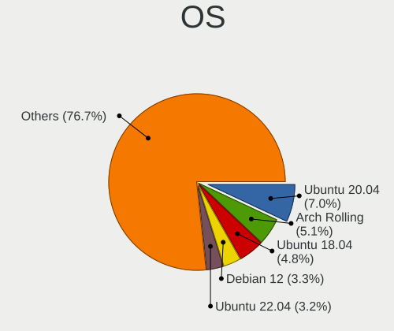

| Name                         | Desktops | Percent |
|------------------------------|----------|---------|
| Ubuntu 20.04                 | 44       | 6.97%   |
| Arch Rolling                 | 32       | 5.07%   |
| Ubuntu 18.04                 | 30       | 4.75%   |
| Debian 12                    | 21       | 3.33%   |
| Ubuntu 22.04                 | 20       | 3.17%   |
| Pop!_OS 22.04                | 20       | 3.17%   |
| Zorin 16                     | 16       | 2.54%   |
| Ubuntu 24.04                 | 15       | 2.38%   |
| OpenMandriva 4.2             | 13       | 2.06%   |
| Linux Mint 22.1              | 12       | 1.9%    |
| Manjaro                      | 11       | 1.74%   |
| Fedora 40                    | 11       | 1.74%   |
| Zorin 17                     | 10       | 1.58%   |
| openSUSE Tumbleweed-XXXXXXXX | 9        | 1.43%   |
| Fedora 42                    | 9        | 1.43%   |
| Debian 11                    | 9        | 1.43%   |
| ArcoLinux Rolling            | 9        | 1.43%   |
| OpenMandriva 24.12           | 8        | 1.27%   |
| Linux Mint 21.1              | 8        | 1.27%   |
| Pop!_OS 21.04                | 7        | 1.11%   |
| OpenMandriva 4.3             | 7        | 1.11%   |
| Linux Mint 21.2              | 7        | 1.11%   |
| Linux Mint 20.2              | 7        | 1.11%   |
| Ubuntu 22.10                 | 6        | 0.95%   |
| OpenMandriva 6.0             | 6        | 0.95%   |
| OpenMandriva 23.03           | 6        | 0.95%   |
| Linux Mint 22.2              | 6        | 0.95%   |
| Linux Mint 20.1              | 6        | 0.95%   |
| Fedora 38                    | 6        | 0.95%   |
| Bazzite 42                   | 6        | 0.95%   |
| Ubuntu 20.10                 | 5        | 0.79%   |
| Ubuntu 19.04                 | 5        | 0.79%   |
| Pop!_OS 20.10                | 5        | 0.79%   |
| Linux Mint 20.3              | 5        | 0.79%   |
| Garuda Linux Soaring         | 5        | 0.79%   |
| EndeavourOS Rolling          | 5        | 0.79%   |
| Zorin 15                     | 4        | 0.63%   |
| Ubuntu 21.10                 | 4        | 0.63%   |
| OpenMandriva 25.90           | 4        | 0.63%   |
| OpenMandriva 25.01           | 4        | 0.63%   |

OS Family
---------

OS without a version

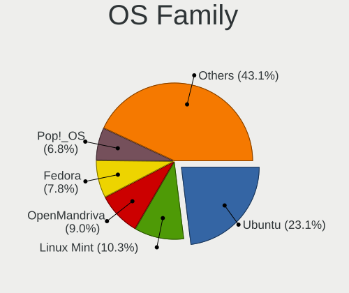

| Name         | Desktops | Percent |
|--------------|----------|---------|
| Ubuntu       | 136      | 23.05%  |
| Linux Mint   | 61       | 10.34%  |
| OpenMandriva | 53       | 8.98%   |
| Fedora       | 46       | 7.8%    |
| Pop!_OS      | 40       | 6.78%   |
| Debian       | 38       | 6.44%   |
| Arch         | 34       | 5.76%   |
| Zorin        | 29       | 4.92%   |
| Manjaro      | 26       | 4.41%   |
| Kubuntu      | 14       | 2.37%   |
| ArcoLinux    | 11       | 1.86%   |
| openSUSE     | 10       | 1.69%   |
| KDE neon     | 10       | 1.69%   |
| Bazzite      | 9        | 1.53%   |
| Ubuntu MATE  | 7        | 1.19%   |
| Nobara       | 7        | 1.19%   |
| EndeavourOS  | 7        | 1.19%   |
| Gentoo       | 6        | 1.02%   |
| NixOS        | 5        | 0.85%   |
| Garuda Linux | 5        | 0.85%   |
| ROSA         | 4        | 0.68%   |
| MX           | 4        | 0.68%   |
| Lubuntu      | 3        | 0.51%   |
| Elementary   | 3        | 0.51%   |
| Xubuntu      | 2        | 0.34%   |
| SteamOS      | 2        | 0.34%   |
| LMDE         | 2        | 0.34%   |
| CachyOS      | 2        | 0.34%   |
| Void Linux   | 1        | 0.17%   |
| Ubuntu Unity | 1        | 0.17%   |
| Ubuntu Kylin | 1        | 0.17%   |
| Solus        | 1        | 0.17%   |
| Pikaos       | 1        | 0.17%   |
| Parrot       | 1        | 0.17%   |
| Endless      | 1        | 0.17%   |
| Drauger OS   | 1        | 0.17%   |
| Devuan       | 1        | 0.17%   |
| BlackPanther | 1        | 0.17%   |
| Aurora       | 1        | 0.17%   |
| Anduinos     | 1        | 0.17%   |

Kernel
------

Version of the Linux kernel

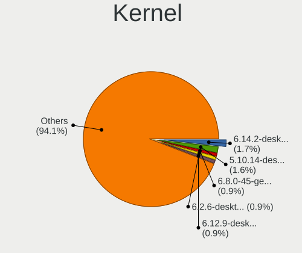

| Version                  | Desktops | Percent |
|--------------------------|----------|---------|
| 6.14.2-desktop-3omv2590  | 12       | 1.72%   |
| 5.10.14-desktop-1omv4002 | 11       | 1.58%   |
| 6.8.0-45-generic         | 6        | 0.86%   |
| 6.2.6-desktop-1omv2390   | 6        | 0.86%   |
| 6.12.9-desktop-1omv2490  | 6        | 0.86%   |
| 5.4.0-52-generic         | 6        | 0.86%   |
| 5.16.7-desktop-1omv4003  | 6        | 0.86%   |
| 6.8.0-31-generic         | 5        | 0.72%   |
| 5.15.0-58-generic        | 5        | 0.72%   |
| 5.15.0-56-generic        | 5        | 0.72%   |
| 6.8.0-52-generic         | 4        | 0.57%   |
| 6.8.0-51-generic         | 4        | 0.57%   |
| 6.12.10-76061203-generic | 4        | 0.57%   |
| 6.12.1-desktop-1omv2490  | 4        | 0.57%   |
| 6.1.0-37-amd64           | 4        | 0.57%   |
| 5.8.0-43-generic         | 4        | 0.57%   |
| 5.4.0-42-generic         | 4        | 0.57%   |
| 5.19.0-38-generic        | 4        | 0.57%   |
| 5.11.12-desktop-1omv4002 | 4        | 0.57%   |
| 4.15.0-48-generic        | 4        | 0.57%   |
| 4.15.0-45-generic        | 4        | 0.57%   |
| 6.9.3-76060903-generic   | 3        | 0.43%   |
| 6.8.0-79-generic         | 3        | 0.43%   |
| 6.8.0-60-generic         | 3        | 0.43%   |
| 6.8.0-40-generic         | 3        | 0.43%   |
| 6.6.2-desktop-1omv2390   | 3        | 0.43%   |
| 6.5.0-21-generic         | 3        | 0.43%   |
| 6.4.11-desktop-1omv2390  | 3        | 0.43%   |
| 6.2.6-76060206-generic   | 3        | 0.43%   |
| 6.1.0-21-amd64           | 3        | 0.43%   |
| 6.1.0-18-amd64           | 3        | 0.43%   |
| 5.8.5-arch1-1            | 3        | 0.43%   |
| 5.4.0-91-generic         | 3        | 0.43%   |
| 5.4.0-90-generic         | 3        | 0.43%   |
| 5.4.0-73-generic         | 3        | 0.43%   |
| 5.4.0-58-generic         | 3        | 0.43%   |
| 5.4.0-29-generic         | 3        | 0.43%   |
| 5.3.0-28-generic         | 3        | 0.43%   |
| 5.15.0-88-generic        | 3        | 0.43%   |
| 5.15.0-69-generic        | 3        | 0.43%   |

Kernel Family
-------------

Linux kernel without a distro release

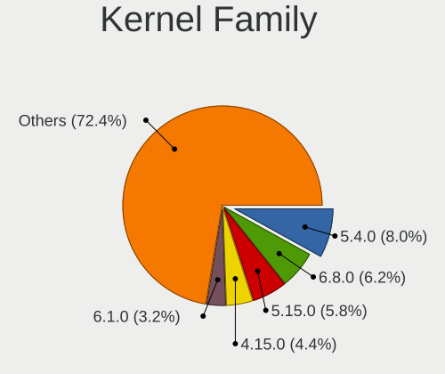

| Version | Desktops | Percent |
|---------|----------|---------|
| 5.4.0   | 53       | 8.04%   |
| 6.8.0   | 41       | 6.22%   |
| 5.15.0  | 38       | 5.77%   |
| 4.15.0  | 29       | 4.4%    |
| 6.1.0   | 21       | 3.19%   |
| 5.8.0   | 21       | 3.19%   |
| 5.13.0  | 19       | 2.88%   |
| 5.11.0  | 19       | 2.88%   |
| 5.19.0  | 17       | 2.58%   |
| 6.5.0   | 12       | 1.82%   |
| 6.14.2  | 12       | 1.82%   |
| 6.2.6   | 11       | 1.67%   |
| 5.3.0   | 11       | 1.67%   |
| 5.10.14 | 11       | 1.67%   |
| 6.14.0  | 10       | 1.52%   |
| 5.10.0  | 10       | 1.52%   |
| 5.0.0   | 8        | 1.21%   |
| 6.2.0   | 7        | 1.06%   |
| 6.12.9  | 7        | 1.06%   |
| 5.16.7  | 6        | 0.91%   |
| 6.9.3   | 5        | 0.76%   |
| 6.11.0  | 5        | 0.76%   |
| 4.18.0  | 5        | 0.76%   |
| 6.15.9  | 4        | 0.61%   |
| 6.14.6  | 4        | 0.61%   |
| 6.12.10 | 4        | 0.61%   |
| 6.12.1  | 4        | 0.61%   |
| 6.11.5  | 4        | 0.61%   |
| 6.10.0  | 4        | 0.61%   |
| 5.11.12 | 4        | 0.61%   |
| 4.19.0  | 4        | 0.61%   |
| 6.6.2   | 3        | 0.46%   |
| 6.6.0   | 3        | 0.46%   |
| 6.5.5   | 3        | 0.46%   |
| 6.4.8   | 3        | 0.46%   |
| 6.4.11  | 3        | 0.46%   |
| 6.16.4  | 3        | 0.46%   |
| 6.15.6  | 3        | 0.46%   |
| 6.15.5  | 3        | 0.46%   |
| 6.15.4  | 3        | 0.46%   |

Kernel Major Ver.
-----------------

Linux kernel major version

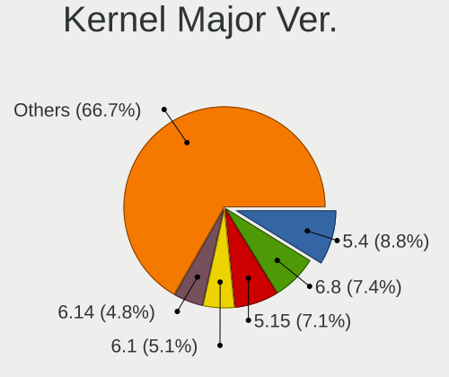

| Version | Desktops | Percent |
|---------|----------|---------|
| 5.4     | 57       | 8.82%   |
| 6.8     | 48       | 7.43%   |
| 5.15    | 46       | 7.12%   |
| 6.1     | 33       | 5.11%   |
| 6.14    | 31       | 4.8%    |
| 5.8     | 31       | 4.8%    |
| 6.12    | 29       | 4.49%   |
| 4.15    | 29       | 4.49%   |
| 5.11    | 27       | 4.18%   |
| 5.10    | 23       | 3.56%   |
| 5.13    | 22       | 3.41%   |
| 6.2     | 21       | 3.25%   |
| 6.5     | 20       | 3.1%    |
| 5.19    | 20       | 3.1%    |
| 6.15    | 19       | 2.94%   |
| 6.6     | 18       | 2.79%   |
| 6.9     | 15       | 2.32%   |
| 6.11    | 14       | 2.17%   |
| 5.16    | 13       | 2.01%   |
| 6.4     | 11       | 1.7%    |
| 5.3     | 11       | 1.7%    |
| 6.3     | 10       | 1.55%   |
| 6.10    | 10       | 1.55%   |
| 6.17    | 8        | 1.24%   |
| 5.0     | 8        | 1.24%   |
| 6.16    | 7        | 1.08%   |
| 6.13    | 7        | 1.08%   |
| 5.6     | 7        | 1.08%   |
| 6.0     | 6        | 0.93%   |
| 6.7     | 5        | 0.77%   |
| 5.7     | 5        | 0.77%   |
| 5.17    | 5        | 0.77%   |
| 4.19    | 5        | 0.77%   |
| 4.18    | 5        | 0.77%   |
| 6.18    | 3        | 0.46%   |
| 5.9     | 3        | 0.46%   |
| 5.14    | 3        | 0.46%   |
| 4.9     | 3        | 0.46%   |
| 5.18    | 2        | 0.31%   |
| 5.12    | 2        | 0.31%   |

Arch
----

OS architecture (x86_64, i586, etc.)

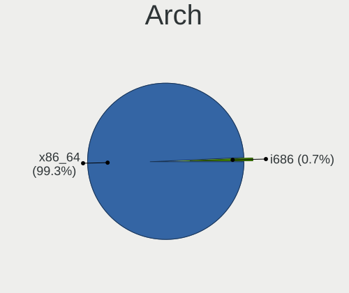

| Name   | Desktops | Percent |
|--------|----------|---------|
| x86_64 | 558      | 99.29%  |
| i686   | 4        | 0.71%   |

DE
--

Desktop Environment

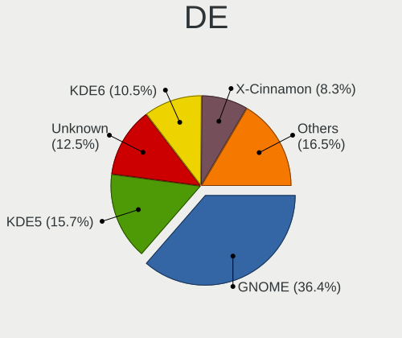

| Name          | Desktops | Percent |
|---------------|----------|---------|
| GNOME         | 218      | 36.39%  |
| KDE5          | 94       | 15.69%  |
| Unknown       | 75       | 12.52%  |
| KDE6          | 63       | 10.52%  |
| X-Cinnamon    | 50       | 8.35%   |
| XFCE          | 34       | 5.68%   |
| MATE          | 16       | 2.67%   |
| KDE           | 12       | 2%      |
| LXQt          | 6        | 1%      |
| Cinnamon      | 5        | 0.83%   |
| i3            | 4        | 0.67%   |
| Pantheon      | 3        | 0.5%    |
| KDE4          | 3        | 0.5%    |
| Hyprland      | 3        | 0.5%    |
| COSMIC        | 3        | 0.5%    |
| Deepin        | 2        | 0.33%   |
| Unity         | 1        | 0.17%   |
| UKUI          | 1        | 0.17%   |
| openbox       | 1        | 0.17%   |
| none+xsession | 1        | 0.17%   |
| LXDE          | 1        | 0.17%   |
| gtk           | 1        | 0.17%   |
| enlightenment | 1        | 0.17%   |
| bspwm         | 1        | 0.17%   |

Display Server
--------------

X11 or Wayland

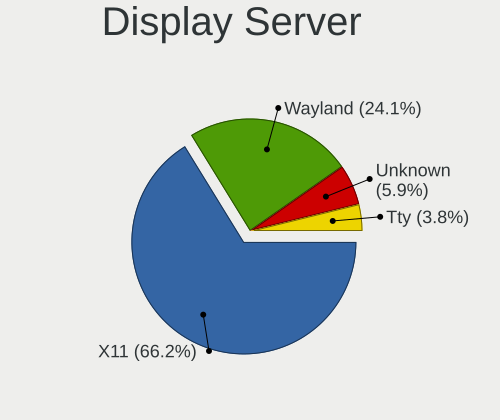

| Name    | Desktops | Percent |
|---------|----------|---------|
| X11     | 396      | 66.22%  |
| Wayland | 144      | 24.08%  |
| Unknown | 35       | 5.85%   |
| Tty     | 23       | 3.85%   |

Display Manager
---------------

SDDM, LightDM, etc.

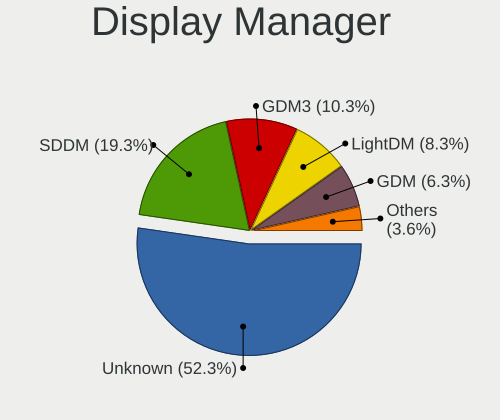

| Name    | Desktops | Percent |
|---------|----------|---------|
| Unknown | 309      | 52.28%  |
| SDDM    | 114      | 19.29%  |
| GDM3    | 61       | 10.32%  |
| LightDM | 49       | 8.29%   |
| GDM     | 37       | 6.26%   |
| TDM     | 15       | 2.54%   |
| KDM     | 2        | 0.34%   |
| SLiM    | 1        | 0.17%   |
| LY-DM   | 1        | 0.17%   |
| LXDM    | 1        | 0.17%   |
| GREETD  | 1        | 0.17%   |

OS Lang
-------

Language

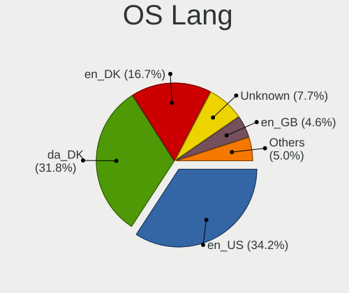

| Lang       | Desktops | Percent |
|------------|----------|---------|
| en_US      | 199      | 34.19%  |
| da_DK      | 185      | 31.79%  |
| en_DK      | 97       | 16.67%  |
| Unknown    | 45       | 7.73%   |
| en_GB      | 27       | 4.64%   |
| C          | 12       | 2.06%   |
| de_DE      | 3        | 0.52%   |
| ru_RU      | 2        | 0.34%   |
| pl_PL      | 2        | 0.34%   |
| it_IT      | 2        | 0.34%   |
| UTF-8      | 1        | 0.17%   |
| io_001     | 1        | 0.17%   |
| es_ES      | 1        | 0.17%   |
| en_US.UTF8 | 1        | 0.17%   |
| en_IE      | 1        | 0.17%   |
| en_CA      | 1        | 0.17%   |
| de_CH      | 1        | 0.17%   |
| de_AT      | 1        | 0.17%   |

Boot Mode
---------

EFI or BIOS

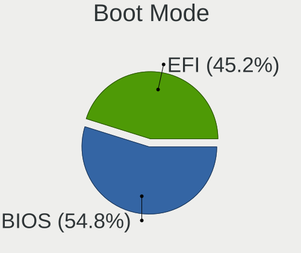

| Mode | Desktops | Percent |
|------|----------|---------|
| BIOS | 318      | 54.83%  |
| EFI  | 262      | 45.17%  |

Filesystem
----------

Type of filesystem

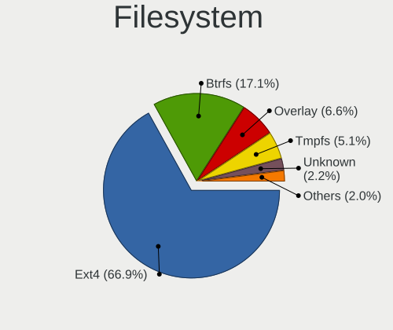

| Type    | Desktops | Percent |
|---------|----------|---------|
| Ext4    | 395      | 66.95%  |
| Btrfs   | 101      | 17.12%  |
| Overlay | 39       | 6.61%   |
| Tmpfs   | 30       | 5.08%   |
| Unknown | 13       | 2.2%    |
| Zfs     | 5        | 0.85%   |
| Xfs     | 4        | 0.68%   |
| F2fs    | 2        | 0.34%   |
| Ext2    | 1        | 0.17%   |

Part. scheme
------------

Scheme of partitioning

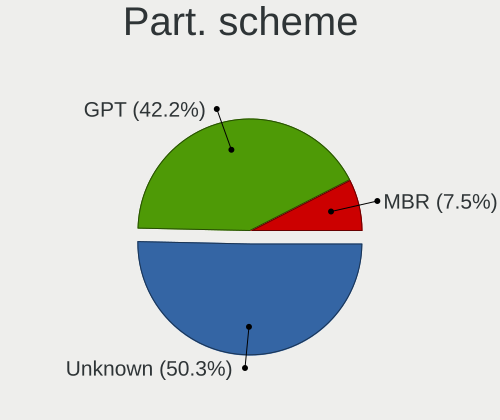

| Type    | Desktops | Percent |
|---------|----------|---------|
| Unknown | 295      | 50.34%  |
| GPT     | 247      | 42.15%  |
| MBR     | 44       | 7.51%   |

Dual Boot with Linux/BSD
------------------------

Hosting more than one Linux/BSD

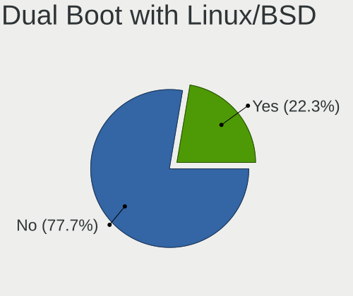

| Dual boot | Desktops | Percent |
|-----------|----------|---------|
| No        | 452      | 77.66%  |
| Yes       | 130      | 22.34%  |

Dual Boot (Win)
---------------

Hosting Linux and Windows

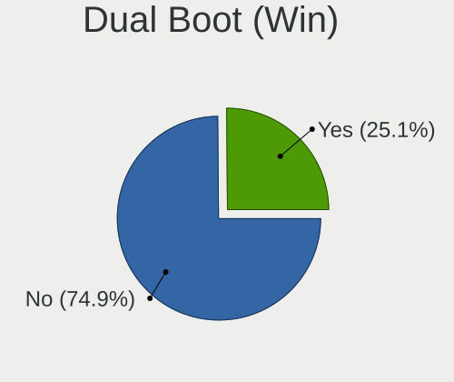

| Dual boot | Desktops | Percent |
|-----------|----------|---------|
| No        | 432      | 74.87%  |
| Yes       | 145      | 25.13%  |

Board
-----

Vendor
------

Motherboard manufacturer

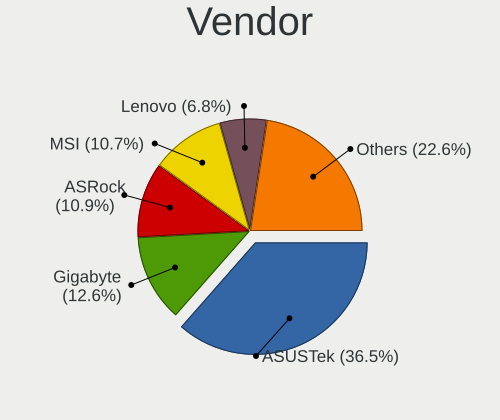

| Name                                 | Desktops | Percent |
|--------------------------------------|----------|---------|
| ASUSTek Computer                     | 205      | 36.48%  |
| Gigabyte Technology                  | 71       | 12.63%  |
| ASRock                               | 61       | 10.85%  |
| MSI                                  | 60       | 10.68%  |
| Lenovo                               | 38       | 6.76%   |
| Hewlett-Packard                      | 38       | 6.76%   |
| Dell                                 | 21       | 3.74%   |
| Medion                               | 12       | 2.14%   |
| Acer                                 | 11       | 1.96%   |
| Fujitsu                              | 6        | 1.07%   |
| Pegatron                             | 5        | 0.89%   |
| Intel                                | 5        | 0.89%   |
| Shuttle                              | 3        | 0.53%   |
| Shenzhen Meigao Electronic Equipment | 3        | 0.53%   |
| Packard Bell                         | 2        | 0.36%   |
| BESSTAR Tech                         | 2        | 0.36%   |
| Unknown                              | 2        | 0.36%   |
| T-bao                                | 1        | 0.18%   |
| Sugon                                | 1        | 0.18%   |
| NZXT                                 | 1        | 0.18%   |
| NEXCOM                               | 1        | 0.18%   |
| MARIUS                               | 1        | 0.18%   |
| Inventec                             | 1        | 0.18%   |
| IceWhale Technology                  | 1        | 0.18%   |
| Huanan                               | 1        | 0.18%   |
| Fujitsu Siemens                      | 1        | 0.18%   |
| eMachines                            | 1        | 0.18%   |
| ECS                                  | 1        | 0.18%   |
| Biostar                              | 1        | 0.18%   |
| Apple                                | 1        | 0.18%   |
| AMI                                  | 1        | 0.18%   |
| Alienware                            | 1        | 0.18%   |
| ADLINK Technology                    | 1        | 0.18%   |
| ABIT                                 | 1        | 0.18%   |

Model
-----

Motherboard model

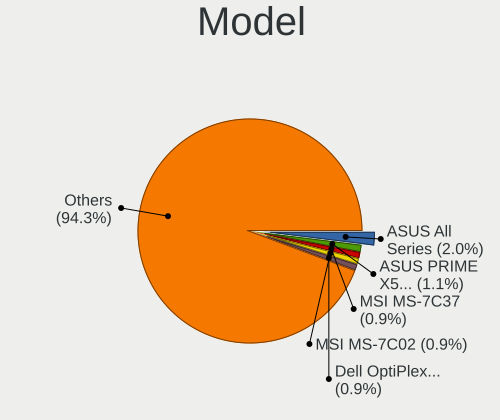

| Name                                | Desktops | Percent |
|-------------------------------------|----------|---------|
| ASUS All Series                     | 11       | 1.96%   |
| ASUS PRIME X570-P                   | 6        | 1.07%   |
| MSI MS-7C37                         | 5        | 0.89%   |
| MSI MS-7C02                         | 5        | 0.89%   |
| Dell OptiPlex 9020                  | 5        | 0.89%   |
| ASUS TUF Gaming X570-PLUS           | 5        | 0.89%   |
| ASUS ROG STRIX X570-E GAMING        | 5        | 0.89%   |
| ASUS ROG STRIX B550-F GAMING        | 5        | 0.89%   |
| ASUS ROG STRIX B450-E GAMING        | 5        | 0.89%   |
| MSI MS-7C84                         | 4        | 0.71%   |
| MSI MS-7C56                         | 4        | 0.71%   |
| Gigabyte X570 AORUS MASTER          | 4        | 0.71%   |
| ASUS Z170 PRO GAMING                | 4        | 0.71%   |
| ASUS Z170-P                         | 3        | 0.53%   |
| ASUS TUF Gaming B550-PLUS           | 3        | 0.53%   |
| ASUS ROG STRIX Z390-F GAMING        | 3        | 0.53%   |
| ASUS ROG STRIX X670E-E GAMING WIFI  | 3        | 0.53%   |
| ASUS ROG STRIX B450-F GAMING        | 3        | 0.53%   |
| ASUS PRIME Z390-A                   | 3        | 0.53%   |
| ASUS PRIME Z370-P                   | 3        | 0.53%   |
| ASUS PRIME X470-PRO                 | 3        | 0.53%   |
| ASUS M5A78L-M/USB3                  | 3        | 0.53%   |
| MSI MS-7C35                         | 2        | 0.36%   |
| MSI MS-7B86                         | 2        | 0.36%   |
| MSI MS-7B79                         | 2        | 0.36%   |
| MSI MS-7A38                         | 2        | 0.36%   |
| MSI MS-7A34                         | 2        | 0.36%   |
| MSI MS-7693                         | 2        | 0.36%   |
| Medion MS-7797                      | 2        | 0.36%   |
| Medion MS-7646                      | 2        | 0.36%   |
| Lenovo ThinkStation P620 30E000GMMT | 2        | 0.36%   |
| Lenovo ThinkStation P500 30A6S14F00 | 2        | 0.36%   |
| Lenovo H30-05 90BJ00CNMT            | 2        | 0.36%   |
| HP Z400 Workstation                 | 2        | 0.36%   |
| HP Z230 Tower Workstation           | 2        | 0.36%   |
| HP EliteDesk 800 G1 SFF             | 2        | 0.36%   |
| HP Compaq Elite 8300 SFF            | 2        | 0.36%   |
| HP Compaq 8200 Elite SFF PC         | 2        | 0.36%   |
| HP Compaq 6200 Pro SFF PC           | 2        | 0.36%   |
| Gigabyte Z68X-UD7-B3                | 2        | 0.36%   |

Model Family
------------

Motherboard model prefix

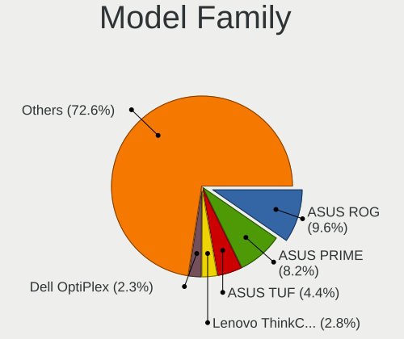

| Name                | Desktops | Percent |
|---------------------|----------|---------|
| ASUS ROG            | 54       | 9.61%   |
| ASUS PRIME          | 46       | 8.19%   |
| ASUS TUF            | 25       | 4.45%   |
| Lenovo ThinkCentre  | 16       | 2.85%   |
| Dell OptiPlex       | 13       | 2.31%   |
| Gigabyte X570       | 12       | 2.14%   |
| HP Compaq           | 11       | 1.96%   |
| ASUS All            | 11       | 1.96%   |
| Lenovo ThinkStation | 8        | 1.42%   |
| Acer Aspire         | 7        | 1.25%   |
| Lenovo IdeaCentre   | 6        | 1.07%   |
| HP EliteDesk        | 6        | 1.07%   |
| ASUS M5A78L-M       | 6        | 1.07%   |
| MSI MS-7C37         | 5        | 0.89%   |
| MSI MS-7C02         | 5        | 0.89%   |
| Gigabyte B550       | 5        | 0.89%   |
| Fujitsu ESPRIMO     | 5        | 0.89%   |
| MSI MS-7C84         | 4        | 0.71%   |
| MSI MS-7C56         | 4        | 0.71%   |
| HP ProLiant         | 4        | 0.71%   |
| ASUS Z170           | 4        | 0.71%   |
| ASUS SABERTOOTH     | 4        | 0.71%   |
| ASRock Z77          | 4        | 0.71%   |
| ASRock Z170         | 4        | 0.71%   |
| ASRock B450         | 4        | 0.71%   |
| HP Z230             | 3        | 0.53%   |
| HP Pavilion         | 3        | 0.53%   |
| HP OMEN             | 3        | 0.53%   |
| Gigabyte Z390       | 3        | 0.53%   |
| Gigabyte B650       | 3        | 0.53%   |
| Dell Precision      | 3        | 0.53%   |
| ASUS Z170-P         | 3        | 0.53%   |
| ASUS PRO            | 3        | 0.53%   |
| ASUS Maximus        | 3        | 0.53%   |
| MSI MS-7C35         | 2        | 0.36%   |
| MSI MS-7B86         | 2        | 0.36%   |
| MSI MS-7B79         | 2        | 0.36%   |
| MSI MS-7A38         | 2        | 0.36%   |
| MSI MS-7A34         | 2        | 0.36%   |
| MSI MS-7693         | 2        | 0.36%   |

MFG Year
--------

Motherboard manufacture year

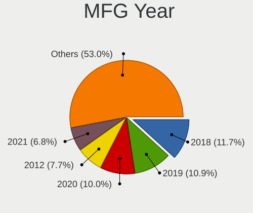

| Year | Desktops | Percent |
|------|----------|---------|
| 2018 | 66       | 11.74%  |
| 2019 | 61       | 10.85%  |
| 2020 | 56       | 9.96%   |
| 2012 | 43       | 7.65%   |
| 2021 | 38       | 6.76%   |
| 2017 | 36       | 6.41%   |
| 2013 | 31       | 5.52%   |
| 2015 | 30       | 5.34%   |
| 2022 | 29       | 5.16%   |
| 2016 | 29       | 5.16%   |
| 2011 | 29       | 5.16%   |
| 2010 | 23       | 4.09%   |
| 2014 | 22       | 3.91%   |
| 2023 | 15       | 2.67%   |
| 2008 | 14       | 2.49%   |
| 2024 | 12       | 2.14%   |
| 2009 | 12       | 2.14%   |
| 2007 | 9        | 1.6%    |
| 2025 | 5        | 0.89%   |
| 2006 | 2        | 0.36%   |

Form Factor
-----------

Physical design of the computer

| Name    | Desktops | Percent |
|---------|----------|---------|
| Desktop | 562      | 100%    |

Secure Boot
-----------

Enabled or disabled

| State    | Desktops | Percent |
|----------|----------|---------|
| Disabled | 548      | 97.16%  |
| Enabled  | 16       | 2.84%   |

Coreboot
--------

Have coreboot on board

| Used | Desktops | Percent |
|------|----------|---------|
| No   | 562      | 100%    |

RAM Size
--------

Total RAM memory

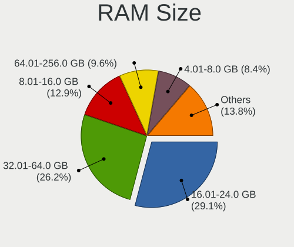

| Size in GB      | Desktops | Percent |
|-----------------|----------|---------|
| 16.01-24.0      | 169      | 29.09%  |
| 32.01-64.0      | 152      | 26.16%  |
| 8.01-16.0       | 75       | 12.91%  |
| 64.01-256.0     | 56       | 9.64%   |
| 4.01-8.0        | 49       | 8.43%   |
| 3.01-4.0        | 37       | 6.37%   |
| 24.01-32.0      | 33       | 5.68%   |
| 1.01-2.0        | 5        | 0.86%   |
| More than 256.0 | 2        | 0.34%   |
| 2.01-3.0        | 2        | 0.34%   |
| 0.51-1.0        | 1        | 0.17%   |

RAM Used
--------

Used RAM memory

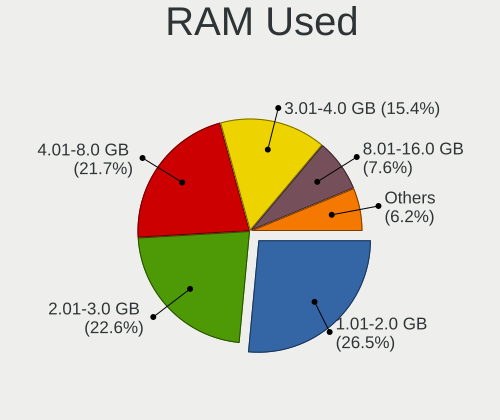

| Used GB     | Desktops | Percent |
|-------------|----------|---------|
| 1.01-2.0    | 170      | 26.48%  |
| 2.01-3.0    | 145      | 22.59%  |
| 4.01-8.0    | 139      | 21.65%  |
| 3.01-4.0    | 99       | 15.42%  |
| 8.01-16.0   | 49       | 7.63%   |
| 0.51-1.0    | 18       | 2.8%    |
| 24.01-32.0  | 7        | 1.09%   |
| 16.01-24.0  | 7        | 1.09%   |
| 0.01-0.5    | 5        | 0.78%   |
| 32.01-64.0  | 2        | 0.31%   |
| 64.01-256.0 | 1        | 0.16%   |

Total Drives
------------

Number of drives on board

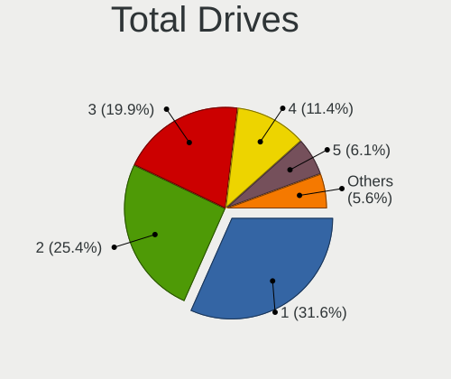

| Drives | Desktops | Percent |
|--------|----------|---------|
| 1      | 188      | 31.65%  |
| 2      | 151      | 25.42%  |
| 3      | 118      | 19.87%  |
| 4      | 68       | 11.45%  |
| 5      | 36       | 6.06%   |
| 6      | 15       | 2.53%   |
| 7      | 7        | 1.18%   |
| 8      | 4        | 0.67%   |
| 0      | 4        | 0.67%   |
| 9      | 2        | 0.34%   |
| 10     | 1        | 0.17%   |

Has CD-ROM
----------

Has CD-ROM on board

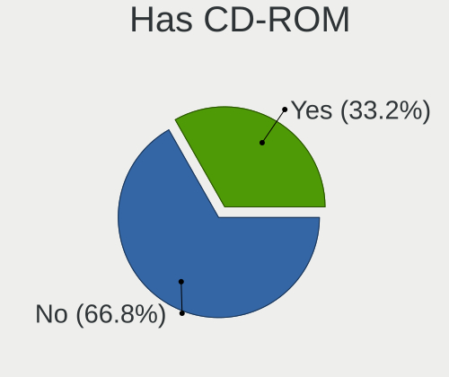

| Presented | Desktops | Percent |
|-----------|----------|---------|
| No        | 378      | 66.78%  |
| Yes       | 188      | 33.22%  |

Has Ethernet
------------

Has Ethernet on board

| Presented | Desktops | Percent |
|-----------|----------|---------|
| Yes       | 559      | 99.47%  |
| No        | 3        | 0.53%   |

Has WiFi
--------

Has WiFi module

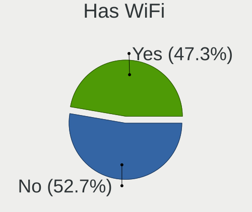

| Presented | Desktops | Percent |
|-----------|----------|---------|
| No        | 302      | 52.71%  |
| Yes       | 271      | 47.29%  |

Has Bluetooth
-------------

Has Bluetooth module

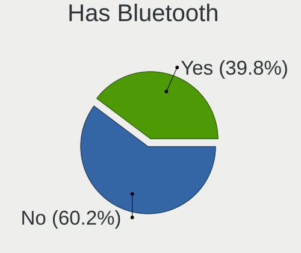

| Presented | Desktops | Percent |
|-----------|----------|---------|
| No        | 344      | 60.25%  |
| Yes       | 227      | 39.75%  |

Location
--------

Country
-------

Geographic location (country)

| Country | Desktops | Percent |
|---------|----------|---------|
| Denmark | 562      | 100%    |

City
----

Geographic location (city)

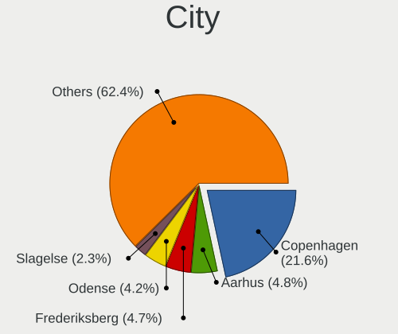

| City                     | Desktops | Percent |
|--------------------------|----------|---------|
| Copenhagen               | 130      | 21.63%  |
| Aarhus                   | 29       | 4.83%   |
| Frederiksberg            | 28       | 4.66%   |
| Odense                   | 25       | 4.16%   |
| Slagelse                 | 14       | 2.33%   |
| Aalborg                  | 14       | 2.33%   |
| Horsens                  | 13       | 2.16%   |
| Silkeborg                | 11       | 1.83%   |
| Valby                    | 10       | 1.66%   |
| Esbjerg                  | 10       | 1.66%   |
| Bronshoj                 | 8        | 1.33%   |
| Taastrup                 | 7        | 1.16%   |
| Ishøj                   | 7        | 1.16%   |
| Kolding                  | 6        | 1%      |
| Herlev                   | 6        | 1%      |
| Glostrup Municipality    | 6        | 1%      |
| Aabenraa                 | 6        | 1%      |
| Viby J                   | 5        | 0.83%   |
| Viborg                   | 5        | 0.83%   |
| Rødovre Municipality    | 5        | 0.83%   |
| Roskilde                 | 5        | 0.83%   |
| Hjørring                | 5        | 0.83%   |
| Haderslev                | 5        | 0.83%   |
| Vejle                    | 4        | 0.67%   |
| Tilst                    | 4        | 0.67%   |
| Ringsted                 | 4        | 0.67%   |
| Odder                    | 4        | 0.67%   |
| Naestved                 | 4        | 0.67%   |
| Fredericia               | 4        | 0.67%   |
| Allinge                  | 4        | 0.67%   |
| Albertslund Municipality | 4        | 0.67%   |
| Albertslund              | 4        | 0.67%   |
| Trige                    | 3        | 0.5%    |
| Tranbjerg                | 3        | 0.5%    |
| Svendborg                | 3        | 0.5%    |
| Pandrup                  | 3        | 0.5%    |
| Nyborg                   | 3        | 0.5%    |
| Norresundby              | 3        | 0.5%    |
| Langeskov                | 3        | 0.5%    |
| Køge                    | 3        | 0.5%    |

Drives
------

Drive Vendor
------------

Hard drive vendors

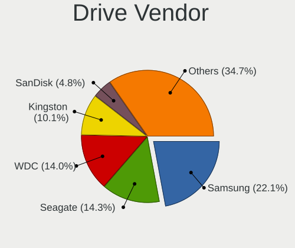

| Vendor                       | Desktops | Drives | Percent |
|------------------------------|----------|--------|---------|
| Samsung Electronics          | 248      | 496    | 22.06%  |
| Seagate                      | 161      | 260    | 14.32%  |
| WDC                          | 157      | 257    | 13.97%  |
| Kingston                     | 114      | 180    | 10.14%  |
| SanDisk                      | 54       | 77     | 4.8%    |
| Crucial                      | 46       | 68     | 4.09%   |
| Toshiba                      | 43       | 60     | 3.83%   |
| Intel                        | 32       | 36     | 2.85%   |
| Kingston Technology Company  | 30       | 34     | 2.67%   |
| Phison Electronics           | 18       | 28     | 1.6%    |
| Hitachi                      | 18       | 33     | 1.6%    |
| Intenso                      | 15       | 19     | 1.33%   |
| Corsair                      | 12       | 15     | 1.07%   |
| A-DATA Technology            | 12       | 13     | 1.07%   |
| Unknown                      | 11       | 18     | 0.98%   |
| PNY                          | 11       | 19     | 0.98%   |
| Micron Technology            | 9        | 13     | 0.8%    |
| HGST                         | 9        | 15     | 0.8%    |
| Phison                       | 7        | 10     | 0.62%   |
| Micron/Crucial Technology    | 7        | 7      | 0.62%   |
| SK hynix                     | 6        | 6      | 0.53%   |
| OCZ                          | 6        | 6      | 0.53%   |
| LITEON                       | 5        | 7      | 0.44%   |
| Verbatim                     | 4        | 7      | 0.36%   |
| Realtek Semiconductor        | 4        | 6      | 0.36%   |
| Patriot                      | 4        | 5      | 0.36%   |
| JMicron Technology           | 4        | 4      | 0.36%   |
| Apple                        | 4        | 7      | 0.36%   |
| Team                         | 3        | 3      | 0.27%   |
| Shenzhen Longsys Electronics | 3        | 3      | 0.27%   |
| Seagate Technology           | 3        | 7      | 0.27%   |
| Fujitsu                      | 3        | 7      | 0.27%   |
| China                        | 3        | 3      | 0.27%   |
| Unknown                      | 3        | 5      | 0.27%   |
| XPG                          | 2        | 2      | 0.18%   |
| Vi550                        | 2        | 3      | 0.18%   |
| Transcend                    | 2        | 2      | 0.18%   |
| Silicon Motion               | 2        | 2      | 0.18%   |
| Maxtor                       | 2        | 2      | 0.18%   |
| LITEONIT                     | 2        | 2      | 0.18%   |

Drive Model
-----------

Hard drive models

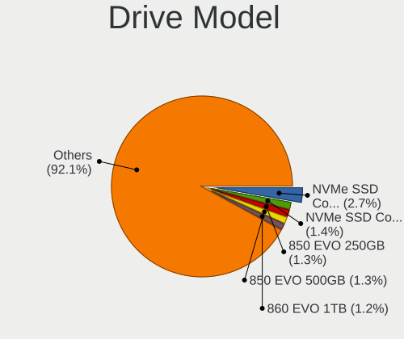

| Model                                              | Desktops | Percent |
|----------------------------------------------------|----------|---------|
| Samsung NVMe SSD Controller SM981/PM981/PM983 1TB  | 37       | 2.75%   |
| Samsung NVMe SSD Controller PM9A1/PM9A3/980PRO 1TB | 19       | 1.41%   |
| Samsung SSD 850 EVO 250GB                          | 18       | 1.34%   |
| Samsung SSD 850 EVO 500GB                          | 17       | 1.26%   |
| Samsung SSD 860 EVO 1TB                            | 16       | 1.19%   |
| Kingston SA400S37480G 480GB SSD                    | 15       | 1.11%   |
| Kingston SA400S37240G 240GB SSD                    | 15       | 1.11%   |
| Seagate ST2000DM001-1ER164 2TB                     | 14       | 1.04%   |
| Samsung SSD 860 QVO 1TB                            | 14       | 1.04%   |
| Samsung SSD 840 EVO 250GB                          | 12       | 0.89%   |
| Samsung SSD 860 EVO 500GB                          | 11       | 0.82%   |
| Kingston SV300S37A120G 120GB SSD                   | 11       | 0.82%   |
| Phison E16 PCIe4 NVMe Controller 1TB               | 10       | 0.74%   |
| Seagate ST1000DM010-2EP102 1TB                     | 8        | 0.59%   |
| Samsung NVMe SSD Drive 500GB                       | 8        | 0.59%   |
| Kingston Company SNV2S2000G 2TB                    | 8        | 0.59%   |
| Kingston Company SNV2S1000G 1TB                    | 8        | 0.59%   |
| Kingston SKC3000D2048G 2TB                         | 8        | 0.59%   |
| Crucial CT1000MX500SSD1 1TB                        | 8        | 0.59%   |
| Seagate ST500DM002-1BD142 500GB                    | 7        | 0.52%   |
| Seagate ST1000DM003-1SB102 1TB                     | 7        | 0.52%   |
| Samsung NVMe SSD Drive 1TB                         | 7        | 0.52%   |
| Phison E12 NVMe Controller 1TB                     | 7        | 0.52%   |
| Kingston SA400S37960G 960GB SSD                    | 7        | 0.52%   |
| Seagate ST2000DM001-1CH164 2TB                     | 6        | 0.45%   |
| Samsung SSD 870 QVO 2TB                            | 6        | 0.45%   |
| Samsung HD103SJ 1TB                                | 6        | 0.45%   |
| Kingston Company A2000 NVMe SSD 250GB              | 6        | 0.45%   |
| Kingston SUV400S37120G 120GB SSD                   | 6        | 0.45%   |
| Kingston SA400S37120G 120GB SSD                    | 6        | 0.45%   |
| WDC WD20EARX-00PASB0 2TB                           | 5        | 0.37%   |
| Unknown SD/MMC/MS PRO 2GB                          | 5        | 0.37%   |
| Unknown Compact Flash 977MB                        | 5        | 0.37%   |
| Toshiba DT01ACA050 500GB                           | 5        | 0.37%   |
| Seagate ST4000VN008-2DR166 4TB                     | 5        | 0.37%   |
| Seagate ST2000DM008-2FR102 2TB                     | 5        | 0.37%   |
| Seagate ST1000DM003-1SB10C 1TB                     | 5        | 0.37%   |
| Seagate ST1000DM003-1CH162 1TB                     | 5        | 0.37%   |
| Samsung SSD 970 EVO 1TB                            | 5        | 0.37%   |
| Samsung SSD 870 EVO 500GB                          | 5        | 0.37%   |

HDD Vendor
----------

Hard disk drive vendors

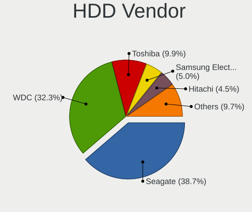

| Vendor              | Desktops | Drives | Percent |
|---------------------|----------|--------|---------|
| Seagate             | 156      | 251    | 38.71%  |
| WDC                 | 130      | 224    | 32.26%  |
| Toshiba             | 40       | 57     | 9.93%   |
| Samsung Electronics | 20       | 29     | 4.96%   |
| Hitachi             | 18       | 33     | 4.47%   |
| HGST                | 9        | 15     | 2.23%   |
| Unknown             | 5        | 6      | 1.24%   |
| JMicron Technology  | 4        | 4      | 0.99%   |
| Intenso             | 4        | 6      | 0.99%   |
| Fujitsu             | 3        | 7      | 0.74%   |
| Apple               | 3        | 6      | 0.74%   |
| Maxtor              | 2        | 2      | 0.5%    |
| Hewlett-Packard     | 2        | 11     | 0.5%    |
| Unknown             | 2        | 4      | 0.5%    |
| USB                 | 1        | 1      | 0.25%   |
| Space ke            | 1        | 1      | 0.25%   |
| ASMT109x            | 1        | 1      | 0.25%   |
| ASMT                | 1        | 1      | 0.25%   |
| ASMedia             | 1        | 1      | 0.25%   |

SSD Vendor
----------

Solid state drive vendors

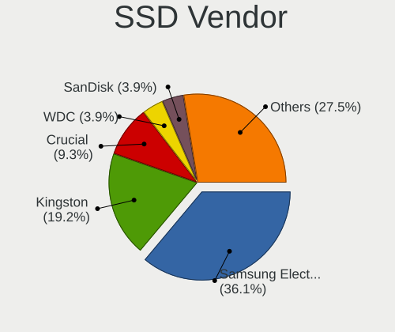

| Vendor              | Desktops | Drives | Percent |
|---------------------|----------|--------|---------|
| Samsung Electronics | 156      | 272    | 36.11%  |
| Kingston            | 83       | 123    | 19.21%  |
| Crucial             | 40       | 60     | 9.26%   |
| WDC                 | 17       | 20     | 3.94%   |
| SanDisk             | 17       | 20     | 3.94%   |
| Intel               | 15       | 17     | 3.47%   |
| Intenso             | 12       | 13     | 2.78%   |
| PNY                 | 11       | 19     | 2.55%   |
| A-DATA Technology   | 11       | 12     | 2.55%   |
| Micron Technology   | 8        | 9      | 1.85%   |
| OCZ                 | 6        | 6      | 1.39%   |
| Corsair             | 6        | 7      | 1.39%   |
| LITEON              | 5        | 7      | 1.16%   |
| Verbatim            | 4        | 7      | 0.93%   |
| Team                | 3        | 3      | 0.69%   |
| SK hynix            | 3        | 3      | 0.69%   |
| Patriot             | 3        | 4      | 0.69%   |
| China               | 3        | 3      | 0.69%   |
| Vi550               | 2        | 3      | 0.46%   |
| Transcend           | 2        | 2      | 0.46%   |
| LITEONIT            | 2        | 2      | 0.46%   |
| Leven               | 2        | 2      | 0.46%   |
| AFOX                | 2        | 2      | 0.46%   |
| Vaseky              | 1        | 1      | 0.23%   |
| Unknown (CF)        | 1        | 1      | 0.23%   |
| Toshiba             | 1        | 1      | 0.23%   |
| T-FORCE             | 1        | 1      | 0.23%   |
| Supersonic          | 1        | 1      | 0.23%   |
| Shark               | 1        | 1      | 0.23%   |
| Ramaxel Technology  | 1        | 1      | 0.23%   |
| OCZ-VERTEX3         | 1        | 3      | 0.23%   |
| OCZ-VERTEX          | 1        | 1      | 0.23%   |
| Netac               | 1        | 1      | 0.23%   |
| KODAK               | 1        | 1      | 0.23%   |
| KingFast            | 1        | 1      | 0.23%   |
| KingDian            | 1        | 1      | 0.23%   |
| INDMEM              | 1        | 1      | 0.23%   |
| GOODRAM             | 1        | 5      | 0.23%   |
| FORESEE             | 1        | 1      | 0.23%   |
| ADATA SU            | 1        | 1      | 0.23%   |

Drive Kind
----------

HDD or SSD

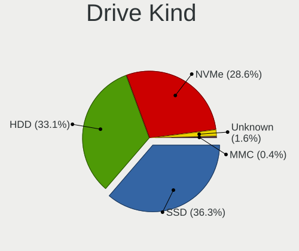

| Kind    | Desktops | Drives | Percent |
|---------|----------|--------|---------|
| SSD     | 338      | 642    | 36.31%  |
| HDD     | 308      | 660    | 33.08%  |
| NVMe    | 266      | 484    | 28.57%  |
| Unknown | 15       | 16     | 1.61%   |
| MMC     | 4        | 4      | 0.43%   |

Drive Connector
---------------

SATA, SAS, NVMe, etc.

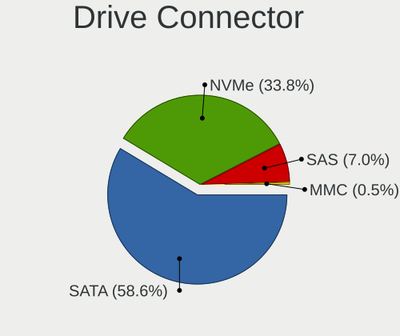

| Type | Desktops | Drives | Percent |
|------|----------|--------|---------|
| SATA | 459      | 1227   | 58.62%  |
| NVMe | 265      | 479    | 33.84%  |
| SAS  | 55       | 96     | 7.02%   |
| MMC  | 4        | 4      | 0.51%   |

Drive Size
----------

Size of hard drive

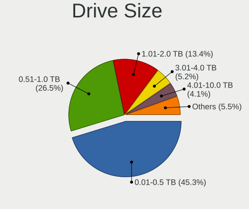

| Size in TB | Desktops | Drives | Percent |
|------------|----------|--------|---------|
| 0.01-0.5   | 330      | 631    | 45.27%  |
| 0.51-1.0   | 193      | 305    | 26.47%  |
| 1.01-2.0   | 98       | 166    | 13.44%  |
| 3.01-4.0   | 38       | 76     | 5.21%   |
| 2.01-3.0   | 30       | 46     | 4.12%   |
| 4.01-10.0  | 30       | 62     | 4.12%   |
| 10.01-20.0 | 10       | 16     | 1.37%   |

Space Total
-----------

Amount of disk space available on the file system

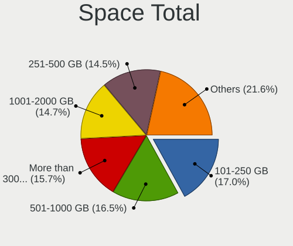

| Size in GB     | Desktops | Percent |
|----------------|----------|---------|
| 101-250        | 104      | 16.99%  |
| 501-1000       | 101      | 16.5%   |
| More than 3000 | 96       | 15.69%  |
| 1001-2000      | 90       | 14.71%  |
| 251-500        | 89       | 14.54%  |
| 2001-3000      | 43       | 7.03%   |
| 1-20           | 37       | 6.05%   |
| Unknown        | 20       | 3.27%   |
| 51-100         | 17       | 2.78%   |
| 21-50          | 15       | 2.45%   |

Space Used
----------

Amount of used disk space

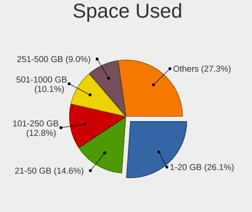

| Used GB        | Desktops | Percent |
|----------------|----------|---------|
| 1-20           | 165      | 26.15%  |
| 21-50          | 92       | 14.58%  |
| 101-250        | 81       | 12.84%  |
| 501-1000       | 64       | 10.14%  |
| 251-500        | 57       | 9.03%   |
| 51-100         | 56       | 8.87%   |
| 1001-2000      | 44       | 6.97%   |
| More than 3000 | 33       | 5.23%   |
| Unknown        | 20       | 3.17%   |
| 2001-3000      | 19       | 3.01%   |

Malfunc. Drives
---------------

Drive models with a malfunction

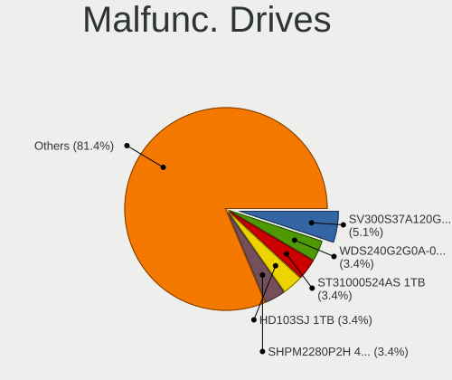

| Model                                 | Desktops | Drives | Percent |
|---------------------------------------|----------|--------|---------|
| Kingston SV300S37A120G 120GB SSD      | 3        | 5      | 5.08%   |
| WDC WDS240G2G0A-00JH30 240GB SSD      | 2        | 2      | 3.39%   |
| Seagate ST31000524AS 1TB              | 2        | 2      | 3.39%   |
| Samsung Electronics HD103SJ 1TB       | 2        | 2      | 3.39%   |
| Kingston SHPM2280P2H 480G SSD         | 2        | 2      | 3.39%   |
| Kingston SA400S37240G 240GB SSD       | 2        | 2      | 3.39%   |
| WDC WD5000BEVT-60ZAT0 500GB           | 1        | 1      | 1.69%   |
| WDC WD5000AAKX-001CA0 500GB           | 1        | 1      | 1.69%   |
| WDC WD5000AADS-00S9B0 500GB           | 1        | 1      | 1.69%   |
| WDC WD30PURZ-85AKKY0 3TB              | 1        | 1      | 1.69%   |
| WDC WD30EFRX-68EUZN0 3TB              | 1        | 1      | 1.69%   |
| WDC WD10EZRX-00A8LB0 1TB              | 1        | 1      | 1.69%   |
| WDC WD10EZEX-60WN4A0 1TB              | 1        | 1      | 1.69%   |
| WDC WD10EURX-73FH1Y0 1TB              | 1        | 1      | 1.69%   |
| WDC WD10EFRX-68PJCN0 1TB              | 1        | 2      | 1.69%   |
| WDC WD10EARS-00Y5B1 1TB               | 1        | 1      | 1.69%   |
| Toshiba MQ01ABD100 1TB                | 1        | 1      | 1.69%   |
| Toshiba MK6475GSX 640GB               | 1        | 1      | 1.69%   |
| Toshiba DT01ACA050 500GB              | 1        | 1      | 1.69%   |
| Seagate ST4000LM QNAP 4TB             | 1        | 1      | 1.69%   |
| Seagate ST380013AS 80GB               | 1        | 1      | 1.69%   |
| Seagate ST3400633AS 400GB             | 1        | 1      | 1.69%   |
| Seagate ST3250318AS 250GB             | 1        | 1      | 1.69%   |
| Seagate ST320LT020-9YG142 320GB       | 1        | 1      | 1.69%   |
| Seagate ST3200822AS 200GB             | 1        | 1      | 1.69%   |
| Seagate ST31500341AS 1TB              | 1        | 1      | 1.69%   |
| Seagate ST2000DX002-2DV164 2TB        | 1        | 1      | 1.69%   |
| Seagate ST2000DM008-2FR102 2TB        | 1        | 1      | 1.69%   |
| Seagate ST2000DM006-2DM164 2TB        | 1        | 1      | 1.69%   |
| Seagate ST2000DM001-1CH164 2TB        | 1        | 1      | 1.69%   |
| Seagate ST2000DL003-9VT166 2TB        | 1        | 2      | 1.69%   |
| Seagate ST1000DM010-2EP102 1TB        | 1        | 1      | 1.69%   |
| SanDisk SDSSDX240GG25 240GB           | 1        | 1      | 1.69%   |
| Samsung Electronics SSD 840 EVO 500GB | 1        | 1      | 1.69%   |
| Samsung Electronics SSD 750 EVO 250GB | 1        | 1      | 1.69%   |
| Samsung Electronics SP0812C 80GB      | 1        | 1      | 1.69%   |
| Samsung Electronics HD753LJ 752GB     | 1        | 1      | 1.69%   |
| Samsung Electronics HD103UJ 1TB       | 1        | 1      | 1.69%   |
| OCZ AGILITY3 240GB SSD                | 1        | 1      | 1.69%   |
| Leven JAJS300M480C 480GB              | 1        | 1      | 1.69%   |

Malfunc. Drive Vendor
---------------------

Vendors of faulty drives

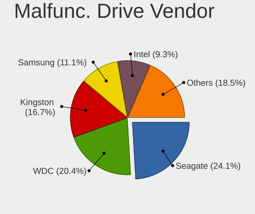

| Vendor              | Desktops | Drives | Percent |
|---------------------|----------|--------|---------|
| Seagate             | 13       | 16     | 24.07%  |
| WDC                 | 11       | 13     | 20.37%  |
| Kingston            | 9        | 11     | 16.67%  |
| Samsung Electronics | 6        | 7      | 11.11%  |
| Intel               | 5        | 5      | 9.26%   |
| Toshiba             | 3        | 3      | 5.56%   |
| Hitachi             | 2        | 6      | 3.7%    |
| SanDisk             | 1        | 1      | 1.85%   |
| OCZ                 | 1        | 1      | 1.85%   |
| Leven               | 1        | 1      | 1.85%   |
| Crucial             | 1        | 1      | 1.85%   |
| Unknown             | 1        | 2      | 1.85%   |

Malfunc. HDD Vendor
-------------------

Vendors of faulty HDD drives

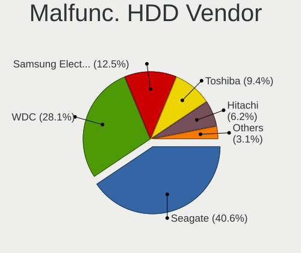

| Vendor              | Desktops | Drives | Percent |
|---------------------|----------|--------|---------|
| Seagate             | 13       | 16     | 40.63%  |
| WDC                 | 9        | 11     | 28.13%  |
| Samsung Electronics | 4        | 5      | 12.5%   |
| Toshiba             | 3        | 3      | 9.38%   |
| Hitachi             | 2        | 6      | 6.25%   |
| Unknown             | 1        | 2      | 3.13%   |

Malfunc. Drive Kind
-------------------

Kinds of faulty drives

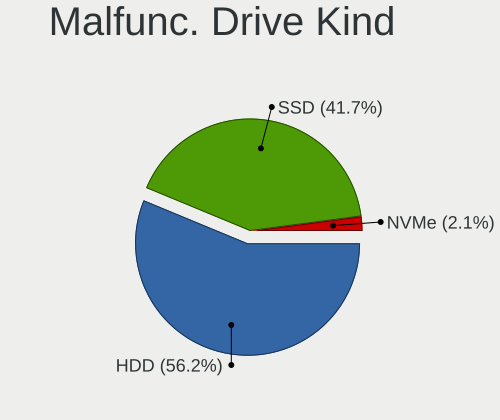

| Kind | Desktops | Drives | Percent |
|------|----------|--------|---------|
| HDD  | 27       | 43     | 56.25%  |
| SSD  | 20       | 23     | 41.67%  |
| NVMe | 1        | 1      | 2.08%   |

Failed Drives
-------------

Failed drive models

Zero info for selected period =(

Failed Drive Vendor
-------------------

Failed drive vendors

Zero info for selected period =(

Drive Status
------------

Number of failed and malfunc. drives

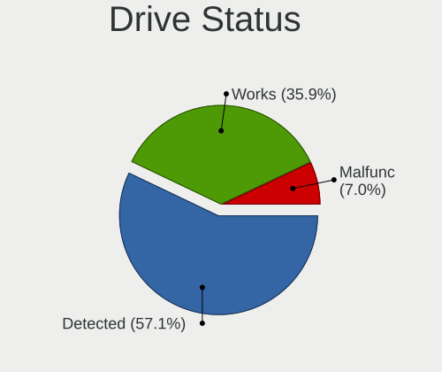

| Status   | Desktops | Drives | Percent |
|----------|----------|--------|---------|
| Detected | 367      | 1022   | 57.08%  |
| Works    | 231      | 717    | 35.93%  |
| Malfunc  | 45       | 67     | 7%      |

Storage controller
------------------

Storage Vendor
--------------

Storage controller vendors

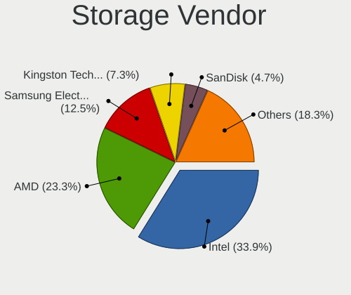

| Vendor                                  | Desktops | Percent |
|-----------------------------------------|----------|---------|
| Intel                                   | 322      | 33.86%  |
| AMD                                     | 222      | 23.34%  |
| Samsung Electronics                     | 119      | 12.51%  |
| Kingston Technology Company             | 69       | 7.26%   |
| SanDisk                                 | 45       | 4.73%   |
| ASMedia Technology                      | 42       | 4.42%   |
| Phison Electronics                      | 30       | 3.15%   |
| Marvell Technology Group                | 17       | 1.79%   |
| JMicron Technology                      | 17       | 1.79%   |
| Micron/Crucial Technology               | 13       | 1.37%   |
| Nvidia                                  | 9        | 0.95%   |
| Seagate Technology                      | 7        | 0.74%   |
| ADATA Technology                        | 5        | 0.53%   |
| Shenzhen Longsys Electronics            | 4        | 0.42%   |
| Realtek Semiconductor                   | 4        | 0.42%   |
| VIA Technologies                        | 3        | 0.32%   |
| SK hynix                                | 3        | 0.32%   |
| KIOXIA                                  | 3        | 0.32%   |
| Toshiba America Info Systems            | 2        | 0.21%   |
| Silicon Motion                          | 2        | 0.21%   |
| Silicon Image                           | 2        | 0.21%   |
| Hewlett-Packard                         | 2        | 0.21%   |
| Broadcom / LSI                          | 2        | 0.21%   |
| Shenzhen Unionmemory Information System | 1        | 0.11%   |
| Micron Technology                       | 1        | 0.11%   |
| MAXIO Technology (Hangzhou)             | 1        | 0.11%   |
| Lite-On Technology                      | 1        | 0.11%   |
| Hosin Global Electronics                | 1        | 0.11%   |
| HighPoint Technologies                  | 1        | 0.11%   |
| Apple                                   | 1        | 0.11%   |

Storage Model
-------------

Storage controller models

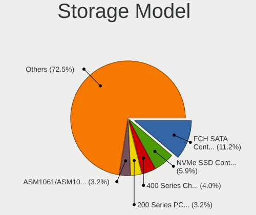

| Model                                                                                   | Desktops | Percent |
|-----------------------------------------------------------------------------------------|----------|---------|
| AMD FCH SATA Controller [AHCI mode]                                                     | 126      | 11.17%  |
| Samsung NVMe SSD Controller SM981/PM981/PM983                                           | 67       | 5.94%   |
| AMD 400 Series Chipset SATA Controller                                                  | 45       | 3.99%   |
| Intel 200 Series PCH SATA controller [AHCI mode]                                        | 36       | 3.19%   |
| ASMedia ASM1061/ASM1062 Serial ATA Controller                                           | 36       | 3.19%   |
| Intel 8 Series/C220 Series Chipset Family 6-port SATA Controller 1 [AHCI mode]          | 32       | 2.84%   |
| AMD 600 Series Chipset SATA Controller                                                  | 32       | 2.84%   |
| Intel Q170/Q150/B150/H170/H110/Z170/CM236 Chipset SATA Controller [AHCI Mode]           | 30       | 2.66%   |
| AMD 500 Series Chipset SATA Controller                                                  | 29       | 2.57%   |
| Intel 7 Series/C210 Series Chipset Family 6-port SATA Controller [AHCI mode]            | 27       | 2.39%   |
| Samsung NVMe SSD Controller PM9A1/PM9A3/980PRO                                          | 26       | 2.3%    |
| Intel SATA Controller [RAID mode]                                                       | 25       | 2.22%   |
| Intel Cannon Lake PCH SATA AHCI Controller                                              | 24       | 2.13%   |
| Kingston Company KC3000/FURY Renegade NVMe SSD [E18]                                    | 20       | 1.77%   |
| Intel Alder Lake-S PCH SATA Controller [AHCI Mode]                                      | 20       | 1.77%   |
| Intel 6 Series/C200 Series Chipset Family 6 port Desktop SATA AHCI Controller           | 20       | 1.77%   |
| AMD SB7x0/SB8x0/SB9x0 IDE Controller                                                    | 19       | 1.68%   |
| Phison E16 PCIe4 NVMe Controller                                                        | 16       | 1.42%   |
| AMD SB7x0/SB8x0/SB9x0 SATA Controller [AHCI mode]                                       | 14       | 1.24%   |
| Kingston Company A2000 NVMe SSD [SM2263EN]                                              | 13       | 1.15%   |
| Samsung NVMe SSD Controller SM961/PM961/SM963                                           | 12       | 1.06%   |
| Phison E12 NVMe Controller                                                              | 12       | 1.06%   |
| Intel Volume Management Device NVMe RAID Controller                                     | 12       | 1.06%   |
| Kingston Company NV2 NVMe SSD [SM2267XT] (DRAM-less)                                    | 11       | 0.98%   |
| Samsung NVMe SSD Controller S4LV008[Pascal]                                             | 10       | 0.89%   |
| AMD SB7x0/SB8x0/SB9x0 SATA Controller [IDE mode]                                        | 10       | 0.89%   |
| JMicron JMB363 SATA/IDE Controller                                                      | 9        | 0.8%    |
| Intel SSD 660P Series                                                                   | 9        | 0.8%    |
| AMD 300 Series Chipset SATA Controller                                                  | 9        | 0.8%    |
| Sandisk WD Black SN850X NVMe SSD                                                        | 8        | 0.71%   |
| SanDisk Ultra 3D / WD PC SN530, IX SN530, Blue SN550 NVMe SSD (DRAM-less)               | 8        | 0.71%   |
| Intel NM10/ICH7 Family SATA Controller [IDE mode]                                       | 8        | 0.71%   |
| Intel 9 Series Chipset Family SATA Controller [AHCI Mode]                               | 8        | 0.71%   |
| Intel 6 Series/C200 Series Chipset Family Desktop SATA Controller (IDE mode, ports 4-5) | 8        | 0.71%   |
| Intel 6 Series/C200 Series Chipset Family Desktop SATA Controller (IDE mode, ports 0-3) | 8        | 0.71%   |
| Intel 500 Series Chipset Family SATA AHCI Controller                                    | 8        | 0.71%   |
| SanDisk Extreme Pro / WD Black SN750 / PC SN730 / Red SN700 NVMe SSD                    | 7        | 0.62%   |
| Samsung NVMe SSD Controller 980 (DRAM-less)                                             | 7        | 0.62%   |
| Micron/Crucial P2 [Nick P2] / P3 / P3 Plus NVMe PCIe SSD (DRAM-less)                    | 7        | 0.62%   |
| Kingston Company NV2 NVMe SSD [E21T] (DRAM-less)                                        | 7        | 0.62%   |

Storage Kind
------------

Kind of storage controller (IDE, SATA, NVMe, SAS, ...)

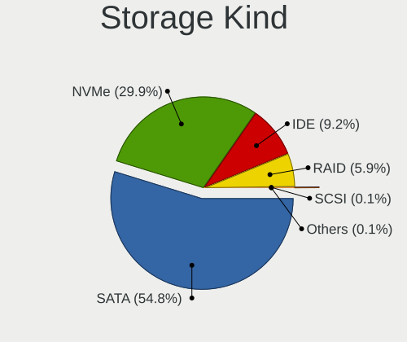

| Kind | Desktops | Percent |
|------|----------|---------|
| SATA | 489      | 54.76%  |
| NVMe | 267      | 29.9%   |
| IDE  | 82       | 9.18%   |
| RAID | 53       | 5.94%   |
| SAS  | 1        | 0.11%   |
| SCSI | 1        | 0.11%   |

Processor
---------

CPU Vendor
----------

Processor vendors

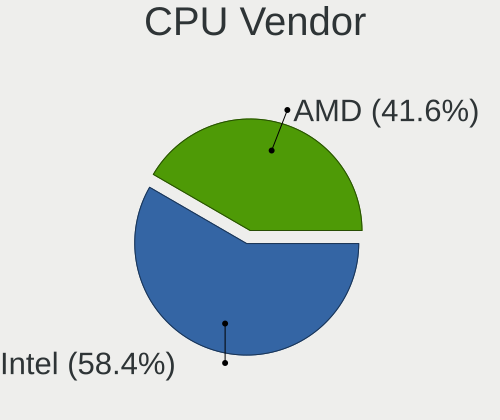

| Vendor | Desktops | Percent |
|--------|----------|---------|
| Intel  | 328      | 58.36%  |
| AMD    | 234      | 41.64%  |

CPU Model
---------

Processor models

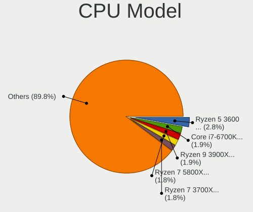

| Model                                  | Desktops | Percent |
|----------------------------------------|----------|---------|
| AMD Ryzen 5 3600 6-Core Processor      | 16       | 2.83%   |
| Intel Core i7-6700K CPU @ 4.00GHz      | 11       | 1.94%   |
| AMD Ryzen 9 3900X 12-Core Processor    | 11       | 1.94%   |
| AMD Ryzen 7 5800X 8-Core Processor     | 10       | 1.77%   |
| AMD Ryzen 7 3700X 8-Core Processor     | 10       | 1.77%   |
| AMD Ryzen 9 5950X 16-Core Processor    | 9        | 1.59%   |
| AMD Ryzen 7 2700X Eight-Core Processor | 9        | 1.59%   |
| Intel Core i9-9900K CPU @ 3.60GHz      | 8        | 1.41%   |
| Intel Core i5-7500 CPU @ 3.40GHz       | 8        | 1.41%   |
| AMD Ryzen 9 5900X 12-Core Processor    | 8        | 1.41%   |
| AMD Ryzen 5 5600X 6-Core Processor     | 8        | 1.41%   |
| Intel Core i7-8700K CPU @ 3.70GHz      | 7        | 1.24%   |
| Intel Core i5-6600K CPU @ 3.50GHz      | 7        | 1.24%   |
| Intel Core i7-4790K CPU @ 4.00GHz      | 6        | 1.06%   |
| Intel Core i7-3770 CPU @ 3.40GHz       | 6        | 1.06%   |
| Intel Core i5-4590 CPU @ 3.30GHz       | 6        | 1.06%   |
| AMD Ryzen 5 5600G with Radeon Graphics | 6        | 1.06%   |
| Intel Core i5-3570K CPU @ 3.40GHz      | 5        | 0.88%   |
| Intel Core i5-3470 CPU @ 3.20GHz       | 5        | 0.88%   |
| Intel Core i5-3350P CPU @ 3.10GHz      | 5        | 0.88%   |
| Intel Core i5-10400F CPU @ 2.90GHz     | 5        | 0.88%   |
| AMD Ryzen 9 7950X 16-Core Processor    | 5        | 0.88%   |
| AMD Ryzen 7 5800X3D 8-Core Processor   | 5        | 0.88%   |
| AMD Ryzen 7 5700G with Radeon Graphics | 5        | 0.88%   |
| AMD Ryzen 7 3800X 8-Core Processor     | 5        | 0.88%   |
| AMD Ryzen 7 1700 Eight-Core Processor  | 5        | 0.88%   |
| AMD Ryzen 5 7600X 6-Core Processor     | 5        | 0.88%   |
| AMD Ryzen 5 2600 Six-Core Processor    | 5        | 0.88%   |
| Intel Core i7-8700 CPU @ 3.20GHz       | 4        | 0.71%   |
| Intel Core i7-2600K CPU @ 3.40GHz      | 4        | 0.71%   |
| Intel Core i5-9600K CPU @ 3.70GHz      | 4        | 0.71%   |
| Intel Core i5-9400F CPU @ 2.90GHz      | 4        | 0.71%   |
| Intel Core i5-4570 CPU @ 3.20GHz       | 4        | 0.71%   |
| Intel Core i5-3570 CPU @ 3.40GHz       | 4        | 0.71%   |
| Intel Core i5-2500 CPU @ 3.30GHz       | 4        | 0.71%   |
| Intel 13th Gen Core i7-13700K          | 4        | 0.71%   |
| AMD Ryzen 9 3950X 16-Core Processor    | 4        | 0.71%   |
| AMD Ryzen 7 7800X3D 8-Core Processor   | 4        | 0.71%   |
| AMD Phenom II X4 965 Processor         | 4        | 0.71%   |
| Intel Core i7-9700 CPU @ 3.00GHz       | 3        | 0.53%   |

CPU Model Family
----------------

Processor model prefix

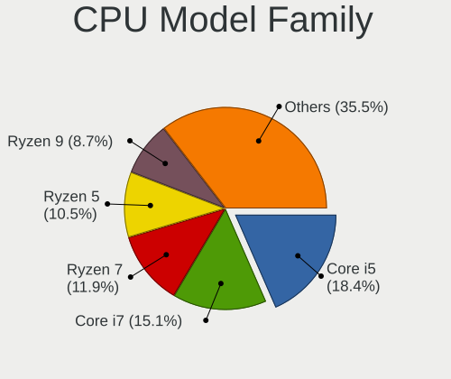

| Model                   | Desktops | Percent |
|-------------------------|----------|---------|
| Intel Core i5           | 104      | 18.44%  |
| Intel Core i7           | 85       | 15.07%  |
| AMD Ryzen 7             | 67       | 11.88%  |
| AMD Ryzen 5             | 59       | 10.46%  |
| AMD Ryzen 9             | 49       | 8.69%   |
| Other                   | 29       | 5.14%   |
| Intel Xeon              | 26       | 4.61%   |
| Intel Core i3           | 21       | 3.72%   |
| Intel Core i9           | 14       | 2.48%   |
| Intel Core 2 Duo        | 13       | 2.3%    |
| AMD FX                  | 12       | 2.13%   |
| AMD Ryzen 3             | 9        | 1.6%    |
| AMD Ryzen Threadripper  | 8        | 1.42%   |
| Intel Celeron           | 7        | 1.24%   |
| Intel Pentium           | 6        | 1.06%   |
| AMD Phenom II X4        | 6        | 1.06%   |
| Intel Core 2 Quad       | 5        | 0.89%   |
| Intel Atom              | 5        | 0.89%   |
| AMD A8                  | 5        | 0.89%   |
| AMD Athlon 64 X2        | 4        | 0.71%   |
| AMD A6                  | 4        | 0.71%   |
| Intel Core 2            | 3        | 0.53%   |
| Intel Core              | 3        | 0.53%   |
| AMD Athlon II X4        | 3        | 0.53%   |
| AMD A10                 | 3        | 0.53%   |
| Intel Pentium Dual-Core | 2        | 0.35%   |
| AMD A4                  | 2        | 0.35%   |
| Intel Pentium Silver    | 1        | 0.18%   |
| Intel Pentium Gold      | 1        | 0.18%   |
| Intel Pentium Dual      | 1        | 0.18%   |
| Intel Core m5           | 1        | 0.18%   |
| Intel Core 2 Extreme    | 1        | 0.18%   |
| AMD Phenom II X2        | 1        | 0.18%   |
| AMD GX                  | 1        | 0.18%   |
| AMD E                   | 1        | 0.18%   |
| AMD Athlon II X3        | 1        | 0.18%   |
| AMD Athlon II Neo       | 1        | 0.18%   |

CPU Cores
---------

Number of processor cores

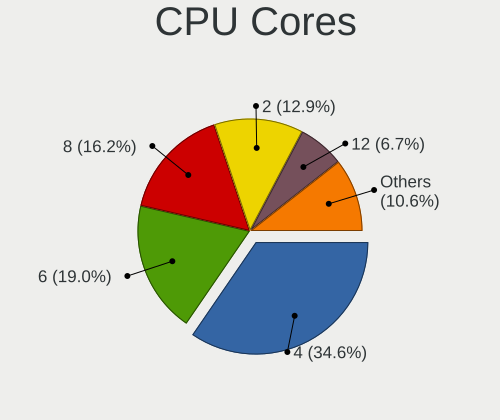

| Number | Desktops | Percent |
|--------|----------|---------|
| 4      | 196      | 34.57%  |
| 6      | 108      | 19.05%  |
| 8      | 92       | 16.23%  |
| 2      | 73       | 12.87%  |
| 12     | 38       | 6.7%    |
| 16     | 32       | 5.64%   |
| 10     | 9        | 1.59%   |
| 24     | 3        | 0.53%   |
| 14     | 3        | 0.53%   |
| 3      | 3        | 0.53%   |
| 1      | 3        | 0.53%   |
| 32     | 2        | 0.35%   |
| 20     | 2        | 0.35%   |
| 64     | 1        | 0.18%   |
| 18     | 1        | 0.18%   |
| 5      | 1        | 0.18%   |

CPU Sockets
-----------

Number of sockets

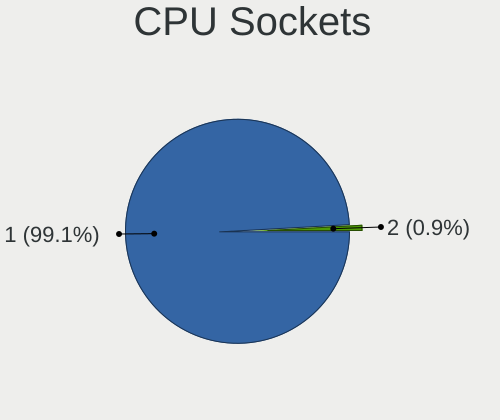

| Number | Desktops | Percent |
|--------|----------|---------|
| 1      | 557      | 99.11%  |
| 2      | 5        | 0.89%   |

CPU Threads
-----------

Threads per core (Hyper-Threading)

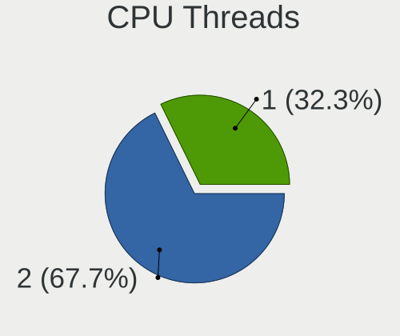

| Number | Desktops | Percent |
|--------|----------|---------|
| 2      | 382      | 67.73%  |
| 1      | 182      | 32.27%  |

CPU Op-Modes
------------

CPU Operation Modes (32-bit, 64-bit)

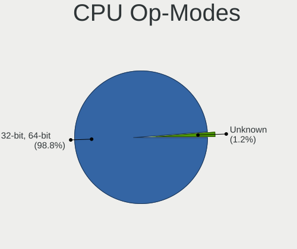

| Op mode        | Desktops | Percent |
|----------------|----------|---------|
| 32-bit, 64-bit | 558      | 98.76%  |
| Unknown        | 7        | 1.24%   |

CPU Microcode
-------------

Microcode number

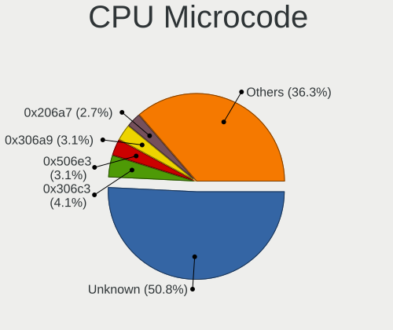

| Number     | Desktops | Percent |
|------------|----------|---------|
| Unknown    | 299      | 50.76%  |
| 0x306c3    | 24       | 4.07%   |
| 0x506e3    | 18       | 3.06%   |
| 0x306a9    | 18       | 3.06%   |
| 0x206a7    | 16       | 2.72%   |
| 0x08701021 | 13       | 2.21%   |
| 0x0800820d | 13       | 2.21%   |
| 0x906ea    | 9        | 1.53%   |
| 0x08001138 | 9        | 1.53%   |
| 0x906e9    | 8        | 1.36%   |
| 0x90672    | 8        | 1.36%   |
| 0x1067a    | 8        | 1.36%   |
| 0x08701013 | 8        | 1.36%   |
| 0x0a601203 | 7        | 1.19%   |
| 0x0a201009 | 7        | 1.19%   |
| 0x06000852 | 6        | 1.02%   |
| 0x010000c8 | 6        | 1.02%   |
| 0x906ed    | 5        | 0.85%   |
| 0x6fd      | 5        | 0.85%   |
| 0xa0655    | 4        | 0.68%   |
| 0xa0653    | 4        | 0.68%   |
| 0x906ec    | 4        | 0.68%   |
| 0x08600106 | 4        | 0.68%   |
| 0xa0671    | 3        | 0.51%   |
| 0x106e5    | 3        | 0.51%   |
| 0x10676    | 3        | 0.51%   |
| 0x0a201205 | 3        | 0.51%   |
| 0x0a201016 | 3        | 0.51%   |
| 0x08701030 | 3        | 0.51%   |
| 0x08001137 | 3        | 0.51%   |
| 0x08001129 | 3        | 0.51%   |
| 0x06001119 | 3        | 0.51%   |
| 0x6f6      | 2        | 0.34%   |
| 0x506c9    | 2        | 0.34%   |
| 0x306e4    | 2        | 0.34%   |
| 0x206c2    | 2        | 0.34%   |
| 0x0a50000c | 2        | 0.34%   |
| 0x08108109 | 2        | 0.34%   |
| 0x06003106 | 2        | 0.34%   |
| 0x0600063e | 2        | 0.34%   |

CPU Microarch
-------------

Microarchitecture

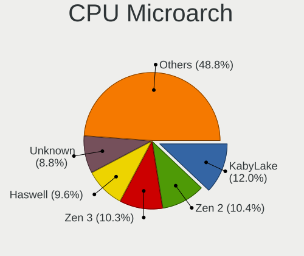

| Name              | Desktops | Percent |
|-------------------|----------|---------|
| KabyLake          | 68       | 12.04%  |
| Zen 2             | 59       | 10.44%  |
| Zen 3             | 58       | 10.27%  |
| Haswell           | 54       | 9.56%   |
| Unknown           | 50       | 8.85%   |
| IvyBridge         | 38       | 6.73%   |
| Skylake           | 35       | 6.19%   |
| SandyBridge       | 28       | 4.96%   |
| Zen+              | 20       | 3.54%   |
| Zen               | 18       | 3.19%   |
| Penryn            | 17       | 3.01%   |
| Alderlake Hybrid  | 17       | 3.01%   |
| Piledriver        | 13       | 2.3%    |
| CometLake         | 13       | 2.3%    |
| K10               | 12       | 2.12%   |
| Nehalem           | 10       | 1.77%   |
| Core              | 10       | 1.77%   |
| Westmere          | 7        | 1.24%   |
| K8 Hammer         | 4        | 0.71%   |
| Icelake           | 4        | 0.71%   |
| Broadwell         | 4        | 0.71%   |
| Steamroller       | 3        | 0.53%   |
| Puma              | 3        | 0.53%   |
| Bulldozer         | 3        | 0.53%   |
| Bonnell           | 3        | 0.53%   |
| Silvermont        | 2        | 0.35%   |
| Lunarlake Hybrid  | 2        | 0.35%   |
| K10 Llano         | 2        | 0.35%   |
| Jaguar            | 2        | 0.35%   |
| Goldmont          | 2        | 0.35%   |
| Meteorlake Hybrid | 1        | 0.18%   |
| Goldmont plus     | 1        | 0.18%   |
| Excavator         | 1        | 0.18%   |
| Bobcat            | 1        | 0.18%   |

Graphics
--------

GPU Vendor
----------

Vendors of graphics cards

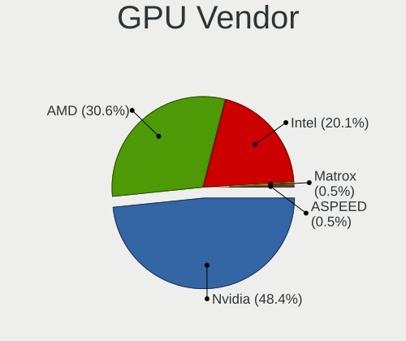

| Vendor                     | Desktops | Percent |
|----------------------------|----------|---------|
| Nvidia                     | 299      | 48.38%  |
| AMD                        | 189      | 30.58%  |
| Intel                      | 124      | 20.06%  |
| Matrox Electronics Systems | 3        | 0.49%   |
| ASPEED Technology          | 3        | 0.49%   |

GPU Model
---------

Graphics card models

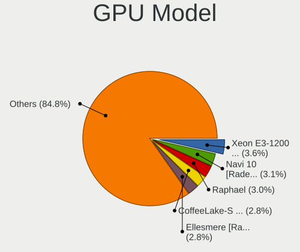

| Model                                                                       | Desktops | Percent |
|-----------------------------------------------------------------------------|----------|---------|
| Intel Xeon E3-1200 v3/4th Gen Core Processor Integrated Graphics Controller | 23       | 3.57%   |
| AMD Navi 10 [Radeon RX 5600 OEM/5600 XT / 5700/5700 XT]                     | 20       | 3.11%   |
| AMD Raphael                                                                 | 19       | 2.95%   |
| Intel CoffeeLake-S GT2 [UHD Graphics 630]                                   | 18       | 2.8%    |
| AMD Ellesmere [Radeon RX 470/480/570/570X/580/580X/590]                     | 18       | 2.8%    |
| Nvidia GP107 [GeForce GTX 1050 Ti]                                          | 13       | 2.02%   |
| AMD Navi 31 [Radeon RX 7900 XT/7900 XTX/7900 GRE/7900M]                     | 13       | 2.02%   |
| Nvidia GP106 [GeForce GTX 1060 6GB]                                         | 12       | 1.86%   |
| Nvidia GP104 [GeForce GTX 1080]                                             | 12       | 1.86%   |
| Intel Skylake-S GT2 [HD Graphics 530]                                       | 12       | 1.86%   |
| Nvidia GP107 [GeForce GTX 1050]                                             | 10       | 1.55%   |
| Intel Kaby Lake-S GT2 [HD Graphics 630]                                     | 10       | 1.55%   |
| AMD Cezanne [Radeon Vega Series / Radeon Vega Mobile Series]                | 10       | 1.55%   |
| Nvidia GP108 [GeForce GT 1030]                                              | 9        | 1.4%    |
| Nvidia GP102 [GeForce GTX 1080 Ti]                                          | 9        | 1.4%    |
| Nvidia GM204 [GeForce GTX 970]                                              | 9        | 1.4%    |
| Intel Xeon E3-1200 v2/3rd Gen Core processor Graphics Controller            | 9        | 1.4%    |
| Intel 2nd Generation Core Processor Family Integrated Graphics Controller   | 9        | 1.4%    |
| Nvidia TU116 [GeForce GTX 1660 SUPER]                                       | 8        | 1.24%   |
| Nvidia GP106 [GeForce GTX 1060 3GB]                                         | 8        | 1.24%   |
| Nvidia GM206 [GeForce GTX 960]                                              | 8        | 1.24%   |
| AMD Navi 23 [Radeon RX 6600/6600 XT/6600M]                                  | 8        | 1.24%   |
| Nvidia GP104 [GeForce GTX 1070]                                             | 7        | 1.09%   |
| Nvidia GK208B [GeForce GT 710]                                              | 7        | 1.09%   |
| Nvidia GA104 [GeForce RTX 3060 Ti Lite Hash Rate]                           | 7        | 1.09%   |
| Nvidia GA102 [GeForce RTX 3080 Ti]                                          | 7        | 1.09%   |
| Nvidia GA102 [GeForce RTX 3080]                                             | 6        | 0.93%   |
| Intel IvyBridge GT2 [HD Graphics 4000]                                      | 6        | 0.93%   |
| Intel 4 Series Chipset Integrated Graphics Controller                       | 6        | 0.93%   |
| AMD Cedar [Radeon HD 5000/6000/7350/8350 Series]                            | 6        | 0.93%   |
| Nvidia TU117 [GeForce GTX 1650]                                             | 5        | 0.78%   |
| Nvidia TU116 [GeForce GTX 1660]                                             | 5        | 0.78%   |
| Nvidia TU106 [GeForce RTX 2070]                                             | 5        | 0.78%   |
| Nvidia TU106 [GeForce RTX 2060 Rev. A]                                      | 5        | 0.78%   |
| Nvidia GK104 [GeForce GTX 770]                                              | 5        | 0.78%   |
| Nvidia GA104 [GeForce RTX 3070]                                             | 5        | 0.78%   |
| Nvidia AD104 [GeForce RTX 4070]                                             | 5        | 0.78%   |
| AMD Navi 32 [Radeon RX 7700 XT / 7800 XT]                                   | 5        | 0.78%   |
| AMD Navi 21 [Radeon RX 6800/6800 XT / 6900 XT]                              | 5        | 0.78%   |
| AMD Granite Ridge [Radeon Graphics]                                         | 5        | 0.78%   |

GPU Combo
---------

Combinations of graphics cards

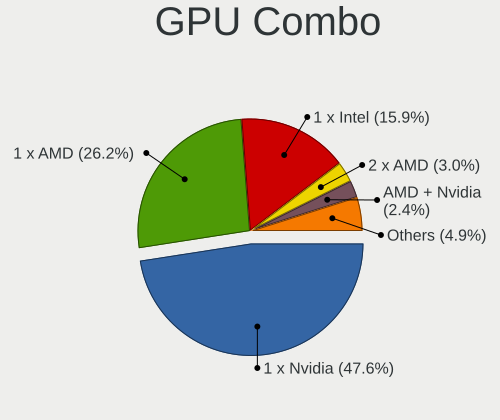

| Name            | Desktops | Percent |
|-----------------|----------|---------|
| 1 x Nvidia      | 272      | 47.55%  |
| 1 x AMD         | 150      | 26.22%  |
| 1 x Intel       | 91       | 15.91%  |
| 2 x AMD         | 17       | 2.97%   |
| AMD + Nvidia    | 14       | 2.45%   |
| Intel + Nvidia  | 11       | 1.92%   |
| Intel + AMD     | 5        | 0.87%   |
| 2 x Intel       | 3        | 0.52%   |
| 2 x Nvidia      | 2        | 0.35%   |
| Nvidia + ASPEED | 2        | 0.35%   |
| 1 x Matrox      | 2        | 0.35%   |
| 3 x AMD         | 1        | 0.17%   |
| Nvidia + Matrox | 1        | 0.17%   |
| 1 x ASPEED      | 1        | 0.17%   |

GPU Driver
----------

Free vs proprietary

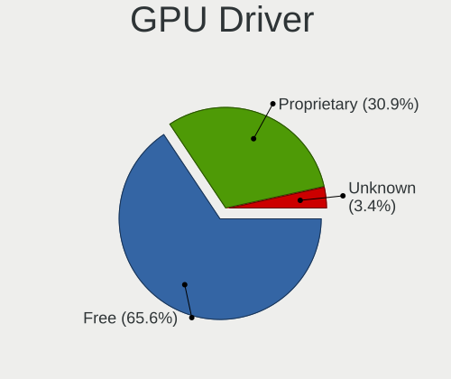

| Driver      | Desktops | Percent |
|-------------|----------|---------|
| Free        | 382      | 65.64%  |
| Proprietary | 180      | 30.93%  |
| Unknown     | 20       | 3.44%   |

GPU Memory
----------

Total video memory

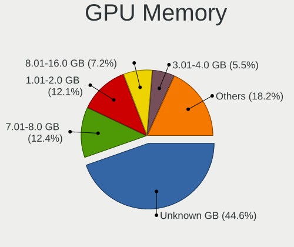

| Size in GB | Desktops | Percent |
|------------|----------|---------|
| Unknown    | 262      | 44.63%  |
| 7.01-8.0   | 73       | 12.44%  |
| 1.01-2.0   | 71       | 12.1%   |
| 8.01-16.0  | 42       | 7.16%   |
| 3.01-4.0   | 32       | 5.45%   |
| 0.01-0.5   | 31       | 5.28%   |
| 5.01-6.0   | 28       | 4.77%   |
| 0.51-1.0   | 27       | 4.6%    |
| 16.01-24.0 | 14       | 2.39%   |
| 2.01-3.0   | 5        | 0.85%   |
| 4.01-5.0   | 1        | 0.17%   |
| 24.01-32.0 | 1        | 0.17%   |

Monitor
-------

Monitor Vendor
--------------

Monitor vendors

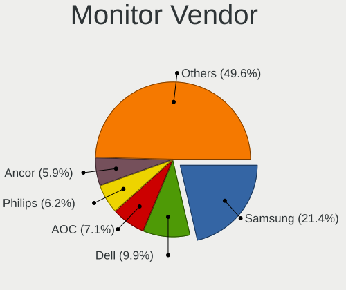

| Vendor               | Desktops | Percent |
|----------------------|----------|---------|
| Samsung Electronics  | 139      | 21.42%  |
| Dell                 | 64       | 9.86%   |
| AOC                  | 46       | 7.09%   |
| Philips              | 40       | 6.16%   |
| Ancor Communications | 38       | 5.86%   |
| Acer                 | 37       | 5.7%    |
| Goldstar             | 35       | 5.39%   |
| ASUSTek Computer     | 34       | 5.24%   |
| Lenovo               | 33       | 5.08%   |
| Hewlett-Packard      | 33       | 5.08%   |
| BenQ                 | 33       | 5.08%   |
| Sony                 | 11       | 1.69%   |
| Unknown              | 9        | 1.39%   |
| MSI                  | 8        | 1.23%   |
| Medion               | 7        | 1.08%   |
| Lenovo Group Limited | 6        | 0.92%   |
| Fujitsu Siemens      | 5        | 0.77%   |
| LG Electronics       | 4        | 0.62%   |
| Gigabyte Technology  | 4        | 0.62%   |
| ViewSonic            | 3        | 0.46%   |
| Vestel Elektronik    | 3        | 0.46%   |
| NEC Computers        | 3        | 0.46%   |
| Iiyama               | 3        | 0.46%   |
| IBM                  | 3        | 0.46%   |
| Denver               | 3        | 0.46%   |
| Apple                | 3        | 0.46%   |
| Unknown              | 3        | 0.46%   |
| Tech Concepts        | 2        | 0.31%   |
| RTK                  | 2        | 0.31%   |
| Panasonic            | 2        | 0.31%   |
| Packard Bell         | 2        | 0.31%   |
| Mi                   | 2        | 0.31%   |
| Idek Iiyama          | 2        | 0.31%   |
| EDI                  | 2        | 0.31%   |
| DENON                | 2        | 0.31%   |
| AUS                  | 2        | 0.31%   |
| Wacom                | 1        | 0.15%   |
| Vestel               | 1        | 0.15%   |
| Valve                | 1        | 0.15%   |
| UGD                  | 1        | 0.15%   |

Monitor Model
-------------

Monitor models

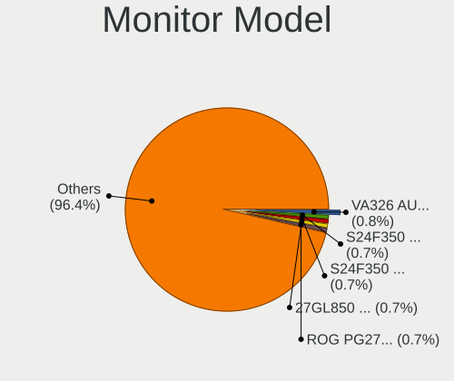

| Model                                                                 | Desktops | Percent |
|-----------------------------------------------------------------------|----------|---------|
| ASUSTek Computer VA326 AUS32FA 1920x1080 698x393mm 31.5-inch          | 6        | 0.83%   |
| Samsung Electronics S24F350 SAM0D20 1920x1080 521x293mm 23.5-inch     | 5        | 0.69%   |
| Samsung Electronics LCD Monitor S24F350 1920x1080                     | 5        | 0.69%   |
| Goldstar 27GL850 GSM5B7F 2560x1440 597x336mm 27.0-inch                | 5        | 0.69%   |
| Ancor Communications ROG PG279Q ACI27EC 2560x1440 598x336mm 27.0-inch | 5        | 0.69%   |
| Lenovo G27q-20 LEN66C3 2560x1440 597x336mm 27.0-inch                  | 4        | 0.55%   |
| AOC 2460G5 AOC246A 1920x1080 531x299mm 24.0-inch                      | 4        | 0.55%   |
| Acer KG241Q ACR0604 1920x1080 521x293mm 23.5-inch                     | 4        | 0.55%   |
| Vestel Elektronik 40UHD_LCD_TV VES3700 3840x2160 880x500mm 39.8-inch  | 3        | 0.42%   |
| Sony TV SNYEE01 1920x1080                                             | 3        | 0.42%   |
| Samsung Electronics U28E590 SAM0C4D 3840x2160 607x345mm 27.5-inch     | 3        | 0.42%   |
| Samsung Electronics LS49AG95 SAM71AC 3840x1080 1190x340mm 48.7-inch   | 3        | 0.42%   |
| Samsung Electronics LC32G5xT SAM7080 2560x1440 698x393mm 31.5-inch    | 3        | 0.42%   |
| Samsung Electronics LC27G5xT SAM707A 2560x1440 597x336mm 27.0-inch    | 3        | 0.42%   |
| Philips PHL 272E1 PHLC210 1920x1080 598x336mm 27.0-inch               | 3        | 0.42%   |
| Philips PHL 243V5 PHLC0D1 1920x1080 521x293mm 23.5-inch               | 3        | 0.42%   |
| Lenovo C27-35 LEN66BA 1920x1080 597x336mm 27.0-inch                   | 3        | 0.42%   |
| Hewlett-Packard w1907 HWP26A2 1440x900 408x255mm 18.9-inch            | 3        | 0.42%   |
| Hewlett-Packard LA2306 HWP2949 1920x1080 510x287mm 23.0-inch          | 3        | 0.42%   |
| Goldstar LG TV SSCR2 GSMC0C8 3840x2160                                | 3        | 0.42%   |
| Goldstar HDR 4K GSM7707 3840x2160 600x340mm 27.2-inch                 | 3        | 0.42%   |
| Goldstar 27GL850 GSM5B80 2560x1440 697x392mm 31.5-inch                | 3        | 0.42%   |
| Denver MO-HHS-32C LHCFFFF 1920x1080 699x393mm 31.6-inch               | 3        | 0.42%   |
| Dell U2412M DELA07A 1920x1200 518x324mm 24.1-inch                     | 3        | 0.42%   |
| Dell S3422DWG DELD12C 3440x1440 797x334mm 34.0-inch                   | 3        | 0.42%   |
| BenQ XL2411Z BNQ7F31 1920x1080 531x298mm 24.0-inch                    | 3        | 0.42%   |
| BenQ EX3501R BNQ7F5E 3440x1440 819x346mm 35.0-inch                    | 3        | 0.42%   |
| ASUSTek Computer VG27A AUS2722 2560x1440 597x336mm 27.0-inch          | 3        | 0.42%   |
| AOC 32G1WG4 AOC3201 1920x1080 697x392mm 31.5-inch                     | 3        | 0.42%   |
| AOC 27G2G4 AOC2702 1920x1080 598x336mm 27.0-inch                      | 3        | 0.42%   |
| AOC 2470W AOC2470 1920x1080 521x293mm 23.5-inch                       | 3        | 0.42%   |
| Ancor Communications MX279 ACI27C3 1920x1080 598x336mm 27.0-inch      | 3        | 0.42%   |
| Ancor Communications ASUS VS247 ACI249A 1920x1080 521x293mm 23.5-inch | 3        | 0.42%   |
| Ancor Communications ASUS VN247 ACI24C3 1920x1080 521x293mm 23.5-inch | 3        | 0.42%   |
| Acer XB271HU ACR0490 2560x1440 598x336mm 27.0-inch                    | 3        | 0.42%   |
| Unknown                                                               | 3        | 0.42%   |
| Unknown LCD Monitor SAMSUNG 3840x2160                                 | 2        | 0.28%   |
| Unknown LCD Monitor FFFF 2288x1287 2550x2550mm 142.0-inch             | 2        | 0.28%   |
| Tech Concepts LCD Monitor TCL SMART TV 3840x2160                      | 2        | 0.28%   |
| Samsung Electronics U32R59x SAM0F96 3840x2160 697x392mm 31.5-inch     | 2        | 0.28%   |

Monitor Resolution
------------------

Monitor screen resolution

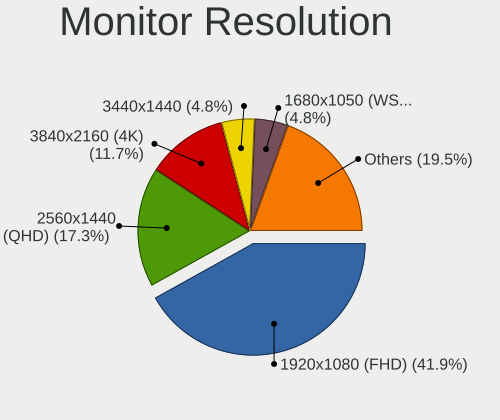

| Resolution         | Desktops | Percent |
|--------------------|----------|---------|
| 1920x1080 (FHD)    | 262      | 41.92%  |
| 2560x1440 (QHD)    | 108      | 17.28%  |
| 3840x2160 (4K)     | 73       | 11.68%  |
| 3440x1440          | 30       | 4.8%    |
| 1680x1050 (WSXGA+) | 30       | 4.8%    |
| 1280x1024 (SXGA)   | 23       | 3.68%   |
| Unknown            | 18       | 2.88%   |
| 1920x1200 (WUXGA)  | 15       | 2.4%    |
| 3840x1080          | 13       | 2.08%   |
| 1600x900 (HD+)     | 8        | 1.28%   |
| 1440x900 (WXGA+)   | 8        | 1.28%   |
| 3840x1200          | 5        | 0.8%    |
| 1360x768           | 5        | 0.8%    |
| 2560x1080          | 3        | 0.48%   |
| 2288x1287          | 3        | 0.48%   |
| 2560x1600          | 2        | 0.32%   |
| 1920x540           | 2        | 0.32%   |
| 1600x1200          | 2        | 0.32%   |
| 9840x3840          | 1        | 0.16%   |
| 6400x2160          | 1        | 0.16%   |
| 5760x1440          | 1        | 0.16%   |
| 5760x1080          | 1        | 0.16%   |
| 5120x1440          | 1        | 0.16%   |
| 4608x1440          | 1        | 0.16%   |
| 4480x1440          | 1        | 0.16%   |
| 3840x1600          | 1        | 0.16%   |
| 3280x1080          | 1        | 0.16%   |
| 3200x1200          | 1        | 0.16%   |
| 3200x1080          | 1        | 0.16%   |
| 2560x1024          | 1        | 0.16%   |
| 2048x1152          | 1        | 0.16%   |
| 1366x768 (WXGA)    | 1        | 0.16%   |
| 1360x765           | 1        | 0.16%   |

Monitor Diagonal
----------------

Diagonal size in inches

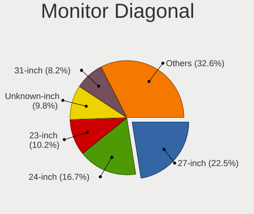

| Inches  | Desktops | Percent |
|---------|----------|---------|
| 27      | 145      | 22.48%  |
| 24      | 108      | 16.74%  |
| 23      | 66       | 10.23%  |
| Unknown | 63       | 9.77%   |
| 31      | 53       | 8.22%   |
| 21      | 29       | 4.5%    |
| 34      | 27       | 4.19%   |
| 19      | 23       | 3.57%   |
| 22      | 22       | 3.41%   |
| 20      | 17       | 2.64%   |
| 72      | 12       | 1.86%   |
| 84      | 9        | 1.4%    |
| 48      | 9        | 1.4%    |
| 32      | 7        | 1.09%   |
| 40      | 6        | 0.93%   |
| 17      | 5        | 0.78%   |
| 15      | 5        | 0.78%   |
| 35      | 4        | 0.62%   |
| 49      | 3        | 0.47%   |
| 43      | 3        | 0.47%   |
| 142     | 2        | 0.31%   |
| 65      | 2        | 0.31%   |
| 63      | 2        | 0.31%   |
| 47      | 2        | 0.31%   |
| 39      | 2        | 0.31%   |
| 38      | 2        | 0.31%   |
| 33      | 2        | 0.31%   |
| 29      | 2        | 0.31%   |
| 28      | 2        | 0.31%   |
| 25      | 2        | 0.31%   |
| 74      | 1        | 0.16%   |
| 60      | 1        | 0.16%   |
| 57      | 1        | 0.16%   |
| 54      | 1        | 0.16%   |
| 52      | 1        | 0.16%   |
| 42      | 1        | 0.16%   |
| 30      | 1        | 0.16%   |
| 26      | 1        | 0.16%   |
| 18      | 1        | 0.16%   |

Monitor Width
-------------

Physical width

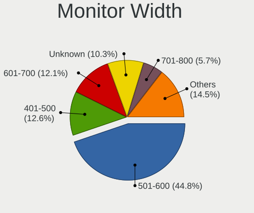

| Width in mm    | Desktops | Percent |
|----------------|----------|---------|
| 501-600        | 274      | 44.77%  |
| 401-500        | 77       | 12.58%  |
| 601-700        | 74       | 12.09%  |
| Unknown        | 63       | 10.29%  |
| 701-800        | 35       | 5.72%   |
| 1001-1500      | 23       | 3.76%   |
| 1501-2000      | 22       | 3.59%   |
| 351-400        | 16       | 2.61%   |
| 801-900        | 14       | 2.29%   |
| 301-350        | 10       | 1.63%   |
| More than 2000 | 2        | 0.33%   |
| 901-1000       | 2        | 0.33%   |

Aspect Ratio
------------

Proportional relationship between the width and the height

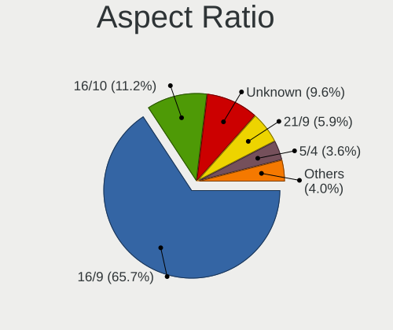

| Ratio   | Desktops | Percent |
|---------|----------|---------|
| 16/9    | 382      | 65.75%  |
| 16/10   | 65       | 11.19%  |
| Unknown | 56       | 9.64%   |
| 21/9    | 34       | 5.85%   |
| 5/4     | 21       | 3.61%   |
| 32/9    | 12       | 2.07%   |
| 4/3     | 3        | 0.52%   |
| 3.20    | 3        | 0.52%   |
| 3/2     | 2        | 0.34%   |
| 1.00    | 2        | 0.34%   |
| 6/5     | 1        | 0.17%   |

Monitor Area
------------

Area in inch²

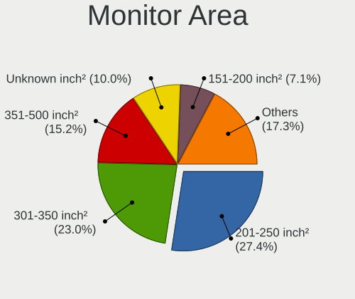

| Area in inch² | Desktops | Percent |
|----------------|----------|---------|
| 201-250        | 173      | 27.42%  |
| 301-350        | 145      | 22.98%  |
| 351-500        | 96       | 15.21%  |
| Unknown        | 63       | 9.98%   |
| 151-200        | 45       | 7.13%   |
| 251-300        | 41       | 6.5%    |
| More than 1000 | 31       | 4.91%   |
| 501-1000       | 27       | 4.28%   |
| 141-150        | 5        | 0.79%   |
| 101-110        | 4        | 0.63%   |
| 111-120        | 1        | 0.16%   |

Pixel Density
-------------

Pixels per inch

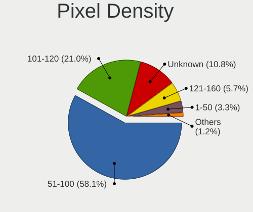

| Density | Desktops | Percent |
|---------|----------|---------|
| 51-100  | 338      | 58.08%  |
| 101-120 | 122      | 20.96%  |
| Unknown | 63       | 10.82%  |
| 121-160 | 33       | 5.67%   |
| 1-50    | 19       | 3.26%   |
| 161-240 | 7        | 1.2%    |

Multiple Monitors
-----------------

Total monitors connected

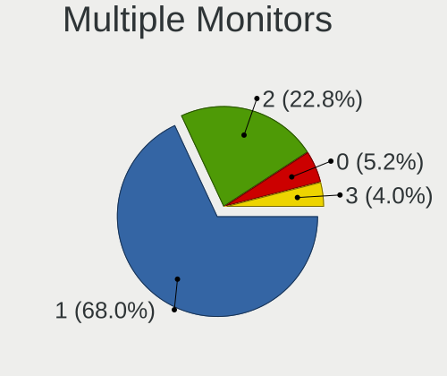

| Total | Desktops | Percent |
|-------|----------|---------|
| 1     | 394      | 68.05%  |
| 2     | 132      | 22.8%   |
| 0     | 30       | 5.18%   |
| 3     | 23       | 3.97%   |

Network
-------

Net Controller Vendor
---------------------

Controller vendors

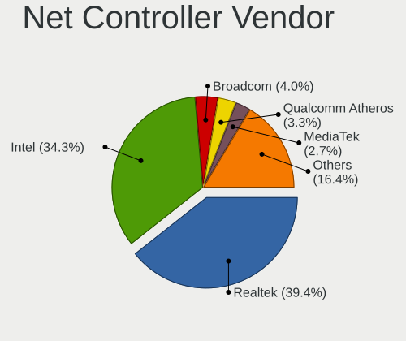

| Vendor                          | Desktops | Percent |
|---------------------------------|----------|---------|
| Realtek Semiconductor           | 324      | 39.37%  |
| Intel                           | 282      | 34.26%  |
| Broadcom                        | 33       | 4.01%   |
| Qualcomm Atheros                | 27       | 3.28%   |
| MediaTek                        | 22       | 2.67%   |
| Aquantia                        | 15       | 1.82%   |
| Ralink Technology               | 13       | 1.58%   |
| Ralink                          | 11       | 1.34%   |
| TP-Link                         | 10       | 1.22%   |
| Microsoft                       | 10       | 1.22%   |
| Nvidia                          | 9        | 1.09%   |
| ASUSTek Computer                | 7        | 0.85%   |
| Samsung Electronics             | 6        | 0.73%   |
| IMC Networks                    | 5        | 0.61%   |
| Qualcomm Atheros Communications | 4        | 0.49%   |
| NetGear                         | 4        | 0.49%   |
| Huawei Technologies             | 4        | 0.49%   |
| D-Link                          | 4        | 0.49%   |
| OnePlus Technology (Shenzhen)   | 3        | 0.36%   |
| Edimax Technology               | 3        | 0.36%   |
| ASIX Electronics                | 3        | 0.36%   |
| ZyXEL Communications            | 2        | 0.24%   |
| Microchip Technology            | 2        | 0.24%   |
| Marvell Technology Group        | 2        | 0.24%   |
| D-Link System                   | 2        | 0.24%   |
| Xiaomi                          | 1        | 0.12%   |
| VIA Technologies                | 1        | 0.12%   |
| Unknown                         | 1        | 0.12%   |
| Texas Instruments               | 1        | 0.12%   |
| Solarflare Communications       | 1        | 0.12%   |
| ROCCAT                          | 1        | 0.12%   |
| Motorola PCS                    | 1        | 0.12%   |
| Linksys                         | 1        | 0.12%   |
| Lenovo                          | 1        | 0.12%   |
| JMicron Technology              | 1        | 0.12%   |
| InterBiometrics                 | 1        | 0.12%   |
| ICS Advent                      | 1        | 0.12%   |
| HMD Global                      | 1        | 0.12%   |
| Conexant Systems                | 1        | 0.12%   |
| BUFFALO                         | 1        | 0.12%   |

Net Controller Model
--------------------

Controller models

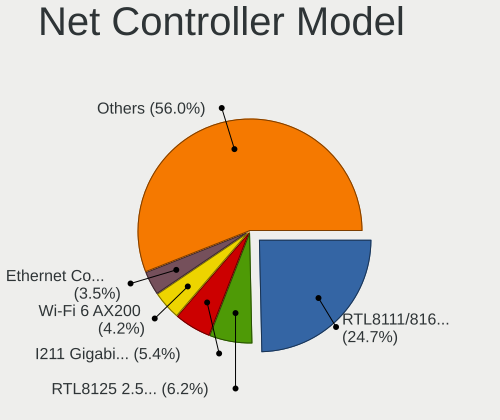

| Model                                                                          | Desktops | Percent |
|--------------------------------------------------------------------------------|----------|---------|
| Realtek RTL8111/8168/8211/8411 PCI Express Gigabit Ethernet Controller         | 233      | 24.66%  |
| Realtek RTL8125 2.5GbE Controller                                              | 59       | 6.24%   |
| Intel I211 Gigabit Network Connection                                          | 51       | 5.4%    |
| Intel Wi-Fi 6 AX200                                                            | 40       | 4.23%   |
| Intel Ethernet Connection (2) I219-V                                           | 33       | 3.49%   |
| Intel Ethernet Controller I225-V                                               | 27       | 2.86%   |
| Intel Ethernet Connection (7) I219-V                                           | 20       | 2.12%   |
| Intel Ethernet Connection I217-LM                                              | 19       | 2.01%   |
| Intel 82579LM Gigabit Network Connection (Lewisville)                          | 15       | 1.59%   |
| Intel Wi-Fi 6E(802.11ax) AX210/AX1675* 2x2 [Typhoon Peak]                      | 13       | 1.38%   |
| Intel Dual Band Wireless-AC 3168NGW [Stone Peak]                               | 13       | 1.38%   |
| Broadcom BCM4360 802.11ac Dual Band Wireless Network Adapter                   | 12       | 1.27%   |
| Intel Ethernet Connection (2) I218-V                                           | 10       | 1.06%   |
| Intel 82579V Gigabit Network Connection                                        | 10       | 1.06%   |
| Intel Wi-Fi 5(802.11ac) Wireless-AC 9x6x [Thunder Peak]                        | 9        | 0.95%   |
| Aquantia AQtion AQC107 NBase-T/IEEE 802.3an Ethernet Controller [Atlantic 10G] | 9        | 0.95%   |
| Realtek 802.11ac NIC                                                           | 8        | 0.85%   |
| Intel Alder Lake-S PCH CNVi WiFi                                               | 8        | 0.85%   |
| Realtek RTL8153 Gigabit Ethernet Adapter                                       | 7        | 0.74%   |
| MediaTek MT7922 802.11ax PCI Express Wireless Network Adapter                  | 7        | 0.74%   |
| MediaTek MT7921K (RZ608) Wi-Fi 6E 80MHz                                        | 7        | 0.74%   |
| Broadcom BCM4352 802.11ac Dual Band Wireless Network Adapter                   | 7        | 0.74%   |
| Ralink RT5370 Wireless Adapter                                                 | 6        | 0.63%   |
| Microsoft Xbox Wireless Adapter for Windows                                    | 6        | 0.63%   |
| Intel I210 Gigabit Network Connection                                          | 6        | 0.63%   |
| Realtek RTL8822BE 802.11a/b/g/n/ac WiFi adapter                                | 5        | 0.53%   |
| Intel Ethernet Connection (7) I219-LM                                          | 5        | 0.53%   |
| Intel Ethernet Connection (2) I219-LM                                          | 5        | 0.53%   |
| Intel Cannon Lake PCH CNVi WiFi                                                | 5        | 0.53%   |
| Intel 82567LM-3 Gigabit Network Connection                                     | 5        | 0.53%   |
| IMC Networks Mediao 802.11n WLAN [Realtek RTL8191SU]                           | 5        | 0.53%   |
| Realtek RTL8852BE PCIe 802.11ax Wireless Network Controller                    | 4        | 0.42%   |
| Realtek RTL8821AE 802.11ac PCIe Wireless Network Adapter                       | 4        | 0.42%   |
| Realtek RTL8126 5GbE Controller                                                | 4        | 0.42%   |
| Ralink MT7601U Wireless Adapter                                                | 4        | 0.42%   |
| Qualcomm Atheros QCA9565 / AR9565 Wireless Network Adapter                     | 4        | 0.42%   |
| Intel Ethernet Connection I217-V                                               | 4        | 0.42%   |
| Intel Ethernet Connection (17) I219-V                                          | 4        | 0.42%   |
| Intel Ethernet Connection (11) I219-V                                          | 4        | 0.42%   |
| Intel 82574L Gigabit Network Connection                                        | 4        | 0.42%   |

Wireless Vendor
---------------

Wireless vendors

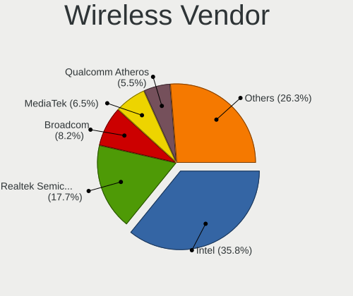

| Vendor                          | Desktops | Percent |
|---------------------------------|----------|---------|
| Intel                           | 105      | 35.84%  |
| Realtek Semiconductor           | 52       | 17.75%  |
| Broadcom                        | 24       | 8.19%   |
| MediaTek                        | 19       | 6.48%   |
| Qualcomm Atheros                | 16       | 5.46%   |
| Ralink Technology               | 13       | 4.44%   |
| Ralink                          | 11       | 3.75%   |
| TP-Link                         | 10       | 3.41%   |
| Microsoft                       | 10       | 3.41%   |
| ASUSTek Computer                | 7        | 2.39%   |
| IMC Networks                    | 5        | 1.71%   |
| Qualcomm Atheros Communications | 4        | 1.37%   |
| NetGear                         | 4        | 1.37%   |
| D-Link                          | 4        | 1.37%   |
| Edimax Technology               | 3        | 1.02%   |
| ZyXEL Communications            | 2        | 0.68%   |
| D-Link System                   | 2        | 0.68%   |
| Linksys                         | 1        | 0.34%   |
| BUFFALO                         | 1        | 0.34%   |

Wireless Model
--------------

Wireless models

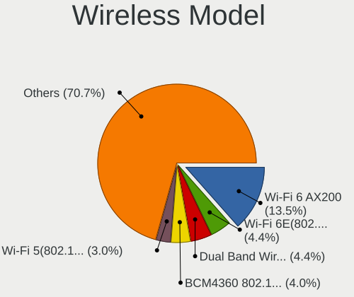

| Model                                                         | Desktops | Percent |
|---------------------------------------------------------------|----------|---------|
| Intel Wi-Fi 6 AX200                                           | 40       | 13.47%  |
| Intel Wi-Fi 6E(802.11ax) AX210/AX1675* 2x2 [Typhoon Peak]     | 13       | 4.38%   |
| Intel Dual Band Wireless-AC 3168NGW [Stone Peak]              | 13       | 4.38%   |
| Broadcom BCM4360 802.11ac Dual Band Wireless Network Adapter  | 12       | 4.04%   |
| Intel Wi-Fi 5(802.11ac) Wireless-AC 9x6x [Thunder Peak]       | 9        | 3.03%   |
| Realtek 802.11ac NIC                                          | 8        | 2.69%   |
| MediaTek MT7921K (RZ608) Wi-Fi 6E 80MHz                       | 7        | 2.36%   |
| Broadcom BCM4352 802.11ac Dual Band Wireless Network Adapter  | 7        | 2.36%   |
| Ralink RT5370 Wireless Adapter                                | 6        | 2.02%   |
| Microsoft Xbox Wireless Adapter for Windows                   | 6        | 2.02%   |
| MediaTek MT7922 802.11ax PCI Express Wireless Network Adapter | 6        | 2.02%   |
| Realtek RTL8822BE 802.11a/b/g/n/ac WiFi adapter               | 5        | 1.68%   |
| Intel Cannon Lake PCH CNVi WiFi                               | 5        | 1.68%   |
| Intel Alder Lake-S PCH CNVi WiFi                              | 5        | 1.68%   |
| IMC Networks Mediao 802.11n WLAN [Realtek RTL8191SU]          | 5        | 1.68%   |
| Realtek RTL8852BE PCIe 802.11ax Wireless Network Controller   | 4        | 1.35%   |
| Realtek RTL8821AE 802.11ac PCIe Wireless Network Adapter      | 4        | 1.35%   |
| Ralink MT7601U Wireless Adapter                               | 4        | 1.35%   |
| Qualcomm Atheros QCA9565 / AR9565 Wireless Network Adapter    | 4        | 1.35%   |
| Realtek RTL8821CE 802.11ac PCIe Wireless Network Adapter      | 3        | 1.01%   |
| Realtek RTL8812AE 802.11ac PCIe Wireless Network Adapter      | 3        | 1.01%   |
| Realtek RTL8192CE PCIe Wireless Network Adapter               | 3        | 1.01%   |
| Realtek RTL8188EUS 802.11n Wireless Network Adapter           | 3        | 1.01%   |
| Ralink RT2870/RT3070 Wireless Adapter                         | 3        | 1.01%   |
| Ralink RT3092 Wireless 802.11n 2T/2R PCIe                     | 3        | 1.01%   |
| Qualcomm Atheros QCA6174 802.11ac Wireless Network Adapter    | 3        | 1.01%   |
| Intel Wireless 8260                                           | 3        | 1.01%   |
| Intel Comet Lake PCH CNVi WiFi                                | 3        | 1.01%   |
| Intel 700 Series Chipset CNVi WiFi                            | 3        | 1.01%   |
| TP-Link Archer T2U PLUS [RTL8821AU]                           | 2        | 0.67%   |
| TP-Link AC600 wireless Realtek RTL8811AU [Archer T2U Nano]    | 2        | 0.67%   |
| TP-Link 802.11ac WLAN Adapter                                 | 2        | 0.67%   |
| Realtek RTL88x2bu [AC1200 Techkey]                            | 2        | 0.67%   |
| Realtek RTL8852AE 802.11ax PCIe Wireless Network Adapter      | 2        | 0.67%   |
| Realtek RTL8822CE 802.11ac PCIe Wireless Network Adapter      | 2        | 0.67%   |
| Realtek RTL8188CUS 802.11n WLAN Adapter                       | 2        | 0.67%   |
| Realtek RTL8188CE 802.11b/g/n WiFi Adapter                    | 2        | 0.67%   |
| Ralink RT5390 Wireless 802.11n 1T/1R PCIe                     | 2        | 0.67%   |
| Ralink RT2800 802.11n PCI                                     | 2        | 0.67%   |
| Ralink RT2790 Wireless 802.11n 1T/2R PCIe                     | 2        | 0.67%   |

Ethernet Vendor
---------------

Ethernet vendors

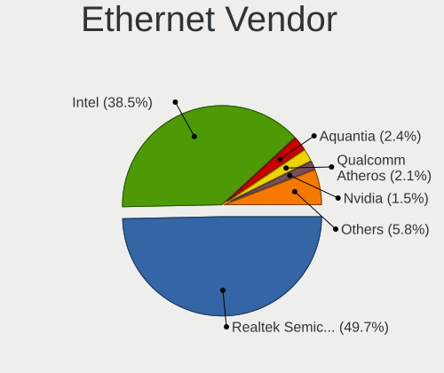

| Vendor                        | Desktops | Percent |
|-------------------------------|----------|---------|
| Realtek Semiconductor         | 306      | 49.68%  |
| Intel                         | 237      | 38.47%  |
| Aquantia                      | 15       | 2.44%   |
| Qualcomm Atheros              | 13       | 2.11%   |
| Nvidia                        | 9        | 1.46%   |
| Broadcom                      | 9        | 1.46%   |
| Samsung Electronics           | 6        | 0.97%   |
| OnePlus Technology (Shenzhen) | 3        | 0.49%   |
| MediaTek                      | 3        | 0.49%   |
| ASIX Electronics              | 3        | 0.49%   |
| Marvell Technology Group      | 2        | 0.32%   |
| Huawei Technologies           | 2        | 0.32%   |
| Xiaomi                        | 1        | 0.16%   |
| VIA Technologies              | 1        | 0.16%   |
| Solarflare Communications     | 1        | 0.16%   |
| Motorola PCS                  | 1        | 0.16%   |
| Lenovo                        | 1        | 0.16%   |
| JMicron Technology            | 1        | 0.16%   |
| ICS Advent                    | 1        | 0.16%   |
| HMD Global                    | 1        | 0.16%   |

Ethernet Model
--------------

Ethernet models

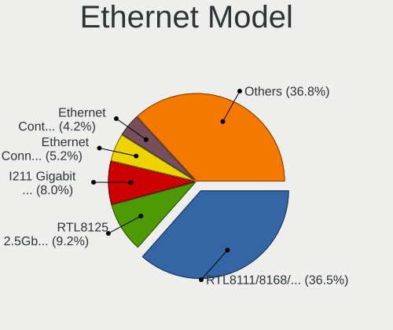

| Model                                                                          | Desktops | Percent |
|--------------------------------------------------------------------------------|----------|---------|
| Realtek RTL8111/8168/8211/8411 PCI Express Gigabit Ethernet Controller         | 233      | 36.52%  |
| Realtek RTL8125 2.5GbE Controller                                              | 59       | 9.25%   |
| Intel I211 Gigabit Network Connection                                          | 51       | 7.99%   |
| Intel Ethernet Connection (2) I219-V                                           | 33       | 5.17%   |
| Intel Ethernet Controller I225-V                                               | 27       | 4.23%   |
| Intel Ethernet Connection (7) I219-V                                           | 20       | 3.13%   |
| Intel Ethernet Connection I217-LM                                              | 19       | 2.98%   |
| Intel 82579LM Gigabit Network Connection (Lewisville)                          | 15       | 2.35%   |
| Intel Ethernet Connection (2) I218-V                                           | 10       | 1.57%   |
| Intel 82579V Gigabit Network Connection                                        | 10       | 1.57%   |
| Aquantia AQtion AQC107 NBase-T/IEEE 802.3an Ethernet Controller [Atlantic 10G] | 9        | 1.41%   |
| Realtek RTL8153 Gigabit Ethernet Adapter                                       | 7        | 1.1%    |
| Intel I210 Gigabit Network Connection                                          | 6        | 0.94%   |
| Intel Ethernet Connection (7) I219-LM                                          | 5        | 0.78%   |
| Intel Ethernet Connection (2) I219-LM                                          | 5        | 0.78%   |
| Intel 82567LM-3 Gigabit Network Connection                                     | 5        | 0.78%   |
| Realtek RTL8126 5GbE Controller                                                | 4        | 0.63%   |
| Intel Ethernet Connection I217-V                                               | 4        | 0.63%   |
| Intel Ethernet Connection (17) I219-V                                          | 4        | 0.63%   |
| Intel Ethernet Connection (11) I219-V                                          | 4        | 0.63%   |
| Intel 82574L Gigabit Network Connection                                        | 4        | 0.63%   |
| Samsung GT-I9070 (network tethering, USB debugging enabled)                    | 3        | 0.47%   |
| Samsung Galaxy series, misc. (tethering mode)                                  | 3        | 0.47%   |
| Realtek RTL8169 PCI Gigabit Ethernet Controller                                | 3        | 0.47%   |
| Realtek RTL-8100/8101L/8139 PCI Fast Ethernet Adapter                          | 3        | 0.47%   |
| OnePlus (Shenzhen) BE2029                                                      | 3        | 0.47%   |
| Nvidia MCP73 Ethernet                                                          | 3        | 0.47%   |
| Intel Ethernet Controller I226-V                                               | 3        | 0.47%   |
| Intel Ethernet Connection (5) I219-LM                                          | 3        | 0.47%   |
| Intel Ethernet Connection (2) I218-LM                                          | 3        | 0.47%   |
| Intel Alder Lake-S PCH CNVi WiFi                                               | 3        | 0.47%   |
| ASIX AX88179 Gigabit Ethernet                                                  | 3        | 0.47%   |
| Aquantia AQC111 NBase-T/IEEE 802.3bz Ethernet Controller [AQtion]              | 3        | 0.47%   |
| Realtek RTL810xE PCI Express Fast Ethernet controller                          | 2        | 0.31%   |
| Qualcomm Atheros Killer E2500 Gigabit Ethernet Controller                      | 2        | 0.31%   |
| Qualcomm Atheros Killer E2400 Gigabit Ethernet Controller                      | 2        | 0.31%   |
| Qualcomm Atheros Killer E220x Gigabit Ethernet Controller                      | 2        | 0.31%   |
| Qualcomm Atheros AR8161 Gigabit Ethernet                                       | 2        | 0.31%   |
| Nvidia MCP61 Ethernet                                                          | 2        | 0.31%   |
| Marvell Group 88E8056 PCI-E Gigabit Ethernet Controller                        | 2        | 0.31%   |

Net Controller Kind
-------------------

Ethernet, WiFi or modem

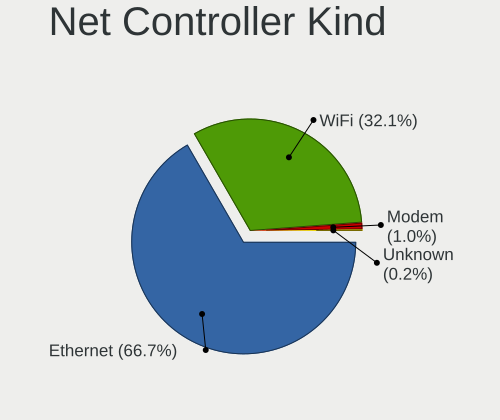

| Kind     | Desktops | Percent |
|----------|----------|---------|
| Ethernet | 558      | 66.67%  |
| WiFi     | 269      | 32.14%  |
| Modem    | 8        | 0.96%   |
| Unknown  | 2        | 0.24%   |

Used Controller
---------------

Currently used network controller

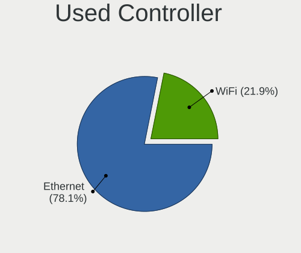

| Kind     | Desktops | Percent |
|----------|----------|---------|
| Ethernet | 461      | 78.14%  |
| WiFi     | 129      | 21.86%  |

NICs
----

Total network controllers on board

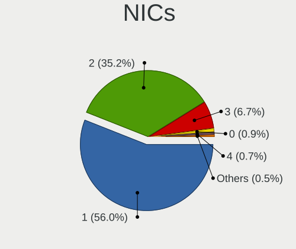

| Total | Desktops | Percent |
|-------|----------|---------|
| 1     | 318      | 55.99%  |
| 2     | 200      | 35.21%  |
| 3     | 38       | 6.69%   |
| 0     | 5        | 0.88%   |
| 4     | 4        | 0.7%    |
| 5     | 2        | 0.35%   |
| 6     | 1        | 0.18%   |

IPv6
----

IPv6 vs IPv4

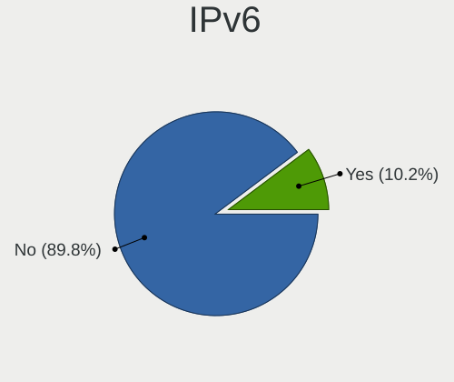

| Used | Desktops | Percent |
|------|----------|---------|
| No   | 509      | 89.77%  |
| Yes  | 58       | 10.23%  |

Bluetooth
---------

Bluetooth Vendor
----------------

Controller vendors

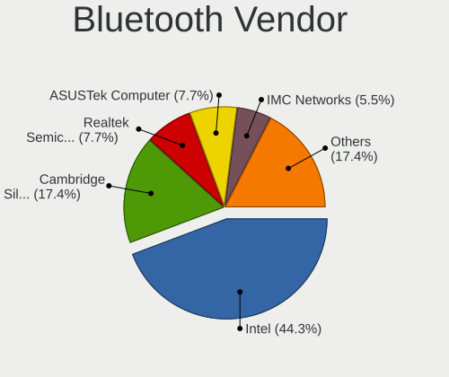

| Vendor                          | Desktops | Percent |
|---------------------------------|----------|---------|
| Intel                           | 104      | 44.26%  |
| Cambridge Silicon Radio         | 41       | 17.45%  |
| Realtek Semiconductor           | 18       | 7.66%   |
| ASUSTek Computer                | 18       | 7.66%   |
| IMC Networks                    | 13       | 5.53%   |
| MediaTek                        | 12       | 5.11%   |
| Broadcom                        | 6        | 2.55%   |
| TP-Link                         | 5        | 2.13%   |
| Qualcomm Atheros Communications | 5        | 2.13%   |
| Foxconn / Hon Hai               | 3        | 1.28%   |
| Edimax Technology               | 3        | 1.28%   |
| Belkin Components               | 3        | 1.28%   |
| HTC (High Tech Computer)        | 2        | 0.85%   |
| Integrated System Solution      | 1        | 0.43%   |
| Actions                         | 1        | 0.43%   |

Bluetooth Model
---------------

Controller models

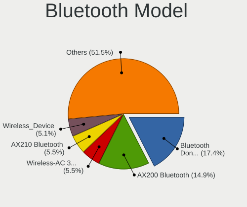

| Model                                                                | Desktops | Percent |
|----------------------------------------------------------------------|----------|---------|
| Cambridge Silicon Radio Bluetooth Dongle (HCI mode)                  | 41       | 17.45%  |
| Intel AX200 Bluetooth                                                | 35       | 14.89%  |
| Intel Wireless-AC 3168 Bluetooth                                     | 13       | 5.53%   |
| Intel AX210 Bluetooth                                                | 13       | 5.53%   |
| MediaTek Wireless_Device                                             | 12       | 5.11%   |
| Intel Bluetooth wireless interface                                   | 11       | 4.68%   |
| ASUS ASUS USB-BT500                                                  | 10       | 4.26%   |
| Realtek Bluetooth Radio                                              | 9        | 3.83%   |
| Intel Wireless-AC 9260 Bluetooth Adapter                             | 9        | 3.83%   |
| Intel Bluetooth Device                                               | 8        | 3.4%    |
| Intel AX201 Bluetooth                                                | 7        | 2.98%   |
| IMC Networks Bluetooth Radio                                         | 7        | 2.98%   |
| Intel Bluetooth 9460/9560 Jefferson Peak (JfP)                       | 6        | 2.55%   |
| TP-Link TP-T@- UB500 Adapter                                         | 5        | 2.13%   |
| Realtek  Bluetooth 4.2 Adapter                                       | 3        | 1.28%   |
| IMC Networks Wireless_Device                                         | 3        | 1.28%   |
| Foxconn / Hon Hai Wireless_Device                                    | 3        | 1.28%   |
| Broadcom BCM20702A0 Bluetooth 4.0                                    | 3        | 1.28%   |
| Belkin Components F8T065BF Mini Bluetooth 4.0 Adapter                | 3        | 1.28%   |
| ASUS Bluetooth Radio                                                 | 3        | 1.28%   |
| Realtek RTL8821A Bluetooth                                           | 2        | 0.85%   |
| Realtek Bluetooth 5.4 Radio                                          | 2        | 0.85%   |
| Realtek Bluetooth 5.3 Radio                                          | 2        | 0.85%   |
| Qualcomm Atheros QCA61x4 Bluetooth 4.0                               | 2        | 0.85%   |
| Qualcomm Atheros AR3012 Bluetooth 4.0                                | 2        | 0.85%   |
| Intel Centrino Bluetooth Wireless Transceiver                        | 2        | 0.85%   |
| IMC Networks Bluetooth Device                                        | 2        | 0.85%   |
| HTC (High Tech Computer) Vive Hub Bluetooth 4.1 (Broadcom BCM920703) | 2        | 0.85%   |
| Edimax Bluetooth Device                                              | 2        | 0.85%   |
| ASUS Qualcomm Bluetooth 4.1                                          | 2        | 0.85%   |
| ASUS Broadcom BCM20702A0 Bluetooth                                   | 2        | 0.85%   |
| Qualcomm Atheros AR9462 Bluetooth                                    | 1        | 0.43%   |
| Integrated System Solution KY-BT100 Bluetooth Adapter                | 1        | 0.43%   |
| IMC Networks BCM20702A0                                              | 1        | 0.43%   |
| Edimax EW-7611ULB 802.11b/g/n and Bluetooth 4.0 Adapter              | 1        | 0.43%   |
| Broadcom HP Portable Bumble Bee                                      | 1        | 0.43%   |
| Broadcom HP Bluetooth Module                                         | 1        | 0.43%   |
| Broadcom BCM2045 Bluetooth                                           | 1        | 0.43%   |
| ASUS Broadcom BCM20702 Single-Chip Bluetooth 4.0 + LE                | 1        | 0.43%   |
| Actions general adapter                                              | 1        | 0.43%   |

Sound
-----

Sound Vendor
------------

Sound card vendors

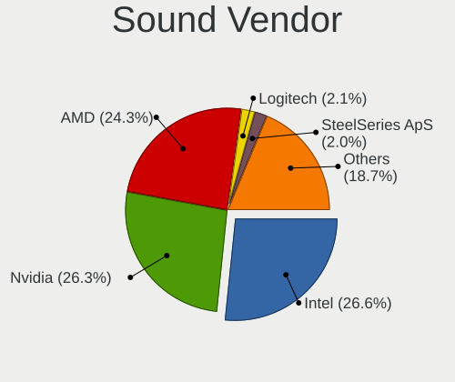

| Vendor                               | Desktops | Percent |
|--------------------------------------|----------|---------|
| Intel                                | 299      | 26.63%  |
| Nvidia                               | 295      | 26.27%  |
| AMD                                  | 273      | 24.31%  |
| Logitech                             | 24       | 2.14%   |
| SteelSeries ApS                      | 22       | 1.96%   |
| Kingston Technology                  | 21       | 1.87%   |
| C-Media Electronics                  | 21       | 1.87%   |
| ASUSTek Computer                     | 16       | 1.42%   |
| Creative Technology                  | 15       | 1.34%   |
| Creative Labs                        | 13       | 1.16%   |
| Texas Instruments                    | 10       | 0.89%   |
| Focusrite-Novation                   | 9        | 0.8%    |
| Razer USA                            | 7        | 0.62%   |
| GN Netcom                            | 6        | 0.53%   |
| Corsair                              | 6        | 0.53%   |
| XMOS                                 | 5        | 0.45%   |
| RODE Microphones                     | 5        | 0.45%   |
| BEHRINGER International              | 4        | 0.36%   |
| Yamaha                               | 3        | 0.27%   |
| VIA Technologies                     | 3        | 0.27%   |
| Sony                                 | 3        | 0.27%   |
| Realtek Semiconductor                | 3        | 0.27%   |
| JMTek                                | 3        | 0.27%   |
| GYROCOM C&C                          | 3        | 0.27%   |
| Blue Microphones                     | 3        | 0.27%   |
| Astro Gaming                         | 3        | 0.27%   |
| ASRock                               | 3        | 0.27%   |
| Valve Software                       | 2        | 0.18%   |
| Tenx Technology                      | 2        | 0.18%   |
| Setek Elektronik                     | 2        | 0.18%   |
| SAVITECH                             | 2        | 0.18%   |
| Lenovo                               | 2        | 0.18%   |
| Hewlett-Packard                      | 2        | 0.18%   |
| Generalplus Technology               | 2        | 0.18%   |
| Turtle Beach                         | 1        | 0.09%   |
| Trust                                | 1        | 0.09%   |
| Thesycon Systemsoftware & Consulting | 1        | 0.09%   |
| Tempest                              | 1        | 0.09%   |
| TEAC                                 | 1        | 0.09%   |
| TC Electronic                        | 1        | 0.09%   |

Sound Model
-----------

Sound card models

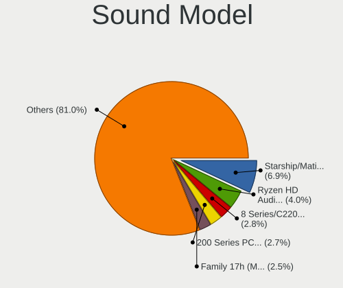

| Model                                                                                           | Desktops | Percent |
|-------------------------------------------------------------------------------------------------|----------|---------|
| AMD Starship/Matisse HD Audio Controller                                                        | 91       | 6.94%   |
| AMD Ryzen HD Audio Controller                                                                   | 53       | 4.04%   |
| Intel 8 Series/C220 Series Chipset High Definition Audio Controller                             | 37       | 2.82%   |
| Intel 200 Series PCH HD Audio                                                                   | 35       | 2.67%   |
| AMD Family 17h (Models 00h-0fh) HD Audio Controller                                             | 33       | 2.52%   |
| Intel 7 Series/C216 Chipset Family High Definition Audio Controller                             | 31       | 2.36%   |
| Intel 100 Series/C230 Series Chipset Family HD Audio Controller                                 | 30       | 2.29%   |
| Intel 6 Series/C200 Series Chipset Family High Definition Audio Controller                      | 28       | 2.13%   |
| AMD Radeon High Definition Audio Controller                                                     | 26       | 1.98%   |
| AMD Navi 21/23 HDMI/DP Audio Controller                                                         | 26       | 1.98%   |
| Nvidia GP107GL High Definition Audio Controller                                                 | 25       | 1.91%   |
| Nvidia GP104 High Definition Audio Controller                                                   | 25       | 1.91%   |
| Intel Xeon E3-1200 v3/4th Gen Core Processor HD Audio Controller                                | 25       | 1.91%   |
| Intel Cannon Lake PCH cAVS                                                                      | 25       | 1.91%   |
| AMD Navi 10 HDMI Audio                                                                          | 23       | 1.75%   |
| Nvidia GP106 High Definition Audio Controller                                                   | 21       | 1.6%    |
| AMD SBx00 Azalia (Intel HDA)                                                                    | 21       | 1.6%    |
| AMD Renoir/Cezanne HDMI/DP Audio Controller                                                     | 21       | 1.6%    |
| AMD Navi 31 HDMI/DP Audio                                                                       | 21       | 1.6%    |
| AMD Ellesmere HDMI Audio [Radeon RX 470/480 / 570/580/590]                                      | 21       | 1.6%    |
| Intel Alder Lake-S HD Audio Controller                                                          | 20       | 1.52%   |
| Nvidia TU116 High Definition Audio Controller                                                   | 19       | 1.45%   |
| Nvidia GA104 High Definition Audio Controller                                                   | 19       | 1.45%   |
| Nvidia GA102 High Definition Audio Controller                                                   | 16       | 1.22%   |
| Nvidia TU106 High Definition Audio Controller                                                   | 15       | 1.14%   |
| Kingston Technology HyperX 7.1 Audio                                                            | 15       | 1.14%   |
| Nvidia GK104 HDMI Audio Controller                                                              | 14       | 1.07%   |
| ASUSTek Computer USB Audio                                                                      | 14       | 1.07%   |
| Nvidia TU104 HD Audio Controller                                                                | 13       | 0.99%   |
| Intel 82801JI (ICH10 Family) HD Audio Controller                                                | 13       | 0.99%   |
| AMD FCH Azalia Controller                                                                       | 13       | 0.99%   |
| Nvidia GM206 High Definition Audio Controller                                                   | 12       | 0.91%   |
| Nvidia GK208 HDMI/DP Audio Controller                                                           | 12       | 0.91%   |
| Nvidia GM204 High Definition Audio Controller                                                   | 11       | 0.84%   |
| Creative Labs CA0132 Sound Core3D [Sound Blaster Recon3D / Z-Series / Sound BlasterX AE-5 Plus] | 10       | 0.76%   |
| Nvidia GP108 High Definition Audio Controller                                                   | 9        | 0.69%   |
| Nvidia GP102 HDMI Audio Controller                                                              | 9        | 0.69%   |
| AMD Oland/Hainan/Cape Verde/Pitcairn HDMI Audio [Radeon HD 7000 Series]                         | 9        | 0.69%   |
| Nvidia GM107 High Definition Audio Controller [GeForce 940MX]                                   | 8        | 0.61%   |
| Nvidia GK107 HDMI Audio Controller                                                              | 8        | 0.61%   |

Memory
------

Memory Vendor
-------------

Memory module vendors

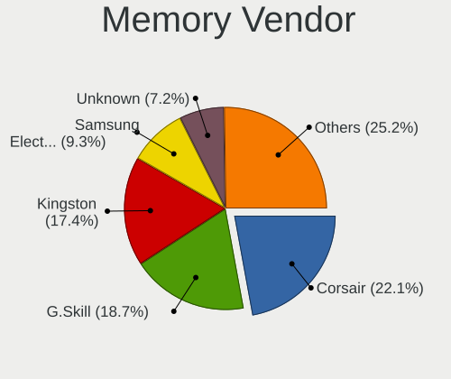

| Vendor              | Desktops | Percent |
|---------------------|----------|---------|
| Corsair             | 71       | 22.12%  |
| G.Skill             | 60       | 18.69%  |
| Kingston            | 56       | 17.45%  |
| Samsung Electronics | 30       | 9.35%   |
| Unknown             | 23       | 7.17%   |
| Crucial             | 20       | 6.23%   |
| Micron Technology   | 18       | 5.61%   |
| SK hynix            | 15       | 4.67%   |
| Unknown             | 6        | 1.87%   |
| Team                | 4        | 1.25%   |
| Ramaxel Technology  | 4        | 1.25%   |
| Nanya Technology    | 4        | 1.25%   |
| Patriot             | 2        | 0.62%   |
| Elpida              | 2        | 0.62%   |
| A-DATA Technology   | 2        | 0.62%   |
| Unknown (ABCD)      | 1        | 0.31%   |
| Unifosa             | 1        | 0.31%   |
| GOODRAM             | 1        | 0.31%   |
| ASint Technology    | 1        | 0.31%   |

Memory Model
------------

Memory module models

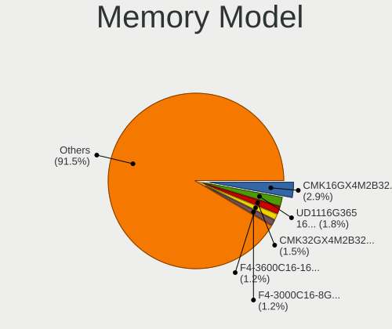

| Model                                                   | Desktops | Percent |
|---------------------------------------------------------|----------|---------|
| Corsair RAM CMK16GX4M2B3200C16 8GB DIMM DDR4 3600MT/s   | 10       | 2.92%   |
| Unknown                                                 | 6        | 1.75%   |
| Corsair RAM CMK32GX4M2B3200C16 16GB DIMM DDR4 3800MT/s  | 5        | 1.46%   |
| G.Skill RAM F4-3600C16-16GTZNC 16GiB DIMM DDR4 3600MT/s | 4        | 1.17%   |
| G.Skill RAM F4-3000C16-8GISB 8GB DIMM DDR4 3200MT/s     | 4        | 1.17%   |
| Corsair RAM CMK32GX4M2E3200C16 16GB DIMM DDR4 3600MT/s  | 4        | 1.17%   |
| Corsair RAM CMK32GX4M2D3600C18 16GB DIMM DDR4 3800MT/s  | 4        | 1.17%   |
| Corsair RAM CMK16GX4M2B3000C15 8GB DIMM DDR4 3600MT/s   | 4        | 1.17%   |
| Kingston RAM KHX2400C15/8G 8GB DIMM DDR4 3400MT/s       | 3        | 0.88%   |
| Kingston RAM KHX1866C10D3/8G 8GB DIMM DDR3 1867MT/s     | 3        | 0.88%   |
| Kingston RAM KHX1600C9D3/4GX 4GB DIMM DDR3 1867MT/s     | 3        | 0.88%   |
| Kingston RAM KF556C36-16 16GB DIMM DDR5 12800MT/s       | 3        | 0.88%   |
| G.Skill RAM F5-6000J3040G32G 32GB DIMM DDR5 6200MT/s    | 3        | 0.88%   |
| G.Skill RAM F4-3200C16-8GIS 8GB DIMM DDR4 3600MT/s      | 3        | 0.88%   |
| Crucial RAM BLS8G3D1609DS1S00. 8GB DIMM DDR3 1800MT/s   | 3        | 0.88%   |
| Corsair RAM CMK64GX4M2E3200C16 32GB DIMM DDR4 3600MT/s  | 3        | 0.88%   |
| Unknown RAM Module 8GB DIMM DDR3 1600MT/s               | 2        | 0.58%   |
| Unknown RAM Module 8192MB DIMM 1333MT/s                 | 2        | 0.58%   |
| Unknown RAM Module 4GB DIMM 1066MT/s                    | 2        | 0.58%   |
| Unknown RAM Module 4096MB DIMM 1333MT/s                 | 2        | 0.58%   |
| Team RAM TEAMGROUP-UD4-3200 8GB DIMM DDR4 3800MT/s      | 2        | 0.58%   |
| SK hynix RAM HMA81GU6AFR8N-UH 8GB DIMM DDR4 2400MT/s    | 2        | 0.58%   |
| Samsung RAM M471B1G73DB0-YK0 8GB SODIMM DDR3 1600MT/s   | 2        | 0.58%   |
| Samsung RAM M378B5773CH0-CK0 2GB DIMM DDR3 1600MT/s     | 2        | 0.58%   |
| Samsung RAM M378B5173DB0-CK0 4096MB DIMM DDR3 1600MT/s  | 2        | 0.58%   |
| Samsung RAM M378A1K43CB2-CRC 8GB DIMM DDR4 3500MT/s     | 2        | 0.58%   |
| Samsung RAM M3 78T5663QZ3-CF7 2GB DIMM DDR2 800MT/s     | 2        | 0.58%   |
| Samsung RAM M3 78T5663EH3-CF7 2GB DIMM DDR2 800MT/s     | 2        | 0.58%   |
| Micron RAM 18ASF2G72PDZ-3G2R1 16GB DIMM DDR4 3200MT/s   | 2        | 0.58%   |
| Kingston RAM KF560C40-8 8GB DIMM DDR5 6000MT/s          | 2        | 0.58%   |
| Kingston RAM KF560C36-32 32GB DIMM DDR5 6200MT/s        | 2        | 0.58%   |
| Kingston RAM KF560C36-16 16GB DIMM DDR5 6000MT/s        | 2        | 0.58%   |
| Kingston RAM KF552C40-16 16GB DIMM DDR5 5400MT/s        | 2        | 0.58%   |
| Kingston RAM KF3200C16D4/16GX 16GB DIMM DDR4 3733MT/s   | 2        | 0.58%   |
| Kingston RAM HP24D4U7S8MBP-8 8GB DIMM DDR4 2400MT/s     | 2        | 0.58%   |
| G.Skill RAM F4-3600C16-8GTZR 8GB DIMM DDR4 3600MT/s     | 2        | 0.58%   |
| G.Skill RAM F4-3200C16-8GTZR 8GB DIMM DDR4 3200MT/s     | 2        | 0.58%   |
| G.Skill RAM F4-3200C16-16GVK 16GB DIMM DDR4 3600MT/s    | 2        | 0.58%   |
| G.Skill RAM F4-3200C16-16GTZR 16GB DIMM DDR4 3600MT/s   | 2        | 0.58%   |
| G.Skill RAM F4-3200C14-8GFX 8GB DIMM DDR4 3800MT/s      | 2        | 0.58%   |

Memory Kind
-----------

Memory module kinds

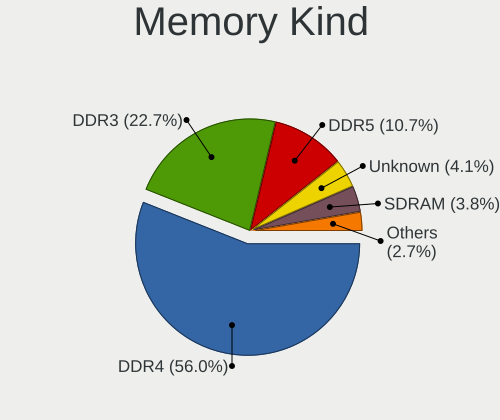

| Kind    | Desktops | Percent |
|---------|----------|---------|
| DDR4    | 163      | 56.01%  |
| DDR3    | 66       | 22.68%  |
| DDR5    | 31       | 10.65%  |
| Unknown | 12       | 4.12%   |
| SDRAM   | 11       | 3.78%   |
| DDR2    | 3        | 1.03%   |
| LPDDR4  | 2        | 0.69%   |
| DDR     | 2        | 0.69%   |
| LPDDR3  | 1        | 0.34%   |

Memory Form Factor
------------------

Physical design of the memory module

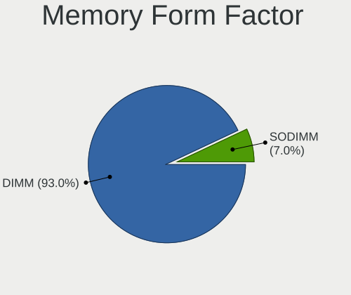

| Name   | Desktops | Percent |
|--------|----------|---------|
| DIMM   | 266      | 93.01%  |
| SODIMM | 20       | 6.99%   |

Memory Size
-----------

Memory module size

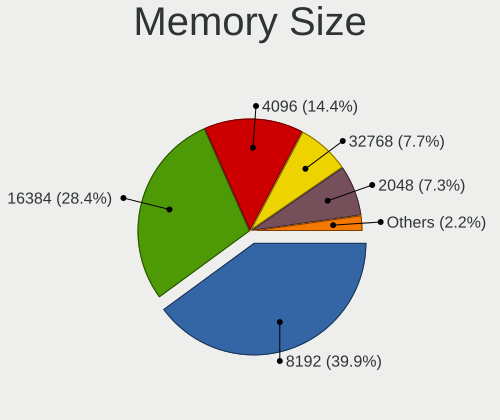

| Size  | Desktops | Percent |
|-------|----------|---------|
| 8192  | 125      | 39.94%  |
| 16384 | 89       | 28.43%  |
| 4096  | 45       | 14.38%  |
| 32768 | 24       | 7.67%   |
| 2048  | 23       | 7.35%   |
| 1024  | 3        | 0.96%   |
| 65536 | 2        | 0.64%   |
| 24576 | 1        | 0.32%   |
| 512   | 1        | 0.32%   |

Memory Speed
------------

Memory module speed

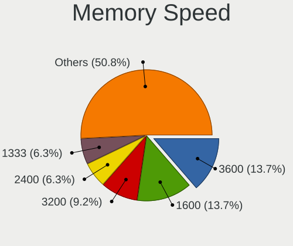

| Speed   | Desktops | Percent |
|---------|----------|---------|
| 3600    | 43       | 13.65%  |
| 1600    | 43       | 13.65%  |
| 3200    | 29       | 9.21%   |
| 2400    | 20       | 6.35%   |
| 1333    | 20       | 6.35%   |
| 3800    | 17       | 5.4%    |
| 2133    | 13       | 4.13%   |
| 6000    | 11       | 3.49%   |
| 2667    | 9        | 2.86%   |
| 3733    | 8        | 2.54%   |
| 3866    | 7        | 2.22%   |
| 3400    | 7        | 2.22%   |
| 4000    | 6        | 1.9%    |
| 1800    | 6        | 1.9%    |
| 6200    | 5        | 1.59%   |
| 4800    | 5        | 1.59%   |
| 3466    | 4        | 1.27%   |
| 2933    | 4        | 1.27%   |
| 1866    | 4        | 1.27%   |
| 667     | 4        | 1.27%   |
| 12800   | 3        | 0.95%   |
| 3000    | 3        | 0.95%   |
| 2666    | 3        | 0.95%   |
| 6400    | 2        | 0.63%   |
| 5600    | 2        | 0.63%   |
| 5400    | 2        | 0.63%   |
| 3666    | 2        | 0.63%   |
| 3500    | 2        | 0.63%   |
| 3266    | 2        | 0.63%   |
| 3100    | 2        | 0.63%   |
| 2800    | 2        | 0.63%   |
| 2048    | 2        | 0.63%   |
| 2000    | 2        | 0.63%   |
| 1867    | 2        | 0.63%   |
| 1639    | 2        | 0.63%   |
| 1066    | 2        | 0.63%   |
| Unknown | 2        | 0.63%   |
| 20306   | 1        | 0.32%   |
| 7200    | 1        | 0.32%   |
| 5200    | 1        | 0.32%   |

Printers & scanners
-------------------

Printer Vendor
--------------

Printer device vendors

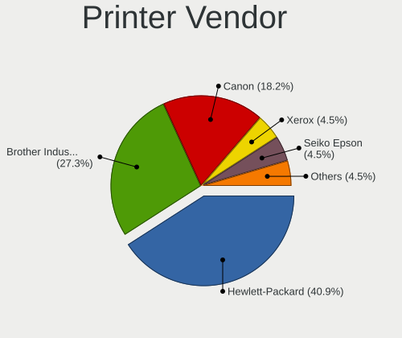

| Vendor              | Desktops | Percent |
|---------------------|----------|---------|
| Hewlett-Packard     | 9        | 40.91%  |
| Brother Industries  | 6        | 27.27%  |
| Canon               | 4        | 18.18%  |
| Xerox               | 1        | 4.55%   |
| Seiko Epson         | 1        | 4.55%   |
| Prolific Technology | 1        | 4.55%   |

Printer Model
-------------

Printer device models

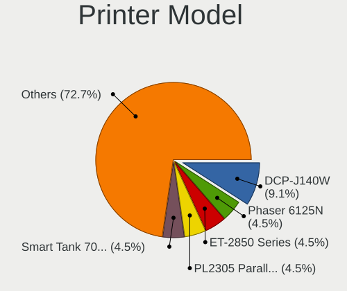

| Model                         | Desktops | Percent |
|-------------------------------|----------|---------|
| Brother DCP-J140W             | 2        | 9.09%   |
| Xerox Phaser 6125N            | 1        | 4.55%   |
| Seiko Epson ET-2850 Series    | 1        | 4.55%   |
| Prolific PL2305 Parallel Port | 1        | 4.55%   |
| HP Smart Tank 7000 series     | 1        | 4.55%   |
| HP LaserJet 1020              | 1        | 4.55%   |
| HP ENVY Photo 6200 series     | 1        | 4.55%   |
| HP ENVY 4520 series           | 1        | 4.55%   |
| HP Deskjet D4300 series       | 1        | 4.55%   |
| HP DeskJet 5940               | 1        | 4.55%   |
| HP DeskJet 5550               | 1        | 4.55%   |
| HP DeskJet 2700 series        | 1        | 4.55%   |
| HP DeskJet 2600 series        | 1        | 4.55%   |
| Canon PIXMA MP280             | 1        | 4.55%   |
| Canon LiDE 400                | 1        | 4.55%   |
| Canon LiDE 300                | 1        | 4.55%   |
| Canon iP7200 series           | 1        | 4.55%   |
| Brother MFC-J5740DW           | 1        | 4.55%   |
| Brother HL-5250DN Printer     | 1        | 4.55%   |
| Brother HL-2240D series       | 1        | 4.55%   |
| Brother HL-2030 Laser Printer | 1        | 4.55%   |

Scanner Vendor
--------------

Scanner device vendors

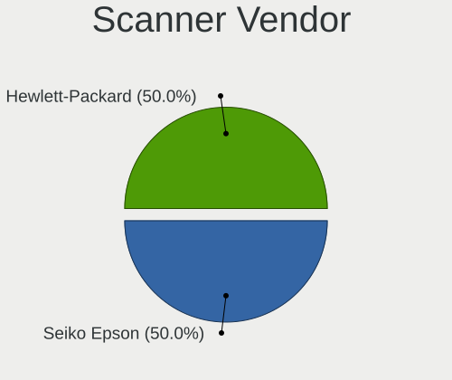

| Vendor          | Desktops | Percent |
|-----------------|----------|---------|
| Seiko Epson     | 2        | 50%     |
| Hewlett-Packard | 2        | 50%     |

Scanner Model
-------------

Scanner device models

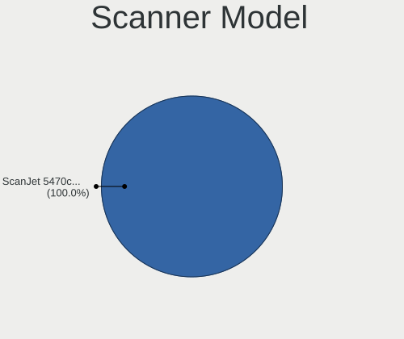

| Model                                             | Desktops | Percent |
|---------------------------------------------------|----------|---------|
| Seiko Epson GT-X820 [Perfection V600 Photo]       | 1        | 25%     |
| Seiko Epson GT-F650 [GT-S600/Perfection V10/V100] | 1        | 25%     |
| HP ScanJet 5470c/5490c                            | 1        | 25%     |
| HP PSC 1200                                       | 1        | 25%     |

Camera
------

Camera Vendor
-------------

Camera device vendors

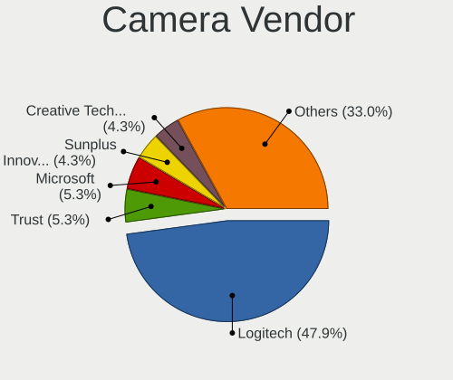

| Vendor                                 | Desktops | Percent |
|----------------------------------------|----------|---------|
| Logitech                               | 45       | 47.87%  |
| Trust                                  | 5        | 5.32%   |
| Microsoft                              | 5        | 5.32%   |
| Sunplus Innovation Technology          | 4        | 4.26%   |
| Creative Technology                    | 4        | 4.26%   |
| Samsung Electronics                    | 3        | 3.19%   |
| Chicony Electronics                    | 3        | 3.19%   |
| Valve Software                         | 2        | 2.13%   |
| MacroSilicon                           | 2        | 2.13%   |
| Hewlett-Packard                        | 2        | 2.13%   |
| Apple                                  | 2        | 2.13%   |
| YLX-231212-H                           | 1        | 1.06%   |
| webcam                                 | 1        | 1.06%   |
| vivo                                   | 1        | 1.06%   |
| SunplusIT                              | 1        | 1.06%   |
| Sunplus Technology                     | 1        | 1.06%   |
| Quanta                                 | 1        | 1.06%   |
| Oculus VR                              | 1        | 1.06%   |
| Microdia                               | 1        | 1.06%   |
| Lenovo                                 | 1        | 1.06%   |
| Jieli Technology                       | 1        | 1.06%   |
| Intel                                  | 1        | 1.06%   |
| GenesysLogic Technology                | 1        | 1.06%   |
| Generalplus Technology                 | 1        | 1.06%   |
| eMeet                                  | 1        | 1.06%   |
| Cubeternet                             | 1        | 1.06%   |
| Cheng Uei Precision Industry (Foxlink) | 1        | 1.06%   |
| Unknown                                | 1        | 1.06%   |

Camera Model
------------

Camera device models

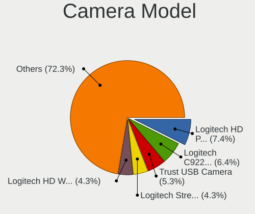

| Model                                   | Desktops | Percent |
|-----------------------------------------|----------|---------|
| Logitech HD Pro Webcam C920             | 7        | 7.45%   |
| Logitech C922 Pro Stream Webcam         | 6        | 6.38%   |
| Trust USB Camera                        | 5        | 5.32%   |
| Logitech StreamCam                      | 4        | 4.26%   |
| Logitech HD Webcam C525                 | 4        | 4.26%   |
| Samsung Galaxy series, misc. (MTP mode) | 3        | 3.19%   |
| Microsoft LifeCam Cinema                | 3        | 3.19%   |
| Logitech Webcam Pro 9000                | 3        | 3.19%   |
| Valve Software 3D Camera                | 2        | 2.13%   |
| MacroSilicon USB Video                  | 2        | 2.13%   |
| Logitech Webcam C930e                   | 2        | 2.13%   |
| Logitech Webcam C270                    | 2        | 2.13%   |
| Logitech Logitech Webcam C925e          | 2        | 2.13%   |
| Logitech HD Webcam C615                 | 2        | 2.13%   |
| Logitech C930c                          | 2        | 2.13%   |
| Logitech BRIO Ultra HD Webcam           | 2        | 2.13%   |
| Creative Live! Cam Sync 1080p           | 2        | 2.13%   |
| Apple iPhone 5/5C/5S/6/SE/7/8/X         | 2        | 2.13%   |
| YLX-231212-H Streaming Webcams          | 1        | 1.06%   |
| webcam webcam                           | 1        | 1.06%   |
| vivo V2110                              | 1        | 1.06%   |
| SunplusIT SPCA2650 AV Camera            | 1        | 1.06%   |
| Sunplus Siri A9 UVC chipset             | 1        | 1.06%   |
| Sunplus SunplusIT PC Camera             | 1        | 1.06%   |
| Sunplus Streaming Webcam                | 1        | 1.06%   |
| Sunplus SPCA2281 Web Camera             | 1        | 1.06%   |
| Sunplus Sandberg USB Webcam Pro         | 1        | 1.06%   |
| Quanta FREETALK Conference              | 1        | 1.06%   |
| Oculus VR Quest 2                       | 1        | 1.06%   |
| Microsoft LifeCam Studio                | 1        | 1.06%   |
| Microsoft LifeCam HD-3000               | 1        | 1.06%   |
| Microdia HoverCam Solo Spark Audio      | 1        | 1.06%   |
| Logitech QuickCam Pro 9000              | 1        | 1.06%   |
| Logitech QuickCam Pro 5000              | 1        | 1.06%   |
| Logitech QuickCam E 3500                | 1        | 1.06%   |
| Logitech Logitech MeetUp                | 1        | 1.06%   |
| Logitech Logi Webcam C920e              | 1        | 1.06%   |
| Logitech HD Webcam C510                 | 1        | 1.06%   |
| Logitech C920 PRO HD Webcam             | 1        | 1.06%   |
| Logitech C670i FHD Webcam               | 1        | 1.06%   |

Security
--------

Fingerprint Vendor
------------------

Fingerprint sensor vendors

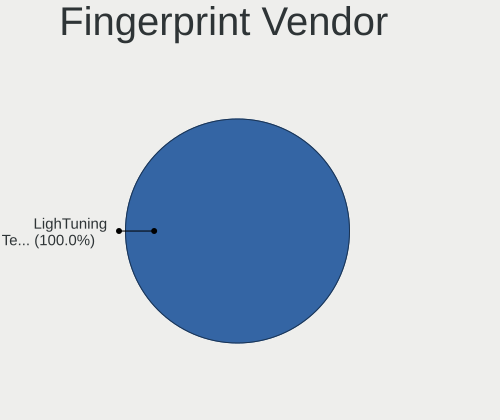

| Vendor                | Desktops | Percent |
|-----------------------|----------|---------|
| LighTuning Technology | 1        | 100%    |

Fingerprint Model
-----------------

Fingerprint sensor models

| Model                                     | Desktops | Percent |
|-------------------------------------------|----------|---------|
| LighTuning ES603 Swipe Fingerprint Sensor | 1        | 100%    |

Chipcard Vendor
---------------

Chipcard module vendors

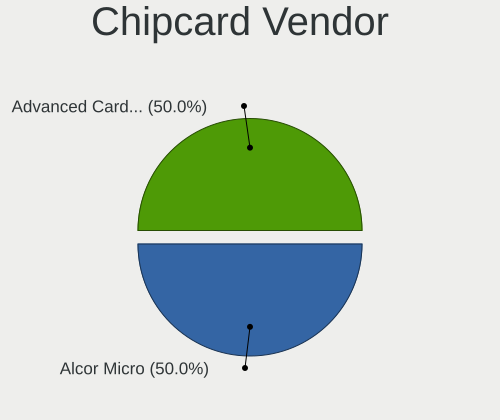

| Vendor                | Desktops | Percent |
|-----------------------|----------|---------|
| Alcor Micro           | 1        | 50%     |
| Advanced Card Systems | 1        | 50%     |

Chipcard Model
--------------

Chipcard module models

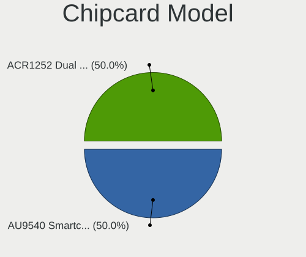

| Model                                     | Desktops | Percent |
|-------------------------------------------|----------|---------|
| Alcor Micro AU9540 Smartcard Reader       | 1        | 50%     |
| Advanced Card Systems ACR1252 Dual Reader | 1        | 50%     |

Unsupported
-----------

Unsupported Devices
-------------------

Total unsupported devices on board

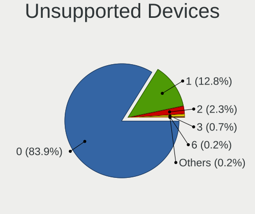

| Total | Desktops | Percent |
|-------|----------|---------|
| 0     | 483      | 83.85%  |
| 1     | 74       | 12.85%  |
| 2     | 13       | 2.26%   |
| 3     | 4        | 0.69%   |
| 6     | 1        | 0.17%   |
| 4     | 1        | 0.17%   |

Unsupported Device Types
------------------------

Types of unsupported devices

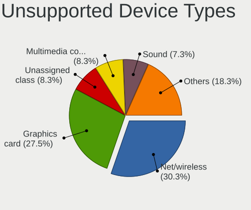

| Type                     | Desktops | Percent |
|--------------------------|----------|---------|
| Net/wireless             | 33       | 30.28%  |
| Graphics card            | 30       | 27.52%  |
| Unassigned class         | 9        | 8.26%   |
| Multimedia controller    | 9        | 8.26%   |
| Sound                    | 8        | 7.34%   |
| Communication controller | 8        | 7.34%   |
| Storage/raid             | 3        | 2.75%   |
| Net/ethernet             | 2        | 1.83%   |
| Chipcard                 | 2        | 1.83%   |
| Card reader              | 2        | 1.83%   |
| Network                  | 1        | 0.92%   |
| Fingerprint reader       | 1        | 0.92%   |
| Camera                   | 1        | 0.92%   |

