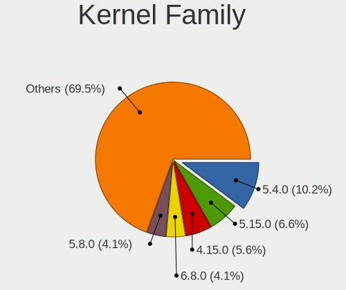
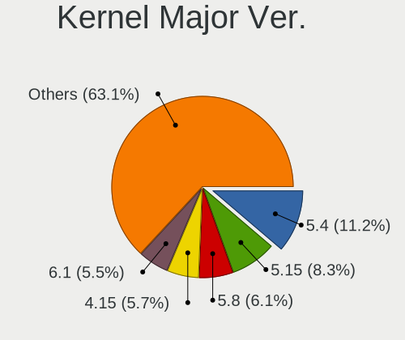
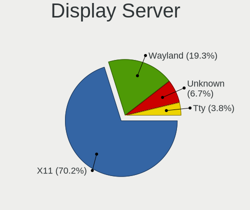
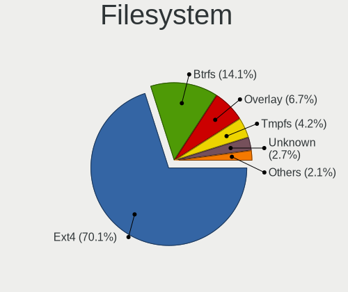
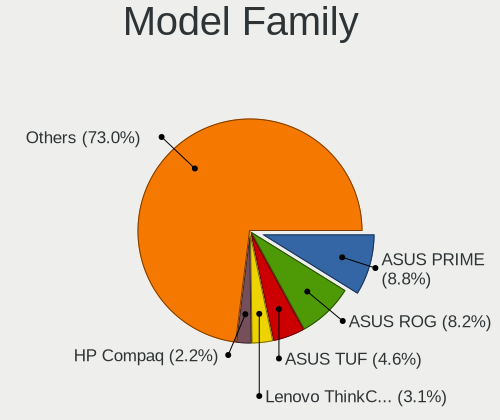
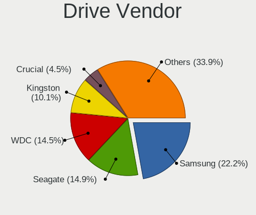
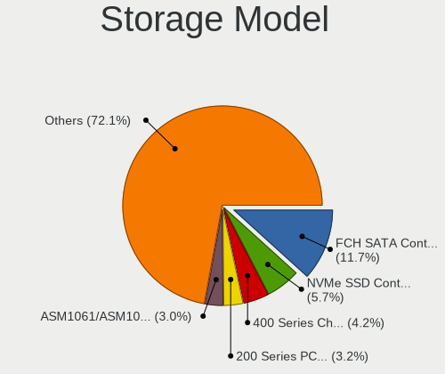
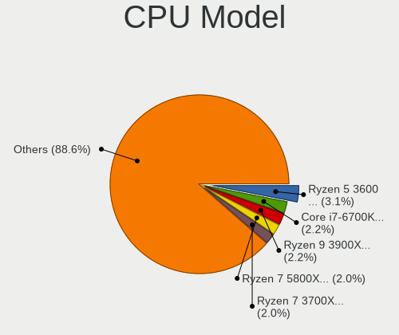
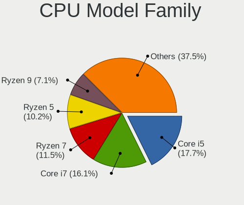
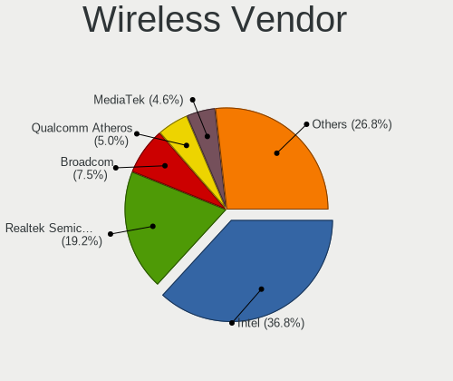

Linux in Denmark - Tested Hardware & Statistics (Desktops)
----------------------------------------------------------

A project to collect tested hardware configurations for Linux in Denmark.

Anyone can contribute to this report by the [hw-probe](https://github.com/linuxhw/hw-probe) tool:

    sudo -E hw-probe -all -upload

Please contribute! Especially if your hardware is rare.

Contents
--------

* [ Test Cases ](#test-cases)

* [ System ](#system)
  - [ OS                       ](#os)
  - [ OS Family                ](#os-family)
  - [ Kernel                   ](#kernel)
  - [ Kernel Family            ](#kernel-family)
  - [ Kernel Major Ver.        ](#kernel-major-ver)
  - [ Arch                     ](#arch)
  - [ DE                       ](#de)
  - [ Display Server           ](#display-server)
  - [ Display Manager          ](#display-manager)
  - [ OS Lang                  ](#os-lang)
  - [ Boot Mode                ](#boot-mode)
  - [ Filesystem               ](#filesystem)
  - [ Part. scheme             ](#part-scheme)
  - [ Dual Boot with Linux/BSD ](#dual-boot-with-linuxbsd)
  - [ Dual Boot (Win)          ](#dual-boot-win)

* [ Board ](#board)
  - [ Vendor                   ](#vendor)
  - [ Model                    ](#model)
  - [ Model Family             ](#model-family)
  - [ MFG Year                 ](#mfg-year)
  - [ Form Factor              ](#form-factor)
  - [ Secure Boot              ](#secure-boot)
  - [ Coreboot                 ](#coreboot)
  - [ RAM Size                 ](#ram-size)
  - [ RAM Used                 ](#ram-used)
  - [ Total Drives             ](#total-drives)
  - [ Has CD-ROM               ](#has-cd-rom)
  - [ Has Ethernet             ](#has-ethernet)
  - [ Has WiFi                 ](#has-wifi)
  - [ Has Bluetooth            ](#has-bluetooth)

* [ Location ](#location)
  - [ Country                  ](#country)
  - [ City                     ](#city)

* [ Drives ](#drives)
  - [ Drive Vendor             ](#drive-vendor)
  - [ Drive Model              ](#drive-model)
  - [ HDD Vendor               ](#hdd-vendor)
  - [ SSD Vendor               ](#ssd-vendor)
  - [ Drive Kind               ](#drive-kind)
  - [ Drive Connector          ](#drive-connector)
  - [ Drive Size               ](#drive-size)
  - [ Space Total              ](#space-total)
  - [ Space Used               ](#space-used)
  - [ Malfunc. Drives          ](#malfunc-drives)
  - [ Malfunc. Drive Vendor    ](#malfunc-drive-vendor)
  - [ Malfunc. HDD Vendor      ](#malfunc-hdd-vendor)
  - [ Malfunc. Drive Kind      ](#malfunc-drive-kind)
  - [ Failed Drives            ](#failed-drives)
  - [ Failed Drive Vendor      ](#failed-drive-vendor)
  - [ Drive Status             ](#drive-status)

* [ Storage controller ](#storage-controller)
  - [ Storage Vendor           ](#storage-vendor)
  - [ Storage Model            ](#storage-model)
  - [ Storage Kind             ](#storage-kind)

* [ Processor ](#processor)
  - [ CPU Vendor               ](#cpu-vendor)
  - [ CPU Model                ](#cpu-model)
  - [ CPU Model Family         ](#cpu-model-family)
  - [ CPU Cores                ](#cpu-cores)
  - [ CPU Sockets              ](#cpu-sockets)
  - [ CPU Threads              ](#cpu-threads)
  - [ CPU Op-Modes             ](#cpu-op-modes)
  - [ CPU Microcode            ](#cpu-microcode)
  - [ CPU Microarch            ](#cpu-microarch)

* [ Graphics ](#graphics)
  - [ GPU Vendor               ](#gpu-vendor)
  - [ GPU Model                ](#gpu-model)
  - [ GPU Combo                ](#gpu-combo)
  - [ GPU Driver               ](#gpu-driver)
  - [ GPU Memory               ](#gpu-memory)

* [ Monitor ](#monitor)
  - [ Monitor Vendor           ](#monitor-vendor)
  - [ Monitor Model            ](#monitor-model)
  - [ Monitor Resolution       ](#monitor-resolution)
  - [ Monitor Diagonal         ](#monitor-diagonal)
  - [ Monitor Width            ](#monitor-width)
  - [ Aspect Ratio             ](#aspect-ratio)
  - [ Monitor Area             ](#monitor-area)
  - [ Pixel Density            ](#pixel-density)
  - [ Multiple Monitors        ](#multiple-monitors)

* [ Network ](#network)
  - [ Net Controller Vendor    ](#net-controller-vendor)
  - [ Net Controller Model     ](#net-controller-model)
  - [ Wireless Vendor          ](#wireless-vendor)
  - [ Wireless Model           ](#wireless-model)
  - [ Ethernet Vendor          ](#ethernet-vendor)
  - [ Ethernet Model           ](#ethernet-model)
  - [ Net Controller Kind      ](#net-controller-kind)
  - [ Used Controller          ](#used-controller)
  - [ NICs                     ](#nics)
  - [ IPv6                     ](#ipv6)

* [ Bluetooth ](#bluetooth)
  - [ Bluetooth Vendor         ](#bluetooth-vendor)
  - [ Bluetooth Model          ](#bluetooth-model)

* [ Sound ](#sound)
  - [ Sound Vendor             ](#sound-vendor)
  - [ Sound Model              ](#sound-model)

* [ Memory ](#memory)
  - [ Memory Vendor            ](#memory-vendor)
  - [ Memory Model             ](#memory-model)
  - [ Memory Kind              ](#memory-kind)
  - [ Memory Form Factor       ](#memory-form-factor)
  - [ Memory Size              ](#memory-size)
  - [ Memory Speed             ](#memory-speed)

* [ Printers & scanners ](#printers--scanners)
  - [ Printer Vendor           ](#printer-vendor)
  - [ Printer Model            ](#printer-model)
  - [ Scanner Vendor           ](#scanner-vendor)
  - [ Scanner Model            ](#scanner-model)

* [ Camera ](#camera)
  - [ Camera Vendor            ](#camera-vendor)
  - [ Camera Model             ](#camera-model)

* [ Security ](#security)
  - [ Fingerprint Vendor       ](#fingerprint-vendor)
  - [ Fingerprint Model        ](#fingerprint-model)
  - [ Chipcard Vendor          ](#chipcard-vendor)
  - [ Chipcard Model           ](#chipcard-model)

* [ Unsupported ](#unsupported)
  - [ Unsupported Devices      ](#unsupported-devices)
  - [ Unsupported Device Types ](#unsupported-device-types)

Test Cases
----------

Total: 343

| Vendor        | Model                       | Probe                                                      | Date         |
|---------------|-----------------------------|------------------------------------------------------------|--------------|
| Gigabyte      | G41M-Combo                  | [9940073216](https://linux-hardware.org/?probe=9940073216) | May 05, 2022 |
| SLIMBOOK      | ONE-AMD-M4                  | [99911022e9](https://linux-hardware.org/?probe=99911022e9) | Apr 26, 2022 |
| MSI           | MS-1T11                     | [9c16a631ef](https://linux-hardware.org/?probe=9c16a631ef) | Apr 23, 2022 |
| MSI           | MS-1T11                     | [e263cd80f5](https://linux-hardware.org/?probe=e263cd80f5) | Apr 23, 2022 |
| Lenovo        | SHARKBAY SDK0J40705 WIN ... | [91aa85fff9](https://linux-hardware.org/?probe=91aa85fff9) | Apr 21, 2022 |
| ASUSTek       | TUF Gaming X570-PRO         | [27825828c9](https://linux-hardware.org/?probe=27825828c9) | Apr 05, 2022 |
| ASUSTek       | M5A78L-M/USB3               | [ddc3550f6b](https://linux-hardware.org/?probe=ddc3550f6b) | Apr 04, 2022 |
| ASRock        | X99 Extreme4                | [e29b4c30f1](https://linux-hardware.org/?probe=e29b4c30f1) | Apr 04, 2022 |
| ASUSTek       | ROG STRIX B450-E GAMING     | [a5c5028fde](https://linux-hardware.org/?probe=a5c5028fde) | Apr 03, 2022 |
| ASUSTek       | ROG STRIX B450-E GAMING     | [d978436f5f](https://linux-hardware.org/?probe=d978436f5f) | Apr 03, 2022 |
| ASUSTek       | PRIME Z370-P                | [f3cd1a314c](https://linux-hardware.org/?probe=f3cd1a314c) | Mar 25, 2022 |
| ASUSTek       | PRIME Z690-P WIFI D4        | [4ce05dd1e2](https://linux-hardware.org/?probe=4ce05dd1e2) | Mar 24, 2022 |
| MSI           | MPG X570 GAMING PLUS        | [f3b52d9201](https://linux-hardware.org/?probe=f3b52d9201) | Mar 21, 2022 |
| MSI           | MPG X570 GAMING PLUS        | [5c40bf9192](https://linux-hardware.org/?probe=5c40bf9192) | Mar 21, 2022 |
| ASUSTek       | PRIME B250M-A               | [8be4c394f1](https://linux-hardware.org/?probe=8be4c394f1) | Mar 18, 2022 |
| Gigabyte      | MFLP7IP-00                  | [304c5939e7](https://linux-hardware.org/?probe=304c5939e7) | Mar 18, 2022 |
| Shuttle       | X50V2PLUS V1.00             | [0bd650dfff](https://linux-hardware.org/?probe=0bd650dfff) | Mar 16, 2022 |
| ASUSTek       | PRIME A320M-K               | [500a30847d](https://linux-hardware.org/?probe=500a30847d) | Feb 23, 2022 |
| MSI           | MPG B550 GAMING PLUS        | [04e8e7704e](https://linux-hardware.org/?probe=04e8e7704e) | Feb 23, 2022 |
| MSI           | MPG B550 GAMING PLUS        | [c1929d8540](https://linux-hardware.org/?probe=c1929d8540) | Feb 21, 2022 |
| MSI           | MPG B550 GAMING PLUS        | [bdc86d995a](https://linux-hardware.org/?probe=bdc86d995a) | Feb 21, 2022 |
| Dell          | 0KC9NP A01                  | [f9a0fa24f8](https://linux-hardware.org/?probe=f9a0fa24f8) | Feb 18, 2022 |
| ASRock        | FM2A55M-DGS                 | [efe38992bd](https://linux-hardware.org/?probe=efe38992bd) | Feb 15, 2022 |
| Dell          | 0GTK4K A02                  | [466029e620](https://linux-hardware.org/?probe=466029e620) | Feb 13, 2022 |
| ASUSTek       | ROG STRIX B550-F GAMING     | [e63f72d407](https://linux-hardware.org/?probe=e63f72d407) | Feb 07, 2022 |
| ASUSTek       | ROG STRIX B550-F GAMING     | [3edfd926a9](https://linux-hardware.org/?probe=3edfd926a9) | Feb 06, 2022 |
| Medion        | MS-7800                     | [9693a4d35c](https://linux-hardware.org/?probe=9693a4d35c) | Feb 05, 2022 |
| ASUSTek       | ROG STRIX B550-F GAMING     | [40ed6ce0c5](https://linux-hardware.org/?probe=40ed6ce0c5) | Feb 04, 2022 |
| SLIMBOOK      | ONE-AMD-M4                  | [225e399fc1](https://linux-hardware.org/?probe=225e399fc1) | Feb 03, 2022 |
| ASUSTek       | M5A78L-M/USB3               | [b8f4a15736](https://linux-hardware.org/?probe=b8f4a15736) | Jan 25, 2022 |
| ASUSTek       | P8H67-M                     | [a69dd56657](https://linux-hardware.org/?probe=a69dd56657) | Jan 21, 2022 |
| Gigabyte      | B460M AORUS PRO             | [1e301a4129](https://linux-hardware.org/?probe=1e301a4129) | Jan 19, 2022 |
| Acer          | Predator G6-710             | [29bdcc72c9](https://linux-hardware.org/?probe=29bdcc72c9) | Jan 18, 2022 |
| ASUSTek       | P8H67-M                     | [1568252a07](https://linux-hardware.org/?probe=1568252a07) | Jan 17, 2022 |
| Gigabyte      | Z68X-UD3-B3                 | [46932917d4](https://linux-hardware.org/?probe=46932917d4) | Jan 08, 2022 |
| Pegatron      | 2AD5                        | [efc0a3875a](https://linux-hardware.org/?probe=efc0a3875a) | Dec 29, 2021 |
| MSI           | A68HM GRENADE               | [18ca0bdd91](https://linux-hardware.org/?probe=18ca0bdd91) | Dec 27, 2021 |
| MSI           | X470 GAMING PRO             | [d683987eea](https://linux-hardware.org/?probe=d683987eea) | Dec 23, 2021 |
| ASUSTek       | TUF GAMING B560M-PLUS       | [32e8c7ccb2](https://linux-hardware.org/?probe=32e8c7ccb2) | Dec 22, 2021 |
| ASUSTek       | SABERTOOTH Z77              | [1e14543dfd](https://linux-hardware.org/?probe=1e14543dfd) | Dec 18, 2021 |
| HP            | 3031h                       | [8a8888c824](https://linux-hardware.org/?probe=8a8888c824) | Dec 17, 2021 |
| ABIT          | I-G31                       | [048b7bcf6a](https://linux-hardware.org/?probe=048b7bcf6a) | Dec 13, 2021 |
| Dell          | 0YXT71 A01                  | [fbe4f7fdb9](https://linux-hardware.org/?probe=fbe4f7fdb9) | Dec 12, 2021 |
| ASUSTek       | Z170-P                      | [6e857bc210](https://linux-hardware.org/?probe=6e857bc210) | Dec 09, 2021 |
| Gigabyte      | Z370 AORUS Gaming 5-CF      | [ac173fd5ba](https://linux-hardware.org/?probe=ac173fd5ba) | Dec 09, 2021 |
| ASUSTek       | PRIME Z390-A                | [e884cd44db](https://linux-hardware.org/?probe=e884cd44db) | Dec 08, 2021 |
| HP            | 3031h                       | [68cf960e7f](https://linux-hardware.org/?probe=68cf960e7f) | Dec 02, 2021 |
| HP            | 3031h                       | [1c49cd6404](https://linux-hardware.org/?probe=1c49cd6404) | Dec 02, 2021 |
| HP            | 8299                        | [6eb5c6d54a](https://linux-hardware.org/?probe=6eb5c6d54a) | Nov 30, 2021 |
| HP            | 8299                        | [7bd1df0e4d](https://linux-hardware.org/?probe=7bd1df0e4d) | Nov 29, 2021 |
| ASUSTek       | ROG STRIX X570-E GAMING     | [6071fde7dd](https://linux-hardware.org/?probe=6071fde7dd) | Nov 28, 2021 |
| Acer          | Aspire X3995                | [cde003006d](https://linux-hardware.org/?probe=cde003006d) | Nov 22, 2021 |
| Acer          | Aspire X3995                | [2e97d6ef1c](https://linux-hardware.org/?probe=2e97d6ef1c) | Nov 22, 2021 |
| ASUSTek       | ROG Maximus XI HERO         | [ea4842466c](https://linux-hardware.org/?probe=ea4842466c) | Nov 20, 2021 |
| ASUSTek       | ROG Maximus XI HERO         | [faf9e68f7a](https://linux-hardware.org/?probe=faf9e68f7a) | Nov 20, 2021 |
| ASUSTek       | PRIME Z390-A                | [2b2ea53377](https://linux-hardware.org/?probe=2b2ea53377) | Nov 20, 2021 |
| ASUSTek       | PRIME Z390-A                | [b4512f4b54](https://linux-hardware.org/?probe=b4512f4b54) | Nov 18, 2021 |
| ASRock        | Z170 Gaming K4              | [53281d6c95](https://linux-hardware.org/?probe=53281d6c95) | Nov 17, 2021 |
| Dell          | 0YXT71 A01                  | [6f599a0889](https://linux-hardware.org/?probe=6f599a0889) | Nov 03, 2021 |
| T-bao         | MINI PC V1.0                | [72ce248d0c](https://linux-hardware.org/?probe=72ce248d0c) | Oct 28, 2021 |
| ASUSTek       | TUF GAMING Z590-PLUS WIF... | [be8c7e44de](https://linux-hardware.org/?probe=be8c7e44de) | Oct 23, 2021 |
| MSI           | Z77A-G45                    | [7a31ca9e22](https://linux-hardware.org/?probe=7a31ca9e22) | Oct 23, 2021 |
| HP            | 1589                        | [49c747efad](https://linux-hardware.org/?probe=49c747efad) | Oct 21, 2021 |
| Gigabyte      | Z68X-UD3-B3                 | [e1ddc26c5e](https://linux-hardware.org/?probe=e1ddc26c5e) | Oct 20, 2021 |
| ASUSTek       | PRIME Z390-A                | [c0c2de7d52](https://linux-hardware.org/?probe=c0c2de7d52) | Oct 17, 2021 |
| ASUSTek       | ROG STRIX X470-I GAMING     | [56f27fef6e](https://linux-hardware.org/?probe=56f27fef6e) | Oct 16, 2021 |
| Gigabyte      | X570 AORUS ULTRA            | [cef9098008](https://linux-hardware.org/?probe=cef9098008) | Oct 14, 2021 |
| Gigabyte      | X570 AORUS ULTRA            | [718bd26737](https://linux-hardware.org/?probe=718bd26737) | Oct 14, 2021 |
| ASUSTek       | ROG Maximus X HERO          | [70d8ac443f](https://linux-hardware.org/?probe=70d8ac443f) | Oct 11, 2021 |
| MSI           | B450 GAMING PLUS MAX        | [a36474b9ff](https://linux-hardware.org/?probe=a36474b9ff) | Oct 04, 2021 |
| Gigabyte      | B560M AORUS ELITE           | [2c73a09463](https://linux-hardware.org/?probe=2c73a09463) | Oct 03, 2021 |
| MSI           | B460M PRO-VDH WIFI          | [05711b548f](https://linux-hardware.org/?probe=05711b548f) | Oct 03, 2021 |
| ASRock        | H470M-ITX/ac                | [ad42fa5d08](https://linux-hardware.org/?probe=ad42fa5d08) | Oct 01, 2021 |
| ASUSTek       | PRIME H310M-K R2.0          | [201176552b](https://linux-hardware.org/?probe=201176552b) | Sep 21, 2021 |
| Medion        | B360H4-EM V1.0              | [1985156471](https://linux-hardware.org/?probe=1985156471) | Sep 19, 2021 |
| Dell          | 0XCR8D A02                  | [9cb5ea4f4a](https://linux-hardware.org/?probe=9cb5ea4f4a) | Sep 11, 2021 |
| ASRock        | P55M Pro                    | [b6408718ee](https://linux-hardware.org/?probe=b6408718ee) | Sep 02, 2021 |
| ASRock        | 980DE3/U3S3                 | [e8aadc0af0](https://linux-hardware.org/?probe=e8aadc0af0) | Aug 24, 2021 |
| Medion        | MS-7616                     | [cbd20c24d8](https://linux-hardware.org/?probe=cbd20c24d8) | Aug 20, 2021 |
| ASUSTek       | P8B75-M                     | [4d29ffa0f7](https://linux-hardware.org/?probe=4d29ffa0f7) | Aug 03, 2021 |
| Lenovo        | 314F SDK0T08861 WIN 3305... | [4135f29492](https://linux-hardware.org/?probe=4135f29492) | Aug 02, 2021 |
| Intel         | X79 (INTEL Xeon E5/Corei... | [59cd9e3edd](https://linux-hardware.org/?probe=59cd9e3edd) | Aug 01, 2021 |
| Pegatron      | 2AB6                        | [79dffb5346](https://linux-hardware.org/?probe=79dffb5346) | Jul 31, 2021 |
| Gigabyte      | P85-D3                      | [51f83ebd4a](https://linux-hardware.org/?probe=51f83ebd4a) | Jul 30, 2021 |
| Gigabyte      | H61M-USB3-B3                | [3c2020fbb6](https://linux-hardware.org/?probe=3c2020fbb6) | Jul 30, 2021 |
| Gigabyte      | H61M-USB3-B3                | [b3bbc6d937](https://linux-hardware.org/?probe=b3bbc6d937) | Jul 30, 2021 |
| Lenovo        | Board                       | [cf7f13e31c](https://linux-hardware.org/?probe=cf7f13e31c) | Jul 29, 2021 |
| ASRock        | H310CM-DVS                  | [5ae2994458](https://linux-hardware.org/?probe=5ae2994458) | Jul 28, 2021 |
| Medion        | Z370H4-EM                   | [f19570a630](https://linux-hardware.org/?probe=f19570a630) | Jul 24, 2021 |
| Shuttle       | FH67                        | [611a7c28dc](https://linux-hardware.org/?probe=611a7c28dc) | Jul 22, 2021 |
| Shuttle       | FH67                        | [3d3fb6c381](https://linux-hardware.org/?probe=3d3fb6c381) | Jul 22, 2021 |
| ASRock        | 980DE3/U3S3                 | [437aef57fd](https://linux-hardware.org/?probe=437aef57fd) | Jul 21, 2021 |
| ASRock        | 980DE3/U3S3                 | [9ca97016e0](https://linux-hardware.org/?probe=9ca97016e0) | Jul 21, 2021 |
| Gigabyte      | A320M-S2H V2-CF             | [5fcfefa75a](https://linux-hardware.org/?probe=5fcfefa75a) | Jul 19, 2021 |
| Gigabyte      | Z68X-UD3-B3                 | [0c0d9cc784](https://linux-hardware.org/?probe=0c0d9cc784) | Jul 15, 2021 |
| ASUSTek       | PRIME Z370-A                | [208a9ee715](https://linux-hardware.org/?probe=208a9ee715) | Jun 23, 2021 |
| ASUSTek       | PRIME Z370-A                | [86fce52939](https://linux-hardware.org/?probe=86fce52939) | Jun 23, 2021 |
| Lenovo        | 3714 SDK0J40700 WIN 3258... | [ca43a33e1d](https://linux-hardware.org/?probe=ca43a33e1d) | Jun 18, 2021 |
| Lenovo        | Bantry CRB SDK0J40697 WI... | [4a0a83693b](https://linux-hardware.org/?probe=4a0a83693b) | Jun 14, 2021 |
| ASRock        | P55M Pro                    | [cac3198045](https://linux-hardware.org/?probe=cac3198045) | Jun 14, 2021 |
| ASRock        | P55M Pro                    | [b994c1917a](https://linux-hardware.org/?probe=b994c1917a) | Jun 03, 2021 |
| ASRock        | B450 Gaming-ITX/ac          | [6056eac50c](https://linux-hardware.org/?probe=6056eac50c) | May 31, 2021 |
| ASRock        | B450 Gaming-ITX/ac          | [bd9fb4818b](https://linux-hardware.org/?probe=bd9fb4818b) | May 31, 2021 |
| ASRock        | B450 Gaming-ITX/ac          | [12fa3ffea5](https://linux-hardware.org/?probe=12fa3ffea5) | May 31, 2021 |
| MSI           | Z87 MPOWER                  | [848def4822](https://linux-hardware.org/?probe=848def4822) | May 29, 2021 |
| ASUSTek       | PRIME B450M-A               | [e0217f85a6](https://linux-hardware.org/?probe=e0217f85a6) | May 28, 2021 |
| ASUSTek       | ROG Maximus X HERO          | [f9358acedf](https://linux-hardware.org/?probe=f9358acedf) | May 27, 2021 |
| ASUSTek       | PRIME B450M-A               | [787c1b3a8c](https://linux-hardware.org/?probe=787c1b3a8c) | May 26, 2021 |
| ASUSTek       | B85M-G                      | [92f19ca1e6](https://linux-hardware.org/?probe=92f19ca1e6) | May 25, 2021 |
| ASUSTek       | NARRA2                      | [0b2cf24d70](https://linux-hardware.org/?probe=0b2cf24d70) | May 25, 2021 |
| Medion        | MS-7646                     | [799be90f9c](https://linux-hardware.org/?probe=799be90f9c) | May 11, 2021 |
| ASRock        | J4105-ITX                   | [2cb8135a58](https://linux-hardware.org/?probe=2cb8135a58) | May 08, 2021 |
| ASUSTek       | PRIME B450M-K               | [a8271c73ee](https://linux-hardware.org/?probe=a8271c73ee) | May 02, 2021 |
| Gigabyte      | GA-78LMT-USB3 R2 sex        | [9e0202e76a](https://linux-hardware.org/?probe=9e0202e76a) | Apr 27, 2021 |
| Lenovo        | SHARKBAY 31900058 STD       | [31cb6e83ed](https://linux-hardware.org/?probe=31cb6e83ed) | Apr 19, 2021 |
| Acer          | Veriton M275                | [246a662951](https://linux-hardware.org/?probe=246a662951) | Apr 17, 2021 |
| Gigabyte      | B75M-D3H                    | [cd772af567](https://linux-hardware.org/?probe=cd772af567) | Apr 14, 2021 |
| Gigabyte      | EP35-DS4                    | [e37cf6fc8d](https://linux-hardware.org/?probe=e37cf6fc8d) | Apr 12, 2021 |
| MSI           | Z87 MPOWER                  | [ff6aa3811c](https://linux-hardware.org/?probe=ff6aa3811c) | Apr 08, 2021 |
| ASUSTek       | TUF GAMING X570-PLUS        | [09cf1ed052](https://linux-hardware.org/?probe=09cf1ed052) | Apr 08, 2021 |
| ASRock        | Z270 Pro4                   | [b90dd1b4d2](https://linux-hardware.org/?probe=b90dd1b4d2) | Apr 02, 2021 |
| Medion        | MS-7797                     | [947bc894eb](https://linux-hardware.org/?probe=947bc894eb) | Apr 01, 2021 |
| ASUSTek       | PRIME Z370-A                | [757d1d0707](https://linux-hardware.org/?probe=757d1d0707) | Mar 31, 2021 |
| ASUSTek       | PRIME Z370-A                | [eb1782ad49](https://linux-hardware.org/?probe=eb1782ad49) | Mar 31, 2021 |
| Dell          | 0CU409                      | [53a8c28aed](https://linux-hardware.org/?probe=53a8c28aed) | Mar 24, 2021 |
| Acer          | Aspire XC-605               | [f8ad366bd9](https://linux-hardware.org/?probe=f8ad366bd9) | Mar 19, 2021 |
| ASUSTek       | PRIME X470-PRO              | [54288c23c9](https://linux-hardware.org/?probe=54288c23c9) | Mar 18, 2021 |
| ECS           | Nettle3                     | [f7ec16d7e7](https://linux-hardware.org/?probe=f7ec16d7e7) | Mar 16, 2021 |
| HP            | 3032h                       | [79b0bf2416](https://linux-hardware.org/?probe=79b0bf2416) | Mar 15, 2021 |
| Gigabyte      | A320M-S2H V2-CF             | [9ebf280981](https://linux-hardware.org/?probe=9ebf280981) | Mar 05, 2021 |
| Gigabyte      | A320M-S2H-CF                | [efa91095ab](https://linux-hardware.org/?probe=efa91095ab) | Mar 05, 2021 |
| ASUSTek       | M4N75TD                     | [9daf1b6529](https://linux-hardware.org/?probe=9daf1b6529) | Feb 28, 2021 |
| ASUSTek       | P5P43TD                     | [3a2604a18a](https://linux-hardware.org/?probe=3a2604a18a) | Feb 27, 2021 |
| HP            | 1998                        | [43bd925171](https://linux-hardware.org/?probe=43bd925171) | Feb 27, 2021 |
| ASUSTek       | PRIME Z270-A                | [66ce820cff](https://linux-hardware.org/?probe=66ce820cff) | Feb 25, 2021 |
| ASRock        | QC5000-ITX/WiFi             | [d321b1eb90](https://linux-hardware.org/?probe=d321b1eb90) | Feb 21, 2021 |
| ASRock        | Z270 Pro4                   | [7114de29ed](https://linux-hardware.org/?probe=7114de29ed) | Feb 20, 2021 |
| Medion        | MS-7797                     | [3c4d9332e4](https://linux-hardware.org/?probe=3c4d9332e4) | Feb 19, 2021 |
| MSI           | B150M PRO-VH                | [255e61b850](https://linux-hardware.org/?probe=255e61b850) | Feb 13, 2021 |
| Medion        | MS-7797                     | [7e6811c842](https://linux-hardware.org/?probe=7e6811c842) | Feb 10, 2021 |
| Medion        | MS-7797                     | [394c3c87f4](https://linux-hardware.org/?probe=394c3c87f4) | Feb 10, 2021 |
| ASRock        | B550M-ITX/ac                | [909d040ae4](https://linux-hardware.org/?probe=909d040ae4) | Feb 07, 2021 |
| Medion        | MS-7708                     | [53ba901c28](https://linux-hardware.org/?probe=53ba901c28) | Feb 01, 2021 |
| Medion        | MS-7708                     | [8ef1638192](https://linux-hardware.org/?probe=8ef1638192) | Feb 01, 2021 |
| Lenovo        | ThinkServer TS140           | [8f911a91ca](https://linux-hardware.org/?probe=8f911a91ca) | Jan 29, 2021 |
| ASUSTek       | ROG STRIX B550-F GAMING     | [34257c05a5](https://linux-hardware.org/?probe=34257c05a5) | Jan 27, 2021 |
| Gigabyte      | GA-780T-D3L                 | [2f2ede94cb](https://linux-hardware.org/?probe=2f2ede94cb) | Jan 17, 2021 |
| ASUSTek       | CROSSHAIR VI HERO           | [fc3f785613](https://linux-hardware.org/?probe=fc3f785613) | Jan 15, 2021 |
| NEXCOM        | NDIS B322                   | [c2789ca746](https://linux-hardware.org/?probe=c2789ca746) | Jan 06, 2021 |
| Gigabyte      | B550M DS3H                  | [16d30d3356](https://linux-hardware.org/?probe=16d30d3356) | Dec 30, 2020 |
| Gigabyte      | B550M DS3H                  | [944fc761f4](https://linux-hardware.org/?probe=944fc761f4) | Dec 30, 2020 |
| ASUSTek       | Z97-K                       | [3eacdc5965](https://linux-hardware.org/?probe=3eacdc5965) | Dec 28, 2020 |
| MSI           | B150M PRO-VH                | [f225de5ed7](https://linux-hardware.org/?probe=f225de5ed7) | Dec 25, 2020 |
| MSI           | B150M PRO-VH                | [6971a673ec](https://linux-hardware.org/?probe=6971a673ec) | Dec 25, 2020 |
| Gigabyte      | Z390 I AORUS PRO WIFI-CF    | [13d6a7172d](https://linux-hardware.org/?probe=13d6a7172d) | Dec 15, 2020 |
| Gigabyte      | J3455N-D3H                  | [a9a1ba9727](https://linux-hardware.org/?probe=a9a1ba9727) | Dec 13, 2020 |
| ASUSTek       | ROG STRIX X470-I GAMING     | [968983910f](https://linux-hardware.org/?probe=968983910f) | Dec 08, 2020 |
| Gigabyte      | B550 AORUS PRO AC           | [b3c78e0e70](https://linux-hardware.org/?probe=b3c78e0e70) | Dec 07, 2020 |
| Gigabyte      | B550 AORUS PRO AC           | [1a5eee726d](https://linux-hardware.org/?probe=1a5eee726d) | Dec 05, 2020 |
| MSI           | MPG Z490 GAMING PLUS        | [95b94bfe02](https://linux-hardware.org/?probe=95b94bfe02) | Dec 04, 2020 |
| MSI           | X570-A PRO                  | [0c57860179](https://linux-hardware.org/?probe=0c57860179) | Dec 02, 2020 |
| Medion        | B360H4-EM V1.0              | [718acb9fc0](https://linux-hardware.org/?probe=718acb9fc0) | Dec 02, 2020 |
| MSI           | B150M PRO-VH                | [ed280391f2](https://linux-hardware.org/?probe=ed280391f2) | Nov 30, 2020 |
| ASUSTek       | Z170 PRO GAMING             | [f49b6c5048](https://linux-hardware.org/?probe=f49b6c5048) | Nov 27, 2020 |
| MSI           | X470 GAMING PLUS MAX        | [ce4048d43f](https://linux-hardware.org/?probe=ce4048d43f) | Nov 24, 2020 |
| ASUSTek       | ROG STRIX X470-I GAMING     | [9845e5eb1e](https://linux-hardware.org/?probe=9845e5eb1e) | Nov 15, 2020 |
| ASUSTek       | ROG STRIX X470-I GAMING     | [91207c72e3](https://linux-hardware.org/?probe=91207c72e3) | Nov 15, 2020 |
| Acer          | MCP73VE NVIDIA MCP73        | [d2afbbe9f9](https://linux-hardware.org/?probe=d2afbbe9f9) | Nov 10, 2020 |
| Lenovo        | Board                       | [8864ed7825](https://linux-hardware.org/?probe=8864ed7825) | Nov 08, 2020 |
| ASUSTek       | Z170 PRO GAMING             | [54f14d0d27](https://linux-hardware.org/?probe=54f14d0d27) | Nov 02, 2020 |
| ASRock        | Z170 OC Formula             | [067d0719a1](https://linux-hardware.org/?probe=067d0719a1) | Oct 30, 2020 |
| ASRock        | TRX40 Creator               | [3b1961ec14](https://linux-hardware.org/?probe=3b1961ec14) | Oct 30, 2020 |
| Gigabyte      | X570 AORUS MASTER           | [2e111f0b77](https://linux-hardware.org/?probe=2e111f0b77) | Oct 29, 2020 |
| Dell          | 0CT017                      | [4f36a920b3](https://linux-hardware.org/?probe=4f36a920b3) | Oct 26, 2020 |
| ASRock        | B450M Pro4                  | [375a230939](https://linux-hardware.org/?probe=375a230939) | Oct 26, 2020 |
| ASUSTek       | Z170 PRO GAMING             | [b7a16467ac](https://linux-hardware.org/?probe=b7a16467ac) | Oct 19, 2020 |
| ASUSTek       | P5QL-VM EPU                 | [97ae9ff8fd](https://linux-hardware.org/?probe=97ae9ff8fd) | Oct 16, 2020 |
| ASUSTek       | PRIME B250M-A               | [afee01c14d](https://linux-hardware.org/?probe=afee01c14d) | Oct 11, 2020 |
| Gigabyte      | Z390 AORUS MASTER-CF        | [734e996f73](https://linux-hardware.org/?probe=734e996f73) | Oct 07, 2020 |
| Gigabyte      | Z390 AORUS MASTER-CF        | [ce1874a3be](https://linux-hardware.org/?probe=ce1874a3be) | Oct 07, 2020 |
| ASRock        | Z170 Extreme4               | [39a631ad3c](https://linux-hardware.org/?probe=39a631ad3c) | Oct 06, 2020 |
| Pegatron      | 2AD5                        | [4d341edca9](https://linux-hardware.org/?probe=4d341edca9) | Oct 05, 2020 |
| MSI           | Z87 MPOWER                  | [c361400ba5](https://linux-hardware.org/?probe=c361400ba5) | Oct 02, 2020 |
| HP            | 3398                        | [95d758781c](https://linux-hardware.org/?probe=95d758781c) | Oct 01, 2020 |
| ASUSTek       | Z170-DELUXE                 | [619ac1f764](https://linux-hardware.org/?probe=619ac1f764) | Sep 30, 2020 |
| ASUSTek       | TUF GAMING X570-PLUS        | [09b275ac93](https://linux-hardware.org/?probe=09b275ac93) | Sep 30, 2020 |
| Gigabyte      | X570 AORUS PRO              | [1fd3e30c8e](https://linux-hardware.org/?probe=1fd3e30c8e) | Sep 28, 2020 |
| Lenovo        | Board                       | [b6dc69bcc6](https://linux-hardware.org/?probe=b6dc69bcc6) | Sep 23, 2020 |
| ASUSTek       | ROG STRIX X370-F GAMING     | [4298ad10c2](https://linux-hardware.org/?probe=4298ad10c2) | Sep 05, 2020 |
| ASUSTek       | ROG STRIX X370-F GAMING     | [d98e57a21a](https://linux-hardware.org/?probe=d98e57a21a) | Sep 05, 2020 |
| Gigabyte      | X570 GAMING X               | [9cd1bda591](https://linux-hardware.org/?probe=9cd1bda591) | Sep 04, 2020 |
| Medion        | MS-7366                     | [ff7271711d](https://linux-hardware.org/?probe=ff7271711d) | Aug 25, 2020 |
| HP            | 2AFA                        | [b60453f85a](https://linux-hardware.org/?probe=b60453f85a) | Aug 23, 2020 |
| HP            | 2AFA                        | [4c206cac6d](https://linux-hardware.org/?probe=4c206cac6d) | Aug 22, 2020 |
| ASUSTek       | Z170-PRO                    | [7a14a06010](https://linux-hardware.org/?probe=7a14a06010) | Aug 11, 2020 |
| ASUSTek       | ROG STRIX B450-E GAMING     | [9ac43f513b](https://linux-hardware.org/?probe=9ac43f513b) | Aug 10, 2020 |
| ASUSTek       | SABERTOOTH 990FX R2.0       | [5c7a68d981](https://linux-hardware.org/?probe=5c7a68d981) | Aug 07, 2020 |
| Gigabyte      | Z77P-D3                     | [ce15c17648](https://linux-hardware.org/?probe=ce15c17648) | Aug 05, 2020 |
| MSI           | B450 TOMAHAWK               | [c44d7421b8](https://linux-hardware.org/?probe=c44d7421b8) | Jul 24, 2020 |
| MSI           | X470 GAMING PRO             | [c12505e247](https://linux-hardware.org/?probe=c12505e247) | Jul 21, 2020 |
| MSI           | X470 GAMING PRO             | [ca1dac6b45](https://linux-hardware.org/?probe=ca1dac6b45) | Jul 21, 2020 |
| Gigabyte      | X570 AORUS ELITE            | [861ca18aab](https://linux-hardware.org/?probe=861ca18aab) | Jul 16, 2020 |
| Gigabyte      | X570 AORUS MASTER           | [ce07e0a768](https://linux-hardware.org/?probe=ce07e0a768) | Jul 14, 2020 |
| Lenovo        | Board                       | [73e0df5013](https://linux-hardware.org/?probe=73e0df5013) | Jul 09, 2020 |
| Gigabyte      | X570 UD                     | [ab1e04310e](https://linux-hardware.org/?probe=ab1e04310e) | Jul 07, 2020 |
| Gigabyte      | X570 UD                     | [319bbe63a2](https://linux-hardware.org/?probe=319bbe63a2) | Jul 07, 2020 |
| Gigabyte      | X570 AORUS MASTER           | [1fa9af511a](https://linux-hardware.org/?probe=1fa9af511a) | Jul 03, 2020 |
| ASUSTek       | Z170 PRO GAMING             | [57643353ce](https://linux-hardware.org/?probe=57643353ce) | Jun 29, 2020 |
| ASUSTek       | Z170 PRO GAMING             | [9546ca8c2a](https://linux-hardware.org/?probe=9546ca8c2a) | Jun 29, 2020 |
| Gigabyte      | X570 AORUS MASTER           | [b92d2bdb9d](https://linux-hardware.org/?probe=b92d2bdb9d) | Jun 28, 2020 |
| Gigabyte      | Z87X-UD4H-CF                | [8f5fc60880](https://linux-hardware.org/?probe=8f5fc60880) | Jun 20, 2020 |
| ASUSTek       | ROG STRIX B450-E GAMING     | [fdabb9483a](https://linux-hardware.org/?probe=fdabb9483a) | Jun 19, 2020 |
| Gigabyte      | Z87X-UD4H-CF                | [bef7a799cc](https://linux-hardware.org/?probe=bef7a799cc) | Jun 18, 2020 |
| Gigabyte      | X570 AORUS MASTER           | [415c3a4a20](https://linux-hardware.org/?probe=415c3a4a20) | Jun 18, 2020 |
| ASUSTek       | ROG STRIX B450-E GAMING     | [a9ae9206a7](https://linux-hardware.org/?probe=a9ae9206a7) | Jun 15, 2020 |
| ASUSTek       | ROG STRIX B450-E GAMING     | [1bd41519c5](https://linux-hardware.org/?probe=1bd41519c5) | Jun 13, 2020 |
| ASUSTek       | Maximus VIII HERO           | [3e632a857d](https://linux-hardware.org/?probe=3e632a857d) | Jun 06, 2020 |
| ASUSTek       | ROG STRIX B450-E GAMING     | [c83816398c](https://linux-hardware.org/?probe=c83816398c) | Jun 05, 2020 |
| ASUSTek       | ROG STRIX B450-E GAMING     | [82591ffa30](https://linux-hardware.org/?probe=82591ffa30) | Jun 01, 2020 |
| ASUSTek       | ROG STRIX B450-E GAMING     | [637d3d6ccc](https://linux-hardware.org/?probe=637d3d6ccc) | Jun 01, 2020 |
| ASUSTek       | ROG STRIX B450-E GAMING     | [bde3e045ca](https://linux-hardware.org/?probe=bde3e045ca) | May 31, 2020 |
| ASUSTek       | E45M1-I DELUXE              | [58f57667ee](https://linux-hardware.org/?probe=58f57667ee) | May 25, 2020 |
| ASUSTek       | ROG STRIX B450-E GAMING     | [8ab04c0e95](https://linux-hardware.org/?probe=8ab04c0e95) | May 22, 2020 |
| ASUSTek       | ROG STRIX B450-E GAMING     | [a1a244d013](https://linux-hardware.org/?probe=a1a244d013) | May 21, 2020 |
| AMI           | Cherry Trail FFD            | [2646be2c9b](https://linux-hardware.org/?probe=2646be2c9b) | May 17, 2020 |
| AMI           | Cherry Trail FFD            | [1abe48ca91](https://linux-hardware.org/?probe=1abe48ca91) | May 17, 2020 |
| Gigabyte      | GA-870A-UD3                 | [aa8b123cdd](https://linux-hardware.org/?probe=aa8b123cdd) | May 17, 2020 |
| Gigabyte      | GA-870A-UD3                 | [c6f0fde0d2](https://linux-hardware.org/?probe=c6f0fde0d2) | May 16, 2020 |
| Gigabyte      | GA-870A-UD3                 | [e2d93ddcdd](https://linux-hardware.org/?probe=e2d93ddcdd) | May 16, 2020 |
| Gigabyte      | GA-870A-UD3                 | [9d150cc443](https://linux-hardware.org/?probe=9d150cc443) | May 16, 2020 |
| ASUSTek       | B85M-G                      | [f575cb11cb](https://linux-hardware.org/?probe=f575cb11cb) | May 08, 2020 |
| ASRock        | B450 Gaming K4              | [d82dc4eb4f](https://linux-hardware.org/?probe=d82dc4eb4f) | May 01, 2020 |
| ASRock        | B450 Gaming K4              | [c08ec23742](https://linux-hardware.org/?probe=c08ec23742) | May 01, 2020 |
| ASUSTek       | ROG STRIX B360-F GAMING     | [3d3bc60c59](https://linux-hardware.org/?probe=3d3bc60c59) | Apr 28, 2020 |
| ASUSTek       | STRIX B250G GAMING          | [ed1abce019](https://linux-hardware.org/?probe=ed1abce019) | Apr 23, 2020 |
| ASUSTek       | P8Z77-V LE PLUS             | [0cbe6fdb9b](https://linux-hardware.org/?probe=0cbe6fdb9b) | Apr 21, 2020 |
| ASUSTek       | P8Z77-V LE PLUS             | [61d4286e96](https://linux-hardware.org/?probe=61d4286e96) | Apr 06, 2020 |
| ECS           | Nettle3                     | [51538f1902](https://linux-hardware.org/?probe=51538f1902) | Apr 02, 2020 |
| ECS           | Nettle3                     | [5a8f6b27a0](https://linux-hardware.org/?probe=5a8f6b27a0) | Apr 02, 2020 |
| ASRock        | Z77 Pro4-M                  | [fee80882b4](https://linux-hardware.org/?probe=fee80882b4) | Apr 02, 2020 |
| ASRock        | Z77 Pro4-M                  | [b7d66913bb](https://linux-hardware.org/?probe=b7d66913bb) | Apr 02, 2020 |
| ASRock        | Z77 Pro4-M                  | [4c6626fb6b](https://linux-hardware.org/?probe=4c6626fb6b) | Apr 02, 2020 |
| ASRock        | Z77 Pro4-M                  | [9496cc0011](https://linux-hardware.org/?probe=9496cc0011) | Apr 02, 2020 |
| ASRock        | Z77 Pro4-M                  | [309423fc5a](https://linux-hardware.org/?probe=309423fc5a) | Apr 02, 2020 |
| ASRock        | Z77 Pro4-M                  | [cc7be1cc44](https://linux-hardware.org/?probe=cc7be1cc44) | Apr 02, 2020 |
| Dell          | 0F373D A00                  | [2155b32aa1](https://linux-hardware.org/?probe=2155b32aa1) | Mar 25, 2020 |
| ASUSTek       | ROG STRIX B450-E GAMING     | [fbc59a267b](https://linux-hardware.org/?probe=fbc59a267b) | Mar 23, 2020 |
| ASUSTek       | ROG STRIX B450-E GAMING     | [548b742928](https://linux-hardware.org/?probe=548b742928) | Mar 22, 2020 |
| HP            | ProLiant MicroServer        | [b8fc545d86](https://linux-hardware.org/?probe=b8fc545d86) | Mar 19, 2020 |
| ASUSTek       | P5QL-VM EPU                 | [73276b8f74](https://linux-hardware.org/?probe=73276b8f74) | Mar 09, 2020 |
| ASUSTek       | P5QL-VM EPU                 | [da8bd96ca5](https://linux-hardware.org/?probe=da8bd96ca5) | Mar 07, 2020 |
| ASUSTek       | Z97-A-USB31                 | [63b94ee87e](https://linux-hardware.org/?probe=63b94ee87e) | Mar 06, 2020 |
| ASUSTek       | PRIME X370-PRO              | [da2608360d](https://linux-hardware.org/?probe=da2608360d) | Feb 23, 2020 |
| Gigabyte      | Z68X-UD7-B3                 | [078b188645](https://linux-hardware.org/?probe=078b188645) | Feb 16, 2020 |
| Gigabyte      | Z68X-UD7-B3                 | [700eabb523](https://linux-hardware.org/?probe=700eabb523) | Feb 15, 2020 |
| HP            | 86D3                        | [83613548dc](https://linux-hardware.org/?probe=83613548dc) | Feb 13, 2020 |
| Alienware     | 06G6JW A00                  | [f3eab06bb2](https://linux-hardware.org/?probe=f3eab06bb2) | Feb 10, 2020 |
| MSI           | Z97-G43                     | [01c2993ade](https://linux-hardware.org/?probe=01c2993ade) | Jan 25, 2020 |
| HP            | ProLiant ML350 G6           | [3472820868](https://linux-hardware.org/?probe=3472820868) | Jan 17, 2020 |
| HP            | ProLiant ML350 G6           | [86fb31ed72](https://linux-hardware.org/?probe=86fb31ed72) | Jan 16, 2020 |
| ASUSTek       | M4A88T-M                    | [643a92956a](https://linux-hardware.org/?probe=643a92956a) | Jan 13, 2020 |
| Gigabyte      | EG41M-US2H                  | [697f2f05e2](https://linux-hardware.org/?probe=697f2f05e2) | Jan 12, 2020 |
| eMachines     | ET1850                      | [7c1a93e022](https://linux-hardware.org/?probe=7c1a93e022) | Dec 23, 2019 |
| Gigabyte      | Z77P-D3                     | [3de82df337](https://linux-hardware.org/?probe=3de82df337) | Dec 17, 2019 |
| Gigabyte      | H61N-USB3                   | [ee74c9e54c](https://linux-hardware.org/?probe=ee74c9e54c) | Dec 12, 2019 |
| ASUSTek       | M2N-SLI DELUXE              | [44e3d900f5](https://linux-hardware.org/?probe=44e3d900f5) | Dec 02, 2019 |
| ASUSTek       | TUF B450M-PLUS GAMING       | [ed930b473b](https://linux-hardware.org/?probe=ed930b473b) | Nov 24, 2019 |
| Gigabyte      | Z77P-D3                     | [e2bc0cfec5](https://linux-hardware.org/?probe=e2bc0cfec5) | Nov 24, 2019 |
| Gigabyte      | Z77P-D3                     | [53e0ab44e0](https://linux-hardware.org/?probe=53e0ab44e0) | Nov 23, 2019 |
| Gigabyte      | Z77P-D3                     | [9a1e3d5db9](https://linux-hardware.org/?probe=9a1e3d5db9) | Nov 23, 2019 |
| Packard Be... | iMedia L4880                | [a9a53bf7f4](https://linux-hardware.org/?probe=a9a53bf7f4) | Nov 18, 2019 |
| ASUSTek       | TUF B450M-PLUS GAMING       | [0029decba2](https://linux-hardware.org/?probe=0029decba2) | Nov 08, 2019 |
| ASUSTek       | TUF B450M-PLUS GAMING       | [6b013738c6](https://linux-hardware.org/?probe=6b013738c6) | Oct 24, 2019 |
| HP            | 3397                        | [27d2857bca](https://linux-hardware.org/?probe=27d2857bca) | Sep 30, 2019 |
| Gigabyte      | EG41M-US2H                  | [9717827455](https://linux-hardware.org/?probe=9717827455) | Sep 27, 2019 |
| ASUSTek       | M5A78L-M/USB3               | [6298b19758](https://linux-hardware.org/?probe=6298b19758) | Sep 25, 2019 |
| ASUSTek       | PRIME Z370-A                | [6d7e7fdc51](https://linux-hardware.org/?probe=6d7e7fdc51) | Sep 23, 2019 |
| ASUSTek       | Z10PA-D8 Series             | [7436c74dcb](https://linux-hardware.org/?probe=7436c74dcb) | Sep 11, 2019 |
| Gigabyte      | PA65-UD3-B3                 | [340c34926f](https://linux-hardware.org/?probe=340c34926f) | Aug 22, 2019 |
| Gigabyte      | PA65-UD3-B3                 | [45ecece23b](https://linux-hardware.org/?probe=45ecece23b) | Aug 22, 2019 |
| Gigabyte      | PA65-UD3-B3                 | [d1e5249043](https://linux-hardware.org/?probe=d1e5249043) | Aug 19, 2019 |
| ASRock        | HM65-MXM                    | [0d687e29cb](https://linux-hardware.org/?probe=0d687e29cb) | Aug 12, 2019 |
| MSI           | B350M MORTAR ARCTIC         | [fbdbd66417](https://linux-hardware.org/?probe=fbdbd66417) | Aug 11, 2019 |
| Dell          | 06X1TJ A01                  | [faf781dda9](https://linux-hardware.org/?probe=faf781dda9) | Aug 05, 2019 |
| Gigabyte      | PA65-UD3-B3                 | [0a0e0f1aa2](https://linux-hardware.org/?probe=0a0e0f1aa2) | Aug 05, 2019 |
| MSI           | B350M MORTAR ARCTIC         | [2ed5b5afc5](https://linux-hardware.org/?probe=2ed5b5afc5) | Jul 21, 2019 |
| MSI           | B350M MORTAR ARCTIC         | [aa7226b798](https://linux-hardware.org/?probe=aa7226b798) | Jul 21, 2019 |
| Lenovo        | Board                       | [cb4983baf6](https://linux-hardware.org/?probe=cb4983baf6) | Jul 18, 2019 |
| ASRock        | FM2A78M-HD+                 | [4c45eb1803](https://linux-hardware.org/?probe=4c45eb1803) | Jul 10, 2019 |
| Intel         | DH77EB AAG39073-304         | [08b86f6f4c](https://linux-hardware.org/?probe=08b86f6f4c) | Jul 08, 2019 |
| Gigabyte      | PA65-UD3-B3                 | [706e1e0baf](https://linux-hardware.org/?probe=706e1e0baf) | Jun 30, 2019 |
| Gigabyte      | PA65-UD3-B3                 | [11a091fb81](https://linux-hardware.org/?probe=11a091fb81) | Jun 22, 2019 |
| Gigabyte      | PA65-UD3-B3                 | [8fc47ce184](https://linux-hardware.org/?probe=8fc47ce184) | Jun 15, 2019 |
| Gigabyte      | PA65-UD3-B3                 | [7ba347026e](https://linux-hardware.org/?probe=7ba347026e) | Jun 13, 2019 |
| Gigabyte      | PA65-UD3-B3                 | [5fbb818834](https://linux-hardware.org/?probe=5fbb818834) | Jun 13, 2019 |
| Gigabyte      | PA65-UD3-B3                 | [3f7e0702b6](https://linux-hardware.org/?probe=3f7e0702b6) | Jun 12, 2019 |
| Dell          | 088DT1 A01                  | [5ea359299f](https://linux-hardware.org/?probe=5ea359299f) | Jun 11, 2019 |
| ASUSTek       | X99-A/USB                   | [d1e49be03d](https://linux-hardware.org/?probe=d1e49be03d) | Jun 11, 2019 |
| Gigabyte      | P85-D3                      | [16a7890585](https://linux-hardware.org/?probe=16a7890585) | Jun 09, 2019 |
| Gigabyte      | PA65-UD3-B3                 | [9f8322e22a](https://linux-hardware.org/?probe=9f8322e22a) | Jun 08, 2019 |
| Gigabyte      | PA65-UD3-B3                 | [0c0c2eca20](https://linux-hardware.org/?probe=0c0c2eca20) | Jun 08, 2019 |
| Gigabyte      | PA65-UD3-B3                 | [3608798d1a](https://linux-hardware.org/?probe=3608798d1a) | May 24, 2019 |
| Gigabyte      | PA65-UD3-B3                 | [e50d4d260b](https://linux-hardware.org/?probe=e50d4d260b) | May 23, 2019 |
| Gigabyte      | PA65-UD3-B3                 | [1cbc7d5be7](https://linux-hardware.org/?probe=1cbc7d5be7) | May 16, 2019 |
| Gigabyte      | PA65-UD3-B3                 | [592001232a](https://linux-hardware.org/?probe=592001232a) | May 16, 2019 |
| Gigabyte      | PA65-UD3-B3                 | [873ab88e80](https://linux-hardware.org/?probe=873ab88e80) | May 16, 2019 |
| Gigabyte      | PA65-UD3-B3                 | [a55fa35bed](https://linux-hardware.org/?probe=a55fa35bed) | May 16, 2019 |
| Gigabyte      | PA65-UD3-B3                 | [a6e71a6f62](https://linux-hardware.org/?probe=a6e71a6f62) | May 15, 2019 |
| Gigabyte      | PA65-UD3-B3                 | [7521523e34](https://linux-hardware.org/?probe=7521523e34) | May 14, 2019 |
| Gigabyte      | PA65-UD3-B3                 | [e55208ff1a](https://linux-hardware.org/?probe=e55208ff1a) | May 14, 2019 |
| Gigabyte      | PA65-UD3-B3                 | [cb3502a316](https://linux-hardware.org/?probe=cb3502a316) | May 09, 2019 |
| MSI           | B350 TOMAHAWK               | [3db9496e05](https://linux-hardware.org/?probe=3db9496e05) | May 08, 2019 |
| MSI           | B450 TOMAHAWK               | [0f966d6a2d](https://linux-hardware.org/?probe=0f966d6a2d) | May 08, 2019 |
| ASUSTek       | CROSSHAIR VI HERO           | [7653740066](https://linux-hardware.org/?probe=7653740066) | May 04, 2019 |
| HP            | 0A58h                       | [ec6b93d879](https://linux-hardware.org/?probe=ec6b93d879) | May 02, 2019 |
| Gigabyte      | PA65-UD3-B3                 | [ca0ce2b4fc](https://linux-hardware.org/?probe=ca0ce2b4fc) | Apr 26, 2019 |
| Gigabyte      | PA65-UD3-B3                 | [e08bb193b2](https://linux-hardware.org/?probe=e08bb193b2) | Apr 24, 2019 |
| ASUSTek       | PRIME B350-PLUS             | [79831da7d2](https://linux-hardware.org/?probe=79831da7d2) | Apr 15, 2019 |
| Dell          | 04JGCK A02                  | [fd0e8a37d1](https://linux-hardware.org/?probe=fd0e8a37d1) | Apr 09, 2019 |
| ASRock        | 4Core1600Twins-P35          | [a5f4c15c85](https://linux-hardware.org/?probe=a5f4c15c85) | Apr 07, 2019 |
| ASUSTek       | P7P55D                      | [b25ec7e75a](https://linux-hardware.org/?probe=b25ec7e75a) | Mar 18, 2019 |
| Shuttle       | FN68S V10                   | [10121de278](https://linux-hardware.org/?probe=10121de278) | Mar 04, 2019 |
| Shuttle       | FN68S V10                   | [d15d7c5f21](https://linux-hardware.org/?probe=d15d7c5f21) | Mar 04, 2019 |
| ASRock        | 4Core1600Twins-P35          | [98b19f2fc7](https://linux-hardware.org/?probe=98b19f2fc7) | Feb 25, 2019 |
| ASRock        | Z77 Pro4                    | [08a0af469d](https://linux-hardware.org/?probe=08a0af469d) | Feb 20, 2019 |
| ASRock        | 4Core1600Twins-P35          | [e94ef5e02e](https://linux-hardware.org/?probe=e94ef5e02e) | Feb 16, 2019 |
| ASRock        | Z77 Pro4                    | [ba845b8712](https://linux-hardware.org/?probe=ba845b8712) | Feb 15, 2019 |
| ASRock        | Z77 Pro4                    | [aab5902e2a](https://linux-hardware.org/?probe=aab5902e2a) | Feb 14, 2019 |
| ASRock        | Z77 Pro4                    | [e104fbc941](https://linux-hardware.org/?probe=e104fbc941) | Feb 14, 2019 |
| Acer          | FMCP7A-ION                  | [22a3849e3a](https://linux-hardware.org/?probe=22a3849e3a) | Dec 05, 2018 |
| Medion        | MS-7646                     | [cb720a4df0](https://linux-hardware.org/?probe=cb720a4df0) | Nov 25, 2018 |
| Medion        | MS-7713                     | [94a415c6c3](https://linux-hardware.org/?probe=94a415c6c3) | Nov 23, 2018 |
| Medion        | MS-7646                     | [569b87cadf](https://linux-hardware.org/?probe=569b87cadf) | Nov 22, 2018 |
| Medion        | MS-7646                     | [7ff447b20e](https://linux-hardware.org/?probe=7ff447b20e) | Nov 22, 2018 |
| Lenovo        | Board                       | [75a078fe71](https://linux-hardware.org/?probe=75a078fe71) | Nov 15, 2018 |
| ASUSTek       | PRIME Z370-P                | [89bfd874c0](https://linux-hardware.org/?probe=89bfd874c0) | Nov 03, 2018 |
| MSI           | B75MA-E31                   | [b1600ef31c](https://linux-hardware.org/?probe=b1600ef31c) | Nov 02, 2018 |
| ASUSTek       | H81M-P PLUS                 | [67c13bd391](https://linux-hardware.org/?probe=67c13bd391) | Oct 25, 2018 |
| Pegatron      | 2AB5                        | [85d0b75160](https://linux-hardware.org/?probe=85d0b75160) | Oct 24, 2018 |
| Pegatron      | 2AB5                        | [25cf879f80](https://linux-hardware.org/?probe=25cf879f80) | Oct 24, 2018 |
| Lenovo        | SHARKBAY 0B98401 PRO        | [f67b4afee6](https://linux-hardware.org/?probe=f67b4afee6) | Aug 11, 2018 |
| HP            | 82FE 11                     | [bd284d1c9d](https://linux-hardware.org/?probe=bd284d1c9d) | Dec 11, 2017 |
| ASUSTek       | P6T7 WS SUPERCOMPUTER       | [0f0a556912](https://linux-hardware.org/?probe=0f0a556912) | Jul 03, 2017 |

System
------

OS
--

Installed operating systems

| Name                         | Desktops | Percent |
|------------------------------|----------|---------|
| Ubuntu 20.04                 | 40       | 17.39%  |
| Ubuntu 18.04                 | 29       | 12.61%  |
| OpenMandriva 4.2             | 13       | 5.65%   |
| Arch Rolling                 | 9        | 3.91%   |
| Pop!_OS 21.04                | 7        | 3.04%   |
| Linux Mint 20.2              | 7        | 3.04%   |
| Zorin 16                     | 6        | 2.61%   |
| Ubuntu 20.10                 | 5        | 2.17%   |
| Ubuntu 19.04                 | 5        | 2.17%   |
| Pop!_OS 20.10                | 5        | 2.17%   |
| Manjaro                      | 5        | 2.17%   |
| Linux Mint 20.1              | 5        | 2.17%   |
| Zorin 15                     | 4        | 1.74%   |
| Ubuntu 21.10                 | 4        | 1.74%   |
| KDE neon 20.04               | 4        | 1.74%   |
| Ubuntu 19.10                 | 3        | 1.3%    |
| Pop!_OS 21.10                | 3        | 1.3%    |
| Linux Mint 20.3              | 3        | 1.3%    |
| Linux Mint 20                | 3        | 1.3%    |
| Fedora 32                    | 3        | 1.3%    |
| Debian 10                    | 3        | 1.3%    |
| Ubuntu 16.04                 | 2        | 0.87%   |
| Pop!_OS 20.04                | 2        | 0.87%   |
| Manjaro 21.2.0               | 2        | 0.87%   |
| Manjaro 20.0.3               | 2        | 0.87%   |
| Manjaro 20.0.1               | 2        | 0.87%   |
| Linux Mint 19.3              | 2        | 0.87%   |
| Linux Mint 19.2              | 2        | 0.87%   |
| Fedora 34                    | 2        | 0.87%   |
| Fedora 30                    | 2        | 0.87%   |
| Debian Testing               | 2        | 0.87%   |
| Xubuntu 20.04                | 1        | 0.43%   |
| Ubuntu MATE 20.04            | 1        | 0.43%   |
| Ubuntu MATE 19.10            | 1        | 0.43%   |
| Ubuntu 22.04                 | 1        | 0.43%   |
| Ubuntu 18.10                 | 1        | 0.43%   |
| ROSA R9                      | 1        | 0.43%   |
| ROSA R11.1                   | 1        | 0.43%   |
| ROSA R10                     | 1        | 0.43%   |
| Parrot 5.0                   | 1        | 0.43%   |
| OpenMandriva 4.3             | 1        | 0.43%   |
| NixOS 21.11.20210528.540dccb | 1        | 0.43%   |
| MX 20                        | 1        | 0.43%   |
| MX 19                        | 1        | 0.43%   |
| Manjaro 20.1.2               | 1        | 0.43%   |
| Manjaro 20.1                 | 1        | 0.43%   |
| Manjaro 20.0.2               | 1        | 0.43%   |
| Manjaro 20.0                 | 1        | 0.43%   |
| Manjaro 19.0.2               | 1        | 0.43%   |
| Manjaro 18.1.5               | 1        | 0.43%   |
| Manjaro 18.0.4               | 1        | 0.43%   |
| Manjaro 18.0-beta2           | 1        | 0.43%   |
| Lubuntu 16.04                | 1        | 0.43%   |
| Linux Mint 19.1              | 1        | 0.43%   |
| Kubuntu 21.04                | 1        | 0.43%   |
| Kubuntu 20.04                | 1        | 0.43%   |
| Kubuntu 18.10                | 1        | 0.43%   |
| Kubuntu 16.04                | 1        | 0.43%   |
| KDE neon 18.04               | 1        | 0.43%   |
| Gentoo 2.7                   | 1        | 0.43%   |

OS Family
---------

OS without a version

| Name         | Desktops | Percent |
|--------------|----------|---------|
| Ubuntu       | 87       | 39.55%  |
| Linux Mint   | 22       | 10%     |
| Pop!_OS      | 17       | 7.73%   |
| OpenMandriva | 14       | 6.36%   |
| Manjaro      | 14       | 6.36%   |
| Zorin        | 10       | 4.55%   |
| Fedora       | 10       | 4.55%   |
| Arch         | 10       | 4.55%   |
| Debian       | 6        | 2.73%   |
| KDE neon     | 5        | 2.27%   |
| Kubuntu      | 4        | 1.82%   |
| ROSA         | 3        | 1.36%   |
| ArcoLinux    | 3        | 1.36%   |
| MX           | 2        | 0.91%   |
| Gentoo       | 2        | 0.91%   |
| Xubuntu      | 1        | 0.45%   |
| Ubuntu MATE  | 1        | 0.45%   |
| Parrot       | 1        | 0.45%   |
| NixOS        | 1        | 0.45%   |
| Lubuntu      | 1        | 0.45%   |
| Garuda Linux | 1        | 0.45%   |
| Endless      | 1        | 0.45%   |
| EndeavourOS  | 1        | 0.45%   |
| Elementary   | 1        | 0.45%   |
| BlackPanther | 1        | 0.45%   |
| Anarchy      | 1        | 0.45%   |

Kernel
------

Version of the Linux kernel

| Version                  | Desktops | Percent |
|--------------------------|----------|---------|
| 5.10.14-desktop-1omv4002 | 11       | 4.45%   |
| 5.4.0-52-generic         | 6        | 2.43%   |
| 5.8.0-43-generic         | 4        | 1.62%   |
| 5.4.0-42-generic         | 4        | 1.62%   |
| 4.15.0-48-generic        | 4        | 1.62%   |
| 5.8.5-arch1-1            | 3        | 1.21%   |
| 5.4.0-91-generic         | 3        | 1.21%   |
| 5.4.0-90-generic         | 3        | 1.21%   |
| 5.4.0-73-generic         | 3        | 1.21%   |
| 5.4.0-58-generic         | 3        | 1.21%   |
| 5.4.0-29-generic         | 3        | 1.21%   |
| 5.3.0-28-generic         | 3        | 1.21%   |
| 5.13.0-28-generic        | 3        | 1.21%   |
| 5.11.12-desktop-1omv4002 | 3        | 1.21%   |
| 5.11.0-7620-generic      | 3        | 1.21%   |
| 5.11.0-37-generic        | 3        | 1.21%   |
| 5.11.0-27-generic        | 3        | 1.21%   |
| 5.0.0-13-generic         | 3        | 1.21%   |
| 4.15.0-45-generic        | 3        | 1.21%   |
| 5.8.0-7642-generic       | 2        | 0.81%   |
| 5.8.0-63-generic         | 2        | 0.81%   |
| 5.8.0-41-generic         | 2        | 0.81%   |
| 5.6.15-1-MANJARO         | 2        | 0.81%   |
| 5.6.12-1-MANJARO         | 2        | 0.81%   |
| 5.4.18-1-MANJARO         | 2        | 0.81%   |
| 5.4.0-88-generic         | 2        | 0.81%   |
| 5.4.0-80-generic         | 2        | 0.81%   |
| 5.4.0-70-generic         | 2        | 0.81%   |
| 5.4.0-53-generic         | 2        | 0.81%   |
| 5.4.0-48-generic         | 2        | 0.81%   |
| 5.4.0-26-generic         | 2        | 0.81%   |
| 5.3.0-46-generic         | 2        | 0.81%   |
| 5.3.0-26-generic         | 2        | 0.81%   |
| 5.13.12-200.fc34.x86_64  | 2        | 0.81%   |
| 5.13.0-7620-generic      | 2        | 0.81%   |
| 5.13.0-7614-generic      | 2        | 0.81%   |
| 5.13.0-39-generic        | 2        | 0.81%   |
| 5.13.0-25-generic        | 2        | 0.81%   |
| 5.11.0-7612-generic      | 2        | 0.81%   |
| 5.11.0-41-generic        | 2        | 0.81%   |
| 4.15.0-39-generic        | 2        | 0.81%   |
| 4.15.0-38-generic        | 2        | 0.81%   |
| 4.15.0-118-generic       | 2        | 0.81%   |
| 5.9.1-gentoo             | 1        | 0.4%    |
| 5.9.1-arch1-1            | 1        | 0.4%    |
| 5.9.0-4-amd64            | 1        | 0.4%    |
| 5.8.6-1-MANJARO          | 1        | 0.4%    |
| 5.8.4-200.fc32.x86_64    | 1        | 0.4%    |
| 5.8.2-arch1-1            | 1        | 0.4%    |
| 5.8.18-300.fc33.x86_64   | 1        | 0.4%    |
| 5.8.18-100.fc31.x86_64   | 1        | 0.4%    |
| 5.8.12-arch1-1           | 1        | 0.4%    |
| 5.8.0-7630-generic       | 1        | 0.4%    |
| 5.8.0-59-generic         | 1        | 0.4%    |
| 5.8.0-53-generic         | 1        | 0.4%    |
| 5.8.0-48-generic         | 1        | 0.4%    |
| 5.8.0-45-generic         | 1        | 0.4%    |
| 5.8.0-44-generic         | 1        | 0.4%    |
| 5.8.0-38-generic         | 1        | 0.4%    |
| 5.8.0-33-generic         | 1        | 0.4%    |

Kernel Family
-------------

Linux kernel without a distro release

| Version | Desktops | Percent |
|---------|----------|---------|
| 5.4.0   | 47       | 20%     |
| 4.15.0  | 26       | 11.06%  |
| 5.8.0   | 21       | 8.94%   |
| 5.11.0  | 17       | 7.23%   |
| 5.13.0  | 16       | 6.81%   |
| 5.3.0   | 11       | 4.68%   |
| 5.10.14 | 11       | 4.68%   |
| 5.0.0   | 8        | 3.4%    |
| 4.18.0  | 5        | 2.13%   |
| 4.19.0  | 4        | 1.7%    |
| 5.8.5   | 3        | 1.28%   |
| 5.6.15  | 3        | 1.28%   |
| 5.11.12 | 3        | 1.28%   |
| 5.9.1   | 2        | 0.85%   |
| 5.8.18  | 2        | 0.85%   |
| 5.6.12  | 2        | 0.85%   |
| 5.4.18  | 2        | 0.85%   |
| 5.16.0  | 2        | 0.85%   |
| 5.13.12 | 2        | 0.85%   |
| 5.11.11 | 2        | 0.85%   |
| 5.10.0  | 2        | 0.85%   |
| 5.9.0   | 1        | 0.43%   |
| 5.8.6   | 1        | 0.43%   |
| 5.8.4   | 1        | 0.43%   |
| 5.8.2   | 1        | 0.43%   |
| 5.8.12  | 1        | 0.43%   |
| 5.7.9   | 1        | 0.43%   |
| 5.7.8   | 1        | 0.43%   |
| 5.7.7   | 1        | 0.43%   |
| 5.7.6   | 1        | 0.43%   |
| 5.7.2   | 1        | 0.43%   |
| 5.7.0   | 1        | 0.43%   |
| 5.6.7   | 1        | 0.43%   |
| 5.6.14  | 1        | 0.43%   |
| 5.6.0   | 1        | 0.43%   |
| 5.4.38  | 1        | 0.43%   |
| 5.4.24  | 1        | 0.43%   |
| 5.2.17  | 1        | 0.43%   |
| 5.17.0  | 1        | 0.43%   |
| 5.16.7  | 1        | 0.43%   |
| 5.16.18 | 1        | 0.43%   |
| 5.16.15 | 1        | 0.43%   |
| 5.16.11 | 1        | 0.43%   |
| 5.15.7  | 1        | 0.43%   |
| 5.15.6  | 1        | 0.43%   |
| 5.15.28 | 1        | 0.43%   |
| 5.15.0  | 1        | 0.43%   |
| 5.14.11 | 1        | 0.43%   |
| 5.14.10 | 1        | 0.43%   |
| 5.14.0  | 1        | 0.43%   |
| 5.13.7  | 1        | 0.43%   |
| 5.12.6  | 1        | 0.43%   |
| 5.12.17 | 1        | 0.43%   |
| 5.11.6  | 1        | 0.43%   |
| 5.11.16 | 1        | 0.43%   |
| 5.10.16 | 1        | 0.43%   |
| 5.10.10 | 1        | 0.43%   |
| 5.1.5   | 1        | 0.43%   |
| 5.1.17  | 1        | 0.43%   |
| 4.9.60  | 1        | 0.43%   |

Kernel Major Ver.
-----------------

Linux kernel major version

| Version | Desktops | Percent |
|---------|----------|---------|
| 5.4     | 51       | 22.08%  |
| 5.8     | 30       | 12.99%  |
| 4.15    | 26       | 11.26%  |
| 5.11    | 24       | 10.39%  |
| 5.13    | 19       | 8.23%   |
| 5.10    | 14       | 6.06%   |
| 5.3     | 11       | 4.76%   |
| 5.0     | 8        | 3.46%   |
| 5.6     | 7        | 3.03%   |
| 5.16    | 6        | 2.6%    |
| 5.7     | 5        | 2.16%   |
| 4.19    | 5        | 2.16%   |
| 4.18    | 5        | 2.16%   |
| 5.15    | 4        | 1.73%   |
| 5.9     | 3        | 1.3%    |
| 5.14    | 3        | 1.3%    |
| 4.9     | 3        | 1.3%    |
| 5.12    | 2        | 0.87%   |
| 5.1     | 2        | 0.87%   |
| 5.2     | 1        | 0.43%   |
| 5.17    | 1        | 0.43%   |
| 4.17    | 1        | 0.43%   |

Arch
----

OS architecture (x86_64, i586, etc.)

| Name   | Desktops | Percent |
|--------|----------|---------|
| x86_64 | 208      | 98.58%  |
| i686   | 3        | 1.42%   |

DE
--

Desktop Environment

| Name          | Desktops | Percent |
|---------------|----------|---------|
| GNOME         | 92       | 41.07%  |
| Unknown       | 50       | 22.32%  |
| KDE5          | 30       | 13.39%  |
| X-Cinnamon    | 16       | 7.14%   |
| XFCE          | 13       | 5.8%    |
| KDE           | 7        | 3.13%   |
| Cinnamon      | 4        | 1.79%   |
| MATE          | 3        | 1.34%   |
| KDE4          | 2        | 0.89%   |
| Pantheon      | 1        | 0.45%   |
| openbox       | 1        | 0.45%   |
| LXDE          | 1        | 0.45%   |
| i3            | 1        | 0.45%   |
| enlightenment | 1        | 0.45%   |
| Deepin        | 1        | 0.45%   |
| bspwm         | 1        | 0.45%   |

Display Server
--------------

X11 or Wayland

| Name    | Desktops | Percent |
|---------|----------|---------|
| X11     | 182      | 83.87%  |
| Unknown | 22       | 10.14%  |
| Wayland | 10       | 4.61%   |
| Tty     | 3        | 1.38%   |

Display Manager
---------------

SDDM, LightDM, etc.

| Name    | Desktops | Percent |
|---------|----------|---------|
| Unknown | 138      | 62.16%  |
| SDDM    | 29       | 13.06%  |
| GDM     | 16       | 7.21%   |
| TDM     | 15       | 6.76%   |
| GDM3    | 12       | 5.41%   |
| LightDM | 9        | 4.05%   |
| KDM     | 2        | 0.9%    |
| LXDM    | 1        | 0.45%   |

OS Lang
-------

Language

| Lang       | Desktops | Percent |
|------------|----------|---------|
| en_US      | 71       | 32.57%  |
| da_DK      | 66       | 30.28%  |
| Unknown    | 40       | 18.35%  |
| en_DK      | 26       | 11.93%  |
| en_GB      | 4        | 1.83%   |
| ru_RU      | 2        | 0.92%   |
| de_DE      | 2        | 0.92%   |
| C          | 2        | 0.92%   |
| pl_PL      | 1        | 0.46%   |
| it_IT      | 1        | 0.46%   |
| io_001     | 1        | 0.46%   |
| en_US.UTF8 | 1        | 0.46%   |
| en_IE      | 1        | 0.46%   |

Boot Mode
---------

EFI or BIOS

| Mode | Desktops | Percent |
|------|----------|---------|
| BIOS | 129      | 60%     |
| EFI  | 86       | 40%     |

Filesystem
----------

Type of filesystem

| Type    | Desktops | Percent |
|---------|----------|---------|
| Ext4    | 176      | 80.37%  |
| Overlay | 19       | 8.68%   |
| Unknown | 13       | 5.94%   |
| Btrfs   | 9        | 4.11%   |
| Zfs     | 1        | 0.46%   |
| Xfs     | 1        | 0.46%   |

Part. scheme
------------

Scheme of partitioning

| Type    | Desktops | Percent |
|---------|----------|---------|
| Unknown | 145      | 65.61%  |
| GPT     | 54       | 24.43%  |
| MBR     | 22       | 9.95%   |

Dual Boot with Linux/BSD
------------------------

Hosting more than one Linux/BSD

| Dual boot | Desktops | Percent |
|-----------|----------|---------|
| No        | 174      | 78.73%  |
| Yes       | 47       | 21.27%  |

Dual Boot (Win)
---------------

Hosting Linux and Windows

| Dual boot | Desktops | Percent |
|-----------|----------|---------|
| No        | 150      | 69.77%  |
| Yes       | 65       | 30.23%  |

Board
-----

Vendor
------

Motherboard manufacturer

| Name                | Desktops | Percent |
|---------------------|----------|---------|
| ASUSTek Computer    | 69       | 32.7%   |
| Gigabyte Technology | 34       | 16.11%  |
| ASRock              | 22       | 10.43%  |
| MSI                 | 18       | 8.53%   |
| Hewlett-Packard     | 13       | 6.16%   |
| Lenovo              | 12       | 5.69%   |
| Medion              | 11       | 5.21%   |
| Dell                | 10       | 4.74%   |
| Acer                | 6        | 2.84%   |
| Shuttle             | 3        | 1.42%   |
| Pegatron            | 3        | 1.42%   |
| Intel               | 2        | 0.95%   |
| T-bao               | 1        | 0.47%   |
| SLIMBOOK            | 1        | 0.47%   |
| NEXCOM              | 1        | 0.47%   |
| eMachines           | 1        | 0.47%   |
| ECS                 | 1        | 0.47%   |
| AMI                 | 1        | 0.47%   |
| Alienware           | 1        | 0.47%   |
| ABIT                | 1        | 0.47%   |

Model
-----

Motherboard model

| Name                                      | Desktops | Percent |
|-------------------------------------------|----------|---------|
| ASUS ROG STRIX B450-E GAMING              | 5        | 2.37%   |
| ASUS All Series                           | 5        | 2.37%   |
| Dell OptiPlex 9020                        | 3        | 1.42%   |
| ASUS Z170 PRO GAMING                      | 3        | 1.42%   |
| MSI MS-7C37                               | 2        | 0.95%   |
| MSI MS-7B79                               | 2        | 0.95%   |
| Medion MS-7797                            | 2        | 0.95%   |
| Medion MS-7646                            | 2        | 0.95%   |
| Gigabyte X570 AORUS MASTER                | 2        | 0.95%   |
| Gigabyte P85-D3                           | 2        | 0.95%   |
| ASUS TUF GAMING X570-PLUS                 | 2        | 0.95%   |
| ASUS ROG STRIX X470-I GAMING              | 2        | 0.95%   |
| ASUS ROG STRIX B550-F GAMING              | 2        | 0.95%   |
| ASUS PRIME Z370-P                         | 2        | 0.95%   |
| ASUS PRIME Z370-A                         | 2        | 0.95%   |
| ASUS PRIME B250M-A                        | 2        | 0.95%   |
| ASUS M5A78L-M/USB3                        | 2        | 0.95%   |
| ASUS CROSSHAIR VI HERO                    | 2        | 0.95%   |
| T-bao MINI PC                             | 1        | 0.47%   |
| SLIMBOOK ONE-AMD-M4                       | 1        | 0.47%   |
| Shuttle X50V2PLUS                         | 1        | 0.47%   |
| Shuttle SN68S                             | 1        | 0.47%   |
| Shuttle SH67H3                            | 1        | 0.47%   |
| Pegatron HPE-532sc                        | 1        | 0.47%   |
| Pegatron h8-1110sc                        | 1        | 0.47%   |
| Pegatron 2AD5                             | 1        | 0.47%   |
| NEXCOM NDIS B322                          | 1        | 0.47%   |
| MSI Vortex G65VR 6RE SLI                  | 1        | 0.47%   |
| MSI MS-7C83                               | 1        | 0.47%   |
| MSI MS-7C75                               | 1        | 0.47%   |
| MSI MS-7C56                               | 1        | 0.47%   |
| MSI MS-7C02                               | 1        | 0.47%   |
| MSI MS-7B86                               | 1        | 0.47%   |
| MSI MS-7A37                               | 1        | 0.47%   |
| MSI MS-7A34                               | 1        | 0.47%   |
| MSI MS-7996                               | 1        | 0.47%   |
| MSI MS-7891                               | 1        | 0.47%   |
| MSI MS-7818                               | 1        | 0.47%   |
| MSI MS-7816                               | 1        | 0.47%   |
| MSI MS-7808                               | 1        | 0.47%   |
| MSI MS-7752                               | 1        | 0.47%   |
| Medion X87085                             | 1        | 0.47%   |
| Medion MS-7800                            | 1        | 0.47%   |
| Medion MS-7713                            | 1        | 0.47%   |
| Medion MS-7708                            | 1        | 0.47%   |
| Medion MS-7616                            | 1        | 0.47%   |
| Medion MS-7366                            | 1        | 0.47%   |
| Medion MD34060/2529                       | 1        | 0.47%   |
| Lenovo ThinkStation P330 30CY006WGE       | 1        | 0.47%   |
| Lenovo ThinkStation E32 30A3001FGE        | 1        | 0.47%   |
| Lenovo ThinkCentre M81 5032W3M            | 1        | 0.47%   |
| Lenovo ThinkCentre M79 10JAS00Q00         | 1        | 0.47%   |
| Lenovo ThinkCentre M58 7359WQR            | 1        | 0.47%   |
| Lenovo ThinkCentre Edge72 3484FQG         | 1        | 0.47%   |
| Lenovo ThinkCentre Edge71 1577G1G         | 1        | 0.47%   |
| Lenovo S500 10HS0030MT                    | 1        | 0.47%   |
| Lenovo IdeaCentre T540-15ICK G 90LW0037MW | 1        | 0.47%   |
| Lenovo H530 10130                         | 1        | 0.47%   |
| Lenovo 70A4003QEU ThinkServer TS140       | 1        | 0.47%   |
| Lenovo 5025a26                            | 1        | 0.47%   |

Model Family
------------

Motherboard model prefix

| Name                | Desktops | Percent |
|---------------------|----------|---------|
| ASUS PRIME          | 16       | 7.58%   |
| ASUS ROG            | 14       | 6.64%   |
| Gigabyte X570       | 7        | 3.32%   |
| ASUS TUF            | 6        | 2.84%   |
| Lenovo ThinkCentre  | 5        | 2.37%   |
| HP Compaq           | 5        | 2.37%   |
| Dell OptiPlex       | 5        | 2.37%   |
| ASUS All            | 5        | 2.37%   |
| ASUS Z170           | 3        | 1.42%   |
| ASRock Z170         | 3        | 1.42%   |
| Acer Aspire         | 3        | 1.42%   |
| MSI MS-7C37         | 2        | 0.95%   |
| MSI MS-7B79         | 2        | 0.95%   |
| Medion MS-7797      | 2        | 0.95%   |
| Medion MS-7646      | 2        | 0.95%   |
| Lenovo ThinkStation | 2        | 0.95%   |
| HP ProLiant         | 2        | 0.95%   |
| HP EliteDesk        | 2        | 0.95%   |
| Gigabyte Z390       | 2        | 0.95%   |
| Gigabyte P85-D3     | 2        | 0.95%   |
| Gigabyte A320M-S2H  | 2        | 0.95%   |
| ASUS SABERTOOTH     | 2        | 0.95%   |
| ASUS M5A78L-M       | 2        | 0.95%   |
| ASUS CROSSHAIR      | 2        | 0.95%   |
| ASRock Z77          | 2        | 0.95%   |
| ASRock B450         | 2        | 0.95%   |
| T-bao MINI          | 1        | 0.47%   |
| SLIMBOOK ONE-AMD-M4 | 1        | 0.47%   |
| Shuttle X50V2PLUS   | 1        | 0.47%   |
| Shuttle SN68S       | 1        | 0.47%   |
| Shuttle SH67H3      | 1        | 0.47%   |
| Pegatron HPE-532sc  | 1        | 0.47%   |
| Pegatron h8-1110sc  | 1        | 0.47%   |
| Pegatron 2AD5       | 1        | 0.47%   |
| NEXCOM NDIS         | 1        | 0.47%   |
| MSI Vortex          | 1        | 0.47%   |
| MSI MS-7C83         | 1        | 0.47%   |
| MSI MS-7C75         | 1        | 0.47%   |
| MSI MS-7C56         | 1        | 0.47%   |
| MSI MS-7C02         | 1        | 0.47%   |
| MSI MS-7B86         | 1        | 0.47%   |
| MSI MS-7A37         | 1        | 0.47%   |
| MSI MS-7A34         | 1        | 0.47%   |
| MSI MS-7996         | 1        | 0.47%   |
| MSI MS-7891         | 1        | 0.47%   |
| MSI MS-7818         | 1        | 0.47%   |
| MSI MS-7816         | 1        | 0.47%   |
| MSI MS-7808         | 1        | 0.47%   |
| MSI MS-7752         | 1        | 0.47%   |
| Medion X87085       | 1        | 0.47%   |
| Medion MS-7800      | 1        | 0.47%   |
| Medion MS-7713      | 1        | 0.47%   |
| Medion MS-7708      | 1        | 0.47%   |
| Medion MS-7616      | 1        | 0.47%   |
| Medion MS-7366      | 1        | 0.47%   |
| Medion MD34060      | 1        | 0.47%   |
| Lenovo S500         | 1        | 0.47%   |
| Lenovo IdeaCentre   | 1        | 0.47%   |
| Lenovo H530         | 1        | 0.47%   |
| Lenovo 70A4003QEU   | 1        | 0.47%   |

MFG Year
--------

Motherboard manufacture year

| Year | Desktops | Percent |
|------|----------|---------|
| 2012 | 28       | 13.27%  |
| 2018 | 25       | 11.85%  |
| 2019 | 24       | 11.37%  |
| 2017 | 19       | 9%      |
| 2020 | 16       | 7.58%   |
| 2013 | 13       | 6.16%   |
| 2011 | 13       | 6.16%   |
| 2015 | 12       | 5.69%   |
| 2010 | 11       | 5.21%   |
| 2016 | 10       | 4.74%   |
| 2014 | 9        | 4.27%   |
| 2009 | 9        | 4.27%   |
| 2008 | 9        | 4.27%   |
| 2021 | 7        | 3.32%   |
| 2007 | 4        | 1.9%    |
| 2006 | 2        | 0.95%   |

Form Factor
-----------

Physical design of the computer

| Name    | Desktops | Percent |
|---------|----------|---------|
| Desktop | 211      | 100%    |

Secure Boot
-----------

Enabled or disabled

| State    | Desktops | Percent |
|----------|----------|---------|
| Disabled | 210      | 99.53%  |
| Enabled  | 1        | 0.47%   |

Coreboot
--------

Have coreboot on board

| Used | Desktops | Percent |
|------|----------|---------|
| No   | 211      | 100%    |

RAM Size
--------

Total RAM memory

| Size in GB      | Desktops | Percent |
|-----------------|----------|---------|
| 16.01-24.0      | 72       | 33.03%  |
| 8.01-16.0       | 42       | 19.27%  |
| 32.01-64.0      | 39       | 17.89%  |
| 3.01-4.0        | 22       | 10.09%  |
| 4.01-8.0        | 21       | 9.63%   |
| 64.01-256.0     | 10       | 4.59%   |
| 24.01-32.0      | 5        | 2.29%   |
| 1.01-2.0        | 4        | 1.83%   |
| 2.01-3.0        | 2        | 0.92%   |
| More than 256.0 | 1        | 0.46%   |

RAM Used
--------

Used RAM memory

| Used GB    | Desktops | Percent |
|------------|----------|---------|
| 1.01-2.0   | 88       | 36.82%  |
| 2.01-3.0   | 58       | 24.27%  |
| 3.01-4.0   | 34       | 14.23%  |
| 4.01-8.0   | 33       | 13.81%  |
| 0.51-1.0   | 10       | 4.18%   |
| 8.01-16.0  | 9        | 3.77%   |
| 0.01-0.5   | 3        | 1.26%   |
| 24.01-32.0 | 2        | 0.84%   |
| 32.01-64.0 | 1        | 0.42%   |
| 16.01-24.0 | 1        | 0.42%   |

Total Drives
------------

Number of drives on board

| Drives | Desktops | Percent |
|--------|----------|---------|
| 1      | 80       | 36.36%  |
| 2      | 54       | 24.55%  |
| 3      | 42       | 19.09%  |
| 4      | 22       | 10%     |
| 5      | 12       | 5.45%   |
| 6      | 4        | 1.82%   |
| 0      | 3        | 1.36%   |
| 9      | 1        | 0.45%   |
| 8      | 1        | 0.45%   |
| 7      | 1        | 0.45%   |

Has CD-ROM
----------

Has CD-ROM on board

| Presented | Desktops | Percent |
|-----------|----------|---------|
| No        | 115      | 54.25%  |
| Yes       | 97       | 45.75%  |

Has Ethernet
------------

Has Ethernet on board

| Presented | Desktops | Percent |
|-----------|----------|---------|
| Yes       | 210      | 99.53%  |
| No        | 1        | 0.47%   |

Has WiFi
--------

Has WiFi module

| Presented | Desktops | Percent |
|-----------|----------|---------|
| No        | 115      | 53.49%  |
| Yes       | 100      | 46.51%  |

Has Bluetooth
-------------

Has Bluetooth module

| Presented | Desktops | Percent |
|-----------|----------|---------|
| No        | 151      | 71.23%  |
| Yes       | 61       | 28.77%  |

Location
--------

Country
-------

Geographic location (country)

| Country | Desktops | Percent |
|---------|----------|---------|
| Denmark | 211      | 100%    |

City
----

Geographic location (city)

| City                     | Desktops | Percent |
|--------------------------|----------|---------|
| Copenhagen               | 61       | 28.11%  |
| Odense                   | 7        | 3.23%   |
| Frederiksberg            | 6        | 2.76%   |
| Fredericia               | 6        | 2.76%   |
| Aalborg                  | 6        | 2.76%   |
| Vojens                   | 4        | 1.84%   |
| Silkeborg                | 4        | 1.84%   |
| Ringsted                 | 4        | 1.84%   |
| Hvidovre                 | 4        | 1.84%   |
| Horsens                  | 4        | 1.84%   |
| Albertslund Municipality | 4        | 1.84%   |
| Soborg                   | 3        | 1.38%   |
| Risskov                  | 3        | 1.38%   |
| Haderslev                | 3        | 1.38%   |
| Esbjerg                  | 3        | 1.38%   |
| Aarhus C                 | 3        | 1.38%   |
| Aarhus                   | 3        | 1.38%   |
| Aabenraa                 | 3        | 1.38%   |
| Viborg                   | 2        | 0.92%   |
| Taastrup                 | 2        | 0.92%   |
| Stovring                 | 2        | 0.92%   |
| Skanderborg              | 2        | 0.92%   |
| Otterup                  | 2        | 0.92%   |
| Naestved                 | 2        | 0.92%   |
| Kolding                  | 2        | 0.92%   |
| Kge                  | 2        | 0.92%   |
| Herning                  | 2        | 0.92%   |
| Haslev                   | 2        | 0.92%   |
| Dronninglund             | 2        | 0.92%   |
| Bronshoj                 | 2        | 0.92%   |
| Ballerup Municipality    | 2        | 0.92%   |
| Aars                     | 2        | 0.92%   |
| Virum                    | 1        | 0.46%   |
| Viby J                   | 1        | 0.46%   |
| Vester-Skerninge         | 1        | 0.46%   |
| Vejle                    | 1        | 0.46%   |
| Varde                    | 1        | 0.46%   |
| Vanlose                  | 1        | 0.46%   |
| Valby                    | 1        | 0.46%   |
| Tranbjerg                | 1        | 0.46%   |
| Tilst                    | 1        | 0.46%   |
| Tappernoje               | 1        | 0.46%   |
| Svenstrup                | 1        | 0.46%   |
| Stoholm                  | 1        | 0.46%   |
| Stenlose                 | 1        | 0.46%   |
| Soro                     | 1        | 0.46%   |
| Slagelse                 | 1        | 0.46%   |
| Skjern                   | 1        | 0.46%   |
| Skaelskor                | 1        | 0.46%   |
| Sandved                  | 1        | 0.46%   |
| Sakskbing            | 1        | 0.46%   |
| Saeby                    | 1        | 0.46%   |
| Prst             | 1        | 0.46%   |
| Olsted                   | 1        | 0.46%   |
| Nyborg                   | 1        | 0.46%   |
| Norresundby              | 1        | 0.46%   |
| Nibe                     | 1        | 0.46%   |
| Middelfart               | 1        | 0.46%   |
| Marslev                  | 1        | 0.46%   |
| Marslet                  | 1        | 0.46%   |

Drives
------

Drive Vendor
------------

Hard drive vendors

| Vendor                    | Desktops | Drives | Percent |
|---------------------------|----------|--------|---------|
| Samsung Electronics       | 72       | 122    | 18.14%  |
| Seagate                   | 71       | 100    | 17.88%  |
| WDC                       | 64       | 108    | 16.12%  |
| Kingston                  | 41       | 57     | 10.33%  |
| Crucial                   | 21       | 30     | 5.29%   |
| Toshiba                   | 16       | 22     | 4.03%   |
| Sandisk                   | 14       | 15     | 3.53%   |
| Intel                     | 12       | 14     | 3.02%   |
| Hitachi                   | 10       | 14     | 2.52%   |
| Corsair                   | 7        | 10     | 1.76%   |
| Phison                    | 6        | 9      | 1.51%   |
| Unknown                   | 5        | 6      | 1.26%   |
| A-DATA Technology         | 5        | 5      | 1.26%   |
| SK Hynix                  | 4        | 4      | 1.01%   |
| PNY                       | 4        | 4      | 1.01%   |
| Intenso                   | 4        | 7      | 1.01%   |
| OCZ                       | 3        | 3      | 0.76%   |
| HGST                      | 3        | 6      | 0.76%   |
| Transcend                 | 2        | 2      | 0.5%    |
| Micron/Crucial Technology | 2        | 2      | 0.5%    |
| Micron Technology         | 2        | 3      | 0.5%    |
| MAXTOR                    | 2        | 2      | 0.5%    |
| LITEON                    | 2        | 2      | 0.5%    |
| JMicron                   | 2        | 2      | 0.5%    |
| Fujitsu                   | 2        | 2      | 0.5%    |
| Apple                     | 2        | 5      | 0.5%    |
| Unknown                   | 2        | 4      | 0.5%    |
| XPG                       | 1        | 1      | 0.25%   |
| Verbatim                  | 1        | 4      | 0.25%   |
| Unknown (CF)              | 1        | 1      | 0.25%   |
| Team                      | 1        | 1      | 0.25%   |
| Silicon Motion            | 1        | 1      | 0.25%   |
| Shark                     | 1        | 1      | 0.25%   |
| Realtek Semiconductor     | 1        | 2      | 0.25%   |
| LITEONIT                  | 1        | 1      | 0.25%   |
| Leven                     | 1        | 1      | 0.25%   |
| INDMEM                    | 1        | 1      | 0.25%   |
| HUAWEI                    | 1        | 1      | 0.25%   |
| Hewlett-Packard           | 1        | 1      | 0.25%   |
| FORESEE                   | 1        | 1      | 0.25%   |
| ASMT109x                  | 1        | 1      | 0.25%   |
| AFOX                      | 1        | 1      | 0.25%   |
| ADATA SU                  | 1        | 1      | 0.25%   |
| 2-Power                   | 1        | 2      | 0.25%   |

Drive Model
-----------

Hard drive models

| Model                            | Desktops | Percent |
|----------------------------------|----------|---------|
| Samsung NVMe SSD Drive 500GB     | 8        | 1.71%   |
| Kingston SV300S37A120G 120GB SSD | 7        | 1.5%    |
| Kingston SA400S37240G 240GB SSD  | 7        | 1.5%    |
| Samsung NVMe SSD Drive 1TB       | 6        | 1.28%   |
| Seagate ST1000DM010-2EP102 1TB   | 5        | 1.07%   |
| Samsung SSD 850 EVO 250GB        | 5        | 1.07%   |
| Samsung SSD 840 EVO 250GB        | 5        | 1.07%   |
| Crucial CT1000MX500SSD1 1TB      | 5        | 1.07%   |
| Unknown SD/MMC/MS PRO 128GB      | 4        | 0.86%   |
| Seagate ST2000DM001-1ER164 2TB   | 4        | 0.86%   |
| Seagate ST2000DM001-1CH164 2TB   | 4        | 0.86%   |
| Samsung SSD 860 EVO 1TB          | 4        | 0.86%   |
| Kingston SA400S37120G 120GB SSD  | 4        | 0.86%   |
| WDC WD1003FZEX-00K3CA0 1TB       | 3        | 0.64%   |
| Seagate ST4000VN008-2DR166 4TB   | 3        | 0.64%   |
| Seagate ST3250310AS 249GB        | 3        | 0.64%   |
| Seagate ST1000DM003-1SB10C 1TB   | 3        | 0.64%   |
| Samsung SSD 970 EVO Plus 500GB   | 3        | 0.64%   |
| Samsung SSD 970 EVO 1TB          | 3        | 0.64%   |
| Samsung SSD 860 QVO 1TB          | 3        | 0.64%   |
| Samsung SSD 850 EVO 500GB        | 3        | 0.64%   |
| Samsung NVMe SSD Drive 256GB     | 3        | 0.64%   |
| Samsung HD103SJ 1TB              | 3        | 0.64%   |
| PNY CS900 120GB SSD              | 3        | 0.64%   |
| Kingston SV300S37A240G 240GB SSD | 3        | 0.64%   |
| Kingston SUV400S37240G 240GB SSD | 3        | 0.64%   |
| Kingston SA400S37480G 480GB SSD  | 3        | 0.64%   |
| Intenso SCSI 1TB                 | 3        | 0.64%   |
| Crucial CT250MX500SSD1 250GB     | 3        | 0.64%   |
| Crucial CT240BX500SSD1 240GB     | 3        | 0.64%   |
| WDC WD40EFRX-68N32N0 4TB         | 2        | 0.43%   |
| WDC WD20EZRX-00D8PB0 2TB         | 2        | 0.43%   |
| WDC WD20EARX-00PASB0 2TB         | 2        | 0.43%   |
| WDC WD10EARS-22Y5B1 1TB          | 2        | 0.43%   |
| WDC WD10EARS-00Y5B1 1TB          | 2        | 0.43%   |
| WDC WD10EADS-00M2B0 1TB          | 2        | 0.43%   |
| Toshiba HDWE150 5TB              | 2        | 0.43%   |
| Toshiba HDWD130 3TB              | 2        | 0.43%   |
| Toshiba HDWD110 1TB              | 2        | 0.43%   |
| Toshiba DT01ACA300 3TB           | 2        | 0.43%   |
| Seagate ST9500325AS 500GB        | 2        | 0.43%   |
| Seagate ST3500630AS 500GB        | 2        | 0.43%   |
| Seagate ST3320620AS 320GB        | 2        | 0.43%   |
| Seagate ST3000DM008-2DM166 3TB   | 2        | 0.43%   |
| Seagate ST2000DM008-2FR102 2TB   | 2        | 0.43%   |
| Seagate ST2000DM006-2DM164 2TB   | 2        | 0.43%   |
| Seagate ST2000DM001-9YN164 2TB   | 2        | 0.43%   |
| Seagate ST2000DL003-9VT166 2TB   | 2        | 0.43%   |
| Seagate ST1000DM003-9YN162 1TB   | 2        | 0.43%   |
| Seagate ST1000DM003-1CH162 1TB   | 2        | 0.43%   |
| Seagate ST1000DM 003-1CH162 1TB  | 2        | 0.43%   |
| Seagate M3 Portable 4TB          | 2        | 0.43%   |
| SanDisk SSD PLUS 1000GB          | 2        | 0.43%   |
| Sandisk NVMe SSD Drive 1TB       | 2        | 0.43%   |
| Samsung SSD 970 EVO 500GB        | 2        | 0.43%   |
| Samsung SSD 860 EVO 500GB        | 2        | 0.43%   |
| Samsung SSD 840 PRO Series 512GB | 2        | 0.43%   |
| Samsung SSD 840 EVO 500GB        | 2        | 0.43%   |
| Samsung SSD 840 EVO 120GB        | 2        | 0.43%   |
| Samsung NVMe SSD Drive 512GB     | 2        | 0.43%   |

HDD Vendor
----------

Hard disk drive vendors

| Vendor              | Desktops | Drives | Percent |
|---------------------|----------|--------|---------|
| Seagate             | 69       | 97     | 38.76%  |
| WDC                 | 58       | 102    | 32.58%  |
| Toshiba             | 14       | 20     | 7.87%   |
| Hitachi             | 10       | 14     | 5.62%   |
| Samsung Electronics | 9        | 15     | 5.06%   |
| Unknown             | 4        | 5      | 2.25%   |
| HGST                | 3        | 6      | 1.69%   |
| MAXTOR              | 2        | 2      | 1.12%   |
| Fujitsu             | 2        | 2      | 1.12%   |
| Apple               | 2        | 5      | 1.12%   |
| Unknown             | 2        | 4      | 1.12%   |
| Intenso             | 1        | 2      | 0.56%   |
| Hewlett-Packard     | 1        | 1      | 0.56%   |
| ASMT109x            | 1        | 1      | 0.56%   |

SSD Vendor
----------

Solid state drive vendors

| Vendor              | Desktops | Drives | Percent |
|---------------------|----------|--------|---------|
| Samsung Electronics | 40       | 63     | 27.03%  |
| Kingston            | 35       | 46     | 23.65%  |
| Crucial             | 19       | 28     | 12.84%  |
| SanDisk             | 9        | 9      | 6.08%   |
| Intel               | 5        | 6      | 3.38%   |
| WDC                 | 4        | 4      | 2.7%    |
| PNY                 | 4        | 4      | 2.7%    |
| A-DATA Technology   | 4        | 4      | 2.7%    |
| OCZ                 | 3        | 3      | 2.03%   |
| Corsair             | 3        | 4      | 2.03%   |
| Transcend           | 2        | 2      | 1.35%   |
| Micron Technology   | 2        | 3      | 1.35%   |
| LITEON              | 2        | 2      | 1.35%   |
| JMicron             | 2        | 2      | 1.35%   |
| Verbatim            | 1        | 4      | 0.68%   |
| Unknown (CF)        | 1        | 1      | 0.68%   |
| Toshiba             | 1        | 1      | 0.68%   |
| Team                | 1        | 1      | 0.68%   |
| SK Hynix            | 1        | 1      | 0.68%   |
| Shark               | 1        | 1      | 0.68%   |
| LITEONIT            | 1        | 1      | 0.68%   |
| Leven               | 1        | 1      | 0.68%   |
| Intenso             | 1        | 1      | 0.68%   |
| INDMEM              | 1        | 1      | 0.68%   |
| FORESEE             | 1        | 1      | 0.68%   |
| AFOX                | 1        | 1      | 0.68%   |
| ADATA SU            | 1        | 1      | 0.68%   |
| 2-Power             | 1        | 2      | 0.68%   |

Drive Kind
----------

HDD or SSD

| Kind    | Desktops | Drives | Percent |
|---------|----------|--------|---------|
| HDD     | 130      | 276    | 40.37%  |
| SSD     | 118      | 198    | 36.65%  |
| NVMe    | 67       | 100    | 20.81%  |
| Unknown | 6        | 7      | 1.86%   |
| MMC     | 1        | 1      | 0.31%   |

Drive Connector
---------------

SATA, SAS, NVMe, etc.

| Type | Desktops | Drives | Percent |
|------|----------|--------|---------|
| SATA | 188      | 457    | 68.61%  |
| NVMe | 67       | 100    | 24.45%  |
| SAS  | 18       | 24     | 6.57%   |
| MMC  | 1        | 1      | 0.36%   |

Drive Size
----------

Size of hard drive

| Size in TB | Desktops | Drives | Percent |
|------------|----------|--------|---------|
| 0.01-0.5   | 138      | 233    | 48.76%  |
| 0.51-1.0   | 76       | 113    | 26.86%  |
| 1.01-2.0   | 33       | 52     | 11.66%  |
| 2.01-3.0   | 12       | 22     | 4.24%   |
| 4.01-10.0  | 11       | 31     | 3.89%   |
| 3.01-4.0   | 10       | 15     | 3.53%   |
| 10.01-20.0 | 3        | 8      | 1.06%   |

Space Total
-----------

Amount of disk space available on the file system

| Size in GB     | Desktops | Percent |
|----------------|----------|---------|
| 101-250        | 41       | 18.14%  |
| 251-500        | 37       | 16.37%  |
| 501-1000       | 36       | 15.93%  |
| 1001-2000      | 32       | 14.16%  |
| More than 3000 | 24       | 10.62%  |
| 2001-3000      | 17       | 7.52%   |
| 1-20           | 14       | 6.19%   |
| 21-50          | 10       | 4.42%   |
| Unknown        | 10       | 4.42%   |
| 51-100         | 5        | 2.21%   |

Space Used
----------

Amount of used disk space

| Used GB        | Desktops | Percent |
|----------------|----------|---------|
| 1-20           | 71       | 31%     |
| 21-50          | 37       | 16.16%  |
| 101-250        | 28       | 12.23%  |
| 501-1000       | 19       | 8.3%    |
| 51-100         | 19       | 8.3%    |
| 251-500        | 17       | 7.42%   |
| 1001-2000      | 13       | 5.68%   |
| More than 3000 | 11       | 4.8%    |
| Unknown        | 10       | 4.37%   |
| 2001-3000      | 4        | 1.75%   |

Malfunc. Drives
---------------

Drive models with a malfunction

| Model                             | Desktops | Drives | Percent |
|-----------------------------------|----------|--------|---------|
| Kingston SHPM2280P2H 480G SSD     | 2        | 2      | 8.33%   |
| WDC WD5000AADS-00S9B0 500GB       | 1        | 1      | 4.17%   |
| WDC WD10EZRX-00A8LB0 1TB          | 1        | 1      | 4.17%   |
| WDC WD10EZEX-60WN4A0 1TB          | 1        | 1      | 4.17%   |
| WDC WD10EURX-73FH1Y0 1TB          | 1        | 1      | 4.17%   |
| WDC WD10EARS-00Y5B1 1TB           | 1        | 1      | 4.17%   |
| Seagate ST3400633AS 400GB         | 1        | 1      | 4.17%   |
| Seagate ST3250318AS 250GB         | 1        | 1      | 4.17%   |
| Seagate ST320LT020-9YG142 320GB   | 1        | 1      | 4.17%   |
| Seagate ST3200822AS 200GB         | 1        | 1      | 4.17%   |
| Seagate ST31000524AS 1TB          | 1        | 1      | 4.17%   |
| Seagate ST2000DM008-2FR102 2TB    | 1        | 1      | 4.17%   |
| Seagate ST1000DM010-2EP102 1TB    | 1        | 1      | 4.17%   |
| SanDisk SDSSDX240GG25 240GB       | 1        | 1      | 4.17%   |
| Samsung Electronics HD753LJ 752GB | 1        | 1      | 4.17%   |
| Samsung Electronics HD103SJ 1TB   | 1        | 1      | 4.17%   |
| OCZ AGILITY3 240GB SSD            | 1        | 1      | 4.17%   |
| Leven JAJS300M480C 480GB SSD      | 1        | 1      | 4.17%   |
| Kingston SV300S37A120G 120GB SSD  | 1        | 3      | 4.17%   |
| Kingston SA400S37480G 480GB SSD   | 1        | 1      | 4.17%   |
| Intel SSDSC2BW480H6 480GB         | 1        | 1      | 4.17%   |
| Hitachi HDP725032GLA360 320GB     | 1        | 2      | 4.17%   |
| Unknown                           | 1        | 2      | 4.17%   |

Malfunc. Drive Vendor
---------------------

Vendors of faulty drives

| Vendor              | Desktops | Drives | Percent |
|---------------------|----------|--------|---------|
| Seagate             | 6        | 7      | 28.57%  |
| WDC                 | 4        | 5      | 19.05%  |
| Kingston            | 4        | 6      | 19.05%  |
| SanDisk             | 1        | 1      | 4.76%   |
| Samsung Electronics | 1        | 2      | 4.76%   |
| OCZ                 | 1        | 1      | 4.76%   |
| Leven               | 1        | 1      | 4.76%   |
| Intel               | 1        | 1      | 4.76%   |
| Hitachi             | 1        | 2      | 4.76%   |
| Unknown             | 1        | 2      | 4.76%   |

Malfunc. HDD Vendor
-------------------

Vendors of faulty HDD drives

| Vendor              | Desktops | Drives | Percent |
|---------------------|----------|--------|---------|
| Seagate             | 6        | 7      | 46.15%  |
| WDC                 | 4        | 5      | 30.77%  |
| Samsung Electronics | 1        | 2      | 7.69%   |
| Hitachi             | 1        | 2      | 7.69%   |
| Unknown             | 1        | 2      | 7.69%   |

Malfunc. Drive Kind
-------------------

Kinds of faulty drives

| Kind | Desktops | Drives | Percent |
|------|----------|--------|---------|
| HDD  | 11       | 18     | 61.11%  |
| SSD  | 7        | 10     | 38.89%  |

Failed Drives
-------------

Failed drive models

Zero info for selected period =(

Failed Drive Vendor
-------------------

Failed drive vendors

Zero info for selected period =(

Drive Status
------------

Number of failed and malfunc. drives

| Status   | Desktops | Drives | Percent |
|----------|----------|--------|---------|
| Detected | 153      | 376    | 63.22%  |
| Works    | 71       | 178    | 29.34%  |
| Malfunc  | 18       | 28     | 7.44%   |

Storage controller
------------------

Storage Vendor
--------------

Storage controller vendors

| Vendor                       | Desktops | Percent |
|------------------------------|----------|---------|
| Intel                        | 136      | 42.24%  |
| AMD                          | 71       | 22.05%  |
| Samsung Electronics          | 34       | 10.56%  |
| ASMedia Technology           | 16       | 4.97%   |
| Phison Electronics           | 10       | 3.11%   |
| Kingston Technology Company  | 10       | 3.11%   |
| Nvidia                       | 8        | 2.48%   |
| JMicron Technology           | 7        | 2.17%   |
| Sandisk                      | 6        | 1.86%   |
| Marvell Technology Group     | 6        | 1.86%   |
| Micron/Crucial Technology    | 4        | 1.24%   |
| SK Hynix                     | 3        | 0.93%   |
| VIA Technologies             | 2        | 0.62%   |
| ADATA Technology             | 2        | 0.62%   |
| Toshiba America Info Systems | 1        | 0.31%   |
| Silicon Motion               | 1        | 0.31%   |
| Seagate Technology           | 1        | 0.31%   |
| Realtek Semiconductor        | 1        | 0.31%   |
| HighPoint Technologies       | 1        | 0.31%   |
| Hewlett-Packard              | 1        | 0.31%   |
| Broadcom / LSI               | 1        | 0.31%   |

Storage Model
-------------

Storage controller models

| Model                                                                                   | Desktops | Percent |
|-----------------------------------------------------------------------------------------|----------|---------|
| AMD FCH SATA Controller [AHCI mode]                                                     | 51       | 12.66%  |
| Samsung NVMe SSD Controller SM981/PM981/PM983                                           | 22       | 5.46%   |
| AMD 400 Series Chipset SATA Controller                                                  | 19       | 4.71%   |
| Intel 8 Series/C220 Series Chipset Family 6-port SATA Controller 1 [AHCI mode]          | 16       | 3.97%   |
| Intel 200 Series PCH SATA controller [AHCI mode]                                        | 16       | 3.97%   |
| Intel 7 Series/C210 Series Chipset Family 6-port SATA Controller [AHCI mode]            | 15       | 3.72%   |
| ASMedia ASM1062 Serial ATA Controller                                                   | 15       | 3.72%   |
| Intel Q170/Q150/B150/H170/H110/Z170/CM236 Chipset SATA Controller [AHCI Mode]           | 12       | 2.98%   |
| Intel 6 Series/C200 Series Chipset Family 6 port Desktop SATA AHCI Controller           | 11       | 2.73%   |
| AMD SB7x0/SB8x0/SB9x0 IDE Controller                                                    | 10       | 2.48%   |
| Samsung NVMe SSD Controller SM961/PM961/SM963                                           | 8        | 1.99%   |
| AMD SB7x0/SB8x0/SB9x0 SATA Controller [AHCI mode]                                       | 8        | 1.99%   |
| Intel Cannon Lake PCH SATA AHCI Controller                                              | 7        | 1.74%   |
| Phison E12 NVMe Controller                                                              | 6        | 1.49%   |
| Kingston Company A2000 NVMe SSD                                                         | 6        | 1.49%   |
| Intel SSD 660P Series                                                                   | 6        | 1.49%   |
| Intel NM10/ICH7 Family SATA Controller [IDE mode]                                       | 6        | 1.49%   |
| AMD 500 Series Chipset SATA Controller                                                  | 6        | 1.49%   |
| Intel SATA Controller [RAID mode]                                                       | 5        | 1.24%   |
| AMD SB7x0/SB8x0/SB9x0 SATA Controller [IDE mode]                                        | 5        | 1.24%   |
| AMD 300 Series Chipset SATA Controller                                                  | 5        | 1.24%   |
| Phison E16 PCIe4 NVMe Controller                                                        | 4        | 0.99%   |
| JMicron JMB363 SATA/IDE Controller                                                      | 4        | 0.99%   |
| Intel 82801JI (ICH10 Family) 2 port SATA IDE Controller #2                              | 4        | 0.99%   |
| Intel 4 Series Chipset PT IDER Controller                                               | 4        | 0.99%   |
| AMD X370 Series Chipset SATA Controller                                                 | 4        | 0.99%   |
| Micron/Crucial P1 NVMe PCIe SSD                                                         | 3        | 0.74%   |
| JMicron JMB368 IDE controller                                                           | 3        | 0.74%   |
| Intel C610/X99 series chipset 6-Port SATA Controller [AHCI mode]                        | 3        | 0.74%   |
| Intel 9 Series Chipset Family SATA Controller [AHCI Mode]                               | 3        | 0.74%   |
| Intel 82801JI (ICH10 Family) 4 port SATA IDE Controller #1                              | 3        | 0.74%   |
| Intel 82801JD/DO (ICH10 Family) SATA AHCI Controller                                    | 3        | 0.74%   |
| Intel 6 Series/C200 Series Chipset Family Desktop SATA Controller (IDE mode, ports 4-5) | 3        | 0.74%   |
| Intel 6 Series/C200 Series Chipset Family Desktop SATA Controller (IDE mode, ports 0-3) | 3        | 0.74%   |
| Intel 500 Series Chipset Family SATA AHCI Controller                                    | 3        | 0.74%   |
| VIA VT6415 PATA IDE Host Controller                                                     | 2        | 0.5%    |
| SK Hynix BC501 NVMe Solid State Drive                                                   | 2        | 0.5%    |
| Sandisk WD Blue SN550 NVMe SSD                                                          | 2        | 0.5%    |
| Sandisk WD Black SN750 / PC SN730 NVMe SSD                                              | 2        | 0.5%    |
| Samsung NVMe SSD Controller SM951/PM951                                                 | 2        | 0.5%    |
| Samsung NVMe SSD Controller PM9A1/PM9A3/980PRO                                          | 2        | 0.5%    |
| Nvidia MCP73 IDE Controller                                                             | 2        | 0.5%    |
| Nvidia MCP61 SATA Controller                                                            | 2        | 0.5%    |
| Nvidia MCP61 IDE                                                                        | 2        | 0.5%    |
| Marvell Group 88SE9172 SATA 6Gb/s Controller                                            | 2        | 0.5%    |
| Kingston Company HyperX Predator PCIe AHCI SSD                                          | 2        | 0.5%    |
| Intel Comet Lake SATA AHCI Controller                                                   | 2        | 0.5%    |
| Intel C610/X99 series chipset sSATA Controller [AHCI mode]                              | 2        | 0.5%    |
| Intel C600/X79 series chipset SATA RAID Controller                                      | 2        | 0.5%    |
| Intel 82801IR/IO/IH (ICH9R/DO/DH) 4 port SATA Controller [IDE mode]                     | 2        | 0.5%    |
| Intel 82801I (ICH9 Family) 2 port SATA Controller [IDE mode]                            | 2        | 0.5%    |
| Intel 82801G (ICH7 Family) IDE Controller                                               | 2        | 0.5%    |
| Intel 7 Series/C210 Series Chipset Family 4-port SATA Controller [IDE mode]             | 2        | 0.5%    |
| Intel 7 Series/C210 Series Chipset Family 2-port SATA Controller [IDE mode]             | 2        | 0.5%    |
| Intel 7 Series Chipset Family 6-port SATA Controller [AHCI mode]                        | 2        | 0.5%    |
| Intel 5 Series/3400 Series Chipset 6 port SATA AHCI Controller                          | 2        | 0.5%    |
| Intel 5 Series/3400 Series Chipset 4 port SATA IDE Controller                           | 2        | 0.5%    |
| Intel 5 Series/3400 Series Chipset 2 port SATA IDE Controller                           | 2        | 0.5%    |
| Intel 400 Series Chipset Family SATA AHCI Controller                                    | 2        | 0.5%    |
| AMD FCH SATA Controller D                                                               | 2        | 0.5%    |

Storage Kind
------------

Kind of storage controller (IDE, SATA, NVMe, SAS, ...)

| Kind | Desktops | Percent |
|------|----------|---------|
| SATA | 178      | 57.42%  |
| NVMe | 69       | 22.26%  |
| IDE  | 47       | 15.16%  |
| RAID | 15       | 4.84%   |
| SAS  | 1        | 0.32%   |

Processor
---------

CPU Vendor
----------

Processor vendors

| Vendor | Desktops | Percent |
|--------|----------|---------|
| Intel  | 135      | 63.98%  |
| AMD    | 76       | 36.02%  |

CPU Model
---------

Processor models

| Model                                       | Desktops | Percent |
|---------------------------------------------|----------|---------|
| Intel Core i7-6700K CPU @ 4.00GHz           | 6        | 2.84%   |
| Intel Core i5-6600K CPU @ 3.50GHz           | 6        | 2.84%   |
| AMD Ryzen 7 2700X Eight-Core Processor      | 6        | 2.84%   |
| AMD Ryzen 5 3600 6-Core Processor           | 6        | 2.84%   |
| Intel Core i7-8700K CPU @ 3.70GHz           | 5        | 2.37%   |
| AMD Ryzen 9 3900X 12-Core Processor         | 5        | 2.37%   |
| Intel Core i7-4790K CPU @ 4.00GHz           | 4        | 1.9%    |
| Intel Core i5-3350P CPU @ 3.10GHz           | 4        | 1.9%    |
| AMD Ryzen 7 3700X 8-Core Processor          | 4        | 1.9%    |
| AMD Ryzen 7 1700 Eight-Core Processor       | 4        | 1.9%    |
| Intel Core i7-3770K CPU @ 3.50GHz           | 3        | 1.42%   |
| Intel Core i7-2600K CPU @ 3.40GHz           | 3        | 1.42%   |
| Intel Core i5-7500 CPU @ 3.40GHz            | 3        | 1.42%   |
| AMD Ryzen 7 5800X 8-Core Processor          | 3        | 1.42%   |
| AMD Ryzen 5 2600X Six-Core Processor        | 3        | 1.42%   |
| Intel Core i9-9900K CPU @ 3.60GHz           | 2        | 0.95%   |
| Intel Core i7-5820K CPU @ 3.30GHz           | 2        | 0.95%   |
| Intel Core i7-4770S CPU @ 3.10GHz           | 2        | 0.95%   |
| Intel Core i7-4770 CPU @ 3.40GHz            | 2        | 0.95%   |
| Intel Core i7-3770 CPU @ 3.40GHz            | 2        | 0.95%   |
| Intel Core i7-2600 CPU @ 3.40GHz            | 2        | 0.95%   |
| Intel Core i7 CPU 860 @ 2.80GHz             | 2        | 0.95%   |
| Intel Core i5-9600K CPU @ 3.70GHz           | 2        | 0.95%   |
| Intel Core i5-4570 CPU @ 3.20GHz            | 2        | 0.95%   |
| Intel Core i5-3570K CPU @ 3.40GHz           | 2        | 0.95%   |
| Intel Core i5-3570 CPU @ 3.40GHz            | 2        | 0.95%   |
| Intel Core i5-3470 CPU @ 3.20GHz            | 2        | 0.95%   |
| Intel Core i5-2500 CPU @ 3.30GHz            | 2        | 0.95%   |
| Intel Core i5-10400F CPU @ 2.90GHz          | 2        | 0.95%   |
| Intel Core 2 Duo CPU E8500 @ 3.16GHz        | 2        | 0.95%   |
| Intel Core 2 Duo CPU E7500 @ 2.93GHz        | 2        | 0.95%   |
| AMD Ryzen 9 5900X 12-Core Processor         | 2        | 0.95%   |
| AMD Ryzen 9 3950X 16-Core Processor         | 2        | 0.95%   |
| AMD Ryzen 7 1800X Eight-Core Processor      | 2        | 0.95%   |
| AMD Ryzen 5 2600 Six-Core Processor         | 2        | 0.95%   |
| AMD Ryzen 3 1200 Quad-Core Processor        | 2        | 0.95%   |
| AMD Phenom II X4 965 Processor              | 2        | 0.95%   |
| AMD Athlon 64 X2 Dual Core Processor 4400+  | 2        | 0.95%   |
| Intel Xeon E-2224G CPU @ 3.50GHz            | 1        | 0.47%   |
| Intel Xeon CPU X5670 @ 2.93GHz              | 1        | 0.47%   |
| Intel Xeon CPU E5645 @ 2.40GHz              | 1        | 0.47%   |
| Intel Xeon CPU E5-2620 v4 @ 2.10GHz         | 1        | 0.47%   |
| Intel Xeon CPU E5-2420 v2 @ 2.20GHz         | 1        | 0.47%   |
| Intel Xeon CPU E5-1620 0 @ 3.60GHz          | 1        | 0.47%   |
| Intel Xeon CPU E31220L @ 2.20GHz            | 1        | 0.47%   |
| Intel Xeon CPU E3-1240 v3 @ 3.40GHz         | 1        | 0.47%   |
| Intel Xeon CPU E3-1226 v3 @ 3.30GHz         | 1        | 0.47%   |
| Intel Pentium Dual-Core CPU E5800 @ 3.20GHz | 1        | 0.47%   |
| Intel Pentium Dual-Core CPU E5300 @ 2.60GHz | 1        | 0.47%   |
| Intel Pentium Dual CPU E2160 @ 1.80GHz      | 1        | 0.47%   |
| Intel Pentium CPU G840 @ 2.80GHz            | 1        | 0.47%   |
| Intel Pentium CPU G4560 @ 3.50GHz           | 1        | 0.47%   |
| Intel Core i7-9700 CPU @ 3.00GHz            | 1        | 0.47%   |
| Intel Core i7-8550U CPU @ 1.80GHz           | 1        | 0.47%   |
| Intel Core i7-8086K CPU @ 4.00GHz           | 1        | 0.47%   |
| Intel Core i7-7700 CPU @ 3.60GHz            | 1        | 0.47%   |
| Intel Core i7-6700 CPU @ 3.40GHz            | 1        | 0.47%   |
| Intel Core i7-4790 CPU @ 3.60GHz            | 1        | 0.47%   |
| Intel Core i7-4770K CPU @ 3.50GHz           | 1        | 0.47%   |
| Intel Core i7-10700KF CPU @ 3.80GHz         | 1        | 0.47%   |

CPU Model Family
----------------

Processor model prefix

| Model                   | Desktops | Percent |
|-------------------------|----------|---------|
| Intel Core i5           | 44       | 20.85%  |
| Intel Core i7           | 41       | 19.43%  |
| AMD Ryzen 7             | 22       | 10.43%  |
| AMD Ryzen 5             | 15       | 7.11%   |
| Intel Xeon              | 9        | 4.27%   |
| Intel Core i3           | 9        | 4.27%   |
| AMD Ryzen 9             | 9        | 4.27%   |
| Intel Core 2 Duo        | 8        | 3.79%   |
| Other                   | 4        | 1.9%    |
| Intel Core 2 Quad       | 4        | 1.9%    |
| Intel Celeron           | 4        | 1.9%    |
| AMD Ryzen 3             | 4        | 1.9%    |
| AMD Phenom II X4        | 4        | 1.9%    |
| AMD FX                  | 4        | 1.9%    |
| AMD Athlon 64 X2        | 4        | 1.9%    |
| Intel Atom              | 3        | 1.42%   |
| AMD Athlon II X4        | 3        | 1.42%   |
| AMD A8                  | 3        | 1.42%   |
| Intel Pentium Dual-Core | 2        | 0.95%   |
| Intel Pentium           | 2        | 0.95%   |
| Intel Core i9           | 2        | 0.95%   |
| Intel Core 2            | 2        | 0.95%   |
| AMD A10                 | 2        | 0.95%   |
| Intel Pentium Dual      | 1        | 0.47%   |
| AMD Ryzen Threadripper  | 1        | 0.47%   |
| AMD Phenom II X2        | 1        | 0.47%   |
| AMD E                   | 1        | 0.47%   |
| AMD Athlon II Neo       | 1        | 0.47%   |
| AMD A6                  | 1        | 0.47%   |
| AMD A4                  | 1        | 0.47%   |

CPU Cores
---------

Number of processor cores

| Number | Desktops | Percent |
|--------|----------|---------|
| 4      | 91       | 43.13%  |
| 2      | 43       | 20.38%  |
| 6      | 36       | 17.06%  |
| 8      | 26       | 12.32%  |
| 12     | 8        | 3.79%   |
| 16     | 4        | 1.9%    |
| 1      | 2        | 0.95%   |
| 64     | 1        | 0.47%   |

CPU Sockets
-----------

Number of sockets

| Number | Desktops | Percent |
|--------|----------|---------|
| 1      | 209      | 99.05%  |
| 2      | 2        | 0.95%   |

CPU Threads
-----------

Threads per core (Hyper-Threading)

| Number | Desktops | Percent |
|--------|----------|---------|
| 2      | 123      | 58.29%  |
| 1      | 88       | 41.71%  |

CPU Op-Modes
------------

CPU Operation Modes (32-bit, 64-bit)

| Op mode        | Desktops | Percent |
|----------------|----------|---------|
| 32-bit, 64-bit | 207      | 96.73%  |
| Unknown        | 7        | 3.27%   |

CPU Microcode
-------------

Microcode number

| Number     | Desktops | Percent |
|------------|----------|---------|
| Unknown    | 45       | 20.55%  |
| 0x306c3    | 17       | 7.76%   |
| 0x306a9    | 14       | 6.39%   |
| 0x206a7    | 14       | 6.39%   |
| 0x506e3    | 12       | 5.48%   |
| 0x0800820d | 10       | 4.57%   |
| 0x906ea    | 8        | 3.65%   |
| 0x1067a    | 8        | 3.65%   |
| 0x08701013 | 7        | 3.2%    |
| 0x08001138 | 6        | 2.74%   |
| 0x08701021 | 5        | 2.28%   |
| 0x010000c8 | 5        | 2.28%   |
| 0x906e9    | 4        | 1.83%   |
| 0x0a201009 | 4        | 1.83%   |
| 0x906ed    | 3        | 1.37%   |
| 0xa0671    | 2        | 0.91%   |
| 0xa0655    | 2        | 0.91%   |
| 0xa0653    | 2        | 0.91%   |
| 0x906ec    | 2        | 0.91%   |
| 0x6fd      | 2        | 0.91%   |
| 0x6f6      | 2        | 0.91%   |
| 0x206c2    | 2        | 0.91%   |
| 0x106e5    | 2        | 0.91%   |
| 0x10676    | 2        | 0.91%   |
| 0x08108109 | 2        | 0.91%   |
| 0x08001137 | 2        | 0.91%   |
| 0x08001129 | 2        | 0.91%   |
| 0x06001119 | 2        | 0.91%   |
| 0x06000852 | 2        | 0.91%   |
| 0x010000db | 2        | 0.91%   |
| 0x906eb    | 1        | 0.46%   |
| 0x90672    | 1        | 0.46%   |
| 0x806ea    | 1        | 0.46%   |
| 0x706a1    | 1        | 0.46%   |
| 0x6fb      | 1        | 0.46%   |
| 0x506c9    | 1        | 0.46%   |
| 0x406f1    | 1        | 0.46%   |
| 0x406c3    | 1        | 0.46%   |
| 0x306f2    | 1        | 0.46%   |
| 0x206d7    | 1        | 0.46%   |
| 0x20652    | 1        | 0.46%   |
| 0x106ca    | 1        | 0.46%   |
| 0x106c2    | 1        | 0.46%   |
| 0x0a201016 | 1        | 0.46%   |
| 0x0a201005 | 1        | 0.46%   |
| 0x08301039 | 1        | 0.46%   |
| 0x0810100b | 1        | 0.46%   |
| 0x08008206 | 1        | 0.46%   |
| 0x0700010f | 1        | 0.46%   |
| 0x06006118 | 1        | 0.46%   |
| 0x06003109 | 1        | 0.46%   |
| 0x06003106 | 1        | 0.46%   |
| 0x0600110f | 1        | 0.46%   |
| 0x06000817 | 1        | 0.46%   |
| 0x0600063e | 1        | 0.46%   |
| 0x05000119 | 1        | 0.46%   |
| 0x010000c6 | 1        | 0.46%   |

CPU Microarch
-------------

Microarchitecture

| Name             | Desktops | Percent |
|------------------|----------|---------|
| KabyLake         | 24       | 11.37%  |
| Haswell          | 24       | 11.37%  |
| Zen 2            | 20       | 9.48%   |
| IvyBridge        | 19       | 9%      |
| SandyBridge      | 16       | 7.58%   |
| Skylake          | 14       | 6.64%   |
| Zen+             | 13       | 6.16%   |
| Penryn           | 13       | 6.16%   |
| Zen              | 11       | 5.21%   |
| K10              | 9        | 4.27%   |
| Zen 3            | 7        | 3.32%   |
| Piledriver       | 6        | 2.84%   |
| Core             | 5        | 2.37%   |
| Westmere         | 4        | 1.9%    |
| K8 Hammer        | 4        | 1.9%    |
| CometLake        | 4        | 1.9%    |
| Steamroller      | 2        | 0.95%   |
| Nehalem          | 2        | 0.95%   |
| Icelake          | 2        | 0.95%   |
| Bonnell          | 2        | 0.95%   |
| Silvermont       | 1        | 0.47%   |
| Jaguar           | 1        | 0.47%   |
| Goldmont plus    | 1        | 0.47%   |
| Goldmont         | 1        | 0.47%   |
| Excavator        | 1        | 0.47%   |
| Bulldozer        | 1        | 0.47%   |
| Broadwell        | 1        | 0.47%   |
| Bobcat           | 1        | 0.47%   |
| Alderlake Hybrid | 1        | 0.47%   |
| Unknown          | 1        | 0.47%   |

Graphics
--------

GPU Vendor
----------

Vendors of graphics cards

| Vendor            | Desktops | Percent |
|-------------------|----------|---------|
| Nvidia            | 122      | 52.14%  |
| AMD               | 61       | 26.07%  |
| Intel             | 50       | 21.37%  |
| ASPEED Technology | 1        | 0.43%   |

GPU Model
---------

Graphics card models

| Model                                                                       | Desktops | Percent |
|-----------------------------------------------------------------------------|----------|---------|
| AMD Navi 10 [Radeon RX 5600 OEM/5600 XT / 5700/5700 XT]                     | 11       | 4.62%   |
| Intel Xeon E3-1200 v3/4th Gen Core Processor Integrated Graphics Controller | 10       | 4.2%    |
| AMD Ellesmere [Radeon RX 470/480/570/570X/580/580X/590]                     | 10       | 4.2%    |
| Nvidia GP108 [GeForce GT 1030]                                              | 6        | 2.52%   |
| Nvidia GP107 [GeForce GTX 1050]                                             | 6        | 2.52%   |
| Intel Xeon E3-1200 v2/3rd Gen Core processor Graphics Controller            | 6        | 2.52%   |
| Intel CoffeeLake-S GT2 [UHD Graphics 630]                                   | 6        | 2.52%   |
| Nvidia GP107 [GeForce GTX 1050 Ti]                                          | 5        | 2.1%    |
| Nvidia GP102 [GeForce GTX 1080 Ti]                                          | 5        | 2.1%    |
| Intel HD Graphics 530                                                       | 5        | 2.1%    |
| Intel 4 Series Chipset Integrated Graphics Controller                       | 5        | 2.1%    |
| Intel 2nd Generation Core Processor Family Integrated Graphics Controller   | 5        | 2.1%    |
| Nvidia TU116 [GeForce GTX 1660]                                             | 4        | 1.68%   |
| Nvidia TU116 [GeForce GTX 1660 SUPER]                                       | 4        | 1.68%   |
| Nvidia GP104 [GeForce GTX 1080]                                             | 4        | 1.68%   |
| Nvidia TU117 [GeForce GTX 1650]                                             | 3        | 1.26%   |
| Nvidia TU116 [GeForce GTX 1660 Ti]                                          | 3        | 1.26%   |
| Nvidia TU106 [GeForce RTX 2070]                                             | 3        | 1.26%   |
| Nvidia TU104 [GeForce RTX 2080]                                             | 3        | 1.26%   |
| Nvidia TU104 [GeForce RTX 2060]                                             | 3        | 1.26%   |
| Nvidia GP106 [GeForce GTX 1060 6GB]                                         | 3        | 1.26%   |
| Nvidia GP104 [GeForce GTX 1070 Ti]                                          | 3        | 1.26%   |
| Nvidia GM204 [GeForce GTX 970]                                              | 3        | 1.26%   |
| Nvidia GK107 [GeForce GTX 650]                                              | 3        | 1.26%   |
| AMD Redwood XT [Radeon HD 5670/5690/5730]                                   | 3        | 1.26%   |
| AMD Cedar [Radeon HD 5000/6000/7350/8350 Series]                            | 3        | 1.26%   |
| Nvidia TU106 [GeForce RTX 2070 Rev. A]                                      | 2        | 0.84%   |
| Nvidia GP104 [GeForce GTX 1070]                                             | 2        | 0.84%   |
| Nvidia GM206 [GeForce GTX 960]                                              | 2        | 0.84%   |
| Nvidia GM204 [GeForce GTX 980]                                              | 2        | 0.84%   |
| Nvidia GM200 [GeForce GTX 980 Ti]                                           | 2        | 0.84%   |
| Nvidia GM107 [GeForce GTX 750]                                              | 2        | 0.84%   |
| Nvidia GK208B [GeForce GT 710]                                              | 2        | 0.84%   |
| Nvidia GK104 [GeForce GTX 770]                                              | 2        | 0.84%   |
| Nvidia GK104 [GeForce GTX 760]                                              | 2        | 0.84%   |
| Nvidia GF119 [GeForce GT 620 OEM]                                           | 2        | 0.84%   |
| Nvidia GF116 [GeForce GTS 450 Rev. 2]                                       | 2        | 0.84%   |
| Nvidia GF108 [GeForce GT 630]                                               | 2        | 0.84%   |
| Intel HD Graphics 630                                                       | 2        | 0.84%   |
| AMD Tahiti PRO [Radeon HD 7950/8950 OEM / R9 280]                           | 2        | 0.84%   |
| AMD RV730 XT [Radeon HD 4670]                                               | 2        | 0.84%   |
| Nvidia TU106 [GeForce RTX 2060 SUPER]                                       | 1        | 0.42%   |
| Nvidia TU106 [GeForce RTX 2060 Rev. A]                                      | 1        | 0.42%   |
| Nvidia TU104 [GeForce RTX 2080 Rev. A]                                      | 1        | 0.42%   |
| Nvidia TU104 [GeForce RTX 2070 SUPER]                                       | 1        | 0.42%   |
| Nvidia TU102 [GeForce RTX 2080 Ti Rev. A]                                   | 1        | 0.42%   |
| Nvidia GT218 [NVS 300]                                                      | 1        | 0.42%   |
| Nvidia GT218 [GeForce 405]                                                  | 1        | 0.42%   |
| Nvidia GP107GL [Quadro P400]                                                | 1        | 0.42%   |
| Nvidia GP106GL [Quadro P2000]                                               | 1        | 0.42%   |
| Nvidia GP106 [GeForce GTX 1060 3GB]                                         | 1        | 0.42%   |
| Nvidia GP104M [GeForce GTX 1070 Mobile]                                     | 1        | 0.42%   |
| Nvidia GM107GL [Quadro K1200]                                               | 1        | 0.42%   |
| Nvidia GM107 [GeForce GTX 750 Ti]                                           | 1        | 0.42%   |
| Nvidia GK208M [GeForce GT 730M]                                             | 1        | 0.42%   |
| Nvidia GK208B [GeForce GT 730]                                              | 1        | 0.42%   |
| Nvidia GK208 [GeForce GT 630 Rev. 2]                                        | 1        | 0.42%   |
| Nvidia GK107GL [Quadro K600]                                                | 1        | 0.42%   |
| Nvidia GK107 [GeForce GT 640]                                               | 1        | 0.42%   |
| Nvidia GK104 [GeForce GTX 680]                                              | 1        | 0.42%   |

GPU Combo
---------

Combinations of graphics cards

| Name            | Desktops | Percent |
|-----------------|----------|---------|
| 1 x Nvidia      | 112      | 52.58%  |
| 1 x AMD         | 52       | 24.41%  |
| 1 x Intel       | 33       | 15.49%  |
| Intel + Nvidia  | 6        | 2.82%   |
| 2 x AMD         | 3        | 1.41%   |
| Intel + AMD     | 3        | 1.41%   |
| AMD + Nvidia    | 2        | 0.94%   |
| 2 x Nvidia      | 1        | 0.47%   |
| Nvidia + ASPEED | 1        | 0.47%   |

GPU Driver
----------

Free vs proprietary

| Driver      | Desktops | Percent |
|-------------|----------|---------|
| Free        | 141      | 64.09%  |
| Proprietary | 74       | 33.64%  |
| Unknown     | 5        | 2.27%   |

GPU Memory
----------

Total video memory

| Size in GB | Desktops | Percent |
|------------|----------|---------|
| Unknown    | 67       | 30.88%  |
| 1.01-2.0   | 47       | 21.66%  |
| 7.01-8.0   | 31       | 14.29%  |
| 5.01-6.0   | 18       | 8.29%   |
| 3.01-4.0   | 16       | 7.37%   |
| 0.51-1.0   | 15       | 6.91%   |
| 0.01-0.5   | 13       | 5.99%   |
| 8.01-16.0  | 8        | 3.69%   |
| 4.01-5.0   | 1        | 0.46%   |
| 2.01-3.0   | 1        | 0.46%   |

Monitor
-------

Monitor Vendor
--------------

Monitor vendors

| Vendor                  | Desktops | Percent |
|-------------------------|----------|---------|
| Samsung Electronics     | 45       | 18.44%  |
| Dell                    | 22       | 9.02%   |
| Ancor Communications    | 18       | 7.38%   |
| Philips                 | 17       | 6.97%   |
| Acer                    | 16       | 6.56%   |
| AOC                     | 15       | 6.15%   |
| Hewlett-Packard         | 13       | 5.33%   |
| BenQ                    | 13       | 5.33%   |
| ASUSTek Computer        | 10       | 4.1%    |
| Goldstar                | 9        | 3.69%   |
| Sony                    | 7        | 2.87%   |
| Lenovo                  | 7        | 2.87%   |
| Unknown                 | 5        | 2.05%   |
| Medion                  | 5        | 2.05%   |
| Lenovo Group Limited    | 5        | 2.05%   |
| LG Electronics          | 3        | 1.23%   |
| ViewSonic               | 2        | 0.82%   |
| Vestel Elektronik       | 2        | 0.82%   |
| Tech Concepts           | 2        | 0.82%   |
| MSI                     | 2        | 0.82%   |
| Idek Iiyama             | 2        | 0.82%   |
| IBM                     | 2        | 0.82%   |
| Gigabyte Technology     | 2        | 0.82%   |
| Fujitsu Siemens         | 2        | 0.82%   |
| Unknown                 | 2        | 0.82%   |
| Wacom                   | 1        | 0.41%   |
| Vestel                  | 1        | 0.41%   |
| TopView                 | 1        | 0.41%   |
| Pixio                   | 1        | 0.41%   |
| Pioneer                 | 1        | 0.41%   |
| Packard Bell            | 1        | 0.41%   |
| OTC                     | 1        | 0.41%   |
| OEM                     | 1        | 0.41%   |
| Iiyama                  | 1        | 0.41%   |
| IFS                     | 1        | 0.41%   |
| Eizo                    | 1        | 0.41%   |
| Chi Mei Optoelectronics | 1        | 0.41%   |
| AUS                     | 1        | 0.41%   |
| AU Optronics            | 1        | 0.41%   |
| Apple                   | 1        | 0.41%   |
| AMI                     | 1        | 0.41%   |

Monitor Model
-------------

Monitor models

| Model                                                                 | Desktops | Percent |
|-----------------------------------------------------------------------|----------|---------|
| ASUSTek Computer VA326 AUS32FA 1920x1080 698x393mm 31.5-inch          | 6        | 2.18%   |
| Sony TV SNYEE01 1920x1080                                             | 3        | 1.09%   |
| Ancor Communications MX279 ACI27C3 1920x1080 598x336mm 27.0-inch      | 3        | 1.09%   |
| Acer KG241Q ACR0604 1920x1080 521x293mm 23.5-inch                     | 3        | 1.09%   |
| Vestel Elektronik 32FHD_LCD_TV VES3700 1920x1080 700x390mm 31.5-inch  | 2        | 0.73%   |
| Tech Concepts LCD Monitor TCL SMART TV 3840x2160                      | 2        | 0.73%   |
| Samsung Electronics S24F350 SAM0D20 1920x1080 520x290mm 23.4-inch     | 2        | 0.73%   |
| Philips PHL 243V5 PHLC0D1 1920x1080 521x293mm 23.5-inch               | 2        | 0.73%   |
| Medion MD 21147 MED3661 1920x1080 597x336mm 27.0-inch                 | 2        | 0.73%   |
| Gigabyte Technology G32QC GBT3200 2560x1440 697x392mm 31.5-inch       | 2        | 0.73%   |
| Dell U2414H DELA0A4 1920x1080 527x296mm 23.8-inch                     | 2        | 0.73%   |
| Dell P1913 DELA089 1440x900 408x255mm 18.9-inch                       | 2        | 0.73%   |
| BenQ XL2411Z BNQ7F31 1920x1080 531x298mm 24.0-inch                    | 2        | 0.73%   |
| BenQ G2420HDB BNQ7842 1920x1080 477x268mm 21.5-inch                   | 2        | 0.73%   |
| BenQ G2420HD BNQ7840 1920x1080 531x299mm 24.0-inch                    | 2        | 0.73%   |
| ASUSTek Computer VA249 AUS24C1 1920x1080 527x296mm 23.8-inch          | 2        | 0.73%   |
| AOC Q32G1WG4 AOC3201 2560x1440 697x393mm 31.5-inch                    | 2        | 0.73%   |
| AOC G2460 AOC2460 1920x1080 531x299mm 24.0-inch                       | 2        | 0.73%   |
| Ancor Communications VG248 ACI24E1 1920x1080 531x299mm 24.0-inch      | 2        | 0.73%   |
| Ancor Communications ASUS VS247 ACI249A 1920x1080 521x293mm 23.5-inch | 2        | 0.73%   |
| Unknown                                                               | 2        | 0.73%   |
| Wacom Cintiq 16 WAC1064 1920x1080 344x193mm 15.5-inch                 | 1        | 0.36%   |
| ViewSonic VX2880ML VSCCE2F 3840x2160 621x341mm 27.9-inch              | 1        | 0.36%   |
| ViewSonic VG2236 SERIES VSCE726 1920x1080 477x268mm 21.5-inch         | 1        | 0.36%   |
| Vestel LCD Monitor 49UHD_LCD_TV 3840x2160                             | 1        | 0.36%   |
| Unknown LCD Monitor SAMSUNG 3840x2160                                 | 1        | 0.36%   |
| Unknown LCD Monitor SAMSUNG 1920x1080                                 | 1        | 0.36%   |
| Unknown LCD Monitor SAMSUNG                                           | 1        | 0.36%   |
| Unknown LCD Monitor Nexgen MIRAI DML-517 1280x1024                    | 1        | 0.36%   |
| Unknown LCD Monitor Dell S2716DG 2560x1440                            | 1        | 0.36%   |
| TopView HD TV TOPC37E 1920x1080 700x390mm 31.5-inch                   | 1        | 0.36%   |
| Sony TV SNYD301 1360x768                                              | 1        | 0.36%   |
| Sony TV SNYA401 1920x1080 1600x900mm 72.3-inch                        | 1        | 0.36%   |
| Sony LCD Monitor TV  *01 1920x1080                                    | 1        | 0.36%   |
| Sony LCD Monitor AVSYSTEM                                             | 1        | 0.36%   |
| Samsung Electronics U32R59x SAM0F96 3840x2160 697x392mm 31.5-inch     | 1        | 0.36%   |
| Samsung Electronics T24C300 SAM0A9B 1920x1080 531x299mm 24.0-inch     | 1        | 0.36%   |
| Samsung Electronics SyncMaster SAM05CD 1920x1080                      | 1        | 0.36%   |
| Samsung Electronics SyncMaster SAM05CC 1920x1080 530x300mm 24.0-inch  | 1        | 0.36%   |
| Samsung Electronics SyncMaster SAM0587 1920x1200 518x324mm 24.1-inch  | 1        | 0.36%   |
| Samsung Electronics SyncMaster SAM0572 1280x1024 376x301mm 19.0-inch  | 1        | 0.36%   |
| Samsung Electronics SyncMaster SAM055E 1920x1080 510x290mm 23.1-inch  | 1        | 0.36%   |
| Samsung Electronics SyncMaster SAM04D4 1920x1080 531x298mm 24.0-inch  | 1        | 0.36%   |
| Samsung Electronics SyncMaster SAM0301 1680x1050 460x300mm 21.6-inch  | 1        | 0.36%   |
| Samsung Electronics SyncMaster SAM01AE 1600x1200 408x306mm 20.1-inch  | 1        | 0.36%   |
| Samsung Electronics SyncMaster SAM0153 1280x1024 312x234mm 15.4-inch  | 1        | 0.36%   |
| Samsung Electronics SyncMaster SAM00BB 1280x1024 376x301mm 19.0-inch  | 1        | 0.36%   |
| Samsung Electronics SMB2230H SAM0648 1920x1080                        | 1        | 0.36%   |
| Samsung Electronics SA300/SA350 SAM078F 1920x1080 477x268mm 21.5-inch | 1        | 0.36%   |
| Samsung Electronics SA300/SA350 SAM078E 1920x1080 477x268mm 21.5-inch | 1        | 0.36%   |
| Samsung Electronics S27F350 SAM0D22 1920x1080 598x336mm 27.0-inch     | 1        | 0.36%   |
| Samsung Electronics S27D390 SAM0B67 1920x1080 600x340mm 27.2-inch     | 1        | 0.36%   |
| Samsung Electronics S24F350 SAM0D21 1920x1080 521x293mm 23.5-inch     | 1        | 0.36%   |
| Samsung Electronics S24E650 SAM0CB9 1920x1080 521x293mm 23.5-inch     | 1        | 0.36%   |
| Samsung Electronics S24E450 SAM0CA3 1920x1080 531x299mm 24.0-inch     | 1        | 0.36%   |
| Samsung Electronics S24B350 SAM08DA 1920x1080 531x299mm 24.0-inch     | 1        | 0.36%   |
| Samsung Electronics S22E391 SAM0C0E 1920x1080 477x268mm 21.5-inch     | 1        | 0.36%   |
| Samsung Electronics S22D390 SAM0B63 1920x1080 477x268mm 21.5-inch     | 1        | 0.36%   |
| Samsung Electronics S22B350 SAM08D4 1920x1080 477x268mm 21.5-inch     | 1        | 0.36%   |
| Samsung Electronics LS27A600U SAM7173 2560x1440 597x337mm 27.0-inch   | 1        | 0.36%   |

Monitor Resolution
------------------

Monitor screen resolution

| Resolution         | Desktops | Percent |
|--------------------|----------|---------|
| 1920x1080 (FHD)    | 115      | 47.52%  |
| 2560x1440 (QHD)    | 25       | 10.33%  |
| 3840x2160 (4K)     | 23       | 9.5%    |
| 1680x1050 (WSXGA+) | 13       | 5.37%   |
| Unknown            | 13       | 5.37%   |
| 1280x1024 (SXGA)   | 11       | 4.55%   |
| 3440x1440          | 5        | 2.07%   |
| 1600x900 (HD+)     | 5        | 2.07%   |
| 1440x900 (WXGA+)   | 5        | 2.07%   |
| 3840x1080          | 4        | 1.65%   |
| 1920x1200 (WUXGA)  | 3        | 1.24%   |
| 1920x540           | 2        | 0.83%   |
| 1360x768           | 2        | 0.83%   |
| 9840x3840          | 1        | 0.41%   |
| 6400x2160          | 1        | 0.41%   |
| 5760x1440          | 1        | 0.41%   |
| 5760x1080          | 1        | 0.41%   |
| 5120x1440          | 1        | 0.41%   |
| 3840x1600          | 1        | 0.41%   |
| 3840x1200          | 1        | 0.41%   |
| 3200x1200          | 1        | 0.41%   |
| 3200x1080          | 1        | 0.41%   |
| 2560x1600          | 1        | 0.41%   |
| 2560x1080          | 1        | 0.41%   |
| 2560x1024          | 1        | 0.41%   |
| 2048x1152          | 1        | 0.41%   |
| 1600x1200          | 1        | 0.41%   |
| 1366x768 (WXGA)    | 1        | 0.41%   |
| 1360x765           | 1        | 0.41%   |

Monitor Diagonal
----------------

Diagonal size in inches

| Inches  | Desktops | Percent |
|---------|----------|---------|
| 27      | 42       | 17.28%  |
| 24      | 41       | 16.87%  |
| Unknown | 39       | 16.05%  |
| 23      | 28       | 11.52%  |
| 21      | 17       | 7%      |
| 31      | 15       | 6.17%   |
| 19      | 11       | 4.53%   |
| 22      | 10       | 4.12%   |
| 20      | 8        | 3.29%   |
| 72      | 6        | 2.47%   |
| 34      | 5        | 2.06%   |
| 84      | 4        | 1.65%   |
| 15      | 3        | 1.23%   |
| 28      | 2        | 0.82%   |
| 17      | 2        | 0.82%   |
| 65      | 1        | 0.41%   |
| 60      | 1        | 0.41%   |
| 39      | 1        | 0.41%   |
| 38      | 1        | 0.41%   |
| 33      | 1        | 0.41%   |
| 32      | 1        | 0.41%   |
| 30      | 1        | 0.41%   |
| 29      | 1        | 0.41%   |
| 25      | 1        | 0.41%   |
| 18      | 1        | 0.41%   |

Monitor Width
-------------

Physical width

| Width in mm | Desktops | Percent |
|-------------|----------|---------|
| 501-600     | 95       | 40.95%  |
| 401-500     | 40       | 17.24%  |
| Unknown     | 39       | 16.81%  |
| 601-700     | 25       | 10.78%  |
| 1501-2000   | 10       | 4.31%   |
| 701-800     | 7        | 3.02%   |
| 351-400     | 7        | 3.02%   |
| 301-350     | 5        | 2.16%   |
| 801-900     | 2        | 0.86%   |
| 1001-1500   | 2        | 0.86%   |

Aspect Ratio
------------

Proportional relationship between the width and the height

| Ratio   | Desktops | Percent |
|---------|----------|---------|
| 16/9    | 138      | 62.73%  |
| Unknown | 35       | 15.91%  |
| 16/10   | 27       | 12.27%  |
| 5/4     | 9        | 4.09%   |
| 21/9    | 7        | 3.18%   |
| 4/3     | 2        | 0.91%   |
| 32/9    | 1        | 0.45%   |
| 3/2     | 1        | 0.45%   |

Monitor Area
------------

Area in inch

| Area in inch | Desktops | Percent |
|----------------|----------|---------|
| 201-250        | 75       | 31.51%  |
| 301-350        | 42       | 17.65%  |
| Unknown        | 39       | 16.39%  |
| 351-500        | 25       | 10.5%   |
| 151-200        | 23       | 9.66%   |
| 251-300        | 15       | 6.3%    |
| More than 1000 | 12       | 5.04%   |
| 141-150        | 2        | 0.84%   |
| 101-110        | 2        | 0.84%   |
| 501-1000       | 2        | 0.84%   |
| 111-120        | 1        | 0.42%   |

Pixel Density
-------------

Pixels per inch

| Density | Desktops | Percent |
|---------|----------|---------|
| 51-100  | 131      | 59.28%  |
| Unknown | 39       | 17.65%  |
| 101-120 | 37       | 16.74%  |
| 1-50    | 7        | 3.17%   |
| 121-160 | 6        | 2.71%   |
| 161-240 | 1        | 0.45%   |

Multiple Monitors
-----------------

Total monitors connected

| Total | Desktops | Percent |
|-------|----------|---------|
| 1     | 154      | 72.3%   |
| 2     | 44       | 20.66%  |
| 0     | 10       | 4.69%   |
| 3     | 5        | 2.35%   |

Network
-------

Net Controller Vendor
---------------------

Controller vendors

| Vendor                          | Desktops | Percent |
|---------------------------------|----------|---------|
| Realtek Semiconductor           | 128      | 42.52%  |
| Intel                           | 91       | 30.23%  |
| Broadcom                        | 13       | 4.32%   |
| Qualcomm Atheros                | 11       | 3.65%   |
| Nvidia                          | 8        | 2.66%   |
| TP-Link                         | 5        | 1.66%   |
| Ralink Technology               | 5        | 1.66%   |
| Ralink                          | 5        | 1.66%   |
| ASUSTek Computer                | 5        | 1.66%   |
| IMC Networks                    | 4        | 1.33%   |
| Qualcomm Atheros Communications | 3        | 1%      |
| Huawei Technologies             | 3        | 1%      |
| Edimax Technology               | 3        | 1%      |
| Aquantia                        | 3        | 1%      |
| OnePlus Technology (Shenzhen)   | 2        | 0.66%   |
| Microsoft                       | 2        | 0.66%   |
| D-Link                          | 2        | 0.66%   |
| Texas Instruments               | 1        | 0.33%   |
| Solarflare Communications       | 1        | 0.33%   |
| MediaTek                        | 1        | 0.33%   |
| Linksys                         | 1        | 0.33%   |
| JMicron Technology              | 1        | 0.33%   |
| InterBiometrics                 | 1        | 0.33%   |
| ICS Advent                      | 1        | 0.33%   |
| D-Link System                   | 1        | 0.33%   |

Net Controller Model
--------------------

Controller models

| Model                                                                                | Desktops | Percent |
|--------------------------------------------------------------------------------------|----------|---------|
| Realtek RTL8111/8168/8411 PCI Express Gigabit Ethernet Controller                    | 107      | 30.92%  |
| Intel I211 Gigabit Network Connection                                                | 20       | 5.78%   |
| Intel Ethernet Connection (2) I219-V                                                 | 15       | 4.34%   |
| Realtek RTL8125 2.5GbE Controller                                                    | 10       | 2.89%   |
| Intel Wi-Fi 6 AX200                                                                  | 9        | 2.6%    |
| Intel Ethernet Connection I217-LM                                                    | 7        | 2.02%   |
| Intel Dual Band Wireless-AC 3168NGW [Stone Peak]                                     | 7        | 2.02%   |
| Broadcom BCM4360 802.11ac Wireless Network Adapter                                   | 7        | 2.02%   |
| Intel Wireless-AC 9260                                                               | 6        | 1.73%   |
| Intel 82579LM Gigabit Network Connection (Lewisville)                                | 6        | 1.73%   |
| Intel Ethernet Connection (7) I219-V                                                 | 5        | 1.45%   |
| Realtek 802.11ac NIC                                                                 | 4        | 1.16%   |
| Intel Ethernet Controller I225-V                                                     | 4        | 1.16%   |
| Intel Ethernet Connection (2) I218-V                                                 | 4        | 1.16%   |
| Intel 82567LM-3 Gigabit Network Connection                                           | 4        | 1.16%   |
| IMC Networks Mediao 802.11n WLAN [Realtek RTL8191SU]                                 | 4        | 1.16%   |
| TP-Link 802.11ac WLAN Adapter                                                        | 3        | 0.87%   |
| Realtek RTL8822BE 802.11a/b/g/n/ac WiFi adapter                                      | 3        | 0.87%   |
| Realtek RTL8192CE PCIe Wireless Network Adapter                                      | 3        | 0.87%   |
| Intel Cannon Lake PCH CNVi WiFi                                                      | 3        | 0.87%   |
| Intel 82579V Gigabit Network Connection                                              | 3        | 0.87%   |
| Aquantia AQC107 NBase-T/IEEE 802.3bz Ethernet Controller [AQtion]                    | 3        | 0.87%   |
| Realtek RTL8188EUS 802.11n Wireless Network Adapter                                  | 2        | 0.58%   |
| Realtek RTL8188CUS 802.11n WLAN Adapter                                              | 2        | 0.58%   |
| Realtek RTL8188CE 802.11b/g/n WiFi Adapter                                           | 2        | 0.58%   |
| Realtek RTL8169 PCI Gigabit Ethernet Controller                                      | 2        | 0.58%   |
| Realtek RTL8153 Gigabit Ethernet Adapter                                             | 2        | 0.58%   |
| Realtek RTL-8100/8101L/8139 PCI Fast Ethernet Adapter                                | 2        | 0.58%   |
| Ralink RT5370 Wireless Adapter                                                       | 2        | 0.58%   |
| Ralink MT7601U Wireless Adapter                                                      | 2        | 0.58%   |
| Qualcomm Atheros TP-Link TL-WN821N v3 / TL-WN822N v2 802.11n [Atheros AR7010+AR9287] | 2        | 0.58%   |
| OnePlus (Shenzhen) AC2001                                                            | 2        | 0.58%   |
| Nvidia MCP73 Ethernet                                                                | 2        | 0.58%   |
| Nvidia MCP61 Ethernet                                                                | 2        | 0.58%   |
| Intel I210 Gigabit Network Connection                                                | 2        | 0.58%   |
| Intel Ethernet Connection (7) I219-LM                                                | 2        | 0.58%   |
| Intel 82574L Gigabit Network Connection                                              | 2        | 0.58%   |
| Huawei JNY-LX1                                                                       | 2        | 0.58%   |
| Edimax EW-7811Un 802.11n Wireless Adapter [Realtek RTL8188CUS]                       | 2        | 0.58%   |
| Broadcom BCM4352 802.11ac Wireless Network Adapter                                   | 2        | 0.58%   |
| TP-Link TL-WN822N Version 4 RTL8192EU                                                | 1        | 0.29%   |
| TP-Link TL-WN821N Version 5 RTL8192EU                                                | 1        | 0.29%   |
| TP-Link TL-WN722N v2/v3 [Realtek RTL8188EUS]                                         | 1        | 0.29%   |
| TP-Link Archer T4U ver.3                                                             | 1        | 0.29%   |
| TP-Link AC600 wireless Realtek RTL8811AU [Archer T2U Nano]                           | 1        | 0.29%   |
| Texas Instruments CC2531 ZigBee                                                      | 1        | 0.29%   |
| Solarflare SFC9020 10G Ethernet Controller                                           | 1        | 0.29%   |
| Realtek RTL8821CE 802.11ac PCIe Wireless Network Adapter                             | 1        | 0.29%   |
| Realtek RTL8812AE 802.11ac PCIe Wireless Network Adapter                             | 1        | 0.29%   |
| Realtek RTL8811AU 802.11a/b/g/n/ac WLAN Adapter                                      | 1        | 0.29%   |
| Realtek RTL8192EU 802.11b/g/n WLAN Adapter                                           | 1        | 0.29%   |
| Realtek RTL8188EE Wireless Network Adapter                                           | 1        | 0.29%   |
| Realtek RTL-8185 IEEE 802.11a/b/g Wireless LAN Controller                            | 1        | 0.29%   |
| Ralink RT2870/RT3070 Wireless Adapter                                                | 1        | 0.29%   |
| Ralink RT5392 PCIe Wireless Network Adapter                                          | 1        | 0.29%   |
| Ralink RT5390 Wireless 802.11n 1T/1R PCIe                                            | 1        | 0.29%   |
| Ralink RT3092 Wireless 802.11n 2T/2R PCIe                                            | 1        | 0.29%   |
| Ralink RT2800 802.11n PCI                                                            | 1        | 0.29%   |
| Ralink RT2600 802.11 MIMO                                                            | 1        | 0.29%   |
| Qualcomm Atheros QCA9565 / AR9565 Wireless Network Adapter                           | 1        | 0.29%   |

Wireless Vendor
---------------

Wireless vendors

| Vendor                          | Desktops | Percent |
|---------------------------------|----------|---------|
| Intel                           | 31       | 29.52%  |
| Realtek Semiconductor           | 22       | 20.95%  |
| Broadcom                        | 10       | 9.52%   |
| Qualcomm Atheros                | 6        | 5.71%   |
| TP-Link                         | 5        | 4.76%   |
| Ralink Technology               | 5        | 4.76%   |
| Ralink                          | 5        | 4.76%   |
| ASUSTek Computer                | 5        | 4.76%   |
| IMC Networks                    | 4        | 3.81%   |
| Qualcomm Atheros Communications | 3        | 2.86%   |
| Edimax Technology               | 3        | 2.86%   |
| Microsoft                       | 2        | 1.9%    |
| D-Link                          | 2        | 1.9%    |
| Linksys                         | 1        | 0.95%   |
| D-Link System                   | 1        | 0.95%   |

Wireless Model
--------------

Wireless models

| Model                                                                                | Desktops | Percent |
|--------------------------------------------------------------------------------------|----------|---------|
| Intel Wi-Fi 6 AX200                                                                  | 9        | 8.26%   |
| Intel Dual Band Wireless-AC 3168NGW [Stone Peak]                                     | 7        | 6.42%   |
| Broadcom BCM4360 802.11ac Wireless Network Adapter                                   | 7        | 6.42%   |
| Intel Wireless-AC 9260                                                               | 6        | 5.5%    |
| Realtek 802.11ac NIC                                                                 | 4        | 3.67%   |
| IMC Networks Mediao 802.11n WLAN [Realtek RTL8191SU]                                 | 4        | 3.67%   |
| TP-Link 802.11ac WLAN Adapter                                                        | 3        | 2.75%   |
| Realtek RTL8822BE 802.11a/b/g/n/ac WiFi adapter                                      | 3        | 2.75%   |
| Realtek RTL8192CE PCIe Wireless Network Adapter                                      | 3        | 2.75%   |
| Intel Cannon Lake PCH CNVi WiFi                                                      | 3        | 2.75%   |
| Realtek RTL8188EUS 802.11n Wireless Network Adapter                                  | 2        | 1.83%   |
| Realtek RTL8188CUS 802.11n WLAN Adapter                                              | 2        | 1.83%   |
| Realtek RTL8188CE 802.11b/g/n WiFi Adapter                                           | 2        | 1.83%   |
| Ralink RT5370 Wireless Adapter                                                       | 2        | 1.83%   |
| Ralink MT7601U Wireless Adapter                                                      | 2        | 1.83%   |
| Qualcomm Atheros TP-Link TL-WN821N v3 / TL-WN822N v2 802.11n [Atheros AR7010+AR9287] | 2        | 1.83%   |
| Edimax EW-7811Un 802.11n Wireless Adapter [Realtek RTL8188CUS]                       | 2        | 1.83%   |
| Broadcom BCM4352 802.11ac Wireless Network Adapter                                   | 2        | 1.83%   |
| TP-Link TL-WN822N Version 4 RTL8192EU                                                | 1        | 0.92%   |
| TP-Link TL-WN821N Version 5 RTL8192EU                                                | 1        | 0.92%   |
| TP-Link TL-WN722N v2/v3 [Realtek RTL8188EUS]                                         | 1        | 0.92%   |
| TP-Link Archer T4U ver.3                                                             | 1        | 0.92%   |
| TP-Link AC600 wireless Realtek RTL8811AU [Archer T2U Nano]                           | 1        | 0.92%   |
| Realtek RTL8821CE 802.11ac PCIe Wireless Network Adapter                             | 1        | 0.92%   |
| Realtek RTL8812AE 802.11ac PCIe Wireless Network Adapter                             | 1        | 0.92%   |
| Realtek RTL8811AU 802.11a/b/g/n/ac WLAN Adapter                                      | 1        | 0.92%   |
| Realtek RTL8192EU 802.11b/g/n WLAN Adapter                                           | 1        | 0.92%   |
| Realtek RTL8188EE Wireless Network Adapter                                           | 1        | 0.92%   |
| Realtek RTL-8185 IEEE 802.11a/b/g Wireless LAN Controller                            | 1        | 0.92%   |
| Ralink RT2870/RT3070 Wireless Adapter                                                | 1        | 0.92%   |
| Ralink RT5392 PCIe Wireless Network Adapter                                          | 1        | 0.92%   |
| Ralink RT5390 Wireless 802.11n 1T/1R PCIe                                            | 1        | 0.92%   |
| Ralink RT3092 Wireless 802.11n 2T/2R PCIe                                            | 1        | 0.92%   |
| Ralink RT2800 802.11n PCI                                                            | 1        | 0.92%   |
| Ralink RT2600 802.11 MIMO                                                            | 1        | 0.92%   |
| Qualcomm Atheros QCA9565 / AR9565 Wireless Network Adapter                           | 1        | 0.92%   |
| Qualcomm Atheros QCA6174 802.11ac Wireless Network Adapter                           | 1        | 0.92%   |
| Qualcomm Atheros AR9271 802.11n                                                      | 1        | 0.92%   |
| Qualcomm Atheros AR9485 Wireless Network Adapter                                     | 1        | 0.92%   |
| Qualcomm Atheros AR93xx Wireless Network Adapter                                     | 1        | 0.92%   |
| Qualcomm Atheros AR9287 Wireless Network Adapter (PCI-Express)                       | 1        | 0.92%   |
| Qualcomm Atheros AR5413/AR5414 Wireless Network Adapter [AR5006X(S) 802.11abg]       | 1        | 0.92%   |
| Qualcomm Atheros AR242x / AR542x Wireless Network Adapter (PCI-Express)              | 1        | 0.92%   |
| Microsoft XBOX ACC                                                                   | 1        | 0.92%   |
| Microsoft Xbox 360 Wireless Adapter                                                  | 1        | 0.92%   |
| Linksys AE3000 802.11abgn (3x3) Wireless Adapter [Ralink RT3573]                     | 1        | 0.92%   |
| Intel Wireless 7265                                                                  | 1        | 0.92%   |
| Intel Wireless 3165                                                                  | 1        | 0.92%   |
| Intel Tiger Lake PCH CNVi WiFi                                                       | 1        | 0.92%   |
| Intel Dual Band Wireless-AC 3165 Plus Bluetooth                                      | 1        | 0.92%   |
| Intel Centrino Wireless-N 2230                                                       | 1        | 0.92%   |
| Intel Alder Lake-S PCH CNVi WiFi                                                     | 1        | 0.92%   |
| Edimax EW-7711UTn nLite Wireless Adapter [Ralink RT3070]                             | 1        | 0.92%   |
| D-Link System DWA-140 RangeBooster N Adapter(rev.B2) [Ralink RT3072]                 | 1        | 0.92%   |
| D-Link DWA-160 802.11abgn Xtreme N Dual Band Adapter(rev.B2) [Ralink RT5572]         | 1        | 0.92%   |
| D-Link DWA-140 RangeBooster N Adapter(rev.B3) [Ralink RT5372]                        | 1        | 0.92%   |
| Broadcom BCM43228 802.11a/b/g/n                                                      | 1        | 0.92%   |
| ASUS WL-167G v2 802.11g Adapter [Ralink RT2571W]                                     | 1        | 0.92%   |
| ASUS USB-N14 802.11b/g/n (2x2) Wireless Adapter [Ralink RT5372]                      | 1        | 0.92%   |
| ASUS USB-N10 802.11n Network Adapter [Realtek RTL8188SU]                             | 1        | 0.92%   |

Ethernet Vendor
---------------

Ethernet vendors

| Vendor                        | Desktops | Percent |
|-------------------------------|----------|---------|
| Realtek Semiconductor         | 119      | 52.65%  |
| Intel                         | 79       | 34.96%  |
| Nvidia                        | 8        | 3.54%   |
| Qualcomm Atheros              | 6        | 2.65%   |
| Broadcom                      | 3        | 1.33%   |
| Aquantia                      | 3        | 1.33%   |
| OnePlus Technology (Shenzhen) | 2        | 0.88%   |
| Huawei Technologies           | 2        | 0.88%   |
| Solarflare Communications     | 1        | 0.44%   |
| MediaTek                      | 1        | 0.44%   |
| JMicron Technology            | 1        | 0.44%   |
| ICS Advent                    | 1        | 0.44%   |

Ethernet Model
--------------

Ethernet models

| Model                                                             | Desktops | Percent |
|-------------------------------------------------------------------|----------|---------|
| Realtek RTL8111/8168/8411 PCI Express Gigabit Ethernet Controller | 107      | 45.73%  |
| Intel I211 Gigabit Network Connection                             | 20       | 8.55%   |
| Intel Ethernet Connection (2) I219-V                              | 15       | 6.41%   |
| Realtek RTL8125 2.5GbE Controller                                 | 10       | 4.27%   |
| Intel Ethernet Connection I217-LM                                 | 7        | 2.99%   |
| Intel 82579LM Gigabit Network Connection (Lewisville)             | 6        | 2.56%   |
| Intel Ethernet Connection (7) I219-V                              | 5        | 2.14%   |
| Intel Ethernet Controller I225-V                                  | 4        | 1.71%   |
| Intel Ethernet Connection (2) I218-V                              | 4        | 1.71%   |
| Intel 82567LM-3 Gigabit Network Connection                        | 4        | 1.71%   |
| Intel 82579V Gigabit Network Connection                           | 3        | 1.28%   |
| Aquantia AQC107 NBase-T/IEEE 802.3bz Ethernet Controller [AQtion] | 3        | 1.28%   |
| Realtek RTL8169 PCI Gigabit Ethernet Controller                   | 2        | 0.85%   |
| Realtek RTL8153 Gigabit Ethernet Adapter                          | 2        | 0.85%   |
| Realtek RTL-8100/8101L/8139 PCI Fast Ethernet Adapter             | 2        | 0.85%   |
| OnePlus (Shenzhen) AC2001                                         | 2        | 0.85%   |
| Nvidia MCP73 Ethernet                                             | 2        | 0.85%   |
| Nvidia MCP61 Ethernet                                             | 2        | 0.85%   |
| Intel I210 Gigabit Network Connection                             | 2        | 0.85%   |
| Intel Ethernet Connection (7) I219-LM                             | 2        | 0.85%   |
| Intel 82574L Gigabit Network Connection                           | 2        | 0.85%   |
| Huawei JNY-LX1                                                    | 2        | 0.85%   |
| Solarflare SFC9020 10G Ethernet Controller                        | 1        | 0.43%   |
| Qualcomm Atheros Killer E2400 Gigabit Ethernet Controller         | 1        | 0.43%   |
| Qualcomm Atheros Killer E220x Gigabit Ethernet Controller         | 1        | 0.43%   |
| Qualcomm Atheros AR8161 Gigabit Ethernet                          | 1        | 0.43%   |
| Qualcomm Atheros AR8151 v2.0 Gigabit Ethernet                     | 1        | 0.43%   |
| Qualcomm Atheros AR8151 v1.0 Gigabit Ethernet                     | 1        | 0.43%   |
| Qualcomm Atheros AR8121/AR8113/AR8114 Gigabit or Fast Ethernet    | 1        | 0.43%   |
| Nvidia MCP79 Ethernet                                             | 1        | 0.43%   |
| Nvidia MCP77 Ethernet                                             | 1        | 0.43%   |
| Nvidia MCP67 Ethernet                                             | 1        | 0.43%   |
| Nvidia MCP55 Ethernet                                             | 1        | 0.43%   |
| MediaTek NOA N2                                                   | 1        | 0.43%   |
| JMicron JMC260 PCI Express Fast Ethernet Controller               | 1        | 0.43%   |
| Intel Ethernet Connection I219-V                                  | 1        | 0.43%   |
| Intel Ethernet Connection I217-V                                  | 1        | 0.43%   |
| Intel Ethernet Connection (5) I219-LM                             | 1        | 0.43%   |
| Intel Ethernet Connection (12) I219-V                             | 1        | 0.43%   |
| Intel Ethernet Connection (11) I219-V                             | 1        | 0.43%   |
| Intel 82566DM Gigabit Network Connection                          | 1        | 0.43%   |
| Intel 82566DC Gigabit Network Connection                          | 1        | 0.43%   |
| Intel 82562V-2 10/100 Network Connection                          | 1        | 0.43%   |
| Intel 82546EB Gigabit Ethernet Controller (Copper)                | 1        | 0.43%   |
| ICS Advent USB 10/100 LAN                                         | 1        | 0.43%   |
| Broadcom NetXtreme BCM57760 Gigabit Ethernet PCIe                 | 1        | 0.43%   |
| Broadcom NetXtreme BCM5723 Gigabit Ethernet PCIe                  | 1        | 0.43%   |
| Broadcom NetXtreme BCM5715 Gigabit Ethernet                       | 1        | 0.43%   |

Net Controller Kind
-------------------

Ethernet, WiFi or modem

| Kind     | Desktops | Percent |
|----------|----------|---------|
| Ethernet | 210      | 67.09%  |
| WiFi     | 100      | 31.95%  |
| Modem    | 3        | 0.96%   |

Used Controller
---------------

Currently used network controller

| Kind     | Desktops | Percent |
|----------|----------|---------|
| Ethernet | 178      | 71.77%  |
| WiFi     | 70       | 28.23%  |

NICs
----

Total network controllers on board

| Total | Desktops | Percent |
|-------|----------|---------|
| 1     | 127      | 60.19%  |
| 2     | 70       | 33.18%  |
| 3     | 11       | 5.21%   |
| 0     | 2        | 0.95%   |
| 4     | 1        | 0.47%   |

IPv6
----

IPv6 vs IPv4

| Used | Desktops | Percent |
|------|----------|---------|
| No   | 204      | 96.23%  |
| Yes  | 8        | 3.77%   |

Bluetooth
---------

Bluetooth Vendor
----------------

Controller vendors

| Vendor                          | Desktops | Percent |
|---------------------------------|----------|---------|
| Intel                           | 30       | 47.62%  |
| Cambridge Silicon Radio         | 19       | 30.16%  |
| ASUSTek Computer                | 4        | 6.35%   |
| Broadcom                        | 3        | 4.76%   |
| Qualcomm Atheros Communications | 2        | 3.17%   |
| Realtek Semiconductor           | 1        | 1.59%   |
| IMC Networks                    | 1        | 1.59%   |
| HTC (High Tech Computer)        | 1        | 1.59%   |
| Edimax Technology               | 1        | 1.59%   |
| Belkin Components               | 1        | 1.59%   |

Bluetooth Model
---------------

Controller models

| Model                                                                | Desktops | Percent |
|----------------------------------------------------------------------|----------|---------|
| Cambridge Silicon Radio Bluetooth Dongle (HCI mode)                  | 19       | 30.16%  |
| Intel AX200 Bluetooth                                                | 8        | 12.7%   |
| Intel Wireless-AC 3168 Bluetooth                                     | 7        | 11.11%  |
| Intel Wireless-AC 9260 Bluetooth Adapter                             | 6        | 9.52%   |
| Intel Bluetooth wireless interface                                   | 3        | 4.76%   |
| Intel Bluetooth 9460/9560 Jefferson Peak (JfP)                       | 3        | 4.76%   |
| Intel AX201 Bluetooth                                                | 2        | 3.17%   |
| ASUS Bluetooth Radio                                                 | 2        | 3.17%   |
| Realtek  Bluetooth 4.2 Adapter                                       | 1        | 1.59%   |
| Qualcomm Atheros QCA61x4 Bluetooth 4.0                               | 1        | 1.59%   |
| Qualcomm Atheros AR9462 Bluetooth                                    | 1        | 1.59%   |
| Intel Centrino Bluetooth Wireless Transceiver                        | 1        | 1.59%   |
| IMC Networks Bluetooth Radio                                         | 1        | 1.59%   |
| HTC (High Tech Computer) Vive Hub Bluetooth 4.1 (Broadcom BCM920703) | 1        | 1.59%   |
| Edimax EW-7611ULB 802.11b/g/n and Bluetooth 4.0 Adapter              | 1        | 1.59%   |
| Broadcom HP Portable Bumble Bee                                      | 1        | 1.59%   |
| Broadcom BCM20702A0 Bluetooth 4.0                                    | 1        | 1.59%   |
| Broadcom BCM2045 Bluetooth                                           | 1        | 1.59%   |
| Belkin Components F8T065BF Mini Bluetooth 4.0 Adapter                | 1        | 1.59%   |
| ASUS Broadcom BCM20702A0 Bluetooth                                   | 1        | 1.59%   |
| ASUS Broadcom BCM20702 Single-Chip Bluetooth 4.0 + LE                | 1        | 1.59%   |

Sound
-----

Sound Vendor
------------

Sound card vendors

| Vendor                  | Desktops | Percent |
|-------------------------|----------|---------|
| Intel                   | 123      | 30.52%  |
| Nvidia                  | 119      | 29.53%  |
| AMD                     | 95       | 23.57%  |
| SteelSeries ApS         | 14       | 3.47%   |
| Kingston Technology     | 7        | 1.74%   |
| C-Media Electronics     | 6        | 1.49%   |
| Creative Labs           | 5        | 1.24%   |
| Logitech                | 4        | 0.99%   |
| GN Netcom               | 4        | 0.99%   |
| Yamaha                  | 2        | 0.5%    |
| VIA Technologies        | 2        | 0.5%    |
| Texas Instruments       | 2        | 0.5%    |
| Realtek Semiconductor   | 2        | 0.5%    |
| Razer USA               | 2        | 0.5%    |
| Creative Technology     | 2        | 0.5%    |
| ASUSTek Computer        | 2        | 0.5%    |
| Unknown                 | 1        | 0.25%   |
| Turtle Beach            | 1        | 0.25%   |
| Tenx Technology         | 1        | 0.25%   |
| Syntek                  | 1        | 0.25%   |
| RODE Microphones        | 1        | 0.25%   |
| ROCCAT                  | 1        | 0.25%   |
| JMTek                   | 1        | 0.25%   |
| Focusrite-Novation      | 1        | 0.25%   |
| Corsair                 | 1        | 0.25%   |
| BEHRINGER International | 1        | 0.25%   |
| Audio-Technica          | 1        | 0.25%   |
| Astro Gaming            | 1        | 0.25%   |

Sound Model
-----------

Sound card models

| Model                                                                      | Desktops | Percent |
|----------------------------------------------------------------------------|----------|---------|
| AMD Starship/Matisse HD Audio Controller                                   | 24       | 5.35%   |
| AMD Family 17h (Models 00h-0fh) HD Audio Controller                        | 20       | 4.45%   |
| Intel 7 Series/C216 Chipset Family High Definition Audio Controller        | 18       | 4.01%   |
| Intel 8 Series/C220 Series Chipset High Definition Audio Controller        | 17       | 3.79%   |
| Intel 6 Series/C200 Series Chipset Family High Definition Audio Controller | 15       | 3.34%   |
| Intel 200 Series PCH HD Audio                                              | 15       | 3.34%   |
| Nvidia GP107GL High Definition Audio Controller                            | 12       | 2.67%   |
| Intel 100 Series/C230 Series Chipset Family HD Audio Controller            | 12       | 2.67%   |
| AMD Navi 10 HDMI Audio                                                     | 12       | 2.67%   |
| Nvidia TU116 High Definition Audio Controller                              | 11       | 2.45%   |
| Intel Xeon E3-1200 v3/4th Gen Core Processor HD Audio Controller           | 11       | 2.45%   |
| AMD SBx00 Azalia (Intel HDA)                                               | 11       | 2.45%   |
| AMD Ellesmere HDMI Audio [Radeon RX 470/480 / 570/580/590]                 | 11       | 2.45%   |
| Nvidia GP104 High Definition Audio Controller                              | 10       | 2.23%   |
| Nvidia TU104 HD Audio Controller                                           | 8        | 1.78%   |
| Nvidia GK104 HDMI Audio Controller                                         | 8        | 1.78%   |
| Intel Cannon Lake PCH cAVS                                                 | 8        | 1.78%   |
| Nvidia TU106 High Definition Audio Controller                              | 7        | 1.56%   |
| Nvidia GP108 High Definition Audio Controller                              | 6        | 1.34%   |
| Kingston Technology HyperX 7.1 Audio                                       | 6        | 1.34%   |
| Intel NM10/ICH7 Family High Definition Audio Controller                    | 6        | 1.34%   |
| AMD FCH Azalia Controller                                                  | 6        | 1.34%   |
| SteelSeries ApS SteelSeries Arctis 7                                       | 5        | 1.11%   |
| Nvidia GP106 High Definition Audio Controller                              | 5        | 1.11%   |
| Nvidia GP102 HDMI Audio Controller                                         | 5        | 1.11%   |
| Nvidia GM204 High Definition Audio Controller                              | 5        | 1.11%   |
| Nvidia GK107 HDMI Audio Controller                                         | 5        | 1.11%   |
| Nvidia GF108 High Definition Audio Controller                              | 5        | 1.11%   |
| AMD Oland/Hainan/Cape Verde/Pitcairn HDMI Audio [Radeon HD 7000 Series]    | 5        | 1.11%   |
| AMD Family 17h/19h HD Audio Controller                                     | 5        | 1.11%   |
| SteelSeries ApS Arctis Pro Wireless                                        | 4        | 0.89%   |
| Nvidia GM107 High Definition Audio Controller [GeForce 940MX]              | 4        | 0.89%   |
| Nvidia GK208 HDMI/DP Audio Controller                                      | 4        | 0.89%   |
| Intel 5 Series/3400 Series Chipset High Definition Audio                   | 4        | 0.89%   |
| AMD Cedar HDMI Audio [Radeon HD 5400/6300/7300 Series]                     | 4        | 0.89%   |
| Nvidia TU107 GeForce GTX 1650 High Definition Audio Controller             | 3        | 0.67%   |
| Nvidia GF119 HDMI Audio Controller                                         | 3        | 0.67%   |
| Nvidia GA104 High Definition Audio Controller                              | 3        | 0.67%   |
| Intel Tiger Lake-H HD Audio Controller                                     | 3        | 0.67%   |
| Intel 9 Series Chipset Family HD Audio Controller                          | 3        | 0.67%   |
| Intel 82801JI (ICH10 Family) HD Audio Controller                           | 3        | 0.67%   |
| Intel 82801JD/DO (ICH10 Family) HD Audio Controller                        | 3        | 0.67%   |
| Intel 82801I (ICH9 Family) HD Audio Controller                             | 3        | 0.67%   |
| Creative Labs Sound Core3D [Sound Blaster Recon3D / Z-Series]              | 3        | 0.67%   |
| AMD RV710/730 HDMI Audio [Radeon HD 4000 series]                           | 3        | 0.67%   |
| AMD Redwood HDMI Audio [Radeon HD 5000 Series]                             | 3        | 0.67%   |
| AMD Baffin HDMI/DP Audio [Radeon RX 550 640SP / RX 560/560X]               | 3        | 0.67%   |
| Yamaha MG-XU                                                               | 2        | 0.45%   |
| Texas Instruments PCM2902 Audio Codec                                      | 2        | 0.45%   |
| Nvidia MCP73 High Definition Audio                                         | 2        | 0.45%   |
| Nvidia MCP61 High Definition Audio                                         | 2        | 0.45%   |
| Nvidia High Definition Audio Controller                                    | 2        | 0.45%   |
| Nvidia GM206 High Definition Audio Controller                              | 2        | 0.45%   |
| Nvidia GM200 High Definition Audio                                         | 2        | 0.45%   |
| Nvidia GF116 High Definition Audio Controller                              | 2        | 0.45%   |
| Intel Comet Lake PCH-V cAVS                                                | 2        | 0.45%   |
| Intel Comet Lake PCH cAVS                                                  | 2        | 0.45%   |
| Intel C610/X99 series chipset HD Audio Controller                          | 2        | 0.45%   |
| Intel 82801H (ICH8 Family) HD Audio Controller                             | 2        | 0.45%   |
| GN Netcom Jabra Link 370                                                   | 2        | 0.45%   |

Memory
------

Memory Vendor
-------------

Memory module vendors

| Vendor              | Desktops | Percent |
|---------------------|----------|---------|
| Corsair             | 29       | 25.22%  |
| Kingston            | 22       | 19.13%  |
| G.Skill             | 16       | 13.91%  |
| Unknown             | 12       | 10.43%  |
| Samsung Electronics | 11       | 9.57%   |
| Micron Technology   | 7        | 6.09%   |
| Crucial             | 7        | 6.09%   |
| SK Hynix            | 5        | 4.35%   |
| Ramaxel Technology  | 2        | 1.74%   |
| Nanya Technology    | 2        | 1.74%   |
| Elpida              | 1        | 0.87%   |
| Unknown             | 1        | 0.87%   |

Memory Model
------------

Memory module models

| Model                                                     | Desktops | Percent |
|-----------------------------------------------------------|----------|---------|
| Corsair RAM CMK16GX4M2B3200C16 8GB DIMM DDR4 3600MT/s     | 6        | 4.8%    |
| Corsair RAM CMK16GX4M2B3000C15 8GB DIMM DDR4 3000MT/s     | 4        | 3.2%    |
| Corsair RAM CMK32GX4M2B3200C16 16GB DIMM DDR4 3400MT/s    | 3        | 2.4%    |
| Unknown RAM Module 8192MB DIMM 1333MT/s                   | 2        | 1.6%    |
| Unknown RAM Module 4096MB DIMM 1333MT/s                   | 2        | 1.6%    |
| Samsung RAM M3 78T5663EH3-CF7 2GB DIMM DDR2 800MT/s       | 2        | 1.6%    |
| Kingston RAM KHX2400C15/8G 8GB DIMM DDR4 2933MT/s         | 2        | 1.6%    |
| Kingston RAM KHX1600C9D3/4GX 4GB DIMM DDR3 2400MT/s       | 2        | 1.6%    |
| Kingston RAM HP24D4U7S8MBP-8 8192MB DIMM DDR4 2400MT/s    | 2        | 1.6%    |
| G.Skill RAM F4-3600C16-16GTZNC 16GB DIMM DDR4 3600MT/s    | 2        | 1.6%    |
| Crucial RAM BLS8G3D1609DS1S00. 8GB DIMM DDR3 1600MT/s     | 2        | 1.6%    |
| Corsair RAM CMZ8GX3M2A1600C9 4096MB DIMM DDR3 1600MT/s    | 2        | 1.6%    |
| Unknown RAM Module 8GB DIMM DDR4 2400MT/s                 | 1        | 0.8%    |
| Unknown RAM Module 4GB DIMM DDR3 667MT/s                  | 1        | 0.8%    |
| Unknown RAM Module 4GB DIMM 1333MT/s                      | 1        | 0.8%    |
| Unknown RAM Module 4096MB DIMM                            | 1        | 0.8%    |
| Unknown RAM Module 2GB DIMM DDR 1333MT/s                  | 1        | 0.8%    |
| Unknown RAM Module 2GB DIMM 1333MT/s                      | 1        | 0.8%    |
| Unknown RAM Module 2048MB DIMM SDRAM                      | 1        | 0.8%    |
| Unknown RAM Module 2048MB DIMM 1333MT/s                   | 1        | 0.8%    |
| Unknown RAM Module 1024MB DIMM DDR 667MT/s                | 1        | 0.8%    |
| SK Hynix RAM Module 8GB DIMM DDR3 1600MT/s                | 1        | 0.8%    |
| SK Hynix RAM Module 4GB DIMM DDR3 1600MT/s                | 1        | 0.8%    |
| SK Hynix RAM HYMP564U64CP8-Y5 512MB DIMM DDR2 667MT/s     | 1        | 0.8%    |
| SK Hynix RAM HMT451U6AFR8A-PB 4GB DIMM DDR3 1600MT/s      | 1        | 0.8%    |
| SK Hynix RAM HMT351U6CFR8C-PB 4GB DIMM DDR3 1800MT/s      | 1        | 0.8%    |
| SK Hynix RAM HMT325U6CFR8C-H9 2048MB DIMM DDR3 1333MT/s   | 1        | 0.8%    |
| Samsung RAM M471B5273CH0-CH9 4096MB SODIMM DDR3 1334MT/s  | 1        | 0.8%    |
| Samsung RAM M471B1G73QH0-YK0 8GB SODIMM DDR3 1600MT/s     | 1        | 0.8%    |
| Samsung RAM M471B1G73DB0-YK0 8GB SODIMM DDR3 1600MT/s     | 1        | 0.8%    |
| Samsung RAM M391B5673FH0-CH9 2GB DIMM DDR3 1333MT/s       | 1        | 0.8%    |
| Samsung RAM M378B5773CH0-CK0 2GB DIMM DDR3 1600MT/s       | 1        | 0.8%    |
| Samsung RAM M378B5673FH0-CH9 2GB DIMM DDR3 1600MT/s       | 1        | 0.8%    |
| Samsung RAM M378B1G73QH0-CK0 8GB DIMM DDR3 1600MT/s       | 1        | 0.8%    |
| Samsung RAM M378A4G43AB2-CVF 32GB DIMM DDR4 2933MT/s      | 1        | 0.8%    |
| Samsung RAM M378A1K43CB2-CTD 8GB DIMM DDR4 3200MT/s       | 1        | 0.8%    |
| Samsung RAM M378A1K43CB2-CRC 8192MB DIMM DDR4 3500MT/s    | 1        | 0.8%    |
| Samsung RAM M3 78T5663QZ3-CF7 2048MB DIMM DDR2 1639MT/s   | 1        | 0.8%    |
| Ramaxel RAM RMR5030MN68F9F1600 4GB DIMM DDR3 1600MT/s     | 1        | 0.8%    |
| Ramaxel RAM RMR5030ME68F9F1600 4GB DIMM DDR3 1600MT/s     | 1        | 0.8%    |
| Ramaxel RAM RMR1870EF48E8W1333 2GB DIMM DDR3 1333MT/s     | 1        | 0.8%    |
| Nanya RAM Module 4GB DIMM DDR3 1600MT/s                   | 1        | 0.8%    |
| Nanya RAM M2X2G64CB88G7N-DG 2GB DIMM DDR3                 | 1        | 0.8%    |
| Micron RAM 8KTF51264AZ-1G6P1 4GB DIMM DDR3 1600MT/s       | 1        | 0.8%    |
| Micron RAM 8JTF51264AZ-1G6E1 4GB DIMM DDR3 1600MT/s       | 1        | 0.8%    |
| Micron RAM 8HTF12864AY-667E1 1GB DIMM DDR2 667MT/s        | 1        | 0.8%    |
| Micron RAM 8ATF51264AZ-2G1A2 4GB DIMM DDR4 2133MT/s       | 1        | 0.8%    |
| Micron RAM 18ASF2G72PZ-2G6D1 16GB DIMM DDR4 2667MT/s      | 1        | 0.8%    |
| Micron RAM 18ASF2G72PZ-2G6B1 16384MB DIMM DDR4 2667MT/s   | 1        | 0.8%    |
| Micron RAM 16KTF1G64AZ-1G6E1 8GB DIMM DDR3 1600MT/s       | 1        | 0.8%    |
| Micron RAM 16JTF51264AZ-1G4M1 4GB DIMM DDR3 1333MT/s      | 1        | 0.8%    |
| Kingston RAM MSI24D4S7D8MB-16 16GB SODIMM DDR4 2400MT/s   | 1        | 0.8%    |
| Kingston RAM KHX3200C18D4/8G 8GB DIMM DDR4 3333MT/s       | 1        | 0.8%    |
| Kingston RAM KHX3200C16D4/16GX 16384MB DIMM DDR4 3600MT/s | 1        | 0.8%    |
| Kingston RAM KHX2666C16D4/4G 4096MB DIMM DDR4 2667MT/s    | 1        | 0.8%    |
| Kingston RAM KHX2666C16/8G 8GB DIMM DDR4 3466MT/s         | 1        | 0.8%    |
| Kingston RAM KHX2666C15D4/8G 8GB DIMM DDR4 2667MT/s       | 1        | 0.8%    |
| Kingston RAM KHX1600C10D3/8G 8GB DIMM DDR3 1600MT/s       | 1        | 0.8%    |
| Kingston RAM KHX1600C10D3/4G 4096MB DIMM DDR3 1866MT/s    | 1        | 0.8%    |
| Kingston RAM KF3200C16D4/16GX 16GB DIMM DDR4 3200MT/s     | 1        | 0.8%    |

Memory Kind
-----------

Memory module kinds

| Kind    | Desktops | Percent |
|---------|----------|---------|
| DDR4    | 56       | 54.37%  |
| DDR3    | 30       | 29.13%  |
| Unknown | 9        | 8.74%   |
| SDRAM   | 6        | 5.83%   |
| DDR     | 2        | 1.94%   |

Memory Form Factor
------------------

Physical design of the memory module

| Name   | Desktops | Percent |
|--------|----------|---------|
| DIMM   | 97       | 96.04%  |
| SODIMM | 4        | 3.96%   |

Memory Size
-----------

Memory module size

| Size  | Desktops | Percent |
|-------|----------|---------|
| 8192  | 47       | 43.12%  |
| 4096  | 25       | 22.94%  |
| 16384 | 17       | 15.6%   |
| 2048  | 14       | 12.84%  |
| 32768 | 3        | 2.75%   |
| 1024  | 2        | 1.83%   |
| 512   | 1        | 0.92%   |

Memory Speed
------------

Memory module speed

| Speed   | Desktops | Percent |
|---------|----------|---------|
| 1600    | 20       | 17.54%  |
| 1333    | 13       | 11.4%   |
| 3600    | 12       | 10.53%  |
| 3200    | 8        | 7.02%   |
| 2400    | 8        | 7.02%   |
| 2667    | 7        | 6.14%   |
| 3466    | 6        | 5.26%   |
| 2933    | 5        | 4.39%   |
| 2133    | 5        | 4.39%   |
| 3400    | 4        | 3.51%   |
| 667     | 3        | 2.63%   |
| 3666    | 2        | 1.75%   |
| 3000    | 2        | 1.75%   |
| 2048    | 2        | 1.75%   |
| 1867    | 2        | 1.75%   |
| Unknown | 2        | 1.75%   |
| 20306   | 1        | 0.88%   |
| 4400    | 1        | 0.88%   |
| 4000    | 1        | 0.88%   |
| 3800    | 1        | 0.88%   |
| 3533    | 1        | 0.88%   |
| 3500    | 1        | 0.88%   |
| 3333    | 1        | 0.88%   |
| 3100    | 1        | 0.88%   |
| 1866    | 1        | 0.88%   |
| 1800    | 1        | 0.88%   |
| 1639    | 1        | 0.88%   |
| 1334    | 1        | 0.88%   |
| 533     | 1        | 0.88%   |

Printers & scanners
-------------------

Printer Vendor
--------------

Printer device vendors

| Vendor              | Desktops | Percent |
|---------------------|----------|---------|
| Hewlett-Packard     | 7        | 58.33%  |
| Brother Industries  | 3        | 25%     |
| Prolific Technology | 1        | 8.33%   |
| Canon               | 1        | 8.33%   |

Printer Model
-------------

Printer device models

| Model                         | Desktops | Percent |
|-------------------------------|----------|---------|
| Prolific PL2305 Parallel Port | 1        | 8.33%   |
| HP LaserJet 1020              | 1        | 8.33%   |
| HP ENVY Photo 6200 series     | 1        | 8.33%   |
| HP ENVY 4520 series           | 1        | 8.33%   |
| HP Deskjet D4300 series       | 1        | 8.33%   |
| HP DeskJet 5940               | 1        | 8.33%   |
| HP DeskJet 5550               | 1        | 8.33%   |
| HP DeskJet 2600 series        | 1        | 8.33%   |
| Canon iP7200 series           | 1        | 8.33%   |
| Brother HL-5250DN Printer     | 1        | 8.33%   |
| Brother HL-2240D series       | 1        | 8.33%   |
| Brother HL-2030 Laser Printer | 1        | 8.33%   |

Scanner Vendor
--------------

Scanner device vendors

| Vendor          | Desktops | Percent |
|-----------------|----------|---------|
| Hewlett-Packard | 1        | 100%    |

Scanner Model
-------------

Scanner device models

| Model                  | Desktops | Percent |
|------------------------|----------|---------|
| HP ScanJet 5470c/5490c | 1        | 100%    |

Camera
------

Camera Vendor
-------------

Camera device vendors

| Vendor                                 | Desktops | Percent |
|----------------------------------------|----------|---------|
| Logitech                               | 18       | 54.55%  |
| Sunplus Innovation Technology          | 2        | 6.06%   |
| Samsung Electronics                    | 2        | 6.06%   |
| Microsoft                              | 2        | 6.06%   |
| Trust                                  | 1        | 3.03%   |
| Quanta                                 | 1        | 3.03%   |
| Oculus VR                              | 1        | 3.03%   |
| Intel                                  | 1        | 3.03%   |
| Hewlett-Packard                        | 1        | 3.03%   |
| Cubeternet                             | 1        | 3.03%   |
| Creative Technology                    | 1        | 3.03%   |
| Chicony Electronics                    | 1        | 3.03%   |
| Cheng Uei Precision Industry (Foxlink) | 1        | 3.03%   |

Camera Model
------------

Camera device models

| Model                                                                | Desktops | Percent |
|----------------------------------------------------------------------|----------|---------|
| Logitech HD Webcam C525                                              | 3        | 9.09%   |
| Samsung Galaxy A5 (MTP)                                              | 2        | 6.06%   |
| Logitech Webcam C270                                                 | 2        | 6.06%   |
| Logitech StreamCam                                                   | 2        | 6.06%   |
| Logitech HD Pro Webcam C920                                          | 2        | 6.06%   |
| Logitech C930c                                                       | 2        | 6.06%   |
| Trust USB Camera                                                     | 1        | 3.03%   |
| Sunplus SunplusIT PC Camera                                          | 1        | 3.03%   |
| Sunplus Sandberg USB Webcam Pro                                      | 1        | 3.03%   |
| Quanta FREETALK HD                                                   | 1        | 3.03%   |
| Oculus VR Quest                                                      | 1        | 3.03%   |
| Microsoft Microsoft LifeCam Studio                                 | 1        | 3.03%   |
| Microsoft LifeCam HD-3000                                            | 1        | 3.03%   |
| Logitech Webcam C930e                                                | 1        | 3.03%   |
| Logitech Webcam C925e                                                | 1        | 3.03%   |
| Logitech QuickCam Pro 5000                                           | 1        | 3.03%   |
| Logitech QuickCam E 3500                                             | 1        | 3.03%   |
| Logitech HD Webcam C510                                              | 1        | 3.03%   |
| Logitech C922 Pro Stream Webcam                                      | 1        | 3.03%   |
| Logitech C670i FHD Webcam                                            | 1        | 3.03%   |
| Intel RealSense Camera SR300                                         | 1        | 3.03%   |
| HP HD-4110 Webcam                                                    | 1        | 3.03%   |
| Cubeternet USB2.0 Camera                                             | 1        | 3.03%   |
| Creative Live! Cam Sync 1080p                                        | 1        | 3.03%   |
| Chicony Gateway Webcam                                               | 1        | 3.03%   |
| Cheng Uei Precision Industry (Foxlink) HP High Definition 1MP Webcam | 1        | 3.03%   |

Security
--------

Fingerprint Vendor
------------------

Fingerprint sensor vendors

Zero info for selected period =(

Fingerprint Model
-----------------

Fingerprint sensor models

Zero info for selected period =(

Chipcard Vendor
---------------

Chipcard module vendors

Zero info for selected period =(

Chipcard Model
--------------

Chipcard module models

Zero info for selected period =(

Unsupported
-----------

Unsupported Devices
-------------------

Total unsupported devices on board

| Total | Desktops | Percent |
|-------|----------|---------|
| 0     | 185      | 85.65%  |
| 1     | 22       | 10.19%  |
| 2     | 5        | 2.31%   |
| 3     | 2        | 0.93%   |
| 6     | 1        | 0.46%   |
| 4     | 1        | 0.46%   |

Unsupported Device Types
------------------------

Types of unsupported devices

| Type                     | Desktops | Percent |
|--------------------------|----------|---------|
| Net/wireless             | 11       | 28.21%  |
| Graphics card            | 7        | 17.95%  |
| Multimedia controller    | 5        | 12.82%  |
| Sound                    | 4        | 10.26%  |
| Communication controller | 4        | 10.26%  |
| Unassigned class         | 3        | 7.69%   |
| Storage/raid             | 2        | 5.13%   |
| Unclassified device      | 1        | 2.56%   |
| Net/ethernet             | 1        | 2.56%   |
| Camera                   | 1        | 2.56%   |

