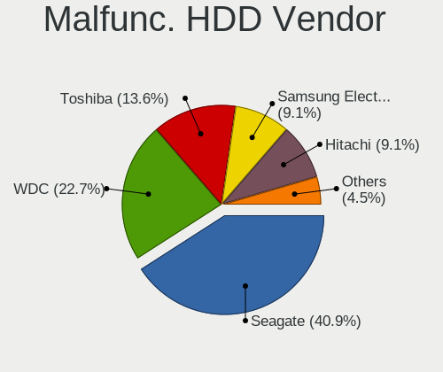
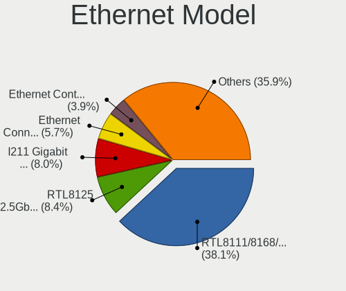

Linux in Denmark - Tested Hardware & Statistics (Desktops)
----------------------------------------------------------

A project to collect tested hardware configurations for Linux in Denmark.

Anyone can contribute to this report by the [hw-probe](https://github.com/linuxhw/hw-probe) tool:

    sudo -E hw-probe -all -upload

Please contribute! Especially if your hardware is rare.

Contents
--------

* [ Test Cases ](#test-cases)

* [ System ](#system)
  - [ OS                       ](#os)
  - [ OS Family                ](#os-family)
  - [ Kernel                   ](#kernel)
  - [ Kernel Family            ](#kernel-family)
  - [ Kernel Major Ver.        ](#kernel-major-ver)
  - [ Arch                     ](#arch)
  - [ DE                       ](#de)
  - [ Display Server           ](#display-server)
  - [ Display Manager          ](#display-manager)
  - [ OS Lang                  ](#os-lang)
  - [ Boot Mode                ](#boot-mode)
  - [ Filesystem               ](#filesystem)
  - [ Part. scheme             ](#part-scheme)
  - [ Dual Boot with Linux/BSD ](#dual-boot-with-linuxbsd)
  - [ Dual Boot (Win)          ](#dual-boot-win)

* [ Board ](#board)
  - [ Vendor                   ](#vendor)
  - [ Model                    ](#model)
  - [ Model Family             ](#model-family)
  - [ MFG Year                 ](#mfg-year)
  - [ Form Factor              ](#form-factor)
  - [ Secure Boot              ](#secure-boot)
  - [ Coreboot                 ](#coreboot)
  - [ RAM Size                 ](#ram-size)
  - [ RAM Used                 ](#ram-used)
  - [ Total Drives             ](#total-drives)
  - [ Has CD-ROM               ](#has-cd-rom)
  - [ Has Ethernet             ](#has-ethernet)
  - [ Has WiFi                 ](#has-wifi)
  - [ Has Bluetooth            ](#has-bluetooth)

* [ Location ](#location)
  - [ Country                  ](#country)
  - [ City                     ](#city)

* [ Drives ](#drives)
  - [ Drive Vendor             ](#drive-vendor)
  - [ Drive Model              ](#drive-model)
  - [ HDD Vendor               ](#hdd-vendor)
  - [ SSD Vendor               ](#ssd-vendor)
  - [ Drive Kind               ](#drive-kind)
  - [ Drive Connector          ](#drive-connector)
  - [ Drive Size               ](#drive-size)
  - [ Space Total              ](#space-total)
  - [ Space Used               ](#space-used)
  - [ Malfunc. Drives          ](#malfunc-drives)
  - [ Malfunc. Drive Vendor    ](#malfunc-drive-vendor)
  - [ Malfunc. HDD Vendor      ](#malfunc-hdd-vendor)
  - [ Malfunc. Drive Kind      ](#malfunc-drive-kind)
  - [ Failed Drives            ](#failed-drives)
  - [ Failed Drive Vendor      ](#failed-drive-vendor)
  - [ Drive Status             ](#drive-status)

* [ Storage controller ](#storage-controller)
  - [ Storage Vendor           ](#storage-vendor)
  - [ Storage Model            ](#storage-model)
  - [ Storage Kind             ](#storage-kind)

* [ Processor ](#processor)
  - [ CPU Vendor               ](#cpu-vendor)
  - [ CPU Model                ](#cpu-model)
  - [ CPU Model Family         ](#cpu-model-family)
  - [ CPU Cores                ](#cpu-cores)
  - [ CPU Sockets              ](#cpu-sockets)
  - [ CPU Threads              ](#cpu-threads)
  - [ CPU Op-Modes             ](#cpu-op-modes)
  - [ CPU Microcode            ](#cpu-microcode)
  - [ CPU Microarch            ](#cpu-microarch)

* [ Graphics ](#graphics)
  - [ GPU Vendor               ](#gpu-vendor)
  - [ GPU Model                ](#gpu-model)
  - [ GPU Combo                ](#gpu-combo)
  - [ GPU Driver               ](#gpu-driver)
  - [ GPU Memory               ](#gpu-memory)

* [ Monitor ](#monitor)
  - [ Monitor Vendor           ](#monitor-vendor)
  - [ Monitor Model            ](#monitor-model)
  - [ Monitor Resolution       ](#monitor-resolution)
  - [ Monitor Diagonal         ](#monitor-diagonal)
  - [ Monitor Width            ](#monitor-width)
  - [ Aspect Ratio             ](#aspect-ratio)
  - [ Monitor Area             ](#monitor-area)
  - [ Pixel Density            ](#pixel-density)
  - [ Multiple Monitors        ](#multiple-monitors)

* [ Network ](#network)
  - [ Net Controller Vendor    ](#net-controller-vendor)
  - [ Net Controller Model     ](#net-controller-model)
  - [ Wireless Vendor          ](#wireless-vendor)
  - [ Wireless Model           ](#wireless-model)
  - [ Ethernet Vendor          ](#ethernet-vendor)
  - [ Ethernet Model           ](#ethernet-model)
  - [ Net Controller Kind      ](#net-controller-kind)
  - [ Used Controller          ](#used-controller)
  - [ NICs                     ](#nics)
  - [ IPv6                     ](#ipv6)

* [ Bluetooth ](#bluetooth)
  - [ Bluetooth Vendor         ](#bluetooth-vendor)
  - [ Bluetooth Model          ](#bluetooth-model)

* [ Sound ](#sound)
  - [ Sound Vendor             ](#sound-vendor)
  - [ Sound Model              ](#sound-model)

* [ Memory ](#memory)
  - [ Memory Vendor            ](#memory-vendor)
  - [ Memory Model             ](#memory-model)
  - [ Memory Kind              ](#memory-kind)
  - [ Memory Form Factor       ](#memory-form-factor)
  - [ Memory Size              ](#memory-size)
  - [ Memory Speed             ](#memory-speed)

* [ Printers & scanners ](#printers--scanners)
  - [ Printer Vendor           ](#printer-vendor)
  - [ Printer Model            ](#printer-model)
  - [ Scanner Vendor           ](#scanner-vendor)
  - [ Scanner Model            ](#scanner-model)

* [ Camera ](#camera)
  - [ Camera Vendor            ](#camera-vendor)
  - [ Camera Model             ](#camera-model)

* [ Security ](#security)
  - [ Fingerprint Vendor       ](#fingerprint-vendor)
  - [ Fingerprint Model        ](#fingerprint-model)
  - [ Chipcard Vendor          ](#chipcard-vendor)
  - [ Chipcard Model           ](#chipcard-model)

* [ Unsupported ](#unsupported)
  - [ Unsupported Devices      ](#unsupported-devices)
  - [ Unsupported Device Types ](#unsupported-device-types)

Test Cases
----------

Total: 533

| Vendor        | Model                       | Probe                                                      | Date         |
|---------------|-----------------------------|------------------------------------------------------------|--------------|
| HP            | 1495                        | [fe18b89530](https://linux-hardware.org/?probe=fe18b89530) | Nov 05, 2023 |
| ASUSTek       | ROG STRIX X570-F GAMING     | [17acb71f9d](https://linux-hardware.org/?probe=17acb71f9d) | Nov 05, 2023 |
| ASUSTek       | ROG STRIX X570-E GAMING     | [bc3444ed2f](https://linux-hardware.org/?probe=bc3444ed2f) | Nov 04, 2023 |
| ASUSTek       | ROG STRIX X570-E GAMING     | [3c1e4ea8bf](https://linux-hardware.org/?probe=3c1e4ea8bf) | Nov 04, 2023 |
| ASUSTek       | PRIME X570-P                | [f54d8e7dea](https://linux-hardware.org/?probe=f54d8e7dea) | Nov 01, 2023 |
| ASUSTek       | PRIME X570-P                | [9a2f1f7750](https://linux-hardware.org/?probe=9a2f1f7750) | Nov 01, 2023 |
| Gigabyte      | B650 AORUS ELITE AX         | [949a1ab2bb](https://linux-hardware.org/?probe=949a1ab2bb) | Oct 30, 2023 |
| ASUSTek       | ROG STRIX B550-F GAMING     | [3b8a5a44c7](https://linux-hardware.org/?probe=3b8a5a44c7) | Oct 21, 2023 |
| Packard Be... | IMEDIA S2380                | [905b7ea7f0](https://linux-hardware.org/?probe=905b7ea7f0) | Oct 20, 2023 |
| Lenovo        | 1046 SBB1C50523 WIN 3556... | [f824921cbb](https://linux-hardware.org/?probe=f824921cbb) | Oct 17, 2023 |
| ASUSTek       | PRIME B365M-K               | [e5e897e96a](https://linux-hardware.org/?probe=e5e897e96a) | Oct 09, 2023 |
| MSI           | B450 TOMAHAWK MAX           | [b04266e656](https://linux-hardware.org/?probe=b04266e656) | Oct 08, 2023 |
| MSI           | MPG B760I EDGE WIFI DDR4    | [f68374e7cd](https://linux-hardware.org/?probe=f68374e7cd) | Oct 05, 2023 |
| ASRock        | B450 Gaming K4              | [8311d775a9](https://linux-hardware.org/?probe=8311d775a9) | Oct 01, 2023 |
| ASUSTek       | P9X79                       | [d663285ae0](https://linux-hardware.org/?probe=d663285ae0) | Sep 19, 2023 |
| ASRock        | B450 Gaming K4              | [ad66bafcae](https://linux-hardware.org/?probe=ad66bafcae) | Sep 17, 2023 |
| Acer          | Aspire X1470                | [d136074365](https://linux-hardware.org/?probe=d136074365) | Sep 07, 2023 |
| Acer          | Aspire X1470                | [a965ab170a](https://linux-hardware.org/?probe=a965ab170a) | Sep 07, 2023 |
| Pegatron      | 2AD5                        | [fe02bb3d71](https://linux-hardware.org/?probe=fe02bb3d71) | Sep 07, 2023 |
| ASUSTek       | TUF Gaming B660-PLUS WIF... | [0874ee1444](https://linux-hardware.org/?probe=0874ee1444) | Sep 05, 2023 |
| ASUSTek       | P5GC-MX                     | [7d13cd846d](https://linux-hardware.org/?probe=7d13cd846d) | Sep 04, 2023 |
| ASUSTek       | Maximus VIII RANGER         | [0faa734044](https://linux-hardware.org/?probe=0faa734044) | Sep 04, 2023 |
| Lenovo        | 36D5 SDK0J40700 WIN 3258... | [595afb8cf0](https://linux-hardware.org/?probe=595afb8cf0) | Aug 27, 2023 |
| ASRock        | B450 Gaming K4              | [569d6b6121](https://linux-hardware.org/?probe=569d6b6121) | Aug 27, 2023 |
| HP            | 1905                        | [f680d1c561](https://linux-hardware.org/?probe=f680d1c561) | Aug 27, 2023 |
| ASRock        | B450 Gaming K4              | [a0c3124b6a](https://linux-hardware.org/?probe=a0c3124b6a) | Aug 27, 2023 |
| Dell          | 0XCR8D A02                  | [1f5f734faa](https://linux-hardware.org/?probe=1f5f734faa) | Aug 26, 2023 |
| Lenovo        | 36D5 SDK0J40700 WIN 3258... | [7a89f9b5a7](https://linux-hardware.org/?probe=7a89f9b5a7) | Aug 26, 2023 |
| ASRock        | AB350 Pro4                  | [1aa926149a](https://linux-hardware.org/?probe=1aa926149a) | Aug 09, 2023 |
| MSI           | MPG B760I EDGE WIFI DDR4    | [150d68269d](https://linux-hardware.org/?probe=150d68269d) | Aug 08, 2023 |
| ASUSTek       | TUF Z390M-PRO GAMING        | [a5eb82b4f9](https://linux-hardware.org/?probe=a5eb82b4f9) | Aug 06, 2023 |
| ASUSTek       | ROG STRIX X570-E GAMING     | [eb92759c2a](https://linux-hardware.org/?probe=eb92759c2a) | Aug 05, 2023 |
| HP            | 844C                        | [36185008dc](https://linux-hardware.org/?probe=36185008dc) | Aug 03, 2023 |
| ASUSTek       | Pro WS X570-ACE             | [3f09ac4cae](https://linux-hardware.org/?probe=3f09ac4cae) | Jul 29, 2023 |
| Gigabyte      | B550 GAMING X V2            | [0a3cc7970c](https://linux-hardware.org/?probe=0a3cc7970c) | Jul 23, 2023 |
| MSI           | Z170A SLI PLUS              | [a3ccd7aece](https://linux-hardware.org/?probe=a3ccd7aece) | Jul 23, 2023 |
| ASRock        | X670E Steel Legend          | [8744428bf6](https://linux-hardware.org/?probe=8744428bf6) | Jul 23, 2023 |
| Lenovo        | ThinkCentre M58 7360W1J     | [1e1e565ac4](https://linux-hardware.org/?probe=1e1e565ac4) | Jul 23, 2023 |
| ASRock        | B450 Gaming K4              | [ad2c07dc8e](https://linux-hardware.org/?probe=ad2c07dc8e) | Jul 17, 2023 |
| Lenovo        | MAHOBAY                     | [ded2ed05d8](https://linux-hardware.org/?probe=ded2ed05d8) | Jul 15, 2023 |
| ASRock        | B450 Gaming K4              | [1c43d30f02](https://linux-hardware.org/?probe=1c43d30f02) | Jul 13, 2023 |
| ASUSTek       | ROG STRIX X570-E GAMING ... | [7573efcc6c](https://linux-hardware.org/?probe=7573efcc6c) | Jul 12, 2023 |
| ASUSTek       | TUF Gaming X570-PLUS        | [30d6b8bfde](https://linux-hardware.org/?probe=30d6b8bfde) | Jul 11, 2023 |
| ASUSTek       | ROG STRIX X570-E GAMING ... | [4b2cf13c22](https://linux-hardware.org/?probe=4b2cf13c22) | Jul 03, 2023 |
| ASUSTek       | TUF Gaming B550-PLUS        | [07c8a86c16](https://linux-hardware.org/?probe=07c8a86c16) | Jul 02, 2023 |
| Gigabyte      | Z170XP-SLI-CF               | [ed171ca808](https://linux-hardware.org/?probe=ed171ca808) | Jun 30, 2023 |
| ASUSTek       | ROG STRIX X570-E GAMING ... | [62dd78e250](https://linux-hardware.org/?probe=62dd78e250) | Jun 25, 2023 |
| ASUSTek       | TUF Gaming X570-PLUS        | [fd367d0725](https://linux-hardware.org/?probe=fd367d0725) | Jun 21, 2023 |
| ASRock        | B450 Gaming K4              | [edf3326608](https://linux-hardware.org/?probe=edf3326608) | Jun 21, 2023 |
| ASRock        | B450 Gaming K4              | [9ef5114c59](https://linux-hardware.org/?probe=9ef5114c59) | Jun 14, 2023 |
| ASUSTek       | ROG STRIX X570-E GAMING ... | [859f1b3a88](https://linux-hardware.org/?probe=859f1b3a88) | Jun 13, 2023 |
| Acer          | Aspire XC600 v1.0           | [754d228b9b](https://linux-hardware.org/?probe=754d228b9b) | Jun 09, 2023 |
| ASUSTek       | PRIME Z590-P                | [933aa24820](https://linux-hardware.org/?probe=933aa24820) | Jun 05, 2023 |
| ASUSTek       | ROG STRIX B650E-F GAMING... | [72fc2eea56](https://linux-hardware.org/?probe=72fc2eea56) | Jun 03, 2023 |
| ASRock        | B450 Gaming K4              | [24ccc7665f](https://linux-hardware.org/?probe=24ccc7665f) | Jun 01, 2023 |
| ASRock        | B450 Gaming K4              | [af6c8f3355](https://linux-hardware.org/?probe=af6c8f3355) | Jun 01, 2023 |
| ASUSTek       | PRIME Z390-A                | [9131b2b568](https://linux-hardware.org/?probe=9131b2b568) | May 31, 2023 |
| Gigabyte      | B660 DS3H DDR4              | [807dd44df4](https://linux-hardware.org/?probe=807dd44df4) | May 28, 2023 |
| MSI           | B150M MORTAR                | [c2b6ba6654](https://linux-hardware.org/?probe=c2b6ba6654) | May 23, 2023 |
| BESSTAR Te... | HM90                        | [bc2b7d421d](https://linux-hardware.org/?probe=bc2b7d421d) | May 22, 2023 |
| Gigabyte      | EP45T-UD3R                  | [848d0db1b2](https://linux-hardware.org/?probe=848d0db1b2) | May 19, 2023 |
| MSI           | MPG B760I EDGE WIFI DDR4    | [9419d4d25c](https://linux-hardware.org/?probe=9419d4d25c) | May 19, 2023 |
| MSI           | MPG B760I EDGE WIFI DDR4    | [f48dba1e04](https://linux-hardware.org/?probe=f48dba1e04) | May 16, 2023 |
| Fujitsu       | D3600-A1 S26361-D3600-A1    | [b65333ae05](https://linux-hardware.org/?probe=b65333ae05) | May 10, 2023 |
| MSI           | B350M PRO-VDH               | [9caca8f4cc](https://linux-hardware.org/?probe=9caca8f4cc) | May 10, 2023 |
| ASUSTek       | ROG STRIX Z590-F GAMING ... | [c8ab230418](https://linux-hardware.org/?probe=c8ab230418) | May 08, 2023 |
| Dell          | 0NW6H5 A00                  | [11e8fb1ecd](https://linux-hardware.org/?probe=11e8fb1ecd) | May 02, 2023 |
| Dell          | 0NW6H5 A00                  | [2675aa56c4](https://linux-hardware.org/?probe=2675aa56c4) | May 02, 2023 |
| ASUSTek       | ProArt X670E-CREATOR WIF... | [d85b7a2592](https://linux-hardware.org/?probe=d85b7a2592) | Apr 30, 2023 |
| ASUSTek       | Z170-P                      | [b003b5c775](https://linux-hardware.org/?probe=b003b5c775) | Apr 22, 2023 |
| HP            | 339A                        | [1be48a395d](https://linux-hardware.org/?probe=1be48a395d) | Apr 21, 2023 |
| Acer          | Aspire XC-230               | [d31e8d7c7d](https://linux-hardware.org/?probe=d31e8d7c7d) | Apr 21, 2023 |
| ASUSTek       | PRIME A320M-K               | [ebdd0f2a6a](https://linux-hardware.org/?probe=ebdd0f2a6a) | Apr 20, 2023 |
| ASUSTek       | M5A78L-M LX V2              | [1e8a2bbf1d](https://linux-hardware.org/?probe=1e8a2bbf1d) | Apr 19, 2023 |
| Lenovo        | 3106 SDK0J40709 WIN 3259... | [878d249691](https://linux-hardware.org/?probe=878d249691) | Apr 18, 2023 |
| Pegatron      | 2AD5                        | [245db62c73](https://linux-hardware.org/?probe=245db62c73) | Apr 18, 2023 |
| Pegatron      | 2AD5                        | [ad23efbf03](https://linux-hardware.org/?probe=ad23efbf03) | Apr 14, 2023 |
| HP            | 339A                        | [57e1af32cd](https://linux-hardware.org/?probe=57e1af32cd) | Apr 13, 2023 |
| ASUSTek       | PRIME A320M-K               | [1bf207dfca](https://linux-hardware.org/?probe=1bf207dfca) | Apr 13, 2023 |
| Lenovo        | NO DPK                      | [4d84f3549a](https://linux-hardware.org/?probe=4d84f3549a) | Apr 13, 2023 |
| MSI           | 970 GAMING                  | [87b536f504](https://linux-hardware.org/?probe=87b536f504) | Apr 05, 2023 |
| Fujitsu Si... | MS-7504VP-PV                | [32c138c982](https://linux-hardware.org/?probe=32c138c982) | Mar 31, 2023 |
| HP            | 3398                        | [ed9f84a231](https://linux-hardware.org/?probe=ed9f84a231) | Mar 28, 2023 |
| ASUSTek       | ROG STRIX X670E-E GAMING... | [d1e1b40549](https://linux-hardware.org/?probe=d1e1b40549) | Mar 28, 2023 |
| ASUSTek       | ROG STRIX B450-F GAMING     | [bcd49e85cb](https://linux-hardware.org/?probe=bcd49e85cb) | Mar 27, 2023 |
| Lenovo        | CRESCENTBAY SDK0J40677 W... | [479aff4877](https://linux-hardware.org/?probe=479aff4877) | Mar 26, 2023 |
| Lenovo        | CRESCENTBAY SDK0J40677 W... | [67ddc813cf](https://linux-hardware.org/?probe=67ddc813cf) | Mar 26, 2023 |
| ASUSTek       | PRIME Z690-P WIFI           | [c722a5f7b2](https://linux-hardware.org/?probe=c722a5f7b2) | Mar 26, 2023 |
| ASUSTek       | PRIME Z690-P WIFI           | [9e318501f5](https://linux-hardware.org/?probe=9e318501f5) | Mar 25, 2023 |
| Gigabyte      | X570 AORUS MASTER           | [56854770ba](https://linux-hardware.org/?probe=56854770ba) | Mar 24, 2023 |
| Gigabyte      | X570 AORUS MASTER           | [62a95efc48](https://linux-hardware.org/?probe=62a95efc48) | Mar 23, 2023 |
| ASUSTek       | PRIME X299-DELUXE II        | [b133c68356](https://linux-hardware.org/?probe=b133c68356) | Mar 20, 2023 |
| ASRock        | X570 Taichi                 | [a6fa212cf2](https://linux-hardware.org/?probe=a6fa212cf2) | Mar 19, 2023 |
| ASUSTek       | PRIME X570-P                | [8681f176da](https://linux-hardware.org/?probe=8681f176da) | Mar 17, 2023 |
| Gigabyte      | X570 AORUS MASTER           | [f3bb3c5ef1](https://linux-hardware.org/?probe=f3bb3c5ef1) | Mar 16, 2023 |
| Gigabyte      | X570 AORUS MASTER           | [fc7d8aee1f](https://linux-hardware.org/?probe=fc7d8aee1f) | Mar 16, 2023 |
| ASUSTek       | PRIME Z690M-PLUS D4         | [e41f3ed4ab](https://linux-hardware.org/?probe=e41f3ed4ab) | Mar 13, 2023 |
| Acer          | Aspire X1935                | [6846ecd490](https://linux-hardware.org/?probe=6846ecd490) | Mar 11, 2023 |
| ASRock        | X570M Pro4                  | [d3ac8dd45f](https://linux-hardware.org/?probe=d3ac8dd45f) | Mar 11, 2023 |
| ASUSTek       | PRIME X670-P WIFI           | [fd33b65218](https://linux-hardware.org/?probe=fd33b65218) | Mar 04, 2023 |
| ASUSTek       | SABERTOOTH P67              | [80720d46a2](https://linux-hardware.org/?probe=80720d46a2) | Mar 03, 2023 |
| ASUSTek       | SABERTOOTH P67              | [dd01af3afe](https://linux-hardware.org/?probe=dd01af3afe) | Mar 03, 2023 |
| HP            | 3032h                       | [007bbeffa0](https://linux-hardware.org/?probe=007bbeffa0) | Feb 26, 2023 |
| Dell          | 01TN68 A02                  | [ce7bdb1ddf](https://linux-hardware.org/?probe=ce7bdb1ddf) | Feb 21, 2023 |
| Dell          | 01TN68 A02                  | [0dd1f15a92](https://linux-hardware.org/?probe=0dd1f15a92) | Feb 21, 2023 |
| HP            | 1497                        | [47ffeac7cf](https://linux-hardware.org/?probe=47ffeac7cf) | Feb 20, 2023 |
| ASUSTek       | PRIME Z690-P D4             | [9f6834d4a9](https://linux-hardware.org/?probe=9f6834d4a9) | Feb 17, 2023 |
| ASUSTek       | PRIME Z690-P D4             | [131f8f99a2](https://linux-hardware.org/?probe=131f8f99a2) | Feb 17, 2023 |
| ASUSTek       | TUF B360-PLUS GAMING        | [01355a0714](https://linux-hardware.org/?probe=01355a0714) | Feb 17, 2023 |
| ASRock        | H81M-HDS                    | [b744809cc2](https://linux-hardware.org/?probe=b744809cc2) | Feb 14, 2023 |
| Gigabyte      | B560 HD3                    | [498c449a46](https://linux-hardware.org/?probe=498c449a46) | Feb 12, 2023 |
| Gigabyte      | B560 HD3                    | [628151aedd](https://linux-hardware.org/?probe=628151aedd) | Feb 09, 2023 |
| Lenovo        | 0x36A017AA SDK0J40700 WI... | [a527005a2a](https://linux-hardware.org/?probe=a527005a2a) | Feb 06, 2023 |
| ASUSTek       | PRIME Z690-P WIFI           | [4d007a868e](https://linux-hardware.org/?probe=4d007a868e) | Feb 04, 2023 |
| ASUSTek       | ROG STRIX X670E-E GAMING... | [29dc75351d](https://linux-hardware.org/?probe=29dc75351d) | Feb 03, 2023 |
| ASUSTek       | ROG STRIX X670E-E GAMING... | [54d35f2b7f](https://linux-hardware.org/?probe=54d35f2b7f) | Feb 03, 2023 |
| HP            | 1905                        | [9ddf75323e](https://linux-hardware.org/?probe=9ddf75323e) | Feb 03, 2023 |
| ASRock        | X300M-STX                   | [5ce1aa97c6](https://linux-hardware.org/?probe=5ce1aa97c6) | Feb 02, 2023 |
| ASRock        | B450M Pro4 R2.0             | [28f4fb8e15](https://linux-hardware.org/?probe=28f4fb8e15) | Feb 01, 2023 |
| Fujitsu       | D3222-A1 S26361-D3222-A1    | [ef9c1299e6](https://linux-hardware.org/?probe=ef9c1299e6) | Jan 30, 2023 |
| ASUSTek       | ROG STRIX X670E-E GAMING... | [78b817b650](https://linux-hardware.org/?probe=78b817b650) | Jan 24, 2023 |
| Gigabyte      | B550 GAMING X V2            | [4f24524e7d](https://linux-hardware.org/?probe=4f24524e7d) | Jan 19, 2023 |
| ASRock        | B550M-ITX/ac                | [a7ac9067b0](https://linux-hardware.org/?probe=a7ac9067b0) | Jan 18, 2023 |
| ASUSTek       | TUF Gaming B550-PLUS        | [fd99b07929](https://linux-hardware.org/?probe=fd99b07929) | Jan 18, 2023 |
| Lenovo        | 32E9 SDK0T76461 WIN 3422... | [5480333c5b](https://linux-hardware.org/?probe=5480333c5b) | Jan 16, 2023 |
| Lenovo        | 30D2 SDK0J40697 WIN 3305... | [286de51ef8](https://linux-hardware.org/?probe=286de51ef8) | Jan 13, 2023 |
| HP            | ProLiant MicroServer Gen... | [8a79dd9e27](https://linux-hardware.org/?probe=8a79dd9e27) | Jan 13, 2023 |
| ASUSTek       | ROG STRIX X370-F GAMING     | [fcda893618](https://linux-hardware.org/?probe=fcda893618) | Jan 13, 2023 |
| Lenovo        | 1059 SDK0T76538 WIN 3556... | [a2660dcbfb](https://linux-hardware.org/?probe=a2660dcbfb) | Jan 09, 2023 |
| Lenovo        | 32E9 SDK0T76461 WIN 3422... | [fcc2d12f0d](https://linux-hardware.org/?probe=fcc2d12f0d) | Jan 06, 2023 |
| ASUSTek       | PRIME B360M-C               | [7685480bf0](https://linux-hardware.org/?probe=7685480bf0) | Jan 05, 2023 |
| ASRock        | B450M-HDV R4.0              | [df9ca70fa3](https://linux-hardware.org/?probe=df9ca70fa3) | Jan 02, 2023 |
| Gigabyte      | P85-D3                      | [8d017ea6af](https://linux-hardware.org/?probe=8d017ea6af) | Jan 01, 2023 |
| Gigabyte      | P85-D3                      | [aebeaf8b5e](https://linux-hardware.org/?probe=aebeaf8b5e) | Jan 01, 2023 |
| ASUSTek       | PRIME Z390-A                | [da48bed048](https://linux-hardware.org/?probe=da48bed048) | Dec 24, 2022 |
| Fujitsu       | D3222-A1 S26361-D3222-A1    | [c4719bd0ac](https://linux-hardware.org/?probe=c4719bd0ac) | Dec 21, 2022 |
| ASUSTek       | Z170 PRO GAMING             | [e964534175](https://linux-hardware.org/?probe=e964534175) | Dec 19, 2022 |
| ASUSTek       | Z170 PRO GAMING             | [d367461182](https://linux-hardware.org/?probe=d367461182) | Dec 19, 2022 |
| ASUSTek       | PRIME Z270-A                | [ea3dbee733](https://linux-hardware.org/?probe=ea3dbee733) | Dec 13, 2022 |
| ASUSTek       | PRIME Z270-A                | [441dc6d8a0](https://linux-hardware.org/?probe=441dc6d8a0) | Dec 13, 2022 |
| Gigabyte      | B650 GAMING X AX            | [2473215632](https://linux-hardware.org/?probe=2473215632) | Dec 10, 2022 |
| ASUSTek       | M80CJ-O                     | [2375dfe19f](https://linux-hardware.org/?probe=2375dfe19f) | Dec 10, 2022 |
| ASUSTek       | PRIME Z690M-PLUS D4         | [7abcfecd34](https://linux-hardware.org/?probe=7abcfecd34) | Dec 07, 2022 |
| Lenovo        | SHARKBAY NOK                | [ef7a013f9b](https://linux-hardware.org/?probe=ef7a013f9b) | Dec 04, 2022 |
| ASUSTek       | ROG STRIX Z690-G GAMING ... | [6b2389329d](https://linux-hardware.org/?probe=6b2389329d) | Dec 04, 2022 |
| ASUSTek       | ROG STRIX X570-E GAMING ... | [8de52c0ea7](https://linux-hardware.org/?probe=8de52c0ea7) | Dec 04, 2022 |
| MSI           | B450I GAMING PLUS AC        | [366f9ae2aa](https://linux-hardware.org/?probe=366f9ae2aa) | Dec 03, 2022 |
| ASUSTek       | ROG STRIX X570-E GAMING ... | [c469225241](https://linux-hardware.org/?probe=c469225241) | Dec 01, 2022 |
| ASUSTek       | TUF Gaming X670E-PLUS WI... | [9282404406](https://linux-hardware.org/?probe=9282404406) | Nov 30, 2022 |
| ASUSTek       | PRIME TRX40-PRO             | [ecafbb7acb](https://linux-hardware.org/?probe=ecafbb7acb) | Nov 20, 2022 |
| ASUSTek       | PRIME B450-PLUS             | [9b0f3f926d](https://linux-hardware.org/?probe=9b0f3f926d) | Nov 20, 2022 |
| MSI           | B450 TOMAHAWK MAX           | [1cc37489d5](https://linux-hardware.org/?probe=1cc37489d5) | Nov 19, 2022 |
| ASUSTek       | ROG Maximus XI HERO         | [ea05374336](https://linux-hardware.org/?probe=ea05374336) | Nov 19, 2022 |
| ASUSTek       | M5A78L-M LX V2              | [de3eac26e1](https://linux-hardware.org/?probe=de3eac26e1) | Nov 18, 2022 |
| Lenovo        | 3102 SDK0J40697 WIN 3305... | [07b8a83017](https://linux-hardware.org/?probe=07b8a83017) | Nov 17, 2022 |
| ASUSTek       | TUF Gaming X670E-PLUS WI... | [75ffcfaf88](https://linux-hardware.org/?probe=75ffcfaf88) | Nov 11, 2022 |
| ASUSTek       | ROG Maximus XI HERO         | [9a7d0e6d37](https://linux-hardware.org/?probe=9a7d0e6d37) | Nov 03, 2022 |
| ASUSTek       | ROG Maximus XI HERO         | [81a04d40a3](https://linux-hardware.org/?probe=81a04d40a3) | Nov 03, 2022 |
| Inventec      | DQ Class A02                | [f64d3223c5](https://linux-hardware.org/?probe=f64d3223c5) | Oct 24, 2022 |
| Inventec      | DQ Class A02                | [c4fddde4b6](https://linux-hardware.org/?probe=c4fddde4b6) | Oct 24, 2022 |
| MSI           | MAG Z490 TOMAHAWK           | [7221bbf8e7](https://linux-hardware.org/?probe=7221bbf8e7) | Oct 01, 2022 |
| ASUSTek       | ROG STRIX B550-F GAMING     | [2c52de3e56](https://linux-hardware.org/?probe=2c52de3e56) | Sep 27, 2022 |
| Gigabyte      | 990FXA-UD5                  | [7c8d5609e0](https://linux-hardware.org/?probe=7c8d5609e0) | Sep 22, 2022 |
| Gigabyte      | EX58-UD4P                   | [394aad4be9](https://linux-hardware.org/?probe=394aad4be9) | Sep 20, 2022 |
| MSI           | MAG B550 TOMAHAWK           | [e55484acd4](https://linux-hardware.org/?probe=e55484acd4) | Sep 17, 2022 |
| Lenovo        | SDK0J40700 WIN              | [b8f3a58a03](https://linux-hardware.org/?probe=b8f3a58a03) | Sep 11, 2022 |
| MSI           | MPG Z390M GAMING EDGE AC    | [20ead11e02](https://linux-hardware.org/?probe=20ead11e02) | Sep 10, 2022 |
| MSI           | X570-A PRO                  | [4a7d6a9276](https://linux-hardware.org/?probe=4a7d6a9276) | Sep 01, 2022 |
| Gigabyte      | 990FXA-UD5                  | [e5364d8761](https://linux-hardware.org/?probe=e5364d8761) | Sep 01, 2022 |
| Unknown       | TB-4000                     | [8f7f2e486a](https://linux-hardware.org/?probe=8f7f2e486a) | Aug 30, 2022 |
| ASUSTek       | SABERTOOTH X58              | [efb40be4e1](https://linux-hardware.org/?probe=efb40be4e1) | Aug 28, 2022 |
| Gigabyte      | P85-D3                      | [06b934d14f](https://linux-hardware.org/?probe=06b934d14f) | Aug 26, 2022 |
| Unknown       | TB-4000                     | [a3cfbd4659](https://linux-hardware.org/?probe=a3cfbd4659) | Aug 25, 2022 |
| Gigabyte      | B460M DS3H V2               | [e5e74eea07](https://linux-hardware.org/?probe=e5e74eea07) | Aug 19, 2022 |
| MSI           | X470 GAMING PRO             | [52b08fd4ba](https://linux-hardware.org/?probe=52b08fd4ba) | Aug 16, 2022 |
| Gigabyte      | M4HM87P-00                  | [5bb7e42eae](https://linux-hardware.org/?probe=5bb7e42eae) | Aug 16, 2022 |
| Unknown       | TB-4000                     | [906699e408](https://linux-hardware.org/?probe=906699e408) | Aug 14, 2022 |
| Gigabyte      | B550 AORUS MASTER           | [0009de2dbb](https://linux-hardware.org/?probe=0009de2dbb) | Aug 11, 2022 |
| Lenovo        | ThinkCentre M57 6087YD2     | [9ad2c07771](https://linux-hardware.org/?probe=9ad2c07771) | Aug 06, 2022 |
| Lenovo        | SDK0J40700 WIN              | [299ac7a8ff](https://linux-hardware.org/?probe=299ac7a8ff) | Aug 03, 2022 |
| Lenovo        | SDK0J40700 WIN              | [f50872e350](https://linux-hardware.org/?probe=f50872e350) | Jul 29, 2022 |
| Packard Be... | H57M01                      | [55e1536ab6](https://linux-hardware.org/?probe=55e1536ab6) | Jul 29, 2022 |
| Packard Be... | H57M01                      | [4789405230](https://linux-hardware.org/?probe=4789405230) | Jul 29, 2022 |
| Lenovo        | SDK0J40700 WIN              | [6d95a05ee7](https://linux-hardware.org/?probe=6d95a05ee7) | Jul 28, 2022 |
| Lenovo        | SDK0J40700 WIN              | [96d6480781](https://linux-hardware.org/?probe=96d6480781) | Jul 25, 2022 |
| Gigabyte      | MJPLNAB-00                  | [d414e51a0c](https://linux-hardware.org/?probe=d414e51a0c) | Jul 23, 2022 |
| Gigabyte      | MJPLNAB-00                  | [9dcb499f3e](https://linux-hardware.org/?probe=9dcb499f3e) | Jul 23, 2022 |
| MSI           | Z170A KRAIT GAMING 3X       | [1fef57c873](https://linux-hardware.org/?probe=1fef57c873) | Jul 22, 2022 |
| MSI           | X470 GAMING PRO             | [716dd72eeb](https://linux-hardware.org/?probe=716dd72eeb) | Jul 13, 2022 |
| ASUSTek       | ROG Maximus Z690 HERO       | [a74834b383](https://linux-hardware.org/?probe=a74834b383) | Jul 04, 2022 |
| HP            | 805D                        | [3610332b9c](https://linux-hardware.org/?probe=3610332b9c) | Jul 01, 2022 |
| ASUSTek       | M5A78L-M LX V2              | [c12aa3088a](https://linux-hardware.org/?probe=c12aa3088a) | Jun 30, 2022 |
| Lenovo        | 3102 SDK0J40697 WIN 3305... | [b0c272ff93](https://linux-hardware.org/?probe=b0c272ff93) | Jun 26, 2022 |
| Lenovo        | SDK0J40700 WIN              | [82be38e941](https://linux-hardware.org/?probe=82be38e941) | Jun 17, 2022 |
| ASUSTek       | H110I-PLUS                  | [36389b33b6](https://linux-hardware.org/?probe=36389b33b6) | Jun 12, 2022 |
| Lenovo        | 3102 SDK0J40697 WIN 3305... | [d3fdbc7413](https://linux-hardware.org/?probe=d3fdbc7413) | Jun 12, 2022 |
| Lenovo        | SKYBAY SDK0J40697 WIN 33... | [9c7b2faf2c](https://linux-hardware.org/?probe=9c7b2faf2c) | Jun 10, 2022 |
| Lenovo        | SHARKBAY SDK0E50510 WIN     | [a307c95089](https://linux-hardware.org/?probe=a307c95089) | Jun 08, 2022 |
| Unknown       | TB-4000                     | [c268e7111b](https://linux-hardware.org/?probe=c268e7111b) | Jun 07, 2022 |
| BESSTAR Te... | HM90                        | [5272429aa9](https://linux-hardware.org/?probe=5272429aa9) | Jun 04, 2022 |
| Gigabyte      | 970A-DS3P                   | [8e0addf4d3](https://linux-hardware.org/?probe=8e0addf4d3) | May 24, 2022 |
| MSI           | X470 GAMING PRO             | [8409fe7eab](https://linux-hardware.org/?probe=8409fe7eab) | May 24, 2022 |
| MSI           | 970A-G43                    | [92dd93dd78](https://linux-hardware.org/?probe=92dd93dd78) | May 24, 2022 |
| ASUSTek       | ROG ZENITH II EXTREME AL... | [bc9270aeff](https://linux-hardware.org/?probe=bc9270aeff) | May 13, 2022 |
| ASUSTek       | ROG ZENITH II EXTREME AL... | [f0e5f896a4](https://linux-hardware.org/?probe=f0e5f896a4) | May 11, 2022 |
| ASUSTek       | ROG STRIX B450-F GAMING ... | [21486c437b](https://linux-hardware.org/?probe=21486c437b) | May 08, 2022 |
| Gigabyte      | G41M-Combo                  | [9940073216](https://linux-hardware.org/?probe=9940073216) | May 05, 2022 |
| Unknown       | TB-4000                     | [99911022e9](https://linux-hardware.org/?probe=99911022e9) | Apr 26, 2022 |
| MSI           | MS-1T11                     | [9c16a631ef](https://linux-hardware.org/?probe=9c16a631ef) | Apr 23, 2022 |
| MSI           | MS-1T11                     | [e263cd80f5](https://linux-hardware.org/?probe=e263cd80f5) | Apr 23, 2022 |
| Lenovo        | SHARKBAY SDK0J40705 WIN ... | [91aa85fff9](https://linux-hardware.org/?probe=91aa85fff9) | Apr 21, 2022 |
| ASUSTek       | TUF Gaming X570-PRO         | [27825828c9](https://linux-hardware.org/?probe=27825828c9) | Apr 05, 2022 |
| ASUSTek       | M5A78L-M/USB3               | [ddc3550f6b](https://linux-hardware.org/?probe=ddc3550f6b) | Apr 04, 2022 |
| ASRock        | X99 Extreme4                | [e29b4c30f1](https://linux-hardware.org/?probe=e29b4c30f1) | Apr 04, 2022 |
| ASUSTek       | ROG STRIX B450-E GAMING     | [a5c5028fde](https://linux-hardware.org/?probe=a5c5028fde) | Apr 03, 2022 |
| ASUSTek       | ROG STRIX B450-E GAMING     | [d978436f5f](https://linux-hardware.org/?probe=d978436f5f) | Apr 03, 2022 |
| ASUSTek       | PRIME Z370-P                | [f3cd1a314c](https://linux-hardware.org/?probe=f3cd1a314c) | Mar 25, 2022 |
| ASUSTek       | PRIME Z690-P WIFI D4        | [4ce05dd1e2](https://linux-hardware.org/?probe=4ce05dd1e2) | Mar 24, 2022 |
| MSI           | MPG X570 GAMING PLUS        | [f3b52d9201](https://linux-hardware.org/?probe=f3b52d9201) | Mar 21, 2022 |
| MSI           | MPG X570 GAMING PLUS        | [5c40bf9192](https://linux-hardware.org/?probe=5c40bf9192) | Mar 21, 2022 |
| ASUSTek       | PRIME B250M-A               | [8be4c394f1](https://linux-hardware.org/?probe=8be4c394f1) | Mar 18, 2022 |
| Gigabyte      | MFLP7IP-00                  | [304c5939e7](https://linux-hardware.org/?probe=304c5939e7) | Mar 18, 2022 |
| Shuttle       | X50V2PLUS V1.00             | [0bd650dfff](https://linux-hardware.org/?probe=0bd650dfff) | Mar 16, 2022 |
| ASUSTek       | PRIME A320M-K               | [500a30847d](https://linux-hardware.org/?probe=500a30847d) | Feb 23, 2022 |
| MSI           | MPG B550 GAMING PLUS        | [04e8e7704e](https://linux-hardware.org/?probe=04e8e7704e) | Feb 23, 2022 |
| MSI           | MPG B550 GAMING PLUS        | [c1929d8540](https://linux-hardware.org/?probe=c1929d8540) | Feb 21, 2022 |
| MSI           | MPG B550 GAMING PLUS        | [bdc86d995a](https://linux-hardware.org/?probe=bdc86d995a) | Feb 21, 2022 |
| Dell          | 0KC9NP A01                  | [f9a0fa24f8](https://linux-hardware.org/?probe=f9a0fa24f8) | Feb 18, 2022 |
| ASRock        | FM2A55M-DGS                 | [efe38992bd](https://linux-hardware.org/?probe=efe38992bd) | Feb 15, 2022 |
| Dell          | 0GTK4K A02                  | [466029e620](https://linux-hardware.org/?probe=466029e620) | Feb 13, 2022 |
| ASUSTek       | ROG STRIX B550-F GAMING     | [e63f72d407](https://linux-hardware.org/?probe=e63f72d407) | Feb 07, 2022 |
| Medion        | MS-7800                     | [9693a4d35c](https://linux-hardware.org/?probe=9693a4d35c) | Feb 05, 2022 |
| ASUSTek       | ROG STRIX B550-F GAMING     | [40ed6ce0c5](https://linux-hardware.org/?probe=40ed6ce0c5) | Feb 04, 2022 |
| Unknown       | TB-4000                     | [225e399fc1](https://linux-hardware.org/?probe=225e399fc1) | Feb 03, 2022 |
| ASUSTek       | M5A78L-M/USB3               | [b8f4a15736](https://linux-hardware.org/?probe=b8f4a15736) | Jan 25, 2022 |
| ASUSTek       | P8H67-M                     | [a69dd56657](https://linux-hardware.org/?probe=a69dd56657) | Jan 21, 2022 |
| Gigabyte      | B460M AORUS PRO             | [1e301a4129](https://linux-hardware.org/?probe=1e301a4129) | Jan 19, 2022 |
| Acer          | Predator G6-710             | [29bdcc72c9](https://linux-hardware.org/?probe=29bdcc72c9) | Jan 18, 2022 |
| ASUSTek       | P8H67-M                     | [1568252a07](https://linux-hardware.org/?probe=1568252a07) | Jan 17, 2022 |
| Gigabyte      | Z68X-UD3-B3                 | [46932917d4](https://linux-hardware.org/?probe=46932917d4) | Jan 08, 2022 |
| Pegatron      | 2AD5                        | [efc0a3875a](https://linux-hardware.org/?probe=efc0a3875a) | Dec 29, 2021 |
| MSI           | A68HM GRENADE               | [18ca0bdd91](https://linux-hardware.org/?probe=18ca0bdd91) | Dec 27, 2021 |
| MSI           | X470 GAMING PRO             | [d683987eea](https://linux-hardware.org/?probe=d683987eea) | Dec 23, 2021 |
| ASUSTek       | TUF Gaming B560M-PLUS       | [32e8c7ccb2](https://linux-hardware.org/?probe=32e8c7ccb2) | Dec 22, 2021 |
| ASUSTek       | SABERTOOTH Z77              | [1e14543dfd](https://linux-hardware.org/?probe=1e14543dfd) | Dec 18, 2021 |
| HP            | 3031h                       | [8a8888c824](https://linux-hardware.org/?probe=8a8888c824) | Dec 17, 2021 |
| ABIT          | I-G31                       | [048b7bcf6a](https://linux-hardware.org/?probe=048b7bcf6a) | Dec 13, 2021 |
| Dell          | 0YXT71 A01                  | [fbe4f7fdb9](https://linux-hardware.org/?probe=fbe4f7fdb9) | Dec 12, 2021 |
| ASUSTek       | Z170-P                      | [6e857bc210](https://linux-hardware.org/?probe=6e857bc210) | Dec 09, 2021 |
| Gigabyte      | Z370 AORUS Gaming 5-CF      | [ac173fd5ba](https://linux-hardware.org/?probe=ac173fd5ba) | Dec 09, 2021 |
| ASUSTek       | PRIME Z390-A                | [e884cd44db](https://linux-hardware.org/?probe=e884cd44db) | Dec 08, 2021 |
| HP            | 3031h                       | [68cf960e7f](https://linux-hardware.org/?probe=68cf960e7f) | Dec 02, 2021 |
| HP            | 3031h                       | [1c49cd6404](https://linux-hardware.org/?probe=1c49cd6404) | Dec 02, 2021 |
| HP            | 8299                        | [6eb5c6d54a](https://linux-hardware.org/?probe=6eb5c6d54a) | Nov 30, 2021 |
| HP            | 8299                        | [7bd1df0e4d](https://linux-hardware.org/?probe=7bd1df0e4d) | Nov 29, 2021 |
| ASUSTek       | ROG STRIX X570-E GAMING     | [6071fde7dd](https://linux-hardware.org/?probe=6071fde7dd) | Nov 28, 2021 |
| Acer          | Aspire X3995                | [cde003006d](https://linux-hardware.org/?probe=cde003006d) | Nov 22, 2021 |
| Acer          | Aspire X3995                | [2e97d6ef1c](https://linux-hardware.org/?probe=2e97d6ef1c) | Nov 22, 2021 |
| ASUSTek       | ROG Maximus XI HERO         | [ea4842466c](https://linux-hardware.org/?probe=ea4842466c) | Nov 20, 2021 |
| ASUSTek       | ROG Maximus XI HERO         | [faf9e68f7a](https://linux-hardware.org/?probe=faf9e68f7a) | Nov 20, 2021 |
| ASUSTek       | PRIME Z390-A                | [2b2ea53377](https://linux-hardware.org/?probe=2b2ea53377) | Nov 20, 2021 |
| ASUSTek       | PRIME Z390-A                | [b4512f4b54](https://linux-hardware.org/?probe=b4512f4b54) | Nov 18, 2021 |
| ASRock        | Z170 Gaming K4              | [53281d6c95](https://linux-hardware.org/?probe=53281d6c95) | Nov 17, 2021 |
| Dell          | 0YXT71 A01                  | [6f599a0889](https://linux-hardware.org/?probe=6f599a0889) | Nov 03, 2021 |
| T-bao         | MINI PC V1.0                | [72ce248d0c](https://linux-hardware.org/?probe=72ce248d0c) | Oct 28, 2021 |
| ASUSTek       | TUF Gaming Z590-PLUS WIF... | [be8c7e44de](https://linux-hardware.org/?probe=be8c7e44de) | Oct 23, 2021 |
| MSI           | Z77A-G45                    | [7a31ca9e22](https://linux-hardware.org/?probe=7a31ca9e22) | Oct 23, 2021 |
| HP            | 1589                        | [49c747efad](https://linux-hardware.org/?probe=49c747efad) | Oct 21, 2021 |
| Gigabyte      | Z68X-UD3-B3                 | [e1ddc26c5e](https://linux-hardware.org/?probe=e1ddc26c5e) | Oct 20, 2021 |
| ASUSTek       | PRIME Z390-A                | [c0c2de7d52](https://linux-hardware.org/?probe=c0c2de7d52) | Oct 17, 2021 |
| ASUSTek       | ROG STRIX X470-I GAMING     | [56f27fef6e](https://linux-hardware.org/?probe=56f27fef6e) | Oct 16, 2021 |
| Gigabyte      | X570 AORUS ULTRA            | [cef9098008](https://linux-hardware.org/?probe=cef9098008) | Oct 14, 2021 |
| Gigabyte      | X570 AORUS ULTRA            | [718bd26737](https://linux-hardware.org/?probe=718bd26737) | Oct 14, 2021 |
| ASUSTek       | ROG Maximus X HERO          | [70d8ac443f](https://linux-hardware.org/?probe=70d8ac443f) | Oct 11, 2021 |
| MSI           | B450 GAMING PLUS MAX        | [a36474b9ff](https://linux-hardware.org/?probe=a36474b9ff) | Oct 04, 2021 |
| Gigabyte      | B560M AORUS ELITE           | [2c73a09463](https://linux-hardware.org/?probe=2c73a09463) | Oct 03, 2021 |
| MSI           | B460M PRO-VDH WIFI          | [05711b548f](https://linux-hardware.org/?probe=05711b548f) | Oct 03, 2021 |
| ASRock        | H470M-ITX/ac                | [ad42fa5d08](https://linux-hardware.org/?probe=ad42fa5d08) | Oct 01, 2021 |
| ASUSTek       | PRIME H310M-K R2.0          | [201176552b](https://linux-hardware.org/?probe=201176552b) | Sep 21, 2021 |
| Medion        | B360H4-EM V1.0              | [1985156471](https://linux-hardware.org/?probe=1985156471) | Sep 19, 2021 |
| Dell          | 0XCR8D A02                  | [9cb5ea4f4a](https://linux-hardware.org/?probe=9cb5ea4f4a) | Sep 11, 2021 |
| ASRock        | P55M Pro                    | [b6408718ee](https://linux-hardware.org/?probe=b6408718ee) | Sep 02, 2021 |
| ASRock        | 980DE3/U3S3                 | [e8aadc0af0](https://linux-hardware.org/?probe=e8aadc0af0) | Aug 24, 2021 |
| Medion        | MS-7616                     | [cbd20c24d8](https://linux-hardware.org/?probe=cbd20c24d8) | Aug 20, 2021 |
| HP            | 212B                        | [ee483c7463](https://linux-hardware.org/?probe=ee483c7463) | Aug 08, 2021 |
| ASUSTek       | P8B75-M                     | [4d29ffa0f7](https://linux-hardware.org/?probe=4d29ffa0f7) | Aug 03, 2021 |
| Lenovo        | 314F SDK0T08861 WIN 3305... | [4135f29492](https://linux-hardware.org/?probe=4135f29492) | Aug 02, 2021 |
| Intel         | X79 (INTEL Xeon E5/Corei... | [59cd9e3edd](https://linux-hardware.org/?probe=59cd9e3edd) | Aug 01, 2021 |
| Pegatron      | 2AB6                        | [79dffb5346](https://linux-hardware.org/?probe=79dffb5346) | Jul 31, 2021 |
| Gigabyte      | P85-D3                      | [51f83ebd4a](https://linux-hardware.org/?probe=51f83ebd4a) | Jul 30, 2021 |
| Gigabyte      | H61M-USB3-B3                | [3c2020fbb6](https://linux-hardware.org/?probe=3c2020fbb6) | Jul 30, 2021 |
| Gigabyte      | H61M-USB3-B3                | [b3bbc6d937](https://linux-hardware.org/?probe=b3bbc6d937) | Jul 30, 2021 |
| Lenovo        | ThinkCentre Edge71 1577G... | [cf7f13e31c](https://linux-hardware.org/?probe=cf7f13e31c) | Jul 29, 2021 |
| ASRock        | H310CM-DVS                  | [5ae2994458](https://linux-hardware.org/?probe=5ae2994458) | Jul 28, 2021 |
| Medion        | Z370H4-EM                   | [f19570a630](https://linux-hardware.org/?probe=f19570a630) | Jul 24, 2021 |
| Shuttle       | FH67                        | [611a7c28dc](https://linux-hardware.org/?probe=611a7c28dc) | Jul 22, 2021 |
| Shuttle       | FH67                        | [3d3fb6c381](https://linux-hardware.org/?probe=3d3fb6c381) | Jul 22, 2021 |
| ASRock        | 980DE3/U3S3                 | [9ca97016e0](https://linux-hardware.org/?probe=9ca97016e0) | Jul 21, 2021 |
| Gigabyte      | A320M-S2H V2-CF             | [5fcfefa75a](https://linux-hardware.org/?probe=5fcfefa75a) | Jul 19, 2021 |
| Gigabyte      | Z68X-UD3-B3                 | [0c0d9cc784](https://linux-hardware.org/?probe=0c0d9cc784) | Jul 15, 2021 |
| ASUSTek       | PRIME Z370-A                | [208a9ee715](https://linux-hardware.org/?probe=208a9ee715) | Jun 23, 2021 |
| ASUSTek       | PRIME Z370-A                | [86fce52939](https://linux-hardware.org/?probe=86fce52939) | Jun 23, 2021 |
| Lenovo        | 3714 SDK0J40700 WIN 3258... | [ca43a33e1d](https://linux-hardware.org/?probe=ca43a33e1d) | Jun 18, 2021 |
| Lenovo        | Bantry CRB SDK0J40697 WI... | [4a0a83693b](https://linux-hardware.org/?probe=4a0a83693b) | Jun 14, 2021 |
| ASRock        | P55M Pro                    | [cac3198045](https://linux-hardware.org/?probe=cac3198045) | Jun 14, 2021 |
| HP            | 212B                        | [b72ab2aea5](https://linux-hardware.org/?probe=b72ab2aea5) | Jun 09, 2021 |
| ASRock        | P55M Pro                    | [b994c1917a](https://linux-hardware.org/?probe=b994c1917a) | Jun 03, 2021 |
| ASRock        | B450 Gaming-ITX/ac          | [6056eac50c](https://linux-hardware.org/?probe=6056eac50c) | May 31, 2021 |
| ASRock        | B450 Gaming-ITX/ac          | [bd9fb4818b](https://linux-hardware.org/?probe=bd9fb4818b) | May 31, 2021 |
| ASRock        | B450 Gaming-ITX/ac          | [12fa3ffea5](https://linux-hardware.org/?probe=12fa3ffea5) | May 31, 2021 |
| MSI           | Z87 MPOWER                  | [848def4822](https://linux-hardware.org/?probe=848def4822) | May 29, 2021 |
| ASUSTek       | PRIME B450M-A               | [e0217f85a6](https://linux-hardware.org/?probe=e0217f85a6) | May 28, 2021 |
| ASUSTek       | ROG Maximus X HERO          | [f9358acedf](https://linux-hardware.org/?probe=f9358acedf) | May 27, 2021 |
| ASUSTek       | PRIME B450M-A               | [787c1b3a8c](https://linux-hardware.org/?probe=787c1b3a8c) | May 26, 2021 |
| ASUSTek       | B85M-G                      | [92f19ca1e6](https://linux-hardware.org/?probe=92f19ca1e6) | May 25, 2021 |
| ASUSTek       | NARRA2                      | [0b2cf24d70](https://linux-hardware.org/?probe=0b2cf24d70) | May 25, 2021 |
| Medion        | MS-7646                     | [799be90f9c](https://linux-hardware.org/?probe=799be90f9c) | May 11, 2021 |
| ASRock        | J4105-ITX                   | [2cb8135a58](https://linux-hardware.org/?probe=2cb8135a58) | May 08, 2021 |
| ASUSTek       | PRIME B450M-K               | [a8271c73ee](https://linux-hardware.org/?probe=a8271c73ee) | May 02, 2021 |
| Gigabyte      | GA-78LMT-USB3 R2 sex        | [9e0202e76a](https://linux-hardware.org/?probe=9e0202e76a) | Apr 27, 2021 |
| Lenovo        | SHARKBAY 31900058 STD       | [31cb6e83ed](https://linux-hardware.org/?probe=31cb6e83ed) | Apr 19, 2021 |
| Acer          | Veriton M275                | [246a662951](https://linux-hardware.org/?probe=246a662951) | Apr 17, 2021 |
| Gigabyte      | B75M-D3H                    | [cd772af567](https://linux-hardware.org/?probe=cd772af567) | Apr 14, 2021 |
| Gigabyte      | EP35-DS4                    | [e37cf6fc8d](https://linux-hardware.org/?probe=e37cf6fc8d) | Apr 12, 2021 |
| MSI           | Z87 MPOWER                  | [ff6aa3811c](https://linux-hardware.org/?probe=ff6aa3811c) | Apr 08, 2021 |
| ASUSTek       | TUF Gaming X570-PLUS        | [09cf1ed052](https://linux-hardware.org/?probe=09cf1ed052) | Apr 08, 2021 |
| ASRock        | Z270 Pro4                   | [b90dd1b4d2](https://linux-hardware.org/?probe=b90dd1b4d2) | Apr 02, 2021 |
| Medion        | MS-7797                     | [947bc894eb](https://linux-hardware.org/?probe=947bc894eb) | Apr 01, 2021 |
| ASUSTek       | PRIME Z370-A                | [757d1d0707](https://linux-hardware.org/?probe=757d1d0707) | Mar 31, 2021 |
| ASUSTek       | PRIME Z370-A                | [eb1782ad49](https://linux-hardware.org/?probe=eb1782ad49) | Mar 31, 2021 |
| Dell          | 0CU409                      | [53a8c28aed](https://linux-hardware.org/?probe=53a8c28aed) | Mar 24, 2021 |
| Acer          | Aspire XC-605               | [f8ad366bd9](https://linux-hardware.org/?probe=f8ad366bd9) | Mar 19, 2021 |
| ASUSTek       | PRIME X470-PRO              | [54288c23c9](https://linux-hardware.org/?probe=54288c23c9) | Mar 18, 2021 |
| ECS           | Nettle3                     | [f7ec16d7e7](https://linux-hardware.org/?probe=f7ec16d7e7) | Mar 16, 2021 |
| HP            | 3032h                       | [79b0bf2416](https://linux-hardware.org/?probe=79b0bf2416) | Mar 15, 2021 |
| Gigabyte      | A320M-S2H V2-CF             | [9ebf280981](https://linux-hardware.org/?probe=9ebf280981) | Mar 05, 2021 |
| Gigabyte      | A320M-S2H-CF                | [efa91095ab](https://linux-hardware.org/?probe=efa91095ab) | Mar 05, 2021 |
| ASUSTek       | M4N75TD                     | [9daf1b6529](https://linux-hardware.org/?probe=9daf1b6529) | Feb 28, 2021 |
| ASUSTek       | P5P43TD                     | [3a2604a18a](https://linux-hardware.org/?probe=3a2604a18a) | Feb 27, 2021 |
| HP            | 1998                        | [43bd925171](https://linux-hardware.org/?probe=43bd925171) | Feb 27, 2021 |
| ASUSTek       | PRIME Z270-A                | [66ce820cff](https://linux-hardware.org/?probe=66ce820cff) | Feb 25, 2021 |
| ASRock        | QC5000-ITX/WiFi             | [d321b1eb90](https://linux-hardware.org/?probe=d321b1eb90) | Feb 21, 2021 |
| ASRock        | Z270 Pro4                   | [7114de29ed](https://linux-hardware.org/?probe=7114de29ed) | Feb 20, 2021 |
| Medion        | MS-7797                     | [3c4d9332e4](https://linux-hardware.org/?probe=3c4d9332e4) | Feb 19, 2021 |
| MSI           | B150M PRO-VH                | [255e61b850](https://linux-hardware.org/?probe=255e61b850) | Feb 13, 2021 |
| Medion        | MS-7797                     | [7e6811c842](https://linux-hardware.org/?probe=7e6811c842) | Feb 10, 2021 |
| Medion        | MS-7797                     | [394c3c87f4](https://linux-hardware.org/?probe=394c3c87f4) | Feb 10, 2021 |
| ASRock        | B550M-ITX/ac                | [909d040ae4](https://linux-hardware.org/?probe=909d040ae4) | Feb 07, 2021 |
| Medion        | MS-7708                     | [53ba901c28](https://linux-hardware.org/?probe=53ba901c28) | Feb 01, 2021 |
| Medion        | MS-7708                     | [8ef1638192](https://linux-hardware.org/?probe=8ef1638192) | Feb 01, 2021 |
| Lenovo        | ThinkServer TS140           | [8f911a91ca](https://linux-hardware.org/?probe=8f911a91ca) | Jan 29, 2021 |
| ASUSTek       | ROG STRIX B550-F GAMING     | [34257c05a5](https://linux-hardware.org/?probe=34257c05a5) | Jan 27, 2021 |
| Gigabyte      | GA-780T-D3L                 | [2f2ede94cb](https://linux-hardware.org/?probe=2f2ede94cb) | Jan 17, 2021 |
| ASUSTek       | CROSSHAIR VI HERO           | [fc3f785613](https://linux-hardware.org/?probe=fc3f785613) | Jan 15, 2021 |
| NEXCOM        | NDIS B322                   | [c2789ca746](https://linux-hardware.org/?probe=c2789ca746) | Jan 06, 2021 |
| Gigabyte      | B550M DS3H                  | [16d30d3356](https://linux-hardware.org/?probe=16d30d3356) | Dec 30, 2020 |
| Gigabyte      | B550M DS3H                  | [944fc761f4](https://linux-hardware.org/?probe=944fc761f4) | Dec 30, 2020 |
| ASUSTek       | Z97-K                       | [3eacdc5965](https://linux-hardware.org/?probe=3eacdc5965) | Dec 28, 2020 |
| MSI           | B150M PRO-VH                | [f225de5ed7](https://linux-hardware.org/?probe=f225de5ed7) | Dec 25, 2020 |
| MSI           | B150M PRO-VH                | [6971a673ec](https://linux-hardware.org/?probe=6971a673ec) | Dec 25, 2020 |
| Gigabyte      | Z390 I AORUS PRO WIFI-CF    | [13d6a7172d](https://linux-hardware.org/?probe=13d6a7172d) | Dec 15, 2020 |
| Gigabyte      | J3455N-D3H                  | [a9a1ba9727](https://linux-hardware.org/?probe=a9a1ba9727) | Dec 13, 2020 |
| ASUSTek       | ROG STRIX X470-I GAMING     | [968983910f](https://linux-hardware.org/?probe=968983910f) | Dec 08, 2020 |
| Gigabyte      | B550 AORUS PRO AC           | [b3c78e0e70](https://linux-hardware.org/?probe=b3c78e0e70) | Dec 07, 2020 |
| Gigabyte      | B550 AORUS PRO AC           | [1a5eee726d](https://linux-hardware.org/?probe=1a5eee726d) | Dec 05, 2020 |
| MSI           | MPG Z490 GAMING PLUS        | [95b94bfe02](https://linux-hardware.org/?probe=95b94bfe02) | Dec 04, 2020 |
| MSI           | X570-A PRO                  | [0c57860179](https://linux-hardware.org/?probe=0c57860179) | Dec 02, 2020 |
| Medion        | B360H4-EM V1.0              | [718acb9fc0](https://linux-hardware.org/?probe=718acb9fc0) | Dec 02, 2020 |
| MSI           | B150M PRO-VH                | [ed280391f2](https://linux-hardware.org/?probe=ed280391f2) | Nov 30, 2020 |
| ASUSTek       | Z170 PRO GAMING             | [f49b6c5048](https://linux-hardware.org/?probe=f49b6c5048) | Nov 27, 2020 |
| MSI           | X470 GAMING PLUS MAX        | [ce4048d43f](https://linux-hardware.org/?probe=ce4048d43f) | Nov 24, 2020 |
| ASUSTek       | ROG STRIX X470-I GAMING     | [9845e5eb1e](https://linux-hardware.org/?probe=9845e5eb1e) | Nov 15, 2020 |
| ASUSTek       | ROG STRIX X470-I GAMING     | [91207c72e3](https://linux-hardware.org/?probe=91207c72e3) | Nov 15, 2020 |
| Acer          | MCP73VE NVIDIA MCP73        | [d2afbbe9f9](https://linux-hardware.org/?probe=d2afbbe9f9) | Nov 10, 2020 |
| Lenovo        | ThinkCentre Edge72 3484F... | [8864ed7825](https://linux-hardware.org/?probe=8864ed7825) | Nov 08, 2020 |
| ASUSTek       | Z170 PRO GAMING             | [54f14d0d27](https://linux-hardware.org/?probe=54f14d0d27) | Nov 02, 2020 |
| ASRock        | Z170 OC Formula             | [067d0719a1](https://linux-hardware.org/?probe=067d0719a1) | Oct 30, 2020 |
| ASRock        | TRX40 Creator               | [3b1961ec14](https://linux-hardware.org/?probe=3b1961ec14) | Oct 30, 2020 |
| Gigabyte      | X570 AORUS MASTER           | [2e111f0b77](https://linux-hardware.org/?probe=2e111f0b77) | Oct 29, 2020 |
| Dell          | 0CT017                      | [4f36a920b3](https://linux-hardware.org/?probe=4f36a920b3) | Oct 26, 2020 |
| ASRock        | B450M Pro4                  | [375a230939](https://linux-hardware.org/?probe=375a230939) | Oct 26, 2020 |
| ASUSTek       | Z170 PRO GAMING             | [b7a16467ac](https://linux-hardware.org/?probe=b7a16467ac) | Oct 19, 2020 |
| ASUSTek       | P5QL-VM EPU                 | [97ae9ff8fd](https://linux-hardware.org/?probe=97ae9ff8fd) | Oct 16, 2020 |
| ASUSTek       | PRIME B250M-A               | [afee01c14d](https://linux-hardware.org/?probe=afee01c14d) | Oct 11, 2020 |
| Gigabyte      | Z390 AORUS MASTER-CF        | [734e996f73](https://linux-hardware.org/?probe=734e996f73) | Oct 07, 2020 |
| Gigabyte      | Z390 AORUS MASTER-CF        | [ce1874a3be](https://linux-hardware.org/?probe=ce1874a3be) | Oct 07, 2020 |
| ASRock        | Z170 Extreme4               | [39a631ad3c](https://linux-hardware.org/?probe=39a631ad3c) | Oct 06, 2020 |
| Pegatron      | 2AD5                        | [4d341edca9](https://linux-hardware.org/?probe=4d341edca9) | Oct 05, 2020 |
| MSI           | Z87 MPOWER                  | [c361400ba5](https://linux-hardware.org/?probe=c361400ba5) | Oct 02, 2020 |
| HP            | 3398                        | [95d758781c](https://linux-hardware.org/?probe=95d758781c) | Oct 01, 2020 |
| ASUSTek       | Z170-DELUXE                 | [619ac1f764](https://linux-hardware.org/?probe=619ac1f764) | Sep 30, 2020 |
| ASUSTek       | TUF Gaming X570-PLUS        | [09b275ac93](https://linux-hardware.org/?probe=09b275ac93) | Sep 30, 2020 |
| Gigabyte      | X570 AORUS PRO              | [1fd3e30c8e](https://linux-hardware.org/?probe=1fd3e30c8e) | Sep 28, 2020 |
| Lenovo        | ThinkCentre M81 5032W3M     | [b6dc69bcc6](https://linux-hardware.org/?probe=b6dc69bcc6) | Sep 23, 2020 |
| ASUSTek       | ROG STRIX X370-F GAMING     | [4298ad10c2](https://linux-hardware.org/?probe=4298ad10c2) | Sep 05, 2020 |
| ASUSTek       | ROG STRIX X370-F GAMING     | [d98e57a21a](https://linux-hardware.org/?probe=d98e57a21a) | Sep 05, 2020 |
| Gigabyte      | X570 GAMING X               | [9cd1bda591](https://linux-hardware.org/?probe=9cd1bda591) | Sep 04, 2020 |
| Medion        | MS-7366                     | [ff7271711d](https://linux-hardware.org/?probe=ff7271711d) | Aug 25, 2020 |
| HP            | 2AFA                        | [b60453f85a](https://linux-hardware.org/?probe=b60453f85a) | Aug 23, 2020 |
| HP            | 2AFA                        | [4c206cac6d](https://linux-hardware.org/?probe=4c206cac6d) | Aug 22, 2020 |
| ASUSTek       | Z170-PRO                    | [7a14a06010](https://linux-hardware.org/?probe=7a14a06010) | Aug 11, 2020 |
| ASUSTek       | ROG STRIX B450-E GAMING     | [9ac43f513b](https://linux-hardware.org/?probe=9ac43f513b) | Aug 10, 2020 |
| ASUSTek       | SABERTOOTH 990FX R2.0       | [5c7a68d981](https://linux-hardware.org/?probe=5c7a68d981) | Aug 07, 2020 |
| Gigabyte      | Z77P-D3                     | [ce15c17648](https://linux-hardware.org/?probe=ce15c17648) | Aug 05, 2020 |
| MSI           | B450 TOMAHAWK               | [c44d7421b8](https://linux-hardware.org/?probe=c44d7421b8) | Jul 24, 2020 |
| MSI           | X470 GAMING PRO             | [c12505e247](https://linux-hardware.org/?probe=c12505e247) | Jul 21, 2020 |
| MSI           | X470 GAMING PRO             | [ca1dac6b45](https://linux-hardware.org/?probe=ca1dac6b45) | Jul 21, 2020 |
| Gigabyte      | X570 AORUS ELITE            | [861ca18aab](https://linux-hardware.org/?probe=861ca18aab) | Jul 16, 2020 |
| Gigabyte      | X570 AORUS MASTER           | [ce07e0a768](https://linux-hardware.org/?probe=ce07e0a768) | Jul 14, 2020 |
| Lenovo        | ThinkCentre M58 7359WQR     | [73e0df5013](https://linux-hardware.org/?probe=73e0df5013) | Jul 09, 2020 |
| Gigabyte      | X570 UD                     | [ab1e04310e](https://linux-hardware.org/?probe=ab1e04310e) | Jul 07, 2020 |
| Gigabyte      | X570 UD                     | [319bbe63a2](https://linux-hardware.org/?probe=319bbe63a2) | Jul 07, 2020 |
| Gigabyte      | X570 AORUS MASTER           | [1fa9af511a](https://linux-hardware.org/?probe=1fa9af511a) | Jul 03, 2020 |
| ASUSTek       | Z170 PRO GAMING             | [57643353ce](https://linux-hardware.org/?probe=57643353ce) | Jun 29, 2020 |
| ASUSTek       | Z170 PRO GAMING             | [9546ca8c2a](https://linux-hardware.org/?probe=9546ca8c2a) | Jun 29, 2020 |
| Gigabyte      | X570 AORUS MASTER           | [b92d2bdb9d](https://linux-hardware.org/?probe=b92d2bdb9d) | Jun 28, 2020 |
| Gigabyte      | Z87X-UD4H-CF                | [8f5fc60880](https://linux-hardware.org/?probe=8f5fc60880) | Jun 20, 2020 |
| ASUSTek       | ROG STRIX B450-E GAMING     | [fdabb9483a](https://linux-hardware.org/?probe=fdabb9483a) | Jun 19, 2020 |
| Gigabyte      | Z87X-UD4H-CF                | [bef7a799cc](https://linux-hardware.org/?probe=bef7a799cc) | Jun 18, 2020 |
| Gigabyte      | X570 AORUS MASTER           | [415c3a4a20](https://linux-hardware.org/?probe=415c3a4a20) | Jun 18, 2020 |
| ASUSTek       | ROG STRIX B450-E GAMING     | [1bd41519c5](https://linux-hardware.org/?probe=1bd41519c5) | Jun 13, 2020 |
| ASUSTek       | Maximus VIII HERO           | [3e632a857d](https://linux-hardware.org/?probe=3e632a857d) | Jun 06, 2020 |
| ASUSTek       | ROG STRIX B450-E GAMING     | [c83816398c](https://linux-hardware.org/?probe=c83816398c) | Jun 05, 2020 |
| ASUSTek       | ROG STRIX B450-E GAMING     | [82591ffa30](https://linux-hardware.org/?probe=82591ffa30) | Jun 01, 2020 |
| ASUSTek       | ROG STRIX B450-E GAMING     | [637d3d6ccc](https://linux-hardware.org/?probe=637d3d6ccc) | Jun 01, 2020 |
| ASUSTek       | ROG STRIX B450-E GAMING     | [bde3e045ca](https://linux-hardware.org/?probe=bde3e045ca) | May 31, 2020 |
| ASUSTek       | E45M1-I DELUXE              | [58f57667ee](https://linux-hardware.org/?probe=58f57667ee) | May 25, 2020 |
| ASUSTek       | ROG STRIX B450-E GAMING     | [8ab04c0e95](https://linux-hardware.org/?probe=8ab04c0e95) | May 22, 2020 |
| ASUSTek       | ROG STRIX B450-E GAMING     | [a1a244d013](https://linux-hardware.org/?probe=a1a244d013) | May 21, 2020 |
| AMI           | Cherry Trail FFD            | [2646be2c9b](https://linux-hardware.org/?probe=2646be2c9b) | May 17, 2020 |
| AMI           | Cherry Trail FFD            | [1abe48ca91](https://linux-hardware.org/?probe=1abe48ca91) | May 17, 2020 |
| Gigabyte      | GA-870A-UD3                 | [aa8b123cdd](https://linux-hardware.org/?probe=aa8b123cdd) | May 17, 2020 |
| Gigabyte      | GA-870A-UD3                 | [c6f0fde0d2](https://linux-hardware.org/?probe=c6f0fde0d2) | May 16, 2020 |
| Gigabyte      | GA-870A-UD3                 | [9d150cc443](https://linux-hardware.org/?probe=9d150cc443) | May 16, 2020 |
| ASUSTek       | B85M-G                      | [f575cb11cb](https://linux-hardware.org/?probe=f575cb11cb) | May 08, 2020 |
| ASRock        | B450 Gaming K4              | [d82dc4eb4f](https://linux-hardware.org/?probe=d82dc4eb4f) | May 01, 2020 |
| ASRock        | B450 Gaming K4              | [c08ec23742](https://linux-hardware.org/?probe=c08ec23742) | May 01, 2020 |
| ASUSTek       | ROG STRIX B360-F GAMING     | [3d3bc60c59](https://linux-hardware.org/?probe=3d3bc60c59) | Apr 28, 2020 |
| ASUSTek       | STRIX B250G GAMING          | [ed1abce019](https://linux-hardware.org/?probe=ed1abce019) | Apr 23, 2020 |
| ASUSTek       | P8Z77-V LE PLUS             | [0cbe6fdb9b](https://linux-hardware.org/?probe=0cbe6fdb9b) | Apr 21, 2020 |
| ASUSTek       | P8Z77-V LE PLUS             | [61d4286e96](https://linux-hardware.org/?probe=61d4286e96) | Apr 06, 2020 |
| ECS           | Nettle3                     | [51538f1902](https://linux-hardware.org/?probe=51538f1902) | Apr 02, 2020 |
| ECS           | Nettle3                     | [5a8f6b27a0](https://linux-hardware.org/?probe=5a8f6b27a0) | Apr 02, 2020 |
| ASRock        | Z77 Pro4-M                  | [fee80882b4](https://linux-hardware.org/?probe=fee80882b4) | Apr 02, 2020 |
| ASRock        | Z77 Pro4-M                  | [309423fc5a](https://linux-hardware.org/?probe=309423fc5a) | Apr 02, 2020 |
| ASRock        | Z77 Pro4-M                  | [cc7be1cc44](https://linux-hardware.org/?probe=cc7be1cc44) | Apr 02, 2020 |
| Dell          | 0F373D A00                  | [2155b32aa1](https://linux-hardware.org/?probe=2155b32aa1) | Mar 25, 2020 |
| ASUSTek       | ROG STRIX B450-E GAMING     | [fbc59a267b](https://linux-hardware.org/?probe=fbc59a267b) | Mar 23, 2020 |
| ASUSTek       | ROG STRIX B450-E GAMING     | [548b742928](https://linux-hardware.org/?probe=548b742928) | Mar 22, 2020 |
| HP            | ProLiant MicroServer        | [b8fc545d86](https://linux-hardware.org/?probe=b8fc545d86) | Mar 19, 2020 |
| ASUSTek       | P5QL-VM EPU                 | [73276b8f74](https://linux-hardware.org/?probe=73276b8f74) | Mar 09, 2020 |
| ASUSTek       | P5QL-VM EPU                 | [da8bd96ca5](https://linux-hardware.org/?probe=da8bd96ca5) | Mar 07, 2020 |
| ASUSTek       | Z97-A-USB31                 | [63b94ee87e](https://linux-hardware.org/?probe=63b94ee87e) | Mar 06, 2020 |
| ASUSTek       | PRIME X370-PRO              | [da2608360d](https://linux-hardware.org/?probe=da2608360d) | Feb 23, 2020 |
| Gigabyte      | Z68X-UD7-B3                 | [078b188645](https://linux-hardware.org/?probe=078b188645) | Feb 16, 2020 |
| Gigabyte      | Z68X-UD7-B3                 | [700eabb523](https://linux-hardware.org/?probe=700eabb523) | Feb 15, 2020 |
| HP            | 86D3                        | [83613548dc](https://linux-hardware.org/?probe=83613548dc) | Feb 13, 2020 |
| Alienware     | 06G6JW A00                  | [f3eab06bb2](https://linux-hardware.org/?probe=f3eab06bb2) | Feb 10, 2020 |
| MSI           | Z97-G43                     | [01c2993ade](https://linux-hardware.org/?probe=01c2993ade) | Jan 25, 2020 |
| HP            | ProLiant ML350 G6           | [3472820868](https://linux-hardware.org/?probe=3472820868) | Jan 17, 2020 |
| HP            | ProLiant ML350 G6           | [86fb31ed72](https://linux-hardware.org/?probe=86fb31ed72) | Jan 16, 2020 |
| ASUSTek       | M4A88T-M                    | [643a92956a](https://linux-hardware.org/?probe=643a92956a) | Jan 13, 2020 |
| Gigabyte      | EG41M-US2H                  | [697f2f05e2](https://linux-hardware.org/?probe=697f2f05e2) | Jan 12, 2020 |
| eMachines     | ET1850                      | [7c1a93e022](https://linux-hardware.org/?probe=7c1a93e022) | Dec 23, 2019 |
| Gigabyte      | Z77P-D3                     | [3de82df337](https://linux-hardware.org/?probe=3de82df337) | Dec 17, 2019 |
| Gigabyte      | H61N-USB3                   | [ee74c9e54c](https://linux-hardware.org/?probe=ee74c9e54c) | Dec 12, 2019 |
| ASUSTek       | M2N-SLI DELUXE              | [44e3d900f5](https://linux-hardware.org/?probe=44e3d900f5) | Dec 02, 2019 |
| ASUSTek       | TUF B450M-PLUS GAMING       | [ed930b473b](https://linux-hardware.org/?probe=ed930b473b) | Nov 24, 2019 |
| Gigabyte      | Z77P-D3                     | [e2bc0cfec5](https://linux-hardware.org/?probe=e2bc0cfec5) | Nov 24, 2019 |
| Gigabyte      | Z77P-D3                     | [53e0ab44e0](https://linux-hardware.org/?probe=53e0ab44e0) | Nov 23, 2019 |
| Gigabyte      | Z77P-D3                     | [9a1e3d5db9](https://linux-hardware.org/?probe=9a1e3d5db9) | Nov 23, 2019 |
| Packard Be... | IMEDIA L4880                | [a9a53bf7f4](https://linux-hardware.org/?probe=a9a53bf7f4) | Nov 18, 2019 |
| ASUSTek       | TUF B450M-PLUS GAMING       | [0029decba2](https://linux-hardware.org/?probe=0029decba2) | Nov 08, 2019 |
| ASUSTek       | TUF B450M-PLUS GAMING       | [6b013738c6](https://linux-hardware.org/?probe=6b013738c6) | Oct 24, 2019 |
| HP            | 3397                        | [27d2857bca](https://linux-hardware.org/?probe=27d2857bca) | Sep 30, 2019 |
| Gigabyte      | EG41M-US2H                  | [9717827455](https://linux-hardware.org/?probe=9717827455) | Sep 27, 2019 |
| ASUSTek       | M5A78L-M/USB3               | [6298b19758](https://linux-hardware.org/?probe=6298b19758) | Sep 25, 2019 |
| ASUSTek       | PRIME Z370-A                | [6d7e7fdc51](https://linux-hardware.org/?probe=6d7e7fdc51) | Sep 23, 2019 |
| ASUSTek       | Z10PA-D8 Series             | [7436c74dcb](https://linux-hardware.org/?probe=7436c74dcb) | Sep 11, 2019 |
| Gigabyte      | PA65-UD3-B3                 | [340c34926f](https://linux-hardware.org/?probe=340c34926f) | Aug 22, 2019 |
| Gigabyte      | PA65-UD3-B3                 | [d1e5249043](https://linux-hardware.org/?probe=d1e5249043) | Aug 19, 2019 |
| ASRock        | HM65-MXM                    | [0d687e29cb](https://linux-hardware.org/?probe=0d687e29cb) | Aug 12, 2019 |
| MSI           | B350M MORTAR ARCTIC         | [fbdbd66417](https://linux-hardware.org/?probe=fbdbd66417) | Aug 11, 2019 |
| Dell          | 06X1TJ A01                  | [faf781dda9](https://linux-hardware.org/?probe=faf781dda9) | Aug 05, 2019 |
| MSI           | B350M MORTAR ARCTIC         | [2ed5b5afc5](https://linux-hardware.org/?probe=2ed5b5afc5) | Jul 21, 2019 |
| MSI           | B350M MORTAR ARCTIC         | [aa7226b798](https://linux-hardware.org/?probe=aa7226b798) | Jul 21, 2019 |
| Lenovo        | ThinkCentre M81 5032W3M     | [cb4983baf6](https://linux-hardware.org/?probe=cb4983baf6) | Jul 18, 2019 |
| ASRock        | FM2A78M-HD+                 | [4c45eb1803](https://linux-hardware.org/?probe=4c45eb1803) | Jul 10, 2019 |
| Intel         | DH77EB AAG39073-304         | [08b86f6f4c](https://linux-hardware.org/?probe=08b86f6f4c) | Jul 08, 2019 |
| Gigabyte      | PA65-UD3-B3                 | [706e1e0baf](https://linux-hardware.org/?probe=706e1e0baf) | Jun 30, 2019 |
| Gigabyte      | PA65-UD3-B3                 | [11a091fb81](https://linux-hardware.org/?probe=11a091fb81) | Jun 22, 2019 |
| Gigabyte      | PA65-UD3-B3                 | [8fc47ce184](https://linux-hardware.org/?probe=8fc47ce184) | Jun 15, 2019 |
| Gigabyte      | PA65-UD3-B3                 | [7ba347026e](https://linux-hardware.org/?probe=7ba347026e) | Jun 13, 2019 |
| Gigabyte      | PA65-UD3-B3                 | [3f7e0702b6](https://linux-hardware.org/?probe=3f7e0702b6) | Jun 12, 2019 |
| Dell          | 088DT1 A01                  | [5ea359299f](https://linux-hardware.org/?probe=5ea359299f) | Jun 11, 2019 |
| ASUSTek       | X99-A/USB                   | [d1e49be03d](https://linux-hardware.org/?probe=d1e49be03d) | Jun 11, 2019 |
| Gigabyte      | P85-D3                      | [16a7890585](https://linux-hardware.org/?probe=16a7890585) | Jun 09, 2019 |
| Gigabyte      | PA65-UD3-B3                 | [9f8322e22a](https://linux-hardware.org/?probe=9f8322e22a) | Jun 08, 2019 |
| Gigabyte      | PA65-UD3-B3                 | [0c0c2eca20](https://linux-hardware.org/?probe=0c0c2eca20) | Jun 08, 2019 |
| Gigabyte      | PA65-UD3-B3                 | [3608798d1a](https://linux-hardware.org/?probe=3608798d1a) | May 24, 2019 |
| Gigabyte      | PA65-UD3-B3                 | [e50d4d260b](https://linux-hardware.org/?probe=e50d4d260b) | May 23, 2019 |
| Gigabyte      | PA65-UD3-B3                 | [1cbc7d5be7](https://linux-hardware.org/?probe=1cbc7d5be7) | May 16, 2019 |
| Gigabyte      | PA65-UD3-B3                 | [cb3502a316](https://linux-hardware.org/?probe=cb3502a316) | May 09, 2019 |
| MSI           | B350 TOMAHAWK               | [3db9496e05](https://linux-hardware.org/?probe=3db9496e05) | May 08, 2019 |
| MSI           | B450 TOMAHAWK               | [0f966d6a2d](https://linux-hardware.org/?probe=0f966d6a2d) | May 08, 2019 |
| ASUSTek       | CROSSHAIR VI HERO           | [7653740066](https://linux-hardware.org/?probe=7653740066) | May 04, 2019 |
| HP            | 0A58h                       | [ec6b93d879](https://linux-hardware.org/?probe=ec6b93d879) | May 02, 2019 |
| Gigabyte      | PA65-UD3-B3                 | [ca0ce2b4fc](https://linux-hardware.org/?probe=ca0ce2b4fc) | Apr 26, 2019 |
| Gigabyte      | PA65-UD3-B3                 | [e08bb193b2](https://linux-hardware.org/?probe=e08bb193b2) | Apr 24, 2019 |
| ASUSTek       | PRIME B350-PLUS             | [79831da7d2](https://linux-hardware.org/?probe=79831da7d2) | Apr 15, 2019 |
| Dell          | 04JGCK A02                  | [fd0e8a37d1](https://linux-hardware.org/?probe=fd0e8a37d1) | Apr 09, 2019 |
| ASRock        | 4Core1600Twins-P35          | [a5f4c15c85](https://linux-hardware.org/?probe=a5f4c15c85) | Apr 07, 2019 |
| ASUSTek       | P7P55D                      | [b25ec7e75a](https://linux-hardware.org/?probe=b25ec7e75a) | Mar 18, 2019 |
| Shuttle       | FN68S V10                   | [10121de278](https://linux-hardware.org/?probe=10121de278) | Mar 04, 2019 |
| Shuttle       | FN68S V10                   | [d15d7c5f21](https://linux-hardware.org/?probe=d15d7c5f21) | Mar 04, 2019 |
| ASRock        | 4Core1600Twins-P35          | [98b19f2fc7](https://linux-hardware.org/?probe=98b19f2fc7) | Feb 25, 2019 |
| ASRock        | Z77 Pro4                    | [08a0af469d](https://linux-hardware.org/?probe=08a0af469d) | Feb 20, 2019 |
| ASRock        | 4Core1600Twins-P35          | [e94ef5e02e](https://linux-hardware.org/?probe=e94ef5e02e) | Feb 16, 2019 |
| ASRock        | Z77 Pro4                    | [ba845b8712](https://linux-hardware.org/?probe=ba845b8712) | Feb 15, 2019 |
| ASRock        | Z77 Pro4                    | [e104fbc941](https://linux-hardware.org/?probe=e104fbc941) | Feb 14, 2019 |
| Acer          | FMCP7A-ION                  | [22a3849e3a](https://linux-hardware.org/?probe=22a3849e3a) | Dec 05, 2018 |
| Medion        | MS-7646                     | [cb720a4df0](https://linux-hardware.org/?probe=cb720a4df0) | Nov 25, 2018 |
| Medion        | MS-7713                     | [94a415c6c3](https://linux-hardware.org/?probe=94a415c6c3) | Nov 23, 2018 |
| Medion        | MS-7646                     | [7ff447b20e](https://linux-hardware.org/?probe=7ff447b20e) | Nov 22, 2018 |
| Lenovo        | 5025a26                     | [75a078fe71](https://linux-hardware.org/?probe=75a078fe71) | Nov 15, 2018 |
| ASUSTek       | PRIME Z370-P                | [89bfd874c0](https://linux-hardware.org/?probe=89bfd874c0) | Nov 03, 2018 |
| MSI           | B75MA-E31                   | [b1600ef31c](https://linux-hardware.org/?probe=b1600ef31c) | Nov 02, 2018 |
| ASUSTek       | H81M-P PLUS                 | [67c13bd391](https://linux-hardware.org/?probe=67c13bd391) | Oct 25, 2018 |
| Pegatron      | 2AB5                        | [85d0b75160](https://linux-hardware.org/?probe=85d0b75160) | Oct 24, 2018 |
| Pegatron      | 2AB5                        | [25cf879f80](https://linux-hardware.org/?probe=25cf879f80) | Oct 24, 2018 |
| Lenovo        | SHARKBAY 0B98401 PRO        | [f67b4afee6](https://linux-hardware.org/?probe=f67b4afee6) | Aug 11, 2018 |
| HP            | 82FE 11                     | [bd284d1c9d](https://linux-hardware.org/?probe=bd284d1c9d) | Dec 11, 2017 |
| ASUSTek       | P6T7 WS SUPERCOMPUTER       | [0f0a556912](https://linux-hardware.org/?probe=0f0a556912) | Jul 03, 2017 |

...

See full list of test cases in the file [Test_Cases.md](</Location/Denmark/Desktop/Test_Cases.md>).

System
------

OS
--

Installed operating systems

| Name                 | Desktops | Percent |
|----------------------|----------|---------|
| Ubuntu 20.04         | 43       | 11.35%  |
| Ubuntu 18.04         | 30       | 7.92%   |
| Arch Rolling         | 19       | 5.01%   |
| Zorin 16             | 15       | 3.96%   |
| Ubuntu 22.04         | 15       | 3.96%   |
| OpenMandriva 4.2     | 13       | 3.43%   |
| Pop!_OS 22.04        | 11       | 2.9%    |
| Manjaro              | 9        | 2.37%   |
| Debian 11            | 8        | 2.11%   |
| Pop!_OS 21.04        | 7        | 1.85%   |
| OpenMandriva 4.3     | 7        | 1.85%   |
| Linux Mint 21.1      | 7        | 1.85%   |
| Linux Mint 20.2      | 7        | 1.85%   |
| Ubuntu 22.10         | 6        | 1.58%   |
| OpenMandriva 23.03   | 6        | 1.58%   |
| Fedora 38            | 6        | 1.58%   |
| ArcoLinux Rolling    | 6        | 1.58%   |
| Ubuntu 20.10         | 5        | 1.32%   |
| Ubuntu 19.04         | 5        | 1.32%   |
| Pop!_OS 20.10        | 5        | 1.32%   |
| Linux Mint 20.3      | 5        | 1.32%   |
| Linux Mint 20.1      | 5        | 1.32%   |
| Zorin 15             | 4        | 1.06%   |
| Ubuntu 21.10         | 4        | 1.06%   |
| KDE neon 20.04       | 4        | 1.06%   |
| Ubuntu 19.10         | 3        | 0.79%   |
| Pop!_OS 21.10        | 3        | 0.79%   |
| OpenMandriva 23.08   | 3        | 0.79%   |
| Linux Mint 21.2      | 3        | 0.79%   |
| Linux Mint 20        | 3        | 0.79%   |
| Garuda Linux Soaring | 3        | 0.79%   |
| Fedora 36            | 3        | 0.79%   |
| Fedora 32            | 3        | 0.79%   |
| Debian 10            | 3        | 0.79%   |
| Ubuntu MATE 22.04    | 2        | 0.53%   |
| Ubuntu MATE 20.04    | 2        | 0.53%   |
| Ubuntu 16.04         | 2        | 0.53%   |
| Pop!_OS 20.04        | 2        | 0.53%   |
| Manjaro 21.2.0       | 2        | 0.53%   |
| Manjaro 20.0.3       | 2        | 0.53%   |

OS Family
---------

OS without a version

| Name         | Desktops | Percent |
|--------------|----------|---------|
| Ubuntu       | 113      | 31.3%   |
| Linux Mint   | 34       | 9.42%   |
| OpenMandriva | 31       | 8.59%   |
| Pop!_OS      | 28       | 7.76%   |
| Fedora       | 22       | 6.09%   |
| Arch         | 21       | 5.82%   |
| Manjaro      | 20       | 5.54%   |
| Zorin        | 19       | 5.26%   |
| Debian       | 17       | 4.71%   |
| Kubuntu      | 8        | 2.22%   |
| ArcoLinux    | 8        | 2.22%   |
| KDE neon     | 6        | 1.66%   |
| Ubuntu MATE  | 5        | 1.39%   |
| Gentoo       | 4        | 1.11%   |
| ROSA         | 3        | 0.83%   |
| Garuda Linux | 3        | 0.83%   |
| EndeavourOS  | 3        | 0.83%   |
| Xubuntu      | 2        | 0.55%   |
| NixOS        | 2        | 0.55%   |
| MX           | 2        | 0.55%   |
| SteamOS      | 1        | 0.28%   |
| Solus        | 1        | 0.28%   |
| Parrot       | 1        | 0.28%   |
| openSUSE     | 1        | 0.28%   |
| Nobara       | 1        | 0.28%   |
| Lubuntu      | 1        | 0.28%   |
| Endless      | 1        | 0.28%   |
| Elementary   | 1        | 0.28%   |
| BlackPanther | 1        | 0.28%   |
| Anarchy      | 1        | 0.28%   |

Kernel
------

Version of the Linux kernel

| Version                  | Desktops | Percent |
|--------------------------|----------|---------|
| 5.10.14-desktop-1omv4002 | 11       | 2.68%   |
| 6.2.6-desktop-1omv2390   | 6        | 1.46%   |
| 5.4.0-52-generic         | 6        | 1.46%   |
| 5.16.7-desktop-1omv4003  | 6        | 1.46%   |
| 5.15.0-58-generic        | 5        | 1.22%   |
| 5.15.0-56-generic        | 5        | 1.22%   |
| 5.8.0-43-generic         | 4        | 0.98%   |
| 5.4.0-42-generic         | 4        | 0.98%   |
| 5.11.12-desktop-1omv4002 | 4        | 0.98%   |
| 4.15.0-48-generic        | 4        | 0.98%   |
| 6.2.6-76060206-generic   | 3        | 0.73%   |
| 5.8.5-arch1-1            | 3        | 0.73%   |
| 5.4.0-91-generic         | 3        | 0.73%   |
| 5.4.0-90-generic         | 3        | 0.73%   |
| 5.4.0-73-generic         | 3        | 0.73%   |
| 5.4.0-58-generic         | 3        | 0.73%   |
| 5.4.0-29-generic         | 3        | 0.73%   |
| 5.3.0-28-generic         | 3        | 0.73%   |
| 5.19.0-38-generic        | 3        | 0.73%   |
| 5.15.0-69-generic        | 3        | 0.73%   |
| 5.15.0-46-generic        | 3        | 0.73%   |
| 5.15.0-41-generic        | 3        | 0.73%   |
| 5.13.0-28-generic        | 3        | 0.73%   |
| 5.11.0-7620-generic      | 3        | 0.73%   |
| 5.11.0-41-generic        | 3        | 0.73%   |
| 5.11.0-37-generic        | 3        | 0.73%   |
| 5.11.0-27-generic        | 3        | 0.73%   |
| 5.10.0-20-amd64          | 3        | 0.73%   |
| 5.0.0-13-generic         | 3        | 0.73%   |
| 4.15.0-45-generic        | 3        | 0.73%   |
| 6.4.4-200.fc38.x86_64    | 2        | 0.49%   |
| 6.4.11-desktop-1omv2390  | 2        | 0.49%   |
| 6.2.6-arch1-1            | 2        | 0.49%   |
| 6.2.0-76060200-generic   | 2        | 0.49%   |
| 6.1.9-arch1-1            | 2        | 0.49%   |
| 5.8.0-7642-generic       | 2        | 0.49%   |
| 5.8.0-63-generic         | 2        | 0.49%   |
| 5.8.0-41-generic         | 2        | 0.49%   |
| 5.6.15-1-MANJARO         | 2        | 0.49%   |
| 5.6.12-1-MANJARO         | 2        | 0.49%   |

Kernel Family
-------------

Linux kernel without a distro release

| Version | Desktops | Percent |
|---------|----------|---------|
| 5.4.0   | 52       | 13.23%  |
| 5.15.0  | 32       | 8.14%   |
| 4.15.0  | 28       | 7.12%   |
| 5.8.0   | 21       | 5.34%   |
| 5.13.0  | 19       | 4.83%   |
| 5.11.0  | 19       | 4.83%   |
| 5.19.0  | 16       | 4.07%   |
| 6.2.6   | 11       | 2.8%    |
| 5.3.0   | 11       | 2.8%    |
| 5.10.14 | 11       | 2.8%    |
| 5.10.0  | 9        | 2.29%   |
| 5.0.0   | 8        | 2.04%   |
| 5.16.7  | 6        | 1.53%   |
| 6.2.0   | 5        | 1.27%   |
| 4.18.0  | 5        | 1.27%   |
| 5.11.12 | 4        | 1.02%   |
| 4.19.0  | 4        | 1.02%   |
| 6.5.5   | 3        | 0.76%   |
| 5.8.5   | 3        | 0.76%   |
| 5.6.15  | 3        | 0.76%   |
| 6.6.0   | 2        | 0.51%   |
| 6.5.3   | 2        | 0.51%   |
| 6.4.8   | 2        | 0.51%   |
| 6.4.4   | 2        | 0.51%   |
| 6.4.11  | 2        | 0.51%   |
| 6.3.9   | 2        | 0.51%   |
| 6.3.5   | 2        | 0.51%   |
| 6.3.4   | 2        | 0.51%   |
| 6.2.8   | 2        | 0.51%   |
| 6.1.9   | 2        | 0.51%   |
| 6.1.12  | 2        | 0.51%   |
| 6.1.1   | 2        | 0.51%   |
| 6.1.0   | 2        | 0.51%   |
| 5.9.1   | 2        | 0.51%   |
| 5.8.18  | 2        | 0.51%   |
| 5.6.12  | 2        | 0.51%   |
| 5.4.18  | 2        | 0.51%   |
| 5.19.5  | 2        | 0.51%   |
| 5.16.0  | 2        | 0.51%   |
| 5.13.12 | 2        | 0.51%   |

Kernel Major Ver.
-----------------

Linux kernel major version

| Version | Desktops | Percent |
|---------|----------|---------|
| 5.4     | 56       | 14.55%  |
| 5.15    | 40       | 10.39%  |
| 5.8     | 30       | 7.79%   |
| 4.15    | 28       | 7.27%   |
| 5.11    | 27       | 7.01%   |
| 5.13    | 22       | 5.71%   |
| 5.10    | 22       | 5.71%   |
| 6.2     | 19       | 4.94%   |
| 5.19    | 19       | 4.94%   |
| 6.1     | 14       | 3.64%   |
| 5.16    | 13       | 3.38%   |
| 5.3     | 11       | 2.86%   |
| 6.3     | 10       | 2.6%    |
| 6.4     | 8        | 2.08%   |
| 5.0     | 8        | 2.08%   |
| 6.5     | 7        | 1.82%   |
| 5.6     | 7        | 1.82%   |
| 6.0     | 6        | 1.56%   |
| 5.7     | 5        | 1.3%    |
| 4.19    | 5        | 1.3%    |
| 4.18    | 5        | 1.3%    |
| 5.17    | 4        | 1.04%   |
| 5.9     | 3        | 0.78%   |
| 5.14    | 3        | 0.78%   |
| 4.9     | 3        | 0.78%   |
| 6.6     | 2        | 0.52%   |
| 5.18    | 2        | 0.52%   |
| 5.12    | 2        | 0.52%   |
| 5.1     | 2        | 0.52%   |
| 5.2     | 1        | 0.26%   |
| 4.17    | 1        | 0.26%   |

Arch
----

OS architecture (x86_64, i586, etc.)

| Name   | Desktops | Percent |
|--------|----------|---------|
| x86_64 | 339      | 98.83%  |
| i686   | 4        | 1.17%   |

DE
--

Desktop Environment

| Name          | Desktops | Percent |
|---------------|----------|---------|
| GNOME         | 151      | 41.83%  |
| KDE5          | 70       | 19.39%  |
| Unknown       | 59       | 16.34%  |
| X-Cinnamon    | 26       | 7.2%    |
| XFCE          | 22       | 6.09%   |
| MATE          | 9        | 2.49%   |
| KDE           | 7        | 1.94%   |
| Cinnamon      | 4        | 1.11%   |
| LXQt          | 2        | 0.55%   |
| KDE4          | 2        | 0.55%   |
| i3            | 2        | 0.55%   |
| Pantheon      | 1        | 0.28%   |
| openbox       | 1        | 0.28%   |
| LXDE          | 1        | 0.28%   |
| Hyprland      | 1        | 0.28%   |
| enlightenment | 1        | 0.28%   |
| Deepin        | 1        | 0.28%   |
| bspwm         | 1        | 0.28%   |

Display Server
--------------

X11 or Wayland

| Name    | Desktops | Percent |
|---------|----------|---------|
| X11     | 279      | 78.15%  |
| Wayland | 42       | 11.76%  |
| Unknown | 26       | 7.28%   |
| Tty     | 10       | 2.8%    |

Display Manager
---------------

SDDM, LightDM, etc.

| Name    | Desktops | Percent |
|---------|----------|---------|
| Unknown | 193      | 53.76%  |
| SDDM    | 66       | 18.38%  |
| GDM3    | 35       | 9.75%   |
| GDM     | 25       | 6.96%   |
| LightDM | 21       | 5.85%   |
| TDM     | 15       | 4.18%   |
| KDM     | 2        | 0.56%   |
| LXDM    | 1        | 0.28%   |
| GREETD  | 1        | 0.28%   |

OS Lang
-------

Language

| Lang       | Desktops | Percent |
|------------|----------|---------|
| en_US      | 126      | 35.49%  |
| da_DK      | 105      | 29.58%  |
| en_DK      | 50       | 14.08%  |
| Unknown    | 44       | 12.39%  |
| en_GB      | 13       | 3.66%   |
| C          | 4        | 1.13%   |
| ru_RU      | 2        | 0.56%   |
| pl_PL      | 2        | 0.56%   |
| de_DE      | 2        | 0.56%   |
| it_IT      | 1        | 0.28%   |
| io_001     | 1        | 0.28%   |
| es_ES      | 1        | 0.28%   |
| en_US.UTF8 | 1        | 0.28%   |
| en_IE      | 1        | 0.28%   |
| de_CH      | 1        | 0.28%   |
| de_AT      | 1        | 0.28%   |

Boot Mode
---------

EFI or BIOS

| Mode | Desktops | Percent |
|------|----------|---------|
| BIOS | 196      | 55.37%  |
| EFI  | 158      | 44.63%  |

Filesystem
----------

Type of filesystem

| Type    | Desktops | Percent |
|---------|----------|---------|
| Ext4    | 268      | 74.44%  |
| Btrfs   | 38       | 10.56%  |
| Overlay | 30       | 8.33%   |
| Unknown | 13       | 3.61%   |
| Zfs     | 4        | 1.11%   |
| Tmpfs   | 4        | 1.11%   |
| Xfs     | 2        | 0.56%   |
| F2fs    | 1        | 0.28%   |

Part. scheme
------------

Scheme of partitioning

| Type    | Desktops | Percent |
|---------|----------|---------|
| Unknown | 195      | 54.47%  |
| GPT     | 129      | 36.03%  |
| MBR     | 34       | 9.5%    |

Dual Boot with Linux/BSD
------------------------

Hosting more than one Linux/BSD

| Dual boot | Desktops | Percent |
|-----------|----------|---------|
| No        | 277      | 78.03%  |
| Yes       | 78       | 21.97%  |

Dual Boot (Win)
---------------

Hosting Linux and Windows

| Dual boot | Desktops | Percent |
|-----------|----------|---------|
| No        | 247      | 70.57%  |
| Yes       | 103      | 29.43%  |

Board
-----

Vendor
------

Motherboard manufacturer

| Name                | Desktops | Percent |
|---------------------|----------|---------|
| ASUSTek Computer    | 120      | 34.99%  |
| Gigabyte Technology | 49       | 14.29%  |
| MSI                 | 32       | 9.33%   |
| ASRock              | 32       | 9.33%   |
| Lenovo              | 31       | 9.04%   |
| Hewlett-Packard     | 21       | 6.12%   |
| Dell                | 12       | 3.5%    |
| Medion              | 11       | 3.21%   |
| Acer                | 10       | 2.92%   |
| Pegatron            | 4        | 1.17%   |
| Shuttle             | 3        | 0.87%   |
| Packard Bell        | 2        | 0.58%   |
| Intel               | 2        | 0.58%   |
| Fujitsu             | 2        | 0.58%   |
| BESSTAR Tech        | 2        | 0.58%   |
| T-bao               | 1        | 0.29%   |
| NEXCOM              | 1        | 0.29%   |
| Inventec            | 1        | 0.29%   |
| Fujitsu Siemens     | 1        | 0.29%   |
| eMachines           | 1        | 0.29%   |
| ECS                 | 1        | 0.29%   |
| AMI                 | 1        | 0.29%   |
| Alienware           | 1        | 0.29%   |
| ABIT                | 1        | 0.29%   |
| Unknown             | 1        | 0.29%   |

Model
-----

Motherboard model

| Name                         | Desktops | Percent |
|------------------------------|----------|---------|
| ASUS ROG STRIX B450-E GAMING | 5        | 1.46%   |
| ASUS All Series              | 5        | 1.46%   |
| ASUS Z170 PRO GAMING         | 4        | 1.17%   |
| ASUS TUF Gaming X570-PLUS    | 4        | 1.17%   |
| ASUS ROG STRIX B550-F GAMING | 4        | 1.17%   |
| MSI MS-7C37                  | 3        | 0.87%   |
| MSI MS-7C02                  | 3        | 0.87%   |
| Gigabyte X570 AORUS MASTER   | 3        | 0.87%   |
| Dell OptiPlex 9020           | 3        | 0.87%   |
| ASUS ROG STRIX X570-E GAMING | 3        | 0.87%   |
| ASUS PRIME Z390-A            | 3        | 0.87%   |
| MSI MS-7B79                  | 2        | 0.58%   |
| MSI MS-7693                  | 2        | 0.58%   |
| Medion MS-7797               | 2        | 0.58%   |
| Medion MS-7646               | 2        | 0.58%   |
| Lenovo H30-05 90BJ00CNMT     | 2        | 0.58%   |
| Gigabyte P85-D3              | 2        | 0.58%   |
| BESSTAR Tech HM90            | 2        | 0.58%   |
| ASUS Z170-P                  | 2        | 0.58%   |
| ASUS TUF Gaming B550-PLUS    | 2        | 0.58%   |
| ASUS ROG STRIX X470-I GAMING | 2        | 0.58%   |
| ASUS PRIME Z370-P            | 2        | 0.58%   |
| ASUS PRIME Z370-A            | 2        | 0.58%   |
| ASUS PRIME X570-P            | 2        | 0.58%   |
| ASUS PRIME B250M-A           | 2        | 0.58%   |
| ASUS PRIME A320M-K           | 2        | 0.58%   |
| ASUS M5A78L-M/USB3           | 2        | 0.58%   |
| ASUS M5A78L-M LX V2          | 2        | 0.58%   |
| ASUS CROSSHAIR VI HERO       | 2        | 0.58%   |
| ASRock B550M-ITX/ac          | 2        | 0.58%   |
| ASRock B450 Gaming K4        | 2        | 0.58%   |
| T-bao MINI PC                | 1        | 0.29%   |
| Shuttle X50V2PLUS            | 1        | 0.29%   |
| Shuttle SN68S                | 1        | 0.29%   |
| Shuttle SH67H3               | 1        | 0.29%   |
| Pegatron HPE-532sc           | 1        | 0.29%   |
| Pegatron h8-1350eo           | 1        | 0.29%   |
| Pegatron h8-1110sc           | 1        | 0.29%   |
| Pegatron 2AD5                | 1        | 0.29%   |
| Packard Bell IXTREME M5741   | 1        | 0.29%   |

Model Family
------------

Motherboard model prefix

| Name                | Desktops | Percent |
|---------------------|----------|---------|
| ASUS ROG            | 29       | 8.45%   |
| ASUS PRIME          | 29       | 8.45%   |
| Lenovo ThinkCentre  | 14       | 4.08%   |
| ASUS TUF            | 13       | 3.79%   |
| HP Compaq           | 8        | 2.33%   |
| Gigabyte X570       | 8        | 2.33%   |
| Acer Aspire         | 7        | 2.04%   |
| Lenovo ThinkStation | 6        | 1.75%   |
| Dell OptiPlex       | 6        | 1.75%   |
| ASUS All            | 5        | 1.46%   |
| Lenovo IdeaCentre   | 4        | 1.17%   |
| ASUS Z170           | 4        | 1.17%   |
| ASUS SABERTOOTH     | 4        | 1.17%   |
| ASUS M5A78L-M       | 4        | 1.17%   |
| MSI MS-7C37         | 3        | 0.87%   |
| MSI MS-7C02         | 3        | 0.87%   |
| HP ProLiant         | 3        | 0.87%   |
| Gigabyte B550       | 3        | 0.87%   |
| ASRock Z170         | 3        | 0.87%   |
| ASRock B450         | 3        | 0.87%   |
| MSI MS-7B79         | 2        | 0.58%   |
| MSI MS-7693         | 2        | 0.58%   |
| Medion MS-7797      | 2        | 0.58%   |
| Medion MS-7646      | 2        | 0.58%   |
| Lenovo H30-05       | 2        | 0.58%   |
| HP Pavilion         | 2        | 0.58%   |
| HP EliteDesk        | 2        | 0.58%   |
| Gigabyte Z390       | 2        | 0.58%   |
| Gigabyte P85-D3     | 2        | 0.58%   |
| Gigabyte B650       | 2        | 0.58%   |
| Gigabyte A320M-S2H  | 2        | 0.58%   |
| Fujitsu ESPRIMO     | 2        | 0.58%   |
| Dell Precision      | 2        | 0.58%   |
| BESSTAR Tech HM90   | 2        | 0.58%   |
| ASUS Z170-P         | 2        | 0.58%   |
| ASUS Maximus        | 2        | 0.58%   |
| ASUS CROSSHAIR      | 2        | 0.58%   |
| ASRock Z77          | 2        | 0.58%   |
| ASRock B550M-ITX    | 2        | 0.58%   |
| ASRock B450M        | 2        | 0.58%   |

MFG Year
--------

Motherboard manufacture year

| Year | Desktops | Percent |
|------|----------|---------|
| 2018 | 40       | 11.66%  |
| 2019 | 39       | 11.37%  |
| 2020 | 33       | 9.62%   |
| 2012 | 31       | 9.04%   |
| 2021 | 24       | 7%      |
| 2017 | 24       | 7%      |
| 2013 | 21       | 6.12%   |
| 2015 | 20       | 5.83%   |
| 2011 | 20       | 5.83%   |
| 2016 | 18       | 5.25%   |
| 2014 | 14       | 4.08%   |
| 2010 | 14       | 4.08%   |
| 2022 | 12       | 3.5%    |
| 2008 | 12       | 3.5%    |
| 2009 | 11       | 3.21%   |
| 2007 | 6        | 1.75%   |
| 2023 | 2        | 0.58%   |
| 2006 | 2        | 0.58%   |

Form Factor
-----------

Physical design of the computer

| Name    | Desktops | Percent |
|---------|----------|---------|
| Desktop | 343      | 100%    |

Secure Boot
-----------

Enabled or disabled

| State    | Desktops | Percent |
|----------|----------|---------|
| Disabled | 336      | 97.67%  |
| Enabled  | 8        | 2.33%   |

Coreboot
--------

Have coreboot on board

| Used | Desktops | Percent |
|------|----------|---------|
| No   | 343      | 100%    |

RAM Size
--------

Total RAM memory

| Size in GB      | Desktops | Percent |
|-----------------|----------|---------|
| 16.01-24.0      | 113      | 32.01%  |
| 32.01-64.0      | 78       | 22.1%   |
| 8.01-16.0       | 56       | 15.86%  |
| 3.01-4.0        | 32       | 9.07%   |
| 4.01-8.0        | 30       | 8.5%    |
| 64.01-256.0     | 26       | 7.37%   |
| 24.01-32.0      | 11       | 3.12%   |
| 1.01-2.0        | 4        | 1.13%   |
| 2.01-3.0        | 2        | 0.57%   |
| More than 256.0 | 1        | 0.28%   |

RAM Used
--------

Used RAM memory

| Used GB    | Desktops | Percent |
|------------|----------|---------|
| 1.01-2.0   | 125      | 32.22%  |
| 2.01-3.0   | 91       | 23.45%  |
| 4.01-8.0   | 71       | 18.3%   |
| 3.01-4.0   | 57       | 14.69%  |
| 8.01-16.0  | 20       | 5.15%   |
| 0.51-1.0   | 11       | 2.84%   |
| 24.01-32.0 | 4        | 1.03%   |
| 0.01-0.5   | 4        | 1.03%   |
| 16.01-24.0 | 3        | 0.77%   |
| 32.01-64.0 | 2        | 0.52%   |

Total Drives
------------

Number of drives on board

| Drives | Desktops | Percent |
|--------|----------|---------|
| 1      | 128      | 35.85%  |
| 2      | 83       | 23.25%  |
| 3      | 72       | 20.17%  |
| 4      | 37       | 10.36%  |
| 5      | 22       | 6.16%   |
| 6      | 7        | 1.96%   |
| 8      | 3        | 0.84%   |
| 0      | 3        | 0.84%   |
| 9      | 1        | 0.28%   |
| 7      | 1        | 0.28%   |

Has CD-ROM
----------

Has CD-ROM on board

| Presented | Desktops | Percent |
|-----------|----------|---------|
| No        | 206      | 59.71%  |
| Yes       | 139      | 40.29%  |

Has Ethernet
------------

Has Ethernet on board

| Presented | Desktops | Percent |
|-----------|----------|---------|
| Yes       | 341      | 99.42%  |
| No        | 2        | 0.58%   |

Has WiFi
--------

Has WiFi module

| Presented | Desktops | Percent |
|-----------|----------|---------|
| No        | 186      | 53.3%   |
| Yes       | 163      | 46.7%   |

Has Bluetooth
-------------

Has Bluetooth module

| Presented | Desktops | Percent |
|-----------|----------|---------|
| No        | 225      | 64.84%  |
| Yes       | 122      | 35.16%  |

Location
--------

Country
-------

Geographic location (country)

| Country | Desktops | Percent |
|---------|----------|---------|
| Denmark | 343      | 100%    |

City
----

Geographic location (city)

| City                     | Desktops | Percent |
|--------------------------|----------|---------|
| Copenhagen               | 86       | 24.16%  |
| Frederiksberg            | 19       | 5.34%   |
| Odense                   | 16       | 4.49%   |
| Aarhus                   | 13       | 3.65%   |
| Slagelse                 | 10       | 2.81%   |
| Horsens                  | 8        | 2.25%   |
| Silkeborg                | 7        | 1.97%   |
| Esbjerg                  | 7        | 1.97%   |
| Bronshoj                 | 7        | 1.97%   |
| Aalborg                  | 6        | 1.69%   |
| Aabenraa                 | 6        | 1.69%   |
| Valby                    | 5        | 1.4%    |
| Vejle                    | 4        | 1.12%   |
| Roskilde                 | 4        | 1.12%   |
| Herlev                   | 4        | 1.12%   |
| Allinge                  | 4        | 1.12%   |
| Albertslund Municipality | 4        | 1.12%   |
| Trige                    | 3        | 0.84%   |
| Taastrup                 | 3        | 0.84%   |
| Svendborg                | 3        | 0.84%   |
| Rdovre Municipality    | 3        | 0.84%   |
| Nyborg                   | 3        | 0.84%   |
| Ishj                   | 3        | 0.84%   |
| Hvidovre                 | 3        | 0.84%   |
| Hjrring                | 3        | 0.84%   |
| Glostrup Municipality    | 3        | 0.84%   |
| Gentofte Municipality    | 3        | 0.84%   |
| Fredericia               | 3        | 0.84%   |
| Aabybro                  | 3        | 0.84%   |
| Viby J                   | 2        | 0.56%   |
| Tranbjerg                | 2        | 0.56%   |
| Tilst                    | 2        | 0.56%   |
| Stovring                 | 2        | 0.56%   |
| Soborg                   | 2        | 0.56%   |
| Skanderborg              | 2        | 0.56%   |
| Risskov                  | 2        | 0.56%   |
| Pandrup                  | 2        | 0.56%   |
| Odder                    | 2        | 0.56%   |
| Kongens Lyngby           | 2        | 0.56%   |
| Kolding                  | 2        | 0.56%   |

Drives
------

Drive Vendor
------------

Hard drive vendors

| Vendor                      | Desktops | Drives | Percent |
|-----------------------------|----------|--------|---------|
| Samsung Electronics         | 138      | 250    | 21.04%  |
| Seagate                     | 114      | 175    | 17.38%  |
| WDC                         | 101      | 165    | 15.4%   |
| Kingston                    | 62       | 95     | 9.45%   |
| Sandisk                     | 28       | 38     | 4.27%   |
| Crucial                     | 27       | 37     | 4.12%   |
| Toshiba                     | 25       | 35     | 3.81%   |
| Intel                       | 18       | 22     | 2.74%   |
| Hitachi                     | 17       | 25     | 2.59%   |
| Phison Electronics          | 9        | 14     | 1.37%   |
| Intenso                     | 8        | 11     | 1.22%   |
| Corsair                     | 8        | 11     | 1.22%   |
| Phison                      | 7        | 10     | 1.07%   |
| Unknown                     | 6        | 7      | 0.91%   |
| A-DATA Technology           | 6        | 6      | 0.91%   |
| PNY                         | 5        | 5      | 0.76%   |
| SK hynix                    | 4        | 4      | 0.61%   |
| OCZ                         | 4        | 4      | 0.61%   |
| Kingston Technology Company | 4        | 4      | 0.61%   |
| HGST                        | 4        | 7      | 0.61%   |
| Verbatim                    | 3        | 6      | 0.46%   |
| Micron/Crucial Technology   | 3        | 3      | 0.46%   |
| Micron Technology           | 3        | 4      | 0.46%   |
| LITEON                      | 3        | 3      | 0.46%   |
| JMicron Technology          | 3        | 3      | 0.46%   |
| Fujitsu                     | 3        | 7      | 0.46%   |
| XPG                         | 2        | 2      | 0.3%    |
| Transcend                   | 2        | 2      | 0.3%    |
| Team                        | 2        | 2      | 0.3%    |
| Realtek Semiconductor       | 2        | 3      | 0.3%    |
| Patriot                     | 2        | 2      | 0.3%    |
| Maxtor                      | 2        | 2      | 0.3%    |
| Leven                       | 2        | 2      | 0.3%    |
| HUAWEI                      | 2        | 2      | 0.3%    |
| Apple                       | 2        | 5      | 0.3%    |
| AFOX                        | 2        | 2      | 0.3%    |
| Unknown                     | 2        | 4      | 0.3%    |
| USB                         | 1        | 1      | 0.15%   |
| Unknown (CF)                | 1        | 1      | 0.15%   |
| Supersonic                  | 1        | 1      | 0.15%   |

Drive Model
-----------

Hard drive models

| Model                                              | Desktops | Percent |
|----------------------------------------------------|----------|---------|
| Samsung NVMe SSD Controller PM9A1/PM9A3/980PRO 1TB | 11       | 1.41%   |
| Samsung NVMe SSD Controller SM981/PM981/PM983 1TB  | 10       | 1.28%   |
| Samsung SSD 860 QVO 1TB                            | 9        | 1.15%   |
| Kingston SV300S37A120G 120GB SSD                   | 9        | 1.15%   |
| Seagate ST2000DM001-1ER164 2TB                     | 8        | 1.02%   |
| Samsung SSD 860 EVO 1TB                            | 8        | 1.02%   |
| Samsung SSD 850 EVO 250GB                          | 8        | 1.02%   |
| Samsung NVMe SSD Drive 500GB                       | 8        | 1.02%   |
| Kingston SA400S37480G 480GB SSD                    | 8        | 1.02%   |
| Kingston SA400S37240G 240GB SSD                    | 8        | 1.02%   |
| Samsung SSD 850 EVO 500GB                          | 7        | 0.9%    |
| Samsung NVMe SSD Drive 1TB                         | 7        | 0.9%    |
| Seagate ST500DM002-1BD142 500GB                    | 6        | 0.77%   |
| Seagate ST1000DM010-2EP102 1TB                     | 6        | 0.77%   |
| Samsung SSD 860 EVO 500GB                          | 6        | 0.77%   |
| Samsung SSD 840 EVO 250GB                          | 6        | 0.77%   |
| Phison E12 NVMe Controller 1TB                     | 6        | 0.77%   |
| Seagate ST1000DM003-1SB102 1TB                     | 5        | 0.64%   |
| Kingston SA400S37120G 120GB SSD                    | 5        | 0.64%   |
| Crucial CT1000MX500SSD1 1TB                        | 5        | 0.64%   |
| Unknown SD/MMC/MS PRO 16GB                         | 4        | 0.51%   |
| Seagate ST4000VN008-2DR166 4TB                     | 4        | 0.51%   |
| Seagate ST2000DM001-1CH164 2TB                     | 4        | 0.51%   |
| Seagate ST1000DM003-1SB10C 1TB                     | 4        | 0.51%   |
| Samsung SSD 970 EVO 1TB                            | 4        | 0.51%   |
| Samsung SSD 850 EVO 120GB                          | 4        | 0.51%   |
| Phison E16 PCIe4 NVMe Controller 500GB             | 4        | 0.51%   |
| Kingston SV300S37A240G 240GB SSD                   | 4        | 0.51%   |
| Kingston SUV400S37120G 120GB SSD                   | 4        | 0.51%   |
| WDC WDS500G2B0A-00SM50 500GB SSD                   | 3        | 0.38%   |
| WDC WD20EARX-00PASB0 2TB                           | 3        | 0.38%   |
| WDC WD1003FZEX-00K3CA0 1TB                         | 3        | 0.38%   |
| Toshiba MQ01ABD100 1TB                             | 3        | 0.38%   |
| Seagate ST3250310AS 250GB                          | 3        | 0.38%   |
| Seagate ST3000DM008-2DM166 3TB                     | 3        | 0.38%   |
| Seagate ST3000DM001-1ER166 3TB                     | 3        | 0.38%   |
| Seagate ST2000DM008-2FR102 2TB                     | 3        | 0.38%   |
| Seagate ST2000DM001-9YN164 2TB                     | 3        | 0.38%   |
| Seagate ST2000DL003-9VT166 2TB                     | 3        | 0.38%   |
| SanDisk NVMe SSD Drive 1TB                         | 3        | 0.38%   |

HDD Vendor
----------

Hard disk drive vendors

| Vendor              | Desktops | Drives | Percent |
|---------------------|----------|--------|---------|
| Seagate             | 110      | 168    | 41.35%  |
| WDC                 | 84       | 147    | 31.58%  |
| Toshiba             | 22       | 32     | 8.27%   |
| Hitachi             | 17       | 25     | 6.39%   |
| Samsung Electronics | 12       | 18     | 4.51%   |
| Unknown             | 4        | 5      | 1.5%    |
| HGST                | 4        | 7      | 1.5%    |
| Fujitsu             | 3        | 7      | 1.13%   |
| Maxtor              | 2        | 2      | 0.75%   |
| Apple               | 2        | 5      | 0.75%   |
| Unknown             | 2        | 4      | 0.75%   |
| USB                 | 1        | 1      | 0.38%   |
| Intenso             | 1        | 2      | 0.38%   |
| Hewlett-Packard     | 1        | 3      | 0.38%   |
| ASMT109x            | 1        | 1      | 0.38%   |

SSD Vendor
----------

Solid state drive vendors

| Vendor              | Desktops | Drives | Percent |
|---------------------|----------|--------|---------|
| Samsung Electronics | 84       | 140    | 34.71%  |
| Kingston            | 51       | 72     | 21.07%  |
| Crucial             | 22       | 32     | 9.09%   |
| SanDisk             | 12       | 12     | 4.96%   |
| WDC                 | 9        | 9      | 3.72%   |
| Intel               | 7        | 9      | 2.89%   |
| PNY                 | 5        | 5      | 2.07%   |
| Intenso             | 5        | 5      | 2.07%   |
| A-DATA Technology   | 5        | 5      | 2.07%   |
| OCZ                 | 4        | 4      | 1.65%   |
| Corsair             | 4        | 5      | 1.65%   |
| Verbatim            | 3        | 6      | 1.24%   |
| Micron Technology   | 3        | 4      | 1.24%   |
| LITEON              | 3        | 3      | 1.24%   |
| Transcend           | 2        | 2      | 0.83%   |
| Team                | 2        | 2      | 0.83%   |
| Patriot             | 2        | 2      | 0.83%   |
| Leven               | 2        | 2      | 0.83%   |
| AFOX                | 2        | 2      | 0.83%   |
| Unknown (CF)        | 1        | 1      | 0.41%   |
| Toshiba             | 1        | 1      | 0.41%   |
| Supersonic          | 1        | 1      | 0.41%   |
| SK hynix            | 1        | 1      | 0.41%   |
| Shark               | 1        | 1      | 0.41%   |
| Ramaxel Technology  | 1        | 1      | 0.41%   |
| OCZ-VERTEX3         | 1        | 3      | 0.41%   |
| LITEONIT            | 1        | 1      | 0.41%   |
| KingDian            | 1        | 1      | 0.41%   |
| INDMEM              | 1        | 1      | 0.41%   |
| GOODRAM             | 1        | 5      | 0.41%   |
| FORESEE             | 1        | 1      | 0.41%   |
| China               | 1        | 1      | 0.41%   |
| ADATA SU            | 1        | 1      | 0.41%   |
| 2-Power             | 1        | 2      | 0.41%   |

Drive Kind
----------

HDD or SSD

| Kind    | Desktops | Drives | Percent |
|---------|----------|--------|---------|
| HDD     | 198      | 427    | 36.4%   |
| SSD     | 196      | 343    | 36.03%  |
| NVMe    | 140      | 228    | 25.74%  |
| Unknown | 8        | 8      | 1.47%   |
| MMC     | 2        | 2      | 0.37%   |

Drive Connector
---------------

SATA, SAS, NVMe, etc.

| Type | Desktops | Drives | Percent |
|------|----------|--------|---------|
| SATA | 290      | 743    | 63.04%  |
| NVMe | 137      | 224    | 29.78%  |
| SAS  | 31       | 39     | 6.74%   |
| MMC  | 2        | 2      | 0.43%   |

Drive Size
----------

Size of hard drive

| Size in TB | Desktops | Drives | Percent |
|------------|----------|--------|---------|
| 0.01-0.5   | 209      | 383    | 47.07%  |
| 0.51-1.0   | 119      | 180    | 26.8%   |
| 1.01-2.0   | 52       | 93     | 11.71%  |
| 2.01-3.0   | 22       | 36     | 4.95%   |
| 4.01-10.0  | 19       | 42     | 4.28%   |
| 3.01-4.0   | 16       | 23     | 3.6%    |
| 10.01-20.0 | 7        | 13     | 1.58%   |

Space Total
-----------

Amount of disk space available on the file system

| Size in GB     | Desktops | Percent |
|----------------|----------|---------|
| 501-1000       | 66       | 17.84%  |
| 251-500        | 62       | 16.76%  |
| 101-250        | 59       | 15.95%  |
| 1001-2000      | 49       | 13.24%  |
| More than 3000 | 44       | 11.89%  |
| 1-20           | 26       | 7.03%   |
| 2001-3000      | 25       | 6.76%   |
| Unknown        | 17       | 4.59%   |
| 21-50          | 13       | 3.51%   |
| 51-100         | 9        | 2.43%   |

Space Used
----------

Amount of used disk space

| Used GB        | Desktops | Percent |
|----------------|----------|---------|
| 1-20           | 115      | 30.75%  |
| 21-50          | 56       | 14.97%  |
| 101-250        | 46       | 12.3%   |
| 501-1000       | 40       | 10.7%   |
| 251-500        | 31       | 8.29%   |
| 51-100         | 29       | 7.75%   |
| 1001-2000      | 19       | 5.08%   |
| Unknown        | 17       | 4.55%   |
| More than 3000 | 16       | 4.28%   |
| 2001-3000      | 5        | 1.34%   |

Malfunc. Drives
---------------

Drive models with a malfunction

| Model                                 | Desktops | Drives | Percent |
|---------------------------------------|----------|--------|---------|
| Kingston SV300S37A120G 120GB SSD      | 3        | 5      | 7.5%    |
| Kingston SHPM2280P2H 480G SSD         | 2        | 2      | 5%      |
| WDC WD5000AAKX-001CA0 500GB           | 1        | 1      | 2.5%    |
| WDC WD5000AADS-00S9B0 500GB           | 1        | 1      | 2.5%    |
| WDC WD10EZRX-00A8LB0 1TB              | 1        | 1      | 2.5%    |
| WDC WD10EZEX-60WN4A0 1TB              | 1        | 1      | 2.5%    |
| WDC WD10EURX-73FH1Y0 1TB              | 1        | 1      | 2.5%    |
| WDC WD10EARS-00Y5B1 1TB               | 1        | 1      | 2.5%    |
| Toshiba MQ01ABD100 1TB                | 1        | 1      | 2.5%    |
| Toshiba DT01ACA050 500GB              | 1        | 1      | 2.5%    |
| Seagate ST380013AS 80GB               | 1        | 1      | 2.5%    |
| Seagate ST3400633AS 400GB             | 1        | 1      | 2.5%    |
| Seagate ST3250318AS 250GB             | 1        | 1      | 2.5%    |
| Seagate ST320LT020-9YG142 320GB       | 1        | 1      | 2.5%    |
| Seagate ST3200822AS 200GB             | 1        | 1      | 2.5%    |
| Seagate ST31500341AS 1TB              | 1        | 1      | 2.5%    |
| Seagate ST31000524AS 1TB              | 1        | 1      | 2.5%    |
| Seagate ST2000DX002-2DV164 2TB        | 1        | 1      | 2.5%    |
| Seagate ST2000DM008-2FR102 2TB        | 1        | 1      | 2.5%    |
| Seagate ST2000DL003-9VT166 2TB        | 1        | 1      | 2.5%    |
| Seagate ST1000DM010-2EP102 1TB        | 1        | 1      | 2.5%    |
| SanDisk SDSSDX240GG25 240GB           | 1        | 1      | 2.5%    |
| Samsung Electronics SSD 750 EVO 250GB | 1        | 1      | 2.5%    |
| Samsung Electronics SP0812C 80GB      | 1        | 1      | 2.5%    |
| Samsung Electronics HD753LJ 752GB     | 1        | 1      | 2.5%    |
| Samsung Electronics HD103SJ 1TB       | 1        | 1      | 2.5%    |
| OCZ AGILITY3 240GB SSD                | 1        | 1      | 2.5%    |
| Leven JAJS300M480C 480GB              | 1        | 1      | 2.5%    |
| Kingston SA400S37480G 480GB SSD       | 1        | 1      | 2.5%    |
| Kingston SA400S37240G 240GB SSD       | 1        | 1      | 2.5%    |
| Kingston SA400S37120G 120GB SSD       | 1        | 1      | 2.5%    |
| Intel SSDSC2BW480H6 480GB             | 1        | 1      | 2.5%    |
| Intel SSDPEKKF256G7L 256GB            | 1        | 1      | 2.5%    |
| Hitachi HDT721025SLA380 250GB         | 1        | 1      | 2.5%    |
| Hitachi HDS721616PLA380 164GB         | 1        | 1      | 2.5%    |
| Hitachi HDP725032GLA360 320GB         | 1        | 2      | 2.5%    |
| Unknown                               | 1        | 2      | 2.5%    |

Malfunc. Drive Vendor
---------------------

Vendors of faulty drives

| Vendor              | Desktops | Drives | Percent |
|---------------------|----------|--------|---------|
| Seagate             | 9        | 11     | 25.71%  |
| Kingston            | 8        | 10     | 22.86%  |
| WDC                 | 5        | 6      | 14.29%  |
| Samsung Electronics | 3        | 4      | 8.57%   |
| Toshiba             | 2        | 2      | 5.71%   |
| Intel               | 2        | 2      | 5.71%   |
| Hitachi             | 2        | 4      | 5.71%   |
| SanDisk             | 1        | 1      | 2.86%   |
| OCZ                 | 1        | 1      | 2.86%   |
| Leven               | 1        | 1      | 2.86%   |
| Unknown             | 1        | 2      | 2.86%   |

Malfunc. HDD Vendor
-------------------

Vendors of faulty HDD drives

| Vendor              | Desktops | Drives | Percent |
|---------------------|----------|--------|---------|
| Seagate             | 9        | 11     | 42.86%  |
| WDC                 | 5        | 6      | 23.81%  |
| Toshiba             | 2        | 2      | 9.52%   |
| Samsung Electronics | 2        | 3      | 9.52%   |
| Hitachi             | 2        | 4      | 9.52%   |
| Unknown             | 1        | 2      | 4.76%   |

Malfunc. Drive Kind
-------------------

Kinds of faulty drives

| Kind | Desktops | Drives | Percent |
|------|----------|--------|---------|
| HDD  | 17       | 28     | 56.67%  |
| SSD  | 12       | 15     | 40%     |
| NVMe | 1        | 1      | 3.33%   |

Failed Drives
-------------

Failed drive models

Zero info for selected period =(

Failed Drive Vendor
-------------------

Failed drive vendors

Zero info for selected period =(

Drive Status
------------

Number of failed and malfunc. drives

| Status   | Desktops | Drives | Percent |
|----------|----------|--------|---------|
| Detected | 227      | 607    | 57.18%  |
| Works    | 140      | 357    | 35.26%  |
| Malfunc  | 30       | 44     | 7.56%   |

Storage controller
------------------

Storage Vendor
--------------

Storage controller vendors

| Vendor                       | Desktops | Percent |
|------------------------------|----------|---------|
| Intel                        | 207      | 37.36%  |
| AMD                          | 130      | 23.47%  |
| Samsung Electronics          | 64       | 11.55%  |
| ASMedia Technology           | 25       | 4.51%   |
| Kingston Technology Company  | 23       | 4.15%   |
| SanDisk                      | 22       | 3.97%   |
| Phison Electronics           | 19       | 3.43%   |
| JMicron Technology           | 13       | 2.35%   |
| Marvell Technology Group     | 11       | 1.99%   |
| Nvidia                       | 9        | 1.62%   |
| Micron/Crucial Technology    | 8        | 1.44%   |
| Seagate Technology           | 5        | 0.9%    |
| ADATA Technology             | 4        | 0.72%   |
| SK hynix                     | 3        | 0.54%   |
| VIA Technologies             | 2        | 0.36%   |
| Toshiba America Info Systems | 2        | 0.36%   |
| Realtek Semiconductor        | 2        | 0.36%   |
| Silicon Motion               | 1        | 0.18%   |
| KIOXIA                       | 1        | 0.18%   |
| HighPoint Technologies       | 1        | 0.18%   |
| Hewlett-Packard              | 1        | 0.18%   |
| Broadcom / LSI               | 1        | 0.18%   |

Storage Model
-------------

Storage controller models

| Model                                                                                   | Desktops | Percent |
|-----------------------------------------------------------------------------------------|----------|---------|
| AMD FCH SATA Controller [AHCI mode]                                                     | 93       | 13.76%  |
| Samsung NVMe SSD Controller SM981/PM981/PM983                                           | 38       | 5.62%   |
| AMD 400 Series Chipset SATA Controller                                                  | 28       | 4.14%   |
| Intel Q170/Q150/B150/H170/H110/Z170/CM236 Chipset SATA Controller [AHCI Mode]           | 24       | 3.55%   |
| ASMedia ASM1062 Serial ATA Controller                                                   | 23       | 3.4%    |
| Intel 8 Series/C220 Series Chipset Family 6-port SATA Controller 1 [AHCI mode]          | 21       | 3.11%   |
| Intel 200 Series PCH SATA controller [AHCI mode]                                        | 21       | 3.11%   |
| Intel 7 Series/C210 Series Chipset Family 6-port SATA Controller [AHCI mode]            | 19       | 2.81%   |
| Samsung NVMe SSD Controller PM9A1/PM9A3/980PRO                                          | 17       | 2.51%   |
| Intel Cannon Lake PCH SATA AHCI Controller                                              | 16       | 2.37%   |
| Intel 6 Series/C200 Series Chipset Family 6 port Desktop SATA AHCI Controller           | 15       | 2.22%   |
| AMD SB7x0/SB8x0/SB9x0 IDE Controller                                                    | 15       | 2.22%   |
| AMD 500 Series Chipset SATA Controller                                                  | 14       | 2.07%   |
| Phison E12 NVMe Controller                                                              | 11       | 1.63%   |
| AMD SB7x0/SB8x0/SB9x0 SATA Controller [AHCI mode]                                       | 11       | 1.63%   |
| Intel Alder Lake-S PCH SATA Controller [AHCI Mode]                                      | 10       | 1.48%   |
| Samsung NVMe SSD Controller SM961/PM961/SM963                                           | 9        | 1.33%   |
| Kingston Company A2000 NVMe SSD SM2263EN                                                | 9        | 1.33%   |
| Intel SATA Controller [RAID mode]                                                       | 9        | 1.33%   |
| Phison E16 PCIe4 NVMe Controller                                                        | 8        | 1.18%   |
| AMD SB7x0/SB8x0/SB9x0 SATA Controller [IDE mode]                                        | 8        | 1.18%   |
| JMicron JMB363 SATA/IDE Controller                                                      | 7        | 1.04%   |
| Intel Volume Management Device NVMe RAID Controller                                     | 7        | 1.04%   |
| Intel SSD 660P Series                                                                   | 7        | 1.04%   |
| Intel NM10/ICH7 Family SATA Controller [IDE mode]                                       | 7        | 1.04%   |
| AMD 300 Series Chipset SATA Controller                                                  | 7        | 1.04%   |
| SanDisk Ultra 3D / WD Blue SN550 NVMe SSD                                               | 6        | 0.89%   |
| Intel 82801JI (ICH10 Family) 2 port SATA IDE Controller #2                              | 6        | 0.89%   |
| Intel 500 Series Chipset Family SATA AHCI Controller                                    | 6        | 0.89%   |
| Kingston Company KC3000/FURY Renegade NVMe SSD E18                                      | 5        | 0.74%   |
| Intel C610/X99 series chipset 6-Port SATA Controller [AHCI mode]                        | 5        | 0.74%   |
| Intel 82801JI (ICH10 Family) 4 port SATA IDE Controller #1                              | 5        | 0.74%   |
| Intel 4 Series Chipset PT IDER Controller                                               | 5        | 0.74%   |
| Marvell Group 88SE9172 SATA 6Gb/s Controller                                            | 4        | 0.59%   |
| Kingston Company NV1 NVMe SSD SM2263XT                                                  | 4        | 0.59%   |
| Intel Comet Lake SATA AHCI Controller                                                   | 4        | 0.59%   |
| Intel 82801JD/DO (ICH10 Family) SATA AHCI Controller                                    | 4        | 0.59%   |
| Intel 6 Series/C200 Series Chipset Family Desktop SATA Controller (IDE mode, ports 4-5) | 4        | 0.59%   |
| Intel 6 Series/C200 Series Chipset Family Desktop SATA Controller (IDE mode, ports 0-3) | 4        | 0.59%   |
| AMD X370 Series Chipset SATA Controller                                                 | 4        | 0.59%   |

Storage Kind
------------

Kind of storage controller (IDE, SATA, NVMe, SAS, ...)

| Kind | Desktops | Percent |
|------|----------|---------|
| SATA | 305      | 57.44%  |
| NVMe | 138      | 25.99%  |
| IDE  | 63       | 11.86%  |
| RAID | 24       | 4.52%   |
| SAS  | 1        | 0.19%   |

Processor
---------

CPU Vendor
----------

Processor vendors

| Vendor | Desktops | Percent |
|--------|----------|---------|
| Intel  | 207      | 60.35%  |
| AMD    | 136      | 39.65%  |

CPU Model
---------

Processor models

| Model                                  | Desktops | Percent |
|----------------------------------------|----------|---------|
| AMD Ryzen 5 3600 6-Core Processor      | 11       | 3.19%   |
| Intel Core i7-6700K CPU @ 4.00GHz      | 9        | 2.61%   |
| AMD Ryzen 9 3900X 12-Core Processor    | 8        | 2.32%   |
| AMD Ryzen 7 3700X 8-Core Processor     | 8        | 2.32%   |
| AMD Ryzen 7 2700X Eight-Core Processor | 8        | 2.32%   |
| Intel Core i5-6600K CPU @ 3.50GHz      | 6        | 1.74%   |
| Intel Core i7-8700K CPU @ 3.70GHz      | 5        | 1.45%   |
| Intel Core i5-7500 CPU @ 3.40GHz       | 5        | 1.45%   |
| Intel Core i9-9900K CPU @ 3.60GHz      | 4        | 1.16%   |
| Intel Core i7-4790K CPU @ 4.00GHz      | 4        | 1.16%   |
| Intel Core i7-3770 CPU @ 3.40GHz       | 4        | 1.16%   |
| Intel Core i5-3350P CPU @ 3.10GHz      | 4        | 1.16%   |
| AMD Ryzen 9 5950X 16-Core Processor    | 4        | 1.16%   |
| AMD Ryzen 9 5900X 12-Core Processor    | 4        | 1.16%   |
| AMD Ryzen 7 5800X 8-Core Processor     | 4        | 1.16%   |
| AMD Ryzen 7 1700 Eight-Core Processor  | 4        | 1.16%   |
| AMD Ryzen 5 7600X 6-Core Processor     | 4        | 1.16%   |
| Intel Core i7-9700 CPU @ 3.00GHz       | 3        | 0.87%   |
| Intel Core i7-7700 CPU @ 3.60GHz       | 3        | 0.87%   |
| Intel Core i7-3770K CPU @ 3.50GHz      | 3        | 0.87%   |
| Intel Core i7-2600K CPU @ 3.40GHz      | 3        | 0.87%   |
| Intel Core i7-2600 CPU @ 3.40GHz       | 3        | 0.87%   |
| Intel Core i5-9600K CPU @ 3.70GHz      | 3        | 0.87%   |
| Intel Core i5-9400F CPU @ 2.90GHz      | 3        | 0.87%   |
| Intel Core i5-4570 CPU @ 3.20GHz       | 3        | 0.87%   |
| Intel Core i5-2500 CPU @ 3.30GHz       | 3        | 0.87%   |
| Intel Core i5-10400F CPU @ 2.90GHz     | 3        | 0.87%   |
| Intel Core i3-2120 CPU @ 3.30GHz       | 3        | 0.87%   |
| Intel Core 2 Duo CPU E8500 @ 3.16GHz   | 3        | 0.87%   |
| Intel 12th Gen Core i9-12900K          | 3        | 0.87%   |
| Intel 12th Gen Core i7-12700K          | 3        | 0.87%   |
| AMD Ryzen 9 7950X 16-Core Processor    | 3        | 0.87%   |
| AMD Ryzen 7 5800X3D 8-Core Processor   | 3        | 0.87%   |
| AMD Ryzen 5 5600X 6-Core Processor     | 3        | 0.87%   |
| AMD Ryzen 5 2600X Six-Core Processor   | 3        | 0.87%   |
| AMD Ryzen 3 1200 Quad-Core Processor   | 3        | 0.87%   |
| Intel Core i7-8700 CPU @ 3.20GHz       | 2        | 0.58%   |
| Intel Core i7-5820K CPU @ 3.30GHz      | 2        | 0.58%   |
| Intel Core i7-4770S CPU @ 3.10GHz      | 2        | 0.58%   |
| Intel Core i7-4770 CPU @ 3.40GHz       | 2        | 0.58%   |

CPU Model Family
----------------

Processor model prefix

| Model                   | Desktops | Percent |
|-------------------------|----------|---------|
| Intel Core i5           | 62       | 18.02%  |
| Intel Core i7           | 60       | 17.44%  |
| AMD Ryzen 7             | 34       | 9.88%   |
| AMD Ryzen 5             | 32       | 9.3%    |
| AMD Ryzen 9             | 24       | 6.98%   |
| Other                   | 16       | 4.65%   |
| Intel Core i3           | 15       | 4.36%   |
| Intel Xeon              | 14       | 4.07%   |
| Intel Core 2 Duo        | 11       | 3.2%    |
| AMD FX                  | 10       | 2.91%   |
| Intel Core i9           | 6        | 1.74%   |
| Intel Core 2 Quad       | 5        | 1.45%   |
| Intel Celeron           | 5        | 1.45%   |
| AMD Ryzen 3             | 5        | 1.45%   |
| AMD Ryzen Threadripper  | 4        | 1.16%   |
| AMD Phenom II X4        | 4        | 1.16%   |
| AMD Athlon 64 X2        | 4        | 1.16%   |
| AMD A8                  | 4        | 1.16%   |
| AMD A6                  | 4        | 1.16%   |
| Intel Pentium           | 3        | 0.87%   |
| Intel Atom              | 3        | 0.87%   |
| AMD Athlon II X4        | 3        | 0.87%   |
| AMD A10                 | 3        | 0.87%   |
| Intel Pentium Dual-Core | 2        | 0.58%   |
| Intel Core 2            | 2        | 0.58%   |
| AMD A4                  | 2        | 0.58%   |
| Intel Pentium Silver    | 1        | 0.29%   |
| Intel Pentium Dual      | 1        | 0.29%   |
| Intel Core 2 Extreme    | 1        | 0.29%   |
| AMD Phenom II X2        | 1        | 0.29%   |
| AMD GX                  | 1        | 0.29%   |
| AMD E                   | 1        | 0.29%   |
| AMD Athlon II Neo       | 1        | 0.29%   |

CPU Cores
---------

Number of processor cores

| Number | Desktops | Percent |
|--------|----------|---------|
| 4      | 133      | 38.55%  |
| 6      | 62       | 17.97%  |
| 2      | 57       | 16.52%  |
| 8      | 48       | 13.91%  |
| 12     | 20       | 5.8%    |
| 16     | 13       | 3.77%   |
| 10     | 3        | 0.87%   |
| 1      | 3        | 0.87%   |
| 24     | 2        | 0.58%   |
| 64     | 1        | 0.29%   |
| 32     | 1        | 0.29%   |
| 14     | 1        | 0.29%   |
| 3      | 1        | 0.29%   |

CPU Sockets
-----------

Number of sockets

| Number | Desktops | Percent |
|--------|----------|---------|
| 1      | 341      | 99.42%  |
| 2      | 2        | 0.58%   |

CPU Threads
-----------

Threads per core (Hyper-Threading)

| Number | Desktops | Percent |
|--------|----------|---------|
| 2      | 220      | 64.14%  |
| 1      | 123      | 35.86%  |

CPU Op-Modes
------------

CPU Operation Modes (32-bit, 64-bit)

| Op mode        | Desktops | Percent |
|----------------|----------|---------|
| 32-bit, 64-bit | 339      | 97.98%  |
| Unknown        | 7        | 2.02%   |

CPU Microcode
-------------

Microcode number

| Number     | Desktops | Percent |
|------------|----------|---------|
| Unknown    | 96       | 26.74%  |
| 0x306c3    | 22       | 6.13%   |
| 0x306a9    | 17       | 4.74%   |
| 0x506e3    | 16       | 4.46%   |
| 0x206a7    | 15       | 4.18%   |
| 0x08701021 | 12       | 3.34%   |
| 0x0800820d | 11       | 3.06%   |
| 0x906ea    | 9        | 2.51%   |
| 0x906e9    | 8        | 2.23%   |
| 0x90672    | 8        | 2.23%   |
| 0x1067a    | 8        | 2.23%   |
| 0x08001138 | 8        | 2.23%   |
| 0x0a601203 | 7        | 1.95%   |
| 0x08701013 | 7        | 1.95%   |
| 0x0a201009 | 6        | 1.67%   |
| 0x906ed    | 5        | 1.39%   |
| 0x06000852 | 5        | 1.39%   |
| 0x010000c8 | 5        | 1.39%   |
| 0xa0653    | 4        | 1.11%   |
| 0x906ec    | 4        | 1.11%   |
| 0x6fd      | 4        | 1.11%   |
| 0xa0671    | 3        | 0.84%   |
| 0xa0655    | 3        | 0.84%   |
| 0x106e5    | 3        | 0.84%   |
| 0x0a201205 | 3        | 0.84%   |
| 0x0a201016 | 3        | 0.84%   |
| 0x08701030 | 3        | 0.84%   |
| 0x08600106 | 3        | 0.84%   |
| 0x08001129 | 3        | 0.84%   |
| 0x06001119 | 3        | 0.84%   |
| 0x6f6      | 2        | 0.56%   |
| 0x206c2    | 2        | 0.56%   |
| 0x10676    | 2        | 0.56%   |
| 0x0a50000c | 2        | 0.56%   |
| 0x08108109 | 2        | 0.56%   |
| 0x08001137 | 2        | 0.56%   |
| 0x06003106 | 2        | 0.56%   |
| 0x0600063e | 2        | 0.56%   |
| 0x010000db | 2        | 0.56%   |
| 0xb0671    | 1        | 0.28%   |

CPU Microarch
-------------

Microarchitecture

| Name             | Desktops | Percent |
|------------------|----------|---------|
| KabyLake         | 43       | 12.46%  |
| Zen 2            | 37       | 10.72%  |
| Haswell          | 31       | 8.99%   |
| Zen 3            | 24       | 6.96%   |
| Skylake          | 24       | 6.96%   |
| IvyBridge        | 23       | 6.67%   |
| SandyBridge      | 22       | 6.38%   |
| Penryn           | 16       | 4.64%   |
| Zen+             | 15       | 4.35%   |
| Unknown          | 15       | 4.35%   |
| Zen              | 14       | 4.06%   |
| Piledriver       | 11       | 3.19%   |
| K10              | 9        | 2.61%   |
| Alderlake Hybrid | 8        | 2.32%   |
| Core             | 7        | 2.03%   |
| CometLake        | 7        | 2.03%   |
| Nehalem          | 5        | 1.45%   |
| Westmere         | 4        | 1.16%   |
| K8 Hammer        | 4        | 1.16%   |
| Icelake          | 4        | 1.16%   |
| Steamroller      | 3        | 0.87%   |
| Puma             | 3        | 0.87%   |
| Bulldozer        | 3        | 0.87%   |
| Broadwell        | 3        | 0.87%   |
| Jaguar           | 2        | 0.58%   |
| Bonnell          | 2        | 0.58%   |
| Silvermont       | 1        | 0.29%   |
| K10 Llano        | 1        | 0.29%   |
| Goldmont plus    | 1        | 0.29%   |
| Goldmont         | 1        | 0.29%   |
| Excavator        | 1        | 0.29%   |
| Bobcat           | 1        | 0.29%   |

Graphics
--------

GPU Vendor
----------

Vendors of graphics cards

| Vendor                     | Desktops | Percent |
|----------------------------|----------|---------|
| Nvidia                     | 185      | 49.47%  |
| AMD                        | 106      | 28.34%  |
| Intel                      | 81       | 21.66%  |
| Matrox Electronics Systems | 1        | 0.27%   |
| ASPEED Technology          | 1        | 0.27%   |

GPU Model
---------

Graphics card models

| Model                                                                       | Desktops | Percent |
|-----------------------------------------------------------------------------|----------|---------|
| AMD Navi 10 [Radeon RX 5600 OEM/5600 XT / 5700/5700 XT]                     | 15       | 3.92%   |
| AMD Ellesmere [Radeon RX 470/480/570/570X/580/580X/590]                     | 14       | 3.66%   |
| Intel Xeon E3-1200 v3/4th Gen Core Processor Integrated Graphics Controller | 12       | 3.13%   |
| Intel CoffeeLake-S GT2 [UHD Graphics 630]                                   | 10       | 2.61%   |
| Nvidia GP107 [GeForce GTX 1050]                                             | 8        | 2.09%   |
| Nvidia GP107 [GeForce GTX 1050 Ti]                                          | 8        | 2.09%   |
| Nvidia GP104 [GeForce GTX 1080]                                             | 8        | 2.09%   |
| Intel HD Graphics 630                                                       | 8        | 2.09%   |
| Intel HD Graphics 530                                                       | 8        | 2.09%   |
| Nvidia GP106 [GeForce GTX 1060 3GB]                                         | 7        | 1.83%   |
| Intel Xeon E3-1200 v2/3rd Gen Core processor Graphics Controller            | 7        | 1.83%   |
| Intel 2nd Generation Core Processor Family Integrated Graphics Controller   | 7        | 1.83%   |
| Nvidia GP108 [GeForce GT 1030]                                              | 6        | 1.57%   |
| Intel 4 Series Chipset Integrated Graphics Controller                       | 6        | 1.57%   |
| AMD Raphael                                                                 | 6        | 1.57%   |
| Nvidia TU116 [GeForce GTX 1660 SUPER]                                       | 5        | 1.31%   |
| Nvidia GP106 [GeForce GTX 1060 6GB]                                         | 5        | 1.31%   |
| Nvidia GP102 [GeForce GTX 1080 Ti]                                          | 5        | 1.31%   |
| Nvidia GM204 [GeForce GTX 970]                                              | 5        | 1.31%   |
| Nvidia TU117 [GeForce GTX 1650]                                             | 4        | 1.04%   |
| Nvidia TU116 [GeForce GTX 1660]                                             | 4        | 1.04%   |
| Nvidia TU116 [GeForce GTX 1660 Ti]                                          | 4        | 1.04%   |
| Nvidia TU106 [GeForce RTX 2060 Rev. A]                                      | 4        | 1.04%   |
| Nvidia GP104 [GeForce GTX 1070 Ti]                                          | 4        | 1.04%   |
| Nvidia GM206 [GeForce GTX 960]                                              | 4        | 1.04%   |
| Nvidia GK208B [GeForce GT 710]                                              | 4        | 1.04%   |
| Nvidia GK107 [GeForce GTX 650]                                              | 4        | 1.04%   |
| Nvidia GA104 [GeForce RTX 3060 Ti Lite Hash Rate]                           | 4        | 1.04%   |
| AMD Navi 31 [Radeon RX 7900 XT/7900 XTX]                                    | 4        | 1.04%   |
| AMD Cezanne [Radeon Vega Series / Radeon Vega Mobile Series]                | 4        | 1.04%   |
| AMD Cedar [Radeon HD 5000/6000/7350/8350 Series]                            | 4        | 1.04%   |
| Nvidia TU106 [GeForce RTX 2070]                                             | 3        | 0.78%   |
| Nvidia TU104 [GeForce RTX 2080]                                             | 3        | 0.78%   |
| Nvidia TU104 [GeForce RTX 2060]                                             | 3        | 0.78%   |
| Nvidia GP104 [GeForce GTX 1070]                                             | 3        | 0.78%   |
| Nvidia GK208B [GeForce GT 730]                                              | 3        | 0.78%   |
| Nvidia GK104 [GeForce GTX 770]                                              | 3        | 0.78%   |
| Nvidia GA104 [GeForce RTX 3070]                                             | 3        | 0.78%   |
| Nvidia GA102 [GeForce RTX 3080]                                             | 3        | 0.78%   |
| Intel IvyBridge GT2 [HD Graphics 4000]                                      | 3        | 0.78%   |

GPU Combo
---------

Combinations of graphics cards

| Name            | Desktops | Percent |
|-----------------|----------|---------|
| 1 x Nvidia      | 171      | 49.42%  |
| 1 x AMD         | 89       | 25.72%  |
| 1 x Intel       | 60       | 17.34%  |
| 2 x AMD         | 6        | 1.73%   |
| Intel + Nvidia  | 6        | 1.73%   |
| AMD + Nvidia    | 5        | 1.45%   |
| Intel + AMD     | 4        | 1.16%   |
| 2 x Nvidia      | 2        | 0.58%   |
| 2 x Intel       | 1        | 0.29%   |
| Nvidia + ASPEED | 1        | 0.29%   |
| 1 x Matrox      | 1        | 0.29%   |

GPU Driver
----------

Free vs proprietary

| Driver      | Desktops | Percent |
|-------------|----------|---------|
| Free        | 226      | 63.66%  |
| Proprietary | 117      | 32.96%  |
| Unknown     | 12       | 3.38%   |

GPU Memory
----------

Total video memory

| Size in GB | Desktops | Percent |
|------------|----------|---------|
| Unknown    | 132      | 37.08%  |
| 1.01-2.0   | 62       | 17.42%  |
| 7.01-8.0   | 53       | 14.89%  |
| 3.01-4.0   | 23       | 6.46%   |
| 0.01-0.5   | 23       | 6.46%   |
| 5.01-6.0   | 22       | 6.18%   |
| 8.01-16.0  | 16       | 4.49%   |
| 0.51-1.0   | 15       | 4.21%   |
| 2.01-3.0   | 5        | 1.4%    |
| 16.01-24.0 | 4        | 1.12%   |
| 4.01-5.0   | 1        | 0.28%   |

Monitor
-------

Monitor Vendor
--------------

Monitor vendors

| Vendor               | Desktops | Percent |
|----------------------|----------|---------|
| Samsung Electronics  | 87       | 22.66%  |
| Dell                 | 38       | 9.9%    |
| Philips              | 25       | 6.51%   |
| AOC                  | 25       | 6.51%   |
| Ancor Communications | 25       | 6.51%   |
| Hewlett-Packard      | 24       | 6.25%   |
| Acer                 | 22       | 5.73%   |
| BenQ                 | 18       | 4.69%   |
| ASUSTek Computer     | 18       | 4.69%   |
| Lenovo               | 17       | 4.43%   |
| Goldstar             | 12       | 3.13%   |
| Sony                 | 9        | 2.34%   |
| Unknown              | 6        | 1.56%   |
| Medion               | 6        | 1.56%   |
| Lenovo Group Limited | 5        | 1.3%    |
| LG Electronics       | 4        | 1.04%   |
| IBM                  | 3        | 0.78%   |
| Gigabyte Technology  | 3        | 0.78%   |
| ViewSonic            | 2        | 0.52%   |
| Vestel Elektronik    | 2        | 0.52%   |
| Tech Concepts        | 2        | 0.52%   |
| MSI                  | 2        | 0.52%   |
| Idek Iiyama          | 2        | 0.52%   |
| Fujitsu Siemens      | 2        | 0.52%   |
| AUS                  | 2        | 0.52%   |
| Unknown              | 2        | 0.52%   |
| Wacom                | 1        | 0.26%   |
| Vestel               | 1        | 0.26%   |
| Valve                | 1        | 0.26%   |
| TopView              | 1        | 0.26%   |
| Pixio                | 1        | 0.26%   |
| Pioneer              | 1        | 0.26%   |
| Panasonic            | 1        | 0.26%   |
| Packard Bell         | 1        | 0.26%   |
| OTC                  | 1        | 0.26%   |
| OEM                  | 1        | 0.26%   |
| Mi                   | 1        | 0.26%   |
| Iiyama               | 1        | 0.26%   |
| IFS                  | 1        | 0.26%   |
| HCT                  | 1        | 0.26%   |

Monitor Model
-------------

Monitor models

| Model                                                                 | Desktops | Percent |
|-----------------------------------------------------------------------|----------|---------|
| ASUSTek Computer VA326 AUS32FA 1920x1080 698x393mm 31.5-inch          | 6        | 1.39%   |
| Acer KG241Q ACR0604 1920x1080 521x293mm 23.5-inch                     | 4        | 0.92%   |
| Sony TV SNYEE01 1920x1080                                             | 3        | 0.69%   |
| Samsung Electronics S24F350 SAM0D20 1920x1080 521x293mm 23.5-inch     | 3        | 0.69%   |
| Samsung Electronics LCD Monitor S24F350 1920x1080                     | 3        | 0.69%   |
| AOC Q32G1WG4 AOC3201 2560x1440 697x393mm 31.5-inch                    | 3        | 0.69%   |
| AOC Q27P2W AOC2702 2560x1440 597x336mm 27.0-inch                      | 3        | 0.69%   |
| Ancor Communications ROG PG279Q ACI27EC 2560x1440 598x336mm 27.0-inch | 3        | 0.69%   |
| Ancor Communications MX279 ACI27C3 1920x1080 600x340mm 27.2-inch      | 3        | 0.69%   |
| Vestel Elektronik 42 FHD_LCD-TV VES3700 1920x540                      | 2        | 0.46%   |
| Tech Concepts LCD Monitor TCL SMART TV 3840x2160                      | 2        | 0.46%   |
| Samsung Electronics U32J59x SAM0F35 3840x2160 697x392mm 31.5-inch     | 2        | 0.46%   |
| Samsung Electronics SyncMaster SAM055E 1920x1080 510x290mm 23.1-inch  | 2        | 0.46%   |
| Samsung Electronics SyncMaster SAM04D4 1920x1080 531x298mm 24.0-inch  | 2        | 0.46%   |
| Samsung Electronics S24F350 SAM0D21 1920x1080 521x293mm 23.5-inch     | 2        | 0.46%   |
| Samsung Electronics LCD Monitor LF27T35 1920x1080                     | 2        | 0.46%   |
| Samsung Electronics LC27G5xT SAM707A 2560x1440 698x393mm 31.5-inch    | 2        | 0.46%   |
| Samsung Electronics LC24RG50 SAM0F90 1920x1080 532x304mm 24.1-inch    | 2        | 0.46%   |
| Philips PHL 278E8Q PHLC161 1920x1080 598x336mm 27.0-inch              | 2        | 0.46%   |
| Philips PHL 276E8V PHLC18F 3840x2160 597x336mm 27.0-inch              | 2        | 0.46%   |
| Philips PHL 272B8Q PHL0918 2560x1440 597x336mm 27.0-inch              | 2        | 0.46%   |
| Philips PHL 243V5 PHLC0D1 1920x1080 521x293mm 23.5-inch               | 2        | 0.46%   |
| Medion MD20444 MED3661 1920x1080 521x293mm 23.5-inch                  | 2        | 0.46%   |
| Lenovo LEN LT2452pwC LEN1144 1920x1080 518x324mm 24.1-inch            | 2        | 0.46%   |
| Lenovo LEN L27i-28 LEN65E0 1920x1080 598x336mm 27.0-inch              | 2        | 0.46%   |
| Hewlett-Packard w1907 HWP26A2 1440x900 408x255mm 18.9-inch            | 2        | 0.46%   |
| Goldstar LG TV SSCR2 GSMC0C8 3840x2160                                | 2        | 0.46%   |
| Goldstar 27GL850 GSM5B80 2560x1440 697x392mm 31.5-inch                | 2        | 0.46%   |
| Gigabyte Technology G32QC GBT3200 2560x1440 697x392mm 31.5-inch       | 2        | 0.46%   |
| Dell U2414H DELA0A4 1920x1080 530x300mm 24.0-inch                     | 2        | 0.46%   |
| Dell P2312H DEL4077 1920x1080 510x287mm 23.0-inch                     | 2        | 0.46%   |
| Dell P1913 DELA089 1440x900 408x255mm 18.9-inch                       | 2        | 0.46%   |
| Dell 2407WFP DELA017 1920x1200 519x324mm 24.1-inch                    | 2        | 0.46%   |
| BenQ XL2411Z BNQ7F31 1920x1080 531x298mm 24.0-inch                    | 2        | 0.46%   |
| BenQ G2420HDB BNQ7842 1920x1080 477x268mm 21.5-inch                   | 2        | 0.46%   |
| BenQ G2420HD BNQ7840 1920x1080 531x299mm 24.0-inch                    | 2        | 0.46%   |
| ASUSTek Computer VP249 AUS24AF 1920x1080 527x296mm 23.8-inch          | 2        | 0.46%   |
| ASUSTek Computer VG27A AUS2722 2560x1440 597x336mm 27.0-inch          | 2        | 0.46%   |
| ASUSTek Computer VA249 AUS24C1 1920x1080 527x296mm 23.8-inch          | 2        | 0.46%   |
| AOC G2460 AOC2460 1920x1080 531x299mm 24.0-inch                       | 2        | 0.46%   |

Monitor Resolution
------------------

Monitor screen resolution

| Resolution         | Desktops | Percent |
|--------------------|----------|---------|
| 1920x1080 (FHD)    | 165      | 43.88%  |
| 2560x1440 (QHD)    | 46       | 12.23%  |
| 3840x2160 (4K)     | 43       | 11.44%  |
| 1680x1050 (WSXGA+) | 18       | 4.79%   |
| Unknown            | 18       | 4.79%   |
| 1280x1024 (SXGA)   | 17       | 4.52%   |
| 3440x1440          | 11       | 2.93%   |
| 1920x1200 (WUXGA)  | 9        | 2.39%   |
| 3840x1080          | 7        | 1.86%   |
| 1600x900 (HD+)     | 7        | 1.86%   |
| 1440x900 (WXGA+)   | 7        | 1.86%   |
| 1360x768           | 4        | 1.06%   |
| 3840x1200          | 3        | 0.8%    |
| 2560x1080          | 2        | 0.53%   |
| 1920x540           | 2        | 0.53%   |
| 9840x3840          | 1        | 0.27%   |
| 6400x2160          | 1        | 0.27%   |
| 5760x1440          | 1        | 0.27%   |
| 5760x1080          | 1        | 0.27%   |
| 5120x1440          | 1        | 0.27%   |
| 4608x1440          | 1        | 0.27%   |
| 4480x1440          | 1        | 0.27%   |
| 3840x1600          | 1        | 0.27%   |
| 3280x1080          | 1        | 0.27%   |
| 3200x1200          | 1        | 0.27%   |
| 3200x1080          | 1        | 0.27%   |
| 2560x1600          | 1        | 0.27%   |
| 2560x1024          | 1        | 0.27%   |
| 2048x1152          | 1        | 0.27%   |
| 1600x1200          | 1        | 0.27%   |
| 1366x768 (WXGA)    | 1        | 0.27%   |
| 1360x765           | 1        | 0.27%   |

Monitor Diagonal
----------------

Diagonal size in inches

| Inches  | Desktops | Percent |
|---------|----------|---------|
| 27      | 77       | 20.26%  |
| 24      | 63       | 16.58%  |
| Unknown | 51       | 13.42%  |
| 23      | 41       | 10.79%  |
| 31      | 28       | 7.37%   |
| 21      | 21       | 5.53%   |
| 19      | 16       | 4.21%   |
| 22      | 13       | 3.42%   |
| 20      | 13       | 3.42%   |
| 34      | 11       | 2.89%   |
| 72      | 7        | 1.84%   |
| 84      | 6        | 1.58%   |
| 32      | 4        | 1.05%   |
| 40      | 3        | 0.79%   |
| 17      | 3        | 0.79%   |
| 15      | 3        | 0.79%   |
| 48      | 2        | 0.53%   |
| 38      | 2        | 0.53%   |
| 28      | 2        | 0.53%   |
| 25      | 2        | 0.53%   |
| 65      | 1        | 0.26%   |
| 60      | 1        | 0.26%   |
| 54      | 1        | 0.26%   |
| 43      | 1        | 0.26%   |
| 42      | 1        | 0.26%   |
| 39      | 1        | 0.26%   |
| 35      | 1        | 0.26%   |
| 33      | 1        | 0.26%   |
| 30      | 1        | 0.26%   |
| 29      | 1        | 0.26%   |
| 26      | 1        | 0.26%   |
| 18      | 1        | 0.26%   |

Monitor Width
-------------

Physical width

| Width in mm | Desktops | Percent |
|-------------|----------|---------|
| 501-600     | 158      | 43.53%  |
| 401-500     | 53       | 14.6%   |
| Unknown     | 51       | 14.05%  |
| 601-700     | 41       | 11.29%  |
| 701-800     | 16       | 4.41%   |
| 1501-2000   | 13       | 3.58%   |
| 351-400     | 11       | 3.03%   |
| 801-900     | 7        | 1.93%   |
| 301-350     | 6        | 1.65%   |
| 1001-1500   | 6        | 1.65%   |
| 901-1000    | 1        | 0.28%   |

Aspect Ratio
------------

Proportional relationship between the width and the height

| Ratio   | Desktops | Percent |
|---------|----------|---------|
| 16/9    | 224      | 64.74%  |
| Unknown | 45       | 13.01%  |
| 16/10   | 42       | 12.14%  |
| 5/4     | 14       | 4.05%   |
| 21/9    | 14       | 4.05%   |
| 32/9    | 3        | 0.87%   |
| 4/3     | 2        | 0.58%   |
| 3/2     | 1        | 0.29%   |
| 3.20    | 1        | 0.29%   |

Monitor Area
------------

Area in inch

| Area in inch | Desktops | Percent |
|----------------|----------|---------|
| 201-250        | 108      | 28.72%  |
| 301-350        | 77       | 20.48%  |
| Unknown        | 51       | 13.56%  |
| 351-500        | 48       | 12.77%  |
| 151-200        | 34       | 9.04%   |
| 251-300        | 26       | 6.91%   |
| More than 1000 | 16       | 4.26%   |
| 501-1000       | 10       | 2.66%   |
| 141-150        | 3        | 0.8%    |
| 101-110        | 2        | 0.53%   |
| 111-120        | 1        | 0.27%   |

Pixel Density
-------------

Pixels per inch

| Density | Desktops | Percent |
|---------|----------|---------|
| 51-100  | 210      | 60.52%  |
| 101-120 | 58       | 16.71%  |
| Unknown | 51       | 14.7%   |
| 121-160 | 13       | 3.75%   |
| 1-50    | 9        | 2.59%   |
| 161-240 | 6        | 1.73%   |

Multiple Monitors
-----------------

Total monitors connected

| Total | Desktops | Percent |
|-------|----------|---------|
| 1     | 242      | 69.14%  |
| 2     | 77       | 22%     |
| 0     | 19       | 5.43%   |
| 3     | 12       | 3.43%   |

Network
-------

Net Controller Vendor
---------------------

Controller vendors

| Vendor                          | Desktops | Percent |
|---------------------------------|----------|---------|
| Realtek Semiconductor           | 202      | 40.48%  |
| Intel                           | 165      | 33.07%  |
| Qualcomm Atheros                | 19       | 3.81%   |
| Broadcom                        | 16       | 3.21%   |
| MediaTek                        | 10       | 2%      |
| Nvidia                          | 9        | 1.8%    |
| Ralink Technology               | 8        | 1.6%    |
| Ralink                          | 8        | 1.6%    |
| Aquantia                        | 7        | 1.4%    |
| TP-Link                         | 6        | 1.2%    |
| Microsoft                       | 5        | 1%      |
| ASUSTek Computer                | 5        | 1%      |
| Qualcomm Atheros Communications | 4        | 0.8%    |
| IMC Networks                    | 4        | 0.8%    |
| Huawei Technologies             | 4        | 0.8%    |
| OnePlus Technology (Shenzhen)   | 3        | 0.6%    |
| NetGear                         | 3        | 0.6%    |
| Edimax Technology               | 3        | 0.6%    |
| D-Link                          | 3        | 0.6%    |
| Samsung Electronics             | 2        | 0.4%    |
| D-Link System                   | 2        | 0.4%    |
| ASIX Electronics                | 2        | 0.4%    |
| Unknown                         | 1        | 0.2%    |
| Texas Instruments               | 1        | 0.2%    |
| Solarflare Communications       | 1        | 0.2%    |
| Linksys                         | 1        | 0.2%    |
| Lenovo                          | 1        | 0.2%    |
| JMicron Technology              | 1        | 0.2%    |
| InterBiometrics                 | 1        | 0.2%    |
| ICS Advent                      | 1        | 0.2%    |
| HMD Global                      | 1        | 0.2%    |

Net Controller Model
--------------------

Controller models

| Model                                                             | Desktops | Percent |
|-------------------------------------------------------------------|----------|---------|
| Realtek RTL8111/8168/8411 PCI Express Gigabit Ethernet Controller | 157      | 27.5%   |
| Intel I211 Gigabit Network Connection                             | 31       | 5.43%   |
| Realtek RTL8125 2.5GbE Controller                                 | 28       | 4.9%    |
| Intel Ethernet Connection (2) I219-V                              | 22       | 3.85%   |
| Intel Wi-Fi 6 AX200                                               | 20       | 3.5%    |
| Intel Ethernet Controller I225-V                                  | 15       | 2.63%   |
| Intel Ethernet Connection (7) I219-V                              | 12       | 2.1%    |
| Intel Ethernet Connection I217-LM                                 | 10       | 1.75%   |
| Intel 82579LM Gigabit Network Connection (Lewisville)             | 10       | 1.75%   |
| Intel Dual Band Wireless-AC 3168NGW [Stone Peak]                  | 9        | 1.58%   |
| Intel Wireless-AC 9260                                            | 8        | 1.4%    |
| Broadcom BCM4360 802.11ac Dual Band Wireless Network Adapter      | 8        | 1.4%    |
| Intel 82579V Gigabit Network Connection                           | 7        | 1.23%   |
| Realtek 802.11ac NIC                                              | 5        | 0.88%   |
| Ralink RT5370 Wireless Adapter                                    | 5        | 0.88%   |
| MediaTek MT7921K (RZ608) Wi-Fi 6E 80MHz                           | 5        | 0.88%   |
| Intel 82567LM-3 Gigabit Network Connection                        | 5        | 0.88%   |
| Aquantia AQC107 NBase-T/IEEE 802.3bz Ethernet Controller [AQtion] | 5        | 0.88%   |
| Realtek RTL8822BE 802.11a/b/g/n/ac WiFi adapter                   | 4        | 0.7%    |
| Intel Wi-Fi 6 AX210/AX211/AX411 160MHz                            | 4        | 0.7%    |
| Intel Ethernet Connection (2) I218-V                              | 4        | 0.7%    |
| Intel Cannon Lake PCH CNVi WiFi                                   | 4        | 0.7%    |
| Intel Alder Lake-S PCH CNVi WiFi                                  | 4        | 0.7%    |
| IMC Networks Mediao 802.11n WLAN [Realtek RTL8191SU]              | 4        | 0.7%    |
| Realtek RTL8821AE 802.11ac PCIe Wireless Network Adapter          | 3        | 0.53%   |
| Realtek RTL8192CE PCIe Wireless Network Adapter                   | 3        | 0.53%   |
| Realtek RTL8188EUS 802.11n Wireless Network Adapter               | 3        | 0.53%   |
| Realtek RTL8169 PCI Gigabit Ethernet Controller                   | 3        | 0.53%   |
| Realtek RTL-8100/8101L/8139 PCI Fast Ethernet Adapter             | 3        | 0.53%   |
| Qualcomm Atheros QCA9565 / AR9565 Wireless Network Adapter        | 3        | 0.53%   |
| OnePlus (Shenzhen) OnePlus                                        | 3        | 0.53%   |
| Nvidia MCP73 Ethernet                                             | 3        | 0.53%   |
| MediaTek MT7922 802.11ax PCI Express Wireless Network Adapter     | 3        | 0.53%   |
| Intel I210 Gigabit Network Connection                             | 3        | 0.53%   |
| Intel Ethernet Connection (7) I219-LM                             | 3        | 0.53%   |
| Intel Ethernet Connection (2) I219-LM                             | 3        | 0.53%   |
| Intel 82574L Gigabit Network Connection                           | 3        | 0.53%   |
| TP-Link 802.11ac WLAN Adapter                                     | 2        | 0.35%   |
| Samsung Galaxy series, misc. (tethering mode)                     | 2        | 0.35%   |
| Realtek RTL8821CE 802.11ac PCIe Wireless Network Adapter          | 2        | 0.35%   |

Wireless Vendor
---------------

Wireless vendors

| Vendor                          | Desktops | Percent |
|---------------------------------|----------|---------|
| Intel                           | 58       | 33.53%  |
| Realtek Semiconductor           | 31       | 17.92%  |
| Broadcom                        | 12       | 6.94%   |
| Qualcomm Atheros                | 11       | 6.36%   |
| MediaTek                        | 9        | 5.2%    |
| Ralink Technology               | 8        | 4.62%   |
| Ralink                          | 8        | 4.62%   |
| TP-Link                         | 6        | 3.47%   |
| Microsoft                       | 5        | 2.89%   |
| ASUSTek Computer                | 5        | 2.89%   |
| Qualcomm Atheros Communications | 4        | 2.31%   |
| IMC Networks                    | 4        | 2.31%   |
| NetGear                         | 3        | 1.73%   |
| Edimax Technology               | 3        | 1.73%   |
| D-Link                          | 3        | 1.73%   |
| D-Link System                   | 2        | 1.16%   |
| Linksys                         | 1        | 0.58%   |

Wireless Model
--------------

Wireless models

| Model                                                                                | Desktops | Percent |
|--------------------------------------------------------------------------------------|----------|---------|
| Intel Wi-Fi 6 AX200                                                                  | 20       | 11.3%   |
| Intel Dual Band Wireless-AC 3168NGW [Stone Peak]                                     | 9        | 5.08%   |
| Intel Wireless-AC 9260                                                               | 8        | 4.52%   |
| Broadcom BCM4360 802.11ac Dual Band Wireless Network Adapter                         | 8        | 4.52%   |
| Realtek 802.11ac NIC                                                                 | 5        | 2.82%   |
| Ralink RT5370 Wireless Adapter                                                       | 5        | 2.82%   |
| MediaTek MT7921K (RZ608) Wi-Fi 6E 80MHz                                              | 5        | 2.82%   |
| Realtek RTL8822BE 802.11a/b/g/n/ac WiFi adapter                                      | 4        | 2.26%   |
| Intel Wi-Fi 6 AX210/AX211/AX411 160MHz                                               | 4        | 2.26%   |
| Intel Cannon Lake PCH CNVi WiFi                                                      | 4        | 2.26%   |
| Intel Alder Lake-S PCH CNVi WiFi                                                     | 4        | 2.26%   |
| IMC Networks Mediao 802.11n WLAN [Realtek RTL8191SU]                                 | 4        | 2.26%   |
| Realtek RTL8821AE 802.11ac PCIe Wireless Network Adapter                             | 3        | 1.69%   |
| Realtek RTL8192CE PCIe Wireless Network Adapter                                      | 3        | 1.69%   |
| Realtek RTL8188EUS 802.11n Wireless Network Adapter                                  | 3        | 1.69%   |
| Qualcomm Atheros QCA9565 / AR9565 Wireless Network Adapter                           | 3        | 1.69%   |
| MediaTek MT7922 802.11ax PCI Express Wireless Network Adapter                        | 3        | 1.69%   |
| TP-Link 802.11ac WLAN Adapter                                                        | 2        | 1.13%   |
| Realtek RTL8821CE 802.11ac PCIe Wireless Network Adapter                             | 2        | 1.13%   |
| Realtek RTL8188CUS 802.11n WLAN Adapter                                              | 2        | 1.13%   |
| Realtek RTL8188CE 802.11b/g/n WiFi Adapter                                           | 2        | 1.13%   |
| Ralink MT7601U Wireless Adapter                                                      | 2        | 1.13%   |
| Ralink RT5390 Wireless 802.11n 1T/1R PCIe                                            | 2        | 1.13%   |
| Ralink RT2790 Wireless 802.11n 1T/2R PCIe                                            | 2        | 1.13%   |
| Qualcomm Atheros QCA6174 802.11ac Wireless Network Adapter                           | 2        | 1.13%   |
| Qualcomm Atheros TP-Link TL-WN821N v3 / TL-WN822N v2 802.11n [Atheros AR7010+AR9287] | 2        | 1.13%   |
| Qualcomm Atheros AR9271 802.11n                                                      | 2        | 1.13%   |
| Qualcomm Atheros AR93xx Wireless Network Adapter                                     | 2        | 1.13%   |
| NetGear A6100 AC600 DB Wireless Adapter [Realtek RTL8811AU]                          | 2        | 1.13%   |
| Microsoft Xbox Wireless Adapter for Windows                                          | 2        | 1.13%   |
| Microsoft Xbox 360 Wireless Adapter                                                  | 2        | 1.13%   |
| Intel Wireless 8265 / 8275                                                           | 2        | 1.13%   |
| Edimax EW-7811Un 802.11n Wireless Adapter [Realtek RTL8188CUS]                       | 2        | 1.13%   |
| Broadcom BCM4352 802.11ac Dual Band Wireless Network Adapter                         | 2        | 1.13%   |
| TP-Link TL-WN823N v2/v3 [Realtek RTL8192EU]                                          | 1        | 0.56%   |
| TP-Link TL-WN822N Version 4 RTL8192EU                                                | 1        | 0.56%   |
| TP-Link TL-WN821N v5/v6 [RTL8192EU]                                                  | 1        | 0.56%   |
| TP-Link TL-WN722N v2/v3 [Realtek RTL8188EUS]                                         | 1        | 0.56%   |
| TP-Link Archer T4U ver.3                                                             | 1        | 0.56%   |
| TP-Link Archer T2U PLUS [RTL8821AU]                                                  | 1        | 0.56%   |

Ethernet Vendor
---------------

Ethernet vendors

| Vendor                        | Desktops | Percent |
|-------------------------------|----------|---------|
| Realtek Semiconductor         | 190      | 50.53%  |
| Intel                         | 141      | 37.5%   |
| Qualcomm Atheros              | 10       | 2.66%   |
| Nvidia                        | 9        | 2.39%   |
| Aquantia                      | 7        | 1.86%   |
| Broadcom                      | 4        | 1.06%   |
| OnePlus Technology (Shenzhen) | 3        | 0.8%    |
| Samsung Electronics           | 2        | 0.53%   |
| Huawei Technologies           | 2        | 0.53%   |
| ASIX Electronics              | 2        | 0.53%   |
| Solarflare Communications     | 1        | 0.27%   |
| MediaTek                      | 1        | 0.27%   |
| Lenovo                        | 1        | 0.27%   |
| JMicron Technology            | 1        | 0.27%   |
| ICS Advent                    | 1        | 0.27%   |
| HMD Global                    | 1        | 0.27%   |

Ethernet Model
--------------

Ethernet models

| Model                                                             | Desktops | Percent |
|-------------------------------------------------------------------|----------|---------|
| Realtek RTL8111/8168/8411 PCI Express Gigabit Ethernet Controller | 157      | 40.36%  |
| Intel I211 Gigabit Network Connection                             | 31       | 7.97%   |
| Realtek RTL8125 2.5GbE Controller                                 | 28       | 7.2%    |
| Intel Ethernet Connection (2) I219-V                              | 22       | 5.66%   |
| Intel Ethernet Controller I225-V                                  | 15       | 3.86%   |
| Intel Ethernet Connection (7) I219-V                              | 12       | 3.08%   |
| Intel Ethernet Connection I217-LM                                 | 10       | 2.57%   |
| Intel 82579LM Gigabit Network Connection (Lewisville)             | 10       | 2.57%   |
| Intel 82579V Gigabit Network Connection                           | 7        | 1.8%    |
| Intel 82567LM-3 Gigabit Network Connection                        | 5        | 1.29%   |
| Aquantia AQC107 NBase-T/IEEE 802.3bz Ethernet Controller [AQtion] | 5        | 1.29%   |
| Intel Ethernet Connection (2) I218-V                              | 4        | 1.03%   |
| Realtek RTL8169 PCI Gigabit Ethernet Controller                   | 3        | 0.77%   |
| Realtek RTL-8100/8101L/8139 PCI Fast Ethernet Adapter             | 3        | 0.77%   |
| OnePlus (Shenzhen) OnePlus                                        | 3        | 0.77%   |
| Nvidia MCP73 Ethernet                                             | 3        | 0.77%   |
| Intel I210 Gigabit Network Connection                             | 3        | 0.77%   |
| Intel Ethernet Connection (7) I219-LM                             | 3        | 0.77%   |
| Intel Ethernet Connection (2) I219-LM                             | 3        | 0.77%   |
| Intel 82574L Gigabit Network Connection                           | 3        | 0.77%   |
| Samsung Galaxy series, misc. (tethering mode)                     | 2        | 0.51%   |
| Realtek RTL8153 Gigabit Ethernet Adapter                          | 2        | 0.51%   |
| Realtek RTL810xE PCI Express Fast Ethernet controller             | 2        | 0.51%   |
| Qualcomm Atheros Killer E2400 Gigabit Ethernet Controller         | 2        | 0.51%   |
| Qualcomm Atheros Killer E220x Gigabit Ethernet Controller         | 2        | 0.51%   |
| Qualcomm Atheros AR8161 Gigabit Ethernet                          | 2        | 0.51%   |
| Nvidia MCP61 Ethernet                                             | 2        | 0.51%   |
| Intel Ethernet Connection I217-V                                  | 2        | 0.51%   |
| Intel Ethernet Connection (5) I219-LM                             | 2        | 0.51%   |
| Intel Ethernet Connection (2) I218-LM                             | 2        | 0.51%   |
| Intel Ethernet Connection (11) I219-V                             | 2        | 0.51%   |
| Huawei ALP-AL00                                                   | 2        | 0.51%   |
| ASIX AX88179 Gigabit Ethernet                                     | 2        | 0.51%   |
| Solarflare SFC9020 10G Ethernet Controller                        | 1        | 0.26%   |
| Realtek RTL-8110SC/8169SC Gigabit Ethernet                        | 1        | 0.26%   |
| Qualcomm Atheros Attansic L2 Fast Ethernet                        | 1        | 0.26%   |
| Qualcomm Atheros AR8151 v2.0 Gigabit Ethernet                     | 1        | 0.26%   |
| Qualcomm Atheros AR8151 v1.0 Gigabit Ethernet                     | 1        | 0.26%   |
| Qualcomm Atheros AR8121/AR8113/AR8114 Gigabit or Fast Ethernet    | 1        | 0.26%   |
| Nvidia MCP79 Ethernet                                             | 1        | 0.26%   |

Net Controller Kind
-------------------

Ethernet, WiFi or modem

| Kind     | Desktops | Percent |
|----------|----------|---------|
| Ethernet | 341      | 66.99%  |
| WiFi     | 163      | 32.02%  |
| Modem    | 4        | 0.79%   |
| Unknown  | 1        | 0.2%    |

Used Controller
---------------

Currently used network controller

| Kind     | Desktops | Percent |
|----------|----------|---------|
| Ethernet | 279      | 77.5%   |
| WiFi     | 81       | 22.5%   |

NICs
----

Total network controllers on board

| Total | Desktops | Percent |
|-------|----------|---------|
| 1     | 199      | 57.51%  |
| 2     | 121      | 34.97%  |
| 3     | 21       | 6.07%   |
| 0     | 3        | 0.87%   |
| 5     | 1        | 0.29%   |
| 4     | 1        | 0.29%   |

IPv6
----

IPv6 vs IPv4

| Used | Desktops | Percent |
|------|----------|---------|
| No   | 326      | 94.49%  |
| Yes  | 19       | 5.51%   |

Bluetooth
---------

Bluetooth Vendor
----------------

Controller vendors

| Vendor                          | Desktops | Percent |
|---------------------------------|----------|---------|
| Intel                           | 55       | 43.31%  |
| Cambridge Silicon Radio         | 32       | 25.2%   |
| ASUSTek Computer                | 8        | 6.3%    |
| MediaTek                        | 7        | 5.51%   |
| IMC Networks                    | 6        | 4.72%   |
| Qualcomm Atheros Communications | 5        | 3.94%   |
| Broadcom                        | 5        | 3.94%   |
| Realtek Semiconductor           | 4        | 3.15%   |
| Belkin Components               | 2        | 1.57%   |
| Integrated System Solution      | 1        | 0.79%   |
| HTC (High Tech Computer)        | 1        | 0.79%   |
| Edimax Technology               | 1        | 0.79%   |

Bluetooth Model
---------------

Controller models

| Model                                                                | Desktops | Percent |
|----------------------------------------------------------------------|----------|---------|
| Cambridge Silicon Radio Bluetooth Dongle (HCI mode)                  | 32       | 25.2%   |
| Intel AX200 Bluetooth                                                | 16       | 12.6%   |
| Intel Wireless-AC 3168 Bluetooth                                     | 9        | 7.09%   |
| Intel Wireless-AC 9260 Bluetooth Adapter                             | 8        | 6.3%    |
| MediaTek Wireless_Device                                             | 7        | 5.51%   |
| Intel Bluetooth wireless interface                                   | 7        | 5.51%   |
| Intel Bluetooth 9460/9560 Jefferson Peak (JfP)                       | 5        | 3.94%   |
| Intel AX210 Bluetooth                                                | 4        | 3.15%   |
| IMC Networks Bluetooth Radio                                         | 4        | 3.15%   |
| ASUS ASUS USB-BT500                                                  | 4        | 3.15%   |
| Intel AX201 Bluetooth                                                | 3        | 2.36%   |
| Broadcom BCM20702A0 Bluetooth 4.0                                    | 3        | 2.36%   |
| Realtek RTL8821A Bluetooth                                           | 2        | 1.57%   |
| Realtek  Bluetooth 4.2 Adapter                                       | 2        | 1.57%   |
| Qualcomm Atheros QCA61x4 Bluetooth 4.0                               | 2        | 1.57%   |
| Qualcomm Atheros AR3012 Bluetooth 4.0                                | 2        | 1.57%   |
| Intel Bluetooth Device                                               | 2        | 1.57%   |
| Belkin Components F8T065BF Mini Bluetooth 4.0 Adapter                | 2        | 1.57%   |
| ASUS Bluetooth Radio                                                 | 2        | 1.57%   |
| Qualcomm Atheros AR9462 Bluetooth                                    | 1        | 0.79%   |
| Intel Centrino Bluetooth Wireless Transceiver                        | 1        | 0.79%   |
| Integrated System Solution KY-BT100 Bluetooth Adapter                | 1        | 0.79%   |
| IMC Networks Wireless_Device                                         | 1        | 0.79%   |
| IMC Networks Bluetooth Device                                        | 1        | 0.79%   |
| HTC (High Tech Computer) Vive Hub Bluetooth 4.1 (Broadcom BCM920703) | 1        | 0.79%   |
| Edimax EW-7611ULB 802.11b/g/n and Bluetooth 4.0 Adapter              | 1        | 0.79%   |
| Broadcom HP Portable Bumble Bee                                      | 1        | 0.79%   |
| Broadcom BCM2045 Bluetooth                                           | 1        | 0.79%   |
| ASUS Broadcom BCM20702A0 Bluetooth                                   | 1        | 0.79%   |
| ASUS Broadcom BCM20702 Single-Chip Bluetooth 4.0 + LE                | 1        | 0.79%   |

Sound
-----

Sound Vendor
------------

Sound card vendors

| Vendor                               | Desktops | Percent |
|--------------------------------------|----------|---------|
| Intel                                | 189      | 28.55%  |
| Nvidia                               | 182      | 27.49%  |
| AMD                                  | 159      | 24.02%  |
| SteelSeries ApS                      | 16       | 2.42%   |
| Kingston Technology                  | 14       | 2.11%   |
| C-Media Electronics                  | 14       | 2.11%   |
| ASUSTek Computer                     | 10       | 1.51%   |
| Creative Labs                        | 9        | 1.36%   |
| Logitech                             | 8        | 1.21%   |
| Creative Technology                  | 8        | 1.21%   |
| GN Netcom                            | 5        | 0.76%   |
| XMOS                                 | 3        | 0.45%   |
| RODE Microphones                     | 3        | 0.45%   |
| Yamaha                               | 2        | 0.3%    |
| VIA Technologies                     | 2        | 0.3%    |
| Texas Instruments                    | 2        | 0.3%    |
| Realtek Semiconductor                | 2        | 0.3%    |
| Razer USA                            | 2        | 0.3%    |
| JMTek                                | 2        | 0.3%    |
| Focusrite-Novation                   | 2        | 0.3%    |
| Corsair                              | 2        | 0.3%    |
| BEHRINGER International              | 2        | 0.3%    |
| Valve Software                       | 1        | 0.15%   |
| Turtle Beach                         | 1        | 0.15%   |
| Thesycon Systemsoftware & Consulting | 1        | 0.15%   |
| Tenx Technology                      | 1        | 0.15%   |
| Syntek                               | 1        | 0.15%   |
| Sony                                 | 1        | 0.15%   |
| Shure                                | 1        | 0.15%   |
| Setek Elektronik                     | 1        | 0.15%   |
| Samsung Electronics                  | 1        | 0.15%   |
| ROCCAT                               | 1        | 0.15%   |
| Musical Fidelity                     | 1        | 0.15%   |
| Jieli Technology                     | 1        | 0.15%   |
| Hewlett-Packard                      | 1        | 0.15%   |
| GYROCOM C&C                          | 1        | 0.15%   |
| Ensoniq                              | 1        | 0.15%   |
| DSEA A/S                             | 1        | 0.15%   |
| Dell                                 | 1        | 0.15%   |
| Clavia DMI AB                        | 1        | 0.15%   |

Sound Model
-----------

Sound card models

| Model                                                                                           | Desktops | Percent |
|-------------------------------------------------------------------------------------------------|----------|---------|
| AMD Starship/Matisse HD Audio Controller                                                        | 49       | 6.48%   |
| AMD Family 17h (Models 00h-0fh) HD Audio Controller                                             | 25       | 3.31%   |
| Intel 100 Series/C230 Series Chipset Family HD Audio Controller                                 | 24       | 3.17%   |
| Intel 8 Series/C220 Series Chipset High Definition Audio Controller                             | 22       | 2.91%   |
| Intel 7 Series/C216 Chipset Family High Definition Audio Controller                             | 22       | 2.91%   |
| Intel 200 Series PCH HD Audio                                                                   | 21       | 2.78%   |
| Intel 6 Series/C200 Series Chipset Family High Definition Audio Controller                      | 19       | 2.51%   |
| AMD Family 17h/19h HD Audio Controller                                                          | 18       | 2.38%   |
| Nvidia GP107GL High Definition Audio Controller                                                 | 17       | 2.25%   |
| AMD Navi 10 HDMI Audio                                                                          | 17       | 2.25%   |
| Nvidia GP104 High Definition Audio Controller                                                   | 16       | 2.12%   |
| AMD SBx00 Azalia (Intel HDA)                                                                    | 16       | 2.12%   |
| Intel Cannon Lake PCH cAVS                                                                      | 15       | 1.98%   |
| AMD Ellesmere HDMI Audio [Radeon RX 470/480 / 570/580/590]                                      | 15       | 1.98%   |
| Nvidia TU116 High Definition Audio Controller                                                   | 14       | 1.85%   |
| Intel Xeon E3-1200 v3/4th Gen Core Processor HD Audio Controller                                | 14       | 1.85%   |
| Nvidia GP106 High Definition Audio Controller                                                   | 13       | 1.72%   |
| AMD FCH Azalia Controller                                                                       | 12       | 1.59%   |
| Nvidia TU106 High Definition Audio Controller                                                   | 11       | 1.46%   |
| Nvidia TU104 HD Audio Controller                                                                | 11       | 1.46%   |
| Nvidia GK104 HDMI Audio Controller                                                              | 10       | 1.32%   |
| Nvidia GA104 High Definition Audio Controller                                                   | 10       | 1.32%   |
| Kingston Technology HyperX 7.1 Audio                                                            | 10       | 1.32%   |
| Intel Alder Lake-S HD Audio Controller                                                          | 10       | 1.32%   |
| AMD Renoir Radeon High Definition Audio Controller                                              | 9        | 1.19%   |
| AMD Navi 21/23 HDMI/DP Audio Controller                                                         | 9        | 1.19%   |
| Nvidia GK208 HDMI/DP Audio Controller                                                           | 8        | 1.06%   |
| ASUSTek Computer USB Audio                                                                      | 8        | 1.06%   |
| Nvidia GM204 High Definition Audio Controller                                                   | 7        | 0.93%   |
| Nvidia GK107 HDMI Audio Controller                                                              | 7        | 0.93%   |
| Intel NM10/ICH7 Family High Definition Audio Controller                                         | 7        | 0.93%   |
| Nvidia GP108 High Definition Audio Controller                                                   | 6        | 0.79%   |
| Nvidia GM107 High Definition Audio Controller [GeForce 940MX]                                   | 6        | 0.79%   |
| Intel 82801JI (ICH10 Family) HD Audio Controller                                                | 6        | 0.79%   |
| Creative Labs CA0132 Sound Core3D [Sound Blaster Recon3D / Z-Series / Sound BlasterX AE-5 Plus] | 6        | 0.79%   |
| AMD Rembrandt Radeon High Definition Audio Controller                                           | 6        | 0.79%   |
| AMD Oland/Hainan/Cape Verde/Pitcairn HDMI Audio [Radeon HD 7000 Series]                         | 6        | 0.79%   |
| AMD Kabini HDMI/DP Audio                                                                        | 6        | 0.79%   |
| SteelSeries ApS SteelSeries Arctis 7                                                            | 5        | 0.66%   |
| Nvidia GP102 HDMI Audio Controller                                                              | 5        | 0.66%   |

Memory
------

Memory Vendor
-------------

Memory module vendors

| Vendor              | Desktops | Percent |
|---------------------|----------|---------|
| Corsair             | 49       | 24.26%  |
| Kingston            | 36       | 17.82%  |
| G.Skill             | 30       | 14.85%  |
| Samsung Electronics | 22       | 10.89%  |
| Unknown             | 20       | 9.9%    |
| Crucial             | 13       | 6.44%   |
| Micron Technology   | 11       | 5.45%   |
| SK hynix            | 10       | 4.95%   |
| Ramaxel Technology  | 3        | 1.49%   |
| Nanya Technology    | 2        | 0.99%   |
| Unknown             | 2        | 0.99%   |
| Unifosa             | 1        | 0.5%    |
| Patriot             | 1        | 0.5%    |
| GOODRAM             | 1        | 0.5%    |
| Elpida              | 1        | 0.5%    |

Memory Model
------------

Memory module models

| Model                                                  | Desktops | Percent |
|--------------------------------------------------------|----------|---------|
| Corsair RAM CMK16GX4M2B3200C16 8GB DIMM DDR4 3600MT/s  | 9        | 4.23%   |
| Corsair RAM CMK32GX4M2B3200C16 16GB DIMM DDR4 3400MT/s | 4        | 1.88%   |
| Corsair RAM CMK16GX4M2B3000C15 8GB DIMM DDR4 3533MT/s  | 4        | 1.88%   |
| Kingston RAM KHX2400C15/8G 8GB DIMM DDR4 3400MT/s      | 3        | 1.41%   |
| Corsair RAM CMK32GX4M2E3200C16 16GB DIMM DDR4 3534MT/s | 3        | 1.41%   |
| Unknown RAM Module 8GB DIMM DDR3 1600MT/s              | 2        | 0.94%   |
| Unknown RAM Module 8192MB DIMM 1333MT/s                | 2        | 0.94%   |
| Unknown RAM Module 4096MB DIMM 1333MT/s                | 2        | 0.94%   |
| Samsung RAM M471B1G73DB0-YK0 8GB SODIMM DDR3 1600MT/s  | 2        | 0.94%   |
| Samsung RAM M378B5773CH0-CK0 2GB DIMM DDR3 1600MT/s    | 2        | 0.94%   |
| Samsung RAM M378A1K43CB2-CRC 8GB DIMM DDR4 3500MT/s    | 2        | 0.94%   |
| Samsung RAM M3 78T5663QZ3-CF7 2GB DIMM DDR2 800MT/s    | 2        | 0.94%   |
| Samsung RAM M3 78T5663EH3-CF7 2GB DIMM DDR2 800MT/s    | 2        | 0.94%   |
| Kingston RAM KHX1600C9D3/4GX 4GB DIMM DDR3 1600MT/s    | 2        | 0.94%   |
| Kingston RAM KF556C36-16 16GB DIMM DDR5 6400MT/s       | 2        | 0.94%   |
| Kingston RAM KF552C40-16 16GB DIMM DDR5 5200MT/s       | 2        | 0.94%   |
| Kingston RAM KF3200C16D4/16GX 16GB DIMM DDR4 3200MT/s  | 2        | 0.94%   |
| Kingston RAM HP24D4U7S8MBP-8 8GB DIMM DDR4 2400MT/s    | 2        | 0.94%   |
| G.Skill RAM F4-3600C16-16GTZNC 16GB DIMM DDR4 3600MT/s | 2        | 0.94%   |
| G.Skill RAM F4-3200C16-8GIS 8GB DIMM DDR4 3200MT/s     | 2        | 0.94%   |
| G.Skill RAM F4-3200C16-16GVK 16GB DIMM DDR4 3600MT/s   | 2        | 0.94%   |
| G.Skill RAM F4-3000C16-8GISB 8GB DIMM DDR4 3200MT/s    | 2        | 0.94%   |
| Crucial RAM BLS8G3D1609DS1S00. 8GB DIMM DDR3 1800MT/s  | 2        | 0.94%   |
| Corsair RAM CMZ8GX3M2A1600C9 4096MB DIMM DDR3 1800MT/s | 2        | 0.94%   |
| Corsair RAM CMW16GX4M2C3200C16 8GB DIMM DDR4 3733MT/s  | 2        | 0.94%   |
| Corsair RAM CMK8GX4M1A2666C16 8GB DIMM DDR4 3000MT/s   | 2        | 0.94%   |
| Corsair RAM CMK64GX4M2E3200C16 32GB DIMM DDR4 3200MT/s | 2        | 0.94%   |
| Corsair RAM CM4X16GC3000C16K4D 16GB DIMM DDR4 3000MT/s | 2        | 0.94%   |
| Unknown                                                | 2        | 0.94%   |
| Unknown RAM Module 8GB DIMM DDR4 2400MT/s              | 1        | 0.47%   |
| Unknown RAM Module 8GB DIMM DDR3 1333MT/s              | 1        | 0.47%   |
| Unknown RAM Module 4GB DIMM DDR3 667MT/s               | 1        | 0.47%   |
| Unknown RAM Module 4GB DIMM 1333MT/s                   | 1        | 0.47%   |
| Unknown RAM Module 4GB DIMM 1066MT/s                   | 1        | 0.47%   |
| Unknown RAM Module 4096MB DIMM                         | 1        | 0.47%   |
| Unknown RAM Module 2GB DIMM DDR2 1067MT/s              | 1        | 0.47%   |
| Unknown RAM Module 2GB DIMM DDR 1333MT/s               | 1        | 0.47%   |
| Unknown RAM Module 2GB DIMM 1333MT/s                   | 1        | 0.47%   |
| Unknown RAM Module 2048MB DIMM SDRAM                   | 1        | 0.47%   |
| Unknown RAM Module 2048MB DIMM DDR2 333MT/s            | 1        | 0.47%   |

Memory Kind
-----------

Memory module kinds

| Kind    | Desktops | Percent |
|---------|----------|---------|
| DDR4    | 106      | 57.61%  |
| DDR3    | 45       | 24.46%  |
| DDR5    | 11       | 5.98%   |
| Unknown | 10       | 5.43%   |
| SDRAM   | 8        | 4.35%   |
| DDR2    | 2        | 1.09%   |
| DDR     | 2        | 1.09%   |

Memory Form Factor
------------------

Physical design of the memory module

| Name   | Desktops | Percent |
|--------|----------|---------|
| DIMM   | 170      | 93.92%  |
| SODIMM | 11       | 6.08%   |

Memory Size
-----------

Memory module size

| Size  | Desktops | Percent |
|-------|----------|---------|
| 8192  | 83       | 42.78%  |
| 16384 | 45       | 23.2%   |
| 4096  | 31       | 15.98%  |
| 2048  | 20       | 10.31%  |
| 32768 | 11       | 5.67%   |
| 1024  | 3        | 1.55%   |
| 512   | 1        | 0.52%   |

Memory Speed
------------

Memory module speed

| Speed   | Desktops | Percent |
|---------|----------|---------|
| 1600    | 28       | 14.14%  |
| 3200    | 22       | 11.11%  |
| 3600    | 21       | 10.61%  |
| 1333    | 16       | 8.08%   |
| 2400    | 14       | 7.07%   |
| 3400    | 8        | 4.04%   |
| 2667    | 7        | 3.54%   |
| 3000    | 5        | 2.53%   |
| 2133    | 5        | 2.53%   |
| 1800    | 5        | 2.53%   |
| 3666    | 4        | 2.02%   |
| 3533    | 4        | 2.02%   |
| 6400    | 3        | 1.52%   |
| 5200    | 3        | 1.52%   |
| 4800    | 3        | 1.52%   |
| 3800    | 3        | 1.52%   |
| 3733    | 3        | 1.52%   |
| 3534    | 3        | 1.52%   |
| 2933    | 3        | 1.52%   |
| 2666    | 3        | 1.52%   |
| 667     | 3        | 1.52%   |
| 3500    | 2        | 1.01%   |
| 3466    | 2        | 1.01%   |
| 2800    | 2        | 1.01%   |
| 2048    | 2        | 1.01%   |
| 1867    | 2        | 1.01%   |
| 1639    | 2        | 1.01%   |
| Unknown | 2        | 1.01%   |
| 20306   | 1        | 0.51%   |
| 6000    | 1        | 0.51%   |
| 5600    | 1        | 0.51%   |
| 4400    | 1        | 0.51%   |
| 4000    | 1        | 0.51%   |
| 3866    | 1        | 0.51%   |
| 3333    | 1        | 0.51%   |
| 3266    | 1        | 0.51%   |
| 3100    | 1        | 0.51%   |
| 2733    | 1        | 0.51%   |
| 2448    | 1        | 0.51%   |
| 2000    | 1        | 0.51%   |

Printers & scanners
-------------------

Printer Vendor
--------------

Printer device vendors

| Vendor              | Desktops | Percent |
|---------------------|----------|---------|
| Hewlett-Packard     | 7        | 46.67%  |
| Brother Industries  | 5        | 33.33%  |
| Xerox               | 1        | 6.67%   |
| Prolific Technology | 1        | 6.67%   |
| Canon               | 1        | 6.67%   |

Printer Model
-------------

Printer device models

| Model                         | Desktops | Percent |
|-------------------------------|----------|---------|
| Brother DCP-J140W             | 2        | 13.33%  |
| Xerox Phaser 6125N            | 1        | 6.67%   |
| Prolific PL2305 Parallel Port | 1        | 6.67%   |
| HP LaserJet 1020              | 1        | 6.67%   |
| HP ENVY Photo 6200 series     | 1        | 6.67%   |
| HP ENVY 4520 series           | 1        | 6.67%   |
| HP Deskjet D4300 series       | 1        | 6.67%   |
| HP DeskJet 5940               | 1        | 6.67%   |
| HP DeskJet 5550               | 1        | 6.67%   |
| HP DeskJet 2600 series        | 1        | 6.67%   |
| Canon iP7200 series           | 1        | 6.67%   |
| Brother HL-5250DN Printer     | 1        | 6.67%   |
| Brother HL-2240D series       | 1        | 6.67%   |
| Brother HL-2030 Laser Printer | 1        | 6.67%   |

Scanner Vendor
--------------

Scanner device vendors

| Vendor          | Desktops | Percent |
|-----------------|----------|---------|
| Hewlett-Packard | 2        | 100%    |

Scanner Model
-------------

Scanner device models

| Model                  | Desktops | Percent |
|------------------------|----------|---------|
| HP ScanJet 5470c/5490c | 1        | 50%     |
| HP PSC 1200            | 1        | 50%     |

Camera
------

Camera Vendor
-------------

Camera device vendors

| Vendor                                 | Desktops | Percent |
|----------------------------------------|----------|---------|
| Logitech                               | 25       | 55.56%  |
| Microsoft                              | 3        | 6.67%   |
| Trust                                  | 2        | 4.44%   |
| Sunplus Innovation Technology          | 2        | 4.44%   |
| Samsung Electronics                    | 2        | 4.44%   |
| Creative Technology                    | 2        | 4.44%   |
| Valve Software                         | 1        | 2.22%   |
| Quanta                                 | 1        | 2.22%   |
| Oculus VR                              | 1        | 2.22%   |
| Intel                                  | 1        | 2.22%   |
| Hewlett-Packard                        | 1        | 2.22%   |
| GenesysLogic Technology                | 1        | 2.22%   |
| Cubeternet                             | 1        | 2.22%   |
| Chicony Electronics                    | 1        | 2.22%   |
| Cheng Uei Precision Industry (Foxlink) | 1        | 2.22%   |

Camera Model
------------

Camera device models

| Model                                                                | Desktops | Percent |
|----------------------------------------------------------------------|----------|---------|
| Logitech StreamCam                                                   | 4        | 8.89%   |
| Logitech HD Webcam C525                                              | 3        | 6.67%   |
| Logitech HD Pro Webcam C920                                          | 3        | 6.67%   |
| Trust Trust USB Camera                                               | 2        | 4.44%   |
| Samsung Galaxy series, misc. (MTP mode)                              | 2        | 4.44%   |
| Logitech Webcam Pro 9000                                             | 2        | 4.44%   |
| Logitech Webcam C270                                                 | 2        | 4.44%   |
| Logitech C930c                                                       | 2        | 4.44%   |
| Logitech C922 Pro Stream Webcam                                      | 2        | 4.44%   |
| Valve Software 3D Camera                                             | 1        | 2.22%   |
| Sunplus SunplusIT PC Camera                                          | 1        | 2.22%   |
| Sunplus Sandberg USB Webcam Pro                                      | 1        | 2.22%   |
| Quanta FREETALK Conference                                           | 1        | 2.22%   |
| Oculus VR Quest 2                                                    | 1        | 2.22%   |
| Microsoft Microsoft LifeCam Studio                                 | 1        | 2.22%   |
| Microsoft LifeCam HD-3000                                            | 1        | 2.22%   |
| Microsoft LifeCam Cinema                                             | 1        | 2.22%   |
| Logitech Webcam C930e                                                | 1        | 2.22%   |
| Logitech Webcam C925e                                                | 1        | 2.22%   |
| Logitech QuickCam Pro 5000                                           | 1        | 2.22%   |
| Logitech QuickCam E 3500                                             | 1        | 2.22%   |
| Logitech HD Webcam C510                                              | 1        | 2.22%   |
| Logitech C670i FHD Webcam                                            | 1        | 2.22%   |
| Logitech BRIO Ultra HD Webcam                                        | 1        | 2.22%   |
| Intel RealSense SR300                                                | 1        | 2.22%   |
| HP HD-4110 Webcam                                                    | 1        | 2.22%   |
| GenesysLogic USB2.0 UVC PC Camera                                    | 1        | 2.22%   |
| Cubeternet USB2.0 Camera                                             | 1        | 2.22%   |
| Creative VF0610 Live! Cam Socialize HD                               | 1        | 2.22%   |
| Creative Live! Cam Sync 1080p                                        | 1        | 2.22%   |
| Chicony Gateway Webcam                                               | 1        | 2.22%   |
| Cheng Uei Precision Industry (Foxlink) HP High Definition 1MP Webcam | 1        | 2.22%   |

Security
--------

Fingerprint Vendor
------------------

Fingerprint sensor vendors

Zero info for selected period =(

Fingerprint Model
-----------------

Fingerprint sensor models

Zero info for selected period =(

Chipcard Vendor
---------------

Chipcard module vendors

| Vendor                | Desktops | Percent |
|-----------------------|----------|---------|
| Advanced Card Systems | 1        | 100%    |

Chipcard Model
--------------

Chipcard module models

| Model                                     | Desktops | Percent |
|-------------------------------------------|----------|---------|
| Advanced Card Systems ACR1252 Dual Reader | 1        | 100%    |

Unsupported
-----------

Unsupported Devices
-------------------

Total unsupported devices on board

| Total | Desktops | Percent |
|-------|----------|---------|
| 0     | 293      | 83.71%  |
| 1     | 42       | 12%     |
| 2     | 10       | 2.86%   |
| 3     | 3        | 0.86%   |
| 6     | 1        | 0.29%   |
| 4     | 1        | 0.29%   |

Unsupported Device Types
------------------------

Types of unsupported devices

| Type                     | Desktops | Percent |
|--------------------------|----------|---------|
| Graphics card            | 19       | 27.14%  |
| Net/wireless             | 17       | 24.29%  |
| Sound                    | 7        | 10%     |
| Communication controller | 7        | 10%     |
| Unassigned class         | 6        | 8.57%   |
| Multimedia controller    | 6        | 8.57%   |
| Storage/raid             | 2        | 2.86%   |
| Card reader              | 2        | 2.86%   |
| Network                  | 1        | 1.43%   |
| Net/ethernet             | 1        | 1.43%   |
| Chipcard                 | 1        | 1.43%   |
| Camera                   | 1        | 1.43%   |

