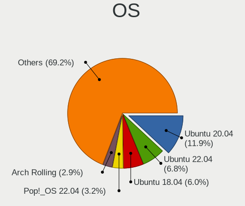
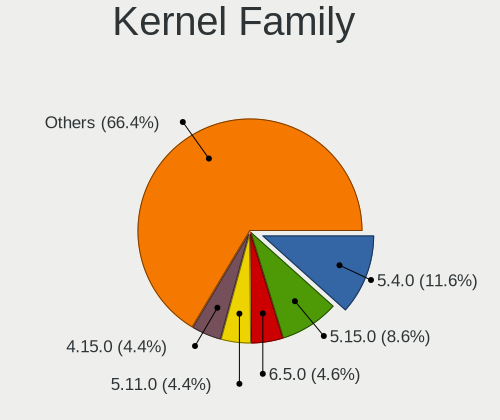
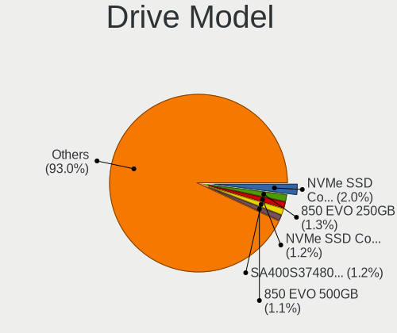
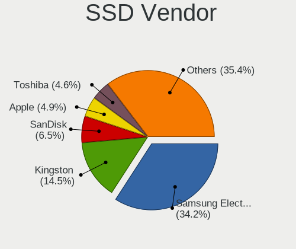
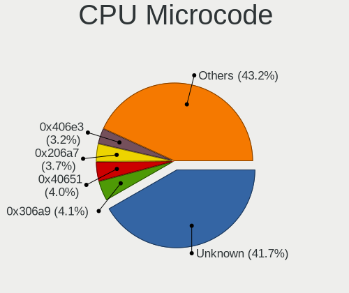
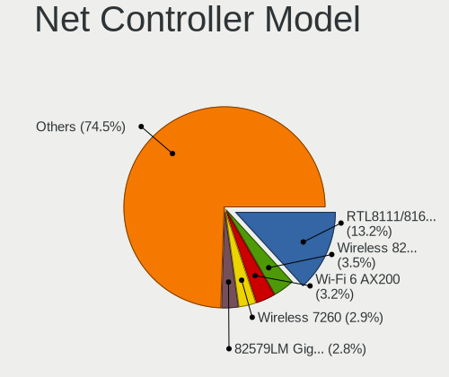
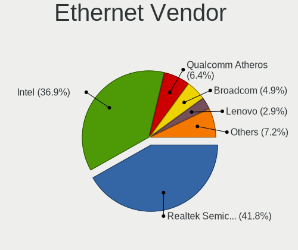
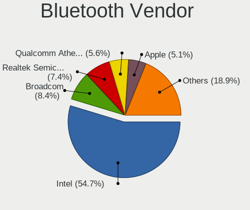
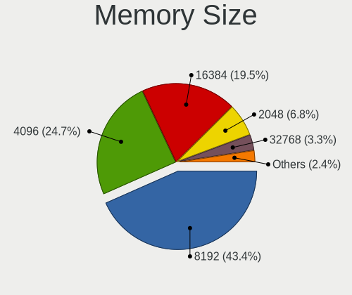
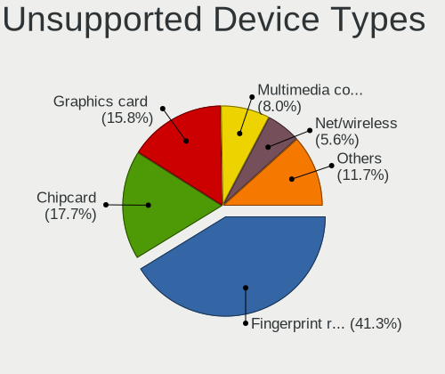

Linux in Denmark - Tested Hardware & Statistics (Notebooks)
-----------------------------------------------------------

A project to collect tested hardware configurations for Linux in Denmark.

Anyone can contribute to this report by the [hw-probe](https://github.com/linuxhw/hw-probe) tool:

    sudo -E hw-probe -all -upload

Please contribute! Especially if your hardware is rare.

Contents
--------

* [ Test Cases ](#test-cases)

* [ System ](#system)
  - [ OS                       ](#os)
  - [ OS Family                ](#os-family)
  - [ Kernel                   ](#kernel)
  - [ Kernel Family            ](#kernel-family)
  - [ Kernel Major Ver.        ](#kernel-major-ver)
  - [ Arch                     ](#arch)
  - [ DE                       ](#de)
  - [ Display Server           ](#display-server)
  - [ Display Manager          ](#display-manager)
  - [ OS Lang                  ](#os-lang)
  - [ Boot Mode                ](#boot-mode)
  - [ Filesystem               ](#filesystem)
  - [ Part. scheme             ](#part-scheme)
  - [ Dual Boot with Linux/BSD ](#dual-boot-with-linuxbsd)
  - [ Dual Boot (Win)          ](#dual-boot-win)

* [ Board ](#board)
  - [ Vendor                   ](#vendor)
  - [ Model                    ](#model)
  - [ Model Family             ](#model-family)
  - [ MFG Year                 ](#mfg-year)
  - [ Form Factor              ](#form-factor)
  - [ Secure Boot              ](#secure-boot)
  - [ Coreboot                 ](#coreboot)
  - [ RAM Size                 ](#ram-size)
  - [ RAM Used                 ](#ram-used)
  - [ Total Drives             ](#total-drives)
  - [ Has CD-ROM               ](#has-cd-rom)
  - [ Has Ethernet             ](#has-ethernet)
  - [ Has WiFi                 ](#has-wifi)
  - [ Has Bluetooth            ](#has-bluetooth)

* [ Location ](#location)
  - [ Country                  ](#country)
  - [ City                     ](#city)

* [ Drives ](#drives)
  - [ Drive Vendor             ](#drive-vendor)
  - [ Drive Model              ](#drive-model)
  - [ HDD Vendor               ](#hdd-vendor)
  - [ SSD Vendor               ](#ssd-vendor)
  - [ Drive Kind               ](#drive-kind)
  - [ Drive Connector          ](#drive-connector)
  - [ Drive Size               ](#drive-size)
  - [ Space Total              ](#space-total)
  - [ Space Used               ](#space-used)
  - [ Malfunc. Drives          ](#malfunc-drives)
  - [ Malfunc. Drive Vendor    ](#malfunc-drive-vendor)
  - [ Malfunc. HDD Vendor      ](#malfunc-hdd-vendor)
  - [ Malfunc. Drive Kind      ](#malfunc-drive-kind)
  - [ Failed Drives            ](#failed-drives)
  - [ Failed Drive Vendor      ](#failed-drive-vendor)
  - [ Drive Status             ](#drive-status)

* [ Storage controller ](#storage-controller)
  - [ Storage Vendor           ](#storage-vendor)
  - [ Storage Model            ](#storage-model)
  - [ Storage Kind             ](#storage-kind)

* [ Processor ](#processor)
  - [ CPU Vendor               ](#cpu-vendor)
  - [ CPU Model                ](#cpu-model)
  - [ CPU Model Family         ](#cpu-model-family)
  - [ CPU Cores                ](#cpu-cores)
  - [ CPU Sockets              ](#cpu-sockets)
  - [ CPU Threads              ](#cpu-threads)
  - [ CPU Op-Modes             ](#cpu-op-modes)
  - [ CPU Microcode            ](#cpu-microcode)
  - [ CPU Microarch            ](#cpu-microarch)

* [ Graphics ](#graphics)
  - [ GPU Vendor               ](#gpu-vendor)
  - [ GPU Model                ](#gpu-model)
  - [ GPU Combo                ](#gpu-combo)
  - [ GPU Driver               ](#gpu-driver)
  - [ GPU Memory               ](#gpu-memory)

* [ Monitor ](#monitor)
  - [ Monitor Vendor           ](#monitor-vendor)
  - [ Monitor Model            ](#monitor-model)
  - [ Monitor Resolution       ](#monitor-resolution)
  - [ Monitor Diagonal         ](#monitor-diagonal)
  - [ Monitor Width            ](#monitor-width)
  - [ Aspect Ratio             ](#aspect-ratio)
  - [ Monitor Area             ](#monitor-area)
  - [ Pixel Density            ](#pixel-density)
  - [ Multiple Monitors        ](#multiple-monitors)

* [ Network ](#network)
  - [ Net Controller Vendor    ](#net-controller-vendor)
  - [ Net Controller Model     ](#net-controller-model)
  - [ Wireless Vendor          ](#wireless-vendor)
  - [ Wireless Model           ](#wireless-model)
  - [ Ethernet Vendor          ](#ethernet-vendor)
  - [ Ethernet Model           ](#ethernet-model)
  - [ Net Controller Kind      ](#net-controller-kind)
  - [ Used Controller          ](#used-controller)
  - [ NICs                     ](#nics)
  - [ IPv6                     ](#ipv6)

* [ Bluetooth ](#bluetooth)
  - [ Bluetooth Vendor         ](#bluetooth-vendor)
  - [ Bluetooth Model          ](#bluetooth-model)

* [ Sound ](#sound)
  - [ Sound Vendor             ](#sound-vendor)
  - [ Sound Model              ](#sound-model)

* [ Memory ](#memory)
  - [ Memory Vendor            ](#memory-vendor)
  - [ Memory Model             ](#memory-model)
  - [ Memory Kind              ](#memory-kind)
  - [ Memory Form Factor       ](#memory-form-factor)
  - [ Memory Size              ](#memory-size)
  - [ Memory Speed             ](#memory-speed)

* [ Printers & scanners ](#printers--scanners)
  - [ Printer Vendor           ](#printer-vendor)
  - [ Printer Model            ](#printer-model)
  - [ Scanner Vendor           ](#scanner-vendor)
  - [ Scanner Model            ](#scanner-model)

* [ Camera ](#camera)
  - [ Camera Vendor            ](#camera-vendor)
  - [ Camera Model             ](#camera-model)

* [ Security ](#security)
  - [ Fingerprint Vendor       ](#fingerprint-vendor)
  - [ Fingerprint Model        ](#fingerprint-model)
  - [ Chipcard Vendor          ](#chipcard-vendor)
  - [ Chipcard Model           ](#chipcard-model)

* [ Unsupported ](#unsupported)
  - [ Unsupported Devices      ](#unsupported-devices)
  - [ Unsupported Device Types ](#unsupported-device-types)

Test Cases
----------

Total: 530

| Vendor        | Model                       | Probe                                                      | Date         |
|---------------|-----------------------------|------------------------------------------------------------|--------------|
| ASUSTek       | TUF Gaming FX505DY_FX505... | [af42d8d0b4](https://linux-hardware.org/?probe=af42d8d0b4) | May 27, 2022 |
| Lenovo        | ThinkPad P15v Gen 1 20TQ... | [a53ea69c8e](https://linux-hardware.org/?probe=a53ea69c8e) | May 27, 2022 |
| HP            | ProBook 6450b               | [8c35a4c278](https://linux-hardware.org/?probe=8c35a4c278) | May 26, 2022 |
| Dell          | Latitude E7440              | [975715a96b](https://linux-hardware.org/?probe=975715a96b) | May 26, 2022 |
| HP            | ProBook 6450b               | [863987eb13](https://linux-hardware.org/?probe=863987eb13) | May 26, 2022 |
| HP            | ProBook 650 G1              | [d3f5e5aa45](https://linux-hardware.org/?probe=d3f5e5aa45) | May 22, 2022 |
| Lenovo        | ThinkPad X1 Carbon Gen 9... | [62486fe8d6](https://linux-hardware.org/?probe=62486fe8d6) | May 21, 2022 |
| Lenovo        | ThinkPad X1 Carbon Gen 9... | [f0f481f187](https://linux-hardware.org/?probe=f0f481f187) | May 21, 2022 |
| SLIMBOOK      | PROX14-10                   | [b0d5e9b290](https://linux-hardware.org/?probe=b0d5e9b290) | May 19, 2022 |
| Dell          | XPS 13 9370                 | [c7f7168362](https://linux-hardware.org/?probe=c7f7168362) | May 18, 2022 |
| HP            | Pavilion Aero Laptop 13-... | [6efbcdabfc](https://linux-hardware.org/?probe=6efbcdabfc) | May 17, 2022 |
| Lenovo        | ThinkPad T480 20L6S14Y01    | [d3f3fff089](https://linux-hardware.org/?probe=d3f3fff089) | May 16, 2022 |
| Dell          | Precision 5750              | [11e888b7d9](https://linux-hardware.org/?probe=11e888b7d9) | May 10, 2022 |
| Lenovo        | ThinkPad T15 Gen 2i 20W4... | [591d3fa922](https://linux-hardware.org/?probe=591d3fa922) | May 07, 2022 |
| Packard Be... | EasyNote TE69BM             | [ed538d5b79](https://linux-hardware.org/?probe=ed538d5b79) | May 07, 2022 |
| Lenovo        | ThinkPad P15v Gen 1 20TQ... | [ac5b1123ad](https://linux-hardware.org/?probe=ac5b1123ad) | Apr 30, 2022 |
| HP            | OMEN by Laptop 15-ce0xx     | [8694f28b60](https://linux-hardware.org/?probe=8694f28b60) | Apr 25, 2022 |
| ASUSTek       | ZenBook Pro Duo UX581GV_... | [0cd6fe25ec](https://linux-hardware.org/?probe=0cd6fe25ec) | Apr 22, 2022 |
| Acer          | Aspire E5-553               | [1c736596fa](https://linux-hardware.org/?probe=1c736596fa) | Apr 21, 2022 |
| Lenovo        | B575e 36852EG               | [8f5e5f427a](https://linux-hardware.org/?probe=8f5e5f427a) | Apr 18, 2022 |
| Lenovo        | B575e 36852EG               | [4731516b58](https://linux-hardware.org/?probe=4731516b58) | Apr 18, 2022 |
| Lenovo        | ThinkPad T440 20B7S1EV00    | [b035e7ae3e](https://linux-hardware.org/?probe=b035e7ae3e) | Apr 16, 2022 |
| HP            | EliteBook 820 G3            | [a587867d2e](https://linux-hardware.org/?probe=a587867d2e) | Apr 15, 2022 |
| MSI           | GF63 Thin 10SC              | [e5e0f208d9](https://linux-hardware.org/?probe=e5e0f208d9) | Apr 14, 2022 |
| MSI           | GF63 Thin 10SC              | [b5beb1add9](https://linux-hardware.org/?probe=b5beb1add9) | Apr 14, 2022 |
| Acer          | Aspire V5-573G              | [2b608bcde8](https://linux-hardware.org/?probe=2b608bcde8) | Apr 04, 2022 |
| Lenovo        | ThinkPad X390 20Q0002LMX    | [22aaabe433](https://linux-hardware.org/?probe=22aaabe433) | Apr 03, 2022 |
| HP            | Laptop 14-dk1xxx            | [0ba5fd01fa](https://linux-hardware.org/?probe=0ba5fd01fa) | Mar 30, 2022 |
| HP            | Laptop 15-bw0xx             | [b9a21aea35](https://linux-hardware.org/?probe=b9a21aea35) | Mar 29, 2022 |
| Lenovo        | E31-80 80MX                 | [8dc93e34e9](https://linux-hardware.org/?probe=8dc93e34e9) | Mar 25, 2022 |
| HP            | Pavilion Notebook           | [3bf42ed5a6](https://linux-hardware.org/?probe=3bf42ed5a6) | Mar 24, 2022 |
| Lenovo        | ThinkPad P14s Gen 2a 21A... | [72da14a2b2](https://linux-hardware.org/?probe=72da14a2b2) | Mar 23, 2022 |
| MSI           | Modern 15 A5M               | [72245fe662](https://linux-hardware.org/?probe=72245fe662) | Mar 22, 2022 |
| Lenovo        | ThinkPad X260 20F60086MD    | [828cc46772](https://linux-hardware.org/?probe=828cc46772) | Mar 22, 2022 |
| Apple         | MacBookPro11,5              | [abc4597fe1](https://linux-hardware.org/?probe=abc4597fe1) | Mar 18, 2022 |
| Notebook      | P65xHP                      | [3222aab43a](https://linux-hardware.org/?probe=3222aab43a) | Mar 16, 2022 |
| Acer          | Aspire 3830T                | [bad3a5c2d7](https://linux-hardware.org/?probe=bad3a5c2d7) | Mar 15, 2022 |
| HP            | EliteBook 850 G5            | [ab88a095ac](https://linux-hardware.org/?probe=ab88a095ac) | Mar 10, 2022 |
| Dell          | Latitude E6410              | [d4fa7879a4](https://linux-hardware.org/?probe=d4fa7879a4) | Mar 09, 2022 |
| Dell          | Precision M4800             | [6bca1ea21f](https://linux-hardware.org/?probe=6bca1ea21f) | Mar 06, 2022 |
| Acer          | Swift SF314-42              | [e7d10ddac0](https://linux-hardware.org/?probe=e7d10ddac0) | Mar 04, 2022 |
| Dell          | Latitude E6410              | [6748e5a7aa](https://linux-hardware.org/?probe=6748e5a7aa) | Feb 27, 2022 |
| Lenovo        | ThinkBook 15 G2 ARE 20VG    | [30879c05cc](https://linux-hardware.org/?probe=30879c05cc) | Feb 24, 2022 |
| Lenovo        | ThinkPad X1 Carbon 7th 2... | [505e1dc8cc](https://linux-hardware.org/?probe=505e1dc8cc) | Feb 21, 2022 |
| Lenovo        | ThinkPad L530 24812SG       | [6eb3e0ed53](https://linux-hardware.org/?probe=6eb3e0ed53) | Feb 19, 2022 |
| HP            | Pavilion g6                 | [3971fd709d](https://linux-hardware.org/?probe=3971fd709d) | Feb 13, 2022 |
| Acer          | Aspire E5-575               | [3e75911df8](https://linux-hardware.org/?probe=3e75911df8) | Feb 12, 2022 |
| Apple         | MacBookPro7,1               | [b059819620](https://linux-hardware.org/?probe=b059819620) | Feb 11, 2022 |
| Apple         | MacBookPro7,1               | [87f4740598](https://linux-hardware.org/?probe=87f4740598) | Feb 11, 2022 |
| Toshiba       | Satellite L40               | [ba6d18935b](https://linux-hardware.org/?probe=ba6d18935b) | Feb 08, 2022 |
| Lenovo        | ThinkPad L480 20LS001AMD    | [801aa8fb1e](https://linux-hardware.org/?probe=801aa8fb1e) | Feb 05, 2022 |
| ASUSTek       | VivoBook_ASUSLaptop X521... | [23c6243856](https://linux-hardware.org/?probe=23c6243856) | Feb 05, 2022 |
| Medion        | P7612                       | [e1c076ee06](https://linux-hardware.org/?probe=e1c076ee06) | Feb 03, 2022 |
| HP            | Compaq Presario CQ71        | [436407f045](https://linux-hardware.org/?probe=436407f045) | Feb 01, 2022 |
| Lenovo        | B50-50 80S2                 | [7602963c65](https://linux-hardware.org/?probe=7602963c65) | Feb 01, 2022 |
| Dell          | Latitude E6540              | [fe6720f0de](https://linux-hardware.org/?probe=fe6720f0de) | Jan 30, 2022 |
| Dell          | Latitude E6540              | [7c972de545](https://linux-hardware.org/?probe=7c972de545) | Jan 30, 2022 |
| HP            | Pavilion Aero Laptop 13-... | [478d5281bd](https://linux-hardware.org/?probe=478d5281bd) | Jan 29, 2022 |
| HP            | Pavilion dv7                | [e6ec9b5f6a](https://linux-hardware.org/?probe=e6ec9b5f6a) | Jan 26, 2022 |
| Medion        | P7612                       | [50be4d531e](https://linux-hardware.org/?probe=50be4d531e) | Jan 25, 2022 |
| Notebook      | NV4XMB,ME,MZ                | [298ddd1139](https://linux-hardware.org/?probe=298ddd1139) | Jan 24, 2022 |
| HP            | EliteBook 840 G3            | [82cce77f87](https://linux-hardware.org/?probe=82cce77f87) | Jan 22, 2022 |
| HP            | EliteBook 840 G3            | [4ef203e4a1](https://linux-hardware.org/?probe=4ef203e4a1) | Jan 22, 2022 |
| DukaPC        | Notebook                    | [21b4827b4b](https://linux-hardware.org/?probe=21b4827b4b) | Jan 21, 2022 |
| Acer          | Aspire F5-572G              | [221a91f679](https://linux-hardware.org/?probe=221a91f679) | Jan 19, 2022 |
| Lenovo        | ThinkPad E595 20NFCTO1WW    | [80906dc02b](https://linux-hardware.org/?probe=80906dc02b) | Jan 19, 2022 |
| ASUSTek       | ZenBook Pro Duo UX581GV_... | [cc39f1fd96](https://linux-hardware.org/?probe=cc39f1fd96) | Jan 18, 2022 |
| IBM           | ThinkPad T40 237342G        | [2c96b391e2](https://linux-hardware.org/?probe=2c96b391e2) | Jan 16, 2022 |
| IBM           | ThinkPad T40 237342G        | [5c4e8748ef](https://linux-hardware.org/?probe=5c4e8748ef) | Jan 16, 2022 |
| Lenovo        | ThinkPad E14 Gen 3 20Y7C... | [4ebb815948](https://linux-hardware.org/?probe=4ebb815948) | Jan 15, 2022 |
| HP            | Pavilion g7                 | [6efd331acf](https://linux-hardware.org/?probe=6efd331acf) | Jan 14, 2022 |
| Lenovo        | ThinkPad P15s Gen 1 20T4... | [4cefa23802](https://linux-hardware.org/?probe=4cefa23802) | Jan 14, 2022 |
| Acer          | Aspire E5-553               | [149c0538ca](https://linux-hardware.org/?probe=149c0538ca) | Jan 13, 2022 |
| Lenovo        | M30-70 80H8                 | [2f61d772a4](https://linux-hardware.org/?probe=2f61d772a4) | Jan 12, 2022 |
| Lenovo        | Y50-70 20378                | [ab93bc517a](https://linux-hardware.org/?probe=ab93bc517a) | Jan 12, 2022 |
| Razer         | Blade                       | [afad6aaa95](https://linux-hardware.org/?probe=afad6aaa95) | Jan 08, 2022 |
| ASUSTek       | VivoBook_ASUSLaptop X421... | [1f327abc43](https://linux-hardware.org/?probe=1f327abc43) | Jan 05, 2022 |
| Lenovo        | ThinkPad T14 Gen 2i 20W0... | [53a3989606](https://linux-hardware.org/?probe=53a3989606) | Jan 03, 2022 |
| Acer          | Aspire V5-573G              | [a7e3940936](https://linux-hardware.org/?probe=a7e3940936) | Jan 02, 2022 |
| Dell          | Inspiron 7720               | [4e1ebc00ff](https://linux-hardware.org/?probe=4e1ebc00ff) | Jan 02, 2022 |
| Apple         | MacBookAir7,2               | [6246bb8ef6](https://linux-hardware.org/?probe=6246bb8ef6) | Dec 31, 2021 |
| Lenovo        | V330-14ARR 81B1             | [290d6b4ad5](https://linux-hardware.org/?probe=290d6b4ad5) | Dec 29, 2021 |
| Lenovo        | IdeaPad 5 14ALC05 82LM      | [13f35d1d12](https://linux-hardware.org/?probe=13f35d1d12) | Dec 26, 2021 |
| HP            | ENVY Laptop 13-ad1xx        | [369d18645c](https://linux-hardware.org/?probe=369d18645c) | Dec 25, 2021 |
| Lenovo        | ThinkPad X1 Carbon 2nd 2... | [e68ec90909](https://linux-hardware.org/?probe=e68ec90909) | Dec 24, 2021 |
| Medion        | P6630                       | [de245dfdb6](https://linux-hardware.org/?probe=de245dfdb6) | Dec 23, 2021 |
| Notebook      | N24_25JU                    | [8ac7d4890e](https://linux-hardware.org/?probe=8ac7d4890e) | Dec 20, 2021 |
| Quanta        | MW1/HW1                     | [06bcb3603d](https://linux-hardware.org/?probe=06bcb3603d) | Dec 17, 2021 |
| ASUSTek       | K53SV                       | [be7844ea44](https://linux-hardware.org/?probe=be7844ea44) | Dec 17, 2021 |
| Lenovo        | ThinkPad T460s 20FAS05Q0... | [3a4b9beb1d](https://linux-hardware.org/?probe=3a4b9beb1d) | Dec 12, 2021 |
| Toshiba       | Satellite P850              | [bfc37f531a](https://linux-hardware.org/?probe=bfc37f531a) | Dec 11, 2021 |
| Lenovo        | IdeaPad 320S-14IKB 81BN     | [d6be9fac19](https://linux-hardware.org/?probe=d6be9fac19) | Dec 09, 2021 |
| Lenovo        | ThinkPad T470s 20HF004UM... | [e7144e5f86](https://linux-hardware.org/?probe=e7144e5f86) | Dec 09, 2021 |
| Fujitsu Si... | LIFEBOOK E8420              | [7ff3493cfe](https://linux-hardware.org/?probe=7ff3493cfe) | Dec 08, 2021 |
| ASUSTek       | ROG Zephyrus G15 GA503QM... | [0dc0958719](https://linux-hardware.org/?probe=0dc0958719) | Dec 06, 2021 |
| DukaPC        | Notebook                    | [cfb399153a](https://linux-hardware.org/?probe=cfb399153a) | Dec 01, 2021 |
| Razer         | Blade Stealth               | [54acf9844b](https://linux-hardware.org/?probe=54acf9844b) | Nov 28, 2021 |
| Apple         | MacBookPro11,2              | [07931c8e7b](https://linux-hardware.org/?probe=07931c8e7b) | Nov 24, 2021 |
| Lenovo        | ThinkPad P1 Gen 2 20QT00... | [c224ffa45a](https://linux-hardware.org/?probe=c224ffa45a) | Nov 23, 2021 |
| Toshiba       | Satellite U300              | [827ec6ed62](https://linux-hardware.org/?probe=827ec6ed62) | Nov 21, 2021 |
| Dell          | Inspiron 7572               | [0953d49db6](https://linux-hardware.org/?probe=0953d49db6) | Nov 18, 2021 |
| HUAWEI        | KLVL-WXX9                   | [c80aeaf7b0](https://linux-hardware.org/?probe=c80aeaf7b0) | Nov 17, 2021 |
| ASUSTek       | ZenBook Pro Duo UX581GV_... | [52eef25506](https://linux-hardware.org/?probe=52eef25506) | Nov 15, 2021 |
| ASUSTek       | ZenBook Pro Duo UX581GV_... | [7252f23e5f](https://linux-hardware.org/?probe=7252f23e5f) | Nov 15, 2021 |
| ASUSTek       | ZenBook Pro Duo UX581GV_... | [1a20afde4b](https://linux-hardware.org/?probe=1a20afde4b) | Nov 15, 2021 |
| Acer          | Aspire 5810T                | [c41d1671bc](https://linux-hardware.org/?probe=c41d1671bc) | Nov 14, 2021 |
| Lenovo        | ThinkPad R61 8935W7T        | [bef030b1ef](https://linux-hardware.org/?probe=bef030b1ef) | Nov 11, 2021 |
| HP            | EliteBook 850 G5            | [7df8bf1476](https://linux-hardware.org/?probe=7df8bf1476) | Nov 11, 2021 |
| HP            | EliteBook 850 G5            | [1def8c2d0b](https://linux-hardware.org/?probe=1def8c2d0b) | Nov 11, 2021 |
| Lenovo        | ThinkPad P14s Gen 2a 21A... | [e03bf03f1d](https://linux-hardware.org/?probe=e03bf03f1d) | Nov 10, 2021 |
| Lenovo        | ThinkPad L15 Gen 2a 20X7... | [1def6bd5d8](https://linux-hardware.org/?probe=1def6bd5d8) | Nov 10, 2021 |
| Lenovo        | ThinkPad P14s Gen 2a 21A... | [d2a33ad9d9](https://linux-hardware.org/?probe=d2a33ad9d9) | Nov 07, 2021 |
| HP            | Pavilion g7                 | [c1b5449516](https://linux-hardware.org/?probe=c1b5449516) | Nov 05, 2021 |
| Apple         | MacBookPro14,1              | [68ebc1af79](https://linux-hardware.org/?probe=68ebc1af79) | Oct 28, 2021 |
| Lenovo        | ThinkPad T430s 23561R0      | [bef1593d06](https://linux-hardware.org/?probe=bef1593d06) | Oct 22, 2021 |
| ASUSTek       | ROG Zephyrus G14 GA401QC... | [14d159c564](https://linux-hardware.org/?probe=14d159c564) | Oct 20, 2021 |
| Unknown       | Unknown                     | [a6e5e7b6ef](https://linux-hardware.org/?probe=a6e5e7b6ef) | Oct 18, 2021 |
| Lenovo        | ThinkPad X240 20AMS5FJ00    | [a7fa6a8110](https://linux-hardware.org/?probe=a7fa6a8110) | Oct 14, 2021 |
| Lenovo        | ThinkPad T14s Gen 1 20T0... | [df32df0b62](https://linux-hardware.org/?probe=df32df0b62) | Oct 13, 2021 |
| Lenovo        | ThinkPad T14s Gen 1 20T0... | [c7239a1379](https://linux-hardware.org/?probe=c7239a1379) | Oct 13, 2021 |
| Toshiba       | Satellite P55W-C            | [f16be2ec1b](https://linux-hardware.org/?probe=f16be2ec1b) | Oct 13, 2021 |
| HP            | Pavilion g7                 | [7e80ec4599](https://linux-hardware.org/?probe=7e80ec4599) | Oct 11, 2021 |
| HP            | Pavilion g7                 | [cd8ce3be30](https://linux-hardware.org/?probe=cd8ce3be30) | Oct 10, 2021 |
| HP            | Pavilion g7                 | [dd3f8159e0](https://linux-hardware.org/?probe=dd3f8159e0) | Oct 10, 2021 |
| Acer          | Aspire A315-41              | [3d5d3ddf84](https://linux-hardware.org/?probe=3d5d3ddf84) | Oct 09, 2021 |
| Lenovo        | ThinkPad X201T 3113CC7      | [47f63d40d5](https://linux-hardware.org/?probe=47f63d40d5) | Oct 09, 2021 |
| Lenovo        | ThinkPad P15s Gen 1 20T4... | [93c695e5ba](https://linux-hardware.org/?probe=93c695e5ba) | Oct 08, 2021 |
| Lenovo        | ThinkPad T480s 20L8S4T80... | [85a242883c](https://linux-hardware.org/?probe=85a242883c) | Oct 05, 2021 |
| ASUSTek       | ROG Zephyrus G14 GA401QC... | [56ce2c44cb](https://linux-hardware.org/?probe=56ce2c44cb) | Oct 04, 2021 |
| ASUSTek       | ROG Zephyrus G14 GA401QC... | [4d0eb4ccf2](https://linux-hardware.org/?probe=4d0eb4ccf2) | Oct 04, 2021 |
| Lenovo        | V330-14ARR 81B1             | [c8a0e5de69](https://linux-hardware.org/?probe=c8a0e5de69) | Oct 04, 2021 |
| HUAWEI        | EUL-WX9                     | [dfc5c12fbf](https://linux-hardware.org/?probe=dfc5c12fbf) | Oct 01, 2021 |
| Lenovo        | ThinkPad X260 20F5S31G00    | [575dd64064](https://linux-hardware.org/?probe=575dd64064) | Oct 01, 2021 |
| HP            | Pavilion dv7                | [31b035faec](https://linux-hardware.org/?probe=31b035faec) | Sep 28, 2021 |
| Acer          | Aspire 5810T                | [be3f4d5a01](https://linux-hardware.org/?probe=be3f4d5a01) | Sep 26, 2021 |
| ASUSTek       | ROG Zephyrus G15 GA503QM... | [edfae5b796](https://linux-hardware.org/?probe=edfae5b796) | Sep 25, 2021 |
| HUAWEI        | MACHC-WAX9                  | [e2fc9d2585](https://linux-hardware.org/?probe=e2fc9d2585) | Sep 23, 2021 |
| Dell          | XPS 13 9370                 | [5df047615c](https://linux-hardware.org/?probe=5df047615c) | Sep 22, 2021 |
| HP            | ProBook 650 G1              | [d7ccece3d4](https://linux-hardware.org/?probe=d7ccece3d4) | Sep 22, 2021 |
| HP            | ProBook 650 G1              | [466841a201](https://linux-hardware.org/?probe=466841a201) | Sep 22, 2021 |
| HP            | ZBook 15                    | [206882306c](https://linux-hardware.org/?probe=206882306c) | Sep 20, 2021 |
| Lenovo        | V130-15IKB 81HN             | [f427b869d9](https://linux-hardware.org/?probe=f427b869d9) | Sep 17, 2021 |
| Lenovo        | ThinkPad X220 4291WAY       | [ca0ab89977](https://linux-hardware.org/?probe=ca0ab89977) | Sep 16, 2021 |
| Lenovo        | ThinkPad W541 20EFS01B09    | [8dd2c7497e](https://linux-hardware.org/?probe=8dd2c7497e) | Sep 13, 2021 |
| Dell          | Inspiron 3583               | [49b4db94c6](https://linux-hardware.org/?probe=49b4db94c6) | Sep 12, 2021 |
| HP            | Pavilion dv7                | [2fd3b811f6](https://linux-hardware.org/?probe=2fd3b811f6) | Sep 12, 2021 |
| Dell          | XPS 15 9510                 | [1b80533734](https://linux-hardware.org/?probe=1b80533734) | Sep 11, 2021 |
| Dell          | XPS 15 9510                 | [4befd2306c](https://linux-hardware.org/?probe=4befd2306c) | Sep 11, 2021 |
| ASUSTek       | TUF Gaming FX505DV_FX505... | [5cf3ed1411](https://linux-hardware.org/?probe=5cf3ed1411) | Aug 31, 2021 |
| Samsung       | 530U3C/530U4C/532U3C        | [70585e2360](https://linux-hardware.org/?probe=70585e2360) | Aug 30, 2021 |
| Lenovo        | ThinkPad X1 Carbon Gen 8... | [9c0457479f](https://linux-hardware.org/?probe=9c0457479f) | Aug 29, 2021 |
| Lenovo        | ThinkPad X1 Carbon Gen 8... | [23b7937411](https://linux-hardware.org/?probe=23b7937411) | Aug 29, 2021 |
| Lenovo        | ThinkPad X240 20AMS5FJ00    | [9382443dc7](https://linux-hardware.org/?probe=9382443dc7) | Aug 27, 2021 |
| Google        | Relm                        | [12475037ed](https://linux-hardware.org/?probe=12475037ed) | Aug 27, 2021 |
| Google        | Relm                        | [36e7a1d7a1](https://linux-hardware.org/?probe=36e7a1d7a1) | Aug 26, 2021 |
| HP            | ProBook 650 G1              | [61f6289d2c](https://linux-hardware.org/?probe=61f6289d2c) | Aug 26, 2021 |
| Lenovo        | ThinkPad X230 2325AN3       | [d6b5ef49af](https://linux-hardware.org/?probe=d6b5ef49af) | Aug 24, 2021 |
| Lenovo        | ThinkPad T470s 20HF0047U... | [900b0ce643](https://linux-hardware.org/?probe=900b0ce643) | Aug 24, 2021 |
| HP            | ZBook 15 G6                 | [93ec0ceb52](https://linux-hardware.org/?probe=93ec0ceb52) | Aug 23, 2021 |
| Lenovo        | ThinkPad E595 20NF001HMX    | [8e75269d33](https://linux-hardware.org/?probe=8e75269d33) | Aug 20, 2021 |
| Lenovo        | G550 2958                   | [5207c5584c](https://linux-hardware.org/?probe=5207c5584c) | Aug 16, 2021 |
| Lenovo        | G550 2958                   | [b7b363db20](https://linux-hardware.org/?probe=b7b363db20) | Aug 15, 2021 |
| HP            | ProBook 445 G7              | [e42e169a72](https://linux-hardware.org/?probe=e42e169a72) | Aug 15, 2021 |
| HP            | Notebook                    | [be1a21a391](https://linux-hardware.org/?probe=be1a21a391) | Aug 14, 2021 |
| GPD           | P2 MAX                      | [78f79b2790](https://linux-hardware.org/?probe=78f79b2790) | Jul 31, 2021 |
| ASUSTek       | GL702VM                     | [bb9d228646](https://linux-hardware.org/?probe=bb9d228646) | Jul 29, 2021 |
| ASUSTek       | ROG Zephyrus G15 GA503QM... | [a02dac8dff](https://linux-hardware.org/?probe=a02dac8dff) | Jul 23, 2021 |
| Lenovo        | ThinkPad X240 20AMS4P300    | [e52365f866](https://linux-hardware.org/?probe=e52365f866) | Jul 21, 2021 |
| Lenovo        | ThinkPad X240 20AMS4P300    | [704fb2e1d1](https://linux-hardware.org/?probe=704fb2e1d1) | Jul 21, 2021 |
| Dell          | Latitude 7370               | [b10d4c18f2](https://linux-hardware.org/?probe=b10d4c18f2) | Jul 19, 2021 |
| Lenovo        | ThinkPad T460s 20F9003UM... | [7a03dbd869](https://linux-hardware.org/?probe=7a03dbd869) | Jul 17, 2021 |
| Lenovo        | ThinkPad T460s 20F9003UM... | [ce58f3f770](https://linux-hardware.org/?probe=ce58f3f770) | Jul 16, 2021 |
| Lenovo        | ThinkPad P15s Gen 1 20T4... | [a56195f1f1](https://linux-hardware.org/?probe=a56195f1f1) | Jul 13, 2021 |
| Lenovo        | ThinkPad L14 Gen 1 20U10... | [440841d04a](https://linux-hardware.org/?probe=440841d04a) | Jul 12, 2021 |
| Lenovo        | IdeaPad S145-14IWL 81MU     | [3b106f1da0](https://linux-hardware.org/?probe=3b106f1da0) | Jul 07, 2021 |
| Lenovo        | ThinkPad X240 20AMS5FJ00    | [f8872c9e84](https://linux-hardware.org/?probe=f8872c9e84) | Jul 05, 2021 |
| AMI           | Cherry Trail CR             | [4e6f9ccc6c](https://linux-hardware.org/?probe=4e6f9ccc6c) | Jul 05, 2021 |
| DukaPC        | Notebook                    | [6d87054512](https://linux-hardware.org/?probe=6d87054512) | Jul 02, 2021 |
| HP            | ProBook 640 G3              | [c56b8f3ff1](https://linux-hardware.org/?probe=c56b8f3ff1) | Jun 29, 2021 |
| Timi          | TM1703                      | [bd3756811d](https://linux-hardware.org/?probe=bd3756811d) | Jun 26, 2021 |
| DukaPC        | Notebook                    | [c29d208cdf](https://linux-hardware.org/?probe=c29d208cdf) | Jun 24, 2021 |
| Lenovo        | ThinkPad T420 4236Y19       | [48927432b4](https://linux-hardware.org/?probe=48927432b4) | Jun 20, 2021 |
| ASUSTek       | ASUS TUF Gaming A15 FA50... | [d8ad69d368](https://linux-hardware.org/?probe=d8ad69d368) | Jun 15, 2021 |
| Lenovo        | ThinkPad T440s 20ARS0Y70... | [5e57af6782](https://linux-hardware.org/?probe=5e57af6782) | Jun 11, 2021 |
| Lenovo        | ThinkPad T420 4236PFG       | [fa5abfccf8](https://linux-hardware.org/?probe=fa5abfccf8) | Jun 04, 2021 |
| HP            | Compaq Presario CQ71        | [d4deb2b08d](https://linux-hardware.org/?probe=d4deb2b08d) | Jun 01, 2021 |
| Dell          | Latitude E6520              | [d1d0976880](https://linux-hardware.org/?probe=d1d0976880) | May 31, 2021 |
| Lenovo        | ThinkPad T400 647358G       | [b4f44d7932](https://linux-hardware.org/?probe=b4f44d7932) | May 29, 2021 |
| Toshiba       | Satellite C660              | [58d3740c30](https://linux-hardware.org/?probe=58d3740c30) | May 28, 2021 |
| Acer          | Aspire E5-553               | [70037bddcb](https://linux-hardware.org/?probe=70037bddcb) | May 27, 2021 |
| LAMINA        | T-1012B NORD                | [71e70e946a](https://linux-hardware.org/?probe=71e70e946a) | May 25, 2021 |
| LAMINA        | T-1012B NORD                | [9dc2932064](https://linux-hardware.org/?probe=9dc2932064) | May 24, 2021 |
| ASUSTek       | X553SA                      | [c470382d2a](https://linux-hardware.org/?probe=c470382d2a) | May 24, 2021 |
| ASUSTek       | X553SA                      | [31d6a914fd](https://linux-hardware.org/?probe=31d6a914fd) | May 24, 2021 |
| Acer          | Aspire E5-511               | [9edec55620](https://linux-hardware.org/?probe=9edec55620) | May 23, 2021 |
| Acer          | Aspire E5-511               | [e20c93a2c1](https://linux-hardware.org/?probe=e20c93a2c1) | May 23, 2021 |
| Lenovo        | ThinkPad X240 20AMS5FJ00    | [a9e4c7793b](https://linux-hardware.org/?probe=a9e4c7793b) | May 18, 2021 |
| eMachines     | E725                        | [329f8f580e](https://linux-hardware.org/?probe=329f8f580e) | May 14, 2021 |
| ASUSTek       | K95VM                       | [58d4ed3c2b](https://linux-hardware.org/?probe=58d4ed3c2b) | May 10, 2021 |
| HP            | 15                          | [a13c097d59](https://linux-hardware.org/?probe=a13c097d59) | May 09, 2021 |
| HP            | 15                          | [c3cdcdab60](https://linux-hardware.org/?probe=c3cdcdab60) | May 09, 2021 |
| Alienware     | 17 R2                       | [a8470edc65](https://linux-hardware.org/?probe=a8470edc65) | May 06, 2021 |
| ASUSTek       | G74Sx                       | [73c1eaa647](https://linux-hardware.org/?probe=73c1eaa647) | Apr 29, 2021 |
| Lenovo        | ThinkPad T520 4243PC2       | [915d41f361](https://linux-hardware.org/?probe=915d41f361) | Apr 29, 2021 |
| HP            | EliteBook 845 G7 Noteboo... | [e259d34a4c](https://linux-hardware.org/?probe=e259d34a4c) | Apr 28, 2021 |
| Lenovo        | ThinkPad T530 24295L4       | [e2f8b2beda](https://linux-hardware.org/?probe=e2f8b2beda) | Apr 25, 2021 |
| Lenovo        | ThinkPad T530 24295L4       | [684f1471b1](https://linux-hardware.org/?probe=684f1471b1) | Apr 23, 2021 |
| Lenovo        | E31-80 80MX                 | [8aedfd9f4c](https://linux-hardware.org/?probe=8aedfd9f4c) | Apr 21, 2021 |
| HP            | EliteBook 845 G7 Noteboo... | [bd14a696eb](https://linux-hardware.org/?probe=bd14a696eb) | Apr 20, 2021 |
| Lenovo        | ThinkPad T520 42434YG       | [8e0b4ee3a1](https://linux-hardware.org/?probe=8e0b4ee3a1) | Apr 17, 2021 |
| Lenovo        | ThinkPad X220 4291SVC       | [49e1959064](https://linux-hardware.org/?probe=49e1959064) | Apr 16, 2021 |
| Lenovo        | ThinkPad X220 4291SVC       | [b2853266e8](https://linux-hardware.org/?probe=b2853266e8) | Apr 15, 2021 |
| HUAWEI        | NBLK-WAX9X                  | [4b127c0ba4](https://linux-hardware.org/?probe=4b127c0ba4) | Apr 11, 2021 |
| HP            | Laptop 15-da1xxx            | [a844e710cc](https://linux-hardware.org/?probe=a844e710cc) | Apr 09, 2021 |
| Lenovo        | ThinkPad T60 20076RG        | [aa3ea77acf](https://linux-hardware.org/?probe=aa3ea77acf) | Apr 08, 2021 |
| HP            | G72                         | [2ab4eb5fcd](https://linux-hardware.org/?probe=2ab4eb5fcd) | Apr 05, 2021 |
| ASUSTek       | K95VM                       | [81a01884d2](https://linux-hardware.org/?probe=81a01884d2) | Mar 24, 2021 |
| Lenovo        | ThinkPad W520 4284Y54       | [8d564e495b](https://linux-hardware.org/?probe=8d564e495b) | Mar 23, 2021 |
| Toshiba       | Satellite L350D             | [b083513b72](https://linux-hardware.org/?probe=b083513b72) | Mar 23, 2021 |
| Acer          | Aspire E5-553               | [0c21dc1b96](https://linux-hardware.org/?probe=0c21dc1b96) | Mar 19, 2021 |
| HP            | Pavilion dm1                | [438cf03315](https://linux-hardware.org/?probe=438cf03315) | Mar 18, 2021 |
| Lenovo        | Yoga 700-14ISK 80QD         | [7e7a4bc992](https://linux-hardware.org/?probe=7e7a4bc992) | Mar 18, 2021 |
| Lenovo        | ThinkPad T480s 20L8S4T80... | [1b8a078a19](https://linux-hardware.org/?probe=1b8a078a19) | Mar 16, 2021 |
| HP            | EliteBook 830 G5            | [248eb896a0](https://linux-hardware.org/?probe=248eb896a0) | Mar 15, 2021 |
| HP            | Compaq Presario CQ60        | [e4613a6f75](https://linux-hardware.org/?probe=e4613a6f75) | Mar 15, 2021 |
| Dell          | Latitude E5250              | [22067e0909](https://linux-hardware.org/?probe=22067e0909) | Mar 13, 2021 |
| Dell          | Latitude E5250              | [df9d913f0f](https://linux-hardware.org/?probe=df9d913f0f) | Mar 13, 2021 |
| HP            | Pavilion dv9700             | [f55ec4dd18](https://linux-hardware.org/?probe=f55ec4dd18) | Mar 11, 2021 |
| Dell          | XPS 13 9370                 | [865e070587](https://linux-hardware.org/?probe=865e070587) | Mar 10, 2021 |
| Dell          | Latitude E5250              | [78f0a24d9a](https://linux-hardware.org/?probe=78f0a24d9a) | Mar 07, 2021 |
| Acer          | Aspire E5-575G              | [18240d24d8](https://linux-hardware.org/?probe=18240d24d8) | Mar 06, 2021 |
| Toshiba       | Satellite L350D             | [ef8a29af20](https://linux-hardware.org/?probe=ef8a29af20) | Mar 05, 2021 |
| Acer          | Aspire E5-553               | [74e6da0017](https://linux-hardware.org/?probe=74e6da0017) | Feb 27, 2021 |
| HP            | 630                         | [6803747e34](https://linux-hardware.org/?probe=6803747e34) | Feb 22, 2021 |
| HP            | 630                         | [8b04fe81aa](https://linux-hardware.org/?probe=8b04fe81aa) | Feb 22, 2021 |
| Lenovo        | ThinkPad T61 7661W1D        | [6db91fdd34](https://linux-hardware.org/?probe=6db91fdd34) | Feb 17, 2021 |
| Lenovo        | 3000 G530 444622G           | [3ef99e25df](https://linux-hardware.org/?probe=3ef99e25df) | Feb 16, 2021 |
| Lenovo        | ThinkPad X240 20AMA2AE00    | [2730f6215a](https://linux-hardware.org/?probe=2730f6215a) | Feb 12, 2021 |
| Dell          | XPS 13 9360                 | [564f71d6f3](https://linux-hardware.org/?probe=564f71d6f3) | Feb 10, 2021 |
| Acer          | Aspire E5-553               | [ab7532985d](https://linux-hardware.org/?probe=ab7532985d) | Feb 05, 2021 |
| Lenovo        | ThinkBook 14-IIL 20SL       | [ed806c00b2](https://linux-hardware.org/?probe=ed806c00b2) | Feb 04, 2021 |
| HP            | EliteBook 2560p             | [f741035d0d](https://linux-hardware.org/?probe=f741035d0d) | Feb 02, 2021 |
| HP            | EliteBook 840 G5            | [19ef5f3adb](https://linux-hardware.org/?probe=19ef5f3adb) | Jan 29, 2021 |
| Dell          | Latitude E7440              | [ee2c17a895](https://linux-hardware.org/?probe=ee2c17a895) | Jan 26, 2021 |
| TUXEDO        | Pulse 15 Gen1               | [964b7c1b1f](https://linux-hardware.org/?probe=964b7c1b1f) | Jan 23, 2021 |
| Lenovo        | ThinkPad X1 Carbon 4th 2... | [82da77953a](https://linux-hardware.org/?probe=82da77953a) | Jan 19, 2021 |
| Dell          | Latitude 5500               | [d7e06bd87b](https://linux-hardware.org/?probe=d7e06bd87b) | Jan 18, 2021 |
| Dell          | Latitude 5500               | [f40a2d50bc](https://linux-hardware.org/?probe=f40a2d50bc) | Jan 16, 2021 |
| Quanta        | MW1/HW1                     | [ebab0a47f8](https://linux-hardware.org/?probe=ebab0a47f8) | Jan 16, 2021 |
| Lenovo        | ThinkPad P52 20M9001GMX     | [ffdee2c6e0](https://linux-hardware.org/?probe=ffdee2c6e0) | Jan 11, 2021 |
| Dell          | XPS 13 9300                 | [229b46a693](https://linux-hardware.org/?probe=229b46a693) | Jan 10, 2021 |
| Lenovo        | ThinkPad P53 20QNCTO1WW     | [fa963386d8](https://linux-hardware.org/?probe=fa963386d8) | Jan 07, 2021 |
| Toshiba       | Satellite L40               | [bd26bbbe43](https://linux-hardware.org/?probe=bd26bbbe43) | Jan 06, 2021 |
| Lenovo        | G570 4334                   | [c643363b80](https://linux-hardware.org/?probe=c643363b80) | Jan 03, 2021 |
| Lenovo        | ThinkPad X1 Carbon 5th 2... | [2ed1a3283e](https://linux-hardware.org/?probe=2ed1a3283e) | Jan 02, 2021 |
| Lenovo        | ThinkPad X1 Carbon Gen 8... | [c0c38c5aee](https://linux-hardware.org/?probe=c0c38c5aee) | Dec 30, 2020 |
| ASUSTek       | TUF Gaming FX505DY_FX505... | [65fe7eb049](https://linux-hardware.org/?probe=65fe7eb049) | Dec 30, 2020 |
| Lenovo        | IdeaPad 310-15IKB 80TV      | [c3f9fc25d4](https://linux-hardware.org/?probe=c3f9fc25d4) | Dec 29, 2020 |
| Lenovo        | IdeaPad 310-15IKB 80TV      | [dbc2669fc0](https://linux-hardware.org/?probe=dbc2669fc0) | Dec 28, 2020 |
| Lenovo        | ThinkPad T14s Gen 1 20UJ... | [f514e54057](https://linux-hardware.org/?probe=f514e54057) | Dec 28, 2020 |
| ASUSTek       | PU401LAC                    | [c5bf49eabf](https://linux-hardware.org/?probe=c5bf49eabf) | Dec 26, 2020 |
| HP            | EliteBook 850 G5            | [ce2a32dd24](https://linux-hardware.org/?probe=ce2a32dd24) | Dec 22, 2020 |
| Lenovo        | ThinkBook 14-IIL 20SL       | [3e419467e2](https://linux-hardware.org/?probe=3e419467e2) | Dec 22, 2020 |
| HP            | EliteBook 845 G7 Noteboo... | [87c08ecbb6](https://linux-hardware.org/?probe=87c08ecbb6) | Dec 22, 2020 |
| Notebook      | W54_55SU1,SUW               | [52e86fd2a9](https://linux-hardware.org/?probe=52e86fd2a9) | Dec 20, 2020 |
| Lenovo        | ThinkPad T490s 20NX001PM... | [af7d2d4eb5](https://linux-hardware.org/?probe=af7d2d4eb5) | Dec 20, 2020 |
| HP            | EliteBook 845 G7 Noteboo... | [14a84d3948](https://linux-hardware.org/?probe=14a84d3948) | Dec 20, 2020 |
| Lenovo        | ThinkPad T520 4243W54       | [15862aca5c](https://linux-hardware.org/?probe=15862aca5c) | Dec 20, 2020 |
| Lenovo        | ThinkPad X260 20F5S31G00    | [01b87f6602](https://linux-hardware.org/?probe=01b87f6602) | Dec 18, 2020 |
| Lenovo        | Unknown                     | [92b19a0db9](https://linux-hardware.org/?probe=92b19a0db9) | Dec 18, 2020 |
| Dell          | Latitude E7270              | [bac2c2820f](https://linux-hardware.org/?probe=bac2c2820f) | Dec 17, 2020 |
| Lenovo        | ThinkPad X220 4291SVC       | [5dfa78d268](https://linux-hardware.org/?probe=5dfa78d268) | Dec 15, 2020 |
| HP            | ProBook 650 G5              | [56c46edc3f](https://linux-hardware.org/?probe=56c46edc3f) | Dec 13, 2020 |
| HP            | ProBook 650 G5              | [a035f76fcb](https://linux-hardware.org/?probe=a035f76fcb) | Dec 12, 2020 |
| Acer          | Extensa 2519                | [17bdd3b68f](https://linux-hardware.org/?probe=17bdd3b68f) | Dec 10, 2020 |
| Lenovo        | ThinkPad X220 4291SVC       | [e9f3972862](https://linux-hardware.org/?probe=e9f3972862) | Dec 04, 2020 |
| Lenovo        | ThinkPad P14s Gen 1 20S4... | [f98c566bb6](https://linux-hardware.org/?probe=f98c566bb6) | Dec 03, 2020 |
| Lenovo        | ThinkPad X220 4291SVC       | [ff051ee214](https://linux-hardware.org/?probe=ff051ee214) | Dec 01, 2020 |
| Dell          | Latitude E6540              | [5a0fbaa262](https://linux-hardware.org/?probe=5a0fbaa262) | Nov 28, 2020 |
| Lenovo        | ThinkPad T14 Gen 1 20UD0... | [8b31225bd7](https://linux-hardware.org/?probe=8b31225bd7) | Nov 27, 2020 |
| Apple         | MacBookPro7,1               | [ad6bb1f253](https://linux-hardware.org/?probe=ad6bb1f253) | Nov 24, 2020 |
| Lenovo        | ThinkPad P52 20M9001MMD     | [72ba2ae6cb](https://linux-hardware.org/?probe=72ba2ae6cb) | Nov 19, 2020 |
| Acer          | Aspire V3-575G              | [56c2638b77](https://linux-hardware.org/?probe=56c2638b77) | Nov 18, 2020 |
| Dell          | System XPS L321X            | [3fb9a4373c](https://linux-hardware.org/?probe=3fb9a4373c) | Nov 18, 2020 |
| Lenovo        | ThinkPad T530 24292VG       | [3460614c7f](https://linux-hardware.org/?probe=3460614c7f) | Nov 15, 2020 |
| Lenovo        | ThinkPad W541 20EFS01B09    | [ee5da1d9b0](https://linux-hardware.org/?probe=ee5da1d9b0) | Nov 10, 2020 |
| Lenovo        | ThinkPad X301 2776LEG       | [2c4aa61663](https://linux-hardware.org/?probe=2c4aa61663) | Nov 09, 2020 |
| Dell          | XPS 13 9370                 | [b75b281fee](https://linux-hardware.org/?probe=b75b281fee) | Nov 08, 2020 |
| Lenovo        | ThinkPad T14s Gen 1 20UJ... | [de9ea1422c](https://linux-hardware.org/?probe=de9ea1422c) | Nov 08, 2020 |
| HP            | Pavilion Notebook           | [1698bf3366](https://linux-hardware.org/?probe=1698bf3366) | Nov 07, 2020 |
| HP            | EliteBook 820 G3            | [e34831e959](https://linux-hardware.org/?probe=e34831e959) | Nov 07, 2020 |
| Dell          | XPS 15 9570                 | [bb40872a6b](https://linux-hardware.org/?probe=bb40872a6b) | Nov 05, 2020 |
| HP            | ProBook 4720s               | [acb46376ad](https://linux-hardware.org/?probe=acb46376ad) | Nov 04, 2020 |
| Lenovo        | ThinkPad T14 Gen 1 20UDS... | [d65f8070e0](https://linux-hardware.org/?probe=d65f8070e0) | Nov 03, 2020 |
| HP            | Compaq 8510p                | [587f5db4a7](https://linux-hardware.org/?probe=587f5db4a7) | Nov 02, 2020 |
| Dell          | XPS 15 9560                 | [5e06a37540](https://linux-hardware.org/?probe=5e06a37540) | Nov 01, 2020 |
| Lenovo        | ThinkBook 14-IIL 20SL       | [1213098826](https://linux-hardware.org/?probe=1213098826) | Oct 30, 2020 |
| ASUSTek       | ZenBook UX431DA_UM431DA     | [de02478ef0](https://linux-hardware.org/?probe=de02478ef0) | Oct 29, 2020 |
| Lenovo        | E31-80 80MX                 | [d56dacea36](https://linux-hardware.org/?probe=d56dacea36) | Oct 29, 2020 |
| Razer         | Blade                       | [7aef75c2c6](https://linux-hardware.org/?probe=7aef75c2c6) | Oct 28, 2020 |
| Dell          | Vostro 3558                 | [eda9a94c60](https://linux-hardware.org/?probe=eda9a94c60) | Oct 28, 2020 |
| Acer          | Nitro AN515-53              | [08235cd1ad](https://linux-hardware.org/?probe=08235cd1ad) | Oct 25, 2020 |
| Acer          | Nitro AN515-53              | [80a32fe04b](https://linux-hardware.org/?probe=80a32fe04b) | Oct 24, 2020 |
| Dell          | Vostro 3558                 | [e22529c904](https://linux-hardware.org/?probe=e22529c904) | Oct 23, 2020 |
| Apple         | MacBookPro5,5               | [b7c6f0c157](https://linux-hardware.org/?probe=b7c6f0c157) | Oct 22, 2020 |
| Lenovo        | Legion Y530-15ICH 81FV      | [cbd374b1d9](https://linux-hardware.org/?probe=cbd374b1d9) | Oct 22, 2020 |
| Toshiba       | Satellite L40               | [3d02e46571](https://linux-hardware.org/?probe=3d02e46571) | Oct 22, 2020 |
| HP            | EliteBook 850 G5            | [1a2d14ded4](https://linux-hardware.org/?probe=1a2d14ded4) | Oct 20, 2020 |
| HP            | Pavilion dv6                | [6fd2a79436](https://linux-hardware.org/?probe=6fd2a79436) | Oct 18, 2020 |
| Toshiba       | Satellite P50-A-11J         | [720f19d566](https://linux-hardware.org/?probe=720f19d566) | Oct 15, 2020 |
| Lenovo        | ThinkPad T420s 4174W2P      | [c8eacff838](https://linux-hardware.org/?probe=c8eacff838) | Oct 10, 2020 |
| Acer          | Aspire V5-573               | [20453e8620](https://linux-hardware.org/?probe=20453e8620) | Oct 10, 2020 |
| Acer          | Aspire V5-573               | [eee8f03871](https://linux-hardware.org/?probe=eee8f03871) | Oct 10, 2020 |
| Lenovo        | ThinkPad T14 Gen 1 20UDS... | [4ffeac234f](https://linux-hardware.org/?probe=4ffeac234f) | Oct 09, 2020 |
| Acer          | Nitro AN515-53              | [fe2889ef02](https://linux-hardware.org/?probe=fe2889ef02) | Oct 08, 2020 |
| Lenovo        | ThinkPad T430s 23564H3      | [bea20b3463](https://linux-hardware.org/?probe=bea20b3463) | Oct 04, 2020 |
| Acer          | Aspire 7551                 | [0524a7f258](https://linux-hardware.org/?probe=0524a7f258) | Oct 04, 2020 |
| Acer          | Aspire VN7-792G             | [908eea39dd](https://linux-hardware.org/?probe=908eea39dd) | Oct 04, 2020 |
| Acer          | Nitro AN515-53              | [a1d00d9bc3](https://linux-hardware.org/?probe=a1d00d9bc3) | Oct 03, 2020 |
| Acer          | Nitro AN515-53              | [be2aafbbae](https://linux-hardware.org/?probe=be2aafbbae) | Oct 03, 2020 |
| HP            | ProBook 650 G2              | [f04b6dbdc5](https://linux-hardware.org/?probe=f04b6dbdc5) | Oct 02, 2020 |
| HP            | ProBook 650 G2              | [7b826236e8](https://linux-hardware.org/?probe=7b826236e8) | Oct 02, 2020 |
| Lenovo        | ThinkPad P51 20HH001QMD     | [9a69eca48e](https://linux-hardware.org/?probe=9a69eca48e) | Oct 01, 2020 |
| Acer          | AOD270                      | [4d7f40e97b](https://linux-hardware.org/?probe=4d7f40e97b) | Sep 30, 2020 |
| Lenovo        | 3000 N200 0769B6G           | [7e9967fb0e](https://linux-hardware.org/?probe=7e9967fb0e) | Sep 30, 2020 |
| Lenovo        | ThinkPad P51 20HH001QMD     | [3b51f51354](https://linux-hardware.org/?probe=3b51f51354) | Sep 29, 2020 |
| Notebook      | W54_55SU1,SUW               | [8616e28654](https://linux-hardware.org/?probe=8616e28654) | Sep 29, 2020 |
| ASUSTek       | ZenBook UX434IQ_UM433IQ     | [a3846db026](https://linux-hardware.org/?probe=a3846db026) | Sep 26, 2020 |
| Lenovo        | G710 20252                  | [6d3ef693db](https://linux-hardware.org/?probe=6d3ef693db) | Sep 23, 2020 |
| HP            | Pavilion Sleekbook 15       | [d5217dd737](https://linux-hardware.org/?probe=d5217dd737) | Sep 20, 2020 |
| Google        | Liara                       | [e6434b38e5](https://linux-hardware.org/?probe=e6434b38e5) | Sep 16, 2020 |
| HP            | 620                         | [3cd40bde20](https://linux-hardware.org/?probe=3cd40bde20) | Sep 11, 2020 |
| MSI           | PS42 8RB                    | [1f2fba4e2e](https://linux-hardware.org/?probe=1f2fba4e2e) | Sep 11, 2020 |
| MSI           | PS42 8RB                    | [46f7d12d9e](https://linux-hardware.org/?probe=46f7d12d9e) | Sep 11, 2020 |
| HP            | EliteBook 850 G5            | [826772015a](https://linux-hardware.org/?probe=826772015a) | Sep 09, 2020 |
| LG Electro... | 17Z90N-V.AA77G              | [eaeb99f180](https://linux-hardware.org/?probe=eaeb99f180) | Sep 06, 2020 |
| Apple         | MacBookPro10,1              | [3d676f563d](https://linux-hardware.org/?probe=3d676f563d) | Sep 06, 2020 |
| Lenovo        | ThinkPad X230 2325W3J       | [b076277c46](https://linux-hardware.org/?probe=b076277c46) | Sep 05, 2020 |
| Lenovo        | ThinkPad X240 20AMS39B00    | [b2f7ace5e9](https://linux-hardware.org/?probe=b2f7ace5e9) | Sep 05, 2020 |
| Notebook      | W35xSTQ_370ST               | [69960189a7](https://linux-hardware.org/?probe=69960189a7) | Sep 04, 2020 |
| Lenovo        | ThinkPad X220 42912XG       | [392b8d8877](https://linux-hardware.org/?probe=392b8d8877) | Sep 04, 2020 |
| Lenovo        | V110-15IAP 80TG             | [74a552046a](https://linux-hardware.org/?probe=74a552046a) | Sep 02, 2020 |
| Toshiba       | Satellite L755D             | [e3aa57d80d](https://linux-hardware.org/?probe=e3aa57d80d) | Aug 30, 2020 |
| HP            | 620                         | [2abb876aa3](https://linux-hardware.org/?probe=2abb876aa3) | Aug 27, 2020 |
| Purism        | Librem 13 v2                | [23cd34d2f6](https://linux-hardware.org/?probe=23cd34d2f6) | Aug 27, 2020 |
| HP            | Pavilion dm1                | [39154c83b0](https://linux-hardware.org/?probe=39154c83b0) | Aug 27, 2020 |
| Acer          | NC-SF314-51-56Y4            | [0627a672e7](https://linux-hardware.org/?probe=0627a672e7) | Aug 27, 2020 |
| Lenovo        | Unknown                     | [74313d4eb1](https://linux-hardware.org/?probe=74313d4eb1) | Aug 24, 2020 |
| Lenovo        | ThinkPad P50s 20FLS02200    | [68d5ec0716](https://linux-hardware.org/?probe=68d5ec0716) | Aug 24, 2020 |
| HP            | ProBook 650 G2              | [4a91b4b21f](https://linux-hardware.org/?probe=4a91b4b21f) | Aug 18, 2020 |
| Razer         | Blade                       | [b8e7f44d4a](https://linux-hardware.org/?probe=b8e7f44d4a) | Aug 17, 2020 |
| HP            | EliteBook 820 G3            | [0d1ad99429](https://linux-hardware.org/?probe=0d1ad99429) | Aug 13, 2020 |
| Toshiba       | Satellite L40               | [33ec17e21b](https://linux-hardware.org/?probe=33ec17e21b) | Aug 13, 2020 |
| Lenovo        | ThinkPad P53 20QN002VMX     | [8e3eee2d07](https://linux-hardware.org/?probe=8e3eee2d07) | Aug 06, 2020 |
| Lenovo        | ThinkPad P53 20QN002VMX     | [6b9f38754c](https://linux-hardware.org/?probe=6b9f38754c) | Aug 06, 2020 |
| Lenovo        | ThinkPad W540 20BG001BMD    | [72a1412fb1](https://linux-hardware.org/?probe=72a1412fb1) | Aug 04, 2020 |
| Lenovo        | ThinkPad W540 20BG001BMD    | [133bc3dd52](https://linux-hardware.org/?probe=133bc3dd52) | Aug 04, 2020 |
| Lenovo        | IdeaPad Y700-17ISK 80Q0     | [6d4445f122](https://linux-hardware.org/?probe=6d4445f122) | Aug 02, 2020 |
| Lenovo        | IdeaPad Y550 20017          | [c535bd5654](https://linux-hardware.org/?probe=c535bd5654) | Jul 29, 2020 |
| HP            | Pavilion Laptop 15-cs0xx... | [fa42e14984](https://linux-hardware.org/?probe=fa42e14984) | Jul 28, 2020 |
| Lenovo        | IdeaPad Y550 20017          | [e748a3510c](https://linux-hardware.org/?probe=e748a3510c) | Jul 27, 2020 |
| Lenovo        | IdeaPad Y550 20017          | [3122f02f2c](https://linux-hardware.org/?probe=3122f02f2c) | Jul 23, 2020 |
| Packard Be... | EasyNote LJ73               | [b7cb387fea](https://linux-hardware.org/?probe=b7cb387fea) | Jul 21, 2020 |
| Dell          | Latitude E6420              | [e9238dcfff](https://linux-hardware.org/?probe=e9238dcfff) | Jul 19, 2020 |
| Dell          | Latitude E6420              | [231cadfc4a](https://linux-hardware.org/?probe=231cadfc4a) | Jul 19, 2020 |
| Toshiba       | Satellite L755D             | [a0cdb2f0bf](https://linux-hardware.org/?probe=a0cdb2f0bf) | Jul 12, 2020 |
| Toshiba       | Satellite L755D             | [f4ab460d93](https://linux-hardware.org/?probe=f4ab460d93) | Jul 12, 2020 |
| Dell          | Latitude 7480               | [c265940ec9](https://linux-hardware.org/?probe=c265940ec9) | Jul 11, 2020 |
| Apple         | MacBookPro6,1               | [432c9e6acf](https://linux-hardware.org/?probe=432c9e6acf) | Jul 05, 2020 |
| Apple         | MacBookPro14,1              | [b1b965bcfa](https://linux-hardware.org/?probe=b1b965bcfa) | Jul 03, 2020 |
| Lenovo        | ThinkPad X1 Carbon 2nd 2... | [26dfef89d5](https://linux-hardware.org/?probe=26dfef89d5) | Jun 30, 2020 |
| Lenovo        | ThinkPad W540 20BG001BMD    | [3f43b86780](https://linux-hardware.org/?probe=3f43b86780) | Jun 29, 2020 |
| Fujitsu       | LIFEBOOK U938               | [445cfe436d](https://linux-hardware.org/?probe=445cfe436d) | Jun 28, 2020 |
| ASUSTek       | K56CB                       | [bbdd76a080](https://linux-hardware.org/?probe=bbdd76a080) | Jun 21, 2020 |
| Fujitsu       | LIFEBOOK U938               | [6fab40c5c2](https://linux-hardware.org/?probe=6fab40c5c2) | Jun 20, 2020 |
| Acer          | Mantasta                    | [fae9194978](https://linux-hardware.org/?probe=fae9194978) | Jun 19, 2020 |
| HP            | SpectreXT Pro 13-b000 PC    | [12d9fce39b](https://linux-hardware.org/?probe=12d9fce39b) | Jun 18, 2020 |
| Lenovo        | ThinkPad T495 20NJCTO1WW    | [8307e528e0](https://linux-hardware.org/?probe=8307e528e0) | Jun 17, 2020 |
| HP            | Pavilion 15                 | [6d0c4b8b4f](https://linux-hardware.org/?probe=6d0c4b8b4f) | Jun 16, 2020 |
| Lenovo        | ThinkPad W540 20BG001BMD    | [c9de665933](https://linux-hardware.org/?probe=c9de665933) | Jun 14, 2020 |
| Dell          | Latitude 7480               | [f1120b6914](https://linux-hardware.org/?probe=f1120b6914) | Jun 14, 2020 |
| Dell          | XPS 15 9560                 | [68f8b211cb](https://linux-hardware.org/?probe=68f8b211cb) | Jun 13, 2020 |
| Dell          | XPS 15 9560                 | [5e9c9bd030](https://linux-hardware.org/?probe=5e9c9bd030) | Jun 13, 2020 |
| Razer         | Blade                       | [5ed51b12b4](https://linux-hardware.org/?probe=5ed51b12b4) | Jun 12, 2020 |
| HP            | SpectreXT Pro 13-b000 PC    | [6e1571661e](https://linux-hardware.org/?probe=6e1571661e) | Jun 12, 2020 |
| Lenovo        | ThinkPad W520 4284Y19       | [ac2ade7339](https://linux-hardware.org/?probe=ac2ade7339) | Jun 07, 2020 |
| Lenovo        | IdeaPad U430p 20269         | [1431224dcf](https://linux-hardware.org/?probe=1431224dcf) | Jun 03, 2020 |
| Dell          | XPS 15 7590                 | [386ef00203](https://linux-hardware.org/?probe=386ef00203) | May 25, 2020 |
| Dell          | XPS 15 7590                 | [544670327d](https://linux-hardware.org/?probe=544670327d) | May 21, 2020 |
| Acer          | TravelMate 6592             | [9bb4619272](https://linux-hardware.org/?probe=9bb4619272) | May 17, 2020 |
| Acer          | TravelMate 6592             | [e4e54de319](https://linux-hardware.org/?probe=e4e54de319) | May 17, 2020 |
| Lenovo        | ThinkPad X1 Extreme 2nd ... | [788a18932c](https://linux-hardware.org/?probe=788a18932c) | May 16, 2020 |
| Acer          | Swift SF514-52T             | [93ede38f81](https://linux-hardware.org/?probe=93ede38f81) | May 16, 2020 |
| Lenovo        | ThinkBook 15-IIL 20SM       | [b47983a36a](https://linux-hardware.org/?probe=b47983a36a) | May 13, 2020 |
| Lenovo        | ThinkBook 15-IIL 20SM       | [5fbd9385df](https://linux-hardware.org/?probe=5fbd9385df) | May 13, 2020 |
| Lenovo        | ThinkPad T410 2522WPH       | [236d1e64eb](https://linux-hardware.org/?probe=236d1e64eb) | May 10, 2020 |
| ASUSTek       | ZenBook UX431DA_UM431DA     | [a54bb2200a](https://linux-hardware.org/?probe=a54bb2200a) | May 06, 2020 |
| HP            | 255 G7 Notebook PC          | [0a904bfe70](https://linux-hardware.org/?probe=0a904bfe70) | May 05, 2020 |
| TUXEDO        | Unknown                     | [3f23947dd8](https://linux-hardware.org/?probe=3f23947dd8) | May 04, 2020 |
| HP            | 255 G7 Notebook PC          | [b85ac004b3](https://linux-hardware.org/?probe=b85ac004b3) | May 04, 2020 |
| Lenovo        | ThinkPad T480s 20L8S5U50... | [d295ec1834](https://linux-hardware.org/?probe=d295ec1834) | May 03, 2020 |
| Dell          | Latitude E7450              | [0f14ff60e1](https://linux-hardware.org/?probe=0f14ff60e1) | May 02, 2020 |
| HP            | EliteBook 840 G1            | [9c6700839f](https://linux-hardware.org/?probe=9c6700839f) | May 01, 2020 |
| Lenovo        | IdeaPad U430p 20269         | [689865b9bf](https://linux-hardware.org/?probe=689865b9bf) | Apr 30, 2020 |
| Acer          | Aspire A715-72G             | [db52ab416a](https://linux-hardware.org/?probe=db52ab416a) | Apr 29, 2020 |
| HP            | EliteBook 840 G1            | [b77a2c1bdc](https://linux-hardware.org/?probe=b77a2c1bdc) | Apr 27, 2020 |
| Lenovo        | ThinkPad T470p 20J7S0MS0... | [2ea2bebae7](https://linux-hardware.org/?probe=2ea2bebae7) | Apr 25, 2020 |
| Lenovo        | ThinkPad T470p 20J7S0MS0... | [47ae6712b9](https://linux-hardware.org/?probe=47ae6712b9) | Apr 25, 2020 |
| HP            | Unknown                     | [7da32c9344](https://linux-hardware.org/?probe=7da32c9344) | Apr 21, 2020 |
| Dell          | Latitude E5510              | [a70ec059cf](https://linux-hardware.org/?probe=a70ec059cf) | Apr 13, 2020 |
| HP            | Pavilion dv9700             | [6096eebeb4](https://linux-hardware.org/?probe=6096eebeb4) | Apr 11, 2020 |
| Apple         | MacBookPro5,5               | [9f7081cc76](https://linux-hardware.org/?probe=9f7081cc76) | Apr 04, 2020 |
| Lenovo        | B50-10 80QR                 | [587fb80750](https://linux-hardware.org/?probe=587fb80750) | Apr 01, 2020 |
| Dixonsxp      | Unknown                     | [bfb0ade0c7](https://linux-hardware.org/?probe=bfb0ade0c7) | Apr 01, 2020 |
| Dixonsxp      | Unknown                     | [26154d1d2c](https://linux-hardware.org/?probe=26154d1d2c) | Apr 01, 2020 |
| ASUSTek       | N76VB                       | [a771ac7748](https://linux-hardware.org/?probe=a771ac7748) | Mar 24, 2020 |
| ASUSTek       | Strix 15 GL503GE            | [069d575f4a](https://linux-hardware.org/?probe=069d575f4a) | Mar 21, 2020 |
| HP            | Pavilion dv7                | [64000a6ec8](https://linux-hardware.org/?probe=64000a6ec8) | Mar 19, 2020 |
| Lenovo        | ThinkPad X1 Carbon 7th 2... | [69559fb5ce](https://linux-hardware.org/?probe=69559fb5ce) | Mar 18, 2020 |
| Toshiba       | Satellite C670D-10C         | [bdcd7e9b36](https://linux-hardware.org/?probe=bdcd7e9b36) | Mar 17, 2020 |
| Toshiba       | Satellite C670D-10C         | [ab2ea68be0](https://linux-hardware.org/?probe=ab2ea68be0) | Mar 17, 2020 |
| Lenovo        | ThinkPad S3-S440 20AY00B... | [86e1d115b9](https://linux-hardware.org/?probe=86e1d115b9) | Mar 15, 2020 |
| HP            | ProBook 4720s               | [a32d5c092c](https://linux-hardware.org/?probe=a32d5c092c) | Mar 15, 2020 |
| Toshiba       | Satellite L40               | [467c320928](https://linux-hardware.org/?probe=467c320928) | Mar 11, 2020 |
| Lenovo        | ThinkPad Edge E530 3259C... | [7e0acb9bed](https://linux-hardware.org/?probe=7e0acb9bed) | Mar 06, 2020 |
| HP            | ProBook 4720s               | [823553cfbd](https://linux-hardware.org/?probe=823553cfbd) | Mar 03, 2020 |
| Lenovo        | IdeaPad S130-14IGM 81J2     | [de25ec2891](https://linux-hardware.org/?probe=de25ec2891) | Feb 28, 2020 |
| Lenovo        | IdeaPad S130-14IGM 81J2     | [b333f7015a](https://linux-hardware.org/?probe=b333f7015a) | Feb 28, 2020 |
| HP            | ZBook 14u G5                | [03871e6b83](https://linux-hardware.org/?probe=03871e6b83) | Feb 25, 2020 |
| Lenovo        | ThinkPad P1 Gen 2 20QT00... | [0937d2a588](https://linux-hardware.org/?probe=0937d2a588) | Feb 20, 2020 |
| Dell          | Inspiron 3542               | [5e00c1766c](https://linux-hardware.org/?probe=5e00c1766c) | Feb 19, 2020 |
| ASUSTek       | ZenBook UX433FN_UX433FN     | [7f8aef2f6b](https://linux-hardware.org/?probe=7f8aef2f6b) | Feb 19, 2020 |
| MSI           | MS-1738                     | [0cbf139f1d](https://linux-hardware.org/?probe=0cbf139f1d) | Feb 11, 2020 |
| Lenovo        | ThinkPad T490s 20NX000EM... | [7773f702ab](https://linux-hardware.org/?probe=7773f702ab) | Feb 10, 2020 |
| ASUSTek       | UX331UA                     | [62bdf0c233](https://linux-hardware.org/?probe=62bdf0c233) | Feb 10, 2020 |
| HP            | EliteBook 850 G5            | [fc9101307a](https://linux-hardware.org/?probe=fc9101307a) | Feb 07, 2020 |
| Dell          | Precision 7530              | [bb59dc45d2](https://linux-hardware.org/?probe=bb59dc45d2) | Feb 06, 2020 |
| MSI           | MS-1738                     | [1f7c3ccb75](https://linux-hardware.org/?probe=1f7c3ccb75) | Jan 29, 2020 |
| Lenovo        | IdeaPad Y500 9541           | [1435e47012](https://linux-hardware.org/?probe=1435e47012) | Jan 27, 2020 |
| ASUSTek       | X555UJ                      | [261f8ada0a](https://linux-hardware.org/?probe=261f8ada0a) | Jan 24, 2020 |
| HP            | EliteBook Folio 1040 G3     | [44ad91d4da](https://linux-hardware.org/?probe=44ad91d4da) | Jan 24, 2020 |
| Dell          | Latitude 5590               | [206a367d42](https://linux-hardware.org/?probe=206a367d42) | Jan 24, 2020 |
| HP            | EliteBook 850 G5            | [bcc6422548](https://linux-hardware.org/?probe=bcc6422548) | Jan 18, 2020 |
| Samsung       | N150/N210/N220              | [91718b856a](https://linux-hardware.org/?probe=91718b856a) | Jan 16, 2020 |
| HP            | EliteBook 840 G6            | [79936056dd](https://linux-hardware.org/?probe=79936056dd) | Jan 16, 2020 |
| HP            | Laptop 15-bw0xx             | [2aff706ca4](https://linux-hardware.org/?probe=2aff706ca4) | Jan 15, 2020 |
| Lenovo        | ThinkPad T430s 2356W1L      | [42b6186198](https://linux-hardware.org/?probe=42b6186198) | Jan 13, 2020 |
| HP            | ProBook 4710s               | [d6124de12a](https://linux-hardware.org/?probe=d6124de12a) | Jan 01, 2020 |
| HP            | ProBook 4710s               | [7eb0b2437d](https://linux-hardware.org/?probe=7eb0b2437d) | Jan 01, 2020 |
| Lenovo        | ThinkPad T440s 20AQ007SM... | [14015a6cde](https://linux-hardware.org/?probe=14015a6cde) | Dec 24, 2019 |
| Lenovo        | Y520-15IKBN 80WK            | [c7b13e4ba2](https://linux-hardware.org/?probe=c7b13e4ba2) | Dec 23, 2019 |
| Dell          | Inspiron 1545               | [adaa5b6d54](https://linux-hardware.org/?probe=adaa5b6d54) | Dec 10, 2019 |
| Lenovo        | ThinkPad P51 20HH001RMD     | [7ab81dbd28](https://linux-hardware.org/?probe=7ab81dbd28) | Nov 30, 2019 |
| HP            | Pavilion dv6                | [fdc46ce1cd](https://linux-hardware.org/?probe=fdc46ce1cd) | Nov 26, 2019 |
| Lenovo        | ThinkPad S5-S540 20B3005... | [e84f3912be](https://linux-hardware.org/?probe=e84f3912be) | Nov 10, 2019 |
| eMachines     | E725                        | [599a7f6c54](https://linux-hardware.org/?probe=599a7f6c54) | Nov 03, 2019 |
| Lenovo        | ThinkPad T510 4384VZB       | [9607f525a8](https://linux-hardware.org/?probe=9607f525a8) | Oct 29, 2019 |
| Apple         | MacBookPro9,2               | [99702307ab](https://linux-hardware.org/?probe=99702307ab) | Oct 21, 2019 |
| HP            | OMEN by Laptop              | [90ef6677b7](https://linux-hardware.org/?probe=90ef6677b7) | Oct 15, 2019 |
| Dell          | XPS 15 9570                 | [6cdbd762c1](https://linux-hardware.org/?probe=6cdbd762c1) | Oct 13, 2019 |
| Lenovo        | IdeaPad U430p 20269         | [acd2d7dfad](https://linux-hardware.org/?probe=acd2d7dfad) | Oct 12, 2019 |
| Lenovo        | IdeaPad S130-14IGM 81J2     | [98855b1409](https://linux-hardware.org/?probe=98855b1409) | Oct 09, 2019 |
| Lenovo        | ThinkPad E480 20KN001NMX    | [4f055c0cf5](https://linux-hardware.org/?probe=4f055c0cf5) | Oct 08, 2019 |
| Dell          | Latitude 7480               | [b6627cc113](https://linux-hardware.org/?probe=b6627cc113) | Oct 08, 2019 |
| Lenovo        | ThinkPad P51 20HH001RMD     | [14671c29e5](https://linux-hardware.org/?probe=14671c29e5) | Oct 07, 2019 |
| Lenovo        | IdeaPad 310-15IKB 80TV      | [402c3e5e59](https://linux-hardware.org/?probe=402c3e5e59) | Oct 05, 2019 |
| Acer          | Aspire ES1-311              | [d9d6c865ef](https://linux-hardware.org/?probe=d9d6c865ef) | Sep 26, 2019 |
| Lenovo        | IdeaPad U430p 20269         | [98ed6c18c5](https://linux-hardware.org/?probe=98ed6c18c5) | Sep 21, 2019 |
| Lenovo        | IdeaPad U430p 20269         | [fd17c2893e](https://linux-hardware.org/?probe=fd17c2893e) | Sep 19, 2019 |
| HP            | EliteBook 850 G5            | [b355ce68ad](https://linux-hardware.org/?probe=b355ce68ad) | Sep 15, 2019 |
| Lenovo        | ThinkPad T430s 2356W1L      | [01545dc8fb](https://linux-hardware.org/?probe=01545dc8fb) | Sep 11, 2019 |
| HP            | EliteBook 850 G5            | [f0c27f436e](https://linux-hardware.org/?probe=f0c27f436e) | Sep 10, 2019 |
| HP            | Pavilion dv2                | [b9b30ae45c](https://linux-hardware.org/?probe=b9b30ae45c) | Sep 10, 2019 |
| Lenovo        | ThinkPad T510 4384VZB       | [121e1a0f7a](https://linux-hardware.org/?probe=121e1a0f7a) | Aug 27, 2019 |
| Samsung       | 940X3G/930X3G               | [73a88e2c94](https://linux-hardware.org/?probe=73a88e2c94) | Aug 23, 2019 |
| Dell          | XPS 15 9570                 | [85fc7259b6](https://linux-hardware.org/?probe=85fc7259b6) | Aug 15, 2019 |
| Fujitsu       | LIFEBOOK U772               | [0f7c7fe35a](https://linux-hardware.org/?probe=0f7c7fe35a) | Aug 15, 2019 |
| HP            | Pavilion x2 Detachable      | [923cbd5735](https://linux-hardware.org/?probe=923cbd5735) | Aug 06, 2019 |
| Lenovo        | IdeaPad Y700-14ISK 80NU     | [0aaee3cc4f](https://linux-hardware.org/?probe=0aaee3cc4f) | Aug 02, 2019 |
| Lenovo        | ThinkPad T430s 2356W1L      | [61e8e08336](https://linux-hardware.org/?probe=61e8e08336) | Jul 31, 2019 |
| Lenovo        | ThinkPad T430s 2356W1L      | [41e069ab47](https://linux-hardware.org/?probe=41e069ab47) | Jul 31, 2019 |
| Lenovo        | IdeaPad 110-15ISK 80UD      | [3e47232411](https://linux-hardware.org/?probe=3e47232411) | Jul 26, 2019 |
| Dell          | Latitude E7470              | [90e9f8dfad](https://linux-hardware.org/?probe=90e9f8dfad) | Jul 26, 2019 |
| Lenovo        | ThinkPad S430 33642NG       | [7c0cd24986](https://linux-hardware.org/?probe=7c0cd24986) | Jul 25, 2019 |
| HP            | Pavilion dv9700             | [bfebe8555b](https://linux-hardware.org/?probe=bfebe8555b) | Jul 25, 2019 |
| HP            | Compaq CQ58                 | [0c02dfd17b](https://linux-hardware.org/?probe=0c02dfd17b) | Jul 21, 2019 |
| HP            | Compaq nx7400 (RU429ET#A... | [37b1d8aa7d](https://linux-hardware.org/?probe=37b1d8aa7d) | Jul 19, 2019 |
| Lenovo        | G580 2189                   | [f3d7e4e13d](https://linux-hardware.org/?probe=f3d7e4e13d) | Jul 19, 2019 |
| Lenovo        | G580 2189                   | [a75a2e9dae](https://linux-hardware.org/?probe=a75a2e9dae) | Jul 19, 2019 |
| HP            | Pavilion dv7                | [dda054b15d](https://linux-hardware.org/?probe=dda054b15d) | Jul 15, 2019 |
| ASUSTek       | 900                         | [db34e96f60](https://linux-hardware.org/?probe=db34e96f60) | Jul 06, 2019 |
| HP            | EliteBook 8740w (SK430UP... | [5bc72880ea](https://linux-hardware.org/?probe=5bc72880ea) | Jun 15, 2019 |
| HP            | EliteBook 8740w (SK430UP... | [25522cad27](https://linux-hardware.org/?probe=25522cad27) | Jun 13, 2019 |
| HP            | EliteBook 8740w (SK430UP... | [4ed2a6de0d](https://linux-hardware.org/?probe=4ed2a6de0d) | Jun 08, 2019 |
| Acer          | Nitro AN515-42              | [5d176e185c](https://linux-hardware.org/?probe=5d176e185c) | Jun 06, 2019 |
| Lenovo        | ThinkPad T510 4384VZB       | [945dd2aedf](https://linux-hardware.org/?probe=945dd2aedf) | Jun 04, 2019 |
| ASUSTek       | X55SV                       | [4137ac8f54](https://linux-hardware.org/?probe=4137ac8f54) | May 31, 2019 |
| HP            | EliteBook 8440p             | [e1a6c35a36](https://linux-hardware.org/?probe=e1a6c35a36) | May 27, 2019 |
| HP            | EliteBook 8440p             | [cfcb01f30c](https://linux-hardware.org/?probe=cfcb01f30c) | May 27, 2019 |
| HP            | EliteBook 8760w             | [13780fae80](https://linux-hardware.org/?probe=13780fae80) | May 25, 2019 |
| HP            | EliteBook 8760w             | [93d7fd3de9](https://linux-hardware.org/?probe=93d7fd3de9) | May 25, 2019 |
| ASUSTek       | UX331UA                     | [5b86d530bf](https://linux-hardware.org/?probe=5b86d530bf) | May 07, 2019 |
| MSI           | GV62 8RE                    | [4c00b9e457](https://linux-hardware.org/?probe=4c00b9e457) | May 05, 2019 |
| Lenovo        | Unknown                     | [fd7bf6fb44](https://linux-hardware.org/?probe=fd7bf6fb44) | May 04, 2019 |
| Lenovo        | Unknown                     | [abcb8328f0](https://linux-hardware.org/?probe=abcb8328f0) | May 03, 2019 |
| ASUSTek       | UX331UA                     | [4e74668f09](https://linux-hardware.org/?probe=4e74668f09) | Apr 30, 2019 |
| AMI           | Cherry Trail CR             | [c2adff61c1](https://linux-hardware.org/?probe=c2adff61c1) | Apr 16, 2019 |
| ASUSTek       | X550JX                      | [961517bceb](https://linux-hardware.org/?probe=961517bceb) | Apr 08, 2019 |
| Acer          | TravelMate 5720             | [3c724ba732](https://linux-hardware.org/?probe=3c724ba732) | Apr 03, 2019 |
| Acer          | TravelMate 5720             | [19a257005b](https://linux-hardware.org/?probe=19a257005b) | Apr 02, 2019 |
| Lenovo        | ThinkPad W500 406333G       | [16f12d3bc8](https://linux-hardware.org/?probe=16f12d3bc8) | Apr 01, 2019 |
| Lenovo        | ThinkPad W500 406333G       | [28142e5518](https://linux-hardware.org/?probe=28142e5518) | Apr 01, 2019 |
| Lenovo        | IdeaPad 700-15ISK 80RU      | [e8fd67417e](https://linux-hardware.org/?probe=e8fd67417e) | Mar 29, 2019 |
| ASUSTek       | S551LN                      | [2c007f8b6c](https://linux-hardware.org/?probe=2c007f8b6c) | Mar 23, 2019 |
| Lenovo        | ThinkPad X201 3680HC3       | [6f637899c4](https://linux-hardware.org/?probe=6f637899c4) | Mar 12, 2019 |
| HP            | Laptop 14-ck0xxx            | [620383c937](https://linux-hardware.org/?probe=620383c937) | Mar 07, 2019 |
| Acer          | Aspire 7220                 | [918907fa0a](https://linux-hardware.org/?probe=918907fa0a) | Mar 06, 2019 |
| ASUSTek       | N750JK                      | [29d535d30f](https://linux-hardware.org/?probe=29d535d30f) | Feb 15, 2019 |
| ASUSTek       | N750JK                      | [0a21e6bf0f](https://linux-hardware.org/?probe=0a21e6bf0f) | Feb 13, 2019 |
| Lenovo        | ThinkPad X201 3680HC3       | [f5cf28dd23](https://linux-hardware.org/?probe=f5cf28dd23) | Jan 25, 2019 |
| ASUSTek       | N750JK                      | [e706aadaf7](https://linux-hardware.org/?probe=e706aadaf7) | Jan 16, 2019 |
| ASUSTek       | N750JK                      | [8e8a651043](https://linux-hardware.org/?probe=8e8a651043) | Jan 12, 2019 |
| Lenovo        | ThinkPad T440s 20AQ007SM... | [d87952f0b8](https://linux-hardware.org/?probe=d87952f0b8) | Dec 20, 2018 |
| Lenovo        | ThinkPad T440s 20AQ007SM... | [7f746478de](https://linux-hardware.org/?probe=7f746478de) | Dec 20, 2018 |
| Lenovo        | ThinkPad T530 24295XG       | [65d4845db2](https://linux-hardware.org/?probe=65d4845db2) | Dec 10, 2018 |
| Lenovo        | ThinkPad T570 20H9001EGE    | [904c160172](https://linux-hardware.org/?probe=904c160172) | Nov 25, 2018 |
| Lenovo        | ThinkPad T570 20H9001EGE    | [e71b0059ee](https://linux-hardware.org/?probe=e71b0059ee) | Nov 25, 2018 |
| Lenovo        | ThinkPad T530 24292UG       | [dc38e86871](https://linux-hardware.org/?probe=dc38e86871) | Jun 29, 2018 |
| Lenovo        | ThinkPad T530 24292UG       | [f521f460e8](https://linux-hardware.org/?probe=f521f460e8) | Jun 29, 2018 |
| Acer          | Aspire ES1-111M             | [782a0a4926](https://linux-hardware.org/?probe=782a0a4926) | Mar 25, 2018 |

System
------

OS
--

Installed operating systems

| Name                         | Notebooks | Percent |
|------------------------------|-----------|---------|
| Ubuntu 20.04                 | 80        | 20.1%   |
| Ubuntu 18.04                 | 47        | 11.81%  |
| Ubuntu 21.10                 | 15        | 3.77%   |
| OpenMandriva 4.2             | 12        | 3.02%   |
| Fedora 34                    | 12        | 3.02%   |
| Arch                         | 9         | 2.26%   |
| Ubuntu 19.04                 | 8         | 2.01%   |
| Pop!_OS 20.04                | 8         | 2.01%   |
| Zorin 15                     | 7         | 1.76%   |
| Pop!_OS 21.04                | 7         | 1.76%   |
| Fedora 32                    | 7         | 1.76%   |
| Debian 10                    | 7         | 1.76%   |
| Ubuntu 22.04                 | 6         | 1.51%   |
| Ubuntu 20.10                 | 6         | 1.51%   |
| Pop!_OS 21.10                | 6         | 1.51%   |
| Linux Mint 20.2              | 6         | 1.51%   |
| Linux Mint 20.1              | 6         | 1.51%   |
| KDE neon 20.04               | 6         | 1.51%   |
| Fedora 33                    | 6         | 1.51%   |
| Debian 11                    | 6         | 1.51%   |
| Xubuntu 20.04                | 5         | 1.26%   |
| Ubuntu 19.10                 | 5         | 1.26%   |
| Ubuntu 18.10                 | 5         | 1.26%   |
| Manjaro                      | 5         | 1.26%   |
| Linux Mint 20                | 5         | 1.26%   |
| Fedora 35                    | 5         | 1.26%   |
| Ubuntu 21.04                 | 4         | 1.01%   |
| Pop!_OS 20.10                | 4         | 1.01%   |
| Linux Mint 19.2              | 4         | 1.01%   |
| Kubuntu 20.04                | 4         | 1.01%   |
| Fedora 31                    | 4         | 1.01%   |
| Void Linux Rolling           | 3         | 0.75%   |
| Linux Mint 20.3              | 3         | 0.75%   |
| Linux Mint 19.3              | 3         | 0.75%   |
| Elementary 6                 | 3         | 0.75%   |
| ArcoLinux Rolling            | 3         | 0.75%   |
| Zorin 12                     | 2         | 0.5%    |
| Ubuntu MATE 20.04            | 2         | 0.5%    |
| Ubuntu 16.04                 | 2         | 0.5%    |
| ROSA R10                     | 2         | 0.5%    |
| Parrot 5.0                   | 2         | 0.5%    |
| openSUSE Tumbleweed-XXXXXXXX | 2         | 0.5%    |
| OpenMandriva 4.50            | 2         | 0.5%    |
| OpenMandriva 4.3             | 2         | 0.5%    |
| Manjaro 20.2                 | 2         | 0.5%    |
| Manjaro 20.1                 | 2         | 0.5%    |
| Linux Mint 19.1              | 2         | 0.5%    |
| Linux Mint 18.3              | 2         | 0.5%    |
| Kubuntu 19.10                | 2         | 0.5%    |
| Garuda Linux Soaring         | 2         | 0.5%    |
| Zorin 16                     | 1         | 0.25%   |
| Xubuntu 19.10                | 1         | 0.25%   |
| Xubuntu 18.04                | 1         | 0.25%   |
| Xubuntu 16.04                | 1         | 0.25%   |
| Void Linux                   | 1         | 0.25%   |
| Ubuntu MATE 21.04            | 1         | 0.25%   |
| ROSA R11.1                   | 1         | 0.25%   |
| ROSA 12.1                    | 1         | 0.25%   |
| Pop!_OS 19.10                | 1         | 0.25%   |
| Parrot 4.10                  | 1         | 0.25%   |

OS Family
---------

OS without a version

| Name         | Notebooks | Percent |
|--------------|-----------|---------|
| Ubuntu       | 167       | 44.41%  |
| Linux Mint   | 30        | 7.98%   |
| Fedora       | 29        | 7.71%   |
| Pop!_OS      | 25        | 6.65%   |
| OpenMandriva | 16        | 4.26%   |
| Manjaro      | 15        | 3.99%   |
| Debian       | 14        | 3.72%   |
| Zorin        | 10        | 2.66%   |
| Arch         | 10        | 2.66%   |
| Xubuntu      | 8         | 2.13%   |
| Kubuntu      | 7         | 1.86%   |
| KDE neon     | 6         | 1.6%    |
| Void Linux   | 4         | 1.06%   |
| ROSA         | 4         | 1.06%   |
| Elementary   | 4         | 1.06%   |
| ArcoLinux    | 4         | 1.06%   |
| Ubuntu MATE  | 3         | 0.8%    |
| Parrot       | 3         | 0.8%    |
| Clear Linux  | 3         | 0.8%    |
| openSUSE     | 2         | 0.53%   |
| Garuda Linux | 2         | 0.53%   |
| EndeavourOS  | 2         | 0.53%   |
| Lubuntu      | 1         | 0.27%   |
| LMDE         | 1         | 0.27%   |
| LinuxFX      | 1         | 0.27%   |
| Kali         | 1         | 0.27%   |
| GalliumOS    | 1         | 0.27%   |
| Endless      | 1         | 0.27%   |
| BlackPanther | 1         | 0.27%   |
| antiX        | 1         | 0.27%   |

Kernel
------

Version of the Linux kernel

| Version                  | Notebooks | Percent |
|--------------------------|-----------|---------|
| 5.4.0-42-generic         | 14        | 3.21%   |
| 5.10.14-desktop-1omv4002 | 12        | 2.75%   |
| 5.4.0-52-generic         | 6         | 1.38%   |
| 5.4.0-48-generic         | 6         | 1.38%   |
| 5.4.0-26-generic         | 6         | 1.38%   |
| 5.4.0-7634-generic       | 5         | 1.15%   |
| 5.4.0-47-generic         | 5         | 1.15%   |
| 5.4.0-58-generic         | 4         | 0.92%   |
| 5.4.0-40-generic         | 4         | 0.92%   |
| 5.3.0-40-generic         | 4         | 0.92%   |
| 5.11.0-41-generic        | 4         | 0.92%   |
| 5.11.0-40-generic        | 4         | 0.92%   |
| 5.11.0-27-generic        | 4         | 0.92%   |
| 5.0.0-23-generic         | 4         | 0.92%   |
| 4.15.0-55-generic        | 4         | 0.92%   |
| 5.8.15-301.fc33.x86_64   | 3         | 0.69%   |
| 5.8.0-59-generic         | 3         | 0.69%   |
| 5.8.0-50-generic         | 3         | 0.69%   |
| 5.8.0-45-generic         | 3         | 0.69%   |
| 5.8.0-29-generic         | 3         | 0.69%   |
| 5.4.0-96-generic         | 3         | 0.69%   |
| 5.4.0-91-generic         | 3         | 0.69%   |
| 5.4.0-81-generic         | 3         | 0.69%   |
| 5.4.0-77-generic         | 3         | 0.69%   |
| 5.4.0-62-generic         | 3         | 0.69%   |
| 5.4.0-54-generic         | 3         | 0.69%   |
| 5.4.0-29-generic         | 3         | 0.69%   |
| 5.3.0-28-generic         | 3         | 0.69%   |
| 5.16.7-desktop-1omv4003  | 3         | 0.69%   |
| 5.15.0-27-generic        | 3         | 0.69%   |
| 5.13.12-200.fc34.x86_64  | 3         | 0.69%   |
| 5.11.0-7620-generic      | 3         | 0.69%   |
| 5.11.0-46-generic        | 3         | 0.69%   |
| 5.11.0-43-generic        | 3         | 0.69%   |
| 5.11.0-36-generic        | 3         | 0.69%   |
| 5.0.0-37-generic         | 3         | 0.69%   |
| 5.0.0-31-generic         | 3         | 0.69%   |
| 5.0.0-25-generic         | 3         | 0.69%   |
| 4.18.0-25-generic        | 3         | 0.69%   |
| 4.18.0-10-generic        | 3         | 0.69%   |
| 4.15.0-74-generic        | 3         | 0.69%   |
| 4.15.0-46-generic        | 3         | 0.69%   |
| 5.8.0-7642-generic       | 2         | 0.46%   |
| 5.8.0-7630-generic       | 2         | 0.46%   |
| 5.8.0-43-generic         | 2         | 0.46%   |
| 5.8.0-41-generic         | 2         | 0.46%   |
| 5.8.0-40-generic         | 2         | 0.46%   |
| 5.8.0-36-generic         | 2         | 0.46%   |
| 5.7.15-200.fc32.x86_64   | 2         | 0.46%   |
| 5.7.15-1-MANJARO         | 2         | 0.46%   |
| 5.4.8-200.fc31.x86_64    | 2         | 0.46%   |
| 5.4.0-88-generic         | 2         | 0.46%   |
| 5.4.0-84-generic         | 2         | 0.46%   |
| 5.4.0-72-generic         | 2         | 0.46%   |
| 5.4.0-70-generic         | 2         | 0.46%   |
| 5.4.0-37-generic         | 2         | 0.46%   |
| 5.4.0-33-generic         | 2         | 0.46%   |
| 5.4.0-28-generic         | 2         | 0.46%   |
| 5.3.0-42-generic         | 2         | 0.46%   |
| 5.3.0-19-generic         | 2         | 0.46%   |

Kernel Family
-------------

Linux kernel without a distro release

| Version | Notebooks | Percent |
|---------|-----------|---------|
| 5.4.0   | 88        | 21.57%  |
| 5.11.0  | 34        | 8.33%   |
| 4.15.0  | 34        | 8.33%   |
| 5.8.0   | 28        | 6.86%   |
| 5.13.0  | 22        | 5.39%   |
| 5.3.0   | 18        | 4.41%   |
| 5.0.0   | 17        | 4.17%   |
| 4.18.0  | 13        | 3.19%   |
| 5.10.14 | 12        | 2.94%   |
| 4.19.0  | 7         | 1.72%   |
| 5.10.0  | 6         | 1.47%   |
| 5.7.15  | 4         | 0.98%   |
| 5.15.0  | 4         | 0.98%   |
| 5.9.0   | 3         | 0.74%   |
| 5.8.15  | 3         | 0.74%   |
| 5.4.18  | 3         | 0.74%   |
| 5.16.7  | 3         | 0.74%   |
| 5.16.0  | 3         | 0.74%   |
| 5.13.12 | 3         | 0.74%   |
| 5.9.16  | 2         | 0.49%   |
| 5.9.14  | 2         | 0.49%   |
| 5.8.16  | 2         | 0.49%   |
| 5.8.11  | 2         | 0.49%   |
| 5.6.7   | 2         | 0.49%   |
| 5.4.8   | 2         | 0.49%   |
| 5.16.18 | 2         | 0.49%   |
| 5.16.12 | 2         | 0.49%   |
| 5.16.11 | 2         | 0.49%   |
| 5.15.6  | 2         | 0.49%   |
| 5.15.16 | 2         | 0.49%   |
| 5.15.15 | 2         | 0.49%   |
| 5.15.12 | 2         | 0.49%   |
| 5.14.7  | 2         | 0.49%   |
| 5.14.0  | 2         | 0.49%   |
| 5.12.0  | 2         | 0.49%   |
| 5.11.15 | 2         | 0.49%   |
| 4.4.0   | 2         | 0.49%   |
| 5.9.8   | 1         | 0.25%   |
| 5.9.15  | 1         | 0.25%   |
| 5.8.6   | 1         | 0.25%   |
| 5.8.5   | 1         | 0.25%   |
| 5.8.3   | 1         | 0.25%   |
| 5.8.14  | 1         | 0.25%   |
| 5.8.10  | 1         | 0.25%   |
| 5.7.10  | 1         | 0.25%   |
| 5.7.0   | 1         | 0.25%   |
| 5.6.8   | 1         | 0.25%   |
| 5.6.16  | 1         | 0.25%   |
| 5.6.11  | 1         | 0.25%   |
| 5.6.0   | 1         | 0.25%   |
| 5.4.80  | 1         | 0.25%   |
| 5.4.74  | 1         | 0.25%   |
| 5.4.72  | 1         | 0.25%   |
| 5.4.17  | 1         | 0.25%   |
| 5.2.11  | 1         | 0.25%   |
| 5.17.9  | 1         | 0.25%   |
| 5.17.4  | 1         | 0.25%   |
| 5.17.2  | 1         | 0.25%   |
| 5.17.1  | 1         | 0.25%   |
| 5.16.4  | 1         | 0.25%   |

Kernel Major Ver.
-----------------

Linux kernel major version

| Version | Notebooks | Percent |
|---------|-----------|---------|
| 5.4     | 96        | 23.76%  |
| 5.8     | 39        | 9.65%   |
| 5.11    | 38        | 9.41%   |
| 4.15    | 34        | 8.42%   |
| 5.13    | 27        | 6.68%   |
| 5.10    | 23        | 5.69%   |
| 5.3     | 18        | 4.46%   |
| 5.15    | 18        | 4.46%   |
| 5.0     | 18        | 4.46%   |
| 5.16    | 16        | 3.96%   |
| 4.18    | 14        | 3.47%   |
| 5.14    | 11        | 2.72%   |
| 5.9     | 9         | 2.23%   |
| 4.19    | 8         | 1.98%   |
| 5.7     | 6         | 1.49%   |
| 5.6     | 6         | 1.49%   |
| 5.12    | 5         | 1.24%   |
| 5.17    | 4         | 0.99%   |
| 5.1     | 3         | 0.74%   |
| 4.9     | 2         | 0.5%    |
| 4.4     | 2         | 0.5%    |
| 4.14    | 2         | 0.5%    |
| 5.2     | 1         | 0.25%   |
| 4.16    | 1         | 0.25%   |
| 4.13    | 1         | 0.25%   |
| 4.10    | 1         | 0.25%   |
| Unknown | 1         | 0.25%   |

Arch
----

OS architecture (x86_64, i586, etc.)

| Name   | Notebooks | Percent |
|--------|-----------|---------|
| x86_64 | 346       | 95.05%  |
| i686   | 18        | 4.95%   |

DE
--

Desktop Environment

| Name            | Notebooks | Percent |
|-----------------|-----------|---------|
| GNOME           | 191       | 49.87%  |
| Unknown         | 66        | 17.23%  |
| KDE5            | 44        | 11.49%  |
| XFCE            | 23        | 6.01%   |
| X-Cinnamon      | 17        | 4.44%   |
| KDE             | 12        | 3.13%   |
| MATE            | 9         | 2.35%   |
| Unity           | 5         | 1.31%   |
| Pantheon        | 3         | 0.78%   |
| i3              | 3         | 0.78%   |
| LXQt            | 2         | 0.52%   |
| Cinnamon        | 2         | 0.52%   |
| sway            | 1         | 0.26%   |
| qtile-default   | 1         | 0.26%   |
| LeftWM          | 1         | 0.26%   |
| icewm           | 1         | 0.26%   |
| GNOME Flashback | 1         | 0.26%   |
| awesome         | 1         | 0.26%   |

Display Server
--------------

X11 or Wayland

| Name    | Notebooks | Percent |
|---------|-----------|---------|
| X11     | 287       | 75.73%  |
| Wayland | 57        | 15.04%  |
| Unknown | 31        | 8.18%   |
| Tty     | 4         | 1.06%   |

Display Manager
---------------

SDDM, LightDM, etc.

| Name    | Notebooks | Percent |
|---------|-----------|---------|
| Unknown | 229       | 61.39%  |
| GDM     | 57        | 15.28%  |
| SDDM    | 34        | 9.12%   |
| GDM3    | 29        | 7.77%   |
| TDM     | 12        | 3.22%   |
| LightDM | 11        | 2.95%   |
| GREETD  | 1         | 0.27%   |

OS Lang
-------

Language

| Lang    | Notebooks | Percent |
|---------|-----------|---------|
| en_US   | 123       | 32.54%  |
| da_DK   | 115       | 30.42%  |
| Unknown | 61        | 16.14%  |
| en_DK   | 39        | 10.32%  |
| en_GB   | 21        | 5.56%   |
| de_DE   | 6         | 1.59%   |
| C       | 5         | 1.32%   |
| pl_PL   | 2         | 0.53%   |
| pt_BR   | 1         | 0.26%   |
| it_IT   | 1         | 0.26%   |
| is_IS   | 1         | 0.26%   |
| fr_FR   | 1         | 0.26%   |
| en_CA   | 1         | 0.26%   |
| en_AG   | 1         | 0.26%   |

Boot Mode
---------

EFI or BIOS

| Mode | Notebooks | Percent |
|------|-----------|---------|
| BIOS | 185       | 50%     |
| EFI  | 185       | 50%     |

Filesystem
----------

Type of filesystem

| Type    | Notebooks | Percent |
|---------|-----------|---------|
| Ext4    | 298       | 80.32%  |
| Btrfs   | 30        | 8.09%   |
| Unknown | 20        | 5.39%   |
| Overlay | 18        | 4.85%   |
| Ext2    | 3         | 0.81%   |
| Zfs     | 2         | 0.54%   |

Part. scheme
------------

Scheme of partitioning

| Type    | Notebooks | Percent |
|---------|-----------|---------|
| Unknown | 244       | 66.3%   |
| GPT     | 95        | 25.82%  |
| MBR     | 29        | 7.88%   |

Dual Boot with Linux/BSD
------------------------

Hosting more than one Linux/BSD

| Dual boot | Notebooks | Percent |
|-----------|-----------|---------|
| No        | 328       | 89.13%  |
| Yes       | 40        | 10.87%  |

Dual Boot (Win)
---------------

Hosting Linux and Windows

| Dual boot | Notebooks | Percent |
|-----------|-----------|---------|
| No        | 288       | 78.05%  |
| Yes       | 81        | 21.95%  |

Board
-----

Vendor
------

Motherboard manufacturer

| Name                | Notebooks | Percent |
|---------------------|-----------|---------|
| Lenovo              | 133       | 36.64%  |
| Hewlett-Packard     | 69        | 19.01%  |
| Dell                | 37        | 10.19%  |
| ASUSTek Computer    | 27        | 7.44%   |
| Acer                | 27        | 7.44%   |
| Apple               | 12        | 3.31%   |
| Toshiba             | 10        | 2.75%   |
| Notebook            | 6         | 1.65%   |
| MSI                 | 5         | 1.38%   |
| HUAWEI              | 4         | 1.1%    |
| Samsung Electronics | 3         | 0.83%   |
| TUXEDO              | 2         | 0.55%   |
| Razer               | 2         | 0.55%   |
| Quanta              | 2         | 0.55%   |
| Packard Bell        | 2         | 0.55%   |
| Medion              | 2         | 0.55%   |
| Google              | 2         | 0.55%   |
| Fujitsu             | 2         | 0.55%   |
| eMachines           | 2         | 0.55%   |
| AMI                 | 2         | 0.55%   |
| Timi                | 1         | 0.28%   |
| SLIMBOOK            | 1         | 0.28%   |
| Purism              | 1         | 0.28%   |
| LG Electronics      | 1         | 0.28%   |
| LAMINA              | 1         | 0.28%   |
| IBM                 | 1         | 0.28%   |
| GPD                 | 1         | 0.28%   |
| Fujitsu Siemens     | 1         | 0.28%   |
| DukaPC              | 1         | 0.28%   |
| Dixonsxp            | 1         | 0.28%   |
| Alienware           | 1         | 0.28%   |
| Unknown             | 1         | 0.28%   |

Model
-----

Motherboard model

| Name                            | Notebooks | Percent |
|---------------------------------|-----------|---------|
| Unknown                         | 7         | 1.93%   |
| HP Pavilion dv7                 | 4         | 1.1%    |
| HP EliteBook 820 G3             | 3         | 0.83%   |
| Dell XPS 15 9570                | 3         | 0.83%   |
| Toshiba Satellite L40           | 2         | 0.55%   |
| Quanta MW1/HW1                  | 2         | 0.55%   |
| Notebook W54_55SU1,SUW          | 2         | 0.55%   |
| Lenovo IdeaPad S130-14IGM 81J2  | 2         | 0.55%   |
| Lenovo IdeaPad 310-15IKB 80TV   | 2         | 0.55%   |
| Lenovo E31-80 80MX              | 2         | 0.55%   |
| HP ProBook 650 G1               | 2         | 0.55%   |
| HP Pavilion Notebook            | 2         | 0.55%   |
| HP Pavilion g7                  | 2         | 0.55%   |
| HP Laptop 15-bw0xx              | 2         | 0.55%   |
| HP EliteBook 845 G7 Notebook PC | 2         | 0.55%   |
| HP EliteBook 840 G1             | 2         | 0.55%   |
| HP Compaq Presario CQ71         | 2         | 0.55%   |
| eMachines E725                  | 2         | 0.55%   |
| Dell XPS 15 9560                | 2         | 0.55%   |
| Dell XPS 13 9370                | 2         | 0.55%   |
| Dell Latitude E7440             | 2         | 0.55%   |
| Dell Latitude 7480              | 2         | 0.55%   |
| Apple MacBookPro7,1             | 2         | 0.55%   |
| Apple MacBookPro5,5             | 2         | 0.55%   |
| Apple MacBookPro14,1            | 2         | 0.55%   |
| TUXEDO Pulse 15 Gen1            | 1         | 0.28%   |
| Toshiba Satellite U300          | 1         | 0.28%   |
| Toshiba Satellite P850          | 1         | 0.28%   |
| Toshiba Satellite P55W-C        | 1         | 0.28%   |
| Toshiba Satellite P50-A-11J     | 1         | 0.28%   |
| Toshiba Satellite L755D         | 1         | 0.28%   |
| Toshiba Satellite L350D         | 1         | 0.28%   |
| Toshiba Satellite C670D-10C     | 1         | 0.28%   |
| Toshiba Satellite C660          | 1         | 0.28%   |
| Timi TM1703                     | 1         | 0.28%   |
| SLIMBOOK PROX14-10              | 1         | 0.28%   |
| Samsung N150/N210/N220          | 1         | 0.28%   |
| Samsung 940X3G/930X3G           | 1         | 0.28%   |
| Samsung 530U3C/530U4C/532U3C    | 1         | 0.28%   |
| Razer Blade Stealth             | 1         | 0.28%   |
| Razer Blade                     | 1         | 0.28%   |
| Purism Librem 13 v2             | 1         | 0.28%   |
| Packard Bell EasyNote TE69BM    | 1         | 0.28%   |
| Packard Bell EasyNote LJ73      | 1         | 0.28%   |
| Notebook W35xSTQ_370ST          | 1         | 0.28%   |
| Notebook P65xHP                 | 1         | 0.28%   |
| Notebook NV4XMB,ME,MZ           | 1         | 0.28%   |
| Notebook N24_25JU               | 1         | 0.28%   |
| MSI PS42 8RB                    | 1         | 0.28%   |
| MSI MS-1738                     | 1         | 0.28%   |
| MSI Modern 15 A5M               | 1         | 0.28%   |
| MSI GV62 8RE                    | 1         | 0.28%   |
| MSI GF63 Thin 10SC              | 1         | 0.28%   |
| Medion P7612                    | 1         | 0.28%   |
| Medion P6630                    | 1         | 0.28%   |
| LG 17Z90N-V.AA77G               | 1         | 0.28%   |
| Lenovo Yoga 700-14ISK 80QD      | 1         | 0.28%   |
| Lenovo Y520-15IKBN 80WK         | 1         | 0.28%   |
| Lenovo Y50-70 20378             | 1         | 0.28%   |
| Lenovo V330-14ARR 81B1          | 1         | 0.28%   |

Model Family
------------

Motherboard model prefix

| Name                  | Notebooks | Percent |
|-----------------------|-----------|---------|
| Lenovo ThinkPad       | 94        | 25.9%   |
| HP Pavilion           | 18        | 4.96%   |
| Acer Aspire           | 18        | 4.96%   |
| HP EliteBook          | 17        | 4.68%   |
| Dell Latitude         | 16        | 4.41%   |
| Lenovo IdeaPad        | 14        | 3.86%   |
| Dell XPS              | 11        | 3.03%   |
| Toshiba Satellite     | 10        | 2.75%   |
| HP ProBook            | 9         | 2.48%   |
| Unknown               | 7         | 1.93%   |
| HP Compaq             | 6         | 1.65%   |
| HP Laptop             | 5         | 1.38%   |
| Dell Inspiron         | 5         | 1.38%   |
| ASUS ZenBook          | 4         | 1.1%    |
| Lenovo ThinkBook      | 3         | 0.83%   |
| HP ZBook              | 3         | 0.83%   |
| Dell Precision        | 3         | 0.83%   |
| Razer Blade           | 2         | 0.55%   |
| Quanta MW1            | 2         | 0.55%   |
| Packard Bell EasyNote | 2         | 0.55%   |
| Notebook W54          | 2         | 0.55%   |
| Lenovo E31-80         | 2         | 0.55%   |
| Lenovo 3000           | 2         | 0.55%   |
| HP OMEN               | 2         | 0.55%   |
| Fujitsu LIFEBOOK      | 2         | 0.55%   |
| eMachines E725        | 2         | 0.55%   |
| ASUS VivoBook         | 2         | 0.55%   |
| ASUS TUF              | 2         | 0.55%   |
| ASUS ROG              | 2         | 0.55%   |
| Apple MacBookPro7     | 2         | 0.55%   |
| Apple MacBookPro5     | 2         | 0.55%   |
| Apple MacBookPro14    | 2         | 0.55%   |
| Apple MacBookPro11    | 2         | 0.55%   |
| Acer TravelMate       | 2         | 0.55%   |
| Acer Swift            | 2         | 0.55%   |
| Acer Nitro            | 2         | 0.55%   |
| TUXEDO Pulse          | 1         | 0.28%   |
| Timi TM1703           | 1         | 0.28%   |
| SLIMBOOK PROX14-10    | 1         | 0.28%   |
| Samsung N150          | 1         | 0.28%   |
| Samsung 940X3G        | 1         | 0.28%   |
| Samsung 530U3C        | 1         | 0.28%   |
| Purism Librem         | 1         | 0.28%   |
| Notebook W35xSTQ      | 1         | 0.28%   |
| Notebook P65xHP       | 1         | 0.28%   |
| Notebook NV4XMB       | 1         | 0.28%   |
| Notebook N24          | 1         | 0.28%   |
| MSI PS42              | 1         | 0.28%   |
| MSI MS-1738           | 1         | 0.28%   |
| MSI Modern            | 1         | 0.28%   |
| MSI GV62              | 1         | 0.28%   |
| MSI GF63              | 1         | 0.28%   |
| Medion P7612          | 1         | 0.28%   |
| Medion P6630          | 1         | 0.28%   |
| LG 17Z90N-V.AA77G     | 1         | 0.28%   |
| Lenovo Yoga           | 1         | 0.28%   |
| Lenovo Y520-15IKBN    | 1         | 0.28%   |
| Lenovo Y50-70         | 1         | 0.28%   |
| Lenovo V330-14ARR     | 1         | 0.28%   |
| Lenovo V130-15IKB     | 1         | 0.28%   |

MFG Year
--------

Motherboard manufacture year

| Year    | Notebooks | Percent |
|---------|-----------|---------|
| 2018    | 37        | 10.19%  |
| 2019    | 33        | 9.09%   |
| 2017    | 31        | 8.54%   |
| 2016    | 28        | 7.71%   |
| 2020    | 27        | 7.44%   |
| 2013    | 27        | 7.44%   |
| 2012    | 26        | 7.16%   |
| 2011    | 26        | 7.16%   |
| 2015    | 24        | 6.61%   |
| 2014    | 21        | 5.79%   |
| 2009    | 19        | 5.23%   |
| 2021    | 16        | 4.41%   |
| 2010    | 16        | 4.41%   |
| 2008    | 13        | 3.58%   |
| 2007    | 13        | 3.58%   |
| 2006    | 4         | 1.1%    |
| 2003    | 1         | 0.28%   |
| Unknown | 1         | 0.28%   |

Form Factor
-----------

Physical design of the computer

| Name     | Notebooks | Percent |
|----------|-----------|---------|
| Notebook | 363       | 100%    |

Secure Boot
-----------

Enabled or disabled

| State    | Notebooks | Percent |
|----------|-----------|---------|
| Disabled | 325       | 88.56%  |
| Enabled  | 42        | 11.44%  |

Coreboot
--------

Have coreboot on board

| Used | Notebooks | Percent |
|------|-----------|---------|
| No   | 360       | 99.17%  |
| Yes  | 3         | 0.83%   |

RAM Size
--------

Total RAM memory

| Size in GB  | Notebooks | Percent |
|-------------|-----------|---------|
| 4.01-8.0    | 111       | 29.84%  |
| 8.01-16.0   | 73        | 19.62%  |
| 16.01-24.0  | 64        | 17.2%   |
| 3.01-4.0    | 60        | 16.13%  |
| 32.01-64.0  | 25        | 6.72%   |
| 1.01-2.0    | 15        | 4.03%   |
| 2.01-3.0    | 9         | 2.42%   |
| 64.01-256.0 | 7         | 1.88%   |
| 24.01-32.0  | 6         | 1.61%   |
| 0.51-1.0    | 1         | 0.27%   |
| 0.01-0.5    | 1         | 0.27%   |

RAM Used
--------

Used RAM memory

| Used GB    | Notebooks | Percent |
|------------|-----------|---------|
| 1.01-2.0   | 136       | 33.92%  |
| 2.01-3.0   | 110       | 27.43%  |
| 4.01-8.0   | 57        | 14.21%  |
| 3.01-4.0   | 57        | 14.21%  |
| 0.51-1.0   | 23        | 5.74%   |
| 8.01-16.0  | 11        | 2.74%   |
| 0.01-0.5   | 4         | 1%      |
| 16.01-24.0 | 2         | 0.5%    |
| 32.01-64.0 | 1         | 0.25%   |

Total Drives
------------

Number of drives on board

| Drives | Notebooks | Percent |
|--------|-----------|---------|
| 1      | 291       | 78.86%  |
| 2      | 68        | 18.43%  |
| 3      | 7         | 1.9%    |
| 0      | 3         | 0.81%   |

Has CD-ROM
----------

Has CD-ROM on board

| Presented | Notebooks | Percent |
|-----------|-----------|---------|
| No        | 239       | 64.77%  |
| Yes       | 130       | 35.23%  |

Has Ethernet
------------

Has Ethernet on board

| Presented | Notebooks | Percent |
|-----------|-----------|---------|
| Yes       | 316       | 86.58%  |
| No        | 49        | 13.42%  |

Has WiFi
--------

Has WiFi module

| Presented | Notebooks | Percent |
|-----------|-----------|---------|
| Yes       | 359       | 98.9%   |
| No        | 4         | 1.1%    |

Has Bluetooth
-------------

Has Bluetooth module

| Presented | Notebooks | Percent |
|-----------|-----------|---------|
| Yes       | 298       | 80.32%  |
| No        | 73        | 19.68%  |

Location
--------

Country
-------

Geographic location (country)

| Country | Notebooks | Percent |
|---------|-----------|---------|
| Denmark | 363       | 100%    |

City
----

Geographic location (city)

| City                  | Notebooks | Percent |
|-----------------------|-----------|---------|
| Copenhagen            | 81        | 21.15%  |
| Odense                | 28        | 7.31%   |
| Frederiksberg         | 27        | 7.05%   |
| Aarhus                | 14        | 3.66%   |
| Bronshoj              | 12        | 3.13%   |
| Silkeborg             | 11        | 2.87%   |
| Glostrup Municipality | 8         | 2.09%   |
| Aalborg               | 8         | 2.09%   |
| Valby                 | 6         | 1.57%   |
| Roskilde              | 6         | 1.57%   |
| Holstebro             | 6         | 1.57%   |
| Gentofte Municipality | 6         | 1.57%   |
| Nyborg                | 5         | 1.31%   |
| Norresundby           | 5         | 1.31%   |
| Naestved              | 5         | 1.31%   |
| Kongens Lyngby        | 5         | 1.31%   |
| Hvidovre              | 5         | 1.31%   |
| Horsens               | 5         | 1.31%   |
| Aabenraa              | 5         | 1.31%   |
| Risskov               | 4         | 1.04%   |
| Herlev                | 4         | 1.04%   |
| Esbjerg               | 4         | 1.04%   |
| Elsinore              | 4         | 1.04%   |
| Vanlose               | 3         | 0.78%   |
| Vaerlose              | 3         | 0.78%   |
| Thisted               | 3         | 0.78%   |
| Slagelse              | 3         | 0.78%   |
| Skive                 | 3         | 0.78%   |
| Sindal                | 3         | 0.78%   |
| Rnne                | 3         | 0.78%   |
| Kastrup               | 3         | 0.78%   |
| Holte                 | 3         | 0.78%   |
| Hojbjerg              | 3         | 0.78%   |
| Hadsund               | 3         | 0.78%   |
| Viborg                | 2         | 0.52%   |
| Vejle                 | 2         | 0.52%   |
| Taastrup              | 2         | 0.52%   |
| Skanderborg           | 2         | 0.52%   |
| Kge                 | 2         | 0.52%   |
| Kolding               | 2         | 0.52%   |
| Kirke-Hyllinge        | 2         | 0.52%   |
| Hedehusene            | 2         | 0.52%   |
| Havdrup               | 2         | 0.52%   |
| Gren                | 2         | 0.52%   |
| Gesten                | 2         | 0.52%   |
| Brabrand              | 2         | 0.52%   |
| Borkop                | 2         | 0.52%   |
| rskbing         | 1         | 0.26%   |
| Vra                   | 1         | 0.26%   |
| Viby J                | 1         | 0.26%   |
| Vestbjerg             | 1         | 0.26%   |
| Vejen Municipality    | 1         | 0.26%   |
| Vedbaek               | 1         | 0.26%   |
| Vallensbaek Strand    | 1         | 0.26%   |
| Ulfborg               | 1         | 0.26%   |
| Tranbjerg             | 1         | 0.26%   |
| Tjele                 | 1         | 0.26%   |
| Snderborg           | 1         | 0.26%   |
| Svendborg             | 1         | 0.26%   |
| Sorring               | 1         | 0.26%   |

Drives
------

Drive Vendor
------------

Hard drive vendors

| Vendor              | Notebooks | Drives | Percent |
|---------------------|-----------|--------|---------|
| Samsung Electronics | 108       | 146    | 25.96%  |
| WDC                 | 50        | 64     | 12.02%  |
| Seagate             | 34        | 39     | 8.17%   |
| Toshiba             | 33        | 42     | 7.93%   |
| Kingston            | 28        | 38     | 6.73%   |
| SK Hynix            | 27        | 38     | 6.49%   |
| Hitachi             | 20        | 24     | 4.81%   |
| SanDisk             | 18        | 24     | 4.33%   |
| Unknown             | 14        | 16     | 3.37%   |
| Intel               | 12        | 14     | 2.88%   |
| Micron Technology   | 10        | 12     | 2.4%    |
| LITEON              | 10        | 14     | 2.4%    |
| HGST                | 9         | 14     | 2.16%   |
| PNY                 | 7         | 7      | 1.68%   |
| Apple               | 5         | 6      | 1.2%    |
| LITEONIT            | 4         | 5      | 0.96%   |
| Intenso             | 4         | 6      | 0.96%   |
| Lenovo              | 3         | 4      | 0.72%   |
| A-DATA Technology   | 3         | 3      | 0.72%   |
| OCZ                 | 2         | 2      | 0.48%   |
| KIOXIA              | 2         | 3      | 0.48%   |
| Fujitsu             | 2         | 3      | 0.48%   |
| Crucial             | 2         | 2      | 0.48%   |
| USB3.0              | 1         | 1      | 0.24%   |
| Transcend           | 1         | 1      | 0.24%   |
| Solid State Storage | 1         | 1      | 0.24%   |
| Silicon Motion      | 1         | 1      | 0.24%   |
| KingFast            | 1         | 1      | 0.24%   |
| Hewlett-Packard     | 1         | 1      | 0.24%   |
| China               | 1         | 1      | 0.24%   |
| ASUS-PHISON         | 1         | 1      | 0.24%   |
| Apricorn            | 1         | 2      | 0.24%   |

Drive Model
-----------

Hard drive models

| Model                                     | Notebooks | Percent |
|-------------------------------------------|-----------|---------|
| Samsung NVMe SSD Drive 256GB              | 10        | 2.29%   |
| Samsung SSD 850 EVO 500GB                 | 9         | 2.06%   |
| Samsung SSD 850 EVO 250GB                 | 8         | 1.83%   |
| Toshiba NVMe SSD Drive 512GB              | 6         | 1.37%   |
| Samsung NVMe SSD Drive 512GB              | 6         | 1.37%   |
| SK Hynix NVMe SSD Drive 512GB             | 5         | 1.14%   |
| Kingston SA400S37240G 240GB SSD           | 5         | 1.14%   |
| Unknown MMC Card  32GB                    | 4         | 0.92%   |
| Toshiba KBG30ZMS128G 128GB NVMe SSD       | 4         | 0.92%   |
| Samsung NVMe SSD Drive 1024GB             | 4         | 0.92%   |
| Samsung MZVLB512HAJQ-000L7 512GB          | 4         | 0.92%   |
| PNY CS900 120GB SSD                       | 4         | 0.92%   |
| Kingston SA400S37480G 480GB SSD           | 4         | 0.92%   |
| WDC WD2500BEVT-60ZCT1 250GB               | 3         | 0.69%   |
| WDC WD10JPVX-75JC3T0 1TB                  | 3         | 0.69%   |
| SK Hynix NVMe SSD Drive 256GB             | 3         | 0.69%   |
| SK Hynix HFS256G39TND-N210A 256GB SSD     | 3         | 0.69%   |
| Seagate ST2000LM015-2E8174 2TB            | 3         | 0.69%   |
| Samsung SSD 970 EVO Plus 1TB              | 3         | 0.69%   |
| Samsung SSD 860 EVO 500GB                 | 3         | 0.69%   |
| Samsung SSD 860 EVO 1TB                   | 3         | 0.69%   |
| Kingston SV300S37A120G 120GB SSD          | 3         | 0.69%   |
| Kingston SA400S37120G 120GB SSD           | 3         | 0.69%   |
| Intel NVMe SSD Drive 512GB                | 3         | 0.69%   |
| HGST HTS545050A7E380 500GB                | 3         | 0.69%   |
| WDC WDS250G2B0A-00SM50 250GB SSD          | 2         | 0.46%   |
| WDC WDS240G2G0A-00JH30 240GB SSD          | 2         | 0.46%   |
| WDC WDS100T2G0A-00JH30 1TB SSD            | 2         | 0.46%   |
| WDC WD5000LPVX-22V0TT0 500GB              | 2         | 0.46%   |
| WDC WD5000BEVT-22ZAT0 500GB               | 2         | 0.46%   |
| WDC WD2500BEVS-60UST0 250GB               | 2         | 0.46%   |
| WDC WD10SPCX-24HWST1 1TB                  | 2         | 0.46%   |
| WDC PC SN730 SDBQNTY-512G-1001 512GB      | 2         | 0.46%   |
| WDC PC SN730 SDBPNTY-512G-1027 512GB      | 2         | 0.46%   |
| Unknown MMC Card  64GB                    | 2         | 0.46%   |
| Toshiba TR150 240GB SSD                   | 2         | 0.46%   |
| Toshiba MQ01ABD100 1TB                    | 2         | 0.46%   |
| Toshiba MK1646GSX 160GB                   | 2         | 0.46%   |
| SK Hynix SKHynix_HFS512GDE9X081N 512GB    | 2         | 0.46%   |
| SK Hynix SKHynix_HFS512GD9TNI-L2B0B 512GB | 2         | 0.46%   |
| Seagate ST500LT012-1DG142 500GB           | 2         | 0.46%   |
| Seagate ST500LM000-SSHD-8GB               | 2         | 0.46%   |
| Seagate ST1000LM035-1RK172 1TB            | 2         | 0.46%   |
| Seagate ST1000LM024 HN-M101MBB 1TB        | 2         | 0.46%   |
| Seagate ST1000LM014-1EJ164-SSHD 1TB       | 2         | 0.46%   |
| Seagate ST1000LM014-1EJ164 1TB            | 2         | 0.46%   |
| SanDisk SD9SN8W-256G-1006 256GB SSD       | 2         | 0.46%   |
| Sandisk NVMe SSD Drive 512GB              | 2         | 0.46%   |
| Sandisk NVMe SSD Drive 1024GB             | 2         | 0.46%   |
| Samsung SSD 860 QVO 1TB                   | 2         | 0.46%   |
| Samsung SSD 860 EVO mSATA 250GB           | 2         | 0.46%   |
| Samsung SSD 840 EVO 250GB                 | 2         | 0.46%   |
| Samsung NVMe SSD Drive 1TB                | 2         | 0.46%   |
| Samsung MZYTY256HDHP-000L2 256GB SSD      | 2         | 0.46%   |
| Samsung MZVLB256HBHQ-000L7 256GB          | 2         | 0.46%   |
| Samsung MZVLB1T0HALR-00000 1TB            | 2         | 0.46%   |
| Samsung MZNLN256HCHP-000L7 256GB SSD      | 2         | 0.46%   |
| Micron 1100_MTFDDAV512TBN 512GB SSD       | 2         | 0.46%   |
| LITEON L8H-256V2G-HP 256GB SSD            | 2         | 0.46%   |
| LITEON CV3-DE512 512GB SSD                | 2         | 0.46%   |

HDD Vendor
----------

Hard disk drive vendors

| Vendor   | Notebooks | Drives | Percent |
|----------|-----------|--------|---------|
| Seagate  | 33        | 38     | 30.28%  |
| WDC      | 31        | 40     | 28.44%  |
| Hitachi  | 20        | 24     | 18.35%  |
| Toshiba  | 13        | 14     | 11.93%  |
| HGST     | 9         | 14     | 8.26%   |
| Fujitsu  | 2         | 3      | 1.83%   |
| Apricorn | 1         | 2      | 0.92%   |

SSD Vendor
----------

Solid state drive vendors

| Vendor              | Notebooks | Drives | Percent |
|---------------------|-----------|--------|---------|
| Samsung Electronics | 62        | 80     | 36.9%   |
| Kingston            | 26        | 35     | 15.48%  |
| SanDisk             | 10        | 13     | 5.95%   |
| WDC                 | 9         | 12     | 5.36%   |
| LITEON              | 9         | 13     | 5.36%   |
| Toshiba             | 7         | 9      | 4.17%   |
| SK Hynix            | 7         | 9      | 4.17%   |
| PNY                 | 7         | 7      | 4.17%   |
| Micron Technology   | 5         | 5      | 2.98%   |
| LITEONIT            | 4         | 5      | 2.38%   |
| Intenso             | 4         | 6      | 2.38%   |
| Apple               | 4         | 4      | 2.38%   |
| Intel               | 3         | 4      | 1.79%   |
| A-DATA Technology   | 3         | 3      | 1.79%   |
| OCZ                 | 2         | 2      | 1.19%   |
| Crucial             | 2         | 2      | 1.19%   |
| USB3.0              | 1         | 1      | 0.6%    |
| KingFast            | 1         | 1      | 0.6%    |
| China               | 1         | 1      | 0.6%    |
| ASUS-PHISON         | 1         | 1      | 0.6%    |

Drive Kind
----------

HDD or SSD

| Kind    | Notebooks | Drives | Percent |
|---------|-----------|--------|---------|
| SSD     | 161       | 213    | 40.05%  |
| NVMe    | 121       | 169    | 30.1%   |
| HDD     | 103       | 135    | 25.62%  |
| MMC     | 16        | 18     | 3.98%   |
| Unknown | 1         | 1      | 0.25%   |

Drive Connector
---------------

SATA, SAS, NVMe, etc.

| Type | Notebooks | Drives | Percent |
|------|-----------|--------|---------|
| SATA | 244       | 339    | 62.56%  |
| NVMe | 121       | 169    | 31.03%  |
| MMC  | 16        | 18     | 4.1%    |
| SAS  | 9         | 10     | 2.31%   |

Drive Size
----------

Size of hard drive

| Size in TB | Notebooks | Drives | Percent |
|------------|-----------|--------|---------|
| 0.01-0.5   | 192       | 267    | 73%     |
| 0.51-1.0   | 59        | 67     | 22.43%  |
| 1.01-2.0   | 9         | 11     | 3.42%   |
| 4.01-10.0  | 2         | 2      | 0.76%   |
| 3.01-4.0   | 1         | 1      | 0.38%   |

Space Total
-----------

Amount of disk space available on the file system

| Size in GB     | Notebooks | Percent |
|----------------|-----------|---------|
| 101-250        | 125       | 32.47%  |
| 251-500        | 84        | 21.82%  |
| 501-1000       | 56        | 14.55%  |
| 51-100         | 30        | 7.79%   |
| 1-20           | 28        | 7.27%   |
| 1001-2000      | 19        | 4.94%   |
| 21-50          | 16        | 4.16%   |
| Unknown        | 16        | 4.16%   |
| 2001-3000      | 6         | 1.56%   |
| More than 3000 | 5         | 1.3%    |

Space Used
----------

Amount of used disk space

| Used GB        | Notebooks | Percent |
|----------------|-----------|---------|
| 1-20           | 175       | 44.19%  |
| 21-50          | 61        | 15.4%   |
| 101-250        | 47        | 11.87%  |
| 51-100         | 45        | 11.36%  |
| 251-500        | 30        | 7.58%   |
| Unknown        | 16        | 4.04%   |
| 501-1000       | 14        | 3.54%   |
| 1001-2000      | 5         | 1.26%   |
| 2001-3000      | 2         | 0.51%   |
| More than 3000 | 1         | 0.25%   |

Malfunc. Drives
---------------

Drive models with a malfunction

| Model                                 | Notebooks | Drives | Percent |
|---------------------------------------|-----------|--------|---------|
| Seagate ST1000LM035-1RK172 1TB        | 2         | 2      | 18.18%  |
| WDC WD5000BPVT-80HXZT3 500GB          | 1         | 1      | 9.09%   |
| WDC WD5000BEVT-35ZAT0 500GB           | 1         | 1      | 9.09%   |
| Toshiba MQ02ABD100H 1TB               | 1         | 1      | 9.09%   |
| Toshiba KSG60ZSE256G SATA 256GB SSD   | 1         | 1      | 9.09%   |
| Seagate ST9500420AS 500GB             | 1         | 1      | 9.09%   |
| Micron Technology 1100 SATA 512GB SSD | 1         | 1      | 9.09%   |
| Kingston SA400S37480G 480GB SSD       | 1         | 1      | 9.09%   |
| HGST HTS545050A7E380 500GB            | 1         | 1      | 9.09%   |
| HGST HTS541010A9E680 1TB              | 1         | 1      | 9.09%   |

Malfunc. Drive Vendor
---------------------

Vendors of faulty drives

| Vendor            | Notebooks | Drives | Percent |
|-------------------|-----------|--------|---------|
| Seagate           | 3         | 3      | 27.27%  |
| WDC               | 2         | 2      | 18.18%  |
| Toshiba           | 2         | 2      | 18.18%  |
| HGST              | 2         | 2      | 18.18%  |
| Micron Technology | 1         | 1      | 9.09%   |
| Kingston          | 1         | 1      | 9.09%   |

Malfunc. HDD Vendor
-------------------

Vendors of faulty HDD drives

| Vendor  | Notebooks | Drives | Percent |
|---------|-----------|--------|---------|
| Seagate | 3         | 3      | 37.5%   |
| WDC     | 2         | 2      | 25%     |
| HGST    | 2         | 2      | 25%     |
| Toshiba | 1         | 1      | 12.5%   |

Malfunc. Drive Kind
-------------------

Kinds of faulty drives

| Kind | Notebooks | Drives | Percent |
|------|-----------|--------|---------|
| HDD  | 8         | 8      | 72.73%  |
| SSD  | 3         | 3      | 27.27%  |

Failed Drives
-------------

Failed drive models

Zero info for selected period =(

Failed Drive Vendor
-------------------

Failed drive vendors

Zero info for selected period =(

Drive Status
------------

Number of failed and malfunc. drives

| Status   | Notebooks | Drives | Percent |
|----------|-----------|--------|---------|
| Detected | 252       | 381    | 66.67%  |
| Works    | 115       | 144    | 30.42%  |
| Malfunc  | 11        | 11     | 2.91%   |

Storage controller
------------------

Storage Vendor
--------------

Storage controller vendors

| Vendor                           | Notebooks | Percent |
|----------------------------------|-----------|---------|
| Intel                            | 239       | 59.16%  |
| Samsung Electronics              | 53        | 13.12%  |
| AMD                              | 35        | 8.66%   |
| SK Hynix                         | 19        | 4.7%    |
| Sandisk                          | 17        | 4.21%   |
| Toshiba America Info Systems     | 14        | 3.47%   |
| Nvidia                           | 7         | 1.73%   |
| Micron Technology                | 5         | 1.24%   |
| Silicon Motion                   | 3         | 0.74%   |
| Lenovo                           | 3         | 0.74%   |
| Kingston Technology Company      | 2         | 0.5%    |
| Solid State Storage Technology   | 1         | 0.25%   |
| Silicon Integrated Systems [SiS] | 1         | 0.25%   |
| Lite-On Technology               | 1         | 0.25%   |
| KIOXIA                           | 1         | 0.25%   |
| JMicron Technology               | 1         | 0.25%   |
| ASMedia Technology               | 1         | 0.25%   |
| Apple                            | 1         | 0.25%   |

Storage Model
-------------

Storage controller models

| Model                                                                            | Notebooks | Percent |
|----------------------------------------------------------------------------------|-----------|---------|
| Intel Sunrise Point-LP SATA Controller [AHCI mode]                               | 34        | 7.74%   |
| Samsung NVMe SSD Controller SM981/PM981/PM983                                    | 32        | 7.29%   |
| AMD FCH SATA Controller [AHCI mode]                                              | 27        | 6.15%   |
| Intel 7 Series Chipset Family 6-port SATA Controller [AHCI mode]                 | 24        | 5.47%   |
| Intel 6 Series/C200 Series Chipset Family 6 port Mobile SATA AHCI Controller     | 24        | 5.47%   |
| Intel 8 Series SATA Controller 1 [AHCI mode]                                     | 23        | 5.24%   |
| Intel 82801 Mobile SATA Controller [RAID mode]                                   | 18        | 4.1%    |
| Intel 82801IBM/IEM (ICH9M/ICH9M-E) 4 port SATA Controller [AHCI mode]            | 17        | 3.87%   |
| Intel 8 Series/C220 Series Chipset Family 6-port SATA Controller 1 [AHCI mode]   | 14        | 3.19%   |
| Intel Cannon Lake Mobile PCH SATA AHCI Controller                                | 13        | 2.96%   |
| Samsung NVMe SSD Controller SM961/PM961/SM963                                    | 11        | 2.51%   |
| Intel HM170/QM170 Chipset SATA Controller [AHCI Mode]                            | 10        | 2.28%   |
| Intel 82801HM/HEM (ICH8M/ICH8M-E) SATA Controller [AHCI mode]                    | 10        | 2.28%   |
| Intel 82801HM/HEM (ICH8M/ICH8M-E) IDE Controller                                 | 10        | 2.28%   |
| SK Hynix Non-Volatile memory controller                                          | 7         | 1.59%   |
| Sandisk WD Black SN750 / PC SN730 NVMe SSD                                       | 7         | 1.59%   |
| Toshiba America Info Systems XG6 NVMe SSD Controller                             | 6         | 1.37%   |
| SK Hynix Gold P31 SSD                                                            | 6         | 1.37%   |
| Intel 5 Series/3400 Series Chipset 6 port SATA AHCI Controller                   | 6         | 1.37%   |
| Toshiba America Info Systems Toshiba America Info Non-Volatile memory controller | 5         | 1.14%   |
| Micron Non-Volatile memory controller                                            | 5         | 1.14%   |
| Intel 5 Series/3400 Series Chipset 4 port SATA AHCI Controller                   | 5         | 1.14%   |
| Samsung NVMe SSD Controller SM951/PM951                                          | 4         | 0.91%   |
| Intel Atom Processor E3800 Series SATA AHCI Controller                           | 4         | 0.91%   |
| Intel 5 Series/3400 Series Chipset 4 port SATA IDE Controller                    | 4         | 0.91%   |
| Intel 5 Series/3400 Series Chipset 2 port SATA IDE Controller                    | 4         | 0.91%   |
| AMD SB7x0/SB8x0/SB9x0 SATA Controller [AHCI mode]                                | 4         | 0.91%   |
| AMD SB7x0/SB8x0/SB9x0 IDE Controller                                             | 4         | 0.91%   |
| SK Hynix PC401 NVMe Solid State Drive 256GB                                      | 3         | 0.68%   |
| Sandisk WD Blue SN550 NVMe SSD                                                   | 3         | 0.68%   |
| Sandisk WD Black 2018/SN750 / PC SN720 NVMe SSD                                  | 3         | 0.68%   |
| Samsung NVMe SSD Controller 980                                                  | 3         | 0.68%   |
| Lenovo Non-Volatile memory controller                                            | 3         | 0.68%   |
| Intel Wildcat Point-LP SATA Controller [AHCI Mode]                               | 3         | 0.68%   |
| Intel SSD 660P Series                                                            | 3         | 0.68%   |
| Intel Cannon Point-LP SATA Controller [AHCI Mode]                                | 3         | 0.68%   |
| AMD SB7x0/SB8x0/SB9x0 SATA Controller [IDE mode]                                 | 3         | 0.68%   |
| SK Hynix BC501 NVMe Solid State Drive                                            | 2         | 0.46%   |
| Silicon Motion SM2263EN/SM2263XT SSD Controller                                  | 2         | 0.46%   |
| Sandisk PC SN520 NVMe SSD                                                        | 2         | 0.46%   |
| Sandisk Non-Volatile memory controller                                           | 2         | 0.46%   |
| Samsung Electronics SATA controller                                              | 2         | 0.46%   |
| Nvidia MCP89 SATA Controller (AHCI mode)                                         | 2         | 0.46%   |
| Nvidia MCP79 AHCI Controller                                                     | 2         | 0.46%   |
| Intel Volume Management Device NVMe RAID Controller                              | 2         | 0.46%   |
| Intel SSD 600P Series                                                            | 2         | 0.46%   |
| Intel Non-Volatile memory controller                                             | 2         | 0.46%   |
| Intel NM10/ICH7 Family SATA Controller [AHCI mode]                               | 2         | 0.46%   |
| Intel Mobile PM965/GM965 PT IDER Controller                                      | 2         | 0.46%   |
| Intel Ice Lake-LP SATA Controller [AHCI mode]                                    | 2         | 0.46%   |
| Intel Celeron/Pentium Silver Processor SATA Controller                           | 2         | 0.46%   |
| Intel Atom/Celeron/Pentium Processor x5-E8000/J3xxx/N3xxx Series SATA Controller | 2         | 0.46%   |
| Intel 82801IBM/IEM (ICH9M/ICH9M-E) 2 port SATA Controller [IDE mode]             | 2         | 0.46%   |
| Intel 82801GBM/GHM (ICH7-M Family) SATA Controller [AHCI mode]                   | 2         | 0.46%   |
| Intel 82801G (ICH7 Family) IDE Controller                                        | 2         | 0.46%   |
| Intel 82801FB/FBM/FR/FW/FRW (ICH6 Family) IDE Controller                         | 2         | 0.46%   |
| Intel 7 Series Chipset Family 4-port SATA Controller [IDE mode]                  | 2         | 0.46%   |
| Intel 7 Series Chipset Family 2-port SATA Controller [IDE mode]                  | 2         | 0.46%   |
| Toshiba America Info Systems XG4 NVMe SSD Controller                             | 1         | 0.23%   |
| Toshiba America Info Systems NVMe Controller                                     | 1         | 0.23%   |

Storage Kind
------------

Kind of storage controller (IDE, SATA, NVMe, SAS, ...)

| Kind | Notebooks | Percent |
|------|-----------|---------|
| SATA | 245       | 58.33%  |
| NVMe | 122       | 29.05%  |
| IDE  | 33        | 7.86%   |
| RAID | 20        | 4.76%   |

Processor
---------

CPU Vendor
----------

Processor vendors

| Vendor | Notebooks | Percent |
|--------|-----------|---------|
| Intel  | 307       | 84.57%  |
| AMD    | 56        | 15.43%  |

CPU Model
---------

Processor models

| Model                                         | Notebooks | Percent |
|-----------------------------------------------|-----------|---------|
| Intel Core i5-6200U CPU @ 2.30GHz             | 11        | 3.03%   |
| Intel Core i7-8550U CPU @ 1.80GHz             | 9         | 2.48%   |
| Intel Core i5-7200U CPU @ 2.50GHz             | 7         | 1.93%   |
| Intel Core i7-8750H CPU @ 2.20GHz             | 6         | 1.65%   |
| Intel Core i5-8250U CPU @ 1.60GHz             | 6         | 1.65%   |
| Intel Core i5-4300U CPU @ 1.90GHz             | 6         | 1.65%   |
| Intel Core i5-4200U CPU @ 1.60GHz             | 6         | 1.65%   |
| Intel Core i7-8565U CPU @ 1.80GHz             | 5         | 1.38%   |
| Intel Core i7-7700HQ CPU @ 2.80GHz            | 5         | 1.38%   |
| Intel Core i5-4210U CPU @ 1.70GHz             | 5         | 1.38%   |
| Intel Core i5-3320M CPU @ 2.60GHz             | 5         | 1.38%   |
| Intel Core i5-2520M CPU @ 2.50GHz             | 5         | 1.38%   |
| Intel 11th Gen Core i7-1165G7 @ 2.80GHz       | 5         | 1.38%   |
| AMD Ryzen 7 PRO 4750U with Radeon Graphics    | 5         | 1.38%   |
| Intel Pentium Dual-Core CPU T4200 @ 2.00GHz   | 4         | 1.1%    |
| Intel Core i7-9750H CPU @ 2.60GHz             | 4         | 1.1%    |
| Intel Core i7-8665U CPU @ 1.90GHz             | 4         | 1.1%    |
| Intel Core i7-7600U CPU @ 2.80GHz             | 4         | 1.1%    |
| Intel Core i7-6600U CPU @ 2.60GHz             | 4         | 1.1%    |
| Intel Core i7-3610QM CPU @ 2.30GHz            | 4         | 1.1%    |
| Intel Core i7-10510U CPU @ 1.80GHz            | 4         | 1.1%    |
| Intel Core i5-6300U CPU @ 2.40GHz             | 4         | 1.1%    |
| Intel Core 2 Duo CPU P8600 @ 2.40GHz          | 4         | 1.1%    |
| Intel Core i7-8650U CPU @ 1.90GHz             | 3         | 0.83%   |
| Intel Core i7-7500U CPU @ 2.70GHz             | 3         | 0.83%   |
| Intel Core i7-6700HQ CPU @ 2.60GHz            | 3         | 0.83%   |
| Intel Core i7-6500U CPU @ 2.50GHz             | 3         | 0.83%   |
| Intel Core i7-4600U CPU @ 2.10GHz             | 3         | 0.83%   |
| Intel Core i7-3630QM CPU @ 2.40GHz            | 3         | 0.83%   |
| Intel Core i7-2670QM CPU @ 2.20GHz            | 3         | 0.83%   |
| Intel Core i5-8350U CPU @ 1.70GHz             | 3         | 0.83%   |
| Intel Core i5-8300H CPU @ 2.30GHz             | 3         | 0.83%   |
| Intel Core i5-7300HQ CPU @ 2.50GHz            | 3         | 0.83%   |
| Intel Core i5-5200U CPU @ 2.20GHz             | 3         | 0.83%   |
| Intel Core i5-3210M CPU @ 2.50GHz             | 3         | 0.83%   |
| Intel Core i5-10210U CPU @ 1.60GHz            | 3         | 0.83%   |
| Intel Core i5 CPU M 450 @ 2.40GHz             | 3         | 0.83%   |
| Intel Core 2 Duo CPU T7300 @ 2.00GHz          | 3         | 0.83%   |
| Intel Celeron CPU N2840 @ 2.16GHz             | 3         | 0.83%   |
| Intel Atom x5-Z8300 CPU @ 1.44GHz             | 3         | 0.83%   |
| AMD Ryzen 7 5700U with Radeon Graphics        | 3         | 0.83%   |
| AMD Ryzen 7 4700U with Radeon Graphics        | 3         | 0.83%   |
| AMD Ryzen 5 3500U with Radeon Vega Mobile Gfx | 3         | 0.83%   |
| AMD Ryzen 5 2500U with Radeon Vega Mobile Gfx | 3         | 0.83%   |
| Intel Pentium M processor 2.13GHz             | 2         | 0.55%   |
| Intel Core i7-9850H CPU @ 2.60GHz             | 2         | 0.55%   |
| Intel Core i7-8850H CPU @ 2.60GHz             | 2         | 0.55%   |
| Intel Core i7-7820HQ CPU @ 2.90GHz            | 2         | 0.55%   |
| Intel Core i7-4810MQ CPU @ 2.80GHz            | 2         | 0.55%   |
| Intel Core i7-4800MQ CPU @ 2.70GHz            | 2         | 0.55%   |
| Intel Core i7-4710HQ CPU @ 2.50GHz            | 2         | 0.55%   |
| Intel Core i7-4700MQ CPU @ 2.40GHz            | 2         | 0.55%   |
| Intel Core i7-2630QM CPU @ 2.00GHz            | 2         | 0.55%   |
| Intel Core i7-1065G7 CPU @ 1.30GHz            | 2         | 0.55%   |
| Intel Core i5-8265U CPU @ 1.60GHz             | 2         | 0.55%   |
| Intel Core i5-7360U CPU @ 2.30GHz             | 2         | 0.55%   |
| Intel Core i5-6300HQ CPU @ 2.30GHz            | 2         | 0.55%   |
| Intel Core i5-4200M CPU @ 2.50GHz             | 2         | 0.55%   |
| Intel Core i5-3337U CPU @ 1.80GHz             | 2         | 0.55%   |
| Intel Core i5-2540M CPU @ 2.60GHz             | 2         | 0.55%   |

CPU Model Family
----------------

Processor model prefix

| Model                          | Notebooks | Percent |
|--------------------------------|-----------|---------|
| Intel Core i7                  | 109       | 30.03%  |
| Intel Core i5                  | 109       | 30.03%  |
| Intel Core 2 Duo               | 21        | 5.79%   |
| Intel Core i3                  | 16        | 4.41%   |
| Intel Celeron                  | 15        | 4.13%   |
| AMD Ryzen 7                    | 11        | 3.03%   |
| AMD Ryzen 5                    | 9         | 2.48%   |
| AMD Ryzen 7 PRO                | 8         | 2.2%    |
| Other                          | 7         | 1.93%   |
| Intel Pentium Dual-Core        | 6         | 1.65%   |
| Intel Atom                     | 6         | 1.65%   |
| Intel Pentium                  | 4         | 1.1%    |
| Intel Core i9                  | 4         | 1.1%    |
| AMD A6                         | 4         | 1.1%    |
| Intel Pentium M                | 3         | 0.83%   |
| AMD Ryzen 9                    | 3         | 0.83%   |
| Intel Pentium Dual             | 2         | 0.55%   |
| Intel Core 2                   | 2         | 0.55%   |
| AMD Turion 64 X2 Mobile        | 2         | 0.55%   |
| AMD E                          | 2         | 0.55%   |
| AMD A4                         | 2         | 0.55%   |
| AMD A10                        | 2         | 0.55%   |
| Intel Pentium Silver           | 1         | 0.28%   |
| Intel Genuine                  | 1         | 0.28%   |
| Intel Core m7                  | 1         | 0.28%   |
| Intel Celeron M                | 1         | 0.28%   |
| AMD Turion X2 Dual-Core Mobile | 1         | 0.28%   |
| AMD Ryzen 5 PRO                | 1         | 0.28%   |
| AMD Ryzen 3                    | 1         | 0.28%   |
| AMD E2                         | 1         | 0.28%   |
| AMD E1                         | 1         | 0.28%   |
| AMD Athlon X2                  | 1         | 0.28%   |
| AMD Athlon Neo                 | 1         | 0.28%   |
| AMD Athlon II Neo              | 1         | 0.28%   |
| AMD Athlon II Dual-Core        | 1         | 0.28%   |
| AMD Athlon II                  | 1         | 0.28%   |
| AMD Athlon                     | 1         | 0.28%   |
| AMD A8                         | 1         | 0.28%   |

CPU Cores
---------

Number of processor cores

| Number | Notebooks | Percent |
|--------|-----------|---------|
| 2      | 190       | 52.34%  |
| 4      | 118       | 32.51%  |
| 8      | 24        | 6.61%   |
| 6      | 18        | 4.96%   |
| 1      | 13        | 3.58%   |

CPU Sockets
-----------

Number of sockets

| Number | Notebooks | Percent |
|--------|-----------|---------|
| 1      | 363       | 100%    |

CPU Threads
-----------

Threads per core (Hyper-Threading)

| Number | Notebooks | Percent |
|--------|-----------|---------|
| 2      | 272       | 74.93%  |
| 1      | 91        | 25.07%  |

CPU Op-Modes
------------

CPU Operation Modes (32-bit, 64-bit)

| Op mode        | Notebooks | Percent |
|----------------|-----------|---------|
| 32-bit, 64-bit | 348       | 95.34%  |
| Unknown        | 13        | 3.56%   |
| 32-bit         | 4         | 1.1%    |

CPU Microcode
-------------

Microcode number

| Number     | Notebooks | Percent |
|------------|-----------|---------|
| Unknown    | 70        | 18.72%  |
| 0x40651    | 24        | 6.42%   |
| 0x206a7    | 21        | 5.61%   |
| 0x306a9    | 20        | 5.35%   |
| 0x406e3    | 19        | 5.08%   |
| 0x1067a    | 18        | 4.81%   |
| 0x806ea    | 15        | 4.01%   |
| 0x806ec    | 14        | 3.74%   |
| 0x806e9    | 14        | 3.74%   |
| 0x306c3    | 14        | 3.74%   |
| 0x906ea    | 12        | 3.21%   |
| 0x20655    | 10        | 2.67%   |
| 0x906e9    | 8         | 2.14%   |
| 0x20652    | 6         | 1.6%    |
| 0x08600104 | 6         | 1.6%    |
| 0x906ed    | 5         | 1.34%   |
| 0x806eb    | 5         | 1.34%   |
| 0x0a50000c | 5         | 1.34%   |
| 0x08600106 | 5         | 1.34%   |
| 0x08108102 | 5         | 1.34%   |
| 0x706e5    | 4         | 1.07%   |
| 0x6fd      | 4         | 1.07%   |
| 0x506e3    | 4         | 1.07%   |
| 0x406c3    | 4         | 1.07%   |
| 0x306d4    | 4         | 1.07%   |
| 0x30678    | 4         | 1.07%   |
| 0x10676    | 4         | 1.07%   |
| 0x6d8      | 3         | 0.8%    |
| 0x0810100b | 3         | 0.8%    |
| 0x806c1    | 2         | 0.53%   |
| 0x706a1    | 2         | 0.53%   |
| 0x6fb      | 2         | 0.53%   |
| 0x6fa      | 2         | 0.53%   |
| 0x6f6      | 2         | 0.53%   |
| 0x406c4    | 2         | 0.53%   |
| 0x40661    | 2         | 0.53%   |
| 0x10661    | 2         | 0.53%   |
| 0x08608103 | 2         | 0.53%   |
| 0x08600103 | 2         | 0.53%   |
| 0x08108109 | 2         | 0.53%   |
| 0x07030105 | 2         | 0.53%   |
| 0x06006704 | 2         | 0.53%   |
| 0x05000029 | 2         | 0.53%   |
| 0x02000032 | 2         | 0.53%   |
| 0x010000c8 | 2         | 0.53%   |
| 0xa0652    | 1         | 0.27%   |
| 0x6d6      | 1         | 0.27%   |
| 0x506c9    | 1         | 0.27%   |
| 0x30673    | 1         | 0.27%   |
| 0x30661    | 1         | 0.27%   |
| 0x106ca    | 1         | 0.27%   |
| 0x06006705 | 1         | 0.27%   |
| 0x06006113 | 1         | 0.27%   |
| 0x06001119 | 1         | 0.27%   |
| 0x05000119 | 1         | 0.27%   |
| 0x03000027 | 1         | 0.27%   |
| 0x02000057 | 1         | 0.27%   |

CPU Microarch
-------------

Microarchitecture

| Name            | Notebooks | Percent |
|-----------------|-----------|---------|
| KabyLake        | 90        | 24.79%  |
| Haswell         | 43        | 11.85%  |
| Skylake         | 30        | 8.26%   |
| SandyBridge     | 28        | 7.71%   |
| Penryn          | 24        | 6.61%   |
| IvyBridge       | 24        | 6.61%   |
| Westmere        | 16        | 4.41%   |
| Zen 2           | 13        | 3.58%   |
| Silvermont      | 12        | 3.31%   |
| Core            | 12        | 3.31%   |
| Zen+            | 9         | 2.48%   |
| Excavator       | 6         | 1.65%   |
| Broadwell       | 6         | 1.65%   |
| Zen 3           | 5         | 1.38%   |
| TigerLake       | 5         | 1.38%   |
| P6              | 4         | 1.1%    |
| IceLake         | 4         | 1.1%    |
| Bobcat          | 4         | 1.1%    |
| Unknown         | 4         | 1.1%    |
| Zen             | 3         | 0.83%   |
| K8 Hammer       | 3         | 0.83%   |
| K8 & K10 hybrid | 3         | 0.83%   |
| K10             | 3         | 0.83%   |
| CometLake       | 3         | 0.83%   |
| Puma            | 2         | 0.55%   |
| Goldmont plus   | 2         | 0.55%   |
| Bonnell         | 2         | 0.55%   |
| Piledriver      | 1         | 0.28%   |
| K10 Llano       | 1         | 0.28%   |
| Goldmont        | 1         | 0.28%   |

Graphics
--------

GPU Vendor
----------

Vendors of graphics cards

| Vendor                           | Notebooks | Percent |
|----------------------------------|-----------|---------|
| Intel                            | 272       | 59%     |
| Nvidia                           | 112       | 24.3%   |
| AMD                              | 76        | 16.49%  |
| Silicon Integrated Systems [SiS] | 1         | 0.22%   |

GPU Model
---------

Graphics card models

| Model                                                                                    | Notebooks | Percent |
|------------------------------------------------------------------------------------------|-----------|---------|
| Intel 2nd Generation Core Processor Family Integrated Graphics Controller                | 26        | 5.47%   |
| Intel Haswell-ULT Integrated Graphics Controller                                         | 25        | 5.26%   |
| Intel Skylake GT2 [HD Graphics 520]                                                      | 24        | 5.05%   |
| Intel UHD Graphics 620                                                                   | 22        | 4.63%   |
| Intel 3rd Gen Core processor Graphics Controller                                         | 22        | 4.63%   |
| Intel CoffeeLake-H GT2 [UHD Graphics 630]                                                | 18        | 3.79%   |
| Intel HD Graphics 620                                                                    | 14        | 2.95%   |
| Intel 4th Gen Core Processor Integrated Graphics Controller                              | 14        | 2.95%   |
| Intel WhiskeyLake-U GT2 [UHD Graphics 620]                                               | 13        | 2.74%   |
| Intel Mobile 4 Series Chipset Integrated Graphics Controller                             | 13        | 2.74%   |
| AMD Renoir                                                                               | 13        | 2.74%   |
| Intel Core Processor Integrated Graphics Controller                                      | 11        | 2.32%   |
| AMD Picasso/Raven 2 [Radeon Vega Series / Radeon Vega Mobile Series]                     | 9         | 1.89%   |
| Intel HD Graphics 630                                                                    | 8         | 1.68%   |
| Intel CometLake-U GT2 [UHD Graphics]                                                     | 8         | 1.68%   |
| Nvidia GP107M [GeForce GTX 1050 Mobile]                                                  | 7         | 1.47%   |
| Intel Atom/Celeron/Pentium Processor x5-E8000/J3xxx/N3xxx Integrated Graphics Controller | 7         | 1.47%   |
| Nvidia GP108M [GeForce MX150]                                                            | 6         | 1.26%   |
| Intel Mobile GM965/GL960 Integrated Graphics Controller (secondary)                      | 6         | 1.26%   |
| Intel Mobile GM965/GL960 Integrated Graphics Controller (primary)                        | 6         | 1.26%   |
| Nvidia GP107M [GeForce GTX 1050 Ti Mobile]                                               | 5         | 1.05%   |
| Intel TigerLake-LP GT2 [Iris Xe Graphics]                                                | 5         | 1.05%   |
| Intel HD Graphics 5500                                                                   | 5         | 1.05%   |
| Intel Atom Processor Z36xxx/Z37xxx Series Graphics & Display                             | 5         | 1.05%   |
| AMD Cezanne                                                                              | 5         | 1.05%   |
| Intel HD Graphics 530                                                                    | 4         | 0.84%   |
| AMD Sun XT [Radeon HD 8670A/8670M/8690M / R5 M330 / M430 / Radeon 520 Mobile]            | 4         | 0.84%   |
| AMD Stoney [Radeon R2/R3/R4/R5 Graphics]                                                 | 4         | 0.84%   |
| AMD Seymour [Radeon HD 6400M/7400M Series]                                               | 4         | 0.84%   |
| Nvidia TU117M [GeForce GTX 1650 Mobile / Max-Q]                                          | 3         | 0.63%   |
| Nvidia TU106M [GeForce RTX 2060 Mobile]                                                  | 3         | 0.63%   |
| Nvidia GM108M [GeForce 920MX]                                                            | 3         | 0.63%   |
| Nvidia GK106GLM [Quadro K2100M]                                                          | 3         | 0.63%   |
| Nvidia GF108M [NVS 5400M]                                                                | 3         | 0.63%   |
| Nvidia GF108M [GeForce GT 620M/630M/635M/640M LE]                                        | 3         | 0.63%   |
| Intel CometLake-H GT2 [UHD Graphics]                                                     | 3         | 0.63%   |
| AMD Raven Ridge [Radeon Vega Series / Radeon Vega Mobile Series]                         | 3         | 0.63%   |
| AMD Park [Mobility Radeon HD 5430/5450/5470]                                             | 3         | 0.63%   |
| AMD Lucienne                                                                             | 3         | 0.63%   |
| Nvidia TU106GLM [Quadro RTX 3000 Mobile / Max-Q]                                         | 2         | 0.42%   |
| Nvidia NV43M [GeForce Go 6600]                                                           | 2         | 0.42%   |
| Nvidia MCP89 [GeForce 320M]                                                              | 2         | 0.42%   |
| Nvidia GT218M [GeForce G210M]                                                            | 2         | 0.42%   |
| Nvidia GP108GLM [Quadro P520]                                                            | 2         | 0.42%   |
| Nvidia GP106M [GeForce GTX 1060 Mobile]                                                  | 2         | 0.42%   |
| Nvidia GP106BM [GeForce GTX 1060 Mobile 6GB]                                             | 2         | 0.42%   |
| Nvidia GM108M [GeForce 940MX]                                                            | 2         | 0.42%   |
| Nvidia GM107M [GeForce GTX 960M]                                                         | 2         | 0.42%   |
| Nvidia GM107M [GeForce GTX 950M]                                                         | 2         | 0.42%   |
| Nvidia GK208BM [GeForce 920M]                                                            | 2         | 0.42%   |
| Nvidia GK107M [GeForce GT 740M]                                                          | 2         | 0.42%   |
| Nvidia GK107M [GeForce GT 650M]                                                          | 2         | 0.42%   |
| Nvidia GF119M [NVS 4200M]                                                                | 2         | 0.42%   |
| Nvidia GF117M [GeForce 610M/710M/810M/820M / GT 620M/625M/630M/720M]                     | 2         | 0.42%   |
| Nvidia GF108M [GeForce GT 540M]                                                          | 2         | 0.42%   |
| Nvidia C79 [GeForce 9400M]                                                               | 2         | 0.42%   |
| Intel Iris Plus Graphics G7                                                              | 2         | 0.42%   |
| Intel Iris Plus Graphics G4 (Ice Lake)                                                   | 2         | 0.42%   |
| Intel Iris Plus Graphics 640                                                             | 2         | 0.42%   |
| Intel Crystal Well Integrated Graphics Controller                                        | 2         | 0.42%   |

GPU Combo
---------

Combinations of graphics cards

| Name           | Notebooks | Percent |
|----------------|-----------|---------|
| 1 x Intel      | 180       | 49.59%  |
| Intel + Nvidia | 77        | 21.21%  |
| 1 x AMD        | 49        | 13.5%   |
| 1 x Nvidia     | 29        | 7.99%   |
| Intel + AMD    | 15        | 4.13%   |
| 2 x AMD        | 7         | 1.93%   |
| AMD + Nvidia   | 5         | 1.38%   |
| 1 x SiS        | 1         | 0.28%   |

GPU Driver
----------

Free vs proprietary

| Driver      | Notebooks | Percent |
|-------------|-----------|---------|
| Free        | 306       | 83.15%  |
| Proprietary | 52        | 14.13%  |
| Unknown     | 10        | 2.72%   |

GPU Memory
----------

Total video memory

| Size in GB | Notebooks | Percent |
|------------|-----------|---------|
| Unknown    | 215       | 58.27%  |
| 1.01-2.0   | 54        | 14.63%  |
| 0.01-0.5   | 53        | 14.36%  |
| 3.01-4.0   | 20        | 5.42%   |
| 0.51-1.0   | 18        | 4.88%   |
| 5.01-6.0   | 6         | 1.63%   |
| 7.01-8.0   | 2         | 0.54%   |
| 2.01-3.0   | 1         | 0.27%   |

Monitor
-------

Monitor Vendor
--------------

Monitor vendors

| Vendor                  | Notebooks | Percent |
|-------------------------|-----------|---------|
| AU Optronics            | 89        | 20.99%  |
| LG Display              | 64        | 15.09%  |
| Chimei Innolux          | 44        | 10.38%  |
| Samsung Electronics     | 42        | 9.91%   |
| BOE                     | 40        | 9.43%   |
| Lenovo                  | 27        | 6.37%   |
| Sharp                   | 16        | 3.77%   |
| Dell                    | 16        | 3.77%   |
| Apple                   | 12        | 2.83%   |
| Chi Mei Optoelectronics | 9         | 2.12%   |
| Philips                 | 7         | 1.65%   |
| Hewlett-Packard         | 7         | 1.65%   |
| PANDA                   | 6         | 1.42%   |
| AOC                     | 5         | 1.18%   |
| Goldstar                | 4         | 0.94%   |
| Sony                    | 3         | 0.71%   |
| LG Philips              | 3         | 0.71%   |
| InfoVision              | 3         | 0.71%   |
| Seiko/Epson             | 2         | 0.47%   |
| Panasonic               | 2         | 0.47%   |
| LGD                     | 2         | 0.47%   |
| CSO                     | 2         | 0.47%   |
| CPT                     | 2         | 0.47%   |
| BenQ                    | 2         | 0.47%   |
| ASUSTek Computer        | 2         | 0.47%   |
| ViewSonic               | 1         | 0.24%   |
| Vestel Elektronik       | 1         | 0.24%   |
| TIANMA XM               | 1         | 0.24%   |
| RTK                     | 1         | 0.24%   |
| PVT                     | 1         | 0.24%   |
| Packard Bell            | 1         | 0.24%   |
| MSI                     | 1         | 0.24%   |
| JDI                     | 1         | 0.24%   |
| Haier                   | 1         | 0.24%   |
| Fujitsu Siemens         | 1         | 0.24%   |
| DENON                   | 1         | 0.24%   |
| Ancor Communications    | 1         | 0.24%   |
| Acer                    | 1         | 0.24%   |

Monitor Model
-------------

Monitor models

| Model                                                                    | Notebooks | Percent |
|--------------------------------------------------------------------------|-----------|---------|
| Lenovo LCD Monitor LEN40B1 1600x900 344x194mm 15.5-inch                  | 6         | 1.39%   |
| AU Optronics LCD Monitor AUO573D 1920x1080 309x174mm 14.0-inch           | 5         | 1.15%   |
| AU Optronics LCD Monitor AUO38ED 1920x1080 344x193mm 15.5-inch           | 5         | 1.15%   |
| LG Display LCD Monitor LGD0521 1920x1080 309x174mm 14.0-inch             | 4         | 0.92%   |
| AU Optronics LCD Monitor AUO123D 1920x1080 309x173mm 13.9-inch           | 4         | 0.92%   |
| Samsung Electronics LCD Monitor SEC544B 1600x900 310x174mm 14.0-inch     | 3         | 0.69%   |
| Chimei Innolux LCD Monitor CMN15D5 1920x1080 344x193mm 15.5-inch         | 3         | 0.69%   |
| Chimei Innolux LCD Monitor CMN14D4 1920x1080 309x173mm 13.9-inch         | 3         | 0.69%   |
| Chi Mei Optoelectronics LCD Monitor CMO1719 1600x900 382x215mm 17.3-inch | 3         | 0.69%   |
| AU Optronics LCD Monitor AUO2E8D 1920x1080 344x194mm 15.5-inch           | 3         | 0.69%   |
| AU Optronics LCD Monitor AUO243D 1920x1080 309x173mm 13.9-inch           | 3         | 0.69%   |
| AU Optronics LCD Monitor AUO213E 1600x900 309x174mm 14.0-inch            | 3         | 0.69%   |
| AU Optronics LCD Monitor AUO203D 1920x1080 309x174mm 14.0-inch           | 3         | 0.69%   |
| AU Optronics LCD Monitor AUO109E 1600x900 380x210mm 17.1-inch            | 3         | 0.69%   |
| Sharp LCD Monitor SHP149A 1920x1080 344x194mm 15.5-inch                  | 2         | 0.46%   |
| Sharp LCD Monitor SHP1476 3840x2160 346x194mm 15.6-inch                  | 2         | 0.46%   |
| Samsung Electronics LCD Monitor SEC5441 1366x768 309x174mm 14.0-inch     | 2         | 0.46%   |
| Samsung Electronics LCD Monitor SEC3641 1366x768 353x198mm 15.9-inch     | 2         | 0.46%   |
| Samsung Electronics LCD Monitor SDC4A42 1366x768 309x174mm 14.0-inch     | 2         | 0.46%   |
| LG Display LCD Monitor LGD05E5 1920x1080 344x194mm 15.5-inch             | 2         | 0.46%   |
| LG Display LCD Monitor LGD0533 1920x1080 344x194mm 15.5-inch             | 2         | 0.46%   |
| LG Display LCD Monitor LGD0437 1920x1080 276x156mm 12.5-inch             | 2         | 0.46%   |
| LG Display LCD Monitor LGD03CD 1366x768 277x156mm 12.5-inch              | 2         | 0.46%   |
| LG Display LCD Monitor LGD02D3 1366x768 277x156mm 12.5-inch              | 2         | 0.46%   |
| LG Display LCD Monitor LGD0226 1600x900 382x215mm 17.3-inch              | 2         | 0.46%   |
| Lenovo LCD Monitor LEN40B2 1920x1080 344x193mm 15.5-inch                 | 2         | 0.46%   |
| Lenovo LCD Monitor LEN40B0 1366x768 345x194mm 15.6-inch                  | 2         | 0.46%   |
| Lenovo LCD Monitor LEN4050 1280x800 331x207mm 15.4-inch                  | 2         | 0.46%   |
| Lenovo LCD Monitor LEN4011 1280x800 261x163mm 12.1-inch                  | 2         | 0.46%   |
| InfoVision LCD Monitor IVO0533 1366x768 293x165mm 13.2-inch              | 2         | 0.46%   |
| Goldstar HDR 4K GSM7706 3840x2160 600x340mm 27.2-inch                    | 2         | 0.46%   |
| Dell U2414H DELA0B2 1920x1080 527x296mm 23.8-inch                        | 2         | 0.46%   |
| Dell U2412M DELA07B 1920x1200 518x324mm 24.1-inch                        | 2         | 0.46%   |
| Dell 2208WFP DEL403C 1680x1050 473x296mm 22.0-inch                       | 2         | 0.46%   |
| CPT LCD Monitor CPT1006 1400x1050 304x228mm 15.0-inch                    | 2         | 0.46%   |
| Chimei Innolux LCD Monitor CMN15E7 1920x1080 344x193mm 15.5-inch         | 2         | 0.46%   |
| Chimei Innolux LCD Monitor CMN15C3 1920x1080 344x193mm 15.5-inch         | 2         | 0.46%   |
| Chimei Innolux LCD Monitor CMN15C2 1920x1080 344x194mm 15.5-inch         | 2         | 0.46%   |
| Chimei Innolux LCD Monitor CMN14F2 1920x1080 309x173mm 13.9-inch         | 2         | 0.46%   |
| Chimei Innolux LCD Monitor CMN14D5 1920x1080 309x173mm 13.9-inch         | 2         | 0.46%   |
| Chimei Innolux LCD Monitor CMN1409 1920x1080 309x173mm 13.9-inch         | 2         | 0.46%   |
| Chimei Innolux LCD Monitor CMN1239 1920x1080 276x155mm 12.5-inch         | 2         | 0.46%   |
| BOE LCD Monitor BOE0853 1920x1080 344x194mm 15.5-inch                    | 2         | 0.46%   |
| BOE LCD Monitor BOE07DB 1920x1080 309x174mm 14.0-inch                    | 2         | 0.46%   |
| BOE LCD Monitor BOE06FF 1920x1080 344x194mm 15.5-inch                    | 2         | 0.46%   |
| BOE LCD Monitor BOE06BB 1920x1080 309x173mm 13.9-inch                    | 2         | 0.46%   |
| BOE LCD Monitor BOE0691 1920x1080 280x165mm 12.8-inch                    | 2         | 0.46%   |
| BOE LCD Monitor BOE0672 1366x768 344x194mm 15.5-inch                     | 2         | 0.46%   |
| AU Optronics LCD Monitor AUO47EC 1366x768 344x193mm 15.5-inch            | 2         | 0.46%   |
| AU Optronics LCD Monitor AUO46EC 1366x768 344x193mm 15.5-inch            | 2         | 0.46%   |
| AU Optronics LCD Monitor AUO41ED 1920x1080 344x193mm 15.5-inch           | 2         | 0.46%   |
| AU Optronics LCD Monitor AUO39ED 1920x1080 344x193mm 15.5-inch           | 2         | 0.46%   |
| AU Optronics LCD Monitor AUO34ED 1920x1080 344x193mm 15.5-inch           | 2         | 0.46%   |
| AU Optronics LCD Monitor AUO313C 1366x768 309x173mm 13.9-inch            | 2         | 0.46%   |
| AU Optronics LCD Monitor AUO303E 1600x900 309x174mm 14.0-inch            | 2         | 0.46%   |
| AU Optronics LCD Monitor AUO219D 1920x1080 381x214mm 17.2-inch           | 2         | 0.46%   |
| AU Optronics LCD Monitor AUO2074 1280x800 331x207mm 15.4-inch            | 2         | 0.46%   |
| AU Optronics LCD Monitor AUO139E 1600x900 382x214mm 17.2-inch            | 2         | 0.46%   |
| AU Optronics LCD Monitor AUO12ED 1920x1080 344x193mm 15.5-inch           | 2         | 0.46%   |
| AU Optronics LCD Monitor AUO113D 1920x1080 309x173mm 13.9-inch           | 2         | 0.46%   |

Monitor Resolution
------------------

Monitor screen resolution

| Resolution         | Notebooks | Percent |
|--------------------|-----------|---------|
| 1920x1080 (FHD)    | 172       | 42.79%  |
| 1366x768 (WXGA)    | 82        | 20.4%   |
| 3840x2160 (4K)     | 31        | 7.71%   |
| 1600x900 (HD+)     | 31        | 7.71%   |
| 2560x1440 (QHD)    | 17        | 4.23%   |
| 1280x800 (WXGA)    | 16        | 3.98%   |
| 1920x1200 (WUXGA)  | 10        | 2.49%   |
| 1440x900 (WXGA+)   | 8         | 1.99%   |
| 1680x1050 (WSXGA+) | 7         | 1.74%   |
| 2880x1800          | 5         | 1.24%   |
| 1400x1050          | 3         | 0.75%   |
| 3440x1440          | 2         | 0.5%    |
| 3200x1800 (QHD+)   | 2         | 0.5%    |
| 3000x2000          | 2         | 0.5%    |
| 2560x1600          | 2         | 0.5%    |
| 1280x1024 (SXGA)   | 2         | 0.5%    |
| 1024x600           | 2         | 0.5%    |
| 3840x2400          | 1         | 0.25%   |
| 3840x1600          | 1         | 0.25%   |
| 3840x1100          | 1         | 0.25%   |
| 3840x1080          | 1         | 0.25%   |
| 2160x1440          | 1         | 0.25%   |
| 1920x540           | 1         | 0.25%   |
| 1360x768           | 1         | 0.25%   |
| Unknown            | 1         | 0.25%   |

Monitor Diagonal
----------------

Diagonal size in inches

| Inches  | Notebooks | Percent |
|---------|-----------|---------|
| 15      | 157       | 36.85%  |
| 13      | 64        | 15.02%  |
| 14      | 62        | 14.55%  |
| 17      | 31        | 7.28%   |
| 27      | 21        | 4.93%   |
| 12      | 19        | 4.46%   |
| 24      | 15        | 3.52%   |
| Unknown | 9         | 2.11%   |
| 23      | 8         | 1.88%   |
| 31      | 7         | 1.64%   |
| 84      | 4         | 0.94%   |
| 22      | 4         | 0.94%   |
| 11      | 4         | 0.94%   |
| 21      | 3         | 0.7%    |
| 10      | 3         | 0.7%    |
| 72      | 2         | 0.47%   |
| 34      | 2         | 0.47%   |
| 25      | 2         | 0.47%   |
| 19      | 2         | 0.47%   |
| 18      | 2         | 0.47%   |
| 55      | 1         | 0.23%   |
| 46      | 1         | 0.23%   |
| 37      | 1         | 0.23%   |
| 29      | 1         | 0.23%   |
| 16      | 1         | 0.23%   |

Monitor Width
-------------

Physical width

| Width in mm | Notebooks | Percent |
|-------------|-----------|---------|
| 301-350     | 243       | 57.72%  |
| 201-300     | 59        | 14.01%  |
| 501-600     | 40        | 9.5%    |
| 351-400     | 38        | 9.03%   |
| 601-700     | 12        | 2.85%   |
| 401-500     | 9         | 2.14%   |
| Unknown     | 9         | 2.14%   |
| 1501-2000   | 6         | 1.43%   |
| 701-800     | 2         | 0.48%   |
| 1001-1500   | 2         | 0.48%   |
| 801-900     | 1         | 0.24%   |

Aspect Ratio
------------

Proportional relationship between the width and the height

| Ratio   | Notebooks | Percent |
|---------|-----------|---------|
| 16/9    | 299       | 80.16%  |
| 16/10   | 52        | 13.94%  |
| Unknown | 7         | 1.88%   |
| 3/2     | 6         | 1.61%   |
| 4/3     | 3         | 0.8%    |
| 21/9    | 3         | 0.8%    |
| 5/4     | 2         | 0.54%   |
| 3.40    | 1         | 0.27%   |

Monitor Area
------------

Area in inch

| Area in inch | Notebooks | Percent |
|----------------|-----------|---------|
| 101-110        | 157       | 37.03%  |
| 81-90          | 98        | 23.11%  |
| 71-80          | 28        | 6.6%    |
| 121-130        | 22        | 5.19%   |
| 301-350        | 21        | 4.95%   |
| 201-250        | 20        | 4.72%   |
| 61-70          | 17        | 4.01%   |
| 251-300        | 11        | 2.59%   |
| 351-500        | 9         | 2.12%   |
| Unknown        | 9         | 2.12%   |
| 131-140        | 8         | 1.89%   |
| More than 1000 | 7         | 1.65%   |
| 51-60          | 5         | 1.18%   |
| 41-50          | 3         | 0.71%   |
| 141-150        | 3         | 0.71%   |
| 151-200        | 2         | 0.47%   |
| 501-1000       | 2         | 0.47%   |
| 91-100         | 2         | 0.47%   |

Pixel Density
-------------

Pixels per inch

| Density       | Notebooks | Percent |
|---------------|-----------|---------|
| 121-160       | 184       | 44.34%  |
| 101-120       | 108       | 26.02%  |
| 51-100        | 60        | 14.46%  |
| 161-240       | 29        | 6.99%   |
| More than 240 | 21        | 5.06%   |
| Unknown       | 9         | 2.17%   |
| 1-50          | 4         | 0.96%   |

Multiple Monitors
-----------------

Total monitors connected

| Total | Notebooks | Percent |
|-------|-----------|---------|
| 1     | 293       | 78.76%  |
| 2     | 62        | 16.67%  |
| 3     | 8         | 2.15%   |
| 0     | 8         | 2.15%   |
| 4     | 1         | 0.27%   |

Network
-------

Net Controller Vendor
---------------------

Controller vendors

| Vendor                            | Notebooks | Percent |
|-----------------------------------|-----------|---------|
| Intel                             | 226       | 39.1%   |
| Realtek Semiconductor             | 157       | 27.16%  |
| Qualcomm Atheros                  | 73        | 12.63%  |
| Broadcom                          | 34        | 5.88%   |
| Sierra Wireless                   | 11        | 1.9%    |
| Lenovo                            | 11        | 1.9%    |
| Ericsson Business Mobile Networks | 9         | 1.56%   |
| Broadcom Limited                  | 9         | 1.56%   |
| Ralink                            | 6         | 1.04%   |
| Nvidia                            | 5         | 0.87%   |
| Marvell Technology Group          | 5         | 0.87%   |
| MEDIATEK                          | 4         | 0.69%   |
| Ralink Technology                 | 3         | 0.52%   |
| Dell                              | 3         | 0.52%   |
| Samsung Electronics               | 2         | 0.35%   |
| NetGear                           | 2         | 0.35%   |
| DisplayLink                       | 2         | 0.35%   |
| ASIX Electronics                  | 2         | 0.35%   |
| ZyXEL Communications              | 1         | 0.17%   |
| Xiaomi                            | 1         | 0.17%   |
| TP-Link                           | 1         | 0.17%   |
| Silicon Integrated Systems [SiS]  | 1         | 0.17%   |
| Qualcomm                          | 1         | 0.17%   |
| Philips (or NXP)                  | 1         | 0.17%   |
| OnePlus Technology (Shenzhen)     | 1         | 0.17%   |
| Linksys                           | 1         | 0.17%   |
| ICS Advent                        | 1         | 0.17%   |
| Hewlett-Packard                   | 1         | 0.17%   |
| Google                            | 1         | 0.17%   |
| Fibocom                           | 1         | 0.17%   |
| D-Link System                     | 1         | 0.17%   |
| ASUSTek Computer                  | 1         | 0.17%   |

Net Controller Model
--------------------

Controller models

| Model                                                                   | Notebooks | Percent |
|-------------------------------------------------------------------------|-----------|---------|
| Realtek RTL8111/8168/8411 PCI Express Gigabit Ethernet Controller       | 102       | 13.88%  |
| Realtek RTL810xE PCI Express Fast Ethernet controller                   | 30        | 4.08%   |
| Intel Wireless 8265 / 8275                                              | 25        | 3.4%    |
| Intel 82579LM Gigabit Network Connection (Lewisville)                   | 25        | 3.4%    |
| Intel Wireless 7260                                                     | 24        | 3.27%   |
| Intel Centrino Advanced-N 6205 [Taylor Peak]                            | 21        | 2.86%   |
| Intel Wi-Fi 6 AX200                                                     | 20        | 2.72%   |
| Qualcomm Atheros QCA6174 802.11ac Wireless Network Adapter              | 16        | 2.18%   |
| Intel Wireless 8260                                                     | 15        | 2.04%   |
| Intel Wireless 7265                                                     | 12        | 1.63%   |
| Intel Ethernet Connection I218-LM                                       | 12        | 1.63%   |
| Intel Ethernet Connection (4) I219-LM                                   | 12        | 1.63%   |
| Realtek RTL8153 Gigabit Ethernet Adapter                                | 11        | 1.5%    |
| Qualcomm Atheros QCA9377 802.11ac Wireless Network Adapter              | 11        | 1.5%    |
| Intel Cannon Point-LP CNVi [Wireless-AC]                                | 10        | 1.36%   |
| Qualcomm Atheros AR9285 Wireless Network Adapter (PCI-Express)          | 9         | 1.22%   |
| Intel Dual Band Wireless-AC 3165 Plus Bluetooth                         | 9         | 1.22%   |
| Intel Ethernet Connection I219-LM                                       | 8         | 1.09%   |
| Intel Centrino Wireless-N 2230                                          | 8         | 1.09%   |
| Qualcomm Atheros QCA9565 / AR9565 Wireless Network Adapter              | 7         | 0.95%   |
| Intel Comet Lake PCH-LP CNVi WiFi                                       | 7         | 0.95%   |
| Intel 82577LM Gigabit Network Connection                                | 7         | 0.95%   |
| Broadcom BCM4313 802.11bgn Wireless Network Adapter                     | 7         | 0.95%   |
| Realtek RTL8723BE PCIe Wireless Network Adapter                         | 6         | 0.82%   |
| Intel PRO/Wireless 5100 AGN [Shiloh] Network Connection                 | 6         | 0.82%   |
| Intel Ethernet Connection I219-V                                        | 6         | 0.82%   |
| Intel Ethernet Connection (4) I219-V                                    | 6         | 0.82%   |
| Intel Centrino Ultimate-N 6300                                          | 6         | 0.82%   |
| Sierra Wireless EM7455                                                  | 5         | 0.68%   |
| Sierra Wireless EM7345 4G LTE                                           | 5         | 0.68%   |
| Qualcomm Atheros AR9485 Wireless Network Adapter                        | 5         | 0.68%   |
| Qualcomm Atheros AR242x / AR542x Wireless Network Adapter (PCI-Express) | 5         | 0.68%   |
| Intel Wireless-AC 9260                                                  | 5         | 0.68%   |
| Intel Ethernet Connection I217-LM                                       | 5         | 0.68%   |
| Intel Ethernet Connection (7) I219-LM                                   | 5         | 0.68%   |
| Intel Centrino Advanced-N 6200                                          | 5         | 0.68%   |
| Intel Cannon Lake PCH CNVi WiFi                                         | 5         | 0.68%   |
| Realtek RTL8822CE 802.11ac PCIe Wireless Network Adapter                | 4         | 0.54%   |
| Realtek RTL8822BE 802.11a/b/g/n/ac WiFi adapter                         | 4         | 0.54%   |
| Realtek RTL8821CE 802.11ac PCIe Wireless Network Adapter                | 4         | 0.54%   |
| Qualcomm Atheros AR928X Wireless Network Adapter (PCI-Express)          | 4         | 0.54%   |
| Lenovo USB-C Dock Ethernet                                              | 4         | 0.54%   |
| Intel Wireless 3165                                                     | 4         | 0.54%   |
| Intel Wireless 3160                                                     | 4         | 0.54%   |
| Intel PRO/Wireless 4965 AG or AGN [Kedron] Network Connection           | 4         | 0.54%   |
| Intel PRO/Wireless 3945ABG [Golan] Network Connection                   | 4         | 0.54%   |
| Intel Ice Lake-LP PCH CNVi WiFi                                         | 4         | 0.54%   |
| Intel Ethernet Connection (6) I219-LM                                   | 4         | 0.54%   |
| Intel Ethernet Connection (10) I219-V                                   | 4         | 0.54%   |
| Broadcom BCM4322 802.11a/b/g/n Wireless LAN Controller                  | 4         | 0.54%   |
| Realtek RTL8821AE 802.11ac PCIe Wireless Network Adapter                | 3         | 0.41%   |
| Realtek RTL8188CE 802.11b/g/n WiFi Adapter                              | 3         | 0.41%   |
| Qualcomm Atheros QCA8171 Gigabit Ethernet                               | 3         | 0.41%   |
| Qualcomm Atheros AR9462 Wireless Network Adapter                        | 3         | 0.41%   |
| Qualcomm Atheros AR8161 Gigabit Ethernet                                | 3         | 0.41%   |
| MEDIATEK MT7921 802.11ax PCI Express Wireless Network Adapter           | 3         | 0.41%   |
| Intel Wi-Fi 6 AX210/AX211/AX411 160MHz                                  | 3         | 0.41%   |
| Intel Wi-Fi 6 AX201                                                     | 3         | 0.41%   |
| Intel Ethernet Connection (7) I219-V                                    | 3         | 0.41%   |
| Intel Ethernet Connection (6) I219-V                                    | 3         | 0.41%   |

Wireless Vendor
---------------

Wireless vendors

| Vendor                | Notebooks | Percent |
|-----------------------|-----------|---------|
| Intel                 | 220       | 57.29%  |
| Qualcomm Atheros      | 61        | 15.89%  |
| Realtek Semiconductor | 38        | 9.9%    |
| Broadcom              | 23        | 5.99%   |
| Sierra Wireless       | 11        | 2.86%   |
| Broadcom Limited      | 7         | 1.82%   |
| Ralink                | 6         | 1.56%   |
| MEDIATEK              | 4         | 1.04%   |
| Ralink Technology     | 3         | 0.78%   |
| NetGear               | 2         | 0.52%   |
| Dell                  | 2         | 0.52%   |
| ZyXEL Communications  | 1         | 0.26%   |
| TP-Link               | 1         | 0.26%   |
| Qualcomm              | 1         | 0.26%   |
| Philips (or NXP)      | 1         | 0.26%   |
| Fibocom               | 1         | 0.26%   |
| D-Link System         | 1         | 0.26%   |
| ASUSTek Computer      | 1         | 0.26%   |

Wireless Model
--------------

Wireless models

| Model                                                                   | Notebooks | Percent |
|-------------------------------------------------------------------------|-----------|---------|
| Intel Wireless 8265 / 8275                                              | 25        | 6.51%   |
| Intel Wireless 7260                                                     | 24        | 6.25%   |
| Intel Centrino Advanced-N 6205 [Taylor Peak]                            | 21        | 5.47%   |
| Intel Wi-Fi 6 AX200                                                     | 20        | 5.21%   |
| Qualcomm Atheros QCA6174 802.11ac Wireless Network Adapter              | 16        | 4.17%   |
| Intel Wireless 8260                                                     | 15        | 3.91%   |
| Intel Wireless 7265                                                     | 12        | 3.13%   |
| Qualcomm Atheros QCA9377 802.11ac Wireless Network Adapter              | 11        | 2.86%   |
| Intel Cannon Point-LP CNVi [Wireless-AC]                                | 10        | 2.6%    |
| Qualcomm Atheros AR9285 Wireless Network Adapter (PCI-Express)          | 9         | 2.34%   |
| Intel Dual Band Wireless-AC 3165 Plus Bluetooth                         | 9         | 2.34%   |
| Intel Centrino Wireless-N 2230                                          | 8         | 2.08%   |
| Qualcomm Atheros QCA9565 / AR9565 Wireless Network Adapter              | 7         | 1.82%   |
| Intel Comet Lake PCH-LP CNVi WiFi                                       | 7         | 1.82%   |
| Broadcom BCM4313 802.11bgn Wireless Network Adapter                     | 7         | 1.82%   |
| Realtek RTL8723BE PCIe Wireless Network Adapter                         | 6         | 1.56%   |
| Intel PRO/Wireless 5100 AGN [Shiloh] Network Connection                 | 6         | 1.56%   |
| Intel Centrino Ultimate-N 6300                                          | 6         | 1.56%   |
| Sierra Wireless EM7455                                                  | 5         | 1.3%    |
| Sierra Wireless EM7345 4G LTE                                           | 5         | 1.3%    |
| Qualcomm Atheros AR9485 Wireless Network Adapter                        | 5         | 1.3%    |
| Qualcomm Atheros AR242x / AR542x Wireless Network Adapter (PCI-Express) | 5         | 1.3%    |
| Intel Wireless-AC 9260                                                  | 5         | 1.3%    |
| Intel Centrino Advanced-N 6200                                          | 5         | 1.3%    |
| Intel Cannon Lake PCH CNVi WiFi                                         | 5         | 1.3%    |
| Realtek RTL8822CE 802.11ac PCIe Wireless Network Adapter                | 4         | 1.04%   |
| Realtek RTL8822BE 802.11a/b/g/n/ac WiFi adapter                         | 4         | 1.04%   |
| Realtek RTL8821CE 802.11ac PCIe Wireless Network Adapter                | 4         | 1.04%   |
| Qualcomm Atheros AR928X Wireless Network Adapter (PCI-Express)          | 4         | 1.04%   |
| Intel Wireless 3165                                                     | 4         | 1.04%   |
| Intel Wireless 3160                                                     | 4         | 1.04%   |
| Intel PRO/Wireless 4965 AG or AGN [Kedron] Network Connection           | 4         | 1.04%   |
| Intel PRO/Wireless 3945ABG [Golan] Network Connection                   | 4         | 1.04%   |
| Intel Ice Lake-LP PCH CNVi WiFi                                         | 4         | 1.04%   |
| Broadcom BCM4322 802.11a/b/g/n Wireless LAN Controller                  | 4         | 1.04%   |
| Realtek RTL8821AE 802.11ac PCIe Wireless Network Adapter                | 3         | 0.78%   |
| Realtek RTL8188CE 802.11b/g/n WiFi Adapter                              | 3         | 0.78%   |
| Qualcomm Atheros AR9462 Wireless Network Adapter                        | 3         | 0.78%   |
| MEDIATEK MT7921 802.11ax PCI Express Wireless Network Adapter           | 3         | 0.78%   |
| Intel Wi-Fi 6 AX210/AX211/AX411 160MHz                                  | 3         | 0.78%   |
| Intel Wi-Fi 6 AX201                                                     | 3         | 0.78%   |
| Intel Comet Lake PCH CNVi WiFi                                          | 3         | 0.78%   |
| Intel Centrino Wireless-N 1000 [Condor Peak]                            | 3         | 0.78%   |
| Broadcom BCM43228 802.11a/b/g/n                                         | 3         | 0.78%   |
| Realtek RTL8852AE 802.11ax PCIe Wireless Network Adapter                | 2         | 0.52%   |
| Realtek RTL8723DE Wireless Network Adapter                              | 2         | 0.52%   |
| Realtek RTL8191SEvB Wireless LAN Controller                             | 2         | 0.52%   |
| Realtek RTL8187B Wireless Adapter                                       | 2         | 0.52%   |
| Ralink RT3090 Wireless 802.11n 1T/1R PCIe                               | 2         | 0.52%   |
| NetGear WG111v2 54 Mbps Wireless [RealTek RTL8187L]                     | 2         | 0.52%   |
| Intel Ultimate N WiFi Link 5300                                         | 2         | 0.52%   |
| Intel Centrino Advanced-N 6235                                          | 2         | 0.52%   |
| Broadcom Limited BCM4312 802.11b/g LP-PHY                               | 2         | 0.52%   |
| Broadcom BCM4350 802.11ac Wireless Network Adapter                      | 2         | 0.52%   |
| ZyXEL NWD2205 802.11n Wireless N Adapter [Realtek RTL8192CU]            | 1         | 0.26%   |
| TP-Link 802.11ac WLAN Adapter                                           | 1         | 0.26%   |
| Sierra Wireless MC8305 Modem                                            | 1         | 0.26%   |
| Realtek RTL8811AU 802.11a/b/g/n/ac WLAN Adapter                         | 1         | 0.26%   |
| Realtek RTL8723AE PCIe Wireless Network Adapter                         | 1         | 0.26%   |
| Realtek RTL8187B Wireless 802.11g 54Mbps Network Adapter                | 1         | 0.26%   |

Ethernet Vendor
---------------

Ethernet vendors

| Vendor                           | Notebooks | Percent |
|----------------------------------|-----------|---------|
| Realtek Semiconductor            | 147       | 43.62%  |
| Intel                            | 123       | 36.5%   |
| Qualcomm Atheros                 | 18        | 5.34%   |
| Broadcom                         | 15        | 4.45%   |
| Lenovo                           | 11        | 3.26%   |
| Nvidia                           | 5         | 1.48%   |
| Marvell Technology Group         | 5         | 1.48%   |
| Samsung Electronics              | 2         | 0.59%   |
| DisplayLink                      | 2         | 0.59%   |
| Broadcom Limited                 | 2         | 0.59%   |
| ASIX Electronics                 | 2         | 0.59%   |
| Xiaomi                           | 1         | 0.3%    |
| Silicon Integrated Systems [SiS] | 1         | 0.3%    |
| Linksys                          | 1         | 0.3%    |
| ICS Advent                       | 1         | 0.3%    |
| Google                           | 1         | 0.3%    |

Ethernet Model
--------------

Ethernet models

| Model                                                             | Notebooks | Percent |
|-------------------------------------------------------------------|-----------|---------|
| Realtek RTL8111/8168/8411 PCI Express Gigabit Ethernet Controller | 102       | 30.18%  |
| Realtek RTL810xE PCI Express Fast Ethernet controller             | 30        | 8.88%   |
| Intel 82579LM Gigabit Network Connection (Lewisville)             | 25        | 7.4%    |
| Intel Ethernet Connection I218-LM                                 | 12        | 3.55%   |
| Intel Ethernet Connection (4) I219-LM                             | 12        | 3.55%   |
| Realtek RTL8153 Gigabit Ethernet Adapter                          | 11        | 3.25%   |
| Intel Ethernet Connection I219-LM                                 | 8         | 2.37%   |
| Intel 82577LM Gigabit Network Connection                          | 7         | 2.07%   |
| Intel Ethernet Connection I219-V                                  | 6         | 1.78%   |
| Intel Ethernet Connection (4) I219-V                              | 6         | 1.78%   |
| Intel Ethernet Connection I217-LM                                 | 5         | 1.48%   |
| Intel Ethernet Connection (7) I219-LM                             | 5         | 1.48%   |
| Lenovo USB-C Dock Ethernet                                        | 4         | 1.18%   |
| Intel Ethernet Connection (6) I219-LM                             | 4         | 1.18%   |
| Intel Ethernet Connection (10) I219-V                             | 4         | 1.18%   |
| Qualcomm Atheros QCA8171 Gigabit Ethernet                         | 3         | 0.89%   |
| Qualcomm Atheros AR8161 Gigabit Ethernet                          | 3         | 0.89%   |
| Intel Ethernet Connection (7) I219-V                              | 3         | 0.89%   |
| Intel Ethernet Connection (6) I219-V                              | 3         | 0.89%   |
| Intel 82567LM Gigabit Network Connection                          | 3         | 0.89%   |
| Intel 82566MM Gigabit Network Connection                          | 3         | 0.89%   |
| Broadcom NetXtreme BCM5764M Gigabit Ethernet PCIe                 | 3         | 0.89%   |
| Broadcom NetLink BCM5787M Gigabit Ethernet PCI Express            | 3         | 0.89%   |
| Samsung Galaxy series, misc. (tethering mode)                     | 2         | 0.59%   |
| Realtek RTL8152 Fast Ethernet Adapter                             | 2         | 0.59%   |
| Realtek RTL-8100/8101L/8139 PCI Fast Ethernet Adapter             | 2         | 0.59%   |
| Qualcomm Atheros AR8152 v2.0 Fast Ethernet                        | 2         | 0.59%   |
| Qualcomm Atheros AR8132 Fast Ethernet                             | 2         | 0.59%   |
| Qualcomm Atheros AR8131 Gigabit Ethernet                          | 2         | 0.59%   |
| Nvidia MCP79 Ethernet                                             | 2         | 0.59%   |
| Marvell Group 88E8040 PCI-E Fast Ethernet Controller              | 2         | 0.59%   |
| Lenovo ThinkPad TBT 3 Dock                                        | 2         | 0.59%   |
| Lenovo ThinkPad Lan                                               | 2         | 0.59%   |
| Intel Ethernet Connection I217-V                                  | 2         | 0.59%   |
| Intel Ethernet Connection (5) I219-LM                             | 2         | 0.59%   |
| Intel Ethernet Connection (3) I218-LM                             | 2         | 0.59%   |
| Intel Ethernet Connection (13) I219-V                             | 2         | 0.59%   |
| Broadcom NetLink BCM5906M Fast Ethernet PCI Express               | 2         | 0.59%   |
| Broadcom NetLink BCM5784M Gigabit Ethernet PCIe                   | 2         | 0.59%   |
| ASIX AX88179 Gigabit Ethernet                                     | 2         | 0.59%   |
| Xiaomi Mi/Redmi series (RNDIS)                                    | 1         | 0.3%    |
| Silicon Integrated Systems [SiS] 191 Gigabit Ethernet Adapter     | 1         | 0.3%    |
| Realtek RTL8150 Fast Ethernet Adapter                             | 1         | 0.3%    |
| Qualcomm Atheros QCA8172 Fast Ethernet                            | 1         | 0.3%    |
| Qualcomm Atheros Killer E220x Gigabit Ethernet Controller         | 1         | 0.3%    |
| Qualcomm Atheros Attansic L2 Fast Ethernet                        | 1         | 0.3%    |
| Qualcomm Atheros AR8162 Fast Ethernet                             | 1         | 0.3%    |
| Qualcomm Atheros AR8151 v2.0 Gigabit Ethernet                     | 1         | 0.3%    |
| Qualcomm Atheros AR8121/AR8113/AR8114 Gigabit or Fast Ethernet    | 1         | 0.3%    |
| Nvidia MCP77 Ethernet                                             | 1         | 0.3%    |
| Nvidia MCP67 Ethernet                                             | 1         | 0.3%    |
| Nvidia MCP65 Ethernet                                             | 1         | 0.3%    |
| Marvell Group 88E8072 PCI-E Gigabit Ethernet Controller           | 1         | 0.3%    |
| Marvell Group 88E8057 PCI-E Gigabit Ethernet Controller           | 1         | 0.3%    |
| Marvell Group 88E8055 PCI-E Gigabit Ethernet Controller           | 1         | 0.3%    |
| Linksys Gigabit Ethernet Adapter                                  | 1         | 0.3%    |
| Lenovo ThinkPad TBT3 LAN                                          | 1         | 0.3%    |
| Lenovo ThinkPad Dock Ethernet [Realtek RTL8153B]                  | 1         | 0.3%    |
| Lenovo RTL8153 Gigabit Ethernet [ThinkPad OneLink Pro Dock]       | 1         | 0.3%    |
| Intel I210 Gigabit Network Connection                             | 1         | 0.3%    |

Net Controller Kind
-------------------

Ethernet, WiFi or modem

| Kind     | Notebooks | Percent |
|----------|-----------|---------|
| WiFi     | 359       | 52.18%  |
| Ethernet | 316       | 45.93%  |
| Modem    | 12        | 1.74%   |
| Unknown  | 1         | 0.15%   |

Used Controller
---------------

Currently used network controller

| Kind     | Notebooks | Percent |
|----------|-----------|---------|
| WiFi     | 298       | 77%     |
| Ethernet | 89        | 23%     |

NICs
----

Total network controllers on board

| Total | Notebooks | Percent |
|-------|-----------|---------|
| 2     | 292       | 80.22%  |
| 1     | 63        | 17.31%  |
| 3     | 5         | 1.37%   |
| 0     | 4         | 1.1%    |

IPv6
----

IPv6 vs IPv4

| Used | Notebooks | Percent |
|------|-----------|---------|
| No   | 352       | 96.7%   |
| Yes  | 12        | 3.3%    |

Bluetooth
---------

Bluetooth Vendor
----------------

Controller vendors

| Vendor                          | Notebooks | Percent |
|---------------------------------|-----------|---------|
| Intel                           | 158       | 52.49%  |
| Broadcom                        | 34        | 11.3%   |
| Qualcomm Atheros Communications | 20        | 6.64%   |
| Realtek Semiconductor           | 19        | 6.31%   |
| Lite-On Technology              | 15        | 4.98%   |
| Foxconn / Hon Hai               | 11        | 3.65%   |
| Apple                           | 10        | 3.32%   |
| Hewlett-Packard                 | 9         | 2.99%   |
| IMC Networks                    | 7         | 2.33%   |
| Cambridge Silicon Radio         | 4         | 1.33%   |
| Dell                            | 3         | 1%      |
| Realtek                         | 2         | 0.66%   |
| Ralink Technology               | 2         | 0.66%   |
| Toshiba                         | 1         | 0.33%   |
| Taiyo Yuden                     | 1         | 0.33%   |
| Ralink                          | 1         | 0.33%   |
| MediaTek                        | 1         | 0.33%   |
| D-Link System                   | 1         | 0.33%   |
| Chicony Electronics             | 1         | 0.33%   |
| ASUSTek Computer                | 1         | 0.33%   |

Bluetooth Model
---------------

Controller models

| Model                                               | Notebooks | Percent |
|-----------------------------------------------------|-----------|---------|
| Intel Bluetooth wireless interface                  | 87        | 28.9%   |
| Intel AX200 Bluetooth                               | 19        | 6.31%   |
| Intel Bluetooth 9460/9560 Jefferson Peak (JfP)      | 17        | 5.65%   |
| Intel AX201 Bluetooth                               | 15        | 4.98%   |
| Broadcom BCM2045B (BDC-2.1)                         | 14        | 4.65%   |
| Intel Centrino Bluetooth Wireless Transceiver       | 10        | 3.32%   |
| Realtek Bluetooth Radio                             | 9         | 2.99%   |
| Qualcomm Atheros  Bluetooth Device                  | 9         | 2.99%   |
| Apple Bluetooth Host Controller                     | 8         | 2.66%   |
| Qualcomm Atheros QCA61x4 Bluetooth 4.0              | 7         | 2.33%   |
| HP Broadcom 2070 Bluetooth Combo                    | 6         | 1.99%   |
| Foxconn / Hon Hai Bluetooth Device                  | 6         | 1.99%   |
| Broadcom BCM20702 Bluetooth 4.0 [ThinkPad]          | 6         | 1.99%   |
| Realtek  Bluetooth 4.2 Adapter                      | 5         | 1.66%   |
| Lite-On Atheros AR3012 Bluetooth                    | 5         | 1.66%   |
| Lite-On Qualcomm Atheros QCA9377 Bluetooth          | 4         | 1.33%   |
| Lite-On Bluetooth Device                            | 4         | 1.33%   |
| Intel Wireless-AC 9260 Bluetooth Adapter            | 4         | 1.33%   |
| Cambridge Silicon Radio Bluetooth Dongle (HCI mode) | 4         | 1.33%   |
| Realtek RTL8822BE Bluetooth 4.2 Adapter             | 3         | 1%      |
| Qualcomm Atheros AR3011 Bluetooth                   | 3         | 1%      |
| Intel AX210 Bluetooth                               | 3         | 1%      |
| HP Bluetooth 2.0 Interface [Broadcom BCM2045]       | 3         | 1%      |
| Dell DW375 Bluetooth Module                         | 3         | 1%      |
| Broadcom HP Portable Bumble Bee                     | 3         | 1%      |
| Broadcom BCM2045B (BDC-2) [Bluetooth Controller]    | 3         | 1%      |
| Realtek RTL8723B Bluetooth                          | 2         | 0.66%   |
| Realtek Bluetooth Radio                             | 2         | 0.66%   |
| Intel Centrino Advanced-N 6230 Bluetooth adapter    | 2         | 0.66%   |
| IMC Networks Wireless_Device                        | 2         | 0.66%   |
| IMC Networks Bluetooth Radio                        | 2         | 0.66%   |
| Broadcom BCM2070 Bluetooth 2.1 + EDR                | 2         | 0.66%   |
| Broadcom BCM2045B (BDC-2.1) [Bluetooth Controller]  | 2         | 0.66%   |
| Apple Bluetooth USB Host Controller                 | 2         | 0.66%   |
| Toshiba Integrated Bluetooth HCI                    | 1         | 0.33%   |
| Taiyo Yuden Bluetooth Device (V2.1+EDR)             | 1         | 0.33%   |
| Ralink Motorola BC4 Bluetooth 3.0+HS Adapter        | 1         | 0.33%   |
| Ralink CSR BS8510                                   | 1         | 0.33%   |
| Ralink RT3290 Bluetooth                             | 1         | 0.33%   |
| Qualcomm Atheros AR3012 Bluetooth 4.0               | 1         | 0.33%   |
| MediaTek Wireless_Device                            | 1         | 0.33%   |
| Lite-On Bluetooth Radio                             | 1         | 0.33%   |
| Lite-On Atheros Bluetooth                           | 1         | 0.33%   |
| Intel Wireless-AC 3168 Bluetooth                    | 1         | 0.33%   |
| IMC Networks Broadcom Bluetooth 2.1                 | 1         | 0.33%   |
| IMC Networks Bluetooth                              | 1         | 0.33%   |
| IMC Networks Atheros AR3012 Bluetooth 4.0 Adapter   | 1         | 0.33%   |
| Foxconn / Hon Hai Wireless_Device                   | 1         | 0.33%   |
| Foxconn / Hon Hai Broadcom Bluetooth 2.1 Device     | 1         | 0.33%   |
| Foxconn / Hon Hai Broadcom BCM20702 Bluetooth       | 1         | 0.33%   |
| Foxconn / Hon Hai BCM20702A0                        | 1         | 0.33%   |
| Foxconn / Hon Hai Acer Bluetooth module             | 1         | 0.33%   |
| D-Link System DBT-122 Bluetooth                     | 1         | 0.33%   |
| Chicony Bluetooth Radio                             | 1         | 0.33%   |
| Broadcom Bluetooth 2.1 Device                       | 1         | 0.33%   |
| Broadcom BCM43142A0 Bluetooth 4.0                   | 1         | 0.33%   |
| Broadcom BCM2046 Bluetooth Device                   | 1         | 0.33%   |
| Broadcom BCM2045 Bluetooth                          | 1         | 0.33%   |
| ASUS BT-183 Bluetooth 2.0+EDR adapter               | 1         | 0.33%   |

Sound
-----

Sound Vendor
------------

Sound card vendors

| Vendor                           | Notebooks | Percent |
|----------------------------------|-----------|---------|
| Intel                            | 295       | 66.14%  |
| AMD                              | 59        | 13.23%  |
| Nvidia                           | 58        | 13%     |
| Lenovo                           | 9         | 2.02%   |
| GN Netcom                        | 6         | 1.35%   |
| Hewlett-Packard                  | 3         | 0.67%   |
| Sennheiser Communications        | 2         | 0.45%   |
| Realtek Semiconductor            | 2         | 0.45%   |
| Razer USA                        | 2         | 0.45%   |
| Plantronics                      | 2         | 0.45%   |
| VIA Technologies                 | 1         | 0.22%   |
| Texas Instruments                | 1         | 0.22%   |
| Silicon Integrated Systems [SiS] | 1         | 0.22%   |
| Samson Technologies              | 1         | 0.22%   |
| NAD Electronics                  | 1         | 0.22%   |
| C-Media Electronics              | 1         | 0.22%   |
| Blue Microphones                 | 1         | 0.22%   |
| Afatech                          | 1         | 0.22%   |

Sound Model
-----------

Sound card models

| Model                                                                                             | Notebooks | Percent |
|---------------------------------------------------------------------------------------------------|-----------|---------|
| Intel Sunrise Point-LP HD Audio                                                                   | 64        | 11.81%  |
| AMD Family 17h/19h HD Audio Controller                                                            | 33        | 6.09%   |
| Intel 7 Series/C216 Chipset Family High Definition Audio Controller                               | 26        | 4.8%    |
| Intel Haswell-ULT HD Audio Controller                                                             | 25        | 4.61%   |
| Intel 8 Series HD Audio Controller                                                                | 25        | 4.61%   |
| Intel 6 Series/C200 Series Chipset Family High Definition Audio Controller                        | 25        | 4.61%   |
| AMD Renoir Radeon High Definition Audio Controller                                                | 21        | 3.87%   |
| Intel Cannon Lake PCH cAVS                                                                        | 20        | 3.69%   |
| Intel 82801I (ICH9 Family) HD Audio Controller                                                    | 19        | 3.51%   |
| Intel 8 Series/C220 Series Chipset High Definition Audio Controller                               | 18        | 3.32%   |
| Intel 5 Series/3400 Series Chipset High Definition Audio                                          | 16        | 2.95%   |
| Intel Xeon E3-1200 v3/4th Gen Core Processor HD Audio Controller                                  | 14        | 2.58%   |
| Intel Cannon Point-LP High Definition Audio Controller                                            | 13        | 2.4%    |
| AMD Raven/Raven2/Fenghuang HDMI/DP Audio Controller                                               | 11        | 2.03%   |
| Intel CM238 HD Audio Controller                                                                   | 10        | 1.85%   |
| Intel 82801H (ICH8 Family) HD Audio Controller                                                    | 9         | 1.66%   |
| Intel Comet Lake PCH-LP cAVS                                                                      | 8         | 1.48%   |
| AMD SBx00 Azalia (Intel HDA)                                                                      | 8         | 1.48%   |
| Nvidia GF108 High Definition Audio Controller                                                     | 6         | 1.11%   |
| Intel Wildcat Point-LP High Definition Audio Controller                                           | 6         | 1.11%   |
| Intel Broadwell-U Audio Controller                                                                | 6         | 1.11%   |
| AMD FCH Azalia Controller                                                                         | 6         | 1.11%   |
| Nvidia GP107GL High Definition Audio Controller                                                   | 5         | 0.92%   |
| Nvidia GK107 HDMI Audio Controller                                                                | 5         | 0.92%   |
| Intel Tiger Lake-LP Smart Sound Technology Audio Controller                                       | 5         | 0.92%   |
| Intel Atom Processor Z36xxx/Z37xxx Series High Definition Audio Controller                        | 5         | 0.92%   |
| Intel 100 Series/C230 Series Chipset Family HD Audio Controller                                   | 5         | 0.92%   |
| AMD Family 15h (Models 60h-6fh) Audio Controller                                                  | 5         | 0.92%   |
| Nvidia TU106 High Definition Audio Controller                                                     | 4         | 0.74%   |
| Nvidia High Definition Audio Controller                                                           | 4         | 0.74%   |
| Lenovo ThinkPad USB-C Dock Gen2 USB Audio                                                         | 4         | 0.74%   |
| Intel NM10/ICH7 Family High Definition Audio Controller                                           | 4         | 0.74%   |
| Intel Ice Lake-LP Smart Sound Technology Audio Controller                                         | 4         | 0.74%   |
| AMD Kabini HDMI/DP Audio                                                                          | 4         | 0.74%   |
| AMD High Definition Audio Controller                                                              | 4         | 0.74%   |
| Nvidia TU107 GeForce GTX 1650 High Definition Audio Controller                                    | 3         | 0.55%   |
| Nvidia GT216 HDMI Audio Controller                                                                | 3         | 0.55%   |
| Nvidia GP106 High Definition Audio Controller                                                     | 3         | 0.55%   |
| Nvidia GM107 High Definition Audio Controller [GeForce 940MX]                                     | 3         | 0.55%   |
| Nvidia GK106 HDMI Audio Controller                                                                | 3         | 0.55%   |
| Nvidia GF119 HDMI Audio Controller                                                                | 3         | 0.55%   |
| Intel Comet Lake PCH cAVS                                                                         | 3         | 0.55%   |
| Intel Atom/Celeron/Pentium Processor x5-E8000/J3xxx/N3xxx Series High Definition Audio Controller | 3         | 0.55%   |
| Hewlett-Packard USB Audio                                                                         | 3         | 0.55%   |
| AMD Wrestler HDMI Audio                                                                           | 3         | 0.55%   |
| Realtek Semiconductor USB Audio                                                                   | 2         | 0.37%   |
| Nvidia TU104 HD Audio Controller                                                                  | 2         | 0.37%   |
| Nvidia MCP89 High Definition Audio                                                                | 2         | 0.37%   |
| Nvidia MCP79 High Definition Audio                                                                | 2         | 0.37%   |
| Nvidia Audio device                                                                               | 2         | 0.37%   |
| Lenovo ThinkPad Thunderbolt 3 Dock USB Audio                                                      | 2         | 0.37%   |
| Intel Crystal Well HD Audio Controller                                                            | 2         | 0.37%   |
| Intel Celeron/Pentium Silver Processor High Definition Audio                                      | 2         | 0.37%   |
| AMD RV710/730 HDMI Audio [Radeon HD 4000 series]                                                  | 2         | 0.37%   |
| AMD Oland/Hainan/Cape Verde/Pitcairn HDMI Audio [Radeon HD 7000 Series]                           | 2         | 0.37%   |
| AMD Cedar HDMI Audio [Radeon HD 5400/6300/7300 Series]                                            | 2         | 0.37%   |
| VIA Technologies Audio-gd                                                                         | 1         | 0.18%   |
| Texas Instruments SMSL M-3 Desktop DAC                                                            | 1         | 0.18%   |
| Silicon Integrated Systems [SiS] Azalia Audio Controller                                          | 1         | 0.18%   |
| Sennheiser Communications Headset [PC 8]                                                          | 1         | 0.18%   |

Memory
------

Memory Vendor
-------------

Memory module vendors

| Vendor              | Notebooks | Percent |
|---------------------|-----------|---------|
| Samsung Electronics | 63        | 32.14%  |
| SK Hynix            | 51        | 26.02%  |
| Micron Technology   | 26        | 13.27%  |
| Kingston            | 19        | 9.69%   |
| Unknown             | 13        | 6.63%   |
| Crucial             | 6         | 3.06%   |
| Elpida              | 5         | 2.55%   |
| Nanya Technology    | 3         | 1.53%   |
| Corsair             | 3         | 1.53%   |
| A-DATA Technology   | 3         | 1.53%   |
| Transcend           | 1         | 0.51%   |
| Ramaxel Technology  | 1         | 0.51%   |
| G.Skill             | 1         | 0.51%   |
| Avant               | 1         | 0.51%   |

Memory Model
------------

Memory module models

| Model                                                            | Notebooks | Percent |
|------------------------------------------------------------------|-----------|---------|
| SK Hynix RAM HMA81GS6AFR8N-UH 8GB SODIMM DDR4 2667MT/s           | 7         | 3.4%    |
| Samsung RAM M471B5273DH0-CH9 4GB SODIMM DDR3 1334MT/s            | 4         | 1.94%   |
| Samsung RAM M471B5173QH0-YK0 4GB SODIMM DDR3 1600MT/s            | 4         | 1.94%   |
| Samsung RAM M471B1G73DB0-YK0 8192MB SODIMM DDR3 1600MT/s         | 4         | 1.94%   |
| Samsung RAM M471A1K43BB1-CRC 8GB SODIMM DDR4 2667MT/s            | 4         | 1.94%   |
| Samsung RAM M471A1G44AB0-CWE 8GB SODIMM DDR4 3200MT/s            | 4         | 1.94%   |
| SK Hynix RAM Module 8GB SODIMM DDR4 2133MT/s                     | 3         | 1.46%   |
| Samsung RAM M471B5273CH0-CH9 4GB SODIMM DDR3 1334MT/s            | 3         | 1.46%   |
| Samsung RAM M471A2K43DB1-CTD 16GB SODIMM DDR4 2667MT/s           | 3         | 1.46%   |
| Unknown RAM Module 2GB SODIMM DDR2 667MT/s                       | 2         | 0.97%   |
| Unknown RAM Module 2GB SODIMM DDR2                               | 2         | 0.97%   |
| SK Hynix RAM Module 16GB SODIMM DDR4 2667MT/s                    | 2         | 0.97%   |
| SK Hynix RAM HMT41GS6BFR8A-PB 8GB SODIMM DDR3 1600MT/s           | 2         | 0.97%   |
| SK Hynix RAM HMT41GS6AFR8A-PB 8GB SODIMM DDR3 1600MT/s           | 2         | 0.97%   |
| SK Hynix RAM HMT351S6CFR8C-PB 4GB SODIMM DDR3 1600MT/s           | 2         | 0.97%   |
| SK Hynix RAM HMAB2GS6AMR6N-XN 16GB SODIMM DDR4 3200MT/s          | 2         | 0.97%   |
| SK Hynix RAM HMA82GS6JJR8N-VK 16GB SODIMM DDR4 2667MT/s          | 2         | 0.97%   |
| SK Hynix RAM HMA82GS6DJR8N-VK 16384MB SODIMM DDR4 2667MT/s       | 2         | 0.97%   |
| SK Hynix RAM HMA41GS6AFR8N-TF 8GB SODIMM DDR4 2667MT/s           | 2         | 0.97%   |
| SK Hynix RAM H9CCNNNCLGALAR-NVD 8GB Row Of Chips LPDDR3 2133MT/s | 2         | 0.97%   |
| Samsung RAM M471B5273DH0-CK0 4096MB SODIMM DDR3 1600MT/s         | 2         | 0.97%   |
| Samsung RAM M471B1G73EB0-YK0 8192MB SODIMM DDR3 1600MT/s         | 2         | 0.97%   |
| Samsung RAM M471A2K43CB1-CRC 16384MB SODIMM DDR4 2667MT/s        | 2         | 0.97%   |
| Samsung RAM M471A2K43BB1-CPB 16384MB SODIMM DDR4 2133MT/s        | 2         | 0.97%   |
| Samsung RAM M471A1K43CB1-CTD 8GB SODIMM DDR4 2667MT/s            | 2         | 0.97%   |
| Samsung RAM M471A1K43CB1-CRC 8GB SODIMM DDR4 2667MT/s            | 2         | 0.97%   |
| Samsung RAM M471A1K43BB1-CTD 8GB SODIMM DDR4 2667MT/s            | 2         | 0.97%   |
| Samsung RAM K4EBE304EB-EGCG 8GB Row Of Chips LPDDR3 2133MT/s     | 2         | 0.97%   |
| Micron RAM 4ATS2G64HZ-3G2B1 16GB SODIMM DDR4 3200MT/s            | 2         | 0.97%   |
| Micron RAM 4ATS1G64HZ-2G3A1 8GB SODIMM DDR4 2400MT/s             | 2         | 0.97%   |
| Micron RAM 4ATF1G64HZ-3G2E1 8GB SODIMM DDR4 3200MT/s             | 2         | 0.97%   |
| Elpida RAM EBJ41UF8BCS0-DJ-F 4GB SODIMM DDR3 1334MT/s            | 2         | 0.97%   |
| Unknown RAM Module 8GB SODIMM LPDDR3 1600MT/s                    | 1         | 0.49%   |
| Unknown RAM Module 8GB Row Of Chips LPDDR4 4267MT/s              | 1         | 0.49%   |
| Unknown RAM Module 8192MB SODIMM LPDDR4 4266MT/s                 | 1         | 0.49%   |
| Unknown RAM Module 512MB SODIMM DDR                              | 1         | 0.49%   |
| Unknown RAM Module 4GB Chip DDR4 2133MT/s                        | 1         | 0.49%   |
| Unknown RAM Module 2GB SODIMM DRAM 667MT/s                       | 1         | 0.49%   |
| Unknown RAM Module 2GB SODIMM DDR3 1600MT/s                      | 1         | 0.49%   |
| Unknown RAM Module 1GB SODIMM DDR2 667MT/s                       | 1         | 0.49%   |
| Unknown RAM Module 16384MB 2133MT/s                              | 1         | 0.49%   |
| Transcend RAM TS256MSQ64V6U 2048MB SODIMM DDR2 667MT/s           | 1         | 0.49%   |
| SK Hynix RAM Module 8GB SODIMM DDR4 3200MT/s                     | 1         | 0.49%   |
| SK Hynix RAM Module 8GB Row Of Chips LPDDR3 2133MT/s             | 1         | 0.49%   |
| SK Hynix RAM Module 8192MB SODIMM DDR4 2133MT/s                  | 1         | 0.49%   |
| SK Hynix RAM Module 8192MB SODIMM DDR3 1600MT/s                  | 1         | 0.49%   |
| SK Hynix RAM Module 4096MB SODIMM DDR3 1600MT/s                  | 1         | 0.49%   |
| SK Hynix RAM Module 2048MB DIMM DDR3 1600MT/s                    | 1         | 0.49%   |
| SK Hynix RAM HT2SCRCH 2GB SODIMM DDR3 1333MT/s                   | 1         | 0.49%   |
| SK Hynix RAM HMT451S6CFR6A-PB 4096MB SODIMM DDR3 1600MT/s        | 1         | 0.49%   |
| SK Hynix RAM HMT451S6BFR8A-PB 4GB SODIMM DDR3 1600MT/s           | 1         | 0.49%   |
| SK Hynix RAM HMT451S6AFR8A-PB 4GB SODIMM DDR3 1600MT/s           | 1         | 0.49%   |
| SK Hynix RAM HMT425S6MFR6A-PB 2GB SODIMM DDR3 1600MT/s           | 1         | 0.49%   |
| SK Hynix RAM HMT351S6CFR8C-H9 4096MB SODIMM DDR3 1334MT/s        | 1         | 0.49%   |
| SK Hynix RAM HMT351S6CFR8C-H9 4096MB SODIMM DDR3 1333MT/s        | 1         | 0.49%   |
| SK Hynix RAM HMT325S6CFR8C-PB 2GB SODIMM DDR3 1600MT/s           | 1         | 0.49%   |
| SK Hynix RAM HMT325S6CFR8C-PB 2GB SODIMM DDR3 1333MT/s           | 1         | 0.49%   |
| SK Hynix RAM HMT325S6BFR8C-H9 2GB SODIMM DDR3 1600MT/s           | 1         | 0.49%   |
| SK Hynix RAM HMAA4GS6AJR8N-XN 32GB SODIMM DDR4 3200MT/s          | 1         | 0.49%   |
| SK Hynix RAM HMAA2GS6CJR8N-XN 16384MB SODIMM DDR4 3200MT/s       | 1         | 0.49%   |

Memory Kind
-----------

Memory module kinds

| Kind    | Notebooks | Percent |
|---------|-----------|---------|
| DDR4    | 80        | 48.19%  |
| DDR3    | 55        | 33.13%  |
| LPDDR3  | 14        | 8.43%   |
| DDR2    | 8         | 4.82%   |
| LPDDR4  | 5         | 3.01%   |
| SDRAM   | 1         | 0.6%    |
| DRAM    | 1         | 0.6%    |
| DDR     | 1         | 0.6%    |
| Unknown | 1         | 0.6%    |

Memory Form Factor
------------------

Physical design of the memory module

| Name         | Notebooks | Percent |
|--------------|-----------|---------|
| SODIMM       | 146       | 86.39%  |
| Row Of Chips | 16        | 9.47%   |
| Chip         | 4         | 2.37%   |
| Unknown      | 2         | 1.18%   |
| DIMM         | 1         | 0.59%   |

Memory Size
-----------

Memory module size

| Size  | Notebooks | Percent |
|-------|-----------|---------|
| 8192  | 82        | 46.59%  |
| 4096  | 40        | 22.73%  |
| 16384 | 29        | 16.48%  |
| 2048  | 19        | 10.8%   |
| 32768 | 4         | 2.27%   |
| 1024  | 1         | 0.57%   |
| 512   | 1         | 0.57%   |

Memory Speed
------------

Memory module speed

| Speed   | Notebooks | Percent |
|---------|-----------|---------|
| 2667    | 45        | 25%     |
| 1600    | 44        | 24.44%  |
| 3200    | 21        | 11.67%  |
| 2133    | 21        | 11.67%  |
| 2400    | 10        | 5.56%   |
| 1334    | 10        | 5.56%   |
| 1333    | 7         | 3.89%   |
| 667     | 7         | 3.89%   |
| 1867    | 4         | 2.22%   |
| Unknown | 3         | 1.67%   |
| 4267    | 2         | 1.11%   |
| 4266    | 2         | 1.11%   |
| 1067    | 2         | 1.11%   |
| 4199    | 1         | 0.56%   |
| 800     | 1         | 0.56%   |

Printers & scanners
-------------------

Printer Vendor
--------------

Printer device vendors

| Vendor             | Notebooks | Percent |
|--------------------|-----------|---------|
| Canon              | 2         | 50%     |
| Hewlett-Packard    | 1         | 25%     |
| Brother Industries | 1         | 25%     |

Printer Model
-------------

Printer device models

| Model                    | Notebooks | Percent |
|--------------------------|-----------|---------|
| HP DeskJet 3700 series   | 1         | 25%     |
| Canon PIXMA MX370 Series | 1         | 25%     |
| Canon PIXMA MP280        | 1         | 25%     |
| Brother HL-1210W series  | 1         | 25%     |

Scanner Vendor
--------------

Scanner device vendors

Zero info for selected period =(

Scanner Model
-------------

Scanner device models

Zero info for selected period =(

Camera
------

Camera Vendor
-------------

Camera device vendors

| Vendor                                 | Notebooks | Percent |
|----------------------------------------|-----------|---------|
| Chicony Electronics                    | 100       | 30.86%  |
| Acer                                   | 43        | 13.27%  |
| IMC Networks                           | 33        | 10.19%  |
| Realtek Semiconductor                  | 26        | 8.02%   |
| Microdia                               | 17        | 5.25%   |
| Suyin                                  | 14        | 4.32%   |
| Lite-On Technology                     | 14        | 4.32%   |
| Quanta                                 | 12        | 3.7%    |
| Sunplus Innovation Technology          | 11        | 3.4%    |
| Cheng Uei Precision Industry (Foxlink) | 10        | 3.09%   |
| Syntek                                 | 8         | 2.47%   |
| Logitech                               | 8         | 2.47%   |
| Apple                                  | 7         | 2.16%   |
| Silicon Motion                         | 4         | 1.23%   |
| Lenovo                                 | 4         | 1.23%   |
| Samsung Electronics                    | 2         | 0.62%   |
| Luxvisions Innotech Limited            | 2         | 0.62%   |
| Alcor Micro                            | 2         | 0.62%   |
| Z-Star Microelectronics                | 1         | 0.31%   |
| Ricoh                                  | 1         | 0.31%   |
| Primax Electronics                     | 1         | 0.31%   |
| MacroSilicon                           | 1         | 0.31%   |
| Genesys Logic                          | 1         | 0.31%   |
| GEMBIRD                                | 1         | 0.31%   |
| ALi                                    | 1         | 0.31%   |

Camera Model
------------

Camera device models

| Model                                                          | Notebooks | Percent |
|----------------------------------------------------------------|-----------|---------|
| Chicony Integrated Camera                                      | 25        | 7.67%   |
| IMC Networks Integrated Camera                                 | 14        | 4.29%   |
| Chicony HD Webcam                                              | 12        | 3.68%   |
| Realtek Integrated_Webcam_HD                                   | 11        | 3.37%   |
| Acer Integrated Camera                                         | 9         | 2.76%   |
| Microdia Integrated_Webcam_HD                                  | 8         | 2.45%   |
| Lite-On Integrated Camera                                      | 7         | 2.15%   |
| Chicony Lenovo Integrated Camera (0.3MP)                       | 7         | 2.15%   |
| IMC Networks USB2.0 HD UVC WebCam                              | 6         | 1.84%   |
| Chicony HP HD Camera                                           | 6         | 1.84%   |
| Acer Lenovo EasyCamera                                         | 6         | 1.84%   |
| Chicony USB 2.0 Camera                                         | 5         | 1.53%   |
| Apple Built-in iSight                                          | 5         | 1.53%   |
| Acer SunplusIT Integrated Camera                               | 5         | 1.53%   |
| Syntek Lenovo EasyCamera                                       | 4         | 1.23%   |
| Suyin Acer/HP Integrated Webcam [CN0314]                       | 4         | 1.23%   |
| Chicony Integrated Camera (1280x720@30)                        | 4         | 1.23%   |
| Acer ThinkPad Integrated Camera                                | 4         | 1.23%   |
| Acer EasyCamera                                                | 4         | 1.23%   |
| Quanta HP Webcam                                               | 3         | 0.92%   |
| Quanta HD Webcam                                               | 3         | 0.92%   |
| Microdia Integrated Webcam                                     | 3         | 0.92%   |
| Lite-On HP HD Webcam                                           | 3         | 0.92%   |
| Lenovo Integrated Webcam                                       | 3         | 0.92%   |
| IMC Networks USB2.0 HD IR UVC WebCam                           | 3         | 0.92%   |
| IMC Networks USB Camera                                        | 3         | 0.92%   |
| Chicony Lenovo EasyCamera                                      | 3         | 0.92%   |
| Chicony Integrated Camera [ThinkPad]                           | 3         | 0.92%   |
| Chicony HP Truevision HD                                       | 3         | 0.92%   |
| Acer SunplusIT INC. Integrated Camera                          | 3         | 0.92%   |
| Syntek Integrated Camera                                       | 2         | 0.61%   |
| Suyin HP Webcam-101                                            | 2         | 0.61%   |
| Suyin HP TrueVision HD Integrated Webcam                       | 2         | 0.61%   |
| Suyin HP Truevision HD                                         | 2         | 0.61%   |
| Sunplus Laptop Integrated Webcam HD                            | 2         | 0.61%   |
| Sunplus Integrated_Webcam_HD                                   | 2         | 0.61%   |
| Sunplus HP HD Webcam [Fixed]                                   | 2         | 0.61%   |
| Samsung Galaxy A5 (MTP)                                        | 2         | 0.61%   |
| Realtek USB2.0 VGA UVC WebCam                                  | 2         | 0.61%   |
| Realtek EasyCamera                                             | 2         | 0.61%   |
| Microdia USB 2.0 Camera                                        | 2         | 0.61%   |
| Microdia Integrated_Webcam_FHD                                 | 2         | 0.61%   |
| Luxvisions Innotech Limited HP HD Camera                       | 2         | 0.61%   |
| Logitech Webcam C270                                           | 2         | 0.61%   |
| IMC Networks USB2.0 UVC HD Webcam                              | 2         | 0.61%   |
| Chicony Thinkpad T430 camera                                   | 2         | 0.61%   |
| Chicony HP Webcam [2 MP Macro]                                 | 2         | 0.61%   |
| Chicony HP Laptop Integrated Webcam [2 MP Fixed]               | 2         | 0.61%   |
| Chicony EasyCamera                                             | 2         | 0.61%   |
| Chicony CNF9055 Toshiba Webcam                                 | 2         | 0.61%   |
| Cheng Uei Precision Industry (Foxlink) HP TrueVision HD Camera | 2         | 0.61%   |
| Cheng Uei Precision Industry (Foxlink) HP HD Camera            | 2         | 0.61%   |
| Acer ThinkPad P50 Integrated Camera                            | 2         | 0.61%   |
| Acer Lenovo Integrated Webcam                                  | 2         | 0.61%   |
| Acer HD Webcam                                                 | 2         | 0.61%   |
| Z-Star Webcam                                                  | 1         | 0.31%   |
| Syntek HP Webcam-101                                           | 1         | 0.31%   |
| Syntek EasyCamera                                              | 1         | 0.31%   |
| Suyin Integrated_Webcam_HD                                     | 1         | 0.31%   |
| Suyin HP Webcam                                                | 1         | 0.31%   |

Security
--------

Fingerprint Vendor
------------------

Fingerprint sensor vendors

| Vendor                     | Notebooks | Percent |
|----------------------------|-----------|---------|
| Validity Sensors           | 41        | 39.05%  |
| Synaptics                  | 31        | 29.52%  |
| Upek                       | 11        | 10.48%  |
| AuthenTec                  | 9         | 8.57%   |
| Shenzhen Goodix Technology | 8         | 7.62%   |
| Elan Microelectronics      | 3         | 2.86%   |
| STMicroelectronics         | 1         | 0.95%   |
| LighTuning Technology      | 1         | 0.95%   |

Fingerprint Model
-----------------

Fingerprint sensor models

| Model                                                                      | Notebooks | Percent |
|----------------------------------------------------------------------------|-----------|---------|
| Synaptics Prometheus MIS Touch Fingerprint Reader                          | 21        | 20%     |
| Upek Biometric Touchchip/Touchstrip Fingerprint Sensor                     | 11        | 10.48%  |
| Validity Sensors VFS 5011 fingerprint sensor                               | 10        | 9.52%   |
| Validity Sensors Synaptics WBDI                                            | 8         | 7.62%   |
| Shenzhen Goodix  FingerPrint Device                                        | 5         | 4.76%   |
| Validity Sensors VFS5011 Fingerprint Reader                                | 4         | 3.81%   |
| Validity Sensors VFS495 Fingerprint Reader                                 | 4         | 3.81%   |
| Validity Sensors VFS451 Fingerprint Reader                                 | 4         | 3.81%   |
| Synaptics Metallica MIS Touch Fingerprint Reader                           | 4         | 3.81%   |
| AuthenTec AES2810                                                          | 4         | 3.81%   |
| AuthenTec AES2501 Fingerprint Sensor                                       | 4         | 3.81%   |
| Validity Sensors VFS471 Fingerprint Reader                                 | 2         | 1.9%    |
| Validity Sensors Synaptics VFS7552 Touch Fingerprint Sensor with PurePrint | 2         | 1.9%    |
| Validity Sensors Fingerprint scanner                                       | 2         | 1.9%    |
| Synaptics  VFS7552 Touch Fingerprint Sensor with PurePrint                 | 2         | 1.9%    |
| Synaptics  FS7604 Touch Fingerprint Sensor with PurePrint                  | 2         | 1.9%    |
| Shenzhen Goodix FingerPrint                                                | 2         | 1.9%    |
| Elan ELAN:Fingerprint                                                      | 2         | 1.9%    |
| Unknown                                                                    | 2         | 1.9%    |
| Validity Sensors VFS7552 Touch Fingerprint Sensor                          | 1         | 0.95%   |
| Validity Sensors VFS7500 Touch Fingerprint Sensor                          | 1         | 0.95%   |
| Validity Sensors VFS101 Fingerprint Reader                                 | 1         | 0.95%   |
| Validity Sensors VFS Fingerprint sensor                                    | 1         | 0.95%   |
| Validity Sensors Swipe Fingerprint Sensor                                  | 1         | 0.95%   |
| STMicroelectronics Fingerprint Reader                                      | 1         | 0.95%   |
| Shenzhen Goodix Fingerprint Reader                                         | 1         | 0.95%   |
| LighTuning EgisTec Touch Fingerprint Sensor                                | 1         | 0.95%   |
| Elan ELAN:ARM-M4                                                           | 1         | 0.95%   |
| AuthenTec Fingerprint Sensor                                               | 1         | 0.95%   |

Chipcard Vendor
---------------

Chipcard module vendors

| Vendor      | Notebooks | Percent |
|-------------|-----------|---------|
| Alcor Micro | 32        | 59.26%  |
| Broadcom    | 14        | 25.93%  |
| Upek        | 6         | 11.11%  |
| Lenovo      | 2         | 3.7%    |

Chipcard Model
--------------

Chipcard module models

| Model                                                                        | Notebooks | Percent |
|------------------------------------------------------------------------------|-----------|---------|
| Alcor Micro AU9540 Smartcard Reader                                          | 32        | 59.26%  |
| Upek TouchChip Fingerprint Coprocessor (WBF advanced mode)                   | 6         | 11.11%  |
| Broadcom 5880                                                                | 6         | 11.11%  |
| Broadcom BCM5880 Secure Applications Processor                               | 5         | 9.26%   |
| Lenovo Integrated Smart Card Reader                                          | 2         | 3.7%    |
| Broadcom BCM5880 Secure Applications Processor with fingerprint swipe sensor | 2         | 3.7%    |
| Broadcom 58200                                                               | 1         | 1.85%   |

Unsupported
-----------

Unsupported Devices
-------------------

Total unsupported devices on board

| Total | Notebooks | Percent |
|-------|-----------|---------|
| 0     | 195       | 52.28%  |
| 1     | 129       | 34.58%  |
| 2     | 39        | 10.46%  |
| 3     | 6         | 1.61%   |
| 4     | 2         | 0.54%   |
| 10    | 1         | 0.27%   |
| 6     | 1         | 0.27%   |

Unsupported Device Types
------------------------

Types of unsupported devices

| Type                     | Notebooks | Percent |
|--------------------------|-----------|---------|
| Fingerprint reader       | 104       | 43.88%  |
| Chipcard                 | 51        | 21.52%  |
| Graphics card            | 31        | 13.08%  |
| Net/wireless             | 15        | 6.33%   |
| Multimedia controller    | 11        | 4.64%   |
| Card reader              | 8         | 3.38%   |
| Storage                  | 4         | 1.69%   |
| Camera                   | 4         | 1.69%   |
| Communication controller | 3         | 1.27%   |
| Sound                    | 2         | 0.84%   |
| Net/ethernet             | 2         | 0.84%   |
| Bluetooth                | 2         | 0.84%   |

