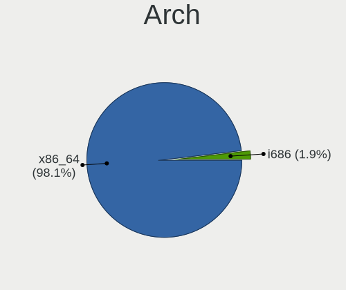
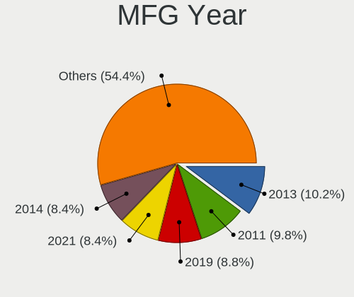
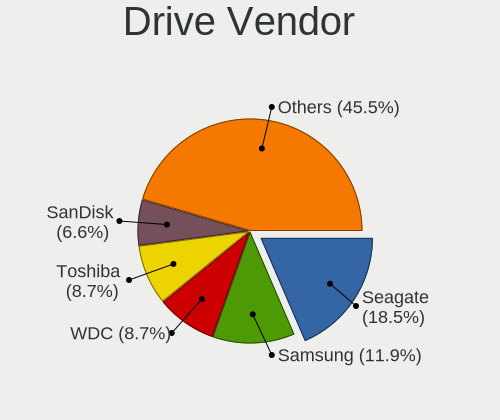
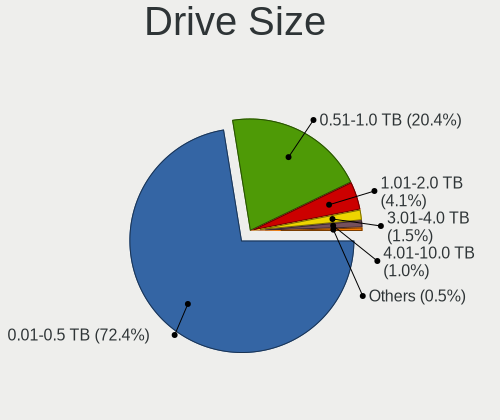
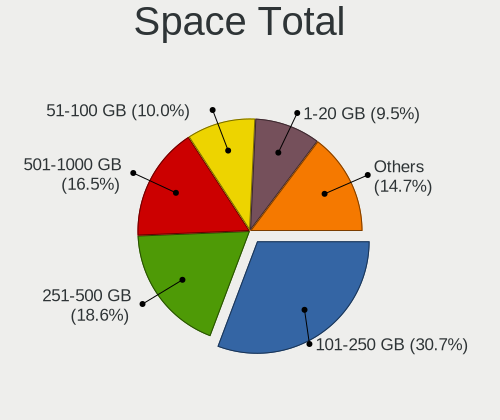
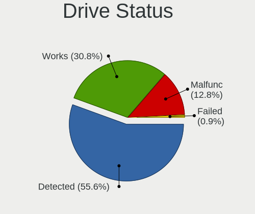
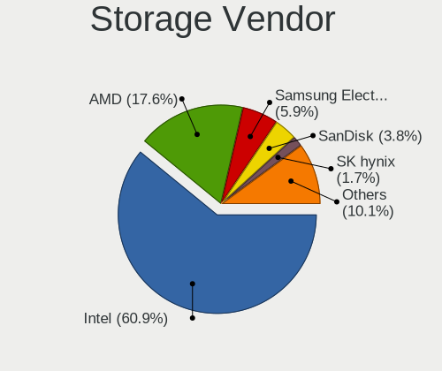
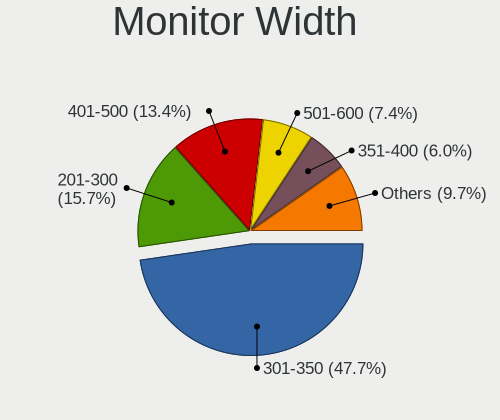
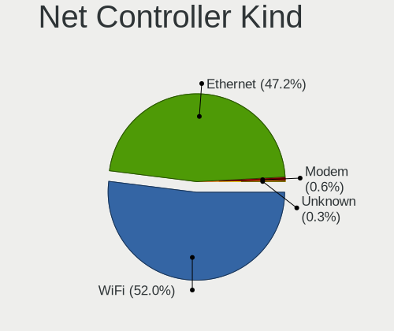
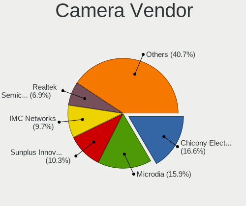

Linux in Dominican Republic - Tested Hardware & Statistics
----------------------------------------------------------

A project to collect tested hardware configurations for Linux in Dominican Republic.

Anyone can contribute to this report by the [hw-probe](https://github.com/linuxhw/hw-probe) tool:

    sudo -E hw-probe -all -upload

Please contribute! Especially if your hardware is rare.

This is a report for all computer types. See also reports for [desktops](/Location/Dominican_Republic/Desktop/README.md) and [notebooks](/Location/Dominican_Republic/Notebook/README.md).

Contents
--------

* [ Test Cases ](#test-cases)

* [ System ](#system)
  - [ OS                       ](#os)
  - [ OS Family                ](#os-family)
  - [ Kernel                   ](#kernel)
  - [ Kernel Family            ](#kernel-family)
  - [ Kernel Major Ver.        ](#kernel-major-ver)
  - [ Arch                     ](#arch)
  - [ DE                       ](#de)
  - [ Display Server           ](#display-server)
  - [ Display Manager          ](#display-manager)
  - [ OS Lang                  ](#os-lang)
  - [ Boot Mode                ](#boot-mode)
  - [ Filesystem               ](#filesystem)
  - [ Part. scheme             ](#part-scheme)
  - [ Dual Boot with Linux/BSD ](#dual-boot-with-linuxbsd)
  - [ Dual Boot (Win)          ](#dual-boot-win)

* [ Board ](#board)
  - [ Vendor                   ](#vendor)
  - [ Model                    ](#model)
  - [ Model Family             ](#model-family)
  - [ MFG Year                 ](#mfg-year)
  - [ Form Factor              ](#form-factor)
  - [ Secure Boot              ](#secure-boot)
  - [ Coreboot                 ](#coreboot)
  - [ RAM Size                 ](#ram-size)
  - [ RAM Used                 ](#ram-used)
  - [ Total Drives             ](#total-drives)
  - [ Has CD-ROM               ](#has-cd-rom)
  - [ Has Ethernet             ](#has-ethernet)
  - [ Has WiFi                 ](#has-wifi)
  - [ Has Bluetooth            ](#has-bluetooth)

* [ Location ](#location)
  - [ Country                  ](#country)
  - [ City                     ](#city)

* [ Drives ](#drives)
  - [ Drive Vendor             ](#drive-vendor)
  - [ Drive Model              ](#drive-model)
  - [ HDD Vendor               ](#hdd-vendor)
  - [ SSD Vendor               ](#ssd-vendor)
  - [ Drive Kind               ](#drive-kind)
  - [ Drive Connector          ](#drive-connector)
  - [ Drive Size               ](#drive-size)
  - [ Space Total              ](#space-total)
  - [ Space Used               ](#space-used)
  - [ Malfunc. Drives          ](#malfunc-drives)
  - [ Malfunc. Drive Vendor    ](#malfunc-drive-vendor)
  - [ Malfunc. HDD Vendor      ](#malfunc-hdd-vendor)
  - [ Malfunc. Drive Kind      ](#malfunc-drive-kind)
  - [ Failed Drives            ](#failed-drives)
  - [ Failed Drive Vendor      ](#failed-drive-vendor)
  - [ Drive Status             ](#drive-status)

* [ Storage controller ](#storage-controller)
  - [ Storage Vendor           ](#storage-vendor)
  - [ Storage Model            ](#storage-model)
  - [ Storage Kind             ](#storage-kind)

* [ Processor ](#processor)
  - [ CPU Vendor               ](#cpu-vendor)
  - [ CPU Model                ](#cpu-model)
  - [ CPU Model Family         ](#cpu-model-family)
  - [ CPU Cores                ](#cpu-cores)
  - [ CPU Sockets              ](#cpu-sockets)
  - [ CPU Threads              ](#cpu-threads)
  - [ CPU Op-Modes             ](#cpu-op-modes)
  - [ CPU Microcode            ](#cpu-microcode)
  - [ CPU Microarch            ](#cpu-microarch)

* [ Graphics ](#graphics)
  - [ GPU Vendor               ](#gpu-vendor)
  - [ GPU Model                ](#gpu-model)
  - [ GPU Combo                ](#gpu-combo)
  - [ GPU Driver               ](#gpu-driver)
  - [ GPU Memory               ](#gpu-memory)

* [ Monitor ](#monitor)
  - [ Monitor Vendor           ](#monitor-vendor)
  - [ Monitor Model            ](#monitor-model)
  - [ Monitor Resolution       ](#monitor-resolution)
  - [ Monitor Diagonal         ](#monitor-diagonal)
  - [ Monitor Width            ](#monitor-width)
  - [ Aspect Ratio             ](#aspect-ratio)
  - [ Monitor Area             ](#monitor-area)
  - [ Pixel Density            ](#pixel-density)
  - [ Multiple Monitors        ](#multiple-monitors)

* [ Network ](#network)
  - [ Net Controller Vendor    ](#net-controller-vendor)
  - [ Net Controller Model     ](#net-controller-model)
  - [ Wireless Vendor          ](#wireless-vendor)
  - [ Wireless Model           ](#wireless-model)
  - [ Ethernet Vendor          ](#ethernet-vendor)
  - [ Ethernet Model           ](#ethernet-model)
  - [ Net Controller Kind      ](#net-controller-kind)
  - [ Used Controller          ](#used-controller)
  - [ NICs                     ](#nics)
  - [ IPv6                     ](#ipv6)

* [ Bluetooth ](#bluetooth)
  - [ Bluetooth Vendor         ](#bluetooth-vendor)
  - [ Bluetooth Model          ](#bluetooth-model)

* [ Sound ](#sound)
  - [ Sound Vendor             ](#sound-vendor)
  - [ Sound Model              ](#sound-model)

* [ Memory ](#memory)
  - [ Memory Vendor            ](#memory-vendor)
  - [ Memory Model             ](#memory-model)
  - [ Memory Kind              ](#memory-kind)
  - [ Memory Form Factor       ](#memory-form-factor)
  - [ Memory Size              ](#memory-size)
  - [ Memory Speed             ](#memory-speed)

* [ Printers & scanners ](#printers--scanners)
  - [ Printer Vendor           ](#printer-vendor)
  - [ Printer Model            ](#printer-model)
  - [ Scanner Vendor           ](#scanner-vendor)
  - [ Scanner Model            ](#scanner-model)

* [ Camera ](#camera)
  - [ Camera Vendor            ](#camera-vendor)
  - [ Camera Model             ](#camera-model)

* [ Security ](#security)
  - [ Fingerprint Vendor       ](#fingerprint-vendor)
  - [ Fingerprint Model        ](#fingerprint-model)
  - [ Chipcard Vendor          ](#chipcard-vendor)
  - [ Chipcard Model           ](#chipcard-model)

* [ Unsupported ](#unsupported)
  - [ Unsupported Devices      ](#unsupported-devices)
  - [ Unsupported Device Types ](#unsupported-device-types)

Test Cases
----------

Total: 171

| Vendor        | Model                       | Form-Factor | Probe                                                      | Date         |
|---------------|-----------------------------|-------------|------------------------------------------------------------|--------------|
| Acer          | Aspire A515-45              | Notebook    | [9e48793165](https://linux-hardware.org/?probe=9e48793165) | Aug 18, 2022 |
| Gigabyte      | A520I AC                    | Desktop     | [0bf3f1a8a2](https://linux-hardware.org/?probe=0bf3f1a8a2) | Jul 31, 2022 |
| Gigabyte      | A520I AC                    | Desktop     | [f0d27ae2f0](https://linux-hardware.org/?probe=f0d27ae2f0) | Jul 30, 2022 |
| Dell          | 042P49 A02                  | Desktop     | [2b09076619](https://linux-hardware.org/?probe=2b09076619) | Jul 30, 2022 |
| Dell          | OptiPlex 780                | Desktop     | [7a029315b9](https://linux-hardware.org/?probe=7a029315b9) | Jul 28, 2022 |
| Acer          | Aspire A515-45              | Notebook    | [47dee227ba](https://linux-hardware.org/?probe=47dee227ba) | Jul 28, 2022 |
| Dell          | Latitude E5440              | Notebook    | [c8e68471c1](https://linux-hardware.org/?probe=c8e68471c1) | Jul 16, 2022 |
| Acer          | Aspire E5-571               | Notebook    | [9cd0caeff2](https://linux-hardware.org/?probe=9cd0caeff2) | Jul 14, 2022 |
| ECS           | ClassMate                   | Notebook    | [c86fa72fe1](https://linux-hardware.org/?probe=c86fa72fe1) | Jun 13, 2022 |
| Microsoft     | Surface Go                  | Tablet      | [fb6db84371](https://linux-hardware.org/?probe=fb6db84371) | Jun 11, 2022 |
| Lenovo        | G505s 20255                 | Notebook    | [578aee86ed](https://linux-hardware.org/?probe=578aee86ed) | May 27, 2022 |
| Dell          | 08NPPY A00                  | Desktop     | [e1e9853d49](https://linux-hardware.org/?probe=e1e9853d49) | May 26, 2022 |
| Dell          | 08NPPY A00                  | Desktop     | [62c1081de8](https://linux-hardware.org/?probe=62c1081de8) | May 23, 2022 |
| Gigabyte      | B450M DS3H V2               | Desktop     | [3e9f067939](https://linux-hardware.org/?probe=3e9f067939) | May 13, 2022 |
| MSI           | CR70 2M/CX70 2OC/CX70 2O... | Notebook    | [c72447a3ea](https://linux-hardware.org/?probe=c72447a3ea) | May 03, 2022 |
| TODOS INDU... | Easytouch_2022_V1           | Notebook    | [efc26220c4](https://linux-hardware.org/?probe=efc26220c4) | May 01, 2022 |
| MSI           | CR70 2M/CX70 2OC/CX70 2O... | Notebook    | [454226474b](https://linux-hardware.org/?probe=454226474b) | Apr 29, 2022 |
| Gigabyte      | Z87X-UD5 TH-CF              | Desktop     | [5dc83ea64b](https://linux-hardware.org/?probe=5dc83ea64b) | Apr 24, 2022 |
| Unknown       | K8M800-8237                 | Desktop     | [791e4eeaae](https://linux-hardware.org/?probe=791e4eeaae) | Apr 07, 2022 |
| Unknown       | K8M800-8237                 | Desktop     | [3447b4c67a](https://linux-hardware.org/?probe=3447b4c67a) | Apr 07, 2022 |
| HP            | ENVY Laptop 13-ad0xx        | Notebook    | [9d5011b41d](https://linux-hardware.org/?probe=9d5011b41d) | Mar 23, 2022 |
| ASUSTek       | K53E                        | Notebook    | [3a0af085ae](https://linux-hardware.org/?probe=3a0af085ae) | Mar 17, 2022 |
| Dell          | 0CRH6C A02                  | Desktop     | [726633bbcc](https://linux-hardware.org/?probe=726633bbcc) | Feb 18, 2022 |
| Samsung       | 930QCG                      | Convertible | [fb417d6589](https://linux-hardware.org/?probe=fb417d6589) | Feb 18, 2022 |
| Lenovo        | Yoga 520-14IKB 80X8         | Convertible | [2322337991](https://linux-hardware.org/?probe=2322337991) | Feb 15, 2022 |
| Lenovo        | IdeaPad 320-15IKB 80XL      | Notebook    | [507f27294e](https://linux-hardware.org/?probe=507f27294e) | Feb 15, 2022 |
| Dell          | 0N4YC8 A00                  | Desktop     | [b32bc24608](https://linux-hardware.org/?probe=b32bc24608) | Jan 26, 2022 |
| Dell          | 0T10XW A01                  | Desktop     | [53e23140c0](https://linux-hardware.org/?probe=53e23140c0) | Jan 23, 2022 |
| EVOO          | EV-C-116-7                  | Notebook    | [3fe03ac079](https://linux-hardware.org/?probe=3fe03ac079) | Jan 03, 2022 |
| Lenovo        | ThinkPad T480s 20L7CTO1W... | Notebook    | [563f0e150e](https://linux-hardware.org/?probe=563f0e150e) | Dec 31, 2021 |
| Apple         | MacBookPro8,1               | Notebook    | [56d0201ca6](https://linux-hardware.org/?probe=56d0201ca6) | Dec 29, 2021 |
| Apple         | MacBookPro8,1               | Notebook    | [21f95ee091](https://linux-hardware.org/?probe=21f95ee091) | Dec 25, 2021 |
| Acer          | Aspire 5733Z                | Notebook    | [ea7511ce8d](https://linux-hardware.org/?probe=ea7511ce8d) | Dec 24, 2021 |
| Apple         | MacBookPro8,1               | Notebook    | [8e773bb4e5](https://linux-hardware.org/?probe=8e773bb4e5) | Dec 23, 2021 |
| Apple         | MacBookPro8,1               | Notebook    | [9f084a2062](https://linux-hardware.org/?probe=9f084a2062) | Dec 19, 2021 |
| HP            | Pavilion Gaming Laptop 1... | Notebook    | [9b89720cb4](https://linux-hardware.org/?probe=9b89720cb4) | Dec 14, 2021 |
| Lenovo        | G505s 20255                 | Notebook    | [b32fd5f07f](https://linux-hardware.org/?probe=b32fd5f07f) | Dec 07, 2021 |
| Lenovo        | ThinkPad T480s 20L7CTO1W... | Notebook    | [d1843d03ba](https://linux-hardware.org/?probe=d1843d03ba) | Dec 04, 2021 |
| Lenovo        | ThinkPad T410 2537N99       | Notebook    | [a77255409f](https://linux-hardware.org/?probe=a77255409f) | Dec 02, 2021 |
| Lenovo        | ThinkPad T410 2537N99       | Notebook    | [ef02c2fb6c](https://linux-hardware.org/?probe=ef02c2fb6c) | Dec 02, 2021 |
| Dell          | 0T10XW A01                  | Desktop     | [9164883468](https://linux-hardware.org/?probe=9164883468) | Nov 27, 2021 |
| Dell          | 0T10XW A01                  | Desktop     | [b137bf3459](https://linux-hardware.org/?probe=b137bf3459) | Nov 27, 2021 |
| Lenovo        | G505s 20255                 | Notebook    | [8d3228452b](https://linux-hardware.org/?probe=8d3228452b) | Nov 20, 2021 |
| Lenovo        | ThinkPad T470 20HD004AUS    | Notebook    | [80fb4514c5](https://linux-hardware.org/?probe=80fb4514c5) | Oct 23, 2021 |
| ASRock        | B450M-HDV R4.0              | Desktop     | [fb31c8d088](https://linux-hardware.org/?probe=fb31c8d088) | Oct 23, 2021 |
| Dell          | 0GTK4K A02                  | Desktop     | [044546d5fa](https://linux-hardware.org/?probe=044546d5fa) | Oct 19, 2021 |
| Dell          | Latitude E6410              | Notebook    | [bd65cdda08](https://linux-hardware.org/?probe=bd65cdda08) | Oct 08, 2021 |
| Apple         | MacBook2,1                  | Notebook    | [7b2dcf44d9](https://linux-hardware.org/?probe=7b2dcf44d9) | Sep 08, 2021 |
| HP            | Pavilion dv6                | Notebook    | [5038083b91](https://linux-hardware.org/?probe=5038083b91) | Sep 07, 2021 |
| Apple         | MacBook2,1                  | Notebook    | [e402a0b407](https://linux-hardware.org/?probe=e402a0b407) | Aug 31, 2021 |
| Dell          | Inspiron 5521               | Notebook    | [24bfc2b04a](https://linux-hardware.org/?probe=24bfc2b04a) | Aug 26, 2021 |
| HP            | 8265                        | Desktop     | [9a7e706a6b](https://linux-hardware.org/?probe=9a7e706a6b) | Aug 07, 2021 |
| Dell          | Inspiron 5521               | Notebook    | [8242b46551](https://linux-hardware.org/?probe=8242b46551) | Jul 29, 2021 |
| Gigabyte      | GA-78LMT-S2P                | Desktop     | [7fc508d633](https://linux-hardware.org/?probe=7fc508d633) | Jul 19, 2021 |
| Google        | Winky                       | Notebook    | [696230b066](https://linux-hardware.org/?probe=696230b066) | Jul 14, 2021 |
| Google        | Winky                       | Notebook    | [6048ac2ff9](https://linux-hardware.org/?probe=6048ac2ff9) | Jul 14, 2021 |
| Acer          | Aspire 1810TZ               | Notebook    | [3ed828bab0](https://linux-hardware.org/?probe=3ed828bab0) | Jul 11, 2021 |
| Acer          | Aspire 1810TZ               | Notebook    | [9b650cfab3](https://linux-hardware.org/?probe=9b650cfab3) | Jul 11, 2021 |
| Dell          | Latitude E6420              | Notebook    | [fe42f53d85](https://linux-hardware.org/?probe=fe42f53d85) | Jul 11, 2021 |
| Dell          | Inspiron N5050              | Notebook    | [772842d291](https://linux-hardware.org/?probe=772842d291) | Jul 06, 2021 |
| Gigabyte      | B450M DS3H-CF               | Desktop     | [891b06178e](https://linux-hardware.org/?probe=891b06178e) | Jun 29, 2021 |
| HP            | EliteBook 8460p             | Notebook    | [cc6035ae99](https://linux-hardware.org/?probe=cc6035ae99) | Jun 28, 2021 |
| SAELITE       | ES1AU11                     | Notebook    | [267ea9c15e](https://linux-hardware.org/?probe=267ea9c15e) | Jun 26, 2021 |
| SAELITE       | ES1AU11                     | Notebook    | [25dc027ef1](https://linux-hardware.org/?probe=25dc027ef1) | Jun 26, 2021 |
| Dell          | Latitude E6530              | Notebook    | [fda4879b12](https://linux-hardware.org/?probe=fda4879b12) | Jun 19, 2021 |
| Dell          | Latitude E6530              | Notebook    | [40566262f5](https://linux-hardware.org/?probe=40566262f5) | Jun 11, 2021 |
| Dell          | Latitude E6430              | Notebook    | [9ec2685f9d](https://linux-hardware.org/?probe=9ec2685f9d) | Jun 04, 2021 |
| Dell          | Latitude E6430              | Notebook    | [6098210314](https://linux-hardware.org/?probe=6098210314) | Jun 04, 2021 |
| ASUSTek       | ZenBook Pro Duo UX581GV_... | Notebook    | [5343885c32](https://linux-hardware.org/?probe=5343885c32) | May 17, 2021 |
| Dell          | Inspiron 3541               | Notebook    | [2170036527](https://linux-hardware.org/?probe=2170036527) | May 17, 2021 |
| Dell          | Inspiron 5570               | Notebook    | [d310246b09](https://linux-hardware.org/?probe=d310246b09) | Apr 30, 2021 |
| Dell          | Latitude D830               | Notebook    | [f6f0884fca](https://linux-hardware.org/?probe=f6f0884fca) | Apr 28, 2021 |
| Dell          | Latitude E6540              | Notebook    | [522d36a07e](https://linux-hardware.org/?probe=522d36a07e) | Apr 21, 2021 |
| Dell          | Latitude E6540              | Notebook    | [3c76496221](https://linux-hardware.org/?probe=3c76496221) | Apr 21, 2021 |
| ASUSTek       | H110M-E/M.2                 | Desktop     | [dc8b47f73d](https://linux-hardware.org/?probe=dc8b47f73d) | Feb 14, 2021 |
| Dell          | 0F6X5P A00                  | Desktop     | [4adcccb57c](https://linux-hardware.org/?probe=4adcccb57c) | Feb 14, 2021 |
| Dell          | Inspiron 3521               | Notebook    | [96d33743db](https://linux-hardware.org/?probe=96d33743db) | Jan 24, 2021 |
| Unknown       | Unknown                     | Desktop     | [2cf1c789ec](https://linux-hardware.org/?probe=2cf1c789ec) | Dec 29, 2020 |
| Lenovo        | ThinkPad E470 20H1006DUS    | Notebook    | [3c51b58a24](https://linux-hardware.org/?probe=3c51b58a24) | Dec 14, 2020 |
| Lenovo        | ThinkBook 14s-IWL 20RM      | Notebook    | [f18b7b439b](https://linux-hardware.org/?probe=f18b7b439b) | Dec 05, 2020 |
| Fujitsu       | LIFEBOOK AH562              | Notebook    | [68c670f9e0](https://linux-hardware.org/?probe=68c670f9e0) | Dec 01, 2020 |
| Samsung       | RV420/RV520/RV720/E3530/... | Notebook    | [012580c2a7](https://linux-hardware.org/?probe=012580c2a7) | Nov 10, 2020 |
| HP            | Notebook                    | Notebook    | [5176e73c5a](https://linux-hardware.org/?probe=5176e73c5a) | Oct 27, 2020 |
| ASUSTek       | X553MA                      | Notebook    | [d6729d6c6a](https://linux-hardware.org/?probe=d6729d6c6a) | Oct 17, 2020 |
| Samsung       | RV420/RV520/RV720/E3530/... | Notebook    | [907bc464e9](https://linux-hardware.org/?probe=907bc464e9) | Oct 13, 2020 |
| HP            | EliteBook 8540w             | Notebook    | [03c52e4d49](https://linux-hardware.org/?probe=03c52e4d49) | Oct 10, 2020 |
| Lenovo        | ThinkPad P43s 20RH0013US    | Notebook    | [e540cc2901](https://linux-hardware.org/?probe=e540cc2901) | Oct 09, 2020 |
| HP            | 3647h                       | Desktop     | [5788758b90](https://linux-hardware.org/?probe=5788758b90) | Oct 08, 2020 |
| Dell          | 0MM599                      | Desktop     | [fce90bd449](https://linux-hardware.org/?probe=fce90bd449) | Oct 06, 2020 |
| Dell          | Latitude E5530 non-vPro     | Notebook    | [fd73b699f6](https://linux-hardware.org/?probe=fd73b699f6) | Oct 05, 2020 |
| Dell          | Latitude D620               | Notebook    | [3832d0c33e](https://linux-hardware.org/?probe=3832d0c33e) | Sep 29, 2020 |
| Dell          | Inspiron 5555               | Notebook    | [a7be8edb39](https://linux-hardware.org/?probe=a7be8edb39) | Sep 28, 2020 |
| Dell          | Inspiron 5555               | Notebook    | [079a8b39a7](https://linux-hardware.org/?probe=079a8b39a7) | Sep 27, 2020 |
| HP            | Laptop 15-bw0xx             | Notebook    | [80611690cf](https://linux-hardware.org/?probe=80611690cf) | Sep 13, 2020 |
| Dell          | Latitude D620               | Notebook    | [d14cb277b7](https://linux-hardware.org/?probe=d14cb277b7) | Sep 12, 2020 |
| HP            | ProBook 6470b               | Notebook    | [c622e7298d](https://linux-hardware.org/?probe=c622e7298d) | Sep 07, 2020 |
| Gigabyte      | GA-78LMT-USB3 R2 sex        | Desktop     | [9b34b0a6c3](https://linux-hardware.org/?probe=9b34b0a6c3) | Sep 03, 2020 |
| Dell          | Vostro 5471                 | Notebook    | [6d24c75bcf](https://linux-hardware.org/?probe=6d24c75bcf) | Sep 03, 2020 |
| MSI           | H81M-E33                    | Desktop     | [d24cd3858d](https://linux-hardware.org/?probe=d24cd3858d) | Aug 29, 2020 |
| Nuvision      | L1W6_I1101_G Reserved       | Notebook    | [b3e73aa9ba](https://linux-hardware.org/?probe=b3e73aa9ba) | Aug 29, 2020 |
| MSI           | H81M-E33                    | Desktop     | [9eda45f755](https://linux-hardware.org/?probe=9eda45f755) | Aug 20, 2020 |
| Lenovo        | IdeaPad 330S-15IKB 81F5     | Notebook    | [d7d672869f](https://linux-hardware.org/?probe=d7d672869f) | Aug 16, 2020 |
| MSI           | H81M-E33                    | Desktop     | [ba3577fb00](https://linux-hardware.org/?probe=ba3577fb00) | Aug 14, 2020 |
| Gigabyte      | GA-78LMT-USB3 SEx           | Desktop     | [081a2c3e4c](https://linux-hardware.org/?probe=081a2c3e4c) | Aug 03, 2020 |
| ASUSTek       | TUF Gaming FX505DV_FX505... | Notebook    | [8eb28a49c4](https://linux-hardware.org/?probe=8eb28a49c4) | Aug 03, 2020 |
| MSI           | H81M-E33                    | Desktop     | [6bedf88c28](https://linux-hardware.org/?probe=6bedf88c28) | Jul 30, 2020 |
| Lenovo        | Legion 5 15ARH05 82B5       | Notebook    | [fcbd102a50](https://linux-hardware.org/?probe=fcbd102a50) | Jul 30, 2020 |
| MSI           | B350 GAMING PLUS            | Desktop     | [ca22d3b169](https://linux-hardware.org/?probe=ca22d3b169) | Jul 24, 2020 |
| ASRock        | G41M-VS3                    | Desktop     | [4877877772](https://linux-hardware.org/?probe=4877877772) | Jul 04, 2020 |
| Dell          | Vostro A860                 | Notebook    | [16ded4e283](https://linux-hardware.org/?probe=16ded4e283) | Jun 28, 2020 |
| Dell          | Inspiron 1545               | Notebook    | [093c4d226c](https://linux-hardware.org/?probe=093c4d226c) | Jun 28, 2020 |
| MSI           | H81M-E33                    | Desktop     | [2d531766ab](https://linux-hardware.org/?probe=2d531766ab) | Jun 26, 2020 |
| HP            | 250 G3                      | Notebook    | [1862b881c0](https://linux-hardware.org/?probe=1862b881c0) | Jun 23, 2020 |
| Acer          | Aspire one 1-431            | Notebook    | [80f65d1ab4](https://linux-hardware.org/?probe=80f65d1ab4) | Jun 23, 2020 |
| Biostar       | G41D3C                      | Desktop     | [15959c0828](https://linux-hardware.org/?probe=15959c0828) | Jun 15, 2020 |
| Acer          | Aspire one 1-431            | Notebook    | [5994ea3a38](https://linux-hardware.org/?probe=5994ea3a38) | Jun 09, 2020 |
| Samsung       | 905S3G/906S3G/915S3G/930... | Notebook    | [4003a55819](https://linux-hardware.org/?probe=4003a55819) | Jun 03, 2020 |
| Samsung       | 905S3G/906S3G/915S3G/930... | Notebook    | [131d3a17f3](https://linux-hardware.org/?probe=131d3a17f3) | May 30, 2020 |
| Dell          | Vostro A860                 | Notebook    | [35d08abb65](https://linux-hardware.org/?probe=35d08abb65) | May 20, 2020 |
| Dell          | Latitude E6410              | Notebook    | [4e98eb67c5](https://linux-hardware.org/?probe=4e98eb67c5) | May 19, 2020 |
| Dell          | Latitude 3340               | Notebook    | [a8795064a1](https://linux-hardware.org/?probe=a8795064a1) | May 18, 2020 |
| Dell          | Latitude 3340               | Notebook    | [a07d882043](https://linux-hardware.org/?probe=a07d882043) | May 18, 2020 |
| Dell          | Latitude E6430              | Notebook    | [4316261d97](https://linux-hardware.org/?probe=4316261d97) | May 15, 2020 |
| Dell          | Latitude E6430              | Notebook    | [eef205a77d](https://linux-hardware.org/?probe=eef205a77d) | May 14, 2020 |
| HP            | G60                         | Notebook    | [90ec25f151](https://linux-hardware.org/?probe=90ec25f151) | May 13, 2020 |
| HP            | G60                         | Notebook    | [0b84216baf](https://linux-hardware.org/?probe=0b84216baf) | May 13, 2020 |
| Dell          | Inspiron 3521               | Notebook    | [1b33a3d155](https://linux-hardware.org/?probe=1b33a3d155) | May 03, 2020 |
| Dell          | Latitude E6430              | Notebook    | [5a74b9f950](https://linux-hardware.org/?probe=5a74b9f950) | May 03, 2020 |
| Dell          | Latitude E6430              | Notebook    | [31e36437f4](https://linux-hardware.org/?probe=31e36437f4) | May 03, 2020 |
| Dell          | Latitude E6410              | Notebook    | [125cc5d7fd](https://linux-hardware.org/?probe=125cc5d7fd) | Apr 26, 2020 |
| HP            | 3031h                       | Desktop     | [0278ac4043](https://linux-hardware.org/?probe=0278ac4043) | Apr 07, 2020 |
| ASUSTek       | H170 PRO GAMING             | Desktop     | [87496c419f](https://linux-hardware.org/?probe=87496c419f) | Apr 07, 2020 |
| Dell          | 0WG864                      | Desktop     | [b7c74749f8](https://linux-hardware.org/?probe=b7c74749f8) | Mar 30, 2020 |
| ASUSTek       | V230IC-DDR4                 | All in one  | [860893085c](https://linux-hardware.org/?probe=860893085c) | Mar 29, 2020 |
| ASUSTek       | V230IC-DDR4                 | All in one  | [48e8186c4f](https://linux-hardware.org/?probe=48e8186c4f) | Mar 28, 2020 |
| ASUSTek       | V230IC-DDR4                 | All in one  | [080f6bbb80](https://linux-hardware.org/?probe=080f6bbb80) | Mar 28, 2020 |
| ASUSTek       | V230IC-DDR4                 | All in one  | [740334eed7](https://linux-hardware.org/?probe=740334eed7) | Mar 28, 2020 |
| Dell          | Latitude 3330               | Notebook    | [4033fca5eb](https://linux-hardware.org/?probe=4033fca5eb) | Mar 22, 2020 |
| Foxconn       | 2ABF                        | Desktop     | [44fe9bdc7d](https://linux-hardware.org/?probe=44fe9bdc7d) | Mar 20, 2020 |
| Foxconn       | 2ABF                        | Desktop     | [970faeadaf](https://linux-hardware.org/?probe=970faeadaf) | Mar 19, 2020 |
| HP            | 3031h                       | Desktop     | [3b10a92ee2](https://linux-hardware.org/?probe=3b10a92ee2) | Mar 19, 2020 |
| ASUSTek       | H170 PRO GAMING             | Desktop     | [4f152e3015](https://linux-hardware.org/?probe=4f152e3015) | Mar 06, 2020 |
| Dell          | 06D7TR A00                  | Desktop     | [4775efe228](https://linux-hardware.org/?probe=4775efe228) | Feb 27, 2020 |
| Lenovo        | ThinkPad W540 20BHS0GB06    | Notebook    | [185bf79f49](https://linux-hardware.org/?probe=185bf79f49) | Feb 08, 2020 |
| Lenovo        | ThinkPad W540 20BHS0GB06    | Notebook    | [cb7950841c](https://linux-hardware.org/?probe=cb7950841c) | Feb 07, 2020 |
| Lenovo        | ThinkPad W540 20BHS0GB06    | Notebook    | [3212549df1](https://linux-hardware.org/?probe=3212549df1) | Feb 05, 2020 |
| Lenovo        | Z50-75 80EC                 | Notebook    | [661a8243a3](https://linux-hardware.org/?probe=661a8243a3) | Feb 01, 2020 |
| Lenovo        | Z50-75 80EC                 | Notebook    | [ee353d9346](https://linux-hardware.org/?probe=ee353d9346) | Feb 01, 2020 |
| Apple         | MacBookPro8,1               | Notebook    | [51c3c0bb31](https://linux-hardware.org/?probe=51c3c0bb31) | Jan 07, 2020 |
| Apple         | MacBookPro8,1               | Notebook    | [4df330ed80](https://linux-hardware.org/?probe=4df330ed80) | Jan 07, 2020 |
| Chuwi         | Hi10 pro tablet             | Tablet      | [a61df97ccd](https://linux-hardware.org/?probe=a61df97ccd) | Dec 19, 2019 |
| Chuwi         | Hi10 pro tablet             | Tablet      | [4437a2deed](https://linux-hardware.org/?probe=4437a2deed) | Dec 18, 2019 |
| Chuwi         | Hi10 pro tablet             | Tablet      | [edddb5eb5b](https://linux-hardware.org/?probe=edddb5eb5b) | Dec 18, 2019 |
| Apple         | MacBookPro5,5               | Notebook    | [e4a03527b5](https://linux-hardware.org/?probe=e4a03527b5) | Dec 11, 2019 |
| Toshiba       | Satellite C55-A             | Notebook    | [a760ea9cb2](https://linux-hardware.org/?probe=a760ea9cb2) | Nov 14, 2019 |
| Toshiba       | Satellite C55-A             | Notebook    | [b2477d7154](https://linux-hardware.org/?probe=b2477d7154) | Nov 07, 2019 |
| Gigabyte      | B450 AORUS M                | Desktop     | [628a2983df](https://linux-hardware.org/?probe=628a2983df) | Nov 05, 2019 |
| Apple         | MacBookPro5,5               | Notebook    | [cb7b5a4d2e](https://linux-hardware.org/?probe=cb7b5a4d2e) | Oct 13, 2019 |
| Dell          | Latitude E6430              | Notebook    | [49d71b26e7](https://linux-hardware.org/?probe=49d71b26e7) | Oct 08, 2019 |
| Dell          | Latitude E6430              | Notebook    | [b3ef7b4357](https://linux-hardware.org/?probe=b3ef7b4357) | Oct 06, 2019 |
| Dell          | 0M132G A00                  | Desktop     | [b79e419f05](https://linux-hardware.org/?probe=b79e419f05) | Aug 24, 2019 |
| Apple         | MacBookPro5,5               | Notebook    | [9a7d44bf28](https://linux-hardware.org/?probe=9a7d44bf28) | Aug 15, 2019 |
| HP            | Pavilion ze2000 (EC201UA... | Notebook    | [572baa05f4](https://linux-hardware.org/?probe=572baa05f4) | Jun 15, 2019 |
| HP            | 3397                        | Desktop     | [24770f4baf](https://linux-hardware.org/?probe=24770f4baf) | Jun 06, 2019 |
| ASUSTek       | T100TA                      | Notebook    | [412e4da0ce](https://linux-hardware.org/?probe=412e4da0ce) | May 21, 2019 |
| HP            | 3396                        | Desktop     | [46d189dc80](https://linux-hardware.org/?probe=46d189dc80) | May 20, 2019 |
| Lenovo        | G40-70 20369                | Notebook    | [1f456620db](https://linux-hardware.org/?probe=1f456620db) | May 05, 2019 |
| HP            | Laptop 15-bw0xx             | Notebook    | [0b9c00412b](https://linux-hardware.org/?probe=0b9c00412b) | Dec 14, 2018 |
| Gigabyte      | GA-78LMT-USB3 SEx           | Desktop     | [e30bc2b8f2](https://linux-hardware.org/?probe=e30bc2b8f2) | Nov 02, 2018 |
| Dell          | 0PU052                      | Desktop     | [a5f063bc44](https://linux-hardware.org/?probe=a5f063bc44) | Apr 19, 2018 |
| Dell          | 0PU052                      | Desktop     | [e8fb115c06](https://linux-hardware.org/?probe=e8fb115c06) | Jan 25, 2018 |

System
------

OS
--

Installed operating systems

| Name                         | Computers | Percent |
|------------------------------|-----------|---------|
| Ubuntu 20.04                 | 21        | 18.26%  |
| Ubuntu 18.04                 | 17        | 14.78%  |
| OpenMandriva 4.2             | 5         | 4.35%   |
| Arch Rolling                 | 5         | 4.35%   |
| OpenMandriva 4.3             | 3         | 2.61%   |
| Linux Mint 20.3              | 3         | 2.61%   |
| Fedora 34                    | 3         | 2.61%   |
| Arch                         | 3         | 2.61%   |
| Ubuntu 22.04                 | 2         | 1.74%   |
| Ubuntu 21.10                 | 2         | 1.74%   |
| Pop!_OS 20.10                | 2         | 1.74%   |
| openSUSE Tumbleweed-XXXXXXXX | 2         | 1.74%   |
| Linux Mint 20.1              | 2         | 1.74%   |
| Linux Mint 19.3              | 2         | 1.74%   |
| Fedora 36                    | 2         | 1.74%   |
| Fedora 33                    | 2         | 1.74%   |
| Debian 11                    | 2         | 1.74%   |
| ArcoLinux Rolling            | 2         | 1.74%   |
| Xubuntu 19.10                | 1         | 0.87%   |
| Xubuntu 18.04                | 1         | 0.87%   |
| Void Linux Rolling           | 1         | 0.87%   |
| Ubuntu Budgie 22.04          | 1         | 0.87%   |
| Ubuntu Budgie 21.10          | 1         | 0.87%   |
| Ubuntu Budgie 20.04          | 1         | 0.87%   |
| Ubuntu 21.04                 | 1         | 0.87%   |
| Ubuntu 19.10                 | 1         | 0.87%   |
| Ubuntu 19.04                 | 1         | 0.87%   |
| Solus 4.1                    | 1         | 0.87%   |
| ROSA R10                     | 1         | 0.87%   |
| Pop!_OS 22.04                | 1         | 0.87%   |
| Pop!_OS 21.04                | 1         | 0.87%   |
| Pop!_OS 20.04                | 1         | 0.87%   |
| OpenMandriva 4.90            | 1         | 0.87%   |
| Manjaro 21.2.3               | 1         | 0.87%   |
| Manjaro 21.1.2               | 1         | 0.87%   |
| Manjaro 20.1                 | 1         | 0.87%   |
| Lubuntu 21.04                | 1         | 0.87%   |
| LMDE 4                       | 1         | 0.87%   |
| Linux Mint 20.2              | 1         | 0.87%   |
| Linux Mint 20                | 1         | 0.87%   |
| Kubuntu 20.04                | 1         | 0.87%   |
| KDE neon 20.04               | 1         | 0.87%   |
| Kali 2022.1                  | 1         | 0.87%   |
| Fedora 32                    | 1         | 0.87%   |
| Fedora 31                    | 1         | 0.87%   |
| Fedora 30                    | 1         | 0.87%   |
| Elementary 6                 | 1         | 0.87%   |
| Debian 10                    | 1         | 0.87%   |
| Clear Linux 36250            | 1         | 0.87%   |
| Clear Linux 34500            | 1         | 0.87%   |
| Clear Linux 31940            | 1         | 0.87%   |
| CentOS 8                     | 1         | 0.87%   |
| BlackPanther 18.1            | 1         | 0.87%   |

OS Family
---------

OS without a version

| Name          | Computers | Percent |
|---------------|-----------|---------|
| Ubuntu        | 43        | 38.05%  |
| Fedora        | 10        | 8.85%   |
| OpenMandriva  | 9         | 7.96%   |
| Linux Mint    | 9         | 7.96%   |
| Arch          | 8         | 7.08%   |
| Pop!_OS       | 5         | 4.42%   |
| Ubuntu Budgie | 3         | 2.65%   |
| Manjaro       | 3         | 2.65%   |
| Debian        | 3         | 2.65%   |
| Clear Linux   | 3         | 2.65%   |
| Xubuntu       | 2         | 1.77%   |
| openSUSE      | 2         | 1.77%   |
| ArcoLinux     | 2         | 1.77%   |
| Void Linux    | 1         | 0.88%   |
| Solus         | 1         | 0.88%   |
| ROSA          | 1         | 0.88%   |
| Lubuntu       | 1         | 0.88%   |
| LMDE          | 1         | 0.88%   |
| Kubuntu       | 1         | 0.88%   |
| KDE neon      | 1         | 0.88%   |
| Kali          | 1         | 0.88%   |
| Elementary    | 1         | 0.88%   |
| CentOS        | 1         | 0.88%   |
| BlackPanther  | 1         | 0.88%   |

Kernel
------

Version of the Linux kernel

| Version                  | Computers | Percent |
|--------------------------|-----------|---------|
| 5.4.0-48-generic         | 4         | 3.05%   |
| 5.4.0-42-generic         | 4         | 3.05%   |
| 5.10.14-desktop-1omv4002 | 4         | 3.05%   |
| 5.16.7-desktop-1omv4003  | 3         | 2.29%   |
| 5.13.0-22-generic        | 3         | 2.29%   |
| 5.4.0-77-generic         | 2         | 1.53%   |
| 5.4.0-52-generic         | 2         | 1.53%   |
| 5.4.0-33-generic         | 2         | 1.53%   |
| 5.3.0-51-generic         | 2         | 1.53%   |
| 5.3.0-46-generic         | 2         | 1.53%   |
| 5.3.0-42-generic         | 2         | 1.53%   |
| 5.11.0-40-generic        | 2         | 1.53%   |
| 5.11.0-25-generic        | 2         | 1.53%   |
| 5.0.0-32-generic         | 2         | 1.53%   |
| 5.9.16-200.fc33.x86_64   | 1         | 0.76%   |
| 5.9.12-xanmod1           | 1         | 0.76%   |
| 5.9.11-arch2-1           | 1         | 0.76%   |
| 5.9.1-arch1-1            | 1         | 0.76%   |
| 5.8.8-arch1-1            | 1         | 0.76%   |
| 5.8.5-arch1-1            | 1         | 0.76%   |
| 5.8.15-301.fc33.x86_64   | 1         | 0.76%   |
| 5.8.12_1                 | 1         | 0.76%   |
| 5.8.0-38-generic         | 1         | 0.76%   |
| 5.7.7-zen1-1-zen         | 1         | 0.76%   |
| 5.7.7-arch1-1            | 1         | 0.76%   |
| 5.7.10-201.fc32.x86_64   | 1         | 0.76%   |
| 5.6.19-158.current       | 1         | 0.76%   |
| 5.5.13-arch1-1           | 1         | 0.76%   |
| 5.4.60-2-MANJARO         | 1         | 0.76%   |
| 5.4.4-879.native         | 1         | 0.76%   |
| 5.4.15-200.fc31.x86_64   | 1         | 0.76%   |
| 5.4.0-7642-generic       | 1         | 0.76%   |
| 5.4.0-74-generic         | 1         | 0.76%   |
| 5.4.0-72-generic         | 1         | 0.76%   |
| 5.4.0-39-generic         | 1         | 0.76%   |
| 5.4.0-37-generic         | 1         | 0.76%   |
| 5.4.0-29-generic         | 1         | 0.76%   |
| 5.4.0-28-generic         | 1         | 0.76%   |
| 5.4.0-26-generic         | 1         | 0.76%   |
| 5.4.0-110-generic        | 1         | 0.76%   |
| 5.4.0-109-generic        | 1         | 0.76%   |
| 5.4.0-107-generic        | 1         | 0.76%   |
| 5.4.0-105-generic        | 1         | 0.76%   |
| 5.3.0-61-generic         | 1         | 0.76%   |
| 5.3.0-40-generic         | 1         | 0.76%   |
| 5.3.0-28-generic         | 1         | 0.76%   |
| 5.3.0-19-generic         | 1         | 0.76%   |
| 5.18.17-200.fc36.x86_64  | 1         | 0.76%   |
| 5.18.13-200.fc36.x86_64  | 1         | 0.76%   |
| 5.18.12-desktop-3omv4090 | 1         | 0.76%   |
| 5.18.11-200.fc36.x86_64  | 1         | 0.76%   |
| 5.18.10-76051810-generic | 1         | 0.76%   |
| 5.17.6-xanmod1           | 1         | 0.76%   |
| 5.17.4-1139.native       | 1         | 0.76%   |
| 5.15.21-1-MANJARO        | 1         | 0.76%   |
| 5.15.0-kali3-amd64       | 1         | 0.76%   |
| 5.15.0-41-generic        | 1         | 0.76%   |
| 5.15.0-37-generic        | 1         | 0.76%   |
| 5.14.13-200.fc34.x86_64  | 1         | 0.76%   |
| 5.13.13-1-MANJARO        | 1         | 0.76%   |

Kernel Family
-------------

Linux kernel without a distro release

| Version | Computers | Percent |
|---------|-----------|---------|
| 5.4.0   | 25        | 20.66%  |
| 5.13.0  | 10        | 8.26%   |
| 5.3.0   | 9         | 7.44%   |
| 5.11.0  | 8         | 6.61%   |
| 4.15.0  | 6         | 4.96%   |
| 5.0.0   | 5         | 4.13%   |
| 5.10.14 | 4         | 3.31%   |
| 5.16.7  | 3         | 2.48%   |
| 5.15.0  | 3         | 2.48%   |
| 5.7.7   | 2         | 1.65%   |
| 5.10.0  | 2         | 1.65%   |
| 4.19.0  | 2         | 1.65%   |
| 4.18.0  | 2         | 1.65%   |
| 5.9.16  | 1         | 0.83%   |
| 5.9.12  | 1         | 0.83%   |
| 5.9.11  | 1         | 0.83%   |
| 5.9.1   | 1         | 0.83%   |
| 5.8.8   | 1         | 0.83%   |
| 5.8.5   | 1         | 0.83%   |
| 5.8.15  | 1         | 0.83%   |
| 5.8.12  | 1         | 0.83%   |
| 5.8.0   | 1         | 0.83%   |
| 5.7.10  | 1         | 0.83%   |
| 5.6.19  | 1         | 0.83%   |
| 5.5.13  | 1         | 0.83%   |
| 5.4.60  | 1         | 0.83%   |
| 5.4.4   | 1         | 0.83%   |
| 5.4.15  | 1         | 0.83%   |
| 5.18.17 | 1         | 0.83%   |
| 5.18.13 | 1         | 0.83%   |
| 5.18.12 | 1         | 0.83%   |
| 5.18.11 | 1         | 0.83%   |
| 5.18.10 | 1         | 0.83%   |
| 5.17.6  | 1         | 0.83%   |
| 5.17.4  | 1         | 0.83%   |
| 5.15.21 | 1         | 0.83%   |
| 5.14.13 | 1         | 0.83%   |
| 5.13.13 | 1         | 0.83%   |
| 5.12.9  | 1         | 0.83%   |
| 5.12.15 | 1         | 0.83%   |
| 5.12.14 | 1         | 0.83%   |
| 5.12.12 | 1         | 0.83%   |
| 5.11.15 | 1         | 0.83%   |
| 5.11.12 | 1         | 0.83%   |
| 5.10.19 | 1         | 0.83%   |
| 5.1.6   | 1         | 0.83%   |
| 5.1.2   | 1         | 0.83%   |
| 5.0.10  | 1         | 0.83%   |
| 4.9.87  | 1         | 0.83%   |
| 4.9.60  | 1         | 0.83%   |
| 4.19.8  | 1         | 0.83%   |
| 4.18.16 | 1         | 0.83%   |
| 4.18.15 | 1         | 0.83%   |

Kernel Major Ver.
-----------------

Linux kernel major version

| Version | Computers | Percent |
|---------|-----------|---------|
| 5.4     | 28        | 23.53%  |
| 5.13    | 11        | 9.24%   |
| 5.11    | 10        | 8.4%    |
| 5.3     | 9         | 7.56%   |
| 5.10    | 7         | 5.88%   |
| 5.0     | 6         | 5.04%   |
| 4.15    | 6         | 5.04%   |
| 5.8     | 5         | 4.2%    |
| 5.9     | 4         | 3.36%   |
| 5.18    | 4         | 3.36%   |
| 5.15    | 4         | 3.36%   |
| 5.12    | 4         | 3.36%   |
| 4.18    | 4         | 3.36%   |
| 5.7     | 3         | 2.52%   |
| 5.16    | 3         | 2.52%   |
| 4.19    | 3         | 2.52%   |
| 5.17    | 2         | 1.68%   |
| 5.1     | 2         | 1.68%   |
| 5.6     | 1         | 0.84%   |
| 5.5     | 1         | 0.84%   |
| 5.14    | 1         | 0.84%   |
| 4.9     | 1         | 0.84%   |

Arch
----

OS architecture (x86_64, i586, etc.)

| Name   | Computers | Percent |
|--------|-----------|---------|
| x86_64 | 110       | 97.35%  |
| i686   | 3         | 2.65%   |

DE
--

Desktop Environment

| Name       | Computers | Percent |
|------------|-----------|---------|
| GNOME      | 56        | 49.12%  |
| KDE5       | 17        | 14.91%  |
| Unknown    | 11        | 9.65%   |
| XFCE       | 9         | 7.89%   |
| X-Cinnamon | 8         | 7.02%   |
| KDE        | 4         | 3.51%   |
| Budgie     | 4         | 3.51%   |
| sway       | 1         | 0.88%   |
| MATE       | 1         | 0.88%   |
| LXQt       | 1         | 0.88%   |
| KDE4       | 1         | 0.88%   |
| DWM        | 1         | 0.88%   |

Display Server
--------------

X11 or Wayland

| Name    | Computers | Percent |
|---------|-----------|---------|
| X11     | 95        | 83.33%  |
| Wayland | 13        | 11.4%   |
| Unknown | 4         | 3.51%   |
| Tty     | 2         | 1.75%   |

Display Manager
---------------

SDDM, LightDM, etc.

| Name    | Computers | Percent |
|---------|-----------|---------|
| Unknown | 63        | 55.75%  |
| SDDM    | 19        | 16.81%  |
| GDM     | 14        | 12.39%  |
| LightDM | 6         | 5.31%   |
| GDM3    | 6         | 5.31%   |
| TDM     | 4         | 3.54%   |
| KDM     | 1         | 0.88%   |

OS Lang
-------

Language

| Lang    | Computers | Percent |
|---------|-----------|---------|
| en_US   | 55        | 47.83%  |
| es_DO   | 34        | 29.57%  |
| Unknown | 14        | 12.17%  |
| es_ES   | 5         | 4.35%   |
| es_MX   | 3         | 2.61%   |
| en_CA   | 2         | 1.74%   |
| fr_FR   | 1         | 0.87%   |
| es_US   | 1         | 0.87%   |

Boot Mode
---------

EFI or BIOS

| Mode | Computers | Percent |
|------|-----------|---------|
| BIOS | 69        | 61.06%  |
| EFI  | 44        | 38.94%  |

Filesystem
----------

Type of filesystem

| Type    | Computers | Percent |
|---------|-----------|---------|
| Ext4    | 87        | 76.99%  |
| Overlay | 11        | 9.73%   |
| Btrfs   | 9         | 7.96%   |
| Xfs     | 3         | 2.65%   |
| Unknown | 2         | 1.77%   |
| Zfs     | 1         | 0.88%   |

Part. scheme
------------

Scheme of partitioning

| Type    | Computers | Percent |
|---------|-----------|---------|
| Unknown | 69        | 60.53%  |
| GPT     | 33        | 28.95%  |
| MBR     | 12        | 10.53%  |

Dual Boot with Linux/BSD
------------------------

Hosting more than one Linux/BSD

| Dual boot | Computers | Percent |
|-----------|-----------|---------|
| No        | 93        | 81.58%  |
| Yes       | 21        | 18.42%  |

Dual Boot (Win)
---------------

Hosting Linux and Windows

| Dual boot | Computers | Percent |
|-----------|-----------|---------|
| No        | 74        | 64.91%  |
| Yes       | 40        | 35.09%  |

Board
-----

Vendor
------

Motherboard manufacturer

| Name                | Computers | Percent |
|---------------------|-----------|---------|
| Dell                | 35        | 30.97%  |
| Hewlett-Packard     | 16        | 14.16%  |
| Lenovo              | 14        | 12.39%  |
| Gigabyte Technology | 9         | 7.96%   |
| ASUSTek Computer    | 8         | 7.08%   |
| Acer                | 5         | 4.42%   |
| Apple               | 4         | 3.54%   |
| Samsung Electronics | 3         | 2.65%   |
| MSI                 | 3         | 2.65%   |
| ASRock              | 2         | 1.77%   |
| Unknown             | 2         | 1.77%   |
| Toshiba             | 1         | 0.88%   |
| TODOS INDUSTRIAL    | 1         | 0.88%   |
| SAELITE             | 1         | 0.88%   |
| Nuvision            | 1         | 0.88%   |
| Microsoft           | 1         | 0.88%   |
| Google              | 1         | 0.88%   |
| Fujitsu             | 1         | 0.88%   |
| Foxconn             | 1         | 0.88%   |
| EVOO                | 1         | 0.88%   |
| ECS                 | 1         | 0.88%   |
| Chuwi               | 1         | 0.88%   |
| Biostar             | 1         | 0.88%   |

Model
-----

Motherboard model

| Name                                              | Computers | Percent |
|---------------------------------------------------|-----------|---------|
| Gigabyte GA-78LMT-USB3 6.0                        | 2         | 1.77%   |
| Dell OptiPlex 3010                                | 2         | 1.77%   |
| Dell Latitude E6430                               | 2         | 1.77%   |
| Dell Latitude E6410                               | 2         | 1.77%   |
| Apple MacBookPro8,1                               | 2         | 1.77%   |
| Unknown                                           | 2         | 1.77%   |
| Toshiba Satellite C55-A                           | 1         | 0.88%   |
| TODOS INDUSTRIAL Easytouch_2022_V1                | 1         | 0.88%   |
| Samsung RV420/RV520/RV720/E3530/S3530/E3420/E3520 | 1         | 0.88%   |
| Samsung 930QCG                                    | 1         | 0.88%   |
| Samsung 905S3G/906S3G/915S3G/9305SG               | 1         | 0.88%   |
| SAELITE ES1AU11                                   | 1         | 0.88%   |
| Nuvision NES11                                    | 1         | 0.88%   |
| MSI MS-7A34                                       | 1         | 0.88%   |
| MSI MS-7817                                       | 1         | 0.88%   |
| MSI CR70 2M/CX70 2OC/CX70 2OD                     | 1         | 0.88%   |
| Microsoft Surface Go                              | 1         | 0.88%   |
| Lenovo Z50-75 80EC                                | 1         | 0.88%   |
| Lenovo Yoga 520-14IKB 80X8                        | 1         | 0.88%   |
| Lenovo ThinkPad W540 20BHS0GB06                   | 1         | 0.88%   |
| Lenovo ThinkPad T480s 20L7CTO1WW                  | 1         | 0.88%   |
| Lenovo ThinkPad T470 20HD004AUS                   | 1         | 0.88%   |
| Lenovo ThinkPad T410 2537N99                      | 1         | 0.88%   |
| Lenovo ThinkPad P43s 20RH0013US                   | 1         | 0.88%   |
| Lenovo ThinkPad E470 20H1006DUS                   | 1         | 0.88%   |
| Lenovo ThinkBook 14s-IWL 20RM                     | 1         | 0.88%   |
| Lenovo Legion 5 15ARH05 82B5                      | 1         | 0.88%   |
| Lenovo IdeaPad 330S-15IKB 81F5                    | 1         | 0.88%   |
| Lenovo IdeaPad 320-15IKB 80XL                     | 1         | 0.88%   |
| Lenovo G505s 20255                                | 1         | 0.88%   |
| Lenovo G40-70 20369                               | 1         | 0.88%   |
| HP ProBook 6470b                                  | 1         | 0.88%   |
| HP Pavilion ze2000 (EC201UA#ABA)                  | 1         | 0.88%   |
| HP Pavilion Gaming Laptop 15-dk0xxx               | 1         | 0.88%   |
| HP Pavilion dv6                                   | 1         | 0.88%   |
| HP Notebook                                       | 1         | 0.88%   |
| HP Laptop 15-bw0xx                                | 1         | 0.88%   |
| HP G60                                            | 1         | 0.88%   |
| HP ENVY Laptop 13-ad0xx                           | 1         | 0.88%   |
| HP EliteDesk 705 G3 SFF                           | 1         | 0.88%   |
| HP EliteBook 8540w                                | 1         | 0.88%   |
| HP EliteBook 8460p                                | 1         | 0.88%   |
| HP Compaq Elite 8300 SFF                          | 1         | 0.88%   |
| HP Compaq Elite 8300 CMT                          | 1         | 0.88%   |
| HP Compaq dc7900 Small Form Factor                | 1         | 0.88%   |
| HP Compaq 8000 Elite CMT PC                       | 1         | 0.88%   |
| HP 250 G3                                         | 1         | 0.88%   |
| Google Winky                                      | 1         | 0.88%   |
| Gigabyte Z87X-UD5 TH                              | 1         | 0.88%   |
| Gigabyte GA-78LMT-USB3 R2                         | 1         | 0.88%   |
| Gigabyte GA-78LMT-S2P                             | 1         | 0.88%   |
| Gigabyte B450M DS3H V2                            | 1         | 0.88%   |
| Gigabyte B450M DS3H                               | 1         | 0.88%   |
| Gigabyte B450 AORUS M                             | 1         | 0.88%   |
| Gigabyte A520I AC                                 | 1         | 0.88%   |
| Fujitsu LIFEBOOK AH562                            | 1         | 0.88%   |
| Foxconn p6-2040fr                                 | 1         | 0.88%   |
| EVOO EV-C-116-7                                   | 1         | 0.88%   |
| ECS ClassMate                                     | 1         | 0.88%   |
| Dell Vostro A860                                  | 1         | 0.88%   |

Model Family
------------

Motherboard model prefix

| Name                       | Computers | Percent |
|----------------------------|-----------|---------|
| Dell Latitude              | 13        | 11.5%   |
| Dell OptiPlex              | 10        | 8.85%   |
| Dell Inspiron              | 7         | 6.19%   |
| Lenovo ThinkPad            | 6         | 5.31%   |
| Acer Aspire                | 5         | 4.42%   |
| HP Compaq                  | 4         | 3.54%   |
| HP Pavilion                | 3         | 2.65%   |
| Gigabyte GA-78LMT-USB3     | 3         | 2.65%   |
| Lenovo IdeaPad             | 2         | 1.77%   |
| HP EliteBook               | 2         | 1.77%   |
| Gigabyte B450M             | 2         | 1.77%   |
| Dell Vostro                | 2         | 1.77%   |
| Apple MacBookPro8          | 2         | 1.77%   |
| Unknown                    | 2         | 1.77%   |
| Toshiba Satellite          | 1         | 0.88%   |
| TODOS INDUSTRIAL Easytouch | 1         | 0.88%   |
| Samsung RV420              | 1         | 0.88%   |
| Samsung 930QCG             | 1         | 0.88%   |
| Samsung 905S3G             | 1         | 0.88%   |
| SAELITE ES1AU11            | 1         | 0.88%   |
| Nuvision NES11             | 1         | 0.88%   |
| MSI MS-7A34                | 1         | 0.88%   |
| MSI MS-7817                | 1         | 0.88%   |
| MSI CR70                   | 1         | 0.88%   |
| Microsoft Surface          | 1         | 0.88%   |
| Lenovo Z50-75              | 1         | 0.88%   |
| Lenovo Yoga                | 1         | 0.88%   |
| Lenovo ThinkBook           | 1         | 0.88%   |
| Lenovo Legion              | 1         | 0.88%   |
| Lenovo G505s               | 1         | 0.88%   |
| Lenovo G40-70              | 1         | 0.88%   |
| HP ProBook                 | 1         | 0.88%   |
| HP Notebook                | 1         | 0.88%   |
| HP Laptop                  | 1         | 0.88%   |
| HP G60                     | 1         | 0.88%   |
| HP ENVY                    | 1         | 0.88%   |
| HP EliteDesk               | 1         | 0.88%   |
| HP 250                     | 1         | 0.88%   |
| Google Winky               | 1         | 0.88%   |
| Gigabyte Z87X-UD5          | 1         | 0.88%   |
| Gigabyte GA-78LMT-S2P      | 1         | 0.88%   |
| Gigabyte B450              | 1         | 0.88%   |
| Gigabyte A520I             | 1         | 0.88%   |
| Fujitsu LIFEBOOK           | 1         | 0.88%   |
| Foxconn p6-2040fr          | 1         | 0.88%   |
| EVOO EV-C-116-7            | 1         | 0.88%   |
| ECS ClassMate              | 1         | 0.88%   |
| Dell Precision             | 1         | 0.88%   |
| Dell PowerEdge             | 1         | 0.88%   |
| Dell DM061                 | 1         | 0.88%   |
| Chuwi Hi10                 | 1         | 0.88%   |
| Biostar G41D3C             | 1         | 0.88%   |
| ASUS ZenBook               | 1         | 0.88%   |
| ASUS X553MA                | 1         | 0.88%   |
| ASUS V230IC-DDR4           | 1         | 0.88%   |
| ASUS TUF                   | 1         | 0.88%   |
| ASUS T100TA                | 1         | 0.88%   |
| ASUS K53E                  | 1         | 0.88%   |
| ASUS H170                  | 1         | 0.88%   |
| ASUS H110M-E               | 1         | 0.88%   |

MFG Year
--------

Motherboard manufacture year

| Year | Computers | Percent |
|------|-----------|---------|
| 2011 | 13        | 11.5%   |
| 2017 | 12        | 10.62%  |
| 2014 | 12        | 10.62%  |
| 2013 | 11        | 9.73%   |
| 2012 | 10        | 8.85%   |
| 2019 | 7         | 6.19%   |
| 2018 | 6         | 5.31%   |
| 2008 | 6         | 5.31%   |
| 2020 | 5         | 4.42%   |
| 2015 | 5         | 4.42%   |
| 2010 | 5         | 4.42%   |
| 2009 | 5         | 4.42%   |
| 2021 | 4         | 3.54%   |
| 2016 | 4         | 3.54%   |
| 2007 | 4         | 3.54%   |
| 2006 | 2         | 1.77%   |
| 2022 | 1         | 0.88%   |
| 2005 | 1         | 0.88%   |

Form Factor
-----------

Physical design of the computer

| Name        | Computers | Percent |
|-------------|-----------|---------|
| Notebook    | 71        | 62.83%  |
| Desktop     | 37        | 32.74%  |
| Tablet      | 2         | 1.77%   |
| Convertible | 2         | 1.77%   |
| All in one  | 1         | 0.88%   |

Secure Boot
-----------

Enabled or disabled

| State    | Computers | Percent |
|----------|-----------|---------|
| Disabled | 110       | 97.35%  |
| Enabled  | 3         | 2.65%   |

Coreboot
--------

Have coreboot on board

| Used | Computers | Percent |
|------|-----------|---------|
| No   | 112       | 99.12%  |
| Yes  | 1         | 0.88%   |

RAM Size
--------

Total RAM memory

| Size in GB  | Computers | Percent |
|-------------|-----------|---------|
| 3.01-4.0    | 35        | 30.97%  |
| 4.01-8.0    | 26        | 23.01%  |
| 8.01-16.0   | 18        | 15.93%  |
| 16.01-24.0  | 16        | 14.16%  |
| 1.01-2.0    | 5         | 4.42%   |
| 2.01-3.0    | 4         | 3.54%   |
| 32.01-64.0  | 3         | 2.65%   |
| 24.01-32.0  | 3         | 2.65%   |
| 0.51-1.0    | 2         | 1.77%   |
| 64.01-256.0 | 1         | 0.88%   |

RAM Used
--------

Used RAM memory

| Used GB   | Computers | Percent |
|-----------|-----------|---------|
| 1.01-2.0  | 50        | 40.98%  |
| 2.01-3.0  | 32        | 26.23%  |
| 3.01-4.0  | 22        | 18.03%  |
| 4.01-8.0  | 10        | 8.2%    |
| 0.51-1.0  | 7         | 5.74%   |
| 8.01-16.0 | 1         | 0.82%   |

Total Drives
------------

Number of drives on board

| Drives | Computers | Percent |
|--------|-----------|---------|
| 1      | 78        | 68.42%  |
| 2      | 26        | 22.81%  |
| 3      | 6         | 5.26%   |
| 4      | 4         | 3.51%   |

Has CD-ROM
----------

Has CD-ROM on board

| Presented | Computers | Percent |
|-----------|-----------|---------|
| No        | 60        | 53.1%   |
| Yes       | 53        | 46.9%   |

Has Ethernet
------------

Has Ethernet on board

| Presented | Computers | Percent |
|-----------|-----------|---------|
| Yes       | 97        | 85.84%  |
| No        | 16        | 14.16%  |

Has WiFi
--------

Has WiFi module

| Presented | Computers | Percent |
|-----------|-----------|---------|
| Yes       | 93        | 81.58%  |
| No        | 21        | 18.42%  |

Has Bluetooth
-------------

Has Bluetooth module

| Presented | Computers | Percent |
|-----------|-----------|---------|
| Yes       | 61        | 53.98%  |
| No        | 52        | 46.02%  |

Location
--------

Country
-------

Geographic location (country)

| Country            | Computers | Percent |
|--------------------|-----------|---------|
| Dominican Republic | 113       | 100%    |

City
----

Geographic location (city)

| City                       | Computers | Percent |
|----------------------------|-----------|---------|
| Santo Domingo Este         | 68        | 58.62%  |
| Santiago de los Caballeros | 12        | 10.34%  |
| La Romana                  | 5         | 4.31%   |
| San Pedro de Macors      | 3         | 2.59%   |
| Alejandro Bass             | 3         | 2.59%   |
| Sosua, Cabarete            | 2         | 1.72%   |
| Santo Domingo              | 2         | 1.72%   |
| Santa Cruz de Barahona     | 2         | 1.72%   |
| San Juan                   | 2         | 1.72%   |
| San Cristobal              | 2         | 1.72%   |
| Nacional                   | 2         | 1.72%   |
| Bajos de Haina             | 2         | 1.72%   |
| Santo Domingo Oeste        | 1         | 0.86%   |
| San Francisco de Macors  | 1         | 0.86%   |
| Salcedo                    | 1         | 0.86%   |
| Punta Cana                 | 1         | 0.86%   |
| Moca                       | 1         | 0.86%   |
| Los Hidalgos               | 1         | 0.86%   |
| Guaymate                   | 1         | 0.86%   |
| Constanza                  | 1         | 0.86%   |
| Concepcin de la Vega     | 1         | 0.86%   |
| Boca Chica                 | 1         | 0.86%   |
| Ban                      | 1         | 0.86%   |

Drives
------

Drive Vendor
------------

Hard drive vendors

| Vendor                    | Computers | Drives | Percent |
|---------------------------|-----------|--------|---------|
| Seagate                   | 35        | 46     | 23.49%  |
| WDC                       | 17        | 22     | 11.41%  |
| Toshiba                   | 17        | 22     | 11.41%  |
| Samsung Electronics       | 16        | 20     | 10.74%  |
| Hitachi                   | 13        | 16     | 8.72%   |
| SanDisk                   | 10        | 14     | 6.71%   |
| Kingston                  | 10        | 11     | 6.71%   |
| Unknown                   | 6         | 8      | 4.03%   |
| Intel                     | 4         | 4      | 2.68%   |
| SK hynix                  | 3         | 4      | 2.01%   |
| Transcend                 | 2         | 2      | 1.34%   |
| FORESEE                   | 2         | 2      | 1.34%   |
| SPCC                      | 1         | 1      | 0.67%   |
| PNY                       | 1         | 1      | 0.67%   |
| Phison Electronics        | 1         | 1      | 0.67%   |
| Patriot                   | 1         | 1      | 0.67%   |
| OCZ                       | 1         | 1      | 0.67%   |
| Micron/Crucial Technology | 1         | 1      | 0.67%   |
| Micron Technology         | 1         | 1      | 0.67%   |
| Maxtor                    | 1         | 1      | 0.67%   |
| LITEONIT                  | 1         | 2      | 0.67%   |
| Indilinx                  | 1         | 1      | 0.67%   |
| Hewlett-Packard           | 1         | 1      | 0.67%   |
| Crucial                   | 1         | 1      | 0.67%   |
| A-DATA Technology         | 1         | 1      | 0.67%   |
| Unknown                   | 1         | 1      | 0.67%   |

Drive Model
-----------

Hard drive models

| Model                               | Computers | Percent |
|-------------------------------------|-----------|---------|
| Unknown MMC Card  32GB              | 3         | 1.86%   |
| Toshiba MQ01ACF050 500GB            | 3         | 1.86%   |
| Toshiba MK3275GSX 320GB             | 3         | 1.86%   |
| Seagate ST500LM000-1EJ162 500GB     | 3         | 1.86%   |
| Samsung SSD 860 EVO 500GB           | 3         | 1.86%   |
| Kingston SA400S37120G 120GB SSD     | 3         | 1.86%   |
| Hitachi HTS545050A7E380 500GB       | 3         | 1.86%   |
| Toshiba MK2556GSY 250GB             | 2         | 1.24%   |
| Toshiba DT01ACA050 500GB            | 2         | 1.24%   |
| Seagate ST9250315AS 250GB           | 2         | 1.24%   |
| Seagate ST380815AS 80GB             | 2         | 1.24%   |
| Seagate ST3160815AS 160GB           | 2         | 1.24%   |
| Seagate ST1000LM049-2GH172 1TB      | 2         | 1.24%   |
| SanDisk NVMe SSD Drive 256GB        | 2         | 1.24%   |
| Samsung SSD 850 EVO 250GB           | 2         | 1.24%   |
| Kingston SV300S37A120G 120GB SSD    | 2         | 1.24%   |
| FORESEE 128GB SSD                   | 2         | 1.24%   |
| WDC WDS120G1G0A-00SS50 120GB SSD    | 1         | 0.62%   |
| WDC WDS100T2G0A-00JH30 1TB SSD      | 1         | 0.62%   |
| WDC WD6400AAKS-22A7B2 640GB         | 1         | 0.62%   |
| WDC WD5000LPLX-08ZNTT0 500GB        | 1         | 0.62%   |
| WDC WD5000AZLX-60K2TA0 500GB        | 1         | 0.62%   |
| WDC WD5000AAKX-75U6AA0 500GB        | 1         | 0.62%   |
| WDC WD40EZRZ-75GXCB0 4TB            | 1         | 0.62%   |
| WDC WD3200LPVX-75V0TT0 320GB        | 1         | 0.62%   |
| WDC WD3200BEVT-75A23T0 320GB        | 1         | 0.62%   |
| WDC WD2500BEVT-75A23T0 250GB        | 1         | 0.62%   |
| WDC WD2500AAKX-001CA0 250GB         | 1         | 0.62%   |
| WDC WD2500AAJS-75M0A0 250GB         | 1         | 0.62%   |
| WDC WD20EZRZ-00Z5HB0 2TB            | 1         | 0.62%   |
| WDC WD1600BEVT-75ZCT1 160GB         | 1         | 0.62%   |
| WDC WD10SPZX-24Z10T0 1TB            | 1         | 0.62%   |
| WDC WD10JPVX-60JC3T1 1TB            | 1         | 0.62%   |
| WDC WD10JPCX-24UE4T0 1TB            | 1         | 0.62%   |
| WDC WD10EZEX-75M2NA0 1TB            | 1         | 0.62%   |
| WDC WD10EZEX-00RKKA0 1TB            | 1         | 0.62%   |
| Unknown MMC Card  64GB              | 1         | 0.62%   |
| Unknown MMC Card  16GB              | 1         | 0.62%   |
| Unknown MMC Card  128GB             | 1         | 0.62%   |
| Unknown hC8aP  64GB                 | 1         | 0.62%   |
| Unknown FK0032CAAZP 32GB            | 1         | 0.62%   |
| Transcend TS256GSSD340 256GB        | 1         | 0.62%   |
| Transcend TS128GSSD370S 128GB       | 1         | 0.62%   |
| Toshiba NVMe SSD Drive 1024GB       | 1         | 0.62%   |
| Toshiba MQ01ABF050 500GB            | 1         | 0.62%   |
| Toshiba MQ01ABD100 1TB              | 1         | 0.62%   |
| Toshiba MK6475GSX 640GB             | 1         | 0.62%   |
| Toshiba MK3276GSX 320GB             | 1         | 0.62%   |
| Toshiba MK1655GSX 160GB             | 1         | 0.62%   |
| Toshiba KBG30ZMS128G 128GB NVMe SSD | 1         | 0.62%   |
| Toshiba HDWE160 6TB                 | 1         | 0.62%   |
| SPCC Solid State Disk 512GB         | 1         | 0.62%   |
| SK hynix NVMe SSD Drive 256GB       | 1         | 0.62%   |
| SK hynix HCG8e  64GB                | 1         | 0.62%   |
| SK hynix C2S3T/240G 240GB           | 1         | 0.62%   |
| Seagate ST980412ASG 80GB            | 1         | 0.62%   |
| Seagate ST9750420AS 752GB           | 1         | 0.62%   |
| Seagate ST9500325AS 500GB           | 1         | 0.62%   |
| Seagate ST9320325AS 320GB           | 1         | 0.62%   |
| Seagate ST9250410AS 250GB           | 1         | 0.62%   |

HDD Vendor
----------

Hard disk drive vendors

| Vendor              | Computers | Drives | Percent |
|---------------------|-----------|--------|---------|
| Seagate             | 35        | 46     | 43.21%  |
| WDC                 | 15        | 20     | 18.52%  |
| Toshiba             | 15        | 19     | 18.52%  |
| Hitachi             | 13        | 16     | 16.05%  |
| Samsung Electronics | 2         | 4      | 2.47%   |
| Maxtor              | 1         | 1      | 1.23%   |

SSD Vendor
----------

Solid state drive vendors

| Vendor              | Computers | Drives | Percent |
|---------------------|-----------|--------|---------|
| Samsung Electronics | 10        | 11     | 22.73%  |
| Kingston            | 10        | 11     | 22.73%  |
| SanDisk             | 7         | 11     | 15.91%  |
| WDC                 | 2         | 2      | 4.55%   |
| Transcend           | 2         | 2      | 4.55%   |
| Intel               | 2         | 2      | 4.55%   |
| FORESEE             | 2         | 2      | 4.55%   |
| SPCC                | 1         | 1      | 2.27%   |
| SK hynix            | 1         | 1      | 2.27%   |
| PNY                 | 1         | 1      | 2.27%   |
| Patriot             | 1         | 1      | 2.27%   |
| OCZ                 | 1         | 1      | 2.27%   |
| LITEONIT            | 1         | 2      | 2.27%   |
| Hewlett-Packard     | 1         | 1      | 2.27%   |
| Crucial             | 1         | 1      | 2.27%   |
| A-DATA Technology   | 1         | 1      | 2.27%   |

Drive Kind
----------

HDD or SSD

| Kind    | Computers | Drives | Percent |
|---------|-----------|--------|---------|
| HDD     | 69        | 106    | 51.49%  |
| SSD     | 40        | 51     | 29.85%  |
| NVMe    | 16        | 18     | 11.94%  |
| MMC     | 7         | 9      | 5.22%   |
| Unknown | 2         | 2      | 1.49%   |

Drive Connector
---------------

SATA, SAS, NVMe, etc.

| Type | Computers | Drives | Percent |
|------|-----------|--------|---------|
| SATA | 97        | 154    | 78.23%  |
| NVMe | 16        | 18     | 12.9%   |
| MMC  | 7         | 9      | 5.65%   |
| SAS  | 4         | 5      | 3.23%   |

Drive Size
----------

Size of hard drive

| Size in TB | Computers | Drives | Percent |
|------------|-----------|--------|---------|
| 0.01-0.5   | 79        | 115    | 69.3%   |
| 0.51-1.0   | 26        | 32     | 22.81%  |
| 1.01-2.0   | 5         | 5      | 4.39%   |
| 4.01-10.0  | 3         | 4      | 2.63%   |
| 3.01-4.0   | 1         | 1      | 0.88%   |

Space Total
-----------

Amount of disk space available on the file system

| Size in GB     | Computers | Percent |
|----------------|-----------|---------|
| 101-250        | 38        | 31.93%  |
| 251-500        | 23        | 19.33%  |
| 501-1000       | 19        | 15.97%  |
| 1-20           | 11        | 9.24%   |
| 51-100         | 9         | 7.56%   |
| 21-50          | 7         | 5.88%   |
| More than 3000 | 4         | 3.36%   |
| 1001-2000      | 4         | 3.36%   |
| Unknown        | 3         | 2.52%   |
| 2001-3000      | 1         | 0.84%   |

Space Used
----------

Amount of used disk space

| Used GB        | Computers | Percent |
|----------------|-----------|---------|
| 1-20           | 50        | 39.06%  |
| 21-50          | 27        | 21.09%  |
| 51-100         | 15        | 11.72%  |
| 101-250        | 12        | 9.38%   |
| 251-500        | 9         | 7.03%   |
| 501-1000       | 7         | 5.47%   |
| Unknown        | 3         | 2.34%   |
| 2001-3000      | 2         | 1.56%   |
| 1001-2000      | 2         | 1.56%   |
| More than 3000 | 1         | 0.78%   |

Malfunc. Drives
---------------

Drive models with a malfunction

| Model                           | Computers | Drives | Percent |
|---------------------------------|-----------|--------|---------|
| Toshiba MK3275GSX 320GB         | 2         | 2      | 9.52%   |
| WDC WD6400AAKS-22A7B2 640GB     | 1         | 1      | 4.76%   |
| WDC WD5000AZLX-60K2TA0 500GB    | 1         | 1      | 4.76%   |
| Toshiba MK3276GSX 320GB         | 1         | 1      | 4.76%   |
| Toshiba MK2556GSY 250GB         | 1         | 1      | 4.76%   |
| Toshiba MK1655GSX 160GB         | 1         | 1      | 4.76%   |
| Seagate ST9750420AS 752GB       | 1         | 1      | 4.76%   |
| Seagate ST500LM021-1KJ152 500GB | 1         | 1      | 4.76%   |
| Seagate ST500LM000-1EJ162 500GB | 1         | 1      | 4.76%   |
| Seagate ST3250318AS 250GB       | 1         | 1      | 4.76%   |
| Seagate ST2000LM007-1R8174 2TB  | 1         | 1      | 4.76%   |
| Samsung Electronics HD154UI 1TB | 1         | 1      | 4.76%   |
| Hitachi HTS727550A9E364 500GB   | 1         | 1      | 4.76%   |
| Hitachi HTS725032A9A364 320GB   | 1         | 1      | 4.76%   |
| Hitachi HTS722020K9SA00 200GB   | 1         | 1      | 4.76%   |
| Hitachi HTS547575A9E384 752GB   | 1         | 1      | 4.76%   |
| Hitachi HTS547564A9E384 640GB   | 1         | 1      | 4.76%   |
| Hitachi HTS545050A7E380 500GB   | 1         | 1      | 4.76%   |
| Hitachi HDT721025SLA380 250GB   | 1         | 1      | 4.76%   |
| Crucial CT240BX500SSD1 240GB    | 1         | 1      | 4.76%   |

Malfunc. Drive Vendor
---------------------

Vendors of faulty drives

| Vendor              | Computers | Drives | Percent |
|---------------------|-----------|--------|---------|
| Hitachi             | 7         | 7      | 33.33%  |
| Toshiba             | 5         | 5      | 23.81%  |
| Seagate             | 5         | 5      | 23.81%  |
| WDC                 | 2         | 2      | 9.52%   |
| Samsung Electronics | 1         | 1      | 4.76%   |
| Crucial             | 1         | 1      | 4.76%   |

Malfunc. HDD Vendor
-------------------

Vendors of faulty HDD drives

| Vendor              | Computers | Drives | Percent |
|---------------------|-----------|--------|---------|
| Hitachi             | 7         | 7      | 35%     |
| Toshiba             | 5         | 5      | 25%     |
| Seagate             | 5         | 5      | 25%     |
| WDC                 | 2         | 2      | 10%     |
| Samsung Electronics | 1         | 1      | 5%      |

Malfunc. Drive Kind
-------------------

Kinds of faulty drives

| Kind | Computers | Drives | Percent |
|------|-----------|--------|---------|
| HDD  | 17        | 20     | 94.44%  |
| SSD  | 1         | 1      | 5.56%   |

Failed Drives
-------------

Failed drive models

| Model                         | Computers | Drives | Percent |
|-------------------------------|-----------|--------|---------|
| Hitachi HDS721025CLA382 165GB | 1         | 1      | 100%    |

Failed Drive Vendor
-------------------

Failed drive vendors

| Vendor  | Computers | Drives | Percent |
|---------|-----------|--------|---------|
| Hitachi | 1         | 1      | 100%    |

Drive Status
------------

Number of failed and malfunc. drives

| Status   | Computers | Drives | Percent |
|----------|-----------|--------|---------|
| Detected | 73        | 121    | 58.87%  |
| Works    | 33        | 43     | 26.61%  |
| Malfunc  | 17        | 21     | 13.71%  |
| Failed   | 1         | 1      | 0.81%   |

Storage controller
------------------

Storage Vendor
--------------

Storage controller vendors

| Vendor                           | Computers | Percent |
|----------------------------------|-----------|---------|
| Intel                            | 78        | 65.55%  |
| AMD                              | 23        | 19.33%  |
| Samsung Electronics              | 5         | 4.2%    |
| SanDisk                          | 3         | 2.52%   |
| Toshiba America Info Systems     | 2         | 1.68%   |
| VIA Technologies                 | 1         | 0.84%   |
| SK hynix                         | 1         | 0.84%   |
| Silicon Integrated Systems [SiS] | 1         | 0.84%   |
| Phison Electronics               | 1         | 0.84%   |
| Nvidia                           | 1         | 0.84%   |
| Micron/Crucial Technology        | 1         | 0.84%   |
| Micron Technology                | 1         | 0.84%   |
| Marvell Technology Group         | 1         | 0.84%   |

Storage Model
-------------

Storage controller models

| Model                                                                                   | Computers | Percent |
|-----------------------------------------------------------------------------------------|-----------|---------|
| AMD FCH SATA Controller [AHCI mode]                                                     | 15        | 10.42%  |
| Intel Sunrise Point-LP SATA Controller [AHCI mode]                                      | 7         | 4.86%   |
| Intel 82801 Mobile SATA Controller [RAID mode]                                          | 7         | 4.86%   |
| Intel 7 Series Chipset Family 6-port SATA Controller [AHCI mode]                        | 6         | 4.17%   |
| Intel 8 Series/C220 Series Chipset Family 6-port SATA Controller 1 [AHCI mode]          | 5         | 3.47%   |
| Intel 6 Series/C200 Series Chipset Family 6 port Mobile SATA AHCI Controller            | 5         | 3.47%   |
| AMD SB7x0/SB8x0/SB9x0 IDE Controller                                                    | 5         | 3.47%   |
| Samsung NVMe SSD Controller SM981/PM981/PM983                                           | 4         | 2.78%   |
| Intel SATA Controller [RAID mode]                                                       | 4         | 2.78%   |
| Intel Celeron/Pentium Silver Processor SATA Controller                                  | 4         | 2.78%   |
| Intel 8 Series SATA Controller 1 [AHCI mode]                                            | 4         | 2.78%   |
| Intel 6 Series/C200 Series Chipset Family 6 port Desktop SATA AHCI Controller           | 4         | 2.78%   |
| AMD 400 Series Chipset SATA Controller                                                  | 4         | 2.78%   |
| Intel Q170/Q150/B150/H170/H110/Z170/CM236 Chipset SATA Controller [AHCI Mode]           | 3         | 2.08%   |
| Intel 82801IBM/IEM (ICH9M/ICH9M-E) 4 port SATA Controller [AHCI mode]                   | 3         | 2.08%   |
| Intel 82801G (ICH7 Family) IDE Controller                                               | 3         | 2.08%   |
| Intel 5 Series/3400 Series Chipset 6 port SATA AHCI Controller                          | 3         | 2.08%   |
| Intel 4 Series Chipset PT IDER Controller                                               | 3         | 2.08%   |
| AMD SB7x0/SB8x0/SB9x0 SATA Controller [IDE mode]                                        | 3         | 2.08%   |
| Intel NM10/ICH7 Family SATA Controller [IDE mode]                                       | 2         | 1.39%   |
| Intel Atom Processor E3800 Series SATA AHCI Controller                                  | 2         | 1.39%   |
| Intel 82801JD/DO (ICH10 Family) SATA AHCI Controller                                    | 2         | 1.39%   |
| Intel 82801HM/HEM (ICH8M/ICH8M-E) SATA Controller [IDE mode]                            | 2         | 1.39%   |
| Intel 82801GBM/GHM (ICH7-M Family) SATA Controller [IDE mode]                           | 2         | 1.39%   |
| Intel 7 Series/C210 Series Chipset Family 6-port SATA Controller [AHCI mode]            | 2         | 1.39%   |
| AMD SB7x0/SB8x0/SB9x0 SATA Controller [AHCI mode]                                       | 2         | 1.39%   |
| AMD 300 Series Chipset SATA Controller                                                  | 2         | 1.39%   |
| VIA VT82C586A/B/VT82C686/A/B/VT823x/A/C PIPC Bus Master IDE                             | 1         | 0.69%   |
| VIA VIA VT6420 SATA RAID Controller                                                     | 1         | 0.69%   |
| Toshiba America Info Systems Toshiba America Info Non-Volatile memory controller        | 1         | 0.69%   |
| Toshiba America Info Systems NVMe Controller                                            | 1         | 0.69%   |
| SK hynix Gold P31 SSD                                                                   | 1         | 0.69%   |
| Silicon Integrated Systems [SiS] SATA Controller / IDE mode                             | 1         | 0.69%   |
| SanDisk WD Black SN750 / PC SN730 NVMe SSD                                              | 1         | 0.69%   |
| SanDisk PC SN520 NVMe SSD                                                               | 1         | 0.69%   |
| SanDisk Non-Volatile memory controller                                                  | 1         | 0.69%   |
| Samsung NVMe SSD Controller SM961/PM961/SM963                                           | 1         | 0.69%   |
| Phison E12 NVMe Controller                                                              | 1         | 0.69%   |
| Nvidia MCP79 AHCI Controller                                                            | 1         | 0.69%   |
| Micron/Crucial P1 NVMe PCIe SSD                                                         | 1         | 0.69%   |
| Micron Non-Volatile memory controller                                                   | 1         | 0.69%   |
| Marvell Group 88SE9172 SATA 6Gb/s Controller                                            | 1         | 0.69%   |
| Intel SSD Pro 7600p/760p/E 6100p Series                                                 | 1         | 0.69%   |
| Intel SSD 660P Series                                                                   | 1         | 0.69%   |
| Intel Celeron N3350/Pentium N4200/Atom E3900 Series SATA AHCI Controller                | 1         | 0.69%   |
| Intel Cannon Lake PCH SATA AHCI Controller                                              | 1         | 0.69%   |
| Intel 82Q35 Express PT IDER Controller                                                  | 1         | 0.69%   |
| Intel 82801JI (ICH10 Family) SATA AHCI Controller                                       | 1         | 0.69%   |
| Intel 82801IR/IO/IH (ICH9R/DO/DH) 6 port SATA Controller [AHCI mode]                    | 1         | 0.69%   |
| Intel 82801HR/HO/HH (ICH8R/DO/DH) 2 port SATA Controller [IDE mode]                     | 1         | 0.69%   |
| Intel 82801HM/HEM (ICH8M/ICH8M-E) IDE Controller                                        | 1         | 0.69%   |
| Intel 82801H (ICH8 Family) 4 port SATA Controller [IDE mode]                            | 1         | 0.69%   |
| Intel 7 Series Chipset Family 4-port SATA Controller [IDE mode]                         | 1         | 0.69%   |
| Intel 7 Series Chipset Family 2-port SATA Controller [IDE mode]                         | 1         | 0.69%   |
| Intel 6 Series/C200 Series Chipset Family Mobile SATA Controller (IDE mode, ports 4-5)  | 1         | 0.69%   |
| Intel 6 Series/C200 Series Chipset Family Mobile SATA Controller (IDE mode, ports 0-3)  | 1         | 0.69%   |
| Intel 6 Series/C200 Series Chipset Family Desktop SATA Controller (IDE mode, ports 4-5) | 1         | 0.69%   |
| Intel 6 Series/C200 Series Chipset Family Desktop SATA Controller (IDE mode, ports 0-3) | 1         | 0.69%   |
| Intel 5 Series/3400 Series Chipset 4 port SATA AHCI Controller                          | 1         | 0.69%   |
| Intel 200 Series PCH SATA controller [AHCI mode]                                        | 1         | 0.69%   |

Storage Kind
------------

Kind of storage controller (IDE, SATA, NVMe, SAS, ...)

| Kind | Computers | Percent |
|------|-----------|---------|
| SATA | 79        | 61.24%  |
| IDE  | 23        | 17.83%  |
| NVMe | 16        | 12.4%   |
| RAID | 11        | 8.53%   |

Processor
---------

CPU Vendor
----------

Processor vendors

| Vendor | Computers | Percent |
|--------|-----------|---------|
| Intel  | 88        | 77.88%  |
| AMD    | 25        | 22.12%  |

CPU Model
---------

Processor models

| Model                                       | Computers | Percent |
|---------------------------------------------|-----------|---------|
| Intel Core i5-4210U CPU @ 1.70GHz           | 4         | 3.54%   |
| Intel Core i5-3470 CPU @ 3.20GHz            | 3         | 2.65%   |
| Intel Celeron N4000 CPU @ 1.10GHz           | 3         | 2.65%   |
| Intel Core i7-8565U CPU @ 1.80GHz           | 2         | 1.77%   |
| Intel Core i7-8550U CPU @ 1.80GHz           | 2         | 1.77%   |
| Intel Core i7-2620M CPU @ 2.70GHz           | 2         | 1.77%   |
| Intel Core i5-8250U CPU @ 1.60GHz           | 2         | 1.77%   |
| Intel Core i5-7200U CPU @ 2.50GHz           | 2         | 1.77%   |
| Intel Core i5-3230M CPU @ 2.60GHz           | 2         | 1.77%   |
| Intel Core i5-2415M CPU @ 2.30GHz           | 2         | 1.77%   |
| AMD FX-8320 Eight-Core Processor            | 2         | 1.77%   |
| AMD A8-7410 APU with AMD Radeon R5 Graphics | 2         | 1.77%   |
| Intel Xeon E-2224G CPU @ 3.50GHz            | 1         | 0.88%   |
| Intel Xeon CPU X5675 @ 3.07GHz              | 1         | 0.88%   |
| Intel Pentium Dual-Core CPU T4300 @ 2.10GHz | 1         | 0.88%   |
| Intel Pentium Dual-Core CPU E5400 @ 2.70GHz | 1         | 0.88%   |
| Intel Pentium Dual CPU T2390 @ 1.86GHz      | 1         | 0.88%   |
| Intel Pentium D CPU 3.00GHz                 | 1         | 0.88%   |
| Intel Pentium CPU G630 @ 2.70GHz            | 1         | 0.88%   |
| Intel Pentium CPU B950 @ 2.10GHz            | 1         | 0.88%   |
| Intel Pentium CPU 4415Y @ 1.60GHz           | 1         | 0.88%   |
| Intel Pentium 4 CPU 3.00GHz                 | 1         | 0.88%   |
| Intel Genuine CPU U4100 @ 1.30GHz           | 1         | 0.88%   |
| Intel Core i9-9980HK CPU @ 2.40GHz          | 1         | 0.88%   |
| Intel Core i7-7500U CPU @ 2.70GHz           | 1         | 0.88%   |
| Intel Core i7-4800MQ CPU @ 2.70GHz          | 1         | 0.88%   |
| Intel Core i7-4770K CPU @ 3.50GHz           | 1         | 0.88%   |
| Intel Core i7-3520M CPU @ 2.90GHz           | 1         | 0.88%   |
| Intel Core i7-2640M CPU @ 2.80GHz           | 1         | 0.88%   |
| Intel Core i7-1065G7 CPU @ 1.30GHz          | 1         | 0.88%   |
| Intel Core i7 CPU M 620 @ 2.67GHz           | 1         | 0.88%   |
| Intel Core i5-9300H CPU @ 2.40GHz           | 1         | 0.88%   |
| Intel Core i5-7300U CPU @ 2.60GHz           | 1         | 0.88%   |
| Intel Core i5-6400T CPU @ 2.20GHz           | 1         | 0.88%   |
| Intel Core i5-6400 CPU @ 2.70GHz            | 1         | 0.88%   |
| Intel Core i5-4570 CPU @ 3.20GHz            | 1         | 0.88%   |
| Intel Core i5-4460 CPU @ 3.20GHz            | 1         | 0.88%   |
| Intel Core i5-4300M CPU @ 2.60GHz           | 1         | 0.88%   |
| Intel Core i5-3570 CPU @ 3.40GHz            | 1         | 0.88%   |
| Intel Core i5-3340M CPU @ 2.70GHz           | 1         | 0.88%   |
| Intel Core i5-3337U CPU @ 1.80GHz           | 1         | 0.88%   |
| Intel Core i5-3320M CPU @ 2.60GHz           | 1         | 0.88%   |
| Intel Core i5-3210M CPU @ 2.50GHz           | 1         | 0.88%   |
| Intel Core i5-2400 CPU @ 3.10GHz            | 1         | 0.88%   |
| Intel Core i5-2320 CPU @ 3.00GHz            | 1         | 0.88%   |
| Intel Core i5 CPU M 560 @ 2.67GHz           | 1         | 0.88%   |
| Intel Core i5 CPU M 520 @ 2.40GHz           | 1         | 0.88%   |
| Intel Core i5 CPU M 460 @ 2.53GHz           | 1         | 0.88%   |
| Intel Core i3-7130U CPU @ 2.70GHz           | 1         | 0.88%   |
| Intel Core i3-7100 CPU @ 3.90GHz            | 1         | 0.88%   |
| Intel Core i3-6100 CPU @ 3.70GHz            | 1         | 0.88%   |
| Intel Core i3-4005U CPU @ 1.70GHz           | 1         | 0.88%   |
| Intel Core i3-3227U CPU @ 1.90GHz           | 1         | 0.88%   |
| Intel Core i3-2375M CPU @ 1.50GHz           | 1         | 0.88%   |
| Intel Core i3-2310M CPU @ 2.10GHz           | 1         | 0.88%   |
| Intel Core i3 CPU M 350 @ 2.27GHz           | 1         | 0.88%   |
| Intel Core 2 Quad CPU Q6600 @ 2.40GHz       | 1         | 0.88%   |
| Intel Core 2 Duo CPU T8100 @ 2.10GHz        | 1         | 0.88%   |
| Intel Core 2 Duo CPU T6600 @ 2.20GHz        | 1         | 0.88%   |
| Intel Core 2 Duo CPU P8700 @ 2.53GHz        | 1         | 0.88%   |

CPU Model Family
----------------

Processor model prefix

| Model                   | Computers | Percent |
|-------------------------|-----------|---------|
| Intel Core i5           | 32        | 28.32%  |
| Intel Core i7           | 13        | 11.5%   |
| Intel Celeron           | 11        | 9.73%   |
| Intel Core i3           | 8         | 7.08%   |
| Intel Core 2 Duo        | 6         | 5.31%   |
| AMD Ryzen 5             | 6         | 5.31%   |
| AMD FX                  | 4         | 3.54%   |
| Intel Pentium           | 3         | 2.65%   |
| Intel Atom              | 3         | 2.65%   |
| Intel Xeon              | 2         | 1.77%   |
| Intel Pentium Dual-Core | 2         | 1.77%   |
| Intel Core 2            | 2         | 1.77%   |
| AMD Ryzen 7             | 2         | 1.77%   |
| AMD A8                  | 2         | 1.77%   |
| AMD A10                 | 2         | 1.77%   |
| Intel Pentium Dual      | 1         | 0.88%   |
| Intel Pentium D         | 1         | 0.88%   |
| Intel Pentium 4         | 1         | 0.88%   |
| Intel Genuine           | 1         | 0.88%   |
| Intel Core i9           | 1         | 0.88%   |
| Intel Core 2 Quad       | 1         | 0.88%   |
| AMD Sempron             | 1         | 0.88%   |
| AMD Ryzen 3             | 1         | 0.88%   |
| AMD Quad-Core           | 1         | 0.88%   |
| AMD PRO A10             | 1         | 0.88%   |
| AMD Phenom II X4        | 1         | 0.88%   |
| AMD Mobile Sempron      | 1         | 0.88%   |
| AMD A6                  | 1         | 0.88%   |
| AMD A4                  | 1         | 0.88%   |
| AMD A12                 | 1         | 0.88%   |

CPU Cores
---------

Number of processor cores

| Number | Computers | Percent |
|--------|-----------|---------|
| 2      | 64        | 56.64%  |
| 4      | 36        | 31.86%  |
| 6      | 5         | 4.42%   |
| 1      | 4         | 3.54%   |
| 8      | 2         | 1.77%   |
| 12     | 1         | 0.88%   |
| 3      | 1         | 0.88%   |

CPU Sockets
-----------

Number of sockets

| Number | Computers | Percent |
|--------|-----------|---------|
| 1      | 112       | 99.12%  |
| 2      | 1         | 0.88%   |

CPU Threads
-----------

Threads per core (Hyper-Threading)

| Number | Computers | Percent |
|--------|-----------|---------|
| 2      | 63        | 55.75%  |
| 1      | 50        | 44.25%  |

CPU Op-Modes
------------

CPU Operation Modes (32-bit, 64-bit)

| Op mode        | Computers | Percent |
|----------------|-----------|---------|
| 32-bit, 64-bit | 111       | 97.37%  |
| 64-bit         | 1         | 0.88%   |
| 32-bit         | 1         | 0.88%   |
| Unknown        | 1         | 0.88%   |

CPU Microcode
-------------

Microcode number

| Number     | Computers | Percent |
|------------|-----------|---------|
| Unknown    | 20        | 17.7%   |
| 0x206a7    | 11        | 9.73%   |
| 0x306a9    | 10        | 8.85%   |
| 0x1067a    | 7         | 6.19%   |
| 0x806e9    | 5         | 4.42%   |
| 0x40651    | 5         | 4.42%   |
| 0x306c3    | 5         | 4.42%   |
| 0x806ea    | 3         | 2.65%   |
| 0x706a1    | 3         | 2.65%   |
| 0x506e3    | 3         | 2.65%   |
| 0x0800820d | 3         | 2.65%   |
| 0x07030105 | 3         | 2.65%   |
| 0x06000852 | 3         | 2.65%   |
| 0x6fb      | 2         | 1.77%   |
| 0x6f6      | 2         | 1.77%   |
| 0x30678    | 2         | 1.77%   |
| 0x20652    | 2         | 1.77%   |
| 0x0600611a | 2         | 1.77%   |
| 0xf65      | 1         | 0.88%   |
| 0xf49      | 1         | 0.88%   |
| 0x906ea    | 1         | 0.88%   |
| 0x906e9    | 1         | 0.88%   |
| 0x806ec    | 1         | 0.88%   |
| 0x706e5    | 1         | 0.88%   |
| 0x6fd      | 1         | 0.88%   |
| 0x506c9    | 1         | 0.88%   |
| 0x406c3    | 1         | 0.88%   |
| 0x20655    | 1         | 0.88%   |
| 0x106c2    | 1         | 0.88%   |
| 0x10676    | 1         | 0.88%   |
| 0x10661    | 1         | 0.88%   |
| 0x08608102 | 1         | 0.88%   |
| 0x08600103 | 1         | 0.88%   |
| 0x08108109 | 1         | 0.88%   |
| 0x08108102 | 1         | 0.88%   |
| 0x08101013 | 1         | 0.88%   |
| 0x0700010f | 1         | 0.88%   |
| 0x06003106 | 1         | 0.88%   |
| 0x06001119 | 1         | 0.88%   |
| 0x010000db | 1         | 0.88%   |

CPU Microarch
-------------

Microarchitecture

| Name          | Computers | Percent |
|---------------|-----------|---------|
| KabyLake      | 16        | 14.16%  |
| IvyBridge     | 12        | 10.62%  |
| SandyBridge   | 11        | 9.73%   |
| Haswell       | 11        | 9.73%   |
| Penryn        | 8         | 7.08%   |
| Westmere      | 6         | 5.31%   |
| Silvermont    | 6         | 5.31%   |
| Core          | 6         | 5.31%   |
| Zen+          | 5         | 4.42%   |
| Piledriver    | 4         | 3.54%   |
| Goldmont plus | 4         | 3.54%   |
| Skylake       | 3         | 2.65%   |
| Puma          | 3         | 2.65%   |
| NetBurst      | 2         | 1.77%   |
| K8 Hammer     | 2         | 1.77%   |
| Excavator     | 2         | 1.77%   |
| Zen 3         | 1         | 0.88%   |
| Zen 2         | 1         | 0.88%   |
| Zen           | 1         | 0.88%   |
| Steamroller   | 1         | 0.88%   |
| K10 Llano     | 1         | 0.88%   |
| K10           | 1         | 0.88%   |
| Jaguar        | 1         | 0.88%   |
| IceLake       | 1         | 0.88%   |
| Goldmont      | 1         | 0.88%   |
| Bulldozer     | 1         | 0.88%   |
| Bonnell       | 1         | 0.88%   |
| Unknown       | 1         | 0.88%   |

Graphics
--------

GPU Vendor
----------

Vendors of graphics cards

| Vendor                           | Computers | Percent |
|----------------------------------|-----------|---------|
| Intel                            | 76        | 61.29%  |
| AMD                              | 28        | 22.58%  |
| Nvidia                           | 18        | 14.52%  |
| VIA Technologies                 | 1         | 0.81%   |
| Silicon Integrated Systems [SiS] | 1         | 0.81%   |

GPU Model
---------

Graphics card models

| Model                                                                                    | Computers | Percent |
|------------------------------------------------------------------------------------------|-----------|---------|
| Intel 2nd Generation Core Processor Family Integrated Graphics Controller                | 9         | 6.98%   |
| Intel 3rd Gen Core processor Graphics Controller                                         | 8         | 6.2%    |
| Intel HD Graphics 620                                                                    | 5         | 3.88%   |
| Intel Haswell-ULT Integrated Graphics Controller                                         | 5         | 3.88%   |
| Intel UHD Graphics 620                                                                   | 4         | 3.1%    |
| Intel GeminiLake [UHD Graphics 600]                                                      | 4         | 3.1%    |
| Intel Core Processor Integrated Graphics Controller                                      | 4         | 3.1%    |
| Intel Atom Processor Z36xxx/Z37xxx Series Graphics & Display                             | 4         | 3.1%    |
| Intel Xeon E3-1200 v3/4th Gen Core Processor Integrated Graphics Controller              | 3         | 2.33%   |
| Intel Mobile 4 Series Chipset Integrated Graphics Controller                             | 3         | 2.33%   |
| Intel HD Graphics 530                                                                    | 3         | 2.33%   |
| Nvidia TU106M [GeForce RTX 2060 Mobile]                                                  | 2         | 1.55%   |
| Nvidia GF119 [GeForce GT 520]                                                            | 2         | 1.55%   |
| Intel Xeon E3-1200 v2/3rd Gen Core processor Graphics Controller                         | 2         | 1.55%   |
| Intel WhiskeyLake-U GT2 [UHD Graphics 620]                                               | 2         | 1.55%   |
| Intel Mobile GM965/GL960 Integrated Graphics Controller (secondary)                      | 2         | 1.55%   |
| Intel Mobile GM965/GL960 Integrated Graphics Controller (primary)                        | 2         | 1.55%   |
| Intel CoffeeLake-H GT2 [UHD Graphics 630]                                                | 2         | 1.55%   |
| Intel Atom/Celeron/Pentium Processor x5-E8000/J3xxx/N3xxx Integrated Graphics Controller | 2         | 1.55%   |
| Intel 4th Gen Core Processor Integrated Graphics Controller                              | 2         | 1.55%   |
| Intel 4 Series Chipset Integrated Graphics Controller                                    | 2         | 1.55%   |
| AMD Wani [Radeon R5/R6/R7 Graphics]                                                      | 2         | 1.55%   |
| AMD RS780L [Radeon 3000]                                                                 | 2         | 1.55%   |
| AMD Picasso/Raven 2 [Radeon Vega Series / Radeon Vega Mobile Series]                     | 2         | 1.55%   |
| AMD Mullins [Radeon R4/R5 Graphics]                                                      | 2         | 1.55%   |
| AMD Ellesmere [Radeon RX 470/480/570/570X/580/580X/590]                                  | 2         | 1.55%   |
| VIA Technologies K8M800/K8N800/K8N800A [S3 UniChrome Pro]                                | 1         | 0.78%   |
| Silicon Integrated Systems [SiS] 771/671 PCIE VGA Display Adapter                        | 1         | 0.78%   |
| Nvidia TU117M                                                                            | 1         | 0.78%   |
| Nvidia TU116 [GeForce GTX 1650 SUPER]                                                    | 1         | 0.78%   |
| Nvidia GT218 [GeForce 8400 GS Rev. 3]                                                    | 1         | 0.78%   |
| Nvidia GT218 [GeForce 210]                                                               | 1         | 0.78%   |
| Nvidia GT216GLM [Quadro FX 880M]                                                         | 1         | 0.78%   |
| Nvidia GP108GLM [Quadro P520]                                                            | 1         | 0.78%   |
| Nvidia GP108 [GeForce GT 1030]                                                           | 1         | 0.78%   |
| Nvidia GP107M [GeForce GTX 1050 3 GB Max-Q]                                              | 1         | 0.78%   |
| Nvidia GP107 [GeForce GTX 1050 Ti]                                                       | 1         | 0.78%   |
| Nvidia GP106 [GeForce GTX 1060 3GB]                                                      | 1         | 0.78%   |
| Nvidia GK107GLM [Quadro K1100M]                                                          | 1         | 0.78%   |
| Nvidia GK104 [GeForce GTX 760]                                                           | 1         | 0.78%   |
| Nvidia G72M [Quadro NVS 110M/GeForce Go 7300]                                            | 1         | 0.78%   |
| Nvidia C79 [GeForce 9400M]                                                               | 1         | 0.78%   |
| Intel Mobile 945GM/GMS/GME, 943/940GML Express Integrated Graphics Controller            | 1         | 0.78%   |
| Intel Mobile 945GM/GMS, 943/940GML Express Integrated Graphics Controller                | 1         | 0.78%   |
| Intel Iris Plus Graphics G7                                                              | 1         | 0.78%   |
| Intel HD Graphics 630                                                                    | 1         | 0.78%   |
| Intel HD Graphics 615                                                                    | 1         | 0.78%   |
| Intel HD Graphics 500                                                                    | 1         | 0.78%   |
| Intel Haswell Integrated Graphics Controller                                             | 1         | 0.78%   |
| Intel CoffeeLake-S GT2 [UHD Graphics P630]                                               | 1         | 0.78%   |
| Intel 82Q963/Q965 Integrated Graphics Controller                                         | 1         | 0.78%   |
| Intel 82Q35 Express Integrated Graphics Controller                                       | 1         | 0.78%   |
| Intel 82G965 Integrated Graphics Controller                                              | 1         | 0.78%   |
| AMD Whistler [Radeon HD 6630M/6650M/6750M/7670M/7690M]                                   | 1         | 0.78%   |
| AMD Topaz XT [Radeon R7 M260/M265 / M340/M360 / M440/M445 / 530/535 / 620/625 Mobile]    | 1         | 0.78%   |
| AMD Temash [Radeon HD 8250/8280G]                                                        | 1         | 0.78%   |
| AMD Sun XT [Radeon HD 8670A/8670M/8690M / R5 M330 / M430 / Radeon 520 Mobile]            | 1         | 0.78%   |
| AMD Sun LE [Radeon HD 8550M / R5 M230]                                                   | 1         | 0.78%   |
| AMD Sumo [Radeon HD 6520G]                                                               | 1         | 0.78%   |
| AMD Seymour [Radeon HD 6400M/7400M Series]                                               | 1         | 0.78%   |

GPU Combo
---------

Combinations of graphics cards

| Name           | Computers | Percent |
|----------------|-----------|---------|
| 1 x Intel      | 67        | 59.29%  |
| 1 x AMD        | 21        | 18.58%  |
| 1 x Nvidia     | 12        | 10.62%  |
| Intel + Nvidia | 4         | 3.54%   |
| Intel + AMD    | 3         | 2.65%   |
| 2 x AMD        | 2         | 1.77%   |
| AMD + Nvidia   | 2         | 1.77%   |
| 1 x VIA        | 1         | 0.88%   |
| 1 x SiS        | 1         | 0.88%   |

GPU Driver
----------

Free vs proprietary

| Driver      | Computers | Percent |
|-------------|-----------|---------|
| Free        | 100       | 87.72%  |
| Proprietary | 11        | 9.65%   |
| Unknown     | 3         | 2.63%   |

GPU Memory
----------

Total video memory

| Size in GB | Computers | Percent |
|------------|-----------|---------|
| Unknown    | 74        | 64.91%  |
| 0.01-0.5   | 11        | 9.65%   |
| 1.01-2.0   | 10        | 8.77%   |
| 0.51-1.0   | 10        | 8.77%   |
| 3.01-4.0   | 6         | 5.26%   |
| 7.01-8.0   | 2         | 1.75%   |
| 2.01-3.0   | 1         | 0.88%   |

Monitor
-------

Monitor Vendor
--------------

Monitor vendors

| Vendor                  | Computers | Percent |
|-------------------------|-----------|---------|
| AU Optronics            | 17        | 15.04%  |
| Samsung Electronics     | 12        | 10.62%  |
| BOE                     | 12        | 10.62%  |
| LG Display              | 11        | 9.73%   |
| Dell                    | 11        | 9.73%   |
| Chimei Innolux          | 9         | 7.96%   |
| Hewlett-Packard         | 6         | 5.31%   |
| Chi Mei Optoelectronics | 4         | 3.54%   |
| Apple                   | 4         | 3.54%   |
| AOC                     | 4         | 3.54%   |
| Sony                    | 3         | 2.65%   |
| Acer                    | 3         | 2.65%   |
| ZTR                     | 1         | 0.88%   |
| Westinghouse            | 1         | 0.88%   |
| Vizio                   | 1         | 0.88%   |
| ViewSonic               | 1         | 0.88%   |
| Sharp                   | 1         | 0.88%   |
| Philips                 | 1         | 0.88%   |
| PANDA                   | 1         | 0.88%   |
| NEC Computers           | 1         | 0.88%   |
| LG Philips              | 1         | 0.88%   |
| LG Electronics          | 1         | 0.88%   |
| Lenovo                  | 1         | 0.88%   |
| KTC                     | 1         | 0.88%   |
| KDC                     | 1         | 0.88%   |
| InnoLux Display         | 1         | 0.88%   |
| Goldstar                | 1         | 0.88%   |
| BenQ                    | 1         | 0.88%   |
| Ancor Communications    | 1         | 0.88%   |

Monitor Model
-------------

Monitor models

| Model                                                                   | Computers | Percent |
|-------------------------------------------------------------------------|-----------|---------|
| Sony TV SNYDD02 1920x1080 708x398mm 32.0-inch                           | 2         | 1.74%   |
| Samsung Electronics LCD Monitor SEC5441 1366x768 344x194mm 15.5-inch    | 2         | 1.74%   |
| LG Display LCD Monitor LGD02DC 1366x768 344x194mm 15.5-inch             | 2         | 1.74%   |
| AU Optronics LCD Monitor AUO45EC 1366x768 344x193mm 15.5-inch           | 2         | 1.74%   |
| AOC 2269W AOC2269 1920x1080 477x268mm 21.5-inch                         | 2         | 1.74%   |
| ZTR LCD Monitor ZTR0001 1366x768 256x144mm 11.6-inch                    | 1         | 0.87%   |
| Westinghouse EUM24F1G1 WDT1E64 1920x1080 530x300mm 24.0-inch            | 1         | 0.87%   |
| Vizio D32x-D1 VIZ1005 1920x1080 700x390mm 31.5-inch                     | 1         | 0.87%   |
| ViewSonic VX2757 VSCF931 1920x1080 598x336mm 27.0-inch                  | 1         | 0.87%   |
| Sony TV SNY1703 1360x768 1600x900mm 72.3-inch                           | 1         | 0.87%   |
| Sharp LQ100P1JX51 SHP14A6 1800x1200 211x141mm 10.0-inch                 | 1         | 0.87%   |
| Samsung Electronics S22F350 SAM0D1A 1920x1080 480x270mm 21.7-inch       | 1         | 0.87%   |
| Samsung Electronics LCD Monitor SEC3451 1366x768 344x194mm 15.5-inch    | 1         | 0.87%   |
| Samsung Electronics LCD Monitor SDC5544 1920x1080 344x194mm 15.5-inch   | 1         | 0.87%   |
| Samsung Electronics LCD Monitor SDC4852 1366x768 344x194mm 15.5-inch    | 1         | 0.87%   |
| Samsung Electronics LCD Monitor SDC4347 1366x768 344x193mm 15.5-inch    | 1         | 0.87%   |
| Samsung Electronics LCD Monitor SDC354A 1366x768 344x194mm 15.5-inch    | 1         | 0.87%   |
| Samsung Electronics LCD Monitor SAM0FEE 3840x2160 1872x1053mm 84.6-inch | 1         | 0.87%   |
| Samsung Electronics LCD Monitor SAM0B32 1366x768 610x350mm 27.7-inch    | 1         | 0.87%   |
| Samsung Electronics LCD Monitor SAM0664 1360x768 410x256mm 19.0-inch    | 1         | 0.87%   |
| Samsung Electronics Color LCD SDCA029 2160x1440 252x168mm 11.9-inch     | 1         | 0.87%   |
| Philips PHL 15"XGATV PHL4650 1024x768 304x228mm 15.0-inch               | 1         | 0.87%   |
| PANDA LC116LF1L02 NCP000F 1920x1080 256x144mm 11.6-inch                 | 1         | 0.87%   |
| NEC Computers EA274WMi NEC695F 2560x1440 597x336mm 27.0-inch            | 1         | 0.87%   |
| LG Philips LCD Monitor LPL0201 1280x800 331x207mm 15.4-inch             | 1         | 0.87%   |
| LG Electronics LCD Monitor W1943 1984x768                               | 1         | 0.87%   |
| LG Electronics LCD Monitor LG TV                                        | 1         | 0.87%   |
| LG Display LCD Monitor LGD05FA 1920x1080 309x174mm 14.0-inch            | 1         | 0.87%   |
| LG Display LCD Monitor LGD05EC 1920x1080 309x174mm 14.0-inch            | 1         | 0.87%   |
| LG Display LCD Monitor LGD0521 1920x1080 309x174mm 14.0-inch            | 1         | 0.87%   |
| LG Display LCD Monitor LGD046B 1366x768 344x194mm 15.5-inch             | 1         | 0.87%   |
| LG Display LCD Monitor LGD03AE 1366x768 345x194mm 15.6-inch             | 1         | 0.87%   |
| LG Display LCD Monitor LGD03AB 1366x768 344x194mm 15.5-inch             | 1         | 0.87%   |
| LG Display LCD Monitor LGD0357 1600x900 382x215mm 17.3-inch             | 1         | 0.87%   |
| LG Display LCD Monitor LGD0338 1600x900 344x194mm 15.5-inch             | 1         | 0.87%   |
| LG Display LCD Monitor LGD02EB 1366x768 309x174mm 14.0-inch             | 1         | 0.87%   |
| Lenovo LCD Monitor LEN4035 1280x800 303x190mm 14.1-inch                 | 1         | 0.87%   |
| KTC 32'TV KTC3200 1600x900 698x392mm 31.5-inch                          | 1         | 0.87%   |
| KDC LCD Monitor KDC0109 1366x768 256x144mm 11.6-inch                    | 1         | 0.87%   |
| InnoLux Display LCD Monitor INL000A 1366x768 344x194mm 15.5-inch        | 1         | 0.87%   |
| Hewlett-Packard w1858 HWP281A 1366x768 413x234mm 18.7-inch              | 1         | 0.87%   |
| Hewlett-Packard V244h HPN3358 1920x1080 531x299mm 24.0-inch             | 1         | 0.87%   |
| Hewlett-Packard LA2205 HWP2848 1680x1050 473x296mm 22.0-inch            | 1         | 0.87%   |
| Hewlett-Packard L1730 HWP260E 1280x1024 338x270mm 17.0-inch             | 1         | 0.87%   |
| Hewlett-Packard E221c HWP3093 1920x1080 497x292mm 22.7-inch             | 1         | 0.87%   |
| Hewlett-Packard 2009 HWP2827 1600x900 443x250mm 20.0-inch               | 1         | 0.87%   |
| Goldstar W1943 GSM4BAD 1360x768 406x229mm 18.4-inch                     | 1         | 0.87%   |
| Goldstar TV GSM75E3 1024x768 920x518mm 41.6-inch                        | 1         | 0.87%   |
| Dell SP2208WFP DEL403A 1680x1050 473x296mm 22.0-inch                    | 1         | 0.87%   |
| Dell SE2717H/HX DELD0A0 1920x1080 598x336mm 27.0-inch                   | 1         | 0.87%   |
| Dell P2212H DELA07E 1920x1080 531x299mm 24.0-inch                       | 1         | 0.87%   |
| Dell P2210H DELD026 1920x1080 477x268mm 21.5-inch                       | 1         | 0.87%   |
| Dell E1916H DELF064 1366x768 410x230mm 18.5-inch                        | 1         | 0.87%   |
| Dell E177FP DELA023 1280x1024 338x270mm 17.0-inch                       | 1         | 0.87%   |
| Dell DEL 1708FPBLK DEL4045 1280x1024 338x270mm 17.0-inch                | 1         | 0.87%   |
| Dell 1909W DELA03C 1440x900 408x255mm 18.9-inch                         | 1         | 0.87%   |
| Dell 1908FP DEL4025 1280x1024 380x300mm 19.1-inch                       | 1         | 0.87%   |
| Dell 1707FP DEL4013 1280x1024 338x270mm 17.0-inch                       | 1         | 0.87%   |
| Dell 1707FP DEL4012 1280x1024 338x270mm 17.0-inch                       | 1         | 0.87%   |
| Chimei Innolux LCD Monitor CMN15E7 1920x1080 344x193mm 15.5-inch        | 1         | 0.87%   |

Monitor Resolution
------------------

Monitor screen resolution

| Resolution         | Computers | Percent |
|--------------------|-----------|---------|
| 1366x768 (WXGA)    | 39        | 35.45%  |
| 1920x1080 (FHD)    | 32        | 29.09%  |
| 1280x800 (WXGA)    | 7         | 6.36%   |
| 1280x1024 (SXGA)   | 7         | 6.36%   |
| 1600x900 (HD+)     | 5         | 4.55%   |
| 3840x2160 (4K)     | 3         | 2.73%   |
| 1680x1050 (WSXGA+) | 3         | 2.73%   |
| 1360x768           | 3         | 2.73%   |
| 2560x1440 (QHD)    | 2         | 1.82%   |
| 1440x900 (WXGA+)   | 2         | 1.82%   |
| 1024x768 (XGA)     | 2         | 1.82%   |
| 3840x1100          | 1         | 0.91%   |
| 1984x768           | 1         | 0.91%   |
| 1800x1200          | 1         | 0.91%   |
| 1280x768           | 1         | 0.91%   |
| Unknown            | 1         | 0.91%   |

Monitor Diagonal
----------------

Diagonal size in inches

| Inches  | Computers | Percent |
|---------|-----------|---------|
| 15      | 37        | 32.74%  |
| 13      | 16        | 14.16%  |
| 14      | 10        | 8.85%   |
| 11      | 7         | 6.19%   |
| 17      | 6         | 5.31%   |
| 27      | 4         | 3.54%   |
| 24      | 4         | 3.54%   |
| 22      | 4         | 3.54%   |
| 21      | 4         | 3.54%   |
| 19      | 4         | 3.54%   |
| 18      | 3         | 2.65%   |
| Unknown | 3         | 2.65%   |
| 50      | 2         | 1.77%   |
| 84      | 1         | 0.88%   |
| 72      | 1         | 0.88%   |
| 41      | 1         | 0.88%   |
| 40      | 1         | 0.88%   |
| 34      | 1         | 0.88%   |
| 32      | 1         | 0.88%   |
| 31      | 1         | 0.88%   |
| 20      | 1         | 0.88%   |
| 10      | 1         | 0.88%   |

Monitor Width
-------------

Physical width

| Width in mm | Computers | Percent |
|-------------|-----------|---------|
| 301-350     | 55        | 50%     |
| 201-300     | 17        | 15.45%  |
| 401-500     | 14        | 12.73%  |
| 501-600     | 8         | 7.27%   |
| 351-400     | 4         | 3.64%   |
| Unknown     | 3         | 2.73%   |
| 701-800     | 2         | 1.82%   |
| 1501-2000   | 2         | 1.82%   |
| 1001-1500   | 2         | 1.82%   |
| 801-900     | 1         | 0.91%   |
| 601-700     | 1         | 0.91%   |
| 901-1000    | 1         | 0.91%   |

Aspect Ratio
------------

Proportional relationship between the width and the height

| Ratio   | Computers | Percent |
|---------|-----------|---------|
| 16/9    | 76        | 74.51%  |
| 16/10   | 13        | 12.75%  |
| 5/4     | 6         | 5.88%   |
| Unknown | 3         | 2.94%   |
| 4/3     | 2         | 1.96%   |
| 3/2     | 1         | 0.98%   |
| 3.40    | 1         | 0.98%   |

Monitor Area
------------

Area in inch

| Area in inch | Computers | Percent |
|----------------|-----------|---------|
| 101-110        | 37        | 32.74%  |
| 81-90          | 19        | 16.81%  |
| 201-250        | 9         | 7.96%   |
| 51-60          | 8         | 7.08%   |
| 151-200        | 8         | 7.08%   |
| 141-150        | 8         | 7.08%   |
| 71-80          | 6         | 5.31%   |
| More than 1000 | 4         | 3.54%   |
| 301-350        | 4         | 3.54%   |
| 501-1000       | 3         | 2.65%   |
| Unknown        | 3         | 2.65%   |
| 351-500        | 2         | 1.77%   |
| 41-50          | 1         | 0.88%   |
| 121-130        | 1         | 0.88%   |

Pixel Density
-------------

Pixels per inch

| Density       | Computers | Percent |
|---------------|-----------|---------|
| 101-120       | 43        | 39.45%  |
| 51-100        | 30        | 27.52%  |
| 121-160       | 22        | 20.18%  |
| 1-50          | 6         | 5.5%    |
| 161-240       | 4         | 3.67%   |
| Unknown       | 3         | 2.75%   |
| More than 240 | 1         | 0.92%   |

Multiple Monitors
-----------------

Total monitors connected

| Total | Computers | Percent |
|-------|-----------|---------|
| 1     | 92        | 80%     |
| 2     | 15        | 13.04%  |
| 0     | 7         | 6.09%   |
| 3     | 1         | 0.87%   |

Network
-------

Net Controller Vendor
---------------------

Controller vendors

| Vendor                          | Computers | Percent |
|---------------------------------|-----------|---------|
| Realtek Semiconductor           | 57        | 33.33%  |
| Intel                           | 49        | 28.65%  |
| Qualcomm Atheros                | 25        | 14.62%  |
| Broadcom                        | 17        | 9.94%   |
| Ralink Technology               | 5         | 2.92%   |
| Qualcomm Atheros Communications | 3         | 1.75%   |
| Marvell Technology Group        | 2         | 1.17%   |
| Broadcom Limited                | 2         | 1.17%   |
| VIA Technologies                | 1         | 0.58%   |
| Tul Corporation / PowerColor    | 1         | 0.58%   |
| TP-Link                         | 1         | 0.58%   |
| Nvidia                          | 1         | 0.58%   |
| MediaTek                        | 1         | 0.58%   |
| Linksys                         | 1         | 0.58%   |
| Lenovo                          | 1         | 0.58%   |
| JCM                             | 1         | 0.58%   |
| HTC (High Tech Computer)        | 1         | 0.58%   |
| Dell                            | 1         | 0.58%   |
| AMD                             | 1         | 0.58%   |

Net Controller Model
--------------------

Controller models

| Model                                                                                 | Computers | Percent |
|---------------------------------------------------------------------------------------|-----------|---------|
| Realtek RTL8111/8168/8411 PCI Express Gigabit Ethernet Controller                     | 35        | 17.16%  |
| Realtek RTL810xE PCI Express Fast Ethernet controller                                 | 11        | 5.39%   |
| Intel 82579LM Gigabit Network Connection (Lewisville)                                 | 9         | 4.41%   |
| Qualcomm Atheros QCA9565 / AR9565 Wireless Network Adapter                            | 5         | 2.45%   |
| Qualcomm Atheros AR9285 Wireless Network Adapter (PCI-Express)                        | 5         | 2.45%   |
| Intel Centrino Advanced-N 6205 [Taylor Peak]                                          | 5         | 2.45%   |
| Ralink MT7601U Wireless Adapter                                                       | 4         | 1.96%   |
| Qualcomm Atheros QCA9377 802.11ac Wireless Network Adapter                            | 4         | 1.96%   |
| Qualcomm Atheros AR9485 Wireless Network Adapter                                      | 4         | 1.96%   |
| Intel Wireless 7260                                                                   | 4         | 1.96%   |
| Intel 82577LM Gigabit Network Connection                                              | 4         | 1.96%   |
| Realtek RTL8188EUS 802.11n Wireless Network Adapter                                   | 3         | 1.47%   |
| Qualcomm Atheros AR9271 802.11n                                                       | 3         | 1.47%   |
| Intel Wireless 3165                                                                   | 3         | 1.47%   |
| Intel Ethernet Connection I217-LM                                                     | 3         | 1.47%   |
| Intel 82567LM-3 Gigabit Network Connection                                            | 3         | 1.47%   |
| Realtek RTL8822CE 802.11ac PCIe Wireless Network Adapter                              | 2         | 0.98%   |
| Realtek RTL8822BE 802.11a/b/g/n/ac WiFi adapter                                       | 2         | 0.98%   |
| Qualcomm Atheros AR8151 v2.0 Gigabit Ethernet                                         | 2         | 0.98%   |
| Intel Wireless 8265 / 8275                                                            | 2         | 0.98%   |
| Intel Wi-Fi 6 AX200                                                                   | 2         | 0.98%   |
| Intel Ethernet Connection I218-LM                                                     | 2         | 0.98%   |
| Intel Dual Band Wireless-AC 3168NGW [Stone Peak]                                      | 2         | 0.98%   |
| Intel Centrino Ultimate-N 6300                                                        | 2         | 0.98%   |
| Intel Centrino Advanced-N 6235                                                        | 2         | 0.98%   |
| Intel Centrino Advanced-N 6200                                                        | 2         | 0.98%   |
| Intel Cannon Point-LP CNVi [Wireless-AC]                                              | 2         | 0.98%   |
| Broadcom NetXtreme BCM57765 Gigabit Ethernet PCIe                                     | 2         | 0.98%   |
| Broadcom NetXtreme BCM5761 Gigabit Ethernet PCIe                                      | 2         | 0.98%   |
| Broadcom BCM4331 802.11a/b/g/n                                                        | 2         | 0.98%   |
| VIA VT6102/VT6103 [Rhine-II]                                                          | 1         | 0.49%   |
| Tul Corporation / PowerColor Network controller                                       | 1         | 0.49%   |
| TP-Link TL-WN722N v2                                                                  | 1         | 0.49%   |
| Realtek RTL8821AE 802.11ac PCIe Wireless Network Adapter                              | 1         | 0.49%   |
| Realtek RTL8812AU 802.11a/b/g/n/ac 2T2R DB WLAN Adapter                               | 1         | 0.49%   |
| Realtek RTL8811AU 802.11a/b/g/n/ac WLAN Adapter                                       | 1         | 0.49%   |
| Realtek RTL8723BE PCIe Wireless Network Adapter                                       | 1         | 0.49%   |
| Realtek RTL8723AE PCIe Wireless Network Adapter                                       | 1         | 0.49%   |
| Realtek RTL8192EU 802.11b/g/n WLAN Adapter                                            | 1         | 0.49%   |
| Realtek RTL8192EE PCIe Wireless Network Adapter                                       | 1         | 0.49%   |
| Realtek RTL8188EE Wireless Network Adapter                                            | 1         | 0.49%   |
| Realtek RTL8188CUS 802.11n WLAN Adapter                                               | 1         | 0.49%   |
| Realtek RTL8188CE 802.11b/g/n WiFi Adapter                                            | 1         | 0.49%   |
| Realtek RTL8187B Wireless 802.11g 54Mbps Network Adapter                              | 1         | 0.49%   |
| Realtek RTL8169 PCI Gigabit Ethernet Controller                                       | 1         | 0.49%   |
| Realtek RTL8153 Gigabit Ethernet Adapter                                              | 1         | 0.49%   |
| Realtek RTL-8100/8101L/8139 PCI Fast Ethernet Adapter                                 | 1         | 0.49%   |
| Realtek 802.11n WLAN Adapter                                                          | 1         | 0.49%   |
| Realtek 802.11ac NIC                                                                  | 1         | 0.49%   |
| Ralink RT5370 Wireless Adapter                                                        | 1         | 0.49%   |
| Qualcomm Atheros QCA8172 Fast Ethernet                                                | 1         | 0.49%   |
| Qualcomm Atheros QCA6174 802.11ac Wireless Network Adapter                            | 1         | 0.49%   |
| Qualcomm Atheros AR8161 Gigabit Ethernet                                              | 1         | 0.49%   |
| Qualcomm Atheros AR8152 v2.0 Fast Ethernet                                            | 1         | 0.49%   |
| Qualcomm Atheros AR8131 Gigabit Ethernet                                              | 1         | 0.49%   |
| Qualcomm Atheros AR5418 Wireless Network Adapter [AR5008E 802.11(a)bgn] (PCI-Express) | 1         | 0.49%   |
| Qualcomm Atheros AR242x / AR542x Wireless Network Adapter (PCI-Express)               | 1         | 0.49%   |
| Nvidia MCP79 Ethernet                                                                 | 1         | 0.49%   |
| MediaTek MT7921 802.11ax PCI Express Wireless Network Adapter                         | 1         | 0.49%   |
| Marvell Group 88E8053 PCI-E Gigabit Ethernet Controller                               | 1         | 0.49%   |

Wireless Vendor
---------------

Wireless vendors

| Vendor                          | Computers | Percent |
|---------------------------------|-----------|---------|
| Intel                           | 35        | 35.35%  |
| Qualcomm Atheros                | 21        | 21.21%  |
| Realtek Semiconductor           | 20        | 20.2%   |
| Broadcom                        | 10        | 10.1%   |
| Ralink Technology               | 5         | 5.05%   |
| Qualcomm Atheros Communications | 3         | 3.03%   |
| TP-Link                         | 1         | 1.01%   |
| MediaTek                        | 1         | 1.01%   |
| Linksys                         | 1         | 1.01%   |
| Dell                            | 1         | 1.01%   |
| Broadcom Limited                | 1         | 1.01%   |

Wireless Model
--------------

Wireless models

| Model                                                                                 | Computers | Percent |
|---------------------------------------------------------------------------------------|-----------|---------|
| Qualcomm Atheros QCA9565 / AR9565 Wireless Network Adapter                            | 5         | 5%      |
| Qualcomm Atheros AR9285 Wireless Network Adapter (PCI-Express)                        | 5         | 5%      |
| Intel Centrino Advanced-N 6205 [Taylor Peak]                                          | 5         | 5%      |
| Ralink MT7601U Wireless Adapter                                                       | 4         | 4%      |
| Qualcomm Atheros QCA9377 802.11ac Wireless Network Adapter                            | 4         | 4%      |
| Qualcomm Atheros AR9485 Wireless Network Adapter                                      | 4         | 4%      |
| Intel Wireless 7260                                                                   | 4         | 4%      |
| Realtek RTL8188EUS 802.11n Wireless Network Adapter                                   | 3         | 3%      |
| Qualcomm Atheros AR9271 802.11n                                                       | 3         | 3%      |
| Intel Wireless 3165                                                                   | 3         | 3%      |
| Realtek RTL8822CE 802.11ac PCIe Wireless Network Adapter                              | 2         | 2%      |
| Realtek RTL8822BE 802.11a/b/g/n/ac WiFi adapter                                       | 2         | 2%      |
| Intel Wireless 8265 / 8275                                                            | 2         | 2%      |
| Intel Wi-Fi 6 AX200                                                                   | 2         | 2%      |
| Intel Dual Band Wireless-AC 3168NGW [Stone Peak]                                      | 2         | 2%      |
| Intel Centrino Ultimate-N 6300                                                        | 2         | 2%      |
| Intel Centrino Advanced-N 6235                                                        | 2         | 2%      |
| Intel Centrino Advanced-N 6200                                                        | 2         | 2%      |
| Intel Cannon Point-LP CNVi [Wireless-AC]                                              | 2         | 2%      |
| Broadcom BCM4331 802.11a/b/g/n                                                        | 2         | 2%      |
| TP-Link TL-WN722N v2                                                                  | 1         | 1%      |
| Realtek RTL8821AE 802.11ac PCIe Wireless Network Adapter                              | 1         | 1%      |
| Realtek RTL8812AU 802.11a/b/g/n/ac 2T2R DB WLAN Adapter                               | 1         | 1%      |
| Realtek RTL8811AU 802.11a/b/g/n/ac WLAN Adapter                                       | 1         | 1%      |
| Realtek RTL8723BE PCIe Wireless Network Adapter                                       | 1         | 1%      |
| Realtek RTL8723AE PCIe Wireless Network Adapter                                       | 1         | 1%      |
| Realtek RTL8192EU 802.11b/g/n WLAN Adapter                                            | 1         | 1%      |
| Realtek RTL8192EE PCIe Wireless Network Adapter                                       | 1         | 1%      |
| Realtek RTL8188EE Wireless Network Adapter                                            | 1         | 1%      |
| Realtek RTL8188CUS 802.11n WLAN Adapter                                               | 1         | 1%      |
| Realtek RTL8188CE 802.11b/g/n WiFi Adapter                                            | 1         | 1%      |
| Realtek RTL8187B Wireless 802.11g 54Mbps Network Adapter                              | 1         | 1%      |
| Realtek 802.11n WLAN Adapter                                                          | 1         | 1%      |
| Realtek 802.11ac NIC                                                                  | 1         | 1%      |
| Ralink RT5370 Wireless Adapter                                                        | 1         | 1%      |
| Qualcomm Atheros QCA6174 802.11ac Wireless Network Adapter                            | 1         | 1%      |
| Qualcomm Atheros AR5418 Wireless Network Adapter [AR5008E 802.11(a)bgn] (PCI-Express) | 1         | 1%      |
| Qualcomm Atheros AR242x / AR542x Wireless Network Adapter (PCI-Express)               | 1         | 1%      |
| MediaTek MT7921 802.11ax PCI Express Wireless Network Adapter                         | 1         | 1%      |
| Linksys AE1200 802.11bgn Wireless Adapter [Broadcom BCM43235]                         | 1         | 1%      |
| Intel Wireless 7265                                                                   | 1         | 1%      |
| Intel Wireless 3160                                                                   | 1         | 1%      |
| Intel PRO/Wireless 3945ABG [Golan] Network Connection                                 | 1         | 1%      |
| Intel Ice Lake-LP PCH CNVi WiFi                                                       | 1         | 1%      |
| Intel Gemini Lake PCH CNVi WiFi                                                       | 1         | 1%      |
| Intel Dual Band Wireless-AC 3165 Plus Bluetooth                                       | 1         | 1%      |
| Intel Centrino Wireless-N 6150                                                        | 1         | 1%      |
| Intel Centrino Wireless-N 2230                                                        | 1         | 1%      |
| Intel Centrino Wireless-N 1000 [Condor Peak]                                          | 1         | 1%      |
| Intel Centrino Wireless-N + WiMAX 6150                                                | 1         | 1%      |
| Dell Wireless 5630 (EVDO-HSPA) Mobile Broadband Mini-Card                             | 1         | 1%      |
| Broadcom Limited BCM4312 802.11b/g LP-PHY                                             | 1         | 1%      |
| Broadcom BCM4352 802.11ac Wireless Network Adapter                                    | 1         | 1%      |
| Broadcom BCM43228 802.11a/b/g/n                                                       | 1         | 1%      |
| Broadcom BCM4322 802.11a/b/g/n Wireless LAN Controller                                | 1         | 1%      |
| Broadcom BCM43217 802.11b/g/n                                                         | 1         | 1%      |
| Broadcom BCM4318 [AirForce One 54g] 802.11g Wireless LAN Controller                   | 1         | 1%      |
| Broadcom BCM43142 802.11b/g/n                                                         | 1         | 1%      |
| Broadcom BCM4313 802.11bgn Wireless Network Adapter                                   | 1         | 1%      |
| Broadcom BCM4312 802.11b/g LP-PHY                                                     | 1         | 1%      |

Ethernet Vendor
---------------

Ethernet vendors

| Vendor                   | Computers | Percent |
|--------------------------|-----------|---------|
| Realtek Semiconductor    | 49        | 48.51%  |
| Intel                    | 30        | 29.7%   |
| Broadcom                 | 9         | 8.91%   |
| Qualcomm Atheros         | 6         | 5.94%   |
| Marvell Technology Group | 2         | 1.98%   |
| VIA Technologies         | 1         | 0.99%   |
| Nvidia                   | 1         | 0.99%   |
| Lenovo                   | 1         | 0.99%   |
| HTC (High Tech Computer) | 1         | 0.99%   |
| Broadcom Limited         | 1         | 0.99%   |

Ethernet Model
--------------

Ethernet models

| Model                                                             | Computers | Percent |
|-------------------------------------------------------------------|-----------|---------|
| Realtek RTL8111/8168/8411 PCI Express Gigabit Ethernet Controller | 35        | 34.65%  |
| Realtek RTL810xE PCI Express Fast Ethernet controller             | 11        | 10.89%  |
| Intel 82579LM Gigabit Network Connection (Lewisville)             | 9         | 8.91%   |
| Intel 82577LM Gigabit Network Connection                          | 4         | 3.96%   |
| Intel Ethernet Connection I217-LM                                 | 3         | 2.97%   |
| Intel 82567LM-3 Gigabit Network Connection                        | 3         | 2.97%   |
| Qualcomm Atheros AR8151 v2.0 Gigabit Ethernet                     | 2         | 1.98%   |
| Intel Ethernet Connection I218-LM                                 | 2         | 1.98%   |
| Broadcom NetXtreme BCM57765 Gigabit Ethernet PCIe                 | 2         | 1.98%   |
| Broadcom NetXtreme BCM5761 Gigabit Ethernet PCIe                  | 2         | 1.98%   |
| VIA VT6102/VT6103 [Rhine-II]                                      | 1         | 0.99%   |
| Realtek RTL8169 PCI Gigabit Ethernet Controller                   | 1         | 0.99%   |
| Realtek RTL8153 Gigabit Ethernet Adapter                          | 1         | 0.99%   |
| Realtek RTL-8100/8101L/8139 PCI Fast Ethernet Adapter             | 1         | 0.99%   |
| Qualcomm Atheros QCA8172 Fast Ethernet                            | 1         | 0.99%   |
| Qualcomm Atheros AR8161 Gigabit Ethernet                          | 1         | 0.99%   |
| Qualcomm Atheros AR8152 v2.0 Fast Ethernet                        | 1         | 0.99%   |
| Qualcomm Atheros AR8131 Gigabit Ethernet                          | 1         | 0.99%   |
| Nvidia MCP79 Ethernet                                             | 1         | 0.99%   |
| Marvell Group 88E8053 PCI-E Gigabit Ethernet Controller           | 1         | 0.99%   |
| Marvell Group 88E8040 PCI-E Fast Ethernet Controller              | 1         | 0.99%   |
| Lenovo Thinkpad LAN                                               | 1         | 0.99%   |
| Intel Ethernet Connection I217-V                                  | 1         | 0.99%   |
| Intel Ethernet Connection (7) I219-LM                             | 1         | 0.99%   |
| Intel Ethernet Connection (6) I219-V                              | 1         | 0.99%   |
| Intel Ethernet Connection (4) I219-V                              | 1         | 0.99%   |
| Intel Ethernet Connection (4) I219-LM                             | 1         | 0.99%   |
| Intel Ethernet Connection (2) I219-V                              | 1         | 0.99%   |
| Intel 82579V Gigabit Network Connection                           | 1         | 0.99%   |
| Intel 82566DM-2 Gigabit Network Connection                        | 1         | 0.99%   |
| Intel 82562V 10/100 Network Connection                            | 1         | 0.99%   |
| HTC (High Tech Computer) UMI HAMMER                               | 1         | 0.99%   |
| Broadcom NetXtreme BCM5764M Gigabit Ethernet PCIe                 | 1         | 0.99%   |
| Broadcom NetXtreme BCM5762 Gigabit Ethernet PCIe                  | 1         | 0.99%   |
| Broadcom NetXtreme BCM5754 Gigabit Ethernet PCI Express           | 1         | 0.99%   |
| Broadcom NetXtreme BCM5752 Gigabit Ethernet PCI Express           | 1         | 0.99%   |
| Broadcom NetLink BCM57780 Gigabit Ethernet PCIe                   | 1         | 0.99%   |
| Broadcom Limited NetXtreme BCM5755M Gigabit Ethernet PCI Express  | 1         | 0.99%   |

Net Controller Kind
-------------------

Ethernet, WiFi or modem

| Kind     | Computers | Percent |
|----------|-----------|---------|
| Ethernet | 97        | 50.26%  |
| WiFi     | 93        | 48.19%  |
| Modem    | 2         | 1.04%   |
| Unknown  | 1         | 0.52%   |

Used Controller
---------------

Currently used network controller

| Kind     | Computers | Percent |
|----------|-----------|---------|
| WiFi     | 74        | 63.25%  |
| Ethernet | 43        | 36.75%  |

NICs
----

Total network controllers on board

| Total | Computers | Percent |
|-------|-----------|---------|
| 2     | 67        | 59.29%  |
| 1     | 42        | 37.17%  |
| 0     | 4         | 3.54%   |

IPv6
----

IPv6 vs IPv4

| Used | Computers | Percent |
|------|-----------|---------|
| No   | 113       | 100%    |

Bluetooth
---------

Bluetooth Vendor
----------------

Controller vendors

| Vendor                          | Computers | Percent |
|---------------------------------|-----------|---------|
| Intel                           | 23        | 37.7%   |
| Qualcomm Atheros Communications | 11        | 18.03%  |
| IMC Networks                    | 5         | 8.2%    |
| Dell                            | 5         | 8.2%    |
| Cambridge Silicon Radio         | 4         | 6.56%   |
| Apple                           | 4         | 6.56%   |
| Realtek Semiconductor           | 3         | 4.92%   |
| Lite-On Technology              | 2         | 3.28%   |
| Broadcom                        | 2         | 3.28%   |
| Hewlett-Packard                 | 1         | 1.64%   |
| ASUSTek Computer                | 1         | 1.64%   |

Bluetooth Model
---------------

Controller models

| Model                                               | Computers | Percent |
|-----------------------------------------------------|-----------|---------|
| Intel Bluetooth wireless interface                  | 12        | 19.67%  |
| Qualcomm Atheros  Bluetooth Device                  | 6         | 9.84%   |
| Cambridge Silicon Radio Bluetooth Dongle (HCI mode) | 4         | 6.56%   |
| Qualcomm Atheros AR3012 Bluetooth 4.0               | 3         | 4.92%   |
| Intel Centrino Bluetooth Wireless Transceiver       | 3         | 4.92%   |
| Intel Bluetooth 9460/9560 Jefferson Peak (JfP)      | 3         | 4.92%   |
| IMC Networks Bluetooth Radio                        | 3         | 4.92%   |
| Dell BCM20702A0 Bluetooth Module                    | 3         | 4.92%   |
| Apple Bluetooth Host Controller                     | 3         | 4.92%   |
| Intel Wireless-AC 3168 Bluetooth                    | 2         | 3.28%   |
| Intel AX200 Bluetooth                               | 2         | 3.28%   |
| Realtek RTL8723B Bluetooth                          | 1         | 1.64%   |
| Realtek  Bluetooth 4.2 Adapter                      | 1         | 1.64%   |
| Realtek Bluetooth Radio                             | 1         | 1.64%   |
| Qualcomm Atheros Bluetooth USB Host Controller      | 1         | 1.64%   |
| Qualcomm Atheros AR9462 Bluetooth                   | 1         | 1.64%   |
| Lite-On Wireless_Device                             | 1         | 1.64%   |
| Lite-On Atheros AR3012 Bluetooth                    | 1         | 1.64%   |
| Intel AX201 Bluetooth                               | 1         | 1.64%   |
| IMC Networks Bluetooth                              | 1         | 1.64%   |
| IMC Networks BCM20702A0                             | 1         | 1.64%   |
| HP Broadcom 2070 Bluetooth Combo                    | 1         | 1.64%   |
| Dell Wireless 360 Bluetooth                         | 1         | 1.64%   |
| Dell Wireless 350 Bluetooth                         | 1         | 1.64%   |
| Broadcom HP Portable SoftSailing                    | 1         | 1.64%   |
| Broadcom BCM43142 Bluetooth 4.0                     | 1         | 1.64%   |
| ASUS Broadcom BCM20702A0 Bluetooth                  | 1         | 1.64%   |
| Apple Bluetooth HCI                                 | 1         | 1.64%   |

Sound
-----

Sound Vendor
------------

Sound card vendors

| Vendor                           | Computers | Percent |
|----------------------------------|-----------|---------|
| Intel                            | 82        | 61.19%  |
| AMD                              | 28        | 20.9%   |
| Nvidia                           | 16        | 11.94%  |
| VIA Technologies                 | 1         | 0.75%   |
| Sony                             | 1         | 0.75%   |
| Silicon Integrated Systems [SiS] | 1         | 0.75%   |
| Logitech                         | 1         | 0.75%   |
| Creative Labs                    | 1         | 0.75%   |
| C-Media Electronics              | 1         | 0.75%   |
| Blue Microphones                 | 1         | 0.75%   |
| BigBen Interactive               | 1         | 0.75%   |

Sound Model
-----------

Sound card models

| Model                                                                                             | Computers | Percent |
|---------------------------------------------------------------------------------------------------|-----------|---------|
| Intel 6 Series/C200 Series Chipset Family High Definition Audio Controller                        | 12        | 7.41%   |
| Intel 7 Series/C216 Chipset Family High Definition Audio Controller                               | 11        | 6.79%   |
| Intel Sunrise Point-LP HD Audio                                                                   | 10        | 6.17%   |
| AMD FCH Azalia Controller                                                                         | 7         | 4.32%   |
| Intel Xeon E3-1200 v3/4th Gen Core Processor HD Audio Controller                                  | 6         | 3.7%    |
| Intel 8 Series/C220 Series Chipset High Definition Audio Controller                               | 6         | 3.7%    |
| AMD Kabini HDMI/DP Audio                                                                          | 6         | 3.7%    |
| AMD Family 17h/19h HD Audio Controller                                                            | 6         | 3.7%    |
| Intel Haswell-ULT HD Audio Controller                                                             | 5         | 3.09%   |
| Intel 8 Series HD Audio Controller                                                                | 5         | 3.09%   |
| Intel 5 Series/3400 Series Chipset High Definition Audio                                          | 5         | 3.09%   |
| AMD SBx00 Azalia (Intel HDA)                                                                      | 5         | 3.09%   |
| Intel NM10/ICH7 Family High Definition Audio Controller                                           | 4         | 2.47%   |
| Intel Celeron/Pentium Silver Processor High Definition Audio                                      | 4         | 2.47%   |
| Intel 82801I (ICH9 Family) HD Audio Controller                                                    | 4         | 2.47%   |
| Intel 82801H (ICH8 Family) HD Audio Controller                                                    | 4         | 2.47%   |
| Intel Atom Processor Z36xxx/Z37xxx Series High Definition Audio Controller                        | 3         | 1.85%   |
| Intel 100 Series/C230 Series Chipset Family HD Audio Controller                                   | 3         | 1.85%   |
| AMD Family 17h (Models 00h-0fh) HD Audio Controller                                               | 3         | 1.85%   |
| Nvidia TU106 High Definition Audio Controller                                                     | 2         | 1.23%   |
| Nvidia High Definition Audio Controller                                                           | 2         | 1.23%   |
| Nvidia GP107GL High Definition Audio Controller                                                   | 2         | 1.23%   |
| Nvidia GF119 HDMI Audio Controller                                                                | 2         | 1.23%   |
| Intel Cannon Point-LP High Definition Audio Controller                                            | 2         | 1.23%   |
| Intel Cannon Lake PCH cAVS                                                                        | 2         | 1.23%   |
| Intel 82801JD/DO (ICH10 Family) HD Audio Controller                                               | 2         | 1.23%   |
| AMD Renoir Radeon High Definition Audio Controller                                                | 2         | 1.23%   |
| AMD Raven/Raven2/Fenghuang HDMI/DP Audio Controller                                               | 2         | 1.23%   |
| AMD Family 15h (Models 60h-6fh) Audio Controller                                                  | 2         | 1.23%   |
| AMD Ellesmere HDMI Audio [Radeon RX 470/480 / 570/580/590]                                        | 2         | 1.23%   |
| AMD Baffin HDMI/DP Audio [Radeon RX 550 640SP / RX 560/560X]                                      | 2         | 1.23%   |
| VIA Technologies VT8233/A/8235/8237 AC97 Audio Controller                                         | 1         | 0.62%   |
| Sony DualShock 4 [CUH-ZCT2x]                                                                      | 1         | 0.62%   |
| Silicon Integrated Systems [SiS] Azalia Audio Controller                                          | 1         | 0.62%   |
| Nvidia TU116 High Definition Audio Controller                                                     | 1         | 0.62%   |
| Nvidia TU107 GeForce GTX 1650 High Definition Audio Controller                                    | 1         | 0.62%   |
| Nvidia MCP79 High Definition Audio                                                                | 1         | 0.62%   |
| Nvidia GT216 HDMI Audio Controller                                                                | 1         | 0.62%   |
| Nvidia GP108 High Definition Audio Controller                                                     | 1         | 0.62%   |
| Nvidia GP106 High Definition Audio Controller                                                     | 1         | 0.62%   |
| Nvidia GK107 HDMI Audio Controller                                                                | 1         | 0.62%   |
| Nvidia GK104 HDMI Audio Controller                                                                | 1         | 0.62%   |
| Logitech Headset H390                                                                             | 1         | 0.62%   |
| Intel Ice Lake-LP Smart Sound Technology Audio Controller                                         | 1         | 0.62%   |
| Intel Celeron N3350/Pentium N4200/Atom E3900 Series Audio Cluster                                 | 1         | 0.62%   |
| Intel Atom/Celeron/Pentium Processor x5-E8000/J3xxx/N3xxx Series High Definition Audio Controller | 1         | 0.62%   |
| Intel 82801JI (ICH10 Family) HD Audio Controller                                                  | 1         | 0.62%   |
| Intel 200 Series PCH HD Audio                                                                     | 1         | 0.62%   |
| Creative Labs EMU10k1 [Sound Blaster Live! Series]                                                | 1         | 0.62%   |
| C-Media Electronics USB Audio Device                                                              | 1         | 0.62%   |
| Blue Microphones Yeti Stereo Microphone                                                           | 1         | 0.62%   |
| BigBen Interactive Revolution Pro Controller                                                      | 1         | 0.62%   |
| AMD Trinity HDMI Audio Controller                                                                 | 1         | 0.62%   |
| AMD RS780 HDMI Audio [Radeon 3000/3100 / HD 3200/3300]                                            | 1         | 0.62%   |
| AMD Oland/Hainan/Cape Verde/Pitcairn HDMI Audio [Radeon HD 7000 Series]                           | 1         | 0.62%   |
| AMD Kaveri HDMI/DP Audio Controller                                                               | 1         | 0.62%   |
| AMD IXP SB400 AC'97 Audio Controller                                                              | 1         | 0.62%   |
| AMD Cedar HDMI Audio [Radeon HD 5400/6300/7300 Series]                                            | 1         | 0.62%   |
| AMD Caicos HDMI Audio [Radeon HD 6450 / 7450/8450/8490 OEM / R5 230/235/235X OEM]                 | 1         | 0.62%   |
| AMD BeaverCreek HDMI Audio [Radeon HD 6500D and 6400G-6600G series]                               | 1         | 0.62%   |

Memory
------

Memory Vendor
-------------

Memory module vendors

| Vendor              | Computers | Percent |
|---------------------|-----------|---------|
| SK hynix            | 19        | 29.23%  |
| Samsung Electronics | 15        | 23.08%  |
| Micron Technology   | 5         | 7.69%   |
| Unknown             | 4         | 6.15%   |
| Kingston            | 4         | 6.15%   |
| Ramaxel Technology  | 3         | 4.62%   |
| Nanya Technology    | 2         | 3.08%   |
| Corsair             | 2         | 3.08%   |
| V-Color             | 1         | 1.54%   |
| Unknown (ABCD)      | 1         | 1.54%   |
| Sesame              | 1         | 1.54%   |
| Qimonda             | 1         | 1.54%   |
| Patriot             | 1         | 1.54%   |
| G.Skill             | 1         | 1.54%   |
| Elpida              | 1         | 1.54%   |
| Crucial             | 1         | 1.54%   |
| Avant               | 1         | 1.54%   |
| A-DATA Technology   | 1         | 1.54%   |
| Unknown             | 1         | 1.54%   |

Memory Model
------------

Memory module models

| Model                                                               | Computers | Percent |
|---------------------------------------------------------------------|-----------|---------|
| SK hynix RAM HMT351S6EFR8C-PB 4GB SODIMM DDR3 1600MT/s              | 2         | 2.9%    |
| Samsung RAM M471B5173DB0-YK0 4096MB SODIMM DDR3 1600MT/s            | 2         | 2.9%    |
| Micron RAM 8ATF1G64HZ-2G6H1 8GB SODIMM DDR4 2667MT/s                | 2         | 2.9%    |
| V-Color RAM TL48G32S8KGRGB16 8GB DIMM DDR4 3200MT/s                 | 1         | 1.45%   |
| Unknown RAM Module 8192MB DIMM 1333MT/s                             | 1         | 1.45%   |
| Unknown RAM Module 4GB SODIMM DDR3 1333MT/s                         | 1         | 1.45%   |
| Unknown RAM Module 4096MB DIMM 1333MT/s                             | 1         | 1.45%   |
| Unknown RAM Module 2048MB DIMM SDRAM                                | 1         | 1.45%   |
| Unknown (ABCD) RAM 123456789012345678 2048MB SODIMM LPDDR4 2400MT/s | 1         | 1.45%   |
| SK hynix RAM Module 8GB SODIMM DDR3 1600MT/s                        | 1         | 1.45%   |
| SK hynix RAM Module 8192MB DIMM DDR4 2400MT/s                       | 1         | 1.45%   |
| SK hynix RAM Module 2GB SODIMM DDR2 667MT/s                         | 1         | 1.45%   |
| SK hynix RAM HYMP512U64CP8-Y5 1GB DIMM DDR 667MT/s                  | 1         | 1.45%   |
| SK hynix RAM HMT451U6BFR8A-PB 4GB DIMM DDR3 1600MT/s                | 1         | 1.45%   |
| SK hynix RAM HMT451S6BFR8A-PB 4GB SODIMM DDR3 1600MT/s              | 1         | 1.45%   |
| SK hynix RAM HMT451S6AFR8A-PB 4096MB SODIMM DDR3 1600MT/s           | 1         | 1.45%   |
| SK hynix RAM HMT425S6CFR6A-PB 2048MB SODIMM DDR3 1600MT/s           | 1         | 1.45%   |
| SK hynix RAM HMT41GS6AFR8A-PB 8GB SODIMM DDR3 1600MT/s              | 1         | 1.45%   |
| SK hynix RAM HMT351U6BFR8C-H9 4GB DIMM DDR3 1333MT/s                | 1         | 1.45%   |
| SK hynix RAM HMT351U6BFR8C-H9 4096MB DIMM DDR3 1333MT/s             | 1         | 1.45%   |
| SK hynix RAM HMT351S6CFR8C-PB 4GB SODIMM DDR3 1600MT/s              | 1         | 1.45%   |
| SK hynix RAM HMT325U6CFR8C-PB 2GB DIMM DDR3 1600MT/s                | 1         | 1.45%   |
| SK hynix RAM HMA851S6AFR6N-UH 4GB SODIMM DDR4 2400MT/s              | 1         | 1.45%   |
| SK hynix RAM HMA82GS6AFR8N-UH 16GB SODIMM DDR4 2667MT/s             | 1         | 1.45%   |
| SK hynix RAM HMA81GS6DJR8N-XN 8GB SODIMM DDR4 3200MT/s              | 1         | 1.45%   |
| SK hynix RAM HMA451S6AFR8N-TF 4GB SODIMM DDR4 2133MT/s              | 1         | 1.45%   |
| SK hynix RAM H9CCNNNBJTALAR-NUD 4GB Row Of Chips LPDDR3 1867MT/s    | 1         | 1.45%   |
| Sesame RAM S939A2SGS-ITR 8GB SODIMM DDR3 1600MT/s                   | 1         | 1.45%   |
| Samsung RAM M471B5773CHS-CH9 2GB SODIMM DDR3 4199MT/s               | 1         | 1.45%   |
| Samsung RAM M471B5273EB0-CK0 4GB SODIMM DDR3 4199MT/s               | 1         | 1.45%   |
| Samsung RAM M471B5173BH0-YK0 4GB SODIMM DDR3 1600MT/s               | 1         | 1.45%   |
| Samsung RAM M471B1G73EB0-YK0 8GB SODIMM DDR3 1600MT/s               | 1         | 1.45%   |
| Samsung RAM M471A5244CB0-CTD 4096MB SODIMM DDR4 3266MT/s            | 1         | 1.45%   |
| Samsung RAM M471A2K43CB1-CRC 16GB SODIMM DDR4 2667MT/s              | 1         | 1.45%   |
| Samsung RAM M471A2K43BB1-CRC 16GB SODIMM DDR4 2400MT/s              | 1         | 1.45%   |
| Samsung RAM M471A2K43BB1-CPB 16GB SODIMM DDR4 2133MT/s              | 1         | 1.45%   |
| Samsung RAM M471A1K43CB1-CRC 8GB SODIMM DDR4 2667MT/s               | 1         | 1.45%   |
| Samsung RAM M471A1K43BB1-CRC 8GB SODIMM DDR4 2667MT/s               | 1         | 1.45%   |
| Samsung RAM M378B5773CH0-CH9 2GB DIMM DDR3 1867MT/s                 | 1         | 1.45%   |
| Samsung RAM M378B5673FH0-CF8 2GB DIMM DDR3 1067MT/s                 | 1         | 1.45%   |
| Samsung RAM M378B5273DH0-CH9 4096MB DIMM DDR3 2133MT/s              | 1         | 1.45%   |
| Samsung RAM M378B5173EB0-YK0 4GB DIMM DDR3 1600MT/s                 | 1         | 1.45%   |
| Samsung RAM K4U6E3S4AA-MGCL 4GB Row Of Chips LPDDR4 4267MT/s        | 1         | 1.45%   |
| Ramaxel RAM RMT3010EC58E8F1333 2GB SODIMM DDR3 1600MT/s             | 1         | 1.45%   |
| Ramaxel RAM RMT1970ED48E8F1066 2GB SODIMM DDR3 1067MT/s             | 1         | 1.45%   |
| Ramaxel RAM RMR5030MN68F9F1600 4GB DIMM DDR3 1600MT/s               | 1         | 1.45%   |
| Qimonda RAM 64T128020HU3SB 1GB DIMM DDR2 667MT/s                    | 1         | 1.45%   |
| Patriot RAM PSD48G266681 8GB DIMM DDR4 2934MT/s                     | 1         | 1.45%   |
| Nanya RAM NT4GC64B8HG0NS-DI 4GB SODIMM DDR3 1600MT/s                | 1         | 1.45%   |
| Nanya RAM NT1GT64U88D0BY-AD 1GB DIMM DDR2 49926MT/s                 | 1         | 1.45%   |
| Nanya RAM NT1GT64U88D0BY-3C 1024MB DIMM DDR2 667MT/s                | 1         | 1.45%   |
| Micron RAM 8KTF51264HZ-1G6E1 4096MB SODIMM DDR3 1600MT/s            | 1         | 1.45%   |
| Micron RAM 4ATF51264HZ-2G6E1 4GB SODIMM DDR4 2667MT/s               | 1         | 1.45%   |
| Micron RAM 16ATF2G64HZ-2G3H1 16GB SODIMM DDR4 2400MT/s              | 1         | 1.45%   |
| Kingston RAM KN2M64-ETB 8GB SODIMM DDR3 1600MT/s                    | 1         | 1.45%   |
| Kingston RAM HP497157-D88-ELFWG 2GB DIMM DDR3 1333MT/s              | 1         | 1.45%   |
| Kingston RAM ACR16D3LS1KFG/4G 4GB SODIMM DDR3 1600MT/s              | 1         | 1.45%   |
| Kingston RAM 9965745-028.A00G 16384MB DIMM DDR4 2666MT/s            | 1         | 1.45%   |
| G.Skill RAM F4-2666C15-4GVR 4GB DIMM DDR4 2933MT/s                  | 1         | 1.45%   |
| Elpida RAM SyncMAX 512MB DIMM DDR 533MT/s                           | 1         | 1.45%   |

Memory Kind
-----------

Memory module kinds

| Kind    | Computers | Percent |
|---------|-----------|---------|
| DDR3    | 20        | 39.22%  |
| DDR4    | 17        | 33.33%  |
| SDRAM   | 5         | 9.8%    |
| LPDDR4  | 3         | 5.88%   |
| DDR2    | 2         | 3.92%   |
| Unknown | 2         | 3.92%   |
| LPDDR3  | 1         | 1.96%   |
| DDR     | 1         | 1.96%   |

Memory Form Factor
------------------

Physical design of the memory module

| Name         | Computers | Percent |
|--------------|-----------|---------|
| SODIMM       | 29        | 59.18%  |
| DIMM         | 18        | 36.73%  |
| Row Of Chips | 2         | 4.08%   |

Memory Size
-----------

Memory module size

| Size  | Computers | Percent |
|-------|-----------|---------|
| 4096  | 24        | 42.86%  |
| 8192  | 15        | 26.79%  |
| 2048  | 9         | 16.07%  |
| 16384 | 5         | 8.93%   |
| 1024  | 2         | 3.57%   |
| 512   | 1         | 1.79%   |

Memory Speed
------------

Memory module speed

| Speed   | Computers | Percent |
|---------|-----------|---------|
| 1600    | 17        | 29.31%  |
| 2667    | 6         | 10.34%  |
| 2400    | 6         | 10.34%  |
| 1333    | 5         | 8.62%   |
| 2133    | 3         | 5.17%   |
| 4199    | 2         | 3.45%   |
| 3200    | 2         | 3.45%   |
| 2933    | 2         | 3.45%   |
| 1867    | 2         | 3.45%   |
| 1067    | 2         | 3.45%   |
| 667     | 2         | 3.45%   |
| 49926   | 1         | 1.72%   |
| 4267    | 1         | 1.72%   |
| 3600    | 1         | 1.72%   |
| 3266    | 1         | 1.72%   |
| 2934    | 1         | 1.72%   |
| 2666    | 1         | 1.72%   |
| 1334    | 1         | 1.72%   |
| 533     | 1         | 1.72%   |
| Unknown | 1         | 1.72%   |

Printers & scanners
-------------------

Printer Vendor
--------------

Printer device vendors

Zero info for selected period =(

Printer Model
-------------

Printer device models

Zero info for selected period =(

Scanner Vendor
--------------

Scanner device vendors

Zero info for selected period =(

Scanner Model
-------------

Scanner device models

Zero info for selected period =(

Camera
------

Camera Vendor
-------------

Camera device vendors

| Vendor                                 | Computers | Percent |
|----------------------------------------|-----------|---------|
| Chicony Electronics                    | 12        | 16.44%  |
| Microdia                               | 7         | 9.59%   |
| Sunplus Innovation Technology          | 6         | 8.22%   |
| Realtek Semiconductor                  | 6         | 8.22%   |
| Suyin                                  | 5         | 6.85%   |
| IMC Networks                           | 5         | 6.85%   |
| Apple                                  | 5         | 6.85%   |
| Syntek                                 | 4         | 5.48%   |
| Silicon Motion                         | 3         | 4.11%   |
| Microsoft                              | 3         | 4.11%   |
| Ricoh                                  | 2         | 2.74%   |
| OmniVision Technologies                | 2         | 2.74%   |
| Logitech                               | 2         | 2.74%   |
| Cheng Uei Precision Industry (Foxlink) | 2         | 2.74%   |
| Acer                                   | 2         | 2.74%   |
| Unknown                                | 1         | 1.37%   |
| Sonix Technology                       | 1         | 1.37%   |
| Samsung Electronics                    | 1         | 1.37%   |
| Primax Electronics                     | 1         | 1.37%   |
| Jieli Technology                       | 1         | 1.37%   |
| globaloptics                           | 1         | 1.37%   |
| Alcor Micro                            | 1         | 1.37%   |

Camera Model
------------

Camera device models

| Model                                                                      | Computers | Percent |
|----------------------------------------------------------------------------|-----------|---------|
| Sunplus Integrated_Webcam_HD                                               | 4         | 5.48%   |
| Chicony Integrated Camera                                                  | 3         | 4.11%   |
| Syntek Lenovo EasyCamera                                                   | 2         | 2.74%   |
| Microsoft Microsoft LifeCam HD-5001                                      | 2         | 2.74%   |
| Microdia Integrated Webcam                                                 | 2         | 2.74%   |
| Microdia Dell Integrated HD Webcam                                         | 2         | 2.74%   |
| IMC Networks Integrated Camera                                             | 2         | 2.74%   |
| Chicony USB2.0 HD UVC WebCam                                               | 2         | 2.74%   |
| Apple iPhone 5/5C/5S/6/SE                                                  | 2         | 2.74%   |
| Apple FaceTime HD Camera                                                   | 2         | 2.74%   |
| Unknown 720p HD Camera                                                     | 1         | 1.37%   |
| Syntek Integrated Camera                                                   | 1         | 1.37%   |
| Syntek EasyCamera                                                          | 1         | 1.37%   |
| Suyin VGA Webcam                                                           | 1         | 1.37%   |
| Suyin TOSHIBA Web Camera - HD                                              | 1         | 1.37%   |
| Suyin HP TrueVision HD                                                     | 1         | 1.37%   |
| Suyin Acer/Lenovo Webcam [CN0316]                                          | 1         | 1.37%   |
| Suyin 1.3M HD WebCam                                                       | 1         | 1.37%   |
| Sunplus Laptop_Integrated_Webcam_HD                                        | 1         | 1.37%   |
| Sunplus Laptop_Integrated_Webcam_FHD                                       | 1         | 1.37%   |
| Sonix HP Webcam-101                                                        | 1         | 1.37%   |
| Silicon Motion WebCam SCB-0385N                                            | 1         | 1.37%   |
| Silicon Motion WebCam SC-10HDD13335N                                       | 1         | 1.37%   |
| Silicon Motion Real HD WebCam                                              | 1         | 1.37%   |
| Samsung Galaxy series, misc. (MTP mode)                                    | 1         | 1.37%   |
| Ricoh Integrated Webcam                                                    | 1         | 1.37%   |
| Ricoh HD Webcam                                                            | 1         | 1.37%   |
| Realtek USB2.0 camera                                                      | 1         | 1.37%   |
| Realtek Integrated Webcam HD                                               | 1         | 1.37%   |
| Realtek Integrated Webcam                                                  | 1         | 1.37%   |
| Realtek Integrated Camera                                                  | 1         | 1.37%   |
| Realtek HP Wide Vision HD Camera                                           | 1         | 1.37%   |
| Realtek HP Truevision HD integrated webcam                                 | 1         | 1.37%   |
| Primax HP HD Webcam [Fixed]                                                | 1         | 1.37%   |
| OmniVision Monitor Webcam                                                  | 1         | 1.37%   |
| OmniVision Monitor Integrated Webcam                                       | 1         | 1.37%   |
| Microsoft LifeCam VX-2000                                                  | 1         | 1.37%   |
| Microdia Sonix USB 2.0 Camera                                              | 1         | 1.37%   |
| Microdia Laptop_Integrated_Webcam_E4HD                                     | 1         | 1.37%   |
| Microdia Integrated_Webcam_HD                                              | 1         | 1.37%   |
| Logitech Webcam Pro 9000                                                   | 1         | 1.37%   |
| Logitech QuickCam Pro 4000                                                 | 1         | 1.37%   |
| Jieli USB PHY 2.0                                                          | 1         | 1.37%   |
| IMC Networks UVC VGA Webcam                                                | 1         | 1.37%   |
| IMC Networks USB2.0 HD UVC WebCam                                          | 1         | 1.37%   |
| IMC Networks USB2.0 HD IR UVC WebCam                                       | 1         | 1.37%   |
| globaloptics Integrated Camera 2M                                          | 1         | 1.37%   |
| Chicony Integrated HP HD Webcam                                            | 1         | 1.37%   |
| Chicony Integrated Camera (1280x720@30)                                    | 1         | 1.37%   |
| Chicony HP Webcam [2 MP Macro]                                             | 1         | 1.37%   |
| Chicony HP TrueVision HD                                                   | 1         | 1.37%   |
| Chicony HD WebCam                                                          | 1         | 1.37%   |
| Chicony HD User Facing                                                     | 1         | 1.37%   |
| Chicony FJ Camera                                                          | 1         | 1.37%   |
| Cheng Uei Precision Industry (Foxlink) HP Wide Vision HD Integrated Webcam | 1         | 1.37%   |
| Cheng Uei Precision Industry (Foxlink) HP TrueVision HD Camera             | 1         | 1.37%   |
| Apple Built-in iSight                                                      | 1         | 1.37%   |
| Alcor Micro USB 2.0 Camera                                                 | 1         | 1.37%   |
| Acer Lenovo EasyCamera                                                     | 1         | 1.37%   |
| Acer EasyCamera                                                            | 1         | 1.37%   |

Security
--------

Fingerprint Vendor
------------------

Fingerprint sensor vendors

| Vendor                     | Computers | Percent |
|----------------------------|-----------|---------|
| Validity Sensors           | 6         | 54.55%  |
| Synaptics                  | 3         | 27.27%  |
| Shenzhen Goodix Technology | 1         | 9.09%   |
| Samsung Electronics        | 1         | 9.09%   |

Fingerprint Model
-----------------

Fingerprint sensor models

| Model                                             | Computers | Percent |
|---------------------------------------------------|-----------|---------|
| Validity Sensors VFS5011 Fingerprint Reader       | 1         | 9.09%   |
| Validity Sensors VFS491                           | 1         | 9.09%   |
| Validity Sensors VFS471 Fingerprint Reader        | 1         | 9.09%   |
| Validity Sensors VFS451 Fingerprint Reader        | 1         | 9.09%   |
| Validity Sensors Synaptics WBDI                   | 1         | 9.09%   |
| Validity Sensors Fingerprint scanner              | 1         | 9.09%   |
| Synaptics  WBDI                                   | 1         | 9.09%   |
| Synaptics Prometheus MIS Touch Fingerprint Reader | 1         | 9.09%   |
| Synaptics Metallica MIS Touch Fingerprint Reader  | 1         | 9.09%   |
| Shenzhen Goodix  FingerPrint Device               | 1         | 9.09%   |
| Samsung Fingerprint Sensor Device - 730B          | 1         | 9.09%   |

Chipcard Vendor
---------------

Chipcard module vendors

| Vendor      | Computers | Percent |
|-------------|-----------|---------|
| Broadcom    | 5         | 62.5%   |
| O2 Micro    | 2         | 25%     |
| Alcor Micro | 1         | 12.5%   |

Chipcard Model
--------------

Chipcard module models

| Model                                                                        | Computers | Percent |
|------------------------------------------------------------------------------|-----------|---------|
| Broadcom BCM5880 Secure Applications Processor with fingerprint touch sensor | 2         | 25%     |
| Broadcom BCM5880 Secure Applications Processor                               | 2         | 25%     |
| O2 Micro Oz776 SmartCard Reader                                              | 1         | 12.5%   |
| O2 Micro OZ776 CCID Smartcard Reader                                         | 1         | 12.5%   |
| Broadcom BCM5880 Secure Applications Processor with fingerprint swipe sensor | 1         | 12.5%   |
| Alcor Micro AU9540 Smartcard Reader                                          | 1         | 12.5%   |

Unsupported
-----------

Unsupported Devices
-------------------

Total unsupported devices on board

| Total | Computers | Percent |
|-------|-----------|---------|
| 0     | 84        | 73.68%  |
| 1     | 27        | 23.68%  |
| 2     | 3         | 2.63%   |

Unsupported Device Types
------------------------

Types of unsupported devices

| Type                  | Computers | Percent |
|-----------------------|-----------|---------|
| Fingerprint reader    | 11        | 33.33%  |
| Graphics card         | 7         | 21.21%  |
| Chipcard              | 7         | 21.21%  |
| Multimedia controller | 2         | 6.06%   |
| Storage               | 1         | 3.03%   |
| Network               | 1         | 3.03%   |
| Net/wireless          | 1         | 3.03%   |
| Card reader           | 1         | 3.03%   |
| Camera                | 1         | 3.03%   |
| Bluetooth             | 1         | 3.03%   |

