Linux in Dominican Republic - Tested Hardware & Statistics (Desktops)
---------------------------------------------------------------------

A project to collect tested hardware configurations for Linux in Dominican Republic.

Anyone can contribute to this report by the [hw-probe](https://github.com/linuxhw/hw-probe) tool:

    sudo -E hw-probe -all -upload

Please contribute! Especially if your hardware is rare.

Contents
--------

* [ Test Cases ](#test-cases)

* [ System ](#system)
  - [ OS                       ](#os)
  - [ OS Family                ](#os-family)
  - [ Kernel                   ](#kernel)
  - [ Kernel Family            ](#kernel-family)
  - [ Kernel Major Ver.        ](#kernel-major-ver)
  - [ Arch                     ](#arch)
  - [ DE                       ](#de)
  - [ Display Server           ](#display-server)
  - [ Display Manager          ](#display-manager)
  - [ OS Lang                  ](#os-lang)
  - [ Boot Mode                ](#boot-mode)
  - [ Filesystem               ](#filesystem)
  - [ Part. scheme             ](#part-scheme)
  - [ Dual Boot with Linux/BSD ](#dual-boot-with-linuxbsd)
  - [ Dual Boot (Win)          ](#dual-boot-win)

* [ Board ](#board)
  - [ Vendor                   ](#vendor)
  - [ Model                    ](#model)
  - [ Model Family             ](#model-family)
  - [ MFG Year                 ](#mfg-year)
  - [ Form Factor              ](#form-factor)
  - [ Secure Boot              ](#secure-boot)
  - [ Coreboot                 ](#coreboot)
  - [ RAM Size                 ](#ram-size)
  - [ RAM Used                 ](#ram-used)
  - [ Total Drives             ](#total-drives)
  - [ Has CD-ROM               ](#has-cd-rom)
  - [ Has Ethernet             ](#has-ethernet)
  - [ Has WiFi                 ](#has-wifi)
  - [ Has Bluetooth            ](#has-bluetooth)

* [ Location ](#location)
  - [ Country                  ](#country)
  - [ City                     ](#city)

* [ Drives ](#drives)
  - [ Drive Vendor             ](#drive-vendor)
  - [ Drive Model              ](#drive-model)
  - [ HDD Vendor               ](#hdd-vendor)
  - [ SSD Vendor               ](#ssd-vendor)
  - [ Drive Kind               ](#drive-kind)
  - [ Drive Connector          ](#drive-connector)
  - [ Drive Size               ](#drive-size)
  - [ Space Total              ](#space-total)
  - [ Space Used               ](#space-used)
  - [ Malfunc. Drives          ](#malfunc-drives)
  - [ Malfunc. Drive Vendor    ](#malfunc-drive-vendor)
  - [ Malfunc. HDD Vendor      ](#malfunc-hdd-vendor)
  - [ Malfunc. Drive Kind      ](#malfunc-drive-kind)
  - [ Failed Drives            ](#failed-drives)
  - [ Failed Drive Vendor      ](#failed-drive-vendor)
  - [ Drive Status             ](#drive-status)

* [ Storage controller ](#storage-controller)
  - [ Storage Vendor           ](#storage-vendor)
  - [ Storage Model            ](#storage-model)
  - [ Storage Kind             ](#storage-kind)

* [ Processor ](#processor)
  - [ CPU Vendor               ](#cpu-vendor)
  - [ CPU Model                ](#cpu-model)
  - [ CPU Model Family         ](#cpu-model-family)
  - [ CPU Cores                ](#cpu-cores)
  - [ CPU Sockets              ](#cpu-sockets)
  - [ CPU Threads              ](#cpu-threads)
  - [ CPU Op-Modes             ](#cpu-op-modes)
  - [ CPU Microcode            ](#cpu-microcode)
  - [ CPU Microarch            ](#cpu-microarch)

* [ Graphics ](#graphics)
  - [ GPU Vendor               ](#gpu-vendor)
  - [ GPU Model                ](#gpu-model)
  - [ GPU Combo                ](#gpu-combo)
  - [ GPU Driver               ](#gpu-driver)
  - [ GPU Memory               ](#gpu-memory)

* [ Monitor ](#monitor)
  - [ Monitor Vendor           ](#monitor-vendor)
  - [ Monitor Model            ](#monitor-model)
  - [ Monitor Resolution       ](#monitor-resolution)
  - [ Monitor Diagonal         ](#monitor-diagonal)
  - [ Monitor Width            ](#monitor-width)
  - [ Aspect Ratio             ](#aspect-ratio)
  - [ Monitor Area             ](#monitor-area)
  - [ Pixel Density            ](#pixel-density)
  - [ Multiple Monitors        ](#multiple-monitors)

* [ Network ](#network)
  - [ Net Controller Vendor    ](#net-controller-vendor)
  - [ Net Controller Model     ](#net-controller-model)
  - [ Wireless Vendor          ](#wireless-vendor)
  - [ Wireless Model           ](#wireless-model)
  - [ Ethernet Vendor          ](#ethernet-vendor)
  - [ Ethernet Model           ](#ethernet-model)
  - [ Net Controller Kind      ](#net-controller-kind)
  - [ Used Controller          ](#used-controller)
  - [ NICs                     ](#nics)
  - [ IPv6                     ](#ipv6)

* [ Bluetooth ](#bluetooth)
  - [ Bluetooth Vendor         ](#bluetooth-vendor)
  - [ Bluetooth Model          ](#bluetooth-model)

* [ Sound ](#sound)
  - [ Sound Vendor             ](#sound-vendor)
  - [ Sound Model              ](#sound-model)

* [ Memory ](#memory)
  - [ Memory Vendor            ](#memory-vendor)
  - [ Memory Model             ](#memory-model)
  - [ Memory Kind              ](#memory-kind)
  - [ Memory Form Factor       ](#memory-form-factor)
  - [ Memory Size              ](#memory-size)
  - [ Memory Speed             ](#memory-speed)

* [ Printers & scanners ](#printers--scanners)
  - [ Printer Vendor           ](#printer-vendor)
  - [ Printer Model            ](#printer-model)
  - [ Scanner Vendor           ](#scanner-vendor)
  - [ Scanner Model            ](#scanner-model)

* [ Camera ](#camera)
  - [ Camera Vendor            ](#camera-vendor)
  - [ Camera Model             ](#camera-model)

* [ Security ](#security)
  - [ Fingerprint Vendor       ](#fingerprint-vendor)
  - [ Fingerprint Model        ](#fingerprint-model)
  - [ Chipcard Vendor          ](#chipcard-vendor)
  - [ Chipcard Model           ](#chipcard-model)

* [ Unsupported ](#unsupported)
  - [ Unsupported Devices      ](#unsupported-devices)
  - [ Unsupported Device Types ](#unsupported-device-types)

Test Cases
----------

Total: 74

| Vendor   | Model                | Probe                                                      | Date         |
|----------|----------------------|------------------------------------------------------------|--------------|
| Dell     | 0J3C2F A00           | [7c98336737](https://linux-hardware.org/?probe=7c98336737) | Apr 29, 2024 |
| ASRock   | A620M Pro RS WiFi    | [d715b7146f](https://linux-hardware.org/?probe=d715b7146f) | Apr 20, 2024 |
| Gigabyte | X570 AORUS ULTRA     | [0ddecde36c](https://linux-hardware.org/?probe=0ddecde36c) | Apr 02, 2024 |
| MSI      | B460M PRO-VDH WIFI   | [4bb4a14245](https://linux-hardware.org/?probe=4bb4a14245) | Feb 28, 2024 |
| HP       | 09E8h                | [413788d555](https://linux-hardware.org/?probe=413788d555) | Feb 02, 2024 |
| ASUSTek  | Q87M-E               | [318aab51d9](https://linux-hardware.org/?probe=318aab51d9) | Jan 15, 2024 |
| Dell     | 00V62H A00           | [f26cee0fe0](https://linux-hardware.org/?probe=f26cee0fe0) | Dec 08, 2023 |
| HP       | 18E5                 | [7b54dc44b4](https://linux-hardware.org/?probe=7b54dc44b4) | Dec 06, 2023 |
| Dell     | 0M5DCD A00           | [547c61e762](https://linux-hardware.org/?probe=547c61e762) | Nov 06, 2023 |
| Dell     | 0M5DCD A00           | [02958738fb](https://linux-hardware.org/?probe=02958738fb) | Oct 14, 2023 |
| ASRock   | B450M-HDV R4.0       | [305679af22](https://linux-hardware.org/?probe=305679af22) | Sep 14, 2023 |
| Gigabyte | GA-78LMT-USB3 x.x    | [945643bffa](https://linux-hardware.org/?probe=945643bffa) | Aug 16, 2023 |
| Dell     | 0WR7PY A01           | [522acc7a8e](https://linux-hardware.org/?probe=522acc7a8e) | Aug 02, 2023 |
| HP       | 21EF                 | [6022eb31ff](https://linux-hardware.org/?probe=6022eb31ff) | Jun 21, 2023 |
| ASRock   | H97M Pro4            | [904fc9e194](https://linux-hardware.org/?probe=904fc9e194) | Apr 07, 2023 |
| Dell     | 0F6X5P A00           | [258c8aa62c](https://linux-hardware.org/?probe=258c8aa62c) | Mar 20, 2023 |
| ASRock   | B450M-HDV R4.0       | [dca0487261](https://linux-hardware.org/?probe=dca0487261) | Mar 19, 2023 |
| Gigabyte | Z170X-Gaming 7       | [0620aa7f6f](https://linux-hardware.org/?probe=0620aa7f6f) | Feb 25, 2023 |
| Gigabyte | Z170X-Gaming 7       | [df734c276f](https://linux-hardware.org/?probe=df734c276f) | Feb 25, 2023 |
| Gigabyte | Z170X-Gaming 7       | [00e573a880](https://linux-hardware.org/?probe=00e573a880) | Feb 23, 2023 |
| HP       | 18E5                 | [614faa708b](https://linux-hardware.org/?probe=614faa708b) | Jan 14, 2023 |
| Dell     | OptiPlex 3020        | [2adcd09348](https://linux-hardware.org/?probe=2adcd09348) | Nov 25, 2022 |
| Dell     | 0VNP2H A00           | [dff6013531](https://linux-hardware.org/?probe=dff6013531) | Nov 09, 2022 |
| Dell     | 08NPPY A00           | [55cf772a79](https://linux-hardware.org/?probe=55cf772a79) | Sep 09, 2022 |
| Gigabyte | A520I AC             | [0bf3f1a8a2](https://linux-hardware.org/?probe=0bf3f1a8a2) | Jul 31, 2022 |
| Gigabyte | A520I AC             | [f0d27ae2f0](https://linux-hardware.org/?probe=f0d27ae2f0) | Jul 30, 2022 |
| Dell     | 042P49 A02           | [2b09076619](https://linux-hardware.org/?probe=2b09076619) | Jul 30, 2022 |
| Dell     | OptiPlex 780         | [7a029315b9](https://linux-hardware.org/?probe=7a029315b9) | Jul 28, 2022 |
| Dell     | 08NPPY A00           | [e1e9853d49](https://linux-hardware.org/?probe=e1e9853d49) | May 26, 2022 |
| Dell     | 08NPPY A00           | [62c1081de8](https://linux-hardware.org/?probe=62c1081de8) | May 23, 2022 |
| Gigabyte | B450M DS3H V2        | [3e9f067939](https://linux-hardware.org/?probe=3e9f067939) | May 13, 2022 |
| Gigabyte | Z87X-UD5 TH-CF       | [5dc83ea64b](https://linux-hardware.org/?probe=5dc83ea64b) | Apr 24, 2022 |
| Unknown  | K8M800-8237          | [791e4eeaae](https://linux-hardware.org/?probe=791e4eeaae) | Apr 07, 2022 |
| Unknown  | K8M800-8237          | [3447b4c67a](https://linux-hardware.org/?probe=3447b4c67a) | Apr 07, 2022 |
| Dell     | 0CRH6C A02           | [726633bbcc](https://linux-hardware.org/?probe=726633bbcc) | Feb 18, 2022 |
| Dell     | 0N4YC8 A00           | [b32bc24608](https://linux-hardware.org/?probe=b32bc24608) | Jan 26, 2022 |
| Dell     | 0T10XW A01           | [53e23140c0](https://linux-hardware.org/?probe=53e23140c0) | Jan 23, 2022 |
| Dell     | 0T10XW A01           | [9164883468](https://linux-hardware.org/?probe=9164883468) | Nov 27, 2021 |
| Dell     | 0T10XW A01           | [b137bf3459](https://linux-hardware.org/?probe=b137bf3459) | Nov 27, 2021 |
| ASRock   | B450M-HDV R4.0       | [fb31c8d088](https://linux-hardware.org/?probe=fb31c8d088) | Oct 23, 2021 |
| Dell     | 0GTK4K A02           | [044546d5fa](https://linux-hardware.org/?probe=044546d5fa) | Oct 19, 2021 |
| HP       | 8265                 | [9a7e706a6b](https://linux-hardware.org/?probe=9a7e706a6b) | Aug 07, 2021 |
| Gigabyte | GA-78LMT-S2P         | [7fc508d633](https://linux-hardware.org/?probe=7fc508d633) | Jul 19, 2021 |
| Gigabyte | B450M DS3H-CF        | [891b06178e](https://linux-hardware.org/?probe=891b06178e) | Jun 29, 2021 |
| ASUSTek  | H110M-E/M.2          | [dc8b47f73d](https://linux-hardware.org/?probe=dc8b47f73d) | Feb 14, 2021 |
| Dell     | 0F6X5P A00           | [4adcccb57c](https://linux-hardware.org/?probe=4adcccb57c) | Feb 14, 2021 |
| Unknown  | Unknown              | [2cf1c789ec](https://linux-hardware.org/?probe=2cf1c789ec) | Dec 29, 2020 |
| HP       | 3647h                | [5788758b90](https://linux-hardware.org/?probe=5788758b90) | Oct 08, 2020 |
| Dell     | 0MM599               | [fce90bd449](https://linux-hardware.org/?probe=fce90bd449) | Oct 06, 2020 |
| Gigabyte | GA-78LMT-USB3 R2 sex | [9b34b0a6c3](https://linux-hardware.org/?probe=9b34b0a6c3) | Sep 03, 2020 |
| MSI      | H81M-E33             | [d24cd3858d](https://linux-hardware.org/?probe=d24cd3858d) | Aug 29, 2020 |
| MSI      | H81M-E33             | [9eda45f755](https://linux-hardware.org/?probe=9eda45f755) | Aug 20, 2020 |
| MSI      | H81M-E33             | [ba3577fb00](https://linux-hardware.org/?probe=ba3577fb00) | Aug 14, 2020 |
| Gigabyte | GA-78LMT-USB3 SEx    | [081a2c3e4c](https://linux-hardware.org/?probe=081a2c3e4c) | Aug 03, 2020 |
| MSI      | H81M-E33             | [6bedf88c28](https://linux-hardware.org/?probe=6bedf88c28) | Jul 30, 2020 |
| MSI      | B350 GAMING PLUS     | [ca22d3b169](https://linux-hardware.org/?probe=ca22d3b169) | Jul 24, 2020 |
| ASRock   | G41M-VS3             | [4877877772](https://linux-hardware.org/?probe=4877877772) | Jul 04, 2020 |
| MSI      | H81M-E33             | [2d531766ab](https://linux-hardware.org/?probe=2d531766ab) | Jun 26, 2020 |
| Biostar  | G41D3C               | [15959c0828](https://linux-hardware.org/?probe=15959c0828) | Jun 15, 2020 |
| HP       | 3031h                | [0278ac4043](https://linux-hardware.org/?probe=0278ac4043) | Apr 07, 2020 |
| ASUSTek  | H170 PRO GAMING      | [87496c419f](https://linux-hardware.org/?probe=87496c419f) | Apr 07, 2020 |
| Dell     | 0WG864               | [b7c74749f8](https://linux-hardware.org/?probe=b7c74749f8) | Mar 30, 2020 |
| Foxconn  | 2ABF                 | [44fe9bdc7d](https://linux-hardware.org/?probe=44fe9bdc7d) | Mar 20, 2020 |
| Foxconn  | 2ABF                 | [970faeadaf](https://linux-hardware.org/?probe=970faeadaf) | Mar 19, 2020 |
| HP       | 3031h                | [3b10a92ee2](https://linux-hardware.org/?probe=3b10a92ee2) | Mar 19, 2020 |
| ASUSTek  | H170 PRO GAMING      | [4f152e3015](https://linux-hardware.org/?probe=4f152e3015) | Mar 06, 2020 |
| Dell     | 06D7TR A00           | [4775efe228](https://linux-hardware.org/?probe=4775efe228) | Feb 27, 2020 |
| Gigabyte | B450 AORUS M         | [628a2983df](https://linux-hardware.org/?probe=628a2983df) | Nov 05, 2019 |
| Dell     | 0M132G A00           | [b79e419f05](https://linux-hardware.org/?probe=b79e419f05) | Aug 24, 2019 |
| HP       | 3397                 | [24770f4baf](https://linux-hardware.org/?probe=24770f4baf) | Jun 06, 2019 |
| HP       | 3396                 | [46d189dc80](https://linux-hardware.org/?probe=46d189dc80) | May 20, 2019 |
| Gigabyte | GA-78LMT-USB3 SEx    | [e30bc2b8f2](https://linux-hardware.org/?probe=e30bc2b8f2) | Nov 02, 2018 |
| Dell     | 0PU052               | [a5f063bc44](https://linux-hardware.org/?probe=a5f063bc44) | Apr 19, 2018 |
| Dell     | 0PU052               | [e8fb115c06](https://linux-hardware.org/?probe=e8fb115c06) | Jan 25, 2018 |

System
------

OS
--

Installed operating systems

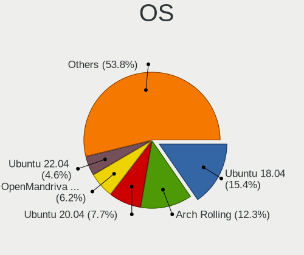

| Name                         | Desktops | Percent |
|------------------------------|----------|---------|
| Ubuntu 18.04                 | 10       | 17.54%  |
| Arch Rolling                 | 7        | 12.28%  |
| Ubuntu 20.04                 | 5        | 8.77%   |
| OpenMandriva 23.03           | 4        | 7.02%   |
| OpenMandriva 4.2             | 3        | 5.26%   |
| Ubuntu 22.04                 | 2        | 3.51%   |
| openSUSE Tumbleweed-XXXXXXXX | 2        | 3.51%   |
| OpenMandriva 4.3             | 2        | 3.51%   |
| Fedora 34                    | 2        | 3.51%   |
| Ubuntu 22.10                 | 1        | 1.75%   |
| Ubuntu 19.10                 | 1        | 1.75%   |
| ROSA R10                     | 1        | 1.75%   |
| ROSA 12.5                    | 1        | 1.75%   |
| Pop!_OS 22.04                | 1        | 1.75%   |
| OpenMandriva 5.0             | 1        | 1.75%   |
| OpenMandriva 4.90            | 1        | 1.75%   |
| Nobara 39                    | 1        | 1.75%   |
| MX 23                        | 1        | 1.75%   |
| Manjaro 23.1.4               | 1        | 1.75%   |
| Manjaro 21.2.3               | 1        | 1.75%   |
| Linux Mint 20.3              | 1        | 1.75%   |
| Linux Mint 19.3              | 1        | 1.75%   |
| Fedora 39                    | 1        | 1.75%   |
| Fedora 38                    | 1        | 1.75%   |
| Fedora 37                    | 1        | 1.75%   |
| Fedora 33                    | 1        | 1.75%   |
| CentOS 8                     | 1        | 1.75%   |
| BlackPanther 18.1            | 1        | 1.75%   |
| Arch                         | 1        | 1.75%   |

OS Family
---------

OS without a version

| Name         | Desktops | Percent |
|--------------|----------|---------|
| Ubuntu       | 18       | 33.96%  |
| OpenMandriva | 10       | 18.87%  |
| Arch         | 8        | 15.09%  |
| Fedora       | 4        | 7.55%   |
| ROSA         | 2        | 3.77%   |
| openSUSE     | 2        | 3.77%   |
| Manjaro      | 2        | 3.77%   |
| Linux Mint   | 2        | 3.77%   |
| Pop!_OS      | 1        | 1.89%   |
| Nobara       | 1        | 1.89%   |
| MX           | 1        | 1.89%   |
| CentOS       | 1        | 1.89%   |
| BlackPanther | 1        | 1.89%   |

Kernel
------

Version of the Linux kernel

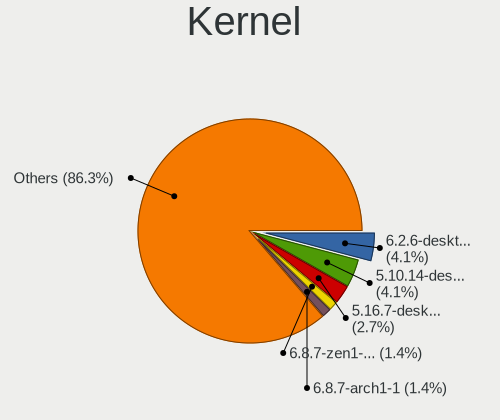

| Version                     | Desktops | Percent |
|-----------------------------|----------|---------|
| 6.2.6-desktop-1omv2390      | 3        | 4.69%   |
| 5.10.14-desktop-1omv4002    | 3        | 4.69%   |
| 5.16.7-desktop-1omv4003     | 2        | 3.13%   |
| 6.8.7-arch1-1               | 1        | 1.56%   |
| 6.7.0-201.fsync.fc39.x86_64 | 1        | 1.56%   |
| 6.7.0-1-rt6-MANJARO         | 1        | 1.56%   |
| 6.6.2-desktop-1omv2390      | 1        | 1.56%   |
| 6.5.9-zen2-1-zen            | 1        | 1.56%   |
| 6.5.7-zen1-1-zen            | 1        | 1.56%   |
| 6.5.6-300.fc39.x86_64       | 1        | 1.56%   |
| 6.4.15-200.fc38.x86_64      | 1        | 1.56%   |
| 6.4.15-2-liquorix-amd64     | 1        | 1.56%   |
| 6.3.7-arch1-1               | 1        | 1.56%   |
| 6.1.18-200.fc37.x86_64      | 1        | 1.56%   |
| 6.1.1-desktop-1omv2290      | 1        | 1.56%   |
| 5.9.16-200.fc33.x86_64      | 1        | 1.56%   |
| 5.8.5-arch1-1               | 1        | 1.56%   |
| 5.7.7-zen1-1-zen            | 1        | 1.56%   |
| 5.7.7-arch1-1               | 1        | 1.56%   |
| 5.4.0-42-generic            | 1        | 1.56%   |
| 5.4.0-37-generic            | 1        | 1.56%   |
| 5.4.0-125-generic           | 1        | 1.56%   |
| 5.4.0-110-generic           | 1        | 1.56%   |
| 5.4.0-107-generic           | 1        | 1.56%   |
| 5.3.0-46-generic            | 1        | 1.56%   |
| 5.3.0-42-generic            | 1        | 1.56%   |
| 5.3.0-40-generic            | 1        | 1.56%   |
| 5.19.0-32-generic           | 1        | 1.56%   |
| 5.19.0-23-generic           | 1        | 1.56%   |
| 5.18.12-desktop-3omv4090    | 1        | 1.56%   |
| 5.18.10-76051810-generic    | 1        | 1.56%   |
| 5.17.6-xanmod1              | 1        | 1.56%   |
| 5.15.21-1-MANJARO           | 1        | 1.56%   |
| 5.15.0-53-generic           | 1        | 1.56%   |
| 5.14.13-200.fc34.x86_64     | 1        | 1.56%   |
| 5.13.0-40-generic           | 1        | 1.56%   |
| 5.13.0-27-generic           | 1        | 1.56%   |
| 5.12.15-arch1-1             | 1        | 1.56%   |
| 5.12.12-300.fc34.x86_64     | 1        | 1.56%   |
| 5.11.0-40-generic           | 1        | 1.56%   |

Kernel Family
-------------

Linux kernel without a distro release

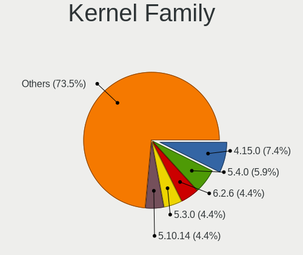

| Version  | Desktops | Percent |
|----------|----------|---------|
| 4.15.0   | 5        | 8.33%   |
| 5.4.0    | 4        | 6.67%   |
| 6.2.6    | 3        | 5%      |
| 5.3.0    | 3        | 5%      |
| 5.10.14  | 3        | 5%      |
| 6.7.0    | 2        | 3.33%   |
| 6.4.15   | 2        | 3.33%   |
| 5.7.7    | 2        | 3.33%   |
| 5.19.0   | 2        | 3.33%   |
| 5.16.7   | 2        | 3.33%   |
| 5.13.0   | 2        | 3.33%   |
| 5.11.0   | 2        | 3.33%   |
| 5.0.0    | 2        | 3.33%   |
| 6.8.7    | 1        | 1.67%   |
| 6.6.2    | 1        | 1.67%   |
| 6.5.9    | 1        | 1.67%   |
| 6.5.7    | 1        | 1.67%   |
| 6.5.6    | 1        | 1.67%   |
| 6.3.7    | 1        | 1.67%   |
| 6.1.18   | 1        | 1.67%   |
| 6.1.1    | 1        | 1.67%   |
| 5.9.16   | 1        | 1.67%   |
| 5.8.5    | 1        | 1.67%   |
| 5.18.12  | 1        | 1.67%   |
| 5.18.10  | 1        | 1.67%   |
| 5.17.6   | 1        | 1.67%   |
| 5.15.21  | 1        | 1.67%   |
| 5.15.0   | 1        | 1.67%   |
| 5.14.13  | 1        | 1.67%   |
| 5.12.15  | 1        | 1.67%   |
| 5.12.12  | 1        | 1.67%   |
| 5.10.184 | 1        | 1.67%   |
| 5.1.6    | 1        | 1.67%   |
| 5.1.2    | 1        | 1.67%   |
| 4.9.87   | 1        | 1.67%   |
| 4.9.60   | 1        | 1.67%   |
| 4.18.16  | 1        | 1.67%   |
| 4.18.15  | 1        | 1.67%   |
| 4.18.0   | 1        | 1.67%   |

Kernel Major Ver.
-----------------

Linux kernel major version

| Version | Desktops | Percent |
|---------|----------|---------|
| 4.15    | 5        | 8.62%   |
| 5.4     | 4        | 6.9%    |
| 5.10    | 4        | 6.9%    |
| 6.2     | 3        | 5.17%   |
| 5.3     | 3        | 5.17%   |
| 4.18    | 3        | 5.17%   |
| 6.7     | 2        | 3.45%   |
| 6.5     | 2        | 3.45%   |
| 6.4     | 2        | 3.45%   |
| 6.1     | 2        | 3.45%   |
| 5.7     | 2        | 3.45%   |
| 5.19    | 2        | 3.45%   |
| 5.18    | 2        | 3.45%   |
| 5.16    | 2        | 3.45%   |
| 5.15    | 2        | 3.45%   |
| 5.13    | 2        | 3.45%   |
| 5.12    | 2        | 3.45%   |
| 5.11    | 2        | 3.45%   |
| 5.1     | 2        | 3.45%   |
| 5.0     | 2        | 3.45%   |
| 6.8     | 1        | 1.72%   |
| 6.6     | 1        | 1.72%   |
| 6.3     | 1        | 1.72%   |
| 5.9     | 1        | 1.72%   |
| 5.8     | 1        | 1.72%   |
| 5.17    | 1        | 1.72%   |
| 5.14    | 1        | 1.72%   |
| 4.9     | 1        | 1.72%   |

Arch
----

OS architecture (x86_64, i586, etc.)

| Name   | Desktops | Percent |
|--------|----------|---------|
| x86_64 | 52       | 98.11%  |
| i686   | 1        | 1.89%   |

DE
--

Desktop Environment

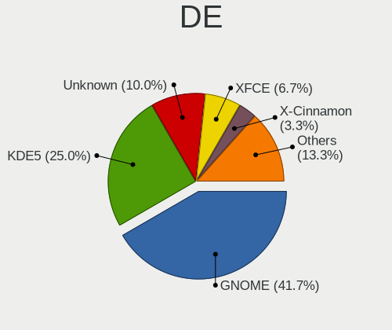

| Name       | Desktops | Percent |
|------------|----------|---------|
| GNOME      | 23       | 42.59%  |
| KDE5       | 15       | 27.78%  |
| Unknown    | 5        | 9.26%   |
| XFCE       | 3        | 5.56%   |
| X-Cinnamon | 2        | 3.7%    |
| MATE       | 1        | 1.85%   |
| LXQt       | 1        | 1.85%   |
| KDE4       | 1        | 1.85%   |
| KDE        | 1        | 1.85%   |
| Hyprland   | 1        | 1.85%   |
| Budgie     | 1        | 1.85%   |

Display Server
--------------

X11 or Wayland

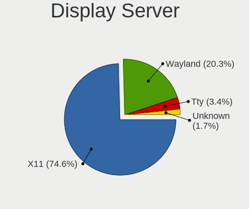

| Name    | Desktops | Percent |
|---------|----------|---------|
| X11     | 41       | 77.36%  |
| Wayland | 9        | 16.98%  |
| Tty     | 2        | 3.77%   |
| Unknown | 1        | 1.89%   |

Display Manager
---------------

SDDM, LightDM, etc.

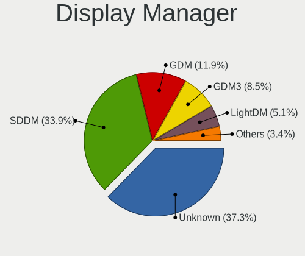

| Name    | Desktops | Percent |
|---------|----------|---------|
| Unknown | 20       | 37.04%  |
| SDDM    | 18       | 33.33%  |
| GDM     | 7        | 12.96%  |
| GDM3    | 4        | 7.41%   |
| LightDM | 3        | 5.56%   |
| LY-DM   | 1        | 1.85%   |
| KDM     | 1        | 1.85%   |

OS Lang
-------

Language

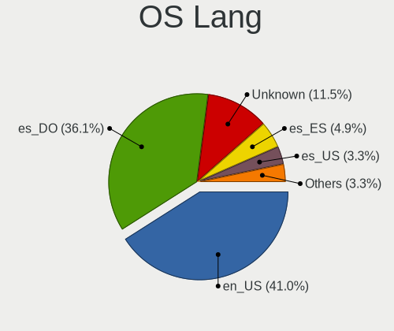

| Lang    | Desktops | Percent |
|---------|----------|---------|
| en_US   | 23       | 41.82%  |
| es_DO   | 21       | 38.18%  |
| Unknown | 7        | 12.73%  |
| es_US   | 2        | 3.64%   |
| es_ES   | 2        | 3.64%   |

Boot Mode
---------

EFI or BIOS

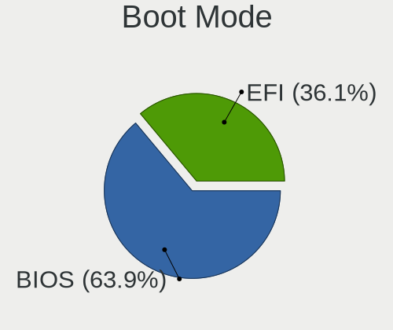

| Mode | Desktops | Percent |
|------|----------|---------|
| BIOS | 35       | 64.81%  |
| EFI  | 19       | 35.19%  |

Filesystem
----------

Type of filesystem

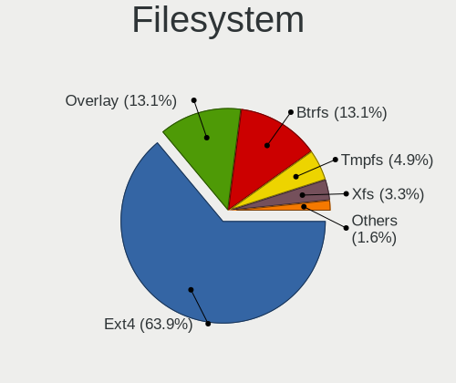

| Type    | Desktops | Percent |
|---------|----------|---------|
| Ext4    | 36       | 66.67%  |
| Overlay | 8        | 14.81%  |
| Btrfs   | 7        | 12.96%  |
| Xfs     | 2        | 3.7%    |
| Unknown | 1        | 1.85%   |

Part. scheme
------------

Scheme of partitioning

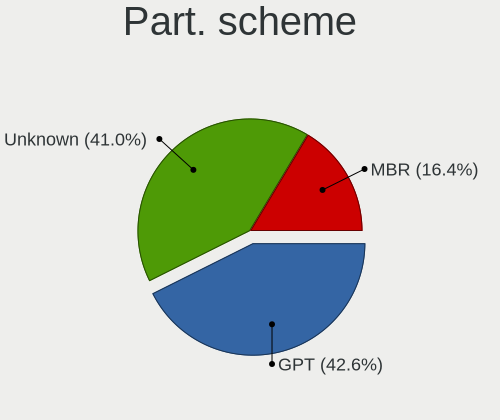

| Type    | Desktops | Percent |
|---------|----------|---------|
| GPT     | 23       | 41.07%  |
| Unknown | 23       | 41.07%  |
| MBR     | 10       | 17.86%  |

Dual Boot with Linux/BSD
------------------------

Hosting more than one Linux/BSD

| Dual boot | Desktops | Percent |
|-----------|----------|---------|
| No        | 41       | 75.93%  |
| Yes       | 13       | 24.07%  |

Dual Boot (Win)
---------------

Hosting Linux and Windows

| Dual boot | Desktops | Percent |
|-----------|----------|---------|
| No        | 32       | 58.18%  |
| Yes       | 23       | 41.82%  |

Board
-----

Vendor
------

Motherboard manufacturer

| Name                | Desktops | Percent |
|---------------------|----------|---------|
| Dell                | 19       | 35.85%  |
| Gigabyte Technology | 12       | 22.64%  |
| Hewlett-Packard     | 8        | 15.09%  |
| ASRock              | 4        | 7.55%   |
| MSI                 | 3        | 5.66%   |
| ASUSTek Computer    | 3        | 5.66%   |
| Unknown             | 2        | 3.77%   |
| Foxconn             | 1        | 1.89%   |
| Biostar             | 1        | 1.89%   |

Model
-----

Motherboard model

| Name                               | Desktops | Percent |
|------------------------------------|----------|---------|
| Gigabyte GA-78LMT-USB3 6.0         | 3        | 5.66%   |
| Dell OptiPlex 990                  | 2        | 3.77%   |
| Dell OptiPlex 9020                 | 2        | 3.77%   |
| Dell OptiPlex 390                  | 2        | 3.77%   |
| Dell OptiPlex 3010                 | 2        | 3.77%   |
| Unknown                            | 2        | 3.77%   |
| MSI MS-7C83                        | 1        | 1.89%   |
| MSI MS-7A34                        | 1        | 1.89%   |
| MSI MS-7817                        | 1        | 1.89%   |
| HP t520 Flexible Series TC         | 1        | 1.89%   |
| HP EliteDesk 800 G1 USDT           | 1        | 1.89%   |
| HP EliteDesk 705 G3 SFF            | 1        | 1.89%   |
| HP Compaq Elite 8300 SFF           | 1        | 1.89%   |
| HP Compaq Elite 8300 CMT           | 1        | 1.89%   |
| HP Compaq dc7900 Small Form Factor | 1        | 1.89%   |
| HP Compaq dc5100 SFF(AG144AW)      | 1        | 1.89%   |
| HP Compaq 8000 Elite CMT PC        | 1        | 1.89%   |
| Gigabyte Z87X-UD5 TH               | 1        | 1.89%   |
| Gigabyte Z170X-Gaming 7            | 1        | 1.89%   |
| Gigabyte X570 AORUS ULTRA          | 1        | 1.89%   |
| Gigabyte GA-78LMT-USB3 R2          | 1        | 1.89%   |
| Gigabyte GA-78LMT-S2P              | 1        | 1.89%   |
| Gigabyte B450M DS3H V2             | 1        | 1.89%   |
| Gigabyte B450M DS3H                | 1        | 1.89%   |
| Gigabyte B450 AORUS M              | 1        | 1.89%   |
| Gigabyte A520I AC                  | 1        | 1.89%   |
| Foxconn p6-2040fr                  | 1        | 1.89%   |
| Dell Precision WorkStation T5500   | 1        | 1.89%   |
| Dell PowerEdge T40                 | 1        | 1.89%   |
| Dell OptiPlex 790                  | 1        | 1.89%   |
| Dell OptiPlex 780                  | 1        | 1.89%   |
| Dell OptiPlex 755                  | 1        | 1.89%   |
| Dell OptiPlex 745                  | 1        | 1.89%   |
| Dell OptiPlex 7010                 | 1        | 1.89%   |
| Dell OptiPlex 3050                 | 1        | 1.89%   |
| Dell OptiPlex 3020                 | 1        | 1.89%   |
| Dell OptiPlex 160                  | 1        | 1.89%   |
| Dell DM061                         | 1        | 1.89%   |
| Biostar G41D3C                     | 1        | 1.89%   |
| ASUS H170 PRO GAMING               | 1        | 1.89%   |

Model Family
------------

Motherboard model prefix

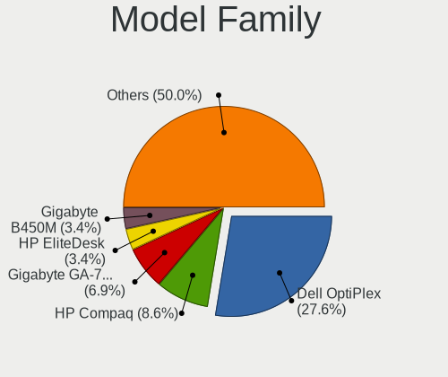

| Name                   | Desktops | Percent |
|------------------------|----------|---------|
| Dell OptiPlex          | 16       | 30.19%  |
| HP Compaq              | 5        | 9.43%   |
| Gigabyte GA-78LMT-USB3 | 4        | 7.55%   |
| HP EliteDesk           | 2        | 3.77%   |
| Gigabyte B450M         | 2        | 3.77%   |
| Unknown                | 2        | 3.77%   |
| MSI MS-7C83            | 1        | 1.89%   |
| MSI MS-7A34            | 1        | 1.89%   |
| MSI MS-7817            | 1        | 1.89%   |
| HP t520                | 1        | 1.89%   |
| Gigabyte Z87X-UD5      | 1        | 1.89%   |
| Gigabyte Z170X-Gaming  | 1        | 1.89%   |
| Gigabyte X570          | 1        | 1.89%   |
| Gigabyte GA-78LMT-S2P  | 1        | 1.89%   |
| Gigabyte B450          | 1        | 1.89%   |
| Gigabyte A520I         | 1        | 1.89%   |
| Foxconn p6-2040fr      | 1        | 1.89%   |
| Dell Precision         | 1        | 1.89%   |
| Dell PowerEdge         | 1        | 1.89%   |
| Dell DM061             | 1        | 1.89%   |
| Biostar G41D3C         | 1        | 1.89%   |
| ASUS H170              | 1        | 1.89%   |
| ASUS H110M-E           | 1        | 1.89%   |
| ASUS All               | 1        | 1.89%   |
| ASRock H97M            | 1        | 1.89%   |
| ASRock G41M-VS3        | 1        | 1.89%   |
| ASRock B450M-HDV       | 1        | 1.89%   |
| ASRock A620M           | 1        | 1.89%   |

MFG Year
--------

Motherboard manufacture year

| Year | Desktops | Percent |
|------|----------|---------|
| 2013 | 7        | 13.21%  |
| 2011 | 7        | 13.21%  |
| 2014 | 6        | 11.32%  |
| 2017 | 4        | 7.55%   |
| 2015 | 4        | 7.55%   |
| 2018 | 3        | 5.66%   |
| 2012 | 3        | 5.66%   |
| 2008 | 3        | 5.66%   |
| 2020 | 2        | 3.77%   |
| 2019 | 2        | 3.77%   |
| 2016 | 2        | 3.77%   |
| 2010 | 2        | 3.77%   |
| 2009 | 2        | 3.77%   |
| 2007 | 2        | 3.77%   |
| 2023 | 1        | 1.89%   |
| 2021 | 1        | 1.89%   |
| 2006 | 1        | 1.89%   |
| 2005 | 1        | 1.89%   |

Form Factor
-----------

Physical design of the computer

| Name    | Desktops | Percent |
|---------|----------|---------|
| Desktop | 53       | 100%    |

Secure Boot
-----------

Enabled or disabled

| State    | Desktops | Percent |
|----------|----------|---------|
| Disabled | 52       | 98.11%  |
| Enabled  | 1        | 1.89%   |

Coreboot
--------

Have coreboot on board

| Used | Desktops | Percent |
|------|----------|---------|
| No   | 53       | 100%    |

RAM Size
--------

Total RAM memory

| Size in GB  | Desktops | Percent |
|-------------|----------|---------|
| 16.01-24.0  | 13       | 24.53%  |
| 8.01-16.0   | 12       | 22.64%  |
| 3.01-4.0    | 9        | 16.98%  |
| 4.01-8.0    | 8        | 15.09%  |
| 24.01-32.0  | 3        | 5.66%   |
| 32.01-64.0  | 2        | 3.77%   |
| 1.01-2.0    | 2        | 3.77%   |
| 0.51-1.0    | 2        | 3.77%   |
| 2.01-3.0    | 1        | 1.89%   |
| 64.01-256.0 | 1        | 1.89%   |

RAM Used
--------

Used RAM memory

| Used GB   | Desktops | Percent |
|-----------|----------|---------|
| 1.01-2.0  | 22       | 40.74%  |
| 2.01-3.0  | 13       | 24.07%  |
| 3.01-4.0  | 8        | 14.81%  |
| 4.01-8.0  | 5        | 9.26%   |
| 0.51-1.0  | 4        | 7.41%   |
| 8.01-16.0 | 2        | 3.7%    |

Total Drives
------------

Number of drives on board

| Drives | Desktops | Percent |
|--------|----------|---------|
| 1      | 29       | 52.73%  |
| 2      | 14       | 25.45%  |
| 3      | 8        | 14.55%  |
| 4      | 4        | 7.27%   |

Has CD-ROM
----------

Has CD-ROM on board

| Presented | Desktops | Percent |
|-----------|----------|---------|
| No        | 29       | 54.72%  |
| Yes       | 24       | 45.28%  |

Has Ethernet
------------

Has Ethernet on board

| Presented | Desktops | Percent |
|-----------|----------|---------|
| Yes       | 51       | 96.23%  |
| No        | 2        | 3.77%   |

Has WiFi
--------

Has WiFi module

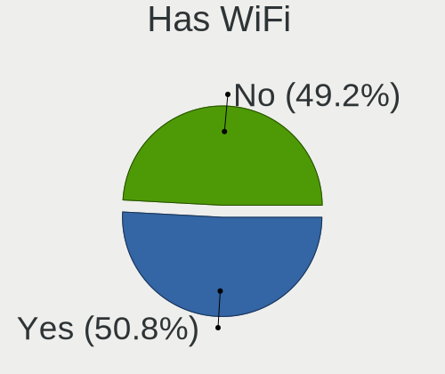

| Presented | Desktops | Percent |
|-----------|----------|---------|
| Yes       | 28       | 51.85%  |
| No        | 26       | 48.15%  |

Has Bluetooth
-------------

Has Bluetooth module

| Presented | Desktops | Percent |
|-----------|----------|---------|
| No        | 37       | 69.81%  |
| Yes       | 16       | 30.19%  |

Location
--------

Country
-------

Geographic location (country)

| Country            | Desktops | Percent |
|--------------------|----------|---------|
| Dominican Republic | 53       | 100%    |

City
----

Geographic location (city)

| City                       | Desktops | Percent |
|----------------------------|----------|---------|
| Santo Domingo Este         | 29       | 49.15%  |
| Santo Domingo              | 7        | 11.86%  |
| Santiago de los Caballeros | 6        | 10.17%  |
| San Pedro de Macorís      | 2        | 3.39%   |
| San Juan                   | 2        | 3.39%   |
| San Cristobal              | 2        | 3.39%   |
| Nacional                   | 2        | 3.39%   |
| Sosua, Cabarete            | 1        | 1.69%   |
| San Francisco de Macorís  | 1        | 1.69%   |
| Sabaneta                   | 1        | 1.69%   |
| Nagua                      | 1        | 1.69%   |
| Moca                       | 1        | 1.69%   |
| La Romana                  | 1        | 1.69%   |
| Constanza                  | 1        | 1.69%   |
| Cabarete                   | 1        | 1.69%   |
| Alejandro Bass             | 1        | 1.69%   |

Drives
------

Drive Vendor
------------

Hard drive vendors

| Vendor              | Desktops | Drives | Percent |
|---------------------|----------|--------|---------|
| Seagate             | 26       | 34     | 30.59%  |
| Samsung Electronics | 11       | 17     | 12.94%  |
| WDC                 | 10       | 15     | 11.76%  |
| Toshiba             | 8        | 11     | 9.41%   |
| Kingston            | 8        | 9      | 9.41%   |
| Hitachi             | 6        | 8      | 7.06%   |
| SanDisk             | 2        | 3      | 2.35%   |
| Intel               | 2        | 2      | 2.35%   |
| Crucial             | 2        | 3      | 2.35%   |
| China               | 2        | 2      | 2.35%   |
| Unknown             | 1        | 1      | 1.18%   |
| SPCC                | 1        | 1      | 1.18%   |
| PNY                 | 1        | 1      | 1.18%   |
| Phison Electronics  | 1        | 1      | 1.18%   |
| Patriot             | 1        | 1      | 1.18%   |
| Maxtor              | 1        | 1      | 1.18%   |
| HS-SSD-C100         | 1        | 1      | 1.18%   |
| A-DATA Technology   | 1        | 1      | 1.18%   |

Drive Model
-----------

Hard drive models

| Model                            | Desktops | Percent |
|----------------------------------|----------|---------|
| Seagate ST500DM002-1BD142 500GB  | 5        | 5.1%    |
| Toshiba DT01ACA050 500GB         | 2        | 2.04%   |
| Seagate ST380815AS 80GB          | 2        | 2.04%   |
| Seagate ST3500418AS 500GB        | 2        | 2.04%   |
| Seagate ST3160815AS 160GB        | 2        | 2.04%   |
| Kingston SV300S37A120G 120GB SSD | 2        | 2.04%   |
| Kingston SA400S37120G 120GB SSD  | 2        | 2.04%   |
| Hitachi HTS545050A7E380 500GB    | 2        | 2.04%   |
| WDC WD800JD-75MSA3 80GB          | 1        | 1.02%   |
| WDC WD6400AAKS-22A7B2 640GB      | 1        | 1.02%   |
| WDC WD5000LPVX-22V0TT0 500GB     | 1        | 1.02%   |
| WDC WD5000BPVT-00HXZT1 500GB     | 1        | 1.02%   |
| WDC WD5000AZLX-60K2TA0 500GB     | 1        | 1.02%   |
| WDC WD5000AAKX-75U6AA0 500GB     | 1        | 1.02%   |
| WDC WD40EZRZ-75GXCB0 4TB         | 1        | 1.02%   |
| WDC WD2500AAKX-001CA0 250GB      | 1        | 1.02%   |
| WDC WD2500AAJS-75M0A0 250GB      | 1        | 1.02%   |
| WDC WD20EZRZ-00Z5HB0 2TB         | 1        | 1.02%   |
| WDC WD10EZEX-75M2NA0 1TB         | 1        | 1.02%   |
| WDC WD10EZEX-00RKKA0 1TB         | 1        | 1.02%   |
| WDC WD Green 2.5 240GB           | 1        | 1.02%   |
| Unknown FK0032CAAZP 32GB         | 1        | 1.02%   |
| Toshiba NVMe SSD Drive 256GB     | 1        | 1.02%   |
| Toshiba MQ01ACF050 500GB         | 1        | 1.02%   |
| Toshiba MQ01ABD050V 500GB        | 1        | 1.02%   |
| Toshiba MK6034GSX 64GB           | 1        | 1.02%   |
| Toshiba MK3275GSX 320GB          | 1        | 1.02%   |
| Toshiba MK2556GSY 250GB          | 1        | 1.02%   |
| Toshiba HDWE160 6TB              | 1        | 1.02%   |
| SPCC Solid State Disk 1TB        | 1        | 1.02%   |
| Seagate ST980412ASG 80GB         | 1        | 1.02%   |
| Seagate ST9250410AS 250GB        | 1        | 1.02%   |
| Seagate ST8000DM004-2CX188 8TB   | 1        | 1.02%   |
| Seagate ST500LM000-1EJ162 500GB  | 1        | 1.02%   |
| Seagate ST4000DM004-2CV104 4TB   | 1        | 1.02%   |
| Seagate ST3320620AS 320GB        | 1        | 1.02%   |
| Seagate ST3320418AS 320GB        | 1        | 1.02%   |
| Seagate ST3250318AS 250GB        | 1        | 1.02%   |
| Seagate ST3160215AS 160GB        | 1        | 1.02%   |
| Seagate ST3160212SCE 160GB       | 1        | 1.02%   |

HDD Vendor
----------

Hard disk drive vendors

| Vendor              | Desktops | Drives | Percent |
|---------------------|----------|--------|---------|
| Seagate             | 26       | 34     | 49.06%  |
| WDC                 | 10       | 13     | 18.87%  |
| Toshiba             | 7        | 9      | 13.21%  |
| Hitachi             | 6        | 8      | 11.32%  |
| Samsung Electronics | 3        | 5      | 5.66%   |
| Maxtor              | 1        | 1      | 1.89%   |

SSD Vendor
----------

Solid state drive vendors

| Vendor              | Desktops | Drives | Percent |
|---------------------|----------|--------|---------|
| Kingston            | 8        | 9      | 29.63%  |
| Samsung Electronics | 6        | 6      | 22.22%  |
| Intel               | 2        | 2      | 7.41%   |
| Crucial             | 2        | 3      | 7.41%   |
| China               | 2        | 2      | 7.41%   |
| WDC                 | 1        | 2      | 3.7%    |
| SPCC                | 1        | 1      | 3.7%    |
| SanDisk             | 1        | 2      | 3.7%    |
| PNY                 | 1        | 1      | 3.7%    |
| Patriot             | 1        | 1      | 3.7%    |
| HS-SSD-C100         | 1        | 1      | 3.7%    |
| A-DATA Technology   | 1        | 1      | 3.7%    |

Drive Kind
----------

HDD or SSD

| Kind    | Desktops | Drives | Percent |
|---------|----------|--------|---------|
| HDD     | 42       | 70     | 56.76%  |
| SSD     | 24       | 31     | 32.43%  |
| NVMe    | 7        | 10     | 9.46%   |
| Unknown | 1        | 1      | 1.35%   |

Drive Connector
---------------

SATA, SAS, NVMe, etc.

| Type | Desktops | Drives | Percent |
|------|----------|--------|---------|
| SATA | 52       | 101    | 86.67%  |
| NVMe | 7        | 10     | 11.67%  |
| SAS  | 1        | 1      | 1.67%   |

Drive Size
----------

Size of hard drive

| Size in TB | Desktops | Drives | Percent |
|------------|----------|--------|---------|
| 0.01-0.5   | 45       | 77     | 69.23%  |
| 0.51-1.0   | 12       | 16     | 18.46%  |
| 1.01-2.0   | 4        | 4      | 6.15%   |
| 3.01-4.0   | 2        | 2      | 3.08%   |
| 4.01-10.0  | 2        | 2      | 3.08%   |

Space Total
-----------

Amount of disk space available on the file system

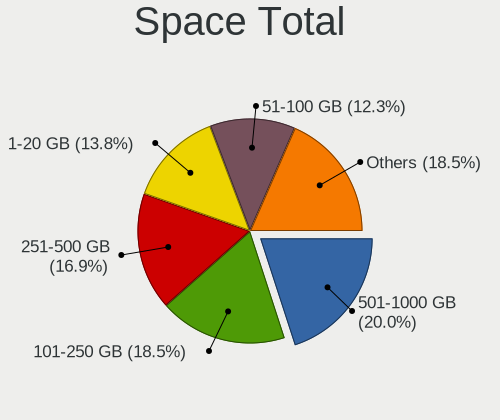

| Size in GB     | Desktops | Percent |
|----------------|----------|---------|
| 101-250        | 12       | 20.69%  |
| 501-1000       | 12       | 20.69%  |
| 1-20           | 9        | 15.52%  |
| 251-500        | 8        | 13.79%  |
| 51-100         | 8        | 13.79%  |
| More than 3000 | 4        | 6.9%    |
| 21-50          | 2        | 3.45%   |
| 1001-2000      | 2        | 3.45%   |
| Unknown        | 1        | 1.72%   |

Space Used
----------

Amount of used disk space

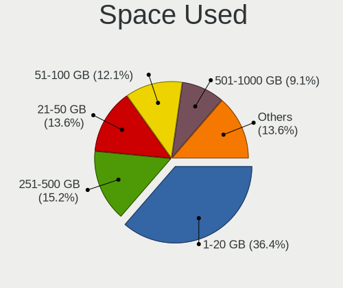

| Used GB        | Desktops | Percent |
|----------------|----------|---------|
| 1-20           | 24       | 40%     |
| 251-500        | 8        | 13.33%  |
| 21-50          | 8        | 13.33%  |
| 51-100         | 8        | 13.33%  |
| 101-250        | 4        | 6.67%   |
| 501-1000       | 4        | 6.67%   |
| 2001-3000      | 2        | 3.33%   |
| More than 3000 | 1        | 1.67%   |
| Unknown        | 1        | 1.67%   |

Malfunc. Drives
---------------

Drive models with a malfunction

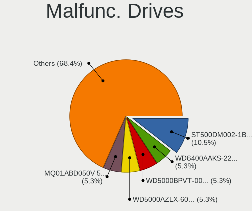

| Model                           | Desktops | Drives | Percent |
|---------------------------------|----------|--------|---------|
| Seagate ST500DM002-1BD142 500GB | 2        | 2      | 11.76%  |
| WDC WD6400AAKS-22A7B2 640GB     | 1        | 1      | 5.88%   |
| WDC WD5000BPVT-00HXZT1 500GB    | 1        | 1      | 5.88%   |
| WDC WD5000AZLX-60K2TA0 500GB    | 1        | 1      | 5.88%   |
| Toshiba MQ01ABD050V 500GB       | 1        | 1      | 5.88%   |
| Toshiba MK6034GSX 64GB          | 1        | 1      | 5.88%   |
| Toshiba MK3275GSX 320GB         | 1        | 1      | 5.88%   |
| Toshiba MK2556GSY 250GB         | 1        | 1      | 5.88%   |
| Seagate ST500LM000-1EJ162 500GB | 1        | 1      | 5.88%   |
| Seagate ST3250318AS 250GB       | 1        | 1      | 5.88%   |
| Samsung Electronics HD154UI 1TB | 1        | 1      | 5.88%   |
| Hitachi HTS722020K9SA00 200GB   | 1        | 1      | 5.88%   |
| Hitachi HTS547564A9E384 640GB   | 1        | 1      | 5.88%   |
| Hitachi HTS545050A7E380 500GB   | 1        | 1      | 5.88%   |
| Hitachi HDT721025SLA380 250GB   | 1        | 1      | 5.88%   |
| Crucial CT240BX500SSD1 240GB    | 1        | 1      | 5.88%   |

Malfunc. Drive Vendor
---------------------

Vendors of faulty drives

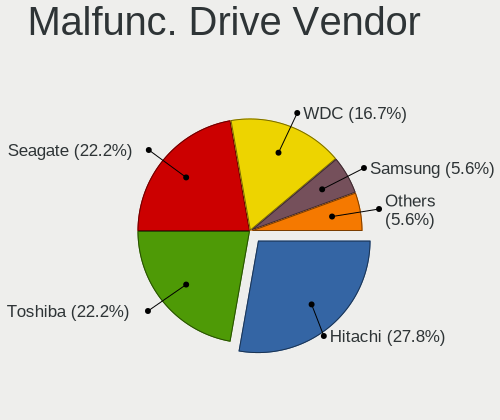

| Vendor              | Desktops | Drives | Percent |
|---------------------|----------|--------|---------|
| Toshiba             | 4        | 4      | 23.53%  |
| Seagate             | 4        | 4      | 23.53%  |
| Hitachi             | 4        | 4      | 23.53%  |
| WDC                 | 3        | 3      | 17.65%  |
| Samsung Electronics | 1        | 1      | 5.88%   |
| Crucial             | 1        | 1      | 5.88%   |

Malfunc. HDD Vendor
-------------------

Vendors of faulty HDD drives

| Vendor              | Desktops | Drives | Percent |
|---------------------|----------|--------|---------|
| Toshiba             | 4        | 4      | 25%     |
| Seagate             | 4        | 4      | 25%     |
| Hitachi             | 4        | 4      | 25%     |
| WDC                 | 3        | 3      | 18.75%  |
| Samsung Electronics | 1        | 1      | 6.25%   |

Malfunc. Drive Kind
-------------------

Kinds of faulty drives

| Kind | Desktops | Drives | Percent |
|------|----------|--------|---------|
| HDD  | 12       | 16     | 92.31%  |
| SSD  | 1        | 1      | 7.69%   |

Failed Drives
-------------

Failed drive models

| Model                         | Desktops | Drives | Percent |
|-------------------------------|----------|--------|---------|
| Hitachi HDS721025CLA382 250GB | 1        | 1      | 100%    |

Failed Drive Vendor
-------------------

Failed drive vendors

| Vendor  | Desktops | Drives | Percent |
|---------|----------|--------|---------|
| Hitachi | 1        | 1      | 100%    |

Drive Status
------------

Number of failed and malfunc. drives

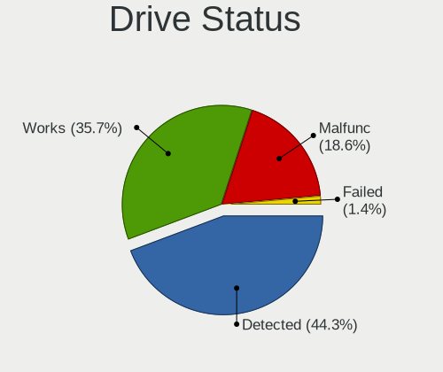

| Status   | Desktops | Drives | Percent |
|----------|----------|--------|---------|
| Detected | 27       | 54     | 42.86%  |
| Works    | 23       | 40     | 36.51%  |
| Malfunc  | 12       | 17     | 19.05%  |
| Failed   | 1        | 1      | 1.59%   |

Storage controller
------------------

Storage Vendor
--------------

Storage controller vendors

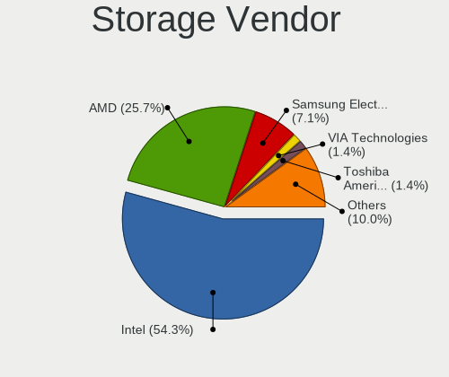

| Vendor                           | Desktops | Percent |
|----------------------------------|----------|---------|
| Intel                            | 35       | 56.45%  |
| AMD                              | 16       | 25.81%  |
| Samsung Electronics              | 4        | 6.45%   |
| VIA Technologies                 | 1        | 1.61%   |
| Toshiba America Info Systems     | 1        | 1.61%   |
| Silicon Integrated Systems [SiS] | 1        | 1.61%   |
| SanDisk                          | 1        | 1.61%   |
| Phison Electronics               | 1        | 1.61%   |
| Marvell Technology Group         | 1        | 1.61%   |
| ASMedia Technology               | 1        | 1.61%   |

Storage Model
-------------

Storage controller models

| Model                                                                                   | Desktops | Percent |
|-----------------------------------------------------------------------------------------|----------|---------|
| AMD FCH SATA Controller [AHCI mode]                                                     | 7        | 8.24%   |
| Intel SATA Controller [RAID mode]                                                       | 6        | 7.06%   |
| AMD SB7x0/SB8x0/SB9x0 IDE Controller                                                    | 6        | 7.06%   |
| Intel 8 Series/C220 Series Chipset Family 6-port SATA Controller 1 [AHCI mode]          | 5        | 5.88%   |
| Intel 6 Series/C200 Series Chipset Family 6 port Desktop SATA AHCI Controller           | 5        | 5.88%   |
| AMD SB7x0/SB8x0/SB9x0 SATA Controller [IDE mode]                                        | 4        | 4.71%   |
| AMD 400 Series Chipset SATA Controller                                                  | 4        | 4.71%   |
| Intel Q170/Q150/B150/H170/H110/Z170/CM236 Chipset SATA Controller [AHCI Mode]           | 3        | 3.53%   |
| Intel 7 Series/C210 Series Chipset Family 6-port SATA Controller [AHCI mode]            | 3        | 3.53%   |
| Intel 4 Series Chipset PT IDER Controller                                               | 3        | 3.53%   |
| Samsung NVMe SSD Controller SM961/PM961/SM963                                           | 2        | 2.35%   |
| Intel NM10/ICH7 Family SATA Controller [IDE mode]                                       | 2        | 2.35%   |
| Intel 82801JD/DO (ICH10 Family) SATA AHCI Controller                                    | 2        | 2.35%   |
| Intel 82801G (ICH7 Family) IDE Controller                                               | 2        | 2.35%   |
| Intel 6 Series/C200 Series Chipset Family Desktop SATA Controller (IDE mode, ports 4-5) | 2        | 2.35%   |
| Intel 6 Series/C200 Series Chipset Family Desktop SATA Controller (IDE mode, ports 0-3) | 2        | 2.35%   |
| AMD SB7x0/SB8x0/SB9x0 SATA Controller [AHCI mode]                                       | 2        | 2.35%   |
| AMD 300 Series Chipset SATA Controller                                                  | 2        | 2.35%   |
| VIA VT82C586A/B/VT82C686/A/B/VT823x/A/C PIPC Bus Master IDE                             | 1        | 1.18%   |
| VIA VIA VT6420 SATA RAID Controller                                                     | 1        | 1.18%   |
| Toshiba America Info Systems XG5 NVMe SSD Controller                                    | 1        | 1.18%   |
| Silicon Integrated Systems [SiS] SATA Controller / IDE mode                             | 1        | 1.18%   |
| SanDisk WD Black SN770 / PC SN740 256GB / PC SN560 (DRAM-less) NVMe SSD                 | 1        | 1.18%   |
| Samsung NVMe SSD Controller SM981/PM981/PM983                                           | 1        | 1.18%   |
| Samsung NVMe SSD Controller PM9A1/PM9A3/980PRO                                          | 1        | 1.18%   |
| Phison E12 NVMe Controller                                                              | 1        | 1.18%   |
| Marvell Group 88SE9172 SATA 6Gb/s Controller                                            | 1        | 1.18%   |
| Intel Cannon Lake PCH SATA AHCI Controller                                              | 1        | 1.18%   |
| Intel 9 Series Chipset Family SATA Controller [AHCI Mode]                               | 1        | 1.18%   |
| Intel 82Q35 Express PT IDER Controller                                                  | 1        | 1.18%   |
| Intel 82801JI (ICH10 Family) SATA AHCI Controller                                       | 1        | 1.18%   |
| Intel 82801IR/IO/IH (ICH9R/DO/DH) 6 port SATA Controller [AHCI mode]                    | 1        | 1.18%   |
| Intel 82801HR/HO/HH (ICH8R/DO/DH) 2 port SATA Controller [IDE mode]                     | 1        | 1.18%   |
| Intel 82801H (ICH8 Family) 4 port SATA Controller [IDE mode]                            | 1        | 1.18%   |
| Intel 82801FB/FW (ICH6/ICH6W) SATA Controller                                           | 1        | 1.18%   |
| Intel 82801FB/FBM/FR/FW/FRW (ICH6 Family) IDE Controller                                | 1        | 1.18%   |
| Intel 400 Series Chipset Family SATA AHCI Controller                                    | 1        | 1.18%   |
| Intel 200 Series PCH SATA controller [AHCI mode]                                        | 1        | 1.18%   |
| ASMedia ASM1061/ASM1062 Serial ATA Controller                                           | 1        | 1.18%   |
| AMD 600 Series Chipset SATA Controller                                                  | 1        | 1.18%   |

Storage Kind
------------

Kind of storage controller (IDE, SATA, NVMe, SAS, ...)

| Kind | Desktops | Percent |
|------|----------|---------|
| SATA | 40       | 56.34%  |
| IDE  | 18       | 25.35%  |
| NVMe | 7        | 9.86%   |
| RAID | 6        | 8.45%   |

Processor
---------

CPU Vendor
----------

Processor vendors

| Vendor | Desktops | Percent |
|--------|----------|---------|
| Intel  | 36       | 67.92%  |
| AMD    | 17       | 32.08%  |

CPU Model
---------

Processor models

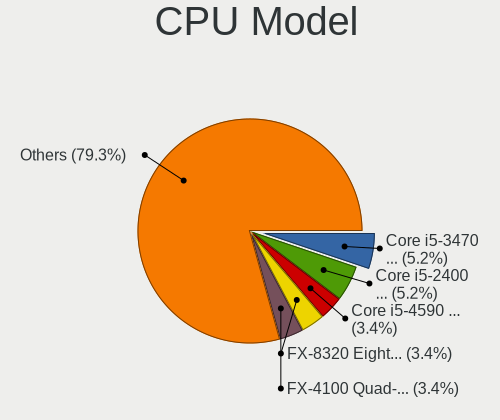

| Model                                       | Desktops | Percent |
|---------------------------------------------|----------|---------|
| Intel Core i5-3470 CPU @ 3.20GHz            | 3        | 5.66%   |
| Intel Core i5-2400 CPU @ 3.10GHz            | 3        | 5.66%   |
| Intel Core i5-4590 CPU @ 3.30GHz            | 2        | 3.77%   |
| AMD FX-8320 Eight-Core Processor            | 2        | 3.77%   |
| AMD FX-4100 Quad-Core Processor             | 2        | 3.77%   |
| Intel Xeon E-2224G CPU @ 3.50GHz            | 1        | 1.89%   |
| Intel Xeon CPU X5675 @ 3.07GHz              | 1        | 1.89%   |
| Intel Pentium Dual-Core CPU E5400 @ 2.70GHz | 1        | 1.89%   |
| Intel Pentium D CPU 3.00GHz                 | 1        | 1.89%   |
| Intel Pentium CPU G630 @ 2.70GHz            | 1        | 1.89%   |
| Intel Pentium 4 CPU 3.20GHz                 | 1        | 1.89%   |
| Intel Pentium 4 CPU 3.00GHz                 | 1        | 1.89%   |
| Intel Core i7-4790K CPU @ 4.00GHz           | 1        | 1.89%   |
| Intel Core i7-4790 CPU @ 3.60GHz            | 1        | 1.89%   |
| Intel Core i7-4770K CPU @ 3.50GHz           | 1        | 1.89%   |
| Intel Core i7-3770 CPU @ 3.40GHz            | 1        | 1.89%   |
| Intel Core i7-2700K CPU @ 3.50GHz           | 1        | 1.89%   |
| Intel Core i7-10700 CPU @ 2.90GHz           | 1        | 1.89%   |
| Intel Core i5-6600K CPU @ 3.50GHz           | 1        | 1.89%   |
| Intel Core i5-6400 CPU @ 2.70GHz            | 1        | 1.89%   |
| Intel Core i5-4590S CPU @ 3.00GHz           | 1        | 1.89%   |
| Intel Core i5-4570 CPU @ 3.20GHz            | 1        | 1.89%   |
| Intel Core i5-4460 CPU @ 3.20GHz            | 1        | 1.89%   |
| Intel Core i5-3570 CPU @ 3.40GHz            | 1        | 1.89%   |
| Intel Core i5-2320 CPU @ 3.00GHz            | 1        | 1.89%   |
| Intel Core i3-7100 CPU @ 3.90GHz            | 1        | 1.89%   |
| Intel Core i3-6100 CPU @ 3.70GHz            | 1        | 1.89%   |
| Intel Core 2 Quad CPU Q6600 @ 2.40GHz       | 1        | 1.89%   |
| Intel Core 2 Duo CPU E8500 @ 3.16GHz        | 1        | 1.89%   |
| Intel Core 2 Duo CPU E8400 @ 3.00GHz        | 1        | 1.89%   |
| Intel Core 2 Duo CPU E6550 @ 2.33GHz        | 1        | 1.89%   |
| Intel Celeron CPU 430 @ 1.80GHz             | 1        | 1.89%   |
| Intel Atom CPU 330 @ 1.60GHz                | 1        | 1.89%   |
| AMD Sempron Processor LE-1100               | 1        | 1.89%   |
| AMD Ryzen 7 5800X 8-Core Processor          | 1        | 1.89%   |
| AMD Ryzen 5 7600 6-Core Processor           | 1        | 1.89%   |
| AMD Ryzen 5 5600G with Radeon Graphics      | 1        | 1.89%   |
| AMD Ryzen 5 3400G with Radeon Vega Graphics | 1        | 1.89%   |
| AMD Ryzen 5 2600X Six-Core Processor        | 1        | 1.89%   |
| AMD Ryzen 5 2600 Six-Core Processor         | 1        | 1.89%   |

CPU Model Family
----------------

Processor model prefix

| Model                   | Desktops | Percent |
|-------------------------|----------|---------|
| Intel Core i5           | 15       | 28.3%   |
| Intel Core i7           | 6        | 11.32%  |
| AMD Ryzen 5             | 6        | 11.32%  |
| AMD FX                  | 5        | 9.43%   |
| Intel Core 2 Duo        | 3        | 5.66%   |
| Intel Xeon              | 2        | 3.77%   |
| Intel Pentium 4         | 2        | 3.77%   |
| Intel Core i3           | 2        | 3.77%   |
| Intel Pentium Dual-Core | 1        | 1.89%   |
| Intel Pentium D         | 1        | 1.89%   |
| Intel Pentium           | 1        | 1.89%   |
| Intel Core 2 Quad       | 1        | 1.89%   |
| Intel Celeron           | 1        | 1.89%   |
| Intel Atom              | 1        | 1.89%   |
| AMD Sempron             | 1        | 1.89%   |
| AMD Ryzen 7             | 1        | 1.89%   |
| AMD Ryzen 3             | 1        | 1.89%   |
| AMD PRO A10             | 1        | 1.89%   |
| AMD Phenom II X4        | 1        | 1.89%   |
| AMD GX                  | 1        | 1.89%   |

CPU Cores
---------

Number of processor cores

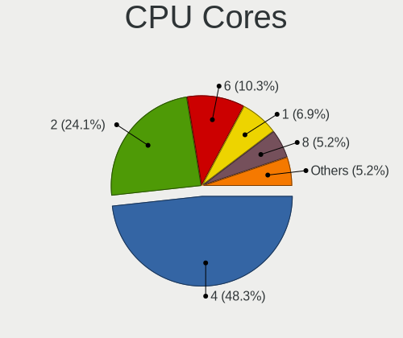

| Number | Desktops | Percent |
|--------|----------|---------|
| 4      | 27       | 50.94%  |
| 2      | 13       | 24.53%  |
| 6      | 5        | 9.43%   |
| 1      | 4        | 7.55%   |
| 8      | 2        | 3.77%   |
| 12     | 1        | 1.89%   |
| 3      | 1        | 1.89%   |

CPU Sockets
-----------

Number of sockets

| Number | Desktops | Percent |
|--------|----------|---------|
| 1      | 52       | 98.11%  |
| 2      | 1        | 1.89%   |

CPU Threads
-----------

Threads per core (Hyper-Threading)

| Number | Desktops | Percent |
|--------|----------|---------|
| 1      | 28       | 52.83%  |
| 2      | 25       | 47.17%  |

CPU Op-Modes
------------

CPU Operation Modes (32-bit, 64-bit)

| Op mode        | Desktops | Percent |
|----------------|----------|---------|
| 32-bit, 64-bit | 53       | 98.15%  |
| 64-bit         | 1        | 1.85%   |

CPU Microcode
-------------

Microcode number

| Number     | Desktops | Percent |
|------------|----------|---------|
| Unknown    | 16       | 29.63%  |
| 0x306c3    | 5        | 9.26%   |
| 0x306a9    | 4        | 7.41%   |
| 0x206a7    | 4        | 7.41%   |
| 0x506e3    | 3        | 5.56%   |
| 0x1067a    | 3        | 5.56%   |
| 0x0800820d | 3        | 5.56%   |
| 0x06000852 | 3        | 5.56%   |
| 0x6fb      | 2        | 3.7%    |
| 0xf65      | 1        | 1.85%   |
| 0xf49      | 1        | 1.85%   |
| 0x906ea    | 1        | 1.85%   |
| 0x906e9    | 1        | 1.85%   |
| 0x106c2    | 1        | 1.85%   |
| 0x10661    | 1        | 1.85%   |
| 0x08108109 | 1        | 1.85%   |
| 0x08101013 | 1        | 1.85%   |
| 0x0600611a | 1        | 1.85%   |
| 0x0600063d | 1        | 1.85%   |
| 0x010000db | 1        | 1.85%   |

CPU Microarch
-------------

Microarchitecture

| Name        | Desktops | Percent |
|-------------|----------|---------|
| Haswell     | 8        | 15.09%  |
| SandyBridge | 6        | 11.32%  |
| IvyBridge   | 5        | 9.43%   |
| Zen+        | 4        | 7.55%   |
| Skylake     | 3        | 5.66%   |
| Piledriver  | 3        | 5.66%   |
| Penryn      | 3        | 5.66%   |
| NetBurst    | 3        | 5.66%   |
| Core        | 3        | 5.66%   |
| Zen 3       | 2        | 3.77%   |
| KabyLake    | 2        | 3.77%   |
| Bulldozer   | 2        | 3.77%   |
| Zen         | 1        | 1.89%   |
| Westmere    | 1        | 1.89%   |
| Puma        | 1        | 1.89%   |
| K8 Hammer   | 1        | 1.89%   |
| K10         | 1        | 1.89%   |
| Excavator   | 1        | 1.89%   |
| CometLake   | 1        | 1.89%   |
| Bonnell     | 1        | 1.89%   |
| Unknown     | 1        | 1.89%   |

Graphics
--------

GPU Vendor
----------

Vendors of graphics cards

| Vendor                           | Desktops | Percent |
|----------------------------------|----------|---------|
| Intel                            | 25       | 44.64%  |
| AMD                              | 17       | 30.36%  |
| Nvidia                           | 12       | 21.43%  |
| VIA Technologies                 | 1        | 1.79%   |
| Silicon Integrated Systems [SiS] | 1        | 1.79%   |

GPU Model
---------

Graphics card models

| Model                                                                       | Desktops | Percent |
|-----------------------------------------------------------------------------|----------|---------|
| Intel Xeon E3-1200 v3/4th Gen Core Processor Integrated Graphics Controller | 7        | 12.28%  |
| Intel 2nd Generation Core Processor Family Integrated Graphics Controller   | 4        | 7.02%   |
| AMD RS780L [Radeon 3000]                                                    | 3        | 5.26%   |
| AMD Ellesmere [Radeon RX 470/480/570/570X/580/580X/590]                     | 3        | 5.26%   |
| Nvidia GF119 [GeForce GT 520]                                               | 2        | 3.51%   |
| Intel Xeon E3-1200 v2/3rd Gen Core processor Graphics Controller            | 2        | 3.51%   |
| Intel HD Graphics 530                                                       | 2        | 3.51%   |
| Intel 4 Series Chipset Integrated Graphics Controller                       | 2        | 3.51%   |
| VIA Technologies K8M800/K8N800/K8N800A [S3 UniChrome Pro]                   | 1        | 1.75%   |
| Silicon Integrated Systems [SiS] 771/671 PCIE VGA Display Adapter           | 1        | 1.75%   |
| Nvidia TU116 [GeForce GTX 1650 SUPER]                                       | 1        | 1.75%   |
| Nvidia GT218 [GeForce 8400 GS Rev. 3]                                       | 1        | 1.75%   |
| Nvidia GT218 [GeForce 210]                                                  | 1        | 1.75%   |
| Nvidia GP108 [GeForce GT 1030]                                              | 1        | 1.75%   |
| Nvidia GP107 [GeForce GTX 1050 Ti]                                          | 1        | 1.75%   |
| Nvidia GP106 [GeForce GTX 1060 3GB]                                         | 1        | 1.75%   |
| Nvidia GP104 [GeForce GTX 1080]                                             | 1        | 1.75%   |
| Nvidia GK107 [GeForce GT 740]                                               | 1        | 1.75%   |
| Nvidia GK106 [GeForce GTX 660]                                              | 1        | 1.75%   |
| Nvidia GK104 [GeForce GTX 760]                                              | 1        | 1.75%   |
| Intel IvyBridge GT2 [HD Graphics 4000]                                      | 1        | 1.75%   |
| Intel HD Graphics 630                                                       | 1        | 1.75%   |
| Intel CometLake-S GT2 [UHD Graphics 630]                                    | 1        | 1.75%   |
| Intel CoffeeLake-S GT2 [UHD Graphics P630]                                  | 1        | 1.75%   |
| Intel 82Q963/Q965 Integrated Graphics Controller                            | 1        | 1.75%   |
| Intel 82Q35 Express Integrated Graphics Controller                          | 1        | 1.75%   |
| Intel 82G965 Integrated Graphics Controller                                 | 1        | 1.75%   |
| Intel 82915G/GV/910GL Integrated Graphics Controller                        | 1        | 1.75%   |
| AMD Wani [Radeon R5/R6/R7 Graphics]                                         | 1        | 1.75%   |
| AMD Raven Ridge [Radeon Vega Series / Radeon Vega Mobile Series]            | 1        | 1.75%   |
| AMD Raphael                                                                 | 1        | 1.75%   |
| AMD Picasso/Raven 2 [Radeon Vega Series / Radeon Vega Mobile Series]        | 1        | 1.75%   |
| AMD Navi 23 [Radeon RX 6600/6600 XT/6600M]                                  | 1        | 1.75%   |
| AMD Navi 22 [Radeon RX 6700/6700 XT/6750 XT / 6800M/6850M XT]               | 1        | 1.75%   |
| AMD Mullins [Radeon R1E/R2E Graphics]                                       | 1        | 1.75%   |
| AMD Lexa PRO [Radeon 540/540X/550/550X / RX 540X/550/550X]                  | 1        | 1.75%   |
| AMD Curacao PRO [Radeon R7 370 / R9 270/370 OEM]                            | 1        | 1.75%   |
| AMD Cezanne [Radeon Vega Series / Radeon Vega Mobile Series]                | 1        | 1.75%   |
| AMD Cedar [Radeon HD 5000/6000/7350/8350 Series]                            | 1        | 1.75%   |
| AMD Baffin [Radeon RX 550 640SP / RX 560/560X]                              | 1        | 1.75%   |

GPU Combo
---------

Combinations of graphics cards

| Name        | Desktops | Percent |
|-------------|----------|---------|
| 1 x Intel   | 22       | 41.51%  |
| 1 x AMD     | 15       | 28.3%   |
| 1 x Nvidia  | 12       | 22.64%  |
| 2 x AMD     | 1        | 1.89%   |
| 1 x VIA     | 1        | 1.89%   |
| 1 x SiS     | 1        | 1.89%   |
| Intel + AMD | 1        | 1.89%   |

GPU Driver
----------

Free vs proprietary

| Driver      | Desktops | Percent |
|-------------|----------|---------|
| Free        | 45       | 81.82%  |
| Proprietary | 6        | 10.91%  |
| Unknown     | 4        | 7.27%   |

GPU Memory
----------

Total video memory

| Size in GB | Desktops | Percent |
|------------|----------|---------|
| Unknown    | 27       | 49.09%  |
| 1.01-2.0   | 7        | 12.73%  |
| 7.01-8.0   | 5        | 9.09%   |
| 0.51-1.0   | 5        | 9.09%   |
| 0.01-0.5   | 5        | 9.09%   |
| 3.01-4.0   | 4        | 7.27%   |
| 2.01-3.0   | 1        | 1.82%   |
| 8.01-16.0  | 1        | 1.82%   |

Monitor
-------

Monitor Vendor
--------------

Monitor vendors

| Vendor               | Desktops | Percent |
|----------------------|----------|---------|
| Dell                 | 12       | 27.27%  |
| AOC                  | 7        | 15.91%  |
| Hewlett-Packard      | 6        | 13.64%  |
| Goldstar             | 3        | 6.82%   |
| Acer                 | 3        | 6.82%   |
| Sony                 | 2        | 4.55%   |
| Samsung Electronics  | 2        | 4.55%   |
| ViewSonic            | 1        | 2.27%   |
| Unknown (XXX)        | 1        | 2.27%   |
| Unknown              | 1        | 2.27%   |
| Panasonic            | 1        | 2.27%   |
| NEC Computers        | 1        | 2.27%   |
| LG Electronics       | 1        | 2.27%   |
| KTC                  | 1        | 2.27%   |
| BenQ                 | 1        | 2.27%   |
| Ancor Communications | 1        | 2.27%   |

Monitor Model
-------------

Monitor models

| Model                                                                 | Desktops | Percent |
|-----------------------------------------------------------------------|----------|---------|
| Sony TV SNYDD02 1920x1080 708x398mm 32.0-inch                         | 2        | 4.35%   |
| Dell 1909W DELA03C 1440x900 408x255mm 18.9-inch                       | 2        | 4.35%   |
| AOC 2269W AOC2269 1920x1080 477x268mm 21.5-inch                       | 2        | 4.35%   |
| ViewSonic VX2757 VSCF931 1920x1080 598x336mm 27.0-inch                | 1        | 2.17%   |
| Unknown LCD Monitor FFFF 2288x1287 2550x2550mm 142.0-inch             | 1        | 2.17%   |
| Unknown (XXX) MS82P XXX001A 1360x768 330x210mm 15.4-inch              | 1        | 2.17%   |
| Samsung Electronics LCD Monitor SAM0FEE 3840x2160 950x540mm 43.0-inch | 1        | 2.17%   |
| Samsung Electronics LCD Monitor SAM0664 1360x768 410x256mm 19.0-inch  | 1        | 2.17%   |
| Panasonic TV MEI0206 1920x1080                                        | 1        | 2.17%   |
| NEC Computers EA274WMi NEC695F 2560x1440 597x336mm 27.0-inch          | 1        | 2.17%   |
| LG Electronics LCD Monitor W1943 1984x768                             | 1        | 2.17%   |
| LG Electronics LCD Monitor LG TV                                      | 1        | 2.17%   |
| KTC 32'TV KTC3200 1360x768 708x398mm 32.0-inch                        | 1        | 2.17%   |
| Hewlett-Packard w1858 HWP281A 1366x768 413x234mm 18.7-inch            | 1        | 2.17%   |
| Hewlett-Packard V244h HPN3358 1920x1080 531x299mm 24.0-inch           | 1        | 2.17%   |
| Hewlett-Packard LE2201w HWP2843 1680x1050 473x296mm 22.0-inch         | 1        | 2.17%   |
| Hewlett-Packard LA2205 HWP2849 1680x1050 473x296mm 22.0-inch          | 1        | 2.17%   |
| Hewlett-Packard LA2205 HWP2848 1680x1050 473x296mm 22.0-inch          | 1        | 2.17%   |
| Hewlett-Packard L1730 HWP260E 1280x1024 338x270mm 17.0-inch           | 1        | 2.17%   |
| Goldstar W1943 GSM4BAD 1360x768 406x229mm 18.4-inch                   | 1        | 2.17%   |
| Goldstar ULTRAGEAR GSM5BB2 1920x1080 527x296mm 23.8-inch              | 1        | 2.17%   |
| Goldstar TV GSM75E3 1024x768 920x518mm 41.6-inch                      | 1        | 2.17%   |
| Goldstar FULL HD GSM5B55 1920x1080 480x270mm 21.7-inch                | 1        | 2.17%   |
| Dell SP2208WFP DEL403A 1680x1050 473x296mm 22.0-inch                  | 1        | 2.17%   |
| Dell SE2717H/HX DELD0A0 1920x1080 598x336mm 27.0-inch                 | 1        | 2.17%   |
| Dell P2419H DELD0D9 1920x1080 527x296mm 23.8-inch                     | 1        | 2.17%   |
| Dell P2213 DELF041 1680x1050 473x296mm 22.0-inch                      | 1        | 2.17%   |
| Dell P2017H DELD094 1600x900 434x236mm 19.4-inch                      | 1        | 2.17%   |
| Dell E2020H DELA159 1600x900 434x236mm 19.4-inch                      | 1        | 2.17%   |
| Dell E1916H DELF064 1366x768 410x230mm 18.5-inch                      | 1        | 2.17%   |
| Dell E177FP DELA023 1280x1024 338x270mm 17.0-inch                     | 1        | 2.17%   |
| Dell DEL 1708FPBLK DEL4045 1280x1024 338x270mm 17.0-inch              | 1        | 2.17%   |
| Dell 1707FP DEL4012 1280x1024 338x270mm 17.0-inch                     | 1        | 2.17%   |
| BenQ GW2480 BNQ78E7 1920x1080 527x296mm 23.8-inch                     | 1        | 2.17%   |
| AOC LCD Monitor 2243W 1920x1080                                       | 1        | 2.17%   |
| AOC 27G2G3 AOC2702 1920x1080 598x336mm 27.0-inch                      | 1        | 2.17%   |
| AOC 22B1WG5 AOC2201 1920x1080 479x260mm 21.5-inch                     | 1        | 2.17%   |
| AOC 2060W3 AOC2060 1920x1080 435x239mm 19.5-inch                      | 1        | 2.17%   |
| AOC 172S AOC1780 1280x1024 376x301mm 19.0-inch                        | 1        | 2.17%   |
| Ancor Communications ASUS VE278 ACI27F6 1920x1080 598x336mm 27.0-inch | 1        | 2.17%   |

Monitor Resolution
------------------

Monitor screen resolution

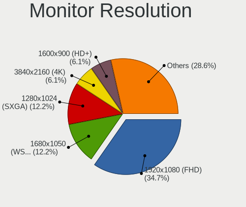

| Resolution         | Desktops | Percent |
|--------------------|----------|---------|
| 1920x1080 (FHD)    | 14       | 31.82%  |
| 1680x1050 (WSXGA+) | 6        | 13.64%  |
| 1280x1024 (SXGA)   | 5        | 11.36%  |
| 3840x2160 (4K)     | 3        | 6.82%   |
| 1440x900 (WXGA+)   | 3        | 6.82%   |
| 1360x768           | 3        | 6.82%   |
| 2560x1440 (QHD)    | 2        | 4.55%   |
| 1600x900 (HD+)     | 2        | 4.55%   |
| 1366x768 (WXGA)    | 2        | 4.55%   |
| 2288x1287          | 1        | 2.27%   |
| 1984x768           | 1        | 2.27%   |
| 1024x768 (XGA)     | 1        | 2.27%   |
| Unknown            | 1        | 2.27%   |

Monitor Diagonal
----------------

Diagonal size in inches

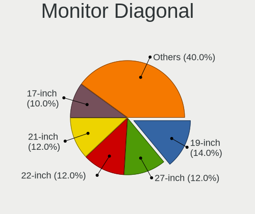

| Inches  | Desktops | Percent |
|---------|----------|---------|
| 19      | 7        | 15.56%  |
| 22      | 6        | 13.33%  |
| 21      | 6        | 13.33%  |
| 27      | 5        | 11.11%  |
| 17      | 4        | 8.89%   |
| 24      | 3        | 6.67%   |
| 18      | 3        | 6.67%   |
| Unknown | 3        | 6.67%   |
| 50      | 2        | 4.44%   |
| 142     | 1        | 2.22%   |
| 84      | 1        | 2.22%   |
| 41      | 1        | 2.22%   |
| 32      | 1        | 2.22%   |
| 23      | 1        | 2.22%   |
| 15      | 1        | 2.22%   |

Monitor Width
-------------

Physical width

| Width in mm    | Desktops | Percent |
|----------------|----------|---------|
| 401-500        | 20       | 46.51%  |
| 501-600        | 8        | 18.6%   |
| 301-350        | 5        | 11.63%  |
| Unknown        | 3        | 6.98%   |
| 1001-1500      | 2        | 4.65%   |
| More than 2000 | 1        | 2.33%   |
| 701-800        | 1        | 2.33%   |
| 351-400        | 1        | 2.33%   |
| 1501-2000      | 1        | 2.33%   |
| 901-1000       | 1        | 2.33%   |

Aspect Ratio
------------

Proportional relationship between the width and the height

| Ratio   | Desktops | Percent |
|---------|----------|---------|
| 16/9    | 23       | 54.76%  |
| 16/10   | 11       | 26.19%  |
| 5/4     | 5        | 11.9%   |
| Unknown | 2        | 4.76%   |
| 1.00    | 1        | 2.38%   |

Monitor Area
------------

Area in inch²

| Area in inch² | Desktops | Percent |
|----------------|----------|---------|
| 151-200        | 12       | 27.27%  |
| 201-250        | 10       | 22.73%  |
| 141-150        | 7        | 15.91%  |
| 301-350        | 5        | 11.36%  |
| More than 1000 | 4        | 9.09%   |
| Unknown        | 3        | 6.82%   |
| 351-500        | 1        | 2.27%   |
| 101-110        | 1        | 2.27%   |
| 501-1000       | 1        | 2.27%   |

Pixel Density
-------------

Pixels per inch

| Density | Desktops | Percent |
|---------|----------|---------|
| 51-100  | 29       | 67.44%  |
| 101-120 | 7        | 16.28%  |
| 1-50    | 4        | 9.3%    |
| Unknown | 3        | 6.98%   |

Multiple Monitors
-----------------

Total monitors connected

| Total | Desktops | Percent |
|-------|----------|---------|
| 1     | 42       | 77.78%  |
| 2     | 7        | 12.96%  |
| 0     | 5        | 9.26%   |

Network
-------

Net Controller Vendor
---------------------

Controller vendors

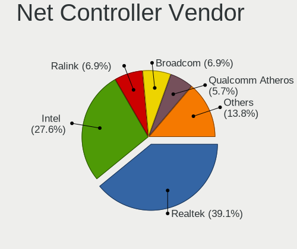

| Vendor                          | Desktops | Percent |
|---------------------------------|----------|---------|
| Realtek Semiconductor           | 29       | 36.25%  |
| Intel                           | 22       | 27.5%   |
| Ralink Technology               | 6        | 7.5%    |
| Broadcom                        | 6        | 7.5%    |
| Qualcomm Atheros                | 5        | 6.25%   |
| Linksys                         | 3        | 3.75%   |
| Qualcomm Atheros Communications | 2        | 2.5%    |
| Xiaomi                          | 1        | 1.25%   |
| VIA Technologies                | 1        | 1.25%   |
| Tul Corporation / PowerColor    | 1        | 1.25%   |
| TP-Link                         | 1        | 1.25%   |
| MediaTek                        | 1        | 1.25%   |
| HTC (High Tech Computer)        | 1        | 1.25%   |
| Broadcom Limited                | 1        | 1.25%   |

Net Controller Model
--------------------

Controller models

| Model                                                                  | Desktops | Percent |
|------------------------------------------------------------------------|----------|---------|
| Realtek RTL8111/8168/8211/8411 PCI Express Gigabit Ethernet Controller | 23       | 26.14%  |
| Ralink MT7601U Wireless Adapter                                        | 5        | 5.68%   |
| Intel 82579LM Gigabit Network Connection (Lewisville)                  | 5        | 5.68%   |
| Intel Ethernet Connection I217-LM                                      | 4        | 4.55%   |
| Realtek RTL8188EUS 802.11n Wireless Network Adapter                    | 3        | 3.41%   |
| Intel 82567LM-3 Gigabit Network Connection                             | 3        | 3.41%   |
| Realtek RTL8192EU 802.11b/g/n WLAN Adapter                             | 2        | 2.27%   |
| Qualcomm Atheros AR9271 802.11n                                        | 2        | 2.27%   |
| Qualcomm Atheros AR9285 Wireless Network Adapter (PCI-Express)         | 2        | 2.27%   |
| Linksys AE2500 802.11abgn Wireless Adapter [Broadcom BCM43236]         | 2        | 2.27%   |
| Intel Ethernet Connection (2) I219-V                                   | 2        | 2.27%   |
| Intel Dual Band Wireless-AC 3168NGW [Stone Peak]                       | 2        | 2.27%   |
| Xiaomi Mi/Redmi series (RNDIS)                                         | 1        | 1.14%   |
| VIA VT6102/VT6103 [Rhine-II]                                           | 1        | 1.14%   |
| Tul Corporation / PowerColor Network controller                        | 1        | 1.14%   |
| TP-Link TL-WN722N v2/v3 [Realtek RTL8188EUS]                           | 1        | 1.14%   |
| Realtek RTL8812AU 802.11a/b/g/n/ac 2T2R DB WLAN Adapter                | 1        | 1.14%   |
| Realtek RTL8811AU 802.11a/b/g/n/ac WLAN Adapter                        | 1        | 1.14%   |
| Realtek RTL8192EE PCIe Wireless Network Adapter                        | 1        | 1.14%   |
| Realtek RTL8188CUS 802.11n WLAN Adapter                                | 1        | 1.14%   |
| Realtek RTL8187B Wireless 802.11g 54Mbps Network Adapter               | 1        | 1.14%   |
| Realtek RTL8169 PCI Gigabit Ethernet Controller                        | 1        | 1.14%   |
| Realtek RTL8111/8168/8411 PCI Express Gigabit Ethernet Controller      | 1        | 1.14%   |
| Realtek 802.11ac NIC                                                   | 1        | 1.14%   |
| Ralink RT5370 Wireless Adapter                                         | 1        | 1.14%   |
| Qualcomm Atheros Killer E2400 Gigabit Ethernet Controller              | 1        | 1.14%   |
| Qualcomm Atheros AR8152 v2.0 Fast Ethernet                             | 1        | 1.14%   |
| Qualcomm Atheros AR8151 v2.0 Gigabit Ethernet                          | 1        | 1.14%   |
| MediaTek MT7922 802.11ax PCI Express Wireless Network Adapter          | 1        | 1.14%   |
| Linksys AE1200 802.11bgn Wireless Adapter [Broadcom BCM43235]          | 1        | 1.14%   |
| Intel Wi-Fi 6 AX200                                                    | 1        | 1.14%   |
| Intel I211 Gigabit Network Connection                                  | 1        | 1.14%   |
| Intel Ethernet Connection I217-V                                       | 1        | 1.14%   |
| Intel Ethernet Connection (7) I219-LM                                  | 1        | 1.14%   |
| Intel Ethernet Connection (2) I218-V                                   | 1        | 1.14%   |
| Intel 82566DM-2 Gigabit Network Connection                             | 1        | 1.14%   |
| Intel 82562V 10/100 Network Connection                                 | 1        | 1.14%   |
| HTC (High Tech Computer) UMI HAMMER                                    | 1        | 1.14%   |
| Broadcom NetXtreme BCM5764M Gigabit Ethernet PCIe                      | 1        | 1.14%   |
| Broadcom NetXtreme BCM5762 Gigabit Ethernet PCIe                       | 1        | 1.14%   |

Wireless Vendor
---------------

Wireless vendors

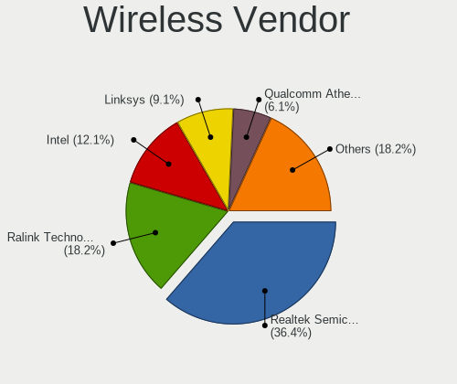

| Vendor                          | Desktops | Percent |
|---------------------------------|----------|---------|
| Realtek Semiconductor           | 11       | 35.48%  |
| Ralink Technology               | 6        | 19.35%  |
| Linksys                         | 3        | 9.68%   |
| Intel                           | 3        | 9.68%   |
| Qualcomm Atheros Communications | 2        | 6.45%   |
| Qualcomm Atheros                | 2        | 6.45%   |
| Broadcom                        | 2        | 6.45%   |
| TP-Link                         | 1        | 3.23%   |
| MediaTek                        | 1        | 3.23%   |

Wireless Model
--------------

Wireless models

| Model                                                          | Desktops | Percent |
|----------------------------------------------------------------|----------|---------|
| Ralink MT7601U Wireless Adapter                                | 5        | 16.13%  |
| Realtek RTL8188EUS 802.11n Wireless Network Adapter            | 3        | 9.68%   |
| Realtek RTL8192EU 802.11b/g/n WLAN Adapter                     | 2        | 6.45%   |
| Qualcomm Atheros AR9271 802.11n                                | 2        | 6.45%   |
| Qualcomm Atheros AR9285 Wireless Network Adapter (PCI-Express) | 2        | 6.45%   |
| Linksys AE2500 802.11abgn Wireless Adapter [Broadcom BCM43236] | 2        | 6.45%   |
| Intel Dual Band Wireless-AC 3168NGW [Stone Peak]               | 2        | 6.45%   |
| TP-Link TL-WN722N v2/v3 [Realtek RTL8188EUS]                   | 1        | 3.23%   |
| Realtek RTL8812AU 802.11a/b/g/n/ac 2T2R DB WLAN Adapter        | 1        | 3.23%   |
| Realtek RTL8811AU 802.11a/b/g/n/ac WLAN Adapter                | 1        | 3.23%   |
| Realtek RTL8192EE PCIe Wireless Network Adapter                | 1        | 3.23%   |
| Realtek RTL8188CUS 802.11n WLAN Adapter                        | 1        | 3.23%   |
| Realtek RTL8187B Wireless 802.11g 54Mbps Network Adapter       | 1        | 3.23%   |
| Realtek 802.11ac NIC                                           | 1        | 3.23%   |
| Ralink RT5370 Wireless Adapter                                 | 1        | 3.23%   |
| MediaTek MT7922 802.11ax PCI Express Wireless Network Adapter  | 1        | 3.23%   |
| Linksys AE1200 802.11bgn Wireless Adapter [Broadcom BCM43235]  | 1        | 3.23%   |
| Intel Wi-Fi 6 AX200                                            | 1        | 3.23%   |
| Broadcom BCM4352 802.11ac Dual Band Wireless Network Adapter   | 1        | 3.23%   |
| Broadcom BCM43217 802.11b/g/n                                  | 1        | 3.23%   |

Ethernet Vendor
---------------

Ethernet vendors

| Vendor                   | Desktops | Percent |
|--------------------------|----------|---------|
| Realtek Semiconductor    | 25       | 44.64%  |
| Intel                    | 20       | 35.71%  |
| Broadcom                 | 4        | 7.14%   |
| Qualcomm Atheros         | 3        | 5.36%   |
| Xiaomi                   | 1        | 1.79%   |
| VIA Technologies         | 1        | 1.79%   |
| HTC (High Tech Computer) | 1        | 1.79%   |
| Broadcom Limited         | 1        | 1.79%   |

Ethernet Model
--------------

Ethernet models

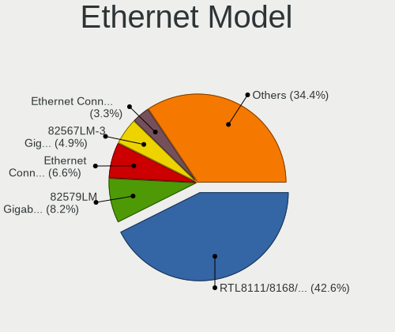

| Model                                                                  | Desktops | Percent |
|------------------------------------------------------------------------|----------|---------|
| Realtek RTL8111/8168/8211/8411 PCI Express Gigabit Ethernet Controller | 23       | 41.07%  |
| Intel 82579LM Gigabit Network Connection (Lewisville)                  | 5        | 8.93%   |
| Intel Ethernet Connection I217-LM                                      | 4        | 7.14%   |
| Intel 82567LM-3 Gigabit Network Connection                             | 3        | 5.36%   |
| Intel Ethernet Connection (2) I219-V                                   | 2        | 3.57%   |
| Xiaomi Mi/Redmi series (RNDIS)                                         | 1        | 1.79%   |
| VIA VT6102/VT6103 [Rhine-II]                                           | 1        | 1.79%   |
| Realtek RTL8169 PCI Gigabit Ethernet Controller                        | 1        | 1.79%   |
| Realtek RTL8111/8168/8411 PCI Express Gigabit Ethernet Controller      | 1        | 1.79%   |
| Qualcomm Atheros Killer E2400 Gigabit Ethernet Controller              | 1        | 1.79%   |
| Qualcomm Atheros AR8152 v2.0 Fast Ethernet                             | 1        | 1.79%   |
| Qualcomm Atheros AR8151 v2.0 Gigabit Ethernet                          | 1        | 1.79%   |
| Intel I211 Gigabit Network Connection                                  | 1        | 1.79%   |
| Intel Ethernet Connection I217-V                                       | 1        | 1.79%   |
| Intel Ethernet Connection (7) I219-LM                                  | 1        | 1.79%   |
| Intel Ethernet Connection (2) I218-V                                   | 1        | 1.79%   |
| Intel 82566DM-2 Gigabit Network Connection                             | 1        | 1.79%   |
| Intel 82562V 10/100 Network Connection                                 | 1        | 1.79%   |
| HTC (High Tech Computer) UMI HAMMER                                    | 1        | 1.79%   |
| Broadcom NetXtreme BCM5764M Gigabit Ethernet PCIe                      | 1        | 1.79%   |
| Broadcom NetXtreme BCM5762 Gigabit Ethernet PCIe                       | 1        | 1.79%   |
| Broadcom NetXtreme BCM5761 Gigabit Ethernet PCIe                       | 1        | 1.79%   |
| Broadcom NetXtreme BCM5754 Gigabit Ethernet PCI Express                | 1        | 1.79%   |
| Broadcom Limited NetXtreme BCM5751 Gigabit Ethernet PCI Express        | 1        | 1.79%   |

Net Controller Kind
-------------------

Ethernet, WiFi or modem

| Kind     | Desktops | Percent |
|----------|----------|---------|
| Ethernet | 51       | 63.75%  |
| WiFi     | 28       | 35%     |
| Unknown  | 1        | 1.25%   |

Used Controller
---------------

Currently used network controller

| Kind     | Desktops | Percent |
|----------|----------|---------|
| Ethernet | 36       | 65.45%  |
| WiFi     | 19       | 34.55%  |

NICs
----

Total network controllers on board

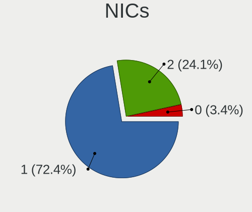

| Total | Desktops | Percent |
|-------|----------|---------|
| 1     | 38       | 71.7%   |
| 2     | 13       | 24.53%  |
| 0     | 2        | 3.77%   |

IPv6
----

IPv6 vs IPv4

| Used | Desktops | Percent |
|------|----------|---------|
| No   | 49       | 87.5%   |
| Yes  | 7        | 12.5%   |

Bluetooth
---------

Bluetooth Vendor
----------------

Controller vendors

| Vendor                  | Desktops | Percent |
|-------------------------|----------|---------|
| Cambridge Silicon Radio | 9        | 56.25%  |
| Intel                   | 3        | 18.75%  |
| MediaTek                | 1        | 6.25%   |
| IMC Networks            | 1        | 6.25%   |
| Dynex                   | 1        | 6.25%   |
| ASUSTek Computer        | 1        | 6.25%   |

Bluetooth Model
---------------

Controller models

| Model                                                    | Desktops | Percent |
|----------------------------------------------------------|----------|---------|
| Cambridge Silicon Radio Bluetooth Dongle (HCI mode)      | 9        | 56.25%  |
| Intel Wireless-AC 3168 Bluetooth                         | 2        | 12.5%   |
| MediaTek Wireless_Device                                 | 1        | 6.25%   |
| Intel AX200 Bluetooth                                    | 1        | 6.25%   |
| IMC Networks BCM20702A0                                  | 1        | 6.25%   |
| Dynex Bluetooth 4.0 Adapter [Broadcom, 1.12, BCM20702A0] | 1        | 6.25%   |
| ASUS Broadcom BCM20702A0 Bluetooth                       | 1        | 6.25%   |

Sound
-----

Sound Vendor
------------

Sound card vendors

| Vendor                           | Desktops | Percent |
|----------------------------------|----------|---------|
| Intel                            | 33       | 43.42%  |
| AMD                              | 20       | 26.32%  |
| Nvidia                           | 12       | 15.79%  |
| Logitech                         | 2        | 2.63%   |
| Creative Labs                    | 2        | 2.63%   |
| VIA Technologies                 | 1        | 1.32%   |
| Silicon Integrated Systems [SiS] | 1        | 1.32%   |
| JMTek                            | 1        | 1.32%   |
| fifine Microphones               | 1        | 1.32%   |
| C-Media Electronics              | 1        | 1.32%   |
| Blue Microphones                 | 1        | 1.32%   |
| BigBen Interactive               | 1        | 1.32%   |

Sound Model
-----------

Sound card models

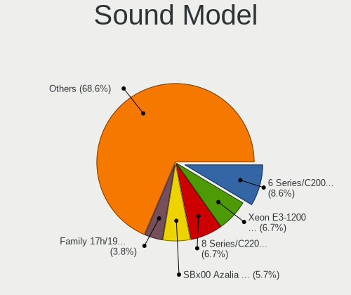

| Model                                                                      | Desktops | Percent |
|----------------------------------------------------------------------------|----------|---------|
| Intel 6 Series/C200 Series Chipset Family High Definition Audio Controller | 8        | 8.33%   |
| Intel Xeon E3-1200 v3/4th Gen Core Processor HD Audio Controller           | 7        | 7.29%   |
| Intel 8 Series/C220 Series Chipset High Definition Audio Controller        | 7        | 7.29%   |
| AMD SBx00 Azalia (Intel HDA)                                               | 6        | 6.25%   |
| AMD Family 17h/19h HD Audio Controller                                     | 4        | 4.17%   |
| Intel 7 Series/C216 Chipset Family High Definition Audio Controller        | 3        | 3.13%   |
| Intel 100 Series/C230 Series Chipset Family HD Audio Controller            | 3        | 3.13%   |
| AMD Family 17h (Models 00h-0fh) HD Audio Controller                        | 3        | 3.13%   |
| AMD Ellesmere HDMI Audio [Radeon RX 470/480 / 570/580/590]                 | 3        | 3.13%   |
| Nvidia High Definition Audio Controller                                    | 2        | 2.08%   |
| Nvidia GF119 HDMI Audio Controller                                         | 2        | 2.08%   |
| Intel NM10/ICH7 Family High Definition Audio Controller                    | 2        | 2.08%   |
| Intel 82801JD/DO (ICH10 Family) HD Audio Controller                        | 2        | 2.08%   |
| Intel 82801H (ICH8 Family) HD Audio Controller                             | 2        | 2.08%   |
| AMD RS780 HDMI Audio [Radeon 3000/3100 / HD 3200/3300]                     | 2        | 2.08%   |
| AMD Raven/Raven2/Fenghuang HDMI/DP Audio Controller                        | 2        | 2.08%   |
| AMD Navi 21/23 HDMI/DP Audio Controller                                    | 2        | 2.08%   |
| AMD Kabini HDMI/DP Audio                                                   | 2        | 2.08%   |
| AMD Baffin HDMI/DP Audio [Radeon RX 550 640SP / RX 560/560X]               | 2        | 2.08%   |
| VIA Technologies VT8233/A/8235/8237 AC97 Audio Controller                  | 1        | 1.04%   |
| Silicon Integrated Systems [SiS] Azalia Audio Controller                   | 1        | 1.04%   |
| Nvidia TU116 High Definition Audio Controller                              | 1        | 1.04%   |
| Nvidia GP108 High Definition Audio Controller                              | 1        | 1.04%   |
| Nvidia GP107GL High Definition Audio Controller                            | 1        | 1.04%   |
| Nvidia GP106 High Definition Audio Controller                              | 1        | 1.04%   |
| Nvidia GP104 High Definition Audio Controller                              | 1        | 1.04%   |
| Nvidia GK107 HDMI Audio Controller                                         | 1        | 1.04%   |
| Nvidia GK106 HDMI Audio Controller                                         | 1        | 1.04%   |
| Nvidia GK104 HDMI Audio Controller                                         | 1        | 1.04%   |
| Logitech QuickCam Fusion                                                   | 1        | 1.04%   |
| Logitech Headset H390                                                      | 1        | 1.04%   |
| JMTek USB Speaker                                                          | 1        | 1.04%   |
| Intel Comet Lake PCH-V cAVS                                                | 1        | 1.04%   |
| Intel 9 Series Chipset Family HD Audio Controller                          | 1        | 1.04%   |
| Intel 82801JI (ICH10 Family) HD Audio Controller                           | 1        | 1.04%   |
| Intel 82801I (ICH9 Family) HD Audio Controller                             | 1        | 1.04%   |
| Intel 82801FB/FBM/FR/FW/FRW (ICH6 Family) AC'97 Audio Controller           | 1        | 1.04%   |
| Intel 200 Series PCH HD Audio                                              | 1        | 1.04%   |
| fifine Microphones fifine Microphone                                       | 1        | 1.04%   |
| Creative Labs EMU10k1 [Sound Blaster Live! Series]                         | 1        | 1.04%   |

Memory
------

Memory Vendor
-------------

Memory module vendors

| Vendor              | Desktops | Percent |
|---------------------|----------|---------|
| SK hynix            | 10       | 20.83%  |
| Samsung Electronics | 7        | 14.58%  |
| Unknown             | 5        | 10.42%  |
| Micron Technology   | 4        | 8.33%   |
| Nanya Technology    | 3        | 6.25%   |
| Kingston            | 3        | 6.25%   |
| G.Skill             | 3        | 6.25%   |
| Corsair             | 3        | 6.25%   |
| Ramaxel Technology  | 2        | 4.17%   |
| V-Color             | 1        | 2.08%   |
| Timetec             | 1        | 2.08%   |
| Qimonda             | 1        | 2.08%   |
| Patriot             | 1        | 2.08%   |
| Elpida              | 1        | 2.08%   |
| Crucial             | 1        | 2.08%   |
| Avant               | 1        | 2.08%   |
| Unknown             | 1        | 2.08%   |

Memory Model
------------

Memory module models

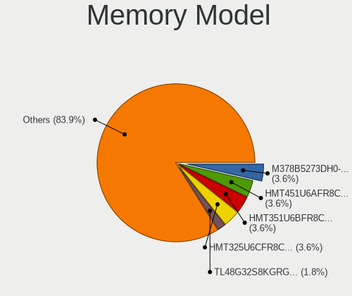

| Model                                                  | Desktops | Percent |
|--------------------------------------------------------|----------|---------|
| SK hynix RAM HMT451U6AFR8C-PB 4GB DIMM DDR3 1600MT/s   | 2        | 3.85%   |
| SK hynix RAM HMT351U6BFR8C-H9 4GB DIMM DDR3 1333MT/s   | 2        | 3.85%   |
| SK hynix RAM HMT325U6CFR8C-PB 2GB DIMM DDR3 1600MT/s   | 2        | 3.85%   |
| Samsung RAM M378B5273DH0-CH9 4096MB DIMM DDR3 2133MT/s | 2        | 3.85%   |
| V-Color RAM TL48G32S8KGRGB16 8192MB DIMM DDR4 3200MT/s | 1        | 1.92%   |
| Unknown RAM Module 8GB DIMM DDR4 2133MT/s              | 1        | 1.92%   |
| Unknown RAM Module 8192MB DIMM 1333MT/s                | 1        | 1.92%   |
| Unknown RAM Module 4GB DIMM 1333MT/s                   | 1        | 1.92%   |
| Unknown RAM Module 4096MB DIMM 1333MT/s                | 1        | 1.92%   |
| Unknown RAM Module 2048MB DIMM SDRAM                   | 1        | 1.92%   |
| Timetec RAM U8G-1333 8192MB DIMM DDR3 1333MT/s         | 1        | 1.92%   |
| SK hynix RAM Module 8192MB DIMM DDR4 2400MT/s          | 1        | 1.92%   |
| SK hynix RAM HYMP512U64CP8-Y5 1GB DIMM DDR2 1331MT/s   | 1        | 1.92%   |
| SK hynix RAM HMT451U6BFR8C-PB 4GB DIMM DDR3 1600MT/s   | 1        | 1.92%   |
| SK hynix RAM HMT451U6BFR8A-PB 4GB DIMM DDR3 1600MT/s   | 1        | 1.92%   |
| SK hynix RAM HMT41GU6MFR8C-PB 8GB DIMM DDR3 1600MT/s   | 1        | 1.92%   |
| SK hynix RAM HMT41GS6BFR8A-PB 8GB SODIMM DDR3 1600MT/s | 1        | 1.92%   |
| Samsung RAM M378B5773CH0-CH9 2048MB DIMM DDR3 1867MT/s | 1        | 1.92%   |
| Samsung RAM M378B5673FH0-CF8 2GB DIMM DDR3 1067MT/s    | 1        | 1.92%   |
| Samsung RAM M378B5673EH1-CH9 2GB DIMM DDR3 1333MT/s    | 1        | 1.92%   |
| Samsung RAM M378B5173EB0-YK0 4GB DIMM DDR3 1600MT/s    | 1        | 1.92%   |
| Samsung RAM M3 78T6553BZ0-KCC 512MB DIMM DDR2 400MT/s  | 1        | 1.92%   |
| Ramaxel RAM RMR5030MN68F9F1600 4GB DIMM DDR3 1600MT/s  | 1        | 1.92%   |
| Ramaxel RAM RMR1870EC58E9F1333 4GB DIMM DDR3 1333MT/s  | 1        | 1.92%   |
| Qimonda RAM 64T128020HU3SB 1GB DIMM DDR 667MT/s        | 1        | 1.92%   |
| Patriot RAM PSD48G266681 8GB DIMM DDR4 2934MT/s        | 1        | 1.92%   |
| Nanya RAM NT512T64U88A0F-5A 512MB DIMM DDR2 400MT/s    | 1        | 1.92%   |
| Nanya RAM NT2GC64B88B0NF-CG 2GB DIMM DDR3 1333MT/s     | 1        | 1.92%   |
| Nanya RAM NT1GT64U88D0BY-AD 1GB DIMM DDR 49926MT/s     | 1        | 1.92%   |
| Nanya RAM NT1GT64U88D0BY-3C 1GB DIMM DDR2 667MT/s      | 1        | 1.92%   |
| Micron RAM 8KTF25664HZ-1G6M1 2GB SODIMM DDR3           | 1        | 1.92%   |
| Micron RAM 8JTF51264AZ-1G6E1 4GB DIMM DDR3 1600MT/s    | 1        | 1.92%   |
| Micron RAM 8HTF6464AY-53ED7 512MB DIMM DDR2 533MT/s    | 1        | 1.92%   |
| Micron RAM 16ATF1G64AZ-2G1B1 8GB DIMM DDR4 2133MT/s    | 1        | 1.92%   |
| Kingston RAM KHX2666C16/16G 16GB DIMM DDR4 3200MT/s    | 1        | 1.92%   |
| Kingston RAM HP497157-D88-ELFWG 2GB DIMM DDR3 1333MT/s | 1        | 1.92%   |
| Kingston RAM 9965745-028.A00G 16GB DIMM DDR4 2667MT/s  | 1        | 1.92%   |
| G.Skill RAM F5-6000J3038F16G 16GB DIMM DDR5 6000MT/s   | 1        | 1.92%   |
| G.Skill RAM F4-3600C18-8GTZN 8GB DIMM DDR4 3600MT/s    | 1        | 1.92%   |
| G.Skill RAM F4-3200C16-8GTZR 8GB DIMM DDR4 3200MT/s    | 1        | 1.92%   |

Memory Kind
-----------

Memory module kinds

| Kind    | Desktops | Percent |
|---------|----------|---------|
| DDR3    | 12       | 36.36%  |
| DDR4    | 10       | 30.3%   |
| SDRAM   | 4        | 12.12%  |
| Unknown | 3        | 9.09%   |
| DDR2    | 2        | 6.06%   |
| DDR5    | 1        | 3.03%   |
| DDR     | 1        | 3.03%   |

Memory Form Factor
------------------

Physical design of the memory module

| Name   | Desktops | Percent |
|--------|----------|---------|
| DIMM   | 29       | 96.67%  |
| SODIMM | 1        | 3.33%   |

Memory Size
-----------

Memory module size

| Size  | Desktops | Percent |
|-------|----------|---------|
| 8192  | 12       | 33.33%  |
| 4096  | 11       | 30.56%  |
| 2048  | 6        | 16.67%  |
| 16384 | 3        | 8.33%   |
| 1024  | 2        | 5.56%   |
| 512   | 2        | 5.56%   |

Memory Speed
------------

Memory module speed

| Speed   | Desktops | Percent |
|---------|----------|---------|
| 1333    | 9        | 21.95%  |
| 1600    | 8        | 19.51%  |
| 2133    | 4        | 9.76%   |
| 3600    | 2        | 4.88%   |
| 3200    | 2        | 4.88%   |
| 2933    | 2        | 4.88%   |
| 533     | 2        | 4.88%   |
| 49926   | 1        | 2.44%   |
| 6000    | 1        | 2.44%   |
| 2934    | 1        | 2.44%   |
| 2667    | 1        | 2.44%   |
| 2400    | 1        | 2.44%   |
| 1867    | 1        | 2.44%   |
| 1648    | 1        | 2.44%   |
| 1331    | 1        | 2.44%   |
| 1067    | 1        | 2.44%   |
| 667     | 1        | 2.44%   |
| 400     | 1        | 2.44%   |
| Unknown | 1        | 2.44%   |

Printers & scanners
-------------------

Printer Vendor
--------------

Printer device vendors

Zero info for selected period =(

Printer Model
-------------

Printer device models

Zero info for selected period =(

Scanner Vendor
--------------

Scanner device vendors

Zero info for selected period =(

Scanner Model
-------------

Scanner device models

Zero info for selected period =(

Camera
------

Camera Vendor
-------------

Camera device vendors

| Vendor                  | Desktops | Percent |
|-------------------------|----------|---------|
| Microsoft               | 3        | 25%     |
| OmniVision Technologies | 2        | 16.67%  |
| Microdia                | 2        | 16.67%  |
| Logitech                | 2        | 16.67%  |
| Samsung Electronics     | 1        | 8.33%   |
| Jieli Technology        | 1        | 8.33%   |
| Apple                   | 1        | 8.33%   |

Camera Model
------------

Camera device models

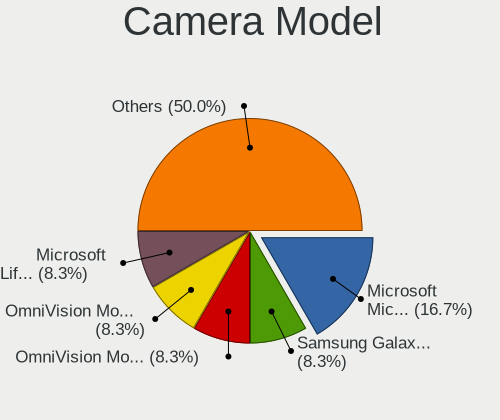

| Model                                   | Desktops | Percent |
|-----------------------------------------|----------|---------|
| Microsoft Microsoft LifeCam HD-5001   | 2        | 16.67%  |
| Samsung Galaxy series, misc. (MTP mode) | 1        | 8.33%   |
| OmniVision Monitor Webcam               | 1        | 8.33%   |
| OmniVision Monitor Integrated Webcam    | 1        | 8.33%   |
| Microsoft LifeCam VX-2000               | 1        | 8.33%   |
| Microdia USB 2.0 Camera                 | 1        | 8.33%   |
| Microdia Integrated Camera              | 1        | 8.33%   |
| Logitech Webcam Pro 9000                | 1        | 8.33%   |
| Logitech Webcam C170                    | 1        | 8.33%   |
| Jieli USB PHY 2.0                       | 1        | 8.33%   |
| Apple iPhone 5/5C/5S/6/SE/7/8/X         | 1        | 8.33%   |

Security
--------

Fingerprint Vendor
------------------

Fingerprint sensor vendors

Zero info for selected period =(

Fingerprint Model
-----------------

Fingerprint sensor models

Zero info for selected period =(

Chipcard Vendor
---------------

Chipcard module vendors

Zero info for selected period =(

Chipcard Model
--------------

Chipcard module models

Zero info for selected period =(

Unsupported
-----------

Unsupported Devices
-------------------

Total unsupported devices on board

| Total | Desktops | Percent |
|-------|----------|---------|
| 0     | 44       | 80%     |
| 1     | 11       | 20%     |

Unsupported Device Types
------------------------

Types of unsupported devices

| Type          | Desktops | Percent |
|---------------|----------|---------|
| Graphics card | 7        | 63.64%  |
| Net/wireless  | 2        | 18.18%  |
| Network       | 1        | 9.09%   |
| Camera        | 1        | 9.09%   |

