Linux in Dominican Republic - Tested Hardware & Statistics (Notebooks)
----------------------------------------------------------------------

A project to collect tested hardware configurations for Linux in Dominican Republic.

Anyone can contribute to this report by the [hw-probe](https://github.com/linuxhw/hw-probe) tool:

    sudo -E hw-probe -all -upload

Please contribute! Especially if your hardware is rare.

Contents
--------

* [ Test Cases ](#test-cases)

* [ System ](#system)
  - [ OS                       ](#os)
  - [ OS Family                ](#os-family)
  - [ Kernel                   ](#kernel)
  - [ Kernel Family            ](#kernel-family)
  - [ Kernel Major Ver.        ](#kernel-major-ver)
  - [ Arch                     ](#arch)
  - [ DE                       ](#de)
  - [ Display Server           ](#display-server)
  - [ Display Manager          ](#display-manager)
  - [ OS Lang                  ](#os-lang)
  - [ Boot Mode                ](#boot-mode)
  - [ Filesystem               ](#filesystem)
  - [ Part. scheme             ](#part-scheme)
  - [ Dual Boot with Linux/BSD ](#dual-boot-with-linuxbsd)
  - [ Dual Boot (Win)          ](#dual-boot-win)

* [ Board ](#board)
  - [ Vendor                   ](#vendor)
  - [ Model                    ](#model)
  - [ Model Family             ](#model-family)
  - [ MFG Year                 ](#mfg-year)
  - [ Form Factor              ](#form-factor)
  - [ Secure Boot              ](#secure-boot)
  - [ Coreboot                 ](#coreboot)
  - [ RAM Size                 ](#ram-size)
  - [ RAM Used                 ](#ram-used)
  - [ Total Drives             ](#total-drives)
  - [ Has CD-ROM               ](#has-cd-rom)
  - [ Has Ethernet             ](#has-ethernet)
  - [ Has WiFi                 ](#has-wifi)
  - [ Has Bluetooth            ](#has-bluetooth)

* [ Location ](#location)
  - [ Country                  ](#country)
  - [ City                     ](#city)

* [ Drives ](#drives)
  - [ Drive Vendor             ](#drive-vendor)
  - [ Drive Model              ](#drive-model)
  - [ HDD Vendor               ](#hdd-vendor)
  - [ SSD Vendor               ](#ssd-vendor)
  - [ Drive Kind               ](#drive-kind)
  - [ Drive Connector          ](#drive-connector)
  - [ Drive Size               ](#drive-size)
  - [ Space Total              ](#space-total)
  - [ Space Used               ](#space-used)
  - [ Malfunc. Drives          ](#malfunc-drives)
  - [ Malfunc. Drive Vendor    ](#malfunc-drive-vendor)
  - [ Malfunc. HDD Vendor      ](#malfunc-hdd-vendor)
  - [ Malfunc. Drive Kind      ](#malfunc-drive-kind)
  - [ Failed Drives            ](#failed-drives)
  - [ Failed Drive Vendor      ](#failed-drive-vendor)
  - [ Drive Status             ](#drive-status)

* [ Storage controller ](#storage-controller)
  - [ Storage Vendor           ](#storage-vendor)
  - [ Storage Model            ](#storage-model)
  - [ Storage Kind             ](#storage-kind)

* [ Processor ](#processor)
  - [ CPU Vendor               ](#cpu-vendor)
  - [ CPU Model                ](#cpu-model)
  - [ CPU Model Family         ](#cpu-model-family)
  - [ CPU Cores                ](#cpu-cores)
  - [ CPU Sockets              ](#cpu-sockets)
  - [ CPU Threads              ](#cpu-threads)
  - [ CPU Op-Modes             ](#cpu-op-modes)
  - [ CPU Microcode            ](#cpu-microcode)
  - [ CPU Microarch            ](#cpu-microarch)

* [ Graphics ](#graphics)
  - [ GPU Vendor               ](#gpu-vendor)
  - [ GPU Model                ](#gpu-model)
  - [ GPU Combo                ](#gpu-combo)
  - [ GPU Driver               ](#gpu-driver)
  - [ GPU Memory               ](#gpu-memory)

* [ Monitor ](#monitor)
  - [ Monitor Vendor           ](#monitor-vendor)
  - [ Monitor Model            ](#monitor-model)
  - [ Monitor Resolution       ](#monitor-resolution)
  - [ Monitor Diagonal         ](#monitor-diagonal)
  - [ Monitor Width            ](#monitor-width)
  - [ Aspect Ratio             ](#aspect-ratio)
  - [ Monitor Area             ](#monitor-area)
  - [ Pixel Density            ](#pixel-density)
  - [ Multiple Monitors        ](#multiple-monitors)

* [ Network ](#network)
  - [ Net Controller Vendor    ](#net-controller-vendor)
  - [ Net Controller Model     ](#net-controller-model)
  - [ Wireless Vendor          ](#wireless-vendor)
  - [ Wireless Model           ](#wireless-model)
  - [ Ethernet Vendor          ](#ethernet-vendor)
  - [ Ethernet Model           ](#ethernet-model)
  - [ Net Controller Kind      ](#net-controller-kind)
  - [ Used Controller          ](#used-controller)
  - [ NICs                     ](#nics)
  - [ IPv6                     ](#ipv6)

* [ Bluetooth ](#bluetooth)
  - [ Bluetooth Vendor         ](#bluetooth-vendor)
  - [ Bluetooth Model          ](#bluetooth-model)

* [ Sound ](#sound)
  - [ Sound Vendor             ](#sound-vendor)
  - [ Sound Model              ](#sound-model)

* [ Memory ](#memory)
  - [ Memory Vendor            ](#memory-vendor)
  - [ Memory Model             ](#memory-model)
  - [ Memory Kind              ](#memory-kind)
  - [ Memory Form Factor       ](#memory-form-factor)
  - [ Memory Size              ](#memory-size)
  - [ Memory Speed             ](#memory-speed)

* [ Printers & scanners ](#printers--scanners)
  - [ Printer Vendor           ](#printer-vendor)
  - [ Printer Model            ](#printer-model)
  - [ Scanner Vendor           ](#scanner-vendor)
  - [ Scanner Model            ](#scanner-model)

* [ Camera ](#camera)
  - [ Camera Vendor            ](#camera-vendor)
  - [ Camera Model             ](#camera-model)

* [ Security ](#security)
  - [ Fingerprint Vendor       ](#fingerprint-vendor)
  - [ Fingerprint Model        ](#fingerprint-model)
  - [ Chipcard Vendor          ](#chipcard-vendor)
  - [ Chipcard Model           ](#chipcard-model)

* [ Unsupported ](#unsupported)
  - [ Unsupported Devices      ](#unsupported-devices)
  - [ Unsupported Device Types ](#unsupported-device-types)

Test Cases
----------

Total: 263

| Vendor        | Model                       | Probe                                                      | Date         |
|---------------|-----------------------------|------------------------------------------------------------|--------------|
| Google        | Jinlon                      | [b49ee8ad45](https://linux-hardware.org/?probe=b49ee8ad45) | Dec 25, 2025 |
| Acer          | Nitro AN515-54              | [593e1be978](https://linux-hardware.org/?probe=593e1be978) | Dec 23, 2025 |
| Dell          | Latitude E5450              | [fcfe71bb5f](https://linux-hardware.org/?probe=fcfe71bb5f) | Nov 21, 2025 |
| Acer          | TravelMate B117-M           | [d4a2d729df](https://linux-hardware.org/?probe=d4a2d729df) | Oct 30, 2025 |
| Acer          | TravelMate B117-M           | [9f902f0e9b](https://linux-hardware.org/?probe=9f902f0e9b) | Oct 30, 2025 |
| ASUSTek       | ASUS Vivobook Pro 15 N65... | [6e1541f2a3](https://linux-hardware.org/?probe=6e1541f2a3) | Oct 28, 2025 |
| Dell          | Latitude E6430              | [213447a0a1](https://linux-hardware.org/?probe=213447a0a1) | Oct 18, 2025 |
| Lenovo        | Legion Pro 5 16ARX8 82WM    | [ae48c975bd](https://linux-hardware.org/?probe=ae48c975bd) | Oct 10, 2025 |
| Lenovo        | IdeaPad Slim 3 15ABR8 82... | [fa1a11e6f1](https://linux-hardware.org/?probe=fa1a11e6f1) | Oct 10, 2025 |
| Apple         | MacBookAir7,2               | [0e4fc5a6c1](https://linux-hardware.org/?probe=0e4fc5a6c1) | Oct 05, 2025 |
| Apple         | MacBookAir7,2               | [e403afa6ba](https://linux-hardware.org/?probe=e403afa6ba) | Oct 05, 2025 |
| Dell          | Latitude E5520              | [f4f89f0d14](https://linux-hardware.org/?probe=f4f89f0d14) | Sep 13, 2025 |
| Dell          | Latitude E6520              | [867bc8fa40](https://linux-hardware.org/?probe=867bc8fa40) | Sep 06, 2025 |
| Lenovo        | IdeaPad Slim 3 15ABR8 82... | [eba9521524](https://linux-hardware.org/?probe=eba9521524) | Sep 03, 2025 |
| Lenovo        | IdeaPad Slim 3 15ABR8 82... | [ed228b82ae](https://linux-hardware.org/?probe=ed228b82ae) | Sep 01, 2025 |
| Lenovo        | G50-45 80E3                 | [3ff5c7ba83](https://linux-hardware.org/?probe=3ff5c7ba83) | Aug 31, 2025 |
| Dell          | Latitude E5520              | [e8a68cba53](https://linux-hardware.org/?probe=e8a68cba53) | Aug 31, 2025 |
| ASUSTek       | X540SA                      | [dbc04951b1](https://linux-hardware.org/?probe=dbc04951b1) | Aug 28, 2025 |
| ASUSTek       | ASUS TUF Dash F15 FX517Z... | [15d4939319](https://linux-hardware.org/?probe=15d4939319) | Jul 09, 2025 |
| Dell          | Latitude E5520              | [268c31e4c8](https://linux-hardware.org/?probe=268c31e4c8) | Jun 22, 2025 |
| Lenovo        | ThinkPad T60 2613CTO        | [87f138f6e0](https://linux-hardware.org/?probe=87f138f6e0) | May 25, 2025 |
| Lenovo        | ThinkPad T60 2613CTO        | [80222b4a2c](https://linux-hardware.org/?probe=80222b4a2c) | May 25, 2025 |
| Dell          | Latitude E6320              | [47ae04e182](https://linux-hardware.org/?probe=47ae04e182) | Apr 21, 2025 |
| Valve         | Jupiter                     | [af9fb845ff](https://linux-hardware.org/?probe=af9fb845ff) | Apr 13, 2025 |
| Valve         | Jupiter                     | [b18e901866](https://linux-hardware.org/?probe=b18e901866) | Apr 04, 2025 |
| Lenovo        | IdeaPad 330-15IKB Touch ... | [31d894e7c7](https://linux-hardware.org/?probe=31d894e7c7) | Mar 31, 2025 |
| Lenovo        | IdeaPad 330-15IKB Touch ... | [391b0961e3](https://linux-hardware.org/?probe=391b0961e3) | Mar 29, 2025 |
| HP            | Notebook                    | [b6ffb0e540](https://linux-hardware.org/?probe=b6ffb0e540) | Mar 26, 2025 |
| ASUSTek       | VivoBook_ASUSLaptop M170... | [d59ec9673c](https://linux-hardware.org/?probe=d59ec9673c) | Feb 03, 2025 |
| Dell          | Latitude E6520              | [4f9ae1d2ab](https://linux-hardware.org/?probe=4f9ae1d2ab) | Jan 24, 2025 |
| Apple         | MacBookAir7,2               | [358726c08c](https://linux-hardware.org/?probe=358726c08c) | Jan 23, 2025 |
| VTEX          | NOTEBOOK                    | [aacbadd179](https://linux-hardware.org/?probe=aacbadd179) | Jan 23, 2025 |
| HP            | EliteBook 8460p             | [c0eaa65cf4](https://linux-hardware.org/?probe=c0eaa65cf4) | Jan 10, 2025 |
| Lenovo        | ThinkPad X1 Carbon 7th 2... | [f84abc56e9](https://linux-hardware.org/?probe=f84abc56e9) | Nov 08, 2024 |
| Lenovo        | Unknown                     | [18084edb88](https://linux-hardware.org/?probe=18084edb88) | Nov 06, 2024 |
| Intel         | TU45C                       | [f7640d1ac4](https://linux-hardware.org/?probe=f7640d1ac4) | Oct 31, 2024 |
| Lenovo        | Unknown                     | [0fdc4e7dac](https://linux-hardware.org/?probe=0fdc4e7dac) | Oct 31, 2024 |
| Apple         | MacBookAir7,2               | [c57cc10b49](https://linux-hardware.org/?probe=c57cc10b49) | Oct 11, 2024 |
| Dell          | Inspiron 3520               | [f5cdd77427](https://linux-hardware.org/?probe=f5cdd77427) | Sep 17, 2024 |
| Dell          | Latitude E6420              | [a37423865a](https://linux-hardware.org/?probe=a37423865a) | Sep 15, 2024 |
| Lenovo        | ThinkPad X1 Carbon 7th 2... | [2d1f00b430](https://linux-hardware.org/?probe=2d1f00b430) | Sep 14, 2024 |
| HP            | Laptop 15-ef0xxx            | [0886f6bb06](https://linux-hardware.org/?probe=0886f6bb06) | Sep 11, 2024 |
| Chuwi         | HeroBook Air                | [09a139dbbe](https://linux-hardware.org/?probe=09a139dbbe) | Sep 04, 2024 |
| Chuwi         | HeroBook Air                | [163bdd4e80](https://linux-hardware.org/?probe=163bdd4e80) | Sep 04, 2024 |
| Lenovo        | IdeaPad Gaming 3 15IHU6 ... | [d738fd6aec](https://linux-hardware.org/?probe=d738fd6aec) | Sep 03, 2024 |
| HP            | Compaq Presario CQ60        | [4a61316ba0](https://linux-hardware.org/?probe=4a61316ba0) | Aug 25, 2024 |
| Acer          | Aspire E5-576               | [50e12f89a7](https://linux-hardware.org/?probe=50e12f89a7) | Aug 15, 2024 |
| Lenovo        | ThinkPad T490 20N3S64200    | [14ae99c097](https://linux-hardware.org/?probe=14ae99c097) | Aug 14, 2024 |
| GPU Compan... | GWTC51427                   | [55c2e1921f](https://linux-hardware.org/?probe=55c2e1921f) | Aug 08, 2024 |
| Dell          | System XPS L321X            | [c8e8aa60ed](https://linux-hardware.org/?probe=c8e8aa60ed) | Jul 31, 2024 |
| Lenovo        | IdeaPad Slim 9 14ITL5 82... | [49142dd027](https://linux-hardware.org/?probe=49142dd027) | Jul 27, 2024 |
| Dell          | Latitude 3330               | [bee203920a](https://linux-hardware.org/?probe=bee203920a) | Jul 27, 2024 |
| Dell          | Inspiron 3135               | [36c80b438d](https://linux-hardware.org/?probe=36c80b438d) | Jul 22, 2024 |
| Lenovo        | IdeaPad Slim 9 14ITL5 82... | [4e94f5fb5f](https://linux-hardware.org/?probe=4e94f5fb5f) | Jul 20, 2024 |
| Dell          | Latitude E6430              | [ec7d5a0740](https://linux-hardware.org/?probe=ec7d5a0740) | Jul 14, 2024 |
| Unknown       | Unknown                     | [1b0d823c81](https://linux-hardware.org/?probe=1b0d823c81) | Jul 05, 2024 |
| ASUSTek       | VivoBook_ASUSLaptop X512... | [5d75a25d73](https://linux-hardware.org/?probe=5d75a25d73) | Jun 30, 2024 |
| ASUSTek       | VivoBook_ASUSLaptop X512... | [efce3d02b0](https://linux-hardware.org/?probe=efce3d02b0) | Jun 30, 2024 |
| ASUSTek       | G75VW                       | [7b448890f8](https://linux-hardware.org/?probe=7b448890f8) | Jun 22, 2024 |
| Acer          | Aspire A515-45              | [f21d4210a9](https://linux-hardware.org/?probe=f21d4210a9) | Jun 14, 2024 |
| Dell          | Latitude E6430              | [042ef58af8](https://linux-hardware.org/?probe=042ef58af8) | May 30, 2024 |
| HP            | Pavilion Gaming Laptop 1... | [594a2b53a8](https://linux-hardware.org/?probe=594a2b53a8) | May 25, 2024 |
| HP            | Pavilion Gaming Laptop 1... | [194d8ef52c](https://linux-hardware.org/?probe=194d8ef52c) | May 25, 2024 |
| Apple         | MacBookPro11,1              | [74efedec18](https://linux-hardware.org/?probe=74efedec18) | May 15, 2024 |
| Dell          | Inspiron 5535               | [9d93f7fd83](https://linux-hardware.org/?probe=9d93f7fd83) | May 12, 2024 |
| Dell          | Inspiron 5535               | [d23167b52c](https://linux-hardware.org/?probe=d23167b52c) | May 09, 2024 |
| ASUSTek       | X550CA                      | [5038e329fc](https://linux-hardware.org/?probe=5038e329fc) | May 06, 2024 |
| Lenovo        | IdeaPad Gaming 3 15IMH05... | [5078c26f9c](https://linux-hardware.org/?probe=5078c26f9c) | Apr 24, 2024 |
| Lenovo        | IdeaPad Gaming 3 15IMH05... | [f9582b6020](https://linux-hardware.org/?probe=f9582b6020) | Apr 24, 2024 |
| Apple         | MacBookPro8,1               | [60291310ee](https://linux-hardware.org/?probe=60291310ee) | Apr 22, 2024 |
| TODOS INDU... | Aprix_2022_V1               | [97ae5afa87](https://linux-hardware.org/?probe=97ae5afa87) | Apr 05, 2024 |
| Apple         | MacBookAir7,2               | [fd278af3a5](https://linux-hardware.org/?probe=fd278af3a5) | Mar 31, 2024 |
| TODOS INDU... | Aprix_2022_V1               | [e5e980e4f5](https://linux-hardware.org/?probe=e5e980e4f5) | Mar 30, 2024 |
| Acer          | Aspire 4752                 | [bb522b4ec1](https://linux-hardware.org/?probe=bb522b4ec1) | Mar 26, 2024 |
| Apple         | MacBookAir7,2               | [17be6d540f](https://linux-hardware.org/?probe=17be6d540f) | Feb 16, 2024 |
| ASUSTek       | X540YA                      | [8ab328c73b](https://linux-hardware.org/?probe=8ab328c73b) | Feb 15, 2024 |
| Google        | Lulu                        | [c081ea57a2](https://linux-hardware.org/?probe=c081ea57a2) | Feb 11, 2024 |
| ASUSTek       | X540YA                      | [b3641f90e8](https://linux-hardware.org/?probe=b3641f90e8) | Jan 12, 2024 |
| Apple         | MacBookPro14,2              | [0d3413c236](https://linux-hardware.org/?probe=0d3413c236) | Jan 09, 2024 |
| HP            | Stream Laptop 14-ax0XX      | [4434600249](https://linux-hardware.org/?probe=4434600249) | Jan 01, 2024 |
| HP            | ProBook 11 G2               | [6cf8228f10](https://linux-hardware.org/?probe=6cf8228f10) | Dec 31, 2023 |
| HP            | ProBook 11 G2               | [3ad144c68e](https://linux-hardware.org/?probe=3ad144c68e) | Dec 28, 2023 |
| Apple         | MacBookAir7,2               | [03b1209523](https://linux-hardware.org/?probe=03b1209523) | Dec 24, 2023 |
| Apple         | MacBookAir7,2               | [b7f3ca9ba4](https://linux-hardware.org/?probe=b7f3ca9ba4) | Dec 23, 2023 |
| VTEX          | NOTEBOOK                    | [972b407abc](https://linux-hardware.org/?probe=972b407abc) | Dec 22, 2023 |
| Apple         | MacBookPro14,2              | [e13dae2abd](https://linux-hardware.org/?probe=e13dae2abd) | Dec 20, 2023 |
| Unknown       | Unknown                     | [176fc09667](https://linux-hardware.org/?probe=176fc09667) | Dec 08, 2023 |
| Unknown       | Unknown                     | [cbabf31d17](https://linux-hardware.org/?probe=cbabf31d17) | Dec 07, 2023 |
| Dell          | Latitude E6420              | [dab1a90459](https://linux-hardware.org/?probe=dab1a90459) | Nov 22, 2023 |
| Unknown       | Unknown                     | [5e4b279442](https://linux-hardware.org/?probe=5e4b279442) | Nov 16, 2023 |
| Unknown       | Unknown                     | [2db8bb3ceb](https://linux-hardware.org/?probe=2db8bb3ceb) | Nov 14, 2023 |
| HP            | Pavilion Notebook           | [f23e44229f](https://linux-hardware.org/?probe=f23e44229f) | Nov 03, 2023 |
| Apple         | MacBookPro14,2              | [346fad17ff](https://linux-hardware.org/?probe=346fad17ff) | Oct 27, 2023 |
| Apple         | MacBookPro14,2              | [481d6c83fb](https://linux-hardware.org/?probe=481d6c83fb) | Oct 27, 2023 |
| LG Electro... | 17ZT90P-G.AX33U1            | [0d53262cff](https://linux-hardware.org/?probe=0d53262cff) | Oct 23, 2023 |
| Unknown       | Unknown                     | [6fdc093168](https://linux-hardware.org/?probe=6fdc093168) | Oct 19, 2023 |
| Lenovo        | IdeaPad Gaming 3 15IMH05... | [d14e5830b2](https://linux-hardware.org/?probe=d14e5830b2) | Oct 16, 2023 |
| Dell          | Latitude E7440              | [7813372525](https://linux-hardware.org/?probe=7813372525) | Sep 11, 2023 |
| Dell          | Inspiron 3543               | [74e5f6b8a5](https://linux-hardware.org/?probe=74e5f6b8a5) | Sep 08, 2023 |
| Dell          | Inspiron 3543               | [d4df00af33](https://linux-hardware.org/?probe=d4df00af33) | Sep 08, 2023 |
| Dell          | XPS M1330                   | [ce3d41b222](https://linux-hardware.org/?probe=ce3d41b222) | Aug 27, 2023 |
| Dell          | Latitude E7250              | [7418a0dc06](https://linux-hardware.org/?probe=7418a0dc06) | Aug 12, 2023 |
| Dell          | Latitude 5590               | [466fdce7aa](https://linux-hardware.org/?probe=466fdce7aa) | Aug 01, 2023 |
| HP            | Pavilion Notebook           | [e50470a456](https://linux-hardware.org/?probe=e50470a456) | Jul 22, 2023 |
| Acer          | AN515-44                    | [171bd20f26](https://linux-hardware.org/?probe=171bd20f26) | Jul 19, 2023 |
| Acer          | AN515-44                    | [c40876ce5f](https://linux-hardware.org/?probe=c40876ce5f) | Jul 19, 2023 |
| ASUSTek       | VivoBook_ASUSLaptop X512... | [ebed32abef](https://linux-hardware.org/?probe=ebed32abef) | Jul 19, 2023 |
| Samsung       | RV420/RV520/RV720/E3530/... | [25f8458274](https://linux-hardware.org/?probe=25f8458274) | Jul 17, 2023 |
| Samsung       | RV420/RV520/RV720/E3530/... | [287b00885d](https://linux-hardware.org/?probe=287b00885d) | Jul 02, 2023 |
| HP            | Laptop 15-dy1xxx            | [93e28671fa](https://linux-hardware.org/?probe=93e28671fa) | Jun 18, 2023 |
| ASUSTek       | G750JM                      | [da1f33a87b](https://linux-hardware.org/?probe=da1f33a87b) | Jun 11, 2023 |
| Dell          | Latitude E6540              | [85520c9a0b](https://linux-hardware.org/?probe=85520c9a0b) | Jun 08, 2023 |
| Dell          | Latitude E6540              | [30f20f78ac](https://linux-hardware.org/?probe=30f20f78ac) | Jun 08, 2023 |
| HP            | OMEN Laptop 15-en1xxx       | [f9103674dc](https://linux-hardware.org/?probe=f9103674dc) | May 22, 2023 |
| HP            | OMEN Laptop 15-en1xxx       | [19416d3973](https://linux-hardware.org/?probe=19416d3973) | May 21, 2023 |
| Dell          | Inspiron 5555               | [378acd7874](https://linux-hardware.org/?probe=378acd7874) | May 09, 2023 |
| Dell          | Inspiron 5555               | [534af3636c](https://linux-hardware.org/?probe=534af3636c) | May 09, 2023 |
| HP            | Laptop 15-dy1xxx            | [dd238f7e60](https://linux-hardware.org/?probe=dd238f7e60) | May 04, 2023 |
| HP            | EliteBook 8460p             | [ea7f9b7eef](https://linux-hardware.org/?probe=ea7f9b7eef) | Apr 20, 2023 |
| HP            | EliteBook 8460p             | [d3526466e8](https://linux-hardware.org/?probe=d3526466e8) | Apr 20, 2023 |
| HP            | Laptop 14-dk1xxx            | [b7e04c4c41](https://linux-hardware.org/?probe=b7e04c4c41) | Apr 12, 2023 |
| Lenovo        | IdeaPad 330S-15IKB 81F5     | [4b7801e829](https://linux-hardware.org/?probe=4b7801e829) | Mar 22, 2023 |
| Unknown       | Unknown                     | [7a44108d05](https://linux-hardware.org/?probe=7a44108d05) | Mar 16, 2023 |
| VTEX          | NOTEBOOK                    | [0b91c54846](https://linux-hardware.org/?probe=0b91c54846) | Mar 07, 2023 |
| VTEX          | NOTEBOOK                    | [4687219ca3](https://linux-hardware.org/?probe=4687219ca3) | Mar 07, 2023 |
| VTEX          | NOTEBOOK                    | [687328ccb0](https://linux-hardware.org/?probe=687328ccb0) | Mar 06, 2023 |
| VTEX          | NOTEBOOK                    | [b12a53ec1e](https://linux-hardware.org/?probe=b12a53ec1e) | Mar 06, 2023 |
| HP            | ProBook 4520s               | [8192287499](https://linux-hardware.org/?probe=8192287499) | Feb 19, 2023 |
| Dell          | Inspiron 5520               | [6de5bc549f](https://linux-hardware.org/?probe=6de5bc549f) | Jan 29, 2023 |
| Google        | Kip                         | [b450bb3bcf](https://linux-hardware.org/?probe=b450bb3bcf) | Jan 24, 2023 |
| Google        | Kip                         | [bf5c5ab5e6](https://linux-hardware.org/?probe=bf5c5ab5e6) | Jan 24, 2023 |
| Lenovo        | ThinkPad T420s 41732BU      | [fb42067a32](https://linux-hardware.org/?probe=fb42067a32) | Jan 20, 2023 |
| Google        | Kip                         | [e74935629a](https://linux-hardware.org/?probe=e74935629a) | Jan 17, 2023 |
| Google        | Kip                         | [558cff5048](https://linux-hardware.org/?probe=558cff5048) | Jan 17, 2023 |
| HP            | 255 G6 Notebook PC          | [4d2e9f3ee4](https://linux-hardware.org/?probe=4d2e9f3ee4) | Jan 16, 2023 |
| Dell          | XPS M1330                   | [e3d66114f6](https://linux-hardware.org/?probe=e3d66114f6) | Jan 10, 2023 |
| Dell          | Latitude 5420               | [9fd9875465](https://linux-hardware.org/?probe=9fd9875465) | Dec 23, 2022 |
| Lenovo        | IdeaPad 3 15ALC6 82KU       | [f9020b8dc6](https://linux-hardware.org/?probe=f9020b8dc6) | Dec 01, 2022 |
| Lenovo        | ThinkPad T420s 41732BU      | [ac7791c167](https://linux-hardware.org/?probe=ac7791c167) | Nov 24, 2022 |
| ASUSTek       | VivoBook 17_ASUS Laptop ... | [1a1f5f8d90](https://linux-hardware.org/?probe=1a1f5f8d90) | Nov 22, 2022 |
| ASUSTek       | VivoBook 17_ASUS Laptop ... | [b2772ed1b3](https://linux-hardware.org/?probe=b2772ed1b3) | Nov 22, 2022 |
| Lenovo        | ThinkPad T490 20N3S7BC02    | [76a37f4e66](https://linux-hardware.org/?probe=76a37f4e66) | Nov 19, 2022 |
| Dell          | Latitude 5590               | [bbb332cf90](https://linux-hardware.org/?probe=bbb332cf90) | Nov 11, 2022 |
| Eluktronic... | P670RE3                     | [d96ecdf7ab](https://linux-hardware.org/?probe=d96ecdf7ab) | Nov 08, 2022 |
| MSI           | GE62 6QC                    | [92ac4fbaa6](https://linux-hardware.org/?probe=92ac4fbaa6) | Oct 19, 2022 |
| EVOO          | EV-C-116-7                  | [ff4216edcd](https://linux-hardware.org/?probe=ff4216edcd) | Oct 18, 2022 |
| Dell          | Inspiron 5570               | [cab829a52b](https://linux-hardware.org/?probe=cab829a52b) | Oct 10, 2022 |
| ASUSTek       | VivoBook_ASUSLaptop X512... | [923a579655](https://linux-hardware.org/?probe=923a579655) | Oct 03, 2022 |
| Dell          | Latitude 2110               | [3fbbac2c8a](https://linux-hardware.org/?probe=3fbbac2c8a) | Oct 03, 2022 |
| Dell          | Latitude E6540              | [08bd609dbe](https://linux-hardware.org/?probe=08bd609dbe) | Sep 20, 2022 |
| Dell          | Latitude E6420              | [3ea84baba3](https://linux-hardware.org/?probe=3ea84baba3) | Sep 09, 2022 |
| Dell          | Latitude E6420              | [78fd24b713](https://linux-hardware.org/?probe=78fd24b713) | Sep 09, 2022 |
| Acer          | Aspire A515-45              | [9e48793165](https://linux-hardware.org/?probe=9e48793165) | Aug 18, 2022 |
| Acer          | Aspire A515-45              | [47dee227ba](https://linux-hardware.org/?probe=47dee227ba) | Jul 28, 2022 |
| Dell          | Latitude E5440              | [c8e68471c1](https://linux-hardware.org/?probe=c8e68471c1) | Jul 16, 2022 |
| Acer          | Aspire E5-571               | [9cd0caeff2](https://linux-hardware.org/?probe=9cd0caeff2) | Jul 14, 2022 |
| ECS           | ClassMate                   | [c86fa72fe1](https://linux-hardware.org/?probe=c86fa72fe1) | Jun 13, 2022 |
| Lenovo        | G505s 20255                 | [578aee86ed](https://linux-hardware.org/?probe=578aee86ed) | May 27, 2022 |
| MSI           | CR70 2M/CX70 2OC/CX70 2O... | [c72447a3ea](https://linux-hardware.org/?probe=c72447a3ea) | May 03, 2022 |
| TODOS INDU... | Easytouch_2022_V1           | [efc26220c4](https://linux-hardware.org/?probe=efc26220c4) | May 01, 2022 |
| MSI           | CR70 2M/CX70 2OC/CX70 2O... | [454226474b](https://linux-hardware.org/?probe=454226474b) | Apr 29, 2022 |
| HP            | ENVY Laptop 13-ad0xx        | [9d5011b41d](https://linux-hardware.org/?probe=9d5011b41d) | Mar 23, 2022 |
| ASUSTek       | K53E                        | [3a0af085ae](https://linux-hardware.org/?probe=3a0af085ae) | Mar 17, 2022 |
| Lenovo        | IdeaPad 320-15IKB 80XL      | [507f27294e](https://linux-hardware.org/?probe=507f27294e) | Feb 15, 2022 |
| EVOO          | EV-C-116-7                  | [3fe03ac079](https://linux-hardware.org/?probe=3fe03ac079) | Jan 03, 2022 |
| Lenovo        | ThinkPad T480s 20L7CTO1W... | [563f0e150e](https://linux-hardware.org/?probe=563f0e150e) | Dec 31, 2021 |
| Apple         | MacBookPro8,1               | [56d0201ca6](https://linux-hardware.org/?probe=56d0201ca6) | Dec 29, 2021 |
| Apple         | MacBookPro8,1               | [21f95ee091](https://linux-hardware.org/?probe=21f95ee091) | Dec 25, 2021 |
| Acer          | Aspire 5733Z                | [ea7511ce8d](https://linux-hardware.org/?probe=ea7511ce8d) | Dec 24, 2021 |
| Apple         | MacBookPro8,1               | [8e773bb4e5](https://linux-hardware.org/?probe=8e773bb4e5) | Dec 23, 2021 |
| Apple         | MacBookPro8,1               | [9f084a2062](https://linux-hardware.org/?probe=9f084a2062) | Dec 19, 2021 |
| HP            | Pavilion Gaming Laptop 1... | [9b89720cb4](https://linux-hardware.org/?probe=9b89720cb4) | Dec 14, 2021 |
| Lenovo        | G505s 20255                 | [b32fd5f07f](https://linux-hardware.org/?probe=b32fd5f07f) | Dec 07, 2021 |
| Lenovo        | ThinkPad T480s 20L7CTO1W... | [d1843d03ba](https://linux-hardware.org/?probe=d1843d03ba) | Dec 04, 2021 |
| Lenovo        | ThinkPad T410 2537N99       | [a77255409f](https://linux-hardware.org/?probe=a77255409f) | Dec 02, 2021 |
| Lenovo        | ThinkPad T410 2537N99       | [ef02c2fb6c](https://linux-hardware.org/?probe=ef02c2fb6c) | Dec 02, 2021 |
| Lenovo        | G505s 20255                 | [8d3228452b](https://linux-hardware.org/?probe=8d3228452b) | Nov 20, 2021 |
| Lenovo        | ThinkPad T470 20HD004AUS    | [80fb4514c5](https://linux-hardware.org/?probe=80fb4514c5) | Oct 23, 2021 |
| Dell          | Latitude E6410              | [bd65cdda08](https://linux-hardware.org/?probe=bd65cdda08) | Oct 08, 2021 |
| Apple         | MacBook2,1                  | [7b2dcf44d9](https://linux-hardware.org/?probe=7b2dcf44d9) | Sep 08, 2021 |
| HP            | Pavilion dv6                | [5038083b91](https://linux-hardware.org/?probe=5038083b91) | Sep 07, 2021 |
| Apple         | MacBook2,1                  | [e402a0b407](https://linux-hardware.org/?probe=e402a0b407) | Aug 31, 2021 |
| Dell          | Inspiron 5521               | [24bfc2b04a](https://linux-hardware.org/?probe=24bfc2b04a) | Aug 26, 2021 |
| Dell          | Inspiron 5521               | [8242b46551](https://linux-hardware.org/?probe=8242b46551) | Jul 29, 2021 |
| Google        | Winky                       | [696230b066](https://linux-hardware.org/?probe=696230b066) | Jul 14, 2021 |
| Google        | Winky                       | [6048ac2ff9](https://linux-hardware.org/?probe=6048ac2ff9) | Jul 14, 2021 |
| Acer          | Aspire 1810TZ               | [3ed828bab0](https://linux-hardware.org/?probe=3ed828bab0) | Jul 11, 2021 |
| Acer          | Aspire 1810TZ               | [9b650cfab3](https://linux-hardware.org/?probe=9b650cfab3) | Jul 11, 2021 |
| Dell          | Latitude E6420              | [fe42f53d85](https://linux-hardware.org/?probe=fe42f53d85) | Jul 11, 2021 |
| Dell          | Inspiron N5050              | [772842d291](https://linux-hardware.org/?probe=772842d291) | Jul 06, 2021 |
| HP            | EliteBook 8460p             | [cc6035ae99](https://linux-hardware.org/?probe=cc6035ae99) | Jun 28, 2021 |
| SAELITE       | ES1AU11                     | [267ea9c15e](https://linux-hardware.org/?probe=267ea9c15e) | Jun 26, 2021 |
| SAELITE       | ES1AU11                     | [25dc027ef1](https://linux-hardware.org/?probe=25dc027ef1) | Jun 26, 2021 |
| Dell          | Latitude E6530              | [fda4879b12](https://linux-hardware.org/?probe=fda4879b12) | Jun 19, 2021 |
| Dell          | Latitude E6530              | [40566262f5](https://linux-hardware.org/?probe=40566262f5) | Jun 11, 2021 |
| Dell          | Latitude E6430              | [9ec2685f9d](https://linux-hardware.org/?probe=9ec2685f9d) | Jun 04, 2021 |
| Dell          | Latitude E6430              | [6098210314](https://linux-hardware.org/?probe=6098210314) | Jun 04, 2021 |
| ASUSTek       | ZenBook Pro Duo UX581GV_... | [5343885c32](https://linux-hardware.org/?probe=5343885c32) | May 17, 2021 |
| Dell          | Inspiron 3541               | [2170036527](https://linux-hardware.org/?probe=2170036527) | May 17, 2021 |
| Dell          | Inspiron 5570               | [d310246b09](https://linux-hardware.org/?probe=d310246b09) | Apr 30, 2021 |
| Dell          | Latitude D830               | [f6f0884fca](https://linux-hardware.org/?probe=f6f0884fca) | Apr 28, 2021 |
| Dell          | Latitude E6540              | [522d36a07e](https://linux-hardware.org/?probe=522d36a07e) | Apr 21, 2021 |
| Dell          | Latitude E6540              | [3c76496221](https://linux-hardware.org/?probe=3c76496221) | Apr 21, 2021 |
| Dell          | Inspiron 3521               | [96d33743db](https://linux-hardware.org/?probe=96d33743db) | Jan 24, 2021 |
| Lenovo        | ThinkPad E470 20H1006DUS    | [3c51b58a24](https://linux-hardware.org/?probe=3c51b58a24) | Dec 14, 2020 |
| Lenovo        | ThinkBook 14s-IWL 20RM      | [f18b7b439b](https://linux-hardware.org/?probe=f18b7b439b) | Dec 05, 2020 |
| Fujitsu       | LIFEBOOK AH562              | [68c670f9e0](https://linux-hardware.org/?probe=68c670f9e0) | Dec 01, 2020 |
| Samsung       | RV420/RV520/RV720/E3530/... | [012580c2a7](https://linux-hardware.org/?probe=012580c2a7) | Nov 10, 2020 |
| HP            | Notebook                    | [5176e73c5a](https://linux-hardware.org/?probe=5176e73c5a) | Oct 27, 2020 |
| ASUSTek       | X553MA                      | [d6729d6c6a](https://linux-hardware.org/?probe=d6729d6c6a) | Oct 17, 2020 |
| Samsung       | RV420/RV520/RV720/E3530/... | [907bc464e9](https://linux-hardware.org/?probe=907bc464e9) | Oct 13, 2020 |
| HP            | EliteBook 8540w             | [03c52e4d49](https://linux-hardware.org/?probe=03c52e4d49) | Oct 10, 2020 |
| Lenovo        | ThinkPad P43s 20RH0013US    | [e540cc2901](https://linux-hardware.org/?probe=e540cc2901) | Oct 09, 2020 |
| Dell          | Latitude E5530 non-vPro     | [fd73b699f6](https://linux-hardware.org/?probe=fd73b699f6) | Oct 05, 2020 |
| Dell          | Latitude D620               | [3832d0c33e](https://linux-hardware.org/?probe=3832d0c33e) | Sep 29, 2020 |
| Dell          | Inspiron 5555               | [a7be8edb39](https://linux-hardware.org/?probe=a7be8edb39) | Sep 28, 2020 |
| Dell          | Inspiron 5555               | [079a8b39a7](https://linux-hardware.org/?probe=079a8b39a7) | Sep 27, 2020 |
| HP            | Laptop 15-bw0xx             | [80611690cf](https://linux-hardware.org/?probe=80611690cf) | Sep 13, 2020 |
| Dell          | Latitude D620               | [d14cb277b7](https://linux-hardware.org/?probe=d14cb277b7) | Sep 12, 2020 |
| HP            | ProBook 6470b               | [c622e7298d](https://linux-hardware.org/?probe=c622e7298d) | Sep 07, 2020 |
| Dell          | Vostro 5471                 | [6d24c75bcf](https://linux-hardware.org/?probe=6d24c75bcf) | Sep 03, 2020 |
| Nuvision      | L1W6_I1101_G Reserved       | [b3e73aa9ba](https://linux-hardware.org/?probe=b3e73aa9ba) | Aug 29, 2020 |
| Lenovo        | IdeaPad 330S-15IKB 81F5     | [d7d672869f](https://linux-hardware.org/?probe=d7d672869f) | Aug 16, 2020 |
| ASUSTek       | TUF Gaming FX505DV_FX505... | [8eb28a49c4](https://linux-hardware.org/?probe=8eb28a49c4) | Aug 03, 2020 |
| Lenovo        | Legion 5 15ARH05 82B5       | [fcbd102a50](https://linux-hardware.org/?probe=fcbd102a50) | Jul 30, 2020 |
| Dell          | Vostro A860                 | [16ded4e283](https://linux-hardware.org/?probe=16ded4e283) | Jun 28, 2020 |
| Dell          | Inspiron 1545               | [093c4d226c](https://linux-hardware.org/?probe=093c4d226c) | Jun 28, 2020 |
| HP            | 250 G3                      | [1862b881c0](https://linux-hardware.org/?probe=1862b881c0) | Jun 23, 2020 |
| Acer          | Aspire one 1-431            | [80f65d1ab4](https://linux-hardware.org/?probe=80f65d1ab4) | Jun 23, 2020 |
| Acer          | Aspire one 1-431            | [5994ea3a38](https://linux-hardware.org/?probe=5994ea3a38) | Jun 09, 2020 |
| Samsung       | 905S3G/906S3G/915S3G/930... | [4003a55819](https://linux-hardware.org/?probe=4003a55819) | Jun 03, 2020 |
| Samsung       | 905S3G/906S3G/915S3G/930... | [131d3a17f3](https://linux-hardware.org/?probe=131d3a17f3) | May 30, 2020 |
| Dell          | Vostro A860                 | [35d08abb65](https://linux-hardware.org/?probe=35d08abb65) | May 20, 2020 |
| Dell          | Latitude E6410              | [4e98eb67c5](https://linux-hardware.org/?probe=4e98eb67c5) | May 19, 2020 |
| Dell          | Latitude 3340               | [a8795064a1](https://linux-hardware.org/?probe=a8795064a1) | May 18, 2020 |
| Dell          | Latitude 3340               | [a07d882043](https://linux-hardware.org/?probe=a07d882043) | May 18, 2020 |
| Dell          | Latitude E6430              | [4316261d97](https://linux-hardware.org/?probe=4316261d97) | May 15, 2020 |
| Dell          | Latitude E6430              | [eef205a77d](https://linux-hardware.org/?probe=eef205a77d) | May 14, 2020 |
| HP            | G60                         | [90ec25f151](https://linux-hardware.org/?probe=90ec25f151) | May 13, 2020 |
| HP            | G60                         | [0b84216baf](https://linux-hardware.org/?probe=0b84216baf) | May 13, 2020 |
| Dell          | Inspiron 3521               | [1b33a3d155](https://linux-hardware.org/?probe=1b33a3d155) | May 03, 2020 |
| Dell          | Latitude E6430              | [5a74b9f950](https://linux-hardware.org/?probe=5a74b9f950) | May 03, 2020 |
| Dell          | Latitude E6430              | [31e36437f4](https://linux-hardware.org/?probe=31e36437f4) | May 03, 2020 |
| Dell          | Latitude E6410              | [125cc5d7fd](https://linux-hardware.org/?probe=125cc5d7fd) | Apr 26, 2020 |
| Dell          | Latitude 3330               | [4033fca5eb](https://linux-hardware.org/?probe=4033fca5eb) | Mar 22, 2020 |
| Lenovo        | ThinkPad W540 20BHS0GB06    | [185bf79f49](https://linux-hardware.org/?probe=185bf79f49) | Feb 08, 2020 |
| Lenovo        | ThinkPad W540 20BHS0GB06    | [cb7950841c](https://linux-hardware.org/?probe=cb7950841c) | Feb 07, 2020 |
| Lenovo        | ThinkPad W540 20BHS0GB06    | [3212549df1](https://linux-hardware.org/?probe=3212549df1) | Feb 05, 2020 |
| Lenovo        | Z50-75 80EC                 | [661a8243a3](https://linux-hardware.org/?probe=661a8243a3) | Feb 01, 2020 |
| Lenovo        | Z50-75 80EC                 | [ee353d9346](https://linux-hardware.org/?probe=ee353d9346) | Feb 01, 2020 |
| Apple         | MacBookPro8,1               | [51c3c0bb31](https://linux-hardware.org/?probe=51c3c0bb31) | Jan 07, 2020 |
| Apple         | MacBookPro8,1               | [4df330ed80](https://linux-hardware.org/?probe=4df330ed80) | Jan 07, 2020 |
| Apple         | MacBookPro5,5               | [e4a03527b5](https://linux-hardware.org/?probe=e4a03527b5) | Dec 11, 2019 |
| Toshiba       | Satellite C55-A             | [a760ea9cb2](https://linux-hardware.org/?probe=a760ea9cb2) | Nov 14, 2019 |
| Toshiba       | Satellite C55-A             | [b2477d7154](https://linux-hardware.org/?probe=b2477d7154) | Nov 07, 2019 |
| Apple         | MacBookPro5,5               | [cb7b5a4d2e](https://linux-hardware.org/?probe=cb7b5a4d2e) | Oct 13, 2019 |
| Dell          | Latitude E6430              | [49d71b26e7](https://linux-hardware.org/?probe=49d71b26e7) | Oct 08, 2019 |
| Dell          | Latitude E6430              | [b3ef7b4357](https://linux-hardware.org/?probe=b3ef7b4357) | Oct 06, 2019 |
| Apple         | MacBookPro5,5               | [9a7d44bf28](https://linux-hardware.org/?probe=9a7d44bf28) | Aug 15, 2019 |
| HP            | Pavilion ze2000 (EC201UA... | [572baa05f4](https://linux-hardware.org/?probe=572baa05f4) | Jun 15, 2019 |
| ASUSTek       | T100TA                      | [412e4da0ce](https://linux-hardware.org/?probe=412e4da0ce) | May 21, 2019 |
| Lenovo        | G40-70 20369                | [1f456620db](https://linux-hardware.org/?probe=1f456620db) | May 05, 2019 |
| HP            | Laptop 15-bw0xx             | [0b9c00412b](https://linux-hardware.org/?probe=0b9c00412b) | Dec 14, 2018 |

System
------

OS
--

Installed operating systems

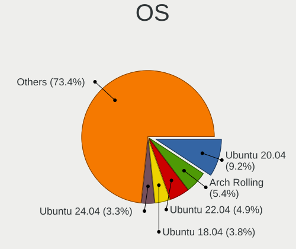

| Name                | Notebooks | Percent |
|---------------------|-----------|---------|
| Ubuntu 20.04        | 17        | 9.24%   |
| Arch Rolling        | 10        | 5.43%   |
| Ubuntu 22.04        | 9         | 4.89%   |
| Ubuntu 18.04        | 7         | 3.8%    |
| Ubuntu 24.04        | 6         | 3.26%   |
| Fedora 40           | 6         | 3.26%   |
| Fedora 38           | 5         | 2.72%   |
| OpenMandriva 4.3    | 4         | 2.17%   |
| Manjaro             | 4         | 2.17%   |
| Fedora 36           | 4         | 2.17%   |
| Zorin 17            | 3         | 1.63%   |
| Zorin 16            | 3         | 1.63%   |
| Fedora 39           | 3         | 1.63%   |
| Fedora 37           | 3         | 1.63%   |
| Debian 12           | 3         | 1.63%   |
| Debian 11           | 3         | 1.63%   |
| Ubuntu 21.10        | 2         | 1.09%   |
| Pop!_OS 20.10       | 2         | 1.09%   |
| OpenMandriva 4.2    | 2         | 1.09%   |
| OpenMandriva 25.06  | 2         | 1.09%   |
| OpenMandriva 23.08  | 2         | 1.09%   |
| LMDE 6              | 2         | 1.09%   |
| Linux Mint 22.2     | 2         | 1.09%   |
| Linux Mint 20.3     | 2         | 1.09%   |
| Linux Mint 20.1     | 2         | 1.09%   |
| KDE neon 22.04      | 2         | 1.09%   |
| Kali 2023.4         | 2         | 1.09%   |
| Kali 2023.3         | 2         | 1.09%   |
| Fedora 42           | 2         | 1.09%   |
| Fedora 41           | 2         | 1.09%   |
| ArcoLinux Rolling   | 2         | 1.09%   |
| Xubuntu 19.10       | 1         | 0.54%   |
| Xubuntu 18.04       | 1         | 0.54%   |
| Void Linux Rolling  | 1         | 0.54%   |
| Ubuntu MATE 22.04   | 1         | 0.54%   |
| Ubuntu Budgie 22.04 | 1         | 0.54%   |
| Ubuntu Budgie 21.10 | 1         | 0.54%   |
| Ubuntu Budgie 20.04 | 1         | 0.54%   |
| Ubuntu 23.04        | 1         | 0.54%   |
| Ubuntu 22.10        | 1         | 0.54%   |

OS Family
---------

OS without a version

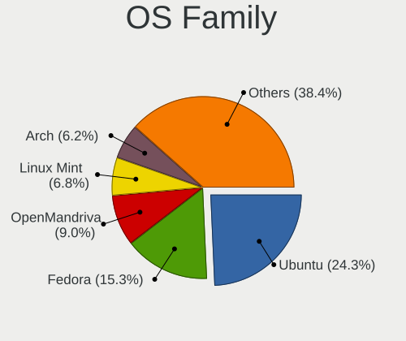

| Name          | Notebooks | Percent |
|---------------|-----------|---------|
| Ubuntu        | 43        | 24.29%  |
| Fedora        | 27        | 15.25%  |
| OpenMandriva  | 16        | 9.04%   |
| Linux Mint    | 12        | 6.78%   |
| Arch          | 11        | 6.21%   |
| Manjaro       | 9         | 5.08%   |
| Kali          | 8         | 4.52%   |
| Debian        | 8         | 4.52%   |
| Zorin         | 6         | 3.39%   |
| Pop!_OS       | 6         | 3.39%   |
| Ubuntu Budgie | 3         | 1.69%   |
| Lubuntu       | 3         | 1.69%   |
| LMDE          | 3         | 1.69%   |
| KDE neon      | 3         | 1.69%   |
| Xubuntu       | 2         | 1.13%   |
| Kubuntu       | 2         | 1.13%   |
| Clear Linux   | 2         | 1.13%   |
| ArcoLinux     | 2         | 1.13%   |
| Void Linux    | 1         | 0.56%   |
| Ubuntu MATE   | 1         | 0.56%   |
| SteamOS       | 1         | 0.56%   |
| Soplos        | 1         | 0.56%   |
| Solus         | 1         | 0.56%   |
| MX            | 1         | 0.56%   |
| Gabian        | 1         | 0.56%   |
| Endless       | 1         | 0.56%   |
| Elementary    | 1         | 0.56%   |
| blendOS       | 1         | 0.56%   |
| Archcraft     | 1         | 0.56%   |

Kernel
------

Version of the Linux kernel

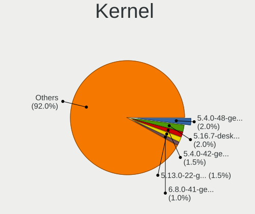

| Version                             | Notebooks | Percent |
|-------------------------------------|-----------|---------|
| 5.4.0-48-generic                    | 4         | 2.01%   |
| 5.16.7-desktop-1omv4003             | 4         | 2.01%   |
| 5.4.0-42-generic                    | 3         | 1.51%   |
| 5.13.0-22-generic                   | 3         | 1.51%   |
| 6.8.0-41-generic                    | 2         | 1.01%   |
| 6.6.15-amd64                        | 2         | 1.01%   |
| 6.5.0-kali3-amd64                   | 2         | 1.01%   |
| 6.4.8-desktop-2omv2390              | 2         | 1.01%   |
| 6.16.4-arch1-1                      | 2         | 1.01%   |
| 6.15.0-desktop-0.rc2.3omv2590       | 2         | 1.01%   |
| 6.14.2-desktop-3omv2590             | 2         | 1.01%   |
| 6.14.0-63.fc42.x86_64               | 2         | 1.01%   |
| 6.11.2-amd64                        | 2         | 1.01%   |
| 6.1.0-21-amd64                      | 2         | 1.01%   |
| 5.4.0-77-generic                    | 2         | 1.01%   |
| 5.4.0-52-generic                    | 2         | 1.01%   |
| 5.4.0-33-generic                    | 2         | 1.01%   |
| 5.3.0-51-generic                    | 2         | 1.01%   |
| 5.19.0-46-generic                   | 2         | 1.01%   |
| 5.15.0-76-generic                   | 2         | 1.01%   |
| 5.15.0-58-generic                   | 2         | 1.01%   |
| 5.15.0-53-generic                   | 2         | 1.01%   |
| 5.15.0-41-generic                   | 2         | 1.01%   |
| 6.9.9-amd64                         | 1         | 0.5%    |
| 6.9.7-desktop-1omv2490              | 1         | 0.5%    |
| 6.9.4-200.fc40.x86_64               | 1         | 0.5%    |
| 6.9.10-200.fc40.x86_64              | 1         | 0.5%    |
| 6.8.7-300.fc40.x86_64               | 1         | 0.5%    |
| 6.8.5-301.fc40.x86_64               | 1         | 0.5%    |
| 6.8.11-300.fc40.x86_64              | 1         | 0.5%    |
| 6.8.0-90-generic                    | 1         | 0.5%    |
| 6.8.0-76060800daily20240311-generic | 1         | 0.5%    |
| 6.8.0-52-generic                    | 1         | 0.5%    |
| 6.8.0-40-generic                    | 1         | 0.5%    |
| 6.8.0-39-generic                    | 1         | 0.5%    |
| 6.8.0-31-generic                    | 1         | 0.5%    |
| 6.6.9-200.fc39.x86_64               | 1         | 0.5%    |
| 6.6.8-200.fc39.x86_64               | 1         | 0.5%    |
| 6.6.8-2-MANJARO                     | 1         | 0.5%    |
| 6.6.6-200.fc39.x86_64               | 1         | 0.5%    |

Kernel Family
-------------

Linux kernel without a distro release

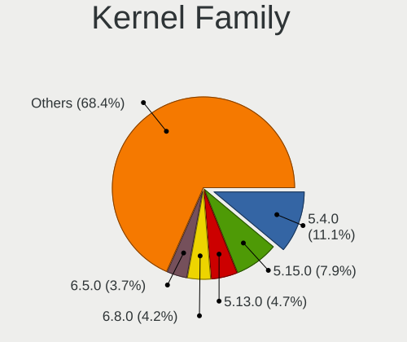

| Version | Notebooks | Percent |
|---------|-----------|---------|
| 5.4.0   | 21        | 11.05%  |
| 5.15.0  | 15        | 7.89%   |
| 5.13.0  | 9         | 4.74%   |
| 6.8.0   | 8         | 4.21%   |
| 6.5.0   | 7         | 3.68%   |
| 5.3.0   | 6         | 3.16%   |
| 5.11.0  | 6         | 3.16%   |
| 5.19.0  | 5         | 2.63%   |
| 6.14.0  | 4         | 2.11%   |
| 6.1.0   | 4         | 2.11%   |
| 5.16.7  | 4         | 2.11%   |
| 5.10.0  | 4         | 2.11%   |
| 5.0.0   | 3         | 1.58%   |
| 6.6.8   | 2         | 1.05%   |
| 6.6.15  | 2         | 1.05%   |
| 6.5.6   | 2         | 1.05%   |
| 6.4.8   | 2         | 1.05%   |
| 6.2.0   | 2         | 1.05%   |
| 6.16.4  | 2         | 1.05%   |
| 6.15.0  | 2         | 1.05%   |
| 6.14.2  | 2         | 1.05%   |
| 6.12.9  | 2         | 1.05%   |
| 6.11.2  | 2         | 1.05%   |
| 4.19.0  | 2         | 1.05%   |
| 6.9.9   | 1         | 0.53%   |
| 6.9.7   | 1         | 0.53%   |
| 6.9.4   | 1         | 0.53%   |
| 6.9.10  | 1         | 0.53%   |
| 6.8.7   | 1         | 0.53%   |
| 6.8.5   | 1         | 0.53%   |
| 6.8.11  | 1         | 0.53%   |
| 6.6.9   | 1         | 0.53%   |
| 6.6.6   | 1         | 0.53%   |
| 6.6.26  | 1         | 0.53%   |
| 6.6.2   | 1         | 0.53%   |
| 6.6.10  | 1         | 0.53%   |
| 6.6.1   | 1         | 0.53%   |
| 6.5.8   | 1         | 0.53%   |
| 6.5.7   | 1         | 0.53%   |
| 6.5.5   | 1         | 0.53%   |

Kernel Major Ver.
-----------------

Linux kernel major version

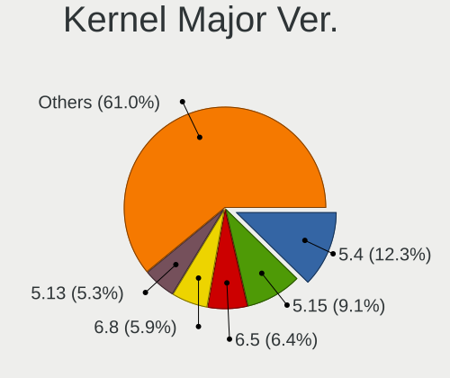

| Version | Notebooks | Percent |
|---------|-----------|---------|
| 5.4     | 23        | 12.3%   |
| 5.15    | 17        | 9.09%   |
| 6.5     | 12        | 6.42%   |
| 6.8     | 11        | 5.88%   |
| 5.13    | 10        | 5.35%   |
| 6.6     | 9         | 4.81%   |
| 5.19    | 8         | 4.28%   |
| 5.11    | 8         | 4.28%   |
| 5.10    | 7         | 3.74%   |
| 6.14    | 6         | 3.21%   |
| 6.1     | 6         | 3.21%   |
| 5.3     | 6         | 3.21%   |
| 6.2     | 5         | 2.67%   |
| 6.12    | 5         | 2.67%   |
| 6.9     | 4         | 2.14%   |
| 6.4     | 4         | 2.14%   |
| 6.11    | 4         | 2.14%   |
| 6.10    | 4         | 2.14%   |
| 5.8     | 4         | 2.14%   |
| 5.16    | 4         | 2.14%   |
| 5.0     | 4         | 2.14%   |
| 6.16    | 3         | 1.6%    |
| 5.9     | 3         | 1.6%    |
| 4.19    | 3         | 1.6%    |
| 6.3     | 2         | 1.07%   |
| 6.17    | 2         | 1.07%   |
| 6.15    | 2         | 1.07%   |
| 6.0     | 2         | 1.07%   |
| 5.18    | 2         | 1.07%   |
| 5.12    | 2         | 1.07%   |
| 5.7     | 1         | 0.53%   |
| 5.6     | 1         | 0.53%   |
| 5.17    | 1         | 0.53%   |
| 4.18    | 1         | 0.53%   |
| 4.15    | 1         | 0.53%   |

Arch
----

OS architecture (x86_64, i586, etc.)

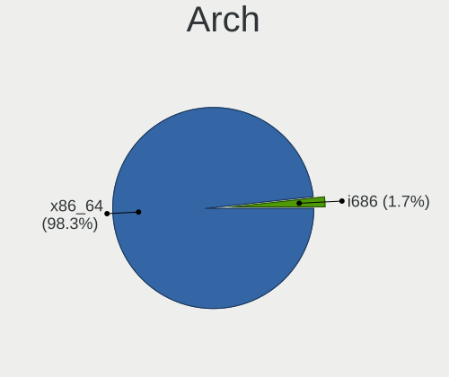

| Name   | Notebooks | Percent |
|--------|-----------|---------|
| x86_64 | 169       | 98.26%  |
| i686   | 3         | 1.74%   |

DE
--

Desktop Environment

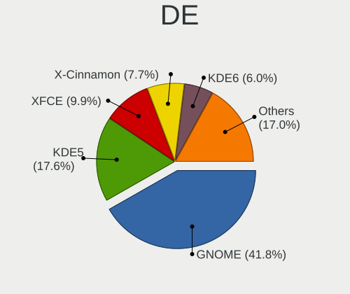

| Name          | Notebooks | Percent |
|---------------|-----------|---------|
| GNOME         | 76        | 41.76%  |
| KDE5          | 32        | 17.58%  |
| XFCE          | 18        | 9.89%   |
| X-Cinnamon    | 14        | 7.69%   |
| KDE6          | 11        | 6.04%   |
| Unknown       | 11        | 6.04%   |
| Budgie        | 4         | 2.2%    |
| LXQt          | 3         | 1.65%   |
| KDE           | 3         | 1.65%   |
| MATE          | 2         | 1.1%    |
| Hyprland      | 2         | 1.1%    |
| sway          | 1         | 0.55%   |
| qtile         | 1         | 0.55%   |
| LXDE          | 1         | 0.55%   |
| GNOME Classic | 1         | 0.55%   |
| DWM           | 1         | 0.55%   |
| COSMIC        | 1         | 0.55%   |

Display Server
--------------

X11 or Wayland

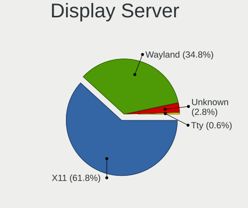

| Name    | Notebooks | Percent |
|---------|-----------|---------|
| X11     | 110       | 61.8%   |
| Wayland | 62        | 34.83%  |
| Unknown | 5         | 2.81%   |
| Tty     | 1         | 0.56%   |

Display Manager
---------------

SDDM, LightDM, etc.

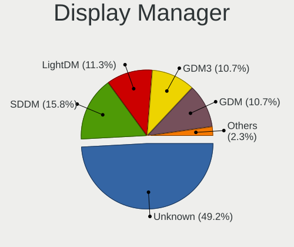

| Name    | Notebooks | Percent |
|---------|-----------|---------|
| Unknown | 87        | 49.15%  |
| SDDM    | 28        | 15.82%  |
| LightDM | 20        | 11.3%   |
| GDM3    | 19        | 10.73%  |
| GDM     | 19        | 10.73%  |
| TDM     | 4         | 2.26%   |

OS Lang
-------

Language

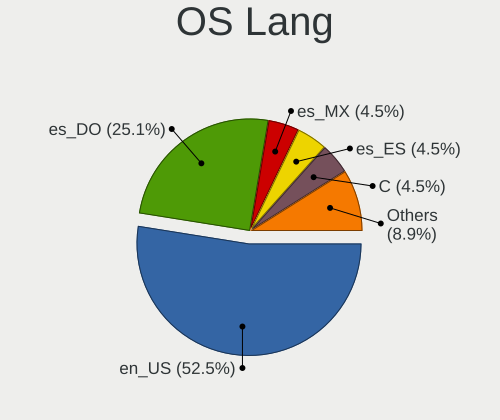

| Lang    | Notebooks | Percent |
|---------|-----------|---------|
| en_US   | 94        | 52.51%  |
| es_DO   | 45        | 25.14%  |
| es_MX   | 8         | 4.47%   |
| es_ES   | 8         | 4.47%   |
| C       | 8         | 4.47%   |
| Unknown | 7         | 3.91%   |
| es_US   | 4         | 2.23%   |
| en_CA   | 2         | 1.12%   |
| ru_RU   | 1         | 0.56%   |
| fr_HT   | 1         | 0.56%   |
| fr_FR   | 1         | 0.56%   |

Boot Mode
---------

EFI or BIOS

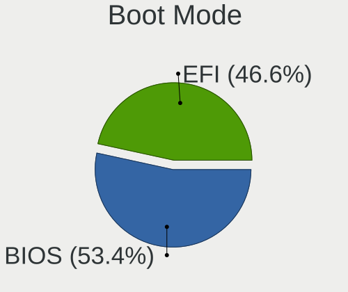

| Mode | Notebooks | Percent |
|------|-----------|---------|
| BIOS | 94        | 53.41%  |
| EFI  | 82        | 46.59%  |

Filesystem
----------

Type of filesystem

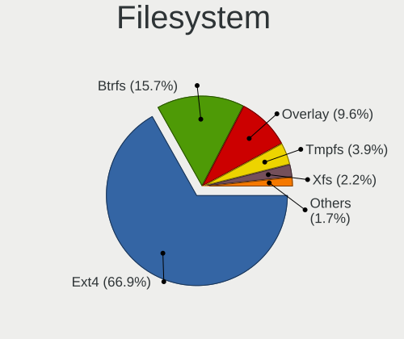

| Type    | Notebooks | Percent |
|---------|-----------|---------|
| Ext4    | 119       | 66.85%  |
| Btrfs   | 28        | 15.73%  |
| Overlay | 17        | 9.55%   |
| Tmpfs   | 7         | 3.93%   |
| Xfs     | 4         | 2.25%   |
| Zfs     | 1         | 0.56%   |
| F2fs    | 1         | 0.56%   |
| Unknown | 1         | 0.56%   |

Part. scheme
------------

Scheme of partitioning

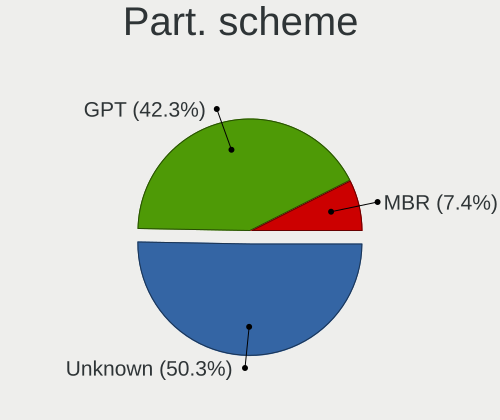

| Type    | Notebooks | Percent |
|---------|-----------|---------|
| Unknown | 88        | 50.29%  |
| GPT     | 74        | 42.29%  |
| MBR     | 13        | 7.43%   |

Dual Boot with Linux/BSD
------------------------

Hosting more than one Linux/BSD

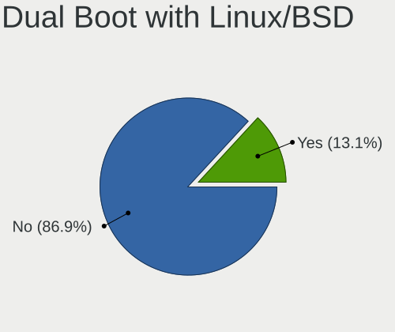

| Dual boot | Notebooks | Percent |
|-----------|-----------|---------|
| No        | 152       | 86.86%  |
| Yes       | 23        | 13.14%  |

Dual Boot (Win)
---------------

Hosting Linux and Windows

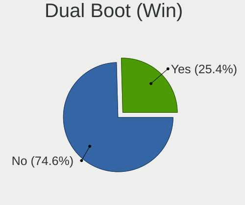

| Dual boot | Notebooks | Percent |
|-----------|-----------|---------|
| No        | 129       | 74.57%  |
| Yes       | 44        | 25.43%  |

Board
-----

Vendor
------

Motherboard manufacturer

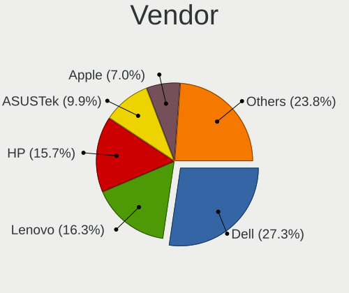

| Name                | Notebooks | Percent |
|---------------------|-----------|---------|
| Dell                | 47        | 27.33%  |
| Lenovo              | 28        | 16.28%  |
| Hewlett-Packard     | 27        | 15.7%   |
| ASUSTek Computer    | 17        | 9.88%   |
| Apple               | 12        | 6.98%   |
| Acer                | 10        | 5.81%   |
| Unknown             | 5         | 2.91%   |
| Google              | 4         | 2.33%   |
| VTEX                | 3         | 1.74%   |
| TODOS INDUSTRIAL    | 2         | 1.16%   |
| Samsung Electronics | 2         | 1.16%   |
| MSI                 | 2         | 1.16%   |
| EVOO                | 2         | 1.16%   |
| Valve               | 1         | 0.58%   |
| Toshiba             | 1         | 0.58%   |
| SAELITE             | 1         | 0.58%   |
| Nuvision            | 1         | 0.58%   |
| LG Electronics      | 1         | 0.58%   |
| Intel               | 1         | 0.58%   |
| GPU Company         | 1         | 0.58%   |
| Fujitsu             | 1         | 0.58%   |
| Eluktronics         | 1         | 0.58%   |
| ECS                 | 1         | 0.58%   |
| Chuwi               | 1         | 0.58%   |

Model
-----

Motherboard model

| Name                                              | Notebooks | Percent |
|---------------------------------------------------|-----------|---------|
| Unknown                                           | 6         | 3.49%   |
| Apple MacBookAir7,2                               | 5         | 2.91%   |
| Dell Latitude E6430                               | 4         | 2.33%   |
| VTEX NOTEBOOK                                     | 3         | 1.74%   |
| HP EliteBook 8460p                                | 3         | 1.74%   |
| Dell Latitude E6420                               | 3         | 1.74%   |
| Apple MacBookPro8,1                               | 3         | 1.74%   |
| Lenovo IdeaPad 330S-15IKB 81F5                    | 2         | 1.16%   |
| HP Pavilion Notebook                              | 2         | 1.16%   |
| HP Pavilion Gaming Laptop 15-dk0xxx               | 2         | 1.16%   |
| HP Notebook                                       | 2         | 1.16%   |
| HP Laptop 15-dy1xxx                               | 2         | 1.16%   |
| EVOO EV-C-116-7                                   | 2         | 1.16%   |
| Dell Latitude E6540                               | 2         | 1.16%   |
| Dell Latitude E6410                               | 2         | 1.16%   |
| Dell Latitude 5590                                | 2         | 1.16%   |
| Dell Latitude 3330                                | 2         | 1.16%   |
| Dell Inspiron 5570                                | 2         | 1.16%   |
| Dell Inspiron 5555                                | 2         | 1.16%   |
| Valve Jupiter                                     | 1         | 0.58%   |
| Toshiba Satellite C55-A                           | 1         | 0.58%   |
| TODOS INDUSTRIAL Easytouch_2022_V1                | 1         | 0.58%   |
| TODOS INDUSTRIAL Aprix_2022_V1                    | 1         | 0.58%   |
| Samsung RV420/RV520/RV720/E3530/S3530/E3420/E3520 | 1         | 0.58%   |
| Samsung 905S3G/906S3G/915S3G/9305SG               | 1         | 0.58%   |
| SAELITE ES1AU11                                   | 1         | 0.58%   |
| Nuvision NES11                                    | 1         | 0.58%   |
| MSI GE62 6QC                                      | 1         | 0.58%   |
| MSI CR70 2M/CX70 2OC/CX70 2OD                     | 1         | 0.58%   |
| LG 17ZT90P-G.AX33U1                               | 1         | 0.58%   |
| Lenovo Z50-75 80EC                                | 1         | 0.58%   |
| Lenovo ThinkPad X1 Carbon 7th 20QES1M500          | 1         | 0.58%   |
| Lenovo ThinkPad W540 20BHS0GB06                   | 1         | 0.58%   |
| Lenovo ThinkPad T60 2613CTO                       | 1         | 0.58%   |
| Lenovo ThinkPad T490 20N3S7BC02                   | 1         | 0.58%   |
| Lenovo ThinkPad T490 20N3S64200                   | 1         | 0.58%   |
| Lenovo ThinkPad T480s 20L7CTO1WW                  | 1         | 0.58%   |
| Lenovo ThinkPad T470 20HD004AUS                   | 1         | 0.58%   |
| Lenovo ThinkPad T420s 41732BU                     | 1         | 0.58%   |
| Lenovo ThinkPad T410 2537N99                      | 1         | 0.58%   |

Model Family
------------

Motherboard model prefix

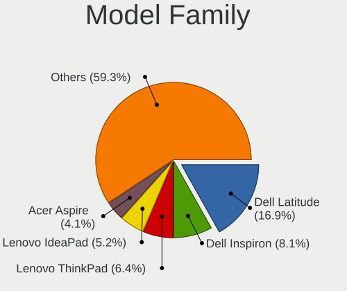

| Name                       | Notebooks | Percent |
|----------------------------|-----------|---------|
| Dell Latitude              | 29        | 16.86%  |
| Dell Inspiron              | 14        | 8.14%   |
| Lenovo ThinkPad            | 11        | 6.4%    |
| Lenovo IdeaPad             | 9         | 5.23%   |
| Acer Aspire                | 7         | 4.07%   |
| HP Pavilion                | 6         | 3.49%   |
| Unknown                    | 6         | 3.49%   |
| HP Laptop                  | 5         | 2.91%   |
| ASUS VivoBook              | 5         | 2.91%   |
| Apple MacBookAir7          | 5         | 2.91%   |
| HP EliteBook               | 4         | 2.33%   |
| VTEX NOTEBOOK              | 3         | 1.74%   |
| HP ProBook                 | 3         | 1.74%   |
| Apple MacBookPro8          | 3         | 1.74%   |
| Lenovo Legion              | 2         | 1.16%   |
| HP Notebook                | 2         | 1.16%   |
| EVOO EV-C-116-7            | 2         | 1.16%   |
| Dell Vostro                | 2         | 1.16%   |
| ASUS ASUS                  | 2         | 1.16%   |
| Valve Jupiter              | 1         | 0.58%   |
| Toshiba Satellite          | 1         | 0.58%   |
| TODOS INDUSTRIAL Easytouch | 1         | 0.58%   |
| TODOS INDUSTRIAL Aprix     | 1         | 0.58%   |
| Samsung RV420              | 1         | 0.58%   |
| Samsung 905S3G             | 1         | 0.58%   |
| SAELITE ES1AU11            | 1         | 0.58%   |
| Nuvision NES11             | 1         | 0.58%   |
| MSI GE62                   | 1         | 0.58%   |
| MSI CR70                   | 1         | 0.58%   |
| LG 17ZT90P-G.AX33U1        | 1         | 0.58%   |
| Lenovo Z50-75              | 1         | 0.58%   |
| Lenovo ThinkBook           | 1         | 0.58%   |
| Lenovo G505s               | 1         | 0.58%   |
| Lenovo G50-45              | 1         | 0.58%   |
| Lenovo G40-70              | 1         | 0.58%   |
| Intel TU45C                | 1         | 0.58%   |
| HP Stream                  | 1         | 0.58%   |
| HP OMEN                    | 1         | 0.58%   |
| HP G60                     | 1         | 0.58%   |
| HP ENVY                    | 1         | 0.58%   |

MFG Year
--------

Motherboard manufacture year

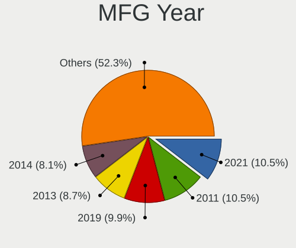

| Year | Notebooks | Percent |
|------|-----------|---------|
| 2021 | 18        | 10.47%  |
| 2011 | 18        | 10.47%  |
| 2019 | 17        | 9.88%   |
| 2013 | 15        | 8.72%   |
| 2014 | 14        | 8.14%   |
| 2012 | 13        | 7.56%   |
| 2017 | 11        | 6.4%    |
| 2020 | 9         | 5.23%   |
| 2016 | 8         | 4.65%   |
| 2018 | 7         | 4.07%   |
| 2006 | 7         | 4.07%   |
| 2015 | 6         | 3.49%   |
| 2023 | 5         | 2.91%   |
| 2010 | 5         | 2.91%   |
| 2008 | 5         | 2.91%   |
| 2022 | 4         | 2.33%   |
| 2009 | 3         | 1.74%   |
| 2007 | 3         | 1.74%   |
| 2024 | 2         | 1.16%   |
| 2025 | 1         | 0.58%   |
| 2005 | 1         | 0.58%   |

Form Factor
-----------

Physical design of the computer

| Name     | Notebooks | Percent |
|----------|-----------|---------|
| Notebook | 172       | 100%    |

Secure Boot
-----------

Enabled or disabled

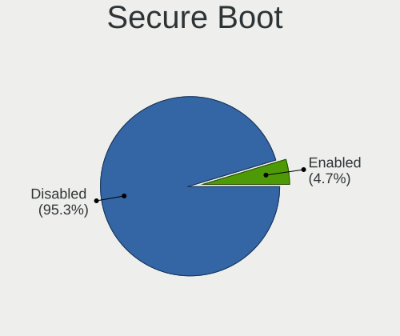

| State    | Notebooks | Percent |
|----------|-----------|---------|
| Disabled | 164       | 95.35%  |
| Enabled  | 8         | 4.65%   |

Coreboot
--------

Have coreboot on board

| Used | Notebooks | Percent |
|------|-----------|---------|
| No   | 168       | 97.67%  |
| Yes  | 4         | 2.33%   |

RAM Size
--------

Total RAM memory

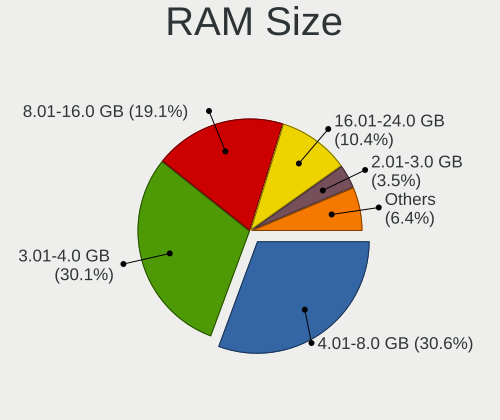

| Size in GB | Notebooks | Percent |
|------------|-----------|---------|
| 4.01-8.0   | 53        | 30.64%  |
| 3.01-4.0   | 52        | 30.06%  |
| 8.01-16.0  | 33        | 19.08%  |
| 16.01-24.0 | 18        | 10.4%   |
| 2.01-3.0   | 6         | 3.47%   |
| 1.01-2.0   | 5         | 2.89%   |
| 32.01-64.0 | 4         | 2.31%   |
| 24.01-32.0 | 2         | 1.16%   |

RAM Used
--------

Used RAM memory

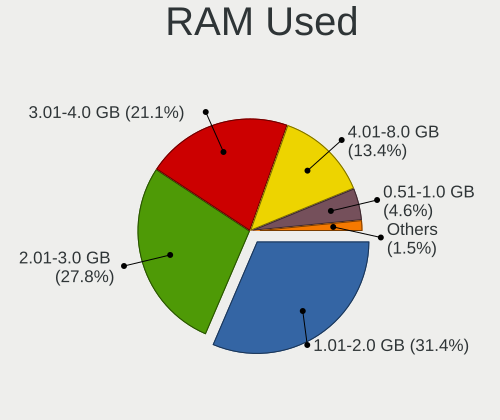

| Used GB   | Notebooks | Percent |
|-----------|-----------|---------|
| 1.01-2.0  | 61        | 31.44%  |
| 2.01-3.0  | 54        | 27.84%  |
| 3.01-4.0  | 41        | 21.13%  |
| 4.01-8.0  | 26        | 13.4%   |
| 0.51-1.0  | 9         | 4.64%   |
| 8.01-16.0 | 3         | 1.55%   |

Total Drives
------------

Number of drives on board

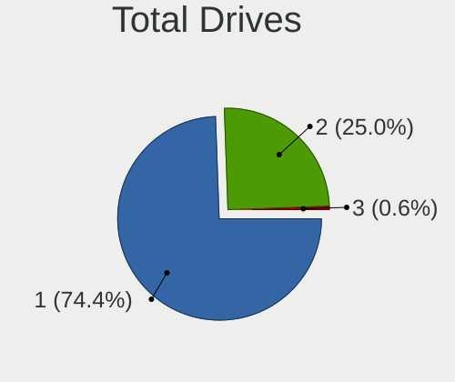

| Drives | Notebooks | Percent |
|--------|-----------|---------|
| 1      | 131       | 74.43%  |
| 2      | 44        | 25%     |
| 3      | 1         | 0.57%   |

Has CD-ROM
----------

Has CD-ROM on board

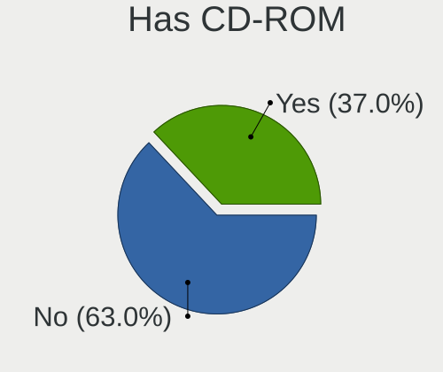

| Presented | Notebooks | Percent |
|-----------|-----------|---------|
| No        | 109       | 63.01%  |
| Yes       | 64        | 36.99%  |

Has Ethernet
------------

Has Ethernet on board

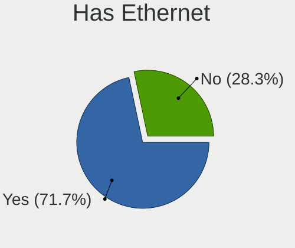

| Presented | Notebooks | Percent |
|-----------|-----------|---------|
| Yes       | 124       | 71.68%  |
| No        | 49        | 28.32%  |

Has WiFi
--------

Has WiFi module

| Presented | Notebooks | Percent |
|-----------|-----------|---------|
| Yes       | 168       | 97.67%  |
| No        | 4         | 2.33%   |

Has Bluetooth
-------------

Has Bluetooth module

| Presented | Notebooks | Percent |
|-----------|-----------|---------|
| Yes       | 129       | 74.57%  |
| No        | 44        | 25.43%  |

Location
--------

Country
-------

Geographic location (country)

| Country            | Notebooks | Percent |
|--------------------|-----------|---------|
| Dominican Republic | 172       | 100%    |

City
----

Geographic location (city)

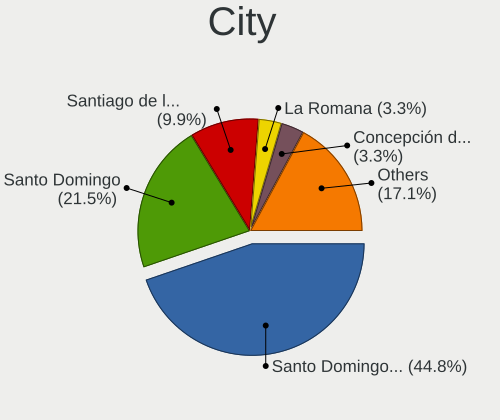

| City                       | Notebooks | Percent |
|----------------------------|-----------|---------|
| Santo Domingo Este         | 81        | 44.75%  |
| Santo Domingo              | 39        | 21.55%  |
| Santiago de los Caballeros | 18        | 9.94%   |
| La Romana                  | 6         | 3.31%   |
| Concepción de la Vega     | 6         | 3.31%   |
| Cabarete                   | 4         | 2.21%   |
| Santo Domingo Oeste        | 3         | 1.66%   |
| San Cristobal              | 3         | 1.66%   |
| Santa Cruz de Barahona     | 2         | 1.1%    |
| Nagua                      | 2         | 1.1%    |
| Constanza                  | 2         | 1.1%    |
| Alejandro Bass             | 2         | 1.1%    |
| Sosua, Cabarete            | 1         | 0.55%   |
| San Pedro de Macorís      | 1         | 0.55%   |
| San Juan                   | 1         | 0.55%   |
| San Isidro                 | 1         | 0.55%   |
| Punta Cana                 | 1         | 0.55%   |
| Puerto Plata               | 1         | 0.55%   |
| Monte Llano                | 1         | 0.55%   |
| Los Hidalgos               | 1         | 0.55%   |
| Guaymate                   | 1         | 0.55%   |
| Cancino                    | 1         | 0.55%   |
| Boca Chica                 | 1         | 0.55%   |
| Baní                      | 1         | 0.55%   |
| Bajos de Haina             | 1         | 0.55%   |

Drives
------

Drive Vendor
------------

Hard drive vendors

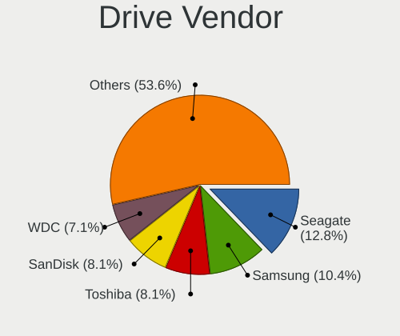

| Vendor                      | Notebooks | Drives | Percent |
|-----------------------------|-----------|--------|---------|
| Seagate                     | 27        | 35     | 12.8%   |
| Samsung Electronics         | 22        | 24     | 10.43%  |
| Toshiba                     | 17        | 21     | 8.06%   |
| SanDisk                     | 17        | 22     | 8.06%   |
| WDC                         | 15        | 18     | 7.11%   |
| Kingston                    | 12        | 12     | 5.69%   |
| Unknown                     | 11        | 13     | 5.21%   |
| Hitachi                     | 11        | 13     | 5.21%   |
| Apple                       | 9         | 16     | 4.27%   |
| SK hynix                    | 8         | 10     | 3.79%   |
| China                       | 8         | 9      | 3.79%   |
| Micron Technology           | 5         | 6      | 2.37%   |
| AirDisk                     | 4         | 4      | 1.9%    |
| SPCC                        | 3         | 5      | 1.42%   |
| Intel                       | 3         | 5      | 1.42%   |
| FORESEE                     | 3         | 4      | 1.42%   |
| Unknown                     | 3         | 3      | 1.42%   |
| USB                         | 2         | 2      | 0.95%   |
| Transcend                   | 2         | 2      | 0.95%   |
| Micron/Crucial Technology   | 2         | 2      | 0.95%   |
| KIOXIA                      | 2         | 3      | 0.95%   |
| Kingston Technology Company | 2         | 2      | 0.95%   |
| Indilinx                    | 2         | 2      | 0.95%   |
| HGST                        | 2         | 2      | 0.95%   |
| Crucial                     | 2         | 3      | 0.95%   |
| A-DATA Technology           | 2         | 2      | 0.95%   |
| Wibtek                      | 1         | 1      | 0.47%   |
| UMIS                        | 1         | 1      | 0.47%   |
| Timetec                     | 1         | 1      | 0.47%   |
| Supersonic                  | 1         | 1      | 0.47%   |
| SABRENT                     | 1         | 1      | 0.47%   |
| PNY                         | 1         | 1      | 0.47%   |
| OCZ                         | 1         | 1      | 0.47%   |
| Netac                       | 1         | 1      | 0.47%   |
| MSI                         | 1         | 1      | 0.47%   |
| MaiChai                     | 1         | 1      | 0.47%   |
| LITEONIT                    | 1         | 2      | 0.47%   |
| KingFast                    | 1         | 2      | 0.47%   |
| Hewlett-Packard             | 1         | 1      | 0.47%   |
| General                     | 1         | 1      | 0.47%   |

Drive Model
-----------

Hard drive models

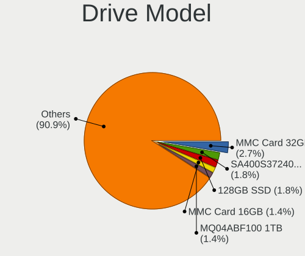

| Model                                              | Notebooks | Percent |
|----------------------------------------------------|-----------|---------|
| Unknown MMC Card  32GB                             | 6         | 2.73%   |
| Kingston SA400S37240G 240GB SSD                    | 4         | 1.82%   |
| AirDisk 128GB SSD                                  | 4         | 1.82%   |
| Unknown MMC Card  16GB                             | 3         | 1.36%   |
| Toshiba MQ04ABF100 1TB                             | 3         | 1.36%   |
| Seagate ST500LT012-1DG142 500GB                    | 3         | 1.36%   |
| Seagate ST500LM021-1KJ152 500GB                    | 3         | 1.36%   |
| Seagate ST500LM000-1EJ162 500GB                    | 3         | 1.36%   |
| Seagate ST1000LM035-1RK172 1TB                     | 3         | 1.36%   |
| FORESEE 128GB SSD                                  | 3         | 1.36%   |
| Apple SSD SM0128G 121GB                            | 3         | 1.36%   |
| Unknown                                            | 3         | 1.36%   |
| USB SanDisk 3.2Gen1 496GB                          | 2         | 0.91%   |
| Unknown MMC Card  128GB                            | 2         | 0.91%   |
| Toshiba MQ01ACF050 500GB                           | 2         | 0.91%   |
| Toshiba MK3275GSX 320GB                            | 2         | 0.91%   |
| SPCC Solid State Disk 512GB                        | 2         | 0.91%   |
| Seagate ST9250315AS 250GB                          | 2         | 0.91%   |
| Seagate ST1000LM049-2GH172 1TB                     | 2         | 0.91%   |
| Sandisk WD Black SN750 / PC SN730 NVMe SSD 500GB   | 2         | 0.91%   |
| SanDisk NVMe SSD Drive 256GB                       | 2         | 0.91%   |
| Samsung SSD 860 EVO 500GB                          | 2         | 0.91%   |
| Samsung NVMe SSD Controller SM981/PM981/PM983 1TB  | 2         | 0.91%   |
| Samsung NVMe SSD Controller PM9A1/PM9A3/980PRO 1TB | 2         | 0.91%   |
| Kingston Company U-SNS8154P3 NVMe SSD 256GB        | 2         | 0.91%   |
| Kingston SA400S37120G 120GB SSD                    | 2         | 0.91%   |
| Kingston OM8PCP3512F-AB 512GB                      | 2         | 0.91%   |
| Intel HBRPEKNX0101AHO 16GB                         | 2         | 0.91%   |
| Intel HBRPEKNX0101AH 256GB                         | 2         | 0.91%   |
| Indilinx IND-S3N80P/128G 128GB                     | 2         | 0.91%   |
| Hitachi HTS725032A9A360 320GB                      | 2         | 0.91%   |
| HGST HTS725050A7E630 500GB                         | 2         | 0.91%   |
| Crucial CT250MX200SSD3 250GB                       | 2         | 0.91%   |
| China 128GB SSD                                    | 2         | 0.91%   |
| Apple SSD SM0256G 256GB                            | 2         | 0.91%   |
| Wibtek W800S 512GB SSD                             | 1         | 0.45%   |
| WDC WDS250G1B0A-00H9H0 250GB SSD                   | 1         | 0.45%   |
| WDC WDS100T2G0A-00JH30 1TB SSD                     | 1         | 0.45%   |
| WDC WD5000LPLX-08ZNTT0 500GB                       | 1         | 0.45%   |
| WDC WD3200LPVX-75V0TT0 320GB                       | 1         | 0.45%   |

HDD Vendor
----------

Hard disk drive vendors

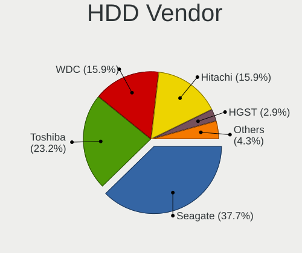

| Vendor              | Notebooks | Drives | Percent |
|---------------------|-----------|--------|---------|
| Seagate             | 26        | 33     | 37.68%  |
| Toshiba             | 16        | 20     | 23.19%  |
| WDC                 | 11        | 14     | 15.94%  |
| Hitachi             | 11        | 13     | 15.94%  |
| HGST                | 2         | 2      | 2.9%    |
| Apple               | 2         | 3      | 2.9%    |
| Samsung Electronics | 1         | 1      | 1.45%   |

SSD Vendor
----------

Solid state drive vendors

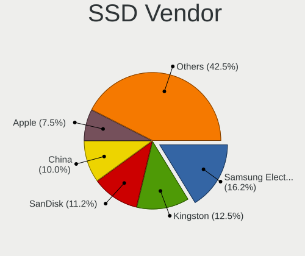

| Vendor              | Notebooks | Drives | Percent |
|---------------------|-----------|--------|---------|
| Samsung Electronics | 13        | 14     | 16.25%  |
| Kingston            | 10        | 10     | 12.5%   |
| SanDisk             | 9         | 12     | 11.25%  |
| China               | 8         | 9      | 10%     |
| Apple               | 6         | 7      | 7.5%    |
| AirDisk             | 4         | 4      | 5%      |
| SPCC                | 3         | 5      | 3.75%   |
| FORESEE             | 3         | 4      | 3.75%   |
| WDC                 | 2         | 2      | 2.5%    |
| Transcend           | 2         | 2      | 2.5%    |
| SK hynix            | 2         | 2      | 2.5%    |
| Crucial             | 2         | 3      | 2.5%    |
| A-DATA Technology   | 2         | 2      | 2.5%    |
| Wibtek              | 1         | 1      | 1.25%   |
| Supersonic          | 1         | 1      | 1.25%   |
| Seagate             | 1         | 2      | 1.25%   |
| SABRENT             | 1         | 1      | 1.25%   |
| PNY                 | 1         | 1      | 1.25%   |
| OCZ                 | 1         | 1      | 1.25%   |
| Netac               | 1         | 1      | 1.25%   |
| MSI                 | 1         | 1      | 1.25%   |
| MaiChai             | 1         | 1      | 1.25%   |
| LITEONIT            | 1         | 2      | 1.25%   |
| KingFast            | 1         | 2      | 1.25%   |
| Hewlett-Packard     | 1         | 1      | 1.25%   |
| Eluktro             | 1         | 1      | 1.25%   |
| Unknown             | 1         | 1      | 1.25%   |

Drive Kind
----------

HDD or SSD

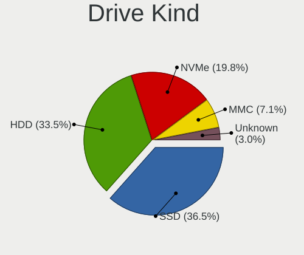

| Kind    | Notebooks | Drives | Percent |
|---------|-----------|--------|---------|
| SSD     | 72        | 93     | 36.55%  |
| HDD     | 66        | 86     | 33.5%   |
| NVMe    | 39        | 56     | 19.8%   |
| MMC     | 14        | 16     | 7.11%   |
| Unknown | 6         | 6      | 3.05%   |

Drive Connector
---------------

SATA, SAS, NVMe, etc.

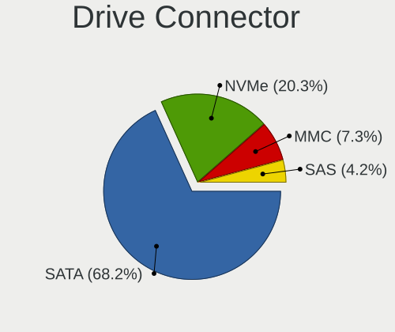

| Type | Notebooks | Drives | Percent |
|------|-----------|--------|---------|
| SATA | 131       | 176    | 68.23%  |
| NVMe | 39        | 56     | 20.31%  |
| MMC  | 14        | 16     | 7.29%   |
| SAS  | 8         | 9      | 4.17%   |

Drive Size
----------

Size of hard drive

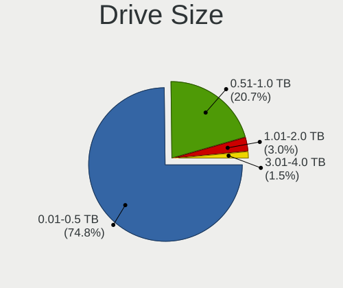

| Size in TB | Notebooks | Drives | Percent |
|------------|-----------|--------|---------|
| 0.01-0.5   | 101       | 133    | 74.81%  |
| 0.51-1.0   | 28        | 39     | 20.74%  |
| 1.01-2.0   | 4         | 4      | 2.96%   |
| 3.01-4.0   | 2         | 3      | 1.48%   |

Space Total
-----------

Amount of disk space available on the file system

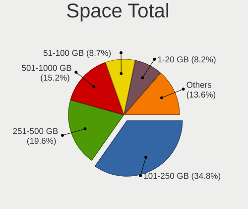

| Size in GB     | Notebooks | Percent |
|----------------|-----------|---------|
| 101-250        | 64        | 34.78%  |
| 251-500        | 36        | 19.57%  |
| 501-1000       | 28        | 15.22%  |
| 51-100         | 16        | 8.7%    |
| 1-20           | 15        | 8.15%   |
| 1001-2000      | 9         | 4.89%   |
| 21-50          | 7         | 3.8%    |
| 2001-3000      | 4         | 2.17%   |
| Unknown        | 4         | 2.17%   |
| More than 3000 | 1         | 0.54%   |

Space Used
----------

Amount of used disk space

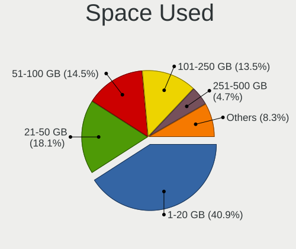

| Used GB   | Notebooks | Percent |
|-----------|-----------|---------|
| 1-20      | 79        | 40.93%  |
| 21-50     | 35        | 18.13%  |
| 51-100    | 28        | 14.51%  |
| 101-250   | 26        | 13.47%  |
| 251-500   | 9         | 4.66%   |
| 1001-2000 | 5         | 2.59%   |
| 501-1000  | 5         | 2.59%   |
| Unknown   | 4         | 2.07%   |
| 2001-3000 | 2         | 1.04%   |

Malfunc. Drives
---------------

Drive models with a malfunction

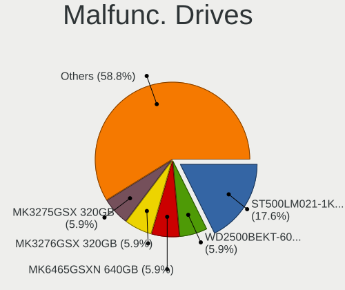

| Model                             | Notebooks | Drives | Percent |
|-----------------------------------|-----------|--------|---------|
| Seagate ST500LM021-1KJ152 500GB   | 3         | 3      | 17.65%  |
| WDC WD2500BEKT-60A25T1 250GB      | 1         | 1      | 5.88%   |
| Toshiba MK6465GSXN 640GB          | 1         | 1      | 5.88%   |
| Toshiba MK3276GSX 320GB           | 1         | 1      | 5.88%   |
| Toshiba MK3275GSX 320GB           | 1         | 1      | 5.88%   |
| Seagate ST9750420AS 752GB         | 1         | 1      | 5.88%   |
| Seagate ST500LT012-1DG142 500GB   | 1         | 1      | 5.88%   |
| Seagate ST500LM000-1EJ162 500GB   | 1         | 1      | 5.88%   |
| Seagate ST2000LM007-1R8174 2TB    | 1         | 1      | 5.88%   |
| Samsung Electronics HM500LI 500GB | 1         | 1      | 5.88%   |
| Hitachi HTS727550A9E364 500GB     | 1         | 1      | 5.88%   |
| Hitachi HTS725032A9A364 320GB     | 1         | 1      | 5.88%   |
| Hitachi HTS547575A9E384 752GB     | 1         | 1      | 5.88%   |
| HGST HTS725050A7E630 500GB        | 1         | 1      | 5.88%   |
| China SSD32G 32GB                 | 1         | 1      | 5.88%   |

Malfunc. Drive Vendor
---------------------

Vendors of faulty drives

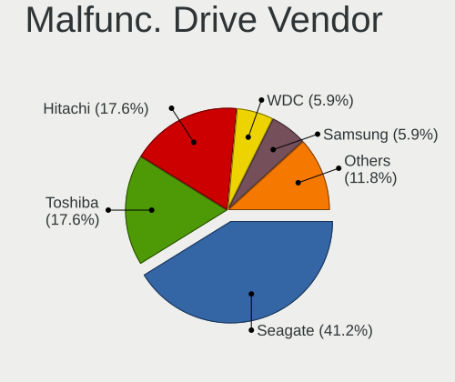

| Vendor              | Notebooks | Drives | Percent |
|---------------------|-----------|--------|---------|
| Seagate             | 7         | 7      | 41.18%  |
| Toshiba             | 3         | 3      | 17.65%  |
| Hitachi             | 3         | 3      | 17.65%  |
| WDC                 | 1         | 1      | 5.88%   |
| Samsung Electronics | 1         | 1      | 5.88%   |
| HGST                | 1         | 1      | 5.88%   |
| China               | 1         | 1      | 5.88%   |

Malfunc. HDD Vendor
-------------------

Vendors of faulty HDD drives

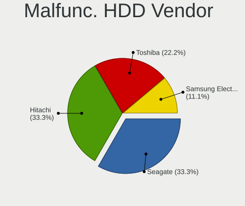

| Vendor              | Notebooks | Drives | Percent |
|---------------------|-----------|--------|---------|
| Seagate             | 7         | 7      | 43.75%  |
| Toshiba             | 3         | 3      | 18.75%  |
| Hitachi             | 3         | 3      | 18.75%  |
| WDC                 | 1         | 1      | 6.25%   |
| Samsung Electronics | 1         | 1      | 6.25%   |
| HGST                | 1         | 1      | 6.25%   |

Malfunc. Drive Kind
-------------------

Kinds of faulty drives

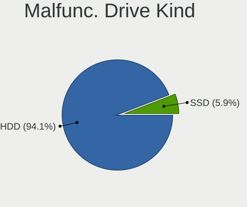

| Kind | Notebooks | Drives | Percent |
|------|-----------|--------|---------|
| HDD  | 16        | 16     | 94.12%  |
| SSD  | 1         | 1      | 5.88%   |

Failed Drives
-------------

Failed drive models

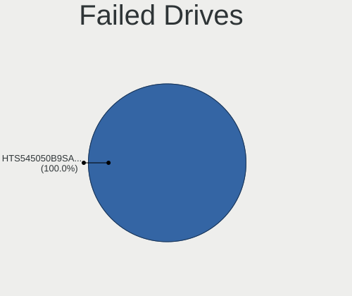

| Model                         | Notebooks | Drives | Percent |
|-------------------------------|-----------|--------|---------|
| Hitachi HTS545050B9SA00 500GB | 1         | 1      | 100%    |

Failed Drive Vendor
-------------------

Failed drive vendors

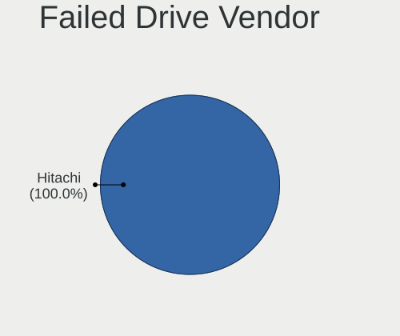

| Vendor  | Notebooks | Drives | Percent |
|---------|-----------|--------|---------|
| Hitachi | 1         | 1      | 100%    |

Drive Status
------------

Number of failed and malfunc. drives

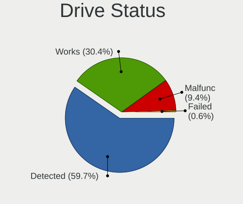

| Status   | Notebooks | Drives | Percent |
|----------|-----------|--------|---------|
| Detected | 108       | 170    | 59.67%  |
| Works    | 55        | 69     | 30.39%  |
| Malfunc  | 17        | 17     | 9.39%   |
| Failed   | 1         | 1      | 0.55%   |

Storage controller
------------------

Storage Vendor
--------------

Storage controller vendors

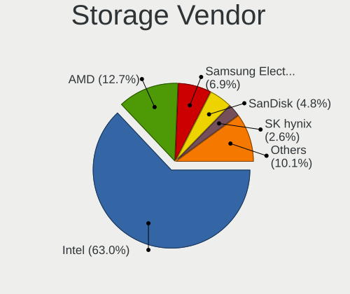

| Vendor                       | Notebooks | Percent |
|------------------------------|-----------|---------|
| Intel                        | 119       | 62.96%  |
| AMD                          | 24        | 12.7%   |
| Samsung Electronics          | 13        | 6.88%   |
| SanDisk                      | 9         | 4.76%   |
| SK hynix                     | 5         | 2.65%   |
| Micron Technology            | 5         | 2.65%   |
| Kingston Technology Company  | 4         | 2.12%   |
| Nvidia                       | 2         | 1.06%   |
| Micron/Crucial Technology    | 2         | 1.06%   |
| KIOXIA                       | 2         | 1.06%   |
| Union Memory (Shenzhen)      | 1         | 0.53%   |
| Toshiba America Info Systems | 1         | 0.53%   |
| Marvell Technology Group     | 1         | 0.53%   |
| Apple                        | 1         | 0.53%   |

Storage Model
-------------

Storage controller models

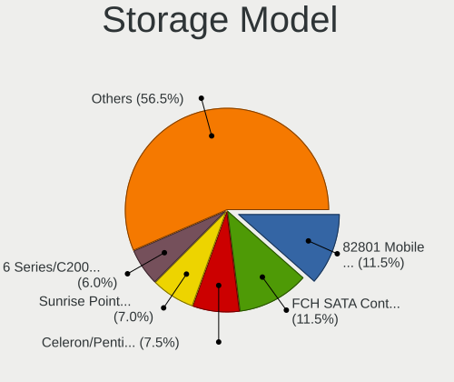

| Model                                                                            | Notebooks | Percent |
|----------------------------------------------------------------------------------|-----------|---------|
| Intel 82801 Mobile SATA Controller [RAID mode]                                   | 23        | 11.5%   |
| AMD FCH SATA Controller [AHCI mode]                                              | 23        | 11.5%   |
| Intel Celeron/Pentium Silver Processor SATA Controller                           | 15        | 7.5%    |
| Intel Sunrise Point-LP SATA Controller [AHCI mode]                               | 14        | 7%      |
| Intel 6 Series/C200 Series Chipset Family 6 port Mobile SATA AHCI Controller     | 12        | 6%      |
| Intel 7 Series Chipset Family 6-port SATA Controller [AHCI mode]                 | 10        | 5%      |
| Samsung S4LN058A01[SSUBX] AHCI SSD Controller (Apple slot)                       | 5         | 2.5%    |
| Samsung NVMe SSD Controller SM981/PM981/PM983                                    | 5         | 2.5%    |
| SK hynix Gold P31/BC711/PC711 NVMe Solid State Drive                             | 4         | 2%      |
| Intel 8 Series/C220 Series Chipset Family 6-port SATA Controller 1 [AHCI mode]   | 4         | 2%      |
| Intel 8 Series SATA Controller 1 [AHCI mode]                                     | 4         | 2%      |
| Intel 5 Series/3400 Series Chipset 6 port SATA AHCI Controller                   | 4         | 2%      |
| SanDisk Extreme Pro / WD Black SN750 / PC SN730 / Red SN700 NVMe SSD             | 3         | 1.5%    |
| Intel Volume Management Device NVMe RAID Controller                              | 3         | 1.5%    |
| Intel 82801IBM/IEM (ICH9M/ICH9M-E) 4 port SATA Controller [AHCI mode]            | 3         | 1.5%    |
| Samsung NVMe SSD Controller PM9A1/PM9A3/980PRO                                   | 2         | 1%      |
| Micron 2400 NVMe SSD (DRAM-less)                                                 | 2         | 1%      |
| Micron 2200S NVMe SSD [Cassandra]                                                | 2         | 1%      |
| Kingston Company OM8PCP Design-In PCIe 3 NVMe SSD (DRAM-less)                    | 2         | 1%      |
| Kingston Company A1000/U-SNS8154P3 x2 NVMe SSD [E8]                              | 2         | 1%      |
| Intel Wildcat Point-LP SATA Controller [AHCI Mode]                               | 2         | 1%      |
| Intel Tiger Lake-LP SATA Controller                                              | 2         | 1%      |
| Intel Optane NVME SSD H10 with Solid State Storage [Teton Glacier]               | 2         | 1%      |
| Intel HM170/QM170 Chipset SATA Controller [AHCI Mode]                            | 2         | 1%      |
| Intel Atom/Celeron/Pentium Processor x5-E8000/J3xxx/N3xxx Series SATA Controller | 2         | 1%      |
| Intel Atom Processor E3800 Series SATA AHCI Controller                           | 2         | 1%      |
| Intel 82801HM/HEM (ICH8M/ICH8M-E) SATA Controller [IDE mode]                     | 2         | 1%      |
| Intel 82801HM/HEM (ICH8M/ICH8M-E) IDE Controller                                 | 2         | 1%      |
| Intel 82801GBM/GHM (ICH7-M Family) SATA Controller [IDE mode]                    | 2         | 1%      |
| Intel 82801G (ICH7 Family) IDE Controller                                        | 2         | 1%      |
| Union Memory (Shenzhen) AM620 PCIe 3.0 NVMe SSD 256GB                            | 1         | 0.5%    |
| Toshiba America Info Systems XG3 NVMe SSD Controller                             | 1         | 0.5%    |
| SK hynix BC501 NVMe Solid State Drive                                            | 1         | 0.5%    |
| SanDisk WD SN560/SN740/SN770/SN5000 NVMe SSD                                     | 1         | 0.5%    |
| SanDisk WD Blue SN500 / PC SN520 x2 M.2 2280 NVMe SSD                            | 1         | 0.5%    |
| SanDisk Ultra 3D / WD PC SN530, IX SN530, Blue SN550 NVMe SSD (DRAM-less)        | 1         | 0.5%    |
| SanDisk PC SN520 x2 M.2 2242 NVMe SSD                                            | 1         | 0.5%    |
| SanDisk PC SN520 x2 M.2 2230 NVMe SSD                                            | 1         | 0.5%    |
| SanDisk Extreme Pro / WD Black 2018/SN750/PC SN720 NVMe SSD                      | 1         | 0.5%    |
| Samsung NVMe SSD Controller 980 (DRAM-less)                                      | 1         | 0.5%    |

Storage Kind
------------

Kind of storage controller (IDE, SATA, NVMe, SAS, ...)

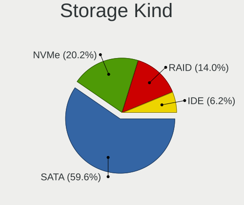

| Kind | Notebooks | Percent |
|------|-----------|---------|
| SATA | 115       | 59.59%  |
| NVMe | 39        | 20.21%  |
| RAID | 27        | 13.99%  |
| IDE  | 12        | 6.22%   |

Processor
---------

CPU Vendor
----------

Processor vendors

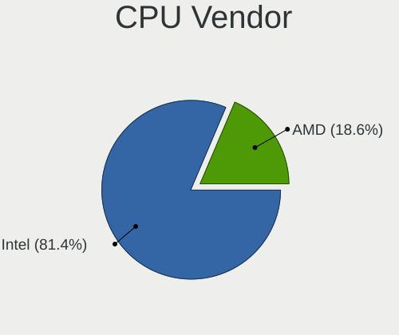

| Vendor | Notebooks | Percent |
|--------|-----------|---------|
| Intel  | 140       | 81.4%   |
| AMD    | 32        | 18.6%   |

CPU Model
---------

Processor models

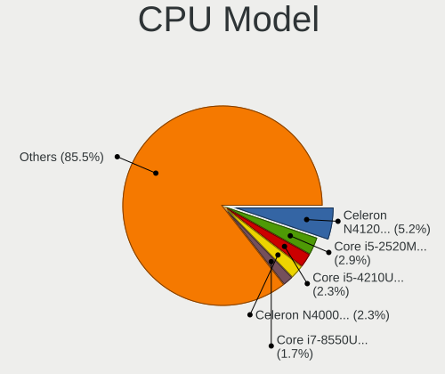

| Model                                         | Notebooks | Percent |
|-----------------------------------------------|-----------|---------|
| Intel Celeron N4120 CPU @ 1.10GHz             | 9         | 5.2%    |
| Intel Core i5-2520M CPU @ 2.50GHz             | 5         | 2.89%   |
| Intel Core i5-4210U CPU @ 1.70GHz             | 4         | 2.31%   |
| Intel Celeron N4000 CPU @ 1.10GHz             | 4         | 2.31%   |
| Intel Core i7-8550U CPU @ 1.80GHz             | 3         | 1.73%   |
| Intel Core i7-2640M CPU @ 2.80GHz             | 3         | 1.73%   |
| Intel Core i7-1065G7 CPU @ 1.30GHz            | 3         | 1.73%   |
| Intel Core i5-9300H CPU @ 2.40GHz             | 3         | 1.73%   |
| Intel Core i5-8250U CPU @ 1.60GHz             | 3         | 1.73%   |
| Intel Core i5-5250U CPU @ 1.60GHz             | 3         | 1.73%   |
| Intel Core i5-3210M CPU @ 2.50GHz             | 3         | 1.73%   |
| Intel Core i3-8130U CPU @ 2.20GHz             | 3         | 1.73%   |
| AMD Ryzen 5 3500U with Radeon Vega Mobile Gfx | 3         | 1.73%   |
| Intel Core i7-8565U CPU @ 1.80GHz             | 2         | 1.16%   |
| Intel Core i7-2620M CPU @ 2.70GHz             | 2         | 1.16%   |
| Intel Core i5-8365U CPU @ 1.60GHz             | 2         | 1.16%   |
| Intel Core i5-7300U CPU @ 2.60GHz             | 2         | 1.16%   |
| Intel Core i5-7200U CPU @ 2.50GHz             | 2         | 1.16%   |
| Intel Core i5-5350U CPU @ 1.80GHz             | 2         | 1.16%   |
| Intel Core i5-3340M CPU @ 2.70GHz             | 2         | 1.16%   |
| Intel Core i5-3320M CPU @ 2.60GHz             | 2         | 1.16%   |
| Intel Core i5-3230M CPU @ 2.60GHz             | 2         | 1.16%   |
| Intel Core i5-2415M CPU @ 2.30GHz             | 2         | 1.16%   |
| Intel Core i3-7100U CPU @ 2.40GHz             | 2         | 1.16%   |
| Intel Core i3-2375M CPU @ 1.50GHz             | 2         | 1.16%   |
| Intel Core 2 Duo CPU T8100 @ 2.10GHz          | 2         | 1.16%   |
| Intel Core 2 CPU T7200 @ 2.00GHz              | 2         | 1.16%   |
| Intel Celeron CPU N3050 @ 1.60GHz             | 2         | 1.16%   |
| Intel Celeron CPU N2840 @ 2.16GHz             | 2         | 1.16%   |
| Intel 11th Gen Core i7-1165G7 @ 2.80GHz       | 2         | 1.16%   |
| AMD Ryzen 7 5800H with Radeon Graphics        | 2         | 1.16%   |
| AMD Ryzen 5 5500U with Radeon Graphics        | 2         | 1.16%   |
| AMD A8-7410 APU with AMD Radeon R5 Graphics   | 2         | 1.16%   |
| AMD A4-6210 APU with AMD Radeon R3 Graphics   | 2         | 1.16%   |
| Intel Pentium Dual-Core CPU T4300 @ 2.10GHz   | 1         | 0.58%   |
| Intel Pentium Dual CPU T2390 @ 1.86GHz        | 1         | 0.58%   |
| Intel Pentium CPU N3700 @ 1.60GHz             | 1         | 0.58%   |
| Intel Pentium CPU B960 @ 2.20GHz              | 1         | 0.58%   |
| Intel Pentium CPU B950 @ 2.10GHz              | 1         | 0.58%   |
| Intel Genuine CPU U4100 @ 1.30GHz             | 1         | 0.58%   |

CPU Model Family
----------------

Processor model prefix

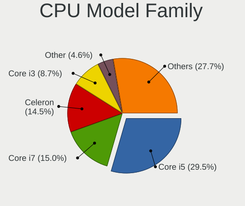

| Model                   | Notebooks | Percent |
|-------------------------|-----------|---------|
| Intel Core i5           | 51        | 29.48%  |
| Intel Core i7           | 26        | 15.03%  |
| Intel Celeron           | 25        | 14.45%  |
| Intel Core i3           | 15        | 8.67%   |
| Other                   | 8         | 4.62%   |
| AMD Ryzen 5             | 8         | 4.62%   |
| AMD Ryzen 7             | 5         | 2.89%   |
| Intel Core 2 Duo        | 4         | 2.31%   |
| AMD A8                  | 4         | 2.31%   |
| Intel Pentium           | 3         | 1.73%   |
| Intel Core 2            | 3         | 1.73%   |
| AMD A6                  | 3         | 1.73%   |
| AMD A10                 | 3         | 1.73%   |
| Intel Atom              | 2         | 1.16%   |
| AMD A4                  | 2         | 1.16%   |
| Intel Pentium Dual-Core | 1         | 0.58%   |
| Intel Pentium Dual      | 1         | 0.58%   |
| Intel Genuine           | 1         | 0.58%   |
| Intel Core i9           | 1         | 0.58%   |
| Intel Core              | 1         | 0.58%   |
| AMD Sempron             | 1         | 0.58%   |
| AMD Ryzen 3             | 1         | 0.58%   |
| AMD Quad-Core           | 1         | 0.58%   |
| AMD Mobile Sempron      | 1         | 0.58%   |
| AMD E2                  | 1         | 0.58%   |
| AMD A12                 | 1         | 0.58%   |

CPU Cores
---------

Number of processor cores

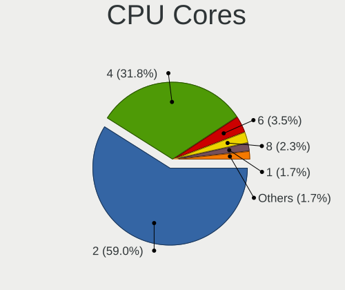

| Number | Notebooks | Percent |
|--------|-----------|---------|
| 2      | 102       | 58.96%  |
| 4      | 55        | 31.79%  |
| 6      | 6         | 3.47%   |
| 8      | 4         | 2.31%   |
| 1      | 3         | 1.73%   |
| 10     | 2         | 1.16%   |
| 16     | 1         | 0.58%   |

CPU Sockets
-----------

Number of sockets

| Number | Notebooks | Percent |
|--------|-----------|---------|
| 1      | 172       | 100%    |

CPU Threads
-----------

Threads per core (Hyper-Threading)

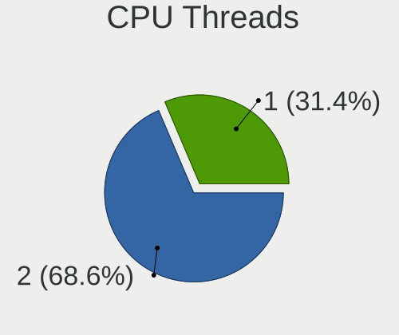

| Number | Notebooks | Percent |
|--------|-----------|---------|
| 2      | 118       | 68.6%   |
| 1      | 54        | 31.4%   |

CPU Op-Modes
------------

CPU Operation Modes (32-bit, 64-bit)

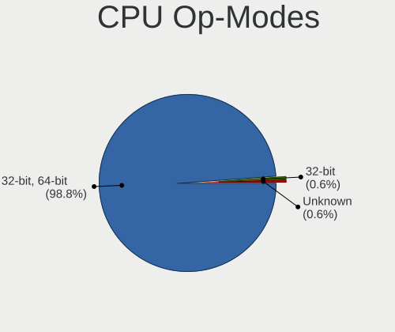

| Op mode        | Notebooks | Percent |
|----------------|-----------|---------|
| 32-bit, 64-bit | 170       | 98.84%  |
| 32-bit         | 1         | 0.58%   |
| Unknown        | 1         | 0.58%   |

CPU Microcode
-------------

Microcode number

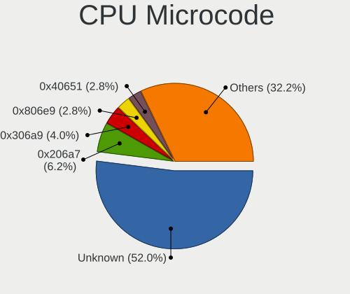

| Number     | Notebooks | Percent |
|------------|-----------|---------|
| Unknown    | 92        | 51.98%  |
| 0x206a7    | 11        | 6.21%   |
| 0x306a9    | 7         | 3.95%   |
| 0x806e9    | 5         | 2.82%   |
| 0x40651    | 5         | 2.82%   |
| 0x806ea    | 4         | 2.26%   |
| 0x706a1    | 4         | 2.26%   |
| 0x1067a    | 4         | 2.26%   |
| 0x706a8    | 3         | 1.69%   |
| 0x306c3    | 3         | 1.69%   |
| 0x30678    | 3         | 1.69%   |
| 0x07030105 | 3         | 1.69%   |
| 0x806ec    | 2         | 1.13%   |
| 0x6f6      | 2         | 1.13%   |
| 0x506e3    | 2         | 1.13%   |
| 0x20655    | 2         | 1.13%   |
| 0x20652    | 2         | 1.13%   |
| 0x10676    | 2         | 1.13%   |
| 0x08600103 | 2         | 1.13%   |
| 0x08108109 | 2         | 1.13%   |
| 0x906ea    | 1         | 0.56%   |
| 0x806c1    | 1         | 0.56%   |
| 0x6fd      | 1         | 0.56%   |
| 0x506c9    | 1         | 0.56%   |
| 0x406c3    | 1         | 0.56%   |
| 0x306d4    | 1         | 0.56%   |
| 0x106ca    | 1         | 0.56%   |
| 0x08608103 | 1         | 0.56%   |
| 0x08608102 | 1         | 0.56%   |
| 0x08108102 | 1         | 0.56%   |
| 0x07030106 | 1         | 0.56%   |
| 0x0700010f | 1         | 0.56%   |
| 0x06006705 | 1         | 0.56%   |
| 0x0600611a | 1         | 0.56%   |
| 0x06006110 | 1         | 0.56%   |
| 0x06003106 | 1         | 0.56%   |
| 0x06001119 | 1         | 0.56%   |

CPU Microarch
-------------

Microarchitecture

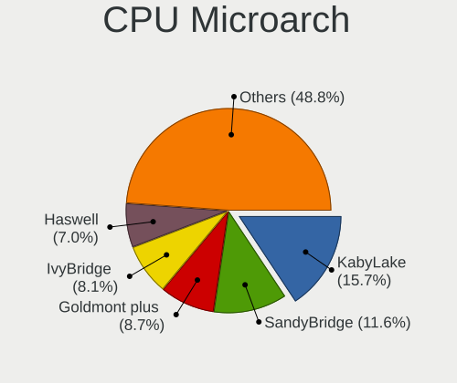

| Name              | Notebooks | Percent |
|-------------------|-----------|---------|
| KabyLake          | 27        | 15.7%   |
| SandyBridge       | 20        | 11.63%  |
| Goldmont plus     | 15        | 8.72%   |
| IvyBridge         | 14        | 8.14%   |
| Haswell           | 12        | 6.98%   |
| Silvermont        | 9         | 5.23%   |
| Broadwell         | 9         | 5.23%   |
| Zen+              | 6         | 3.49%   |
| Westmere          | 6         | 3.49%   |
| Puma              | 6         | 3.49%   |
| Penryn            | 6         | 3.49%   |
| TigerLake         | 5         | 2.91%   |
| Unknown           | 5         | 2.91%   |
| Skylake           | 4         | 2.33%   |
| Core              | 4         | 2.33%   |
| Zen 3             | 3         | 1.74%   |
| IceLake           | 3         | 1.74%   |
| Excavator         | 3         | 1.74%   |
| Zen 2             | 2         | 1.16%   |
| Piledriver        | 2         | 1.16%   |
| Jaguar            | 2         | 1.16%   |
| Steamroller       | 1         | 0.58%   |
| Meteorlake Hybrid | 1         | 0.58%   |
| K8 Hammer         | 1         | 0.58%   |
| K8 & K10 hybrid   | 1         | 0.58%   |
| K10 Llano         | 1         | 0.58%   |
| Goldmont          | 1         | 0.58%   |
| CometLake         | 1         | 0.58%   |
| Bonnell           | 1         | 0.58%   |
| Alderlake Hybrid  | 1         | 0.58%   |

Graphics
--------

GPU Vendor
----------

Vendors of graphics cards

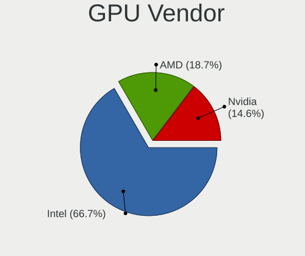

| Vendor | Notebooks | Percent |
|--------|-----------|---------|
| Intel  | 132       | 66.67%  |
| AMD    | 37        | 18.69%  |
| Nvidia | 29        | 14.65%  |

GPU Model
---------

Graphics card models

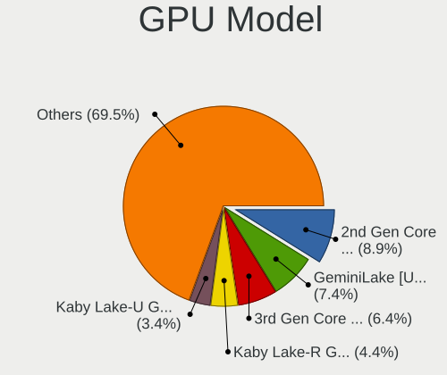

| Model                                                                                    | Notebooks | Percent |
|------------------------------------------------------------------------------------------|-----------|---------|
| Intel 2nd Generation Core Processor Family Integrated Graphics Controller                | 18        | 8.87%   |
| Intel GeminiLake [UHD Graphics 600]                                                      | 15        | 7.39%   |
| Intel 3rd Gen Core processor Graphics Controller                                         | 13        | 6.4%    |
| Intel Kaby Lake-R GT2 [UHD Graphics 620]                                                 | 9         | 4.43%   |
| Intel Kaby Lake-U GT2 [HD Graphics 620]                                                  | 7         | 3.45%   |
| Intel Haswell-ULT Integrated Graphics Controller                                         | 7         | 3.45%   |
| AMD Picasso/Raven 2 [Radeon Vega Series / Radeon Vega Mobile Series]                     | 6         | 2.96%   |
| Nvidia TU117M [GeForce GTX 1650 Mobile / Max-Q]                                          | 5         | 2.46%   |
| Intel WhiskeyLake-U GT2 [UHD Graphics 620]                                               | 5         | 2.46%   |
| Intel Core Processor Integrated Graphics Controller                                      | 5         | 2.46%   |
| Intel Broadwell-U GT3 [HD Graphics 6000]                                                 | 5         | 2.46%   |
| Intel Atom Processor Z36xxx/Z37xxx Series Graphics & Display                             | 5         | 2.46%   |
| Intel TigerLake-LP GT2 [Iris Xe Graphics]                                                | 4         | 1.97%   |
| Intel CoffeeLake-H GT2 [UHD Graphics 630]                                                | 4         | 1.97%   |
| Intel Atom/Celeron/Pentium Processor x5-E8000/J3xxx/N3xxx Integrated Graphics Controller | 4         | 1.97%   |
| Intel 4th Gen Core Processor Integrated Graphics Controller                              | 4         | 1.97%   |
| Intel Mobile 4 Series Chipset Integrated Graphics Controller                             | 3         | 1.48%   |
| Intel Iris Plus Graphics G7                                                              | 3         | 1.48%   |
| Intel Broadwell-U GT2 [HD Graphics 5500]                                                 | 3         | 1.48%   |
| AMD Mullins [Radeon R4/R5 Graphics]                                                      | 3         | 1.48%   |
| Nvidia TU106M [GeForce RTX 2060 Mobile]                                                  | 2         | 0.99%   |
| Nvidia GF119M [NVS 4200M]                                                                | 2         | 0.99%   |
| Nvidia GA106M [GeForce RTX 3060 Mobile / Max-Q]                                          | 2         | 0.99%   |
| Intel Skylake-U GT2 [HD Graphics 520]                                                    | 2         | 0.99%   |
| Intel Skylake-H GT2 [HD Graphics 530]                                                    | 2         | 0.99%   |
| Intel Mobile GM965/GL960 Integrated Graphics Controller (secondary)                      | 2         | 0.99%   |
| Intel Mobile GM965/GL960 Integrated Graphics Controller (primary)                        | 2         | 0.99%   |
| AMD Wani [Radeon R5/R6/R7 Graphics]                                                      | 2         | 0.99%   |
| AMD Temash [Radeon HD 8250/8280G]                                                        | 2         | 0.99%   |
| AMD Seymour [Radeon HD 6400M/7400M Series]                                               | 2         | 0.99%   |
| AMD Renoir [Radeon Vega Series / Radeon Vega Mobile Series]                              | 2         | 0.99%   |
| AMD Mullins [Radeon R2/R3 Graphics]                                                      | 2         | 0.99%   |
| AMD Lucienne                                                                             | 2         | 0.99%   |
| AMD Cezanne [Radeon Vega Series / Radeon Vega Mobile Series]                             | 2         | 0.99%   |
| Nvidia TU117M [GeForce MX450]                                                            | 1         | 0.49%   |
| Nvidia TU117M [GeForce GTX 1650 Ti Mobile]                                               | 1         | 0.49%   |
| Nvidia GT216GLM [Quadro FX 880M]                                                         | 1         | 0.49%   |
| Nvidia GP108GLM [Quadro P520]                                                            | 1         | 0.49%   |
| Nvidia GP107M [GeForce GTX 1050 3 GB Max-Q]                                              | 1         | 0.49%   |
| Nvidia GM204M [GeForce GTX 960 OEM / 970M]                                               | 1         | 0.49%   |

GPU Combo
---------

Combinations of graphics cards

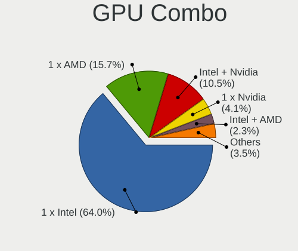

| Name           | Notebooks | Percent |
|----------------|-----------|---------|
| 1 x Intel      | 110       | 63.95%  |
| 1 x AMD        | 27        | 15.7%   |
| Intel + Nvidia | 18        | 10.47%  |
| 1 x Nvidia     | 7         | 4.07%   |
| Intel + AMD    | 4         | 2.33%   |
| AMD + Nvidia   | 4         | 2.33%   |
| 2 x AMD        | 2         | 1.16%   |

GPU Driver
----------

Free vs proprietary

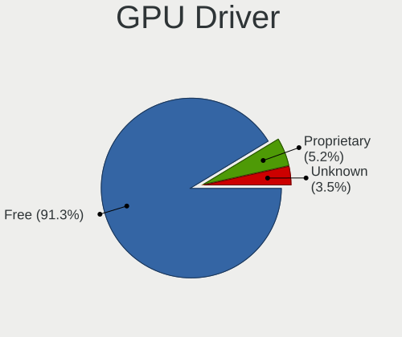

| Driver      | Notebooks | Percent |
|-------------|-----------|---------|
| Free        | 158       | 91.33%  |
| Proprietary | 9         | 5.2%    |
| Unknown     | 6         | 3.47%   |

GPU Memory
----------

Total video memory

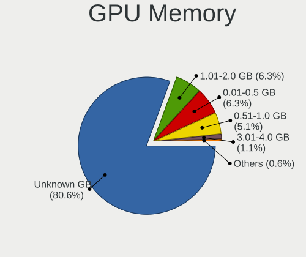

| Size in GB | Notebooks | Percent |
|------------|-----------|---------|
| Unknown    | 141       | 80.57%  |
| 1.01-2.0   | 11        | 6.29%   |
| 0.01-0.5   | 11        | 6.29%   |
| 0.51-1.0   | 9         | 5.14%   |
| 3.01-4.0   | 2         | 1.14%   |
| 2.01-3.0   | 1         | 0.57%   |

Monitor
-------

Monitor Vendor
--------------

Monitor vendors

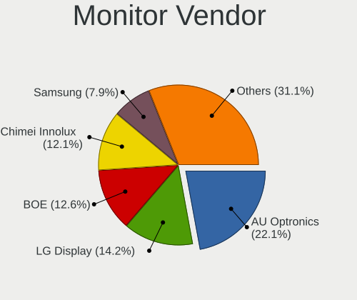

| Vendor                  | Notebooks | Percent |
|-------------------------|-----------|---------|
| AU Optronics            | 42        | 22.11%  |
| LG Display              | 27        | 14.21%  |
| BOE                     | 24        | 12.63%  |
| Chimei Innolux          | 23        | 12.11%  |
| Samsung Electronics     | 15        | 7.89%   |
| Apple                   | 11        | 5.79%   |
| Dell                    | 8         | 4.21%   |
| Chi Mei Optoelectronics | 6         | 3.16%   |
| Lenovo                  | 4         | 2.11%   |
| InfoVision              | 4         | 2.11%   |
| Hewlett-Packard         | 3         | 1.58%   |
| Philips                 | 2         | 1.05%   |
| PANDA                   | 2         | 1.05%   |
| KDC                     | 2         | 1.05%   |
| Goldstar                | 2         | 1.05%   |
| AOC                     | 2         | 1.05%   |
| ZTR                     | 1         | 0.53%   |
| Westinghouse            | 1         | 0.53%   |
| Vizio                   | 1         | 0.53%   |
| Viotek                  | 1         | 0.53%   |
| Valve                   | 1         | 0.53%   |
| Unknown (XXX)           | 1         | 0.53%   |
| STA                     | 1         | 0.53%   |
| Sony                    | 1         | 0.53%   |
| MSI                     | 1         | 0.53%   |
| LG Philips              | 1         | 0.53%   |
| InnoLux Display         | 1         | 0.53%   |
| CSOT                    | 1         | 0.53%   |
| CSO                     | 1         | 0.53%   |

Monitor Model
-------------

Monitor models

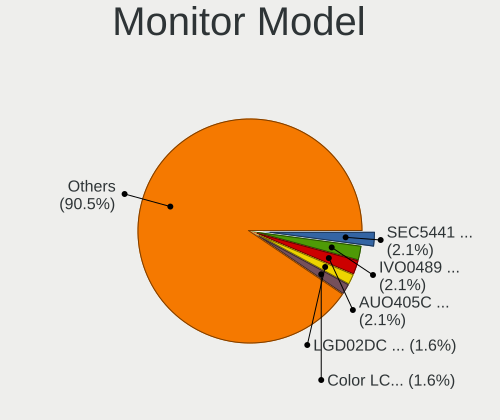

| Model                                                                 | Notebooks | Percent |
|-----------------------------------------------------------------------|-----------|---------|
| Samsung Electronics LCD Monitor SEC5441 1280x800 331x207mm 15.4-inch  | 4         | 2.11%   |
| InfoVision LCD Monitor IVO0489 1366x768 256x144mm 11.6-inch           | 4         | 2.11%   |
| AU Optronics LCD Monitor AUO405C 1366x768 256x144mm 11.6-inch         | 4         | 2.11%   |
| LG Display LCD Monitor LGD02DC 1366x768 344x194mm 15.5-inch           | 3         | 1.58%   |
| Apple Color LCD APP9CF0 1440x900 290x180mm 13.4-inch                  | 3         | 1.58%   |
| LG Display LCD Monitor LGD02EB 1366x768 309x174mm 14.0-inch           | 2         | 1.05%   |
| KDC LCD Monitor KDC0109 1366x768 256x144mm 11.6-inch                  | 2         | 1.05%   |
| Chimei Innolux LCD Monitor CMN15DB 1366x768 344x193mm 15.5-inch       | 2         | 1.05%   |
| Chimei Innolux LCD Monitor CMN15CA 1366x768 344x193mm 15.5-inch       | 2         | 1.05%   |
| BOE LCD Monitor BOE0715 1366x768 256x144mm 11.6-inch                  | 2         | 1.05%   |
| AU Optronics LCD Monitor AUOD1ED 1920x1080 344x193mm 15.5-inch        | 2         | 1.05%   |
| AU Optronics LCD Monitor AUO61ED 1920x1080 344x194mm 15.5-inch        | 2         | 1.05%   |
| AU Optronics LCD Monitor AUO45EC 1366x768 344x193mm 15.5-inch         | 2         | 1.05%   |
| AU Optronics LCD Monitor AUO11EC 1366x768 344x193mm 15.5-inch         | 2         | 1.05%   |
| AU Optronics LCD Monitor AUO10EC 1366x768 344x193mm 15.5-inch         | 2         | 1.05%   |
| AU Optronics LCD Monitor AUO105C 1366x768 256x144mm 11.6-inch         | 2         | 1.05%   |
| ZTR LCD Monitor ZTR0001 1366x768 309x173mm 13.9-inch                  | 1         | 0.53%   |
| Westinghouse EUM24F1G1 WDT1E64 1920x1080 530x300mm 24.0-inch          | 1         | 0.53%   |
| Vizio D24-D1 VIZ1005 1920x1080 521x293mm 23.5-inch                    | 1         | 0.53%   |
| Viotek GN32DB VTK3200 2560x1440 698x393mm 31.5-inch                   | 1         | 0.53%   |
| Valve ANX7530 U VLV3001 800x1280 100x150mm 7.1-inch                   | 1         | 0.53%   |
| Unknown (XXX) DTV XXX0030 1600x1200 708x398mm 32.0-inch               | 1         | 0.53%   |
| STA LCD Monitor STA0001 1366x768 256x144mm 11.6-inch                  | 1         | 0.53%   |
| Sony TV SNY1703 1360x768                                              | 1         | 0.53%   |
| Samsung Electronics S22F350 SAM0D1A 1920x1080 477x268mm 21.5-inch     | 1         | 0.53%   |
| Samsung Electronics LCD Monitor SEC3551 1366x768 344x194mm 15.5-inch  | 1         | 0.53%   |
| Samsung Electronics LCD Monitor SEC3451 1366x768 344x194mm 15.5-inch  | 1         | 0.53%   |
| Samsung Electronics LCD Monitor SDCA029 3840x2160 344x194mm 15.5-inch | 1         | 0.53%   |
| Samsung Electronics LCD Monitor SDC5544 1920x1080 344x194mm 15.5-inch | 1         | 0.53%   |
| Samsung Electronics LCD Monitor SDC4852 1366x768 344x194mm 15.5-inch  | 1         | 0.53%   |
| Samsung Electronics LCD Monitor SDC4642 1366x768 309x174mm 14.0-inch  | 1         | 0.53%   |
| Samsung Electronics LCD Monitor SDC4347 1366x768 344x193mm 15.5-inch  | 1         | 0.53%   |
| Samsung Electronics LCD Monitor SDC4161 1920x1080 344x194mm 15.5-inch | 1         | 0.53%   |
| Samsung Electronics LCD Monitor SDC354A 1366x768 344x194mm 15.5-inch  | 1         | 0.53%   |
| Samsung Electronics LCD Monitor SAM0B32 1366x768 607x345mm 27.5-inch  | 1         | 0.53%   |
| Philips PHL 276E8V PHLC18F 3840x2160 597x336mm 27.0-inch              | 1         | 0.53%   |
| Philips LCD Monitor PHL4650 1280x768 530x398mm 26.1-inch              | 1         | 0.53%   |
| PANDA LCD Monitor NCP0040 1920x1080 344x194mm 15.5-inch               | 1         | 0.53%   |
| PANDA LC116LF1L02 NCP000F 1920x1080 256x144mm 11.6-inch               | 1         | 0.53%   |
| MSI Optix MAG27CQ MSI1462 2560x1440 597x336mm 27.0-inch               | 1         | 0.53%   |

Monitor Resolution
------------------

Monitor screen resolution

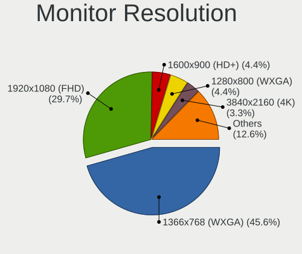

| Resolution         | Notebooks | Percent |
|--------------------|-----------|---------|
| 1366x768 (WXGA)    | 83        | 45.6%   |
| 1920x1080 (FHD)    | 54        | 29.67%  |
| 1600x900 (HD+)     | 8         | 4.4%    |
| 1280x800 (WXGA)    | 8         | 4.4%    |
| 3840x2160 (4K)     | 6         | 3.3%    |
| 1440x900 (WXGA+)   | 5         | 2.75%   |
| 2560x1600          | 3         | 1.65%   |
| 1280x1024 (SXGA)   | 3         | 1.65%   |
| 1680x1050 (WSXGA+) | 2         | 1.1%    |
| 800x1280           | 1         | 0.55%   |
| 3840x1100          | 1         | 0.55%   |
| 3440x1440          | 1         | 0.55%   |
| 2560x1440 (QHD)    | 1         | 0.55%   |
| 1920x1280          | 1         | 0.55%   |
| 1400x1050          | 1         | 0.55%   |
| 1360x768           | 1         | 0.55%   |
| 1280x768           | 1         | 0.55%   |
| 1024x768 (XGA)     | 1         | 0.55%   |
| 1024x600           | 1         | 0.55%   |

Monitor Diagonal
----------------

Diagonal size in inches

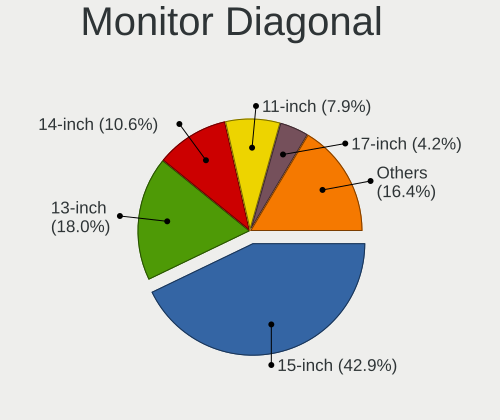

| Inches  | Notebooks | Percent |
|---------|-----------|---------|
| 15      | 81        | 42.86%  |
| 13      | 34        | 17.99%  |
| 14      | 20        | 10.58%  |
| 11      | 15        | 7.94%   |
| 17      | 8         | 4.23%   |
| 31      | 4         | 2.12%   |
| 22      | 3         | 1.59%   |
| 21      | 3         | 1.59%   |
| 34      | 2         | 1.06%   |
| 27      | 2         | 1.06%   |
| 24      | 2         | 1.06%   |
| 23      | 2         | 1.06%   |
| 19      | 2         | 1.06%   |
| Unknown | 2         | 1.06%   |
| 72      | 1         | 0.53%   |
| 40      | 1         | 0.53%   |
| 32      | 1         | 0.53%   |
| 20      | 1         | 0.53%   |
| 18      | 1         | 0.53%   |
| 16      | 1         | 0.53%   |
| 12      | 1         | 0.53%   |
| 10      | 1         | 0.53%   |
| 7       | 1         | 0.53%   |

Monitor Width
-------------

Physical width

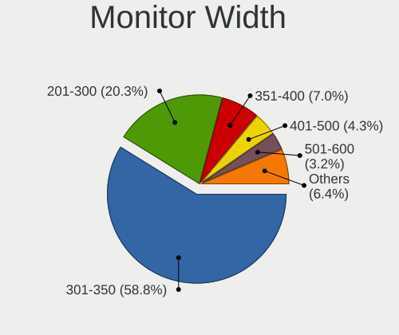

| Width in mm | Notebooks | Percent |
|-------------|-----------|---------|
| 301-350     | 110       | 58.82%  |
| 201-300     | 38        | 20.32%  |
| 351-400     | 13        | 6.95%   |
| 401-500     | 8         | 4.28%   |
| 501-600     | 6         | 3.21%   |
| 601-700     | 4         | 2.14%   |
| 701-800     | 3         | 1.6%    |
| Unknown     | 2         | 1.07%   |
| 801-900     | 1         | 0.53%   |
| 1501-2000   | 1         | 0.53%   |
| 1-100       | 1         | 0.53%   |

Aspect Ratio
------------

Proportional relationship between the width and the height

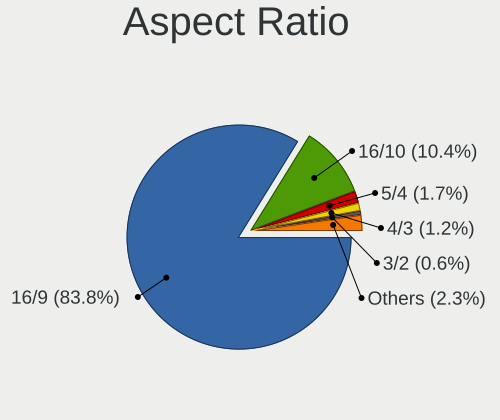

| Ratio   | Notebooks | Percent |
|---------|-----------|---------|
| 16/9    | 145       | 83.82%  |
| 16/10   | 18        | 10.4%   |
| 5/4     | 3         | 1.73%   |
| 4/3     | 2         | 1.16%   |
| 3/2     | 1         | 0.58%   |
| 3.40    | 1         | 0.58%   |
| 21/9    | 1         | 0.58%   |
| 0.67    | 1         | 0.58%   |
| Unknown | 1         | 0.58%   |

Monitor Area
------------

Area in inch²

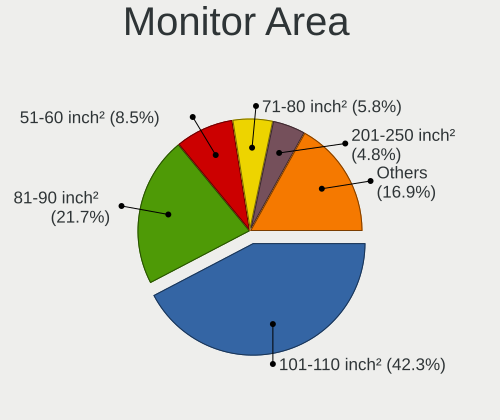

| Area in inch² | Notebooks | Percent |
|----------------|-----------|---------|
| 101-110        | 80        | 42.33%  |
| 81-90          | 41        | 21.69%  |
| 51-60          | 16        | 8.47%   |
| 71-80          | 11        | 5.82%   |
| 201-250        | 9         | 4.76%   |
| 121-130        | 7         | 3.7%    |
| 351-500        | 6         | 3.17%   |
| 151-200        | 4         | 2.12%   |
| 301-350        | 2         | 1.06%   |
| 141-150        | 2         | 1.06%   |
| 501-1000       | 2         | 1.06%   |
| 91-100         | 2         | 1.06%   |
| Unknown        | 2         | 1.06%   |
| More than 1000 | 1         | 0.53%   |
| 61-70          | 1         | 0.53%   |
| 41-50          | 1         | 0.53%   |
| 1-40           | 1         | 0.53%   |
| 111-120        | 1         | 0.53%   |

Pixel Density
-------------

Pixels per inch

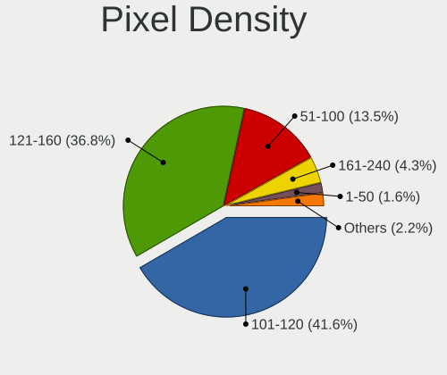

| Density       | Notebooks | Percent |
|---------------|-----------|---------|
| 101-120       | 77        | 41.62%  |
| 121-160       | 68        | 36.76%  |
| 51-100        | 25        | 13.51%  |
| 161-240       | 8         | 4.32%   |
| 1-50          | 3         | 1.62%   |
| More than 240 | 2         | 1.08%   |
| Unknown       | 2         | 1.08%   |

Multiple Monitors
-----------------

Total monitors connected

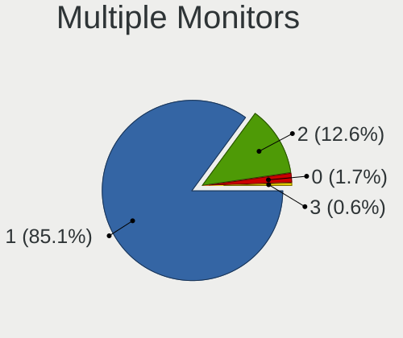

| Total | Notebooks | Percent |
|-------|-----------|---------|
| 1     | 148       | 85.06%  |
| 2     | 22        | 12.64%  |
| 0     | 3         | 1.72%   |
| 3     | 1         | 0.57%   |

Network
-------

Net Controller Vendor
---------------------

Controller vendors

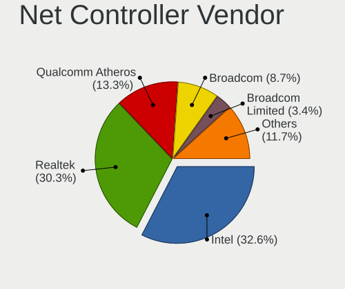

| Vendor                          | Notebooks | Percent |
|---------------------------------|-----------|---------|
| Intel                           | 86        | 32.58%  |
| Realtek Semiconductor           | 80        | 30.3%   |
| Qualcomm Atheros                | 35        | 13.26%  |
| Broadcom                        | 23        | 8.71%   |
| Broadcom Limited                | 9         | 3.41%   |
| Ralink Technology               | 6         | 2.27%   |
| Qualcomm Atheros Communications | 3         | 1.14%   |
| Shenzhen Goodix Technology      | 2         | 0.76%   |
| Nvidia                          | 2         | 0.76%   |
| MediaTek                        | 2         | 0.76%   |
| Marvell Technology Group        | 2         | 0.76%   |
| Lenovo                          | 2         | 0.76%   |
| DisplayLink                     | 2         | 0.76%   |
| Dell                            | 2         | 0.76%   |
| ZTopInc                         | 1         | 0.38%   |
| Ralink                          | 1         | 0.38%   |
| JCM                             | 1         | 0.38%   |
| Huawei Technologies             | 1         | 0.38%   |
| Google                          | 1         | 0.38%   |
| Edimax Technology               | 1         | 0.38%   |
| ASIX Electronics                | 1         | 0.38%   |
| AMD                             | 1         | 0.38%   |

Net Controller Model
--------------------

Controller models

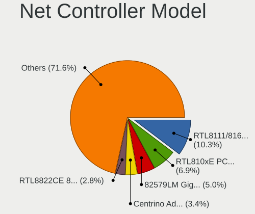

| Model                                                                  | Notebooks | Percent |
|------------------------------------------------------------------------|-----------|---------|
| Realtek RTL8111/8168/8211/8411 PCI Express Gigabit Ethernet Controller | 33        | 10.31%  |
| Realtek RTL810xE PCI Express Fast Ethernet controller                  | 22        | 6.88%   |
| Intel 82579LM Gigabit Network Connection (Lewisville)                  | 16        | 5%      |
| Intel Centrino Advanced-N 6205 [Taylor Peak]                           | 11        | 3.44%   |
| Realtek RTL8822CE 802.11ac PCIe Wireless Network Adapter               | 9         | 2.81%   |
| Qualcomm Atheros QCA9565 / AR9565 Wireless Network Adapter             | 9         | 2.81%   |
| Qualcomm Atheros QCA9377 802.11ac Wireless Network Adapter             | 7         | 2.19%   |
| Intel Wireless 7265                                                    | 7         | 2.19%   |
| Intel Wireless 7260                                                    | 7         | 2.19%   |
| Broadcom Limited BCM4360 802.11ac Dual Band Wireless Network Adapter   | 6         | 1.88%   |
| Ralink MT7601U Wireless Adapter                                        | 5         | 1.56%   |
| Qualcomm Atheros AR9485 Wireless Network Adapter                       | 5         | 1.56%   |
| Intel Wireless 3165                                                    | 5         | 1.56%   |
| Intel Wi-Fi 6 AX200                                                    | 5         | 1.56%   |
| Intel Cannon Point-LP CNVi [Wireless-AC]                               | 5         | 1.56%   |
| Broadcom BCM4313 802.11bgn Wireless Network Adapter                    | 5         | 1.56%   |
| Realtek RTL8822BE 802.11a/b/g/n/ac WiFi adapter                        | 4         | 1.25%   |
| Realtek RTL8723BE PCIe Wireless Network Adapter                        | 4         | 1.25%   |
| Intel Wi-Fi 6 AX201                                                    | 4         | 1.25%   |
| Intel Centrino Ultimate-N 6300                                         | 4         | 1.25%   |
| Intel 82577LM Gigabit Network Connection                               | 4         | 1.25%   |
| Realtek RTL8821CE 802.11ac PCIe Wireless Network Adapter               | 3         | 0.94%   |
| Realtek RTL8153 Gigabit Ethernet Adapter                               | 3         | 0.94%   |
| Realtek 802.11n WLAN Adapter                                           | 3         | 0.94%   |
| Qualcomm Atheros AR9271 802.11n                                        | 3         | 0.94%   |
| Qualcomm Atheros AR9285 Wireless Network Adapter (PCI-Express)         | 3         | 0.94%   |
| Intel Wireless 8265 / 8275                                             | 3         | 0.94%   |
| Intel Gemini Lake PCH CNVi WiFi                                        | 3         | 0.94%   |
| Intel Ethernet Connection I218-LM                                      | 3         | 0.94%   |
| Intel Ethernet Connection I217-LM                                      | 3         | 0.94%   |
| Intel Ethernet Connection (6) I219-LM                                  | 3         | 0.94%   |
| Intel Ethernet Connection (4) I219-LM                                  | 3         | 0.94%   |
| Intel Centrino Advanced-N 6235                                         | 3         | 0.94%   |
| Broadcom NetXtreme BCM57765 Gigabit Ethernet PCIe                      | 3         | 0.94%   |
| Broadcom BCM4331 802.11a/b/g/n                                         | 3         | 0.94%   |
| Broadcom BCM43142 802.11b/g/n                                          | 3         | 0.94%   |
| Shenzhen Goodix Fingerprint Reader                                     | 2         | 0.63%   |
| Realtek RTL8723DE Wireless Network Adapter                             | 2         | 0.63%   |
| Realtek RTL8188EUS 802.11n Wireless Network Adapter                    | 2         | 0.63%   |
| Realtek RTL8188EE Wireless Network Adapter                             | 2         | 0.63%   |

Wireless Vendor
---------------

Wireless vendors

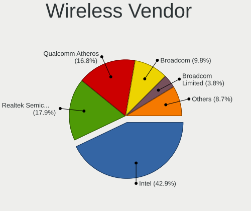

| Vendor                          | Notebooks | Percent |
|---------------------------------|-----------|---------|
| Intel                           | 79        | 42.93%  |
| Realtek Semiconductor           | 33        | 17.93%  |
| Qualcomm Atheros                | 31        | 16.85%  |
| Broadcom                        | 18        | 9.78%   |
| Broadcom Limited                | 7         | 3.8%    |
| Ralink Technology               | 6         | 3.26%   |
| Qualcomm Atheros Communications | 3         | 1.63%   |
| MediaTek                        | 2         | 1.09%   |
| Dell                            | 2         | 1.09%   |
| ZTopInc                         | 1         | 0.54%   |
| Ralink                          | 1         | 0.54%   |
| Edimax Technology               | 1         | 0.54%   |

Wireless Model
--------------

Wireless models

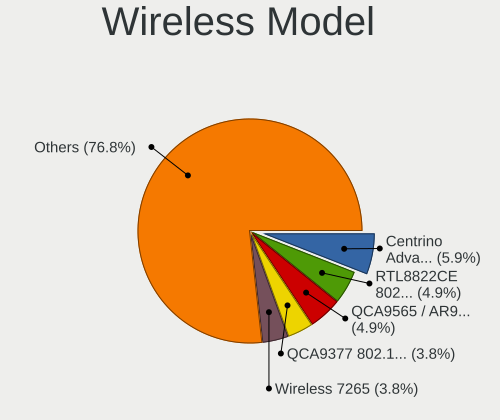

| Model                                                                                 | Notebooks | Percent |
|---------------------------------------------------------------------------------------|-----------|---------|
| Intel Centrino Advanced-N 6205 [Taylor Peak]                                          | 11        | 5.95%   |
| Realtek RTL8822CE 802.11ac PCIe Wireless Network Adapter                              | 9         | 4.86%   |
| Qualcomm Atheros QCA9565 / AR9565 Wireless Network Adapter                            | 9         | 4.86%   |
| Qualcomm Atheros QCA9377 802.11ac Wireless Network Adapter                            | 7         | 3.78%   |
| Intel Wireless 7265                                                                   | 7         | 3.78%   |
| Intel Wireless 7260                                                                   | 7         | 3.78%   |
| Broadcom Limited BCM4360 802.11ac Dual Band Wireless Network Adapter                  | 6         | 3.24%   |
| Ralink MT7601U Wireless Adapter                                                       | 5         | 2.7%    |
| Qualcomm Atheros AR9485 Wireless Network Adapter                                      | 5         | 2.7%    |
| Intel Wireless 3165                                                                   | 5         | 2.7%    |
| Intel Wi-Fi 6 AX200                                                                   | 5         | 2.7%    |
| Intel Cannon Point-LP CNVi [Wireless-AC]                                              | 5         | 2.7%    |
| Broadcom BCM4313 802.11bgn Wireless Network Adapter                                   | 5         | 2.7%    |
| Realtek RTL8822BE 802.11a/b/g/n/ac WiFi adapter                                       | 4         | 2.16%   |
| Realtek RTL8723BE PCIe Wireless Network Adapter                                       | 4         | 2.16%   |
| Intel Wi-Fi 6 AX201                                                                   | 4         | 2.16%   |
| Intel Centrino Ultimate-N 6300                                                        | 4         | 2.16%   |
| Realtek RTL8821CE 802.11ac PCIe Wireless Network Adapter                              | 3         | 1.62%   |
| Realtek 802.11n WLAN Adapter                                                          | 3         | 1.62%   |
| Qualcomm Atheros AR9271 802.11n                                                       | 3         | 1.62%   |
| Qualcomm Atheros AR9285 Wireless Network Adapter (PCI-Express)                        | 3         | 1.62%   |
| Intel Wireless 8265 / 8275                                                            | 3         | 1.62%   |
| Intel Gemini Lake PCH CNVi WiFi                                                       | 3         | 1.62%   |
| Intel Centrino Advanced-N 6235                                                        | 3         | 1.62%   |
| Broadcom BCM4331 802.11a/b/g/n                                                        | 3         | 1.62%   |
| Broadcom BCM43142 802.11b/g/n                                                         | 3         | 1.62%   |
| Realtek RTL8723DE Wireless Network Adapter                                            | 2         | 1.08%   |
| Realtek RTL8188EUS 802.11n Wireless Network Adapter                                   | 2         | 1.08%   |
| Realtek RTL8188EE Wireless Network Adapter                                            | 2         | 1.08%   |
| Qualcomm Atheros QCA6174 802.11ac Wireless Network Adapter                            | 2         | 1.08%   |
| Qualcomm Atheros AR5418 Wireless Network Adapter [AR5008E 802.11(a)bgn] (PCI-Express) | 2         | 1.08%   |
| Qualcomm Atheros AR242x / AR542x Wireless Network Adapter (PCI-Express)               | 2         | 1.08%   |
| MediaTek MT7921 802.11ax PCIe Wireless Network Adapter [Filogic 330]                  | 2         | 1.08%   |
| Intel Wireless 8260                                                                   | 2         | 1.08%   |
| Intel PRO/Wireless 3945ABG [Golan] Network Connection                                 | 2         | 1.08%   |
| Intel Dual Band Wireless-AC 3168NGW [Stone Peak]                                      | 2         | 1.08%   |
| Intel Dual Band Wireless-AC 3165 Plus Bluetooth                                       | 2         | 1.08%   |
| Intel Centrino Wireless-N 2230                                                        | 2         | 1.08%   |
| Intel Centrino Advanced-N 6200                                                        | 2         | 1.08%   |
| ZTopInc 802.11n NIC                                                                   | 1         | 0.54%   |

Ethernet Vendor
---------------

Ethernet vendors

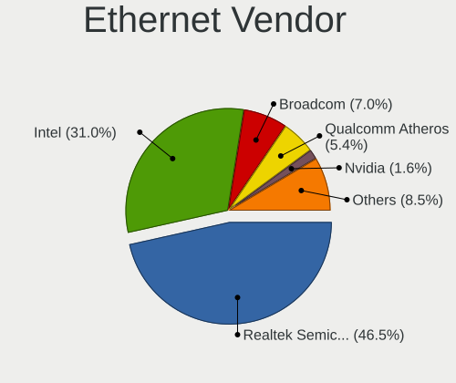

| Vendor                   | Notebooks | Percent |
|--------------------------|-----------|---------|
| Realtek Semiconductor    | 60        | 46.51%  |
| Intel                    | 40        | 31.01%  |
| Broadcom                 | 9         | 6.98%   |
| Qualcomm Atheros         | 7         | 5.43%   |
| Nvidia                   | 2         | 1.55%   |
| Marvell Technology Group | 2         | 1.55%   |
| Lenovo                   | 2         | 1.55%   |
| DisplayLink              | 2         | 1.55%   |
| Broadcom Limited         | 2         | 1.55%   |
| Huawei Technologies      | 1         | 0.78%   |
| Google                   | 1         | 0.78%   |
| ASIX Electronics         | 1         | 0.78%   |

Ethernet Model
--------------

Ethernet models

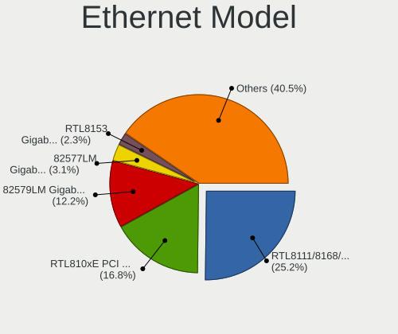

| Model                                                                  | Notebooks | Percent |
|------------------------------------------------------------------------|-----------|---------|
| Realtek RTL8111/8168/8211/8411 PCI Express Gigabit Ethernet Controller | 33        | 25.19%  |
| Realtek RTL810xE PCI Express Fast Ethernet controller                  | 22        | 16.79%  |
| Intel 82579LM Gigabit Network Connection (Lewisville)                  | 16        | 12.21%  |
| Intel 82577LM Gigabit Network Connection                               | 4         | 3.05%   |
| Realtek RTL8153 Gigabit Ethernet Adapter                               | 3         | 2.29%   |
| Intel Ethernet Connection I218-LM                                      | 3         | 2.29%   |
| Intel Ethernet Connection I217-LM                                      | 3         | 2.29%   |
| Intel Ethernet Connection (6) I219-LM                                  | 3         | 2.29%   |
| Intel Ethernet Connection (4) I219-LM                                  | 3         | 2.29%   |
| Broadcom NetXtreme BCM57765 Gigabit Ethernet PCIe                      | 3         | 2.29%   |
| Qualcomm Atheros QCA8171 Gigabit Ethernet                              | 2         | 1.53%   |
| Qualcomm Atheros AR8151 v2.0 Gigabit Ethernet                          | 2         | 1.53%   |
| Lenovo Thinkpad LAN                                                    | 2         | 1.53%   |
| Intel Ethernet Connection (3) I218-LM                                  | 2         | 1.53%   |
| Broadcom NetXtreme BCM5761 Gigabit Ethernet PCIe                       | 2         | 1.53%   |
| Realtek RTL8852CE PCIe 802.11ax Wireless Network Controller            | 1         | 0.76%   |
| Realtek RTL-8100/8101L/8139 PCI Fast Ethernet Adapter                  | 1         | 0.76%   |
| Realtek Killer E2600 GbE Controller                                    | 1         | 0.76%   |
| Qualcomm Atheros QCA8172 Fast Ethernet                                 | 1         | 0.76%   |
| Qualcomm Atheros AR8161 Gigabit Ethernet                               | 1         | 0.76%   |
| Qualcomm Atheros AR8131 Gigabit Ethernet                               | 1         | 0.76%   |
| Nvidia MCP79 Ethernet                                                  | 1         | 0.76%   |
| Nvidia MCP77 Ethernet                                                  | 1         | 0.76%   |
| Marvell Group 88E8053 PCI-E Gigabit Ethernet Controller                | 1         | 0.76%   |
| Marvell Group 88E8040 PCI-E Fast Ethernet Controller                   | 1         | 0.76%   |
| Intel Ethernet Connection (6) I219-V                                   | 1         | 0.76%   |
| Intel Ethernet Connection (4) I219-V                                   | 1         | 0.76%   |
| Intel Ethernet Connection (16) I219-LM                                 | 1         | 0.76%   |
| Intel Ethernet Connection (13) I219-V                                  | 1         | 0.76%   |
| Intel Alder Lake-P PCH CNVi WiFi                                       | 1         | 0.76%   |
| Intel 82579V Gigabit Network Connection                                | 1         | 0.76%   |
| Intel 82573L Gigabit Ethernet Controller                               | 1         | 0.76%   |
| Huawei E353/E3131                                                      | 1         | 0.76%   |
| Google Pixel 9a                                                        | 1         | 0.76%   |
| DisplayLink USB3 to HDMI                                               | 1         | 0.76%   |
| DisplayLink ThinkPad USB 3.0 Dock                                      | 1         | 0.76%   |
| Broadcom NetXtreme BCM57760 Gigabit Ethernet PCIe                      | 1         | 0.76%   |
| Broadcom NetXtreme BCM5752 Gigabit Ethernet PCI Express                | 1         | 0.76%   |
| Broadcom NetLink BCM57785 Gigabit Ethernet PCIe                        | 1         | 0.76%   |
| Broadcom NetLink BCM57780 Gigabit Ethernet PCIe                        | 1         | 0.76%   |

Net Controller Kind
-------------------

Ethernet, WiFi or modem

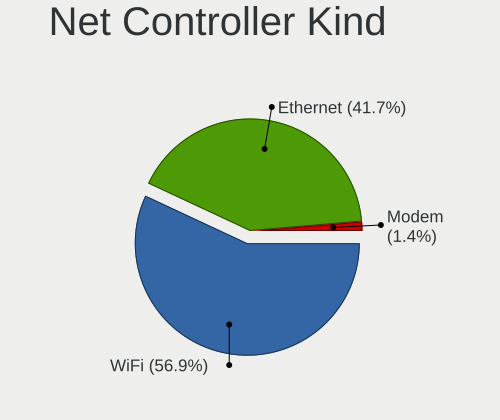

| Kind     | Notebooks | Percent |
|----------|-----------|---------|
| WiFi     | 168       | 56.95%  |
| Ethernet | 123       | 41.69%  |
| Modem    | 4         | 1.36%   |

Used Controller
---------------

Currently used network controller

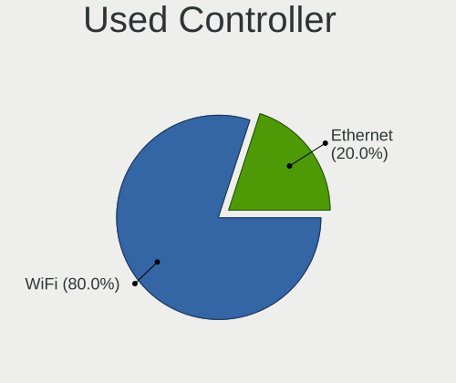

| Kind     | Notebooks | Percent |
|----------|-----------|---------|
| WiFi     | 140       | 80%     |
| Ethernet | 35        | 20%     |

NICs
----

Total network controllers on board

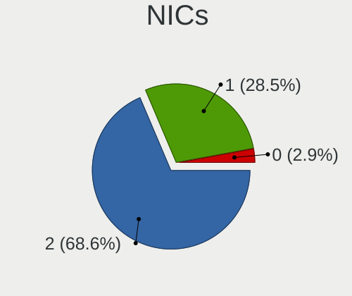

| Total | Notebooks | Percent |
|-------|-----------|---------|
| 2     | 118       | 68.6%   |
| 1     | 49        | 28.49%  |
| 0     | 5         | 2.91%   |

IPv6
----

IPv6 vs IPv4

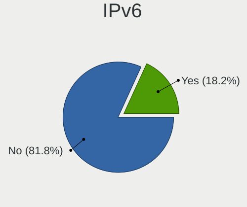

| Used | Notebooks | Percent |
|------|-----------|---------|
| No   | 144       | 81.82%  |
| Yes  | 32        | 18.18%  |

Bluetooth
---------

Bluetooth Vendor
----------------

Controller vendors

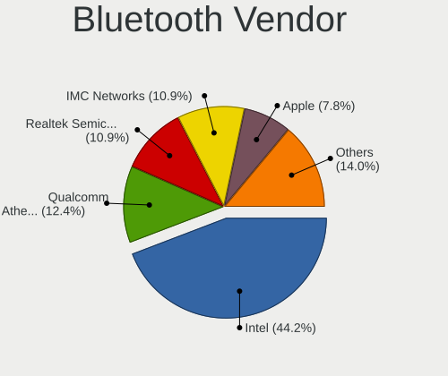

| Vendor                          | Notebooks | Percent |
|---------------------------------|-----------|---------|
| Intel                           | 57        | 44.19%  |
| Qualcomm Atheros Communications | 16        | 12.4%   |
| Realtek Semiconductor           | 14        | 10.85%  |
| IMC Networks                    | 14        | 10.85%  |
| Apple                           | 10        | 7.75%   |
| Dell                            | 7         | 5.43%   |
| Broadcom                        | 6         | 4.65%   |
| Lite-On Technology              | 3         | 2.33%   |
| Hewlett-Packard                 | 2         | 1.55%   |

Bluetooth Model
---------------

Controller models

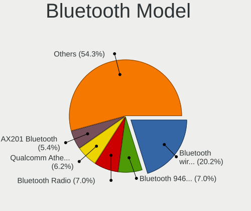

| Model                                             | Notebooks | Percent |
|---------------------------------------------------|-----------|---------|
| Intel Bluetooth wireless interface                | 26        | 20.16%  |
| Intel Bluetooth 9460/9560 Jefferson Peak (JfP)    | 9         | 6.98%   |
| IMC Networks Bluetooth Radio                      | 9         | 6.98%   |
| Qualcomm Atheros  Bluetooth Device                | 8         | 6.2%    |
| Intel AX201 Bluetooth                             | 7         | 5.43%   |
| Realtek  Bluetooth 4.2 Adapter                    | 6         | 4.65%   |
| Realtek Bluetooth Radio                           | 5         | 3.88%   |
| Intel Centrino Bluetooth Wireless Transceiver     | 5         | 3.88%   |
| Intel AX200 Bluetooth                             | 5         | 3.88%   |
| Apple Bluetooth Host Controller                   | 5         | 3.88%   |
| Apple Bluetooth USB Host Controller               | 4         | 3.1%    |
| Qualcomm Atheros AR9462 Bluetooth                 | 3         | 2.33%   |
| Qualcomm Atheros AR3012 Bluetooth 4.0             | 3         | 2.33%   |
| Dell BCM20702A0 Bluetooth Module                  | 3         | 2.33%   |
| Broadcom BCM43142 Bluetooth 4.0                   | 3         | 2.33%   |
| Realtek RTL8723B Bluetooth                        | 2         | 1.55%   |
| Intel Wireless-AC 3168 Bluetooth                  | 2         | 1.55%   |
| HP Broadcom 2070 Bluetooth Combo                  | 2         | 1.55%   |
| Realtek 802.11ac WLAN Adapter                     | 1         | 0.78%   |
| Qualcomm Atheros QCA61x4 Bluetooth 4.0            | 1         | 0.78%   |
| Qualcomm Atheros Bluetooth USB Host Controller    | 1         | 0.78%   |
| Lite-On Wireless_Device                           | 1         | 0.78%   |
| Lite-On Qualcomm Atheros QCA9377 Bluetooth        | 1         | 0.78%   |
| Lite-On Atheros AR3012 Bluetooth                  | 1         | 0.78%   |
| Intel Centrino Advanced-N 6230 Bluetooth adapter  | 1         | 0.78%   |
| Intel Bluetooth Device                            | 1         | 0.78%   |
| Intel AX210 Bluetooth                             | 1         | 0.78%   |
| IMC Networks Wireless_Device                      | 1         | 0.78%   |
| IMC Networks Bluetooth Device                     | 1         | 0.78%   |
| IMC Networks Bluetooth                            | 1         | 0.78%   |
| IMC Networks BCM20702A0                           | 1         | 0.78%   |
| IMC Networks Atheros AR3012 Bluetooth 4.0 Adapter | 1         | 0.78%   |
| Dell Wireless 360 Bluetooth                       | 1         | 0.78%   |
| Dell Wireless 355 Bluetooth                       | 1         | 0.78%   |
| Dell Wireless 350 Bluetooth                       | 1         | 0.78%   |
| Dell DW375 Bluetooth Module                       | 1         | 0.78%   |
| Broadcom HP Portable SoftSailing                  | 1         | 0.78%   |
| Broadcom BCM2045B (BDC-2.1)                       | 1         | 0.78%   |
| Broadcom BCM2045B (BDC-2) [Bluetooth Controller]  | 1         | 0.78%   |
| Apple Bluetooth HCI                               | 1         | 0.78%   |

Sound
-----

Sound Vendor
------------

Sound card vendors

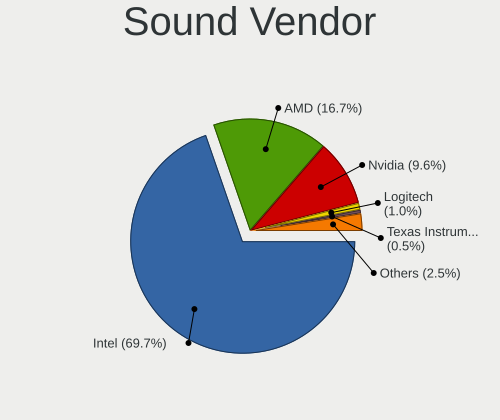

| Vendor                 | Notebooks | Percent |
|------------------------|-----------|---------|
| Intel                  | 138       | 69.7%   |
| AMD                    | 33        | 16.67%  |
| Nvidia                 | 19        | 9.6%    |
| Logitech               | 2         | 1.01%   |
| Texas Instruments      | 1         | 0.51%   |
| Sony                   | 1         | 0.51%   |
| M-Audio                | 1         | 0.51%   |
| Generalplus Technology | 1         | 0.51%   |
| C-Media Electronics    | 1         | 0.51%   |
| ASUSTek Computer       | 1         | 0.51%   |

Sound Model
-----------

Sound card models

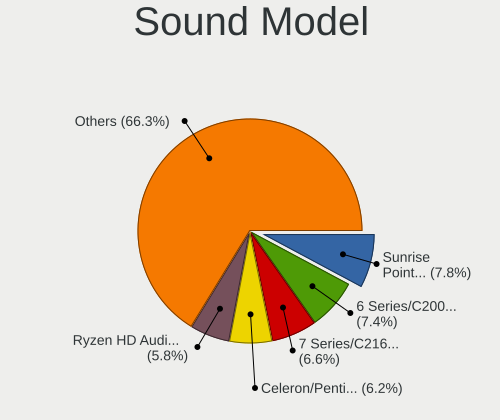

| Model                                                                                             | Notebooks | Percent |
|---------------------------------------------------------------------------------------------------|-----------|---------|
| Intel Sunrise Point-LP HD Audio                                                                   | 19        | 7.82%   |
| Intel 6 Series/C200 Series Chipset Family High Definition Audio Controller                        | 18        | 7.41%   |
| Intel 7 Series/C216 Chipset Family High Definition Audio Controller                               | 16        | 6.58%   |
| Intel Celeron/Pentium Silver Processor High Definition Audio                                      | 15        | 6.17%   |
| AMD Ryzen HD Audio Controller                                                                     | 14        | 5.76%   |
| AMD FCH Azalia Controller                                                                         | 12        | 4.94%   |
| AMD Kabini HDMI/DP Audio                                                                          | 10        | 4.12%   |
| Intel Wildcat Point-LP High Definition Audio Controller                                           | 9         | 3.7%    |
| Intel Broadwell-U Audio Controller                                                                | 9         | 3.7%    |
| Intel Haswell-ULT HD Audio Controller                                                             | 7         | 2.88%   |
| Intel 8 Series HD Audio Controller                                                                | 7         | 2.88%   |
| Intel 5 Series/3400 Series Chipset High Definition Audio                                          | 6         | 2.47%   |
| Intel Xeon E3-1200 v3/4th Gen Core Processor HD Audio Controller                                  | 5         | 2.06%   |
| Intel Tiger Lake-LP Smart Sound Technology Audio Controller                                       | 5         | 2.06%   |
| Intel Cannon Point-LP High Definition Audio Controller                                            | 5         | 2.06%   |
| Intel 8 Series/C220 Series Chipset High Definition Audio Controller                               | 5         | 2.06%   |
| AMD Raven/Raven2/Fenghuang HDMI/DP Audio Controller                                               | 5         | 2.06%   |
| Nvidia TU107 GeForce GTX 1650 High Definition Audio Controller                                    | 4         | 1.65%   |
| Intel NM10/ICH7 Family High Definition Audio Controller                                           | 4         | 1.65%   |
| Intel Cannon Lake PCH cAVS                                                                        | 4         | 1.65%   |
| Intel Atom/Celeron/Pentium Processor x5-E8000/J3xxx/N3xxx Series High Definition Audio Controller | 4         | 1.65%   |
| Intel Atom Processor Z36xxx/Z37xxx Series High Definition Audio Controller                        | 4         | 1.65%   |
| AMD Renoir/Cezanne HDMI/DP Audio Controller                                                       | 4         | 1.65%   |
| Intel Ice Lake-LP Smart Sound Technology Audio Controller                                         | 3         | 1.23%   |
| Intel 82801I (ICH9 Family) HD Audio Controller                                                    | 3         | 1.23%   |
| Intel 82801H (ICH8 Family) HD Audio Controller                                                    | 3         | 1.23%   |
| AMD Family 15h (Models 60h-6fh) Audio Controller                                                  | 3         | 1.23%   |
| Nvidia TU106 High Definition Audio Controller                                                     | 2         | 0.82%   |
| Nvidia GK107 HDMI Audio Controller                                                                | 2         | 0.82%   |
| Nvidia GF119 HDMI Audio Controller                                                                | 2         | 0.82%   |
| Nvidia GA106 High Definition Audio Controller                                                     | 2         | 0.82%   |
| Intel Alder Lake PCH-P High Definition Audio Controller                                           | 2         | 0.82%   |
| Intel 100 Series/C230 Series Chipset Family HD Audio Controller                                   | 2         | 0.82%   |
| AMD Trinity HDMI Audio Controller                                                                 | 2         | 0.82%   |
| AMD Caicos HDMI Audio [Radeon HD 6450 / 7450/8450/8490 OEM / R5 230/235/235X OEM]                 | 2         | 0.82%   |
| Texas Instruments PCM2902 Audio Codec                                                             | 1         | 0.41%   |
| Sony DualShock 4 [CUH-ZCT2x]                                                                      | 1         | 0.41%   |
| Nvidia MCP79 High Definition Audio                                                                | 1         | 0.41%   |
| Nvidia MCP72XE/MCP72P/MCP78U/MCP78S High Definition Audio                                         | 1         | 0.41%   |
| Nvidia GT216 HDMI Audio Controller                                                                | 1         | 0.41%   |

Memory
------

Memory Vendor
-------------

Memory module vendors

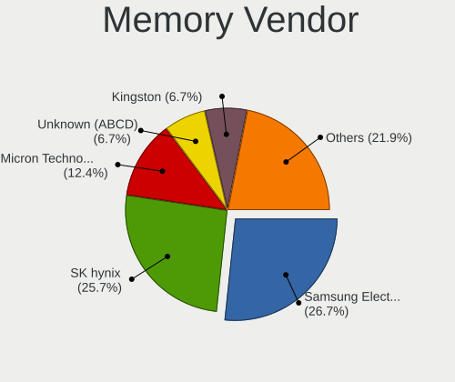

| Vendor              | Notebooks | Percent |
|---------------------|-----------|---------|
| Samsung Electronics | 28        | 26.67%  |
| SK hynix            | 27        | 25.71%  |
| Micron Technology   | 13        | 12.38%  |
| Unknown (ABCD)      | 7         | 6.67%   |
| Kingston            | 7         | 6.67%   |
| Crucial             | 7         | 6.67%   |
| Unknown             | 3         | 2.86%   |
| Ramaxel Technology  | 3         | 2.86%   |
| A-DATA Technology   | 3         | 2.86%   |
| Nanya Technology    | 2         | 1.9%    |
| Unknown             | 2         | 1.9%    |
| Sesame              | 1         | 0.95%   |
| PNY                 | 1         | 0.95%   |
| Heoriady            | 1         | 0.95%   |

Memory Model
------------

Memory module models

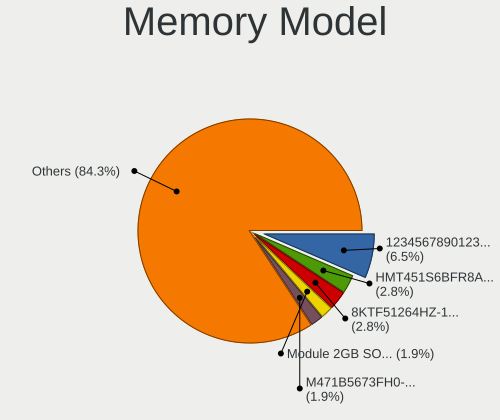

| Model                                                            | Notebooks | Percent |
|------------------------------------------------------------------|-----------|---------|
| Unknown (ABCD) RAM 123456789012345678 2GB SODIMM LPDDR4 2400MT/s | 7         | 6.48%   |
| SK hynix RAM HMT451S6BFR8A-PB 4GB SODIMM DDR3 1600MT/s           | 3         | 2.78%   |
| Micron RAM 8KTF51264HZ-1G6E1 4GB SODIMM DDR3 1600MT/s            | 3         | 2.78%   |
| SK hynix RAM HMT451S6AFR8A-PB 4GB SODIMM DDR3 1600MT/s           | 2         | 1.85%   |
| SK hynix RAM HMT351S6EFR8C-PB 4GB SODIMM DDR3 1600MT/s           | 2         | 1.85%   |
| SK hynix RAM HMT351S6BFR8C-H9 4GB SODIMM DDR3 1333MT/s           | 2         | 1.85%   |
| Samsung RAM Module 2GB SODIMM DDR3 1600MT/s                      | 2         | 1.85%   |
| Samsung RAM M471B5673FH0-CF8 2048MB SODIMM DDR3 1067MT/s         | 2         | 1.85%   |
| Samsung RAM M471B5273EB0-CK0 4GB SODIMM DDR3 4199MT/s            | 2         | 1.85%   |
| Samsung RAM M471B5173DB0-YK0 4GB SODIMM DDR3 1600MT/s            | 2         | 1.85%   |
| Samsung RAM M471A5244CB0-CTD 4GB SODIMM DDR4 3266MT/s            | 2         | 1.85%   |
| Samsung RAM M471A2K43BB1-CPB 16GB SODIMM DDR4 2133MT/s           | 2         | 1.85%   |
| Micron RAM 8ATF1G64HZ-2G6H1 8GB SODIMM DDR4 2667MT/s             | 2         | 1.85%   |
| A-DATA RAM AD73I1B1674EU 2GB SODIMM DDR3 1334MT/s                | 2         | 1.85%   |
| Unknown                                                          | 2         | 1.85%   |
| Unknown RAM Module 8GB SODIMM DDR3 1600MT/s                      | 1         | 0.93%   |
| Unknown RAM Module 4GB SODIMM DDR3 1333MT/s                      | 1         | 0.93%   |
| Unknown RAM Module 2GB SODIMM DRAM 667MT/s                       | 1         | 0.93%   |
| SK hynix RAM Module 8GB SODIMM DDR3 1600MT/s                     | 1         | 0.93%   |
| SK hynix RAM Module 2GB SODIMM DDR3 1333MT/s                     | 1         | 0.93%   |
| SK hynix RAM Module 2GB SODIMM DDR2 667MT/s                      | 1         | 0.93%   |
| SK hynix RAM HYMP125S64CP8-S6 2GB SODIMM DDR2 975MT/s            | 1         | 0.93%   |
| SK hynix RAM HMT451S6MFR8C-PB 4GB SODIMM DDR3 1600MT/s           | 1         | 0.93%   |
| SK hynix RAM HMT451S6CFR6A-PB 4GB SODIMM DDR3 1600MT/s           | 1         | 0.93%   |
| SK hynix RAM HMT425S6CFR6A-PB 2GB SODIMM DDR3 1600MT/s           | 1         | 0.93%   |
| SK hynix RAM HMT41GS6AFR8A-PB 8GB SODIMM DDR3 1600MT/s           | 1         | 0.93%   |
| SK hynix RAM HMT351S6CFR8C-PB 4GB SODIMM DDR3 1600MT/s           | 1         | 0.93%   |
| SK hynix RAM HMT351S6CFR8C-H9 4GB SODIMM DDR3 1333MT/s           | 1         | 0.93%   |
| SK hynix RAM HMAA1GS6CMR6N-VK 8GB SODIMM DDR4 2667MT/s           | 1         | 0.93%   |
| SK hynix RAM HMA851S6DJR6N-XN 4GB Row Of Chips DDR4 3200MT/s     | 1         | 0.93%   |
| SK hynix RAM HMA851S6AFR6N-UH 4GB SODIMM DDR4 2667MT/s           | 1         | 0.93%   |
| SK hynix RAM HMA851S6AFR6N-UH 4GB SODIMM DDR4 2400MT/s           | 1         | 0.93%   |
| SK hynix RAM HMA82GS6AFR8N-UH 16GB SODIMM DDR4 2667MT/s          | 1         | 0.93%   |
| SK hynix RAM HMA81GS6JJR8N-VK 8GB SODIMM DDR4 2667MT/s           | 1         | 0.93%   |
| SK hynix RAM HMA81GS6DJR8N-XN 8GB SODIMM DDR4 3200MT/s           | 1         | 0.93%   |
| SK hynix RAM HMA81GS6AFR8N-UH 8GB SODIMM DDR4 2667MT/s           | 1         | 0.93%   |
| SK hynix RAM H9CCNNNBJTALAR-NUD 4GB Row Of Chips LPDDR3 1867MT/s | 1         | 0.93%   |
| Sesame RAM S939A2SGS-ITR 8GB SODIMM DDR4 2667MT/s                | 1         | 0.93%   |
| Samsung RAM U6E3S4AA-MGCR 1GB Row Of Chips LPDDR4 4267MT/s       | 1         | 0.93%   |
| Samsung RAM Module 4GB Row Of Chips LPDDR3 2133MT/s              | 1         | 0.93%   |

Memory Kind
-----------

Memory module kinds

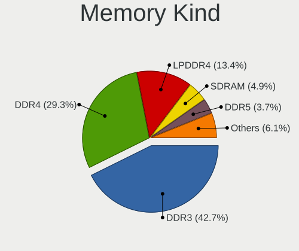

| Kind   | Notebooks | Percent |
|--------|-----------|---------|
| DDR3   | 35        | 42.68%  |
| DDR4   | 24        | 29.27%  |
| LPDDR4 | 11        | 13.41%  |
| SDRAM  | 4         | 4.88%   |
| DDR5   | 3         | 3.66%   |
| LPDDR3 | 2         | 2.44%   |
| DDR2   | 2         | 2.44%   |
| DRAM   | 1         | 1.22%   |

Memory Form Factor
------------------

Physical design of the memory module

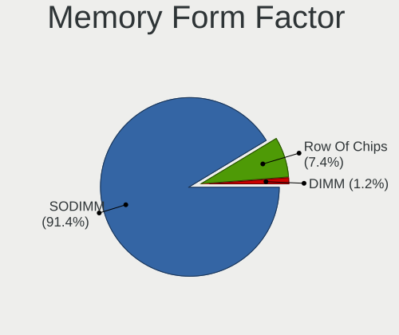

| Name         | Notebooks | Percent |
|--------------|-----------|---------|
| SODIMM       | 74        | 91.36%  |
| Row Of Chips | 6         | 7.41%   |
| DIMM         | 1         | 1.23%   |

Memory Size
-----------

Memory module size

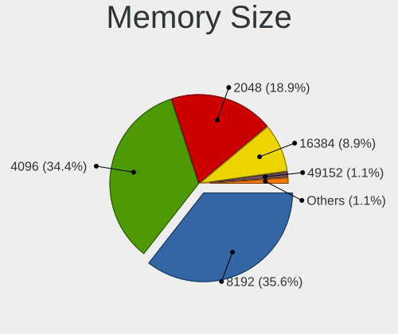

| Size  | Notebooks | Percent |
|-------|-----------|---------|
| 8192  | 32        | 35.56%  |
| 4096  | 31        | 34.44%  |
| 2048  | 17        | 18.89%  |
| 16384 | 8         | 8.89%   |
| 49152 | 1         | 1.11%   |
| 1024  | 1         | 1.11%   |

Memory Speed
------------

Memory module speed

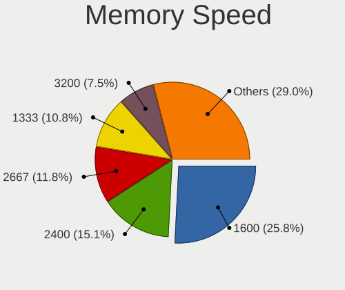

| Speed | Notebooks | Percent |
|-------|-----------|---------|
| 1600  | 24        | 25.81%  |
| 2400  | 14        | 15.05%  |
| 2667  | 11        | 11.83%  |
| 1333  | 10        | 10.75%  |
| 3200  | 7         | 7.53%   |
| 2133  | 5         | 5.38%   |
| 1334  | 4         | 4.3%    |
| 4199  | 3         | 3.23%   |
| 1067  | 3         | 3.23%   |
| 5600  | 2         | 2.15%   |
| 4267  | 2         | 2.15%   |
| 3266  | 2         | 2.15%   |
| 667   | 2         | 2.15%   |
| 4800  | 1         | 1.08%   |
| 2048  | 1         | 1.08%   |
| 1867  | 1         | 1.08%   |
| 975   | 1         | 1.08%   |

Printers & scanners
-------------------

Printer Vendor
--------------

Printer device vendors

Zero info for selected period =(

Printer Model
-------------

Printer device models

Zero info for selected period =(

Scanner Vendor
--------------

Scanner device vendors

Zero info for selected period =(

Scanner Model
-------------

Scanner device models

Zero info for selected period =(

Camera
------

Camera Vendor
-------------

Camera device vendors

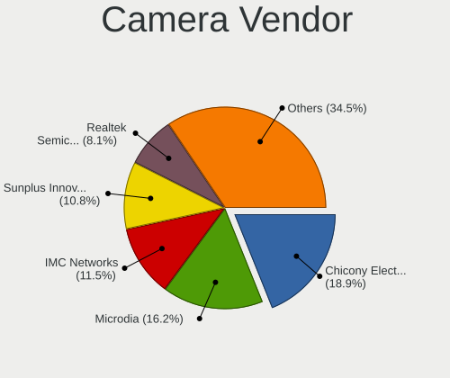

| Vendor                                 | Notebooks | Percent |
|----------------------------------------|-----------|---------|
| Chicony Electronics                    | 28        | 18.92%  |
| Microdia                               | 24        | 16.22%  |
| IMC Networks                           | 17        | 11.49%  |
| Sunplus Innovation Technology          | 16        | 10.81%  |
| Realtek Semiconductor                  | 12        | 8.11%   |
| Suyin                                  | 9         | 6.08%   |
| Apple                                  | 7         | 4.73%   |
| Cheng Uei Precision Industry (Foxlink) | 6         | 4.05%   |
| Syntek                                 | 4         | 2.7%    |
| Silicon Motion                         | 3         | 2.03%   |
| Ricoh                                  | 3         | 2.03%   |
| Quanta                                 | 3         | 2.03%   |
| Primax Electronics                     | 2         | 1.35%   |
| Bison Electronics                      | 2         | 1.35%   |
| USB CAMERA                             | 1         | 0.68%   |
| Sonix Technology                       | 1         | 0.68%   |
| Shinetech                              | 1         | 0.68%   |
| Samsung Electronics                    | 1         | 0.68%   |
| OmniVision Technologies                | 1         | 0.68%   |
| MacroSilicon                           | 1         | 0.68%   |
| Logitech                               | 1         | 0.68%   |
| Lite-On Technology                     | 1         | 0.68%   |
| icSpring                               | 1         | 0.68%   |
| globaloptics                           | 1         | 0.68%   |
| Generalplus Technology                 | 1         | 0.68%   |
| Alcor Micro                            | 1         | 0.68%   |

Camera Model
------------

Camera device models

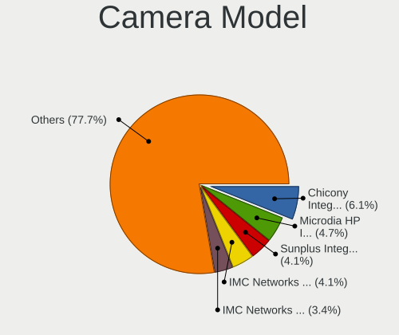

| Model                                                           | Notebooks | Percent |
|-----------------------------------------------------------------|-----------|---------|
| Chicony Integrated Camera                                       | 9         | 6.08%   |
| Microdia HP Integrated Webcam                                   | 7         | 4.73%   |
| Sunplus Integrated_Webcam_HD                                    | 6         | 4.05%   |
| IMC Networks USB2.0 HD UVC WebCam                               | 6         | 4.05%   |
| IMC Networks Integrated Camera                                  | 5         | 3.38%   |
| Microdia Integrated_Webcam_HD                                   | 4         | 2.7%    |
| Sunplus Laptop_Integrated_Webcam_FHD                            | 3         | 2.03%   |
| Microdia Dell Integrated HD Webcam                              | 3         | 2.03%   |
| IMC Networks HP TrueVision HD Camera                            | 3         | 2.03%   |
| Chicony USB2.0 HD UVC WebCam                                    | 3         | 2.03%   |
| Chicony Integrated HP HD Webcam                                 | 3         | 2.03%   |
| Chicony HP TrueVision HD                                        | 3         | 2.03%   |
| Apple FaceTime HD Camera                                        | 3         | 2.03%   |
| Syntek Lenovo EasyCamera                                        | 2         | 1.35%   |
| Suyin Laptop_Integrated_Webcam_HD                               | 2         | 1.35%   |
| Suyin Integrated_Webcam_HD                                      | 2         | 1.35%   |
| Realtek USB2.0 camera                                           | 2         | 1.35%   |
| Realtek Integrated Webcam HD                                    | 2         | 1.35%   |
| Realtek Integrated Webcam                                       | 2         | 1.35%   |
| Microdia Sonix USB 2.0 Camera                                   | 2         | 1.35%   |
| Microdia Integrated Webcam                                      | 2         | 1.35%   |
| Chicony HD WebCam                                               | 2         | 1.35%   |
| Chicony HD User Facing                                          | 2         | 1.35%   |
| Cheng Uei Precision Industry (Foxlink) HP Wide Vision HD Camera | 2         | 1.35%   |
| Cheng Uei Precision Industry (Foxlink) HP TrueVision HD Camera  | 2         | 1.35%   |
| Apple iPhone 5/5C/5S/6/SE/7/8/X                                 | 2         | 1.35%   |
| USB CAMERA USB CAMERA                                           | 1         | 0.68%   |
| Syntek Integrated Camera                                        | 1         | 0.68%   |
| Syntek EasyCamera                                               | 1         | 0.68%   |
| Suyin VGA Webcam                                                | 1         | 0.68%   |
| Suyin TOSHIBA Web Camera - HD                                   | 1         | 0.68%   |
| Suyin HP TrueVision HD                                          | 1         | 0.68%   |
| Suyin Acer/Lenovo Webcam [CN0316]                               | 1         | 0.68%   |
| Suyin 1.3M HD WebCam                                            | 1         | 0.68%   |
| Sunplus USB 2.0 Camera                                          | 1         | 0.68%   |
| Sunplus Laptop_Integrated_Webcam_HD                             | 1         | 0.68%   |
| Sunplus Laptop_Integrated_Webcam_1.3M                           | 1         | 0.68%   |
| Sunplus Integrated_Webcam_FHD                                   | 1         | 0.68%   |
| Sunplus HP Wide Vision HD                                       | 1         | 0.68%   |
| Sunplus ASUS Webcam                                             | 1         | 0.68%   |

Security
--------

Fingerprint Vendor
------------------

Fingerprint sensor vendors

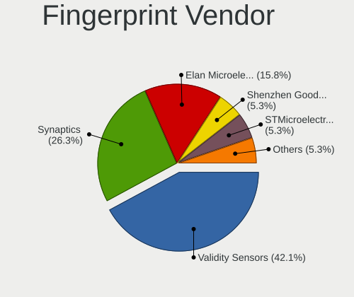

| Vendor                     | Notebooks | Percent |
|----------------------------|-----------|---------|
| Validity Sensors           | 8         | 42.11%  |
| Synaptics                  | 5         | 26.32%  |
| Elan Microelectronics      | 3         | 15.79%  |
| STMicroelectronics         | 1         | 5.26%   |
| Shenzhen Goodix Technology | 1         | 5.26%   |
| LighTuning Technology      | 1         | 5.26%   |

Fingerprint Model
-----------------

Fingerprint sensor models

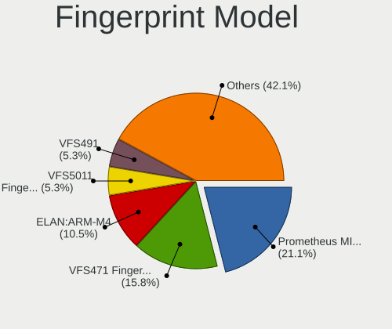

| Model                                             | Notebooks | Percent |
|---------------------------------------------------|-----------|---------|
| Synaptics Prometheus MIS Touch Fingerprint Reader | 4         | 21.05%  |
| Validity Sensors VFS471 Fingerprint Reader        | 3         | 15.79%  |
| Elan ELAN:ARM-M4                                  | 2         | 10.53%  |
| Validity Sensors VFS5011 Fingerprint Reader       | 1         | 5.26%   |
| Validity Sensors VFS491                           | 1         | 5.26%   |
| Validity Sensors VFS451 Fingerprint Reader        | 1         | 5.26%   |
| Validity Sensors Synaptics WBDI                   | 1         | 5.26%   |
| Validity Sensors Fingerprint scanner              | 1         | 5.26%   |
| Synaptics Metallica MIS Touch Fingerprint Reader  | 1         | 5.26%   |
| STMicroelectronics Fingerprint Reader             | 1         | 5.26%   |
| Shenzhen Goodix  FingerPrint Device               | 1         | 5.26%   |
| LighTuning ES603 Swipe Fingerprint Sensor         | 1         | 5.26%   |
| Elan ELAN:Fingerprint                             | 1         | 5.26%   |

Chipcard Vendor
---------------

Chipcard module vendors

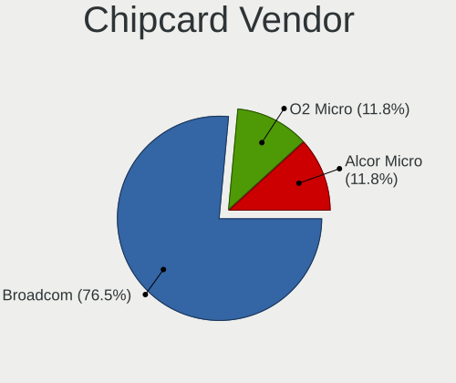

| Vendor      | Notebooks | Percent |
|-------------|-----------|---------|
| Broadcom    | 13        | 76.47%  |
| O2 Micro    | 2         | 11.76%  |
| Alcor Micro | 2         | 11.76%  |

Chipcard Model
--------------

Chipcard module models

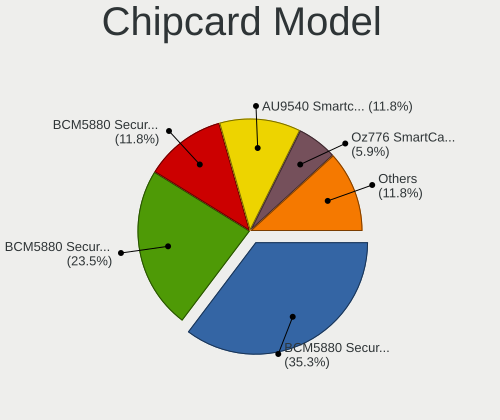

| Model                                                                        | Notebooks | Percent |
|------------------------------------------------------------------------------|-----------|---------|
| Broadcom BCM5880 Secure Applications Processor                               | 6         | 35.29%  |
| Broadcom BCM5880 Secure Applications Processor with fingerprint swipe sensor | 4         | 23.53%  |
| Broadcom BCM5880 Secure Applications Processor with fingerprint touch sensor | 2         | 11.76%  |
| Alcor Micro AU9540 Smartcard Reader                                          | 2         | 11.76%  |
| O2 Micro Oz776 SmartCard Reader                                              | 1         | 5.88%   |
| O2 Micro OZ776 CCID Smartcard Reader                                         | 1         | 5.88%   |
| Broadcom BCM58200 ControlVault 3 (FingerPrint sensor + Contacted SmartCard)  | 1         | 5.88%   |

Unsupported
-----------

Unsupported Devices
-------------------

Total unsupported devices on board

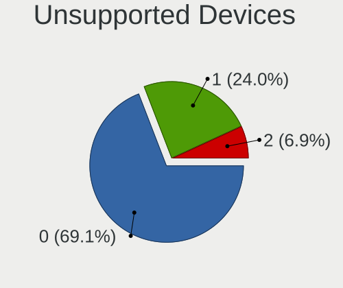

| Total | Notebooks | Percent |
|-------|-----------|---------|
| 0     | 121       | 69.14%  |
| 1     | 42        | 24%     |
| 2     | 12        | 6.86%   |

Unsupported Device Types
------------------------

Types of unsupported devices

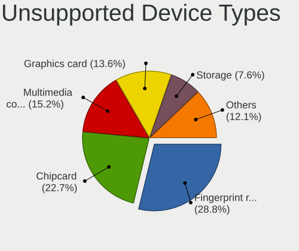

| Type                  | Notebooks | Percent |
|-----------------------|-----------|---------|
| Fingerprint reader    | 19        | 28.79%  |
| Chipcard              | 15        | 22.73%  |
| Multimedia controller | 10        | 15.15%  |
| Graphics card         | 9         | 13.64%  |
| Storage               | 5         | 7.58%   |
| Net/wireless          | 4         | 6.06%   |
| Card reader           | 2         | 3.03%   |
| Camera                | 1         | 1.52%   |
| Bluetooth             | 1         | 1.52%   |

