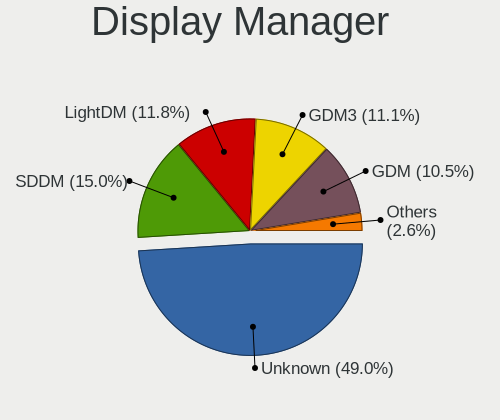
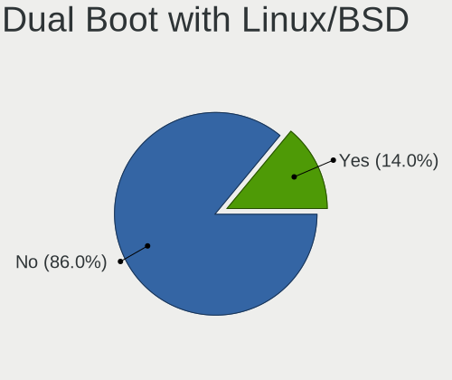
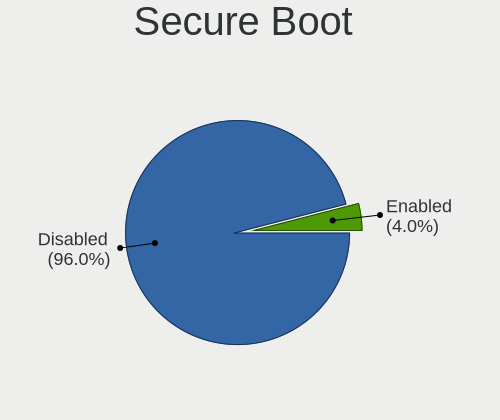
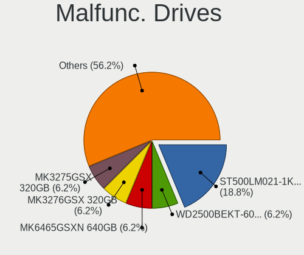
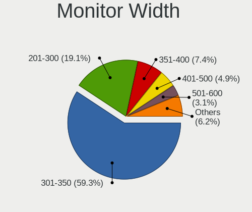
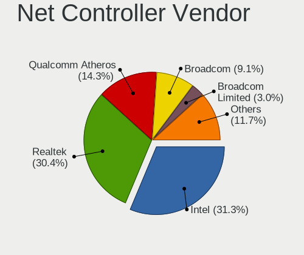
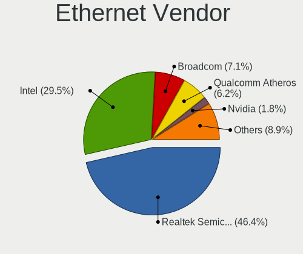
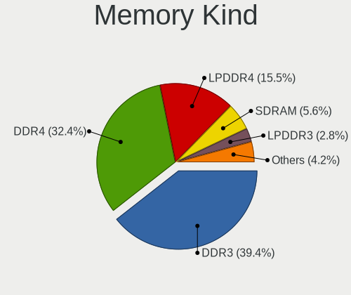

Linux in Dominican Republic - Tested Hardware & Statistics (Notebooks)
----------------------------------------------------------------------

A project to collect tested hardware configurations for Linux in Dominican Republic.

Anyone can contribute to this report by the [hw-probe](https://github.com/linuxhw/hw-probe) tool:

    sudo -E hw-probe -all -upload

Please contribute! Especially if your hardware is rare.

Contents
--------

* [ Test Cases ](#test-cases)

* [ System ](#system)
  - [ OS                       ](#os)
  - [ OS Family                ](#os-family)
  - [ Kernel                   ](#kernel)
  - [ Kernel Family            ](#kernel-family)
  - [ Kernel Major Ver.        ](#kernel-major-ver)
  - [ Arch                     ](#arch)
  - [ DE                       ](#de)
  - [ Display Server           ](#display-server)
  - [ Display Manager          ](#display-manager)
  - [ OS Lang                  ](#os-lang)
  - [ Boot Mode                ](#boot-mode)
  - [ Filesystem               ](#filesystem)
  - [ Part. scheme             ](#part-scheme)
  - [ Dual Boot with Linux/BSD ](#dual-boot-with-linuxbsd)
  - [ Dual Boot (Win)          ](#dual-boot-win)

* [ Board ](#board)
  - [ Vendor                   ](#vendor)
  - [ Model                    ](#model)
  - [ Model Family             ](#model-family)
  - [ MFG Year                 ](#mfg-year)
  - [ Form Factor              ](#form-factor)
  - [ Secure Boot              ](#secure-boot)
  - [ Coreboot                 ](#coreboot)
  - [ RAM Size                 ](#ram-size)
  - [ RAM Used                 ](#ram-used)
  - [ Total Drives             ](#total-drives)
  - [ Has CD-ROM               ](#has-cd-rom)
  - [ Has Ethernet             ](#has-ethernet)
  - [ Has WiFi                 ](#has-wifi)
  - [ Has Bluetooth            ](#has-bluetooth)

* [ Location ](#location)
  - [ Country                  ](#country)
  - [ City                     ](#city)

* [ Drives ](#drives)
  - [ Drive Vendor             ](#drive-vendor)
  - [ Drive Model              ](#drive-model)
  - [ HDD Vendor               ](#hdd-vendor)
  - [ SSD Vendor               ](#ssd-vendor)
  - [ Drive Kind               ](#drive-kind)
  - [ Drive Connector          ](#drive-connector)
  - [ Drive Size               ](#drive-size)
  - [ Space Total              ](#space-total)
  - [ Space Used               ](#space-used)
  - [ Malfunc. Drives          ](#malfunc-drives)
  - [ Malfunc. Drive Vendor    ](#malfunc-drive-vendor)
  - [ Malfunc. HDD Vendor      ](#malfunc-hdd-vendor)
  - [ Malfunc. Drive Kind      ](#malfunc-drive-kind)
  - [ Failed Drives            ](#failed-drives)
  - [ Failed Drive Vendor      ](#failed-drive-vendor)
  - [ Drive Status             ](#drive-status)

* [ Storage controller ](#storage-controller)
  - [ Storage Vendor           ](#storage-vendor)
  - [ Storage Model            ](#storage-model)
  - [ Storage Kind             ](#storage-kind)

* [ Processor ](#processor)
  - [ CPU Vendor               ](#cpu-vendor)
  - [ CPU Model                ](#cpu-model)
  - [ CPU Model Family         ](#cpu-model-family)
  - [ CPU Cores                ](#cpu-cores)
  - [ CPU Sockets              ](#cpu-sockets)
  - [ CPU Threads              ](#cpu-threads)
  - [ CPU Op-Modes             ](#cpu-op-modes)
  - [ CPU Microcode            ](#cpu-microcode)
  - [ CPU Microarch            ](#cpu-microarch)

* [ Graphics ](#graphics)
  - [ GPU Vendor               ](#gpu-vendor)
  - [ GPU Model                ](#gpu-model)
  - [ GPU Combo                ](#gpu-combo)
  - [ GPU Driver               ](#gpu-driver)
  - [ GPU Memory               ](#gpu-memory)

* [ Monitor ](#monitor)
  - [ Monitor Vendor           ](#monitor-vendor)
  - [ Monitor Model            ](#monitor-model)
  - [ Monitor Resolution       ](#monitor-resolution)
  - [ Monitor Diagonal         ](#monitor-diagonal)
  - [ Monitor Width            ](#monitor-width)
  - [ Aspect Ratio             ](#aspect-ratio)
  - [ Monitor Area             ](#monitor-area)
  - [ Pixel Density            ](#pixel-density)
  - [ Multiple Monitors        ](#multiple-monitors)

* [ Network ](#network)
  - [ Net Controller Vendor    ](#net-controller-vendor)
  - [ Net Controller Model     ](#net-controller-model)
  - [ Wireless Vendor          ](#wireless-vendor)
  - [ Wireless Model           ](#wireless-model)
  - [ Ethernet Vendor          ](#ethernet-vendor)
  - [ Ethernet Model           ](#ethernet-model)
  - [ Net Controller Kind      ](#net-controller-kind)
  - [ Used Controller          ](#used-controller)
  - [ NICs                     ](#nics)
  - [ IPv6                     ](#ipv6)

* [ Bluetooth ](#bluetooth)
  - [ Bluetooth Vendor         ](#bluetooth-vendor)
  - [ Bluetooth Model          ](#bluetooth-model)

* [ Sound ](#sound)
  - [ Sound Vendor             ](#sound-vendor)
  - [ Sound Model              ](#sound-model)

* [ Memory ](#memory)
  - [ Memory Vendor            ](#memory-vendor)
  - [ Memory Model             ](#memory-model)
  - [ Memory Kind              ](#memory-kind)
  - [ Memory Form Factor       ](#memory-form-factor)
  - [ Memory Size              ](#memory-size)
  - [ Memory Speed             ](#memory-speed)

* [ Printers & scanners ](#printers--scanners)
  - [ Printer Vendor           ](#printer-vendor)
  - [ Printer Model            ](#printer-model)
  - [ Scanner Vendor           ](#scanner-vendor)
  - [ Scanner Model            ](#scanner-model)

* [ Camera ](#camera)
  - [ Camera Vendor            ](#camera-vendor)
  - [ Camera Model             ](#camera-model)

* [ Security ](#security)
  - [ Fingerprint Vendor       ](#fingerprint-vendor)
  - [ Fingerprint Model        ](#fingerprint-model)
  - [ Chipcard Vendor          ](#chipcard-vendor)
  - [ Chipcard Model           ](#chipcard-model)

* [ Unsupported ](#unsupported)
  - [ Unsupported Devices      ](#unsupported-devices)
  - [ Unsupported Device Types ](#unsupported-device-types)

Test Cases
----------

Total: 145

| Vendor        | Model                       | Probe                                                      | Date         |
|---------------|-----------------------------|------------------------------------------------------------|--------------|
| HP            | EliteBook 8460p             | [ea7f9b7eef](https://linux-hardware.org/?probe=ea7f9b7eef) | Apr 20, 2023 |
| HP            | EliteBook 8460p             | [d3526466e8](https://linux-hardware.org/?probe=d3526466e8) | Apr 20, 2023 |
| HP            | Laptop 14-dk1xxx            | [b7e04c4c41](https://linux-hardware.org/?probe=b7e04c4c41) | Apr 12, 2023 |
| Lenovo        | IdeaPad 330S-15IKB 81F5     | [4b7801e829](https://linux-hardware.org/?probe=4b7801e829) | Mar 22, 2023 |
| Unknown       | Unknown                     | [7a44108d05](https://linux-hardware.org/?probe=7a44108d05) | Mar 16, 2023 |
| VTEX          | NOTEBOOK                    | [0b91c54846](https://linux-hardware.org/?probe=0b91c54846) | Mar 07, 2023 |
| VTEX          | NOTEBOOK                    | [4687219ca3](https://linux-hardware.org/?probe=4687219ca3) | Mar 07, 2023 |
| VTEX          | NOTEBOOK                    | [687328ccb0](https://linux-hardware.org/?probe=687328ccb0) | Mar 06, 2023 |
| VTEX          | NOTEBOOK                    | [b12a53ec1e](https://linux-hardware.org/?probe=b12a53ec1e) | Mar 06, 2023 |
| HP            | ProBook 4520s               | [8192287499](https://linux-hardware.org/?probe=8192287499) | Feb 19, 2023 |
| Dell          | Inspiron 5520               | [6de5bc549f](https://linux-hardware.org/?probe=6de5bc549f) | Jan 29, 2023 |
| Google        | Kip                         | [b450bb3bcf](https://linux-hardware.org/?probe=b450bb3bcf) | Jan 24, 2023 |
| Google        | Kip                         | [bf5c5ab5e6](https://linux-hardware.org/?probe=bf5c5ab5e6) | Jan 24, 2023 |
| Lenovo        | ThinkPad T420s 41732BU      | [fb42067a32](https://linux-hardware.org/?probe=fb42067a32) | Jan 20, 2023 |
| Google        | Kip                         | [e74935629a](https://linux-hardware.org/?probe=e74935629a) | Jan 17, 2023 |
| Google        | Kip                         | [558cff5048](https://linux-hardware.org/?probe=558cff5048) | Jan 17, 2023 |
| HP            | 255 G6 Notebook PC          | [4d2e9f3ee4](https://linux-hardware.org/?probe=4d2e9f3ee4) | Jan 16, 2023 |
| Dell          | XPS M1330                   | [e3d66114f6](https://linux-hardware.org/?probe=e3d66114f6) | Jan 10, 2023 |
| Dell          | Latitude 5420               | [9fd9875465](https://linux-hardware.org/?probe=9fd9875465) | Dec 23, 2022 |
| Lenovo        | IdeaPad 3 15ALC6 82KU       | [f9020b8dc6](https://linux-hardware.org/?probe=f9020b8dc6) | Dec 01, 2022 |
| Lenovo        | ThinkPad T420s 41732BU      | [ac7791c167](https://linux-hardware.org/?probe=ac7791c167) | Nov 24, 2022 |
| ASUSTek       | VivoBook 17_ASUS Laptop ... | [1a1f5f8d90](https://linux-hardware.org/?probe=1a1f5f8d90) | Nov 22, 2022 |
| ASUSTek       | VivoBook 17_ASUS Laptop ... | [b2772ed1b3](https://linux-hardware.org/?probe=b2772ed1b3) | Nov 22, 2022 |
| Lenovo        | ThinkPad T490 20N3S7BC02    | [76a37f4e66](https://linux-hardware.org/?probe=76a37f4e66) | Nov 19, 2022 |
| Dell          | Latitude 5590               | [bbb332cf90](https://linux-hardware.org/?probe=bbb332cf90) | Nov 11, 2022 |
| Eluktronic... | P670RE3                     | [d96ecdf7ab](https://linux-hardware.org/?probe=d96ecdf7ab) | Nov 08, 2022 |
| MSI           | GE62 6QC                    | [92ac4fbaa6](https://linux-hardware.org/?probe=92ac4fbaa6) | Oct 19, 2022 |
| EVOO          | EV-C-116-7                  | [ff4216edcd](https://linux-hardware.org/?probe=ff4216edcd) | Oct 18, 2022 |
| Dell          | Inspiron 5570               | [cab829a52b](https://linux-hardware.org/?probe=cab829a52b) | Oct 10, 2022 |
| ASUSTek       | VivoBook_ASUSLaptop X512... | [923a579655](https://linux-hardware.org/?probe=923a579655) | Oct 03, 2022 |
| Dell          | Latitude 2110               | [3fbbac2c8a](https://linux-hardware.org/?probe=3fbbac2c8a) | Oct 03, 2022 |
| Dell          | Latitude E6540              | [08bd609dbe](https://linux-hardware.org/?probe=08bd609dbe) | Sep 20, 2022 |
| Dell          | Latitude E6420              | [3ea84baba3](https://linux-hardware.org/?probe=3ea84baba3) | Sep 09, 2022 |
| Dell          | Latitude E6420              | [78fd24b713](https://linux-hardware.org/?probe=78fd24b713) | Sep 09, 2022 |
| Acer          | Aspire A515-45              | [9e48793165](https://linux-hardware.org/?probe=9e48793165) | Aug 18, 2022 |
| Acer          | Aspire A515-45              | [47dee227ba](https://linux-hardware.org/?probe=47dee227ba) | Jul 28, 2022 |
| Dell          | Latitude E5440              | [c8e68471c1](https://linux-hardware.org/?probe=c8e68471c1) | Jul 16, 2022 |
| Acer          | Aspire E5-571               | [9cd0caeff2](https://linux-hardware.org/?probe=9cd0caeff2) | Jul 14, 2022 |
| ECS           | ClassMate                   | [c86fa72fe1](https://linux-hardware.org/?probe=c86fa72fe1) | Jun 13, 2022 |
| Lenovo        | G505s 20255                 | [578aee86ed](https://linux-hardware.org/?probe=578aee86ed) | May 27, 2022 |
| MSI           | CR70 2M/CX70 2OC/CX70 2O... | [c72447a3ea](https://linux-hardware.org/?probe=c72447a3ea) | May 03, 2022 |
| TODOS INDU... | Easytouch_2022_V1           | [efc26220c4](https://linux-hardware.org/?probe=efc26220c4) | May 01, 2022 |
| MSI           | CR70 2M/CX70 2OC/CX70 2O... | [454226474b](https://linux-hardware.org/?probe=454226474b) | Apr 29, 2022 |
| HP            | ENVY Laptop 13-ad0xx        | [9d5011b41d](https://linux-hardware.org/?probe=9d5011b41d) | Mar 23, 2022 |
| ASUSTek       | K53E                        | [3a0af085ae](https://linux-hardware.org/?probe=3a0af085ae) | Mar 17, 2022 |
| Lenovo        | IdeaPad 320-15IKB 80XL      | [507f27294e](https://linux-hardware.org/?probe=507f27294e) | Feb 15, 2022 |
| EVOO          | EV-C-116-7                  | [3fe03ac079](https://linux-hardware.org/?probe=3fe03ac079) | Jan 03, 2022 |
| Lenovo        | ThinkPad T480s 20L7CTO1W... | [563f0e150e](https://linux-hardware.org/?probe=563f0e150e) | Dec 31, 2021 |
| Apple         | MacBookPro8,1               | [56d0201ca6](https://linux-hardware.org/?probe=56d0201ca6) | Dec 29, 2021 |
| Apple         | MacBookPro8,1               | [21f95ee091](https://linux-hardware.org/?probe=21f95ee091) | Dec 25, 2021 |
| Acer          | Aspire 5733Z                | [ea7511ce8d](https://linux-hardware.org/?probe=ea7511ce8d) | Dec 24, 2021 |
| Apple         | MacBookPro8,1               | [8e773bb4e5](https://linux-hardware.org/?probe=8e773bb4e5) | Dec 23, 2021 |
| Apple         | MacBookPro8,1               | [9f084a2062](https://linux-hardware.org/?probe=9f084a2062) | Dec 19, 2021 |
| HP            | Pavilion Gaming Laptop 1... | [9b89720cb4](https://linux-hardware.org/?probe=9b89720cb4) | Dec 14, 2021 |
| Lenovo        | G505s 20255                 | [b32fd5f07f](https://linux-hardware.org/?probe=b32fd5f07f) | Dec 07, 2021 |
| Lenovo        | ThinkPad T480s 20L7CTO1W... | [d1843d03ba](https://linux-hardware.org/?probe=d1843d03ba) | Dec 04, 2021 |
| Lenovo        | ThinkPad T410 2537N99       | [a77255409f](https://linux-hardware.org/?probe=a77255409f) | Dec 02, 2021 |
| Lenovo        | ThinkPad T410 2537N99       | [ef02c2fb6c](https://linux-hardware.org/?probe=ef02c2fb6c) | Dec 02, 2021 |
| Lenovo        | G505s 20255                 | [8d3228452b](https://linux-hardware.org/?probe=8d3228452b) | Nov 20, 2021 |
| Lenovo        | ThinkPad T470 20HD004AUS    | [80fb4514c5](https://linux-hardware.org/?probe=80fb4514c5) | Oct 23, 2021 |
| Dell          | Latitude E6410              | [bd65cdda08](https://linux-hardware.org/?probe=bd65cdda08) | Oct 08, 2021 |
| Apple         | MacBook2,1                  | [7b2dcf44d9](https://linux-hardware.org/?probe=7b2dcf44d9) | Sep 08, 2021 |
| HP            | Pavilion dv6                | [5038083b91](https://linux-hardware.org/?probe=5038083b91) | Sep 07, 2021 |
| Apple         | MacBook2,1                  | [e402a0b407](https://linux-hardware.org/?probe=e402a0b407) | Aug 31, 2021 |
| Dell          | Inspiron 5521               | [24bfc2b04a](https://linux-hardware.org/?probe=24bfc2b04a) | Aug 26, 2021 |
| Dell          | Inspiron 5521               | [8242b46551](https://linux-hardware.org/?probe=8242b46551) | Jul 29, 2021 |
| Google        | Winky                       | [696230b066](https://linux-hardware.org/?probe=696230b066) | Jul 14, 2021 |
| Google        | Winky                       | [6048ac2ff9](https://linux-hardware.org/?probe=6048ac2ff9) | Jul 14, 2021 |
| Acer          | Aspire 1810TZ               | [3ed828bab0](https://linux-hardware.org/?probe=3ed828bab0) | Jul 11, 2021 |
| Acer          | Aspire 1810TZ               | [9b650cfab3](https://linux-hardware.org/?probe=9b650cfab3) | Jul 11, 2021 |
| Dell          | Latitude E6420              | [fe42f53d85](https://linux-hardware.org/?probe=fe42f53d85) | Jul 11, 2021 |
| Dell          | Inspiron N5050              | [772842d291](https://linux-hardware.org/?probe=772842d291) | Jul 06, 2021 |
| HP            | EliteBook 8460p             | [cc6035ae99](https://linux-hardware.org/?probe=cc6035ae99) | Jun 28, 2021 |
| SAELITE       | ES1AU11                     | [267ea9c15e](https://linux-hardware.org/?probe=267ea9c15e) | Jun 26, 2021 |
| SAELITE       | ES1AU11                     | [25dc027ef1](https://linux-hardware.org/?probe=25dc027ef1) | Jun 26, 2021 |
| Dell          | Latitude E6530              | [fda4879b12](https://linux-hardware.org/?probe=fda4879b12) | Jun 19, 2021 |
| Dell          | Latitude E6530              | [40566262f5](https://linux-hardware.org/?probe=40566262f5) | Jun 11, 2021 |
| Dell          | Latitude E6430              | [9ec2685f9d](https://linux-hardware.org/?probe=9ec2685f9d) | Jun 04, 2021 |
| Dell          | Latitude E6430              | [6098210314](https://linux-hardware.org/?probe=6098210314) | Jun 04, 2021 |
| ASUSTek       | ZenBook Pro Duo UX581GV_... | [5343885c32](https://linux-hardware.org/?probe=5343885c32) | May 17, 2021 |
| Dell          | Inspiron 3541               | [2170036527](https://linux-hardware.org/?probe=2170036527) | May 17, 2021 |
| Dell          | Inspiron 5570               | [d310246b09](https://linux-hardware.org/?probe=d310246b09) | Apr 30, 2021 |
| Dell          | Latitude D830               | [f6f0884fca](https://linux-hardware.org/?probe=f6f0884fca) | Apr 28, 2021 |
| Dell          | Latitude E6540              | [522d36a07e](https://linux-hardware.org/?probe=522d36a07e) | Apr 21, 2021 |
| Dell          | Latitude E6540              | [3c76496221](https://linux-hardware.org/?probe=3c76496221) | Apr 21, 2021 |
| Dell          | Inspiron 3521               | [96d33743db](https://linux-hardware.org/?probe=96d33743db) | Jan 24, 2021 |
| Lenovo        | ThinkPad E470 20H1006DUS    | [3c51b58a24](https://linux-hardware.org/?probe=3c51b58a24) | Dec 14, 2020 |
| Lenovo        | ThinkBook 14s-IWL 20RM      | [f18b7b439b](https://linux-hardware.org/?probe=f18b7b439b) | Dec 05, 2020 |
| Fujitsu       | LIFEBOOK AH562              | [68c670f9e0](https://linux-hardware.org/?probe=68c670f9e0) | Dec 01, 2020 |
| Samsung       | RV420/RV520/RV720/E3530/... | [012580c2a7](https://linux-hardware.org/?probe=012580c2a7) | Nov 10, 2020 |
| HP            | Notebook                    | [5176e73c5a](https://linux-hardware.org/?probe=5176e73c5a) | Oct 27, 2020 |
| ASUSTek       | X553MA                      | [d6729d6c6a](https://linux-hardware.org/?probe=d6729d6c6a) | Oct 17, 2020 |
| Samsung       | RV420/RV520/RV720/E3530/... | [907bc464e9](https://linux-hardware.org/?probe=907bc464e9) | Oct 13, 2020 |
| HP            | EliteBook 8540w             | [03c52e4d49](https://linux-hardware.org/?probe=03c52e4d49) | Oct 10, 2020 |
| Lenovo        | ThinkPad P43s 20RH0013US    | [e540cc2901](https://linux-hardware.org/?probe=e540cc2901) | Oct 09, 2020 |
| Dell          | Latitude E5530 non-vPro     | [fd73b699f6](https://linux-hardware.org/?probe=fd73b699f6) | Oct 05, 2020 |
| Dell          | Latitude D620               | [3832d0c33e](https://linux-hardware.org/?probe=3832d0c33e) | Sep 29, 2020 |
| Dell          | Inspiron 5555               | [a7be8edb39](https://linux-hardware.org/?probe=a7be8edb39) | Sep 28, 2020 |
| Dell          | Inspiron 5555               | [079a8b39a7](https://linux-hardware.org/?probe=079a8b39a7) | Sep 27, 2020 |
| HP            | Laptop 15-bw0xx             | [80611690cf](https://linux-hardware.org/?probe=80611690cf) | Sep 13, 2020 |
| Dell          | Latitude D620               | [d14cb277b7](https://linux-hardware.org/?probe=d14cb277b7) | Sep 12, 2020 |
| HP            | ProBook 6470b               | [c622e7298d](https://linux-hardware.org/?probe=c622e7298d) | Sep 07, 2020 |
| Dell          | Vostro 5471                 | [6d24c75bcf](https://linux-hardware.org/?probe=6d24c75bcf) | Sep 03, 2020 |
| Nuvision      | L1W6_I1101_G Reserved       | [b3e73aa9ba](https://linux-hardware.org/?probe=b3e73aa9ba) | Aug 29, 2020 |
| Lenovo        | IdeaPad 330S-15IKB 81F5     | [d7d672869f](https://linux-hardware.org/?probe=d7d672869f) | Aug 16, 2020 |
| ASUSTek       | TUF Gaming FX505DV_FX505... | [8eb28a49c4](https://linux-hardware.org/?probe=8eb28a49c4) | Aug 03, 2020 |
| Lenovo        | Legion 5 15ARH05 82B5       | [fcbd102a50](https://linux-hardware.org/?probe=fcbd102a50) | Jul 30, 2020 |
| Dell          | Vostro A860                 | [16ded4e283](https://linux-hardware.org/?probe=16ded4e283) | Jun 28, 2020 |
| Dell          | Inspiron 1545               | [093c4d226c](https://linux-hardware.org/?probe=093c4d226c) | Jun 28, 2020 |
| HP            | 250 G3                      | [1862b881c0](https://linux-hardware.org/?probe=1862b881c0) | Jun 23, 2020 |
| Acer          | Aspire one 1-431            | [80f65d1ab4](https://linux-hardware.org/?probe=80f65d1ab4) | Jun 23, 2020 |
| Acer          | Aspire one 1-431            | [5994ea3a38](https://linux-hardware.org/?probe=5994ea3a38) | Jun 09, 2020 |
| Samsung       | 905S3G/906S3G/915S3G/930... | [4003a55819](https://linux-hardware.org/?probe=4003a55819) | Jun 03, 2020 |
| Samsung       | 905S3G/906S3G/915S3G/930... | [131d3a17f3](https://linux-hardware.org/?probe=131d3a17f3) | May 30, 2020 |
| Dell          | Vostro A860                 | [35d08abb65](https://linux-hardware.org/?probe=35d08abb65) | May 20, 2020 |
| Dell          | Latitude E6410              | [4e98eb67c5](https://linux-hardware.org/?probe=4e98eb67c5) | May 19, 2020 |
| Dell          | Latitude 3340               | [a8795064a1](https://linux-hardware.org/?probe=a8795064a1) | May 18, 2020 |
| Dell          | Latitude 3340               | [a07d882043](https://linux-hardware.org/?probe=a07d882043) | May 18, 2020 |
| Dell          | Latitude E6430              | [4316261d97](https://linux-hardware.org/?probe=4316261d97) | May 15, 2020 |
| Dell          | Latitude E6430              | [eef205a77d](https://linux-hardware.org/?probe=eef205a77d) | May 14, 2020 |
| HP            | G60                         | [90ec25f151](https://linux-hardware.org/?probe=90ec25f151) | May 13, 2020 |
| HP            | G60                         | [0b84216baf](https://linux-hardware.org/?probe=0b84216baf) | May 13, 2020 |
| Dell          | Inspiron 3521               | [1b33a3d155](https://linux-hardware.org/?probe=1b33a3d155) | May 03, 2020 |
| Dell          | Latitude E6430              | [5a74b9f950](https://linux-hardware.org/?probe=5a74b9f950) | May 03, 2020 |
| Dell          | Latitude E6430              | [31e36437f4](https://linux-hardware.org/?probe=31e36437f4) | May 03, 2020 |
| Dell          | Latitude E6410              | [125cc5d7fd](https://linux-hardware.org/?probe=125cc5d7fd) | Apr 26, 2020 |
| Dell          | Latitude 3330               | [4033fca5eb](https://linux-hardware.org/?probe=4033fca5eb) | Mar 22, 2020 |
| Lenovo        | ThinkPad W540 20BHS0GB06    | [185bf79f49](https://linux-hardware.org/?probe=185bf79f49) | Feb 08, 2020 |
| Lenovo        | ThinkPad W540 20BHS0GB06    | [cb7950841c](https://linux-hardware.org/?probe=cb7950841c) | Feb 07, 2020 |
| Lenovo        | ThinkPad W540 20BHS0GB06    | [3212549df1](https://linux-hardware.org/?probe=3212549df1) | Feb 05, 2020 |
| Lenovo        | Z50-75 80EC                 | [661a8243a3](https://linux-hardware.org/?probe=661a8243a3) | Feb 01, 2020 |
| Lenovo        | Z50-75 80EC                 | [ee353d9346](https://linux-hardware.org/?probe=ee353d9346) | Feb 01, 2020 |
| Apple         | MacBookPro8,1               | [51c3c0bb31](https://linux-hardware.org/?probe=51c3c0bb31) | Jan 07, 2020 |
| Apple         | MacBookPro8,1               | [4df330ed80](https://linux-hardware.org/?probe=4df330ed80) | Jan 07, 2020 |
| Apple         | MacBookPro5,5               | [e4a03527b5](https://linux-hardware.org/?probe=e4a03527b5) | Dec 11, 2019 |
| Toshiba       | Satellite C55-A             | [a760ea9cb2](https://linux-hardware.org/?probe=a760ea9cb2) | Nov 14, 2019 |
| Toshiba       | Satellite C55-A             | [b2477d7154](https://linux-hardware.org/?probe=b2477d7154) | Nov 07, 2019 |
| Apple         | MacBookPro5,5               | [cb7b5a4d2e](https://linux-hardware.org/?probe=cb7b5a4d2e) | Oct 13, 2019 |
| Dell          | Latitude E6430              | [49d71b26e7](https://linux-hardware.org/?probe=49d71b26e7) | Oct 08, 2019 |
| Dell          | Latitude E6430              | [b3ef7b4357](https://linux-hardware.org/?probe=b3ef7b4357) | Oct 06, 2019 |
| Apple         | MacBookPro5,5               | [9a7d44bf28](https://linux-hardware.org/?probe=9a7d44bf28) | Aug 15, 2019 |
| HP            | Pavilion ze2000 (EC201UA... | [572baa05f4](https://linux-hardware.org/?probe=572baa05f4) | Jun 15, 2019 |
| ASUSTek       | T100TA                      | [412e4da0ce](https://linux-hardware.org/?probe=412e4da0ce) | May 21, 2019 |
| Lenovo        | G40-70 20369                | [1f456620db](https://linux-hardware.org/?probe=1f456620db) | May 05, 2019 |
| HP            | Laptop 15-bw0xx             | [0b9c00412b](https://linux-hardware.org/?probe=0b9c00412b) | Dec 14, 2018 |

System
------

OS
--

Installed operating systems

| Name                | Notebooks | Percent |
|---------------------|-----------|---------|
| Ubuntu 20.04        | 16        | 16.67%  |
| Ubuntu 18.04        | 7         | 7.29%   |
| Ubuntu 22.04        | 5         | 5.21%   |
| OpenMandriva 4.3    | 4         | 4.17%   |
| Fedora 36           | 4         | 4.17%   |
| Fedora 37           | 3         | 3.13%   |
| Debian 11           | 3         | 3.13%   |
| Zorin 16            | 2         | 2.08%   |
| Ubuntu 21.10        | 2         | 2.08%   |
| Pop!_OS 20.10       | 2         | 2.08%   |
| OpenMandriva 4.2    | 2         | 2.08%   |
| Linux Mint 20.3     | 2         | 2.08%   |
| Linux Mint 20.1     | 2         | 2.08%   |
| ArcoLinux Rolling   | 2         | 2.08%   |
| Arch Rolling        | 2         | 2.08%   |
| Xubuntu 19.10       | 1         | 1.04%   |
| Xubuntu 18.04       | 1         | 1.04%   |
| Void Linux Rolling  | 1         | 1.04%   |
| Ubuntu Budgie 22.04 | 1         | 1.04%   |
| Ubuntu Budgie 21.10 | 1         | 1.04%   |
| Ubuntu Budgie 20.04 | 1         | 1.04%   |
| Ubuntu 22.10        | 1         | 1.04%   |
| Ubuntu 21.04        | 1         | 1.04%   |
| Ubuntu 19.04        | 1         | 1.04%   |
| Solus 4.1           | 1         | 1.04%   |
| Pop!_OS 21.04       | 1         | 1.04%   |
| Pop!_OS 20.04       | 1         | 1.04%   |
| OpenMandriva 23.01  | 1         | 1.04%   |
| Manjaro 22.0.0      | 1         | 1.04%   |
| Manjaro 21.1.2      | 1         | 1.04%   |
| Manjaro 20.1        | 1         | 1.04%   |
| Lubuntu 21.04       | 1         | 1.04%   |
| LMDE 4              | 1         | 1.04%   |
| Linux Mint 21.1     | 1         | 1.04%   |
| Linux Mint 21       | 1         | 1.04%   |
| Linux Mint 20.2     | 1         | 1.04%   |
| Linux Mint 20       | 1         | 1.04%   |
| Linux Mint 19.3     | 1         | 1.04%   |
| Kubuntu 20.04       | 1         | 1.04%   |
| KDE neon 22.04      | 1         | 1.04%   |

OS Family
---------

OS without a version

| Name          | Notebooks | Percent |
|---------------|-----------|---------|
| Ubuntu        | 32        | 33.68%  |
| Fedora        | 12        | 12.63%  |
| Linux Mint    | 9         | 9.47%   |
| OpenMandriva  | 7         | 7.37%   |
| Pop!_OS       | 4         | 4.21%   |
| Debian        | 4         | 4.21%   |
| Ubuntu Budgie | 3         | 3.16%   |
| Manjaro       | 3         | 3.16%   |
| Arch          | 3         | 3.16%   |
| Zorin         | 2         | 2.11%   |
| Xubuntu       | 2         | 2.11%   |
| KDE neon      | 2         | 2.11%   |
| Clear Linux   | 2         | 2.11%   |
| ArcoLinux     | 2         | 2.11%   |
| Void Linux    | 1         | 1.05%   |
| Solus         | 1         | 1.05%   |
| Lubuntu       | 1         | 1.05%   |
| LMDE          | 1         | 1.05%   |
| Kubuntu       | 1         | 1.05%   |
| Endless       | 1         | 1.05%   |
| Elementary    | 1         | 1.05%   |
| Archcraft     | 1         | 1.05%   |

Kernel
------

Version of the Linux kernel

| Version                 | Notebooks | Percent |
|-------------------------|-----------|---------|
| 5.4.0-48-generic        | 4         | 3.7%    |
| 5.16.7-desktop-1omv4003 | 4         | 3.7%    |
| 5.4.0-42-generic        | 3         | 2.78%   |
| 5.13.0-22-generic       | 3         | 2.78%   |
| 5.4.0-77-generic        | 2         | 1.85%   |
| 5.4.0-52-generic        | 2         | 1.85%   |
| 5.4.0-33-generic        | 2         | 1.85%   |
| 5.3.0-51-generic        | 2         | 1.85%   |
| 5.15.0-58-generic       | 2         | 1.85%   |
| 5.15.0-53-generic       | 2         | 1.85%   |
| 5.15.0-41-generic       | 2         | 1.85%   |
| 6.2.7-arch1-1           | 1         | 0.93%   |
| 6.1.5-200.fc37.x86_64   | 1         | 0.93%   |
| 6.1.1-desktop-1omv2290  | 1         | 0.93%   |
| 6.0.6-300.fc37.x86_64   | 1         | 0.93%   |
| 6.0.14-300.fc37.x86_64  | 1         | 0.93%   |
| 5.9.12-xanmod1          | 1         | 0.93%   |
| 5.9.11-arch2-1          | 1         | 0.93%   |
| 5.9.1-arch1-1           | 1         | 0.93%   |
| 5.8.8-arch1-1           | 1         | 0.93%   |
| 5.8.15-301.fc33.x86_64  | 1         | 0.93%   |
| 5.8.12_1                | 1         | 0.93%   |
| 5.8.0-38-generic        | 1         | 0.93%   |
| 5.7.10-201.fc32.x86_64  | 1         | 0.93%   |
| 5.6.19-158.current      | 1         | 0.93%   |
| 5.4.60-2-MANJARO        | 1         | 0.93%   |
| 5.4.15-200.fc31.x86_64  | 1         | 0.93%   |
| 5.4.0-7642-generic      | 1         | 0.93%   |
| 5.4.0-74-generic        | 1         | 0.93%   |
| 5.4.0-72-generic        | 1         | 0.93%   |
| 5.4.0-39-generic        | 1         | 0.93%   |
| 5.4.0-29-generic        | 1         | 0.93%   |
| 5.4.0-28-generic        | 1         | 0.93%   |
| 5.4.0-26-generic        | 1         | 0.93%   |
| 5.4.0-109-generic       | 1         | 0.93%   |
| 5.4.0-105-generic       | 1         | 0.93%   |
| 5.3.0-61-generic        | 1         | 0.93%   |
| 5.3.0-46-generic        | 1         | 0.93%   |
| 5.3.0-42-generic        | 1         | 0.93%   |
| 5.3.0-28-generic        | 1         | 0.93%   |

Kernel Family
-------------

Linux kernel without a distro release

| Version | Notebooks | Percent |
|---------|-----------|---------|
| 5.4.0   | 21        | 21%     |
| 5.15.0  | 10        | 10%     |
| 5.13.0  | 8         | 8%      |
| 5.3.0   | 6         | 6%      |
| 5.11.0  | 6         | 6%      |
| 5.16.7  | 4         | 4%      |
| 5.10.0  | 3         | 3%      |
| 5.0.0   | 3         | 3%      |
| 5.19.0  | 2         | 2%      |
| 4.19.0  | 2         | 2%      |
| 6.2.7   | 1         | 1%      |
| 6.1.5   | 1         | 1%      |
| 6.1.1   | 1         | 1%      |
| 6.0.6   | 1         | 1%      |
| 6.0.14  | 1         | 1%      |
| 5.9.12  | 1         | 1%      |
| 5.9.11  | 1         | 1%      |
| 5.9.1   | 1         | 1%      |
| 5.8.8   | 1         | 1%      |
| 5.8.15  | 1         | 1%      |
| 5.8.12  | 1         | 1%      |
| 5.8.0   | 1         | 1%      |
| 5.7.10  | 1         | 1%      |
| 5.6.19  | 1         | 1%      |
| 5.4.60  | 1         | 1%      |
| 5.4.15  | 1         | 1%      |
| 5.19.7  | 1         | 1%      |
| 5.19.14 | 1         | 1%      |
| 5.19.12 | 1         | 1%      |
| 5.18.17 | 1         | 1%      |
| 5.18.13 | 1         | 1%      |
| 5.18.11 | 1         | 1%      |
| 5.17.4  | 1         | 1%      |
| 5.15.76 | 1         | 1%      |
| 5.13.13 | 1         | 1%      |
| 5.12.9  | 1         | 1%      |
| 5.12.14 | 1         | 1%      |
| 5.11.15 | 1         | 1%      |
| 5.11.12 | 1         | 1%      |
| 5.10.19 | 1         | 1%      |

Kernel Major Ver.
-----------------

Linux kernel major version

| Version | Notebooks | Percent |
|---------|-----------|---------|
| 5.4     | 23        | 23.23%  |
| 5.15    | 11        | 11.11%  |
| 5.13    | 9         | 9.09%   |
| 5.11    | 8         | 8.08%   |
| 5.3     | 6         | 6.06%   |
| 5.19    | 5         | 5.05%   |
| 5.10    | 5         | 5.05%   |
| 5.8     | 4         | 4.04%   |
| 5.16    | 4         | 4.04%   |
| 5.0     | 4         | 4.04%   |
| 5.9     | 3         | 3.03%   |
| 4.19    | 3         | 3.03%   |
| 6.1     | 2         | 2.02%   |
| 6.0     | 2         | 2.02%   |
| 5.18    | 2         | 2.02%   |
| 5.12    | 2         | 2.02%   |
| 6.2     | 1         | 1.01%   |
| 5.7     | 1         | 1.01%   |
| 5.6     | 1         | 1.01%   |
| 5.17    | 1         | 1.01%   |
| 4.18    | 1         | 1.01%   |
| 4.15    | 1         | 1.01%   |

Arch
----

OS architecture (x86_64, i586, etc.)

| Name   | Notebooks | Percent |
|--------|-----------|---------|
| x86_64 | 92        | 96.84%  |
| i686   | 3         | 3.16%   |

DE
--

Desktop Environment

| Name       | Notebooks | Percent |
|------------|-----------|---------|
| GNOME      | 45        | 46.88%  |
| KDE5       | 15        | 15.63%  |
| XFCE       | 8         | 8.33%   |
| X-Cinnamon | 8         | 8.33%   |
| Unknown    | 8         | 8.33%   |
| Budgie     | 4         | 4.17%   |
| KDE        | 3         | 3.13%   |
| sway       | 1         | 1.04%   |
| MATE       | 1         | 1.04%   |
| LXQt       | 1         | 1.04%   |
| LXDE       | 1         | 1.04%   |
| DWM        | 1         | 1.04%   |

Display Server
--------------

X11 or Wayland

| Name    | Notebooks | Percent |
|---------|-----------|---------|
| X11     | 76        | 78.35%  |
| Wayland | 17        | 17.53%  |
| Unknown | 4         | 4.12%   |

Display Manager
---------------

SDDM, LightDM, etc.

| Name    | Notebooks | Percent |
|---------|-----------|---------|
| Unknown | 49        | 51.58%  |
| SDDM    | 14        | 14.74%  |
| GDM     | 11        | 11.58%  |
| GDM3    | 10        | 10.53%  |
| LightDM | 7         | 7.37%   |
| TDM     | 4         | 4.21%   |

OS Lang
-------

Language

| Lang    | Notebooks | Percent |
|---------|-----------|---------|
| en_US   | 54        | 55.67%  |
| es_DO   | 25        | 25.77%  |
| Unknown | 7         | 7.22%   |
| es_ES   | 4         | 4.12%   |
| es_MX   | 2         | 2.06%   |
| en_CA   | 2         | 2.06%   |
| ru_RU   | 1         | 1.03%   |
| fr_FR   | 1         | 1.03%   |
| C       | 1         | 1.03%   |

Boot Mode
---------

EFI or BIOS

| Mode | Notebooks | Percent |
|------|-----------|---------|
| BIOS | 50        | 52.63%  |
| EFI  | 45        | 47.37%  |

Filesystem
----------

Type of filesystem

| Type    | Notebooks | Percent |
|---------|-----------|---------|
| Ext4    | 75        | 78.95%  |
| Btrfs   | 9         | 9.47%   |
| Overlay | 7         | 7.37%   |
| Xfs     | 2         | 2.11%   |
| F2fs    | 1         | 1.05%   |
| Unknown | 1         | 1.05%   |

Part. scheme
------------

Scheme of partitioning

| Type    | Notebooks | Percent |
|---------|-----------|---------|
| Unknown | 50        | 52.63%  |
| GPT     | 37        | 38.95%  |
| MBR     | 8         | 8.42%   |

Dual Boot with Linux/BSD
------------------------

Hosting more than one Linux/BSD

| Dual boot | Notebooks | Percent |
|-----------|-----------|---------|
| No        | 80        | 83.33%  |
| Yes       | 16        | 16.67%  |

Dual Boot (Win)
---------------

Hosting Linux and Windows

| Dual boot | Notebooks | Percent |
|-----------|-----------|---------|
| No        | 68        | 71.58%  |
| Yes       | 27        | 28.42%  |

Board
-----

Vendor
------

Motherboard manufacturer

| Name                | Notebooks | Percent |
|---------------------|-----------|---------|
| Dell                | 30        | 31.58%  |
| Lenovo              | 17        | 17.89%  |
| Hewlett-Packard     | 15        | 15.79%  |
| ASUSTek Computer    | 7         | 7.37%   |
| Acer                | 5         | 5.26%   |
| Apple               | 4         | 4.21%   |
| Samsung Electronics | 2         | 2.11%   |
| MSI                 | 2         | 2.11%   |
| Google              | 2         | 2.11%   |
| EVOO                | 2         | 2.11%   |
| VTEX                | 1         | 1.05%   |
| Toshiba             | 1         | 1.05%   |
| TODOS INDUSTRIAL    | 1         | 1.05%   |
| SAELITE             | 1         | 1.05%   |
| Nuvision            | 1         | 1.05%   |
| Fujitsu             | 1         | 1.05%   |
| Eluktronics         | 1         | 1.05%   |
| ECS                 | 1         | 1.05%   |
| Unknown             | 1         | 1.05%   |

Model
-----

Motherboard model

| Name                                              | Notebooks | Percent |
|---------------------------------------------------|-----------|---------|
| Lenovo IdeaPad 330S-15IKB 81F5                    | 2         | 2.11%   |
| HP EliteBook 8460p                                | 2         | 2.11%   |
| EVOO EV-C-116-7                                   | 2         | 2.11%   |
| Dell Latitude E6540                               | 2         | 2.11%   |
| Dell Latitude E6430                               | 2         | 2.11%   |
| Dell Latitude E6420                               | 2         | 2.11%   |
| Dell Latitude E6410                               | 2         | 2.11%   |
| Dell Inspiron 5570                                | 2         | 2.11%   |
| Apple MacBookPro8,1                               | 2         | 2.11%   |
| VTEX NOTEBOOK                                     | 1         | 1.05%   |
| Toshiba Satellite C55-A                           | 1         | 1.05%   |
| TODOS INDUSTRIAL Easytouch_2022_V1                | 1         | 1.05%   |
| Samsung RV420/RV520/RV720/E3530/S3530/E3420/E3520 | 1         | 1.05%   |
| Samsung 905S3G/906S3G/915S3G/9305SG               | 1         | 1.05%   |
| SAELITE ES1AU11                                   | 1         | 1.05%   |
| Nuvision NES11                                    | 1         | 1.05%   |
| MSI GE62 6QC                                      | 1         | 1.05%   |
| MSI CR70 2M/CX70 2OC/CX70 2OD                     | 1         | 1.05%   |
| Lenovo Z50-75 80EC                                | 1         | 1.05%   |
| Lenovo ThinkPad W540 20BHS0GB06                   | 1         | 1.05%   |
| Lenovo ThinkPad T490 20N3S7BC02                   | 1         | 1.05%   |
| Lenovo ThinkPad T480s 20L7CTO1WW                  | 1         | 1.05%   |
| Lenovo ThinkPad T470 20HD004AUS                   | 1         | 1.05%   |
| Lenovo ThinkPad T420s 41732BU                     | 1         | 1.05%   |
| Lenovo ThinkPad T410 2537N99                      | 1         | 1.05%   |
| Lenovo ThinkPad P43s 20RH0013US                   | 1         | 1.05%   |
| Lenovo ThinkPad E470 20H1006DUS                   | 1         | 1.05%   |
| Lenovo ThinkBook 14s-IWL 20RM                     | 1         | 1.05%   |
| Lenovo Legion 5 15ARH05 82B5                      | 1         | 1.05%   |
| Lenovo IdeaPad 320-15IKB 80XL                     | 1         | 1.05%   |
| Lenovo IdeaPad 3 15ALC6 82KU                      | 1         | 1.05%   |
| Lenovo G505s 20255                                | 1         | 1.05%   |
| Lenovo G40-70 20369                               | 1         | 1.05%   |
| HP ProBook 6470b                                  | 1         | 1.05%   |
| HP ProBook 4520s                                  | 1         | 1.05%   |
| HP Pavilion ze2000 (EC201UA#ABA)                  | 1         | 1.05%   |
| HP Pavilion Gaming Laptop 15-dk0xxx               | 1         | 1.05%   |
| HP Pavilion dv6                                   | 1         | 1.05%   |
| HP Notebook                                       | 1         | 1.05%   |
| HP Laptop 15-bw0xx                                | 1         | 1.05%   |

Model Family
------------

Motherboard model prefix

| Name                       | Notebooks | Percent |
|----------------------------|-----------|---------|
| Dell Latitude              | 18        | 18.95%  |
| Dell Inspiron              | 9         | 9.47%   |
| Lenovo ThinkPad            | 8         | 8.42%   |
| Acer Aspire                | 5         | 5.26%   |
| Lenovo IdeaPad             | 4         | 4.21%   |
| HP Pavilion                | 3         | 3.16%   |
| HP EliteBook               | 3         | 3.16%   |
| HP ProBook                 | 2         | 2.11%   |
| HP Laptop                  | 2         | 2.11%   |
| EVOO EV-C-116-7            | 2         | 2.11%   |
| Dell Vostro                | 2         | 2.11%   |
| ASUS VivoBook              | 2         | 2.11%   |
| Apple MacBookPro8          | 2         | 2.11%   |
| VTEX NOTEBOOK              | 1         | 1.05%   |
| Toshiba Satellite          | 1         | 1.05%   |
| TODOS INDUSTRIAL Easytouch | 1         | 1.05%   |
| Samsung RV420              | 1         | 1.05%   |
| Samsung 905S3G             | 1         | 1.05%   |
| SAELITE ES1AU11            | 1         | 1.05%   |
| Nuvision NES11             | 1         | 1.05%   |
| MSI GE62                   | 1         | 1.05%   |
| MSI CR70                   | 1         | 1.05%   |
| Lenovo Z50-75              | 1         | 1.05%   |
| Lenovo ThinkBook           | 1         | 1.05%   |
| Lenovo Legion              | 1         | 1.05%   |
| Lenovo G505s               | 1         | 1.05%   |
| Lenovo G40-70              | 1         | 1.05%   |
| HP Notebook                | 1         | 1.05%   |
| HP G60                     | 1         | 1.05%   |
| HP ENVY                    | 1         | 1.05%   |
| HP 255                     | 1         | 1.05%   |
| HP 250                     | 1         | 1.05%   |
| Google Winky               | 1         | 1.05%   |
| Google Kip                 | 1         | 1.05%   |
| Fujitsu LIFEBOOK           | 1         | 1.05%   |
| Eluktronics P670RE3        | 1         | 1.05%   |
| ECS ClassMate              | 1         | 1.05%   |
| Dell XPS                   | 1         | 1.05%   |
| ASUS ZenBook               | 1         | 1.05%   |
| ASUS X553MA                | 1         | 1.05%   |

MFG Year
--------

Motherboard manufacture year

| Year | Notebooks | Percent |
|------|-----------|---------|
| 2011 | 11        | 11.58%  |
| 2017 | 10        | 10.53%  |
| 2019 | 9         | 9.47%   |
| 2014 | 9         | 9.47%   |
| 2013 | 9         | 9.47%   |
| 2012 | 8         | 8.42%   |
| 2021 | 6         | 6.32%   |
| 2020 | 5         | 5.26%   |
| 2018 | 5         | 5.26%   |
| 2010 | 5         | 5.26%   |
| 2008 | 5         | 5.26%   |
| 2015 | 3         | 3.16%   |
| 2009 | 3         | 3.16%   |
| 2016 | 2         | 2.11%   |
| 2007 | 2         | 2.11%   |
| 2022 | 1         | 1.05%   |
| 2006 | 1         | 1.05%   |
| 2005 | 1         | 1.05%   |

Form Factor
-----------

Physical design of the computer

| Name     | Notebooks | Percent |
|----------|-----------|---------|
| Notebook | 95        | 100%    |

Secure Boot
-----------

Enabled or disabled

| State    | Notebooks | Percent |
|----------|-----------|---------|
| Disabled | 91        | 95.79%  |
| Enabled  | 4         | 4.21%   |

Coreboot
--------

Have coreboot on board

| Used | Notebooks | Percent |
|------|-----------|---------|
| No   | 93        | 97.89%  |
| Yes  | 2         | 2.11%   |

RAM Size
--------

Total RAM memory

| Size in GB | Notebooks | Percent |
|------------|-----------|---------|
| 3.01-4.0   | 31        | 32.63%  |
| 4.01-8.0   | 26        | 27.37%  |
| 8.01-16.0  | 15        | 15.79%  |
| 16.01-24.0 | 11        | 11.58%  |
| 2.01-3.0   | 4         | 4.21%   |
| 1.01-2.0   | 4         | 4.21%   |
| 32.01-64.0 | 3         | 3.16%   |
| 24.01-32.0 | 1         | 1.05%   |

RAM Used
--------

Used RAM memory

| Used GB   | Notebooks | Percent |
|-----------|-----------|---------|
| 1.01-2.0  | 39        | 37.86%  |
| 2.01-3.0  | 29        | 28.16%  |
| 3.01-4.0  | 18        | 17.48%  |
| 4.01-8.0  | 10        | 9.71%   |
| 0.51-1.0  | 6         | 5.83%   |
| 8.01-16.0 | 1         | 0.97%   |

Total Drives
------------

Number of drives on board

| Drives | Notebooks | Percent |
|--------|-----------|---------|
| 1      | 73        | 76.84%  |
| 2      | 22        | 23.16%  |

Has CD-ROM
----------

Has CD-ROM on board

| Presented | Notebooks | Percent |
|-----------|-----------|---------|
| No        | 52        | 54.74%  |
| Yes       | 43        | 45.26%  |

Has Ethernet
------------

Has Ethernet on board

| Presented | Notebooks | Percent |
|-----------|-----------|---------|
| Yes       | 78        | 82.11%  |
| No        | 17        | 17.89%  |

Has WiFi
--------

Has WiFi module

| Presented | Notebooks | Percent |
|-----------|-----------|---------|
| Yes       | 93        | 97.89%  |
| No        | 2         | 2.11%   |

Has Bluetooth
-------------

Has Bluetooth module

| Presented | Notebooks | Percent |
|-----------|-----------|---------|
| Yes       | 67        | 69.79%  |
| No        | 29        | 30.21%  |

Location
--------

Country
-------

Geographic location (country)

| Country            | Notebooks | Percent |
|--------------------|-----------|---------|
| Dominican Republic | 95        | 100%    |

City
----

Geographic location (city)

| City                       | Notebooks | Percent |
|----------------------------|-----------|---------|
| Santo Domingo Este         | 62        | 63.92%  |
| Santiago de los Caballeros | 9         | 9.28%   |
| La Romana                  | 5         | 5.15%   |
| Santo Domingo              | 3         | 3.09%   |
| Santa Cruz de Barahona     | 2         | 2.06%   |
| Alejandro Bass             | 2         | 2.06%   |
| Sosua, Cabarete            | 1         | 1.03%   |
| Santo Domingo Oeste        | 1         | 1.03%   |
| San Pedro de Macorís      | 1         | 1.03%   |
| San Cristobal              | 1         | 1.03%   |
| Punta Cana                 | 1         | 1.03%   |
| Los Hidalgos               | 1         | 1.03%   |
| Guaymate                   | 1         | 1.03%   |
| Cotui                      | 1         | 1.03%   |
| Constanza                  | 1         | 1.03%   |
| Concepción de la Vega     | 1         | 1.03%   |
| Cancino                    | 1         | 1.03%   |
| Boca Chica                 | 1         | 1.03%   |
| Baní                      | 1         | 1.03%   |
| Bajos de Haina             | 1         | 1.03%   |

Drives
------

Drive Vendor
------------

Hard drive vendors

| Vendor                    | Notebooks | Drives | Percent |
|---------------------------|-----------|--------|---------|
| Seagate                   | 20        | 25     | 18.02%  |
| Samsung Electronics       | 13        | 14     | 11.71%  |
| Toshiba                   | 12        | 14     | 10.81%  |
| WDC                       | 11        | 14     | 9.91%   |
| SanDisk                   | 8         | 11     | 7.21%   |
| Hitachi                   | 8         | 9      | 7.21%   |
| Kingston                  | 6         | 6      | 5.41%   |
| Unknown                   | 5         | 6      | 4.5%    |
| SK hynix                  | 5         | 6      | 4.5%    |
| Unknown                   | 3         | 3      | 2.7%    |
| Transcend                 | 2         | 2      | 1.8%    |
| Micron Technology         | 2         | 2      | 1.8%    |
| FORESEE                   | 2         | 2      | 1.8%    |
| China                     | 2         | 3      | 1.8%    |
| UMIS                      | 1         | 1      | 0.9%    |
| SPCC                      | 1         | 1      | 0.9%    |
| PNY                       | 1         | 1      | 0.9%    |
| OCZ                       | 1         | 1      | 0.9%    |
| Micron/Crucial Technology | 1         | 1      | 0.9%    |
| LITEONIT                  | 1         | 2      | 0.9%    |
| Intel                     | 1         | 1      | 0.9%    |
| Indilinx                  | 1         | 1      | 0.9%    |
| Hewlett-Packard           | 1         | 1      | 0.9%    |
| Eluktro                   | 1         | 1      | 0.9%    |
| AirDisk                   | 1         | 1      | 0.9%    |
| A-DATA Technology         | 1         | 1      | 0.9%    |

Drive Model
-----------

Hard drive models

| Model                            | Notebooks | Percent |
|----------------------------------|-----------|---------|
| Seagate ST500LM000-1EJ162 500GB  | 3         | 2.65%   |
| Unknown                          | 3         | 2.65%   |
| Unknown MMC Card  32GB           | 2         | 1.77%   |
| Unknown MMC Card  16GB           | 2         | 1.77%   |
| Toshiba MQ01ACF050 500GB         | 2         | 1.77%   |
| Toshiba MK3275GSX 320GB          | 2         | 1.77%   |
| Seagate ST9250315AS 250GB        | 2         | 1.77%   |
| Seagate ST1000LM049-2GH172 1TB   | 2         | 1.77%   |
| Seagate ST1000LM035-1RK172 970GB | 2         | 1.77%   |
| SanDisk NVMe SSD Drive 256GB     | 2         | 1.77%   |
| Samsung SSD 860 EVO 500GB        | 2         | 1.77%   |
| Kingston SA400S37240G 240GB SSD  | 2         | 1.77%   |
| FORESEE 128GB SSD                | 2         | 1.77%   |
| WDC WDS100T2G0A-00JH30 1TB SSD   | 1         | 0.88%   |
| WDC WD5000LPLX-08ZNTT0 500GB     | 1         | 0.88%   |
| WDC WD3200LPVX-75V0TT0 320GB     | 1         | 0.88%   |
| WDC WD3200BEVT-75A23T0 320GB     | 1         | 0.88%   |
| WDC WD2500BEVT-75A23T0 250GB     | 1         | 0.88%   |
| WDC WD2500BEVS-22UST0 250GB      | 1         | 0.88%   |
| WDC WD2500BEKT-60A25T1 250GB     | 1         | 0.88%   |
| WDC WD1600BEVT-75ZCT1 160GB      | 1         | 0.88%   |
| WDC WD10SPZX-24Z10T0 1TB         | 1         | 0.88%   |
| WDC WD10JPVX-60JC3T1 1TB         | 1         | 0.88%   |
| WDC WD10JPCX-24UE4T0 1TB         | 1         | 0.88%   |
| Unknown MMC Card  64GB           | 1         | 0.88%   |
| Unknown MMC Card  128GB          | 1         | 0.88%   |
| UMIS RPJTJ256MEE1OWX 256GB       | 1         | 0.88%   |
| Transcend TS256GSSD340 256GB     | 1         | 0.88%   |
| Transcend TS128GSSD370S 128GB    | 1         | 0.88%   |
| Toshiba NVMe SSD Drive 1024GB    | 1         | 0.88%   |
| Toshiba MQ04ABF100 1TB           | 1         | 0.88%   |
| Toshiba MQ01ABF050 500GB         | 1         | 0.88%   |
| Toshiba MQ01ABD100 1TB           | 1         | 0.88%   |
| Toshiba MK6475GSX 640GB          | 1         | 0.88%   |
| Toshiba MK6465GSXN 640GB         | 1         | 0.88%   |
| Toshiba MK3276GSX 320GB          | 1         | 0.88%   |
| Toshiba MK2556GSY 250GB          | 1         | 0.88%   |
| SPCC Solid State Disk 512GB      | 1         | 0.88%   |
| SK hynix SC311 SATA 256GB SSD    | 1         | 0.88%   |
| SK hynix NVMe SSD Drive 256GB    | 1         | 0.88%   |

HDD Vendor
----------

Hard disk drive vendors

| Vendor              | Notebooks | Drives | Percent |
|---------------------|-----------|--------|---------|
| Seagate             | 20        | 25     | 40%     |
| Toshiba             | 11        | 13     | 22%     |
| WDC                 | 10        | 13     | 20%     |
| Hitachi             | 8         | 9      | 16%     |
| Samsung Electronics | 1         | 1      | 2%      |

SSD Vendor
----------

Solid state drive vendors

| Vendor              | Notebooks | Drives | Percent |
|---------------------|-----------|--------|---------|
| Samsung Electronics | 8         | 9      | 21.62%  |
| SanDisk             | 6         | 9      | 16.22%  |
| Kingston            | 5         | 5      | 13.51%  |
| Transcend           | 2         | 2      | 5.41%   |
| SK hynix            | 2         | 2      | 5.41%   |
| FORESEE             | 2         | 2      | 5.41%   |
| China               | 2         | 3      | 5.41%   |
| WDC                 | 1         | 1      | 2.7%    |
| SPCC                | 1         | 1      | 2.7%    |
| PNY                 | 1         | 1      | 2.7%    |
| OCZ                 | 1         | 1      | 2.7%    |
| LITEONIT            | 1         | 2      | 2.7%    |
| Hewlett-Packard     | 1         | 1      | 2.7%    |
| Eluktro             | 1         | 1      | 2.7%    |
| AirDisk             | 1         | 1      | 2.7%    |
| A-DATA Technology   | 1         | 1      | 2.7%    |
| Unknown             | 1         | 1      | 2.7%    |

Drive Kind
----------

HDD or SSD

| Kind    | Notebooks | Drives | Percent |
|---------|-----------|--------|---------|
| HDD     | 48        | 61     | 45.28%  |
| SSD     | 34        | 43     | 32.08%  |
| NVMe    | 15        | 16     | 14.15%  |
| MMC     | 8         | 9      | 7.55%   |
| Unknown | 1         | 1      | 0.94%   |

Drive Connector
---------------

SATA, SAS, NVMe, etc.

| Type | Notebooks | Drives | Percent |
|------|-----------|--------|---------|
| SATA | 76        | 101    | 74.51%  |
| NVMe | 15        | 16     | 14.71%  |
| MMC  | 8         | 9      | 7.84%   |
| SAS  | 3         | 4      | 2.94%   |

Drive Size
----------

Size of hard drive

| Size in TB | Notebooks | Drives | Percent |
|------------|-----------|--------|---------|
| 0.01-0.5   | 58        | 77     | 72.5%   |
| 0.51-1.0   | 19        | 23     | 23.75%  |
| 3.01-4.0   | 1         | 1      | 1.25%   |
| 1.01-2.0   | 1         | 1      | 1.25%   |
| 4.01-10.0  | 1         | 2      | 1.25%   |

Space Total
-----------

Amount of disk space available on the file system

| Size in GB     | Notebooks | Percent |
|----------------|-----------|---------|
| 101-250        | 34        | 34.69%  |
| 251-500        | 18        | 18.37%  |
| 501-1000       | 17        | 17.35%  |
| 1-20           | 9         | 9.18%   |
| 51-100         | 8         | 8.16%   |
| 21-50          | 4         | 4.08%   |
| 1001-2000      | 4         | 4.08%   |
| Unknown        | 2         | 2.04%   |
| More than 3000 | 1         | 1.02%   |
| 2001-3000      | 1         | 1.02%   |

Space Used
----------

Amount of used disk space

| Used GB   | Notebooks | Percent |
|-----------|-----------|---------|
| 1-20      | 42        | 39.62%  |
| 21-50     | 22        | 20.75%  |
| 51-100    | 17        | 16.04%  |
| 101-250   | 13        | 12.26%  |
| 251-500   | 4         | 3.77%   |
| 501-1000  | 3         | 2.83%   |
| 1001-2000 | 2         | 1.89%   |
| Unknown   | 2         | 1.89%   |
| 2001-3000 | 1         | 0.94%   |

Malfunc. Drives
---------------

Drive models with a malfunction

| Model                             | Notebooks | Drives | Percent |
|-----------------------------------|-----------|--------|---------|
| WDC WD2500BEKT-60A25T1 250GB      | 1         | 1      | 9.09%   |
| Toshiba MK6465GSXN 640GB          | 1         | 1      | 9.09%   |
| Toshiba MK3276GSX 320GB           | 1         | 1      | 9.09%   |
| Toshiba MK3275GSX 320GB           | 1         | 1      | 9.09%   |
| Seagate ST9750420AS 752GB         | 1         | 1      | 9.09%   |
| Seagate ST500LM021-1KJ152 500GB   | 1         | 1      | 9.09%   |
| Seagate ST2000LM007-1R8174 2TB    | 1         | 1      | 9.09%   |
| Samsung Electronics HM500LI 500GB | 1         | 1      | 9.09%   |
| Hitachi HTS727550A9E364 500GB     | 1         | 1      | 9.09%   |
| Hitachi HTS725032A9A364 320GB     | 1         | 1      | 9.09%   |
| Hitachi HTS547575A9E384 752GB     | 1         | 1      | 9.09%   |

Malfunc. Drive Vendor
---------------------

Vendors of faulty drives

| Vendor              | Notebooks | Drives | Percent |
|---------------------|-----------|--------|---------|
| Toshiba             | 3         | 3      | 27.27%  |
| Seagate             | 3         | 3      | 27.27%  |
| Hitachi             | 3         | 3      | 27.27%  |
| WDC                 | 1         | 1      | 9.09%   |
| Samsung Electronics | 1         | 1      | 9.09%   |

Malfunc. HDD Vendor
-------------------

Vendors of faulty HDD drives

| Vendor              | Notebooks | Drives | Percent |
|---------------------|-----------|--------|---------|
| Toshiba             | 3         | 3      | 27.27%  |
| Seagate             | 3         | 3      | 27.27%  |
| Hitachi             | 3         | 3      | 27.27%  |
| WDC                 | 1         | 1      | 9.09%   |
| Samsung Electronics | 1         | 1      | 9.09%   |

Malfunc. Drive Kind
-------------------

Kinds of faulty drives

| Kind | Notebooks | Drives | Percent |
|------|-----------|--------|---------|
| HDD  | 11        | 11     | 100%    |

Failed Drives
-------------

Failed drive models

Zero info for selected period =(

Failed Drive Vendor
-------------------

Failed drive vendors

Zero info for selected period =(

Drive Status
------------

Number of failed and malfunc. drives

| Status   | Notebooks | Drives | Percent |
|----------|-----------|--------|---------|
| Detected | 58        | 86     | 59.18%  |
| Works    | 29        | 33     | 29.59%  |
| Malfunc  | 11        | 11     | 11.22%  |

Storage controller
------------------

Storage Vendor
--------------

Storage controller vendors

| Vendor                       | Notebooks | Percent |
|------------------------------|-----------|---------|
| Intel                        | 70        | 70%     |
| AMD                          | 15        | 15%     |
| Samsung Electronics          | 4         | 4%      |
| SK hynix                     | 2         | 2%      |
| SanDisk                      | 2         | 2%      |
| Micron Technology            | 2         | 2%      |
| Union Memory (Shenzhen)      | 1         | 1%      |
| Toshiba America Info Systems | 1         | 1%      |
| Nvidia                       | 1         | 1%      |
| Micron/Crucial Technology    | 1         | 1%      |
| Kingston Technology Company  | 1         | 1%      |

Storage Model
-------------

Storage controller models

| Model                                                                                  | Notebooks | Percent |
|----------------------------------------------------------------------------------------|-----------|---------|
| AMD FCH SATA Controller [AHCI mode]                                                    | 14        | 13.21%  |
| Intel 82801 Mobile SATA Controller [RAID mode]                                         | 10        | 9.43%   |
| Intel Sunrise Point-LP SATA Controller [AHCI mode]                                     | 9         | 8.49%   |
| Intel Celeron/Pentium Silver Processor SATA Controller                                 | 7         | 6.6%    |
| Intel 7 Series Chipset Family 6-port SATA Controller [AHCI mode]                       | 7         | 6.6%    |
| Intel 6 Series/C200 Series Chipset Family 6 port Mobile SATA AHCI Controller           | 7         | 6.6%    |
| Samsung NVMe SSD Controller SM981/PM981/PM983                                          | 4         | 3.77%   |
| Intel 8 Series SATA Controller 1 [AHCI mode]                                           | 4         | 3.77%   |
| Intel 5 Series/3400 Series Chipset 6 port SATA AHCI Controller                         | 4         | 3.77%   |
| Intel 82801IBM/IEM (ICH9M/ICH9M-E) 4 port SATA Controller [AHCI mode]                  | 3         | 2.83%   |
| Intel 8 Series/C220 Series Chipset Family 6-port SATA Controller 1 [AHCI mode]         | 3         | 2.83%   |
| SK hynix Gold P31/PC711 NVMe Solid State Drive                                         | 2         | 1.89%   |
| Micron NVMe Storage Controller                                                         | 2         | 1.89%   |
| Intel HM170/QM170 Chipset SATA Controller [AHCI Mode]                                  | 2         | 1.89%   |
| Intel Atom Processor E3800 Series SATA AHCI Controller                                 | 2         | 1.89%   |
| Intel 82801HM/HEM (ICH8M/ICH8M-E) SATA Controller [IDE mode]                           | 2         | 1.89%   |
| Intel 82801HM/HEM (ICH8M/ICH8M-E) IDE Controller                                       | 2         | 1.89%   |
| Intel 82801GBM/GHM (ICH7-M Family) SATA Controller [IDE mode]                          | 2         | 1.89%   |
| Union Memory (Shenzhen) Non-Volatile memory controller                                 | 1         | 0.94%   |
| Toshiba America Info Systems NVMe Controller                                           | 1         | 0.94%   |
| SanDisk WD Black SN750 / PC SN730 NVMe SSD                                             | 1         | 0.94%   |
| SanDisk PC SN520 NVMe SSD                                                              | 1         | 0.94%   |
| Nvidia MCP79 AHCI Controller                                                           | 1         | 0.94%   |
| Micron/Crucial P1 NVMe PCIe SSD                                                        | 1         | 0.94%   |
| Kingston Company Company Non-Volatile memory controller                                | 1         | 0.94%   |
| Intel Volume Management Device NVMe RAID Controller                                    | 1         | 0.94%   |
| Intel SSD Pro 7600p/760p/E 6100p Series                                                | 1         | 0.94%   |
| Intel NM10/ICH7 Family SATA Controller [IDE mode]                                      | 1         | 0.94%   |
| Intel Celeron N3350/Pentium N4200/Atom E3900 Series SATA AHCI Controller               | 1         | 0.94%   |
| Intel 82801HM/HEM (ICH8M/ICH8M-E) SATA Controller [AHCI mode]                          | 1         | 0.94%   |
| Intel 82801G (ICH7 Family) IDE Controller                                              | 1         | 0.94%   |
| Intel 7 Series Chipset Family 4-port SATA Controller [IDE mode]                        | 1         | 0.94%   |
| Intel 7 Series Chipset Family 2-port SATA Controller [IDE mode]                        | 1         | 0.94%   |
| Intel 6 Series/C200 Series Chipset Family Mobile SATA Controller (IDE mode, ports 4-5) | 1         | 0.94%   |
| Intel 6 Series/C200 Series Chipset Family Mobile SATA Controller (IDE mode, ports 0-3) | 1         | 0.94%   |
| Intel 5 Series/3400 Series Chipset 4 port SATA AHCI Controller                         | 1         | 0.94%   |
| AMD IXP SB4x0 IDE Controller                                                           | 1         | 0.94%   |
| AMD FCH IDE Controller                                                                 | 1         | 0.94%   |

Storage Kind
------------

Kind of storage controller (IDE, SATA, NVMe, SAS, ...)

| Kind | Notebooks | Percent |
|------|-----------|---------|
| SATA | 66        | 64.71%  |
| NVMe | 15        | 14.71%  |
| RAID | 11        | 10.78%  |
| IDE  | 10        | 9.8%    |

Processor
---------

CPU Vendor
----------

Processor vendors

| Vendor | Notebooks | Percent |
|--------|-----------|---------|
| Intel  | 79        | 83.16%  |
| AMD    | 16        | 16.84%  |

CPU Model
---------

Processor models

| Model                                       | Notebooks | Percent |
|---------------------------------------------|-----------|---------|
| Intel Core i5-4210U CPU @ 1.70GHz           | 4         | 4.21%   |
| Intel Celeron N4000 CPU @ 1.10GHz           | 4         | 4.21%   |
| Intel Core i7-8550U CPU @ 1.80GHz           | 3         | 3.16%   |
| Intel Celeron N4120 CPU @ 1.10GHz           | 3         | 3.16%   |
| Intel Core i7-8565U CPU @ 1.80GHz           | 2         | 2.11%   |
| Intel Core i7-2620M CPU @ 2.70GHz           | 2         | 2.11%   |
| Intel Core i5-8250U CPU @ 1.60GHz           | 2         | 2.11%   |
| Intel Core i5-7200U CPU @ 2.50GHz           | 2         | 2.11%   |
| Intel Core i5-3230M CPU @ 2.60GHz           | 2         | 2.11%   |
| Intel Core i5-3210M CPU @ 2.50GHz           | 2         | 2.11%   |
| Intel Core i5-2520M CPU @ 2.50GHz           | 2         | 2.11%   |
| Intel Core i5-2415M CPU @ 2.30GHz           | 2         | 2.11%   |
| Intel Core i3-8130U CPU @ 2.20GHz           | 2         | 2.11%   |
| Intel Core 2 Duo CPU T8100 @ 2.10GHz        | 2         | 2.11%   |
| Intel Celeron CPU N2840 @ 2.16GHz           | 2         | 2.11%   |
| AMD Ryzen 5 5500U with Radeon Graphics      | 2         | 2.11%   |
| AMD A8-7410 APU with AMD Radeon R5 Graphics | 2         | 2.11%   |
| Intel Pentium Dual-Core CPU T4300 @ 2.10GHz | 1         | 1.05%   |
| Intel Pentium Dual CPU T2390 @ 1.86GHz      | 1         | 1.05%   |
| Intel Pentium CPU B950 @ 2.10GHz            | 1         | 1.05%   |
| Intel Genuine CPU U4100 @ 1.30GHz           | 1         | 1.05%   |
| Intel Core i9-9980HK CPU @ 2.40GHz          | 1         | 1.05%   |
| Intel Core i7-7500U CPU @ 2.70GHz           | 1         | 1.05%   |
| Intel Core i7-6700HQ CPU @ 2.60GHz          | 1         | 1.05%   |
| Intel Core i7-4800MQ CPU @ 2.70GHz          | 1         | 1.05%   |
| Intel Core i7-3520M CPU @ 2.90GHz           | 1         | 1.05%   |
| Intel Core i7-2640M CPU @ 2.80GHz           | 1         | 1.05%   |
| Intel Core i7 CPU M 620 @ 2.67GHz           | 1         | 1.05%   |
| Intel Core i5-9300H CPU @ 2.40GHz           | 1         | 1.05%   |
| Intel Core i5-8365U CPU @ 1.60GHz           | 1         | 1.05%   |
| Intel Core i5-7300U CPU @ 2.60GHz           | 1         | 1.05%   |
| Intel Core i5-6300HQ CPU @ 2.30GHz          | 1         | 1.05%   |
| Intel Core i5-4310M CPU @ 2.70GHz           | 1         | 1.05%   |
| Intel Core i5-4300M CPU @ 2.60GHz           | 1         | 1.05%   |
| Intel Core i5-3340M CPU @ 2.70GHz           | 1         | 1.05%   |
| Intel Core i5-3337U CPU @ 1.80GHz           | 1         | 1.05%   |
| Intel Core i5-3320M CPU @ 2.60GHz           | 1         | 1.05%   |
| Intel Core i5-2540M CPU @ 2.60GHz           | 1         | 1.05%   |
| Intel Core i5 CPU M 560 @ 2.67GHz           | 1         | 1.05%   |
| Intel Core i5 CPU M 520 @ 2.40GHz           | 1         | 1.05%   |

CPU Model Family
----------------

Processor model prefix

| Model                   | Notebooks | Percent |
|-------------------------|-----------|---------|
| Intel Core i5           | 29        | 30.53%  |
| Intel Celeron           | 14        | 14.74%  |
| Intel Core i7           | 13        | 13.68%  |
| Intel Core i3           | 9         | 9.47%   |
| Intel Core 2 Duo        | 4         | 4.21%   |
| AMD Ryzen 5             | 3         | 3.16%   |
| Intel Core 2            | 2         | 2.11%   |
| Intel Atom              | 2         | 2.11%   |
| AMD Ryzen 7             | 2         | 2.11%   |
| AMD A8                  | 2         | 2.11%   |
| AMD A6                  | 2         | 2.11%   |
| AMD A10                 | 2         | 2.11%   |
| Other                   | 1         | 1.05%   |
| Intel Pentium Dual-Core | 1         | 1.05%   |
| Intel Pentium Dual      | 1         | 1.05%   |
| Intel Pentium           | 1         | 1.05%   |
| Intel Genuine           | 1         | 1.05%   |
| Intel Core i9           | 1         | 1.05%   |
| AMD Ryzen 3             | 1         | 1.05%   |
| AMD Quad-Core           | 1         | 1.05%   |
| AMD Mobile Sempron      | 1         | 1.05%   |
| AMD A4                  | 1         | 1.05%   |
| AMD A12                 | 1         | 1.05%   |

CPU Cores
---------

Number of processor cores

| Number | Notebooks | Percent |
|--------|-----------|---------|
| 2      | 65        | 68.42%  |
| 4      | 24        | 25.26%  |
| 8      | 2         | 2.11%   |
| 6      | 2         | 2.11%   |
| 1      | 2         | 2.11%   |

CPU Sockets
-----------

Number of sockets

| Number | Notebooks | Percent |
|--------|-----------|---------|
| 1      | 95        | 100%    |

CPU Threads
-----------

Threads per core (Hyper-Threading)

| Number | Notebooks | Percent |
|--------|-----------|---------|
| 2      | 61        | 64.21%  |
| 1      | 34        | 35.79%  |

CPU Op-Modes
------------

CPU Operation Modes (32-bit, 64-bit)

| Op mode        | Notebooks | Percent |
|----------------|-----------|---------|
| 32-bit, 64-bit | 93        | 97.89%  |
| 32-bit         | 1         | 1.05%   |
| Unknown        | 1         | 1.05%   |

CPU Microcode
-------------

Microcode number

| Number     | Notebooks | Percent |
|------------|-----------|---------|
| Unknown    | 18        | 18.75%  |
| 0x206a7    | 11        | 11.46%  |
| 0x306a9    | 7         | 7.29%   |
| 0x806e9    | 5         | 5.21%   |
| 0x40651    | 5         | 5.21%   |
| 0x806ea    | 4         | 4.17%   |
| 0x706a1    | 4         | 4.17%   |
| 0x1067a    | 4         | 4.17%   |
| 0x306c3    | 3         | 3.13%   |
| 0x30678    | 3         | 3.13%   |
| 0x07030105 | 3         | 3.13%   |
| 0x806ec    | 2         | 2.08%   |
| 0x706a8    | 2         | 2.08%   |
| 0x6f6      | 2         | 2.08%   |
| 0x506e3    | 2         | 2.08%   |
| 0x20655    | 2         | 2.08%   |
| 0x20652    | 2         | 2.08%   |
| 0x10676    | 2         | 2.08%   |
| 0x806c1    | 1         | 1.04%   |
| 0x6fd      | 1         | 1.04%   |
| 0x506c9    | 1         | 1.04%   |
| 0x406c3    | 1         | 1.04%   |
| 0x106ca    | 1         | 1.04%   |
| 0x08608103 | 1         | 1.04%   |
| 0x08608102 | 1         | 1.04%   |
| 0x08600103 | 1         | 1.04%   |
| 0x08108109 | 1         | 1.04%   |
| 0x08108102 | 1         | 1.04%   |
| 0x0700010f | 1         | 1.04%   |
| 0x06006705 | 1         | 1.04%   |
| 0x0600611a | 1         | 1.04%   |
| 0x06003106 | 1         | 1.04%   |
| 0x06001119 | 1         | 1.04%   |

CPU Microarch
-------------

Microarchitecture

| Name          | Notebooks | Percent |
|---------------|-----------|---------|
| KabyLake      | 17        | 17.89%  |
| SandyBridge   | 11        | 11.58%  |
| IvyBridge     | 9         | 9.47%   |
| Haswell       | 9         | 9.47%   |
| Goldmont plus | 7         | 7.37%   |
| Westmere      | 6         | 6.32%   |
| Silvermont    | 6         | 6.32%   |
| Penryn        | 6         | 6.32%   |
| Zen+          | 3         | 3.16%   |
| Puma          | 3         | 3.16%   |
| Core          | 3         | 3.16%   |
| Skylake       | 2         | 2.11%   |
| Excavator     | 2         | 2.11%   |
| Unknown       | 2         | 2.11%   |
| Zen 2         | 1         | 1.05%   |
| TigerLake     | 1         | 1.05%   |
| Steamroller   | 1         | 1.05%   |
| Piledriver    | 1         | 1.05%   |
| K8 Hammer     | 1         | 1.05%   |
| K10 Llano     | 1         | 1.05%   |
| Jaguar        | 1         | 1.05%   |
| Goldmont      | 1         | 1.05%   |
| Bonnell       | 1         | 1.05%   |

Graphics
--------

GPU Vendor
----------

Vendors of graphics cards

| Vendor | Notebooks | Percent |
|--------|-----------|---------|
| Intel  | 74        | 68.52%  |
| AMD    | 21        | 19.44%  |
| Nvidia | 13        | 12.04%  |

GPU Model
---------

Graphics card models

| Model                                                                                    | Notebooks | Percent |
|------------------------------------------------------------------------------------------|-----------|---------|
| Intel 2nd Generation Core Processor Family Integrated Graphics Controller                | 10        | 8.85%   |
| Intel 3rd Gen Core processor Graphics Controller                                         | 9         | 7.96%   |
| Intel UHD Graphics 620                                                                   | 7         | 6.19%   |
| Intel GeminiLake [UHD Graphics 600]                                                      | 7         | 6.19%   |
| Intel HD Graphics 620                                                                    | 5         | 4.42%   |
| Intel Haswell-ULT Integrated Graphics Controller                                         | 5         | 4.42%   |
| Intel Core Processor Integrated Graphics Controller                                      | 5         | 4.42%   |
| Intel Atom Processor Z36xxx/Z37xxx Series Graphics & Display                             | 5         | 4.42%   |
| Intel WhiskeyLake-U GT2 [UHD Graphics 620]                                               | 3         | 2.65%   |
| Intel Mobile 4 Series Chipset Integrated Graphics Controller                             | 3         | 2.65%   |
| Intel 4th Gen Core Processor Integrated Graphics Controller                              | 3         | 2.65%   |
| AMD Picasso/Raven 2 [Radeon Vega Series / Radeon Vega Mobile Series]                     | 3         | 2.65%   |
| Nvidia TU106M [GeForce RTX 2060 Mobile]                                                  | 2         | 1.77%   |
| Intel Mobile GM965/GL960 Integrated Graphics Controller (secondary)                      | 2         | 1.77%   |
| Intel Mobile GM965/GL960 Integrated Graphics Controller (primary)                        | 2         | 1.77%   |
| Intel HD Graphics 530                                                                    | 2         | 1.77%   |
| Intel CoffeeLake-H GT2 [UHD Graphics 630]                                                | 2         | 1.77%   |
| AMD Mullins [Radeon R4/R5 Graphics]                                                      | 2         | 1.77%   |
| AMD Lucienne                                                                             | 2         | 1.77%   |
| Nvidia TU117M                                                                            | 1         | 0.88%   |
| Nvidia GT216GLM [Quadro FX 880M]                                                         | 1         | 0.88%   |
| Nvidia GP108GLM [Quadro P520]                                                            | 1         | 0.88%   |
| Nvidia GP107M [GeForce GTX 1050 3 GB Max-Q]                                              | 1         | 0.88%   |
| Nvidia GM204M [GeForce GTX 960 OEM / 970M]                                               | 1         | 0.88%   |
| Nvidia GM108M [GeForce MX130]                                                            | 1         | 0.88%   |
| Nvidia GM107M [GeForce GTX 960M]                                                         | 1         | 0.88%   |
| Nvidia GK107GLM [Quadro K1100M]                                                          | 1         | 0.88%   |
| Nvidia G86M [GeForce 8400M GS]                                                           | 1         | 0.88%   |
| Nvidia G72M [Quadro NVS 110M/GeForce Go 7300]                                            | 1         | 0.88%   |
| Nvidia C79 [GeForce 9400M]                                                               | 1         | 0.88%   |
| Intel TigerLake-LP GT2 [Iris Xe Graphics]                                                | 1         | 0.88%   |
| Intel Mobile 945GM/GMS/GME, 943/940GML Express Integrated Graphics Controller            | 1         | 0.88%   |
| Intel Mobile 945GM/GMS, 943/940GML Express Integrated Graphics Controller                | 1         | 0.88%   |
| Intel HD Graphics 500                                                                    | 1         | 0.88%   |
| Intel Haswell Integrated Graphics Controller                                             | 1         | 0.88%   |
| Intel Atom/Celeron/Pentium Processor x5-E8000/J3xxx/N3xxx Integrated Graphics Controller | 1         | 0.88%   |
| Intel Atom Processor D4xx/D5xx/N4xx/N5xx Integrated Graphics Controller                  | 1         | 0.88%   |
| AMD Whistler [Radeon HD 6630M/6650M/6750M/7670M/7690M]                                   | 1         | 0.88%   |
| AMD Wani [Radeon R5/R6/R7 Graphics]                                                      | 1         | 0.88%   |
| AMD Topaz XT [Radeon R7 M260/M265 / M340/M360 / M440/M445 / 530/535 / 620/625 Mobile]    | 1         | 0.88%   |

GPU Combo
---------

Combinations of graphics cards

| Name           | Notebooks | Percent |
|----------------|-----------|---------|
| 1 x Intel      | 63        | 66.32%  |
| 1 x AMD        | 13        | 13.68%  |
| Intel + Nvidia | 7         | 7.37%   |
| 1 x Nvidia     | 4         | 4.21%   |
| Intel + AMD    | 4         | 4.21%   |
| 2 x AMD        | 2         | 2.11%   |
| AMD + Nvidia   | 2         | 2.11%   |

GPU Driver
----------

Free vs proprietary

| Driver      | Notebooks | Percent |
|-------------|-----------|---------|
| Free        | 88        | 92.63%  |
| Proprietary | 6         | 6.32%   |
| Unknown     | 1         | 1.05%   |

GPU Memory
----------

Total video memory

| Size in GB | Notebooks | Percent |
|------------|-----------|---------|
| Unknown    | 70        | 73.68%  |
| 0.01-0.5   | 9         | 9.47%   |
| 1.01-2.0   | 7         | 7.37%   |
| 0.51-1.0   | 6         | 6.32%   |
| 3.01-4.0   | 2         | 2.11%   |
| 2.01-3.0   | 1         | 1.05%   |

Monitor
-------

Monitor Vendor
--------------

Monitor vendors

| Vendor                  | Notebooks | Percent |
|-------------------------|-----------|---------|
| AU Optronics            | 20        | 18.52%  |
| BOE                     | 17        | 15.74%  |
| LG Display              | 15        | 13.89%  |
| Samsung Electronics     | 13        | 12.04%  |
| Chimei Innolux          | 13        | 12.04%  |
| Dell                    | 6         | 5.56%   |
| Chi Mei Optoelectronics | 5         | 4.63%   |
| Apple                   | 4         | 3.7%    |
| Hewlett-Packard         | 2         | 1.85%   |
| ZTR                     | 1         | 0.93%   |
| Westinghouse            | 1         | 0.93%   |
| Vizio                   | 1         | 0.93%   |
| Unknown (XXX)           | 1         | 0.93%   |
| Sony                    | 1         | 0.93%   |
| Philips                 | 1         | 0.93%   |
| PANDA                   | 1         | 0.93%   |
| LG Philips              | 1         | 0.93%   |
| Lenovo                  | 1         | 0.93%   |
| KDC                     | 1         | 0.93%   |
| InnoLux Display         | 1         | 0.93%   |
| InfoVision              | 1         | 0.93%   |
| Goldstar                | 1         | 0.93%   |

Monitor Model
-------------

Monitor models

| Model                                                                 | Notebooks | Percent |
|-----------------------------------------------------------------------|-----------|---------|
| Samsung Electronics LCD Monitor SEC5441 1366x768 344x194mm 15.5-inch  | 3         | 2.78%   |
| LG Display LCD Monitor LGD02EB 1366x768 309x174mm 14.0-inch           | 2         | 1.85%   |
| LG Display LCD Monitor LGD02DC 1366x768 344x194mm 15.5-inch           | 2         | 1.85%   |
| Chimei Innolux LCD Monitor CMN15DB 1366x768 344x193mm 15.5-inch       | 2         | 1.85%   |
| AU Optronics LCD Monitor AUO45EC 1366x768 344x193mm 15.5-inch         | 2         | 1.85%   |
| AU Optronics LCD Monitor AUO405C 1366x768 256x144mm 11.6-inch         | 2         | 1.85%   |
| ZTR LCD Monitor ZTR0001 1366x768 309x173mm 13.9-inch                  | 1         | 0.93%   |
| Westinghouse EUM24F1G1 WDT1E64 1920x1080 530x300mm 24.0-inch          | 1         | 0.93%   |
| Vizio E241i-B1 VIZ1005 1920x1080 521x293mm 23.5-inch                  | 1         | 0.93%   |
| Unknown (XXX) Philco XXX0030 1600x1200 708x398mm 32.0-inch            | 1         | 0.93%   |
| Sony TV SNY1703 1360x768 1600x900mm 72.3-inch                         | 1         | 0.93%   |
| Samsung Electronics S22F350 SAM0D1A 1920x1080 477x268mm 21.5-inch     | 1         | 0.93%   |
| Samsung Electronics LCD Monitor SEC3551 1366x768 344x194mm 15.5-inch  | 1         | 0.93%   |
| Samsung Electronics LCD Monitor SEC3451 1366x768 344x194mm 15.5-inch  | 1         | 0.93%   |
| Samsung Electronics LCD Monitor SDCA029 2560x1440 294x165mm 13.3-inch | 1         | 0.93%   |
| Samsung Electronics LCD Monitor SDC5544 1920x1080 344x194mm 15.5-inch | 1         | 0.93%   |
| Samsung Electronics LCD Monitor SDC4852 1366x768 344x194mm 15.5-inch  | 1         | 0.93%   |
| Samsung Electronics LCD Monitor SDC4642 1366x768 309x174mm 14.0-inch  | 1         | 0.93%   |
| Samsung Electronics LCD Monitor SDC4347 1366x768 344x193mm 15.5-inch  | 1         | 0.93%   |
| Samsung Electronics LCD Monitor SDC354A 1366x768 344x194mm 15.5-inch  | 1         | 0.93%   |
| Samsung Electronics LCD Monitor SAM0B32 1366x768 607x345mm 27.5-inch  | 1         | 0.93%   |
| Philips 32 LCD TV PHL4650 1280x1024 760x450mm 34.8-inch               | 1         | 0.93%   |
| PANDA LC116LF1L02 NCP000F 1920x1080 256x144mm 11.6-inch               | 1         | 0.93%   |
| LG Philips LCD Monitor LPL0201 1280x800 331x207mm 15.4-inch           | 1         | 0.93%   |
| LG Display LCD Monitor LGD05FA 1920x1080 309x174mm 14.0-inch          | 1         | 0.93%   |
| LG Display LCD Monitor LGD05EC 1920x1080 309x174mm 14.0-inch          | 1         | 0.93%   |
| LG Display LCD Monitor LGD0521 1920x1080 309x174mm 14.0-inch          | 1         | 0.93%   |
| LG Display LCD Monitor LGD04E8 1920x1080 382x215mm 17.3-inch          | 1         | 0.93%   |
| LG Display LCD Monitor LGD046C 1920x1080 382x215mm 17.3-inch          | 1         | 0.93%   |
| LG Display LCD Monitor LGD046B 1366x768 344x194mm 15.5-inch           | 1         | 0.93%   |
| LG Display LCD Monitor LGD03AE 1366x768 345x194mm 15.6-inch           | 1         | 0.93%   |
| LG Display LCD Monitor LGD03AB 1366x768 344x194mm 15.5-inch           | 1         | 0.93%   |
| LG Display LCD Monitor LGD0357 1600x900 382x215mm 17.3-inch           | 1         | 0.93%   |
| LG Display LCD Monitor LGD0338 1600x900 344x194mm 15.5-inch           | 1         | 0.93%   |
| LG Display LCD Monitor LGD02E2 1600x900 310x174mm 14.0-inch           | 1         | 0.93%   |
| Lenovo LCD Monitor LEN4035 1280x800 303x189mm 14.1-inch               | 1         | 0.93%   |
| KDC LCD Monitor KDC0109 1366x768 256x144mm 11.6-inch                  | 1         | 0.93%   |
| InnoLux Display LCD Monitor INL000A 1366x768 344x194mm 15.5-inch      | 1         | 0.93%   |
| InfoVision LCD Monitor IVO0489 1366x768 256x144mm 11.6-inch           | 1         | 0.93%   |
| Hewlett-Packard E221c HWP3093 1920x1080 497x292mm 22.7-inch           | 1         | 0.93%   |

Monitor Resolution
------------------

Monitor screen resolution

| Resolution         | Notebooks | Percent |
|--------------------|-----------|---------|
| 1366x768 (WXGA)    | 48        | 47.52%  |
| 1920x1080 (FHD)    | 30        | 29.7%   |
| 1280x800 (WXGA)    | 7         | 6.93%   |
| 1600x900 (HD+)     | 6         | 5.94%   |
| 3840x2160 (4K)     | 2         | 1.98%   |
| 1280x1024 (SXGA)   | 2         | 1.98%   |
| 3840x1100          | 1         | 0.99%   |
| 1680x1050 (WSXGA+) | 1         | 0.99%   |
| 1360x768           | 1         | 0.99%   |
| 1280x768           | 1         | 0.99%   |
| 1024x768 (XGA)     | 1         | 0.99%   |
| 1024x600           | 1         | 0.99%   |

Monitor Diagonal
----------------

Diagonal size in inches

| Inches  | Notebooks | Percent |
|---------|-----------|---------|
| 15      | 47        | 43.93%  |
| 13      | 18        | 16.82%  |
| 14      | 14        | 13.08%  |
| 11      | 8         | 7.48%   |
| 17      | 4         | 3.74%   |
| 24      | 2         | 1.87%   |
| 22      | 2         | 1.87%   |
| 21      | 2         | 1.87%   |
| 72      | 1         | 0.93%   |
| 40      | 1         | 0.93%   |
| 34      | 1         | 0.93%   |
| 32      | 1         | 0.93%   |
| 31      | 1         | 0.93%   |
| 23      | 1         | 0.93%   |
| 20      | 1         | 0.93%   |
| 19      | 1         | 0.93%   |
| 10      | 1         | 0.93%   |
| Unknown | 1         | 0.93%   |

Monitor Width
-------------

Physical width

| Width in mm | Notebooks | Percent |
|-------------|-----------|---------|
| 301-350     | 67        | 63.81%  |
| 201-300     | 17        | 16.19%  |
| 351-400     | 7         | 6.67%   |
| 401-500     | 5         | 4.76%   |
| 501-600     | 3         | 2.86%   |
| 701-800     | 2         | 1.9%    |
| 801-900     | 1         | 0.95%   |
| 601-700     | 1         | 0.95%   |
| 1501-2000   | 1         | 0.95%   |
| Unknown     | 1         | 0.95%   |

Aspect Ratio
------------

Proportional relationship between the width and the height

| Ratio   | Notebooks | Percent |
|---------|-----------|---------|
| 16/9    | 82        | 86.32%  |
| 16/10   | 8         | 8.42%   |
| 5/4     | 2         | 2.11%   |
| 4/3     | 1         | 1.05%   |
| 3.40    | 1         | 1.05%   |
| Unknown | 1         | 1.05%   |

Monitor Area
------------

Area in inch²

| Area in inch² | Notebooks | Percent |
|----------------|-----------|---------|
| 101-110        | 47        | 43.93%  |
| 81-90          | 26        | 24.3%   |
| 51-60          | 9         | 8.41%   |
| 201-250        | 7         | 6.54%   |
| 71-80          | 5         | 4.67%   |
| 121-130        | 3         | 2.8%    |
| 351-500        | 2         | 1.87%   |
| 151-200        | 2         | 1.87%   |
| 501-1000       | 2         | 1.87%   |
| More than 1000 | 1         | 0.93%   |
| 41-50          | 1         | 0.93%   |
| 141-150        | 1         | 0.93%   |
| Unknown        | 1         | 0.93%   |

Pixel Density
-------------

Pixels per inch

| Density       | Notebooks | Percent |
|---------------|-----------|---------|
| 101-120       | 49        | 47.12%  |
| 121-160       | 33        | 31.73%  |
| 51-100        | 15        | 14.42%  |
| 1-50          | 3         | 2.88%   |
| 161-240       | 2         | 1.92%   |
| More than 240 | 1         | 0.96%   |
| Unknown       | 1         | 0.96%   |

Multiple Monitors
-----------------

Total monitors connected

| Total | Notebooks | Percent |
|-------|-----------|---------|
| 1     | 78        | 81.25%  |
| 2     | 15        | 15.63%  |
| 0     | 2         | 2.08%   |
| 3     | 1         | 1.04%   |

Network
-------

Net Controller Vendor
---------------------

Controller vendors

| Vendor                          | Notebooks | Percent |
|---------------------------------|-----------|---------|
| Intel                           | 48        | 32.88%  |
| Realtek Semiconductor           | 45        | 30.82%  |
| Qualcomm Atheros                | 23        | 15.75%  |
| Broadcom                        | 14        | 9.59%   |
| Broadcom Limited                | 3         | 2.05%   |
| Ralink Technology               | 2         | 1.37%   |
| Qualcomm Atheros Communications | 2         | 1.37%   |
| Marvell Technology Group        | 2         | 1.37%   |
| Lenovo                          | 2         | 1.37%   |
| Nvidia                          | 1         | 0.68%   |
| MediaTek                        | 1         | 0.68%   |
| JCM                             | 1         | 0.68%   |
| Dell                            | 1         | 0.68%   |
| AMD                             | 1         | 0.68%   |

Net Controller Model
--------------------

Controller models

| Model                                                             | Notebooks | Percent |
|-------------------------------------------------------------------|-----------|---------|
| Realtek RTL8111/8168/8411 PCI Express Gigabit Ethernet Controller | 21        | 11.6%   |
| Realtek RTL810xE PCI Express Fast Ethernet controller             | 13        | 7.18%   |
| Intel 82579LM Gigabit Network Connection (Lewisville)             | 9         | 4.97%   |
| Intel Centrino Advanced-N 6205 [Taylor Peak]                      | 8         | 4.42%   |
| Qualcomm Atheros QCA9377 802.11ac Wireless Network Adapter        | 6         | 3.31%   |
| Qualcomm Atheros QCA9565 / AR9565 Wireless Network Adapter        | 5         | 2.76%   |
| Intel Wireless 7260                                               | 5         | 2.76%   |
| Realtek RTL8822CE 802.11ac PCIe Wireless Network Adapter          | 4         | 2.21%   |
| Qualcomm Atheros AR9485 Wireless Network Adapter                  | 4         | 2.21%   |
| Intel Wireless 3165                                               | 4         | 2.21%   |
| Intel 82577LM Gigabit Network Connection                          | 4         | 2.21%   |
| Qualcomm Atheros AR9285 Wireless Network Adapter (PCI-Express)    | 3         | 1.66%   |
| Intel Wireless 8265 / 8275                                        | 3         | 1.66%   |
| Intel Ethernet Connection I217-LM                                 | 3         | 1.66%   |
| Intel Centrino Advanced-N 6235                                    | 3         | 1.66%   |
| Intel Cannon Point-LP CNVi [Wireless-AC]                          | 3         | 1.66%   |
| Broadcom BCM4313 802.11bgn Wireless Network Adapter               | 3         | 1.66%   |
| Realtek RTL8822BE 802.11a/b/g/n/ac WiFi adapter                   | 2         | 1.1%    |
| Realtek RTL8821CE 802.11ac PCIe Wireless Network Adapter          | 2         | 1.1%    |
| Realtek RTL8153 Gigabit Ethernet Adapter                          | 2         | 1.1%    |
| Realtek 802.11n WLAN Adapter                                      | 2         | 1.1%    |
| Qualcomm Atheros AR9271 802.11n                                   | 2         | 1.1%    |
| Lenovo Thinkpad LAN                                               | 2         | 1.1%    |
| Intel Wireless 7265                                               | 2         | 1.1%    |
| Intel Wi-Fi 6 AX200                                               | 2         | 1.1%    |
| Intel Ethernet Connection I218-LM                                 | 2         | 1.1%    |
| Intel Ethernet Connection (4) I219-LM                             | 2         | 1.1%    |
| Intel Dual Band Wireless-AC 3168NGW [Stone Peak]                  | 2         | 1.1%    |
| Intel Centrino Wireless-N 2230                                    | 2         | 1.1%    |
| Intel Centrino Ultimate-N 6300                                    | 2         | 1.1%    |
| Intel Centrino Advanced-N 6200                                    | 2         | 1.1%    |
| Broadcom NetXtreme BCM57765 Gigabit Ethernet PCIe                 | 2         | 1.1%    |
| Broadcom BCM4331 802.11a/b/g/n                                    | 2         | 1.1%    |
| Realtek RTL8723BE PCIe Wireless Network Adapter                   | 1         | 0.55%   |
| Realtek RTL8723AE PCIe Wireless Network Adapter                   | 1         | 0.55%   |
| Realtek RTL8188EE Wireless Network Adapter                        | 1         | 0.55%   |
| Realtek RTL8188CE 802.11b/g/n WiFi Adapter                        | 1         | 0.55%   |
| Realtek RTL-8100/8101L/8139 PCI Fast Ethernet Adapter             | 1         | 0.55%   |
| Ralink RT5370 Wireless Adapter                                    | 1         | 0.55%   |
| Ralink MT7601U Wireless Adapter                                   | 1         | 0.55%   |

Wireless Vendor
---------------

Wireless vendors

| Vendor                          | Notebooks | Percent |
|---------------------------------|-----------|---------|
| Intel                           | 46        | 46.94%  |
| Qualcomm Atheros                | 20        | 20.41%  |
| Realtek Semiconductor           | 14        | 14.29%  |
| Broadcom                        | 11        | 11.22%  |
| Ralink Technology               | 2         | 2.04%   |
| Qualcomm Atheros Communications | 2         | 2.04%   |
| MediaTek                        | 1         | 1.02%   |
| Dell                            | 1         | 1.02%   |
| Broadcom Limited                | 1         | 1.02%   |

Wireless Model
--------------

Wireless models

| Model                                                                                 | Notebooks | Percent |
|---------------------------------------------------------------------------------------|-----------|---------|
| Intel Centrino Advanced-N 6205 [Taylor Peak]                                          | 8         | 8.08%   |
| Qualcomm Atheros QCA9377 802.11ac Wireless Network Adapter                            | 6         | 6.06%   |
| Qualcomm Atheros QCA9565 / AR9565 Wireless Network Adapter                            | 5         | 5.05%   |
| Intel Wireless 7260                                                                   | 5         | 5.05%   |
| Realtek RTL8822CE 802.11ac PCIe Wireless Network Adapter                              | 4         | 4.04%   |
| Qualcomm Atheros AR9485 Wireless Network Adapter                                      | 4         | 4.04%   |
| Intel Wireless 3165                                                                   | 4         | 4.04%   |
| Qualcomm Atheros AR9285 Wireless Network Adapter (PCI-Express)                        | 3         | 3.03%   |
| Intel Wireless 8265 / 8275                                                            | 3         | 3.03%   |
| Intel Centrino Advanced-N 6235                                                        | 3         | 3.03%   |
| Intel Cannon Point-LP CNVi [Wireless-AC]                                              | 3         | 3.03%   |
| Broadcom BCM4313 802.11bgn Wireless Network Adapter                                   | 3         | 3.03%   |
| Realtek RTL8822BE 802.11a/b/g/n/ac WiFi adapter                                       | 2         | 2.02%   |
| Realtek RTL8821CE 802.11ac PCIe Wireless Network Adapter                              | 2         | 2.02%   |
| Realtek 802.11n WLAN Adapter                                                          | 2         | 2.02%   |
| Qualcomm Atheros AR9271 802.11n                                                       | 2         | 2.02%   |
| Intel Wireless 7265                                                                   | 2         | 2.02%   |
| Intel Wi-Fi 6 AX200                                                                   | 2         | 2.02%   |
| Intel Dual Band Wireless-AC 3168NGW [Stone Peak]                                      | 2         | 2.02%   |
| Intel Centrino Wireless-N 2230                                                        | 2         | 2.02%   |
| Intel Centrino Ultimate-N 6300                                                        | 2         | 2.02%   |
| Intel Centrino Advanced-N 6200                                                        | 2         | 2.02%   |
| Broadcom BCM4331 802.11a/b/g/n                                                        | 2         | 2.02%   |
| Realtek RTL8723BE PCIe Wireless Network Adapter                                       | 1         | 1.01%   |
| Realtek RTL8723AE PCIe Wireless Network Adapter                                       | 1         | 1.01%   |
| Realtek RTL8188EE Wireless Network Adapter                                            | 1         | 1.01%   |
| Realtek RTL8188CE 802.11b/g/n WiFi Adapter                                            | 1         | 1.01%   |
| Ralink RT5370 Wireless Adapter                                                        | 1         | 1.01%   |
| Ralink MT7601U Wireless Adapter                                                       | 1         | 1.01%   |
| Qualcomm Atheros AR5418 Wireless Network Adapter [AR5008E 802.11(a)bgn] (PCI-Express) | 1         | 1.01%   |
| Qualcomm Atheros AR242x / AR542x Wireless Network Adapter (PCI-Express)               | 1         | 1.01%   |
| MediaTek MT7921 802.11ax PCI Express Wireless Network Adapter                         | 1         | 1.01%   |
| Intel Wireless 8260                                                                   | 1         | 1.01%   |
| Intel Wireless 3160                                                                   | 1         | 1.01%   |
| Intel Wi-Fi 6 AX201                                                                   | 1         | 1.01%   |
| Intel PRO/Wireless 3945ABG [Golan] Network Connection                                 | 1         | 1.01%   |
| Intel Gemini Lake PCH CNVi WiFi                                                       | 1         | 1.01%   |
| Intel Dual Band Wireless-AC 3165 Plus Bluetooth                                       | 1         | 1.01%   |
| Intel Centrino Wireless-N 6150                                                        | 1         | 1.01%   |
| Intel Centrino Wireless-N 1000 [Condor Peak]                                          | 1         | 1.01%   |

Ethernet Vendor
---------------

Ethernet vendors

| Vendor                   | Notebooks | Percent |
|--------------------------|-----------|---------|
| Realtek Semiconductor    | 37        | 46.25%  |
| Intel                    | 25        | 31.25%  |
| Broadcom                 | 6         | 7.5%    |
| Qualcomm Atheros         | 5         | 6.25%   |
| Marvell Technology Group | 2         | 2.5%    |
| Lenovo                   | 2         | 2.5%    |
| Broadcom Limited         | 2         | 2.5%    |
| Nvidia                   | 1         | 1.25%   |

Ethernet Model
--------------

Ethernet models

| Model                                                             | Notebooks | Percent |
|-------------------------------------------------------------------|-----------|---------|
| Realtek RTL8111/8168/8411 PCI Express Gigabit Ethernet Controller | 21        | 26.25%  |
| Realtek RTL810xE PCI Express Fast Ethernet controller             | 13        | 16.25%  |
| Intel 82579LM Gigabit Network Connection (Lewisville)             | 9         | 11.25%  |
| Intel 82577LM Gigabit Network Connection                          | 4         | 5%      |
| Intel Ethernet Connection I217-LM                                 | 3         | 3.75%   |
| Realtek RTL8153 Gigabit Ethernet Adapter                          | 2         | 2.5%    |
| Lenovo Thinkpad LAN                                               | 2         | 2.5%    |
| Intel Ethernet Connection I218-LM                                 | 2         | 2.5%    |
| Intel Ethernet Connection (4) I219-LM                             | 2         | 2.5%    |
| Broadcom NetXtreme BCM57765 Gigabit Ethernet PCIe                 | 2         | 2.5%    |
| Realtek RTL-8100/8101L/8139 PCI Fast Ethernet Adapter             | 1         | 1.25%   |
| Qualcomm Atheros QCA8172 Fast Ethernet                            | 1         | 1.25%   |
| Qualcomm Atheros QCA8171 Gigabit Ethernet                         | 1         | 1.25%   |
| Qualcomm Atheros AR8161 Gigabit Ethernet                          | 1         | 1.25%   |
| Qualcomm Atheros AR8151 v2.0 Gigabit Ethernet                     | 1         | 1.25%   |
| Qualcomm Atheros AR8131 Gigabit Ethernet                          | 1         | 1.25%   |
| Nvidia MCP79 Ethernet                                             | 1         | 1.25%   |
| Marvell Group 88E8053 PCI-E Gigabit Ethernet Controller           | 1         | 1.25%   |
| Marvell Group 88E8040 PCI-E Fast Ethernet Controller              | 1         | 1.25%   |
| Intel Ethernet Connection (6) I219-V                              | 1         | 1.25%   |
| Intel Ethernet Connection (6) I219-LM                             | 1         | 1.25%   |
| Intel Ethernet Connection (4) I219-V                              | 1         | 1.25%   |
| Intel Ethernet Connection (13) I219-V                             | 1         | 1.25%   |
| Intel 82579V Gigabit Network Connection                           | 1         | 1.25%   |
| Broadcom NetXtreme BCM57760 Gigabit Ethernet PCIe                 | 1         | 1.25%   |
| Broadcom NetXtreme BCM5761 Gigabit Ethernet PCIe                  | 1         | 1.25%   |
| Broadcom NetXtreme BCM5752 Gigabit Ethernet PCI Express           | 1         | 1.25%   |
| Broadcom NetLink BCM57780 Gigabit Ethernet PCIe                   | 1         | 1.25%   |
| Broadcom Limited NetXtreme BCM5755M Gigabit Ethernet PCI Express  | 1         | 1.25%   |
| Broadcom Limited NetLink BCM5906M Fast Ethernet PCI Express       | 1         | 1.25%   |

Net Controller Kind
-------------------

Ethernet, WiFi or modem

| Kind     | Notebooks | Percent |
|----------|-----------|---------|
| WiFi     | 93        | 53.76%  |
| Ethernet | 78        | 45.09%  |
| Modem    | 2         | 1.16%   |

Used Controller
---------------

Currently used network controller

| Kind     | Notebooks | Percent |
|----------|-----------|---------|
| WiFi     | 76        | 76.77%  |
| Ethernet | 23        | 23.23%  |

NICs
----

Total network controllers on board

| Total | Notebooks | Percent |
|-------|-----------|---------|
| 2     | 75        | 78.95%  |
| 1     | 17        | 17.89%  |
| 0     | 3         | 3.16%   |

IPv6
----

IPv6 vs IPv4

| Used | Notebooks | Percent |
|------|-----------|---------|
| No   | 92        | 95.83%  |
| Yes  | 4         | 4.17%   |

Bluetooth
---------

Bluetooth Vendor
----------------

Controller vendors

| Vendor                          | Notebooks | Percent |
|---------------------------------|-----------|---------|
| Intel                           | 29        | 43.28%  |
| Qualcomm Atheros Communications | 11        | 16.42%  |
| IMC Networks                    | 6         | 8.96%   |
| Dell                            | 6         | 8.96%   |
| Realtek Semiconductor           | 5         | 7.46%   |
| Apple                           | 4         | 5.97%   |
| Broadcom                        | 3         | 4.48%   |
| Lite-On Technology              | 2         | 2.99%   |
| Hewlett-Packard                 | 1         | 1.49%   |

Bluetooth Model
---------------

Controller models

| Model                                          | Notebooks | Percent |
|------------------------------------------------|-----------|---------|
| Intel Bluetooth wireless interface             | 16        | 23.88%  |
| Qualcomm Atheros  Bluetooth Device             | 6         | 8.96%   |
| Intel Centrino Bluetooth Wireless Transceiver  | 5         | 7.46%   |
| IMC Networks Bluetooth Radio                   | 4         | 5.97%   |
| Qualcomm Atheros AR3012 Bluetooth 4.0          | 3         | 4.48%   |
| Intel Bluetooth 9460/9560 Jefferson Peak (JfP) | 3         | 4.48%   |
| Dell BCM20702A0 Bluetooth Module               | 3         | 4.48%   |
| Apple Bluetooth Host Controller                | 3         | 4.48%   |
| Realtek  Bluetooth 4.2 Adapter                 | 2         | 2.99%   |
| Realtek Bluetooth Radio                        | 2         | 2.99%   |
| Intel Wireless-AC 3168 Bluetooth               | 2         | 2.99%   |
| Intel AX200 Bluetooth                          | 2         | 2.99%   |
| Realtek RTL8723B Bluetooth                     | 1         | 1.49%   |
| Qualcomm Atheros Bluetooth USB Host Controller | 1         | 1.49%   |
| Qualcomm Atheros AR9462 Bluetooth              | 1         | 1.49%   |
| Lite-On Wireless_Device                        | 1         | 1.49%   |
| Lite-On Atheros AR3012 Bluetooth               | 1         | 1.49%   |
| Intel AX201 Bluetooth                          | 1         | 1.49%   |
| IMC Networks Bluetooth Device                  | 1         | 1.49%   |
| IMC Networks Bluetooth                         | 1         | 1.49%   |
| HP Broadcom 2070 Bluetooth Combo               | 1         | 1.49%   |
| Dell Wireless 360 Bluetooth                    | 1         | 1.49%   |
| Dell Wireless 355 Bluetooth                    | 1         | 1.49%   |
| Dell Wireless 350 Bluetooth                    | 1         | 1.49%   |
| Broadcom HP Portable SoftSailing               | 1         | 1.49%   |
| Broadcom BCM43142 Bluetooth 4.0                | 1         | 1.49%   |
| Broadcom BCM2045B (BDC-2.1)                    | 1         | 1.49%   |
| Apple Bluetooth HCI                            | 1         | 1.49%   |

Sound
-----

Sound Vendor
------------

Sound card vendors

| Vendor              | Notebooks | Percent |
|---------------------|-----------|---------|
| Intel               | 77        | 72.64%  |
| AMD                 | 17        | 16.04%  |
| Nvidia              | 8         | 7.55%   |
| Logitech            | 2         | 1.89%   |
| Sony                | 1         | 0.94%   |
| C-Media Electronics | 1         | 0.94%   |

Sound Model
-----------

Sound card models

| Model                                                                                             | Notebooks | Percent |
|---------------------------------------------------------------------------------------------------|-----------|---------|
| Intel Sunrise Point-LP HD Audio                                                                   | 12        | 9.38%   |
| Intel 7 Series/C216 Chipset Family High Definition Audio Controller                               | 10        | 7.81%   |
| Intel 6 Series/C200 Series Chipset Family High Definition Audio Controller                        | 10        | 7.81%   |
| Intel Celeron/Pentium Silver Processor High Definition Audio                                      | 7         | 5.47%   |
| AMD FCH Azalia Controller                                                                         | 7         | 5.47%   |
| Intel 5 Series/3400 Series Chipset High Definition Audio                                          | 6         | 4.69%   |
| AMD Family 17h/19h HD Audio Controller                                                            | 6         | 4.69%   |
| Intel Haswell-ULT HD Audio Controller                                                             | 5         | 3.91%   |
| Intel 8 Series HD Audio Controller                                                                | 5         | 3.91%   |
| AMD Kabini HDMI/DP Audio                                                                          | 5         | 3.91%   |
| Intel Xeon E3-1200 v3/4th Gen Core Processor HD Audio Controller                                  | 4         | 3.13%   |
| Intel Atom Processor Z36xxx/Z37xxx Series High Definition Audio Controller                        | 4         | 3.13%   |
| Intel 8 Series/C220 Series Chipset High Definition Audio Controller                               | 4         | 3.13%   |
| Intel NM10/ICH7 Family High Definition Audio Controller                                           | 3         | 2.34%   |
| Intel Cannon Point-LP High Definition Audio Controller                                            | 3         | 2.34%   |
| Intel 82801I (ICH9 Family) HD Audio Controller                                                    | 3         | 2.34%   |
| Intel 82801H (ICH8 Family) HD Audio Controller                                                    | 3         | 2.34%   |
| Nvidia TU106 High Definition Audio Controller                                                     | 2         | 1.56%   |
| Intel Cannon Lake PCH cAVS                                                                        | 2         | 1.56%   |
| Intel 100 Series/C230 Series Chipset Family HD Audio Controller                                   | 2         | 1.56%   |
| AMD Renoir Radeon High Definition Audio Controller                                                | 2         | 1.56%   |
| AMD Raven/Raven2/Fenghuang HDMI/DP Audio Controller                                               | 2         | 1.56%   |
| AMD Family 15h (Models 60h-6fh) Audio Controller                                                  | 2         | 1.56%   |
| Sony DualShock 4 [CUH-ZCT2x]                                                                      | 1         | 0.78%   |
| Nvidia TU107 GeForce GTX 1650 High Definition Audio Controller                                    | 1         | 0.78%   |
| Nvidia MCP79 High Definition Audio                                                                | 1         | 0.78%   |
| Nvidia GT216 HDMI Audio Controller                                                                | 1         | 0.78%   |
| Nvidia GP107GL High Definition Audio Controller                                                   | 1         | 0.78%   |
| Nvidia GM204 High Definition Audio Controller                                                     | 1         | 0.78%   |
| Nvidia GK107 HDMI Audio Controller                                                                | 1         | 0.78%   |
| Logitech Logi USB Headset                                                                         | 1         | 0.78%   |
| Logitech H390 headset with microphone                                                             | 1         | 0.78%   |
| Intel Tiger Lake-LP Smart Sound Technology Audio Controller                                       | 1         | 0.78%   |
| Intel Celeron N3350/Pentium N4200/Atom E3900 Series Audio Cluster                                 | 1         | 0.78%   |
| Intel Atom/Celeron/Pentium Processor x5-E8000/J3xxx/N3xxx Series High Definition Audio Controller | 1         | 0.78%   |
| C-Media Electronics USB PnP Sound Device                                                          | 1         | 0.78%   |
| AMD Trinity HDMI Audio Controller                                                                 | 1         | 0.78%   |
| AMD Kaveri HDMI/DP Audio Controller                                                               | 1         | 0.78%   |
| AMD IXP SB400 AC'97 Audio Controller                                                              | 1         | 0.78%   |
| AMD High Definition Audio Controller                                                              | 1         | 0.78%   |

Memory
------

Memory Vendor
-------------

Memory module vendors

| Vendor              | Notebooks | Percent |
|---------------------|-----------|---------|
| SK hynix            | 19        | 30.16%  |
| Samsung Electronics | 16        | 25.4%   |
| Micron Technology   | 7         | 11.11%  |
| Kingston            | 4         | 6.35%   |
| Crucial             | 4         | 6.35%   |
| Unknown (ABCD)      | 3         | 4.76%   |
| Unknown             | 2         | 3.17%   |
| Ramaxel Technology  | 2         | 3.17%   |
| Nanya Technology    | 2         | 3.17%   |
| A-DATA Technology   | 2         | 3.17%   |
| Sesame              | 1         | 1.59%   |
| Unknown             | 1         | 1.59%   |

Memory Model
------------

Memory module models

| Model                                                            | Notebooks | Percent |
|------------------------------------------------------------------|-----------|---------|
| Unknown (ABCD) RAM 123456789012345678 3GB SODIMM LPDDR4 2400MT/s | 3         | 4.55%   |
| SK hynix RAM HMT351S6EFR8C-PB 4GB SODIMM DDR3 1600MT/s           | 2         | 3.03%   |
| SK hynix RAM HMT351S6BFR8C-H9 4GB SODIMM DDR3 1333MT/s           | 2         | 3.03%   |
| Samsung RAM M471B5173DB0-YK0 4GB SODIMM DDR3 1600MT/s            | 2         | 3.03%   |
| Samsung RAM M471A5244CB0-CTD 4GB SODIMM DDR4 3266MT/s            | 2         | 3.03%   |
| Samsung RAM M471A2K43BB1-CPB 16GB SODIMM DDR4 2133MT/s           | 2         | 3.03%   |
| Micron RAM 8ATF1G64HZ-2G6H1 8GB SODIMM DDR4 2667MT/s             | 2         | 3.03%   |
| A-DATA RAM AD73I1B1674EU 2GB SODIMM DDR3 1334MT/s                | 2         | 3.03%   |
| Unknown RAM Module 8GB SODIMM DDR3 1600MT/s                      | 1         | 1.52%   |
| Unknown RAM Module 4GB SODIMM DDR3 1333MT/s                      | 1         | 1.52%   |
| SK hynix RAM Module 8GB SODIMM DDR3 1600MT/s                     | 1         | 1.52%   |
| SK hynix RAM Module 2GB SODIMM DDR2 667MT/s                      | 1         | 1.52%   |
| SK hynix RAM HYMP125S64CP8-S6 2GB SODIMM DDR 800MT/s             | 1         | 1.52%   |
| SK hynix RAM HMT451S6MFR8C-PB 4GB SODIMM DDR3 1600MT/s           | 1         | 1.52%   |
| SK hynix RAM HMT451S6BFR8A-PB 4GB SODIMM DDR3 1600MT/s           | 1         | 1.52%   |
| SK hynix RAM HMT451S6AFR8A-PB 4GB SODIMM DDR3 1600MT/s           | 1         | 1.52%   |
| SK hynix RAM HMT425S6CFR6A-PB 2GB SODIMM DDR3 1600MT/s           | 1         | 1.52%   |
| SK hynix RAM HMT41GS6AFR8A-PB 8GB SODIMM DDR3 1600MT/s           | 1         | 1.52%   |
| SK hynix RAM HMT351S6CFR8C-PB 4GB SODIMM DDR3 1600MT/s           | 1         | 1.52%   |
| SK hynix RAM HMA851S6DJR6N-XN 4GB Row Of Chips DDR4 3200MT/s     | 1         | 1.52%   |
| SK hynix RAM HMA851S6AFR6N-UH 4GB SODIMM DDR4 2667MT/s           | 1         | 1.52%   |
| SK hynix RAM HMA851S6AFR6N-UH 4GB SODIMM DDR4 2400MT/s           | 1         | 1.52%   |
| SK hynix RAM HMA82GS6AFR8N-UH 16GB SODIMM DDR4 2667MT/s          | 1         | 1.52%   |
| SK hynix RAM HMA81GS6DJR8N-XN 8GB SODIMM DDR4 3200MT/s           | 1         | 1.52%   |
| SK hynix RAM HMA81GS6AFR8N-UH 8GB SODIMM DDR4 2667MT/s           | 1         | 1.52%   |
| SK hynix RAM H9CCNNNBJTALAR-NUD 4GB Row Of Chips LPDDR3 1867MT/s | 1         | 1.52%   |
| Sesame RAM S939A2SGS-ITR 8GB SODIMM DDR3 2667MT/s                | 1         | 1.52%   |
| Samsung RAM M471B5773CHS-CH9 2GB SODIMM DDR3 4199MT/s            | 1         | 1.52%   |
| Samsung RAM M471B5674QH0-YK0 2GB SODIMM DDR3 1600MT/s            | 1         | 1.52%   |
| Samsung RAM M471B5273EB0-CK0 4096MB SODIMM DDR3 4199MT/s         | 1         | 1.52%   |
| Samsung RAM M471B5273CH0-CH9 4GB SODIMM DDR3 1334MT/s            | 1         | 1.52%   |
| Samsung RAM M471B5173QH0-YK0 4GB SODIMM DDR3 1600MT/s            | 1         | 1.52%   |
| Samsung RAM M471B5173BH0-YK0 4GB SODIMM DDR3 1600MT/s            | 1         | 1.52%   |
| Samsung RAM M471B1G73EB0-YK0 8GB SODIMM DDR3 1600MT/s            | 1         | 1.52%   |
| Samsung RAM M471A5244CB0-CWE 4GB SODIMM DDR4 3200MT/s            | 1         | 1.52%   |
| Samsung RAM M471A2K43CB1-CRC 16GB SODIMM DDR4 2667MT/s           | 1         | 1.52%   |
| Samsung RAM M471A2K43BB1-CRC 16GB SODIMM DDR4 2400MT/s           | 1         | 1.52%   |
| Samsung RAM M471A2G43BB2-CWE 16GB SODIMM DDR4 3200MT/s           | 1         | 1.52%   |
| Samsung RAM M471A1K43BB1-CRC 8GB SODIMM DDR4 2667MT/s            | 1         | 1.52%   |
| Ramaxel RAM RMT3010EC58E8F1333 2GB SODIMM DDR3 1600MT/s          | 1         | 1.52%   |

Memory Kind
-----------

Memory module kinds

| Kind   | Notebooks | Percent |
|--------|-----------|---------|
| DDR3   | 20        | 41.67%  |
| DDR4   | 17        | 35.42%  |
| LPDDR4 | 5         | 10.42%  |
| SDRAM  | 3         | 6.25%   |
| DDR2   | 2         | 4.17%   |
| LPDDR3 | 1         | 2.08%   |

Memory Form Factor
------------------

Physical design of the memory module

| Name         | Notebooks | Percent |
|--------------|-----------|---------|
| SODIMM       | 45        | 93.75%  |
| Row Of Chips | 2         | 4.17%   |
| DIMM         | 1         | 2.08%   |

Memory Size
-----------

Memory module size

| Size  | Notebooks | Percent |
|-------|-----------|---------|
| 4096  | 21        | 39.62%  |
| 8192  | 15        | 28.3%   |
| 2048  | 11        | 20.75%  |
| 16384 | 6         | 11.32%  |

Memory Speed
------------

Memory module speed

| Speed | Notebooks | Percent |
|-------|-----------|---------|
| 1600  | 16        | 28.07%  |
| 2667  | 9         | 15.79%  |
| 2400  | 9         | 15.79%  |
| 1333  | 6         | 10.53%  |
| 3200  | 3         | 5.26%   |
| 1334  | 3         | 5.26%   |
| 4199  | 2         | 3.51%   |
| 3266  | 2         | 3.51%   |
| 2133  | 2         | 3.51%   |
| 2048  | 1         | 1.75%   |
| 1867  | 1         | 1.75%   |
| 1067  | 1         | 1.75%   |
| 975   | 1         | 1.75%   |
| 667   | 1         | 1.75%   |

Printers & scanners
-------------------

Printer Vendor
--------------

Printer device vendors

Zero info for selected period =(

Printer Model
-------------

Printer device models

Zero info for selected period =(

Scanner Vendor
--------------

Scanner device vendors

Zero info for selected period =(

Scanner Model
-------------

Scanner device models

Zero info for selected period =(

Camera
------

Camera Vendor
-------------

Camera device vendors

| Vendor                                 | Notebooks | Percent |
|----------------------------------------|-----------|---------|
| Chicony Electronics                    | 15        | 18.52%  |
| Microdia                               | 12        | 14.81%  |
| Sunplus Innovation Technology          | 8         | 9.88%   |
| IMC Networks                           | 7         | 8.64%   |
| Suyin                                  | 6         | 7.41%   |
| Realtek Semiconductor                  | 6         | 7.41%   |
| Syntek                                 | 4         | 4.94%   |
| Apple                                  | 4         | 4.94%   |
| Silicon Motion                         | 3         | 3.7%    |
| Ricoh                                  | 3         | 3.7%    |
| Cheng Uei Precision Industry (Foxlink) | 3         | 3.7%    |
| Quanta                                 | 2         | 2.47%   |
| Primax Electronics                     | 2         | 2.47%   |
| Sonix Technology                       | 1         | 1.23%   |
| OmniVision Technologies                | 1         | 1.23%   |
| Logitech                               | 1         | 1.23%   |
| globaloptics                           | 1         | 1.23%   |
| Bison Electronics                      | 1         | 1.23%   |
| Alcor Micro                            | 1         | 1.23%   |

Camera Model
------------

Camera device models

| Model                                                          | Notebooks | Percent |
|----------------------------------------------------------------|-----------|---------|
| Sunplus Integrated_Webcam_HD                                   | 5         | 6.17%   |
| Chicony Integrated Camera                                      | 5         | 6.17%   |
| IMC Networks Integrated Camera                                 | 3         | 3.7%    |
| Syntek Lenovo EasyCamera                                       | 2         | 2.47%   |
| Microdia Sonix USB 2.0 Camera                                  | 2         | 2.47%   |
| Microdia Integrated_Webcam_HD                                  | 2         | 2.47%   |
| Microdia Integrated Webcam                                     | 2         | 2.47%   |
| Microdia HP Integrated Webcam                                  | 2         | 2.47%   |
| Microdia Dell Integrated HD Webcam                             | 2         | 2.47%   |
| IMC Networks USB2.0 HD UVC WebCam                              | 2         | 2.47%   |
| Chicony Integrated HP HD Webcam                                | 2         | 2.47%   |
| Cheng Uei Precision Industry (Foxlink) HP TrueVision HD Camera | 2         | 2.47%   |
| Apple FaceTime HD Camera                                       | 2         | 2.47%   |
| Syntek Integrated Camera                                       | 1         | 1.23%   |
| Syntek EasyCamera                                              | 1         | 1.23%   |
| Suyin VGA Webcam                                               | 1         | 1.23%   |
| Suyin TOSHIBA Web Camera - HD                                  | 1         | 1.23%   |
| Suyin Laptop_Integrated_Webcam_HD                              | 1         | 1.23%   |
| Suyin HP TrueVision HD                                         | 1         | 1.23%   |
| Suyin Acer/Lenovo Webcam [CN0316]                              | 1         | 1.23%   |
| Suyin 1.3M HD WebCam                                           | 1         | 1.23%   |
| Sunplus Laptop_Integrated_Webcam_HD                            | 1         | 1.23%   |
| Sunplus Laptop_Integrated_Webcam_FHD                           | 1         | 1.23%   |
| Sunplus Integrated_Webcam_FHD                                  | 1         | 1.23%   |
| Sonix HP Webcam-101                                            | 1         | 1.23%   |
| Silicon Motion WebCam SCB-0385N                                | 1         | 1.23%   |
| Silicon Motion WebCam SC-10HDD13335N                           | 1         | 1.23%   |
| Silicon Motion Real HD WebCam                                  | 1         | 1.23%   |
| Ricoh Laptop_Integrated_Webcam_FHD                             | 1         | 1.23%   |
| Ricoh Integrated Webcam                                        | 1         | 1.23%   |
| Ricoh HD Webcam                                                | 1         | 1.23%   |
| Realtek USB2.0 camera                                          | 1         | 1.23%   |
| Realtek Integrated Webcam HD                                   | 1         | 1.23%   |
| Realtek Integrated Webcam                                      | 1         | 1.23%   |
| Realtek Integrated Camera                                      | 1         | 1.23%   |
| Realtek HP Wide Vision HD Camera                               | 1         | 1.23%   |
| Realtek HP Truevision HD integrated webcam                     | 1         | 1.23%   |
| Quanta HP Webcam                                               | 1         | 1.23%   |
| Quanta HP TrueVision HD Webcam                                 | 1         | 1.23%   |
| Primax Villem                                                  | 1         | 1.23%   |

Security
--------

Fingerprint Vendor
------------------

Fingerprint sensor vendors

| Vendor                     | Notebooks | Percent |
|----------------------------|-----------|---------|
| Validity Sensors           | 7         | 53.85%  |
| Synaptics                  | 3         | 23.08%  |
| STMicroelectronics         | 1         | 7.69%   |
| Shenzhen Goodix Technology | 1         | 7.69%   |
| LighTuning Technology      | 1         | 7.69%   |

Fingerprint Model
-----------------

Fingerprint sensor models

| Model                                             | Notebooks | Percent |
|---------------------------------------------------|-----------|---------|
| Validity Sensors VFS471 Fingerprint Reader        | 2         | 15.38%  |
| Synaptics Prometheus MIS Touch Fingerprint Reader | 2         | 15.38%  |
| Validity Sensors VFS5011 Fingerprint Reader       | 1         | 7.69%   |
| Validity Sensors VFS491                           | 1         | 7.69%   |
| Validity Sensors VFS451 Fingerprint Reader        | 1         | 7.69%   |
| Validity Sensors Synaptics WBDI                   | 1         | 7.69%   |
| Validity Sensors Fingerprint scanner              | 1         | 7.69%   |
| Synaptics Metallica MIS Touch Fingerprint Reader  | 1         | 7.69%   |
| STMicroelectronics Fingerprint Reader             | 1         | 7.69%   |
| Shenzhen Goodix  FingerPrint Device               | 1         | 7.69%   |
| LighTuning ES603 Swipe Fingerprint Sensor         | 1         | 7.69%   |

Chipcard Vendor
---------------

Chipcard module vendors

| Vendor      | Notebooks | Percent |
|-------------|-----------|---------|
| Broadcom    | 7         | 63.64%  |
| O2 Micro    | 2         | 18.18%  |
| Alcor Micro | 2         | 18.18%  |

Chipcard Model
--------------

Chipcard module models

| Model                                                                        | Notebooks | Percent |
|------------------------------------------------------------------------------|-----------|---------|
| Broadcom BCM5880 Secure Applications Processor                               | 3         | 27.27%  |
| Broadcom BCM5880 Secure Applications Processor with fingerprint touch sensor | 2         | 18.18%  |
| Alcor Micro AU9540 Smartcard Reader                                          | 2         | 18.18%  |
| O2 Micro Oz776 SmartCard Reader                                              | 1         | 9.09%   |
| O2 Micro OZ776 CCID Smartcard Reader                                         | 1         | 9.09%   |
| Broadcom BCM5880 Secure Applications Processor with fingerprint swipe sensor | 1         | 9.09%   |
| Broadcom 58200                                                               | 1         | 9.09%   |

Unsupported
-----------

Unsupported Devices
-------------------

Total unsupported devices on board

| Total | Notebooks | Percent |
|-------|-----------|---------|
| 0     | 65        | 68.42%  |
| 1     | 25        | 26.32%  |
| 2     | 5         | 5.26%   |

Unsupported Device Types
------------------------

Types of unsupported devices

| Type                  | Notebooks | Percent |
|-----------------------|-----------|---------|
| Fingerprint reader    | 13        | 37.14%  |
| Chipcard              | 9         | 25.71%  |
| Graphics card         | 6         | 17.14%  |
| Storage               | 2         | 5.71%   |
| Multimedia controller | 2         | 5.71%   |
| Net/wireless          | 1         | 2.86%   |
| Card reader           | 1         | 2.86%   |
| Bluetooth             | 1         | 2.86%   |

