Linux in Dominican Republic - Tested Hardware & Statistics
----------------------------------------------------------

A project to collect tested hardware configurations for Linux in Dominican Republic.

Anyone can contribute to this report by the [hw-probe](https://github.com/linuxhw/hw-probe) tool:

    sudo -E hw-probe -all -upload

Please contribute! Especially if your hardware is rare.

This is a report for all computer types. See also reports for [desktops](/Location/Dominican_Republic/Desktop/README.md) and [notebooks](/Location/Dominican_Republic/Notebook/README.md).

Contents
--------

* [ Test Cases ](#test-cases)

* [ System ](#system)
  - [ OS                       ](#os)
  - [ OS Family                ](#os-family)
  - [ Kernel                   ](#kernel)
  - [ Kernel Family            ](#kernel-family)
  - [ Kernel Major Ver.        ](#kernel-major-ver)
  - [ Arch                     ](#arch)
  - [ DE                       ](#de)
  - [ Display Server           ](#display-server)
  - [ Display Manager          ](#display-manager)
  - [ OS Lang                  ](#os-lang)
  - [ Boot Mode                ](#boot-mode)
  - [ Filesystem               ](#filesystem)
  - [ Part. scheme             ](#part-scheme)
  - [ Dual Boot with Linux/BSD ](#dual-boot-with-linuxbsd)
  - [ Dual Boot (Win)          ](#dual-boot-win)

* [ Board ](#board)
  - [ Vendor                   ](#vendor)
  - [ Model                    ](#model)
  - [ Model Family             ](#model-family)
  - [ MFG Year                 ](#mfg-year)
  - [ Form Factor              ](#form-factor)
  - [ Secure Boot              ](#secure-boot)
  - [ Coreboot                 ](#coreboot)
  - [ RAM Size                 ](#ram-size)
  - [ RAM Used                 ](#ram-used)
  - [ Total Drives             ](#total-drives)
  - [ Has CD-ROM               ](#has-cd-rom)
  - [ Has Ethernet             ](#has-ethernet)
  - [ Has WiFi                 ](#has-wifi)
  - [ Has Bluetooth            ](#has-bluetooth)

* [ Location ](#location)
  - [ Country                  ](#country)
  - [ City                     ](#city)

* [ Drives ](#drives)
  - [ Drive Vendor             ](#drive-vendor)
  - [ Drive Model              ](#drive-model)
  - [ HDD Vendor               ](#hdd-vendor)
  - [ SSD Vendor               ](#ssd-vendor)
  - [ Drive Kind               ](#drive-kind)
  - [ Drive Connector          ](#drive-connector)
  - [ Drive Size               ](#drive-size)
  - [ Space Total              ](#space-total)
  - [ Space Used               ](#space-used)
  - [ Malfunc. Drives          ](#malfunc-drives)
  - [ Malfunc. Drive Vendor    ](#malfunc-drive-vendor)
  - [ Malfunc. HDD Vendor      ](#malfunc-hdd-vendor)
  - [ Malfunc. Drive Kind      ](#malfunc-drive-kind)
  - [ Failed Drives            ](#failed-drives)
  - [ Failed Drive Vendor      ](#failed-drive-vendor)
  - [ Drive Status             ](#drive-status)

* [ Storage controller ](#storage-controller)
  - [ Storage Vendor           ](#storage-vendor)
  - [ Storage Model            ](#storage-model)
  - [ Storage Kind             ](#storage-kind)

* [ Processor ](#processor)
  - [ CPU Vendor               ](#cpu-vendor)
  - [ CPU Model                ](#cpu-model)
  - [ CPU Model Family         ](#cpu-model-family)
  - [ CPU Cores                ](#cpu-cores)
  - [ CPU Sockets              ](#cpu-sockets)
  - [ CPU Threads              ](#cpu-threads)
  - [ CPU Op-Modes             ](#cpu-op-modes)
  - [ CPU Microcode            ](#cpu-microcode)
  - [ CPU Microarch            ](#cpu-microarch)

* [ Graphics ](#graphics)
  - [ GPU Vendor               ](#gpu-vendor)
  - [ GPU Model                ](#gpu-model)
  - [ GPU Combo                ](#gpu-combo)
  - [ GPU Driver               ](#gpu-driver)
  - [ GPU Memory               ](#gpu-memory)

* [ Monitor ](#monitor)
  - [ Monitor Vendor           ](#monitor-vendor)
  - [ Monitor Model            ](#monitor-model)
  - [ Monitor Resolution       ](#monitor-resolution)
  - [ Monitor Diagonal         ](#monitor-diagonal)
  - [ Monitor Width            ](#monitor-width)
  - [ Aspect Ratio             ](#aspect-ratio)
  - [ Monitor Area             ](#monitor-area)
  - [ Pixel Density            ](#pixel-density)
  - [ Multiple Monitors        ](#multiple-monitors)

* [ Network ](#network)
  - [ Net Controller Vendor    ](#net-controller-vendor)
  - [ Net Controller Model     ](#net-controller-model)
  - [ Wireless Vendor          ](#wireless-vendor)
  - [ Wireless Model           ](#wireless-model)
  - [ Ethernet Vendor          ](#ethernet-vendor)
  - [ Ethernet Model           ](#ethernet-model)
  - [ Net Controller Kind      ](#net-controller-kind)
  - [ Used Controller          ](#used-controller)
  - [ NICs                     ](#nics)
  - [ IPv6                     ](#ipv6)

* [ Bluetooth ](#bluetooth)
  - [ Bluetooth Vendor         ](#bluetooth-vendor)
  - [ Bluetooth Model          ](#bluetooth-model)

* [ Sound ](#sound)
  - [ Sound Vendor             ](#sound-vendor)
  - [ Sound Model              ](#sound-model)

* [ Memory ](#memory)
  - [ Memory Vendor            ](#memory-vendor)
  - [ Memory Model             ](#memory-model)
  - [ Memory Kind              ](#memory-kind)
  - [ Memory Form Factor       ](#memory-form-factor)
  - [ Memory Size              ](#memory-size)
  - [ Memory Speed             ](#memory-speed)

* [ Printers & scanners ](#printers--scanners)
  - [ Printer Vendor           ](#printer-vendor)
  - [ Printer Model            ](#printer-model)
  - [ Scanner Vendor           ](#scanner-vendor)
  - [ Scanner Model            ](#scanner-model)

* [ Camera ](#camera)
  - [ Camera Vendor            ](#camera-vendor)
  - [ Camera Model             ](#camera-model)

* [ Security ](#security)
  - [ Fingerprint Vendor       ](#fingerprint-vendor)
  - [ Fingerprint Model        ](#fingerprint-model)
  - [ Chipcard Vendor          ](#chipcard-vendor)
  - [ Chipcard Model           ](#chipcard-model)

* [ Unsupported ](#unsupported)
  - [ Unsupported Devices      ](#unsupported-devices)
  - [ Unsupported Device Types ](#unsupported-device-types)

Test Cases
----------

Total: 387

| Vendor        | Model                       | Form-Factor | Probe                                                      | Date         |
|---------------|-----------------------------|-------------|------------------------------------------------------------|--------------|
| Google        | Jinlon                      | Notebook    | [b49ee8ad45](https://linux-hardware.org/?probe=b49ee8ad45) | Dec 25, 2025 |
| Acer          | Nitro AN515-54              | Notebook    | [593e1be978](https://linux-hardware.org/?probe=593e1be978) | Dec 23, 2025 |
| MSI           | MAG B850 TOMAHAWK MAX WI... | Desktop     | [1e568457b1](https://linux-hardware.org/?probe=1e568457b1) | Dec 06, 2025 |
| ASUSTek       | TUF B450-PLUS GAMING        | Desktop     | [6f0e81c229](https://linux-hardware.org/?probe=6f0e81c229) | Nov 25, 2025 |
| Dell          | Latitude E5450              | Notebook    | [fcfe71bb5f](https://linux-hardware.org/?probe=fcfe71bb5f) | Nov 21, 2025 |
| Dell          | 08NPPY A00                  | Desktop     | [8b810fefe3](https://linux-hardware.org/?probe=8b810fefe3) | Nov 20, 2025 |
| Acer          | TravelMate B117-M           | Notebook    | [d4a2d729df](https://linux-hardware.org/?probe=d4a2d729df) | Oct 30, 2025 |
| Acer          | TravelMate B117-M           | Notebook    | [9f902f0e9b](https://linux-hardware.org/?probe=9f902f0e9b) | Oct 30, 2025 |
| ASUSTek       | ASUS Vivobook Pro 15 N65... | Notebook    | [6e1541f2a3](https://linux-hardware.org/?probe=6e1541f2a3) | Oct 28, 2025 |
| Dell          | Latitude E6430              | Notebook    | [213447a0a1](https://linux-hardware.org/?probe=213447a0a1) | Oct 18, 2025 |
| Lenovo        | Legion Pro 5 16ARX8 82WM    | Notebook    | [ae48c975bd](https://linux-hardware.org/?probe=ae48c975bd) | Oct 10, 2025 |
| Lenovo        | IdeaPad Slim 3 15ABR8 82... | Notebook    | [fa1a11e6f1](https://linux-hardware.org/?probe=fa1a11e6f1) | Oct 10, 2025 |
| Apple         | MacBookAir7,2               | Notebook    | [0e4fc5a6c1](https://linux-hardware.org/?probe=0e4fc5a6c1) | Oct 05, 2025 |
| Apple         | MacBookAir7,2               | Notebook    | [e403afa6ba](https://linux-hardware.org/?probe=e403afa6ba) | Oct 05, 2025 |
| ASRock        | A620M Pro RS WiFi           | Desktop     | [621a1e7347](https://linux-hardware.org/?probe=621a1e7347) | Oct 03, 2025 |
| Chuwi         | UBook X                     | Convertible | [6c81aefdbf](https://linux-hardware.org/?probe=6c81aefdbf) | Sep 24, 2025 |
| HP            | 8056                        | Desktop     | [4fa5c70d6e](https://linux-hardware.org/?probe=4fa5c70d6e) | Sep 23, 2025 |
| Dell          | Latitude E5520              | Notebook    | [f4f89f0d14](https://linux-hardware.org/?probe=f4f89f0d14) | Sep 13, 2025 |
| Dell          | Latitude E6520              | Notebook    | [867bc8fa40](https://linux-hardware.org/?probe=867bc8fa40) | Sep 06, 2025 |
| Lenovo        | IdeaPad Slim 3 15ABR8 82... | Notebook    | [eba9521524](https://linux-hardware.org/?probe=eba9521524) | Sep 03, 2025 |
| Lenovo        | IdeaPad Slim 3 15ABR8 82... | Notebook    | [ed228b82ae](https://linux-hardware.org/?probe=ed228b82ae) | Sep 01, 2025 |
| Lenovo        | G50-45 80E3                 | Notebook    | [3ff5c7ba83](https://linux-hardware.org/?probe=3ff5c7ba83) | Aug 31, 2025 |
| Dell          | Latitude E5520              | Notebook    | [e8a68cba53](https://linux-hardware.org/?probe=e8a68cba53) | Aug 31, 2025 |
| ASUSTek       | X540SA                      | Notebook    | [dbc04951b1](https://linux-hardware.org/?probe=dbc04951b1) | Aug 28, 2025 |
| Dell          | 0KYJ8C A02                  | Desktop     | [bd3ff1d3bc](https://linux-hardware.org/?probe=bd3ff1d3bc) | Aug 13, 2025 |
| Gateway       | DX4840                      | Desktop     | [986442ff45](https://linux-hardware.org/?probe=986442ff45) | Jul 29, 2025 |
| ASUSTek       | PRIME X370-PRO              | Desktop     | [317717c720](https://linux-hardware.org/?probe=317717c720) | Jul 14, 2025 |
| ASUSTek       | ASUS TUF Dash F15 FX517Z... | Notebook    | [15d4939319](https://linux-hardware.org/?probe=15d4939319) | Jul 09, 2025 |
| ASRock        | AMD BC-250                  | Desktop     | [f1a2937b6a](https://linux-hardware.org/?probe=f1a2937b6a) | Jun 29, 2025 |
| Dell          | Latitude E5520              | Notebook    | [268c31e4c8](https://linux-hardware.org/?probe=268c31e4c8) | Jun 22, 2025 |
| ASRock        | A620M Pro RS WiFi           | Desktop     | [aeca73359b](https://linux-hardware.org/?probe=aeca73359b) | Jun 11, 2025 |
| Apple         | Mac-7BA5B2DFE22DDD8C Mac... | Mini pc     | [fa2249d6de](https://linux-hardware.org/?probe=fa2249d6de) | Jun 03, 2025 |
| Microsoft     | Surface Pro 8               | Tablet      | [1bb1cc7afe](https://linux-hardware.org/?probe=1bb1cc7afe) | Jun 01, 2025 |
| Apple         | Mac-7BA5B2DFE22DDD8C Mac... | Mini pc     | [b5abe6d4bd](https://linux-hardware.org/?probe=b5abe6d4bd) | May 29, 2025 |
| Lenovo        | ThinkPad T60 2613CTO        | Notebook    | [87f138f6e0](https://linux-hardware.org/?probe=87f138f6e0) | May 25, 2025 |
| Lenovo        | ThinkPad T60 2613CTO        | Notebook    | [80222b4a2c](https://linux-hardware.org/?probe=80222b4a2c) | May 25, 2025 |
| GEEKOM        | Mini IT11                   | Desktop     | [421d3aae29](https://linux-hardware.org/?probe=421d3aae29) | May 10, 2025 |
| Dell          | Latitude E6320              | Notebook    | [47ae04e182](https://linux-hardware.org/?probe=47ae04e182) | Apr 21, 2025 |
| Gigabyte      | B550 AORUS PRO AC           | Desktop     | [64dcae5fdc](https://linux-hardware.org/?probe=64dcae5fdc) | Apr 21, 2025 |
| Dell          | 0CRWCR A01                  | All in one  | [be80b49656](https://linux-hardware.org/?probe=be80b49656) | Apr 19, 2025 |
| Unknown       | 100002434                   | Convertible | [e28164196b](https://linux-hardware.org/?probe=e28164196b) | Apr 17, 2025 |
| Valve         | Jupiter                     | Notebook    | [af9fb845ff](https://linux-hardware.org/?probe=af9fb845ff) | Apr 13, 2025 |
| Dell          | 0NW6H5 A00                  | Desktop     | [bed06c4c69](https://linux-hardware.org/?probe=bed06c4c69) | Apr 06, 2025 |
| Valve         | Jupiter                     | Notebook    | [b18e901866](https://linux-hardware.org/?probe=b18e901866) | Apr 04, 2025 |
| Lenovo        | IdeaPad 330-15IKB Touch ... | Notebook    | [31d894e7c7](https://linux-hardware.org/?probe=31d894e7c7) | Mar 31, 2025 |
| ASRock        | X570 Steel Legend WiFi a... | Desktop     | [a62e45825c](https://linux-hardware.org/?probe=a62e45825c) | Mar 30, 2025 |
| Lenovo        | IdeaPad 330-15IKB Touch ... | Notebook    | [391b0961e3](https://linux-hardware.org/?probe=391b0961e3) | Mar 29, 2025 |
| HP            | Notebook                    | Notebook    | [b6ffb0e540](https://linux-hardware.org/?probe=b6ffb0e540) | Mar 26, 2025 |
| Dell          | 0NW6H5 A00                  | Desktop     | [b1af94bb6f](https://linux-hardware.org/?probe=b1af94bb6f) | Mar 01, 2025 |
| Dell          | 0CU409                      | Desktop     | [9cf98bb49c](https://linux-hardware.org/?probe=9cf98bb49c) | Feb 25, 2025 |
| Lenovo        | SHARKBAY 0B98401 WIN        | Desktop     | [73e98b8598](https://linux-hardware.org/?probe=73e98b8598) | Feb 15, 2025 |
| ASUSTek       | VivoBook_ASUSLaptop M170... | Notebook    | [d59ec9673c](https://linux-hardware.org/?probe=d59ec9673c) | Feb 03, 2025 |
| Dell          | Latitude E6520              | Notebook    | [4f9ae1d2ab](https://linux-hardware.org/?probe=4f9ae1d2ab) | Jan 24, 2025 |
| Apple         | MacBookAir7,2               | Notebook    | [358726c08c](https://linux-hardware.org/?probe=358726c08c) | Jan 23, 2025 |
| VTEX          | NOTEBOOK                    | Notebook    | [aacbadd179](https://linux-hardware.org/?probe=aacbadd179) | Jan 23, 2025 |
| BESSTAR Te... | Cherry Trail CR             | Mini pc     | [0056f25dfb](https://linux-hardware.org/?probe=0056f25dfb) | Jan 13, 2025 |
| BESSTAR Te... | Cherry Trail CR             | Mini pc     | [ebb71a3732](https://linux-hardware.org/?probe=ebb71a3732) | Jan 13, 2025 |
| Dell          | 04YP6J A01                  | Desktop     | [010af1e6bc](https://linux-hardware.org/?probe=010af1e6bc) | Jan 12, 2025 |
| HP            | EliteBook 8460p             | Notebook    | [c0eaa65cf4](https://linux-hardware.org/?probe=c0eaa65cf4) | Jan 10, 2025 |
| Gigabyte      | B550 AORUS ELITE            | Desktop     | [476e287467](https://linux-hardware.org/?probe=476e287467) | Dec 21, 2024 |
| Gigabyte      | B550 AORUS ELITE            | Desktop     | [faa62fd31d](https://linux-hardware.org/?probe=faa62fd31d) | Nov 27, 2024 |
| Gigabyte      | B550 AORUS ELITE            | Desktop     | [66344f008f](https://linux-hardware.org/?probe=66344f008f) | Nov 20, 2024 |
| Gigabyte      | B550 AORUS ELITE            | Desktop     | [cf55ce81fa](https://linux-hardware.org/?probe=cf55ce81fa) | Nov 20, 2024 |
| Lenovo        | ThinkPad X1 Carbon 7th 2... | Notebook    | [f84abc56e9](https://linux-hardware.org/?probe=f84abc56e9) | Nov 08, 2024 |
| Lenovo        | Unknown                     | Notebook    | [18084edb88](https://linux-hardware.org/?probe=18084edb88) | Nov 06, 2024 |
| Intel         | TU45C                       | Notebook    | [f7640d1ac4](https://linux-hardware.org/?probe=f7640d1ac4) | Oct 31, 2024 |
| Lenovo        | Unknown                     | Notebook    | [0fdc4e7dac](https://linux-hardware.org/?probe=0fdc4e7dac) | Oct 31, 2024 |
| Apple         | MacBookAir7,2               | Notebook    | [c57cc10b49](https://linux-hardware.org/?probe=c57cc10b49) | Oct 11, 2024 |
| Gigabyte      | X99-UD4P-CF                 | Desktop     | [c8271ce4cb](https://linux-hardware.org/?probe=c8271ce4cb) | Oct 09, 2024 |
| Lenovo        | Bantry CRB SDK0J40705 WI... | Desktop     | [0af4bece40](https://linux-hardware.org/?probe=0af4bece40) | Sep 22, 2024 |
| Dell          | Inspiron 3520               | Notebook    | [f5cdd77427](https://linux-hardware.org/?probe=f5cdd77427) | Sep 17, 2024 |
| Dell          | Latitude E6420              | Notebook    | [a37423865a](https://linux-hardware.org/?probe=a37423865a) | Sep 15, 2024 |
| Lenovo        | ThinkPad X1 Carbon 7th 2... | Notebook    | [2d1f00b430](https://linux-hardware.org/?probe=2d1f00b430) | Sep 14, 2024 |
| HP            | Laptop 15-ef0xxx            | Notebook    | [0886f6bb06](https://linux-hardware.org/?probe=0886f6bb06) | Sep 11, 2024 |
| Chuwi         | HeroBook Air                | Notebook    | [09a139dbbe](https://linux-hardware.org/?probe=09a139dbbe) | Sep 04, 2024 |
| Chuwi         | HeroBook Air                | Notebook    | [163bdd4e80](https://linux-hardware.org/?probe=163bdd4e80) | Sep 04, 2024 |
| Lenovo        | IdeaPad Gaming 3 15IHU6 ... | Notebook    | [d738fd6aec](https://linux-hardware.org/?probe=d738fd6aec) | Sep 03, 2024 |
| HP            | Compaq Presario CQ60        | Notebook    | [4a61316ba0](https://linux-hardware.org/?probe=4a61316ba0) | Aug 25, 2024 |
| Lenovo        | 3733 SDK0R32862 WIN 3258... | Desktop     | [93496e0097](https://linux-hardware.org/?probe=93496e0097) | Aug 16, 2024 |
| Acer          | Aspire E5-576               | Notebook    | [50e12f89a7](https://linux-hardware.org/?probe=50e12f89a7) | Aug 15, 2024 |
| Lenovo        | ThinkPad T490 20N3S64200    | Notebook    | [14ae99c097](https://linux-hardware.org/?probe=14ae99c097) | Aug 14, 2024 |
| GPU Compan... | GWTC51427                   | Notebook    | [55c2e1921f](https://linux-hardware.org/?probe=55c2e1921f) | Aug 08, 2024 |
| Dell          | System XPS L321X            | Notebook    | [c8e8aa60ed](https://linux-hardware.org/?probe=c8e8aa60ed) | Jul 31, 2024 |
| Lenovo        | IdeaPad Slim 9 14ITL5 82... | Notebook    | [49142dd027](https://linux-hardware.org/?probe=49142dd027) | Jul 27, 2024 |
| Dell          | Latitude 3330               | Notebook    | [bee203920a](https://linux-hardware.org/?probe=bee203920a) | Jul 27, 2024 |
| Dell          | Inspiron 3135               | Notebook    | [36c80b438d](https://linux-hardware.org/?probe=36c80b438d) | Jul 22, 2024 |
| Dell          | 00V62H A00                  | Desktop     | [d2ea46cd2d](https://linux-hardware.org/?probe=d2ea46cd2d) | Jul 21, 2024 |
| Lenovo        | IdeaPad Slim 9 14ITL5 82... | Notebook    | [4e94f5fb5f](https://linux-hardware.org/?probe=4e94f5fb5f) | Jul 20, 2024 |
| Dell          | Latitude E6430              | Notebook    | [ec7d5a0740](https://linux-hardware.org/?probe=ec7d5a0740) | Jul 14, 2024 |
| Unknown       | Unknown                     | Notebook    | [1b0d823c81](https://linux-hardware.org/?probe=1b0d823c81) | Jul 05, 2024 |
| ASUSTek       | VivoBook_ASUSLaptop X512... | Notebook    | [5d75a25d73](https://linux-hardware.org/?probe=5d75a25d73) | Jun 30, 2024 |
| ASUSTek       | VivoBook_ASUSLaptop X512... | Notebook    | [efce3d02b0](https://linux-hardware.org/?probe=efce3d02b0) | Jun 30, 2024 |
| ASUSTek       | G75VW                       | Notebook    | [7b448890f8](https://linux-hardware.org/?probe=7b448890f8) | Jun 22, 2024 |
| Dell          | OptiPlex 3020               | Desktop     | [5e05238389](https://linux-hardware.org/?probe=5e05238389) | Jun 20, 2024 |
| Foxconn       | H61MXE/-S/-V/-K             | Desktop     | [f315f67fd3](https://linux-hardware.org/?probe=f315f67fd3) | Jun 18, 2024 |
| Acer          | Aspire A515-45              | Notebook    | [f21d4210a9](https://linux-hardware.org/?probe=f21d4210a9) | Jun 14, 2024 |
| Dell          | Latitude E6430              | Notebook    | [042ef58af8](https://linux-hardware.org/?probe=042ef58af8) | May 30, 2024 |
| HP            | Pavilion Gaming Laptop 1... | Notebook    | [594a2b53a8](https://linux-hardware.org/?probe=594a2b53a8) | May 25, 2024 |
| HP            | Pavilion Gaming Laptop 1... | Notebook    | [194d8ef52c](https://linux-hardware.org/?probe=194d8ef52c) | May 25, 2024 |
| Dell          | OptiPlex 3020               | Desktop     | [4ce003cddc](https://linux-hardware.org/?probe=4ce003cddc) | May 23, 2024 |
| Apple         | MacBookPro11,1              | Notebook    | [74efedec18](https://linux-hardware.org/?probe=74efedec18) | May 15, 2024 |
| Dell          | Inspiron 5535               | Notebook    | [9d93f7fd83](https://linux-hardware.org/?probe=9d93f7fd83) | May 12, 2024 |
| Dell          | Inspiron 5535               | Notebook    | [d23167b52c](https://linux-hardware.org/?probe=d23167b52c) | May 09, 2024 |
| ASUSTek       | X550CA                      | Notebook    | [5038e329fc](https://linux-hardware.org/?probe=5038e329fc) | May 06, 2024 |
| Dell          | 0J3C2F A00                  | Desktop     | [7c98336737](https://linux-hardware.org/?probe=7c98336737) | Apr 29, 2024 |
| Lenovo        | IdeaPad Gaming 3 15IMH05... | Notebook    | [5078c26f9c](https://linux-hardware.org/?probe=5078c26f9c) | Apr 24, 2024 |
| Lenovo        | IdeaPad Gaming 3 15IMH05... | Notebook    | [f9582b6020](https://linux-hardware.org/?probe=f9582b6020) | Apr 24, 2024 |
| Apple         | MacBookPro8,1               | Notebook    | [60291310ee](https://linux-hardware.org/?probe=60291310ee) | Apr 22, 2024 |
| ASRock        | A620M Pro RS WiFi           | Desktop     | [d715b7146f](https://linux-hardware.org/?probe=d715b7146f) | Apr 20, 2024 |
| TODOS INDU... | Aprix_2022_V1               | Notebook    | [97ae5afa87](https://linux-hardware.org/?probe=97ae5afa87) | Apr 05, 2024 |
| Gigabyte      | X570 AORUS ULTRA            | Desktop     | [0ddecde36c](https://linux-hardware.org/?probe=0ddecde36c) | Apr 02, 2024 |
| Apple         | MacBookAir7,2               | Notebook    | [fd278af3a5](https://linux-hardware.org/?probe=fd278af3a5) | Mar 31, 2024 |
| TODOS INDU... | Aprix_2022_V1               | Notebook    | [e5e980e4f5](https://linux-hardware.org/?probe=e5e980e4f5) | Mar 30, 2024 |
| Acer          | Aspire 4752                 | Notebook    | [bb522b4ec1](https://linux-hardware.org/?probe=bb522b4ec1) | Mar 26, 2024 |
| MSI           | B460M PRO-VDH WIFI          | Desktop     | [4bb4a14245](https://linux-hardware.org/?probe=4bb4a14245) | Feb 28, 2024 |
| Apple         | MacBookAir7,2               | Notebook    | [17be6d540f](https://linux-hardware.org/?probe=17be6d540f) | Feb 16, 2024 |
| ASUSTek       | X540YA                      | Notebook    | [8ab328c73b](https://linux-hardware.org/?probe=8ab328c73b) | Feb 15, 2024 |
| Google        | Lulu                        | Notebook    | [c081ea57a2](https://linux-hardware.org/?probe=c081ea57a2) | Feb 11, 2024 |
| HP            | 09E8h                       | Desktop     | [413788d555](https://linux-hardware.org/?probe=413788d555) | Feb 02, 2024 |
| ASUSTek       | Q87M-E                      | Desktop     | [318aab51d9](https://linux-hardware.org/?probe=318aab51d9) | Jan 15, 2024 |
| ASUSTek       | X540YA                      | Notebook    | [b3641f90e8](https://linux-hardware.org/?probe=b3641f90e8) | Jan 12, 2024 |
| Apple         | MacBookPro14,2              | Notebook    | [0d3413c236](https://linux-hardware.org/?probe=0d3413c236) | Jan 09, 2024 |
| HP            | Stream Laptop 14-ax0XX      | Notebook    | [4434600249](https://linux-hardware.org/?probe=4434600249) | Jan 01, 2024 |
| HP            | ProBook 11 G2               | Notebook    | [6cf8228f10](https://linux-hardware.org/?probe=6cf8228f10) | Dec 31, 2023 |
| HP            | ProBook 11 G2               | Notebook    | [3ad144c68e](https://linux-hardware.org/?probe=3ad144c68e) | Dec 28, 2023 |
| Apple         | MacBookAir7,2               | Notebook    | [03b1209523](https://linux-hardware.org/?probe=03b1209523) | Dec 24, 2023 |
| Apple         | MacBookAir7,2               | Notebook    | [b7f3ca9ba4](https://linux-hardware.org/?probe=b7f3ca9ba4) | Dec 23, 2023 |
| VTEX          | NOTEBOOK                    | Notebook    | [972b407abc](https://linux-hardware.org/?probe=972b407abc) | Dec 22, 2023 |
| Apple         | MacBookPro14,2              | Notebook    | [e13dae2abd](https://linux-hardware.org/?probe=e13dae2abd) | Dec 20, 2023 |
| Unknown       | Unknown                     | Notebook    | [176fc09667](https://linux-hardware.org/?probe=176fc09667) | Dec 08, 2023 |
| Dell          | 00V62H A00                  | Desktop     | [f26cee0fe0](https://linux-hardware.org/?probe=f26cee0fe0) | Dec 08, 2023 |
| Unknown       | Unknown                     | Notebook    | [cbabf31d17](https://linux-hardware.org/?probe=cbabf31d17) | Dec 07, 2023 |
| HP            | 18E5                        | Desktop     | [7b54dc44b4](https://linux-hardware.org/?probe=7b54dc44b4) | Dec 06, 2023 |
| Dell          | Latitude E6420              | Notebook    | [dab1a90459](https://linux-hardware.org/?probe=dab1a90459) | Nov 22, 2023 |
| Unknown       | Unknown                     | Notebook    | [5e4b279442](https://linux-hardware.org/?probe=5e4b279442) | Nov 16, 2023 |
| Unknown       | Unknown                     | Notebook    | [2db8bb3ceb](https://linux-hardware.org/?probe=2db8bb3ceb) | Nov 14, 2023 |
| Dell          | 0M5DCD A00                  | Desktop     | [547c61e762](https://linux-hardware.org/?probe=547c61e762) | Nov 06, 2023 |
| HP            | Pavilion Notebook           | Notebook    | [f23e44229f](https://linux-hardware.org/?probe=f23e44229f) | Nov 03, 2023 |
| Apple         | MacBookPro14,2              | Notebook    | [346fad17ff](https://linux-hardware.org/?probe=346fad17ff) | Oct 27, 2023 |
| Apple         | MacBookPro14,2              | Notebook    | [481d6c83fb](https://linux-hardware.org/?probe=481d6c83fb) | Oct 27, 2023 |
| Lenovo        | ThinkPad Yoga 11e 5th Ge... | Convertible | [f1b1a4603c](https://linux-hardware.org/?probe=f1b1a4603c) | Oct 25, 2023 |
| LG Electro... | 17ZT90P-G.AX33U1            | Notebook    | [0d53262cff](https://linux-hardware.org/?probe=0d53262cff) | Oct 23, 2023 |
| Unknown       | Unknown                     | Notebook    | [6fdc093168](https://linux-hardware.org/?probe=6fdc093168) | Oct 19, 2023 |
| Lenovo        | IdeaPad Gaming 3 15IMH05... | Notebook    | [d14e5830b2](https://linux-hardware.org/?probe=d14e5830b2) | Oct 16, 2023 |
| Dell          | 0M5DCD A00                  | Desktop     | [02958738fb](https://linux-hardware.org/?probe=02958738fb) | Oct 14, 2023 |
| ASRock        | B450M-HDV R4.0              | Desktop     | [305679af22](https://linux-hardware.org/?probe=305679af22) | Sep 14, 2023 |
| Dell          | Latitude E7440              | Notebook    | [7813372525](https://linux-hardware.org/?probe=7813372525) | Sep 11, 2023 |
| Dell          | Inspiron 3543               | Notebook    | [74e5f6b8a5](https://linux-hardware.org/?probe=74e5f6b8a5) | Sep 08, 2023 |
| Dell          | Inspiron 3543               | Notebook    | [d4df00af33](https://linux-hardware.org/?probe=d4df00af33) | Sep 08, 2023 |
| Dell          | XPS M1330                   | Notebook    | [ce3d41b222](https://linux-hardware.org/?probe=ce3d41b222) | Aug 27, 2023 |
| Gigabyte      | GA-78LMT-USB3 x.x           | Desktop     | [945643bffa](https://linux-hardware.org/?probe=945643bffa) | Aug 16, 2023 |
| Dell          | Latitude E7250              | Notebook    | [7418a0dc06](https://linux-hardware.org/?probe=7418a0dc06) | Aug 12, 2023 |
| Dell          | 0WR7PY A01                  | Desktop     | [522acc7a8e](https://linux-hardware.org/?probe=522acc7a8e) | Aug 02, 2023 |
| Dell          | Latitude 5590               | Notebook    | [466fdce7aa](https://linux-hardware.org/?probe=466fdce7aa) | Aug 01, 2023 |
| HP            | Pavilion Notebook           | Notebook    | [e50470a456](https://linux-hardware.org/?probe=e50470a456) | Jul 22, 2023 |
| Acer          | AN515-44                    | Notebook    | [171bd20f26](https://linux-hardware.org/?probe=171bd20f26) | Jul 19, 2023 |
| Acer          | AN515-44                    | Notebook    | [c40876ce5f](https://linux-hardware.org/?probe=c40876ce5f) | Jul 19, 2023 |
| ASUSTek       | VivoBook_ASUSLaptop X512... | Notebook    | [ebed32abef](https://linux-hardware.org/?probe=ebed32abef) | Jul 19, 2023 |
| Samsung       | RV420/RV520/RV720/E3530/... | Notebook    | [25f8458274](https://linux-hardware.org/?probe=25f8458274) | Jul 17, 2023 |
| AZW           | SER V1.0                    | Mini pc     | [f687b7efe2](https://linux-hardware.org/?probe=f687b7efe2) | Jul 16, 2023 |
| Samsung       | RV420/RV520/RV720/E3530/... | Notebook    | [287b00885d](https://linux-hardware.org/?probe=287b00885d) | Jul 02, 2023 |
| HP            | 21EF                        | Desktop     | [6022eb31ff](https://linux-hardware.org/?probe=6022eb31ff) | Jun 21, 2023 |
| HP            | Laptop 15-dy1xxx            | Notebook    | [93e28671fa](https://linux-hardware.org/?probe=93e28671fa) | Jun 18, 2023 |
| ASUSTek       | G750JM                      | Notebook    | [da1f33a87b](https://linux-hardware.org/?probe=da1f33a87b) | Jun 11, 2023 |
| Dell          | Latitude E6540              | Notebook    | [85520c9a0b](https://linux-hardware.org/?probe=85520c9a0b) | Jun 08, 2023 |
| Dell          | Latitude E6540              | Notebook    | [30f20f78ac](https://linux-hardware.org/?probe=30f20f78ac) | Jun 08, 2023 |
| HP            | OMEN Laptop 15-en1xxx       | Notebook    | [f9103674dc](https://linux-hardware.org/?probe=f9103674dc) | May 22, 2023 |
| HP            | OMEN Laptop 15-en1xxx       | Notebook    | [19416d3973](https://linux-hardware.org/?probe=19416d3973) | May 21, 2023 |
| Dell          | Inspiron 5555               | Notebook    | [378acd7874](https://linux-hardware.org/?probe=378acd7874) | May 09, 2023 |
| Dell          | Inspiron 5555               | Notebook    | [534af3636c](https://linux-hardware.org/?probe=534af3636c) | May 09, 2023 |
| HP            | Laptop 15-dy1xxx            | Notebook    | [dd238f7e60](https://linux-hardware.org/?probe=dd238f7e60) | May 04, 2023 |
| HP            | EliteBook 8460p             | Notebook    | [ea7f9b7eef](https://linux-hardware.org/?probe=ea7f9b7eef) | Apr 20, 2023 |
| HP            | EliteBook 8460p             | Notebook    | [d3526466e8](https://linux-hardware.org/?probe=d3526466e8) | Apr 20, 2023 |
| HP            | Laptop 14-dk1xxx            | Notebook    | [b7e04c4c41](https://linux-hardware.org/?probe=b7e04c4c41) | Apr 12, 2023 |
| ASRock        | H97M Pro4                   | Desktop     | [904fc9e194](https://linux-hardware.org/?probe=904fc9e194) | Apr 07, 2023 |
| Lenovo        | IdeaPad 330S-15IKB 81F5     | Notebook    | [4b7801e829](https://linux-hardware.org/?probe=4b7801e829) | Mar 22, 2023 |
| Dell          | 0F6X5P A00                  | Desktop     | [258c8aa62c](https://linux-hardware.org/?probe=258c8aa62c) | Mar 20, 2023 |
| ASRock        | B450M-HDV R4.0              | Desktop     | [dca0487261](https://linux-hardware.org/?probe=dca0487261) | Mar 19, 2023 |
| Unknown       | Unknown                     | Notebook    | [7a44108d05](https://linux-hardware.org/?probe=7a44108d05) | Mar 16, 2023 |
| VTEX          | NOTEBOOK                    | Notebook    | [0b91c54846](https://linux-hardware.org/?probe=0b91c54846) | Mar 07, 2023 |
| VTEX          | NOTEBOOK                    | Notebook    | [4687219ca3](https://linux-hardware.org/?probe=4687219ca3) | Mar 07, 2023 |
| VTEX          | NOTEBOOK                    | Notebook    | [687328ccb0](https://linux-hardware.org/?probe=687328ccb0) | Mar 06, 2023 |
| VTEX          | NOTEBOOK                    | Notebook    | [b12a53ec1e](https://linux-hardware.org/?probe=b12a53ec1e) | Mar 06, 2023 |
| Gigabyte      | Z170X-Gaming 7              | Desktop     | [0620aa7f6f](https://linux-hardware.org/?probe=0620aa7f6f) | Feb 25, 2023 |
| Gigabyte      | Z170X-Gaming 7              | Desktop     | [df734c276f](https://linux-hardware.org/?probe=df734c276f) | Feb 25, 2023 |
| Gigabyte      | Z170X-Gaming 7              | Desktop     | [00e573a880](https://linux-hardware.org/?probe=00e573a880) | Feb 23, 2023 |
| HP            | ProBook 4520s               | Notebook    | [8192287499](https://linux-hardware.org/?probe=8192287499) | Feb 19, 2023 |
| Dell          | Inspiron 5520               | Notebook    | [6de5bc549f](https://linux-hardware.org/?probe=6de5bc549f) | Jan 29, 2023 |
| Google        | Kip                         | Notebook    | [b450bb3bcf](https://linux-hardware.org/?probe=b450bb3bcf) | Jan 24, 2023 |
| Google        | Kip                         | Notebook    | [bf5c5ab5e6](https://linux-hardware.org/?probe=bf5c5ab5e6) | Jan 24, 2023 |
| Lenovo        | ThinkPad T420s 41732BU      | Notebook    | [fb42067a32](https://linux-hardware.org/?probe=fb42067a32) | Jan 20, 2023 |
| Google        | Kip                         | Notebook    | [e74935629a](https://linux-hardware.org/?probe=e74935629a) | Jan 17, 2023 |
| Google        | Kip                         | Notebook    | [558cff5048](https://linux-hardware.org/?probe=558cff5048) | Jan 17, 2023 |
| HP            | 255 G6 Notebook PC          | Notebook    | [4d2e9f3ee4](https://linux-hardware.org/?probe=4d2e9f3ee4) | Jan 16, 2023 |
| HP            | 18E5                        | Desktop     | [614faa708b](https://linux-hardware.org/?probe=614faa708b) | Jan 14, 2023 |
| Dell          | XPS M1330                   | Notebook    | [e3d66114f6](https://linux-hardware.org/?probe=e3d66114f6) | Jan 10, 2023 |
| Dell          | Latitude 5420               | Notebook    | [9fd9875465](https://linux-hardware.org/?probe=9fd9875465) | Dec 23, 2022 |
| Lenovo        | IdeaPad 3 15ALC6 82KU       | Notebook    | [f9020b8dc6](https://linux-hardware.org/?probe=f9020b8dc6) | Dec 01, 2022 |
| Dell          | OptiPlex 3020               | Desktop     | [2adcd09348](https://linux-hardware.org/?probe=2adcd09348) | Nov 25, 2022 |
| Lenovo        | ThinkPad T420s 41732BU      | Notebook    | [ac7791c167](https://linux-hardware.org/?probe=ac7791c167) | Nov 24, 2022 |
| ASUSTek       | VivoBook 17_ASUS Laptop ... | Notebook    | [1a1f5f8d90](https://linux-hardware.org/?probe=1a1f5f8d90) | Nov 22, 2022 |
| ASUSTek       | VivoBook 17_ASUS Laptop ... | Notebook    | [b2772ed1b3](https://linux-hardware.org/?probe=b2772ed1b3) | Nov 22, 2022 |
| Lenovo        | ThinkPad T490 20N3S7BC02    | Notebook    | [76a37f4e66](https://linux-hardware.org/?probe=76a37f4e66) | Nov 19, 2022 |
| Dell          | Latitude 5590               | Notebook    | [bbb332cf90](https://linux-hardware.org/?probe=bbb332cf90) | Nov 11, 2022 |
| Dell          | 0VNP2H A00                  | Desktop     | [dff6013531](https://linux-hardware.org/?probe=dff6013531) | Nov 09, 2022 |
| Eluktronic... | P670RE3                     | Notebook    | [d96ecdf7ab](https://linux-hardware.org/?probe=d96ecdf7ab) | Nov 08, 2022 |
| MSI           | GE62 6QC                    | Notebook    | [92ac4fbaa6](https://linux-hardware.org/?probe=92ac4fbaa6) | Oct 19, 2022 |
| EVOO          | EV-C-116-7                  | Notebook    | [ff4216edcd](https://linux-hardware.org/?probe=ff4216edcd) | Oct 18, 2022 |
| AMI           | Aptio CRB                   | Mini pc     | [240d883d49](https://linux-hardware.org/?probe=240d883d49) | Oct 12, 2022 |
| Dell          | Inspiron 5570               | Notebook    | [cab829a52b](https://linux-hardware.org/?probe=cab829a52b) | Oct 10, 2022 |
| ASUSTek       | VivoBook_ASUSLaptop X512... | Notebook    | [923a579655](https://linux-hardware.org/?probe=923a579655) | Oct 03, 2022 |
| Dell          | Latitude 2110               | Notebook    | [3fbbac2c8a](https://linux-hardware.org/?probe=3fbbac2c8a) | Oct 03, 2022 |
| Dell          | Latitude E6540              | Notebook    | [08bd609dbe](https://linux-hardware.org/?probe=08bd609dbe) | Sep 20, 2022 |
| Dell          | 08NPPY A00                  | Desktop     | [55cf772a79](https://linux-hardware.org/?probe=55cf772a79) | Sep 09, 2022 |
| Dell          | Latitude E6420              | Notebook    | [3ea84baba3](https://linux-hardware.org/?probe=3ea84baba3) | Sep 09, 2022 |
| Dell          | Latitude E6420              | Notebook    | [78fd24b713](https://linux-hardware.org/?probe=78fd24b713) | Sep 09, 2022 |
| Acer          | Aspire A515-45              | Notebook    | [9e48793165](https://linux-hardware.org/?probe=9e48793165) | Aug 18, 2022 |
| Gigabyte      | A520I AC                    | Desktop     | [0bf3f1a8a2](https://linux-hardware.org/?probe=0bf3f1a8a2) | Jul 31, 2022 |
| Gigabyte      | A520I AC                    | Desktop     | [f0d27ae2f0](https://linux-hardware.org/?probe=f0d27ae2f0) | Jul 30, 2022 |
| Dell          | 042P49 A02                  | Desktop     | [2b09076619](https://linux-hardware.org/?probe=2b09076619) | Jul 30, 2022 |
| Dell          | OptiPlex 780                | Desktop     | [7a029315b9](https://linux-hardware.org/?probe=7a029315b9) | Jul 28, 2022 |
| Acer          | Aspire A515-45              | Notebook    | [47dee227ba](https://linux-hardware.org/?probe=47dee227ba) | Jul 28, 2022 |
| Dell          | Latitude E5440              | Notebook    | [c8e68471c1](https://linux-hardware.org/?probe=c8e68471c1) | Jul 16, 2022 |
| Acer          | Aspire E5-571               | Notebook    | [9cd0caeff2](https://linux-hardware.org/?probe=9cd0caeff2) | Jul 14, 2022 |
| ECS           | ClassMate                   | Notebook    | [c86fa72fe1](https://linux-hardware.org/?probe=c86fa72fe1) | Jun 13, 2022 |
| Microsoft     | Surface Go                  | Tablet      | [fb6db84371](https://linux-hardware.org/?probe=fb6db84371) | Jun 11, 2022 |
| Lenovo        | G505s 20255                 | Notebook    | [578aee86ed](https://linux-hardware.org/?probe=578aee86ed) | May 27, 2022 |
| Dell          | 08NPPY A00                  | Desktop     | [e1e9853d49](https://linux-hardware.org/?probe=e1e9853d49) | May 26, 2022 |
| Dell          | 08NPPY A00                  | Desktop     | [62c1081de8](https://linux-hardware.org/?probe=62c1081de8) | May 23, 2022 |
| Gigabyte      | B450M DS3H V2               | Desktop     | [3e9f067939](https://linux-hardware.org/?probe=3e9f067939) | May 13, 2022 |
| MSI           | CR70 2M/CX70 2OC/CX70 2O... | Notebook    | [c72447a3ea](https://linux-hardware.org/?probe=c72447a3ea) | May 03, 2022 |
| TODOS INDU... | Easytouch_2022_V1           | Notebook    | [efc26220c4](https://linux-hardware.org/?probe=efc26220c4) | May 01, 2022 |
| MSI           | CR70 2M/CX70 2OC/CX70 2O... | Notebook    | [454226474b](https://linux-hardware.org/?probe=454226474b) | Apr 29, 2022 |
| Gigabyte      | Z87X-UD5 TH-CF              | Desktop     | [5dc83ea64b](https://linux-hardware.org/?probe=5dc83ea64b) | Apr 24, 2022 |
| Unknown       | K8M800-8237                 | Desktop     | [791e4eeaae](https://linux-hardware.org/?probe=791e4eeaae) | Apr 07, 2022 |
| Unknown       | K8M800-8237                 | Desktop     | [3447b4c67a](https://linux-hardware.org/?probe=3447b4c67a) | Apr 07, 2022 |
| HP            | ENVY Laptop 13-ad0xx        | Notebook    | [9d5011b41d](https://linux-hardware.org/?probe=9d5011b41d) | Mar 23, 2022 |
| ASUSTek       | K53E                        | Notebook    | [3a0af085ae](https://linux-hardware.org/?probe=3a0af085ae) | Mar 17, 2022 |
| Dell          | 0CRH6C A02                  | Desktop     | [726633bbcc](https://linux-hardware.org/?probe=726633bbcc) | Feb 18, 2022 |
| Samsung       | 930QCG                      | Convertible | [fb417d6589](https://linux-hardware.org/?probe=fb417d6589) | Feb 18, 2022 |
| Lenovo        | Yoga 520-14IKB 80X8         | Convertible | [2322337991](https://linux-hardware.org/?probe=2322337991) | Feb 15, 2022 |
| Lenovo        | IdeaPad 320-15IKB 80XL      | Notebook    | [507f27294e](https://linux-hardware.org/?probe=507f27294e) | Feb 15, 2022 |
| Dell          | 0N4YC8 A00                  | Desktop     | [b32bc24608](https://linux-hardware.org/?probe=b32bc24608) | Jan 26, 2022 |
| Dell          | 0T10XW A01                  | Desktop     | [53e23140c0](https://linux-hardware.org/?probe=53e23140c0) | Jan 23, 2022 |
| EVOO          | EV-C-116-7                  | Notebook    | [3fe03ac079](https://linux-hardware.org/?probe=3fe03ac079) | Jan 03, 2022 |
| Lenovo        | ThinkPad T480s 20L7CTO1W... | Notebook    | [563f0e150e](https://linux-hardware.org/?probe=563f0e150e) | Dec 31, 2021 |
| Apple         | MacBookPro8,1               | Notebook    | [56d0201ca6](https://linux-hardware.org/?probe=56d0201ca6) | Dec 29, 2021 |
| Apple         | MacBookPro8,1               | Notebook    | [21f95ee091](https://linux-hardware.org/?probe=21f95ee091) | Dec 25, 2021 |
| Acer          | Aspire 5733Z                | Notebook    | [ea7511ce8d](https://linux-hardware.org/?probe=ea7511ce8d) | Dec 24, 2021 |
| Apple         | MacBookPro8,1               | Notebook    | [8e773bb4e5](https://linux-hardware.org/?probe=8e773bb4e5) | Dec 23, 2021 |
| Apple         | MacBookPro8,1               | Notebook    | [9f084a2062](https://linux-hardware.org/?probe=9f084a2062) | Dec 19, 2021 |
| HP            | Pavilion Gaming Laptop 1... | Notebook    | [9b89720cb4](https://linux-hardware.org/?probe=9b89720cb4) | Dec 14, 2021 |
| Lenovo        | G505s 20255                 | Notebook    | [b32fd5f07f](https://linux-hardware.org/?probe=b32fd5f07f) | Dec 07, 2021 |
| Lenovo        | ThinkPad T480s 20L7CTO1W... | Notebook    | [d1843d03ba](https://linux-hardware.org/?probe=d1843d03ba) | Dec 04, 2021 |
| Lenovo        | ThinkPad T410 2537N99       | Notebook    | [a77255409f](https://linux-hardware.org/?probe=a77255409f) | Dec 02, 2021 |
| Lenovo        | ThinkPad T410 2537N99       | Notebook    | [ef02c2fb6c](https://linux-hardware.org/?probe=ef02c2fb6c) | Dec 02, 2021 |
| Dell          | 0T10XW A01                  | Desktop     | [9164883468](https://linux-hardware.org/?probe=9164883468) | Nov 27, 2021 |
| Dell          | 0T10XW A01                  | Desktop     | [b137bf3459](https://linux-hardware.org/?probe=b137bf3459) | Nov 27, 2021 |
| Lenovo        | G505s 20255                 | Notebook    | [8d3228452b](https://linux-hardware.org/?probe=8d3228452b) | Nov 20, 2021 |
| Lenovo        | ThinkPad T470 20HD004AUS    | Notebook    | [80fb4514c5](https://linux-hardware.org/?probe=80fb4514c5) | Oct 23, 2021 |
| ASRock        | B450M-HDV R4.0              | Desktop     | [fb31c8d088](https://linux-hardware.org/?probe=fb31c8d088) | Oct 23, 2021 |
| Dell          | 0GTK4K A02                  | Desktop     | [044546d5fa](https://linux-hardware.org/?probe=044546d5fa) | Oct 19, 2021 |
| Dell          | Latitude E6410              | Notebook    | [bd65cdda08](https://linux-hardware.org/?probe=bd65cdda08) | Oct 08, 2021 |
| Apple         | MacBook2,1                  | Notebook    | [7b2dcf44d9](https://linux-hardware.org/?probe=7b2dcf44d9) | Sep 08, 2021 |
| HP            | Pavilion dv6                | Notebook    | [5038083b91](https://linux-hardware.org/?probe=5038083b91) | Sep 07, 2021 |
| Apple         | MacBook2,1                  | Notebook    | [e402a0b407](https://linux-hardware.org/?probe=e402a0b407) | Aug 31, 2021 |
| Dell          | Inspiron 5521               | Notebook    | [24bfc2b04a](https://linux-hardware.org/?probe=24bfc2b04a) | Aug 26, 2021 |
| HP            | 8265                        | Desktop     | [9a7e706a6b](https://linux-hardware.org/?probe=9a7e706a6b) | Aug 07, 2021 |
| Dell          | Inspiron 5521               | Notebook    | [8242b46551](https://linux-hardware.org/?probe=8242b46551) | Jul 29, 2021 |
| Gigabyte      | GA-78LMT-S2P                | Desktop     | [7fc508d633](https://linux-hardware.org/?probe=7fc508d633) | Jul 19, 2021 |
| Google        | Winky                       | Notebook    | [696230b066](https://linux-hardware.org/?probe=696230b066) | Jul 14, 2021 |
| Google        | Winky                       | Notebook    | [6048ac2ff9](https://linux-hardware.org/?probe=6048ac2ff9) | Jul 14, 2021 |
| Acer          | Aspire 1810TZ               | Notebook    | [3ed828bab0](https://linux-hardware.org/?probe=3ed828bab0) | Jul 11, 2021 |
| Acer          | Aspire 1810TZ               | Notebook    | [9b650cfab3](https://linux-hardware.org/?probe=9b650cfab3) | Jul 11, 2021 |
| Dell          | Latitude E6420              | Notebook    | [fe42f53d85](https://linux-hardware.org/?probe=fe42f53d85) | Jul 11, 2021 |
| Dell          | Inspiron N5050              | Notebook    | [772842d291](https://linux-hardware.org/?probe=772842d291) | Jul 06, 2021 |
| Gigabyte      | B450M DS3H-CF               | Desktop     | [891b06178e](https://linux-hardware.org/?probe=891b06178e) | Jun 29, 2021 |
| HP            | EliteBook 8460p             | Notebook    | [cc6035ae99](https://linux-hardware.org/?probe=cc6035ae99) | Jun 28, 2021 |
| SAELITE       | ES1AU11                     | Notebook    | [267ea9c15e](https://linux-hardware.org/?probe=267ea9c15e) | Jun 26, 2021 |
| SAELITE       | ES1AU11                     | Notebook    | [25dc027ef1](https://linux-hardware.org/?probe=25dc027ef1) | Jun 26, 2021 |
| Dell          | Latitude E6530              | Notebook    | [fda4879b12](https://linux-hardware.org/?probe=fda4879b12) | Jun 19, 2021 |
| Dell          | Latitude E6530              | Notebook    | [40566262f5](https://linux-hardware.org/?probe=40566262f5) | Jun 11, 2021 |
| Dell          | Latitude E6430              | Notebook    | [9ec2685f9d](https://linux-hardware.org/?probe=9ec2685f9d) | Jun 04, 2021 |
| Dell          | Latitude E6430              | Notebook    | [6098210314](https://linux-hardware.org/?probe=6098210314) | Jun 04, 2021 |
| ASUSTek       | ZenBook Pro Duo UX581GV_... | Notebook    | [5343885c32](https://linux-hardware.org/?probe=5343885c32) | May 17, 2021 |
| Dell          | Inspiron 3541               | Notebook    | [2170036527](https://linux-hardware.org/?probe=2170036527) | May 17, 2021 |
| Dell          | Inspiron 5570               | Notebook    | [d310246b09](https://linux-hardware.org/?probe=d310246b09) | Apr 30, 2021 |
| Dell          | Latitude D830               | Notebook    | [f6f0884fca](https://linux-hardware.org/?probe=f6f0884fca) | Apr 28, 2021 |
| Dell          | Latitude E6540              | Notebook    | [522d36a07e](https://linux-hardware.org/?probe=522d36a07e) | Apr 21, 2021 |
| Dell          | Latitude E6540              | Notebook    | [3c76496221](https://linux-hardware.org/?probe=3c76496221) | Apr 21, 2021 |
| ASUSTek       | H110M-E/M.2                 | Desktop     | [dc8b47f73d](https://linux-hardware.org/?probe=dc8b47f73d) | Feb 14, 2021 |
| Dell          | 0F6X5P A00                  | Desktop     | [4adcccb57c](https://linux-hardware.org/?probe=4adcccb57c) | Feb 14, 2021 |
| Dell          | Inspiron 3521               | Notebook    | [96d33743db](https://linux-hardware.org/?probe=96d33743db) | Jan 24, 2021 |
| Unknown       | Unknown                     | Desktop     | [2cf1c789ec](https://linux-hardware.org/?probe=2cf1c789ec) | Dec 29, 2020 |
| Lenovo        | ThinkPad E470 20H1006DUS    | Notebook    | [3c51b58a24](https://linux-hardware.org/?probe=3c51b58a24) | Dec 14, 2020 |
| Lenovo        | ThinkBook 14s-IWL 20RM      | Notebook    | [f18b7b439b](https://linux-hardware.org/?probe=f18b7b439b) | Dec 05, 2020 |
| Fujitsu       | LIFEBOOK AH562              | Notebook    | [68c670f9e0](https://linux-hardware.org/?probe=68c670f9e0) | Dec 01, 2020 |
| Samsung       | RV420/RV520/RV720/E3530/... | Notebook    | [012580c2a7](https://linux-hardware.org/?probe=012580c2a7) | Nov 10, 2020 |
| HP            | Notebook                    | Notebook    | [5176e73c5a](https://linux-hardware.org/?probe=5176e73c5a) | Oct 27, 2020 |
| ASUSTek       | X553MA                      | Notebook    | [d6729d6c6a](https://linux-hardware.org/?probe=d6729d6c6a) | Oct 17, 2020 |
| Samsung       | RV420/RV520/RV720/E3530/... | Notebook    | [907bc464e9](https://linux-hardware.org/?probe=907bc464e9) | Oct 13, 2020 |
| HP            | EliteBook 8540w             | Notebook    | [03c52e4d49](https://linux-hardware.org/?probe=03c52e4d49) | Oct 10, 2020 |
| Lenovo        | ThinkPad P43s 20RH0013US    | Notebook    | [e540cc2901](https://linux-hardware.org/?probe=e540cc2901) | Oct 09, 2020 |
| HP            | 3647h                       | Desktop     | [5788758b90](https://linux-hardware.org/?probe=5788758b90) | Oct 08, 2020 |
| Dell          | 0MM599                      | Desktop     | [fce90bd449](https://linux-hardware.org/?probe=fce90bd449) | Oct 06, 2020 |
| Dell          | Latitude E5530 non-vPro     | Notebook    | [fd73b699f6](https://linux-hardware.org/?probe=fd73b699f6) | Oct 05, 2020 |
| Dell          | Latitude D620               | Notebook    | [3832d0c33e](https://linux-hardware.org/?probe=3832d0c33e) | Sep 29, 2020 |
| Dell          | Inspiron 5555               | Notebook    | [a7be8edb39](https://linux-hardware.org/?probe=a7be8edb39) | Sep 28, 2020 |
| Dell          | Inspiron 5555               | Notebook    | [079a8b39a7](https://linux-hardware.org/?probe=079a8b39a7) | Sep 27, 2020 |
| HP            | Laptop 15-bw0xx             | Notebook    | [80611690cf](https://linux-hardware.org/?probe=80611690cf) | Sep 13, 2020 |
| Dell          | Latitude D620               | Notebook    | [d14cb277b7](https://linux-hardware.org/?probe=d14cb277b7) | Sep 12, 2020 |
| HP            | ProBook 6470b               | Notebook    | [c622e7298d](https://linux-hardware.org/?probe=c622e7298d) | Sep 07, 2020 |
| Gigabyte      | GA-78LMT-USB3 R2 sex        | Desktop     | [9b34b0a6c3](https://linux-hardware.org/?probe=9b34b0a6c3) | Sep 03, 2020 |
| Dell          | Vostro 5471                 | Notebook    | [6d24c75bcf](https://linux-hardware.org/?probe=6d24c75bcf) | Sep 03, 2020 |
| MSI           | H81M-E33                    | Desktop     | [d24cd3858d](https://linux-hardware.org/?probe=d24cd3858d) | Aug 29, 2020 |
| Nuvision      | L1W6_I1101_G Reserved       | Notebook    | [b3e73aa9ba](https://linux-hardware.org/?probe=b3e73aa9ba) | Aug 29, 2020 |
| MSI           | H81M-E33                    | Desktop     | [9eda45f755](https://linux-hardware.org/?probe=9eda45f755) | Aug 20, 2020 |
| Lenovo        | IdeaPad 330S-15IKB 81F5     | Notebook    | [d7d672869f](https://linux-hardware.org/?probe=d7d672869f) | Aug 16, 2020 |
| MSI           | H81M-E33                    | Desktop     | [ba3577fb00](https://linux-hardware.org/?probe=ba3577fb00) | Aug 14, 2020 |
| Gigabyte      | GA-78LMT-USB3 SEx           | Desktop     | [081a2c3e4c](https://linux-hardware.org/?probe=081a2c3e4c) | Aug 03, 2020 |
| ASUSTek       | TUF Gaming FX505DV_FX505... | Notebook    | [8eb28a49c4](https://linux-hardware.org/?probe=8eb28a49c4) | Aug 03, 2020 |
| MSI           | H81M-E33                    | Desktop     | [6bedf88c28](https://linux-hardware.org/?probe=6bedf88c28) | Jul 30, 2020 |
| Lenovo        | Legion 5 15ARH05 82B5       | Notebook    | [fcbd102a50](https://linux-hardware.org/?probe=fcbd102a50) | Jul 30, 2020 |
| MSI           | B350 GAMING PLUS            | Desktop     | [ca22d3b169](https://linux-hardware.org/?probe=ca22d3b169) | Jul 24, 2020 |
| ASRock        | G41M-VS3                    | Desktop     | [4877877772](https://linux-hardware.org/?probe=4877877772) | Jul 04, 2020 |
| Dell          | Vostro A860                 | Notebook    | [16ded4e283](https://linux-hardware.org/?probe=16ded4e283) | Jun 28, 2020 |
| Dell          | Inspiron 1545               | Notebook    | [093c4d226c](https://linux-hardware.org/?probe=093c4d226c) | Jun 28, 2020 |
| MSI           | H81M-E33                    | Desktop     | [2d531766ab](https://linux-hardware.org/?probe=2d531766ab) | Jun 26, 2020 |
| HP            | 250 G3                      | Notebook    | [1862b881c0](https://linux-hardware.org/?probe=1862b881c0) | Jun 23, 2020 |
| Acer          | Aspire one 1-431            | Notebook    | [80f65d1ab4](https://linux-hardware.org/?probe=80f65d1ab4) | Jun 23, 2020 |
| Biostar       | G41D3C                      | Desktop     | [15959c0828](https://linux-hardware.org/?probe=15959c0828) | Jun 15, 2020 |
| Acer          | Aspire one 1-431            | Notebook    | [5994ea3a38](https://linux-hardware.org/?probe=5994ea3a38) | Jun 09, 2020 |
| Samsung       | 905S3G/906S3G/915S3G/930... | Notebook    | [4003a55819](https://linux-hardware.org/?probe=4003a55819) | Jun 03, 2020 |
| Samsung       | 905S3G/906S3G/915S3G/930... | Notebook    | [131d3a17f3](https://linux-hardware.org/?probe=131d3a17f3) | May 30, 2020 |
| Dell          | Vostro A860                 | Notebook    | [35d08abb65](https://linux-hardware.org/?probe=35d08abb65) | May 20, 2020 |
| Dell          | Latitude E6410              | Notebook    | [4e98eb67c5](https://linux-hardware.org/?probe=4e98eb67c5) | May 19, 2020 |
| Dell          | Latitude 3340               | Notebook    | [a8795064a1](https://linux-hardware.org/?probe=a8795064a1) | May 18, 2020 |
| Dell          | Latitude 3340               | Notebook    | [a07d882043](https://linux-hardware.org/?probe=a07d882043) | May 18, 2020 |
| Dell          | Latitude E6430              | Notebook    | [4316261d97](https://linux-hardware.org/?probe=4316261d97) | May 15, 2020 |
| Dell          | Latitude E6430              | Notebook    | [eef205a77d](https://linux-hardware.org/?probe=eef205a77d) | May 14, 2020 |
| HP            | G60                         | Notebook    | [90ec25f151](https://linux-hardware.org/?probe=90ec25f151) | May 13, 2020 |
| HP            | G60                         | Notebook    | [0b84216baf](https://linux-hardware.org/?probe=0b84216baf) | May 13, 2020 |
| Dell          | Inspiron 3521               | Notebook    | [1b33a3d155](https://linux-hardware.org/?probe=1b33a3d155) | May 03, 2020 |
| Dell          | Latitude E6430              | Notebook    | [5a74b9f950](https://linux-hardware.org/?probe=5a74b9f950) | May 03, 2020 |
| Dell          | Latitude E6430              | Notebook    | [31e36437f4](https://linux-hardware.org/?probe=31e36437f4) | May 03, 2020 |
| Dell          | Latitude E6410              | Notebook    | [125cc5d7fd](https://linux-hardware.org/?probe=125cc5d7fd) | Apr 26, 2020 |
| HP            | 3031h                       | Desktop     | [0278ac4043](https://linux-hardware.org/?probe=0278ac4043) | Apr 07, 2020 |
| ASUSTek       | H170 PRO GAMING             | Desktop     | [87496c419f](https://linux-hardware.org/?probe=87496c419f) | Apr 07, 2020 |
| Dell          | 0WG864                      | Desktop     | [b7c74749f8](https://linux-hardware.org/?probe=b7c74749f8) | Mar 30, 2020 |
| ASUSTek       | V230IC-DDR4                 | All in one  | [860893085c](https://linux-hardware.org/?probe=860893085c) | Mar 29, 2020 |
| ASUSTek       | V230IC-DDR4                 | All in one  | [48e8186c4f](https://linux-hardware.org/?probe=48e8186c4f) | Mar 28, 2020 |
| ASUSTek       | V230IC-DDR4                 | All in one  | [080f6bbb80](https://linux-hardware.org/?probe=080f6bbb80) | Mar 28, 2020 |
| ASUSTek       | V230IC-DDR4                 | All in one  | [740334eed7](https://linux-hardware.org/?probe=740334eed7) | Mar 28, 2020 |
| Dell          | Latitude 3330               | Notebook    | [4033fca5eb](https://linux-hardware.org/?probe=4033fca5eb) | Mar 22, 2020 |
| Foxconn       | 2ABF                        | Desktop     | [44fe9bdc7d](https://linux-hardware.org/?probe=44fe9bdc7d) | Mar 20, 2020 |
| Foxconn       | 2ABF                        | Desktop     | [970faeadaf](https://linux-hardware.org/?probe=970faeadaf) | Mar 19, 2020 |
| HP            | 3031h                       | Desktop     | [3b10a92ee2](https://linux-hardware.org/?probe=3b10a92ee2) | Mar 19, 2020 |
| ASUSTek       | H170 PRO GAMING             | Desktop     | [4f152e3015](https://linux-hardware.org/?probe=4f152e3015) | Mar 06, 2020 |
| Dell          | 06D7TR A00                  | Desktop     | [4775efe228](https://linux-hardware.org/?probe=4775efe228) | Feb 27, 2020 |
| Lenovo        | ThinkPad W540 20BHS0GB06    | Notebook    | [185bf79f49](https://linux-hardware.org/?probe=185bf79f49) | Feb 08, 2020 |
| Lenovo        | ThinkPad W540 20BHS0GB06    | Notebook    | [cb7950841c](https://linux-hardware.org/?probe=cb7950841c) | Feb 07, 2020 |
| Lenovo        | ThinkPad W540 20BHS0GB06    | Notebook    | [3212549df1](https://linux-hardware.org/?probe=3212549df1) | Feb 05, 2020 |
| Lenovo        | Z50-75 80EC                 | Notebook    | [661a8243a3](https://linux-hardware.org/?probe=661a8243a3) | Feb 01, 2020 |
| Lenovo        | Z50-75 80EC                 | Notebook    | [ee353d9346](https://linux-hardware.org/?probe=ee353d9346) | Feb 01, 2020 |
| Apple         | MacBookPro8,1               | Notebook    | [51c3c0bb31](https://linux-hardware.org/?probe=51c3c0bb31) | Jan 07, 2020 |
| Apple         | MacBookPro8,1               | Notebook    | [4df330ed80](https://linux-hardware.org/?probe=4df330ed80) | Jan 07, 2020 |
| Chuwi         | Hi10 pro tablet             | Tablet      | [a61df97ccd](https://linux-hardware.org/?probe=a61df97ccd) | Dec 19, 2019 |
| Chuwi         | Hi10 pro tablet             | Tablet      | [4437a2deed](https://linux-hardware.org/?probe=4437a2deed) | Dec 18, 2019 |
| Chuwi         | Hi10 pro tablet             | Tablet      | [edddb5eb5b](https://linux-hardware.org/?probe=edddb5eb5b) | Dec 18, 2019 |
| Apple         | MacBookPro5,5               | Notebook    | [e4a03527b5](https://linux-hardware.org/?probe=e4a03527b5) | Dec 11, 2019 |
| Toshiba       | Satellite C55-A             | Notebook    | [a760ea9cb2](https://linux-hardware.org/?probe=a760ea9cb2) | Nov 14, 2019 |
| Toshiba       | Satellite C55-A             | Notebook    | [b2477d7154](https://linux-hardware.org/?probe=b2477d7154) | Nov 07, 2019 |
| Gigabyte      | B450 AORUS M                | Desktop     | [628a2983df](https://linux-hardware.org/?probe=628a2983df) | Nov 05, 2019 |
| Apple         | MacBookPro5,5               | Notebook    | [cb7b5a4d2e](https://linux-hardware.org/?probe=cb7b5a4d2e) | Oct 13, 2019 |
| Dell          | Latitude E6430              | Notebook    | [49d71b26e7](https://linux-hardware.org/?probe=49d71b26e7) | Oct 08, 2019 |
| Dell          | Latitude E6430              | Notebook    | [b3ef7b4357](https://linux-hardware.org/?probe=b3ef7b4357) | Oct 06, 2019 |
| Dell          | 0M132G A00                  | Desktop     | [b79e419f05](https://linux-hardware.org/?probe=b79e419f05) | Aug 24, 2019 |
| Apple         | MacBookPro5,5               | Notebook    | [9a7d44bf28](https://linux-hardware.org/?probe=9a7d44bf28) | Aug 15, 2019 |
| HP            | Pavilion ze2000 (EC201UA... | Notebook    | [572baa05f4](https://linux-hardware.org/?probe=572baa05f4) | Jun 15, 2019 |
| HP            | 3397                        | Desktop     | [24770f4baf](https://linux-hardware.org/?probe=24770f4baf) | Jun 06, 2019 |
| ASUSTek       | T100TA                      | Notebook    | [412e4da0ce](https://linux-hardware.org/?probe=412e4da0ce) | May 21, 2019 |
| HP            | 3396                        | Desktop     | [46d189dc80](https://linux-hardware.org/?probe=46d189dc80) | May 20, 2019 |
| Lenovo        | G40-70 20369                | Notebook    | [1f456620db](https://linux-hardware.org/?probe=1f456620db) | May 05, 2019 |
| HP            | Laptop 15-bw0xx             | Notebook    | [0b9c00412b](https://linux-hardware.org/?probe=0b9c00412b) | Dec 14, 2018 |
| Gigabyte      | GA-78LMT-USB3 SEx           | Desktop     | [e30bc2b8f2](https://linux-hardware.org/?probe=e30bc2b8f2) | Nov 02, 2018 |
| Dell          | 0PU052                      | Desktop     | [a5f063bc44](https://linux-hardware.org/?probe=a5f063bc44) | Apr 19, 2018 |
| Dell          | 0PU052                      | Desktop     | [e8fb115c06](https://linux-hardware.org/?probe=e8fb115c06) | Jan 25, 2018 |

System
------

OS
--

Installed operating systems

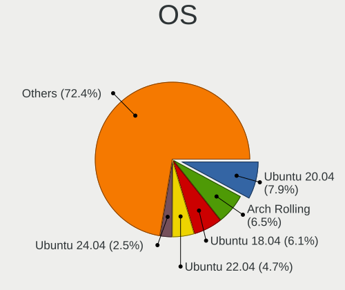

| Name                         | Computers | Percent |
|------------------------------|-----------|---------|
| Ubuntu 20.04                 | 22        | 7.89%   |
| Arch Rolling                 | 18        | 6.45%   |
| Ubuntu 18.04                 | 17        | 6.09%   |
| Ubuntu 22.04                 | 13        | 4.66%   |
| Ubuntu 24.04                 | 7         | 2.51%   |
| OpenMandriva 4.3             | 7         | 2.51%   |
| Fedora 40                    | 6         | 2.15%   |
| Fedora 38                    | 6         | 2.15%   |
| OpenMandriva 4.2             | 5         | 1.79%   |
| OpenMandriva 24.12           | 5         | 1.79%   |
| Fedora 42                    | 5         | 1.79%   |
| OpenMandriva 23.03           | 4         | 1.43%   |
| Manjaro                      | 4         | 1.43%   |
| Fedora 39                    | 4         | 1.43%   |
| Fedora 37                    | 4         | 1.43%   |
| Fedora 36                    | 4         | 1.43%   |
| Zorin 17                     | 3         | 1.08%   |
| Zorin 16                     | 3         | 1.08%   |
| OpenMandriva 6.0             | 3         | 1.08%   |
| OpenMandriva 25.90           | 3         | 1.08%   |
| LMDE 6                       | 3         | 1.08%   |
| Linux Mint 22.2              | 3         | 1.08%   |
| Linux Mint 20.3              | 3         | 1.08%   |
| KDE neon 22.04               | 3         | 1.08%   |
| Kali 2023.3                  | 3         | 1.08%   |
| Fedora 41                    | 3         | 1.08%   |
| Fedora 34                    | 3         | 1.08%   |
| Debian 12                    | 3         | 1.08%   |
| Debian 11                    | 3         | 1.08%   |
| Arch                         | 3         | 1.08%   |
| Ubuntu 22.10                 | 2         | 0.72%   |
| Ubuntu 21.10                 | 2         | 0.72%   |
| Pop!_OS 22.04                | 2         | 0.72%   |
| Pop!_OS 20.10                | 2         | 0.72%   |
| openSUSE Tumbleweed-XXXXXXXX | 2         | 0.72%   |
| OpenMandriva 5.0             | 2         | 0.72%   |
| OpenMandriva 25.11           | 2         | 0.72%   |
| OpenMandriva 25.06           | 2         | 0.72%   |
| OpenMandriva 24.07           | 2         | 0.72%   |
| OpenMandriva 23.08           | 2         | 0.72%   |

OS Family
---------

OS without a version

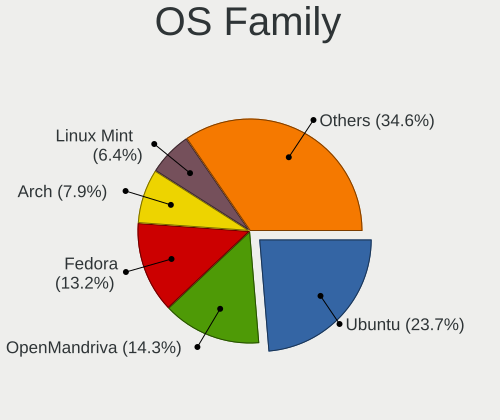

| Name          | Computers | Percent |
|---------------|-----------|---------|
| Ubuntu        | 63        | 23.68%  |
| OpenMandriva  | 38        | 14.29%  |
| Fedora        | 35        | 13.16%  |
| Arch          | 21        | 7.89%   |
| Linux Mint    | 17        | 6.39%   |
| Manjaro       | 11        | 4.14%   |
| Kali          | 10        | 3.76%   |
| Debian        | 8         | 3.01%   |
| Pop!_OS       | 7         | 2.63%   |
| Zorin         | 6         | 2.26%   |
| KDE neon      | 5         | 1.88%   |
| LMDE          | 4         | 1.5%    |
| Ubuntu Budgie | 3         | 1.13%   |
| Lubuntu       | 3         | 1.13%   |
| Clear Linux   | 3         | 1.13%   |
| Xubuntu       | 2         | 0.75%   |
| ROSA          | 2         | 0.75%   |
| openSUSE      | 2         | 0.75%   |
| MX            | 2         | 0.75%   |
| Kubuntu       | 2         | 0.75%   |
| Endless       | 2         | 0.75%   |
| Bazzite       | 2         | 0.75%   |
| ArcoLinux     | 2         | 0.75%   |
| Void Linux    | 1         | 0.38%   |
| Ubuntu MATE   | 1         | 0.38%   |
| SteamOS       | 1         | 0.38%   |
| Soplos        | 1         | 0.38%   |
| Solus         | 1         | 0.38%   |
| Nobara        | 1         | 0.38%   |
| GNOME OS      | 1         | 0.38%   |
| Garuda Linux  | 1         | 0.38%   |
| Gabian        | 1         | 0.38%   |
| Elementary    | 1         | 0.38%   |
| Dts-distro    | 1         | 0.38%   |
| CentOS        | 1         | 0.38%   |
| CachyOS       | 1         | 0.38%   |
| blendOS       | 1         | 0.38%   |
| BlackPanther  | 1         | 0.38%   |
| Archcraft     | 1         | 0.38%   |

Kernel
------

Version of the Linux kernel

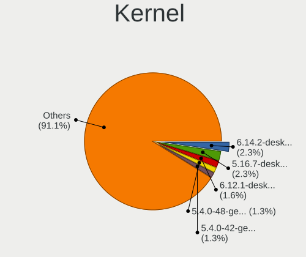

| Version                       | Computers | Percent |
|-------------------------------|-----------|---------|
| 6.14.2-desktop-3omv2590       | 7         | 2.3%    |
| 5.16.7-desktop-1omv4003       | 7         | 2.3%    |
| 6.12.1-desktop-1omv2490       | 5         | 1.64%   |
| 5.4.0-48-generic              | 4         | 1.31%   |
| 5.4.0-42-generic              | 4         | 1.31%   |
| 5.10.14-desktop-1omv4002      | 4         | 1.31%   |
| 6.2.6-desktop-1omv2390        | 3         | 0.98%   |
| 5.19.0-46-generic             | 3         | 0.98%   |
| 5.15.0-53-generic             | 3         | 0.98%   |
| 5.13.0-22-generic             | 3         | 0.98%   |
| 6.8.0-51-generic              | 2         | 0.66%   |
| 6.8.0-41-generic              | 2         | 0.66%   |
| 6.8.0-31-generic              | 2         | 0.66%   |
| 6.6.2-desktop-1omv2390        | 2         | 0.66%   |
| 6.6.15-amd64                  | 2         | 0.66%   |
| 6.5.6-300.fc39.x86_64         | 2         | 0.66%   |
| 6.5.0-kali3-amd64             | 2         | 0.66%   |
| 6.5.0-kali2-amd64             | 2         | 0.66%   |
| 6.4.8-desktop-2omv2390        | 2         | 0.66%   |
| 6.16.4-arch1-1                | 2         | 0.66%   |
| 6.15.0-desktop-0.rc2.3omv2590 | 2         | 0.66%   |
| 6.14.0-63.fc42.x86_64         | 2         | 0.66%   |
| 6.14.0-29-generic             | 2         | 0.66%   |
| 6.11.2-amd64                  | 2         | 0.66%   |
| 6.1.1-desktop-1omv2290        | 2         | 0.66%   |
| 6.1.0-21-amd64                | 2         | 0.66%   |
| 5.4.0-77-generic              | 2         | 0.66%   |
| 5.4.0-52-generic              | 2         | 0.66%   |
| 5.4.0-33-generic              | 2         | 0.66%   |
| 5.3.0-51-generic              | 2         | 0.66%   |
| 5.3.0-46-generic              | 2         | 0.66%   |
| 5.3.0-42-generic              | 2         | 0.66%   |
| 5.19.0-32-generic             | 2         | 0.66%   |
| 5.15.0-76-generic             | 2         | 0.66%   |
| 5.15.0-58-generic             | 2         | 0.66%   |
| 5.15.0-50-generic             | 2         | 0.66%   |
| 5.15.0-41-generic             | 2         | 0.66%   |
| 5.11.0-40-generic             | 2         | 0.66%   |
| 5.11.0-25-generic             | 2         | 0.66%   |
| 5.0.0-32-generic              | 2         | 0.66%   |

Kernel Family
-------------

Linux kernel without a distro release

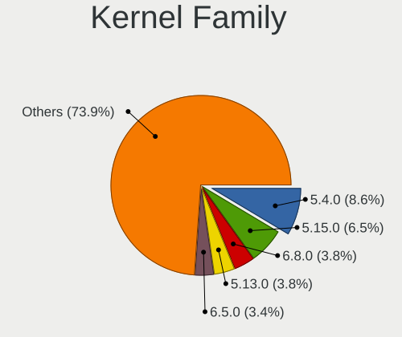

| Version | Computers | Percent |
|---------|-----------|---------|
| 5.4.0   | 25        | 8.59%   |
| 5.15.0  | 19        | 6.53%   |
| 6.8.0   | 11        | 3.78%   |
| 5.13.0  | 11        | 3.78%   |
| 6.5.0   | 10        | 3.44%   |
| 5.3.0   | 9         | 3.09%   |
| 5.19.0  | 8         | 2.75%   |
| 5.11.0  | 8         | 2.75%   |
| 6.14.2  | 7         | 2.41%   |
| 5.16.7  | 7         | 2.41%   |
| 4.15.0  | 6         | 2.06%   |
| 6.14.0  | 5         | 1.72%   |
| 6.12.1  | 5         | 1.72%   |
| 5.0.0   | 5         | 1.72%   |
| 6.1.0   | 4         | 1.37%   |
| 5.10.14 | 4         | 1.37%   |
| 5.10.0  | 4         | 1.37%   |
| 6.8.7   | 3         | 1.03%   |
| 6.5.6   | 3         | 1.03%   |
| 6.2.6   | 3         | 1.03%   |
| 6.7.0   | 2         | 0.69%   |
| 6.6.8   | 2         | 0.69%   |
| 6.6.2   | 2         | 0.69%   |
| 6.6.15  | 2         | 0.69%   |
| 6.5.7   | 2         | 0.69%   |
| 6.4.8   | 2         | 0.69%   |
| 6.4.15  | 2         | 0.69%   |
| 6.3.7   | 2         | 0.69%   |
| 6.2.0   | 2         | 0.69%   |
| 6.16.4  | 2         | 0.69%   |
| 6.15.0  | 2         | 0.69%   |
| 6.12.9  | 2         | 0.69%   |
| 6.11.2  | 2         | 0.69%   |
| 6.11.0  | 2         | 0.69%   |
| 6.1.1   | 2         | 0.69%   |
| 5.7.7   | 2         | 0.69%   |
| 4.19.0  | 2         | 0.69%   |
| 4.18.0  | 2         | 0.69%   |
| 6.9.9   | 1         | 0.34%   |
| 6.9.7   | 1         | 0.34%   |

Kernel Major Ver.
-----------------

Linux kernel major version

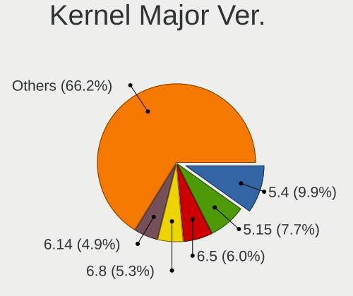

| Version | Computers | Percent |
|---------|-----------|---------|
| 5.4     | 28        | 9.86%   |
| 5.15    | 22        | 7.75%   |
| 6.5     | 17        | 5.99%   |
| 6.8     | 15        | 5.28%   |
| 6.14    | 14        | 4.93%   |
| 5.13    | 12        | 4.23%   |
| 6.6     | 11        | 3.87%   |
| 5.19    | 11        | 3.87%   |
| 5.10    | 11        | 3.87%   |
| 6.12    | 10        | 3.52%   |
| 5.11    | 10        | 3.52%   |
| 5.3     | 9         | 3.17%   |
| 6.2     | 8         | 2.82%   |
| 6.1     | 8         | 2.82%   |
| 5.16    | 7         | 2.46%   |
| 6.4     | 6         | 2.11%   |
| 6.10    | 6         | 2.11%   |
| 5.0     | 6         | 2.11%   |
| 4.15    | 6         | 2.11%   |
| 6.16    | 5         | 1.76%   |
| 6.11    | 5         | 1.76%   |
| 5.8     | 5         | 1.76%   |
| 6.9     | 4         | 1.41%   |
| 6.15    | 4         | 1.41%   |
| 5.9     | 4         | 1.41%   |
| 5.18    | 4         | 1.41%   |
| 5.12    | 4         | 1.41%   |
| 4.18    | 4         | 1.41%   |
| 6.3     | 3         | 1.06%   |
| 6.17    | 3         | 1.06%   |
| 6.13    | 3         | 1.06%   |
| 5.7     | 3         | 1.06%   |
| 4.19    | 3         | 1.06%   |
| 6.7     | 2         | 0.7%    |
| 6.0     | 2         | 0.7%    |
| 5.17    | 2         | 0.7%    |
| 5.1     | 2         | 0.7%    |
| 6.18    | 1         | 0.35%   |
| 5.6     | 1         | 0.35%   |
| 5.5     | 1         | 0.35%   |

Arch
----

OS architecture (x86_64, i586, etc.)

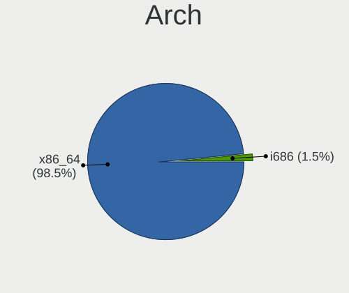

| Name   | Computers | Percent |
|--------|-----------|---------|
| x86_64 | 256       | 98.46%  |
| i686   | 4         | 1.54%   |

DE
--

Desktop Environment

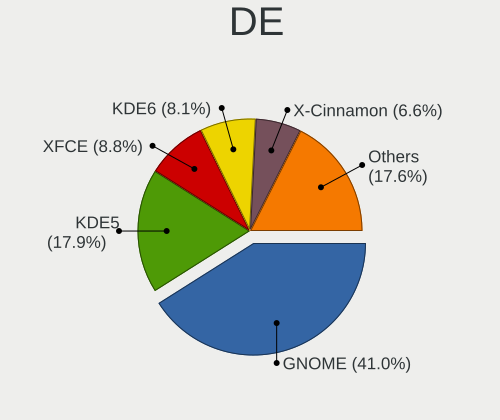

| Name                | Computers | Percent |
|---------------------|-----------|---------|
| GNOME               | 112       | 41.03%  |
| KDE5                | 49        | 17.95%  |
| XFCE                | 24        | 8.79%   |
| KDE6                | 22        | 8.06%   |
| X-Cinnamon          | 18        | 6.59%   |
| Unknown             | 18        | 6.59%   |
| LXQt                | 5         | 1.83%   |
| Budgie              | 5         | 1.83%   |
| MATE                | 4         | 1.47%   |
| KDE                 | 4         | 1.47%   |
| Hyprland            | 3         | 1.1%    |
| sway                | 1         | 0.37%   |
| start-cosmic:COSMIC | 1         | 0.37%   |
| qtile               | 1         | 0.37%   |
| LXDE                | 1         | 0.37%   |
| KDE4                | 1         | 0.37%   |
| GNOME Classic       | 1         | 0.37%   |
| Endless:GNOME       | 1         | 0.37%   |
| DWM                 | 1         | 0.37%   |
| COSMIC              | 1         | 0.37%   |

Display Server
--------------

X11 or Wayland

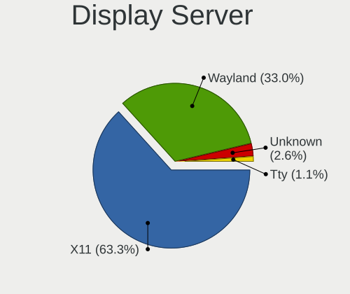

| Name    | Computers | Percent |
|---------|-----------|---------|
| X11     | 169       | 63.3%   |
| Wayland | 88        | 32.96%  |
| Unknown | 7         | 2.62%   |
| Tty     | 3         | 1.12%   |

Display Manager
---------------

SDDM, LightDM, etc.

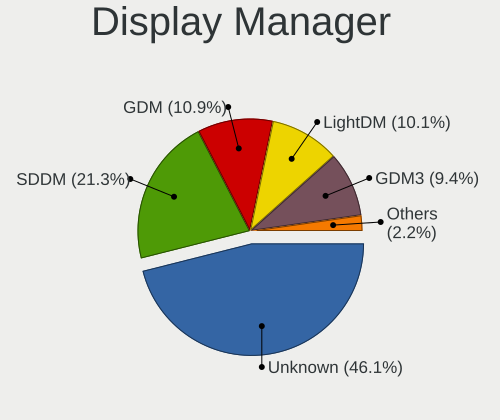

| Name    | Computers | Percent |
|---------|-----------|---------|
| Unknown | 123       | 46.07%  |
| SDDM    | 57        | 21.35%  |
| GDM     | 29        | 10.86%  |
| LightDM | 27        | 10.11%  |
| GDM3    | 25        | 9.36%   |
| TDM     | 4         | 1.5%    |
| LY-DM   | 1         | 0.37%   |
| KDM     | 1         | 0.37%   |

OS Lang
-------

Language

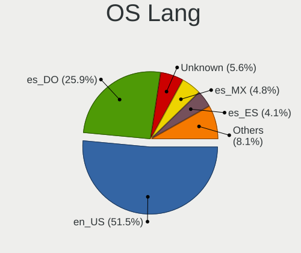

| Lang    | Computers | Percent |
|---------|-----------|---------|
| en_US   | 139       | 51.48%  |
| es_DO   | 70        | 25.93%  |
| Unknown | 15        | 5.56%   |
| es_MX   | 13        | 4.81%   |
| es_ES   | 11        | 4.07%   |
| C       | 10        | 3.7%    |
| es_US   | 6         | 2.22%   |
| en_CA   | 2         | 0.74%   |
| ru_RU   | 1         | 0.37%   |
| fr_HT   | 1         | 0.37%   |
| fr_FR   | 1         | 0.37%   |
| es_AR   | 1         | 0.37%   |

Boot Mode
---------

EFI or BIOS

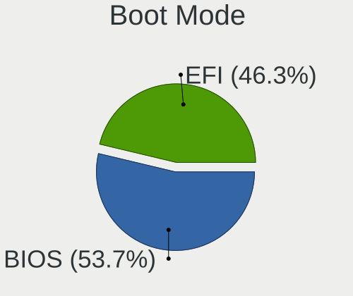

| Mode | Computers | Percent |
|------|-----------|---------|
| BIOS | 144       | 53.73%  |
| EFI  | 124       | 46.27%  |

Filesystem
----------

Type of filesystem

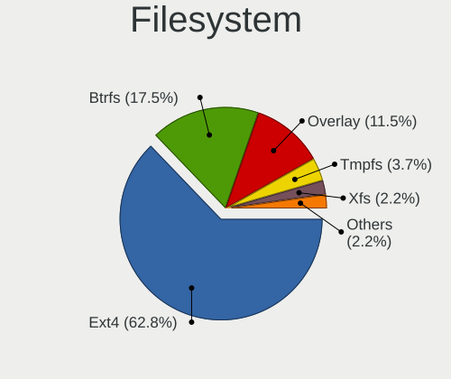

| Type    | Computers | Percent |
|---------|-----------|---------|
| Ext4    | 169       | 62.83%  |
| Btrfs   | 47        | 17.47%  |
| Overlay | 31        | 11.52%  |
| Tmpfs   | 10        | 3.72%   |
| Xfs     | 6         | 2.23%   |
| Zfs     | 2         | 0.74%   |
| Unknown | 2         | 0.74%   |
| Rootfs  | 1         | 0.37%   |
| F2fs    | 1         | 0.37%   |

Part. scheme
------------

Scheme of partitioning

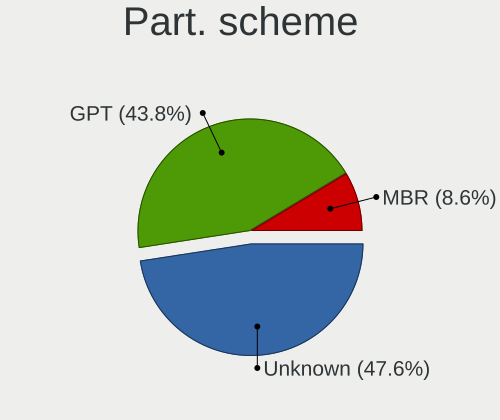

| Type    | Computers | Percent |
|---------|-----------|---------|
| Unknown | 127       | 47.57%  |
| GPT     | 117       | 43.82%  |
| MBR     | 23        | 8.61%   |

Dual Boot with Linux/BSD
------------------------

Hosting more than one Linux/BSD

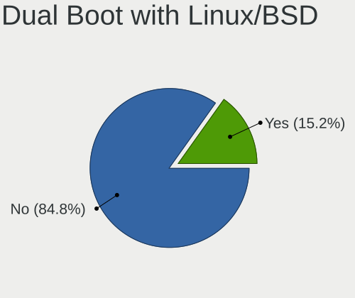

| Dual boot | Computers | Percent |
|-----------|-----------|---------|
| No        | 224       | 84.85%  |
| Yes       | 40        | 15.15%  |

Dual Boot (Win)
---------------

Hosting Linux and Windows

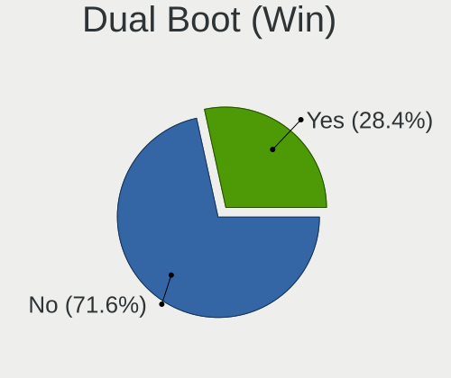

| Dual boot | Computers | Percent |
|-----------|-----------|---------|
| No        | 189       | 71.59%  |
| Yes       | 75        | 28.41%  |

Board
-----

Vendor
------

Motherboard manufacturer

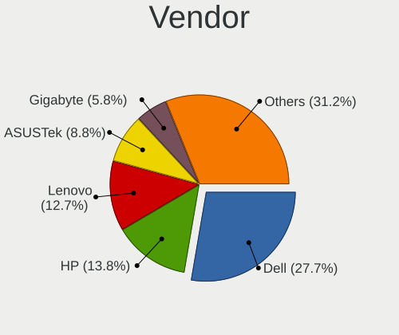

| Name                | Computers | Percent |
|---------------------|-----------|---------|
| Dell                | 72        | 27.69%  |
| Hewlett-Packard     | 36        | 13.85%  |
| Lenovo              | 33        | 12.69%  |
| ASUSTek Computer    | 23        | 8.85%   |
| Gigabyte Technology | 15        | 5.77%   |
| Apple               | 14        | 5.38%   |
| Acer                | 10        | 3.85%   |
| Unknown             | 8         | 3.08%   |
| MSI                 | 6         | 2.31%   |
| ASRock              | 6         | 2.31%   |
| Google              | 4         | 1.54%   |
| VTEX                | 3         | 1.15%   |
| Samsung Electronics | 3         | 1.15%   |
| Chuwi               | 3         | 1.15%   |
| TODOS INDUSTRIAL    | 2         | 0.77%   |
| Microsoft           | 2         | 0.77%   |
| Foxconn             | 2         | 0.77%   |
| EVOO                | 2         | 0.77%   |
| Valve               | 1         | 0.38%   |
| Toshiba             | 1         | 0.38%   |
| SAELITE             | 1         | 0.38%   |
| Nuvision            | 1         | 0.38%   |
| LG Electronics      | 1         | 0.38%   |
| Intel               | 1         | 0.38%   |
| GPU Company         | 1         | 0.38%   |
| GEEKOM              | 1         | 0.38%   |
| Gateway             | 1         | 0.38%   |
| Fujitsu             | 1         | 0.38%   |
| Eluktronics         | 1         | 0.38%   |
| ECS                 | 1         | 0.38%   |
| Biostar             | 1         | 0.38%   |
| BESSTAR Tech        | 1         | 0.38%   |
| AZW                 | 1         | 0.38%   |
| AMI                 | 1         | 0.38%   |

Model
-----

Motherboard model

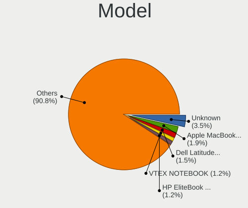

| Name                                              | Computers | Percent |
|---------------------------------------------------|-----------|---------|
| Unknown                                           | 9         | 3.46%   |
| Apple MacBookAir7,2                               | 5         | 1.92%   |
| Dell Latitude E6430                               | 4         | 1.54%   |
| VTEX NOTEBOOK                                     | 3         | 1.15%   |
| HP EliteBook 8460p                                | 3         | 1.15%   |
| Gigabyte GA-78LMT-USB3 6.0                        | 3         | 1.15%   |
| Dell Latitude E6420                               | 3         | 1.15%   |
| Apple MacBookPro8,1                               | 3         | 1.15%   |
| Lenovo IdeaPad 330S-15IKB 81F5                    | 2         | 0.77%   |
| HP Pavilion Notebook                              | 2         | 0.77%   |
| HP Pavilion Gaming Laptop 15-dk0xxx               | 2         | 0.77%   |
| HP Notebook                                       | 2         | 0.77%   |
| HP Laptop 15-dy1xxx                               | 2         | 0.77%   |
| EVOO EV-C-116-7                                   | 2         | 0.77%   |
| Dell OptiPlex 990                                 | 2         | 0.77%   |
| Dell OptiPlex 9020                                | 2         | 0.77%   |
| Dell OptiPlex 390                                 | 2         | 0.77%   |
| Dell OptiPlex 3050                                | 2         | 0.77%   |
| Dell OptiPlex 3020                                | 2         | 0.77%   |
| Dell OptiPlex 3010                                | 2         | 0.77%   |
| Dell Latitude E6540                               | 2         | 0.77%   |
| Dell Latitude E6410                               | 2         | 0.77%   |
| Dell Latitude 5590                                | 2         | 0.77%   |
| Dell Latitude 3330                                | 2         | 0.77%   |
| Dell Inspiron 5570                                | 2         | 0.77%   |
| Dell Inspiron 5555                                | 2         | 0.77%   |
| Apple Macmini8,1                                  | 2         | 0.77%   |
| Valve Jupiter                                     | 1         | 0.38%   |
| Toshiba Satellite C55-A                           | 1         | 0.38%   |
| TODOS INDUSTRIAL Easytouch_2022_V1                | 1         | 0.38%   |
| TODOS INDUSTRIAL Aprix_2022_V1                    | 1         | 0.38%   |
| Samsung RV420/RV520/RV720/E3530/S3530/E3420/E3520 | 1         | 0.38%   |
| Samsung 930QCG                                    | 1         | 0.38%   |
| Samsung 905S3G/906S3G/915S3G/9305SG               | 1         | 0.38%   |
| SAELITE ES1AU11                                   | 1         | 0.38%   |
| Nuvision NES11                                    | 1         | 0.38%   |
| MSI MS-7E62                                       | 1         | 0.38%   |
| MSI MS-7C83                                       | 1         | 0.38%   |
| MSI MS-7A34                                       | 1         | 0.38%   |
| MSI MS-7817                                       | 1         | 0.38%   |

Model Family
------------

Motherboard model prefix

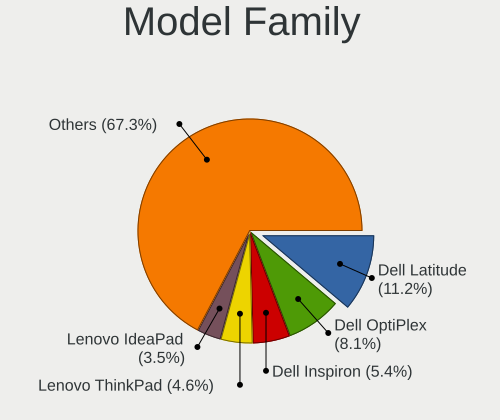

| Name                       | Computers | Percent |
|----------------------------|-----------|---------|
| Dell Latitude              | 29        | 11.15%  |
| Dell OptiPlex              | 21        | 8.08%   |
| Dell Inspiron              | 14        | 5.38%   |
| Lenovo ThinkPad            | 12        | 4.62%   |
| Lenovo IdeaPad             | 9         | 3.46%   |
| Unknown                    | 9         | 3.46%   |
| Acer Aspire                | 7         | 2.69%   |
| HP Pavilion                | 6         | 2.31%   |
| HP Compaq                  | 6         | 2.31%   |
| HP Laptop                  | 5         | 1.92%   |
| ASUS VivoBook              | 5         | 1.92%   |
| Apple MacBookAir7          | 5         | 1.92%   |
| HP EliteBook               | 4         | 1.54%   |
| Gigabyte GA-78LMT-USB3     | 4         | 1.54%   |
| VTEX NOTEBOOK              | 3         | 1.15%   |
| Lenovo Legion              | 3         | 1.15%   |
| HP ProBook                 | 3         | 1.15%   |
| HP EliteDesk               | 3         | 1.15%   |
| Dell Vostro                | 3         | 1.15%   |
| Apple MacBookPro8          | 3         | 1.15%   |
| Microsoft Surface          | 2         | 0.77%   |
| Lenovo ThinkCentre         | 2         | 0.77%   |
| HP Notebook                | 2         | 0.77%   |
| Gigabyte B550              | 2         | 0.77%   |
| Gigabyte B450M             | 2         | 0.77%   |
| EVOO EV-C-116-7            | 2         | 0.77%   |
| ASUS TUF                   | 2         | 0.77%   |
| ASUS ASUS                  | 2         | 0.77%   |
| Apple Macmini8             | 2         | 0.77%   |
| Valve Jupiter              | 1         | 0.38%   |
| Toshiba Satellite          | 1         | 0.38%   |
| TODOS INDUSTRIAL Easytouch | 1         | 0.38%   |
| TODOS INDUSTRIAL Aprix     | 1         | 0.38%   |
| Samsung RV420              | 1         | 0.38%   |
| Samsung 930QCG             | 1         | 0.38%   |
| Samsung 905S3G             | 1         | 0.38%   |
| SAELITE ES1AU11            | 1         | 0.38%   |
| Nuvision NES11             | 1         | 0.38%   |
| MSI MS-7E62                | 1         | 0.38%   |
| MSI MS-7C83                | 1         | 0.38%   |

MFG Year
--------

Motherboard manufacture year

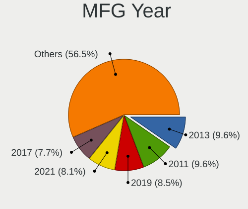

| Year | Computers | Percent |
|------|-----------|---------|
| 2013 | 25        | 9.62%   |
| 2011 | 25        | 9.62%   |
| 2019 | 22        | 8.46%   |
| 2021 | 21        | 8.08%   |
| 2017 | 20        | 7.69%   |
| 2014 | 20        | 7.69%   |
| 2020 | 17        | 6.54%   |
| 2012 | 17        | 6.54%   |
| 2016 | 13        | 5%      |
| 2018 | 12        | 4.62%   |
| 2015 | 11        | 4.23%   |
| 2010 | 8         | 3.08%   |
| 2008 | 8         | 3.08%   |
| 2006 | 8         | 3.08%   |
| 2023 | 7         | 2.69%   |
| 2022 | 7         | 2.69%   |
| 2007 | 6         | 2.31%   |
| 2024 | 5         | 1.92%   |
| 2009 | 5         | 1.92%   |
| 2005 | 2         | 0.77%   |
| 2025 | 1         | 0.38%   |

Form Factor
-----------

Physical design of the computer

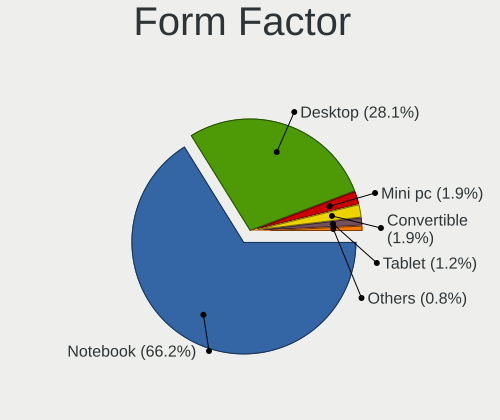

| Name        | Computers | Percent |
|-------------|-----------|---------|
| Notebook    | 172       | 66.15%  |
| Desktop     | 73        | 28.08%  |
| Convertible | 5         | 1.92%   |
| Mini pc     | 5         | 1.92%   |
| Tablet      | 3         | 1.15%   |
| All in one  | 2         | 0.77%   |

Secure Boot
-----------

Enabled or disabled

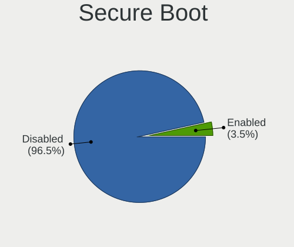

| State    | Computers | Percent |
|----------|-----------|---------|
| Disabled | 251       | 96.54%  |
| Enabled  | 9         | 3.46%   |

Coreboot
--------

Have coreboot on board

| Used | Computers | Percent |
|------|-----------|---------|
| No   | 256       | 98.46%  |
| Yes  | 4         | 1.54%   |

RAM Size
--------

Total RAM memory

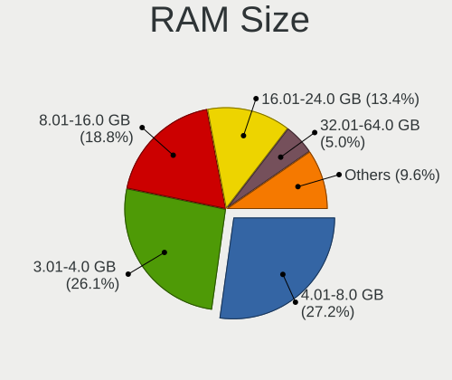

| Size in GB  | Computers | Percent |
|-------------|-----------|---------|
| 4.01-8.0    | 71        | 27.2%   |
| 3.01-4.0    | 68        | 26.05%  |
| 8.01-16.0   | 49        | 18.77%  |
| 16.01-24.0  | 35        | 13.41%  |
| 32.01-64.0  | 13        | 4.98%   |
| 24.01-32.0  | 7         | 2.68%   |
| 2.01-3.0    | 7         | 2.68%   |
| 1.01-2.0    | 7         | 2.68%   |
| 64.01-256.0 | 2         | 0.77%   |
| 0.51-1.0    | 2         | 0.77%   |

RAM Used
--------

Used RAM memory

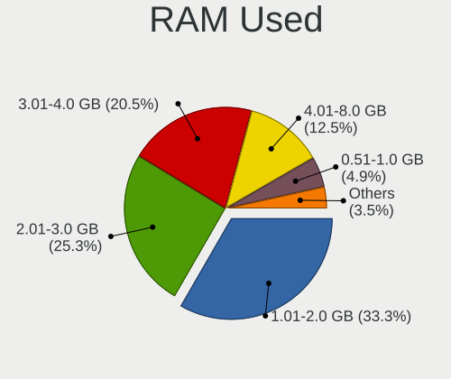

| Used GB   | Computers | Percent |
|-----------|-----------|---------|
| 1.01-2.0  | 96        | 33.33%  |
| 2.01-3.0  | 73        | 25.35%  |
| 3.01-4.0  | 59        | 20.49%  |
| 4.01-8.0  | 36        | 12.5%   |
| 0.51-1.0  | 14        | 4.86%   |
| 8.01-16.0 | 10        | 3.47%   |

Total Drives
------------

Number of drives on board

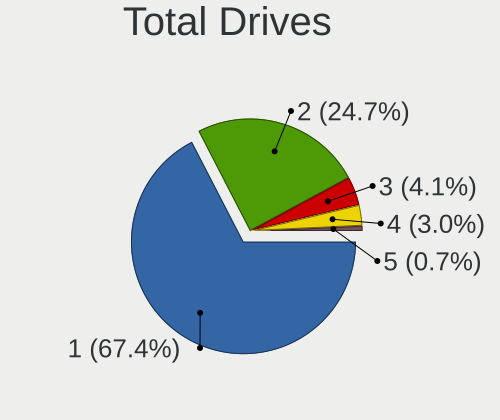

| Drives | Computers | Percent |
|--------|-----------|---------|
| 1      | 180       | 67.42%  |
| 2      | 66        | 24.72%  |
| 3      | 11        | 4.12%   |
| 4      | 8         | 3%      |
| 5      | 2         | 0.75%   |

Has CD-ROM
----------

Has CD-ROM on board

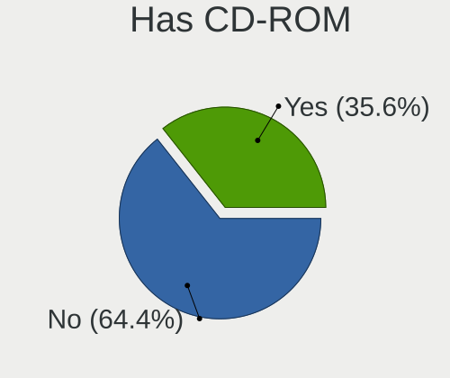

| Presented | Computers | Percent |
|-----------|-----------|---------|
| No        | 168       | 64.37%  |
| Yes       | 93        | 35.63%  |

Has Ethernet
------------

Has Ethernet on board

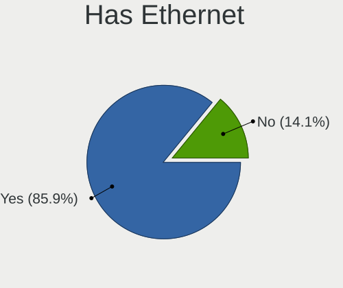

| Presented | Computers | Percent |
|-----------|-----------|---------|
| Yes       | 203       | 77.78%  |
| No        | 58        | 22.22%  |

Has WiFi
--------

Has WiFi module

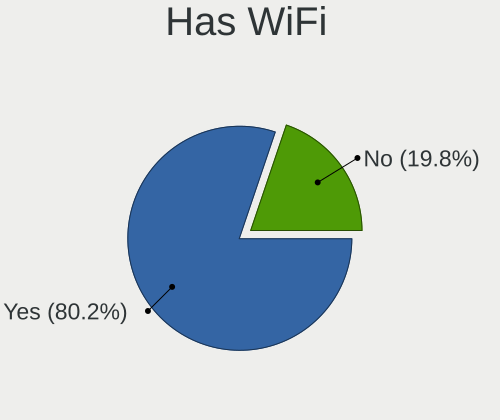

| Presented | Computers | Percent |
|-----------|-----------|---------|
| Yes       | 219       | 83.91%  |
| No        | 42        | 16.09%  |

Has Bluetooth
-------------

Has Bluetooth module

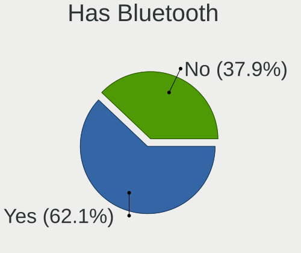

| Presented | Computers | Percent |
|-----------|-----------|---------|
| Yes       | 162       | 62.07%  |
| No        | 99        | 37.93%  |

Location
--------

Country
-------

Geographic location (country)

| Country            | Computers | Percent |
|--------------------|-----------|---------|
| Dominican Republic | 260       | 100%    |

City
----

Geographic location (city)

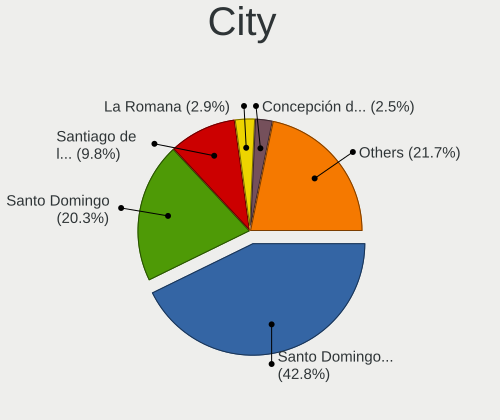

| City                       | Computers | Percent |
|----------------------------|-----------|---------|
| Santo Domingo Este         | 118       | 42.75%  |
| Santo Domingo              | 56        | 20.29%  |
| Santiago de los Caballeros | 27        | 9.78%   |
| La Romana                  | 8         | 2.9%    |
| Concepción de la Vega     | 7         | 2.54%   |
| Santo Domingo Oeste        | 5         | 1.81%   |
| San Cristobal              | 5         | 1.81%   |
| Cabarete                   | 5         | 1.81%   |
| Alejandro Bass             | 4         | 1.45%   |
| Santa Cruz de Barahona     | 3         | 1.09%   |
| San Pedro de Macorís      | 3         | 1.09%   |
| San Juan                   | 3         | 1.09%   |
| Nagua                      | 3         | 1.09%   |
| Nacional                   | 3         | 1.09%   |
| Constanza                  | 3         | 1.09%   |
| Sosua, Cabarete            | 2         | 0.72%   |
| Puerto Plata               | 2         | 0.72%   |
| Herrera                    | 2         | 0.72%   |
| Baní                      | 2         | 0.72%   |
| Bajos de Haina             | 2         | 0.72%   |
| San Isidro                 | 1         | 0.36%   |
| San Francisco de Macorís  | 1         | 0.36%   |
| Salcedo                    | 1         | 0.36%   |
| Sabaneta                   | 1         | 0.36%   |
| Punta Cana                 | 1         | 0.36%   |
| Monte Llano                | 1         | 0.36%   |
| Moca                       | 1         | 0.36%   |
| Los Hidalgos               | 1         | 0.36%   |
| Guerra                     | 1         | 0.36%   |
| Guaymate                   | 1         | 0.36%   |
| Cancino                    | 1         | 0.36%   |
| Bonao                      | 1         | 0.36%   |
| Boca Chica                 | 1         | 0.36%   |

Drives
------

Drive Vendor
------------

Hard drive vendors

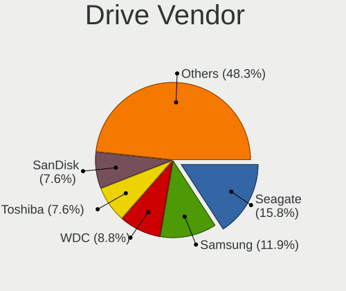

| Vendor                      | Computers | Drives | Percent |
|-----------------------------|-----------|--------|---------|
| Seagate                     | 56        | 75     | 15.82%  |
| Samsung Electronics         | 42        | 57     | 11.86%  |
| WDC                         | 31        | 40     | 8.76%   |
| Toshiba                     | 27        | 34     | 7.63%   |
| SanDisk                     | 27        | 34     | 7.63%   |
| Kingston                    | 21        | 22     | 5.93%   |
| Hitachi                     | 18        | 23     | 5.08%   |
| Unknown                     | 16        | 19     | 4.52%   |
| Apple                       | 11        | 18     | 3.11%   |
| SK hynix                    | 10        | 12     | 2.82%   |
| China                       | 10        | 11     | 2.82%   |
| Micron Technology           | 9         | 11     | 2.54%   |
| Intel                       | 6         | 8      | 1.69%   |
| Crucial                     | 5         | 7      | 1.41%   |
| AirDisk                     | 5         | 5      | 1.41%   |
| SPCC                        | 4         | 6      | 1.13%   |
| FORESEE                     | 4         | 5      | 1.13%   |
| Unknown                     | 4         | 4      | 1.13%   |
| Micron/Crucial Technology   | 3         | 3      | 0.85%   |
| Kingston Technology Company | 3         | 3      | 0.85%   |
| HGST                        | 3         | 3      | 0.85%   |
| A-DATA Technology           | 3         | 3      | 0.85%   |
| USB                         | 2         | 2      | 0.56%   |
| Transcend                   | 2         | 2      | 0.56%   |
| Realtek Semiconductor       | 2         | 2      | 0.56%   |
| PNY                         | 2         | 2      | 0.56%   |
| KIOXIA                      | 2         | 3      | 0.56%   |
| Indilinx                    | 2         | 2      | 0.56%   |
| Wibtek                      | 1         | 1      | 0.28%   |
| UMIS                        | 1         | 1      | 0.28%   |
| Timetec                     | 1         | 1      | 0.28%   |
| Supersonic                  | 1         | 1      | 0.28%   |
| SCY                         | 1         | 1      | 0.28%   |
| SABRENT                     | 1         | 1      | 0.28%   |
| Phison Electronics          | 1         | 1      | 0.28%   |
| Patriot                     | 1         | 1      | 0.28%   |
| OCZ                         | 1         | 1      | 0.28%   |
| Netac                       | 1         | 1      | 0.28%   |
| MSI                         | 1         | 1      | 0.28%   |
| Maxtor                      | 1         | 1      | 0.28%   |

Drive Model
-----------

Hard drive models

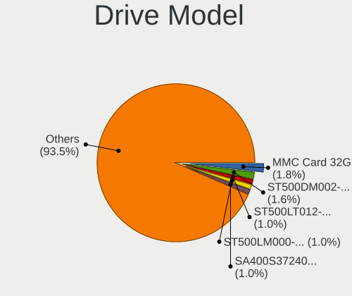

| Model                                              | Computers | Percent |
|----------------------------------------------------|-----------|---------|
| Unknown MMC Card  32GB                             | 7         | 1.83%   |
| Seagate ST500DM002-1BD142 500GB                    | 6         | 1.57%   |
| Seagate ST500LT012-1DG142 500GB                    | 4         | 1.04%   |
| Seagate ST500LM000-1EJ162 500GB                    | 4         | 1.04%   |
| Kingston SA400S37240G 240GB SSD                    | 4         | 1.04%   |
| Kingston SA400S37120G 120GB SSD                    | 4         | 1.04%   |
| FORESEE 128GB SSD                                  | 4         | 1.04%   |
| AirDisk 128GB SSD                                  | 4         | 1.04%   |
| Unknown                                            | 4         | 1.04%   |
| Unknown MMC Card  16GB                             | 3         | 0.78%   |
| Toshiba MQ04ABF100 1TB                             | 3         | 0.78%   |
| Toshiba MQ01ACF050 500GB                           | 3         | 0.78%   |
| Toshiba MK3275GSX 320GB                            | 3         | 0.78%   |
| Seagate ST500LM021-1KJ152 500GB                    | 3         | 0.78%   |
| Seagate ST1000LM035-1RK172 1TB                     | 3         | 0.78%   |
| Samsung SSD 860 EVO 500GB                          | 3         | 0.78%   |
| Samsung SSD 850 EVO 250GB                          | 3         | 0.78%   |
| Samsung NVMe SSD Controller SM981/PM981/PM983 1TB  | 3         | 0.78%   |
| Samsung NVMe SSD Controller PM9A1/PM9A3/980PRO 1TB | 3         | 0.78%   |
| Hitachi HTS545050A7E380 500GB                      | 3         | 0.78%   |
| Apple SSD SM0128G 121GB                            | 3         | 0.78%   |
| USB SanDisk 3.2Gen1 496GB                          | 2         | 0.52%   |
| Unknown MMC Card  64GB                             | 2         | 0.52%   |
| Unknown MMC Card  128GB                            | 2         | 0.52%   |
| Toshiba MQ01ABD050V 500GB                          | 2         | 0.52%   |
| Toshiba MK2556GSY 250GB                            | 2         | 0.52%   |
| Toshiba DT01ACA050 500GB                           | 2         | 0.52%   |
| SPCC Solid State Disk 512GB                        | 2         | 0.52%   |
| Seagate ST9250315AS 250GB                          | 2         | 0.52%   |
| Seagate ST380815AS 80GB                            | 2         | 0.52%   |
| Seagate ST3500418AS 500GB                          | 2         | 0.52%   |
| Seagate ST3160815AS 160GB                          | 2         | 0.52%   |
| Seagate ST1000LM049-2GH172 1TB                     | 2         | 0.52%   |
| Seagate ST1000DM010-2EP102 1TB                     | 2         | 0.52%   |
| Sandisk WD Black SN750 / PC SN730 NVMe SSD 500GB   | 2         | 0.52%   |
| SanDisk SDSSDX120GG25 120GB                        | 2         | 0.52%   |
| SanDisk SDSSDH3 512G                               | 2         | 0.52%   |
| Sandisk PC SN520 NVMe SSD 128GB                    | 2         | 0.52%   |
| SanDisk NVMe SSD Drive 256GB                       | 2         | 0.52%   |
| Samsung SSD PM871 mSATA 256GB                      | 2         | 0.52%   |

HDD Vendor
----------

Hard disk drive vendors

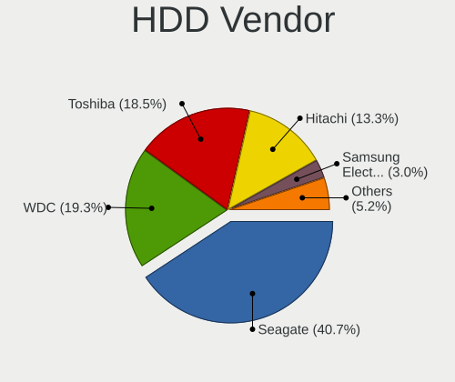

| Vendor              | Computers | Drives | Percent |
|---------------------|-----------|--------|---------|
| Seagate             | 55        | 73     | 40.74%  |
| WDC                 | 26        | 33     | 19.26%  |
| Toshiba             | 25        | 31     | 18.52%  |
| Hitachi             | 18        | 23     | 13.33%  |
| Samsung Electronics | 4         | 6      | 2.96%   |
| HGST                | 3         | 3      | 2.22%   |
| Apple               | 2         | 3      | 1.48%   |
| Maxtor              | 1         | 1      | 0.74%   |
| JMicron Technology  | 1         | 2      | 0.74%   |

SSD Vendor
----------

Solid state drive vendors

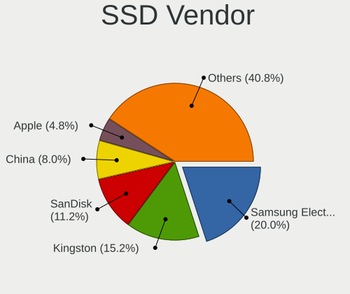

| Vendor              | Computers | Drives | Percent |
|---------------------|-----------|--------|---------|
| Samsung Electronics | 25        | 29     | 20%     |
| Kingston            | 19        | 20     | 15.2%   |
| SanDisk             | 14        | 19     | 11.2%   |
| China               | 10        | 11     | 8%      |
| Apple               | 6         | 7      | 4.8%    |
| Crucial             | 5         | 7      | 4%      |
| AirDisk             | 5         | 5      | 4%      |
| WDC                 | 4         | 5      | 3.2%    |
| SPCC                | 4         | 6      | 3.2%    |
| FORESEE             | 4         | 5      | 3.2%    |
| A-DATA Technology   | 3         | 3      | 2.4%    |
| Transcend           | 2         | 2      | 1.6%    |
| SK hynix            | 2         | 2      | 1.6%    |
| PNY                 | 2         | 2      | 1.6%    |
| Intel               | 2         | 2      | 1.6%    |
| Wibtek              | 1         | 1      | 0.8%    |
| Supersonic          | 1         | 1      | 0.8%    |
| Seagate             | 1         | 2      | 0.8%    |
| SCY                 | 1         | 1      | 0.8%    |
| SABRENT             | 1         | 1      | 0.8%    |
| Patriot             | 1         | 1      | 0.8%    |
| OCZ                 | 1         | 1      | 0.8%    |
| Netac               | 1         | 1      | 0.8%    |
| MSI                 | 1         | 1      | 0.8%    |
| Micron Technology   | 1         | 1      | 0.8%    |
| MaiChai             | 1         | 1      | 0.8%    |
| LITEONIT            | 1         | 2      | 0.8%    |
| KODAK               | 1         | 1      | 0.8%    |
| KingFast            | 1         | 2      | 0.8%    |
| HS-SSD-C100         | 1         | 1      | 0.8%    |
| Hewlett-Packard     | 1         | 1      | 0.8%    |
| Eluktro             | 1         | 1      | 0.8%    |
| Unknown             | 1         | 1      | 0.8%    |

Drive Kind
----------

HDD or SSD

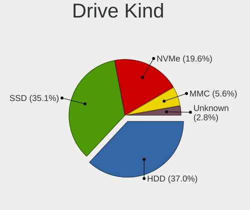

| Kind    | Computers | Drives | Percent |
|---------|-----------|--------|---------|
| HDD     | 119       | 175    | 36.96%  |
| SSD     | 113       | 146    | 35.09%  |
| NVMe    | 63        | 92     | 19.57%  |
| MMC     | 18        | 21     | 5.59%   |
| Unknown | 9         | 9      | 2.8%    |

Drive Connector
---------------

SATA, SAS, NVMe, etc.

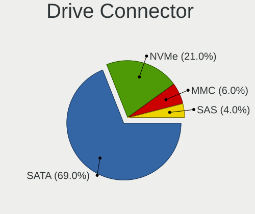

| Type | Computers | Drives | Percent |
|------|-----------|--------|---------|
| SATA | 207       | 316    | 69%     |
| NVMe | 63        | 91     | 21%     |
| MMC  | 18        | 21     | 6%      |
| SAS  | 12        | 15     | 4%      |

Drive Size
----------

Size of hard drive

| Size in TB | Computers | Drives | Percent |
|------------|-----------|--------|---------|
| 0.01-0.5   | 160       | 234    | 69.87%  |
| 0.51-1.0   | 50        | 66     | 21.83%  |
| 1.01-2.0   | 10        | 11     | 4.37%   |
| 3.01-4.0   | 5         | 6      | 2.18%   |
| 4.01-10.0  | 2         | 2      | 0.87%   |
| 2.01-3.0   | 1         | 1      | 0.44%   |
| 10.01-20.0 | 1         | 1      | 0.44%   |

Space Total
-----------

Amount of disk space available on the file system

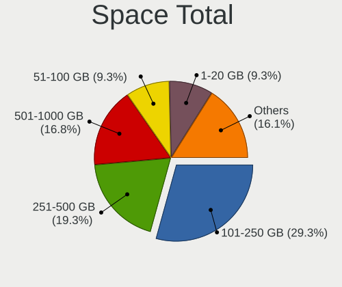

| Size in GB     | Computers | Percent |
|----------------|-----------|---------|
| 101-250        | 82        | 29.29%  |
| 251-500        | 54        | 19.29%  |
| 501-1000       | 47        | 16.79%  |
| 1-20           | 26        | 9.29%   |
| 51-100         | 26        | 9.29%   |
| 1001-2000      | 15        | 5.36%   |
| 21-50          | 10        | 3.57%   |
| 2001-3000      | 7         | 2.5%    |
| Unknown        | 7         | 2.5%    |
| More than 3000 | 6         | 2.14%   |

Space Used
----------

Amount of used disk space

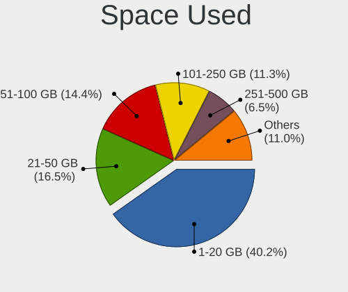

| Used GB        | Computers | Percent |
|----------------|-----------|---------|
| 1-20           | 117       | 40.21%  |
| 21-50          | 48        | 16.49%  |
| 51-100         | 42        | 14.43%  |
| 101-250        | 33        | 11.34%  |
| 251-500        | 19        | 6.53%   |
| 501-1000       | 12        | 4.12%   |
| 1001-2000      | 7         | 2.41%   |
| Unknown        | 7         | 2.41%   |
| 2001-3000      | 4         | 1.37%   |
| More than 3000 | 1         | 0.34%   |
| 0              | 1         | 0.34%   |

Malfunc. Drives
---------------

Drive models with a malfunction

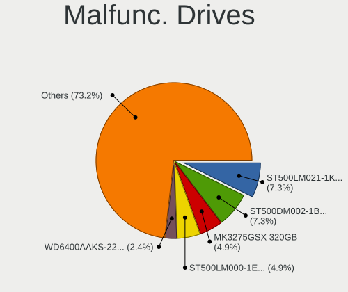

| Model                                                     | Computers | Drives | Percent |
|-----------------------------------------------------------|-----------|--------|---------|
| Seagate ST500LM021-1KJ152 500GB                           | 3         | 3      | 7.32%   |
| Seagate ST500DM002-1BD142 500GB                           | 3         | 4      | 7.32%   |
| Toshiba MK3275GSX 320GB                                   | 2         | 2      | 4.88%   |
| Seagate ST500LM000-1EJ162 500GB                           | 2         | 2      | 4.88%   |
| WDC WD6400AAKS-22A7B2 640GB                               | 1         | 1      | 2.44%   |
| WDC WD5000BPVT-00HXZT1 500GB                              | 1         | 1      | 2.44%   |
| WDC WD5000AZLX-60K2TA0 500GB                              | 1         | 1      | 2.44%   |
| WDC WD2500BEKT-60A25T1 250GB                              | 1         | 1      | 2.44%   |
| WDC WD1003FBYX-05Y7B0 1TB                                 | 1         | 1      | 2.44%   |
| Toshiba MQ01ABD050V 500GB                                 | 1         | 1      | 2.44%   |
| Toshiba MK6465GSXN 640GB                                  | 1         | 1      | 2.44%   |
| Toshiba MK6034GSX 64GB                                    | 1         | 1      | 2.44%   |
| Toshiba MK3276GSX 320GB                                   | 1         | 1      | 2.44%   |
| Toshiba MK2556GSY 250GB                                   | 1         | 1      | 2.44%   |
| Toshiba MK1655GSX 160GB                                   | 1         | 1      | 2.44%   |
| Seagate ST9750420AS 752GB                                 | 1         | 1      | 2.44%   |
| Seagate ST500LT012-1DG142 500GB                           | 1         | 1      | 2.44%   |
| Seagate ST3250318AS 250GB                                 | 1         | 1      | 2.44%   |
| Seagate ST2000LM007-1R8174 2TB                            | 1         | 1      | 2.44%   |
| Seagate ST1000DM010-2EP102 1TB                            | 1         | 1      | 2.44%   |
| Samsung Electronics HM500LI 500GB                         | 1         | 1      | 2.44%   |
| Samsung Electronics HD154UI 1TB                           | 1         | 1      | 2.44%   |
| Realtek Semiconductor RTS5763DL NVMe SSD Controller 512GB | 1         | 1      | 2.44%   |
| Hitachi HTS727550A9E364 500GB                             | 1         | 1      | 2.44%   |
| Hitachi HTS725032A9A364 320GB                             | 1         | 1      | 2.44%   |
| Hitachi HTS722020K9SA00 200GB                             | 1         | 1      | 2.44%   |
| Hitachi HTS547575A9E384 752GB                             | 1         | 1      | 2.44%   |
| Hitachi HTS547564A9E384 640GB                             | 1         | 1      | 2.44%   |
| Hitachi HTS545050A7E380 500GB                             | 1         | 1      | 2.44%   |
| Hitachi HTS545016B9A300 160GB                             | 1         | 1      | 2.44%   |
| Hitachi HTS542512K9SA00 120GB                             | 1         | 1      | 2.44%   |
| Hitachi HDT721025SLA380 250GB                             | 1         | 1      | 2.44%   |
| HGST HTS725050A7E630 500GB                                | 1         | 1      | 2.44%   |
| Crucial CT240BX500SSD1 240GB                              | 1         | 1      | 2.44%   |
| China SSD32G 32GB                                         | 1         | 1      | 2.44%   |

Malfunc. Drive Vendor
---------------------

Vendors of faulty drives

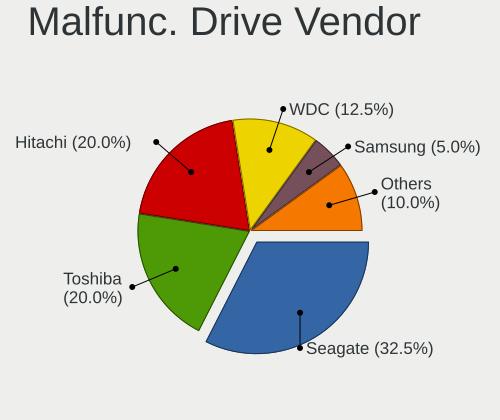

| Vendor                | Computers | Drives | Percent |
|-----------------------|-----------|--------|---------|
| Seagate               | 13        | 14     | 32.5%   |
| Toshiba               | 8         | 8      | 20%     |
| Hitachi               | 8         | 9      | 20%     |
| WDC                   | 5         | 5      | 12.5%   |
| Samsung Electronics   | 2         | 2      | 5%      |
| Realtek Semiconductor | 1         | 1      | 2.5%    |
| HGST                  | 1         | 1      | 2.5%    |
| Crucial               | 1         | 1      | 2.5%    |
| China                 | 1         | 1      | 2.5%    |

Malfunc. HDD Vendor
-------------------

Vendors of faulty HDD drives

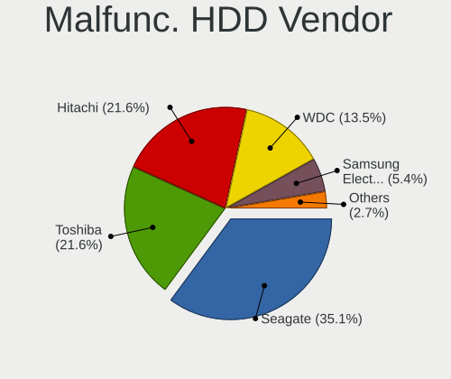

| Vendor              | Computers | Drives | Percent |
|---------------------|-----------|--------|---------|
| Seagate             | 13        | 14     | 35.14%  |
| Toshiba             | 8         | 8      | 21.62%  |
| Hitachi             | 8         | 9      | 21.62%  |
| WDC                 | 5         | 5      | 13.51%  |
| Samsung Electronics | 2         | 2      | 5.41%   |
| HGST                | 1         | 1      | 2.7%    |

Malfunc. Drive Kind
-------------------

Kinds of faulty drives

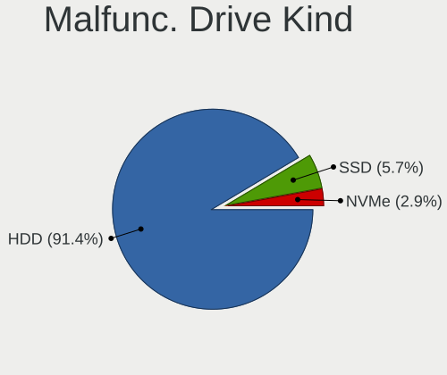

| Kind | Computers | Drives | Percent |
|------|-----------|--------|---------|
| HDD  | 32        | 39     | 91.43%  |
| SSD  | 2         | 2      | 5.71%   |
| NVMe | 1         | 1      | 2.86%   |

Failed Drives
-------------

Failed drive models

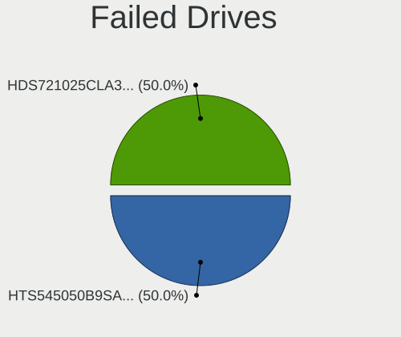

| Model                         | Computers | Drives | Percent |
|-------------------------------|-----------|--------|---------|
| Hitachi HTS545050B9SA00 500GB | 1         | 1      | 50%     |
| Hitachi HDS721025CLA382 250GB | 1         | 1      | 50%     |

Failed Drive Vendor
-------------------

Failed drive vendors

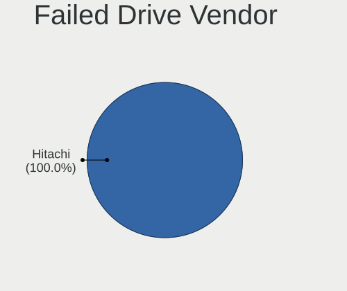

| Vendor  | Computers | Drives | Percent |
|---------|-----------|--------|---------|
| Hitachi | 2         | 2      | 100%    |

Drive Status
------------

Number of failed and malfunc. drives

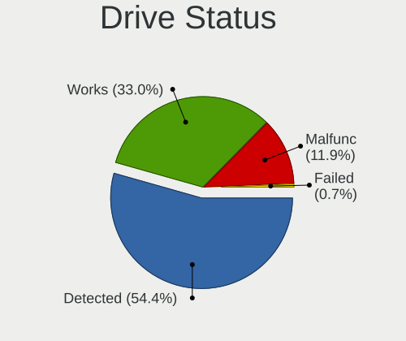

| Status   | Computers | Drives | Percent |
|----------|-----------|--------|---------|
| Detected | 155       | 264    | 54.39%  |
| Works    | 94        | 135    | 32.98%  |
| Malfunc  | 34        | 42     | 11.93%  |
| Failed   | 2         | 2      | 0.7%    |

Storage controller
------------------

Storage Vendor
--------------

Storage controller vendors

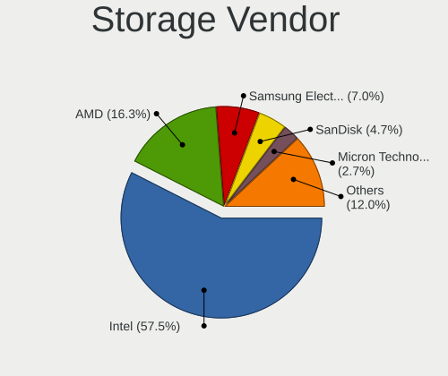

| Vendor                           | Computers | Percent |
|----------------------------------|-----------|---------|
| Intel                            | 173       | 57.48%  |
| AMD                              | 49        | 16.28%  |
| Samsung Electronics              | 21        | 6.98%   |
| SanDisk                          | 14        | 4.65%   |
| Micron Technology                | 8         | 2.66%   |
| SK hynix                         | 7         | 2.33%   |
| Kingston Technology Company      | 5         | 1.66%   |
| Micron/Crucial Technology        | 3         | 1%      |
| Apple                            | 3         | 1%      |
| Toshiba America Info Systems     | 2         | 0.66%   |
| Realtek Semiconductor            | 2         | 0.66%   |
| Nvidia                           | 2         | 0.66%   |
| Marvell Technology Group         | 2         | 0.66%   |
| KIOXIA                           | 2         | 0.66%   |
| ASMedia Technology               | 2         | 0.66%   |
| VIA Technologies                 | 1         | 0.33%   |
| Union Memory (Shenzhen)          | 1         | 0.33%   |
| Silicon Integrated Systems [SiS] | 1         | 0.33%   |
| Phison Electronics               | 1         | 0.33%   |
| MAXIO Technology (Hangzhou)      | 1         | 0.33%   |
| ADATA Technology                 | 1         | 0.33%   |

Storage Model
-------------

Storage controller models

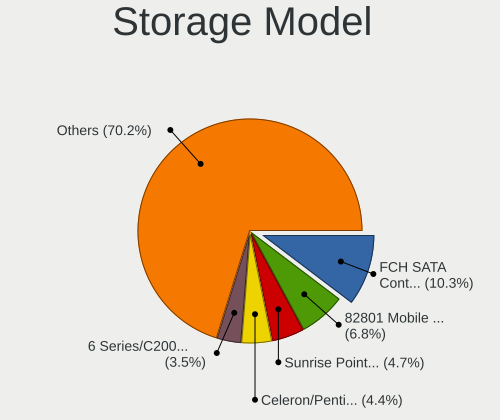

| Model                                                                                   | Computers | Percent |
|-----------------------------------------------------------------------------------------|-----------|---------|
| AMD FCH SATA Controller [AHCI mode]                                                     | 35        | 10.32%  |
| Intel 82801 Mobile SATA Controller [RAID mode]                                          | 23        | 6.78%   |
| Intel Sunrise Point-LP SATA Controller [AHCI mode]                                      | 16        | 4.72%   |
| Intel Celeron/Pentium Silver Processor SATA Controller                                  | 15        | 4.42%   |
| Intel 6 Series/C200 Series Chipset Family 6 port Mobile SATA AHCI Controller            | 12        | 3.54%   |
| Intel 8 Series/C220 Series Chipset Family 6-port SATA Controller 1 [AHCI mode]          | 11        | 3.24%   |
| Intel 7 Series Chipset Family 6-port SATA Controller [AHCI mode]                        | 10        | 2.95%   |
| Samsung NVMe SSD Controller SM981/PM981/PM983                                           | 8         | 2.36%   |
| Intel SATA Controller [RAID mode]                                                       | 7         | 2.06%   |
| AMD SB7x0/SB8x0/SB9x0 IDE Controller                                                    | 6         | 1.77%   |
| SK hynix Gold P31/BC711/PC711 NVMe Solid State Drive                                    | 5         | 1.47%   |
| Samsung S4LN058A01[SSUBX] AHCI SSD Controller (Apple slot)                              | 5         | 1.47%   |
| Intel Q170/Q150/B150/H170/H110/Z170/CM236 Chipset SATA Controller [AHCI Mode]           | 5         | 1.47%   |
| Intel 6 Series/C200 Series Chipset Family 6 port Desktop SATA AHCI Controller           | 5         | 1.47%   |
| AMD 400 Series Chipset SATA Controller                                                  | 5         | 1.47%   |
| Intel 82801G (ICH7 Family) IDE Controller                                               | 4         | 1.18%   |
| Intel 8 Series SATA Controller 1 [AHCI mode]                                            | 4         | 1.18%   |
| Intel 7 Series/C210 Series Chipset Family 6-port SATA Controller [AHCI mode]            | 4         | 1.18%   |
| Intel 5 Series/3400 Series Chipset 6 port SATA AHCI Controller                          | 4         | 1.18%   |
| AMD SB7x0/SB8x0/SB9x0 SATA Controller [IDE mode]                                        | 4         | 1.18%   |
| SanDisk WD SN560/SN740/SN770/SN5000 NVMe SSD                                            | 3         | 0.88%   |
| SanDisk Extreme Pro / WD Black SN750 / PC SN730 / Red SN700 NVMe SSD                    | 3         | 0.88%   |
| Samsung NVMe SSD Controller PM9A1/PM9A3/980PRO                                          | 3         | 0.88%   |
| Micron 2200S NVMe SSD [Cassandra]                                                       | 3         | 0.88%   |
| Intel Volume Management Device NVMe RAID Controller                                     | 3         | 0.88%   |
| Intel Tiger Lake-LP SATA Controller                                                     | 3         | 0.88%   |
| Intel NM10/ICH7 Family SATA Controller [IDE mode]                                       | 3         | 0.88%   |
| Intel Atom Processor E3800 Series SATA AHCI Controller                                  | 3         | 0.88%   |
| Intel 82801IBM/IEM (ICH9M/ICH9M-E) 4 port SATA Controller [AHCI mode]                   | 3         | 0.88%   |
| Intel 6 Series/C200 Series Chipset Family Desktop SATA Controller (IDE mode, ports 4-5) | 3         | 0.88%   |
| Intel 6 Series/C200 Series Chipset Family Desktop SATA Controller (IDE mode, ports 0-3) | 3         | 0.88%   |
| Intel 4 Series Chipset PT IDER Controller                                               | 3         | 0.88%   |
| Intel 200 Series PCH SATA controller [AHCI mode]                                        | 3         | 0.88%   |
| AMD 500 Series Chipset SATA Controller                                                  | 3         | 0.88%   |
| SanDisk Ultra 3D / WD PC SN530, IX SN530, Blue SN550 NVMe SSD (DRAM-less)               | 2         | 0.59%   |
| SanDisk PC SN520 x2 M.2 2242 NVMe SSD                                                   | 2         | 0.59%   |
| Samsung NVMe SSD Controller SM961/PM961/SM963                                           | 2         | 0.59%   |
| Samsung NVMe SSD Controller 980 (DRAM-less)                                             | 2         | 0.59%   |
| Micron/Crucial P2 [Nick P2] / P3 / P3 Plus NVMe PCIe SSD (DRAM-less)                    | 2         | 0.59%   |
| Micron 2550 NVMe SSD (DRAM-less)                                                        | 2         | 0.59%   |

Storage Kind
------------

Kind of storage controller (IDE, SATA, NVMe, SAS, ...)

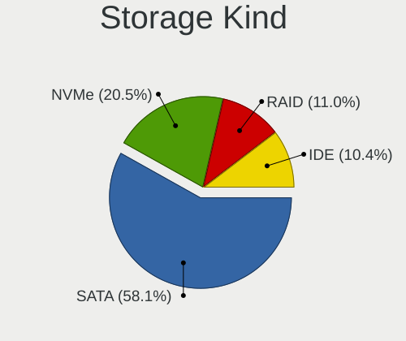

| Kind | Computers | Percent |
|------|-----------|---------|
| SATA | 179       | 58.12%  |
| NVMe | 63        | 20.45%  |
| RAID | 34        | 11.04%  |
| IDE  | 32        | 10.39%  |

Processor
---------

CPU Vendor
----------

Processor vendors

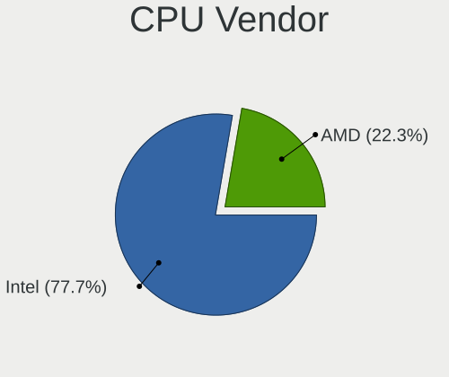

| Vendor | Computers | Percent |
|--------|-----------|---------|
| Intel  | 202       | 77.69%  |
| AMD    | 58        | 22.31%  |

CPU Model
---------

Processor models

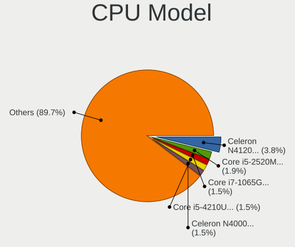

| Model                                         | Computers | Percent |
|-----------------------------------------------|-----------|---------|
| Intel Celeron N4120 CPU @ 1.10GHz             | 10        | 3.83%   |
| Intel Core i5-2520M CPU @ 2.50GHz             | 5         | 1.92%   |
| Intel Core i7-1065G7 CPU @ 1.30GHz            | 4         | 1.53%   |
| Intel Core i5-4210U CPU @ 1.70GHz             | 4         | 1.53%   |
| Intel Celeron N4000 CPU @ 1.10GHz             | 4         | 1.53%   |
| Intel Core i7-8550U CPU @ 1.80GHz             | 3         | 1.15%   |
| Intel Core i7-2640M CPU @ 2.80GHz             | 3         | 1.15%   |
| Intel Core i5-9300H CPU @ 2.40GHz             | 3         | 1.15%   |
| Intel Core i5-8250U CPU @ 1.60GHz             | 3         | 1.15%   |
| Intel Core i5-5250U CPU @ 1.60GHz             | 3         | 1.15%   |
| Intel Core i5-3470 CPU @ 3.20GHz              | 3         | 1.15%   |
| Intel Core i5-3210M CPU @ 2.50GHz             | 3         | 1.15%   |
| Intel Core i5-2400 CPU @ 3.10GHz              | 3         | 1.15%   |
| Intel Core i3-8130U CPU @ 2.20GHz             | 3         | 1.15%   |
| AMD Ryzen 7 5800H with Radeon Graphics        | 3         | 1.15%   |
| AMD Ryzen 5 3500U with Radeon Vega Mobile Gfx | 3         | 1.15%   |
| Intel Core i7-8565U CPU @ 1.80GHz             | 2         | 0.77%   |
| Intel Core i7-2620M CPU @ 2.70GHz             | 2         | 0.77%   |
| Intel Core i5-8365U CPU @ 1.60GHz             | 2         | 0.77%   |
| Intel Core i5-7300U CPU @ 2.60GHz             | 2         | 0.77%   |
| Intel Core i5-7200U CPU @ 2.50GHz             | 2         | 0.77%   |
| Intel Core i5-5350U CPU @ 1.80GHz             | 2         | 0.77%   |
| Intel Core i5-4590 CPU @ 3.30GHz              | 2         | 0.77%   |
| Intel Core i5-4570 CPU @ 3.20GHz              | 2         | 0.77%   |
| Intel Core i5-3340M CPU @ 2.70GHz             | 2         | 0.77%   |
| Intel Core i5-3320M CPU @ 2.60GHz             | 2         | 0.77%   |
| Intel Core i5-3230M CPU @ 2.60GHz             | 2         | 0.77%   |
| Intel Core i5-2415M CPU @ 2.30GHz             | 2         | 0.77%   |
| Intel Core i3-8100B CPU @ 3.60GHz             | 2         | 0.77%   |
| Intel Core i3-7100U CPU @ 2.40GHz             | 2         | 0.77%   |
| Intel Core i3-2375M CPU @ 1.50GHz             | 2         | 0.77%   |
| Intel Core 2 Duo CPU T8100 @ 2.10GHz          | 2         | 0.77%   |
| Intel Core 2 CPU T7200 @ 2.00GHz              | 2         | 0.77%   |
| Intel Celeron CPU N3050 @ 1.60GHz             | 2         | 0.77%   |
| Intel Celeron CPU N2840 @ 2.16GHz             | 2         | 0.77%   |
| Intel Atom x5-Z8350 CPU @ 1.44GHz             | 2         | 0.77%   |
| Intel 11th Gen Core i7-1165G7 @ 2.80GHz       | 2         | 0.77%   |
| AMD Ryzen 7 5800X 8-Core Processor            | 2         | 0.77%   |
| AMD Ryzen 5 5600G with Radeon Graphics        | 2         | 0.77%   |
| AMD Ryzen 5 5500U with Radeon Graphics        | 2         | 0.77%   |

CPU Model Family
----------------

Processor model prefix

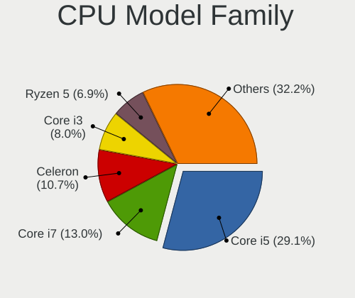

| Model                   | Computers | Percent |
|-------------------------|-----------|---------|
| Intel Core i5           | 76        | 29.12%  |
| Intel Core i7           | 34        | 13.03%  |
| Intel Celeron           | 28        | 10.73%  |
| Intel Core i3           | 21        | 8.05%   |
| AMD Ryzen 5             | 18        | 6.9%    |
| Other                   | 12        | 4.6%    |
| AMD Ryzen 7             | 9         | 3.45%   |
| Intel Core 2 Duo        | 7         | 2.68%   |
| Intel Pentium           | 5         | 1.92%   |
| Intel Atom              | 5         | 1.92%   |
| AMD FX                  | 5         | 1.92%   |
| AMD A8                  | 5         | 1.92%   |
| Intel Core 2            | 4         | 1.53%   |
| Intel Xeon              | 3         | 1.15%   |
| AMD A6                  | 3         | 1.15%   |
| AMD A10                 | 3         | 1.15%   |
| Intel Pentium Dual-Core | 2         | 0.77%   |
| Intel Pentium 4         | 2         | 0.77%   |
| AMD Sempron             | 2         | 0.77%   |
| AMD Ryzen 3             | 2         | 0.77%   |
| AMD A4                  | 2         | 0.77%   |
| Intel Pentium Dual      | 1         | 0.38%   |
| Intel Pentium D         | 1         | 0.38%   |
| Intel Genuine           | 1         | 0.38%   |
| Intel Core i9           | 1         | 0.38%   |
| Intel Core 2 Quad       | 1         | 0.38%   |
| Intel Core              | 1         | 0.38%   |
| AMD Quad-Core           | 1         | 0.38%   |
| AMD PRO A10             | 1         | 0.38%   |
| AMD Phenom II X4        | 1         | 0.38%   |
| AMD Mobile Sempron      | 1         | 0.38%   |
| AMD GX                  | 1         | 0.38%   |
| AMD E2                  | 1         | 0.38%   |
| AMD A12                 | 1         | 0.38%   |

CPU Cores
---------

Number of processor cores

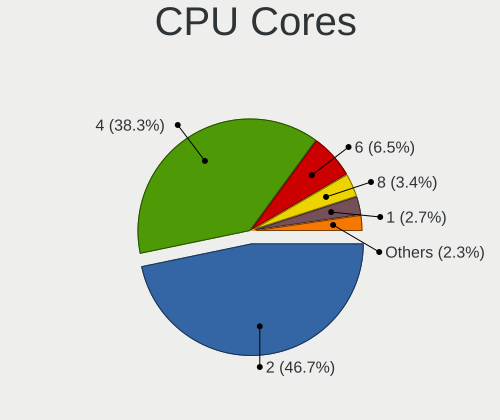

| Number | Computers | Percent |
|--------|-----------|---------|
| 2      | 122       | 46.74%  |
| 4      | 100       | 38.31%  |
| 6      | 17        | 6.51%   |
| 8      | 9         | 3.45%   |
| 1      | 7         | 2.68%   |
| 10     | 2         | 0.77%   |
| 16     | 1         | 0.38%   |
| 14     | 1         | 0.38%   |
| 12     | 1         | 0.38%   |
| 3      | 1         | 0.38%   |

CPU Sockets
-----------

Number of sockets

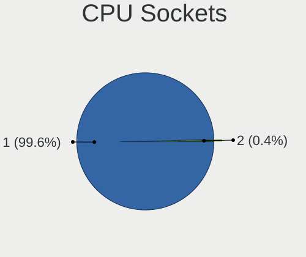

| Number | Computers | Percent |
|--------|-----------|---------|
| 1      | 259       | 99.62%  |
| 2      | 1         | 0.38%   |

CPU Threads
-----------

Threads per core (Hyper-Threading)

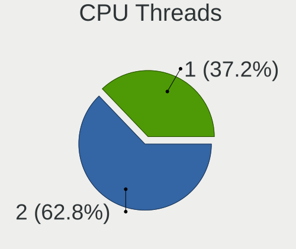

| Number | Computers | Percent |
|--------|-----------|---------|
| 2      | 164       | 62.84%  |
| 1      | 97        | 37.16%  |

CPU Op-Modes
------------

CPU Operation Modes (32-bit, 64-bit)

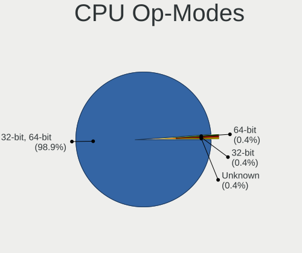

| Op mode        | Computers | Percent |
|----------------|-----------|---------|
| 32-bit, 64-bit | 258       | 98.85%  |
| 64-bit         | 1         | 0.38%   |
| 32-bit         | 1         | 0.38%   |
| Unknown        | 1         | 0.38%   |

CPU Microcode
-------------

Microcode number

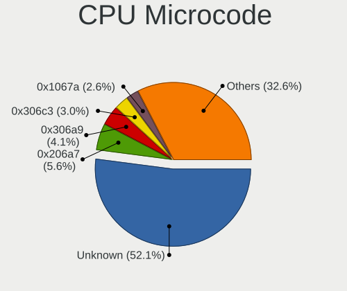

| Number     | Computers | Percent |
|------------|-----------|---------|
| Unknown    | 139       | 52.06%  |
| 0x206a7    | 15        | 5.62%   |
| 0x306a9    | 11        | 4.12%   |
| 0x306c3    | 8         | 3%      |
| 0x1067a    | 7         | 2.62%   |
| 0x806e9    | 6         | 2.25%   |
| 0x506e3    | 6         | 2.25%   |
| 0x40651    | 5         | 1.87%   |
| 0x806ea    | 4         | 1.5%    |
| 0x706a1    | 4         | 1.5%    |
| 0x706a8    | 3         | 1.12%   |
| 0x30678    | 3         | 1.12%   |
| 0x08108109 | 3         | 1.12%   |
| 0x0800820d | 3         | 1.12%   |
| 0x07030105 | 3         | 1.12%   |
| 0x06000852 | 3         | 1.12%   |
| 0x906ea    | 2         | 0.75%   |
| 0x806ec    | 2         | 0.75%   |
| 0x6fb      | 2         | 0.75%   |
| 0x6f6      | 2         | 0.75%   |
| 0x20655    | 2         | 0.75%   |
| 0x20652    | 2         | 0.75%   |
| 0x10676    | 2         | 0.75%   |
| 0x08600103 | 2         | 0.75%   |
| 0x0600611a | 2         | 0.75%   |
| 0x06003106 | 2         | 0.75%   |
| 0xf65      | 1         | 0.37%   |
| 0xf49      | 1         | 0.37%   |
| 0x906e9    | 1         | 0.37%   |
| 0x806c1    | 1         | 0.37%   |
| 0x706e5    | 1         | 0.37%   |
| 0x6fd      | 1         | 0.37%   |
| 0x506c9    | 1         | 0.37%   |
| 0x406c3    | 1         | 0.37%   |
| 0x306d4    | 1         | 0.37%   |
| 0x30679    | 1         | 0.37%   |
| 0x106ca    | 1         | 0.37%   |
| 0x106c2    | 1         | 0.37%   |
| 0x10661    | 1         | 0.37%   |
| 0x08608103 | 1         | 0.37%   |

CPU Microarch
-------------

Microarchitecture

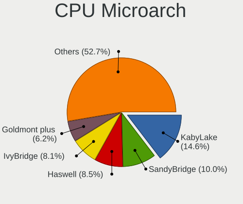

| Name              | Computers | Percent |
|-------------------|-----------|---------|
| KabyLake          | 38        | 14.62%  |
| SandyBridge       | 26        | 10%     |
| Haswell           | 22        | 8.46%   |
| IvyBridge         | 21        | 8.08%   |
| Goldmont plus     | 16        | 6.15%   |
| Silvermont        | 12        | 4.62%   |
| Zen+              | 10        | 3.85%   |
| Penryn            | 10        | 3.85%   |
| Broadwell         | 10        | 3.85%   |
| Skylake           | 9         | 3.46%   |
| Unknown           | 9         | 3.46%   |
| Zen 3             | 8         | 3.08%   |
| Westmere          | 8         | 3.08%   |
| TigerLake         | 7         | 2.69%   |
| Puma              | 7         | 2.69%   |
| Core              | 7         | 2.69%   |
| Piledriver        | 5         | 1.92%   |
| Zen 2             | 4         | 1.54%   |
| IceLake           | 4         | 1.54%   |
| Excavator         | 4         | 1.54%   |
| NetBurst          | 3         | 1.15%   |
| Zen               | 2         | 0.77%   |
| Steamroller       | 2         | 0.77%   |
| K8 Hammer         | 2         | 0.77%   |
| Jaguar            | 2         | 0.77%   |
| CometLake         | 2         | 0.77%   |
| Bulldozer         | 2         | 0.77%   |
| Bonnell           | 2         | 0.77%   |
| Meteorlake Hybrid | 1         | 0.38%   |
| K8 & K10 hybrid   | 1         | 0.38%   |
| K10 Llano         | 1         | 0.38%   |
| K10               | 1         | 0.38%   |
| Goldmont          | 1         | 0.38%   |
| Alderlake Hybrid  | 1         | 0.38%   |

Graphics
--------

GPU Vendor
----------

Vendors of graphics cards

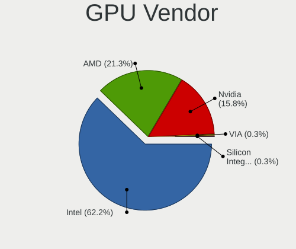

| Vendor                           | Computers | Percent |
|----------------------------------|-----------|---------|
| Intel                            | 181       | 62.2%   |
| AMD                              | 62        | 21.31%  |
| Nvidia                           | 46        | 15.81%  |
| VIA Technologies                 | 1         | 0.34%   |
| Silicon Integrated Systems [SiS] | 1         | 0.34%   |

GPU Model
---------

Graphics card models

| Model                                                                                    | Computers | Percent |
|------------------------------------------------------------------------------------------|-----------|---------|
| Intel 2nd Generation Core Processor Family Integrated Graphics Controller                | 22        | 7.41%   |
| Intel GeminiLake [UHD Graphics 600]                                                      | 16        | 5.39%   |
| Intel 3rd Gen Core processor Graphics Controller                                         | 13        | 4.38%   |
| Intel Xeon E3-1200 v3/4th Gen Core Processor Integrated Graphics Controller              | 9         | 3.03%   |
| Intel Kaby Lake-R GT2 [UHD Graphics 620]                                                 | 9         | 3.03%   |
| Intel Kaby Lake-U GT2 [HD Graphics 620]                                                  | 8         | 2.69%   |
| Intel Haswell-ULT Integrated Graphics Controller                                         | 7         | 2.36%   |
| AMD Picasso/Raven 2 [Radeon Vega Series / Radeon Vega Mobile Series]                     | 7         | 2.36%   |
| Intel WhiskeyLake-U GT2 [UHD Graphics 620]                                               | 6         | 2.02%   |
| Intel TigerLake-LP GT2 [Iris Xe Graphics]                                                | 6         | 2.02%   |
| Intel Core Processor Integrated Graphics Controller                                      | 6         | 2.02%   |
| Intel CoffeeLake-H GT2 [UHD Graphics 630]                                                | 6         | 2.02%   |
| Intel Atom/Celeron/Pentium Processor x5-E8000/J3xxx/N3xxx Integrated Graphics Controller | 6         | 2.02%   |
| Intel Atom Processor Z36xxx/Z37xxx Series Graphics & Display                             | 6         | 2.02%   |
| Nvidia TU117M [GeForce GTX 1650 Mobile / Max-Q]                                          | 5         | 1.68%   |
| Intel Broadwell-U GT3 [HD Graphics 6000]                                                 | 5         | 1.68%   |
| AMD Cezanne [Radeon Vega Series / Radeon Vega Mobile Series]                             | 5         | 1.68%   |
| Intel Skylake-S GT2 [HD Graphics 530]                                                    | 4         | 1.35%   |
| Intel Iris Plus Graphics G7                                                              | 4         | 1.35%   |
| Intel 4th Gen Core Processor Integrated Graphics Controller                              | 4         | 1.35%   |
| AMD Ellesmere [Radeon RX 470/480/570/570X/580/580X/590]                                  | 4         | 1.35%   |
| Intel Xeon E3-1200 v2/3rd Gen Core processor Graphics Controller                         | 3         | 1.01%   |
| Intel Mobile 4 Series Chipset Integrated Graphics Controller                             | 3         | 1.01%   |
| Intel Kaby Lake-S GT2 [HD Graphics 630]                                                  | 3         | 1.01%   |
| Intel Broadwell-U GT2 [HD Graphics 5500]                                                 | 3         | 1.01%   |
| AMD Wani [Radeon R5/R6/R7 Graphics]                                                      | 3         | 1.01%   |
| AMD RS780L [Radeon 3000]                                                                 | 3         | 1.01%   |
| AMD Mullins [Radeon R4/R5 Graphics]                                                      | 3         | 1.01%   |
| Nvidia TU106M [GeForce RTX 2060 Mobile]                                                  | 2         | 0.67%   |
| Nvidia GF119M [NVS 4200M]                                                                | 2         | 0.67%   |
| Nvidia GF119 [GeForce GT 520]                                                            | 2         | 0.67%   |
| Nvidia GA106M [GeForce RTX 3060 Mobile / Max-Q]                                          | 2         | 0.67%   |
| Intel Skylake-U GT2 [HD Graphics 520]                                                    | 2         | 0.67%   |
| Intel Skylake-H GT2 [HD Graphics 530]                                                    | 2         | 0.67%   |
| Intel Mobile GM965/GL960 Integrated Graphics Controller (secondary)                      | 2         | 0.67%   |
| Intel Mobile GM965/GL960 Integrated Graphics Controller (primary)                        | 2         | 0.67%   |
| Intel IvyBridge GT2 [HD Graphics 4000]                                                   | 2         | 0.67%   |
| Intel 4 Series Chipset Integrated Graphics Controller                                    | 2         | 0.67%   |
| AMD Temash [Radeon HD 8250/8280G]                                                        | 2         | 0.67%   |
| AMD Seymour [Radeon HD 6400M/7400M Series]                                               | 2         | 0.67%   |

GPU Combo
---------

Combinations of graphics cards

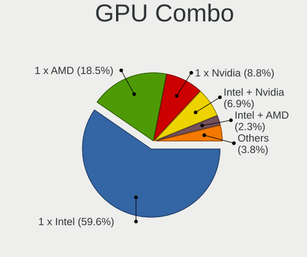

| Name           | Computers | Percent |
|----------------|-----------|---------|
| 1 x Intel      | 155       | 59.62%  |
| 1 x AMD        | 48        | 18.46%  |
| 1 x Nvidia     | 23        | 8.85%   |
| Intel + Nvidia | 18        | 6.92%   |
| Intel + AMD    | 6         | 2.31%   |
| AMD + Nvidia   | 5         | 1.92%   |
| 2 x AMD        | 3         | 1.15%   |
| 1 x VIA        | 1         | 0.38%   |
| 1 x SiS        | 1         | 0.38%   |

GPU Driver
----------

Free vs proprietary

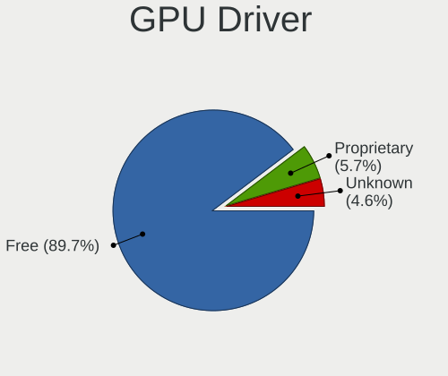

| Driver      | Computers | Percent |
|-------------|-----------|---------|
| Free        | 235       | 89.69%  |
| Proprietary | 15        | 5.73%   |
| Unknown     | 12        | 4.58%   |

GPU Memory
----------

Total video memory

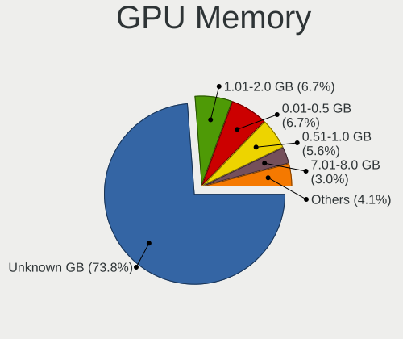

| Size in GB | Computers | Percent |
|------------|-----------|---------|
| Unknown    | 197       | 73.78%  |
| 1.01-2.0   | 18        | 6.74%   |
| 0.01-0.5   | 18        | 6.74%   |
| 0.51-1.0   | 15        | 5.62%   |
| 7.01-8.0   | 8         | 3%      |
| 3.01-4.0   | 7         | 2.62%   |
| 2.01-3.0   | 2         | 0.75%   |
| 5.01-6.0   | 1         | 0.37%   |
| 8.01-16.0  | 1         | 0.37%   |

Monitor
-------

Monitor Vendor
--------------

Monitor vendors

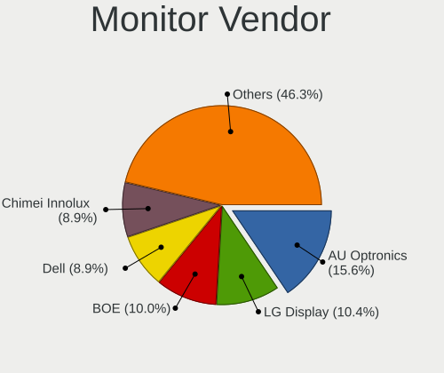

| Vendor                  | Computers | Percent |
|-------------------------|-----------|---------|
| AU Optronics            | 42        | 15.56%  |
| LG Display              | 28        | 10.37%  |
| BOE                     | 27        | 10%     |
| Dell                    | 24        | 8.89%   |
| Chimei Innolux          | 24        | 8.89%   |
| Samsung Electronics     | 21        | 7.78%   |
| AOC                     | 15        | 5.56%   |
| Hewlett-Packard         | 11        | 4.07%   |
| Apple                   | 11        | 4.07%   |
| Goldstar                | 6         | 2.22%   |
| Chi Mei Optoelectronics | 6         | 2.22%   |
| Acer                    | 5         | 1.85%   |
| Lenovo                  | 4         | 1.48%   |
| InfoVision              | 4         | 1.48%   |
| Viotek                  | 3         | 1.11%   |
| Sony                    | 3         | 1.11%   |
| Unknown (XXX)           | 2         | 0.74%   |
| Philips                 | 2         | 0.74%   |
| PANDA                   | 2         | 0.74%   |
| KDC                     | 2         | 0.74%   |
| InnoLux Display         | 2         | 0.74%   |
| CXK                     | 2         | 0.74%   |
| Ancor Communications    | 2         | 0.74%   |
| ZTR                     | 1         | 0.37%   |
| WSX                     | 1         | 0.37%   |
| Westinghouse            | 1         | 0.37%   |
| Vizio                   | 1         | 0.37%   |
| ViewSonic               | 1         | 0.37%   |
| Valve                   | 1         | 0.37%   |
| Unknown                 | 1         | 0.37%   |
| STA                     | 1         | 0.37%   |
| Sharp                   | 1         | 0.37%   |
| Sceptre Tech            | 1         | 0.37%   |
| Panasonic               | 1         | 0.37%   |
| NXP                     | 1         | 0.37%   |
| NEC Computers           | 1         | 0.37%   |
| MSI                     | 1         | 0.37%   |
| LG Philips              | 1         | 0.37%   |
| LG Electronics          | 1         | 0.37%   |
| KTC                     | 1         | 0.37%   |

Monitor Model
-------------

Monitor models

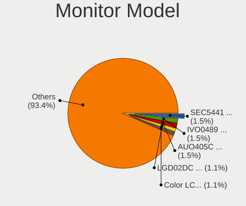

| Model                                                                | Computers | Percent |
|----------------------------------------------------------------------|-----------|---------|
| Samsung Electronics LCD Monitor SEC5441 1280x800 331x207mm 15.4-inch | 4         | 1.47%   |
| InfoVision LCD Monitor IVO0489 1366x768 256x144mm 11.6-inch          | 4         | 1.47%   |
| AU Optronics LCD Monitor AUO405C 1366x768 256x144mm 11.6-inch        | 4         | 1.47%   |
| LG Display LCD Monitor LGD02DC 1366x768 344x194mm 15.5-inch          | 3         | 1.1%    |
| Apple Color LCD APP9CF0 1440x900 290x180mm 13.4-inch                 | 3         | 1.1%    |
| Sony TV SNYDD02 1920x1080 708x398mm 32.0-inch                        | 2         | 0.73%   |
| LG Display LCD Monitor LGD02EB 1366x768 309x174mm 14.0-inch          | 2         | 0.73%   |
| KDC LCD Monitor KDC0109 1366x768 256x144mm 11.6-inch                 | 2         | 0.73%   |
| Goldstar FULL HD GSM5B55 1920x1080 480x270mm 21.7-inch               | 2         | 0.73%   |
| Dell 1909W DELA03C 1440x900 408x255mm 18.9-inch                      | 2         | 0.73%   |
| CXK CU17 CXKD004 3840x2160 383x215mm 17.3-inch                       | 2         | 0.73%   |
| Chimei Innolux LCD Monitor CMN15DB 1366x768 344x193mm 15.5-inch      | 2         | 0.73%   |
| Chimei Innolux LCD Monitor CMN15CA 1366x768 344x193mm 15.5-inch      | 2         | 0.73%   |
| BOE LCD Monitor BOE0715 1366x768 256x144mm 11.6-inch                 | 2         | 0.73%   |
| AU Optronics LCD Monitor AUOD1ED 1920x1080 344x193mm 15.5-inch       | 2         | 0.73%   |
| AU Optronics LCD Monitor AUO61ED 1920x1080 344x194mm 15.5-inch       | 2         | 0.73%   |
| AU Optronics LCD Monitor AUO45EC 1366x768 344x193mm 15.5-inch        | 2         | 0.73%   |
| AU Optronics LCD Monitor AUO11EC 1366x768 344x193mm 15.5-inch        | 2         | 0.73%   |
| AU Optronics LCD Monitor AUO10EC 1366x768 344x193mm 15.5-inch        | 2         | 0.73%   |
| AU Optronics LCD Monitor AUO105C 1366x768 256x144mm 11.6-inch        | 2         | 0.73%   |
| AOC 27G2G4 AOC2702 1920x1080 598x336mm 27.0-inch                     | 2         | 0.73%   |
| AOC 24B1W1 AOC2401 1920x1080 527x296mm 23.8-inch                     | 2         | 0.73%   |
| AOC 2269WM AOC2269 1920x1080 477x268mm 21.5-inch                     | 2         | 0.73%   |
| AOC 2180W AOC2180 1920x1080 458x258mm 20.7-inch                      | 2         | 0.73%   |
| ZTR LCD Monitor ZTR0001 1366x768 309x173mm 13.9-inch                 | 1         | 0.37%   |
| WSX SGD SX8 WSX4843 1920x1080 708x398mm 32.0-inch                    | 1         | 0.37%   |
| Westinghouse EUM24F1G1 WDT1E64 1920x1080 530x300mm 24.0-inch         | 1         | 0.37%   |
| Vizio D24-D1 VIZ1005 1920x1080 521x293mm 23.5-inch                   | 1         | 0.37%   |
| Viotek GN34CW VTK3400 3440x1440 795x334mm 33.9-inch                  | 1         | 0.37%   |
| Viotek GN32DB VTK3200 2560x1440 698x393mm 31.5-inch                  | 1         | 0.37%   |
| Viotek GFT27DB VTK2700 2560x1440 597x336mm 27.0-inch                 | 1         | 0.37%   |
| ViewSonic VX2757 VSCF931 1920x1080 598x336mm 27.0-inch               | 1         | 0.37%   |
| Valve ANX7530 U VLV3001 800x1280 100x150mm 7.1-inch                  | 1         | 0.37%   |
| Unknown LCD Monitor FFFF 2288x1287 2550x2550mm 142.0-inch            | 1         | 0.37%   |
| Unknown (XXX) MS82P XXX001A 1360x768 330x210mm 15.4-inch             | 1         | 0.37%   |
| Unknown (XXX) DTV XXX0030 1600x1200 708x398mm 32.0-inch              | 1         | 0.37%   |
| STA LCD Monitor STA0001 1366x768 256x144mm 11.6-inch                 | 1         | 0.37%   |
| Sony TV SNY1703 1360x768                                             | 1         | 0.37%   |
| Sharp LQ100P1JX51 SHP14A6 1800x1200 211x141mm 10.0-inch              | 1         | 0.37%   |
| Sceptre Tech Sceptre F27 SPT0AD7 1920x1080 600x330mm 27.0-inch       | 1         | 0.37%   |

Monitor Resolution
------------------

Monitor screen resolution

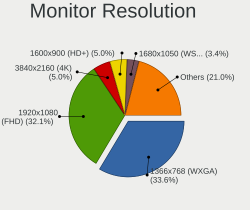

| Resolution         | Computers | Percent |
|--------------------|-----------|---------|
| 1366x768 (WXGA)    | 88        | 33.59%  |
| 1920x1080 (FHD)    | 84        | 32.06%  |
| 3840x2160 (4K)     | 13        | 4.96%   |
| 1600x900 (HD+)     | 13        | 4.96%   |
| 1680x1050 (WSXGA+) | 9         | 3.44%   |
| 1440x900 (WXGA+)   | 9         | 3.44%   |
| 1280x1024 (SXGA)   | 9         | 3.44%   |
| 1280x800 (WXGA)    | 8         | 3.05%   |
| 2560x1440 (QHD)    | 6         | 2.29%   |
| 1360x768           | 4         | 1.53%   |
| 2560x1600          | 3         | 1.15%   |
| 3440x1440          | 2         | 0.76%   |
| 1024x768 (XGA)     | 2         | 0.76%   |
| 800x1280           | 1         | 0.38%   |
| 3840x1100          | 1         | 0.38%   |
| 2880x1920          | 1         | 0.38%   |
| 2288x1287          | 1         | 0.38%   |
| 2160x1440          | 1         | 0.38%   |
| 1984x768           | 1         | 0.38%   |
| 1920x1280          | 1         | 0.38%   |
| 1800x1200          | 1         | 0.38%   |
| 1400x1050          | 1         | 0.38%   |
| 1280x768           | 1         | 0.38%   |
| 1024x600           | 1         | 0.38%   |
| Unknown            | 1         | 0.38%   |

Monitor Diagonal
----------------

Diagonal size in inches

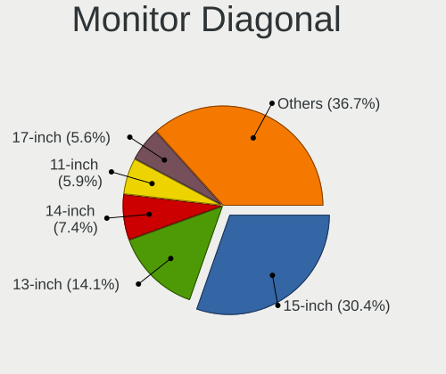

| Inches  | Computers | Percent |
|---------|-----------|---------|
| 15      | 82        | 30.37%  |
| 13      | 38        | 14.07%  |
| 14      | 20        | 7.41%   |
| 11      | 16        | 5.93%   |
| 17      | 15        | 5.56%   |
| 21      | 11        | 4.07%   |
| 27      | 10        | 3.7%    |
| 19      | 10        | 3.7%    |
| 24      | 9         | 3.33%   |
| 22      | 9         | 3.33%   |
| 31      | 6         | 2.22%   |
| 20      | 6         | 2.22%   |
| Unknown | 6         | 2.22%   |
| 23      | 5         | 1.85%   |
| 18      | 5         | 1.85%   |
| 34      | 3         | 1.11%   |
| 32      | 3         | 1.11%   |
| 50      | 2         | 0.74%   |
| 12      | 2         | 0.74%   |
| 10      | 2         | 0.74%   |
| 142     | 1         | 0.37%   |
| 84      | 1         | 0.37%   |
| 72      | 1         | 0.37%   |
| 63      | 1         | 0.37%   |
| 54      | 1         | 0.37%   |
| 41      | 1         | 0.37%   |
| 40      | 1         | 0.37%   |
| 36      | 1         | 0.37%   |
| 16      | 1         | 0.37%   |
| 7       | 1         | 0.37%   |

Monitor Width
-------------

Physical width

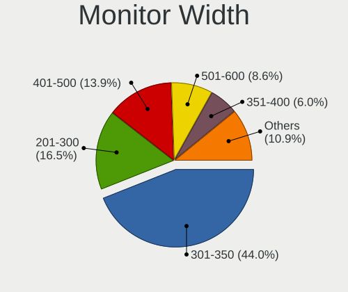

| Width in mm    | Computers | Percent |
|----------------|-----------|---------|
| 301-350        | 117       | 43.98%  |
| 201-300        | 44        | 16.54%  |
| 401-500        | 37        | 13.91%  |
| 501-600        | 23        | 8.65%   |
| 351-400        | 16        | 6.02%   |
| 701-800        | 7         | 2.63%   |
| 601-700        | 6         | 2.26%   |
| Unknown        | 6         | 2.26%   |
| 1001-1500      | 4         | 1.5%    |
| 1501-2000      | 2         | 0.75%   |
| More than 2000 | 1         | 0.38%   |
| 801-900        | 1         | 0.38%   |
| 901-1000       | 1         | 0.38%   |
| 1-100          | 1         | 0.38%   |

Aspect Ratio
------------

Proportional relationship between the width and the height

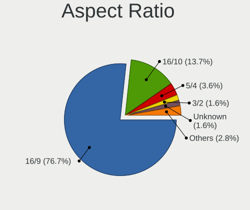

| Ratio   | Computers | Percent |
|---------|-----------|---------|
| 16/9    | 191       | 76.71%  |
| 16/10   | 34        | 13.65%  |
| 5/4     | 9         | 3.61%   |
| 3/2     | 4         | 1.61%   |
| Unknown | 4         | 1.61%   |
| 4/3     | 2         | 0.8%    |
| 21/9    | 2         | 0.8%    |
| 3.40    | 1         | 0.4%    |
| 1.00    | 1         | 0.4%    |
| 0.67    | 1         | 0.4%    |

Monitor Area
------------

Area in inch²

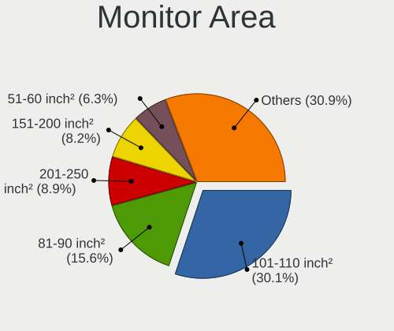

| Area in inch² | Computers | Percent |
|----------------|-----------|---------|
| 101-110        | 81        | 30.11%  |
| 81-90          | 42        | 15.61%  |
| 201-250        | 24        | 8.92%   |
| 151-200        | 22        | 8.18%   |
| 51-60          | 17        | 6.32%   |
| 71-80          | 14        | 5.2%    |
| 351-500        | 11        | 4.09%   |
| 141-150        | 11        | 4.09%   |
| 301-350        | 10        | 3.72%   |
| 121-130        | 9         | 3.35%   |
| More than 1000 | 7         | 2.6%    |
| Unknown        | 6         | 2.23%   |
| 501-1000       | 4         | 1.49%   |
| 251-300        | 3         | 1.12%   |
| 61-70          | 2         | 0.74%   |
| 41-50          | 2         | 0.74%   |
| 91-100         | 2         | 0.74%   |
| 1-40           | 1         | 0.37%   |
| 111-120        | 1         | 0.37%   |

Pixel Density
-------------

Pixels per inch

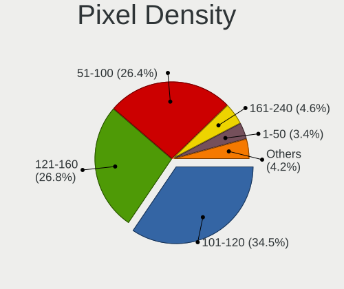

| Density       | Computers | Percent |
|---------------|-----------|---------|
| 101-120       | 90        | 34.48%  |
| 121-160       | 70        | 26.82%  |
| 51-100        | 69        | 26.44%  |
| 161-240       | 12        | 4.6%    |
| 1-50          | 9         | 3.45%   |
| Unknown       | 6         | 2.3%    |
| More than 240 | 5         | 1.92%   |

Multiple Monitors
-----------------

Total monitors connected

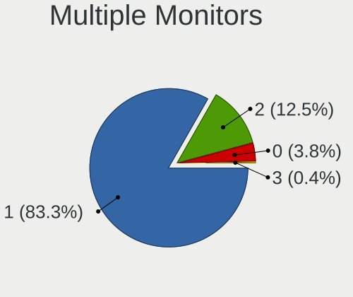

| Total | Computers | Percent |
|-------|-----------|---------|
| 1     | 219       | 83.27%  |
| 2     | 33        | 12.55%  |
| 0     | 10        | 3.8%    |
| 3     | 1         | 0.38%   |

Network
-------

Net Controller Vendor
---------------------

Controller vendors

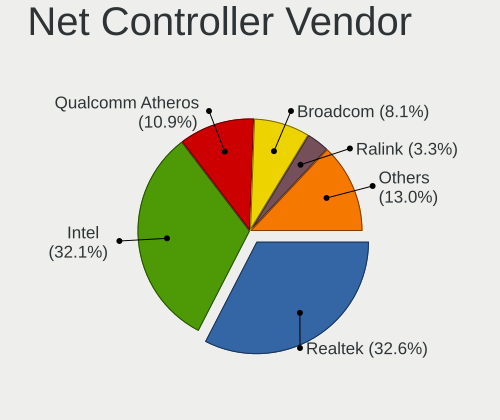

| Vendor                          | Computers | Percent |
|---------------------------------|-----------|---------|
| Realtek Semiconductor           | 128       | 32.57%  |
| Intel                           | 126       | 32.06%  |
| Qualcomm Atheros                | 43        | 10.94%  |
| Broadcom                        | 32        | 8.14%   |
| Ralink Technology               | 13        | 3.31%   |
| Broadcom Limited                | 10        | 2.54%   |
| Qualcomm Atheros Communications | 5         | 1.27%   |
| MediaTek                        | 3         | 0.76%   |
| Linksys                         | 3         | 0.76%   |
| D-Link                          | 3         | 0.76%   |
| Shenzhen Goodix Technology      | 2         | 0.51%   |
| Nvidia                          | 2         | 0.51%   |
| Marvell Technology Group        | 2         | 0.51%   |
| Lenovo                          | 2         | 0.51%   |
| DisplayLink                     | 2         | 0.51%   |
| Dell                            | 2         | 0.51%   |
| ZTopInc                         | 1         | 0.25%   |
| Xiaomi                          | 1         | 0.25%   |
| VIA Technologies                | 1         | 0.25%   |
| Tul Corporation / PowerColor    | 1         | 0.25%   |
| TP-Link                         | 1         | 0.25%   |
| Realtek                         | 1         | 0.25%   |
| Ralink                          | 1         | 0.25%   |
| Qualcomm Technologies           | 1         | 0.25%   |
| JCM                             | 1         | 0.25%   |
| Huawei Technologies             | 1         | 0.25%   |
| HTC (High Tech Computer)        | 1         | 0.25%   |
| Google                          | 1         | 0.25%   |
| Edimax Technology               | 1         | 0.25%   |
| ASIX Electronics                | 1         | 0.25%   |
| AMD                             | 1         | 0.25%   |

Net Controller Model
--------------------

Controller models

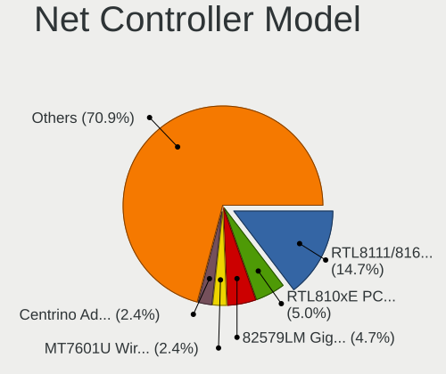

| Model                                                                  | Computers | Percent |
|------------------------------------------------------------------------|-----------|---------|
| Realtek RTL8111/8168/8211/8411 PCI Express Gigabit Ethernet Controller | 68        | 14.66%  |
| Realtek RTL810xE PCI Express Fast Ethernet controller                  | 23        | 4.96%   |
| Intel 82579LM Gigabit Network Connection (Lewisville)                  | 22        | 4.74%   |
| Ralink MT7601U Wireless Adapter                                        | 11        | 2.37%   |
| Intel Centrino Advanced-N 6205 [Taylor Peak]                           | 11        | 2.37%   |
| Realtek RTL8822CE 802.11ac PCIe Wireless Network Adapter               | 9         | 1.94%   |
| Qualcomm Atheros QCA9565 / AR9565 Wireless Network Adapter             | 9         | 1.94%   |
| Qualcomm Atheros QCA9377 802.11ac Wireless Network Adapter             | 8         | 1.72%   |
| Intel Wi-Fi 6 AX200                                                    | 8         | 1.72%   |
| Intel Ethernet Connection I217-LM                                      | 8         | 1.72%   |
| Intel Wireless 7265                                                    | 7         | 1.51%   |
| Intel Wireless 7260                                                    | 7         | 1.51%   |
| Intel Cannon Point-LP CNVi [Wireless-AC]                               | 6         | 1.29%   |
| Broadcom Limited BCM4360 802.11ac Dual Band Wireless Network Adapter   | 6         | 1.29%   |
| Realtek RTL8188EUS 802.11n Wireless Network Adapter                    | 5         | 1.08%   |
| Qualcomm Atheros AR9271 802.11n                                        | 5         | 1.08%   |
| Qualcomm Atheros AR9485 Wireless Network Adapter                       | 5         | 1.08%   |
| Qualcomm Atheros AR9285 Wireless Network Adapter (PCI-Express)         | 5         | 1.08%   |
| Intel Wireless 3165                                                    | 5         | 1.08%   |
| Intel Wi-Fi 6 AX201                                                    | 5         | 1.08%   |
| Intel Dual Band Wireless-AC 3168NGW [Stone Peak]                       | 5         | 1.08%   |
| Broadcom BCM4313 802.11bgn Wireless Network Adapter                    | 5         | 1.08%   |
| Realtek RTL8822BE 802.11a/b/g/n/ac WiFi adapter                        | 4         | 0.86%   |
| Realtek RTL8821CE 802.11ac PCIe Wireless Network Adapter               | 4         | 0.86%   |
| Realtek RTL8723BE PCIe Wireless Network Adapter                        | 4         | 0.86%   |
| Realtek RTL8153 Gigabit Ethernet Adapter                               | 4         | 0.86%   |
| Intel Centrino Ultimate-N 6300                                         | 4         | 0.86%   |
| Intel 82577LM Gigabit Network Connection                               | 4         | 0.86%   |
| Realtek 802.11n WLAN Adapter                                           | 3         | 0.65%   |
| Qualcomm Atheros QCA6174 802.11ac Wireless Network Adapter             | 3         | 0.65%   |
| Qualcomm Atheros AR8151 v2.0 Gigabit Ethernet                          | 3         | 0.65%   |
| Intel Wireless 8265 / 8275                                             | 3         | 0.65%   |
| Intel Wireless 8260                                                    | 3         | 0.65%   |
| Intel I211 Gigabit Network Connection                                  | 3         | 0.65%   |
| Intel Gemini Lake PCH CNVi WiFi                                        | 3         | 0.65%   |
| Intel Ethernet Connection I218-LM                                      | 3         | 0.65%   |
| Intel Ethernet Connection (6) I219-LM                                  | 3         | 0.65%   |
| Intel Ethernet Connection (4) I219-LM                                  | 3         | 0.65%   |
| Intel Centrino Wireless-N 2230                                         | 3         | 0.65%   |
| Intel Centrino Advanced-N 6235                                         | 3         | 0.65%   |

Wireless Vendor
---------------

Wireless vendors

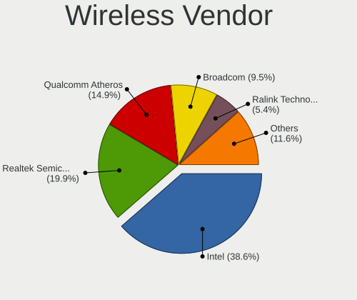

| Vendor                          | Computers | Percent |
|---------------------------------|-----------|---------|
| Intel                           | 93        | 38.59%  |
| Realtek Semiconductor           | 48        | 19.92%  |
| Qualcomm Atheros                | 36        | 14.94%  |
| Broadcom                        | 23        | 9.54%   |
| Ralink Technology               | 13        | 5.39%   |
| Broadcom Limited                | 7         | 2.9%    |
| Qualcomm Atheros Communications | 5         | 2.07%   |
| MediaTek                        | 3         | 1.24%   |
| Linksys                         | 3         | 1.24%   |
| D-Link                          | 3         | 1.24%   |
| Dell                            | 2         | 0.83%   |
| ZTopInc                         | 1         | 0.41%   |
| TP-Link                         | 1         | 0.41%   |
| Realtek                         | 1         | 0.41%   |
| Ralink                          | 1         | 0.41%   |
| Edimax Technology               | 1         | 0.41%   |

Wireless Model
--------------

Wireless models

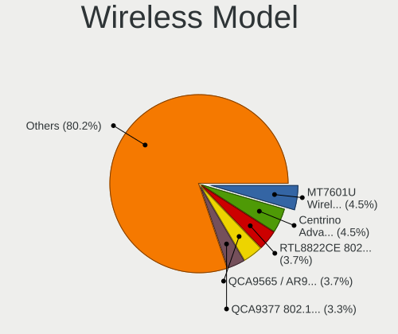

| Model                                                                                 | Computers | Percent |
|---------------------------------------------------------------------------------------|-----------|---------|
| Ralink MT7601U Wireless Adapter                                                       | 11        | 4.55%   |
| Intel Centrino Advanced-N 6205 [Taylor Peak]                                          | 11        | 4.55%   |
| Realtek RTL8822CE 802.11ac PCIe Wireless Network Adapter                              | 9         | 3.72%   |
| Qualcomm Atheros QCA9565 / AR9565 Wireless Network Adapter                            | 9         | 3.72%   |
| Qualcomm Atheros QCA9377 802.11ac Wireless Network Adapter                            | 8         | 3.31%   |
| Intel Wi-Fi 6 AX200                                                                   | 8         | 3.31%   |
| Intel Wireless 7265                                                                   | 7         | 2.89%   |
| Intel Wireless 7260                                                                   | 7         | 2.89%   |
| Intel Cannon Point-LP CNVi [Wireless-AC]                                              | 6         | 2.48%   |
| Broadcom Limited BCM4360 802.11ac Dual Band Wireless Network Adapter                  | 6         | 2.48%   |
| Realtek RTL8188EUS 802.11n Wireless Network Adapter                                   | 5         | 2.07%   |
| Qualcomm Atheros AR9271 802.11n                                                       | 5         | 2.07%   |
| Qualcomm Atheros AR9485 Wireless Network Adapter                                      | 5         | 2.07%   |
| Qualcomm Atheros AR9285 Wireless Network Adapter (PCI-Express)                        | 5         | 2.07%   |
| Intel Wireless 3165                                                                   | 5         | 2.07%   |
| Intel Wi-Fi 6 AX201                                                                   | 5         | 2.07%   |
| Intel Dual Band Wireless-AC 3168NGW [Stone Peak]                                      | 5         | 2.07%   |
| Broadcom BCM4313 802.11bgn Wireless Network Adapter                                   | 5         | 2.07%   |
| Realtek RTL8822BE 802.11a/b/g/n/ac WiFi adapter                                       | 4         | 1.65%   |
| Realtek RTL8821CE 802.11ac PCIe Wireless Network Adapter                              | 4         | 1.65%   |
| Realtek RTL8723BE PCIe Wireless Network Adapter                                       | 4         | 1.65%   |
| Intel Centrino Ultimate-N 6300                                                        | 4         | 1.65%   |
| Realtek 802.11n WLAN Adapter                                                          | 3         | 1.24%   |
| Qualcomm Atheros QCA6174 802.11ac Wireless Network Adapter                            | 3         | 1.24%   |
| Intel Wireless 8265 / 8275                                                            | 3         | 1.24%   |
| Intel Wireless 8260                                                                   | 3         | 1.24%   |
| Intel Gemini Lake PCH CNVi WiFi                                                       | 3         | 1.24%   |
| Intel Centrino Wireless-N 2230                                                        | 3         | 1.24%   |
| Intel Centrino Advanced-N 6235                                                        | 3         | 1.24%   |
| D-Link 802.11ac NIC                                                                   | 3         | 1.24%   |
| Broadcom BCM4331 802.11a/b/g/n                                                        | 3         | 1.24%   |
| Broadcom BCM43142 802.11b/g/n                                                         | 3         | 1.24%   |
| Realtek RTL8723DE Wireless Network Adapter                                            | 2         | 0.83%   |
| Realtek RTL8192EU 802.11b/g/n WLAN Adapter                                            | 2         | 0.83%   |
| Realtek RTL8192EE PCIe Wireless Network Adapter                                       | 2         | 0.83%   |
| Realtek RTL8188ETV Wireless LAN 802.11n Network Adapter                               | 2         | 0.83%   |
| Realtek RTL8188EE Wireless Network Adapter                                            | 2         | 0.83%   |
| Ralink RT5370 Wireless Adapter                                                        | 2         | 0.83%   |
| Qualcomm Atheros AR5418 Wireless Network Adapter [AR5008E 802.11(a)bgn] (PCI-Express) | 2         | 0.83%   |
| Qualcomm Atheros AR242x / AR542x Wireless Network Adapter (PCI-Express)               | 2         | 0.83%   |

Ethernet Vendor
---------------

Ethernet vendors

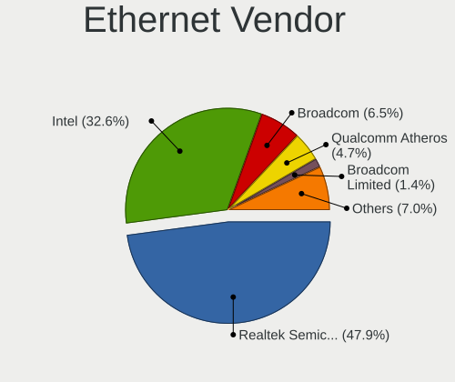

| Vendor                   | Computers | Percent |
|--------------------------|-----------|---------|
| Realtek Semiconductor    | 103       | 47.91%  |
| Intel                    | 70        | 32.56%  |
| Broadcom                 | 14        | 6.51%   |
| Qualcomm Atheros         | 10        | 4.65%   |
| Broadcom Limited         | 3         | 1.4%    |
| Nvidia                   | 2         | 0.93%   |
| Marvell Technology Group | 2         | 0.93%   |
| Lenovo                   | 2         | 0.93%   |
| DisplayLink              | 2         | 0.93%   |
| Xiaomi                   | 1         | 0.47%   |
| VIA Technologies         | 1         | 0.47%   |
| Qualcomm Technologies    | 1         | 0.47%   |
| Huawei Technologies      | 1         | 0.47%   |
| HTC (High Tech Computer) | 1         | 0.47%   |
| Google                   | 1         | 0.47%   |
| ASIX Electronics         | 1         | 0.47%   |

Ethernet Model
--------------

Ethernet models

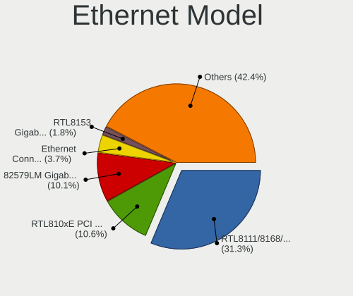

| Model                                                                  | Computers | Percent |
|------------------------------------------------------------------------|-----------|---------|
| Realtek RTL8111/8168/8211/8411 PCI Express Gigabit Ethernet Controller | 68        | 31.34%  |
| Realtek RTL810xE PCI Express Fast Ethernet controller                  | 23        | 10.6%   |
| Intel 82579LM Gigabit Network Connection (Lewisville)                  | 22        | 10.14%  |
| Intel Ethernet Connection I217-LM                                      | 8         | 3.69%   |
| Realtek RTL8153 Gigabit Ethernet Adapter                               | 4         | 1.84%   |
| Intel 82577LM Gigabit Network Connection                               | 4         | 1.84%   |
| Qualcomm Atheros AR8151 v2.0 Gigabit Ethernet                          | 3         | 1.38%   |
| Intel I211 Gigabit Network Connection                                  | 3         | 1.38%   |
| Intel Ethernet Connection I218-LM                                      | 3         | 1.38%   |
| Intel Ethernet Connection (6) I219-LM                                  | 3         | 1.38%   |
| Intel Ethernet Connection (4) I219-LM                                  | 3         | 1.38%   |
| Intel 82567LM-3 Gigabit Network Connection                             | 3         | 1.38%   |
| Broadcom NetXtreme BCM57765 Gigabit Ethernet PCIe                      | 3         | 1.38%   |
| Broadcom NetXtreme BCM5761 Gigabit Ethernet PCIe                       | 3         | 1.38%   |
| Realtek RTL8125 2.5GbE Controller                                      | 2         | 0.92%   |
| Qualcomm Atheros QCA8171 Gigabit Ethernet                              | 2         | 0.92%   |
| Lenovo Thinkpad LAN                                                    | 2         | 0.92%   |
| Intel Ethernet Connection (7) I219-LM                                  | 2         | 0.92%   |
| Intel Ethernet Connection (3) I218-LM                                  | 2         | 0.92%   |
| Intel Ethernet Connection (2) I219-V                                   | 2         | 0.92%   |
| Intel Ethernet Connection (2) I218-V                                   | 2         | 0.92%   |
| Intel Ethernet Connection (13) I219-V                                  | 2         | 0.92%   |
| Xiaomi Mi/Redmi series (RNDIS)                                         | 1         | 0.46%   |
| VIA VT6102/VT6103 [Rhine-II]                                           | 1         | 0.46%   |
| Realtek RTL8852CE PCIe 802.11ax Wireless Network Controller            | 1         | 0.46%   |
| Realtek RTL8852BE PCIe 802.11ax Wireless Network Controller            | 1         | 0.46%   |
| Realtek RTL8169 PCI Gigabit Ethernet Controller                        | 1         | 0.46%   |
| Realtek RTL8126 5GbE Controller                                        | 1         | 0.46%   |
| Realtek RTL8111/8168/8411 PCI Express Gigabit Ethernet Controller      | 1         | 0.46%   |
| Realtek RTL-8100/8101L/8139 PCI Fast Ethernet Adapter                  | 1         | 0.46%   |
| Realtek Killer E2600 GbE Controller                                    | 1         | 0.46%   |
| Qualcomm WCN785x Wi-Fi 7(802.11be) 320MHz 2x2 [FastConnect 7800]       | 1         | 0.46%   |
| Qualcomm Atheros QCA8172 Fast Ethernet                                 | 1         | 0.46%   |
| Qualcomm Atheros Killer E2400 Gigabit Ethernet Controller              | 1         | 0.46%   |
| Qualcomm Atheros AR8161 Gigabit Ethernet                               | 1         | 0.46%   |
| Qualcomm Atheros AR8152 v2.0 Fast Ethernet                             | 1         | 0.46%   |
| Qualcomm Atheros AR8131 Gigabit Ethernet                               | 1         | 0.46%   |
| Nvidia MCP79 Ethernet                                                  | 1         | 0.46%   |
| Nvidia MCP77 Ethernet                                                  | 1         | 0.46%   |
| Marvell Group 88E8053 PCI-E Gigabit Ethernet Controller                | 1         | 0.46%   |

Net Controller Kind
-------------------

Ethernet, WiFi or modem

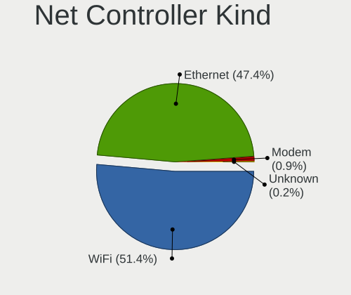

| Kind     | Computers | Percent |
|----------|-----------|---------|
| WiFi     | 219       | 51.41%  |
| Ethernet | 202       | 47.42%  |
| Modem    | 4         | 0.94%   |
| Unknown  | 1         | 0.23%   |

Used Controller
---------------

Currently used network controller

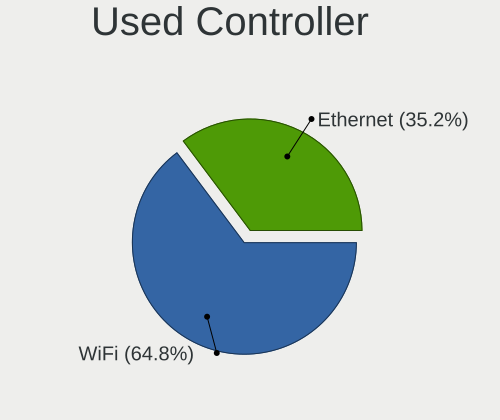

| Kind     | Computers | Percent |
|----------|-----------|---------|
| WiFi     | 171       | 64.77%  |
| Ethernet | 93        | 35.23%  |

NICs
----

Total network controllers on board

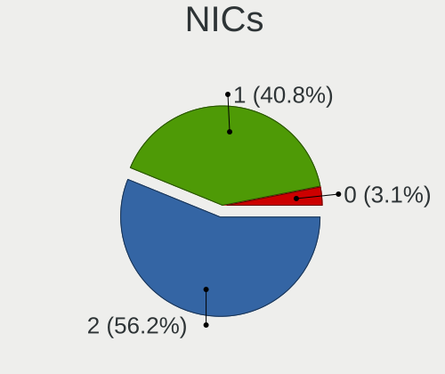

| Total | Computers | Percent |
|-------|-----------|---------|
| 2     | 146       | 56.15%  |
| 1     | 106       | 40.77%  |
| 0     | 8         | 3.08%   |

IPv6
----

IPv6 vs IPv4

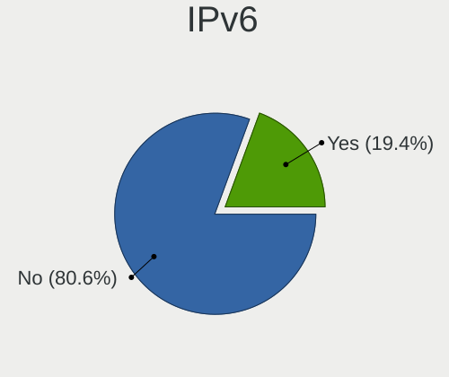

| Used | Computers | Percent |
|------|-----------|---------|
| No   | 216       | 80.6%   |
| Yes  | 52        | 19.4%   |

Bluetooth
---------

Bluetooth Vendor
----------------

Controller vendors

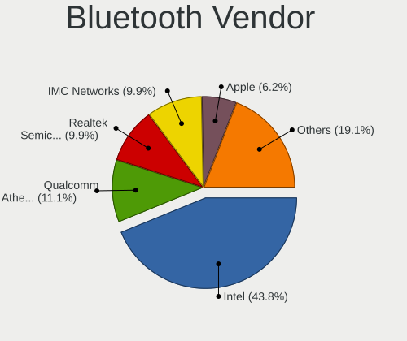

| Vendor                          | Computers | Percent |
|---------------------------------|-----------|---------|
| Intel                           | 71        | 43.83%  |
| Qualcomm Atheros Communications | 18        | 11.11%  |
| Realtek Semiconductor           | 16        | 9.88%   |
| IMC Networks                    | 16        | 9.88%   |
| Apple                           | 10        | 6.17%   |
| Cambridge Silicon Radio         | 9         | 5.56%   |
| Dell                            | 7         | 4.32%   |
| Broadcom                        | 6         | 3.7%    |
| Lite-On Technology              | 3         | 1.85%   |
| Hewlett-Packard                 | 2         | 1.23%   |
| MediaTek                        | 1         | 0.62%   |
| Foxconn / Hon Hai               | 1         | 0.62%   |
| Dynex                           | 1         | 0.62%   |
| ASUSTek Computer                | 1         | 0.62%   |

Bluetooth Model
---------------

Controller models

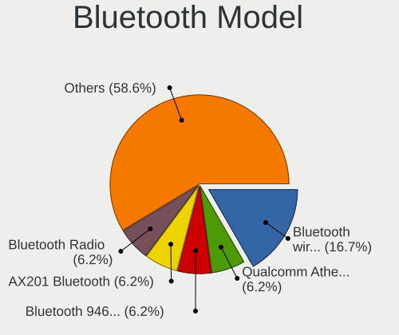

| Model                                                    | Computers | Percent |
|----------------------------------------------------------|-----------|---------|
| Intel Bluetooth wireless interface                       | 27        | 16.67%  |
| Qualcomm Atheros  Bluetooth Device                       | 10        | 6.17%   |
| Intel Bluetooth 9460/9560 Jefferson Peak (JfP)           | 10        | 6.17%   |
| Intel AX201 Bluetooth                                    | 10        | 6.17%   |
| IMC Networks Bluetooth Radio                             | 10        | 6.17%   |
| Cambridge Silicon Radio Bluetooth Dongle (HCI mode)      | 9         | 5.56%   |
| Intel AX200 Bluetooth                                    | 8         | 4.94%   |
| Realtek Bluetooth Radio                                  | 7         | 4.32%   |
| Realtek  Bluetooth 4.2 Adapter                           | 6         | 3.7%    |
| Intel Centrino Bluetooth Wireless Transceiver            | 6         | 3.7%    |
| Intel Wireless-AC 3168 Bluetooth                         | 5         | 3.09%   |
| Apple Bluetooth Host Controller                          | 5         | 3.09%   |
| Apple Bluetooth USB Host Controller                      | 4         | 2.47%   |
| Qualcomm Atheros AR9462 Bluetooth                        | 3         | 1.85%   |
| Qualcomm Atheros AR3012 Bluetooth 4.0                    | 3         | 1.85%   |
| Dell BCM20702A0 Bluetooth Module                         | 3         | 1.85%   |
| Broadcom BCM43142 Bluetooth 4.0                          | 3         | 1.85%   |
| Realtek RTL8723B Bluetooth                               | 2         | 1.23%   |
| Intel AX210 Bluetooth                                    | 2         | 1.23%   |
| IMC Networks BCM20702A0                                  | 2         | 1.23%   |
| HP Broadcom 2070 Bluetooth Combo                         | 2         | 1.23%   |
| Realtek 802.11ac WLAN Adapter                            | 1         | 0.62%   |
| Qualcomm Atheros QCA61x4 Bluetooth 4.0                   | 1         | 0.62%   |
| Qualcomm Atheros Bluetooth USB Host Controller           | 1         | 0.62%   |
| MediaTek Wireless_Device                                 | 1         | 0.62%   |
| Lite-On Wireless_Device                                  | 1         | 0.62%   |
| Lite-On Qualcomm Atheros QCA9377 Bluetooth               | 1         | 0.62%   |
| Lite-On Atheros AR3012 Bluetooth                         | 1         | 0.62%   |
| Intel Wireless-AC 9260 Bluetooth Adapter                 | 1         | 0.62%   |
| Intel Centrino Advanced-N 6230 Bluetooth adapter         | 1         | 0.62%   |
| Intel Bluetooth Device                                   | 1         | 0.62%   |
| IMC Networks Wireless_Device                             | 1         | 0.62%   |
| IMC Networks Bluetooth Device                            | 1         | 0.62%   |
| IMC Networks Bluetooth                                   | 1         | 0.62%   |
| IMC Networks Atheros AR3012 Bluetooth 4.0 Adapter        | 1         | 0.62%   |
| Foxconn / Hon Hai Bluetooth Device                       | 1         | 0.62%   |
| Dynex Bluetooth 4.0 Adapter [Broadcom, 1.12, BCM20702A0] | 1         | 0.62%   |
| Dell Wireless 360 Bluetooth                              | 1         | 0.62%   |
| Dell Wireless 355 Bluetooth                              | 1         | 0.62%   |
| Dell Wireless 350 Bluetooth                              | 1         | 0.62%   |

Sound
-----

Sound Vendor
------------

Sound card vendors

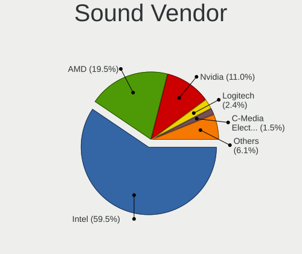

| Vendor                           | Computers | Percent |
|----------------------------------|-----------|---------|
| Intel                            | 195       | 59.45%  |
| AMD                              | 64        | 19.51%  |
| Nvidia                           | 36        | 10.98%  |
| Logitech                         | 8         | 2.44%   |
| C-Media Electronics              | 5         | 1.52%   |
| Generalplus Technology           | 4         | 1.22%   |
| Creative Labs                    | 2         | 0.61%   |
| Apple                            | 2         | 0.61%   |
| VIA Technologies                 | 1         | 0.3%    |
| Texas Instruments                | 1         | 0.3%    |
| Sony                             | 1         | 0.3%    |
| Silicon Integrated Systems [SiS] | 1         | 0.3%    |
| Micro Star International         | 1         | 0.3%    |
| M-Audio                          | 1         | 0.3%    |
| JMTek                            | 1         | 0.3%    |
| fifine Microphones               | 1         | 0.3%    |
| Corsair                          | 1         | 0.3%    |
| Blue Microphones                 | 1         | 0.3%    |
| BigBen Interactive               | 1         | 0.3%    |
| ASUSTek Computer                 | 1         | 0.3%    |

Sound Model
-----------

Sound card models

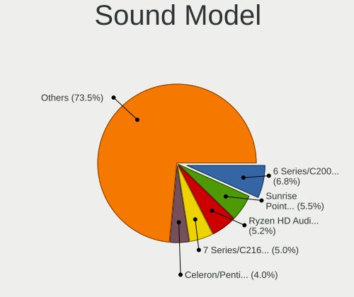

| Model                                                                                             | Computers | Percent |
|---------------------------------------------------------------------------------------------------|-----------|---------|
| Intel 6 Series/C200 Series Chipset Family High Definition Audio Controller                        | 27        | 6.75%   |
| Intel Sunrise Point-LP HD Audio                                                                   | 22        | 5.5%    |
| AMD Ryzen HD Audio Controller                                                                     | 21        | 5.25%   |
| Intel 7 Series/C216 Chipset Family High Definition Audio Controller                               | 20        | 5%      |
| Intel Celeron/Pentium Silver Processor High Definition Audio                                      | 16        | 4%      |
| Intel Xeon E3-1200 v3/4th Gen Core Processor HD Audio Controller                                  | 14        | 3.5%    |
| Intel 8 Series/C220 Series Chipset High Definition Audio Controller                               | 14        | 3.5%    |
| AMD FCH Azalia Controller                                                                         | 14        | 3.5%    |
| AMD Kabini HDMI/DP Audio                                                                          | 12        | 3%      |
| Intel Wildcat Point-LP High Definition Audio Controller                                           | 9         | 2.25%   |
| Intel Broadwell-U Audio Controller                                                                | 9         | 2.25%   |
| Intel Tiger Lake-LP Smart Sound Technology Audio Controller                                       | 7         | 1.75%   |
| Intel Haswell-ULT HD Audio Controller                                                             | 7         | 1.75%   |
| Intel Cannon Lake PCH cAVS                                                                        | 7         | 1.75%   |
| Intel 8 Series HD Audio Controller                                                                | 7         | 1.75%   |
| Intel 5 Series/3400 Series Chipset High Definition Audio                                          | 7         | 1.75%   |
| Intel 100 Series/C230 Series Chipset Family HD Audio Controller                                   | 7         | 1.75%   |
| AMD Renoir/Cezanne HDMI/DP Audio Controller                                                       | 7         | 1.75%   |
| AMD Raven/Raven2/Fenghuang HDMI/DP Audio Controller                                               | 7         | 1.75%   |
| Intel NM10/ICH7 Family High Definition Audio Controller                                           | 6         | 1.5%    |
| Intel Cannon Point-LP High Definition Audio Controller                                            | 6         | 1.5%    |
| AMD SBx00 Azalia (Intel HDA)                                                                      | 6         | 1.5%    |
| Intel Atom Processor Z36xxx/Z37xxx Series High Definition Audio Controller                        | 5         | 1.25%   |
| Intel 82801I (ICH9 Family) HD Audio Controller                                                    | 5         | 1.25%   |
| Intel 82801H (ICH8 Family) HD Audio Controller                                                    | 5         | 1.25%   |
| Nvidia TU107 GeForce GTX 1650 High Definition Audio Controller                                    | 4         | 1%      |
| Nvidia GF119 HDMI Audio Controller                                                                | 4         | 1%      |
| Logitech H390 headset with microphone                                                             | 4         | 1%      |
| Intel Ice Lake-LP Smart Sound Technology Audio Controller                                         | 4         | 1%      |
| Intel Atom/Celeron/Pentium Processor x5-E8000/J3xxx/N3xxx Series High Definition Audio Controller | 4         | 1%      |
| Generalplus Technology USB Audio Device                                                           | 4         | 1%      |
| AMD Starship/Matisse HD Audio Controller                                                          | 4         | 1%      |
| AMD Family 17h (Models 00h-0fh) HD Audio Controller                                               | 4         | 1%      |
| AMD Family 15h (Models 60h-6fh) Audio Controller                                                  | 4         | 1%      |
| AMD Ellesmere HDMI Audio [Radeon RX 470/480 / 570/580/590]                                        | 4         | 1%      |
| Nvidia TU116 High Definition Audio Controller                                                     | 3         | 0.75%   |
| Nvidia GK107 HDMI Audio Controller                                                                | 3         | 0.75%   |
| Intel 200 Series PCH HD Audio                                                                     | 3         | 0.75%   |
| AMD Radeon High Definition Audio Controller                                                       | 3         | 0.75%   |
| Nvidia TU106 High Definition Audio Controller                                                     | 2         | 0.5%    |

Memory
------

Memory Vendor
-------------

Memory module vendors

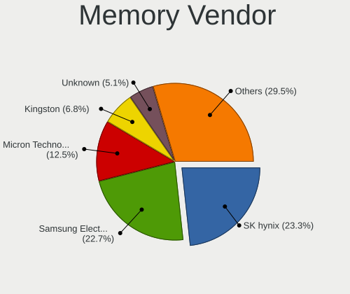

| Vendor              | Computers | Percent |
|---------------------|-----------|---------|
| SK hynix            | 41        | 23.3%   |
| Samsung Electronics | 40        | 22.73%  |
| Micron Technology   | 22        | 12.5%   |
| Kingston            | 12        | 6.82%   |
| Unknown             | 9         | 5.11%   |
| Crucial             | 9         | 5.11%   |
| Unknown (ABCD)      | 7         | 3.98%   |
| Ramaxel Technology  | 5         | 2.84%   |
| Nanya Technology    | 5         | 2.84%   |
| Corsair             | 5         | 2.84%   |
| G.Skill             | 3         | 1.7%    |
| A-DATA Technology   | 3         | 1.7%    |
| Unknown             | 3         | 1.7%    |
| Patriot             | 2         | 1.14%   |
| V-Color             | 1         | 0.57%   |
| Unknown (0x0B45)    | 1         | 0.57%   |
| Timetec             | 1         | 0.57%   |
| Sesame              | 1         | 0.57%   |
| Qimonda             | 1         | 0.57%   |
| PNY                 | 1         | 0.57%   |
| Heoriady            | 1         | 0.57%   |
| Golden Empire       | 1         | 0.57%   |
| Elpida              | 1         | 0.57%   |
| Avant               | 1         | 0.57%   |

Memory Model
------------

Memory module models

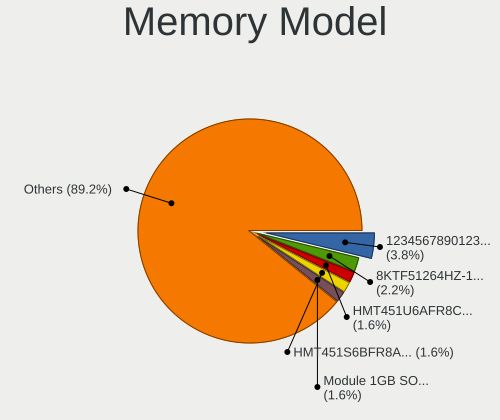

| Model                                                            | Computers | Percent |
|------------------------------------------------------------------|-----------|---------|
| Unknown (ABCD) RAM 123456789012345678 2GB SODIMM LPDDR4 2400MT/s | 7         | 3.78%   |
| Micron RAM 8KTF51264HZ-1G6E1 4GB SODIMM DDR3 1600MT/s            | 4         | 2.16%   |
| SK hynix RAM HMT451U6AFR8C-PB 4GB DIMM DDR3 1600MT/s             | 3         | 1.62%   |
| SK hynix RAM HMT451S6BFR8A-PB 4GB SODIMM DDR3 1600MT/s           | 3         | 1.62%   |
| Unknown                                                          | 3         | 1.62%   |
| Unknown RAM Module 8GB SODIMM DDR3 1600MT/s                      | 2         | 1.08%   |
| SK hynix RAM HMT451S6AFR8A-PB 4GB SODIMM DDR3 1600MT/s           | 2         | 1.08%   |
| SK hynix RAM HMT351U6BFR8C-H9 4GB DIMM DDR3 1333MT/s             | 2         | 1.08%   |
| SK hynix RAM HMT351S6EFR8C-PB 4GB SODIMM DDR3 1600MT/s           | 2         | 1.08%   |
| SK hynix RAM HMT351S6BFR8C-H9 4GB SODIMM DDR3 1333MT/s           | 2         | 1.08%   |
| SK hynix RAM HMT325U6CFR8C-PB 2GB DIMM DDR3 1600MT/s             | 2         | 1.08%   |
| Samsung RAM Module 2GB SODIMM DDR3 1600MT/s                      | 2         | 1.08%   |
| Samsung RAM M471B5673FH0-CF8 2048MB SODIMM DDR3 1067MT/s         | 2         | 1.08%   |
| Samsung RAM M471B5273EB0-CK0 4GB SODIMM DDR3 4199MT/s            | 2         | 1.08%   |
| Samsung RAM M471B5173DB0-YK0 4GB SODIMM DDR3 1600MT/s            | 2         | 1.08%   |
| Samsung RAM M471B1G73DB0-YK0 8GB SODIMM DDR3 1600MT/s            | 2         | 1.08%   |
| Samsung RAM M471A5244CB0-CTD 4GB SODIMM DDR4 3266MT/s            | 2         | 1.08%   |
| Samsung RAM M471A2K43BB1-CPB 16GB SODIMM DDR4 2133MT/s           | 2         | 1.08%   |
| Samsung RAM M378B5273DH0-CH9 4GB DIMM DDR3 2133MT/s              | 2         | 1.08%   |
| Micron RAM 8ATF1G64HZ-2G6H1 8GB SODIMM DDR4 2667MT/s             | 2         | 1.08%   |
| Micron RAM 4ATF51264HZ-2G6E3 4GB SODIMM DDR4 2667MT/s            | 2         | 1.08%   |
| A-DATA RAM AD73I1B1674EU 2GB SODIMM DDR3 1334MT/s                | 2         | 1.08%   |
| V-Color RAM TL48G32S8KGRGB16 8192MB DIMM DDR4 3200MT/s           | 1         | 0.54%   |
| Unknown RAM Module 8GB DIMM DDR4 2133MT/s                        | 1         | 0.54%   |
| Unknown RAM Module 8192MB DIMM 1333MT/s                          | 1         | 0.54%   |
| Unknown RAM Module 4GB SODIMM DDR3 1333MT/s                      | 1         | 0.54%   |
| Unknown RAM Module 4GB DIMM 1333MT/s                             | 1         | 0.54%   |
| Unknown RAM Module 4096MB DIMM 1333MT/s                          | 1         | 0.54%   |
| Unknown RAM Module 2GB SODIMM DRAM 667MT/s                       | 1         | 0.54%   |
| Unknown RAM Module 2048MB DIMM SDRAM                             | 1         | 0.54%   |
| Unknown (0x0B45) RAM WPBH32D416SWA-16G 16GB SODIMM DDR4 3200MT/s | 1         | 0.54%   |
| Timetec RAM U8G-1333 8GB DIMM DDR3 1333MT/s                      | 1         | 0.54%   |
| SK hynix RAM Module 8GB SODIMM DDR3 1600MT/s                     | 1         | 0.54%   |
| SK hynix RAM Module 8192MB DIMM DDR4 2400MT/s                    | 1         | 0.54%   |
| SK hynix RAM Module 4GB DIMM DDR3 1600MT/s                       | 1         | 0.54%   |
| SK hynix RAM Module 2GB SODIMM DDR3 1333MT/s                     | 1         | 0.54%   |
| SK hynix RAM Module 2GB SODIMM DDR2 667MT/s                      | 1         | 0.54%   |
| SK hynix RAM HYMP512U64CP8-Y5 1GB DIMM 1331MT/s                  | 1         | 0.54%   |
| SK hynix RAM HYMP125S64CP8-S6 2GB SODIMM DDR2 975MT/s            | 1         | 0.54%   |
| SK hynix RAM HMT451U6BFR8C-PB 4GB DIMM DDR3 1600MT/s             | 1         | 0.54%   |

Memory Kind
-----------

Memory module kinds

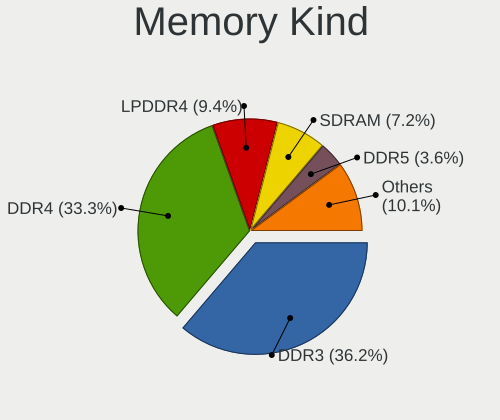

| Kind    | Computers | Percent |
|---------|-----------|---------|
| DDR3    | 50        | 36.23%  |
| DDR4    | 46        | 33.33%  |
| LPDDR4  | 13        | 9.42%   |
| SDRAM   | 10        | 7.25%   |
| DDR5    | 5         | 3.62%   |
| DDR2    | 5         | 3.62%   |
| LPDDR3  | 3         | 2.17%   |
| Unknown | 3         | 2.17%   |
| DRAM    | 2         | 1.45%   |
| DDR     | 1         | 0.72%   |

Memory Form Factor
------------------

Physical design of the memory module

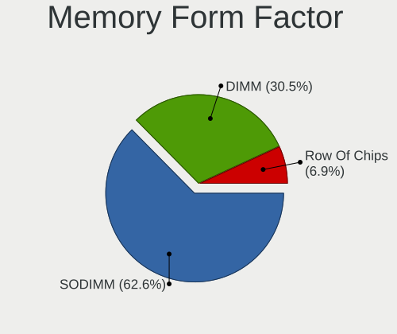

| Name         | Computers | Percent |
|--------------|-----------|---------|
| SODIMM       | 82        | 62.6%   |
| DIMM         | 40        | 30.53%  |
| Row Of Chips | 9         | 6.87%   |

Memory Size
-----------

Memory module size

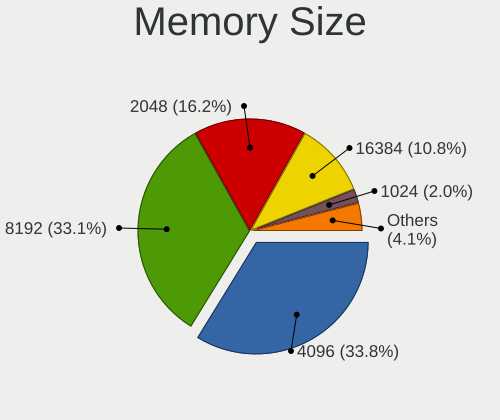

| Size  | Computers | Percent |
|-------|-----------|---------|
| 4096  | 50        | 33.78%  |
| 8192  | 49        | 33.11%  |
| 2048  | 24        | 16.22%  |
| 16384 | 16        | 10.81%  |
| 1024  | 3         | 2.03%   |
| 32768 | 2         | 1.35%   |
| 512   | 2         | 1.35%   |
| 49152 | 1         | 0.68%   |
| 6144  | 1         | 0.68%   |

Memory Speed
------------

Memory module speed

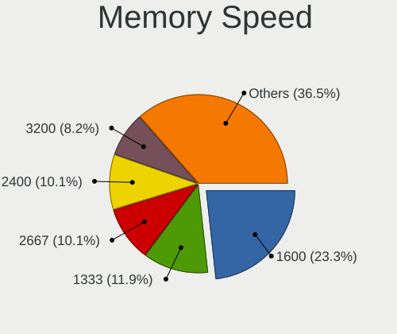

| Speed   | Computers | Percent |
|---------|-----------|---------|
| 1600    | 37        | 23.27%  |
| 1333    | 19        | 11.95%  |
| 2667    | 16        | 10.06%  |
| 2400    | 16        | 10.06%  |
| 3200    | 13        | 8.18%   |
| 2133    | 12        | 7.55%   |
| 4267    | 4         | 2.52%   |
| 1334    | 4         | 2.52%   |
| 1067    | 4         | 2.52%   |
| 667     | 4         | 2.52%   |
| 4199    | 3         | 1.89%   |
| 3600    | 3         | 1.89%   |
| 6000    | 2         | 1.26%   |
| 5600    | 2         | 1.26%   |
| 3266    | 2         | 1.26%   |
| 2666    | 2         | 1.26%   |
| 1867    | 2         | 1.26%   |
| 533     | 2         | 1.26%   |
| 49926   | 1         | 0.63%   |
| 8400    | 1         | 0.63%   |
| 4800    | 1         | 0.63%   |
| 2934    | 1         | 0.63%   |
| 2933    | 1         | 0.63%   |
| 2800    | 1         | 0.63%   |
| 2048    | 1         | 0.63%   |
| 1648    | 1         | 0.63%   |
| 1331    | 1         | 0.63%   |
| 975     | 1         | 0.63%   |
| 400     | 1         | 0.63%   |
| Unknown | 1         | 0.63%   |

Printers & scanners
-------------------

Printer Vendor
--------------

Printer device vendors

Zero info for selected period =(

Printer Model
-------------

Printer device models

Zero info for selected period =(

Scanner Vendor
--------------

Scanner device vendors

Zero info for selected period =(

Scanner Model
-------------

Scanner device models

Zero info for selected period =(

Camera
------

Camera Vendor
-------------

Camera device vendors

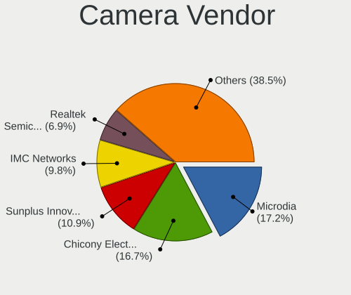

| Vendor                                 | Computers | Percent |
|----------------------------------------|-----------|---------|
| Microdia                               | 30        | 17.24%  |
| Chicony Electronics                    | 29        | 16.67%  |
| Sunplus Innovation Technology          | 19        | 10.92%  |
| IMC Networks                           | 17        | 9.77%   |
| Realtek Semiconductor                  | 12        | 6.9%    |
| Suyin                                  | 9         | 5.17%   |
| Apple                                  | 8         | 4.6%    |
| Cheng Uei Precision Industry (Foxlink) | 6         | 3.45%   |
| Syntek                                 | 4         | 2.3%    |
| Microsoft                              | 4         | 2.3%    |
| Logitech                               | 4         | 2.3%    |
| Silicon Motion                         | 3         | 1.72%   |
| Ricoh                                  | 3         | 1.72%   |
| Quanta                                 | 3         | 1.72%   |
| OmniVision Technologies                | 3         | 1.72%   |
| Bison Electronics                      | 3         | 1.72%   |
| Samsung Electronics                    | 2         | 1.15%   |
| Primax Electronics                     | 2         | 1.15%   |
| Lite-On Technology                     | 2         | 1.15%   |
| USB CAMERA                             | 1         | 0.57%   |
| Sonix Technology                       | 1         | 0.57%   |
| Shinetech                              | 1         | 0.57%   |
| Shenzhen Kingcome Optoelectronic       | 1         | 0.57%   |
| MacroSilicon                           | 1         | 0.57%   |
| Jieli Technology                       | 1         | 0.57%   |
| icSpring                               | 1         | 0.57%   |
| globaloptics                           | 1         | 0.57%   |
| Generalplus Technology                 | 1         | 0.57%   |
| Alcor Micro                            | 1         | 0.57%   |
| A4Tech                                 | 1         | 0.57%   |

Camera Model
------------

Camera device models

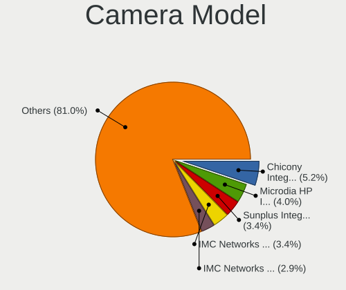

| Model                                                           | Computers | Percent |
|-----------------------------------------------------------------|-----------|---------|
| Chicony Integrated Camera                                       | 9         | 5.17%   |
| Microdia HP Integrated Webcam                                   | 7         | 4.02%   |
| Sunplus Integrated_Webcam_HD                                    | 6         | 3.45%   |
| IMC Networks USB2.0 HD UVC WebCam                               | 6         | 3.45%   |
| IMC Networks Integrated Camera                                  | 5         | 2.87%   |
| Microdia Integrated_Webcam_HD                                   | 4         | 2.3%    |
| Chicony USB2.0 HD UVC WebCam                                    | 4         | 2.3%    |
| Sunplus Laptop_Integrated_Webcam_FHD                            | 3         | 1.72%   |
| Sunplus Integrated Camera                                       | 3         | 1.72%   |
| Microdia Dell Integrated HD Webcam                              | 3         | 1.72%   |
| IMC Networks HP TrueVision HD Camera                            | 3         | 1.72%   |
| Chicony Integrated HP HD Webcam                                 | 3         | 1.72%   |
| Chicony HP TrueVision HD                                        | 3         | 1.72%   |
| Apple iPhone 5/5C/5S/6/SE/7/8/X                                 | 3         | 1.72%   |
| Apple FaceTime HD Camera                                        | 3         | 1.72%   |
| Syntek Lenovo EasyCamera                                        | 2         | 1.15%   |
| Suyin Laptop_Integrated_Webcam_HD                               | 2         | 1.15%   |
| Suyin Integrated_Webcam_HD                                      | 2         | 1.15%   |
| Samsung Galaxy series, misc. (MTP mode)                         | 2         | 1.15%   |
| Realtek USB2.0 camera                                           | 2         | 1.15%   |
| Realtek Integrated Webcam HD                                    | 2         | 1.15%   |
| Realtek Integrated Webcam                                       | 2         | 1.15%   |
| Microsoft LifeCam HD-5001                                       | 2         | 1.15%   |
| Microdia Sonix USB 2.0 Camera                                   | 2         | 1.15%   |
| Microdia Laptop_Integrated_Webcam_HD                            | 2         | 1.15%   |
| Microdia Integrated Webcam                                      | 2         | 1.15%   |
| Microdia HDE Webcam USB                                         | 2         | 1.15%   |
| Chicony HD WebCam                                               | 2         | 1.15%   |
| Chicony HD User Facing                                          | 2         | 1.15%   |
| Cheng Uei Precision Industry (Foxlink) HP Wide Vision HD Camera | 2         | 1.15%   |
| Cheng Uei Precision Industry (Foxlink) HP TrueVision HD Camera  | 2         | 1.15%   |
| USB CAMERA USB CAMERA                                           | 1         | 0.57%   |
| Syntek Integrated Camera                                        | 1         | 0.57%   |
| Syntek EasyCamera                                               | 1         | 0.57%   |
| Suyin VGA Webcam                                                | 1         | 0.57%   |
| Suyin TOSHIBA Web Camera - HD                                   | 1         | 0.57%   |
| Suyin HP TrueVision HD                                          | 1         | 0.57%   |
| Suyin Acer/Lenovo Webcam [CN0316]                               | 1         | 0.57%   |
| Suyin 1.3M HD WebCam                                            | 1         | 0.57%   |
| Sunplus USB 2.0 Camera                                          | 1         | 0.57%   |

Security
--------

Fingerprint Vendor
------------------

Fingerprint sensor vendors

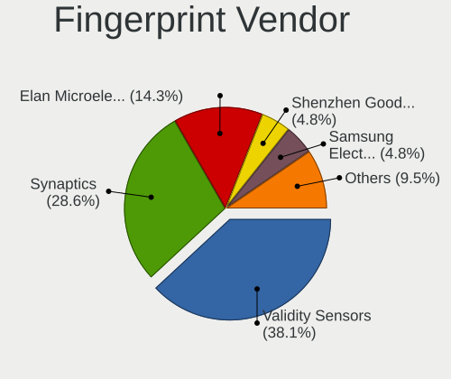

| Vendor                     | Computers | Percent |
|----------------------------|-----------|---------|
| Validity Sensors           | 8         | 38.1%   |
| Synaptics                  | 6         | 28.57%  |
| Elan Microelectronics      | 3         | 14.29%  |
| STMicroelectronics         | 1         | 4.76%   |
| Shenzhen Goodix Technology | 1         | 4.76%   |
| Samsung Electronics        | 1         | 4.76%   |
| LighTuning Technology      | 1         | 4.76%   |

Fingerprint Model
-----------------

Fingerprint sensor models

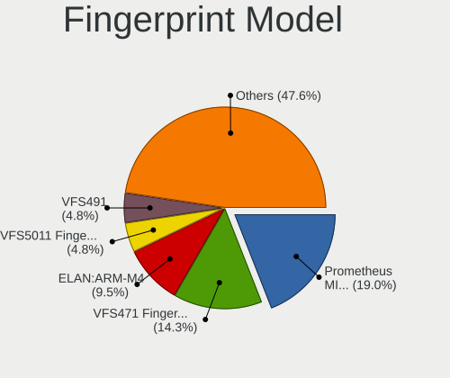

| Model                                             | Computers | Percent |
|---------------------------------------------------|-----------|---------|
| Synaptics Prometheus MIS Touch Fingerprint Reader | 4         | 19.05%  |
| Validity Sensors VFS471 Fingerprint Reader        | 3         | 14.29%  |
| Elan ELAN:ARM-M4                                  | 2         | 9.52%   |
| Validity Sensors VFS5011 Fingerprint Reader       | 1         | 4.76%   |
| Validity Sensors VFS491                           | 1         | 4.76%   |
| Validity Sensors VFS451 Fingerprint Reader        | 1         | 4.76%   |
| Validity Sensors Synaptics WBDI                   | 1         | 4.76%   |
| Validity Sensors Fingerprint scanner              | 1         | 4.76%   |
| Synaptics  WBDI                                   | 1         | 4.76%   |
| Synaptics Metallica MIS Touch Fingerprint Reader  | 1         | 4.76%   |
| STMicroelectronics Fingerprint Reader             | 1         | 4.76%   |
| Shenzhen Goodix  FingerPrint Device               | 1         | 4.76%   |
| Samsung Fingerprint Sensor Device - 730B          | 1         | 4.76%   |
| LighTuning ES603 Swipe Fingerprint Sensor         | 1         | 4.76%   |
| Elan ELAN:Fingerprint                             | 1         | 4.76%   |

Chipcard Vendor
---------------

Chipcard module vendors

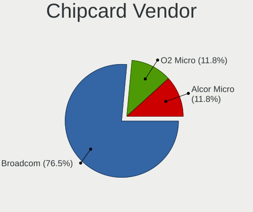

| Vendor      | Computers | Percent |
|-------------|-----------|---------|
| Broadcom    | 13        | 76.47%  |
| O2 Micro    | 2         | 11.76%  |
| Alcor Micro | 2         | 11.76%  |

Chipcard Model
--------------

Chipcard module models

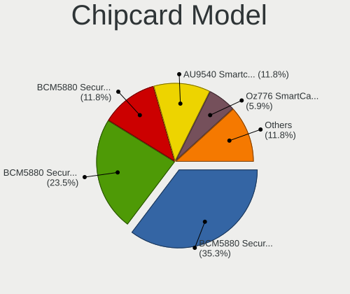

| Model                                                                        | Computers | Percent |
|------------------------------------------------------------------------------|-----------|---------|
| Broadcom BCM5880 Secure Applications Processor                               | 6         | 35.29%  |
| Broadcom BCM5880 Secure Applications Processor with fingerprint swipe sensor | 4         | 23.53%  |
| Broadcom BCM5880 Secure Applications Processor with fingerprint touch sensor | 2         | 11.76%  |
| Alcor Micro AU9540 Smartcard Reader                                          | 2         | 11.76%  |
| O2 Micro Oz776 SmartCard Reader                                              | 1         | 5.88%   |
| O2 Micro OZ776 CCID Smartcard Reader                                         | 1         | 5.88%   |
| Broadcom BCM58200 ControlVault 3 (FingerPrint sensor + Contacted SmartCard)  | 1         | 5.88%   |

Unsupported
-----------

Unsupported Devices
-------------------

Total unsupported devices on board

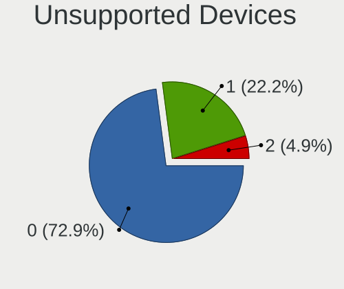

| Total | Computers | Percent |
|-------|-----------|---------|
| 0     | 194       | 72.93%  |
| 1     | 59        | 22.18%  |
| 2     | 13        | 4.89%   |

Unsupported Device Types
------------------------

Types of unsupported devices

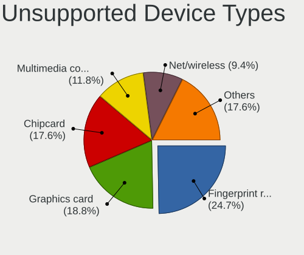

| Type                  | Computers | Percent |
|-----------------------|-----------|---------|
| Fingerprint reader    | 21        | 24.71%  |
| Graphics card         | 16        | 18.82%  |
| Chipcard              | 15        | 17.65%  |
| Multimedia controller | 10        | 11.76%  |
| Net/wireless          | 8         | 9.41%   |
| Storage               | 5         | 5.88%   |
| Sound                 | 2         | 2.35%   |
| Card reader           | 2         | 2.35%   |
| Camera                | 2         | 2.35%   |
| Bluetooth             | 2         | 2.35%   |
| Unassigned class      | 1         | 1.18%   |
| Network               | 1         | 1.18%   |

