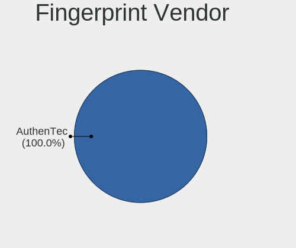

Linux in Ecuador - Tested Hardware & Statistics (Desktops)
----------------------------------------------------------

A project to collect tested hardware configurations for Linux in Ecuador.

Anyone can contribute to this report by the [hw-probe](https://github.com/linuxhw/hw-probe) tool:

    sudo -E hw-probe -all -upload

Please contribute! Especially if your hardware is rare.

Contents
--------

* [ Test Cases ](#test-cases)

* [ System ](#system)
  - [ OS                       ](#os)
  - [ OS Family                ](#os-family)
  - [ Kernel                   ](#kernel)
  - [ Kernel Family            ](#kernel-family)
  - [ Kernel Major Ver.        ](#kernel-major-ver)
  - [ Arch                     ](#arch)
  - [ DE                       ](#de)
  - [ Display Server           ](#display-server)
  - [ Display Manager          ](#display-manager)
  - [ OS Lang                  ](#os-lang)
  - [ Boot Mode                ](#boot-mode)
  - [ Filesystem               ](#filesystem)
  - [ Part. scheme             ](#part-scheme)
  - [ Dual Boot with Linux/BSD ](#dual-boot-with-linuxbsd)
  - [ Dual Boot (Win)          ](#dual-boot-win)

* [ Board ](#board)
  - [ Vendor                   ](#vendor)
  - [ Model                    ](#model)
  - [ Model Family             ](#model-family)
  - [ MFG Year                 ](#mfg-year)
  - [ Form Factor              ](#form-factor)
  - [ Secure Boot              ](#secure-boot)
  - [ Coreboot                 ](#coreboot)
  - [ RAM Size                 ](#ram-size)
  - [ RAM Used                 ](#ram-used)
  - [ Total Drives             ](#total-drives)
  - [ Has CD-ROM               ](#has-cd-rom)
  - [ Has Ethernet             ](#has-ethernet)
  - [ Has WiFi                 ](#has-wifi)
  - [ Has Bluetooth            ](#has-bluetooth)

* [ Location ](#location)
  - [ Country                  ](#country)
  - [ City                     ](#city)

* [ Drives ](#drives)
  - [ Drive Vendor             ](#drive-vendor)
  - [ Drive Model              ](#drive-model)
  - [ HDD Vendor               ](#hdd-vendor)
  - [ SSD Vendor               ](#ssd-vendor)
  - [ Drive Kind               ](#drive-kind)
  - [ Drive Connector          ](#drive-connector)
  - [ Drive Size               ](#drive-size)
  - [ Space Total              ](#space-total)
  - [ Space Used               ](#space-used)
  - [ Malfunc. Drives          ](#malfunc-drives)
  - [ Malfunc. Drive Vendor    ](#malfunc-drive-vendor)
  - [ Malfunc. HDD Vendor      ](#malfunc-hdd-vendor)
  - [ Malfunc. Drive Kind      ](#malfunc-drive-kind)
  - [ Failed Drives            ](#failed-drives)
  - [ Failed Drive Vendor      ](#failed-drive-vendor)
  - [ Drive Status             ](#drive-status)

* [ Storage controller ](#storage-controller)
  - [ Storage Vendor           ](#storage-vendor)
  - [ Storage Model            ](#storage-model)
  - [ Storage Kind             ](#storage-kind)

* [ Processor ](#processor)
  - [ CPU Vendor               ](#cpu-vendor)
  - [ CPU Model                ](#cpu-model)
  - [ CPU Model Family         ](#cpu-model-family)
  - [ CPU Cores                ](#cpu-cores)
  - [ CPU Sockets              ](#cpu-sockets)
  - [ CPU Threads              ](#cpu-threads)
  - [ CPU Op-Modes             ](#cpu-op-modes)
  - [ CPU Microcode            ](#cpu-microcode)
  - [ CPU Microarch            ](#cpu-microarch)

* [ Graphics ](#graphics)
  - [ GPU Vendor               ](#gpu-vendor)
  - [ GPU Model                ](#gpu-model)
  - [ GPU Combo                ](#gpu-combo)
  - [ GPU Driver               ](#gpu-driver)
  - [ GPU Memory               ](#gpu-memory)

* [ Monitor ](#monitor)
  - [ Monitor Vendor           ](#monitor-vendor)
  - [ Monitor Model            ](#monitor-model)
  - [ Monitor Resolution       ](#monitor-resolution)
  - [ Monitor Diagonal         ](#monitor-diagonal)
  - [ Monitor Width            ](#monitor-width)
  - [ Aspect Ratio             ](#aspect-ratio)
  - [ Monitor Area             ](#monitor-area)
  - [ Pixel Density            ](#pixel-density)
  - [ Multiple Monitors        ](#multiple-monitors)

* [ Network ](#network)
  - [ Net Controller Vendor    ](#net-controller-vendor)
  - [ Net Controller Model     ](#net-controller-model)
  - [ Wireless Vendor          ](#wireless-vendor)
  - [ Wireless Model           ](#wireless-model)
  - [ Ethernet Vendor          ](#ethernet-vendor)
  - [ Ethernet Model           ](#ethernet-model)
  - [ Net Controller Kind      ](#net-controller-kind)
  - [ Used Controller          ](#used-controller)
  - [ NICs                     ](#nics)
  - [ IPv6                     ](#ipv6)

* [ Bluetooth ](#bluetooth)
  - [ Bluetooth Vendor         ](#bluetooth-vendor)
  - [ Bluetooth Model          ](#bluetooth-model)

* [ Sound ](#sound)
  - [ Sound Vendor             ](#sound-vendor)
  - [ Sound Model              ](#sound-model)

* [ Memory ](#memory)
  - [ Memory Vendor            ](#memory-vendor)
  - [ Memory Model             ](#memory-model)
  - [ Memory Kind              ](#memory-kind)
  - [ Memory Form Factor       ](#memory-form-factor)
  - [ Memory Size              ](#memory-size)
  - [ Memory Speed             ](#memory-speed)

* [ Printers & scanners ](#printers--scanners)
  - [ Printer Vendor           ](#printer-vendor)
  - [ Printer Model            ](#printer-model)
  - [ Scanner Vendor           ](#scanner-vendor)
  - [ Scanner Model            ](#scanner-model)

* [ Camera ](#camera)
  - [ Camera Vendor            ](#camera-vendor)
  - [ Camera Model             ](#camera-model)

* [ Security ](#security)
  - [ Fingerprint Vendor       ](#fingerprint-vendor)
  - [ Fingerprint Model        ](#fingerprint-model)
  - [ Chipcard Vendor          ](#chipcard-vendor)
  - [ Chipcard Model           ](#chipcard-model)

* [ Unsupported ](#unsupported)
  - [ Unsupported Devices      ](#unsupported-devices)
  - [ Unsupported Device Types ](#unsupported-device-types)

Test Cases
----------

Total: 120

| Vendor        | Model                       | Probe                                                      | Date         |
|---------------|-----------------------------|------------------------------------------------------------|--------------|
| ASRock        | Z690M-ITX/ax                | [810297d46b](https://linux-hardware.org/?probe=810297d46b) | Oct 30, 2023 |
| Gigabyte      | H270M-D3H-CF                | [5c8f4ac5c0](https://linux-hardware.org/?probe=5c8f4ac5c0) | Aug 16, 2023 |
| Gigabyte      | B150M-D3H DDR3-CF           | [5df6fee2f9](https://linux-hardware.org/?probe=5df6fee2f9) | Aug 09, 2023 |
| ASUSTek       | PRIME B250M-PLUS            | [d80699b846](https://linux-hardware.org/?probe=d80699b846) | Jul 13, 2023 |
| ASUSTek       | TUF Gaming X570-PLUS        | [7117d51b53](https://linux-hardware.org/?probe=7117d51b53) | Jun 21, 2023 |
| Biostar       | H61MGV3                     | [109f8064f6](https://linux-hardware.org/?probe=109f8064f6) | Jun 21, 2023 |
| Intel         | DG35EC AAE29266-209         | [bfdb13f626](https://linux-hardware.org/?probe=bfdb13f626) | Jun 20, 2023 |
| Gigabyte      | B150M-D3H DDR3-CF           | [3e5a0aac78](https://linux-hardware.org/?probe=3e5a0aac78) | Jun 19, 2023 |
| ASRock        | Z690M-ITX/ax                | [1f232288d7](https://linux-hardware.org/?probe=1f232288d7) | May 07, 2023 |
| ASRock        | Z690M-ITX/ax                | [76674fb178](https://linux-hardware.org/?probe=76674fb178) | Apr 26, 2023 |
| Gigabyte      | H97-Gaming 3                | [d7d0bcde76](https://linux-hardware.org/?probe=d7d0bcde76) | Apr 15, 2023 |
| Biostar       | H81MHV3L                    | [8638a242be](https://linux-hardware.org/?probe=8638a242be) | Apr 10, 2023 |
| Dell          | 014GRG A01                  | [2e7b556001](https://linux-hardware.org/?probe=2e7b556001) | Mar 05, 2023 |
| Intel         | DB75EN AAG39650-302         | [e828686fc3](https://linux-hardware.org/?probe=e828686fc3) | Mar 03, 2023 |
| Intel         | DG41RQ AAE54511-205         | [0cf17a3787](https://linux-hardware.org/?probe=0cf17a3787) | Feb 27, 2023 |
| ASUSTek       | ROG STRIX B450-F GAMING ... | [a15e06403a](https://linux-hardware.org/?probe=a15e06403a) | Jan 15, 2023 |
| Gigabyte      | M68MT-S2P                   | [93adad7445](https://linux-hardware.org/?probe=93adad7445) | Dec 30, 2022 |
| Dell          | 00V62H A01                  | [296edfbde5](https://linux-hardware.org/?probe=296edfbde5) | Dec 22, 2022 |
| ASUSTek       | M5A78L-M LX PLUS            | [345683b134](https://linux-hardware.org/?probe=345683b134) | Oct 29, 2022 |
| Gigabyte      | H410M H                     | [71a25274d7](https://linux-hardware.org/?probe=71a25274d7) | Oct 16, 2022 |
| ASUSTek       | PRIME H310M-E R2.0          | [32d74cab14](https://linux-hardware.org/?probe=32d74cab14) | Oct 10, 2022 |
| ASUSTek       | PRIME H310M-E R2.0          | [abbdbe7e68](https://linux-hardware.org/?probe=abbdbe7e68) | Oct 10, 2022 |
| ASUSTek       | TUF Gaming B560M-PLUS WI... | [ea7b836323](https://linux-hardware.org/?probe=ea7b836323) | Oct 08, 2022 |
| ASUSTek       | PRIME H310M-E R2.0          | [7299d75966](https://linux-hardware.org/?probe=7299d75966) | Sep 22, 2022 |
| ASUSTek       | PRIME A520M-K               | [6b528465e2](https://linux-hardware.org/?probe=6b528465e2) | Sep 20, 2022 |
| HP            | 8768 A                      | [dd63bfb225](https://linux-hardware.org/?probe=dd63bfb225) | Sep 16, 2022 |
| ASUSTek       | Z170-P                      | [0bd08aee88](https://linux-hardware.org/?probe=0bd08aee88) | Aug 24, 2022 |
| Gigabyte      | H97-Gaming 3                | [c084ff3123](https://linux-hardware.org/?probe=c084ff3123) | Aug 22, 2022 |
| Gigabyte      | H97-Gaming 3                | [2d464fc182](https://linux-hardware.org/?probe=2d464fc182) | Aug 10, 2022 |
| Biostar       | H61MGV3                     | [bb42e29bbb](https://linux-hardware.org/?probe=bb42e29bbb) | Jun 28, 2022 |
| ASRock        | B450 Gaming K4              | [05c977bf65](https://linux-hardware.org/?probe=05c977bf65) | Jun 22, 2022 |
| Gigabyte      | B550 AORUS ELITE V2         | [ff0b730eed](https://linux-hardware.org/?probe=ff0b730eed) | Jun 15, 2022 |
| Gigabyte      | B550 AORUS ELITE V2         | [edb1f4bda1](https://linux-hardware.org/?probe=edb1f4bda1) | Jun 14, 2022 |
| ASUSTek       | H81M-A                      | [0aa77d107c](https://linux-hardware.org/?probe=0aa77d107c) | May 28, 2022 |
| ASUSTek       | PRIME A320M-K               | [be78ab6334](https://linux-hardware.org/?probe=be78ab6334) | May 23, 2022 |
| ASUSTek       | PRIME A320M-K               | [c21c66647d](https://linux-hardware.org/?probe=c21c66647d) | May 23, 2022 |
| Intel         | DH61BF AAG81311-101         | [9c54929196](https://linux-hardware.org/?probe=9c54929196) | May 11, 2022 |
| Gigabyte      | X58A-UD3R                   | [0c05fbff9c](https://linux-hardware.org/?probe=0c05fbff9c) | May 07, 2022 |
| Gigabyte      | H97-Gaming 3                | [150f5a4bd0](https://linux-hardware.org/?probe=150f5a4bd0) | Apr 30, 2022 |
| Biostar       | G41D3C                      | [a6db6a2cdf](https://linux-hardware.org/?probe=a6db6a2cdf) | Apr 27, 2022 |
| Biostar       | G41D3C                      | [ac5c2d8b54](https://linux-hardware.org/?probe=ac5c2d8b54) | Apr 23, 2022 |
| Biostar       | G41D3C                      | [6fdf919c55](https://linux-hardware.org/?probe=6fdf919c55) | Apr 23, 2022 |
| ASUSTek       | H81M-A                      | [01c63fa622](https://linux-hardware.org/?probe=01c63fa622) | Apr 22, 2022 |
| Foxconn       | Cinema Series FAB           | [1e32228753](https://linux-hardware.org/?probe=1e32228753) | Apr 13, 2022 |
| ASUSTek       | H81M-A                      | [89dfde5c28](https://linux-hardware.org/?probe=89dfde5c28) | Apr 11, 2022 |
| Gigabyte      | H97-Gaming 3                | [8ea4ee1c50](https://linux-hardware.org/?probe=8ea4ee1c50) | Apr 11, 2022 |
| Google        | Panther                     | [b1af725b7c](https://linux-hardware.org/?probe=b1af725b7c) | Mar 30, 2022 |
| Google        | Panther                     | [98185ea5bc](https://linux-hardware.org/?probe=98185ea5bc) | Mar 30, 2022 |
| ASUSTek       | H81M-A                      | [1c1b20796d](https://linux-hardware.org/?probe=1c1b20796d) | Mar 24, 2022 |
| TPV-INVENT... | 2AF2 A01                    | [1ab476e992](https://linux-hardware.org/?probe=1ab476e992) | Mar 18, 2022 |
| Biostar       | G31-M7 TE                   | [f08be29479](https://linux-hardware.org/?probe=f08be29479) | Mar 12, 2022 |
| Intel         | H81                         | [a62759e3c8](https://linux-hardware.org/?probe=a62759e3c8) | Feb 27, 2022 |
| Intel         | H81                         | [d1f816774f](https://linux-hardware.org/?probe=d1f816774f) | Feb 27, 2022 |
| Gigabyte      | B450M DS3H-CF               | [14f2fcb8be](https://linux-hardware.org/?probe=14f2fcb8be) | Feb 16, 2022 |
| Gigabyte      | H97-Gaming 3                | [b5ee6e292d](https://linux-hardware.org/?probe=b5ee6e292d) | Feb 10, 2022 |
| Gigabyte      | B450M DS3H-CF               | [4cabeb69e3](https://linux-hardware.org/?probe=4cabeb69e3) | Feb 04, 2022 |
| Biostar       | H61MGV3                     | [2f9b9ff8ee](https://linux-hardware.org/?probe=2f9b9ff8ee) | Jan 13, 2022 |
| Biostar       | H61MGV3                     | [332b6e1f8a](https://linux-hardware.org/?probe=332b6e1f8a) | Jan 12, 2022 |
| Biostar       | A68N-2100                   | [81f4a18209](https://linux-hardware.org/?probe=81f4a18209) | Dec 26, 2021 |
| Intel         | DG41RQ AAE54511-205         | [aea3d82ee8](https://linux-hardware.org/?probe=aea3d82ee8) | Dec 15, 2021 |
| Intel         | DG41RQ AAE54511-205         | [d84eb83569](https://linux-hardware.org/?probe=d84eb83569) | Dec 08, 2021 |
| ASUSTek       | H81M-A                      | [c7762271da](https://linux-hardware.org/?probe=c7762271da) | Nov 18, 2021 |
| Gigabyte      | H310M H x.x                 | [419e0c7eb2](https://linux-hardware.org/?probe=419e0c7eb2) | Oct 21, 2021 |
| ASUSTek       | PRIME H410M-E               | [b5d6c0ae9c](https://linux-hardware.org/?probe=b5d6c0ae9c) | Oct 20, 2021 |
| Gigabyte      | H310M H x.x                 | [3fe7cdd0f9](https://linux-hardware.org/?probe=3fe7cdd0f9) | Oct 14, 2021 |
| ASRock        | B450 Gaming K4              | [0de7c95a46](https://linux-hardware.org/?probe=0de7c95a46) | Oct 12, 2021 |
| Foxconn       | H61MXL-K                    | [e776e3f647](https://linux-hardware.org/?probe=e776e3f647) | Sep 08, 2021 |
| ASUSTek       | P7P55D-E                    | [5e208c3927](https://linux-hardware.org/?probe=5e208c3927) | Sep 02, 2021 |
| ASUSTek       | PRIME H410M-E               | [f667f32489](https://linux-hardware.org/?probe=f667f32489) | Aug 31, 2021 |
| MSI           | Z390-A PRO                  | [72cddcc75c](https://linux-hardware.org/?probe=72cddcc75c) | Aug 29, 2021 |
| Gigabyte      | H410M H V2                  | [84faf4af12](https://linux-hardware.org/?probe=84faf4af12) | Aug 22, 2021 |
| Gigabyte      | H410M H V2                  | [5e4047a59c](https://linux-hardware.org/?probe=5e4047a59c) | Aug 22, 2021 |
| Gigabyte      | H97M-DS3P                   | [c5f1df2581](https://linux-hardware.org/?probe=c5f1df2581) | Jul 26, 2021 |
| ASUSTek       | PRIME B450M-A               | [00d53058e7](https://linux-hardware.org/?probe=00d53058e7) | Jul 26, 2021 |
| ASUSTek       | PRIME A520M-K               | [33c83a65d8](https://linux-hardware.org/?probe=33c83a65d8) | Jul 24, 2021 |
| Biostar       | A68N-2100                   | [bffed391bc](https://linux-hardware.org/?probe=bffed391bc) | Jul 02, 2021 |
| Pegatron      | 2ACC                        | [271f50a6ed](https://linux-hardware.org/?probe=271f50a6ed) | Jun 29, 2021 |
| ASUSTek       | PRIME A520M-K               | [0f90b91804](https://linux-hardware.org/?probe=0f90b91804) | Jun 25, 2021 |
| ASUSTek       | H81M-K                      | [52fa7c5a31](https://linux-hardware.org/?probe=52fa7c5a31) | May 30, 2021 |
| ASUSTek       | PRIME J4005I-C              | [d8be675a5d](https://linux-hardware.org/?probe=d8be675a5d) | May 19, 2021 |
| ASRock        | B550M-HDV                   | [aaee9d166a](https://linux-hardware.org/?probe=aaee9d166a) | Apr 26, 2021 |
| Gigabyte      | H81M-H                      | [e34aa83281](https://linux-hardware.org/?probe=e34aa83281) | Apr 16, 2021 |
| Intel         | DB75EN AAG39650-302         | [02f80c53ea](https://linux-hardware.org/?probe=02f80c53ea) | Mar 05, 2021 |
| ASUSTek       | PRIME A520M-K               | [d5ef689e13](https://linux-hardware.org/?probe=d5ef689e13) | Feb 27, 2021 |
| Shuttle       | SFM27 V20                   | [14a841b718](https://linux-hardware.org/?probe=14a841b718) | Feb 21, 2021 |
| Biostar       | G31-M7 TE                   | [c30b6ae115](https://linux-hardware.org/?probe=c30b6ae115) | Jan 24, 2021 |
| Intel         | DG33BU AAD79951-407         | [c0e2f63e04](https://linux-hardware.org/?probe=c0e2f63e04) | Dec 20, 2020 |
| Intel         | DP55KG AAE47218-404         | [5604be0f67](https://linux-hardware.org/?probe=5604be0f67) | Nov 25, 2020 |
| ASUSTek       | PRIME A320M-A               | [cffed87fd7](https://linux-hardware.org/?probe=cffed87fd7) | Nov 21, 2020 |
| ASUSTek       | PRIME A320M-A               | [1505bb0505](https://linux-hardware.org/?probe=1505bb0505) | Nov 21, 2020 |
| MSI           | B75A-G43                    | [fd4f003fa9](https://linux-hardware.org/?probe=fd4f003fa9) | Sep 28, 2020 |
| MSI           | B75A-G43                    | [148c1711fe](https://linux-hardware.org/?probe=148c1711fe) | Sep 28, 2020 |
| ECS           | H61H2-MV                    | [0c5285cd22](https://linux-hardware.org/?probe=0c5285cd22) | Sep 20, 2020 |
| HP            | 1497                        | [02645aa87a](https://linux-hardware.org/?probe=02645aa87a) | Sep 15, 2020 |
| Biostar       | P4M90-M7 Ver:1.0            | [cb7ecd71b1](https://linux-hardware.org/?probe=cb7ecd71b1) | Sep 07, 2020 |
| Biostar       | P4M90-M7 Ver:1.0            | [917f5d9bd0](https://linux-hardware.org/?probe=917f5d9bd0) | Sep 07, 2020 |
| Biostar       | A68N-2100                   | [27b74a4963](https://linux-hardware.org/?probe=27b74a4963) | Aug 16, 2020 |
| Gigabyte      | H81M-H                      | [ca4fa8777d](https://linux-hardware.org/?probe=ca4fa8777d) | Aug 10, 2020 |
| HP            | ProLiant MicroServer        | [87be3f63a0](https://linux-hardware.org/?probe=87be3f63a0) | Jul 09, 2020 |
| HP            | ProLiant MicroServer        | [82f2a3732c](https://linux-hardware.org/?probe=82f2a3732c) | Jul 09, 2020 |
| Biostar       | A68N-2100                   | [07e923d97c](https://linux-hardware.org/?probe=07e923d97c) | Jul 04, 2020 |
| ASUSTek       | H81M-K                      | [0a4363a1ba](https://linux-hardware.org/?probe=0a4363a1ba) | Jun 28, 2020 |
| Biostar       | G31-M7 TE                   | [56a67b5ddc](https://linux-hardware.org/?probe=56a67b5ddc) | Jun 22, 2020 |
| ASRock        | H61M-VS                     | [87788ef1c8](https://linux-hardware.org/?probe=87788ef1c8) | Jun 11, 2020 |
| Biostar       | H81MLV3                     | [d912bc8bdc](https://linux-hardware.org/?probe=d912bc8bdc) | May 12, 2020 |
| Biostar       | G31-M7 TE                   | [21283d29b3](https://linux-hardware.org/?probe=21283d29b3) | May 10, 2020 |
| Foxconn       | H61MXE/-S/-V/-K             | [f43cc5765b](https://linux-hardware.org/?probe=f43cc5765b) | Apr 25, 2020 |
| Intel         | DH61WW AAG23116-203         | [ca1baf42c2](https://linux-hardware.org/?probe=ca1baf42c2) | Dec 18, 2019 |
| Intel         | DH61WW AAG23116-203         | [b3270b7077](https://linux-hardware.org/?probe=b3270b7077) | Dec 05, 2019 |
| ASUSTek       | 970 PRO GAMING/AURA         | [5097027e46](https://linux-hardware.org/?probe=5097027e46) | Dec 05, 2019 |
| ASUSTek       | 970 PRO GAMING/AURA         | [3fc475bd40](https://linux-hardware.org/?probe=3fc475bd40) | Dec 05, 2019 |
| HP            | 18E7                        | [2d2bb51f61](https://linux-hardware.org/?probe=2d2bb51f61) | Aug 27, 2019 |
| ASUSTek       | PRIME A320M-A               | [29c5995612](https://linux-hardware.org/?probe=29c5995612) | Jul 29, 2019 |
| Dell          | 0CRH6C A02                  | [9bfbd0c2f6](https://linux-hardware.org/?probe=9bfbd0c2f6) | May 16, 2019 |
| Intel         | DZ68DB AAG27985-101         | [ebe6dcff50](https://linux-hardware.org/?probe=ebe6dcff50) | May 05, 2019 |
| Intel         | DZ68DB AAG27985-101         | [2d6ea0b597](https://linux-hardware.org/?probe=2d6ea0b597) | May 05, 2019 |
| Cartimex      | H61H2-MV                    | [aa36029d7f](https://linux-hardware.org/?probe=aa36029d7f) | Apr 09, 2019 |
| ASUSTek       | PRIME A320M-A               | [d857fd97fd](https://linux-hardware.org/?probe=d857fd97fd) | Mar 11, 2019 |
| ASUSTek       | PRIME A320M-A               | [4b50a9d6a2](https://linux-hardware.org/?probe=4b50a9d6a2) | Jan 08, 2019 |
| ASUSTek       | PRIME A320M-A               | [91f58fec26](https://linux-hardware.org/?probe=91f58fec26) | Jan 08, 2019 |

System
------

OS
--

Installed operating systems

| Name               | Desktops | Percent |
|--------------------|----------|---------|
| Ubuntu 20.04       | 15       | 17.86%  |
| Ubuntu 18.04       | 10       | 11.9%   |
| Ubuntu 22.04       | 6        | 7.14%   |
| OpenMandriva 4.3   | 4        | 4.76%   |
| OpenMandriva 4.2   | 3        | 3.57%   |
| Debian 11          | 3        | 3.57%   |
| CentOS 7           | 3        | 3.57%   |
| Zorin 16           | 2        | 2.38%   |
| Linux Mint 21.1    | 2        | 2.38%   |
| Linux Mint 19.1    | 2        | 2.38%   |
| Fedora 36          | 2        | 2.38%   |
| Fedora 34          | 2        | 2.38%   |
| Xubuntu 18.04      | 1        | 1.19%   |
| Ubuntu 22.10       | 1        | 1.19%   |
| Ubuntu 21.10       | 1        | 1.19%   |
| Ubuntu 16.04       | 1        | 1.19%   |
| Pop!_OS 21.04      | 1        | 1.19%   |
| Pop!_OS 20.04      | 1        | 1.19%   |
| Peppermint 10      | 1        | 1.19%   |
| openSUSE Leap-15.2 | 1        | 1.19%   |
| OpenMandriva 23.90 | 1        | 1.19%   |
| OpenMandriva 23.03 | 1        | 1.19%   |
| Nobara 36          | 1        | 1.19%   |
| Manjaro 21.3.7     | 1        | 1.19%   |
| Manjaro 21.2.5     | 1        | 1.19%   |
| Manjaro            | 1        | 1.19%   |
| Lubuntu 16.04      | 1        | 1.19%   |
| LMDE 6             | 1        | 1.19%   |
| LMDE 4             | 1        | 1.19%   |
| Linux Mint 21      | 1        | 1.19%   |
| Linux Mint 20.3    | 1        | 1.19%   |
| Linux Mint 20.1    | 1        | 1.19%   |
| Kubuntu 22.04      | 1        | 1.19%   |
| KDE neon 22.04     | 1        | 1.19%   |
| Kali 2022.2        | 1        | 1.19%   |
| Fedora 37          | 1        | 1.19%   |
| Fedora 35          | 1        | 1.19%   |
| Elementary 5.1.7   | 1        | 1.19%   |
| Debian 12          | 1        | 1.19%   |
| Debian 10          | 1        | 1.19%   |

OS Family
---------

OS without a version

| Name         | Desktops | Percent |
|--------------|----------|---------|
| Ubuntu       | 33       | 40.74%  |
| OpenMandriva | 7        | 8.64%   |
| Linux Mint   | 7        | 8.64%   |
| Fedora       | 6        | 7.41%   |
| Debian       | 5        | 6.17%   |
| Manjaro      | 3        | 3.7%    |
| CentOS       | 3        | 3.7%    |
| Zorin        | 2        | 2.47%   |
| Pop!_OS      | 2        | 2.47%   |
| LMDE         | 2        | 2.47%   |
| Xubuntu      | 1        | 1.23%   |
| Peppermint   | 1        | 1.23%   |
| openSUSE     | 1        | 1.23%   |
| Nobara       | 1        | 1.23%   |
| Lubuntu      | 1        | 1.23%   |
| Kubuntu      | 1        | 1.23%   |
| KDE neon     | 1        | 1.23%   |
| Kali         | 1        | 1.23%   |
| Elementary   | 1        | 1.23%   |
| Clear Linux  | 1        | 1.23%   |
| Arch         | 1        | 1.23%   |

Kernel
------

Version of the Linux kernel

| Version                      | Desktops | Percent |
|------------------------------|----------|---------|
| 5.16.7-desktop-1omv4003      | 4        | 4.35%   |
| 5.10.14-desktop-1omv4002     | 3        | 3.26%   |
| 5.8.0-50-generic             | 2        | 2.17%   |
| 5.4.0-73-generic             | 2        | 2.17%   |
| 5.4.0-54-generic             | 2        | 2.17%   |
| 5.4.0-29-generic             | 2        | 2.17%   |
| 5.15.0-56-generic            | 2        | 2.17%   |
| 4.15.0-20-generic            | 2        | 2.17%   |
| 3.10.0-1062.el7.x86_64       | 2        | 2.17%   |
| 6.2.6-desktop-1omv2390       | 1        | 1.09%   |
| 6.2.1-desktop-1omv2390       | 1        | 1.09%   |
| 6.1.0-9-amd64                | 1        | 1.09%   |
| 6.1.0-13-amd64               | 1        | 1.09%   |
| 6.0.7-301.fc37.x86_64        | 1        | 1.09%   |
| 5.8.0-63-generic             | 1        | 1.09%   |
| 5.8.0-41-generic             | 1        | 1.09%   |
| 5.8.0-40-generic             | 1        | 1.09%   |
| 5.7.0-0.bpo.2-amd64          | 1        | 1.09%   |
| 5.4.0-91-generic             | 1        | 1.09%   |
| 5.4.0-81-generic             | 1        | 1.09%   |
| 5.4.0-7634-generic           | 1        | 1.09%   |
| 5.4.0-45-generic             | 1        | 1.09%   |
| 5.4.0-42-generic             | 1        | 1.09%   |
| 5.4.0-37-generic             | 1        | 1.09%   |
| 5.4.0-126-generic            | 1        | 1.09%   |
| 5.3.18-lp152.87-default      | 1        | 1.09%   |
| 5.3.0-46-generic             | 1        | 1.09%   |
| 5.19.9-201.fsync.fc36.x86_64 | 1        | 1.09%   |
| 5.19.0-46-generic            | 1        | 1.09%   |
| 5.19.0-45-generic            | 1        | 1.09%   |
| 5.19.0-35-generic            | 1        | 1.09%   |
| 5.18.5-200.fc36.x86_64       | 1        | 1.09%   |
| 5.17.9-602.inttf.fc36.x86_64 | 1        | 1.09%   |
| 5.17.5-76051705-generic      | 1        | 1.09%   |
| 5.17.4-200.fc35.x86_64       | 1        | 1.09%   |
| 5.17.0-kali3-amd64           | 1        | 1.09%   |
| 5.16.7-1122.native           | 1        | 1.09%   |
| 5.16.0-arch1-1               | 1        | 1.09%   |
| 5.15.60-1-MANJARO            | 1        | 1.09%   |
| 5.15.28-1-MANJARO            | 1        | 1.09%   |

Kernel Family
-------------

Linux kernel without a distro release

| Version | Desktops | Percent |
|---------|----------|---------|
| 5.4.0   | 12       | 14.12%  |
| 5.15.0  | 9        | 10.59%  |
| 4.15.0  | 9        | 10.59%  |
| 5.8.0   | 5        | 5.88%   |
| 5.16.7  | 5        | 5.88%   |
| 5.11.0  | 4        | 4.71%   |
| 5.19.0  | 3        | 3.53%   |
| 5.13.0  | 3        | 3.53%   |
| 5.10.14 | 3        | 3.53%   |
| 5.10.0  | 3        | 3.53%   |
| 3.10.0  | 3        | 3.53%   |
| 6.1.0   | 2        | 2.35%   |
| 5.0.0   | 2        | 2.35%   |
| 4.19.0  | 2        | 2.35%   |
| 6.2.6   | 1        | 1.18%   |
| 6.2.1   | 1        | 1.18%   |
| 6.0.7   | 1        | 1.18%   |
| 5.7.0   | 1        | 1.18%   |
| 5.3.18  | 1        | 1.18%   |
| 5.3.0   | 1        | 1.18%   |
| 5.19.9  | 1        | 1.18%   |
| 5.18.5  | 1        | 1.18%   |
| 5.17.9  | 1        | 1.18%   |
| 5.17.5  | 1        | 1.18%   |
| 5.17.4  | 1        | 1.18%   |
| 5.17.0  | 1        | 1.18%   |
| 5.16.0  | 1        | 1.18%   |
| 5.15.60 | 1        | 1.18%   |
| 5.15.28 | 1        | 1.18%   |
| 5.13.4  | 1        | 1.18%   |
| 5.11.16 | 1        | 1.18%   |
| 5.10.59 | 1        | 1.18%   |
| 5.0.10  | 1        | 1.18%   |
| 4.18.0  | 1        | 1.18%   |

Kernel Major Ver.
-----------------

Linux kernel major version

| Version | Desktops | Percent |
|---------|----------|---------|
| 5.4     | 12       | 14.12%  |
| 5.15    | 11       | 12.94%  |
| 4.15    | 9        | 10.59%  |
| 5.10    | 7        | 8.24%   |
| 5.16    | 6        | 7.06%   |
| 5.8     | 5        | 5.88%   |
| 5.11    | 5        | 5.88%   |
| 5.19    | 4        | 4.71%   |
| 5.17    | 4        | 4.71%   |
| 5.13    | 4        | 4.71%   |
| 5.0     | 3        | 3.53%   |
| 3.10    | 3        | 3.53%   |
| 6.2     | 2        | 2.35%   |
| 6.1     | 2        | 2.35%   |
| 5.3     | 2        | 2.35%   |
| 4.19    | 2        | 2.35%   |
| 6.0     | 1        | 1.18%   |
| 5.7     | 1        | 1.18%   |
| 5.18    | 1        | 1.18%   |
| 4.18    | 1        | 1.18%   |

Arch
----

OS architecture (x86_64, i586, etc.)

| Name   | Desktops | Percent |
|--------|----------|---------|
| x86_64 | 73       | 97.33%  |
| i686   | 2        | 2.67%   |

DE
--

Desktop Environment

| Name       | Desktops | Percent |
|------------|----------|---------|
| GNOME      | 35       | 44.3%   |
| KDE5       | 14       | 17.72%  |
| Unknown    | 11       | 13.92%  |
| X-Cinnamon | 7        | 8.86%   |
| XFCE       | 5        | 6.33%   |
| LXDE       | 3        | 3.8%    |
| MATE       | 2        | 2.53%   |
| qtile      | 1        | 1.27%   |
| Pantheon   | 1        | 1.27%   |

Display Server
--------------

X11 or Wayland

| Name    | Desktops | Percent |
|---------|----------|---------|
| X11     | 59       | 75.64%  |
| Wayland | 15       | 19.23%  |
| Unknown | 3        | 3.85%   |
| Tty     | 1        | 1.28%   |

Display Manager
---------------

SDDM, LightDM, etc.

| Name    | Desktops | Percent |
|---------|----------|---------|
| Unknown | 42       | 51.85%  |
| SDDM    | 13       | 16.05%  |
| GDM3    | 12       | 14.81%  |
| GDM     | 8        | 9.88%   |
| LightDM | 4        | 4.94%   |
| TDM     | 2        | 2.47%   |

OS Lang
-------

Language

| Lang    | Desktops | Percent |
|---------|----------|---------|
| es_EC   | 39       | 48.75%  |
| en_US   | 23       | 28.75%  |
| es_ES   | 6        | 7.5%    |
| Unknown | 6        | 7.5%    |
| ru_RU   | 1        | 1.25%   |
| es_PE   | 1        | 1.25%   |
| es_MX   | 1        | 1.25%   |
| en_GB   | 1        | 1.25%   |
| en_AG   | 1        | 1.25%   |
| C       | 1        | 1.25%   |

Boot Mode
---------

EFI or BIOS

| Mode | Desktops | Percent |
|------|----------|---------|
| BIOS | 49       | 63.64%  |
| EFI  | 28       | 36.36%  |

Filesystem
----------

Type of filesystem

| Type    | Desktops | Percent |
|---------|----------|---------|
| Ext4    | 58       | 73.42%  |
| Overlay | 8        | 10.13%  |
| Btrfs   | 6        | 7.59%   |
| Xfs     | 3        | 3.8%    |
| Unknown | 3        | 3.8%    |
| Tmpfs   | 1        | 1.27%   |

Part. scheme
------------

Scheme of partitioning

| Type    | Desktops | Percent |
|---------|----------|---------|
| Unknown | 47       | 61.04%  |
| GPT     | 18       | 23.38%  |
| MBR     | 12       | 15.58%  |

Dual Boot with Linux/BSD
------------------------

Hosting more than one Linux/BSD

| Dual boot | Desktops | Percent |
|-----------|----------|---------|
| No        | 65       | 83.33%  |
| Yes       | 13       | 16.67%  |

Dual Boot (Win)
---------------

Hosting Linux and Windows

| Dual boot | Desktops | Percent |
|-----------|----------|---------|
| No        | 50       | 64.94%  |
| Yes       | 27       | 35.06%  |

Board
-----

Vendor
------

Motherboard manufacturer

| Name                | Desktops | Percent |
|---------------------|----------|---------|
| ASUSTek Computer    | 22       | 29.33%  |
| Gigabyte Technology | 13       | 17.33%  |
| Intel               | 9        | 12%     |
| Biostar             | 9        | 12%     |
| Hewlett-Packard     | 4        | 5.33%   |
| ASRock              | 4        | 5.33%   |
| Foxconn             | 3        | 4%      |
| Dell                | 3        | 4%      |
| MSI                 | 2        | 2.67%   |
| TPV-INVENTA         | 1        | 1.33%   |
| Shuttle             | 1        | 1.33%   |
| Pegatron            | 1        | 1.33%   |
| Google              | 1        | 1.33%   |
| ECS                 | 1        | 1.33%   |
| Cartimex            | 1        | 1.33%   |

Model
-----

Motherboard model

| Name                         | Desktops | Percent |
|------------------------------|----------|---------|
| ASUS All Series              | 4        | 5.33%   |
| ASUS PRIME A320M-A           | 3        | 4%      |
| Gigabyte H81M-H              | 2        | 2.67%   |
| Dell OptiPlex 9020           | 2        | 2.67%   |
| Biostar H61MGV3              | 2        | 2.67%   |
| Biostar G31-M7 TE            | 2        | 2.67%   |
| TPV-INVENTA 2AF2 A01         | 1        | 1.33%   |
| Shuttle SFM27                | 1        | 1.33%   |
| Pegatron CQ1506LA            | 1        | 1.33%   |
| MSI MS-7B98                  | 1        | 1.33%   |
| MSI MS-7758                  | 1        | 1.33%   |
| Intel H81                    | 1        | 1.33%   |
| Intel DZ68DB AAG27985-101    | 1        | 1.33%   |
| Intel DP55KG AAE47218-404    | 1        | 1.33%   |
| Intel DH61WW AAG23116-203    | 1        | 1.33%   |
| Intel DH61BF AAG81311-101    | 1        | 1.33%   |
| Intel DG41RQ AAE54511-205    | 1        | 1.33%   |
| Intel DG35EC AAE29266-209    | 1        | 1.33%   |
| Intel DG33BU AAD79951-407    | 1        | 1.33%   |
| Intel DB75EN AAG39650-302    | 1        | 1.33%   |
| HP Slim Desktop S01-pF1xxx   | 1        | 1.33%   |
| HP ProLiant MicroServer      | 1        | 1.33%   |
| HP ProDesk 600 G1 SFF        | 1        | 1.33%   |
| HP Compaq 6200 Pro MT PC     | 1        | 1.33%   |
| Google Panther               | 1        | 1.33%   |
| Gigabyte X58A-UD3R           | 1        | 1.33%   |
| Gigabyte M68MT-S2P           | 1        | 1.33%   |
| Gigabyte H97M-DS3P           | 1        | 1.33%   |
| Gigabyte H97-Gaming 3        | 1        | 1.33%   |
| Gigabyte H410M H V2          | 1        | 1.33%   |
| Gigabyte H410M H             | 1        | 1.33%   |
| Gigabyte H310M H 2.0         | 1        | 1.33%   |
| Gigabyte H270M-D3H           | 1        | 1.33%   |
| Gigabyte B550 AORUS ELITE V2 | 1        | 1.33%   |
| Gigabyte B450M DS3H          | 1        | 1.33%   |
| Gigabyte B150M-D3H DDR3-CF   | 1        | 1.33%   |
| Foxconn H61MXL-K             | 1        | 1.33%   |
| Foxconn H61MXE/-S/-V/-K      | 1        | 1.33%   |
| Foxconn Cinema Series        | 1        | 1.33%   |
| ECS H61H2-MV                 | 1        | 1.33%   |

Model Family
------------

Motherboard model prefix

| Name                | Desktops | Percent |
|---------------------|----------|---------|
| ASUS PRIME          | 10       | 13.33%  |
| ASUS All            | 4        | 5.33%   |
| Gigabyte H81M-H     | 2        | 2.67%   |
| Gigabyte H410M      | 2        | 2.67%   |
| Dell OptiPlex       | 2        | 2.67%   |
| Biostar H61MGV3     | 2        | 2.67%   |
| Biostar G31-M7      | 2        | 2.67%   |
| ASUS TUF            | 2        | 2.67%   |
| TPV-INVENTA 2AF2    | 1        | 1.33%   |
| Shuttle SFM27       | 1        | 1.33%   |
| Pegatron CQ1506LA   | 1        | 1.33%   |
| MSI MS-7B98         | 1        | 1.33%   |
| MSI MS-7758         | 1        | 1.33%   |
| Intel H81           | 1        | 1.33%   |
| Intel DZ68DB        | 1        | 1.33%   |
| Intel DP55KG        | 1        | 1.33%   |
| Intel DH61WW        | 1        | 1.33%   |
| Intel DH61BF        | 1        | 1.33%   |
| Intel DG41RQ        | 1        | 1.33%   |
| Intel DG35EC        | 1        | 1.33%   |
| Intel DG33BU        | 1        | 1.33%   |
| Intel DB75EN        | 1        | 1.33%   |
| HP Slim             | 1        | 1.33%   |
| HP ProLiant         | 1        | 1.33%   |
| HP ProDesk          | 1        | 1.33%   |
| HP Compaq           | 1        | 1.33%   |
| Google Panther      | 1        | 1.33%   |
| Gigabyte X58A-UD3R  | 1        | 1.33%   |
| Gigabyte M68MT-S2P  | 1        | 1.33%   |
| Gigabyte H97M-DS3P  | 1        | 1.33%   |
| Gigabyte H97-Gaming | 1        | 1.33%   |
| Gigabyte H310M      | 1        | 1.33%   |
| Gigabyte H270M-D3H  | 1        | 1.33%   |
| Gigabyte B550       | 1        | 1.33%   |
| Gigabyte B450M      | 1        | 1.33%   |
| Gigabyte B150M-D3H  | 1        | 1.33%   |
| Foxconn H61MXL-K    | 1        | 1.33%   |
| Foxconn H61MXE      | 1        | 1.33%   |
| Foxconn Cinema      | 1        | 1.33%   |
| ECS H61H2-MV        | 1        | 1.33%   |

MFG Year
--------

Motherboard manufacture year

| Year | Desktops | Percent |
|------|----------|---------|
| 2013 | 10       | 13.33%  |
| 2020 | 7        | 9.33%   |
| 2012 | 7        | 9.33%   |
| 2018 | 6        | 8%      |
| 2011 | 6        | 8%      |
| 2009 | 6        | 8%      |
| 2014 | 5        | 6.67%   |
| 2019 | 4        | 5.33%   |
| 2017 | 4        | 5.33%   |
| 2015 | 4        | 5.33%   |
| 2008 | 4        | 5.33%   |
| 2021 | 3        | 4%      |
| 2016 | 3        | 4%      |
| 2010 | 3        | 4%      |
| 2007 | 2        | 2.67%   |
| 2023 | 1        | 1.33%   |

Form Factor
-----------

Physical design of the computer

| Name    | Desktops | Percent |
|---------|----------|---------|
| Desktop | 75       | 100%    |

Secure Boot
-----------

Enabled or disabled

| State    | Desktops | Percent |
|----------|----------|---------|
| Disabled | 74       | 97.37%  |
| Enabled  | 2        | 2.63%   |

Coreboot
--------

Have coreboot on board

| Used | Desktops | Percent |
|------|----------|---------|
| No   | 74       | 98.67%  |
| Yes  | 1        | 1.33%   |

RAM Size
--------

Total RAM memory

| Size in GB  | Desktops | Percent |
|-------------|----------|---------|
| 8.01-16.0   | 22       | 27.85%  |
| 4.01-8.0    | 17       | 21.52%  |
| 3.01-4.0    | 13       | 16.46%  |
| 16.01-24.0  | 11       | 13.92%  |
| 32.01-64.0  | 5        | 6.33%   |
| 1.01-2.0    | 5        | 6.33%   |
| 24.01-32.0  | 4        | 5.06%   |
| 64.01-256.0 | 2        | 2.53%   |

RAM Used
--------

Used RAM memory

| Used GB   | Desktops | Percent |
|-----------|----------|---------|
| 1.01-2.0  | 28       | 31.11%  |
| 2.01-3.0  | 25       | 27.78%  |
| 3.01-4.0  | 14       | 15.56%  |
| 4.01-8.0  | 13       | 14.44%  |
| 0.51-1.0  | 5        | 5.56%   |
| 8.01-16.0 | 3        | 3.33%   |
| 0.01-0.5  | 2        | 2.22%   |

Total Drives
------------

Number of drives on board

| Drives | Desktops | Percent |
|--------|----------|---------|
| 1      | 45       | 56.96%  |
| 2      | 18       | 22.78%  |
| 3      | 12       | 15.19%  |
| 5      | 2        | 2.53%   |
| 4      | 2        | 2.53%   |

Has CD-ROM
----------

Has CD-ROM on board

| Presented | Desktops | Percent |
|-----------|----------|---------|
| Yes       | 41       | 53.25%  |
| No        | 36       | 46.75%  |

Has Ethernet
------------

Has Ethernet on board

| Presented | Desktops | Percent |
|-----------|----------|---------|
| Yes       | 75       | 100%    |

Has WiFi
--------

Has WiFi module

| Presented | Desktops | Percent |
|-----------|----------|---------|
| No        | 49       | 63.64%  |
| Yes       | 28       | 36.36%  |

Has Bluetooth
-------------

Has Bluetooth module

| Presented | Desktops | Percent |
|-----------|----------|---------|
| No        | 60       | 80%     |
| Yes       | 15       | 20%     |

Location
--------

Country
-------

Geographic location (country)

| Country | Desktops | Percent |
|---------|----------|---------|
| Ecuador | 75       | 100%    |

City
----

Geographic location (city)

| City                           | Desktops | Percent |
|--------------------------------|----------|---------|
| Quito                          | 31       | 41.33%  |
| Guayaquil                      | 24       | 32%     |
| Manta                          | 3        | 4%      |
| Cuenca                         | 3        | 4%      |
| Santo Domingo de los Colorados | 2        | 2.67%   |
| Riobamba                       | 2        | 2.67%   |
| Cotacachi                      | 2        | 2.67%   |
| Quevedo                        | 1        | 1.33%   |
| Loja                           | 1        | 1.33%   |
| Latacunga                      | 1        | 1.33%   |
| Las Pinas                      | 1        | 1.33%   |
| Guanujo                        | 1        | 1.33%   |
| Cariamanga                     | 1        | 1.33%   |
| Azogues                        | 1        | 1.33%   |
| Ambato                         | 1        | 1.33%   |

Drives
------

Drive Vendor
------------

Hard drive vendors

| Vendor                      | Desktops | Drives | Percent |
|-----------------------------|----------|--------|---------|
| WDC                         | 30       | 51     | 26.55%  |
| Seagate                     | 21       | 31     | 18.58%  |
| Kingston                    | 13       | 31     | 11.5%   |
| Toshiba                     | 12       | 16     | 10.62%  |
| Samsung Electronics         | 12       | 14     | 10.62%  |
| Hitachi                     | 6        | 6      | 5.31%   |
| Hewlett-Packard             | 3        | 3      | 2.65%   |
| A-DATA Technology           | 3        | 5      | 2.65%   |
| SPCC                        | 2        | 2      | 1.77%   |
| PNY                         | 2        | 2      | 1.77%   |
| Kingston Technology Company | 2        | 4      | 1.77%   |
| Micro Center                | 1        | 1      | 0.88%   |
| Maxtor                      | 1        | 1      | 0.88%   |
| Intel                       | 1        | 1      | 0.88%   |
| Imation                     | 1        | 1      | 0.88%   |
| HPE                         | 1        | 1      | 0.88%   |
| Gigabyte Technology         | 1        | 1      | 0.88%   |
| Fujitsu                     | 1        | 1      | 0.88%   |

Drive Model
-----------

Hard drive models

| Model                            | Desktops | Percent |
|----------------------------------|----------|---------|
| Kingston SA400S37240G 240GB SSD  | 7        | 5.47%   |
| Seagate ST500DM002-1BD142 500GB  | 6        | 4.69%   |
| Toshiba DT01ACA100 1TB           | 5        | 3.91%   |
| WDC WD20EZRZ-00Z5HB0 2TB         | 4        | 3.13%   |
| WDC WD10EZEX-08WN4A0 1TB         | 3        | 2.34%   |
| Toshiba DT01ACA200 2TB           | 3        | 2.34%   |
| Seagate ST1000DM010-2EP102 1TB   | 3        | 2.34%   |
| Samsung HD502HJ 500GB            | 3        | 2.34%   |
| Kingston SV300S37A60G 64GB SSD   | 3        | 2.34%   |
| WDC WDS480G2G0A-00JH30 480GB SSD | 2        | 1.56%   |
| WDC WD40EFAX-68JH4N1 4TB         | 2        | 1.56%   |
| Toshiba MK7559GSXP 752GB         | 2        | 1.56%   |
| Samsung HD322HJ 320GB            | 2        | 1.56%   |
| Kingston SNVS500G 500GB          | 2        | 1.56%   |
| Kingston SA400S37960G 960GB SSD  | 2        | 1.56%   |
| Hitachi HDS721050CLA660 500GB    | 2        | 1.56%   |
| HP SSD S700 500GB                | 2        | 1.56%   |
| WDC WDS240G2G0B-00EPW0 240GB SSD | 1        | 0.78%   |
| WDC WDS240G2G0A-00JH30 240GB SSD | 1        | 0.78%   |
| WDC WDS100T2B0A-00SM50 1TB SSD   | 1        | 0.78%   |
| WDC WDBNCE5000PNC 500GB SSD      | 1        | 0.78%   |
| WDC WD7500BPVX-22JC3T0 752GB     | 1        | 0.78%   |
| WDC WD5000AVVS-63M8B0 500GB      | 1        | 0.78%   |
| WDC WD5000AAKX-75U6AA0 500GB     | 1        | 0.78%   |
| WDC WD5000AAKX-60U6AA0 500GB     | 1        | 0.78%   |
| WDC WD5000AAKX-08U6AA0 500GB     | 1        | 0.78%   |
| WDC WD5000AAKS-00V2B0 500GB      | 1        | 0.78%   |
| WDC WD40EFPX-68C6CN0 4TB         | 1        | 0.78%   |
| WDC WD3200AVVS-63L2B0 320GB      | 1        | 0.78%   |
| WDC WD3200AAKS-00L9A0 320GB      | 1        | 0.78%   |
| WDC WD3200AAJS-60M0A0 320GB      | 1        | 0.78%   |
| WDC WD30EZRS-00J99B0 3TB         | 1        | 0.78%   |
| WDC WD20EZRX-00D8PB0 2TB         | 1        | 0.78%   |
| WDC WD20EARX-00PASB0 2TB         | 1        | 0.78%   |
| WDC WD1600HLHX-60JJPV1 160GB     | 1        | 0.78%   |
| WDC WD1600AAJS-75M0A0 160GB      | 1        | 0.78%   |
| WDC WD1200BEVS-22UST0 120GB      | 1        | 0.78%   |
| WDC WD10EZEX-00WN4A0 1TB         | 1        | 0.78%   |
| WDC WD10EZEX-00BN5A0 1TB         | 1        | 0.78%   |
| WDC WD10EURX-63UY4Y0 1TB         | 1        | 0.78%   |

HDD Vendor
----------

Hard disk drive vendors

| Vendor              | Desktops | Drives | Percent |
|---------------------|----------|--------|---------|
| WDC                 | 26       | 44     | 33.33%  |
| Seagate             | 21       | 31     | 26.92%  |
| Toshiba             | 11       | 15     | 14.1%   |
| Samsung Electronics | 11       | 13     | 14.1%   |
| Hitachi             | 6        | 6      | 7.69%   |
| Maxtor              | 1        | 1      | 1.28%   |
| HPE                 | 1        | 1      | 1.28%   |
| Fujitsu             | 1        | 1      | 1.28%   |

SSD Vendor
----------

Solid state drive vendors

| Vendor              | Desktops | Drives | Percent |
|---------------------|----------|--------|---------|
| Kingston            | 13       | 23     | 40.63%  |
| WDC                 | 6        | 7      | 18.75%  |
| Hewlett-Packard     | 3        | 3      | 9.38%   |
| SPCC                | 2        | 2      | 6.25%   |
| PNY                 | 2        | 2      | 6.25%   |
| A-DATA Technology   | 2        | 3      | 6.25%   |
| Toshiba             | 1        | 1      | 3.13%   |
| Micro Center        | 1        | 1      | 3.13%   |
| Intel               | 1        | 1      | 3.13%   |
| Gigabyte Technology | 1        | 1      | 3.13%   |

Drive Kind
----------

HDD or SSD

| Kind    | Desktops | Drives | Percent |
|---------|----------|--------|---------|
| HDD     | 63       | 112    | 63.64%  |
| SSD     | 29       | 44     | 29.29%  |
| NVMe    | 6        | 15     | 6.06%   |
| Unknown | 1        | 1      | 1.01%   |

Drive Connector
---------------

SATA, SAS, NVMe, etc.

| Type | Desktops | Drives | Percent |
|------|----------|--------|---------|
| SATA | 74       | 157    | 92.5%   |
| NVMe | 6        | 15     | 7.5%    |

Drive Size
----------

Size of hard drive

| Size in TB | Desktops | Drives | Percent |
|------------|----------|--------|---------|
| 0.01-0.5   | 52       | 88     | 53.06%  |
| 0.51-1.0   | 31       | 44     | 31.63%  |
| 1.01-2.0   | 11       | 17     | 11.22%  |
| 3.01-4.0   | 3        | 6      | 3.06%   |
| 2.01-3.0   | 1        | 1      | 1.02%   |

Space Total
-----------

Amount of disk space available on the file system

| Size in GB     | Desktops | Percent |
|----------------|----------|---------|
| 251-500        | 22       | 26.19%  |
| 501-1000       | 16       | 19.05%  |
| 101-250        | 14       | 16.67%  |
| 1001-2000      | 11       | 13.1%   |
| 1-20           | 9        | 10.71%  |
| More than 3000 | 6        | 7.14%   |
| 51-100         | 2        | 2.38%   |
| Unknown        | 2        | 2.38%   |
| 21-50          | 1        | 1.19%   |
| 2001-3000      | 1        | 1.19%   |

Space Used
----------

Amount of used disk space

| Used GB        | Desktops | Percent |
|----------------|----------|---------|
| 1-20           | 31       | 35.23%  |
| 21-50          | 15       | 17.05%  |
| 251-500        | 12       | 13.64%  |
| 51-100         | 8        | 9.09%   |
| 101-250        | 7        | 7.95%   |
| 501-1000       | 6        | 6.82%   |
| 1001-2000      | 5        | 5.68%   |
| More than 3000 | 2        | 2.27%   |
| Unknown        | 2        | 2.27%   |

Malfunc. Drives
---------------

Drive models with a malfunction

| Model                             | Desktops | Drives | Percent |
|-----------------------------------|----------|--------|---------|
| Seagate ST500DM002-1BD142 500GB   | 2        | 3      | 13.33%  |
| Hitachi HDS721050CLA660 500GB     | 2        | 2      | 13.33%  |
| WDC WD3200AAKS-00L9A0 320GB       | 1        | 1      | 6.67%   |
| WDC WD1200BEVS-22UST0 120GB       | 1        | 1      | 6.67%   |
| Toshiba MK7559GSXP 752GB          | 1        | 1      | 6.67%   |
| Seagate ST3750330AS 752GB         | 1        | 1      | 6.67%   |
| Seagate ST31000333AS 1TB          | 1        | 2      | 6.67%   |
| Seagate ST1000DM010-2EP102 1TB    | 1        | 2      | 6.67%   |
| Samsung Electronics HD501LJ 500GB | 1        | 1      | 6.67%   |
| Samsung Electronics HD322HJ 320GB | 1        | 1      | 6.67%   |
| Kingston SNS4151S316GD 16GB SSD   | 1        | 1      | 6.67%   |
| HPE MB0500EAMZD 500GB             | 1        | 1      | 6.67%   |
| Fujitsu MHZ2160BH G1 160GB        | 1        | 1      | 6.67%   |

Malfunc. Drive Vendor
---------------------

Vendors of faulty drives

| Vendor              | Desktops | Drives | Percent |
|---------------------|----------|--------|---------|
| Seagate             | 5        | 8      | 33.33%  |
| WDC                 | 2        | 2      | 13.33%  |
| Samsung Electronics | 2        | 2      | 13.33%  |
| Hitachi             | 2        | 2      | 13.33%  |
| Toshiba             | 1        | 1      | 6.67%   |
| Kingston            | 1        | 1      | 6.67%   |
| HPE                 | 1        | 1      | 6.67%   |
| Fujitsu             | 1        | 1      | 6.67%   |

Malfunc. HDD Vendor
-------------------

Vendors of faulty HDD drives

| Vendor              | Desktops | Drives | Percent |
|---------------------|----------|--------|---------|
| Seagate             | 5        | 8      | 35.71%  |
| WDC                 | 2        | 2      | 14.29%  |
| Samsung Electronics | 2        | 2      | 14.29%  |
| Hitachi             | 2        | 2      | 14.29%  |
| Toshiba             | 1        | 1      | 7.14%   |
| HPE                 | 1        | 1      | 7.14%   |
| Fujitsu             | 1        | 1      | 7.14%   |

Malfunc. Drive Kind
-------------------

Kinds of faulty drives

| Kind | Desktops | Drives | Percent |
|------|----------|--------|---------|
| HDD  | 10       | 17     | 90.91%  |
| SSD  | 1        | 1      | 9.09%   |

Failed Drives
-------------

Failed drive models

Zero info for selected period =(

Failed Drive Vendor
-------------------

Failed drive vendors

Zero info for selected period =(

Drive Status
------------

Number of failed and malfunc. drives

| Status   | Desktops | Drives | Percent |
|----------|----------|--------|---------|
| Detected | 49       | 122    | 59.76%  |
| Works    | 22       | 32     | 26.83%  |
| Malfunc  | 11       | 18     | 13.41%  |

Storage controller
------------------

Storage Vendor
--------------

Storage controller vendors

| Vendor                      | Desktops | Percent |
|-----------------------------|----------|---------|
| Intel                       | 55       | 60.44%  |
| AMD                         | 18       | 19.78%  |
| Marvell Technology Group    | 4        | 4.4%    |
| Kingston Technology Company | 4        | 4.4%    |
| JMicron Technology          | 3        | 3.3%    |
| VIA Technologies            | 2        | 2.2%    |
| ASMedia Technology          | 2        | 2.2%    |
| Samsung Electronics         | 1        | 1.1%    |
| Nvidia                      | 1        | 1.1%    |
| ADATA Technology            | 1        | 1.1%    |

Storage Model
-------------

Storage controller models

| Model                                                                                   | Desktops | Percent |
|-----------------------------------------------------------------------------------------|----------|---------|
| Intel 8 Series/C220 Series Chipset Family 6-port SATA Controller 1 [AHCI mode]          | 10       | 8.47%   |
| AMD FCH SATA Controller [AHCI mode]                                                     | 9        | 7.63%   |
| Intel 6 Series/C200 Series Chipset Family Desktop SATA Controller (IDE mode, ports 4-5) | 6        | 5.08%   |
| Intel 6 Series/C200 Series Chipset Family Desktop SATA Controller (IDE mode, ports 0-3) | 6        | 5.08%   |
| Intel NM10/ICH7 Family SATA Controller [IDE mode]                                       | 5        | 4.24%   |
| Intel 6 Series/C200 Series Chipset Family 6 port Desktop SATA AHCI Controller           | 5        | 4.24%   |
| Intel 200 Series PCH SATA controller [AHCI mode]                                        | 5        | 4.24%   |
| Intel SATA Controller [RAID mode]                                                       | 4        | 3.39%   |
| Intel 82801G (ICH7 Family) IDE Controller                                               | 4        | 3.39%   |
| AMD FCH SATA Controller D                                                               | 4        | 3.39%   |
| AMD 400 Series Chipset SATA Controller                                                  | 4        | 3.39%   |
| AMD SB7x0/SB8x0/SB9x0 IDE Controller                                                    | 3        | 2.54%   |
| AMD 500 Series Chipset SATA Controller                                                  | 3        | 2.54%   |
| Kingston Company NV2 NVMe SSD SM2267XT                                                  | 2        | 1.69%   |
| Kingston Company NV1 NVMe SSD SM2263XT                                                  | 2        | 1.69%   |
| JMicron JMB363 SATA/IDE Controller                                                      | 2        | 1.69%   |
| Intel Q170/Q150/B150/H170/H110/Z170/CM236 Chipset SATA Controller [AHCI Mode]           | 2        | 1.69%   |
| Intel 9 Series Chipset Family SATA Controller [AHCI Mode]                               | 2        | 1.69%   |
| Intel 7 Series/C210 Series Chipset Family 6-port SATA Controller [AHCI mode]            | 2        | 1.69%   |
| Intel 5 Series/3400 Series Chipset 4 port SATA IDE Controller                           | 2        | 1.69%   |
| Intel 5 Series/3400 Series Chipset 2 port SATA IDE Controller                           | 2        | 1.69%   |
| Intel 400 Series Chipset Family SATA AHCI Controller                                    | 2        | 1.69%   |
| ASMedia ASM1062 Serial ATA Controller                                                   | 2        | 1.69%   |
| AMD SB7x0/SB8x0/SB9x0 SATA Controller [IDE mode]                                        | 2        | 1.69%   |
| AMD SB7x0/SB8x0/SB9x0 SATA Controller [AHCI mode]                                       | 2        | 1.69%   |
| VIA VT82C586A/B/VT82C686/A/B/VT823x/A/C PIPC Bus Master IDE                             | 1        | 0.85%   |
| VIA VT6421 IDE/SATA Controller                                                          | 1        | 0.85%   |
| VIA Serial ATA Controller                                                               | 1        | 0.85%   |
| Samsung NVMe SSD Controller 980 (DRAM-less)                                             | 1        | 0.85%   |
| Nvidia MCP61 SATA Controller                                                            | 1        | 0.85%   |
| Marvell Group 88SE91A3 SATA-600 Controller                                              | 1        | 0.85%   |
| Marvell Group 88SE914D SATA-600 Controller                                              | 1        | 0.85%   |
| Marvell Group 88SE6145 SATA II PCI-E controller                                         | 1        | 0.85%   |
| Marvell Group 88SE6101/6102 single-port PATA133 interface                               | 1        | 0.85%   |
| Kingston Company KC3000/FURY Renegade NVMe SSD E18                                      | 1        | 0.85%   |
| JMicron JMB368 IDE controller                                                           | 1        | 0.85%   |
| Intel Volume Management Device NVMe RAID Controller                                     | 1        | 0.85%   |
| Intel NM10/ICH7 Family SATA Controller [AHCI mode]                                      | 1        | 0.85%   |
| Intel Comet Lake SATA AHCI Controller                                                   | 1        | 0.85%   |
| Intel Celeron/Pentium Silver Processor SATA Controller                                  | 1        | 0.85%   |

Storage Kind
------------

Kind of storage controller (IDE, SATA, NVMe, SAS, ...)

| Kind | Desktops | Percent |
|------|----------|---------|
| SATA | 54       | 62.07%  |
| IDE  | 21       | 24.14%  |
| RAID | 6        | 6.9%    |
| NVMe | 6        | 6.9%    |

Processor
---------

CPU Vendor
----------

Processor vendors

| Vendor | Desktops | Percent |
|--------|----------|---------|
| Intel  | 56       | 74.67%  |
| AMD    | 19       | 25.33%  |

CPU Model
---------

Processor models

| Model                                       | Desktops | Percent |
|---------------------------------------------|----------|---------|
| Intel Core i5-4440 CPU @ 3.10GHz            | 4        | 5.33%   |
| AMD Ryzen 5 3600 6-Core Processor           | 3        | 4%      |
| AMD Ryzen 5 2400G with Radeon Vega Graphics | 3        | 4%      |
| Intel Pentium CPU G2030 @ 3.00GHz           | 2        | 2.67%   |
| Intel Core i7-7700 CPU @ 3.60GHz            | 2        | 2.67%   |
| Intel Core i7-4790 CPU @ 3.60GHz            | 2        | 2.67%   |
| Intel Core i5-4460 CPU @ 3.20GHz            | 2        | 2.67%   |
| Intel Core i5-3330 CPU @ 3.00GHz            | 2        | 2.67%   |
| Intel Core i3-10100F CPU @ 3.60GHz          | 2        | 2.67%   |
| Intel Core 2 Quad CPU Q8400 @ 2.66GHz       | 2        | 2.67%   |
| AMD Ryzen 5 5600X 6-Core Processor          | 2        | 2.67%   |
| AMD Athlon II X2 270 Processor              | 2        | 2.67%   |
| Intel Xeon CPU X5660 @ 2.80GHz              | 1        | 1.33%   |
| Intel Pentium Dual-Core CPU E5400 @ 2.70GHz | 1        | 1.33%   |
| Intel Pentium CPU G630 @ 2.70GHz            | 1        | 1.33%   |
| Intel Pentium CPU G3220 @ 3.00GHz           | 1        | 1.33%   |
| Intel Pentium CPU G2020 @ 2.90GHz           | 1        | 1.33%   |
| Intel Core i7-9700 CPU @ 3.00GHz            | 1        | 1.33%   |
| Intel Core i7-6700 CPU @ 3.40GHz            | 1        | 1.33%   |
| Intel Core i7-4770S CPU @ 3.10GHz           | 1        | 1.33%   |
| Intel Core i7-4770 CPU @ 3.40GHz            | 1        | 1.33%   |
| Intel Core i7-3770 CPU @ 3.40GHz            | 1        | 1.33%   |
| Intel Core i7-2600 CPU @ 3.40GHz            | 1        | 1.33%   |
| Intel Core i7 CPU 960 @ 3.20GHz             | 1        | 1.33%   |
| Intel Core i7 CPU 860 @ 2.80GHz             | 1        | 1.33%   |
| Intel Core i5-9600K CPU @ 3.70GHz           | 1        | 1.33%   |
| Intel Core i5-9400 CPU @ 2.90GHz            | 1        | 1.33%   |
| Intel Core i5-8400 CPU @ 2.80GHz            | 1        | 1.33%   |
| Intel Core i5-6600K CPU @ 3.50GHz           | 1        | 1.33%   |
| Intel Core i5-4430 CPU @ 3.00GHz            | 1        | 1.33%   |
| Intel Core i5-3470 CPU @ 3.20GHz            | 1        | 1.33%   |
| Intel Core i5-2500 CPU @ 3.30GHz            | 1        | 1.33%   |
| Intel Core i5-2400 CPU @ 3.10GHz            | 1        | 1.33%   |
| Intel Core i5-2320 CPU @ 3.00GHz            | 1        | 1.33%   |
| Intel Core i5-10400 CPU @ 2.90GHz           | 1        | 1.33%   |
| Intel Core i5 CPU 760 @ 2.80GHz             | 1        | 1.33%   |
| Intel Core i3-4160 CPU @ 3.60GHz            | 1        | 1.33%   |
| Intel Core i3-4150 CPU @ 3.50GHz            | 1        | 1.33%   |
| Intel Core i3-3220 CPU @ 3.30GHz            | 1        | 1.33%   |
| Intel Core i3-10100 CPU @ 3.60GHz           | 1        | 1.33%   |

CPU Model Family
----------------

Processor model prefix

| Model                   | Desktops | Percent |
|-------------------------|----------|---------|
| Intel Core i5           | 19       | 25.33%  |
| Intel Core i7           | 12       | 16%     |
| AMD Ryzen 5             | 10       | 13.33%  |
| Intel Core i3           | 6        | 8%      |
| Intel Pentium           | 5        | 6.67%   |
| Intel Celeron           | 4        | 5.33%   |
| Intel Core 2 Duo        | 3        | 4%      |
| Intel Core 2 Quad       | 2        | 2.67%   |
| Intel Atom              | 2        | 2.67%   |
| AMD Ryzen 7             | 2        | 2.67%   |
| AMD E1                  | 2        | 2.67%   |
| AMD Athlon II X2        | 2        | 2.67%   |
| Other                   | 1        | 1.33%   |
| Intel Xeon              | 1        | 1.33%   |
| Intel Pentium Dual-Core | 1        | 1.33%   |
| AMD Phenom II X6        | 1        | 1.33%   |
| AMD Phenom II X2        | 1        | 1.33%   |
| AMD Athlon II Neo       | 1        | 1.33%   |

CPU Cores
---------

Number of processor cores

| Number | Desktops | Percent |
|--------|----------|---------|
| 4      | 35       | 46.67%  |
| 2      | 24       | 32%     |
| 6      | 12       | 16%     |
| 8      | 3        | 4%      |
| 14     | 1        | 1.33%   |

CPU Sockets
-----------

Number of sockets

| Number | Desktops | Percent |
|--------|----------|---------|
| 1      | 75       | 100%    |

CPU Threads
-----------

Threads per core (Hyper-Threading)

| Number | Desktops | Percent |
|--------|----------|---------|
| 1      | 44       | 58.67%  |
| 2      | 31       | 41.33%  |

CPU Op-Modes
------------

CPU Operation Modes (32-bit, 64-bit)

| Op mode        | Desktops | Percent |
|----------------|----------|---------|
| 32-bit, 64-bit | 74       | 98.67%  |
| Unknown        | 1        | 1.33%   |

CPU Microcode
-------------

Microcode number

| Number     | Desktops | Percent |
|------------|----------|---------|
| Unknown    | 15       | 18.99%  |
| 0x306c3    | 10       | 12.66%  |
| 0x306a9    | 8        | 10.13%  |
| 0x206a7    | 5        | 6.33%   |
| 0x1067a    | 5        | 6.33%   |
| 0xa0653    | 4        | 5.06%   |
| 0x906ed    | 2        | 2.53%   |
| 0x106e5    | 2        | 2.53%   |
| 0x0a201005 | 2        | 2.53%   |
| 0x08701021 | 2        | 2.53%   |
| 0x0810100b | 2        | 2.53%   |
| 0x010000c8 | 2        | 2.53%   |
| 0xb06f2    | 1        | 1.27%   |
| 0x906ec    | 1        | 1.27%   |
| 0x906ea    | 1        | 1.27%   |
| 0x906e9    | 1        | 1.27%   |
| 0x706a1    | 1        | 1.27%   |
| 0x6fd      | 1        | 1.27%   |
| 0x506e3    | 1        | 1.27%   |
| 0x40651    | 1        | 1.27%   |
| 0x206c2    | 1        | 1.27%   |
| 0x106ca    | 1        | 1.27%   |
| 0x106c2    | 1        | 1.27%   |
| 0x106a5    | 1        | 1.27%   |
| 0x10676    | 1        | 1.27%   |
| 0x0a50000d | 1        | 1.27%   |
| 0x0a201204 | 1        | 1.27%   |
| 0x08701013 | 1        | 1.27%   |
| 0x08101016 | 1        | 1.27%   |
| 0x08101004 | 1        | 1.27%   |
| 0x0700010f | 1        | 1.27%   |
| 0x010000bf | 1        | 1.27%   |

CPU Microarch
-------------

Microarchitecture

| Name             | Desktops | Percent |
|------------------|----------|---------|
| Haswell          | 15       | 19.74%  |
| IvyBridge        | 8        | 10.53%  |
| Penryn           | 6        | 7.89%   |
| KabyLake         | 6        | 7.89%   |
| SandyBridge      | 5        | 6.58%   |
| K10              | 5        | 6.58%   |
| CometLake        | 5        | 6.58%   |
| Zen 3            | 4        | 5.26%   |
| Zen 2            | 4        | 5.26%   |
| Zen              | 3        | 3.95%   |
| Nehalem          | 3        | 3.95%   |
| Skylake          | 2        | 2.63%   |
| Bonnell          | 2        | 2.63%   |
| Zen+             | 1        | 1.32%   |
| Westmere         | 1        | 1.32%   |
| Jaguar           | 1        | 1.32%   |
| Goldmont plus    | 1        | 1.32%   |
| Core             | 1        | 1.32%   |
| Bobcat           | 1        | 1.32%   |
| Alderlake Hybrid | 1        | 1.32%   |
| Unknown          | 1        | 1.32%   |

Graphics
--------

GPU Vendor
----------

Vendors of graphics cards

| Vendor           | Desktops | Percent |
|------------------|----------|---------|
| Intel            | 42       | 50.6%   |
| Nvidia           | 22       | 26.51%  |
| AMD              | 18       | 21.69%  |
| VIA Technologies | 1        | 1.2%    |

GPU Model
---------

Graphics card models

| Model                                                                       | Desktops | Percent |
|-----------------------------------------------------------------------------|----------|---------|
| Intel Xeon E3-1200 v3/4th Gen Core Processor Integrated Graphics Controller | 11       | 13.25%  |
| Intel Xeon E3-1200 v2/3rd Gen Core processor Graphics Controller            | 7        | 8.43%   |
| Intel 2nd Generation Core Processor Family Integrated Graphics Controller   | 4        | 4.82%   |
| Nvidia GT218 [GeForce 210]                                                  | 3        | 3.61%   |
| Nvidia GK208B [GeForce GT 710]                                              | 3        | 3.61%   |
| Intel CoffeeLake-S GT2 [UHD Graphics 630]                                   | 3        | 3.61%   |
| AMD Raven Ridge [Radeon Vega Series / Radeon Vega Mobile Series]            | 3        | 3.61%   |
| AMD Cedar [Radeon HD 5000/6000/7350/8350 Series]                            | 3        | 3.61%   |
| Nvidia TU106 [GeForce RTX 2060 12GB]                                        | 2        | 2.41%   |
| Nvidia GP107 [GeForce GTX 1050 Ti]                                          | 2        | 2.41%   |
| Nvidia GF119 [GeForce GT 610]                                               | 2        | 2.41%   |
| Intel HD Graphics 630                                                       | 2        | 2.41%   |
| Intel HD Graphics 530                                                       | 2        | 2.41%   |
| Intel 82G33/G31 Express Integrated Graphics Controller                      | 2        | 2.41%   |
| Intel 4 Series Chipset Integrated Graphics Controller                       | 2        | 2.41%   |
| AMD Navi 14 [Radeon RX 5500/5500M / Pro 5500M]                              | 2        | 2.41%   |
| VIA Technologies CN896/VN896/P4M900 [Chrome 9 HC]                           | 1        | 1.2%    |
| Nvidia TU116 [GeForce GTX 1660]                                             | 1        | 1.2%    |
| Nvidia TU116 [GeForce GTX 1650 SUPER]                                       | 1        | 1.2%    |
| Nvidia GP107 [GeForce GTX 1050]                                             | 1        | 1.2%    |
| Nvidia GP104 [GeForce GTX 1070 Ti]                                          | 1        | 1.2%    |
| Nvidia GM107 [GeForce GTX 750 Ti]                                           | 1        | 1.2%    |
| Nvidia GK208B [GeForce GT 730]                                              | 1        | 1.2%    |
| Nvidia GF104 [GeForce GTX 460]                                              | 1        | 1.2%    |
| Nvidia GF100GL [Quadro 4000]                                                | 1        | 1.2%    |
| Nvidia G98 [Quadro NVS 420]                                                 | 1        | 1.2%    |
| Nvidia G98 [GeForce 8400 GS Rev. 2]                                         | 1        | 1.2%    |
| Intel Haswell-ULT Integrated Graphics Controller                            | 1        | 1.2%    |
| Intel GeminiLake [UHD Graphics 600]                                         | 1        | 1.2%    |
| Intel CometLake-S GT2 [UHD Graphics 630]                                    | 1        | 1.2%    |
| Intel CometLake-S GT1 [UHD Graphics 610]                                    | 1        | 1.2%    |
| Intel Atom Processor D4xx/D5xx/N4xx/N5xx Integrated Graphics Controller     | 1        | 1.2%    |
| Intel AlderLake-S GT1                                                       | 1        | 1.2%    |
| Intel 82G35 Express Integrated Graphics Controller                          | 1        | 1.2%    |
| Intel 82945G/GZ Integrated Graphics Controller                              | 1        | 1.2%    |
| Intel 4th Generation Core Processor Family Integrated Graphics Controller   | 1        | 1.2%    |
| AMD Wrestler [Radeon HD 7310]                                               | 1        | 1.2%    |
| AMD Turks XT [Radeon HD 6670/7670]                                          | 1        | 1.2%    |
| AMD RV710 [Radeon HD 4350/4550]                                             | 1        | 1.2%    |
| AMD RS780L [Radeon 3000]                                                    | 1        | 1.2%    |

GPU Combo
---------

Combinations of graphics cards

| Name                     | Desktops | Percent |
|--------------------------|----------|---------|
| 1 x Intel                | 36       | 46.15%  |
| 1 x Nvidia               | 19       | 24.36%  |
| 1 x AMD                  | 16       | 20.51%  |
| Intel + Nvidia           | 3        | 3.85%   |
| Intel + AMD              | 2        | 2.56%   |
| 1 x VIA                  | 1        | 1.28%   |
| Intel + AMD + 1 x Nvidia | 1        | 1.28%   |

GPU Driver
----------

Free vs proprietary

| Driver      | Desktops | Percent |
|-------------|----------|---------|
| Free        | 60       | 76.92%  |
| Proprietary | 13       | 16.67%  |
| Unknown     | 5        | 6.41%   |

GPU Memory
----------

Total video memory

| Size in GB | Desktops | Percent |
|------------|----------|---------|
| Unknown    | 48       | 58.54%  |
| 1.01-2.0   | 15       | 18.29%  |
| 0.51-1.0   | 6        | 7.32%   |
| 0.01-0.5   | 6        | 7.32%   |
| 7.01-8.0   | 2        | 2.44%   |
| 5.01-6.0   | 2        | 2.44%   |
| 8.01-16.0  | 2        | 2.44%   |
| 3.01-4.0   | 1        | 1.22%   |

Monitor
-------

Monitor Vendor
--------------

Monitor vendors

| Vendor              | Desktops | Percent |
|---------------------|----------|---------|
| Goldstar            | 26       | 36.11%  |
| BenQ                | 9        | 12.5%   |
| Samsung Electronics | 8        | 11.11%  |
| AOC                 | 8        | 11.11%  |
| Hewlett-Packard     | 6        | 8.33%   |
| LG Electronics      | 4        | 5.56%   |
| Dell                | 3        | 4.17%   |
| Acer                | 2        | 2.78%   |
| Unknown (XXX)       | 1        | 1.39%   |
| Philips             | 1        | 1.39%   |
| NEC Computers       | 1        | 1.39%   |
| MStar               | 1        | 1.39%   |
| KTC                 | 1        | 1.39%   |
| DMT                 | 1        | 1.39%   |

Monitor Model
-------------

Monitor models

| Model                                                                | Desktops | Percent |
|----------------------------------------------------------------------|----------|---------|
| Goldstar W1943 GSM4BAD 1360x768 406x229mm 18.4-inch                  | 4        | 5.06%   |
| Goldstar L192WS GSM4B32 1440x900 410x256mm 19.0-inch                 | 3        | 3.8%    |
| Goldstar HD GSM5ACD 1366x768 410x230mm 18.5-inch                     | 3        | 3.8%    |
| BenQ G2420HDBL BNQ785E 1920x1080 477x268mm 21.5-inch                 | 3        | 3.8%    |
| Samsung Electronics S19C150 SAM0AE6 1366x768 410x230mm 18.5-inch     | 2        | 2.53%   |
| LG Electronics LCD Monitor LG TV 1360x768                            | 2        | 2.53%   |
| Goldstar W2243 GSM56FE 1920x1080 477x268mm 21.5-inch                 | 2        | 2.53%   |
| Goldstar IPS WSXGA GSM5B20 1440x900 419x262mm 19.5-inch              | 2        | 2.53%   |
| Goldstar E1942 GSM4C09 1366x768 410x230mm 18.5-inch                  | 2        | 2.53%   |
| Goldstar 20EN33 GSM4EE1 1600x900 443x249mm 20.0-inch                 | 2        | 2.53%   |
| BenQ GL930A BNQ7870 1366x768 410x230mm 18.5-inch                     | 2        | 2.53%   |
| AOC 2251w AOC2251 1920x1080 477x268mm 21.5-inch                      | 2        | 2.53%   |
| Unknown (XXX) Union TV XXX2841 1920x1080 1209x680mm 54.6-inch        | 1        | 1.27%   |
| Samsung Electronics SyncMaster SAM01CE 1024x768 304x228mm 15.0-inch  | 1        | 1.27%   |
| Samsung Electronics SyncMaster SAM00A4 1024x768 304x228mm 15.0-inch  | 1        | 1.27%   |
| Samsung Electronics SyncMaster SAM0027 1280x1024 312x234mm 15.4-inch | 1        | 1.27%   |
| Samsung Electronics SA300/SA350 SAM0788 1366x768 410x230mm 18.5-inch | 1        | 1.27%   |
| Samsung Electronics S19D300 SAM0B35 1366x768 410x230mm 18.5-inch     | 1        | 1.27%   |
| Samsung Electronics LCD Monitor SMB1930N 1366x768                    | 1        | 1.27%   |
| Samsung Electronics LCD Monitor SA300/SA350 1366x768                 | 1        | 1.27%   |
| Philips LCD Monitor PHL BDM4065 3840x2160                            | 1        | 1.27%   |
| NEC Computers LCD1850E NEC65D1 1280x1024 359x287mm 18.1-inch         | 1        | 1.27%   |
| MStar Demo MST0030 1920x1080 708x398mm 32.0-inch                     | 1        | 1.27%   |
| LG Electronics LCD Monitor W2043 3520x1080                           | 1        | 1.27%   |
| LG Electronics LCD Monitor 2D HD LG TV                               | 1        | 1.27%   |
| LG Electronics LCD Monitor 23MP55                                    | 1        | 1.27%   |
| KTC 32'TV KTC3200 1360x768 708x398mm 32.0-inch                       | 1        | 1.27%   |
| Hewlett-Packard w1858 HWP2835 1366x768 413x234mm 18.7-inch           | 1        | 1.27%   |
| Hewlett-Packard V194 HWP3346 1366x768 410x230mm 18.5-inch            | 1        | 1.27%   |
| Hewlett-Packard S2031 HWP2903 1600x900 443x249mm 20.0-inch           | 1        | 1.27%   |
| Hewlett-Packard Omni/Pro HWP410E 1366x768 410x230mm 18.5-inch        | 1        | 1.27%   |
| Hewlett-Packard LCD Monitor L1710 2646x1024                          | 1        | 1.27%   |
| Hewlett-Packard E241i HWP3124 1920x1200 518x324mm 24.1-inch          | 1        | 1.27%   |
| Hewlett-Packard E241i HWP3122 1920x1200 520x320mm 24.0-inch          | 1        | 1.27%   |
| Goldstar T1910 GSM4BD8 1280x1024 376x301mm 19.0-inch                 | 1        | 1.27%   |
| Goldstar M237WA GSM5724 1920x1080 509x286mm 23.0-inch                | 1        | 1.27%   |
| Goldstar L177WSB GSM448D 1440x900 370x232mm 17.2-inch                | 1        | 1.27%   |
| Goldstar L1530S GSM3B95 1024x768 304x228mm 15.0-inch                 | 1        | 1.27%   |
| Goldstar HD GSM5ACB 1366x768 410x230mm 18.5-inch                     | 1        | 1.27%   |
| Goldstar E2242 GSM58BE 1920x1080 477x268mm 21.5-inch                 | 1        | 1.27%   |

Monitor Resolution
------------------

Monitor screen resolution

| Resolution       | Desktops | Percent |
|------------------|----------|---------|
| 1366x768 (WXGA)  | 20       | 27.4%   |
| 1920x1080 (FHD)  | 17       | 23.29%  |
| 1600x900 (HD+)   | 7        | 9.59%   |
| 1440x900 (WXGA+) | 7        | 9.59%   |
| 1360x768         | 7        | 9.59%   |
| 1024x768 (XGA)   | 4        | 5.48%   |
| 1280x1024 (SXGA) | 3        | 4.11%   |
| 3840x2160 (4K)   | 2        | 2.74%   |
| Unknown          | 2        | 2.74%   |
| 4093x4093        | 1        | 1.37%   |
| 3520x1080        | 1        | 1.37%   |
| 2646x1024        | 1        | 1.37%   |
| 2560x1440 (QHD)  | 1        | 1.37%   |

Monitor Diagonal
----------------

Diagonal size in inches

| Inches  | Desktops | Percent |
|---------|----------|---------|
| 18      | 24       | 32.43%  |
| 19      | 11       | 14.86%  |
| Unknown | 9        | 12.16%  |
| 23      | 7        | 9.46%   |
| 21      | 6        | 8.11%   |
| 15      | 5        | 6.76%   |
| 20      | 4        | 5.41%   |
| 24      | 3        | 4.05%   |
| 32      | 2        | 2.7%    |
| 54      | 1        | 1.35%   |
| 52      | 1        | 1.35%   |
| 17      | 1        | 1.35%   |

Monitor Width
-------------

Physical width

| Width in mm | Desktops | Percent |
|-------------|----------|---------|
| 401-500     | 40       | 55.56%  |
| 501-600     | 10       | 13.89%  |
| Unknown     | 9        | 12.5%   |
| 301-350     | 5        | 6.94%   |
| 351-400     | 4        | 5.56%   |
| 701-800     | 2        | 2.78%   |
| 1001-1500   | 2        | 2.78%   |

Aspect Ratio
------------

Proportional relationship between the width and the height

| Ratio   | Desktops | Percent |
|---------|----------|---------|
| 16/9    | 44       | 63.77%  |
| Unknown | 9        | 13.04%  |
| 16/10   | 8        | 11.59%  |
| 4/3     | 5        | 7.25%   |
| 5/4     | 3        | 4.35%   |

Monitor Area
------------

Area in inch²

| Area in inch² | Desktops | Percent |
|----------------|----------|---------|
| 141-150        | 23       | 31.08%  |
| 151-200        | 18       | 24.32%  |
| 201-250        | 13       | 17.57%  |
| Unknown        | 9        | 12.16%  |
| 101-110        | 4        | 5.41%   |
| More than 1000 | 2        | 2.7%    |
| 351-500        | 2        | 2.7%    |
| 251-300        | 1        | 1.35%   |
| 131-140        | 1        | 1.35%   |
| 111-120        | 1        | 1.35%   |

Pixel Density
-------------

Pixels per inch

| Density | Desktops | Percent |
|---------|----------|---------|
| 51-100  | 53       | 73.61%  |
| Unknown | 9        | 12.5%   |
| 101-120 | 7        | 9.72%   |
| 1-50    | 3        | 4.17%   |

Multiple Monitors
-----------------

Total monitors connected

| Total | Desktops | Percent |
|-------|----------|---------|
| 1     | 66       | 84.62%  |
| 2     | 9        | 11.54%  |
| 0     | 3        | 3.85%   |

Network
-------

Net Controller Vendor
---------------------

Controller vendors

| Vendor                          | Desktops | Percent |
|---------------------------------|----------|---------|
| Realtek Semiconductor           | 53       | 50.96%  |
| Intel                           | 19       | 18.27%  |
| Qualcomm Atheros                | 8        | 7.69%   |
| Ralink Technology               | 6        | 5.77%   |
| TP-Link                         | 5        | 4.81%   |
| Ralink                          | 2        | 1.92%   |
| D-Link System                   | 2        | 1.92%   |
| Broadcom                        | 2        | 1.92%   |
| Xiaomi                          | 1        | 0.96%   |
| VIA Technologies                | 1        | 0.96%   |
| TRENDnet                        | 1        | 0.96%   |
| Samsung Electronics             | 1        | 0.96%   |
| Qualcomm Atheros Communications | 1        | 0.96%   |
| Nvidia                          | 1        | 0.96%   |
| Arduino SA                      | 1        | 0.96%   |

Net Controller Model
--------------------

Controller models

| Model                                                                                         | Desktops | Percent |
|-----------------------------------------------------------------------------------------------|----------|---------|
| Realtek RTL8111/8168/8411 PCI Express Gigabit Ethernet Controller                             | 39       | 34.82%  |
| Realtek RTL810xE PCI Express Fast Ethernet controller                                         | 6        | 5.36%   |
| Realtek RTL8192EU 802.11b/g/n WLAN Adapter                                                    | 3        | 2.68%   |
| Realtek RTL8125 2.5GbE Controller                                                             | 3        | 2.68%   |
| Intel Ethernet Connection I217-LM                                                             | 3        | 2.68%   |
| Intel Ethernet Connection (2) I219-V                                                          | 3        | 2.68%   |
| Realtek RTL8169 PCI Gigabit Ethernet Controller                                               | 2        | 1.79%   |
| Ralink RT2870/RT3070 Wireless Adapter                                                         | 2        | 1.79%   |
| Ralink MT7601U Wireless Adapter                                                               | 2        | 1.79%   |
| Ralink RT5360 Wireless 802.11n 1T/1R                                                          | 2        | 1.79%   |
| Qualcomm Atheros AR8152 v2.0 Fast Ethernet                                                    | 2        | 1.79%   |
| Intel I211 Gigabit Network Connection                                                         | 2        | 1.79%   |
| Intel 82579V Gigabit Network Connection                                                       | 2        | 1.79%   |
| D-Link System DGE-528T Gigabit Ethernet Adapter                                               | 2        | 1.79%   |
| Xiaomi Mi/Redmi series (RNDIS)                                                                | 1        | 0.89%   |
| VIA VT6102/VT6103 [Rhine-II]                                                                  | 1        | 0.89%   |
| TRENDnet TEW-648UBM 802.11n 150Mbps Micro Wireless N Adapter [Realtek RTL8188CUS]             | 1        | 0.89%   |
| TP-Link TL-WN823N v2/v3 [Realtek RTL8192EU]                                                   | 1        | 0.89%   |
| TP-Link Archer T4U ver.3                                                                      | 1        | 0.89%   |
| TP-Link Archer T1U 802.11a/n/ac Wireless Adapter [MediaTek MT7610U]                           | 1        | 0.89%   |
| TP-Link AC600 wireless Realtek RTL8811AU [Archer T2U Nano]                                    | 1        | 0.89%   |
| TP-Link 802.11n NIC                                                                           | 1        | 0.89%   |
| Samsung GT-I9070 (network tethering, USB debugging enabled)                                   | 1        | 0.89%   |
| Realtek RTL88x2bu [AC1200 Techkey]                                                            | 1        | 0.89%   |
| Realtek RTL8821CE 802.11ac PCIe Wireless Network Adapter                                      | 1        | 0.89%   |
| Realtek RTL8192EE PCIe Wireless Network Adapter                                               | 1        | 0.89%   |
| Realtek RTL8192CU 802.11n WLAN Adapter                                                        | 1        | 0.89%   |
| Realtek RTL8188EE Wireless Network Adapter                                                    | 1        | 0.89%   |
| Realtek Realtek 8812AU/8821AU 802.11ac WLAN Adapter [USB Wireless Dual-Band Adapter 2.4/5Ghz] | 1        | 0.89%   |
| Realtek 802.11ac NIC                                                                          | 1        | 0.89%   |
| Ralink RT5572 Wireless Adapter                                                                | 1        | 0.89%   |
| Ralink MT7610U ("Archer T2U" 2.4G+5G WLAN Adapter                                             | 1        | 0.89%   |
| Qualcomm Atheros Killer E220x Gigabit Ethernet Controller                                     | 1        | 0.89%   |
| Qualcomm Atheros AR9271 802.11n                                                               | 1        | 0.89%   |
| Qualcomm Atheros AR9485 Wireless Network Adapter                                              | 1        | 0.89%   |
| Qualcomm Atheros AR9462 Wireless Network Adapter                                              | 1        | 0.89%   |
| Qualcomm Atheros AR9287 Wireless Network Adapter (PCI-Express)                                | 1        | 0.89%   |
| Qualcomm Atheros AR8151 v2.0 Gigabit Ethernet                                                 | 1        | 0.89%   |
| Qualcomm Atheros AR8132 Fast Ethernet                                                         | 1        | 0.89%   |
| Nvidia MCP61 Ethernet                                                                         | 1        | 0.89%   |

Wireless Vendor
---------------

Wireless vendors

| Vendor                          | Desktops | Percent |
|---------------------------------|----------|---------|
| Realtek Semiconductor           | 10       | 33.33%  |
| Ralink Technology               | 6        | 20%     |
| TP-Link                         | 5        | 16.67%  |
| Qualcomm Atheros                | 3        | 10%     |
| Ralink                          | 2        | 6.67%   |
| Intel                           | 2        | 6.67%   |
| TRENDnet                        | 1        | 3.33%   |
| Qualcomm Atheros Communications | 1        | 3.33%   |

Wireless Model
--------------

Wireless models

| Model                                                                                         | Desktops | Percent |
|-----------------------------------------------------------------------------------------------|----------|---------|
| Realtek RTL8192EU 802.11b/g/n WLAN Adapter                                                    | 3        | 10%     |
| Ralink RT2870/RT3070 Wireless Adapter                                                         | 2        | 6.67%   |
| Ralink MT7601U Wireless Adapter                                                               | 2        | 6.67%   |
| Ralink RT5360 Wireless 802.11n 1T/1R                                                          | 2        | 6.67%   |
| TRENDnet TEW-648UBM 802.11n 150Mbps Micro Wireless N Adapter [Realtek RTL8188CUS]             | 1        | 3.33%   |
| TP-Link TL-WN823N v2/v3 [Realtek RTL8192EU]                                                   | 1        | 3.33%   |
| TP-Link Archer T4U ver.3                                                                      | 1        | 3.33%   |
| TP-Link Archer T1U 802.11a/n/ac Wireless Adapter [MediaTek MT7610U]                           | 1        | 3.33%   |
| TP-Link AC600 wireless Realtek RTL8811AU [Archer T2U Nano]                                    | 1        | 3.33%   |
| TP-Link 802.11n NIC                                                                           | 1        | 3.33%   |
| Realtek RTL88x2bu [AC1200 Techkey]                                                            | 1        | 3.33%   |
| Realtek RTL8821CE 802.11ac PCIe Wireless Network Adapter                                      | 1        | 3.33%   |
| Realtek RTL8192EE PCIe Wireless Network Adapter                                               | 1        | 3.33%   |
| Realtek RTL8192CU 802.11n WLAN Adapter                                                        | 1        | 3.33%   |
| Realtek RTL8188EE Wireless Network Adapter                                                    | 1        | 3.33%   |
| Realtek Realtek 8812AU/8821AU 802.11ac WLAN Adapter [USB Wireless Dual-Band Adapter 2.4/5Ghz] | 1        | 3.33%   |
| Realtek 802.11ac NIC                                                                          | 1        | 3.33%   |
| Ralink RT5572 Wireless Adapter                                                                | 1        | 3.33%   |
| Ralink MT7610U ("Archer T2U" 2.4G+5G WLAN Adapter                                             | 1        | 3.33%   |
| Qualcomm Atheros AR9271 802.11n                                                               | 1        | 3.33%   |
| Qualcomm Atheros AR9485 Wireless Network Adapter                                              | 1        | 3.33%   |
| Qualcomm Atheros AR9462 Wireless Network Adapter                                              | 1        | 3.33%   |
| Qualcomm Atheros AR9287 Wireless Network Adapter (PCI-Express)                                | 1        | 3.33%   |
| Intel Tiger Lake PCH CNVi WiFi                                                                | 1        | 3.33%   |
| Intel Alder Lake-S PCH CNVi WiFi                                                              | 1        | 3.33%   |

Ethernet Vendor
---------------

Ethernet vendors

| Vendor                | Desktops | Percent |
|-----------------------|----------|---------|
| Realtek Semiconductor | 50       | 62.5%   |
| Intel                 | 18       | 22.5%   |
| Qualcomm Atheros      | 5        | 6.25%   |
| D-Link System         | 2        | 2.5%    |
| Broadcom              | 2        | 2.5%    |
| Xiaomi                | 1        | 1.25%   |
| VIA Technologies      | 1        | 1.25%   |
| Nvidia                | 1        | 1.25%   |

Ethernet Model
--------------

Ethernet models

| Model                                                             | Desktops | Percent |
|-------------------------------------------------------------------|----------|---------|
| Realtek RTL8111/8168/8411 PCI Express Gigabit Ethernet Controller | 39       | 48.75%  |
| Realtek RTL810xE PCI Express Fast Ethernet controller             | 6        | 7.5%    |
| Realtek RTL8125 2.5GbE Controller                                 | 3        | 3.75%   |
| Intel Ethernet Connection I217-LM                                 | 3        | 3.75%   |
| Intel Ethernet Connection (2) I219-V                              | 3        | 3.75%   |
| Realtek RTL8169 PCI Gigabit Ethernet Controller                   | 2        | 2.5%    |
| Qualcomm Atheros AR8152 v2.0 Fast Ethernet                        | 2        | 2.5%    |
| Intel I211 Gigabit Network Connection                             | 2        | 2.5%    |
| Intel 82579V Gigabit Network Connection                           | 2        | 2.5%    |
| D-Link System DGE-528T Gigabit Ethernet Adapter                   | 2        | 2.5%    |
| Xiaomi Mi/Redmi series (RNDIS)                                    | 1        | 1.25%   |
| VIA VT6102/VT6103 [Rhine-II]                                      | 1        | 1.25%   |
| Qualcomm Atheros Killer E220x Gigabit Ethernet Controller         | 1        | 1.25%   |
| Qualcomm Atheros AR8151 v2.0 Gigabit Ethernet                     | 1        | 1.25%   |
| Qualcomm Atheros AR8132 Fast Ethernet                             | 1        | 1.25%   |
| Nvidia MCP61 Ethernet                                             | 1        | 1.25%   |
| Intel Ethernet Connection I217-V                                  | 1        | 1.25%   |
| Intel Ethernet Connection (7) I219-V                              | 1        | 1.25%   |
| Intel Ethernet Connection (17) I219-V                             | 1        | 1.25%   |
| Intel Ethernet Connection (11) I219-V                             | 1        | 1.25%   |
| Intel 82579LM Gigabit Network Connection (Lewisville)             | 1        | 1.25%   |
| Intel 82578DC Gigabit Network Connection                          | 1        | 1.25%   |
| Intel 82566DC-2 Gigabit Network Connection                        | 1        | 1.25%   |
| Intel 82566DC Gigabit Network Connection                          | 1        | 1.25%   |
| Broadcom NetXtreme BCM5761 Gigabit Ethernet PCIe                  | 1        | 1.25%   |
| Broadcom NetXtreme BCM5723 Gigabit Ethernet PCIe                  | 1        | 1.25%   |

Net Controller Kind
-------------------

Ethernet, WiFi or modem

| Kind     | Desktops | Percent |
|----------|----------|---------|
| Ethernet | 75       | 71.43%  |
| WiFi     | 28       | 26.67%  |
| Modem    | 2        | 1.9%    |

Used Controller
---------------

Currently used network controller

| Kind     | Desktops | Percent |
|----------|----------|---------|
| Ethernet | 60       | 78.95%  |
| WiFi     | 16       | 21.05%  |

NICs
----

Total network controllers on board

| Total | Desktops | Percent |
|-------|----------|---------|
| 1     | 61       | 80.26%  |
| 2     | 13       | 17.11%  |
| 3     | 2        | 2.63%   |

IPv6
----

IPv6 vs IPv4

| Used | Desktops | Percent |
|------|----------|---------|
| No   | 67       | 84.81%  |
| Yes  | 12       | 15.19%  |

Bluetooth
---------

Bluetooth Vendor
----------------

Controller vendors

| Vendor                  | Desktops | Percent |
|-------------------------|----------|---------|
| Cambridge Silicon Radio | 9        | 60%     |
| Intel                   | 2        | 13.33%  |
| TP-Link                 | 1        | 6.67%   |
| Realtek Semiconductor   | 1        | 6.67%   |
| IMC Networks            | 1        | 6.67%   |
| D-Link System           | 1        | 6.67%   |

Bluetooth Model
---------------

Controller models

| Model                                               | Desktops | Percent |
|-----------------------------------------------------|----------|---------|
| Cambridge Silicon Radio Bluetooth Dongle (HCI mode) | 9        | 60%     |
| TP-Link TP-Cdj+ UB5A Adapter                        | 1        | 6.67%   |
| Realtek  Bluetooth 4.2 Adapter                      | 1        | 6.67%   |
| Intel Bluetooth Device                              | 1        | 6.67%   |
| Intel AX201 Bluetooth                               | 1        | 6.67%   |
| IMC Networks Bluetooth Device                       | 1        | 6.67%   |
| D-Link System DBT-122 Bluetooth                     | 1        | 6.67%   |

Sound
-----

Sound Vendor
------------

Sound card vendors

| Vendor           | Desktops | Percent |
|------------------|----------|---------|
| Intel            | 56       | 56%     |
| AMD              | 23       | 23%     |
| Nvidia           | 20       | 20%     |
| VIA Technologies | 1        | 1%      |

Sound Model
-----------

Sound card models

| Model                                                                      | Desktops | Percent |
|----------------------------------------------------------------------------|----------|---------|
| Intel 8 Series/C220 Series Chipset High Definition Audio Controller        | 12       | 9.76%   |
| Intel Xeon E3-1200 v3/4th Gen Core Processor HD Audio Controller           | 11       | 8.94%   |
| Intel 6 Series/C200 Series Chipset Family High Definition Audio Controller | 11       | 8.94%   |
| AMD Starship/Matisse HD Audio Controller                                   | 7        | 5.69%   |
| Intel NM10/ICH7 Family High Definition Audio Controller                    | 6        | 4.88%   |
| Intel 200 Series PCH HD Audio                                              | 5        | 4.07%   |
| AMD Family 17h/19h HD Audio Controller                                     | 5        | 4.07%   |
| Nvidia GK208 HDMI/DP Audio Controller                                      | 4        | 3.25%   |
| AMD Raven/Raven2/Fenghuang HDMI/DP Audio Controller                        | 4        | 3.25%   |
| Nvidia High Definition Audio Controller                                    | 3        | 2.44%   |
| Nvidia GP107GL High Definition Audio Controller                            | 3        | 2.44%   |
| Intel Comet Lake PCH-V cAVS                                                | 3        | 2.44%   |
| AMD SBx00 Azalia (Intel HDA)                                               | 3        | 2.44%   |
| AMD Cedar HDMI Audio [Radeon HD 5400/6300/7300 Series]                     | 3        | 2.44%   |
| Nvidia TU116 High Definition Audio Controller                              | 2        | 1.63%   |
| Nvidia TU106 High Definition Audio Controller                              | 2        | 1.63%   |
| Nvidia GF119 HDMI Audio Controller                                         | 2        | 1.63%   |
| Intel 9 Series Chipset Family HD Audio Controller                          | 2        | 1.63%   |
| Intel 82801JI (ICH10 Family) HD Audio Controller                           | 2        | 1.63%   |
| Intel 7 Series/C216 Chipset Family High Definition Audio Controller        | 2        | 1.63%   |
| Intel 5 Series/3400 Series Chipset High Definition Audio                   | 2        | 1.63%   |
| Intel 100 Series/C230 Series Chipset Family HD Audio Controller            | 2        | 1.63%   |
| AMD Oland/Hainan/Cape Verde/Pitcairn HDMI Audio [Radeon HD 7000 Series]    | 2        | 1.63%   |
| AMD Navi 10 HDMI Audio                                                     | 2        | 1.63%   |
| AMD FCH Azalia Controller                                                  | 2        | 1.63%   |
| VIA Technologies VX900/VT8xxx High Definition Audio Controller             | 1        | 0.81%   |
| Nvidia MCP61 High Definition Audio                                         | 1        | 0.81%   |
| Nvidia GP104 High Definition Audio Controller                              | 1        | 0.81%   |
| Nvidia GM107 High Definition Audio Controller [GeForce 940MX]              | 1        | 0.81%   |
| Nvidia GF104 High Definition Audio Controller                              | 1        | 0.81%   |
| Nvidia GF100 High Definition Audio Controller                              | 1        | 0.81%   |
| Intel USB PnP Sound Device                                                 | 1        | 0.81%   |
| Intel Smart Sound Technology (SST) Audio Controller                        | 1        | 0.81%   |
| Intel Haswell-ULT HD Audio Controller                                      | 1        | 0.81%   |
| Intel Comet Lake PCH cAVS                                                  | 1        | 0.81%   |
| Intel Celeron/Pentium Silver Processor High Definition Audio               | 1        | 0.81%   |
| Intel Cannon Lake PCH cAVS                                                 | 1        | 0.81%   |
| Intel Alder Lake-S HD Audio Controller                                     | 1        | 0.81%   |
| Intel 82801I (ICH9 Family) HD Audio Controller                             | 1        | 0.81%   |
| Intel 82801H (ICH8 Family) HD Audio Controller                             | 1        | 0.81%   |

Memory
------

Memory Vendor
-------------

Memory module vendors

| Vendor              | Desktops | Percent |
|---------------------|----------|---------|
| Kingston            | 13       | 34.21%  |
| Unknown             | 8        | 21.05%  |
| Corsair             | 5        | 13.16%  |
| Samsung Electronics | 2        | 5.26%   |
| Micron Technology   | 2        | 5.26%   |
| Avant               | 2        | 5.26%   |
| A-DATA Technology   | 2        | 5.26%   |
| PNY                 | 1        | 2.63%   |
| Hewlett-Packard     | 1        | 2.63%   |
| Gold Key            | 1        | 2.63%   |
| Crucial             | 1        | 2.63%   |

Memory Model
------------

Memory module models

| Model                                                     | Desktops | Percent |
|-----------------------------------------------------------|----------|---------|
| Unknown RAM Module 4GB DIMM 1333MT/s                      | 1        | 2.27%   |
| Unknown RAM Module 4096MB DIMM 1333MT/s                   | 1        | 2.27%   |
| Unknown RAM Module 2GB DIMM SDRAM                         | 1        | 2.27%   |
| Unknown RAM Module 2GB DIMM DDR3 1333MT/s                 | 1        | 2.27%   |
| Unknown RAM Module 2GB DIMM DDR2 800MT/s                  | 1        | 2.27%   |
| Unknown RAM Module 2048MB SODIMM DDR3 1600MT/s            | 1        | 2.27%   |
| Unknown RAM Module 2048MB DIMM DDR2                       | 1        | 2.27%   |
| Unknown RAM Module 1GB DIMM DDR2                          | 1        | 2.27%   |
| Unknown RAM Module 1024MB DIMM 1333MT/s                   | 1        | 2.27%   |
| Samsung RAM Module 4GB DIMM DDR4 3200MT/s                 | 1        | 2.27%   |
| Samsung RAM M378B5173QH0-CK0 4GB DIMM DDR3 1600MT/s       | 1        | 2.27%   |
| Samsung RAM M378B5173DB0-CK0 4GB DIMM DDR3 1600MT/s       | 1        | 2.27%   |
| PNY RAM Module 4096MB DIMM DDR3 1333MT/s                  | 1        | 2.27%   |
| Micron RAM Module 2048MB DIMM DDR3 1333MT/s               | 1        | 2.27%   |
| Micron RAM 8JTF51264AZ-1G6E1 4GB DIMM DDR3 1600MT/s       | 1        | 2.27%   |
| Kingston RAM Module 2048MB DIMM DDR2 667MT/s              | 1        | 2.27%   |
| Kingston RAM KHX3200C16D4/8GX 8GB DIMM DDR4 3733MT/s      | 1        | 2.27%   |
| Kingston RAM KHX3000C16D4/16GX 16GB DIMM DDR4 3000MT/s    | 1        | 2.27%   |
| Kingston RAM KHX2666C16/8G 8GB DIMM DDR4 3466MT/s         | 1        | 2.27%   |
| Kingston RAM KHX2666C16/16G 16GB DIMM DDR4 3200MT/s       | 1        | 2.27%   |
| Kingston RAM KHX2400C15/8G 8GB DIMM DDR4 3400MT/s         | 1        | 2.27%   |
| Kingston RAM KHX1866C10D3/8G 8GB DIMM DDR3 2133MT/s       | 1        | 2.27%   |
| Kingston RAM KF3200C16D4/32GX 32GB DIMM DDR4 3933MT/s     | 1        | 2.27%   |
| Kingston RAM 99U5474-038.A00LF 4GB DIMM DDR3 1333MT/s     | 1        | 2.27%   |
| Kingston RAM 99U5474-016.A00LF 4GB DIMM DDR3 1600MT/s     | 1        | 2.27%   |
| Kingston RAM 99U5474-010.A00LF 2GB DIMM DDR3 1333MT/s     | 1        | 2.27%   |
| Kingston RAM 99U5471-038.A00LF 8GB DIMM DDR3 1333MT/s     | 1        | 2.27%   |
| Kingston RAM 99U5471-030.A00LF 8GB DIMM DDR3 1333MT/s     | 1        | 2.27%   |
| Kingston RAM 99U5403-034.A00G 4GB DIMM DDR3 1333MT/s      | 1        | 2.27%   |
| Kingston RAM 9905584-015.A00LF 4GB DIMM DDR3 1600MT/s     | 1        | 2.27%   |
| Kingston RAM 9905471-017.A00LF 4GB DIMM DDR3 1333MT/s     | 1        | 2.27%   |
| Kingston RAM 9905402-171.A00LF 2GB DIMM DDR3 1333MT/s     | 1        | 2.27%   |
| HP RAM 7EH55AA# 8GB DIMM DDR4 2666MT/s                    | 1        | 2.27%   |
| Gold Key RAM NMUD440D82-3200D 4GB DIMM DDR4 3200MT/s      | 1        | 2.27%   |
| Crucial RAM CT51264BA160BJ.M8F 4GB DIMM DDR3 1600MT/s     | 1        | 2.27%   |
| Corsair RAM CMV16GX4M1A2666C18 16384MB DIMM DDR4 2667MT/s | 1        | 2.27%   |
| Corsair RAM CMK32GX4M2E3200C16 16GB DIMM DDR4 3534MT/s    | 1        | 2.27%   |
| Corsair RAM CMK16GX4M2E3200C16 8GB DIMM DDR4 3200MT/s     | 1        | 2.27%   |
| Corsair RAM CMK16GX4M2B3200C16 8GB DIMM DDR4 3600MT/s     | 1        | 2.27%   |
| Corsair RAM CMK16GX4M2B3000C15 8GB DIMM DDR4 3533MT/s     | 1        | 2.27%   |

Memory Kind
-----------

Memory module kinds

| Kind    | Desktops | Percent |
|---------|----------|---------|
| DDR3    | 13       | 40.63%  |
| DDR4    | 12       | 37.5%   |
| DDR2    | 4        | 12.5%   |
| Unknown | 2        | 6.25%   |
| SDRAM   | 1        | 3.13%   |

Memory Form Factor
------------------

Physical design of the memory module

| Name   | Desktops | Percent |
|--------|----------|---------|
| DIMM   | 31       | 96.88%  |
| SODIMM | 1        | 3.13%   |

Memory Size
-----------

Memory module size

| Size  | Desktops | Percent |
|-------|----------|---------|
| 4096  | 12       | 31.58%  |
| 8192  | 11       | 28.95%  |
| 2048  | 8        | 21.05%  |
| 16384 | 4        | 10.53%  |
| 1024  | 2        | 5.26%   |
| 32768 | 1        | 2.63%   |

Memory Speed
------------

Memory module speed

| Speed   | Desktops | Percent |
|---------|----------|---------|
| 1333    | 10       | 25.64%  |
| 1600    | 7        | 17.95%  |
| 3200    | 3        | 7.69%   |
| Unknown | 3        | 7.69%   |
| 2667    | 2        | 5.13%   |
| 2133    | 2        | 5.13%   |
| 3933    | 1        | 2.56%   |
| 3733    | 1        | 2.56%   |
| 3600    | 1        | 2.56%   |
| 3534    | 1        | 2.56%   |
| 3533    | 1        | 2.56%   |
| 3466    | 1        | 2.56%   |
| 3400    | 1        | 2.56%   |
| 3000    | 1        | 2.56%   |
| 2666    | 1        | 2.56%   |
| 1866    | 1        | 2.56%   |
| 800     | 1        | 2.56%   |
| 667     | 1        | 2.56%   |

Printers & scanners
-------------------

Printer Vendor
--------------

Printer device vendors

| Vendor              | Desktops | Percent |
|---------------------|----------|---------|
| Samsung Electronics | 1        | 50%     |
| Hewlett-Packard     | 1        | 50%     |

Printer Model
-------------

Printer device models

| Model                              | Desktops | Percent |
|------------------------------------|----------|---------|
| Samsung ML-1610 Mono Laser Printer | 1        | 50%     |
| HP Deskjet 2050 J510               | 1        | 50%     |

Scanner Vendor
--------------

Scanner device vendors

Zero info for selected period =(

Scanner Model
-------------

Scanner device models

Zero info for selected period =(

Camera
------

Camera Vendor
-------------

Camera device vendors

| Vendor                      | Desktops | Percent |
|-----------------------------|----------|---------|
| Microdia                    | 3        | 15.79%  |
| KYE Systems (Mouse Systems) | 3        | 15.79%  |
| Pixart Imaging              | 2        | 10.53%  |
| Logitech                    | 2        | 10.53%  |
| Generalplus Technology      | 2        | 10.53%  |
| Unknown                     | 1        | 5.26%   |
| Jieli Technology            | 1        | 5.26%   |
| IMC Networks                | 1        | 5.26%   |
| Genesys Logic               | 1        | 5.26%   |
| GEMBIRD                     | 1        | 5.26%   |
| Chicony Electronics         | 1        | 5.26%   |
| Arkmicro Technologies       | 1        | 5.26%   |

Camera Model
------------

Camera device models

| Model                                      | Desktops | Percent |
|--------------------------------------------|----------|---------|
| Microdia Camera                            | 2        | 10.53%  |
| Logitech Webcam C270                       | 2        | 10.53%  |
| Unknown HD camera                          | 1        | 5.26%   |
| Pixart Imaging Webcam Genius iLook 300     | 1        | 5.26%   |
| Pixart Imaging Multimedia audio controller | 1        | 5.26%   |
| Microdia Webcam Vitade AF                  | 1        | 5.26%   |
| KYE Systems (Mouse Systems) WideCam 1050   | 1        | 5.26%   |
| KYE Systems (Mouse Systems) Genius Webcam  | 1        | 5.26%   |
| KYE Systems (Mouse Systems) FaceCam 310    | 1        | 5.26%   |
| Jieli USB PHY 2.0                          | 1        | 5.26%   |
| IMC Networks XHC Camera                    | 1        | 5.26%   |
| Genesys Logic USB2.0 UVC PC Camera         | 1        | 5.26%   |
| Generalplus GENERAL WEBCAM                 | 1        | 5.26%   |
| Generalplus 808 Camera #9 (web-cam mode)   | 1        | 5.26%   |
| GEMBIRD USB2.0 PC CAMERA                   | 1        | 5.26%   |
| Chicony HP High Definition 1MP Webcam      | 1        | 5.26%   |
| Arkmicro Acme CA04                         | 1        | 5.26%   |

Security
--------

Fingerprint Vendor
------------------

Fingerprint sensor vendors

| Vendor    | Desktops | Percent |
|-----------|----------|---------|
| AuthenTec | 1        | 100%    |

Fingerprint Model
-----------------

Fingerprint sensor models

| Model             | Desktops | Percent |
|-------------------|----------|---------|
| AuthenTec AES1600 | 1        | 100%    |

Chipcard Vendor
---------------

Chipcard module vendors

| Vendor      | Desktops | Percent |
|-------------|----------|---------|
| Alcor Micro | 1        | 100%    |

Chipcard Model
--------------

Chipcard module models

| Model                               | Desktops | Percent |
|-------------------------------------|----------|---------|
| Alcor Micro AU9540 Smartcard Reader | 1        | 100%    |

Unsupported
-----------

Unsupported Devices
-------------------

Total unsupported devices on board

| Total | Desktops | Percent |
|-------|----------|---------|
| 0     | 63       | 80.77%  |
| 1     | 13       | 16.67%  |
| 2     | 2        | 2.56%   |

Unsupported Device Types
------------------------

Types of unsupported devices

| Type                     | Desktops | Percent |
|--------------------------|----------|---------|
| Graphics card            | 8        | 47.06%  |
| Net/wireless             | 5        | 29.41%  |
| Communication controller | 2        | 11.76%  |
| Fingerprint reader       | 1        | 5.88%   |
| Chipcard                 | 1        | 5.88%   |

