Linux in Ecuador - Tested Hardware & Statistics (Desktops)
----------------------------------------------------------

A project to collect tested hardware configurations for Linux in Ecuador.

Anyone can contribute to this report by the [hw-probe](https://github.com/linuxhw/hw-probe) tool:

    sudo -E hw-probe -all -upload

Please contribute! Especially if your hardware is rare.

Contents
--------

* [ Test Cases ](#test-cases)

* [ System ](#system)
  - [ OS                       ](#os)
  - [ OS Family                ](#os-family)
  - [ Kernel                   ](#kernel)
  - [ Kernel Family            ](#kernel-family)
  - [ Kernel Major Ver.        ](#kernel-major-ver)
  - [ Arch                     ](#arch)
  - [ DE                       ](#de)
  - [ Display Server           ](#display-server)
  - [ Display Manager          ](#display-manager)
  - [ OS Lang                  ](#os-lang)
  - [ Boot Mode                ](#boot-mode)
  - [ Filesystem               ](#filesystem)
  - [ Part. scheme             ](#part-scheme)
  - [ Dual Boot with Linux/BSD ](#dual-boot-with-linuxbsd)
  - [ Dual Boot (Win)          ](#dual-boot-win)

* [ Board ](#board)
  - [ Vendor                   ](#vendor)
  - [ Model                    ](#model)
  - [ Model Family             ](#model-family)
  - [ MFG Year                 ](#mfg-year)
  - [ Form Factor              ](#form-factor)
  - [ Secure Boot              ](#secure-boot)
  - [ Coreboot                 ](#coreboot)
  - [ RAM Size                 ](#ram-size)
  - [ RAM Used                 ](#ram-used)
  - [ Total Drives             ](#total-drives)
  - [ Has CD-ROM               ](#has-cd-rom)
  - [ Has Ethernet             ](#has-ethernet)
  - [ Has WiFi                 ](#has-wifi)
  - [ Has Bluetooth            ](#has-bluetooth)

* [ Location ](#location)
  - [ Country                  ](#country)
  - [ City                     ](#city)

* [ Drives ](#drives)
  - [ Drive Vendor             ](#drive-vendor)
  - [ Drive Model              ](#drive-model)
  - [ HDD Vendor               ](#hdd-vendor)
  - [ SSD Vendor               ](#ssd-vendor)
  - [ Drive Kind               ](#drive-kind)
  - [ Drive Connector          ](#drive-connector)
  - [ Drive Size               ](#drive-size)
  - [ Space Total              ](#space-total)
  - [ Space Used               ](#space-used)
  - [ Malfunc. Drives          ](#malfunc-drives)
  - [ Malfunc. Drive Vendor    ](#malfunc-drive-vendor)
  - [ Malfunc. HDD Vendor      ](#malfunc-hdd-vendor)
  - [ Malfunc. Drive Kind      ](#malfunc-drive-kind)
  - [ Failed Drives            ](#failed-drives)
  - [ Failed Drive Vendor      ](#failed-drive-vendor)
  - [ Drive Status             ](#drive-status)

* [ Storage controller ](#storage-controller)
  - [ Storage Vendor           ](#storage-vendor)
  - [ Storage Model            ](#storage-model)
  - [ Storage Kind             ](#storage-kind)

* [ Processor ](#processor)
  - [ CPU Vendor               ](#cpu-vendor)
  - [ CPU Model                ](#cpu-model)
  - [ CPU Model Family         ](#cpu-model-family)
  - [ CPU Cores                ](#cpu-cores)
  - [ CPU Sockets              ](#cpu-sockets)
  - [ CPU Threads              ](#cpu-threads)
  - [ CPU Op-Modes             ](#cpu-op-modes)
  - [ CPU Microcode            ](#cpu-microcode)
  - [ CPU Microarch            ](#cpu-microarch)

* [ Graphics ](#graphics)
  - [ GPU Vendor               ](#gpu-vendor)
  - [ GPU Model                ](#gpu-model)
  - [ GPU Combo                ](#gpu-combo)
  - [ GPU Driver               ](#gpu-driver)
  - [ GPU Memory               ](#gpu-memory)

* [ Monitor ](#monitor)
  - [ Monitor Vendor           ](#monitor-vendor)
  - [ Monitor Model            ](#monitor-model)
  - [ Monitor Resolution       ](#monitor-resolution)
  - [ Monitor Diagonal         ](#monitor-diagonal)
  - [ Monitor Width            ](#monitor-width)
  - [ Aspect Ratio             ](#aspect-ratio)
  - [ Monitor Area             ](#monitor-area)
  - [ Pixel Density            ](#pixel-density)
  - [ Multiple Monitors        ](#multiple-monitors)

* [ Network ](#network)
  - [ Net Controller Vendor    ](#net-controller-vendor)
  - [ Net Controller Model     ](#net-controller-model)
  - [ Wireless Vendor          ](#wireless-vendor)
  - [ Wireless Model           ](#wireless-model)
  - [ Ethernet Vendor          ](#ethernet-vendor)
  - [ Ethernet Model           ](#ethernet-model)
  - [ Net Controller Kind      ](#net-controller-kind)
  - [ Used Controller          ](#used-controller)
  - [ NICs                     ](#nics)
  - [ IPv6                     ](#ipv6)

* [ Bluetooth ](#bluetooth)
  - [ Bluetooth Vendor         ](#bluetooth-vendor)
  - [ Bluetooth Model          ](#bluetooth-model)

* [ Sound ](#sound)
  - [ Sound Vendor             ](#sound-vendor)
  - [ Sound Model              ](#sound-model)

* [ Memory ](#memory)
  - [ Memory Vendor            ](#memory-vendor)
  - [ Memory Model             ](#memory-model)
  - [ Memory Kind              ](#memory-kind)
  - [ Memory Form Factor       ](#memory-form-factor)
  - [ Memory Size              ](#memory-size)
  - [ Memory Speed             ](#memory-speed)

* [ Printers & scanners ](#printers--scanners)
  - [ Printer Vendor           ](#printer-vendor)
  - [ Printer Model            ](#printer-model)
  - [ Scanner Vendor           ](#scanner-vendor)
  - [ Scanner Model            ](#scanner-model)

* [ Camera ](#camera)
  - [ Camera Vendor            ](#camera-vendor)
  - [ Camera Model             ](#camera-model)

* [ Security ](#security)
  - [ Fingerprint Vendor       ](#fingerprint-vendor)
  - [ Fingerprint Model        ](#fingerprint-model)
  - [ Chipcard Vendor          ](#chipcard-vendor)
  - [ Chipcard Model           ](#chipcard-model)

* [ Unsupported ](#unsupported)
  - [ Unsupported Devices      ](#unsupported-devices)
  - [ Unsupported Device Types ](#unsupported-device-types)

Test Cases
----------

Total: 172

| Vendor        | Model                       | Probe                                                      | Date         |
|---------------|-----------------------------|------------------------------------------------------------|--------------|
| ASRock        | B550M-HDV                   | [580197f54a](https://linux-hardware.org/?probe=580197f54a) | Dec 31, 2025 |
| ASUSTek       | TUF Z390-PLUS GAMING        | [9afae0ee95](https://linux-hardware.org/?probe=9afae0ee95) | Dec 06, 2025 |
| Gigabyte      | B75M-D3H                    | [ebf87f29b8](https://linux-hardware.org/?probe=ebf87f29b8) | Nov 19, 2025 |
| Unknown       | Intel X79                   | [595ba96f97](https://linux-hardware.org/?probe=595ba96f97) | Oct 30, 2025 |
| Gigabyte      | F2A68HM-H                   | [e4dd68c427](https://linux-hardware.org/?probe=e4dd68c427) | Oct 19, 2025 |
| ASRock        | B450 Steel Legend           | [5caa64c2a3](https://linux-hardware.org/?probe=5caa64c2a3) | Oct 14, 2025 |
| HP            | 18E7                        | [fa4df28929](https://linux-hardware.org/?probe=fa4df28929) | Oct 12, 2025 |
| Unknown       | Unknown                     | [76d8cd8e4d](https://linux-hardware.org/?probe=76d8cd8e4d) | Oct 03, 2025 |
| Unknown       | Unknown                     | [15deadc7ba](https://linux-hardware.org/?probe=15deadc7ba) | Oct 03, 2025 |
| Dell          | 06X1TJ A00                  | [90fd996649](https://linux-hardware.org/?probe=90fd996649) | Sep 22, 2025 |
| MSI           | B250M BAZOOKA               | [7539217654](https://linux-hardware.org/?probe=7539217654) | Sep 11, 2025 |
| Dell          | 06X1TJ A00                  | [f5c85043a4](https://linux-hardware.org/?probe=f5c85043a4) | Aug 29, 2025 |
| ASUSTek       | PRIME H410M-E               | [d7c635558a](https://linux-hardware.org/?probe=d7c635558a) | Aug 26, 2025 |
| ASUSTek       | PRIME A320M-K               | [a1a0884b8b](https://linux-hardware.org/?probe=a1a0884b8b) | Aug 09, 2025 |
| Gigabyte      | A520M DS3H V2               | [b7960ef963](https://linux-hardware.org/?probe=b7960ef963) | Jul 28, 2025 |
| Intel         | X99                         | [3e8cec12fd](https://linux-hardware.org/?probe=3e8cec12fd) | Jul 20, 2025 |
| ASRock        | B450M Pro4-F                | [58fa834d77](https://linux-hardware.org/?probe=58fa834d77) | Jul 14, 2025 |
| Dell          | 06X1TJ A00                  | [b8fe9f0ff2](https://linux-hardware.org/?probe=b8fe9f0ff2) | Jun 30, 2025 |
| Gigabyte      | B85M-DS3H                   | [6f0c47f77c](https://linux-hardware.org/?probe=6f0c47f77c) | Jun 15, 2025 |
| Gigabyte      | B85M-DS3H                   | [ad11de04f2](https://linux-hardware.org/?probe=ad11de04f2) | Jun 15, 2025 |
| Dell          | 0F3KHR A00                  | [926bd6bbd7](https://linux-hardware.org/?probe=926bd6bbd7) | May 26, 2025 |
| ASRock        | A520M-HVS                   | [eeb2a8eba9](https://linux-hardware.org/?probe=eeb2a8eba9) | May 26, 2025 |
| Dell          | 06X1TJ A00                  | [5c2f0139d5](https://linux-hardware.org/?probe=5c2f0139d5) | May 11, 2025 |
| HP            | 2B1B                        | [5384700322](https://linux-hardware.org/?probe=5384700322) | Apr 20, 2025 |
| Gigabyte      | X570 AORUS PRO WIFI         | [9196e30cb7](https://linux-hardware.org/?probe=9196e30cb7) | Apr 12, 2025 |
| ASRock        | B450M Pro4-F                | [fe54220ead](https://linux-hardware.org/?probe=fe54220ead) | Apr 11, 2025 |
| HP            | 3397                        | [1f2fe94d4a](https://linux-hardware.org/?probe=1f2fe94d4a) | Apr 02, 2025 |
| ASUSTek       | PRIME H610M-E D4            | [33acc6f19a](https://linux-hardware.org/?probe=33acc6f19a) | Mar 24, 2025 |
| ASUSTek       | PRIME H610M-E D4            | [5deefdc949](https://linux-hardware.org/?probe=5deefdc949) | Mar 24, 2025 |
| ASUSTek       | PRIME H510M-E               | [1d61cb08e5](https://linux-hardware.org/?probe=1d61cb08e5) | Mar 05, 2025 |
| ASUSTek       | M5A78L-M/USB3               | [667e4486a6](https://linux-hardware.org/?probe=667e4486a6) | Feb 26, 2025 |
| Biostar       | H61MLB                      | [cca3895d08](https://linux-hardware.org/?probe=cca3895d08) | Feb 09, 2025 |
| ASRock        | B460M Pro4                  | [3740934825](https://linux-hardware.org/?probe=3740934825) | Feb 07, 2025 |
| Foxconn       | H55MXV Series               | [7c25d7d98d](https://linux-hardware.org/?probe=7c25d7d98d) | Feb 05, 2025 |
| HP            | 843B                        | [56c4841a76](https://linux-hardware.org/?probe=56c4841a76) | Jan 29, 2025 |
| MSI           | B550-A PRO                  | [204aaa19ef](https://linux-hardware.org/?probe=204aaa19ef) | Dec 13, 2024 |
| Dell          | 0F3KHR A00                  | [0293193b5e](https://linux-hardware.org/?probe=0293193b5e) | Sep 26, 2024 |
| Biostar       | H61MLB                      | [10f695fe18](https://linux-hardware.org/?probe=10f695fe18) | Jul 31, 2024 |
| ASRock        | B650M PG Riptide            | [2672901369](https://linux-hardware.org/?probe=2672901369) | Jul 22, 2024 |
| ASUSTek       | PRIME H610M-K D4            | [92ca1f097e](https://linux-hardware.org/?probe=92ca1f097e) | Jun 30, 2024 |
| Gigabyte      | H81M-S1                     | [4852045434](https://linux-hardware.org/?probe=4852045434) | Jun 08, 2024 |
| Intel         | DH61BF AAG81311-102         | [e33f8a4718](https://linux-hardware.org/?probe=e33f8a4718) | Jun 01, 2024 |
| ASUSTek       | TUF Gaming Z590-PLUS WIF... | [ca35abddb1](https://linux-hardware.org/?probe=ca35abddb1) | May 30, 2024 |
| HP            | 8299                        | [6024274be6](https://linux-hardware.org/?probe=6024274be6) | May 06, 2024 |
| Pegatron      | 2AA1h                       | [52b3bc466c](https://linux-hardware.org/?probe=52b3bc466c) | Apr 25, 2024 |
| ASRock        | Z790 Steel Legend WiFi      | [cdfa410878](https://linux-hardware.org/?probe=cdfa410878) | Apr 05, 2024 |
| ASRock        | Z790 Steel Legend WiFi      | [9e4b6c171a](https://linux-hardware.org/?probe=9e4b6c171a) | Apr 04, 2024 |
| Intel         | H55                         | [361d690313](https://linux-hardware.org/?probe=361d690313) | Mar 26, 2024 |
| Gigabyte      | M68MT-S2P                   | [21be6e4ab5](https://linux-hardware.org/?probe=21be6e4ab5) | Feb 07, 2024 |
| ASUSTek       | H110M-D                     | [7f2b907eb8](https://linux-hardware.org/?probe=7f2b907eb8) | Jan 25, 2024 |
| Gigabyte      | H110M-H-CF                  | [186230d9c6](https://linux-hardware.org/?probe=186230d9c6) | Jan 08, 2024 |
| ASUSTek       | Rampage IV GENE             | [f8466df8c5](https://linux-hardware.org/?probe=f8466df8c5) | Dec 26, 2023 |
| ASRock        | Z690M-ITX/ax                | [810297d46b](https://linux-hardware.org/?probe=810297d46b) | Oct 30, 2023 |
| Gigabyte      | H270M-D3H-CF                | [5c8f4ac5c0](https://linux-hardware.org/?probe=5c8f4ac5c0) | Aug 16, 2023 |
| Gigabyte      | B150M-D3H DDR3-CF           | [5df6fee2f9](https://linux-hardware.org/?probe=5df6fee2f9) | Aug 09, 2023 |
| ASUSTek       | PRIME B250M-PLUS            | [d80699b846](https://linux-hardware.org/?probe=d80699b846) | Jul 13, 2023 |
| ASUSTek       | TUF Gaming X570-PLUS        | [7117d51b53](https://linux-hardware.org/?probe=7117d51b53) | Jun 21, 2023 |
| Biostar       | H61MGV3                     | [109f8064f6](https://linux-hardware.org/?probe=109f8064f6) | Jun 21, 2023 |
| Intel         | DG35EC AAE29266-209         | [bfdb13f626](https://linux-hardware.org/?probe=bfdb13f626) | Jun 20, 2023 |
| Gigabyte      | B150M-D3H DDR3-CF           | [3e5a0aac78](https://linux-hardware.org/?probe=3e5a0aac78) | Jun 19, 2023 |
| ASRock        | Z690M-ITX/ax                | [1f232288d7](https://linux-hardware.org/?probe=1f232288d7) | May 07, 2023 |
| ASRock        | Z690M-ITX/ax                | [76674fb178](https://linux-hardware.org/?probe=76674fb178) | Apr 26, 2023 |
| Gigabyte      | H97-Gaming 3                | [d7d0bcde76](https://linux-hardware.org/?probe=d7d0bcde76) | Apr 15, 2023 |
| Biostar       | H81MHV3L                    | [8638a242be](https://linux-hardware.org/?probe=8638a242be) | Apr 10, 2023 |
| Dell          | 014GRG A01                  | [2e7b556001](https://linux-hardware.org/?probe=2e7b556001) | Mar 05, 2023 |
| Intel         | DB75EN AAG39650-302         | [e828686fc3](https://linux-hardware.org/?probe=e828686fc3) | Mar 03, 2023 |
| Intel         | DG41RQ AAE54511-205         | [0cf17a3787](https://linux-hardware.org/?probe=0cf17a3787) | Feb 27, 2023 |
| ASUSTek       | ROG STRIX B450-F GAMING ... | [a15e06403a](https://linux-hardware.org/?probe=a15e06403a) | Jan 15, 2023 |
| Gigabyte      | M68MT-S2P                   | [93adad7445](https://linux-hardware.org/?probe=93adad7445) | Dec 30, 2022 |
| Dell          | 00V62H A01                  | [296edfbde5](https://linux-hardware.org/?probe=296edfbde5) | Dec 22, 2022 |
| ASUSTek       | M5A78L-M LX PLUS            | [345683b134](https://linux-hardware.org/?probe=345683b134) | Oct 29, 2022 |
| Gigabyte      | H410M H                     | [71a25274d7](https://linux-hardware.org/?probe=71a25274d7) | Oct 16, 2022 |
| ASUSTek       | PRIME H310M-E R2.0          | [32d74cab14](https://linux-hardware.org/?probe=32d74cab14) | Oct 10, 2022 |
| ASUSTek       | PRIME H310M-E R2.0          | [abbdbe7e68](https://linux-hardware.org/?probe=abbdbe7e68) | Oct 10, 2022 |
| ASUSTek       | TUF Gaming B560M-PLUS WI... | [ea7b836323](https://linux-hardware.org/?probe=ea7b836323) | Oct 08, 2022 |
| ASUSTek       | PRIME H310M-E R2.0          | [7299d75966](https://linux-hardware.org/?probe=7299d75966) | Sep 22, 2022 |
| ASUSTek       | PRIME A520M-K               | [6b528465e2](https://linux-hardware.org/?probe=6b528465e2) | Sep 20, 2022 |
| HP            | 8768 A                      | [dd63bfb225](https://linux-hardware.org/?probe=dd63bfb225) | Sep 16, 2022 |
| ASUSTek       | Z170-P                      | [0bd08aee88](https://linux-hardware.org/?probe=0bd08aee88) | Aug 24, 2022 |
| Gigabyte      | H97-Gaming 3                | [c084ff3123](https://linux-hardware.org/?probe=c084ff3123) | Aug 22, 2022 |
| Gigabyte      | H97-Gaming 3                | [2d464fc182](https://linux-hardware.org/?probe=2d464fc182) | Aug 10, 2022 |
| Biostar       | H61MGV3                     | [bb42e29bbb](https://linux-hardware.org/?probe=bb42e29bbb) | Jun 28, 2022 |
| ASRock        | B450 Gaming K4              | [05c977bf65](https://linux-hardware.org/?probe=05c977bf65) | Jun 22, 2022 |
| Gigabyte      | B550 AORUS ELITE V2         | [ff0b730eed](https://linux-hardware.org/?probe=ff0b730eed) | Jun 15, 2022 |
| Gigabyte      | B550 AORUS ELITE V2         | [edb1f4bda1](https://linux-hardware.org/?probe=edb1f4bda1) | Jun 14, 2022 |
| ASUSTek       | H81M-A                      | [0aa77d107c](https://linux-hardware.org/?probe=0aa77d107c) | May 28, 2022 |
| ASUSTek       | PRIME A320M-K               | [be78ab6334](https://linux-hardware.org/?probe=be78ab6334) | May 23, 2022 |
| ASUSTek       | PRIME A320M-K               | [c21c66647d](https://linux-hardware.org/?probe=c21c66647d) | May 23, 2022 |
| Intel         | DH61BF AAG81311-101         | [9c54929196](https://linux-hardware.org/?probe=9c54929196) | May 11, 2022 |
| Gigabyte      | X58A-UD3R                   | [0c05fbff9c](https://linux-hardware.org/?probe=0c05fbff9c) | May 07, 2022 |
| Gigabyte      | H97-Gaming 3                | [150f5a4bd0](https://linux-hardware.org/?probe=150f5a4bd0) | Apr 30, 2022 |
| Biostar       | G41D3C                      | [a6db6a2cdf](https://linux-hardware.org/?probe=a6db6a2cdf) | Apr 27, 2022 |
| Biostar       | G41D3C                      | [ac5c2d8b54](https://linux-hardware.org/?probe=ac5c2d8b54) | Apr 23, 2022 |
| Biostar       | G41D3C                      | [6fdf919c55](https://linux-hardware.org/?probe=6fdf919c55) | Apr 23, 2022 |
| ASUSTek       | H81M-A                      | [01c63fa622](https://linux-hardware.org/?probe=01c63fa622) | Apr 22, 2022 |
| Foxconn       | Cinema Series FAB           | [1e32228753](https://linux-hardware.org/?probe=1e32228753) | Apr 13, 2022 |
| ASUSTek       | H81M-A                      | [89dfde5c28](https://linux-hardware.org/?probe=89dfde5c28) | Apr 11, 2022 |
| Gigabyte      | H97-Gaming 3                | [8ea4ee1c50](https://linux-hardware.org/?probe=8ea4ee1c50) | Apr 11, 2022 |
| Google        | Panther                     | [b1af725b7c](https://linux-hardware.org/?probe=b1af725b7c) | Mar 30, 2022 |
| Google        | Panther                     | [98185ea5bc](https://linux-hardware.org/?probe=98185ea5bc) | Mar 30, 2022 |
| ASUSTek       | H81M-A                      | [1c1b20796d](https://linux-hardware.org/?probe=1c1b20796d) | Mar 24, 2022 |
| TPV-INVENT... | 2AF2 A01                    | [1ab476e992](https://linux-hardware.org/?probe=1ab476e992) | Mar 18, 2022 |
| Biostar       | G31-M7 TE                   | [f08be29479](https://linux-hardware.org/?probe=f08be29479) | Mar 12, 2022 |
| Intel         | H81                         | [a62759e3c8](https://linux-hardware.org/?probe=a62759e3c8) | Feb 27, 2022 |
| Intel         | H81                         | [d1f816774f](https://linux-hardware.org/?probe=d1f816774f) | Feb 27, 2022 |
| Gigabyte      | B450M DS3H-CF               | [14f2fcb8be](https://linux-hardware.org/?probe=14f2fcb8be) | Feb 16, 2022 |
| Gigabyte      | H97-Gaming 3                | [b5ee6e292d](https://linux-hardware.org/?probe=b5ee6e292d) | Feb 10, 2022 |
| Gigabyte      | B450M DS3H-CF               | [4cabeb69e3](https://linux-hardware.org/?probe=4cabeb69e3) | Feb 04, 2022 |
| Biostar       | H61MGV3                     | [2f9b9ff8ee](https://linux-hardware.org/?probe=2f9b9ff8ee) | Jan 13, 2022 |
| Biostar       | H61MGV3                     | [332b6e1f8a](https://linux-hardware.org/?probe=332b6e1f8a) | Jan 12, 2022 |
| Biostar       | A68N-2100                   | [81f4a18209](https://linux-hardware.org/?probe=81f4a18209) | Dec 26, 2021 |
| Intel         | DG41RQ AAE54511-205         | [aea3d82ee8](https://linux-hardware.org/?probe=aea3d82ee8) | Dec 15, 2021 |
| Intel         | DG41RQ AAE54511-205         | [d84eb83569](https://linux-hardware.org/?probe=d84eb83569) | Dec 08, 2021 |
| ASUSTek       | H81M-A                      | [c7762271da](https://linux-hardware.org/?probe=c7762271da) | Nov 18, 2021 |
| Gigabyte      | H310M H x.x                 | [419e0c7eb2](https://linux-hardware.org/?probe=419e0c7eb2) | Oct 21, 2021 |
| ASUSTek       | PRIME H410M-E               | [b5d6c0ae9c](https://linux-hardware.org/?probe=b5d6c0ae9c) | Oct 20, 2021 |
| Gigabyte      | H310M H x.x                 | [3fe7cdd0f9](https://linux-hardware.org/?probe=3fe7cdd0f9) | Oct 14, 2021 |
| ASRock        | B450 Gaming K4              | [0de7c95a46](https://linux-hardware.org/?probe=0de7c95a46) | Oct 12, 2021 |
| Foxconn       | H61MXL-K                    | [e776e3f647](https://linux-hardware.org/?probe=e776e3f647) | Sep 08, 2021 |
| ASUSTek       | P7P55D-E                    | [5e208c3927](https://linux-hardware.org/?probe=5e208c3927) | Sep 02, 2021 |
| ASUSTek       | PRIME H410M-E               | [f667f32489](https://linux-hardware.org/?probe=f667f32489) | Aug 31, 2021 |
| MSI           | Z390-A PRO                  | [72cddcc75c](https://linux-hardware.org/?probe=72cddcc75c) | Aug 29, 2021 |
| Gigabyte      | H410M H V2                  | [84faf4af12](https://linux-hardware.org/?probe=84faf4af12) | Aug 22, 2021 |
| Gigabyte      | H410M H V2                  | [5e4047a59c](https://linux-hardware.org/?probe=5e4047a59c) | Aug 22, 2021 |
| Gigabyte      | H97M-DS3P                   | [c5f1df2581](https://linux-hardware.org/?probe=c5f1df2581) | Jul 26, 2021 |
| ASUSTek       | PRIME B450M-A               | [00d53058e7](https://linux-hardware.org/?probe=00d53058e7) | Jul 26, 2021 |
| ASUSTek       | PRIME A520M-K               | [33c83a65d8](https://linux-hardware.org/?probe=33c83a65d8) | Jul 24, 2021 |
| Biostar       | A68N-2100                   | [bffed391bc](https://linux-hardware.org/?probe=bffed391bc) | Jul 02, 2021 |
| Pegatron      | 2ACC                        | [271f50a6ed](https://linux-hardware.org/?probe=271f50a6ed) | Jun 29, 2021 |
| ASUSTek       | PRIME A520M-K               | [0f90b91804](https://linux-hardware.org/?probe=0f90b91804) | Jun 25, 2021 |
| ASUSTek       | H81M-K                      | [52fa7c5a31](https://linux-hardware.org/?probe=52fa7c5a31) | May 30, 2021 |
| ASUSTek       | PRIME J4005I-C              | [d8be675a5d](https://linux-hardware.org/?probe=d8be675a5d) | May 19, 2021 |
| ASRock        | B550M-HDV                   | [aaee9d166a](https://linux-hardware.org/?probe=aaee9d166a) | Apr 26, 2021 |
| Gigabyte      | H81M-H                      | [e34aa83281](https://linux-hardware.org/?probe=e34aa83281) | Apr 16, 2021 |
| Intel         | DB75EN AAG39650-302         | [02f80c53ea](https://linux-hardware.org/?probe=02f80c53ea) | Mar 05, 2021 |
| ASUSTek       | PRIME A520M-K               | [d5ef689e13](https://linux-hardware.org/?probe=d5ef689e13) | Feb 27, 2021 |
| Shuttle       | SFM27 V20                   | [14a841b718](https://linux-hardware.org/?probe=14a841b718) | Feb 21, 2021 |
| Biostar       | G31-M7 TE                   | [c30b6ae115](https://linux-hardware.org/?probe=c30b6ae115) | Jan 24, 2021 |
| Intel         | DG33BU AAD79951-407         | [c0e2f63e04](https://linux-hardware.org/?probe=c0e2f63e04) | Dec 20, 2020 |
| Intel         | DP55KG AAE47218-404         | [5604be0f67](https://linux-hardware.org/?probe=5604be0f67) | Nov 25, 2020 |
| ASUSTek       | PRIME A320M-A               | [cffed87fd7](https://linux-hardware.org/?probe=cffed87fd7) | Nov 21, 2020 |
| ASUSTek       | PRIME A320M-A               | [1505bb0505](https://linux-hardware.org/?probe=1505bb0505) | Nov 21, 2020 |
| MSI           | B75A-G43                    | [fd4f003fa9](https://linux-hardware.org/?probe=fd4f003fa9) | Sep 28, 2020 |
| MSI           | B75A-G43                    | [148c1711fe](https://linux-hardware.org/?probe=148c1711fe) | Sep 28, 2020 |
| ECS           | H61H2-MV                    | [0c5285cd22](https://linux-hardware.org/?probe=0c5285cd22) | Sep 20, 2020 |
| HP            | 1497                        | [02645aa87a](https://linux-hardware.org/?probe=02645aa87a) | Sep 15, 2020 |
| Biostar       | P4M90-M7 Ver:1.0            | [cb7ecd71b1](https://linux-hardware.org/?probe=cb7ecd71b1) | Sep 07, 2020 |
| Biostar       | P4M90-M7 Ver:1.0            | [917f5d9bd0](https://linux-hardware.org/?probe=917f5d9bd0) | Sep 07, 2020 |
| Biostar       | A68N-2100                   | [27b74a4963](https://linux-hardware.org/?probe=27b74a4963) | Aug 16, 2020 |
| Gigabyte      | H81M-H                      | [ca4fa8777d](https://linux-hardware.org/?probe=ca4fa8777d) | Aug 10, 2020 |
| HP            | ProLiant MicroServer        | [87be3f63a0](https://linux-hardware.org/?probe=87be3f63a0) | Jul 09, 2020 |
| HP            | ProLiant MicroServer        | [82f2a3732c](https://linux-hardware.org/?probe=82f2a3732c) | Jul 09, 2020 |
| Biostar       | A68N-2100                   | [07e923d97c](https://linux-hardware.org/?probe=07e923d97c) | Jul 04, 2020 |
| ASUSTek       | H81M-K                      | [0a4363a1ba](https://linux-hardware.org/?probe=0a4363a1ba) | Jun 28, 2020 |
| Biostar       | G31-M7 TE                   | [56a67b5ddc](https://linux-hardware.org/?probe=56a67b5ddc) | Jun 22, 2020 |
| ASRock        | H61M-VS                     | [87788ef1c8](https://linux-hardware.org/?probe=87788ef1c8) | Jun 11, 2020 |
| Biostar       | H81MLV3                     | [d912bc8bdc](https://linux-hardware.org/?probe=d912bc8bdc) | May 12, 2020 |
| Biostar       | G31-M7 TE                   | [21283d29b3](https://linux-hardware.org/?probe=21283d29b3) | May 10, 2020 |
| Foxconn       | H61MXE/-S/-V/-K             | [f43cc5765b](https://linux-hardware.org/?probe=f43cc5765b) | Apr 25, 2020 |
| Intel         | DH61WW AAG23116-203         | [ca1baf42c2](https://linux-hardware.org/?probe=ca1baf42c2) | Dec 18, 2019 |
| Intel         | DH61WW AAG23116-203         | [b3270b7077](https://linux-hardware.org/?probe=b3270b7077) | Dec 05, 2019 |
| ASUSTek       | 970 PRO GAMING/AURA         | [5097027e46](https://linux-hardware.org/?probe=5097027e46) | Dec 05, 2019 |
| ASUSTek       | 970 PRO GAMING/AURA         | [3fc475bd40](https://linux-hardware.org/?probe=3fc475bd40) | Dec 05, 2019 |
| HP            | 18E7                        | [2d2bb51f61](https://linux-hardware.org/?probe=2d2bb51f61) | Aug 27, 2019 |
| ASUSTek       | PRIME A320M-A               | [29c5995612](https://linux-hardware.org/?probe=29c5995612) | Jul 29, 2019 |
| Dell          | 0CRH6C A02                  | [9bfbd0c2f6](https://linux-hardware.org/?probe=9bfbd0c2f6) | May 16, 2019 |
| Intel         | DZ68DB AAG27985-101         | [ebe6dcff50](https://linux-hardware.org/?probe=ebe6dcff50) | May 05, 2019 |
| Intel         | DZ68DB AAG27985-101         | [2d6ea0b597](https://linux-hardware.org/?probe=2d6ea0b597) | May 05, 2019 |
| Cartimex      | H61H2-MV                    | [aa36029d7f](https://linux-hardware.org/?probe=aa36029d7f) | Apr 09, 2019 |
| ASUSTek       | PRIME A320M-A               | [d857fd97fd](https://linux-hardware.org/?probe=d857fd97fd) | Mar 11, 2019 |
| ASUSTek       | PRIME A320M-A               | [4b50a9d6a2](https://linux-hardware.org/?probe=4b50a9d6a2) | Jan 08, 2019 |
| ASUSTek       | PRIME A320M-A               | [91f58fec26](https://linux-hardware.org/?probe=91f58fec26) | Jan 08, 2019 |

System
------

OS
--

Installed operating systems

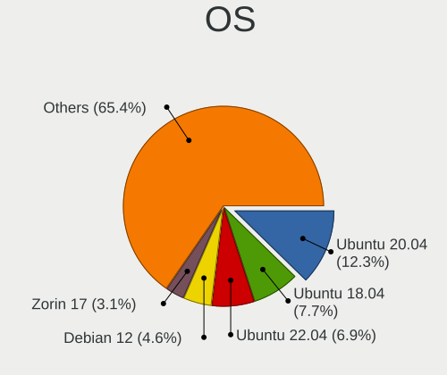

| Name               | Desktops | Percent |
|--------------------|----------|---------|
| Ubuntu 20.04       | 16       | 12.31%  |
| Ubuntu 18.04       | 10       | 7.69%   |
| Ubuntu 22.04       | 9        | 6.92%   |
| Debian 12          | 6        | 4.62%   |
| Zorin 17           | 4        | 3.08%   |
| OpenMandriva 4.3   | 4        | 3.08%   |
| Arch Rolling       | 4        | 3.08%   |
| Ubuntu 24.04       | 3        | 2.31%   |
| OpenMandriva 6.0   | 3        | 2.31%   |
| OpenMandriva 4.2   | 3        | 2.31%   |
| Debian 11          | 3        | 2.31%   |
| CentOS 7           | 3        | 2.31%   |
| Zorin 16           | 2        | 1.54%   |
| OpenMandriva 5.0   | 2        | 1.54%   |
| OpenMandriva 25.06 | 2        | 1.54%   |
| OpenMandriva 24.12 | 2        | 1.54%   |
| Linux Mint 22.1    | 2        | 1.54%   |
| Linux Mint 21.3    | 2        | 1.54%   |
| Linux Mint 21.1    | 2        | 1.54%   |
| Linux Mint 19.1    | 2        | 1.54%   |
| Fedora 36          | 2        | 1.54%   |
| Fedora 34          | 2        | 1.54%   |
| Xubuntu 18.04      | 1        | 0.77%   |
| Ubuntu 22.10       | 1        | 0.77%   |
| Ubuntu 21.10       | 1        | 0.77%   |
| Ubuntu 16.04       | 1        | 0.77%   |
| Pop!_OS 21.04      | 1        | 0.77%   |
| Pop!_OS 20.04      | 1        | 0.77%   |
| Peppermint 10      | 1        | 0.77%   |
| openSUSE Leap-15.2 | 1        | 0.77%   |
| OpenMandriva 25.90 | 1        | 0.77%   |
| OpenMandriva 25.04 | 1        | 0.77%   |
| OpenMandriva 24.90 | 1        | 0.77%   |
| OpenMandriva 24.07 | 1        | 0.77%   |
| OpenMandriva 23.90 | 1        | 0.77%   |
| OpenMandriva 23.03 | 1        | 0.77%   |
| Nobara 36          | 1        | 0.77%   |
| Manjaro 21.3.7     | 1        | 0.77%   |
| Manjaro 21.2.5     | 1        | 0.77%   |
| Manjaro            | 1        | 0.77%   |

OS Family
---------

OS without a version

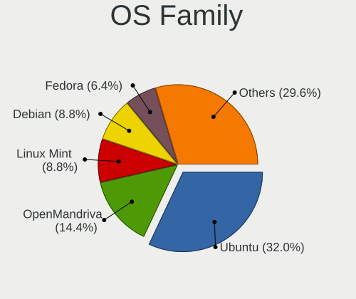

| Name         | Desktops | Percent |
|--------------|----------|---------|
| Ubuntu       | 40       | 32%     |
| OpenMandriva | 18       | 14.4%   |
| Linux Mint   | 11       | 8.8%    |
| Debian       | 11       | 8.8%    |
| Fedora       | 8        | 6.4%    |
| Zorin        | 6        | 4.8%    |
| Arch         | 5        | 4%      |
| Manjaro      | 3        | 2.4%    |
| CentOS       | 3        | 2.4%    |
| Pop!_OS      | 2        | 1.6%    |
| Lubuntu      | 2        | 1.6%    |
| LMDE         | 2        | 1.6%    |
| Kali         | 2        | 1.6%    |
| CachyOS      | 2        | 1.6%    |
| Xubuntu      | 1        | 0.8%    |
| Peppermint   | 1        | 0.8%    |
| openSUSE     | 1        | 0.8%    |
| Nobara       | 1        | 0.8%    |
| Kubuntu      | 1        | 0.8%    |
| KDE neon     | 1        | 0.8%    |
| EndeavourOS  | 1        | 0.8%    |
| Elementary   | 1        | 0.8%    |
| Clear Linux  | 1        | 0.8%    |
| Bazzite      | 1        | 0.8%    |

Kernel
------

Version of the Linux kernel

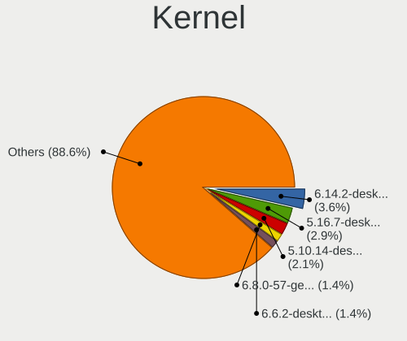

| Version                        | Desktops | Percent |
|--------------------------------|----------|---------|
| 6.14.2-desktop-3omv2590        | 5        | 3.57%   |
| 5.16.7-desktop-1omv4003        | 4        | 2.86%   |
| 5.10.14-desktop-1omv4002       | 3        | 2.14%   |
| 6.8.0-57-generic               | 2        | 1.43%   |
| 6.6.2-desktop-1omv2390         | 2        | 1.43%   |
| 6.5.0-26-generic               | 2        | 1.43%   |
| 6.12.1-desktop-1omv2490        | 2        | 1.43%   |
| 6.1.0-21-amd64                 | 2        | 1.43%   |
| 5.8.0-50-generic               | 2        | 1.43%   |
| 5.4.0-73-generic               | 2        | 1.43%   |
| 5.4.0-54-generic               | 2        | 1.43%   |
| 5.4.0-29-generic               | 2        | 1.43%   |
| 5.15.0-56-generic              | 2        | 1.43%   |
| 4.15.0-20-generic              | 2        | 1.43%   |
| 3.10.0-1062.el7.x86_64         | 2        | 1.43%   |
| 6.8.0-63-generic               | 1        | 0.71%   |
| 6.8.0-62-generic               | 1        | 0.71%   |
| 6.8.0-59-generic               | 1        | 0.71%   |
| 6.8.0-52-generic               | 1        | 0.71%   |
| 6.8.0-51-generic               | 1        | 0.71%   |
| 6.8.0-50-generic               | 1        | 0.71%   |
| 6.6.8-arch1-1                  | 1        | 0.71%   |
| 6.6.12-201.fsync.fc39.x86_64   | 1        | 0.71%   |
| 6.5.0-35-generic               | 1        | 0.71%   |
| 6.5.0-14-generic               | 1        | 0.71%   |
| 6.2.9-300.fc38.x86_64          | 1        | 0.71%   |
| 6.2.6-desktop-1omv2390         | 1        | 0.71%   |
| 6.2.1-desktop-1omv2390         | 1        | 0.71%   |
| 6.17.9-2-cachyos               | 1        | 0.71%   |
| 6.17.8-zen1-1-zen              | 1        | 0.71%   |
| 6.17.1-arch1-1                 | 1        | 0.71%   |
| 6.17.0-3-cachyos               | 1        | 0.71%   |
| 6.16.8-arch1-1                 | 1        | 0.71%   |
| 6.16.3-arch1-1                 | 1        | 0.71%   |
| 6.15.9-arch1-1                 | 1        | 0.71%   |
| 6.15.6-105.bazzite.fc42.x86_64 | 1        | 0.71%   |
| 6.15.0-desktop-0.rc2.3omv2590  | 1        | 0.71%   |
| 6.14.0-desktop-0.rc7.2omv2590  | 1        | 0.71%   |
| 6.14.0-24-generic              | 1        | 0.71%   |
| 6.12.9+bpo-amd64               | 1        | 0.71%   |

Kernel Family
-------------

Linux kernel without a distro release

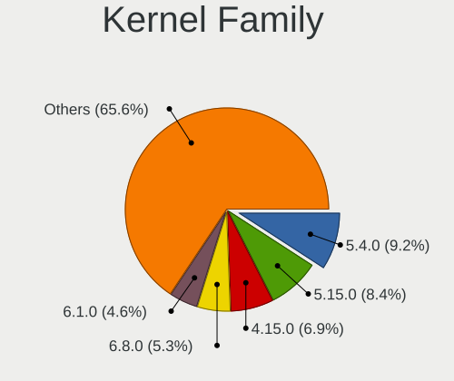

| Version | Desktops | Percent |
|---------|----------|---------|
| 5.4.0   | 12       | 9.16%   |
| 5.15.0  | 11       | 8.4%    |
| 4.15.0  | 9        | 6.87%   |
| 6.8.0   | 7        | 5.34%   |
| 6.1.0   | 6        | 4.58%   |
| 6.14.2  | 5        | 3.82%   |
| 5.8.0   | 5        | 3.82%   |
| 5.16.7  | 5        | 3.82%   |
| 6.5.0   | 4        | 3.05%   |
| 5.11.0  | 4        | 3.05%   |
| 5.19.0  | 3        | 2.29%   |
| 5.13.0  | 3        | 2.29%   |
| 5.10.14 | 3        | 2.29%   |
| 5.10.0  | 3        | 2.29%   |
| 3.10.0  | 3        | 2.29%   |
| 6.6.2   | 2        | 1.53%   |
| 6.14.0  | 2        | 1.53%   |
| 6.12.1  | 2        | 1.53%   |
| 5.0.0   | 2        | 1.53%   |
| 4.19.0  | 2        | 1.53%   |
| 6.6.8   | 1        | 0.76%   |
| 6.6.12  | 1        | 0.76%   |
| 6.2.9   | 1        | 0.76%   |
| 6.2.6   | 1        | 0.76%   |
| 6.2.1   | 1        | 0.76%   |
| 6.17.9  | 1        | 0.76%   |
| 6.17.8  | 1        | 0.76%   |
| 6.17.1  | 1        | 0.76%   |
| 6.17.0  | 1        | 0.76%   |
| 6.16.8  | 1        | 0.76%   |
| 6.16.3  | 1        | 0.76%   |
| 6.15.9  | 1        | 0.76%   |
| 6.15.6  | 1        | 0.76%   |
| 6.15.0  | 1        | 0.76%   |
| 6.12.9  | 1        | 0.76%   |
| 6.12.57 | 1        | 0.76%   |
| 6.12.20 | 1        | 0.76%   |
| 6.11.0  | 1        | 0.76%   |
| 6.10.9  | 1        | 0.76%   |
| 6.10.0  | 1        | 0.76%   |

Kernel Major Ver.
-----------------

Linux kernel major version

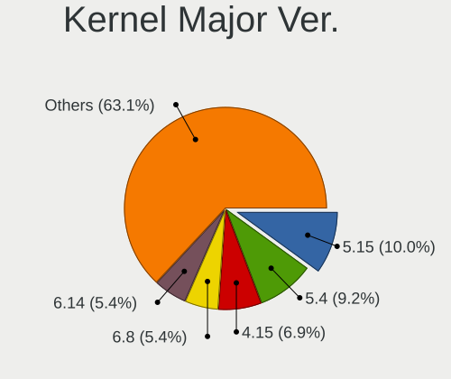

| Version | Desktops | Percent |
|---------|----------|---------|
| 5.15    | 13       | 10%     |
| 5.4     | 12       | 9.23%   |
| 4.15    | 9        | 6.92%   |
| 6.8     | 7        | 5.38%   |
| 6.14    | 7        | 5.38%   |
| 5.10    | 7        | 5.38%   |
| 6.1     | 6        | 4.62%   |
| 5.16    | 6        | 4.62%   |
| 6.12    | 5        | 3.85%   |
| 5.8     | 5        | 3.85%   |
| 5.11    | 5        | 3.85%   |
| 6.6     | 4        | 3.08%   |
| 6.5     | 4        | 3.08%   |
| 6.17    | 4        | 3.08%   |
| 5.19    | 4        | 3.08%   |
| 5.17    | 4        | 3.08%   |
| 5.13    | 4        | 3.08%   |
| 6.2     | 3        | 2.31%   |
| 6.15    | 3        | 2.31%   |
| 5.0     | 3        | 2.31%   |
| 3.10    | 3        | 2.31%   |
| 6.10    | 2        | 1.54%   |
| 5.3     | 2        | 1.54%   |
| 4.19    | 2        | 1.54%   |
| 6.16    | 1        | 0.77%   |
| 6.11    | 1        | 0.77%   |
| 6.0     | 1        | 0.77%   |
| 5.7     | 1        | 0.77%   |
| 5.18    | 1        | 0.77%   |
| 4.18    | 1        | 0.77%   |

Arch
----

OS architecture (x86_64, i586, etc.)

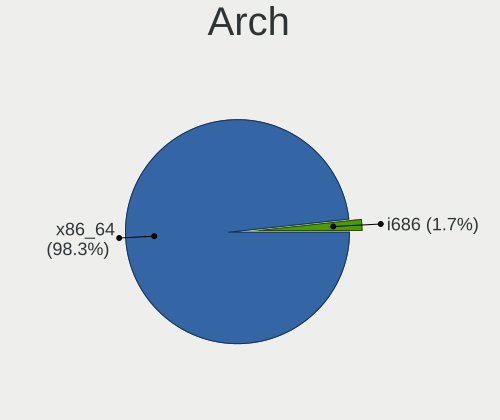

| Name   | Desktops | Percent |
|--------|----------|---------|
| x86_64 | 114      | 98.28%  |
| i686   | 2        | 1.72%   |

DE
--

Desktop Environment

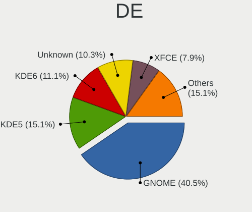

| Name       | Desktops | Percent |
|------------|----------|---------|
| GNOME      | 51       | 40.48%  |
| KDE5       | 19       | 15.08%  |
| KDE6       | 14       | 11.11%  |
| Unknown    | 13       | 10.32%  |
| XFCE       | 10       | 7.94%   |
| X-Cinnamon | 10       | 7.94%   |
| LXDE       | 3        | 2.38%   |
| MATE       | 2        | 1.59%   |
| qtile      | 1        | 0.79%   |
| Pantheon   | 1        | 0.79%   |
| LXQt       | 1        | 0.79%   |
| Hyprland   | 1        | 0.79%   |

Display Server
--------------

X11 or Wayland

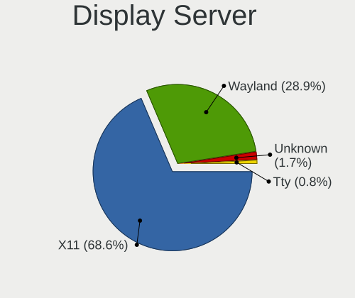

| Name    | Desktops | Percent |
|---------|----------|---------|
| X11     | 83       | 68.6%   |
| Wayland | 35       | 28.93%  |
| Unknown | 2        | 1.65%   |
| Tty     | 1        | 0.83%   |

Display Manager
---------------

SDDM, LightDM, etc.

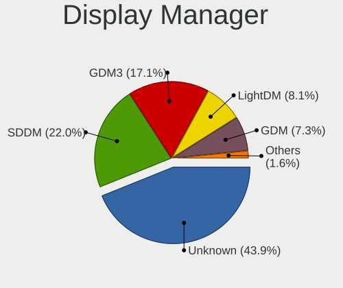

| Name    | Desktops | Percent |
|---------|----------|---------|
| Unknown | 54       | 43.9%   |
| SDDM    | 27       | 21.95%  |
| GDM3    | 21       | 17.07%  |
| LightDM | 10       | 8.13%   |
| GDM     | 9        | 7.32%   |
| TDM     | 2        | 1.63%   |

OS Lang
-------

Language

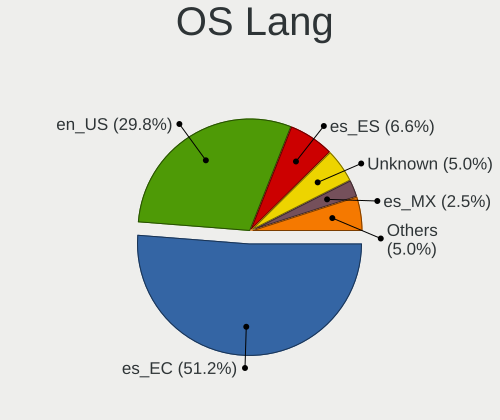

| Lang    | Desktops | Percent |
|---------|----------|---------|
| es_EC   | 62       | 51.24%  |
| en_US   | 36       | 29.75%  |
| es_ES   | 8        | 6.61%   |
| Unknown | 6        | 4.96%   |
| es_MX   | 3        | 2.48%   |
| ru_RU   | 1        | 0.83%   |
| es_PE   | 1        | 0.83%   |
| es_CO   | 1        | 0.83%   |
| en_GB   | 1        | 0.83%   |
| en_AG   | 1        | 0.83%   |
| C       | 1        | 0.83%   |

Boot Mode
---------

EFI or BIOS

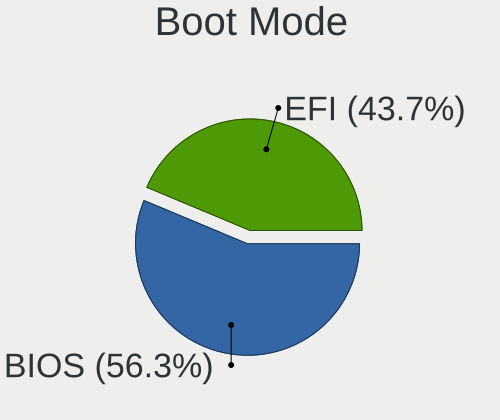

| Mode | Desktops | Percent |
|------|----------|---------|
| BIOS | 67       | 56.3%   |
| EFI  | 52       | 43.7%   |

Filesystem
----------

Type of filesystem

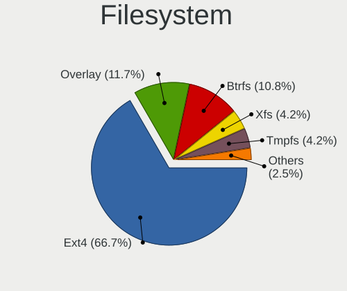

| Type    | Desktops | Percent |
|---------|----------|---------|
| Ext4    | 80       | 66.67%  |
| Overlay | 14       | 11.67%  |
| Btrfs   | 13       | 10.83%  |
| Xfs     | 5        | 4.17%   |
| Tmpfs   | 5        | 4.17%   |
| Unknown | 3        | 2.5%    |

Part. scheme
------------

Scheme of partitioning

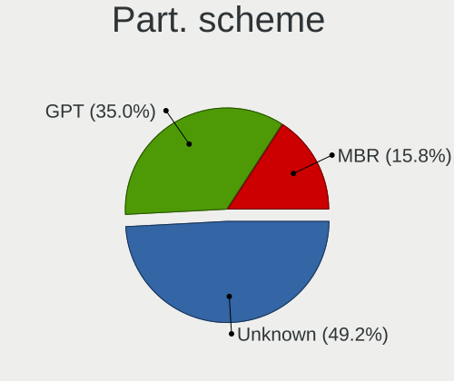

| Type    | Desktops | Percent |
|---------|----------|---------|
| Unknown | 59       | 49.17%  |
| GPT     | 42       | 35%     |
| MBR     | 19       | 15.83%  |

Dual Boot with Linux/BSD
------------------------

Hosting more than one Linux/BSD

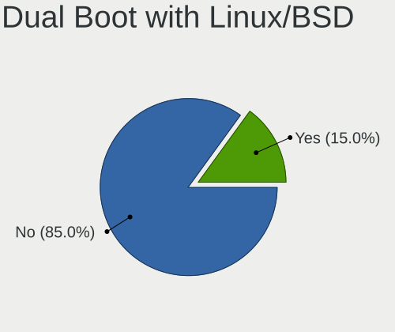

| Dual boot | Desktops | Percent |
|-----------|----------|---------|
| No        | 102      | 85%     |
| Yes       | 18       | 15%     |

Dual Boot (Win)
---------------

Hosting Linux and Windows

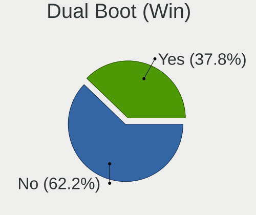

| Dual boot | Desktops | Percent |
|-----------|----------|---------|
| No        | 74       | 62.18%  |
| Yes       | 45       | 37.82%  |

Board
-----

Vendor
------

Motherboard manufacturer

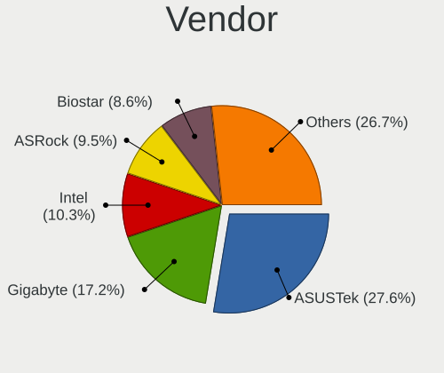

| Name                | Desktops | Percent |
|---------------------|----------|---------|
| ASUSTek Computer    | 32       | 27.59%  |
| Gigabyte Technology | 20       | 17.24%  |
| Intel               | 12       | 10.34%  |
| ASRock              | 11       | 9.48%   |
| Biostar             | 10       | 8.62%   |
| Hewlett-Packard     | 9        | 7.76%   |
| Dell                | 5        | 4.31%   |
| MSI                 | 4        | 3.45%   |
| Foxconn             | 4        | 3.45%   |
| Pegatron            | 2        | 1.72%   |
| Unknown             | 2        | 1.72%   |
| TPV-INVENTA         | 1        | 0.86%   |
| Shuttle             | 1        | 0.86%   |
| Google              | 1        | 0.86%   |
| ECS                 | 1        | 0.86%   |
| Cartimex            | 1        | 0.86%   |

Model
-----

Motherboard model

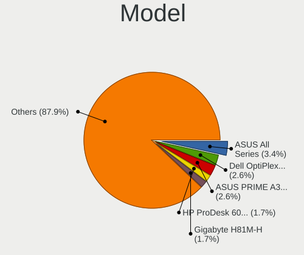

| Name                                    | Desktops | Percent |
|-----------------------------------------|----------|---------|
| ASUS All Series                         | 4        | 3.45%   |
| Dell OptiPlex 9020                      | 3        | 2.59%   |
| ASUS PRIME A320M-A                      | 3        | 2.59%   |
| HP ProDesk 600 G1 SFF                   | 2        | 1.72%   |
| Gigabyte H81M-H                         | 2        | 1.72%   |
| Biostar H61MGV3                         | 2        | 1.72%   |
| Biostar G31-M7 TE                       | 2        | 1.72%   |
| ASUS PRIME H410M-E                      | 2        | 1.72%   |
| ASUS PRIME A320M-K                      | 2        | 1.72%   |
| ASRock B550M-HDV                        | 2        | 1.72%   |
| Unknown                                 | 2        | 1.72%   |
| TPV-INVENTA 2AF2 A01                    | 1        | 0.86%   |
| Shuttle SFM27                           | 1        | 0.86%   |
| Pegatron CQ1506LA                       | 1        | 0.86%   |
| Pegatron 2AA1h                          | 1        | 0.86%   |
| MSI MS-7C56                             | 1        | 0.86%   |
| MSI MS-7B98                             | 1        | 0.86%   |
| MSI MS-7A70                             | 1        | 0.86%   |
| MSI MS-7758                             | 1        | 0.86%   |
| Intel X99                               | 1        | 0.86%   |
| Intel H81                               | 1        | 0.86%   |
| Intel H55                               | 1        | 0.86%   |
| Intel DZ68DB AAG27985-101               | 1        | 0.86%   |
| Intel DP55KG AAE47218-404               | 1        | 0.86%   |
| Intel DH61WW AAG23116-203               | 1        | 0.86%   |
| Intel DH61BF AAG81311-102               | 1        | 0.86%   |
| Intel DH61BF AAG81311-101               | 1        | 0.86%   |
| Intel DG41RQ AAE54511-205               | 1        | 0.86%   |
| Intel DG35EC AAE29266-209               | 1        | 0.86%   |
| Intel DG33BU AAD79951-407               | 1        | 0.86%   |
| Intel DB75EN AAG39650-302               | 1        | 0.86%   |
| HP Slim Desktop S01-pF1xxx              | 1        | 0.86%   |
| HP ProLiant MicroServer                 | 1        | 0.86%   |
| HP Pavilion 595-p0039c Desktop Rfrbd PC | 1        | 0.86%   |
| HP EliteDesk 800 G3 SFF                 | 1        | 0.86%   |
| HP Compaq Elite 8300 SFF                | 1        | 0.86%   |
| HP Compaq 6200 Pro MT PC                | 1        | 0.86%   |
| HP 23-o014                              | 1        | 0.86%   |
| Google Panther                          | 1        | 0.86%   |
| Gigabyte X58A-UD3R                      | 1        | 0.86%   |

Model Family
------------

Motherboard model prefix

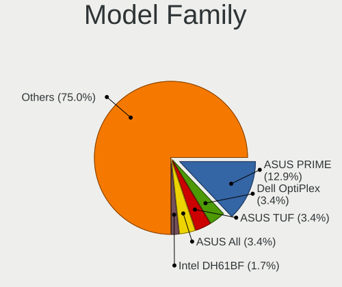

| Name               | Desktops | Percent |
|--------------------|----------|---------|
| ASUS PRIME         | 15       | 12.93%  |
| Dell OptiPlex      | 4        | 3.45%   |
| ASUS TUF           | 4        | 3.45%   |
| ASUS All           | 4        | 3.45%   |
| Intel DH61BF       | 2        | 1.72%   |
| HP ProDesk         | 2        | 1.72%   |
| HP Compaq          | 2        | 1.72%   |
| Gigabyte H81M-H    | 2        | 1.72%   |
| Gigabyte H410M     | 2        | 1.72%   |
| Biostar H61MGV3    | 2        | 1.72%   |
| Biostar G31-M7     | 2        | 1.72%   |
| ASUS M5A78L-M      | 2        | 1.72%   |
| ASRock B550M-HDV   | 2        | 1.72%   |
| ASRock B450        | 2        | 1.72%   |
| Unknown            | 2        | 1.72%   |
| TPV-INVENTA 2AF2   | 1        | 0.86%   |
| Shuttle SFM27      | 1        | 0.86%   |
| Pegatron CQ1506LA  | 1        | 0.86%   |
| Pegatron 2AA1h     | 1        | 0.86%   |
| MSI MS-7C56        | 1        | 0.86%   |
| MSI MS-7B98        | 1        | 0.86%   |
| MSI MS-7A70        | 1        | 0.86%   |
| MSI MS-7758        | 1        | 0.86%   |
| Intel X99          | 1        | 0.86%   |
| Intel H81          | 1        | 0.86%   |
| Intel H55          | 1        | 0.86%   |
| Intel DZ68DB       | 1        | 0.86%   |
| Intel DP55KG       | 1        | 0.86%   |
| Intel DH61WW       | 1        | 0.86%   |
| Intel DG41RQ       | 1        | 0.86%   |
| Intel DG35EC       | 1        | 0.86%   |
| Intel DG33BU       | 1        | 0.86%   |
| Intel DB75EN       | 1        | 0.86%   |
| HP Slim            | 1        | 0.86%   |
| HP ProLiant        | 1        | 0.86%   |
| HP Pavilion        | 1        | 0.86%   |
| HP EliteDesk       | 1        | 0.86%   |
| HP 23-o014         | 1        | 0.86%   |
| Google Panther     | 1        | 0.86%   |
| Gigabyte X58A-UD3R | 1        | 0.86%   |

MFG Year
--------

Motherboard manufacture year

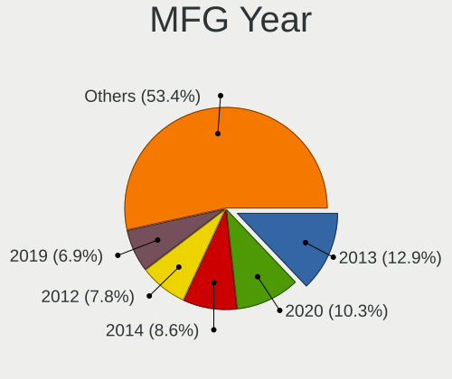

| Year | Desktops | Percent |
|------|----------|---------|
| 2013 | 15       | 12.93%  |
| 2020 | 12       | 10.34%  |
| 2014 | 10       | 8.62%   |
| 2012 | 9        | 7.76%   |
| 2019 | 8        | 6.9%    |
| 2011 | 8        | 6.9%    |
| 2021 | 7        | 6.03%   |
| 2018 | 7        | 6.03%   |
| 2017 | 6        | 5.17%   |
| 2009 | 6        | 5.17%   |
| 2022 | 5        | 4.31%   |
| 2016 | 5        | 4.31%   |
| 2015 | 5        | 4.31%   |
| 2010 | 5        | 4.31%   |
| 2008 | 4        | 3.45%   |
| 2007 | 2        | 1.72%   |
| 2024 | 1        | 0.86%   |
| 2023 | 1        | 0.86%   |

Form Factor
-----------

Physical design of the computer

| Name    | Desktops | Percent |
|---------|----------|---------|
| Desktop | 116      | 100%    |

Secure Boot
-----------

Enabled or disabled

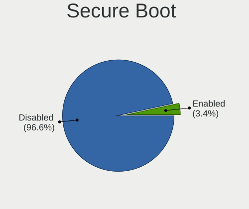

| State    | Desktops | Percent |
|----------|----------|---------|
| Disabled | 113      | 96.58%  |
| Enabled  | 4        | 3.42%   |

Coreboot
--------

Have coreboot on board

| Used | Desktops | Percent |
|------|----------|---------|
| No   | 115      | 99.14%  |
| Yes  | 1        | 0.86%   |

RAM Size
--------

Total RAM memory

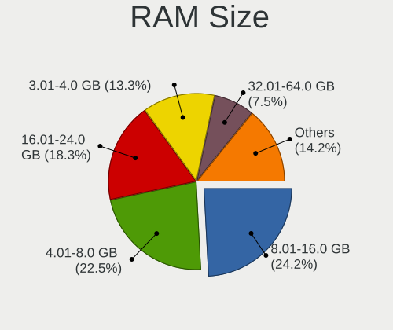

| Size in GB  | Desktops | Percent |
|-------------|----------|---------|
| 8.01-16.0   | 29       | 24.17%  |
| 4.01-8.0    | 27       | 22.5%   |
| 16.01-24.0  | 22       | 18.33%  |
| 3.01-4.0    | 16       | 13.33%  |
| 32.01-64.0  | 9        | 7.5%    |
| 24.01-32.0  | 7        | 5.83%   |
| 1.01-2.0    | 5        | 4.17%   |
| 64.01-256.0 | 4        | 3.33%   |
| 2.01-3.0    | 1        | 0.83%   |

RAM Used
--------

Used RAM memory

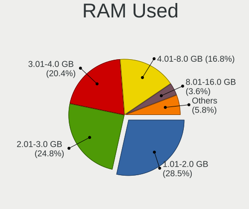

| Used GB    | Desktops | Percent |
|------------|----------|---------|
| 1.01-2.0   | 39       | 28.47%  |
| 2.01-3.0   | 34       | 24.82%  |
| 3.01-4.0   | 28       | 20.44%  |
| 4.01-8.0   | 23       | 16.79%  |
| 8.01-16.0  | 5        | 3.65%   |
| 0.51-1.0   | 5        | 3.65%   |
| 0.01-0.5   | 2        | 1.46%   |
| 16.01-24.0 | 1        | 0.73%   |

Total Drives
------------

Number of drives on board

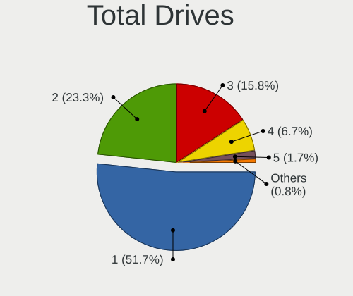

| Drives | Desktops | Percent |
|--------|----------|---------|
| 1      | 62       | 51.67%  |
| 2      | 28       | 23.33%  |
| 3      | 19       | 15.83%  |
| 4      | 8        | 6.67%   |
| 5      | 2        | 1.67%   |
| 6      | 1        | 0.83%   |

Has CD-ROM
----------

Has CD-ROM on board

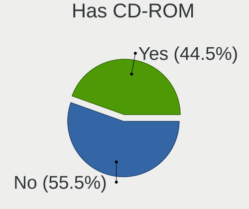

| Presented | Desktops | Percent |
|-----------|----------|---------|
| No        | 66       | 55.46%  |
| Yes       | 53       | 44.54%  |

Has Ethernet
------------

Has Ethernet on board

| Presented | Desktops | Percent |
|-----------|----------|---------|
| Yes       | 116      | 100%    |

Has WiFi
--------

Has WiFi module

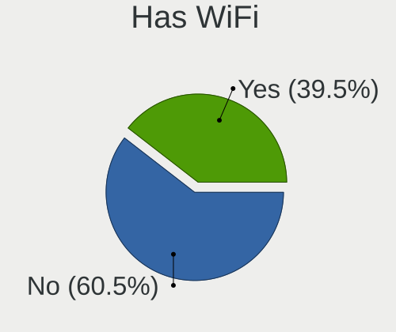

| Presented | Desktops | Percent |
|-----------|----------|---------|
| No        | 72       | 60.5%   |
| Yes       | 47       | 39.5%   |

Has Bluetooth
-------------

Has Bluetooth module

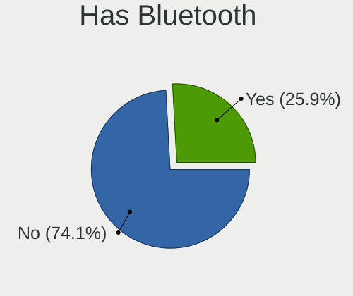

| Presented | Desktops | Percent |
|-----------|----------|---------|
| No        | 86       | 74.14%  |
| Yes       | 30       | 25.86%  |

Location
--------

Country
-------

Geographic location (country)

| Country | Desktops | Percent |
|---------|----------|---------|
| Ecuador | 116      | 100%    |

City
----

Geographic location (city)

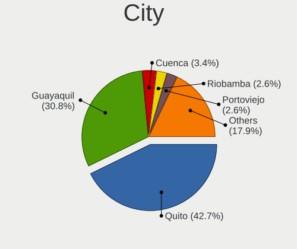

| City                           | Desktops | Percent |
|--------------------------------|----------|---------|
| Quito                          | 50       | 42.74%  |
| Guayaquil                      | 36       | 30.77%  |
| Cuenca                         | 4        | 3.42%   |
| Riobamba                       | 3        | 2.56%   |
| Portoviejo                     | 3        | 2.56%   |
| Manta                          | 3        | 2.56%   |
| Santo Domingo de los Colorados | 2        | 1.71%   |
| Loja                           | 2        | 1.71%   |
| Cotacachi                      | 2        | 1.71%   |
| Ambato                         | 2        | 1.71%   |
| Quevedo                        | 1        | 0.85%   |
| Machala                        | 1        | 0.85%   |
| Latacunga                      | 1        | 0.85%   |
| Las Pinas                      | 1        | 0.85%   |
| Hacienda Santo Domingo         | 1        | 0.85%   |
| Guanujo                        | 1        | 0.85%   |
| Esmeraldas                     | 1        | 0.85%   |
| Cumbaya                        | 1        | 0.85%   |
| Cariamanga                     | 1        | 0.85%   |
| Azogues                        | 1        | 0.85%   |

Drives
------

Drive Vendor
------------

Hard drive vendors

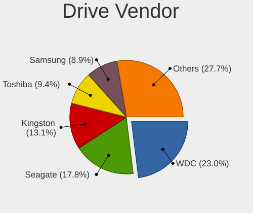

| Vendor                      | Desktops | Drives | Percent |
|-----------------------------|----------|--------|---------|
| WDC                         | 44       | 71     | 23.04%  |
| Seagate                     | 34       | 48     | 17.8%   |
| Kingston                    | 25       | 48     | 13.09%  |
| Toshiba                     | 18       | 27     | 9.42%   |
| Samsung Electronics         | 17       | 22     | 8.9%    |
| Hitachi                     | 8        | 9      | 4.19%   |
| A-DATA Technology           | 7        | 12     | 3.66%   |
| Kingston Technology Company | 4        | 6      | 2.09%   |
| Hewlett-Packard             | 4        | 4      | 2.09%   |
| SPCC                        | 2        | 2      | 1.05%   |
| Sandisk                     | 2        | 2      | 1.05%   |
| PNY                         | 2        | 2      | 1.05%   |
| Intel                       | 2        | 2      | 1.05%   |
| HS-SSD-WAVE(S)              | 2        | 2      | 1.05%   |
| Gigabyte Technology         | 2        | 2      | 1.05%   |
| TXRUI                       | 1        | 1      | 0.52%   |
| SK hynix                    | 1        | 1      | 0.52%   |
| Rayson                      | 1        | 1      | 0.52%   |
| Phison Electronics          | 1        | 1      | 0.52%   |
| Patriot                     | 1        | 1      | 0.52%   |
| Micro Center                | 1        | 1      | 0.52%   |
| Maxtor                      | 1        | 1      | 0.52%   |
| MAXIO Technology (Hangzhou) | 1        | 1      | 0.52%   |
| JMicron Technology          | 1        | 1      | 0.52%   |
| Imation                     | 1        | 1      | 0.52%   |
| HS-SSD-E100                 | 1        | 1      | 0.52%   |
| HPE                         | 1        | 1      | 0.52%   |
| HGST                        | 1        | 1      | 0.52%   |
| Golden                      | 1        | 1      | 0.52%   |
| Fujitsu                     | 1        | 1      | 0.52%   |
| Corsair                     | 1        | 1      | 0.52%   |
| ANKEJE                      | 1        | 1      | 0.52%   |
| addlink                     | 1        | 2      | 0.52%   |

Drive Model
-----------

Hard drive models

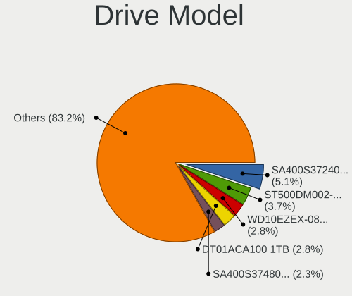

| Model                            | Desktops | Percent |
|----------------------------------|----------|---------|
| Kingston SA400S37240G 240GB SSD  | 11       | 5.14%   |
| Seagate ST500DM002-1BD142 500GB  | 8        | 3.74%   |
| WDC WD10EZEX-08WN4A0 1TB         | 6        | 2.8%    |
| Toshiba DT01ACA100 1TB           | 6        | 2.8%    |
| Kingston SA400S37480G 480GB SSD  | 5        | 2.34%   |
| WDC WDS480G2G0A-00JH30 480GB SSD | 4        | 1.87%   |
| WDC WD20EZRZ-00Z5HB0 2TB         | 4        | 1.87%   |
| WDC WD10EZEX-00BN5A0 1TB         | 4        | 1.87%   |
| Toshiba DT01ACA200 2TB           | 4        | 1.87%   |
| Seagate ST31000524AS 1TB         | 4        | 1.87%   |
| Seagate ST1000DM010-2EP102 1TB   | 3        | 1.4%    |
| Samsung HD502HJ 500GB            | 3        | 1.4%    |
| Kingston SV300S37A60G 64GB SSD   | 3        | 1.4%    |
| Kingston SA400S37960G 960GB SSD  | 3        | 1.4%    |
| Hitachi HDS721050CLA660 500GB    | 3        | 1.4%    |
| A-DATA SU650 120GB SSD           | 3        | 1.4%    |
| WDC WDBNCE5000PNC 500GB SSD      | 2        | 0.93%   |
| WDC WD40EFAX-68JH4N1 4TB         | 2        | 0.93%   |
| WDC WD20EZRX-00D8PB0 2TB         | 2        | 0.93%   |
| WDC WD10EZEX-00WN4A0 1TB         | 2        | 0.93%   |
| Toshiba MK7559GSXP 752GB         | 2        | 0.93%   |
| Seagate ST1000DM003-1CH162 1TB   | 2        | 0.93%   |
| Samsung HD322HJ 320GB            | 2        | 0.93%   |
| Kingston Company SNV2S2000G 2TB  | 2        | 0.93%   |
| Kingston SNVS500G 500GB          | 2        | 0.93%   |
| Kingston SNVS250G 250GB          | 2        | 0.93%   |
| Hitachi HUA722020ALA331 2TB      | 2        | 0.93%   |
| HP SSD S700 500GB                | 2        | 0.93%   |
| WDC WDS240G2G0B-00EPW0 240GB SSD | 1        | 0.47%   |
| WDC WDS240G2G0A-00JH30 240GB SSD | 1        | 0.47%   |
| WDC WDS100T2B0A-00SM50 1TB SSD   | 1        | 0.47%   |
| WDC WD7500BPVX-22JC3T0 752GB     | 1        | 0.47%   |
| WDC WD5000AVVS-63M8B0 500GB      | 1        | 0.47%   |
| WDC WD5000AAKX-75U6AA0 500GB     | 1        | 0.47%   |
| WDC WD5000AAKX-60U6AA0 500GB     | 1        | 0.47%   |
| WDC WD5000AAKX-08U6AA0 500GB     | 1        | 0.47%   |
| WDC WD5000AAKX-00ERMA0 500GB     | 1        | 0.47%   |
| WDC WD5000AAKS-00V2B0 500GB      | 1        | 0.47%   |
| WDC WD40EFPX-68C6CN0 4TB         | 1        | 0.47%   |
| WDC WD3200AVVS-63L2B0 320GB      | 1        | 0.47%   |

HDD Vendor
----------

Hard disk drive vendors

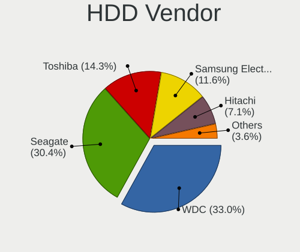

| Vendor              | Desktops | Drives | Percent |
|---------------------|----------|--------|---------|
| WDC                 | 37       | 59     | 33.04%  |
| Seagate             | 34       | 48     | 30.36%  |
| Toshiba             | 16       | 24     | 14.29%  |
| Samsung Electronics | 13       | 15     | 11.61%  |
| Hitachi             | 8        | 9      | 7.14%   |
| Maxtor              | 1        | 1      | 0.89%   |
| HPE                 | 1        | 1      | 0.89%   |
| HGST                | 1        | 1      | 0.89%   |
| Fujitsu             | 1        | 1      | 0.89%   |

SSD Vendor
----------

Solid state drive vendors

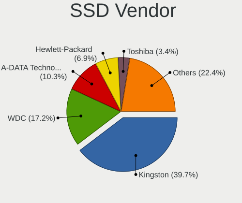

| Vendor              | Desktops | Drives | Percent |
|---------------------|----------|--------|---------|
| Kingston            | 23       | 36     | 39.66%  |
| WDC                 | 10       | 12     | 17.24%  |
| A-DATA Technology   | 6        | 10     | 10.34%  |
| Hewlett-Packard     | 4        | 4      | 6.9%    |
| Toshiba             | 2        | 3      | 3.45%   |
| SPCC                | 2        | 2      | 3.45%   |
| PNY                 | 2        | 2      | 3.45%   |
| Samsung Electronics | 1        | 4      | 1.72%   |
| Rayson              | 1        | 1      | 1.72%   |
| Patriot             | 1        | 1      | 1.72%   |
| Micro Center        | 1        | 1      | 1.72%   |
| Intel               | 1        | 1      | 1.72%   |
| HS-SSD-E100         | 1        | 1      | 1.72%   |
| Golden              | 1        | 1      | 1.72%   |
| Gigabyte Technology | 1        | 1      | 1.72%   |
| ANKEJE              | 1        | 1      | 1.72%   |

Drive Kind
----------

HDD or SSD

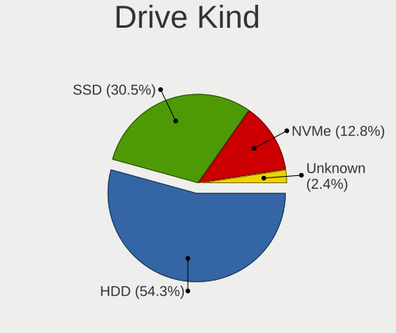

| Kind    | Desktops | Drives | Percent |
|---------|----------|--------|---------|
| HDD     | 89       | 159    | 54.27%  |
| SSD     | 50       | 81     | 30.49%  |
| NVMe    | 21       | 33     | 12.8%   |
| Unknown | 4        | 5      | 2.44%   |

Drive Connector
---------------

SATA, SAS, NVMe, etc.

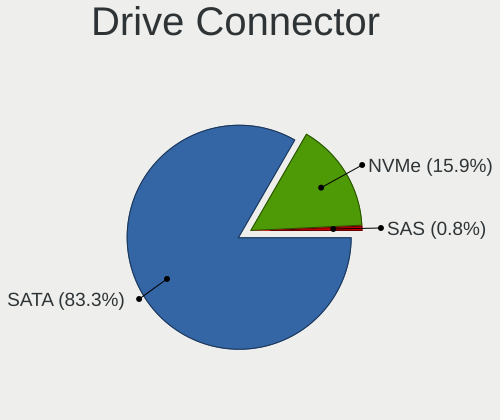

| Type | Desktops | Drives | Percent |
|------|----------|--------|---------|
| SATA | 110      | 243    | 83.33%  |
| NVMe | 21       | 33     | 15.91%  |
| SAS  | 1        | 2      | 0.76%   |

Drive Size
----------

Size of hard drive

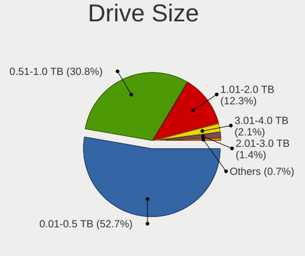

| Size in TB | Desktops | Drives | Percent |
|------------|----------|--------|---------|
| 0.01-0.5   | 77       | 139    | 52.74%  |
| 0.51-1.0   | 45       | 65     | 30.82%  |
| 1.01-2.0   | 18       | 26     | 12.33%  |
| 3.01-4.0   | 3        | 6      | 2.05%   |
| 2.01-3.0   | 2        | 3      | 1.37%   |
| 4.01-10.0  | 1        | 1      | 0.68%   |

Space Total
-----------

Amount of disk space available on the file system

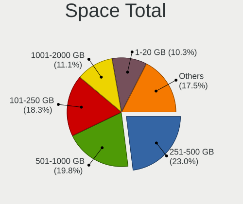

| Size in GB     | Desktops | Percent |
|----------------|----------|---------|
| 251-500        | 29       | 23.02%  |
| 501-1000       | 25       | 19.84%  |
| 101-250        | 23       | 18.25%  |
| 1001-2000      | 14       | 11.11%  |
| 1-20           | 13       | 10.32%  |
| More than 3000 | 11       | 8.73%   |
| 51-100         | 4        | 3.17%   |
| Unknown        | 3        | 2.38%   |
| 21-50          | 2        | 1.59%   |
| 2001-3000      | 2        | 1.59%   |

Space Used
----------

Amount of used disk space

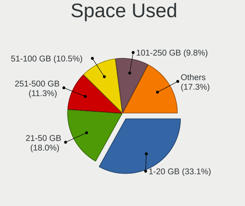

| Used GB        | Desktops | Percent |
|----------------|----------|---------|
| 1-20           | 44       | 33.08%  |
| 21-50          | 24       | 18.05%  |
| 251-500        | 15       | 11.28%  |
| 51-100         | 14       | 10.53%  |
| 101-250        | 13       | 9.77%   |
| 501-1000       | 8        | 6.02%   |
| 1001-2000      | 6        | 4.51%   |
| More than 3000 | 5        | 3.76%   |
| Unknown        | 3        | 2.26%   |
| 2001-3000      | 1        | 0.75%   |

Malfunc. Drives
---------------

Drive models with a malfunction

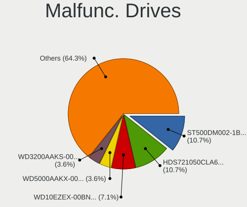

| Model                             | Desktops | Drives | Percent |
|-----------------------------------|----------|--------|---------|
| Seagate ST500DM002-1BD142 500GB   | 3        | 4      | 10.71%  |
| Hitachi HDS721050CLA660 500GB     | 3        | 4      | 10.71%  |
| WDC WD10EZEX-00BN5A0 1TB          | 2        | 2      | 7.14%   |
| WDC WD5000AAKX-00ERMA0 500GB      | 1        | 1      | 3.57%   |
| WDC WD3200AAKS-00L9A0 320GB       | 1        | 1      | 3.57%   |
| WDC WD1200BEVS-22UST0 120GB       | 1        | 1      | 3.57%   |
| WDC WD10EZEX-60ZF5A0 1TB          | 1        | 1      | 3.57%   |
| WDC WD10EZEX-00WN4A0 1TB          | 1        | 1      | 3.57%   |
| Toshiba MK7559GSXP 752GB          | 1        | 1      | 3.57%   |
| Toshiba DT01ACA300 3TB            | 1        | 2      | 3.57%   |
| Seagate ST3750330AS 752GB         | 1        | 1      | 3.57%   |
| Seagate ST3500630AS 500GB         | 1        | 1      | 3.57%   |
| Seagate ST31000524AS 1TB          | 1        | 1      | 3.57%   |
| Seagate ST31000333AS 1TB          | 1        | 2      | 3.57%   |
| Seagate ST2000DL003-9VT166 2TB    | 1        | 1      | 3.57%   |
| Seagate ST1000DM010-2EP102 1TB    | 1        | 2      | 3.57%   |
| Samsung Electronics HD501LJ 500GB | 1        | 1      | 3.57%   |
| Samsung Electronics HD322HJ 320GB | 1        | 1      | 3.57%   |
| Samsung Electronics HD161GJ 160GB | 1        | 1      | 3.57%   |
| Samsung Electronics HD103UJ 1TB   | 1        | 1      | 3.57%   |
| Kingston SNS4151S316GD 16GB SSD   | 1        | 1      | 3.57%   |
| HPE MB0500EAMZD 500GB             | 1        | 1      | 3.57%   |
| Fujitsu MHZ2160BH G1 160GB        | 1        | 1      | 3.57%   |

Malfunc. Drive Vendor
---------------------

Vendors of faulty drives

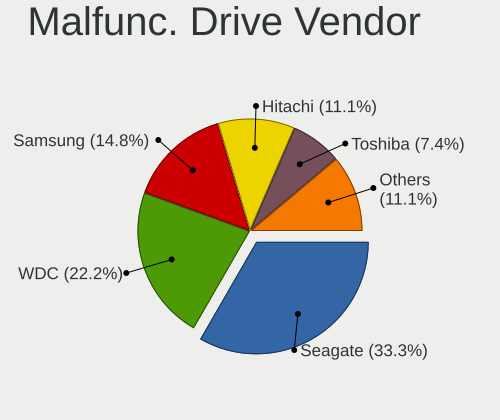

| Vendor              | Desktops | Drives | Percent |
|---------------------|----------|--------|---------|
| Seagate             | 9        | 12     | 33.33%  |
| WDC                 | 6        | 7      | 22.22%  |
| Samsung Electronics | 4        | 4      | 14.81%  |
| Hitachi             | 3        | 4      | 11.11%  |
| Toshiba             | 2        | 3      | 7.41%   |
| Kingston            | 1        | 1      | 3.7%    |
| HPE                 | 1        | 1      | 3.7%    |
| Fujitsu             | 1        | 1      | 3.7%    |

Malfunc. HDD Vendor
-------------------

Vendors of faulty HDD drives

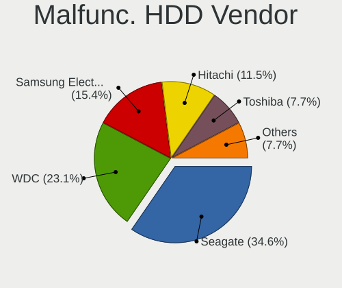

| Vendor              | Desktops | Drives | Percent |
|---------------------|----------|--------|---------|
| Seagate             | 9        | 12     | 34.62%  |
| WDC                 | 6        | 7      | 23.08%  |
| Samsung Electronics | 4        | 4      | 15.38%  |
| Hitachi             | 3        | 4      | 11.54%  |
| Toshiba             | 2        | 3      | 7.69%   |
| HPE                 | 1        | 1      | 3.85%   |
| Fujitsu             | 1        | 1      | 3.85%   |

Malfunc. Drive Kind
-------------------

Kinds of faulty drives

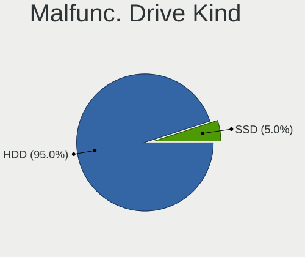

| Kind | Desktops | Drives | Percent |
|------|----------|--------|---------|
| HDD  | 19       | 32     | 95%     |
| SSD  | 1        | 1      | 5%      |

Failed Drives
-------------

Failed drive models

Zero info for selected period =(

Failed Drive Vendor
-------------------

Failed drive vendors

Zero info for selected period =(

Drive Status
------------

Number of failed and malfunc. drives

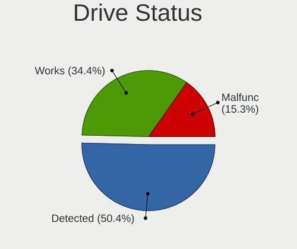

| Status   | Desktops | Drives | Percent |
|----------|----------|--------|---------|
| Detected | 66       | 168    | 50.38%  |
| Works    | 45       | 77     | 34.35%  |
| Malfunc  | 20       | 33     | 15.27%  |

Storage controller
------------------

Storage Vendor
--------------

Storage controller vendors

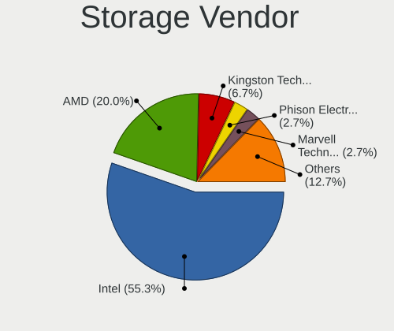

| Vendor                      | Desktops | Percent |
|-----------------------------|----------|---------|
| Intel                       | 83       | 55.33%  |
| AMD                         | 30       | 20%     |
| Kingston Technology Company | 10       | 6.67%   |
| Phison Electronics          | 4        | 2.67%   |
| Marvell Technology Group    | 4        | 2.67%   |
| Samsung Electronics         | 3        | 2%      |
| JMicron Technology          | 3        | 2%      |
| ASMedia Technology          | 3        | 2%      |
| VIA Technologies            | 2        | 1.33%   |
| SanDisk                     | 2        | 1.33%   |
| Nvidia                      | 2        | 1.33%   |
| SK hynix                    | 1        | 0.67%   |
| MAXIO Technology (Hangzhou) | 1        | 0.67%   |
| Broadcom / LSI              | 1        | 0.67%   |
| ADATA Technology            | 1        | 0.67%   |

Storage Model
-------------

Storage controller models

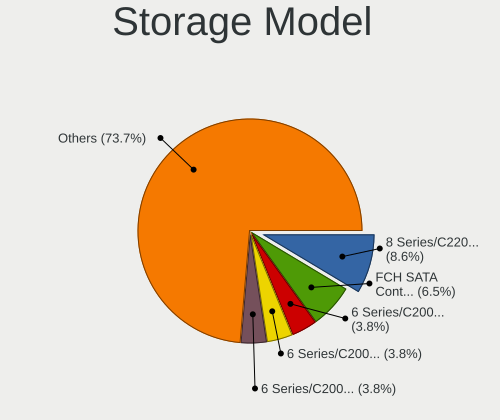

| Model                                                                                   | Desktops | Percent |
|-----------------------------------------------------------------------------------------|----------|---------|
| Intel 8 Series/C220 Series Chipset Family 6-port SATA Controller 1 [AHCI mode]          | 16       | 8.6%    |
| AMD FCH SATA Controller [AHCI mode]                                                     | 12       | 6.45%   |
| Intel 6 Series/C200 Series Chipset Family Desktop SATA Controller (IDE mode, ports 4-5) | 7        | 3.76%   |
| Intel 6 Series/C200 Series Chipset Family Desktop SATA Controller (IDE mode, ports 0-3) | 7        | 3.76%   |
| Intel 6 Series/C200 Series Chipset Family 6 port Desktop SATA AHCI Controller           | 7        | 3.76%   |
| Intel 200 Series PCH SATA controller [AHCI mode]                                        | 7        | 3.76%   |
| AMD 500 Series Chipset SATA Controller                                                  | 7        | 3.76%   |
| Intel SATA Controller [RAID mode]                                                       | 6        | 3.23%   |
| AMD 400 Series Chipset SATA Controller                                                  | 6        | 3.23%   |
| Kingston Company NV2 NVMe SSD [SM2267XT] (DRAM-less)                                    | 5        | 2.69%   |
| Intel NM10/ICH7 Family SATA Controller [IDE mode]                                       | 5        | 2.69%   |
| AMD A320 Chipset SATA Controller [AHCI mode]                                            | 5        | 2.69%   |
| Kingston Company NV1 NVMe SSD [SM2263XT] (DRAM-less)                                    | 4        | 2.15%   |
| Intel Q170/Q150/B150/H170/H110/Z170/CM236 Chipset SATA Controller [AHCI Mode]           | 4        | 2.15%   |
| Intel 82801G (ICH7 Family) IDE Controller                                               | 4        | 2.15%   |
| Intel 7 Series/C210 Series Chipset Family 6-port SATA Controller [AHCI mode]            | 4        | 2.15%   |
| Intel 400 Series Chipset Family SATA AHCI Controller                                    | 4        | 2.15%   |
| AMD SB7x0/SB8x0/SB9x0 IDE Controller                                                    | 4        | 2.15%   |
| Intel Volume Management Device NVMe RAID Controller                                     | 3        | 1.61%   |
| Intel Alder Lake-S PCH SATA Controller [AHCI Mode]                                      | 3        | 1.61%   |
| Intel 500 Series Chipset Family SATA AHCI Controller                                    | 3        | 1.61%   |
| ASMedia ASM1061/ASM1062 Serial ATA Controller                                           | 3        | 1.61%   |
| AMD SB7x0/SB8x0/SB9x0 SATA Controller [IDE mode]                                        | 3        | 1.61%   |
| Kingston Company KC3000/FURY Renegade NVMe SSD [E18]                                    | 2        | 1.08%   |
| JMicron JMB363 SATA/IDE Controller                                                      | 2        | 1.08%   |
| Intel Cannon Lake PCH SATA AHCI Controller                                              | 2        | 1.08%   |
| Intel 9 Series Chipset Family SATA Controller [AHCI Mode]                               | 2        | 1.08%   |
| Intel 5 Series/3400 Series Chipset 4 port SATA IDE Controller                           | 2        | 1.08%   |
| Intel 5 Series/3400 Series Chipset 2 port SATA IDE Controller                           | 2        | 1.08%   |
| AMD SB7x0/SB8x0/SB9x0 SATA Controller [AHCI mode]                                       | 2        | 1.08%   |
| AMD FCH SATA Controller [IDE mode]                                                      | 2        | 1.08%   |
| VIA VT82C586A/B/VT82C686/A/B/VT823x/A/C PIPC Bus Master IDE                             | 1        | 0.54%   |
| VIA VT8237A Integrated SATA Controller                                                  | 1        | 0.54%   |
| VIA VT6421 IDE/SATA Controller                                                          | 1        | 0.54%   |
| SK hynix BC901 NVMe Solid State Drive (DRAM-less)                                       | 1        | 0.54%   |
| SanDisk Ultra 3D / WD Blue SN570 NVMe SSD (DRAM-less)                                   | 1        | 0.54%   |
| SanDisk PC SN735 / WD_BLACK SN750 SE NVMe SSD (DRAM-less)                               | 1        | 0.54%   |
| Samsung NVMe SSD Controller SM981/PM981/PM983                                           | 1        | 0.54%   |
| Samsung NVMe SSD Controller PM9A1/PM9A3/980PRO                                          | 1        | 0.54%   |
| Samsung NVMe SSD Controller 980 (DRAM-less)                                             | 1        | 0.54%   |

Storage Kind
------------

Kind of storage controller (IDE, SATA, NVMe, SAS, ...)

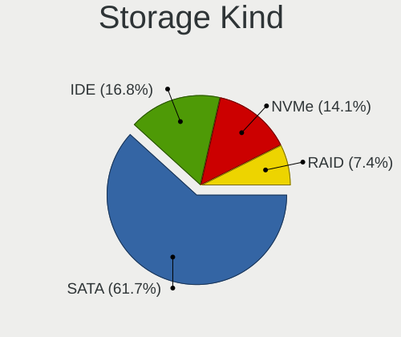

| Kind | Desktops | Percent |
|------|----------|---------|
| SATA | 92       | 61.74%  |
| IDE  | 25       | 16.78%  |
| NVMe | 21       | 14.09%  |
| RAID | 11       | 7.38%   |

Processor
---------

CPU Vendor
----------

Processor vendors

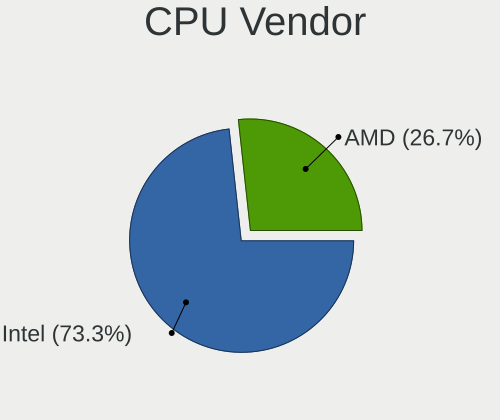

| Vendor | Desktops | Percent |
|--------|----------|---------|
| Intel  | 85       | 73.28%  |
| AMD    | 31       | 26.72%  |

CPU Model
---------

Processor models

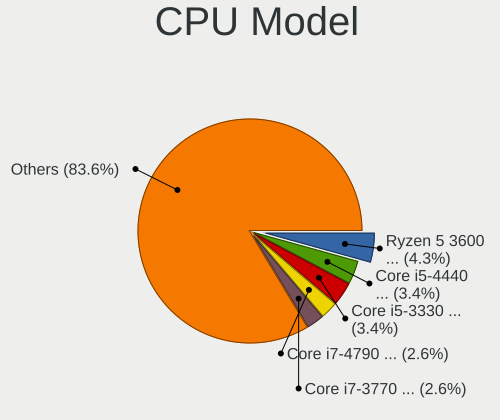

| Model                                       | Desktops | Percent |
|---------------------------------------------|----------|---------|
| AMD Ryzen 5 3600 6-Core Processor           | 5        | 4.31%   |
| Intel Core i5-4440 CPU @ 3.10GHz            | 4        | 3.45%   |
| Intel Core i5-3330 CPU @ 3.00GHz            | 4        | 3.45%   |
| Intel Core i7-4790 CPU @ 3.60GHz            | 3        | 2.59%   |
| Intel Core i7-3770 CPU @ 3.40GHz            | 3        | 2.59%   |
| AMD Ryzen 7 5700G with Radeon Graphics      | 3        | 2.59%   |
| AMD Ryzen 5 2400G with Radeon Vega Graphics | 3        | 2.59%   |
| Intel Pentium CPU G2030 @ 3.00GHz           | 2        | 1.72%   |
| Intel Core i7-7700 CPU @ 3.60GHz            | 2        | 1.72%   |
| Intel Core i7-6700 CPU @ 3.40GHz            | 2        | 1.72%   |
| Intel Core i7-4770 CPU @ 3.40GHz            | 2        | 1.72%   |
| Intel Core i5-4460 CPU @ 3.20GHz            | 2        | 1.72%   |
| Intel Core i5-3470 CPU @ 3.20GHz            | 2        | 1.72%   |
| Intel Core i5-10400 CPU @ 2.90GHz           | 2        | 1.72%   |
| Intel Core i3-10100F CPU @ 3.60GHz          | 2        | 1.72%   |
| Intel Core 2 Quad CPU Q8400 @ 2.66GHz       | 2        | 1.72%   |
| Intel 12th Gen Core i5-12400                | 2        | 1.72%   |
| AMD Ryzen 5 5600X 6-Core Processor          | 2        | 1.72%   |
| AMD Athlon II X2 270 Processor              | 2        | 1.72%   |
| Intel Xeon CPU X5660 @ 2.80GHz              | 1        | 0.86%   |
| Intel Xeon CPU E5-2680 v4 @ 2.40GHz         | 1        | 0.86%   |
| Intel Xeon CPU E5-2670 v2 @ 2.50GHz         | 1        | 0.86%   |
| Intel Xeon CPU E3-1270 v3 @ 3.50GHz         | 1        | 0.86%   |
| Intel Pentium Dual-Core CPU E5400 @ 2.70GHz | 1        | 0.86%   |
| Intel Pentium CPU G630 @ 2.70GHz            | 1        | 0.86%   |
| Intel Pentium CPU G4400 @ 3.30GHz           | 1        | 0.86%   |
| Intel Pentium CPU G3250 @ 3.20GHz           | 1        | 0.86%   |
| Intel Pentium CPU G3220 @ 3.00GHz           | 1        | 0.86%   |
| Intel Pentium CPU G2020 @ 2.90GHz           | 1        | 0.86%   |
| Intel Core i9-9900K CPU @ 3.60GHz           | 1        | 0.86%   |
| Intel Core i7-9700 CPU @ 3.00GHz            | 1        | 0.86%   |
| Intel Core i7-7700K CPU @ 4.20GHz           | 1        | 0.86%   |
| Intel Core i7-4820K CPU @ 3.70GHz           | 1        | 0.86%   |
| Intel Core i7-4770S CPU @ 3.10GHz           | 1        | 0.86%   |
| Intel Core i7-2600 CPU @ 3.40GHz            | 1        | 0.86%   |
| Intel Core i7 CPU 960 @ 3.20GHz             | 1        | 0.86%   |
| Intel Core i7 CPU 860 @ 2.80GHz             | 1        | 0.86%   |
| Intel Core i5-9600K CPU @ 3.70GHz           | 1        | 0.86%   |
| Intel Core i5-9400F CPU @ 2.90GHz           | 1        | 0.86%   |
| Intel Core i5-9400 CPU @ 2.90GHz            | 1        | 0.86%   |

CPU Model Family
----------------

Processor model prefix

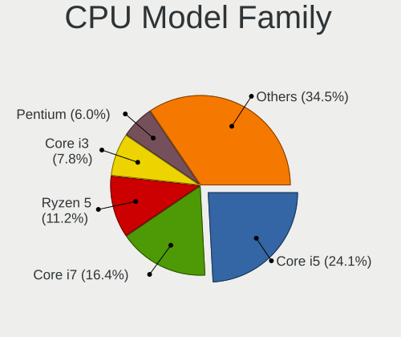

| Model                   | Desktops | Percent |
|-------------------------|----------|---------|
| Intel Core i5           | 28       | 24.14%  |
| Intel Core i7           | 19       | 16.38%  |
| AMD Ryzen 5             | 13       | 11.21%  |
| Intel Core i3           | 9        | 7.76%   |
| Intel Pentium           | 7        | 6.03%   |
| AMD Ryzen 7             | 6        | 5.17%   |
| Other                   | 4        | 3.45%   |
| Intel Xeon              | 4        | 3.45%   |
| Intel Core 2 Duo        | 4        | 3.45%   |
| Intel Celeron           | 4        | 3.45%   |
| Intel Core 2 Quad       | 2        | 1.72%   |
| Intel Atom              | 2        | 1.72%   |
| AMD E1                  | 2        | 1.72%   |
| AMD Athlon II X2        | 2        | 1.72%   |
| Intel Pentium Dual-Core | 1        | 0.86%   |
| Intel Core i9           | 1        | 0.86%   |
| AMD Ryzen 9             | 1        | 0.86%   |
| AMD Ryzen 5 PRO         | 1        | 0.86%   |
| AMD Ryzen 3             | 1        | 0.86%   |
| AMD Phenom II X6        | 1        | 0.86%   |
| AMD Phenom II X2        | 1        | 0.86%   |
| AMD FX                  | 1        | 0.86%   |
| AMD Athlon II Neo       | 1        | 0.86%   |
| AMD A8                  | 1        | 0.86%   |

CPU Cores
---------

Number of processor cores

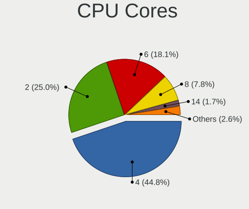

| Number | Desktops | Percent |
|--------|----------|---------|
| 4      | 52       | 44.83%  |
| 2      | 29       | 25%     |
| 6      | 21       | 18.1%   |
| 8      | 9        | 7.76%   |
| 14     | 2        | 1.72%   |
| 24     | 1        | 0.86%   |
| 12     | 1        | 0.86%   |
| 10     | 1        | 0.86%   |

CPU Sockets
-----------

Number of sockets

| Number | Desktops | Percent |
|--------|----------|---------|
| 1      | 116      | 100%    |

CPU Threads
-----------

Threads per core (Hyper-Threading)

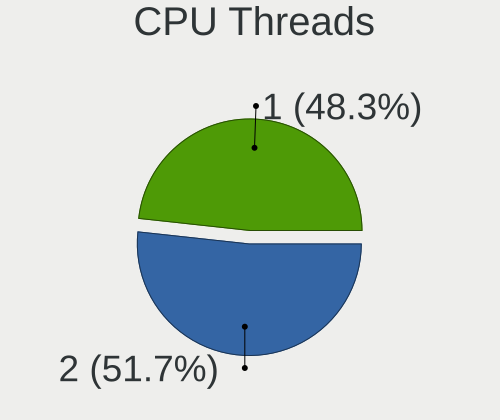

| Number | Desktops | Percent |
|--------|----------|---------|
| 2      | 60       | 51.72%  |
| 1      | 56       | 48.28%  |

CPU Op-Modes
------------

CPU Operation Modes (32-bit, 64-bit)

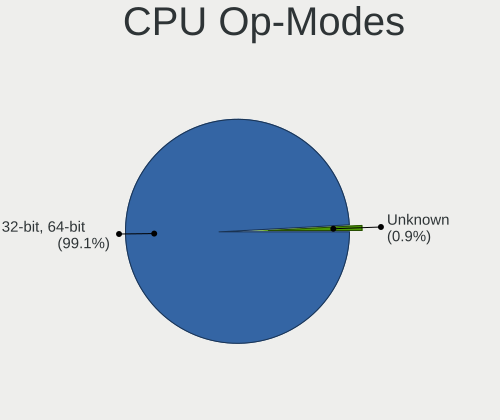

| Op mode        | Desktops | Percent |
|----------------|----------|---------|
| 32-bit, 64-bit | 115      | 99.14%  |
| Unknown        | 1        | 0.86%   |

CPU Microcode
-------------

Microcode number

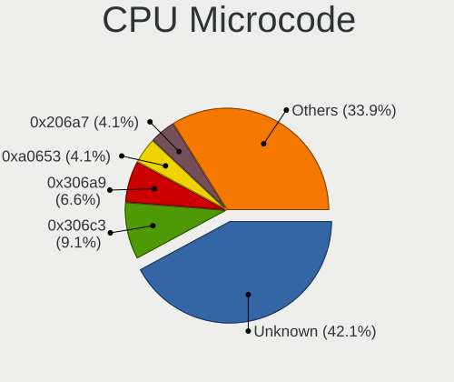

| Number     | Desktops | Percent |
|------------|----------|---------|
| Unknown    | 51       | 42.15%  |
| 0x306c3    | 11       | 9.09%   |
| 0x306a9    | 8        | 6.61%   |
| 0xa0653    | 5        | 4.13%   |
| 0x206a7    | 5        | 4.13%   |
| 0x1067a    | 5        | 4.13%   |
| 0x010000c8 | 3        | 2.48%   |
| 0x906ed    | 2        | 1.65%   |
| 0x106e5    | 2        | 1.65%   |
| 0x0a201005 | 2        | 1.65%   |
| 0x08701021 | 2        | 1.65%   |
| 0x0810100b | 2        | 1.65%   |
| 0xb06f2    | 1        | 0.83%   |
| 0x906ec    | 1        | 0.83%   |
| 0x906ea    | 1        | 0.83%   |
| 0x906e9    | 1        | 0.83%   |
| 0x90675    | 1        | 0.83%   |
| 0x706a1    | 1        | 0.83%   |
| 0x6fd      | 1        | 0.83%   |
| 0x506e3    | 1        | 0.83%   |
| 0x40651    | 1        | 0.83%   |
| 0x206c2    | 1        | 0.83%   |
| 0x20655    | 1        | 0.83%   |
| 0x106ca    | 1        | 0.83%   |
| 0x106c2    | 1        | 0.83%   |
| 0x106a5    | 1        | 0.83%   |
| 0x10676    | 1        | 0.83%   |
| 0x0a601203 | 1        | 0.83%   |
| 0x0a50000d | 1        | 0.83%   |
| 0x0a201204 | 1        | 0.83%   |
| 0x08701013 | 1        | 0.83%   |
| 0x08101016 | 1        | 0.83%   |
| 0x08101004 | 1        | 0.83%   |
| 0x0700010f | 1        | 0.83%   |
| 0x010000bf | 1        | 0.83%   |

CPU Microarch
-------------

Microarchitecture

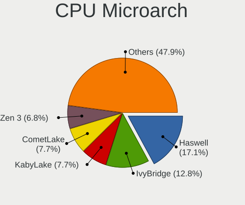

| Name             | Desktops | Percent |
|------------------|----------|---------|
| Haswell          | 20       | 17.09%  |
| IvyBridge        | 15       | 12.82%  |
| KabyLake         | 9        | 7.69%   |
| CometLake        | 9        | 7.69%   |
| Zen 3            | 8        | 6.84%   |
| Zen 2            | 8        | 6.84%   |
| Penryn           | 7        | 5.98%   |
| Skylake          | 5        | 4.27%   |
| SandyBridge      | 5        | 4.27%   |
| K10              | 5        | 4.27%   |
| Zen              | 3        | 2.56%   |
| Westmere         | 3        | 2.56%   |
| Nehalem          | 3        | 2.56%   |
| Alderlake Hybrid | 3        | 2.56%   |
| Unknown          | 3        | 2.56%   |
| Zen+             | 2        | 1.71%   |
| Bonnell          | 2        | 1.71%   |
| Steamroller      | 1        | 0.85%   |
| Piledriver       | 1        | 0.85%   |
| Jaguar           | 1        | 0.85%   |
| Goldmont plus    | 1        | 0.85%   |
| Core             | 1        | 0.85%   |
| Broadwell        | 1        | 0.85%   |
| Bobcat           | 1        | 0.85%   |

Graphics
--------

GPU Vendor
----------

Vendors of graphics cards

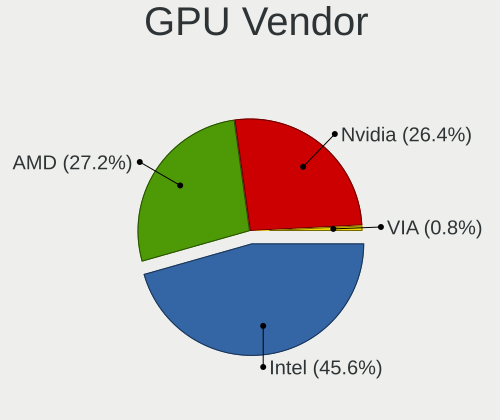

| Vendor           | Desktops | Percent |
|------------------|----------|---------|
| Intel            | 57       | 45.6%   |
| AMD              | 34       | 27.2%   |
| Nvidia           | 33       | 26.4%   |
| VIA Technologies | 1        | 0.8%    |

GPU Model
---------

Graphics card models

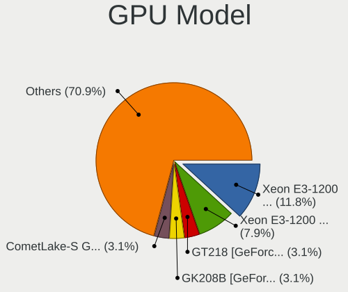

| Model                                                                       | Desktops | Percent |
|-----------------------------------------------------------------------------|----------|---------|
| Intel Xeon E3-1200 v3/4th Gen Core Processor Integrated Graphics Controller | 15       | 11.81%  |
| Intel Xeon E3-1200 v2/3rd Gen Core processor Graphics Controller            | 10       | 7.87%   |
| Nvidia GT218 [GeForce 210]                                                  | 4        | 3.15%   |
| Nvidia GK208B [GeForce GT 710]                                              | 4        | 3.15%   |
| Intel CometLake-S GT2 [UHD Graphics 630]                                    | 4        | 3.15%   |
| Intel 2nd Generation Core Processor Family Integrated Graphics Controller   | 4        | 3.15%   |
| Intel Skylake-S GT2 [HD Graphics 530]                                       | 3        | 2.36%   |
| Intel CoffeeLake-S GT2 [UHD Graphics 630]                                   | 3        | 2.36%   |
| AMD Raven Ridge [Radeon Vega Series / Radeon Vega Mobile Series]            | 3        | 2.36%   |
| AMD Ellesmere [Radeon RX 470/480/570/570X/580/580X/590]                     | 3        | 2.36%   |
| AMD Cezanne [Radeon Vega Series / Radeon Vega Mobile Series]                | 3        | 2.36%   |
| AMD Cedar [Radeon HD 5000/6000/7350/8350 Series]                            | 3        | 2.36%   |
| Nvidia TU106 [GeForce RTX 2060 12GB]                                        | 2        | 1.57%   |
| Nvidia GP107 [GeForce GTX 1050 Ti]                                          | 2        | 1.57%   |
| Nvidia GF119 [GeForce GT 610]                                               | 2        | 1.57%   |
| Intel Kaby Lake-S GT2 [HD Graphics 630]                                     | 2        | 1.57%   |
| Intel IvyBridge GT2 [HD Graphics 4000]                                      | 2        | 1.57%   |
| Intel 82G33/G31 Express Integrated Graphics Controller                      | 2        | 1.57%   |
| Intel 4 Series Chipset Integrated Graphics Controller                       | 2        | 1.57%   |
| AMD RS780L [Radeon 3000]                                                    | 2        | 1.57%   |
| AMD Picasso/Raven 2 [Radeon Vega Series / Radeon Vega Mobile Series]        | 2        | 1.57%   |
| AMD Navi 22 [Radeon RX 6700/6700 XT/6750 XT / 6800M/6850M XT]               | 2        | 1.57%   |
| AMD Navi 14 [Radeon RX 5500/5500M / Pro 5500M]                              | 2        | 1.57%   |
| VIA Technologies CN896/VN896/P4M900 [Chrome 9 HC]                           | 1        | 0.79%   |
| Nvidia TU117 [GeForce GTX 1650]                                             | 1        | 0.79%   |
| Nvidia TU116 [GeForce GTX 1660]                                             | 1        | 0.79%   |
| Nvidia TU116 [GeForce GTX 1660 SUPER]                                       | 1        | 0.79%   |
| Nvidia TU116 [GeForce GTX 1650 SUPER]                                       | 1        | 0.79%   |
| Nvidia TU102 [GeForce RTX 2080 Ti Rev. A]                                   | 1        | 0.79%   |
| Nvidia GP108 [GeForce GT 1030]                                              | 1        | 0.79%   |
| Nvidia GP107 [GeForce GTX 1050]                                             | 1        | 0.79%   |
| Nvidia GP104 [GeForce GTX 1080]                                             | 1        | 0.79%   |
| Nvidia GP104 [GeForce GTX 1070]                                             | 1        | 0.79%   |
| Nvidia GP104 [GeForce GTX 1070 Ti]                                          | 1        | 0.79%   |
| Nvidia GM107 [GeForce GTX 750 Ti]                                           | 1        | 0.79%   |
| Nvidia GK208B [GeForce GT 730]                                              | 1        | 0.79%   |
| Nvidia GF104 [GeForce GTX 460]                                              | 1        | 0.79%   |
| Nvidia GF100GL [Quadro 4000]                                                | 1        | 0.79%   |
| Nvidia GA102 [GeForce RTX 3080]                                             | 1        | 0.79%   |
| Nvidia G98 [Quadro NVS 420]                                                 | 1        | 0.79%   |

GPU Combo
---------

Combinations of graphics cards

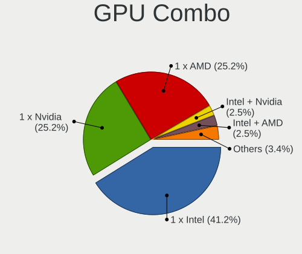

| Name                     | Desktops | Percent |
|--------------------------|----------|---------|
| 1 x Intel                | 49       | 41.18%  |
| 1 x Nvidia               | 30       | 25.21%  |
| 1 x AMD                  | 30       | 25.21%  |
| Intel + Nvidia           | 3        | 2.52%   |
| Intel + AMD              | 3        | 2.52%   |
| 2 x Intel                | 1        | 0.84%   |
| 2 x AMD                  | 1        | 0.84%   |
| 1 x VIA                  | 1        | 0.84%   |
| Intel + AMD + 1 x Nvidia | 1        | 0.84%   |

GPU Driver
----------

Free vs proprietary

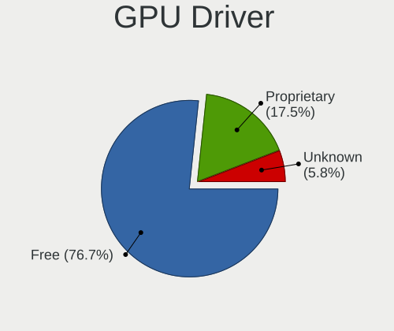

| Driver      | Desktops | Percent |
|-------------|----------|---------|
| Free        | 92       | 76.67%  |
| Proprietary | 21       | 17.5%   |
| Unknown     | 7        | 5.83%   |

GPU Memory
----------

Total video memory

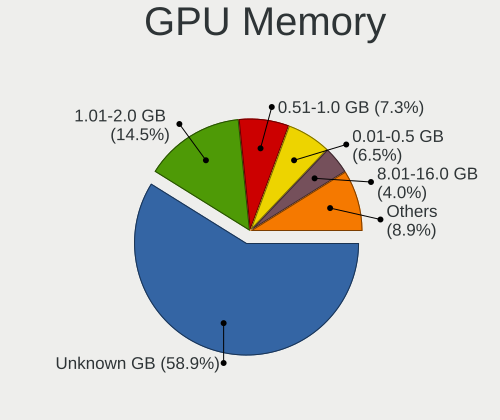

| Size in GB | Desktops | Percent |
|------------|----------|---------|
| Unknown    | 73       | 58.87%  |
| 1.01-2.0   | 18       | 14.52%  |
| 0.51-1.0   | 9        | 7.26%   |
| 0.01-0.5   | 8        | 6.45%   |
| 7.01-8.0   | 5        | 4.03%   |
| 8.01-16.0  | 5        | 4.03%   |
| 5.01-6.0   | 3        | 2.42%   |
| 3.01-4.0   | 3        | 2.42%   |

Monitor
-------

Monitor Vendor
--------------

Monitor vendors

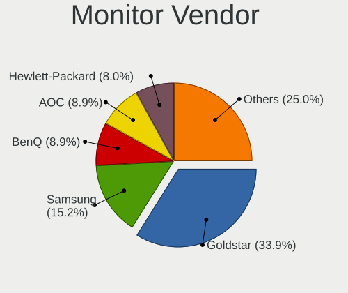

| Vendor               | Desktops | Percent |
|----------------------|----------|---------|
| Goldstar             | 38       | 33.93%  |
| Samsung Electronics  | 17       | 15.18%  |
| BenQ                 | 10       | 8.93%   |
| AOC                  | 10       | 8.93%   |
| Hewlett-Packard      | 9        | 8.04%   |
| Dell                 | 5        | 4.46%   |
| LG Electronics       | 4        | 3.57%   |
| Acer                 | 3        | 2.68%   |
| Unknown (XXX)        | 2        | 1.79%   |
| KTC                  | 2        | 1.79%   |
| DMT                  | 2        | 1.79%   |
| TES                  | 1        | 0.89%   |
| Sony                 | 1        | 0.89%   |
| Philips              | 1        | 0.89%   |
| NEC Computers        | 1        | 0.89%   |
| MStar                | 1        | 0.89%   |
| MSI                  | 1        | 0.89%   |
| HIC                  | 1        | 0.89%   |
| Gigabyte Technology  | 1        | 0.89%   |
| CVT                  | 1        | 0.89%   |
| Ancor Communications | 1        | 0.89%   |

Monitor Model
-------------

Monitor models

| Model                                                                | Desktops | Percent |
|----------------------------------------------------------------------|----------|---------|
| Goldstar HD GSM5ACD 1366x768 410x230mm 18.5-inch                     | 8        | 6.56%   |
| Goldstar W1943 GSM4BAD 1360x768 406x229mm 18.4-inch                  | 5        | 4.1%    |
| Goldstar L192WS GSM4B32 1440x900 410x256mm 19.0-inch                 | 3        | 2.46%   |
| BenQ G2420HDBL BNQ785E 1920x1080 477x268mm 21.5-inch                 | 3        | 2.46%   |
| Samsung Electronics SyncMaster SAM01A1 1024x768 304x228mm 15.0-inch  | 2        | 1.64%   |
| Samsung Electronics SMB1930N SAM0632 1366x768 410x230mm 18.5-inch    | 2        | 1.64%   |
| Samsung Electronics S19C150 SAM0AE6 1366x768 410x230mm 18.5-inch     | 2        | 1.64%   |
| LG Electronics LCD Monitor LG TV 1360x768                            | 2        | 1.64%   |
| Goldstar W2243 GSM56FE 1920x1080 477x269mm 21.6-inch                 | 2        | 1.64%   |
| Goldstar IPS WSXGA GSM5B20 1440x900 419x262mm 19.5-inch              | 2        | 1.64%   |
| Goldstar E1942 GSM4C09 1366x768 410x230mm 18.5-inch                  | 2        | 1.64%   |
| Goldstar 20EN33 GSM4EE1 1600x900 443x249mm 20.0-inch                 | 2        | 1.64%   |
| DMT CHHWJT* DMT0030 1440x900 708x398mm 32.0-inch                     | 2        | 1.64%   |
| BenQ GL930A BNQ7870 1366x768 410x230mm 18.5-inch                     | 2        | 1.64%   |
| AOC 2251w AOC2251 1920x1080 477x268mm 21.5-inch                      | 2        | 1.64%   |
| Unknown (XXX) Union TV XXX2841 1920x1080 1209x680mm 54.6-inch        | 1        | 0.82%   |
| Unknown (XXX) Beyond TV XXX2851 3840x2160 1209x680mm 54.6-inch       | 1        | 0.82%   |
| TES TE-2123S TES2253 1920x1080 480x260mm 21.5-inch                   | 1        | 0.82%   |
| Sony TV *00 SNY3705 3840x2160 1218x685mm 55.0-inch                   | 1        | 0.82%   |
| Samsung Electronics SyncMaster SAM01CE 1024x768 304x228mm 15.0-inch  | 1        | 0.82%   |
| Samsung Electronics SyncMaster SAM00A4 1024x768 304x228mm 15.0-inch  | 1        | 0.82%   |
| Samsung Electronics SyncMaster SAM0027 1280x1024 312x234mm 15.4-inch | 1        | 0.82%   |
| Samsung Electronics SMBX1931N SAM0768 1366x768 410x230mm 18.5-inch   | 1        | 0.82%   |
| Samsung Electronics SA300/SA350 SAM0788 1366x768 410x230mm 18.5-inch | 1        | 0.82%   |
| Samsung Electronics S24E650 SAM0CB4 1920x1080 521x293mm 23.5-inch    | 1        | 0.82%   |
| Samsung Electronics S24E650 SAM0CB3 1920x1080 521x293mm 23.5-inch    | 1        | 0.82%   |
| Samsung Electronics S24C650 SAM09E8 1920x1080 521x293mm 23.5-inch    | 1        | 0.82%   |
| Samsung Electronics S19D300 SAM0B35 1366x768 410x230mm 18.5-inch     | 1        | 0.82%   |
| Samsung Electronics S19B420 SAM0975 1366x768 410x230mm 18.5-inch     | 1        | 0.82%   |
| Samsung Electronics LCD Monitor SMB1930N 1366x768                    | 1        | 0.82%   |
| Samsung Electronics LCD Monitor SAM7048 1366x768 522x293mm 23.6-inch | 1        | 0.82%   |
| Samsung Electronics LCD Monitor SA300/SA350 1366x768                 | 1        | 0.82%   |
| Philips LCD Monitor PHL BDM4065 3840x2160                            | 1        | 0.82%   |
| NEC Computers LCD1850E NEC65D1 1280x1024 359x287mm 18.1-inch         | 1        | 0.82%   |
| MStar Demo MST0030 1920x1080 708x398mm 32.0-inch                     | 1        | 0.82%   |
| MSI MP275Q MSI40C3 2560x1440 598x336mm 27.0-inch                     | 1        | 0.82%   |
| LG Electronics LCD Monitor W2043 3520x1080                           | 1        | 0.82%   |
| LG Electronics LCD Monitor 2D HD LG TV                               | 1        | 0.82%   |
| LG Electronics LCD Monitor 23MP55                                    | 1        | 0.82%   |
| KTC 32'TV KTC3200 1360x768 708x398mm 32.0-inch                       | 1        | 0.82%   |

Monitor Resolution
------------------

Monitor screen resolution

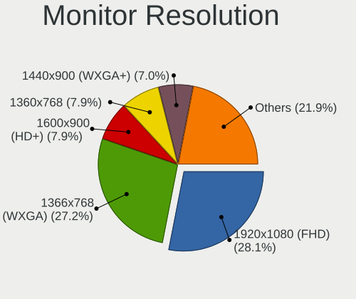

| Resolution         | Desktops | Percent |
|--------------------|----------|---------|
| 1920x1080 (FHD)    | 32       | 28.07%  |
| 1366x768 (WXGA)    | 31       | 27.19%  |
| 1600x900 (HD+)     | 9        | 7.89%   |
| 1360x768           | 9        | 7.89%   |
| 1440x900 (WXGA+)   | 8        | 7.02%   |
| 1024x768 (XGA)     | 7        | 6.14%   |
| 3840x2160 (4K)     | 5        | 4.39%   |
| 1280x1024 (SXGA)   | 4        | 3.51%   |
| 2560x1440 (QHD)    | 3        | 2.63%   |
| Unknown            | 2        | 1.75%   |
| 4093x4093          | 1        | 0.88%   |
| 3520x1080          | 1        | 0.88%   |
| 2646x1024          | 1        | 0.88%   |
| 1680x1050 (WSXGA+) | 1        | 0.88%   |

Monitor Diagonal
----------------

Diagonal size in inches

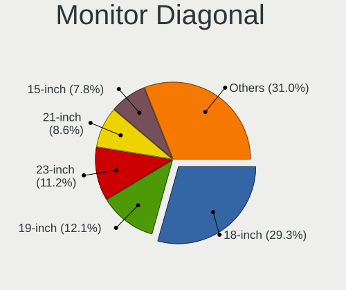

| Inches  | Desktops | Percent |
|---------|----------|---------|
| 18      | 34       | 29.31%  |
| 19      | 14       | 12.07%  |
| 23      | 13       | 11.21%  |
| 21      | 10       | 8.62%   |
| 15      | 9        | 7.76%   |
| Unknown | 9        | 7.76%   |
| 24      | 8        | 6.9%    |
| 32      | 4        | 3.45%   |
| 20      | 4        | 3.45%   |
| 27      | 2        | 1.72%   |
| 17      | 2        | 1.72%   |
| 85      | 1        | 0.86%   |
| 63      | 1        | 0.86%   |
| 54      | 1        | 0.86%   |
| 52      | 1        | 0.86%   |
| 39      | 1        | 0.86%   |
| 31      | 1        | 0.86%   |
| 12      | 1        | 0.86%   |

Monitor Width
-------------

Physical width

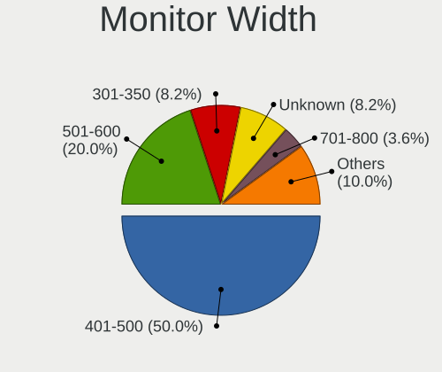

| Width in mm | Desktops | Percent |
|-------------|----------|---------|
| 401-500     | 55       | 50%     |
| 501-600     | 22       | 20%     |
| 301-350     | 9        | 8.18%   |
| Unknown     | 9        | 8.18%   |
| 701-800     | 4        | 3.64%   |
| 351-400     | 4        | 3.64%   |
| 1001-1500   | 3        | 2.73%   |
| 801-900     | 1        | 0.91%   |
| 601-700     | 1        | 0.91%   |
| 201-300     | 1        | 0.91%   |
| 1501-2000   | 1        | 0.91%   |

Aspect Ratio
------------

Proportional relationship between the width and the height

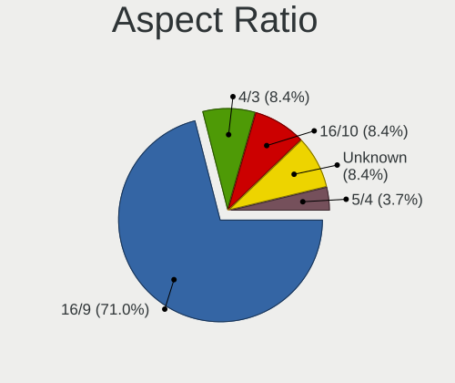

| Ratio   | Desktops | Percent |
|---------|----------|---------|
| 16/9    | 76       | 71.03%  |
| 4/3     | 9        | 8.41%   |
| 16/10   | 9        | 8.41%   |
| Unknown | 9        | 8.41%   |
| 5/4     | 4        | 3.74%   |

Monitor Area
------------

Area in inch²

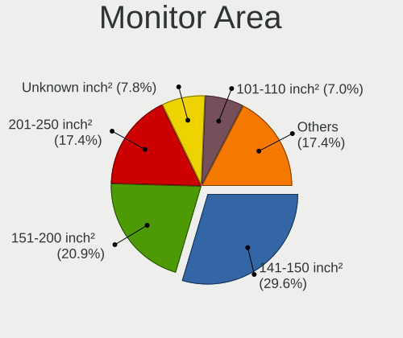

| Area in inch² | Desktops | Percent |
|----------------|----------|---------|
| 141-150        | 34       | 29.57%  |
| 151-200        | 24       | 20.87%  |
| 201-250        | 20       | 17.39%  |
| Unknown        | 9        | 7.83%   |
| 101-110        | 8        | 6.96%   |
| 351-500        | 5        | 4.35%   |
| 251-300        | 5        | 4.35%   |
| More than 1000 | 4        | 3.48%   |
| 301-350        | 2        | 1.74%   |
| 71-80          | 1        | 0.87%   |
| 131-140        | 1        | 0.87%   |
| 111-120        | 1        | 0.87%   |
| 501-1000       | 1        | 0.87%   |

Pixel Density
-------------

Pixels per inch

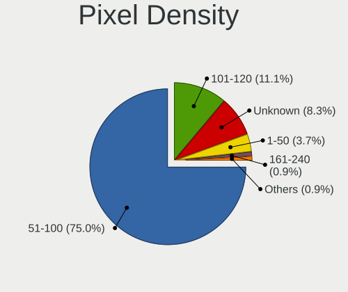

| Density | Desktops | Percent |
|---------|----------|---------|
| 51-100  | 81       | 75%     |
| 101-120 | 12       | 11.11%  |
| Unknown | 9        | 8.33%   |
| 1-50    | 4        | 3.7%    |
| 161-240 | 1        | 0.93%   |
| 121-160 | 1        | 0.93%   |

Multiple Monitors
-----------------

Total monitors connected

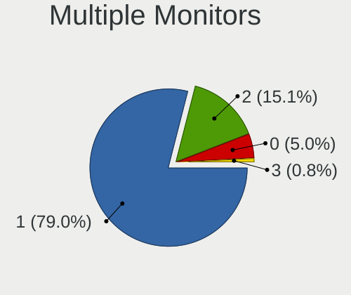

| Total | Desktops | Percent |
|-------|----------|---------|
| 1     | 94       | 78.99%  |
| 2     | 18       | 15.13%  |
| 0     | 6        | 5.04%   |
| 3     | 1        | 0.84%   |

Network
-------

Net Controller Vendor
---------------------

Controller vendors

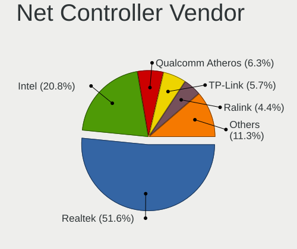

| Vendor                          | Desktops | Percent |
|---------------------------------|----------|---------|
| Realtek Semiconductor           | 82       | 51.57%  |
| Intel                           | 33       | 20.75%  |
| Qualcomm Atheros                | 10       | 6.29%   |
| TP-Link                         | 9        | 5.66%   |
| Ralink Technology               | 7        | 4.4%    |
| Broadcom                        | 4        | 2.52%   |
| Ralink                          | 3        | 1.89%   |
| Qualcomm Atheros Communications | 2        | 1.26%   |
| D-Link System                   | 2        | 1.26%   |
| Xiaomi                          | 1        | 0.63%   |
| VIA Technologies                | 1        | 0.63%   |
| TRENDnet                        | 1        | 0.63%   |
| Samsung Electronics             | 1        | 0.63%   |
| Nvidia                          | 1        | 0.63%   |
| MediaTek                        | 1        | 0.63%   |
| Arduino SA                      | 1        | 0.63%   |

Net Controller Model
--------------------

Controller models

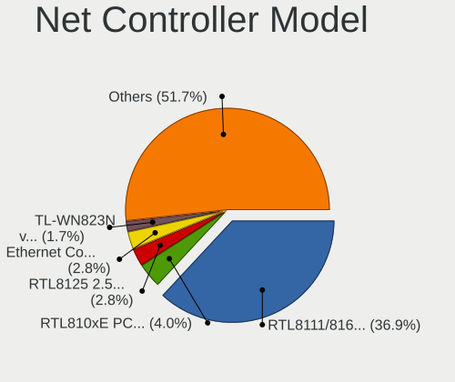

| Model                                                                                         | Desktops | Percent |
|-----------------------------------------------------------------------------------------------|----------|---------|
| Realtek RTL8111/8168/8211/8411 PCI Express Gigabit Ethernet Controller                        | 65       | 36.93%  |
| Realtek RTL810xE PCI Express Fast Ethernet controller                                         | 7        | 3.98%   |
| Realtek RTL8125 2.5GbE Controller                                                             | 5        | 2.84%   |
| Intel Ethernet Connection I217-LM                                                             | 5        | 2.84%   |
| TP-Link TL-WN823N v2/v3 [Realtek RTL8192EU]                                                   | 3        | 1.7%    |
| Realtek RTL8192EU 802.11b/g/n WLAN Adapter                                                    | 3        | 1.7%    |
| Ralink MT7601U Wireless Adapter                                                               | 3        | 1.7%    |
| Qualcomm Atheros AR8152 v2.0 Fast Ethernet                                                    | 3        | 1.7%    |
| Intel I211 Gigabit Network Connection                                                         | 3        | 1.7%    |
| Intel Ethernet Connection (2) I219-V                                                          | 3        | 1.7%    |
| Intel 82579V Gigabit Network Connection                                                       | 3        | 1.7%    |
| Intel 82579LM Gigabit Network Connection (Lewisville)                                         | 3        | 1.7%    |
| Realtek RTL8188EE Wireless Network Adapter                                                    | 2        | 1.14%   |
| Realtek RTL8169 PCI Gigabit Ethernet Controller                                               | 2        | 1.14%   |
| Ralink RT2870/RT3070 Wireless Adapter                                                         | 2        | 1.14%   |
| Ralink RT5360 Wireless 802.11n 1T/1R                                                          | 2        | 1.14%   |
| Qualcomm Atheros AR9271 802.11n                                                               | 2        | 1.14%   |
| Intel Tiger Lake PCH CNVi WiFi                                                                | 2        | 1.14%   |
| Intel Ethernet Connection (7) I219-V                                                          | 2        | 1.14%   |
| D-Link System DGE-528T Gigabit Ethernet Adapter                                               | 2        | 1.14%   |
| Xiaomi Mi/Redmi series (RNDIS)                                                                | 1        | 0.57%   |
| VIA VT6102/VT6103 [Rhine-II]                                                                  | 1        | 0.57%   |
| TRENDnet TEW-648UBM 802.11n 150Mbps Micro Wireless N Adapter [Realtek RTL8188CUS]             | 1        | 0.57%   |
| TP-Link Archer T4U ver.3                                                                      | 1        | 0.57%   |
| TP-Link Archer T3U [Realtek RTL8812BU]                                                        | 1        | 0.57%   |
| TP-Link Archer T1U 802.11a/n/ac Wireless Adapter [MediaTek MT7610U]                           | 1        | 0.57%   |
| TP-Link AC600 wireless Realtek RTL8811AU [Archer T2U Nano]                                    | 1        | 0.57%   |
| TP-Link 802.11n NIC                                                                           | 1        | 0.57%   |
| TP-Link 802.11ac WLAN Adapter                                                                 | 1        | 0.57%   |
| Samsung GT-I9070 (network tethering, USB debugging enabled)                                   | 1        | 0.57%   |
| Realtek RTL88x2bu [AC1200 Techkey]                                                            | 1        | 0.57%   |
| Realtek RTL8822BE 802.11a/b/g/n/ac WiFi adapter                                               | 1        | 0.57%   |
| Realtek RTL8821CE 802.11ac PCIe Wireless Network Adapter                                      | 1        | 0.57%   |
| Realtek RTL8192EE PCIe Wireless Network Adapter                                               | 1        | 0.57%   |
| Realtek RTL8192CU 802.11n WLAN Adapter                                                        | 1        | 0.57%   |
| Realtek RTL8153 Gigabit Ethernet Adapter                                                      | 1        | 0.57%   |
| Realtek RTL8152 Fast Ethernet Adapter                                                         | 1        | 0.57%   |
| Realtek RTL8111/8168/8411 PCI Express Gigabit Ethernet Controller                             | 1        | 0.57%   |
| Realtek Realtek 8812AU/8821AU 802.11ac WLAN Adapter [USB Wireless Dual-Band Adapter 2.4/5Ghz] | 1        | 0.57%   |
| Realtek 802.11ax WLAN Adapter                                                                 | 1        | 0.57%   |

Wireless Vendor
---------------

Wireless vendors

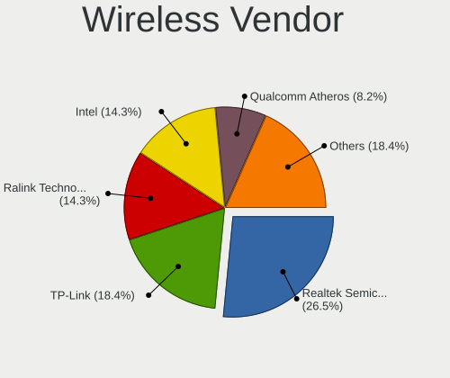

| Vendor                          | Desktops | Percent |
|---------------------------------|----------|---------|
| Realtek Semiconductor           | 13       | 26.53%  |
| TP-Link                         | 9        | 18.37%  |
| Ralink Technology               | 7        | 14.29%  |
| Intel                           | 7        | 14.29%  |
| Qualcomm Atheros                | 4        | 8.16%   |
| Ralink                          | 3        | 6.12%   |
| Qualcomm Atheros Communications | 2        | 4.08%   |
| Broadcom                        | 2        | 4.08%   |
| TRENDnet                        | 1        | 2.04%   |
| MediaTek                        | 1        | 2.04%   |

Wireless Model
--------------

Wireless models

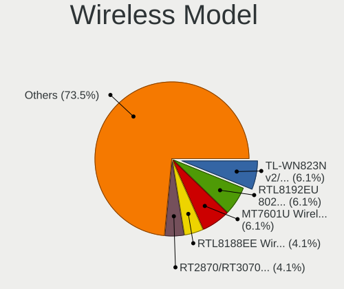

| Model                                                                                         | Desktops | Percent |
|-----------------------------------------------------------------------------------------------|----------|---------|
| TP-Link TL-WN823N v2/v3 [Realtek RTL8192EU]                                                   | 3        | 6.12%   |
| Realtek RTL8192EU 802.11b/g/n WLAN Adapter                                                    | 3        | 6.12%   |
| Ralink MT7601U Wireless Adapter                                                               | 3        | 6.12%   |
| Realtek RTL8188EE Wireless Network Adapter                                                    | 2        | 4.08%   |
| Ralink RT2870/RT3070 Wireless Adapter                                                         | 2        | 4.08%   |
| Ralink RT5360 Wireless 802.11n 1T/1R                                                          | 2        | 4.08%   |
| Qualcomm Atheros AR9271 802.11n                                                               | 2        | 4.08%   |
| Intel Tiger Lake PCH CNVi WiFi                                                                | 2        | 4.08%   |
| TRENDnet TEW-648UBM 802.11n 150Mbps Micro Wireless N Adapter [Realtek RTL8188CUS]             | 1        | 2.04%   |
| TP-Link Archer T4U ver.3                                                                      | 1        | 2.04%   |
| TP-Link Archer T3U [Realtek RTL8812BU]                                                        | 1        | 2.04%   |
| TP-Link Archer T1U 802.11a/n/ac Wireless Adapter [MediaTek MT7610U]                           | 1        | 2.04%   |
| TP-Link AC600 wireless Realtek RTL8811AU [Archer T2U Nano]                                    | 1        | 2.04%   |
| TP-Link 802.11n NIC                                                                           | 1        | 2.04%   |
| TP-Link 802.11ac WLAN Adapter                                                                 | 1        | 2.04%   |
| Realtek RTL88x2bu [AC1200 Techkey]                                                            | 1        | 2.04%   |
| Realtek RTL8822BE 802.11a/b/g/n/ac WiFi adapter                                               | 1        | 2.04%   |
| Realtek RTL8821CE 802.11ac PCIe Wireless Network Adapter                                      | 1        | 2.04%   |
| Realtek RTL8192EE PCIe Wireless Network Adapter                                               | 1        | 2.04%   |
| Realtek RTL8192CU 802.11n WLAN Adapter                                                        | 1        | 2.04%   |
| Realtek Realtek 8812AU/8821AU 802.11ac WLAN Adapter [USB Wireless Dual-Band Adapter 2.4/5Ghz] | 1        | 2.04%   |
| Realtek 802.11ax WLAN Adapter                                                                 | 1        | 2.04%   |
| Realtek 802.11ac NIC                                                                          | 1        | 2.04%   |
| Ralink RT5572 Wireless Adapter                                                                | 1        | 2.04%   |
| Ralink MT7610U ("Archer T2U" 2.4G+5G WLAN Adapter                                             | 1        | 2.04%   |
| Ralink RT3092 Wireless 802.11n 2T/2R PCIe                                                     | 1        | 2.04%   |
| Qualcomm Atheros AR9485 Wireless Network Adapter                                              | 1        | 2.04%   |
| Qualcomm Atheros AR9462 Wireless Network Adapter                                              | 1        | 2.04%   |
| Qualcomm Atheros AR9287 Wireless Network Adapter (PCI-Express)                                | 1        | 2.04%   |
| Qualcomm Atheros AR5416 Wireless Network Adapter [AR5008 802.11(a)bgn]                        | 1        | 2.04%   |
| MediaTek MT7922 802.11ax PCI Express Wireless Network Adapter                                 | 1        | 2.04%   |
| Intel Wi-Fi 6E(802.11ax) AX210/AX1675* 2x2 [Typhoon Peak]                                     | 1        | 2.04%   |
| Intel Wi-Fi 6 AX200                                                                           | 1        | 2.04%   |
| Intel Dual Band Wireless-AC 3168NGW [Stone Peak]                                              | 1        | 2.04%   |
| Intel Cannon Lake PCH CNVi WiFi                                                               | 1        | 2.04%   |
| Intel 700 Series Chipset CNVi WiFi                                                            | 1        | 2.04%   |
| Broadcom BCM4360 802.11ac Dual Band Wireless Network Adapter                                  | 1        | 2.04%   |
| Broadcom BCM43228 802.11a/b/g/n                                                               | 1        | 2.04%   |

Ethernet Vendor
---------------

Ethernet vendors

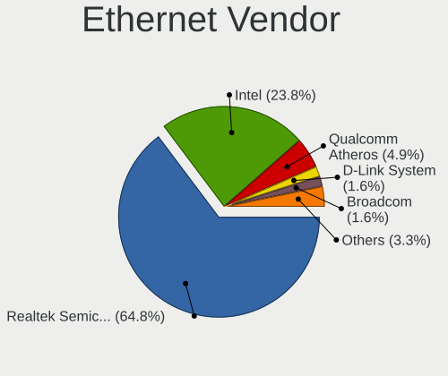

| Vendor                | Desktops | Percent |
|-----------------------|----------|---------|
| Realtek Semiconductor | 79       | 64.75%  |
| Intel                 | 29       | 23.77%  |
| Qualcomm Atheros      | 6        | 4.92%   |
| D-Link System         | 2        | 1.64%   |
| Broadcom              | 2        | 1.64%   |
| Xiaomi                | 1        | 0.82%   |
| VIA Technologies      | 1        | 0.82%   |
| Samsung Electronics   | 1        | 0.82%   |
| Nvidia                | 1        | 0.82%   |

Ethernet Model
--------------

Ethernet models

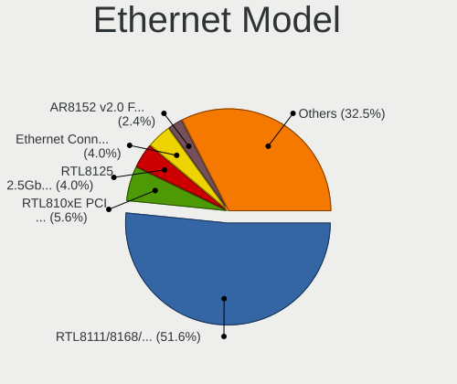

| Model                                                                  | Desktops | Percent |
|------------------------------------------------------------------------|----------|---------|
| Realtek RTL8111/8168/8211/8411 PCI Express Gigabit Ethernet Controller | 65       | 51.59%  |
| Realtek RTL810xE PCI Express Fast Ethernet controller                  | 7        | 5.56%   |
| Realtek RTL8125 2.5GbE Controller                                      | 5        | 3.97%   |
| Intel Ethernet Connection I217-LM                                      | 5        | 3.97%   |
| Qualcomm Atheros AR8152 v2.0 Fast Ethernet                             | 3        | 2.38%   |
| Intel I211 Gigabit Network Connection                                  | 3        | 2.38%   |
| Intel Ethernet Connection (2) I219-V                                   | 3        | 2.38%   |
| Intel 82579V Gigabit Network Connection                                | 3        | 2.38%   |
| Intel 82579LM Gigabit Network Connection (Lewisville)                  | 3        | 2.38%   |
| Realtek RTL8169 PCI Gigabit Ethernet Controller                        | 2        | 1.59%   |
| Intel Ethernet Connection (7) I219-V                                   | 2        | 1.59%   |
| D-Link System DGE-528T Gigabit Ethernet Adapter                        | 2        | 1.59%   |
| Xiaomi Mi/Redmi series (RNDIS)                                         | 1        | 0.79%   |
| VIA VT6102/VT6103 [Rhine-II]                                           | 1        | 0.79%   |
| Samsung GT-I9070 (network tethering, USB debugging enabled)            | 1        | 0.79%   |
| Realtek RTL8153 Gigabit Ethernet Adapter                               | 1        | 0.79%   |
| Realtek RTL8152 Fast Ethernet Adapter                                  | 1        | 0.79%   |
| Realtek RTL8111/8168/8411 PCI Express Gigabit Ethernet Controller      | 1        | 0.79%   |
| Qualcomm Atheros Killer E220x Gigabit Ethernet Controller              | 1        | 0.79%   |
| Qualcomm Atheros AR8151 v2.0 Gigabit Ethernet                          | 1        | 0.79%   |
| Qualcomm Atheros AR8132 Fast Ethernet                                  | 1        | 0.79%   |
| Nvidia MCP61 Ethernet                                                  | 1        | 0.79%   |
| Intel Ethernet Controller I225-V                                       | 1        | 0.79%   |
| Intel Ethernet Connection I217-V                                       | 1        | 0.79%   |
| Intel Ethernet Connection (5) I219-LM                                  | 1        | 0.79%   |
| Intel Ethernet Connection (17) I219-V                                  | 1        | 0.79%   |
| Intel Ethernet Connection (14) I219-V                                  | 1        | 0.79%   |
| Intel Ethernet Connection (12) I219-V                                  | 1        | 0.79%   |
| Intel Ethernet Connection (11) I219-V                                  | 1        | 0.79%   |
| Intel Alder Lake-S PCH CNVi WiFi                                       | 1        | 0.79%   |
| Intel 82578DC Gigabit Network Connection                               | 1        | 0.79%   |
| Intel 82566DC-2 Gigabit Network Connection                             | 1        | 0.79%   |
| Intel 82566DC Gigabit Network Connection                               | 1        | 0.79%   |
| Broadcom NetXtreme BCM5761 Gigabit Ethernet PCIe                       | 1        | 0.79%   |
| Broadcom NetXtreme BCM5723 Gigabit Ethernet PCIe                       | 1        | 0.79%   |

Net Controller Kind
-------------------

Ethernet, WiFi or modem

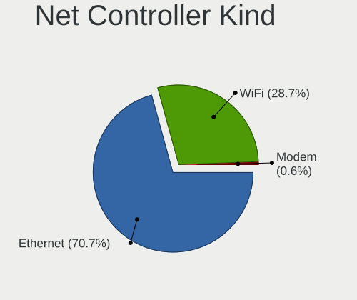

| Kind     | Desktops | Percent |
|----------|----------|---------|
| Ethernet | 116      | 70.73%  |
| WiFi     | 47       | 28.66%  |
| Modem    | 1        | 0.61%   |

Used Controller
---------------

Currently used network controller

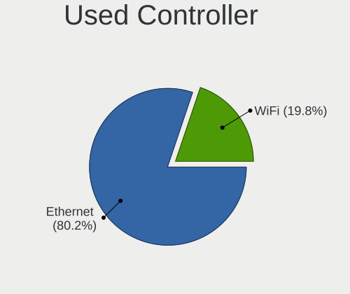

| Kind     | Desktops | Percent |
|----------|----------|---------|
| Ethernet | 93       | 80.17%  |
| WiFi     | 23       | 19.83%  |

NICs
----

Total network controllers on board

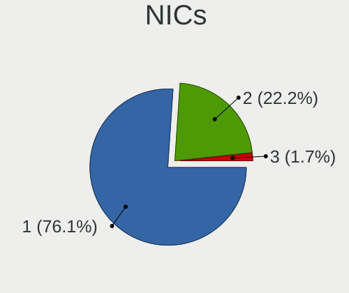

| Total | Desktops | Percent |
|-------|----------|---------|
| 1     | 89       | 76.07%  |
| 2     | 26       | 22.22%  |
| 3     | 2        | 1.71%   |

IPv6
----

IPv6 vs IPv4

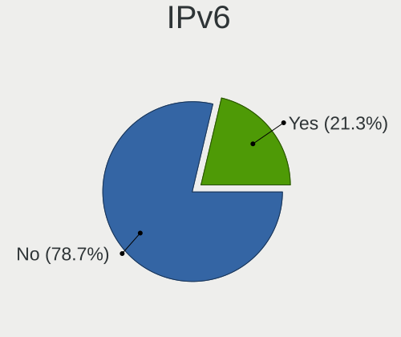

| Used | Desktops | Percent |
|------|----------|---------|
| No   | 96       | 78.69%  |
| Yes  | 26       | 21.31%  |

Bluetooth
---------

Bluetooth Vendor
----------------

Controller vendors

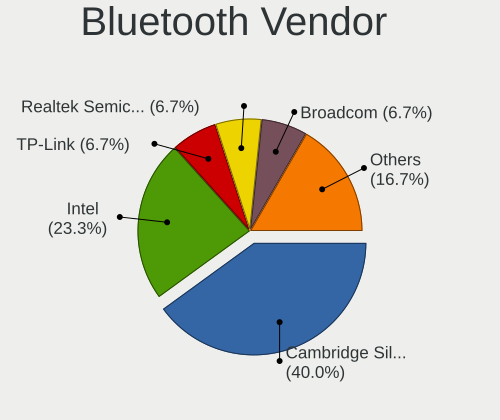

| Vendor                  | Desktops | Percent |
|-------------------------|----------|---------|
| Cambridge Silicon Radio | 12       | 40%     |
| Intel                   | 7        | 23.33%  |
| TP-Link                 | 2        | 6.67%   |
| Realtek Semiconductor   | 2        | 6.67%   |
| Broadcom                | 2        | 6.67%   |
| MediaTek                | 1        | 3.33%   |
| IMC Networks            | 1        | 3.33%   |
| D-Link System           | 1        | 3.33%   |
| ASUSTek Computer        | 1        | 3.33%   |
| Apple                   | 1        | 3.33%   |

Bluetooth Model
---------------

Controller models

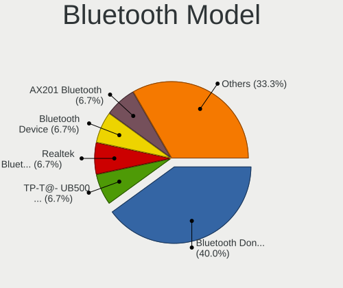

| Model                                               | Desktops | Percent |
|-----------------------------------------------------|----------|---------|
| Cambridge Silicon Radio Bluetooth Dongle (HCI mode) | 12       | 40%     |
| TP-Link TP-T@- UB500 Adapter                        | 2        | 6.67%   |
| Realtek  Bluetooth 4.2 Adapter                      | 2        | 6.67%   |
| Intel Bluetooth Device                              | 2        | 6.67%   |
| Intel AX201 Bluetooth                               | 2        | 6.67%   |
| MediaTek Wireless_Device                            | 1        | 3.33%   |
| Intel Bluetooth 9460/9560 Jefferson Peak (JfP)      | 1        | 3.33%   |
| Intel AX210 Bluetooth                               | 1        | 3.33%   |
| Intel AX200 Bluetooth                               | 1        | 3.33%   |
| IMC Networks Bluetooth Device                       | 1        | 3.33%   |
| D-Link System DBT-122 Bluetooth                     | 1        | 3.33%   |
| Broadcom HP Portable Bumble Bee                     | 1        | 3.33%   |
| Broadcom HP Bluetooth Module                        | 1        | 3.33%   |
| ASUS ASUS USB-BT500                                 | 1        | 3.33%   |
| Apple Bluetooth Host Controller                     | 1        | 3.33%   |

Sound
-----

Sound Vendor
------------

Sound card vendors

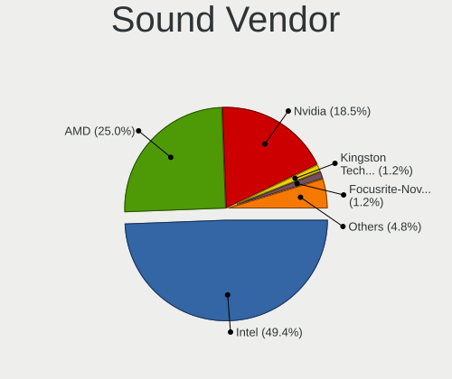

| Vendor              | Desktops | Percent |
|---------------------|----------|---------|
| Intel               | 83       | 49.4%   |
| AMD                 | 42       | 25%     |
| Nvidia              | 31       | 18.45%  |
| Kingston Technology | 2        | 1.19%   |
| Focusrite-Novation  | 2        | 1.19%   |
| VIA Technologies    | 1        | 0.6%    |
| Texas Instruments   | 1        | 0.6%    |
| SteelSeries ApS     | 1        | 0.6%    |
| Sony                | 1        | 0.6%    |
| M-Audio             | 1        | 0.6%    |
| Logitech            | 1        | 0.6%    |
| Creative Labs       | 1        | 0.6%    |
| C-Media Electronics | 1        | 0.6%    |

Sound Model
-----------

Sound card models

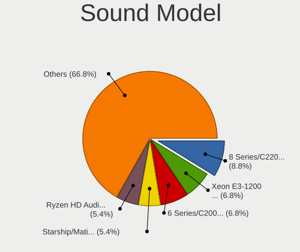

| Model                                                                      | Desktops | Percent |
|----------------------------------------------------------------------------|----------|---------|
| Intel 8 Series/C220 Series Chipset High Definition Audio Controller        | 18       | 8.78%   |
| Intel Xeon E3-1200 v3/4th Gen Core Processor HD Audio Controller           | 14       | 6.83%   |
| Intel 6 Series/C200 Series Chipset Family High Definition Audio Controller | 14       | 6.83%   |
| AMD Starship/Matisse HD Audio Controller                                   | 11       | 5.37%   |
| AMD Ryzen HD Audio Controller                                              | 11       | 5.37%   |
| Intel 200 Series PCH HD Audio                                              | 7        | 3.41%   |
| Intel NM10/ICH7 Family High Definition Audio Controller                    | 6        | 2.93%   |
| Nvidia GK208 HDMI/DP Audio Controller                                      | 5        | 2.44%   |
| Intel Comet Lake PCH-V cAVS                                                | 5        | 2.44%   |
| Intel 7 Series/C216 Chipset Family High Definition Audio Controller        | 5        | 2.44%   |
| AMD Renoir/Cezanne HDMI/DP Audio Controller                                | 5        | 2.44%   |
| AMD Raven/Raven2/Fenghuang HDMI/DP Audio Controller                        | 5        | 2.44%   |
| Nvidia High Definition Audio Controller                                    | 4        | 1.95%   |
| Intel 100 Series/C230 Series Chipset Family HD Audio Controller            | 4        | 1.95%   |
| AMD SBx00 Azalia (Intel HDA)                                               | 4        | 1.95%   |
| AMD Oland/Hainan/Cape Verde/Pitcairn HDMI Audio [Radeon HD 7000 Series]    | 4        | 1.95%   |
| Nvidia TU116 High Definition Audio Controller                              | 3        | 1.46%   |
| Nvidia GP107GL High Definition Audio Controller                            | 3        | 1.46%   |
| Nvidia GP104 High Definition Audio Controller                              | 3        | 1.46%   |
| Intel Smart Sound Technology (SST) Audio Controller                        | 3        | 1.46%   |
| Intel Cannon Lake PCH cAVS                                                 | 3        | 1.46%   |
| Intel Alder Lake-S HD Audio Controller                                     | 3        | 1.46%   |
| Intel 5 Series/3400 Series Chipset High Definition Audio                   | 3        | 1.46%   |
| AMD Navi 10 HDMI Audio                                                     | 3        | 1.46%   |
| AMD FCH Azalia Controller                                                  | 3        | 1.46%   |
| AMD Ellesmere HDMI Audio [Radeon RX 470/480 / 570/580/590]                 | 3        | 1.46%   |
| AMD Cedar HDMI Audio [Radeon HD 5400/6300/7300 Series]                     | 3        | 1.46%   |
| Nvidia TU106 High Definition Audio Controller                              | 2        | 0.98%   |
| Nvidia GF119 HDMI Audio Controller                                         | 2        | 0.98%   |
| Intel 9 Series Chipset Family HD Audio Controller                          | 2        | 0.98%   |
| Intel 82801JI (ICH10 Family) HD Audio Controller                           | 2        | 0.98%   |
| AMD Navi 21/23 HDMI/DP Audio Controller                                    | 2        | 0.98%   |
| VIA Technologies VX900/VT8xxx High Definition Audio Controller             | 1        | 0.49%   |
| Texas Instruments PCM2902 Audio Codec                                      | 1        | 0.49%   |
| SteelSeries ApS SteelSeries Arctis 9                                       | 1        | 0.49%   |
| Sony WALKMAN                                                               | 1        | 0.49%   |
| Nvidia TU107 GeForce GTX 1650 High Definition Audio Controller             | 1        | 0.49%   |
| Nvidia TU102 High Definition Audio Controller                              | 1        | 0.49%   |
| Nvidia MCP79 High Definition Audio                                         | 1        | 0.49%   |
| Nvidia MCP61 High Definition Audio                                         | 1        | 0.49%   |

Memory
------

Memory Vendor
-------------

Memory module vendors

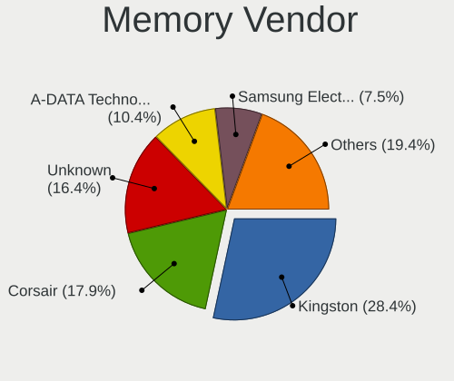

| Vendor              | Desktops | Percent |
|---------------------|----------|---------|
| Kingston            | 19       | 28.36%  |
| Corsair             | 12       | 17.91%  |
| Unknown             | 11       | 16.42%  |
| A-DATA Technology   | 7        | 10.45%  |
| Samsung Electronics | 5        | 7.46%   |
| Crucial             | 3        | 4.48%   |
| Micron Technology   | 2        | 2.99%   |
| Avant               | 2        | 2.99%   |
| Team                | 1        | 1.49%   |
| PNY                 | 1        | 1.49%   |
| Hewlett-Packard     | 1        | 1.49%   |
| Gold Key            | 1        | 1.49%   |
| G.Skill             | 1        | 1.49%   |
| Unknown             | 1        | 1.49%   |

Memory Model
------------

Memory module models

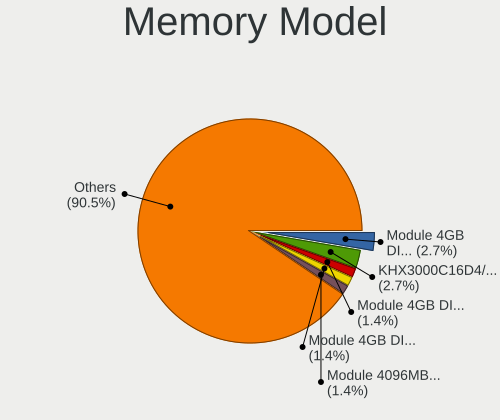

| Model                                                  | Desktops | Percent |
|--------------------------------------------------------|----------|---------|
| Unknown RAM Module 4GB DIMM 1333MT/s                   | 2        | 2.7%    |
| Kingston RAM KHX3000C16D4/16GX 16GB DIMM DDR4 3000MT/s | 2        | 2.7%    |
| Unknown RAM Module 4GB DIMM SDRAM                      | 1        | 1.35%   |
| Unknown RAM Module 4GB DIMM 667MT/s                    | 1        | 1.35%   |
| Unknown RAM Module 4096MB DIMM 1333MT/s                | 1        | 1.35%   |
| Unknown RAM Module 2GB DIMM SDRAM                      | 1        | 1.35%   |
| Unknown RAM Module 2GB DIMM DDR3 1333MT/s              | 1        | 1.35%   |
| Unknown RAM Module 2GB DIMM DDR2 800MT/s               | 1        | 1.35%   |
| Unknown RAM Module 2048MB SODIMM DDR3 1600MT/s         | 1        | 1.35%   |
| Unknown RAM Module 2048MB DIMM DDR2                    | 1        | 1.35%   |
| Unknown RAM Module 1GB DIMM DDR2                       | 1        | 1.35%   |
| Unknown RAM Module 1024MB DIMM 1333MT/s                | 1        | 1.35%   |
| Team RAM TEAMGROUP-UD4-3200 8GB DIMM DDR4 3733MT/s     | 1        | 1.35%   |
| Samsung RAM Module 8GB DIMM DDR4 2133MT/s              | 1        | 1.35%   |
| Samsung RAM Module 4GB DIMM DDR4 3200MT/s              | 1        | 1.35%   |
| Samsung RAM M471B1G73DB0-YK0 8GB SODIMM DDR3 1600MT/s  | 1        | 1.35%   |
| Samsung RAM M393B2G70EB0 16GB DIMM DDR3 1866MT/s       | 1        | 1.35%   |
| Samsung RAM M378B5173QH0-CK0 4GB DIMM DDR3             | 1        | 1.35%   |
| Samsung RAM M378B5173DB0-CK0 4096MB DIMM DDR3 1600MT/s | 1        | 1.35%   |
| PNY RAM Module 4096MB DIMM DDR3 1333MT/s               | 1        | 1.35%   |
| Micron RAM Module 2048MB DIMM DDR3 1333MT/s            | 1        | 1.35%   |
| Micron RAM 8JTF51264AZ-1G6E1 4GB DIMM DDR3 1600MT/s    | 1        | 1.35%   |
| Kingston RAM Module 2048MB DIMM DDR2 667MT/s           | 1        | 1.35%   |
| Kingston RAM KHX3200C16D4/8GX 8GB DIMM DDR4 3733MT/s   | 1        | 1.35%   |
| Kingston RAM KHX2666C16/8G 8GiB DIMM DDR4 3466MT/s     | 1        | 1.35%   |
| Kingston RAM KHX2666C16/16G 16GB DIMM DDR4 3200MT/s    | 1        | 1.35%   |
| Kingston RAM KHX2400C15/8G 8GB DIMM DDR4 3400MT/s      | 1        | 1.35%   |
| Kingston RAM KHX1866C10D3/8G 8GB DIMM DDR3 1867MT/s    | 1        | 1.35%   |
| Kingston RAM KF552C40-32 32GB DIMM DDR5 5200MT/s       | 1        | 1.35%   |
| Kingston RAM KF3200C16D4/8GX 8GiB DIMM DDR4 3600MT/s   | 1        | 1.35%   |
| Kingston RAM KF3200C16D4/32GX 32GB DIMM DDR4 3933MT/s  | 1        | 1.35%   |
| Kingston RAM 99U5702-095.A00G 8GB DIMM DDR4 2667MT/s   | 1        | 1.35%   |
| Kingston RAM 99U5474-038.A00LF 4GB DIMM DDR3 1333MT/s  | 1        | 1.35%   |
| Kingston RAM 99U5474-026.A00LF 4GB DIMM DDR3 1333MT/s  | 1        | 1.35%   |
| Kingston RAM 99U5474-016.A00LF 4GB DIMM DDR3 1333MT/s  | 1        | 1.35%   |
| Kingston RAM 99U5474-010.A00LF 2GB DIMM DDR3 1333MT/s  | 1        | 1.35%   |
| Kingston RAM 99U5471-038.A00LF 8GB DIMM DDR3 1333MT/s  | 1        | 1.35%   |
| Kingston RAM 99U5471-030.A00LF 8GB DIMM DDR3 1333MT/s  | 1        | 1.35%   |
| Kingston RAM 99U5403-034.A00G 4GB DIMM DDR3 1333MT/s   | 1        | 1.35%   |
| Kingston RAM 9905584-015.A00LF 4GB DIMM DDR3 1600MT/s  | 1        | 1.35%   |

Memory Kind
-----------

Memory module kinds

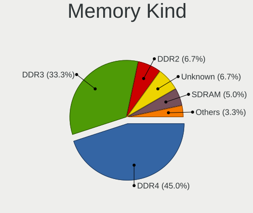

| Kind    | Desktops | Percent |
|---------|----------|---------|
| DDR4    | 27       | 45%     |
| DDR3    | 20       | 33.33%  |
| DDR2    | 4        | 6.67%   |
| Unknown | 4        | 6.67%   |
| SDRAM   | 3        | 5%      |
| DDR5    | 2        | 3.33%   |

Memory Form Factor
------------------

Physical design of the memory module

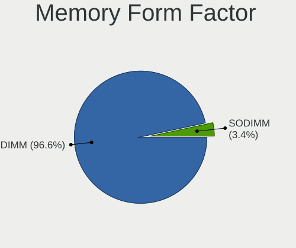

| Name   | Desktops | Percent |
|--------|----------|---------|
| DIMM   | 57       | 96.61%  |
| SODIMM | 2        | 3.39%   |

Memory Size
-----------

Memory module size

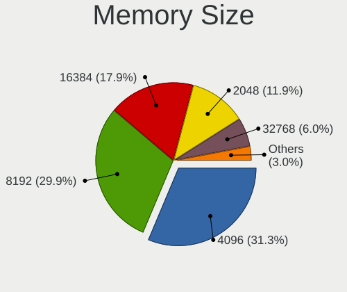

| Size  | Desktops | Percent |
|-------|----------|---------|
| 4096  | 21       | 31.34%  |
| 8192  | 20       | 29.85%  |
| 16384 | 12       | 17.91%  |
| 2048  | 8        | 11.94%  |
| 32768 | 4        | 5.97%   |
| 1024  | 2        | 2.99%   |

Memory Speed
------------

Memory module speed

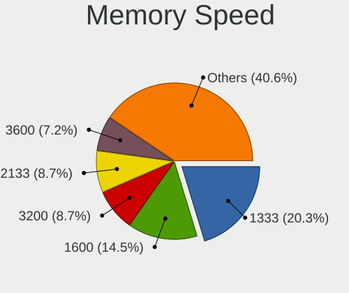

| Speed   | Desktops | Percent |
|---------|----------|---------|
| 1333    | 14       | 20.29%  |
| 1600    | 10       | 14.49%  |
| 3200    | 6        | 8.7%    |
| 2133    | 6        | 8.7%    |
| 3600    | 5        | 7.25%   |
| 2667    | 4        | 5.8%    |
| Unknown | 4        | 5.8%    |
| 3733    | 2        | 2.9%    |
| 3466    | 2        | 2.9%    |
| 3400    | 2        | 2.9%    |
| 3000    | 2        | 2.9%    |
| 2400    | 2        | 2.9%    |
| 1866    | 2        | 2.9%    |
| 667     | 2        | 2.9%    |
| 6000    | 1        | 1.45%   |
| 5200    | 1        | 1.45%   |
| 4333    | 1        | 1.45%   |
| 3933    | 1        | 1.45%   |
| 2666    | 1        | 1.45%   |
| 800     | 1        | 1.45%   |

Printers & scanners
-------------------

Printer Vendor
--------------

Printer device vendors

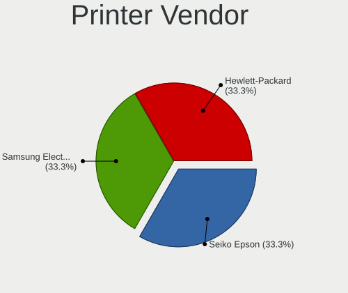

| Vendor              | Desktops | Percent |
|---------------------|----------|---------|
| Seiko Epson         | 1        | 33.33%  |
| Samsung Electronics | 1        | 33.33%  |
| Hewlett-Packard     | 1        | 33.33%  |

Printer Model
-------------

Printer device models

| Model                              | Desktops | Percent |
|------------------------------------|----------|---------|
| Seiko Epson XP-3100 Series         | 1        | 33.33%  |
| Samsung ML-1610 Mono Laser Printer | 1        | 33.33%  |
| HP Deskjet 2050 J510               | 1        | 33.33%  |

Scanner Vendor
--------------

Scanner device vendors

Zero info for selected period =(

Scanner Model
-------------

Scanner device models

Zero info for selected period =(

Camera
------

Camera Vendor
-------------

Camera device vendors

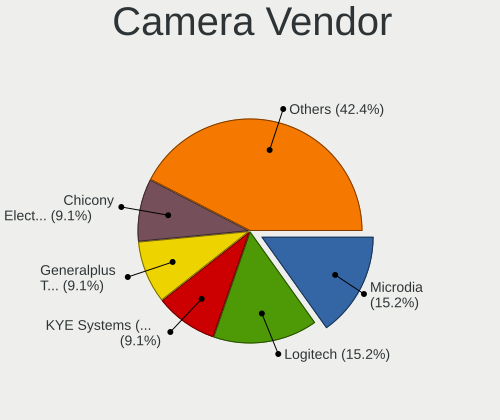

| Vendor                      | Desktops | Percent |
|-----------------------------|----------|---------|
| Microdia                    | 5        | 15.15%  |
| Logitech                    | 5        | 15.15%  |
| KYE Systems (Mouse Systems) | 3        | 9.09%   |
| Generalplus Technology      | 3        | 9.09%   |
| Chicony Electronics         | 3        | 9.09%   |
| Pixart Imaging              | 2        | 6.06%   |
| Microsoft                   | 2        | 6.06%   |
| Jieli Technology            | 2        | 6.06%   |
| Unknown                     | 1        | 3.03%   |
| Novatek Microelectronics    | 1        | 3.03%   |
| MacroSilicon                | 1        | 3.03%   |
| IMC Networks                | 1        | 3.03%   |
| Genesys Logic               | 1        | 3.03%   |
| GEMBIRD                     | 1        | 3.03%   |
| eMeet                       | 1        | 3.03%   |
| Arkmicro Technologies       | 1        | 3.03%   |

Camera Model
------------

Camera device models

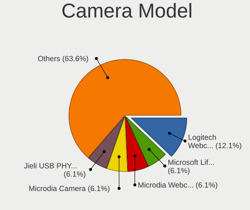

| Model                                                 | Desktops | Percent |
|-------------------------------------------------------|----------|---------|
| Logitech Webcam C270                                  | 4        | 12.12%  |
| Microsoft LifeCam VX-5000                             | 2        | 6.06%   |
| Microdia Webcam Vitade AF                             | 2        | 6.06%   |
| Microdia Camera                                       | 2        | 6.06%   |
| Jieli USB PHY 2.0                                     | 2        | 6.06%   |
| Chicony HP High Definition 1MP Webcam                 | 2        | 6.06%   |
| Unknown HD camera                                     | 1        | 3.03%   |
| Pixart Imaging Webcam Genius iLook 300                | 1        | 3.03%   |
| Pixart Imaging Multimedia audio controller            | 1        | 3.03%   |
| Novatek CARDV                                         | 1        | 3.03%   |
| Microdia Sonix USB 2.0 Camera                         | 1        | 3.03%   |
| MacroSilicon USB Video                                | 1        | 3.03%   |
| Logitech C922 Pro Stream Webcam                       | 1        | 3.03%   |
| KYE Systems (Mouse Systems) WideCam 1050              | 1        | 3.03%   |
| KYE Systems (Mouse Systems) USB 2.0 HD1080P PC Camera | 1        | 3.03%   |
| KYE Systems (Mouse Systems) FaceCam 310               | 1        | 3.03%   |
| IMC Networks XHC Camera                               | 1        | 3.03%   |
| Genesys Logic USB2.0 UVC PC Camera                    | 1        | 3.03%   |
| Generalplus WEB CAM                                   | 1        | 3.03%   |
| Generalplus GENERAL WEBCAM                            | 1        | 3.03%   |
| Generalplus 808 Camera #9 (web-cam mode)              | 1        | 3.03%   |
| GEMBIRD USB2.0 PC CAMERA                              | 1        | 3.03%   |
| eMeet HD Webcam eMeet C970                            | 1        | 3.03%   |
| Chicony CNF8050 Webcam                                | 1        | 3.03%   |
| Arkmicro USB2.0 PC CAMERA                             | 1        | 3.03%   |

Security
--------

Fingerprint Vendor
------------------

Fingerprint sensor vendors

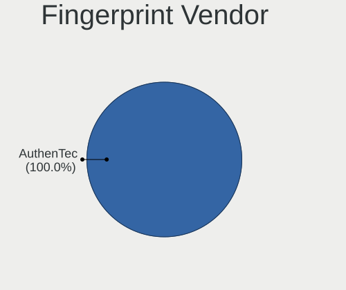

| Vendor    | Desktops | Percent |
|-----------|----------|---------|
| AuthenTec | 1        | 100%    |

Fingerprint Model
-----------------

Fingerprint sensor models

| Model             | Desktops | Percent |
|-------------------|----------|---------|
| AuthenTec AES1600 | 1        | 100%    |

Chipcard Vendor
---------------

Chipcard module vendors

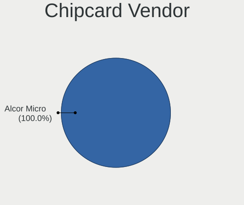

| Vendor      | Desktops | Percent |
|-------------|----------|---------|
| Alcor Micro | 1        | 100%    |

Chipcard Model
--------------

Chipcard module models

| Model                               | Desktops | Percent |
|-------------------------------------|----------|---------|
| Alcor Micro AU9540 Smartcard Reader | 1        | 100%    |

Unsupported
-----------

Unsupported Devices
-------------------

Total unsupported devices on board

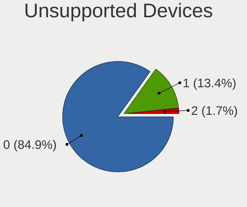

| Total | Desktops | Percent |
|-------|----------|---------|
| 0     | 101      | 84.87%  |
| 1     | 16       | 13.45%  |
| 2     | 2        | 1.68%   |

Unsupported Device Types
------------------------

Types of unsupported devices

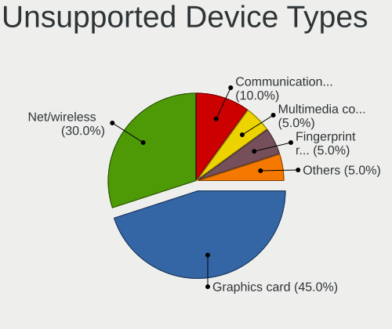

| Type                     | Desktops | Percent |
|--------------------------|----------|---------|
| Graphics card            | 9        | 45%     |
| Net/wireless             | 6        | 30%     |
| Communication controller | 2        | 10%     |
| Multimedia controller    | 1        | 5%      |
| Fingerprint reader       | 1        | 5%      |
| Chipcard                 | 1        | 5%      |

