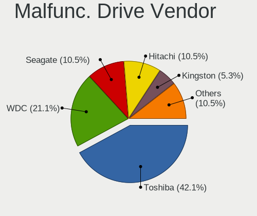
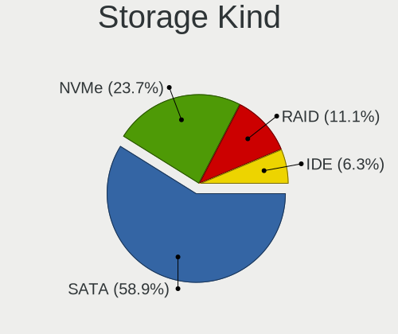
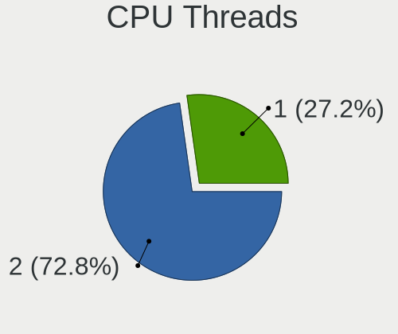
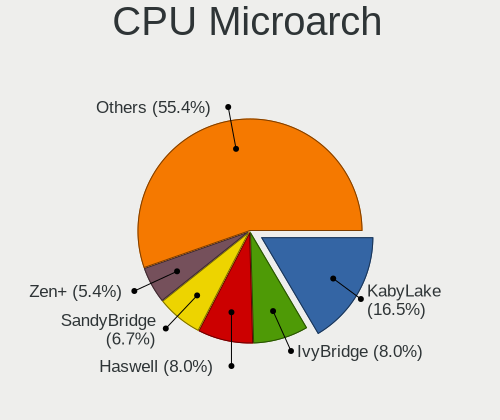
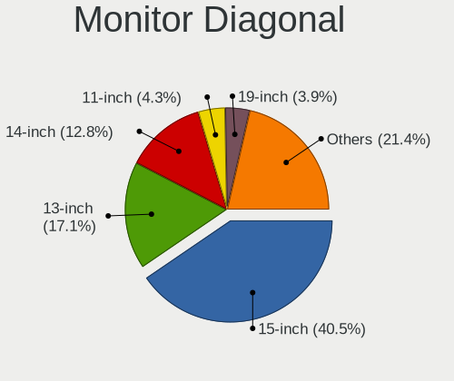
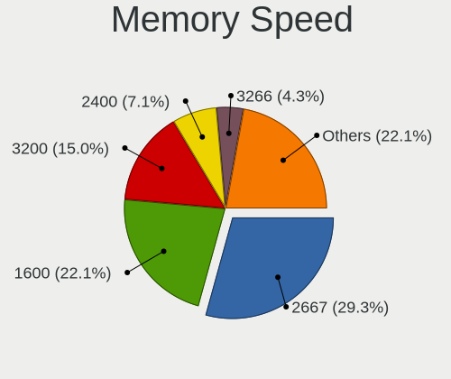

Linux in Ecuador - Tested Hardware & Statistics (Notebooks)
-----------------------------------------------------------

A project to collect tested hardware configurations for Linux in Ecuador.

Anyone can contribute to this report by the [hw-probe](https://github.com/linuxhw/hw-probe) tool:

    sudo -E hw-probe -all -upload

Please contribute! Especially if your hardware is rare.

Contents
--------

* [ Test Cases ](#test-cases)

* [ System ](#system)
  - [ OS                       ](#os)
  - [ OS Family                ](#os-family)
  - [ Kernel                   ](#kernel)
  - [ Kernel Family            ](#kernel-family)
  - [ Kernel Major Ver.        ](#kernel-major-ver)
  - [ Arch                     ](#arch)
  - [ DE                       ](#de)
  - [ Display Server           ](#display-server)
  - [ Display Manager          ](#display-manager)
  - [ OS Lang                  ](#os-lang)
  - [ Boot Mode                ](#boot-mode)
  - [ Filesystem               ](#filesystem)
  - [ Part. scheme             ](#part-scheme)
  - [ Dual Boot with Linux/BSD ](#dual-boot-with-linuxbsd)
  - [ Dual Boot (Win)          ](#dual-boot-win)

* [ Board ](#board)
  - [ Vendor                   ](#vendor)
  - [ Model                    ](#model)
  - [ Model Family             ](#model-family)
  - [ MFG Year                 ](#mfg-year)
  - [ Form Factor              ](#form-factor)
  - [ Secure Boot              ](#secure-boot)
  - [ Coreboot                 ](#coreboot)
  - [ RAM Size                 ](#ram-size)
  - [ RAM Used                 ](#ram-used)
  - [ Total Drives             ](#total-drives)
  - [ Has CD-ROM               ](#has-cd-rom)
  - [ Has Ethernet             ](#has-ethernet)
  - [ Has WiFi                 ](#has-wifi)
  - [ Has Bluetooth            ](#has-bluetooth)

* [ Location ](#location)
  - [ Country                  ](#country)
  - [ City                     ](#city)

* [ Drives ](#drives)
  - [ Drive Vendor             ](#drive-vendor)
  - [ Drive Model              ](#drive-model)
  - [ HDD Vendor               ](#hdd-vendor)
  - [ SSD Vendor               ](#ssd-vendor)
  - [ Drive Kind               ](#drive-kind)
  - [ Drive Connector          ](#drive-connector)
  - [ Drive Size               ](#drive-size)
  - [ Space Total              ](#space-total)
  - [ Space Used               ](#space-used)
  - [ Malfunc. Drives          ](#malfunc-drives)
  - [ Malfunc. Drive Vendor    ](#malfunc-drive-vendor)
  - [ Malfunc. HDD Vendor      ](#malfunc-hdd-vendor)
  - [ Malfunc. Drive Kind      ](#malfunc-drive-kind)
  - [ Failed Drives            ](#failed-drives)
  - [ Failed Drive Vendor      ](#failed-drive-vendor)
  - [ Drive Status             ](#drive-status)

* [ Storage controller ](#storage-controller)
  - [ Storage Vendor           ](#storage-vendor)
  - [ Storage Model            ](#storage-model)
  - [ Storage Kind             ](#storage-kind)

* [ Processor ](#processor)
  - [ CPU Vendor               ](#cpu-vendor)
  - [ CPU Model                ](#cpu-model)
  - [ CPU Model Family         ](#cpu-model-family)
  - [ CPU Cores                ](#cpu-cores)
  - [ CPU Sockets              ](#cpu-sockets)
  - [ CPU Threads              ](#cpu-threads)
  - [ CPU Op-Modes             ](#cpu-op-modes)
  - [ CPU Microcode            ](#cpu-microcode)
  - [ CPU Microarch            ](#cpu-microarch)

* [ Graphics ](#graphics)
  - [ GPU Vendor               ](#gpu-vendor)
  - [ GPU Model                ](#gpu-model)
  - [ GPU Combo                ](#gpu-combo)
  - [ GPU Driver               ](#gpu-driver)
  - [ GPU Memory               ](#gpu-memory)

* [ Monitor ](#monitor)
  - [ Monitor Vendor           ](#monitor-vendor)
  - [ Monitor Model            ](#monitor-model)
  - [ Monitor Resolution       ](#monitor-resolution)
  - [ Monitor Diagonal         ](#monitor-diagonal)
  - [ Monitor Width            ](#monitor-width)
  - [ Aspect Ratio             ](#aspect-ratio)
  - [ Monitor Area             ](#monitor-area)
  - [ Pixel Density            ](#pixel-density)
  - [ Multiple Monitors        ](#multiple-monitors)

* [ Network ](#network)
  - [ Net Controller Vendor    ](#net-controller-vendor)
  - [ Net Controller Model     ](#net-controller-model)
  - [ Wireless Vendor          ](#wireless-vendor)
  - [ Wireless Model           ](#wireless-model)
  - [ Ethernet Vendor          ](#ethernet-vendor)
  - [ Ethernet Model           ](#ethernet-model)
  - [ Net Controller Kind      ](#net-controller-kind)
  - [ Used Controller          ](#used-controller)
  - [ NICs                     ](#nics)
  - [ IPv6                     ](#ipv6)

* [ Bluetooth ](#bluetooth)
  - [ Bluetooth Vendor         ](#bluetooth-vendor)
  - [ Bluetooth Model          ](#bluetooth-model)

* [ Sound ](#sound)
  - [ Sound Vendor             ](#sound-vendor)
  - [ Sound Model              ](#sound-model)

* [ Memory ](#memory)
  - [ Memory Vendor            ](#memory-vendor)
  - [ Memory Model             ](#memory-model)
  - [ Memory Kind              ](#memory-kind)
  - [ Memory Form Factor       ](#memory-form-factor)
  - [ Memory Size              ](#memory-size)
  - [ Memory Speed             ](#memory-speed)

* [ Printers & scanners ](#printers--scanners)
  - [ Printer Vendor           ](#printer-vendor)
  - [ Printer Model            ](#printer-model)
  - [ Scanner Vendor           ](#scanner-vendor)
  - [ Scanner Model            ](#scanner-model)

* [ Camera ](#camera)
  - [ Camera Vendor            ](#camera-vendor)
  - [ Camera Model             ](#camera-model)

* [ Security ](#security)
  - [ Fingerprint Vendor       ](#fingerprint-vendor)
  - [ Fingerprint Model        ](#fingerprint-model)
  - [ Chipcard Vendor          ](#chipcard-vendor)
  - [ Chipcard Model           ](#chipcard-model)

* [ Unsupported ](#unsupported)
  - [ Unsupported Devices      ](#unsupported-devices)
  - [ Unsupported Device Types ](#unsupported-device-types)

Test Cases
----------

Total: 254

| Vendor    | Model                       | Probe                                                      | Date         |
|-----------|-----------------------------|------------------------------------------------------------|--------------|
| Toshiba   | Satellite A205              | [9a44e74608](https://linux-hardware.org/?probe=9a44e74608) | Sep 06, 2023 |
| Toshiba   | Satellite A205              | [a2b456886d](https://linux-hardware.org/?probe=a2b456886d) | Sep 05, 2023 |
| Lenovo    | ThinkPad E520 11433FU       | [ecc10a1197](https://linux-hardware.org/?probe=ecc10a1197) | Sep 04, 2023 |
| Toshiba   | Satellite L50-B             | [9dd40cd022](https://linux-hardware.org/?probe=9dd40cd022) | Sep 03, 2023 |
| HP        | Laptop 14-cm0xxx            | [a1caab6466](https://linux-hardware.org/?probe=a1caab6466) | Aug 27, 2023 |
| Apple     | MacBookPro9,2               | [4ea732e404](https://linux-hardware.org/?probe=4ea732e404) | Aug 17, 2023 |
| Lenovo    | IdeaPad 3 14ITL6 82H7       | [bbf57bf744](https://linux-hardware.org/?probe=bbf57bf744) | Aug 17, 2023 |
| Apple     | MacBookPro5,5               | [ee72caa76d](https://linux-hardware.org/?probe=ee72caa76d) | Aug 16, 2023 |
| ASUSTek   | VivoBook_ASUS Laptop X51... | [2a3b142ddd](https://linux-hardware.org/?probe=2a3b142ddd) | Aug 16, 2023 |
| Lenovo    | Legion 5 15ACH6 82JW        | [5bd12768fa](https://linux-hardware.org/?probe=5bd12768fa) | Aug 09, 2023 |
| Dell      | Vostro 3480                 | [78fbe42595](https://linux-hardware.org/?probe=78fbe42595) | Aug 07, 2023 |
| Toshiba   | Satellite A135              | [2eddaa2a26](https://linux-hardware.org/?probe=2eddaa2a26) | Jul 30, 2023 |
| Toshiba   | Satellite A135              | [5bd6d0c2d8](https://linux-hardware.org/?probe=5bd6d0c2d8) | Jul 20, 2023 |
| HP        | ENVY m6 Notebook            | [602c50a904](https://linux-hardware.org/?probe=602c50a904) | Jul 06, 2023 |
| HUAWEI    | BOHK-WAX9X                  | [b05e4ee752](https://linux-hardware.org/?probe=b05e4ee752) | Jun 15, 2023 |
| Dell      | Inspiron 3493               | [ffcd21fc3b](https://linux-hardware.org/?probe=ffcd21fc3b) | Jun 09, 2023 |
| Acer      | Aspire A515-45              | [f661806559](https://linux-hardware.org/?probe=f661806559) | Jun 02, 2023 |
| Acer      | Aspire A515-45              | [a57949da97](https://linux-hardware.org/?probe=a57949da97) | Jun 01, 2023 |
| Lenovo    | IdeaPad S145-15AST 81N3     | [7f0cf2e62d](https://linux-hardware.org/?probe=7f0cf2e62d) | Jun 01, 2023 |
| Lenovo    | IdeaPad 330S-15IKB 81F5     | [5f8bd19e3d](https://linux-hardware.org/?probe=5f8bd19e3d) | May 31, 2023 |
| Lenovo    | ThinkPad L480 20LTA01LLM    | [ed45fc495a](https://linux-hardware.org/?probe=ed45fc495a) | May 22, 2023 |
| Lenovo    | IdeaPad 3 15ALC6 82KU       | [8fb1a89166](https://linux-hardware.org/?probe=8fb1a89166) | May 17, 2023 |
| Acer      | Extensa 5220                | [261e743adc](https://linux-hardware.org/?probe=261e743adc) | May 11, 2023 |
| Sony      | VPCEG23EL                   | [c28e3338ce](https://linux-hardware.org/?probe=c28e3338ce) | Apr 28, 2023 |
| Lenovo    | IdeaPad S145-14IGM 81MW     | [5cb6709055](https://linux-hardware.org/?probe=5cb6709055) | Apr 20, 2023 |
| HP        | Notebook                    | [4a5d785f73](https://linux-hardware.org/?probe=4a5d785f73) | Apr 09, 2023 |
| HP        | 245 G6                      | [c6a1e2951c](https://linux-hardware.org/?probe=c6a1e2951c) | Apr 05, 2023 |
| Valve     | Jupiter                     | [078e440a68](https://linux-hardware.org/?probe=078e440a68) | Mar 31, 2023 |
| Acer      | Aspire A515-43              | [1812fe9a19](https://linux-hardware.org/?probe=1812fe9a19) | Mar 26, 2023 |
| Acer      | Aspire A515-43              | [a302d93972](https://linux-hardware.org/?probe=a302d93972) | Mar 26, 2023 |
| ASUSTek   | ASUS TUF Gaming A15 FA50... | [9e45f992a1](https://linux-hardware.org/?probe=9e45f992a1) | Mar 25, 2023 |
| ASUSTek   | ASUS TUF Gaming A15 FA50... | [34fd631d2b](https://linux-hardware.org/?probe=34fd631d2b) | Mar 22, 2023 |
| Samsung   | R519/R719                   | [9e1cdf3582](https://linux-hardware.org/?probe=9e1cdf3582) | Mar 17, 2023 |
| HP        | Laptop 14-cf3xxx            | [bdb510861b](https://linux-hardware.org/?probe=bdb510861b) | Mar 16, 2023 |
| HP        | Laptop 14-cf3xxx            | [75a93c0ac6](https://linux-hardware.org/?probe=75a93c0ac6) | Mar 16, 2023 |
| Dell      | Latitude E6420              | [a84f4dbcbb](https://linux-hardware.org/?probe=a84f4dbcbb) | Feb 28, 2023 |
| Dell      | Inspiron 14-3467            | [5bf68a313d](https://linux-hardware.org/?probe=5bf68a313d) | Feb 27, 2023 |
| Apple     | MacBookAir6,1               | [72d2220b42](https://linux-hardware.org/?probe=72d2220b42) | Feb 07, 2023 |
| HP        | Setzer                      | [bd65b300ae](https://linux-hardware.org/?probe=bd65b300ae) | Feb 06, 2023 |
| Lenovo    | IdeaPad S145-14AST 81ST     | [85dbbce597](https://linux-hardware.org/?probe=85dbbce597) | Jan 27, 2023 |
| Alienware | 15 R3                       | [f70ed3a363](https://linux-hardware.org/?probe=f70ed3a363) | Jan 23, 2023 |
| Samsung   | N102SP/N100SP/N101SP        | [b4d38fb35a](https://linux-hardware.org/?probe=b4d38fb35a) | Jan 18, 2023 |
| Gateway   | NV55C                       | [b8ae4adfdc](https://linux-hardware.org/?probe=b8ae4adfdc) | Jan 12, 2023 |
| Apple     | MacBookPro16,2              | [d7abd06e34](https://linux-hardware.org/?probe=d7abd06e34) | Jan 08, 2023 |
| Apple     | MacBookPro16,2              | [aa67834a96](https://linux-hardware.org/?probe=aa67834a96) | Jan 08, 2023 |
| HP        | ENVY 15                     | [e91c6321b3](https://linux-hardware.org/?probe=e91c6321b3) | Jan 04, 2023 |
| ASUSTek   | VivoBook_ASUSLaptop X421... | [cf4ba78c7d](https://linux-hardware.org/?probe=cf4ba78c7d) | Dec 24, 2022 |
| Unknown   | OA Q-ONE BRAND_V2.0         | [e554aa3d11](https://linux-hardware.org/?probe=e554aa3d11) | Dec 24, 2022 |
| Dynabook  | PORTEGE X40-J               | [3f1fc426b0](https://linux-hardware.org/?probe=3f1fc426b0) | Dec 05, 2022 |
| HP        | Laptop 14-cf3xxx            | [21d31ce6b0](https://linux-hardware.org/?probe=21d31ce6b0) | Nov 15, 2022 |
| HP        | Laptop 15-da0xxx            | [554f0e2130](https://linux-hardware.org/?probe=554f0e2130) | Oct 30, 2022 |
| HP        | Laptop 15-dy2xxx            | [304a013939](https://linux-hardware.org/?probe=304a013939) | Oct 27, 2022 |
| HP        | Laptop 14-cf3xxx            | [a782c95632](https://linux-hardware.org/?probe=a782c95632) | Oct 25, 2022 |
| Lenovo    | IdeaPad L340-15IRH Gamin... | [14830504a7](https://linux-hardware.org/?probe=14830504a7) | Oct 22, 2022 |
| Gateway   | NV510P                      | [13fe5a5e78](https://linux-hardware.org/?probe=13fe5a5e78) | Oct 16, 2022 |
| Gateway   | NV510P                      | [7cb93d25ac](https://linux-hardware.org/?probe=7cb93d25ac) | Oct 16, 2022 |
| HP        | Laptop 14-cf3xxx            | [7664f462d0](https://linux-hardware.org/?probe=7664f462d0) | Oct 09, 2022 |
| Lenovo    | ZHAOYANG E53-80 81CM        | [985ca1961c](https://linux-hardware.org/?probe=985ca1961c) | Oct 06, 2022 |
| HP        | Laptop 15-da0xxx            | [c62874f456](https://linux-hardware.org/?probe=c62874f456) | Oct 04, 2022 |
| HP        | Laptop 14-cf3xxx            | [9386d6b529](https://linux-hardware.org/?probe=9386d6b529) | Sep 23, 2022 |
| HP        | Laptop 14-cf3xxx            | [3ba944192e](https://linux-hardware.org/?probe=3ba944192e) | Sep 22, 2022 |
| ASUSTek   | VivoBook_ASUSLaptop X515... | [f3dcbfead7](https://linux-hardware.org/?probe=f3dcbfead7) | Sep 02, 2022 |
| Lenovo    | ThinkBook 13s G4 ARB 21A... | [1f0f793a37](https://linux-hardware.org/?probe=1f0f793a37) | Sep 02, 2022 |
| HP        | Notebook                    | [487cfc16fc](https://linux-hardware.org/?probe=487cfc16fc) | Aug 10, 2022 |
| Dell      | Inspiron 7472               | [eaab7f2460](https://linux-hardware.org/?probe=eaab7f2460) | Aug 09, 2022 |
| HP        | Laptop 14-cf3xxx            | [2f628ea3bb](https://linux-hardware.org/?probe=2f628ea3bb) | Aug 09, 2022 |
| Lenovo    | ThinkPad E590 20NB002AMH    | [aed42791cd](https://linux-hardware.org/?probe=aed42791cd) | Aug 09, 2022 |
| Dell      | Latitude E6420              | [3817e724ac](https://linux-hardware.org/?probe=3817e724ac) | Aug 08, 2022 |
| HP        | Laptop 14-cf3xxx            | [2f565b89db](https://linux-hardware.org/?probe=2f565b89db) | Aug 06, 2022 |
| HP        | Laptop 14-cf3xxx            | [f6caa753ba](https://linux-hardware.org/?probe=f6caa753ba) | Aug 04, 2022 |
| MSI       | GF63 Thin 9SC               | [6d42baa166](https://linux-hardware.org/?probe=6d42baa166) | Jul 26, 2022 |
| MSI       | GF63 Thin 9SC               | [1a2403b95a](https://linux-hardware.org/?probe=1a2403b95a) | Jul 24, 2022 |
| HP        | Laptop 14-cf3xxx            | [63722e3660](https://linux-hardware.org/?probe=63722e3660) | Jul 23, 2022 |
| Dell      | Latitude 5520               | [6e9be54f47](https://linux-hardware.org/?probe=6e9be54f47) | Jul 09, 2022 |
| Apple     | MacBookPro12,1              | [570dd2f164](https://linux-hardware.org/?probe=570dd2f164) | Jun 28, 2022 |
| Google    | Delbin                      | [26becdfc83](https://linux-hardware.org/?probe=26becdfc83) | Jun 26, 2022 |
| ASUSTek   | X555QG                      | [53e208736b](https://linux-hardware.org/?probe=53e208736b) | Jun 25, 2022 |
| Fujitsu   | LIFEBOOK E752               | [c434320a62](https://linux-hardware.org/?probe=c434320a62) | Jun 19, 2022 |
| ASUSTek   | X411UN                      | [70d24e4237](https://linux-hardware.org/?probe=70d24e4237) | Jun 02, 2022 |
| ASUSTek   | UX360CA                     | [63fac2dc9b](https://linux-hardware.org/?probe=63fac2dc9b) | May 29, 2022 |
| Alienware | 15 R3                       | [84df370117](https://linux-hardware.org/?probe=84df370117) | May 26, 2022 |
| HP        | Laptop 14-cf3xxx            | [9e4cd6dab4](https://linux-hardware.org/?probe=9e4cd6dab4) | May 25, 2022 |
| Chuwi     | HeroBook Pro                | [9f009d836c](https://linux-hardware.org/?probe=9f009d836c) | May 23, 2022 |
| Sony      | SVE14113ELW                 | [647c09a7be](https://linux-hardware.org/?probe=647c09a7be) | May 23, 2022 |
| Chuwi     | HeroBook Pro                | [206aa9b805](https://linux-hardware.org/?probe=206aa9b805) | May 23, 2022 |
| Lenovo    | G580 20150                  | [ec5867b2f7](https://linux-hardware.org/?probe=ec5867b2f7) | May 17, 2022 |
| Lenovo    | G580 20150                  | [9b06242456](https://linux-hardware.org/?probe=9b06242456) | May 17, 2022 |
| Toshiba   | Satellite L45-B             | [7f46e36f35](https://linux-hardware.org/?probe=7f46e36f35) | May 14, 2022 |
| Toshiba   | Satellite L45-B             | [81b3317aa8](https://linux-hardware.org/?probe=81b3317aa8) | May 14, 2022 |
| Dell      | XPS 13 9370                 | [f90e5f669e](https://linux-hardware.org/?probe=f90e5f669e) | May 09, 2022 |
| Toshiba   | Satellite L50-B             | [e559318a8b](https://linux-hardware.org/?probe=e559318a8b) | May 02, 2022 |
| ASUSTek   | VivoBook_ASUSLaptop X421... | [c8d977cf63](https://linux-hardware.org/?probe=c8d977cf63) | May 02, 2022 |
| HP        | Laptop 14-cf3xxx            | [e049bbd414](https://linux-hardware.org/?probe=e049bbd414) | Apr 26, 2022 |
| HP        | Unknown                     | [0a47967da0](https://linux-hardware.org/?probe=0a47967da0) | Apr 23, 2022 |
| HP        | Unknown                     | [fa5bba3e33](https://linux-hardware.org/?probe=fa5bba3e33) | Apr 22, 2022 |
| ASUSTek   | VivoBook_ASUSLaptop X421... | [a0ad75fa4b](https://linux-hardware.org/?probe=a0ad75fa4b) | Apr 16, 2022 |
| HP        | Pavilion dv6                | [bacb1d04de](https://linux-hardware.org/?probe=bacb1d04de) | Apr 02, 2022 |
| Lenovo    | V15-IIL 82C5                | [722eee0995](https://linux-hardware.org/?probe=722eee0995) | Mar 30, 2022 |
| Sony      | VPCEG30EL                   | [c19f1a4739](https://linux-hardware.org/?probe=c19f1a4739) | Mar 26, 2022 |
| Sony      | SVE14A25CLB                 | [2e6afba454](https://linux-hardware.org/?probe=2e6afba454) | Mar 25, 2022 |
| Apple     | MacBookPro12,1              | [a39345cbf9](https://linux-hardware.org/?probe=a39345cbf9) | Mar 22, 2022 |
| Dell      | Inspiron 7547               | [af0de64399](https://linux-hardware.org/?probe=af0de64399) | Mar 22, 2022 |
| Razer     | Blade 15 Base Model (Ear... | [1ef1ffe2a3](https://linux-hardware.org/?probe=1ef1ffe2a3) | Mar 20, 2022 |
| Razer     | Blade Stealth               | [6b524f20d4](https://linux-hardware.org/?probe=6b524f20d4) | Mar 20, 2022 |
| HP        | Laptop 14-cf3xxx            | [faae36d70e](https://linux-hardware.org/?probe=faae36d70e) | Mar 17, 2022 |
| HP        | Laptop 14-cf3xxx            | [4d5aa250a1](https://linux-hardware.org/?probe=4d5aa250a1) | Mar 17, 2022 |
| Toshiba   | Satellite C55D-A            | [fccc5b2ef5](https://linux-hardware.org/?probe=fccc5b2ef5) | Mar 16, 2022 |
| ASUSTek   | ROG Zephyrus G14 GA401IH... | [c27fb51c94](https://linux-hardware.org/?probe=c27fb51c94) | Mar 13, 2022 |
| ASUSTek   | ROG Zephyrus G14 GA401IH... | [15b0517729](https://linux-hardware.org/?probe=15b0517729) | Mar 13, 2022 |
| HP        | 15 Notebook PC              | [d9e67c0484](https://linux-hardware.org/?probe=d9e67c0484) | Mar 12, 2022 |
| HP        | EliteBook Folio 9470m       | [bd4f7daadb](https://linux-hardware.org/?probe=bd4f7daadb) | Mar 10, 2022 |
| Compal    | PBL2021                     | [4e367db737](https://linux-hardware.org/?probe=4e367db737) | Feb 28, 2022 |
| Dell      | G5 5587                     | [5f51492976](https://linux-hardware.org/?probe=5f51492976) | Jan 29, 2022 |
| Dell      | Latitude 7280               | [fdf5a41dcc](https://linux-hardware.org/?probe=fdf5a41dcc) | Jan 25, 2022 |
| Dell      | Latitude 7280               | [b4c6f2fe35](https://linux-hardware.org/?probe=b4c6f2fe35) | Jan 25, 2022 |
| Dell      | Inspiron 3442               | [d8fc419747](https://linux-hardware.org/?probe=d8fc419747) | Jan 18, 2022 |
| Acer      | Aspire A515-56              | [359493a8bf](https://linux-hardware.org/?probe=359493a8bf) | Dec 27, 2021 |
| Acer      | Aspire A515-56              | [54cb3818f3](https://linux-hardware.org/?probe=54cb3818f3) | Dec 20, 2021 |
| Lenovo    | IdeaPad 330-15AST 81D6      | [ef48db912e](https://linux-hardware.org/?probe=ef48db912e) | Nov 24, 2021 |
| ASUSTek   | VivoBook_ASUSLaptop X712... | [c30cc4860b](https://linux-hardware.org/?probe=c30cc4860b) | Nov 24, 2021 |
| ASUSTek   | G750JX                      | [f503f26e28](https://linux-hardware.org/?probe=f503f26e28) | Nov 23, 2021 |
| Google    | Treeya                      | [a0ab206cd8](https://linux-hardware.org/?probe=a0ab206cd8) | Nov 09, 2021 |
| Dell      | Inspiron MP061              | [d6ed71bc78](https://linux-hardware.org/?probe=d6ed71bc78) | Nov 02, 2021 |
| HP        | G42                         | [5ee39658a8](https://linux-hardware.org/?probe=5ee39658a8) | Oct 28, 2021 |
| Timi      | RedmiBook 14-APCS           | [d31c8b483c](https://linux-hardware.org/?probe=d31c8b483c) | Oct 28, 2021 |
| HP        | G42                         | [a8181c9c9b](https://linux-hardware.org/?probe=a8181c9c9b) | Oct 24, 2021 |
| Fujitsu   | LIFEBOOK E752               | [177f79d880](https://linux-hardware.org/?probe=177f79d880) | Oct 18, 2021 |
| Lenovo    | IdeaPad 330S-15IKB 81F5     | [70e96b19b2](https://linux-hardware.org/?probe=70e96b19b2) | Oct 17, 2021 |
| Dell      | Inspiron 3593               | [2297765c40](https://linux-hardware.org/?probe=2297765c40) | Oct 14, 2021 |
| ASUSTek   | ASUS TUF Gaming A15 FA50... | [da1bab4a9c](https://linux-hardware.org/?probe=da1bab4a9c) | Oct 13, 2021 |
| HP        | 240 G6 Notebook PC          | [87b00b0a80](https://linux-hardware.org/?probe=87b00b0a80) | Oct 12, 2021 |
| Unknown   | Unknown                     | [449fdc2d2d](https://linux-hardware.org/?probe=449fdc2d2d) | Aug 23, 2021 |
| Unknown   | Unknown                     | [b1587c998f](https://linux-hardware.org/?probe=b1587c998f) | Aug 23, 2021 |
| Toshiba   | Satellite S55-B             | [c4ec7d25a7](https://linux-hardware.org/?probe=c4ec7d25a7) | Aug 21, 2021 |
| HP        | Pavilion g4                 | [3276092f1e](https://linux-hardware.org/?probe=3276092f1e) | Aug 15, 2021 |
| ASUSTek   | VivoBook 15_ASUS Laptop ... | [6909a1a841](https://linux-hardware.org/?probe=6909a1a841) | Aug 14, 2021 |
| Unknown   | Unknown                     | [008647318c](https://linux-hardware.org/?probe=008647318c) | Aug 09, 2021 |
| Unknown   | Unknown                     | [5de2d0ae61](https://linux-hardware.org/?probe=5de2d0ae61) | Aug 09, 2021 |
| ASUSTek   | VivoBook_ASUSLaptop X512... | [69c078f12b](https://linux-hardware.org/?probe=69c078f12b) | Aug 01, 2021 |
| Acer      | TravelMate X3410-M          | [18b5757039](https://linux-hardware.org/?probe=18b5757039) | Jul 29, 2021 |
| Toshiba   | Satellite S55-A             | [a145aa9a69](https://linux-hardware.org/?probe=a145aa9a69) | Jul 26, 2021 |
| Toshiba   | Satellite S55-A             | [08eec2f3a7](https://linux-hardware.org/?probe=08eec2f3a7) | Jul 25, 2021 |
| Toshiba   | Satellite C45-A             | [0497ab613d](https://linux-hardware.org/?probe=0497ab613d) | Jul 25, 2021 |
| Fujitsu   | LIFEBOOK E752               | [a071db12c9](https://linux-hardware.org/?probe=a071db12c9) | Jul 12, 2021 |
| Google    | Banjo                       | [d451dcd617](https://linux-hardware.org/?probe=d451dcd617) | Jul 02, 2021 |
| Google    | Grunt                       | [2bb0921a94](https://linux-hardware.org/?probe=2bb0921a94) | Jul 01, 2021 |
| Google    | Grunt                       | [4ea5c8f438](https://linux-hardware.org/?probe=4ea5c8f438) | Jul 01, 2021 |
| Google    | Kip                         | [7634152b76](https://linux-hardware.org/?probe=7634152b76) | Jun 21, 2021 |
| Acer      | TravelMate B117-M           | [a5fc625cf2](https://linux-hardware.org/?probe=a5fc625cf2) | Jun 04, 2021 |
| MSI       | GF63 Thin 9SC               | [54a4075ac5](https://linux-hardware.org/?probe=54a4075ac5) | May 16, 2021 |
| HP        | 1000                        | [d23f6c89ad](https://linux-hardware.org/?probe=d23f6c89ad) | May 15, 2021 |
| HP        | 1000                        | [a1ff0a7b3d](https://linux-hardware.org/?probe=a1ff0a7b3d) | May 13, 2021 |
| Acer      | Aspire V5-121               | [cc73e2b026](https://linux-hardware.org/?probe=cc73e2b026) | May 13, 2021 |
| HP        | 1000                        | [4bbe06ec7a](https://linux-hardware.org/?probe=4bbe06ec7a) | May 13, 2021 |
| Lenovo    | ThinkPad E15 20REA00000     | [1ac42dd429](https://linux-hardware.org/?probe=1ac42dd429) | May 09, 2021 |
| MSI       | GF63 Thin 9SC               | [cd6a799646](https://linux-hardware.org/?probe=cd6a799646) | Apr 29, 2021 |
| Lenovo    | IdeaPad 330S-15IKB 81F5     | [140e992105](https://linux-hardware.org/?probe=140e992105) | Apr 24, 2021 |
| Samsung   | 550XCJ/550XCR               | [2a2a56b6d4](https://linux-hardware.org/?probe=2a2a56b6d4) | Apr 22, 2021 |
| Dell      | Inspiron 3442               | [921cfbf363](https://linux-hardware.org/?probe=921cfbf363) | Apr 18, 2021 |
| Dell      | G5 5587                     | [c88e053304](https://linux-hardware.org/?probe=c88e053304) | Apr 07, 2021 |
| Dell      | Inspiron 3558               | [0ba2e43e56](https://linux-hardware.org/?probe=0ba2e43e56) | Mar 24, 2021 |
| HP        | ProBook 640 G2              | [39e97c482d](https://linux-hardware.org/?probe=39e97c482d) | Mar 24, 2021 |
| Lenovo    | ThinkPad T530 2429JB5       | [b3eee9be3e](https://linux-hardware.org/?probe=b3eee9be3e) | Mar 23, 2021 |
| Lenovo    | ThinkPad T530 2429JB5       | [e04914d4de](https://linux-hardware.org/?probe=e04914d4de) | Mar 23, 2021 |
| Dell      | Inspiron 1420               | [7b12363b97](https://linux-hardware.org/?probe=7b12363b97) | Mar 04, 2021 |
| Dell      | Inspiron 7375               | [eea996c7d4](https://linux-hardware.org/?probe=eea996c7d4) | Feb 26, 2021 |
| Lenovo    | ThinkPad X201 3680PKS       | [14a1f8c536](https://linux-hardware.org/?probe=14a1f8c536) | Feb 07, 2021 |
| Lenovo    | ThinkPad X201 3680PKS       | [f935adf770](https://linux-hardware.org/?probe=f935adf770) | Feb 07, 2021 |
| Dell      | Vostro 3480                 | [2162db2610](https://linux-hardware.org/?probe=2162db2610) | Feb 03, 2021 |
| Sony      | VPCCW1S1E                   | [f57d56b50e](https://linux-hardware.org/?probe=f57d56b50e) | Jan 31, 2021 |
| Dell      | Inspiron 15 7000 Gaming     | [f4e1001265](https://linux-hardware.org/?probe=f4e1001265) | Jan 23, 2021 |
| HP        | Laptop 14-cf3xxx            | [063b008ad5](https://linux-hardware.org/?probe=063b008ad5) | Jan 15, 2021 |
| HP        | Laptop 14-cf3xxx            | [473e0472d5](https://linux-hardware.org/?probe=473e0472d5) | Jan 12, 2021 |
| HP        | EliteBook 2730p             | [5a7277af8b](https://linux-hardware.org/?probe=5a7277af8b) | Jan 08, 2021 |
| HP        | EliteBook 2730p             | [bbbf68f88b](https://linux-hardware.org/?probe=bbbf68f88b) | Jan 08, 2021 |
| Google    | Parrot                      | [a3a6c2f819](https://linux-hardware.org/?probe=a3a6c2f819) | Jan 04, 2021 |
| Google    | Parrot                      | [55b807260c](https://linux-hardware.org/?probe=55b807260c) | Jan 04, 2021 |
| HP        | Pavilion 14                 | [91b047b61a](https://linux-hardware.org/?probe=91b047b61a) | Dec 31, 2020 |
| Gateway   | NE56R                       | [6988a76879](https://linux-hardware.org/?probe=6988a76879) | Dec 11, 2020 |
| HP        | Laptop 14-cf3xxx            | [3f61162824](https://linux-hardware.org/?probe=3f61162824) | Dec 07, 2020 |
| Dell      | Inspiron 1420               | [e5dab19c0f](https://linux-hardware.org/?probe=e5dab19c0f) | Dec 05, 2020 |
| HP        | ProBook 4440s               | [b4747f87a1](https://linux-hardware.org/?probe=b4747f87a1) | Nov 24, 2020 |
| Dell      | Inspiron 1750               | [612608a41f](https://linux-hardware.org/?probe=612608a41f) | Nov 21, 2020 |
| Dell      | Latitude D430               | [77ef794b1d](https://linux-hardware.org/?probe=77ef794b1d) | Nov 21, 2020 |
| Dell      | Latitude D430               | [c028c146b6](https://linux-hardware.org/?probe=c028c146b6) | Nov 21, 2020 |
| Fujitsu   | LIFEBOOK E752               | [364a814fd0](https://linux-hardware.org/?probe=364a814fd0) | Nov 19, 2020 |
| Fujitsu   | LIFEBOOK E752               | [b0fbbd8176](https://linux-hardware.org/?probe=b0fbbd8176) | Nov 19, 2020 |
| HP        | 3115m                       | [1ae9651614](https://linux-hardware.org/?probe=1ae9651614) | Nov 17, 2020 |
| Gateway   | NE56R                       | [4e9bf51faa](https://linux-hardware.org/?probe=4e9bf51faa) | Nov 16, 2020 |
| ASUSTek   | X510UAR                     | [106453a877](https://linux-hardware.org/?probe=106453a877) | Oct 23, 2020 |
| ASUSTek   | X510UAR                     | [fea6f132fa](https://linux-hardware.org/?probe=fea6f132fa) | Oct 23, 2020 |
| Toshiba   | PORTEGE M805                | [cacfe4abd9](https://linux-hardware.org/?probe=cacfe4abd9) | Oct 22, 2020 |
| Toshiba   | Satellite C55-B             | [146545f430](https://linux-hardware.org/?probe=146545f430) | Oct 17, 2020 |
| Toshiba   | Satellite C55-B             | [61e809ea3a](https://linux-hardware.org/?probe=61e809ea3a) | Oct 12, 2020 |
| Toshiba   | Satellite C55-B             | [6353946b7e](https://linux-hardware.org/?probe=6353946b7e) | Oct 12, 2020 |
| Dell      | Inspiron 1420               | [03631f1005](https://linux-hardware.org/?probe=03631f1005) | Oct 08, 2020 |
| Dell      | Inspiron 1420               | [78e7085775](https://linux-hardware.org/?probe=78e7085775) | Oct 08, 2020 |
| Sony      | VGN-CR120E                  | [3e989ff916](https://linux-hardware.org/?probe=3e989ff916) | Sep 24, 2020 |
| Sony      | VGN-CR120E                  | [8569f91c17](https://linux-hardware.org/?probe=8569f91c17) | Sep 23, 2020 |
| Toshiba   | Satellite C45-A             | [2774da64f6](https://linux-hardware.org/?probe=2774da64f6) | Sep 18, 2020 |
| HP        | Pavilion 15                 | [f824ed9d26](https://linux-hardware.org/?probe=f824ed9d26) | Sep 18, 2020 |
| HP        | Mini 210-1100               | [3b76e02a8f](https://linux-hardware.org/?probe=3b76e02a8f) | Sep 17, 2020 |
| HP        | Pavilion 15                 | [d95e413136](https://linux-hardware.org/?probe=d95e413136) | Sep 16, 2020 |
| HP        | Laptop 14-cf3xxx            | [489cee4d9a](https://linux-hardware.org/?probe=489cee4d9a) | Sep 12, 2020 |
| Toshiba   | Satellite P775              | [d71ccb1065](https://linux-hardware.org/?probe=d71ccb1065) | Sep 10, 2020 |
| HP        | Pavilion dv2500             | [8626b52852](https://linux-hardware.org/?probe=8626b52852) | Sep 08, 2020 |
| Samsung   | 530U4E/540U4E               | [31a023d519](https://linux-hardware.org/?probe=31a023d519) | Sep 06, 2020 |
| Samsung   | 530U4E/540U4E               | [d94a252a6f](https://linux-hardware.org/?probe=d94a252a6f) | Sep 06, 2020 |
| HP        | Laptop 14-cf3xxx            | [c3f5f6d566](https://linux-hardware.org/?probe=c3f5f6d566) | Sep 06, 2020 |
| HP        | Laptop 14-cf3xxx            | [4e0f1689a3](https://linux-hardware.org/?probe=4e0f1689a3) | Sep 06, 2020 |
| Dell      | Inspiron 5570               | [8eb7cfa128](https://linux-hardware.org/?probe=8eb7cfa128) | Sep 05, 2020 |
| HP        | Laptop 14-df0xxx            | [1b11abd994](https://linux-hardware.org/?probe=1b11abd994) | Sep 04, 2020 |
| Lenovo    | IdeaPad 320-15IKB 80XL      | [21f0c0015c](https://linux-hardware.org/?probe=21f0c0015c) | Aug 26, 2020 |
| HP        | Pavilion Laptop 15-cw1xx... | [29f01daf9e](https://linux-hardware.org/?probe=29f01daf9e) | Aug 26, 2020 |
| Dell      | Inspiron N4050              | [e39ccc961c](https://linux-hardware.org/?probe=e39ccc961c) | Aug 20, 2020 |
| HP        | Pavilion Laptop 15-cw1xx... | [dd8aa75b79](https://linux-hardware.org/?probe=dd8aa75b79) | Aug 16, 2020 |
| ASUSTek   | X502CA                      | [7876d4c48d](https://linux-hardware.org/?probe=7876d4c48d) | Aug 14, 2020 |
| Lenovo    | IdeaPad 320-15ABR 80XS      | [9bcbc98b0f](https://linux-hardware.org/?probe=9bcbc98b0f) | Jul 26, 2020 |
| Lenovo    | IdeaPad 330-14IGM 81D0      | [c32745014a](https://linux-hardware.org/?probe=c32745014a) | Jul 22, 2020 |
| Lenovo    | IdeaPad L340-15IRH Gamin... | [a70d38c48c](https://linux-hardware.org/?probe=a70d38c48c) | Jul 20, 2020 |
| Acer      | AO722                       | [90943ce018](https://linux-hardware.org/?probe=90943ce018) | Jul 10, 2020 |
| Dell      | Inspiron 7375               | [e4318a8dea](https://linux-hardware.org/?probe=e4318a8dea) | Jul 04, 2020 |
| Dell      | Inspiron 7375               | [ba6d8528e9](https://linux-hardware.org/?probe=ba6d8528e9) | Jul 04, 2020 |
| HP        | Notebook                    | [b646ab05a7](https://linux-hardware.org/?probe=b646ab05a7) | Jun 30, 2020 |
| Lenovo    | IdeaPad 320-15ABR 80XS      | [b8b588701d](https://linux-hardware.org/?probe=b8b588701d) | Jun 22, 2020 |
| Lenovo    | 3000 V200 076433G           | [3d55960409](https://linux-hardware.org/?probe=3d55960409) | Jun 13, 2020 |
| Lenovo    | 3000 V200 076433G           | [1de1a4dbc4](https://linux-hardware.org/?probe=1de1a4dbc4) | Jun 13, 2020 |
| HP        | ProBook 4440s               | [5442b989be](https://linux-hardware.org/?probe=5442b989be) | May 30, 2020 |
| Dell      | Inspiron 5570               | [84339f57da](https://linux-hardware.org/?probe=84339f57da) | May 09, 2020 |
| Apple     | MacBookPro13,3              | [81946cb76f](https://linux-hardware.org/?probe=81946cb76f) | Apr 17, 2020 |
| Lenovo    | IdeaPad 320-15ABR 80XS      | [df8a7bcad8](https://linux-hardware.org/?probe=df8a7bcad8) | Mar 26, 2020 |
| Lenovo    | G710 20252                  | [2971fd6031](https://linux-hardware.org/?probe=2971fd6031) | Mar 26, 2020 |
| HP        | 15                          | [cb0cf73a5d](https://linux-hardware.org/?probe=cb0cf73a5d) | Mar 04, 2020 |
| HP        | 15                          | [687592ff11](https://linux-hardware.org/?probe=687592ff11) | Mar 04, 2020 |
| Acer      | AO722                       | [08d71a347b](https://linux-hardware.org/?probe=08d71a347b) | Feb 29, 2020 |
| Acer      | AO722                       | [291cea2763](https://linux-hardware.org/?probe=291cea2763) | Feb 29, 2020 |
| HP        | Pavilion Laptop 15-cw0xx... | [108b4a03ac](https://linux-hardware.org/?probe=108b4a03ac) | Feb 26, 2020 |
| ASUSTek   | UX303LA                     | [5ae0871de5](https://linux-hardware.org/?probe=5ae0871de5) | Feb 23, 2020 |
| ASUSTek   | UX303LA                     | [cfc85f91d5](https://linux-hardware.org/?probe=cfc85f91d5) | Feb 22, 2020 |
| ASUSTek   | UX303LA                     | [ab03f678e6](https://linux-hardware.org/?probe=ab03f678e6) | Feb 22, 2020 |
| Lenovo    | IdeaPad 320-15ABR 80XS      | [d2b7a56172](https://linux-hardware.org/?probe=d2b7a56172) | Jan 14, 2020 |
| Lenovo    | IdeaPad 320-15ABR 80XS      | [30baa09d89](https://linux-hardware.org/?probe=30baa09d89) | Jan 14, 2020 |
| Acer      | Aspire ES1-131              | [fcb74db0f2](https://linux-hardware.org/?probe=fcb74db0f2) | Jan 14, 2020 |
| HP        | Laptop 14-bs0xx             | [bd6b795d81](https://linux-hardware.org/?probe=bd6b795d81) | Nov 09, 2019 |
| Dell      | System XPS L502X            | [d43cf2a533](https://linux-hardware.org/?probe=d43cf2a533) | Sep 12, 2019 |
| HP        | Pavilion Laptop 15-cc1xx    | [a4264e7371](https://linux-hardware.org/?probe=a4264e7371) | Sep 12, 2019 |
| Toshiba   | Satellite E45t-B            | [156d965d57](https://linux-hardware.org/?probe=156d965d57) | Aug 14, 2019 |
| Toshiba   | Satellite P55W-C            | [cc12571867](https://linux-hardware.org/?probe=cc12571867) | Jul 27, 2019 |
| HP        | Laptop 15-da0xxx            | [76dbbe880b](https://linux-hardware.org/?probe=76dbbe880b) | Jul 10, 2019 |
| HP        | Pavilion 14                 | [6dde2ab979](https://linux-hardware.org/?probe=6dde2ab979) | Jun 08, 2019 |
| Apple     | MacBook1,1                  | [57ca5e1449](https://linux-hardware.org/?probe=57ca5e1449) | Jun 02, 2019 |
| HP        | Pavilion Laptop 15-cw0xx... | [a4d0b9a0cc](https://linux-hardware.org/?probe=a4d0b9a0cc) | May 27, 2019 |
| HP        | Pavilion Laptop 15-cc1xx    | [6abf9ea94e](https://linux-hardware.org/?probe=6abf9ea94e) | Apr 17, 2019 |
| HP        | ENVY Notebook               | [4d812e744e](https://linux-hardware.org/?probe=4d812e744e) | Apr 17, 2019 |

System
------

OS
--

Installed operating systems

| Name                 | Notebooks | Percent |
|----------------------|-----------|---------|
| Ubuntu 20.04         | 23        | 12.5%   |
| Ubuntu 18.04         | 11        | 5.98%   |
| Ubuntu 22.04         | 7         | 3.8%    |
| Linux Mint 20.3      | 7         | 3.8%    |
| Debian 11            | 7         | 3.8%    |
| KDE neon 20.04       | 6         | 3.26%   |
| OpenMandriva 4.3     | 5         | 2.72%   |
| Linux Mint 21.1      | 5         | 2.72%   |
| Linux Mint 19.3      | 5         | 2.72%   |
| Fedora 38            | 5         | 2.72%   |
| Zorin 15             | 4         | 2.17%   |
| Pop!_OS 21.10        | 3         | 1.63%   |
| OpenMandriva 23.03   | 3         | 1.63%   |
| LMDE 4               | 3         | 1.63%   |
| Fedora 34            | 3         | 1.63%   |
| Fedora 33            | 3         | 1.63%   |
| Zorin 16             | 2         | 1.09%   |
| Xubuntu 20.04        | 2         | 1.09%   |
| Ubuntu 22.10         | 2         | 1.09%   |
| Ubuntu 21.10         | 2         | 1.09%   |
| Ubuntu 21.04         | 2         | 1.09%   |
| Ubuntu               | 2         | 1.09%   |
| Pop!_OS 21.04        | 2         | 1.09%   |
| Pop!_OS 20.04        | 2         | 1.09%   |
| OpenMandriva 23.01   | 2         | 1.09%   |
| Linux Mint 21.2      | 2         | 1.09%   |
| Linux Mint 20.1      | 2         | 1.09%   |
| Linux Mint 20        | 2         | 1.09%   |
| Kubuntu 22.04        | 2         | 1.09%   |
| Garuda Linux Soaring | 2         | 1.09%   |
| Fedora 37            | 2         | 1.09%   |
| Fedora 36            | 2         | 1.09%   |
| Elementary 5.1.7     | 2         | 1.09%   |
| BlackPanther 18.1    | 2         | 1.09%   |
| ArcoLinux Rolling    | 2         | 1.09%   |
| Arch Rolling         | 2         | 1.09%   |
| Xubuntu 22.10        | 1         | 0.54%   |
| Xubuntu 18.04        | 1         | 0.54%   |
| Void Linux           | 1         | 0.54%   |
| Ubuntu MATE 20.04    | 1         | 0.54%   |

OS Family
---------

OS without a version

| Name          | Notebooks | Percent |
|---------------|-----------|---------|
| Ubuntu        | 50        | 28.25%  |
| Linux Mint    | 23        | 12.99%  |
| Fedora        | 18        | 10.17%  |
| OpenMandriva  | 13        | 7.34%   |
| Debian        | 10        | 5.65%   |
| Pop!_OS       | 8         | 4.52%   |
| KDE neon      | 7         | 3.95%   |
| Zorin         | 6         | 3.39%   |
| Xubuntu       | 4         | 2.26%   |
| Manjaro       | 4         | 2.26%   |
| Elementary    | 4         | 2.26%   |
| Lubuntu       | 3         | 1.69%   |
| LMDE          | 3         | 1.69%   |
| Kubuntu       | 3         | 1.69%   |
| Arch          | 3         | 1.69%   |
| Ubuntu MATE   | 2         | 1.13%   |
| Ubuntu Budgie | 2         | 1.13%   |
| Garuda Linux  | 2         | 1.13%   |
| Endless       | 2         | 1.13%   |
| BlackPanther  | 2         | 1.13%   |
| ArcoLinux     | 2         | 1.13%   |
| Void Linux    | 1         | 0.56%   |
| SteamOS       | 1         | 0.56%   |
| RHEL          | 1         | 0.56%   |
| Kali          | 1         | 0.56%   |
| EndeavourOS   | 1         | 0.56%   |
| Deepin        | 1         | 0.56%   |

Kernel
------

Version of the Linux kernel

| Version                  | Notebooks | Percent |
|--------------------------|-----------|---------|
| 5.4.0-54-generic         | 4         | 2%      |
| 5.4.0-42-generic         | 4         | 2%      |
| 5.16.7-desktop-1omv4003  | 4         | 2%      |
| 5.15.0-33-generic        | 4         | 2%      |
| 5.13.0-35-generic        | 4         | 2%      |
| 5.4.0-58-generic         | 3         | 1.5%    |
| 5.4.0-56-generic         | 3         | 1.5%    |
| 5.4.0-48-generic         | 3         | 1.5%    |
| 5.4.0-45-generic         | 3         | 1.5%    |
| 5.4.0-26-generic         | 3         | 1.5%    |
| 5.16.11-76051611-generic | 3         | 1.5%    |
| 5.15.0-56-generic        | 3         | 1.5%    |
| 6.2.6-desktop-1omv2390   | 2         | 1%      |
| 6.1.1-desktop-1omv2290   | 2         | 1%      |
| 5.8.0-43-generic         | 2         | 1%      |
| 5.8.0-41-generic         | 2         | 1%      |
| 5.8.0-14-generic         | 2         | 1%      |
| 5.4.0-77-generic         | 2         | 1%      |
| 5.4.0-7634-generic       | 2         | 1%      |
| 5.4.0-110-generic        | 2         | 1%      |
| 5.3.0-62-generic         | 2         | 1%      |
| 5.15.59-xanmod1          | 2         | 1%      |
| 5.15.0-58-generic        | 2         | 1%      |
| 5.15.0-27-generic        | 2         | 1%      |
| 5.13.0-7614-generic      | 2         | 1%      |
| 5.13.0-51-generic        | 2         | 1%      |
| 5.13.0-27-generic        | 2         | 1%      |
| 5.0.0-37-generic         | 2         | 1%      |
| 5.0.0-23-generic         | 2         | 1%      |
| 4.18.16-desktop-1bP      | 2         | 1%      |
| 4.15.0-54-generic        | 2         | 1%      |
| 6.4.8-desktop-2omv2390   | 1         | 0.5%    |
| 6.4.6-1-MANJARO          | 1         | 0.5%    |
| 6.4.10-arch1-1           | 1         | 0.5%    |
| 6.4.10-100.fc37.x86_64   | 1         | 0.5%    |
| 6.3.5-zen1-1-zen         | 1         | 0.5%    |
| 6.3.5-200.fc38.x86_64    | 1         | 0.5%    |
| 6.2.9-300.fc38.x86_64    | 1         | 0.5%    |
| 6.2.2-desktop-1omv2390   | 1         | 0.5%    |
| 6.2.2-301.fc38.x86_64    | 1         | 0.5%    |

Kernel Family
-------------

Linux kernel without a distro release

| Version | Notebooks | Percent |
|---------|-----------|---------|
| 5.4.0   | 42        | 22.22%  |
| 5.15.0  | 19        | 10.05%  |
| 5.13.0  | 14        | 7.41%   |
| 4.15.0  | 8         | 4.23%   |
| 5.8.0   | 7         | 3.7%    |
| 5.0.0   | 7         | 3.7%    |
| 5.11.0  | 5         | 2.65%   |
| 5.10.0  | 5         | 2.65%   |
| 5.3.0   | 4         | 2.12%   |
| 5.19.0  | 4         | 2.12%   |
| 5.16.7  | 4         | 2.12%   |
| 5.16.11 | 3         | 1.59%   |
| 6.4.10  | 2         | 1.06%   |
| 6.3.5   | 2         | 1.06%   |
| 6.2.6   | 2         | 1.06%   |
| 6.2.2   | 2         | 1.06%   |
| 6.2.0   | 2         | 1.06%   |
| 6.1.1   | 2         | 1.06%   |
| 5.17.5  | 2         | 1.06%   |
| 5.15.59 | 2         | 1.06%   |
| 4.18.16 | 2         | 1.06%   |
| 4.18.0  | 2         | 1.06%   |
| 6.4.8   | 1         | 0.53%   |
| 6.4.6   | 1         | 0.53%   |
| 6.2.9   | 1         | 0.53%   |
| 6.2.15  | 1         | 0.53%   |
| 6.2.12  | 1         | 0.53%   |
| 6.1.9   | 1         | 0.53%   |
| 6.1.2   | 1         | 0.53%   |
| 6.1.0   | 1         | 0.53%   |
| 6.0.2   | 1         | 0.53%   |
| 6.0.10  | 1         | 0.53%   |
| 5.9.16  | 1         | 0.53%   |
| 5.8.15  | 1         | 0.53%   |
| 5.7.17  | 1         | 0.53%   |
| 5.7.1   | 1         | 0.53%   |
| 5.5.5   | 1         | 0.53%   |
| 5.5.16  | 1         | 0.53%   |
| 5.4.50  | 1         | 0.53%   |
| 5.4.26  | 1         | 0.53%   |

Kernel Major Ver.
-----------------

Linux kernel major version

| Version | Notebooks | Percent |
|---------|-----------|---------|
| 5.4     | 45        | 24.32%  |
| 5.15    | 23        | 12.43%  |
| 5.13    | 14        | 7.57%   |
| 5.16    | 10        | 5.41%   |
| 6.2     | 9         | 4.86%   |
| 5.10    | 9         | 4.86%   |
| 5.8     | 8         | 4.32%   |
| 4.15    | 8         | 4.32%   |
| 5.11    | 7         | 3.78%   |
| 5.0     | 7         | 3.78%   |
| 5.19    | 6         | 3.24%   |
| 6.1     | 5         | 2.7%    |
| 5.3     | 5         | 2.7%    |
| 6.4     | 4         | 2.16%   |
| 4.18    | 4         | 2.16%   |
| 5.18    | 3         | 1.62%   |
| 5.14    | 3         | 1.62%   |
| 6.3     | 2         | 1.08%   |
| 6.0     | 2         | 1.08%   |
| 5.7     | 2         | 1.08%   |
| 5.5     | 2         | 1.08%   |
| 5.17    | 2         | 1.08%   |
| 5.12    | 2         | 1.08%   |
| 5.9     | 1         | 0.54%   |
| 4.9     | 1         | 0.54%   |
| 4.19    | 1         | 0.54%   |

Arch
----

OS architecture (x86_64, i586, etc.)

| Name   | Notebooks | Percent |
|--------|-----------|---------|
| x86_64 | 159       | 94.08%  |
| i686   | 10        | 5.92%   |

DE
--

Desktop Environment

| Name       | Notebooks | Percent |
|------------|-----------|---------|
| GNOME      | 74        | 41.57%  |
| KDE5       | 27        | 15.17%  |
| X-Cinnamon | 20        | 11.24%  |
| Unknown    | 19        | 10.67%  |
| XFCE       | 12        | 6.74%   |
| MATE       | 5         | 2.81%   |
| KDE        | 5         | 2.81%   |
| Pantheon   | 4         | 2.25%   |
| LXQt       | 3         | 1.69%   |
| LXDE       | 2         | 1.12%   |
| Budgie     | 2         | 1.12%   |
| qtile      | 1         | 0.56%   |
| jwm        | 1         | 0.56%   |
| ICEWM      | 1         | 0.56%   |
| Deepin     | 1         | 0.56%   |
| Cinnamon   | 1         | 0.56%   |

Display Server
--------------

X11 or Wayland

| Name    | Notebooks | Percent |
|---------|-----------|---------|
| X11     | 135       | 76.27%  |
| Wayland | 30        | 16.95%  |
| Unknown | 12        | 6.78%   |

Display Manager
---------------

SDDM, LightDM, etc.

| Name    | Notebooks | Percent |
|---------|-----------|---------|
| Unknown | 97        | 54.49%  |
| SDDM    | 25        | 14.04%  |
| GDM     | 22        | 12.36%  |
| LightDM | 16        | 8.99%   |
| GDM3    | 15        | 8.43%   |
| TDM     | 3         | 1.69%   |

OS Lang
-------

Language

| Lang    | Notebooks | Percent |
|---------|-----------|---------|
| es_EC   | 79        | 45.93%  |
| en_US   | 42        | 24.42%  |
| es_ES   | 16        | 9.3%    |
| Unknown | 14        | 8.14%   |
| es_MX   | 6         | 3.49%   |
| de_DE   | 4         | 2.33%   |
| es_US   | 3         | 1.74%   |
| es_CO   | 3         | 1.74%   |
| C       | 2         | 1.16%   |
| ru_RU   | 1         | 0.58%   |
| fr_FR   | 1         | 0.58%   |
| es_PE   | 1         | 0.58%   |

Boot Mode
---------

EFI or BIOS

| Mode | Notebooks | Percent |
|------|-----------|---------|
| EFI  | 96        | 55.49%  |
| BIOS | 77        | 44.51%  |

Filesystem
----------

Type of filesystem

| Type    | Notebooks | Percent |
|---------|-----------|---------|
| Ext4    | 133       | 76.88%  |
| Btrfs   | 18        | 10.4%   |
| Overlay | 15        | 8.67%   |
| Zfs     | 2         | 1.16%   |
| Xfs     | 2         | 1.16%   |
| Tmpfs   | 1         | 0.58%   |
| Ext2    | 1         | 0.58%   |
| Unknown | 1         | 0.58%   |

Part. scheme
------------

Scheme of partitioning

| Type    | Notebooks | Percent |
|---------|-----------|---------|
| Unknown | 99        | 57.23%  |
| GPT     | 61        | 35.26%  |
| MBR     | 13        | 7.51%   |

Dual Boot with Linux/BSD
------------------------

Hosting more than one Linux/BSD

| Dual boot | Notebooks | Percent |
|-----------|-----------|---------|
| No        | 149       | 87.13%  |
| Yes       | 22        | 12.87%  |

Dual Boot (Win)
---------------

Hosting Linux and Windows

| Dual boot | Notebooks | Percent |
|-----------|-----------|---------|
| No        | 121       | 70.35%  |
| Yes       | 51        | 29.65%  |

Board
-----

Vendor
------

Motherboard manufacturer

| Name                | Notebooks | Percent |
|---------------------|-----------|---------|
| Hewlett-Packard     | 37        | 21.89%  |
| Lenovo              | 27        | 15.98%  |
| Dell                | 27        | 15.98%  |
| ASUSTek Computer    | 16        | 9.47%   |
| Toshiba             | 13        | 7.69%   |
| Acer                | 9         | 5.33%   |
| Apple               | 7         | 4.14%   |
| Sony                | 6         | 3.55%   |
| Google              | 6         | 3.55%   |
| Samsung Electronics | 4         | 2.37%   |
| Gateway             | 3         | 1.78%   |
| Unknown             | 3         | 1.78%   |
| Razer               | 2         | 1.18%   |
| Valve               | 1         | 0.59%   |
| Timi                | 1         | 0.59%   |
| MSI                 | 1         | 0.59%   |
| HUAWEI              | 1         | 0.59%   |
| Fujitsu             | 1         | 0.59%   |
| Dynabook            | 1         | 0.59%   |
| Compal              | 1         | 0.59%   |
| Chuwi               | 1         | 0.59%   |
| Alienware           | 1         | 0.59%   |

Model
-----

Motherboard model

| Name                                     | Notebooks | Percent |
|------------------------------------------|-----------|---------|
| Unknown                                  | 4         | 2.37%   |
| HP Notebook                              | 3         | 1.78%   |
| Lenovo IdeaPad L340-15IRH Gaming 81LK    | 2         | 1.18%   |
| Lenovo IdeaPad 330S-15IKB 81F5           | 2         | 1.18%   |
| Lenovo IdeaPad 320-15ABR 80XS            | 2         | 1.18%   |
| HP ProBook 4440s                         | 2         | 1.18%   |
| HP Pavilion Laptop 15-cw0xxx             | 2         | 1.18%   |
| HP Laptop 15-da0xxx                      | 2         | 1.18%   |
| Dell Vostro 3480                         | 2         | 1.18%   |
| Dell Inspiron 5570                       | 2         | 1.18%   |
| Dell Inspiron 3442                       | 2         | 1.18%   |
| Dell Inspiron 1420                       | 2         | 1.18%   |
| Dell G5 5587                             | 2         | 1.18%   |
| ASUS ASUS TUF Gaming A15 FA506II_FA506II | 2         | 1.18%   |
| Valve Jupiter                            | 1         | 0.59%   |
| Toshiba Satellite S55-B                  | 1         | 0.59%   |
| Toshiba Satellite S55-A                  | 1         | 0.59%   |
| Toshiba Satellite P775                   | 1         | 0.59%   |
| Toshiba Satellite P55W-C                 | 1         | 0.59%   |
| Toshiba Satellite L50-B                  | 1         | 0.59%   |
| Toshiba Satellite L45-B                  | 1         | 0.59%   |
| Toshiba Satellite E45t-B                 | 1         | 0.59%   |
| Toshiba Satellite C55D-A                 | 1         | 0.59%   |
| Toshiba Satellite C55-B                  | 1         | 0.59%   |
| Toshiba Satellite C45-A                  | 1         | 0.59%   |
| Toshiba Satellite A205                   | 1         | 0.59%   |
| Toshiba Satellite A135                   | 1         | 0.59%   |
| Toshiba PORTEGE M805                     | 1         | 0.59%   |
| Timi RedmiBook 14-APCS                   | 1         | 0.59%   |
| Sony VPCEG30EL                           | 1         | 0.59%   |
| Sony VPCEG23EL                           | 1         | 0.59%   |
| Sony VPCCW1S1E                           | 1         | 0.59%   |
| Sony VGN-CR120E                          | 1         | 0.59%   |
| Sony SVE14A25CLB                         | 1         | 0.59%   |
| Sony SVE14113ELW                         | 1         | 0.59%   |
| Samsung R519/R719                        | 1         | 0.59%   |
| Samsung N102SP/N100SP/N101SP             | 1         | 0.59%   |
| Samsung 550XCJ/550XCR                    | 1         | 0.59%   |
| Samsung 530U4E/540U4E                    | 1         | 0.59%   |
| Razer Blade Stealth                      | 1         | 0.59%   |

Model Family
------------

Motherboard model prefix

| Name              | Notebooks | Percent |
|-------------------|-----------|---------|
| Dell Inspiron     | 17        | 10.06%  |
| Lenovo IdeaPad    | 14        | 8.28%   |
| Toshiba Satellite | 12        | 7.1%    |
| HP Pavilion       | 9         | 5.33%   |
| HP Laptop         | 7         | 4.14%   |
| Lenovo ThinkPad   | 6         | 3.55%   |
| ASUS VivoBook     | 6         | 3.55%   |
| Acer Aspire       | 5         | 2.96%   |
| Dell Latitude     | 4         | 2.37%   |
| Unknown           | 4         | 2.37%   |
| HP ProBook        | 3         | 1.78%   |
| HP Notebook       | 3         | 1.78%   |
| HP ENVY           | 3         | 1.78%   |
| Razer Blade       | 2         | 1.18%   |
| HP EliteBook      | 2         | 1.18%   |
| HP 15             | 2         | 1.18%   |
| Dell Vostro       | 2         | 1.18%   |
| Dell G5           | 2         | 1.18%   |
| ASUS ASUS         | 2         | 1.18%   |
| Acer TravelMate   | 2         | 1.18%   |
| Valve Jupiter     | 1         | 0.59%   |
| Toshiba PORTEGE   | 1         | 0.59%   |
| Timi RedmiBook    | 1         | 0.59%   |
| Sony VPCEG30EL    | 1         | 0.59%   |
| Sony VPCEG23EL    | 1         | 0.59%   |
| Sony VPCCW1S1E    | 1         | 0.59%   |
| Sony VGN-CR120E   | 1         | 0.59%   |
| Sony SVE14A25CLB  | 1         | 0.59%   |
| Sony SVE14113ELW  | 1         | 0.59%   |
| Samsung R519      | 1         | 0.59%   |
| Samsung N102SP    | 1         | 0.59%   |
| Samsung 550XCJ    | 1         | 0.59%   |
| Samsung 530U4E    | 1         | 0.59%   |
| MSI GF63          | 1         | 0.59%   |
| Lenovo ZHAOYANG   | 1         | 0.59%   |
| Lenovo V15-IIL    | 1         | 0.59%   |
| Lenovo ThinkBook  | 1         | 0.59%   |
| Lenovo Legion     | 1         | 0.59%   |
| Lenovo G710       | 1         | 0.59%   |
| Lenovo G580       | 1         | 0.59%   |

MFG Year
--------

Motherboard manufacture year

| Year | Notebooks | Percent |
|------|-----------|---------|
| 2018 | 22        | 13.02%  |
| 2019 | 16        | 9.47%   |
| 2017 | 16        | 9.47%   |
| 2020 | 15        | 8.88%   |
| 2012 | 14        | 8.28%   |
| 2013 | 13        | 7.69%   |
| 2021 | 11        | 6.51%   |
| 2016 | 10        | 5.92%   |
| 2011 | 10        | 5.92%   |
| 2015 | 8         | 4.73%   |
| 2014 | 7         | 4.14%   |
| 2007 | 7         | 4.14%   |
| 2010 | 6         | 3.55%   |
| 2009 | 5         | 2.96%   |
| 2022 | 3         | 1.78%   |
| 2006 | 3         | 1.78%   |
| 2008 | 2         | 1.18%   |
| 2005 | 1         | 0.59%   |

Form Factor
-----------

Physical design of the computer

| Name     | Notebooks | Percent |
|----------|-----------|---------|
| Notebook | 169       | 100%    |

Secure Boot
-----------

Enabled or disabled

| State    | Notebooks | Percent |
|----------|-----------|---------|
| Disabled | 155       | 91.72%  |
| Enabled  | 14        | 8.28%   |

Coreboot
--------

Have coreboot on board

| Used | Notebooks | Percent |
|------|-----------|---------|
| No   | 162       | 95.86%  |
| Yes  | 7         | 4.14%   |

RAM Size
--------

Total RAM memory

| Size in GB | Notebooks | Percent |
|------------|-----------|---------|
| 4.01-8.0   | 52        | 29.89%  |
| 3.01-4.0   | 37        | 21.26%  |
| 8.01-16.0  | 33        | 18.97%  |
| 16.01-24.0 | 24        | 13.79%  |
| 1.01-2.0   | 14        | 8.05%   |
| 32.01-64.0 | 7         | 4.02%   |
| 2.01-3.0   | 4         | 2.3%    |
| 24.01-32.0 | 2         | 1.15%   |
| 0.51-1.0   | 1         | 0.57%   |

RAM Used
--------

Used RAM memory

| Used GB    | Notebooks | Percent |
|------------|-----------|---------|
| 1.01-2.0   | 58        | 31.52%  |
| 2.01-3.0   | 53        | 28.8%   |
| 4.01-8.0   | 30        | 16.3%   |
| 3.01-4.0   | 26        | 14.13%  |
| 8.01-16.0  | 7         | 3.8%    |
| 0.51-1.0   | 7         | 3.8%    |
| 0.01-0.5   | 2         | 1.09%   |
| 24.01-32.0 | 1         | 0.54%   |

Total Drives
------------

Number of drives on board

| Drives | Notebooks | Percent |
|--------|-----------|---------|
| 1      | 127       | 73.84%  |
| 2      | 43        | 25%     |
| 3      | 2         | 1.16%   |

Has CD-ROM
----------

Has CD-ROM on board

| Presented | Notebooks | Percent |
|-----------|-----------|---------|
| No        | 110       | 65.09%  |
| Yes       | 59        | 34.91%  |

Has Ethernet
------------

Has Ethernet on board

| Presented | Notebooks | Percent |
|-----------|-----------|---------|
| Yes       | 135       | 79.88%  |
| No        | 34        | 20.12%  |

Has WiFi
--------

Has WiFi module

| Presented | Notebooks | Percent |
|-----------|-----------|---------|
| Yes       | 168       | 99.41%  |
| No        | 1         | 0.59%   |

Has Bluetooth
-------------

Has Bluetooth module

| Presented | Notebooks | Percent |
|-----------|-----------|---------|
| Yes       | 133       | 77.78%  |
| No        | 38        | 22.22%  |

Location
--------

Country
-------

Geographic location (country)

| Country | Notebooks | Percent |
|---------|-----------|---------|
| Ecuador | 169       | 100%    |

City
----

Geographic location (city)

| City            | Notebooks | Percent |
|-----------------|-----------|---------|
| Quito           | 71        | 40.34%  |
| Guayaquil       | 49        | 27.84%  |
| Cuenca          | 19        | 10.8%   |
| Loja            | 6         | 3.41%   |
| Manta           | 4         | 2.27%   |
| Ambato          | 4         | 2.27%   |
| Portoviejo      | 3         | 1.7%    |
| Machala         | 3         | 1.7%    |
| Hacienda Ibarra | 2         | 1.14%   |
| Uyumbicho       | 1         | 0.57%   |
| Samborondon     | 1         | 0.57%   |
| Riobamba        | 1         | 0.57%   |
| Ponceano        | 1         | 0.57%   |
| Nueva Loja      | 1         | 0.57%   |
| Montecristi     | 1         | 0.57%   |
| Latacunga       | 1         | 0.57%   |
| La Troncal      | 1         | 0.57%   |
| La Providencia  | 1         | 0.57%   |
| La Mana         | 1         | 0.57%   |
| Ibarra          | 1         | 0.57%   |
| Guamani         | 1         | 0.57%   |
| Cayambe         | 1         | 0.57%   |
| Babahoyo        | 1         | 0.57%   |
| Ayacucho        | 1         | 0.57%   |

Drives
------

Drive Vendor
------------

Hard drive vendors

| Vendor                      | Notebooks | Drives | Percent |
|-----------------------------|-----------|--------|---------|
| WDC                         | 42        | 51     | 19.91%  |
| Toshiba                     | 34        | 37     | 16.11%  |
| Seagate                     | 26        | 41     | 12.32%  |
| Kingston                    | 13        | 15     | 6.16%   |
| Samsung Electronics         | 11        | 11     | 5.21%   |
| Hitachi                     | 10        | 12     | 4.74%   |
| SK hynix                    | 9         | 11     | 4.27%   |
| Unknown                     | 8         | 13     | 3.79%   |
| SanDisk                     | 8         | 12     | 3.79%   |
| HGST                        | 6         | 8      | 2.84%   |
| A-DATA Technology           | 6         | 9      | 2.84%   |
| Hewlett-Packard             | 5         | 5      | 2.37%   |
| Micron Technology           | 3         | 3      | 1.42%   |
| Apple                       | 3         | 4      | 1.42%   |
| Kingston Technology Company | 2         | 2      | 0.95%   |
| JMicron Technology          | 2         | 2      | 0.95%   |
| Fujitsu                     | 2         | 2      | 0.95%   |
| Crucial                     | 2         | 2      | 0.95%   |
| USB3.0                      | 1         | 1      | 0.47%   |
| UMIS                        | 1         | 1      | 0.47%   |
| SABRENT                     | 1         | 1      | 0.47%   |
| Realtek Semiconductor       | 1         | 1      | 0.47%   |
| PNY                         | 1         | 1      | 0.47%   |
| Phison Electronics          | 1         | 1      | 0.47%   |
| Phison                      | 1         | 1      | 0.47%   |
| Patriot                     | 1         | 1      | 0.47%   |
| OWC                         | 1         | 1      | 0.47%   |
| Netac                       | 1         | 1      | 0.47%   |
| Micron/Crucial Technology   | 1         | 1      | 0.47%   |
| LITEON                      | 1         | 1      | 0.47%   |
| Lite-On                     | 1         | 1      | 0.47%   |
| KIOXIA                      | 1         | 1      | 0.47%   |
| Intel                       | 1         | 2      | 0.47%   |
| HS-SSD-E100N                | 1         | 1      | 0.47%   |
| Golden                      | 1         | 1      | 0.47%   |
| Gigabyte Technology         | 1         | 1      | 0.47%   |
| Unknown                     | 1         | 1      | 0.47%   |

Drive Model
-----------

Hard drive models

| Model                                   | Notebooks | Percent |
|-----------------------------------------|-----------|---------|
| Toshiba MQ04ABF100 1TB                  | 6         | 2.75%   |
| Toshiba MQ01ABF050 500GB                | 6         | 2.75%   |
| Seagate ST1000LM035-1RK172 1TB          | 6         | 2.75%   |
| WDC WDS240G2G0A-00JH30 240GB SSD        | 4         | 1.83%   |
| Unknown MMC Card  16GB                  | 4         | 1.83%   |
| Seagate ST2000LM007-1R8174 2TB          | 4         | 1.83%   |
| Kingston SA400S37240G 240GB SSD         | 4         | 1.83%   |
| WDC WD10SPZX-24Z10 1TB                  | 3         | 1.38%   |
| Kingston SA400S37480G 480GB SSD         | 3         | 1.38%   |
| WDC WD5000LPVX-22V0TT0 500GB            | 2         | 0.92%   |
| WDC WD1600BEVT-22ZCT0 160GB             | 2         | 0.92%   |
| WDC WD10SPZX-24Z10T0 1TB                | 2         | 0.92%   |
| WDC WD10SPZX-22Z10T1 1TB                | 2         | 0.92%   |
| WDC WD10JPVX-22JC3T0 1TB                | 2         | 0.92%   |
| Unknown MMC Card  32GB                  | 2         | 0.92%   |
| Toshiba MQ01ABD100M 1TB                 | 2         | 0.92%   |
| Toshiba MQ01ABD100 1TB                  | 2         | 0.92%   |
| Toshiba KSG60ZMV256G M.2 2280 256GB SSD | 2         | 0.92%   |
| Seagate ST9500325AS 500GB               | 2         | 0.92%   |
| Seagate ST500LT012-9WS142 500GB         | 2         | 0.92%   |
| Seagate ST500LT012-1DG142 500GB         | 2         | 0.92%   |
| Samsung SSD 860 EVO 1TB                 | 2         | 0.92%   |
| Micron NVMe SSD Drive 512GB             | 2         | 0.92%   |
| Hitachi HTS543232A7A384 320GB           | 2         | 0.92%   |
| Hitachi HTS541616J9SA00 160GB           | 2         | 0.92%   |
| HGST HTS545050A7E380 500GB              | 2         | 0.92%   |
| HGST HTS541010A9E680 1TB                | 2         | 0.92%   |
| HP SSD S700 500GB                       | 2         | 0.92%   |
| A-DATA SU650 120GB SSD                  | 2         | 0.92%   |
| A-DATA ED600 1TB SSD                    | 2         | 0.92%   |
| WDC WDS500G2B0B-00YS70 500GB SSD        | 1         | 0.46%   |
| WDC WDS500G2B0A-00SM50 500GB SSD        | 1         | 0.46%   |
| WDC WDS240G2G0B-00EPW0 240GB SSD        | 1         | 0.46%   |
| WDC WDS120G2G0A-00JH30 120GB SSD        | 1         | 0.46%   |
| WDC WDS100T2B0B-00YS70 1TB SSD          | 1         | 0.46%   |
| WDC WDS100T2B0A-00SM50 1TB SSD          | 1         | 0.46%   |
| WDC WD7500BPKX-80HPJT0 752GB            | 1         | 0.46%   |
| WDC WD7500BPKT-75PK4T0 752GB            | 1         | 0.46%   |
| WDC WD5000LPZX-08Z10 500GB              | 1         | 0.46%   |
| WDC WD5000LPVT-00G33T0 500GB            | 1         | 0.46%   |

HDD Vendor
----------

Hard disk drive vendors

| Vendor              | Notebooks | Drives | Percent |
|---------------------|-----------|--------|---------|
| Toshiba             | 31        | 33     | 29.25%  |
| WDC                 | 27        | 35     | 25.47%  |
| Seagate             | 26        | 41     | 24.53%  |
| Hitachi             | 10        | 12     | 9.43%   |
| HGST                | 6         | 8      | 5.66%   |
| Fujitsu             | 2         | 2      | 1.89%   |
| USB3.0              | 1         | 1      | 0.94%   |
| Unknown             | 1         | 3      | 0.94%   |
| Samsung Electronics | 1         | 1      | 0.94%   |
| SABRENT             | 1         | 1      | 0.94%   |

SSD Vendor
----------

Solid state drive vendors

| Vendor              | Notebooks | Drives | Percent |
|---------------------|-----------|--------|---------|
| WDC                 | 10        | 10     | 17.86%  |
| Kingston            | 10        | 10     | 17.86%  |
| A-DATA Technology   | 6         | 9      | 10.71%  |
| SanDisk             | 5         | 5      | 8.93%   |
| Hewlett-Packard     | 4         | 4      | 7.14%   |
| Samsung Electronics | 3         | 3      | 5.36%   |
| Toshiba             | 2         | 3      | 3.57%   |
| SK hynix            | 2         | 2      | 3.57%   |
| Crucial             | 2         | 2      | 3.57%   |
| Apple               | 2         | 3      | 3.57%   |
| PNY                 | 1         | 1      | 1.79%   |
| Patriot             | 1         | 1      | 1.79%   |
| OWC                 | 1         | 1      | 1.79%   |
| Netac               | 1         | 1      | 1.79%   |
| Micron Technology   | 1         | 1      | 1.79%   |
| LITEON              | 1         | 1      | 1.79%   |
| JMicron Technology  | 1         | 1      | 1.79%   |
| HS-SSD-E100N        | 1         | 1      | 1.79%   |
| Golden              | 1         | 1      | 1.79%   |
| Gigabyte Technology | 1         | 1      | 1.79%   |

Drive Kind
----------

HDD or SSD

| Kind    | Notebooks | Drives | Percent |
|---------|-----------|--------|---------|
| HDD     | 101       | 137    | 50.75%  |
| SSD     | 49        | 61     | 24.62%  |
| NVMe    | 40        | 50     | 20.1%   |
| MMC     | 8         | 11     | 4.02%   |
| Unknown | 1         | 1      | 0.5%    |

Drive Connector
---------------

SATA, SAS, NVMe, etc.

| Type | Notebooks | Drives | Percent |
|------|-----------|--------|---------|
| SATA | 139       | 185    | 71.65%  |
| NVMe | 40        | 50     | 20.62%  |
| MMC  | 8         | 11     | 4.12%   |
| SAS  | 7         | 14     | 3.61%   |

Drive Size
----------

Size of hard drive

| Size in TB | Notebooks | Drives | Percent |
|------------|-----------|--------|---------|
| 0.01-0.5   | 95        | 114    | 61.69%  |
| 0.51-1.0   | 52        | 77     | 33.77%  |
| 1.01-2.0   | 7         | 7      | 4.55%   |

Space Total
-----------

Amount of disk space available on the file system

| Size in GB     | Notebooks | Percent |
|----------------|-----------|---------|
| 101-250        | 47        | 26.7%   |
| 251-500        | 43        | 24.43%  |
| 501-1000       | 26        | 14.77%  |
| 1001-2000      | 19        | 10.8%   |
| 1-20           | 14        | 7.95%   |
| 21-50          | 11        | 6.25%   |
| 51-100         | 9         | 5.11%   |
| Unknown        | 5         | 2.84%   |
| More than 3000 | 2         | 1.14%   |

Space Used
----------

Amount of used disk space

| Used GB   | Notebooks | Percent |
|-----------|-----------|---------|
| 1-20      | 68        | 37.36%  |
| 21-50     | 35        | 19.23%  |
| 101-250   | 33        | 18.13%  |
| 251-500   | 16        | 8.79%   |
| 51-100    | 15        | 8.24%   |
| 501-1000  | 7         | 3.85%   |
| Unknown   | 5         | 2.75%   |
| 1001-2000 | 2         | 1.1%    |
| 2001-3000 | 1         | 0.55%   |

Malfunc. Drives
---------------

Drive models with a malfunction

| Model                          | Notebooks | Drives | Percent |
|--------------------------------|-----------|--------|---------|
| WDC WD5000LPVT-00G33T0 500GB   | 1         | 1      | 7.14%   |
| WDC WD5000LPCX-24VHAT0 500GB   | 1         | 1      | 7.14%   |
| Toshiba MQ01ABF050 500GB       | 1         | 2      | 7.14%   |
| Toshiba MQ01ABD100M 1TB        | 1         | 1      | 7.14%   |
| Toshiba MQ01ABD100 1TB         | 1         | 1      | 7.14%   |
| Toshiba MK3265GSXN 320GB       | 1         | 1      | 7.14%   |
| Toshiba MK3259GSXP 320GB       | 1         | 1      | 7.14%   |
| Toshiba MK2561GSYN 250GB       | 1         | 2      | 7.14%   |
| Seagate ST1000LX015-1U7172 1TB | 1         | 3      | 7.14%   |
| Seagate ST1000LM035-1RK172 1TB | 1         | 1      | 7.14%   |
| Hitachi HTS547550A9E384 500GB  | 1         | 1      | 7.14%   |
| Hitachi HTS543232L9SA00 320GB  | 1         | 1      | 7.14%   |
| HGST HTS545050A7E380 500GB     | 1         | 1      | 7.14%   |
| Fujitsu MHY2250BH 250GB        | 1         | 1      | 7.14%   |

Malfunc. Drive Vendor
---------------------

Vendors of faulty drives

| Vendor  | Notebooks | Drives | Percent |
|---------|-----------|--------|---------|
| Toshiba | 6         | 8      | 42.86%  |
| WDC     | 2         | 2      | 14.29%  |
| Seagate | 2         | 4      | 14.29%  |
| Hitachi | 2         | 2      | 14.29%  |
| HGST    | 1         | 1      | 7.14%   |
| Fujitsu | 1         | 1      | 7.14%   |

Malfunc. HDD Vendor
-------------------

Vendors of faulty HDD drives

| Vendor  | Notebooks | Drives | Percent |
|---------|-----------|--------|---------|
| Toshiba | 6         | 8      | 42.86%  |
| WDC     | 2         | 2      | 14.29%  |
| Seagate | 2         | 4      | 14.29%  |
| Hitachi | 2         | 2      | 14.29%  |
| HGST    | 1         | 1      | 7.14%   |
| Fujitsu | 1         | 1      | 7.14%   |

Malfunc. Drive Kind
-------------------

Kinds of faulty drives

| Kind | Notebooks | Drives | Percent |
|------|-----------|--------|---------|
| HDD  | 14        | 18     | 100%    |

Failed Drives
-------------

Failed drive models

Zero info for selected period =(

Failed Drive Vendor
-------------------

Failed drive vendors

Zero info for selected period =(

Drive Status
------------

Number of failed and malfunc. drives

| Status   | Notebooks | Drives | Percent |
|----------|-----------|--------|---------|
| Detected | 105       | 163    | 59.32%  |
| Works    | 58        | 79     | 32.77%  |
| Malfunc  | 14        | 18     | 7.91%   |

Storage controller
------------------

Storage Vendor
--------------

Storage controller vendors

| Vendor                       | Notebooks | Percent |
|------------------------------|-----------|---------|
| Intel                        | 117       | 60.94%  |
| AMD                          | 32        | 16.67%  |
| SanDisk                      | 9         | 4.69%   |
| Samsung Electronics          | 9         | 4.69%   |
| SK hynix                     | 7         | 3.65%   |
| Kingston Technology Company  | 5         | 2.6%    |
| Phison Electronics           | 2         | 1.04%   |
| Micron Technology            | 2         | 1.04%   |
| Union Memory (Shenzhen)      | 1         | 0.52%   |
| Toshiba America Info Systems | 1         | 0.52%   |
| Silicon Motion               | 1         | 0.52%   |
| Realtek Semiconductor        | 1         | 0.52%   |
| Nvidia                       | 1         | 0.52%   |
| Micron/Crucial Technology    | 1         | 0.52%   |
| Lite-On Technology           | 1         | 0.52%   |
| KIOXIA                       | 1         | 0.52%   |
| Apple                        | 1         | 0.52%   |

Storage Model
-------------

Storage controller models

| Model                                                                            | Notebooks | Percent |
|----------------------------------------------------------------------------------|-----------|---------|
| AMD FCH SATA Controller [AHCI mode]                                              | 30        | 14.63%  |
| Intel Sunrise Point-LP SATA Controller [AHCI mode]                               | 17        | 8.29%   |
| Intel 82801 Mobile SATA Controller [RAID mode]                                   | 14        | 6.83%   |
| Intel 7 Series Chipset Family 6-port SATA Controller [AHCI mode]                 | 14        | 6.83%   |
| Intel 8 Series SATA Controller 1 [AHCI mode]                                     | 8         | 3.9%    |
| Intel 6 Series/C200 Series Chipset Family 6 port Mobile SATA AHCI Controller     | 8         | 3.9%    |
| Intel Wildcat Point-LP SATA Controller [AHCI Mode]                               | 7         | 3.41%   |
| Intel 82801HM/HEM (ICH8M/ICH8M-E) IDE Controller                                 | 6         | 2.93%   |
| Intel 82801HM/HEM (ICH8M/ICH8M-E) SATA Controller [AHCI mode]                    | 5         | 2.44%   |
| SanDisk WD Blue SN550 NVMe SSD                                                   | 4         | 1.95%   |
| Intel Cannon Lake Mobile PCH SATA AHCI Controller                                | 4         | 1.95%   |
| Intel 82801IBM/IEM (ICH9M/ICH9M-E) 4 port SATA Controller [AHCI mode]            | 4         | 1.95%   |
| Intel 8 Series/C220 Series Chipset Family 6-port SATA Controller 1 [AHCI mode]   | 4         | 1.95%   |
| SK hynix BC501 NVMe Solid State Drive                                            | 3         | 1.46%   |
| Samsung NVMe SSD Controller SM981/PM981/PM983                                    | 3         | 1.46%   |
| Samsung NVMe SSD Controller 980                                                  | 3         | 1.46%   |
| Intel Volume Management Device NVMe RAID Controller                              | 3         | 1.46%   |
| Intel NM10/ICH7 Family SATA Controller [AHCI mode]                               | 3         | 1.46%   |
| Intel Ice Lake-LP SATA Controller [AHCI mode]                                    | 3         | 1.46%   |
| Intel Celeron/Pentium Silver Processor SATA Controller                           | 3         | 1.46%   |
| Intel 82801GBM/GHM (ICH7-M Family) SATA Controller [IDE mode]                    | 3         | 1.46%   |
| SK hynix Gold P31/BC711/PC711 NVMe Solid State Drive                             | 2         | 0.98%   |
| SK hynix BC511 NVMe SSD                                                          | 2         | 0.98%   |
| Kingston Company Company Non-Volatile memory controller                          | 2         | 0.98%   |
| Intel Tiger Lake-LP SATA Controller                                              | 2         | 0.98%   |
| Intel Comet Lake SATA AHCI Controller                                            | 2         | 0.98%   |
| Intel Atom/Celeron/Pentium Processor x5-E8000/J3xxx/N3xxx Series SATA Controller | 2         | 0.98%   |
| Intel 82801HM/HEM (ICH8M/ICH8M-E) SATA Controller [IDE mode]                     | 2         | 0.98%   |
| Intel 82801G (ICH7 Family) IDE Controller                                        | 2         | 0.98%   |
| Intel 5 Series/3400 Series Chipset 4 port SATA AHCI Controller                   | 2         | 0.98%   |
| AMD SB7x0/SB8x0/SB9x0 SATA Controller [AHCI mode]                                | 2         | 0.98%   |
| Union Memory (Shenzhen) AM610 PCIe 3.0 NVMe SSD 128GB                            | 1         | 0.49%   |
| Toshiba America Info Systems XG5 NVMe SSD Controller                             | 1         | 0.49%   |
| Silicon Motion SM2263EN/SM2263XT (DRAM-less) NVMe SSD Controllers                | 1         | 0.49%   |
| SanDisk WD Blue SN570 NVMe SSD 1TB                                               | 1         | 0.49%   |
| SanDisk WD Blue SN500 / PC SN520 NVMe SSD                                        | 1         | 0.49%   |
| SanDisk WD Black SN750 / PC SN730 NVMe SSD                                       | 1         | 0.49%   |
| SanDisk PC SN735 NVMe SSD (DRAM-less)                                            | 1         | 0.49%   |
| SanDisk PC SN520 NVMe SSD                                                        | 1         | 0.49%   |
| Samsung S4LN058A01[SSUBX] AHCI SSD Controller (Apple slot)                       | 1         | 0.49%   |

Storage Kind
------------

Kind of storage controller (IDE, SATA, NVMe, SAS, ...)

| Kind | Notebooks | Percent |
|------|-----------|---------|
| SATA | 128       | 64%     |
| NVMe | 40        | 20%     |
| RAID | 17        | 8.5%    |
| IDE  | 15        | 7.5%    |

Processor
---------

CPU Vendor
----------

Processor vendors

| Vendor | Notebooks | Percent |
|--------|-----------|---------|
| Intel  | 131       | 77.51%  |
| AMD    | 38        | 22.49%  |

CPU Model
---------

Processor models

| Model                                           | Notebooks | Percent |
|-------------------------------------------------|-----------|---------|
| Intel Core i7-8550U CPU @ 1.80GHz               | 9         | 5.33%   |
| Intel Core i5-8250U CPU @ 1.60GHz               | 5         | 2.96%   |
| Intel 11th Gen Core i7-1165G7 @ 2.80GHz         | 4         | 2.37%   |
| AMD Ryzen 5 3500U with Radeon Vega Mobile Gfx   | 4         | 2.37%   |
| Intel Core i7-5500U CPU @ 2.40GHz               | 3         | 1.78%   |
| Intel Core i7-4510U CPU @ 2.00GHz               | 3         | 1.78%   |
| Intel Core i5-8265U CPU @ 1.60GHz               | 3         | 1.78%   |
| Intel Core i5-7200U CPU @ 2.50GHz               | 3         | 1.78%   |
| Intel Core i5-4210U CPU @ 1.70GHz               | 3         | 1.78%   |
| AMD Ryzen 5 2500U with Radeon Vega Mobile Gfx   | 3         | 1.78%   |
| AMD A6-9225 RADEON R4, 5 COMPUTE CORES 2C+3G    | 3         | 1.78%   |
| Intel Core i7-9750H CPU @ 2.60GHz               | 2         | 1.18%   |
| Intel Core i7-8750H CPU @ 2.20GHz               | 2         | 1.18%   |
| Intel Core i7-8565U CPU @ 1.80GHz               | 2         | 1.18%   |
| Intel Core i7-7700HQ CPU @ 2.80GHz              | 2         | 1.18%   |
| Intel Core i7-7500U CPU @ 2.70GHz               | 2         | 1.18%   |
| Intel Core i7-6600U CPU @ 2.60GHz               | 2         | 1.18%   |
| Intel Core i7-3520M CPU @ 2.90GHz               | 2         | 1.18%   |
| Intel Core i5-5200U CPU @ 2.20GHz               | 2         | 1.18%   |
| Intel Core i5-1035G1 CPU @ 1.00GHz              | 2         | 1.18%   |
| Intel Core i3-8130U CPU @ 2.20GHz               | 2         | 1.18%   |
| Intel Core i3-4005U CPU @ 1.70GHz               | 2         | 1.18%   |
| Intel Core i3-3110M CPU @ 2.40GHz               | 2         | 1.18%   |
| Intel Core i3-2350M CPU @ 2.30GHz               | 2         | 1.18%   |
| Intel Core i3-2330M CPU @ 2.20GHz               | 2         | 1.18%   |
| Intel Core 2 Duo CPU T5750 @ 2.00GHz            | 2         | 1.18%   |
| Intel Core 2 Duo CPU T5250 @ 1.50GHz            | 2         | 1.18%   |
| Intel Celeron N4000 CPU @ 1.10GHz               | 2         | 1.18%   |
| Intel Celeron CPU N3060 @ 1.60GHz               | 2         | 1.18%   |
| Intel Atom CPU N455 @ 1.66GHz                   | 2         | 1.18%   |
| AMD Ryzen 7 4800H with Radeon Graphics          | 2         | 1.18%   |
| AMD Ryzen 3 3250U with Radeon Graphics          | 2         | 1.18%   |
| AMD E2-9000e RADEON R2, 4 COMPUTE CORES 2C+2G   | 2         | 1.18%   |
| AMD E-300 APU with Radeon HD Graphics           | 2         | 1.18%   |
| AMD A4-9120C RADEON R4, 5 COMPUTE CORES 2C+3G   | 2         | 1.18%   |
| AMD A12-9720P RADEON R7, 12 COMPUTE CORES 4C+8G | 2         | 1.18%   |
| Intel Pentium M processor 1.86GHz               | 1         | 0.59%   |
| Intel Pentium Dual-Core CPU T4400 @ 2.20GHz     | 1         | 0.59%   |
| Intel Pentium Dual-Core CPU T4300 @ 2.10GHz     | 1         | 0.59%   |
| Intel Pentium CPU N3520 @ 2.16GHz               | 1         | 0.59%   |

CPU Model Family
----------------

Processor model prefix

| Model                   | Notebooks | Percent |
|-------------------------|-----------|---------|
| Intel Core i7           | 41        | 24.26%  |
| Intel Core i5           | 28        | 16.57%  |
| Intel Core i3           | 18        | 10.65%  |
| Intel Celeron           | 16        | 9.47%   |
| Intel Core 2 Duo        | 10        | 5.92%   |
| Other                   | 8         | 4.73%   |
| AMD Ryzen 5             | 8         | 4.73%   |
| AMD Ryzen 7             | 6         | 3.55%   |
| Intel Atom              | 3         | 1.78%   |
| AMD Ryzen 3             | 3         | 1.78%   |
| AMD A6                  | 3         | 1.78%   |
| Intel Pentium Dual-Core | 2         | 1.18%   |
| Intel Pentium           | 2         | 1.18%   |
| Intel Genuine           | 2         | 1.18%   |
| AMD E2                  | 2         | 1.18%   |
| AMD E1                  | 2         | 1.18%   |
| AMD E                   | 2         | 1.18%   |
| AMD A8                  | 2         | 1.18%   |
| AMD A4                  | 2         | 1.18%   |
| AMD A12                 | 2         | 1.18%   |
| Intel Pentium M         | 1         | 0.59%   |
| Intel Core m3           | 1         | 0.59%   |
| Intel Celeron M         | 1         | 0.59%   |
| AMD FX                  | 1         | 0.59%   |
| AMD C-70                | 1         | 0.59%   |
| AMD C-60                | 1         | 0.59%   |
| AMD A10                 | 1         | 0.59%   |

CPU Cores
---------

Number of processor cores

| Number | Notebooks | Percent |
|--------|-----------|---------|
| 2      | 100       | 59.17%  |
| 4      | 48        | 28.4%   |
| 1      | 8         | 4.73%   |
| 6      | 7         | 4.14%   |
| 8      | 6         | 3.55%   |

CPU Sockets
-----------

Number of sockets

| Number | Notebooks | Percent |
|--------|-----------|---------|
| 1      | 169       | 100%    |

CPU Threads
-----------

Threads per core (Hyper-Threading)

| Number | Notebooks | Percent |
|--------|-----------|---------|
| 2      | 118       | 69.82%  |
| 1      | 51        | 30.18%  |

CPU Op-Modes
------------

CPU Operation Modes (32-bit, 64-bit)

| Op mode        | Notebooks | Percent |
|----------------|-----------|---------|
| 32-bit, 64-bit | 165       | 97.63%  |
| 32-bit         | 3         | 1.78%   |
| Unknown        | 1         | 0.59%   |

CPU Microcode
-------------

Microcode number

| Number     | Notebooks | Percent |
|------------|-----------|---------|
| Unknown    | 37        | 21.26%  |
| 0x806ea    | 12        | 6.9%    |
| 0x206a7    | 11        | 6.32%   |
| 0x306a9    | 9         | 5.17%   |
| 0x306d4    | 8         | 4.6%    |
| 0x40651    | 7         | 4.02%   |
| 0x6fd      | 6         | 3.45%   |
| 0x08108109 | 5         | 2.87%   |
| 0x06006705 | 5         | 2.87%   |
| 0x806c1    | 4         | 2.3%    |
| 0x706e5    | 4         | 2.3%    |
| 0x306c3    | 4         | 2.3%    |
| 0x1067a    | 4         | 2.3%    |
| 0x05000119 | 4         | 2.3%    |
| 0x906ea    | 3         | 1.72%   |
| 0x806eb    | 3         | 1.72%   |
| 0x806e9    | 3         | 1.72%   |
| 0x06006704 | 3         | 1.72%   |
| 0x0600611a | 3         | 1.72%   |
| 0x906ed    | 2         | 1.15%   |
| 0x706a1    | 2         | 1.15%   |
| 0x6e8      | 2         | 1.15%   |
| 0x406e3    | 2         | 1.15%   |
| 0x406c4    | 2         | 1.15%   |
| 0x30678    | 2         | 1.15%   |
| 0x20655    | 2         | 1.15%   |
| 0x106ca    | 2         | 1.15%   |
| 0x08600104 | 2         | 1.15%   |
| 0x0810100b | 2         | 1.15%   |
| 0xa0660    | 1         | 0.57%   |
| 0x806ec    | 1         | 0.57%   |
| 0x706a8    | 1         | 0.57%   |
| 0x6fa      | 1         | 0.57%   |
| 0x6d8      | 1         | 0.57%   |
| 0x506e3    | 1         | 0.57%   |
| 0x506c9    | 1         | 0.57%   |
| 0x406c3    | 1         | 0.57%   |
| 0x30673    | 1         | 0.57%   |
| 0x0a50000c | 1         | 0.57%   |
| 0x0a404102 | 1         | 0.57%   |

CPU Microarch
-------------

Microarchitecture

| Name          | Notebooks | Percent |
|---------------|-----------|---------|
| KabyLake      | 35        | 20.71%  |
| Haswell       | 13        | 7.69%   |
| SandyBridge   | 12        | 7.1%    |
| IvyBridge     | 12        | 7.1%    |
| Excavator     | 12        | 7.1%    |
| Core          | 10        | 5.92%   |
| Broadwell     | 8         | 4.73%   |
| Zen+          | 7         | 4.14%   |
| TigerLake     | 6         | 3.55%   |
| Silvermont    | 6         | 3.55%   |
| Penryn        | 5         | 2.96%   |
| IceLake       | 5         | 2.96%   |
| Bobcat        | 5         | 2.96%   |
| Skylake       | 4         | 2.37%   |
| Unknown       | 4         | 2.37%   |
| Zen 2         | 3         | 1.78%   |
| Zen           | 3         | 1.78%   |
| Westmere      | 3         | 1.78%   |
| P6            | 3         | 1.78%   |
| Goldmont plus | 3         | 1.78%   |
| Bonnell       | 3         | 1.78%   |
| CometLake     | 2         | 1.18%   |
| Zen 3         | 1         | 0.59%   |
| Puma          | 1         | 0.59%   |
| K10 Llano     | 1         | 0.59%   |
| Jaguar        | 1         | 0.59%   |
| Goldmont      | 1         | 0.59%   |

Graphics
--------

GPU Vendor
----------

Vendors of graphics cards

| Vendor | Notebooks | Percent |
|--------|-----------|---------|
| Intel  | 125       | 62.5%   |
| AMD    | 48        | 24%     |
| Nvidia | 27        | 13.5%   |

GPU Model
---------

Graphics card models

| Model                                                                                    | Notebooks | Percent |
|------------------------------------------------------------------------------------------|-----------|---------|
| Intel UHD Graphics 620                                                                   | 16        | 7.58%   |
| Intel 3rd Gen Core processor Graphics Controller                                         | 12        | 5.69%   |
| Intel 2nd Generation Core Processor Family Integrated Graphics Controller                | 12        | 5.69%   |
| Intel Haswell-ULT Integrated Graphics Controller                                         | 9         | 4.27%   |
| AMD Stoney [Radeon R2/R3/R4/R5 Graphics]                                                 | 8         | 3.79%   |
| Intel Mobile GM965/GL960 Integrated Graphics Controller (secondary)                      | 7         | 3.32%   |
| Intel Mobile GM965/GL960 Integrated Graphics Controller (primary)                        | 7         | 3.32%   |
| Intel HD Graphics 5500                                                                   | 7         | 3.32%   |
| AMD Picasso/Raven 2 [Radeon Vega Series / Radeon Vega Mobile Series]                     | 7         | 3.32%   |
| Intel HD Graphics 620                                                                    | 6         | 2.84%   |
| AMD Topaz XT [Radeon R7 M260/M265 / M340/M360 / M440/M445 / 530/535 / 620/625 Mobile]    | 6         | 2.84%   |
| Intel WhiskeyLake-U GT2 [UHD Graphics 620]                                               | 5         | 2.37%   |
| Intel TigerLake-LP GT2 [Iris Xe Graphics]                                                | 5         | 2.37%   |
| Intel Mobile 4 Series Chipset Integrated Graphics Controller                             | 4         | 1.9%    |
| Intel CoffeeLake-H GT2 [UHD Graphics 630]                                                | 4         | 1.9%    |
| AMD Wani [Radeon R5/R6/R7 Graphics]                                                      | 4         | 1.9%    |
| Nvidia GP108M [GeForce MX150]                                                            | 3         | 1.42%   |
| Nvidia GP107M [GeForce GTX 1050 Ti Mobile]                                               | 3         | 1.42%   |
| Intel Mobile 945GM/GMS/GME, 943/940GML Express Integrated Graphics Controller            | 3         | 1.42%   |
| Intel Mobile 945GM/GMS, 943/940GML Express Integrated Graphics Controller                | 3         | 1.42%   |
| Intel Iris Plus Graphics G1 (Ice Lake)                                                   | 3         | 1.42%   |
| Intel GeminiLake [UHD Graphics 600]                                                      | 3         | 1.42%   |
| Intel Core Processor Integrated Graphics Controller                                      | 3         | 1.42%   |
| Intel Atom/Celeron/Pentium Processor x5-E8000/J3xxx/N3xxx Integrated Graphics Controller | 3         | 1.42%   |
| Intel Atom Processor Z36xxx/Z37xxx Series Graphics & Display                             | 3         | 1.42%   |
| Intel 4th Gen Core Processor Integrated Graphics Controller                              | 3         | 1.42%   |
| AMD Renoir                                                                               | 3         | 1.42%   |
| AMD Raven Ridge [Radeon Vega Series / Radeon Vega Mobile Series]                         | 3         | 1.42%   |
| Nvidia TU117M [GeForce GTX 1650 Ti Mobile]                                               | 2         | 0.95%   |
| Nvidia TU117M [GeForce GTX 1650 Mobile / Max-Q]                                          | 2         | 0.95%   |
| Intel Skylake GT2 [HD Graphics 520]                                                      | 2         | 0.95%   |
| Intel Iris Plus Graphics G7                                                              | 2         | 0.95%   |
| Intel HD Graphics 630                                                                    | 2         | 0.95%   |
| Intel Atom Processor D4xx/D5xx/N4xx/N5xx Integrated Graphics Controller                  | 2         | 0.95%   |
| AMD Wrestler [Radeon HD 6310]                                                            | 2         | 0.95%   |
| AMD Lucienne                                                                             | 2         | 0.95%   |
| Nvidia TU117M                                                                            | 1         | 0.47%   |
| Nvidia TU106M [GeForce RTX 2070 Mobile / Max-Q Refresh]                                  | 1         | 0.47%   |
| Nvidia GT216M [GeForce GT 230M]                                                          | 1         | 0.47%   |
| Nvidia GP108M [GeForce MX330]                                                            | 1         | 0.47%   |

GPU Combo
---------

Combinations of graphics cards

| Name           | Notebooks | Percent |
|----------------|-----------|---------|
| 1 x Intel      | 96        | 56.8%   |
| 1 x AMD        | 35        | 20.71%  |
| Intel + Nvidia | 18        | 10.65%  |
| Intel + AMD    | 8         | 4.73%   |
| 1 x Nvidia     | 5         | 2.96%   |
| AMD + Nvidia   | 4         | 2.37%   |
| 2 x Intel      | 2         | 1.18%   |
| 2 x AMD        | 1         | 0.59%   |

GPU Driver
----------

Free vs proprietary

| Driver      | Notebooks | Percent |
|-------------|-----------|---------|
| Free        | 151       | 88.82%  |
| Proprietary | 14        | 8.24%   |
| Unknown     | 5         | 2.94%   |

GPU Memory
----------

Total video memory

| Size in GB | Notebooks | Percent |
|------------|-----------|---------|
| Unknown    | 108       | 62.79%  |
| 0.01-0.5   | 26        | 15.12%  |
| 1.01-2.0   | 17        | 9.88%   |
| 3.01-4.0   | 12        | 6.98%   |
| 0.51-1.0   | 6         | 3.49%   |
| 7.01-8.0   | 1         | 0.58%   |
| 5.01-6.0   | 1         | 0.58%   |
| 2.01-3.0   | 1         | 0.58%   |

Monitor
-------

Monitor Vendor
--------------

Monitor vendors

| Vendor                  | Notebooks | Percent |
|-------------------------|-----------|---------|
| BOE                     | 33        | 17.19%  |
| Chimei Innolux          | 30        | 15.63%  |
| AU Optronics            | 30        | 15.63%  |
| LG Display              | 26        | 13.54%  |
| Samsung Electronics     | 14        | 7.29%   |
| Goldstar                | 12        | 6.25%   |
| Apple                   | 7         | 3.65%   |
| Chi Mei Optoelectronics | 6         | 3.13%   |
| PANDA                   | 4         | 2.08%   |
| AOC                     | 4         | 2.08%   |
| LG Philips              | 3         | 1.56%   |
| Sharp                   | 2         | 1.04%   |
| InnoLux Display         | 2         | 1.04%   |
| InfoVision              | 2         | 1.04%   |
| ASUSTek Computer        | 2         | 1.04%   |
| Acer                    | 2         | 1.04%   |
| Valve                   | 1         | 0.52%   |
| Unknown (XXX)           | 1         | 0.52%   |
| Toshiba                 | 1         | 0.52%   |
| TCL                     | 1         | 0.52%   |
| Sony                    | 1         | 0.52%   |
| SKY                     | 1         | 0.52%   |
| MSI                     | 1         | 0.52%   |
| Lenovo                  | 1         | 0.52%   |
| Huion                   | 1         | 0.52%   |
| Hewlett-Packard         | 1         | 0.52%   |
| Dell                    | 1         | 0.52%   |
| CPT                     | 1         | 0.52%   |
| BenQ                    | 1         | 0.52%   |

Monitor Model
-------------

Monitor models

| Model                                                                 | Notebooks | Percent |
|-----------------------------------------------------------------------|-----------|---------|
| Goldstar HD GSM5ACD 1366x768 410x230mm 18.5-inch                      | 4         | 2.07%   |
| AU Optronics LCD Monitor AUO21ED 1920x1080 344x193mm 15.5-inch        | 4         | 2.07%   |
| Chimei Innolux LCD Monitor CMN14D6 1366x768 309x173mm 13.9-inch       | 3         | 1.55%   |
| Chimei Innolux LCD Monitor CMN14C3 1366x768 309x173mm 13.9-inch       | 3         | 1.55%   |
| AU Optronics LCD Monitor AUO38ED 1920x1080 344x193mm 15.5-inch        | 3         | 1.55%   |
| AOC 2070W AOC2070 1600x900 434x236mm 19.4-inch                        | 3         | 1.55%   |
| Samsung Electronics LCD Monitor SDC4347 1366x768 344x193mm 15.5-inch  | 2         | 1.04%   |
| LG Display LCD Monitor LGD033A 1366x768 344x194mm 15.5-inch           | 2         | 1.04%   |
| LG Display LCD Monitor LGD02E9 1366x768 309x174mm 14.0-inch           | 2         | 1.04%   |
| Goldstar 20M35 GSM4EED 1600x900 433x236mm 19.4-inch                   | 2         | 1.04%   |
| Chimei Innolux LCD Monitor CMN15FD 1366x768 344x193mm 15.5-inch       | 2         | 1.04%   |
| Chimei Innolux LCD Monitor CMN15E6 1366x768 344x193mm 15.5-inch       | 2         | 1.04%   |
| Chimei Innolux LCD Monitor CMN15CC 1366x768 344x193mm 15.5-inch       | 2         | 1.04%   |
| Chimei Innolux LCD Monitor CMN1470 1366x768 309x174mm 14.0-inch       | 2         | 1.04%   |
| BOE LCD Monitor BOE0757 1366x768 344x194mm 15.5-inch                  | 2         | 1.04%   |
| BOE LCD Monitor BOE06A9 1920x1080 344x193mm 15.5-inch                 | 2         | 1.04%   |
| BOE LCD Monitor BOE06A5 1366x768 344x194mm 15.5-inch                  | 2         | 1.04%   |
| BOE LCD Monitor BOE0675 1366x768 344x194mm 15.5-inch                  | 2         | 1.04%   |
| AU Optronics LCD Monitor AUO325C 1366x768 256x144mm 11.6-inch         | 2         | 1.04%   |
| AU Optronics LCD Monitor AUO2E3C 1366x768 309x173mm 13.9-inch         | 2         | 1.04%   |
| Valve ANX7530 U VLV3001 800x1280 100x150mm 7.1-inch                   | 1         | 0.52%   |
| Unknown (XXX) Union TV XXX2841 1920x1080 1209x680mm 54.6-inch         | 1         | 0.52%   |
| Toshiba LCD Monitor LCD3706 1280x800 261x163mm 12.1-inch              | 1         | 0.52%   |
| TCL SMART TV TCL6586 3840x2160 1209x680mm 54.6-inch                   | 1         | 0.52%   |
| Sony LCD Monitor SNY05FA 1366x768 340x190mm 15.3-inch                 | 1         | 0.52%   |
| SKY TV-monitor SKY1202 1920x1080 885x498mm 40.0-inch                  | 1         | 0.52%   |
| Sharp LCD Monitor SHP14B8 1920x1080 294x165mm 13.3-inch               | 1         | 0.52%   |
| Sharp LCD Monitor SHP148B 3840x2160 294x165mm 13.3-inch               | 1         | 0.52%   |
| Samsung Electronics SA300/SA350 SAM0788 1366x768 410x230mm 18.5-inch  | 1         | 0.52%   |
| Samsung Electronics LCD Monitor SEC5742 1366x768 309x174mm 14.0-inch  | 1         | 0.52%   |
| Samsung Electronics LCD Monitor SEC5557 1920x1200 367x230mm 17.1-inch | 1         | 0.52%   |
| Samsung Electronics LCD Monitor SEC544B 1600x900 382x214mm 17.2-inch  | 1         | 0.52%   |
| Samsung Electronics LCD Monitor SEC4256 1600x900 382x215mm 17.3-inch  | 1         | 0.52%   |
| Samsung Electronics LCD Monitor SEC3741 1366x768 309x174mm 14.0-inch  | 1         | 0.52%   |
| Samsung Electronics LCD Monitor SEC3645 1280x800 331x207mm 15.4-inch  | 1         | 0.52%   |
| Samsung Electronics LCD Monitor SEC334A 1366x768 344x194mm 15.5-inch  | 1         | 0.52%   |
| Samsung Electronics LCD Monitor SEC3152 1366x768 344x194mm 15.5-inch  | 1         | 0.52%   |
| Samsung Electronics LCD Monitor SEC3046 1366x768 344x193mm 15.5-inch  | 1         | 0.52%   |
| Samsung Electronics LCD Monitor SDC4951 1366x768 344x194mm 15.5-inch  | 1         | 0.52%   |
| Samsung Electronics LCD Monitor SAM0C3C 1366x768 609x347mm 27.6-inch  | 1         | 0.52%   |

Monitor Resolution
------------------

Monitor screen resolution

| Resolution        | Notebooks | Percent |
|-------------------|-----------|---------|
| 1366x768 (WXGA)   | 90        | 48.91%  |
| 1920x1080 (FHD)   | 54        | 29.35%  |
| 1600x900 (HD+)    | 12        | 6.52%   |
| 1280x800 (WXGA)   | 11        | 5.98%   |
| 3840x2160 (4K)    | 4         | 2.17%   |
| 2560x1600         | 3         | 1.63%   |
| 1024x600          | 3         | 1.63%   |
| 1440x900 (WXGA+)  | 2         | 1.09%   |
| 800x1280          | 1         | 0.54%   |
| 2880x1800         | 1         | 0.54%   |
| 2560x1440 (QHD)   | 1         | 0.54%   |
| 1920x1200 (WUXGA) | 1         | 0.54%   |
| 1024x768 (XGA)    | 1         | 0.54%   |

Monitor Diagonal
----------------

Diagonal size in inches

| Inches | Notebooks | Percent |
|--------|-----------|---------|
| 15     | 78        | 40.41%  |
| 13     | 34        | 17.62%  |
| 14     | 25        | 12.95%  |
| 19     | 9         | 4.66%   |
| 11     | 9         | 4.66%   |
| 18     | 7         | 3.63%   |
| 21     | 6         | 3.11%   |
| 17     | 6         | 3.11%   |
| 12     | 6         | 3.11%   |
| 10     | 3         | 1.55%   |
| 54     | 2         | 1.04%   |
| 31     | 2         | 1.04%   |
| 23     | 2         | 1.04%   |
| 40     | 1         | 0.52%   |
| 27     | 1         | 0.52%   |
| 24     | 1         | 0.52%   |
| 7      | 1         | 0.52%   |

Monitor Width
-------------

Physical width

| Width in mm | Notebooks | Percent |
|-------------|-----------|---------|
| 301-350     | 126       | 65.97%  |
| 201-300     | 29        | 15.18%  |
| 401-500     | 20        | 10.47%  |
| 351-400     | 6         | 3.14%   |
| 501-600     | 4         | 2.09%   |
| 601-700     | 2         | 1.05%   |
| 1001-1500   | 2         | 1.05%   |
| 801-900     | 1         | 0.52%   |
| 1-100       | 1         | 0.52%   |

Aspect Ratio
------------

Proportional relationship between the width and the height

| Ratio | Notebooks | Percent |
|-------|-----------|---------|
| 16/9  | 145       | 87.35%  |
| 16/10 | 18        | 10.84%  |
| 4/3   | 1         | 0.6%    |
| 3/2   | 1         | 0.6%    |
| 0.67  | 1         | 0.6%    |

Monitor Area
------------

Area in inch

| Area in inch | Notebooks | Percent |
|----------------|-----------|---------|
| 101-110        | 77        | 39.9%   |
| 81-90          | 51        | 26.42%  |
| 151-200        | 11        | 5.7%    |
| 51-60          | 9         | 4.66%   |
| 71-80          | 8         | 4.15%   |
| 201-250        | 7         | 3.63%   |
| 141-150        | 7         | 3.63%   |
| 61-70          | 6         | 3.11%   |
| 121-130        | 5         | 2.59%   |
| 41-50          | 3         | 1.55%   |
| More than 1000 | 2         | 1.04%   |
| 351-500        | 2         | 1.04%   |
| 1-40           | 1         | 0.52%   |
| 301-350        | 1         | 0.52%   |
| 131-140        | 1         | 0.52%   |
| 501-1000       | 1         | 0.52%   |
| 91-100         | 1         | 0.52%   |

Pixel Density
-------------

Pixels per inch

| Density       | Notebooks | Percent |
|---------------|-----------|---------|
| 101-120       | 89        | 47.34%  |
| 121-160       | 63        | 33.51%  |
| 51-100        | 24        | 12.77%  |
| 161-240       | 8         | 4.26%   |
| 1-50          | 3         | 1.6%    |
| More than 240 | 1         | 0.53%   |

Multiple Monitors
-----------------

Total monitors connected

| Total | Notebooks | Percent |
|-------|-----------|---------|
| 1     | 140       | 81.4%   |
| 2     | 27        | 15.7%   |
| 0     | 4         | 2.33%   |
| 3     | 1         | 0.58%   |

Network
-------

Net Controller Vendor
---------------------

Controller vendors

| Vendor                          | Notebooks | Percent |
|---------------------------------|-----------|---------|
| Realtek Semiconductor           | 106       | 39.41%  |
| Intel                           | 56        | 20.82%  |
| Qualcomm Atheros                | 54        | 20.07%  |
| Broadcom                        | 23        | 8.55%   |
| Marvell Technology Group        | 5         | 1.86%   |
| Ralink                          | 4         | 1.49%   |
| Broadcom Limited                | 4         | 1.49%   |
| TP-Link                         | 3         | 1.12%   |
| MediaTek                        | 3         | 1.12%   |
| Xiaomi                          | 2         | 0.74%   |
| Samsung Electronics             | 2         | 0.74%   |
| ASIX Electronics                | 2         | 0.74%   |
| Ralink Technology               | 1         | 0.37%   |
| Qualcomm Atheros Communications | 1         | 0.37%   |
| Nvidia                          | 1         | 0.37%   |
| NetGear                         | 1         | 0.37%   |
| Hewlett-Packard                 | 1         | 0.37%   |

Net Controller Model
--------------------

Controller models

| Model                                                                   | Notebooks | Percent |
|-------------------------------------------------------------------------|-----------|---------|
| Realtek RTL8111/8168/8411 PCI Express Gigabit Ethernet Controller       | 55        | 17.24%  |
| Realtek RTL810xE PCI Express Fast Ethernet controller                   | 33        | 10.34%  |
| Qualcomm Atheros QCA9377 802.11ac Wireless Network Adapter              | 14        | 4.39%   |
| Realtek RTL8821CE 802.11ac PCIe Wireless Network Adapter                | 12        | 3.76%   |
| Qualcomm Atheros AR9485 Wireless Network Adapter                        | 10        | 3.13%   |
| Qualcomm Atheros QCA9565 / AR9565 Wireless Network Adapter              | 8         | 2.51%   |
| Qualcomm Atheros QCA6174 802.11ac Wireless Network Adapter              | 8         | 2.51%   |
| Realtek RTL8723DE Wireless Network Adapter                              | 7         | 2.19%   |
| Intel Wireless 8265 / 8275                                              | 6         | 1.88%   |
| Realtek RTL8822CE 802.11ac PCIe Wireless Network Adapter                | 5         | 1.57%   |
| Intel Wireless 3160                                                     | 5         | 1.57%   |
| Broadcom BCM4313 802.11bgn Wireless Network Adapter                     | 5         | 1.57%   |
| Intel Wireless 7260                                                     | 4         | 1.25%   |
| Intel Wi-Fi 6 AX201                                                     | 4         | 1.25%   |
| Realtek RTL8188EE Wireless Network Adapter                              | 3         | 0.94%   |
| Realtek RTL8152 Fast Ethernet Adapter                                   | 3         | 0.94%   |
| Qualcomm Atheros AR9285 Wireless Network Adapter (PCI-Express)          | 3         | 0.94%   |
| Qualcomm Atheros AR242x / AR542x Wireless Network Adapter (PCI-Express) | 3         | 0.94%   |
| Intel Wireless 7265                                                     | 3         | 0.94%   |
| Intel PRO/Wireless 3945ABG [Golan] Network Connection                   | 3         | 0.94%   |
| Intel Cannon Lake PCH CNVi WiFi                                         | 3         | 0.94%   |
| Intel 82579LM Gigabit Network Connection (Lewisville)                   | 3         | 0.94%   |
| Broadcom NetLink BCM5906M Fast Ethernet PCI Express                     | 3         | 0.94%   |
| Broadcom BCM43142 802.11b/g/n                                           | 3         | 0.94%   |
| Xiaomi Mi/Redmi series (RNDIS)                                          | 2         | 0.63%   |
| Realtek RTL8822BE 802.11a/b/g/n/ac WiFi adapter                         | 2         | 0.63%   |
| Realtek RTL8821AE 802.11ac PCIe Wireless Network Adapter                | 2         | 0.63%   |
| Realtek RTL8723BE PCIe Wireless Network Adapter                         | 2         | 0.63%   |
| Realtek RTL8188EUS 802.11n Wireless Network Adapter                     | 2         | 0.63%   |
| Realtek RTL8153 Gigabit Ethernet Adapter                                | 2         | 0.63%   |
| Ralink RT3290 Wireless 802.11n 1T/1R PCIe                               | 2         | 0.63%   |
| Qualcomm Atheros QCA8171 Gigabit Ethernet                               | 2         | 0.63%   |
| Qualcomm Atheros Killer E2400 Gigabit Ethernet Controller               | 2         | 0.63%   |
| Qualcomm Atheros AR8162 Fast Ethernet                                   | 2         | 0.63%   |
| Qualcomm Atheros AR8151 v2.0 Gigabit Ethernet                           | 2         | 0.63%   |
| MediaTek MT7921 802.11ax PCI Express Wireless Network Adapter           | 2         | 0.63%   |
| Intel Wireless 8260                                                     | 2         | 0.63%   |
| Intel WiFi Link 5100                                                    | 2         | 0.63%   |
| Intel PRO/Wireless 4965 AG or AGN [Kedron] Network Connection           | 2         | 0.63%   |
| Intel Dual Band Wireless-AC 3165 Plus Bluetooth                         | 2         | 0.63%   |

Wireless Vendor
---------------

Wireless vendors

| Vendor                          | Notebooks | Percent |
|---------------------------------|-----------|---------|
| Intel                           | 56        | 32%     |
| Qualcomm Atheros                | 48        | 27.43%  |
| Realtek Semiconductor           | 39        | 22.29%  |
| Broadcom                        | 18        | 10.29%  |
| Ralink                          | 4         | 2.29%   |
| MediaTek                        | 3         | 1.71%   |
| TP-Link                         | 2         | 1.14%   |
| Broadcom Limited                | 2         | 1.14%   |
| Ralink Technology               | 1         | 0.57%   |
| Qualcomm Atheros Communications | 1         | 0.57%   |
| NetGear                         | 1         | 0.57%   |

Wireless Model
--------------

Wireless models

| Model                                                                   | Notebooks | Percent |
|-------------------------------------------------------------------------|-----------|---------|
| Qualcomm Atheros QCA9377 802.11ac Wireless Network Adapter              | 14        | 7.91%   |
| Realtek RTL8821CE 802.11ac PCIe Wireless Network Adapter                | 12        | 6.78%   |
| Qualcomm Atheros AR9485 Wireless Network Adapter                        | 10        | 5.65%   |
| Qualcomm Atheros QCA9565 / AR9565 Wireless Network Adapter              | 8         | 4.52%   |
| Qualcomm Atheros QCA6174 802.11ac Wireless Network Adapter              | 8         | 4.52%   |
| Realtek RTL8723DE Wireless Network Adapter                              | 7         | 3.95%   |
| Intel Wireless 8265 / 8275                                              | 6         | 3.39%   |
| Realtek RTL8822CE 802.11ac PCIe Wireless Network Adapter                | 5         | 2.82%   |
| Intel Wireless 3160                                                     | 5         | 2.82%   |
| Broadcom BCM4313 802.11bgn Wireless Network Adapter                     | 5         | 2.82%   |
| Intel Wireless 7260                                                     | 4         | 2.26%   |
| Intel Wi-Fi 6 AX201                                                     | 4         | 2.26%   |
| Realtek RTL8188EE Wireless Network Adapter                              | 3         | 1.69%   |
| Qualcomm Atheros AR9285 Wireless Network Adapter (PCI-Express)          | 3         | 1.69%   |
| Qualcomm Atheros AR242x / AR542x Wireless Network Adapter (PCI-Express) | 3         | 1.69%   |
| Intel Wireless 7265                                                     | 3         | 1.69%   |
| Intel PRO/Wireless 3945ABG [Golan] Network Connection                   | 3         | 1.69%   |
| Intel Cannon Lake PCH CNVi WiFi                                         | 3         | 1.69%   |
| Broadcom BCM43142 802.11b/g/n                                           | 3         | 1.69%   |
| Realtek RTL8822BE 802.11a/b/g/n/ac WiFi adapter                         | 2         | 1.13%   |
| Realtek RTL8821AE 802.11ac PCIe Wireless Network Adapter                | 2         | 1.13%   |
| Realtek RTL8723BE PCIe Wireless Network Adapter                         | 2         | 1.13%   |
| Realtek RTL8188EUS 802.11n Wireless Network Adapter                     | 2         | 1.13%   |
| Ralink RT3290 Wireless 802.11n 1T/1R PCIe                               | 2         | 1.13%   |
| MediaTek MT7921 802.11ax PCI Express Wireless Network Adapter           | 2         | 1.13%   |
| Intel Wireless 8260                                                     | 2         | 1.13%   |
| Intel WiFi Link 5100                                                    | 2         | 1.13%   |
| Intel PRO/Wireless 4965 AG or AGN [Kedron] Network Connection           | 2         | 1.13%   |
| Intel Dual Band Wireless-AC 3165 Plus Bluetooth                         | 2         | 1.13%   |
| Intel Comet Lake PCH-LP CNVi WiFi                                       | 2         | 1.13%   |
| Intel Centrino Wireless-N 1000 [Condor Peak]                            | 2         | 1.13%   |
| Intel Cannon Point-LP CNVi [Wireless-AC]                                | 2         | 1.13%   |
| Broadcom BCM43602 802.11ac Wireless LAN SoC                             | 2         | 1.13%   |
| Broadcom BCM4311 802.11b/g WLAN                                         | 2         | 1.13%   |
| TP-Link TL-WN821N Version 5 RTL8192EU                                   | 1         | 0.56%   |
| TP-Link 802.11ac WLAN Adapter                                           | 1         | 0.56%   |
| Realtek RTL8852AE 802.11ax PCIe Wireless Network Adapter                | 1         | 0.56%   |
| Realtek RTL8723BU 802.11b/g/n WLAN Adapter                              | 1         | 0.56%   |
| Realtek RTL8191SEvA Wireless LAN Controller                             | 1         | 0.56%   |
| Realtek RTL8188CE 802.11b/g/n WiFi Adapter                              | 1         | 0.56%   |

Ethernet Vendor
---------------

Ethernet vendors

| Vendor                   | Notebooks | Percent |
|--------------------------|-----------|---------|
| Realtek Semiconductor    | 93        | 67.39%  |
| Qualcomm Atheros         | 12        | 8.7%    |
| Intel                    | 10        | 7.25%   |
| Broadcom                 | 9         | 6.52%   |
| Marvell Technology Group | 5         | 3.62%   |
| Xiaomi                   | 2         | 1.45%   |
| Broadcom Limited         | 2         | 1.45%   |
| ASIX Electronics         | 2         | 1.45%   |
| TP-Link                  | 1         | 0.72%   |
| Samsung Electronics      | 1         | 0.72%   |
| Nvidia                   | 1         | 0.72%   |

Ethernet Model
--------------

Ethernet models

| Model                                                             | Notebooks | Percent |
|-------------------------------------------------------------------|-----------|---------|
| Realtek RTL8111/8168/8411 PCI Express Gigabit Ethernet Controller | 55        | 39.57%  |
| Realtek RTL810xE PCI Express Fast Ethernet controller             | 33        | 23.74%  |
| Realtek RTL8152 Fast Ethernet Adapter                             | 3         | 2.16%   |
| Intel 82579LM Gigabit Network Connection (Lewisville)             | 3         | 2.16%   |
| Broadcom NetLink BCM5906M Fast Ethernet PCI Express               | 3         | 2.16%   |
| Xiaomi Mi/Redmi series (RNDIS)                                    | 2         | 1.44%   |
| Realtek RTL8153 Gigabit Ethernet Adapter                          | 2         | 1.44%   |
| Qualcomm Atheros QCA8171 Gigabit Ethernet                         | 2         | 1.44%   |
| Qualcomm Atheros Killer E2400 Gigabit Ethernet Controller         | 2         | 1.44%   |
| Qualcomm Atheros AR8162 Fast Ethernet                             | 2         | 1.44%   |
| Qualcomm Atheros AR8151 v2.0 Gigabit Ethernet                     | 2         | 1.44%   |
| Broadcom NetLink BCM57785 Gigabit Ethernet PCIe                   | 2         | 1.44%   |
| ASIX AX88179 Gigabit Ethernet                                     | 2         | 1.44%   |
| TP-Link UE300 10/100/1000 LAN (ethernet mode) [Realtek RTL8153]   | 1         | 0.72%   |
| Samsung GT-I9070 (network tethering, USB debugging enabled)       | 1         | 0.72%   |
| Qualcomm Atheros QCA8172 Fast Ethernet                            | 1         | 0.72%   |
| Qualcomm Atheros Killer E2500 Gigabit Ethernet Controller         | 1         | 0.72%   |
| Qualcomm Atheros AR8161 Gigabit Ethernet                          | 1         | 0.72%   |
| Qualcomm Atheros AR8152 v2.0 Fast Ethernet                        | 1         | 0.72%   |
| Nvidia MCP79 Ethernet                                             | 1         | 0.72%   |
| Marvell Group 88E8057 PCI-E Gigabit Ethernet Controller           | 1         | 0.72%   |
| Marvell Group 88E8053 PCI-E Gigabit Ethernet Controller           | 1         | 0.72%   |
| Marvell Group 88E8040T PCI-E Fast Ethernet Controller             | 1         | 0.72%   |
| Marvell Group 88E8040 PCI-E Fast Ethernet Controller              | 1         | 0.72%   |
| Marvell Group 88E8039 PCI-E Fast Ethernet Controller              | 1         | 0.72%   |
| Intel WiMAX Connection 2400m                                      | 1         | 0.72%   |
| Intel Ethernet Connection I219-LM                                 | 1         | 0.72%   |
| Intel Ethernet Connection (4) I219-V                              | 1         | 0.72%   |
| Intel Ethernet Connection (4) I219-LM                             | 1         | 0.72%   |
| Intel Ethernet Connection (13) I219-V                             | 1         | 0.72%   |
| Intel 82579V Gigabit Network Connection                           | 1         | 0.72%   |
| Intel 82577LM Gigabit Network Connection                          | 1         | 0.72%   |
| Intel 82567LM Gigabit Network Connection                          | 1         | 0.72%   |
| Broadcom NetXtreme BCM57765 Gigabit Ethernet PCIe                 | 1         | 0.72%   |
| Broadcom NetXtreme BCM5752 Gigabit Ethernet PCI Express           | 1         | 0.72%   |
| Broadcom NetLink BCM5787M Gigabit Ethernet PCI Express            | 1         | 0.72%   |
| Broadcom NetLink BCM57780 Gigabit Ethernet PCIe                   | 1         | 0.72%   |
| Broadcom Limited NetXtreme BCM5751M Gigabit Ethernet PCI Express  | 1         | 0.72%   |
| Broadcom Limited BCM4401-B0 100Base-TX                            | 1         | 0.72%   |

Net Controller Kind
-------------------

Ethernet, WiFi or modem

| Kind     | Notebooks | Percent |
|----------|-----------|---------|
| WiFi     | 168       | 54.9%   |
| Ethernet | 135       | 44.12%  |
| Modem    | 3         | 0.98%   |

Used Controller
---------------

Currently used network controller

| Kind     | Notebooks | Percent |
|----------|-----------|---------|
| WiFi     | 131       | 74.86%  |
| Ethernet | 44        | 25.14%  |

NICs
----

Total network controllers on board

| Total | Notebooks | Percent |
|-------|-----------|---------|
| 2     | 126       | 74.56%  |
| 1     | 42        | 24.85%  |
| 0     | 1         | 0.59%   |

IPv6
----

IPv6 vs IPv4

| Used | Notebooks | Percent |
|------|-----------|---------|
| No   | 141       | 82.46%  |
| Yes  | 30        | 17.54%  |

Bluetooth
---------

Bluetooth Vendor
----------------

Controller vendors

| Vendor                          | Notebooks | Percent |
|---------------------------------|-----------|---------|
| Intel                           | 39        | 29.32%  |
| Realtek Semiconductor           | 23        | 17.29%  |
| Qualcomm Atheros Communications | 23        | 17.29%  |
| Lite-On Technology              | 8         | 6.02%   |
| Foxconn / Hon Hai               | 8         | 6.02%   |
| Broadcom                        | 7         | 5.26%   |
| IMC Networks                    | 6         | 4.51%   |
| Apple                           | 5         | 3.76%   |
| Toshiba                         | 3         | 2.26%   |
| Ralink Technology               | 2         | 1.5%    |
| Ralink                          | 2         | 1.5%    |
| Cambridge Silicon Radio         | 2         | 1.5%    |
| Realtek                         | 1         | 0.75%   |
| Hewlett-Packard                 | 1         | 0.75%   |
| Foxconn International           | 1         | 0.75%   |
| Dell                            | 1         | 0.75%   |
| Alps Electric                   | 1         | 0.75%   |

Bluetooth Model
---------------

Controller models

| Model                                               | Notebooks | Percent |
|-----------------------------------------------------|-----------|---------|
| Intel Bluetooth wireless interface                  | 22        | 16.54%  |
| Qualcomm Atheros  Bluetooth Device                  | 16        | 12.03%  |
| Realtek  Bluetooth 4.2 Adapter                      | 12        | 9.02%   |
| Realtek Bluetooth Radio                             | 10        | 7.52%   |
| Intel Bluetooth 9460/9560 Jefferson Peak (JfP)      | 6         | 4.51%   |
| Intel AX201 Bluetooth                               | 6         | 4.51%   |
| IMC Networks Bluetooth Radio                        | 5         | 3.76%   |
| Foxconn / Hon Hai Bluetooth Device                  | 4         | 3.01%   |
| Toshiba Bluetooth Device                            | 3         | 2.26%   |
| Qualcomm Atheros QCA61x4 Bluetooth 4.0              | 3         | 2.26%   |
| Lite-On Bluetooth Device                            | 3         | 2.26%   |
| Ralink RT3290 Bluetooth                             | 2         | 1.5%    |
| Qualcomm Atheros AR3011 Bluetooth                   | 2         | 1.5%    |
| Lite-On Wireless_Device                             | 2         | 1.5%    |
| Lite-On Bluetooth Radio                             | 2         | 1.5%    |
| Foxconn / Hon Hai Bluetooth USB Host Controller     | 2         | 1.5%    |
| Cambridge Silicon Radio Bluetooth Dongle (HCI mode) | 2         | 1.5%    |
| Apple Bluetooth USB Host Controller                 | 2         | 1.5%    |
| Apple Bluetooth Host Controller                     | 2         | 1.5%    |
| Realtek RTL8821A Bluetooth                          | 1         | 0.75%   |
| Realtek 802.11ac WLAN Adapter                       | 1         | 0.75%   |
| Ralink Motorola BC4 Bluetooth 3.0+HS Adapter        | 1         | 0.75%   |
| Ralink CSR BS8510                                   | 1         | 0.75%   |
| Qualcomm Atheros AR9462 Bluetooth                   | 1         | 0.75%   |
| Qualcomm Atheros AR3012 Bluetooth 4.0               | 1         | 0.75%   |
| Lite-On Atheros AR3012 Bluetooth                    | 1         | 0.75%   |
| Intel Wireless-AC 9260 Bluetooth Adapter            | 1         | 0.75%   |
| Intel Centrino Bluetooth Wireless Transceiver       | 1         | 0.75%   |
| Intel Centrino Advanced-N 6230 Bluetooth adapter    | 1         | 0.75%   |
| Intel Bluetooth Device                              | 1         | 0.75%   |
| Intel AX200 Bluetooth                               | 1         | 0.75%   |
| IMC Networks BCM20702A0                             | 1         | 0.75%   |
| HP Bluetooth 2.0 Interface [Broadcom BCM2045]       | 1         | 0.75%   |
| Foxconn International BCM43142A0 Bluetooth module   | 1         | 0.75%   |
| Foxconn / Hon Hai Wireless_Device                   | 1         | 0.75%   |
| Foxconn / Hon Hai BCM20702A0                        | 1         | 0.75%   |
| Dell DW375 Bluetooth Module                         | 1         | 0.75%   |
| Broadcom HP Portable Valentine                      | 1         | 0.75%   |
| Broadcom BCM43142A0 Bluetooth 4.0                   | 1         | 0.75%   |
| Broadcom BCM43142 Bluetooth 4.0                     | 1         | 0.75%   |

Sound
-----

Sound Vendor
------------

Sound card vendors

| Vendor              | Notebooks | Percent |
|---------------------|-----------|---------|
| Intel               | 130       | 69.52%  |
| AMD                 | 39        | 20.86%  |
| Nvidia              | 14        | 7.49%   |
| Focusrite-Novation  | 1         | 0.53%   |
| C-Media Electronics | 1         | 0.53%   |
| Audient             | 1         | 0.53%   |
| Apple               | 1         | 0.53%   |

Sound Model
-----------

Sound card models

| Model                                                                                             | Notebooks | Percent |
|---------------------------------------------------------------------------------------------------|-----------|---------|
| Intel Sunrise Point-LP HD Audio                                                                   | 25        | 10.37%  |
| AMD Family 17h/19h HD Audio Controller                                                            | 17        | 7.05%   |
| Intel 7 Series/C216 Chipset Family High Definition Audio Controller                               | 15        | 6.22%   |
| AMD Raven/Raven2/Fenghuang HDMI/DP Audio Controller                                               | 10        | 4.15%   |
| AMD Family 15h (Models 60h-6fh) Audio Controller                                                  | 10        | 4.15%   |
| Intel Haswell-ULT HD Audio Controller                                                             | 9         | 3.73%   |
| Intel 8 Series HD Audio Controller                                                                | 9         | 3.73%   |
| Intel 6 Series/C200 Series Chipset Family High Definition Audio Controller                        | 9         | 3.73%   |
| Intel Wildcat Point-LP High Definition Audio Controller                                           | 8         | 3.32%   |
| Intel Broadwell-U Audio Controller                                                                | 8         | 3.32%   |
| AMD High Definition Audio Controller                                                              | 8         | 3.32%   |
| Intel NM10/ICH7 Family High Definition Audio Controller                                           | 7         | 2.9%    |
| Intel 82801H (ICH8 Family) HD Audio Controller                                                    | 7         | 2.9%    |
| Intel Tiger Lake-LP Smart Sound Technology Audio Controller                                       | 6         | 2.49%   |
| AMD Kabini HDMI/DP Audio                                                                          | 6         | 2.49%   |
| AMD FCH Azalia Controller                                                                         | 6         | 2.49%   |
| Intel Cannon Point-LP High Definition Audio Controller                                            | 5         | 2.07%   |
| Intel Cannon Lake PCH cAVS                                                                        | 5         | 2.07%   |
| Intel 82801I (ICH9 Family) HD Audio Controller                                                    | 5         | 2.07%   |
| AMD Wrestler HDMI Audio                                                                           | 5         | 2.07%   |
| AMD Renoir Radeon High Definition Audio Controller                                                | 5         | 2.07%   |
| Nvidia TU107 GeForce GTX 1650 High Definition Audio Controller                                    | 4         | 1.66%   |
| Intel Ice Lake-LP Smart Sound Technology Audio Controller                                         | 4         | 1.66%   |
| Intel 8 Series/C220 Series Chipset High Definition Audio Controller                               | 4         | 1.66%   |
| Nvidia GP107GL High Definition Audio Controller                                                   | 3         | 1.24%   |
| Intel Xeon E3-1200 v3/4th Gen Core Processor HD Audio Controller                                  | 3         | 1.24%   |
| Intel Celeron/Pentium Silver Processor High Definition Audio                                      | 3         | 1.24%   |
| Intel Atom/Celeron/Pentium Processor x5-E8000/J3xxx/N3xxx Series High Definition Audio Controller | 3         | 1.24%   |
| Intel Atom Processor Z36xxx/Z37xxx Series High Definition Audio Controller                        | 3         | 1.24%   |
| Intel 5 Series/3400 Series Chipset High Definition Audio                                          | 3         | 1.24%   |
| Intel Comet Lake PCH-LP cAVS                                                                      | 2         | 0.83%   |
| Intel CM238 HD Audio Controller                                                                   | 2         | 0.83%   |
| AMD SBx00 Azalia (Intel HDA)                                                                      | 2         | 0.83%   |
| AMD Rembrandt Radeon High Definition Audio Controller                                             | 2         | 0.83%   |
| Nvidia TU106 High Definition Audio Controller                                                     | 1         | 0.41%   |
| Nvidia MCP79 High Definition Audio                                                                | 1         | 0.41%   |
| Nvidia GT216 HDMI Audio Controller                                                                | 1         | 0.41%   |
| Nvidia GP106 High Definition Audio Controller                                                     | 1         | 0.41%   |
| Nvidia GK106 HDMI Audio Controller                                                                | 1         | 0.41%   |
| Nvidia GF108 High Definition Audio Controller                                                     | 1         | 0.41%   |

Memory
------

Memory Vendor
-------------

Memory module vendors

| Vendor              | Notebooks | Percent |
|---------------------|-----------|---------|
| Samsung Electronics | 36        | 29.75%  |
| SK hynix            | 28        | 23.14%  |
| Micron Technology   | 13        | 10.74%  |
| Kingston            | 13        | 10.74%  |
| Unknown             | 6         | 4.96%   |
| Ramaxel Technology  | 6         | 4.96%   |
| Crucial             | 4         | 3.31%   |
| A-DATA Technology   | 4         | 3.31%   |
| Nanya Technology    | 3         | 2.48%   |
| Unknown (ABCD)      | 2         | 1.65%   |
| Avant               | 2         | 1.65%   |
| Team                | 1         | 0.83%   |
| GOODRAM             | 1         | 0.83%   |
| Elpida              | 1         | 0.83%   |
| Corsair             | 1         | 0.83%   |

Memory Model
------------

Memory module models

| Model                                                            | Notebooks | Percent |
|------------------------------------------------------------------|-----------|---------|
| Samsung RAM M471A5244CB0-CTD 4GB SODIMM DDR4 3266MT/s            | 4         | 3.1%    |
| SK hynix RAM HMA81GS6AFR8N-UH 8GB SODIMM DDR4 2667MT/s           | 3         | 2.33%   |
| Samsung RAM M471A1K43DB1-CTD 8GB SODIMM DDR4 2667MT/s            | 3         | 2.33%   |
| Samsung RAM M471A1K43CB1-CTD 8GB SODIMM DDR4 2667MT/s            | 3         | 2.33%   |
| Micron RAM 4ATF1G64HZ-3G2E1 8GB SODIMM DDR4 3200MT/s             | 3         | 2.33%   |
| Unknown (ABCD) RAM 123456789012345678 4GB SODIMM LPDDR4 2400MT/s | 2         | 1.55%   |
| SK hynix RAM HMA851S6AFR6N-UH 4GB SODIMM DDR4 2667MT/s           | 2         | 1.55%   |
| SK hynix RAM HMA81GS6CJR8N-VK 8GB SODIMM DDR4 2667MT/s           | 2         | 1.55%   |
| Samsung RAM M471B5773DH0-CH9 2GB SODIMM DDR3 1600MT/s            | 2         | 1.55%   |
| Samsung RAM M471B1G73DB0-YK0 8GB SODIMM DDR3 1600MT/s            | 2         | 1.55%   |
| Samsung RAM M471A5244CB0-CRC 4GB SODIMM DDR4 2667MT/s            | 2         | 1.55%   |
| Samsung RAM M471A1K43CB1-CRC 8GB SODIMM DDR4 2667MT/s            | 2         | 1.55%   |
| Ramaxel RAM RMT3020EC58E9F1333 4GB SODIMM DDR3 4199MT/s          | 2         | 1.55%   |
| Ramaxel RAM RMSA3270ME86H9F-2666 4GB SODIMM DDR4 2667MT/s        | 2         | 1.55%   |
| Nanya RAM NT4GC64B8HB0NS-CG 4GB SODIMM DDR3 1334MT/s             | 2         | 1.55%   |
| Kingston RAM KHX2666C15S4/16G 16GB SODIMM DDR4 2667MT/s          | 2         | 1.55%   |
| Kingston RAM 99U5428-018.A00LF 8GB SODIMM DDR3 1600MT/s          | 2         | 1.55%   |
| Unknown RAM Module 8GB SODIMM DDR4 2667MT/s                      | 1         | 0.78%   |
| Unknown RAM Module 2GB SODIMM DDR2 533MT/s                       | 1         | 0.78%   |
| Unknown RAM Module 2048MB SODIMM 800MT/s                         | 1         | 0.78%   |
| Unknown RAM Module 1GB SODIMM DDR2 533MT/s                       | 1         | 0.78%   |
| Unknown RAM Module 1GB SODIMM DDR                                | 1         | 0.78%   |
| Unknown RAM Module 1024MB SODIMM DDR2 667MT/s                    | 1         | 0.78%   |
| Unknown RAM Module 1024MB SODIMM DDR2                            | 1         | 0.78%   |
| Unknown RAM Module 1024MB SODIMM 800MT/s                         | 1         | 0.78%   |
| Team RAM TEAMGROUP-SD4-2400 8GB SODIMM DDR4 8400MT/s             | 1         | 0.78%   |
| SK hynix RAM HMT451S6MFR8A-PB 4GB SODIMM DDR3 1600MT/s           | 1         | 0.78%   |
| SK hynix RAM HMT451S6DFR8A-PB 4096MB SODIMM DDR3 1600MT/s        | 1         | 0.78%   |
| SK hynix RAM HMT451S6AFR8A-PB 4GB SODIMM DDR3 1600MT/s           | 1         | 0.78%   |
| SK hynix RAM HMT425S6AFR6A-PB 2GB SODIMM DDR3 1600MT/s           | 1         | 0.78%   |
| SK hynix RAM HMT41GS6AFR8A-PB 8GB SODIMM DDR3 1600MT/s           | 1         | 0.78%   |
| SK hynix RAM HMT351S6EFR8A-PB 4GB SODIMM DDR3 1600MT/s           | 1         | 0.78%   |
| SK hynix RAM HMT351S6EFR8A-PB 4096MB SODIMM DDR3 1600MT/s        | 1         | 0.78%   |
| SK hynix RAM HMT351S6CFR8C-PB 4GB SODIMM DDR3 1600MT/s           | 1         | 0.78%   |
| SK hynix RAM HMT351S6BFR8C-H9 4GB SODIMM DDR3 1334MT/s           | 1         | 0.78%   |
| SK hynix RAM HMT325S6CFR8C-PB 2GB SODIMM DDR3 1600MT/s           | 1         | 0.78%   |
| SK hynix RAM HMAA2GS6CJR8N-XN 16GB SODIMM DDR4 3200MT/s          | 1         | 0.78%   |
| SK hynix RAM HMA851S6JJR6N-VK 4GB SODIMM DDR4 2667MT/s           | 1         | 0.78%   |
| SK hynix RAM HMA851S6DJR6N-XN 4GB Row Of Chips DDR4 3200MT/s     | 1         | 0.78%   |
| SK hynix RAM HMA851S6DJR6N-VK 4GB SODIMM DDR4 2667MT/s           | 1         | 0.78%   |

Memory Kind
-----------

Memory module kinds

| Kind    | Notebooks | Percent |
|---------|-----------|---------|
| DDR4    | 51        | 53.68%  |
| DDR3    | 27        | 28.42%  |
| LPDDR4  | 6         | 6.32%   |
| DDR2    | 4         | 4.21%   |
| LPDDR3  | 3         | 3.16%   |
| SDRAM   | 2         | 2.11%   |
| DDR     | 1         | 1.05%   |
| Unknown | 1         | 1.05%   |

Memory Form Factor
------------------

Physical design of the memory module

| Name         | Notebooks | Percent |
|--------------|-----------|---------|
| SODIMM       | 86        | 91.49%  |
| Row Of Chips | 7         | 7.45%   |
| Unknown      | 1         | 1.06%   |

Memory Size
-----------

Memory module size

| Size  | Notebooks | Percent |
|-------|-----------|---------|
| 4096  | 40        | 37.04%  |
| 8192  | 39        | 36.11%  |
| 16384 | 14        | 12.96%  |
| 2048  | 9         | 8.33%   |
| 1024  | 5         | 4.63%   |
| 32768 | 1         | 0.93%   |

Memory Speed
------------

Memory module speed

| Speed   | Notebooks | Percent |
|---------|-----------|---------|
| 2667    | 36        | 33.33%  |
| 1600    | 24        | 22.22%  |
| 3200    | 10        | 9.26%   |
| 2400    | 8         | 7.41%   |
| 1334    | 5         | 4.63%   |
| 3266    | 4         | 3.7%    |
| 2133    | 3         | 2.78%   |
| 4199    | 2         | 1.85%   |
| 667     | 2         | 1.85%   |
| Unknown | 2         | 1.85%   |
| 8400    | 1         | 0.93%   |
| 4267    | 1         | 0.93%   |
| 3733    | 1         | 0.93%   |
| 1867    | 1         | 0.93%   |
| 1776    | 1         | 0.93%   |
| 1333    | 1         | 0.93%   |
| 1067    | 1         | 0.93%   |
| 1066    | 1         | 0.93%   |
| 975     | 1         | 0.93%   |
| 933     | 1         | 0.93%   |
| 800     | 1         | 0.93%   |
| 533     | 1         | 0.93%   |

Printers & scanners
-------------------

Printer Vendor
--------------

Printer device vendors

| Vendor              | Notebooks | Percent |
|---------------------|-----------|---------|
| Seiko Epson         | 1         | 33.33%  |
| Prolific Technology | 1         | 33.33%  |
| Hewlett-Packard     | 1         | 33.33%  |

Printer Model
-------------

Printer device models

| Model                           | Notebooks | Percent |
|---------------------------------|-----------|---------|
| Seiko Epson L3110 Series        | 1         | 33.33%  |
| Prolific PL2305 Parallel Port   | 1         | 33.33%  |
| HP Ink Tank Wireless 410 series | 1         | 33.33%  |

Scanner Vendor
--------------

Scanner device vendors

Zero info for selected period =(

Scanner Model
-------------

Scanner device models

Zero info for selected period =(

Camera
------

Camera Vendor
-------------

Camera device vendors

| Vendor                                 | Notebooks | Percent |
|----------------------------------------|-----------|---------|
| Chicony Electronics                    | 41        | 26.97%  |
| IMC Networks                           | 19        | 12.5%   |
| Realtek Semiconductor                  | 12        | 7.89%   |
| Microdia                               | 11        | 7.24%   |
| Quanta                                 | 9         | 5.92%   |
| Syntek                                 | 7         | 4.61%   |
| Suyin                                  | 7         | 4.61%   |
| Cheng Uei Precision Industry (Foxlink) | 7         | 4.61%   |
| Sunplus Innovation Technology          | 5         | 3.29%   |
| Lite-On Technology                     | 5         | 3.29%   |
| Bison Electronics                      | 5         | 3.29%   |
| Apple                                  | 4         | 2.63%   |
| Silicon Motion                         | 3         | 1.97%   |
| Ricoh                                  | 3         | 1.97%   |
| OmniVision Technologies                | 2         | 1.32%   |
| Alcor Micro                            | 2         | 1.32%   |
| Z-Star Microelectronics                | 1         | 0.66%   |
| Sonix Technology                       | 1         | 0.66%   |
| Samsung Electronics                    | 1         | 0.66%   |
| Luxvisions Innotech Limited            | 1         | 0.66%   |
| Lenovo                                 | 1         | 0.66%   |
| Importek                               | 1         | 0.66%   |
| icSpring                               | 1         | 0.66%   |
| Generalplus Technology                 | 1         | 0.66%   |
| Foxconn / Hon Hai                      | 1         | 0.66%   |
| ALi                                    | 1         | 0.66%   |

Camera Model
------------

Camera device models

| Model                                                          | Notebooks | Percent |
|----------------------------------------------------------------|-----------|---------|
| Microdia Integrated_Webcam_HD                                  | 8         | 5.26%   |
| Chicony HP Truevision HD                                       | 6         | 3.95%   |
| IMC Networks USB2.0 HD UVC WebCam                              | 5         | 3.29%   |
| Chicony Integrated Camera                                      | 5         | 3.29%   |
| Realtek Integrated_Webcam_HD                                   | 4         | 2.63%   |
| IMC Networks VGA UVC WebCam                                    | 3         | 1.97%   |
| IMC Networks TOSHIBA Web Camera - HD                           | 3         | 1.97%   |
| IMC Networks Integrated Camera                                 | 3         | 1.97%   |
| Chicony TOSHIBA Web Camera - HD                                | 3         | 1.97%   |
| Chicony HD User Facing                                         | 3         | 1.97%   |
| Syntek Lenovo EasyCamera                                       | 2         | 1.32%   |
| Syntek Integrated Camera                                       | 2         | 1.32%   |
| Syntek EasyCamera                                              | 2         | 1.32%   |
| Suyin Integrated_Webcam_HD                                     | 2         | 1.32%   |
| Suyin HP Truevision HD                                         | 2         | 1.32%   |
| Suyin HD WebCam                                                | 2         | 1.32%   |
| Sunplus Integrated_Webcam_HD                                   | 2         | 1.32%   |
| Realtek Integrated Webcam                                      | 2         | 1.32%   |
| Realtek HP "Truevision HD" laptop camera                       | 2         | 1.32%   |
| Quanta HP Webcam-50                                            | 2         | 1.32%   |
| Quanta HP Webcam                                               | 2         | 1.32%   |
| OmniVision OV2640 Webcam                                       | 2         | 1.32%   |
| Lite-On TOSHIBA Web Camera - HD                                | 2         | 1.32%   |
| Lite-On HP TrueVision HD Camera                                | 2         | 1.32%   |
| Chicony Integrated Camera (1280x720@30)                        | 2         | 1.32%   |
| Chicony HP Wide Vision HD Camera                               | 2         | 1.32%   |
| Chicony HP HD Webcam [Fixed]                                   | 2         | 1.32%   |
| Chicony EasyCamera                                             | 2         | 1.32%   |
| Cheng Uei Precision Industry (Foxlink) HP TrueVision HD Camera | 2         | 1.32%   |
| Bison Integrated Camera                                        | 2         | 1.32%   |
| Z-Star WebCam SCB-0320N                                        | 1         | 0.66%   |
| Syntek USB Video Device                                        | 1         | 0.66%   |
| Suyin Asus Integrated Webcam                                   | 1         | 0.66%   |
| Sunplus Laptop_Integrated_Webcam_FHD                           | 1         | 0.66%   |
| Sunplus HP TrueVision HD Camera                                | 1         | 0.66%   |
| Sunplus HD WebCam                                              | 1         | 0.66%   |
| Sonix USB2.0 HD UVC WebCam                                     | 1         | 0.66%   |
| Silicon Motion WebCam SC-10HDP12631N                           | 1         | 0.66%   |
| Silicon Motion WebCam SC-03FFL11939N                           | 1         | 0.66%   |
| Silicon Motion Web Camera                                      | 1         | 0.66%   |

Security
--------

Fingerprint Vendor
------------------

Fingerprint sensor vendors

| Vendor                     | Notebooks | Percent |
|----------------------------|-----------|---------|
| Validity Sensors           | 3         | 20%     |
| AuthenTec                  | 3         | 20%     |
| Upek                       | 2         | 13.33%  |
| Synaptics                  | 2         | 13.33%  |
| Shenzhen Goodix Technology | 2         | 13.33%  |
| STMicroelectronics         | 1         | 6.67%   |
| LighTuning Technology      | 1         | 6.67%   |
| Elan Microelectronics      | 1         | 6.67%   |

Fingerprint Model
-----------------

Fingerprint sensor models

| Model                                                  | Notebooks | Percent |
|--------------------------------------------------------|-----------|---------|
| Validity Sensors Swipe Fingerprint Sensor              | 2         | 13.33%  |
| Upek Biometric Touchchip/Touchstrip Fingerprint Sensor | 2         | 13.33%  |
| Shenzhen Goodix  FingerPrint Device                    | 2         | 13.33%  |
| AuthenTec AES1600                                      | 2         | 13.33%  |
| Validity Sensors Fingerprint scanner                   | 1         | 6.67%   |
| Synaptics Metallica MOH Touch Fingerprint Reader       | 1         | 6.67%   |
| Synaptics Metallica MIS Touch Fingerprint Reader       | 1         | 6.67%   |
| STMicroelectronics Fingerprint Reader                  | 1         | 6.67%   |
| LighTuning Fingerprint Sensor                          | 1         | 6.67%   |
| Elan ELAN:Fingerprint                                  | 1         | 6.67%   |
| AuthenTec AES2810                                      | 1         | 6.67%   |

Chipcard Vendor
---------------

Chipcard module vendors

| Vendor   | Notebooks | Percent |
|----------|-----------|---------|
| O2 Micro | 2         | 40%     |
| Broadcom | 2         | 40%     |
| Upek     | 1         | 20%     |

Chipcard Model
--------------

Chipcard module models

| Model                                                                        | Notebooks | Percent |
|------------------------------------------------------------------------------|-----------|---------|
| Upek TouchChip Fingerprint Coprocessor (WBF advanced mode)                   | 1         | 20%     |
| O2 Micro Oz776 SmartCard Reader                                              | 1         | 20%     |
| O2 Micro OZ776 CCID Smartcard Reader                                         | 1         | 20%     |
| Broadcom BCM5880 Secure Applications Processor with fingerprint swipe sensor | 1         | 20%     |
| Broadcom 5880                                                                | 1         | 20%     |

Unsupported
-----------

Unsupported Devices
-------------------

Total unsupported devices on board

| Total | Notebooks | Percent |
|-------|-----------|---------|
| 0     | 121       | 71.18%  |
| 1     | 41        | 24.12%  |
| 2     | 7         | 4.12%   |
| 5     | 1         | 0.59%   |

Unsupported Device Types
------------------------

Types of unsupported devices

| Type                     | Notebooks | Percent |
|--------------------------|-----------|---------|
| Fingerprint reader       | 15        | 25%     |
| Graphics card            | 13        | 21.67%  |
| Net/wireless             | 11        | 18.33%  |
| Multimedia controller    | 5         | 8.33%   |
| Chipcard                 | 5         | 8.33%   |
| Bluetooth                | 3         | 5%      |
| Storage                  | 2         | 3.33%   |
| Sound                    | 2         | 3.33%   |
| Camera                   | 2         | 3.33%   |
| Network                  | 1         | 1.67%   |
| Communication controller | 1         | 1.67%   |

