Linux in Ecuador - Tested Hardware & Statistics (Notebooks)
-----------------------------------------------------------

A project to collect tested hardware configurations for Linux in Ecuador.

Anyone can contribute to this report by the [hw-probe](https://github.com/linuxhw/hw-probe) tool:

    sudo -E hw-probe -all -upload

Please contribute! Especially if your hardware is rare.

Contents
--------

* [ Test Cases ](#test-cases)

* [ System ](#system)
  - [ OS                       ](#os)
  - [ OS Family                ](#os-family)
  - [ Kernel                   ](#kernel)
  - [ Kernel Family            ](#kernel-family)
  - [ Kernel Major Ver.        ](#kernel-major-ver)
  - [ Arch                     ](#arch)
  - [ DE                       ](#de)
  - [ Display Server           ](#display-server)
  - [ Display Manager          ](#display-manager)
  - [ OS Lang                  ](#os-lang)
  - [ Boot Mode                ](#boot-mode)
  - [ Filesystem               ](#filesystem)
  - [ Part. scheme             ](#part-scheme)
  - [ Dual Boot with Linux/BSD ](#dual-boot-with-linuxbsd)
  - [ Dual Boot (Win)          ](#dual-boot-win)

* [ Board ](#board)
  - [ Vendor                   ](#vendor)
  - [ Model                    ](#model)
  - [ Model Family             ](#model-family)
  - [ MFG Year                 ](#mfg-year)
  - [ Form Factor              ](#form-factor)
  - [ Secure Boot              ](#secure-boot)
  - [ Coreboot                 ](#coreboot)
  - [ RAM Size                 ](#ram-size)
  - [ RAM Used                 ](#ram-used)
  - [ Total Drives             ](#total-drives)
  - [ Has CD-ROM               ](#has-cd-rom)
  - [ Has Ethernet             ](#has-ethernet)
  - [ Has WiFi                 ](#has-wifi)
  - [ Has Bluetooth            ](#has-bluetooth)

* [ Location ](#location)
  - [ Country                  ](#country)
  - [ City                     ](#city)

* [ Drives ](#drives)
  - [ Drive Vendor             ](#drive-vendor)
  - [ Drive Model              ](#drive-model)
  - [ HDD Vendor               ](#hdd-vendor)
  - [ SSD Vendor               ](#ssd-vendor)
  - [ Drive Kind               ](#drive-kind)
  - [ Drive Connector          ](#drive-connector)
  - [ Drive Size               ](#drive-size)
  - [ Space Total              ](#space-total)
  - [ Space Used               ](#space-used)
  - [ Malfunc. Drives          ](#malfunc-drives)
  - [ Malfunc. Drive Vendor    ](#malfunc-drive-vendor)
  - [ Malfunc. HDD Vendor      ](#malfunc-hdd-vendor)
  - [ Malfunc. Drive Kind      ](#malfunc-drive-kind)
  - [ Failed Drives            ](#failed-drives)
  - [ Failed Drive Vendor      ](#failed-drive-vendor)
  - [ Drive Status             ](#drive-status)

* [ Storage controller ](#storage-controller)
  - [ Storage Vendor           ](#storage-vendor)
  - [ Storage Model            ](#storage-model)
  - [ Storage Kind             ](#storage-kind)

* [ Processor ](#processor)
  - [ CPU Vendor               ](#cpu-vendor)
  - [ CPU Model                ](#cpu-model)
  - [ CPU Model Family         ](#cpu-model-family)
  - [ CPU Cores                ](#cpu-cores)
  - [ CPU Sockets              ](#cpu-sockets)
  - [ CPU Threads              ](#cpu-threads)
  - [ CPU Op-Modes             ](#cpu-op-modes)
  - [ CPU Microcode            ](#cpu-microcode)
  - [ CPU Microarch            ](#cpu-microarch)

* [ Graphics ](#graphics)
  - [ GPU Vendor               ](#gpu-vendor)
  - [ GPU Model                ](#gpu-model)
  - [ GPU Combo                ](#gpu-combo)
  - [ GPU Driver               ](#gpu-driver)
  - [ GPU Memory               ](#gpu-memory)

* [ Monitor ](#monitor)
  - [ Monitor Vendor           ](#monitor-vendor)
  - [ Monitor Model            ](#monitor-model)
  - [ Monitor Resolution       ](#monitor-resolution)
  - [ Monitor Diagonal         ](#monitor-diagonal)
  - [ Monitor Width            ](#monitor-width)
  - [ Aspect Ratio             ](#aspect-ratio)
  - [ Monitor Area             ](#monitor-area)
  - [ Pixel Density            ](#pixel-density)
  - [ Multiple Monitors        ](#multiple-monitors)

* [ Network ](#network)
  - [ Net Controller Vendor    ](#net-controller-vendor)
  - [ Net Controller Model     ](#net-controller-model)
  - [ Wireless Vendor          ](#wireless-vendor)
  - [ Wireless Model           ](#wireless-model)
  - [ Ethernet Vendor          ](#ethernet-vendor)
  - [ Ethernet Model           ](#ethernet-model)
  - [ Net Controller Kind      ](#net-controller-kind)
  - [ Used Controller          ](#used-controller)
  - [ NICs                     ](#nics)
  - [ IPv6                     ](#ipv6)

* [ Bluetooth ](#bluetooth)
  - [ Bluetooth Vendor         ](#bluetooth-vendor)
  - [ Bluetooth Model          ](#bluetooth-model)

* [ Sound ](#sound)
  - [ Sound Vendor             ](#sound-vendor)
  - [ Sound Model              ](#sound-model)

* [ Memory ](#memory)
  - [ Memory Vendor            ](#memory-vendor)
  - [ Memory Model             ](#memory-model)
  - [ Memory Kind              ](#memory-kind)
  - [ Memory Form Factor       ](#memory-form-factor)
  - [ Memory Size              ](#memory-size)
  - [ Memory Speed             ](#memory-speed)

* [ Printers & scanners ](#printers--scanners)
  - [ Printer Vendor           ](#printer-vendor)
  - [ Printer Model            ](#printer-model)
  - [ Scanner Vendor           ](#scanner-vendor)
  - [ Scanner Model            ](#scanner-model)

* [ Camera ](#camera)
  - [ Camera Vendor            ](#camera-vendor)
  - [ Camera Model             ](#camera-model)

* [ Security ](#security)
  - [ Fingerprint Vendor       ](#fingerprint-vendor)
  - [ Fingerprint Model        ](#fingerprint-model)
  - [ Chipcard Vendor          ](#chipcard-vendor)
  - [ Chipcard Model           ](#chipcard-model)

* [ Unsupported ](#unsupported)
  - [ Unsupported Devices      ](#unsupported-devices)
  - [ Unsupported Device Types ](#unsupported-device-types)

Test Cases
----------

Total: 337

| Vendor    | Model                       | Probe                                                      | Date         |
|-----------|-----------------------------|------------------------------------------------------------|--------------|
| ASUSTek   | X455LJ                      | [dae3d540f6](https://linux-hardware.org/?probe=dae3d540f6) | Dec 18, 2024 |
| ASUSTek   | E202SA                      | [b4fe788f4e](https://linux-hardware.org/?probe=b4fe788f4e) | Dec 17, 2024 |
| Lenovo    | Y50-70 20378                | [c70be6f167](https://linux-hardware.org/?probe=c70be6f167) | Dec 04, 2024 |
| Dell      | Latitude E6440              | [2c75de8400](https://linux-hardware.org/?probe=2c75de8400) | Dec 01, 2024 |
| ASUSTek   | E202SA                      | [18a63b065d](https://linux-hardware.org/?probe=18a63b065d) | Nov 07, 2024 |
| Lenovo    | ThinkBook 15 G2 ITL 20VE    | [2264ba28f3](https://linux-hardware.org/?probe=2264ba28f3) | Oct 24, 2024 |
| Dell      | Latitude E6420              | [007ca74afb](https://linux-hardware.org/?probe=007ca74afb) | Oct 21, 2024 |
| Dell      | Latitude E6420              | [a6a2d8c1fe](https://linux-hardware.org/?probe=a6a2d8c1fe) | Oct 20, 2024 |
| Lenovo    | ThinkBook 15 G2 ITL 20VE    | [5820bd151b](https://linux-hardware.org/?probe=5820bd151b) | Oct 17, 2024 |
| Apple     | MacBookPro12,1              | [479b6dd12a](https://linux-hardware.org/?probe=479b6dd12a) | Oct 16, 2024 |
| Apple     | MacBookPro12,1              | [9b61bff954](https://linux-hardware.org/?probe=9b61bff954) | Oct 16, 2024 |
| HP        | Victus by Gaming Laptop ... | [0b81ce4446](https://linux-hardware.org/?probe=0b81ce4446) | Oct 03, 2024 |
| ASUSTek   | VivoBook_ASUSLaptop X415... | [90af0212ea](https://linux-hardware.org/?probe=90af0212ea) | Sep 27, 2024 |
| Dell      | Inspiron 3458               | [79c31f85e1](https://linux-hardware.org/?probe=79c31f85e1) | Sep 13, 2024 |
| HP        | Pavilion g4                 | [c9131e779e](https://linux-hardware.org/?probe=c9131e779e) | Aug 24, 2024 |
| Unknown   | Unknown                     | [bbbbf2ec13](https://linux-hardware.org/?probe=bbbbf2ec13) | Aug 13, 2024 |
| Acer      | Swift SFE16-43              | [083b0cac5f](https://linux-hardware.org/?probe=083b0cac5f) | Aug 12, 2024 |
| HP        | Laptop 15-gw0xxx            | [cf835ce8d2](https://linux-hardware.org/?probe=cf835ce8d2) | Aug 11, 2024 |
| HP        | Notebook                    | [1a796d1daf](https://linux-hardware.org/?probe=1a796d1daf) | Aug 04, 2024 |
| ASUSTek   | VivoBook_ASUSLaptop M150... | [32d11d630e](https://linux-hardware.org/?probe=32d11d630e) | Aug 01, 2024 |
| HP        | Laptop 15-gw0xxx            | [f50ff2bcfb](https://linux-hardware.org/?probe=f50ff2bcfb) | Jul 31, 2024 |
| ASUSTek   | VivoBook_ASUSLaptop M150... | [5cd2fdb7f3](https://linux-hardware.org/?probe=5cd2fdb7f3) | Jul 23, 2024 |
| HP        | Pavilion g4                 | [922cae179f](https://linux-hardware.org/?probe=922cae179f) | Jul 13, 2024 |
| Apple     | MacBookPro9,2               | [c802131da8](https://linux-hardware.org/?probe=c802131da8) | Jul 07, 2024 |
| Dell      | Vostro 5502                 | [02acef5e70](https://linux-hardware.org/?probe=02acef5e70) | Jul 04, 2024 |
| Acer      | Aspire A315-44P             | [d139897a73](https://linux-hardware.org/?probe=d139897a73) | Jun 28, 2024 |
| ASUSTek   | VivoBook_ASUSLaptop X150... | [6fb2ca786a](https://linux-hardware.org/?probe=6fb2ca786a) | Jun 19, 2024 |
| ASUSTek   | VivoBook_ASUSLaptop X150... | [f5baa7dc23](https://linux-hardware.org/?probe=f5baa7dc23) | Jun 19, 2024 |
| Toshiba   | Satellite P855              | [e3c736f4b8](https://linux-hardware.org/?probe=e3c736f4b8) | Jun 18, 2024 |
| Dell      | Inspiron N4050              | [5d77f14b5f](https://linux-hardware.org/?probe=5d77f14b5f) | Jun 18, 2024 |
| Toshiba   | Satellite P855              | [71b541e230](https://linux-hardware.org/?probe=71b541e230) | Jun 16, 2024 |
| HP        | Pavilion Laptop 15-cw1xx... | [d447330673](https://linux-hardware.org/?probe=d447330673) | Jun 01, 2024 |
| Lenovo    | V330-14ISK 81AY             | [fd2bdae039](https://linux-hardware.org/?probe=fd2bdae039) | May 24, 2024 |
| Lenovo    | ThinkPad S1 Yoga 20C0S0U... | [630273772a](https://linux-hardware.org/?probe=630273772a) | May 19, 2024 |
| Acer      | Aspire V5-471P              | [00d54a6432](https://linux-hardware.org/?probe=00d54a6432) | May 13, 2024 |
| Acer      | Aspire V5-471P              | [d9b4f36303](https://linux-hardware.org/?probe=d9b4f36303) | May 13, 2024 |
| Lenovo    | IdeaPad S145-14AST 81ST     | [a823e9adf2](https://linux-hardware.org/?probe=a823e9adf2) | Apr 26, 2024 |
| HP        | 1000                        | [dee2aa2dd9](https://linux-hardware.org/?probe=dee2aa2dd9) | Apr 25, 2024 |
| Apple     | MacBookPro9,2               | [d4f3102f5c](https://linux-hardware.org/?probe=d4f3102f5c) | Apr 25, 2024 |
| MSI       | Stealth GS77 12UE           | [47ff584537](https://linux-hardware.org/?probe=47ff584537) | Apr 14, 2024 |
| Apple     | MacBookPro9,2               | [39dff10b12](https://linux-hardware.org/?probe=39dff10b12) | Apr 08, 2024 |
| ASUSTek   | VivoBook_ASUSLaptop X160... | [a95e92f1f5](https://linux-hardware.org/?probe=a95e92f1f5) | Mar 16, 2024 |
| Dell      | G15 5515                    | [527be515b4](https://linux-hardware.org/?probe=527be515b4) | Mar 12, 2024 |
| Toshiba   | Satellite P855              | [cb7eb1810c](https://linux-hardware.org/?probe=cb7eb1810c) | Feb 26, 2024 |
| HP        | OMEN by Laptop              | [68bbab3ac1](https://linux-hardware.org/?probe=68bbab3ac1) | Feb 19, 2024 |
| Google    | Blooglet                    | [66b986a87d](https://linux-hardware.org/?probe=66b986a87d) | Feb 19, 2024 |
| HP        | 245 G8                      | [c66563da68](https://linux-hardware.org/?probe=c66563da68) | Feb 14, 2024 |
| Google    | Blooglet                    | [34a54def3d](https://linux-hardware.org/?probe=34a54def3d) | Feb 13, 2024 |
| HP        | OMEN by Laptop 15-dh1xxx    | [f4f20111f0](https://linux-hardware.org/?probe=f4f20111f0) | Feb 12, 2024 |
| Toshiba   | Satellite C55-B             | [f9989aa45a](https://linux-hardware.org/?probe=f9989aa45a) | Feb 09, 2024 |
| Dell      | Latitude D630               | [bf9ce8c208](https://linux-hardware.org/?probe=bf9ce8c208) | Jan 21, 2024 |
| Dell      | Latitude D630               | [b2a68014db](https://linux-hardware.org/?probe=b2a68014db) | Jan 21, 2024 |
| Acer      | Aspire A715-51G             | [2a3ea77b7a](https://linux-hardware.org/?probe=2a3ea77b7a) | Jan 10, 2024 |
| Acer      | Aspire A715-51G             | [d4a9b3c259](https://linux-hardware.org/?probe=d4a9b3c259) | Jan 09, 2024 |
| Lenovo    | IdeaPad S145-14API 81UV     | [3a14a938f8](https://linux-hardware.org/?probe=3a14a938f8) | Jan 08, 2024 |
| HP        | 1000                        | [2279f68ba4](https://linux-hardware.org/?probe=2279f68ba4) | Dec 21, 2023 |
| HP        | OMEN by Laptop 15-dh1xxx    | [6a493a834d](https://linux-hardware.org/?probe=6a493a834d) | Dec 14, 2023 |
| HP        | OMEN by Laptop 15-dh1xxx    | [9d34609e0d](https://linux-hardware.org/?probe=9d34609e0d) | Dec 14, 2023 |
| HP        | Laptop 15-dw1xxx            | [d05f324edf](https://linux-hardware.org/?probe=d05f324edf) | Nov 22, 2023 |
| Lenovo    | IdeaPad 5 Pro 16IHU6 82L... | [cc934b68d9](https://linux-hardware.org/?probe=cc934b68d9) | Nov 22, 2023 |
| HP        | Unknown                     | [d065dfae65](https://linux-hardware.org/?probe=d065dfae65) | Nov 19, 2023 |
| HP        | Unknown                     | [539958ff9d](https://linux-hardware.org/?probe=539958ff9d) | Nov 19, 2023 |
| MSI       | PRO H610M-G DDR4            | [5955e4e776](https://linux-hardware.org/?probe=5955e4e776) | Nov 15, 2023 |
| MSI       | PRO H610M-G DDR4            | [f41807e01e](https://linux-hardware.org/?probe=f41807e01e) | Nov 14, 2023 |
| Toshiba   | Satellite S55-B             | [bcc2e19a3a](https://linux-hardware.org/?probe=bcc2e19a3a) | Nov 12, 2023 |
| HP        | 245 G8                      | [0b471d312a](https://linux-hardware.org/?probe=0b471d312a) | Nov 11, 2023 |
| HP        | 245 G8                      | [b29efc88ec](https://linux-hardware.org/?probe=b29efc88ec) | Nov 11, 2023 |
| HP        | 245 G8                      | [e9c1cc78b8](https://linux-hardware.org/?probe=e9c1cc78b8) | Nov 06, 2023 |
| Razer     | Blade Stealth               | [0ebbfdba6a](https://linux-hardware.org/?probe=0ebbfdba6a) | Oct 26, 2023 |
| HP        | Pavilion Laptop 15-cw1xx... | [21a31e5298](https://linux-hardware.org/?probe=21a31e5298) | Oct 21, 2023 |
| MSI       | Stealth 16Studio A13VG      | [46e4f7a743](https://linux-hardware.org/?probe=46e4f7a743) | Oct 21, 2023 |
| ASUSTek   | VivoBook_ASUSLaptop X160... | [3a6c620560](https://linux-hardware.org/?probe=3a6c620560) | Oct 13, 2023 |
| Alienware | m15                         | [9ac9acc336](https://linux-hardware.org/?probe=9ac9acc336) | Oct 12, 2023 |
| Alienware | m15                         | [8b4a8c8fc9](https://linux-hardware.org/?probe=8b4a8c8fc9) | Oct 12, 2023 |
| Apple     | MacBookPro12,1              | [bd6094c5cd](https://linux-hardware.org/?probe=bd6094c5cd) | Oct 08, 2023 |
| Apple     | MacBookPro12,1              | [d343f99b47](https://linux-hardware.org/?probe=d343f99b47) | Oct 06, 2023 |
| Toshiba   | Satellite A205              | [7b78b2ea5b](https://linux-hardware.org/?probe=7b78b2ea5b) | Oct 06, 2023 |
| Lenovo    | ThinkPad X13 Gen 1 20UGA... | [8c1d3fc469](https://linux-hardware.org/?probe=8c1d3fc469) | Sep 29, 2023 |
| Lenovo    | ThinkPad X13 Gen 1 20UGA... | [c38ca27643](https://linux-hardware.org/?probe=c38ca27643) | Sep 29, 2023 |
| Valve     | Jupiter                     | [f4582a5754](https://linux-hardware.org/?probe=f4582a5754) | Sep 22, 2023 |
| Lenovo    | IdeaPad 3 15ADA05 81W1      | [5fac0d7732](https://linux-hardware.org/?probe=5fac0d7732) | Sep 20, 2023 |
| Dell      | Latitude E5430 non-vPro     | [09c45a1e2d](https://linux-hardware.org/?probe=09c45a1e2d) | Sep 17, 2023 |
| Lenovo    | ThinkPad E520 11433FU       | [eb0aa53dc9](https://linux-hardware.org/?probe=eb0aa53dc9) | Sep 08, 2023 |
| Toshiba   | Satellite A205              | [9a44e74608](https://linux-hardware.org/?probe=9a44e74608) | Sep 06, 2023 |
| Toshiba   | Satellite A205              | [a2b456886d](https://linux-hardware.org/?probe=a2b456886d) | Sep 05, 2023 |
| Lenovo    | ThinkPad E520 11433FU       | [ecc10a1197](https://linux-hardware.org/?probe=ecc10a1197) | Sep 04, 2023 |
| Toshiba   | Satellite L50-B             | [9dd40cd022](https://linux-hardware.org/?probe=9dd40cd022) | Sep 03, 2023 |
| HP        | Laptop 14-cm0xxx            | [a1caab6466](https://linux-hardware.org/?probe=a1caab6466) | Aug 27, 2023 |
| Apple     | MacBookPro9,2               | [4ea732e404](https://linux-hardware.org/?probe=4ea732e404) | Aug 17, 2023 |
| Lenovo    | IdeaPad 3 14ITL6 82H7       | [bbf57bf744](https://linux-hardware.org/?probe=bbf57bf744) | Aug 17, 2023 |
| Apple     | MacBookPro5,5               | [ee72caa76d](https://linux-hardware.org/?probe=ee72caa76d) | Aug 16, 2023 |
| ASUSTek   | VivoBook_ASUS Laptop X51... | [2a3b142ddd](https://linux-hardware.org/?probe=2a3b142ddd) | Aug 16, 2023 |
| Lenovo    | Legion 5 15ACH6 82JW        | [5bd12768fa](https://linux-hardware.org/?probe=5bd12768fa) | Aug 09, 2023 |
| Dell      | Vostro 3480                 | [78fbe42595](https://linux-hardware.org/?probe=78fbe42595) | Aug 07, 2023 |
| Toshiba   | Satellite A135              | [2eddaa2a26](https://linux-hardware.org/?probe=2eddaa2a26) | Jul 30, 2023 |
| Toshiba   | Satellite A135              | [5bd6d0c2d8](https://linux-hardware.org/?probe=5bd6d0c2d8) | Jul 20, 2023 |
| HP        | ENVY m6 Notebook            | [602c50a904](https://linux-hardware.org/?probe=602c50a904) | Jul 06, 2023 |
| HUAWEI    | BOHK-WAX9X                  | [b05e4ee752](https://linux-hardware.org/?probe=b05e4ee752) | Jun 15, 2023 |
| Dell      | Inspiron 3493               | [ffcd21fc3b](https://linux-hardware.org/?probe=ffcd21fc3b) | Jun 09, 2023 |
| Acer      | Aspire A515-45              | [f661806559](https://linux-hardware.org/?probe=f661806559) | Jun 02, 2023 |
| Acer      | Aspire A515-45              | [a57949da97](https://linux-hardware.org/?probe=a57949da97) | Jun 01, 2023 |
| Lenovo    | IdeaPad S145-15AST 81N3     | [7f0cf2e62d](https://linux-hardware.org/?probe=7f0cf2e62d) | Jun 01, 2023 |
| Lenovo    | IdeaPad 330S-15IKB 81F5     | [5f8bd19e3d](https://linux-hardware.org/?probe=5f8bd19e3d) | May 31, 2023 |
| Lenovo    | ThinkPad L480 20LTA01LLM    | [ed45fc495a](https://linux-hardware.org/?probe=ed45fc495a) | May 22, 2023 |
| Lenovo    | IdeaPad 3 15ALC6 82KU       | [8fb1a89166](https://linux-hardware.org/?probe=8fb1a89166) | May 17, 2023 |
| Acer      | Extensa 5220                | [261e743adc](https://linux-hardware.org/?probe=261e743adc) | May 11, 2023 |
| Sony      | VPCEG23EL                   | [c28e3338ce](https://linux-hardware.org/?probe=c28e3338ce) | Apr 28, 2023 |
| Lenovo    | IdeaPad S145-14IGM 81MW     | [5cb6709055](https://linux-hardware.org/?probe=5cb6709055) | Apr 20, 2023 |
| HP        | Notebook                    | [4a5d785f73](https://linux-hardware.org/?probe=4a5d785f73) | Apr 09, 2023 |
| HP        | 245 G6                      | [c6a1e2951c](https://linux-hardware.org/?probe=c6a1e2951c) | Apr 05, 2023 |
| Valve     | Jupiter                     | [078e440a68](https://linux-hardware.org/?probe=078e440a68) | Mar 31, 2023 |
| Acer      | Aspire A515-43              | [1812fe9a19](https://linux-hardware.org/?probe=1812fe9a19) | Mar 26, 2023 |
| Acer      | Aspire A515-43              | [a302d93972](https://linux-hardware.org/?probe=a302d93972) | Mar 26, 2023 |
| ASUSTek   | ASUS TUF Gaming A15 FA50... | [9e45f992a1](https://linux-hardware.org/?probe=9e45f992a1) | Mar 25, 2023 |
| ASUSTek   | ASUS TUF Gaming A15 FA50... | [34fd631d2b](https://linux-hardware.org/?probe=34fd631d2b) | Mar 22, 2023 |
| Samsung   | R519/R719                   | [9e1cdf3582](https://linux-hardware.org/?probe=9e1cdf3582) | Mar 17, 2023 |
| HP        | Laptop 14-cf3xxx            | [bdb510861b](https://linux-hardware.org/?probe=bdb510861b) | Mar 16, 2023 |
| HP        | Laptop 14-cf3xxx            | [75a93c0ac6](https://linux-hardware.org/?probe=75a93c0ac6) | Mar 16, 2023 |
| Dell      | Latitude E6420              | [a84f4dbcbb](https://linux-hardware.org/?probe=a84f4dbcbb) | Feb 28, 2023 |
| Dell      | Inspiron 14-3467            | [5bf68a313d](https://linux-hardware.org/?probe=5bf68a313d) | Feb 27, 2023 |
| Apple     | MacBookAir6,1               | [72d2220b42](https://linux-hardware.org/?probe=72d2220b42) | Feb 07, 2023 |
| HP        | Setzer                      | [bd65b300ae](https://linux-hardware.org/?probe=bd65b300ae) | Feb 06, 2023 |
| Lenovo    | IdeaPad S145-14AST 81ST     | [85dbbce597](https://linux-hardware.org/?probe=85dbbce597) | Jan 27, 2023 |
| Alienware | 15 R3                       | [f70ed3a363](https://linux-hardware.org/?probe=f70ed3a363) | Jan 23, 2023 |
| Samsung   | N102SP/N100SP/N101SP        | [b4d38fb35a](https://linux-hardware.org/?probe=b4d38fb35a) | Jan 18, 2023 |
| Gateway   | NV55C                       | [b8ae4adfdc](https://linux-hardware.org/?probe=b8ae4adfdc) | Jan 12, 2023 |
| Apple     | MacBookPro16,2              | [d7abd06e34](https://linux-hardware.org/?probe=d7abd06e34) | Jan 08, 2023 |
| Apple     | MacBookPro16,2              | [aa67834a96](https://linux-hardware.org/?probe=aa67834a96) | Jan 08, 2023 |
| HP        | ENVY 15                     | [e91c6321b3](https://linux-hardware.org/?probe=e91c6321b3) | Jan 04, 2023 |
| ASUSTek   | VivoBook_ASUSLaptop X421... | [cf4ba78c7d](https://linux-hardware.org/?probe=cf4ba78c7d) | Dec 24, 2022 |
| Unknown   | OA Q-ONE BRAND_V2.0         | [e554aa3d11](https://linux-hardware.org/?probe=e554aa3d11) | Dec 24, 2022 |
| Dynabook  | PORTEGE X40-J               | [3f1fc426b0](https://linux-hardware.org/?probe=3f1fc426b0) | Dec 05, 2022 |
| HP        | Laptop 14-cf3xxx            | [21d31ce6b0](https://linux-hardware.org/?probe=21d31ce6b0) | Nov 15, 2022 |
| HP        | Laptop 15-da0xxx            | [554f0e2130](https://linux-hardware.org/?probe=554f0e2130) | Oct 30, 2022 |
| HP        | Laptop 15-dy2xxx            | [304a013939](https://linux-hardware.org/?probe=304a013939) | Oct 27, 2022 |
| HP        | Laptop 14-cf3xxx            | [a782c95632](https://linux-hardware.org/?probe=a782c95632) | Oct 25, 2022 |
| Lenovo    | IdeaPad L340-15IRH Gamin... | [14830504a7](https://linux-hardware.org/?probe=14830504a7) | Oct 22, 2022 |
| Gateway   | NV510P                      | [13fe5a5e78](https://linux-hardware.org/?probe=13fe5a5e78) | Oct 16, 2022 |
| Gateway   | NV510P                      | [7cb93d25ac](https://linux-hardware.org/?probe=7cb93d25ac) | Oct 16, 2022 |
| HP        | Laptop 14-cf3xxx            | [7664f462d0](https://linux-hardware.org/?probe=7664f462d0) | Oct 09, 2022 |
| Lenovo    | ZHAOYANG E53-80 81CM        | [985ca1961c](https://linux-hardware.org/?probe=985ca1961c) | Oct 06, 2022 |
| HP        | Laptop 15-da0xxx            | [c62874f456](https://linux-hardware.org/?probe=c62874f456) | Oct 04, 2022 |
| HP        | Laptop 14-cf3xxx            | [9386d6b529](https://linux-hardware.org/?probe=9386d6b529) | Sep 23, 2022 |
| HP        | Laptop 14-cf3xxx            | [3ba944192e](https://linux-hardware.org/?probe=3ba944192e) | Sep 22, 2022 |
| ASUSTek   | VivoBook_ASUSLaptop X515... | [f3dcbfead7](https://linux-hardware.org/?probe=f3dcbfead7) | Sep 02, 2022 |
| Lenovo    | ThinkBook 13s G4 ARB 21A... | [1f0f793a37](https://linux-hardware.org/?probe=1f0f793a37) | Sep 02, 2022 |
| HP        | Notebook                    | [487cfc16fc](https://linux-hardware.org/?probe=487cfc16fc) | Aug 10, 2022 |
| Dell      | Inspiron 7472               | [eaab7f2460](https://linux-hardware.org/?probe=eaab7f2460) | Aug 09, 2022 |
| HP        | Laptop 14-cf3xxx            | [2f628ea3bb](https://linux-hardware.org/?probe=2f628ea3bb) | Aug 09, 2022 |
| Lenovo    | ThinkPad E590 20NB002AMH    | [aed42791cd](https://linux-hardware.org/?probe=aed42791cd) | Aug 09, 2022 |
| Dell      | Latitude E6420              | [3817e724ac](https://linux-hardware.org/?probe=3817e724ac) | Aug 08, 2022 |
| HP        | Laptop 14-cf3xxx            | [2f565b89db](https://linux-hardware.org/?probe=2f565b89db) | Aug 06, 2022 |
| HP        | Laptop 14-cf3xxx            | [f6caa753ba](https://linux-hardware.org/?probe=f6caa753ba) | Aug 04, 2022 |
| MSI       | GF63 Thin 9SC               | [6d42baa166](https://linux-hardware.org/?probe=6d42baa166) | Jul 26, 2022 |
| MSI       | GF63 Thin 9SC               | [1a2403b95a](https://linux-hardware.org/?probe=1a2403b95a) | Jul 24, 2022 |
| HP        | Laptop 14-cf3xxx            | [63722e3660](https://linux-hardware.org/?probe=63722e3660) | Jul 23, 2022 |
| Dell      | Latitude 5520               | [6e9be54f47](https://linux-hardware.org/?probe=6e9be54f47) | Jul 09, 2022 |
| Apple     | MacBookPro12,1              | [570dd2f164](https://linux-hardware.org/?probe=570dd2f164) | Jun 28, 2022 |
| Google    | Delbin                      | [26becdfc83](https://linux-hardware.org/?probe=26becdfc83) | Jun 26, 2022 |
| ASUSTek   | X555QG                      | [53e208736b](https://linux-hardware.org/?probe=53e208736b) | Jun 25, 2022 |
| Fujitsu   | LIFEBOOK E752               | [c434320a62](https://linux-hardware.org/?probe=c434320a62) | Jun 19, 2022 |
| ASUSTek   | X411UN                      | [70d24e4237](https://linux-hardware.org/?probe=70d24e4237) | Jun 02, 2022 |
| ASUSTek   | UX360CA                     | [63fac2dc9b](https://linux-hardware.org/?probe=63fac2dc9b) | May 29, 2022 |
| Alienware | 15 R3                       | [84df370117](https://linux-hardware.org/?probe=84df370117) | May 26, 2022 |
| HP        | Laptop 14-cf3xxx            | [9e4cd6dab4](https://linux-hardware.org/?probe=9e4cd6dab4) | May 25, 2022 |
| Chuwi     | HeroBook Pro                | [9f009d836c](https://linux-hardware.org/?probe=9f009d836c) | May 23, 2022 |
| Sony      | SVE14113ELW                 | [647c09a7be](https://linux-hardware.org/?probe=647c09a7be) | May 23, 2022 |
| Chuwi     | HeroBook Pro                | [206aa9b805](https://linux-hardware.org/?probe=206aa9b805) | May 23, 2022 |
| Lenovo    | G580 20150                  | [ec5867b2f7](https://linux-hardware.org/?probe=ec5867b2f7) | May 17, 2022 |
| Lenovo    | G580 20150                  | [9b06242456](https://linux-hardware.org/?probe=9b06242456) | May 17, 2022 |
| Toshiba   | Satellite L45-B             | [7f46e36f35](https://linux-hardware.org/?probe=7f46e36f35) | May 14, 2022 |
| Toshiba   | Satellite L45-B             | [81b3317aa8](https://linux-hardware.org/?probe=81b3317aa8) | May 14, 2022 |
| Dell      | XPS 13 9370                 | [f90e5f669e](https://linux-hardware.org/?probe=f90e5f669e) | May 09, 2022 |
| Toshiba   | Satellite L50-B             | [e559318a8b](https://linux-hardware.org/?probe=e559318a8b) | May 02, 2022 |
| ASUSTek   | VivoBook_ASUSLaptop X421... | [c8d977cf63](https://linux-hardware.org/?probe=c8d977cf63) | May 02, 2022 |
| HP        | Laptop 14-cf3xxx            | [e049bbd414](https://linux-hardware.org/?probe=e049bbd414) | Apr 26, 2022 |
| HP        | Unknown                     | [0a47967da0](https://linux-hardware.org/?probe=0a47967da0) | Apr 23, 2022 |
| HP        | Unknown                     | [fa5bba3e33](https://linux-hardware.org/?probe=fa5bba3e33) | Apr 22, 2022 |
| ASUSTek   | VivoBook_ASUSLaptop X421... | [a0ad75fa4b](https://linux-hardware.org/?probe=a0ad75fa4b) | Apr 16, 2022 |
| HP        | Pavilion dv6                | [bacb1d04de](https://linux-hardware.org/?probe=bacb1d04de) | Apr 02, 2022 |
| Lenovo    | V15-IIL 82C5                | [722eee0995](https://linux-hardware.org/?probe=722eee0995) | Mar 30, 2022 |
| Sony      | VPCEG30EL                   | [c19f1a4739](https://linux-hardware.org/?probe=c19f1a4739) | Mar 26, 2022 |
| Sony      | SVE14A25CLB                 | [2e6afba454](https://linux-hardware.org/?probe=2e6afba454) | Mar 25, 2022 |
| Apple     | MacBookPro12,1              | [a39345cbf9](https://linux-hardware.org/?probe=a39345cbf9) | Mar 22, 2022 |
| Dell      | Inspiron 7547               | [af0de64399](https://linux-hardware.org/?probe=af0de64399) | Mar 22, 2022 |
| Razer     | Blade 15 Base Model (Ear... | [1ef1ffe2a3](https://linux-hardware.org/?probe=1ef1ffe2a3) | Mar 20, 2022 |
| Razer     | Blade Stealth               | [6b524f20d4](https://linux-hardware.org/?probe=6b524f20d4) | Mar 20, 2022 |
| HP        | Laptop 14-cf3xxx            | [faae36d70e](https://linux-hardware.org/?probe=faae36d70e) | Mar 17, 2022 |
| HP        | Laptop 14-cf3xxx            | [4d5aa250a1](https://linux-hardware.org/?probe=4d5aa250a1) | Mar 17, 2022 |
| Toshiba   | Satellite C55D-A            | [fccc5b2ef5](https://linux-hardware.org/?probe=fccc5b2ef5) | Mar 16, 2022 |
| ASUSTek   | ROG Zephyrus G14 GA401IH... | [c27fb51c94](https://linux-hardware.org/?probe=c27fb51c94) | Mar 13, 2022 |
| ASUSTek   | ROG Zephyrus G14 GA401IH... | [15b0517729](https://linux-hardware.org/?probe=15b0517729) | Mar 13, 2022 |
| HP        | 15 Notebook PC              | [d9e67c0484](https://linux-hardware.org/?probe=d9e67c0484) | Mar 12, 2022 |
| HP        | EliteBook Folio 9470m       | [bd4f7daadb](https://linux-hardware.org/?probe=bd4f7daadb) | Mar 10, 2022 |
| Compal    | PBL2021                     | [4e367db737](https://linux-hardware.org/?probe=4e367db737) | Feb 28, 2022 |
| Dell      | G5 5587                     | [5f51492976](https://linux-hardware.org/?probe=5f51492976) | Jan 29, 2022 |
| Dell      | Latitude 7280               | [fdf5a41dcc](https://linux-hardware.org/?probe=fdf5a41dcc) | Jan 25, 2022 |
| Dell      | Latitude 7280               | [b4c6f2fe35](https://linux-hardware.org/?probe=b4c6f2fe35) | Jan 25, 2022 |
| Dell      | Inspiron 3442               | [d8fc419747](https://linux-hardware.org/?probe=d8fc419747) | Jan 18, 2022 |
| Acer      | Aspire A515-56              | [359493a8bf](https://linux-hardware.org/?probe=359493a8bf) | Dec 27, 2021 |
| Acer      | Aspire A515-56              | [54cb3818f3](https://linux-hardware.org/?probe=54cb3818f3) | Dec 20, 2021 |
| Lenovo    | IdeaPad 330-15AST 81D6      | [ef48db912e](https://linux-hardware.org/?probe=ef48db912e) | Nov 24, 2021 |
| ASUSTek   | VivoBook_ASUSLaptop X712... | [c30cc4860b](https://linux-hardware.org/?probe=c30cc4860b) | Nov 24, 2021 |
| ASUSTek   | G750JX                      | [f503f26e28](https://linux-hardware.org/?probe=f503f26e28) | Nov 23, 2021 |
| Google    | Treeya                      | [a0ab206cd8](https://linux-hardware.org/?probe=a0ab206cd8) | Nov 09, 2021 |
| Dell      | Inspiron MP061              | [d6ed71bc78](https://linux-hardware.org/?probe=d6ed71bc78) | Nov 02, 2021 |
| HP        | G42                         | [5ee39658a8](https://linux-hardware.org/?probe=5ee39658a8) | Oct 28, 2021 |
| Timi      | RedmiBook 14-APCS           | [d31c8b483c](https://linux-hardware.org/?probe=d31c8b483c) | Oct 28, 2021 |
| HP        | G42                         | [a8181c9c9b](https://linux-hardware.org/?probe=a8181c9c9b) | Oct 24, 2021 |
| Fujitsu   | LIFEBOOK E752               | [177f79d880](https://linux-hardware.org/?probe=177f79d880) | Oct 18, 2021 |
| Lenovo    | IdeaPad 330S-15IKB 81F5     | [70e96b19b2](https://linux-hardware.org/?probe=70e96b19b2) | Oct 17, 2021 |
| Dell      | Inspiron 3593               | [2297765c40](https://linux-hardware.org/?probe=2297765c40) | Oct 14, 2021 |
| ASUSTek   | ASUS TUF Gaming A15 FA50... | [da1bab4a9c](https://linux-hardware.org/?probe=da1bab4a9c) | Oct 13, 2021 |
| HP        | 240 G6 Notebook PC          | [87b00b0a80](https://linux-hardware.org/?probe=87b00b0a80) | Oct 12, 2021 |
| Unknown   | Unknown                     | [449fdc2d2d](https://linux-hardware.org/?probe=449fdc2d2d) | Aug 23, 2021 |
| Unknown   | Unknown                     | [b1587c998f](https://linux-hardware.org/?probe=b1587c998f) | Aug 23, 2021 |
| Toshiba   | Satellite S55-B             | [c4ec7d25a7](https://linux-hardware.org/?probe=c4ec7d25a7) | Aug 21, 2021 |
| HP        | Pavilion g4                 | [3276092f1e](https://linux-hardware.org/?probe=3276092f1e) | Aug 15, 2021 |
| ASUSTek   | VivoBook 15_ASUS Laptop ... | [6909a1a841](https://linux-hardware.org/?probe=6909a1a841) | Aug 14, 2021 |
| Unknown   | Unknown                     | [008647318c](https://linux-hardware.org/?probe=008647318c) | Aug 09, 2021 |
| Unknown   | Unknown                     | [5de2d0ae61](https://linux-hardware.org/?probe=5de2d0ae61) | Aug 09, 2021 |
| ASUSTek   | VivoBook_ASUSLaptop X512... | [69c078f12b](https://linux-hardware.org/?probe=69c078f12b) | Aug 01, 2021 |
| Acer      | TravelMate X3410-M          | [18b5757039](https://linux-hardware.org/?probe=18b5757039) | Jul 29, 2021 |
| Toshiba   | Satellite S55-A             | [a145aa9a69](https://linux-hardware.org/?probe=a145aa9a69) | Jul 26, 2021 |
| Toshiba   | Satellite S55-A             | [08eec2f3a7](https://linux-hardware.org/?probe=08eec2f3a7) | Jul 25, 2021 |
| Toshiba   | Satellite C45-A             | [0497ab613d](https://linux-hardware.org/?probe=0497ab613d) | Jul 25, 2021 |
| Fujitsu   | LIFEBOOK E752               | [a071db12c9](https://linux-hardware.org/?probe=a071db12c9) | Jul 12, 2021 |
| Google    | Banjo                       | [d451dcd617](https://linux-hardware.org/?probe=d451dcd617) | Jul 02, 2021 |
| Google    | Grunt                       | [2bb0921a94](https://linux-hardware.org/?probe=2bb0921a94) | Jul 01, 2021 |
| Google    | Grunt                       | [4ea5c8f438](https://linux-hardware.org/?probe=4ea5c8f438) | Jul 01, 2021 |
| Google    | Kip                         | [7634152b76](https://linux-hardware.org/?probe=7634152b76) | Jun 21, 2021 |
| Acer      | TravelMate B117-M           | [a5fc625cf2](https://linux-hardware.org/?probe=a5fc625cf2) | Jun 04, 2021 |
| MSI       | GF63 Thin 9SC               | [54a4075ac5](https://linux-hardware.org/?probe=54a4075ac5) | May 16, 2021 |
| HP        | 1000                        | [d23f6c89ad](https://linux-hardware.org/?probe=d23f6c89ad) | May 15, 2021 |
| HP        | 1000                        | [a1ff0a7b3d](https://linux-hardware.org/?probe=a1ff0a7b3d) | May 13, 2021 |
| Acer      | Aspire V5-121               | [cc73e2b026](https://linux-hardware.org/?probe=cc73e2b026) | May 13, 2021 |
| HP        | 1000                        | [4bbe06ec7a](https://linux-hardware.org/?probe=4bbe06ec7a) | May 13, 2021 |
| Lenovo    | ThinkPad E15 20REA00000     | [1ac42dd429](https://linux-hardware.org/?probe=1ac42dd429) | May 09, 2021 |
| MSI       | GF63 Thin 9SC               | [cd6a799646](https://linux-hardware.org/?probe=cd6a799646) | Apr 29, 2021 |
| Lenovo    | IdeaPad 330S-15IKB 81F5     | [140e992105](https://linux-hardware.org/?probe=140e992105) | Apr 24, 2021 |
| Samsung   | 550XCJ/550XCR               | [2a2a56b6d4](https://linux-hardware.org/?probe=2a2a56b6d4) | Apr 22, 2021 |
| Dell      | Inspiron 3442               | [921cfbf363](https://linux-hardware.org/?probe=921cfbf363) | Apr 18, 2021 |
| Dell      | G5 5587                     | [c88e053304](https://linux-hardware.org/?probe=c88e053304) | Apr 07, 2021 |
| Dell      | Inspiron 3558               | [0ba2e43e56](https://linux-hardware.org/?probe=0ba2e43e56) | Mar 24, 2021 |
| HP        | ProBook 640 G2              | [39e97c482d](https://linux-hardware.org/?probe=39e97c482d) | Mar 24, 2021 |
| Lenovo    | ThinkPad T530 2429JB5       | [b3eee9be3e](https://linux-hardware.org/?probe=b3eee9be3e) | Mar 23, 2021 |
| Lenovo    | ThinkPad T530 2429JB5       | [e04914d4de](https://linux-hardware.org/?probe=e04914d4de) | Mar 23, 2021 |
| Dell      | Inspiron 1420               | [7b12363b97](https://linux-hardware.org/?probe=7b12363b97) | Mar 04, 2021 |
| Dell      | Inspiron 7375               | [eea996c7d4](https://linux-hardware.org/?probe=eea996c7d4) | Feb 26, 2021 |
| Lenovo    | ThinkPad X201 3680PKS       | [14a1f8c536](https://linux-hardware.org/?probe=14a1f8c536) | Feb 07, 2021 |
| Lenovo    | ThinkPad X201 3680PKS       | [f935adf770](https://linux-hardware.org/?probe=f935adf770) | Feb 07, 2021 |
| Dell      | Vostro 3480                 | [2162db2610](https://linux-hardware.org/?probe=2162db2610) | Feb 03, 2021 |
| Sony      | VPCCW1S1E                   | [f57d56b50e](https://linux-hardware.org/?probe=f57d56b50e) | Jan 31, 2021 |
| Dell      | Inspiron 15 7000 Gaming     | [f4e1001265](https://linux-hardware.org/?probe=f4e1001265) | Jan 23, 2021 |
| HP        | Laptop 14-cf3xxx            | [063b008ad5](https://linux-hardware.org/?probe=063b008ad5) | Jan 15, 2021 |
| HP        | Laptop 14-cf3xxx            | [473e0472d5](https://linux-hardware.org/?probe=473e0472d5) | Jan 12, 2021 |
| HP        | EliteBook 2730p             | [5a7277af8b](https://linux-hardware.org/?probe=5a7277af8b) | Jan 08, 2021 |
| HP        | EliteBook 2730p             | [bbbf68f88b](https://linux-hardware.org/?probe=bbbf68f88b) | Jan 08, 2021 |
| Google    | Parrot                      | [a3a6c2f819](https://linux-hardware.org/?probe=a3a6c2f819) | Jan 04, 2021 |
| Google    | Parrot                      | [55b807260c](https://linux-hardware.org/?probe=55b807260c) | Jan 04, 2021 |
| HP        | Pavilion 14                 | [91b047b61a](https://linux-hardware.org/?probe=91b047b61a) | Dec 31, 2020 |
| Gateway   | NE56R                       | [6988a76879](https://linux-hardware.org/?probe=6988a76879) | Dec 11, 2020 |
| HP        | Laptop 14-cf3xxx            | [3f61162824](https://linux-hardware.org/?probe=3f61162824) | Dec 07, 2020 |
| Dell      | Inspiron 1420               | [e5dab19c0f](https://linux-hardware.org/?probe=e5dab19c0f) | Dec 05, 2020 |
| HP        | ProBook 4440s               | [b4747f87a1](https://linux-hardware.org/?probe=b4747f87a1) | Nov 24, 2020 |
| Dell      | Inspiron 1750               | [612608a41f](https://linux-hardware.org/?probe=612608a41f) | Nov 21, 2020 |
| Dell      | Latitude D430               | [77ef794b1d](https://linux-hardware.org/?probe=77ef794b1d) | Nov 21, 2020 |
| Dell      | Latitude D430               | [c028c146b6](https://linux-hardware.org/?probe=c028c146b6) | Nov 21, 2020 |
| Fujitsu   | LIFEBOOK E752               | [364a814fd0](https://linux-hardware.org/?probe=364a814fd0) | Nov 19, 2020 |
| Fujitsu   | LIFEBOOK E752               | [b0fbbd8176](https://linux-hardware.org/?probe=b0fbbd8176) | Nov 19, 2020 |
| HP        | 3115m                       | [1ae9651614](https://linux-hardware.org/?probe=1ae9651614) | Nov 17, 2020 |
| Gateway   | NE56R                       | [4e9bf51faa](https://linux-hardware.org/?probe=4e9bf51faa) | Nov 16, 2020 |
| ASUSTek   | X510UAR                     | [106453a877](https://linux-hardware.org/?probe=106453a877) | Oct 23, 2020 |
| ASUSTek   | X510UAR                     | [fea6f132fa](https://linux-hardware.org/?probe=fea6f132fa) | Oct 23, 2020 |
| Toshiba   | PORTEGE M805                | [cacfe4abd9](https://linux-hardware.org/?probe=cacfe4abd9) | Oct 22, 2020 |
| Toshiba   | Satellite C55-B             | [146545f430](https://linux-hardware.org/?probe=146545f430) | Oct 17, 2020 |
| Toshiba   | Satellite C55-B             | [61e809ea3a](https://linux-hardware.org/?probe=61e809ea3a) | Oct 12, 2020 |
| Toshiba   | Satellite C55-B             | [6353946b7e](https://linux-hardware.org/?probe=6353946b7e) | Oct 12, 2020 |
| Dell      | Inspiron 1420               | [03631f1005](https://linux-hardware.org/?probe=03631f1005) | Oct 08, 2020 |
| Dell      | Inspiron 1420               | [78e7085775](https://linux-hardware.org/?probe=78e7085775) | Oct 08, 2020 |
| Sony      | VGN-CR120E                  | [3e989ff916](https://linux-hardware.org/?probe=3e989ff916) | Sep 24, 2020 |
| Sony      | VGN-CR120E                  | [8569f91c17](https://linux-hardware.org/?probe=8569f91c17) | Sep 23, 2020 |
| Toshiba   | Satellite C45-A             | [2774da64f6](https://linux-hardware.org/?probe=2774da64f6) | Sep 18, 2020 |
| HP        | Pavilion 15                 | [f824ed9d26](https://linux-hardware.org/?probe=f824ed9d26) | Sep 18, 2020 |
| HP        | Mini 210-1100               | [3b76e02a8f](https://linux-hardware.org/?probe=3b76e02a8f) | Sep 17, 2020 |
| HP        | Pavilion 15                 | [d95e413136](https://linux-hardware.org/?probe=d95e413136) | Sep 16, 2020 |
| HP        | Laptop 14-cf3xxx            | [489cee4d9a](https://linux-hardware.org/?probe=489cee4d9a) | Sep 12, 2020 |
| Toshiba   | Satellite P775              | [d71ccb1065](https://linux-hardware.org/?probe=d71ccb1065) | Sep 10, 2020 |
| HP        | Pavilion dv2500             | [8626b52852](https://linux-hardware.org/?probe=8626b52852) | Sep 08, 2020 |
| Samsung   | 530U4E/540U4E               | [31a023d519](https://linux-hardware.org/?probe=31a023d519) | Sep 06, 2020 |
| Samsung   | 530U4E/540U4E               | [d94a252a6f](https://linux-hardware.org/?probe=d94a252a6f) | Sep 06, 2020 |
| HP        | Laptop 14-cf3xxx            | [c3f5f6d566](https://linux-hardware.org/?probe=c3f5f6d566) | Sep 06, 2020 |
| HP        | Laptop 14-cf3xxx            | [4e0f1689a3](https://linux-hardware.org/?probe=4e0f1689a3) | Sep 06, 2020 |
| Dell      | Inspiron 5570               | [8eb7cfa128](https://linux-hardware.org/?probe=8eb7cfa128) | Sep 05, 2020 |
| HP        | Laptop 14-df0xxx            | [1b11abd994](https://linux-hardware.org/?probe=1b11abd994) | Sep 04, 2020 |
| Lenovo    | IdeaPad 320-15IKB 80XL      | [21f0c0015c](https://linux-hardware.org/?probe=21f0c0015c) | Aug 26, 2020 |
| HP        | Pavilion Laptop 15-cw1xx... | [29f01daf9e](https://linux-hardware.org/?probe=29f01daf9e) | Aug 26, 2020 |
| Dell      | Inspiron N4050              | [e39ccc961c](https://linux-hardware.org/?probe=e39ccc961c) | Aug 20, 2020 |
| HP        | Pavilion Laptop 15-cw1xx... | [dd8aa75b79](https://linux-hardware.org/?probe=dd8aa75b79) | Aug 16, 2020 |
| ASUSTek   | X502CA                      | [7876d4c48d](https://linux-hardware.org/?probe=7876d4c48d) | Aug 14, 2020 |
| Lenovo    | IdeaPad 320-15ABR 80XS      | [9bcbc98b0f](https://linux-hardware.org/?probe=9bcbc98b0f) | Jul 26, 2020 |
| Lenovo    | IdeaPad 330-14IGM 81D0      | [c32745014a](https://linux-hardware.org/?probe=c32745014a) | Jul 22, 2020 |
| Lenovo    | IdeaPad L340-15IRH Gamin... | [a70d38c48c](https://linux-hardware.org/?probe=a70d38c48c) | Jul 20, 2020 |
| Acer      | AO722                       | [90943ce018](https://linux-hardware.org/?probe=90943ce018) | Jul 10, 2020 |
| Dell      | Inspiron 7375               | [e4318a8dea](https://linux-hardware.org/?probe=e4318a8dea) | Jul 04, 2020 |
| Dell      | Inspiron 7375               | [ba6d8528e9](https://linux-hardware.org/?probe=ba6d8528e9) | Jul 04, 2020 |
| HP        | Notebook                    | [b646ab05a7](https://linux-hardware.org/?probe=b646ab05a7) | Jun 30, 2020 |
| Lenovo    | IdeaPad 320-15ABR 80XS      | [b8b588701d](https://linux-hardware.org/?probe=b8b588701d) | Jun 22, 2020 |
| Lenovo    | 3000 V200 076433G           | [3d55960409](https://linux-hardware.org/?probe=3d55960409) | Jun 13, 2020 |
| Lenovo    | 3000 V200 076433G           | [1de1a4dbc4](https://linux-hardware.org/?probe=1de1a4dbc4) | Jun 13, 2020 |
| HP        | ProBook 4440s               | [5442b989be](https://linux-hardware.org/?probe=5442b989be) | May 30, 2020 |
| Dell      | Inspiron 5570               | [84339f57da](https://linux-hardware.org/?probe=84339f57da) | May 09, 2020 |
| Apple     | MacBookPro13,3              | [81946cb76f](https://linux-hardware.org/?probe=81946cb76f) | Apr 17, 2020 |
| Lenovo    | IdeaPad 320-15ABR 80XS      | [df8a7bcad8](https://linux-hardware.org/?probe=df8a7bcad8) | Mar 26, 2020 |
| Lenovo    | G710 20252                  | [2971fd6031](https://linux-hardware.org/?probe=2971fd6031) | Mar 26, 2020 |
| HP        | 15                          | [cb0cf73a5d](https://linux-hardware.org/?probe=cb0cf73a5d) | Mar 04, 2020 |
| HP        | 15                          | [687592ff11](https://linux-hardware.org/?probe=687592ff11) | Mar 04, 2020 |
| Acer      | AO722                       | [08d71a347b](https://linux-hardware.org/?probe=08d71a347b) | Feb 29, 2020 |
| Acer      | AO722                       | [291cea2763](https://linux-hardware.org/?probe=291cea2763) | Feb 29, 2020 |
| HP        | Pavilion Laptop 15-cw0xx... | [108b4a03ac](https://linux-hardware.org/?probe=108b4a03ac) | Feb 26, 2020 |
| ASUSTek   | UX303LA                     | [5ae0871de5](https://linux-hardware.org/?probe=5ae0871de5) | Feb 23, 2020 |
| ASUSTek   | UX303LA                     | [cfc85f91d5](https://linux-hardware.org/?probe=cfc85f91d5) | Feb 22, 2020 |
| ASUSTek   | UX303LA                     | [ab03f678e6](https://linux-hardware.org/?probe=ab03f678e6) | Feb 22, 2020 |
| Lenovo    | IdeaPad 320-15ABR 80XS      | [d2b7a56172](https://linux-hardware.org/?probe=d2b7a56172) | Jan 14, 2020 |
| Lenovo    | IdeaPad 320-15ABR 80XS      | [30baa09d89](https://linux-hardware.org/?probe=30baa09d89) | Jan 14, 2020 |
| Acer      | Aspire ES1-131              | [fcb74db0f2](https://linux-hardware.org/?probe=fcb74db0f2) | Jan 14, 2020 |
| HP        | Laptop 14-bs0xx             | [bd6b795d81](https://linux-hardware.org/?probe=bd6b795d81) | Nov 09, 2019 |
| Dell      | System XPS L502X            | [d43cf2a533](https://linux-hardware.org/?probe=d43cf2a533) | Sep 12, 2019 |
| HP        | Pavilion Laptop 15-cc1xx    | [a4264e7371](https://linux-hardware.org/?probe=a4264e7371) | Sep 12, 2019 |
| Toshiba   | Satellite E45t-B            | [156d965d57](https://linux-hardware.org/?probe=156d965d57) | Aug 14, 2019 |
| Toshiba   | Satellite P55W-C            | [cc12571867](https://linux-hardware.org/?probe=cc12571867) | Jul 27, 2019 |
| HP        | Laptop 15-da0xxx            | [76dbbe880b](https://linux-hardware.org/?probe=76dbbe880b) | Jul 10, 2019 |
| HP        | Pavilion 14                 | [6dde2ab979](https://linux-hardware.org/?probe=6dde2ab979) | Jun 08, 2019 |
| Apple     | MacBook1,1                  | [57ca5e1449](https://linux-hardware.org/?probe=57ca5e1449) | Jun 02, 2019 |
| HP        | Pavilion Laptop 15-cw0xx... | [a4d0b9a0cc](https://linux-hardware.org/?probe=a4d0b9a0cc) | May 27, 2019 |
| HP        | Pavilion Laptop 15-cc1xx    | [6abf9ea94e](https://linux-hardware.org/?probe=6abf9ea94e) | Apr 17, 2019 |
| HP        | ENVY Notebook               | [4d812e744e](https://linux-hardware.org/?probe=4d812e744e) | Apr 17, 2019 |

System
------

OS
--

Installed operating systems

| Name                         | Notebooks | Percent |
|------------------------------|-----------|---------|
| Ubuntu 20.04                 | 23        | 9.43%   |
| Ubuntu 22.04                 | 12        | 4.92%   |
| Ubuntu 18.04                 | 11        | 4.51%   |
| Debian 11                    | 8         | 3.28%   |
| Linux Mint 20.3              | 7         | 2.87%   |
| Zorin 17                     | 6         | 2.46%   |
| KDE neon 20.04               | 6         | 2.46%   |
| Fedora 38                    | 6         | 2.46%   |
| OpenMandriva 4.3             | 5         | 2.05%   |
| Linux Mint 21.1              | 5         | 2.05%   |
| Linux Mint 19.3              | 5         | 2.05%   |
| Zorin 16                     | 4         | 1.64%   |
| Zorin 15                     | 4         | 1.64%   |
| Ubuntu 24.04                 | 4         | 1.64%   |
| Ubuntu 23.10                 | 4         | 1.64%   |
| openSUSE Tumbleweed-XXXXXXXX | 4         | 1.64%   |
| Pop!_OS 22.04                | 3         | 1.23%   |
| Pop!_OS 21.10                | 3         | 1.23%   |
| OpenMandriva 23.03           | 3         | 1.23%   |
| LMDE 5                       | 3         | 1.23%   |
| LMDE 4                       | 3         | 1.23%   |
| Linux Mint 21.2              | 3         | 1.23%   |
| Garuda Linux Soaring         | 3         | 1.23%   |
| Fedora 37                    | 3         | 1.23%   |
| Fedora 34                    | 3         | 1.23%   |
| Fedora 33                    | 3         | 1.23%   |
| ArcoLinux Rolling            | 3         | 1.23%   |
| Arch Rolling                 | 3         | 1.23%   |
| Xubuntu 22.10                | 2         | 0.82%   |
| Xubuntu 20.04                | 2         | 0.82%   |
| Ubuntu 22.10                 | 2         | 0.82%   |
| Ubuntu 21.10                 | 2         | 0.82%   |
| Ubuntu 21.04                 | 2         | 0.82%   |
| Ubuntu                       | 2         | 0.82%   |
| Pop!_OS 21.04                | 2         | 0.82%   |
| Pop!_OS 20.04                | 2         | 0.82%   |
| OpenMandriva 23.08           | 2         | 0.82%   |
| OpenMandriva 23.01           | 2         | 0.82%   |
| Linux Mint 20.1              | 2         | 0.82%   |
| Linux Mint 20                | 2         | 0.82%   |

OS Family
---------

OS without a version

| Name          | Notebooks | Percent |
|---------------|-----------|---------|
| Ubuntu        | 63        | 26.69%  |
| Linux Mint    | 26        | 11.02%  |
| Fedora        | 25        | 10.59%  |
| OpenMandriva  | 16        | 6.78%   |
| Zorin         | 14        | 5.93%   |
| Debian        | 13        | 5.51%   |
| Pop!_OS       | 10        | 4.24%   |
| KDE neon      | 7         | 2.97%   |
| Xubuntu       | 5         | 2.12%   |
| Lubuntu       | 5         | 2.12%   |
| LMDE          | 5         | 2.12%   |
| Elementary    | 5         | 2.12%   |
| openSUSE      | 4         | 1.69%   |
| Manjaro       | 4         | 1.69%   |
| Arch          | 4         | 1.69%   |
| Ubuntu MATE   | 3         | 1.27%   |
| Kubuntu       | 3         | 1.27%   |
| Garuda Linux  | 3         | 1.27%   |
| ArcoLinux     | 3         | 1.27%   |
| Ubuntu Budgie | 2         | 0.85%   |
| SteamOS       | 2         | 0.85%   |
| Kali          | 2         | 0.85%   |
| Endless       | 2         | 0.85%   |
| EndeavourOS   | 2         | 0.85%   |
| BlackPanther  | 2         | 0.85%   |
| Xero          | 1         | 0.42%   |
| Void Linux    | 1         | 0.42%   |
| ROSA          | 1         | 0.42%   |
| RHEL          | 1         | 0.42%   |
| Parrot        | 1         | 0.42%   |
| Deepin        | 1         | 0.42%   |

Kernel
------

Version of the Linux kernel

| Version                  | Notebooks | Percent |
|--------------------------|-----------|---------|
| 5.4.0-54-generic         | 4         | 1.53%   |
| 5.4.0-42-generic         | 4         | 1.53%   |
| 5.16.7-desktop-1omv4003  | 4         | 1.53%   |
| 5.15.0-33-generic        | 4         | 1.53%   |
| 5.13.0-35-generic        | 4         | 1.53%   |
| 6.8.0-31-generic         | 3         | 1.15%   |
| 6.5.0-41-generic         | 3         | 1.15%   |
| 6.5.0-35-generic         | 3         | 1.15%   |
| 5.4.0-58-generic         | 3         | 1.15%   |
| 5.4.0-56-generic         | 3         | 1.15%   |
| 5.4.0-48-generic         | 3         | 1.15%   |
| 5.4.0-45-generic         | 3         | 1.15%   |
| 5.4.0-26-generic         | 3         | 1.15%   |
| 5.16.11-76051611-generic | 3         | 1.15%   |
| 5.15.0-56-generic        | 3         | 1.15%   |
| 6.9.3-76060903-generic   | 2         | 0.76%   |
| 6.8.0-47-generic         | 2         | 0.76%   |
| 6.2.6-desktop-1omv2390   | 2         | 0.76%   |
| 6.1.1-desktop-1omv2290   | 2         | 0.76%   |
| 6.1.0-13-amd64           | 2         | 0.76%   |
| 5.8.0-43-generic         | 2         | 0.76%   |
| 5.8.0-41-generic         | 2         | 0.76%   |
| 5.8.0-14-generic         | 2         | 0.76%   |
| 5.4.0-77-generic         | 2         | 0.76%   |
| 5.4.0-7634-generic       | 2         | 0.76%   |
| 5.4.0-110-generic        | 2         | 0.76%   |
| 5.3.0-62-generic         | 2         | 0.76%   |
| 5.15.59-xanmod1          | 2         | 0.76%   |
| 5.15.0-58-generic        | 2         | 0.76%   |
| 5.15.0-27-generic        | 2         | 0.76%   |
| 5.13.0-7614-generic      | 2         | 0.76%   |
| 5.13.0-51-generic        | 2         | 0.76%   |
| 5.13.0-27-generic        | 2         | 0.76%   |
| 5.10.0-23-amd64          | 2         | 0.76%   |
| 5.0.0-37-generic         | 2         | 0.76%   |
| 5.0.0-23-generic         | 2         | 0.76%   |
| 4.18.16-desktop-1bP      | 2         | 0.76%   |
| 4.15.0-54-generic        | 2         | 0.76%   |
| 6.8.5-zen1-1-zen         | 1         | 0.38%   |
| 6.8.5-301.fc40.x86_64    | 1         | 0.38%   |

Kernel Family
-------------

Linux kernel without a distro release

| Version | Notebooks | Percent |
|---------|-----------|---------|
| 5.4.0   | 42        | 16.73%  |
| 5.15.0  | 22        | 8.76%   |
| 6.5.0   | 17        | 6.77%   |
| 5.13.0  | 15        | 5.98%   |
| 6.8.0   | 8         | 3.19%   |
| 4.15.0  | 8         | 3.19%   |
| 5.8.0   | 7         | 2.79%   |
| 5.0.0   | 7         | 2.79%   |
| 5.10.0  | 6         | 2.39%   |
| 6.1.0   | 5         | 1.99%   |
| 5.11.0  | 5         | 1.99%   |
| 6.2.0   | 4         | 1.59%   |
| 5.3.0   | 4         | 1.59%   |
| 5.19.0  | 4         | 1.59%   |
| 5.16.7  | 4         | 1.59%   |
| 5.16.11 | 3         | 1.2%    |
| 6.9.3   | 2         | 0.8%    |
| 6.8.5   | 2         | 0.8%    |
| 6.7.5   | 2         | 0.8%    |
| 6.5.9   | 2         | 0.8%    |
| 6.4.10  | 2         | 0.8%    |
| 6.3.5   | 2         | 0.8%    |
| 6.2.6   | 2         | 0.8%    |
| 6.2.2   | 2         | 0.8%    |
| 6.1.1   | 2         | 0.8%    |
| 5.17.5  | 2         | 0.8%    |
| 5.15.59 | 2         | 0.8%    |
| 4.18.16 | 2         | 0.8%    |
| 4.18.0  | 2         | 0.8%    |
| 6.7.9   | 1         | 0.4%    |
| 6.6.2   | 1         | 0.4%    |
| 6.5.6   | 1         | 0.4%    |
| 6.5.3   | 1         | 0.4%    |
| 6.5.11  | 1         | 0.4%    |
| 6.4.8   | 1         | 0.4%    |
| 6.4.6   | 1         | 0.4%    |
| 6.4.3   | 1         | 0.4%    |
| 6.4.11  | 1         | 0.4%    |
| 6.2.9   | 1         | 0.4%    |
| 6.2.15  | 1         | 0.4%    |

Kernel Major Ver.
-----------------

Linux kernel major version

| Version | Notebooks | Percent |
|---------|-----------|---------|
| 5.4     | 45        | 18.29%  |
| 5.15    | 26        | 10.57%  |
| 6.5     | 22        | 8.94%   |
| 5.13    | 15        | 6.1%    |
| 6.2     | 11        | 4.47%   |
| 5.10    | 11        | 4.47%   |
| 6.8     | 10        | 4.07%   |
| 6.1     | 10        | 4.07%   |
| 5.16    | 10        | 4.07%   |
| 5.8     | 8         | 3.25%   |
| 4.15    | 8         | 3.25%   |
| 5.11    | 7         | 2.85%   |
| 5.0     | 7         | 2.85%   |
| 6.4     | 6         | 2.44%   |
| 5.19    | 6         | 2.44%   |
| 5.3     | 5         | 2.03%   |
| 6.10    | 4         | 1.63%   |
| 4.18    | 4         | 1.63%   |
| 6.7     | 3         | 1.22%   |
| 6.11    | 3         | 1.22%   |
| 6.0     | 3         | 1.22%   |
| 5.18    | 3         | 1.22%   |
| 5.14    | 3         | 1.22%   |
| 6.9     | 2         | 0.81%   |
| 6.3     | 2         | 0.81%   |
| 5.7     | 2         | 0.81%   |
| 5.5     | 2         | 0.81%   |
| 5.17    | 2         | 0.81%   |
| 5.12    | 2         | 0.81%   |
| 6.6     | 1         | 0.41%   |
| 5.9     | 1         | 0.41%   |
| 4.9     | 1         | 0.41%   |
| 4.19    | 1         | 0.41%   |

Arch
----

OS architecture (x86_64, i586, etc.)

| Name   | Notebooks | Percent |
|--------|-----------|---------|
| x86_64 | 214       | 95.54%  |
| i686   | 10        | 4.46%   |

DE
--

Desktop Environment

| Name       | Notebooks | Percent |
|------------|-----------|---------|
| GNOME      | 103       | 44.21%  |
| KDE5       | 35        | 15.02%  |
| X-Cinnamon | 23        | 9.87%   |
| Unknown    | 21        | 9.01%   |
| XFCE       | 16        | 6.87%   |
| MATE       | 8         | 3.43%   |
| Pantheon   | 5         | 2.15%   |
| LXQt       | 5         | 2.15%   |
| KDE        | 5         | 2.15%   |
| LXDE       | 3         | 1.29%   |
| KDE6       | 2         | 0.86%   |
| Budgie     | 2         | 0.86%   |
| qtile      | 1         | 0.43%   |
| jwm        | 1         | 0.43%   |
| ICEWM      | 1         | 0.43%   |
| Deepin     | 1         | 0.43%   |
| Cinnamon   | 1         | 0.43%   |

Display Server
--------------

X11 or Wayland

| Name    | Notebooks | Percent |
|---------|-----------|---------|
| X11     | 168       | 72.1%   |
| Wayland | 53        | 22.75%  |
| Unknown | 12        | 5.15%   |

Display Manager
---------------

SDDM, LightDM, etc.

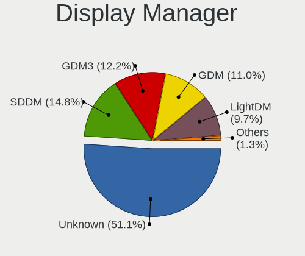

| Name    | Notebooks | Percent |
|---------|-----------|---------|
| Unknown | 121       | 51.05%  |
| SDDM    | 35        | 14.77%  |
| GDM3    | 29        | 12.24%  |
| GDM     | 26        | 10.97%  |
| LightDM | 23        | 9.7%    |
| TDM     | 3         | 1.27%   |

OS Lang
-------

Language

| Lang    | Notebooks | Percent |
|---------|-----------|---------|
| es_EC   | 105       | 45.65%  |
| en_US   | 56        | 24.35%  |
| es_ES   | 24        | 10.43%  |
| Unknown | 15        | 6.52%   |
| es_MX   | 10        | 4.35%   |
| es_CO   | 5         | 2.17%   |
| de_DE   | 4         | 1.74%   |
| es_US   | 3         | 1.3%    |
| C       | 3         | 1.3%    |
| es_PE   | 2         | 0.87%   |
| ru_RU   | 1         | 0.43%   |
| fr_FR   | 1         | 0.43%   |
| en_GB   | 1         | 0.43%   |

Boot Mode
---------

EFI or BIOS

| Mode | Notebooks | Percent |
|------|-----------|---------|
| EFI  | 123       | 53.25%  |
| BIOS | 108       | 46.75%  |

Filesystem
----------

Type of filesystem

| Type    | Notebooks | Percent |
|---------|-----------|---------|
| Ext4    | 163       | 70.26%  |
| Btrfs   | 32        | 13.79%  |
| Overlay | 18        | 7.76%   |
| Tmpfs   | 12        | 5.17%   |
| Xfs     | 3         | 1.29%   |
| Zfs     | 2         | 0.86%   |
| Ext2    | 1         | 0.43%   |
| Unknown | 1         | 0.43%   |

Part. scheme
------------

Scheme of partitioning

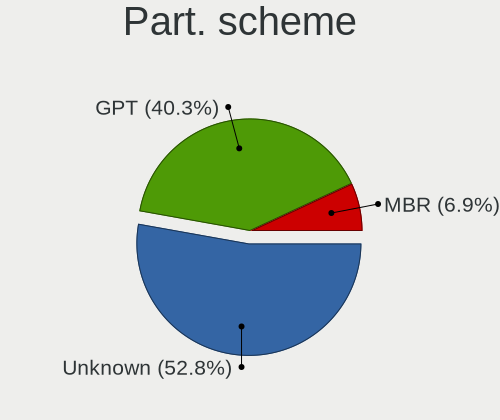

| Type    | Notebooks | Percent |
|---------|-----------|---------|
| Unknown | 122       | 52.81%  |
| GPT     | 93        | 40.26%  |
| MBR     | 16        | 6.93%   |

Dual Boot with Linux/BSD
------------------------

Hosting more than one Linux/BSD

| Dual boot | Notebooks | Percent |
|-----------|-----------|---------|
| No        | 195       | 85.9%   |
| Yes       | 32        | 14.1%   |

Dual Boot (Win)
---------------

Hosting Linux and Windows

| Dual boot | Notebooks | Percent |
|-----------|-----------|---------|
| No        | 161       | 69.7%   |
| Yes       | 70        | 30.3%   |

Board
-----

Vendor
------

Motherboard manufacturer

| Name                | Notebooks | Percent |
|---------------------|-----------|---------|
| Hewlett-Packard     | 50        | 22.32%  |
| Lenovo              | 35        | 15.63%  |
| Dell                | 35        | 15.63%  |
| ASUSTek Computer    | 24        | 10.71%  |
| Toshiba             | 16        | 7.14%   |
| Acer                | 13        | 5.8%    |
| Apple               | 11        | 4.91%   |
| Google              | 7         | 3.13%   |
| Sony                | 6         | 2.68%   |
| Samsung Electronics | 4         | 1.79%   |
| MSI                 | 4         | 1.79%   |
| Unknown             | 4         | 1.79%   |
| Gateway             | 3         | 1.34%   |
| Valve               | 2         | 0.89%   |
| Razer               | 2         | 0.89%   |
| Alienware           | 2         | 0.89%   |
| Timi                | 1         | 0.45%   |
| HUAWEI              | 1         | 0.45%   |
| Fujitsu             | 1         | 0.45%   |
| Dynabook            | 1         | 0.45%   |
| Compal              | 1         | 0.45%   |
| Chuwi               | 1         | 0.45%   |

Model
-----

Motherboard model

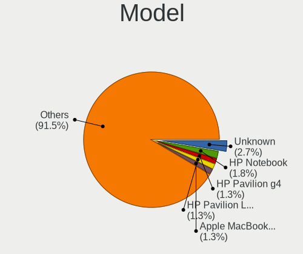

| Name                                     | Notebooks | Percent |
|------------------------------------------|-----------|---------|
| Unknown                                  | 6         | 2.68%   |
| HP Notebook                              | 4         | 1.79%   |
| HP Pavilion Laptop 15-cw1xxx             | 3         | 1.34%   |
| HP Pavilion g4                           | 3         | 1.34%   |
| Apple MacBookPro9,2                      | 3         | 1.34%   |
| Apple MacBookPro12,1                     | 3         | 1.34%   |
| Valve Jupiter                            | 2         | 0.89%   |
| Toshiba Satellite S55-B                  | 2         | 0.89%   |
| Toshiba Satellite C55-B                  | 2         | 0.89%   |
| Lenovo IdeaPad L340-15IRH Gaming 81LK    | 2         | 0.89%   |
| Lenovo IdeaPad 330S-15IKB 81F5           | 2         | 0.89%   |
| Lenovo IdeaPad 320-15ABR 80XS            | 2         | 0.89%   |
| HP ProBook 4440s                         | 2         | 0.89%   |
| HP Pavilion Laptop 15-cw0xxx             | 2         | 0.89%   |
| HP Laptop 15-da0xxx                      | 2         | 0.89%   |
| HP 1000                                  | 2         | 0.89%   |
| Dell Vostro 3480                         | 2         | 0.89%   |
| Dell Latitude E6420                      | 2         | 0.89%   |
| Dell Inspiron N4050                      | 2         | 0.89%   |
| Dell Inspiron 5570                       | 2         | 0.89%   |
| Dell Inspiron 3442                       | 2         | 0.89%   |
| Dell Inspiron 1420                       | 2         | 0.89%   |
| Dell G5 5587                             | 2         | 0.89%   |
| ASUS VivoBook_ASUSLaptop X1605VA_X1605VA | 2         | 0.89%   |
| ASUS E202SA                              | 2         | 0.89%   |
| ASUS ASUS TUF Gaming A15 FA506II_FA506II | 2         | 0.89%   |
| Toshiba Satellite S55-A                  | 1         | 0.45%   |
| Toshiba Satellite P855                   | 1         | 0.45%   |
| Toshiba Satellite P775                   | 1         | 0.45%   |
| Toshiba Satellite P55W-C                 | 1         | 0.45%   |
| Toshiba Satellite L50-B                  | 1         | 0.45%   |
| Toshiba Satellite L45-B                  | 1         | 0.45%   |
| Toshiba Satellite E45t-B                 | 1         | 0.45%   |
| Toshiba Satellite C55D-A                 | 1         | 0.45%   |
| Toshiba Satellite C45-A                  | 1         | 0.45%   |
| Toshiba Satellite A205                   | 1         | 0.45%   |
| Toshiba Satellite A135                   | 1         | 0.45%   |
| Toshiba PORTEGE M805                     | 1         | 0.45%   |
| Timi RedmiBook 14-APCS                   | 1         | 0.45%   |
| Sony VPCEG30EL                           | 1         | 0.45%   |

Model Family
------------

Motherboard model prefix

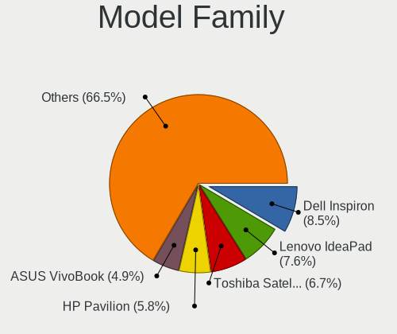

| Name               | Notebooks | Percent |
|--------------------|-----------|---------|
| Dell Inspiron      | 19        | 8.48%   |
| Lenovo IdeaPad     | 17        | 7.59%   |
| Toshiba Satellite  | 15        | 6.7%    |
| HP Pavilion        | 13        | 5.8%    |
| ASUS VivoBook      | 11        | 4.91%   |
| HP Laptop          | 9         | 4.02%   |
| Lenovo ThinkPad    | 8         | 3.57%   |
| Dell Latitude      | 8         | 3.57%   |
| Acer Aspire        | 8         | 3.57%   |
| Unknown            | 6         | 2.68%   |
| HP Notebook        | 4         | 1.79%   |
| HP ProBook         | 3         | 1.34%   |
| HP ENVY            | 3         | 1.34%   |
| Dell Vostro        | 3         | 1.34%   |
| Apple MacBookPro9  | 3         | 1.34%   |
| Apple MacBookPro12 | 3         | 1.34%   |
| Valve Jupiter      | 2         | 0.89%   |
| Razer Blade        | 2         | 0.89%   |
| MSI Stealth        | 2         | 0.89%   |
| Lenovo ThinkBook   | 2         | 0.89%   |
| HP OMEN            | 2         | 0.89%   |
| HP EliteBook       | 2         | 0.89%   |
| HP 245             | 2         | 0.89%   |
| HP 15              | 2         | 0.89%   |
| HP 1000            | 2         | 0.89%   |
| Dell G5            | 2         | 0.89%   |
| ASUS E202SA        | 2         | 0.89%   |
| ASUS ASUS          | 2         | 0.89%   |
| Acer TravelMate    | 2         | 0.89%   |
| Toshiba PORTEGE    | 1         | 0.45%   |
| Timi RedmiBook     | 1         | 0.45%   |
| Sony VPCEG30EL     | 1         | 0.45%   |
| Sony VPCEG23EL     | 1         | 0.45%   |
| Sony VPCCW1S1E     | 1         | 0.45%   |
| Sony VGN-CR120E    | 1         | 0.45%   |
| Sony SVE14A25CLB   | 1         | 0.45%   |
| Sony SVE14113ELW   | 1         | 0.45%   |
| Samsung R519       | 1         | 0.45%   |
| Samsung N102SP     | 1         | 0.45%   |
| Samsung 550XCJ     | 1         | 0.45%   |

MFG Year
--------

Motherboard manufacture year

| Year | Notebooks | Percent |
|------|-----------|---------|
| 2018 | 23        | 10.27%  |
| 2019 | 21        | 9.38%   |
| 2012 | 21        | 9.38%   |
| 2020 | 20        | 8.93%   |
| 2017 | 18        | 8.04%   |
| 2021 | 16        | 7.14%   |
| 2013 | 14        | 6.25%   |
| 2011 | 14        | 6.25%   |
| 2015 | 13        | 5.8%    |
| 2014 | 13        | 5.8%    |
| 2022 | 11        | 4.91%   |
| 2016 | 10        | 4.46%   |
| 2007 | 9         | 4.02%   |
| 2010 | 6         | 2.68%   |
| 2009 | 5         | 2.23%   |
| 2023 | 4         | 1.79%   |
| 2006 | 3         | 1.34%   |
| 2024 | 1         | 0.45%   |
| 2008 | 1         | 0.45%   |
| 2005 | 1         | 0.45%   |

Form Factor
-----------

Physical design of the computer

| Name     | Notebooks | Percent |
|----------|-----------|---------|
| Notebook | 224       | 100%    |

Secure Boot
-----------

Enabled or disabled

| State    | Notebooks | Percent |
|----------|-----------|---------|
| Disabled | 208       | 92.44%  |
| Enabled  | 17        | 7.56%   |

Coreboot
--------

Have coreboot on board

| Used | Notebooks | Percent |
|------|-----------|---------|
| No   | 216       | 96.43%  |
| Yes  | 8         | 3.57%   |

RAM Size
--------

Total RAM memory

| Size in GB  | Notebooks | Percent |
|-------------|-----------|---------|
| 4.01-8.0    | 74        | 32.17%  |
| 3.01-4.0    | 45        | 19.57%  |
| 8.01-16.0   | 42        | 18.26%  |
| 16.01-24.0  | 34        | 14.78%  |
| 1.01-2.0    | 14        | 6.09%   |
| 32.01-64.0  | 13        | 5.65%   |
| 2.01-3.0    | 4         | 1.74%   |
| 24.01-32.0  | 2         | 0.87%   |
| 64.01-256.0 | 1         | 0.43%   |
| 0.51-1.0    | 1         | 0.43%   |

RAM Used
--------

Used RAM memory

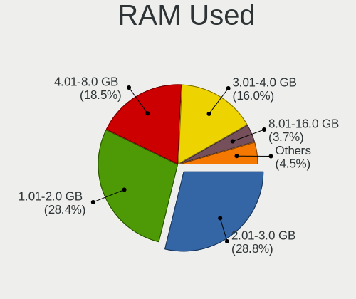

| Used GB    | Notebooks | Percent |
|------------|-----------|---------|
| 2.01-3.0   | 70        | 28.81%  |
| 1.01-2.0   | 69        | 28.4%   |
| 4.01-8.0   | 45        | 18.52%  |
| 3.01-4.0   | 39        | 16.05%  |
| 8.01-16.0  | 9         | 3.7%    |
| 0.51-1.0   | 7         | 2.88%   |
| 0.01-0.5   | 3         | 1.23%   |
| 24.01-32.0 | 1         | 0.41%   |

Total Drives
------------

Number of drives on board

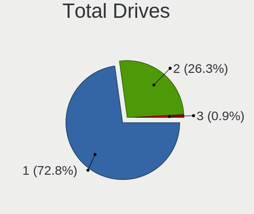

| Drives | Notebooks | Percent |
|--------|-----------|---------|
| 1      | 166       | 72.81%  |
| 2      | 60        | 26.32%  |
| 3      | 2         | 0.88%   |

Has CD-ROM
----------

Has CD-ROM on board

| Presented | Notebooks | Percent |
|-----------|-----------|---------|
| No        | 153       | 68%     |
| Yes       | 72        | 32%     |

Has Ethernet
------------

Has Ethernet on board

| Presented | Notebooks | Percent |
|-----------|-----------|---------|
| Yes       | 178       | 79.46%  |
| No        | 46        | 20.54%  |

Has WiFi
--------

Has WiFi module

| Presented | Notebooks | Percent |
|-----------|-----------|---------|
| Yes       | 221       | 98.66%  |
| No        | 3         | 1.34%   |

Has Bluetooth
-------------

Has Bluetooth module

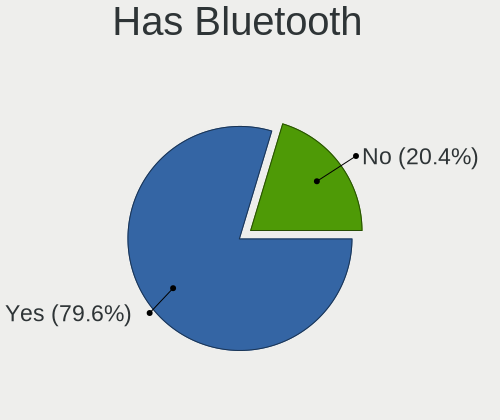

| Presented | Notebooks | Percent |
|-----------|-----------|---------|
| Yes       | 180       | 79.65%  |
| No        | 46        | 20.35%  |

Location
--------

Country
-------

Geographic location (country)

| Country | Notebooks | Percent |
|---------|-----------|---------|
| Ecuador | 224       | 100%    |

City
----

Geographic location (city)

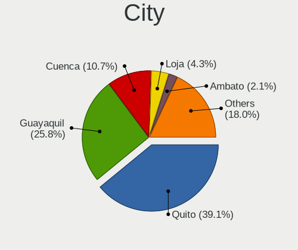

| City                           | Notebooks | Percent |
|--------------------------------|-----------|---------|
| Quito                          | 91        | 39.06%  |
| Guayaquil                      | 60        | 25.75%  |
| Cuenca                         | 25        | 10.73%  |
| Loja                           | 10        | 4.29%   |
| Ambato                         | 5         | 2.15%   |
| Portoviejo                     | 4         | 1.72%   |
| Manta                          | 4         | 1.72%   |
| Machala                        | 4         | 1.72%   |
| Puyo                           | 3         | 1.29%   |
| Hacienda Ibarra                | 3         | 1.29%   |
| Santo Domingo de los Colorados | 2         | 0.86%   |
| Riobamba                       | 2         | 0.86%   |
| Ayacucho                       | 2         | 0.86%   |
| Uyumbicho                      | 1         | 0.43%   |
| Samborondon                    | 1         | 0.43%   |
| Provincia del Chimborazo       | 1         | 0.43%   |
| Otavalo                        | 1         | 0.43%   |
| Nueva Loja                     | 1         | 0.43%   |
| Montecristi                    | 1         | 0.43%   |
| Latacunga                      | 1         | 0.43%   |
| La Troncal                     | 1         | 0.43%   |
| La Providencia                 | 1         | 0.43%   |
| La Mana                        | 1         | 0.43%   |
| La Concordia Numero Uno        | 1         | 0.43%   |
| Ibarra                         | 1         | 0.43%   |
| Huaquillas                     | 1         | 0.43%   |
| Hacienda San Sebastian         | 1         | 0.43%   |
| Guamani                        | 1         | 0.43%   |
| Febres Cordero                 | 1         | 0.43%   |
| Cayambe                        | 1         | 0.43%   |
| Babahoyo                       | 1         | 0.43%   |

Drives
------

Drive Vendor
------------

Hard drive vendors

| Vendor                      | Notebooks | Drives | Percent |
|-----------------------------|-----------|--------|---------|
| WDC                         | 52        | 63     | 18.51%  |
| Toshiba                     | 41        | 46     | 14.59%  |
| Seagate                     | 29        | 45     | 10.32%  |
| Kingston                    | 22        | 24     | 7.83%   |
| Samsung Electronics         | 18        | 20     | 6.41%   |
| Unknown                     | 11        | 16     | 3.91%   |
| SK hynix                    | 11        | 13     | 3.91%   |
| Hitachi                     | 11        | 14     | 3.91%   |
| A-DATA Technology           | 10        | 13     | 3.56%   |
| Sandisk                     | 9         | 13     | 3.2%    |
| Micron Technology           | 8         | 8      | 2.85%   |
| HGST                        | 7         | 9      | 2.49%   |
| Hewlett-Packard             | 6         | 7      | 2.14%   |
| Apple                       | 6         | 7      | 2.14%   |
| JMicron Technology          | 5         | 5      | 1.78%   |
| KIOXIA                      | 4         | 4      | 1.42%   |
| Kingston Technology Company | 4         | 4      | 1.42%   |
| Intel                       | 3         | 6      | 1.07%   |
| Crucial                     | 3         | 3      | 1.07%   |
| Fujitsu                     | 2         | 2      | 0.71%   |
| USB3.0                      | 1         | 1      | 0.36%   |
| UMIS                        | 1         | 1      | 0.36%   |
| SABRENT                     | 1         | 1      | 0.36%   |
| Realtek Semiconductor       | 1         | 1      | 0.36%   |
| PNY                         | 1         | 1      | 0.36%   |
| Phison Electronics          | 1         | 1      | 0.36%   |
| Phison                      | 1         | 1      | 0.36%   |
| Patriot                     | 1         | 1      | 0.36%   |
| OWC                         | 1         | 1      | 0.36%   |
| Netac                       | 1         | 1      | 0.36%   |
| Micron/Crucial Technology   | 1         | 1      | 0.36%   |
| LITEON                      | 1         | 1      | 0.36%   |
| Lite-On                     | 1         | 1      | 0.36%   |
| KINGPAN                     | 1         | 1      | 0.36%   |
| HS-SSD-E100N                | 1         | 1      | 0.36%   |
| Hjwdz                       | 1         | 1      | 0.36%   |
| Golden                      | 1         | 1      | 0.36%   |
| Gigabyte Technology         | 1         | 1      | 0.36%   |
| Unknown                     | 1         | 1      | 0.36%   |

Drive Model
-----------

Hard drive models

| Model                                               | Notebooks | Percent |
|-----------------------------------------------------|-----------|---------|
| Toshiba MQ04ABF100 1TB                              | 7         | 2.42%   |
| Seagate ST1000LM035-1RK172 1TB                      | 7         | 2.42%   |
| Toshiba MQ01ABF050 500GB                            | 6         | 2.08%   |
| Kingston SA400S37240G 240GB SSD                     | 6         | 2.08%   |
| WDC WDS240G2G0A-00JH30 240GB SSD                    | 4         | 1.38%   |
| WDC WD10SPZX-24Z10 1TB                              | 4         | 1.38%   |
| Unknown MMC Card  16GB                              | 4         | 1.38%   |
| Seagate ST2000LM007-1R8174 2TB                      | 4         | 1.38%   |
| Kingston SA400S37480G 480GB SSD                     | 4         | 1.38%   |
| Toshiba MQ01ABD100 1TB                              | 3         | 1.04%   |
| Toshiba MQ01ABD075 752GB                            | 3         | 1.04%   |
| Micron 3400_MTFDKBA1T0TFH 1TB                       | 3         | 1.04%   |
| JMicron Tech 250GB                                  | 3         | 1.04%   |
| HP SSD S700 500GB                                   | 3         | 1.04%   |
| WDC WDS480G2G0A-00JH30 480GB SSD                    | 2         | 0.69%   |
| WDC WD6400BEVT-22A0RT0 640GB                        | 2         | 0.69%   |
| WDC WD5000LPVX-22V0TT0 500GB                        | 2         | 0.69%   |
| WDC WD1600BEVT-22ZCT0 160GB                         | 2         | 0.69%   |
| WDC WD10SPZX-60Z10T0 1TB                            | 2         | 0.69%   |
| WDC WD10SPZX-24Z10T0 1TB                            | 2         | 0.69%   |
| WDC WD10SPZX-22Z10T1 1TB                            | 2         | 0.69%   |
| WDC WD10JPVX-75JC3T0 1TB                            | 2         | 0.69%   |
| WDC WD10JPVX-22JC3T0 1TB                            | 2         | 0.69%   |
| Unknown SD/MMC/MS PRO 128GB                         | 2         | 0.69%   |
| Unknown MMC Card  64GB                              | 2         | 0.69%   |
| Unknown MMC Card  32GB                              | 2         | 0.69%   |
| Toshiba MQ01ABD100M 1TB                             | 2         | 0.69%   |
| Toshiba KSG60ZMV256G M.2 2280 256GB SSD             | 2         | 0.69%   |
| SK hynix SKHynix_HFS512GDE9X084N 512GB              | 2         | 0.69%   |
| Seagate ST9500325AS 500GB                           | 2         | 0.69%   |
| Seagate ST500LT012-9WS142 500GB                     | 2         | 0.69%   |
| Seagate ST500LT012-1DG142 500GB                     | 2         | 0.69%   |
| SanDisk NVMe SSD Drive 1TB                          | 2         | 0.69%   |
| Samsung SSD 860 EVO 1TB                             | 2         | 0.69%   |
| Samsung NVMe SSD Controller SM981/PM981/PM983 512GB | 2         | 0.69%   |
| Micron NVMe SSD Drive 512GB                         | 2         | 0.69%   |
| Kingston SNV2S500G 500GB                            | 2         | 0.69%   |
| Kingston SA400S37960G 960GB SSD                     | 2         | 0.69%   |
| Kingston RBU-SNS8350DES3128GP 128GB SSD             | 2         | 0.69%   |
| JMicron Generic 500GB                               | 2         | 0.69%   |

HDD Vendor
----------

Hard disk drive vendors

| Vendor              | Notebooks | Drives | Percent |
|---------------------|-----------|--------|---------|
| Toshiba             | 37        | 41     | 29.6%   |
| WDC                 | 32        | 41     | 25.6%   |
| Seagate             | 29        | 45     | 23.2%   |
| Hitachi             | 11        | 14     | 8.8%    |
| HGST                | 7         | 9      | 5.6%    |
| Unknown             | 2         | 4      | 1.6%    |
| JMicron Technology  | 2         | 2      | 1.6%    |
| Fujitsu             | 2         | 2      | 1.6%    |
| Samsung Electronics | 1         | 1      | 0.8%    |
| SABRENT             | 1         | 1      | 0.8%    |
| Apple               | 1         | 1      | 0.8%    |

SSD Vendor
----------

Solid state drive vendors

| Vendor              | Notebooks | Drives | Percent |
|---------------------|-----------|--------|---------|
| Kingston            | 16        | 16     | 21.05%  |
| WDC                 | 15        | 16     | 19.74%  |
| A-DATA Technology   | 9         | 12     | 11.84%  |
| SanDisk             | 5         | 5      | 6.58%   |
| Hewlett-Packard     | 5         | 6      | 6.58%   |
| Samsung Electronics | 4         | 4      | 5.26%   |
| Apple               | 4         | 5      | 5.26%   |
| Crucial             | 3         | 3      | 3.95%   |
| Toshiba             | 2         | 3      | 2.63%   |
| SK hynix            | 2         | 2      | 2.63%   |
| USB3.0              | 1         | 1      | 1.32%   |
| PNY                 | 1         | 1      | 1.32%   |
| Patriot             | 1         | 1      | 1.32%   |
| OWC                 | 1         | 1      | 1.32%   |
| Netac               | 1         | 1      | 1.32%   |
| Micron Technology   | 1         | 1      | 1.32%   |
| LITEON              | 1         | 1      | 1.32%   |
| KINGPAN             | 1         | 1      | 1.32%   |
| HS-SSD-E100N        | 1         | 1      | 1.32%   |
| Golden              | 1         | 1      | 1.32%   |
| Gigabyte Technology | 1         | 1      | 1.32%   |

Drive Kind
----------

HDD or SSD

| Kind    | Notebooks | Drives | Percent |
|---------|-----------|--------|---------|
| HDD     | 120       | 161    | 44.94%  |
| SSD     | 69        | 83     | 25.84%  |
| NVMe    | 64        | 80     | 23.97%  |
| MMC     | 10        | 13     | 3.75%   |
| Unknown | 4         | 4      | 1.5%    |

Drive Connector
---------------

SATA, SAS, NVMe, etc.

| Type | Notebooks | Drives | Percent |
|------|-----------|--------|---------|
| SATA | 173       | 228    | 66.54%  |
| NVMe | 64        | 80     | 24.62%  |
| SAS  | 13        | 20     | 5%      |
| MMC  | 10        | 13     | 3.85%   |

Drive Size
----------

Size of hard drive

| Size in TB | Notebooks | Drives | Percent |
|------------|-----------|--------|---------|
| 0.01-0.5   | 118       | 142    | 61.14%  |
| 0.51-1.0   | 67        | 94     | 34.72%  |
| 1.01-2.0   | 8         | 8      | 4.15%   |

Space Total
-----------

Amount of disk space available on the file system

| Size in GB     | Notebooks | Percent |
|----------------|-----------|---------|
| 251-500        | 60        | 25.32%  |
| 101-250        | 60        | 25.32%  |
| 501-1000       | 34        | 14.35%  |
| 1001-2000      | 27        | 11.39%  |
| 1-20           | 17        | 7.17%   |
| 21-50          | 14        | 5.91%   |
| 51-100         | 14        | 5.91%   |
| Unknown        | 6         | 2.53%   |
| More than 3000 | 4         | 1.69%   |
| 2001-3000      | 1         | 0.42%   |

Space Used
----------

Amount of used disk space

| Used GB   | Notebooks | Percent |
|-----------|-----------|---------|
| 1-20      | 88        | 36.51%  |
| 21-50     | 49        | 20.33%  |
| 101-250   | 41        | 17.01%  |
| 51-100    | 22        | 9.13%   |
| 251-500   | 21        | 8.71%   |
| 501-1000  | 10        | 4.15%   |
| Unknown   | 6         | 2.49%   |
| 1001-2000 | 3         | 1.24%   |
| 2001-3000 | 1         | 0.41%   |

Malfunc. Drives
---------------

Drive models with a malfunction

| Model                                   | Notebooks | Drives | Percent |
|-----------------------------------------|-----------|--------|---------|
| WDC WD6400BEVT-22A0RT0 640GB            | 2         | 2      | 10.53%  |
| Toshiba MQ01ABF050 500GB                | 2         | 3      | 10.53%  |
| WDC WD5000LPVT-00G33T0 500GB            | 1         | 1      | 5.26%   |
| WDC WD5000LPCX-24VHAT0 500GB            | 1         | 2      | 5.26%   |
| Toshiba MQ01ABD100M 1TB                 | 1         | 1      | 5.26%   |
| Toshiba MQ01ABD100 1TB                  | 1         | 1      | 5.26%   |
| Toshiba MQ01ABD075 752GB                | 1         | 1      | 5.26%   |
| Toshiba MK3265GSXN 320GB                | 1         | 1      | 5.26%   |
| Toshiba MK3259GSXP 320GB                | 1         | 1      | 5.26%   |
| Toshiba MK2561GSYN 250GB                | 1         | 2      | 5.26%   |
| Seagate ST1000LX015-1U7172 1TB          | 1         | 3      | 5.26%   |
| Seagate ST1000LM035-1RK172 1TB          | 1         | 1      | 5.26%   |
| Kingston RBU-SNS8350DES3128GP 128GB SSD | 1         | 1      | 5.26%   |
| Hitachi HTS547550A9E384 500GB           | 1         | 1      | 5.26%   |
| Hitachi HTS543232L9SA00 320GB           | 1         | 1      | 5.26%   |
| HGST HTS545050A7E380 500GB              | 1         | 1      | 5.26%   |
| Fujitsu MHY2250BH 250GB                 | 1         | 1      | 5.26%   |

Malfunc. Drive Vendor
---------------------

Vendors of faulty drives

| Vendor   | Notebooks | Drives | Percent |
|----------|-----------|--------|---------|
| Toshiba  | 8         | 10     | 42.11%  |
| WDC      | 4         | 5      | 21.05%  |
| Seagate  | 2         | 4      | 10.53%  |
| Hitachi  | 2         | 2      | 10.53%  |
| Kingston | 1         | 1      | 5.26%   |
| HGST     | 1         | 1      | 5.26%   |
| Fujitsu  | 1         | 1      | 5.26%   |

Malfunc. HDD Vendor
-------------------

Vendors of faulty HDD drives

| Vendor  | Notebooks | Drives | Percent |
|---------|-----------|--------|---------|
| Toshiba | 8         | 10     | 44.44%  |
| WDC     | 4         | 5      | 22.22%  |
| Seagate | 2         | 4      | 11.11%  |
| Hitachi | 2         | 2      | 11.11%  |
| HGST    | 1         | 1      | 5.56%   |
| Fujitsu | 1         | 1      | 5.56%   |

Malfunc. Drive Kind
-------------------

Kinds of faulty drives

| Kind | Notebooks | Drives | Percent |
|------|-----------|--------|---------|
| HDD  | 18        | 23     | 94.74%  |
| SSD  | 1         | 1      | 5.26%   |

Failed Drives
-------------

Failed drive models

Zero info for selected period =(

Failed Drive Vendor
-------------------

Failed drive vendors

Zero info for selected period =(

Drive Status
------------

Number of failed and malfunc. drives

| Status   | Notebooks | Drives | Percent |
|----------|-----------|--------|---------|
| Detected | 143       | 217    | 59.83%  |
| Works    | 77        | 100    | 32.22%  |
| Malfunc  | 19        | 24     | 7.95%   |

Storage controller
------------------

Storage Vendor
--------------

Storage controller vendors

| Vendor                       | Notebooks | Percent |
|------------------------------|-----------|---------|
| Intel                        | 152       | 58.02%  |
| AMD                          | 41        | 15.65%  |
| Samsung Electronics          | 17        | 6.49%   |
| SanDisk                      | 10        | 3.82%   |
| Kingston Technology Company  | 10        | 3.82%   |
| SK hynix                     | 9         | 3.44%   |
| Micron Technology            | 7         | 2.67%   |
| KIOXIA                       | 4         | 1.53%   |
| Toshiba America Info Systems | 2         | 0.76%   |
| Phison Electronics           | 2         | 0.76%   |
| Union Memory (Shenzhen)      | 1         | 0.38%   |
| Silicon Motion               | 1         | 0.38%   |
| Realtek Semiconductor        | 1         | 0.38%   |
| Nvidia                       | 1         | 0.38%   |
| Micron/Crucial Technology    | 1         | 0.38%   |
| Lite-On Technology           | 1         | 0.38%   |
| Apple                        | 1         | 0.38%   |
| ADATA Technology             | 1         | 0.38%   |

Storage Model
-------------

Storage controller models

| Model                                                                            | Notebooks | Percent |
|----------------------------------------------------------------------------------|-----------|---------|
| AMD FCH SATA Controller [AHCI mode]                                              | 39        | 14.03%  |
| Intel 82801 Mobile SATA Controller [RAID mode]                                   | 21        | 7.55%   |
| Intel Sunrise Point-LP SATA Controller [AHCI mode]                               | 18        | 6.47%   |
| Intel 7 Series Chipset Family 6-port SATA Controller [AHCI mode]                 | 18        | 6.47%   |
| Intel 8 Series SATA Controller 1 [AHCI mode]                                     | 11        | 3.96%   |
| Intel 6 Series/C200 Series Chipset Family 6 port Mobile SATA AHCI Controller     | 10        | 3.6%    |
| Intel Wildcat Point-LP SATA Controller [AHCI Mode]                               | 9         | 3.24%   |
| Intel 82801HM/HEM (ICH8M/ICH8M-E) IDE Controller                                 | 7         | 2.52%   |
| Samsung NVMe SSD Controller 980 (DRAM-less)                                      | 6         | 2.16%   |
| Intel 82801HM/HEM (ICH8M/ICH8M-E) SATA Controller [AHCI mode]                    | 6         | 2.16%   |
| Samsung NVMe SSD Controller SM981/PM981/PM983                                    | 5         | 1.8%    |
| Intel Volume Management Device NVMe RAID Controller                              | 5         | 1.8%    |
| Intel 8 Series/C220 Series Chipset Family 6-port SATA Controller 1 [AHCI mode]   | 5         | 1.8%    |
| SanDisk Ultra 3D / WD PC SN530, IX SN530, Blue SN550 NVMe SSD (DRAM-less)        | 4         | 1.44%   |
| Intel Volume Management Device NVMe RAID Controller Intel Corporation            | 4         | 1.44%   |
| Intel Celeron/Pentium Silver Processor SATA Controller                           | 4         | 1.44%   |
| Intel Cannon Lake Mobile PCH SATA AHCI Controller                                | 4         | 1.44%   |
| Intel Atom/Celeron/Pentium Processor x5-E8000/J3xxx/N3xxx Series SATA Controller | 4         | 1.44%   |
| Intel 82801IBM/IEM (ICH9M/ICH9M-E) 4 port SATA Controller [AHCI mode]            | 4         | 1.44%   |
| SK hynix Gold P31/BC711/PC711 NVMe Solid State Drive                             | 3         | 1.08%   |
| SK hynix BC501 NVMe Solid State Drive                                            | 3         | 1.08%   |
| Samsung S4LN058A01[SSUBX] AHCI SSD Controller (Apple slot)                       | 3         | 1.08%   |
| Micron 3400 NVMe SSD [Hendrix]                                                   | 3         | 1.08%   |
| KIOXIA NVMe SSD Controller BG4 (DRAM-less)                                       | 3         | 1.08%   |
| Kingston Company NV2 NVMe SSD [SM2267XT] (DRAM-less)                             | 3         | 1.08%   |
| Intel Tiger Lake-LP SATA Controller                                              | 3         | 1.08%   |
| Intel NM10/ICH7 Family SATA Controller [AHCI mode]                               | 3         | 1.08%   |
| Intel Ice Lake-LP SATA Controller [AHCI mode]                                    | 3         | 1.08%   |
| Intel 82801GBM/GHM (ICH7-M Family) SATA Controller [IDE mode]                    | 3         | 1.08%   |
| SK hynix BC511 NVMe SSD                                                          | 2         | 0.72%   |
| Micron 2450 NVMe SSD [HendrixV] (DRAM-less)                                      | 2         | 0.72%   |
| Kingston Company OM3PDP3 NVMe SSD                                                | 2         | 0.72%   |
| Intel SSD 670p Series [Keystone Harbor]                                          | 2         | 0.72%   |
| Intel Comet Lake SATA AHCI Controller                                            | 2         | 0.72%   |
| Intel 82801HM/HEM (ICH8M/ICH8M-E) SATA Controller [IDE mode]                     | 2         | 0.72%   |
| Intel 82801G (ICH7 Family) IDE Controller                                        | 2         | 0.72%   |
| Intel 7 Series Chipset Family 4-port SATA Controller [IDE mode]                  | 2         | 0.72%   |
| Intel 7 Series Chipset Family 2-port SATA Controller [IDE mode]                  | 2         | 0.72%   |
| Intel 5 Series/3400 Series Chipset 4 port SATA AHCI Controller                   | 2         | 0.72%   |
| AMD SB7x0/SB8x0/SB9x0 SATA Controller [AHCI mode]                                | 2         | 0.72%   |

Storage Kind
------------

Kind of storage controller (IDE, SATA, NVMe, SAS, ...)

| Kind | Notebooks | Percent |
|------|-----------|---------|
| SATA | 159       | 58.89%  |
| NVMe | 64        | 23.7%   |
| RAID | 30        | 11.11%  |
| IDE  | 17        | 6.3%    |

Processor
---------

CPU Vendor
----------

Processor vendors

| Vendor | Notebooks | Percent |
|--------|-----------|---------|
| Intel  | 171       | 76.34%  |
| AMD    | 53        | 23.66%  |

CPU Model
---------

Processor models

| Model                                         | Notebooks | Percent |
|-----------------------------------------------|-----------|---------|
| Intel Core i7-8550U CPU @ 1.80GHz             | 9         | 4.02%   |
| AMD Ryzen 5 3500U with Radeon Vega Mobile Gfx | 8         | 3.57%   |
| Intel 11th Gen Core i7-1165G7 @ 2.80GHz       | 6         | 2.68%   |
| Intel Core i5-8250U CPU @ 1.60GHz             | 5         | 2.23%   |
| Intel Core i7-4510U CPU @ 2.00GHz             | 4         | 1.79%   |
| Intel Core i7-9750H CPU @ 2.60GHz             | 3         | 1.34%   |
| Intel Core i7-5500U CPU @ 2.40GHz             | 3         | 1.34%   |
| Intel Core i7-3520M CPU @ 2.90GHz             | 3         | 1.34%   |
| Intel Core i5-8265U CPU @ 1.60GHz             | 3         | 1.34%   |
| Intel Core i5-7200U CPU @ 2.50GHz             | 3         | 1.34%   |
| Intel Core i5-5257U CPU @ 2.70GHz             | 3         | 1.34%   |
| Intel Core i5-5200U CPU @ 2.20GHz             | 3         | 1.34%   |
| Intel Core i5-4210U CPU @ 1.70GHz             | 3         | 1.34%   |
| Intel Core i3-4005U CPU @ 1.70GHz             | 3         | 1.34%   |
| Intel Core i3-3110M CPU @ 2.40GHz             | 3         | 1.34%   |
| Intel Celeron CPU N3050 @ 1.60GHz             | 3         | 1.34%   |
| AMD Ryzen 5 2500U with Radeon Vega Mobile Gfx | 3         | 1.34%   |
| AMD Ryzen 3 3250U with Radeon Graphics        | 3         | 1.34%   |
| AMD A6-9225 RADEON R4, 5 COMPUTE CORES 2C+3G  | 3         | 1.34%   |
| Intel Core i7-8750H CPU @ 2.20GHz             | 2         | 0.89%   |
| Intel Core i7-8565U CPU @ 1.80GHz             | 2         | 0.89%   |
| Intel Core i7-7700HQ CPU @ 2.80GHz            | 2         | 0.89%   |
| Intel Core i7-7500U CPU @ 2.70GHz             | 2         | 0.89%   |
| Intel Core i7-6700HQ CPU @ 2.60GHz            | 2         | 0.89%   |
| Intel Core i7-6600U CPU @ 2.60GHz             | 2         | 0.89%   |
| Intel Core i7-4700HQ CPU @ 2.40GHz            | 2         | 0.89%   |
| Intel Core i7-10750H CPU @ 2.60GHz            | 2         | 0.89%   |
| Intel Core i7-10510U CPU @ 1.80GHz            | 2         | 0.89%   |
| Intel Core i5-3337U CPU @ 1.80GHz             | 2         | 0.89%   |
| Intel Core i5-3230M CPU @ 2.60GHz             | 2         | 0.89%   |
| Intel Core i5-3210M CPU @ 2.50GHz             | 2         | 0.89%   |
| Intel Core i5-2520M CPU @ 2.50GHz             | 2         | 0.89%   |
| Intel Core i5-2410M CPU @ 2.30GHz             | 2         | 0.89%   |
| Intel Core i5-1035G1 CPU @ 1.00GHz            | 2         | 0.89%   |
| Intel Core i3-8130U CPU @ 2.20GHz             | 2         | 0.89%   |
| Intel Core i3-5005U CPU @ 2.00GHz             | 2         | 0.89%   |
| Intel Core i3-2350M CPU @ 2.30GHz             | 2         | 0.89%   |
| Intel Core i3-2330M CPU @ 2.20GHz             | 2         | 0.89%   |
| Intel Core 2 Duo CPU T5750 @ 2.00GHz          | 2         | 0.89%   |
| Intel Core 2 Duo CPU T5250 @ 1.50GHz          | 2         | 0.89%   |

CPU Model Family
----------------

Processor model prefix

| Model                   | Notebooks | Percent |
|-------------------------|-----------|---------|
| Intel Core i7           | 51        | 22.77%  |
| Intel Core i5           | 38        | 16.96%  |
| Intel Core i3           | 22        | 9.82%   |
| Other                   | 21        | 9.38%   |
| Intel Celeron           | 19        | 8.48%   |
| AMD Ryzen 5             | 13        | 5.8%    |
| Intel Core 2 Duo        | 11        | 4.91%   |
| AMD Ryzen 7             | 10        | 4.46%   |
| AMD Ryzen 3             | 4         | 1.79%   |
| AMD E2                  | 4         | 1.79%   |
| Intel Atom              | 3         | 1.34%   |
| AMD A6                  | 3         | 1.34%   |
| Intel Pentium Dual-Core | 2         | 0.89%   |
| Intel Pentium           | 2         | 0.89%   |
| Intel Genuine           | 2         | 0.89%   |
| AMD E1                  | 2         | 0.89%   |
| AMD E                   | 2         | 0.89%   |
| AMD A8                  | 2         | 0.89%   |
| AMD A4                  | 2         | 0.89%   |
| AMD A12                 | 2         | 0.89%   |
| Intel Pentium Silver    | 1         | 0.45%   |
| Intel Pentium M         | 1         | 0.45%   |
| Intel Core m3           | 1         | 0.45%   |
| Intel Celeron M         | 1         | 0.45%   |
| AMD Ryzen 7 PRO         | 1         | 0.45%   |
| AMD FX                  | 1         | 0.45%   |
| AMD C-70                | 1         | 0.45%   |
| AMD C-60                | 1         | 0.45%   |
| AMD A10                 | 1         | 0.45%   |

CPU Cores
---------

Number of processor cores

| Number | Notebooks | Percent |
|--------|-----------|---------|
| 2      | 125       | 55.8%   |
| 4      | 62        | 27.68%  |
| 8      | 11        | 4.91%   |
| 6      | 11        | 4.91%   |
| 1      | 8         | 3.57%   |
| 14     | 4         | 1.79%   |
| 10     | 2         | 0.89%   |
| 12     | 1         | 0.45%   |

CPU Sockets
-----------

Number of sockets

| Number | Notebooks | Percent |
|--------|-----------|---------|
| 1      | 224       | 100%    |

CPU Threads
-----------

Threads per core (Hyper-Threading)

| Number | Notebooks | Percent |
|--------|-----------|---------|
| 2      | 163       | 72.77%  |
| 1      | 61        | 27.23%  |

CPU Op-Modes
------------

CPU Operation Modes (32-bit, 64-bit)

| Op mode        | Notebooks | Percent |
|----------------|-----------|---------|
| 32-bit, 64-bit | 220       | 98.21%  |
| 32-bit         | 3         | 1.34%   |
| Unknown        | 1         | 0.45%   |

CPU Microcode
-------------

Microcode number

| Number     | Notebooks | Percent |
|------------|-----------|---------|
| Unknown    | 80        | 34.63%  |
| 0x806ea    | 12        | 5.19%   |
| 0x306a9    | 11        | 4.76%   |
| 0x206a7    | 11        | 4.76%   |
| 0x306d4    | 9         | 3.9%    |
| 0x6fd      | 7         | 3.03%   |
| 0x40651    | 7         | 3.03%   |
| 0x08108109 | 7         | 3.03%   |
| 0x06006705 | 5         | 2.16%   |
| 0x806c1    | 4         | 1.73%   |
| 0x706e5    | 4         | 1.73%   |
| 0x306c3    | 4         | 1.73%   |
| 0x1067a    | 4         | 1.73%   |
| 0x05000119 | 4         | 1.73%   |
| 0x906ea    | 3         | 1.3%    |
| 0x806eb    | 3         | 1.3%    |
| 0x806e9    | 3         | 1.3%    |
| 0x06006704 | 3         | 1.3%    |
| 0x0600611a | 3         | 1.3%    |
| 0x906ed    | 2         | 0.87%   |
| 0x806ec    | 2         | 0.87%   |
| 0x706a1    | 2         | 0.87%   |
| 0x6e8      | 2         | 0.87%   |
| 0x406e3    | 2         | 0.87%   |
| 0x406c4    | 2         | 0.87%   |
| 0x30678    | 2         | 0.87%   |
| 0x20655    | 2         | 0.87%   |
| 0x106ca    | 2         | 0.87%   |
| 0x08608104 | 2         | 0.87%   |
| 0x08600104 | 2         | 0.87%   |
| 0x08108102 | 2         | 0.87%   |
| 0x0810100b | 2         | 0.87%   |
| 0xa0660    | 1         | 0.43%   |
| 0xa0652    | 1         | 0.43%   |
| 0x906a3    | 1         | 0.43%   |
| 0x706a8    | 1         | 0.43%   |
| 0x6fa      | 1         | 0.43%   |
| 0x6d8      | 1         | 0.43%   |
| 0x506e3    | 1         | 0.43%   |
| 0x506c9    | 1         | 0.43%   |

CPU Microarch
-------------

Microarchitecture

| Name             | Notebooks | Percent |
|------------------|-----------|---------|
| KabyLake         | 37        | 16.52%  |
| IvyBridge        | 18        | 8.04%   |
| Haswell          | 18        | 8.04%   |
| SandyBridge      | 15        | 6.7%    |
| Zen+             | 12        | 5.36%   |
| Excavator        | 12        | 5.36%   |
| Broadwell        | 12        | 5.36%   |
| Core             | 11        | 4.91%   |
| Unknown          | 10        | 4.46%   |
| TigerLake        | 9         | 4.02%   |
| Silvermont       | 8         | 3.57%   |
| Skylake          | 7         | 3.13%   |
| Bobcat           | 6         | 2.68%   |
| Alderlake Hybrid | 6         | 2.68%   |
| Zen 2            | 5         | 2.23%   |
| Penryn           | 5         | 2.23%   |
| IceLake          | 5         | 2.23%   |
| Goldmont plus    | 5         | 2.23%   |
| Zen              | 4         | 1.79%   |
| Westmere         | 3         | 1.34%   |
| P6               | 3         | 1.34%   |
| CometLake        | 3         | 1.34%   |
| Bonnell          | 3         | 1.34%   |
| Zen 3            | 2         | 0.89%   |
| Puma             | 2         | 0.89%   |
| K10 Llano        | 1         | 0.45%   |
| Jaguar           | 1         | 0.45%   |
| Goldmont         | 1         | 0.45%   |

Graphics
--------

GPU Vendor
----------

Vendors of graphics cards

| Vendor | Notebooks | Percent |
|--------|-----------|---------|
| Intel  | 163       | 61.05%  |
| AMD    | 65        | 24.34%  |
| Nvidia | 39        | 14.61%  |

GPU Model
---------

Graphics card models

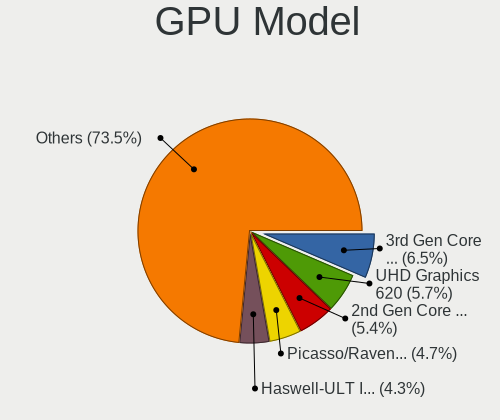

| Model                                                                                    | Notebooks | Percent |
|------------------------------------------------------------------------------------------|-----------|---------|
| Intel 3rd Gen Core processor Graphics Controller                                         | 18        | 6.45%   |
| Intel UHD Graphics 620                                                                   | 16        | 5.73%   |
| Intel 2nd Generation Core Processor Family Integrated Graphics Controller                | 15        | 5.38%   |
| AMD Picasso/Raven 2 [Radeon Vega Series / Radeon Vega Mobile Series]                     | 13        | 4.66%   |
| Intel Haswell-ULT Integrated Graphics Controller                                         | 12        | 4.3%    |
| Intel HD Graphics 5500                                                                   | 9         | 3.23%   |
| Intel TigerLake-LP GT2 [Iris Xe Graphics]                                                | 8         | 2.87%   |
| Intel Mobile GM965/GL960 Integrated Graphics Controller (secondary)                      | 8         | 2.87%   |
| Intel Mobile GM965/GL960 Integrated Graphics Controller (primary)                        | 8         | 2.87%   |
| AMD Stoney [Radeon R2/R3/R4/R5 Graphics]                                                 | 8         | 2.87%   |
| AMD Topaz XT [Radeon R7 M260/M265 / M340/M360 / M440/M445 / 530/535 / 620/625 Mobile]    | 7         | 2.51%   |
| Intel HD Graphics 620                                                                    | 6         | 2.15%   |
| Intel WhiskeyLake-U GT2 [UHD Graphics 620]                                               | 5         | 1.79%   |
| Intel CoffeeLake-H GT2 [UHD Graphics 630]                                                | 5         | 1.79%   |
| Intel Atom/Celeron/Pentium Processor x5-E8000/J3xxx/N3xxx Integrated Graphics Controller | 5         | 1.79%   |
| Intel 4th Gen Core Processor Integrated Graphics Controller                              | 5         | 1.79%   |
| AMD Renoir [Radeon Vega Series / Radeon Vega Mobile Series]                              | 5         | 1.79%   |
| Intel Raptor Lake-P [Iris Xe Graphics]                                                   | 4         | 1.43%   |
| Intel Mobile 4 Series Chipset Integrated Graphics Controller                             | 4         | 1.43%   |
| Intel GeminiLake [UHD Graphics 600]                                                      | 4         | 1.43%   |
| AMD Wani [Radeon R5/R6/R7 Graphics]                                                      | 4         | 1.43%   |
| AMD Lucienne                                                                             | 4         | 1.43%   |
| Nvidia TU117M [GeForce GTX 1650 Mobile / Max-Q]                                          | 3         | 1.08%   |
| Nvidia GP108M [GeForce MX150]                                                            | 3         | 1.08%   |
| Nvidia GP107M [GeForce GTX 1050 Ti Mobile]                                               | 3         | 1.08%   |
| Intel Skylake GT2 [HD Graphics 520]                                                      | 3         | 1.08%   |
| Intel Mobile 945GM/GMS/GME, 943/940GML Express Integrated Graphics Controller            | 3         | 1.08%   |
| Intel Mobile 945GM/GMS, 943/940GML Express Integrated Graphics Controller                | 3         | 1.08%   |
| Intel Iris Plus Graphics G1 (Ice Lake)                                                   | 3         | 1.08%   |
| Intel Iris Graphics 6100                                                                 | 3         | 1.08%   |
| Intel Core Processor Integrated Graphics Controller                                      | 3         | 1.08%   |
| Intel Atom Processor Z36xxx/Z37xxx Series Graphics & Display                             | 3         | 1.08%   |
| AMD Raven Ridge [Radeon Vega Series / Radeon Vega Mobile Series]                         | 3         | 1.08%   |
| Nvidia TU117M [GeForce GTX 1650 Ti Mobile]                                               | 2         | 0.72%   |
| Nvidia TU116M [GeForce GTX 1660 Ti Mobile]                                               | 2         | 0.72%   |
| Nvidia GP108M [GeForce MX330]                                                            | 2         | 0.72%   |
| Nvidia GK208BM [GeForce 920M]                                                            | 2         | 0.72%   |
| Nvidia GA107M [GeForce RTX 3050 Ti Mobile]                                               | 2         | 0.72%   |
| Intel Iris Plus Graphics G7                                                              | 2         | 0.72%   |
| Intel HD Graphics 630                                                                    | 2         | 0.72%   |

GPU Combo
---------

Combinations of graphics cards

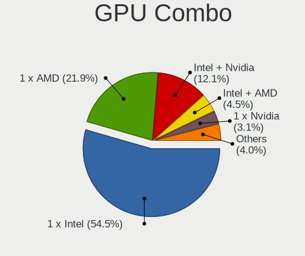

| Name           | Notebooks | Percent |
|----------------|-----------|---------|
| 1 x Intel      | 122       | 54.46%  |
| 1 x AMD        | 49        | 21.88%  |
| Intel + Nvidia | 27        | 12.05%  |
| Intel + AMD    | 10        | 4.46%   |
| 1 x Nvidia     | 7         | 3.13%   |
| AMD + Nvidia   | 5         | 2.23%   |
| 2 x Intel      | 2         | 0.89%   |
| Other          | 1         | 0.45%   |
| 2 x AMD        | 1         | 0.45%   |

GPU Driver
----------

Free vs proprietary

| Driver      | Notebooks | Percent |
|-------------|-----------|---------|
| Free        | 196       | 87.11%  |
| Proprietary | 23        | 10.22%  |
| Unknown     | 6         | 2.67%   |

GPU Memory
----------

Total video memory

| Size in GB | Notebooks | Percent |
|------------|-----------|---------|
| Unknown    | 150       | 65.5%   |
| 0.01-0.5   | 31        | 13.54%  |
| 1.01-2.0   | 23        | 10.04%  |
| 3.01-4.0   | 13        | 5.68%   |
| 0.51-1.0   | 7         | 3.06%   |
| 7.01-8.0   | 2         | 0.87%   |
| 5.01-6.0   | 2         | 0.87%   |
| 2.01-3.0   | 1         | 0.44%   |

Monitor
-------

Monitor Vendor
--------------

Monitor vendors

| Vendor                  | Notebooks | Percent |
|-------------------------|-----------|---------|
| Chimei Innolux          | 43        | 16.8%   |
| BOE                     | 41        | 16.02%  |
| AU Optronics            | 41        | 16.02%  |
| LG Display              | 32        | 12.5%   |
| Samsung Electronics     | 21        | 8.2%    |
| Goldstar                | 16        | 6.25%   |
| Apple                   | 11        | 4.3%    |
| Chi Mei Optoelectronics | 8         | 3.13%   |
| AOC                     | 5         | 1.95%   |
| PANDA                   | 4         | 1.56%   |
| LG Philips              | 3         | 1.17%   |
| InfoVision              | 3         | 1.17%   |
| Valve                   | 2         | 0.78%   |
| Sony                    | 2         | 0.78%   |
| Sharp                   | 2         | 0.78%   |
| InnoLux Display         | 2         | 0.78%   |
| Dell                    | 2         | 0.78%   |
| ASUSTek Computer        | 2         | 0.78%   |
| Acer                    | 2         | 0.78%   |
| ViewSonic               | 1         | 0.39%   |
| Unknown (XXX)           | 1         | 0.39%   |
| Toshiba                 | 1         | 0.39%   |
| TCL                     | 1         | 0.39%   |
| SKY                     | 1         | 0.39%   |
| MSI                     | 1         | 0.39%   |
| Lenovo                  | 1         | 0.39%   |
| Huion                   | 1         | 0.39%   |
| HKC                     | 1         | 0.39%   |
| Hewlett-Packard         | 1         | 0.39%   |
| Gigabyte Technology     | 1         | 0.39%   |
| CSO                     | 1         | 0.39%   |
| CPT                     | 1         | 0.39%   |
| BenQ                    | 1         | 0.39%   |

Monitor Model
-------------

Monitor models

| Model                                                                | Notebooks | Percent |
|----------------------------------------------------------------------|-----------|---------|
| Goldstar HD GSM5ACD 1366x768 410x230mm 18.5-inch                     | 6         | 2.33%   |
| Chimei Innolux LCD Monitor CMN14D6 1366x768 309x173mm 13.9-inch      | 4         | 1.56%   |
| AU Optronics LCD Monitor AUO21ED 1920x1080 344x193mm 15.5-inch       | 4         | 1.56%   |
| AOC 2070W AOC2070 1600x900 434x236mm 19.4-inch                       | 4         | 1.56%   |
| Samsung Electronics LCD Monitor SEC5441 1280x800 286x179mm 13.3-inch | 3         | 1.17%   |
| LG Display LCD Monitor LGD0385 1366x768 309x174mm 14.0-inch          | 3         | 1.17%   |
| Chimei Innolux LCD Monitor CMN15FD 1366x768 344x193mm 15.5-inch      | 3         | 1.17%   |
| Chimei Innolux LCD Monitor CMN14C3 1366x768 309x173mm 13.9-inch      | 3         | 1.17%   |
| AU Optronics LCD Monitor AUO38ED 1920x1080 344x193mm 15.5-inch       | 3         | 1.17%   |
| AU Optronics LCD Monitor AUO235C 1366x768 256x144mm 11.6-inch        | 3         | 1.17%   |
| Apple Color LCD APPA029 2560x1600 286x179mm 13.3-inch                | 3         | 1.17%   |
| Valve ANX7530 U VLV3001 800x1280 100x150mm 7.1-inch                  | 2         | 0.78%   |
| Samsung Electronics LCD Monitor SDC4347 1366x768 344x193mm 15.5-inch | 2         | 0.78%   |
| LG Display LCD Monitor LGD033A 1366x768 340x190mm 15.3-inch          | 2         | 0.78%   |
| LG Display LCD Monitor LGD02E9 1366x768 309x174mm 14.0-inch          | 2         | 0.78%   |
| LG Display LCD Monitor LGD02B2 1366x768 310x174mm 14.0-inch          | 2         | 0.78%   |
| Goldstar 20M35 GSM4EED 1600x900 433x236mm 19.4-inch                  | 2         | 0.78%   |
| Chimei Innolux LCD Monitor CMN1618 1920x1200 344x215mm 16.0-inch     | 2         | 0.78%   |
| Chimei Innolux LCD Monitor CMN15E6 1366x768 344x193mm 15.5-inch      | 2         | 0.78%   |
| Chimei Innolux LCD Monitor CMN15CC 1366x768 344x193mm 15.5-inch      | 2         | 0.78%   |
| Chimei Innolux LCD Monitor CMN1496 1366x768 309x173mm 13.9-inch      | 2         | 0.78%   |
| Chimei Innolux LCD Monitor CMN1470 1366x768 309x174mm 14.0-inch      | 2         | 0.78%   |
| BOE LCD Monitor BOE0A56 1920x1080 344x194mm 15.5-inch                | 2         | 0.78%   |
| BOE LCD Monitor BOE0812 1920x1080 344x194mm 15.5-inch                | 2         | 0.78%   |
| BOE LCD Monitor BOE0757 1366x768 344x194mm 15.5-inch                 | 2         | 0.78%   |
| BOE LCD Monitor BOE06A9 1920x1080 344x193mm 15.5-inch                | 2         | 0.78%   |
| BOE LCD Monitor BOE06A5 1366x768 344x194mm 15.5-inch                 | 2         | 0.78%   |
| BOE LCD Monitor BOE06A4 1366x768 344x194mm 15.5-inch                 | 2         | 0.78%   |
| BOE LCD Monitor BOE0697 1366x768 309x173mm 13.9-inch                 | 2         | 0.78%   |
| BOE LCD Monitor BOE0675 1366x768 344x194mm 15.5-inch                 | 2         | 0.78%   |
| AU Optronics LCD Monitor AUO325C 1366x768 256x144mm 11.6-inch        | 2         | 0.78%   |
| AU Optronics LCD Monitor AUO3191 1366x768 344x193mm 15.5-inch        | 2         | 0.78%   |
| AU Optronics LCD Monitor AUO2E3C 1366x768 309x173mm 13.9-inch        | 2         | 0.78%   |
| Apple LCD Monitor APP9CC5 1280x800 286x179mm 13.3-inch               | 2         | 0.78%   |
| ViewSonic VA2855 SERIES VSCD62F 1920x1080 621x341mm 27.9-inch        | 1         | 0.39%   |
| Unknown (XXX) Union TV XXX2841 1920x1080 1209x680mm 54.6-inch        | 1         | 0.39%   |
| Toshiba LCD Monitor LCD3706 1280x800 261x163mm 12.1-inch             | 1         | 0.39%   |
| TCL SMART TV TCL6586 3840x2160 1209x680mm 54.6-inch                  | 1         | 0.39%   |
| Sony TV SNYAB03 1920x1080                                            | 1         | 0.39%   |
| Sony LCD Monitor SNY05FA 1366x768 310x170mm 13.9-inch                | 1         | 0.39%   |

Monitor Resolution
------------------

Monitor screen resolution

| Resolution        | Notebooks | Percent |
|-------------------|-----------|---------|
| 1366x768 (WXGA)   | 108       | 44.44%  |
| 1920x1080 (FHD)   | 74        | 30.45%  |
| 1280x800 (WXGA)   | 14        | 5.76%   |
| 1600x900 (HD+)    | 13        | 5.35%   |
| 1920x1200 (WUXGA) | 8         | 3.29%   |
| 2560x1600         | 7         | 2.88%   |
| 3840x2160 (4K)    | 5         | 2.06%   |
| 1024x600          | 3         | 1.23%   |
| 800x1280          | 2         | 0.82%   |
| 2560x1440 (QHD)   | 2         | 0.82%   |
| 1440x900 (WXGA+)  | 2         | 0.82%   |
| 3440x1440         | 1         | 0.41%   |
| 3200x2000         | 1         | 0.41%   |
| 2880x1800         | 1         | 0.41%   |
| 1280x1024 (SXGA)  | 1         | 0.41%   |
| 1024x768 (XGA)    | 1         | 0.41%   |

Monitor Diagonal
----------------

Diagonal size in inches

| Inches | Notebooks | Percent |
|--------|-----------|---------|
| 15     | 104       | 40.47%  |
| 13     | 44        | 17.12%  |
| 14     | 33        | 12.84%  |
| 11     | 11        | 4.28%   |
| 19     | 10        | 3.89%   |
| 18     | 9         | 3.5%    |
| 17     | 8         | 3.11%   |
| 12     | 7         | 2.72%   |
| 21     | 6         | 2.33%   |
| 16     | 5         | 1.95%   |
| 31     | 4         | 1.56%   |
| 23     | 3         | 1.17%   |
| 10     | 3         | 1.17%   |
| 54     | 2         | 0.78%   |
| 27     | 2         | 0.78%   |
| 7      | 2         | 0.78%   |
| 72     | 1         | 0.39%   |
| 40     | 1         | 0.39%   |
| 34     | 1         | 0.39%   |
| 24     | 1         | 0.39%   |

Monitor Width
-------------

Physical width

| Width in mm | Notebooks | Percent |
|-------------|-----------|---------|
| 301-350     | 167       | 65.75%  |
| 201-300     | 37        | 14.57%  |
| 401-500     | 23        | 9.06%   |
| 351-400     | 10        | 3.94%   |
| 601-700     | 5         | 1.97%   |
| 501-600     | 5         | 1.97%   |
| 1001-1500   | 2         | 0.79%   |
| 1-100       | 2         | 0.79%   |
| 801-900     | 1         | 0.39%   |
| 701-800     | 1         | 0.39%   |
| 1501-2000   | 1         | 0.39%   |

Aspect Ratio
------------

Proportional relationship between the width and the height

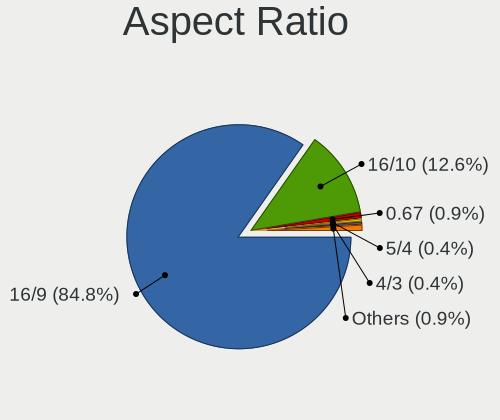

| Ratio | Notebooks | Percent |
|-------|-----------|---------|
| 16/9  | 189       | 84.75%  |
| 16/10 | 28        | 12.56%  |
| 0.67  | 2         | 0.9%    |
| 5/4   | 1         | 0.45%   |
| 4/3   | 1         | 0.45%   |
| 3/2   | 1         | 0.45%   |
| 21/9  | 1         | 0.45%   |

Monitor Area
------------

Area in inch

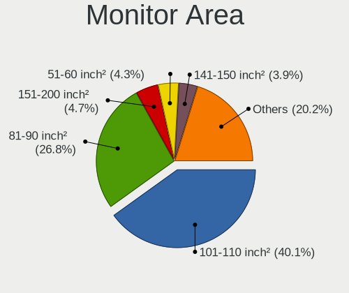

| Area in inch | Notebooks | Percent |
|----------------|-----------|---------|
| 101-110        | 103       | 40.08%  |
| 81-90          | 69        | 26.85%  |
| 151-200        | 12        | 4.67%   |
| 51-60          | 11        | 4.28%   |
| 141-150        | 10        | 3.89%   |
| 71-80          | 8         | 3.11%   |
| 201-250        | 8         | 3.11%   |
| 61-70          | 7         | 2.72%   |
| 121-130        | 6         | 2.33%   |
| 351-500        | 5         | 1.95%   |
| 111-120        | 5         | 1.95%   |
| More than 1000 | 3         | 1.17%   |
| 41-50          | 3         | 1.17%   |
| 1-40           | 2         | 0.78%   |
| 301-350        | 2         | 0.78%   |
| 131-140        | 1         | 0.39%   |
| 501-1000       | 1         | 0.39%   |
| 91-100         | 1         | 0.39%   |

Pixel Density
-------------

Pixels per inch

| Density       | Notebooks | Percent |
|---------------|-----------|---------|
| 101-120       | 109       | 43.43%  |
| 121-160       | 84        | 33.47%  |
| 51-100        | 37        | 14.74%  |
| 161-240       | 16        | 6.37%   |
| 1-50          | 4         | 1.59%   |
| More than 240 | 1         | 0.4%    |

Multiple Monitors
-----------------

Total monitors connected

| Total | Notebooks | Percent |
|-------|-----------|---------|
| 1     | 184       | 80.7%   |
| 2     | 39        | 17.11%  |
| 0     | 4         | 1.75%   |
| 3     | 1         | 0.44%   |

Network
-------

Net Controller Vendor
---------------------

Controller vendors

| Vendor                          | Notebooks | Percent |
|---------------------------------|-----------|---------|
| Realtek Semiconductor           | 143       | 39.61%  |
| Intel                           | 73        | 20.22%  |
| Qualcomm Atheros                | 63        | 17.45%  |
| Broadcom                        | 32        | 8.86%   |
| MediaTek                        | 10        | 2.77%   |
| TP-Link                         | 9         | 2.49%   |
| Ralink                          | 6         | 1.66%   |
| Marvell Technology Group        | 5         | 1.39%   |
| Broadcom Limited                | 5         | 1.39%   |
| ASIX Electronics                | 4         | 1.11%   |
| Xiaomi                          | 2         | 0.55%   |
| Samsung Electronics             | 2         | 0.55%   |
| Ralink Technology               | 1         | 0.28%   |
| Qualcomm Atheros Communications | 1         | 0.28%   |
| Qualcomm                        | 1         | 0.28%   |
| OPPO Electronics                | 1         | 0.28%   |
| Nvidia                          | 1         | 0.28%   |
| NetGear                         | 1         | 0.28%   |
| Hewlett-Packard                 | 1         | 0.28%   |

Net Controller Model
--------------------

Controller models

| Model                                                                   | Notebooks | Percent |
|-------------------------------------------------------------------------|-----------|---------|
| Realtek RTL8111/8168/8211/8411 PCI Express Gigabit Ethernet Controller  | 73        | 17.22%  |
| Realtek RTL810xE PCI Express Fast Ethernet controller                   | 41        | 9.67%   |
| Realtek RTL8821CE 802.11ac PCIe Wireless Network Adapter                | 16        | 3.77%   |
| Qualcomm Atheros QCA9377 802.11ac Wireless Network Adapter              | 16        | 3.77%   |
| Qualcomm Atheros AR9485 Wireless Network Adapter                        | 12        | 2.83%   |
| Qualcomm Atheros QCA6174 802.11ac Wireless Network Adapter              | 10        | 2.36%   |
| Realtek RTL8822CE 802.11ac PCIe Wireless Network Adapter                | 8         | 1.89%   |
| Qualcomm Atheros QCA9565 / AR9565 Wireless Network Adapter              | 8         | 1.89%   |
| Broadcom BCM4313 802.11bgn Wireless Network Adapter                     | 8         | 1.89%   |
| Realtek RTL8723DE Wireless Network Adapter                              | 7         | 1.65%   |
| Intel Wireless 3160                                                     | 7         | 1.65%   |
| Intel Wireless 8265 / 8275                                              | 6         | 1.42%   |
| Intel Wireless 7260                                                     | 6         | 1.42%   |
| Intel Wi-Fi 6 AX201                                                     | 6         | 1.42%   |
| MediaTek MT7921 802.11ax PCI Express Wireless Network Adapter           | 5         | 1.18%   |
| Realtek RTL8821AE 802.11ac PCIe Wireless Network Adapter                | 4         | 0.94%   |
| Realtek RTL8153 Gigabit Ethernet Adapter                                | 4         | 0.94%   |
| Realtek RTL8152 Fast Ethernet Adapter                                   | 4         | 0.94%   |
| Qualcomm Atheros AR9285 Wireless Network Adapter (PCI-Express)          | 4         | 0.94%   |
| Intel Wireless 7265                                                     | 4         | 0.94%   |
| Intel 82579LM Gigabit Network Connection (Lewisville)                   | 4         | 0.94%   |
| Broadcom BCM43602 802.11ac Wireless LAN SoC                             | 4         | 0.94%   |
| Broadcom BCM43142 802.11b/g/n                                           | 4         | 0.94%   |
| ASIX AX88179 Gigabit Ethernet                                           | 4         | 0.94%   |
| TP-Link TL-WN823N v2/v3 [Realtek RTL8192EU]                             | 3         | 0.71%   |
| Realtek RTL8723BE PCIe Wireless Network Adapter                         | 3         | 0.71%   |
| Realtek RTL8188EUS 802.11n Wireless Network Adapter                     | 3         | 0.71%   |
| Realtek RTL8188EE Wireless Network Adapter                              | 3         | 0.71%   |
| Ralink RT3290 Wireless 802.11n 1T/1R PCIe                               | 3         | 0.71%   |
| Qualcomm Atheros AR242x / AR542x Wireless Network Adapter (PCI-Express) | 3         | 0.71%   |
| MediaTek Wi-Fi 6E MT7902 Wireless Network Adapter                       | 3         | 0.71%   |
| Intel Wi-Fi 6 AX200                                                     | 3         | 0.71%   |
| Intel PRO/Wireless 3945ABG [Golan] Network Connection                   | 3         | 0.71%   |
| Intel Cannon Lake PCH CNVi WiFi                                         | 3         | 0.71%   |
| Broadcom NetXtreme BCM57765 Gigabit Ethernet PCIe                       | 3         | 0.71%   |
| Broadcom NetLink BCM5906M Fast Ethernet PCI Express                     | 3         | 0.71%   |
| Broadcom BCM4331 802.11a/b/g/n                                          | 3         | 0.71%   |
| Xiaomi Mi/Redmi series (RNDIS)                                          | 2         | 0.47%   |
| TP-Link TL-WN821N v5/v6 [RTL8192EU]                                     | 2         | 0.47%   |
| TP-Link 802.11ac WLAN Adapter                                           | 2         | 0.47%   |

Wireless Vendor
---------------

Wireless vendors

| Vendor                          | Notebooks | Percent |
|---------------------------------|-----------|---------|
| Intel                           | 71        | 30.34%  |
| Qualcomm Atheros                | 56        | 23.93%  |
| Realtek Semiconductor           | 51        | 21.79%  |
| Broadcom                        | 27        | 11.54%  |
| MediaTek                        | 9         | 3.85%   |
| TP-Link                         | 8         | 3.42%   |
| Ralink                          | 6         | 2.56%   |
| Broadcom Limited                | 3         | 1.28%   |
| Ralink Technology               | 1         | 0.43%   |
| Qualcomm Atheros Communications | 1         | 0.43%   |
| NetGear                         | 1         | 0.43%   |

Wireless Model
--------------

Wireless models

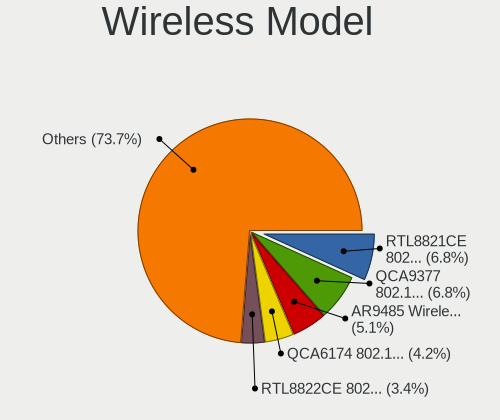

| Model                                                                   | Notebooks | Percent |
|-------------------------------------------------------------------------|-----------|---------|
| Realtek RTL8821CE 802.11ac PCIe Wireless Network Adapter                | 16        | 6.78%   |
| Qualcomm Atheros QCA9377 802.11ac Wireless Network Adapter              | 16        | 6.78%   |
| Qualcomm Atheros AR9485 Wireless Network Adapter                        | 12        | 5.08%   |
| Qualcomm Atheros QCA6174 802.11ac Wireless Network Adapter              | 10        | 4.24%   |
| Realtek RTL8822CE 802.11ac PCIe Wireless Network Adapter                | 8         | 3.39%   |
| Qualcomm Atheros QCA9565 / AR9565 Wireless Network Adapter              | 8         | 3.39%   |
| Broadcom BCM4313 802.11bgn Wireless Network Adapter                     | 8         | 3.39%   |
| Realtek RTL8723DE Wireless Network Adapter                              | 7         | 2.97%   |
| Intel Wireless 3160                                                     | 7         | 2.97%   |
| Intel Wireless 8265 / 8275                                              | 6         | 2.54%   |
| Intel Wireless 7260                                                     | 6         | 2.54%   |
| Intel Wi-Fi 6 AX201                                                     | 6         | 2.54%   |
| MediaTek MT7921 802.11ax PCI Express Wireless Network Adapter           | 5         | 2.12%   |
| Realtek RTL8821AE 802.11ac PCIe Wireless Network Adapter                | 4         | 1.69%   |
| Qualcomm Atheros AR9285 Wireless Network Adapter (PCI-Express)          | 4         | 1.69%   |
| Intel Wireless 7265                                                     | 4         | 1.69%   |
| Broadcom BCM43602 802.11ac Wireless LAN SoC                             | 4         | 1.69%   |
| Broadcom BCM43142 802.11b/g/n                                           | 4         | 1.69%   |
| TP-Link TL-WN823N v2/v3 [Realtek RTL8192EU]                             | 3         | 1.27%   |
| Realtek RTL8723BE PCIe Wireless Network Adapter                         | 3         | 1.27%   |
| Realtek RTL8188EUS 802.11n Wireless Network Adapter                     | 3         | 1.27%   |
| Realtek RTL8188EE Wireless Network Adapter                              | 3         | 1.27%   |
| Ralink RT3290 Wireless 802.11n 1T/1R PCIe                               | 3         | 1.27%   |
| Qualcomm Atheros AR242x / AR542x Wireless Network Adapter (PCI-Express) | 3         | 1.27%   |
| MediaTek Wi-Fi 6E MT7902 Wireless Network Adapter                       | 3         | 1.27%   |
| Intel Wi-Fi 6 AX200                                                     | 3         | 1.27%   |
| Intel PRO/Wireless 3945ABG [Golan] Network Connection                   | 3         | 1.27%   |
| Intel Cannon Lake PCH CNVi WiFi                                         | 3         | 1.27%   |
| Broadcom BCM4331 802.11a/b/g/n                                          | 3         | 1.27%   |
| TP-Link TL-WN821N v5/v6 [RTL8192EU]                                     | 2         | 0.85%   |
| TP-Link 802.11ac WLAN Adapter                                           | 2         | 0.85%   |
| Realtek RTL8822BE 802.11a/b/g/n/ac WiFi adapter                         | 2         | 0.85%   |
| Realtek RTL8723BU 802.11b/g/n WLAN Adapter                              | 2         | 0.85%   |
| Qualcomm Atheros AR9462 Wireless Network Adapter                        | 2         | 0.85%   |
| Intel Wireless 8260                                                     | 2         | 0.85%   |
| Intel WiFi Link 5100                                                    | 2         | 0.85%   |
| Intel Wi-Fi 5(802.11ac) Wireless-AC 9x6x [Thunder Peak]                 | 2         | 0.85%   |
| Intel PRO/Wireless 4965 AG or AGN [Kedron] Network Connection           | 2         | 0.85%   |
| Intel Dual Band Wireless-AC 3165 Plus Bluetooth                         | 2         | 0.85%   |
| Intel Comet Lake PCH-LP CNVi WiFi                                       | 2         | 0.85%   |

Ethernet Vendor
---------------

Ethernet vendors

| Vendor                   | Notebooks | Percent |
|--------------------------|-----------|---------|
| Realtek Semiconductor    | 125       | 68.68%  |
| Qualcomm Atheros         | 13        | 7.14%   |
| Intel                    | 13        | 7.14%   |
| Broadcom                 | 13        | 7.14%   |
| Marvell Technology Group | 5         | 2.75%   |
| ASIX Electronics         | 4         | 2.2%    |
| Xiaomi                   | 2         | 1.1%    |
| Broadcom Limited         | 2         | 1.1%    |
| TP-Link                  | 1         | 0.55%   |
| Qualcomm                 | 1         | 0.55%   |
| OPPO Electronics         | 1         | 0.55%   |
| Nvidia                   | 1         | 0.55%   |
| MediaTek                 | 1         | 0.55%   |

Ethernet Model
--------------

Ethernet models

| Model                                                                  | Notebooks | Percent |
|------------------------------------------------------------------------|-----------|---------|
| Realtek RTL8111/8168/8211/8411 PCI Express Gigabit Ethernet Controller | 73        | 39.67%  |
| Realtek RTL810xE PCI Express Fast Ethernet controller                  | 41        | 22.28%  |
| Realtek RTL8153 Gigabit Ethernet Adapter                               | 4         | 2.17%   |
| Realtek RTL8152 Fast Ethernet Adapter                                  | 4         | 2.17%   |
| Intel 82579LM Gigabit Network Connection (Lewisville)                  | 4         | 2.17%   |
| ASIX AX88179 Gigabit Ethernet                                          | 4         | 2.17%   |
| Broadcom NetXtreme BCM57765 Gigabit Ethernet PCIe                      | 3         | 1.63%   |
| Broadcom NetLink BCM5906M Fast Ethernet PCI Express                    | 3         | 1.63%   |
| Xiaomi Mi/Redmi series (RNDIS)                                         | 2         | 1.09%   |
| Realtek Killer E3000 2.5GbE Controller                                 | 2         | 1.09%   |
| Qualcomm Atheros QCA8171 Gigabit Ethernet                              | 2         | 1.09%   |
| Qualcomm Atheros Killer E2500 Gigabit Ethernet Controller              | 2         | 1.09%   |
| Qualcomm Atheros Killer E2400 Gigabit Ethernet Controller              | 2         | 1.09%   |
| Qualcomm Atheros AR8162 Fast Ethernet                                  | 2         | 1.09%   |
| Qualcomm Atheros AR8151 v2.0 Gigabit Ethernet                          | 2         | 1.09%   |
| Broadcom NetLink BCM57785 Gigabit Ethernet PCIe                        | 2         | 1.09%   |
| TP-Link UE300 10/100/1000 LAN (ethernet mode) [Realtek RTL8153]        | 1         | 0.54%   |
| Realtek RTL8852BE PCIe 802.11ax Wireless Network Controller            | 1         | 0.54%   |
| Realtek RTL8125 2.5GbE Controller                                      | 1         | 0.54%   |
| Qualcomm Atheros QCA8172 Fast Ethernet                                 | 1         | 0.54%   |
| Qualcomm Atheros AR8161 Gigabit Ethernet                               | 1         | 0.54%   |
| Qualcomm Atheros AR8152 v2.0 Fast Ethernet                             | 1         | 0.54%   |
| Qualcomm Airtel 4G                                                     | 1         | 0.54%   |
| OPPO OnePlus Nord 4                                                    | 1         | 0.54%   |
| Nvidia MCP79 Ethernet                                                  | 1         | 0.54%   |
| MediaTek MT7922 802.11ax PCI Express Wireless Network Adapter          | 1         | 0.54%   |
| Marvell Group 88E8057 PCI-E Gigabit Ethernet Controller                | 1         | 0.54%   |
| Marvell Group 88E8053 PCI-E Gigabit Ethernet Controller                | 1         | 0.54%   |
| Marvell Group 88E8040T PCI-E Fast Ethernet Controller                  | 1         | 0.54%   |
| Marvell Group 88E8040 PCI-E Fast Ethernet Controller                   | 1         | 0.54%   |
| Marvell Group 88E8039 PCI-E Fast Ethernet Controller                   | 1         | 0.54%   |
| Intel WiMAX Connection 2400m                                           | 1         | 0.54%   |
| Intel Ethernet Connection I219-LM                                      | 1         | 0.54%   |
| Intel Ethernet Connection I217-LM                                      | 1         | 0.54%   |
| Intel Ethernet Connection (4) I219-V                                   | 1         | 0.54%   |
| Intel Ethernet Connection (4) I219-LM                                  | 1         | 0.54%   |
| Intel Ethernet Connection (17) I219-V                                  | 1         | 0.54%   |
| Intel Ethernet Connection (13) I219-V                                  | 1         | 0.54%   |
| Intel 82579V Gigabit Network Connection                                | 1         | 0.54%   |
| Intel 82577LM Gigabit Network Connection                               | 1         | 0.54%   |

Net Controller Kind
-------------------

Ethernet, WiFi or modem

| Kind     | Notebooks | Percent |
|----------|-----------|---------|
| WiFi     | 221       | 54.84%  |
| Ethernet | 178       | 44.17%  |
| Modem    | 4         | 0.99%   |

Used Controller
---------------

Currently used network controller

| Kind     | Notebooks | Percent |
|----------|-----------|---------|
| WiFi     | 173       | 72.38%  |
| Ethernet | 66        | 27.62%  |

NICs
----

Total network controllers on board

| Total | Notebooks | Percent |
|-------|-----------|---------|
| 2     | 162       | 72.32%  |
| 1     | 60        | 26.79%  |
| 0     | 2         | 0.89%   |

IPv6
----

IPv6 vs IPv4

| Used | Notebooks | Percent |
|------|-----------|---------|
| No   | 182       | 80.53%  |
| Yes  | 44        | 19.47%  |

Bluetooth
---------

Bluetooth Vendor
----------------

Controller vendors

| Vendor                          | Notebooks | Percent |
|---------------------------------|-----------|---------|
| Intel                           | 53        | 29.28%  |
| Realtek Semiconductor           | 30        | 16.57%  |
| Qualcomm Atheros Communications | 28        | 15.47%  |
| IMC Networks                    | 13        | 7.18%   |
| Lite-On Technology              | 12        | 6.63%   |
| Foxconn / Hon Hai               | 9         | 4.97%   |
| Broadcom                        | 9         | 4.97%   |
| Apple                           | 9         | 4.97%   |
| Cambridge Silicon Radio         | 4         | 2.21%   |
| Toshiba                         | 3         | 1.66%   |
| Ralink                          | 3         | 1.66%   |
| Ralink Technology               | 2         | 1.1%    |
| Dell                            | 2         | 1.1%    |
| Realtek                         | 1         | 0.55%   |
| Hewlett-Packard                 | 1         | 0.55%   |
| Foxconn International           | 1         | 0.55%   |
| Alps Electric                   | 1         | 0.55%   |

Bluetooth Model
---------------

Controller models

| Model                                               | Notebooks | Percent |
|-----------------------------------------------------|-----------|---------|
| Intel Bluetooth wireless interface                  | 27        | 14.92%  |
| Qualcomm Atheros  Bluetooth Device                  | 19        | 10.5%   |
| Realtek  Bluetooth 4.2 Adapter                      | 14        | 7.73%   |
| Realtek Bluetooth Radio                             | 13        | 7.18%   |
| Intel AX201 Bluetooth                               | 9         | 4.97%   |
| IMC Networks Bluetooth Radio                        | 8         | 4.42%   |
| Intel Bluetooth 9460/9560 Jefferson Peak (JfP)      | 6         | 3.31%   |
| Qualcomm Atheros QCA61x4 Bluetooth 4.0              | 4         | 2.21%   |
| Lite-On Wireless_Device                             | 4         | 2.21%   |
| Lite-On Bluetooth Device                            | 4         | 2.21%   |
| IMC Networks Wireless_Device                        | 4         | 2.21%   |
| Foxconn / Hon Hai Bluetooth Device                  | 4         | 2.21%   |
| Cambridge Silicon Radio Bluetooth Dongle (HCI mode) | 4         | 2.21%   |
| Apple Bluetooth USB Host Controller                 | 4         | 2.21%   |
| Apple Bluetooth Host Controller                     | 4         | 2.21%   |
| Toshiba Bluetooth Device                            | 3         | 1.66%   |
| Realtek RTL8821A Bluetooth                          | 3         | 1.66%   |
| Ralink RT3290 Bluetooth                             | 3         | 1.66%   |
| Qualcomm Atheros AR3011 Bluetooth                   | 3         | 1.66%   |
| Intel AX200 Bluetooth                               | 3         | 1.66%   |
| Lite-On Bluetooth Radio                             | 2         | 1.1%    |
| Intel Wireless-AC 9260 Bluetooth Adapter            | 2         | 1.1%    |
| Intel Centrino Bluetooth Wireless Transceiver       | 2         | 1.1%    |
| Intel AX211 Bluetooth                               | 2         | 1.1%    |
| Foxconn / Hon Hai Wireless_Device                   | 2         | 1.1%    |
| Foxconn / Hon Hai Bluetooth USB Host Controller     | 2         | 1.1%    |
| Dell DW375 Bluetooth Module                         | 2         | 1.1%    |
| Broadcom BCM43142A0 Bluetooth 4.0                   | 2         | 1.1%    |
| Broadcom BCM2070 Bluetooth 2.1 + EDR                | 2         | 1.1%    |
| Realtek Bluetooth Radio                             | 1         | 0.55%   |
| Ralink Motorola BC4 Bluetooth 3.0+HS Adapter        | 1         | 0.55%   |
| Ralink CSR BS8510                                   | 1         | 0.55%   |
| Qualcomm Atheros AR9462 Bluetooth                   | 1         | 0.55%   |
| Qualcomm Atheros AR3012 Bluetooth 4.0               | 1         | 0.55%   |
| Lite-On Broadcom BCM43142A0 Bluetooth Device        | 1         | 0.55%   |
| Lite-On Atheros AR3012 Bluetooth                    | 1         | 0.55%   |
| Intel Wireless-AC 3168 Bluetooth                    | 1         | 0.55%   |
| Intel Centrino Advanced-N 6230 Bluetooth adapter    | 1         | 0.55%   |
| IMC Networks BCM20702A0                             | 1         | 0.55%   |
| HP Bluetooth 2.0 Interface [Broadcom BCM2045]       | 1         | 0.55%   |

Sound
-----

Sound Vendor
------------

Sound card vendors

| Vendor              | Notebooks | Percent |
|---------------------|-----------|---------|
| Intel               | 170       | 67.19%  |
| AMD                 | 54        | 21.34%  |
| Nvidia              | 23        | 9.09%   |
| Sony                | 1         | 0.4%    |
| GN Netcom           | 1         | 0.4%    |
| Focusrite-Novation  | 1         | 0.4%    |
| C-Media Electronics | 1         | 0.4%    |
| Audient             | 1         | 0.4%    |
| Apple               | 1         | 0.4%    |

Sound Model
-----------

Sound card models

| Model                                                                                             | Notebooks | Percent |
|---------------------------------------------------------------------------------------------------|-----------|---------|
| AMD Family 17h/19h/1ah HD Audio Controller                                                        | 29        | 8.73%   |
| Intel Sunrise Point-LP HD Audio                                                                   | 27        | 8.13%   |
| Intel 7 Series/C216 Chipset Family High Definition Audio Controller                               | 21        | 6.33%   |
| AMD Raven/Raven2/Fenghuang HDMI/DP Audio Controller                                               | 16        | 4.82%   |
| Intel Wildcat Point-LP High Definition Audio Controller                                           | 12        | 3.61%   |
| Intel Haswell-ULT HD Audio Controller                                                             | 12        | 3.61%   |
| Intel Broadwell-U Audio Controller                                                                | 12        | 3.61%   |
| Intel 8 Series HD Audio Controller                                                                | 12        | 3.61%   |
| Intel 6 Series/C200 Series Chipset Family High Definition Audio Controller                        | 12        | 3.61%   |
| AMD Renoir Radeon High Definition Audio Controller                                                | 10        | 3.01%   |
| AMD Family 15h (Models 60h-6fh) Audio Controller                                                  | 10        | 3.01%   |
| Intel Tiger Lake-LP Smart Sound Technology Audio Controller                                       | 9         | 2.71%   |
| Intel 82801H (ICH8 Family) HD Audio Controller                                                    | 8         | 2.41%   |
| AMD High Definition Audio Controller                                                              | 8         | 2.41%   |
| AMD FCH Azalia Controller                                                                         | 8         | 2.41%   |
| Intel NM10/ICH7 Family High Definition Audio Controller                                           | 7         | 2.11%   |
| AMD Kabini HDMI/DP Audio                                                                          | 7         | 2.11%   |
| Intel Cannon Lake PCH cAVS                                                                        | 6         | 1.81%   |
| Intel 8 Series/C220 Series Chipset High Definition Audio Controller                               | 6         | 1.81%   |
| AMD Wrestler HDMI Audio                                                                           | 6         | 1.81%   |
| Intel Xeon E3-1200 v3/4th Gen Core Processor HD Audio Controller                                  | 5         | 1.51%   |
| Intel Ice Lake-LP Smart Sound Technology Audio Controller                                         | 5         | 1.51%   |
| Intel Celeron/Pentium Silver Processor High Definition Audio                                      | 5         | 1.51%   |
| Intel Cannon Point-LP High Definition Audio Controller                                            | 5         | 1.51%   |
| Intel Atom/Celeron/Pentium Processor x5-E8000/J3xxx/N3xxx Series High Definition Audio Controller | 5         | 1.51%   |
| Intel 82801I (ICH9 Family) HD Audio Controller                                                    | 5         | 1.51%   |
| Nvidia TU107 GeForce GTX 1650 High Definition Audio Controller                                    | 4         | 1.2%    |
| Intel Raptor Lake-P/U/H cAVS                                                                      | 4         | 1.2%    |
| AMD Rembrandt Radeon High Definition Audio Controller                                             | 4         | 1.2%    |
| Nvidia GP107GL High Definition Audio Controller                                                   | 3         | 0.9%    |
| Nvidia GA107 High Definition Audio Controller                                                     | 3         | 0.9%    |
| Intel Comet Lake PCH-LP cAVS                                                                      | 3         | 0.9%    |
| Intel Atom Processor Z36xxx/Z37xxx Series High Definition Audio Controller                        | 3         | 0.9%    |
| Intel Alder Lake PCH-P High Definition Audio Controller                                           | 3         | 0.9%    |
| Intel 5 Series/3400 Series Chipset High Definition Audio                                          | 3         | 0.9%    |
| Nvidia TU116 High Definition Audio Controller                                                     | 2         | 0.6%    |
| Nvidia GK208 HDMI/DP Audio Controller                                                             | 2         | 0.6%    |
| Intel USB PnP Sound Device                                                                        | 2         | 0.6%    |
| Intel Comet Lake PCH cAVS                                                                         | 2         | 0.6%    |
| Intel CM238 HD Audio Controller                                                                   | 2         | 0.6%    |

Memory
------

Memory Vendor
-------------

Memory module vendors

| Vendor              | Notebooks | Percent |
|---------------------|-----------|---------|
| Samsung Electronics | 48        | 30.97%  |
| SK hynix            | 34        | 21.94%  |
| Micron Technology   | 19        | 12.26%  |
| Kingston            | 17        | 10.97%  |
| A-DATA Technology   | 7         | 4.52%   |
| Unknown             | 6         | 3.87%   |
| Ramaxel Technology  | 6         | 3.87%   |
| Crucial             | 5         | 3.23%   |
| Nanya Technology    | 3         | 1.94%   |
| Unknown (ABCD)      | 2         | 1.29%   |
| Avant               | 2         | 1.29%   |
| Team                | 1         | 0.65%   |
| Hikvision           | 1         | 0.65%   |
| GOODRAM             | 1         | 0.65%   |
| Elpida              | 1         | 0.65%   |
| Corsair             | 1         | 0.65%   |
| Unknown             | 1         | 0.65%   |

Memory Model
------------

Memory module models

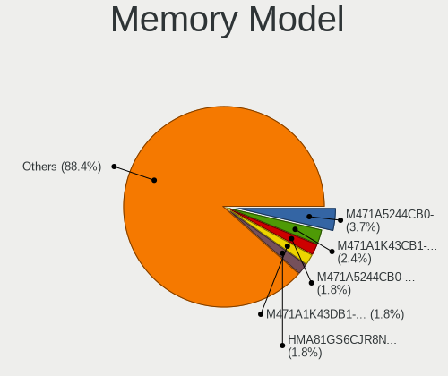

| Model                                                            | Notebooks | Percent |
|------------------------------------------------------------------|-----------|---------|
| Samsung RAM M471A5244CB0-CTD 4GB SODIMM DDR4 3266MT/s            | 6         | 3.66%   |
| Samsung RAM M471A1K43CB1-CTD 8GB SODIMM DDR4 2667MT/s            | 4         | 2.44%   |
| SK hynix RAM HMA81GS6CJR8N-VK 8GB SODIMM DDR4 2667MT/s           | 3         | 1.83%   |
| SK hynix RAM HMA81GS6AFR8N-UH 8GB SODIMM DDR4 2667MT/s           | 3         | 1.83%   |
| Samsung RAM M471A5244CB0-CRC 4GB SODIMM DDR4 2667MT/s            | 3         | 1.83%   |
| Samsung RAM M471A1K43DB1-CTD 8GB SODIMM DDR4 2667MT/s            | 3         | 1.83%   |
| Micron RAM 4ATF1G64HZ-3G2E1 8GB SODIMM DDR4 3200MT/s             | 3         | 1.83%   |
| Unknown (ABCD) RAM 123456789012345678 2GB SODIMM LPDDR3 2400MT/s | 2         | 1.22%   |
| SK hynix RAM HMT351S6EFR8A-PB 4GB SODIMM DDR3 1600MT/s           | 2         | 1.22%   |
| SK hynix RAM HMT351S6CFR8C-PB 4GB SODIMM DDR3 1600MT/s           | 2         | 1.22%   |
| SK hynix RAM HMA851S6AFR6N-UH 4GB SODIMM DDR4 2667MT/s           | 2         | 1.22%   |
| SK hynix RAM HMA81GS6DJR8N-XN 8GB SODIMM DDR4 3200MT/s           | 2         | 1.22%   |
| Samsung RAM M471B5773DH0-CH9 2GB SODIMM DDR3 1600MT/s            | 2         | 1.22%   |
| Samsung RAM M471B5173QH0-YK0 4GB SODIMM DDR3 1600MT/s            | 2         | 1.22%   |
| Samsung RAM M471B1G73DB0-YK0 8GB SODIMM DDR3 1600MT/s            | 2         | 1.22%   |
| Samsung RAM M471A2G44BM0-CWE 16GB SODIMM DDR4 3200MT/s           | 2         | 1.22%   |
| Samsung RAM M471A1K43CB1-CRC 8GB SODIMM DDR4 2667MT/s            | 2         | 1.22%   |
| Ramaxel RAM RMT3020EC58E9F1333 4GB SODIMM DDR3 4199MT/s          | 2         | 1.22%   |
| Ramaxel RAM RMSA3270ME86H9F-2666 4GB SODIMM DDR4 2667MT/s        | 2         | 1.22%   |
| Nanya RAM NT4GC64B8HB0NS-CG 4GB SODIMM DDR3 1334MT/s             | 2         | 1.22%   |
| Micron RAM 8KTF51264HDZ-1G6E1 4GB SODIMM DDR3 1600MT/s           | 2         | 1.22%   |
| Kingston RAM KHX2666C15S4/16G 16GB SODIMM DDR4 2667MT/s          | 2         | 1.22%   |
| Kingston RAM 99U5428-018.A00LF 8GB SODIMM DDR3 1600MT/s          | 2         | 1.22%   |
| Kingston RAM 9905744-077.A00G 16GB SODIMM DDR4 3200MT/s          | 2         | 1.22%   |
| Unknown RAM Module 8GB SODIMM DDR4 2667MT/s                      | 1         | 0.61%   |
| Unknown RAM Module 2GB SODIMM DDR2 533MT/s                       | 1         | 0.61%   |
| Unknown RAM Module 2048MB SODIMM 800MT/s                         | 1         | 0.61%   |
| Unknown RAM Module 1GB SODIMM DDR2 533MT/s                       | 1         | 0.61%   |
| Unknown RAM Module 1GB SODIMM DDR                                | 1         | 0.61%   |
| Unknown RAM Module 1024MB SODIMM DDR2 667MT/s                    | 1         | 0.61%   |
| Unknown RAM Module 1024MB SODIMM DDR2                            | 1         | 0.61%   |
| Unknown RAM Module 1024MB SODIMM 800MT/s                         | 1         | 0.61%   |
| Team RAM TEAMGROUP-SD4-2400 16GB SODIMM DDR4 8400MT/s            | 1         | 0.61%   |
| SK hynix RAM Module 4GB SODIMM DDR3 1867MT/s                     | 1         | 0.61%   |
| SK hynix RAM HMT451S6MFR8A-PB 4GB SODIMM DDR3 1600MT/s           | 1         | 0.61%   |
| SK hynix RAM HMT451S6DFR8A-PB 4GB SODIMM DDR3 1600MT/s           | 1         | 0.61%   |
| SK hynix RAM HMT451S6AFR8A-PB 4GB SODIMM DDR3 1600MT/s           | 1         | 0.61%   |
| SK hynix RAM HMT425S6AFR6A-PB 2GB SODIMM DDR3 1600MT/s           | 1         | 0.61%   |
| SK hynix RAM HMT425S6AFR6A-PB 2GB Chip DDR3 1600MT/s             | 1         | 0.61%   |
| SK hynix RAM HMT41GS6AFR8A-PB 8GB SODIMM DDR3 2667MT/s           | 1         | 0.61%   |

Memory Kind
-----------

Memory module kinds

| Kind    | Notebooks | Percent |
|---------|-----------|---------|
| DDR4    | 68        | 55.74%  |
| DDR3    | 35        | 28.69%  |
| LPDDR4  | 6         | 4.92%   |
| DDR2    | 4         | 3.28%   |
| LPDDR3  | 3         | 2.46%   |
| SDRAM   | 2         | 1.64%   |
| DDR5    | 2         | 1.64%   |
| DDR     | 1         | 0.82%   |
| Unknown | 1         | 0.82%   |

Memory Form Factor
------------------

Physical design of the memory module

| Name         | Notebooks | Percent |
|--------------|-----------|---------|
| SODIMM       | 111       | 90.98%  |
| Row Of Chips | 9         | 7.38%   |
| Chip         | 1         | 0.82%   |
| Unknown      | 1         | 0.82%   |

Memory Size
-----------

Memory module size

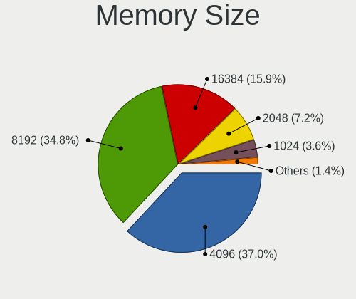

| Size  | Notebooks | Percent |
|-------|-----------|---------|
| 4096  | 51        | 36.96%  |
| 8192  | 48        | 34.78%  |
| 16384 | 22        | 15.94%  |
| 2048  | 10        | 7.25%   |
| 1024  | 5         | 3.62%   |
| 32768 | 2         | 1.45%   |

Memory Speed
------------

Memory module speed

| Speed   | Notebooks | Percent |
|---------|-----------|---------|
| 2667    | 41        | 29.29%  |
| 1600    | 31        | 22.14%  |
| 3200    | 21        | 15%     |
| 2400    | 10        | 7.14%   |
| 3266    | 6         | 4.29%   |
| 1334    | 5         | 3.57%   |
| 2133    | 4         | 2.86%   |
| 1867    | 3         | 2.14%   |
| 4199    | 2         | 1.43%   |
| 667     | 2         | 1.43%   |
| Unknown | 2         | 1.43%   |
| 8400    | 1         | 0.71%   |
| 5600    | 1         | 0.71%   |
| 4800    | 1         | 0.71%   |
| 4267    | 1         | 0.71%   |
| 3733    | 1         | 0.71%   |
| 1776    | 1         | 0.71%   |
| 1333    | 1         | 0.71%   |
| 1067    | 1         | 0.71%   |
| 1066    | 1         | 0.71%   |
| 975     | 1         | 0.71%   |
| 933     | 1         | 0.71%   |
| 800     | 1         | 0.71%   |
| 533     | 1         | 0.71%   |

Printers & scanners
-------------------

Printer Vendor
--------------

Printer device vendors

| Vendor              | Notebooks | Percent |
|---------------------|-----------|---------|
| Seiko Epson         | 2         | 50%     |
| Prolific Technology | 1         | 25%     |
| Hewlett-Packard     | 1         | 25%     |

Printer Model
-------------

Printer device models

| Model                           | Notebooks | Percent |
|---------------------------------|-----------|---------|
| Seiko Epson L382 Series         | 1         | 25%     |
| Seiko Epson L3110 Series        | 1         | 25%     |
| Prolific PL2305 Parallel Port   | 1         | 25%     |
| HP Ink Tank Wireless 410 series | 1         | 25%     |

Scanner Vendor
--------------

Scanner device vendors

Zero info for selected period =(

Scanner Model
-------------

Scanner device models

Zero info for selected period =(

Camera
------

Camera Vendor
-------------

Camera device vendors

| Vendor                                 | Notebooks | Percent |
|----------------------------------------|-----------|---------|
| Chicony Electronics                    | 52        | 25.87%  |
| IMC Networks                           | 23        | 11.44%  |
| Quanta                                 | 15        | 7.46%   |
| Realtek Semiconductor                  | 14        | 6.97%   |
| Microdia                               | 14        | 6.97%   |
| Suyin                                  | 11        | 5.47%   |
| Cheng Uei Precision Industry (Foxlink) | 10        | 4.98%   |
| Sunplus Innovation Technology          | 8         | 3.98%   |
| Syntek                                 | 7         | 3.48%   |
| Bison Electronics                      | 6         | 2.99%   |
| Apple                                  | 6         | 2.99%   |
| Lite-On Technology                     | 5         | 2.49%   |
| Luxvisions Innotech Limited            | 4         | 1.99%   |
| Silicon Motion                         | 3         | 1.49%   |
| Ricoh                                  | 3         | 1.49%   |
| Sonix Technology                       | 2         | 1%      |
| OmniVision Technologies                | 2         | 1%      |
| icSpring                               | 2         | 1%      |
| Alcor Micro                            | 2         | 1%      |
| Acer                                   | 2         | 1%      |
| Z-Star Microelectronics                | 1         | 0.5%    |
| Trust                                  | 1         | 0.5%    |
| ShineTech                              | 1         | 0.5%    |
| Shine-optics                           | 1         | 0.5%    |
| Samsung Electronics                    | 1         | 0.5%    |
| Lenovo                                 | 1         | 0.5%    |
| Importek                               | 1         | 0.5%    |
| Generalplus Technology                 | 1         | 0.5%    |
| Foxconn / Hon Hai                      | 1         | 0.5%    |
| ALi                                    | 1         | 0.5%    |

Camera Model
------------

Camera device models

| Model                                                   | Notebooks | Percent |
|---------------------------------------------------------|-----------|---------|
| Microdia Integrated_Webcam_HD                           | 9         | 4.48%   |
| Chicony Integrated Camera                               | 9         | 4.48%   |
| IMC Networks USB2.0 HD UVC WebCam                       | 7         | 3.48%   |
| Chicony HP Truevision HD                                | 6         | 2.99%   |
| Realtek Integrated_Webcam_HD                            | 5         | 2.49%   |
| IMC Networks Integrated Camera                          | 5         | 2.49%   |
| Chicony TOSHIBA Web Camera - HD                         | 5         | 2.49%   |
| Chicony USB2.0 VGA UVC WebCam                           | 4         | 1.99%   |
| Suyin Integrated_Webcam_HD                              | 3         | 1.49%   |
| Suyin HD WebCam                                         | 3         | 1.49%   |
| IMC Networks VGA UVC WebCam                             | 3         | 1.49%   |
| IMC Networks TOSHIBA Web Camera - HD                    | 3         | 1.49%   |
| Chicony HD User Facing                                  | 3         | 1.49%   |
| Cheng Uei Precision Industry (Foxlink) HP TrueVision HD | 3         | 1.49%   |
| Apple FaceTime HD Camera                                | 3         | 1.49%   |
| Syntek Lenovo EasyCamera                                | 2         | 1%      |
| Syntek Integrated Camera                                | 2         | 1%      |
| Syntek EasyCamera                                       | 2         | 1%      |
| Suyin HP Truevision HD                                  | 2         | 1%      |
| Sunplus Laptop_Integrated_Webcam_FHD                    | 2         | 1%      |
| Sunplus Integrated_Webcam_HD                            | 2         | 1%      |
| Sonix USB2.0 HD UVC WebCam                              | 2         | 1%      |
| Realtek Integrated Webcam                               | 2         | 1%      |
| Realtek HP Truevision HD                                | 2         | 1%      |
| Realtek HP "Truevision HD" laptop camera                | 2         | 1%      |
| Quanta HP Wide Vision HD Camera                         | 2         | 1%      |
| Quanta HP Webcam-50                                     | 2         | 1%      |
| Quanta HP Webcam                                        | 2         | 1%      |
| Quanta HP TrueVision HD Camera                          | 2         | 1%      |
| Quanta ACER HD User Facing                              | 2         | 1%      |
| OmniVision OV2640 Webcam                                | 2         | 1%      |
| Microdia USB 2.0 Camera                                 | 2         | 1%      |
| Luxvisions Innotech Limited HP Wide Vision HD Camera    | 2         | 1%      |
| Lite-On TOSHIBA Web Camera - HD                         | 2         | 1%      |
| Lite-On HP TrueVision HD Camera                         | 2         | 1%      |
| icSpring camera                                         | 2         | 1%      |
| Chicony Integrated Camera (1280x720@30)                 | 2         | 1%      |
| Chicony HP Wide Vision HD Camera                        | 2         | 1%      |
| Chicony HP TrueVision HD Camera                         | 2         | 1%      |
| Chicony HP HD Webcam [Fixed]                            | 2         | 1%      |

Security
--------

Fingerprint Vendor
------------------

Fingerprint sensor vendors

| Vendor                     | Notebooks | Percent |
|----------------------------|-----------|---------|
| Validity Sensors           | 3         | 15.79%  |
| Synaptics                  | 3         | 15.79%  |
| Shenzhen Goodix Technology | 3         | 15.79%  |
| Elan Microelectronics      | 3         | 15.79%  |
| AuthenTec                  | 3         | 15.79%  |
| Upek                       | 2         | 10.53%  |
| STMicroelectronics         | 1         | 5.26%   |
| LighTuning Technology      | 1         | 5.26%   |

Fingerprint Model
-----------------

Fingerprint sensor models

| Model                                                  | Notebooks | Percent |
|--------------------------------------------------------|-----------|---------|
| Shenzhen Goodix  FingerPrint Device                    | 3         | 15.79%  |
| Validity Sensors Swipe Fingerprint Sensor              | 2         | 10.53%  |
| Upek Biometric Touchchip/Touchstrip Fingerprint Sensor | 2         | 10.53%  |
| Elan ELAN:Fingerprint                                  | 2         | 10.53%  |
| AuthenTec AES1600                                      | 2         | 10.53%  |
| Validity Sensors Fingerprint scanner                   | 1         | 5.26%   |
| Synaptics Prometheus MIS Touch Fingerprint Reader      | 1         | 5.26%   |
| Synaptics Metallica MOH Touch Fingerprint Reader       | 1         | 5.26%   |
| Synaptics Metallica MIS Touch Fingerprint Reader       | 1         | 5.26%   |
| STMicroelectronics Fingerprint Reader                  | 1         | 5.26%   |
| LighTuning Fingerprint Sensor                          | 1         | 5.26%   |
| Elan ELAN:ARM-M4                                       | 1         | 5.26%   |
| AuthenTec AES2810                                      | 1         | 5.26%   |

Chipcard Vendor
---------------

Chipcard module vendors

| Vendor   | Notebooks | Percent |
|----------|-----------|---------|
| Broadcom | 4         | 50%     |
| O2 Micro | 3         | 37.5%   |
| Upek     | 1         | 12.5%   |

Chipcard Model
--------------

Chipcard module models

| Model                                                                        | Notebooks | Percent |
|------------------------------------------------------------------------------|-----------|---------|
| O2 Micro OZ776 CCID Smartcard Reader                                         | 2         | 25%     |
| Broadcom BCM5880 Secure Applications Processor with fingerprint swipe sensor | 2         | 25%     |
| Upek TouchChip Fingerprint Coprocessor (WBF advanced mode)                   | 1         | 12.5%   |
| O2 Micro Oz776 SmartCard Reader                                              | 1         | 12.5%   |
| Broadcom BCM5880 Secure Applications Processor                               | 1         | 12.5%   |
| Broadcom 5880                                                                | 1         | 12.5%   |

Unsupported
-----------

Unsupported Devices
-------------------

Total unsupported devices on board

| Total | Notebooks | Percent |
|-------|-----------|---------|
| 0     | 151       | 67.11%  |
| 1     | 61        | 27.11%  |
| 2     | 11        | 4.89%   |
| 5     | 1         | 0.44%   |
| 3     | 1         | 0.44%   |

Unsupported Device Types
------------------------

Types of unsupported devices

| Type                     | Notebooks | Percent |
|--------------------------|-----------|---------|
| Graphics card            | 22        | 24.18%  |
| Fingerprint reader       | 19        | 20.88%  |
| Net/wireless             | 17        | 18.68%  |
| Multimedia controller    | 9         | 9.89%   |
| Chipcard                 | 7         | 7.69%   |
| Camera                   | 4         | 4.4%    |
| Bluetooth                | 4         | 4.4%    |
| Storage                  | 3         | 3.3%    |
| Sound                    | 2         | 2.2%    |
| Communication controller | 2         | 2.2%    |
| Network                  | 1         | 1.1%    |
| Net/ethernet             | 1         | 1.1%    |

