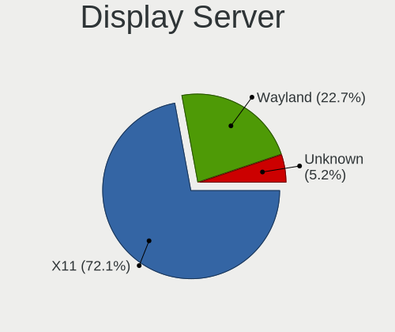
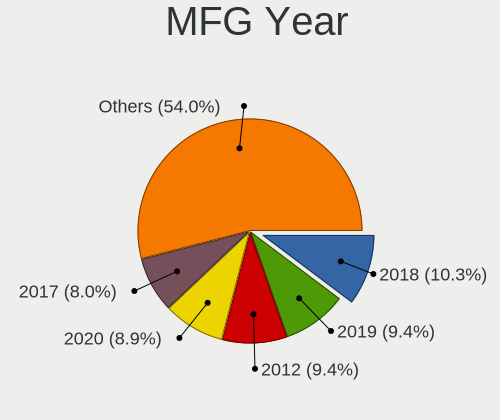
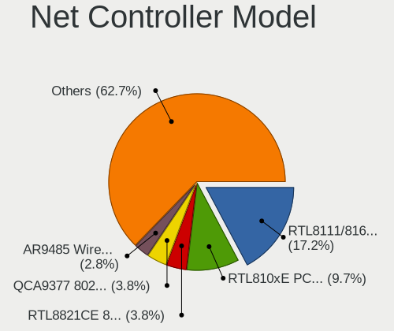
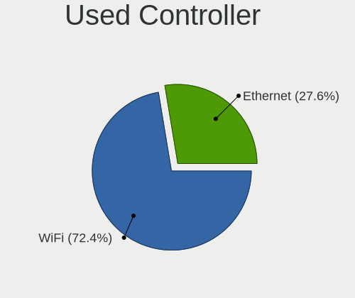
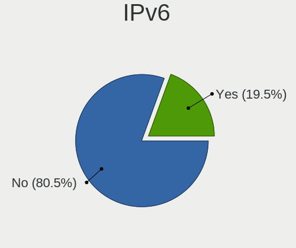
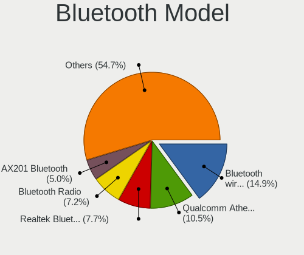
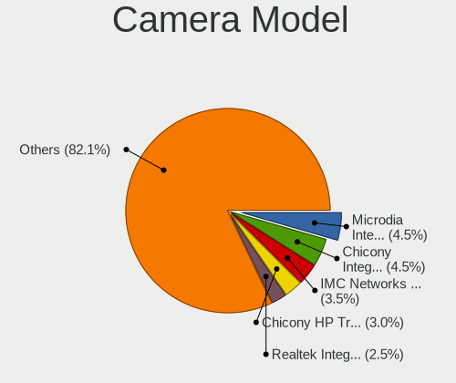

Linux in Ecuador - Tested Hardware & Statistics (Notebooks)
-----------------------------------------------------------

A project to collect tested hardware configurations for Linux in Ecuador.

Anyone can contribute to this report by the [hw-probe](https://github.com/linuxhw/hw-probe) tool:

    sudo -E hw-probe -all -upload

Please contribute! Especially if your hardware is rare.

Contents
--------

* [ Test Cases ](#test-cases)

* [ System ](#system)
  - [ OS                       ](#os)
  - [ OS Family                ](#os-family)
  - [ Kernel                   ](#kernel)
  - [ Kernel Family            ](#kernel-family)
  - [ Kernel Major Ver.        ](#kernel-major-ver)
  - [ Arch                     ](#arch)
  - [ DE                       ](#de)
  - [ Display Server           ](#display-server)
  - [ Display Manager          ](#display-manager)
  - [ OS Lang                  ](#os-lang)
  - [ Boot Mode                ](#boot-mode)
  - [ Filesystem               ](#filesystem)
  - [ Part. scheme             ](#part-scheme)
  - [ Dual Boot with Linux/BSD ](#dual-boot-with-linuxbsd)
  - [ Dual Boot (Win)          ](#dual-boot-win)

* [ Board ](#board)
  - [ Vendor                   ](#vendor)
  - [ Model                    ](#model)
  - [ Model Family             ](#model-family)
  - [ MFG Year                 ](#mfg-year)
  - [ Form Factor              ](#form-factor)
  - [ Secure Boot              ](#secure-boot)
  - [ Coreboot                 ](#coreboot)
  - [ RAM Size                 ](#ram-size)
  - [ RAM Used                 ](#ram-used)
  - [ Total Drives             ](#total-drives)
  - [ Has CD-ROM               ](#has-cd-rom)
  - [ Has Ethernet             ](#has-ethernet)
  - [ Has WiFi                 ](#has-wifi)
  - [ Has Bluetooth            ](#has-bluetooth)

* [ Location ](#location)
  - [ Country                  ](#country)
  - [ City                     ](#city)

* [ Drives ](#drives)
  - [ Drive Vendor             ](#drive-vendor)
  - [ Drive Model              ](#drive-model)
  - [ HDD Vendor               ](#hdd-vendor)
  - [ SSD Vendor               ](#ssd-vendor)
  - [ Drive Kind               ](#drive-kind)
  - [ Drive Connector          ](#drive-connector)
  - [ Drive Size               ](#drive-size)
  - [ Space Total              ](#space-total)
  - [ Space Used               ](#space-used)
  - [ Malfunc. Drives          ](#malfunc-drives)
  - [ Malfunc. Drive Vendor    ](#malfunc-drive-vendor)
  - [ Malfunc. HDD Vendor      ](#malfunc-hdd-vendor)
  - [ Malfunc. Drive Kind      ](#malfunc-drive-kind)
  - [ Failed Drives            ](#failed-drives)
  - [ Failed Drive Vendor      ](#failed-drive-vendor)
  - [ Drive Status             ](#drive-status)

* [ Storage controller ](#storage-controller)
  - [ Storage Vendor           ](#storage-vendor)
  - [ Storage Model            ](#storage-model)
  - [ Storage Kind             ](#storage-kind)

* [ Processor ](#processor)
  - [ CPU Vendor               ](#cpu-vendor)
  - [ CPU Model                ](#cpu-model)
  - [ CPU Model Family         ](#cpu-model-family)
  - [ CPU Cores                ](#cpu-cores)
  - [ CPU Sockets              ](#cpu-sockets)
  - [ CPU Threads              ](#cpu-threads)
  - [ CPU Op-Modes             ](#cpu-op-modes)
  - [ CPU Microcode            ](#cpu-microcode)
  - [ CPU Microarch            ](#cpu-microarch)

* [ Graphics ](#graphics)
  - [ GPU Vendor               ](#gpu-vendor)
  - [ GPU Model                ](#gpu-model)
  - [ GPU Combo                ](#gpu-combo)
  - [ GPU Driver               ](#gpu-driver)
  - [ GPU Memory               ](#gpu-memory)

* [ Monitor ](#monitor)
  - [ Monitor Vendor           ](#monitor-vendor)
  - [ Monitor Model            ](#monitor-model)
  - [ Monitor Resolution       ](#monitor-resolution)
  - [ Monitor Diagonal         ](#monitor-diagonal)
  - [ Monitor Width            ](#monitor-width)
  - [ Aspect Ratio             ](#aspect-ratio)
  - [ Monitor Area             ](#monitor-area)
  - [ Pixel Density            ](#pixel-density)
  - [ Multiple Monitors        ](#multiple-monitors)

* [ Network ](#network)
  - [ Net Controller Vendor    ](#net-controller-vendor)
  - [ Net Controller Model     ](#net-controller-model)
  - [ Wireless Vendor          ](#wireless-vendor)
  - [ Wireless Model           ](#wireless-model)
  - [ Ethernet Vendor          ](#ethernet-vendor)
  - [ Ethernet Model           ](#ethernet-model)
  - [ Net Controller Kind      ](#net-controller-kind)
  - [ Used Controller          ](#used-controller)
  - [ NICs                     ](#nics)
  - [ IPv6                     ](#ipv6)

* [ Bluetooth ](#bluetooth)
  - [ Bluetooth Vendor         ](#bluetooth-vendor)
  - [ Bluetooth Model          ](#bluetooth-model)

* [ Sound ](#sound)
  - [ Sound Vendor             ](#sound-vendor)
  - [ Sound Model              ](#sound-model)

* [ Memory ](#memory)
  - [ Memory Vendor            ](#memory-vendor)
  - [ Memory Model             ](#memory-model)
  - [ Memory Kind              ](#memory-kind)
  - [ Memory Form Factor       ](#memory-form-factor)
  - [ Memory Size              ](#memory-size)
  - [ Memory Speed             ](#memory-speed)

* [ Printers & scanners ](#printers--scanners)
  - [ Printer Vendor           ](#printer-vendor)
  - [ Printer Model            ](#printer-model)
  - [ Scanner Vendor           ](#scanner-vendor)
  - [ Scanner Model            ](#scanner-model)

* [ Camera ](#camera)
  - [ Camera Vendor            ](#camera-vendor)
  - [ Camera Model             ](#camera-model)

* [ Security ](#security)
  - [ Fingerprint Vendor       ](#fingerprint-vendor)
  - [ Fingerprint Model        ](#fingerprint-model)
  - [ Chipcard Vendor          ](#chipcard-vendor)
  - [ Chipcard Model           ](#chipcard-model)

* [ Unsupported ](#unsupported)
  - [ Unsupported Devices      ](#unsupported-devices)
  - [ Unsupported Device Types ](#unsupported-device-types)

Test Cases
----------

Total: 184

| Vendor    | Model                       | Probe                                                      | Date         |
|-----------|-----------------------------|------------------------------------------------------------|--------------|
| MSI       | GF63 Thin 9SC               | [6d42baa166](https://linux-hardware.org/?probe=6d42baa166) | Jul 26, 2022 |
| MSI       | GF63 Thin 9SC               | [1a2403b95a](https://linux-hardware.org/?probe=1a2403b95a) | Jul 24, 2022 |
| HP        | Laptop 14-cf3xxx            | [63722e3660](https://linux-hardware.org/?probe=63722e3660) | Jul 23, 2022 |
| Dell      | Latitude 5520               | [6e9be54f47](https://linux-hardware.org/?probe=6e9be54f47) | Jul 09, 2022 |
| Apple     | MacBookPro12,1              | [570dd2f164](https://linux-hardware.org/?probe=570dd2f164) | Jun 28, 2022 |
| Google    | Delbin                      | [26becdfc83](https://linux-hardware.org/?probe=26becdfc83) | Jun 26, 2022 |
| ASUSTek   | X555QG                      | [53e208736b](https://linux-hardware.org/?probe=53e208736b) | Jun 25, 2022 |
| Fujitsu   | LIFEBOOK E752               | [c434320a62](https://linux-hardware.org/?probe=c434320a62) | Jun 19, 2022 |
| ASUSTek   | X411UN                      | [70d24e4237](https://linux-hardware.org/?probe=70d24e4237) | Jun 02, 2022 |
| ASUSTek   | UX360CA                     | [63fac2dc9b](https://linux-hardware.org/?probe=63fac2dc9b) | May 29, 2022 |
| Alienware | 15 R3                       | [84df370117](https://linux-hardware.org/?probe=84df370117) | May 26, 2022 |
| HP        | Laptop 14-cf3xxx            | [9e4cd6dab4](https://linux-hardware.org/?probe=9e4cd6dab4) | May 25, 2022 |
| Chuwi     | HeroBook Pro                | [9f009d836c](https://linux-hardware.org/?probe=9f009d836c) | May 23, 2022 |
| Sony      | SVE14113ELW                 | [647c09a7be](https://linux-hardware.org/?probe=647c09a7be) | May 23, 2022 |
| Chuwi     | HeroBook Pro                | [206aa9b805](https://linux-hardware.org/?probe=206aa9b805) | May 23, 2022 |
| Lenovo    | G580 20150                  | [ec5867b2f7](https://linux-hardware.org/?probe=ec5867b2f7) | May 17, 2022 |
| Lenovo    | G580 20150                  | [9b06242456](https://linux-hardware.org/?probe=9b06242456) | May 17, 2022 |
| Toshiba   | Satellite L45-B             | [7f46e36f35](https://linux-hardware.org/?probe=7f46e36f35) | May 14, 2022 |
| Toshiba   | Satellite L45-B             | [81b3317aa8](https://linux-hardware.org/?probe=81b3317aa8) | May 14, 2022 |
| Dell      | XPS 13 9370                 | [f90e5f669e](https://linux-hardware.org/?probe=f90e5f669e) | May 09, 2022 |
| Toshiba   | Satellite L50-B             | [e559318a8b](https://linux-hardware.org/?probe=e559318a8b) | May 02, 2022 |
| ASUSTek   | VivoBook_ASUSLaptop X421... | [c8d977cf63](https://linux-hardware.org/?probe=c8d977cf63) | May 02, 2022 |
| HP        | Laptop 14-cf3xxx            | [e049bbd414](https://linux-hardware.org/?probe=e049bbd414) | Apr 26, 2022 |
| HP        | Unknown                     | [0a47967da0](https://linux-hardware.org/?probe=0a47967da0) | Apr 23, 2022 |
| HP        | Unknown                     | [fa5bba3e33](https://linux-hardware.org/?probe=fa5bba3e33) | Apr 22, 2022 |
| ASUSTek   | VivoBook_ASUSLaptop X421... | [a0ad75fa4b](https://linux-hardware.org/?probe=a0ad75fa4b) | Apr 16, 2022 |
| HP        | Pavilion dv6                | [bacb1d04de](https://linux-hardware.org/?probe=bacb1d04de) | Apr 02, 2022 |
| Lenovo    | V15-IIL 82C5                | [722eee0995](https://linux-hardware.org/?probe=722eee0995) | Mar 30, 2022 |
| Sony      | VPCEG30EL                   | [c19f1a4739](https://linux-hardware.org/?probe=c19f1a4739) | Mar 26, 2022 |
| Sony      | SVE14A25CLB                 | [2e6afba454](https://linux-hardware.org/?probe=2e6afba454) | Mar 25, 2022 |
| Apple     | MacBookPro12,1              | [a39345cbf9](https://linux-hardware.org/?probe=a39345cbf9) | Mar 22, 2022 |
| Dell      | Inspiron 7547               | [af0de64399](https://linux-hardware.org/?probe=af0de64399) | Mar 22, 2022 |
| Razer     | Blade 15 Base Model (Ear... | [1ef1ffe2a3](https://linux-hardware.org/?probe=1ef1ffe2a3) | Mar 20, 2022 |
| Razer     | Blade Stealth               | [6b524f20d4](https://linux-hardware.org/?probe=6b524f20d4) | Mar 20, 2022 |
| HP        | Laptop 14-cf3xxx            | [faae36d70e](https://linux-hardware.org/?probe=faae36d70e) | Mar 17, 2022 |
| HP        | Laptop 14-cf3xxx            | [4d5aa250a1](https://linux-hardware.org/?probe=4d5aa250a1) | Mar 17, 2022 |
| Toshiba   | Satellite C55D-A            | [fccc5b2ef5](https://linux-hardware.org/?probe=fccc5b2ef5) | Mar 16, 2022 |
| ASUSTek   | ROG Zephyrus G14 GA401IH... | [c27fb51c94](https://linux-hardware.org/?probe=c27fb51c94) | Mar 13, 2022 |
| ASUSTek   | ROG Zephyrus G14 GA401IH... | [15b0517729](https://linux-hardware.org/?probe=15b0517729) | Mar 13, 2022 |
| HP        | 15 Notebook PC              | [d9e67c0484](https://linux-hardware.org/?probe=d9e67c0484) | Mar 12, 2022 |
| HP        | EliteBook Folio 9470m       | [bd4f7daadb](https://linux-hardware.org/?probe=bd4f7daadb) | Mar 10, 2022 |
| Compal    | PBL2021                     | [4e367db737](https://linux-hardware.org/?probe=4e367db737) | Feb 28, 2022 |
| Dell      | G5 5587                     | [5f51492976](https://linux-hardware.org/?probe=5f51492976) | Jan 29, 2022 |
| Dell      | Latitude 7280               | [fdf5a41dcc](https://linux-hardware.org/?probe=fdf5a41dcc) | Jan 25, 2022 |
| Dell      | Latitude 7280               | [b4c6f2fe35](https://linux-hardware.org/?probe=b4c6f2fe35) | Jan 25, 2022 |
| Dell      | Inspiron 3442               | [d8fc419747](https://linux-hardware.org/?probe=d8fc419747) | Jan 18, 2022 |
| Acer      | Aspire A515-56              | [359493a8bf](https://linux-hardware.org/?probe=359493a8bf) | Dec 27, 2021 |
| Acer      | Aspire A515-56              | [54cb3818f3](https://linux-hardware.org/?probe=54cb3818f3) | Dec 20, 2021 |
| Lenovo    | IdeaPad 330-15AST 81D6      | [ef48db912e](https://linux-hardware.org/?probe=ef48db912e) | Nov 24, 2021 |
| ASUSTek   | VivoBook_ASUSLaptop X712... | [c30cc4860b](https://linux-hardware.org/?probe=c30cc4860b) | Nov 24, 2021 |
| ASUSTek   | G750JX                      | [f503f26e28](https://linux-hardware.org/?probe=f503f26e28) | Nov 23, 2021 |
| Google    | Treeya                      | [a0ab206cd8](https://linux-hardware.org/?probe=a0ab206cd8) | Nov 09, 2021 |
| Dell      | Inspiron MP061              | [d6ed71bc78](https://linux-hardware.org/?probe=d6ed71bc78) | Nov 02, 2021 |
| HP        | G42                         | [5ee39658a8](https://linux-hardware.org/?probe=5ee39658a8) | Oct 28, 2021 |
| Timi      | RedmiBook 14-APCS           | [d31c8b483c](https://linux-hardware.org/?probe=d31c8b483c) | Oct 28, 2021 |
| HP        | G42                         | [a8181c9c9b](https://linux-hardware.org/?probe=a8181c9c9b) | Oct 24, 2021 |
| Fujitsu   | LIFEBOOK E752               | [177f79d880](https://linux-hardware.org/?probe=177f79d880) | Oct 18, 2021 |
| Lenovo    | IdeaPad 330S-15IKB 81F5     | [70e96b19b2](https://linux-hardware.org/?probe=70e96b19b2) | Oct 17, 2021 |
| Dell      | Inspiron 3593               | [2297765c40](https://linux-hardware.org/?probe=2297765c40) | Oct 14, 2021 |
| ASUSTek   | ASUS TUF Gaming A15 FA50... | [da1bab4a9c](https://linux-hardware.org/?probe=da1bab4a9c) | Oct 13, 2021 |
| HP        | 240 G6 Notebook PC          | [87b00b0a80](https://linux-hardware.org/?probe=87b00b0a80) | Oct 12, 2021 |
| Unknown   | Unknown                     | [449fdc2d2d](https://linux-hardware.org/?probe=449fdc2d2d) | Aug 23, 2021 |
| Unknown   | Unknown                     | [b1587c998f](https://linux-hardware.org/?probe=b1587c998f) | Aug 23, 2021 |
| Toshiba   | Satellite S55-B             | [c4ec7d25a7](https://linux-hardware.org/?probe=c4ec7d25a7) | Aug 21, 2021 |
| HP        | Pavilion g4                 | [3276092f1e](https://linux-hardware.org/?probe=3276092f1e) | Aug 15, 2021 |
| ASUSTek   | VivoBook 15_ASUS Laptop ... | [6909a1a841](https://linux-hardware.org/?probe=6909a1a841) | Aug 14, 2021 |
| Unknown   | Unknown                     | [008647318c](https://linux-hardware.org/?probe=008647318c) | Aug 09, 2021 |
| Unknown   | Unknown                     | [5de2d0ae61](https://linux-hardware.org/?probe=5de2d0ae61) | Aug 09, 2021 |
| ASUSTek   | VivoBook_ASUSLaptop X512... | [69c078f12b](https://linux-hardware.org/?probe=69c078f12b) | Aug 01, 2021 |
| Acer      | TravelMate X3410-M          | [18b5757039](https://linux-hardware.org/?probe=18b5757039) | Jul 29, 2021 |
| Toshiba   | Satellite S55-A             | [a145aa9a69](https://linux-hardware.org/?probe=a145aa9a69) | Jul 26, 2021 |
| Toshiba   | Satellite S55-A             | [08eec2f3a7](https://linux-hardware.org/?probe=08eec2f3a7) | Jul 25, 2021 |
| Toshiba   | Satellite C45-A             | [0497ab613d](https://linux-hardware.org/?probe=0497ab613d) | Jul 25, 2021 |
| Fujitsu   | LIFEBOOK E752               | [a071db12c9](https://linux-hardware.org/?probe=a071db12c9) | Jul 12, 2021 |
| Google    | Banjo                       | [d451dcd617](https://linux-hardware.org/?probe=d451dcd617) | Jul 02, 2021 |
| Google    | Grunt                       | [2bb0921a94](https://linux-hardware.org/?probe=2bb0921a94) | Jul 01, 2021 |
| Google    | Grunt                       | [4ea5c8f438](https://linux-hardware.org/?probe=4ea5c8f438) | Jul 01, 2021 |
| Google    | Kip                         | [7634152b76](https://linux-hardware.org/?probe=7634152b76) | Jun 21, 2021 |
| Acer      | TravelMate B117-M           | [a5fc625cf2](https://linux-hardware.org/?probe=a5fc625cf2) | Jun 04, 2021 |
| MSI       | GF63 Thin 9SC               | [54a4075ac5](https://linux-hardware.org/?probe=54a4075ac5) | May 16, 2021 |
| HP        | 1000                        | [d23f6c89ad](https://linux-hardware.org/?probe=d23f6c89ad) | May 15, 2021 |
| HP        | 1000                        | [a1ff0a7b3d](https://linux-hardware.org/?probe=a1ff0a7b3d) | May 13, 2021 |
| Acer      | Aspire V5-121               | [cc73e2b026](https://linux-hardware.org/?probe=cc73e2b026) | May 13, 2021 |
| HP        | 1000                        | [4bbe06ec7a](https://linux-hardware.org/?probe=4bbe06ec7a) | May 13, 2021 |
| Lenovo    | ThinkPad E15 20REA00000     | [1ac42dd429](https://linux-hardware.org/?probe=1ac42dd429) | May 09, 2021 |
| MSI       | GF63 Thin 9SC               | [cd6a799646](https://linux-hardware.org/?probe=cd6a799646) | Apr 29, 2021 |
| Lenovo    | IdeaPad 330S-15IKB 81F5     | [140e992105](https://linux-hardware.org/?probe=140e992105) | Apr 24, 2021 |
| Samsung   | 550XCJ/550XCR               | [2a2a56b6d4](https://linux-hardware.org/?probe=2a2a56b6d4) | Apr 22, 2021 |
| Dell      | Inspiron 3442               | [921cfbf363](https://linux-hardware.org/?probe=921cfbf363) | Apr 18, 2021 |
| Dell      | G5 5587                     | [c88e053304](https://linux-hardware.org/?probe=c88e053304) | Apr 07, 2021 |
| Dell      | Inspiron 3558               | [0ba2e43e56](https://linux-hardware.org/?probe=0ba2e43e56) | Mar 24, 2021 |
| HP        | ProBook 640 G2              | [39e97c482d](https://linux-hardware.org/?probe=39e97c482d) | Mar 24, 2021 |
| Lenovo    | ThinkPad T530 2429JB5       | [b3eee9be3e](https://linux-hardware.org/?probe=b3eee9be3e) | Mar 23, 2021 |
| Lenovo    | ThinkPad T530 2429JB5       | [e04914d4de](https://linux-hardware.org/?probe=e04914d4de) | Mar 23, 2021 |
| Dell      | Inspiron 1420               | [7b12363b97](https://linux-hardware.org/?probe=7b12363b97) | Mar 04, 2021 |
| Dell      | Inspiron 7375               | [eea996c7d4](https://linux-hardware.org/?probe=eea996c7d4) | Feb 26, 2021 |
| Lenovo    | ThinkPad X201 3680PKS       | [14a1f8c536](https://linux-hardware.org/?probe=14a1f8c536) | Feb 07, 2021 |
| Lenovo    | ThinkPad X201 3680PKS       | [f935adf770](https://linux-hardware.org/?probe=f935adf770) | Feb 07, 2021 |
| Dell      | Vostro 3480                 | [2162db2610](https://linux-hardware.org/?probe=2162db2610) | Feb 03, 2021 |
| Sony      | VPCCW1S1E                   | [f57d56b50e](https://linux-hardware.org/?probe=f57d56b50e) | Jan 31, 2021 |
| Dell      | Inspiron 15 7000 Gaming     | [f4e1001265](https://linux-hardware.org/?probe=f4e1001265) | Jan 23, 2021 |
| HP        | Laptop 14-cf3xxx            | [063b008ad5](https://linux-hardware.org/?probe=063b008ad5) | Jan 15, 2021 |
| HP        | Laptop 14-cf3xxx            | [473e0472d5](https://linux-hardware.org/?probe=473e0472d5) | Jan 12, 2021 |
| HP        | EliteBook 2730p             | [5a7277af8b](https://linux-hardware.org/?probe=5a7277af8b) | Jan 08, 2021 |
| HP        | EliteBook 2730p             | [bbbf68f88b](https://linux-hardware.org/?probe=bbbf68f88b) | Jan 08, 2021 |
| Google    | Parrot                      | [a3a6c2f819](https://linux-hardware.org/?probe=a3a6c2f819) | Jan 04, 2021 |
| Google    | Parrot                      | [55b807260c](https://linux-hardware.org/?probe=55b807260c) | Jan 04, 2021 |
| HP        | Pavilion 14                 | [91b047b61a](https://linux-hardware.org/?probe=91b047b61a) | Dec 31, 2020 |
| Gateway   | NE56R                       | [6988a76879](https://linux-hardware.org/?probe=6988a76879) | Dec 11, 2020 |
| HP        | Laptop 14-cf3xxx            | [3f61162824](https://linux-hardware.org/?probe=3f61162824) | Dec 07, 2020 |
| Dell      | Inspiron 1420               | [e5dab19c0f](https://linux-hardware.org/?probe=e5dab19c0f) | Dec 05, 2020 |
| HP        | ProBook 4440s               | [b4747f87a1](https://linux-hardware.org/?probe=b4747f87a1) | Nov 24, 2020 |
| Dell      | Inspiron 1750               | [612608a41f](https://linux-hardware.org/?probe=612608a41f) | Nov 21, 2020 |
| Dell      | Latitude D430               | [77ef794b1d](https://linux-hardware.org/?probe=77ef794b1d) | Nov 21, 2020 |
| Dell      | Latitude D430               | [c028c146b6](https://linux-hardware.org/?probe=c028c146b6) | Nov 21, 2020 |
| Fujitsu   | LIFEBOOK E752               | [364a814fd0](https://linux-hardware.org/?probe=364a814fd0) | Nov 19, 2020 |
| Fujitsu   | LIFEBOOK E752               | [b0fbbd8176](https://linux-hardware.org/?probe=b0fbbd8176) | Nov 19, 2020 |
| HP        | 3115m                       | [1ae9651614](https://linux-hardware.org/?probe=1ae9651614) | Nov 17, 2020 |
| Gateway   | NE56R                       | [4e9bf51faa](https://linux-hardware.org/?probe=4e9bf51faa) | Nov 16, 2020 |
| ASUSTek   | X510UAR                     | [106453a877](https://linux-hardware.org/?probe=106453a877) | Oct 23, 2020 |
| ASUSTek   | X510UAR                     | [fea6f132fa](https://linux-hardware.org/?probe=fea6f132fa) | Oct 23, 2020 |
| Toshiba   | PORTEGE M805                | [cacfe4abd9](https://linux-hardware.org/?probe=cacfe4abd9) | Oct 22, 2020 |
| Toshiba   | Satellite C55-B             | [146545f430](https://linux-hardware.org/?probe=146545f430) | Oct 17, 2020 |
| Toshiba   | Satellite C55-B             | [61e809ea3a](https://linux-hardware.org/?probe=61e809ea3a) | Oct 12, 2020 |
| Toshiba   | Satellite C55-B             | [6353946b7e](https://linux-hardware.org/?probe=6353946b7e) | Oct 12, 2020 |
| Dell      | Inspiron 1420               | [03631f1005](https://linux-hardware.org/?probe=03631f1005) | Oct 08, 2020 |
| Dell      | Inspiron 1420               | [78e7085775](https://linux-hardware.org/?probe=78e7085775) | Oct 08, 2020 |
| Sony      | VGN-CR120E                  | [3e989ff916](https://linux-hardware.org/?probe=3e989ff916) | Sep 24, 2020 |
| Sony      | VGN-CR120E                  | [8569f91c17](https://linux-hardware.org/?probe=8569f91c17) | Sep 23, 2020 |
| Toshiba   | Satellite C45-A             | [2774da64f6](https://linux-hardware.org/?probe=2774da64f6) | Sep 18, 2020 |
| HP        | Pavilion 15                 | [f824ed9d26](https://linux-hardware.org/?probe=f824ed9d26) | Sep 18, 2020 |
| HP        | Mini 210-1100               | [3b76e02a8f](https://linux-hardware.org/?probe=3b76e02a8f) | Sep 17, 2020 |
| HP        | Pavilion 15                 | [d95e413136](https://linux-hardware.org/?probe=d95e413136) | Sep 16, 2020 |
| HP        | Laptop 14-cf3xxx            | [489cee4d9a](https://linux-hardware.org/?probe=489cee4d9a) | Sep 12, 2020 |
| Toshiba   | Satellite P775              | [d71ccb1065](https://linux-hardware.org/?probe=d71ccb1065) | Sep 10, 2020 |
| HP        | Pavilion dv2500             | [8626b52852](https://linux-hardware.org/?probe=8626b52852) | Sep 08, 2020 |
| Samsung   | 530U4E/540U4E               | [31a023d519](https://linux-hardware.org/?probe=31a023d519) | Sep 06, 2020 |
| Samsung   | 530U4E/540U4E               | [d94a252a6f](https://linux-hardware.org/?probe=d94a252a6f) | Sep 06, 2020 |
| HP        | Laptop 14-cf3xxx            | [c3f5f6d566](https://linux-hardware.org/?probe=c3f5f6d566) | Sep 06, 2020 |
| HP        | Laptop 14-cf3xxx            | [4e0f1689a3](https://linux-hardware.org/?probe=4e0f1689a3) | Sep 06, 2020 |
| Dell      | Inspiron 5570               | [8eb7cfa128](https://linux-hardware.org/?probe=8eb7cfa128) | Sep 05, 2020 |
| HP        | Laptop 14-df0xxx            | [1b11abd994](https://linux-hardware.org/?probe=1b11abd994) | Sep 04, 2020 |
| Lenovo    | IdeaPad 320-15IKB 80XL      | [21f0c0015c](https://linux-hardware.org/?probe=21f0c0015c) | Aug 26, 2020 |
| HP        | Pavilion Laptop 15-cw1xx... | [29f01daf9e](https://linux-hardware.org/?probe=29f01daf9e) | Aug 26, 2020 |
| Dell      | Inspiron N4050              | [e39ccc961c](https://linux-hardware.org/?probe=e39ccc961c) | Aug 20, 2020 |
| HP        | Pavilion Laptop 15-cw1xx... | [dd8aa75b79](https://linux-hardware.org/?probe=dd8aa75b79) | Aug 16, 2020 |
| ASUSTek   | X502CA                      | [7876d4c48d](https://linux-hardware.org/?probe=7876d4c48d) | Aug 14, 2020 |
| Lenovo    | IdeaPad 320-15ABR 80XS      | [9bcbc98b0f](https://linux-hardware.org/?probe=9bcbc98b0f) | Jul 26, 2020 |
| Lenovo    | IdeaPad 330-14IGM 81D0      | [c32745014a](https://linux-hardware.org/?probe=c32745014a) | Jul 22, 2020 |
| Lenovo    | IdeaPad L340-15IRH Gamin... | [a70d38c48c](https://linux-hardware.org/?probe=a70d38c48c) | Jul 20, 2020 |
| Acer      | AO722                       | [90943ce018](https://linux-hardware.org/?probe=90943ce018) | Jul 10, 2020 |
| Dell      | Inspiron 7375               | [e4318a8dea](https://linux-hardware.org/?probe=e4318a8dea) | Jul 04, 2020 |
| Dell      | Inspiron 7375               | [ba6d8528e9](https://linux-hardware.org/?probe=ba6d8528e9) | Jul 04, 2020 |
| HP        | Notebook                    | [b646ab05a7](https://linux-hardware.org/?probe=b646ab05a7) | Jun 30, 2020 |
| Lenovo    | IdeaPad 320-15ABR 80XS      | [b8b588701d](https://linux-hardware.org/?probe=b8b588701d) | Jun 22, 2020 |
| Lenovo    | 3000 V200 076433G           | [3d55960409](https://linux-hardware.org/?probe=3d55960409) | Jun 13, 2020 |
| Lenovo    | 3000 V200 076433G           | [1de1a4dbc4](https://linux-hardware.org/?probe=1de1a4dbc4) | Jun 13, 2020 |
| HP        | ProBook 4440s               | [5442b989be](https://linux-hardware.org/?probe=5442b989be) | May 30, 2020 |
| Dell      | Inspiron 5570               | [84339f57da](https://linux-hardware.org/?probe=84339f57da) | May 09, 2020 |
| Apple     | MacBookPro13,3              | [81946cb76f](https://linux-hardware.org/?probe=81946cb76f) | Apr 17, 2020 |
| Lenovo    | IdeaPad 320-15ABR 80XS      | [df8a7bcad8](https://linux-hardware.org/?probe=df8a7bcad8) | Mar 26, 2020 |
| Lenovo    | G710 20252                  | [2971fd6031](https://linux-hardware.org/?probe=2971fd6031) | Mar 26, 2020 |
| HP        | 15                          | [cb0cf73a5d](https://linux-hardware.org/?probe=cb0cf73a5d) | Mar 04, 2020 |
| HP        | 15                          | [687592ff11](https://linux-hardware.org/?probe=687592ff11) | Mar 04, 2020 |
| Acer      | AO722                       | [08d71a347b](https://linux-hardware.org/?probe=08d71a347b) | Feb 29, 2020 |
| Acer      | AO722                       | [291cea2763](https://linux-hardware.org/?probe=291cea2763) | Feb 29, 2020 |
| HP        | Pavilion Laptop 15-cw0xx... | [108b4a03ac](https://linux-hardware.org/?probe=108b4a03ac) | Feb 26, 2020 |
| ASUSTek   | UX303LA                     | [5ae0871de5](https://linux-hardware.org/?probe=5ae0871de5) | Feb 23, 2020 |
| ASUSTek   | UX303LA                     | [cfc85f91d5](https://linux-hardware.org/?probe=cfc85f91d5) | Feb 22, 2020 |
| ASUSTek   | UX303LA                     | [ab03f678e6](https://linux-hardware.org/?probe=ab03f678e6) | Feb 22, 2020 |
| Lenovo    | IdeaPad 320-15ABR 80XS      | [d2b7a56172](https://linux-hardware.org/?probe=d2b7a56172) | Jan 14, 2020 |
| Lenovo    | IdeaPad 320-15ABR 80XS      | [30baa09d89](https://linux-hardware.org/?probe=30baa09d89) | Jan 14, 2020 |
| Acer      | Aspire ES1-131              | [fcb74db0f2](https://linux-hardware.org/?probe=fcb74db0f2) | Jan 14, 2020 |
| HP        | Laptop 14-bs0xx             | [bd6b795d81](https://linux-hardware.org/?probe=bd6b795d81) | Nov 09, 2019 |
| Dell      | System XPS L502X            | [d43cf2a533](https://linux-hardware.org/?probe=d43cf2a533) | Sep 12, 2019 |
| HP        | Pavilion Laptop 15-cc1xx    | [a4264e7371](https://linux-hardware.org/?probe=a4264e7371) | Sep 12, 2019 |
| Toshiba   | Satellite E45t-B            | [156d965d57](https://linux-hardware.org/?probe=156d965d57) | Aug 14, 2019 |
| Toshiba   | Satellite P55W-C            | [cc12571867](https://linux-hardware.org/?probe=cc12571867) | Jul 27, 2019 |
| HP        | Laptop 15-da0xxx            | [76dbbe880b](https://linux-hardware.org/?probe=76dbbe880b) | Jul 10, 2019 |
| HP        | Pavilion 14                 | [6dde2ab979](https://linux-hardware.org/?probe=6dde2ab979) | Jun 08, 2019 |
| Apple     | MacBook1,1                  | [57ca5e1449](https://linux-hardware.org/?probe=57ca5e1449) | Jun 02, 2019 |
| HP        | Pavilion Laptop 15-cw0xx... | [a4d0b9a0cc](https://linux-hardware.org/?probe=a4d0b9a0cc) | May 27, 2019 |
| HP        | Pavilion Laptop 15-cc1xx    | [6abf9ea94e](https://linux-hardware.org/?probe=6abf9ea94e) | Apr 17, 2019 |
| HP        | ENVY Notebook               | [4d812e744e](https://linux-hardware.org/?probe=4d812e744e) | Apr 17, 2019 |

System
------

OS
--

Installed operating systems

| Name                 | Notebooks | Percent |
|----------------------|-----------|---------|
| Ubuntu 20.04         | 23        | 17.42%  |
| Ubuntu 18.04         | 11        | 8.33%   |
| Linux Mint 20.3      | 7         | 5.3%    |
| Ubuntu 22.04         | 5         | 3.79%   |
| Linux Mint 19.3      | 5         | 3.79%   |
| Debian 11            | 5         | 3.79%   |
| Zorin 15             | 4         | 3.03%   |
| KDE neon 20.04       | 4         | 3.03%   |
| Pop!_OS 21.10        | 3         | 2.27%   |
| OpenMandriva 4.3     | 3         | 2.27%   |
| Fedora 34            | 3         | 2.27%   |
| Fedora 33            | 3         | 2.27%   |
| Zorin 16             | 2         | 1.52%   |
| Ubuntu 21.10         | 2         | 1.52%   |
| Ubuntu 21.04         | 2         | 1.52%   |
| Ubuntu               | 2         | 1.52%   |
| Pop!_OS 21.04        | 2         | 1.52%   |
| Pop!_OS 20.04        | 2         | 1.52%   |
| Linux Mint 20.1      | 2         | 1.52%   |
| Linux Mint 20        | 2         | 1.52%   |
| Elementary 5.1.7     | 2         | 1.52%   |
| BlackPanther 18.1    | 2         | 1.52%   |
| Xubuntu 20.04        | 1         | 0.76%   |
| Xubuntu 18.04        | 1         | 0.76%   |
| Void Linux           | 1         | 0.76%   |
| Ubuntu MATE 20.04    | 1         | 0.76%   |
| Ubuntu MATE 18.04    | 1         | 0.76%   |
| Ubuntu Budgie 22.04  | 1         | 0.76%   |
| Ubuntu Budgie 20.04  | 1         | 0.76%   |
| Ubuntu 20.10         | 1         | 0.76%   |
| Ubuntu 19.04         | 1         | 0.76%   |
| Ubuntu 18.10         | 1         | 0.76%   |
| RHEL 8               | 1         | 0.76%   |
| OpenMandriva 4.2     | 1         | 0.76%   |
| Manjaro 21.3.5       | 1         | 0.76%   |
| Manjaro 21.2.5       | 1         | 0.76%   |
| Manjaro 20.1         | 1         | 0.76%   |
| Manjaro              | 1         | 0.76%   |
| Lubuntu 20.04        | 1         | 0.76%   |
| Lubuntu 18.04        | 1         | 0.76%   |
| LMDE 5               | 1         | 0.76%   |
| LMDE 4               | 1         | 0.76%   |
| Linux Mint 20.2      | 1         | 0.76%   |
| Kubuntu 22.04        | 1         | 0.76%   |
| Kubuntu 20.04        | 1         | 0.76%   |
| KDE neon 18.04       | 1         | 0.76%   |
| Garuda Linux Soaring | 1         | 0.76%   |
| Fedora 36            | 1         | 0.76%   |
| Fedora 35            | 1         | 0.76%   |
| Fedora 32            | 1         | 0.76%   |
| Fedora 31            | 1         | 0.76%   |
| Endless 3.9.4        | 1         | 0.76%   |
| Elementary 5.1.2     | 1         | 0.76%   |
| Deepin 20            | 1         | 0.76%   |
| Debian 10            | 1         | 0.76%   |
| ArcoLinux Rolling    | 1         | 0.76%   |
| Arch Rolling         | 1         | 0.76%   |
| Arch                 | 1         | 0.76%   |

OS Family
---------

OS without a version

| Name          | Notebooks | Percent |
|---------------|-----------|---------|
| Ubuntu        | 46        | 36.51%  |
| Linux Mint    | 15        | 11.9%   |
| Fedora        | 10        | 7.94%   |
| Pop!_OS       | 7         | 5.56%   |
| Zorin         | 6         | 4.76%   |
| Debian        | 6         | 4.76%   |
| KDE neon      | 5         | 3.97%   |
| OpenMandriva  | 4         | 3.17%   |
| Manjaro       | 3         | 2.38%   |
| Elementary    | 3         | 2.38%   |
| Xubuntu       | 2         | 1.59%   |
| Ubuntu MATE   | 2         | 1.59%   |
| Ubuntu Budgie | 2         | 1.59%   |
| Lubuntu       | 2         | 1.59%   |
| Kubuntu       | 2         | 1.59%   |
| BlackPanther  | 2         | 1.59%   |
| Arch          | 2         | 1.59%   |
| Void Linux    | 1         | 0.79%   |
| RHEL          | 1         | 0.79%   |
| LMDE          | 1         | 0.79%   |
| Garuda Linux  | 1         | 0.79%   |
| Endless       | 1         | 0.79%   |
| Deepin        | 1         | 0.79%   |
| ArcoLinux     | 1         | 0.79%   |

Kernel
------

Version of the Linux kernel

| Version                  | Notebooks | Percent |
|--------------------------|-----------|---------|
| 5.4.0-54-generic         | 4         | 2.78%   |
| 5.4.0-42-generic         | 4         | 2.78%   |
| 5.15.0-33-generic        | 4         | 2.78%   |
| 5.4.0-58-generic         | 3         | 2.08%   |
| 5.4.0-56-generic         | 3         | 2.08%   |
| 5.4.0-48-generic         | 3         | 2.08%   |
| 5.4.0-45-generic         | 3         | 2.08%   |
| 5.4.0-26-generic         | 3         | 2.08%   |
| 5.16.11-76051611-generic | 3         | 2.08%   |
| 5.13.0-35-generic        | 3         | 2.08%   |
| 5.8.0-43-generic         | 2         | 1.39%   |
| 5.8.0-41-generic         | 2         | 1.39%   |
| 5.4.0-77-generic         | 2         | 1.39%   |
| 5.4.0-7634-generic       | 2         | 1.39%   |
| 5.4.0-110-generic        | 2         | 1.39%   |
| 5.3.0-62-generic         | 2         | 1.39%   |
| 5.16.7-desktop-1omv4003  | 2         | 1.39%   |
| 5.15.0-27-generic        | 2         | 1.39%   |
| 5.13.0-7614-generic      | 2         | 1.39%   |
| 5.13.0-51-generic        | 2         | 1.39%   |
| 5.13.0-27-generic        | 2         | 1.39%   |
| 5.0.0-37-generic         | 2         | 1.39%   |
| 5.0.0-23-generic         | 2         | 1.39%   |
| 4.18.16-desktop-1bP      | 2         | 1.39%   |
| 4.15.0-54-generic        | 2         | 1.39%   |
| 5.9.16-200.fc33.x86_64   | 1         | 0.69%   |
| 5.8.15-201.fc32.x86_64   | 1         | 0.69%   |
| 5.8.0-45-generic         | 1         | 0.69%   |
| 5.8.0-14-generic         | 1         | 0.69%   |
| 5.7.17-2-MANJARO         | 1         | 0.69%   |
| 5.7.1-050701-generic     | 1         | 0.69%   |
| 5.5.5-arch1-1            | 1         | 0.69%   |
| 5.5.16-200.fc31.x86_64   | 1         | 0.69%   |
| 5.4.50-amd64-desktop     | 1         | 0.69%   |
| 5.4.26-rt17-1-rt         | 1         | 0.69%   |
| 5.4.111                  | 1         | 0.69%   |
| 5.4.0-94-generic         | 1         | 0.69%   |
| 5.4.0-90-generic         | 1         | 0.69%   |
| 5.4.0-89-generic         | 1         | 0.69%   |
| 5.4.0-88-generic         | 1         | 0.69%   |
| 5.4.0-80-generic         | 1         | 0.69%   |
| 5.4.0-74-generic         | 1         | 0.69%   |
| 5.4.0-72-generic         | 1         | 0.69%   |
| 5.4.0-70-generic         | 1         | 0.69%   |
| 5.4.0-67-generic         | 1         | 0.69%   |
| 5.4.0-66-generic         | 1         | 0.69%   |
| 5.4.0-65-generic         | 1         | 0.69%   |
| 5.4.0-60-generic         | 1         | 0.69%   |
| 5.4.0-53-generic         | 1         | 0.69%   |
| 5.4.0-52-generic         | 1         | 0.69%   |
| 5.4.0-47-generic         | 1         | 0.69%   |
| 5.4.0-40-generic         | 1         | 0.69%   |
| 5.4.0-37-generic         | 1         | 0.69%   |
| 5.4.0-33-generic         | 1         | 0.69%   |
| 5.4.0-109-generic        | 1         | 0.69%   |
| 5.4.0-105-generic        | 1         | 0.69%   |
| 5.3.9_1                  | 1         | 0.69%   |
| 5.3.0-42-generic         | 1         | 0.69%   |
| 5.3.0-40-generic         | 1         | 0.69%   |
| 5.18.6-200.fc36.x86_64   | 1         | 0.69%   |

Kernel Family
-------------

Linux kernel without a distro release

| Version  | Notebooks | Percent |
|----------|-----------|---------|
| 5.4.0    | 42        | 31.11%  |
| 5.13.0   | 12        | 8.89%   |
| 4.15.0   | 8         | 5.93%   |
| 5.15.0   | 7         | 5.19%   |
| 5.0.0    | 7         | 5.19%   |
| 5.8.0    | 6         | 4.44%   |
| 5.11.0   | 5         | 3.7%    |
| 5.3.0    | 4         | 2.96%   |
| 5.10.0   | 4         | 2.96%   |
| 5.16.11  | 3         | 2.22%   |
| 5.16.7   | 2         | 1.48%   |
| 4.18.16  | 2         | 1.48%   |
| 4.18.0   | 2         | 1.48%   |
| 5.9.16   | 1         | 0.74%   |
| 5.8.15   | 1         | 0.74%   |
| 5.7.17   | 1         | 0.74%   |
| 5.7.1    | 1         | 0.74%   |
| 5.5.5    | 1         | 0.74%   |
| 5.5.16   | 1         | 0.74%   |
| 5.4.50   | 1         | 0.74%   |
| 5.4.26   | 1         | 0.74%   |
| 5.4.111  | 1         | 0.74%   |
| 5.3.9    | 1         | 0.74%   |
| 5.18.6   | 1         | 0.74%   |
| 5.18.12  | 1         | 0.74%   |
| 5.17.5   | 1         | 0.74%   |
| 5.16.15  | 1         | 0.74%   |
| 5.16.13  | 1         | 0.74%   |
| 5.16.0   | 1         | 0.74%   |
| 5.15.7   | 1         | 0.74%   |
| 5.15.56  | 1         | 0.74%   |
| 5.14.11  | 1         | 0.74%   |
| 5.14.10  | 1         | 0.74%   |
| 5.14.0   | 1         | 0.74%   |
| 5.12.9   | 1         | 0.74%   |
| 5.12.1   | 1         | 0.74%   |
| 5.12.0   | 1         | 0.74%   |
| 5.11.16  | 1         | 0.74%   |
| 5.11.11  | 1         | 0.74%   |
| 5.10.79  | 1         | 0.74%   |
| 5.10.14  | 1         | 0.74%   |
| 5.10.105 | 1         | 0.74%   |
| 4.9.0    | 1         | 0.74%   |
| 4.19.0   | 1         | 0.74%   |

Kernel Major Ver.
-----------------

Linux kernel major version

| Version | Notebooks | Percent |
|---------|-----------|---------|
| 5.4     | 45        | 33.58%  |
| 5.13    | 12        | 8.96%   |
| 5.15    | 9         | 6.72%   |
| 5.16    | 8         | 5.97%   |
| 4.15    | 8         | 5.97%   |
| 5.8     | 7         | 5.22%   |
| 5.11    | 7         | 5.22%   |
| 5.10    | 7         | 5.22%   |
| 5.0     | 7         | 5.22%   |
| 5.3     | 5         | 3.73%   |
| 4.18    | 4         | 2.99%   |
| 5.14    | 3         | 2.24%   |
| 5.7     | 2         | 1.49%   |
| 5.5     | 2         | 1.49%   |
| 5.18    | 2         | 1.49%   |
| 5.12    | 2         | 1.49%   |
| 5.9     | 1         | 0.75%   |
| 5.17    | 1         | 0.75%   |
| 4.9     | 1         | 0.75%   |
| 4.19    | 1         | 0.75%   |

Arch
----

OS architecture (x86_64, i586, etc.)

| Name   | Notebooks | Percent |
|--------|-----------|---------|
| x86_64 | 111       | 91.74%  |
| i686   | 10        | 8.26%   |

DE
--

Desktop Environment

| Name       | Notebooks | Percent |
|------------|-----------|---------|
| GNOME      | 57        | 45.6%   |
| Unknown    | 18        | 14.4%   |
| X-Cinnamon | 13        | 10.4%   |
| KDE5       | 11        | 8.8%    |
| XFCE       | 6         | 4.8%    |
| KDE        | 5         | 4%      |
| MATE       | 4         | 3.2%    |
| Pantheon   | 3         | 2.4%    |
| Budgie     | 2         | 1.6%    |
| qtile      | 1         | 0.8%    |
| LXQt       | 1         | 0.8%    |
| LXDE       | 1         | 0.8%    |
| jwm        | 1         | 0.8%    |
| ICEWM      | 1         | 0.8%    |
| Deepin     | 1         | 0.8%    |

Display Server
--------------

X11 or Wayland

| Name    | Notebooks | Percent |
|---------|-----------|---------|
| X11     | 97        | 76.38%  |
| Wayland | 19        | 14.96%  |
| Unknown | 11        | 8.66%   |

Display Manager
---------------

SDDM, LightDM, etc.

| Name    | Notebooks | Percent |
|---------|-----------|---------|
| Unknown | 78        | 61.9%   |
| GDM     | 16        | 12.7%   |
| SDDM    | 12        | 9.52%   |
| GDM3    | 10        | 7.94%   |
| LightDM | 7         | 5.56%   |
| TDM     | 3         | 2.38%   |

OS Lang
-------

Language

| Lang    | Notebooks | Percent |
|---------|-----------|---------|
| es_EC   | 65        | 53.28%  |
| en_US   | 27        | 22.13%  |
| Unknown | 13        | 10.66%  |
| es_ES   | 9         | 7.38%   |
| de_DE   | 2         | 1.64%   |
| C       | 2         | 1.64%   |
| ru_RU   | 1         | 0.82%   |
| fr_FR   | 1         | 0.82%   |
| es_US   | 1         | 0.82%   |
| es_PE   | 1         | 0.82%   |

Boot Mode
---------

EFI or BIOS

| Mode | Notebooks | Percent |
|------|-----------|---------|
| EFI  | 63        | 50.4%   |
| BIOS | 62        | 49.6%   |

Filesystem
----------

Type of filesystem

| Type    | Notebooks | Percent |
|---------|-----------|---------|
| Ext4    | 102       | 81.6%   |
| Overlay | 10        | 8%      |
| Btrfs   | 8         | 6.4%    |
| Zfs     | 1         | 0.8%    |
| Xfs     | 1         | 0.8%    |
| Tmpfs   | 1         | 0.8%    |
| Ext2    | 1         | 0.8%    |
| Unknown | 1         | 0.8%    |

Part. scheme
------------

Scheme of partitioning

| Type    | Notebooks | Percent |
|---------|-----------|---------|
| Unknown | 82        | 66.67%  |
| GPT     | 31        | 25.2%   |
| MBR     | 10        | 8.13%   |

Dual Boot with Linux/BSD
------------------------

Hosting more than one Linux/BSD

| Dual boot | Notebooks | Percent |
|-----------|-----------|---------|
| No        | 109       | 89.34%  |
| Yes       | 13        | 10.66%  |

Dual Boot (Win)
---------------

Hosting Linux and Windows

| Dual boot | Notebooks | Percent |
|-----------|-----------|---------|
| No        | 88        | 71.54%  |
| Yes       | 35        | 28.46%  |

Board
-----

Vendor
------

Motherboard manufacturer

| Name                | Notebooks | Percent |
|---------------------|-----------|---------|
| Hewlett-Packard     | 28        | 23.14%  |
| Dell                | 22        | 18.18%  |
| Lenovo              | 14        | 11.57%  |
| ASUSTek Computer    | 13        | 10.74%  |
| Toshiba             | 11        | 9.09%   |
| Google              | 6         | 4.96%   |
| Acer                | 6         | 4.96%   |
| Sony                | 5         | 4.13%   |
| Apple               | 3         | 2.48%   |
| Samsung Electronics | 2         | 1.65%   |
| Razer               | 2         | 1.65%   |
| Unknown             | 2         | 1.65%   |
| Timi                | 1         | 0.83%   |
| MSI                 | 1         | 0.83%   |
| Gateway             | 1         | 0.83%   |
| Fujitsu             | 1         | 0.83%   |
| Compal              | 1         | 0.83%   |
| Chuwi               | 1         | 0.83%   |
| Alienware           | 1         | 0.83%   |

Model
-----

Motherboard model

| Name                                               | Notebooks | Percent |
|----------------------------------------------------|-----------|---------|
| Unknown                                            | 3         | 2.48%   |
| Lenovo IdeaPad 320-15ABR 80XS                      | 2         | 1.65%   |
| HP ProBook 4440s                                   | 2         | 1.65%   |
| HP Pavilion Laptop 15-cw0xxx                       | 2         | 1.65%   |
| Dell Inspiron 5570                                 | 2         | 1.65%   |
| Dell Inspiron 3442                                 | 2         | 1.65%   |
| Dell Inspiron 1420                                 | 2         | 1.65%   |
| Dell G5 5587                                       | 2         | 1.65%   |
| Toshiba Satellite S55-B                            | 1         | 0.83%   |
| Toshiba Satellite S55-A                            | 1         | 0.83%   |
| Toshiba Satellite P775                             | 1         | 0.83%   |
| Toshiba Satellite P55W-C                           | 1         | 0.83%   |
| Toshiba Satellite L50-B                            | 1         | 0.83%   |
| Toshiba Satellite L45-B                            | 1         | 0.83%   |
| Toshiba Satellite E45t-B                           | 1         | 0.83%   |
| Toshiba Satellite C55D-A                           | 1         | 0.83%   |
| Toshiba Satellite C55-B                            | 1         | 0.83%   |
| Toshiba Satellite C45-A                            | 1         | 0.83%   |
| Toshiba PORTEGE M805                               | 1         | 0.83%   |
| Timi RedmiBook 14-APCS                             | 1         | 0.83%   |
| Sony VPCEG30EL                                     | 1         | 0.83%   |
| Sony VPCCW1S1E                                     | 1         | 0.83%   |
| Sony VGN-CR120E                                    | 1         | 0.83%   |
| Sony SVE14A25CLB                                   | 1         | 0.83%   |
| Sony SVE14113ELW                                   | 1         | 0.83%   |
| Samsung 550XCJ/550XCR                              | 1         | 0.83%   |
| Samsung 530U4E/540U4E                              | 1         | 0.83%   |
| Razer Blade Stealth                                | 1         | 0.83%   |
| Razer Blade 15 Base Model (Early 2020) - RZ09-0328 | 1         | 0.83%   |
| MSI GF63 Thin 9SC                                  | 1         | 0.83%   |
| Lenovo V15-IIL 82C5                                | 1         | 0.83%   |
| Lenovo ThinkPad X201 3680PKS                       | 1         | 0.83%   |
| Lenovo ThinkPad T530 2429JB5                       | 1         | 0.83%   |
| Lenovo ThinkPad E15 20REA00000                     | 1         | 0.83%   |
| Lenovo IdeaPad L340-15IRH Gaming 81LK              | 1         | 0.83%   |
| Lenovo IdeaPad 330S-15IKB 81F5                     | 1         | 0.83%   |
| Lenovo IdeaPad 330-15AST 81D6                      | 1         | 0.83%   |
| Lenovo IdeaPad 330-14IGM 81D0                      | 1         | 0.83%   |
| Lenovo IdeaPad 320-15IKB 80XL                      | 1         | 0.83%   |
| Lenovo G710 20252                                  | 1         | 0.83%   |
| Lenovo G580 20150                                  | 1         | 0.83%   |
| Lenovo 3000 V200 076433G                           | 1         | 0.83%   |
| HP ProBook 640 G2                                  | 1         | 0.83%   |
| HP Pavilion Laptop 15-cw1xxx                       | 1         | 0.83%   |
| HP Pavilion Laptop 15-cc1xx                        | 1         | 0.83%   |
| HP Pavilion g4                                     | 1         | 0.83%   |
| HP Pavilion dv6                                    | 1         | 0.83%   |
| HP Pavilion dv2500                                 | 1         | 0.83%   |
| HP Pavilion 15                                     | 1         | 0.83%   |
| HP Pavilion 14                                     | 1         | 0.83%   |
| HP Notebook                                        | 1         | 0.83%   |
| HP Mini 210-1100                                   | 1         | 0.83%   |
| HP Laptop 15-da0xxx                                | 1         | 0.83%   |
| HP Laptop 14-df0xxx                                | 1         | 0.83%   |
| HP Laptop 14-cf3xxx                                | 1         | 0.83%   |
| HP Laptop 14-bs0xx                                 | 1         | 0.83%   |
| HP G42                                             | 1         | 0.83%   |
| HP ENVY Notebook                                   | 1         | 0.83%   |
| HP EliteBook Folio 9470m                           | 1         | 0.83%   |
| HP EliteBook 2730p                                 | 1         | 0.83%   |

Model Family
------------

Motherboard model prefix

| Name               | Notebooks | Percent |
|--------------------|-----------|---------|
| Dell Inspiron      | 14        | 11.57%  |
| Toshiba Satellite  | 10        | 8.26%   |
| HP Pavilion        | 9         | 7.44%   |
| Lenovo IdeaPad     | 7         | 5.79%   |
| HP Laptop          | 4         | 3.31%   |
| ASUS VivoBook      | 4         | 3.31%   |
| Lenovo ThinkPad    | 3         | 2.48%   |
| HP ProBook         | 3         | 2.48%   |
| Dell Latitude      | 3         | 2.48%   |
| Acer Aspire        | 3         | 2.48%   |
| Unknown            | 3         | 2.48%   |
| Razer Blade        | 2         | 1.65%   |
| HP EliteBook       | 2         | 1.65%   |
| HP 15              | 2         | 1.65%   |
| Dell G5            | 2         | 1.65%   |
| Acer TravelMate    | 2         | 1.65%   |
| Toshiba PORTEGE    | 1         | 0.83%   |
| Timi RedmiBook     | 1         | 0.83%   |
| Sony VPCEG30EL     | 1         | 0.83%   |
| Sony VPCCW1S1E     | 1         | 0.83%   |
| Sony VGN-CR120E    | 1         | 0.83%   |
| Sony SVE14A25CLB   | 1         | 0.83%   |
| Sony SVE14113ELW   | 1         | 0.83%   |
| Samsung 550XCJ     | 1         | 0.83%   |
| Samsung 530U4E     | 1         | 0.83%   |
| MSI GF63           | 1         | 0.83%   |
| Lenovo V15-IIL     | 1         | 0.83%   |
| Lenovo G710        | 1         | 0.83%   |
| Lenovo G580        | 1         | 0.83%   |
| Lenovo 3000        | 1         | 0.83%   |
| HP Notebook        | 1         | 0.83%   |
| HP Mini            | 1         | 0.83%   |
| HP G42             | 1         | 0.83%   |
| HP ENVY            | 1         | 0.83%   |
| HP 3115m           | 1         | 0.83%   |
| HP 240             | 1         | 0.83%   |
| HP 1000            | 1         | 0.83%   |
| Google Treeya      | 1         | 0.83%   |
| Google Parrot      | 1         | 0.83%   |
| Google Kip         | 1         | 0.83%   |
| Google Grunt       | 1         | 0.83%   |
| Google Delbin      | 1         | 0.83%   |
| Google Banjo       | 1         | 0.83%   |
| Gateway NE56R      | 1         | 0.83%   |
| Fujitsu LIFEBOOK   | 1         | 0.83%   |
| Dell XPS           | 1         | 0.83%   |
| Dell Vostro        | 1         | 0.83%   |
| Dell System        | 1         | 0.83%   |
| Compal PBL2021     | 1         | 0.83%   |
| Chuwi HeroBook     | 1         | 0.83%   |
| ASUS X555QG        | 1         | 0.83%   |
| ASUS X510UAR       | 1         | 0.83%   |
| ASUS X502CA        | 1         | 0.83%   |
| ASUS X411UN        | 1         | 0.83%   |
| ASUS UX360CA       | 1         | 0.83%   |
| ASUS UX303LA       | 1         | 0.83%   |
| ASUS ROG           | 1         | 0.83%   |
| ASUS G750JX        | 1         | 0.83%   |
| ASUS ASUS          | 1         | 0.83%   |
| Apple MacBookPro13 | 1         | 0.83%   |

MFG Year
--------

Motherboard manufacture year

| Year | Notebooks | Percent |
|------|-----------|---------|
| 2018 | 16        | 13.22%  |
| 2017 | 13        | 10.74%  |
| 2012 | 12        | 9.92%   |
| 2020 | 11        | 9.09%   |
| 2013 | 11        | 9.09%   |
| 2015 | 8         | 6.61%   |
| 2019 | 7         | 5.79%   |
| 2016 | 7         | 5.79%   |
| 2014 | 7         | 5.79%   |
| 2011 | 7         | 5.79%   |
| 2007 | 6         | 4.96%   |
| 2021 | 5         | 4.13%   |
| 2010 | 4         | 3.31%   |
| 2009 | 3         | 2.48%   |
| 2006 | 2         | 1.65%   |
| 2008 | 1         | 0.83%   |
| 2005 | 1         | 0.83%   |

Form Factor
-----------

Physical design of the computer

| Name     | Notebooks | Percent |
|----------|-----------|---------|
| Notebook | 121       | 100%    |

Secure Boot
-----------

Enabled or disabled

| State    | Notebooks | Percent |
|----------|-----------|---------|
| Disabled | 109       | 90.08%  |
| Enabled  | 12        | 9.92%   |

Coreboot
--------

Have coreboot on board

| Used | Notebooks | Percent |
|------|-----------|---------|
| No   | 115       | 95.04%  |
| Yes  | 6         | 4.96%   |

RAM Size
--------

Total RAM memory

| Size in GB | Notebooks | Percent |
|------------|-----------|---------|
| 4.01-8.0   | 39        | 31.2%   |
| 3.01-4.0   | 25        | 20%     |
| 8.01-16.0  | 23        | 18.4%   |
| 16.01-24.0 | 14        | 11.2%   |
| 1.01-2.0   | 12        | 9.6%    |
| 32.01-64.0 | 6         | 4.8%    |
| 2.01-3.0   | 3         | 2.4%    |
| 24.01-32.0 | 2         | 1.6%    |
| 0.51-1.0   | 1         | 0.8%    |

RAM Used
--------

Used RAM memory

| Used GB    | Notebooks | Percent |
|------------|-----------|---------|
| 1.01-2.0   | 40        | 30.08%  |
| 2.01-3.0   | 38        | 28.57%  |
| 4.01-8.0   | 23        | 17.29%  |
| 3.01-4.0   | 18        | 13.53%  |
| 0.51-1.0   | 7         | 5.26%   |
| 8.01-16.0  | 5         | 3.76%   |
| 24.01-32.0 | 1         | 0.75%   |
| 0.01-0.5   | 1         | 0.75%   |

Total Drives
------------

Number of drives on board

| Drives | Notebooks | Percent |
|--------|-----------|---------|
| 1      | 95        | 76.61%  |
| 2      | 27        | 21.77%  |
| 3      | 2         | 1.61%   |

Has CD-ROM
----------

Has CD-ROM on board

| Presented | Notebooks | Percent |
|-----------|-----------|---------|
| No        | 75        | 61.98%  |
| Yes       | 46        | 38.02%  |

Has Ethernet
------------

Has Ethernet on board

| Presented | Notebooks | Percent |
|-----------|-----------|---------|
| Yes       | 100       | 82.64%  |
| No        | 21        | 17.36%  |

Has WiFi
--------

Has WiFi module

| Presented | Notebooks | Percent |
|-----------|-----------|---------|
| Yes       | 120       | 99.17%  |
| No        | 1         | 0.83%   |

Has Bluetooth
-------------

Has Bluetooth module

| Presented | Notebooks | Percent |
|-----------|-----------|---------|
| Yes       | 92        | 75.41%  |
| No        | 30        | 24.59%  |

Location
--------

Country
-------

Geographic location (country)

| Country | Notebooks | Percent |
|---------|-----------|---------|
| Ecuador | 121       | 100%    |

City
----

Geographic location (city)

| City            | Notebooks | Percent |
|-----------------|-----------|---------|
| Quito           | 54        | 43.2%   |
| Guayaquil       | 31        | 24.8%   |
| Cuenca          | 11        | 8.8%    |
| Portoviejo      | 3         | 2.4%    |
| Manta           | 3         | 2.4%    |
| Loja            | 3         | 2.4%    |
| Ambato          | 3         | 2.4%    |
| Machala         | 2         | 1.6%    |
| Hacienda Ibarra | 2         | 1.6%    |
| Uyumbicho       | 1         | 0.8%    |
| Samborondon     | 1         | 0.8%    |
| Riobamba        | 1         | 0.8%    |
| Ponceano        | 1         | 0.8%    |
| Nueva Loja      | 1         | 0.8%    |
| Montecristi     | 1         | 0.8%    |
| La Troncal      | 1         | 0.8%    |
| La Providencia  | 1         | 0.8%    |
| Ibarra          | 1         | 0.8%    |
| Guamani         | 1         | 0.8%    |
| Cayambe         | 1         | 0.8%    |
| Babahoyo        | 1         | 0.8%    |
| Ayacucho        | 1         | 0.8%    |

Drives
------

Drive Vendor
------------

Hard drive vendors

| Vendor              | Notebooks | Drives | Percent |
|---------------------|-----------|--------|---------|
| WDC                 | 32        | 40     | 22.07%  |
| Toshiba             | 28        | 30     | 19.31%  |
| Seagate             | 20        | 30     | 13.79%  |
| Hitachi             | 9         | 11     | 6.21%   |
| Unknown             | 7         | 12     | 4.83%   |
| SanDisk             | 6         | 6      | 4.14%   |
| Kingston            | 6         | 8      | 4.14%   |
| SK hynix            | 5         | 6      | 3.45%   |
| Samsung Electronics | 5         | 5      | 3.45%   |
| HGST                | 4         | 5      | 2.76%   |
| Hewlett-Packard     | 3         | 3      | 2.07%   |
| A-DATA Technology   | 3         | 4      | 2.07%   |
| Micron Technology   | 2         | 2      | 1.38%   |
| Fujitsu             | 2         | 2      | 1.38%   |
| Crucial             | 2         | 2      | 1.38%   |
| SABRENT             | 1         | 1      | 0.69%   |
| PNY                 | 1         | 1      | 0.69%   |
| Phison              | 1         | 1      | 0.69%   |
| OWC                 | 1         | 1      | 0.69%   |
| Netac               | 1         | 1      | 0.69%   |
| Lite-On             | 1         | 1      | 0.69%   |
| JMicron Technology  | 1         | 1      | 0.69%   |
| Intel               | 1         | 2      | 0.69%   |
| HS-SSD-E100N        | 1         | 1      | 0.69%   |
| Golden              | 1         | 1      | 0.69%   |
| Apple               | 1         | 2      | 0.69%   |

Drive Model
-----------

Hard drive models

| Model                                   | Notebooks | Percent |
|-----------------------------------------|-----------|---------|
| Toshiba MQ01ABF050 500GB                | 6         | 4%      |
| Seagate ST1000LM035-1RK172 1TB          | 6         | 4%      |
| Toshiba MQ04ABF100 1TB                  | 4         | 2.67%   |
| WDC WDS240G2G0A-00JH30 240GB SSD        | 3         | 2%      |
| Unknown MMC Card  16GB                  | 3         | 2%      |
| WDC WD5000LPVX-22V0TT0 500GB            | 2         | 1.33%   |
| WDC WD1600BEVT-22ZCT0 160GB             | 2         | 1.33%   |
| WDC WD10SPZX-24Z10T0 1TB                | 2         | 1.33%   |
| WDC WD10SPZX-24Z10 1TB                  | 2         | 1.33%   |
| Unknown MMC Card  32GB                  | 2         | 1.33%   |
| Toshiba MQ01ABD100 1TB                  | 2         | 1.33%   |
| Toshiba KSG60ZMV256G M.2 2280 256GB SSD | 2         | 1.33%   |
| Seagate ST9500325AS 500GB               | 2         | 1.33%   |
| Seagate ST500LT012-9WS142 500GB         | 2         | 1.33%   |
| Seagate ST2000LM007-1R8174 2TB          | 2         | 1.33%   |
| Hitachi HTS543232A7A384 320GB           | 2         | 1.33%   |
| Hitachi HTS541616J9SA00 160GB           | 2         | 1.33%   |
| HGST HTS545050A7E380 500GB              | 2         | 1.33%   |
| WDC WDS500G2B0B-00YS70 500GB SSD        | 1         | 0.67%   |
| WDC WDS500G2B0A-00SM50 500GB SSD        | 1         | 0.67%   |
| WDC WDS240G2G0B-00EPW0 240GB SSD        | 1         | 0.67%   |
| WDC WDS120G2G0A-00JH30 120GB SSD        | 1         | 0.67%   |
| WDC WDS100T2B0B-00YS70 1TB SSD          | 1         | 0.67%   |
| WDC WDS100T2B0A-00SM50 1TB SSD          | 1         | 0.67%   |
| WDC WD7500BPKX-80HPJT0 752GB            | 1         | 0.67%   |
| WDC WD7500BPKT-75PK4T0 752GB            | 1         | 0.67%   |
| WDC WD5000LPCX-60VHAT0 500GB            | 1         | 0.67%   |
| WDC WD2500BEVT-60ZCT1 250GB             | 1         | 0.67%   |
| WDC WD2500BEVS-75UST0 250GB             | 1         | 0.67%   |
| WDC WD20SPZX-75UA7T1 2TB                | 1         | 0.67%   |
| WDC WD10SPZX-60Z10T0 1TB                | 1         | 0.67%   |
| WDC WD10SPZX-35Z10T0 1TB                | 1         | 0.67%   |
| WDC WD10SPZX-22Z10T1 1TB                | 1         | 0.67%   |
| WDC WD10SPZX-00Z10T0 1TB                | 1         | 0.67%   |
| WDC WD10JPVX-75JC3T0 1TB                | 1         | 0.67%   |
| WDC WD10JPVX-22JC3T0 1TB                | 1         | 0.67%   |
| WDC PC SN530 SDBPNPZ-256G-1002 256GB    | 1         | 0.67%   |
| WDC PC SN530 SDBPNPZ-1T00-1002 1TB      | 1         | 0.67%   |
| WDC PC SN520 SDAPNUW-512G-1014 512GB    | 1         | 0.67%   |
| WDC PC SN520 NVMe 256GB                 | 1         | 0.67%   |
| Unknown SD32G  32GB                     | 1         | 0.67%   |
| Unknown SD/MMC/MS PRO 64GB              | 1         | 0.67%   |
| Unknown SD  64GB                        | 1         | 0.67%   |
| Unknown DA4032  32GB                    | 1         | 0.67%   |
| Unknown 00000  2GB                      | 1         | 0.67%   |
| Toshiba MQ04ABD200 2TB                  | 1         | 0.67%   |
| Toshiba MQ02ABF100 1TB                  | 1         | 0.67%   |
| Toshiba MQ01ACF050 500GB                | 1         | 0.67%   |
| Toshiba MQ01ABD100M 1TB                 | 1         | 0.67%   |
| Toshiba MQ01ABD075 752GB                | 1         | 0.67%   |
| Toshiba MQ01ABD050V -63 500GB           | 1         | 0.67%   |
| Toshiba MK6475GSX 640GB                 | 1         | 0.67%   |
| Toshiba MK6008GAH 64GB                  | 1         | 0.67%   |
| Toshiba MK5061GSY 500GB                 | 1         | 0.67%   |
| Toshiba MK3259GSXP 320GB                | 1         | 0.67%   |
| Toshiba MK2552GSX 250GB                 | 1         | 0.67%   |
| Toshiba MK1237GSX 120GB                 | 1         | 0.67%   |
| Toshiba MK1229GSG 120GB                 | 1         | 0.67%   |
| Toshiba KXG50ZNV256G NVMe 256GB         | 1         | 0.67%   |
| SK hynix SC311 SATA 128GB SSD           | 1         | 0.67%   |

HDD Vendor
----------

Hard disk drive vendors

| Vendor              | Notebooks | Drives | Percent |
|---------------------|-----------|--------|---------|
| Toshiba             | 25        | 26     | 30.12%  |
| WDC                 | 20        | 27     | 24.1%   |
| Seagate             | 20        | 30     | 24.1%   |
| Hitachi             | 9         | 11     | 10.84%  |
| HGST                | 4         | 5      | 4.82%   |
| Fujitsu             | 2         | 2      | 2.41%   |
| Unknown             | 1         | 3      | 1.2%    |
| Samsung Electronics | 1         | 1      | 1.2%    |
| SABRENT             | 1         | 1      | 1.2%    |

SSD Vendor
----------

Solid state drive vendors

| Vendor            | Notebooks | Drives | Percent |
|-------------------|-----------|--------|---------|
| WDC               | 9         | 9      | 24.32%  |
| SanDisk           | 5         | 5      | 13.51%  |
| Kingston          | 5         | 5      | 13.51%  |
| A-DATA Technology | 3         | 4      | 8.11%   |
| Toshiba           | 2         | 3      | 5.41%   |
| SK hynix          | 2         | 2      | 5.41%   |
| Hewlett-Packard   | 2         | 2      | 5.41%   |
| Crucial           | 2         | 2      | 5.41%   |
| PNY               | 1         | 1      | 2.7%    |
| OWC               | 1         | 1      | 2.7%    |
| Netac             | 1         | 1      | 2.7%    |
| Micron Technology | 1         | 1      | 2.7%    |
| HS-SSD-E100N      | 1         | 1      | 2.7%    |
| Golden            | 1         | 1      | 2.7%    |
| Apple             | 1         | 2      | 2.7%    |

Drive Kind
----------

HDD or SSD

| Kind | Notebooks | Drives | Percent |
|------|-----------|--------|---------|
| HDD  | 78        | 106    | 57.35%  |
| SSD  | 33        | 40     | 24.26%  |
| NVMe | 19        | 24     | 13.97%  |
| MMC  | 6         | 9      | 4.41%   |

Drive Connector
---------------

SATA, SAS, NVMe, etc.

| Type | Notebooks | Drives | Percent |
|------|-----------|--------|---------|
| SATA | 104       | 138    | 78.2%   |
| NVMe | 19        | 23     | 14.29%  |
| MMC  | 6         | 9      | 4.51%   |
| SAS  | 4         | 9      | 3.01%   |

Drive Size
----------

Size of hard drive

| Size in TB | Notebooks | Drives | Percent |
|------------|-----------|--------|---------|
| 0.01-0.5   | 70        | 88     | 61.95%  |
| 0.51-1.0   | 38        | 53     | 33.63%  |
| 1.01-2.0   | 5         | 5      | 4.42%   |

Space Total
-----------

Amount of disk space available on the file system

| Size in GB     | Notebooks | Percent |
|----------------|-----------|---------|
| 101-250        | 34        | 26.98%  |
| 251-500        | 33        | 26.19%  |
| 501-1000       | 18        | 14.29%  |
| 1001-2000      | 12        | 9.52%   |
| 21-50          | 9         | 7.14%   |
| 1-20           | 8         | 6.35%   |
| 51-100         | 8         | 6.35%   |
| Unknown        | 3         | 2.38%   |
| More than 3000 | 1         | 0.79%   |

Space Used
----------

Amount of used disk space

| Used GB   | Notebooks | Percent |
|-----------|-----------|---------|
| 1-20      | 50        | 38.46%  |
| 21-50     | 25        | 19.23%  |
| 101-250   | 24        | 18.46%  |
| 251-500   | 12        | 9.23%   |
| 51-100    | 9         | 6.92%   |
| 501-1000  | 6         | 4.62%   |
| Unknown   | 3         | 2.31%   |
| 1001-2000 | 1         | 0.77%   |

Malfunc. Drives
---------------

Drive models with a malfunction

| Model                          | Notebooks | Drives | Percent |
|--------------------------------|-----------|--------|---------|
| Toshiba MQ01ABF050 500GB       | 1         | 2      | 11.11%  |
| Toshiba MQ01ABD100 1TB         | 1         | 1      | 11.11%  |
| Toshiba MK3259GSXP 320GB       | 1         | 1      | 11.11%  |
| Seagate ST1000LX015-1U7172 1TB | 1         | 3      | 11.11%  |
| Seagate ST1000LM035-1RK172 1TB | 1         | 1      | 11.11%  |
| Hitachi HTS547550A9E384 500GB  | 1         | 1      | 11.11%  |
| Hitachi HTS543232L9SA00 320GB  | 1         | 1      | 11.11%  |
| HGST HTS545050A7E380 500GB     | 1         | 1      | 11.11%  |
| Fujitsu MHY2250BH 250GB        | 1         | 1      | 11.11%  |

Malfunc. Drive Vendor
---------------------

Vendors of faulty drives

| Vendor  | Notebooks | Drives | Percent |
|---------|-----------|--------|---------|
| Toshiba | 3         | 4      | 33.33%  |
| Seagate | 2         | 4      | 22.22%  |
| Hitachi | 2         | 2      | 22.22%  |
| HGST    | 1         | 1      | 11.11%  |
| Fujitsu | 1         | 1      | 11.11%  |

Malfunc. HDD Vendor
-------------------

Vendors of faulty HDD drives

| Vendor  | Notebooks | Drives | Percent |
|---------|-----------|--------|---------|
| Toshiba | 3         | 4      | 33.33%  |
| Seagate | 2         | 4      | 22.22%  |
| Hitachi | 2         | 2      | 22.22%  |
| HGST    | 1         | 1      | 11.11%  |
| Fujitsu | 1         | 1      | 11.11%  |

Malfunc. Drive Kind
-------------------

Kinds of faulty drives

| Kind | Notebooks | Drives | Percent |
|------|-----------|--------|---------|
| HDD  | 9         | 12     | 100%    |

Failed Drives
-------------

Failed drive models

Zero info for selected period =(

Failed Drive Vendor
-------------------

Failed drive vendors

Zero info for selected period =(

Drive Status
------------

Number of failed and malfunc. drives

| Status   | Notebooks | Drives | Percent |
|----------|-----------|--------|---------|
| Detected | 84        | 126    | 67.74%  |
| Works    | 31        | 41     | 25%     |
| Malfunc  | 9         | 12     | 7.26%   |

Storage controller
------------------

Storage Vendor
--------------

Storage controller vendors

| Vendor                       | Notebooks | Percent |
|------------------------------|-----------|---------|
| Intel                        | 89        | 68.99%  |
| AMD                          | 21        | 16.28%  |
| SanDisk                      | 5         | 3.88%   |
| Samsung Electronics          | 5         | 3.88%   |
| SK hynix                     | 3         | 2.33%   |
| Toshiba America Info Systems | 1         | 0.78%   |
| Silicon Motion               | 1         | 0.78%   |
| Phison Electronics           | 1         | 0.78%   |
| Micron Technology            | 1         | 0.78%   |
| Lite-On Technology           | 1         | 0.78%   |
| Kingston Technology Company  | 1         | 0.78%   |

Storage Model
-------------

Storage controller models

| Model                                                                            | Notebooks | Percent |
|----------------------------------------------------------------------------------|-----------|---------|
| AMD FCH SATA Controller [AHCI mode]                                              | 19        | 13.67%  |
| Intel 7 Series Chipset Family 6-port SATA Controller [AHCI mode]                 | 13        | 9.35%   |
| Intel Sunrise Point-LP SATA Controller [AHCI mode]                               | 11        | 7.91%   |
| Intel 82801 Mobile SATA Controller [RAID mode]                                   | 10        | 7.19%   |
| Intel 8 Series SATA Controller 1 [AHCI mode]                                     | 8         | 5.76%   |
| Intel Wildcat Point-LP SATA Controller [AHCI Mode]                               | 6         | 4.32%   |
| Intel 6 Series/C200 Series Chipset Family 6 port Mobile SATA AHCI Controller     | 6         | 4.32%   |
| Intel 82801HM/HEM (ICH8M/ICH8M-E) IDE Controller                                 | 4         | 2.88%   |
| Intel Cannon Lake Mobile PCH SATA AHCI Controller                                | 3         | 2.16%   |
| Intel 82801IBM/IEM (ICH9M/ICH9M-E) 4 port SATA Controller [AHCI mode]            | 3         | 2.16%   |
| Intel 82801HM/HEM (ICH8M/ICH8M-E) SATA Controller [AHCI mode]                    | 3         | 2.16%   |
| Intel 8 Series/C220 Series Chipset Family 6-port SATA Controller 1 [AHCI mode]   | 3         | 2.16%   |
| SK hynix BC501 NVMe Solid State Drive                                            | 2         | 1.44%   |
| SanDisk WD Blue SN550 NVMe SSD                                                   | 2         | 1.44%   |
| Samsung NVMe SSD Controller SM981/PM981/PM983                                    | 2         | 1.44%   |
| Intel NM10/ICH7 Family SATA Controller [AHCI mode]                               | 2         | 1.44%   |
| Intel Ice Lake-LP SATA Controller [AHCI mode]                                    | 2         | 1.44%   |
| Intel Comet Lake SATA AHCI Controller                                            | 2         | 1.44%   |
| Intel Celeron/Pentium Silver Processor SATA Controller                           | 2         | 1.44%   |
| Intel Atom/Celeron/Pentium Processor x5-E8000/J3xxx/N3xxx Series SATA Controller | 2         | 1.44%   |
| Intel 82801HM/HEM (ICH8M/ICH8M-E) SATA Controller [IDE mode]                     | 2         | 1.44%   |
| Intel 82801GBM/GHM (ICH7-M Family) SATA Controller [IDE mode]                    | 2         | 1.44%   |
| Intel 82801G (ICH7 Family) IDE Controller                                        | 2         | 1.44%   |
| AMD SB7x0/SB8x0/SB9x0 SATA Controller [AHCI mode]                                | 2         | 1.44%   |
| Toshiba America Info Systems Toshiba America Info Non-Volatile memory controller | 1         | 0.72%   |
| SK hynix BC511                                                                   | 1         | 0.72%   |
| Silicon Motion SM2263EN/SM2263XT SSD Controller                                  | 1         | 0.72%   |
| SanDisk WD Blue SN570 NVMe SSD                                                   | 1         | 0.72%   |
| SanDisk WD Blue SN500 / PC SN520 NVMe SSD                                        | 1         | 0.72%   |
| SanDisk PC SN520 NVMe SSD                                                        | 1         | 0.72%   |
| Samsung NVMe SSD Controller SM961/PM961/SM963                                    | 1         | 0.72%   |
| Samsung NVMe SSD Controller 980                                                  | 1         | 0.72%   |
| Samsung Electronics SATA controller                                              | 1         | 0.72%   |
| Phison E12 NVMe Controller                                                       | 1         | 0.72%   |
| Micron Non-Volatile memory controller                                            | 1         | 0.72%   |
| Lite-On NVMe Controller                                                          | 1         | 0.72%   |
| Kingston Company U-SNS8154P3 NVMe SSD                                            | 1         | 0.72%   |
| Intel Volume Management Device NVMe RAID Controller                              | 1         | 0.72%   |
| Intel Tiger Lake-LP SATA Controller                                              | 1         | 0.72%   |
| Intel Q170/Q150/B150/H170/H110/Z170/CM236 Chipset SATA Controller [AHCI Mode]    | 1         | 0.72%   |
| Intel NVMe Optane Memory Series                                                  | 1         | 0.72%   |
| Intel Mobile 4 Series Chipset PT IDER Controller                                 | 1         | 0.72%   |
| Intel Cannon Point-LP SATA Controller [AHCI Mode]                                | 1         | 0.72%   |
| Intel 82801IBM/IEM (ICH9M/ICH9M-E) 2 port SATA Controller [IDE mode]             | 1         | 0.72%   |
| Intel 82801FB/FBM/FR/FW/FRW (ICH6 Family) IDE Controller                         | 1         | 0.72%   |
| Intel 7 Series Chipset Family 4-port SATA Controller [IDE mode]                  | 1         | 0.72%   |
| Intel 7 Series Chipset Family 2-port SATA Controller [IDE mode]                  | 1         | 0.72%   |
| Intel 5 Series/3400 Series Chipset 6 port SATA AHCI Controller                   | 1         | 0.72%   |
| Intel 5 Series/3400 Series Chipset 4 port SATA AHCI Controller                   | 1         | 0.72%   |
| AMD FCH IDE Controller                                                           | 1         | 0.72%   |

Storage Kind
------------

Kind of storage controller (IDE, SATA, NVMe, SAS, ...)

| Kind | Notebooks | Percent |
|------|-----------|---------|
| SATA | 93        | 68.89%  |
| NVMe | 19        | 14.07%  |
| IDE  | 12        | 8.89%   |
| RAID | 11        | 8.15%   |

Processor
---------

CPU Vendor
----------

Processor vendors

| Vendor | Notebooks | Percent |
|--------|-----------|---------|
| Intel  | 97        | 80.17%  |
| AMD    | 24        | 19.83%  |

CPU Model
---------

Processor models

| Model                                           | Notebooks | Percent |
|-------------------------------------------------|-----------|---------|
| Intel Core i7-8550U CPU @ 1.80GHz               | 6         | 4.96%   |
| Intel Core i7-5500U CPU @ 2.40GHz               | 3         | 2.48%   |
| Intel Core i7-4510U CPU @ 2.00GHz               | 3         | 2.48%   |
| Intel Core i5-8250U CPU @ 1.60GHz               | 3         | 2.48%   |
| Intel Core i5-4210U CPU @ 1.70GHz               | 3         | 2.48%   |
| AMD Ryzen 5 3500U with Radeon Vega Mobile Gfx   | 3         | 2.48%   |
| AMD Ryzen 5 2500U with Radeon Vega Mobile Gfx   | 3         | 2.48%   |
| Intel Core i7-8750H CPU @ 2.20GHz               | 2         | 1.65%   |
| Intel Core i7-7700HQ CPU @ 2.80GHz              | 2         | 1.65%   |
| Intel Core i7-6600U CPU @ 2.60GHz               | 2         | 1.65%   |
| Intel Core i5-8265U CPU @ 1.60GHz               | 2         | 1.65%   |
| Intel Core i5-7200U CPU @ 2.50GHz               | 2         | 1.65%   |
| Intel Core i3-4005U CPU @ 1.70GHz               | 2         | 1.65%   |
| Intel Core i3-3110M CPU @ 2.40GHz               | 2         | 1.65%   |
| Intel Core i3-2350M CPU @ 2.30GHz               | 2         | 1.65%   |
| Intel Core 2 Duo CPU T5750 @ 2.00GHz            | 2         | 1.65%   |
| Intel Core 2 Duo CPU T5250 @ 1.50GHz            | 2         | 1.65%   |
| Intel Atom CPU N455 @ 1.66GHz                   | 2         | 1.65%   |
| Intel 11th Gen Core i7-1165G7 @ 2.80GHz         | 2         | 1.65%   |
| AMD E-300 APU with Radeon HD Graphics           | 2         | 1.65%   |
| AMD A4-9120C RADEON R4, 5 COMPUTE CORES 2C+3G   | 2         | 1.65%   |
| AMD A12-9720P RADEON R7, 12 COMPUTE CORES 4C+8G | 2         | 1.65%   |
| Intel Pentium M processor 1.86GHz               | 1         | 0.83%   |
| Intel Pentium Dual-Core CPU T4400 @ 2.20GHz     | 1         | 0.83%   |
| Intel Pentium CPU B960 @ 2.20GHz                | 1         | 0.83%   |
| Intel Genuine CPU T2500 @ 2.00GHz               | 1         | 0.83%   |
| Intel Genuine CPU T2300 @ 1.66GHz               | 1         | 0.83%   |
| Intel Core m3-6Y30 CPU @ 0.90GHz                | 1         | 0.83%   |
| Intel Core i7-9750HF CPU @ 2.60GHz              | 1         | 0.83%   |
| Intel Core i7-9750H CPU @ 2.60GHz               | 1         | 0.83%   |
| Intel Core i7-8565U CPU @ 1.80GHz               | 1         | 0.83%   |
| Intel Core i7-7500U CPU @ 2.70GHz               | 1         | 0.83%   |
| Intel Core i7-6700HQ CPU @ 2.60GHz              | 1         | 0.83%   |
| Intel Core i7-4700MQ CPU @ 2.40GHz              | 1         | 0.83%   |
| Intel Core i7-4700HQ CPU @ 2.40GHz              | 1         | 0.83%   |
| Intel Core i7-3520M CPU @ 2.90GHz               | 1         | 0.83%   |
| Intel Core i7-2670QM CPU @ 2.20GHz              | 1         | 0.83%   |
| Intel Core i7-2630QM CPU @ 2.00GHz              | 1         | 0.83%   |
| Intel Core i7-10750H CPU @ 2.60GHz              | 1         | 0.83%   |
| Intel Core i7-1065G7 CPU @ 1.30GHz              | 1         | 0.83%   |
| Intel Core i7-10510U CPU @ 1.80GHz              | 1         | 0.83%   |
| Intel Core i5-5257U CPU @ 2.70GHz               | 1         | 0.83%   |
| Intel Core i5-5200U CPU @ 2.20GHz               | 1         | 0.83%   |
| Intel Core i5-3437U CPU @ 1.90GHz               | 1         | 0.83%   |
| Intel Core i5-3337U CPU @ 1.80GHz               | 1         | 0.83%   |
| Intel Core i5-3230M CPU @ 2.60GHz               | 1         | 0.83%   |
| Intel Core i5-3210M CPU @ 2.50GHz               | 1         | 0.83%   |
| Intel Core i5-1035G1 CPU @ 1.00GHz              | 1         | 0.83%   |
| Intel Core i5 CPU M 520 @ 2.40GHz               | 1         | 0.83%   |
| Intel Core i5 CPU M 450 @ 2.40GHz               | 1         | 0.83%   |
| Intel Core i3-8130U CPU @ 2.20GHz               | 1         | 0.83%   |
| Intel Core i3-7020U CPU @ 2.30GHz               | 1         | 0.83%   |
| Intel Core i3-5015U CPU @ 2.10GHz               | 1         | 0.83%   |
| Intel Core i3-5005U CPU @ 2.00GHz               | 1         | 0.83%   |
| Intel Core i3-4000M CPU @ 2.40GHz               | 1         | 0.83%   |
| Intel Core i3-3120M CPU @ 2.50GHz               | 1         | 0.83%   |
| Intel Core i3-2370M CPU @ 2.40GHz               | 1         | 0.83%   |
| Intel Core i3-2330M CPU @ 2.20GHz               | 1         | 0.83%   |
| Intel Core i3-10110U CPU @ 2.10GHz              | 1         | 0.83%   |
| Intel Core i3-1005G1 CPU @ 1.20GHz              | 1         | 0.83%   |

CPU Model Family
----------------

Processor model prefix

| Model                   | Notebooks | Percent |
|-------------------------|-----------|---------|
| Intel Core i7           | 31        | 25.62%  |
| Intel Core i5           | 19        | 15.7%   |
| Intel Core i3           | 16        | 13.22%  |
| Intel Celeron           | 11        | 9.09%   |
| Intel Core 2 Duo        | 9         | 7.44%   |
| AMD Ryzen 5             | 6         | 4.96%   |
| Other                   | 4         | 3.31%   |
| Intel Genuine           | 2         | 1.65%   |
| Intel Atom              | 2         | 1.65%   |
| AMD Ryzen 7             | 2         | 1.65%   |
| AMD E1                  | 2         | 1.65%   |
| AMD E                   | 2         | 1.65%   |
| AMD A8                  | 2         | 1.65%   |
| AMD A4                  | 2         | 1.65%   |
| AMD A12                 | 2         | 1.65%   |
| Intel Pentium M         | 1         | 0.83%   |
| Intel Pentium Dual-Core | 1         | 0.83%   |
| Intel Pentium           | 1         | 0.83%   |
| Intel Core m3           | 1         | 0.83%   |
| AMD Ryzen 3             | 1         | 0.83%   |
| AMD E2                  | 1         | 0.83%   |
| AMD C-70                | 1         | 0.83%   |
| AMD C-60                | 1         | 0.83%   |
| AMD A10                 | 1         | 0.83%   |

CPU Cores
---------

Number of processor cores

| Number | Notebooks | Percent |
|--------|-----------|---------|
| 2      | 79        | 65.29%  |
| 4      | 32        | 26.45%  |
| 6      | 5         | 4.13%   |
| 1      | 3         | 2.48%   |
| 8      | 2         | 1.65%   |

CPU Sockets
-----------

Number of sockets

| Number | Notebooks | Percent |
|--------|-----------|---------|
| 1      | 121       | 100%    |

CPU Threads
-----------

Threads per core (Hyper-Threading)

| Number | Notebooks | Percent |
|--------|-----------|---------|
| 2      | 84        | 69.42%  |
| 1      | 37        | 30.58%  |

CPU Op-Modes
------------

CPU Operation Modes (32-bit, 64-bit)

| Op mode        | Notebooks | Percent |
|----------------|-----------|---------|
| 32-bit, 64-bit | 117       | 96.69%  |
| 32-bit         | 3         | 2.48%   |
| Unknown        | 1         | 0.83%   |

CPU Microcode
-------------

Microcode number

| Number     | Notebooks | Percent |
|------------|-----------|---------|
| Unknown    | 19        | 15.2%   |
| 0x806ea    | 9         | 7.2%    |
| 0x306a9    | 9         | 7.2%    |
| 0x206a7    | 9         | 7.2%    |
| 0x306d4    | 7         | 5.6%    |
| 0x6fd      | 6         | 4.8%    |
| 0x40651    | 6         | 4.8%    |
| 0x05000119 | 4         | 3.2%    |
| 0x706e5    | 3         | 2.4%    |
| 0x306c3    | 3         | 2.4%    |
| 0x1067a    | 3         | 2.4%    |
| 0x08108109 | 3         | 2.4%    |
| 0x0600611a | 3         | 2.4%    |
| 0x906ed    | 2         | 1.6%    |
| 0x906ea    | 2         | 1.6%    |
| 0x806eb    | 2         | 1.6%    |
| 0x806e9    | 2         | 1.6%    |
| 0x806c1    | 2         | 1.6%    |
| 0x6e8      | 2         | 1.6%    |
| 0x406e3    | 2         | 1.6%    |
| 0x30678    | 2         | 1.6%    |
| 0x106ca    | 2         | 1.6%    |
| 0x0810100b | 2         | 1.6%    |
| 0x06006705 | 2         | 1.6%    |
| 0x06006704 | 2         | 1.6%    |
| 0xa0660    | 1         | 0.8%    |
| 0x806ec    | 1         | 0.8%    |
| 0x706a8    | 1         | 0.8%    |
| 0x706a1    | 1         | 0.8%    |
| 0x6fa      | 1         | 0.8%    |
| 0x6d8      | 1         | 0.8%    |
| 0x506e3    | 1         | 0.8%    |
| 0x406c4    | 1         | 0.8%    |
| 0x406c3    | 1         | 0.8%    |
| 0x20655    | 1         | 0.8%    |
| 0x08600104 | 1         | 0.8%    |
| 0x08108102 | 1         | 0.8%    |
| 0x08101007 | 1         | 0.8%    |
| 0x07030105 | 1         | 0.8%    |
| 0x0700010f | 1         | 0.8%    |
| 0x0500010d | 1         | 0.8%    |
| 0x03000027 | 1         | 0.8%    |

CPU Microarch
-------------

Microarchitecture

| Name          | Notebooks | Percent |
|---------------|-----------|---------|
| KabyLake      | 24        | 19.83%  |
| IvyBridge     | 11        | 9.09%   |
| Haswell       | 11        | 9.09%   |
| SandyBridge   | 9         | 7.44%   |
| Excavator     | 7         | 5.79%   |
| Core          | 7         | 5.79%   |
| Broadwell     | 7         | 5.79%   |
| Bobcat        | 5         | 4.13%   |
| Zen+          | 4         | 3.31%   |
| Skylake       | 4         | 3.31%   |
| Silvermont    | 4         | 3.31%   |
| Zen           | 3         | 2.48%   |
| TigerLake     | 3         | 2.48%   |
| Penryn        | 3         | 2.48%   |
| P6            | 3         | 2.48%   |
| IceLake       | 3         | 2.48%   |
| Zen 2         | 2         | 1.65%   |
| Westmere      | 2         | 1.65%   |
| Goldmont plus | 2         | 1.65%   |
| CometLake     | 2         | 1.65%   |
| Bonnell       | 2         | 1.65%   |
| Puma          | 1         | 0.83%   |
| K10 Llano     | 1         | 0.83%   |
| Jaguar        | 1         | 0.83%   |

Graphics
--------

GPU Vendor
----------

Vendors of graphics cards

| Vendor | Notebooks | Percent |
|--------|-----------|---------|
| Intel  | 92        | 63.01%  |
| AMD    | 33        | 22.6%   |
| Nvidia | 21        | 14.38%  |

GPU Model
---------

Graphics card models

| Model                                                                                    | Notebooks | Percent |
|------------------------------------------------------------------------------------------|-----------|---------|
| Intel 3rd Gen Core processor Graphics Controller                                         | 11        | 7.14%   |
| Intel UHD Graphics 620                                                                   | 10        | 6.49%   |
| Intel 2nd Generation Core Processor Family Integrated Graphics Controller                | 9         | 5.84%   |
| Intel Haswell-ULT Integrated Graphics Controller                                         | 8         | 5.19%   |
| Intel HD Graphics 5500                                                                   | 6         | 3.9%    |
| Intel Mobile GM965/GL960 Integrated Graphics Controller (secondary)                      | 5         | 3.25%   |
| Intel Mobile GM965/GL960 Integrated Graphics Controller (primary)                        | 5         | 3.25%   |
| AMD Topaz XT [Radeon R7 M260/M265 / M340/M360 / M440/M445 / 530/535 / 620/625 Mobile]    | 5         | 3.25%   |
| Intel HD Graphics 620                                                                    | 4         | 2.6%    |
| AMD Stoney [Radeon R2/R3/R4/R5 Graphics]                                                 | 4         | 2.6%    |
| AMD Picasso/Raven 2 [Radeon Vega Series / Radeon Vega Mobile Series]                     | 4         | 2.6%    |
| Nvidia GP107M [GeForce GTX 1050 Ti Mobile]                                               | 3         | 1.95%   |
| Intel WhiskeyLake-U GT2 [UHD Graphics 620]                                               | 3         | 1.95%   |
| Intel Mobile 4 Series Chipset Integrated Graphics Controller                             | 3         | 1.95%   |
| Intel CoffeeLake-H GT2 [UHD Graphics 630]                                                | 3         | 1.95%   |
| AMD Wani [Radeon R5/R6/R7 Graphics]                                                      | 3         | 1.95%   |
| AMD Raven Ridge [Radeon Vega Series / Radeon Vega Mobile Series]                         | 3         | 1.95%   |
| Nvidia TU117M [GeForce GTX 1650 Mobile / Max-Q]                                          | 2         | 1.3%    |
| Intel TigerLake-LP GT2 [Iris Xe Graphics]                                                | 2         | 1.3%    |
| Intel Skylake GT2 [HD Graphics 520]                                                      | 2         | 1.3%    |
| Intel Mobile 945GM/GMS/GME, 943/940GML Express Integrated Graphics Controller            | 2         | 1.3%    |
| Intel Mobile 945GM/GMS, 943/940GML Express Integrated Graphics Controller                | 2         | 1.3%    |
| Intel Iris Plus Graphics G1 (Ice Lake)                                                   | 2         | 1.3%    |
| Intel HD Graphics 630                                                                    | 2         | 1.3%    |
| Intel GeminiLake [UHD Graphics 600]                                                      | 2         | 1.3%    |
| Intel Core Processor Integrated Graphics Controller                                      | 2         | 1.3%    |
| Intel Atom/Celeron/Pentium Processor x5-E8000/J3xxx/N3xxx Integrated Graphics Controller | 2         | 1.3%    |
| Intel Atom Processor Z36xxx/Z37xxx Series Graphics & Display                             | 2         | 1.3%    |
| Intel Atom Processor D4xx/D5xx/N4xx/N5xx Integrated Graphics Controller                  | 2         | 1.3%    |
| Intel 4th Gen Core Processor Integrated Graphics Controller                              | 2         | 1.3%    |
| AMD Wrestler [Radeon HD 6310]                                                            | 2         | 1.3%    |
| AMD Renoir                                                                               | 2         | 1.3%    |
| Nvidia TU117M [GeForce GTX 1650 Ti Mobile]                                               | 1         | 0.65%   |
| Nvidia TU117M                                                                            | 1         | 0.65%   |
| Nvidia TU106M [GeForce RTX 2070 Mobile / Max-Q Refresh]                                  | 1         | 0.65%   |
| Nvidia GT216M [GeForce GT 230M]                                                          | 1         | 0.65%   |
| Nvidia GP108M [GeForce MX330]                                                            | 1         | 0.65%   |
| Nvidia GP108M [GeForce MX230]                                                            | 1         | 0.65%   |
| Nvidia GP108M [GeForce MX150]                                                            | 1         | 0.65%   |
| Nvidia GP106BM [GeForce GTX 1060 Mobile 6GB]                                             | 1         | 0.65%   |
| Nvidia GM108M [GeForce MX130]                                                            | 1         | 0.65%   |
| Nvidia GM108M [GeForce MX110]                                                            | 1         | 0.65%   |
| Nvidia GM108M [GeForce 940MX]                                                            | 1         | 0.65%   |
| Nvidia GM107M [GeForce GTX 950M]                                                         | 1         | 0.65%   |
| Nvidia GK208M [GeForce GT 740M]                                                          | 1         | 0.65%   |
| Nvidia GK106M [GeForce GTX 770M]                                                         | 1         | 0.65%   |
| Nvidia GF117M [GeForce 610M/710M/810M/820M / GT 620M/625M/630M/720M]                     | 1         | 0.65%   |
| Nvidia GF108M [GeForce GT 540M]                                                          | 1         | 0.65%   |
| Intel Tiger Lake UHD Graphics                                                            | 1         | 0.65%   |
| Intel Mobile 915GM/GMS/910GML Express Graphics Controller                                | 1         | 0.65%   |
| Intel Iris Plus Graphics G7                                                              | 1         | 0.65%   |
| Intel Iris Graphics 6100                                                                 | 1         | 0.65%   |
| Intel HD Graphics 515                                                                    | 1         | 0.65%   |
| Intel CometLake-U GT2 [UHD Graphics]                                                     | 1         | 0.65%   |
| Intel CometLake-H GT2 [UHD Graphics]                                                     | 1         | 0.65%   |
| Intel Comet Lake UHD Graphics                                                            | 1         | 0.65%   |
| AMD Wrestler [Radeon HD 7310]                                                            | 1         | 0.65%   |
| AMD Wrestler [Radeon HD 7290]                                                            | 1         | 0.65%   |
| AMD Wrestler [Radeon HD 6290]                                                            | 1         | 0.65%   |
| AMD Thames [Radeon HD 7500M/7600M Series]                                                | 1         | 0.65%   |

GPU Combo
---------

Combinations of graphics cards

| Name           | Notebooks | Percent |
|----------------|-----------|---------|
| 1 x Intel      | 69        | 57.02%  |
| 1 x AMD        | 23        | 19.01%  |
| Intel + Nvidia | 15        | 12.4%   |
| Intel + AMD    | 7         | 5.79%   |
| 1 x Nvidia     | 4         | 3.31%   |
| AMD + Nvidia   | 2         | 1.65%   |
| 2 x AMD        | 1         | 0.83%   |

GPU Driver
----------

Free vs proprietary

| Driver      | Notebooks | Percent |
|-------------|-----------|---------|
| Free        | 106       | 87.6%   |
| Proprietary | 11        | 9.09%   |
| Unknown     | 4         | 3.31%   |

GPU Memory
----------

Total video memory

| Size in GB | Notebooks | Percent |
|------------|-----------|---------|
| Unknown    | 74        | 60.16%  |
| 0.01-0.5   | 20        | 16.26%  |
| 1.01-2.0   | 15        | 12.2%   |
| 3.01-4.0   | 9         | 7.32%   |
| 0.51-1.0   | 3         | 2.44%   |
| 7.01-8.0   | 1         | 0.81%   |
| 2.01-3.0   | 1         | 0.81%   |

Monitor
-------

Monitor Vendor
--------------

Monitor vendors

| Vendor                  | Notebooks | Percent |
|-------------------------|-----------|---------|
| BOE                     | 23        | 16.55%  |
| LG Display              | 22        | 15.83%  |
| Chimei Innolux          | 21        | 15.11%  |
| AU Optronics            | 19        | 13.67%  |
| Samsung Electronics     | 11        | 7.91%   |
| Goldstar                | 9         | 6.47%   |
| Chi Mei Optoelectronics | 5         | 3.6%    |
| Apple                   | 3         | 2.16%   |
| AOC                     | 3         | 2.16%   |
| Sharp                   | 2         | 1.44%   |
| PANDA                   | 2         | 1.44%   |
| LG Philips              | 2         | 1.44%   |
| InfoVision              | 2         | 1.44%   |
| ASUSTek Computer        | 2         | 1.44%   |
| Acer                    | 2         | 1.44%   |
| Unknown (XXX)           | 1         | 0.72%   |
| Toshiba                 | 1         | 0.72%   |
| TCL                     | 1         | 0.72%   |
| Sony                    | 1         | 0.72%   |
| SKY                     | 1         | 0.72%   |
| Lenovo                  | 1         | 0.72%   |
| InnoLux Display         | 1         | 0.72%   |
| Hewlett-Packard         | 1         | 0.72%   |
| Dell                    | 1         | 0.72%   |
| CPT                     | 1         | 0.72%   |
| BenQ                    | 1         | 0.72%   |

Monitor Model
-------------

Monitor models

| Model                                                                 | Notebooks | Percent |
|-----------------------------------------------------------------------|-----------|---------|
| Samsung Electronics LCD Monitor SDC4347 1366x768 344x193mm 15.5-inch  | 2         | 1.43%   |
| LG Display LCD Monitor LGD033A 1366x768 344x194mm 15.5-inch           | 2         | 1.43%   |
| Goldstar HD GSM5ACD 1366x768 410x230mm 18.5-inch                      | 2         | 1.43%   |
| Chimei Innolux LCD Monitor CMN15FD 1366x768 344x193mm 15.5-inch       | 2         | 1.43%   |
| Chimei Innolux LCD Monitor CMN15CC 1366x768 344x193mm 15.5-inch       | 2         | 1.43%   |
| Chimei Innolux LCD Monitor CMN14C3 1366x768 309x173mm 13.9-inch       | 2         | 1.43%   |
| Chimei Innolux LCD Monitor CMN1470 1366x768 309x174mm 14.0-inch       | 2         | 1.43%   |
| BOE LCD Monitor BOE06A9 1920x1080 344x193mm 15.5-inch                 | 2         | 1.43%   |
| BOE LCD Monitor BOE0675 1366x768 344x194mm 15.5-inch                  | 2         | 1.43%   |
| AU Optronics LCD Monitor AUO38ED 1920x1080 344x193mm 15.5-inch        | 2         | 1.43%   |
| AU Optronics LCD Monitor AUO325C 1366x768 256x144mm 11.6-inch         | 2         | 1.43%   |
| AOC 2070W AOC2070 1600x900 434x236mm 19.4-inch                        | 2         | 1.43%   |
| Unknown (XXX) Union TV XXX2841 1920x1080 1209x680mm 54.6-inch         | 1         | 0.71%   |
| Toshiba LCD Monitor LCD3706 1280x800 261x163mm 12.1-inch              | 1         | 0.71%   |
| TCL SMART TV TCL6586 3840x2160 1209x680mm 54.6-inch                   | 1         | 0.71%   |
| Sony LCD Monitor SNY05FA 1366x768 310x170mm 13.9-inch                 | 1         | 0.71%   |
| SKY TV-monitor SKY1202 1920x1080 885x498mm 40.0-inch                  | 1         | 0.71%   |
| Sharp LCD Monitor SHP14B8 1920x1080 294x165mm 13.3-inch               | 1         | 0.71%   |
| Sharp LCD Monitor SHP148B 3840x2160 294x165mm 13.3-inch               | 1         | 0.71%   |
| Samsung Electronics SA300/SA350 SAM0788 1366x768 410x230mm 18.5-inch  | 1         | 0.71%   |
| Samsung Electronics LCD Monitor SEC5742 1366x768 309x174mm 14.0-inch  | 1         | 0.71%   |
| Samsung Electronics LCD Monitor SEC5557 1920x1200 367x230mm 17.1-inch | 1         | 0.71%   |
| Samsung Electronics LCD Monitor SEC544B 1600x900 310x174mm 14.0-inch  | 1         | 0.71%   |
| Samsung Electronics LCD Monitor SEC4256 1600x900 382x215mm 17.3-inch  | 1         | 0.71%   |
| Samsung Electronics LCD Monitor SEC334A 1366x768 344x194mm 15.5-inch  | 1         | 0.71%   |
| Samsung Electronics LCD Monitor SEC3152 1366x768 344x194mm 15.5-inch  | 1         | 0.71%   |
| Samsung Electronics LCD Monitor SDC4951 1366x768 344x194mm 15.5-inch  | 1         | 0.71%   |
| Samsung Electronics LCD Monitor SAM0C3C 1366x768 609x347mm 27.6-inch  | 1         | 0.71%   |
| PANDA LCD Monitor NCP004A 1920x1080 309x174mm 14.0-inch               | 1         | 0.71%   |
| PANDA LCD Monitor NCP0046 1920x1080 344x194mm 15.5-inch               | 1         | 0.71%   |
| LG Philips LCD Monitor LPL2601 1280x800 286x179mm 13.3-inch           | 1         | 0.71%   |
| LG Philips LCD Monitor LPL0D01 1280x800 304x190mm 14.1-inch           | 1         | 0.71%   |
| LG Display LCD Monitor LGD0709 1920x1080 344x194mm 15.5-inch          | 1         | 0.71%   |
| LG Display LCD Monitor LGD05D0 1920x1080 344x194mm 15.5-inch          | 1         | 0.71%   |
| LG Display LCD Monitor LGD05AB 1920x1080 309x174mm 14.0-inch          | 1         | 0.71%   |
| LG Display LCD Monitor LGD0573 1920x1080 344x194mm 15.5-inch          | 1         | 0.71%   |
| LG Display LCD Monitor LGD0563 1920x1080 344x194mm 15.5-inch          | 1         | 0.71%   |
| LG Display LCD Monitor LGD053F 1920x1080 344x194mm 15.5-inch          | 1         | 0.71%   |
| LG Display LCD Monitor LGD049B 1920x1080 344x194mm 15.5-inch          | 1         | 0.71%   |
| LG Display LCD Monitor LGD0479 1920x1080 309x174mm 14.0-inch          | 1         | 0.71%   |
| LG Display LCD Monitor LGD0470 1920x1080 345x194mm 15.6-inch          | 1         | 0.71%   |
| LG Display LCD Monitor LGD0456 1366x768 344x194mm 15.5-inch           | 1         | 0.71%   |
| LG Display LCD Monitor LGD0448 1920x1080 345x194mm 15.6-inch          | 1         | 0.71%   |
| LG Display LCD Monitor LGD03FA 1366x768 310x174mm 14.0-inch           | 1         | 0.71%   |
| LG Display LCD Monitor LGD039F 1366x768 345x194mm 15.6-inch           | 1         | 0.71%   |
| LG Display LCD Monitor LGD0385 1366x768 309x174mm 14.0-inch           | 1         | 0.71%   |
| LG Display LCD Monitor LGD033F 1366x768 310x174mm 14.0-inch           | 1         | 0.71%   |
| LG Display LCD Monitor LGD033C 1366x768 309x174mm 14.0-inch           | 1         | 0.71%   |
| LG Display LCD Monitor LGD02E9 1366x768 309x174mm 14.0-inch           | 1         | 0.71%   |
| LG Display LCD Monitor LGD02B2 1366x768 310x174mm 14.0-inch           | 1         | 0.71%   |
| LG Display LCD Monitor LGD0266 1366x768 344x194mm 15.5-inch           | 1         | 0.71%   |
| LG Display LCD Monitor LGD021D 1600x900 382x215mm 17.3-inch           | 1         | 0.71%   |
| Lenovo LCD Monitor LEN4011 1280x800 261x163mm 12.1-inch               | 1         | 0.71%   |
| InnoLux Display BT101IW03 V.0 INL0011 1024x600 222x125mm 10.0-inch    | 1         | 0.71%   |
| InfoVision LCD Monitor IVO061A 1366x768 340x190mm 15.3-inch           | 1         | 0.71%   |
| InfoVision LCD Monitor IVO057E 1366x768 309x174mm 14.0-inch           | 1         | 0.71%   |
| Hewlett-Packard N246v HPN3509 1920x1080 528x297mm 23.9-inch           | 1         | 0.71%   |
| Goldstar W1934 GSM4B7A 1440x900 410x256mm 19.0-inch                   | 1         | 0.71%   |
| Goldstar LG HD PLUS GSM5AC7 1600x900 440x250mm 19.9-inch              | 1         | 0.71%   |
| Goldstar HDR 4K GSM774F 3840x2160 697x392mm 31.5-inch                 | 1         | 0.71%   |

Monitor Resolution
------------------

Monitor screen resolution

| Resolution        | Notebooks | Percent |
|-------------------|-----------|---------|
| 1366x768 (WXGA)   | 65        | 48.87%  |
| 1920x1080 (FHD)   | 38        | 28.57%  |
| 1600x900 (HD+)    | 10        | 7.52%   |
| 1280x800 (WXGA)   | 7         | 5.26%   |
| 3840x2160 (4K)    | 4         | 3.01%   |
| 1440x900 (WXGA+)  | 2         | 1.5%    |
| 1024x600          | 2         | 1.5%    |
| 2880x1800         | 1         | 0.75%   |
| 2560x1600         | 1         | 0.75%   |
| 2560x1440 (QHD)   | 1         | 0.75%   |
| 1920x1200 (WUXGA) | 1         | 0.75%   |
| 1024x768 (XGA)    | 1         | 0.75%   |

Monitor Diagonal
----------------

Diagonal size in inches

| Inches | Notebooks | Percent |
|--------|-----------|---------|
| 15     | 55        | 39.29%  |
| 13     | 21        | 15%     |
| 14     | 19        | 13.57%  |
| 19     | 7         | 5%      |
| 11     | 7         | 5%      |
| 17     | 6         | 4.29%   |
| 21     | 5         | 3.57%   |
| 18     | 5         | 3.57%   |
| 12     | 5         | 3.57%   |
| 54     | 2         | 1.43%   |
| 31     | 2         | 1.43%   |
| 10     | 2         | 1.43%   |
| 40     | 1         | 0.71%   |
| 27     | 1         | 0.71%   |
| 24     | 1         | 0.71%   |
| 23     | 1         | 0.71%   |

Monitor Width
-------------

Physical width

| Width in mm | Notebooks | Percent |
|-------------|-----------|---------|
| 301-350     | 88        | 63.77%  |
| 201-300     | 21        | 15.22%  |
| 401-500     | 15        | 10.87%  |
| 351-400     | 6         | 4.35%   |
| 501-600     | 3         | 2.17%   |
| 601-700     | 2         | 1.45%   |
| 1001-1500   | 2         | 1.45%   |
| 801-900     | 1         | 0.72%   |

Aspect Ratio
------------

Proportional relationship between the width and the height

| Ratio | Notebooks | Percent |
|-------|-----------|---------|
| 16/9  | 106       | 89.08%  |
| 16/10 | 11        | 9.24%   |
| 4/3   | 1         | 0.84%   |
| 3/2   | 1         | 0.84%   |

Monitor Area
------------

Area in inch

| Area in inch | Notebooks | Percent |
|----------------|-----------|---------|
| 101-110        | 54        | 38.57%  |
| 81-90          | 35        | 25%     |
| 151-200        | 8         | 5.71%   |
| 51-60          | 7         | 5%      |
| 201-250        | 6         | 4.29%   |
| 71-80          | 5         | 3.57%   |
| 61-70          | 5         | 3.57%   |
| 141-150        | 5         | 3.57%   |
| 121-130        | 5         | 3.57%   |
| More than 1000 | 2         | 1.43%   |
| 351-500        | 2         | 1.43%   |
| 41-50          | 2         | 1.43%   |
| 301-350        | 1         | 0.71%   |
| 131-140        | 1         | 0.71%   |
| 501-1000       | 1         | 0.71%   |
| 91-100         | 1         | 0.71%   |

Pixel Density
-------------

Pixels per inch

| Density       | Notebooks | Percent |
|---------------|-----------|---------|
| 101-120       | 66        | 48.53%  |
| 121-160       | 45        | 33.09%  |
| 51-100        | 16        | 11.76%  |
| 161-240       | 5         | 3.68%   |
| 1-50          | 3         | 2.21%   |
| More than 240 | 1         | 0.74%   |

Multiple Monitors
-----------------

Total monitors connected

| Total | Notebooks | Percent |
|-------|-----------|---------|
| 1     | 98        | 79.67%  |
| 2     | 21        | 17.07%  |
| 0     | 3         | 2.44%   |
| 3     | 1         | 0.81%   |

Network
-------

Net Controller Vendor
---------------------

Controller vendors

| Vendor                          | Notebooks | Percent |
|---------------------------------|-----------|---------|
| Realtek Semiconductor           | 71        | 36.98%  |
| Intel                           | 45        | 23.44%  |
| Qualcomm Atheros                | 39        | 20.31%  |
| Broadcom                        | 17        | 8.85%   |
| Marvell Technology Group        | 5         | 2.6%    |
| Ralink                          | 4         | 2.08%   |
| Broadcom Limited                | 3         | 1.56%   |
| Xiaomi                          | 2         | 1.04%   |
| TP-Link                         | 2         | 1.04%   |
| Ralink Technology               | 1         | 0.52%   |
| Qualcomm Atheros Communications | 1         | 0.52%   |
| MediaTek                        | 1         | 0.52%   |
| Hewlett-Packard                 | 1         | 0.52%   |

Net Controller Model
--------------------

Controller models

| Model                                                                   | Notebooks | Percent |
|-------------------------------------------------------------------------|-----------|---------|
| Realtek RTL8111/8168/8411 PCI Express Gigabit Ethernet Controller       | 39        | 17.03%  |
| Realtek RTL810xE PCI Express Fast Ethernet controller                   | 25        | 10.92%  |
| Qualcomm Atheros AR9485 Wireless Network Adapter                        | 10        | 4.37%   |
| Qualcomm Atheros QCA9377 802.11ac Wireless Network Adapter              | 9         | 3.93%   |
| Realtek RTL8821CE 802.11ac PCIe Wireless Network Adapter                | 8         | 3.49%   |
| Qualcomm Atheros QCA9565 / AR9565 Wireless Network Adapter              | 6         | 2.62%   |
| Qualcomm Atheros QCA6174 802.11ac Wireless Network Adapter              | 5         | 2.18%   |
| Intel Wireless 3160                                                     | 5         | 2.18%   |
| Broadcom BCM4313 802.11bgn Wireless Network Adapter                     | 5         | 2.18%   |
| Realtek RTL8723DE Wireless Network Adapter                              | 4         | 1.75%   |
| Intel Wireless 8265 / 8275                                              | 4         | 1.75%   |
| Intel Wireless 7260                                                     | 3         | 1.31%   |
| Intel PRO/Wireless 3945ABG [Golan] Network Connection                   | 3         | 1.31%   |
| Intel Cannon Lake PCH CNVi WiFi                                         | 3         | 1.31%   |
| Broadcom NetLink BCM5906M Fast Ethernet PCI Express                     | 3         | 1.31%   |
| Xiaomi Mi/Redmi series (RNDIS)                                          | 2         | 0.87%   |
| Realtek RTL8822CE 802.11ac PCIe Wireless Network Adapter                | 2         | 0.87%   |
| Realtek RTL8822BE 802.11a/b/g/n/ac WiFi adapter                         | 2         | 0.87%   |
| Realtek RTL8821AE 802.11ac PCIe Wireless Network Adapter                | 2         | 0.87%   |
| Realtek RTL8188EE Wireless Network Adapter                              | 2         | 0.87%   |
| Realtek RTL8153 Gigabit Ethernet Adapter                                | 2         | 0.87%   |
| Ralink RT3290 Wireless 802.11n 1T/1R PCIe                               | 2         | 0.87%   |
| Qualcomm Atheros QCA8171 Gigabit Ethernet                               | 2         | 0.87%   |
| Qualcomm Atheros Killer E2400 Gigabit Ethernet Controller               | 2         | 0.87%   |
| Qualcomm Atheros AR8162 Fast Ethernet                                   | 2         | 0.87%   |
| Intel Wireless 8260                                                     | 2         | 0.87%   |
| Intel Wireless 7265                                                     | 2         | 0.87%   |
| Intel WiFi Link 5100                                                    | 2         | 0.87%   |
| Intel Wi-Fi 6 AX201                                                     | 2         | 0.87%   |
| Intel PRO/Wireless 4965 AG or AGN [Kedron] Network Connection           | 2         | 0.87%   |
| Intel Comet Lake PCH-LP CNVi WiFi                                       | 2         | 0.87%   |
| Intel Cannon Point-LP CNVi [Wireless-AC]                                | 2         | 0.87%   |
| Intel 82579LM Gigabit Network Connection (Lewisville)                   | 2         | 0.87%   |
| Broadcom NetLink BCM57785 Gigabit Ethernet PCIe                         | 2         | 0.87%   |
| Broadcom BCM43602 802.11ac Wireless LAN SoC                             | 2         | 0.87%   |
| Broadcom BCM43142 802.11b/g/n                                           | 2         | 0.87%   |
| TP-Link UE300 10/100/1000 LAN (ethernet mode) [Realtek RTL8153]         | 1         | 0.44%   |
| TP-Link TL-WN821N v5/v6 [RTL8192EU]                                     | 1         | 0.44%   |
| Realtek RTL8723BU 802.11b/g/n WLAN Adapter                              | 1         | 0.44%   |
| Realtek RTL8723BE PCIe Wireless Network Adapter                         | 1         | 0.44%   |
| Realtek RTL8191SEvA Wireless LAN Controller                             | 1         | 0.44%   |
| Realtek RTL8188EUS 802.11n Wireless Network Adapter                     | 1         | 0.44%   |
| Realtek RTL8188CE 802.11b/g/n WiFi Adapter                              | 1         | 0.44%   |
| Realtek RTL8152 Fast Ethernet Adapter                                   | 1         | 0.44%   |
| Ralink MT7601U Wireless Adapter                                         | 1         | 0.44%   |
| Ralink RT3592 Wireless 802.11abgn 2T/2R PCIe                            | 1         | 0.44%   |
| Ralink RT3090 Wireless 802.11n 1T/1R PCIe                               | 1         | 0.44%   |
| Qualcomm Atheros QCA8172 Fast Ethernet                                  | 1         | 0.44%   |
| Qualcomm Atheros Killer E2500 Gigabit Ethernet Controller               | 1         | 0.44%   |
| Qualcomm Atheros AR9271 802.11n                                         | 1         | 0.44%   |
| Qualcomm Atheros AR9462 Wireless Network Adapter                        | 1         | 0.44%   |
| Qualcomm Atheros AR9285 Wireless Network Adapter (PCI-Express)          | 1         | 0.44%   |
| Qualcomm Atheros AR8161 Gigabit Ethernet                                | 1         | 0.44%   |
| Qualcomm Atheros AR8152 v2.0 Fast Ethernet                              | 1         | 0.44%   |
| Qualcomm Atheros AR8151 v2.0 Gigabit Ethernet                           | 1         | 0.44%   |
| Qualcomm Atheros AR242x / AR542x Wireless Network Adapter (PCI-Express) | 1         | 0.44%   |
| MediaTek MT7921 802.11ax PCI Express Wireless Network Adapter           | 1         | 0.44%   |
| Marvell Group 88E8057 PCI-E Gigabit Ethernet Controller                 | 1         | 0.44%   |
| Marvell Group 88E8053 PCI-E Gigabit Ethernet Controller                 | 1         | 0.44%   |
| Marvell Group 88E8040T PCI-E Fast Ethernet Controller                   | 1         | 0.44%   |

Wireless Vendor
---------------

Wireless vendors

| Vendor                          | Notebooks | Percent |
|---------------------------------|-----------|---------|
| Intel                           | 45        | 36.59%  |
| Qualcomm Atheros                | 33        | 26.83%  |
| Realtek Semiconductor           | 23        | 18.7%   |
| Broadcom                        | 13        | 10.57%  |
| Ralink                          | 4         | 3.25%   |
| TP-Link                         | 1         | 0.81%   |
| Ralink Technology               | 1         | 0.81%   |
| Qualcomm Atheros Communications | 1         | 0.81%   |
| MediaTek                        | 1         | 0.81%   |
| Broadcom Limited                | 1         | 0.81%   |

Wireless Model
--------------

Wireless models

| Model                                                                   | Notebooks | Percent |
|-------------------------------------------------------------------------|-----------|---------|
| Qualcomm Atheros AR9485 Wireless Network Adapter                        | 10        | 8%      |
| Qualcomm Atheros QCA9377 802.11ac Wireless Network Adapter              | 9         | 7.2%    |
| Realtek RTL8821CE 802.11ac PCIe Wireless Network Adapter                | 8         | 6.4%    |
| Qualcomm Atheros QCA9565 / AR9565 Wireless Network Adapter              | 6         | 4.8%    |
| Qualcomm Atheros QCA6174 802.11ac Wireless Network Adapter              | 5         | 4%      |
| Intel Wireless 3160                                                     | 5         | 4%      |
| Broadcom BCM4313 802.11bgn Wireless Network Adapter                     | 5         | 4%      |
| Realtek RTL8723DE Wireless Network Adapter                              | 4         | 3.2%    |
| Intel Wireless 8265 / 8275                                              | 4         | 3.2%    |
| Intel Wireless 7260                                                     | 3         | 2.4%    |
| Intel PRO/Wireless 3945ABG [Golan] Network Connection                   | 3         | 2.4%    |
| Intel Cannon Lake PCH CNVi WiFi                                         | 3         | 2.4%    |
| Realtek RTL8822CE 802.11ac PCIe Wireless Network Adapter                | 2         | 1.6%    |
| Realtek RTL8822BE 802.11a/b/g/n/ac WiFi adapter                         | 2         | 1.6%    |
| Realtek RTL8821AE 802.11ac PCIe Wireless Network Adapter                | 2         | 1.6%    |
| Realtek RTL8188EE Wireless Network Adapter                              | 2         | 1.6%    |
| Ralink RT3290 Wireless 802.11n 1T/1R PCIe                               | 2         | 1.6%    |
| Intel Wireless 8260                                                     | 2         | 1.6%    |
| Intel Wireless 7265                                                     | 2         | 1.6%    |
| Intel WiFi Link 5100                                                    | 2         | 1.6%    |
| Intel Wi-Fi 6 AX201                                                     | 2         | 1.6%    |
| Intel PRO/Wireless 4965 AG or AGN [Kedron] Network Connection           | 2         | 1.6%    |
| Intel Comet Lake PCH-LP CNVi WiFi                                       | 2         | 1.6%    |
| Intel Cannon Point-LP CNVi [Wireless-AC]                                | 2         | 1.6%    |
| Broadcom BCM43602 802.11ac Wireless LAN SoC                             | 2         | 1.6%    |
| Broadcom BCM43142 802.11b/g/n                                           | 2         | 1.6%    |
| TP-Link TL-WN821N v5/v6 [RTL8192EU]                                     | 1         | 0.8%    |
| Realtek RTL8723BU 802.11b/g/n WLAN Adapter                              | 1         | 0.8%    |
| Realtek RTL8723BE PCIe Wireless Network Adapter                         | 1         | 0.8%    |
| Realtek RTL8191SEvA Wireless LAN Controller                             | 1         | 0.8%    |
| Realtek RTL8188EUS 802.11n Wireless Network Adapter                     | 1         | 0.8%    |
| Realtek RTL8188CE 802.11b/g/n WiFi Adapter                              | 1         | 0.8%    |
| Ralink MT7601U Wireless Adapter                                         | 1         | 0.8%    |
| Ralink RT3592 Wireless 802.11abgn 2T/2R PCIe                            | 1         | 0.8%    |
| Ralink RT3090 Wireless 802.11n 1T/1R PCIe                               | 1         | 0.8%    |
| Qualcomm Atheros AR9271 802.11n                                         | 1         | 0.8%    |
| Qualcomm Atheros AR9462 Wireless Network Adapter                        | 1         | 0.8%    |
| Qualcomm Atheros AR9285 Wireless Network Adapter (PCI-Express)          | 1         | 0.8%    |
| Qualcomm Atheros AR242x / AR542x Wireless Network Adapter (PCI-Express) | 1         | 0.8%    |
| MediaTek MT7921 802.11ax PCI Express Wireless Network Adapter           | 1         | 0.8%    |
| Intel Wireless 3165                                                     | 1         | 0.8%    |
| Intel Wi-Fi 6 AX200                                                     | 1         | 0.8%    |
| Intel PRO/Wireless 5100 AGN [Shiloh] Network Connection                 | 1         | 0.8%    |
| Intel PRO/Wireless 2915ABG [Calexico2] Network Connection               | 1         | 0.8%    |
| Intel Dual Band Wireless-AC 3168NGW [Stone Peak]                        | 1         | 0.8%    |
| Intel Dual Band Wireless-AC 3165 Plus Bluetooth                         | 1         | 0.8%    |
| Intel Comet Lake PCH CNVi WiFi                                          | 1         | 0.8%    |
| Intel Centrino Wireless-N 2200                                          | 1         | 0.8%    |
| Intel Centrino Wireless-N 1000 [Condor Peak]                            | 1         | 0.8%    |
| Intel Centrino Ultimate-N 6300                                          | 1         | 0.8%    |
| Intel Centrino Advanced-N 6235                                          | 1         | 0.8%    |
| Intel Centrino Advanced-N 6230 [Rainbow Peak]                           | 1         | 0.8%    |
| Intel Centrino Advanced-N 6205 [Taylor Peak]                            | 1         | 0.8%    |
| Broadcom Limited BCM4312 802.11b/g LP-PHY                               | 1         | 0.8%    |
| Broadcom BCM4352 802.11ac Wireless Network Adapter                      | 1         | 0.8%    |
| Broadcom BCM43224 802.11a/b/g/n                                         | 1         | 0.8%    |
| Broadcom BCM4312 802.11b/g LP-PHY                                       | 1         | 0.8%    |
| Broadcom BCM4311 802.11b/g WLAN                                         | 1         | 0.8%    |

Ethernet Vendor
---------------

Ethernet vendors

| Vendor                   | Notebooks | Percent |
|--------------------------|-----------|---------|
| Realtek Semiconductor    | 67        | 65.69%  |
| Qualcomm Atheros         | 11        | 10.78%  |
| Intel                    | 8         | 7.84%   |
| Broadcom                 | 6         | 5.88%   |
| Marvell Technology Group | 5         | 4.9%    |
| Xiaomi                   | 2         | 1.96%   |
| Broadcom Limited         | 2         | 1.96%   |
| TP-Link                  | 1         | 0.98%   |

Ethernet Model
--------------

Ethernet models

| Model                                                             | Notebooks | Percent |
|-------------------------------------------------------------------|-----------|---------|
| Realtek RTL8111/8168/8411 PCI Express Gigabit Ethernet Controller | 39        | 38.24%  |
| Realtek RTL810xE PCI Express Fast Ethernet controller             | 25        | 24.51%  |
| Broadcom NetLink BCM5906M Fast Ethernet PCI Express               | 3         | 2.94%   |
| Xiaomi Mi/Redmi series (RNDIS)                                    | 2         | 1.96%   |
| Realtek RTL8153 Gigabit Ethernet Adapter                          | 2         | 1.96%   |
| Qualcomm Atheros QCA8171 Gigabit Ethernet                         | 2         | 1.96%   |
| Qualcomm Atheros Killer E2400 Gigabit Ethernet Controller         | 2         | 1.96%   |
| Qualcomm Atheros AR8162 Fast Ethernet                             | 2         | 1.96%   |
| Intel 82579LM Gigabit Network Connection (Lewisville)             | 2         | 1.96%   |
| Broadcom NetLink BCM57785 Gigabit Ethernet PCIe                   | 2         | 1.96%   |
| TP-Link UE300 10/100/1000 LAN (ethernet mode) [Realtek RTL8153]   | 1         | 0.98%   |
| Realtek RTL8152 Fast Ethernet Adapter                             | 1         | 0.98%   |
| Qualcomm Atheros QCA8172 Fast Ethernet                            | 1         | 0.98%   |
| Qualcomm Atheros Killer E2500 Gigabit Ethernet Controller         | 1         | 0.98%   |
| Qualcomm Atheros AR8161 Gigabit Ethernet                          | 1         | 0.98%   |
| Qualcomm Atheros AR8152 v2.0 Fast Ethernet                        | 1         | 0.98%   |
| Qualcomm Atheros AR8151 v2.0 Gigabit Ethernet                     | 1         | 0.98%   |
| Marvell Group 88E8057 PCI-E Gigabit Ethernet Controller           | 1         | 0.98%   |
| Marvell Group 88E8053 PCI-E Gigabit Ethernet Controller           | 1         | 0.98%   |
| Marvell Group 88E8040T PCI-E Fast Ethernet Controller             | 1         | 0.98%   |
| Marvell Group 88E8040 PCI-E Fast Ethernet Controller              | 1         | 0.98%   |
| Marvell Group 88E8039 PCI-E Fast Ethernet Controller              | 1         | 0.98%   |
| Intel Ethernet Connection I219-LM                                 | 1         | 0.98%   |
| Intel Ethernet Connection (4) I219-LM                             | 1         | 0.98%   |
| Intel Ethernet Connection (13) I219-V                             | 1         | 0.98%   |
| Intel 82579V Gigabit Network Connection                           | 1         | 0.98%   |
| Intel 82577LM Gigabit Network Connection                          | 1         | 0.98%   |
| Intel 82567LM Gigabit Network Connection                          | 1         | 0.98%   |
| Broadcom NetXtreme BCM5752 Gigabit Ethernet PCI Express           | 1         | 0.98%   |
| Broadcom Limited NetXtreme BCM5751M Gigabit Ethernet PCI Express  | 1         | 0.98%   |
| Broadcom Limited BCM4401-B0 100Base-TX                            | 1         | 0.98%   |

Net Controller Kind
-------------------

Ethernet, WiFi or modem

| Kind     | Notebooks | Percent |
|----------|-----------|---------|
| WiFi     | 120       | 54.05%  |
| Ethernet | 100       | 45.05%  |
| Modem    | 2         | 0.9%    |

Used Controller
---------------

Currently used network controller

| Kind     | Notebooks | Percent |
|----------|-----------|---------|
| WiFi     | 95        | 75.4%   |
| Ethernet | 31        | 24.6%   |

NICs
----

Total network controllers on board

| Total | Notebooks | Percent |
|-------|-----------|---------|
| 2     | 95        | 78.51%  |
| 1     | 26        | 21.49%  |

IPv6
----

IPv6 vs IPv4

| Used | Notebooks | Percent |
|------|-----------|---------|
| No   | 106       | 86.18%  |
| Yes  | 17        | 13.82%  |

Bluetooth
---------

Bluetooth Vendor
----------------

Controller vendors

| Vendor                          | Notebooks | Percent |
|---------------------------------|-----------|---------|
| Intel                           | 30        | 32.61%  |
| Realtek Semiconductor           | 15        | 16.3%   |
| Qualcomm Atheros Communications | 14        | 15.22%  |
| Foxconn / Hon Hai               | 7         | 7.61%   |
| Broadcom                        | 5         | 5.43%   |
| Lite-On Technology              | 4         | 4.35%   |
| IMC Networks                    | 4         | 4.35%   |
| Toshiba                         | 3         | 3.26%   |
| Ralink Technology               | 2         | 2.17%   |
| Ralink                          | 2         | 2.17%   |
| Apple                           | 2         | 2.17%   |
| Hewlett-Packard                 | 1         | 1.09%   |
| Foxconn International           | 1         | 1.09%   |
| Cambridge Silicon Radio         | 1         | 1.09%   |
| Alps Electric                   | 1         | 1.09%   |

Bluetooth Model
---------------

Controller models

| Model                                               | Notebooks | Percent |
|-----------------------------------------------------|-----------|---------|
| Intel Bluetooth wireless interface                  | 17        | 18.48%  |
| Qualcomm Atheros  Bluetooth Device                  | 11        | 11.96%  |
| Realtek  Bluetooth 4.2 Adapter                      | 9         | 9.78%   |
| Intel Bluetooth 9460/9560 Jefferson Peak (JfP)      | 6         | 6.52%   |
| Realtek Bluetooth Radio                             | 5         | 5.43%   |
| Intel AX201 Bluetooth                               | 4         | 4.35%   |
| Foxconn / Hon Hai Bluetooth Device                  | 4         | 4.35%   |
| Toshiba Bluetooth Device                            | 3         | 3.26%   |
| IMC Networks Bluetooth Radio                        | 3         | 3.26%   |
| Ralink RT3290 Bluetooth                             | 2         | 2.17%   |
| Lite-On Bluetooth Device                            | 2         | 2.17%   |
| Foxconn / Hon Hai Bluetooth USB Host Controller     | 2         | 2.17%   |
| Realtek RTL8821A Bluetooth                          | 1         | 1.09%   |
| Ralink Motorola BC4 Bluetooth 3.0+HS Adapter        | 1         | 1.09%   |
| Ralink CSR BS8510                                   | 1         | 1.09%   |
| Qualcomm Atheros AR9462 Bluetooth                   | 1         | 1.09%   |
| Qualcomm Atheros AR3012 Bluetooth 4.0               | 1         | 1.09%   |
| Qualcomm Atheros AR3011 Bluetooth                   | 1         | 1.09%   |
| Lite-On Wireless_Device                             | 1         | 1.09%   |
| Lite-On Bluetooth Radio                             | 1         | 1.09%   |
| Intel Wireless-AC 3168 Bluetooth                    | 1         | 1.09%   |
| Intel Centrino Bluetooth Wireless Transceiver       | 1         | 1.09%   |
| Intel AX200 Bluetooth                               | 1         | 1.09%   |
| IMC Networks BCM20702A0                             | 1         | 1.09%   |
| HP Bluetooth 2.0 Interface [Broadcom BCM2045]       | 1         | 1.09%   |
| Foxconn International BCM43142A0 Bluetooth module   | 1         | 1.09%   |
| Foxconn / Hon Hai BCM20702A0                        | 1         | 1.09%   |
| Cambridge Silicon Radio Bluetooth Dongle (HCI mode) | 1         | 1.09%   |
| Broadcom HP Portable Valentine                      | 1         | 1.09%   |
| Broadcom BCM43142 Bluetooth 4.0                     | 1         | 1.09%   |
| Broadcom BCM20702 Bluetooth 4.0 [ThinkPad]          | 1         | 1.09%   |
| Broadcom BCM2070 Bluetooth 2.1 + EDR                | 1         | 1.09%   |
| Broadcom BCM2045 Bluetooth                          | 1         | 1.09%   |
| Apple Bluetooth Host Controller                     | 1         | 1.09%   |
| Apple Bluetooth HCI                                 | 1         | 1.09%   |
| Alps Electric BCM2046 Bluetooth Device              | 1         | 1.09%   |

Sound
-----

Sound Vendor
------------

Sound card vendors

| Vendor              | Notebooks | Percent |
|---------------------|-----------|---------|
| Intel               | 97        | 71.85%  |
| AMD                 | 25        | 18.52%  |
| Nvidia              | 11        | 8.15%   |
| Focusrite-Novation  | 1         | 0.74%   |
| C-Media Electronics | 1         | 0.74%   |

Sound Model
-----------

Sound card models

| Model                                                                                             | Notebooks | Percent |
|---------------------------------------------------------------------------------------------------|-----------|---------|
| Intel Sunrise Point-LP HD Audio                                                                   | 17        | 9.77%   |
| Intel 7 Series/C216 Chipset Family High Definition Audio Controller                               | 14        | 8.05%   |
| AMD Family 17h/19h HD Audio Controller                                                            | 9         | 5.17%   |
| Intel Haswell-ULT HD Audio Controller                                                             | 8         | 4.6%    |
| Intel 8 Series HD Audio Controller                                                                | 8         | 4.6%    |
| Intel Wildcat Point-LP High Definition Audio Controller                                           | 7         | 4.02%   |
| Intel Broadwell-U Audio Controller                                                                | 7         | 4.02%   |
| AMD Raven/Raven2/Fenghuang HDMI/DP Audio Controller                                               | 7         | 4.02%   |
| Intel 6 Series/C200 Series Chipset Family High Definition Audio Controller                        | 6         | 3.45%   |
| AMD FCH Azalia Controller                                                                         | 6         | 3.45%   |
| Intel NM10/ICH7 Family High Definition Audio Controller                                           | 5         | 2.87%   |
| Intel 82801H (ICH8 Family) HD Audio Controller                                                    | 5         | 2.87%   |
| AMD Wrestler HDMI Audio                                                                           | 5         | 2.87%   |
| AMD Kabini HDMI/DP Audio                                                                          | 5         | 2.87%   |
| AMD Family 15h (Models 60h-6fh) Audio Controller                                                  | 5         | 2.87%   |
| Intel Cannon Lake PCH cAVS                                                                        | 4         | 2.3%    |
| Intel 82801I (ICH9 Family) HD Audio Controller                                                    | 4         | 2.3%    |
| AMD High Definition Audio Controller                                                              | 4         | 2.3%    |
| Nvidia TU107 GeForce GTX 1650 High Definition Audio Controller                                    | 3         | 1.72%   |
| Nvidia GP107GL High Definition Audio Controller                                                   | 3         | 1.72%   |
| Intel Tiger Lake-LP Smart Sound Technology Audio Controller                                       | 3         | 1.72%   |
| Intel Ice Lake-LP Smart Sound Technology Audio Controller                                         | 3         | 1.72%   |
| Intel Cannon Point-LP High Definition Audio Controller                                            | 3         | 1.72%   |
| Intel 8 Series/C220 Series Chipset High Definition Audio Controller                               | 3         | 1.72%   |
| Intel Xeon E3-1200 v3/4th Gen Core Processor HD Audio Controller                                  | 2         | 1.15%   |
| Intel Comet Lake PCH-LP cAVS                                                                      | 2         | 1.15%   |
| Intel CM238 HD Audio Controller                                                                   | 2         | 1.15%   |
| Intel Celeron/Pentium Silver Processor High Definition Audio                                      | 2         | 1.15%   |
| Intel Atom/Celeron/Pentium Processor x5-E8000/J3xxx/N3xxx Series High Definition Audio Controller | 2         | 1.15%   |
| Intel Atom Processor Z36xxx/Z37xxx Series High Definition Audio Controller                        | 2         | 1.15%   |
| Intel 5 Series/3400 Series Chipset High Definition Audio                                          | 2         | 1.15%   |
| AMD SBx00 Azalia (Intel HDA)                                                                      | 2         | 1.15%   |
| AMD Renoir Radeon High Definition Audio Controller                                                | 2         | 1.15%   |
| Nvidia TU106 High Definition Audio Controller                                                     | 1         | 0.57%   |
| Nvidia GT216 HDMI Audio Controller                                                                | 1         | 0.57%   |
| Nvidia GP106 High Definition Audio Controller                                                     | 1         | 0.57%   |
| Nvidia GK106 HDMI Audio Controller                                                                | 1         | 0.57%   |
| Nvidia GF108 High Definition Audio Controller                                                     | 1         | 0.57%   |
| Intel Comet Lake PCH cAVS                                                                         | 1         | 0.57%   |
| Intel 82801FB/FBM/FR/FW/FRW (ICH6 Family) AC'97 Audio Controller                                  | 1         | 0.57%   |
| Intel 100 Series/C230 Series Chipset Family HD Audio Controller                                   | 1         | 0.57%   |
| Focusrite-Novation Focusrite Scarlett 2i2 2nd Gen                                                 | 1         | 0.57%   |
| C-Media Electronics CM108 Audio Controller                                                        | 1         | 0.57%   |
| AMD BeaverCreek HDMI Audio [Radeon HD 6500D and 6400G-6600G series]                               | 1         | 0.57%   |
| AMD Baffin HDMI/DP Audio [Radeon RX 550 640SP / RX 560/560X]                                      | 1         | 0.57%   |

Memory
------

Memory Vendor
-------------

Memory module vendors

| Vendor              | Notebooks | Percent |
|---------------------|-----------|---------|
| Samsung Electronics | 23        | 28.4%   |
| SK hynix            | 18        | 22.22%  |
| Kingston            | 11        | 13.58%  |
| Micron Technology   | 8         | 9.88%   |
| Ramaxel Technology  | 5         | 6.17%   |
| Unknown             | 3         | 3.7%    |
| A-DATA Technology   | 3         | 3.7%    |
| Nanya Technology    | 2         | 2.47%   |
| Crucial             | 2         | 2.47%   |
| Unknown (ABCD)      | 1         | 1.23%   |
| Team                | 1         | 1.23%   |
| Goodram             | 1         | 1.23%   |
| Elpida              | 1         | 1.23%   |
| Corsair             | 1         | 1.23%   |
| Avant               | 1         | 1.23%   |

Memory Model
------------

Memory module models

| Model                                                            | Notebooks | Percent |
|------------------------------------------------------------------|-----------|---------|
| Samsung RAM M471A5244CB0-CTD 4096MB SODIMM DDR4 3266MT/s         | 3         | 3.57%   |
| Samsung RAM M471A1K43CB1-CTD 8GB SODIMM DDR4 2667MT/s            | 2         | 2.38%   |
| Ramaxel RAM RMT3020EC58E9F1333 4GB SODIMM DDR3 4199MT/s          | 2         | 2.38%   |
| Nanya RAM NT4GC64B8HB0NS-CG 4096MB SODIMM DDR3 1334MT/s          | 2         | 2.38%   |
| Micron RAM 4ATF1G64HZ-3G2E1 8GB SODIMM DDR4 3200MT/s             | 2         | 2.38%   |
| Kingston RAM 99U5428-018.A00LF 8GB SODIMM DDR3 1600MT/s          | 2         | 2.38%   |
| Unknown RAM Module 2048MB SODIMM 800MT/s                         | 1         | 1.19%   |
| Unknown RAM Module 1024MB SODIMM DDR2 667MT/s                    | 1         | 1.19%   |
| Unknown RAM Module 1024MB SODIMM DDR2                            | 1         | 1.19%   |
| Unknown RAM Module 1024MB SODIMM 800MT/s                         | 1         | 1.19%   |
| Unknown (ABCD) RAM 123456789012345678 4GB SODIMM LPDDR4 2400MT/s | 1         | 1.19%   |
| Team RAM TEAMGROUP-SD4-2400 16GB SODIMM DDR4 8400MT/s            | 1         | 1.19%   |
| SK hynix RAM HMT451S6MFR8A-PB 4GB SODIMM DDR3 1600MT/s           | 1         | 1.19%   |
| SK hynix RAM HMT451S6DFR8A-PB 4GB SODIMM DDR3 1600MT/s           | 1         | 1.19%   |
| SK hynix RAM HMT451S6AFR8A-PB 4GB SODIMM DDR3 1600MT/s           | 1         | 1.19%   |
| SK hynix RAM HMT425S6AFR6A-PB 2GB SODIMM DDR3 1600MT/s           | 1         | 1.19%   |
| SK hynix RAM HMT41GS6AFR8A-PB 8GB SODIMM DDR3 1600MT/s           | 1         | 1.19%   |
| SK hynix RAM HMT351S6EFR8A-PB 4GB SODIMM DDR3 1600MT/s           | 1         | 1.19%   |
| SK hynix RAM HMT351S6CFR8C-PB 4GB SODIMM DDR3 1600MT/s           | 1         | 1.19%   |
| SK hynix RAM HMT351S6BFR8C-H9 4GB SODIMM DDR3 1334MT/s           | 1         | 1.19%   |
| SK hynix RAM HMT325S6CFR8C-PB 2048MB SODIMM DDR3 1600MT/s        | 1         | 1.19%   |
| SK hynix RAM HMAA2GS6CJR8N-XN 16GB SODIMM DDR4 3200MT/s          | 1         | 1.19%   |
| SK hynix RAM HMA851S6JJR6N-VK 4GB SODIMM DDR4 2667MT/s           | 1         | 1.19%   |
| SK hynix RAM HMA851S6AFR6N-UH 4GB SODIMM DDR4 2667MT/s           | 1         | 1.19%   |
| SK hynix RAM HMA82GS6CJR8N-VK 16384MB SODIMM DDR4 2667MT/s       | 1         | 1.19%   |
| SK hynix RAM HMA82GS6AFR8N-UH 16GB SODIMM DDR4 2667MT/s          | 1         | 1.19%   |
| SK hynix RAM HMA81GS6DJR8N-XN 8GB SODIMM DDR4 3200MT/s           | 1         | 1.19%   |
| SK hynix RAM HMA81GS6CJR8N-VK 8GB SODIMM DDR4 2667MT/s           | 1         | 1.19%   |
| SK hynix RAM HMA81GS6AFR8N-UH 8GB SODIMM DDR4 2667MT/s           | 1         | 1.19%   |
| SK hynix RAM H9HCNNNBKMMLXR-NEE 1024MB LPDDR4 3733MT/s           | 1         | 1.19%   |
| Samsung RAM Module 4096MB SODIMM DDR4 2133MT/s                   | 1         | 1.19%   |
| Samsung RAM M471B5773DH0-CK0 2GB SODIMM DDR3 1600MT/s            | 1         | 1.19%   |
| Samsung RAM M471B5273DH0-CH9 4GB SODIMM DDR3 1334MT/s            | 1         | 1.19%   |
| Samsung RAM M471B5273CH0-YK0 4GB SODIMM DDR3 1600MT/s            | 1         | 1.19%   |
| Samsung RAM M471B5273CH0-CK0 4GB SODIMM DDR3 1600MT/s            | 1         | 1.19%   |
| Samsung RAM M471B5173QH0-YK0 4GB SODIMM DDR3 1600MT/s            | 1         | 1.19%   |
| Samsung RAM M471B5173DB0-YK0 4GB SODIMM DDR3 1600MT/s            | 1         | 1.19%   |
| Samsung RAM M471B1G73QH0-YK0 8GB SODIMM DDR3 1600MT/s            | 1         | 1.19%   |
| Samsung RAM M471B1G73DB0-YK0 8GB SODIMM DDR3 1600MT/s            | 1         | 1.19%   |
| Samsung RAM M471B1G73BH0-YK0 8GB SODIMM DDR3 1600MT/s            | 1         | 1.19%   |
| Samsung RAM M471B1G73BH0-CK0 8GB SODIMM DDR3 1600MT/s            | 1         | 1.19%   |
| Samsung RAM M471A5244CB0-CWE 4GB SODIMM DDR4 3200MT/s            | 1         | 1.19%   |
| Samsung RAM M471A5244CB0-CTD 4096MB Row Of Chips DDR4 2667MT/s   | 1         | 1.19%   |
| Samsung RAM M471A5244CB0-CRC 4GB SODIMM DDR4 2667MT/s            | 1         | 1.19%   |
| Samsung RAM M471A5244BB0-CRC 4096MB SODIMM DDR4 2667MT/s         | 1         | 1.19%   |
| Samsung RAM M471A1K43DB1-CTD 8192MB SODIMM DDR4 2667MT/s         | 1         | 1.19%   |
| Samsung RAM M471A1K43CB1-CRC 8GB SODIMM DDR4 2667MT/s            | 1         | 1.19%   |
| Samsung RAM M471A1K43BB1-CRC 8GB SODIMM DDR4 2667MT/s            | 1         | 1.19%   |
| Samsung RAM M4 70T5663QZ3-CE6 2GB SODIMM DDR2 667MT/s            | 1         | 1.19%   |
| Samsung RAM K4E6E304EB-EGCG 4096MB Row Of Chips LPDDR3 2133MT/s  | 1         | 1.19%   |
| Ramaxel RAM RMT3170EB68F9W1600 4GB SODIMM DDR3 1600MT/s          | 1         | 1.19%   |
| Ramaxel RAM RMSA3270ME86H9F-2666 4GB SODIMM DDR4 2667MT/s        | 1         | 1.19%   |
| Ramaxel RAM RMSA3270MB86H9F2400 4GB SODIMM DDR4 2400MT/s         | 1         | 1.19%   |
| Micron RAM MT52L512M32D2PF-10 4GB Row Of Chips LPDDR3 1867MT/s   | 1         | 1.19%   |
| Micron RAM 8ATF51264HZ-2G1B1 8GB SODIMM DDR4 2667MT/s            | 1         | 1.19%   |
| Micron RAM 8ATF1G64HZ-2G6E1 8GB SODIMM DDR4 2667MT/s             | 1         | 1.19%   |
| Micron RAM 8ATF1G64HZ-2G1B1 8GB SODIMM DDR4 2400MT/s             | 1         | 1.19%   |
| Micron RAM 4ATF51264HZ-2G3E1 4GB SODIMM DDR4 2667MT/s            | 1         | 1.19%   |
| Micron RAM 16ATF2G64HZ-2G3B1 16GB SODIMM DDR4 2400MT/s           | 1         | 1.19%   |
| Kingston RAM SNY1333D3S9ELC/4G 4GB SODIMM DDR3 1334MT/s          | 1         | 1.19%   |

Memory Kind
-----------

Memory module kinds

| Kind    | Notebooks | Percent |
|---------|-----------|---------|
| DDR4    | 29        | 46.77%  |
| DDR3    | 22        | 35.48%  |
| LPDDR4  | 3         | 4.84%   |
| DDR2    | 3         | 4.84%   |
| SDRAM   | 2         | 3.23%   |
| LPDDR3  | 2         | 3.23%   |
| Unknown | 1         | 1.61%   |

Memory Form Factor
------------------

Physical design of the memory module

| Name         | Notebooks | Percent |
|--------------|-----------|---------|
| SODIMM       | 56        | 93.33%  |
| Row Of Chips | 3         | 5%      |
| Unknown      | 1         | 1.67%   |

Memory Size
-----------

Memory module size

| Size  | Notebooks | Percent |
|-------|-----------|---------|
| 4096  | 31        | 44.29%  |
| 8192  | 21        | 30%     |
| 16384 | 7         | 10%     |
| 2048  | 6         | 8.57%   |
| 1024  | 4         | 5.71%   |
| 32768 | 1         | 1.43%   |

Memory Speed
------------

Memory module speed

| Speed   | Notebooks | Percent |
|---------|-----------|---------|
| 2667    | 21        | 29.17%  |
| 1600    | 19        | 26.39%  |
| 2400    | 5         | 6.94%   |
| 1334    | 5         | 6.94%   |
| 3200    | 4         | 5.56%   |
| 3266    | 3         | 4.17%   |
| 4199    | 2         | 2.78%   |
| 2133    | 2         | 2.78%   |
| 667     | 2         | 2.78%   |
| 8400    | 1         | 1.39%   |
| 3733    | 1         | 1.39%   |
| 1867    | 1         | 1.39%   |
| 1333    | 1         | 1.39%   |
| 1066    | 1         | 1.39%   |
| 975     | 1         | 1.39%   |
| 933     | 1         | 1.39%   |
| 800     | 1         | 1.39%   |
| Unknown | 1         | 1.39%   |

Printers & scanners
-------------------

Printer Vendor
--------------

Printer device vendors

| Vendor              | Notebooks | Percent |
|---------------------|-----------|---------|
| Seiko Epson         | 1         | 33.33%  |
| Prolific Technology | 1         | 33.33%  |
| Hewlett-Packard     | 1         | 33.33%  |

Printer Model
-------------

Printer device models

| Model                           | Notebooks | Percent |
|---------------------------------|-----------|---------|
| Seiko Epson L3110 Series        | 1         | 33.33%  |
| Prolific PL2305 Parallel Port   | 1         | 33.33%  |
| HP Ink Tank Wireless 410 series | 1         | 33.33%  |

Scanner Vendor
--------------

Scanner device vendors

Zero info for selected period =(

Scanner Model
-------------

Scanner device models

Zero info for selected period =(

Camera
------

Camera Vendor
-------------

Camera device vendors

| Vendor                                 | Notebooks | Percent |
|----------------------------------------|-----------|---------|
| Chicony Electronics                    | 26        | 23.42%  |
| IMC Networks                           | 15        | 13.51%  |
| Microdia                               | 9         | 8.11%   |
| Realtek Semiconductor                  | 8         | 7.21%   |
| Quanta                                 | 8         | 7.21%   |
| Suyin                                  | 7         | 6.31%   |
| Syntek                                 | 6         | 5.41%   |
| Cheng Uei Precision Industry (Foxlink) | 5         | 4.5%    |
| Sunplus Innovation Technology          | 4         | 3.6%    |
| Lite-On Technology                     | 4         | 3.6%    |
| Ricoh                                  | 3         | 2.7%    |
| Silicon Motion                         | 2         | 1.8%    |
| OmniVision Technologies                | 2         | 1.8%    |
| Apple                                  | 2         | 1.8%    |
| Alcor Micro                            | 2         | 1.8%    |
| Acer                                   | 2         | 1.8%    |
| Samsung Electronics                    | 1         | 0.9%    |
| Lenovo                                 | 1         | 0.9%    |
| Importek                               | 1         | 0.9%    |
| Generalplus Technology                 | 1         | 0.9%    |
| Foxconn / Hon Hai                      | 1         | 0.9%    |
| ALi                                    | 1         | 0.9%    |

Camera Model
------------

Camera device models

| Model                                               | Notebooks | Percent |
|-----------------------------------------------------|-----------|---------|
| Microdia Integrated_Webcam_HD                       | 6         | 5.41%   |
| IMC Networks USB2.0 HD UVC WebCam                   | 4         | 3.6%    |
| IMC Networks TOSHIBA Web Camera - HD                | 3         | 2.7%    |
| Chicony TOSHIBA Web Camera - HD                     | 3         | 2.7%    |
| Chicony Integrated Camera                           | 3         | 2.7%    |
| Syntek Lenovo EasyCamera                            | 2         | 1.8%    |
| Syntek EasyCamera                                   | 2         | 1.8%    |
| Suyin Integrated_Webcam_HD                          | 2         | 1.8%    |
| Suyin HP Truevision HD                              | 2         | 1.8%    |
| Suyin HD WebCam                                     | 2         | 1.8%    |
| Sunplus Integrated_Webcam_HD                        | 2         | 1.8%    |
| Realtek Integrated_Webcam_HD                        | 2         | 1.8%    |
| Realtek Integrated Webcam                           | 2         | 1.8%    |
| Quanta HP Webcam-50                                 | 2         | 1.8%    |
| Quanta HP Webcam                                    | 2         | 1.8%    |
| OmniVision OV2640 Webcam                            | 2         | 1.8%    |
| Lite-On TOSHIBA Web Camera - HD                     | 2         | 1.8%    |
| Lite-On HP TrueVision HD Camera                     | 2         | 1.8%    |
| IMC Networks VGA UVC WebCam                         | 2         | 1.8%    |
| IMC Networks Integrated Camera                      | 2         | 1.8%    |
| Chicony HP Wide Vision HD Camera                    | 2         | 1.8%    |
| Chicony HP TrueVision HD                            | 2         | 1.8%    |
| Chicony HP HD Webcam [Fixed]                        | 2         | 1.8%    |
| Chicony HD User Facing                              | 2         | 1.8%    |
| Chicony EasyCamera                                  | 2         | 1.8%    |
| Syntek USB Video Device                             | 1         | 0.9%    |
| Syntek Integrated Camera                            | 1         | 0.9%    |
| Suyin Asus Integrated Webcam                        | 1         | 0.9%    |
| Sunplus HP TrueVision HD Camera                     | 1         | 0.9%    |
| Sunplus HD Webcam                                   | 1         | 0.9%    |
| Silicon Motion WebCam SC-10HDP12631N                | 1         | 0.9%    |
| Silicon Motion Web Camera                           | 1         | 0.9%    |
| Samsung Galaxy A5 (MTP)                             | 1         | 0.9%    |
| Ricoh Visual Communication Camera VGP-VCC6 [R5U870] | 1         | 0.9%    |
| Ricoh Sony Vaio Integrated Webcam                   | 1         | 0.9%    |
| Ricoh Integrated_Webcam_1.3M                        | 1         | 0.9%    |
| Realtek Integrated Webcam HD                        | 1         | 0.9%    |
| Realtek HP Truevision HD                            | 1         | 0.9%    |
| Realtek HP "Truevision HD" laptop camera            | 1         | 0.9%    |
| Realtek HD WebCam                                   | 1         | 0.9%    |
| Quanta USB2.0 HD UVC WebCam                         | 1         | 0.9%    |
| Quanta Laptop_Integrated_Webcam_2HDM                | 1         | 0.9%    |
| Quanta HP TrueVision HD Webcam                      | 1         | 0.9%    |
| Quanta HP TrueVision HD Camera                      | 1         | 0.9%    |
| Microdia Sony Visual Communication Camera           | 1         | 0.9%    |
| Microdia Rapoo camera                               | 1         | 0.9%    |
| Microdia Integrated Webcam                          | 1         | 0.9%    |
| Lenovo Integrated Webcam                            | 1         | 0.9%    |
| Importek TOSHIBA Web Camera - HD                    | 1         | 0.9%    |
| IMC Networks USB2.0 VGA UVC WebCam                  | 1         | 0.9%    |
| IMC Networks USB2.0 UVC HD Webcam                   | 1         | 0.9%    |
| IMC Networks USB Camera                             | 1         | 0.9%    |
| IMC Networks EasyCamera                             | 1         | 0.9%    |
| Generalplus GENERAL - UVC                           | 1         | 0.9%    |
| Foxconn / Hon Hai USB2.0 Camera                     | 1         | 0.9%    |
| Chicony Webcam-101                                  | 1         | 0.9%    |
| Chicony VGA 30fps UVC Webcam                        | 1         | 0.9%    |
| Chicony USB2.0 VGA UVC WebCam                       | 1         | 0.9%    |
| Chicony USB2.0 HD UVC WebCam                        | 1         | 0.9%    |
| Chicony USB2.0 Camera                               | 1         | 0.9%    |

Security
--------

Fingerprint Vendor
------------------

Fingerprint sensor vendors

| Vendor                | Notebooks | Percent |
|-----------------------|-----------|---------|
| AuthenTec             | 3         | 33.33%  |
| Validity Sensors      | 2         | 22.22%  |
| Upek                  | 1         | 11.11%  |
| STMicroelectronics    | 1         | 11.11%  |
| LighTuning Technology | 1         | 11.11%  |
| Elan Microelectronics | 1         | 11.11%  |

Fingerprint Model
-----------------

Fingerprint sensor models

| Model                                                  | Notebooks | Percent |
|--------------------------------------------------------|-----------|---------|
| AuthenTec AES1600                                      | 2         | 22.22%  |
| Validity Sensors Swipe Fingerprint Sensor              | 1         | 11.11%  |
| Validity Sensors Fingerprint scanner                   | 1         | 11.11%  |
| Upek Biometric Touchchip/Touchstrip Fingerprint Sensor | 1         | 11.11%  |
| STMicroelectronics Fingerprint Reader                  | 1         | 11.11%  |
| LighTuning Fingerprint Sensor                          | 1         | 11.11%  |
| Elan ELAN:Fingerprint                                  | 1         | 11.11%  |
| AuthenTec AES2810                                      | 1         | 11.11%  |

Chipcard Vendor
---------------

Chipcard module vendors

| Vendor   | Notebooks | Percent |
|----------|-----------|---------|
| O2 Micro | 2         | 50%     |
| Upek     | 1         | 25%     |
| Broadcom | 1         | 25%     |

Chipcard Model
--------------

Chipcard module models

| Model                                                      | Notebooks | Percent |
|------------------------------------------------------------|-----------|---------|
| Upek TouchChip Fingerprint Coprocessor (WBF advanced mode) | 1         | 25%     |
| O2 Micro Oz776 SmartCard Reader                            | 1         | 25%     |
| O2 Micro OZ776 CCID Smartcard Reader                       | 1         | 25%     |
| Broadcom 5880                                              | 1         | 25%     |

Unsupported
-----------

Unsupported Devices
-------------------

Total unsupported devices on board

| Total | Notebooks | Percent |
|-------|-----------|---------|
| 0     | 92        | 75.41%  |
| 1     | 27        | 22.13%  |
| 2     | 3         | 2.46%   |

Unsupported Device Types
------------------------

Types of unsupported devices

| Type                     | Notebooks | Percent |
|--------------------------|-----------|---------|
| Fingerprint reader       | 9         | 27.27%  |
| Net/wireless             | 8         | 24.24%  |
| Graphics card            | 6         | 18.18%  |
| Chipcard                 | 4         | 12.12%  |
| Multimedia controller    | 2         | 6.06%   |
| Bluetooth                | 2         | 6.06%   |
| Storage                  | 1         | 3.03%   |
| Communication controller | 1         | 3.03%   |

