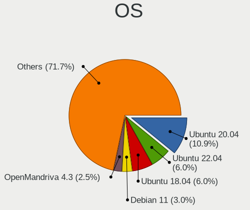
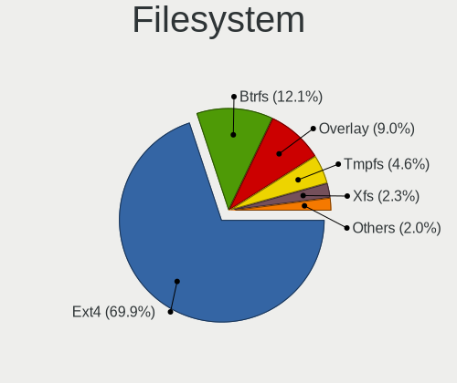
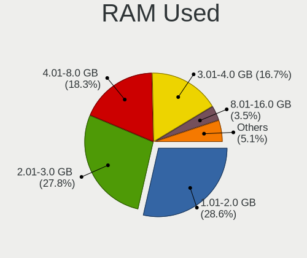
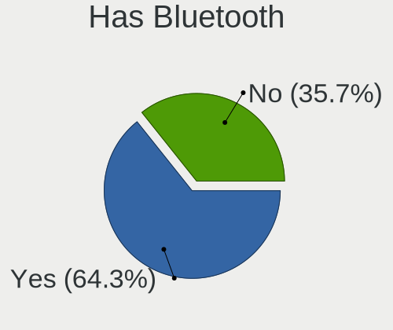
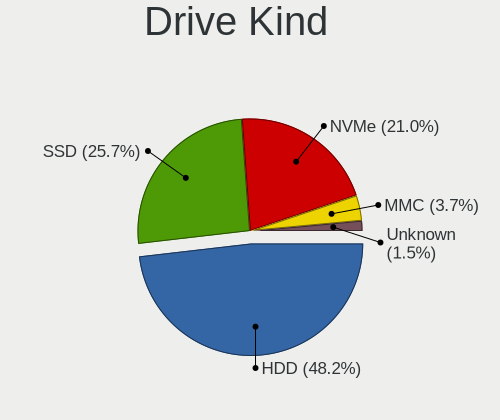
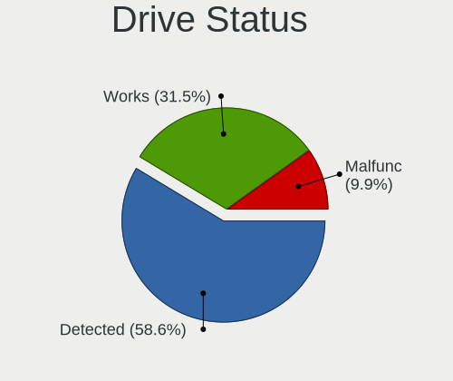
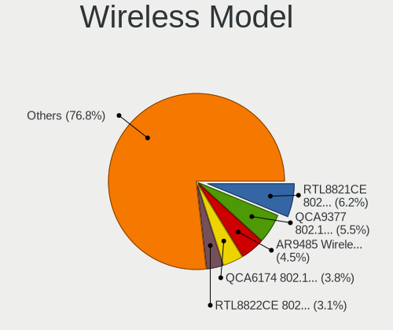
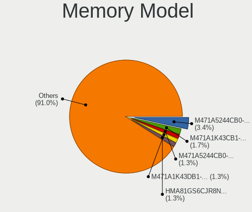

Linux in Ecuador - Tested Hardware & Statistics
-----------------------------------------------

A project to collect tested hardware configurations for Linux in Ecuador.

Anyone can contribute to this report by the [hw-probe](https://github.com/linuxhw/hw-probe) tool:

    sudo -E hw-probe -all -upload

Please contribute! Especially if your hardware is rare.

This is a report for all computer types. See also reports for [desktops](/Location/Ecuador/Desktop/README.md) and [notebooks](/Location/Ecuador/Notebook/README.md).

Contents
--------

* [ Test Cases ](#test-cases)

* [ System ](#system)
  - [ OS                       ](#os)
  - [ OS Family                ](#os-family)
  - [ Kernel                   ](#kernel)
  - [ Kernel Family            ](#kernel-family)
  - [ Kernel Major Ver.        ](#kernel-major-ver)
  - [ Arch                     ](#arch)
  - [ DE                       ](#de)
  - [ Display Server           ](#display-server)
  - [ Display Manager          ](#display-manager)
  - [ OS Lang                  ](#os-lang)
  - [ Boot Mode                ](#boot-mode)
  - [ Filesystem               ](#filesystem)
  - [ Part. scheme             ](#part-scheme)
  - [ Dual Boot with Linux/BSD ](#dual-boot-with-linuxbsd)
  - [ Dual Boot (Win)          ](#dual-boot-win)

* [ Board ](#board)
  - [ Vendor                   ](#vendor)
  - [ Model                    ](#model)
  - [ Model Family             ](#model-family)
  - [ MFG Year                 ](#mfg-year)
  - [ Form Factor              ](#form-factor)
  - [ Secure Boot              ](#secure-boot)
  - [ Coreboot                 ](#coreboot)
  - [ RAM Size                 ](#ram-size)
  - [ RAM Used                 ](#ram-used)
  - [ Total Drives             ](#total-drives)
  - [ Has CD-ROM               ](#has-cd-rom)
  - [ Has Ethernet             ](#has-ethernet)
  - [ Has WiFi                 ](#has-wifi)
  - [ Has Bluetooth            ](#has-bluetooth)

* [ Location ](#location)
  - [ Country                  ](#country)
  - [ City                     ](#city)

* [ Drives ](#drives)
  - [ Drive Vendor             ](#drive-vendor)
  - [ Drive Model              ](#drive-model)
  - [ HDD Vendor               ](#hdd-vendor)
  - [ SSD Vendor               ](#ssd-vendor)
  - [ Drive Kind               ](#drive-kind)
  - [ Drive Connector          ](#drive-connector)
  - [ Drive Size               ](#drive-size)
  - [ Space Total              ](#space-total)
  - [ Space Used               ](#space-used)
  - [ Malfunc. Drives          ](#malfunc-drives)
  - [ Malfunc. Drive Vendor    ](#malfunc-drive-vendor)
  - [ Malfunc. HDD Vendor      ](#malfunc-hdd-vendor)
  - [ Malfunc. Drive Kind      ](#malfunc-drive-kind)
  - [ Failed Drives            ](#failed-drives)
  - [ Failed Drive Vendor      ](#failed-drive-vendor)
  - [ Drive Status             ](#drive-status)

* [ Storage controller ](#storage-controller)
  - [ Storage Vendor           ](#storage-vendor)
  - [ Storage Model            ](#storage-model)
  - [ Storage Kind             ](#storage-kind)

* [ Processor ](#processor)
  - [ CPU Vendor               ](#cpu-vendor)
  - [ CPU Model                ](#cpu-model)
  - [ CPU Model Family         ](#cpu-model-family)
  - [ CPU Cores                ](#cpu-cores)
  - [ CPU Sockets              ](#cpu-sockets)
  - [ CPU Threads              ](#cpu-threads)
  - [ CPU Op-Modes             ](#cpu-op-modes)
  - [ CPU Microcode            ](#cpu-microcode)
  - [ CPU Microarch            ](#cpu-microarch)

* [ Graphics ](#graphics)
  - [ GPU Vendor               ](#gpu-vendor)
  - [ GPU Model                ](#gpu-model)
  - [ GPU Combo                ](#gpu-combo)
  - [ GPU Driver               ](#gpu-driver)
  - [ GPU Memory               ](#gpu-memory)

* [ Monitor ](#monitor)
  - [ Monitor Vendor           ](#monitor-vendor)
  - [ Monitor Model            ](#monitor-model)
  - [ Monitor Resolution       ](#monitor-resolution)
  - [ Monitor Diagonal         ](#monitor-diagonal)
  - [ Monitor Width            ](#monitor-width)
  - [ Aspect Ratio             ](#aspect-ratio)
  - [ Monitor Area             ](#monitor-area)
  - [ Pixel Density            ](#pixel-density)
  - [ Multiple Monitors        ](#multiple-monitors)

* [ Network ](#network)
  - [ Net Controller Vendor    ](#net-controller-vendor)
  - [ Net Controller Model     ](#net-controller-model)
  - [ Wireless Vendor          ](#wireless-vendor)
  - [ Wireless Model           ](#wireless-model)
  - [ Ethernet Vendor          ](#ethernet-vendor)
  - [ Ethernet Model           ](#ethernet-model)
  - [ Net Controller Kind      ](#net-controller-kind)
  - [ Used Controller          ](#used-controller)
  - [ NICs                     ](#nics)
  - [ IPv6                     ](#ipv6)

* [ Bluetooth ](#bluetooth)
  - [ Bluetooth Vendor         ](#bluetooth-vendor)
  - [ Bluetooth Model          ](#bluetooth-model)

* [ Sound ](#sound)
  - [ Sound Vendor             ](#sound-vendor)
  - [ Sound Model              ](#sound-model)

* [ Memory ](#memory)
  - [ Memory Vendor            ](#memory-vendor)
  - [ Memory Model             ](#memory-model)
  - [ Memory Kind              ](#memory-kind)
  - [ Memory Form Factor       ](#memory-form-factor)
  - [ Memory Size              ](#memory-size)
  - [ Memory Speed             ](#memory-speed)

* [ Printers & scanners ](#printers--scanners)
  - [ Printer Vendor           ](#printer-vendor)
  - [ Printer Model            ](#printer-model)
  - [ Scanner Vendor           ](#scanner-vendor)
  - [ Scanner Model            ](#scanner-model)

* [ Camera ](#camera)
  - [ Camera Vendor            ](#camera-vendor)
  - [ Camera Model             ](#camera-model)

* [ Security ](#security)
  - [ Fingerprint Vendor       ](#fingerprint-vendor)
  - [ Fingerprint Model        ](#fingerprint-model)
  - [ Chipcard Vendor          ](#chipcard-vendor)
  - [ Chipcard Model           ](#chipcard-model)

* [ Unsupported ](#unsupported)
  - [ Unsupported Devices      ](#unsupported-devices)
  - [ Unsupported Device Types ](#unsupported-device-types)

Test Cases
----------

Total: 281

| Vendor        | Model                       | Form-Factor | Probe                                                      | Date         |
|---------------|-----------------------------|-------------|------------------------------------------------------------|--------------|
| ASUSTek       | UX360CA                     | Notebook    | [63fac2dc9b](https://linux-hardware.org/?probe=63fac2dc9b) | May 29, 2022 |
| ASUSTek       | H81M-A                      | Desktop     | [0aa77d107c](https://linux-hardware.org/?probe=0aa77d107c) | May 28, 2022 |
| Alienware     | 15 R3                       | Notebook    | [84df370117](https://linux-hardware.org/?probe=84df370117) | May 26, 2022 |
| HP            | Laptop 14-cf3xxx            | Notebook    | [9e4cd6dab4](https://linux-hardware.org/?probe=9e4cd6dab4) | May 25, 2022 |
| Chuwi         | HeroBook Pro                | Notebook    | [9f009d836c](https://linux-hardware.org/?probe=9f009d836c) | May 23, 2022 |
| ASUSTek       | PRIME A320M-K               | Desktop     | [be78ab6334](https://linux-hardware.org/?probe=be78ab6334) | May 23, 2022 |
| ASUSTek       | PRIME A320M-K               | Desktop     | [c21c66647d](https://linux-hardware.org/?probe=c21c66647d) | May 23, 2022 |
| Sony          | SVE14113ELW                 | Notebook    | [647c09a7be](https://linux-hardware.org/?probe=647c09a7be) | May 23, 2022 |
| Chuwi         | HeroBook Pro                | Notebook    | [206aa9b805](https://linux-hardware.org/?probe=206aa9b805) | May 23, 2022 |
| Lenovo        | G580 20150                  | Notebook    | [ec5867b2f7](https://linux-hardware.org/?probe=ec5867b2f7) | May 17, 2022 |
| Lenovo        | G580 20150                  | Notebook    | [9b06242456](https://linux-hardware.org/?probe=9b06242456) | May 17, 2022 |
| Toshiba       | Satellite L45-B             | Notebook    | [7f46e36f35](https://linux-hardware.org/?probe=7f46e36f35) | May 14, 2022 |
| Toshiba       | Satellite L45-B             | Notebook    | [81b3317aa8](https://linux-hardware.org/?probe=81b3317aa8) | May 14, 2022 |
| Intel         | DH61BF AAG81311-101         | Desktop     | [9c54929196](https://linux-hardware.org/?probe=9c54929196) | May 11, 2022 |
| Dell          | XPS 13 9370                 | Notebook    | [f90e5f669e](https://linux-hardware.org/?probe=f90e5f669e) | May 09, 2022 |
| Gigabyte      | X58A-UD3R                   | Desktop     | [0c05fbff9c](https://linux-hardware.org/?probe=0c05fbff9c) | May 07, 2022 |
| Toshiba       | Satellite L50-B             | Notebook    | [e559318a8b](https://linux-hardware.org/?probe=e559318a8b) | May 02, 2022 |
| ASUSTek       | VivoBook_ASUSLaptop X421... | Notebook    | [c8d977cf63](https://linux-hardware.org/?probe=c8d977cf63) | May 02, 2022 |
| Gigabyte      | H97-Gaming 3                | Desktop     | [150f5a4bd0](https://linux-hardware.org/?probe=150f5a4bd0) | Apr 30, 2022 |
| Biostar       | G41D3C                      | Desktop     | [a6db6a2cdf](https://linux-hardware.org/?probe=a6db6a2cdf) | Apr 27, 2022 |
| HP            | Laptop 14-cf3xxx            | Notebook    | [e049bbd414](https://linux-hardware.org/?probe=e049bbd414) | Apr 26, 2022 |
| Biostar       | G41D3C                      | Desktop     | [ac5c2d8b54](https://linux-hardware.org/?probe=ac5c2d8b54) | Apr 23, 2022 |
| Biostar       | G41D3C                      | Desktop     | [6fdf919c55](https://linux-hardware.org/?probe=6fdf919c55) | Apr 23, 2022 |
| HP            | Unknown                     | Notebook    | [0a47967da0](https://linux-hardware.org/?probe=0a47967da0) | Apr 23, 2022 |
| ASUSTek       | H81M-A                      | Desktop     | [01c63fa622](https://linux-hardware.org/?probe=01c63fa622) | Apr 22, 2022 |
| HP            | Unknown                     | Notebook    | [fa5bba3e33](https://linux-hardware.org/?probe=fa5bba3e33) | Apr 22, 2022 |
| ASUSTek       | VivoBook_ASUSLaptop X421... | Notebook    | [a0ad75fa4b](https://linux-hardware.org/?probe=a0ad75fa4b) | Apr 16, 2022 |
| Foxconn       | Cinema Series FAB           | Desktop     | [1e32228753](https://linux-hardware.org/?probe=1e32228753) | Apr 13, 2022 |
| ASUSTek       | H81M-A                      | Desktop     | [89dfde5c28](https://linux-hardware.org/?probe=89dfde5c28) | Apr 11, 2022 |
| Gigabyte      | H97-Gaming 3                | Desktop     | [8ea4ee1c50](https://linux-hardware.org/?probe=8ea4ee1c50) | Apr 11, 2022 |
| HP            | Pavilion dv6                | Notebook    | [bacb1d04de](https://linux-hardware.org/?probe=bacb1d04de) | Apr 02, 2022 |
| Google        | Panther                     | Desktop     | [b1af725b7c](https://linux-hardware.org/?probe=b1af725b7c) | Mar 30, 2022 |
| Google        | Panther                     | Desktop     | [98185ea5bc](https://linux-hardware.org/?probe=98185ea5bc) | Mar 30, 2022 |
| Lenovo        | V15-IIL 82C5                | Notebook    | [722eee0995](https://linux-hardware.org/?probe=722eee0995) | Mar 30, 2022 |
| Sony          | VPCEG30EL                   | Notebook    | [c19f1a4739](https://linux-hardware.org/?probe=c19f1a4739) | Mar 26, 2022 |
| Sony          | SVE14A25CLB                 | Notebook    | [2e6afba454](https://linux-hardware.org/?probe=2e6afba454) | Mar 25, 2022 |
| ASUSTek       | H81M-A                      | Desktop     | [1c1b20796d](https://linux-hardware.org/?probe=1c1b20796d) | Mar 24, 2022 |
| Apple         | MacBookPro12,1              | Notebook    | [a39345cbf9](https://linux-hardware.org/?probe=a39345cbf9) | Mar 22, 2022 |
| Dell          | Inspiron 7547               | Notebook    | [af0de64399](https://linux-hardware.org/?probe=af0de64399) | Mar 22, 2022 |
| Razer         | Blade 15 Base Model (Ear... | Notebook    | [1ef1ffe2a3](https://linux-hardware.org/?probe=1ef1ffe2a3) | Mar 20, 2022 |
| Razer         | Blade Stealth               | Notebook    | [6b524f20d4](https://linux-hardware.org/?probe=6b524f20d4) | Mar 20, 2022 |
| TPV-INVENT... | 2AF2 A01                    | Desktop     | [1ab476e992](https://linux-hardware.org/?probe=1ab476e992) | Mar 18, 2022 |
| HP            | Laptop 14-cf3xxx            | Notebook    | [faae36d70e](https://linux-hardware.org/?probe=faae36d70e) | Mar 17, 2022 |
| HP            | Laptop 14-cf3xxx            | Notebook    | [4d5aa250a1](https://linux-hardware.org/?probe=4d5aa250a1) | Mar 17, 2022 |
| TrekStor      | Primebook C13               | Convertible | [2c908202fc](https://linux-hardware.org/?probe=2c908202fc) | Mar 17, 2022 |
| Toshiba       | Satellite C55D-A            | Notebook    | [fccc5b2ef5](https://linux-hardware.org/?probe=fccc5b2ef5) | Mar 16, 2022 |
| ASUSTek       | ROG Zephyrus G14 GA401IH... | Notebook    | [c27fb51c94](https://linux-hardware.org/?probe=c27fb51c94) | Mar 13, 2022 |
| ASUSTek       | ROG Zephyrus G14 GA401IH... | Notebook    | [15b0517729](https://linux-hardware.org/?probe=15b0517729) | Mar 13, 2022 |
| Biostar       | G31-M7 TE                   | Desktop     | [f08be29479](https://linux-hardware.org/?probe=f08be29479) | Mar 12, 2022 |
| HP            | 15 Notebook PC              | Notebook    | [d9e67c0484](https://linux-hardware.org/?probe=d9e67c0484) | Mar 12, 2022 |
| HP            | EliteBook Folio 9470m       | Notebook    | [bd4f7daadb](https://linux-hardware.org/?probe=bd4f7daadb) | Mar 10, 2022 |
| Compal        | PBL2021                     | Notebook    | [4e367db737](https://linux-hardware.org/?probe=4e367db737) | Feb 28, 2022 |
| Intel         | H81                         | Desktop     | [a62759e3c8](https://linux-hardware.org/?probe=a62759e3c8) | Feb 27, 2022 |
| Intel         | H81                         | Desktop     | [d1f816774f](https://linux-hardware.org/?probe=d1f816774f) | Feb 27, 2022 |
| Gigabyte      | B450M DS3H-CF               | Desktop     | [14f2fcb8be](https://linux-hardware.org/?probe=14f2fcb8be) | Feb 16, 2022 |
| Gigabyte      | H97-Gaming 3                | Desktop     | [b5ee6e292d](https://linux-hardware.org/?probe=b5ee6e292d) | Feb 10, 2022 |
| Gigabyte      | B450M DS3H-CF               | Desktop     | [4cabeb69e3](https://linux-hardware.org/?probe=4cabeb69e3) | Feb 04, 2022 |
| Dell          | G5 5587                     | Notebook    | [5f51492976](https://linux-hardware.org/?probe=5f51492976) | Jan 29, 2022 |
| Dell          | Latitude 7280               | Notebook    | [fdf5a41dcc](https://linux-hardware.org/?probe=fdf5a41dcc) | Jan 25, 2022 |
| Dell          | Latitude 7280               | Notebook    | [b4c6f2fe35](https://linux-hardware.org/?probe=b4c6f2fe35) | Jan 25, 2022 |
| Dell          | Inspiron 3442               | Notebook    | [d8fc419747](https://linux-hardware.org/?probe=d8fc419747) | Jan 18, 2022 |
| Biostar       | H61MGV3                     | Desktop     | [2f9b9ff8ee](https://linux-hardware.org/?probe=2f9b9ff8ee) | Jan 13, 2022 |
| Biostar       | H61MGV3                     | Desktop     | [332b6e1f8a](https://linux-hardware.org/?probe=332b6e1f8a) | Jan 12, 2022 |
| HP            | ENVY x360 Convertible 15... | Convertible | [ddd3544bcf](https://linux-hardware.org/?probe=ddd3544bcf) | Jan 08, 2022 |
| HP            | ENVY x360 Convertible 15... | Convertible | [fbd40dba79](https://linux-hardware.org/?probe=fbd40dba79) | Dec 31, 2021 |
| HP            | ENVY x360 Convertible 15... | Convertible | [9f2ba12e1f](https://linux-hardware.org/?probe=9f2ba12e1f) | Dec 31, 2021 |
| HP            | ENVY x360 Convertible 15... | Convertible | [82281b42b0](https://linux-hardware.org/?probe=82281b42b0) | Dec 29, 2021 |
| Acer          | Aspire A515-56              | Notebook    | [359493a8bf](https://linux-hardware.org/?probe=359493a8bf) | Dec 27, 2021 |
| Biostar       | A68N-2100                   | Desktop     | [81f4a18209](https://linux-hardware.org/?probe=81f4a18209) | Dec 26, 2021 |
| Acer          | Aspire A515-56              | Notebook    | [54cb3818f3](https://linux-hardware.org/?probe=54cb3818f3) | Dec 20, 2021 |
| Intel         | DG41RQ AAE54511-205         | Desktop     | [aea3d82ee8](https://linux-hardware.org/?probe=aea3d82ee8) | Dec 15, 2021 |
| Intel         | DG41RQ AAE54511-205         | Desktop     | [d84eb83569](https://linux-hardware.org/?probe=d84eb83569) | Dec 08, 2021 |
| Lenovo        | IdeaPad 330-15AST 81D6      | Notebook    | [ef48db912e](https://linux-hardware.org/?probe=ef48db912e) | Nov 24, 2021 |
| ASUSTek       | VivoBook_ASUSLaptop X712... | Notebook    | [c30cc4860b](https://linux-hardware.org/?probe=c30cc4860b) | Nov 24, 2021 |
| ASUSTek       | G750JX                      | Notebook    | [f503f26e28](https://linux-hardware.org/?probe=f503f26e28) | Nov 23, 2021 |
| ASUSTek       | H81M-A                      | Desktop     | [c7762271da](https://linux-hardware.org/?probe=c7762271da) | Nov 18, 2021 |
| Google        | Treeya                      | Notebook    | [a0ab206cd8](https://linux-hardware.org/?probe=a0ab206cd8) | Nov 09, 2021 |
| Dell          | Inspiron MP061              | Notebook    | [d6ed71bc78](https://linux-hardware.org/?probe=d6ed71bc78) | Nov 02, 2021 |
| HP            | G42                         | Notebook    | [5ee39658a8](https://linux-hardware.org/?probe=5ee39658a8) | Oct 28, 2021 |
| Timi          | RedmiBook 14-APCS           | Notebook    | [d31c8b483c](https://linux-hardware.org/?probe=d31c8b483c) | Oct 28, 2021 |
| HP            | G42                         | Notebook    | [a8181c9c9b](https://linux-hardware.org/?probe=a8181c9c9b) | Oct 24, 2021 |
| Gigabyte      | H310M H x.x                 | Desktop     | [419e0c7eb2](https://linux-hardware.org/?probe=419e0c7eb2) | Oct 21, 2021 |
| ASUSTek       | PRIME H410M-E               | Desktop     | [b5d6c0ae9c](https://linux-hardware.org/?probe=b5d6c0ae9c) | Oct 20, 2021 |
| Fujitsu       | LIFEBOOK E752               | Notebook    | [177f79d880](https://linux-hardware.org/?probe=177f79d880) | Oct 18, 2021 |
| Lenovo        | IdeaPad 330S-15IKB 81F5     | Notebook    | [70e96b19b2](https://linux-hardware.org/?probe=70e96b19b2) | Oct 17, 2021 |
| Dell          | Inspiron 3593               | Notebook    | [2297765c40](https://linux-hardware.org/?probe=2297765c40) | Oct 14, 2021 |
| Gigabyte      | H310M H x.x                 | Desktop     | [3fe7cdd0f9](https://linux-hardware.org/?probe=3fe7cdd0f9) | Oct 14, 2021 |
| ASUSTek       | ASUS TUF Gaming A15 FA50... | Notebook    | [da1bab4a9c](https://linux-hardware.org/?probe=da1bab4a9c) | Oct 13, 2021 |
| HP            | 240 G6 Notebook PC          | Notebook    | [87b00b0a80](https://linux-hardware.org/?probe=87b00b0a80) | Oct 12, 2021 |
| ASRock        | B450 Gaming K4              | Desktop     | [0de7c95a46](https://linux-hardware.org/?probe=0de7c95a46) | Oct 12, 2021 |
| Acer          | Aspire R5-571TG             | Convertible | [6257ee6ddd](https://linux-hardware.org/?probe=6257ee6ddd) | Oct 07, 2021 |
| Acer          | Aspire R5-571TG             | Convertible | [5972d02719](https://linux-hardware.org/?probe=5972d02719) | Oct 07, 2021 |
| XTRATECH C... | MN-1022X                    | Tablet      | [2307619c77](https://linux-hardware.org/?probe=2307619c77) | Sep 27, 2021 |
| XTRATECH C... | MN-1022X                    | Tablet      | [d4cd8cbc7e](https://linux-hardware.org/?probe=d4cd8cbc7e) | Sep 27, 2021 |
| Foxconn       | H61MXL-K                    | Desktop     | [e776e3f647](https://linux-hardware.org/?probe=e776e3f647) | Sep 08, 2021 |
| ASUSTek       | P7P55D-E                    | Desktop     | [5e208c3927](https://linux-hardware.org/?probe=5e208c3927) | Sep 02, 2021 |
| ASUSTek       | PRIME H410M-E               | Desktop     | [f667f32489](https://linux-hardware.org/?probe=f667f32489) | Aug 31, 2021 |
| MSI           | Z390-A PRO                  | Desktop     | [72cddcc75c](https://linux-hardware.org/?probe=72cddcc75c) | Aug 29, 2021 |
| Unknown       | Unknown                     | Notebook    | [449fdc2d2d](https://linux-hardware.org/?probe=449fdc2d2d) | Aug 23, 2021 |
| Unknown       | Unknown                     | Notebook    | [b1587c998f](https://linux-hardware.org/?probe=b1587c998f) | Aug 23, 2021 |
| Gigabyte      | H410M H V2                  | Desktop     | [84faf4af12](https://linux-hardware.org/?probe=84faf4af12) | Aug 22, 2021 |
| Gigabyte      | H410M H V2                  | Desktop     | [5e4047a59c](https://linux-hardware.org/?probe=5e4047a59c) | Aug 22, 2021 |
| Toshiba       | Satellite S55-B             | Notebook    | [c4ec7d25a7](https://linux-hardware.org/?probe=c4ec7d25a7) | Aug 21, 2021 |
| HP            | Pavilion g4                 | Notebook    | [3276092f1e](https://linux-hardware.org/?probe=3276092f1e) | Aug 15, 2021 |
| ASUSTek       | VivoBook 15_ASUS Laptop ... | Notebook    | [6909a1a841](https://linux-hardware.org/?probe=6909a1a841) | Aug 14, 2021 |
| Unknown       | Unknown                     | Notebook    | [008647318c](https://linux-hardware.org/?probe=008647318c) | Aug 09, 2021 |
| Unknown       | Unknown                     | Notebook    | [5de2d0ae61](https://linux-hardware.org/?probe=5de2d0ae61) | Aug 09, 2021 |
| ASUSTek       | VivoBook_ASUSLaptop X512... | Notebook    | [69c078f12b](https://linux-hardware.org/?probe=69c078f12b) | Aug 01, 2021 |
| Acer          | TravelMate X3410-M          | Notebook    | [18b5757039](https://linux-hardware.org/?probe=18b5757039) | Jul 29, 2021 |
| Gigabyte      | H97M-DS3P                   | Desktop     | [c5f1df2581](https://linux-hardware.org/?probe=c5f1df2581) | Jul 26, 2021 |
| Toshiba       | Satellite S55-A             | Notebook    | [a145aa9a69](https://linux-hardware.org/?probe=a145aa9a69) | Jul 26, 2021 |
| ASUSTek       | PRIME B450M-A               | Desktop     | [00d53058e7](https://linux-hardware.org/?probe=00d53058e7) | Jul 26, 2021 |
| Toshiba       | Satellite S55-A             | Notebook    | [08eec2f3a7](https://linux-hardware.org/?probe=08eec2f3a7) | Jul 25, 2021 |
| Toshiba       | Satellite C45-A             | Notebook    | [0497ab613d](https://linux-hardware.org/?probe=0497ab613d) | Jul 25, 2021 |
| ASUSTek       | PRIME A520M-K               | Desktop     | [33c83a65d8](https://linux-hardware.org/?probe=33c83a65d8) | Jul 24, 2021 |
| Fujitsu       | LIFEBOOK E752               | Notebook    | [a071db12c9](https://linux-hardware.org/?probe=a071db12c9) | Jul 12, 2021 |
| Google        | Banjo                       | Notebook    | [d451dcd617](https://linux-hardware.org/?probe=d451dcd617) | Jul 02, 2021 |
| Biostar       | A68N-2100                   | Desktop     | [bffed391bc](https://linux-hardware.org/?probe=bffed391bc) | Jul 02, 2021 |
| Google        | Grunt                       | Notebook    | [2bb0921a94](https://linux-hardware.org/?probe=2bb0921a94) | Jul 01, 2021 |
| Google        | Grunt                       | Notebook    | [4ea5c8f438](https://linux-hardware.org/?probe=4ea5c8f438) | Jul 01, 2021 |
| Pegatron      | 2ACC                        | Desktop     | [271f50a6ed](https://linux-hardware.org/?probe=271f50a6ed) | Jun 29, 2021 |
| ASUSTek       | PRIME A520M-K               | Desktop     | [0f90b91804](https://linux-hardware.org/?probe=0f90b91804) | Jun 25, 2021 |
| Google        | Kip                         | Notebook    | [7634152b76](https://linux-hardware.org/?probe=7634152b76) | Jun 21, 2021 |
| Acer          | TravelMate B117-M           | Notebook    | [a5fc625cf2](https://linux-hardware.org/?probe=a5fc625cf2) | Jun 04, 2021 |
| ASUSTek       | H81M-K                      | Desktop     | [52fa7c5a31](https://linux-hardware.org/?probe=52fa7c5a31) | May 30, 2021 |
| ASUSTek       | PRIME J4005I-C              | Desktop     | [d8be675a5d](https://linux-hardware.org/?probe=d8be675a5d) | May 19, 2021 |
| MSI           | GF63 Thin 9SC               | Notebook    | [54a4075ac5](https://linux-hardware.org/?probe=54a4075ac5) | May 16, 2021 |
| HP            | 1000                        | Notebook    | [d23f6c89ad](https://linux-hardware.org/?probe=d23f6c89ad) | May 15, 2021 |
| HP            | 1000                        | Notebook    | [a1ff0a7b3d](https://linux-hardware.org/?probe=a1ff0a7b3d) | May 13, 2021 |
| Acer          | Aspire V5-121               | Notebook    | [cc73e2b026](https://linux-hardware.org/?probe=cc73e2b026) | May 13, 2021 |
| HP            | 1000                        | Notebook    | [4bbe06ec7a](https://linux-hardware.org/?probe=4bbe06ec7a) | May 13, 2021 |
| Lenovo        | ThinkPad E15 20REA00000     | Notebook    | [1ac42dd429](https://linux-hardware.org/?probe=1ac42dd429) | May 09, 2021 |
| MSI           | GF63 Thin 9SC               | Notebook    | [cd6a799646](https://linux-hardware.org/?probe=cd6a799646) | Apr 29, 2021 |
| ASRock        | B550M-HDV                   | Desktop     | [aaee9d166a](https://linux-hardware.org/?probe=aaee9d166a) | Apr 26, 2021 |
| Lenovo        | IdeaPad 330S-15IKB 81F5     | Notebook    | [140e992105](https://linux-hardware.org/?probe=140e992105) | Apr 24, 2021 |
| Samsung       | 550XCJ/550XCR               | Notebook    | [2a2a56b6d4](https://linux-hardware.org/?probe=2a2a56b6d4) | Apr 22, 2021 |
| Dell          | Inspiron 3442               | Notebook    | [921cfbf363](https://linux-hardware.org/?probe=921cfbf363) | Apr 18, 2021 |
| Gigabyte      | H81M-H                      | Desktop     | [e34aa83281](https://linux-hardware.org/?probe=e34aa83281) | Apr 16, 2021 |
| Dell          | G5 5587                     | Notebook    | [c88e053304](https://linux-hardware.org/?probe=c88e053304) | Apr 07, 2021 |
| Dell          | Inspiron 3558               | Notebook    | [0ba2e43e56](https://linux-hardware.org/?probe=0ba2e43e56) | Mar 24, 2021 |
| HP            | ProBook 640 G2              | Notebook    | [39e97c482d](https://linux-hardware.org/?probe=39e97c482d) | Mar 24, 2021 |
| Lenovo        | ThinkPad T530 2429JB5       | Notebook    | [b3eee9be3e](https://linux-hardware.org/?probe=b3eee9be3e) | Mar 23, 2021 |
| Lenovo        | ThinkPad T530 2429JB5       | Notebook    | [e04914d4de](https://linux-hardware.org/?probe=e04914d4de) | Mar 23, 2021 |
| Intel         | DB75EN AAG39650-302         | Desktop     | [02f80c53ea](https://linux-hardware.org/?probe=02f80c53ea) | Mar 05, 2021 |
| Dell          | Inspiron 1420               | Notebook    | [7b12363b97](https://linux-hardware.org/?probe=7b12363b97) | Mar 04, 2021 |
| ASUSTek       | PRIME A520M-K               | Desktop     | [d5ef689e13](https://linux-hardware.org/?probe=d5ef689e13) | Feb 27, 2021 |
| Dell          | Inspiron 7375               | Notebook    | [eea996c7d4](https://linux-hardware.org/?probe=eea996c7d4) | Feb 26, 2021 |
| Shuttle       | SFM27 V20                   | Desktop     | [14a841b718](https://linux-hardware.org/?probe=14a841b718) | Feb 21, 2021 |
| Lenovo        | IdeaPadFlex 5 14ARE05 81... | Convertible | [35cc521571](https://linux-hardware.org/?probe=35cc521571) | Feb 08, 2021 |
| Lenovo        | ThinkPad X201 3680PKS       | Notebook    | [14a1f8c536](https://linux-hardware.org/?probe=14a1f8c536) | Feb 07, 2021 |
| Lenovo        | ThinkPad X201 3680PKS       | Notebook    | [f935adf770](https://linux-hardware.org/?probe=f935adf770) | Feb 07, 2021 |
| Dell          | Vostro 3480                 | Notebook    | [2162db2610](https://linux-hardware.org/?probe=2162db2610) | Feb 03, 2021 |
| Sony          | VPCCW1S1E                   | Notebook    | [f57d56b50e](https://linux-hardware.org/?probe=f57d56b50e) | Jan 31, 2021 |
| Biostar       | G31-M7 TE                   | Desktop     | [c30b6ae115](https://linux-hardware.org/?probe=c30b6ae115) | Jan 24, 2021 |
| Dell          | Inspiron 15 7000 Gaming     | Notebook    | [f4e1001265](https://linux-hardware.org/?probe=f4e1001265) | Jan 23, 2021 |
| HP            | Laptop 14-cf3xxx            | Notebook    | [063b008ad5](https://linux-hardware.org/?probe=063b008ad5) | Jan 15, 2021 |
| HP            | Laptop 14-cf3xxx            | Notebook    | [473e0472d5](https://linux-hardware.org/?probe=473e0472d5) | Jan 12, 2021 |
| HP            | EliteBook 2730p             | Notebook    | [5a7277af8b](https://linux-hardware.org/?probe=5a7277af8b) | Jan 08, 2021 |
| HP            | EliteBook 2730p             | Notebook    | [bbbf68f88b](https://linux-hardware.org/?probe=bbbf68f88b) | Jan 08, 2021 |
| Google        | Parrot                      | Notebook    | [a3a6c2f819](https://linux-hardware.org/?probe=a3a6c2f819) | Jan 04, 2021 |
| Google        | Parrot                      | Notebook    | [55b807260c](https://linux-hardware.org/?probe=55b807260c) | Jan 04, 2021 |
| HP            | Pavilion 14                 | Notebook    | [91b047b61a](https://linux-hardware.org/?probe=91b047b61a) | Dec 31, 2020 |
| Intel         | DG33BU AAD79951-407         | Desktop     | [c0e2f63e04](https://linux-hardware.org/?probe=c0e2f63e04) | Dec 20, 2020 |
| Gateway       | NE56R                       | Notebook    | [6988a76879](https://linux-hardware.org/?probe=6988a76879) | Dec 11, 2020 |
| HP            | Laptop 14-cf3xxx            | Notebook    | [3f61162824](https://linux-hardware.org/?probe=3f61162824) | Dec 07, 2020 |
| Dell          | Inspiron 1420               | Notebook    | [e5dab19c0f](https://linux-hardware.org/?probe=e5dab19c0f) | Dec 05, 2020 |
| Intel         | DP55KG AAE47218-404         | Desktop     | [5604be0f67](https://linux-hardware.org/?probe=5604be0f67) | Nov 25, 2020 |
| HP            | ProBook 4440s               | Notebook    | [b4747f87a1](https://linux-hardware.org/?probe=b4747f87a1) | Nov 24, 2020 |
| Dell          | Inspiron 1750               | Notebook    | [612608a41f](https://linux-hardware.org/?probe=612608a41f) | Nov 21, 2020 |
| ASUSTek       | PRIME A320M-A               | Desktop     | [cffed87fd7](https://linux-hardware.org/?probe=cffed87fd7) | Nov 21, 2020 |
| ASUSTek       | PRIME A320M-A               | Desktop     | [1505bb0505](https://linux-hardware.org/?probe=1505bb0505) | Nov 21, 2020 |
| Dell          | Latitude D430               | Notebook    | [77ef794b1d](https://linux-hardware.org/?probe=77ef794b1d) | Nov 21, 2020 |
| Dell          | Latitude D430               | Notebook    | [c028c146b6](https://linux-hardware.org/?probe=c028c146b6) | Nov 21, 2020 |
| Fujitsu       | LIFEBOOK E752               | Notebook    | [364a814fd0](https://linux-hardware.org/?probe=364a814fd0) | Nov 19, 2020 |
| Fujitsu       | LIFEBOOK E752               | Notebook    | [b0fbbd8176](https://linux-hardware.org/?probe=b0fbbd8176) | Nov 19, 2020 |
| HP            | 3115m                       | Notebook    | [1ae9651614](https://linux-hardware.org/?probe=1ae9651614) | Nov 17, 2020 |
| Gateway       | NE56R                       | Notebook    | [4e9bf51faa](https://linux-hardware.org/?probe=4e9bf51faa) | Nov 16, 2020 |
| ASUSTek       | X510UAR                     | Notebook    | [106453a877](https://linux-hardware.org/?probe=106453a877) | Oct 23, 2020 |
| ASUSTek       | X510UAR                     | Notebook    | [fea6f132fa](https://linux-hardware.org/?probe=fea6f132fa) | Oct 23, 2020 |
| Toshiba       | PORTEGE M805                | Notebook    | [cacfe4abd9](https://linux-hardware.org/?probe=cacfe4abd9) | Oct 22, 2020 |
| Toshiba       | Satellite C55-B             | Notebook    | [146545f430](https://linux-hardware.org/?probe=146545f430) | Oct 17, 2020 |
| Toshiba       | Satellite C55-B             | Notebook    | [61e809ea3a](https://linux-hardware.org/?probe=61e809ea3a) | Oct 12, 2020 |
| Toshiba       | Satellite C55-B             | Notebook    | [6353946b7e](https://linux-hardware.org/?probe=6353946b7e) | Oct 12, 2020 |
| Dell          | Inspiron 1420               | Notebook    | [03631f1005](https://linux-hardware.org/?probe=03631f1005) | Oct 08, 2020 |
| Dell          | Inspiron 1420               | Notebook    | [78e7085775](https://linux-hardware.org/?probe=78e7085775) | Oct 08, 2020 |
| MSI           | B75A-G43                    | Desktop     | [fd4f003fa9](https://linux-hardware.org/?probe=fd4f003fa9) | Sep 28, 2020 |
| MSI           | B75A-G43                    | Desktop     | [148c1711fe](https://linux-hardware.org/?probe=148c1711fe) | Sep 28, 2020 |
| Sony          | VGN-CR120E                  | Notebook    | [3e989ff916](https://linux-hardware.org/?probe=3e989ff916) | Sep 24, 2020 |
| Sony          | VGN-CR120E                  | Notebook    | [8569f91c17](https://linux-hardware.org/?probe=8569f91c17) | Sep 23, 2020 |
| ECS           | H61H2-MV                    | Desktop     | [0c5285cd22](https://linux-hardware.org/?probe=0c5285cd22) | Sep 20, 2020 |
| Toshiba       | Satellite C45-A             | Notebook    | [2774da64f6](https://linux-hardware.org/?probe=2774da64f6) | Sep 18, 2020 |
| HP            | Pavilion 15                 | Notebook    | [f824ed9d26](https://linux-hardware.org/?probe=f824ed9d26) | Sep 18, 2020 |
| HP            | Mini 210-1100               | Notebook    | [3b76e02a8f](https://linux-hardware.org/?probe=3b76e02a8f) | Sep 17, 2020 |
| HP            | Pavilion 15                 | Notebook    | [d95e413136](https://linux-hardware.org/?probe=d95e413136) | Sep 16, 2020 |
| HP            | 1497                        | Desktop     | [02645aa87a](https://linux-hardware.org/?probe=02645aa87a) | Sep 15, 2020 |
| Intel         | NUC8BEB J72693-306          | Mini pc     | [40aeea62f1](https://linux-hardware.org/?probe=40aeea62f1) | Sep 13, 2020 |
| HP            | Laptop 14-cf3xxx            | Notebook    | [489cee4d9a](https://linux-hardware.org/?probe=489cee4d9a) | Sep 12, 2020 |
| Toshiba       | Satellite P775              | Notebook    | [d71ccb1065](https://linux-hardware.org/?probe=d71ccb1065) | Sep 10, 2020 |
| HP            | Pavilion dv2500             | Notebook    | [8626b52852](https://linux-hardware.org/?probe=8626b52852) | Sep 08, 2020 |
| Biostar       | P4M90-M7 Ver:1.0            | Desktop     | [cb7ecd71b1](https://linux-hardware.org/?probe=cb7ecd71b1) | Sep 07, 2020 |
| Biostar       | P4M90-M7 Ver:1.0            | Desktop     | [917f5d9bd0](https://linux-hardware.org/?probe=917f5d9bd0) | Sep 07, 2020 |
| Samsung       | 530U4E/540U4E               | Notebook    | [31a023d519](https://linux-hardware.org/?probe=31a023d519) | Sep 06, 2020 |
| Samsung       | 530U4E/540U4E               | Notebook    | [d94a252a6f](https://linux-hardware.org/?probe=d94a252a6f) | Sep 06, 2020 |
| HP            | Laptop 14-cf3xxx            | Notebook    | [c3f5f6d566](https://linux-hardware.org/?probe=c3f5f6d566) | Sep 06, 2020 |
| HP            | Laptop 14-cf3xxx            | Notebook    | [4e0f1689a3](https://linux-hardware.org/?probe=4e0f1689a3) | Sep 06, 2020 |
| Dell          | Inspiron 5570               | Notebook    | [8eb7cfa128](https://linux-hardware.org/?probe=8eb7cfa128) | Sep 05, 2020 |
| HP            | Laptop 14-df0xxx            | Notebook    | [1b11abd994](https://linux-hardware.org/?probe=1b11abd994) | Sep 04, 2020 |
| Lenovo        | IdeaPad 320-15IKB 80XL      | Notebook    | [21f0c0015c](https://linux-hardware.org/?probe=21f0c0015c) | Aug 26, 2020 |
| HP            | Pavilion Laptop 15-cw1xx... | Notebook    | [29f01daf9e](https://linux-hardware.org/?probe=29f01daf9e) | Aug 26, 2020 |
| Dell          | Inspiron N4050              | Notebook    | [e39ccc961c](https://linux-hardware.org/?probe=e39ccc961c) | Aug 20, 2020 |
| Lenovo        | ThinkPad P40 Yoga 20GQ00... | Convertible | [1f4ef5bb49](https://linux-hardware.org/?probe=1f4ef5bb49) | Aug 19, 2020 |
| Biostar       | A68N-2100                   | Desktop     | [27b74a4963](https://linux-hardware.org/?probe=27b74a4963) | Aug 16, 2020 |
| HP            | Pavilion Laptop 15-cw1xx... | Notebook    | [dd8aa75b79](https://linux-hardware.org/?probe=dd8aa75b79) | Aug 16, 2020 |
| ASUSTek       | X502CA                      | Notebook    | [7876d4c48d](https://linux-hardware.org/?probe=7876d4c48d) | Aug 14, 2020 |
| Gigabyte      | H81M-H                      | Desktop     | [ca4fa8777d](https://linux-hardware.org/?probe=ca4fa8777d) | Aug 10, 2020 |
| Lenovo        | IdeaPad 320-15ABR 80XS      | Notebook    | [9bcbc98b0f](https://linux-hardware.org/?probe=9bcbc98b0f) | Jul 26, 2020 |
| Lenovo        | IdeaPad 330-14IGM 81D0      | Notebook    | [c32745014a](https://linux-hardware.org/?probe=c32745014a) | Jul 22, 2020 |
| Lenovo        | IdeaPad L340-15IRH Gamin... | Notebook    | [a70d38c48c](https://linux-hardware.org/?probe=a70d38c48c) | Jul 20, 2020 |
| Acer          | AO722                       | Notebook    | [90943ce018](https://linux-hardware.org/?probe=90943ce018) | Jul 10, 2020 |
| HP            | ProLiant MicroServer        | Desktop     | [87be3f63a0](https://linux-hardware.org/?probe=87be3f63a0) | Jul 09, 2020 |
| HP            | ProLiant MicroServer        | Desktop     | [82f2a3732c](https://linux-hardware.org/?probe=82f2a3732c) | Jul 09, 2020 |
| Dell          | Inspiron 7375               | Notebook    | [e4318a8dea](https://linux-hardware.org/?probe=e4318a8dea) | Jul 04, 2020 |
| Dell          | Inspiron 7375               | Notebook    | [ba6d8528e9](https://linux-hardware.org/?probe=ba6d8528e9) | Jul 04, 2020 |
| Biostar       | A68N-2100                   | Desktop     | [07e923d97c](https://linux-hardware.org/?probe=07e923d97c) | Jul 04, 2020 |
| HP            | Notebook                    | Notebook    | [b646ab05a7](https://linux-hardware.org/?probe=b646ab05a7) | Jun 30, 2020 |
| ASUSTek       | H81M-K                      | Desktop     | [0a4363a1ba](https://linux-hardware.org/?probe=0a4363a1ba) | Jun 28, 2020 |
| Lenovo        | Yoga C930-13IKB 81C4        | Convertible | [853f76e35e](https://linux-hardware.org/?probe=853f76e35e) | Jun 23, 2020 |
| Biostar       | G31-M7 TE                   | Desktop     | [56a67b5ddc](https://linux-hardware.org/?probe=56a67b5ddc) | Jun 22, 2020 |
| Lenovo        | IdeaPad 320-15ABR 80XS      | Notebook    | [b8b588701d](https://linux-hardware.org/?probe=b8b588701d) | Jun 22, 2020 |
| Lenovo        | 3000 V200 076433G           | Notebook    | [3d55960409](https://linux-hardware.org/?probe=3d55960409) | Jun 13, 2020 |
| Lenovo        | 3000 V200 076433G           | Notebook    | [1de1a4dbc4](https://linux-hardware.org/?probe=1de1a4dbc4) | Jun 13, 2020 |
| ASRock        | H61M-VS                     | Desktop     | [87788ef1c8](https://linux-hardware.org/?probe=87788ef1c8) | Jun 11, 2020 |
| AMI           | Aptio CRB                   | Mini pc     | [87e6d2f056](https://linux-hardware.org/?probe=87e6d2f056) | May 30, 2020 |
| AMI           | Aptio CRB                   | Mini pc     | [7332f612bc](https://linux-hardware.org/?probe=7332f612bc) | May 30, 2020 |
| HP            | ProBook 4440s               | Notebook    | [5442b989be](https://linux-hardware.org/?probe=5442b989be) | May 30, 2020 |
| AMI           | Aptio CRB                   | Mini pc     | [15c3385fcd](https://linux-hardware.org/?probe=15c3385fcd) | May 30, 2020 |
| Biostar       | H81MLV3                     | Desktop     | [d912bc8bdc](https://linux-hardware.org/?probe=d912bc8bdc) | May 12, 2020 |
| Biostar       | G31-M7 TE                   | Desktop     | [21283d29b3](https://linux-hardware.org/?probe=21283d29b3) | May 10, 2020 |
| Dell          | Inspiron 5570               | Notebook    | [84339f57da](https://linux-hardware.org/?probe=84339f57da) | May 09, 2020 |
| Foxconn       | H61MXE/-S/-V/-K             | Desktop     | [f43cc5765b](https://linux-hardware.org/?probe=f43cc5765b) | Apr 25, 2020 |
| Apple         | MacBookPro13,3              | Notebook    | [81946cb76f](https://linux-hardware.org/?probe=81946cb76f) | Apr 17, 2020 |
| Lenovo        | IdeaPad 320-15ABR 80XS      | Notebook    | [df8a7bcad8](https://linux-hardware.org/?probe=df8a7bcad8) | Mar 26, 2020 |
| Lenovo        | G710 20252                  | Notebook    | [2971fd6031](https://linux-hardware.org/?probe=2971fd6031) | Mar 26, 2020 |
| HP            | 15                          | Notebook    | [cb0cf73a5d](https://linux-hardware.org/?probe=cb0cf73a5d) | Mar 04, 2020 |
| HP            | 15                          | Notebook    | [687592ff11](https://linux-hardware.org/?probe=687592ff11) | Mar 04, 2020 |
| Acer          | AO722                       | Notebook    | [08d71a347b](https://linux-hardware.org/?probe=08d71a347b) | Feb 29, 2020 |
| Acer          | AO722                       | Notebook    | [291cea2763](https://linux-hardware.org/?probe=291cea2763) | Feb 29, 2020 |
| HP            | Pavilion Laptop 15-cw0xx... | Notebook    | [108b4a03ac](https://linux-hardware.org/?probe=108b4a03ac) | Feb 26, 2020 |
| ASUSTek       | UX303LA                     | Notebook    | [5ae0871de5](https://linux-hardware.org/?probe=5ae0871de5) | Feb 23, 2020 |
| ASUSTek       | UX303LA                     | Notebook    | [cfc85f91d5](https://linux-hardware.org/?probe=cfc85f91d5) | Feb 22, 2020 |
| ASUSTek       | UX303LA                     | Notebook    | [ab03f678e6](https://linux-hardware.org/?probe=ab03f678e6) | Feb 22, 2020 |
| Lenovo        | Yoga 730-13IKB 81CT         | Convertible | [b37b6efdf7](https://linux-hardware.org/?probe=b37b6efdf7) | Feb 18, 2020 |
| Lenovo        | Yoga 730-13IKB 81CT         | Convertible | [f8c6ef3229](https://linux-hardware.org/?probe=f8c6ef3229) | Feb 17, 2020 |
| Lenovo        | Yoga 730-13IKB 81CT         | Convertible | [0893b14338](https://linux-hardware.org/?probe=0893b14338) | Feb 17, 2020 |
| Lenovo        | IdeaPad 320-15ABR 80XS      | Notebook    | [d2b7a56172](https://linux-hardware.org/?probe=d2b7a56172) | Jan 14, 2020 |
| Lenovo        | IdeaPad 320-15ABR 80XS      | Notebook    | [30baa09d89](https://linux-hardware.org/?probe=30baa09d89) | Jan 14, 2020 |
| Acer          | Aspire ES1-131              | Notebook    | [fcb74db0f2](https://linux-hardware.org/?probe=fcb74db0f2) | Jan 14, 2020 |
| Intel         | DH61WW AAG23116-203         | Desktop     | [ca1baf42c2](https://linux-hardware.org/?probe=ca1baf42c2) | Dec 18, 2019 |
| Intel         | DH61WW AAG23116-203         | Desktop     | [b3270b7077](https://linux-hardware.org/?probe=b3270b7077) | Dec 05, 2019 |
| ASUSTek       | 970 PRO GAMING/AURA         | Desktop     | [5097027e46](https://linux-hardware.org/?probe=5097027e46) | Dec 05, 2019 |
| ASUSTek       | 970 PRO GAMING/AURA         | Desktop     | [3fc475bd40](https://linux-hardware.org/?probe=3fc475bd40) | Dec 05, 2019 |
| HP            | Laptop 14-bs0xx             | Notebook    | [bd6b795d81](https://linux-hardware.org/?probe=bd6b795d81) | Nov 09, 2019 |
| Dell          | System XPS L502X            | Notebook    | [d43cf2a533](https://linux-hardware.org/?probe=d43cf2a533) | Sep 12, 2019 |
| HP            | Pavilion Laptop 15-cc1xx    | Notebook    | [a4264e7371](https://linux-hardware.org/?probe=a4264e7371) | Sep 12, 2019 |
| HP            | 18E7                        | Desktop     | [2d2bb51f61](https://linux-hardware.org/?probe=2d2bb51f61) | Aug 27, 2019 |
| Toshiba       | Satellite E45t-B            | Notebook    | [156d965d57](https://linux-hardware.org/?probe=156d965d57) | Aug 14, 2019 |
| ASUSTek       | PRIME A320M-A               | Desktop     | [29c5995612](https://linux-hardware.org/?probe=29c5995612) | Jul 29, 2019 |
| Toshiba       | Satellite P55W-C            | Notebook    | [cc12571867](https://linux-hardware.org/?probe=cc12571867) | Jul 27, 2019 |
| HP            | Laptop 15-da0xxx            | Notebook    | [76dbbe880b](https://linux-hardware.org/?probe=76dbbe880b) | Jul 10, 2019 |
| HP            | Pavilion 14                 | Notebook    | [6dde2ab979](https://linux-hardware.org/?probe=6dde2ab979) | Jun 08, 2019 |
| Apple         | MacBook1,1                  | Notebook    | [57ca5e1449](https://linux-hardware.org/?probe=57ca5e1449) | Jun 02, 2019 |
| HP            | Pavilion Laptop 15-cw0xx... | Notebook    | [a4d0b9a0cc](https://linux-hardware.org/?probe=a4d0b9a0cc) | May 27, 2019 |
| Dell          | 0CRH6C A02                  | Desktop     | [9bfbd0c2f6](https://linux-hardware.org/?probe=9bfbd0c2f6) | May 16, 2019 |
| Intel         | DZ68DB AAG27985-101         | Desktop     | [ebe6dcff50](https://linux-hardware.org/?probe=ebe6dcff50) | May 05, 2019 |
| Intel         | DZ68DB AAG27985-101         | Desktop     | [2d6ea0b597](https://linux-hardware.org/?probe=2d6ea0b597) | May 05, 2019 |
| HP            | Pavilion Laptop 15-cc1xx    | Notebook    | [6abf9ea94e](https://linux-hardware.org/?probe=6abf9ea94e) | Apr 17, 2019 |
| HP            | ENVY Notebook               | Notebook    | [4d812e744e](https://linux-hardware.org/?probe=4d812e744e) | Apr 17, 2019 |
| Cartimex      | H61H2-MV                    | Desktop     | [aa36029d7f](https://linux-hardware.org/?probe=aa36029d7f) | Apr 09, 2019 |
| ASUSTek       | PRIME A320M-A               | Desktop     | [d857fd97fd](https://linux-hardware.org/?probe=d857fd97fd) | Mar 11, 2019 |
| ASUSTek       | PRIME A320M-A               | Desktop     | [4b50a9d6a2](https://linux-hardware.org/?probe=4b50a9d6a2) | Jan 08, 2019 |
| ASUSTek       | PRIME A320M-A               | Desktop     | [91f58fec26](https://linux-hardware.org/?probe=91f58fec26) | Jan 08, 2019 |

System
------

OS
--

Installed operating systems

| Name                 | Computers | Percent |
|----------------------|-----------|---------|
| Ubuntu 20.04         | 37        | 19.27%  |
| Ubuntu 18.04         | 21        | 10.94%  |
| Debian 11            | 8         | 4.17%   |
| Linux Mint 20.3      | 7         | 3.65%   |
| Ubuntu 22.04         | 5         | 2.6%    |
| Linux Mint 19.3      | 5         | 2.6%    |
| Fedora 34            | 5         | 2.6%    |
| Zorin 16             | 4         | 2.08%   |
| Zorin 15             | 4         | 2.08%   |
| Pop!_OS 21.10        | 4         | 2.08%   |
| Pop!_OS 21.04        | 4         | 2.08%   |
| OpenMandriva 4.3     | 4         | 2.08%   |
| OpenMandriva 4.2     | 4         | 2.08%   |
| KDE neon 20.04       | 4         | 2.08%   |
| Fedora 33            | 4         | 2.08%   |
| Pop!_OS 20.04        | 3         | 1.56%   |
| Linux Mint 20.1      | 3         | 1.56%   |
| Elementary 5.1.7     | 3         | 1.56%   |
| Xubuntu 18.04        | 2         | 1.04%   |
| Ubuntu 21.10         | 2         | 1.04%   |
| Ubuntu 21.04         | 2         | 1.04%   |
| Ubuntu               | 2         | 1.04%   |
| Manjaro 21.2.5       | 2         | 1.04%   |
| Manjaro              | 2         | 1.04%   |
| Linux Mint 20.2      | 2         | 1.04%   |
| Linux Mint 20        | 2         | 1.04%   |
| Linux Mint 19.1      | 2         | 1.04%   |
| Fedora 35            | 2         | 1.04%   |
| Debian 10            | 2         | 1.04%   |
| BlackPanther 18.1    | 2         | 1.04%   |
| Arch Rolling         | 2         | 1.04%   |
| Arch                 | 2         | 1.04%   |
| Xubuntu 20.04        | 1         | 0.52%   |
| Void Linux           | 1         | 0.52%   |
| Ubuntu MATE 20.04    | 1         | 0.52%   |
| Ubuntu MATE 18.04    | 1         | 0.52%   |
| Ubuntu Budgie 22.04  | 1         | 0.52%   |
| Ubuntu Budgie 20.04  | 1         | 0.52%   |
| Ubuntu 20.10         | 1         | 0.52%   |
| Ubuntu 19.10         | 1         | 0.52%   |
| Ubuntu 19.04         | 1         | 0.52%   |
| Ubuntu 18.10         | 1         | 0.52%   |
| Ubuntu 16.04         | 1         | 0.52%   |
| RHEL 8               | 1         | 0.52%   |
| Peppermint 10        | 1         | 0.52%   |
| openSUSE Leap-15.2   | 1         | 0.52%   |
| Manjaro 21.2.1       | 1         | 0.52%   |
| Manjaro 20.1         | 1         | 0.52%   |
| Lubuntu 20.04        | 1         | 0.52%   |
| Lubuntu 18.04        | 1         | 0.52%   |
| Lubuntu 16.04        | 1         | 0.52%   |
| LMDE 5               | 1         | 0.52%   |
| LMDE 4               | 1         | 0.52%   |
| Kubuntu 22.04        | 1         | 0.52%   |
| Kubuntu 20.04        | 1         | 0.52%   |
| KDE neon 18.04       | 1         | 0.52%   |
| Garuda Linux Soaring | 1         | 0.52%   |
| Fedora 36            | 1         | 0.52%   |
| Fedora 32            | 1         | 0.52%   |
| Fedora 31            | 1         | 0.52%   |

OS Family
---------

OS without a version

| Name          | Computers | Percent |
|---------------|-----------|---------|
| Ubuntu        | 73        | 38.62%  |
| Linux Mint    | 19        | 10.05%  |
| Fedora        | 14        | 7.41%   |
| Pop!_OS       | 11        | 5.82%   |
| Debian        | 10        | 5.29%   |
| Zorin         | 8         | 4.23%   |
| OpenMandriva  | 8         | 4.23%   |
| Manjaro       | 6         | 3.17%   |
| KDE neon      | 5         | 2.65%   |
| Elementary    | 4         | 2.12%   |
| Arch          | 4         | 2.12%   |
| Xubuntu       | 3         | 1.59%   |
| Lubuntu       | 3         | 1.59%   |
| Ubuntu MATE   | 2         | 1.06%   |
| Ubuntu Budgie | 2         | 1.06%   |
| LMDE          | 2         | 1.06%   |
| Kubuntu       | 2         | 1.06%   |
| Clear Linux   | 2         | 1.06%   |
| BlackPanther  | 2         | 1.06%   |
| Void Linux    | 1         | 0.53%   |
| RHEL          | 1         | 0.53%   |
| Peppermint    | 1         | 0.53%   |
| openSUSE      | 1         | 0.53%   |
| Garuda Linux  | 1         | 0.53%   |
| Endless       | 1         | 0.53%   |
| Deepin        | 1         | 0.53%   |
| CentOS        | 1         | 0.53%   |
| ArcoLinux     | 1         | 0.53%   |

Kernel
------

Version of the Linux kernel

| Version                  | Computers | Percent |
|--------------------------|-----------|---------|
| 5.4.0-54-generic         | 6         | 2.86%   |
| 5.4.0-42-generic         | 5         | 2.38%   |
| 5.4.0-45-generic         | 4         | 1.9%    |
| 5.16.7-desktop-1omv4003  | 4         | 1.9%    |
| 5.13.0-35-generic        | 4         | 1.9%    |
| 5.10.14-desktop-1omv4002 | 4         | 1.9%    |
| 5.8.0-41-generic         | 3         | 1.43%   |
| 5.4.0-7634-generic       | 3         | 1.43%   |
| 5.4.0-58-generic         | 3         | 1.43%   |
| 5.4.0-56-generic         | 3         | 1.43%   |
| 5.4.0-48-generic         | 3         | 1.43%   |
| 5.4.0-37-generic         | 3         | 1.43%   |
| 5.4.0-26-generic         | 3         | 1.43%   |
| 5.16.11-76051611-generic | 3         | 1.43%   |
| 5.15.0-33-generic        | 3         | 1.43%   |
| 5.13.0-7614-generic      | 3         | 1.43%   |
| 5.0.0-37-generic         | 3         | 1.43%   |
| 5.0.0-23-generic         | 3         | 1.43%   |
| 5.8.0-50-generic         | 2         | 0.95%   |
| 5.8.0-43-generic         | 2         | 0.95%   |
| 5.4.0-77-generic         | 2         | 0.95%   |
| 5.4.0-73-generic         | 2         | 0.95%   |
| 5.4.0-47-generic         | 2         | 0.95%   |
| 5.4.0-29-generic         | 2         | 0.95%   |
| 5.4.0-110-generic        | 2         | 0.95%   |
| 5.3.0-62-generic         | 2         | 0.95%   |
| 5.15.0-27-generic        | 2         | 0.95%   |
| 5.13.0-30-generic        | 2         | 0.95%   |
| 5.13.0-27-generic        | 2         | 0.95%   |
| 5.11.16-300.fc34.x86_64  | 2         | 0.95%   |
| 5.11.0-27-generic        | 2         | 0.95%   |
| 5.10.0-8-amd64           | 2         | 0.95%   |
| 4.18.16-desktop-1bP      | 2         | 0.95%   |
| 4.18.0-17-generic        | 2         | 0.95%   |
| 4.15.0-54-generic        | 2         | 0.95%   |
| 4.15.0-50-generic        | 2         | 0.95%   |
| 4.15.0-43-generic        | 2         | 0.95%   |
| 4.15.0-20-generic        | 2         | 0.95%   |
| 4.15.0-109-generic       | 2         | 0.95%   |
| 5.9.16-200.fc33.x86_64   | 1         | 0.48%   |
| 5.8.15-201.fc32.x86_64   | 1         | 0.48%   |
| 5.8.1-arch1-1            | 1         | 0.48%   |
| 5.8.0-63-generic         | 1         | 0.48%   |
| 5.8.0-45-generic         | 1         | 0.48%   |
| 5.8.0-40-generic         | 1         | 0.48%   |
| 5.8.0-14-generic         | 1         | 0.48%   |
| 5.7.17-2-MANJARO         | 1         | 0.48%   |
| 5.7.1-050701-generic     | 1         | 0.48%   |
| 5.7.0-0.bpo.2-amd64      | 1         | 0.48%   |
| 5.5.5-arch1-1            | 1         | 0.48%   |
| 5.5.16-200.fc31.x86_64   | 1         | 0.48%   |
| 5.4.50-amd64-desktop     | 1         | 0.48%   |
| 5.4.26-rt17-1-rt         | 1         | 0.48%   |
| 5.4.111                  | 1         | 0.48%   |
| 5.4.0-94-generic         | 1         | 0.48%   |
| 5.4.0-91-generic         | 1         | 0.48%   |
| 5.4.0-90-generic         | 1         | 0.48%   |
| 5.4.0-89-generic         | 1         | 0.48%   |
| 5.4.0-88-generic         | 1         | 0.48%   |
| 5.4.0-86-generic         | 1         | 0.48%   |

Kernel Family
-------------

Linux kernel without a distro release

| Version  | Computers | Percent |
|----------|-----------|---------|
| 5.4.0    | 56        | 28.43%  |
| 4.15.0   | 18        | 9.14%   |
| 5.13.0   | 14        | 7.11%   |
| 5.8.0    | 11        | 5.58%   |
| 5.11.0   | 9         | 4.57%   |
| 5.0.0    | 9         | 4.57%   |
| 5.15.0   | 7         | 3.55%   |
| 5.10.0   | 7         | 3.55%   |
| 5.3.0    | 6         | 3.05%   |
| 5.16.7   | 5         | 2.54%   |
| 5.10.14  | 4         | 2.03%   |
| 5.16.11  | 3         | 1.52%   |
| 4.19.0   | 3         | 1.52%   |
| 4.18.0   | 3         | 1.52%   |
| 5.16.0   | 2         | 1.02%   |
| 5.11.16  | 2         | 1.02%   |
| 4.18.16  | 2         | 1.02%   |
| 5.9.16   | 1         | 0.51%   |
| 5.8.15   | 1         | 0.51%   |
| 5.8.1    | 1         | 0.51%   |
| 5.7.17   | 1         | 0.51%   |
| 5.7.1    | 1         | 0.51%   |
| 5.7.0    | 1         | 0.51%   |
| 5.5.5    | 1         | 0.51%   |
| 5.5.16   | 1         | 0.51%   |
| 5.4.50   | 1         | 0.51%   |
| 5.4.26   | 1         | 0.51%   |
| 5.4.111  | 1         | 0.51%   |
| 5.3.9    | 1         | 0.51%   |
| 5.3.18   | 1         | 0.51%   |
| 5.17.9   | 1         | 0.51%   |
| 5.17.5   | 1         | 0.51%   |
| 5.17.4   | 1         | 0.51%   |
| 5.16.15  | 1         | 0.51%   |
| 5.16.13  | 1         | 0.51%   |
| 5.15.7   | 1         | 0.51%   |
| 5.15.5   | 1         | 0.51%   |
| 5.15.28  | 1         | 0.51%   |
| 5.15.12  | 1         | 0.51%   |
| 5.14.11  | 1         | 0.51%   |
| 5.14.10  | 1         | 0.51%   |
| 5.13.4   | 1         | 0.51%   |
| 5.12.9   | 1         | 0.51%   |
| 5.12.1   | 1         | 0.51%   |
| 5.12.0   | 1         | 0.51%   |
| 5.11.11  | 1         | 0.51%   |
| 5.10.79  | 1         | 0.51%   |
| 5.10.59  | 1         | 0.51%   |
| 5.10.13  | 1         | 0.51%   |
| 5.10.105 | 1         | 0.51%   |
| 5.0.10   | 1         | 0.51%   |
| 4.9.0    | 1         | 0.51%   |
| 3.10.0   | 1         | 0.51%   |

Kernel Major Ver.
-----------------

Linux kernel major version

| Version | Computers | Percent |
|---------|-----------|---------|
| 5.4     | 59        | 30.26%  |
| 4.15    | 18        | 9.23%   |
| 5.13    | 15        | 7.69%   |
| 5.10    | 15        | 7.69%   |
| 5.8     | 13        | 6.67%   |
| 5.16    | 12        | 6.15%   |
| 5.11    | 12        | 6.15%   |
| 5.15    | 10        | 5.13%   |
| 5.0     | 10        | 5.13%   |
| 5.3     | 8         | 4.1%    |
| 4.18    | 5         | 2.56%   |
| 5.7     | 3         | 1.54%   |
| 5.17    | 3         | 1.54%   |
| 4.19    | 3         | 1.54%   |
| 5.5     | 2         | 1.03%   |
| 5.14    | 2         | 1.03%   |
| 5.12    | 2         | 1.03%   |
| 5.9     | 1         | 0.51%   |
| 4.9     | 1         | 0.51%   |
| 3.10    | 1         | 0.51%   |

Arch
----

OS architecture (x86_64, i586, etc.)

| Name   | Computers | Percent |
|--------|-----------|---------|
| x86_64 | 170       | 93.41%  |
| i686   | 12        | 6.59%   |

DE
--

Desktop Environment

| Name       | Computers | Percent |
|------------|-----------|---------|
| GNOME      | 88        | 47.06%  |
| Unknown    | 26        | 13.9%   |
| KDE5       | 18        | 9.63%   |
| X-Cinnamon | 17        | 9.09%   |
| XFCE       | 9         | 4.81%   |
| MATE       | 7         | 3.74%   |
| KDE        | 6         | 3.21%   |
| Pantheon   | 4         | 2.14%   |
| LXDE       | 3         | 1.6%    |
| qtile      | 2         | 1.07%   |
| Deepin     | 2         | 1.07%   |
| Budgie     | 2         | 1.07%   |
| LXQt       | 1         | 0.53%   |
| jwm        | 1         | 0.53%   |
| ICEWM      | 1         | 0.53%   |

Display Server
--------------

X11 or Wayland

| Name    | Computers | Percent |
|---------|-----------|---------|
| X11     | 145       | 77.13%  |
| Wayland | 28        | 14.89%  |
| Unknown | 14        | 7.45%   |
| Tty     | 1         | 0.53%   |

Display Manager
---------------

SDDM, LightDM, etc.

| Name    | Computers | Percent |
|---------|-----------|---------|
| Unknown | 119       | 62.63%  |
| GDM     | 25        | 13.16%  |
| SDDM    | 19        | 10%     |
| GDM3    | 14        | 7.37%   |
| LightDM | 8         | 4.21%   |
| TDM     | 5         | 2.63%   |

OS Lang
-------

Language

| Lang    | Computers | Percent |
|---------|-----------|---------|
| es_EC   | 94        | 51.09%  |
| en_US   | 44        | 23.91%  |
| Unknown | 19        | 10.33%  |
| es_ES   | 14        | 7.61%   |
| C       | 3         | 1.63%   |
| ru_RU   | 2         | 1.09%   |
| fr_FR   | 2         | 1.09%   |
| es_PE   | 2         | 1.09%   |
| de_DE   | 2         | 1.09%   |
| es_US   | 1         | 0.54%   |
| es_MX   | 1         | 0.54%   |

Boot Mode
---------

EFI or BIOS

| Mode | Computers | Percent |
|------|-----------|---------|
| BIOS | 105       | 56.45%  |
| EFI  | 81        | 43.55%  |

Filesystem
----------

Type of filesystem

| Type    | Computers | Percent |
|---------|-----------|---------|
| Ext4    | 148       | 79.57%  |
| Overlay | 16        | 8.6%    |
| Btrfs   | 11        | 5.91%   |
| Xfs     | 4         | 2.15%   |
| Unknown | 4         | 2.15%   |
| Zfs     | 1         | 0.54%   |
| Tmpfs   | 1         | 0.54%   |
| Ext2    | 1         | 0.54%   |

Part. scheme
------------

Scheme of partitioning

| Type    | Computers | Percent |
|---------|-----------|---------|
| Unknown | 129       | 69.73%  |
| GPT     | 38        | 20.54%  |
| MBR     | 18        | 9.73%   |

Dual Boot with Linux/BSD
------------------------

Hosting more than one Linux/BSD

| Dual boot | Computers | Percent |
|-----------|-----------|---------|
| No        | 164       | 88.17%  |
| Yes       | 22        | 11.83%  |

Dual Boot (Win)
---------------

Hosting Linux and Windows

| Dual boot | Computers | Percent |
|-----------|-----------|---------|
| No        | 128       | 69.19%  |
| Yes       | 57        | 30.81%  |

Board
-----

Vendor
------

Motherboard manufacturer

| Name                  | Computers | Percent |
|-----------------------|-----------|---------|
| Hewlett-Packard       | 32        | 17.58%  |
| ASUSTek Computer      | 25        | 13.74%  |
| Dell                  | 22        | 12.09%  |
| Lenovo                | 18        | 9.89%   |
| Toshiba               | 11        | 6.04%   |
| Intel                 | 9         | 4.95%   |
| Gigabyte Technology   | 8         | 4.4%    |
| Biostar               | 7         | 3.85%   |
| Acer                  | 7         | 3.85%   |
| Google                | 6         | 3.3%    |
| Sony                  | 5         | 2.75%   |
| MSI                   | 3         | 1.65%   |
| Foxconn               | 3         | 1.65%   |
| ASRock                | 3         | 1.65%   |
| Apple                 | 3         | 1.65%   |
| Samsung Electronics   | 2         | 1.1%    |
| Razer                 | 2         | 1.1%    |
| Unknown               | 2         | 1.1%    |
| XTRATECH COMPUTERS SA | 1         | 0.55%   |
| TrekStor              | 1         | 0.55%   |
| TPV-INVENTA           | 1         | 0.55%   |
| Timi                  | 1         | 0.55%   |
| Shuttle               | 1         | 0.55%   |
| Pegatron              | 1         | 0.55%   |
| Gateway               | 1         | 0.55%   |
| Fujitsu               | 1         | 0.55%   |
| ECS                   | 1         | 0.55%   |
| Compal                | 1         | 0.55%   |
| Chuwi                 | 1         | 0.55%   |
| Cartimex              | 1         | 0.55%   |
| AMI                   | 1         | 0.55%   |
| Alienware             | 1         | 0.55%   |

Model
-----

Motherboard model

| Name                                               | Computers | Percent |
|----------------------------------------------------|-----------|---------|
| ASUS All Series                                    | 4         | 2.2%    |
| ASUS PRIME A320M-A                                 | 3         | 1.65%   |
| Unknown                                            | 3         | 1.65%   |
| Lenovo IdeaPad 320-15ABR 80XS                      | 2         | 1.1%    |
| HP ProBook 4440s                                   | 2         | 1.1%    |
| HP Pavilion Laptop 15-cw0xxx                       | 2         | 1.1%    |
| Gigabyte H81M-H                                    | 2         | 1.1%    |
| Dell Inspiron 5570                                 | 2         | 1.1%    |
| Dell Inspiron 3442                                 | 2         | 1.1%    |
| Dell Inspiron 1420                                 | 2         | 1.1%    |
| Dell G5 5587                                       | 2         | 1.1%    |
| Biostar G31-M7 TE                                  | 2         | 1.1%    |
| XTRATECH COMPUTERS SA MN-1022X                     | 1         | 0.55%   |
| TrekStor Primebook C13                             | 1         | 0.55%   |
| TPV-INVENTA 2AF2 A01                               | 1         | 0.55%   |
| Toshiba Satellite S55-B                            | 1         | 0.55%   |
| Toshiba Satellite S55-A                            | 1         | 0.55%   |
| Toshiba Satellite P775                             | 1         | 0.55%   |
| Toshiba Satellite P55W-C                           | 1         | 0.55%   |
| Toshiba Satellite L50-B                            | 1         | 0.55%   |
| Toshiba Satellite L45-B                            | 1         | 0.55%   |
| Toshiba Satellite E45t-B                           | 1         | 0.55%   |
| Toshiba Satellite C55D-A                           | 1         | 0.55%   |
| Toshiba Satellite C55-B                            | 1         | 0.55%   |
| Toshiba Satellite C45-A                            | 1         | 0.55%   |
| Toshiba PORTEGE M805                               | 1         | 0.55%   |
| Timi RedmiBook 14-APCS                             | 1         | 0.55%   |
| Sony VPCEG30EL                                     | 1         | 0.55%   |
| Sony VPCCW1S1E                                     | 1         | 0.55%   |
| Sony VGN-CR120E                                    | 1         | 0.55%   |
| Sony SVE14A25CLB                                   | 1         | 0.55%   |
| Sony SVE14113ELW                                   | 1         | 0.55%   |
| Shuttle SFM27                                      | 1         | 0.55%   |
| Samsung 550XCJ/550XCR                              | 1         | 0.55%   |
| Samsung 530U4E/540U4E                              | 1         | 0.55%   |
| Razer Blade Stealth                                | 1         | 0.55%   |
| Razer Blade 15 Base Model (Early 2020) - RZ09-0328 | 1         | 0.55%   |
| Pegatron CQ1506LA                                  | 1         | 0.55%   |
| MSI MS-7B98                                        | 1         | 0.55%   |
| MSI MS-7758                                        | 1         | 0.55%   |
| MSI GF63 Thin 9SC                                  | 1         | 0.55%   |
| Lenovo Yoga C930-13IKB 81C4                        | 1         | 0.55%   |
| Lenovo Yoga 730-13IKB 81CT                         | 1         | 0.55%   |
| Lenovo V15-IIL 82C5                                | 1         | 0.55%   |
| Lenovo ThinkPad X201 3680PKS                       | 1         | 0.55%   |
| Lenovo ThinkPad T530 2429JB5                       | 1         | 0.55%   |
| Lenovo ThinkPad P40 Yoga 20GQ000EUS                | 1         | 0.55%   |
| Lenovo ThinkPad E15 20REA00000                     | 1         | 0.55%   |
| Lenovo IdeaPadFlex 5 14ARE05 81X2                  | 1         | 0.55%   |
| Lenovo IdeaPad L340-15IRH Gaming 81LK              | 1         | 0.55%   |
| Lenovo IdeaPad 330S-15IKB 81F5                     | 1         | 0.55%   |
| Lenovo IdeaPad 330-15AST 81D6                      | 1         | 0.55%   |
| Lenovo IdeaPad 330-14IGM 81D0                      | 1         | 0.55%   |
| Lenovo IdeaPad 320-15IKB 80XL                      | 1         | 0.55%   |
| Lenovo G710 20252                                  | 1         | 0.55%   |
| Lenovo G580 20150                                  | 1         | 0.55%   |
| Lenovo 3000 V200 076433G                           | 1         | 0.55%   |
| Intel NUC8i3BEH                                    | 1         | 0.55%   |
| Intel H81                                          | 1         | 0.55%   |
| Intel DZ68DB AAG27985-101                          | 1         | 0.55%   |

Model Family
------------

Motherboard model prefix

| Name                           | Computers | Percent |
|--------------------------------|-----------|---------|
| Dell Inspiron                  | 14        | 7.69%   |
| Toshiba Satellite              | 10        | 5.49%   |
| HP Pavilion                    | 9         | 4.95%   |
| ASUS PRIME                     | 8         | 4.4%    |
| Lenovo IdeaPad                 | 7         | 3.85%   |
| Lenovo ThinkPad                | 4         | 2.2%    |
| HP Laptop                      | 4         | 2.2%    |
| ASUS VivoBook                  | 4         | 2.2%    |
| ASUS All                       | 4         | 2.2%    |
| Acer Aspire                    | 4         | 2.2%    |
| HP ProBook                     | 3         | 1.65%   |
| Unknown                        | 3         | 1.65%   |
| Razer Blade                    | 2         | 1.1%    |
| Lenovo Yoga                    | 2         | 1.1%    |
| HP ENVY                        | 2         | 1.1%    |
| HP EliteBook                   | 2         | 1.1%    |
| HP 15                          | 2         | 1.1%    |
| Gigabyte H81M-H                | 2         | 1.1%    |
| Dell Latitude                  | 2         | 1.1%    |
| Dell G5                        | 2         | 1.1%    |
| Biostar G31-M7                 | 2         | 1.1%    |
| Acer TravelMate                | 2         | 1.1%    |
| XTRATECH COMPUTERS SA MN-1022X | 1         | 0.55%   |
| TrekStor Primebook             | 1         | 0.55%   |
| TPV-INVENTA 2AF2               | 1         | 0.55%   |
| Toshiba PORTEGE                | 1         | 0.55%   |
| Timi RedmiBook                 | 1         | 0.55%   |
| Sony VPCEG30EL                 | 1         | 0.55%   |
| Sony VPCCW1S1E                 | 1         | 0.55%   |
| Sony VGN-CR120E                | 1         | 0.55%   |
| Sony SVE14A25CLB               | 1         | 0.55%   |
| Sony SVE14113ELW               | 1         | 0.55%   |
| Shuttle SFM27                  | 1         | 0.55%   |
| Samsung 550XCJ                 | 1         | 0.55%   |
| Samsung 530U4E                 | 1         | 0.55%   |
| Pegatron CQ1506LA              | 1         | 0.55%   |
| MSI MS-7B98                    | 1         | 0.55%   |
| MSI MS-7758                    | 1         | 0.55%   |
| MSI GF63                       | 1         | 0.55%   |
| Lenovo V15-IIL                 | 1         | 0.55%   |
| Lenovo IdeaPadFlex             | 1         | 0.55%   |
| Lenovo G710                    | 1         | 0.55%   |
| Lenovo G580                    | 1         | 0.55%   |
| Lenovo 3000                    | 1         | 0.55%   |
| Intel NUC8i3BEH                | 1         | 0.55%   |
| Intel H81                      | 1         | 0.55%   |
| Intel DZ68DB                   | 1         | 0.55%   |
| Intel DP55KG                   | 1         | 0.55%   |
| Intel DH61WW                   | 1         | 0.55%   |
| Intel DH61BF                   | 1         | 0.55%   |
| Intel DG41RQ                   | 1         | 0.55%   |
| Intel DG33BU                   | 1         | 0.55%   |
| Intel DB75EN                   | 1         | 0.55%   |
| HP ProLiant                    | 1         | 0.55%   |
| HP ProDesk                     | 1         | 0.55%   |
| HP Notebook                    | 1         | 0.55%   |
| HP Mini                        | 1         | 0.55%   |
| HP G42                         | 1         | 0.55%   |
| HP Compaq                      | 1         | 0.55%   |
| HP 3115m                       | 1         | 0.55%   |

MFG Year
--------

Motherboard manufacture year

| Year | Computers | Percent |
|------|-----------|---------|
| 2018 | 23        | 12.64%  |
| 2013 | 20        | 10.99%  |
| 2012 | 19        | 10.44%  |
| 2017 | 17        | 9.34%   |
| 2020 | 15        | 8.24%   |
| 2011 | 13        | 7.14%   |
| 2019 | 11        | 6.04%   |
| 2014 | 10        | 5.49%   |
| 2016 | 9         | 4.95%   |
| 2015 | 9         | 4.95%   |
| 2007 | 8         | 4.4%    |
| 2021 | 7         | 3.85%   |
| 2010 | 7         | 3.85%   |
| 2009 | 7         | 3.85%   |
| 2008 | 4         | 2.2%    |
| 2006 | 2         | 1.1%    |
| 2005 | 1         | 0.55%   |

Form Factor
-----------

Physical design of the computer

| Name        | Computers | Percent |
|-------------|-----------|---------|
| Notebook    | 117       | 64.29%  |
| Desktop     | 55        | 30.22%  |
| Convertible | 7         | 3.85%   |
| Mini pc     | 2         | 1.1%    |
| Tablet      | 1         | 0.55%   |

Secure Boot
-----------

Enabled or disabled

| State    | Computers | Percent |
|----------|-----------|---------|
| Disabled | 169       | 92.86%  |
| Enabled  | 13        | 7.14%   |

Coreboot
--------

Have coreboot on board

| Used | Computers | Percent |
|------|-----------|---------|
| No   | 176       | 96.7%   |
| Yes  | 6         | 3.3%    |

RAM Size
--------

Total RAM memory

| Size in GB | Computers | Percent |
|------------|-----------|---------|
| 4.01-8.0   | 52        | 27.81%  |
| 8.01-16.0  | 43        | 22.99%  |
| 3.01-4.0   | 39        | 20.86%  |
| 16.01-24.0 | 20        | 10.7%   |
| 1.01-2.0   | 17        | 9.09%   |
| 32.01-64.0 | 8         | 4.28%   |
| 24.01-32.0 | 4         | 2.14%   |
| 2.01-3.0   | 3         | 1.6%    |
| 0.51-1.0   | 1         | 0.53%   |

RAM Used
--------

Used RAM memory

| Used GB    | Computers | Percent |
|------------|-----------|---------|
| 1.01-2.0   | 63        | 31.34%  |
| 2.01-3.0   | 56        | 27.86%  |
| 4.01-8.0   | 32        | 15.92%  |
| 3.01-4.0   | 31        | 15.42%  |
| 0.51-1.0   | 10        | 4.98%   |
| 8.01-16.0  | 5         | 2.49%   |
| 0.01-0.5   | 3         | 1.49%   |
| 24.01-32.0 | 1         | 0.5%    |

Total Drives
------------

Number of drives on board

| Drives | Computers | Percent |
|--------|-----------|---------|
| 1      | 132       | 70.59%  |
| 2      | 44        | 23.53%  |
| 3      | 10        | 5.35%   |
| 5      | 1         | 0.53%   |

Has CD-ROM
----------

Has CD-ROM on board

| Presented | Computers | Percent |
|-----------|-----------|---------|
| No        | 109       | 59.56%  |
| Yes       | 74        | 40.44%  |

Has Ethernet
------------

Has Ethernet on board

| Presented | Computers | Percent |
|-----------|-----------|---------|
| Yes       | 155       | 85.16%  |
| No        | 27        | 14.84%  |

Has WiFi
--------

Has WiFi module

| Presented | Computers | Percent |
|-----------|-----------|---------|
| Yes       | 140       | 76.92%  |
| No        | 42        | 23.08%  |

Has Bluetooth
-------------

Has Bluetooth module

| Presented | Computers | Percent |
|-----------|-----------|---------|
| Yes       | 104       | 57.14%  |
| No        | 78        | 42.86%  |

Location
--------

Country
-------

Geographic location (country)

| Country | Computers | Percent |
|---------|-----------|---------|
| Ecuador | 182       | 100%    |

City
----

Geographic location (city)

| City                           | Computers | Percent |
|--------------------------------|-----------|---------|
| Quito                          | 75        | 40.11%  |
| Guayaquil                      | 50        | 26.74%  |
| Cuenca                         | 14        | 7.49%   |
| Manta                          | 6         | 3.21%   |
| Loja                           | 4         | 2.14%   |
| Ambato                         | 4         | 2.14%   |
| Riobamba                       | 3         | 1.6%    |
| Portoviejo                     | 3         | 1.6%    |
| Hacienda Ibarra                | 3         | 1.6%    |
| Machala                        | 2         | 1.07%   |
| Latacunga                      | 2         | 1.07%   |
| Cotacachi                      | 2         | 1.07%   |
| Uyumbicho                      | 1         | 0.53%   |
| Santo Domingo de los Colorados | 1         | 0.53%   |
| Samborondon                    | 1         | 0.53%   |
| Quevedo                        | 1         | 0.53%   |
| Ponceano                       | 1         | 0.53%   |
| Otavalo                        | 1         | 0.53%   |
| Nueva Loja                     | 1         | 0.53%   |
| Montecristi                    | 1         | 0.53%   |
| Las Pinas                      | 1         | 0.53%   |
| La Troncal                     | 1         | 0.53%   |
| La Providencia                 | 1         | 0.53%   |
| Ibarra                         | 1         | 0.53%   |
| Hacienda La Libertad           | 1         | 0.53%   |
| Guanujo                        | 1         | 0.53%   |
| Guamani                        | 1         | 0.53%   |
| Cayambe                        | 1         | 0.53%   |
| Cariamanga                     | 1         | 0.53%   |
| Babahoyo                       | 1         | 0.53%   |
| Ayacucho                       | 1         | 0.53%   |

Drives
------

Drive Vendor
------------

Hard drive vendors

| Vendor                  | Computers | Drives | Percent |
|-------------------------|-----------|--------|---------|
| WDC                     | 53        | 71     | 22.75%  |
| Toshiba                 | 36        | 42     | 15.45%  |
| Seagate                 | 36        | 51     | 15.45%  |
| Samsung Electronics     | 15        | 16     | 6.44%   |
| Kingston                | 15        | 20     | 6.44%   |
| Hitachi                 | 15        | 17     | 6.44%   |
| Unknown                 | 10        | 16     | 4.29%   |
| A-DATA Technology       | 6         | 7      | 2.58%   |
| SK Hynix                | 5         | 6      | 2.15%   |
| SanDisk                 | 5         | 5      | 2.15%   |
| Hewlett-Packard         | 5         | 5      | 2.15%   |
| HGST                    | 4         | 5      | 1.72%   |
| PNY                     | 3         | 3      | 1.29%   |
| Intel                   | 3         | 4      | 1.29%   |
| SPCC                    | 2         | 2      | 0.86%   |
| Fujitsu                 | 2         | 2      | 0.86%   |
| Union Memory (Shenzhen) | 1         | 1      | 0.43%   |
| SABRENT                 | 1         | 1      | 0.43%   |
| Phison                  | 1         | 1      | 0.43%   |
| OWC                     | 1         | 1      | 0.43%   |
| Netac                   | 1         | 1      | 0.43%   |
| Micron Technology       | 1         | 1      | 0.43%   |
| Micro Center            | 1         | 1      | 0.43%   |
| Lite-On                 | 1         | 1      | 0.43%   |
| KIOXIA                  | 1         | 2      | 0.43%   |
| JMicron                 | 1         | 1      | 0.43%   |
| IMATION                 | 1         | 1      | 0.43%   |
| HS-SSD-E100N            | 1         | 1      | 0.43%   |
| HPE                     | 1         | 1      | 0.43%   |
| GOLDEN                  | 1         | 1      | 0.43%   |
| Gigabyte Technology     | 1         | 1      | 0.43%   |
| Crucial                 | 1         | 1      | 0.43%   |
| Apple                   | 1         | 1      | 0.43%   |
| Unknown                 | 1         | 1      | 0.43%   |

Drive Model
-----------

Hard drive models

| Model                                   | Computers | Percent |
|-----------------------------------------|-----------|---------|
| Toshiba MQ01ABF050 500GB                | 6         | 2.42%   |
| Seagate ST1000LM035-1RK172 1TB          | 6         | 2.42%   |
| Kingston SA400S37240G 240GB SSD         | 6         | 2.42%   |
| Seagate ST500DM002-1BD142 500GB         | 5         | 2.02%   |
| WDC WD20EZRZ-00Z5HB0 2TB                | 4         | 1.61%   |
| Toshiba MQ04ABF100 1TB                  | 4         | 1.61%   |
| Toshiba DT01ACA100 1TB                  | 4         | 1.61%   |
| WDC WDS240G2G0A-00JH30 240GB SSD        | 3         | 1.21%   |
| Unknown MMC Card  32GB                  | 3         | 1.21%   |
| Unknown MMC Card  16GB                  | 3         | 1.21%   |
| Samsung HD502HJ 500GB                   | 3         | 1.21%   |
| HP SSD S700 500GB                       | 3         | 1.21%   |
| WDC WDS100T2B0A-00SM50 1TB SSD          | 2         | 0.81%   |
| WDC WD5000LPVX-22V0TT0 500GB            | 2         | 0.81%   |
| WDC WD1600BEVT-22ZCT0 160GB             | 2         | 0.81%   |
| WDC WD10SPZX-24Z10T0 1TB                | 2         | 0.81%   |
| WDC WD10SPZX-24Z10 1TB                  | 2         | 0.81%   |
| Unknown MMC Card  64GB                  | 2         | 0.81%   |
| Toshiba MQ01ABD100 1TB                  | 2         | 0.81%   |
| Toshiba KSG60ZMV256G M.2 2280 256GB SSD | 2         | 0.81%   |
| Toshiba DT01ACA200 2TB                  | 2         | 0.81%   |
| SK Hynix NVMe SSD Drive 256GB           | 2         | 0.81%   |
| Seagate ST9500325AS 500GB               | 2         | 0.81%   |
| Seagate ST500LT012-9WS142 500GB         | 2         | 0.81%   |
| Seagate ST2000LM007-1R8174 2TB          | 2         | 0.81%   |
| Seagate ST1000DM010-2EP102 1TB          | 2         | 0.81%   |
| Kingston SV300S37A60G 64GB SSD          | 2         | 0.81%   |
| Kingston SA400S37480G 480GB SSD         | 2         | 0.81%   |
| Hitachi HTS543232A7A384 320GB           | 2         | 0.81%   |
| Hitachi HTS541616J9SA00 160GB           | 2         | 0.81%   |
| Hitachi HDS721050CLA660 500GB           | 2         | 0.81%   |
| HGST HTS545050A7E380 500GB              | 2         | 0.81%   |
| A-DATA SU650 120GB SSD                  | 2         | 0.81%   |
| WDC WDS500G2B0B-00YS70 500GB SSD        | 1         | 0.4%    |
| WDC WDS500G2B0A-00SM50 500GB SSD        | 1         | 0.4%    |
| WDC WDS480G2G0A-00JH30 480GB SSD        | 1         | 0.4%    |
| WDC WDS240G2G0B-00EPW0 240GB SSD        | 1         | 0.4%    |
| WDC WDS120G2G0A-00JH30 120GB SSD        | 1         | 0.4%    |
| WDC WDS100T2B0B-00YS70 1TB SSD          | 1         | 0.4%    |
| WDC WDBNCE5000PNC 500GB SSD             | 1         | 0.4%    |
| WDC WD7500BPVX-22JC3T0 752GB            | 1         | 0.4%    |
| WDC WD7500BPKX-80HPJT0 752GB            | 1         | 0.4%    |
| WDC WD7500BPKT-75PK4T0 752GB            | 1         | 0.4%    |
| WDC WD5000LPCX-60VHAT0 500GB            | 1         | 0.4%    |
| WDC WD5000AVVS-63M8B0 500GB             | 1         | 0.4%    |
| WDC WD5000AAKX-75U6AA0 500GB            | 1         | 0.4%    |
| WDC WD5000AAKX-60U6AA0 500GB            | 1         | 0.4%    |
| WDC WD5000AAKX-08U6AA0 500GB            | 1         | 0.4%    |
| WDC WD5000AAKS-00V2B0 500GB             | 1         | 0.4%    |
| WDC WD3200AVVS-63L2B0 320GB             | 1         | 0.4%    |
| WDC WD3200AAJS-60M0A0 320GB             | 1         | 0.4%    |
| WDC WD30EZRS-00J99B0 3TB                | 1         | 0.4%    |
| WDC WD2500BEVT-60ZCT1 250GB             | 1         | 0.4%    |
| WDC WD2500BEVS-75UST0 250GB             | 1         | 0.4%    |
| WDC WD20SPZX-75UA7T1 2TB                | 1         | 0.4%    |
| WDC WD20EARX-00PASB0 2TB                | 1         | 0.4%    |
| WDC WD1600HLHX-60JJPV1 160GB            | 1         | 0.4%    |
| WDC WD1600AAJS-75M0A0 160GB             | 1         | 0.4%    |
| WDC WD10SPZX-60Z10T0 1TB                | 1         | 0.4%    |
| WDC WD10SPZX-35Z10T0 1TB                | 1         | 0.4%    |

HDD Vendor
----------

Hard disk drive vendors

| Vendor              | Computers | Drives | Percent |
|---------------------|-----------|--------|---------|
| WDC                 | 38        | 53     | 26.95%  |
| Seagate             | 36        | 51     | 25.53%  |
| Toshiba             | 33        | 38     | 23.4%   |
| Hitachi             | 15        | 17     | 10.64%  |
| Samsung Electronics | 10        | 11     | 7.09%   |
| HGST                | 4         | 5      | 2.84%   |
| Fujitsu             | 2         | 2      | 1.42%   |
| Unknown             | 1         | 3      | 0.71%   |
| SABRENT             | 1         | 1      | 0.71%   |
| HPE                 | 1         | 1      | 0.71%   |

SSD Vendor
----------

Solid state drive vendors

| Vendor              | Computers | Drives | Percent |
|---------------------|-----------|--------|---------|
| Kingston            | 14        | 17     | 22.95%  |
| WDC                 | 12        | 13     | 19.67%  |
| SanDisk             | 5         | 5      | 8.2%    |
| A-DATA Technology   | 5         | 6      | 8.2%    |
| Hewlett-Packard     | 4         | 4      | 6.56%   |
| PNY                 | 3         | 3      | 4.92%   |
| Toshiba             | 2         | 3      | 3.28%   |
| SPCC                | 2         | 2      | 3.28%   |
| SK Hynix            | 2         | 2      | 3.28%   |
| Intel               | 2         | 2      | 3.28%   |
| Samsung Electronics | 1         | 1      | 1.64%   |
| OWC                 | 1         | 1      | 1.64%   |
| Netac               | 1         | 1      | 1.64%   |
| Micro Center        | 1         | 1      | 1.64%   |
| JMicron             | 1         | 1      | 1.64%   |
| HS-SSD-E100N        | 1         | 1      | 1.64%   |
| GOLDEN              | 1         | 1      | 1.64%   |
| Gigabyte Technology | 1         | 1      | 1.64%   |
| Crucial             | 1         | 1      | 1.64%   |
| Apple               | 1         | 1      | 1.64%   |

Drive Kind
----------

HDD or SSD

| Kind    | Computers | Drives | Percent |
|---------|-----------|--------|---------|
| HDD     | 126       | 182    | 58.88%  |
| SSD     | 55        | 67     | 25.7%   |
| NVMe    | 23        | 27     | 10.75%  |
| MMC     | 9         | 14     | 4.21%   |
| Unknown | 1         | 1      | 0.47%   |

Drive Connector
---------------

SATA, SAS, NVMe, etc.

| Type | Computers | Drives | Percent |
|------|-----------|--------|---------|
| SATA | 160       | 241    | 81.63%  |
| NVMe | 23        | 27     | 11.73%  |
| MMC  | 9         | 14     | 4.59%   |
| SAS  | 4         | 9      | 2.04%   |

Drive Size
----------

Size of hard drive

| Size in TB | Computers | Drives | Percent |
|------------|-----------|--------|---------|
| 0.01-0.5   | 109       | 146    | 59.24%  |
| 0.51-1.0   | 61        | 85     | 33.15%  |
| 1.01-2.0   | 13        | 17     | 7.07%   |
| 2.01-3.0   | 1         | 1      | 0.54%   |

Space Total
-----------

Amount of disk space available on the file system

| Size in GB     | Computers | Percent |
|----------------|-----------|---------|
| 251-500        | 50        | 26.18%  |
| 101-250        | 48        | 25.13%  |
| 501-1000       | 26        | 13.61%  |
| 1001-2000      | 22        | 11.52%  |
| 1-20           | 15        | 7.85%   |
| 51-100         | 12        | 6.28%   |
| 21-50          | 10        | 5.24%   |
| More than 3000 | 4         | 2.09%   |
| Unknown        | 4         | 2.09%   |

Space Used
----------

Amount of used disk space

| Used GB        | Computers | Percent |
|----------------|-----------|---------|
| 1-20           | 71        | 36.41%  |
| 21-50          | 37        | 18.97%  |
| 101-250        | 29        | 14.87%  |
| 251-500        | 21        | 10.77%  |
| 51-100         | 15        | 7.69%   |
| 501-1000       | 10        | 5.13%   |
| 1001-2000      | 6         | 3.08%   |
| Unknown        | 4         | 2.05%   |
| More than 3000 | 2         | 1.03%   |

Malfunc. Drives
---------------

Drive models with a malfunction

| Model                             | Computers | Drives | Percent |
|-----------------------------------|-----------|--------|---------|
| Seagate ST500DM002-1BD142 500GB   | 2         | 3      | 10.53%  |
| Hitachi HDS721050CLA660 500GB     | 2         | 2      | 10.53%  |
| Toshiba MQ01ABF050 500GB          | 1         | 2      | 5.26%   |
| Toshiba MQ01ABD100 1TB            | 1         | 1      | 5.26%   |
| Toshiba MK3259GSXP 320GB          | 1         | 1      | 5.26%   |
| Seagate ST3750330AS 752GB         | 1         | 1      | 5.26%   |
| Seagate ST31000333AS 1TB          | 1         | 1      | 5.26%   |
| Seagate ST1000LX015-1U7172 1TB    | 1         | 2      | 5.26%   |
| Seagate ST1000LM035-1RK172 1TB    | 1         | 1      | 5.26%   |
| Seagate ST1000DM010-2EP102 1TB    | 1         | 1      | 5.26%   |
| Samsung Electronics HD501LJ 500GB | 1         | 1      | 5.26%   |
| Kingston SNS4151S316GD 16GB SSD   | 1         | 1      | 5.26%   |
| HPE MB0500EAMZD 500GB             | 1         | 1      | 5.26%   |
| Hitachi HTS547550A9E384 500GB     | 1         | 1      | 5.26%   |
| Hitachi HTS543232L9SA00 320GB     | 1         | 1      | 5.26%   |
| HGST HTS545050A7E380 500GB        | 1         | 1      | 5.26%   |
| Fujitsu MHY2250BH 250GB           | 1         | 1      | 5.26%   |

Malfunc. Drive Vendor
---------------------

Vendors of faulty drives

| Vendor              | Computers | Drives | Percent |
|---------------------|-----------|--------|---------|
| Seagate             | 7         | 9      | 36.84%  |
| Hitachi             | 4         | 4      | 21.05%  |
| Toshiba             | 3         | 4      | 15.79%  |
| Samsung Electronics | 1         | 1      | 5.26%   |
| Kingston            | 1         | 1      | 5.26%   |
| HPE                 | 1         | 1      | 5.26%   |
| HGST                | 1         | 1      | 5.26%   |
| Fujitsu             | 1         | 1      | 5.26%   |

Malfunc. HDD Vendor
-------------------

Vendors of faulty HDD drives

| Vendor              | Computers | Drives | Percent |
|---------------------|-----------|--------|---------|
| Seagate             | 7         | 9      | 38.89%  |
| Hitachi             | 4         | 4      | 22.22%  |
| Toshiba             | 3         | 4      | 16.67%  |
| Samsung Electronics | 1         | 1      | 5.56%   |
| HPE                 | 1         | 1      | 5.56%   |
| HGST                | 1         | 1      | 5.56%   |
| Fujitsu             | 1         | 1      | 5.56%   |

Malfunc. Drive Kind
-------------------

Kinds of faulty drives

| Kind | Computers | Drives | Percent |
|------|-----------|--------|---------|
| HDD  | 17        | 21     | 94.44%  |
| SSD  | 1         | 1      | 5.56%   |

Failed Drives
-------------

Failed drive models

Zero info for selected period =(

Failed Drive Vendor
-------------------

Failed drive vendors

Zero info for selected period =(

Drive Status
------------

Number of failed and malfunc. drives

| Status   | Computers | Drives | Percent |
|----------|-----------|--------|---------|
| Detected | 130       | 216    | 68.06%  |
| Works    | 43        | 53     | 22.51%  |
| Malfunc  | 18        | 22     | 9.42%   |

Storage controller
------------------

Storage Vendor
--------------

Storage controller vendors

| Vendor                       | Computers | Percent |
|------------------------------|-----------|---------|
| Intel                        | 132       | 66%     |
| AMD                          | 35        | 17.5%   |
| Sandisk                      | 5         | 2.5%    |
| Samsung Electronics          | 5         | 2.5%    |
| Marvell Technology Group     | 4         | 2%      |
| SK Hynix                     | 3         | 1.5%    |
| VIA Technologies             | 2         | 1%      |
| Kingston Technology Company  | 2         | 1%      |
| JMicron Technology           | 2         | 1%      |
| ASMedia Technology           | 2         | 1%      |
| Union Memory (Shenzhen)      | 1         | 0.5%    |
| Toshiba America Info Systems | 1         | 0.5%    |
| Silicon Motion               | 1         | 0.5%    |
| Phison Electronics           | 1         | 0.5%    |
| Micron Technology            | 1         | 0.5%    |
| Lite-On Technology           | 1         | 0.5%    |
| KIOXIA                       | 1         | 0.5%    |
| ADATA Technology             | 1         | 0.5%    |

Storage Model
-------------

Storage controller models

| Model                                                                                   | Computers | Percent |
|-----------------------------------------------------------------------------------------|-----------|---------|
| AMD FCH SATA Controller [AHCI mode]                                                     | 27        | 11.64%  |
| Intel 7 Series Chipset Family 6-port SATA Controller [AHCI mode]                        | 13        | 5.6%    |
| Intel Sunrise Point-LP SATA Controller [AHCI mode]                                      | 12        | 5.17%   |
| Intel 8 Series/C220 Series Chipset Family 6-port SATA Controller 1 [AHCI mode]          | 12        | 5.17%   |
| Intel 82801 Mobile SATA Controller [RAID mode]                                          | 10        | 4.31%   |
| Intel 8 Series SATA Controller 1 [AHCI mode]                                            | 9         | 3.88%   |
| Intel Wildcat Point-LP SATA Controller [AHCI Mode]                                      | 6         | 2.59%   |
| Intel 82801G (ICH7 Family) IDE Controller                                               | 6         | 2.59%   |
| Intel 6 Series/C200 Series Chipset Family 6 port Mobile SATA AHCI Controller            | 6         | 2.59%   |
| Intel NM10/ICH7 Family SATA Controller [IDE mode]                                       | 5         | 2.16%   |
| Intel 6 Series/C200 Series Chipset Family Desktop SATA Controller (IDE mode, ports 4-5) | 5         | 2.16%   |
| Intel 6 Series/C200 Series Chipset Family Desktop SATA Controller (IDE mode, ports 0-3) | 5         | 2.16%   |
| Intel 6 Series/C200 Series Chipset Family 6 port Desktop SATA AHCI Controller           | 5         | 2.16%   |
| Intel 82801HM/HEM (ICH8M/ICH8M-E) IDE Controller                                        | 4         | 1.72%   |
| AMD SB7x0/SB8x0/SB9x0 SATA Controller [AHCI mode]                                       | 4         | 1.72%   |
| AMD FCH SATA Controller D                                                               | 4         | 1.72%   |
| Intel NM10/ICH7 Family SATA Controller [AHCI mode]                                      | 3         | 1.29%   |
| Intel Comet Lake SATA AHCI Controller                                                   | 3         | 1.29%   |
| Intel Celeron/Pentium Silver Processor SATA Controller                                  | 3         | 1.29%   |
| Intel Cannon Lake Mobile PCH SATA AHCI Controller                                       | 3         | 1.29%   |
| Intel 82801IBM/IEM (ICH9M/ICH9M-E) 4 port SATA Controller [AHCI mode]                   | 3         | 1.29%   |
| Intel 82801HM/HEM (ICH8M/ICH8M-E) SATA Controller [AHCI mode]                           | 3         | 1.29%   |
| AMD 400 Series Chipset SATA Controller                                                  | 3         | 1.29%   |
| Sandisk WD Blue SN550 NVMe SSD                                                          | 2         | 0.86%   |
| Samsung NVMe SSD Controller SM981/PM981/PM983                                           | 2         | 0.86%   |
| JMicron JMB363 SATA/IDE Controller                                                      | 2         | 0.86%   |
| Intel Ice Lake-LP SATA Controller [AHCI mode]                                           | 2         | 0.86%   |
| Intel Cannon Point-LP SATA Controller [AHCI Mode]                                       | 2         | 0.86%   |
| Intel Atom/Celeron/Pentium Processor x5-E8000/J3xxx/N3xxx Series SATA Controller        | 2         | 0.86%   |
| Intel 9 Series Chipset Family SATA Controller [AHCI Mode]                               | 2         | 0.86%   |
| Intel 82801HM/HEM (ICH8M/ICH8M-E) SATA Controller [IDE mode]                            | 2         | 0.86%   |
| Intel 82801GBM/GHM (ICH7-M Family) SATA Controller [IDE mode]                           | 2         | 0.86%   |
| Intel 7 Series/C210 Series Chipset Family 6-port SATA Controller [AHCI mode]            | 2         | 0.86%   |
| Intel 5 Series/3400 Series Chipset 4 port SATA IDE Controller                           | 2         | 0.86%   |
| Intel 5 Series/3400 Series Chipset 2 port SATA IDE Controller                           | 2         | 0.86%   |
| ASMedia ASM1062 Serial ATA Controller                                                   | 2         | 0.86%   |
| AMD SB7x0/SB8x0/SB9x0 IDE Controller                                                    | 2         | 0.86%   |
| AMD 500 Series Chipset SATA Controller                                                  | 2         | 0.86%   |
| VIA VT82C586A/B/VT82C686/A/B/VT823x/A/C PIPC Bus Master IDE                             | 1         | 0.43%   |
| VIA VT6421 IDE/SATA Controller                                                          | 1         | 0.43%   |
| VIA Serial ATA Controller                                                               | 1         | 0.43%   |
| Union Memory (Shenzhen) Non-Volatile memory controller                                  | 1         | 0.43%   |
| Toshiba America Info Systems Toshiba America Info Non-Volatile memory controller        | 1         | 0.43%   |
| SK Hynix PC401 NVMe Solid State Drive 256GB                                             | 1         | 0.43%   |
| SK Hynix BC511                                                                          | 1         | 0.43%   |
| SK Hynix BC501 NVMe Solid State Drive                                                   | 1         | 0.43%   |
| Silicon Motion SM2263EN/SM2263XT SSD Controller                                         | 1         | 0.43%   |
| Sandisk WD Blue SN500 / PC SN520 NVMe SSD                                               | 1         | 0.43%   |
| Sandisk WD Black 2018/SN750 / PC SN720 NVMe SSD                                         | 1         | 0.43%   |
| Sandisk PC SN520 NVMe SSD                                                               | 1         | 0.43%   |
| Samsung NVMe SSD Controller SM961/PM961/SM963                                           | 1         | 0.43%   |
| Samsung NVMe SSD Controller 980                                                         | 1         | 0.43%   |
| Samsung Electronics SATA controller                                                     | 1         | 0.43%   |
| Phison E12 NVMe Controller                                                              | 1         | 0.43%   |
| Micron Non-Volatile memory controller                                                   | 1         | 0.43%   |
| Marvell Group 88SE91A3 SATA-600 Controller                                              | 1         | 0.43%   |
| Marvell Group 88SE914D SATA-600 Controller                                              | 1         | 0.43%   |
| Marvell Group 88SE6145 SATA II PCI-E controller                                         | 1         | 0.43%   |
| Marvell Group 88SE6101/6102 single-port PATA133 interface                               | 1         | 0.43%   |
| Lite-On NVMe Controller                                                                 | 1         | 0.43%   |

Storage Kind
------------

Kind of storage controller (IDE, SATA, NVMe, SAS, ...)

| Kind | Computers | Percent |
|------|-----------|---------|
| SATA | 136       | 67.66%  |
| IDE  | 29        | 14.43%  |
| NVMe | 23        | 11.44%  |
| RAID | 13        | 6.47%   |

Processor
---------

CPU Vendor
----------

Processor vendors

| Vendor | Computers | Percent |
|--------|-----------|---------|
| Intel  | 143       | 78.57%  |
| AMD    | 39        | 21.43%  |

CPU Model
---------

Processor models

| Model                                           | Computers | Percent |
|-------------------------------------------------|-----------|---------|
| Intel Core i7-8550U CPU @ 1.80GHz               | 6         | 3.3%    |
| Intel Core i5-8250U CPU @ 1.60GHz               | 4         | 2.2%    |
| Intel Core i5-4440 CPU @ 3.10GHz                | 4         | 2.2%    |
| Intel Core i7-6600U CPU @ 2.60GHz               | 3         | 1.65%   |
| Intel Core i7-5500U CPU @ 2.40GHz               | 3         | 1.65%   |
| Intel Core i7-4510U CPU @ 2.00GHz               | 3         | 1.65%   |
| Intel Core i5-4210U CPU @ 1.70GHz               | 3         | 1.65%   |
| AMD Ryzen 5 3500U with Radeon Vega Mobile Gfx   | 3         | 1.65%   |
| AMD Ryzen 5 2500U with Radeon Vega Mobile Gfx   | 3         | 1.65%   |
| AMD Ryzen 5 2400G with Radeon Vega Graphics     | 3         | 1.65%   |
| Intel Core i7-8750H CPU @ 2.20GHz               | 2         | 1.1%    |
| Intel Core i7-7700HQ CPU @ 2.80GHz              | 2         | 1.1%    |
| Intel Core i5-8265U CPU @ 1.60GHz               | 2         | 1.1%    |
| Intel Core i5-7200U CPU @ 2.50GHz               | 2         | 1.1%    |
| Intel Core i5-3330 CPU @ 3.00GHz                | 2         | 1.1%    |
| Intel Core i3-4005U CPU @ 1.70GHz               | 2         | 1.1%    |
| Intel Core i3-3110M CPU @ 2.40GHz               | 2         | 1.1%    |
| Intel Core i3-2350M CPU @ 2.30GHz               | 2         | 1.1%    |
| Intel Core i3-10100F CPU @ 3.60GHz              | 2         | 1.1%    |
| Intel Core 2 Quad CPU Q8400 @ 2.66GHz           | 2         | 1.1%    |
| Intel Core 2 Duo CPU T5750 @ 2.00GHz            | 2         | 1.1%    |
| Intel Core 2 Duo CPU T5250 @ 1.50GHz            | 2         | 1.1%    |
| Intel Atom CPU N455 @ 1.66GHz                   | 2         | 1.1%    |
| AMD Ryzen 5 5600X 6-Core Processor              | 2         | 1.1%    |
| AMD Ryzen 5 3600 6-Core Processor               | 2         | 1.1%    |
| AMD E1-2100 APU with Radeon HD Graphics         | 2         | 1.1%    |
| AMD E1-1200 APU with Radeon HD Graphics         | 2         | 1.1%    |
| AMD E-300 APU with Radeon HD Graphics           | 2         | 1.1%    |
| AMD A4-9120C RADEON R4, 5 COMPUTE CORES 2C+3G   | 2         | 1.1%    |
| AMD A12-9720P RADEON R7, 12 COMPUTE CORES 4C+8G | 2         | 1.1%    |
| Intel Xeon CPU X5660 @ 2.80GHz                  | 1         | 0.55%   |
| Intel Pentium M processor 1.86GHz               | 1         | 0.55%   |
| Intel Pentium Dual-Core CPU T4400 @ 2.20GHz     | 1         | 0.55%   |
| Intel Pentium Dual-Core CPU E5400 @ 2.70GHz     | 1         | 0.55%   |
| Intel Pentium CPU G630 @ 2.70GHz                | 1         | 0.55%   |
| Intel Pentium CPU G3220 @ 3.00GHz               | 1         | 0.55%   |
| Intel Pentium CPU G2030 @ 3.00GHz               | 1         | 0.55%   |
| Intel Pentium CPU G2020 @ 2.90GHz               | 1         | 0.55%   |
| Intel Pentium CPU B960 @ 2.20GHz                | 1         | 0.55%   |
| Intel Genuine CPU T2500 @ 2.00GHz               | 1         | 0.55%   |
| Intel Genuine CPU T2300 @ 1.66GHz               | 1         | 0.55%   |
| Intel Core m3-6Y30 CPU @ 0.90GHz                | 1         | 0.55%   |
| Intel Core i7-9750HF CPU @ 2.60GHz              | 1         | 0.55%   |
| Intel Core i7-9750H CPU @ 2.60GHz               | 1         | 0.55%   |
| Intel Core i7-9700 CPU @ 3.00GHz                | 1         | 0.55%   |
| Intel Core i7-8565U CPU @ 1.80GHz               | 1         | 0.55%   |
| Intel Core i7-7500U CPU @ 2.70GHz               | 1         | 0.55%   |
| Intel Core i7-6700HQ CPU @ 2.60GHz              | 1         | 0.55%   |
| Intel Core i7-6500U CPU @ 2.50GHz               | 1         | 0.55%   |
| Intel Core i7-4790 CPU @ 3.60GHz                | 1         | 0.55%   |
| Intel Core i7-4770 CPU @ 3.40GHz                | 1         | 0.55%   |
| Intel Core i7-4700MQ CPU @ 2.40GHz              | 1         | 0.55%   |
| Intel Core i7-4700HQ CPU @ 2.40GHz              | 1         | 0.55%   |
| Intel Core i7-3770 CPU @ 3.40GHz                | 1         | 0.55%   |
| Intel Core i7-3520M CPU @ 2.90GHz               | 1         | 0.55%   |
| Intel Core i7-2670QM CPU @ 2.20GHz              | 1         | 0.55%   |
| Intel Core i7-2630QM CPU @ 2.00GHz              | 1         | 0.55%   |
| Intel Core i7-2600 CPU @ 3.40GHz                | 1         | 0.55%   |
| Intel Core i7-10750H CPU @ 2.60GHz              | 1         | 0.55%   |
| Intel Core i7-1065G7 CPU @ 1.30GHz              | 1         | 0.55%   |

CPU Model Family
----------------

Processor model prefix

| Model                   | Computers | Percent |
|-------------------------|-----------|---------|
| Intel Core i7           | 40        | 21.98%  |
| Intel Core i5           | 34        | 18.68%  |
| Intel Core i3           | 22        | 12.09%  |
| AMD Ryzen 5             | 17        | 9.34%   |
| Intel Celeron           | 15        | 8.24%   |
| Intel Core 2 Duo        | 11        | 6.04%   |
| Intel Atom              | 6         | 3.3%    |
| Intel Pentium           | 5         | 2.75%   |
| AMD E1                  | 4         | 2.2%    |
| Other                   | 2         | 1.1%    |
| Intel Pentium Dual-Core | 2         | 1.1%    |
| Intel Genuine           | 2         | 1.1%    |
| Intel Core 2 Quad       | 2         | 1.1%    |
| AMD Ryzen 7             | 2         | 1.1%    |
| AMD E                   | 2         | 1.1%    |
| AMD A8                  | 2         | 1.1%    |
| AMD A4                  | 2         | 1.1%    |
| AMD A12                 | 2         | 1.1%    |
| Intel Xeon              | 1         | 0.55%   |
| Intel Pentium M         | 1         | 0.55%   |
| Intel Core m3           | 1         | 0.55%   |
| AMD Ryzen 3             | 1         | 0.55%   |
| AMD Phenom II X6        | 1         | 0.55%   |
| AMD Phenom II X2        | 1         | 0.55%   |
| AMD E2                  | 1         | 0.55%   |
| AMD C-70                | 1         | 0.55%   |
| AMD C-60                | 1         | 0.55%   |
| AMD Athlon II Neo       | 1         | 0.55%   |

CPU Cores
---------

Number of processor cores

| Number | Computers | Percent |
|--------|-----------|---------|
| 2      | 100       | 54.95%  |
| 4      | 61        | 33.52%  |
| 6      | 15        | 8.24%   |
| 8      | 3         | 1.65%   |
| 1      | 3         | 1.65%   |

CPU Sockets
-----------

Number of sockets

| Number | Computers | Percent |
|--------|-----------|---------|
| 1      | 182       | 100%    |

CPU Threads
-----------

Threads per core (Hyper-Threading)

| Number | Computers | Percent |
|--------|-----------|---------|
| 2      | 106       | 58.24%  |
| 1      | 76        | 41.76%  |

CPU Op-Modes
------------

CPU Operation Modes (32-bit, 64-bit)

| Op mode        | Computers | Percent |
|----------------|-----------|---------|
| 32-bit, 64-bit | 177       | 97.25%  |
| 32-bit         | 3         | 1.65%   |
| Unknown        | 2         | 1.1%    |

CPU Microcode
-------------

Microcode number

| Number     | Computers | Percent |
|------------|-----------|---------|
| Unknown    | 26        | 13.9%   |
| 0x306a9    | 16        | 8.56%   |
| 0x206a7    | 14        | 7.49%   |
| 0x806ea    | 12        | 6.42%   |
| 0x306c3    | 12        | 6.42%   |
| 0x6fd      | 7         | 3.74%   |
| 0x40651    | 7         | 3.74%   |
| 0x306d4    | 7         | 3.74%   |
| 0x1067a    | 7         | 3.74%   |
| 0x0810100b | 4         | 2.14%   |
| 0x05000119 | 4         | 2.14%   |
| 0x906ed    | 3         | 1.6%    |
| 0x706e5    | 3         | 1.6%    |
| 0x406e3    | 3         | 1.6%    |
| 0x30678    | 3         | 1.6%    |
| 0x106ca    | 3         | 1.6%    |
| 0x08108109 | 3         | 1.6%    |
| 0x906ea    | 2         | 1.07%   |
| 0x806eb    | 2         | 1.07%   |
| 0x806e9    | 2         | 1.07%   |
| 0x706a1    | 2         | 1.07%   |
| 0x6e8      | 2         | 1.07%   |
| 0x406c4    | 2         | 1.07%   |
| 0x106e5    | 2         | 1.07%   |
| 0x0a201005 | 2         | 1.07%   |
| 0x08600104 | 2         | 1.07%   |
| 0x0700010f | 2         | 1.07%   |
| 0x06006705 | 2         | 1.07%   |
| 0x06006704 | 2         | 1.07%   |
| 0x0600611a | 2         | 1.07%   |
| 0xa0660    | 1         | 0.53%   |
| 0xa0653    | 1         | 0.53%   |
| 0x906ec    | 1         | 0.53%   |
| 0x806ec    | 1         | 0.53%   |
| 0x806c1    | 1         | 0.53%   |
| 0x706a8    | 1         | 0.53%   |
| 0x6fa      | 1         | 0.53%   |
| 0x6d8      | 1         | 0.53%   |
| 0x506e3    | 1         | 0.53%   |
| 0x406c3    | 1         | 0.53%   |
| 0x206c2    | 1         | 0.53%   |
| 0x20655    | 1         | 0.53%   |
| 0x106c2    | 1         | 0.53%   |
| 0x106a5    | 1         | 0.53%   |
| 0x10676    | 1         | 0.53%   |
| 0x08701021 | 1         | 0.53%   |
| 0x08701013 | 1         | 0.53%   |
| 0x08608103 | 1         | 0.53%   |
| 0x08108102 | 1         | 0.53%   |
| 0x08101016 | 1         | 0.53%   |
| 0x08101007 | 1         | 0.53%   |
| 0x08101004 | 1         | 0.53%   |
| 0x07030105 | 1         | 0.53%   |
| 0x0500010d | 1         | 0.53%   |
| 0x03000027 | 1         | 0.53%   |
| 0x010000c8 | 1         | 0.53%   |
| 0x010000bf | 1         | 0.53%   |

CPU Microarch
-------------

Microarchitecture

| Name          | Computers | Percent |
|---------------|-----------|---------|
| KabyLake      | 28        | 15.38%  |
| Haswell       | 23        | 12.64%  |
| IvyBridge     | 18        | 9.89%   |
| SandyBridge   | 14        | 7.69%   |
| Penryn        | 8         | 4.4%    |
| Core          | 8         | 4.4%    |
| Broadwell     | 7         | 3.85%   |
| Zen 2         | 6         | 3.3%    |
| Zen           | 6         | 3.3%    |
| Skylake       | 6         | 3.3%    |
| Silvermont    | 6         | 3.3%    |
| Excavator     | 6         | 3.3%    |
| Bobcat        | 6         | 3.3%    |
| Zen+          | 5         | 2.75%   |
| CometLake     | 4         | 2.2%    |
| Bonnell       | 4         | 2.2%    |
| Westmere      | 3         | 1.65%   |
| P6            | 3         | 1.65%   |
| Nehalem       | 3         | 1.65%   |
| K10           | 3         | 1.65%   |
| IceLake       | 3         | 1.65%   |
| Goldmont plus | 3         | 1.65%   |
| Zen 3         | 2         | 1.1%    |
| Jaguar        | 2         | 1.1%    |
| TigerLake     | 1         | 0.55%   |
| Puma          | 1         | 0.55%   |
| K10 Llano     | 1         | 0.55%   |
| Goldmont      | 1         | 0.55%   |
| Unknown       | 1         | 0.55%   |

Graphics
--------

GPU Vendor
----------

Vendors of graphics cards

| Vendor           | Computers | Percent |
|------------------|-----------|---------|
| Intel            | 126       | 59.15%  |
| AMD              | 49        | 23%     |
| Nvidia           | 37        | 17.37%  |
| VIA Technologies | 1         | 0.47%   |

GPU Model
---------

Graphics card models

| Model                                                                                    | Computers | Percent |
|------------------------------------------------------------------------------------------|-----------|---------|
| Intel 2nd Generation Core Processor Family Integrated Graphics Controller                | 13        | 5.91%   |
| Intel UHD Graphics 620                                                                   | 11        | 5%      |
| Intel 3rd Gen Core processor Graphics Controller                                         | 11        | 5%      |
| Intel Haswell-ULT Integrated Graphics Controller                                         | 9         | 4.09%   |
| Intel Xeon E3-1200 v3/4th Gen Core Processor Integrated Graphics Controller              | 8         | 3.64%   |
| Intel Xeon E3-1200 v2/3rd Gen Core processor Graphics Controller                         | 6         | 2.73%   |
| Intel HD Graphics 5500                                                                   | 6         | 2.73%   |
| AMD Raven Ridge [Radeon Vega Series / Radeon Vega Mobile Series]                         | 6         | 2.73%   |
| Intel Mobile GM965/GL960 Integrated Graphics Controller (secondary)                      | 5         | 2.27%   |
| Intel Mobile GM965/GL960 Integrated Graphics Controller (primary)                        | 5         | 2.27%   |
| AMD Topaz XT [Radeon R7 M260/M265 / M340/M360 / M440/M445 / 530/535 / 620/625 Mobile]    | 5         | 2.27%   |
| AMD Picasso/Raven 2 [Radeon Vega Series / Radeon Vega Mobile Series]                     | 5         | 2.27%   |
| Intel Skylake GT2 [HD Graphics 520]                                                      | 4         | 1.82%   |
| Intel HD Graphics 620                                                                    | 4         | 1.82%   |
| AMD Stoney [Radeon R2/R3/R4/R5 Graphics]                                                 | 4         | 1.82%   |
| Nvidia GT218 [GeForce 210]                                                               | 3         | 1.36%   |
| Nvidia GP107M [GeForce GTX 1050 Ti Mobile]                                               | 3         | 1.36%   |
| Intel WhiskeyLake-U GT2 [UHD Graphics 620]                                               | 3         | 1.36%   |
| Intel Mobile 4 Series Chipset Integrated Graphics Controller                             | 3         | 1.36%   |
| Intel GeminiLake [UHD Graphics 600]                                                      | 3         | 1.36%   |
| Intel CoffeeLake-H GT2 [UHD Graphics 630]                                                | 3         | 1.36%   |
| Intel Atom/Celeron/Pentium Processor x5-E8000/J3xxx/N3xxx Integrated Graphics Controller | 3         | 1.36%   |
| Intel Atom Processor Z36xxx/Z37xxx Series Graphics & Display                             | 3         | 1.36%   |
| Intel Atom Processor D4xx/D5xx/N4xx/N5xx Integrated Graphics Controller                  | 3         | 1.36%   |
| AMD Renoir                                                                               | 3         | 1.36%   |
| AMD Cedar [Radeon HD 5000/6000/7350/8350 Series]                                         | 3         | 1.36%   |
| Nvidia TU117M [GeForce GTX 1650 Mobile / Max-Q]                                          | 2         | 0.91%   |
| Nvidia GP107 [GeForce GTX 1050 Ti]                                                       | 2         | 0.91%   |
| Nvidia GM108M [GeForce 940MX]                                                            | 2         | 0.91%   |
| Nvidia GK208B [GeForce GT 710]                                                           | 2         | 0.91%   |
| Nvidia GF119 [GeForce GT 610]                                                            | 2         | 0.91%   |
| Intel Mobile 945GM/GMS/GME, 943/940GML Express Integrated Graphics Controller            | 2         | 0.91%   |
| Intel Mobile 945GM/GMS, 943/940GML Express Integrated Graphics Controller                | 2         | 0.91%   |
| Intel Iris Plus Graphics G1 (Ice Lake)                                                   | 2         | 0.91%   |
| Intel HD Graphics 630                                                                    | 2         | 0.91%   |
| Intel Core Processor Integrated Graphics Controller                                      | 2         | 0.91%   |
| Intel CoffeeLake-S GT2 [UHD Graphics 630]                                                | 2         | 0.91%   |
| Intel 82G33/G31 Express Integrated Graphics Controller                                   | 2         | 0.91%   |
| Intel 4th Gen Core Processor Integrated Graphics Controller                              | 2         | 0.91%   |
| Intel 4 Series Chipset Integrated Graphics Controller                                    | 2         | 0.91%   |
| AMD Wrestler [Radeon HD 7310]                                                            | 2         | 0.91%   |
| AMD Wrestler [Radeon HD 6310]                                                            | 2         | 0.91%   |
| AMD Wani [Radeon R5/R6/R7 Graphics]                                                      | 2         | 0.91%   |
| AMD Kabini [Radeon HD 8210]                                                              | 2         | 0.91%   |
| VIA Technologies CN896/VN896/P4M900 [Chrome 9 HC]                                        | 1         | 0.45%   |
| Nvidia TU117M [GeForce GTX 1650 Ti Mobile]                                               | 1         | 0.45%   |
| Nvidia TU117M                                                                            | 1         | 0.45%   |
| Nvidia TU116 [GeForce GTX 1660]                                                          | 1         | 0.45%   |
| Nvidia TU106M [GeForce RTX 2070 Mobile / Max-Q Refresh]                                  | 1         | 0.45%   |
| Nvidia GT216M [GeForce GT 230M]                                                          | 1         | 0.45%   |
| Nvidia GP108M [GeForce MX330]                                                            | 1         | 0.45%   |
| Nvidia GP108M [GeForce MX230]                                                            | 1         | 0.45%   |
| Nvidia GP106BM [GeForce GTX 1060 Mobile 6GB]                                             | 1         | 0.45%   |
| Nvidia GM108M [GeForce MX130]                                                            | 1         | 0.45%   |
| Nvidia GM108M [GeForce MX110]                                                            | 1         | 0.45%   |
| Nvidia GM108GLM [Quadro K620M / Quadro M500M]                                            | 1         | 0.45%   |
| Nvidia GM107M [GeForce GTX 950M]                                                         | 1         | 0.45%   |
| Nvidia GM107 [GeForce GTX 750 Ti]                                                        | 1         | 0.45%   |
| Nvidia GK208M [GeForce GT 740M]                                                          | 1         | 0.45%   |
| Nvidia GK106M [GeForce GTX 770M]                                                         | 1         | 0.45%   |

GPU Combo
---------

Combinations of graphics cards

| Name           | Computers | Percent |
|----------------|-----------|---------|
| 1 x Intel      | 98        | 53.55%  |
| 1 x AMD        | 38        | 20.77%  |
| Intel + Nvidia | 18        | 9.84%   |
| 1 x Nvidia     | 17        | 9.29%   |
| Intel + AMD    | 9         | 4.92%   |
| AMD + Nvidia   | 2         | 1.09%   |
| 1 x VIA        | 1         | 0.55%   |

GPU Driver
----------

Free vs proprietary

| Driver      | Computers | Percent |
|-------------|-----------|---------|
| Free        | 156       | 85.25%  |
| Proprietary | 19        | 10.38%  |
| Unknown     | 8         | 4.37%   |

GPU Memory
----------

Total video memory

| Size in GB | Computers | Percent |
|------------|-----------|---------|
| Unknown    | 112       | 59.26%  |
| 1.01-2.0   | 28        | 14.81%  |
| 0.01-0.5   | 26        | 13.76%  |
| 3.01-4.0   | 10        | 5.29%   |
| 0.51-1.0   | 9         | 4.76%   |
| 5.01-6.0   | 2         | 1.06%   |
| 7.01-8.0   | 1         | 0.53%   |
| 2.01-3.0   | 1         | 0.53%   |

Monitor
-------

Monitor Vendor
--------------

Monitor vendors

| Vendor                  | Computers | Percent |
|-------------------------|-----------|---------|
| Goldstar                | 29        | 14.87%  |
| BOE                     | 24        | 12.31%  |
| LG Display              | 23        | 11.79%  |
| Chimei Innolux          | 22        | 11.28%  |
| AU Optronics            | 19        | 9.74%   |
| Samsung Electronics     | 15        | 7.69%   |
| BenQ                    | 9         | 4.62%   |
| AOC                     | 9         | 4.62%   |
| Hewlett-Packard         | 8         | 4.1%    |
| Chi Mei Optoelectronics | 5         | 2.56%   |
| LG Electronics          | 4         | 2.05%   |
| Apple                   | 3         | 1.54%   |
| Acer                    | 3         | 1.54%   |
| Unknown (XXX)           | 2         | 1.03%   |
| Sharp                   | 2         | 1.03%   |
| LG Philips              | 2         | 1.03%   |
| InfoVision              | 2         | 1.03%   |
| Dell                    | 2         | 1.03%   |
| ASUSTek Computer        | 2         | 1.03%   |
| Toshiba                 | 1         | 0.51%   |
| TCL                     | 1         | 0.51%   |
| Sony                    | 1         | 0.51%   |
| SKY                     | 1         | 0.51%   |
| PANDA                   | 1         | 0.51%   |
| NEC Computers           | 1         | 0.51%   |
| Lenovo                  | 1         | 0.51%   |
| InnoLux Display         | 1         | 0.51%   |
| DMT                     | 1         | 0.51%   |
| CPT                     | 1         | 0.51%   |

Monitor Model
-------------

Monitor models

| Model                                                                 | Computers | Percent |
|-----------------------------------------------------------------------|-----------|---------|
| Goldstar W1943 GSM4BAD 1360x768 406x229mm 18.4-inch                   | 3         | 1.49%   |
| Goldstar HD GSM5ACD 1366x768 410x230mm 18.5-inch                      | 3         | 1.49%   |
| BenQ G2420HDBL BNQ785E 1920x1080 477x268mm 21.5-inch                  | 3         | 1.49%   |
| Unknown (XXX) Union TV XXX2841 1920x1080 1209x680mm 54.6-inch         | 2         | 1%      |
| Samsung Electronics SA300/SA350 SAM0788 1366x768 410x230mm 18.5-inch  | 2         | 1%      |
| Samsung Electronics LCD Monitor SDC4347 1366x768 344x193mm 15.5-inch  | 2         | 1%      |
| LG Electronics LCD Monitor LG TV 1360x768                             | 2         | 1%      |
| LG Display LCD Monitor LGD033A 1366x768 344x194mm 15.5-inch           | 2         | 1%      |
| Goldstar W2243 GSM56FE 1920x1080 477x268mm 21.5-inch                  | 2         | 1%      |
| Goldstar L192WS GSM4B32 1440x900 410x256mm 19.0-inch                  | 2         | 1%      |
| Goldstar 20M35 GSM4EED 1600x900 433x236mm 19.4-inch                   | 2         | 1%      |
| Goldstar 19EN33 GSM4C18 1366x768 410x230mm 18.5-inch                  | 2         | 1%      |
| Chimei Innolux LCD Monitor CMN15FD 1366x768 344x193mm 15.5-inch       | 2         | 1%      |
| Chimei Innolux LCD Monitor CMN15CC 1366x768 344x193mm 15.5-inch       | 2         | 1%      |
| Chimei Innolux LCD Monitor CMN14C3 1366x768 309x173mm 13.9-inch       | 2         | 1%      |
| Chimei Innolux LCD Monitor CMN1470 1366x768 309x174mm 14.0-inch       | 2         | 1%      |
| BOE LCD Monitor BOE06A9 1920x1080 344x193mm 15.5-inch                 | 2         | 1%      |
| BOE LCD Monitor BOE0675 1366x768 344x194mm 15.5-inch                  | 2         | 1%      |
| AU Optronics LCD Monitor AUO38ED 1920x1080 344x193mm 15.5-inch        | 2         | 1%      |
| AU Optronics LCD Monitor AUO325C 1366x768 256x144mm 11.6-inch         | 2         | 1%      |
| AOC 2070W AOC2070 1600x900 434x236mm 19.4-inch                        | 2         | 1%      |
| Toshiba LCD Monitor LCD3706 1280x800 261x163mm 12.1-inch              | 1         | 0.5%    |
| TCL SMART TV TCL6586 3840x2160 1209x680mm 54.6-inch                   | 1         | 0.5%    |
| Sony LCD Monitor SNY05FA 1366x768 310x170mm 13.9-inch                 | 1         | 0.5%    |
| SKY TV-monitor SKY1202 1920x1080 885x498mm 40.0-inch                  | 1         | 0.5%    |
| Sharp LCD Monitor SHP14B8 1920x1080 294x165mm 13.3-inch               | 1         | 0.5%    |
| Sharp LCD Monitor SHP148B 3840x2160 294x165mm 13.3-inch               | 1         | 0.5%    |
| Samsung Electronics SyncMaster SAM01CE 1024x768 304x228mm 15.0-inch   | 1         | 0.5%    |
| Samsung Electronics SyncMaster SAM00A4 1024x768 304x228mm 15.0-inch   | 1         | 0.5%    |
| Samsung Electronics S19D300 SAM0B35 1366x768 410x230mm 18.5-inch      | 1         | 0.5%    |
| Samsung Electronics LCD Monitor SEC5742 1366x768 309x174mm 14.0-inch  | 1         | 0.5%    |
| Samsung Electronics LCD Monitor SEC5557 1920x1200 367x230mm 17.1-inch | 1         | 0.5%    |
| Samsung Electronics LCD Monitor SEC544B 1600x900 310x174mm 14.0-inch  | 1         | 0.5%    |
| Samsung Electronics LCD Monitor SEC4256 1600x900 382x215mm 17.3-inch  | 1         | 0.5%    |
| Samsung Electronics LCD Monitor SEC334A 1366x768 344x194mm 15.5-inch  | 1         | 0.5%    |
| Samsung Electronics LCD Monitor SEC3152 1366x768 344x194mm 15.5-inch  | 1         | 0.5%    |
| Samsung Electronics LCD Monitor SDC4951 1366x768 344x194mm 15.5-inch  | 1         | 0.5%    |
| Samsung Electronics LCD Monitor SAM0C3C 1366x768 609x347mm 27.6-inch  | 1         | 0.5%    |
| Samsung Electronics LCD Monitor SA300/SA350 1366x768                  | 1         | 0.5%    |
| PANDA LCD Monitor NCP004A 1920x1080 309x174mm 14.0-inch               | 1         | 0.5%    |
| NEC Computers LCD1850E NEC65D1 1280x1024 359x287mm 18.1-inch          | 1         | 0.5%    |
| LG Philips LCD Monitor LPL2601 1280x800 286x179mm 13.3-inch           | 1         | 0.5%    |
| LG Philips LCD Monitor LPL0D01 1280x800 304x190mm 14.1-inch           | 1         | 0.5%    |
| LG Electronics LCD Monitor W2043 3520x1080                            | 1         | 0.5%    |
| LG Electronics LCD Monitor 2D HD LG TV                                | 1         | 0.5%    |
| LG Electronics LCD Monitor 23MP55                                     | 1         | 0.5%    |
| LG Display LCD Monitor LGD05D0 1920x1080 344x194mm 15.5-inch          | 1         | 0.5%    |
| LG Display LCD Monitor LGD05BC 3840x2160 309x174mm 14.0-inch          | 1         | 0.5%    |
| LG Display LCD Monitor LGD05B4 1920x1080 294x165mm 13.3-inch          | 1         | 0.5%    |
| LG Display LCD Monitor LGD0573 1920x1080 344x194mm 15.5-inch          | 1         | 0.5%    |
| LG Display LCD Monitor LGD0563 1920x1080 344x194mm 15.5-inch          | 1         | 0.5%    |
| LG Display LCD Monitor LGD053F 1920x1080 340x190mm 15.3-inch          | 1         | 0.5%    |
| LG Display LCD Monitor LGD04F0 2560x1440 310x174mm 14.0-inch          | 1         | 0.5%    |
| LG Display LCD Monitor LGD049B 1920x1080 344x194mm 15.5-inch          | 1         | 0.5%    |
| LG Display LCD Monitor LGD0479 1920x1080 309x174mm 14.0-inch          | 1         | 0.5%    |
| LG Display LCD Monitor LGD0470 1920x1080 345x194mm 15.6-inch          | 1         | 0.5%    |
| LG Display LCD Monitor LGD0456 1366x768 344x194mm 15.5-inch           | 1         | 0.5%    |
| LG Display LCD Monitor LGD0448 1920x1080 345x194mm 15.6-inch          | 1         | 0.5%    |
| LG Display LCD Monitor LGD03FA 1366x768 310x174mm 14.0-inch           | 1         | 0.5%    |
| LG Display LCD Monitor LGD039F 1366x768 345x194mm 15.6-inch           | 1         | 0.5%    |

Monitor Resolution
------------------

Monitor screen resolution

| Resolution         | Computers | Percent |
|--------------------|-----------|---------|
| 1366x768 (WXGA)    | 77        | 40.53%  |
| 1920x1080 (FHD)    | 54        | 28.42%  |
| 1600x900 (HD+)     | 15        | 7.89%   |
| 1440x900 (WXGA+)   | 7         | 3.68%   |
| 1280x800 (WXGA)    | 7         | 3.68%   |
| 1360x768           | 6         | 3.16%   |
| 3840x2160 (4K)     | 5         | 2.63%   |
| 1024x768 (XGA)     | 4         | 2.11%   |
| 1280x1024 (SXGA)   | 3         | 1.58%   |
| 2560x1440 (QHD)    | 2         | 1.05%   |
| 1024x600           | 2         | 1.05%   |
| Unknown            | 2         | 1.05%   |
| 3520x1080          | 1         | 0.53%   |
| 2880x1800          | 1         | 0.53%   |
| 2646x1024          | 1         | 0.53%   |
| 2560x1600          | 1         | 0.53%   |
| 1920x1200 (WUXGA)  | 1         | 0.53%   |
| 1680x1050 (WSXGA+) | 1         | 0.53%   |

Monitor Diagonal
----------------

Diagonal size in inches

| Inches  | Computers | Percent |
|---------|-----------|---------|
| 15      | 57        | 28.93%  |
| 18      | 22        | 11.17%  |
| 13      | 22        | 11.17%  |
| 14      | 21        | 10.66%  |
| 19      | 16        | 8.12%   |
| 21      | 9         | 4.57%   |
| 23      | 8         | 4.06%   |
| 17      | 7         | 3.55%   |
| 11      | 7         | 3.55%   |
| Unknown | 7         | 3.55%   |
| 12      | 5         | 2.54%   |
| 54      | 3         | 1.52%   |
| 24      | 3         | 1.52%   |
| 20      | 3         | 1.52%   |
| 31      | 2         | 1.02%   |
| 10      | 2         | 1.02%   |
| 40      | 1         | 0.51%   |
| 32      | 1         | 0.51%   |
| 27      | 1         | 0.51%   |

Monitor Width
-------------

Physical width

| Width in mm | Computers | Percent |
|-------------|-----------|---------|
| 301-350     | 92        | 47.42%  |
| 401-500     | 44        | 22.68%  |
| 201-300     | 22        | 11.34%  |
| 501-600     | 12        | 6.19%   |
| 351-400     | 10        | 5.15%   |
| Unknown     | 7         | 3.61%   |
| 1001-1500   | 3         | 1.55%   |
| 601-700     | 2         | 1.03%   |
| 801-900     | 1         | 0.52%   |
| 701-800     | 1         | 0.52%   |

Aspect Ratio
------------

Proportional relationship between the width and the height

| Ratio   | Computers | Percent |
|---------|-----------|---------|
| 16/9    | 140       | 81.4%   |
| 16/10   | 17        | 9.88%   |
| Unknown | 7         | 4.07%   |
| 4/3     | 4         | 2.33%   |
| 5/4     | 3         | 1.74%   |
| 3/2     | 1         | 0.58%   |

Monitor Area
------------

Area in inch

| Area in inch | Computers | Percent |
|----------------|-----------|---------|
| 101-110        | 56        | 28.43%  |
| 81-90          | 37        | 18.78%  |
| 151-200        | 22        | 11.17%  |
| 141-150        | 21        | 10.66%  |
| 201-250        | 17        | 8.63%   |
| 51-60          | 7         | 3.55%   |
| Unknown        | 7         | 3.55%   |
| 71-80          | 6         | 3.05%   |
| 61-70          | 5         | 2.54%   |
| 121-130        | 5         | 2.54%   |
| More than 1000 | 3         | 1.52%   |
| 351-500        | 3         | 1.52%   |
| 41-50          | 2         | 1.02%   |
| 131-140        | 2         | 1.02%   |
| 301-350        | 1         | 0.51%   |
| 251-300        | 1         | 0.51%   |
| 501-1000       | 1         | 0.51%   |
| 91-100         | 1         | 0.51%   |

Pixel Density
-------------

Pixels per inch

| Density       | Computers | Percent |
|---------------|-----------|---------|
| 101-120       | 69        | 36.13%  |
| 51-100        | 56        | 29.32%  |
| 121-160       | 45        | 23.56%  |
| 161-240       | 7         | 3.66%   |
| Unknown       | 7         | 3.66%   |
| 1-50          | 5         | 2.62%   |
| More than 240 | 2         | 1.05%   |

Multiple Monitors
-----------------

Total monitors connected

| Total | Computers | Percent |
|-------|-----------|---------|
| 1     | 150       | 80.65%  |
| 2     | 29        | 15.59%  |
| 0     | 6         | 3.23%   |
| 3     | 1         | 0.54%   |

Network
-------

Net Controller Vendor
---------------------

Controller vendors

| Vendor                          | Computers | Percent |
|---------------------------------|-----------|---------|
| Realtek Semiconductor           | 110       | 41.04%  |
| Intel                           | 58        | 21.64%  |
| Qualcomm Atheros                | 47        | 17.54%  |
| Broadcom                        | 19        | 7.09%   |
| Ralink Technology               | 6         | 2.24%   |
| Ralink                          | 6         | 2.24%   |
| Marvell Technology Group        | 5         | 1.87%   |
| TP-Link                         | 3         | 1.12%   |
| Broadcom Limited                | 3         | 1.12%   |
| Xiaomi                          | 2         | 0.75%   |
| Qualcomm Atheros Communications | 2         | 0.75%   |
| D-Link System                   | 2         | 0.75%   |
| VIA Technologies                | 1         | 0.37%   |
| Samsung Electronics             | 1         | 0.37%   |
| MEDIATEK                        | 1         | 0.37%   |
| Hewlett-Packard                 | 1         | 0.37%   |
| Arduino SA                      | 1         | 0.37%   |

Net Controller Model
--------------------

Controller models

| Model                                                             | Computers | Percent |
|-------------------------------------------------------------------|-----------|---------|
| Realtek RTL8111/8168/8411 PCI Express Gigabit Ethernet Controller | 69        | 22.33%  |
| Realtek RTL810xE PCI Express Fast Ethernet controller             | 30        | 9.71%   |
| Qualcomm Atheros AR9485 Wireless Network Adapter                  | 10        | 3.24%   |
| Qualcomm Atheros QCA9377 802.11ac Wireless Network Adapter        | 9         | 2.91%   |
| Realtek RTL8821CE 802.11ac PCIe Wireless Network Adapter          | 8         | 2.59%   |
| Qualcomm Atheros QCA9565 / AR9565 Wireless Network Adapter        | 6         | 1.94%   |
| Qualcomm Atheros QCA6174 802.11ac Wireless Network Adapter        | 6         | 1.94%   |
| Intel Wireless 3160                                               | 5         | 1.62%   |
| Broadcom BCM4313 802.11bgn Wireless Network Adapter               | 5         | 1.62%   |
| Realtek RTL8723DE Wireless Network Adapter                        | 4         | 1.29%   |
| Intel Wireless 8265 / 8275                                        | 4         | 1.29%   |
| Realtek RTL8822CE 802.11ac PCIe Wireless Network Adapter          | 3         | 0.97%   |
| Realtek RTL8192EU 802.11b/g/n WLAN Adapter                        | 3         | 0.97%   |
| Realtek RTL8188EE Wireless Network Adapter                        | 3         | 0.97%   |
| Qualcomm Atheros AR8152 v2.0 Fast Ethernet                        | 3         | 0.97%   |
| Intel Wireless 8260                                               | 3         | 0.97%   |
| Intel Wireless 7260                                               | 3         | 0.97%   |
| Intel PRO/Wireless 3945ABG [Golan] Network Connection             | 3         | 0.97%   |
| Intel Cannon Point-LP CNVi [Wireless-AC]                          | 3         | 0.97%   |
| Intel Cannon Lake PCH CNVi WiFi                                   | 3         | 0.97%   |
| Intel 82579V Gigabit Network Connection                           | 3         | 0.97%   |
| Intel 82579LM Gigabit Network Connection (Lewisville)             | 3         | 0.97%   |
| Broadcom NetLink BCM5906M Fast Ethernet PCI Express               | 3         | 0.97%   |
| Xiaomi Mi/Redmi series (RNDIS)                                    | 2         | 0.65%   |
| Realtek RTL8822BE 802.11a/b/g/n/ac WiFi adapter                   | 2         | 0.65%   |
| Realtek RTL8153 Gigabit Ethernet Adapter                          | 2         | 0.65%   |
| Ralink RT2870/RT3070 Wireless Adapter                             | 2         | 0.65%   |
| Ralink MT7601U Wireless Adapter                                   | 2         | 0.65%   |
| Ralink RT5360 Wireless 802.11n 1T/1R                              | 2         | 0.65%   |
| Ralink RT3290 Wireless 802.11n 1T/1R PCIe                         | 2         | 0.65%   |
| Qualcomm Atheros QCA8171 Gigabit Ethernet                         | 2         | 0.65%   |
| Qualcomm Atheros Killer E2400 Gigabit Ethernet Controller         | 2         | 0.65%   |
| Qualcomm Atheros AR9271 802.11n                                   | 2         | 0.65%   |
| Qualcomm Atheros AR9462 Wireless Network Adapter                  | 2         | 0.65%   |
| Qualcomm Atheros AR8162 Fast Ethernet                             | 2         | 0.65%   |
| Qualcomm Atheros AR8151 v2.0 Gigabit Ethernet                     | 2         | 0.65%   |
| Intel Wireless 7265                                               | 2         | 0.65%   |
| Intel Wireless 3165                                               | 2         | 0.65%   |
| Intel WiFi Link 5100                                              | 2         | 0.65%   |
| Intel Wi-Fi 6 AX200                                               | 2         | 0.65%   |
| Intel PRO/Wireless 4965 AG or AGN [Kedron] Network Connection     | 2         | 0.65%   |
| Intel Ethernet Connection I219-LM                                 | 2         | 0.65%   |
| Intel Comet Lake PCH-LP CNVi WiFi                                 | 2         | 0.65%   |
| D-Link System DGE-528T Gigabit Ethernet Adapter                   | 2         | 0.65%   |
| Broadcom NetLink BCM57785 Gigabit Ethernet PCIe                   | 2         | 0.65%   |
| Broadcom BCM43602 802.11ac Wireless LAN SoC                       | 2         | 0.65%   |
| Broadcom BCM43142 802.11b/g/n                                     | 2         | 0.65%   |
| VIA VT6102/VT6103 [Rhine-II]                                      | 1         | 0.32%   |
| TP-Link USB 10/100/1000 LAN                                       | 1         | 0.32%   |
| TP-Link TL-WN821N Version 5 RTL8192EU                             | 1         | 0.32%   |
| TP-Link 802.11ac WLAN Adapter                                     | 1         | 0.32%   |
| Samsung GT-I9070 (network tethering, USB debugging enabled)       | 1         | 0.32%   |
| Realtek RTL88x2bu [AC1200 Techkey]                                | 1         | 0.32%   |
| Realtek RTL8821AE 802.11ac PCIe Wireless Network Adapter          | 1         | 0.32%   |
| Realtek RTL8723BE PCIe Wireless Network Adapter                   | 1         | 0.32%   |
| Realtek RTL8192EE PCIe Wireless Network Adapter                   | 1         | 0.32%   |
| Realtek RTL8191SEvA Wireless LAN Controller                       | 1         | 0.32%   |
| Realtek RTL8188EUS 802.11n Wireless Network Adapter               | 1         | 0.32%   |
| Realtek RTL8188CE 802.11b/g/n WiFi Adapter                        | 1         | 0.32%   |
| Realtek RTL8169 PCI Gigabit Ethernet Controller                   | 1         | 0.32%   |

Wireless Vendor
---------------

Wireless vendors

| Vendor                          | Computers | Percent |
|---------------------------------|-----------|---------|
| Intel                           | 48        | 33.1%   |
| Qualcomm Atheros                | 36        | 24.83%  |
| Realtek Semiconductor           | 30        | 20.69%  |
| Broadcom                        | 13        | 8.97%   |
| Ralink Technology               | 6         | 4.14%   |
| Ralink                          | 6         | 4.14%   |
| TP-Link                         | 2         | 1.38%   |
| Qualcomm Atheros Communications | 2         | 1.38%   |
| MEDIATEK                        | 1         | 0.69%   |
| Broadcom Limited                | 1         | 0.69%   |

Wireless Model
--------------

Wireless models

| Model                                                                                         | Computers | Percent |
|-----------------------------------------------------------------------------------------------|-----------|---------|
| Qualcomm Atheros AR9485 Wireless Network Adapter                                              | 10        | 6.85%   |
| Qualcomm Atheros QCA9377 802.11ac Wireless Network Adapter                                    | 9         | 6.16%   |
| Realtek RTL8821CE 802.11ac PCIe Wireless Network Adapter                                      | 8         | 5.48%   |
| Qualcomm Atheros QCA9565 / AR9565 Wireless Network Adapter                                    | 6         | 4.11%   |
| Qualcomm Atheros QCA6174 802.11ac Wireless Network Adapter                                    | 6         | 4.11%   |
| Intel Wireless 3160                                                                           | 5         | 3.42%   |
| Broadcom BCM4313 802.11bgn Wireless Network Adapter                                           | 5         | 3.42%   |
| Realtek RTL8723DE Wireless Network Adapter                                                    | 4         | 2.74%   |
| Intel Wireless 8265 / 8275                                                                    | 4         | 2.74%   |
| Realtek RTL8822CE 802.11ac PCIe Wireless Network Adapter                                      | 3         | 2.05%   |
| Realtek RTL8192EU 802.11b/g/n WLAN Adapter                                                    | 3         | 2.05%   |
| Realtek RTL8188EE Wireless Network Adapter                                                    | 3         | 2.05%   |
| Intel Wireless 8260                                                                           | 3         | 2.05%   |
| Intel Wireless 7260                                                                           | 3         | 2.05%   |
| Intel PRO/Wireless 3945ABG [Golan] Network Connection                                         | 3         | 2.05%   |
| Intel Cannon Point-LP CNVi [Wireless-AC]                                                      | 3         | 2.05%   |
| Intel Cannon Lake PCH CNVi WiFi                                                               | 3         | 2.05%   |
| Realtek RTL8822BE 802.11a/b/g/n/ac WiFi adapter                                               | 2         | 1.37%   |
| Ralink RT2870/RT3070 Wireless Adapter                                                         | 2         | 1.37%   |
| Ralink MT7601U Wireless Adapter                                                               | 2         | 1.37%   |
| Ralink RT5360 Wireless 802.11n 1T/1R                                                          | 2         | 1.37%   |
| Ralink RT3290 Wireless 802.11n 1T/1R PCIe                                                     | 2         | 1.37%   |
| Qualcomm Atheros AR9271 802.11n                                                               | 2         | 1.37%   |
| Qualcomm Atheros AR9462 Wireless Network Adapter                                              | 2         | 1.37%   |
| Intel Wireless 7265                                                                           | 2         | 1.37%   |
| Intel Wireless 3165                                                                           | 2         | 1.37%   |
| Intel WiFi Link 5100                                                                          | 2         | 1.37%   |
| Intel Wi-Fi 6 AX200                                                                           | 2         | 1.37%   |
| Intel PRO/Wireless 4965 AG or AGN [Kedron] Network Connection                                 | 2         | 1.37%   |
| Intel Comet Lake PCH-LP CNVi WiFi                                                             | 2         | 1.37%   |
| Broadcom BCM43602 802.11ac Wireless LAN SoC                                                   | 2         | 1.37%   |
| Broadcom BCM43142 802.11b/g/n                                                                 | 2         | 1.37%   |
| TP-Link TL-WN821N Version 5 RTL8192EU                                                         | 1         | 0.68%   |
| TP-Link 802.11ac WLAN Adapter                                                                 | 1         | 0.68%   |
| Realtek RTL88x2bu [AC1200 Techkey]                                                            | 1         | 0.68%   |
| Realtek RTL8821AE 802.11ac PCIe Wireless Network Adapter                                      | 1         | 0.68%   |
| Realtek RTL8723BE PCIe Wireless Network Adapter                                               | 1         | 0.68%   |
| Realtek RTL8192EE PCIe Wireless Network Adapter                                               | 1         | 0.68%   |
| Realtek RTL8191SEvA Wireless LAN Controller                                                   | 1         | 0.68%   |
| Realtek RTL8188EUS 802.11n Wireless Network Adapter                                           | 1         | 0.68%   |
| Realtek RTL8188CE 802.11b/g/n WiFi Adapter                                                    | 1         | 0.68%   |
| Realtek Realtek 8812AU/8821AU 802.11ac WLAN Adapter [USB Wireless Dual-Band Adapter 2.4/5Ghz] | 1         | 0.68%   |
| Ralink RT5572 Wireless Adapter                                                                | 1         | 0.68%   |
| Ralink MT7610U ("Archer T2U" 2.4G+5G WLAN Adapter                                             | 1         | 0.68%   |
| Ralink RT3592 Wireless 802.11abgn 2T/2R PCIe                                                  | 1         | 0.68%   |
| Ralink RT3090 Wireless 802.11n 1T/1R PCIe                                                     | 1         | 0.68%   |
| Qualcomm Atheros AR9287 Wireless Network Adapter (PCI-Express)                                | 1         | 0.68%   |
| Qualcomm Atheros AR9285 Wireless Network Adapter (PCI-Express)                                | 1         | 0.68%   |
| Qualcomm Atheros AR242x / AR542x Wireless Network Adapter (PCI-Express)                       | 1         | 0.68%   |
| MEDIATEK MT7921 802.11ax PCI Express Wireless Network Adapter                                 | 1         | 0.68%   |
| Intel Wireless-AC 9260                                                                        | 1         | 0.68%   |
| Intel PRO/Wireless 5100 AGN [Shiloh] Network Connection                                       | 1         | 0.68%   |
| Intel PRO/Wireless 2915ABG [Calexico2] Network Connection                                     | 1         | 0.68%   |
| Intel Dual Band Wireless-AC 3168NGW [Stone Peak]                                              | 1         | 0.68%   |
| Intel Dual Band Wireless-AC 3165 Plus Bluetooth                                               | 1         | 0.68%   |
| Intel Comet Lake PCH CNVi WiFi                                                                | 1         | 0.68%   |
| Intel Centrino Wireless-N 2200                                                                | 1         | 0.68%   |
| Intel Centrino Wireless-N 1000 [Condor Peak]                                                  | 1         | 0.68%   |
| Intel Centrino Ultimate-N 6300                                                                | 1         | 0.68%   |
| Intel Centrino Advanced-N 6235                                                                | 1         | 0.68%   |

Ethernet Vendor
---------------

Ethernet vendors

| Vendor                   | Computers | Percent |
|--------------------------|-----------|---------|
| Realtek Semiconductor    | 103       | 64.38%  |
| Intel                    | 19        | 11.88%  |
| Qualcomm Atheros         | 16        | 10%     |
| Broadcom                 | 8         | 5%      |
| Marvell Technology Group | 5         | 3.13%   |
| Xiaomi                   | 2         | 1.25%   |
| D-Link System            | 2         | 1.25%   |
| Broadcom Limited         | 2         | 1.25%   |
| VIA Technologies         | 1         | 0.63%   |
| TP-Link                  | 1         | 0.63%   |
| Samsung Electronics      | 1         | 0.63%   |

Ethernet Model
--------------

Ethernet models

| Model                                                             | Computers | Percent |
|-------------------------------------------------------------------|-----------|---------|
| Realtek RTL8111/8168/8411 PCI Express Gigabit Ethernet Controller | 69        | 43.13%  |
| Realtek RTL810xE PCI Express Fast Ethernet controller             | 30        | 18.75%  |
| Qualcomm Atheros AR8152 v2.0 Fast Ethernet                        | 3         | 1.88%   |
| Intel 82579V Gigabit Network Connection                           | 3         | 1.88%   |
| Intel 82579LM Gigabit Network Connection (Lewisville)             | 3         | 1.88%   |
| Broadcom NetLink BCM5906M Fast Ethernet PCI Express               | 3         | 1.88%   |
| Xiaomi Mi/Redmi series (RNDIS)                                    | 2         | 1.25%   |
| Realtek RTL8153 Gigabit Ethernet Adapter                          | 2         | 1.25%   |
| Qualcomm Atheros QCA8171 Gigabit Ethernet                         | 2         | 1.25%   |
| Qualcomm Atheros Killer E2400 Gigabit Ethernet Controller         | 2         | 1.25%   |
| Qualcomm Atheros AR8162 Fast Ethernet                             | 2         | 1.25%   |
| Qualcomm Atheros AR8151 v2.0 Gigabit Ethernet                     | 2         | 1.25%   |
| Intel Ethernet Connection I219-LM                                 | 2         | 1.25%   |
| D-Link System DGE-528T Gigabit Ethernet Adapter                   | 2         | 1.25%   |
| Broadcom NetLink BCM57785 Gigabit Ethernet PCIe                   | 2         | 1.25%   |
| VIA VT6102/VT6103 [Rhine-II]                                      | 1         | 0.63%   |
| TP-Link USB 10/100/1000 LAN                                       | 1         | 0.63%   |
| Samsung GT-I9070 (network tethering, USB debugging enabled)       | 1         | 0.63%   |
| Realtek RTL8169 PCI Gigabit Ethernet Controller                   | 1         | 0.63%   |
| Realtek RTL8152 Fast Ethernet Adapter                             | 1         | 0.63%   |
| Qualcomm Atheros QCA8172 Fast Ethernet                            | 1         | 0.63%   |
| Qualcomm Atheros Killer E2500 Gigabit Ethernet Controller         | 1         | 0.63%   |
| Qualcomm Atheros Killer E220x Gigabit Ethernet Controller         | 1         | 0.63%   |
| Qualcomm Atheros AR8161 Gigabit Ethernet                          | 1         | 0.63%   |
| Qualcomm Atheros AR8132 Fast Ethernet                             | 1         | 0.63%   |
| Marvell Group 88E8057 PCI-E Gigabit Ethernet Controller           | 1         | 0.63%   |
| Marvell Group 88E8053 PCI-E Gigabit Ethernet Controller           | 1         | 0.63%   |
| Marvell Group 88E8040T PCI-E Fast Ethernet Controller             | 1         | 0.63%   |
| Marvell Group 88E8040 PCI-E Fast Ethernet Controller              | 1         | 0.63%   |
| Marvell Group 88E8039 PCI-E Fast Ethernet Controller              | 1         | 0.63%   |
| Intel I211 Gigabit Network Connection                             | 1         | 0.63%   |
| Intel Ethernet Connection I217-V                                  | 1         | 0.63%   |
| Intel Ethernet Connection I217-LM                                 | 1         | 0.63%   |
| Intel Ethernet Connection (7) I219-V                              | 1         | 0.63%   |
| Intel Ethernet Connection (6) I219-V                              | 1         | 0.63%   |
| Intel Ethernet Connection (4) I219-LM                             | 1         | 0.63%   |
| Intel Ethernet Connection (11) I219-V                             | 1         | 0.63%   |
| Intel 82578DC Gigabit Network Connection                          | 1         | 0.63%   |
| Intel 82577LM Gigabit Network Connection                          | 1         | 0.63%   |
| Intel 82567LM Gigabit Network Connection                          | 1         | 0.63%   |
| Intel 82566DC-2 Gigabit Network Connection                        | 1         | 0.63%   |
| Broadcom NetXtreme BCM5761 Gigabit Ethernet PCIe                  | 1         | 0.63%   |
| Broadcom NetXtreme BCM5752 Gigabit Ethernet PCI Express           | 1         | 0.63%   |
| Broadcom NetXtreme BCM5723 Gigabit Ethernet PCIe                  | 1         | 0.63%   |
| Broadcom Limited NetXtreme BCM5751M Gigabit Ethernet PCI Express  | 1         | 0.63%   |
| Broadcom Limited BCM4401-B0 100Base-TX                            | 1         | 0.63%   |

Net Controller Kind
-------------------

Ethernet, WiFi or modem

| Kind     | Computers | Percent |
|----------|-----------|---------|
| Ethernet | 155       | 52.01%  |
| WiFi     | 140       | 46.98%  |
| Modem    | 3         | 1.01%   |

Used Controller
---------------

Currently used network controller

| Kind     | Computers | Percent |
|----------|-----------|---------|
| WiFi     | 110       | 59.78%  |
| Ethernet | 74        | 40.22%  |

NICs
----

Total network controllers on board

| Total | Computers | Percent |
|-------|-----------|---------|
| 2     | 103       | 56.59%  |
| 1     | 76        | 41.76%  |
| 0     | 2         | 1.1%    |
| 3     | 1         | 0.55%   |

IPv6
----

IPv6 vs IPv4

| Used | Computers | Percent |
|------|-----------|---------|
| No   | 160       | 86.02%  |
| Yes  | 26        | 13.98%  |

Bluetooth
---------

Bluetooth Vendor
----------------

Controller vendors

| Vendor                          | Computers | Percent |
|---------------------------------|-----------|---------|
| Intel                           | 33        | 31.73%  |
| Realtek Semiconductor           | 17        | 16.35%  |
| Qualcomm Atheros Communications | 14        | 13.46%  |
| Foxconn / Hon Hai               | 8         | 7.69%   |
| Cambridge Silicon Radio         | 7         | 6.73%   |
| Broadcom                        | 5         | 4.81%   |
| Lite-On Technology              | 4         | 3.85%   |
| Toshiba                         | 3         | 2.88%   |
| IMC Networks                    | 3         | 2.88%   |
| Ralink Technology               | 2         | 1.92%   |
| Ralink                          | 2         | 1.92%   |
| Apple                           | 2         | 1.92%   |
| Hewlett-Packard                 | 1         | 0.96%   |
| Foxconn International           | 1         | 0.96%   |
| D-Link System                   | 1         | 0.96%   |
| Alps Electric                   | 1         | 0.96%   |

Bluetooth Model
---------------

Controller models

| Model                                               | Computers | Percent |
|-----------------------------------------------------|-----------|---------|
| Intel Bluetooth wireless interface                  | 19        | 18.27%  |
| Qualcomm Atheros  Bluetooth Device                  | 10        | 9.62%   |
| Realtek  Bluetooth 4.2 Adapter                      | 9         | 8.65%   |
| Realtek Bluetooth Radio                             | 7         | 6.73%   |
| Intel Bluetooth 9460/9560 Jefferson Peak (JfP)      | 7         | 6.73%   |
| Cambridge Silicon Radio Bluetooth Dongle (HCI mode) | 7         | 6.73%   |
| Foxconn / Hon Hai Bluetooth Device                  | 5         | 4.81%   |
| Toshiba Bluetooth Device                            | 3         | 2.88%   |
| Ralink RT3290 Bluetooth                             | 2         | 1.92%   |
| Qualcomm Atheros QCA61x4 Bluetooth 4.0              | 2         | 1.92%   |
| Lite-On Bluetooth Device                            | 2         | 1.92%   |
| Intel AX201 Bluetooth                               | 2         | 1.92%   |
| Intel AX200 Bluetooth                               | 2         | 1.92%   |
| Foxconn / Hon Hai Bluetooth USB Host Controller     | 2         | 1.92%   |
| Realtek RTL8822BE Bluetooth 4.2 Adapter             | 1         | 0.96%   |
| Ralink Motorola BC4 Bluetooth 3.0+HS Adapter        | 1         | 0.96%   |
| Ralink CSR BS8510                                   | 1         | 0.96%   |
| Qualcomm Atheros AR3012 Bluetooth 4.0               | 1         | 0.96%   |
| Qualcomm Atheros AR3011 Bluetooth                   | 1         | 0.96%   |
| Lite-On Wireless_Device                             | 1         | 0.96%   |
| Lite-On Bluetooth Radio                             | 1         | 0.96%   |
| Intel Wireless-AC 9260 Bluetooth Adapter            | 1         | 0.96%   |
| Intel Wireless-AC 3168 Bluetooth                    | 1         | 0.96%   |
| Intel Centrino Bluetooth Wireless Transceiver       | 1         | 0.96%   |
| IMC Networks Bluetooth Radio                        | 1         | 0.96%   |
| IMC Networks Bluetooth Device                       | 1         | 0.96%   |
| IMC Networks BCM20702A0                             | 1         | 0.96%   |
| HP Bluetooth 2.0 Interface [Broadcom BCM2045]       | 1         | 0.96%   |
| Foxconn International BCM43142A0 Bluetooth module   | 1         | 0.96%   |
| Foxconn / Hon Hai BCM20702A0                        | 1         | 0.96%   |
| D-Link System DBT-122 Bluetooth                     | 1         | 0.96%   |
| Broadcom HP Portable Valentine                      | 1         | 0.96%   |
| Broadcom BCM43142 Bluetooth 4.0                     | 1         | 0.96%   |
| Broadcom BCM20702 Bluetooth 4.0 [ThinkPad]          | 1         | 0.96%   |
| Broadcom BCM2070 Bluetooth 2.1 + EDR                | 1         | 0.96%   |
| Broadcom BCM2045 Bluetooth                          | 1         | 0.96%   |
| Apple Bluetooth Host Controller                     | 1         | 0.96%   |
| Apple Bluetooth HCI                                 | 1         | 0.96%   |
| Alps Electric BCM2046 Bluetooth Device              | 1         | 0.96%   |

Sound
-----

Sound Vendor
------------

Sound card vendors

| Vendor              | Computers | Percent |
|---------------------|-----------|---------|
| Intel               | 142       | 66.05%  |
| AMD                 | 45        | 20.93%  |
| Nvidia              | 24        | 11.16%  |
| VIA Technologies    | 1         | 0.47%   |
| Focusrite-Novation  | 1         | 0.47%   |
| Corsair             | 1         | 0.47%   |
| C-Media Electronics | 1         | 0.47%   |

Sound Model
-----------

Sound card models

| Model                                                                                             | Computers | Percent |
|---------------------------------------------------------------------------------------------------|-----------|---------|
| Intel Sunrise Point-LP HD Audio                                                                   | 20        | 7.35%   |
| Intel 7 Series/C216 Chipset Family High Definition Audio Controller                               | 16        | 5.88%   |
| Intel 6 Series/C200 Series Chipset Family High Definition Audio Controller                        | 16        | 5.88%   |
| AMD Family 17h/19h HD Audio Controller                                                            | 15        | 5.51%   |
| Intel 8 Series/C220 Series Chipset High Definition Audio Controller                               | 12        | 4.41%   |
| Intel NM10/ICH7 Family High Definition Audio Controller                                           | 11        | 4.04%   |
| AMD Raven/Raven2/Fenghuang HDMI/DP Audio Controller                                               | 11        | 4.04%   |
| Intel Xeon E3-1200 v3/4th Gen Core Processor HD Audio Controller                                  | 10        | 3.68%   |
| Intel Haswell-ULT HD Audio Controller                                                             | 9         | 3.31%   |
| Intel 8 Series HD Audio Controller                                                                | 9         | 3.31%   |
| AMD FCH Azalia Controller                                                                         | 8         | 2.94%   |
| Intel Wildcat Point-LP High Definition Audio Controller                                           | 7         | 2.57%   |
| Intel Broadwell-U Audio Controller                                                                | 7         | 2.57%   |
| Nvidia GP107GL High Definition Audio Controller                                                   | 5         | 1.84%   |
| Intel Cannon Lake PCH cAVS                                                                        | 5         | 1.84%   |
| Intel 82801I (ICH9 Family) HD Audio Controller                                                    | 5         | 1.84%   |
| Intel 82801H (ICH8 Family) HD Audio Controller                                                    | 5         | 1.84%   |
| AMD Wrestler HDMI Audio                                                                           | 5         | 1.84%   |
| AMD Starship/Matisse HD Audio Controller                                                          | 5         | 1.84%   |
| AMD Kabini HDMI/DP Audio                                                                          | 5         | 1.84%   |
| Intel Cannon Point-LP High Definition Audio Controller                                            | 4         | 1.47%   |
| Intel 5 Series/3400 Series Chipset High Definition Audio                                          | 4         | 1.47%   |
| AMD SBx00 Azalia (Intel HDA)                                                                      | 4         | 1.47%   |
| AMD Renoir Radeon High Definition Audio Controller                                                | 4         | 1.47%   |
| AMD High Definition Audio Controller                                                              | 4         | 1.47%   |
| AMD Family 15h (Models 60h-6fh) Audio Controller                                                  | 4         | 1.47%   |
| Nvidia TU107 GeForce GTX 1650 High Definition Audio Controller                                    | 3         | 1.1%    |
| Nvidia High Definition Audio Controller                                                           | 3         | 1.1%    |
| Intel Ice Lake-LP Smart Sound Technology Audio Controller                                         | 3         | 1.1%    |
| Intel Celeron/Pentium Silver Processor High Definition Audio                                      | 3         | 1.1%    |
| AMD Cedar HDMI Audio [Radeon HD 5400/6300/7300 Series]                                            | 3         | 1.1%    |
| Nvidia GK208 HDMI/DP Audio Controller                                                             | 2         | 0.74%   |
| Nvidia GF119 HDMI Audio Controller                                                                | 2         | 0.74%   |
| Intel Comet Lake PCH-LP cAVS                                                                      | 2         | 0.74%   |
| Intel Comet Lake PCH cAVS                                                                         | 2         | 0.74%   |
| Intel CM238 HD Audio Controller                                                                   | 2         | 0.74%   |
| Intel Atom/Celeron/Pentium Processor x5-E8000/J3xxx/N3xxx Series High Definition Audio Controller | 2         | 0.74%   |
| Intel Atom Processor Z36xxx/Z37xxx Series High Definition Audio Controller                        | 2         | 0.74%   |
| Intel 9 Series Chipset Family HD Audio Controller                                                 | 2         | 0.74%   |
| Intel 82801JI (ICH10 Family) HD Audio Controller                                                  | 2         | 0.74%   |
| AMD Oland/Hainan/Cape Verde/Pitcairn HDMI Audio [Radeon HD 7000 Series]                           | 2         | 0.74%   |
| VIA Technologies VX900/VT8xxx High Definition Audio Controller                                    | 1         | 0.37%   |
| Nvidia TU116 High Definition Audio Controller                                                     | 1         | 0.37%   |
| Nvidia TU106 High Definition Audio Controller                                                     | 1         | 0.37%   |
| Nvidia GT216 HDMI Audio Controller                                                                | 1         | 0.37%   |
| Nvidia GP106 High Definition Audio Controller                                                     | 1         | 0.37%   |
| Nvidia GM107 High Definition Audio Controller [GeForce 940MX]                                     | 1         | 0.37%   |
| Nvidia GK106 HDMI Audio Controller                                                                | 1         | 0.37%   |
| Nvidia GF108 High Definition Audio Controller                                                     | 1         | 0.37%   |
| Nvidia GF104 High Definition Audio Controller                                                     | 1         | 0.37%   |
| Nvidia GF100 High Definition Audio Controller                                                     | 1         | 0.37%   |
| Intel USB PnP Sound Device                                                                        | 1         | 0.37%   |
| Intel Tiger Lake-LP Smart Sound Technology Audio Controller                                       | 1         | 0.37%   |
| Intel Comet Lake PCH-V cAVS                                                                       | 1         | 0.37%   |
| Intel Celeron N3350/Pentium N4200/Atom E3900 Series Audio Cluster                                 | 1         | 0.37%   |
| Intel Atom Processor Z36xxx/Z37xxx Series LPE Audio Controller                                    | 1         | 0.37%   |
| Intel 82801FB/FBM/FR/FW/FRW (ICH6 Family) AC'97 Audio Controller                                  | 1         | 0.37%   |
| Intel 200 Series PCH HD Audio                                                                     | 1         | 0.37%   |
| Intel 100 Series/C230 Series Chipset Family HD Audio Controller                                   | 1         | 0.37%   |
| Focusrite-Novation Focusrite Scarlett 2i2 2nd Gen                                                 | 1         | 0.37%   |

Memory
------

Memory Vendor
-------------

Memory module vendors

| Vendor              | Computers | Percent |
|---------------------|-----------|---------|
| Samsung Electronics | 27        | 26.47%  |
| Kingston            | 20        | 19.61%  |
| SK Hynix            | 16        | 15.69%  |
| Unknown             | 10        | 9.8%    |
| Micron Technology   | 8         | 7.84%   |
| Ramaxel Technology  | 5         | 4.9%    |
| A-DATA Technology   | 4         | 3.92%   |
| Crucial             | 3         | 2.94%   |
| Nanya Technology    | 2         | 1.96%   |
| Corsair             | 2         | 1.96%   |
| Unknown (ABCD)      | 1         | 0.98%   |
| PNY                 | 1         | 0.98%   |
| GOODRAM             | 1         | 0.98%   |
| Elpida              | 1         | 0.98%   |
| Avant               | 1         | 0.98%   |

Memory Model
------------

Memory module models

| Model                                                          | Computers | Percent |
|----------------------------------------------------------------|-----------|---------|
| Samsung RAM M471A5244CB0-CTD 4GB SODIMM DDR4 3266MT/s          | 4         | 3.6%    |
| Samsung RAM M471A5244CB0-CWE 4GB SODIMM DDR4 3200MT/s          | 2         | 1.8%    |
| Samsung RAM M471A1K43CB1-CTD 8GB SODIMM DDR4 2667MT/s          | 2         | 1.8%    |
| Ramaxel RAM RMT3020EC58E9F1333 4096MB SODIMM DDR3 4199MT/s     | 2         | 1.8%    |
| Nanya RAM NT4GC64B8HB0NS-CG 4GB SODIMM DDR3 1334MT/s           | 2         | 1.8%    |
| Micron RAM 4ATF1G64HZ-3G2E1 8GB SODIMM DDR4 3200MT/s           | 2         | 1.8%    |
| Kingston RAM 99U5428-018.A00LF 8GB SODIMM DDR3 1600MT/s        | 2         | 1.8%    |
| Unknown RAM Module 4096MB DIMM 1333MT/s                        | 1         | 0.9%    |
| Unknown RAM Module 2GB DIMM SDRAM                              | 1         | 0.9%    |
| Unknown RAM Module 2GB DIMM DDR2 800MT/s                       | 1         | 0.9%    |
| Unknown RAM Module 2048MB SODIMM DDR3 1600MT/s                 | 1         | 0.9%    |
| Unknown RAM Module 2048MB SODIMM 800MT/s                       | 1         | 0.9%    |
| Unknown RAM Module 2048MB DIMM DDR3 1333MT/s                   | 1         | 0.9%    |
| Unknown RAM Module 2048MB DIMM DDR2                            | 1         | 0.9%    |
| Unknown RAM Module 1GB DIMM DDR2                               | 1         | 0.9%    |
| Unknown RAM Module 1024MB SODIMM DDR2 667MT/s                  | 1         | 0.9%    |
| Unknown RAM Module 1024MB SODIMM DDR2                          | 1         | 0.9%    |
| Unknown RAM Module 1024MB SODIMM 800MT/s                       | 1         | 0.9%    |
| Unknown RAM Module 1024MB DIMM 1333MT/s                        | 1         | 0.9%    |
| Unknown (ABCD) RAM 123456789012345678 2GB SODIMM DDR4 2400MT/s | 1         | 0.9%    |
| SK Hynix RAM HMT451S6MFR8A-PB 4GB SODIMM DDR3 1600MT/s         | 1         | 0.9%    |
| SK Hynix RAM HMT451S6DFR8A-PB 4GB SODIMM DDR3 1600MT/s         | 1         | 0.9%    |
| SK Hynix RAM HMT451S6AFR8A-PB 4GB SODIMM DDR3 1600MT/s         | 1         | 0.9%    |
| SK Hynix RAM HMT425S6AFR6A-PB 2GB SODIMM DDR3 1600MT/s         | 1         | 0.9%    |
| SK Hynix RAM HMT41GS6AFR8A-PB 8GB SODIMM DDR3 1600MT/s         | 1         | 0.9%    |
| SK Hynix RAM HMT351S6EFR8A-PB 4096MB SODIMM DDR3 1600MT/s      | 1         | 0.9%    |
| SK Hynix RAM HMT351S6CFR8C-PB 4GB SODIMM DDR3 1600MT/s         | 1         | 0.9%    |
| SK Hynix RAM HMT351S6BFR8C-H9 4096MB SODIMM DDR3 1334MT/s      | 1         | 0.9%    |
| SK Hynix RAM HMT325S6CFR8C-PB 2048MB SODIMM DDR3 1600MT/s      | 1         | 0.9%    |
| SK Hynix RAM HMA851S6JJR6N-VK 4096MB SODIMM DDR4 2667MT/s      | 1         | 0.9%    |
| SK Hynix RAM HMA851S6AFR6N-UH 4GB SODIMM DDR4 2667MT/s         | 1         | 0.9%    |
| SK Hynix RAM HMA82GS6CJR8N-VK 16GB SODIMM DDR4 2667MT/s        | 1         | 0.9%    |
| SK Hynix RAM HMA82GS6AFR8N-UH 16384MB SODIMM DDR4 2667MT/s     | 1         | 0.9%    |
| SK Hynix RAM HMA81GS6DJR8N-XN 8GB SODIMM DDR4 3200MT/s         | 1         | 0.9%    |
| SK Hynix RAM HMA81GS6CJR8N-VK 8192MB SODIMM DDR4 2667MT/s      | 1         | 0.9%    |
| SK Hynix RAM HMA81GS6AFR8N-UH 8GB SODIMM DDR4 2667MT/s         | 1         | 0.9%    |
| Samsung RAM Module 4096MB SODIMM DDR4 2133MT/s                 | 1         | 0.9%    |
| Samsung RAM M471B5773DH0-CK0 2GB SODIMM DDR3 1600MT/s          | 1         | 0.9%    |
| Samsung RAM M471B5273DH0-CH9 4GB SODIMM DDR3 1334MT/s          | 1         | 0.9%    |
| Samsung RAM M471B5273CH0-YK0 4096MB SODIMM DDR3 1600MT/s       | 1         | 0.9%    |
| Samsung RAM M471B5273CH0-CK0 4GB SODIMM DDR3 1600MT/s          | 1         | 0.9%    |
| Samsung RAM M471B5173QH0-YK0 4GB SODIMM DDR3 1600MT/s          | 1         | 0.9%    |
| Samsung RAM M471B5173DB0-YK0 4GB SODIMM DDR3 1600MT/s          | 1         | 0.9%    |
| Samsung RAM M471B1G73QH0-YK0 8192MB SODIMM DDR3 1600MT/s       | 1         | 0.9%    |
| Samsung RAM M471B1G73DB0-YK0 8192MB SODIMM DDR3 1600MT/s       | 1         | 0.9%    |
| Samsung RAM M471B1G73BH0-YK0 8192MB SODIMM DDR3 1600MT/s       | 1         | 0.9%    |
| Samsung RAM M471B1G73BH0-CK0 8GB SODIMM DDR3 1600MT/s          | 1         | 0.9%    |
| Samsung RAM M471A5244CB0-CTD 4GB Row Of Chips DDR4 2667MT/s    | 1         | 0.9%    |
| Samsung RAM M471A5244CB0-CRC 4GB SODIMM DDR4 2667MT/s          | 1         | 0.9%    |
| Samsung RAM M471A5244BB0-CRC 4GB SODIMM DDR4 2667MT/s          | 1         | 0.9%    |
| Samsung RAM M471A1K43DB1-CTD 8GB SODIMM DDR4 2667MT/s          | 1         | 0.9%    |
| Samsung RAM M471A1K43CB1-CRC 8GB SODIMM DDR4 2667MT/s          | 1         | 0.9%    |
| Samsung RAM M471A1K43BB1-CTD 8GB SODIMM DDR4 2667MT/s          | 1         | 0.9%    |
| Samsung RAM M471A1K43BB1-CRC 8GB SODIMM DDR4 2667MT/s          | 1         | 0.9%    |
| Samsung RAM M4 70T5663QZ3-CE6 2048MB SODIMM DDR2 667MT/s       | 1         | 0.9%    |
| Samsung RAM M378B5173QH0-CK0 4GB DIMM DDR3 1866MT/s            | 1         | 0.9%    |
| Samsung RAM M378B5173DB0-CK0 4GB DIMM DDR3 1600MT/s            | 1         | 0.9%    |
| Samsung RAM K4E6E304EB-EGCG 4GB Row Of Chips LPDDR3 2133MT/s   | 1         | 0.9%    |
| Ramaxel RAM RMT3170EB68F9W1600 4GB SODIMM DDR3 1600MT/s        | 1         | 0.9%    |
| Ramaxel RAM RMSA3270ME86H9F-2666 4GB SODIMM DDR4 2667MT/s      | 1         | 0.9%    |

Memory Kind
-----------

Memory module kinds

| Kind    | Computers | Percent |
|---------|-----------|---------|
| DDR4    | 34        | 41.46%  |
| DDR3    | 33        | 40.24%  |
| DDR2    | 6         | 7.32%   |
| SDRAM   | 3         | 3.66%   |
| LPDDR4  | 2         | 2.44%   |
| LPDDR3  | 2         | 2.44%   |
| Unknown | 2         | 2.44%   |

Memory Form Factor
------------------

Physical design of the memory module

| Name         | Computers | Percent |
|--------------|-----------|---------|
| SODIMM       | 57        | 71.25%  |
| DIMM         | 19        | 23.75%  |
| Row Of Chips | 3         | 3.75%   |
| Chip         | 1         | 1.25%   |

Memory Size
-----------

Memory module size

| Size  | Computers | Percent |
|-------|-----------|---------|
| 4096  | 39        | 42.39%  |
| 8192  | 27        | 29.35%  |
| 2048  | 13        | 14.13%  |
| 16384 | 7         | 7.61%   |
| 1024  | 5         | 5.43%   |
| 32768 | 1         | 1.09%   |

Memory Speed
------------

Memory module speed

| Speed   | Computers | Percent |
|---------|-----------|---------|
| 1600    | 23        | 24.21%  |
| 2667    | 21        | 22.11%  |
| 1333    | 9         | 9.47%   |
| 3200    | 5         | 5.26%   |
| 2400    | 5         | 5.26%   |
| 1334    | 5         | 5.26%   |
| 3266    | 4         | 4.21%   |
| Unknown | 4         | 4.21%   |
| 2133    | 3         | 3.16%   |
| 4199    | 2         | 2.11%   |
| 3466    | 2         | 2.11%   |
| 800     | 2         | 2.11%   |
| 667     | 2         | 2.11%   |
| 3600    | 1         | 1.05%   |
| 3533    | 1         | 1.05%   |
| 2933    | 1         | 1.05%   |
| 1867    | 1         | 1.05%   |
| 1866    | 1         | 1.05%   |
| 1066    | 1         | 1.05%   |
| 975     | 1         | 1.05%   |
| 933     | 1         | 1.05%   |

Printers & scanners
-------------------

Printer Vendor
--------------

Printer device vendors

| Vendor              | Computers | Percent |
|---------------------|-----------|---------|
| Hewlett-Packard     | 2         | 40%     |
| Seiko Epson         | 1         | 20%     |
| Samsung Electronics | 1         | 20%     |
| Prolific Technology | 1         | 20%     |

Printer Model
-------------

Printer device models

| Model                              | Computers | Percent |
|------------------------------------|-----------|---------|
| Seiko Epson L3110 Series           | 1         | 20%     |
| Samsung ML-1610 Mono Laser Printer | 1         | 20%     |
| Prolific PL2305 Parallel Port      | 1         | 20%     |
| HP Ink Tank Wireless 410 series    | 1         | 20%     |
| HP Deskjet 2050 J510               | 1         | 20%     |

Scanner Vendor
--------------

Scanner device vendors

Zero info for selected period =(

Scanner Model
-------------

Scanner device models

Zero info for selected period =(

Camera
------

Camera Vendor
-------------

Camera device vendors

| Vendor                                 | Computers | Percent |
|----------------------------------------|-----------|---------|
| Chicony Electronics                    | 25        | 19.23%  |
| IMC Networks                           | 18        | 13.85%  |
| Microdia                               | 11        | 8.46%   |
| Realtek Semiconductor                  | 9         | 6.92%   |
| Quanta                                 | 8         | 6.15%   |
| Syntek                                 | 7         | 5.38%   |
| Suyin                                  | 7         | 5.38%   |
| Cheng Uei Precision Industry (Foxlink) | 5         | 3.85%   |
| Sunplus Innovation Technology          | 4         | 3.08%   |
| Lite-On Technology                     | 4         | 3.08%   |
| Ricoh                                  | 3         | 2.31%   |
| Generalplus Technology                 | 3         | 2.31%   |
| Alcor Micro                            | 3         | 2.31%   |
| Silicon Motion                         | 2         | 1.54%   |
| Pixart Imaging                         | 2         | 1.54%   |
| OmniVision Technologies                | 2         | 1.54%   |
| Logitech                               | 2         | 1.54%   |
| KYE Systems (Mouse Systems)            | 2         | 1.54%   |
| Apple                                  | 2         | 1.54%   |
| Acer                                   | 2         | 1.54%   |
| Samsung Electronics                    | 1         | 0.77%   |
| Lenovo                                 | 1         | 0.77%   |
| Jieli Technology                       | 1         | 0.77%   |
| Importek                               | 1         | 0.77%   |
| Genesys Logic                          | 1         | 0.77%   |
| GEMBIRD                                | 1         | 0.77%   |
| Foxconn / Hon Hai                      | 1         | 0.77%   |
| Arkmicro Technologies                  | 1         | 0.77%   |
| ALi                                    | 1         | 0.77%   |

Camera Model
------------

Camera device models

| Model                                               | Computers | Percent |
|-----------------------------------------------------|-----------|---------|
| Microdia Integrated_Webcam_HD                       | 5         | 3.85%   |
| IMC Networks Integrated Camera                      | 5         | 3.85%   |
| IMC Networks USB2.0 HD UVC WebCam                   | 4         | 3.08%   |
| IMC Networks TOSHIBA Web Camera - HD                | 3         | 2.31%   |
| Chicony TOSHIBA Web Camera - HD                     | 3         | 2.31%   |
| Chicony Integrated Camera                           | 3         | 2.31%   |
| Syntek Lenovo EasyCamera                            | 2         | 1.54%   |
| Syntek Integrated Camera                            | 2         | 1.54%   |
| Syntek EasyCamera                                   | 2         | 1.54%   |
| Suyin Integrated_Webcam_HD                          | 2         | 1.54%   |
| Suyin HP Truevision HD                              | 2         | 1.54%   |
| Suyin HD WebCam                                     | 2         | 1.54%   |
| Sunplus Integrated_Webcam_HD                        | 2         | 1.54%   |
| Realtek Integrated_Webcam_HD                        | 2         | 1.54%   |
| Realtek Integrated Webcam                           | 2         | 1.54%   |
| Realtek HD WebCam                                   | 2         | 1.54%   |
| Quanta HP Webcam-50                                 | 2         | 1.54%   |
| Quanta HP Webcam                                    | 2         | 1.54%   |
| OmniVision OV2640 Webcam                            | 2         | 1.54%   |
| Microdia Camera                                     | 2         | 1.54%   |
| Logitech Webcam C270                                | 2         | 1.54%   |
| Lite-On TOSHIBA Web Camera - HD                     | 2         | 1.54%   |
| Lite-On HP TrueVision HD Camera                     | 2         | 1.54%   |
| Chicony HP Wide Vision HD Camera                    | 2         | 1.54%   |
| Chicony HP TrueVision HD                            | 2         | 1.54%   |
| Chicony HP HD Webcam [Fixed]                        | 2         | 1.54%   |
| Chicony HD User Facing                              | 2         | 1.54%   |
| Chicony EasyCamera                                  | 2         | 1.54%   |
| Syntek USB Video Device                             | 1         | 0.77%   |
| Suyin Asus Integrated Webcam                        | 1         | 0.77%   |
| Sunplus HP TrueVision HD Camera                     | 1         | 0.77%   |
| Sunplus HD WebCam                                   | 1         | 0.77%   |
| Silicon Motion WebCam SC-10HDP12631N                | 1         | 0.77%   |
| Silicon Motion Web Camera                           | 1         | 0.77%   |
| Samsung Galaxy A5 (MTP)                             | 1         | 0.77%   |
| Ricoh Visual Communication Camera VGP-VCC6 [R5U870] | 1         | 0.77%   |
| Ricoh Sony Vaio Integrated Webcam                   | 1         | 0.77%   |
| Ricoh Integrated_Webcam_1.3M                        | 1         | 0.77%   |
| Realtek Integrated Webcam HD                        | 1         | 0.77%   |
| Realtek HP Truevision HD                            | 1         | 0.77%   |
| Realtek HP "Truevision HD" laptop camera            | 1         | 0.77%   |
| Quanta Laptop_Integrated_Webcam_2HDM                | 1         | 0.77%   |
| Quanta HP Wide Vision HD Camera                     | 1         | 0.77%   |
| Quanta HP TrueVision HD Webcam                      | 1         | 0.77%   |
| Quanta HP TrueVision HD Camera                      | 1         | 0.77%   |
| Pixart Imaging Webcam Genius iLook 300              | 1         | 0.77%   |
| Pixart Imaging Multimedia audio controller          | 1         | 0.77%   |
| Microdia Webcam Vitade AF                           | 1         | 0.77%   |
| Microdia USB 2.0 Camera                             | 1         | 0.77%   |
| Microdia Sony Visual Communication Camera           | 1         | 0.77%   |
| Microdia Integrated Webcam                          | 1         | 0.77%   |
| Lenovo Integrated Webcam                            | 1         | 0.77%   |
| KYE Systems (Mouse Systems) PC-LM1E Camera          | 1         | 0.77%   |
| KYE Systems (Mouse Systems) FaceCam 310             | 1         | 0.77%   |
| Jieli USB PHY 2.0                                   | 1         | 0.77%   |
| Importek TOSHIBA Web Camera - HD                    | 1         | 0.77%   |
| IMC Networks XHC Camera                             | 1         | 0.77%   |
| IMC Networks VGA UVC WebCam                         | 1         | 0.77%   |
| IMC Networks USB2.0 VGA UVC WebCam                  | 1         | 0.77%   |
| IMC Networks USB2.0 UVC HD Webcam                   | 1         | 0.77%   |

Security
--------

Fingerprint Vendor
------------------

Fingerprint sensor vendors

| Vendor                | Computers | Percent |
|-----------------------|-----------|---------|
| Validity Sensors      | 3         | 23.08%  |
| Synaptics             | 3         | 23.08%  |
| AuthenTec             | 3         | 23.08%  |
| Upek                  | 1         | 7.69%   |
| STMicroelectronics    | 1         | 7.69%   |
| LighTuning Technology | 1         | 7.69%   |
| Elan Microelectronics | 1         | 7.69%   |

Fingerprint Model
-----------------

Fingerprint sensor models

| Model                                                  | Computers | Percent |
|--------------------------------------------------------|-----------|---------|
| Synaptics  WBDI                                        | 2         | 15.38%  |
| AuthenTec AES1600                                      | 2         | 15.38%  |
| Validity Sensors VFS 5011 fingerprint sensor           | 1         | 7.69%   |
| Validity Sensors Swipe Fingerprint Sensor              | 1         | 7.69%   |
| Validity Sensors Fingerprint scanner                   | 1         | 7.69%   |
| Upek Biometric Touchchip/Touchstrip Fingerprint Sensor | 1         | 7.69%   |
| STMicroelectronics Fingerprint Reader                  | 1         | 7.69%   |
| LighTuning Fingerprint Sensor                          | 1         | 7.69%   |
| Elan ELAN:Fingerprint                                  | 1         | 7.69%   |
| AuthenTec AES2810                                      | 1         | 7.69%   |
| Unknown                                                | 1         | 7.69%   |

Chipcard Vendor
---------------

Chipcard module vendors

| Vendor   | Computers | Percent |
|----------|-----------|---------|
| O2 Micro | 2         | 50%     |
| Upek     | 1         | 25%     |
| Broadcom | 1         | 25%     |

Chipcard Model
--------------

Chipcard module models

| Model                                                      | Computers | Percent |
|------------------------------------------------------------|-----------|---------|
| Upek TouchChip Fingerprint Coprocessor (WBF advanced mode) | 1         | 25%     |
| O2 Micro Oz776 SmartCard Reader                            | 1         | 25%     |
| O2 Micro OZ776 CCID Smartcard Reader                       | 1         | 25%     |
| Broadcom 5880                                              | 1         | 25%     |

Unsupported
-----------

Unsupported Devices
-------------------

Total unsupported devices on board

| Total | Computers | Percent |
|-------|-----------|---------|
| 0     | 142       | 77.17%  |
| 1     | 37        | 20.11%  |
| 2     | 5         | 2.72%   |

Unsupported Device Types
------------------------

Types of unsupported devices

| Type                     | Computers | Percent |
|--------------------------|-----------|---------|
| Graphics card            | 13        | 27.66%  |
| Fingerprint reader       | 13        | 27.66%  |
| Net/wireless             | 8         | 17.02%  |
| Chipcard                 | 4         | 8.51%   |
| Multimedia controller    | 3         | 6.38%   |
| Communication controller | 2         | 4.26%   |
| Bluetooth                | 2         | 4.26%   |
| Storage                  | 1         | 2.13%   |
| Sound                    | 1         | 2.13%   |

