Linux in Egypt - Tested Hardware & Statistics
---------------------------------------------

A project to collect tested hardware configurations for Linux in Egypt.

Anyone can contribute to this report by the [hw-probe](https://github.com/linuxhw/hw-probe) tool:

    sudo -E hw-probe -all -upload

Please contribute! Especially if your hardware is rare.

This is a report for all computer types. See also reports for [desktops](/Location/Egypt/Desktop/README.md) and [notebooks](/Location/Egypt/Notebook/README.md).

Contents
--------

* [ Test Cases ](#test-cases)

* [ System ](#system)
  - [ OS                       ](#os)
  - [ OS Family                ](#os-family)
  - [ Kernel                   ](#kernel)
  - [ Kernel Family            ](#kernel-family)
  - [ Kernel Major Ver.        ](#kernel-major-ver)
  - [ Arch                     ](#arch)
  - [ DE                       ](#de)
  - [ Display Server           ](#display-server)
  - [ Display Manager          ](#display-manager)
  - [ OS Lang                  ](#os-lang)
  - [ Boot Mode                ](#boot-mode)
  - [ Filesystem               ](#filesystem)
  - [ Part. scheme             ](#part-scheme)
  - [ Dual Boot with Linux/BSD ](#dual-boot-with-linuxbsd)
  - [ Dual Boot (Win)          ](#dual-boot-win)

* [ Board ](#board)
  - [ Vendor                   ](#vendor)
  - [ Model                    ](#model)
  - [ Model Family             ](#model-family)
  - [ MFG Year                 ](#mfg-year)
  - [ Form Factor              ](#form-factor)
  - [ Secure Boot              ](#secure-boot)
  - [ Coreboot                 ](#coreboot)
  - [ RAM Size                 ](#ram-size)
  - [ RAM Used                 ](#ram-used)
  - [ Total Drives             ](#total-drives)
  - [ Has CD-ROM               ](#has-cd-rom)
  - [ Has Ethernet             ](#has-ethernet)
  - [ Has WiFi                 ](#has-wifi)
  - [ Has Bluetooth            ](#has-bluetooth)

* [ Location ](#location)
  - [ Country                  ](#country)
  - [ City                     ](#city)

* [ Drives ](#drives)
  - [ Drive Vendor             ](#drive-vendor)
  - [ Drive Model              ](#drive-model)
  - [ HDD Vendor               ](#hdd-vendor)
  - [ SSD Vendor               ](#ssd-vendor)
  - [ Drive Kind               ](#drive-kind)
  - [ Drive Connector          ](#drive-connector)
  - [ Drive Size               ](#drive-size)
  - [ Space Total              ](#space-total)
  - [ Space Used               ](#space-used)
  - [ Malfunc. Drives          ](#malfunc-drives)
  - [ Malfunc. Drive Vendor    ](#malfunc-drive-vendor)
  - [ Malfunc. HDD Vendor      ](#malfunc-hdd-vendor)
  - [ Malfunc. Drive Kind      ](#malfunc-drive-kind)
  - [ Failed Drives            ](#failed-drives)
  - [ Failed Drive Vendor      ](#failed-drive-vendor)
  - [ Drive Status             ](#drive-status)

* [ Storage controller ](#storage-controller)
  - [ Storage Vendor           ](#storage-vendor)
  - [ Storage Model            ](#storage-model)
  - [ Storage Kind             ](#storage-kind)

* [ Processor ](#processor)
  - [ CPU Vendor               ](#cpu-vendor)
  - [ CPU Model                ](#cpu-model)
  - [ CPU Model Family         ](#cpu-model-family)
  - [ CPU Cores                ](#cpu-cores)
  - [ CPU Sockets              ](#cpu-sockets)
  - [ CPU Threads              ](#cpu-threads)
  - [ CPU Op-Modes             ](#cpu-op-modes)
  - [ CPU Microcode            ](#cpu-microcode)
  - [ CPU Microarch            ](#cpu-microarch)

* [ Graphics ](#graphics)
  - [ GPU Vendor               ](#gpu-vendor)
  - [ GPU Model                ](#gpu-model)
  - [ GPU Combo                ](#gpu-combo)
  - [ GPU Driver               ](#gpu-driver)
  - [ GPU Memory               ](#gpu-memory)

* [ Monitor ](#monitor)
  - [ Monitor Vendor           ](#monitor-vendor)
  - [ Monitor Model            ](#monitor-model)
  - [ Monitor Resolution       ](#monitor-resolution)
  - [ Monitor Diagonal         ](#monitor-diagonal)
  - [ Monitor Width            ](#monitor-width)
  - [ Aspect Ratio             ](#aspect-ratio)
  - [ Monitor Area             ](#monitor-area)
  - [ Pixel Density            ](#pixel-density)
  - [ Multiple Monitors        ](#multiple-monitors)

* [ Network ](#network)
  - [ Net Controller Vendor    ](#net-controller-vendor)
  - [ Net Controller Model     ](#net-controller-model)
  - [ Wireless Vendor          ](#wireless-vendor)
  - [ Wireless Model           ](#wireless-model)
  - [ Ethernet Vendor          ](#ethernet-vendor)
  - [ Ethernet Model           ](#ethernet-model)
  - [ Net Controller Kind      ](#net-controller-kind)
  - [ Used Controller          ](#used-controller)
  - [ NICs                     ](#nics)
  - [ IPv6                     ](#ipv6)

* [ Bluetooth ](#bluetooth)
  - [ Bluetooth Vendor         ](#bluetooth-vendor)
  - [ Bluetooth Model          ](#bluetooth-model)

* [ Sound ](#sound)
  - [ Sound Vendor             ](#sound-vendor)
  - [ Sound Model              ](#sound-model)

* [ Memory ](#memory)
  - [ Memory Vendor            ](#memory-vendor)
  - [ Memory Model             ](#memory-model)
  - [ Memory Kind              ](#memory-kind)
  - [ Memory Form Factor       ](#memory-form-factor)
  - [ Memory Size              ](#memory-size)
  - [ Memory Speed             ](#memory-speed)

* [ Printers & scanners ](#printers--scanners)
  - [ Printer Vendor           ](#printer-vendor)
  - [ Printer Model            ](#printer-model)
  - [ Scanner Vendor           ](#scanner-vendor)
  - [ Scanner Model            ](#scanner-model)

* [ Camera ](#camera)
  - [ Camera Vendor            ](#camera-vendor)
  - [ Camera Model             ](#camera-model)

* [ Security ](#security)
  - [ Fingerprint Vendor       ](#fingerprint-vendor)
  - [ Fingerprint Model        ](#fingerprint-model)
  - [ Chipcard Vendor          ](#chipcard-vendor)
  - [ Chipcard Model           ](#chipcard-model)

* [ Unsupported ](#unsupported)
  - [ Unsupported Devices      ](#unsupported-devices)
  - [ Unsupported Device Types ](#unsupported-device-types)

Test Cases
----------

Total: 851

| Vendor        | Model                       | Form-Factor | Probe                                                      | Date         |
|---------------|-----------------------------|-------------|------------------------------------------------------------|--------------|
| Dell          | Latitude 3420               | Notebook    | [15de060676](https://linux-hardware.org/?probe=15de060676) | Feb 02, 2024 |
| Dell          | Latitude E6420              | Notebook    | [ff73a45b61](https://linux-hardware.org/?probe=ff73a45b61) | Feb 01, 2024 |
| HP            | 1998                        | Desktop     | [8ab7c171c3](https://linux-hardware.org/?probe=8ab7c171c3) | Jan 31, 2024 |
| HP            | 1998                        | Desktop     | [92ff4b3ecd](https://linux-hardware.org/?probe=92ff4b3ecd) | Jan 30, 2024 |
| HP            | 0B4Ch D                     | Desktop     | [fc77fc72a5](https://linux-hardware.org/?probe=fc77fc72a5) | Jan 29, 2024 |
| Dell          | 03NVJ6 A03                  | Desktop     | [2ad42e2ce5](https://linux-hardware.org/?probe=2ad42e2ce5) | Jan 29, 2024 |
| Dell          | Inspiron 5521               | Notebook    | [e9f2d87f0f](https://linux-hardware.org/?probe=e9f2d87f0f) | Jan 26, 2024 |
| Dell          | Inspiron 5521               | Notebook    | [1c9b6b485d](https://linux-hardware.org/?probe=1c9b6b485d) | Jan 26, 2024 |
| HP            | ProBook 645 G4              | Notebook    | [af6ac91f2a](https://linux-hardware.org/?probe=af6ac91f2a) | Jan 25, 2024 |
| Dell          | 040DDP A01                  | Desktop     | [521a18e93d](https://linux-hardware.org/?probe=521a18e93d) | Jan 20, 2024 |
| MSI           | MAG B660M BAZOOKA DDR4      | Desktop     | [c2522bf7b3](https://linux-hardware.org/?probe=c2522bf7b3) | Jan 19, 2024 |
| Dell          | 040DDP A01                  | Desktop     | [c332d169ee](https://linux-hardware.org/?probe=c332d169ee) | Jan 18, 2024 |
| Lenovo        | ThinkPad X1 Yoga 1st 20F... | Convertible | [d5e4257979](https://linux-hardware.org/?probe=d5e4257979) | Jan 18, 2024 |
| Lenovo        | ThinkPad X1 Yoga 1st 20F... | Convertible | [4f35e40b86](https://linux-hardware.org/?probe=4f35e40b86) | Jan 16, 2024 |
| HP            | Laptop 14-cf1xxx            | Notebook    | [b26a65cafd](https://linux-hardware.org/?probe=b26a65cafd) | Jan 16, 2024 |
| Acer          | Predator G9-592             | Notebook    | [67dd34e639](https://linux-hardware.org/?probe=67dd34e639) | Jan 16, 2024 |
| Gigabyte      | H61M-S2P                    | Desktop     | [b9dd6cbf20](https://linux-hardware.org/?probe=b9dd6cbf20) | Jan 15, 2024 |
| Acer          | Aspire A515-45G             | Notebook    | [9f83faffad](https://linux-hardware.org/?probe=9f83faffad) | Jan 14, 2024 |
| HP            | 3647h                       | Desktop     | [e9767a4e96](https://linux-hardware.org/?probe=e9767a4e96) | Jan 12, 2024 |
| HP            | 3647h                       | Desktop     | [39414040e7](https://linux-hardware.org/?probe=39414040e7) | Jan 12, 2024 |
| HP            | Victus by Gaming Laptop ... | Notebook    | [feaf3edd58](https://linux-hardware.org/?probe=feaf3edd58) | Jan 10, 2024 |
| Dell          | Inspiron 3593               | Notebook    | [e82da0cd29](https://linux-hardware.org/?probe=e82da0cd29) | Jan 05, 2024 |
| HP            | ZBook 15 G5                 | Notebook    | [7d1279f3ef](https://linux-hardware.org/?probe=7d1279f3ef) | Jan 04, 2024 |
| Dell          | 06FW8P A01                  | Desktop     | [64eb36d553](https://linux-hardware.org/?probe=64eb36d553) | Jan 04, 2024 |
| Dell          | 06FW8P A01                  | Desktop     | [4a93269eb2](https://linux-hardware.org/?probe=4a93269eb2) | Jan 04, 2024 |
| Dell          | 03NVJ6 A03                  | Desktop     | [a87a530d24](https://linux-hardware.org/?probe=a87a530d24) | Dec 30, 2023 |
| Dell          | 02VCFF A00                  | Desktop     | [902c7a4466](https://linux-hardware.org/?probe=902c7a4466) | Dec 27, 2023 |
| Lenovo        | Legion 7 16ACHg6 82N6       | Notebook    | [7378a1bdb4](https://linux-hardware.org/?probe=7378a1bdb4) | Dec 27, 2023 |
| Dell          | 03NVJ6 A03                  | Desktop     | [b6056625fc](https://linux-hardware.org/?probe=b6056625fc) | Dec 26, 2023 |
| HP            | G62                         | Notebook    | [434b8aa389](https://linux-hardware.org/?probe=434b8aa389) | Dec 25, 2023 |
| Acer          | Predator PH317-53           | Notebook    | [fcc1b4896e](https://linux-hardware.org/?probe=fcc1b4896e) | Dec 25, 2023 |
| Acer          | Extensa 2519                | Notebook    | [29bc812d6d](https://linux-hardware.org/?probe=29bc812d6d) | Dec 23, 2023 |
| HP            | 18E7                        | Desktop     | [71f34bba13](https://linux-hardware.org/?probe=71f34bba13) | Dec 21, 2023 |
| Lenovo        | IdeaPad L340-15IRH Gamin... | Notebook    | [1fff6e8409](https://linux-hardware.org/?probe=1fff6e8409) | Dec 20, 2023 |
| HP            | OMEN by Gaming Laptop 16... | Notebook    | [5574b0048b](https://linux-hardware.org/?probe=5574b0048b) | Dec 16, 2023 |
| Dell          | Precision 5540              | Notebook    | [ff22e47089](https://linux-hardware.org/?probe=ff22e47089) | Dec 16, 2023 |
| Lenovo        | SHARKBAY 0B98401 PRO        | Desktop     | [f33ae0cc45](https://linux-hardware.org/?probe=f33ae0cc45) | Dec 14, 2023 |
| ASUSTek       | H61M-K                      | Desktop     | [15f1f8f029](https://linux-hardware.org/?probe=15f1f8f029) | Dec 13, 2023 |
| ASUSTek       | H61M-K                      | Desktop     | [d7a660dbef](https://linux-hardware.org/?probe=d7a660dbef) | Dec 13, 2023 |
| HP            | 1850                        | Desktop     | [903e4b5eb1](https://linux-hardware.org/?probe=903e4b5eb1) | Dec 11, 2023 |
| HP            | 3029h                       | Desktop     | [f7d6a9e2d4](https://linux-hardware.org/?probe=f7d6a9e2d4) | Dec 10, 2023 |
| Dell          | Latitude 5430               | Notebook    | [c105b5162b](https://linux-hardware.org/?probe=c105b5162b) | Dec 05, 2023 |
| Dell          | Latitude 5430               | Notebook    | [ed7195f601](https://linux-hardware.org/?probe=ed7195f601) | Dec 05, 2023 |
| Lenovo        | Legion 5 15ITH6H 82JH       | Notebook    | [fe13325e26](https://linux-hardware.org/?probe=fe13325e26) | Dec 05, 2023 |
| Lenovo        | IdeaPad Gaming 3 15ACH6 ... | Notebook    | [a63677b9e1](https://linux-hardware.org/?probe=a63677b9e1) | Dec 03, 2023 |
| HP            | 2215                        | Desktop     | [f29d88c563](https://linux-hardware.org/?probe=f29d88c563) | Dec 03, 2023 |
| ASUSTek       | PRIME X670-P                | Desktop     | [f7bf7a5dcc](https://linux-hardware.org/?probe=f7bf7a5dcc) | Dec 02, 2023 |
| ASUSTek       | PRIME H510M-K               | Desktop     | [cd95525dd4](https://linux-hardware.org/?probe=cd95525dd4) | Dec 01, 2023 |
| Acer          | Nitro AN515-58              | Notebook    | [eb52097d1b](https://linux-hardware.org/?probe=eb52097d1b) | Nov 29, 2023 |
| HP            | Laptop 15-bs0xx             | Notebook    | [beba27b952](https://linux-hardware.org/?probe=beba27b952) | Nov 28, 2023 |
| Lenovo        | IdeaPad 110-15IBR 80T7      | Notebook    | [ce1806eec5](https://linux-hardware.org/?probe=ce1806eec5) | Nov 26, 2023 |
| HP            | Laptop 15-bs0xx             | Notebook    | [e9bfd98ad2](https://linux-hardware.org/?probe=e9bfd98ad2) | Nov 26, 2023 |
| HP            | Unknown                     | Notebook    | [74afdb551a](https://linux-hardware.org/?probe=74afdb551a) | Nov 26, 2023 |
| HP            | Unknown                     | Notebook    | [6d4bc0aed6](https://linux-hardware.org/?probe=6d4bc0aed6) | Nov 26, 2023 |
| HP            | ProBook 450 G7              | Notebook    | [6e903b92f6](https://linux-hardware.org/?probe=6e903b92f6) | Nov 26, 2023 |
| Dell          | Inspiron 5537               | Notebook    | [ea362b85cf](https://linux-hardware.org/?probe=ea362b85cf) | Nov 25, 2023 |
| HP            | ProBook 450 G7              | Notebook    | [30edbbd6f0](https://linux-hardware.org/?probe=30edbbd6f0) | Nov 23, 2023 |
| Acer          | Nitro AN515-58              | Notebook    | [193588412a](https://linux-hardware.org/?probe=193588412a) | Nov 23, 2023 |
| Dell          | Latitude E5430 non-vPro     | Notebook    | [d277e32193](https://linux-hardware.org/?probe=d277e32193) | Nov 20, 2023 |
| HP            | ProBook 11 G2               | Notebook    | [72e5f7b707](https://linux-hardware.org/?probe=72e5f7b707) | Nov 19, 2023 |
| Acer          | Nitro AN515-58              | Notebook    | [29dc31d4de](https://linux-hardware.org/?probe=29dc31d4de) | Nov 16, 2023 |
| Acer          | Nitro AN515-58              | Notebook    | [b612f7a489](https://linux-hardware.org/?probe=b612f7a489) | Nov 16, 2023 |
| Dell          | Latitude E5430 non-vPro     | Notebook    | [3843b68ba8](https://linux-hardware.org/?probe=3843b68ba8) | Nov 15, 2023 |
| ASUSTek       | PRIME X670-P                | Desktop     | [2158fdddd7](https://linux-hardware.org/?probe=2158fdddd7) | Nov 14, 2023 |
| ASUSTek       | ROG STRIX X670E-E GAMING... | Desktop     | [a3eb4c9d76](https://linux-hardware.org/?probe=a3eb4c9d76) | Nov 04, 2023 |
| Acer          | Predator PH315-53           | Notebook    | [476a922e2f](https://linux-hardware.org/?probe=476a922e2f) | Nov 02, 2023 |
| ASUSTek       | ROG Flow X13 GV301QH_GV3... | Notebook    | [6efacfa5c8](https://linux-hardware.org/?probe=6efacfa5c8) | Nov 01, 2023 |
| Sony          | SVS15116GAB                 | Notebook    | [03634a7731](https://linux-hardware.org/?probe=03634a7731) | Oct 30, 2023 |
| HP            | Elite x2 1012 G2            | Tablet      | [eebc7d0d72](https://linux-hardware.org/?probe=eebc7d0d72) | Oct 28, 2023 |
| Dell          | Latitude 5530               | Notebook    | [70ffc0b609](https://linux-hardware.org/?probe=70ffc0b609) | Oct 23, 2023 |
| Dell          | Latitude E5570              | Notebook    | [3c4a0eb291](https://linux-hardware.org/?probe=3c4a0eb291) | Oct 23, 2023 |
| Dell          | Precision M4800             | Notebook    | [1538f5153d](https://linux-hardware.org/?probe=1538f5153d) | Oct 19, 2023 |
| Dell          | Precision M4800             | Notebook    | [03012f2d54](https://linux-hardware.org/?probe=03012f2d54) | Oct 19, 2023 |
| HP            | ProBook 4540s               | Notebook    | [74e707f771](https://linux-hardware.org/?probe=74e707f771) | Oct 17, 2023 |
| Dell          | 0TY915                      | Desktop     | [8ebe2fefc1](https://linux-hardware.org/?probe=8ebe2fefc1) | Oct 15, 2023 |
| Dell          | 0TY915                      | Desktop     | [736f520474](https://linux-hardware.org/?probe=736f520474) | Oct 15, 2023 |
| Acer          | Nitro AN515-52              | Notebook    | [6ec1b6d812](https://linux-hardware.org/?probe=6ec1b6d812) | Oct 13, 2023 |
| Acer          | Nitro AN515-52              | Notebook    | [25433b6adb](https://linux-hardware.org/?probe=25433b6adb) | Oct 13, 2023 |
| Dell          | Precision 5530              | Notebook    | [2c19c2e063](https://linux-hardware.org/?probe=2c19c2e063) | Oct 12, 2023 |
| Lenovo        | ThinkPad T530 23594LU       | Notebook    | [b18b8f45a4](https://linux-hardware.org/?probe=b18b8f45a4) | Oct 11, 2023 |
| Dell          | Latitude 7210 2-in-1        | Tablet      | [e223a799bc](https://linux-hardware.org/?probe=e223a799bc) | Oct 07, 2023 |
| Dell          | 0WWJRX A00                  | Desktop     | [331ecd3ee8](https://linux-hardware.org/?probe=331ecd3ee8) | Oct 06, 2023 |
| Dell          | Latitude E6520              | Notebook    | [cb7181f79f](https://linux-hardware.org/?probe=cb7181f79f) | Oct 05, 2023 |
| HP            | EliteBook 745 G3            | Notebook    | [a9e2c9b64e](https://linux-hardware.org/?probe=a9e2c9b64e) | Oct 03, 2023 |
| HP            | Pavilion x360 Convertibl... | Convertible | [cd70d42de1](https://linux-hardware.org/?probe=cd70d42de1) | Oct 01, 2023 |
| HP            | Pavilion x360 Convertibl... | Convertible | [21a71fe352](https://linux-hardware.org/?probe=21a71fe352) | Oct 01, 2023 |
| Lenovo        | IdeaPad 320-15IKB 81BT      | Notebook    | [4fc3b1e588](https://linux-hardware.org/?probe=4fc3b1e588) | Oct 01, 2023 |
| Lenovo        | IdeaPad 320-15IKB 81BT      | Notebook    | [01d6d4f3c4](https://linux-hardware.org/?probe=01d6d4f3c4) | Oct 01, 2023 |
| Dell          | Inspiron N5010              | Notebook    | [fe6b9d4c65](https://linux-hardware.org/?probe=fe6b9d4c65) | Oct 01, 2023 |
| HP            | EliteBook 745 G3            | Notebook    | [5cae9ddf98](https://linux-hardware.org/?probe=5cae9ddf98) | Sep 30, 2023 |
| HP            | EliteBook 745 G3            | Notebook    | [700c901144](https://linux-hardware.org/?probe=700c901144) | Sep 30, 2023 |
| HP            | EliteBook 745 G3            | Notebook    | [16f4068970](https://linux-hardware.org/?probe=16f4068970) | Sep 30, 2023 |
| Dell          | Latitude E6530              | Notebook    | [5fc5673815](https://linux-hardware.org/?probe=5fc5673815) | Sep 29, 2023 |
| Lenovo        | IdeaPad 320-15IKB 81BT      | Notebook    | [ba269d8c4a](https://linux-hardware.org/?probe=ba269d8c4a) | Sep 29, 2023 |
| HP            | ZBook Studio x360 G5        | Convertible | [dd0d8dda44](https://linux-hardware.org/?probe=dd0d8dda44) | Sep 26, 2023 |
| Lenovo        | Legion 5 15IMH05H 81Y6      | Notebook    | [c62002acdf](https://linux-hardware.org/?probe=c62002acdf) | Sep 25, 2023 |
| Sary          | Tab2                        | Tablet      | [7078e2b899](https://linux-hardware.org/?probe=7078e2b899) | Sep 23, 2023 |
| Sary          | Tab2                        | Tablet      | [913ec00764](https://linux-hardware.org/?probe=913ec00764) | Sep 23, 2023 |
| Dell          | Latitude E6520              | Notebook    | [734076d709](https://linux-hardware.org/?probe=734076d709) | Sep 23, 2023 |
| Lenovo        | IdeaPad 310-15IKB 80TV      | Notebook    | [966f802eb6](https://linux-hardware.org/?probe=966f802eb6) | Sep 21, 2023 |
| Toshiba       | PORTEGE M750                | Notebook    | [1c3442d87f](https://linux-hardware.org/?probe=1c3442d87f) | Sep 14, 2023 |
| HP            | ENVY x360 2-in-1 Laptop ... | Convertible | [d1e95788fd](https://linux-hardware.org/?probe=d1e95788fd) | Sep 13, 2023 |
| HP            | ProBook 645 G1              | Notebook    | [ced1631b20](https://linux-hardware.org/?probe=ced1631b20) | Sep 11, 2023 |
| HP            | ProBook 645 G1              | Notebook    | [e78c297114](https://linux-hardware.org/?probe=e78c297114) | Sep 10, 2023 |
| Gigabyte      | H510M S2H                   | Desktop     | [75eb2afaca](https://linux-hardware.org/?probe=75eb2afaca) | Sep 09, 2023 |
| ASUSTek       | TP500LN                     | Notebook    | [d90f472bcf](https://linux-hardware.org/?probe=d90f472bcf) | Sep 09, 2023 |
| Unknown       | Unknown                     | Soc         | [55b8727f3f](https://linux-hardware.org/?probe=55b8727f3f) | Sep 06, 2023 |
| Gigabyte      | X470 AORUS GAMING 7 WIFI... | Desktop     | [a28ca9b2fb](https://linux-hardware.org/?probe=a28ca9b2fb) | Sep 04, 2023 |
| MSI           | Modern 14 B11MOU            | Notebook    | [239c2bbc02](https://linux-hardware.org/?probe=239c2bbc02) | Sep 02, 2023 |
| HP            | Laptop 15-da1xxx            | Notebook    | [ad844f1a8c](https://linux-hardware.org/?probe=ad844f1a8c) | Aug 30, 2023 |
| HP            | Laptop 15-da1xxx            | Notebook    | [0c279f8cf0](https://linux-hardware.org/?probe=0c279f8cf0) | Aug 30, 2023 |
| HP            | 350 G1                      | Notebook    | [1e317e5a51](https://linux-hardware.org/?probe=1e317e5a51) | Aug 30, 2023 |
| HP            | 8061                        | Desktop     | [31a0fa50a3](https://linux-hardware.org/?probe=31a0fa50a3) | Aug 29, 2023 |
| HP            | 350 G1                      | Notebook    | [d800790bce](https://linux-hardware.org/?probe=d800790bce) | Aug 28, 2023 |
| HP            | EliteBook 8440p             | Notebook    | [89e74082d8](https://linux-hardware.org/?probe=89e74082d8) | Aug 23, 2023 |
| Acer          | Aspire 5750G                | Notebook    | [205a407b60](https://linux-hardware.org/?probe=205a407b60) | Aug 21, 2023 |
| HP            | G62                         | Notebook    | [778c1c04b9](https://linux-hardware.org/?probe=778c1c04b9) | Aug 19, 2023 |
| Gigabyte      | F2A68HM-HD2                 | Desktop     | [8735b5577b](https://linux-hardware.org/?probe=8735b5577b) | Aug 18, 2023 |
| Dell          | Inspiron 5570               | Notebook    | [3771669b84](https://linux-hardware.org/?probe=3771669b84) | Aug 10, 2023 |
| Lenovo        | IdeaPad L340-15IRH Gamin... | Notebook    | [d3999a626a](https://linux-hardware.org/?probe=d3999a626a) | Aug 07, 2023 |
| HP            | OMEN Laptop 15-en0xxx       | Notebook    | [32c2f39f3a](https://linux-hardware.org/?probe=32c2f39f3a) | Aug 06, 2023 |
| Dell          | Inspiron 3558               | Notebook    | [5331913f13](https://linux-hardware.org/?probe=5331913f13) | Aug 04, 2023 |
| Toshiba       | Satellite C855D             | Notebook    | [4835e837bd](https://linux-hardware.org/?probe=4835e837bd) | Aug 03, 2023 |
| HP            | ProBook 6475b               | Notebook    | [c3cfc235fe](https://linux-hardware.org/?probe=c3cfc235fe) | Aug 01, 2023 |
| Lenovo        | IdeaPad 110-15ISK 80UD      | Notebook    | [ad721ddbad](https://linux-hardware.org/?probe=ad721ddbad) | Jul 31, 2023 |
| Dell          | Vostro 15 3515              | Notebook    | [08990a8da3](https://linux-hardware.org/?probe=08990a8da3) | Jul 28, 2023 |
| HP            | 3047h                       | Desktop     | [07de35877b](https://linux-hardware.org/?probe=07de35877b) | Jul 21, 2023 |
| Lenovo        | IdeaPad L340-15IRH Gamin... | Notebook    | [8abec746f7](https://linux-hardware.org/?probe=8abec746f7) | Jul 19, 2023 |
| Dell          | Inspiron N4050              | Notebook    | [42ddc0425b](https://linux-hardware.org/?probe=42ddc0425b) | Jul 19, 2023 |
| Lenovo        | IdeaPad L340-15IRH Gamin... | Notebook    | [8e533f69a9](https://linux-hardware.org/?probe=8e533f69a9) | Jul 19, 2023 |
| Fujitsu Si... | LIFEBOOK E8310              | Notebook    | [0093aba5fd](https://linux-hardware.org/?probe=0093aba5fd) | Jul 16, 2023 |
| HP            | Unknown                     | Notebook    | [e36ee407e4](https://linux-hardware.org/?probe=e36ee407e4) | Jul 12, 2023 |
| HP            | 18E4                        | Desktop     | [6d3964fd1b](https://linux-hardware.org/?probe=6d3964fd1b) | Jul 05, 2023 |
| HP            | 18E4                        | Desktop     | [8a382f8911](https://linux-hardware.org/?probe=8a382f8911) | Jul 05, 2023 |
| Lenovo        | IdeaPad 520-15IKB 81BF      | Notebook    | [5d4cb4e73a](https://linux-hardware.org/?probe=5d4cb4e73a) | Jul 03, 2023 |
| HP            | Laptop 15-dw3xxx            | Notebook    | [3fe182f682](https://linux-hardware.org/?probe=3fe182f682) | Jul 02, 2023 |
| HP            | Laptop 15-dw3xxx            | Notebook    | [587f8b6b83](https://linux-hardware.org/?probe=587f8b6b83) | Jul 01, 2023 |
| HP            | 18E7                        | Desktop     | [1ae4c92b7f](https://linux-hardware.org/?probe=1ae4c92b7f) | Jun 26, 2023 |
| Razer         | Blade 16 - RZ09-0483        | Notebook    | [9f1f9757a2](https://linux-hardware.org/?probe=9f1f9757a2) | Jun 25, 2023 |
| Razer         | Blade 16 - RZ09-0483        | Notebook    | [7d8f0212e9](https://linux-hardware.org/?probe=7d8f0212e9) | Jun 24, 2023 |
| Gigabyte      | Z590 AORUS ELITE AX         | Desktop     | [0f64e88f33](https://linux-hardware.org/?probe=0f64e88f33) | Jun 23, 2023 |
| HP            | EliteBook 8540w             | Notebook    | [6d8c00ff02](https://linux-hardware.org/?probe=6d8c00ff02) | Jun 23, 2023 |
| HP            | EliteBook 8540w             | Notebook    | [1c1a2724f4](https://linux-hardware.org/?probe=1c1a2724f4) | Jun 23, 2023 |
| Gigabyte      | G1.Sniper Z87               | Desktop     | [8df9a683cb](https://linux-hardware.org/?probe=8df9a683cb) | Jun 23, 2023 |
| Gigabyte      | G1.Sniper Z87               | Desktop     | [4d419c5b63](https://linux-hardware.org/?probe=4d419c5b63) | Jun 23, 2023 |
| Gigabyte      | GA-990FXA-D3                | Desktop     | [44f21e0f7e](https://linux-hardware.org/?probe=44f21e0f7e) | Jun 17, 2023 |
| Dell          | 0HMX8D A01                  | Desktop     | [e96dd04034](https://linux-hardware.org/?probe=e96dd04034) | Jun 15, 2023 |
| Lenovo        | Legion 5 15IMH05H 81Y6      | Notebook    | [d4da1625e2](https://linux-hardware.org/?probe=d4da1625e2) | Jun 12, 2023 |
| Lenovo        | G580 ChiefRiver Platform    | Notebook    | [ac48eeb92c](https://linux-hardware.org/?probe=ac48eeb92c) | Jun 10, 2023 |
| Lenovo        | G580 ChiefRiver Platform    | Notebook    | [ade15528d8](https://linux-hardware.org/?probe=ade15528d8) | Jun 10, 2023 |
| HP            | 1494                        | Desktop     | [7e431c0351](https://linux-hardware.org/?probe=7e431c0351) | Jun 08, 2023 |
| Lenovo        | Yoga 500-14ISK 80R5         | Notebook    | [2b1a1d3e39](https://linux-hardware.org/?probe=2b1a1d3e39) | Jun 07, 2023 |
| HP            | 1494                        | Desktop     | [0f032c101b](https://linux-hardware.org/?probe=0f032c101b) | Jun 07, 2023 |
| Lenovo        | Yoga 500-14ISK 80R5         | Notebook    | [3308d91565](https://linux-hardware.org/?probe=3308d91565) | Jun 07, 2023 |
| Dell          | Vostro 15 3515              | Notebook    | [8a69d6c123](https://linux-hardware.org/?probe=8a69d6c123) | Jun 01, 2023 |
| Dell          | Vostro 15 3515              | Notebook    | [ecfe7565f4](https://linux-hardware.org/?probe=ecfe7565f4) | Jun 01, 2023 |
| Gigabyte      | Z590 AORUS ELITE AX         | Desktop     | [183ee8e37a](https://linux-hardware.org/?probe=183ee8e37a) | May 27, 2023 |
| Dell          | Vostro 15 3515              | Notebook    | [2fadb86df4](https://linux-hardware.org/?probe=2fadb86df4) | May 27, 2023 |
| HP            | EliteBook 8440p             | Notebook    | [cbcea9cc58](https://linux-hardware.org/?probe=cbcea9cc58) | May 27, 2023 |
| Pegatron      | 2A94h                       | Desktop     | [b17003f11e](https://linux-hardware.org/?probe=b17003f11e) | May 27, 2023 |
| ASUSTek       | VivoBook_ASUSLaptop E410... | Notebook    | [dedcc1bb3f](https://linux-hardware.org/?probe=dedcc1bb3f) | May 22, 2023 |
| Dell          | Inspiron N4050              | Notebook    | [ec1357e74e](https://linux-hardware.org/?probe=ec1357e74e) | May 20, 2023 |
| Lenovo        | IdeaPad 330-15IKB 81DE      | Notebook    | [7ab850285a](https://linux-hardware.org/?probe=7ab850285a) | May 14, 2023 |
| Dell          | 0GY6Y8 A02                  | Desktop     | [6a031fd8a6](https://linux-hardware.org/?probe=6a031fd8a6) | May 13, 2023 |
| Gigabyte      | Z590 AORUS ELITE AX         | Desktop     | [25c4b5fe60](https://linux-hardware.org/?probe=25c4b5fe60) | May 07, 2023 |
| Lenovo        | V14-IIL 82C4                | Notebook    | [3ff6a3dac0](https://linux-hardware.org/?probe=3ff6a3dac0) | May 06, 2023 |
| Lenovo        | IdeaPad 330-15AST 81D6      | Notebook    | [483415e8cb](https://linux-hardware.org/?probe=483415e8cb) | May 05, 2023 |
| Apple         | Mac-35C5E08120C7EEAF Mac... | Mini pc     | [fa074ed7c9](https://linux-hardware.org/?probe=fa074ed7c9) | May 04, 2023 |
| Apple         | Mac-35C5E08120C7EEAF Mac... | Mini pc     | [640e50acf8](https://linux-hardware.org/?probe=640e50acf8) | May 04, 2023 |
| Gigabyte      | Z590 AORUS ELITE AX         | Desktop     | [a2f3590a6a](https://linux-hardware.org/?probe=a2f3590a6a) | May 04, 2023 |
| HP            | ProBook 450 15.6 inch G9... | Notebook    | [3ab78594e3](https://linux-hardware.org/?probe=3ab78594e3) | May 02, 2023 |
| Gigabyte      | Z590 AORUS ELITE AX         | Desktop     | [bf317c9241](https://linux-hardware.org/?probe=bf317c9241) | May 01, 2023 |
| Apple         | Mac-35C5E08120C7EEAF Mac... | Mini pc     | [0db7cac0f4](https://linux-hardware.org/?probe=0db7cac0f4) | May 01, 2023 |
| HP            | Unknown                     | Notebook    | [475eb33956](https://linux-hardware.org/?probe=475eb33956) | May 01, 2023 |
| Lenovo        | ThinkPad X220 429044U       | Notebook    | [1bf66ba9be](https://linux-hardware.org/?probe=1bf66ba9be) | Apr 26, 2023 |
| Apple         | Mac-35C5E08120C7EEAF Mac... | Mini pc     | [e97953e840](https://linux-hardware.org/?probe=e97953e840) | Apr 26, 2023 |
| HP            | EliteBook 2730p             | Notebook    | [51c0fadfdb](https://linux-hardware.org/?probe=51c0fadfdb) | Apr 25, 2023 |
| Dell          | 0773VG A01                  | Desktop     | [40cf2f15c2](https://linux-hardware.org/?probe=40cf2f15c2) | Apr 25, 2023 |
| ASUSTek       | VivoBook_ASUSLaptop X350... | Notebook    | [7d3b6ba1a3](https://linux-hardware.org/?probe=7d3b6ba1a3) | Apr 25, 2023 |
| Gigabyte      | Z590 AORUS ELITE AX         | Desktop     | [ed8414c493](https://linux-hardware.org/?probe=ed8414c493) | Apr 24, 2023 |
| Gigabyte      | Z590 AORUS ELITE AX         | Desktop     | [695220be38](https://linux-hardware.org/?probe=695220be38) | Apr 24, 2023 |
| ASUSTek       | ASUS TUF Gaming F15 FX50... | Notebook    | [43aae4850b](https://linux-hardware.org/?probe=43aae4850b) | Apr 23, 2023 |
| HP            | Notebook                    | Notebook    | [36788985ec](https://linux-hardware.org/?probe=36788985ec) | Apr 20, 2023 |
| Lenovo        | IdeaPad 520-15IKB 81BF      | Notebook    | [b1c04430cc](https://linux-hardware.org/?probe=b1c04430cc) | Apr 19, 2023 |
| Lenovo        | IdeaPad 520-15IKB 81BF      | Notebook    | [b2873d15a0](https://linux-hardware.org/?probe=b2873d15a0) | Apr 19, 2023 |
| HP            | Notebook                    | Notebook    | [072fc2bf12](https://linux-hardware.org/?probe=072fc2bf12) | Apr 19, 2023 |
| HP            | Laptop 15s-eq2xxx           | Notebook    | [6fae9a24fb](https://linux-hardware.org/?probe=6fae9a24fb) | Apr 19, 2023 |
| MSI           | B450 TOMAHAWK               | Desktop     | [fb3d31599f](https://linux-hardware.org/?probe=fb3d31599f) | Apr 18, 2023 |
| Apple         | Mac-35C5E08120C7EEAF Mac... | Mini pc     | [3d5c848955](https://linux-hardware.org/?probe=3d5c848955) | Apr 18, 2023 |
| Lenovo        | IdeaPad 110-15IBR 80T7      | Notebook    | [c33ef2ceeb](https://linux-hardware.org/?probe=c33ef2ceeb) | Apr 11, 2023 |
| Nvidia        | Tegra                       | Soc         | [1378d303e3](https://linux-hardware.org/?probe=1378d303e3) | Apr 08, 2023 |
| HP            | Laptop 15-bs0xx             | Notebook    | [c73108de7b](https://linux-hardware.org/?probe=c73108de7b) | Apr 06, 2023 |
| Dell          | Latitude 7350               | Notebook    | [9bdfad0684](https://linux-hardware.org/?probe=9bdfad0684) | Apr 06, 2023 |
| Nvidia        | Tegra                       | Soc         | [d57318f254](https://linux-hardware.org/?probe=d57318f254) | Apr 02, 2023 |
| Lenovo        | ThinkPad T530 23594LU       | Notebook    | [9de89fee19](https://linux-hardware.org/?probe=9de89fee19) | Apr 01, 2023 |
| Dell          | Vostro 15 3515              | Notebook    | [7b4a51d5e3](https://linux-hardware.org/?probe=7b4a51d5e3) | Mar 29, 2023 |
| Dell          | Latitude 7350               | Notebook    | [de44a7d43c](https://linux-hardware.org/?probe=de44a7d43c) | Mar 28, 2023 |
| HP            | Compaq 610                  | Notebook    | [dc9383200e](https://linux-hardware.org/?probe=dc9383200e) | Mar 28, 2023 |
| Dell          | Latitude 7350               | Notebook    | [8ef24a8281](https://linux-hardware.org/?probe=8ef24a8281) | Mar 28, 2023 |
| Dell          | Latitude E6430              | Notebook    | [912e5e8577](https://linux-hardware.org/?probe=912e5e8577) | Mar 26, 2023 |
| Dell          | Latitude E6430              | Notebook    | [237dabb566](https://linux-hardware.org/?probe=237dabb566) | Mar 26, 2023 |
| HP            | 250 G4                      | Notebook    | [e0ff721413](https://linux-hardware.org/?probe=e0ff721413) | Mar 23, 2023 |
| Lenovo        | S20-30 20421                | Notebook    | [3c1dd3564d](https://linux-hardware.org/?probe=3c1dd3564d) | Mar 19, 2023 |
| Dell          | G5 5500                     | Notebook    | [f9b3b5d852](https://linux-hardware.org/?probe=f9b3b5d852) | Mar 19, 2023 |
| HP            | EliteBook x360 1030 G2      | Convertible | [211a71ed78](https://linux-hardware.org/?probe=211a71ed78) | Mar 18, 2023 |
| Gigabyte      | G41MT-S2P                   | Desktop     | [abb09d2f8e](https://linux-hardware.org/?probe=abb09d2f8e) | Mar 17, 2023 |
| Dell          | G3 3579                     | Notebook    | [e548fa074e](https://linux-hardware.org/?probe=e548fa074e) | Mar 14, 2023 |
| Dell          | Inspiron N4050              | Notebook    | [3b1827fe4f](https://linux-hardware.org/?probe=3b1827fe4f) | Mar 13, 2023 |
| HUAWEI        | BOD-WXX9                    | Notebook    | [74452c1274](https://linux-hardware.org/?probe=74452c1274) | Mar 13, 2023 |
| Dell          | Latitude 5420               | Notebook    | [948cbeda59](https://linux-hardware.org/?probe=948cbeda59) | Feb 23, 2023 |
| Dell          | 073MMW A02                  | Desktop     | [aa198228bc](https://linux-hardware.org/?probe=aa198228bc) | Feb 19, 2023 |
| Gigabyte      | H87M-HD3                    | Desktop     | [778b7898e3](https://linux-hardware.org/?probe=778b7898e3) | Feb 17, 2023 |
| ASUSTek       | ROG Zephyrus G14 GA401QM... | Notebook    | [8043264215](https://linux-hardware.org/?probe=8043264215) | Feb 16, 2023 |
| HP            | ProBook 450 G3              | Notebook    | [9d060a9cc6](https://linux-hardware.org/?probe=9d060a9cc6) | Feb 15, 2023 |
| HP            | ProBook 450 G3              | Notebook    | [0cbe95253a](https://linux-hardware.org/?probe=0cbe95253a) | Feb 15, 2023 |
| Dell          | G3 3579                     | Notebook    | [4721b18608](https://linux-hardware.org/?probe=4721b18608) | Feb 09, 2023 |
| HP            | Compaq Presario CQ61        | Notebook    | [df4d59acd5](https://linux-hardware.org/?probe=df4d59acd5) | Feb 07, 2023 |
| Dell          | Inspiron 7405 2n1           | Convertible | [fa32fd369b](https://linux-hardware.org/?probe=fa32fd369b) | Feb 07, 2023 |
| Dell          | Inspiron 7405 2n1           | Convertible | [fe5eeacae5](https://linux-hardware.org/?probe=fe5eeacae5) | Feb 07, 2023 |
| HP            | 2B34                        | Desktop     | [3376fc38b3](https://linux-hardware.org/?probe=3376fc38b3) | Feb 05, 2023 |
| HP            | 802F                        | Desktop     | [b36a46a944](https://linux-hardware.org/?probe=b36a46a944) | Feb 03, 2023 |
| Fujitsu Si... | LIFEBOOK E8310              | Notebook    | [bc685693a6](https://linux-hardware.org/?probe=bc685693a6) | Jan 30, 2023 |
| Dell          | Inspiron 3580               | Notebook    | [e049beb54a](https://linux-hardware.org/?probe=e049beb54a) | Jan 28, 2023 |
| Gigabyte      | GA-MA78G-DS3H               | Desktop     | [9a1bab8f2c](https://linux-hardware.org/?probe=9a1bab8f2c) | Jan 26, 2023 |
| Lenovo        | ThinkCentre M58 6258D3G     | Desktop     | [8bc1c22b23](https://linux-hardware.org/?probe=8bc1c22b23) | Jan 25, 2023 |
| Lenovo        | Z51-70 80K6                 | Notebook    | [c083024afa](https://linux-hardware.org/?probe=c083024afa) | Jan 25, 2023 |
| Dell          | G15 5511                    | Notebook    | [cea8996d31](https://linux-hardware.org/?probe=cea8996d31) | Jan 23, 2023 |
| Dell          | Latitude 5580               | Notebook    | [9cfd456bd4](https://linux-hardware.org/?probe=9cfd456bd4) | Jan 22, 2023 |
| Gigabyte      | F2A68HM-HD2                 | Desktop     | [fc8a27e6c5](https://linux-hardware.org/?probe=fc8a27e6c5) | Jan 17, 2023 |
| Lenovo        | ThinkBook 15 G2 ITL 20VE    | Notebook    | [7b36d7e8eb](https://linux-hardware.org/?probe=7b36d7e8eb) | Jan 17, 2023 |
| HP            | Pavilion x360 Convertibl... | Convertible | [93380bb1f5](https://linux-hardware.org/?probe=93380bb1f5) | Jan 17, 2023 |
| Acer          | Nitro AN515-55              | Notebook    | [58db914ce7](https://linux-hardware.org/?probe=58db914ce7) | Jan 14, 2023 |
| ASRock        | X570 Phantom Gaming 4       | Desktop     | [482cc76bce](https://linux-hardware.org/?probe=482cc76bce) | Jan 14, 2023 |
| ASRock        | X570 Phantom Gaming 4       | Desktop     | [662223c5f6](https://linux-hardware.org/?probe=662223c5f6) | Jan 14, 2023 |
| Acer          | Nitro AN515-55              | Notebook    | [85969e813b](https://linux-hardware.org/?probe=85969e813b) | Jan 13, 2023 |
| HP            | Laptop 15-bs0xx             | Notebook    | [3cd650450c](https://linux-hardware.org/?probe=3cd650450c) | Jan 12, 2023 |
| HP            | 3047h                       | Desktop     | [0dd7c7c08f](https://linux-hardware.org/?probe=0dd7c7c08f) | Jan 11, 2023 |
| Dell          | Inspiron N4050              | Notebook    | [9464593531](https://linux-hardware.org/?probe=9464593531) | Jan 08, 2023 |
| Lenovo        | SHARKBAY 0B98401 PRO        | Desktop     | [cedf3a8ef8](https://linux-hardware.org/?probe=cedf3a8ef8) | Jan 07, 2023 |
| ASUSTek       | VivoBook_ASUSLaptop X415... | Notebook    | [eab4c8b296](https://linux-hardware.org/?probe=eab4c8b296) | Jan 06, 2023 |
| Lenovo        | Z51-70 80K6                 | Notebook    | [7fff20462c](https://linux-hardware.org/?probe=7fff20462c) | Jan 03, 2023 |
| Lenovo        | IdeaPad 3 15ITL6 82H8       | Notebook    | [7474151c7e](https://linux-hardware.org/?probe=7474151c7e) | Jan 01, 2023 |
| HP            | Pavilion 15                 | Notebook    | [956866bbdd](https://linux-hardware.org/?probe=956866bbdd) | Dec 29, 2022 |
| HP            | Laptop 15-bs0xx             | Notebook    | [3d50b74a6b](https://linux-hardware.org/?probe=3d50b74a6b) | Dec 23, 2022 |
| Apple         | MacBookAir7,2               | Notebook    | [00e62a7231](https://linux-hardware.org/?probe=00e62a7231) | Dec 23, 2022 |
| Gigabyte      | GA-990FXA-D3                | Desktop     | [30822e6e18](https://linux-hardware.org/?probe=30822e6e18) | Dec 22, 2022 |
| Dell          | Latitude E7470              | Notebook    | [2894205731](https://linux-hardware.org/?probe=2894205731) | Dec 19, 2022 |
| Dell          | Latitude 5580               | Notebook    | [c8b402d4df](https://linux-hardware.org/?probe=c8b402d4df) | Dec 18, 2022 |
| Dell          | Latitude 5580               | Notebook    | [b45e1798cc](https://linux-hardware.org/?probe=b45e1798cc) | Dec 18, 2022 |
| HP            | 15                          | Notebook    | [95f40991cc](https://linux-hardware.org/?probe=95f40991cc) | Dec 18, 2022 |
| HP            | EliteBook 840 G5            | Notebook    | [2c57417bdf](https://linux-hardware.org/?probe=2c57417bdf) | Dec 16, 2022 |
| Lenovo        | IdeaPad 330-15IKB 81DE      | Notebook    | [52a8f66027](https://linux-hardware.org/?probe=52a8f66027) | Dec 10, 2022 |
| Lenovo        | ThinkCentre M58 6258D3G     | Desktop     | [1613228bb2](https://linux-hardware.org/?probe=1613228bb2) | Dec 08, 2022 |
| Lenovo        | ThinkCentre M58 6258D3G     | Desktop     | [04a09baf04](https://linux-hardware.org/?probe=04a09baf04) | Dec 08, 2022 |
| Lenovo        | Z50-70 20354                | Notebook    | [07bf98d8f7](https://linux-hardware.org/?probe=07bf98d8f7) | Dec 07, 2022 |
| ASUSTek       | P6T                         | Desktop     | [8268d853c9](https://linux-hardware.org/?probe=8268d853c9) | Dec 06, 2022 |
| HP            | Laptop 15s-eq2xxx           | Notebook    | [686afd3c20](https://linux-hardware.org/?probe=686afd3c20) | Dec 02, 2022 |
| HP            | 1850                        | Desktop     | [1d0a3a4461](https://linux-hardware.org/?probe=1d0a3a4461) | Nov 29, 2022 |
| HP            | EliteBook 745 G3            | Notebook    | [6c7a9e7fe5](https://linux-hardware.org/?probe=6c7a9e7fe5) | Nov 25, 2022 |
| HP            | ENVY m6                     | Notebook    | [cb48bbdcc1](https://linux-hardware.org/?probe=cb48bbdcc1) | Nov 25, 2022 |
| HP            | EliteBook 820 G4            | Notebook    | [d4ed3112e5](https://linux-hardware.org/?probe=d4ed3112e5) | Nov 21, 2022 |
| HP            | EliteBook 820 G4            | Notebook    | [c565a2d0fc](https://linux-hardware.org/?probe=c565a2d0fc) | Nov 21, 2022 |
| Lenovo        | Legion 5 15ARH7H 82RD       | Notebook    | [cba7abe277](https://linux-hardware.org/?probe=cba7abe277) | Nov 20, 2022 |
| Pegatron      | 2A94h                       | Desktop     | [be99475703](https://linux-hardware.org/?probe=be99475703) | Nov 19, 2022 |
| Dell          | Inspiron 3593               | Notebook    | [f5c9f5e8e1](https://linux-hardware.org/?probe=f5c9f5e8e1) | Nov 19, 2022 |
| Lenovo        | IdeaPad Z470                | Notebook    | [bc0980a6df](https://linux-hardware.org/?probe=bc0980a6df) | Nov 16, 2022 |
| Hampoo        | Cherry Trail CR             | Notebook    | [ae8d0b2d8e](https://linux-hardware.org/?probe=ae8d0b2d8e) | Nov 13, 2022 |
| Dell          | Latitude D630               | Notebook    | [ef49631a3c](https://linux-hardware.org/?probe=ef49631a3c) | Nov 12, 2022 |
| Samsung       | 275E4E/275E5E               | Notebook    | [0eba8cf68e](https://linux-hardware.org/?probe=0eba8cf68e) | Nov 09, 2022 |
| Dell          | Precision 5520              | Notebook    | [a96e7097e1](https://linux-hardware.org/?probe=a96e7097e1) | Nov 03, 2022 |
| MSI           | Summit E13FlipEvo A12MT     | Notebook    | [8575548418](https://linux-hardware.org/?probe=8575548418) | Oct 28, 2022 |
| Lenovo        | IdeaPad 330-15AST 81D6      | Notebook    | [38c23f070a](https://linux-hardware.org/?probe=38c23f070a) | Oct 27, 2022 |
| Dell          | Latitude E7270              | Notebook    | [7c249e55c8](https://linux-hardware.org/?probe=7c249e55c8) | Oct 27, 2022 |
| HP            | Notebook                    | Notebook    | [d713217453](https://linux-hardware.org/?probe=d713217453) | Oct 23, 2022 |
| HP            | Notebook                    | Notebook    | [ef9adb0e8a](https://linux-hardware.org/?probe=ef9adb0e8a) | Oct 22, 2022 |
| HP            | EliteBook 755 G5            | Notebook    | [b1550ee8e1](https://linux-hardware.org/?probe=b1550ee8e1) | Oct 22, 2022 |
| Acer          | Predator PO3-630            | Desktop     | [aae61f30c7](https://linux-hardware.org/?probe=aae61f30c7) | Oct 20, 2022 |
| Dell          | G15 5510                    | Notebook    | [1286ecf9dd](https://linux-hardware.org/?probe=1286ecf9dd) | Oct 18, 2022 |
| ASUSTek       | VivoBook 15_ASUS Laptop ... | Notebook    | [a360479032](https://linux-hardware.org/?probe=a360479032) | Oct 15, 2022 |
| ASUSTek       | VivoBook 15_ASUS Laptop ... | Notebook    | [72e2c65863](https://linux-hardware.org/?probe=72e2c65863) | Oct 13, 2022 |
| HP            | 18E7                        | Desktop     | [98b59ebfce](https://linux-hardware.org/?probe=98b59ebfce) | Oct 13, 2022 |
| HP            | 0AA0h                       | Desktop     | [f4a69ac6f5](https://linux-hardware.org/?probe=f4a69ac6f5) | Oct 13, 2022 |
| Lenovo        | IdeaPad 330-15IGM 81D1      | Notebook    | [792528e3b2](https://linux-hardware.org/?probe=792528e3b2) | Oct 10, 2022 |
| Dell          | Inspiron 3521               | Notebook    | [f6e7e1585c](https://linux-hardware.org/?probe=f6e7e1585c) | Oct 10, 2022 |
| Dell          | Inspiron 3521               | Notebook    | [0b225367b8](https://linux-hardware.org/?probe=0b225367b8) | Oct 08, 2022 |
| Sony          | VPCEH3LFX                   | Notebook    | [fbb59e09fc](https://linux-hardware.org/?probe=fbb59e09fc) | Oct 07, 2022 |
| ASUSTek       | TUF Gaming B450M-PRO S      | Desktop     | [6f0af51d33](https://linux-hardware.org/?probe=6f0af51d33) | Oct 06, 2022 |
| ASUSTek       | TUF Gaming B450M-PRO S      | Desktop     | [843cabf6e6](https://linux-hardware.org/?probe=843cabf6e6) | Oct 06, 2022 |
| ASUSTek       | ASUSPRO P1440FAC_P1440FA    | Notebook    | [f02e3f9e3b](https://linux-hardware.org/?probe=f02e3f9e3b) | Oct 04, 2022 |
| HP            | ENVY m6                     | Notebook    | [5c828496a7](https://linux-hardware.org/?probe=5c828496a7) | Oct 04, 2022 |
| HP            | 1850                        | Desktop     | [f111f19884](https://linux-hardware.org/?probe=f111f19884) | Oct 04, 2022 |
| HP            | Notebook                    | Notebook    | [a30c1af9a5](https://linux-hardware.org/?probe=a30c1af9a5) | Sep 30, 2022 |
| MSI           | B450 TOMAHAWK MAX           | Desktop     | [c83049a0f6](https://linux-hardware.org/?probe=c83049a0f6) | Sep 29, 2022 |
| HP            | 843C                        | Desktop     | [e27595d303](https://linux-hardware.org/?probe=e27595d303) | Sep 29, 2022 |
| ASUSTek       | ROG Strix G531GW_G531GW     | Notebook    | [113f7431d5](https://linux-hardware.org/?probe=113f7431d5) | Sep 28, 2022 |
| Lenovo        | Y520-15IKBN 80WK            | Notebook    | [cf8fefa8b5](https://linux-hardware.org/?probe=cf8fefa8b5) | Sep 28, 2022 |
| ASUSTek       | ROG Strix G531GW_G531GW     | Notebook    | [d0f2ed977a](https://linux-hardware.org/?probe=d0f2ed977a) | Sep 28, 2022 |
| Dell          | Inspiron N5110              | Notebook    | [eff6424aa4](https://linux-hardware.org/?probe=eff6424aa4) | Sep 26, 2022 |
| Lenovo        | IdeaPad 330-15AST 81D6      | Notebook    | [3f9e2bb677](https://linux-hardware.org/?probe=3f9e2bb677) | Sep 23, 2022 |
| Lenovo        | IdeaPad 330-15AST 81D6      | Notebook    | [10103bf87f](https://linux-hardware.org/?probe=10103bf87f) | Sep 23, 2022 |
| Lenovo        | IdeaPad 520-15IKB 81BF      | Notebook    | [56bff32d34](https://linux-hardware.org/?probe=56bff32d34) | Sep 21, 2022 |
| Dell          | Latitude 3540               | Notebook    | [7e56d744b7](https://linux-hardware.org/?probe=7e56d744b7) | Sep 21, 2022 |
| Dell          | Latitude 3540               | Notebook    | [0216f52b36](https://linux-hardware.org/?probe=0216f52b36) | Sep 21, 2022 |
| Dell          | 0D441T A01                  | Desktop     | [c315329853](https://linux-hardware.org/?probe=c315329853) | Sep 20, 2022 |
| Lenovo        | ThinkPad Edge 0578JJG       | Notebook    | [fef4bc54eb](https://linux-hardware.org/?probe=fef4bc54eb) | Sep 20, 2022 |
| Lenovo        | ThinkPad Edge 0578JJG       | Notebook    | [db6bdb0dbd](https://linux-hardware.org/?probe=db6bdb0dbd) | Sep 20, 2022 |
| Lenovo        | IdeaPad 520-15IKB 81BF      | Notebook    | [e91328a3c2](https://linux-hardware.org/?probe=e91328a3c2) | Sep 20, 2022 |
| Dell          | Inspiron 5521               | Notebook    | [085558878e](https://linux-hardware.org/?probe=085558878e) | Sep 20, 2022 |
| Samsung       | Lumpy                       | Notebook    | [9c1fd4f253](https://linux-hardware.org/?probe=9c1fd4f253) | Sep 18, 2022 |
| Samsung       | Lumpy                       | Notebook    | [1ea9c40a42](https://linux-hardware.org/?probe=1ea9c40a42) | Sep 15, 2022 |
| ASUSTek       | X555LD                      | Notebook    | [12d6e02796](https://linux-hardware.org/?probe=12d6e02796) | Sep 15, 2022 |
| Gigabyte      | H510M S2H                   | Desktop     | [f004b06a17](https://linux-hardware.org/?probe=f004b06a17) | Sep 12, 2022 |
| HP            | ZBook Studio x360 G5        | Convertible | [5fe757d559](https://linux-hardware.org/?probe=5fe757d559) | Sep 09, 2022 |
| ASUSTek       | VivoBook 15_ASUS Laptop ... | Notebook    | [0356a8d7a1](https://linux-hardware.org/?probe=0356a8d7a1) | Sep 05, 2022 |
| Gigabyte      | G31M-S2C                    | Desktop     | [91001df765](https://linux-hardware.org/?probe=91001df765) | Sep 04, 2022 |
| Gigabyte      | G31M-S2C                    | Desktop     | [9281a357e0](https://linux-hardware.org/?probe=9281a357e0) | Sep 04, 2022 |
| Gigabyte      | G31M-S2C                    | Desktop     | [ac5ecfc107](https://linux-hardware.org/?probe=ac5ecfc107) | Sep 04, 2022 |
| HP            | Pavilion 15                 | Notebook    | [ed8a48954e](https://linux-hardware.org/?probe=ed8a48954e) | Sep 04, 2022 |
| Dell          | G15 5510                    | Notebook    | [fbcdd4d274](https://linux-hardware.org/?probe=fbcdd4d274) | Sep 03, 2022 |
| ASUSTek       | VivoBook 15_ASUS Laptop ... | Notebook    | [93980a32fc](https://linux-hardware.org/?probe=93980a32fc) | Sep 02, 2022 |
| Lenovo        | IdeaPad 330-15IKB 81DE      | Notebook    | [e5545fc36a](https://linux-hardware.org/?probe=e5545fc36a) | Aug 30, 2022 |
| HP            | EliteBook 8560w             | Notebook    | [0ea43b9010](https://linux-hardware.org/?probe=0ea43b9010) | Aug 29, 2022 |
| HP            | ENVY x360 Convertible 15... | Convertible | [750425c2c2](https://linux-hardware.org/?probe=750425c2c2) | Aug 21, 2022 |
| ASUSTek       | VivoBook_ASUSLaptop X521... | Notebook    | [77a2156c5a](https://linux-hardware.org/?probe=77a2156c5a) | Aug 21, 2022 |
| HP            | ProBook 655 G1              | Notebook    | [e37e59a165](https://linux-hardware.org/?probe=e37e59a165) | Aug 20, 2022 |
| Gigabyte      | H61M-S2P                    | Desktop     | [49aedf1cf8](https://linux-hardware.org/?probe=49aedf1cf8) | Aug 17, 2022 |
| Lenovo        | IdeaPad 330S-15IKB 81F5     | Notebook    | [78ff8418f9](https://linux-hardware.org/?probe=78ff8418f9) | Aug 17, 2022 |
| Lenovo        | IdeaPad 130-15AST 81H5      | Notebook    | [c62eb0135b](https://linux-hardware.org/?probe=c62eb0135b) | Aug 15, 2022 |
| HP            | EliteBook 8560w             | Notebook    | [86b3f33331](https://linux-hardware.org/?probe=86b3f33331) | Aug 14, 2022 |
| HP            | EliteBook 8560w             | Notebook    | [4ea7538e24](https://linux-hardware.org/?probe=4ea7538e24) | Aug 14, 2022 |
| HP            | 18E7                        | Desktop     | [06374a6240](https://linux-hardware.org/?probe=06374a6240) | Aug 14, 2022 |
| HP            | 1850                        | Desktop     | [33933e3e5d](https://linux-hardware.org/?probe=33933e3e5d) | Aug 12, 2022 |
| ASUSTek       | VivoBook 15_ASUS Laptop ... | Notebook    | [e97781a7cc](https://linux-hardware.org/?probe=e97781a7cc) | Aug 11, 2022 |
| ASUSTek       | VivoBook 15_ASUS Laptop ... | Notebook    | [abe7afa30f](https://linux-hardware.org/?probe=abe7afa30f) | Aug 09, 2022 |
| Lenovo        | V15-ADA 82C7                | Notebook    | [5b7d298ca6](https://linux-hardware.org/?probe=5b7d298ca6) | Aug 08, 2022 |
| Lenovo        | IdeaPad 330-15IKB 81DE      | Notebook    | [e0403fe18f](https://linux-hardware.org/?probe=e0403fe18f) | Aug 08, 2022 |
| Toshiba       | NB250                       | Notebook    | [e320782bcf](https://linux-hardware.org/?probe=e320782bcf) | Jul 30, 2022 |
| HP            | 18E4                        | Desktop     | [d13265fa57](https://linux-hardware.org/?probe=d13265fa57) | Jul 29, 2022 |
| HP            | G62                         | Notebook    | [dd114592c4](https://linux-hardware.org/?probe=dd114592c4) | Jul 27, 2022 |
| HP            | 3647h                       | Desktop     | [ed98e07a47](https://linux-hardware.org/?probe=ed98e07a47) | Jul 26, 2022 |
| MSI           | MS-14Y1                     | Notebook    | [782beac866](https://linux-hardware.org/?probe=782beac866) | Jul 18, 2022 |
| Lenovo        | IdeaPad Gaming 3 15IMH05... | Notebook    | [5510f2d904](https://linux-hardware.org/?probe=5510f2d904) | Jul 18, 2022 |
| Dell          | 0200DY A01                  | Desktop     | [99eacb5700](https://linux-hardware.org/?probe=99eacb5700) | Jul 11, 2022 |
| Panasonic     | FZG1-3                      | Notebook    | [753cc1d311](https://linux-hardware.org/?probe=753cc1d311) | Jul 10, 2022 |
| Panasonic     | FZG1-3                      | Notebook    | [01d4651376](https://linux-hardware.org/?probe=01d4651376) | Jul 10, 2022 |
| ASUSTek       | VivoBook 15_ASUS Laptop ... | Notebook    | [1f42376321](https://linux-hardware.org/?probe=1f42376321) | Jul 09, 2022 |
| Lenovo        | IdeaPad Gaming 3 15IMH05... | Notebook    | [977cf239f9](https://linux-hardware.org/?probe=977cf239f9) | Jul 08, 2022 |
| Dell          | Inspiron 15 7000 Gaming     | Notebook    | [b1d77e2a01](https://linux-hardware.org/?probe=b1d77e2a01) | Jul 05, 2022 |
| Dell          | Inspiron 15 7000 Gaming     | Notebook    | [8e2249c595](https://linux-hardware.org/?probe=8e2249c595) | Jul 05, 2022 |
| HP            | EliteBook 840 G4            | Notebook    | [342facf96e](https://linux-hardware.org/?probe=342facf96e) | Jul 04, 2022 |
| MSI           | B450 TOMAHAWK MAX           | Desktop     | [21dd020507](https://linux-hardware.org/?probe=21dd020507) | Jul 01, 2022 |
| HP            | Pavilion 15                 | Notebook    | [e35e3b2e52](https://linux-hardware.org/?probe=e35e3b2e52) | Jul 01, 2022 |
| HP            | Pavilion 15                 | Notebook    | [f76f8dff7a](https://linux-hardware.org/?probe=f76f8dff7a) | Jun 30, 2022 |
| HP            | ProBook 645 G1              | Notebook    | [1157ee7e3a](https://linux-hardware.org/?probe=1157ee7e3a) | Jun 21, 2022 |
| ASUSTek       | X555LJ                      | Notebook    | [ee2a9b3c87](https://linux-hardware.org/?probe=ee2a9b3c87) | Jun 20, 2022 |
| Dell          | G5 5587                     | Notebook    | [9f2ca6b48b](https://linux-hardware.org/?probe=9f2ca6b48b) | Jun 18, 2022 |
| Lenovo        | B40-80 80F6                 | Notebook    | [7449f0f8d2](https://linux-hardware.org/?probe=7449f0f8d2) | Jun 13, 2022 |
| ASUSTek       | P5GC-MX/1333                | Desktop     | [428eebd42f](https://linux-hardware.org/?probe=428eebd42f) | Jun 13, 2022 |
| HP            | ProBook 445 G7              | Notebook    | [f41d413820](https://linux-hardware.org/?probe=f41d413820) | Jun 13, 2022 |
| ASUSTek       | X553MA                      | Notebook    | [1794b92b61](https://linux-hardware.org/?probe=1794b92b61) | Jun 12, 2022 |
| Dell          | Latitude E6410              | Notebook    | [184348232a](https://linux-hardware.org/?probe=184348232a) | Jun 11, 2022 |
| Dell          | 0GY6Y8 A03                  | Desktop     | [4668e3772e](https://linux-hardware.org/?probe=4668e3772e) | Jun 05, 2022 |
| Dell          | 040DDP A01                  | Desktop     | [208a2ee137](https://linux-hardware.org/?probe=208a2ee137) | Jun 02, 2022 |
| HP            | 0A80h                       | Desktop     | [7e5c6cf61e](https://linux-hardware.org/?probe=7e5c6cf61e) | May 27, 2022 |
| Lenovo        | Legion 5 15ACH6 82JW        | Notebook    | [9a3948a7e8](https://linux-hardware.org/?probe=9a3948a7e8) | May 23, 2022 |
| Lenovo        | Legion 5 15ACH6 82JW        | Notebook    | [2e520c1e13](https://linux-hardware.org/?probe=2e520c1e13) | May 23, 2022 |
| Lenovo        | Legion 5 15ACH6 82JW        | Notebook    | [9be915450d](https://linux-hardware.org/?probe=9be915450d) | May 23, 2022 |
| Lenovo        | IdeaPad 520-15IKB 81BF      | Notebook    | [4058369652](https://linux-hardware.org/?probe=4058369652) | May 21, 2022 |
| Lenovo        | IdeaPad 520-15IKB 81BF      | Notebook    | [bd33528d52](https://linux-hardware.org/?probe=bd33528d52) | May 21, 2022 |
| HP            | Pavilion Gaming Laptop 1... | Notebook    | [f512156dc8](https://linux-hardware.org/?probe=f512156dc8) | May 16, 2022 |
| HP            | Pavilion 15                 | Notebook    | [a18593bb5b](https://linux-hardware.org/?probe=a18593bb5b) | May 07, 2022 |
| Dell          | 03NVJ6 A04                  | Desktop     | [ebacf887d7](https://linux-hardware.org/?probe=ebacf887d7) | May 04, 2022 |
| Dell          | Inspiron N4050              | Notebook    | [6d8f615203](https://linux-hardware.org/?probe=6d8f615203) | Apr 30, 2022 |
| Dell          | Inspiron N5110              | Notebook    | [fb1248d6be](https://linux-hardware.org/?probe=fb1248d6be) | Apr 29, 2022 |
| HP            | Pavilion 15                 | Notebook    | [fee7e96d70](https://linux-hardware.org/?probe=fee7e96d70) | Apr 28, 2022 |
| Fujitsu       | FMVA06004                   | Notebook    | [4c63e1bcc2](https://linux-hardware.org/?probe=4c63e1bcc2) | Apr 25, 2022 |
| Dell          | 08WKV3 A00                  | Desktop     | [e6ef37e2a0](https://linux-hardware.org/?probe=e6ef37e2a0) | Apr 24, 2022 |
| Dell          | Latitude 3440               | Notebook    | [a0c0358f78](https://linux-hardware.org/?probe=a0c0358f78) | Apr 24, 2022 |
| HP            | 8053                        | Desktop     | [f214dbdf74](https://linux-hardware.org/?probe=f214dbdf74) | Apr 23, 2022 |
| HP            | Laptop 15-bs0xx             | Notebook    | [a1636896d9](https://linux-hardware.org/?probe=a1636896d9) | Apr 22, 2022 |
| HP            | Laptop 15-bs0xx             | Notebook    | [03481a94b3](https://linux-hardware.org/?probe=03481a94b3) | Apr 22, 2022 |
| Lenovo        | ThinkCentre M58 6258D3G     | Desktop     | [b84eab559e](https://linux-hardware.org/?probe=b84eab559e) | Apr 21, 2022 |
| HP            | 15                          | Notebook    | [3253e0fc56](https://linux-hardware.org/?probe=3253e0fc56) | Apr 21, 2022 |
| Sony          | SVT1121B2EW                 | Notebook    | [dd43f45353](https://linux-hardware.org/?probe=dd43f45353) | Apr 21, 2022 |
| Dell          | Inspiron 7577               | Notebook    | [6843f2bcfe](https://linux-hardware.org/?probe=6843f2bcfe) | Apr 20, 2022 |
| HP            | 18E7                        | Desktop     | [1b6db66cc1](https://linux-hardware.org/?probe=1b6db66cc1) | Apr 19, 2022 |
| HP            | 8265                        | Desktop     | [6a7abd0db8](https://linux-hardware.org/?probe=6a7abd0db8) | Apr 19, 2022 |
| Dell          | 08WKV3 A00                  | Desktop     | [f3afe20dae](https://linux-hardware.org/?probe=f3afe20dae) | Apr 16, 2022 |
| Alienware     | 17                          | Notebook    | [b9b420077c](https://linux-hardware.org/?probe=b9b420077c) | Apr 14, 2022 |
| Lenovo        | IdeaPad 330S-15IKB 81F5     | Notebook    | [fecdd237a4](https://linux-hardware.org/?probe=fecdd237a4) | Apr 11, 2022 |
| Lenovo        | Flex 2-14 20404             | Notebook    | [4368114931](https://linux-hardware.org/?probe=4368114931) | Apr 04, 2022 |
| Dell          | 0WK833                      | Desktop     | [efee7c0ec6](https://linux-hardware.org/?probe=efee7c0ec6) | Apr 02, 2022 |
| Dell          | 0WK833                      | Desktop     | [a8703c7598](https://linux-hardware.org/?probe=a8703c7598) | Apr 02, 2022 |
| Lenovo        | IdeaPad L340-15IRH Gamin... | Notebook    | [f93e8f46c2](https://linux-hardware.org/?probe=f93e8f46c2) | Apr 01, 2022 |
| Lenovo        | ThinkCentre M58 6258D3G     | Desktop     | [b67f1750b8](https://linux-hardware.org/?probe=b67f1750b8) | Mar 31, 2022 |
| Lenovo        | ThinkCentre M58 6258D3G     | Desktop     | [1cd22c83f1](https://linux-hardware.org/?probe=1cd22c83f1) | Mar 31, 2022 |
| ASUSTek       | B250 MINING EXPERT          | Desktop     | [2da8f96ad8](https://linux-hardware.org/?probe=2da8f96ad8) | Mar 29, 2022 |
| HP            | Laptop 15-bs0xx             | Notebook    | [bd875807ce](https://linux-hardware.org/?probe=bd875807ce) | Mar 26, 2022 |
| HP            | Laptop 15-bs0xx             | Notebook    | [96f9ba743f](https://linux-hardware.org/?probe=96f9ba743f) | Mar 25, 2022 |
| Lenovo        | IdeaPad S540-15IWL GTX 8... | Notebook    | [55a2911462](https://linux-hardware.org/?probe=55a2911462) | Mar 25, 2022 |
| HP            | Pavilion Gaming Laptop 1... | Notebook    | [e4b8a2cc11](https://linux-hardware.org/?probe=e4b8a2cc11) | Mar 23, 2022 |
| HP            | Notebook                    | Notebook    | [4cc8a23994](https://linux-hardware.org/?probe=4cc8a23994) | Mar 22, 2022 |
| HP            | Notebook                    | Notebook    | [cb2c910f05](https://linux-hardware.org/?probe=cb2c910f05) | Mar 22, 2022 |
| HP            | Pavilion Gaming Laptop 1... | Notebook    | [64baae5b88](https://linux-hardware.org/?probe=64baae5b88) | Mar 22, 2022 |
| ASUSTek       | VivoBook 15_ASUS Laptop ... | Notebook    | [99dc5cde41](https://linux-hardware.org/?probe=99dc5cde41) | Mar 20, 2022 |
| ASUSTek       | VivoBook 15_ASUS Laptop ... | Notebook    | [d74cd69ff9](https://linux-hardware.org/?probe=d74cd69ff9) | Mar 20, 2022 |
| HP            | Pavilion 15                 | Notebook    | [0f3cb22c3d](https://linux-hardware.org/?probe=0f3cb22c3d) | Mar 20, 2022 |
| HP            | G62                         | Notebook    | [5a5a9ce935](https://linux-hardware.org/?probe=5a5a9ce935) | Mar 20, 2022 |
| Dell          | 0804P1 A05                  | Server      | [97777b0db4](https://linux-hardware.org/?probe=97777b0db4) | Mar 17, 2022 |
| HP            | ENVY dv6                    | Notebook    | [39ff0aa86d](https://linux-hardware.org/?probe=39ff0aa86d) | Mar 17, 2022 |
| Dell          | Latitude 3410               | Notebook    | [d21a10beb4](https://linux-hardware.org/?probe=d21a10beb4) | Mar 10, 2022 |
| Gigabyte      | H110M-S2PT-CF               | Desktop     | [506afdf9c7](https://linux-hardware.org/?probe=506afdf9c7) | Mar 09, 2022 |
| Lenovo        | 3136 SDK0J40697 WIN 3305... | Mini pc     | [b3ba67d085](https://linux-hardware.org/?probe=b3ba67d085) | Mar 08, 2022 |
| Intel         | DQ965MT AAD36265-505        | Desktop     | [93758c64fa](https://linux-hardware.org/?probe=93758c64fa) | Mar 07, 2022 |
| Acer          | Aspire ES1-331              | Notebook    | [cbba045d50](https://linux-hardware.org/?probe=cbba045d50) | Mar 05, 2022 |
| Dell          | 0XG309                      | Desktop     | [535c8e4e2e](https://linux-hardware.org/?probe=535c8e4e2e) | Feb 28, 2022 |
| Dell          | 0XG309                      | Desktop     | [d9f753df89](https://linux-hardware.org/?probe=d9f753df89) | Feb 28, 2022 |
| HP            | Pavilion Notebook           | Notebook    | [57bb50b654](https://linux-hardware.org/?probe=57bb50b654) | Feb 27, 2022 |
| MSI           | MAG X570 TOMAHAWK WIFI      | Desktop     | [f0692aebbe](https://linux-hardware.org/?probe=f0692aebbe) | Feb 25, 2022 |
| Dell          | Venue 10 Pro 5056           | Notebook    | [faf162367f](https://linux-hardware.org/?probe=faf162367f) | Feb 25, 2022 |
| HP            | Laptop 15-db0xxx            | Notebook    | [732784f9ec](https://linux-hardware.org/?probe=732784f9ec) | Feb 25, 2022 |
| HP            | EliteBook 745 G3            | Notebook    | [2c3ac58820](https://linux-hardware.org/?probe=2c3ac58820) | Feb 25, 2022 |
| HP            | EliteBook 745 G3            | Notebook    | [eed2589bd2](https://linux-hardware.org/?probe=eed2589bd2) | Feb 25, 2022 |
| Gigabyte      | Z87-HD3                     | Desktop     | [d1fd917c74](https://linux-hardware.org/?probe=d1fd917c74) | Feb 24, 2022 |
| HP            | 3397                        | Desktop     | [de499e61b9](https://linux-hardware.org/?probe=de499e61b9) | Feb 22, 2022 |
| HP            | ENVY dv6                    | Notebook    | [6d07aead9f](https://linux-hardware.org/?probe=6d07aead9f) | Feb 21, 2022 |
| Gigabyte      | G41MT-S2PT                  | Desktop     | [2ddf4948c9](https://linux-hardware.org/?probe=2ddf4948c9) | Feb 19, 2022 |
| Gigabyte      | GA-MA78G-DS3H               | Desktop     | [d799c9b2f2](https://linux-hardware.org/?probe=d799c9b2f2) | Feb 18, 2022 |
| HP            | Pavilion Gaming Laptop 1... | Notebook    | [c907453bf5](https://linux-hardware.org/?probe=c907453bf5) | Feb 18, 2022 |
| Dell          | 0C27VV A01                  | Desktop     | [5760b6c177](https://linux-hardware.org/?probe=5760b6c177) | Feb 14, 2022 |
| HP            | 3397                        | Desktop     | [06f2eef752](https://linux-hardware.org/?probe=06f2eef752) | Feb 13, 2022 |
| Dell          | G3 3500                     | Notebook    | [0010596573](https://linux-hardware.org/?probe=0010596573) | Feb 10, 2022 |
| HP            | 1906                        | Desktop     | [c2107ad290](https://linux-hardware.org/?probe=c2107ad290) | Feb 08, 2022 |
| HP            | 1906                        | Desktop     | [9f08673e43](https://linux-hardware.org/?probe=9f08673e43) | Feb 08, 2022 |
| Dell          | Latitude E6540              | Notebook    | [9129341c42](https://linux-hardware.org/?probe=9129341c42) | Jan 24, 2022 |
| HP            | ProBook 445 G7              | Notebook    | [bceca55120](https://linux-hardware.org/?probe=bceca55120) | Jan 23, 2022 |
| Sony          | SVF15328CXB                 | Notebook    | [d55d8f394d](https://linux-hardware.org/?probe=d55d8f394d) | Jan 21, 2022 |
| Lenovo        | IdeaPad 330-15IKB 81DE      | Notebook    | [dfbb7c034f](https://linux-hardware.org/?probe=dfbb7c034f) | Jan 20, 2022 |
| HP            | 250 G7 Notebook PC          | Notebook    | [6da1d84e76](https://linux-hardware.org/?probe=6da1d84e76) | Jan 16, 2022 |
| Dell          | Inspiron N5010              | Notebook    | [4edc707b67](https://linux-hardware.org/?probe=4edc707b67) | Jan 14, 2022 |
| Lenovo        | ThinkPad X1 Yoga 1st 20F... | Convertible | [71a9fb4409](https://linux-hardware.org/?probe=71a9fb4409) | Jan 13, 2022 |
| Lenovo        | ThinkPad X1 Yoga 1st 20F... | Convertible | [9087ece92b](https://linux-hardware.org/?probe=9087ece92b) | Jan 13, 2022 |
| HP            | EliteBook 8440p             | Notebook    | [b70942532f](https://linux-hardware.org/?probe=b70942532f) | Jan 04, 2022 |
| HP            | Pavilion Gaming Laptop 1... | Notebook    | [00f8c9d649](https://linux-hardware.org/?probe=00f8c9d649) | Jan 02, 2022 |
| HP            | EliteBook 8440p             | Notebook    | [bda1b240c9](https://linux-hardware.org/?probe=bda1b240c9) | Dec 28, 2021 |
| Lenovo        | BRASWELL NOK                | Desktop     | [0b12f54345](https://linux-hardware.org/?probe=0b12f54345) | Dec 26, 2021 |
| HP            | 3047h                       | Desktop     | [71b6f0abea](https://linux-hardware.org/?probe=71b6f0abea) | Dec 25, 2021 |
| Dell          | G15 5510                    | Notebook    | [1209f0844f](https://linux-hardware.org/?probe=1209f0844f) | Dec 20, 2021 |
| Dell          | G15 5510                    | Notebook    | [e5039b3b7d](https://linux-hardware.org/?probe=e5039b3b7d) | Dec 18, 2021 |
| Raspberry ... | Raspberry Pi 4 Model B R... | Soc         | [7326d20e8a](https://linux-hardware.org/?probe=7326d20e8a) | Dec 12, 2021 |
| Raspberry ... | Raspberry Pi 4 Model B R... | Soc         | [357bfe0849](https://linux-hardware.org/?probe=357bfe0849) | Dec 11, 2021 |
| Lenovo        | IdeaPad 310-15IKB 80TV      | Notebook    | [f8dc028352](https://linux-hardware.org/?probe=f8dc028352) | Dec 08, 2021 |
| HP            | Compaq CQ58                 | Notebook    | [dd578dae69](https://linux-hardware.org/?probe=dd578dae69) | Dec 05, 2021 |
| HP            | Compaq CQ58                 | Notebook    | [d15350584d](https://linux-hardware.org/?probe=d15350584d) | Dec 05, 2021 |
| ASUSTek       | VivoBook E14 E402YA_E402... | Notebook    | [d6acd43784](https://linux-hardware.org/?probe=d6acd43784) | Nov 25, 2021 |
| ASUSTek       | VivoBook E14 E402YA_E402... | Notebook    | [e820cb3456](https://linux-hardware.org/?probe=e820cb3456) | Nov 25, 2021 |
| HP            | 83DD                        | Mini pc     | [9ec6f2e5fe](https://linux-hardware.org/?probe=9ec6f2e5fe) | Nov 16, 2021 |
| HP            | ProBook 470 G3              | Notebook    | [49f973804a](https://linux-hardware.org/?probe=49f973804a) | Nov 13, 2021 |
| Dell          | Latitude 5420               | Notebook    | [973018da2b](https://linux-hardware.org/?probe=973018da2b) | Nov 08, 2021 |
| Dell          | Precision WorkStation 49... | Desktop     | [b40b65db05](https://linux-hardware.org/?probe=b40b65db05) | Nov 07, 2021 |
| Dell          | Inspiron 3537               | Notebook    | [eacb69d71e](https://linux-hardware.org/?probe=eacb69d71e) | Nov 05, 2021 |
| Lenovo        | ThinkPad E14 20RAS0CM00     | Notebook    | [a35aaaeb6d](https://linux-hardware.org/?probe=a35aaaeb6d) | Oct 31, 2021 |
| HP            | 255 G7 Notebook PC          | Notebook    | [e8781db5ab](https://linux-hardware.org/?probe=e8781db5ab) | Oct 31, 2021 |
| HP            | 255 G7 Notebook PC          | Notebook    | [e1978d5164](https://linux-hardware.org/?probe=e1978d5164) | Oct 31, 2021 |
| Lenovo        | IdeaPad 520-15IKB 81BF      | Notebook    | [08d287d2e2](https://linux-hardware.org/?probe=08d287d2e2) | Oct 30, 2021 |
| Dell          | 0CRH6C A01                  | Desktop     | [ff796824d2](https://linux-hardware.org/?probe=ff796824d2) | Oct 30, 2021 |
| HP            | 1850                        | Desktop     | [b155e888a5](https://linux-hardware.org/?probe=b155e888a5) | Oct 24, 2021 |
| HP            | ProBook 6460b               | Notebook    | [317c62df4b](https://linux-hardware.org/?probe=317c62df4b) | Oct 23, 2021 |
| Gigabyte      | G41MT-S2P                   | Desktop     | [e66a1ae149](https://linux-hardware.org/?probe=e66a1ae149) | Oct 21, 2021 |
| Gigabyte      | G41MT-S2P                   | Desktop     | [7339dc6e79](https://linux-hardware.org/?probe=7339dc6e79) | Oct 21, 2021 |
| Lenovo        | IdeaPad 320-15AST 80XV      | Notebook    | [85036968bb](https://linux-hardware.org/?probe=85036968bb) | Oct 20, 2021 |
| HP            | ProBook 450 G7              | Notebook    | [2db5d6dc7c](https://linux-hardware.org/?probe=2db5d6dc7c) | Oct 20, 2021 |
| HP            | ProBook 450 G7              | Notebook    | [1faf3f28e5](https://linux-hardware.org/?probe=1faf3f28e5) | Oct 20, 2021 |
| ASUSTek       | B250 MINING EXPERT          | Desktop     | [8c1989ae75](https://linux-hardware.org/?probe=8c1989ae75) | Oct 16, 2021 |
| ASUSTek       | B250 MINING EXPERT          | Desktop     | [6c2357c3a8](https://linux-hardware.org/?probe=6c2357c3a8) | Oct 16, 2021 |
| Dell          | Inspiron 3521               | Notebook    | [831fff897a](https://linux-hardware.org/?probe=831fff897a) | Oct 15, 2021 |
| ASUSTek       | ASUS TUF Gaming F15 FX50... | Notebook    | [d69772c626](https://linux-hardware.org/?probe=d69772c626) | Oct 14, 2021 |
| Lenovo        | ThinkPad E15 20RD0086ED     | Notebook    | [2db7f4be45](https://linux-hardware.org/?probe=2db7f4be45) | Oct 13, 2021 |
| ASUSTek       | ASUS TUF Gaming F15 FX50... | Notebook    | [e8ae6d00a2](https://linux-hardware.org/?probe=e8ae6d00a2) | Oct 12, 2021 |
| Lenovo        | IdeaPad 500-15ISK 80NT      | Notebook    | [d0fb953c7e](https://linux-hardware.org/?probe=d0fb953c7e) | Oct 11, 2021 |
| Alienware     | 0P0JWX A00                  | Desktop     | [bc2b8a4fa5](https://linux-hardware.org/?probe=bc2b8a4fa5) | Oct 11, 2021 |
| Alienware     | 0P0JWX A00                  | Desktop     | [879496302d](https://linux-hardware.org/?probe=879496302d) | Oct 11, 2021 |
| Alienware     | 0P0JWX A00                  | Desktop     | [bbe7dc3f56](https://linux-hardware.org/?probe=bbe7dc3f56) | Oct 11, 2021 |
| HP            | ProBook 645 G1              | Notebook    | [102902cf2b](https://linux-hardware.org/?probe=102902cf2b) | Oct 10, 2021 |
| ASUSTek       | ASUS TUF Gaming F15 FX50... | Notebook    | [51d51a675d](https://linux-hardware.org/?probe=51d51a675d) | Oct 10, 2021 |
| Gigabyte      | H510M S2H                   | Desktop     | [77205a87c4](https://linux-hardware.org/?probe=77205a87c4) | Oct 09, 2021 |
| Lenovo        | IdeaPad 330S-15IKB 81F5     | Notebook    | [f8d957d29f](https://linux-hardware.org/?probe=f8d957d29f) | Oct 09, 2021 |
| Lenovo        | IdeaPad 330S-15IKB 81F5     | Notebook    | [6c5495590b](https://linux-hardware.org/?probe=6c5495590b) | Oct 08, 2021 |
| Hampoo        | Cherry Trail CR             | Notebook    | [b95391e679](https://linux-hardware.org/?probe=b95391e679) | Oct 03, 2021 |
| Hampoo        | Cherry Trail CR             | Notebook    | [61c4dc2ac2](https://linux-hardware.org/?probe=61c4dc2ac2) | Oct 03, 2021 |
| ASUSTek       | TUF B450M-PLUS GAMING       | Desktop     | [6df5eb55f0](https://linux-hardware.org/?probe=6df5eb55f0) | Oct 03, 2021 |
| ASUSTek       | N501JW                      | Notebook    | [0e37d3409d](https://linux-hardware.org/?probe=0e37d3409d) | Oct 01, 2021 |
| Dell          | Inspiron 5584               | Notebook    | [48b4af3338](https://linux-hardware.org/?probe=48b4af3338) | Sep 01, 2021 |
| HP            | 1632                        | Desktop     | [269b4ad58e](https://linux-hardware.org/?probe=269b4ad58e) | Aug 22, 2021 |
| MSI           | MAG X570 TOMAHAWK WIFI      | Desktop     | [3eb5c512ad](https://linux-hardware.org/?probe=3eb5c512ad) | Aug 19, 2021 |
| Gigabyte      | G31M-ES2L                   | Desktop     | [26cae4bb7a](https://linux-hardware.org/?probe=26cae4bb7a) | Aug 16, 2021 |
| Lenovo        | IdeaPad 520-15IKB 81BF      | Notebook    | [d2e64a8d57](https://linux-hardware.org/?probe=d2e64a8d57) | Aug 08, 2021 |
| HP            | Compaq 2510p                | Notebook    | [ea3c7d2fe2](https://linux-hardware.org/?probe=ea3c7d2fe2) | Aug 07, 2021 |
| HP            | Compaq 2510p                | Notebook    | [31449a4b42](https://linux-hardware.org/?probe=31449a4b42) | Aug 07, 2021 |
| Packard Be... | EasyNote LX                 | Notebook    | [125ad979fe](https://linux-hardware.org/?probe=125ad979fe) | Aug 06, 2021 |
| Intel         | DG31PR AAD97573-205         | Desktop     | [9bda168dc6](https://linux-hardware.org/?probe=9bda168dc6) | Aug 04, 2021 |
| Dell          | 0DR845                      | Desktop     | [1714388038](https://linux-hardware.org/?probe=1714388038) | Aug 03, 2021 |
| Dell          | G3 3579                     | Notebook    | [4f7539c771](https://linux-hardware.org/?probe=4f7539c771) | Jul 30, 2021 |
| Dell          | Inspiron 1564               | Notebook    | [08fc5f3b99](https://linux-hardware.org/?probe=08fc5f3b99) | Jul 27, 2021 |
| HP            | 3047h                       | Desktop     | [58b480757e](https://linux-hardware.org/?probe=58b480757e) | Jul 18, 2021 |
| HP            | 3047h                       | Desktop     | [40a25f223c](https://linux-hardware.org/?probe=40a25f223c) | Jul 18, 2021 |
| Dell          | Inspiron 5570               | Notebook    | [b07887acc1](https://linux-hardware.org/?probe=b07887acc1) | Jul 18, 2021 |
| HP            | 0AE8h C                     | Desktop     | [b8b861a13d](https://linux-hardware.org/?probe=b8b861a13d) | Jul 13, 2021 |
| MSI           | MS-7507                     | Desktop     | [ede4b6fc34](https://linux-hardware.org/?probe=ede4b6fc34) | Jul 11, 2021 |
| Lenovo        | G510 20238                  | Notebook    | [428dcd6503](https://linux-hardware.org/?probe=428dcd6503) | Jul 07, 2021 |
| Dell          | G3 3579                     | Notebook    | [97c520db01](https://linux-hardware.org/?probe=97c520db01) | Jul 04, 2021 |
| HP            | 0A54h                       | Desktop     | [c8d8757784](https://linux-hardware.org/?probe=c8d8757784) | Jul 02, 2021 |
| ASUSTek       | X200MA                      | Notebook    | [c9edeec38a](https://linux-hardware.org/?probe=c9edeec38a) | Jun 26, 2021 |
| Dell          | Inspiron 1545               | Notebook    | [8c7ef2bc15](https://linux-hardware.org/?probe=8c7ef2bc15) | Jun 20, 2021 |
| Dell          | Inspiron 1545               | Notebook    | [4c397b8b70](https://linux-hardware.org/?probe=4c397b8b70) | Jun 20, 2021 |
| HP            | Pro x2 612 G1 Tablet        | Notebook    | [05dbeca379](https://linux-hardware.org/?probe=05dbeca379) | Jun 17, 2021 |
| HP            | Pro x2 612 G1 Tablet        | Notebook    | [f685842bb1](https://linux-hardware.org/?probe=f685842bb1) | Jun 16, 2021 |
| HP            | Pro x2 612 G1 Tablet        | Notebook    | [696a1c9564](https://linux-hardware.org/?probe=696a1c9564) | Jun 13, 2021 |
| Lenovo        | 0B98401 WIN                 | Desktop     | [c432c046f1](https://linux-hardware.org/?probe=c432c046f1) | Jun 04, 2021 |
| HP            | 158B                        | Desktop     | [cc2472f216](https://linux-hardware.org/?probe=cc2472f216) | Jun 03, 2021 |
| HP            | 83E1                        | Desktop     | [a10433a3cb](https://linux-hardware.org/?probe=a10433a3cb) | Jun 03, 2021 |
| Dell          | 09KPNV A01                  | Desktop     | [ace51e66cb](https://linux-hardware.org/?probe=ace51e66cb) | May 31, 2021 |
| Lenovo        | IdeaPad 330-15AST 81D6      | Notebook    | [e57c2fb16d](https://linux-hardware.org/?probe=e57c2fb16d) | May 30, 2021 |
| Lenovo        | IdeaPad 330-15AST 81D6      | Notebook    | [976e39384a](https://linux-hardware.org/?probe=976e39384a) | May 30, 2021 |
| HP            | ProBook 645 G1              | Notebook    | [a92458c2db](https://linux-hardware.org/?probe=a92458c2db) | May 26, 2021 |
| HP            | 2129                        | Desktop     | [3991895525](https://linux-hardware.org/?probe=3991895525) | May 23, 2021 |
| Fujitsu       | LIFEBOOK S752               | Notebook    | [6ae217a5a8](https://linux-hardware.org/?probe=6ae217a5a8) | May 21, 2021 |
| Dell          | G5 5587                     | Notebook    | [fae808ae7d](https://linux-hardware.org/?probe=fae808ae7d) | May 02, 2021 |
| Dell          | 09KPNV A01                  | Desktop     | [b902c359da](https://linux-hardware.org/?probe=b902c359da) | Apr 30, 2021 |
| Unknown       | Unknown                     | Phone       | [da645fe697](https://linux-hardware.org/?probe=da645fe697) | Apr 25, 2021 |
| Gigabyte      | H55M-S2V                    | Desktop     | [9170ec8194](https://linux-hardware.org/?probe=9170ec8194) | Apr 20, 2021 |
| HP            | Notebook                    | Notebook    | [872a5f9112](https://linux-hardware.org/?probe=872a5f9112) | Apr 18, 2021 |
| HP            | 3397                        | Desktop     | [bb31fb43b4](https://linux-hardware.org/?probe=bb31fb43b4) | Apr 17, 2021 |
| Dell          | 09KPNV A01                  | Desktop     | [b7fe68e060](https://linux-hardware.org/?probe=b7fe68e060) | Apr 17, 2021 |
| Hampoo        | Cherry Trail CR             | Notebook    | [101c47c9a2](https://linux-hardware.org/?probe=101c47c9a2) | Apr 17, 2021 |
| Fujitsu Si... | AMILO Li1705                | Notebook    | [3200f41cf0](https://linux-hardware.org/?probe=3200f41cf0) | Apr 13, 2021 |
| HP            | 3397                        | Desktop     | [aa5cc70dda](https://linux-hardware.org/?probe=aa5cc70dda) | Apr 12, 2021 |
| HP            | 15                          | Notebook    | [27bcfc6f15](https://linux-hardware.org/?probe=27bcfc6f15) | Apr 10, 2021 |
| HP            | 15                          | Notebook    | [aebfb75282](https://linux-hardware.org/?probe=aebfb75282) | Apr 10, 2021 |
| Lenovo        | IdeaPad 330-15IKB 81DE      | Notebook    | [2c17afdb0a](https://linux-hardware.org/?probe=2c17afdb0a) | Apr 08, 2021 |
| Lenovo        | IdeaPad L340-15IRH Gamin... | Notebook    | [820db16b30](https://linux-hardware.org/?probe=820db16b30) | Apr 08, 2021 |
| Dell          | Inspiron 3580               | Notebook    | [fcb5ccbc6c](https://linux-hardware.org/?probe=fcb5ccbc6c) | Apr 08, 2021 |
| Dell          | Inspiron 7577               | Notebook    | [a3ecba2a79](https://linux-hardware.org/?probe=a3ecba2a79) | Apr 06, 2021 |
| Dell          | 0F5C5X A00                  | Desktop     | [7eda600c97](https://linux-hardware.org/?probe=7eda600c97) | Apr 05, 2021 |
| Lenovo        | ThinkPad S1 Yoga 12 20DK... | Notebook    | [bb1ef328b0](https://linux-hardware.org/?probe=bb1ef328b0) | Mar 30, 2021 |
| HP            | Unknown                     | Notebook    | [984ec41c5f](https://linux-hardware.org/?probe=984ec41c5f) | Mar 28, 2021 |
| Dell          | 09KPNV A01                  | Desktop     | [10aaa9110b](https://linux-hardware.org/?probe=10aaa9110b) | Mar 23, 2021 |
| Gigabyte      | H61M-S2P                    | Desktop     | [280d47279c](https://linux-hardware.org/?probe=280d47279c) | Mar 23, 2021 |
| Gigabyte      | H61M-S2P                    | Desktop     | [a33947d95c](https://linux-hardware.org/?probe=a33947d95c) | Mar 23, 2021 |
| HP            | 2215                        | Desktop     | [baefda0ada](https://linux-hardware.org/?probe=baefda0ada) | Mar 22, 2021 |
| HP            | Pavilion dv6                | Notebook    | [ecb76b364b](https://linux-hardware.org/?probe=ecb76b364b) | Mar 20, 2021 |
| Dell          | 06D7TR A00                  | Desktop     | [d48c515893](https://linux-hardware.org/?probe=d48c515893) | Mar 20, 2021 |
| Gigabyte      | G41MT-S2P                   | Desktop     | [ca4e78877a](https://linux-hardware.org/?probe=ca4e78877a) | Mar 12, 2021 |
| Lenovo        | ThinkPad X250 20CM003WMS    | Notebook    | [9dbe8f6250](https://linux-hardware.org/?probe=9dbe8f6250) | Mar 12, 2021 |
| TECNO         | WinPad 10A                  | Notebook    | [e96bf0a4fa](https://linux-hardware.org/?probe=e96bf0a4fa) | Mar 08, 2021 |
| Lenovo        | AILZx                       | Notebook    | [b0c93e5b27](https://linux-hardware.org/?probe=b0c93e5b27) | Mar 07, 2021 |
| Lenovo        | AILZx                       | Notebook    | [d06410a1dd](https://linux-hardware.org/?probe=d06410a1dd) | Mar 04, 2021 |
| Lenovo        | AILZx                       | Notebook    | [cf1bc93ffd](https://linux-hardware.org/?probe=cf1bc93ffd) | Mar 04, 2021 |
| Lenovo        | G50-80 80E5                 | Notebook    | [5ba97fc0d2](https://linux-hardware.org/?probe=5ba97fc0d2) | Mar 03, 2021 |
| HP            | EliteBook 8470p             | Notebook    | [586d9baf41](https://linux-hardware.org/?probe=586d9baf41) | Feb 25, 2021 |
| HP            | EliteBook 8470p             | Notebook    | [f22c5da52d](https://linux-hardware.org/?probe=f22c5da52d) | Feb 25, 2021 |
| Dell          | Inspiron 5570               | Notebook    | [4fd5f831b6](https://linux-hardware.org/?probe=4fd5f831b6) | Feb 22, 2021 |
| Dell          | 09KPNV A01                  | Desktop     | [8f9a642417](https://linux-hardware.org/?probe=8f9a642417) | Feb 22, 2021 |
| HP            | 3397                        | Desktop     | [d20792e0ea](https://linux-hardware.org/?probe=d20792e0ea) | Feb 17, 2021 |
| Dell          | Latitude XT3                | Notebook    | [2335b761fb](https://linux-hardware.org/?probe=2335b761fb) | Feb 16, 2021 |
| Gigabyte      | H61M-S2P                    | Desktop     | [93bf0c5ca7](https://linux-hardware.org/?probe=93bf0c5ca7) | Feb 16, 2021 |
| HP            | 250 G3                      | Notebook    | [67cb272c8e](https://linux-hardware.org/?probe=67cb272c8e) | Feb 14, 2021 |
| Dell          | Latitude XT3                | Notebook    | [94f5a1f396](https://linux-hardware.org/?probe=94f5a1f396) | Feb 13, 2021 |
| HP            | Laptop 15-da1xxx            | Notebook    | [6472781079](https://linux-hardware.org/?probe=6472781079) | Feb 09, 2021 |
| Dell          | 09KPNV A01                  | Desktop     | [80ffaa3d5b](https://linux-hardware.org/?probe=80ffaa3d5b) | Feb 07, 2021 |
| Raspberry ... | Raspberry Pi                | Soc         | [ab3be4f904](https://linux-hardware.org/?probe=ab3be4f904) | Feb 07, 2021 |
| Dell          | 09KPNV A01                  | Desktop     | [ed032a4225](https://linux-hardware.org/?probe=ed032a4225) | Feb 07, 2021 |
| Lenovo        | IdeaPad 520-15IKB 81BF      | Notebook    | [fdfa43b360](https://linux-hardware.org/?probe=fdfa43b360) | Feb 01, 2021 |
| HP            | ProBook 450 G7              | Notebook    | [7e3a962336](https://linux-hardware.org/?probe=7e3a962336) | Jan 31, 2021 |
| Lenovo        | G50-80 80E5                 | Notebook    | [9072c5e554](https://linux-hardware.org/?probe=9072c5e554) | Jan 29, 2021 |
| HP            | Pavilion dv6                | Notebook    | [55752483ef](https://linux-hardware.org/?probe=55752483ef) | Jan 25, 2021 |
| Lenovo        | ThinkPad T580 20LAS09100    | Notebook    | [92d071729f](https://linux-hardware.org/?probe=92d071729f) | Jan 22, 2021 |
| HP            | Laptop 15-da1xxx            | Notebook    | [e596928019](https://linux-hardware.org/?probe=e596928019) | Jan 22, 2021 |
| HP            | Laptop 15-da1xxx            | Notebook    | [8b2119a584](https://linux-hardware.org/?probe=8b2119a584) | Jan 22, 2021 |
| Lenovo        | Legion 5 15IMH05H 81Y6      | Notebook    | [bdfeee2839](https://linux-hardware.org/?probe=bdfeee2839) | Jan 21, 2021 |
| Gigabyte      | G41MT-S2PT                  | Desktop     | [835511d4d7](https://linux-hardware.org/?probe=835511d4d7) | Jan 21, 2021 |
| Dell          | G3 3590                     | Notebook    | [27fb9a0695](https://linux-hardware.org/?probe=27fb9a0695) | Jan 12, 2021 |
| HP            | 18E7                        | Desktop     | [627983aa9a](https://linux-hardware.org/?probe=627983aa9a) | Jan 08, 2021 |
| HP            | 18E7                        | Desktop     | [84402293e1](https://linux-hardware.org/?probe=84402293e1) | Jan 08, 2021 |
| HP            | Pavilion dv6                | Notebook    | [dbf279a62e](https://linux-hardware.org/?probe=dbf279a62e) | Jan 07, 2021 |
| HP            | Pavilion dv6                | Notebook    | [f14ce7c7c0](https://linux-hardware.org/?probe=f14ce7c7c0) | Jan 07, 2021 |
| Dell          | Inspiron 5520               | Notebook    | [a8f7f002a3](https://linux-hardware.org/?probe=a8f7f002a3) | Jan 06, 2021 |
| Dell          | Inspiron 7577               | Notebook    | [09ee69f73b](https://linux-hardware.org/?probe=09ee69f73b) | Jan 05, 2021 |
| HP            | ZBook 15 G2                 | Notebook    | [062d9c02f6](https://linux-hardware.org/?probe=062d9c02f6) | Jan 03, 2021 |
| Acer          | Veriton ES2735G V:2.0       | Desktop     | [c7f3ccb243](https://linux-hardware.org/?probe=c7f3ccb243) | Jan 03, 2021 |
| HP            | Pavilion dv6                | Notebook    | [d18c93f636](https://linux-hardware.org/?probe=d18c93f636) | Dec 31, 2020 |
| HP            | Pavilion dv6                | Notebook    | [0a288440a6](https://linux-hardware.org/?probe=0a288440a6) | Dec 31, 2020 |
| Lenovo        | IdeaPad 330-15AST 81D6      | Notebook    | [1262d56db8](https://linux-hardware.org/?probe=1262d56db8) | Dec 30, 2020 |
| Dell          | Latitude E6400              | Notebook    | [9f5ac2d658](https://linux-hardware.org/?probe=9f5ac2d658) | Dec 30, 2020 |
| HP            | Spectre x360 Convertible... | Convertible | [7b24857e8f](https://linux-hardware.org/?probe=7b24857e8f) | Dec 28, 2020 |
| Gigabyte      | G41MT-S2PT                  | Desktop     | [91e7e7c14e](https://linux-hardware.org/?probe=91e7e7c14e) | Dec 27, 2020 |
| Gigabyte      | G41MT-S2PT                  | Desktop     | [3f73a22244](https://linux-hardware.org/?probe=3f73a22244) | Dec 27, 2020 |
| Toshiba       | Satellite C660              | Notebook    | [054d224782](https://linux-hardware.org/?probe=054d224782) | Dec 25, 2020 |
| Lenovo        | IdeaPad 500-15ISK 80NT      | Notebook    | [7038da6d94](https://linux-hardware.org/?probe=7038da6d94) | Dec 25, 2020 |
| Apple         | MacBookPro5,3               | Notebook    | [29542ce3fc](https://linux-hardware.org/?probe=29542ce3fc) | Dec 23, 2020 |
| Lenovo        | ThinkPad E15 20RD001HAD     | Notebook    | [4f6e684aa1](https://linux-hardware.org/?probe=4f6e684aa1) | Dec 22, 2020 |
| HP            | Pavilion g6                 | Notebook    | [172d4abbd7](https://linux-hardware.org/?probe=172d4abbd7) | Dec 19, 2020 |
| Lenovo        | IdeaPad 110-15ACL 80TJ      | Notebook    | [9d4e1e6361](https://linux-hardware.org/?probe=9d4e1e6361) | Dec 17, 2020 |
| ASUSTek       | ROG STRIX X570-F GAMING     | Desktop     | [ed8e771bf5](https://linux-hardware.org/?probe=ed8e771bf5) | Dec 15, 2020 |
| HP            | ProBook 4540s               | Notebook    | [a35b479f53](https://linux-hardware.org/?probe=a35b479f53) | Dec 09, 2020 |
| HP            | ZBook 15                    | Notebook    | [f7f246578a](https://linux-hardware.org/?probe=f7f246578a) | Dec 07, 2020 |
| ASUSTek       | X455LD                      | Notebook    | [9e5d7995ce](https://linux-hardware.org/?probe=9e5d7995ce) | Dec 03, 2020 |
| Lenovo        | ThinkPad T580 20LAS09100    | Notebook    | [d5a8abcbc5](https://linux-hardware.org/?probe=d5a8abcbc5) | Dec 01, 2020 |
| Dell          | Inspiron 7786               | Convertible | [d4082453c1](https://linux-hardware.org/?probe=d4082453c1) | Nov 24, 2020 |
| Lenovo        | IdeaPad 310-15IKB 80TV      | Notebook    | [c9204a3c7d](https://linux-hardware.org/?probe=c9204a3c7d) | Nov 22, 2020 |
| Fujitsu       | LIFEBOOK S752               | Notebook    | [db7eb29112](https://linux-hardware.org/?probe=db7eb29112) | Nov 22, 2020 |
| I-Life Dig... | ZED AIR 2                   | Notebook    | [74f5e7c221](https://linux-hardware.org/?probe=74f5e7c221) | Nov 20, 2020 |
| I-Life Dig... | ZED AIR 2                   | Notebook    | [04802ac1cb](https://linux-hardware.org/?probe=04802ac1cb) | Nov 20, 2020 |
| HP            | ZBook 15                    | Notebook    | [9adafc3a81](https://linux-hardware.org/?probe=9adafc3a81) | Nov 19, 2020 |
| Dell          | Inspiron 7577               | Notebook    | [c09f7df61e](https://linux-hardware.org/?probe=c09f7df61e) | Nov 18, 2020 |
| Lenovo        | IdeaPad 310-15IKB 80TV      | Notebook    | [630b92e4d0](https://linux-hardware.org/?probe=630b92e4d0) | Nov 18, 2020 |
| Dell          | 0WWJRX A00                  | Desktop     | [79bddf0f48](https://linux-hardware.org/?probe=79bddf0f48) | Nov 17, 2020 |
| HP            | EliteBook 2570p             | Notebook    | [3d005c24b6](https://linux-hardware.org/?probe=3d005c24b6) | Nov 17, 2020 |
| HP            | ProBook 450 G7              | Notebook    | [907aebb56a](https://linux-hardware.org/?probe=907aebb56a) | Nov 16, 2020 |
| HP            | EliteBook 745 G3            | Notebook    | [ec87278338](https://linux-hardware.org/?probe=ec87278338) | Nov 14, 2020 |
| HP            | EliteBook 850 G1            | Notebook    | [0b7205d523](https://linux-hardware.org/?probe=0b7205d523) | Nov 13, 2020 |
| ASUSTek       | VivoBook 15_ASUS Laptop ... | Notebook    | [cee12c5d76](https://linux-hardware.org/?probe=cee12c5d76) | Nov 09, 2020 |
| ASUSTek       | VivoBook 15_ASUS Laptop ... | Notebook    | [b5aff9926a](https://linux-hardware.org/?probe=b5aff9926a) | Nov 09, 2020 |
| HP            | Pavilion g6                 | Notebook    | [a1e12ac11a](https://linux-hardware.org/?probe=a1e12ac11a) | Nov 07, 2020 |
| HP            | Pavilion g6                 | Notebook    | [c9fef7b025](https://linux-hardware.org/?probe=c9fef7b025) | Nov 07, 2020 |
| Dell          | Latitude 3590               | Notebook    | [6a285d94b7](https://linux-hardware.org/?probe=6a285d94b7) | Nov 02, 2020 |
| Dell          | Latitude E5570              | Notebook    | [ba5361df9e](https://linux-hardware.org/?probe=ba5361df9e) | Oct 29, 2020 |
| MSI           | B450 TOMAHAWK               | Desktop     | [59b28e7f27](https://linux-hardware.org/?probe=59b28e7f27) | Oct 29, 2020 |
| MSI           | B450 TOMAHAWK               | Desktop     | [812301310e](https://linux-hardware.org/?probe=812301310e) | Oct 29, 2020 |
| Dell          | G5 5587                     | Notebook    | [14789ef506](https://linux-hardware.org/?probe=14789ef506) | Oct 27, 2020 |
| Dell          | G5 5587                     | Notebook    | [414f6ca570](https://linux-hardware.org/?probe=414f6ca570) | Oct 27, 2020 |
| Lenovo        | ThinkPad S1 Yoga 12 20DK... | Notebook    | [3810f22dfc](https://linux-hardware.org/?probe=3810f22dfc) | Oct 23, 2020 |
| Gigabyte      | G41MT-S2PT                  | Desktop     | [183944533e](https://linux-hardware.org/?probe=183944533e) | Oct 19, 2020 |
| Dell          | Inspiron 5570               | Notebook    | [b7c7ae8b8b](https://linux-hardware.org/?probe=b7c7ae8b8b) | Oct 17, 2020 |
| HP            | Laptop 15-da1xxx            | Notebook    | [8e58300f1c](https://linux-hardware.org/?probe=8e58300f1c) | Oct 17, 2020 |
| HP            | ProBook 450 G7              | Notebook    | [e6c4e6ff27](https://linux-hardware.org/?probe=e6c4e6ff27) | Oct 15, 2020 |
| Lenovo        | Legion Y540-15IRH 81SX      | Notebook    | [59bbdc5626](https://linux-hardware.org/?probe=59bbdc5626) | Oct 14, 2020 |
| HP            | 304Ah                       | Desktop     | [a304d64545](https://linux-hardware.org/?probe=a304d64545) | Oct 14, 2020 |
| HP            | 304Ah                       | Desktop     | [539e24cc37](https://linux-hardware.org/?probe=539e24cc37) | Oct 13, 2020 |
| HP            | ProBook 450 G7              | Notebook    | [1722d6f45f](https://linux-hardware.org/?probe=1722d6f45f) | Oct 13, 2020 |
| Lenovo        | IdeaPad 320-15IKB 81BT      | Notebook    | [9a361154cb](https://linux-hardware.org/?probe=9a361154cb) | Oct 11, 2020 |
| ASUSTek       | P6T                         | Desktop     | [3dd96c341e](https://linux-hardware.org/?probe=3dd96c341e) | Oct 08, 2020 |
| HP            | EliteBook 840 G1            | Notebook    | [8d775d0fba](https://linux-hardware.org/?probe=8d775d0fba) | Oct 07, 2020 |
| HP            | EliteBook 840 G1            | Notebook    | [0f22425e10](https://linux-hardware.org/?probe=0f22425e10) | Oct 07, 2020 |
| Lenovo        | IdeaPad 530S-15IKB 81EV     | Notebook    | [68e8da08fa](https://linux-hardware.org/?probe=68e8da08fa) | Oct 06, 2020 |
| HP            | 304Ah                       | Desktop     | [720e05d59c](https://linux-hardware.org/?probe=720e05d59c) | Oct 04, 2020 |
| HP            | ProBook 645 G1              | Notebook    | [6a95a69346](https://linux-hardware.org/?probe=6a95a69346) | Oct 04, 2020 |
| HP            | 304Ah                       | Desktop     | [e8bf5f6700](https://linux-hardware.org/?probe=e8bf5f6700) | Oct 04, 2020 |
| HP            | ProBook 645 G1              | Notebook    | [fc81852ffb](https://linux-hardware.org/?probe=fc81852ffb) | Oct 04, 2020 |
| ASUSTek       | G53SW                       | Notebook    | [cb9eb22047](https://linux-hardware.org/?probe=cb9eb22047) | Oct 02, 2020 |
| Gigabyte      | G41MT-S2PT                  | Desktop     | [cfddb029a9](https://linux-hardware.org/?probe=cfddb029a9) | Oct 01, 2020 |
| HP            | Laptop 15-da1xxx            | Notebook    | [6e17f92f25](https://linux-hardware.org/?probe=6e17f92f25) | Sep 30, 2020 |
| HP            | Laptop 15-da1xxx            | Notebook    | [839f278908](https://linux-hardware.org/?probe=839f278908) | Sep 30, 2020 |
| Gigabyte      | P61-DS3-B3                  | Desktop     | [3e2d37b04f](https://linux-hardware.org/?probe=3e2d37b04f) | Sep 30, 2020 |
| Gigabyte      | P61-DS3-B3                  | Desktop     | [a8eb27996e](https://linux-hardware.org/?probe=a8eb27996e) | Sep 30, 2020 |
| HP            | 304Ah                       | Desktop     | [11dc9e4238](https://linux-hardware.org/?probe=11dc9e4238) | Sep 28, 2020 |
| HP            | 2215                        | Desktop     | [4251c60f57](https://linux-hardware.org/?probe=4251c60f57) | Sep 28, 2020 |
| Lenovo        | IdeaPad 330-15AST 81D6      | Notebook    | [e22e757c8c](https://linux-hardware.org/?probe=e22e757c8c) | Sep 23, 2020 |
| Samsung       | 300E5EV/300E4EV/270E5EV/... | Notebook    | [105d229822](https://linux-hardware.org/?probe=105d229822) | Sep 17, 2020 |
| Samsung       | 300E5EV/300E4EV/270E5EV/... | Notebook    | [4d46200fc3](https://linux-hardware.org/?probe=4d46200fc3) | Sep 17, 2020 |
| ASUSTek       | X580VN                      | Notebook    | [cdd3998e5d](https://linux-hardware.org/?probe=cdd3998e5d) | Sep 12, 2020 |
| ASUSTek       | X580VN                      | Notebook    | [02de9a38ac](https://linux-hardware.org/?probe=02de9a38ac) | Sep 12, 2020 |
| HP            | ProBook 645 G1              | Notebook    | [0a888dfc64](https://linux-hardware.org/?probe=0a888dfc64) | Sep 12, 2020 |
| Dell          | 0C27VV A00                  | Desktop     | [63ac37dbe0](https://linux-hardware.org/?probe=63ac37dbe0) | Sep 09, 2020 |
| HP            | 1850                        | Desktop     | [b4067f01b9](https://linux-hardware.org/?probe=b4067f01b9) | Aug 28, 2020 |
| HP            | ZBook 15 G2                 | Notebook    | [29083832b1](https://linux-hardware.org/?probe=29083832b1) | Aug 22, 2020 |
| HP            | EliteBook 725 G2            | Notebook    | [f9f5c68624](https://linux-hardware.org/?probe=f9f5c68624) | Aug 22, 2020 |
| HP            | 0AA8h                       | Desktop     | [1d5b0d8069](https://linux-hardware.org/?probe=1d5b0d8069) | Aug 18, 2020 |
| Gigabyte      | G41MT-S2PT                  | Desktop     | [2c424580ec](https://linux-hardware.org/?probe=2c424580ec) | Aug 15, 2020 |
| Gigabyte      | G41MT-S2PT                  | Desktop     | [8b2bb78e5e](https://linux-hardware.org/?probe=8b2bb78e5e) | Aug 15, 2020 |
| Dell          | Inspiron 3543               | Notebook    | [82f88ee681](https://linux-hardware.org/?probe=82f88ee681) | Aug 09, 2020 |
| Dell          | G5 5587                     | Notebook    | [ff9bde0012](https://linux-hardware.org/?probe=ff9bde0012) | Aug 06, 2020 |
| Gigabyte      | H55M-S2V                    | Desktop     | [07f217e703](https://linux-hardware.org/?probe=07f217e703) | Aug 03, 2020 |
| Gigabyte      | H55M-S2V                    | Desktop     | [ed1664a437](https://linux-hardware.org/?probe=ed1664a437) | Aug 03, 2020 |
| Dell          | G5 5587                     | Notebook    | [0f1718b1a5](https://linux-hardware.org/?probe=0f1718b1a5) | Aug 03, 2020 |
| Gigabyte      | Z97-D3H-CF                  | Desktop     | [fd308ae7e8](https://linux-hardware.org/?probe=fd308ae7e8) | Aug 03, 2020 |
| HP            | EliteBook 745 G3            | Notebook    | [0107343e87](https://linux-hardware.org/?probe=0107343e87) | Aug 02, 2020 |
| Dell          | Latitude 7400               | Notebook    | [bb45d9a55f](https://linux-hardware.org/?probe=bb45d9a55f) | Jul 31, 2020 |
| Dell          | Inspiron 7577               | Notebook    | [3ed23397a7](https://linux-hardware.org/?probe=3ed23397a7) | Jul 30, 2020 |
| HP            | ZBook 15 G3                 | Notebook    | [5bd1b54d12](https://linux-hardware.org/?probe=5bd1b54d12) | Jul 28, 2020 |
| Dell          | Inspiron 3593               | Notebook    | [51ed8b0103](https://linux-hardware.org/?probe=51ed8b0103) | Jul 28, 2020 |
| Lenovo        | ThinkPad E420 1141D7G       | Notebook    | [f599cd92cd](https://linux-hardware.org/?probe=f599cd92cd) | Jul 27, 2020 |
| HP            | ZBook 15 G3                 | Notebook    | [81dd1b462b](https://linux-hardware.org/?probe=81dd1b462b) | Jul 26, 2020 |
| Lenovo        | ThinkPad E580 20KS0008AD    | Notebook    | [5e0f6c1dce](https://linux-hardware.org/?probe=5e0f6c1dce) | Jul 26, 2020 |
| Lenovo        | ThinkPad E420 1141D7G       | Notebook    | [f24dee8f72](https://linux-hardware.org/?probe=f24dee8f72) | Jul 24, 2020 |
| HP            | EliteBook 850 G5            | Notebook    | [56cf19c251](https://linux-hardware.org/?probe=56cf19c251) | Jul 18, 2020 |
| Dell          | Inspiron 5570               | Notebook    | [3d66bcb580](https://linux-hardware.org/?probe=3d66bcb580) | Jul 15, 2020 |
| Lenovo        | ThinkCentre M55p 8811Y4U    | Desktop     | [0aea737b4e](https://linux-hardware.org/?probe=0aea737b4e) | Jul 14, 2020 |
| HP            | EliteBook 840 G2            | Notebook    | [a2a8e9d267](https://linux-hardware.org/?probe=a2a8e9d267) | Jul 13, 2020 |
| Dell          | Inspiron 1525               | Notebook    | [754b2de717](https://linux-hardware.org/?probe=754b2de717) | Jun 27, 2020 |
| Lenovo        | G555 0873                   | Notebook    | [6a79c9f57b](https://linux-hardware.org/?probe=6a79c9f57b) | Jun 26, 2020 |
| Dell          | Inspiron 5559               | Notebook    | [3b7aa38697](https://linux-hardware.org/?probe=3b7aa38697) | Jun 24, 2020 |
| Dell          | Inspiron 5559               | Notebook    | [bf6cda0ab3](https://linux-hardware.org/?probe=bf6cda0ab3) | Jun 24, 2020 |
| Lenovo        | Y50-70 20378                | Notebook    | [f9ef75ee84](https://linux-hardware.org/?probe=f9ef75ee84) | Jun 23, 2020 |
| Dell          | Inspiron 5559               | Notebook    | [bd3ec8d031](https://linux-hardware.org/?probe=bd3ec8d031) | Jun 23, 2020 |
| Dell          | Inspiron 5559               | Notebook    | [bb181efab0](https://linux-hardware.org/?probe=bb181efab0) | Jun 22, 2020 |
| Dell          | Inspiron 5559               | Notebook    | [5cad704188](https://linux-hardware.org/?probe=5cad704188) | Jun 22, 2020 |
| ECS           | G41T-M6                     | Desktop     | [c053fd66c4](https://linux-hardware.org/?probe=c053fd66c4) | Jun 20, 2020 |
| Gigabyte      | H61M-S2V-B3                 | Desktop     | [c0a0033c02](https://linux-hardware.org/?probe=c0a0033c02) | Jun 19, 2020 |
| Gigabyte      | GA-MA78LMT-S2               | Desktop     | [1785e9c758](https://linux-hardware.org/?probe=1785e9c758) | Jun 09, 2020 |
| Lenovo        | ThinkPad E480 20KN0082AD    | Notebook    | [f8743f8e7c](https://linux-hardware.org/?probe=f8743f8e7c) | Jun 03, 2020 |
| Acer          | Aspire 5253                 | Notebook    | [7951613e3c](https://linux-hardware.org/?probe=7951613e3c) | Jun 02, 2020 |
| Lenovo        | Z50-70 20354                | Notebook    | [474b3dc645](https://linux-hardware.org/?probe=474b3dc645) | Jun 01, 2020 |
| HP            | 0AA8h                       | Desktop     | [7bc753da45](https://linux-hardware.org/?probe=7bc753da45) | Jun 01, 2020 |
| Gigabyte      | B450 AORUS PRO-CF           | Desktop     | [cad337153c](https://linux-hardware.org/?probe=cad337153c) | May 30, 2020 |
| HP            | G60                         | Notebook    | [36393e3df7](https://linux-hardware.org/?probe=36393e3df7) | May 30, 2020 |
| Dell          | Latitude E5570              | Notebook    | [52fe4fa81d](https://linux-hardware.org/?probe=52fe4fa81d) | May 27, 2020 |
| HP            | 0A64h                       | Desktop     | [2bd2c492f2](https://linux-hardware.org/?probe=2bd2c492f2) | May 19, 2020 |
| Packard Be... | EasyNote TJ75               | Notebook    | [3e4f50b818](https://linux-hardware.org/?probe=3e4f50b818) | May 18, 2020 |
| Lenovo        | G555 0873                   | Notebook    | [80cd03a651](https://linux-hardware.org/?probe=80cd03a651) | May 17, 2020 |
| Lenovo        | G555 0873                   | Notebook    | [0c8aa224f6](https://linux-hardware.org/?probe=0c8aa224f6) | May 17, 2020 |
| Lenovo        | G50-70 20351                | Notebook    | [49f0886269](https://linux-hardware.org/?probe=49f0886269) | May 15, 2020 |
| Lenovo        | G50-70 20351                | Notebook    | [261ecd7cd3](https://linux-hardware.org/?probe=261ecd7cd3) | May 15, 2020 |
| HP            | Pavilion g4                 | Notebook    | [d72a853f70](https://linux-hardware.org/?probe=d72a853f70) | May 15, 2020 |
| MSI           | GS65 Stealth Thin 8RE       | Notebook    | [567c197788](https://linux-hardware.org/?probe=567c197788) | May 14, 2020 |
| HP            | ProBook 450 G1              | Notebook    | [d2f086da96](https://linux-hardware.org/?probe=d2f086da96) | May 13, 2020 |
| Gigabyte      | GA-MA78LMT-S2               | Desktop     | [143dc371cc](https://linux-hardware.org/?probe=143dc371cc) | May 13, 2020 |
| Dell          | G3 3579                     | Notebook    | [1391477c00](https://linux-hardware.org/?probe=1391477c00) | May 11, 2020 |
| Dell          | 0F5C5X A00                  | Desktop     | [7249cfd353](https://linux-hardware.org/?probe=7249cfd353) | May 11, 2020 |
| Dell          | 0M863N A01                  | Desktop     | [9d837a84d6](https://linux-hardware.org/?probe=9d837a84d6) | May 06, 2020 |
| Dell          | G3 3779                     | Notebook    | [8adf43a503](https://linux-hardware.org/?probe=8adf43a503) | May 05, 2020 |
| Dell          | Inspiron 3521               | Notebook    | [bdb886a73d](https://linux-hardware.org/?probe=bdb886a73d) | May 05, 2020 |
| HP            | Pavilion g4                 | Notebook    | [8dec145194](https://linux-hardware.org/?probe=8dec145194) | May 05, 2020 |
| Gigabyte      | GA-MA78LMT-S2               | Desktop     | [3cc9bc0ca6](https://linux-hardware.org/?probe=3cc9bc0ca6) | May 02, 2020 |
| Gigabyte      | GA-MA78LMT-S2               | Desktop     | [ca61693f79](https://linux-hardware.org/?probe=ca61693f79) | May 02, 2020 |
| ASUSTek       | TUF Z390M-PRO GAMING        | Desktop     | [aa0e93d8ea](https://linux-hardware.org/?probe=aa0e93d8ea) | May 01, 2020 |
| ASUSTek       | TUF Z390M-PRO GAMING        | Desktop     | [ec80a4e6c4](https://linux-hardware.org/?probe=ec80a4e6c4) | May 01, 2020 |
| HP            | 0A64h                       | Desktop     | [33c495a402](https://linux-hardware.org/?probe=33c495a402) | Apr 29, 2020 |
| HP            | 0A64h                       | Desktop     | [fa43db5ed0](https://linux-hardware.org/?probe=fa43db5ed0) | Apr 29, 2020 |
| Toshiba       | Satellite L850-A894         | Notebook    | [4cff22692a](https://linux-hardware.org/?probe=4cff22692a) | Apr 26, 2020 |
| Toshiba       | Satellite L850-A894         | Notebook    | [c6bd4ae874](https://linux-hardware.org/?probe=c6bd4ae874) | Apr 26, 2020 |
| Dell          | Inspiron 5583               | Notebook    | [73ad84a03c](https://linux-hardware.org/?probe=73ad84a03c) | Apr 22, 2020 |
| Dell          | G5 5587                     | Notebook    | [56485e9db4](https://linux-hardware.org/?probe=56485e9db4) | Apr 22, 2020 |
| Hampoo        | P02BD6_HI-122LP             | Tablet      | [518f5df11e](https://linux-hardware.org/?probe=518f5df11e) | Apr 19, 2020 |
| Toshiba       | Satellite A300              | Notebook    | [cb33489db5](https://linux-hardware.org/?probe=cb33489db5) | Apr 18, 2020 |
| Toshiba       | Satellite A300              | Notebook    | [e39b380b81](https://linux-hardware.org/?probe=e39b380b81) | Apr 18, 2020 |
| Dell          | Inspiron 3543               | Notebook    | [165bdbdf8b](https://linux-hardware.org/?probe=165bdbdf8b) | Apr 09, 2020 |
| Acer          | Aspire E5-475G              | Notebook    | [a8a037650e](https://linux-hardware.org/?probe=a8a037650e) | Apr 05, 2020 |
| Toshiba       | Satellite C850D-B810        | Notebook    | [bfa7a5b4b3](https://linux-hardware.org/?probe=bfa7a5b4b3) | Apr 04, 2020 |
| Toshiba       | Satellite C850D-B810        | Notebook    | [d911f2bb34](https://linux-hardware.org/?probe=d911f2bb34) | Apr 04, 2020 |
| HP            | Pavilion dv6                | Notebook    | [5a16417e7b](https://linux-hardware.org/?probe=5a16417e7b) | Apr 04, 2020 |
| HP            | 3029h                       | Desktop     | [79951d69d3](https://linux-hardware.org/?probe=79951d69d3) | Apr 03, 2020 |
| HP            | 0B54h D                     | Desktop     | [90835f49e4](https://linux-hardware.org/?probe=90835f49e4) | Apr 01, 2020 |
| HP            | 0B54h D                     | Desktop     | [ccfbb22390](https://linux-hardware.org/?probe=ccfbb22390) | Apr 01, 2020 |
| HP            | Pavilion Gaming Laptop 1... | Notebook    | [c6657af4bd](https://linux-hardware.org/?probe=c6657af4bd) | Mar 29, 2020 |
| HP            | Pavilion Gaming Laptop 1... | Notebook    | [2645325565](https://linux-hardware.org/?probe=2645325565) | Mar 29, 2020 |
| Lenovo        | IdeaPad 520-15IKB 81BF      | Notebook    | [b90d909930](https://linux-hardware.org/?probe=b90d909930) | Mar 28, 2020 |
| Lenovo        | IdeaPad 520-15IKB 81BF      | Notebook    | [3aa7a0e126](https://linux-hardware.org/?probe=3aa7a0e126) | Mar 27, 2020 |
| HP            | Pavilion dv7                | Notebook    | [6f801c5209](https://linux-hardware.org/?probe=6f801c5209) | Mar 20, 2020 |
| Dell          | Inspiron 3593               | Notebook    | [f7f247e8c5](https://linux-hardware.org/?probe=f7f247e8c5) | Mar 19, 2020 |
| Lenovo        | ThinkPad SL410 0616A44      | Notebook    | [2c3f83610d](https://linux-hardware.org/?probe=2c3f83610d) | Mar 04, 2020 |
| HP            | 304Ah                       | Desktop     | [6b3da5e7b3](https://linux-hardware.org/?probe=6b3da5e7b3) | Mar 02, 2020 |
| ASUSTek       | P8B75-M                     | Desktop     | [56ae5142e3](https://linux-hardware.org/?probe=56ae5142e3) | Feb 24, 2020 |
| Lenovo        | Y50-70 20378                | Notebook    | [d4389ea7a1](https://linux-hardware.org/?probe=d4389ea7a1) | Feb 23, 2020 |
| Lenovo        | Yoga 3 Pro-1370 80HE        | Notebook    | [435f7d1017](https://linux-hardware.org/?probe=435f7d1017) | Feb 21, 2020 |
| Gigabyte      | G41MT-S2PT                  | Desktop     | [d9e2a26971](https://linux-hardware.org/?probe=d9e2a26971) | Feb 11, 2020 |
| Gigabyte      | G41MT-S2PT                  | Desktop     | [3b89d35524](https://linux-hardware.org/?probe=3b89d35524) | Feb 11, 2020 |
| Dell          | Inspiron N4050              | Notebook    | [9808803a9a](https://linux-hardware.org/?probe=9808803a9a) | Feb 07, 2020 |
| Dell          | Inspiron N4050              | Notebook    | [bd16699d67](https://linux-hardware.org/?probe=bd16699d67) | Feb 07, 2020 |
| Dell          | Inspiron 5570               | Notebook    | [101d794bd2](https://linux-hardware.org/?probe=101d794bd2) | Jan 30, 2020 |
| Dell          | Inspiron N5110              | Notebook    | [975cffd2a7](https://linux-hardware.org/?probe=975cffd2a7) | Jan 17, 2020 |
| Dell          | Inspiron N5110              | Notebook    | [d08a0ed65d](https://linux-hardware.org/?probe=d08a0ed65d) | Jan 16, 2020 |
| Lenovo        | ThinkCentre M55p 8811Y4U    | Desktop     | [ad3e13542c](https://linux-hardware.org/?probe=ad3e13542c) | Jan 15, 2020 |
| Lenovo        | ThinkCentre M55p 8811Y4U    | Desktop     | [9658459b91](https://linux-hardware.org/?probe=9658459b91) | Jan 14, 2020 |
| Lenovo        | ThinkPad E590 20NB0002AD    | Notebook    | [0fc61e3795](https://linux-hardware.org/?probe=0fc61e3795) | Jan 13, 2020 |
| HP            | EliteBook 745 G4            | Notebook    | [99937a33e7](https://linux-hardware.org/?probe=99937a33e7) | Jan 05, 2020 |
| IBM           | 81713FG                     | Desktop     | [53dead81c6](https://linux-hardware.org/?probe=53dead81c6) | Jan 03, 2020 |
| IBM           | 81713FG                     | Desktop     | [d8e454de5c](https://linux-hardware.org/?probe=d8e454de5c) | Jan 03, 2020 |
| ASUSTek       | X540UA                      | Notebook    | [714b86d8a5](https://linux-hardware.org/?probe=714b86d8a5) | Dec 31, 2019 |
| Dell          | Inspiron 5570               | Notebook    | [92a06ce5da](https://linux-hardware.org/?probe=92a06ce5da) | Dec 31, 2019 |
| HP            | Pavilion dv7                | Notebook    | [9091bfdcb2](https://linux-hardware.org/?probe=9091bfdcb2) | Dec 13, 2019 |
| ASUSTek       | T103HAF                     | Tablet      | [5fcf1662db](https://linux-hardware.org/?probe=5fcf1662db) | Dec 08, 2019 |
| Dell          | Inspiron 15-3567            | Notebook    | [ddc251a8e0](https://linux-hardware.org/?probe=ddc251a8e0) | Dec 07, 2019 |
| Dell          | Inspiron 3542               | Notebook    | [38da710325](https://linux-hardware.org/?probe=38da710325) | Dec 01, 2019 |
| Lenovo        | IdeaPad Z510 20287          | Notebook    | [19294a1943](https://linux-hardware.org/?probe=19294a1943) | Nov 29, 2019 |
| ASUSTek       | H61M-K                      | Desktop     | [60762839f9](https://linux-hardware.org/?probe=60762839f9) | Nov 28, 2019 |
| Dell          | Inspiron 15-3567            | Notebook    | [ba36a0ae04](https://linux-hardware.org/?probe=ba36a0ae04) | Nov 27, 2019 |
| Dell          | Inspiron 15-3567            | Notebook    | [a93aff23bf](https://linux-hardware.org/?probe=a93aff23bf) | Nov 24, 2019 |
| ASUSTek       | VivoBook 15_ASUS Laptop ... | Notebook    | [8f75febf6c](https://linux-hardware.org/?probe=8f75febf6c) | Nov 23, 2019 |
| HP            | Pavilion dv7                | Notebook    | [0261873b10](https://linux-hardware.org/?probe=0261873b10) | Nov 22, 2019 |
| ASUSTek       | H61M-K                      | Desktop     | [7ab32a09a5](https://linux-hardware.org/?probe=7ab32a09a5) | Nov 20, 2019 |
| Lenovo        | IdeaPad 310-15IKB 80TV      | Notebook    | [3054eabefb](https://linux-hardware.org/?probe=3054eabefb) | Nov 20, 2019 |
| Lenovo        | IdeaPad 310-15IKB 80TV      | Notebook    | [62081db5d0](https://linux-hardware.org/?probe=62081db5d0) | Nov 20, 2019 |
| Lenovo        | IdeaPad 310-15IKB 80TV      | Notebook    | [6ed324d188](https://linux-hardware.org/?probe=6ed324d188) | Nov 20, 2019 |
| HP            | Pavilion dv7                | Notebook    | [ab5fc8d0ac](https://linux-hardware.org/?probe=ab5fc8d0ac) | Nov 15, 2019 |
| Dell          | Inspiron 3543               | Notebook    | [5d228450e9](https://linux-hardware.org/?probe=5d228450e9) | Nov 11, 2019 |
| HP            | Pavilion dv7                | Notebook    | [41305d675a](https://linux-hardware.org/?probe=41305d675a) | Nov 09, 2019 |
| HP            | Pavilion dv7                | Notebook    | [6031485dd2](https://linux-hardware.org/?probe=6031485dd2) | Nov 08, 2019 |
| Lenovo        | ThinkPad T420 4178CXG       | Notebook    | [70105ff0ab](https://linux-hardware.org/?probe=70105ff0ab) | Nov 03, 2019 |
| Lenovo        | ThinkPad L460 20FVS0ER00    | Notebook    | [713a72e731](https://linux-hardware.org/?probe=713a72e731) | Oct 31, 2019 |
| HP            | ProBook 450 G4              | Notebook    | [e11bd3882e](https://linux-hardware.org/?probe=e11bd3882e) | Oct 22, 2019 |
| ASUSTek       | VivoBook 15_ASUS Laptop ... | Notebook    | [677874b570](https://linux-hardware.org/?probe=677874b570) | Oct 18, 2019 |
| Dell          | 0G214D A00                  | Desktop     | [9ed0af6e0a](https://linux-hardware.org/?probe=9ed0af6e0a) | Oct 11, 2019 |
| Gigabyte      | H61M-S2PT                   | Desktop     | [63cd905908](https://linux-hardware.org/?probe=63cd905908) | Oct 10, 2019 |
| HP            | 2820h                       | Desktop     | [11ccf345fc](https://linux-hardware.org/?probe=11ccf345fc) | Oct 06, 2019 |
| Gigabyte      | 8I848P-G                    | Desktop     | [dc8d0265cd](https://linux-hardware.org/?probe=dc8d0265cd) | Sep 29, 2019 |
| Gigabyte      | 8I848P-G                    | Desktop     | [ab92c43036](https://linux-hardware.org/?probe=ab92c43036) | Sep 28, 2019 |
| HP            | ProBook 450 G2              | Notebook    | [d8532c559a](https://linux-hardware.org/?probe=d8532c559a) | Sep 18, 2019 |
| Dell          | 0G214D A00                  | Desktop     | [e8c153f59c](https://linux-hardware.org/?probe=e8c153f59c) | Sep 09, 2019 |
| Dell          | Inspiron N5010              | Notebook    | [fb490db7bf](https://linux-hardware.org/?probe=fb490db7bf) | Sep 09, 2019 |
| Dell          | Inspiron N5010              | Notebook    | [993460ba08](https://linux-hardware.org/?probe=993460ba08) | Sep 09, 2019 |
| MSI           | GL62 7QF                    | Notebook    | [4d0dbc5874](https://linux-hardware.org/?probe=4d0dbc5874) | Aug 30, 2019 |
| MSI           | GL62 7QF                    | Notebook    | [e508053ff2](https://linux-hardware.org/?probe=e508053ff2) | Aug 29, 2019 |
| Dell          | G3 3579                     | Notebook    | [ddcae43a95](https://linux-hardware.org/?probe=ddcae43a95) | Aug 24, 2019 |
| Dell          | Latitude E6440              | Notebook    | [c9fc484b61](https://linux-hardware.org/?probe=c9fc484b61) | Aug 20, 2019 |
| Dell          | Latitude E6440              | Notebook    | [f153be7930](https://linux-hardware.org/?probe=f153be7930) | Aug 20, 2019 |
| Dell          | 0G214D A00                  | Desktop     | [16230f6527](https://linux-hardware.org/?probe=16230f6527) | Aug 10, 2019 |
| HP            | 0AA8h                       | Desktop     | [590f9d42ea](https://linux-hardware.org/?probe=590f9d42ea) | Aug 09, 2019 |
| HP            | 0AA8h                       | Desktop     | [822e83d86b](https://linux-hardware.org/?probe=822e83d86b) | Aug 09, 2019 |
| Dell          | 0RW199                      | Desktop     | [dfb1809733](https://linux-hardware.org/?probe=dfb1809733) | Aug 05, 2019 |
| HP            | 0AA8h                       | Desktop     | [e4137ad45b](https://linux-hardware.org/?probe=e4137ad45b) | Jul 31, 2019 |
| HP            | 0AA8h                       | Desktop     | [22921b3801](https://linux-hardware.org/?probe=22921b3801) | Jul 31, 2019 |
| HP            | Pavilion dv7                | Notebook    | [d2006e7a87](https://linux-hardware.org/?probe=d2006e7a87) | Jul 27, 2019 |
| Toshiba       | Satellite C850-B341         | Notebook    | [acd80fad4b](https://linux-hardware.org/?probe=acd80fad4b) | Jul 20, 2019 |
| Gigabyte      | H61M-S2PT                   | Desktop     | [0beb4b51ba](https://linux-hardware.org/?probe=0beb4b51ba) | Jul 12, 2019 |
| Acer          | Aspire A315-21              | Notebook    | [ea1580c609](https://linux-hardware.org/?probe=ea1580c609) | Jul 01, 2019 |
| Gigabyte      | H61M-S2PT                   | Desktop     | [8a7237435e](https://linux-hardware.org/?probe=8a7237435e) | Jun 28, 2019 |
| Dell          | Inspiron 5559               | Notebook    | [4cbf20a7cf](https://linux-hardware.org/?probe=4cbf20a7cf) | Jun 18, 2019 |
| Lenovo        | ThinkPad T410 2522N18       | Notebook    | [9ab11256e2](https://linux-hardware.org/?probe=9ab11256e2) | Jun 16, 2019 |
| Acer          | Aspire E5-576G              | Notebook    | [119e4e5705](https://linux-hardware.org/?probe=119e4e5705) | Jun 06, 2019 |
| Lenovo        | Yoga 300-11IBY 80M0         | Notebook    | [0d944086c2](https://linux-hardware.org/?probe=0d944086c2) | Jun 04, 2019 |
| HP            | Laptop 15-bs1xx             | Notebook    | [47b56cee05](https://linux-hardware.org/?probe=47b56cee05) | May 25, 2019 |
| Gigabyte      | G41MT-S2PT                  | Desktop     | [ada1dd6ed6](https://linux-hardware.org/?probe=ada1dd6ed6) | May 25, 2019 |
| HP            | EliteBook 840 G1            | Notebook    | [fb72c7a17e](https://linux-hardware.org/?probe=fb72c7a17e) | May 22, 2019 |
| HP            | EliteBook 840 G1            | Notebook    | [8cc7613eb4](https://linux-hardware.org/?probe=8cc7613eb4) | May 22, 2019 |
| HP            | 339A                        | Desktop     | [5b75c30305](https://linux-hardware.org/?probe=5b75c30305) | May 07, 2019 |
| HP            | 339A                        | Desktop     | [8d28878fde](https://linux-hardware.org/?probe=8d28878fde) | Apr 24, 2019 |
| Acer          | RS880M05                    | Desktop     | [17c0c75b39](https://linux-hardware.org/?probe=17c0c75b39) | Apr 23, 2019 |
| Dell          | Inspiron 3576               | Notebook    | [e86a5c4340](https://linux-hardware.org/?probe=e86a5c4340) | Apr 12, 2019 |
| HP            | 158A                        | Desktop     | [61be039d0f](https://linux-hardware.org/?probe=61be039d0f) | Apr 02, 2019 |
| Gigabyte      | Z97X-Gaming GT              | Desktop     | [7a92794877](https://linux-hardware.org/?probe=7a92794877) | Apr 01, 2019 |
| HP            | ProBook 450 G2              | Notebook    | [ed27c8b4b2](https://linux-hardware.org/?probe=ed27c8b4b2) | Feb 23, 2019 |
| Gigabyte      | Z97X-Gaming GT              | Desktop     | [db8cfde0fc](https://linux-hardware.org/?probe=db8cfde0fc) | Feb 15, 2019 |
| Gigabyte      | Z97X-Gaming GT              | Desktop     | [2c4a8b9bfc](https://linux-hardware.org/?probe=2c4a8b9bfc) | Feb 14, 2019 |
| Gigabyte      | Z97X-Gaming GT              | Desktop     | [4bd60c5d00](https://linux-hardware.org/?probe=4bd60c5d00) | Feb 13, 2019 |
| Dell          | 0W0CHX A00                  | Desktop     | [84777ce1be](https://linux-hardware.org/?probe=84777ce1be) | Feb 05, 2019 |
| Lenovo        | Legion Y530-15ICH 81FV      | Notebook    | [d1e0440b23](https://linux-hardware.org/?probe=d1e0440b23) | Jan 30, 2019 |
| Gigabyte      | H61M-S2V-B3                 | Desktop     | [4ea628d244](https://linux-hardware.org/?probe=4ea628d244) | Nov 27, 2018 |
| Dell          | Inspiron 7520               | Notebook    | [4362c41db3](https://linux-hardware.org/?probe=4362c41db3) | Nov 17, 2018 |
| Dell          | Inspiron 7520               | Notebook    | [461541bb3a](https://linux-hardware.org/?probe=461541bb3a) | Nov 17, 2018 |
| MSI           | MS-7309                     | Desktop     | [dcfb685544](https://linux-hardware.org/?probe=dcfb685544) | Nov 16, 2018 |
| Dell          | Latitude E5470              | Notebook    | [f54e62ab63](https://linux-hardware.org/?probe=f54e62ab63) | Nov 11, 2018 |
| Dell          | Latitude E5470              | Notebook    | [496335b114](https://linux-hardware.org/?probe=496335b114) | Nov 10, 2018 |
| Dell          | Latitude E5470              | Notebook    | [3c869c46e5](https://linux-hardware.org/?probe=3c869c46e5) | Nov 08, 2018 |
| Gigabyte      | P31-DS3L                    | Desktop     | [5e5236f775](https://linux-hardware.org/?probe=5e5236f775) | May 31, 2018 |
| Gigabyte      | P31-DS3L                    | Desktop     | [cb1a0d9cdd](https://linux-hardware.org/?probe=cb1a0d9cdd) | Jan 30, 2018 |
| Gigabyte      | P31-DS3L                    | Desktop     | [a3bd2e39bb](https://linux-hardware.org/?probe=a3bd2e39bb) | Jan 05, 2018 |
| MSI           | MS-7309                     | Desktop     | [bfa74baa2d](https://linux-hardware.org/?probe=bfa74baa2d) | Oct 30, 2017 |
| Gigabyte      | GA-MA78G-DS3H               | Desktop     | [d033ac1daf](https://linux-hardware.org/?probe=d033ac1daf) | Jun 18, 2017 |
| Gigabyte      | GA-MA78G-DS3H               | Desktop     | [89a443e757](https://linux-hardware.org/?probe=89a443e757) | Jun 15, 2017 |
| Toshiba       | Satellite L50-A661          | Notebook    | [fad34d33ee](https://linux-hardware.org/?probe=fad34d33ee) | Apr 22, 2017 |

...

See full list of test cases in the file [Test_Cases.md](</Location/Egypt/All/Test_Cases.md>).

System
------

OS
--

Installed operating systems

| Name               | Computers | Percent |
|--------------------|-----------|---------|
| Ubuntu 20.04       | 84        | 13.75%  |
| Ubuntu 22.04       | 53        | 8.67%   |
| Ubuntu 18.04       | 45        | 7.36%   |
| Zorin 16           | 22        | 3.6%    |
| OpenMandriva 4.3   | 21        | 3.44%   |
| ArcoLinux Rolling  | 14        | 2.29%   |
| Arch Rolling       | 13        | 2.13%   |
| Fedora 38          | 12        | 1.96%   |
| Ubuntu 19.10       | 9         | 1.47%   |
| Pop!_OS 22.04      | 9         | 1.47%   |
| OpenMandriva 4.2   | 9         | 1.47%   |
| Zorin 15           | 8         | 1.31%   |
| Ubuntu 20.10       | 8         | 1.31%   |
| OpenMandriva 23.01 | 8         | 1.31%   |
| Ubuntu 21.10       | 7         | 1.15%   |
| Pop!_OS 20.10      | 7         | 1.15%   |
| Fedora 39          | 7         | 1.15%   |
| Arch               | 7         | 1.15%   |
| Ubuntu 22.10       | 6         | 0.98%   |
| Linux Mint 20.3    | 6         | 0.98%   |
| Kali 2023.3        | 6         | 0.98%   |
| Fedora 36          | 6         | 0.98%   |
| OpenMandriva 23.03 | 5         | 0.82%   |
| Manjaro            | 5         | 0.82%   |
| Linux Mint 21.2    | 5         | 0.82%   |
| Linux Mint 19.3    | 5         | 0.82%   |
| KDE neon 20.04     | 5         | 0.82%   |
| Fedora 37          | 5         | 0.82%   |
| Fedora 35          | 5         | 0.82%   |
| Fedora 34          | 5         | 0.82%   |
| Zorin 17           | 4         | 0.65%   |
| Ubuntu 23.10       | 4         | 0.65%   |
| Ubuntu 23.04       | 4         | 0.65%   |
| Ubuntu 19.04       | 4         | 0.65%   |
| Pop!_OS 21.04      | 4         | 0.65%   |
| Pop!_OS 20.04      | 4         | 0.65%   |
| Linux Mint 21.1    | 4         | 0.65%   |
| Linux Mint 20.1    | 4         | 0.65%   |
| Linux Mint 20      | 4         | 0.65%   |
| Kali 2023.4        | 4         | 0.65%   |

OS Family
---------

OS without a version

| Name          | Computers | Percent |
|---------------|-----------|---------|
| Ubuntu        | 227       | 38.94%  |
| Fedora        | 48        | 8.23%   |
| OpenMandriva  | 47        | 8.06%   |
| Linux Mint    | 38        | 6.52%   |
| Zorin         | 34        | 5.83%   |
| Pop!_OS       | 23        | 3.95%   |
| Kali          | 22        | 3.77%   |
| Arch          | 20        | 3.43%   |
| Manjaro       | 17        | 2.92%   |
| ArcoLinux     | 15        | 2.57%   |
| ROSA          | 10        | 1.72%   |
| Endless       | 9         | 1.54%   |
| Debian        | 9         | 1.54%   |
| Kubuntu       | 6         | 1.03%   |
| KDE neon      | 6         | 1.03%   |
| Elementary    | 6         | 1.03%   |
| Xubuntu       | 5         | 0.86%   |
| Parrot        | 4         | 0.69%   |
| BlackPanther  | 4         | 0.69%   |
| Ubuntu Unity  | 3         | 0.51%   |
| RHEL          | 3         | 0.51%   |
| Xero          | 2         | 0.34%   |
| openSUSE      | 2         | 0.34%   |
| Nobara        | 2         | 0.34%   |
| MX            | 2         | 0.34%   |
| Lubuntu       | 2         | 0.34%   |
| LMDE          | 2         | 0.34%   |
| Clear Linux   | 2         | 0.34%   |
| ALT Linux     | 2         | 0.34%   |
| Ultramarine   | 1         | 0.17%   |
| Ubuntu Budgie | 1         | 0.17%   |
| TUXEDO OS     | 1         | 0.17%   |
| Reborn OS     | 1         | 0.17%   |
| Linux Lite    | 1         | 0.17%   |
| Gentoo        | 1         | 0.17%   |
| EndeavourOS   | 1         | 0.17%   |
| CentOS        | 1         | 0.17%   |
| blendOS       | 1         | 0.17%   |
| Android       | 1         | 0.17%   |
| Alpine        | 1         | 0.17%   |

Kernel
------

Version of the Linux kernel

| Version                  | Computers | Percent |
|--------------------------|-----------|---------|
| 5.16.7-desktop-1omv4003  | 18        | 2.78%   |
| 5.4.0-42-generic         | 17        | 2.62%   |
| 5.10.14-desktop-1omv4002 | 9         | 1.39%   |
| 5.4.0-58-generic         | 8         | 1.23%   |
| 6.2.6-desktop-1omv2390   | 6         | 0.93%   |
| 6.1.1-desktop-1omv2290   | 6         | 0.93%   |
| 5.4.0-48-generic         | 6         | 0.93%   |
| 5.15.0-48-generic        | 6         | 0.93%   |
| 5.15.0-47-generic        | 6         | 0.93%   |
| 5.11.0-37-generic        | 6         | 0.93%   |
| 5.8.0-7630-generic       | 5         | 0.77%   |
| 5.3.0-51-generic         | 5         | 0.77%   |
| 5.19.0-76051900-generic  | 5         | 0.77%   |
| 5.19.0-38-generic        | 5         | 0.77%   |
| 5.15.0-56-generic        | 5         | 0.77%   |
| 5.15.0-50-generic        | 5         | 0.77%   |
| 5.13.0-30-generic        | 5         | 0.77%   |
| 6.5.0-kali3-amd64        | 4         | 0.62%   |
| 6.2.0-26-generic         | 4         | 0.62%   |
| 5.8.0-48-generic         | 4         | 0.62%   |
| 5.4.0-29-generic         | 4         | 0.62%   |
| 5.19.0-41-generic        | 4         | 0.62%   |
| 5.11.0-38-generic        | 4         | 0.62%   |
| 5.0.0-32-generic         | 4         | 0.62%   |
| 6.6.2-desktop-1omv2390   | 3         | 0.46%   |
| 6.5.0-kali1-amd64        | 3         | 0.46%   |
| 6.5.0-14-generic         | 3         | 0.46%   |
| 6.2.0-39-generic         | 3         | 0.46%   |
| 6.2.0-34-generic         | 3         | 0.46%   |
| 6.2.0-33-generic         | 3         | 0.46%   |
| 5.9.1-arch1-1            | 3         | 0.46%   |
| 5.8.0-43-generic         | 3         | 0.46%   |
| 5.8.0-41-generic         | 3         | 0.46%   |
| 5.4.0-59-generic         | 3         | 0.46%   |
| 5.4.0-56-generic         | 3         | 0.46%   |
| 5.4.0-54-generic         | 3         | 0.46%   |
| 5.4.0-37-generic         | 3         | 0.46%   |
| 5.4.0-26-generic         | 3         | 0.46%   |
| 5.3.0-45-generic         | 3         | 0.46%   |
| 5.3.0-26-generic         | 3         | 0.46%   |

Kernel Family
-------------

Linux kernel without a distro release

| Version | Computers | Percent |
|---------|-----------|---------|
| 5.4.0   | 84        | 13.57%  |
| 5.15.0  | 64        | 10.34%  |
| 5.3.0   | 30        | 4.85%   |
| 4.15.0  | 30        | 4.85%   |
| 5.8.0   | 27        | 4.36%   |
| 5.19.0  | 25        | 4.04%   |
| 5.13.0  | 24        | 3.88%   |
| 5.11.0  | 21        | 3.39%   |
| 6.2.0   | 19        | 3.07%   |
| 5.16.7  | 18        | 2.91%   |
| 5.0.0   | 18        | 2.91%   |
| 6.5.0   | 17        | 2.75%   |
| 5.10.0  | 10        | 1.62%   |
| 4.18.0  | 10        | 1.62%   |
| 5.10.14 | 9         | 1.45%   |
| 6.2.6   | 7         | 1.13%   |
| 6.6.2   | 6         | 0.97%   |
| 6.1.1   | 6         | 0.97%   |
| 5.16.0  | 4         | 0.65%   |
| 4.19.0  | 4         | 0.65%   |
| 6.7.0   | 3         | 0.48%   |
| 6.5.6   | 3         | 0.48%   |
| 6.5.5   | 3         | 0.48%   |
| 6.4.12  | 3         | 0.48%   |
| 6.4.11  | 3         | 0.48%   |
| 6.3.9   | 3         | 0.48%   |
| 6.1.5   | 3         | 0.48%   |
| 6.0.0   | 3         | 0.48%   |
| 5.9.1   | 3         | 0.48%   |
| 5.18.12 | 3         | 0.48%   |
| 5.17.5  | 3         | 0.48%   |
| 5.16.13 | 3         | 0.48%   |
| 5.14.0  | 3         | 0.48%   |
| 4.18.16 | 3         | 0.48%   |
| 6.6.9   | 2         | 0.32%   |
| 6.6.1   | 2         | 0.32%   |
| 6.4.8   | 2         | 0.32%   |
| 6.4.6   | 2         | 0.32%   |
| 6.3.0   | 2         | 0.32%   |
| 6.2.9   | 2         | 0.32%   |

Kernel Major Ver.
-----------------

Linux kernel major version

| Version | Computers | Percent |
|---------|-----------|---------|
| 5.4     | 91        | 14.89%  |
| 5.15    | 73        | 11.95%  |
| 6.2     | 34        | 5.56%   |
| 5.3     | 33        | 5.4%    |
| 5.16    | 32        | 5.24%   |
| 5.8     | 31        | 5.07%   |
| 5.19    | 31        | 5.07%   |
| 5.10    | 31        | 5.07%   |
| 4.15    | 30        | 4.91%   |
| 5.13    | 26        | 4.26%   |
| 6.5     | 25        | 4.09%   |
| 5.11    | 24        | 3.93%   |
| 5.0     | 18        | 2.95%   |
| 6.6     | 15        | 2.45%   |
| 6.1     | 15        | 2.45%   |
| 6.4     | 14        | 2.29%   |
| 4.18    | 13        | 2.13%   |
| 6.3     | 9         | 1.47%   |
| 6.0     | 9         | 1.47%   |
| 4.9     | 9         | 1.47%   |
| 5.18    | 8         | 1.31%   |
| 5.17    | 8         | 1.31%   |
| 5.9     | 4         | 0.65%   |
| 5.6     | 4         | 0.65%   |
| 5.14    | 4         | 0.65%   |
| 4.19    | 4         | 0.65%   |
| 6.7     | 3         | 0.49%   |
| 5.12    | 3         | 0.49%   |
| 5.7     | 2         | 0.33%   |
| 5.5     | 2         | 0.33%   |
| 5.2     | 1         | 0.16%   |
| 4.4     | 1         | 0.16%   |
| 4.16    | 1         | 0.16%   |
| 4.14    | 1         | 0.16%   |
| 4.13    | 1         | 0.16%   |
| Unknown | 1         | 0.16%   |

Arch
----

OS architecture (x86_64, i586, etc.)

| Name    | Computers | Percent |
|---------|-----------|---------|
| x86_64  | 542       | 97.13%  |
| i686    | 9         | 1.61%   |
| aarch64 | 6         | 1.08%   |
| Unknown | 1         | 0.18%   |

DE
--

Desktop Environment

| Name            | Computers | Percent |
|-----------------|-----------|---------|
| GNOME           | 320       | 54.89%  |
| KDE5            | 90        | 15.44%  |
| Unknown         | 53        | 9.09%   |
| XFCE            | 46        | 7.89%   |
| X-Cinnamon      | 30        | 5.15%   |
| MATE            | 8         | 1.37%   |
| KDE4            | 6         | 1.03%   |
| Cinnamon        | 5         | 0.86%   |
| Pantheon        | 4         | 0.69%   |
| Unity           | 3         | 0.51%   |
| KDE             | 3         | 0.51%   |
| i3              | 3         | 0.51%   |
| LXDE            | 2         | 0.34%   |
| GNOME Classic   | 2         | 0.34%   |
| Budgie          | 2         | 0.34%   |
| Sway            | 1         | 0.17%   |
| qtile           | 1         | 0.17%   |
| LXQt            | 1         | 0.17%   |
| GNOME Flashback | 1         | 0.17%   |
| Enlightenment   | 1         | 0.17%   |
| awesome         | 1         | 0.17%   |

Display Server
--------------

X11 or Wayland

| Name    | Computers | Percent |
|---------|-----------|---------|
| X11     | 426       | 73.96%  |
| Wayland | 113       | 19.62%  |
| Unknown | 29        | 5.03%   |
| Tty     | 8         | 1.39%   |

Display Manager
---------------

SDDM, LightDM, etc.

| Name    | Computers | Percent |
|---------|-----------|---------|
| Unknown | 287       | 50.09%  |
| SDDM    | 84        | 14.66%  |
| GDM3    | 84        | 14.66%  |
| GDM     | 61        | 10.65%  |
| LightDM | 38        | 6.63%   |
| TDM     | 11        | 1.92%   |
| KDM     | 6         | 1.05%   |
| LY-DM   | 1         | 0.17%   |
| Ly      | 1         | 0.17%   |

OS Lang
-------

Language

| Lang    | Computers | Percent |
|---------|-----------|---------|
| en_US   | 448       | 78.6%   |
| Unknown | 57        | 10%     |
| en_GB   | 26        | 4.56%   |
| ar_EG   | 18        | 3.16%   |
| C       | 13        | 2.28%   |
| en_ZA   | 3         | 0.53%   |
| ru_RU   | 2         | 0.35%   |
| de_DE   | 2         | 0.35%   |
| POSIX   | 1         | 0.18%   |

Boot Mode
---------

EFI or BIOS

| Mode | Computers | Percent |
|------|-----------|---------|
| BIOS | 330       | 58.3%   |
| EFI  | 236       | 41.7%   |

Filesystem
----------

Type of filesystem

| Type    | Computers | Percent |
|---------|-----------|---------|
| Ext4    | 420       | 72.92%  |
| Btrfs   | 52        | 9.03%   |
| Overlay | 43        | 7.47%   |
| Tmpfs   | 26        | 4.51%   |
| Unknown | 18        | 3.13%   |
| Xfs     | 9         | 1.56%   |
| Zfs     | 3         | 0.52%   |
| Ext2    | 3         | 0.52%   |
| Ext3    | 2         | 0.35%   |

Part. scheme
------------

Scheme of partitioning

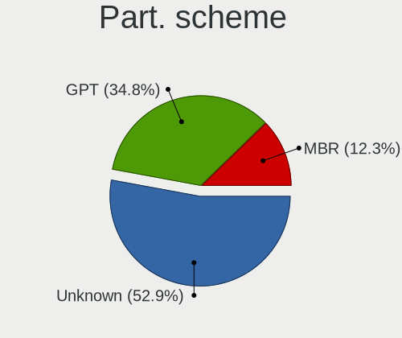

| Type    | Computers | Percent |
|---------|-----------|---------|
| Unknown | 308       | 54.51%  |
| GPT     | 186       | 32.92%  |
| MBR     | 71        | 12.57%  |

Dual Boot with Linux/BSD
------------------------

Hosting more than one Linux/BSD

| Dual boot | Computers | Percent |
|-----------|-----------|---------|
| No        | 489       | 85.64%  |
| Yes       | 82        | 14.36%  |

Dual Boot (Win)
---------------

Hosting Linux and Windows

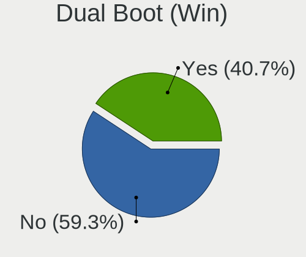

| Dual boot | Computers | Percent |
|-----------|-----------|---------|
| No        | 321       | 56.32%  |
| Yes       | 249       | 43.68%  |

Board
-----

Vendor
------

Motherboard manufacturer

| Name                        | Computers | Percent |
|-----------------------------|-----------|---------|
| Hewlett-Packard             | 170       | 30.52%  |
| Dell                        | 138       | 24.78%  |
| Lenovo                      | 94        | 16.88%  |
| ASUSTek Computer            | 39        | 7%      |
| Gigabyte Technology         | 37        | 6.64%   |
| Acer                        | 17        | 3.05%   |
| MSI                         | 12        | 2.15%   |
| Toshiba                     | 9         | 1.62%   |
| Sony                        | 4         | 0.72%   |
| Hampoo                      | 4         | 0.72%   |
| Samsung Electronics         | 3         | 0.54%   |
| Apple                       | 3         | 0.54%   |
| Alienware                   | 3         | 0.54%   |
| Raspberry Pi Foundation     | 2         | 0.36%   |
| Packard Bell                | 2         | 0.36%   |
| Nvidia                      | 2         | 0.36%   |
| Intel                       | 2         | 0.36%   |
| Fujitsu Siemens             | 2         | 0.36%   |
| Fujitsu                     | 2         | 0.36%   |
| Unknown                     | 2         | 0.36%   |
| TECNO                       | 1         | 0.18%   |
| Sary                        | 1         | 0.18%   |
| Razer                       | 1         | 0.18%   |
| Pegatron                    | 1         | 0.18%   |
| Panasonic                   | 1         | 0.18%   |
| IBM                         | 1         | 0.18%   |
| I-Life Digital Technologies | 1         | 0.18%   |
| HUAWEI                      | 1         | 0.18%   |
| ECS                         | 1         | 0.18%   |
| ASRock                      | 1         | 0.18%   |

Model
-----

Motherboard model

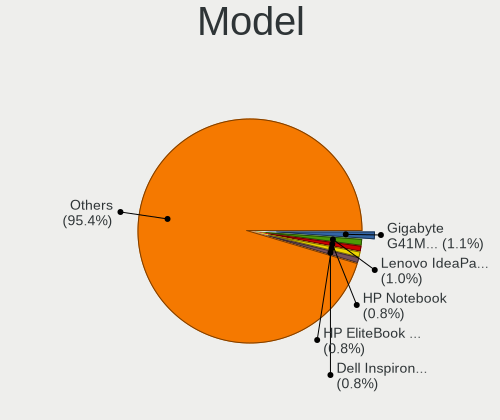

| Name                                  | Computers | Percent |
|---------------------------------------|-----------|---------|
| Lenovo IdeaPad 520-15IKB 81BF         | 7         | 1.26%   |
| Gigabyte G41MT-S2PT                   | 7         | 1.26%   |
| Dell Inspiron 5570                    | 6         | 1.08%   |
| HP ProBook 450 G7                     | 5         | 0.9%    |
| HP Notebook                           | 5         | 0.9%    |
| Dell OptiPlex 780                     | 5         | 0.9%    |
| Dell G3 3579                          | 5         | 0.9%    |
| Unknown                               | 5         | 0.9%    |
| Lenovo IdeaPad L340-15IRH Gaming 81LK | 4         | 0.72%   |
| Lenovo IdeaPad 330-15AST 81D6         | 4         | 0.72%   |
| HP ProBook 645 G1                     | 4         | 0.72%   |
| HP Laptop 15-da1xxx                   | 4         | 0.72%   |
| HP EliteBook 745 G3                   | 4         | 0.72%   |
| HP Compaq Pro 6305 SFF                | 4         | 0.72%   |
| Gigabyte H61M-S2P                     | 4         | 0.72%   |
| Dell Inspiron 7577                    | 4         | 0.72%   |
| Dell Inspiron 3593                    | 4         | 0.72%   |
| Dell G5 5587                          | 4         | 0.72%   |
| MSI MS-7C02                           | 3         | 0.54%   |
| Lenovo Legion 5 15IMH05H 81Y6         | 3         | 0.54%   |
| Lenovo IdeaPad 330-15IKB 81DE         | 3         | 0.54%   |
| Lenovo IdeaPad 310-15IKB 80TV         | 3         | 0.54%   |
| HP ProDesk 600 G1 TWR                 | 3         | 0.54%   |
| HP ProDesk 600 G1 SFF                 | 3         | 0.54%   |
| HP Pavilion dv6                       | 3         | 0.54%   |
| HP Pavilion 15                        | 3         | 0.54%   |
| HP Laptop 15-bs0xx                    | 3         | 0.54%   |
| HP EliteBook 8440p                    | 3         | 0.54%   |
| HP Compaq 6005 Pro SFF PC             | 3         | 0.54%   |
| HP 15                                 | 3         | 0.54%   |
| Hampoo Cherry Trail CR                | 3         | 0.54%   |
| Dell OptiPlex 760                     | 3         | 0.54%   |
| Dell OptiPlex 7020                    | 3         | 0.54%   |
| Dell OptiPlex 7010                    | 3         | 0.54%   |
| Dell Latitude E5570                   | 3         | 0.54%   |
| Dell Inspiron N5110                   | 3         | 0.54%   |
| Dell Inspiron N5010                   | 3         | 0.54%   |
| Dell Inspiron 3521                    | 3         | 0.54%   |
| Dell G15 5510                         | 3         | 0.54%   |
| Nvidia Tegra                          | 2         | 0.36%   |

Model Family
------------

Motherboard model prefix

| Name                  | Computers | Percent |
|-----------------------|-----------|---------|
| Dell Inspiron         | 49        | 8.8%    |
| Lenovo IdeaPad        | 38        | 6.82%   |
| Dell Latitude         | 32        | 5.75%   |
| HP Compaq             | 28        | 5.03%   |
| Dell OptiPlex         | 26        | 4.67%   |
| HP ProBook            | 24        | 4.31%   |
| HP EliteBook          | 24        | 4.31%   |
| Lenovo ThinkPad       | 19        | 3.41%   |
| HP Pavilion           | 16        | 2.87%   |
| HP Laptop             | 12        | 2.15%   |
| Dell Precision        | 11        | 1.97%   |
| Lenovo Legion         | 9         | 1.62%   |
| HP EliteDesk          | 9         | 1.62%   |
| Dell G3               | 8         | 1.44%   |
| ASUS VivoBook         | 8         | 1.44%   |
| Toshiba Satellite     | 7         | 1.26%   |
| HP ProDesk            | 7         | 1.26%   |
| Gigabyte G41MT-S2PT   | 7         | 1.26%   |
| Acer Aspire           | 7         | 1.26%   |
| HP ZBook              | 6         | 1.08%   |
| Lenovo ThinkCentre    | 5         | 0.9%    |
| HP Notebook           | 5         | 0.9%    |
| Dell G5               | 5         | 0.9%    |
| ASUS ROG              | 5         | 0.9%    |
| Unknown               | 5         | 0.9%    |
| HP ENVY               | 4         | 0.72%   |
| Gigabyte H61M-S2P     | 4         | 0.72%   |
| Dell G15              | 4         | 0.72%   |
| Acer Predator         | 4         | 0.72%   |
| MSI MS-7C02           | 3         | 0.54%   |
| Lenovo Yoga           | 3         | 0.54%   |
| HP 250                | 3         | 0.54%   |
| HP 15                 | 3         | 0.54%   |
| Hampoo Cherry         | 3         | 0.54%   |
| ASUS TUF              | 3         | 0.54%   |
| Acer Nitro            | 3         | 0.54%   |
| RPi Raspberry         | 2         | 0.36%   |
| Packard Bell EasyNote | 2         | 0.36%   |
| Nvidia Tegra          | 2         | 0.36%   |
| Lenovo Z50-70         | 2         | 0.36%   |

MFG Year
--------

Motherboard manufacture year

| Year    | Computers | Percent |
|---------|-----------|---------|
| 2018    | 58        | 10.41%  |
| 2017    | 50        | 8.98%   |
| 2013    | 46        | 8.26%   |
| 2012    | 43        | 7.72%   |
| 2014    | 42        | 7.54%   |
| 2011    | 42        | 7.54%   |
| 2019    | 38        | 6.82%   |
| 2016    | 32        | 5.75%   |
| 2015    | 32        | 5.75%   |
| 2021    | 30        | 5.39%   |
| 2010    | 28        | 5.03%   |
| 2020    | 27        | 4.85%   |
| 2008    | 25        | 4.49%   |
| 2009    | 24        | 4.31%   |
| 2022    | 13        | 2.33%   |
| 2007    | 13        | 2.33%   |
| Unknown | 6         | 1.08%   |
| 2006    | 3         | 0.54%   |
| 2005    | 3         | 0.54%   |
| 2023    | 2         | 0.36%   |

Form Factor
-----------

Physical design of the computer

| Name           | Computers | Percent |
|----------------|-----------|---------|
| Notebook       | 372       | 66.79%  |
| Desktop        | 160       | 28.73%  |
| Convertible    | 10        | 1.8%    |
| System on chip | 5         | 0.9%    |
| Tablet         | 5         | 0.9%    |
| Mini pc        | 3         | 0.54%   |
| Phone          | 1         | 0.18%   |
| Server         | 1         | 0.18%   |

Secure Boot
-----------

Enabled or disabled

| State    | Computers | Percent |
|----------|-----------|---------|
| Disabled | 530       | 95.15%  |
| Enabled  | 27        | 4.85%   |

Coreboot
--------

Have coreboot on board

| Used | Computers | Percent |
|------|-----------|---------|
| No   | 556       | 99.82%  |
| Yes  | 1         | 0.18%   |

RAM Size
--------

Total RAM memory

| Size in GB  | Computers | Percent |
|-------------|-----------|---------|
| 4.01-8.0    | 160       | 28.57%  |
| 3.01-4.0    | 116       | 20.71%  |
| 16.01-24.0  | 116       | 20.71%  |
| 8.01-16.0   | 88        | 15.71%  |
| 32.01-64.0  | 23        | 4.11%   |
| 1.01-2.0    | 23        | 4.11%   |
| 2.01-3.0    | 15        | 2.68%   |
| 24.01-32.0  | 10        | 1.79%   |
| 64.01-256.0 | 5         | 0.89%   |
| 0.51-1.0    | 2         | 0.36%   |
| 0.01-0.5    | 1         | 0.18%   |
| Unknown     | 1         | 0.18%   |

RAM Used
--------

Used RAM memory

| Used GB     | Computers | Percent |
|-------------|-----------|---------|
| 2.01-3.0    | 194       | 31.7%   |
| 1.01-2.0    | 187       | 30.56%  |
| 4.01-8.0    | 91        | 14.87%  |
| 3.01-4.0    | 86        | 14.05%  |
| 0.51-1.0    | 24        | 3.92%   |
| 8.01-16.0   | 14        | 2.29%   |
| 0.01-0.5    | 10        | 1.63%   |
| 16.01-24.0  | 3         | 0.49%   |
| 32.01-64.0  | 1         | 0.16%   |
| 64.01-256.0 | 1         | 0.16%   |
| Unknown     | 1         | 0.16%   |

Total Drives
------------

Number of drives on board

| Drives  | Computers | Percent |
|---------|-----------|---------|
| 1       | 329       | 57.32%  |
| 2       | 203       | 35.37%  |
| 3       | 29        | 5.05%   |
| 4       | 7         | 1.22%   |
| 9       | 2         | 0.35%   |
| 0       | 2         | 0.35%   |
| 5       | 1         | 0.17%   |
| Unknown | 1         | 0.17%   |

Has CD-ROM
----------

Has CD-ROM on board

| Presented | Computers | Percent |
|-----------|-----------|---------|
| No        | 327       | 58.19%  |
| Yes       | 235       | 41.81%  |

Has Ethernet
------------

Has Ethernet on board

| Presented | Computers | Percent |
|-----------|-----------|---------|
| Yes       | 503       | 90.31%  |
| No        | 54        | 9.69%   |

Has WiFi
--------

Has WiFi module

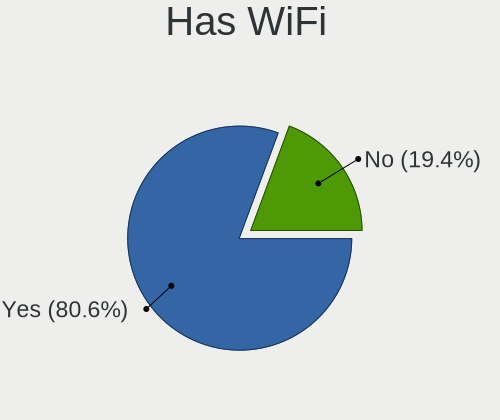

| Presented | Computers | Percent |
|-----------|-----------|---------|
| Yes       | 448       | 80%     |
| No        | 112       | 20%     |

Has Bluetooth
-------------

Has Bluetooth module

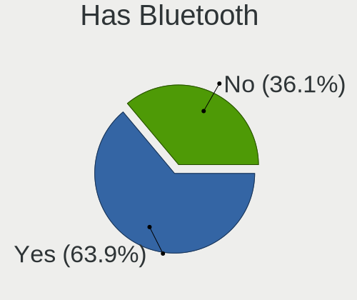

| Presented | Computers | Percent |
|-----------|-----------|---------|
| Yes       | 350       | 62.28%  |
| No        | 212       | 37.72%  |

Location
--------

Country
-------

Geographic location (country)

| Country | Computers | Percent |
|---------|-----------|---------|
| Egypt   | 557       | 100%    |

City
----

Geographic location (city)

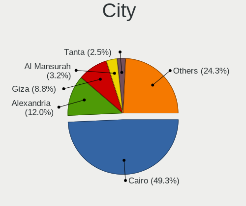

| City                  | Computers | Percent |
|-----------------------|-----------|---------|
| Cairo                 | 314       | 52.16%  |
| Alexandria            | 61        | 10.13%  |
| Giza                  | 53        | 8.8%    |
| Al Mansurah           | 19        | 3.16%   |
| Tanta                 | 15        | 2.49%   |
| Assiut                | 8         | 1.33%   |
| Zagazig               | 6         | 1%      |
| Port Said             | 6         | 1%      |
| Ismailia              | 6         | 1%      |
| Suez                  | 5         | 0.83%   |
| Minya                 | 5         | 0.83%   |
| Hurghada              | 5         | 0.83%   |
| Aswan                 | 5         | 0.83%   |
| Qina                  | 4         | 0.66%   |
| Helwan                | 4         | 0.66%   |
| Awsim                 | 4         | 0.66%   |
| Al Ma`adi             | 4         | 0.66%   |
| Sharqia               | 3         | 0.5%    |
| New Cairo             | 3         | 0.5%    |
| Madinat an Nasr       | 3         | 0.5%    |
| Damanhur              | 3         | 0.5%    |
| Bani Suwayf           | 3         | 0.5%    |
| Al Qahirah al Jadidah | 3         | 0.5%    |
| Al Fayyum             | 3         | 0.5%    |
| Zefta                 | 2         | 0.33%   |
| Tukh                  | 2         | 0.33%   |
| Sohag                 | 2         | 0.33%   |
| Mohandessin           | 2         | 0.33%   |
| Madinat as Sadat      | 2         | 0.33%   |
| Luxor                 | 2         | 0.33%   |
| Kafr ash Shaykh       | 2         | 0.33%   |
| Edfu                  | 2         | 0.33%   |
| Damietta              | 2         | 0.33%   |
| Banha                 | 2         | 0.33%   |
| Al Mahallah al Kubra  | 2         | 0.33%   |
| Al 'Ashir min Ramadan | 2         | 0.33%   |
| Aga                   | 2         | 0.33%   |
| 6th of October City   | 2         | 0.33%   |
| Talkha                | 1         | 0.17%   |
| Tala                  | 1         | 0.17%   |

Drives
------

Drive Vendor
------------

Hard drive vendors

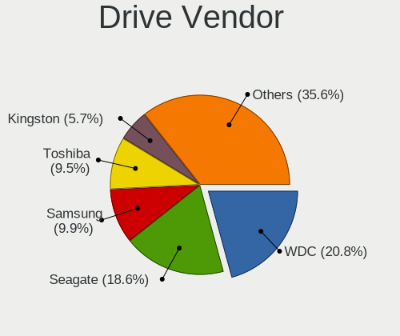

| Vendor                         | Computers | Drives | Percent |
|--------------------------------|-----------|--------|---------|
| WDC                            | 171       | 242    | 21.87%  |
| Seagate                        | 161       | 207    | 20.59%  |
| Toshiba                        | 83        | 106    | 10.61%  |
| Samsung Electronics            | 78        | 101    | 9.97%   |
| Kingston                       | 39        | 53     | 4.99%   |
| Unknown                        | 29        | 35     | 3.71%   |
| Crucial                        | 29        | 36     | 3.71%   |
| Hitachi                        | 21        | 26     | 2.69%   |
| SanDisk                        | 20        | 21     | 2.56%   |
| SK hynix                       | 19        | 22     | 2.43%   |
| Micron Technology              | 18        | 22     | 2.3%    |
| HGST                           | 13        | 13     | 1.66%   |
| HS-SSD-C100                    | 10        | 14     | 1.28%   |
| Intel                          | 9         | 9      | 1.15%   |
| Micron/Crucial Technology      | 6         | 6      | 0.77%   |
| KIOXIA                         | 6         | 7      | 0.77%   |
| TwinMOS                        | 5         | 7      | 0.64%   |
| LITEONIT                       | 5         | 6      | 0.64%   |
| Kingston Technology Company    | 5         | 6      | 0.64%   |
| JMicron Technology             | 5         | 5      | 0.64%   |
| LITEON                         | 4         | 6      | 0.51%   |
| KingSpec                       | 4         | 4      | 0.51%   |
| HS-SSD-E100                    | 4         | 4      | 0.51%   |
| Apple                          | 4         | 5      | 0.51%   |
| Transcend                      | 3         | 3      | 0.38%   |
| Hewlett-Packard                | 3         | 3      | 0.38%   |
| Phison Electronics             | 2         | 3      | 0.26%   |
| Maxtor                         | 2         | 3      | 0.26%   |
| Lexar                          | 2         | 2      | 0.26%   |
| Fujitsu                        | 2         | 3      | 0.26%   |
| China                          | 2         | 2      | 0.26%   |
| A-DATA Technology              | 2         | 2      | 0.26%   |
| ZOTAC                          | 1         | 1      | 0.13%   |
| Verbatim                       | 1         | 1      | 0.13%   |
| Value                          | 1         | 1      | 0.13%   |
| Union Memory (Shenzhen)        | 1         | 1      | 0.13%   |
| UMIS                           | 1         | 1      | 0.13%   |
| Team                           | 1         | 1      | 0.13%   |
| Solid State Storage Technology | 1         | 1      | 0.13%   |
| Silicon Motion                 | 1         | 1      | 0.13%   |

Drive Model
-----------

Hard drive models

| Model                                             | Computers | Percent |
|---------------------------------------------------|-----------|---------|
| Seagate ST1000LM035-1RK172 1TB                    | 44        | 5.33%   |
| Toshiba MQ04ABF100 1TB                            | 17        | 2.06%   |
| Toshiba MQ01ABD100 1TB                            | 13        | 1.58%   |
| Kingston SA400S37240G 240GB SSD                   | 11        | 1.33%   |
| Seagate ST2000LM007-1R8174 2TB                    | 10        | 1.21%   |
| Kingston SA400S37480G 480GB SSD                   | 10        | 1.21%   |
| Unknown MMC Card  64GB                            | 8         | 0.97%   |
| Seagate ST500DM002-1BD142 500GB                   | 8         | 0.97%   |
| Samsung NVMe SSD Controller SM981/PM981/PM983 1TB | 8         | 0.97%   |
| Seagate ST500LT012-1DG142 500GB                   | 7         | 0.85%   |
| Seagate ST3500414CS 500GB                         | 7         | 0.85%   |
| Crucial CT240BX500SSD1 240GB                      | 7         | 0.85%   |
| WDC WD10SPZX-24Z10 1TB                            | 6         | 0.73%   |
| Seagate ST3500312CS 500GB                         | 6         | 0.73%   |
| Samsung PM963 2.5" NVMe PCIe SSD 256GB            | 6         | 0.73%   |
| Kingston SA400S37120G 120GB SSD                   | 6         | 0.73%   |
| Crucial CT480BX500SSD1 480GB                      | 6         | 0.73%   |
| WDC WD10SPZX-60Z10T0 1TB                          | 5         | 0.61%   |
| Unknown MMC Card  32GB                            | 5         | 0.61%   |
| Toshiba MQ01ABF050 500GB                          | 5         | 0.61%   |
| Toshiba DT01ACA050 500GB                          | 5         | 0.61%   |
| Samsung SSD 860 EVO 500GB                         | 5         | 0.61%   |
| HS-SSD-C100 120G                                  | 5         | 0.61%   |
| WDC WDS120G2G0A-00JH30 120GB SSD                  | 4         | 0.48%   |
| WDC WD5000AADS-00S9B0 500GB                       | 4         | 0.48%   |
| WDC WD3200AAJS-00L7A0 320GB                       | 4         | 0.48%   |
| WDC WD10JPVX-60JC3T1 1TB                          | 4         | 0.48%   |
| WDC WD10JPCX-24UE4T0 1TB                          | 4         | 0.48%   |
| Unknown MMC Card  128GB                           | 4         | 0.48%   |
| Seagate ST750LM022 HN-M750MBB 752GB               | 4         | 0.48%   |
| Seagate ST500LT012-9WS142 500GB                   | 4         | 0.48%   |
| Seagate ST3500413AS 500GB                         | 4         | 0.48%   |
| Seagate ST1000LM024 HN-M101MBB 1TB                | 4         | 0.48%   |
| Seagate ST1000DM010-2EP102 1TB                    | 4         | 0.48%   |
| Micron/Crucial P2 NVMe PCIe SSD 1TB               | 4         | 0.48%   |
| JMicron Generic 8GB                               | 4         | 0.48%   |
| Hitachi HTS547575A9E384 752GB                     | 4         | 0.48%   |
| HGST HTS545050A7E680 500GB                        | 4         | 0.48%   |
| WDC WDS500G2B0A-00SM50 500GB SSD                  | 3         | 0.36%   |
| WDC WDS240G2G0A-00JH30 240GB SSD                  | 3         | 0.36%   |

HDD Vendor
----------

Hard disk drive vendors

| Vendor              | Computers | Drives | Percent |
|---------------------|-----------|--------|---------|
| Seagate             | 161       | 206    | 36.18%  |
| WDC                 | 155       | 224    | 34.83%  |
| Toshiba             | 72        | 91     | 16.18%  |
| Hitachi             | 21        | 26     | 4.72%   |
| HGST                | 13        | 13     | 2.92%   |
| Samsung Electronics | 9         | 13     | 2.02%   |
| JMicron Technology  | 4         | 4      | 0.9%    |
| Unknown             | 3         | 3      | 0.67%   |
| Apple               | 3         | 4      | 0.67%   |
| Fujitsu             | 2         | 3      | 0.45%   |
| Maxtor              | 1         | 2      | 0.22%   |
| Hewlett-Packard     | 1         | 1      | 0.22%   |

SSD Vendor
----------

Solid state drive vendors

| Vendor              | Computers | Drives | Percent |
|---------------------|-----------|--------|---------|
| Samsung Electronics | 36        | 40     | 19.46%  |
| Kingston            | 35        | 48     | 18.92%  |
| Crucial             | 27        | 34     | 14.59%  |
| WDC                 | 12        | 13     | 6.49%   |
| SanDisk             | 10        | 11     | 5.41%   |
| Micron Technology   | 9         | 11     | 4.86%   |
| Intel               | 7         | 7      | 3.78%   |
| SK hynix            | 6         | 6      | 3.24%   |
| TwinMOS             | 5         | 7      | 2.7%    |
| Toshiba             | 5         | 7      | 2.7%    |
| LITEONIT            | 5         | 6      | 2.7%    |
| LITEON              | 4         | 6      | 2.16%   |
| KingSpec            | 4         | 4      | 2.16%   |
| Transcend           | 3         | 3      | 1.62%   |
| HS-SSD-C100         | 3         | 5      | 1.62%   |
| Lexar               | 2         | 2      | 1.08%   |
| China               | 2         | 2      | 1.08%   |
| ZOTAC               | 1         | 1      | 0.54%   |
| Verbatim            | 1         | 1      | 0.54%   |
| Value               | 1         | 1      | 0.54%   |
| Team                | 1         | 1      | 0.54%   |
| Maxtor              | 1         | 1      | 0.54%   |
| Hikvision           | 1         | 1      | 0.54%   |
| Hewlett-Packard     | 1         | 1      | 0.54%   |
| CARLSTEIN           | 1         | 1      | 0.54%   |
| Apple               | 1         | 1      | 0.54%   |
| A-DATA Technology   | 1         | 1      | 0.54%   |

Drive Kind
----------

HDD or SSD

| Kind    | Computers | Drives | Percent |
|---------|-----------|--------|---------|
| HDD     | 408       | 590    | 55.59%  |
| SSD     | 172       | 222    | 23.43%  |
| NVMe    | 115       | 144    | 15.67%  |
| MMC     | 24        | 29     | 3.27%   |
| Unknown | 15        | 16     | 2.04%   |

Drive Connector
---------------

SATA, SAS, NVMe, etc.

| Type | Computers | Drives | Percent |
|------|-----------|--------|---------|
| SATA | 479       | 812    | 76.03%  |
| NVMe | 115       | 144    | 18.25%  |
| MMC  | 24        | 29     | 3.81%   |
| SAS  | 12        | 16     | 1.9%    |

Drive Size
----------

Size of hard drive

| Size in TB | Computers | Drives | Percent |
|------------|-----------|--------|---------|
| 0.01-0.5   | 332       | 507    | 58.55%  |
| 0.51-1.0   | 203       | 262    | 35.8%   |
| 1.01-2.0   | 29        | 33     | 5.11%   |
| 3.01-4.0   | 2         | 4      | 0.35%   |
| 4.01-10.0  | 1         | 6      | 0.18%   |

Space Total
-----------

Amount of disk space available on the file system

| Size in GB     | Computers | Percent |
|----------------|-----------|---------|
| 101-250        | 160       | 26.94%  |
| 251-500        | 121       | 20.37%  |
| 501-1000       | 84        | 14.14%  |
| 51-100         | 69        | 11.62%  |
| 1001-2000      | 50        | 8.42%   |
| 21-50          | 42        | 7.07%   |
| 1-20           | 38        | 6.4%    |
| Unknown        | 13        | 2.19%   |
| More than 3000 | 10        | 1.68%   |
| 2001-3000      | 7         | 1.18%   |

Space Used
----------

Amount of used disk space

| Used GB        | Computers | Percent |
|----------------|-----------|---------|
| 1-20           | 213       | 35.21%  |
| 21-50          | 118       | 19.5%   |
| 101-250        | 96        | 15.87%  |
| 51-100         | 72        | 11.9%   |
| 251-500        | 44        | 7.27%   |
| 501-1000       | 32        | 5.29%   |
| Unknown        | 13        | 2.15%   |
| 1001-2000      | 9         | 1.49%   |
| 2001-3000      | 5         | 0.83%   |
| More than 3000 | 3         | 0.5%    |

Malfunc. Drives
---------------

Drive models with a malfunction

| Model                                 | Computers | Drives | Percent |
|---------------------------------------|-----------|--------|---------|
| Seagate ST1000LM035-1RK172 1TB        | 4         | 5      | 4.21%   |
| WDC WD5000AVVS-63H0B1 500GB           | 2         | 2      | 2.11%   |
| WDC WD5000AVDS-63U7B1 500GB           | 2         | 2      | 2.11%   |
| WDC WD5000AAKX-00ERMA0 500GB          | 2         | 3      | 2.11%   |
| WDC WD1600AABS-00H4A0 160GB           | 2         | 2      | 2.11%   |
| Toshiba MQ01ABF050 500GB              | 2         | 4      | 2.11%   |
| SK hynix HFS128G39TND-N210A 128GB SSD | 2         | 2      | 2.11%   |
| Seagate ST500LT012-9WS142 500GB       | 2         | 2      | 2.11%   |
| Seagate ST380815AS 80GB               | 2         | 2      | 2.11%   |
| Seagate ST3500413AS 500GB             | 2         | 3      | 2.11%   |
| Seagate ST3500312CS 500GB             | 2         | 2      | 2.11%   |
| Samsung Electronics SSD 870 EVO 500GB | 2         | 2      | 2.11%   |
| WDC WD800JD-60LSA5 80GB               | 1         | 1      | 1.05%   |
| WDC WD800BD-22MRA1 80GB               | 1         | 1      | 1.05%   |
| WDC WD5000LPVX-75V0TT0 500GB          | 1         | 1      | 1.05%   |
| WDC WD5000LPVX-60V0TT0 500GB          | 1         | 1      | 1.05%   |
| WDC WD5000BPVT-24HXZT3 500GB          | 1         | 1      | 1.05%   |
| WDC WD5000AAVS-22G9B1 500GB           | 1         | 1      | 1.05%   |
| WDC WD5000AAKX-75U6AA0 500GB          | 1         | 2      | 1.05%   |
| WDC WD5000AAKX-08U6AA0 500GB          | 1         | 2      | 1.05%   |
| WDC WD5000AAKX-009FA0 500GB           | 1         | 1      | 1.05%   |
| WDC WD5000AAKS-00V6A0 500GB           | 1         | 1      | 1.05%   |
| WDC WD5000AADS-00S9B0 500GB           | 1         | 1      | 1.05%   |
| WDC WD5000AADS-00M2B0 500GB           | 1         | 1      | 1.05%   |
| WDC WD3200BUDT-63DPZY0 320GB          | 1         | 1      | 1.05%   |
| WDC WD3200BEKT-60V5T1 320GB           | 1         | 3      | 1.05%   |
| WDC WD3200AAJS-56M0A0 320GB           | 1         | 1      | 1.05%   |
| WDC WD3200AAJS-56B4A0 320GB           | 1         | 2      | 1.05%   |
| WDC WD3200AAJS-00L7A0 320GB           | 1         | 1      | 1.05%   |
| WDC WD3200AAJS-00B4A0 320GB           | 1         | 1      | 1.05%   |
| WDC WD3200A 320GB                     | 1         | 1      | 1.05%   |
| WDC WD2500AAJS-00VTA0 250GB           | 1         | 1      | 1.05%   |
| WDC WD20SPZX-75UA7T0 2TB              | 1         | 1      | 1.05%   |
| WDC WD1600AVVS-63L2B0 160GB           | 1         | 1      | 1.05%   |
| WDC WD1600AAJS-00L7A0 160GB           | 1         | 1      | 1.05%   |
| WDC WD10SPZX-60Z10T0 1TB              | 1         | 1      | 1.05%   |
| WDC WD10SPCX-24HWST1 1TB              | 1         | 1      | 1.05%   |
| WDC WD10JPVX-60JC3T0 1TB              | 1         | 1      | 1.05%   |
| WDC WD10EZEX-08M2NA0 1TB              | 1         | 1      | 1.05%   |
| WDC WD10EZEX-00BN5A0 1TB              | 1         | 1      | 1.05%   |

Malfunc. Drive Vendor
---------------------

Vendors of faulty drives

| Vendor              | Computers | Drives | Percent |
|---------------------|-----------|--------|---------|
| WDC                 | 33        | 43     | 37.08%  |
| Seagate             | 27        | 38     | 30.34%  |
| Toshiba             | 5         | 8      | 5.62%   |
| Samsung Electronics | 5         | 5      | 5.62%   |
| Hitachi             | 4         | 4      | 4.49%   |
| Micron Technology   | 3         | 3      | 3.37%   |
| Intel               | 3         | 3      | 3.37%   |
| SK hynix            | 2         | 2      | 2.25%   |
| TwinMOS             | 1         | 1      | 1.12%   |
| Kingston            | 1         | 2      | 1.12%   |
| HGST                | 1         | 1      | 1.12%   |
| Hewlett-Packard     | 1         | 1      | 1.12%   |
| Fujitsu             | 1         | 2      | 1.12%   |
| Apple               | 1         | 1      | 1.12%   |
| A-DATA Technology   | 1         | 1      | 1.12%   |

Malfunc. HDD Vendor
-------------------

Vendors of faulty HDD drives

| Vendor              | Computers | Drives | Percent |
|---------------------|-----------|--------|---------|
| WDC                 | 33        | 43     | 45.21%  |
| Seagate             | 27        | 38     | 36.99%  |
| Toshiba             | 4         | 7      | 5.48%   |
| Hitachi             | 4         | 4      | 5.48%   |
| Samsung Electronics | 1         | 1      | 1.37%   |
| HGST                | 1         | 1      | 1.37%   |
| Hewlett-Packard     | 1         | 1      | 1.37%   |
| Fujitsu             | 1         | 2      | 1.37%   |
| Apple               | 1         | 1      | 1.37%   |

Malfunc. Drive Kind
-------------------

Kinds of faulty drives

| Kind | Computers | Drives | Percent |
|------|-----------|--------|---------|
| HDD  | 70        | 98     | 81.4%   |
| SSD  | 14        | 15     | 16.28%  |
| NVMe | 2         | 2      | 2.33%   |

Failed Drives
-------------

Failed drive models

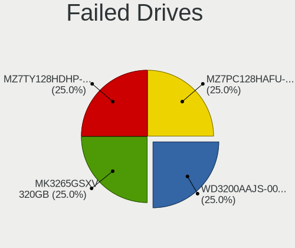

| Model                                            | Computers | Drives | Percent |
|--------------------------------------------------|-----------|--------|---------|
| WDC WD3200AAJS-00L7A0 320GB                      | 1         | 2      | 33.33%  |
| Samsung Electronics MZ7TY128HDHP-000L1 128GB SSD | 1         | 1      | 33.33%  |
| Samsung Electronics MZ7PC128HAFU-000H1 128GB SSD | 1         | 1      | 33.33%  |

Failed Drive Vendor
-------------------

Failed drive vendors

| Vendor              | Computers | Drives | Percent |
|---------------------|-----------|--------|---------|
| Samsung Electronics | 2         | 2      | 66.67%  |
| WDC                 | 1         | 2      | 33.33%  |

Drive Status
------------

Number of failed and malfunc. drives

| Status   | Computers | Drives | Percent |
|----------|-----------|--------|---------|
| Detected | 354       | 601    | 58.61%  |
| Works    | 163       | 281    | 26.99%  |
| Malfunc  | 84        | 115    | 13.91%  |
| Failed   | 3         | 4      | 0.5%    |

Storage controller
------------------

Storage Vendor
--------------

Storage controller vendors

| Vendor                         | Computers | Percent |
|--------------------------------|-----------|---------|
| Intel                          | 431       | 67.24%  |
| AMD                            | 77        | 12.01%  |
| Samsung Electronics            | 39        | 6.08%   |
| SanDisk                        | 15        | 2.34%   |
| SK hynix                       | 13        | 2.03%   |
| Kingston Technology Company    | 10        | 1.56%   |
| Micron Technology              | 9         | 1.4%    |
| Toshiba America Info Systems   | 8         | 1.25%   |
| Micron/Crucial Technology      | 8         | 1.25%   |
| KIOXIA                         | 6         | 0.94%   |
| Phison Electronics             | 3         | 0.47%   |
| Union Memory (Shenzhen)        | 2         | 0.31%   |
| Shenzhen Longsys Electronics   | 2         | 0.31%   |
| Nvidia                         | 2         | 0.31%   |
| Marvell Technology Group       | 2         | 0.31%   |
| LSI Logic / Symbios Logic      | 2         | 0.31%   |
| Broadcom / LSI                 | 2         | 0.31%   |
| ADATA Technology               | 2         | 0.31%   |
| VIA Technologies               | 1         | 0.16%   |
| Solid State Storage Technology | 1         | 0.16%   |
| Silicon Motion                 | 1         | 0.16%   |
| Seagate Technology             | 1         | 0.16%   |
| MAXIO Technology (Hangzhou)    | 1         | 0.16%   |
| Lite-On Technology             | 1         | 0.16%   |
| JMicron Technology             | 1         | 0.16%   |
| INNOGRIT                       | 1         | 0.16%   |

Storage Model
-------------

Storage controller models

| Model                                                                                   | Computers | Percent |
|-----------------------------------------------------------------------------------------|-----------|---------|
| AMD FCH SATA Controller [AHCI mode]                                                     | 53        | 7.36%   |
| Intel Sunrise Point-LP SATA Controller [AHCI mode]                                      | 52        | 7.22%   |
| Intel 82801 Mobile SATA Controller [RAID mode]                                          | 30        | 4.17%   |
| Intel 8 Series SATA Controller 1 [AHCI mode]                                            | 26        | 3.61%   |
| Intel 8 Series/C220 Series Chipset Family 6-port SATA Controller 1 [AHCI mode]          | 25        | 3.47%   |
| Intel Cannon Lake Mobile PCH SATA AHCI Controller                                       | 23        | 3.19%   |
| Intel 7 Series Chipset Family 6-port SATA Controller [AHCI mode]                        | 23        | 3.19%   |
| Intel 6 Series/C200 Series Chipset Family 6 port Mobile SATA AHCI Controller            | 23        | 3.19%   |
| Samsung NVMe SSD Controller SM981/PM981/PM983                                           | 21        | 2.92%   |
| Intel Wildcat Point-LP SATA Controller [AHCI Mode]                                      | 18        | 2.5%    |
| Intel NM10/ICH7 Family SATA Controller [IDE mode]                                       | 17        | 2.36%   |
| Intel SATA Controller [RAID mode]                                                       | 16        | 2.22%   |
| Intel Comet Lake SATA AHCI Controller                                                   | 13        | 1.81%   |
| Intel 5 Series/3400 Series Chipset 6 port SATA AHCI Controller                          | 12        | 1.67%   |
| Intel 400 Series Chipset Family SATA AHCI Controller                                    | 9         | 1.25%   |
| Intel Volume Management Device NVMe RAID Controller                                     | 8         | 1.11%   |
| Intel HM170/QM170 Chipset SATA Controller [AHCI Mode]                                   | 8         | 1.11%   |
| Intel 82801IBM/IEM (ICH9M/ICH9M-E) 4 port SATA Controller [AHCI mode]                   | 8         | 1.11%   |
| Intel 4 Series Chipset PT IDER Controller                                               | 8         | 1.11%   |
| Samsung NVMe SSD Controller 980 (DRAM-less)                                             | 7         | 0.97%   |
| Intel Q170/Q150/B150/H170/H110/Z170/CM236 Chipset SATA Controller [AHCI Mode]           | 7         | 0.97%   |
| Intel 82801HM/HEM (ICH8M/ICH8M-E) IDE Controller                                        | 7         | 0.97%   |
| Intel 6 Series/C200 Series Chipset Family Desktop SATA Controller (IDE mode, ports 4-5) | 7         | 0.97%   |
| Intel 6 Series/C200 Series Chipset Family Desktop SATA Controller (IDE mode, ports 0-3) | 7         | 0.97%   |
| Intel 5 Series/3400 Series Chipset 4 port SATA AHCI Controller                          | 7         | 0.97%   |
| AMD SB7x0/SB8x0/SB9x0 SATA Controller [AHCI mode]                                       | 7         | 0.97%   |
| AMD 400 Series Chipset SATA Controller                                                  | 7         | 0.97%   |
| Samsung NVMe SSD Controller PM9A1/PM9A3/980PRO                                          | 6         | 0.83%   |
| Micron/Crucial P2 [Nick P2] / P3 / P3 Plus NVMe PCIe SSD (DRAM-less)                    | 6         | 0.83%   |
| Micron 2210 NVMe SSD [Cobain]                                                           | 6         | 0.83%   |
| Intel Cannon Point-LP SATA Controller [AHCI Mode]                                       | 6         | 0.83%   |
| Intel 7 Series/C210 Series Chipset Family 6-port SATA Controller [AHCI mode]            | 6         | 0.83%   |
| SK hynix BC501 NVMe Solid State Drive                                                   | 5         | 0.69%   |
| SanDisk Ultra 3D / WD Blue SN550 NVMe SSD                                               | 5         | 0.69%   |
| KIOXIA NVMe SSD Controller BG4 (DRAM-less)                                              | 5         | 0.69%   |
| Intel Tiger Lake-LP SATA Controller                                                     | 5         | 0.69%   |
| Intel 82801JD/DO (ICH10 Family) SATA AHCI Controller                                    | 5         | 0.69%   |
| Intel 82801HM/HEM (ICH8M/ICH8M-E) SATA Controller [AHCI mode]                           | 5         | 0.69%   |
| Intel 82801G (ICH7 Family) IDE Controller                                               | 5         | 0.69%   |
| Intel 6 Series/C200 Series Chipset Family 6 port Desktop SATA AHCI Controller           | 5         | 0.69%   |

Storage Kind
------------

Kind of storage controller (IDE, SATA, NVMe, SAS, ...)

| Kind | Computers | Percent |
|------|-----------|---------|
| SATA | 406       | 61.52%  |
| NVMe | 117       | 17.73%  |
| IDE  | 76        | 11.52%  |
| RAID | 55        | 8.33%   |
| SAS  | 4         | 0.61%   |
| SCSI | 2         | 0.3%    |

Processor
---------

CPU Vendor
----------

Processor vendors

| Vendor | Computers | Percent |
|--------|-----------|---------|
| Intel  | 466       | 83.66%  |
| AMD    | 85        | 15.26%  |
| ARM    | 6         | 1.08%   |

CPU Model
---------

Processor models

| Model                                   | Computers | Percent |
|-----------------------------------------|-----------|---------|
| Intel Core i7-8550U CPU @ 1.80GHz       | 17        | 3.05%   |
| Intel Core i7-8750H CPU @ 2.20GHz       | 13        | 2.33%   |
| Intel Core i7-8565U CPU @ 1.80GHz       | 8         | 1.43%   |
| Intel Core i7-7700HQ CPU @ 2.80GHz      | 8         | 1.43%   |
| Intel Core i7-9750H CPU @ 2.60GHz       | 7         | 1.25%   |
| Intel Core i7-7500U CPU @ 2.70GHz       | 7         | 1.25%   |
| Intel Core i7-10750H CPU @ 2.60GHz      | 7         | 1.25%   |
| Intel Core 2 Duo CPU E8400 @ 3.00GHz    | 7         | 1.25%   |
| Intel Core i5-8250U CPU @ 1.60GHz       | 6         | 1.08%   |
| Intel Core i5-7200U CPU @ 2.50GHz       | 6         | 1.08%   |
| Intel Core i5-5200U CPU @ 2.20GHz       | 6         | 1.08%   |
| Intel Core i7-6500U CPU @ 2.50GHz       | 5         | 0.9%    |
| Intel Core i7-4790 CPU @ 3.60GHz        | 5         | 0.9%    |
| Intel Core i7-1065G7 CPU @ 1.30GHz      | 5         | 0.9%    |
| Intel Core i7-10510U CPU @ 1.80GHz      | 5         | 0.9%    |
| Intel Core i5-4590 CPU @ 3.30GHz        | 5         | 0.9%    |
| Intel Core i5-4570 CPU @ 3.20GHz        | 5         | 0.9%    |
| Intel Core i5-4210U CPU @ 1.70GHz       | 5         | 0.9%    |
| Intel Core i5-4200U CPU @ 1.60GHz       | 5         | 0.9%    |
| ARM Processor                           | 5         | 0.9%    |
| Intel Core i7-4510U CPU @ 2.00GHz       | 4         | 0.72%   |
| Intel Core i7-2630QM CPU @ 2.00GHz      | 4         | 0.72%   |
| Intel Core i5-8265U CPU @ 1.60GHz       | 4         | 0.72%   |
| Intel Core i5-7300U CPU @ 2.60GHz       | 4         | 0.72%   |
| Intel Core i5-6200U CPU @ 2.30GHz       | 4         | 0.72%   |
| Intel Core i5-3210M CPU @ 2.50GHz       | 4         | 0.72%   |
| Intel Core i5-2430M CPU @ 2.40GHz       | 4         | 0.72%   |
| Intel Core i5-2400 CPU @ 3.10GHz        | 4         | 0.72%   |
| Intel Core i3-3217U CPU @ 1.80GHz       | 4         | 0.72%   |
| Intel 11th Gen Core i7-1165G7 @ 2.80GHz | 4         | 0.72%   |
| Intel Pentium D CPU 3.00GHz             | 3         | 0.54%   |
| Intel Core i7-6820HQ CPU @ 2.70GHz      | 3         | 0.54%   |
| Intel Core i7-6600U CPU @ 2.60GHz       | 3         | 0.54%   |
| Intel Core i7-5500U CPU @ 2.40GHz       | 3         | 0.54%   |
| Intel Core i7-4810MQ CPU @ 2.80GHz      | 3         | 0.54%   |
| Intel Core i7-4720HQ CPU @ 2.60GHz      | 3         | 0.54%   |
| Intel Core i5-5300U CPU @ 2.30GHz       | 3         | 0.54%   |
| Intel Core i5-3470 CPU @ 3.20GHz        | 3         | 0.54%   |
| Intel Core i5-3320M CPU @ 2.60GHz       | 3         | 0.54%   |
| Intel Core i5-3230M CPU @ 2.60GHz       | 3         | 0.54%   |

CPU Model Family
----------------

Processor model prefix

| Model                   | Computers | Percent |
|-------------------------|-----------|---------|
| Intel Core i7           | 152       | 27.24%  |
| Intel Core i5           | 133       | 23.84%  |
| Intel Core i3           | 47        | 8.42%   |
| Other                   | 36        | 6.45%   |
| Intel Core 2 Duo        | 35        | 6.27%   |
| Intel Xeon              | 14        | 2.51%   |
| Intel Celeron           | 14        | 2.51%   |
| AMD Ryzen 5             | 13        | 2.33%   |
| AMD Ryzen 7             | 10        | 1.79%   |
| Intel Atom              | 9         | 1.61%   |
| Intel Pentium           | 7         | 1.25%   |
| AMD A6                  | 7         | 1.25%   |
| AMD A4                  | 7         | 1.25%   |
| AMD E2                  | 6         | 1.08%   |
| AMD A8                  | 6         | 1.08%   |
| Intel Core 2 Quad       | 5         | 0.9%    |
| Intel Core 2            | 5         | 0.9%    |
| AMD Ryzen 9             | 5         | 0.9%    |
| AMD PRO A10             | 5         | 0.9%    |
| Intel Pentium Dual-Core | 4         | 0.72%   |
| Intel Pentium D         | 3         | 0.54%   |
| Intel Pentium 4         | 3         | 0.54%   |
| AMD A10                 | 3         | 0.54%   |
| Intel Celeron D         | 2         | 0.36%   |
| AMD Ryzen 7 PRO         | 2         | 0.36%   |
| AMD Phenom II X4        | 2         | 0.36%   |
| AMD Phenom              | 2         | 0.36%   |
| AMD E1                  | 2         | 0.36%   |
| AMD Athlon II X2        | 2         | 0.36%   |
| AMD Athlon II Dual-Core | 2         | 0.36%   |
| Intel Xeon Silver       | 1         | 0.18%   |
| Intel Genuine           | 1         | 0.18%   |
| Intel Core M            | 1         | 0.18%   |
| Intel Core i9           | 1         | 0.18%   |
| Intel Celeron Dual-Core | 1         | 0.18%   |
| ARM AArch64             | 1         | 0.18%   |
| AMD Sempron             | 1         | 0.18%   |
| AMD Ryzen 3 PRO         | 1         | 0.18%   |
| AMD PRO A8              | 1         | 0.18%   |
| AMD FX                  | 1         | 0.18%   |

CPU Cores
---------

Number of processor cores

| Number | Computers | Percent |
|--------|-----------|---------|
| 2      | 263       | 47.13%  |
| 4      | 178       | 31.9%   |
| 6      | 55        | 9.86%   |
| 8      | 24        | 4.3%    |
| 1      | 18        | 3.23%   |
| 10     | 6         | 1.08%   |
| 12     | 5         | 0.9%    |
| 16     | 3         | 0.54%   |
| 3      | 3         | 0.54%   |
| 24     | 2         | 0.36%   |
| 14     | 1         | 0.18%   |

CPU Sockets
-----------

Number of sockets

| Number | Computers | Percent |
|--------|-----------|---------|
| 1      | 548       | 98.38%  |
| 2      | 9         | 1.62%   |

CPU Threads
-----------

Threads per core (Hyper-Threading)

| Number | Computers | Percent |
|--------|-----------|---------|
| 2      | 391       | 69.95%  |
| 1      | 168       | 30.05%  |

CPU Op-Modes
------------

CPU Operation Modes (32-bit, 64-bit)

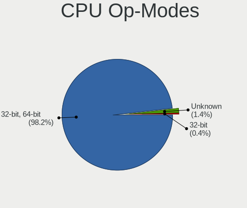

| Op mode        | Computers | Percent |
|----------------|-----------|---------|
| 32-bit, 64-bit | 545       | 97.5%   |
| Unknown        | 11        | 1.97%   |
| 32-bit         | 3         | 0.54%   |

CPU Microcode
-------------

Microcode number

| Number     | Computers | Percent |
|------------|-----------|---------|
| Unknown    | 197       | 34.02%  |
| 0x306c3    | 29        | 5.01%   |
| 0x206a7    | 29        | 5.01%   |
| 0x306a9    | 24        | 4.15%   |
| 0x1067a    | 22        | 3.8%    |
| 0x906ea    | 19        | 3.28%   |
| 0x40651    | 18        | 3.11%   |
| 0x806ea    | 17        | 2.94%   |
| 0x806e9    | 16        | 2.76%   |
| 0x306d4    | 15        | 2.59%   |
| 0x806ec    | 11        | 1.9%    |
| 0x906e9    | 10        | 1.73%   |
| 0x406e3    | 10        | 1.73%   |
| 0x6fd      | 8         | 1.38%   |
| 0x20655    | 7         | 1.21%   |
| 0xa0652    | 6         | 1.04%   |
| 0x06001119 | 6         | 1.04%   |
| 0x806c1    | 5         | 0.86%   |
| 0x706e5    | 5         | 0.86%   |
| 0x6fb      | 5         | 0.86%   |
| 0x506e3    | 5         | 0.86%   |
| 0x30678    | 5         | 0.86%   |
| 0x20652    | 5         | 0.86%   |
| 0x0600111f | 5         | 0.86%   |
| 0xf65      | 4         | 0.69%   |
| 0x806eb    | 4         | 0.69%   |
| 0x406c3    | 4         | 0.69%   |
| 0x10676    | 4         | 0.69%   |
| 0x06006705 | 4         | 0.69%   |
| 0x06006704 | 4         | 0.69%   |
| 0xa0671    | 3         | 0.52%   |
| 0x406c4    | 3         | 0.52%   |
| 0x206c2    | 3         | 0.52%   |
| 0x106e5    | 3         | 0.52%   |
| 0x0a50000c | 3         | 0.52%   |
| 0x0800820d | 3         | 0.52%   |
| 0x010000c8 | 3         | 0.52%   |
| 0xf41      | 2         | 0.35%   |
| 0x906a4    | 2         | 0.35%   |
| 0x906a3    | 2         | 0.35%   |

CPU Microarch
-------------

Microarchitecture

| Name             | Computers | Percent |
|------------------|-----------|---------|
| KabyLake         | 116       | 20.75%  |
| Haswell          | 65        | 11.63%  |
| SandyBridge      | 41        | 7.33%   |
| IvyBridge        | 37        | 6.62%   |
| Penryn           | 30        | 5.37%   |
| Skylake          | 28        | 5.01%   |
| Westmere         | 23        | 4.11%   |
| Core             | 21        | 3.76%   |
| Broadwell        | 19        | 3.4%    |
| Unknown          | 17        | 3.04%   |
| Silvermont       | 16        | 2.86%   |
| CometLake        | 16        | 2.86%   |
| Excavator        | 15        | 2.68%   |
| Piledriver       | 14        | 2.5%    |
| IceLake          | 12        | 2.15%   |
| TigerLake        | 11        | 1.97%   |
| NetBurst         | 10        | 1.79%   |
| K10              | 10        | 1.79%   |
| Zen+             | 8         | 1.43%   |
| Zen 2            | 8         | 1.43%   |
| Zen 3            | 7         | 1.25%   |
| Alderlake Hybrid | 7         | 1.25%   |
| Nehalem          | 5         | 0.89%   |
| Zen              | 4         | 0.72%   |
| Steamroller      | 4         | 0.72%   |
| Bobcat           | 4         | 0.72%   |
| K8 Hammer        | 3         | 0.54%   |
| Puma             | 2         | 0.36%   |
| Goldmont plus    | 2         | 0.36%   |
| P6               | 1         | 0.18%   |
| Goldmont         | 1         | 0.18%   |
| Bulldozer        | 1         | 0.18%   |
| Bonnell          | 1         | 0.18%   |

Graphics
--------

GPU Vendor
----------

Vendors of graphics cards

| Vendor           | Computers | Percent |
|------------------|-----------|---------|
| Intel            | 393       | 52.61%  |
| Nvidia           | 194       | 25.97%  |
| AMD              | 159       | 21.29%  |
| VIA Technologies | 1         | 0.13%   |

GPU Model
---------

Graphics card models

| Model                                                                                    | Computers | Percent |
|------------------------------------------------------------------------------------------|-----------|---------|
| Intel 2nd Generation Core Processor Family Integrated Graphics Controller                | 30        | 3.95%   |
| Intel UHD Graphics 620                                                                   | 25        | 3.29%   |
| Intel Haswell-ULT Integrated Graphics Controller                                         | 24        | 3.16%   |
| Intel CoffeeLake-H GT2 [UHD Graphics 630]                                                | 24        | 3.16%   |
| Intel 3rd Gen Core processor Graphics Controller                                         | 24        | 3.16%   |
| Intel HD Graphics 620                                                                    | 20        | 2.63%   |
| Intel Xeon E3-1200 v3/4th Gen Core Processor Integrated Graphics Controller              | 19        | 2.5%    |
| Intel Skylake GT2 [HD Graphics 520]                                                      | 18        | 2.37%   |
| AMD Topaz XT [Radeon R7 M260/M265 / M340/M360 / M440/M445 / 530/535 / 620/625 Mobile]    | 18        | 2.37%   |
| Intel HD Graphics 5500                                                                   | 16        | 2.11%   |
| Intel 4 Series Chipset Integrated Graphics Controller                                    | 15        | 1.97%   |
| Nvidia GP107M [GeForce GTX 1050 Ti Mobile]                                               | 14        | 1.84%   |
| Intel WhiskeyLake-U GT2 [UHD Graphics 620]                                               | 13        | 1.71%   |
| Intel HD Graphics 630                                                                    | 13        | 1.71%   |
| Intel 4th Gen Core Processor Integrated Graphics Controller                              | 13        | 1.71%   |
| Nvidia TU117M [GeForce GTX 1650 Mobile / Max-Q]                                          | 12        | 1.58%   |
| Nvidia GP108M [GeForce MX150]                                                            | 11        | 1.45%   |
| Intel CometLake-U GT2 [UHD Graphics]                                                     | 11        | 1.45%   |
| Intel CometLake-H GT2 [UHD Graphics]                                                     | 11        | 1.45%   |
| Intel Atom/Celeron/Pentium Processor x5-E8000/J3xxx/N3xxx Integrated Graphics Controller | 11        | 1.45%   |
| Nvidia GM108M [GeForce MX130]                                                            | 10        | 1.32%   |
| Intel Core Processor Integrated Graphics Controller                                      | 10        | 1.32%   |
| Nvidia GT218 [GeForce 210]                                                               | 9         | 1.18%   |
| AMD Sun XT [Radeon HD 8670A/8670M/8690M / R5 M330 / M430 / Radeon 520 Mobile]            | 9         | 1.18%   |
| AMD Stoney [Radeon R2/R3/R4/R5 Graphics]                                                 | 9         | 1.18%   |
| Intel TigerLake-LP GT2 [Iris Xe Graphics]                                                | 8         | 1.05%   |
| Intel Xeon E3-1200 v2/3rd Gen Core processor Graphics Controller                         | 7         | 0.92%   |
| Intel Mobile 4 Series Chipset Integrated Graphics Controller                             | 7         | 0.92%   |
| Intel HD Graphics 530                                                                    | 7         | 0.92%   |
| AMD Ellesmere [Radeon RX 470/480/570/570X/580/580X/590]                                  | 7         | 0.92%   |
| Nvidia GM108M [GeForce 840M]                                                             | 6         | 0.79%   |
| Nvidia GF117M [GeForce 610M/710M/810M/820M / GT 620M/625M/630M/720M]                     | 6         | 0.79%   |
| AMD Wani [Radeon R5/R6/R7 Graphics]                                                      | 6         | 0.79%   |
| Nvidia TU116M [GeForce GTX 1660 Ti Mobile]                                               | 5         | 0.66%   |
| Nvidia GK208M [GeForce GT 740M]                                                          | 5         | 0.66%   |
| Intel Iris Plus Graphics G7                                                              | 5         | 0.66%   |
| Intel Atom Processor Z36xxx/Z37xxx Series Graphics & Display                             | 5         | 0.66%   |
| Intel 82Q963/Q965 Integrated Graphics Controller                                         | 5         | 0.66%   |
| AMD Picasso/Raven 2 [Radeon Vega Series / Radeon Vega Mobile Series]                     | 5         | 0.66%   |
| Nvidia GP108M [GeForce MX230]                                                            | 4         | 0.53%   |

GPU Combo
---------

Combinations of graphics cards

| Name                   | Computers | Percent |
|------------------------|-----------|---------|
| 1 x Intel              | 211       | 37.28%  |
| Intel + Nvidia         | 123       | 21.73%  |
| 1 x AMD                | 84        | 14.84%  |
| 1 x Nvidia             | 62        | 10.95%  |
| Intel + AMD            | 60        | 10.6%   |
| AMD + Nvidia           | 9         | 1.59%   |
| Other                  | 6         | 1.06%   |
| 2 x AMD                | 5         | 0.88%   |
| 2 x Intel              | 2         | 0.35%   |
| 3 x AMD                | 1         | 0.18%   |
| 2 x Nvidia             | 1         | 0.18%   |
| 1 x VIA                | 1         | 0.18%   |
| 1 x Intel + 3 x Nvidia | 1         | 0.18%   |

GPU Driver
----------

Free vs proprietary

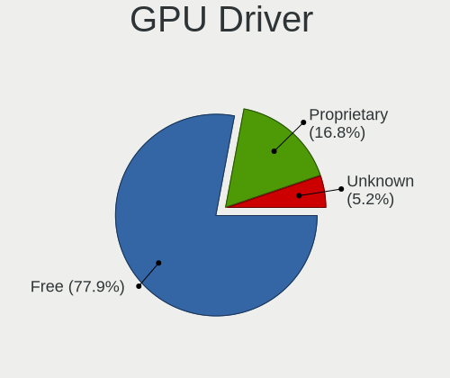

| Driver      | Computers | Percent |
|-------------|-----------|---------|
| Free        | 439       | 76.75%  |
| Proprietary | 100       | 17.48%  |
| Unknown     | 33        | 5.77%   |

GPU Memory
----------

Total video memory

| Size in GB | Computers | Percent |
|------------|-----------|---------|
| Unknown    | 340       | 59.03%  |
| 1.01-2.0   | 71        | 12.33%  |
| 3.01-4.0   | 49        | 8.51%   |
| 0.51-1.0   | 46        | 7.99%   |
| 0.01-0.5   | 44        | 7.64%   |
| 7.01-8.0   | 11        | 1.91%   |
| 5.01-6.0   | 8         | 1.39%   |
| 8.01-16.0  | 7         | 1.22%   |

Monitor
-------

Monitor Vendor
--------------

Monitor vendors

| Vendor                  | Computers | Percent |
|-------------------------|-----------|---------|
| BOE                     | 78        | 14.34%  |
| Samsung Electronics     | 76        | 13.97%  |
| LG Display              | 71        | 13.05%  |
| AU Optronics            | 70        | 12.87%  |
| Chimei Innolux          | 62        | 11.4%   |
| Dell                    | 39        | 7.17%   |
| Hewlett-Packard         | 28        | 5.15%   |
| Chi Mei Optoelectronics | 17        | 3.13%   |
| Lenovo                  | 15        | 2.76%   |
| Sharp                   | 9         | 1.65%   |
| InfoVision              | 9         | 1.65%   |
| Goldstar                | 8         | 1.47%   |
| Philips                 | 5         | 0.92%   |
| Unknown                 | 4         | 0.74%   |
| PANDA                   | 4         | 0.74%   |
| ASUSTek Computer        | 4         | 0.74%   |
| AOC                     | 4         | 0.74%   |
| Acer                    | 4         | 0.74%   |
| NEC Computers           | 3         | 0.55%   |
| Fujitsu Siemens         | 3         | 0.55%   |
| BenQ                    | 3         | 0.55%   |
| Panasonic               | 2         | 0.37%   |
| MStar                   | 2         | 0.37%   |
| Eizo                    | 2         | 0.37%   |
| CSO                     | 2         | 0.37%   |
| Apple                   | 2         | 0.37%   |
| ViewSonic               | 1         | 0.18%   |
| Toshiba                 | 1         | 0.18%   |
| TMX                     | 1         | 0.18%   |
| Sun                     | 1         | 0.18%   |
| Sony                    | 1         | 0.18%   |
| Planar                  | 1         | 0.18%   |
| NCS                     | 1         | 0.18%   |
| MLT                     | 1         | 0.18%   |
| LG Philips              | 1         | 0.18%   |
| KDC                     | 1         | 0.18%   |
| JWY                     | 1         | 0.18%   |
| InnoLux Display         | 1         | 0.18%   |
| HKC                     | 1         | 0.18%   |
| Gigabyte Technology     | 1         | 0.18%   |

Monitor Model
-------------

Monitor models

| Model                                                                 | Computers | Percent |
|-----------------------------------------------------------------------|-----------|---------|
| BOE LCD Monitor BOE06A5 1366x768 344x194mm 15.5-inch                  | 8         | 1.45%   |
| AU Optronics LCD Monitor AUO38ED 1920x1080 344x193mm 15.5-inch        | 8         | 1.45%   |
| LG Display LCD Monitor LGD053F 1920x1080 344x194mm 15.5-inch          | 6         | 1.09%   |
| Chimei Innolux LCD Monitor CMN15DB 1366x768 344x193mm 15.5-inch       | 6         | 1.09%   |
| Dell E170S DELA04A 1280x1024 338x270mm 17.0-inch                      | 5         | 0.91%   |
| Chimei Innolux LCD Monitor CMN15AB 1366x768 344x194mm 15.5-inch       | 5         | 0.91%   |
| BOE LCD Monitor BOE0687 1920x1080 344x193mm 15.5-inch                 | 5         | 0.91%   |
| LG Display LCD Monitor LGD02E9 1366x768 309x174mm 14.0-inch           | 4         | 0.73%   |
| Lenovo LCD Monitor LEN40A0 1366x768 309x173mm 13.9-inch               | 4         | 0.73%   |
| Chimei Innolux LCD Monitor CMN15E7 1920x1080 344x193mm 15.5-inch      | 4         | 0.73%   |
| Chimei Innolux LCD Monitor CMN15DC 1366x768 344x193mm 15.5-inch       | 4         | 0.73%   |
| BOE LCD Monitor BOE0802 1920x1080 344x193mm 15.5-inch                 | 4         | 0.73%   |
| BOE LCD Monitor BOE07B0 1920x1080 344x194mm 15.5-inch                 | 4         | 0.73%   |
| AU Optronics LCD Monitor AUO81EC 1366x768 344x193mm 15.5-inch         | 4         | 0.73%   |
| Samsung Electronics S19B150 SAM08A2 1366x768 410x230mm 18.5-inch      | 3         | 0.54%   |
| Samsung Electronics LCD Monitor SEC3151 1366x768 344x194mm 15.5-inch  | 3         | 0.54%   |
| Samsung Electronics LCD Monitor SDC4852 1366x768 344x194mm 15.5-inch  | 3         | 0.54%   |
| LG Display LCD Monitor LGD0590 1920x1080 344x194mm 15.5-inch          | 3         | 0.54%   |
| Lenovo LEN T2454pA LEN60C9 1920x1080 518x324mm 24.1-inch              | 3         | 0.54%   |
| Hewlett-Packard L1950 HWP26E7 1280x1024 380x300mm 19.1-inch           | 3         | 0.54%   |
| Chimei Innolux LCD Monitor CMN15E6 1366x768 344x193mm 15.5-inch       | 3         | 0.54%   |
| Chimei Innolux LCD Monitor CMN15D5 1920x1080 344x193mm 15.5-inch      | 3         | 0.54%   |
| Chimei Innolux LCD Monitor CMN1521 1920x1080 344x193mm 15.5-inch      | 3         | 0.54%   |
| Chimei Innolux LCD Monitor CMN1490 1366x768 309x173mm 13.9-inch       | 3         | 0.54%   |
| BOE LCD Monitor BOE06C6 1920x1080 344x194mm 15.5-inch                 | 3         | 0.54%   |
| BOE LCD Monitor BOE06A9 1920x1080 344x193mm 15.5-inch                 | 3         | 0.54%   |
| BOE LCD Monitor BOE0672 1366x768 344x194mm 15.5-inch                  | 3         | 0.54%   |
| AU Optronics LCD Monitor AUO71EC 1366x768 344x193mm 15.5-inch         | 3         | 0.54%   |
| AU Optronics LCD Monitor AUO46EC 1366x768 344x193mm 15.5-inch         | 3         | 0.54%   |
| AU Optronics LCD Monitor AUO45EC 1366x768 340x190mm 15.3-inch         | 3         | 0.54%   |
| AU Optronics LCD Monitor AUO22EC 1366x768 344x193mm 15.5-inch         | 3         | 0.54%   |
| Unknown LCD Monitor FFFF 2288x1287 2550x2550mm 142.0-inch             | 2         | 0.36%   |
| Samsung Electronics U28E590 SAM0C4D 3840x2160 607x345mm 27.5-inch     | 2         | 0.36%   |
| Samsung Electronics SyncMaster SAM0350 1440x900 428x255mm 19.6-inch   | 2         | 0.36%   |
| Samsung Electronics SMB1930N SAM0632 1366x768 410x230mm 18.5-inch     | 2         | 0.36%   |
| Samsung Electronics S22F350 SAM0D1A 1920x1080 477x268mm 21.5-inch     | 2         | 0.36%   |
| Samsung Electronics S19D300 SAM0B34 1366x768 410x230mm 18.5-inch      | 2         | 0.36%   |
| Samsung Electronics LCD Monitor SEC3150 1366x768 344x193mm 15.5-inch  | 2         | 0.36%   |
| Samsung Electronics LCD Monitor SDC5441 1366x768 344x194mm 15.5-inch  | 2         | 0.36%   |
| Samsung Electronics LCD Monitor SDC5344 1920x1080 344x194mm 15.5-inch | 2         | 0.36%   |

Monitor Resolution
------------------

Monitor screen resolution

| Resolution         | Computers | Percent |
|--------------------|-----------|---------|
| 1920x1080 (FHD)    | 217       | 40.71%  |
| 1366x768 (WXGA)    | 187       | 35.08%  |
| 1280x1024 (SXGA)   | 27        | 5.07%   |
| 1600x900 (HD+)     | 19        | 3.56%   |
| 1440x900 (WXGA+)   | 17        | 3.19%   |
| 3840x2160 (4K)     | 12        | 2.25%   |
| 1680x1050 (WSXGA+) | 11        | 2.06%   |
| 2560x1440 (QHD)    | 8         | 1.5%    |
| 1280x800 (WXGA)    | 8         | 1.5%    |
| 1920x1200 (WUXGA)  | 5         | 0.94%   |
| 2560x1600          | 3         | 0.56%   |
| 2288x1287          | 2         | 0.38%   |
| 1600x1200          | 2         | 0.38%   |
| Unknown            | 2         | 0.38%   |
| 5760x1080          | 1         | 0.19%   |
| 3840x2400          | 1         | 0.19%   |
| 3440x1440          | 1         | 0.19%   |
| 3200x1800 (QHD+)   | 1         | 0.19%   |
| 2736x1824          | 1         | 0.19%   |
| 2160x1440          | 1         | 0.19%   |
| 1920x540           | 1         | 0.19%   |
| 1920x1280          | 1         | 0.19%   |
| 1400x1050          | 1         | 0.19%   |
| 1360x768           | 1         | 0.19%   |
| 1280x720 (HD)      | 1         | 0.19%   |
| 1024x768 (XGA)     | 1         | 0.19%   |
| 1024x600           | 1         | 0.19%   |

Monitor Diagonal
----------------

Diagonal size in inches

| Inches  | Computers | Percent |
|---------|-----------|---------|
| 15      | 261       | 48.15%  |
| 14      | 52        | 9.59%   |
| 17      | 31        | 5.72%   |
| 13      | 31        | 5.72%   |
| 19      | 20        | 3.69%   |
| 24      | 18        | 3.32%   |
| 21      | 16        | 2.95%   |
| 23      | 15        | 2.77%   |
| 18      | 15        | 2.77%   |
| Unknown | 14        | 2.58%   |
| 27      | 13        | 2.4%    |
| 12      | 13        | 2.4%    |
| 22      | 11        | 2.03%   |
| 20      | 9         | 1.66%   |
| 16      | 4         | 0.74%   |
| 32      | 3         | 0.55%   |
| 11      | 3         | 0.55%   |
| 142     | 2         | 0.37%   |
| 54      | 2         | 0.37%   |
| 31      | 2         | 0.37%   |
| 58      | 1         | 0.18%   |
| 42      | 1         | 0.18%   |
| 40      | 1         | 0.18%   |
| 34      | 1         | 0.18%   |
| 29      | 1         | 0.18%   |
| 25      | 1         | 0.18%   |
| 10      | 1         | 0.18%   |

Monitor Width
-------------

Physical width

| Width in mm    | Computers | Percent |
|----------------|-----------|---------|
| 301-350        | 348       | 64.56%  |
| 401-500        | 62        | 11.5%   |
| 501-600        | 44        | 8.16%   |
| 201-300        | 29        | 5.38%   |
| 351-400        | 26        | 4.82%   |
| Unknown        | 14        | 2.6%    |
| 601-700        | 5         | 0.93%   |
| 701-800        | 4         | 0.74%   |
| 1001-1500      | 3         | 0.56%   |
| More than 2000 | 2         | 0.37%   |
| 801-900        | 1         | 0.19%   |
| 901-1000       | 1         | 0.19%   |

Aspect Ratio
------------

Proportional relationship between the width and the height

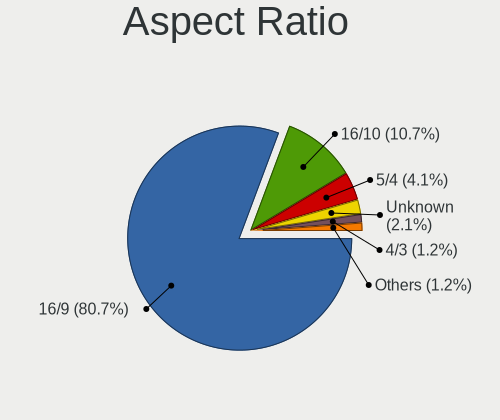

| Ratio   | Computers | Percent |
|---------|-----------|---------|
| 16/9    | 424       | 81.7%   |
| 16/10   | 45        | 8.67%   |
| 5/4     | 24        | 4.62%   |
| Unknown | 13        | 2.5%    |
| 4/3     | 8         | 1.54%   |
| 3/2     | 2         | 0.39%   |
| 1.00    | 2         | 0.39%   |
| 21/9    | 1         | 0.19%   |

Monitor Area
------------

Area in inch

| Area in inch | Computers | Percent |
|----------------|-----------|---------|
| 101-110        | 258       | 47.69%  |
| 81-90          | 71        | 13.12%  |
| 201-250        | 48        | 8.87%   |
| 151-200        | 37        | 6.84%   |
| 141-150        | 28        | 5.18%   |
| Unknown        | 14        | 2.59%   |
| 301-350        | 13        | 2.4%    |
| 61-70          | 12        | 2.22%   |
| 71-80          | 11        | 2.03%   |
| 121-130        | 10        | 1.85%   |
| 251-300        | 8         | 1.48%   |
| 351-500        | 7         | 1.29%   |
| More than 1000 | 5         | 0.92%   |
| 131-140        | 5         | 0.92%   |
| 111-120        | 4         | 0.74%   |
| 91-100         | 4         | 0.74%   |
| 51-60          | 3         | 0.55%   |
| 501-1000       | 2         | 0.37%   |
| 41-50          | 1         | 0.18%   |

Pixel Density
-------------

Pixels per inch

| Density       | Computers | Percent |
|---------------|-----------|---------|
| 101-120       | 187       | 35.15%  |
| 121-160       | 168       | 31.58%  |
| 51-100        | 136       | 25.56%  |
| 161-240       | 14        | 2.63%   |
| Unknown       | 14        | 2.63%   |
| More than 240 | 7         | 1.32%   |
| 1-50          | 6         | 1.13%   |

Multiple Monitors
-----------------

Total monitors connected

| Total | Computers | Percent |
|-------|-----------|---------|
| 1     | 494       | 86.36%  |
| 2     | 43        | 7.52%   |
| 0     | 33        | 5.77%   |
| 3     | 2         | 0.35%   |

Network
-------

Net Controller Vendor
---------------------

Controller vendors

| Vendor                            | Computers | Percent |
|-----------------------------------|-----------|---------|
| Realtek Semiconductor             | 330       | 37.46%  |
| Intel                             | 262       | 29.74%  |
| Qualcomm Atheros                  | 109       | 12.37%  |
| Broadcom                          | 67        | 7.6%    |
| Ralink Technology                 | 28        | 3.18%   |
| Broadcom Limited                  | 20        | 2.27%   |
| Ralink                            | 11        | 1.25%   |
| TP-Link                           | 8         | 0.91%   |
| MediaTek                          | 8         | 0.91%   |
| Samsung Electronics               | 5         | 0.57%   |
| Qualcomm Atheros Communications   | 4         | 0.45%   |
| Marvell Technology Group          | 4         | 0.45%   |
| Huawei Technologies               | 4         | 0.45%   |
| Xiaomi                            | 2         | 0.23%   |
| Nvidia                            | 2         | 0.23%   |
| Edimax Technology                 | 2         | 0.23%   |
| Dell                              | 2         | 0.23%   |
| D-Link                            | 2         | 0.23%   |
| VIA Technologies                  | 1         | 0.11%   |
| Sundance Technology Inc / IC Plus | 1         | 0.11%   |
| Sierra Wireless                   | 1         | 0.11%   |
| Qualcomm                          | 1         | 0.11%   |
| Motorola                          | 1         | 0.11%   |
| Lenovo                            | 1         | 0.11%   |
| Hewlett-Packard                   | 1         | 0.11%   |
| Ericsson Business Mobile Networks | 1         | 0.11%   |
| Belkin Components                 | 1         | 0.11%   |
| ASIX Electronics                  | 1         | 0.11%   |
| 3Com                              | 1         | 0.11%   |

Net Controller Model
--------------------

Controller models

| Model                                                                  | Computers | Percent |
|------------------------------------------------------------------------|-----------|---------|
| Realtek RTL8111/8168/8211/8411 PCI Express Gigabit Ethernet Controller | 198       | 19.74%  |
| Realtek RTL810xE PCI Express Fast Ethernet controller                  | 88        | 8.77%   |
| Qualcomm Atheros QCA9377 802.11ac Wireless Network Adapter             | 35        | 3.49%   |
| Intel 82579LM Gigabit Network Connection (Lewisville)                  | 25        | 2.49%   |
| Intel Ethernet Connection I217-LM                                      | 21        | 2.09%   |
| Intel Wireless 8265 / 8275                                             | 18        | 1.79%   |
| Intel Cannon Lake PCH CNVi WiFi                                        | 18        | 1.79%   |
| Realtek RTL8821CE 802.11ac PCIe Wireless Network Adapter               | 17        | 1.69%   |
| Ralink RT5370 Wireless Adapter                                         | 15        | 1.5%    |
| Qualcomm Atheros QCA9565 / AR9565 Wireless Network Adapter             | 15        | 1.5%    |
| Broadcom BCM43142 802.11b/g/n                                          | 15        | 1.5%    |
| Qualcomm Atheros AR9285 Wireless Network Adapter (PCI-Express)         | 14        | 1.4%    |
| Intel Comet Lake PCH CNVi WiFi                                         | 14        | 1.4%    |
| Intel Wireless 8260                                                    | 13        | 1.3%    |
| Realtek RTL8723BE PCIe Wireless Network Adapter                        | 11        | 1.1%    |
| Realtek RTL8188FTV 802.11b/g/n 1T1R 2.4G WLAN Adapter                  | 11        | 1.1%    |
| Ralink MT7601U Wireless Adapter                                        | 11        | 1.1%    |
| Intel Comet Lake PCH-LP CNVi WiFi                                      | 11        | 1.1%    |
| Intel 82567LM-3 Gigabit Network Connection                             | 11        | 1.1%    |
| Broadcom BCM4313 802.11bgn Wireless Network Adapter                    | 11        | 1.1%    |
| Qualcomm Atheros AR8151 v2.0 Gigabit Ethernet                          | 10        | 1%      |
| Intel Wireless 7265                                                    | 10        | 1%      |
| Intel Wireless 7260                                                    | 10        | 1%      |
| Realtek RTL8188EUS 802.11n Wireless Network Adapter                    | 9         | 0.9%    |
| Intel Wireless 3160                                                    | 8         | 0.8%    |
| Intel Wi-Fi 6 AX200                                                    | 8         | 0.8%    |
| Intel Dual Band Wireless-AC 3165 Plus Bluetooth                        | 8         | 0.8%    |
| Broadcom NetXtreme BCM5762 Gigabit Ethernet PCIe                       | 8         | 0.8%    |
| Broadcom NetXtreme BCM5761 Gigabit Ethernet PCIe                       | 8         | 0.8%    |
| Broadcom BCM43228 802.11a/b/g/n                                        | 8         | 0.8%    |
| Realtek RTL8822BE 802.11a/b/g/n/ac WiFi adapter                        | 7         | 0.7%    |
| Qualcomm Atheros AR9485 Wireless Network Adapter                       | 7         | 0.7%    |
| Intel Wi-Fi 6 AX201                                                    | 7         | 0.7%    |
| Intel 82577LM Gigabit Network Connection                               | 7         | 0.7%    |
| Ralink RT3290 Wireless 802.11n 1T/1R PCIe                              | 6         | 0.6%    |
| Intel Ethernet Connection I219-LM                                      | 6         | 0.6%    |
| Intel Ethernet Connection (2) I219-LM                                  | 6         | 0.6%    |
| Intel Alder Lake-P PCH CNVi WiFi                                       | 6         | 0.6%    |
| Broadcom Limited NetXtreme BCM5761 Gigabit Ethernet PCIe               | 6         | 0.6%    |
| Realtek RTL8822CE 802.11ac PCIe Wireless Network Adapter               | 5         | 0.5%    |

Wireless Vendor
---------------

Wireless vendors

| Vendor                            | Computers | Percent |
|-----------------------------------|-----------|---------|
| Intel                             | 189       | 39.96%  |
| Qualcomm Atheros                  | 86        | 18.18%  |
| Realtek Semiconductor             | 83        | 17.55%  |
| Broadcom                          | 40        | 8.46%   |
| Ralink Technology                 | 28        | 5.92%   |
| Ralink                            | 11        | 2.33%   |
| Broadcom Limited                  | 9         | 1.9%    |
| TP-Link                           | 7         | 1.48%   |
| MediaTek                          | 7         | 1.48%   |
| Qualcomm Atheros Communications   | 4         | 0.85%   |
| Edimax Technology                 | 2         | 0.42%   |
| Dell                              | 2         | 0.42%   |
| D-Link                            | 2         | 0.42%   |
| Sierra Wireless                   | 1         | 0.21%   |
| Ericsson Business Mobile Networks | 1         | 0.21%   |
| Belkin Components                 | 1         | 0.21%   |

Wireless Model
--------------

Wireless models

| Model                                                                         | Computers | Percent |
|-------------------------------------------------------------------------------|-----------|---------|
| Qualcomm Atheros QCA9377 802.11ac Wireless Network Adapter                    | 35        | 7.35%   |
| Intel Wireless 8265 / 8275                                                    | 18        | 3.78%   |
| Intel Cannon Lake PCH CNVi WiFi                                               | 18        | 3.78%   |
| Realtek RTL8821CE 802.11ac PCIe Wireless Network Adapter                      | 17        | 3.57%   |
| Ralink RT5370 Wireless Adapter                                                | 15        | 3.15%   |
| Qualcomm Atheros QCA9565 / AR9565 Wireless Network Adapter                    | 15        | 3.15%   |
| Broadcom BCM43142 802.11b/g/n                                                 | 15        | 3.15%   |
| Qualcomm Atheros AR9285 Wireless Network Adapter (PCI-Express)                | 14        | 2.94%   |
| Intel Comet Lake PCH CNVi WiFi                                                | 14        | 2.94%   |
| Intel Wireless 8260                                                           | 13        | 2.73%   |
| Realtek RTL8723BE PCIe Wireless Network Adapter                               | 11        | 2.31%   |
| Realtek RTL8188FTV 802.11b/g/n 1T1R 2.4G WLAN Adapter                         | 11        | 2.31%   |
| Ralink MT7601U Wireless Adapter                                               | 11        | 2.31%   |
| Intel Comet Lake PCH-LP CNVi WiFi                                             | 11        | 2.31%   |
| Broadcom BCM4313 802.11bgn Wireless Network Adapter                           | 11        | 2.31%   |
| Intel Wireless 7265                                                           | 10        | 2.1%    |
| Intel Wireless 7260                                                           | 10        | 2.1%    |
| Realtek RTL8188EUS 802.11n Wireless Network Adapter                           | 9         | 1.89%   |
| Intel Wireless 3160                                                           | 8         | 1.68%   |
| Intel Wi-Fi 6 AX200                                                           | 8         | 1.68%   |
| Intel Dual Band Wireless-AC 3165 Plus Bluetooth                               | 8         | 1.68%   |
| Broadcom BCM43228 802.11a/b/g/n                                               | 8         | 1.68%   |
| Realtek RTL8822BE 802.11a/b/g/n/ac WiFi adapter                               | 7         | 1.47%   |
| Qualcomm Atheros AR9485 Wireless Network Adapter                              | 7         | 1.47%   |
| Intel Wi-Fi 6 AX201                                                           | 7         | 1.47%   |
| Ralink RT3290 Wireless 802.11n 1T/1R PCIe                                     | 6         | 1.26%   |
| Intel Alder Lake-P PCH CNVi WiFi                                              | 6         | 1.26%   |
| Realtek RTL8822CE 802.11ac PCIe Wireless Network Adapter                      | 5         | 1.05%   |
| Qualcomm Atheros QCA6174 802.11ac Wireless Network Adapter                    | 5         | 1.05%   |
| Intel Dual Band Wireless-AC 3168NGW [Stone Peak]                              | 5         | 1.05%   |
| Realtek RTL8821AE 802.11ac PCIe Wireless Network Adapter                      | 4         | 0.84%   |
| Qualcomm Atheros AR2413/AR2414 Wireless Network Adapter [AR5005G(S) 802.11bg] | 4         | 0.84%   |
| MediaTek MT7921 802.11ax PCI Express Wireless Network Adapter                 | 4         | 0.84%   |
| Intel Tiger Lake PCH CNVi WiFi                                                | 4         | 0.84%   |
| Intel Centrino Wireless-N 1000 [Condor Peak]                                  | 4         | 0.84%   |
| Intel Centrino Ultimate-N 6300                                                | 4         | 0.84%   |
| Intel Centrino Advanced-N 6235                                                | 4         | 0.84%   |
| Intel Centrino Advanced-N 6205 [Taylor Peak]                                  | 4         | 0.84%   |
| Intel Cannon Point-LP CNVi [Wireless-AC]                                      | 4         | 0.84%   |
| TP-Link TL-WN722N v2/v3 [Realtek RTL8188EUS]                                  | 3         | 0.63%   |

Ethernet Vendor
---------------

Ethernet vendors

| Vendor                            | Computers | Percent |
|-----------------------------------|-----------|---------|
| Realtek Semiconductor             | 299       | 57.83%  |
| Intel                             | 125       | 24.18%  |
| Qualcomm Atheros                  | 30        | 5.8%    |
| Broadcom                          | 29        | 5.61%   |
| Broadcom Limited                  | 11        | 2.13%   |
| Samsung Electronics               | 5         | 0.97%   |
| Marvell Technology Group          | 4         | 0.77%   |
| Xiaomi                            | 2         | 0.39%   |
| Nvidia                            | 2         | 0.39%   |
| Huawei Technologies               | 2         | 0.39%   |
| VIA Technologies                  | 1         | 0.19%   |
| TP-Link                           | 1         | 0.19%   |
| Sundance Technology Inc / IC Plus | 1         | 0.19%   |
| Qualcomm                          | 1         | 0.19%   |
| MediaTek                          | 1         | 0.19%   |
| Lenovo                            | 1         | 0.19%   |
| ASIX Electronics                  | 1         | 0.19%   |
| 3Com                              | 1         | 0.19%   |

Ethernet Model
--------------

Ethernet models

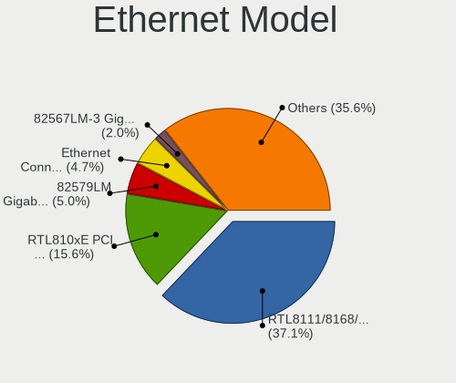

| Model                                                                  | Computers | Percent |
|------------------------------------------------------------------------|-----------|---------|
| Realtek RTL8111/8168/8211/8411 PCI Express Gigabit Ethernet Controller | 198       | 37.86%  |
| Realtek RTL810xE PCI Express Fast Ethernet controller                  | 88        | 16.83%  |
| Intel 82579LM Gigabit Network Connection (Lewisville)                  | 25        | 4.78%   |
| Intel Ethernet Connection I217-LM                                      | 21        | 4.02%   |
| Intel 82567LM-3 Gigabit Network Connection                             | 11        | 2.1%    |
| Qualcomm Atheros AR8151 v2.0 Gigabit Ethernet                          | 10        | 1.91%   |
| Broadcom NetXtreme BCM5762 Gigabit Ethernet PCIe                       | 8         | 1.53%   |
| Broadcom NetXtreme BCM5761 Gigabit Ethernet PCIe                       | 8         | 1.53%   |
| Intel 82577LM Gigabit Network Connection                               | 7         | 1.34%   |
| Intel Ethernet Connection I219-LM                                      | 6         | 1.15%   |
| Intel Ethernet Connection (2) I219-LM                                  | 6         | 1.15%   |
| Broadcom Limited NetXtreme BCM5761 Gigabit Ethernet PCIe               | 6         | 1.15%   |
| Realtek RTL8125 2.5GbE Controller                                      | 5         | 0.96%   |
| Samsung GT-I9070 (network tethering, USB debugging enabled)            | 4         | 0.76%   |
| Realtek Killer E2600 GbE Controller                                    | 4         | 0.76%   |
| Qualcomm Atheros Killer E2400 Gigabit Ethernet Controller              | 4         | 0.76%   |
| Intel I211 Gigabit Network Connection                                  | 4         | 0.76%   |
| Intel Ethernet Connection I218-LM                                      | 4         | 0.76%   |
| Intel Ethernet Connection (4) I219-LM                                  | 4         | 0.76%   |
| Intel 82566DM-2 Gigabit Network Connection                             | 4         | 0.76%   |
| Qualcomm Atheros Killer E220x Gigabit Ethernet Controller              | 3         | 0.57%   |
| Qualcomm Atheros AR8151 v1.0 Gigabit Ethernet                          | 3         | 0.57%   |
| Qualcomm Atheros AR8132 Fast Ethernet                                  | 3         | 0.57%   |
| Intel Ethernet Connection (7) I219-LM                                  | 3         | 0.57%   |
| Intel 82567LM Gigabit Network Connection                               | 3         | 0.57%   |
| Intel 82566DM Gigabit Network Connection                               | 3         | 0.57%   |
| Broadcom NetXtreme BCM5764M Gigabit Ethernet PCIe                      | 3         | 0.57%   |
| Xiaomi Mi/Redmi series (RNDIS + ADB)                                   | 2         | 0.38%   |
| Realtek Killer E3000 2.5GbE Controller                                 | 2         | 0.38%   |
| Qualcomm Atheros QCA8171 Gigabit Ethernet                              | 2         | 0.38%   |
| Qualcomm Atheros Killer E2500 Gigabit Ethernet Controller              | 2         | 0.38%   |
| Marvell Group 88E8040 PCI-E Fast Ethernet Controller                   | 2         | 0.38%   |
| Intel Ethernet Connection (3) I218-LM                                  | 2         | 0.38%   |
| Intel Ethernet Connection (2) I219-V                                   | 2         | 0.38%   |
| Intel Ethernet Connection (16) I219-LM                                 | 2         | 0.38%   |
| Intel Ethernet Connection (13) I219-V                                  | 2         | 0.38%   |
| Intel 82579V Gigabit Network Connection                                | 2         | 0.38%   |
| Intel 82578DM Gigabit Network Connection                               | 2         | 0.38%   |
| Intel 82574L Gigabit Network Connection                                | 2         | 0.38%   |
| Intel 82566MM Gigabit Network Connection                               | 2         | 0.38%   |

Net Controller Kind
-------------------

Ethernet, WiFi or modem

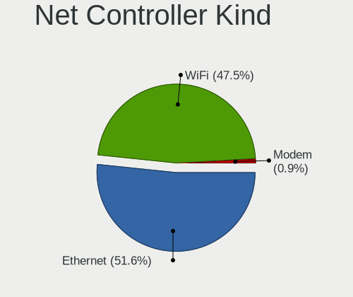

| Kind     | Computers | Percent |
|----------|-----------|---------|
| Ethernet | 500       | 52.58%  |
| WiFi     | 447       | 47%     |
| Modem    | 4         | 0.42%   |

Used Controller
---------------

Currently used network controller

| Kind     | Computers | Percent |
|----------|-----------|---------|
| WiFi     | 365       | 65.06%  |
| Ethernet | 196       | 34.94%  |

NICs
----

Total network controllers on board

| Total | Computers | Percent |
|-------|-----------|---------|
| 2     | 353       | 63.38%  |
| 1     | 187       | 33.57%  |
| 0     | 13        | 2.33%   |
| 3     | 4         | 0.72%   |

IPv6
----

IPv6 vs IPv4

| Used | Computers | Percent |
|------|-----------|---------|
| No   | 555       | 99.28%  |
| Yes  | 4         | 0.72%   |

Bluetooth
---------

Bluetooth Vendor
----------------

Controller vendors

| Vendor                          | Computers | Percent |
|---------------------------------|-----------|---------|
| Intel                           | 151       | 42.78%  |
| Qualcomm Atheros Communications | 53        | 15.01%  |
| Realtek Semiconductor           | 43        | 12.18%  |
| Broadcom                        | 26        | 7.37%   |
| Cambridge Silicon Radio         | 17        | 4.82%   |
| IMC Networks                    | 10        | 2.83%   |
| Hewlett-Packard                 | 9         | 2.55%   |
| Lite-On Technology              | 8         | 2.27%   |
| Foxconn / Hon Hai               | 8         | 2.27%   |
| Toshiba                         | 6         | 1.7%    |
| Ralink                          | 6         | 1.7%    |
| Dell                            | 5         | 1.42%   |
| Apple                           | 3         | 0.85%   |
| TP-Link                         | 2         | 0.57%   |
| Foxconn International           | 2         | 0.57%   |
| Taiyo Yuden                     | 1         | 0.28%   |
| Ralink Technology               | 1         | 0.28%   |
| MediaTek                        | 1         | 0.28%   |
| Edimax Technology               | 1         | 0.28%   |

Bluetooth Model
---------------

Controller models

| Model                                               | Computers | Percent |
|-----------------------------------------------------|-----------|---------|
| Intel Bluetooth wireless interface                  | 64        | 18.13%  |
| Qualcomm Atheros  Bluetooth Device                  | 36        | 10.2%   |
| Intel AX201 Bluetooth                               | 34        | 9.63%   |
| Realtek Bluetooth Radio                             | 32        | 9.07%   |
| Intel Bluetooth 9460/9560 Jefferson Peak (JfP)      | 25        | 7.08%   |
| Cambridge Silicon Radio Bluetooth Dongle (HCI mode) | 17        | 4.82%   |
| Intel Bluetooth Device                              | 9         | 2.55%   |
| Realtek  Bluetooth 4.2 Adapter                      | 7         | 1.98%   |
| Intel AX200 Bluetooth                               | 7         | 1.98%   |
| HP Broadcom 2070 Bluetooth Combo                    | 7         | 1.98%   |
| Ralink RT3290 Bluetooth                             | 6         | 1.7%    |
| Qualcomm Atheros AR3011 Bluetooth                   | 6         | 1.7%    |
| Broadcom BCM43142 Bluetooth 4.0                     | 6         | 1.7%    |
| Qualcomm Atheros AR9462 Bluetooth                   | 5         | 1.42%   |
| Intel Wireless-AC 3168 Bluetooth                    | 5         | 1.42%   |
| Intel Centrino Bluetooth Wireless Transceiver       | 5         | 1.42%   |
| Broadcom HP Portable Bumble Bee                     | 5         | 1.42%   |
| IMC Networks Bluetooth Radio                        | 4         | 1.13%   |
| Realtek RTL8723B Bluetooth                          | 3         | 0.85%   |
| Qualcomm Atheros AR3012 Bluetooth 4.0               | 3         | 0.85%   |
| Lite-On Qualcomm Atheros QCA9377 Bluetooth          | 3         | 0.85%   |
| Lite-On Bluetooth Device                            | 3         | 0.85%   |
| IMC Networks Wireless_Device                        | 3         | 0.85%   |
| Dell Wireless 365 Bluetooth                         | 3         | 0.85%   |
| Broadcom HP Portable SoftSailing                    | 3         | 0.85%   |
| Broadcom BCM43142A0 Bluetooth 4.0                   | 3         | 0.85%   |
| Broadcom BCM2045B (BDC-2.1)                         | 3         | 0.85%   |
| TP-Link UB500 Adapter                               | 2         | 0.57%   |
| Toshiba Integrated Bluetooth HCI                    | 2         | 0.57%   |
| Qualcomm Atheros Bluetooth USB Host Controller      | 2         | 0.57%   |
| IMC Networks Bluetooth Device                       | 2         | 0.57%   |
| HP Bluetooth 2.0 Interface [Broadcom BCM2045]       | 2         | 0.57%   |
| Foxconn International BCM43142A0 Bluetooth module   | 2         | 0.57%   |
| Foxconn / Hon Hai Bluetooth Device                  | 2         | 0.57%   |
| Foxconn / Hon Hai BCM20702A0                        | 2         | 0.57%   |
| Dell DW375 Bluetooth Module                         | 2         | 0.57%   |
| Broadcom BCM43142A0 Bluetooth Device                | 2         | 0.57%   |
| Broadcom BCM20702A0                                 | 2         | 0.57%   |
| Broadcom BCM2070 Bluetooth 2.1 + EDR                | 2         | 0.57%   |
| Apple Bluetooth Host Controller                     | 2         | 0.57%   |

Sound
-----

Sound Vendor
------------

Sound card vendors

| Vendor                 | Computers | Percent |
|------------------------|-----------|---------|
| Intel                  | 453       | 64.99%  |
| Nvidia                 | 116       | 16.64%  |
| AMD                    | 110       | 15.78%  |
| C-Media Electronics    | 3         | 0.43%   |
| Logitech               | 2         | 0.29%   |
| JMTek                  | 2         | 0.29%   |
| Generalplus Technology | 2         | 0.29%   |
| VIA Technologies       | 1         | 0.14%   |
| Thermaltake            | 1         | 0.14%   |
| Texas Instruments      | 1         | 0.14%   |
| Tenx Technology        | 1         | 0.14%   |
| Kingston Technology    | 1         | 0.14%   |
| Hewlett-Packard        | 1         | 0.14%   |
| Conexant Systems       | 1         | 0.14%   |
| ASUSTek Computer       | 1         | 0.14%   |
| Astro Gaming           | 1         | 0.14%   |

Sound Model
-----------

Sound card models

| Model                                                                      | Computers | Percent |
|----------------------------------------------------------------------------|-----------|---------|
| Intel Sunrise Point-LP HD Audio                                            | 64        | 7.63%   |
| Intel 6 Series/C200 Series Chipset Family High Definition Audio Controller | 40        | 4.77%   |
| Intel 8 Series/C220 Series Chipset High Definition Audio Controller        | 36        | 4.29%   |
| Intel 7 Series/C216 Chipset Family High Definition Audio Controller        | 35        | 4.17%   |
| Intel Xeon E3-1200 v3/4th Gen Core Processor HD Audio Controller           | 31        | 3.69%   |
| Intel Cannon Lake PCH cAVS                                                 | 31        | 3.69%   |
| Intel 8 Series HD Audio Controller                                         | 26        | 3.1%    |
| Intel Haswell-ULT HD Audio Controller                                      | 24        | 2.86%   |
| AMD FCH Azalia Controller                                                  | 23        | 2.74%   |
| Intel 5 Series/3400 Series Chipset High Definition Audio                   | 21        | 2.5%    |
| AMD Family 17h/19h HD Audio Controller                                     | 21        | 2.5%    |
| Intel Broadwell-U Audio Controller                                         | 19        | 2.26%   |
| Intel Wildcat Point-LP High Definition Audio Controller                    | 18        | 2.15%   |
| Intel NM10/ICH7 Family High Definition Audio Controller                    | 16        | 1.91%   |
| AMD SBx00 Azalia (Intel HDA)                                               | 15        | 1.79%   |
| AMD Family 15h (Models 60h-6fh) Audio Controller                           | 15        | 1.79%   |
| Nvidia TU107 GeForce GTX 1650 High Definition Audio Controller             | 14        | 1.67%   |
| Nvidia GP107GL High Definition Audio Controller                            | 14        | 1.67%   |
| Intel Comet Lake PCH cAVS                                                  | 14        | 1.67%   |
| AMD Trinity HDMI Audio Controller                                          | 14        | 1.67%   |
| Intel Cannon Point-LP High Definition Audio Controller                     | 13        | 1.55%   |
| Intel 82801I (ICH9 Family) HD Audio Controller                             | 13        | 1.55%   |
| Nvidia High Definition Audio Controller                                    | 12        | 1.43%   |
| Intel 82801H (ICH8 Family) HD Audio Controller                             | 12        | 1.43%   |
| Intel Tiger Lake-LP Smart Sound Technology Audio Controller                | 11        | 1.31%   |
| Intel Comet Lake PCH-LP cAVS                                               | 11        | 1.31%   |
| Intel 82801JD/DO (ICH10 Family) HD Audio Controller                        | 11        | 1.31%   |
| Intel CM238 HD Audio Controller                                            | 10        | 1.19%   |
| Nvidia GF119 HDMI Audio Controller                                         | 9         | 1.07%   |
| Intel 100 Series/C230 Series Chipset Family HD Audio Controller            | 9         | 1.07%   |
| AMD High Definition Audio Controller                                       | 9         | 1.07%   |
| Intel 82801JI (ICH10 Family) HD Audio Controller                           | 8         | 0.95%   |
| AMD Raven/Raven2/Fenghuang HDMI/DP Audio Controller                        | 8         | 0.95%   |
| AMD Kabini HDMI/DP Audio                                                   | 8         | 0.95%   |
| AMD Ellesmere HDMI Audio [Radeon RX 470/480 / 570/580/590]                 | 8         | 0.95%   |
| Nvidia Audio device                                                        | 7         | 0.83%   |
| Intel Ice Lake-LP Smart Sound Technology Audio Controller                  | 7         | 0.83%   |
| Intel Alder Lake PCH-P High Definition Audio Controller                    | 7         | 0.83%   |
| AMD Renoir Radeon High Definition Audio Controller                         | 7         | 0.83%   |
| Nvidia TU116 High Definition Audio Controller                              | 6         | 0.72%   |

Memory
------

Memory Vendor
-------------

Memory module vendors

| Vendor                       | Computers | Percent |
|------------------------------|-----------|---------|
| Samsung Electronics          | 87        | 24.65%  |
| SK hynix                     | 86        | 24.36%  |
| Micron Technology            | 47        | 13.31%  |
| Kingston                     | 31        | 8.78%   |
| Unknown                      | 28        | 7.93%   |
| Crucial                      | 23        | 6.52%   |
| Ramaxel Technology           | 16        | 4.53%   |
| Nanya Technology             | 6         | 1.7%    |
| Corsair                      | 6         | 1.7%    |
| Elpida                       | 5         | 1.42%   |
| M                            | 3         | 0.85%   |
| Team                         | 2         | 0.57%   |
| MINPO                        | 2         | 0.57%   |
| G.Skill                      | 2         | 0.57%   |
| Unknown                      | 2         | 0.57%   |
| Unknown (E)                  | 1         | 0.28%   |
| Unknown (ABCD)               | 1         | 0.28%   |
| Unknown (0x7F7FB5FFFFFFFFFF) | 1         | 0.28%   |
| S                            | 1         | 0.28%   |
| Kingmax                      | 1         | 0.28%   |
| H                            | 1         | 0.28%   |
| Axiom                        | 1         | 0.28%   |

Memory Model
------------

Memory module models

| Model                                                     | Computers | Percent |
|-----------------------------------------------------------|-----------|---------|
| Micron RAM 8JTF51264AZ-1G6E1 4GB DIMM DDR3 1600MT/s       | 8         | 2.13%   |
| SK hynix RAM HMA81GS6AFR8N-UH 8GB SODIMM DDR4 2667MT/s    | 7         | 1.86%   |
| Samsung RAM M471A5244CB0-CRC 4GB SODIMM DDR4 2667MT/s     | 5         | 1.33%   |
| Micron RAM 16JSF51264HZ-1G4D1 4096MB SODIMM DDR3 1334MT/s | 5         | 1.33%   |
| SK hynix RAM HMAA1GS6CJR6N-XN 8GB SODIMM DDR4 3200MT/s    | 4         | 1.06%   |
| SK hynix RAM HMA81GS6JJR8N-VK 8GB SODIMM DDR4 2667MT/s    | 4         | 1.06%   |
| SK hynix RAM HMA41GS6AFR8N-TF 8GB SODIMM DDR4 2667MT/s    | 4         | 1.06%   |
| Samsung RAM M378B5673FH0-CH9 2GB DIMM DDR3 1600MT/s       | 4         | 1.06%   |
| Unknown RAM Module 2GB DIMM 800MT/s                       | 3         | 0.8%    |
| SK hynix RAM HMT451S6BFR8A-PB 4GB SODIMM DDR3 1600MT/s    | 3         | 0.8%    |
| SK hynix RAM HMT41GS6BFR8A-PB 8GB SODIMM DDR3 1600MT/s    | 3         | 0.8%    |
| SK hynix RAM HMT351S6CFR8C-PB 4GB SODIMM DDR3 1600MT/s    | 3         | 0.8%    |
| Samsung RAM M471B1G73DB0-YK0 8GB SODIMM DDR3 1600MT/s     | 3         | 0.8%    |
| Samsung RAM M471A5244CB0-CWE 4GB SODIMM DDR4 3200MT/s     | 3         | 0.8%    |
| Samsung RAM M471A2K43DB1-CTD 16GB SODIMM DDR4 2667MT/s    | 3         | 0.8%    |
| Samsung RAM M471A2K43CB1-CRC 16GB SODIMM DDR4 2667MT/s    | 3         | 0.8%    |
| Samsung RAM M471A1K43CB1-CRC 8GB SODIMM DDR4 2667MT/s     | 3         | 0.8%    |
| Samsung RAM M378B5273CH0-CH9 4GB DIMM DDR2 1867MT/s       | 3         | 0.8%    |
| Samsung RAM M378B5173QH0-CK0 4GB DIMM DDR3 1600MT/s       | 3         | 0.8%    |
| Samsung RAM M378B5173DB0-CK0 4GB DIMM DDR3 1600MT/s       | 3         | 0.8%    |
| Micron RAM 4ATF51264HZ-2G6E1 4GB SODIMM DDR4 2667MT/s     | 3         | 0.8%    |
| Micron RAM 4ATF51264HZ-2G3AZ 4GB SODIMM DDR4 2133MT/s     | 3         | 0.8%    |
| Corsair RAM CMK8GX4M1D3000C16 8GB DIMM DDR4 3200MT/s      | 3         | 0.8%    |
| Unknown RAM Module 4GB DIMM 400MT/s                       | 2         | 0.53%   |
| Unknown RAM Module 4096MB DIMM 400MT/s                    | 2         | 0.53%   |
| Unknown RAM Module 2048MB DIMM 800MT/s                    | 2         | 0.53%   |
| Unknown RAM Module 2048MB DIMM 400MT/s                    | 2         | 0.53%   |
| SK hynix RAM HYMP512U64CP8-Y5 1GB DIMM DDR2 1331MT/s      | 2         | 0.53%   |
| SK hynix RAM HMT425S6AFR6A-PB 2GB SODIMM DDR3 1600MT/s    | 2         | 0.53%   |
| SK hynix RAM HMT41GS6AFR8A-PB 8GB SODIMM DDR3 1600MT/s    | 2         | 0.53%   |
| SK hynix RAM HMT351U6CFR8C-H9 4GB DIMM DDR3 1600MT/s      | 2         | 0.53%   |
| SK hynix RAM HMT325S6BFR8C-H9 2GB SODIMM DDR3 1333MT/s    | 2         | 0.53%   |
| SK hynix RAM HMA851S6AFR6N-UH 4GB SODIMM DDR4 2667MT/s    | 2         | 0.53%   |
| SK hynix RAM HMA82GS6AFR8N-UH 16GB SODIMM DDR4 2667MT/s   | 2         | 0.53%   |
| Samsung RAM M471B5773DH0-CH9 2GB SODIMM DDR3 1600MT/s     | 2         | 0.53%   |
| Samsung RAM M471B5773CHS-CH9 2048MB SODIMM DDR3 4199MT/s  | 2         | 0.53%   |
| Samsung RAM M471B5273DH0-CK0 4GB SODIMM DDR3 1600MT/s     | 2         | 0.53%   |
| Samsung RAM M471B5273CH0-CK0 4GB SODIMM DDR3 1600MT/s     | 2         | 0.53%   |
| Samsung RAM M471B5173EB0-YK0 4GB SODIMM DDR3 1600MT/s     | 2         | 0.53%   |
| Samsung RAM M471B5173DB0-YK0 4GB SODIMM DDR3 1600MT/s     | 2         | 0.53%   |

Memory Kind
-----------

Memory module kinds

| Kind    | Computers | Percent |
|---------|-----------|---------|
| DDR4    | 124       | 44.6%   |
| DDR3    | 105       | 37.77%  |
| SDRAM   | 16        | 5.76%   |
| Unknown | 14        | 5.04%   |
| DDR2    | 9         | 3.24%   |
| LPDDR4  | 3         | 1.08%   |
| DDR     | 3         | 1.08%   |
| LPDDR3  | 2         | 0.72%   |
| LPDDR5  | 1         | 0.36%   |
| DDR5    | 1         | 0.36%   |

Memory Form Factor
------------------

Physical design of the memory module

| Name         | Computers | Percent |
|--------------|-----------|---------|
| SODIMM       | 173       | 65.28%  |
| DIMM         | 85        | 32.08%  |
| Row Of Chips | 5         | 1.89%   |
| Chip         | 2         | 0.75%   |

Memory Size
-----------

Memory module size

| Size  | Computers | Percent |
|-------|-----------|---------|
| 4096  | 96        | 31.07%  |
| 8192  | 94        | 30.42%  |
| 16384 | 55        | 17.8%   |
| 2048  | 50        | 16.18%  |
| 1024  | 9         | 2.91%   |
| 512   | 3         | 0.97%   |
| 32768 | 2         | 0.65%   |

Memory Speed
------------

Memory module speed

| Speed   | Computers | Percent |
|---------|-----------|---------|
| 1600    | 77        | 24.44%  |
| 2667    | 67        | 21.27%  |
| 3200    | 39        | 12.38%  |
| 1333    | 19        | 6.03%   |
| 1334    | 15        | 4.76%   |
| 2400    | 13        | 4.13%   |
| 2133    | 12        | 3.81%   |
| 667     | 10        | 3.17%   |
| 800     | 9         | 2.86%   |
| 1866    | 7         | 2.22%   |
| 400     | 7         | 2.22%   |
| 1867    | 6         | 1.9%    |
| 1066    | 4         | 1.27%   |
| Unknown | 4         | 1.27%   |
| 8400    | 2         | 0.63%   |
| 4199    | 2         | 0.63%   |
| 3600    | 2         | 0.63%   |
| 3467    | 2         | 0.63%   |
| 3266    | 2         | 0.63%   |
| 2048    | 2         | 0.63%   |
| 1331    | 2         | 0.63%   |
| 533     | 2         | 0.63%   |
| 49926   | 1         | 0.32%   |
| 6400    | 1         | 0.32%   |
| 4800    | 1         | 0.32%   |
| 3533    | 1         | 0.32%   |
| 3400    | 1         | 0.32%   |
| 3000    | 1         | 0.32%   |
| 2666    | 1         | 0.32%   |
| 2000    | 1         | 0.32%   |
| 1800    | 1         | 0.32%   |
| 1648    | 1         | 0.32%   |

Printers & scanners
-------------------

Printer Vendor
--------------

Printer device vendors

| Vendor          | Computers | Percent |
|-----------------|-----------|---------|
| Hewlett-Packard | 6         | 66.67%  |
| Seiko Epson     | 2         | 22.22%  |
| Kyocera         | 1         | 11.11%  |

Printer Model
-------------

Printer device models

| Model                           | Computers | Percent |
|---------------------------------|-----------|---------|
| HP LaserJet 1018                | 2         | 22.22%  |
| Seiko Epson Printer             | 1         | 11.11%  |
| Seiko Epson L3150 Series        | 1         | 11.11%  |
| Kyocera UTAX_TA LP 3240_LP 4240 | 1         | 11.11%  |
| HP LaserJet P3005               | 1         | 11.11%  |
| HP LaserJet M402d               | 1         | 11.11%  |
| HP DeskJet F2492 All-in-One     | 1         | 11.11%  |
| HP Deskjet 1510                 | 1         | 11.11%  |

Scanner Vendor
--------------

Scanner device vendors

Zero info for selected period =(

Scanner Model
-------------

Scanner device models

Zero info for selected period =(

Camera
------

Camera Vendor
-------------

Camera device vendors

| Vendor                                 | Computers | Percent |
|----------------------------------------|-----------|---------|
| Chicony Electronics                    | 83        | 22.93%  |
| Microdia                               | 47        | 12.98%  |
| Realtek Semiconductor                  | 37        | 10.22%  |
| IMC Networks                           | 31        | 8.56%   |
| Cheng Uei Precision Industry (Foxlink) | 30        | 8.29%   |
| Sunplus Innovation Technology          | 26        | 7.18%   |
| Bison Electronics                      | 19        | 5.25%   |
| Quanta                                 | 15        | 4.14%   |
| Lite-On Technology                     | 13        | 3.59%   |
| Suyin                                  | 8         | 2.21%   |
| Acer                                   | 8         | 2.21%   |
| Syntek                                 | 7         | 1.93%   |
| Silicon Motion                         | 7         | 1.93%   |
| Apple                                  | 6         | 1.66%   |
| Samsung Electronics                    | 4         | 1.1%    |
| Luxvisions Innotech Limited            | 3         | 0.83%   |
| Logitech                               | 2         | 0.55%   |
| Lenovo                                 | 2         | 0.55%   |
| eMPIA Technology                       | 2         | 0.55%   |
| Cubeternet                             | 2         | 0.55%   |
| Z-Star Microelectronics                | 1         | 0.28%   |
| Sonix Technology                       | 1         | 0.28%   |
| OPPO Electronics                       | 1         | 0.28%   |
| OmniVision Technologies                | 1         | 0.28%   |
| MacroSilicon                           | 1         | 0.28%   |
| Intel                                  | 1         | 0.28%   |
| Foxconn / Hon Hai                      | 1         | 0.28%   |
| Aveo Technology                        | 1         | 0.28%   |
| Arkmicro Technologies                  | 1         | 0.28%   |
| ALi                                    | 1         | 0.28%   |

Camera Model
------------

Camera device models

| Model                                                                      | Computers | Percent |
|----------------------------------------------------------------------------|-----------|---------|
| Microdia Integrated_Webcam_HD                                              | 26        | 7.1%    |
| Realtek Integrated_Webcam_HD                                               | 17        | 4.64%   |
| Chicony EasyCamera                                                         | 12        | 3.28%   |
| IMC Networks Integrated Camera                                             | 10        | 2.73%   |
| Chicony HP HD Camera                                                       | 9         | 2.46%   |
| Sunplus Integrated_Webcam_HD                                               | 8         | 2.19%   |
| IMC Networks USB2.0 VGA UVC WebCam                                         | 8         | 2.19%   |
| Chicony Integrated Camera                                                  | 8         | 2.19%   |
| Cheng Uei Precision Industry (Foxlink) HP HD Webcam                        | 8         | 2.19%   |
| Cheng Uei Precision Industry (Foxlink) HP HD Camera                        | 6         | 1.64%   |
| Bison Lenovo EasyCamera                                                    | 6         | 1.64%   |
| Microdia Laptop_Integrated_Webcam_HD                                       | 5         | 1.37%   |
| IMC Networks USB2.0 HD UVC WebCam                                          | 5         | 1.37%   |
| Chicony HP TrueVision HD Camera                                            | 5         | 1.37%   |
| Apple iPhone 5/5C/5S/6/SE/7/8/X/XR                                         | 5         | 1.37%   |
| Syntek Integrated Camera                                                   | 4         | 1.09%   |
| Realtek Integrated Webcam HD                                               | 4         | 1.09%   |
| Realtek Integrated Webcam                                                  | 4         | 1.09%   |
| Realtek EasyCamera                                                         | 4         | 1.09%   |
| Microdia Dell Laptop Integrated Webcam HD                                  | 4         | 1.09%   |
| Lite-On HP HD Webcam                                                       | 4         | 1.09%   |
| Lite-On HP HD Camera                                                       | 4         | 1.09%   |
| Chicony HP HD Webcam                                                       | 4         | 1.09%   |
| Cheng Uei Precision Industry (Foxlink) HP Wide Vision HD Integrated Webcam | 4         | 1.09%   |
| Cheng Uei Precision Industry (Foxlink) HP Webcam                           | 4         | 1.09%   |
| Bison HP TrueVision HD Webcam                                              | 4         | 1.09%   |
| Sunplus Dell HD Webcam                                                     | 3         | 0.82%   |
| Samsung Galaxy series, misc. (MTP mode)                                    | 3         | 0.82%   |
| Quanta HP HD Camera                                                        | 3         | 0.82%   |
| Quanta HD User Facing                                                      | 3         | 0.82%   |
| Microdia 1.3 MPixel Integrated Webcam                                      | 3         | 0.82%   |
| Lite-On Integrated Camera                                                  | 3         | 0.82%   |
| IMC Networks Lenovo EasyCamera                                             | 3         | 0.82%   |
| IMC Networks EasyCamera                                                    | 3         | 0.82%   |
| Chicony USB2.0 VGA UVC WebCam                                              | 3         | 0.82%   |
| Chicony USB 2.0 Camera                                                     | 3         | 0.82%   |
| Chicony HP Webcam [2 MP Macro]                                             | 3         | 0.82%   |
| Chicony HP TrueVision HD                                                   | 3         | 0.82%   |
| Bison EasyCamera                                                           | 3         | 0.82%   |
| Syntek EasyCamera                                                          | 2         | 0.55%   |

Security
--------

Fingerprint Vendor
------------------

Fingerprint sensor vendors

| Vendor                     | Computers | Percent |
|----------------------------|-----------|---------|
| Validity Sensors           | 39        | 56.52%  |
| Synaptics                  | 14        | 20.29%  |
| Shenzhen Goodix Technology | 7         | 10.14%  |
| Upek                       | 5         | 7.25%   |
| AuthenTec                  | 4         | 5.8%    |

Fingerprint Model
-----------------

Fingerprint sensor models

| Model                                                                      | Computers | Percent |
|----------------------------------------------------------------------------|-----------|---------|
| Validity Sensors VFS495 Fingerprint Reader                                 | 15        | 21.74%  |
| Validity Sensors Fingerprint scanner                                       | 6         | 8.7%    |
| Validity Sensors VFS451 Fingerprint Reader                                 | 5         | 7.25%   |
| Validity Sensors Synaptics VFS7552 Touch Fingerprint Sensor with PurePrint | 5         | 7.25%   |
| Synaptics  FS7604 Touch Fingerprint Sensor with PurePrint                  | 5         | 7.25%   |
| Shenzhen Goodix Fingerprint Reader                                         | 5         | 7.25%   |
| Upek Biometric Touchchip/Touchstrip Fingerprint Sensor                     | 4         | 5.8%    |
| Synaptics  WBDI                                                            | 4         | 5.8%    |
| Synaptics Metallica MOH Touch Fingerprint Reader                           | 3         | 4.35%   |
| Validity Sensors VFS7500 Touch Fingerprint Sensor                          | 2         | 2.9%    |
| Validity Sensors VFS491                                                    | 2         | 2.9%    |
| Synaptics UWP WBDI                                                         | 2         | 2.9%    |
| Shenzhen Goodix  Fingerprint Device                                        | 2         | 2.9%    |
| Validity Sensors VFS301 Fingerprint Reader                                 | 1         | 1.45%   |
| Validity Sensors VFS 5011 fingerprint sensor                               | 1         | 1.45%   |
| Validity Sensors Synaptics VFS7552 Touch Fingerprint Sensor                | 1         | 1.45%   |
| Validity Sensors Swipe Fingerprint Sensor                                  | 1         | 1.45%   |
| Upek TCS5B Fingerprint sensor                                              | 1         | 1.45%   |
| AuthenTec AES2810                                                          | 1         | 1.45%   |
| AuthenTec AES2501 Fingerprint Sensor                                       | 1         | 1.45%   |
| AuthenTec AES1660 Fingerprint Sensor                                       | 1         | 1.45%   |
| AuthenTec AES1600                                                          | 1         | 1.45%   |

Chipcard Vendor
---------------

Chipcard module vendors

| Vendor          | Computers | Percent |
|-----------------|-----------|---------|
| Broadcom        | 19        | 70.37%  |
| Alcor Micro     | 4         | 14.81%  |
| O2 Micro        | 2         | 7.41%   |
| Lenovo          | 1         | 3.7%    |
| Hewlett-Packard | 1         | 3.7%    |

Chipcard Model
--------------

Chipcard module models

| Model                                                                        | Computers | Percent |
|------------------------------------------------------------------------------|-----------|---------|
| Broadcom BCM5880 Secure Applications Processor                               | 7         | 25.93%  |
| Broadcom 5880                                                                | 6         | 22.22%  |
| Broadcom 58200                                                               | 4         | 14.81%  |
| Alcor Micro AU9540 Smartcard Reader                                          | 4         | 14.81%  |
| O2 Micro OZ776 CCID Smartcard Reader                                         | 2         | 7.41%   |
| Broadcom BCM5880 Secure Applications Processor with fingerprint swipe sensor | 2         | 7.41%   |
| Lenovo Integrated Smart Card Reader                                          | 1         | 3.7%    |
| Hewlett-Packard SC Keyboard - Apollo (Liteon)                                | 1         | 3.7%    |

Unsupported
-----------

Unsupported Devices
-------------------

Total unsupported devices on board

| Total | Computers | Percent |
|-------|-----------|---------|
| 0     | 371       | 64.08%  |
| 1     | 170       | 29.36%  |
| 2     | 34        | 5.87%   |
| 3     | 2         | 0.35%   |
| 5     | 1         | 0.17%   |
| 4     | 1         | 0.17%   |

Unsupported Device Types
------------------------

Types of unsupported devices

| Type                     | Computers | Percent |
|--------------------------|-----------|---------|
| Graphics card            | 74        | 30.96%  |
| Fingerprint reader       | 68        | 28.45%  |
| Net/wireless             | 30        | 12.55%  |
| Chipcard                 | 24        | 10.04%  |
| Multimedia controller    | 11        | 4.6%    |
| Bluetooth                | 8         | 3.35%   |
| Camera                   | 5         | 2.09%   |
| Storage                  | 4         | 1.67%   |
| Sound                    | 4         | 1.67%   |
| Unassigned class         | 2         | 0.84%   |
| Storage/ide              | 2         | 0.84%   |
| Net/ethernet             | 2         | 0.84%   |
| Communication controller | 2         | 0.84%   |
| Network                  | 1         | 0.42%   |
| Modem                    | 1         | 0.42%   |
| Card reader              | 1         | 0.42%   |

