Linux in Egypt - Tested Hardware & Statistics (Desktops)
--------------------------------------------------------

A project to collect tested hardware configurations for Linux in Egypt.

Anyone can contribute to this report by the [hw-probe](https://github.com/linuxhw/hw-probe) tool:

    sudo -E hw-probe -all -upload

Please contribute! Especially if your hardware is rare.

Contents
--------

* [ Test Cases ](#test-cases)

* [ System ](#system)
  - [ OS                       ](#os)
  - [ OS Family                ](#os-family)
  - [ Kernel                   ](#kernel)
  - [ Kernel Family            ](#kernel-family)
  - [ Kernel Major Ver.        ](#kernel-major-ver)
  - [ Arch                     ](#arch)
  - [ DE                       ](#de)
  - [ Display Server           ](#display-server)
  - [ Display Manager          ](#display-manager)
  - [ OS Lang                  ](#os-lang)
  - [ Boot Mode                ](#boot-mode)
  - [ Filesystem               ](#filesystem)
  - [ Part. scheme             ](#part-scheme)
  - [ Dual Boot with Linux/BSD ](#dual-boot-with-linuxbsd)
  - [ Dual Boot (Win)          ](#dual-boot-win)

* [ Board ](#board)
  - [ Vendor                   ](#vendor)
  - [ Model                    ](#model)
  - [ Model Family             ](#model-family)
  - [ MFG Year                 ](#mfg-year)
  - [ Form Factor              ](#form-factor)
  - [ Secure Boot              ](#secure-boot)
  - [ Coreboot                 ](#coreboot)
  - [ RAM Size                 ](#ram-size)
  - [ RAM Used                 ](#ram-used)
  - [ Total Drives             ](#total-drives)
  - [ Has CD-ROM               ](#has-cd-rom)
  - [ Has Ethernet             ](#has-ethernet)
  - [ Has WiFi                 ](#has-wifi)
  - [ Has Bluetooth            ](#has-bluetooth)

* [ Location ](#location)
  - [ Country                  ](#country)
  - [ City                     ](#city)

* [ Drives ](#drives)
  - [ Drive Vendor             ](#drive-vendor)
  - [ Drive Model              ](#drive-model)
  - [ HDD Vendor               ](#hdd-vendor)
  - [ SSD Vendor               ](#ssd-vendor)
  - [ Drive Kind               ](#drive-kind)
  - [ Drive Connector          ](#drive-connector)
  - [ Drive Size               ](#drive-size)
  - [ Space Total              ](#space-total)
  - [ Space Used               ](#space-used)
  - [ Malfunc. Drives          ](#malfunc-drives)
  - [ Malfunc. Drive Vendor    ](#malfunc-drive-vendor)
  - [ Malfunc. HDD Vendor      ](#malfunc-hdd-vendor)
  - [ Malfunc. Drive Kind      ](#malfunc-drive-kind)
  - [ Failed Drives            ](#failed-drives)
  - [ Failed Drive Vendor      ](#failed-drive-vendor)
  - [ Drive Status             ](#drive-status)

* [ Storage controller ](#storage-controller)
  - [ Storage Vendor           ](#storage-vendor)
  - [ Storage Model            ](#storage-model)
  - [ Storage Kind             ](#storage-kind)

* [ Processor ](#processor)
  - [ CPU Vendor               ](#cpu-vendor)
  - [ CPU Model                ](#cpu-model)
  - [ CPU Model Family         ](#cpu-model-family)
  - [ CPU Cores                ](#cpu-cores)
  - [ CPU Sockets              ](#cpu-sockets)
  - [ CPU Threads              ](#cpu-threads)
  - [ CPU Op-Modes             ](#cpu-op-modes)
  - [ CPU Microcode            ](#cpu-microcode)
  - [ CPU Microarch            ](#cpu-microarch)

* [ Graphics ](#graphics)
  - [ GPU Vendor               ](#gpu-vendor)
  - [ GPU Model                ](#gpu-model)
  - [ GPU Combo                ](#gpu-combo)
  - [ GPU Driver               ](#gpu-driver)
  - [ GPU Memory               ](#gpu-memory)

* [ Monitor ](#monitor)
  - [ Monitor Vendor           ](#monitor-vendor)
  - [ Monitor Model            ](#monitor-model)
  - [ Monitor Resolution       ](#monitor-resolution)
  - [ Monitor Diagonal         ](#monitor-diagonal)
  - [ Monitor Width            ](#monitor-width)
  - [ Aspect Ratio             ](#aspect-ratio)
  - [ Monitor Area             ](#monitor-area)
  - [ Pixel Density            ](#pixel-density)
  - [ Multiple Monitors        ](#multiple-monitors)

* [ Network ](#network)
  - [ Net Controller Vendor    ](#net-controller-vendor)
  - [ Net Controller Model     ](#net-controller-model)
  - [ Wireless Vendor          ](#wireless-vendor)
  - [ Wireless Model           ](#wireless-model)
  - [ Ethernet Vendor          ](#ethernet-vendor)
  - [ Ethernet Model           ](#ethernet-model)
  - [ Net Controller Kind      ](#net-controller-kind)
  - [ Used Controller          ](#used-controller)
  - [ NICs                     ](#nics)
  - [ IPv6                     ](#ipv6)

* [ Bluetooth ](#bluetooth)
  - [ Bluetooth Vendor         ](#bluetooth-vendor)
  - [ Bluetooth Model          ](#bluetooth-model)

* [ Sound ](#sound)
  - [ Sound Vendor             ](#sound-vendor)
  - [ Sound Model              ](#sound-model)

* [ Memory ](#memory)
  - [ Memory Vendor            ](#memory-vendor)
  - [ Memory Model             ](#memory-model)
  - [ Memory Kind              ](#memory-kind)
  - [ Memory Form Factor       ](#memory-form-factor)
  - [ Memory Size              ](#memory-size)
  - [ Memory Speed             ](#memory-speed)

* [ Printers & scanners ](#printers--scanners)
  - [ Printer Vendor           ](#printer-vendor)
  - [ Printer Model            ](#printer-model)
  - [ Scanner Vendor           ](#scanner-vendor)
  - [ Scanner Model            ](#scanner-model)

* [ Camera ](#camera)
  - [ Camera Vendor            ](#camera-vendor)
  - [ Camera Model             ](#camera-model)

* [ Security ](#security)
  - [ Fingerprint Vendor       ](#fingerprint-vendor)
  - [ Fingerprint Model        ](#fingerprint-model)
  - [ Chipcard Vendor          ](#chipcard-vendor)
  - [ Chipcard Model           ](#chipcard-model)

* [ Unsupported ](#unsupported)
  - [ Unsupported Devices      ](#unsupported-devices)
  - [ Unsupported Device Types ](#unsupported-device-types)

Test Cases
----------

Total: 278

| Vendor        | Model                       | Probe                                                      | Date         |
|---------------|-----------------------------|------------------------------------------------------------|--------------|
| Gigabyte      | H61M-S2P                    | [157cc8b4cc](https://linux-hardware.org/?probe=157cc8b4cc) | May 04, 2024 |
| MSI           | MS-7309                     | [0683637148](https://linux-hardware.org/?probe=0683637148) | May 03, 2024 |
| HP            | 805A                        | [1c688de61d](https://linux-hardware.org/?probe=1c688de61d) | May 02, 2024 |
| HP            | 1632                        | [1a23bb9aba](https://linux-hardware.org/?probe=1a23bb9aba) | Apr 19, 2024 |
| HP            | 1632                        | [2d11bc974f](https://linux-hardware.org/?probe=2d11bc974f) | Apr 18, 2024 |
| Shenzhen M... | F7BFC                       | [4b0127a449](https://linux-hardware.org/?probe=4b0127a449) | Apr 04, 2024 |
| HP            | 8434 11                     | [a1a62e20a4](https://linux-hardware.org/?probe=a1a62e20a4) | Apr 03, 2024 |
| HP            | 1998                        | [4c2971ed76](https://linux-hardware.org/?probe=4c2971ed76) | Mar 27, 2024 |
| HP            | 1998                        | [d8865ee940](https://linux-hardware.org/?probe=d8865ee940) | Mar 24, 2024 |
| HP            | 1998                        | [de124e0aad](https://linux-hardware.org/?probe=de124e0aad) | Feb 29, 2024 |
| HP            | 1998                        | [6629121159](https://linux-hardware.org/?probe=6629121159) | Feb 24, 2024 |
| HP            | 1998                        | [c36364061e](https://linux-hardware.org/?probe=c36364061e) | Feb 24, 2024 |
| HP            | 2215                        | [eef0673d86](https://linux-hardware.org/?probe=eef0673d86) | Feb 21, 2024 |
| HP            | 2215                        | [3333f97016](https://linux-hardware.org/?probe=3333f97016) | Feb 21, 2024 |
| HP            | 2215                        | [d23162f59f](https://linux-hardware.org/?probe=d23162f59f) | Feb 20, 2024 |
| Acer          | Veriton X4110G              | [85c69e6034](https://linux-hardware.org/?probe=85c69e6034) | Feb 20, 2024 |
| HP            | 2215                        | [8fec3e792a](https://linux-hardware.org/?probe=8fec3e792a) | Feb 19, 2024 |
| HP            | 3047h                       | [05f8efc7c6](https://linux-hardware.org/?probe=05f8efc7c6) | Feb 15, 2024 |
| HP            | 1998                        | [de3c15346c](https://linux-hardware.org/?probe=de3c15346c) | Feb 10, 2024 |
| HP            | 1998                        | [5e85b19897](https://linux-hardware.org/?probe=5e85b19897) | Feb 05, 2024 |
| Dell          | 0G214D A00                  | [1a1b425da2](https://linux-hardware.org/?probe=1a1b425da2) | Feb 04, 2024 |
| HP            | 1998                        | [8ab7c171c3](https://linux-hardware.org/?probe=8ab7c171c3) | Jan 31, 2024 |
| HP            | 1998                        | [92ff4b3ecd](https://linux-hardware.org/?probe=92ff4b3ecd) | Jan 30, 2024 |
| HP            | 0B4Ch D                     | [fc77fc72a5](https://linux-hardware.org/?probe=fc77fc72a5) | Jan 29, 2024 |
| Dell          | 03NVJ6 A03                  | [2ad42e2ce5](https://linux-hardware.org/?probe=2ad42e2ce5) | Jan 29, 2024 |
| Dell          | 040DDP A01                  | [521a18e93d](https://linux-hardware.org/?probe=521a18e93d) | Jan 20, 2024 |
| MSI           | MAG B660M BAZOOKA DDR4      | [c2522bf7b3](https://linux-hardware.org/?probe=c2522bf7b3) | Jan 19, 2024 |
| Dell          | 040DDP A01                  | [c332d169ee](https://linux-hardware.org/?probe=c332d169ee) | Jan 18, 2024 |
| Gigabyte      | H61M-S2P                    | [b9dd6cbf20](https://linux-hardware.org/?probe=b9dd6cbf20) | Jan 15, 2024 |
| HP            | 3647h                       | [e9767a4e96](https://linux-hardware.org/?probe=e9767a4e96) | Jan 12, 2024 |
| HP            | 3647h                       | [39414040e7](https://linux-hardware.org/?probe=39414040e7) | Jan 12, 2024 |
| Dell          | 06FW8P A01                  | [64eb36d553](https://linux-hardware.org/?probe=64eb36d553) | Jan 04, 2024 |
| Dell          | 06FW8P A01                  | [4a93269eb2](https://linux-hardware.org/?probe=4a93269eb2) | Jan 04, 2024 |
| Dell          | 03NVJ6 A03                  | [a87a530d24](https://linux-hardware.org/?probe=a87a530d24) | Dec 30, 2023 |
| Dell          | 02VCFF A00                  | [902c7a4466](https://linux-hardware.org/?probe=902c7a4466) | Dec 27, 2023 |
| Dell          | 03NVJ6 A03                  | [b6056625fc](https://linux-hardware.org/?probe=b6056625fc) | Dec 26, 2023 |
| HP            | 18E7                        | [71f34bba13](https://linux-hardware.org/?probe=71f34bba13) | Dec 21, 2023 |
| Lenovo        | SHARKBAY 0B98401 PRO        | [f33ae0cc45](https://linux-hardware.org/?probe=f33ae0cc45) | Dec 14, 2023 |
| ASUSTek       | H61M-K                      | [15f1f8f029](https://linux-hardware.org/?probe=15f1f8f029) | Dec 13, 2023 |
| ASUSTek       | H61M-K                      | [d7a660dbef](https://linux-hardware.org/?probe=d7a660dbef) | Dec 13, 2023 |
| HP            | 1850                        | [903e4b5eb1](https://linux-hardware.org/?probe=903e4b5eb1) | Dec 11, 2023 |
| HP            | 3029h                       | [f7d6a9e2d4](https://linux-hardware.org/?probe=f7d6a9e2d4) | Dec 10, 2023 |
| HP            | 2215                        | [f29d88c563](https://linux-hardware.org/?probe=f29d88c563) | Dec 03, 2023 |
| ASUSTek       | PRIME X670-P                | [f7bf7a5dcc](https://linux-hardware.org/?probe=f7bf7a5dcc) | Dec 02, 2023 |
| ASUSTek       | PRIME H510M-K               | [cd95525dd4](https://linux-hardware.org/?probe=cd95525dd4) | Dec 01, 2023 |
| ASUSTek       | PRIME X670-P                | [2158fdddd7](https://linux-hardware.org/?probe=2158fdddd7) | Nov 14, 2023 |
| ASUSTek       | ROG STRIX X670E-E GAMING... | [a3eb4c9d76](https://linux-hardware.org/?probe=a3eb4c9d76) | Nov 04, 2023 |
| Dell          | 0TY915                      | [8ebe2fefc1](https://linux-hardware.org/?probe=8ebe2fefc1) | Oct 15, 2023 |
| Dell          | 0TY915                      | [736f520474](https://linux-hardware.org/?probe=736f520474) | Oct 15, 2023 |
| Dell          | 0WWJRX A00                  | [331ecd3ee8](https://linux-hardware.org/?probe=331ecd3ee8) | Oct 06, 2023 |
| Gigabyte      | H510M S2H                   | [75eb2afaca](https://linux-hardware.org/?probe=75eb2afaca) | Sep 09, 2023 |
| Gigabyte      | X470 AORUS GAMING 7 WIFI... | [a28ca9b2fb](https://linux-hardware.org/?probe=a28ca9b2fb) | Sep 04, 2023 |
| HP            | 8061                        | [31a0fa50a3](https://linux-hardware.org/?probe=31a0fa50a3) | Aug 29, 2023 |
| Gigabyte      | F2A68HM-HD2                 | [8735b5577b](https://linux-hardware.org/?probe=8735b5577b) | Aug 18, 2023 |
| HP            | 3047h                       | [07de35877b](https://linux-hardware.org/?probe=07de35877b) | Jul 21, 2023 |
| HP            | 18E4                        | [6d3964fd1b](https://linux-hardware.org/?probe=6d3964fd1b) | Jul 05, 2023 |
| HP            | 18E4                        | [8a382f8911](https://linux-hardware.org/?probe=8a382f8911) | Jul 05, 2023 |
| HP            | 18E7                        | [1ae4c92b7f](https://linux-hardware.org/?probe=1ae4c92b7f) | Jun 26, 2023 |
| Gigabyte      | Z590 AORUS ELITE AX         | [0f64e88f33](https://linux-hardware.org/?probe=0f64e88f33) | Jun 23, 2023 |
| Gigabyte      | G1.Sniper Z87               | [8df9a683cb](https://linux-hardware.org/?probe=8df9a683cb) | Jun 23, 2023 |
| Gigabyte      | G1.Sniper Z87               | [4d419c5b63](https://linux-hardware.org/?probe=4d419c5b63) | Jun 23, 2023 |
| Gigabyte      | GA-990FXA-D3                | [44f21e0f7e](https://linux-hardware.org/?probe=44f21e0f7e) | Jun 17, 2023 |
| Dell          | 0HMX8D A01                  | [e96dd04034](https://linux-hardware.org/?probe=e96dd04034) | Jun 15, 2023 |
| HP            | 1494                        | [7e431c0351](https://linux-hardware.org/?probe=7e431c0351) | Jun 08, 2023 |
| HP            | 1494                        | [0f032c101b](https://linux-hardware.org/?probe=0f032c101b) | Jun 07, 2023 |
| Gigabyte      | Z590 AORUS ELITE AX         | [183ee8e37a](https://linux-hardware.org/?probe=183ee8e37a) | May 27, 2023 |
| Pegatron      | 2A94h                       | [b17003f11e](https://linux-hardware.org/?probe=b17003f11e) | May 27, 2023 |
| Dell          | 0GY6Y8 A02                  | [6a031fd8a6](https://linux-hardware.org/?probe=6a031fd8a6) | May 13, 2023 |
| Gigabyte      | Z590 AORUS ELITE AX         | [25c4b5fe60](https://linux-hardware.org/?probe=25c4b5fe60) | May 07, 2023 |
| Gigabyte      | Z590 AORUS ELITE AX         | [a2f3590a6a](https://linux-hardware.org/?probe=a2f3590a6a) | May 04, 2023 |
| Gigabyte      | Z590 AORUS ELITE AX         | [bf317c9241](https://linux-hardware.org/?probe=bf317c9241) | May 01, 2023 |
| Dell          | 0773VG A01                  | [40cf2f15c2](https://linux-hardware.org/?probe=40cf2f15c2) | Apr 25, 2023 |
| Gigabyte      | Z590 AORUS ELITE AX         | [ed8414c493](https://linux-hardware.org/?probe=ed8414c493) | Apr 24, 2023 |
| Gigabyte      | Z590 AORUS ELITE AX         | [695220be38](https://linux-hardware.org/?probe=695220be38) | Apr 24, 2023 |
| MSI           | B450 TOMAHAWK               | [fb3d31599f](https://linux-hardware.org/?probe=fb3d31599f) | Apr 18, 2023 |
| Gigabyte      | G41MT-S2P                   | [abb09d2f8e](https://linux-hardware.org/?probe=abb09d2f8e) | Mar 17, 2023 |
| Dell          | 073MMW A02                  | [aa198228bc](https://linux-hardware.org/?probe=aa198228bc) | Feb 19, 2023 |
| Gigabyte      | H87M-HD3                    | [778b7898e3](https://linux-hardware.org/?probe=778b7898e3) | Feb 17, 2023 |
| HP            | 2B34                        | [3376fc38b3](https://linux-hardware.org/?probe=3376fc38b3) | Feb 05, 2023 |
| HP            | 802F                        | [b36a46a944](https://linux-hardware.org/?probe=b36a46a944) | Feb 03, 2023 |
| Gigabyte      | GA-MA78G-DS3H               | [9a1bab8f2c](https://linux-hardware.org/?probe=9a1bab8f2c) | Jan 26, 2023 |
| Lenovo        | ThinkCentre M58 6258D3G     | [8bc1c22b23](https://linux-hardware.org/?probe=8bc1c22b23) | Jan 25, 2023 |
| Gigabyte      | F2A68HM-HD2                 | [fc8a27e6c5](https://linux-hardware.org/?probe=fc8a27e6c5) | Jan 17, 2023 |
| ASRock        | X570 Phantom Gaming 4       | [482cc76bce](https://linux-hardware.org/?probe=482cc76bce) | Jan 14, 2023 |
| ASRock        | X570 Phantom Gaming 4       | [662223c5f6](https://linux-hardware.org/?probe=662223c5f6) | Jan 14, 2023 |
| HP            | 3047h                       | [0dd7c7c08f](https://linux-hardware.org/?probe=0dd7c7c08f) | Jan 11, 2023 |
| Lenovo        | SHARKBAY 0B98401 PRO        | [cedf3a8ef8](https://linux-hardware.org/?probe=cedf3a8ef8) | Jan 07, 2023 |
| Gigabyte      | GA-990FXA-D3                | [30822e6e18](https://linux-hardware.org/?probe=30822e6e18) | Dec 22, 2022 |
| Lenovo        | ThinkCentre M58 6258D3G     | [1613228bb2](https://linux-hardware.org/?probe=1613228bb2) | Dec 08, 2022 |
| Lenovo        | ThinkCentre M58 6258D3G     | [04a09baf04](https://linux-hardware.org/?probe=04a09baf04) | Dec 08, 2022 |
| ASUSTek       | P6T                         | [8268d853c9](https://linux-hardware.org/?probe=8268d853c9) | Dec 06, 2022 |
| HP            | 1850                        | [1d0a3a4461](https://linux-hardware.org/?probe=1d0a3a4461) | Nov 29, 2022 |
| Pegatron      | 2A94h                       | [be99475703](https://linux-hardware.org/?probe=be99475703) | Nov 19, 2022 |
| Acer          | Predator PO3-630            | [aae61f30c7](https://linux-hardware.org/?probe=aae61f30c7) | Oct 20, 2022 |
| HP            | 18E7                        | [98b59ebfce](https://linux-hardware.org/?probe=98b59ebfce) | Oct 13, 2022 |
| HP            | 0AA0h                       | [f4a69ac6f5](https://linux-hardware.org/?probe=f4a69ac6f5) | Oct 13, 2022 |
| ASUSTek       | TUF Gaming B450M-PRO S      | [6f0af51d33](https://linux-hardware.org/?probe=6f0af51d33) | Oct 06, 2022 |
| ASUSTek       | TUF Gaming B450M-PRO S      | [843cabf6e6](https://linux-hardware.org/?probe=843cabf6e6) | Oct 06, 2022 |
| HP            | 1850                        | [f111f19884](https://linux-hardware.org/?probe=f111f19884) | Oct 04, 2022 |
| MSI           | B450 TOMAHAWK MAX           | [c83049a0f6](https://linux-hardware.org/?probe=c83049a0f6) | Sep 29, 2022 |
| HP            | 843C                        | [e27595d303](https://linux-hardware.org/?probe=e27595d303) | Sep 29, 2022 |
| Dell          | 0D441T A01                  | [c315329853](https://linux-hardware.org/?probe=c315329853) | Sep 20, 2022 |
| Gigabyte      | H510M S2H                   | [f004b06a17](https://linux-hardware.org/?probe=f004b06a17) | Sep 12, 2022 |
| Gigabyte      | G31M-S2C                    | [91001df765](https://linux-hardware.org/?probe=91001df765) | Sep 04, 2022 |
| Gigabyte      | G31M-S2C                    | [9281a357e0](https://linux-hardware.org/?probe=9281a357e0) | Sep 04, 2022 |
| Gigabyte      | G31M-S2C                    | [ac5ecfc107](https://linux-hardware.org/?probe=ac5ecfc107) | Sep 04, 2022 |
| Gigabyte      | H61M-S2P                    | [49aedf1cf8](https://linux-hardware.org/?probe=49aedf1cf8) | Aug 17, 2022 |
| HP            | 18E7                        | [06374a6240](https://linux-hardware.org/?probe=06374a6240) | Aug 14, 2022 |
| HP            | 1850                        | [33933e3e5d](https://linux-hardware.org/?probe=33933e3e5d) | Aug 12, 2022 |
| HP            | 18E4                        | [d13265fa57](https://linux-hardware.org/?probe=d13265fa57) | Jul 29, 2022 |
| HP            | 3647h                       | [ed98e07a47](https://linux-hardware.org/?probe=ed98e07a47) | Jul 26, 2022 |
| Dell          | 0200DY A01                  | [99eacb5700](https://linux-hardware.org/?probe=99eacb5700) | Jul 11, 2022 |
| MSI           | B450 TOMAHAWK MAX           | [21dd020507](https://linux-hardware.org/?probe=21dd020507) | Jul 01, 2022 |
| ASUSTek       | P5GC-MX/1333                | [428eebd42f](https://linux-hardware.org/?probe=428eebd42f) | Jun 13, 2022 |
| Dell          | 0GY6Y8 A03                  | [4668e3772e](https://linux-hardware.org/?probe=4668e3772e) | Jun 05, 2022 |
| Dell          | 040DDP A01                  | [208a2ee137](https://linux-hardware.org/?probe=208a2ee137) | Jun 02, 2022 |
| HP            | 0A80h                       | [7e5c6cf61e](https://linux-hardware.org/?probe=7e5c6cf61e) | May 27, 2022 |
| Dell          | 03NVJ6 A04                  | [ebacf887d7](https://linux-hardware.org/?probe=ebacf887d7) | May 04, 2022 |
| Dell          | 08WKV3 A00                  | [e6ef37e2a0](https://linux-hardware.org/?probe=e6ef37e2a0) | Apr 24, 2022 |
| HP            | 8053                        | [f214dbdf74](https://linux-hardware.org/?probe=f214dbdf74) | Apr 23, 2022 |
| Lenovo        | ThinkCentre M58 6258D3G     | [b84eab559e](https://linux-hardware.org/?probe=b84eab559e) | Apr 21, 2022 |
| HP            | 18E7                        | [1b6db66cc1](https://linux-hardware.org/?probe=1b6db66cc1) | Apr 19, 2022 |
| HP            | 8265                        | [6a7abd0db8](https://linux-hardware.org/?probe=6a7abd0db8) | Apr 19, 2022 |
| Dell          | 08WKV3 A00                  | [f3afe20dae](https://linux-hardware.org/?probe=f3afe20dae) | Apr 16, 2022 |
| Dell          | 0WK833                      | [efee7c0ec6](https://linux-hardware.org/?probe=efee7c0ec6) | Apr 02, 2022 |
| Dell          | 0WK833                      | [a8703c7598](https://linux-hardware.org/?probe=a8703c7598) | Apr 02, 2022 |
| Lenovo        | ThinkCentre M58 6258D3G     | [b67f1750b8](https://linux-hardware.org/?probe=b67f1750b8) | Mar 31, 2022 |
| Lenovo        | ThinkCentre M58 6258D3G     | [1cd22c83f1](https://linux-hardware.org/?probe=1cd22c83f1) | Mar 31, 2022 |
| ASUSTek       | B250 MINING EXPERT          | [2da8f96ad8](https://linux-hardware.org/?probe=2da8f96ad8) | Mar 29, 2022 |
| Gigabyte      | H110M-S2PT-CF               | [506afdf9c7](https://linux-hardware.org/?probe=506afdf9c7) | Mar 09, 2022 |
| Intel         | DQ965MT AAD36265-505        | [93758c64fa](https://linux-hardware.org/?probe=93758c64fa) | Mar 07, 2022 |
| Dell          | 0XG309                      | [535c8e4e2e](https://linux-hardware.org/?probe=535c8e4e2e) | Feb 28, 2022 |
| Dell          | 0XG309                      | [d9f753df89](https://linux-hardware.org/?probe=d9f753df89) | Feb 28, 2022 |
| MSI           | MAG X570 TOMAHAWK WIFI      | [f0692aebbe](https://linux-hardware.org/?probe=f0692aebbe) | Feb 25, 2022 |
| Gigabyte      | Z87-HD3                     | [d1fd917c74](https://linux-hardware.org/?probe=d1fd917c74) | Feb 24, 2022 |
| HP            | 3397                        | [de499e61b9](https://linux-hardware.org/?probe=de499e61b9) | Feb 22, 2022 |
| Gigabyte      | G41MT-S2PT                  | [2ddf4948c9](https://linux-hardware.org/?probe=2ddf4948c9) | Feb 19, 2022 |
| Gigabyte      | GA-MA78G-DS3H               | [d799c9b2f2](https://linux-hardware.org/?probe=d799c9b2f2) | Feb 18, 2022 |
| Dell          | 0C27VV A01                  | [5760b6c177](https://linux-hardware.org/?probe=5760b6c177) | Feb 14, 2022 |
| HP            | 3397                        | [06f2eef752](https://linux-hardware.org/?probe=06f2eef752) | Feb 13, 2022 |
| HP            | 1906                        | [c2107ad290](https://linux-hardware.org/?probe=c2107ad290) | Feb 08, 2022 |
| HP            | 1906                        | [9f08673e43](https://linux-hardware.org/?probe=9f08673e43) | Feb 08, 2022 |
| Lenovo        | BRASWELL NOK                | [0b12f54345](https://linux-hardware.org/?probe=0b12f54345) | Dec 26, 2021 |
| HP            | 3047h                       | [71b6f0abea](https://linux-hardware.org/?probe=71b6f0abea) | Dec 25, 2021 |
| Dell          | Precision WorkStation 49... | [b40b65db05](https://linux-hardware.org/?probe=b40b65db05) | Nov 07, 2021 |
| Dell          | 0CRH6C A01                  | [ff796824d2](https://linux-hardware.org/?probe=ff796824d2) | Oct 30, 2021 |
| HP            | 1850                        | [b155e888a5](https://linux-hardware.org/?probe=b155e888a5) | Oct 24, 2021 |
| Gigabyte      | G41MT-S2P                   | [e66a1ae149](https://linux-hardware.org/?probe=e66a1ae149) | Oct 21, 2021 |
| Gigabyte      | G41MT-S2P                   | [7339dc6e79](https://linux-hardware.org/?probe=7339dc6e79) | Oct 21, 2021 |
| ASUSTek       | B250 MINING EXPERT          | [8c1989ae75](https://linux-hardware.org/?probe=8c1989ae75) | Oct 16, 2021 |
| ASUSTek       | B250 MINING EXPERT          | [6c2357c3a8](https://linux-hardware.org/?probe=6c2357c3a8) | Oct 16, 2021 |
| Alienware     | 0P0JWX A00                  | [bc2b8a4fa5](https://linux-hardware.org/?probe=bc2b8a4fa5) | Oct 11, 2021 |
| Alienware     | 0P0JWX A00                  | [879496302d](https://linux-hardware.org/?probe=879496302d) | Oct 11, 2021 |
| Alienware     | 0P0JWX A00                  | [bbe7dc3f56](https://linux-hardware.org/?probe=bbe7dc3f56) | Oct 11, 2021 |
| Gigabyte      | H510M S2H                   | [77205a87c4](https://linux-hardware.org/?probe=77205a87c4) | Oct 09, 2021 |
| ASUSTek       | TUF B450M-PLUS GAMING       | [6df5eb55f0](https://linux-hardware.org/?probe=6df5eb55f0) | Oct 03, 2021 |
| HP            | 1632                        | [269b4ad58e](https://linux-hardware.org/?probe=269b4ad58e) | Aug 22, 2021 |
| MSI           | MAG X570 TOMAHAWK WIFI      | [3eb5c512ad](https://linux-hardware.org/?probe=3eb5c512ad) | Aug 19, 2021 |
| Gigabyte      | G31M-ES2L                   | [26cae4bb7a](https://linux-hardware.org/?probe=26cae4bb7a) | Aug 16, 2021 |
| Intel         | DG31PR AAD97573-205         | [9bda168dc6](https://linux-hardware.org/?probe=9bda168dc6) | Aug 04, 2021 |
| Dell          | 0DR845                      | [1714388038](https://linux-hardware.org/?probe=1714388038) | Aug 03, 2021 |
| HP            | 3047h                       | [58b480757e](https://linux-hardware.org/?probe=58b480757e) | Jul 18, 2021 |
| HP            | 3047h                       | [40a25f223c](https://linux-hardware.org/?probe=40a25f223c) | Jul 18, 2021 |
| HP            | 0AE8h C                     | [b8b861a13d](https://linux-hardware.org/?probe=b8b861a13d) | Jul 13, 2021 |
| MSI           | MS-7507                     | [ede4b6fc34](https://linux-hardware.org/?probe=ede4b6fc34) | Jul 11, 2021 |
| HP            | 0A54h                       | [c8d8757784](https://linux-hardware.org/?probe=c8d8757784) | Jul 02, 2021 |
| Lenovo        | 0B98401 WIN                 | [c432c046f1](https://linux-hardware.org/?probe=c432c046f1) | Jun 04, 2021 |
| HP            | 158B                        | [cc2472f216](https://linux-hardware.org/?probe=cc2472f216) | Jun 03, 2021 |
| HP            | 83E1                        | [a10433a3cb](https://linux-hardware.org/?probe=a10433a3cb) | Jun 03, 2021 |
| Dell          | 09KPNV A01                  | [ace51e66cb](https://linux-hardware.org/?probe=ace51e66cb) | May 31, 2021 |
| HP            | 2129                        | [3991895525](https://linux-hardware.org/?probe=3991895525) | May 23, 2021 |
| Dell          | 09KPNV A01                  | [b902c359da](https://linux-hardware.org/?probe=b902c359da) | Apr 30, 2021 |
| Gigabyte      | H55M-S2V                    | [9170ec8194](https://linux-hardware.org/?probe=9170ec8194) | Apr 20, 2021 |
| HP            | 3397                        | [bb31fb43b4](https://linux-hardware.org/?probe=bb31fb43b4) | Apr 17, 2021 |
| Dell          | 09KPNV A01                  | [b7fe68e060](https://linux-hardware.org/?probe=b7fe68e060) | Apr 17, 2021 |
| HP            | 3397                        | [aa5cc70dda](https://linux-hardware.org/?probe=aa5cc70dda) | Apr 12, 2021 |
| Dell          | 0F5C5X A00                  | [7eda600c97](https://linux-hardware.org/?probe=7eda600c97) | Apr 05, 2021 |
| Dell          | 09KPNV A01                  | [10aaa9110b](https://linux-hardware.org/?probe=10aaa9110b) | Mar 23, 2021 |
| Gigabyte      | H61M-S2P                    | [280d47279c](https://linux-hardware.org/?probe=280d47279c) | Mar 23, 2021 |
| Gigabyte      | H61M-S2P                    | [a33947d95c](https://linux-hardware.org/?probe=a33947d95c) | Mar 23, 2021 |
| HP            | 2215                        | [baefda0ada](https://linux-hardware.org/?probe=baefda0ada) | Mar 22, 2021 |
| Dell          | 06D7TR A00                  | [d48c515893](https://linux-hardware.org/?probe=d48c515893) | Mar 20, 2021 |
| Gigabyte      | G41MT-S2P                   | [ca4e78877a](https://linux-hardware.org/?probe=ca4e78877a) | Mar 12, 2021 |
| Dell          | 09KPNV A01                  | [8f9a642417](https://linux-hardware.org/?probe=8f9a642417) | Feb 22, 2021 |
| HP            | 3397                        | [d20792e0ea](https://linux-hardware.org/?probe=d20792e0ea) | Feb 17, 2021 |
| Gigabyte      | H61M-S2P                    | [93bf0c5ca7](https://linux-hardware.org/?probe=93bf0c5ca7) | Feb 16, 2021 |
| Dell          | 09KPNV A01                  | [80ffaa3d5b](https://linux-hardware.org/?probe=80ffaa3d5b) | Feb 07, 2021 |
| Dell          | 09KPNV A01                  | [ed032a4225](https://linux-hardware.org/?probe=ed032a4225) | Feb 07, 2021 |
| Gigabyte      | G41MT-S2PT                  | [835511d4d7](https://linux-hardware.org/?probe=835511d4d7) | Jan 21, 2021 |
| HP            | 18E7                        | [627983aa9a](https://linux-hardware.org/?probe=627983aa9a) | Jan 08, 2021 |
| HP            | 18E7                        | [84402293e1](https://linux-hardware.org/?probe=84402293e1) | Jan 08, 2021 |
| Acer          | Veriton ES2735G V:2.0       | [c7f3ccb243](https://linux-hardware.org/?probe=c7f3ccb243) | Jan 03, 2021 |
| Gigabyte      | G41MT-S2PT                  | [91e7e7c14e](https://linux-hardware.org/?probe=91e7e7c14e) | Dec 27, 2020 |
| Gigabyte      | G41MT-S2PT                  | [3f73a22244](https://linux-hardware.org/?probe=3f73a22244) | Dec 27, 2020 |
| ASUSTek       | ROG STRIX X570-F GAMING     | [ed8e771bf5](https://linux-hardware.org/?probe=ed8e771bf5) | Dec 15, 2020 |
| Dell          | 0WWJRX A00                  | [79bddf0f48](https://linux-hardware.org/?probe=79bddf0f48) | Nov 17, 2020 |
| MSI           | B450 TOMAHAWK               | [59b28e7f27](https://linux-hardware.org/?probe=59b28e7f27) | Oct 29, 2020 |
| MSI           | B450 TOMAHAWK               | [812301310e](https://linux-hardware.org/?probe=812301310e) | Oct 29, 2020 |
| Gigabyte      | G41MT-S2PT                  | [183944533e](https://linux-hardware.org/?probe=183944533e) | Oct 19, 2020 |
| HP            | 304Ah                       | [a304d64545](https://linux-hardware.org/?probe=a304d64545) | Oct 14, 2020 |
| HP            | 304Ah                       | [539e24cc37](https://linux-hardware.org/?probe=539e24cc37) | Oct 13, 2020 |
| ASUSTek       | P6T                         | [3dd96c341e](https://linux-hardware.org/?probe=3dd96c341e) | Oct 08, 2020 |
| HP            | 304Ah                       | [720e05d59c](https://linux-hardware.org/?probe=720e05d59c) | Oct 04, 2020 |
| HP            | 304Ah                       | [e8bf5f6700](https://linux-hardware.org/?probe=e8bf5f6700) | Oct 04, 2020 |
| Gigabyte      | G41MT-S2PT                  | [cfddb029a9](https://linux-hardware.org/?probe=cfddb029a9) | Oct 01, 2020 |
| Gigabyte      | P61-DS3-B3                  | [3e2d37b04f](https://linux-hardware.org/?probe=3e2d37b04f) | Sep 30, 2020 |
| Gigabyte      | P61-DS3-B3                  | [a8eb27996e](https://linux-hardware.org/?probe=a8eb27996e) | Sep 30, 2020 |
| HP            | 304Ah                       | [11dc9e4238](https://linux-hardware.org/?probe=11dc9e4238) | Sep 28, 2020 |
| HP            | 2215                        | [4251c60f57](https://linux-hardware.org/?probe=4251c60f57) | Sep 28, 2020 |
| Dell          | 0C27VV A00                  | [63ac37dbe0](https://linux-hardware.org/?probe=63ac37dbe0) | Sep 09, 2020 |
| HP            | 1850                        | [b4067f01b9](https://linux-hardware.org/?probe=b4067f01b9) | Aug 28, 2020 |
| HP            | 0AA8h                       | [1d5b0d8069](https://linux-hardware.org/?probe=1d5b0d8069) | Aug 18, 2020 |
| Gigabyte      | G41MT-S2PT                  | [2c424580ec](https://linux-hardware.org/?probe=2c424580ec) | Aug 15, 2020 |
| Gigabyte      | G41MT-S2PT                  | [8b2bb78e5e](https://linux-hardware.org/?probe=8b2bb78e5e) | Aug 15, 2020 |
| Gigabyte      | H55M-S2V                    | [07f217e703](https://linux-hardware.org/?probe=07f217e703) | Aug 03, 2020 |
| Gigabyte      | H55M-S2V                    | [ed1664a437](https://linux-hardware.org/?probe=ed1664a437) | Aug 03, 2020 |
| Gigabyte      | Z97-D3H-CF                  | [fd308ae7e8](https://linux-hardware.org/?probe=fd308ae7e8) | Aug 03, 2020 |
| Lenovo        | ThinkCentre M55p 8811Y4U    | [0aea737b4e](https://linux-hardware.org/?probe=0aea737b4e) | Jul 14, 2020 |
| ECS           | G41T-M6                     | [c053fd66c4](https://linux-hardware.org/?probe=c053fd66c4) | Jun 20, 2020 |
| Gigabyte      | H61M-S2V-B3                 | [c0a0033c02](https://linux-hardware.org/?probe=c0a0033c02) | Jun 19, 2020 |
| Gigabyte      | GA-MA78LMT-S2               | [1785e9c758](https://linux-hardware.org/?probe=1785e9c758) | Jun 09, 2020 |
| HP            | 0AA8h                       | [7bc753da45](https://linux-hardware.org/?probe=7bc753da45) | Jun 01, 2020 |
| Gigabyte      | B450 AORUS PRO-CF           | [cad337153c](https://linux-hardware.org/?probe=cad337153c) | May 30, 2020 |
| HP            | 0A64h                       | [2bd2c492f2](https://linux-hardware.org/?probe=2bd2c492f2) | May 19, 2020 |
| Gigabyte      | GA-MA78LMT-S2               | [143dc371cc](https://linux-hardware.org/?probe=143dc371cc) | May 13, 2020 |
| Dell          | 0F5C5X A00                  | [7249cfd353](https://linux-hardware.org/?probe=7249cfd353) | May 11, 2020 |
| Dell          | 0M863N A01                  | [9d837a84d6](https://linux-hardware.org/?probe=9d837a84d6) | May 06, 2020 |
| Gigabyte      | GA-MA78LMT-S2               | [3cc9bc0ca6](https://linux-hardware.org/?probe=3cc9bc0ca6) | May 02, 2020 |
| Gigabyte      | GA-MA78LMT-S2               | [ca61693f79](https://linux-hardware.org/?probe=ca61693f79) | May 02, 2020 |
| ASUSTek       | TUF Z390M-PRO GAMING        | [aa0e93d8ea](https://linux-hardware.org/?probe=aa0e93d8ea) | May 01, 2020 |
| ASUSTek       | TUF Z390M-PRO GAMING        | [ec80a4e6c4](https://linux-hardware.org/?probe=ec80a4e6c4) | May 01, 2020 |
| HP            | 0A64h                       | [33c495a402](https://linux-hardware.org/?probe=33c495a402) | Apr 29, 2020 |
| HP            | 0A64h                       | [fa43db5ed0](https://linux-hardware.org/?probe=fa43db5ed0) | Apr 29, 2020 |
| HP            | 3029h                       | [79951d69d3](https://linux-hardware.org/?probe=79951d69d3) | Apr 03, 2020 |
| HP            | 0B54h D                     | [90835f49e4](https://linux-hardware.org/?probe=90835f49e4) | Apr 01, 2020 |
| HP            | 0B54h D                     | [ccfbb22390](https://linux-hardware.org/?probe=ccfbb22390) | Apr 01, 2020 |
| HP            | 304Ah                       | [6b3da5e7b3](https://linux-hardware.org/?probe=6b3da5e7b3) | Mar 02, 2020 |
| ASUSTek       | P8B75-M                     | [56ae5142e3](https://linux-hardware.org/?probe=56ae5142e3) | Feb 24, 2020 |
| Gigabyte      | G41MT-S2PT                  | [d9e2a26971](https://linux-hardware.org/?probe=d9e2a26971) | Feb 11, 2020 |
| Gigabyte      | G41MT-S2PT                  | [3b89d35524](https://linux-hardware.org/?probe=3b89d35524) | Feb 11, 2020 |
| Lenovo        | ThinkCentre M55p 8811Y4U    | [ad3e13542c](https://linux-hardware.org/?probe=ad3e13542c) | Jan 15, 2020 |
| Lenovo        | ThinkCentre M55p 8811Y4U    | [9658459b91](https://linux-hardware.org/?probe=9658459b91) | Jan 14, 2020 |
| IBM           | 81713FG                     | [53dead81c6](https://linux-hardware.org/?probe=53dead81c6) | Jan 03, 2020 |
| IBM           | 81713FG                     | [d8e454de5c](https://linux-hardware.org/?probe=d8e454de5c) | Jan 03, 2020 |
| ASUSTek       | H61M-K                      | [60762839f9](https://linux-hardware.org/?probe=60762839f9) | Nov 28, 2019 |
| ASUSTek       | H61M-K                      | [7ab32a09a5](https://linux-hardware.org/?probe=7ab32a09a5) | Nov 20, 2019 |
| Dell          | 0G214D A00                  | [9ed0af6e0a](https://linux-hardware.org/?probe=9ed0af6e0a) | Oct 11, 2019 |
| Gigabyte      | H61M-S2PT                   | [63cd905908](https://linux-hardware.org/?probe=63cd905908) | Oct 10, 2019 |
| HP            | 2820h                       | [11ccf345fc](https://linux-hardware.org/?probe=11ccf345fc) | Oct 06, 2019 |
| Gigabyte      | 8I848P-G                    | [dc8d0265cd](https://linux-hardware.org/?probe=dc8d0265cd) | Sep 29, 2019 |
| Gigabyte      | 8I848P-G                    | [ab92c43036](https://linux-hardware.org/?probe=ab92c43036) | Sep 28, 2019 |
| Dell          | 0G214D A00                  | [e8c153f59c](https://linux-hardware.org/?probe=e8c153f59c) | Sep 09, 2019 |
| Dell          | 0G214D A00                  | [16230f6527](https://linux-hardware.org/?probe=16230f6527) | Aug 10, 2019 |
| HP            | 0AA8h                       | [590f9d42ea](https://linux-hardware.org/?probe=590f9d42ea) | Aug 09, 2019 |
| HP            | 0AA8h                       | [822e83d86b](https://linux-hardware.org/?probe=822e83d86b) | Aug 09, 2019 |
| Dell          | 0RW199                      | [dfb1809733](https://linux-hardware.org/?probe=dfb1809733) | Aug 05, 2019 |
| HP            | 0AA8h                       | [e4137ad45b](https://linux-hardware.org/?probe=e4137ad45b) | Jul 31, 2019 |
| HP            | 0AA8h                       | [22921b3801](https://linux-hardware.org/?probe=22921b3801) | Jul 31, 2019 |
| Gigabyte      | H61M-S2PT                   | [0beb4b51ba](https://linux-hardware.org/?probe=0beb4b51ba) | Jul 12, 2019 |
| Gigabyte      | H61M-S2PT                   | [8a7237435e](https://linux-hardware.org/?probe=8a7237435e) | Jun 28, 2019 |
| Gigabyte      | G41MT-S2PT                  | [ada1dd6ed6](https://linux-hardware.org/?probe=ada1dd6ed6) | May 25, 2019 |
| HP            | 339A                        | [5b75c30305](https://linux-hardware.org/?probe=5b75c30305) | May 07, 2019 |
| HP            | 339A                        | [8d28878fde](https://linux-hardware.org/?probe=8d28878fde) | Apr 24, 2019 |
| Acer          | RS880M05                    | [17c0c75b39](https://linux-hardware.org/?probe=17c0c75b39) | Apr 23, 2019 |
| HP            | 158A                        | [61be039d0f](https://linux-hardware.org/?probe=61be039d0f) | Apr 02, 2019 |
| Gigabyte      | Z97X-Gaming GT              | [7a92794877](https://linux-hardware.org/?probe=7a92794877) | Apr 01, 2019 |
| Gigabyte      | Z97X-Gaming GT              | [db8cfde0fc](https://linux-hardware.org/?probe=db8cfde0fc) | Feb 15, 2019 |
| Gigabyte      | Z97X-Gaming GT              | [2c4a8b9bfc](https://linux-hardware.org/?probe=2c4a8b9bfc) | Feb 14, 2019 |
| Gigabyte      | Z97X-Gaming GT              | [4bd60c5d00](https://linux-hardware.org/?probe=4bd60c5d00) | Feb 13, 2019 |
| Dell          | 0W0CHX A00                  | [84777ce1be](https://linux-hardware.org/?probe=84777ce1be) | Feb 05, 2019 |
| Gigabyte      | H61M-S2V-B3                 | [4ea628d244](https://linux-hardware.org/?probe=4ea628d244) | Nov 27, 2018 |
| MSI           | MS-7309                     | [dcfb685544](https://linux-hardware.org/?probe=dcfb685544) | Nov 16, 2018 |
| Gigabyte      | P31-DS3L                    | [5e5236f775](https://linux-hardware.org/?probe=5e5236f775) | May 31, 2018 |
| Gigabyte      | P31-DS3L                    | [cb1a0d9cdd](https://linux-hardware.org/?probe=cb1a0d9cdd) | Jan 30, 2018 |
| Gigabyte      | P31-DS3L                    | [a3bd2e39bb](https://linux-hardware.org/?probe=a3bd2e39bb) | Jan 05, 2018 |
| MSI           | MS-7309                     | [bfa74baa2d](https://linux-hardware.org/?probe=bfa74baa2d) | Oct 30, 2017 |
| Gigabyte      | GA-MA78G-DS3H               | [d033ac1daf](https://linux-hardware.org/?probe=d033ac1daf) | Jun 18, 2017 |
| Gigabyte      | GA-MA78G-DS3H               | [89a443e757](https://linux-hardware.org/?probe=89a443e757) | Jun 15, 2017 |

System
------

OS
--

Installed operating systems

| Name               | Desktops | Percent |
|--------------------|----------|---------|
| Ubuntu 20.04       | 19       | 9.79%   |
| OpenMandriva 4.3   | 13       | 6.7%    |
| Zorin 16           | 11       | 5.67%   |
| Ubuntu 18.04       | 10       | 5.15%   |
| Ubuntu 22.04       | 9        | 4.64%   |
| OpenMandriva 4.2   | 7        | 3.61%   |
| OpenMandriva 23.01 | 7        | 3.61%   |
| Fedora 39          | 7        | 3.61%   |
| Arch Rolling       | 7        | 3.61%   |
| Zorin 17           | 6        | 3.09%   |
| ArcoLinux Rolling  | 5        | 2.58%   |
| ROSA R10           | 3        | 1.55%   |
| Linux Mint 20      | 3        | 1.55%   |
| BlackPanther 18.1  | 3        | 1.55%   |
| Ubuntu 21.10       | 2        | 1.03%   |
| Ubuntu 19.04       | 2        | 1.03%   |
| ROSA R9            | 2        | 1.03%   |
| ROSA R11           | 2        | 1.03%   |
| Pop!_OS 21.04      | 2        | 1.03%   |
| Pop!_OS 20.10      | 2        | 1.03%   |
| OpenMandriva 4.90  | 2        | 1.03%   |
| OpenMandriva 23.08 | 2        | 1.03%   |
| OpenMandriva 23.03 | 2        | 1.03%   |
| Manjaro            | 2        | 1.03%   |
| Linux Mint 21.1    | 2        | 1.03%   |
| Kali 2022.1        | 2        | 1.03%   |
| Fedora 35          | 2        | 1.03%   |
| Fedora 32          | 2        | 1.03%   |
| Fedora 30          | 2        | 1.03%   |
| Arch               | 2        | 1.03%   |
| Zorin 15           | 1        | 0.52%   |
| Xubuntu 20.04      | 1        | 0.52%   |
| Xubuntu 18.04      | 1        | 0.52%   |
| Xubuntu 16.04      | 1        | 0.52%   |
| Ultramarine 37     | 1        | 0.52%   |
| Ubuntu Unity 16.04 | 1        | 0.52%   |
| Ubuntu 23.10       | 1        | 0.52%   |
| Ubuntu 22.10       | 1        | 0.52%   |
| TUXEDO OS 22.04    | 1        | 0.52%   |
| ROSA R11.1         | 1        | 0.52%   |

OS Family
---------

OS without a version

| Name         | Desktops | Percent |
|--------------|----------|---------|
| Ubuntu       | 44       | 24.31%  |
| OpenMandriva | 31       | 17.13%  |
| Zorin        | 18       | 9.94%   |
| Fedora       | 16       | 8.84%   |
| Linux Mint   | 12       | 6.63%   |
| Arch         | 9        | 4.97%   |
| ROSA         | 7        | 3.87%   |
| Manjaro      | 6        | 3.31%   |
| ArcoLinux    | 6        | 3.31%   |
| Pop!_OS      | 5        | 2.76%   |
| Elementary   | 4        | 2.21%   |
| Xubuntu      | 3        | 1.66%   |
| Kali         | 3        | 1.66%   |
| Debian       | 3        | 1.66%   |
| BlackPanther | 3        | 1.66%   |
| Ultramarine  | 1        | 0.55%   |
| Ubuntu Unity | 1        | 0.55%   |
| TUXEDO OS    | 1        | 0.55%   |
| RHEL         | 1        | 0.55%   |
| Reborn OS    | 1        | 0.55%   |
| Parrot       | 1        | 0.55%   |
| LMDE         | 1        | 0.55%   |
| Linux Lite   | 1        | 0.55%   |
| Kubuntu      | 1        | 0.55%   |
| KDE neon     | 1        | 0.55%   |
| Endless      | 1        | 0.55%   |

Kernel
------

Version of the Linux kernel

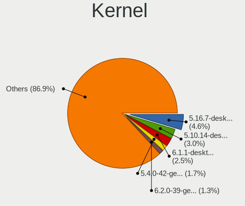

| Version                        | Desktops | Percent |
|--------------------------------|----------|---------|
| 5.16.7-desktop-1omv4003        | 11       | 5.26%   |
| 5.10.14-desktop-1omv4002       | 7        | 3.35%   |
| 6.1.1-desktop-1omv2290         | 6        | 2.87%   |
| 5.4.0-42-generic               | 4        | 1.91%   |
| 6.2.0-39-generic               | 3        | 1.44%   |
| 5.15.0-48-generic              | 3        | 1.44%   |
| 5.11.0-37-generic              | 3        | 1.44%   |
| 6.7.0-arch3-1                  | 2        | 0.96%   |
| 6.6.6-200.fc39.x86_64          | 2        | 0.96%   |
| 6.6.2-desktop-1omv2390         | 2        | 0.96%   |
| 6.6.2-201.fc39.x86_64          | 2        | 0.96%   |
| 6.5.0-27-generic               | 2        | 0.96%   |
| 6.5.0-14-generic               | 2        | 0.96%   |
| 6.4.12-arch1-1                 | 2        | 0.96%   |
| 6.2.6-desktop-1omv2390         | 2        | 0.96%   |
| 5.9.1-arch1-1                  | 2        | 0.96%   |
| 5.4.0-48-generic               | 2        | 0.96%   |
| 5.4.0-37-generic               | 2        | 0.96%   |
| 5.4.0-33-generic               | 2        | 0.96%   |
| 5.4.0-26-generic               | 2        | 0.96%   |
| 5.3.0-51-generic               | 2        | 0.96%   |
| 5.19.0-45-generic              | 2        | 0.96%   |
| 5.18.12-desktop-3omv4090       | 2        | 0.96%   |
| 5.16.13-desktop-1omv4003       | 2        | 0.96%   |
| 5.15.0-69-generic              | 2        | 0.96%   |
| 5.15.0-56-generic              | 2        | 0.96%   |
| 5.15.0-50-generic              | 2        | 0.96%   |
| 5.13.0-39-generic              | 2        | 0.96%   |
| 5.13.0-30-generic              | 2        | 0.96%   |
| 5.13.0-19-generic              | 2        | 0.96%   |
| 5.11.0-7620-generic            | 2        | 0.96%   |
| 4.18.16-desktop-1bP            | 2        | 0.96%   |
| 4.15.0-desktop-45.1rosa-x86_64 | 2        | 0.96%   |
| 4.15.0-55-generic              | 2        | 0.96%   |
| 4.15.0-46-generic              | 2        | 0.96%   |
| 6.8.7-300.fc40.x86_64          | 1        | 0.48%   |
| 6.7.11-200.fc39.x86_64         | 1        | 0.48%   |
| 6.6.5-arch1-1                  | 1        | 0.48%   |
| 6.6.12-200.fc39.x86_64         | 1        | 0.48%   |
| 6.6.1-arch1-1                  | 1        | 0.48%   |

Kernel Family
-------------

Linux kernel without a distro release

| Version | Desktops | Percent |
|---------|----------|---------|
| 5.4.0   | 22       | 11.17%  |
| 5.15.0  | 19       | 9.64%   |
| 5.16.7  | 11       | 5.58%   |
| 4.15.0  | 10       | 5.08%   |
| 5.13.0  | 9        | 4.57%   |
| 6.5.0   | 8        | 4.06%   |
| 5.11.0  | 7        | 3.55%   |
| 5.10.14 | 7        | 3.55%   |
| 6.1.1   | 6        | 3.05%   |
| 5.3.0   | 5        | 2.54%   |
| 6.6.2   | 4        | 2.03%   |
| 5.19.0  | 4        | 2.03%   |
| 5.0.0   | 4        | 2.03%   |
| 6.2.0   | 3        | 1.52%   |
| 5.8.0   | 3        | 1.52%   |
| 6.7.0   | 2        | 1.02%   |
| 6.6.6   | 2        | 1.02%   |
| 6.4.12  | 2        | 1.02%   |
| 6.3.9   | 2        | 1.02%   |
| 6.2.6   | 2        | 1.02%   |
| 5.9.1   | 2        | 1.02%   |
| 5.18.12 | 2        | 1.02%   |
| 5.16.13 | 2        | 1.02%   |
| 5.16.0  | 2        | 1.02%   |
| 5.10.0  | 2        | 1.02%   |
| 4.9.60  | 2        | 1.02%   |
| 4.19.0  | 2        | 1.02%   |
| 4.18.16 | 2        | 1.02%   |
| 4.18.0  | 2        | 1.02%   |
| 6.8.7   | 1        | 0.51%   |
| 6.7.11  | 1        | 0.51%   |
| 6.6.5   | 1        | 0.51%   |
| 6.6.12  | 1        | 0.51%   |
| 6.6.1   | 1        | 0.51%   |
| 6.6.0   | 1        | 0.51%   |
| 6.5.6   | 1        | 0.51%   |
| 6.5.5   | 1        | 0.51%   |
| 6.4.8   | 1        | 0.51%   |
| 6.4.11  | 1        | 0.51%   |
| 6.2.9   | 1        | 0.51%   |

Kernel Major Ver.
-----------------

Linux kernel major version

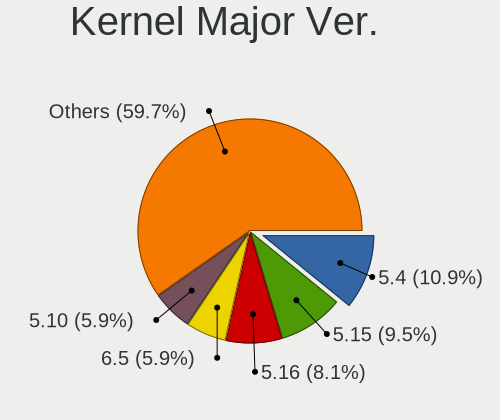

| Version | Desktops | Percent |
|---------|----------|---------|
| 5.4     | 24       | 12.37%  |
| 5.15    | 21       | 10.82%  |
| 5.16    | 18       | 9.28%   |
| 5.10    | 13       | 6.7%    |
| 6.5     | 10       | 5.15%   |
| 6.1     | 10       | 5.15%   |
| 5.13    | 10       | 5.15%   |
| 4.15    | 10       | 5.15%   |
| 6.6     | 9        | 4.64%   |
| 5.11    | 8        | 4.12%   |
| 6.2     | 6        | 3.09%   |
| 5.3     | 6        | 3.09%   |
| 5.19    | 6        | 3.09%   |
| 4.9     | 5        | 2.58%   |
| 6.4     | 4        | 2.06%   |
| 5.8     | 4        | 2.06%   |
| 5.0     | 4        | 2.06%   |
| 4.18    | 4        | 2.06%   |
| 6.7     | 3        | 1.55%   |
| 5.9     | 3        | 1.55%   |
| 6.3     | 2        | 1.03%   |
| 5.6     | 2        | 1.03%   |
| 5.18    | 2        | 1.03%   |
| 4.19    | 2        | 1.03%   |
| 6.8     | 1        | 0.52%   |
| 6.0     | 1        | 0.52%   |
| 5.7     | 1        | 0.52%   |
| 5.5     | 1        | 0.52%   |
| 5.2     | 1        | 0.52%   |
| 5.17    | 1        | 0.52%   |
| 4.4     | 1        | 0.52%   |
| 4.13    | 1        | 0.52%   |

Arch
----

OS architecture (x86_64, i586, etc.)

| Name   | Desktops | Percent |
|--------|----------|---------|
| x86_64 | 167      | 97.09%  |
| i686   | 5        | 2.91%   |

DE
--

Desktop Environment

| Name            | Desktops | Percent |
|-----------------|----------|---------|
| GNOME           | 79       | 44.13%  |
| KDE5            | 49       | 27.37%  |
| Unknown         | 14       | 7.82%   |
| XFCE            | 9        | 5.03%   |
| X-Cinnamon      | 9        | 5.03%   |
| KDE4            | 4        | 2.23%   |
| Pantheon        | 3        | 1.68%   |
| i3              | 2        | 1.12%   |
| Cinnamon        | 2        | 1.12%   |
| Unity           | 1        | 0.56%   |
| MATE            | 1        | 0.56%   |
| LXDE            | 1        | 0.56%   |
| KDE             | 1        | 0.56%   |
| GNOME Flashback | 1        | 0.56%   |
| GNOME Classic   | 1        | 0.56%   |
| Budgie          | 1        | 0.56%   |
| awesome         | 1        | 0.56%   |

Display Server
--------------

X11 or Wayland

| Name    | Desktops | Percent |
|---------|----------|---------|
| X11     | 132      | 74.16%  |
| Wayland | 37       | 20.79%  |
| Unknown | 6        | 3.37%   |
| Tty     | 3        | 1.69%   |

Display Manager
---------------

SDDM, LightDM, etc.

| Name    | Desktops | Percent |
|---------|----------|---------|
| Unknown | 80       | 45.2%   |
| SDDM    | 44       | 24.86%  |
| GDM3    | 23       | 12.99%  |
| GDM     | 14       | 7.91%   |
| LightDM | 7        | 3.95%   |
| TDM     | 5        | 2.82%   |
| KDM     | 4        | 2.26%   |

OS Lang
-------

Language

| Lang    | Desktops | Percent |
|---------|----------|---------|
| en_US   | 128      | 72.73%  |
| Unknown | 23       | 13.07%  |
| ar_EG   | 15       | 8.52%   |
| en_GB   | 6        | 3.41%   |
| C       | 4        | 2.27%   |

Boot Mode
---------

EFI or BIOS

| Mode | Desktops | Percent |
|------|----------|---------|
| BIOS | 124      | 72.09%  |
| EFI  | 48       | 27.91%  |

Filesystem
----------

Type of filesystem

| Type    | Desktops | Percent |
|---------|----------|---------|
| Ext4    | 118      | 64.48%  |
| Overlay | 27       | 14.75%  |
| Btrfs   | 15       | 8.2%    |
| Tmpfs   | 10       | 5.46%   |
| Unknown | 6        | 3.28%   |
| Xfs     | 4        | 2.19%   |
| Zfs     | 2        | 1.09%   |
| Ext2    | 1        | 0.55%   |

Part. scheme
------------

Scheme of partitioning

| Type    | Desktops | Percent |
|---------|----------|---------|
| Unknown | 83       | 47.43%  |
| GPT     | 51       | 29.14%  |
| MBR     | 41       | 23.43%  |

Dual Boot with Linux/BSD
------------------------

Hosting more than one Linux/BSD

| Dual boot | Desktops | Percent |
|-----------|----------|---------|
| No        | 139      | 79.43%  |
| Yes       | 36       | 20.57%  |

Dual Boot (Win)
---------------

Hosting Linux and Windows

| Dual boot | Desktops | Percent |
|-----------|----------|---------|
| No        | 97       | 54.49%  |
| Yes       | 81       | 45.51%  |

Board
-----

Vendor
------

Motherboard manufacturer

| Name                                 | Desktops | Percent |
|--------------------------------------|----------|---------|
| Hewlett-Packard                      | 61       | 35.67%  |
| Gigabyte Technology                  | 38       | 22.22%  |
| Dell                                 | 33       | 19.3%   |
| ASUSTek Computer                     | 14       | 8.19%   |
| MSI                                  | 7        | 4.09%   |
| Lenovo                               | 5        | 2.92%   |
| Acer                                 | 4        | 2.34%   |
| Intel                                | 2        | 1.17%   |
| Alienware                            | 2        | 1.17%   |
| Shenzhen Meigao Electronic Equipment | 1        | 0.58%   |
| Pegatron                             | 1        | 0.58%   |
| IBM                                  | 1        | 0.58%   |
| ECS                                  | 1        | 0.58%   |
| ASRock                               | 1        | 0.58%   |

Model
-----

Motherboard model

| Name                                       | Desktops | Percent |
|--------------------------------------------|----------|---------|
| Gigabyte G41MT-S2PT                        | 7        | 4.09%   |
| Gigabyte H61M-S2P                          | 5        | 2.92%   |
| Dell OptiPlex 780                          | 5        | 2.92%   |
| HP Compaq Pro 6305 SFF                     | 4        | 2.34%   |
| HP Compaq 6005 Pro SFF PC                  | 4        | 2.34%   |
| Dell OptiPlex 760                          | 4        | 2.34%   |
| MSI MS-7C02                                | 3        | 1.75%   |
| HP ProDesk 600 G1 TWR                      | 3        | 1.75%   |
| HP ProDesk 600 G1 SFF                      | 3        | 1.75%   |
| HP EliteDesk 800 G1 SFF                    | 3        | 1.75%   |
| HP EliteDesk 705 G1 SFF                    | 3        | 1.75%   |
| Dell OptiPlex 7020                         | 3        | 1.75%   |
| Dell OptiPlex 7010                         | 3        | 1.75%   |
| HP Z600 Workstation                        | 2        | 1.17%   |
| HP rp5800                                  | 2        | 1.17%   |
| HP Compaq Elite 8300 SFF                   | 2        | 1.17%   |
| HP Compaq dc7800                           | 2        | 1.17%   |
| HP Compaq dc5850 Small Form Factor         | 2        | 1.17%   |
| HP Compaq 8000 Elite CMT PC                | 2        | 1.17%   |
| Gigabyte H61M-S2V-B3                       | 2        | 1.17%   |
| Gigabyte H510M S2H                         | 2        | 1.17%   |
| Gigabyte G41MT-S2P                         | 2        | 1.17%   |
| Dell OptiPlex 3020                         | 2        | 1.17%   |
| ASUS H61M-K                                | 2        | 1.17%   |
| ASUS B250 MINING EXPERT                    | 2        | 1.17%   |
| Alienware Aurora R12                       | 2        | 1.17%   |
| Shenzhen Meigao Electronic Equipment UM690 | 1        | 0.58%   |
| Pegatron Pro 3010 Microtower PC            | 1        | 0.58%   |
| MSI MS-7D43                                | 1        | 0.58%   |
| MSI MS-7C84                                | 1        | 0.58%   |
| MSI MS-7507                                | 1        | 0.58%   |
| MSI MS-7309                                | 1        | 0.58%   |
| Lenovo ThinkStation S30 4351D32            | 1        | 0.58%   |
| Lenovo ThinkCentre M93p 10A8000WUS         | 1        | 0.58%   |
| Lenovo ThinkCentre M600 10KGS0J000         | 1        | 0.58%   |
| Lenovo ThinkCentre M58 6258D3G             | 1        | 0.58%   |
| Lenovo ThinkCentre M55p 8811Y4U            | 1        | 0.58%   |
| Intel E4610                                | 1        | 0.58%   |
| Intel DG31PR AAD97573-205                  | 1        | 0.58%   |
| IBM 81713FG                                | 1        | 0.58%   |

Model Family
------------

Motherboard model prefix

| Name                                       | Desktops | Percent |
|--------------------------------------------|----------|---------|
| Dell OptiPlex                              | 27       | 15.79%  |
| HP Compaq                                  | 25       | 14.62%  |
| HP EliteDesk                               | 13       | 7.6%    |
| HP ProDesk                                 | 7        | 4.09%   |
| Gigabyte G41MT-S2PT                        | 7        | 4.09%   |
| Dell Precision                             | 6        | 3.51%   |
| Gigabyte H61M-S2P                          | 5        | 2.92%   |
| Lenovo ThinkCentre                         | 4        | 2.34%   |
| MSI MS-7C02                                | 3        | 1.75%   |
| ASUS TUF                                   | 3        | 1.75%   |
| Acer Veriton                               | 3        | 1.75%   |
| HP Z600                                    | 2        | 1.17%   |
| HP rp5800                                  | 2        | 1.17%   |
| Gigabyte H61M-S2V-B3                       | 2        | 1.17%   |
| Gigabyte H510M                             | 2        | 1.17%   |
| Gigabyte G41MT-S2P                         | 2        | 1.17%   |
| ASUS ROG                                   | 2        | 1.17%   |
| ASUS PRIME                                 | 2        | 1.17%   |
| ASUS H61M-K                                | 2        | 1.17%   |
| ASUS B250                                  | 2        | 1.17%   |
| Alienware Aurora                           | 2        | 1.17%   |
| Shenzhen Meigao Electronic Equipment UM690 | 1        | 0.58%   |
| Pegatron Pro                               | 1        | 0.58%   |
| MSI MS-7D43                                | 1        | 0.58%   |
| MSI MS-7C84                                | 1        | 0.58%   |
| MSI MS-7507                                | 1        | 0.58%   |
| MSI MS-7309                                | 1        | 0.58%   |
| Lenovo ThinkStation                        | 1        | 0.58%   |
| Intel E4610                                | 1        | 0.58%   |
| Intel DG31PR                               | 1        | 0.58%   |
| IBM 81713FG                                | 1        | 0.58%   |
| HP Z840                                    | 1        | 0.58%   |
| HP Z820                                    | 1        | 0.58%   |
| HP Z620                                    | 1        | 0.58%   |
| HP Z400                                    | 1        | 0.58%   |
| HP Z240                                    | 1        | 0.58%   |
| HP Z230                                    | 1        | 0.58%   |
| HP xw4600                                  | 1        | 0.58%   |
| HP rp5700                                  | 1        | 0.58%   |
| HP 290                                     | 1        | 0.58%   |

MFG Year
--------

Motherboard manufacture year

| Year | Desktops | Percent |
|------|----------|---------|
| 2013 | 21       | 12.28%  |
| 2011 | 19       | 11.11%  |
| 2012 | 18       | 10.53%  |
| 2009 | 17       | 9.94%   |
| 2008 | 14       | 8.19%   |
| 2014 | 13       | 7.6%    |
| 2018 | 10       | 5.85%   |
| 2010 | 10       | 5.85%   |
| 2007 | 9        | 5.26%   |
| 2021 | 7        | 4.09%   |
| 2019 | 5        | 2.92%   |
| 2017 | 5        | 2.92%   |
| 2016 | 5        | 2.92%   |
| 2015 | 5        | 2.92%   |
| 2022 | 4        | 2.34%   |
| 2006 | 3        | 1.75%   |
| 2005 | 3        | 1.75%   |
| 2020 | 2        | 1.17%   |
| 2023 | 1        | 0.58%   |

Form Factor
-----------

Physical design of the computer

| Name    | Desktops | Percent |
|---------|----------|---------|
| Desktop | 171      | 100%    |

Secure Boot
-----------

Enabled or disabled

| State    | Desktops | Percent |
|----------|----------|---------|
| Disabled | 169      | 98.83%  |
| Enabled  | 2        | 1.17%   |

Coreboot
--------

Have coreboot on board

| Used | Desktops | Percent |
|------|----------|---------|
| No   | 171      | 100%    |

RAM Size
--------

Total RAM memory

| Size in GB  | Desktops | Percent |
|-------------|----------|---------|
| 3.01-4.0    | 41       | 23.7%   |
| 4.01-8.0    | 39       | 22.54%  |
| 8.01-16.0   | 33       | 19.08%  |
| 16.01-24.0  | 26       | 15.03%  |
| 32.01-64.0  | 11       | 6.36%   |
| 1.01-2.0    | 8        | 4.62%   |
| 2.01-3.0    | 7        | 4.05%   |
| 24.01-32.0  | 3        | 1.73%   |
| 64.01-256.0 | 3        | 1.73%   |
| 0.51-1.0    | 1        | 0.58%   |
| 0.01-0.5    | 1        | 0.58%   |

RAM Used
--------

Used RAM memory

| Used GB     | Desktops | Percent |
|-------------|----------|---------|
| 1.01-2.0    | 67       | 35.26%  |
| 2.01-3.0    | 50       | 26.32%  |
| 4.01-8.0    | 21       | 11.05%  |
| 3.01-4.0    | 18       | 9.47%   |
| 0.51-1.0    | 16       | 8.42%   |
| 0.01-0.5    | 9        | 4.74%   |
| 8.01-16.0   | 7        | 3.68%   |
| 64.01-256.0 | 1        | 0.53%   |
| 16.01-24.0  | 1        | 0.53%   |

Total Drives
------------

Number of drives on board

| Drives  | Desktops | Percent |
|---------|----------|---------|
| 1       | 82       | 45.81%  |
| 2       | 62       | 34.64%  |
| 3       | 23       | 12.85%  |
| 4       | 6        | 3.35%   |
| 9       | 2        | 1.12%   |
| 0       | 2        | 1.12%   |
| 5       | 1        | 0.56%   |
| Unknown | 1        | 0.56%   |

Has CD-ROM
----------

Has CD-ROM on board

| Presented | Desktops | Percent |
|-----------|----------|---------|
| No        | 90       | 52.02%  |
| Yes       | 83       | 47.98%  |

Has Ethernet
------------

Has Ethernet on board

| Presented | Desktops | Percent |
|-----------|----------|---------|
| Yes       | 170      | 99.42%  |
| No        | 1        | 0.58%   |

Has WiFi
--------

Has WiFi module

| Presented | Desktops | Percent |
|-----------|----------|---------|
| No        | 104      | 59.77%  |
| Yes       | 70       | 40.23%  |

Has Bluetooth
-------------

Has Bluetooth module

| Presented | Desktops | Percent |
|-----------|----------|---------|
| No        | 149      | 86.13%  |
| Yes       | 24       | 13.87%  |

Location
--------

Country
-------

Geographic location (country)

| Country | Desktops | Percent |
|---------|----------|---------|
| Egypt   | 171      | 100%    |

City
----

Geographic location (city)

| City                  | Desktops | Percent |
|-----------------------|----------|---------|
| Cairo                 | 96       | 51.89%  |
| Giza                  | 17       | 9.19%   |
| Alexandria            | 16       | 8.65%   |
| Al Mansurah           | 8        | 4.32%   |
| Tanta                 | 5        | 2.7%    |
| Zagazig               | 3        | 1.62%   |
| Port Said             | 3        | 1.62%   |
| Assiut                | 3        | 1.62%   |
| Suez                  | 2        | 1.08%   |
| Mohandessin           | 2        | 1.08%   |
| Minya                 | 2        | 1.08%   |
| Kafr ash Shaykh       | 2        | 1.08%   |
| Ismailia              | 2        | 1.08%   |
| Aswan                 | 2        | 1.08%   |
| Al Ma`adi             | 2        | 1.08%   |
| Zefta                 | 1        | 0.54%   |
| Tukh                  | 1        | 0.54%   |
| Sharqia               | 1        | 0.54%   |
| Sharm el Sheikh       | 1        | 0.54%   |
| Rosetta               | 1        | 0.54%   |
| New Cairo             | 1        | 0.54%   |
| Mallawi               | 1        | 0.54%   |
| Madinat an Nasr       | 1        | 0.54%   |
| Luxor                 | 1        | 0.54%   |
| Hurghada              | 1        | 0.54%   |
| Helwan                | 1        | 0.54%   |
| Faraskur              | 1        | 0.54%   |
| Faiyum                | 1        | 0.54%   |
| Dishna                | 1        | 0.54%   |
| Damietta              | 1        | 0.54%   |
| Al Qalyubiyah         | 1        | 0.54%   |
| Al Qahirah al Jadidah | 1        | 0.54%   |
| Al Fayyum             | 1        | 0.54%   |
| Akhmim                | 1        | 0.54%   |
| 6th of October City   | 1        | 0.54%   |

Drives
------

Drive Vendor
------------

Hard drive vendors

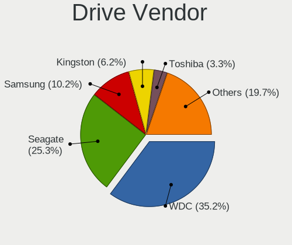

| Vendor                       | Desktops | Drives | Percent |
|------------------------------|----------|--------|---------|
| WDC                          | 92       | 148    | 34.72%  |
| Seagate                      | 69       | 97     | 26.04%  |
| Samsung Electronics          | 28       | 39     | 10.57%  |
| Kingston                     | 16       | 27     | 6.04%   |
| Toshiba                      | 10       | 12     | 3.77%   |
| Crucial                      | 9        | 13     | 3.4%    |
| Hitachi                      | 4        | 4      | 1.51%   |
| SanDisk                      | 3        | 3      | 1.13%   |
| Hewlett-Packard              | 3        | 3      | 1.13%   |
| LITEONIT                     | 2        | 2      | 0.75%   |
| Kingston Technology Company  | 2        | 3      | 0.75%   |
| KingSpec                     | 2        | 2      | 0.75%   |
| JMicron Technology           | 2        | 2      | 0.75%   |
| Intel                        | 2        | 2      | 0.75%   |
| HS-SSD-E100                  | 2        | 2      | 0.75%   |
| HS-SSD-C100                  | 2        | 2      | 0.75%   |
| Fujitsu                      | 2        | 3      | 0.75%   |
| ZOTAC                        | 1        | 1      | 0.38%   |
| TwinMOS                      | 1        | 1      | 0.38%   |
| Transcend                    | 1        | 1      | 0.38%   |
| SK hynix                     | 1        | 2      | 0.38%   |
| Shenzhen Longsys Electronics | 1        | 1      | 0.38%   |
| Phison Electronics           | 1        | 2      | 0.38%   |
| Micron/Crucial Technology    | 1        | 1      | 0.38%   |
| Maxtor                       | 1        | 2      | 0.38%   |
| MAXIO Technology (Hangzhou)  | 1        | 2      | 0.38%   |
| LITEON                       | 1        | 1      | 0.38%   |
| Lite-On Technology           | 1        | 1      | 0.38%   |
| Lexar                        | 1        | 1      | 0.38%   |
| Hikvision                    | 1        | 1      | 0.38%   |
| Dahua                        | 1        | 1      | 0.38%   |
| Apple                        | 1        | 1      | 0.38%   |

Drive Model
-----------

Hard drive models

| Model                            | Desktops | Percent |
|----------------------------------|----------|---------|
| Seagate ST500DM002-1BD142 500GB  | 11       | 3.69%   |
| Seagate ST3500312CS 500GB        | 8        | 2.68%   |
| Seagate ST3500414CS 500GB        | 7        | 2.35%   |
| Toshiba DT01ACA050 500GB         | 5        | 1.68%   |
| WDC WD5000AADS-00S9B0 500GB      | 4        | 1.34%   |
| WDC WD3200AAJS-00L7A0 320GB      | 4        | 1.34%   |
| Seagate ST3500413AS 500GB        | 4        | 1.34%   |
| Seagate ST1000DM010-2EP102 1TB   | 4        | 1.34%   |
| Kingston SA400S37480G 480GB SSD  | 4        | 1.34%   |
| Kingston SA400S37240G 240GB SSD  | 4        | 1.34%   |
| WDC WD5000AAKX-75U6AA0 500GB     | 3        | 1.01%   |
| WDC WD5000AAKX-001CA0 500GB      | 3        | 1.01%   |
| WDC WD2500AAKX-75U6AA0 250GB     | 3        | 1.01%   |
| WDC WD2500AAKX-603CA0 250GB      | 3        | 1.01%   |
| WDC WD1600AABS-00PRA0 160GB      | 3        | 1.01%   |
| WDC WD1600AABS-00H4A0 160GB      | 3        | 1.01%   |
| WDC WD10EZEX-08WN4A0 1TB         | 3        | 1.01%   |
| WDC WD10EZEX-00BN5A0 1TB         | 3        | 1.01%   |
| WDC WD10EARS-00Y5B1 1TB          | 3        | 1.01%   |
| Toshiba DT01ACA100 1TB           | 3        | 1.01%   |
| Seagate ST3320311CS 320GB        | 3        | 1.01%   |
| Kingston SA400S37120G 120GB SSD  | 3        | 1.01%   |
| WDC WDS120G2G0A-00JH30 120GB SSD | 2        | 0.67%   |
| WDC WD800BD-22MRA1 80GB          | 2        | 0.67%   |
| WDC WD7500AACS-00D6B1 752GB      | 2        | 0.67%   |
| WDC WD5000AVVS-63H0B1 500GB      | 2        | 0.67%   |
| WDC WD5000AVDS-63U7B1 500GB      | 2        | 0.67%   |
| WDC WD5000AAKX-08U6AA0 500GB     | 2        | 0.67%   |
| WDC WD5000AAKX-00ERMA0 500GB     | 2        | 0.67%   |
| WDC WD5000AADS-56S9B1 500GB      | 2        | 0.67%   |
| WDC WD3200AVVS-63L2B0 320GB      | 2        | 0.67%   |
| WDC WD1600JS-61MHB1 160GB        | 2        | 0.67%   |
| WDC WD10EZRX-00A8LB0 1TB         | 2        | 0.67%   |
| WDC WD10EZEX-75WN4A1 1TB         | 2        | 0.67%   |
| WDC WD10EZEX-22MFCA0 1TB         | 2        | 0.67%   |
| WDC WD10EARS-00MVWB0 1TB         | 2        | 0.67%   |
| Seagate ST500DM002-1SB10A 500GB  | 2        | 0.67%   |
| Seagate ST380815AS 80GB          | 2        | 0.67%   |
| Seagate ST3500412AS 500GB        | 2        | 0.67%   |
| Seagate ST3250318AS 250GB        | 2        | 0.67%   |

HDD Vendor
----------

Hard disk drive vendors

| Vendor              | Desktops | Drives | Percent |
|---------------------|----------|--------|---------|
| WDC                 | 88       | 143    | 47.31%  |
| Seagate             | 69       | 97     | 37.1%   |
| Toshiba             | 9        | 11     | 4.84%   |
| Samsung Electronics | 9        | 12     | 4.84%   |
| Hitachi             | 4        | 4      | 2.15%   |
| JMicron Technology  | 2        | 2      | 1.08%   |
| Fujitsu             | 2        | 3      | 1.08%   |
| Maxtor              | 1        | 2      | 0.54%   |
| Hewlett-Packard     | 1        | 1      | 0.54%   |
| Apple               | 1        | 1      | 0.54%   |

SSD Vendor
----------

Solid state drive vendors

| Vendor              | Desktops | Drives | Percent |
|---------------------|----------|--------|---------|
| Kingston            | 15       | 25     | 25.42%  |
| Samsung Electronics | 13       | 15     | 22.03%  |
| Crucial             | 9        | 13     | 15.25%  |
| WDC                 | 5        | 5      | 8.47%   |
| SanDisk             | 2        | 2      | 3.39%   |
| LITEONIT            | 2        | 2      | 3.39%   |
| KingSpec            | 2        | 2      | 3.39%   |
| Intel               | 2        | 2      | 3.39%   |
| ZOTAC               | 1        | 1      | 1.69%   |
| TwinMOS             | 1        | 1      | 1.69%   |
| Transcend           | 1        | 1      | 1.69%   |
| Toshiba             | 1        | 1      | 1.69%   |
| LITEON              | 1        | 1      | 1.69%   |
| Lexar               | 1        | 1      | 1.69%   |
| Hikvision           | 1        | 1      | 1.69%   |
| Hewlett-Packard     | 1        | 1      | 1.69%   |
| Dahua               | 1        | 1      | 1.69%   |

Drive Kind
----------

HDD or SSD

| Kind    | Desktops | Drives | Percent |
|---------|----------|--------|---------|
| HDD     | 156      | 276    | 68.12%  |
| SSD     | 52       | 75     | 22.71%  |
| NVMe    | 17       | 28     | 7.42%   |
| Unknown | 4        | 4      | 1.75%   |

Drive Connector
---------------

SATA, SAS, NVMe, etc.

| Type | Desktops | Drives | Percent |
|------|----------|--------|---------|
| SATA | 162      | 351    | 89.01%  |
| NVMe | 17       | 28     | 9.34%   |
| SAS  | 3        | 4      | 1.65%   |

Drive Size
----------

Size of hard drive

| Size in TB | Desktops | Drives | Percent |
|------------|----------|--------|---------|
| 0.01-0.5   | 139      | 263    | 69.5%   |
| 0.51-1.0   | 47       | 63     | 23.5%   |
| 1.01-2.0   | 11       | 15     | 5.5%    |
| 3.01-4.0   | 2        | 4      | 1%      |
| 4.01-10.0  | 1        | 6      | 0.5%    |

Space Total
-----------

Amount of disk space available on the file system

| Size in GB     | Desktops | Percent |
|----------------|----------|---------|
| 101-250        | 43       | 22.87%  |
| 251-500        | 37       | 19.68%  |
| 501-1000       | 24       | 12.77%  |
| 51-100         | 23       | 12.23%  |
| 1-20           | 20       | 10.64%  |
| 21-50          | 16       | 8.51%   |
| 1001-2000      | 11       | 5.85%   |
| More than 3000 | 6        | 3.19%   |
| Unknown        | 5        | 2.66%   |
| 2001-3000      | 3        | 1.6%    |

Space Used
----------

Amount of used disk space

| Used GB        | Desktops | Percent |
|----------------|----------|---------|
| 1-20           | 76       | 40.43%  |
| 101-250        | 31       | 16.49%  |
| 21-50          | 25       | 13.3%   |
| 251-500        | 20       | 10.64%  |
| 51-100         | 13       | 6.91%   |
| 501-1000       | 11       | 5.85%   |
| Unknown        | 5        | 2.66%   |
| 2001-3000      | 3        | 1.6%    |
| More than 3000 | 2        | 1.06%   |
| 1001-2000      | 2        | 1.06%   |

Malfunc. Drives
---------------

Drive models with a malfunction

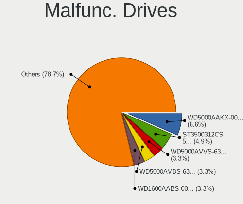

| Model                           | Desktops | Drives | Percent |
|---------------------------------|----------|--------|---------|
| WDC WD5000AVVS-63H0B1 500GB     | 2        | 2      | 3.7%    |
| WDC WD5000AVDS-63U7B1 500GB     | 2        | 2      | 3.7%    |
| WDC WD5000AAKX-00ERMA0 500GB    | 2        | 4      | 3.7%    |
| WDC WD1600AABS-00H4A0 160GB     | 2        | 2      | 3.7%    |
| Seagate ST380815AS 80GB         | 2        | 2      | 3.7%    |
| Seagate ST3500413AS 500GB       | 2        | 3      | 3.7%    |
| Seagate ST3500312CS 500GB       | 2        | 2      | 3.7%    |
| WDC WD800JD-60LSA5 80GB         | 1        | 1      | 1.85%   |
| WDC WD800BD-22MRA1 80GB         | 1        | 1      | 1.85%   |
| WDC WD5000AAVS-22G9B1 500GB     | 1        | 1      | 1.85%   |
| WDC WD5000AAKX-75U6AA0 500GB    | 1        | 2      | 1.85%   |
| WDC WD5000AAKX-08U6AA0 500GB    | 1        | 2      | 1.85%   |
| WDC WD5000AAKX-009FA0 500GB     | 1        | 1      | 1.85%   |
| WDC WD5000AAKS-00V6A0 500GB     | 1        | 1      | 1.85%   |
| WDC WD5000AADS-00S9B0 500GB     | 1        | 1      | 1.85%   |
| WDC WD5000AADS-00M2B0 500GB     | 1        | 1      | 1.85%   |
| WDC WD3200AAJS-56M0A0 320GB     | 1        | 1      | 1.85%   |
| WDC WD3200AAJS-56B4A0 320GB     | 1        | 2      | 1.85%   |
| WDC WD3200AAJS-00L7A0 320GB     | 1        | 1      | 1.85%   |
| WDC WD3200AAJS-00B4A0 320GB     | 1        | 1      | 1.85%   |
| WDC WD3200A 320GB               | 1        | 1      | 1.85%   |
| WDC WD2500AAJS-00VTA0 250GB     | 1        | 1      | 1.85%   |
| WDC WD1600AVVS-63L2B0 160GB     | 1        | 1      | 1.85%   |
| WDC WD1600AAJS-00L7A0 160GB     | 1        | 1      | 1.85%   |
| WDC WD10JPVX-60JC3T0 1TB        | 1        | 1      | 1.85%   |
| WDC WD10EZEX-08M2NA0 1TB        | 1        | 1      | 1.85%   |
| WDC WD10EZEX-00BN5A0 1TB        | 1        | 1      | 1.85%   |
| WDC WD10EARS-00Y5B1 1TB         | 1        | 1      | 1.85%   |
| Toshiba MQ01ABF050 500GB        | 1        | 2      | 1.85%   |
| Seagate ST500DM002-1SB10A 500GB | 1        | 1      | 1.85%   |
| Seagate ST500DM002-1BD142 500GB | 1        | 3      | 1.85%   |
| Seagate ST3500412AS 500GB       | 1        | 1      | 1.85%   |
| Seagate ST3320613AS 320GB       | 1        | 1      | 1.85%   |
| Seagate ST3320311CS 320GB       | 1        | 1      | 1.85%   |
| Seagate ST3160812AS 160GB       | 1        | 1      | 1.85%   |
| Seagate ST3160211AS 160GB       | 1        | 3      | 1.85%   |
| Seagate ST250DM000-1BD141 250GB | 1        | 2      | 1.85%   |
| Seagate ST2000DM008-2FR102 2TB  | 1        | 2      | 1.85%   |
| Seagate ST2000DM001-1ER164 2TB  | 1        | 1      | 1.85%   |
| Seagate ST1000DM003-1CH162 1TB  | 1        | 1      | 1.85%   |

Malfunc. Drive Vendor
---------------------

Vendors of faulty drives

| Vendor              | Desktops | Drives | Percent |
|---------------------|----------|--------|---------|
| WDC                 | 25       | 34     | 52.08%  |
| Seagate             | 15       | 24     | 31.25%  |
| Samsung Electronics | 3        | 3      | 6.25%   |
| Toshiba             | 1        | 2      | 2.08%   |
| Kingston            | 1        | 2      | 2.08%   |
| Intel               | 1        | 1      | 2.08%   |
| Hewlett-Packard     | 1        | 1      | 2.08%   |
| Fujitsu             | 1        | 2      | 2.08%   |

Malfunc. HDD Vendor
-------------------

Vendors of faulty HDD drives

| Vendor              | Desktops | Drives | Percent |
|---------------------|----------|--------|---------|
| WDC                 | 25       | 34     | 56.82%  |
| Seagate             | 15       | 24     | 34.09%  |
| Toshiba             | 1        | 2      | 2.27%   |
| Samsung Electronics | 1        | 1      | 2.27%   |
| Hewlett-Packard     | 1        | 1      | 2.27%   |
| Fujitsu             | 1        | 2      | 2.27%   |

Malfunc. Drive Kind
-------------------

Kinds of faulty drives

| Kind | Desktops | Drives | Percent |
|------|----------|--------|---------|
| HDD  | 41       | 64     | 91.11%  |
| SSD  | 4        | 5      | 8.89%   |

Failed Drives
-------------

Failed drive models

| Model                                            | Desktops | Drives | Percent |
|--------------------------------------------------|----------|--------|---------|
| WDC WD3200AAJS-00L7A0 320GB                      | 1        | 2      | 33.33%  |
| Samsung Electronics MZ7TY128HDHP-000L1 128GB SSD | 1        | 1      | 33.33%  |
| Samsung Electronics MZ7PC128HAFU-000H1 128GB SSD | 1        | 1      | 33.33%  |

Failed Drive Vendor
-------------------

Failed drive vendors

| Vendor              | Desktops | Drives | Percent |
|---------------------|----------|--------|---------|
| Samsung Electronics | 2        | 2      | 66.67%  |
| WDC                 | 1        | 2      | 33.33%  |

Drive Status
------------

Number of failed and malfunc. drives

| Status   | Desktops | Drives | Percent |
|----------|----------|--------|---------|
| Detected | 98       | 204    | 50.26%  |
| Works    | 50       | 106    | 25.64%  |
| Malfunc  | 44       | 69     | 22.56%  |
| Failed   | 3        | 4      | 1.54%   |

Storage controller
------------------

Storage Vendor
--------------

Storage controller vendors

| Vendor                       | Desktops | Percent |
|------------------------------|----------|---------|
| Intel                        | 127      | 65.13%  |
| AMD                          | 40       | 20.51%  |
| Samsung Electronics          | 8        | 4.1%    |
| Kingston Technology Company  | 4        | 2.05%   |
| Marvell Technology Group     | 2        | 1.03%   |
| LSI Logic / Symbios Logic    | 2        | 1.03%   |
| Broadcom / LSI               | 2        | 1.03%   |
| SK hynix                     | 1        | 0.51%   |
| Shenzhen Longsys Electronics | 1        | 0.51%   |
| SanDisk                      | 1        | 0.51%   |
| Phison Electronics           | 1        | 0.51%   |
| Nvidia                       | 1        | 0.51%   |
| Micron/Crucial Technology    | 1        | 0.51%   |
| MAXIO Technology (Hangzhou)  | 1        | 0.51%   |
| Lite-On Technology           | 1        | 0.51%   |
| JMicron Technology           | 1        | 0.51%   |
| INNOGRIT                     | 1        | 0.51%   |

Storage Model
-------------

Storage controller models

| Model                                                                                   | Desktops | Percent |
|-----------------------------------------------------------------------------------------|----------|---------|
| AMD FCH SATA Controller [AHCI mode]                                                     | 20       | 7.72%   |
| Intel 8 Series/C220 Series Chipset Family 6-port SATA Controller 1 [AHCI mode]          | 18       | 6.95%   |
| Intel NM10/ICH7 Family SATA Controller [IDE mode]                                       | 17       | 6.56%   |
| Intel SATA Controller [RAID mode]                                                       | 13       | 5.02%   |
| Intel 4 Series Chipset PT IDER Controller                                               | 9        | 3.47%   |
| Intel 6 Series/C200 Series Chipset Family Desktop SATA Controller (IDE mode, ports 4-5) | 8        | 3.09%   |
| Intel 6 Series/C200 Series Chipset Family Desktop SATA Controller (IDE mode, ports 0-3) | 8        | 3.09%   |
| AMD 400 Series Chipset SATA Controller                                                  | 7        | 2.7%    |
| Intel 82801JD/DO (ICH10 Family) SATA AHCI Controller                                    | 6        | 2.32%   |
| Intel 7 Series/C210 Series Chipset Family 6-port SATA Controller [AHCI mode]            | 6        | 2.32%   |
| Intel 6 Series/C200 Series Chipset Family 6 port Desktop SATA AHCI Controller           | 6        | 2.32%   |
| Intel 82801G (ICH7 Family) IDE Controller                                               | 5        | 1.93%   |
| Intel 200 Series PCH SATA controller [AHCI mode]                                        | 5        | 1.93%   |
| AMD SB7x0/SB8x0/SB9x0 SATA Controller [IDE mode]                                        | 5        | 1.93%   |
| AMD SB7x0/SB8x0/SB9x0 SATA Controller [AHCI mode]                                       | 5        | 1.93%   |
| Samsung NVMe SSD Controller SM981/PM981/PM983                                           | 4        | 1.54%   |
| Intel 82801JD/DO (ICH10 Family) 4-port SATA IDE Controller                              | 4        | 1.54%   |
| Intel 82801JD/DO (ICH10 Family) 2-port SATA IDE Controller                              | 4        | 1.54%   |
| Intel 82801I (ICH9 Family) 2 port SATA Controller [IDE mode]                            | 4        | 1.54%   |
| Intel 82801H (ICH8 Family) 4 port SATA Controller [IDE mode]                            | 4        | 1.54%   |
| Intel 500 Series Chipset Family SATA AHCI Controller                                    | 4        | 1.54%   |
| Samsung NVMe SSD Controller PM9A1/PM9A3/980PRO                                          | 3        | 1.16%   |
| Intel Q170/Q150/B150/H170/H110/Z170/CM236 Chipset SATA Controller [AHCI Mode]           | 3        | 1.16%   |
| Intel Comet Lake SATA AHCI Controller                                                   | 3        | 1.16%   |
| Intel Cannon Lake PCH SATA AHCI Controller                                              | 3        | 1.16%   |
| Intel C602 chipset 4-Port SATA Storage Control Unit                                     | 3        | 1.16%   |
| Intel 82Q35 Express PT IDER Controller                                                  | 3        | 1.16%   |
| Intel 82801JI (ICH10 Family) SATA AHCI Controller                                       | 3        | 1.16%   |
| Intel 82801IR/IO/IH (ICH9R/DO/DH) 4 port SATA Controller [IDE mode]                     | 3        | 1.16%   |
| Intel 82801HR/HO/HH (ICH8R/DO/DH) 2 port SATA Controller [IDE mode]                     | 3        | 1.16%   |
| AMD SB7x0/SB8x0/SB9x0 IDE Controller                                                    | 3        | 1.16%   |
| AMD FCH SATA Controller [IDE mode]                                                      | 3        | 1.16%   |
| LSI Logic / Symbios Logic SAS1068E PCI-Express Fusion-MPT SAS                           | 2        | 0.77%   |
| Intel 9 Series Chipset Family SATA Controller [AHCI Mode]                               | 2        | 0.77%   |
| Intel 8 Series/C220 Series Chipset Family 4-port SATA Controller 1 [IDE mode]           | 2        | 0.77%   |
| Intel 7 Series/C210 Series Chipset Family 4-port SATA Controller [IDE mode]             | 2        | 0.77%   |
| Intel 7 Series/C210 Series Chipset Family 2-port SATA Controller [IDE mode]             | 2        | 0.77%   |
| Intel 631xESB/632xESB SATA AHCI Controller                                              | 2        | 0.77%   |
| Intel 631xESB/632xESB IDE Controller                                                    | 2        | 0.77%   |
| Intel 5 Series/3400 Series Chipset 6 port SATA AHCI Controller                          | 2        | 0.77%   |

Storage Kind
------------

Kind of storage controller (IDE, SATA, NVMe, SAS, ...)

| Kind | Desktops | Percent |
|------|----------|---------|
| SATA | 107      | 51.69%  |
| IDE  | 62       | 29.95%  |
| NVMe | 17       | 8.21%   |
| RAID | 15       | 7.25%   |
| SAS  | 4        | 1.93%   |
| SCSI | 2        | 0.97%   |

Processor
---------

CPU Vendor
----------

Processor vendors

| Vendor | Desktops | Percent |
|--------|----------|---------|
| Intel  | 130      | 76.02%  |
| AMD    | 41       | 23.98%  |

CPU Model
---------

Processor models

| Model                                        | Desktops | Percent |
|----------------------------------------------|----------|---------|
| Intel Core 2 Duo CPU E8400 @ 3.00GHz         | 8        | 4.65%   |
| Intel Core i5-4570 CPU @ 3.20GHz             | 6        | 3.49%   |
| Intel Core i7-4790 CPU @ 3.60GHz             | 5        | 2.91%   |
| Intel Core i5-4590 CPU @ 3.30GHz             | 5        | 2.91%   |
| Intel Core i5-2400 CPU @ 3.10GHz             | 4        | 2.33%   |
| Intel Pentium D CPU 3.00GHz                  | 3        | 1.74%   |
| Intel Core i5-4670 CPU @ 3.40GHz             | 3        | 1.74%   |
| Intel Core i5-3470 CPU @ 3.20GHz             | 3        | 1.74%   |
| Intel Core i3-2120 CPU @ 3.30GHz             | 3        | 1.74%   |
| Intel Core 2 Duo CPU E8500 @ 3.16GHz         | 3        | 1.74%   |
| Intel Core 2 Duo CPU E7500 @ 2.93GHz         | 3        | 1.74%   |
| Intel Core 2 Duo CPU E6550 @ 2.33GHz         | 3        | 1.74%   |
| Intel Core 2 CPU 6600 @ 2.40GHz              | 3        | 1.74%   |
| Intel 11th Gen Core i7-11700F @ 2.50GHz      | 3        | 1.74%   |
| AMD A4-5300B APU with Radeon HD Graphics     | 3        | 1.74%   |
| Intel Pentium CPU G2030 @ 3.00GHz            | 2        | 1.16%   |
| Intel Pentium 4 CPU 3.20GHz                  | 2        | 1.16%   |
| Intel Core i7-6700 CPU @ 3.40GHz             | 2        | 1.16%   |
| Intel Core i5-6500 CPU @ 3.20GHz             | 2        | 1.16%   |
| Intel Core i5-3570 CPU @ 3.40GHz             | 2        | 1.16%   |
| Intel Core i3-4160 CPU @ 3.60GHz             | 2        | 1.16%   |
| Intel Core i3-3220 CPU @ 3.30GHz             | 2        | 1.16%   |
| Intel Core i3-2100 CPU @ 3.10GHz             | 2        | 1.16%   |
| Intel Core 2 Duo CPU E6750 @ 2.66GHz         | 2        | 1.16%   |
| Intel Core 2 Duo CPU E4400 @ 2.00GHz         | 2        | 1.16%   |
| Intel Celeron D CPU 3.06GHz                  | 2        | 1.16%   |
| AMD Ryzen 7 3700X 8-Core Processor           | 2        | 1.16%   |
| AMD Ryzen 5 2600 Six-Core Processor          | 2        | 1.16%   |
| AMD Phenom II X4 B95 Processor               | 2        | 1.16%   |
| AMD A8-5500B APU with Radeon HD Graphics     | 2        | 1.16%   |
| AMD A10 PRO-7800B R7, 12 Compute Cores 4C+8G | 2        | 1.16%   |
| Intel Xeon CPU X5680 @ 3.33GHz               | 1        | 0.58%   |
| Intel Xeon CPU X5650 @ 2.67GHz               | 1        | 0.58%   |
| Intel Xeon CPU W3550 @ 3.07GHz               | 1        | 0.58%   |
| Intel Xeon CPU L5640 @ 2.27GHz               | 1        | 0.58%   |
| Intel Xeon CPU E5640 @ 2.67GHz               | 1        | 0.58%   |
| Intel Xeon CPU E5620 @ 2.40GHz               | 1        | 0.58%   |
| Intel Xeon CPU E5450 @ 3.00GHz               | 1        | 0.58%   |
| Intel Xeon CPU E5-2690 v2 @ 3.00GHz          | 1        | 0.58%   |
| Intel Xeon CPU E5-2680 v3 @ 2.50GHz          | 1        | 0.58%   |

CPU Model Family
----------------

Processor model prefix

| Model                   | Desktops | Percent |
|-------------------------|----------|---------|
| Intel Core i5           | 35       | 20.35%  |
| Intel Core 2 Duo        | 23       | 13.37%  |
| Intel Core i7           | 15       | 8.72%   |
| Intel Xeon              | 13       | 7.56%   |
| Intel Core i3           | 12       | 6.98%   |
| Other                   | 6        | 3.49%   |
| AMD Ryzen 5             | 6        | 3.49%   |
| Intel Core 2 Quad       | 5        | 2.91%   |
| Intel Core 2            | 5        | 2.91%   |
| AMD A4                  | 5        | 2.91%   |
| Intel Pentium           | 4        | 2.33%   |
| AMD Ryzen 7             | 4        | 2.33%   |
| Intel Pentium D         | 3        | 1.74%   |
| Intel Pentium 4         | 3        | 1.74%   |
| Intel Celeron           | 3        | 1.74%   |
| AMD Ryzen 9             | 3        | 1.74%   |
| AMD Phenom II X4        | 3        | 1.74%   |
| AMD A8                  | 3        | 1.74%   |
| Intel Pentium Dual-Core | 2        | 1.16%   |
| Intel Celeron D         | 2        | 1.16%   |
| AMD Phenom              | 2        | 1.16%   |
| AMD Athlon II X2        | 2        | 1.16%   |
| AMD A6                  | 2        | 1.16%   |
| AMD A10                 | 2        | 1.16%   |
| AMD Sempron             | 1        | 0.58%   |
| AMD Ryzen 3             | 1        | 0.58%   |
| AMD PRO A8              | 1        | 0.58%   |
| AMD PRO A10             | 1        | 0.58%   |
| AMD FX                  | 1        | 0.58%   |
| AMD Athlon II X3        | 1        | 0.58%   |
| AMD Athlon Dual Core    | 1        | 0.58%   |
| AMD Athlon 64 X2        | 1        | 0.58%   |
| AMD Athlon 64           | 1        | 0.58%   |

CPU Cores
---------

Number of processor cores

| Number | Desktops | Percent |
|--------|----------|---------|
| 2      | 63       | 36.63%  |
| 4      | 56       | 32.56%  |
| 6      | 15       | 8.72%   |
| 1      | 15       | 8.72%   |
| 8      | 13       | 7.56%   |
| 12     | 3        | 1.74%   |
| 3      | 3        | 1.74%   |
| 16     | 2        | 1.16%   |
| 24     | 1        | 0.58%   |
| 10     | 1        | 0.58%   |

CPU Sockets
-----------

Number of sockets

| Number | Desktops | Percent |
|--------|----------|---------|
| 1      | 163      | 95.32%  |
| 2      | 8        | 4.68%   |

CPU Threads
-----------

Threads per core (Hyper-Threading)

| Number | Desktops | Percent |
|--------|----------|---------|
| 1      | 98       | 56.65%  |
| 2      | 75       | 43.35%  |

CPU Op-Modes
------------

CPU Operation Modes (32-bit, 64-bit)

| Op mode        | Desktops | Percent |
|----------------|----------|---------|
| 32-bit, 64-bit | 169      | 98.26%  |
| 32-bit         | 2        | 1.16%   |
| Unknown        | 1        | 0.58%   |

CPU Microcode
-------------

Microcode number

| Number     | Desktops | Percent |
|------------|----------|---------|
| Unknown    | 59       | 32.96%  |
| 0x1067a    | 17       | 9.5%    |
| 0x306c3    | 15       | 8.38%   |
| 0x306a9    | 8        | 4.47%   |
| 0x206a7    | 8        | 4.47%   |
| 0x6fb      | 5        | 2.79%   |
| 0x06001119 | 5        | 2.79%   |
| 0xf65      | 4        | 2.23%   |
| 0xa0671    | 3        | 1.68%   |
| 0x906ea    | 3        | 1.68%   |
| 0x6fd      | 3        | 1.68%   |
| 0x506e3    | 3        | 1.68%   |
| 0x206c2    | 3        | 1.68%   |
| 0x0800820d | 3        | 1.68%   |
| 0x010000c8 | 3        | 1.68%   |
| 0xf41      | 2        | 1.12%   |
| 0x906e9    | 2        | 1.12%   |
| 0x6f6      | 2        | 1.12%   |
| 0x306e4    | 2        | 1.12%   |
| 0x106a5    | 2        | 1.12%   |
| 0x10676    | 2        | 1.12%   |
| 0x01000095 | 2        | 1.12%   |
| 0xf64      | 1        | 0.56%   |
| 0xf43      | 1        | 0.56%   |
| 0x906ed    | 1        | 0.56%   |
| 0x6f2      | 1        | 0.56%   |
| 0x406c4    | 1        | 0.56%   |
| 0x306f2    | 1        | 0.56%   |
| 0x206d7    | 1        | 0.56%   |
| 0x20655    | 1        | 0.56%   |
| 0x20652    | 1        | 0.56%   |
| 0x106e5    | 1        | 0.56%   |
| 0x0a601206 | 1        | 0.56%   |
| 0x0a601203 | 1        | 0.56%   |
| 0x0a404102 | 1        | 0.56%   |
| 0x0a201009 | 1        | 0.56%   |
| 0x08701021 | 1        | 0.56%   |
| 0x08701013 | 1        | 0.56%   |
| 0x08701012 | 1        | 0.56%   |
| 0x08008204 | 1        | 0.56%   |

CPU Microarch
-------------

Microarchitecture

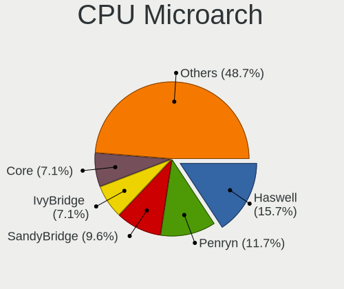

| Name             | Desktops | Percent |
|------------------|----------|---------|
| Haswell          | 26       | 15.03%  |
| Penryn           | 22       | 12.72%  |
| SandyBridge      | 14       | 8.09%   |
| Core             | 14       | 8.09%   |
| IvyBridge        | 12       | 6.94%   |
| NetBurst         | 10       | 5.78%   |
| KabyLake         | 9        | 5.2%    |
| K10              | 9        | 5.2%    |
| Piledriver       | 8        | 4.62%   |
| Westmere         | 7        | 4.05%   |
| Unknown          | 6        | 3.47%   |
| Steamroller      | 5        | 2.89%   |
| Zen+             | 4        | 2.31%   |
| Zen 2            | 4        | 2.31%   |
| Skylake          | 4        | 2.31%   |
| Nehalem          | 3        | 1.73%   |
| K8 Hammer        | 3        | 1.73%   |
| Icelake          | 3        | 1.73%   |
| CometLake        | 3        | 1.73%   |
| Zen 3            | 2        | 1.16%   |
| Zen              | 1        | 0.58%   |
| Silvermont       | 1        | 0.58%   |
| Excavator        | 1        | 0.58%   |
| Bulldozer        | 1        | 0.58%   |
| Alderlake Hybrid | 1        | 0.58%   |

Graphics
--------

GPU Vendor
----------

Vendors of graphics cards

| Vendor | Desktops | Percent |
|--------|----------|---------|
| Intel  | 80       | 43.48%  |
| Nvidia | 52       | 28.26%  |
| AMD    | 52       | 28.26%  |

GPU Model
---------

Graphics card models

| Model                                                                       | Desktops | Percent |
|-----------------------------------------------------------------------------|----------|---------|
| Intel Xeon E3-1200 v3/4th Gen Core Processor Integrated Graphics Controller | 21       | 11.05%  |
| Intel 4 Series Chipset Integrated Graphics Controller                       | 15       | 7.89%   |
| Nvidia GT218 [GeForce 210]                                                  | 10       | 5.26%   |
| Intel Xeon E3-1200 v2/3rd Gen Core processor Graphics Controller            | 7        | 3.68%   |
| AMD Ellesmere [Radeon RX 470/480/570/570X/580/580X/590]                     | 7        | 3.68%   |
| Intel 82Q963/Q965 Integrated Graphics Controller                            | 5        | 2.63%   |
| Intel 2nd Generation Core Processor Family Integrated Graphics Controller   | 5        | 2.63%   |
| Nvidia GA104 [GeForce RTX 3070]                                             | 4        | 2.11%   |
| AMD RS880 [Radeon HD 4200]                                                  | 4        | 2.11%   |
| AMD Kaveri [Radeon R7 Graphics]                                             | 4        | 2.11%   |
| AMD Cedar [Radeon HD 5000/6000/7350/8350 Series]                            | 4        | 2.11%   |
| Nvidia GP108 [GeForce GT 1030]                                              | 3        | 1.58%   |
| Nvidia GP102 [GeForce GTX 1080 Ti]                                          | 3        | 1.58%   |
| Nvidia GF119 [NVS 315]                                                      | 3        | 1.58%   |
| Nvidia GF108GL [Quadro 600]                                                 | 3        | 1.58%   |
| Intel HD Graphics 630                                                       | 3        | 1.58%   |
| Intel CoffeeLake-S GT2 [UHD Graphics 630]                                   | 3        | 1.58%   |
| Intel 82Q35 Express Integrated Graphics Controller                          | 3        | 1.58%   |
| Intel 82G33/G31 Express Integrated Graphics Controller                      | 3        | 1.58%   |
| Intel 82945G/GZ Integrated Graphics Controller                              | 3        | 1.58%   |
| AMD Trinity 2 [Radeon HD 7480D]                                             | 3        | 1.58%   |
| Nvidia G86 [GeForce 8400 GS]                                                | 2        | 1.05%   |
| Nvidia AD104 [GeForce RTX 4070]                                             | 2        | 1.05%   |
| Intel HD Graphics 530                                                       | 2        | 1.05%   |
| Intel Core Processor Integrated Graphics Controller                         | 2        | 1.05%   |
| Intel CometLake-S GT2 [UHD Graphics 630]                                    | 2        | 1.05%   |
| AMD Turks XT [Radeon HD 6670/7670]                                          | 2        | 1.05%   |
| AMD Trinity [Radeon HD 7560D]                                               | 2        | 1.05%   |
| AMD RS780C [Radeon 3100]                                                    | 2        | 1.05%   |
| AMD Caicos PRO [Radeon HD 7450]                                             | 2        | 1.05%   |
| Nvidia TU117 [GeForce GTX 1650]                                             | 1        | 0.53%   |
| Nvidia TU116 [GeForce GTX 1660 SUPER]                                       | 1        | 0.53%   |
| Nvidia TU106 [GeForce RTX 2060 SUPER]                                       | 1        | 0.53%   |
| Nvidia NV18 [GeForce4 MX 4000]                                              | 1        | 0.53%   |
| Nvidia GT200GL [Quadro FX 4800]                                             | 1        | 0.53%   |
| Nvidia GP107 [GeForce GTX 1050]                                             | 1        | 0.53%   |
| Nvidia GP107 [GeForce GTX 1050 Ti]                                          | 1        | 0.53%   |
| Nvidia GM206 [GeForce GTX 950]                                              | 1        | 0.53%   |
| Nvidia GM204 [GeForce GTX 970]                                              | 1        | 0.53%   |
| Nvidia GM107GL [Quadro K620]                                                | 1        | 0.53%   |

GPU Combo
---------

Combinations of graphics cards

| Name                   | Desktops | Percent |
|------------------------|----------|---------|
| 1 x Intel              | 68       | 38.64%  |
| 1 x Nvidia             | 47       | 26.7%   |
| 1 x AMD                | 44       | 25%     |
| Intel + Nvidia         | 4        | 2.27%   |
| Intel + AMD            | 4        | 2.27%   |
| 2 x Intel              | 2        | 1.14%   |
| 2 x AMD                | 2        | 1.14%   |
| AMD + Nvidia           | 2        | 1.14%   |
| 3 x AMD                | 1        | 0.57%   |
| 2 x Nvidia             | 1        | 0.57%   |
| 1 x Intel + 3 x Nvidia | 1        | 0.57%   |

GPU Driver
----------

Free vs proprietary

| Driver      | Desktops | Percent |
|-------------|----------|---------|
| Free        | 135      | 75.84%  |
| Proprietary | 26       | 14.61%  |
| Unknown     | 17       | 9.55%   |

GPU Memory
----------

Total video memory

| Size in GB | Desktops | Percent |
|------------|----------|---------|
| Unknown    | 96       | 53.93%  |
| 0.51-1.0   | 24       | 13.48%  |
| 0.01-0.5   | 20       | 11.24%  |
| 1.01-2.0   | 16       | 8.99%   |
| 7.01-8.0   | 9        | 5.06%   |
| 3.01-4.0   | 7        | 3.93%   |
| 8.01-16.0  | 5        | 2.81%   |
| 5.01-6.0   | 1        | 0.56%   |

Monitor
-------

Monitor Vendor
--------------

Monitor vendors

| Vendor                  | Desktops | Percent |
|-------------------------|----------|---------|
| Samsung Electronics     | 31       | 22.3%   |
| Dell                    | 30       | 21.58%  |
| Hewlett-Packard         | 25       | 17.99%  |
| Lenovo                  | 9        | 6.47%   |
| Goldstar                | 8        | 5.76%   |
| Acer                    | 4        | 2.88%   |
| Philips                 | 3        | 2.16%   |
| NEC Computers           | 3        | 2.16%   |
| BenQ                    | 3        | 2.16%   |
| ASUSTek Computer        | 3        | 2.16%   |
| AOC                     | 3        | 2.16%   |
| Fujitsu Siemens         | 2        | 1.44%   |
| Eizo                    | 2        | 1.44%   |
| ViewSonic               | 1        | 0.72%   |
| Unknown                 | 1        | 0.72%   |
| Sun                     | 1        | 0.72%   |
| Sony                    | 1        | 0.72%   |
| Planar                  | 1        | 0.72%   |
| MStar                   | 1        | 0.72%   |
| MLT                     | 1        | 0.72%   |
| JWY                     | 1        | 0.72%   |
| Gigabyte Technology     | 1        | 0.72%   |
| eMachines               | 1        | 0.72%   |
| Chi Mei Optoelectronics | 1        | 0.72%   |
| AUS                     | 1        | 0.72%   |
| Ancor Communications    | 1        | 0.72%   |

Monitor Model
-------------

Monitor models

| Model                                                                | Desktops | Percent |
|----------------------------------------------------------------------|----------|---------|
| Dell E170S DELA04A 1280x1024 338x270mm 17.0-inch                     | 5        | 3.45%   |
| Lenovo LEN T2454pA LEN60C9 1920x1080 518x324mm 24.1-inch             | 4        | 2.76%   |
| Samsung Electronics S19B150 SAM08A2 1366x768 410x230mm 18.5-inch     | 3        | 2.07%   |
| Hewlett-Packard L1950 HWP26E7 1280x1024 380x300mm 19.1-inch          | 3        | 2.07%   |
| Samsung Electronics U28E590 SAM0C4D 3840x2160 607x345mm 27.5-inch    | 2        | 1.38%   |
| Samsung Electronics SyncMaster SAM0350 1440x900 428x255mm 19.6-inch  | 2        | 1.38%   |
| Samsung Electronics SMB1930N SAM0632 1360x768 410x230mm 18.5-inch    | 2        | 1.38%   |
| Hewlett-Packard LA2206 HWP2948 1920x1080 476x268mm 21.5-inch         | 2        | 1.38%   |
| Hewlett-Packard LA2205 HWP2847 1680x1050 473x296mm 22.0-inch         | 2        | 1.38%   |
| Hewlett-Packard LA2006 HWP2943 1600x900 443x249mm 20.0-inch          | 2        | 1.38%   |
| Hewlett-Packard E231 HWP3064 1920x1080 510x287mm 23.0-inch           | 2        | 1.38%   |
| Dell P2211H DEL4060 1920x1080 477x268mm 21.5-inch                    | 2        | 1.38%   |
| Dell E1709W DELD022 1440x900 370x230mm 17.2-inch                     | 2        | 1.38%   |
| Acer V193W ACR0025 1440x900 408x255mm 18.9-inch                      | 2        | 1.38%   |
| ViewSonic VA703-3Series VSC631E 1280x1024 338x270mm 17.0-inch        | 1        | 0.69%   |
| Unknown SMART TV 0563 1920x1080 1209x680mm 54.6-inch                 | 1        | 0.69%   |
| Sun PN17JO SUN0589 1280x1024 295x236mm 14.9-inch                     | 1        | 0.69%   |
| Sony KDL-23S2000 SNY9900 1360x768                                    | 1        | 0.69%   |
| Samsung Electronics U28E590 SAM0C4E 3840x2160 608x345mm 27.5-inch    | 1        | 0.69%   |
| Samsung Electronics SyncMaster SAM0590 1600x900 443x249mm 20.0-inch  | 1        | 0.69%   |
| Samsung Electronics SyncMaster SAM0472 1440x900 367x229mm 17.0-inch  | 1        | 0.69%   |
| Samsung Electronics SyncMaster SAM0286 1280x720 372x209mm 16.8-inch  | 1        | 0.69%   |
| Samsung Electronics SyncMaster SAM0022 1280x1024 312x234mm 15.4-inch | 1        | 0.69%   |
| Samsung Electronics SMBX2031 SAM076A 1600x900 443x249mm 20.0-inch    | 1        | 0.69%   |
| Samsung Electronics SM2333T SAM0736 1920x1080 477x268mm 21.5-inch    | 1        | 0.69%   |
| Samsung Electronics S24D300 SAM0B43 1920x1080 531x299mm 24.0-inch    | 1        | 0.69%   |
| Samsung Electronics S23B300 SAM08AE 1920x1080 510x287mm 23.0-inch    | 1        | 0.69%   |
| Samsung Electronics S22E200 SAM0C6D 1920x1080 477x268mm 21.5-inch    | 1        | 0.69%   |
| Samsung Electronics S22D300 SAM0B3F 1920x1080 477x268mm 21.5-inch    | 1        | 0.69%   |
| Samsung Electronics S19D300 SAM0B34 1366x768 410x230mm 18.5-inch     | 1        | 0.69%   |
| Samsung Electronics S19B300 SAM08A5 1366x768 410x230mm 18.5-inch     | 1        | 0.69%   |
| Samsung Electronics S19B300 SAM08A4 1366x768 410x230mm 18.5-inch     | 1        | 0.69%   |
| Samsung Electronics LF27T35 SAM707F 1920x1080 598x337mm 27.0-inch    | 1        | 0.69%   |
| Samsung Electronics LCD Monitor SMBX2350 1920x1080                   | 1        | 0.69%   |
| Samsung Electronics LCD Monitor SMBX2331 1920x1080                   | 1        | 0.69%   |
| Samsung Electronics LCD Monitor SA300/SA350 1366x768                 | 1        | 0.69%   |
| Samsung Electronics LCD Monitor S24D330 1920x1080                    | 1        | 0.69%   |
| Samsung Electronics LCD Monitor S22D300 5760x1080                    | 1        | 0.69%   |
| Samsung Electronics LCD Monitor S22D300 1920x1080                    | 1        | 0.69%   |
| Samsung Electronics LC27G5xT SAM707A 2560x1440 597x336mm 27.0-inch   | 1        | 0.69%   |

Monitor Resolution
------------------

Monitor screen resolution

| Resolution         | Desktops | Percent |
|--------------------|----------|---------|
| 1920x1080 (FHD)    | 50       | 36.5%   |
| 1280x1024 (SXGA)   | 26       | 18.98%  |
| 1366x768 (WXGA)    | 13       | 9.49%   |
| 1440x900 (WXGA+)   | 12       | 8.76%   |
| 1600x900 (HD+)     | 9        | 6.57%   |
| 1680x1050 (WSXGA+) | 7        | 5.11%   |
| 3840x2160 (4K)     | 4        | 2.92%   |
| 2560x1440 (QHD)    | 4        | 2.92%   |
| 1600x1200          | 2        | 1.46%   |
| 5760x1080          | 1        | 0.73%   |
| 3440x1440          | 1        | 0.73%   |
| 2560x1600          | 1        | 0.73%   |
| 1920x540           | 1        | 0.73%   |
| 1920x1200 (WUXGA)  | 1        | 0.73%   |
| 1400x1050          | 1        | 0.73%   |
| 1360x768           | 1        | 0.73%   |
| 1280x720 (HD)      | 1        | 0.73%   |
| 1024x768 (XGA)     | 1        | 0.73%   |
| Unknown            | 1        | 0.73%   |

Monitor Diagonal
----------------

Diagonal size in inches

| Inches  | Desktops | Percent |
|---------|----------|---------|
| 17      | 20       | 14.49%  |
| 19      | 18       | 13.04%  |
| 24      | 14       | 10.14%  |
| 21      | 12       | 8.7%    |
| 18      | 12       | 8.7%    |
| 27      | 11       | 7.97%   |
| 23      | 11       | 7.97%   |
| Unknown | 10       | 7.25%   |
| 20      | 9        | 6.52%   |
| 22      | 6        | 4.35%   |
| 15      | 4        | 2.9%    |
| 32      | 3        | 2.17%   |
| 31      | 2        | 1.45%   |
| 54      | 1        | 0.72%   |
| 34      | 1        | 0.72%   |
| 29      | 1        | 0.72%   |
| 25      | 1        | 0.72%   |
| 16      | 1        | 0.72%   |
| 14      | 1        | 0.72%   |

Monitor Width
-------------

Physical width

| Width in mm | Desktops | Percent |
|-------------|----------|---------|
| 401-500     | 49       | 35.77%  |
| 501-600     | 34       | 24.82%  |
| 301-350     | 19       | 13.87%  |
| 351-400     | 14       | 10.22%  |
| Unknown     | 10       | 7.3%    |
| 601-700     | 5        | 3.65%   |
| 701-800     | 4        | 2.92%   |
| 201-300     | 1        | 0.73%   |
| 1001-1500   | 1        | 0.73%   |

Aspect Ratio
------------

Proportional relationship between the width and the height

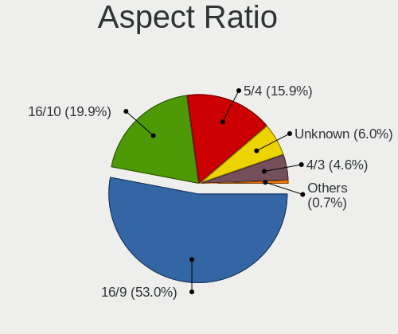

| Ratio   | Desktops | Percent |
|---------|----------|---------|
| 16/9    | 70       | 51.85%  |
| 16/10   | 25       | 18.52%  |
| 5/4     | 23       | 17.04%  |
| Unknown | 9        | 6.67%   |
| 4/3     | 7        | 5.19%   |
| 21/9    | 1        | 0.74%   |

Monitor Area
------------

Area in inch

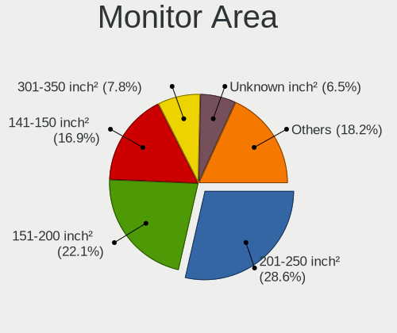

| Area in inch | Desktops | Percent |
|----------------|----------|---------|
| 151-200        | 34       | 24.82%  |
| 201-250        | 31       | 22.63%  |
| 141-150        | 25       | 18.25%  |
| 301-350        | 11       | 8.03%   |
| Unknown        | 10       | 7.3%    |
| 251-300        | 8        | 5.84%   |
| 351-500        | 7        | 5.11%   |
| 131-140        | 4        | 2.92%   |
| 101-110        | 3        | 2.19%   |
| 111-120        | 2        | 1.46%   |
| More than 1000 | 1        | 0.73%   |
| 121-130        | 1        | 0.73%   |

Pixel Density
-------------

Pixels per inch

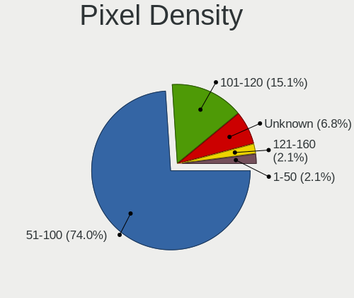

| Density | Desktops | Percent |
|---------|----------|---------|
| 51-100  | 97       | 73.48%  |
| 101-120 | 20       | 15.15%  |
| Unknown | 10       | 7.58%   |
| 121-160 | 3        | 2.27%   |
| 1-50    | 2        | 1.52%   |

Multiple Monitors
-----------------

Total monitors connected

| Total | Desktops | Percent |
|-------|----------|---------|
| 1     | 142      | 78.89%  |
| 0     | 25       | 13.89%  |
| 2     | 12       | 6.67%   |
| 3     | 1        | 0.56%   |

Network
-------

Net Controller Vendor
---------------------

Controller vendors

| Vendor                            | Desktops | Percent |
|-----------------------------------|----------|---------|
| Intel                             | 74       | 30.45%  |
| Realtek Semiconductor             | 71       | 29.22%  |
| Ralink Technology                 | 24       | 9.88%   |
| Broadcom                          | 22       | 9.05%   |
| Qualcomm Atheros                  | 19       | 7.82%   |
| Broadcom Limited                  | 10       | 4.12%   |
| TP-Link                           | 5        | 2.06%   |
| Qualcomm Atheros Communications   | 4        | 1.65%   |
| Samsung Electronics               | 2        | 0.82%   |
| Ralink                            | 2        | 0.82%   |
| Edimax Technology                 | 2        | 0.82%   |
| Sundance Technology Inc / IC Plus | 1        | 0.41%   |
| Qualcomm                          | 1        | 0.41%   |
| Nvidia                            | 1        | 0.41%   |
| Motorola                          | 1        | 0.41%   |
| MediaTek                          | 1        | 0.41%   |
| Lenovo                            | 1        | 0.41%   |
| D-Link                            | 1        | 0.41%   |
| 3Com                              | 1        | 0.41%   |

Net Controller Model
--------------------

Controller models

| Model                                                                         | Desktops | Percent |
|-------------------------------------------------------------------------------|----------|---------|
| Realtek RTL8111/8168/8211/8411 PCI Express Gigabit Ethernet Controller        | 41       | 15.83%  |
| Intel Ethernet Connection I217-LM                                             | 17       | 6.56%   |
| Ralink RT5370 Wireless Adapter                                                | 15       | 5.79%   |
| Intel 82579LM Gigabit Network Connection (Lewisville)                         | 14       | 5.41%   |
| Intel 82567LM-3 Gigabit Network Connection                                    | 12       | 4.63%   |
| Qualcomm Atheros AR8151 v2.0 Gigabit Ethernet                                 | 10       | 3.86%   |
| Realtek RTL8188FTV 802.11b/g/n 1T1R 2.4G WLAN Adapter                         | 9        | 3.47%   |
| Realtek RTL8188EUS 802.11n Wireless Network Adapter                           | 8        | 3.09%   |
| Ralink MT7601U Wireless Adapter                                               | 8        | 3.09%   |
| Broadcom NetXtreme BCM5761 Gigabit Ethernet PCIe                              | 8        | 3.09%   |
| Broadcom NetXtreme BCM5762 Gigabit Ethernet PCIe                              | 6        | 2.32%   |
| Broadcom Limited NetXtreme BCM5761 Gigabit Ethernet PCIe                      | 6        | 2.32%   |
| Realtek RTL8125 2.5GbE Controller                                             | 5        | 1.93%   |
| Intel I211 Gigabit Network Connection                                         | 4        | 1.54%   |
| Intel 82566DM-2 Gigabit Network Connection                                    | 4        | 1.54%   |
| Qualcomm Atheros TP-Link TL-WN322G v3 / TL-WN422G v2 802.11g [Atheros AR9271] | 3        | 1.16%   |
| Qualcomm Atheros AR2413/AR2414 Wireless Network Adapter [AR5005G(S) 802.11bg] | 3        | 1.16%   |
| Intel 82566DM Gigabit Network Connection                                      | 3        | 1.16%   |
| Broadcom NetXtreme BCM5764M Gigabit Ethernet PCIe                             | 3        | 1.16%   |
| TP-Link TL-WN722N v2/v3 [Realtek RTL8188EUS]                                  | 2        | 0.77%   |
| Realtek RTL8188EE Wireless Network Adapter                                    | 2        | 0.77%   |
| Realtek RTL8188CUS 802.11n WLAN Adapter                                       | 2        | 0.77%   |
| Realtek RTL810xE PCI Express Fast Ethernet controller                         | 2        | 0.77%   |
| Realtek Killer E3000 2.5GbE Controller                                        | 2        | 0.77%   |
| Ralink RT2870/RT3070 Wireless Adapter                                         | 2        | 0.77%   |
| Ralink RT3062 Wireless 802.11n 2T/2R                                          | 2        | 0.77%   |
| Qualcomm Atheros Killer E220x Gigabit Ethernet Controller                     | 2        | 0.77%   |
| Qualcomm Atheros AR8151 v1.0 Gigabit Ethernet                                 | 2        | 0.77%   |
| Intel Tiger Lake PCH CNVi WiFi                                                | 2        | 0.77%   |
| Intel Ethernet Connection (2) I219-V                                          | 2        | 0.77%   |
| Intel Ethernet Connection (2) I219-LM                                         | 2        | 0.77%   |
| Intel Comet Lake PCH CNVi WiFi                                                | 2        | 0.77%   |
| Intel 82578DM Gigabit Network Connection                                      | 2        | 0.77%   |
| Intel 82574L Gigabit Network Connection                                       | 2        | 0.77%   |
| Edimax EW-7811Un 802.11n Wireless Adapter [Realtek RTL8188CUS]                | 2        | 0.77%   |
| Broadcom NetXtreme BCM5754 Gigabit Ethernet PCI Express                       | 2        | 0.77%   |
| Broadcom Limited NetXtreme BCM5754 Gigabit Ethernet PCI Express               | 2        | 0.77%   |
| TP-Link TL-WN823N v2/v3 [Realtek RTL8192EU]                                   | 1        | 0.39%   |
| TP-Link TL-WN822N Version 4 RTL8192EU                                         | 1        | 0.39%   |
| TP-Link Archer T3U [Realtek RTL8812BU]                                        | 1        | 0.39%   |

Wireless Vendor
---------------

Wireless vendors

| Vendor                          | Desktops | Percent |
|---------------------------------|----------|---------|
| Realtek Semiconductor           | 24       | 32%     |
| Ralink Technology               | 24       | 32%     |
| Intel                           | 8        | 10.67%  |
| TP-Link                         | 5        | 6.67%   |
| Qualcomm Atheros Communications | 4        | 5.33%   |
| Qualcomm Atheros                | 4        | 5.33%   |
| Ralink                          | 2        | 2.67%   |
| Edimax Technology               | 2        | 2.67%   |
| MediaTek                        | 1        | 1.33%   |
| D-Link                          | 1        | 1.33%   |

Wireless Model
--------------

Wireless models

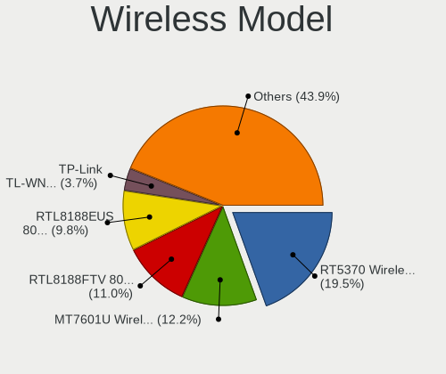

| Model                                                                         | Desktops | Percent |
|-------------------------------------------------------------------------------|----------|---------|
| Ralink RT5370 Wireless Adapter                                                | 15       | 19.74%  |
| Realtek RTL8188FTV 802.11b/g/n 1T1R 2.4G WLAN Adapter                         | 9        | 11.84%  |
| Realtek RTL8188EUS 802.11n Wireless Network Adapter                           | 8        | 10.53%  |
| Ralink MT7601U Wireless Adapter                                               | 8        | 10.53%  |
| Qualcomm Atheros TP-Link TL-WN322G v3 / TL-WN422G v2 802.11g [Atheros AR9271] | 3        | 3.95%   |
| Qualcomm Atheros AR2413/AR2414 Wireless Network Adapter [AR5005G(S) 802.11bg] | 3        | 3.95%   |
| TP-Link TL-WN722N v2/v3 [Realtek RTL8188EUS]                                  | 2        | 2.63%   |
| Realtek RTL8188EE Wireless Network Adapter                                    | 2        | 2.63%   |
| Realtek RTL8188CUS 802.11n WLAN Adapter                                       | 2        | 2.63%   |
| Ralink RT2870/RT3070 Wireless Adapter                                         | 2        | 2.63%   |
| Ralink RT3062 Wireless 802.11n 2T/2R                                          | 2        | 2.63%   |
| Intel Tiger Lake PCH CNVi WiFi                                                | 2        | 2.63%   |
| Intel Comet Lake PCH CNVi WiFi                                                | 2        | 2.63%   |
| Edimax EW-7811Un 802.11n Wireless Adapter [Realtek RTL8188CUS]                | 2        | 2.63%   |
| TP-Link TL-WN823N v2/v3 [Realtek RTL8192EU]                                   | 1        | 1.32%   |
| TP-Link TL-WN822N Version 4 RTL8192EU                                         | 1        | 1.32%   |
| TP-Link Archer T3U [Realtek RTL8812BU]                                        | 1        | 1.32%   |
| Realtek RTL8192EE PCIe Wireless Network Adapter                               | 1        | 1.32%   |
| Realtek RTL8187 Wireless Adapter                                              | 1        | 1.32%   |
| Realtek 802.11ac NIC                                                          | 1        | 1.32%   |
| Qualcomm Atheros AR9271 802.11n                                               | 1        | 1.32%   |
| Qualcomm Atheros AR2417 Wireless Network Adapter [AR5007G 802.11bg]           | 1        | 1.32%   |
| MediaTek MT7921 802.11ax PCI Express Wireless Network Adapter                 | 1        | 1.32%   |
| Intel Wi-Fi 6E(802.11ax) AX210/AX1675* 2x2 [Typhoon Peak]                     | 1        | 1.32%   |
| Intel Wi-Fi 6 AX200                                                           | 1        | 1.32%   |
| Intel Wi-Fi 5(802.11ac) Wireless-AC 9x6x [Thunder Peak]                       | 1        | 1.32%   |
| Intel Cannon Lake PCH CNVi WiFi                                               | 1        | 1.32%   |
| D-Link DWA-171 AC600 DB Wireless Adapter(rev.A1) [Realtek RTL8811AU]          | 1        | 1.32%   |

Ethernet Vendor
---------------

Ethernet vendors

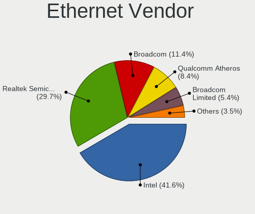

| Vendor                            | Desktops | Percent |
|-----------------------------------|----------|---------|
| Intel                             | 69       | 38.98%  |
| Realtek Semiconductor             | 53       | 29.94%  |
| Broadcom                          | 22       | 12.43%  |
| Qualcomm Atheros                  | 16       | 9.04%   |
| Broadcom Limited                  | 10       | 5.65%   |
| Samsung Electronics               | 2        | 1.13%   |
| Sundance Technology Inc / IC Plus | 1        | 0.56%   |
| Qualcomm                          | 1        | 0.56%   |
| Nvidia                            | 1        | 0.56%   |
| Lenovo                            | 1        | 0.56%   |
| 3Com                              | 1        | 0.56%   |

Ethernet Model
--------------

Ethernet models

| Model                                                                      | Desktops | Percent |
|----------------------------------------------------------------------------|----------|---------|
| Realtek RTL8111/8168/8211/8411 PCI Express Gigabit Ethernet Controller     | 41       | 22.53%  |
| Intel Ethernet Connection I217-LM                                          | 17       | 9.34%   |
| Intel 82579LM Gigabit Network Connection (Lewisville)                      | 14       | 7.69%   |
| Intel 82567LM-3 Gigabit Network Connection                                 | 12       | 6.59%   |
| Qualcomm Atheros AR8151 v2.0 Gigabit Ethernet                              | 10       | 5.49%   |
| Broadcom NetXtreme BCM5761 Gigabit Ethernet PCIe                           | 8        | 4.4%    |
| Broadcom NetXtreme BCM5762 Gigabit Ethernet PCIe                           | 6        | 3.3%    |
| Broadcom Limited NetXtreme BCM5761 Gigabit Ethernet PCIe                   | 6        | 3.3%    |
| Realtek RTL8125 2.5GbE Controller                                          | 5        | 2.75%   |
| Intel I211 Gigabit Network Connection                                      | 4        | 2.2%    |
| Intel 82566DM-2 Gigabit Network Connection                                 | 4        | 2.2%    |
| Intel 82566DM Gigabit Network Connection                                   | 3        | 1.65%   |
| Broadcom NetXtreme BCM5764M Gigabit Ethernet PCIe                          | 3        | 1.65%   |
| Realtek RTL810xE PCI Express Fast Ethernet controller                      | 2        | 1.1%    |
| Realtek Killer E3000 2.5GbE Controller                                     | 2        | 1.1%    |
| Qualcomm Atheros Killer E220x Gigabit Ethernet Controller                  | 2        | 1.1%    |
| Qualcomm Atheros AR8151 v1.0 Gigabit Ethernet                              | 2        | 1.1%    |
| Intel Ethernet Connection (2) I219-V                                       | 2        | 1.1%    |
| Intel Ethernet Connection (2) I219-LM                                      | 2        | 1.1%    |
| Intel 82578DM Gigabit Network Connection                                   | 2        | 1.1%    |
| Intel 82574L Gigabit Network Connection                                    | 2        | 1.1%    |
| Broadcom NetXtreme BCM5754 Gigabit Ethernet PCI Express                    | 2        | 1.1%    |
| Broadcom Limited NetXtreme BCM5754 Gigabit Ethernet PCI Express            | 2        | 1.1%    |
| Sundance Inc / IC Plus IC Plus IP100A Integrated 10/100 Ethernet MAC + PHY | 1        | 0.55%   |
| Samsung GT-I9070 (network tethering, USB debugging enabled)                | 1        | 0.55%   |
| Samsung Galaxy series, misc. (tethering mode)                              | 1        | 0.55%   |
| Realtek RTL8111/8168/8411 PCI Express Gigabit Ethernet Controller          | 1        | 0.55%   |
| Realtek RTL-8100/8101L/8139 PCI Fast Ethernet Adapter                      | 1        | 0.55%   |
| Realtek Killer E2600 GbE Controller                                        | 1        | 0.55%   |
| Qualcomm Nokia G42 5G                                                      | 1        | 0.55%   |
| Qualcomm Atheros Attansic L2 Fast Ethernet                                 | 1        | 0.55%   |
| Qualcomm Atheros AR8132 Fast Ethernet                                      | 1        | 0.55%   |
| Nvidia MCP61 Ethernet                                                      | 1        | 0.55%   |
| Lenovo Lenovo                                                              | 1        | 0.55%   |
| Intel I210 Gigabit Network Connection                                      | 1        | 0.55%   |
| Intel Ethernet Controller I226-V                                           | 1        | 0.55%   |
| Intel Ethernet Controller I225-V                                           | 1        | 0.55%   |
| Intel Ethernet Connection I217-V                                           | 1        | 0.55%   |
| Intel Ethernet Connection (7) I219-V                                       | 1        | 0.55%   |
| Intel Ethernet Connection (7) I219-LM                                      | 1        | 0.55%   |

Net Controller Kind
-------------------

Ethernet, WiFi or modem

| Kind     | Desktops | Percent |
|----------|----------|---------|
| Ethernet | 170      | 70.83%  |
| WiFi     | 69       | 28.75%  |
| Modem    | 1        | 0.42%   |

Used Controller
---------------

Currently used network controller

| Kind     | Desktops | Percent |
|----------|----------|---------|
| Ethernet | 135      | 76.27%  |
| WiFi     | 42       | 23.73%  |

NICs
----

Total network controllers on board

| Total | Desktops | Percent |
|-------|----------|---------|
| 1     | 143      | 83.63%  |
| 2     | 25       | 14.62%  |
| 0     | 2        | 1.17%   |
| 3     | 1        | 0.58%   |

IPv6
----

IPv6 vs IPv4

| Used | Desktops | Percent |
|------|----------|---------|
| No   | 170      | 98.84%  |
| Yes  | 2        | 1.16%   |

Bluetooth
---------

Bluetooth Vendor
----------------

Controller vendors

| Vendor                  | Desktops | Percent |
|-------------------------|----------|---------|
| Cambridge Silicon Radio | 15       | 60%     |
| Intel                   | 8        | 32%     |
| Realtek Semiconductor   | 1        | 4%      |
| MediaTek                | 1        | 4%      |

Bluetooth Model
---------------

Controller models

| Model                                               | Desktops | Percent |
|-----------------------------------------------------|----------|---------|
| Cambridge Silicon Radio Bluetooth Dongle (HCI mode) | 15       | 60%     |
| Intel AX201 Bluetooth                               | 4        | 16%     |
| Realtek RTL8821A Bluetooth                          | 1        | 4%      |
| MediaTek Wireless_Device                            | 1        | 4%      |
| Intel Wireless-AC 9260 Bluetooth Adapter            | 1        | 4%      |
| Intel Bluetooth 9460/9560 Jefferson Peak (JfP)      | 1        | 4%      |
| Intel AX210 Bluetooth                               | 1        | 4%      |
| Intel AX200 Bluetooth                               | 1        | 4%      |

Sound
-----

Sound Vendor
------------

Sound card vendors

| Vendor                 | Desktops | Percent |
|------------------------|----------|---------|
| Intel                  | 128      | 52.67%  |
| AMD                    | 59       | 24.28%  |
| Nvidia                 | 44       | 18.11%  |
| JMTek                  | 2        | 0.82%   |
| C-Media Electronics    | 2        | 0.82%   |
| Thermaltake            | 1        | 0.41%   |
| Tenx Technology        | 1        | 0.41%   |
| Logitech               | 1        | 0.41%   |
| Kingston Technology    | 1        | 0.41%   |
| Hewlett-Packard        | 1        | 0.41%   |
| Generalplus Technology | 1        | 0.41%   |
| ASUSTek Computer       | 1        | 0.41%   |
| Astro Gaming           | 1        | 0.41%   |

Sound Model
-----------

Sound card models

| Model                                                                      | Desktops | Percent |
|----------------------------------------------------------------------------|----------|---------|
| Intel 8 Series/C220 Series Chipset High Definition Audio Controller        | 23       | 7.88%   |
| Intel Xeon E3-1200 v3/4th Gen Core Processor HD Audio Controller           | 21       | 7.19%   |
| Intel NM10/ICH7 Family High Definition Audio Controller                    | 15       | 5.14%   |
| Intel 6 Series/C200 Series Chipset Family High Definition Audio Controller | 15       | 5.14%   |
| AMD SBx00 Azalia (Intel HDA)                                               | 13       | 4.45%   |
| AMD FCH Azalia Controller                                                  | 13       | 4.45%   |
| Intel 82801JD/DO (ICH10 Family) HD Audio Controller                        | 12       | 4.11%   |
| Nvidia High Definition Audio Controller                                    | 10       | 3.42%   |
| Intel 82801JI (ICH10 Family) HD Audio Controller                           | 8        | 2.74%   |
| Intel 7 Series/C216 Chipset Family High Definition Audio Controller        | 8        | 2.74%   |
| AMD Ellesmere HDMI Audio [Radeon RX 470/480 / 570/580/590]                 | 8        | 2.74%   |
| AMD Trinity HDMI Audio Controller                                          | 7        | 2.4%    |
| AMD Starship/Matisse HD Audio Controller                                   | 6        | 2.05%   |
| Nvidia GF119 HDMI Audio Controller                                         | 5        | 1.71%   |
| Intel 82801I (ICH9 Family) HD Audio Controller                             | 5        | 1.71%   |
| Intel 82801H (ICH8 Family) HD Audio Controller                             | 5        | 1.71%   |
| Intel 200 Series PCH HD Audio                                              | 5        | 1.71%   |
| AMD Kaveri HDMI/DP Audio Controller                                        | 5        | 1.71%   |
| Nvidia GA104 High Definition Audio Controller                              | 4        | 1.37%   |
| Intel Cannon Lake PCH cAVS                                                 | 4        | 1.37%   |
| Intel 100 Series/C230 Series Chipset Family HD Audio Controller            | 4        | 1.37%   |
| AMD Family 17h (Models 00h-0fh) HD Audio Controller                        | 4        | 1.37%   |
| AMD Cedar HDMI Audio [Radeon HD 5400/6300/7300 Series]                     | 4        | 1.37%   |
| Nvidia GP108 High Definition Audio Controller                              | 3        | 1.03%   |
| Nvidia GP102 HDMI Audio Controller                                         | 3        | 1.03%   |
| Nvidia GM107 High Definition Audio Controller [GeForce 940MX]              | 3        | 1.03%   |
| Nvidia GF108 High Definition Audio Controller                              | 3        | 1.03%   |
| Intel Tiger Lake-H HD Audio Controller                                     | 3        | 1.03%   |
| Intel C600/X79 series chipset High Definition Audio Controller             | 3        | 1.03%   |
| Intel 5 Series/3400 Series Chipset High Definition Audio                   | 3        | 1.03%   |
| AMD Turks HDMI Audio [Radeon HD 6500/6600 / 6700M Series]                  | 3        | 1.03%   |
| AMD Oland/Hainan/Cape Verde/Pitcairn HDMI Audio [Radeon HD 7000 Series]    | 3        | 1.03%   |
| AMD Family 17h/19h HD Audio Controller                                     | 3        | 1.03%   |
| Nvidia GP107GL High Definition Audio Controller                            | 2        | 0.68%   |
| Nvidia Audio device                                                        | 2        | 0.68%   |
| JMTek USB PnP Audio Device                                                 | 2        | 0.68%   |
| Intel Smart Sound Technology (SST) Audio Controller                        | 2        | 0.68%   |
| Intel HD Graphics SGPC                                                     | 2        | 0.68%   |
| Intel 9 Series Chipset Family HD Audio Controller                          | 2        | 0.68%   |
| Intel 631xESB/632xESB High Definition Audio Controller                     | 2        | 0.68%   |

Memory
------

Memory Vendor
-------------

Memory module vendors

| Vendor                       | Desktops | Percent |
|------------------------------|----------|---------|
| Samsung Electronics          | 26       | 19.7%   |
| Unknown                      | 25       | 18.94%  |
| SK hynix                     | 18       | 13.64%  |
| Kingston                     | 18       | 13.64%  |
| Micron Technology            | 12       | 9.09%   |
| Crucial                      | 7        | 5.3%    |
| Corsair                      | 6        | 4.55%   |
| Nanya Technology             | 4        | 3.03%   |
| Ramaxel Technology           | 3        | 2.27%   |
| M                            | 3        | 2.27%   |
| MINPO                        | 2        | 1.52%   |
| Unknown (E)                  | 1        | 0.76%   |
| Unknown (0x7F7FB5FFFFFFFFFF) | 1        | 0.76%   |
| S                            | 1        | 0.76%   |
| Kingmax                      | 1        | 0.76%   |
| H                            | 1        | 0.76%   |
| G.Skill                      | 1        | 0.76%   |
| Elpida                       | 1        | 0.76%   |
| A-DATA Technology            | 1        | 0.76%   |

Memory Model
------------

Memory module models

| Model                                                  | Desktops | Percent |
|--------------------------------------------------------|----------|---------|
| Micron RAM 8JTF51264AZ-1G6E1 4GB DIMM DDR3 1600MT/s    | 8        | 5.37%   |
| Samsung RAM M378B5673FH0-CH9 2GB DIMM DDR3 1600MT/s    | 4        | 2.68%   |
| Samsung RAM M378B5173DB0-CK0 4GB DIMM DDR3 1600MT/s    | 4        | 2.68%   |
| Unknown RAM Module 2GB DIMM 800MT/s                    | 3        | 2.01%   |
| Samsung RAM M378B5273CH0-CH9 4GB DIMM DDR3 1867MT/s    | 3        | 2.01%   |
| Samsung RAM M378B5173QH0-CK0 4GB DIMM DDR3 1600MT/s    | 3        | 2.01%   |
| Corsair RAM CMK8GX4M1D3000C16 8GB DIMM DDR4 3200MT/s   | 3        | 2.01%   |
| Unknown RAM Module 4GB DIMM 400MT/s                    | 2        | 1.34%   |
| Unknown RAM Module 4096MB DIMM 400MT/s                 | 2        | 1.34%   |
| Unknown RAM Module 2048MB DIMM 800MT/s                 | 2        | 1.34%   |
| Unknown RAM Module 2048MB DIMM 400MT/s                 | 2        | 1.34%   |
| SK hynix RAM HYMP512U64CP8-Y5 1GB DIMM DDR2 1331MT/s   | 2        | 1.34%   |
| SK hynix RAM HMT451U6BFR8C-PB 4GB DIMM DDR3 1600MT/s   | 2        | 1.34%   |
| SK hynix RAM HMT451U6BFR8A-PB 4GB DIMM DDR3 1600MT/s   | 2        | 1.34%   |
| SK hynix RAM HMT351U6CFR8C-H9 4GB DIMM DDR3 1333MT/s   | 2        | 1.34%   |
| Samsung RAM M378B5773DH0-CK0 2GB DIMM DDR3 1600MT/s    | 2        | 1.34%   |
| Samsung RAM M378B5773CH0-CH9 2048MB DIMM DDR3 1867MT/s | 2        | 1.34%   |
| M RAM Module 2048MB DIMM DDR3 667MT/s                  | 2        | 1.34%   |
| Kingston RAM XK2M26-MIE 16384MB DIMM DDR4 3467MT/s     | 2        | 1.34%   |
| Crucial RAM CB16GU2666.C8ET 16GB DIMM DDR4 2667MT/s    | 2        | 1.34%   |
| Unknown RAM Module 8192MB DIMM 1066MT/s                | 1        | 0.67%   |
| Unknown RAM Module 512MB DIMM DDR 667MT/s              | 1        | 0.67%   |
| Unknown RAM Module 4GB DIMM DDR4 2133MT/s              | 1        | 0.67%   |
| Unknown RAM Module 4GB DIMM DDR3 1333MT/s              | 1        | 0.67%   |
| Unknown RAM Module 4GB DIMM 1066MT/s                   | 1        | 0.67%   |
| Unknown RAM Module 4096MB DIMM DDR3 667MT/s            | 1        | 0.67%   |
| Unknown RAM Module 4096MB DIMM DDR2                    | 1        | 0.67%   |
| Unknown RAM Module 4096MB DIMM 1066MT/s                | 1        | 0.67%   |
| Unknown RAM Module 2GB DIMM SDRAM                      | 1        | 0.67%   |
| Unknown RAM Module 2GB DIMM DDR2                       | 1        | 0.67%   |
| Unknown RAM Module 2GB DIMM DDR 667MT/s                | 1        | 0.67%   |
| Unknown RAM Module 2GB DIMM 667MT/s                    | 1        | 0.67%   |
| Unknown RAM Module 2GB DIMM 400MT/s                    | 1        | 0.67%   |
| Unknown RAM Module 2GB DIMM 1333MT/s                   | 1        | 0.67%   |
| Unknown RAM Module 2048MB DIMM DDR3 667MT/s            | 1        | 0.67%   |
| Unknown RAM Module 2048MB DIMM DDR3 1333MT/s           | 1        | 0.67%   |
| Unknown RAM Module 2048MB DIMM DDR2                    | 1        | 0.67%   |
| Unknown RAM Module 2048MB DIMM 1333MT/s                | 1        | 0.67%   |
| Unknown RAM Module 1GB DIMM SDRAM                      | 1        | 0.67%   |
| Unknown RAM Module 1GB DIMM DDR2 667MT/s               | 1        | 0.67%   |

Memory Kind
-----------

Memory module kinds

| Kind    | Desktops | Percent |
|---------|----------|---------|
| DDR3    | 43       | 44.33%  |
| DDR4    | 16       | 16.49%  |
| Unknown | 14       | 14.43%  |
| SDRAM   | 13       | 13.4%   |
| DDR2    | 8        | 8.25%   |
| DDR     | 2        | 2.06%   |
| DDR5    | 1        | 1.03%   |

Memory Form Factor
------------------

Physical design of the memory module

| Name   | Desktops | Percent |
|--------|----------|---------|
| DIMM   | 86       | 98.85%  |
| SODIMM | 1        | 1.15%   |

Memory Size
-----------

Memory module size

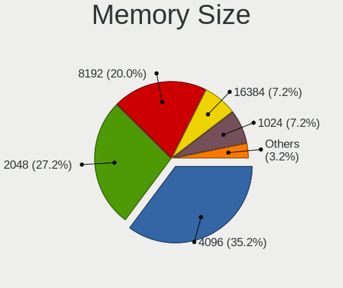

| Size  | Desktops | Percent |
|-------|----------|---------|
| 4096  | 39       | 35.45%  |
| 2048  | 32       | 29.09%  |
| 8192  | 20       | 18.18%  |
| 16384 | 8        | 7.27%   |
| 1024  | 8        | 7.27%   |
| 512   | 2        | 1.82%   |
| 32768 | 1        | 0.91%   |

Memory Speed
------------

Memory module speed

| Speed   | Desktops | Percent |
|---------|----------|---------|
| 1600    | 30       | 25.86%  |
| 1333    | 14       | 12.07%  |
| 667     | 9        | 7.76%   |
| 800     | 8        | 6.9%    |
| 400     | 7        | 6.03%   |
| 3200    | 5        | 4.31%   |
| 1867    | 5        | 4.31%   |
| 2667    | 4        | 3.45%   |
| 1866    | 4        | 3.45%   |
| 1066    | 3        | 2.59%   |
| Unknown | 3        | 2.59%   |
| 3600    | 2        | 1.72%   |
| 3467    | 2        | 1.72%   |
| 2400    | 2        | 1.72%   |
| 2133    | 2        | 1.72%   |
| 1800    | 2        | 1.72%   |
| 1648    | 2        | 1.72%   |
| 1331    | 2        | 1.72%   |
| 533     | 2        | 1.72%   |
| 49926   | 1        | 0.86%   |
| 4800    | 1        | 0.86%   |
| 3800    | 1        | 0.86%   |
| 3400    | 1        | 0.86%   |
| 3000    | 1        | 0.86%   |
| 2666    | 1        | 0.86%   |
| 2048    | 1        | 0.86%   |
| 2000    | 1        | 0.86%   |

Printers & scanners
-------------------

Printer Vendor
--------------

Printer device vendors

| Vendor          | Desktops | Percent |
|-----------------|----------|---------|
| Hewlett-Packard | 4        | 50%     |
| Seiko Epson     | 2        | 25%     |
| Ricoh           | 1        | 12.5%   |
| Kyocera         | 1        | 12.5%   |

Printer Model
-------------

Printer device models

| Model                           | Desktops | Percent |
|---------------------------------|----------|---------|
| Seiko Epson Printer             | 1        | 12.5%   |
| Seiko Epson ET-2710 Series      | 1        | 12.5%   |
| Ricoh Printing Support          | 1        | 12.5%   |
| Kyocera UTAX_TA LP 3240_LP 4240 | 1        | 12.5%   |
| HP LaserJet P3005               | 1        | 12.5%   |
| HP LaserJet M402d               | 1        | 12.5%   |
| HP LaserJet 1018                | 1        | 12.5%   |
| HP DeskJet F2492 All-in-One     | 1        | 12.5%   |

Scanner Vendor
--------------

Scanner device vendors

Zero info for selected period =(

Scanner Model
-------------

Scanner device models

Zero info for selected period =(

Camera
------

Camera Vendor
-------------

Camera device vendors

| Vendor                  | Desktops | Percent |
|-------------------------|----------|---------|
| Samsung Electronics     | 4        | 28.57%  |
| Logitech                | 2        | 14.29%  |
| Cubeternet              | 2        | 14.29%  |
| Z-Star Microelectronics | 1        | 7.14%   |
| OPPO Electronics        | 1        | 7.14%   |
| eMPIA Technology        | 1        | 7.14%   |
| Chicony Electronics     | 1        | 7.14%   |
| Aveo Technology         | 1        | 7.14%   |
| Apple                   | 1        | 7.14%   |

Camera Model
------------

Camera device models

| Model                                   | Desktops | Percent |
|-----------------------------------------|----------|---------|
| Samsung Galaxy series, misc. (MTP mode) | 3        | 21.43%  |
| Logitech Webcam C270                    | 2        | 14.29%  |
| Z-Star Vimicro USB Camera (Altair)      | 1        | 7.14%   |
| Samsung Galaxy (debugging mode)         | 1        | 7.14%   |
| OPPO SM6375-QRD _SN:EA0028BC            | 1        | 7.14%   |
| eMPIA M035 Compact Web Cam              | 1        | 7.14%   |
| Cubeternet USB2.0 Camera                | 1        | 7.14%   |
| Cubeternet GL-UPC822 UVC WebCam         | 1        | 7.14%   |
| Chicony HP 720p HD Monitor Webcam       | 1        | 7.14%   |
| Aveo USB2.0 Camera                      | 1        | 7.14%   |
| Apple iPhone 5/5C/5S/6/SE/7/8/X         | 1        | 7.14%   |

Security
--------

Fingerprint Vendor
------------------

Fingerprint sensor vendors

Zero info for selected period =(

Fingerprint Model
-----------------

Fingerprint sensor models

Zero info for selected period =(

Chipcard Vendor
---------------

Chipcard module vendors

| Vendor          | Desktops | Percent |
|-----------------|----------|---------|
| Hewlett-Packard | 1        | 100%    |

Chipcard Model
--------------

Chipcard module models

| Model                                         | Desktops | Percent |
|-----------------------------------------------|----------|---------|
| Hewlett-Packard SC Keyboard - Apollo (Liteon) | 1        | 100%    |

Unsupported
-----------

Unsupported Devices
-------------------

Total unsupported devices on board

| Total | Desktops | Percent |
|-------|----------|---------|
| 0     | 143      | 79.44%  |
| 1     | 31       | 17.22%  |
| 2     | 5        | 2.78%   |
| 5     | 1        | 0.56%   |

Unsupported Device Types
------------------------

Types of unsupported devices

| Type                     | Desktops | Percent |
|--------------------------|----------|---------|
| Graphics card            | 23       | 56.1%   |
| Net/wireless             | 9        | 21.95%  |
| Camera                   | 3        | 7.32%   |
| Unassigned class         | 1        | 2.44%   |
| Storage/ide              | 1        | 2.44%   |
| Sound                    | 1        | 2.44%   |
| Multimedia controller    | 1        | 2.44%   |
| Modem                    | 1        | 2.44%   |
| Communication controller | 1        | 2.44%   |

