Linux in Egypt - Tested Hardware & Statistics (Desktops)
--------------------------------------------------------

A project to collect tested hardware configurations for Linux in Egypt.

Anyone can contribute to this report by the [hw-probe](https://github.com/linuxhw/hw-probe) tool:

    sudo -E hw-probe -all -upload

Please contribute! Especially if your hardware is rare.

Contents
--------

* [ Test Cases ](#test-cases)

* [ System ](#system)
  - [ OS                       ](#os)
  - [ OS Family                ](#os-family)
  - [ Kernel                   ](#kernel)
  - [ Kernel Family            ](#kernel-family)
  - [ Kernel Major Ver.        ](#kernel-major-ver)
  - [ Arch                     ](#arch)
  - [ DE                       ](#de)
  - [ Display Server           ](#display-server)
  - [ Display Manager          ](#display-manager)
  - [ OS Lang                  ](#os-lang)
  - [ Boot Mode                ](#boot-mode)
  - [ Filesystem               ](#filesystem)
  - [ Part. scheme             ](#part-scheme)
  - [ Dual Boot with Linux/BSD ](#dual-boot-with-linuxbsd)
  - [ Dual Boot (Win)          ](#dual-boot-win)

* [ Board ](#board)
  - [ Vendor                   ](#vendor)
  - [ Model                    ](#model)
  - [ Model Family             ](#model-family)
  - [ MFG Year                 ](#mfg-year)
  - [ Form Factor              ](#form-factor)
  - [ Secure Boot              ](#secure-boot)
  - [ Coreboot                 ](#coreboot)
  - [ RAM Size                 ](#ram-size)
  - [ RAM Used                 ](#ram-used)
  - [ Total Drives             ](#total-drives)
  - [ Has CD-ROM               ](#has-cd-rom)
  - [ Has Ethernet             ](#has-ethernet)
  - [ Has WiFi                 ](#has-wifi)
  - [ Has Bluetooth            ](#has-bluetooth)

* [ Location ](#location)
  - [ Country                  ](#country)
  - [ City                     ](#city)

* [ Drives ](#drives)
  - [ Drive Vendor             ](#drive-vendor)
  - [ Drive Model              ](#drive-model)
  - [ HDD Vendor               ](#hdd-vendor)
  - [ SSD Vendor               ](#ssd-vendor)
  - [ Drive Kind               ](#drive-kind)
  - [ Drive Connector          ](#drive-connector)
  - [ Drive Size               ](#drive-size)
  - [ Space Total              ](#space-total)
  - [ Space Used               ](#space-used)
  - [ Malfunc. Drives          ](#malfunc-drives)
  - [ Malfunc. Drive Vendor    ](#malfunc-drive-vendor)
  - [ Malfunc. HDD Vendor      ](#malfunc-hdd-vendor)
  - [ Malfunc. Drive Kind      ](#malfunc-drive-kind)
  - [ Failed Drives            ](#failed-drives)
  - [ Failed Drive Vendor      ](#failed-drive-vendor)
  - [ Drive Status             ](#drive-status)

* [ Storage controller ](#storage-controller)
  - [ Storage Vendor           ](#storage-vendor)
  - [ Storage Model            ](#storage-model)
  - [ Storage Kind             ](#storage-kind)

* [ Processor ](#processor)
  - [ CPU Vendor               ](#cpu-vendor)
  - [ CPU Model                ](#cpu-model)
  - [ CPU Model Family         ](#cpu-model-family)
  - [ CPU Cores                ](#cpu-cores)
  - [ CPU Sockets              ](#cpu-sockets)
  - [ CPU Threads              ](#cpu-threads)
  - [ CPU Op-Modes             ](#cpu-op-modes)
  - [ CPU Microcode            ](#cpu-microcode)
  - [ CPU Microarch            ](#cpu-microarch)

* [ Graphics ](#graphics)
  - [ GPU Vendor               ](#gpu-vendor)
  - [ GPU Model                ](#gpu-model)
  - [ GPU Combo                ](#gpu-combo)
  - [ GPU Driver               ](#gpu-driver)
  - [ GPU Memory               ](#gpu-memory)

* [ Monitor ](#monitor)
  - [ Monitor Vendor           ](#monitor-vendor)
  - [ Monitor Model            ](#monitor-model)
  - [ Monitor Resolution       ](#monitor-resolution)
  - [ Monitor Diagonal         ](#monitor-diagonal)
  - [ Monitor Width            ](#monitor-width)
  - [ Aspect Ratio             ](#aspect-ratio)
  - [ Monitor Area             ](#monitor-area)
  - [ Pixel Density            ](#pixel-density)
  - [ Multiple Monitors        ](#multiple-monitors)

* [ Network ](#network)
  - [ Net Controller Vendor    ](#net-controller-vendor)
  - [ Net Controller Model     ](#net-controller-model)
  - [ Wireless Vendor          ](#wireless-vendor)
  - [ Wireless Model           ](#wireless-model)
  - [ Ethernet Vendor          ](#ethernet-vendor)
  - [ Ethernet Model           ](#ethernet-model)
  - [ Net Controller Kind      ](#net-controller-kind)
  - [ Used Controller          ](#used-controller)
  - [ NICs                     ](#nics)
  - [ IPv6                     ](#ipv6)

* [ Bluetooth ](#bluetooth)
  - [ Bluetooth Vendor         ](#bluetooth-vendor)
  - [ Bluetooth Model          ](#bluetooth-model)

* [ Sound ](#sound)
  - [ Sound Vendor             ](#sound-vendor)
  - [ Sound Model              ](#sound-model)

* [ Memory ](#memory)
  - [ Memory Vendor            ](#memory-vendor)
  - [ Memory Model             ](#memory-model)
  - [ Memory Kind              ](#memory-kind)
  - [ Memory Form Factor       ](#memory-form-factor)
  - [ Memory Size              ](#memory-size)
  - [ Memory Speed             ](#memory-speed)

* [ Printers & scanners ](#printers--scanners)
  - [ Printer Vendor           ](#printer-vendor)
  - [ Printer Model            ](#printer-model)
  - [ Scanner Vendor           ](#scanner-vendor)
  - [ Scanner Model            ](#scanner-model)

* [ Camera ](#camera)
  - [ Camera Vendor            ](#camera-vendor)
  - [ Camera Model             ](#camera-model)

* [ Security ](#security)
  - [ Fingerprint Vendor       ](#fingerprint-vendor)
  - [ Fingerprint Model        ](#fingerprint-model)
  - [ Chipcard Vendor          ](#chipcard-vendor)
  - [ Chipcard Model           ](#chipcard-model)

* [ Unsupported ](#unsupported)
  - [ Unsupported Devices      ](#unsupported-devices)
  - [ Unsupported Device Types ](#unsupported-device-types)

Test Cases
----------

Total: 172

| Vendor    | Model                       | Probe                                                      | Date         |
|-----------|-----------------------------|------------------------------------------------------------|--------------|
| Gigabyte  | H61M-S2P                    | [49aedf1cf8](https://linux-hardware.org/?probe=49aedf1cf8) | Aug 17, 2022 |
| HP        | 18E7                        | [06374a6240](https://linux-hardware.org/?probe=06374a6240) | Aug 14, 2022 |
| HP        | 1850                        | [33933e3e5d](https://linux-hardware.org/?probe=33933e3e5d) | Aug 12, 2022 |
| HP        | 18E4                        | [d13265fa57](https://linux-hardware.org/?probe=d13265fa57) | Jul 29, 2022 |
| HP        | 3647h                       | [ed98e07a47](https://linux-hardware.org/?probe=ed98e07a47) | Jul 26, 2022 |
| Dell      | 0200DY A01                  | [99eacb5700](https://linux-hardware.org/?probe=99eacb5700) | Jul 11, 2022 |
| MSI       | B450 TOMAHAWK MAX           | [21dd020507](https://linux-hardware.org/?probe=21dd020507) | Jul 01, 2022 |
| ASUSTek   | P5GC-MX/1333                | [428eebd42f](https://linux-hardware.org/?probe=428eebd42f) | Jun 13, 2022 |
| Dell      | 0GY6Y8 A03                  | [4668e3772e](https://linux-hardware.org/?probe=4668e3772e) | Jun 05, 2022 |
| Dell      | 040DDP A01                  | [208a2ee137](https://linux-hardware.org/?probe=208a2ee137) | Jun 02, 2022 |
| HP        | 0A80h                       | [7e5c6cf61e](https://linux-hardware.org/?probe=7e5c6cf61e) | May 27, 2022 |
| Dell      | 03NVJ6 A04                  | [ebacf887d7](https://linux-hardware.org/?probe=ebacf887d7) | May 04, 2022 |
| Dell      | 08WKV3 A00                  | [e6ef37e2a0](https://linux-hardware.org/?probe=e6ef37e2a0) | Apr 24, 2022 |
| HP        | 8053                        | [f214dbdf74](https://linux-hardware.org/?probe=f214dbdf74) | Apr 23, 2022 |
| Lenovo    | ThinkCentre M58 6258D3G     | [b84eab559e](https://linux-hardware.org/?probe=b84eab559e) | Apr 21, 2022 |
| HP        | 18E7                        | [1b6db66cc1](https://linux-hardware.org/?probe=1b6db66cc1) | Apr 19, 2022 |
| HP        | 8265                        | [6a7abd0db8](https://linux-hardware.org/?probe=6a7abd0db8) | Apr 19, 2022 |
| Dell      | 08WKV3 A00                  | [f3afe20dae](https://linux-hardware.org/?probe=f3afe20dae) | Apr 16, 2022 |
| Dell      | 0WK833                      | [efee7c0ec6](https://linux-hardware.org/?probe=efee7c0ec6) | Apr 02, 2022 |
| Dell      | 0WK833                      | [a8703c7598](https://linux-hardware.org/?probe=a8703c7598) | Apr 02, 2022 |
| Lenovo    | ThinkCentre M58 6258D3G     | [b67f1750b8](https://linux-hardware.org/?probe=b67f1750b8) | Mar 31, 2022 |
| Lenovo    | ThinkCentre M58 6258D3G     | [1cd22c83f1](https://linux-hardware.org/?probe=1cd22c83f1) | Mar 31, 2022 |
| ASUSTek   | B250 MINING EXPERT          | [2da8f96ad8](https://linux-hardware.org/?probe=2da8f96ad8) | Mar 29, 2022 |
| Gigabyte  | H110M-S2PT-CF               | [506afdf9c7](https://linux-hardware.org/?probe=506afdf9c7) | Mar 09, 2022 |
| Intel     | DQ965MT AAD36265-505        | [93758c64fa](https://linux-hardware.org/?probe=93758c64fa) | Mar 07, 2022 |
| Dell      | 0XG309                      | [535c8e4e2e](https://linux-hardware.org/?probe=535c8e4e2e) | Feb 28, 2022 |
| Dell      | 0XG309                      | [d9f753df89](https://linux-hardware.org/?probe=d9f753df89) | Feb 28, 2022 |
| MSI       | MAG X570 TOMAHAWK WIFI      | [f0692aebbe](https://linux-hardware.org/?probe=f0692aebbe) | Feb 25, 2022 |
| Gigabyte  | Z87-HD3                     | [d1fd917c74](https://linux-hardware.org/?probe=d1fd917c74) | Feb 24, 2022 |
| HP        | 3397                        | [de499e61b9](https://linux-hardware.org/?probe=de499e61b9) | Feb 22, 2022 |
| Gigabyte  | G41MT-S2PT                  | [2ddf4948c9](https://linux-hardware.org/?probe=2ddf4948c9) | Feb 19, 2022 |
| Gigabyte  | GA-MA78G-DS3H               | [d799c9b2f2](https://linux-hardware.org/?probe=d799c9b2f2) | Feb 18, 2022 |
| Dell      | 0C27VV A01                  | [5760b6c177](https://linux-hardware.org/?probe=5760b6c177) | Feb 14, 2022 |
| HP        | 3397                        | [06f2eef752](https://linux-hardware.org/?probe=06f2eef752) | Feb 13, 2022 |
| HP        | 1906                        | [c2107ad290](https://linux-hardware.org/?probe=c2107ad290) | Feb 08, 2022 |
| HP        | 1906                        | [9f08673e43](https://linux-hardware.org/?probe=9f08673e43) | Feb 08, 2022 |
| Lenovo    | BRASWELL NOK                | [0b12f54345](https://linux-hardware.org/?probe=0b12f54345) | Dec 26, 2021 |
| HP        | 3047h                       | [71b6f0abea](https://linux-hardware.org/?probe=71b6f0abea) | Dec 25, 2021 |
| Dell      | Precision WorkStation 49... | [b40b65db05](https://linux-hardware.org/?probe=b40b65db05) | Nov 07, 2021 |
| Dell      | 0CRH6C A01                  | [ff796824d2](https://linux-hardware.org/?probe=ff796824d2) | Oct 30, 2021 |
| HP        | 1850                        | [b155e888a5](https://linux-hardware.org/?probe=b155e888a5) | Oct 24, 2021 |
| Gigabyte  | G41MT-S2P                   | [e66a1ae149](https://linux-hardware.org/?probe=e66a1ae149) | Oct 21, 2021 |
| Gigabyte  | G41MT-S2P                   | [7339dc6e79](https://linux-hardware.org/?probe=7339dc6e79) | Oct 21, 2021 |
| ASUSTek   | B250 MINING EXPERT          | [8c1989ae75](https://linux-hardware.org/?probe=8c1989ae75) | Oct 16, 2021 |
| ASUSTek   | B250 MINING EXPERT          | [6c2357c3a8](https://linux-hardware.org/?probe=6c2357c3a8) | Oct 16, 2021 |
| Alienware | 0P0JWX A00                  | [bc2b8a4fa5](https://linux-hardware.org/?probe=bc2b8a4fa5) | Oct 11, 2021 |
| Alienware | 0P0JWX A00                  | [879496302d](https://linux-hardware.org/?probe=879496302d) | Oct 11, 2021 |
| Alienware | 0P0JWX A00                  | [bbe7dc3f56](https://linux-hardware.org/?probe=bbe7dc3f56) | Oct 11, 2021 |
| Gigabyte  | H510M S2H                   | [77205a87c4](https://linux-hardware.org/?probe=77205a87c4) | Oct 09, 2021 |
| ASUSTek   | TUF B450M-PLUS GAMING       | [6df5eb55f0](https://linux-hardware.org/?probe=6df5eb55f0) | Oct 03, 2021 |
| HP        | 1632                        | [269b4ad58e](https://linux-hardware.org/?probe=269b4ad58e) | Aug 22, 2021 |
| MSI       | MAG X570 TOMAHAWK WIFI      | [3eb5c512ad](https://linux-hardware.org/?probe=3eb5c512ad) | Aug 19, 2021 |
| Gigabyte  | G31M-ES2L                   | [26cae4bb7a](https://linux-hardware.org/?probe=26cae4bb7a) | Aug 16, 2021 |
| Intel     | DG31PR AAD97573-205         | [9bda168dc6](https://linux-hardware.org/?probe=9bda168dc6) | Aug 04, 2021 |
| Dell      | 0DR845                      | [1714388038](https://linux-hardware.org/?probe=1714388038) | Aug 03, 2021 |
| HP        | 3047h                       | [58b480757e](https://linux-hardware.org/?probe=58b480757e) | Jul 18, 2021 |
| HP        | 3047h                       | [40a25f223c](https://linux-hardware.org/?probe=40a25f223c) | Jul 18, 2021 |
| HP        | 0AE8h C                     | [b8b861a13d](https://linux-hardware.org/?probe=b8b861a13d) | Jul 13, 2021 |
| MSI       | MS-7507                     | [ede4b6fc34](https://linux-hardware.org/?probe=ede4b6fc34) | Jul 11, 2021 |
| HP        | 0A54h                       | [c8d8757784](https://linux-hardware.org/?probe=c8d8757784) | Jul 02, 2021 |
| Lenovo    | 0B98401 WIN                 | [c432c046f1](https://linux-hardware.org/?probe=c432c046f1) | Jun 04, 2021 |
| HP        | 158B                        | [cc2472f216](https://linux-hardware.org/?probe=cc2472f216) | Jun 03, 2021 |
| HP        | 83E1                        | [a10433a3cb](https://linux-hardware.org/?probe=a10433a3cb) | Jun 03, 2021 |
| Dell      | 09KPNV A01                  | [ace51e66cb](https://linux-hardware.org/?probe=ace51e66cb) | May 31, 2021 |
| HP        | 2129                        | [3991895525](https://linux-hardware.org/?probe=3991895525) | May 23, 2021 |
| Dell      | 09KPNV A01                  | [b902c359da](https://linux-hardware.org/?probe=b902c359da) | Apr 30, 2021 |
| Gigabyte  | H55M-S2V                    | [9170ec8194](https://linux-hardware.org/?probe=9170ec8194) | Apr 20, 2021 |
| HP        | 3397                        | [bb31fb43b4](https://linux-hardware.org/?probe=bb31fb43b4) | Apr 17, 2021 |
| Dell      | 09KPNV A01                  | [b7fe68e060](https://linux-hardware.org/?probe=b7fe68e060) | Apr 17, 2021 |
| HP        | 3397                        | [aa5cc70dda](https://linux-hardware.org/?probe=aa5cc70dda) | Apr 12, 2021 |
| Dell      | 0F5C5X A00                  | [7eda600c97](https://linux-hardware.org/?probe=7eda600c97) | Apr 05, 2021 |
| Dell      | 09KPNV A01                  | [10aaa9110b](https://linux-hardware.org/?probe=10aaa9110b) | Mar 23, 2021 |
| Gigabyte  | H61M-S2P                    | [280d47279c](https://linux-hardware.org/?probe=280d47279c) | Mar 23, 2021 |
| Gigabyte  | H61M-S2P                    | [a33947d95c](https://linux-hardware.org/?probe=a33947d95c) | Mar 23, 2021 |
| HP        | 2215                        | [baefda0ada](https://linux-hardware.org/?probe=baefda0ada) | Mar 22, 2021 |
| Dell      | 06D7TR A00                  | [d48c515893](https://linux-hardware.org/?probe=d48c515893) | Mar 20, 2021 |
| Gigabyte  | G41MT-S2P                   | [ca4e78877a](https://linux-hardware.org/?probe=ca4e78877a) | Mar 12, 2021 |
| Dell      | 09KPNV A01                  | [8f9a642417](https://linux-hardware.org/?probe=8f9a642417) | Feb 22, 2021 |
| HP        | 3397                        | [d20792e0ea](https://linux-hardware.org/?probe=d20792e0ea) | Feb 17, 2021 |
| Gigabyte  | H61M-S2P                    | [93bf0c5ca7](https://linux-hardware.org/?probe=93bf0c5ca7) | Feb 16, 2021 |
| Dell      | 09KPNV A01                  | [80ffaa3d5b](https://linux-hardware.org/?probe=80ffaa3d5b) | Feb 07, 2021 |
| Dell      | 09KPNV A01                  | [ed032a4225](https://linux-hardware.org/?probe=ed032a4225) | Feb 07, 2021 |
| Gigabyte  | G41MT-S2PT                  | [835511d4d7](https://linux-hardware.org/?probe=835511d4d7) | Jan 21, 2021 |
| HP        | 18E7                        | [627983aa9a](https://linux-hardware.org/?probe=627983aa9a) | Jan 08, 2021 |
| HP        | 18E7                        | [84402293e1](https://linux-hardware.org/?probe=84402293e1) | Jan 08, 2021 |
| Acer      | Veriton ES2735G V:2.0       | [c7f3ccb243](https://linux-hardware.org/?probe=c7f3ccb243) | Jan 03, 2021 |
| Gigabyte  | G41MT-S2PT                  | [91e7e7c14e](https://linux-hardware.org/?probe=91e7e7c14e) | Dec 27, 2020 |
| Gigabyte  | G41MT-S2PT                  | [3f73a22244](https://linux-hardware.org/?probe=3f73a22244) | Dec 27, 2020 |
| ASUSTek   | ROG STRIX X570-F GAMING     | [ed8e771bf5](https://linux-hardware.org/?probe=ed8e771bf5) | Dec 15, 2020 |
| Dell      | 0WWJRX A00                  | [79bddf0f48](https://linux-hardware.org/?probe=79bddf0f48) | Nov 17, 2020 |
| MSI       | B450 TOMAHAWK               | [59b28e7f27](https://linux-hardware.org/?probe=59b28e7f27) | Oct 29, 2020 |
| MSI       | B450 TOMAHAWK               | [812301310e](https://linux-hardware.org/?probe=812301310e) | Oct 29, 2020 |
| Gigabyte  | G41MT-S2PT                  | [183944533e](https://linux-hardware.org/?probe=183944533e) | Oct 19, 2020 |
| HP        | 304Ah                       | [a304d64545](https://linux-hardware.org/?probe=a304d64545) | Oct 14, 2020 |
| HP        | 304Ah                       | [539e24cc37](https://linux-hardware.org/?probe=539e24cc37) | Oct 13, 2020 |
| ASUSTek   | P6T                         | [3dd96c341e](https://linux-hardware.org/?probe=3dd96c341e) | Oct 08, 2020 |
| HP        | 304Ah                       | [720e05d59c](https://linux-hardware.org/?probe=720e05d59c) | Oct 04, 2020 |
| HP        | 304Ah                       | [e8bf5f6700](https://linux-hardware.org/?probe=e8bf5f6700) | Oct 04, 2020 |
| Gigabyte  | G41MT-S2PT                  | [cfddb029a9](https://linux-hardware.org/?probe=cfddb029a9) | Oct 01, 2020 |
| Gigabyte  | P61-DS3-B3                  | [3e2d37b04f](https://linux-hardware.org/?probe=3e2d37b04f) | Sep 30, 2020 |
| Gigabyte  | P61-DS3-B3                  | [a8eb27996e](https://linux-hardware.org/?probe=a8eb27996e) | Sep 30, 2020 |
| HP        | 304Ah                       | [11dc9e4238](https://linux-hardware.org/?probe=11dc9e4238) | Sep 28, 2020 |
| HP        | 2215                        | [4251c60f57](https://linux-hardware.org/?probe=4251c60f57) | Sep 28, 2020 |
| Dell      | 0C27VV A00                  | [63ac37dbe0](https://linux-hardware.org/?probe=63ac37dbe0) | Sep 09, 2020 |
| HP        | 1850                        | [b4067f01b9](https://linux-hardware.org/?probe=b4067f01b9) | Aug 28, 2020 |
| HP        | 0AA8h                       | [1d5b0d8069](https://linux-hardware.org/?probe=1d5b0d8069) | Aug 18, 2020 |
| Gigabyte  | G41MT-S2PT                  | [2c424580ec](https://linux-hardware.org/?probe=2c424580ec) | Aug 15, 2020 |
| Gigabyte  | G41MT-S2PT                  | [8b2bb78e5e](https://linux-hardware.org/?probe=8b2bb78e5e) | Aug 15, 2020 |
| Gigabyte  | H55M-S2V                    | [07f217e703](https://linux-hardware.org/?probe=07f217e703) | Aug 03, 2020 |
| Gigabyte  | H55M-S2V                    | [ed1664a437](https://linux-hardware.org/?probe=ed1664a437) | Aug 03, 2020 |
| Gigabyte  | Z97-D3H-CF                  | [fd308ae7e8](https://linux-hardware.org/?probe=fd308ae7e8) | Aug 03, 2020 |
| Lenovo    | ThinkCentre M55p 8811Y4U    | [0aea737b4e](https://linux-hardware.org/?probe=0aea737b4e) | Jul 14, 2020 |
| ECS       | G41T-M6                     | [c053fd66c4](https://linux-hardware.org/?probe=c053fd66c4) | Jun 20, 2020 |
| Gigabyte  | H61M-S2V-B3                 | [c0a0033c02](https://linux-hardware.org/?probe=c0a0033c02) | Jun 19, 2020 |
| Gigabyte  | GA-MA78LMT-S2               | [1785e9c758](https://linux-hardware.org/?probe=1785e9c758) | Jun 09, 2020 |
| HP        | 0AA8h                       | [7bc753da45](https://linux-hardware.org/?probe=7bc753da45) | Jun 01, 2020 |
| Gigabyte  | B450 AORUS PRO-CF           | [cad337153c](https://linux-hardware.org/?probe=cad337153c) | May 30, 2020 |
| HP        | 0A64h                       | [2bd2c492f2](https://linux-hardware.org/?probe=2bd2c492f2) | May 19, 2020 |
| Gigabyte  | GA-MA78LMT-S2               | [143dc371cc](https://linux-hardware.org/?probe=143dc371cc) | May 13, 2020 |
| Dell      | 0F5C5X A00                  | [7249cfd353](https://linux-hardware.org/?probe=7249cfd353) | May 11, 2020 |
| Dell      | 0M863N A01                  | [9d837a84d6](https://linux-hardware.org/?probe=9d837a84d6) | May 06, 2020 |
| Gigabyte  | GA-MA78LMT-S2               | [3cc9bc0ca6](https://linux-hardware.org/?probe=3cc9bc0ca6) | May 02, 2020 |
| Gigabyte  | GA-MA78LMT-S2               | [ca61693f79](https://linux-hardware.org/?probe=ca61693f79) | May 02, 2020 |
| ASUSTek   | TUF Z390M-PRO GAMING        | [aa0e93d8ea](https://linux-hardware.org/?probe=aa0e93d8ea) | May 01, 2020 |
| ASUSTek   | TUF Z390M-PRO GAMING        | [ec80a4e6c4](https://linux-hardware.org/?probe=ec80a4e6c4) | May 01, 2020 |
| HP        | 0A64h                       | [33c495a402](https://linux-hardware.org/?probe=33c495a402) | Apr 29, 2020 |
| HP        | 0A64h                       | [fa43db5ed0](https://linux-hardware.org/?probe=fa43db5ed0) | Apr 29, 2020 |
| HP        | 3029h                       | [79951d69d3](https://linux-hardware.org/?probe=79951d69d3) | Apr 03, 2020 |
| HP        | 0B54h D                     | [90835f49e4](https://linux-hardware.org/?probe=90835f49e4) | Apr 01, 2020 |
| HP        | 0B54h D                     | [ccfbb22390](https://linux-hardware.org/?probe=ccfbb22390) | Apr 01, 2020 |
| HP        | 304Ah                       | [6b3da5e7b3](https://linux-hardware.org/?probe=6b3da5e7b3) | Mar 02, 2020 |
| ASUSTek   | P8B75-M                     | [56ae5142e3](https://linux-hardware.org/?probe=56ae5142e3) | Feb 24, 2020 |
| Gigabyte  | G41MT-S2PT                  | [d9e2a26971](https://linux-hardware.org/?probe=d9e2a26971) | Feb 11, 2020 |
| Gigabyte  | G41MT-S2PT                  | [3b89d35524](https://linux-hardware.org/?probe=3b89d35524) | Feb 11, 2020 |
| Lenovo    | ThinkCentre M55p 8811Y4U    | [ad3e13542c](https://linux-hardware.org/?probe=ad3e13542c) | Jan 15, 2020 |
| Lenovo    | ThinkCentre M55p 8811Y4U    | [9658459b91](https://linux-hardware.org/?probe=9658459b91) | Jan 14, 2020 |
| IBM       | 81713FG                     | [53dead81c6](https://linux-hardware.org/?probe=53dead81c6) | Jan 03, 2020 |
| IBM       | 81713FG                     | [d8e454de5c](https://linux-hardware.org/?probe=d8e454de5c) | Jan 03, 2020 |
| ASUSTek   | H61M-K                      | [60762839f9](https://linux-hardware.org/?probe=60762839f9) | Nov 28, 2019 |
| ASUSTek   | H61M-K                      | [7ab32a09a5](https://linux-hardware.org/?probe=7ab32a09a5) | Nov 20, 2019 |
| Dell      | 0G214D A00                  | [9ed0af6e0a](https://linux-hardware.org/?probe=9ed0af6e0a) | Oct 11, 2019 |
| Gigabyte  | H61M-S2PT                   | [63cd905908](https://linux-hardware.org/?probe=63cd905908) | Oct 10, 2019 |
| HP        | 2820h                       | [11ccf345fc](https://linux-hardware.org/?probe=11ccf345fc) | Oct 06, 2019 |
| Gigabyte  | 8I848P-G                    | [dc8d0265cd](https://linux-hardware.org/?probe=dc8d0265cd) | Sep 29, 2019 |
| Gigabyte  | 8I848P-G                    | [ab92c43036](https://linux-hardware.org/?probe=ab92c43036) | Sep 28, 2019 |
| Dell      | 0G214D A00                  | [e8c153f59c](https://linux-hardware.org/?probe=e8c153f59c) | Sep 09, 2019 |
| Dell      | 0G214D A00                  | [16230f6527](https://linux-hardware.org/?probe=16230f6527) | Aug 10, 2019 |
| HP        | 0AA8h                       | [590f9d42ea](https://linux-hardware.org/?probe=590f9d42ea) | Aug 09, 2019 |
| HP        | 0AA8h                       | [822e83d86b](https://linux-hardware.org/?probe=822e83d86b) | Aug 09, 2019 |
| Dell      | 0RW199                      | [dfb1809733](https://linux-hardware.org/?probe=dfb1809733) | Aug 05, 2019 |
| HP        | 0AA8h                       | [e4137ad45b](https://linux-hardware.org/?probe=e4137ad45b) | Jul 31, 2019 |
| HP        | 0AA8h                       | [22921b3801](https://linux-hardware.org/?probe=22921b3801) | Jul 31, 2019 |
| Gigabyte  | H61M-S2PT                   | [0beb4b51ba](https://linux-hardware.org/?probe=0beb4b51ba) | Jul 12, 2019 |
| Gigabyte  | H61M-S2PT                   | [8a7237435e](https://linux-hardware.org/?probe=8a7237435e) | Jun 28, 2019 |
| Gigabyte  | G41MT-S2PT                  | [ada1dd6ed6](https://linux-hardware.org/?probe=ada1dd6ed6) | May 25, 2019 |
| HP        | 339A                        | [5b75c30305](https://linux-hardware.org/?probe=5b75c30305) | May 07, 2019 |
| HP        | 339A                        | [8d28878fde](https://linux-hardware.org/?probe=8d28878fde) | Apr 24, 2019 |
| Acer      | RS880M05                    | [17c0c75b39](https://linux-hardware.org/?probe=17c0c75b39) | Apr 23, 2019 |
| HP        | 158A                        | [61be039d0f](https://linux-hardware.org/?probe=61be039d0f) | Apr 02, 2019 |
| Gigabyte  | Z97X-Gaming GT              | [7a92794877](https://linux-hardware.org/?probe=7a92794877) | Apr 01, 2019 |
| Gigabyte  | Z97X-Gaming GT              | [db8cfde0fc](https://linux-hardware.org/?probe=db8cfde0fc) | Feb 15, 2019 |
| Gigabyte  | Z97X-Gaming GT              | [2c4a8b9bfc](https://linux-hardware.org/?probe=2c4a8b9bfc) | Feb 14, 2019 |
| Gigabyte  | Z97X-Gaming GT              | [4bd60c5d00](https://linux-hardware.org/?probe=4bd60c5d00) | Feb 13, 2019 |
| Dell      | 0W0CHX A00                  | [84777ce1be](https://linux-hardware.org/?probe=84777ce1be) | Feb 05, 2019 |
| Gigabyte  | H61M-S2V-B3                 | [4ea628d244](https://linux-hardware.org/?probe=4ea628d244) | Nov 27, 2018 |
| MSI       | MS-7309                     | [dcfb685544](https://linux-hardware.org/?probe=dcfb685544) | Nov 16, 2018 |
| Gigabyte  | P31-DS3L                    | [5e5236f775](https://linux-hardware.org/?probe=5e5236f775) | May 31, 2018 |
| Gigabyte  | P31-DS3L                    | [cb1a0d9cdd](https://linux-hardware.org/?probe=cb1a0d9cdd) | Jan 30, 2018 |
| Gigabyte  | P31-DS3L                    | [a3bd2e39bb](https://linux-hardware.org/?probe=a3bd2e39bb) | Jan 05, 2018 |
| MSI       | MS-7309                     | [bfa74baa2d](https://linux-hardware.org/?probe=bfa74baa2d) | Oct 30, 2017 |
| Gigabyte  | GA-MA78G-DS3H               | [d033ac1daf](https://linux-hardware.org/?probe=d033ac1daf) | Jun 18, 2017 |
| Gigabyte  | GA-MA78G-DS3H               | [89a443e757](https://linux-hardware.org/?probe=89a443e757) | Jun 15, 2017 |

System
------

OS
--

Installed operating systems

| Name              | Desktops | Percent |
|-------------------|----------|---------|
| Ubuntu 20.04      | 17       | 14.05%  |
| OpenMandriva 4.3  | 11       | 9.09%   |
| Ubuntu 18.04      | 10       | 8.26%   |
| OpenMandriva 4.2  | 7        | 5.79%   |
| Zorin 16          | 4        | 3.31%   |
| ROSA R10          | 3        | 2.48%   |
| Linux Mint 20     | 3        | 2.48%   |
| BlackPanther 18.1 | 3        | 2.48%   |
| Ubuntu 19.04      | 2        | 1.65%   |
| ROSA R9           | 2        | 1.65%   |
| ROSA R11          | 2        | 1.65%   |
| Pop!_OS 21.04     | 2        | 1.65%   |
| Pop!_OS 20.10     | 2        | 1.65%   |
| Manjaro           | 2        | 1.65%   |
| Kali 2022.1       | 2        | 1.65%   |
| Fedora 35         | 2        | 1.65%   |
| Fedora 32         | 2        | 1.65%   |
| Fedora 30         | 2        | 1.65%   |
| Arch              | 2        | 1.65%   |
| Zorin 15          | 1        | 0.83%   |
| Xubuntu 20.04     | 1        | 0.83%   |
| Xubuntu 18.04     | 1        | 0.83%   |
| Xubuntu 16.04     | 1        | 0.83%   |
| Ubuntu 22.04      | 1        | 0.83%   |
| Ubuntu 21.10      | 1        | 0.83%   |
| Ubuntu 16.04      | 1        | 0.83%   |
| ROSA R11.1        | 1        | 0.83%   |
| ROSA 12.2         | 1        | 0.83%   |
| RHEL 8            | 1        | 0.83%   |
| Reborn OS Rolling | 1        | 0.83%   |
| Pop!_OS 20.04     | 1        | 0.83%   |
| Parrot 5.0        | 1        | 0.83%   |
| OpenMandriva 4.90 | 1        | 0.83%   |
| Manjaro 21.3.7    | 1        | 0.83%   |
| Manjaro 21.2.0    | 1        | 0.83%   |
| Manjaro 20.2.1    | 1        | 0.83%   |
| Manjaro 19.0.2    | 1        | 0.83%   |
| LMDE 4            | 1        | 0.83%   |
| Linux Mint 20.3   | 1        | 0.83%   |
| Linux Mint 20.2   | 1        | 0.83%   |
| Linux Mint 20.1   | 1        | 0.83%   |
| Linux Mint 19.3   | 1        | 0.83%   |
| Linux Mint 19.2   | 1        | 0.83%   |
| Linux Mint 19.1   | 1        | 0.83%   |
| KDE neon 20.04    | 1        | 0.83%   |
| Kali 2021.2       | 1        | 0.83%   |
| Kali 2021.1       | 1        | 0.83%   |
| Kali 2020.4       | 1        | 0.83%   |
| Fedora 34         | 1        | 0.83%   |
| Fedora 31         | 1        | 0.83%   |
| Fedora 25         | 1        | 0.83%   |
| Endless 3.9.1     | 1        | 0.83%   |
| Elementary 6.1    | 1        | 0.83%   |
| Elementary 5.1.6  | 1        | 0.83%   |
| Elementary 5.1.2  | 1        | 0.83%   |
| Elementary 5.0    | 1        | 0.83%   |
| Debian 9          | 1        | 0.83%   |
| Debian 10         | 1        | 0.83%   |
| ArcoLinux 20.6.5  | 1        | 0.83%   |
| Arch Rolling      | 1        | 0.83%   |

OS Family
---------

OS without a version

| Name         | Desktops | Percent |
|--------------|----------|---------|
| Ubuntu       | 32       | 27.83%  |
| OpenMandriva | 19       | 16.52%  |
| Linux Mint   | 9        | 7.83%   |
| ROSA         | 7        | 6.09%   |
| Fedora       | 7        | 6.09%   |
| Manjaro      | 6        | 5.22%   |
| Zorin        | 5        | 4.35%   |
| Pop!_OS      | 5        | 4.35%   |
| Elementary   | 4        | 3.48%   |
| Xubuntu      | 3        | 2.61%   |
| Kali         | 3        | 2.61%   |
| BlackPanther | 3        | 2.61%   |
| Arch         | 3        | 2.61%   |
| Debian       | 2        | 1.74%   |
| RHEL         | 1        | 0.87%   |
| Reborn OS    | 1        | 0.87%   |
| Parrot       | 1        | 0.87%   |
| LMDE         | 1        | 0.87%   |
| KDE neon     | 1        | 0.87%   |
| Endless      | 1        | 0.87%   |
| ArcoLinux    | 1        | 0.87%   |

Kernel
------

Version of the Linux kernel

| Version                               | Desktops | Percent |
|---------------------------------------|----------|---------|
| 5.16.7-desktop-1omv4003               | 11       | 8.53%   |
| 5.10.14-desktop-1omv4002              | 7        | 5.43%   |
| 5.4.0-42-generic                      | 4        | 3.1%    |
| 5.11.0-37-generic                     | 3        | 2.33%   |
| 5.9.1-arch1-1                         | 2        | 1.55%   |
| 5.4.0-48-generic                      | 2        | 1.55%   |
| 5.4.0-37-generic                      | 2        | 1.55%   |
| 5.4.0-33-generic                      | 2        | 1.55%   |
| 5.4.0-26-generic                      | 2        | 1.55%   |
| 5.3.0-51-generic                      | 2        | 1.55%   |
| 5.13.0-39-generic                     | 2        | 1.55%   |
| 5.13.0-30-generic                     | 2        | 1.55%   |
| 5.11.0-7620-generic                   | 2        | 1.55%   |
| 4.18.16-desktop-1bP                   | 2        | 1.55%   |
| 4.15.0-desktop-45.1rosa-x86_64        | 2        | 1.55%   |
| 4.15.0-55-generic                     | 2        | 1.55%   |
| 4.15.0-46-generic                     | 2        | 1.55%   |
| 5.9.0-kali5-amd64                     | 1        | 0.78%   |
| 5.8.14-arch1-1                        | 1        | 0.78%   |
| 5.8.0-7642-generic                    | 1        | 0.78%   |
| 5.8.0-7630-generic                    | 1        | 0.78%   |
| 5.8.0-14-generic                      | 1        | 0.78%   |
| 5.7.7-200.fc32.x86_64                 | 1        | 0.78%   |
| 5.6.14-desktop-2bP                    | 1        | 0.78%   |
| 5.6.10-300.fc32.x86_64                | 1        | 0.78%   |
| 5.5.13-1-MANJARO                      | 1        | 0.78%   |
| 5.4.8-200.fc31.x86_64                 | 1        | 0.78%   |
| 5.4.40-generic-1rosa-x86_64           | 1        | 0.78%   |
| 5.4.0-89-generic                      | 1        | 0.78%   |
| 5.4.0-88-generic                      | 1        | 0.78%   |
| 5.4.0-77-generic                      | 1        | 0.78%   |
| 5.4.0-73-generic                      | 1        | 0.78%   |
| 5.4.0-70-generic                      | 1        | 0.78%   |
| 5.4.0-67-generic                      | 1        | 0.78%   |
| 5.4.0-64-generic                      | 1        | 0.78%   |
| 5.4.0-59-generic                      | 1        | 0.78%   |
| 5.4.0-58-generic                      | 1        | 0.78%   |
| 5.4.0-45-generic                      | 1        | 0.78%   |
| 5.4.0-28-generic                      | 1        | 0.78%   |
| 5.4.0-113-generic                     | 1        | 0.78%   |
| 5.3.3-150.vanilla.knurd.1.fc30.x86_64 | 1        | 0.78%   |
| 5.3.0-45-generic                      | 1        | 0.78%   |
| 5.3.0-40-generic                      | 1        | 0.78%   |
| 5.3.0-26-generic                      | 1        | 0.78%   |
| 5.2.11-200.fc30.x86_64                | 1        | 0.78%   |
| 5.19.1-3-MANJARO                      | 1        | 0.78%   |
| 5.18.12-desktop-3omv4090              | 1        | 0.78%   |
| 5.17.9-arch1-1                        | 1        | 0.78%   |
| 5.16.9-200.fc35.x86_64                | 1        | 0.78%   |
| 5.16.18-200.fc35.x86_64               | 1        | 0.78%   |
| 5.16.12-arch1-1                       | 1        | 0.78%   |
| 5.16.0-kali5-amd64                    | 1        | 0.78%   |
| 5.16.0-12parrot1-amd64                | 1        | 0.78%   |
| 5.15.49-1-MANJARO                     | 1        | 0.78%   |
| 5.15.0-kali3-amd64                    | 1        | 0.78%   |
| 5.15.0-25-generic                     | 1        | 0.78%   |
| 5.13.9-200.fc34.x86_64                | 1        | 0.78%   |
| 5.13.0-7620-generic                   | 1        | 0.78%   |
| 5.13.0-48-generic                     | 1        | 0.78%   |
| 5.13.0-28-generic                     | 1        | 0.78%   |

Kernel Family
-------------

Linux kernel without a distro release

| Version | Desktops | Percent |
|---------|----------|---------|
| 5.4.0   | 22       | 18.18%  |
| 5.16.7  | 11       | 9.09%   |
| 4.15.0  | 10       | 8.26%   |
| 5.13.0  | 8        | 6.61%   |
| 5.11.0  | 7        | 5.79%   |
| 5.10.14 | 7        | 5.79%   |
| 5.3.0   | 5        | 4.13%   |
| 5.0.0   | 4        | 3.31%   |
| 5.8.0   | 3        | 2.48%   |
| 5.9.1   | 2        | 1.65%   |
| 5.16.0  | 2        | 1.65%   |
| 5.15.0  | 2        | 1.65%   |
| 4.9.60  | 2        | 1.65%   |
| 4.19.0  | 2        | 1.65%   |
| 4.18.16 | 2        | 1.65%   |
| 4.18.0  | 2        | 1.65%   |
| 5.9.0   | 1        | 0.83%   |
| 5.8.14  | 1        | 0.83%   |
| 5.7.7   | 1        | 0.83%   |
| 5.6.14  | 1        | 0.83%   |
| 5.6.10  | 1        | 0.83%   |
| 5.5.13  | 1        | 0.83%   |
| 5.4.8   | 1        | 0.83%   |
| 5.4.40  | 1        | 0.83%   |
| 5.3.3   | 1        | 0.83%   |
| 5.2.11  | 1        | 0.83%   |
| 5.19.1  | 1        | 0.83%   |
| 5.18.12 | 1        | 0.83%   |
| 5.17.9  | 1        | 0.83%   |
| 5.16.9  | 1        | 0.83%   |
| 5.16.18 | 1        | 0.83%   |
| 5.16.12 | 1        | 0.83%   |
| 5.15.49 | 1        | 0.83%   |
| 5.13.9  | 1        | 0.83%   |
| 5.11.6  | 1        | 0.83%   |
| 5.10.84 | 1        | 0.83%   |
| 5.10.74 | 1        | 0.83%   |
| 5.10.7  | 1        | 0.83%   |
| 5.10.17 | 1        | 0.83%   |
| 5.10.0  | 1        | 0.83%   |
| 4.9.41  | 1        | 0.83%   |
| 4.9.20  | 1        | 0.83%   |
| 4.9.124 | 1        | 0.83%   |
| 4.9.0   | 1        | 0.83%   |
| 4.4.0   | 1        | 0.83%   |
| 4.13.16 | 1        | 0.83%   |

Kernel Major Ver.
-----------------

Linux kernel major version

| Version | Desktops | Percent |
|---------|----------|---------|
| 5.4     | 24       | 20%     |
| 5.16    | 16       | 13.33%  |
| 5.10    | 12       | 10%     |
| 4.15    | 10       | 8.33%   |
| 5.13    | 9        | 7.5%    |
| 5.11    | 8        | 6.67%   |
| 5.3     | 6        | 5%      |
| 4.9     | 5        | 4.17%   |
| 5.8     | 4        | 3.33%   |
| 5.0     | 4        | 3.33%   |
| 4.18    | 4        | 3.33%   |
| 5.9     | 3        | 2.5%    |
| 5.15    | 3        | 2.5%    |
| 5.6     | 2        | 1.67%   |
| 4.19    | 2        | 1.67%   |
| 5.7     | 1        | 0.83%   |
| 5.5     | 1        | 0.83%   |
| 5.2     | 1        | 0.83%   |
| 5.19    | 1        | 0.83%   |
| 5.18    | 1        | 0.83%   |
| 5.17    | 1        | 0.83%   |
| 4.4     | 1        | 0.83%   |
| 4.13    | 1        | 0.83%   |

Arch
----

OS architecture (x86_64, i586, etc.)

| Name   | Desktops | Percent |
|--------|----------|---------|
| x86_64 | 106      | 95.5%   |
| i686   | 5        | 4.5%    |

DE
--

Desktop Environment

| Name            | Desktops | Percent |
|-----------------|----------|---------|
| GNOME           | 42       | 37.17%  |
| KDE5            | 32       | 28.32%  |
| Unknown         | 12       | 10.62%  |
| XFCE            | 6        | 5.31%   |
| X-Cinnamon      | 6        | 5.31%   |
| KDE4            | 4        | 3.54%   |
| Pantheon        | 3        | 2.65%   |
| Cinnamon        | 2        | 1.77%   |
| Unity           | 1        | 0.88%   |
| MATE            | 1        | 0.88%   |
| LXDE            | 1        | 0.88%   |
| KDE             | 1        | 0.88%   |
| GNOME Flashback | 1        | 0.88%   |
| GNOME Classic   | 1        | 0.88%   |

Display Server
--------------

X11 or Wayland

| Name    | Desktops | Percent |
|---------|----------|---------|
| X11     | 99       | 87.61%  |
| Wayland | 7        | 6.19%   |
| Unknown | 6        | 5.31%   |
| Tty     | 1        | 0.88%   |

Display Manager
---------------

SDDM, LightDM, etc.

| Name    | Desktops | Percent |
|---------|----------|---------|
| Unknown | 50       | 44.64%  |
| SDDM    | 27       | 24.11%  |
| GDM     | 13       | 11.61%  |
| GDM3    | 7        | 6.25%   |
| LightDM | 6        | 5.36%   |
| TDM     | 5        | 4.46%   |
| KDM     | 4        | 3.57%   |

OS Lang
-------

Language

| Lang    | Desktops | Percent |
|---------|----------|---------|
| en_US   | 76       | 67.26%  |
| Unknown | 23       | 20.35%  |
| ar_EG   | 8        | 7.08%   |
| en_GB   | 4        | 3.54%   |
| C       | 2        | 1.77%   |

Boot Mode
---------

EFI or BIOS

| Mode | Desktops | Percent |
|------|----------|---------|
| BIOS | 79       | 71.82%  |
| EFI  | 31       | 28.18%  |

Filesystem
----------

Type of filesystem

| Type    | Desktops | Percent |
|---------|----------|---------|
| Ext4    | 79       | 68.7%   |
| Overlay | 20       | 17.39%  |
| Unknown | 6        | 5.22%   |
| Xfs     | 4        | 3.48%   |
| Btrfs   | 4        | 3.48%   |
| Zfs     | 2        | 1.74%   |

Part. scheme
------------

Scheme of partitioning

| Type    | Desktops | Percent |
|---------|----------|---------|
| Unknown | 54       | 47.79%  |
| MBR     | 30       | 26.55%  |
| GPT     | 29       | 25.66%  |

Dual Boot with Linux/BSD
------------------------

Hosting more than one Linux/BSD

| Dual boot | Desktops | Percent |
|-----------|----------|---------|
| No        | 88       | 77.88%  |
| Yes       | 25       | 22.12%  |

Dual Boot (Win)
---------------

Hosting Linux and Windows

| Dual boot | Desktops | Percent |
|-----------|----------|---------|
| Yes       | 59       | 51.75%  |
| No        | 55       | 48.25%  |

Board
-----

Vendor
------

Motherboard manufacturer

| Name                | Desktops | Percent |
|---------------------|----------|---------|
| Hewlett-Packard     | 34       | 30.91%  |
| Gigabyte Technology | 28       | 25.45%  |
| Dell                | 22       | 20%     |
| ASUSTek Computer    | 9        | 8.18%   |
| MSI                 | 5        | 4.55%   |
| Lenovo              | 4        | 3.64%   |
| Intel               | 2        | 1.82%   |
| Alienware           | 2        | 1.82%   |
| Acer                | 2        | 1.82%   |
| IBM                 | 1        | 0.91%   |
| ECS                 | 1        | 0.91%   |

Model
-----

Motherboard model

| Name                               | Desktops | Percent |
|------------------------------------|----------|---------|
| Gigabyte G41MT-S2PT                | 7        | 6.36%   |
| Dell OptiPlex 780                  | 4        | 3.64%   |
| Gigabyte H61M-S2P                  | 3        | 2.73%   |
| Dell OptiPlex 760                  | 3        | 2.73%   |
| Dell OptiPlex 7020                 | 3        | 2.73%   |
| MSI MS-7C02                        | 2        | 1.82%   |
| HP Z600 Workstation                | 2        | 1.82%   |
| HP ProDesk 600 G1 SFF              | 2        | 1.82%   |
| HP Compaq Pro 6305 SFF             | 2        | 1.82%   |
| HP Compaq Elite 8300 SFF           | 2        | 1.82%   |
| HP Compaq dc7800                   | 2        | 1.82%   |
| Gigabyte H61M-S2V-B3               | 2        | 1.82%   |
| Gigabyte G41MT-S2P                 | 2        | 1.82%   |
| ASUS B250 MINING EXPERT            | 2        | 1.82%   |
| Alienware Aurora R12               | 2        | 1.82%   |
| MSI MS-7C84                        | 1        | 0.91%   |
| MSI MS-7507                        | 1        | 0.91%   |
| MSI MS-7309                        | 1        | 0.91%   |
| Lenovo ThinkStation S30 4351D32    | 1        | 0.91%   |
| Lenovo ThinkCentre M600 10KGS0J000 | 1        | 0.91%   |
| Lenovo ThinkCentre M58 6258D3G     | 1        | 0.91%   |
| Lenovo ThinkCentre M55p 8811Y4U    | 1        | 0.91%   |
| Intel E4610                        | 1        | 0.91%   |
| Intel DG31PR AAD97573-205          | 1        | 0.91%   |
| IBM 81713FG                        | 1        | 0.91%   |
| HP Z840 Workstation                | 1        | 0.91%   |
| HP Z820 Workstation                | 1        | 0.91%   |
| HP Z620 Workstation                | 1        | 0.91%   |
| HP Z230 SFF Workstation            | 1        | 0.91%   |
| HP rp5800                          | 1        | 0.91%   |
| HP rp5700 Business System          | 1        | 0.91%   |
| HP ProDesk 600 G1 TWR              | 1        | 0.91%   |
| HP EliteDesk 880 G1 TWR            | 1        | 0.91%   |
| HP EliteDesk 800 G4 SFF            | 1        | 0.91%   |
| HP EliteDesk 800 G2 TWR            | 1        | 0.91%   |
| HP EliteDesk 705 G3 SFF            | 1        | 0.91%   |
| HP EliteDesk 705 G1 SFF            | 1        | 0.91%   |
| HP EliteDesk 705 G1 MT             | 1        | 0.91%   |
| HP Compaq Pro 6305 MT              | 1        | 0.91%   |
| HP Compaq Pro 6300 MT              | 1        | 0.91%   |
| HP Compaq Elite 8300 MT            | 1        | 0.91%   |
| HP Compaq dc7700 Small Form Factor | 1        | 0.91%   |
| HP Compaq dc5850 Small Form Factor | 1        | 0.91%   |
| HP Compaq dc5800 Small Form Factor | 1        | 0.91%   |
| HP Compaq dc5750 Microtower        | 1        | 0.91%   |
| HP Compaq 8100 Elite SFF PC        | 1        | 0.91%   |
| HP Compaq 8000 Elite CMT PC        | 1        | 0.91%   |
| HP Compaq 6005 Pro SFF PC          | 1        | 0.91%   |
| HP Compaq 6005 Pro MT PC           | 1        | 0.91%   |
| Gigabyte Z97X-Gaming GT            | 1        | 0.91%   |
| Gigabyte Z97-D3H                   | 1        | 0.91%   |
| Gigabyte Z87-HD3                   | 1        | 0.91%   |
| Gigabyte P61-DS3-B3                | 1        | 0.91%   |
| Gigabyte P31-DS3L                  | 1        | 0.91%   |
| Gigabyte H61M-S2PT                 | 1        | 0.91%   |
| Gigabyte H55M-S2V                  | 1        | 0.91%   |
| Gigabyte H510M S2H                 | 1        | 0.91%   |
| Gigabyte H110M-S2PT-CF             | 1        | 0.91%   |
| Gigabyte GA-MA78LMT-S2             | 1        | 0.91%   |
| Gigabyte GA-MA78G-DS3H             | 1        | 0.91%   |

Model Family
------------

Motherboard model prefix

| Name                   | Desktops | Percent |
|------------------------|----------|---------|
| Dell OptiPlex          | 18       | 16.36%  |
| HP Compaq              | 17       | 15.45%  |
| Gigabyte G41MT-S2PT    | 7        | 6.36%   |
| HP EliteDesk           | 6        | 5.45%   |
| Dell Precision         | 4        | 3.64%   |
| Lenovo ThinkCentre     | 3        | 2.73%   |
| HP ProDesk             | 3        | 2.73%   |
| Gigabyte H61M-S2P      | 3        | 2.73%   |
| MSI MS-7C02            | 2        | 1.82%   |
| HP Z600                | 2        | 1.82%   |
| Gigabyte H61M-S2V-B3   | 2        | 1.82%   |
| Gigabyte G41MT-S2P     | 2        | 1.82%   |
| ASUS TUF               | 2        | 1.82%   |
| ASUS B250              | 2        | 1.82%   |
| Alienware Aurora       | 2        | 1.82%   |
| Acer Veriton           | 2        | 1.82%   |
| MSI MS-7C84            | 1        | 0.91%   |
| MSI MS-7507            | 1        | 0.91%   |
| MSI MS-7309            | 1        | 0.91%   |
| Lenovo ThinkStation    | 1        | 0.91%   |
| Intel E4610            | 1        | 0.91%   |
| Intel DG31PR           | 1        | 0.91%   |
| IBM 81713FG            | 1        | 0.91%   |
| HP Z840                | 1        | 0.91%   |
| HP Z820                | 1        | 0.91%   |
| HP Z620                | 1        | 0.91%   |
| HP Z230                | 1        | 0.91%   |
| HP rp5800              | 1        | 0.91%   |
| HP rp5700              | 1        | 0.91%   |
| Gigabyte Z97X-Gaming   | 1        | 0.91%   |
| Gigabyte Z97-D3H       | 1        | 0.91%   |
| Gigabyte Z87-HD3       | 1        | 0.91%   |
| Gigabyte P61-DS3-B3    | 1        | 0.91%   |
| Gigabyte P31-DS3L      | 1        | 0.91%   |
| Gigabyte H61M-S2PT     | 1        | 0.91%   |
| Gigabyte H55M-S2V      | 1        | 0.91%   |
| Gigabyte H510M         | 1        | 0.91%   |
| Gigabyte H110M-S2PT-CF | 1        | 0.91%   |
| Gigabyte GA-MA78LMT-S2 | 1        | 0.91%   |
| Gigabyte GA-MA78G-DS3H | 1        | 0.91%   |
| Gigabyte G31M-ES2L     | 1        | 0.91%   |
| Gigabyte B450          | 1        | 0.91%   |
| Gigabyte 8I848P-G      | 1        | 0.91%   |
| ECS G41T-M6            | 1        | 0.91%   |
| ASUS ROG               | 1        | 0.91%   |
| ASUS P8B75-M           | 1        | 0.91%   |
| ASUS P6X58-AS          | 1        | 0.91%   |
| ASUS P5GC-MX           | 1        | 0.91%   |
| ASUS H61M-K            | 1        | 0.91%   |

MFG Year
--------

Motherboard manufacture year

| Year | Desktops | Percent |
|------|----------|---------|
| 2011 | 15       | 13.64%  |
| 2012 | 13       | 11.82%  |
| 2009 | 12       | 10.91%  |
| 2008 | 10       | 9.09%   |
| 2007 | 9        | 8.18%   |
| 2013 | 8        | 7.27%   |
| 2010 | 7        | 6.36%   |
| 2018 | 6        | 5.45%   |
| 2014 | 6        | 5.45%   |
| 2017 | 5        | 4.55%   |
| 2021 | 3        | 2.73%   |
| 2019 | 3        | 2.73%   |
| 2016 | 3        | 2.73%   |
| 2015 | 3        | 2.73%   |
| 2005 | 3        | 2.73%   |
| 2020 | 2        | 1.82%   |
| 2006 | 2        | 1.82%   |

Form Factor
-----------

Physical design of the computer

| Name    | Desktops | Percent |
|---------|----------|---------|
| Desktop | 110      | 100%    |

Secure Boot
-----------

Enabled or disabled

| State    | Desktops | Percent |
|----------|----------|---------|
| Disabled | 109      | 99.09%  |
| Enabled  | 1        | 0.91%   |

Coreboot
--------

Have coreboot on board

| Used | Desktops | Percent |
|------|----------|---------|
| No   | 110      | 100%    |

RAM Size
--------

Total RAM memory

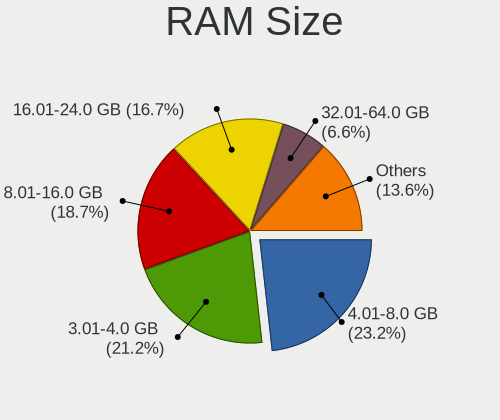

| Size in GB  | Desktops | Percent |
|-------------|----------|---------|
| 3.01-4.0    | 33       | 29.73%  |
| 8.01-16.0   | 21       | 18.92%  |
| 4.01-8.0    | 20       | 18.02%  |
| 16.01-24.0  | 16       | 14.41%  |
| 2.01-3.0    | 6        | 5.41%   |
| 32.01-64.0  | 5        | 4.5%    |
| 1.01-2.0    | 5        | 4.5%    |
| 64.01-256.0 | 2        | 1.8%    |
| 24.01-32.0  | 1        | 0.9%    |
| 0.51-1.0    | 1        | 0.9%    |
| 0.01-0.5    | 1        | 0.9%    |

RAM Used
--------

Used RAM memory

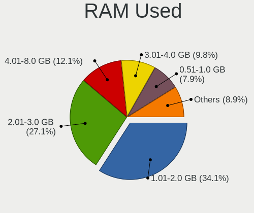

| Used GB     | Desktops | Percent |
|-------------|----------|---------|
| 1.01-2.0    | 43       | 35.54%  |
| 2.01-3.0    | 33       | 27.27%  |
| 3.01-4.0    | 12       | 9.92%   |
| 0.51-1.0    | 11       | 9.09%   |
| 4.01-8.0    | 10       | 8.26%   |
| 0.01-0.5    | 7        | 5.79%   |
| 8.01-16.0   | 4        | 3.31%   |
| 64.01-256.0 | 1        | 0.83%   |

Total Drives
------------

Number of drives on board

| Drives  | Desktops | Percent |
|---------|----------|---------|
| 1       | 56       | 48.28%  |
| 2       | 39       | 33.62%  |
| 3       | 13       | 11.21%  |
| 4       | 4        | 3.45%   |
| 9       | 1        | 0.86%   |
| 5       | 1        | 0.86%   |
| 0       | 1        | 0.86%   |
| Unknown | 1        | 0.86%   |

Has CD-ROM
----------

Has CD-ROM on board

| Presented | Desktops | Percent |
|-----------|----------|---------|
| Yes       | 61       | 54.95%  |
| No        | 50       | 45.05%  |

Has Ethernet
------------

Has Ethernet on board

| Presented | Desktops | Percent |
|-----------|----------|---------|
| Yes       | 109      | 99.09%  |
| No        | 1        | 0.91%   |

Has WiFi
--------

Has WiFi module

| Presented | Desktops | Percent |
|-----------|----------|---------|
| No        | 70       | 62.5%   |
| Yes       | 42       | 37.5%   |

Has Bluetooth
-------------

Has Bluetooth module

| Presented | Desktops | Percent |
|-----------|----------|---------|
| No        | 99       | 89.19%  |
| Yes       | 12       | 10.81%  |

Location
--------

Country
-------

Geographic location (country)

| Country | Desktops | Percent |
|---------|----------|---------|
| Egypt   | 110      | 100%    |

City
----

Geographic location (city)

| City                | Desktops | Percent |
|---------------------|----------|---------|
| Cairo               | 66       | 57.39%  |
| Giza                | 8        | 6.96%   |
| Alexandria          | 8        | 6.96%   |
| Tanta               | 4        | 3.48%   |
| Al Mansurah         | 3        | 2.61%   |
| Suez                | 2        | 1.74%   |
| Mohandessin         | 2        | 1.74%   |
| Minya               | 2        | 1.74%   |
| Aswan               | 2        | 1.74%   |
| Assiut              | 2        | 1.74%   |
| Al Ma`adi           | 2        | 1.74%   |
| Zefta               | 1        | 0.87%   |
| Sharm el Sheikh     | 1        | 0.87%   |
| Port Said           | 1        | 0.87%   |
| New Cairo           | 1        | 0.87%   |
| Mallawi             | 1        | 0.87%   |
| Luxor               | 1        | 0.87%   |
| Ismailia            | 1        | 0.87%   |
| Hurghada            | 1        | 0.87%   |
| Helwan              | 1        | 0.87%   |
| Faiyum              | 1        | 0.87%   |
| Bilbeis             | 1        | 0.87%   |
| Al Qalyubiyah       | 1        | 0.87%   |
| Akhmim              | 1        | 0.87%   |
| 6th of October City | 1        | 0.87%   |

Drives
------

Drive Vendor
------------

Hard drive vendors

| Vendor              | Desktops | Drives | Percent |
|---------------------|----------|--------|---------|
| WDC                 | 67       | 105    | 40.61%  |
| Seagate             | 38       | 51     | 23.03%  |
| Samsung Electronics | 18       | 25     | 10.91%  |
| Kingston            | 11       | 17     | 6.67%   |
| Toshiba             | 7        | 7      | 4.24%   |
| Crucial             | 6        | 7      | 3.64%   |
| Hitachi             | 4        | 4      | 2.42%   |
| KingSpec            | 2        | 2      | 1.21%   |
| Hewlett-Packard     | 2        | 2      | 1.21%   |
| ZOTAC               | 1        | 1      | 0.61%   |
| TwinMOS             | 1        | 1      | 0.61%   |
| Transcend           | 1        | 1      | 0.61%   |
| SanDisk             | 1        | 1      | 0.61%   |
| Maxtor              | 1        | 2      | 0.61%   |
| LITEONIT            | 1        | 1      | 0.61%   |
| JMicron Technology  | 1        | 1      | 0.61%   |
| Intel               | 1        | 1      | 0.61%   |
| HS-SSD-E100         | 1        | 1      | 0.61%   |
| Hikvision           | 1        | 1      | 0.61%   |

Drive Model
-----------

Hard drive models

| Model                            | Desktops | Percent |
|----------------------------------|----------|---------|
| Seagate ST3500414CS 500GB        | 7        | 3.78%   |
| Seagate ST3500312CS 500GB        | 5        | 2.7%    |
| Seagate ST500DM002-1BD142 500GB  | 4        | 2.16%   |
| WDC WD5000AAKX-75U6AA0 500GB     | 3        | 1.62%   |
| WDC WD5000AADS-00S9B0 500GB      | 3        | 1.62%   |
| WDC WD2500AAKX-75U6AA0 250GB     | 3        | 1.62%   |
| WDC WD1600AABS-00PRA0 160GB      | 3        | 1.62%   |
| WDC WD10EZEX-08WN4A0 1TB         | 3        | 1.62%   |
| WDC WD10EZEX-00BN5A0 1TB         | 3        | 1.62%   |
| WDC WD10EARS-00Y5B1 1TB          | 3        | 1.62%   |
| Toshiba DT01ACA050 500GB         | 3        | 1.62%   |
| Seagate ST3500413AS 500GB        | 3        | 1.62%   |
| Kingston SA400S37480G 480GB SSD  | 3        | 1.62%   |
| Kingston SA400S37240G 240GB SSD  | 3        | 1.62%   |
| WDC WD5000AVVS-63H0B1 500GB      | 2        | 1.08%   |
| WDC WD5000AVDS-63U7B1 500GB      | 2        | 1.08%   |
| WDC WD5000AAKX-08U6AA0 500GB     | 2        | 1.08%   |
| WDC WD5000AAKX-00ERMA0 500GB     | 2        | 1.08%   |
| WDC WD5000AAKX-001CA0 500GB      | 2        | 1.08%   |
| WDC WD3200AAJS-00L7A0 320GB      | 2        | 1.08%   |
| WDC WD1600AABS-00H4A0 160GB      | 2        | 1.08%   |
| WDC WD10EZEX-22MFCA0 1TB         | 2        | 1.08%   |
| Toshiba DT01ACA100 1TB           | 2        | 1.08%   |
| Seagate ST380815AS 80GB          | 2        | 1.08%   |
| Seagate ST3320311CS 320GB        | 2        | 1.08%   |
| Seagate ST3250318AS 250GB        | 2        | 1.08%   |
| Samsung SSD 860 EVO 500GB        | 2        | 1.08%   |
| Samsung PM9A1 NVMe 256GB         | 2        | 1.08%   |
| Kingston SUV400S37240G 240GB SSD | 2        | 1.08%   |
| Kingston SA400S37120G 120GB SSD  | 2        | 1.08%   |
| Crucial CT240BX500SSD1 240GB     | 2        | 1.08%   |
| ZOTAC ZTSSD-A4P-120G             | 1        | 0.54%   |
| WDC WDS240G2G0A-00JH30 240GB SSD | 1        | 0.54%   |
| WDC WDS120G2G0A-00JH30 120GB SSD | 1        | 0.54%   |
| WDC WDS100T2B0A-00SM50 1TB SSD   | 1        | 0.54%   |
| WDC WD800JD-60LSA5 80GB          | 1        | 0.54%   |
| WDC WD800BD-22MRA1 80GB          | 1        | 0.54%   |
| WDC WD6400AADS-00M2B0 640GB      | 1        | 0.54%   |
| WDC WD6003FZBX-00K5WB0 6TB       | 1        | 0.54%   |
| WDC WD5000AZLX-00K4KA0 500GB     | 1        | 0.54%   |
| WDC WD5000AZLX-00JKKA0 500GB     | 1        | 0.54%   |
| WDC WD5000AAVS-22G9B1 500GB      | 1        | 0.54%   |
| WDC WD5000AAVS-00ZTB0 500GB      | 1        | 0.54%   |
| WDC WD5000AAKX-221CA1 500GB      | 1        | 0.54%   |
| WDC WD5000AAKX-07U6AA0 500GB     | 1        | 0.54%   |
| WDC WD5000AAKX-009FA0 500GB      | 1        | 0.54%   |
| WDC WD5000AAKS-00V6A0 500GB      | 1        | 0.54%   |
| WDC WD5000AAKS-00UU3A0 500GB     | 1        | 0.54%   |
| WDC WD5000AAKS-00A7B2 500GB      | 1        | 0.54%   |
| WDC WD5000AADS-00M2B0 500GB      | 1        | 0.54%   |
| WDC WD4005FZBX-00K5WB0 4TB       | 1        | 0.54%   |
| WDC WD3200LPVX-75V0TT0 320GB     | 1        | 0.54%   |
| WDC WD3200AVVS-63L2B0 320GB      | 1        | 0.54%   |
| WDC WD3200AAKS-75L9A0 320GB      | 1        | 0.54%   |
| WDC WD3200AAJS-61B4A0 320GB      | 1        | 0.54%   |
| WDC WD3200AAJS-56M0A0 320GB      | 1        | 0.54%   |
| WDC WD3200AAJS-00YZCA0 320GB     | 1        | 0.54%   |
| WDC WD3200AAJS-00B4A0 320GB      | 1        | 0.54%   |
| WDC WD3200A 320GB                | 1        | 0.54%   |
| WDC WD2500YD-01NVB1 256GB        | 1        | 0.54%   |

HDD Vendor
----------

Hard disk drive vendors

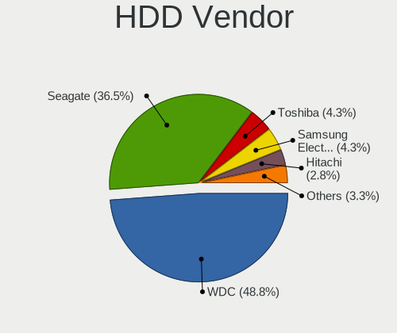

| Vendor              | Desktops | Drives | Percent |
|---------------------|----------|--------|---------|
| WDC                 | 65       | 102    | 53.72%  |
| Seagate             | 38       | 51     | 31.4%   |
| Toshiba             | 6        | 6      | 4.96%   |
| Samsung Electronics | 6        | 9      | 4.96%   |
| Hitachi             | 4        | 4      | 3.31%   |
| Maxtor              | 1        | 2      | 0.83%   |
| Hewlett-Packard     | 1        | 1      | 0.83%   |

SSD Vendor
----------

Solid state drive vendors

| Vendor              | Desktops | Drives | Percent |
|---------------------|----------|--------|---------|
| Kingston            | 11       | 17     | 28.21%  |
| Samsung Electronics | 7        | 7      | 17.95%  |
| Crucial             | 6        | 7      | 15.38%  |
| WDC                 | 3        | 3      | 7.69%   |
| KingSpec            | 2        | 2      | 5.13%   |
| ZOTAC               | 1        | 1      | 2.56%   |
| TwinMOS             | 1        | 1      | 2.56%   |
| Transcend           | 1        | 1      | 2.56%   |
| Toshiba             | 1        | 1      | 2.56%   |
| SanDisk             | 1        | 1      | 2.56%   |
| LITEONIT            | 1        | 1      | 2.56%   |
| JMicron Technology  | 1        | 1      | 2.56%   |
| Intel               | 1        | 1      | 2.56%   |
| Hikvision           | 1        | 1      | 2.56%   |
| Hewlett-Packard     | 1        | 1      | 2.56%   |

Drive Kind
----------

HDD or SSD

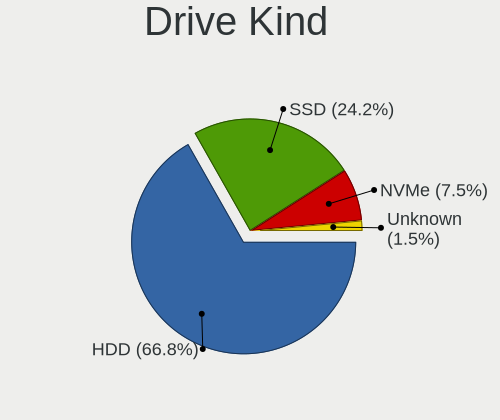

| Kind    | Desktops | Drives | Percent |
|---------|----------|--------|---------|
| HDD     | 104      | 175    | 72.22%  |
| SSD     | 33       | 46     | 22.92%  |
| NVMe    | 6        | 9      | 4.17%   |
| Unknown | 1        | 1      | 0.69%   |

Drive Connector
---------------

SATA, SAS, NVMe, etc.

| Type | Desktops | Drives | Percent |
|------|----------|--------|---------|
| SATA | 108      | 221    | 93.91%  |
| NVMe | 6        | 9      | 5.22%   |
| SAS  | 1        | 1      | 0.87%   |

Drive Size
----------

Size of hard drive

| Size in TB | Desktops | Drives | Percent |
|------------|----------|--------|---------|
| 0.01-0.5   | 94       | 165    | 71.21%  |
| 0.51-1.0   | 28       | 37     | 21.21%  |
| 1.01-2.0   | 7        | 9      | 5.3%    |
| 3.01-4.0   | 2        | 4      | 1.52%   |
| 4.01-10.0  | 1        | 6      | 0.76%   |

Space Total
-----------

Amount of disk space available on the file system

| Size in GB     | Desktops | Percent |
|----------------|----------|---------|
| 251-500        | 26       | 21.85%  |
| 101-250        | 22       | 18.49%  |
| 1-20           | 18       | 15.13%  |
| 501-1000       | 16       | 13.45%  |
| 51-100         | 14       | 11.76%  |
| 21-50          | 8        | 6.72%   |
| 1001-2000      | 6        | 5.04%   |
| Unknown        | 4        | 3.36%   |
| 2001-3000      | 3        | 2.52%   |
| More than 3000 | 2        | 1.68%   |

Space Used
----------

Amount of used disk space

| Used GB        | Desktops | Percent |
|----------------|----------|---------|
| 1-20           | 49       | 40.83%  |
| 101-250        | 22       | 18.33%  |
| 251-500        | 12       | 10%     |
| 21-50          | 12       | 10%     |
| 51-100         | 10       | 8.33%   |
| 501-1000       | 8        | 6.67%   |
| Unknown        | 4        | 3.33%   |
| More than 3000 | 2        | 1.67%   |
| 1001-2000      | 1        | 0.83%   |

Malfunc. Drives
---------------

Drive models with a malfunction

| Model                                 | Desktops | Drives | Percent |
|---------------------------------------|----------|--------|---------|
| WDC WD5000AVVS-63H0B1 500GB           | 2        | 2      | 5.13%   |
| WDC WD5000AVDS-63U7B1 500GB           | 2        | 2      | 5.13%   |
| WDC WD5000AAKX-00ERMA0 500GB          | 2        | 3      | 5.13%   |
| WDC WD1600AABS-00H4A0 160GB           | 2        | 2      | 5.13%   |
| Seagate ST380815AS 80GB               | 2        | 2      | 5.13%   |
| WDC WD800JD-60LSA5 80GB               | 1        | 1      | 2.56%   |
| WDC WD800BD-22MRA1 80GB               | 1        | 1      | 2.56%   |
| WDC WD5000AAVS-22G9B1 500GB           | 1        | 1      | 2.56%   |
| WDC WD5000AAKX-75U6AA0 500GB          | 1        | 1      | 2.56%   |
| WDC WD5000AAKX-08U6AA0 500GB          | 1        | 1      | 2.56%   |
| WDC WD5000AAKX-009FA0 500GB           | 1        | 1      | 2.56%   |
| WDC WD5000AAKS-00V6A0 500GB           | 1        | 1      | 2.56%   |
| WDC WD5000AADS-00S9B0 500GB           | 1        | 1      | 2.56%   |
| WDC WD5000AADS-00M2B0 500GB           | 1        | 1      | 2.56%   |
| WDC WD3200AAJS-56M0A0 320GB           | 1        | 1      | 2.56%   |
| WDC WD3200AAJS-00L7A0 320GB           | 1        | 1      | 2.56%   |
| WDC WD3200AAJS-00B4A0 320GB           | 1        | 1      | 2.56%   |
| WDC WD3200A 320GB                     | 1        | 1      | 2.56%   |
| WDC WD2500AAJS-00VTA0 250GB           | 1        | 1      | 2.56%   |
| WDC WD1600AVVS-63L2B0 160GB           | 1        | 1      | 2.56%   |
| WDC WD10EZEX-08M2NA0 1TB              | 1        | 1      | 2.56%   |
| WDC WD10EZEX-00BN5A0 1TB              | 1        | 1      | 2.56%   |
| WDC WD10EARS-00Y5B1 1TB               | 1        | 1      | 2.56%   |
| Toshiba MQ01ABF050 500GB              | 1        | 1      | 2.56%   |
| Seagate ST500DM002-1BD142 500GB       | 1        | 3      | 2.56%   |
| Seagate ST3500413AS 500GB             | 1        | 1      | 2.56%   |
| Seagate ST3500312CS 500GB             | 1        | 1      | 2.56%   |
| Seagate ST3320613AS 320GB             | 1        | 1      | 2.56%   |
| Seagate ST3160211AS 160GB             | 1        | 2      | 2.56%   |
| Samsung Electronics SSD 870 EVO 500GB | 1        | 1      | 2.56%   |
| Samsung Electronics HD256GJ 250GB     | 1        | 1      | 2.56%   |
| Kingston SUV400S37240G 240GB SSD      | 1        | 2      | 2.56%   |
| Intel SSDSC2BW120H6 120GB             | 1        | 1      | 2.56%   |
| Hewlett-Packard VB0250EAVER 250GB     | 1        | 1      | 2.56%   |

Malfunc. Drive Vendor
---------------------

Vendors of faulty drives

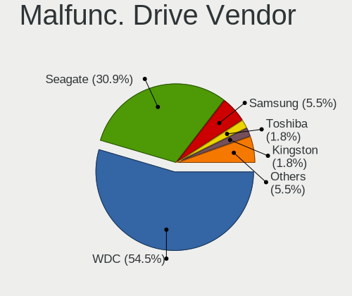

| Vendor              | Desktops | Drives | Percent |
|---------------------|----------|--------|---------|
| WDC                 | 22       | 27     | 62.86%  |
| Seagate             | 7        | 10     | 20%     |
| Samsung Electronics | 2        | 2      | 5.71%   |
| Toshiba             | 1        | 1      | 2.86%   |
| Kingston            | 1        | 2      | 2.86%   |
| Intel               | 1        | 1      | 2.86%   |
| Hewlett-Packard     | 1        | 1      | 2.86%   |

Malfunc. HDD Vendor
-------------------

Vendors of faulty HDD drives

| Vendor              | Desktops | Drives | Percent |
|---------------------|----------|--------|---------|
| WDC                 | 22       | 27     | 68.75%  |
| Seagate             | 7        | 10     | 21.88%  |
| Toshiba             | 1        | 1      | 3.13%   |
| Samsung Electronics | 1        | 1      | 3.13%   |
| Hewlett-Packard     | 1        | 1      | 3.13%   |

Malfunc. Drive Kind
-------------------

Kinds of faulty drives

| Kind | Desktops | Drives | Percent |
|------|----------|--------|---------|
| HDD  | 30       | 40     | 90.91%  |
| SSD  | 3        | 4      | 9.09%   |

Failed Drives
-------------

Failed drive models

| Model                                            | Desktops | Drives | Percent |
|--------------------------------------------------|----------|--------|---------|
| WDC WD3200AAJS-00L7A0 320GB                      | 1        | 2      | 50%     |
| Samsung Electronics MZ7TY128HDHP-000L1 128GB SSD | 1        | 1      | 50%     |

Failed Drive Vendor
-------------------

Failed drive vendors

| Vendor              | Desktops | Drives | Percent |
|---------------------|----------|--------|---------|
| WDC                 | 1        | 2      | 50%     |
| Samsung Electronics | 1        | 1      | 50%     |

Drive Status
------------

Number of failed and malfunc. drives

| Status   | Desktops | Drives | Percent |
|----------|----------|--------|---------|
| Detected | 57       | 107    | 43.85%  |
| Works    | 38       | 77     | 29.23%  |
| Malfunc  | 33       | 44     | 25.38%  |
| Failed   | 2        | 3      | 1.54%   |

Storage controller
------------------

Storage Vendor
--------------

Storage controller vendors

| Vendor                    | Desktops | Percent |
|---------------------------|----------|---------|
| Intel                     | 89       | 73.55%  |
| AMD                       | 19       | 15.7%   |
| Samsung Electronics       | 6        | 4.96%   |
| Marvell Technology Group  | 2        | 1.65%   |
| Broadcom / LSI            | 2        | 1.65%   |
| Nvidia                    | 1        | 0.83%   |
| LSI Logic / Symbios Logic | 1        | 0.83%   |
| JMicron Technology        | 1        | 0.83%   |

Storage Model
-------------

Storage controller models

| Model                                                                                   | Desktops | Percent |
|-----------------------------------------------------------------------------------------|----------|---------|
| Intel NM10/ICH7 Family SATA Controller [IDE mode]                                       | 16       | 9.2%    |
| AMD FCH SATA Controller [AHCI mode]                                                     | 9        | 5.17%   |
| Intel 8 Series/C220 Series Chipset Family 6-port SATA Controller 1 [AHCI mode]          | 8        | 4.6%    |
| Intel 4 Series Chipset PT IDER Controller                                               | 7        | 4.02%   |
| Intel SATA Controller [RAID mode]                                                       | 6        | 3.45%   |
| Intel 6 Series/C200 Series Chipset Family Desktop SATA Controller (IDE mode, ports 4-5) | 6        | 3.45%   |
| Intel 6 Series/C200 Series Chipset Family Desktop SATA Controller (IDE mode, ports 0-3) | 6        | 3.45%   |
| Intel 82801G (ICH7 Family) IDE Controller                                               | 5        | 2.87%   |
| Intel 200 Series PCH SATA controller [AHCI mode]                                        | 5        | 2.87%   |
| Intel 82801JD/DO (ICH10 Family) SATA AHCI Controller                                    | 4        | 2.3%    |
| Intel 82801JD/DO (ICH10 Family) 4-port SATA IDE Controller                              | 4        | 2.3%    |
| Intel 82801JD/DO (ICH10 Family) 2-port SATA IDE Controller                              | 4        | 2.3%    |
| Intel 82801I (ICH9 Family) 2 port SATA Controller [IDE mode]                            | 4        | 2.3%    |
| Intel 82801H (ICH8 Family) 4 port SATA Controller [IDE mode]                            | 4        | 2.3%    |
| Intel 7 Series/C210 Series Chipset Family 6-port SATA Controller [AHCI mode]            | 4        | 2.3%    |
| AMD SB7x0/SB8x0/SB9x0 SATA Controller [IDE mode]                                        | 4        | 2.3%    |
| AMD 400 Series Chipset SATA Controller                                                  | 4        | 2.3%    |
| Samsung NVMe SSD Controller SM981/PM981/PM983                                           | 3        | 1.72%   |
| Samsung NVMe SSD Controller PM9A1/PM9A3/980PRO                                          | 3        | 1.72%   |
| Intel C602 chipset 4-Port SATA Storage Control Unit                                     | 3        | 1.72%   |
| Intel 82Q35 Express PT IDER Controller                                                  | 3        | 1.72%   |
| Intel 82801IR/IO/IH (ICH9R/DO/DH) 4 port SATA Controller [IDE mode]                     | 3        | 1.72%   |
| Intel 82801HR/HO/HH (ICH8R/DO/DH) 2 port SATA Controller [IDE mode]                     | 3        | 1.72%   |
| Intel 6 Series/C200 Series Chipset Family 6 port Desktop SATA AHCI Controller           | 3        | 1.72%   |
| Intel Q170/Q150/B150/H170/H110/Z170/CM236 Chipset SATA Controller [AHCI Mode]           | 2        | 1.15%   |
| Intel Comet Lake SATA AHCI Controller                                                   | 2        | 1.15%   |
| Intel Cannon Lake PCH SATA AHCI Controller                                              | 2        | 1.15%   |
| Intel C600/X79 series chipset SATA RAID Controller                                      | 2        | 1.15%   |
| Intel 9 Series Chipset Family SATA Controller [AHCI Mode]                               | 2        | 1.15%   |
| Intel 7 Series/C210 Series Chipset Family 4-port SATA Controller [IDE mode]             | 2        | 1.15%   |
| Intel 7 Series/C210 Series Chipset Family 2-port SATA Controller [IDE mode]             | 2        | 1.15%   |
| Intel 631xESB/632xESB SATA AHCI Controller                                              | 2        | 1.15%   |
| Intel 631xESB/632xESB IDE Controller                                                    | 2        | 1.15%   |
| Broadcom / LSI SAS2308 PCI-Express Fusion-MPT SAS-2                                     | 2        | 1.15%   |
| AMD SB7x0/SB8x0/SB9x0 IDE Controller                                                    | 2        | 1.15%   |
| AMD FCH SATA Controller [IDE mode]                                                      | 2        | 1.15%   |
| Nvidia MCP61 SATA Controller                                                            | 1        | 0.57%   |
| Nvidia MCP61 IDE                                                                        | 1        | 0.57%   |
| Marvell Group 88SE9172 SATA 6Gb/s Controller                                            | 1        | 0.57%   |
| Marvell Group 88SE6101/6102 single-port PATA133 interface                               | 1        | 0.57%   |
| LSI Logic / Symbios Logic SAS1068E PCI-Express Fusion-MPT SAS                           | 1        | 0.57%   |
| JMicron JMB363 SATA/IDE Controller                                                      | 1        | 0.57%   |
| Intel C610/X99 series chipset sSATA Controller [AHCI mode]                              | 1        | 0.57%   |
| Intel C610/X99 series chipset 6-Port SATA Controller [AHCI mode]                        | 1        | 0.57%   |
| Intel C600/X79 series chipset IDE-r Controller                                          | 1        | 0.57%   |
| Intel C600/X79 series chipset 6-Port SATA AHCI Controller                               | 1        | 0.57%   |
| Intel Atom/Celeron/Pentium Processor x5-E8000/J3xxx/N3xxx Series SATA Controller        | 1        | 0.57%   |
| Intel 82Q963/Q965 PT IDER Controller                                                    | 1        | 0.57%   |
| Intel 82801JI (ICH10 Family) SATA AHCI Controller                                       | 1        | 0.57%   |
| Intel 82801JI (ICH10 Family) 4 port SATA IDE Controller #1                              | 1        | 0.57%   |
| Intel 82801JI (ICH10 Family) 2 port SATA IDE Controller #2                              | 1        | 0.57%   |
| Intel 82801IB (ICH9) 2 port SATA Controller [IDE mode]                                  | 1        | 0.57%   |
| Intel 82801FB/FW (ICH6/ICH6W) SATA Controller                                           | 1        | 0.57%   |
| Intel 82801EB/ER (ICH5/ICH5R) IDE Controller                                            | 1        | 0.57%   |
| Intel 82801EB (ICH5) SATA Controller                                                    | 1        | 0.57%   |
| Intel 8 Series/C220 Series Chipset Family 4-port SATA Controller 1 [IDE mode]           | 1        | 0.57%   |
| Intel 500 Series Chipset Family SATA AHCI Controller                                    | 1        | 0.57%   |
| Intel 5 Series/3400 Series Chipset 6 port SATA AHCI Controller                          | 1        | 0.57%   |
| Intel 5 Series/3400 Series Chipset 4 port SATA IDE Controller                           | 1        | 0.57%   |
| Intel 5 Series/3400 Series Chipset 2 port SATA IDE Controller                           | 1        | 0.57%   |

Storage Kind
------------

Kind of storage controller (IDE, SATA, NVMe, SAS, ...)

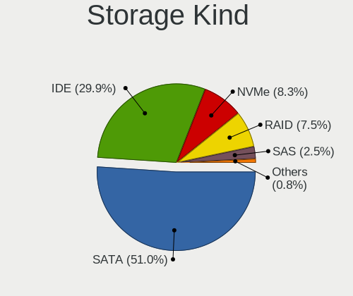

| Kind | Desktops | Percent |
|------|----------|---------|
| SATA | 58       | 44.27%  |
| IDE  | 53       | 40.46%  |
| RAID | 9        | 6.87%   |
| NVMe | 6        | 4.58%   |
| SAS  | 4        | 3.05%   |
| SCSI | 1        | 0.76%   |

Processor
---------

CPU Vendor
----------

Processor vendors

| Vendor | Desktops | Percent |
|--------|----------|---------|
| Intel  | 90       | 81.82%  |
| AMD    | 20       | 18.18%  |

CPU Model
---------

Processor models

| Model                                       | Desktops | Percent |
|---------------------------------------------|----------|---------|
| Intel Core i5-4590 CPU @ 3.30GHz            | 5        | 4.5%    |
| Intel Core 2 Duo CPU E8400 @ 3.00GHz        | 5        | 4.5%    |
| Intel Pentium D CPU 3.00GHz                 | 3        | 2.7%    |
| Intel Core i7-4790 CPU @ 3.60GHz            | 3        | 2.7%    |
| Intel Core i5-2400 CPU @ 3.10GHz            | 3        | 2.7%    |
| Intel Core 2 Duo CPU E8500 @ 3.16GHz        | 3        | 2.7%    |
| Intel Core 2 Duo CPU E7500 @ 2.93GHz        | 3        | 2.7%    |
| Intel Core 2 Duo CPU E6550 @ 2.33GHz        | 3        | 2.7%    |
| Intel Pentium 4 CPU 3.20GHz                 | 2        | 1.8%    |
| Intel Core i5-3470 CPU @ 3.20GHz            | 2        | 1.8%    |
| Intel Core i3-3220 CPU @ 3.30GHz            | 2        | 1.8%    |
| Intel Core i3-2120 CPU @ 3.30GHz            | 2        | 1.8%    |
| Intel Core i3-2100 CPU @ 3.10GHz            | 2        | 1.8%    |
| Intel Core 2 Duo CPU E6750 @ 2.66GHz        | 2        | 1.8%    |
| Intel Core 2 Duo CPU E4400 @ 2.00GHz        | 2        | 1.8%    |
| Intel Core 2 CPU 6600 @ 2.40GHz             | 2        | 1.8%    |
| Intel 11th Gen Core i7-11700F @ 2.50GHz     | 2        | 1.8%    |
| AMD Ryzen 5 2600 Six-Core Processor         | 2        | 1.8%    |
| AMD A4-5300B APU with Radeon HD Graphics    | 2        | 1.8%    |
| Intel Xeon CPU X5650 @ 2.67GHz              | 1        | 0.9%    |
| Intel Xeon CPU W3550 @ 3.07GHz              | 1        | 0.9%    |
| Intel Xeon CPU E5640 @ 2.67GHz              | 1        | 0.9%    |
| Intel Xeon CPU E5620 @ 2.40GHz              | 1        | 0.9%    |
| Intel Xeon CPU E5450 @ 3.00GHz              | 1        | 0.9%    |
| Intel Xeon CPU E5-2690 v2 @ 3.00GHz         | 1        | 0.9%    |
| Intel Xeon CPU E5-2680 v3 @ 2.50GHz         | 1        | 0.9%    |
| Intel Xeon CPU E5-2680 0 @ 2.70GHz          | 1        | 0.9%    |
| Intel Xeon CPU E5-1620 v2 @ 3.70GHz         | 1        | 0.9%    |
| Intel Xeon CPU E3-1240 v3 @ 3.40GHz         | 1        | 0.9%    |
| Intel Xeon CPU 3.20GHz                      | 1        | 0.9%    |
| Intel Pentium Dual-Core CPU E5700 @ 3.00GHz | 1        | 0.9%    |
| Intel Pentium Dual-Core CPU E5200 @ 2.50GHz | 1        | 0.9%    |
| Intel Pentium CPU G620 @ 2.60GHz            | 1        | 0.9%    |
| Intel Pentium CPU G2030 @ 3.00GHz           | 1        | 0.9%    |
| Intel Pentium 4 CPU 3.00GHz                 | 1        | 0.9%    |
| Intel Core i7-9700 CPU @ 3.00GHz            | 1        | 0.9%    |
| Intel Core i7-7700 CPU @ 3.60GHz            | 1        | 0.9%    |
| Intel Core i7-6700 CPU @ 3.40GHz            | 1        | 0.9%    |
| Intel Core i7-4790K CPU @ 4.00GHz           | 1        | 0.9%    |
| Intel Core i7-3770 CPU @ 3.40GHz            | 1        | 0.9%    |
| Intel Core i7-2600 CPU @ 3.40GHz            | 1        | 0.9%    |
| Intel Core i7 CPU 950 @ 3.07GHz             | 1        | 0.9%    |
| Intel Core i5-8600 CPU @ 3.10GHz            | 1        | 0.9%    |
| Intel Core i5-7500 CPU @ 3.40GHz            | 1        | 0.9%    |
| Intel Core i5-7400 CPU @ 3.00GHz            | 1        | 0.9%    |
| Intel Core i5-6500 CPU @ 3.20GHz            | 1        | 0.9%    |
| Intel Core i5-4570 CPU @ 3.20GHz            | 1        | 0.9%    |
| Intel Core i5-3570 CPU @ 3.40GHz            | 1        | 0.9%    |
| Intel Core i5 CPU 650 @ 3.20GHz             | 1        | 0.9%    |
| Intel Core i3-9100F CPU @ 3.60GHz           | 1        | 0.9%    |
| Intel Core i3-7100 CPU @ 3.90GHz            | 1        | 0.9%    |
| Intel Core i3-4160 CPU @ 3.60GHz            | 1        | 0.9%    |
| Intel Core i3 CPU 540 @ 3.07GHz             | 1        | 0.9%    |
| Intel Core 2 Quad CPU Q9650 @ 3.00GHz       | 1        | 0.9%    |
| Intel Core 2 Quad CPU Q9550 @ 2.83GHz       | 1        | 0.9%    |
| Intel Core 2 Quad CPU Q8400 @ 2.66GHz       | 1        | 0.9%    |
| Intel Core 2 Duo CPU E7400 @ 2.80GHz        | 1        | 0.9%    |
| Intel Core 2 Duo CPU E4500 @ 2.20GHz        | 1        | 0.9%    |
| Intel Core 2 CPU 6400 @ 2.13GHz             | 1        | 0.9%    |
| Intel Core 2 CPU 6300 @ 1.86GHz             | 1        | 0.9%    |

CPU Model Family
----------------

Processor model prefix

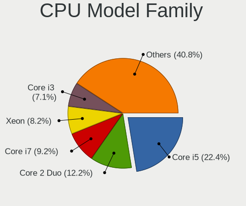

| Model                   | Desktops | Percent |
|-------------------------|----------|---------|
| Intel Core 2 Duo        | 20       | 18.02%  |
| Intel Core i5           | 17       | 15.32%  |
| Intel Xeon              | 11       | 9.91%   |
| Intel Core i7           | 10       | 9.01%   |
| Intel Core i3           | 10       | 9.01%   |
| Intel Core 2            | 4        | 3.6%    |
| AMD Ryzen 5             | 4        | 3.6%    |
| Other                   | 3        | 2.7%    |
| Intel Pentium D         | 3        | 2.7%    |
| Intel Pentium 4         | 3        | 2.7%    |
| Intel Core 2 Quad       | 3        | 2.7%    |
| Intel Pentium Dual-Core | 2        | 1.8%    |
| Intel Pentium           | 2        | 1.8%    |
| Intel Celeron           | 2        | 1.8%    |
| AMD Phenom              | 2        | 1.8%    |
| AMD A4                  | 2        | 1.8%    |
| Intel Celeron D         | 1        | 0.9%    |
| AMD Sempron             | 1        | 0.9%    |
| AMD Ryzen 9             | 1        | 0.9%    |
| AMD Ryzen 7             | 1        | 0.9%    |
| AMD PRO A10             | 1        | 0.9%    |
| AMD Phenom II X4        | 1        | 0.9%    |
| AMD Athlon II X3        | 1        | 0.9%    |
| AMD Athlon II X2        | 1        | 0.9%    |
| AMD Athlon 64 X2        | 1        | 0.9%    |
| AMD Athlon 64           | 1        | 0.9%    |
| AMD A8                  | 1        | 0.9%    |
| AMD A6                  | 1        | 0.9%    |
| AMD A10                 | 1        | 0.9%    |

CPU Cores
---------

Number of processor cores

| Number | Desktops | Percent |
|--------|----------|---------|
| 2      | 47       | 42.34%  |
| 4      | 33       | 29.73%  |
| 1      | 10       | 9.01%   |
| 8      | 7        | 6.31%   |
| 6      | 6        | 5.41%   |
| 3      | 3        | 2.7%    |
| 16     | 2        | 1.8%    |
| 24     | 1        | 0.9%    |
| 12     | 1        | 0.9%    |
| 10     | 1        | 0.9%    |

CPU Sockets
-----------

Number of sockets

| Number | Desktops | Percent |
|--------|----------|---------|
| 1      | 103      | 93.64%  |
| 2      | 7        | 6.36%   |

CPU Threads
-----------

Threads per core (Hyper-Threading)

| Number | Desktops | Percent |
|--------|----------|---------|
| 1      | 67       | 59.82%  |
| 2      | 45       | 40.18%  |

CPU Op-Modes
------------

CPU Operation Modes (32-bit, 64-bit)

| Op mode        | Desktops | Percent |
|----------------|----------|---------|
| 32-bit, 64-bit | 108      | 97.3%   |
| 32-bit         | 2        | 1.8%    |
| Unknown        | 1        | 0.9%    |

CPU Microcode
-------------

Microcode number

| Number     | Desktops | Percent |
|------------|----------|---------|
| Unknown    | 24       | 21.05%  |
| 0x1067a    | 14       | 12.28%  |
| 0x306c3    | 10       | 8.77%   |
| 0x206a7    | 7        | 6.14%   |
| 0x306a9    | 6        | 5.26%   |
| 0x6fb      | 4        | 3.51%   |
| 0xf65      | 3        | 2.63%   |
| 0x6fd      | 3        | 2.63%   |
| 0x206c2    | 3        | 2.63%   |
| 0x0800820d | 3        | 2.63%   |
| 0x06001119 | 3        | 2.63%   |
| 0xf41      | 2        | 1.75%   |
| 0xa0671    | 2        | 1.75%   |
| 0x906ea    | 2        | 1.75%   |
| 0x906e9    | 2        | 1.75%   |
| 0x6f6      | 2        | 1.75%   |
| 0x506e3    | 2        | 1.75%   |
| 0x306e4    | 2        | 1.75%   |
| 0x106a5    | 2        | 1.75%   |
| 0x10676    | 2        | 1.75%   |
| 0x010000c8 | 2        | 1.75%   |
| 0x01000095 | 2        | 1.75%   |
| 0xf64      | 1        | 0.88%   |
| 0xf43      | 1        | 0.88%   |
| 0x906ed    | 1        | 0.88%   |
| 0x6f2      | 1        | 0.88%   |
| 0x406c4    | 1        | 0.88%   |
| 0x306f2    | 1        | 0.88%   |
| 0x206d7    | 1        | 0.88%   |
| 0x20655    | 1        | 0.88%   |
| 0x20652    | 1        | 0.88%   |
| 0x0a201009 | 1        | 0.88%   |
| 0x08701013 | 1        | 0.88%   |
| 0x010000db | 1        | 0.88%   |

CPU Microarch
-------------

Microarchitecture

| Name        | Desktops | Percent |
|-------------|----------|---------|
| Penryn      | 18       | 16.22%  |
| Haswell     | 13       | 11.71%  |
| Core        | 12       | 10.81%  |
| SandyBridge | 10       | 9.01%   |
| NetBurst    | 9        | 8.11%   |
| IvyBridge   | 9        | 8.11%   |
| KabyLake    | 7        | 6.31%   |
| K10         | 6        | 5.41%   |
| Westmere    | 5        | 4.5%    |
| Zen+        | 3        | 2.7%    |
| Piledriver  | 3        | 2.7%    |
| Zen 2       | 2        | 1.8%    |
| Steamroller | 2        | 1.8%    |
| Skylake     | 2        | 1.8%    |
| Nehalem     | 2        | 1.8%    |
| K8 Hammer   | 2        | 1.8%    |
| Icelake     | 2        | 1.8%    |
| Zen 3       | 1        | 0.9%    |
| Silvermont  | 1        | 0.9%    |
| Excavator   | 1        | 0.9%    |
| Unknown     | 1        | 0.9%    |

Graphics
--------

GPU Vendor
----------

Vendors of graphics cards

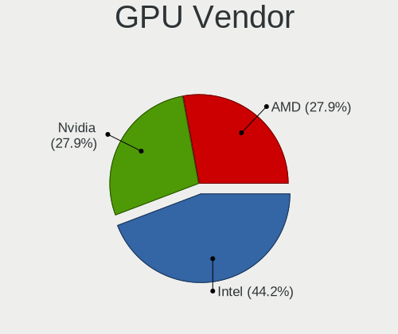

| Vendor | Desktops | Percent |
|--------|----------|---------|
| Intel  | 57       | 47.9%   |
| Nvidia | 34       | 28.57%  |
| AMD    | 28       | 23.53%  |

GPU Model
---------

Graphics card models

| Model                                                                                    | Desktops | Percent |
|------------------------------------------------------------------------------------------|----------|---------|
| Intel 4 Series Chipset Integrated Graphics Controller                                    | 13       | 10.83%  |
| Intel Xeon E3-1200 v3/4th Gen Core Processor Integrated Graphics Controller              | 10       | 8.33%   |
| Nvidia GT218 [GeForce 210]                                                               | 8        | 6.67%   |
| AMD Ellesmere [Radeon RX 470/480/570/570X/580/580X/590]                                  | 7        | 5.83%   |
| Intel Xeon E3-1200 v2/3rd Gen Core processor Graphics Controller                         | 5        | 4.17%   |
| Intel 82Q963/Q965 Integrated Graphics Controller                                         | 5        | 4.17%   |
| Nvidia GF108GL [Quadro 600]                                                              | 3        | 2.5%    |
| Nvidia GA104 [GeForce RTX 3070]                                                          | 3        | 2.5%    |
| Intel HD Graphics 630                                                                    | 3        | 2.5%    |
| Intel 82Q35 Express Integrated Graphics Controller                                       | 3        | 2.5%    |
| Intel 82945G/GZ Integrated Graphics Controller                                           | 3        | 2.5%    |
| Intel 2nd Generation Core Processor Family Integrated Graphics Controller                | 3        | 2.5%    |
| AMD Cedar [Radeon HD 5000/6000/7350/8350 Series]                                         | 3        | 2.5%    |
| Nvidia GP102 [GeForce GTX 1080 Ti]                                                       | 2        | 1.67%   |
| Nvidia GF119 [NVS 315]                                                                   | 2        | 1.67%   |
| Nvidia G86 [GeForce 8400 GS]                                                             | 2        | 1.67%   |
| Intel Core Processor Integrated Graphics Controller                                      | 2        | 1.67%   |
| Intel CoffeeLake-S GT2 [UHD Graphics 630]                                                | 2        | 1.67%   |
| Intel 82G33/G31 Express Integrated Graphics Controller                                   | 2        | 1.67%   |
| AMD Trinity 2 [Radeon HD 7480D]                                                          | 2        | 1.67%   |
| AMD RS880 [Radeon HD 4200]                                                               | 2        | 1.67%   |
| AMD Kaveri [Radeon R7 Graphics]                                                          | 2        | 1.67%   |
| Nvidia TU106 [GeForce RTX 2060 SUPER]                                                    | 1        | 0.83%   |
| Nvidia NV18 [GeForce4 MX 4000]                                                           | 1        | 0.83%   |
| Nvidia GP107 [GeForce GTX 1050 Ti]                                                       | 1        | 0.83%   |
| Nvidia GM204 [GeForce GTX 970]                                                           | 1        | 0.83%   |
| Nvidia GM107GL [Quadro K620]                                                             | 1        | 0.83%   |
| Nvidia GM107 [GeForce GTX 750 Ti]                                                        | 1        | 0.83%   |
| Nvidia GK208B [GeForce GT 710]                                                           | 1        | 0.83%   |
| Nvidia GK104 [GeForce GTX 760]                                                           | 1        | 0.83%   |
| Nvidia GF119 [GeForce GT 610]                                                            | 1        | 0.83%   |
| Nvidia G94 [GeForce 9600 GT]                                                             | 1        | 0.83%   |
| Nvidia G92 [GeForce 9800 GTX / 9800 GTX+]                                                | 1        | 0.83%   |
| Nvidia G86 [Quadro NVS 290]                                                              | 1        | 0.83%   |
| Nvidia G84GL [Quadro FX 1700]                                                            | 1        | 0.83%   |
| Nvidia G84 [GeForce 8600 GT]                                                             | 1        | 0.83%   |
| Intel RocketLake-S GT1 [UHD Graphics 730]                                                | 1        | 0.83%   |
| Intel IvyBridge GT2 [HD Graphics 4000]                                                   | 1        | 0.83%   |
| Intel HD Graphics 530                                                                    | 1        | 0.83%   |
| Intel Atom/Celeron/Pentium Processor x5-E8000/J3xxx/N3xxx Integrated Graphics Controller | 1        | 0.83%   |
| Intel 82915G/GV/910GL Integrated Graphics Controller                                     | 1        | 0.83%   |
| Intel 4th Generation Core Processor Family Integrated Graphics Controller                | 1        | 0.83%   |
| AMD Wani [Radeon R5/R6/R7 Graphics]                                                      | 1        | 0.83%   |
| AMD Turks XT [Radeon HD 6670/7670]                                                       | 1        | 0.83%   |
| AMD Trinity 2 [Radeon HD 7540D]                                                          | 1        | 0.83%   |
| AMD Tonga PRO [Radeon R9 285/380]                                                        | 1        | 0.83%   |
| AMD RS780C [Radeon 3100]                                                                 | 1        | 0.83%   |
| AMD RS780 [Radeon HD 3200]                                                               | 1        | 0.83%   |
| AMD RS482/RS485 [Radeon Xpress 1100/1150]                                                | 1        | 0.83%   |
| AMD RS480 [Radeon Xpress 1150] (Secondary)                                               | 1        | 0.83%   |
| AMD Redwood XT [Radeon HD 5670/5690/5730]                                                | 1        | 0.83%   |
| AMD Radeon R7 240                                                                        | 1        | 0.83%   |
| AMD Navi 14 [Radeon RX 5500/5500M / Pro 5500M]                                           | 1        | 0.83%   |
| AMD Navi 10 [Radeon RX 5600 OEM/5600 XT / 5700/5700 XT]                                  | 1        | 0.83%   |
| AMD Cedar [Radeon HD 7350/8350 / R5 220]                                                 | 1        | 0.83%   |

GPU Combo
---------

Combinations of graphics cards

| Name           | Desktops | Percent |
|----------------|----------|---------|
| 1 x Intel      | 48       | 43.64%  |
| 1 x Nvidia     | 31       | 28.18%  |
| 1 x AMD        | 21       | 19.09%  |
| Intel + AMD    | 4        | 3.64%   |
| Intel + Nvidia | 2        | 1.82%   |
| 3 x AMD        | 1        | 0.91%   |
| 2 x Intel      | 1        | 0.91%   |
| 2 x AMD        | 1        | 0.91%   |
| AMD + Nvidia   | 1        | 0.91%   |

GPU Driver
----------

Free vs proprietary

| Driver      | Desktops | Percent |
|-------------|----------|---------|
| Free        | 86       | 76.11%  |
| Proprietary | 17       | 15.04%  |
| Unknown     | 10       | 8.85%   |

GPU Memory
----------

Total video memory

| Size in GB | Desktops | Percent |
|------------|----------|---------|
| Unknown    | 58       | 51.33%  |
| 0.01-0.5   | 18       | 15.93%  |
| 0.51-1.0   | 12       | 10.62%  |
| 1.01-2.0   | 10       | 8.85%   |
| 7.01-8.0   | 7        | 6.19%   |
| 3.01-4.0   | 6        | 5.31%   |
| 8.01-16.0  | 2        | 1.77%   |

Monitor
-------

Monitor Vendor
--------------

Monitor vendors

| Vendor                  | Desktops | Percent |
|-------------------------|----------|---------|
| Samsung Electronics     | 27       | 29.67%  |
| Hewlett-Packard         | 18       | 19.78%  |
| Dell                    | 15       | 16.48%  |
| Lenovo                  | 6        | 6.59%   |
| Goldstar                | 4        | 4.4%    |
| Philips                 | 2        | 2.2%    |
| Eizo                    | 2        | 2.2%    |
| BenQ                    | 2        | 2.2%    |
| ASUSTek Computer        | 2        | 2.2%    |
| Sun                     | 1        | 1.1%    |
| Sony                    | 1        | 1.1%    |
| Planar                  | 1        | 1.1%    |
| NEC Computers           | 1        | 1.1%    |
| MStar                   | 1        | 1.1%    |
| JWY                     | 1        | 1.1%    |
| Gigabyte Technology     | 1        | 1.1%    |
| Fujitsu Siemens         | 1        | 1.1%    |
| eMachines               | 1        | 1.1%    |
| Chi Mei Optoelectronics | 1        | 1.1%    |
| AUS                     | 1        | 1.1%    |
| AOC                     | 1        | 1.1%    |
| Ancor Communications    | 1        | 1.1%    |

Monitor Model
-------------

Monitor models

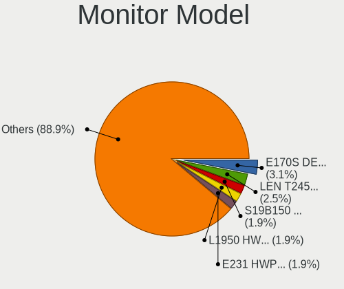

| Model                                                                | Desktops | Percent |
|----------------------------------------------------------------------|----------|---------|
| Samsung Electronics S19B150 SAM08A2 1366x768 410x230mm 18.5-inch     | 3        | 3.13%   |
| Lenovo LEN T2454pA LEN60C9 1920x1200 518x324mm 24.1-inch             | 3        | 3.13%   |
| Hewlett-Packard L1950 HWP26E7 1280x1024 380x300mm 19.1-inch          | 3        | 3.13%   |
| Dell E170S DELA04A 1280x1024 338x270mm 17.0-inch                     | 3        | 3.13%   |
| Samsung Electronics U28E590 SAM0C4D 3840x2160 607x345mm 27.5-inch    | 2        | 2.08%   |
| Samsung Electronics SyncMaster SAM0350 1440x900 428x255mm 19.6-inch  | 2        | 2.08%   |
| Samsung Electronics SMB1930N SAM0632 1360x768 410x230mm 18.5-inch    | 2        | 2.08%   |
| Hewlett-Packard LA2206 HWP2948 1920x1080 476x268mm 21.5-inch         | 2        | 2.08%   |
| Sun PN17JO SUN0589 1280x1024 295x236mm 14.9-inch                     | 1        | 1.04%   |
| Sony KDL-23S2000 SNY9900 1360x768                                    | 1        | 1.04%   |
| Samsung Electronics U28E590 SAM0C4E 3840x2160 610x350mm 27.7-inch    | 1        | 1.04%   |
| Samsung Electronics SyncMaster SAM0590 1600x900 443x249mm 20.0-inch  | 1        | 1.04%   |
| Samsung Electronics SyncMaster SAM0472 1440x900 367x229mm 17.0-inch  | 1        | 1.04%   |
| Samsung Electronics SyncMaster SAM0286 1280x720 372x209mm 16.8-inch  | 1        | 1.04%   |
| Samsung Electronics SyncMaster SAM0022 1280x1024 312x234mm 15.4-inch | 1        | 1.04%   |
| Samsung Electronics SMBX2031 SAM076A 1600x900 443x249mm 20.0-inch    | 1        | 1.04%   |
| Samsung Electronics SM2333T SAM0736 1920x1080 477x268mm 21.5-inch    | 1        | 1.04%   |
| Samsung Electronics S24D300 SAM0B43 1920x1080 531x299mm 24.0-inch    | 1        | 1.04%   |
| Samsung Electronics S23B300 SAM08AE 1920x1080 510x287mm 23.0-inch    | 1        | 1.04%   |
| Samsung Electronics S22E200 SAM0C6D 1920x1080 477x268mm 21.5-inch    | 1        | 1.04%   |
| Samsung Electronics S22D300 SAM0B3F 1920x1080 477x268mm 21.5-inch    | 1        | 1.04%   |
| Samsung Electronics S19D300 SAM0B34 1366x768 410x230mm 18.5-inch     | 1        | 1.04%   |
| Samsung Electronics S19B300 SAM08A4 1366x768 410x230mm 18.5-inch     | 1        | 1.04%   |
| Samsung Electronics LCD Monitor SMBX2350 1920x1080                   | 1        | 1.04%   |
| Samsung Electronics LCD Monitor SMBX2331 1920x1080                   | 1        | 1.04%   |
| Samsung Electronics LCD Monitor SA300/SA350 1366x768                 | 1        | 1.04%   |
| Samsung Electronics LCD Monitor S24D330 1920x1080                    | 1        | 1.04%   |
| Samsung Electronics LCD Monitor S22D300 1920x1080                    | 1        | 1.04%   |
| Samsung Electronics LC27G5xT SAM707A 2560x1440 698x393mm 31.5-inch   | 1        | 1.04%   |
| Samsung Electronics C24FG7x SAM0E43 1920x1080 532x304mm 24.1-inch    | 1        | 1.04%   |
| Planar PE2010 PLN2010 1400x1050 400x300mm 19.7-inch                  | 1        | 1.04%   |
| Philips LCD Monitor PHLC01D 1440x900 370x230mm 17.2-inch             | 1        | 1.04%   |
| Philips 190CW PHLC023 1440x900 408x255mm 18.9-inch                   | 1        | 1.04%   |
| NEC Computers EA223WM NEC688F 1680x1050 470x300mm 22.0-inch          | 1        | 1.04%   |
| MStar PROJECTORS MST0B01 1920x540 708x398mm 32.0-inch                | 1        | 1.04%   |
| Lenovo LT2252p Wide LEN0A0C 1680x1050 474x296mm 22.0-inch            | 1        | 1.04%   |
| Lenovo LEN T2424pA LEN60C8 1920x1080 527x296mm 23.8-inch             | 1        | 1.04%   |
| Lenovo LEN L171 LEN24C9 1280x1024 337x270mm 17.0-inch                | 1        | 1.04%   |
| JWY LCD Monitor JWY1733 1280x1024 338x270mm 17.0-inch                | 1        | 1.04%   |
| Hewlett-Packard ZR2440w HWP2956 1920x1200 518x324mm 24.1-inch        | 1        | 1.04%   |
| Hewlett-Packard vx74 HWP2629 1280x1024 312x234mm 15.4-inch           | 1        | 1.04%   |
| Hewlett-Packard LP3065 HWP2690 2560x1600 640x400mm 29.7-inch         | 1        | 1.04%   |
| Hewlett-Packard LP2475w HWP26F7 1920x1200 540x350mm 25.3-inch        | 1        | 1.04%   |
| Hewlett-Packard LCD Monitor ZR2240w 1920x1080                        | 1        | 1.04%   |
| Hewlett-Packard LA2306 HWP294A 1920x1080 510x287mm 23.0-inch         | 1        | 1.04%   |
| Hewlett-Packard LA2205 HWP2847 1680x1050 470x300mm 22.0-inch         | 1        | 1.04%   |
| Hewlett-Packard LA2006 HWP2943 1600x900 443x249mm 20.0-inch          | 1        | 1.04%   |
| Hewlett-Packard LA1951 HWP285A 1280x1024 380x300mm 19.1-inch         | 1        | 1.04%   |
| Hewlett-Packard E273 HPN3471 1920x1080 598x336mm 27.0-inch           | 1        | 1.04%   |
| Hewlett-Packard E231 HWP3064 1920x1080 509x286mm 23.0-inch           | 1        | 1.04%   |
| Hewlett-Packard E231 HWP3063 1920x1080 509x286mm 23.0-inch           | 1        | 1.04%   |
| Hewlett-Packard 27fw HPN3608 1920x1080 598x336mm 27.0-inch           | 1        | 1.04%   |
| Hewlett-Packard 27fw HPN3607 1920x1080 598x336mm 27.0-inch           | 1        | 1.04%   |
| Hewlett-Packard 2009 HWP2828 1600x900 443x250mm 20.0-inch            | 1        | 1.04%   |
| Goldstar W1942 GSM4B6F 1440x900 408x255mm 18.9-inch                  | 1        | 1.04%   |
| Goldstar W1934 GSM4B7A 1440x900 410x256mm 19.0-inch                  | 1        | 1.04%   |
| Goldstar L192WS GSM4B32 1440x900 410x256mm 19.0-inch                 | 1        | 1.04%   |
| Goldstar IPS FULLHD GSM5AB6 1920x1080 480x270mm 21.7-inch            | 1        | 1.04%   |
| Gigabyte Technology G34WQC GBT3400 3440x1440 800x330mm 34.1-inch     | 1        | 1.04%   |
| Fujitsu Siemens P17-2 FUS0550 1280x1024 338x270mm 17.0-inch          | 1        | 1.04%   |

Monitor Resolution
------------------

Monitor screen resolution

| Resolution         | Desktops | Percent |
|--------------------|----------|---------|
| 1920x1080 (FHD)    | 28       | 31.46%  |
| 1280x1024 (SXGA)   | 18       | 20.22%  |
| 1366x768 (WXGA)    | 10       | 11.24%  |
| 1440x900 (WXGA+)   | 8        | 8.99%   |
| 1600x900 (HD+)     | 6        | 6.74%   |
| 1680x1050 (WSXGA+) | 5        | 5.62%   |
| 3840x2160 (4K)     | 3        | 3.37%   |
| 2560x1440 (QHD)    | 2        | 2.25%   |
| 3440x1440          | 1        | 1.12%   |
| 2560x1600          | 1        | 1.12%   |
| 1920x540           | 1        | 1.12%   |
| 1920x1200 (WUXGA)  | 1        | 1.12%   |
| 1600x1200          | 1        | 1.12%   |
| 1400x1050          | 1        | 1.12%   |
| 1360x768           | 1        | 1.12%   |
| 1280x720 (HD)      | 1        | 1.12%   |
| 1024x768 (XGA)     | 1        | 1.12%   |

Monitor Diagonal
----------------

Diagonal size in inches

| Inches  | Desktops | Percent |
|---------|----------|---------|
| 19      | 13       | 14.29%  |
| 17      | 12       | 13.19%  |
| 24      | 9        | 9.89%   |
| 18      | 9        | 9.89%   |
| Unknown | 9        | 9.89%   |
| 21      | 6        | 6.59%   |
| 20      | 6        | 6.59%   |
| 27      | 5        | 5.49%   |
| 23      | 5        | 5.49%   |
| 22      | 5        | 5.49%   |
| 15      | 4        | 4.4%    |
| 32      | 2        | 2.2%    |
| 34      | 1        | 1.1%    |
| 31      | 1        | 1.1%    |
| 29      | 1        | 1.1%    |
| 25      | 1        | 1.1%    |
| 16      | 1        | 1.1%    |
| 14      | 1        | 1.1%    |

Monitor Width
-------------

Physical width

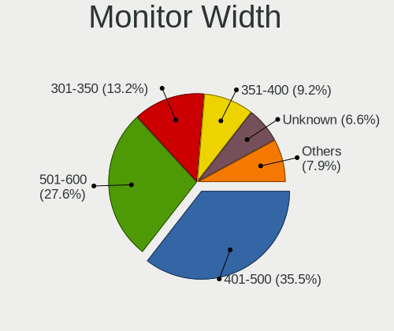

| Width in mm | Desktops | Percent |
|-------------|----------|---------|
| 401-500     | 32       | 35.56%  |
| 501-600     | 17       | 18.89%  |
| 351-400     | 12       | 13.33%  |
| 301-350     | 12       | 13.33%  |
| Unknown     | 9        | 10%     |
| 601-700     | 4        | 4.44%   |
| 701-800     | 3        | 3.33%   |
| 201-300     | 1        | 1.11%   |

Aspect Ratio
------------

Proportional relationship between the width and the height

| Ratio   | Desktops | Percent |
|---------|----------|---------|
| 16/9    | 41       | 46.59%  |
| 16/10   | 17       | 19.32%  |
| 5/4     | 15       | 17.05%  |
| Unknown | 8        | 9.09%   |
| 4/3     | 6        | 6.82%   |
| 21/9    | 1        | 1.14%   |

Monitor Area
------------

Area in inch

| Area in inch | Desktops | Percent |
|----------------|----------|---------|
| 151-200        | 24       | 26.67%  |
| 141-150        | 17       | 18.89%  |
| 201-250        | 15       | 16.67%  |
| Unknown        | 9        | 10%     |
| 251-300        | 6        | 6.67%   |
| 351-500        | 5        | 5.56%   |
| 301-350        | 5        | 5.56%   |
| 131-140        | 3        | 3.33%   |
| 101-110        | 3        | 3.33%   |
| 111-120        | 2        | 2.22%   |
| 121-130        | 1        | 1.11%   |

Pixel Density
-------------

Pixels per inch

| Density | Desktops | Percent |
|---------|----------|---------|
| 51-100  | 63       | 72.41%  |
| 101-120 | 12       | 13.79%  |
| Unknown | 9        | 10.34%  |
| 121-160 | 3        | 3.45%   |

Multiple Monitors
-----------------

Total monitors connected

| Total | Desktops | Percent |
|-------|----------|---------|
| 1     | 92       | 79.31%  |
| 0     | 13       | 11.21%  |
| 2     | 11       | 9.48%   |

Network
-------

Net Controller Vendor
---------------------

Controller vendors

| Vendor                            | Desktops | Percent |
|-----------------------------------|----------|---------|
| Intel                             | 48       | 30.77%  |
| Realtek Semiconductor             | 44       | 28.21%  |
| Qualcomm Atheros                  | 16       | 10.26%  |
| Broadcom                          | 14       | 8.97%   |
| Ralink Technology                 | 11       | 7.05%   |
| Qualcomm Atheros Communications   | 4        | 2.56%   |
| Broadcom Limited                  | 4        | 2.56%   |
| TP-Link                           | 2        | 1.28%   |
| Samsung Electronics               | 2        | 1.28%   |
| Ralink                            | 2        | 1.28%   |
| Edimax Technology                 | 2        | 1.28%   |
| Sundance Technology Inc / IC Plus | 1        | 0.64%   |
| Qualcomm                          | 1        | 0.64%   |
| Nvidia                            | 1        | 0.64%   |
| Motorola                          | 1        | 0.64%   |
| Lenovo                            | 1        | 0.64%   |
| D-Link                            | 1        | 0.64%   |
| 3Com                              | 1        | 0.64%   |

Net Controller Model
--------------------

Controller models

| Model                                                                         | Desktops | Percent |
|-------------------------------------------------------------------------------|----------|---------|
| Realtek RTL8111/8168/8411 PCI Express Gigabit Ethernet Controller             | 28       | 17.07%  |
| Intel 82579LM Gigabit Network Connection (Lewisville)                         | 10       | 6.1%    |
| Intel 82567LM-3 Gigabit Network Connection                                    | 9        | 5.49%   |
| Ralink RT5370 Wireless Adapter                                                | 8        | 4.88%   |
| Qualcomm Atheros AR8151 v2.0 Gigabit Ethernet                                 | 8        | 4.88%   |
| Intel Ethernet Connection I217-LM                                             | 8        | 4.88%   |
| Realtek RTL8188FTV 802.11b/g/n 1T1R 2.4G WLAN Adapter                         | 6        | 3.66%   |
| Realtek RTL8188EUS 802.11n Wireless Network Adapter                           | 5        | 3.05%   |
| Ralink MT7601U Wireless Adapter                                               | 4        | 2.44%   |
| Intel 82566DM-2 Gigabit Network Connection                                    | 4        | 2.44%   |
| Broadcom NetXtreme BCM5761 Gigabit Ethernet PCIe                              | 4        | 2.44%   |
| Qualcomm Atheros TP-Link TL-WN322G v3 / TL-WN422G v2 802.11g [Atheros AR9271] | 3        | 1.83%   |
| Qualcomm Atheros AR2413/AR2414 Wireless Network Adapter [AR5005G(S) 802.11bg] | 3        | 1.83%   |
| Intel 82566DM Gigabit Network Connection                                      | 3        | 1.83%   |
| Broadcom NetXtreme BCM5762 Gigabit Ethernet PCIe                              | 3        | 1.83%   |
| Broadcom Limited NetXtreme BCM5761 Gigabit Ethernet PCIe                      | 3        | 1.83%   |
| Realtek RTL8188CUS 802.11n WLAN Adapter                                       | 2        | 1.22%   |
| Realtek Killer E3000 2.5GbE Controller                                        | 2        | 1.22%   |
| Ralink RT3062 Wireless 802.11n 2T/2R                                          | 2        | 1.22%   |
| Qualcomm Atheros AR8151 v1.0 Gigabit Ethernet                                 | 2        | 1.22%   |
| Intel I211 Gigabit Network Connection                                         | 2        | 1.22%   |
| Intel Ethernet Connection (2) I219-V                                          | 2        | 1.22%   |
| Intel Comet Lake PCH CNVi WiFi                                                | 2        | 1.22%   |
| Intel 82574L Gigabit Network Connection                                       | 2        | 1.22%   |
| Edimax EW-7811Un 802.11n Wireless Adapter [Realtek RTL8188CUS]                | 2        | 1.22%   |
| Broadcom NetXtreme BCM5764M Gigabit Ethernet PCIe                             | 2        | 1.22%   |
| Broadcom NetXtreme BCM5754 Gigabit Ethernet PCI Express                       | 2        | 1.22%   |
| TP-Link TL-WN823N v2/v3 [Realtek RTL8192EU]                                   | 1        | 0.61%   |
| TP-Link TL-WN722N v2                                                          | 1        | 0.61%   |
| Sundance Inc / IC Plus IC Plus IP100A Integrated 10/100 Ethernet MAC + PHY    | 1        | 0.61%   |
| Samsung GT-I9070 (network tethering, USB debugging enabled)                   | 1        | 0.61%   |
| Samsung Galaxy series, misc. (tethering mode)                                 | 1        | 0.61%   |
| Realtek RTL8125 2.5GbE Controller                                             | 1        | 0.61%   |
| Realtek RTL810xE PCI Express Fast Ethernet controller                         | 1        | 0.61%   |
| Realtek RTL-8100/8101L/8139 PCI Fast Ethernet Adapter                         | 1        | 0.61%   |
| Qualcomm Nokia X100                                                           | 1        | 0.61%   |
| Qualcomm Atheros Killer E220x Gigabit Ethernet Controller                     | 1        | 0.61%   |
| Qualcomm Atheros AR9271 802.11n                                               | 1        | 0.61%   |
| Qualcomm Atheros Attansic L2 Fast Ethernet                                    | 1        | 0.61%   |
| Qualcomm Atheros AR8132 Fast Ethernet                                         | 1        | 0.61%   |
| Qualcomm Atheros AR2417 Wireless Network Adapter [AR5007G 802.11bg]           | 1        | 0.61%   |
| Nvidia MCP61 Ethernet                                                         | 1        | 0.61%   |
| Motorola SM56 Data Fax Modem                                                  | 1        | 0.61%   |
| Lenovo Lenovo                                                                 | 1        | 0.61%   |
| Intel Wi-Fi 6 AX200                                                           | 1        | 0.61%   |
| Intel I210 Gigabit Network Connection                                         | 1        | 0.61%   |
| Intel Ethernet Connection I217-V                                              | 1        | 0.61%   |
| Intel Ethernet Connection (7) I219-V                                          | 1        | 0.61%   |
| Intel Ethernet Connection (7) I219-LM                                         | 1        | 0.61%   |
| Intel Ethernet Connection (5) I219-V                                          | 1        | 0.61%   |
| Intel Ethernet Connection (2) I219-LM                                         | 1        | 0.61%   |
| Intel Ethernet Connection (2) I218-LM                                         | 1        | 0.61%   |
| Intel Cannon Lake PCH CNVi WiFi                                               | 1        | 0.61%   |
| Intel 82578DM Gigabit Network Connection                                      | 1        | 0.61%   |
| D-Link DWA-171 AC600 DB Wireless Adapter(rev.A1) [Realtek RTL8811AU]          | 1        | 0.61%   |
| Broadcom NetXtreme BCM5755 Gigabit Ethernet PCI Express                       | 1        | 0.61%   |
| Broadcom NetXtreme BCM5751 Gigabit Ethernet PCI Express                       | 1        | 0.61%   |
| Broadcom NetXtreme BCM5705_2 Gigabit Ethernet                                 | 1        | 0.61%   |
| Broadcom Limited NetXtreme BCM5754 Gigabit Ethernet PCI Express               | 1        | 0.61%   |
| 3Com 3c905C-TX/TX-M [Tornado]                                                 | 1        | 0.61%   |

Wireless Vendor
---------------

Wireless vendors

| Vendor                          | Desktops | Percent |
|---------------------------------|----------|---------|
| Realtek Semiconductor           | 13       | 30.23%  |
| Ralink Technology               | 11       | 25.58%  |
| Qualcomm Atheros Communications | 4        | 9.3%    |
| Qualcomm Atheros                | 4        | 9.3%    |
| Intel                           | 4        | 9.3%    |
| TP-Link                         | 2        | 4.65%   |
| Ralink                          | 2        | 4.65%   |
| Edimax Technology               | 2        | 4.65%   |
| D-Link                          | 1        | 2.33%   |

Wireless Model
--------------

Wireless models

| Model                                                                         | Desktops | Percent |
|-------------------------------------------------------------------------------|----------|---------|
| Ralink RT5370 Wireless Adapter                                                | 8        | 18.18%  |
| Realtek RTL8188FTV 802.11b/g/n 1T1R 2.4G WLAN Adapter                         | 6        | 13.64%  |
| Realtek RTL8188EUS 802.11n Wireless Network Adapter                           | 5        | 11.36%  |
| Ralink MT7601U Wireless Adapter                                               | 4        | 9.09%   |
| Qualcomm Atheros TP-Link TL-WN322G v3 / TL-WN422G v2 802.11g [Atheros AR9271] | 3        | 6.82%   |
| Qualcomm Atheros AR2413/AR2414 Wireless Network Adapter [AR5005G(S) 802.11bg] | 3        | 6.82%   |
| Realtek RTL8188CUS 802.11n WLAN Adapter                                       | 2        | 4.55%   |
| Ralink RT3062 Wireless 802.11n 2T/2R                                          | 2        | 4.55%   |
| Intel Comet Lake PCH CNVi WiFi                                                | 2        | 4.55%   |
| Edimax EW-7811Un 802.11n Wireless Adapter [Realtek RTL8188CUS]                | 2        | 4.55%   |
| TP-Link TL-WN823N v2/v3 [Realtek RTL8192EU]                                   | 1        | 2.27%   |
| TP-Link TL-WN722N v2                                                          | 1        | 2.27%   |
| Qualcomm Atheros AR9271 802.11n                                               | 1        | 2.27%   |
| Qualcomm Atheros AR2417 Wireless Network Adapter [AR5007G 802.11bg]           | 1        | 2.27%   |
| Intel Wi-Fi 6 AX200                                                           | 1        | 2.27%   |
| Intel Cannon Lake PCH CNVi WiFi                                               | 1        | 2.27%   |
| D-Link DWA-171 AC600 DB Wireless Adapter(rev.A1) [Realtek RTL8811AU]          | 1        | 2.27%   |

Ethernet Vendor
---------------

Ethernet vendors

| Vendor                            | Desktops | Percent |
|-----------------------------------|----------|---------|
| Intel                             | 45       | 38.79%  |
| Realtek Semiconductor             | 33       | 28.45%  |
| Broadcom                          | 14       | 12.07%  |
| Qualcomm Atheros                  | 13       | 11.21%  |
| Broadcom Limited                  | 4        | 3.45%   |
| Samsung Electronics               | 2        | 1.72%   |
| Sundance Technology Inc / IC Plus | 1        | 0.86%   |
| Qualcomm                          | 1        | 0.86%   |
| Nvidia                            | 1        | 0.86%   |
| Lenovo                            | 1        | 0.86%   |
| 3Com                              | 1        | 0.86%   |

Ethernet Model
--------------

Ethernet models

| Model                                                                      | Desktops | Percent |
|----------------------------------------------------------------------------|----------|---------|
| Realtek RTL8111/8168/8411 PCI Express Gigabit Ethernet Controller          | 28       | 23.53%  |
| Intel 82579LM Gigabit Network Connection (Lewisville)                      | 10       | 8.4%    |
| Intel 82567LM-3 Gigabit Network Connection                                 | 9        | 7.56%   |
| Qualcomm Atheros AR8151 v2.0 Gigabit Ethernet                              | 8        | 6.72%   |
| Intel Ethernet Connection I217-LM                                          | 8        | 6.72%   |
| Intel 82566DM-2 Gigabit Network Connection                                 | 4        | 3.36%   |
| Broadcom NetXtreme BCM5761 Gigabit Ethernet PCIe                           | 4        | 3.36%   |
| Intel 82566DM Gigabit Network Connection                                   | 3        | 2.52%   |
| Broadcom NetXtreme BCM5762 Gigabit Ethernet PCIe                           | 3        | 2.52%   |
| Broadcom Limited NetXtreme BCM5761 Gigabit Ethernet PCIe                   | 3        | 2.52%   |
| Realtek Killer E3000 2.5GbE Controller                                     | 2        | 1.68%   |
| Qualcomm Atheros AR8151 v1.0 Gigabit Ethernet                              | 2        | 1.68%   |
| Intel I211 Gigabit Network Connection                                      | 2        | 1.68%   |
| Intel Ethernet Connection (2) I219-V                                       | 2        | 1.68%   |
| Intel 82574L Gigabit Network Connection                                    | 2        | 1.68%   |
| Broadcom NetXtreme BCM5764M Gigabit Ethernet PCIe                          | 2        | 1.68%   |
| Broadcom NetXtreme BCM5754 Gigabit Ethernet PCI Express                    | 2        | 1.68%   |
| Sundance Inc / IC Plus IC Plus IP100A Integrated 10/100 Ethernet MAC + PHY | 1        | 0.84%   |
| Samsung GT-I9070 (network tethering, USB debugging enabled)                | 1        | 0.84%   |
| Samsung Galaxy series, misc. (tethering mode)                              | 1        | 0.84%   |
| Realtek RTL8125 2.5GbE Controller                                          | 1        | 0.84%   |
| Realtek RTL810xE PCI Express Fast Ethernet controller                      | 1        | 0.84%   |
| Realtek RTL-8100/8101L/8139 PCI Fast Ethernet Adapter                      | 1        | 0.84%   |
| Qualcomm Nokia X100                                                        | 1        | 0.84%   |
| Qualcomm Atheros Killer E220x Gigabit Ethernet Controller                  | 1        | 0.84%   |
| Qualcomm Atheros Attansic L2 Fast Ethernet                                 | 1        | 0.84%   |
| Qualcomm Atheros AR8132 Fast Ethernet                                      | 1        | 0.84%   |
| Nvidia MCP61 Ethernet                                                      | 1        | 0.84%   |
| Lenovo Lenovo                                                              | 1        | 0.84%   |
| Intel I210 Gigabit Network Connection                                      | 1        | 0.84%   |
| Intel Ethernet Connection I217-V                                           | 1        | 0.84%   |
| Intel Ethernet Connection (7) I219-V                                       | 1        | 0.84%   |
| Intel Ethernet Connection (7) I219-LM                                      | 1        | 0.84%   |
| Intel Ethernet Connection (5) I219-V                                       | 1        | 0.84%   |
| Intel Ethernet Connection (2) I219-LM                                      | 1        | 0.84%   |
| Intel Ethernet Connection (2) I218-LM                                      | 1        | 0.84%   |
| Intel 82578DM Gigabit Network Connection                                   | 1        | 0.84%   |
| Broadcom NetXtreme BCM5755 Gigabit Ethernet PCI Express                    | 1        | 0.84%   |
| Broadcom NetXtreme BCM5751 Gigabit Ethernet PCI Express                    | 1        | 0.84%   |
| Broadcom NetXtreme BCM5705_2 Gigabit Ethernet                              | 1        | 0.84%   |
| Broadcom Limited NetXtreme BCM5754 Gigabit Ethernet PCI Express            | 1        | 0.84%   |
| 3Com 3c905C-TX/TX-M [Tornado]                                              | 1        | 0.84%   |

Net Controller Kind
-------------------

Ethernet, WiFi or modem

| Kind     | Desktops | Percent |
|----------|----------|---------|
| Ethernet | 109      | 72.19%  |
| WiFi     | 41       | 27.15%  |
| Modem    | 1        | 0.66%   |

Used Controller
---------------

Currently used network controller

| Kind     | Desktops | Percent |
|----------|----------|---------|
| Ethernet | 89       | 80.18%  |
| WiFi     | 22       | 19.82%  |

NICs
----

Total network controllers on board

| Total | Desktops | Percent |
|-------|----------|---------|
| 1     | 92       | 83.64%  |
| 2     | 16       | 14.55%  |
| 0     | 2        | 1.82%   |

IPv6
----

IPv6 vs IPv4

| Used | Desktops | Percent |
|------|----------|---------|
| No   | 110      | 100%    |

Bluetooth
---------

Bluetooth Vendor
----------------

Controller vendors

| Vendor                  | Desktops | Percent |
|-------------------------|----------|---------|
| Cambridge Silicon Radio | 7        | 58.33%  |
| Intel                   | 4        | 33.33%  |
| Realtek Semiconductor   | 1        | 8.33%   |

Bluetooth Model
---------------

Controller models

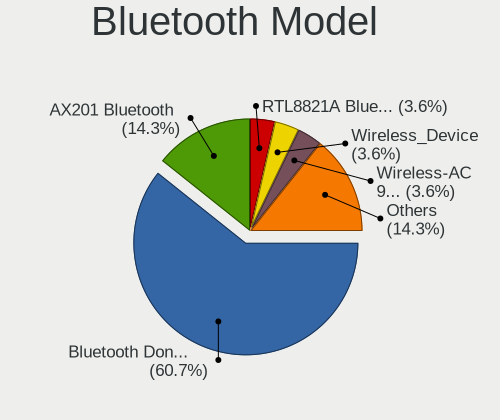

| Model                                               | Desktops | Percent |
|-----------------------------------------------------|----------|---------|
| Cambridge Silicon Radio Bluetooth Dongle (HCI mode) | 7        | 58.33%  |
| Intel AX201 Bluetooth                               | 2        | 16.67%  |
| Realtek RTL8821A Bluetooth                          | 1        | 8.33%   |
| Intel Bluetooth 9460/9560 Jefferson Peak (JfP)      | 1        | 8.33%   |
| Intel AX200 Bluetooth                               | 1        | 8.33%   |

Sound
-----

Sound Vendor
------------

Sound card vendors

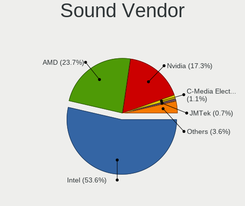

| Vendor              | Desktops | Percent |
|---------------------|----------|---------|
| Intel               | 89       | 57.79%  |
| AMD                 | 32       | 20.78%  |
| Nvidia              | 27       | 17.53%  |
| JMTek               | 2        | 1.3%    |
| Thermaltake         | 1        | 0.65%   |
| Tenx Technology     | 1        | 0.65%   |
| Logitech            | 1        | 0.65%   |
| C-Media Electronics | 1        | 0.65%   |

Sound Model
-----------

Sound card models

| Model                                                                                             | Desktops | Percent |
|---------------------------------------------------------------------------------------------------|----------|---------|
| Intel NM10/ICH7 Family High Definition Audio Controller                                           | 14       | 8%      |
| Intel Xeon E3-1200 v3/4th Gen Core Processor HD Audio Controller                                  | 11       | 6.29%   |
| Intel 8 Series/C220 Series Chipset High Definition Audio Controller                               | 10       | 5.71%   |
| Intel 6 Series/C200 Series Chipset Family High Definition Audio Controller                        | 10       | 5.71%   |
| Intel 82801JD/DO (ICH10 Family) HD Audio Controller                                               | 9        | 5.14%   |
| Nvidia High Definition Audio Controller                                                           | 8        | 4.57%   |
| AMD SBx00 Azalia (Intel HDA)                                                                      | 7        | 4%      |
| AMD Ellesmere HDMI Audio [Radeon RX 470/480 / 570/580/590]                                        | 7        | 4%      |
| Intel 7 Series/C216 Chipset Family High Definition Audio Controller                               | 6        | 3.43%   |
| Intel 82801JI (ICH10 Family) HD Audio Controller                                                  | 5        | 2.86%   |
| Intel 82801H (ICH8 Family) HD Audio Controller                                                    | 5        | 2.86%   |
| Intel 200 Series PCH HD Audio                                                                     | 5        | 2.86%   |
| AMD FCH Azalia Controller                                                                         | 5        | 2.86%   |
| Intel 82801I (ICH9 Family) HD Audio Controller                                                    | 4        | 2.29%   |
| Nvidia GF119 HDMI Audio Controller                                                                | 3        | 1.71%   |
| Nvidia GF108 High Definition Audio Controller                                                     | 3        | 1.71%   |
| Nvidia GA104 High Definition Audio Controller                                                     | 3        | 1.71%   |
| Intel C600/X79 series chipset High Definition Audio Controller                                    | 3        | 1.71%   |
| AMD Trinity HDMI Audio Controller                                                                 | 3        | 1.71%   |
| AMD Starship/Matisse HD Audio Controller                                                          | 3        | 1.71%   |
| AMD Family 17h (Models 00h-0fh) HD Audio Controller                                               | 3        | 1.71%   |
| AMD Cedar HDMI Audio [Radeon HD 5400/6300/7300 Series]                                            | 3        | 1.71%   |
| Nvidia GP102 HDMI Audio Controller                                                                | 2        | 1.14%   |
| Nvidia GM107 High Definition Audio Controller [GeForce 940MX]                                     | 2        | 1.14%   |
| JMTek USB PnP Audio Device                                                                        | 2        | 1.14%   |
| Intel Cannon Lake PCH cAVS                                                                        | 2        | 1.14%   |
| Intel Audio device                                                                                | 2        | 1.14%   |
| Intel 9 Series Chipset Family HD Audio Controller                                                 | 2        | 1.14%   |
| Intel 631xESB/632xESB High Definition Audio Controller                                            | 2        | 1.14%   |
| Intel 5 Series/3400 Series Chipset High Definition Audio                                          | 2        | 1.14%   |
| Intel 100 Series/C230 Series Chipset Family HD Audio Controller                                   | 2        | 1.14%   |
| AMD Navi 10 HDMI Audio                                                                            | 2        | 1.14%   |
| AMD Kaveri HDMI/DP Audio Controller                                                               | 2        | 1.14%   |
| Thermaltake Tt eSPORTS SHOCK PRO RGB 7.1                                                          | 1        | 0.57%   |
| Tenx Technology USB AUDIO                                                                         | 1        | 0.57%   |
| Nvidia TU106 High Definition Audio Controller                                                     | 1        | 0.57%   |
| Nvidia MCP61 High Definition Audio                                                                | 1        | 0.57%   |
| Nvidia GP107GL High Definition Audio Controller                                                   | 1        | 0.57%   |
| Nvidia GM204 High Definition Audio Controller                                                     | 1        | 0.57%   |
| Nvidia GK208 HDMI/DP Audio Controller                                                             | 1        | 0.57%   |
| Nvidia GK104 HDMI Audio Controller                                                                | 1        | 0.57%   |
| Logitech G733 Gaming Headset                                                                      | 1        | 0.57%   |
| Intel Tiger Lake-H HD Audio Controller                                                            | 1        | 0.57%   |
| Intel C610/X99 series chipset HD Audio Controller                                                 | 1        | 0.57%   |
| Intel Atom/Celeron/Pentium Processor x5-E8000/J3xxx/N3xxx Series High Definition Audio Controller | 1        | 0.57%   |
| Intel 82801G (ICH7 Family) AC'97 Audio Controller                                                 | 1        | 0.57%   |
| Intel 82801FB/FBM/FR/FW/FRW (ICH6 Family) AC'97 Audio Controller                                  | 1        | 0.57%   |
| Intel 82801EB/ER (ICH5/ICH5R) AC'97 Audio Controller                                              | 1        | 0.57%   |
| C-Media Electronics CM108 Audio Controller                                                        | 1        | 0.57%   |
| AMD Turks HDMI Audio [Radeon HD 6500/6600 / 6700M Series]                                         | 1        | 0.57%   |
| AMD Tonga HDMI Audio [Radeon R9 285/380]                                                          | 1        | 0.57%   |
| AMD RS780 HDMI Audio [Radeon 3000/3100 / HD 3200/3300]                                            | 1        | 0.57%   |
| AMD Redwood HDMI Audio [Radeon HD 5000 Series]                                                    | 1        | 0.57%   |
| AMD Oland/Hainan/Cape Verde/Pitcairn HDMI Audio [Radeon HD 7000 Series]                           | 1        | 0.57%   |
| AMD Kabini HDMI/DP Audio                                                                          | 1        | 0.57%   |
| AMD Family 15h (Models 60h-6fh) Audio Controller                                                  | 1        | 0.57%   |

Memory
------

Memory Vendor
-------------

Memory module vendors

| Vendor                       | Desktops | Percent |
|------------------------------|----------|---------|
| Unknown                      | 22       | 22.68%  |
| Samsung Electronics          | 17       | 17.53%  |
| Kingston                     | 14       | 14.43%  |
| SK hynix                     | 13       | 13.4%   |
| Micron Technology            | 8        | 8.25%   |
| Crucial                      | 5        | 5.15%   |
| Nanya Technology             | 3        | 3.09%   |
| M                            | 3        | 3.09%   |
| Corsair                      | 3        | 3.09%   |
| Ramaxel Technology           | 2        | 2.06%   |
| MINPO                        | 2        | 2.06%   |
| Unknown (E)                  | 1        | 1.03%   |
| Unknown (0x7F7FB5FFFFFFFFFF) | 1        | 1.03%   |
| S                            | 1        | 1.03%   |
| Kingmax                      | 1        | 1.03%   |
| Elpida                       | 1        | 1.03%   |

Memory Model
------------

Memory module models

| Model                                                           | Desktops | Percent |
|-----------------------------------------------------------------|----------|---------|
| Micron RAM 8JTF51264AZ-1G6E1 4096MB DIMM DDR3 1600MT/s          | 4        | 3.74%   |
| Samsung RAM M378B5173DB0-CK0 4GB DIMM DDR3 1600MT/s             | 3        | 2.8%    |
| Corsair RAM CMK8GX4M1D3000C16 8GB DIMM DDR4 3200MT/s            | 3        | 2.8%    |
| Unknown RAM Module 4GB DIMM 400MT/s                             | 2        | 1.87%   |
| Unknown RAM Module 4096MB DIMM 400MT/s                          | 2        | 1.87%   |
| Unknown RAM Module 2GB DIMM 800MT/s                             | 2        | 1.87%   |
| Unknown RAM Module 2048MB DIMM 800MT/s                          | 2        | 1.87%   |
| Unknown RAM Module 2048MB DIMM 400MT/s                          | 2        | 1.87%   |
| SK hynix RAM HYMP512U64CP8-Y5 1GB DIMM DDR 667MT/s              | 2        | 1.87%   |
| Samsung RAM M378B5773DH0-CK0 2GB DIMM DDR3 1600MT/s             | 2        | 1.87%   |
| Samsung RAM M378B5273CH0-CH9 4GB DIMM DDR3 1867MT/s             | 2        | 1.87%   |
| Samsung RAM M378B5173QH0-CK0 4GB DIMM DDR3 1866MT/s             | 2        | 1.87%   |
| M RAM Module 2048MB DIMM DDR3 667MT/s                           | 2        | 1.87%   |
| Kingston RAM XK2M26-MIE 16384MB DIMM DDR4 3467MT/s              | 2        | 1.87%   |
| Unknown RAM Module 8192MB DIMM 1066MT/s                         | 1        | 0.93%   |
| Unknown RAM Module 512MB DIMM DDR 667MT/s                       | 1        | 0.93%   |
| Unknown RAM Module 4096MB DIMM DDR3 667MT/s                     | 1        | 0.93%   |
| Unknown RAM Module 4096MB DIMM DDR2                             | 1        | 0.93%   |
| Unknown RAM Module 4096MB DIMM 1066MT/s                         | 1        | 0.93%   |
| Unknown RAM Module 2GB DIMM SDRAM                               | 1        | 0.93%   |
| Unknown RAM Module 2GB DIMM DDR 667MT/s                         | 1        | 0.93%   |
| Unknown RAM Module 2GB DIMM 400MT/s                             | 1        | 0.93%   |
| Unknown RAM Module 2GB DIMM 1333MT/s                            | 1        | 0.93%   |
| Unknown RAM Module 2048MB DIMM DDR3 667MT/s                     | 1        | 0.93%   |
| Unknown RAM Module 2048MB DIMM DDR3 1333MT/s                    | 1        | 0.93%   |
| Unknown RAM Module 2048MB DIMM DDR2                             | 1        | 0.93%   |
| Unknown RAM Module 2048MB DIMM 1333MT/s                         | 1        | 0.93%   |
| Unknown RAM Module 1GB DIMM SDRAM                               | 1        | 0.93%   |
| Unknown RAM Module 1GB DIMM DDR2 667MT/s                        | 1        | 0.93%   |
| Unknown RAM Module 1024MB DIMM DDR2 800MT/s                     | 1        | 0.93%   |
| Unknown RAM Module 1024MB DIMM 667MT/s                          | 1        | 0.93%   |
| Unknown (E) RAM Module 4096MB DIMM DDR3 667MT/s                 | 1        | 0.93%   |
| Unknown (0x7F7FB5FFFFFFFFFF) RAM Module 512MB DIMM DDR2 533MT/s | 1        | 0.93%   |
| SK hynix RAM Module 2048MB DIMM DDR3 1066MT/s                   | 1        | 0.93%   |
| SK hynix RAM Module 1GB DIMM DDR2 533MT/s                       | 1        | 0.93%   |
| SK hynix RAM HYMP125U64CP8-S6 2GB DIMM DDR2 49926MT/s           | 1        | 0.93%   |
| SK hynix RAM HYMP112U64CP8-S6 1GB DIMM DDR 800MT/s              | 1        | 0.93%   |
| SK hynix RAM HMT451U6BFR8C-PB 4GB DIMM DDR3 1600MT/s            | 1        | 0.93%   |
| SK hynix RAM HMT351U6CFR8C-PB 4GB DIMM DDR3 1800MT/s            | 1        | 0.93%   |
| SK hynix RAM HMT351U6CFR8C-H9 4096MB DIMM DDR3 1600MT/s         | 1        | 0.93%   |
| SK hynix RAM HMT325U6EFR8C-PB 2GB DIMM DDR3 1600MT/s            | 1        | 0.93%   |
| SK hynix RAM HMT31GR7BFR4C-H9 8GB DIMM DDR3 1333MT/s            | 1        | 0.93%   |
| SK hynix RAM HMT125U6TFR8C-H9 2GB DIMM DDR3 1333MT/s            | 1        | 0.93%   |
| SK hynix RAM HMA851U6AFR6N-UH 4GB DIMM DDR4 2400MT/s            | 1        | 0.93%   |
| Samsung RAM Module 16384MB DIMM DDR4 2667MT/s                   | 1        | 0.93%   |
| Samsung RAM M393B5170EH1 4GB DIMM DDR3 1333MT/s                 | 1        | 0.93%   |
| Samsung RAM M393B1K70DH0-CK0 8192MB DIMM DDR3 1600MT/s          | 1        | 0.93%   |
| Samsung RAM M393B1K70CHD-CH9 8GB DIMM DDR3 1333MT/s             | 1        | 0.93%   |
| Samsung RAM M393B1K70CH0-CH9 8GB DIMM DDR3 1333MT/s             | 1        | 0.93%   |
| Samsung RAM M393B1G70BH0-YK0 8192MB DIMM DDR3 1600MT/s          | 1        | 0.93%   |
| Samsung RAM M378B5773DH0-CH9 2GB DIMM DDR3 1333MT/s             | 1        | 0.93%   |
| Samsung RAM M378B5773CH0-CH9 2GB DIMM DDR3 1867MT/s             | 1        | 0.93%   |
| Samsung RAM M378B5673FH0-CH9 2048MB DIMM DDR3 1600MT/s          | 1        | 0.93%   |
| Samsung RAM M378B5173CB0-CK0 4096MB DIMM DDR3 2000MT/s          | 1        | 0.93%   |
| Samsung RAM M378B5173BH0-CK0 4GB DIMM DDR3 1600MT/s             | 1        | 0.93%   |
| S RAM Module 4GB DIMM DDR3 667MT/s                              | 1        | 0.93%   |
| Ramaxel RAM RMR1870ED48E8F1333 2048MB DIMM DDR3 1333MT/s        | 1        | 0.93%   |
| Ramaxel RAM RML1320EG38D7W-667 1024MB DIMM DDR2 667MT/s         | 1        | 0.93%   |
| Nanya RAM NT2GT64U8HD0BY-AD 2GB DIMM DDR2 2048MT/s              | 1        | 0.93%   |
| Nanya RAM NT2GC64B88G0NF-DI 2048MB DIMM DDR3 1600MT/s           | 1        | 0.93%   |

Memory Kind
-----------

Memory module kinds

| Kind    | Desktops | Percent |
|---------|----------|---------|
| DDR3    | 29       | 40.85%  |
| Unknown | 13       | 18.31%  |
| DDR4    | 10       | 14.08%  |
| SDRAM   | 9        | 12.68%  |
| DDR2    | 8        | 11.27%  |
| DDR     | 2        | 2.82%   |

Memory Form Factor
------------------

Physical design of the memory module

| Name | Desktops | Percent |
|------|----------|---------|
| DIMM | 64       | 100%    |

Memory Size
-----------

Memory module size

| Size  | Desktops | Percent |
|-------|----------|---------|
| 2048  | 27       | 32.93%  |
| 4096  | 26       | 31.71%  |
| 8192  | 14       | 17.07%  |
| 1024  | 8        | 9.76%   |
| 16384 | 5        | 6.1%    |
| 512   | 2        | 2.44%   |

Memory Speed
------------

Memory module speed

| Speed   | Desktops | Percent |
|---------|----------|---------|
| 1600    | 17       | 20.73%  |
| 1333    | 10       | 12.2%   |
| 667     | 9        | 10.98%  |
| 800     | 7        | 8.54%   |
| 400     | 7        | 8.54%   |
| 2400    | 4        | 4.88%   |
| 3200    | 3        | 3.66%   |
| 1867    | 3        | 3.66%   |
| 1866    | 3        | 3.66%   |
| 1066    | 3        | 3.66%   |
| Unknown | 3        | 3.66%   |
| 3467    | 2        | 2.44%   |
| 2667    | 2        | 2.44%   |
| 533     | 2        | 2.44%   |
| 49926   | 1        | 1.22%   |
| 3600    | 1        | 1.22%   |
| 3000    | 1        | 1.22%   |
| 2666    | 1        | 1.22%   |
| 2048    | 1        | 1.22%   |
| 2000    | 1        | 1.22%   |
| 1800    | 1        | 1.22%   |

Printers & scanners
-------------------

Printer Vendor
--------------

Printer device vendors

| Vendor          | Desktops | Percent |
|-----------------|----------|---------|
| Hewlett-Packard | 2        | 66.67%  |
| Seiko Epson     | 1        | 33.33%  |

Printer Model
-------------

Printer device models

| Model               | Desktops | Percent |
|---------------------|----------|---------|
| Seiko Epson Printer | 1        | 33.33%  |
| HP LaserJet P3005   | 1        | 33.33%  |
| HP LaserJet 1018    | 1        | 33.33%  |

Scanner Vendor
--------------

Scanner device vendors

Zero info for selected period =(

Scanner Model
-------------

Scanner device models

Zero info for selected period =(

Camera
------

Camera Vendor
-------------

Camera device vendors

| Vendor                  | Desktops | Percent |
|-------------------------|----------|---------|
| Samsung Electronics     | 3        | 30%     |
| Logitech                | 2        | 20%     |
| Cubeternet              | 2        | 20%     |
| Z-Star Microelectronics | 1        | 10%     |
| eMPIA Technology        | 1        | 10%     |
| Chicony Electronics     | 1        | 10%     |

Camera Model
------------

Camera device models

| Model                                   | Desktops | Percent |
|-----------------------------------------|----------|---------|
| Samsung Galaxy series, misc. (MTP mode) | 3        | 30%     |
| Logitech Webcam C270                    | 2        | 20%     |
| Z-Star A4 TECH USB2.0 PC Camera E       | 1        | 10%     |
| eMPIA M035 Compact Web Cam              | 1        | 10%     |
| Cubeternet USB2.0 Camera                | 1        | 10%     |
| Cubeternet GL-UPC822 UVC WebCam         | 1        | 10%     |
| Chicony HP 720p HD Monitor Webcam       | 1        | 10%     |

Security
--------

Fingerprint Vendor
------------------

Fingerprint sensor vendors

Zero info for selected period =(

Fingerprint Model
-----------------

Fingerprint sensor models

Zero info for selected period =(

Chipcard Vendor
---------------

Chipcard module vendors

| Vendor          | Desktops | Percent |
|-----------------|----------|---------|
| Hewlett-Packard | 1        | 100%    |

Chipcard Model
--------------

Chipcard module models

| Model                                         | Desktops | Percent |
|-----------------------------------------------|----------|---------|
| Hewlett-Packard SC Keyboard - Apollo (Liteon) | 1        | 100%    |

Unsupported
-----------

Unsupported Devices
-------------------

Total unsupported devices on board

| Total | Desktops | Percent |
|-------|----------|---------|
| 0     | 94       | 82.46%  |
| 1     | 17       | 14.91%  |
| 2     | 2        | 1.75%   |
| 5     | 1        | 0.88%   |

Unsupported Device Types
------------------------

Types of unsupported devices

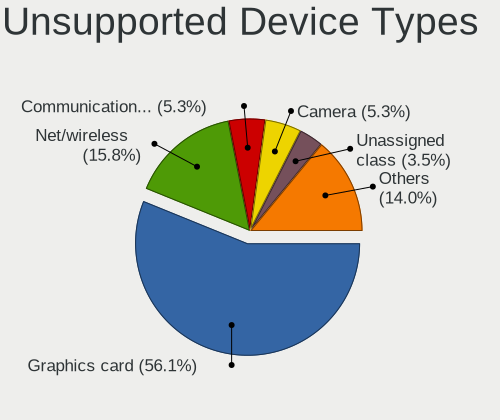

| Type                     | Desktops | Percent |
|--------------------------|----------|---------|
| Graphics card            | 11       | 45.83%  |
| Net/wireless             | 6        | 25%     |
| Unassigned class         | 1        | 4.17%   |
| Storage/ide              | 1        | 4.17%   |
| Sound                    | 1        | 4.17%   |
| Multimedia controller    | 1        | 4.17%   |
| Modem                    | 1        | 4.17%   |
| Communication controller | 1        | 4.17%   |
| Camera                   | 1        | 4.17%   |

